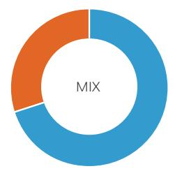
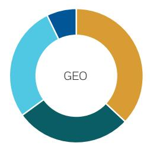
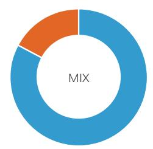
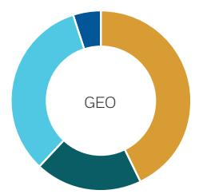
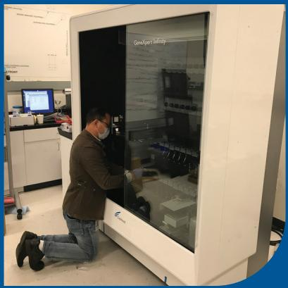
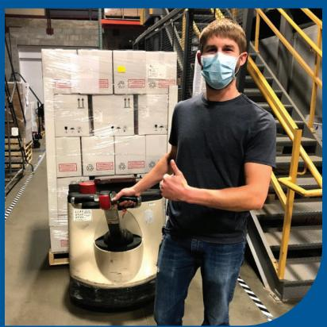
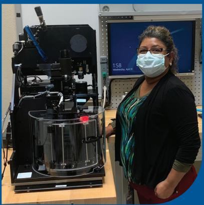
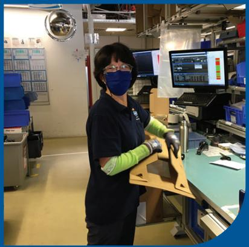

2020 20/20 ANNUAL REPORT

## FINANCIAL OPERATING HIGHLIGHTS

(dollars in millions except per share data and number of associates)

### Full Page Description (Page 2)

**Source:** `assets/_page_2_Asset_0.jpg`

**Generated:** 2026-05-23 21:23:37

---

The image is a pie chart divided into two sections, with the word "MIX" in the center. The chart is split into two colors: orange and blue. The orange section appears to occupy slightly more than half of the circle, while the blue section takes up the remaining portion. The chart does not provide specific numerical data or percentages for each section.

### Full Page Description (Page 2)

**Source:** `assets/_page_2_Asset_1.jpg`

**Generated:** 2026-05-23 21:23:45

---

The image is a pie chart with the word "GEO" in the center. The chart is divided into four segments, each with a different color: light blue, dark blue, yellow, and orange. The segments appear to represent different categories or proportions, but the specific values or labels for each segment are not provided. The chart is simple and uses a limited color palette.

## 20/20 Segment Revenues

## LIFE SCIENCES

> **AI Description:**
> **Source:** `assets/_page_2_Figure_1.jpg`
> 
> **Generated:** 2026-05-23 21:30:03
> 
> ---
> 
> The image is a pie chart with the word "MIX" in the center. The chart is divided into two sections: a smaller orange section and a larger blue section. The orange section appears to represent a smaller portion of the whole, while the blue section represents a larger portion. The chart is simple and does not contain any additional text or annotations beyond the word "MIX."

> **AI Description:**
> **Source:** `assets/_page_2_Figure_2.jpg`
> 
> **Generated:** 2026-05-23 21:28:15
> 
> ---
> 
> The image is a circular diagram divided into four segments, each in a different color: light blue, dark blue, yellow, and teal. The word "GEO" is prominently displayed in the center of the circle. The segments appear to represent different categories or components related to the term "GEO," but the specific details of what each segment represents are not provided within the image.

70% Recurring 30% Nonrecurring
37% North America 28% Western Europe 28% High-Growth Markets 7% Other Developed Markets

## DIAGNOSTICS

> **AI Description:**
> **Source:** `assets/_page_2_Figure_4.jpg`
> 
> **Generated:** 2026-05-23 21:31:47
> 
> ---
> 
> The image is a pie chart with the word "MIX" in the center. The chart is divided into two sections: a larger blue section and a smaller orange section. The blue section occupies the majority of the pie chart, while the orange section is a smaller portion. The chart does not provide specific numerical data or percentages, but it visually represents a division between two categories.

> **AI Description:**
> **Source:** `assets/_page_2_Figure_5.jpg`
> 
> **Generated:** 2026-05-23 21:33:04
> 
> ---
> 
> The image is a circular chart divided into four segments, each in a different color: light blue, dark blue, teal, and mustard yellow. The word "GEO" is prominently displayed in the center of the circle. The chart appears to represent a pie chart or a segmented circle, possibly illustrating a distribution or allocation of a total quantity or value across four categories.

83% Recurring 17% Nonrecurring
43% North America 19% Western Europe 33% High-Growth Markets 5% Other Developed Markets

## ENVIRONMENTAL&APPLIED SOLUTIONS

All pie charts represent total 2020 revenue.

> **AI Description:**
> **Source:** `assets/_page_3_Figure_0.jpg`
> 
> **Generated:** 2026-05-23 21:34:22
> 
> ---
> 
> The image is a professional portrait of a man in a suit with a blue background. He is smiling and has his arms crossed. The text at the bottom identifies him as "Rainer M. Blair, President and Chief Executive Officer." The image contains a clear photograph of the individual, along with textual information about his role.

## DEAR SHAREHOLDERS,

202O was a year that will undoubtedly be etched into our collective memory.The COVID-19 pandemic changed ourlives and businesses,suddenlyand substantially.We had to invent new ways to support each other and serve our customers, while safeguarding our associates' health and safety.

Fortunately,adaptability is deeply ingrained in our culture at Danaher and as Ilook back on 2O2O,lam most struck by ourassociates'resilience and dedication.Since the onset of the pandemic, our team has met the challenges presented and turned them into impactful opportunities to help our customers and the global community. Powered by the Danaher Business System (DBS)and unified by our Shared Purpose, Helping Realize Life's Potential, we have worked hard to navigate these unprecedented times from a position of strength.

## 2020 Results

Core revenue growth of 9.5% (including Cytiva).

· Gross profit margin of 56%.

· Adjusted diluted net earnings per share (EPS) growth of 43%.

Core operating profit margin expansion of 170 bps.

Free cash flow of \$5.4 billion, marking the 29th consecutive year in which our free cash flow has exceeded net income.

It is not lost on us that our financial performance in 202O was,in part, driven by our work to tackle a health crisis that has had a devastating impact on so many around the world.That said,we are proud of our ability to continue supporting customers across all our businesses and the global community in the fight against COVID-19.

While 2o2O was certainly a challenging year for our teams and businesses,itwas also a pivotal year for Danaher in our pursuit to become a better,stronger company.We closed the largest acquisition in our history-General Electric's Biopharma business, now known as Cytiva-which reinforces our leading position in bioprocessing.Our strong financial performance enabled us to accelerate growth initiatives across our businesses,which we believe contributed to share gains in many of our end-markets.And in the spirit of continuous improvement,we made significant progress toward our sustainability goals in 2020. Through all these efforts,we solidified our position as a global science and technology leader,and we are heading into 2O21as a stronger companywith an even brighter future.

lam pleased to share some of our more significant achievements in 2020.

## A Critical Role in the Fight Against COVID-19

Weare proud to support frontline healthcare providers with much-needed diagnostic testing capabilities, and to supportthe scientific community's accelerated pursuit of newvaccines and treatments forthe virus.

IDTwas an earlyleader in the diagnostic testing effort with their primer and probe kits,which provide a key detection component in COViD-19 diagnostic tests. Cepheid launched the first rapid molecular test for COVID-19 and a rapid 4-in-1test for COVID-19, Flu A,

Flu B,and RSVfrom a single patientsample.Beckman Coulter Diagnostics launched several new COVIDrelated antibodytests and an automated antigen test to help make higher-volume mass testing possible. As of March 1, 2021, our operating companies have collectively enabled or produced approximately100 million COVID-19-related diagnostic tests.

Cytiva and PallBiotech have contributed significantly to the development and production of COViD-19 vaccines and treatments around the world,helping to accelerate manufacturing on a massive scale under intense time pressure.As of March 1, 2021, we are involved in most vaccine and therapeutic projects underway globally,including all vaccines in the U.S. thathave received FDA Emergency Use Authorization orare inlate-stage clinical trials.Our teams'efforts will continue to directlyimpact the lives of billions of people around the world,as there is still much more work to be done to tackle this global health crisis.

## A Transformational Acquisition

Our acquisition of Cytiva is one of several,strategic portfolio moves we have made during the last few years that accelerated our evolution into a higher-growth,innovation-driven company.With the addition of Cytiva,we doubled our annual revenue in the highly attractive biopharmaceutical end-market, which now represents more than 5o% of our Life Sciences platform's annual revenue.With a more comprehensive offering across the entire bioproduction workflow,we are better able to support our customers who are working to deliver more life-improving drugs faster and ata lowercost一an endeavor made even more urgentbytoday's global health crisis.

The caliber oftalent at Cytiva is the business'greatest asset. This highly innovative, passionate team has been working to solve its customers' toughest biologics development and production challenges for over thirty years.In 202o, Cytiva achieved more than 25% core revenue growth and over \$4 billion in revenue.We could not be more pleased with Cytiva's early results and are excited about what we can achieve together over the nextthirtyyears and beyond.

## Investing for Growth

Our strong margin performance and cash flow generation in 202O enabled us to strengthen our competitive advantage through high-impact growth investments across Danaher.We expanded production capacity at Cepheid, Cytiva and Pallto support increasing demand for COVID-related testing and treatments,while paving the way for sustainable long-term growth.

Ongoing organic investments in research and development came to fruition in 202O with several breakthrough product launches across our portfolio. SCIEX's new750o System is the most sensitive Triple Quad mass spectrometer on the market, helping scientists detect and quantify analytes at previously undetectable levels.The Videojet128o Continuous Inkjet printerwas designed with simplicity and reliability in mind,providing customers witha high-quality printer that is easy to use and minimizes disruptive downtime.And Leica Biosystems'next-generation digital pathology scanner, the Aperio GT 450 DX, enables pathologists to evaluate tissue samples remotely without compromising quality or consistency-a crucial capability during the pandemic.

Inorganic investments are also a key component of our growth strategy.Aquatic Informatics-a leading water-focused software provider-joined our Water Quality platform in 202O, bringing data analytics solutions to improve customer workflow and cost efficiencies. Since 2o19,we have acquired ten

Environmental Impact Goals

By 2024, we pledge:

·15% reduction in energy consumed\* compared to 2019 levels

15% reduction in Scope1and 2 greenhouse gas (GHG) emissions\* compared to 2019 levels

15% reduction in the percentage of non-hazardous/non-regulated waste sent to landfills or incinerators compared to 2019 levels

\*Normalized to annual revenue from continuing operations businesses across all three of our segments,adding complementary products and technologies to help us solve our customers'toughestchallenges.Through both organic and inorganic growth investments,we continue to differentiate our offering and reinforce our market leadership,while enhancing our growth and earnings trajectory.

## Committed to Sustainability

Our pursuit of continuous improvement has always been at the heart of everything we do.We strive to be betterevery day,and the many challenges we faced in 2020 highlighted our overarching responsibility and opportunity to dojustthat across our three pillars of sustainability: The innovation that fuels advancements across scientific disciplines,the people at the heart of our teams and communities,and the environment that sustains us.

Ihave already shared how our teams have innovated to address some of the most pressing health and safety challenges of our time.lam incredibly proud of our fastand enterprising response to the COVID-19 crisis.Last year also highlighted the need for leadership and action,particularly around our efforts to foster a diverse and inclusive culture.In 2o20 we established two key diversity goals: to increase our representation ofwomen associates globallyto 40%, and Peopleof Color among U.S.associates to 35% by 2025.Our intention is to better reflect the communities in which we live,work,and serve our customers; and we believe that setting explicit goals provides the transparency and accountability necessary to drive meaningful change.

Across Danaher,we have long considered the environmental impact of our products and operations一and we continually seek to improve on this front.In 2o20,we established five-year reduction goals around our energy use,greenhouse gas emissions,and waste generation.To help operationalize these improvements,we have enhanced our DBS toolkit with energy management and waste reduction resources.These arejusta few examples of how our deep commitment to continuous improvement inspires actions that benefit the greater good,and we will continue to prioritize measurable progress across the many facets of sustainability.

## A Future Full of Potential

Reflecting on myfirstfew months as CEO,my appreciation for our exceptional team and portfolio has deepened as lhave had more opportunities toengage with our businesses and leaders.lam inspired by the considerable innovation happening across the organization,by the caliber and depth of our talent, and by our associates’ passion for their work and commitmentto continuous improvement.Itis clear the Danaher Business System is what drives us every day-it's ourultimate competitive advantage一and l see italive and well across the company.The powerful combination of these factors certainly contributed to making 2o2O an exceptional and transformative year for Danaher.

lam deeply honored and humbled thatthe Danaher Board of Directors asked me to lead ourteam into the future.lam also incredibly grateful for Tom Joyce's mentorship and friendship over the past decade of working together.His strategicvision and leadership as CEO created tremendous value for Danaher and our shareholders,and an incredible foundation for our next chapter.Across Danaher we will strive to keep building an even better,stronger company and to positively impact the world around us in meaningful ways.We see tremendous opportunities to do just that in 2o21and beyond,and lam excited about what lies ahead for Danaher.

Byinvesting in Danaher,you are investing in a future full of potential.Thankyou forbeing part of ourteam. We lookforward to rewarding your continued support in the years to come.

RAINERM.BLAIR

President and Chief Executive Officer

Our pursuit of continuous improvement has always been at the heart of everything we do at Danaher. We will strive to keep building an even better， stronger company and to positively impact the world around us in meaningful ways."

> **AI Description:**
> **Source:** `assets/_page_9_Figure_0.jpg`
> 
> **Generated:** 2026-05-23 21:27:27
> 
> ---
> 
> The image contains a photograph of a person wearing a full-body protective suit and gloves, working on a piece of machinery. The individual appears to be engaged in a precise task, possibly involving assembly or maintenance of the equipment. The setting suggests a controlled environment, likely a laboratory or manufacturing facility, emphasizing safety and precision in the work being performed.

> **AI Description:**
> **Source:** `assets/_page_9_Figure_1.jpg`
> 
> **Generated:** 2026-05-23 21:27:22
> 
> ---
> 
> The image contains a photograph of two individuals working in what appears to be a manufacturing or industrial setting. One person is operating a machine with a control panel, while the other is observing or assisting. Both are wearing face masks, suggesting a focus on safety or health protocols. The environment includes industrial equipment and large windows, indicating a well-lit workspace. The presence of the control panel and the individuals' focused actions suggest a technical or operational task is being performed.

> **AI Description:**
> **Source:** `assets/_page_9_Figure_2.jpg`
> 
> **Generated:** 2026-05-23 21:27:34
> 
> ---
> 
> The image shows a laboratory setting with a person kneeling in front of a large, white, automated laboratory machine labeled "GeneXpert Infinity." The machine has a glass door and appears to be used for processing samples, possibly for genetic testing. The person is wearing a face mask and gloves, indicating adherence to laboratory safety protocols. The background includes laboratory equipment and a computer monitor, suggesting a research or diagnostic environment.

> **AI Description:**
> **Source:** `assets/_page_9_Figure_3.jpg`
> 
> **Generated:** 2026-05-23 21:27:40
> 
> ---
> 
> The image contains a photograph of two individuals in what appears to be a laboratory or medical setting. The person in the foreground is holding a stack of colorful binders and is wearing a face mask. The person in the background is also wearing a face mask and appears to be holding some documents or a folder. The setting includes a window with a metal grid, suggesting a controlled environment. The overall scene suggests a professional or healthcare-related context.

> **AI Description:**
> **Source:** `assets/_page_9_Figure_4.jpg`
> 
> **Generated:** 2026-05-23 21:28:03
> 
> ---
> 
> The image is a photograph showing a group of people in what appears to be a manufacturing or warehouse environment. They are wearing protective face coverings and some are wearing sports team jerseys. The individuals are standing in a semi-circle, possibly engaged in a discussion or briefing. The setting includes industrial shelving and equipment in the background, indicating a work environment. The people are wearing lanyards, suggesting they might be employees or participants in a training session.

> **AI Description:**
> **Source:** `assets/_page_9_Figure_5.jpg`
> 
> **Generated:** 2026-05-23 21:28:10
> 
> ---
> 
> The image is a photograph showing three individuals in a blood donation setting. Two individuals are seated in donation chairs, wearing masks, and appear to be donating blood. The third individual, standing to the right, is wearing scrubs and a mask, possibly a medical professional assisting with the process. The setting appears to be a mobile blood donation unit, with medical equipment and informational signs visible in the background.

> **AI Description:**
> **Source:** `assets/_page_9_Figure_6.jpg`
> 
> **Generated:** 2026-05-23 21:27:57
> 
> ---
> 
> The image contains a photograph of a person standing in what appears to be a warehouse or storage area. The individual is wearing a face mask and giving a thumbs-up gesture. Behind them, there is a pallet truck with a stack of boxes labeled with American flag stickers, suggesting the boxes might be related to a patriotic or American-themed product or shipment. The setting includes industrial elements such as metal stairs and shelving units, indicating a work environment.

> **AI Description:**
> **Source:** `assets/_page_9_Figure_7.jpg`
> 
> **Generated:** 2026-05-23 21:27:47
> 
> ---
> 
> The image contains a photograph of a person standing next to a large, industrial machine. The machine appears to be some kind of processing or testing equipment, possibly used in a laboratory or manufacturing setting. The person is wearing a face mask and a dark cardigan over a patterned top. The background includes a digital display showing the time as 1:58 and the date as Wednesday, April 8. The setting suggests a technical or scientific environment.

> **AI Description:**
> **Source:** `assets/_page_9_Figure_8.jpg`
> 
> **Generated:** 2026-05-23 21:25:36
> 
> ---
> 
> The image contains a photograph of two individuals in a factory setting. Both are wearing blue shirts, white pants, and protective eyewear. One person is wearing a face mask. The background shows industrial equipment, monitors, and various signs and posters, indicating a manufacturing or production environment. The individuals appear to be engaged in a conversation or interaction.

> **AI Description:**
> **Source:** `assets/_page_9_Figure_9.jpg`
> 
> **Generated:** 2026-05-23 21:25:43
> 
> ---
> 
> The image is a photograph of a person in a factory or workshop setting. The individual is wearing a dark blue shirt, green gloves, and a blue face mask. They are holding a wooden or plastic part, possibly a component of a machine or assembly. The background shows various equipment, shelves with boxes, and computer monitors displaying some kind of software interface. The environment suggests a manufacturing or assembly line setting.

> **AI Description:**
> **Source:** `assets/_page_9_Figure_10.jpg`
> 
> **Generated:** 2026-05-23 21:25:20
> 
> ---
> 
> The image contains a photograph of a person in a laboratory setting. The individual is wearing a white lab coat, blue gloves, a face mask, and safety goggles. They are standing in front of a computer monitor and various laboratory equipment, including shelves with containers and a desk with a keyboard and other items. The person is waving with their right hand. The setting suggests a scientific or medical research environment.

> **AI Description:**
> **Source:** `assets/_page_9_Figure_11.jpg`
> 
> **Generated:** 2026-05-23 21:25:29
> 
> ---
> 
> The image contains a photograph of a person in a warehouse setting. The individual is wearing a blue and yellow shirt with a logo and text on it, and a face mask. They are holding a device, possibly a handheld vacuum or similar tool. The background shows shelves with boxes and labels, including codes like "LPV415," "ZLKO60," and "LXG400." The setting appears to be a storage or distribution area.

## THANK YOU

This year has been unprecedented in so many ways. But despite the many challenges we all encountered as a result ofthe COVID-19 pandemic,ourteam faced those challenges head-on and turned them into impactful opportunities to help the global community. Thank you to all of our associates around the world foreverything you do in support of our customers,our shareholders and one another.Together,we are Helping Realize Life's Potential.

> **AI Description:**
> **Source:** `assets/_page_11_Figure_0.jpg`
> 
> **Generated:** 2026-05-23 21:29:56
> 
> ---
> 
> The image is a photograph of a person in a laboratory setting. The individual is wearing a white lab coat, blue surgical cap, a face mask, and blue gloves. They are holding a test tube with a red liquid and appear to be examining it closely. The background shows laboratory equipment and supplies, including a microscope and various test tubes. The setting suggests a scientific or medical research environment.

## LIFE SCIENCES

Every day,scientists around the world are working to understand the causes of disease, develop new therapies and vaccines,and test new drugs. Our Life Sciences businesses make this leading-edge scientific research possible. Our capabilities extend beyond research to power the creation of biopharmaceuticals,cell and gene therapies and more to advance patient health and improve treatment outcomes.

> **AI Description:**
> **Source:** `assets/_page_13_Figure_0.jpg`
> 
> **Generated:** 2026-05-23 21:25:11
> 
> ---
> 
> The image contains a photograph of a healthcare professional wearing full protective gear, including a white protective suit, a yellow face shield, a face mask, and blue gloves. The individual appears to be interacting with another person, though only a portion of the second person's head is visible. The protective gear suggests a setting where infection control is a priority, such as during a pandemic or in a high-risk medical environment. The image emphasizes the importance of personal protective equipment (PPE) in healthcare settings.

## DIAGNOSTICS

Our Diagnostics businesses provide clinicalinstrumentation, test consumables and software to healthcare professionals in orderto safeguard patient health andimprove diagnostic confidence wherever health care happens-from local clinics and family physician's offices to leading trauma,cancer and critical care centers.Our instrumentation,data access Solutions and management systems improve efficiency and automate workflows in laboratories,helping healthcare professionals provide better patient care.

RADIOMETER ?

Mammotome

> **AI Description:**
> **Source:** `assets/_page_15_Figure_0.jpg`
> 
> **Generated:** 2026-05-23 21:23:30
> 
> ---
> 
> The image is a photograph of a person outdoors, likely on a hike or a similar activity. The individual is wearing a blue t-shirt, shorts, a cap, and a backpack, indicating they are prepared for an outdoor excursion. They are holding a blue water bottle to their mouth, suggesting they are drinking water. The background shows a natural landscape with greenery and a clear blue sky, emphasizing the outdoor setting. The person also has a wristwatch on their left wrist, which appears to have a digital display. The overall scene conveys a sense of refreshment and readiness for physical activity in a natural environment.

## ENVIRONMENTAL&APPLIED SOLUTIONS WATER QUALITY

As theworld's population increases,so too does the demand for our most precious resource: water. Our Water Quality businesses help protectthe global water supply and ensure environmental stewardship. We deliver precision instrumentation,advanced purification technology,software and treatmentsolutions to help analyze,disinfectand manage the world's water across environmental,municipal,commercial and industrial applications.

> **AI Description:**
> **Source:** `assets/_page_17_Figure_0.jpg`
> 
> **Generated:** 2026-05-23 21:31:43
> 
> ---
> 
> The image is a photograph showing two individuals in a grocery store. The person on the left is examining a can, while the person on the right is looking at a shopping cart filled with groceries, including bread and tomatoes. Both individuals are wearing face masks. The background shows shelves stocked with various products, indicating a typical grocery store setting.

> **AI Description:**
> **Source:** `assets/_page_18_Figure_0.jpg`
> 
> **Generated:** 2026-05-23 21:27:15
> 
> ---
> 
> The image shows a close-up of a person wearing a plaid shirt over a white t-shirt, with a shopping basket in the foreground. The background appears to be a store or market setting, with blurred shelves and lighting. The image is partially obscured by a blue diagonal graphic element on the right side.

# ENVIRONMENTAL&APPLIED SOLUTIONS PRODUCT IDENTIFICATION

Every day,we trust packaging to ensure freshness,consistency and authenticity of products around theworld.Our Product ldentification businesses provide color management,packaging design and marking and coding technologies used to help protectthe world's food supply,secure pharmaceutical packaging and track consumergoods.This is complemented by our comprehensive digital tools and software solutions that help our customers bring more products to marketfaster.

VIDEOJET.

ESKO\*

PANTONE?

x-rite

@ Laetus

LiN X

## FORM10K

# UNITED STATES SECURITIES AND EXCHANGE COMMISSION Washington, D.C. 20549

# FORM 10-K

(Mark One)

区ANNUAL REPORT PURSUANT TO SECTION 13 OR 15(d) OF THE SECURITIES EXCHANGE ACT OF 1934

For the fiscal year ended December 31,2020

OR

]TRANSITION REPORT PURSUANT TO SECTION 13 OR 15(d) OF THE SECURITIES EXCHANGE ACT OF1934

For the transition period from to

Commission File Number: 001-08089

(Exact name of registrant as specified in its charter)

Delaware (State of Incorporation)

59-1995548 (I.R.S.Employer Identification Number)

2200 Pennsylvania Avenue, N.W., Suite 800W

20037-1701

(Zip Code)

Registrant's telephone number, including area code: 202-828-0850

Securities Registered Pursuant to Section 12(b) of the Act:

Securities registered pursuant to Section 12(g) of the Act: NONE (Title of Class)

Indicate by check mark ifthe registrant is a well-known seasoned issuer,as defined inRule 405ofthe Securities Act.

Yes 区No

Indicate by check mark if theregistrant is notrequired to file reports pursuantto Section 13or Section15(d)of the Act.

YesNo区

Indicate bycheck mark whether the Registrant(1)has filedallreports requiredtobe filedby Section13or15(d)of the Securities Exchange Actof 1934 during the preceding12 months (or forsuch shorterperiod thatthe Registrant was requiredto file such reports)and (2) has been subject to such filing requirements for the past 90 days.Yes 区No

Indicate bycheck mark whethertheregistranthassubmitedelectronicalyevery InteractiveDataFilerequired tobesubmited pursuant to Rule 405ofRegulation S-Tduring the preceding 12 months (or forsuch shorter period that theregistrant was required to submit such files).Yes 区No

Indicate bycheckmarkwhethertheregistrantisalargeaceleratedfiler,anaceleratedfiler,anon-aceleratedfier,smaller reporting company,oranemerging growth company.See the definitions of“large accelerated filer,”“accelerated filer,” “smaller reporting company” and “emerging growth company" in Rule 12b-2 of the Exchange Act.

Large Accelerated Filer 区

Accelerated Filer

Non-accelerated Filer

Smaller Reporting company

Emerging Growth Company

If an emerging growthcompany,indicate bycheck mark if theregistrant has elected not to use the extended transition period for complying with any new orrevised financial accounting standards provided pursuant to Section 13(a)of the Exchange Act.□

Indicate by check mark whether the registranthas fileda report onand attstation to its management's assessmentof the effectiveness of its internal control over financial reporting under Section 404(b)of the Sarbanes-Oxley Act (15 U.S.C. 7262(b)) by the registered public accounting firm that prepared or issued its audit report.区

Indicate by check mark whether the registrant is a shellcompany (as defined in Rule 12b-2 of the Exchange Act).

YesNo区

As ofFebruary 5,2021,the numberofshares of Registrant's common stock outstanding was 712,204,198.The aggregate market value ofcommon stock held by non-afiliates of theRegistrantonJuly3,2020 was \$113.2 billon,basedupon he closing price of the Registrant’s common stock as quoted on the New York Stock Exchange on such date.

## DOCUMENTSINCORPORATEDBYREFERENCE

Part Il incorporates certain informationbyreference fromtheRegistrant's proxystatement for its 202l annual meeting of shareholders tobe filed pursuantoRegulation14A within120daysafterRegistrant'sfiscal year-end.Withtheexceptionof the sections ofthe2021Proxy Statement specifically incorporated hereinbyreference,the2021ProxyStatementisnotdeemed to be filed as part of this Form 10-K.

In this Annual Report,the terms “Danaher”orthe“Company”refer to Danaher Corporation,Danaher Corporation and its consolidatedsubsidiariesor theconsolidated subsidiaries ofDanaher Corporation,asthecontextrequires.Unlessotherwise indicated, all financial data in this Annual Report refer to continuing operations only.

## INFORMATIONRELATING TO FORWARD-LOOKINGSTATEMENTS

Certainstatements includedorincorporatedbyreference inthis Annual Report,inotherdocuments wefile withorfurnishto the SecuritiesandExchange Commission("SEC"),inour pressreleases,webcasts,conferencecals,materialsdeliverdto shareholders and othercommunications,are“forward-looking statements”within the meaning of the U.S.federal securities laws.Allstatementsother than historicalfactualinformationare frward-looking statements,including withoutlimitation statements regarding: projections ofrevenue,expenses,profit,profitmargins,ricing,taxates,taxprovisions,ash flows, pension and benefit obligations and funding requirements,our liquidity position or other projectedfinancial measures; management’s plans andstrategies for futureoperations,including statements relating to anticipated operating performance, costreductions,estructuringactivities,new product andservicedevelopments,competivestrengths ormarketposition, acquisitionsdttegatiotereof,desiusspofs,pltosootrdstrbutios,trategicopporitii offerings,stockrepurchases,dividendsandexecutivecompensation;growth,decinesandothertrendsinmarketsweselinto; new or modified laws,regulations and accounting pronouncements; future regulatory approvals and the timing and conditionalitythereof,outstandingclaims,legalproceedings,taxauditsandassssmentsandothercontingent liabilities; future foreign currncy exchange rates and fluctuations in those rates; the potential or anticipated direct or indirect impact of COVID-19onourbusiness,resultsofoperationsand/orfinancial condition; general economicandcapital markets conditions; theanticipated timing ofanyofthe foregoing; assumptions underlying anyof the foregoing;and any other statements that address events or developments that Danaher intends or believes willor may occur in the future.Terminology such as "believe”"anticipate,”“should,”"could”"intend”"wil”"plan”"expect”"estimate,”"project”"target”“may,”"posble,” “potential”“forecast"and“positioned”and similar references to future periodsare intended to identify forward-looking statements,althoughotallforward-lookingstatementsareaccompaniedbysuch words.Forward-lookingstatementsarebased on assumptions and assessments made byour management in lightoftheir experience and perceptions ofhistorical trends, current conditions,expected futuredevelopments and other factors they believe tobeappropriate.These forward-looking statementsare subject toanumberofrisksanduncertainties,including butnotlimited totherisksanduncertaintiessetforth below and under“Item 1A. Risk Factors” in this Annual Report.

Forward-looking statements are not guarantees offuture performance and actual results may differ materiall fromthe results, developments andbusinessdecisions contemplated byour forward-looking statements.Acordingly,youshould not place undue reliance onanysuch forward-looking statements.Forward-looking statements speak onlyasof thedateof the eport, document,pressrelease,webcast,call,materials orother communicationin whichtheyare made.Exceptto the extentequired by aplicable law,wedonot assmeanyobligationtoupdate orrevise any forward-lookingstatement, whetheras aresultof new information, future events and developments or otherwise.

Investment inour securities involves riskand uncertaintyand you should carefullyconsiderall informationin this Annual ReportonForm10-K priorto making an investment decision regarding our securities.Below isasummaryof materialrisks and uncertainties we face,which are discussed more fully in “Item 1A.Risk Factors":

## Business and Strategic Risks

The COVID-19 pandemic has adversely impacted,and continues to pose risks to,certain elements of our business and our financial statements,the nature and extent of which are highly uncertain and unpredictable.

Conditions in the global economy,the particular markets we serve and the financial markets can adversely afect our business and financial statements.

We face intense competition and if we are unable to compete efectively, we may experience decreased demand and decreased market share. Even if we compete efectively, we may be required to reduce the prices we charge.

Our growth depends in part on the timely development and commercialization,and customer acceptance,of new and enhanced products and services based on technological innovation. Our growth can also suffer if the markets into which we sell our products and services decline,do not grow as anticipated or experience cyclicality.

The health care industry and related industries that we serve have undergone,and are in the process ofundergoing, significant changes inan efforttoreduce (and increase the predictabilityof)costs,which can adverselyaffect our business and financial statements.

International conomic,political,legal,compliance,social and businessfactors (including without limitation the impactof the United Kingdom's departure from the European Union)can negatively afect our business and financial statements.

Collborative partners and other third-parties we rely on for development, supply and marketing of certain products, potential products and technologies could fail to perform sufficiently.

## Acquisitions, Divestitures and Investment Risks

Any inability to consummate acquisitions at our historical rate and at appropriate prices,and to make appropriate investments that support our long-term strategy,could negatively impact our growth rateand stock price. In addition, our acquisition of businesses,investments,jointventures and other strategic relationships could negatively impactour business and financial statements and our indemnification rights may not fully protect us from liabilities we may incur related to such transactions.

Divestitures or other dispositions could negatively impact our busines,and contingent liabilities from businesses that we or our predecessors have disposed could adversely afect our business and financial statements.For example,we couldincur significant liabilityifanyofthe split-offorspin-off transactions we have consummated isdetermined tobe ataxable transaction or otherwise pursuant to our indemnification obligations with respect to such transactions.

## Operational Risks

Significant disruptions in,or breaches in securityof,our information technology systems or data; other losses or disruptions due to catastrophe; and labor disputes can all adversely afect our business and financial statements.

Defects and unanticipated use or inadequate disclosure with respect to our products or services,or allegations thereof, can adversely affect our business and financial statements.

If we encounter problems manufacturing products,fail to adjust our manufacturing capacity or related purchases to reflect changing conditions,or sufer disruptions due to sole or limited sources ofsupply,ourbusiness and financial statements may sufer.Adverse changes with respect to key distributors and other channel partners can also adversely affect our business and financial statements.

Our restructuring actions can have long-term adverse effects on our business and financial statements.

## Intellectual Property Risks

Any inability toadequately protect oravoidthird party infringement ofour intellctual property,andthird partyclaims that we are infringing their intellectual propertyrights,can adverselyafect our business and financial statements.

## Financial and Tax Risks

Our outstanding debt has increased significantly as aresult ofthe acquisition ofCytiva,and we may incur additional debt in the future. Our existing and future indebtedness may limit our operations and our use of our cash flow and negatively impact our credit ratings; and any failure to comply with the covenants that apply toour indebtednes could adversely affect our business and financial statements.

Our business and financial statements can be adversely affcted by foreign curency exchange rates, changes inour tax rates (including as aresult ofchanges in tax laws)or income tax liabilities/assessments,the outcome of tax audits, financial market risks related toour defined benefit pension plans,ecognition ofimpairment charges forour goodwill or other intangible assets,and fluctuations in the cost and availability of commodities.

## Legal, Regulatory, Compliance and Reputational Risks

Ourbusinesses are subjectto extensive regulation (including without limitation regulations applicable to the healthcare industry).Failure tocomply with those regulations (including without limitation byour employees,agents or business partners)or significant developments or changes in U.S.laws or policies can adversely affect our business and financial statements. Changes in governmental regulations can also reduce demand for our products or services or increase our expenses.

With respect to the regulated medical devices we offer,certain modifications to such products may require new 510(k) clearances or other marketing authorizations and may require us to recallor cease marketing such products; off-label marketing of such products could result in substantial penalties; and clinicaltrials we conduct with respect to such

products or potential products may have results that are unexpected or are perceived unfavorably by the market,all of which could adversely affect our business and financial statements.

We are subject toor otherwise responsible for a variety oflitigation and other legal and regulatory proceedings in the course of our business that can adversely affect our business and financial statements.

Our operations,productsand services exposeus to the risk ofenvironmental, healthand safetyliabilities,costs and violations that could adversely affect our business and financial statements.

## PARTI

## ITEM1.BUSINESS

## General

Danaher is aglobal science and technology innovator commited to helping its customers solve complex challenges and improvingqualityoflife aroundthe world.Danaher is comprisedof more than 2Ooperating companies with leadership positions inthelifesiences,diagnostis,evironmentalandapledsctors,organzedunderthreesegments (LifeSience; Diagnostics; and Environmental & Applied Solutions). United by the DANAHER BUSINESS SYSTEM("DBS"), our businessesarealso typicallycharacterizedbyahigh levelofproductsandservices thataresoldonarecurringbasis,rimarily through a direct sales model and to a geographicaly diverse customer base. Our business' research and development, manufacturing,sales,distribution,service and administrative facilities are located in more than 6O countries.

Danaher strives to create shareholder value primarily through three strategic priorities:

strengthening our competitive advantage through consistent application of the DBS tools;

enhancing our portfolio in attractive science and technology markets through strategic capital allcation; and

consistently attracting and retaining exceptional talent.

Danaher measures its progressagainst these strategic prioritiesover thelong-termbased primarilyonfinancial metricsrelating torevenuegrowth,profitability,cashflowandcapitalreturs,aswellascertain non-fancialmetrics.Tofurther hestrategic objectives set forth above,the Companyalso acquires businesses and makes investments that either complementits existing business portfolioorexpanditsportfolio into newandatractive markets.Given therapid paceof technological development andthe specialized expertise typicalofDanaher'sserved markets,acquisitions,strategic aliancesand investmentsprovidethe Company acces to important new technologies and domain expertise.Danaher believes there are many acquisition and investmentopportunitiesavailable within its targeted markets.Theextent towhichwe identify,consummateand ffectively integrate appropriate acquisitions andconsummate appropriate investments afects our overallgrowth and operating results. Danaheralsocontinuallyassesses the strategicfitofits existing businesses andmaydisposeofbusinesses thatare deemed not to fit with its strategic plan.

DBS is notonlythe setofbusinessprocesses and tols our operating companies use onadaily basis,but is more broadly our culture.As reflected in our logo,DBS features five fundamental core values:

1．The Best Team Wins

2．Customers Talk,We Listen

3.Kaizen is our Way of Life

4．Innovation Defines our Future

5．We Compete for Shareholders

### Full Page Description (Page 25)

**Source:** `assets/_page_25_Asset_0.jpg`

**Generated:** 2026-05-23 21:28:32

---

The image is a diagram that combines text with visual elements. It is a circular chart with three main sections: People, Process, and Performance. The People section includes "The Best Team Wins" and "Customers Talk, We Listen." The Process section contains "Plan," "Quality," "Delivery," "Cost," and "Innovation." The Performance section states "We Compete for Shareholders." At the top of the diagram, it says "Innovation Defines Our Future." At the bottom, it reads "Our Shared Purpose: Helping Realize Life's Potential." The diagram emphasizes the importance of teamwork, customer focus, process improvement, and innovation in achieving organizational goals.

Underpinned bythese five fundamentalcore valuesas wellasourSharedPurpose-Helping Realize Life'sPotential,the DBS tools are organized into three pillas thatare designed toaply to everyaspectofourbusines: Growth,LeanandLeadership.

The idea for Danaher originated in the early 1980's when the Company's founders,Steven M.and MitchellP.Rales, envisionedabusinessthat would generate sustainable long-term value forcustomers,employees and shareholders.Througha seriesofacquisitionsanddivestitures,Danaherhasevolvedovertimefromamore industrial-orientedcompanyintothe science andtechnology innovatoritis today.While theoperatingcompanies thatmakeupDanaherhavechanged,DBScontinues tobe the guiding philosophy for the Company.

Sales in 2O20 by geographic destination (geographic destination refers to the geographic area where the finalsale to the Company'sunafiliatedcustomer is made)asa percentage oftotal 2020 sales were: North America,40%(including 39%in the United States); Western Europe,24%; other developed markets,6%; and high-growth markets,30%.TheCompanydefines high-growth marketsas developingmarketsofte world experiencing extended periodsofaccelerated growth ingrossdomestic product and infrastructure which include EasternEurope,the MiddleEast,Africa,LatinAmericaand Asia(with theexception ofJapan,AustraliaandNew Zealand).The Companydefines developed marketsas allmarketsof theworldthat are not highgrowth markets.

## LIFESCIENCES

The Company's Life Sciences segment ofers a broad range ofinstruments and consumables that are primarily used by customers tostudythebasicbuildingblocksoflife,includinggenes,proteis,metabolitesandcels,inordertounderstand the causes of disease,identify newtherapies,and testand manufacture new drugs and vaccnes.Sales in 2O2 forthissegmentby geographic destination(asapercentage oftotal 2020sales)were: NorthAmerica,37%; Western Europe,28%; otherdeveloped markets,7%; and high-growth markets, 28%.

Danaher established the life sciences businessin2O05through the acquisition ofLeica Microsystems and has expanded the businessthrough numerous subsequent acquisitions,including theacquisitions of AB Sciex and Molecular Devices in 2010, Beckman Coulterin2011,Pal in 2015,Phenomenex in2016,IDT in2018andCytiva in2020.On March31,2020,the Company acquired the Biopharma business ofGeneral Electric Company's ("GE") Life Sciences division,now known as Cytiva,for acash purchase priceofapproximately\$20.7billon (netofapproximately\$0.1billonofacquiredcash)and the aumption ofapproximately \$0.4 bilion ofpension liabilities (the“Cytiva Acquisition"). Cytivais aleading providerof instruments,consumables and software that support the research,discovery,process development and manufacturing workflows ofbiopharmaceutical drugs.Cytivais included inthe Company'sLife Sciencessegment results begining in the second quarter of 2O20.The acquisition has provided and is expected to provide additional sales and earnings growth opportunities for the Company's Life Sciences segment byexpanding thebusinessgeographic and product line diversity, including new product and service oferings that complement the Company’s current biologics workflow solutions.As a condition to obtaining certain regulatory approvals forthe closing of the transaction,the Company was required to divest certainofits existing product lines in theLife Sciences segment thatinthe aggegate generatedrevenuesofapproximately\$170 million in 2019.

The Life Sciences segment consists of the following businesses:

Bioprocess—The bioprocess business is a leading provider oftechnologies,consumablesand services thatadvance and accelerate thedevelopmentandmanufactureofvacines,biologicdrugs,andnovelcelland genetherapies.Thebusiessoffers solutions thatsupportitscustomersacross thepharmaceuticalandbiopharmaceutical valuechain,fromtheearlieststagesof drugdiscoveryandresearch,toproductand process development,clinical rials,therapy manufacturingandclinicaluse.The business workflowsolutions include process chromatography instrumentsandconsumables,cellculture media,single-use technologies, development instrumentation, lab filtration, and genomics consumables.

Filtration—Thefiltration,separationandpurification technologies businessisaleadingproviderofproducts used toremove solid,liquidandgaseouscontaminantfromavarietyofliquidsandgase,pimarilytroughthesaleoffiltrationconsmables and toaleser extent systems thatincorporatefiltrationconsumables and asociated hardware.The business’core materials and technologies canbeapplied in many ways tosolvecomplex fluidseparationchallenges,andaresoldacrosawidearrayof applications in two primary business groups:

Life Sciences.The business’life sciences technologies facilitate the process of drug discovery,development, regulatory validation and production and are sold to biopharmaceutical,food and beverage and medical customers.In the biopharmaceutical area, the business sels a broad line of filtration and purification technologies,single use bioreactors and associated accessories,hardware and engineered systems primarily to pharmaceutical and biopharmaceutical companies for use in the development and commercialization of chemically synthesized and biologically derived drugs,plasma and vaccines.Biotechnology drugs,plasma and biologically derived vaccines in particular are filtrationand purification intensiveand representa significant opportunity for growth for the business in the biopharmaceutical area.The business also serves the filtration needs of the food and beverage markets,helping customers ensure the quality and safety of their products while lowering operating costs and minimizing waste. In the medicalarea,hospitals use the Company's breathing circuit and intravenous filters and waterflters tohelpcontrol the spread of infections.

Industrial.Virtualyall of theraw materials,processfluids and waste streams that are found in industryarecandidates for multiple stages offiltration,separation and purification. Inaddition, most of the machines used incomplex production processes requirefltration to protect sensitive parts from degradation due to contamination.The business' technologies enhance the quality and eficiencyof manufacturing processes and prolong equipment life in applications such as semiconductorequipment,airplanes,oilrefineries,power generation turbines,petrochemical plants,municipal water plants and mobile mining equipment.Within these segments,demand is driven by end-users and original equipment manufacturers ("OEM") seeking to improve product performance,increase production and efficiency, reduce operating costs, extend the life of their equipment, conserve water and meet environmental regulations.

Celular Analysis,LabAutomationandCentrifugation—Thebusinessoffers workflow instrumentsandconsumables thathelp researchers analyze genomic,protein and cellular information.Keyproduct areas include sample preparation equipment such as centrifugationandcapilary electrophoresis instrumentation and consumables; iquid handlingautomation instruments and asociated consumables;flowcytometry instrumentationandassociatedantibodiesandreagents; andparticlecharacterization instrumentation.Researchers use these products to study biological function inthepursuit ofbasic research,as welas therapeutic and diagnostic development.Typical users include pharmaceuticaland biotechnologycompanies,universities, medical schools and research institutions and in some cases industrial manufacturers.

Mas Spectrometry—Themass spectrometry businessisa leading global providerof high-end masspectrometers as wellas relatedconsumable chromatographycolumnsandsample preparation extraction products.Mass spectrometry is atechnique for identifying,analyzing and quantifying elements,chemical compounds andbiological molecules,individualyorincomplex mixtures.The mass spectrometers utilize various combinations ofquadrupole,time-of-flight and iontrap technologies.The business'mass spectrometersystems andrelated products areused in numerous applicationssuchasdrug discoveryand clinical developmentoftherapeutics as wellas inbasicresearch,clinical testing,foodandbeveragequalitytesting and environmental testing.The businessglobal services network provides implementation,validation,trainingand maintenance to support customer instalations around the world.Typical users of these mass spectrometry and related products include molecular biologists,bioanalytical chemists,toxicologists and forensic scientists as well as qualityassrance and qualitycontrol technicians.The businessalso provides high-performance bioanalytical measurementsystems,including microplate eaders, automated celularscreening products and assciated reagents and imaging software.Typical users of these products include biologists and chemists engaged inresearchanddrugdiscovery,whouse theseproducts todetermineelectrical orchemical activity in cell samples.

Microscopy—The microscopy business is a leading global provider of professional microscopes designed to capture, manipulate and preserve images and enhance the user's visualization andanalysis of microscopic structures.The Company's microscopy products include laserscaning (confocal) microscopes,compound microscopes and related equipment,surgical and other stereo microscopes and specimen preparation products for electron microscopy.Typical users of these products includeresearch,medicalandsurgical professionalsoperating inresearchandpathologylaboratories,academicsetings and surgical theaters.

Genomics Consumables—The genomics consumables businessis aleading provider ofcustom nucleic acid products forth life sciences industry,primarily through the manufacture ofcustom DNA andRNA oligonucleotides and gene fragments utilizing a proprietary manufacturing ecosystem.The business has developed proprietary technologies for genomicsapplications such as next geerationsequencing,CRISPR genome editing,qPCR,and RNA interference.The business also manufactures products usedin diagnostic tests formanyformsofcancer,as wellasinheritedand infectious diseases.Typicalusersofthese products include profesionals intheareasofacademicandcommercialresearch,agriculture,medicaldagnostics,ndparmaceutical development.

Customers served by theLife Sciences segment select products based ona numberoffactors,including product qualityand reliability,theproductsapacitythanceproductivitynovation (particularlyproductivityandsensitivityimproemets), product performance and ergonomics,access to aservice and support network and the other factors described under“ Competition.”The businesses in Danaher's Life Sciences segment market their products and services under key brands including BECKMAN COULTER, CYTIVA, IDT,LEICA MICROSYSTEMS,MOLECULAR DEVICES, PALL, PHENOMENEXand SCIEX.Manufacturing facilities are located inNorth America,Europe,Asia and New Zealand.The business sells to customers through direct sales personnel and independent distributors.

## DIAGNOSTICS

The Company's Diagnosticssegment ofers analyticalinstruments,eagents,consumables,softwareandservices that hospitals, physicians’ofices,reference laboratoriesandothercriticalcare setingsusetodiagnosediseaseandmaketreatmentdecisions. Sales in 2020for this segment by geographic destination (as a percentage oftotal 2020 sales) were: North America, 43%; Western Europe,19%; other developed markets, 5%;and high-growth markets,33%.

Danaher established the diagnosticsbusiness in 204 throughtheacquisitionofRadiometerand expandedthe businessthrough numerous subsequent acquisitions,including theacquisitions of Vision Systems in2Oo6,Beckman Coulter in201,Iris International and Aperio Technologies in 2012,HemoCue in 2013,Devicor MedicalProducts in 2014,the clinical microbiology businessof Siemens HealthcareDiagnostics in2015and Cepheid in 2016.TheDiagnostics segmentconsists of the following businesses:

Core Lab Diagnostics-Thecore lab business is aleading manufacturer and marketer of biomedical testing instruments, systems and related consumables that are used to evaluate and analyze samples made up ofbody fluids,cels and other substances.The information generated is used to diagnose disease,monitor and guide treatment and therapy,assist in managing chronic diseaseandassess patient status inhospital,outpatientand physicians’officesettings.The businessffrs the following products.

Chemistry systems use electrochemical detection and chemical reactions with patient samples to detect and quantify substances of diagnostic interestin blood,urine and other body fluids. Commonly performed tests include glucose, cholesterol,triglycerides,electrolytes,proteinsand enzymes,as wellas tests to detect urinarytract infections and kidney and bladder disease.

Immunoassay systems also detect and quantify biochemicals of diagnostic interest (such as proteins and hormones) in body fluids,particularly in circumstances where more specialized diagnosis is required. Commonly performed immunoassay tests assess thyroid function,screen and monitor for cancer and cardiac risk and provide important information in fertility and reproductive testing.

Hematology products are used for celllar analysis.The business hematology systems use principles of physics, optics,electronics and chemistry to separate cells of diagnostic interest and then quantify and characterize them, allowing clinicians to study formed elements in blood (such as red and white blood cels and platelets).

Microbiology systems are used for the identification of bacteria and antibiotic susceptibility testing (ID/AST) from human clinicalsamples,todetectand quantify bacteria related to microbial infections inurine,blood,andother body fluids,and to detect infections such as urinary tract infections,pneumonia and wound infections.The business' technology enables direct testing of clinical isolates to ensure reliable detection of resistance to antibiotics.

Automation systems reduce manual operation and associated cost and errors from the pre-analytical through postanalytical stages including sample barcoding/information tracking,centrifugation,aliquoting,storage and conveyance. These systems along with the analyzers described above are controlled through laboratory level software that enables laboratory managers to monitor samples,results and lab eficiency.

Typical users of the segment’s core lab products include hospitals,physician’s ofices,reference laboratories and pharmaceutical clinical trial laboratories.

MolecularDiagnostics—The molecular diagnostics businessisaleading providerofbiomedicaltesting instruments,systems and relatedconsumables that enable DNA-based testing for organismsand genetic-based diseases inboth clinical and nonclinicalmarkets.These products integrate andautomate thecomplicatedand time-intensivesteps associated with DNA-based testing (including sample preparation and DNA amplification and detection)to allow the testing to be performed in both laboratory and non-laboratory environments with minimal training and infrastructure.These products also include systems which commonly test for health care-associated infections,respiratory disease, sexual health and virology.

Critical Care Diagnostics—Thecriticalcare diagnosticsbusiness isaleading worldwide providerof instruments,softwareand related consumables andservices thatare usedin both laboratoryand point-of-care environments torapidly measure critical parameters,including bloodgases,electrolytes,metabolitesandcardiac markers,as wellasforanemiaand high-sensitivity glucose testingTypicalusers oftheseproducts icludehospitalcentrallaboratories,intensivecareunits,hospitaloperating rooms,hospital emergency rooms,physician's ofice laboratories and blood banks.

Anatomical Pathology Diagnostics—The anatomical pathology diagnostics businessisaleader intheanatomical pathology industry,offering acomprehensive suite ofinstrumentationandrelated consumables usedacrossthe entire workflowofa pathology laboratory.The anatomical pathologydiagnostics products include chemicaland immuno-staining instruments, reagents,antibodiesandconsumables; tisue embeddng,processingandslicing (microtomes)instrumentsandrelatedreagents andconsumables; slide cover-slipping and slide/cassete marking instruments; imaging instrumentation including slide scanners,microscopes and cameras; software solutions to store,share and analyze pathology images digitalland minimally invasive,vacuum-asisted breast biopsycolection instruments.Typical users ofthese products include pathologists,lab managers and researchers.

Customers inthediagnostics industryselectproducts basedonanumberoffactors,includingproductqualityandreliability,the scopeof ests thatcanbeperformed,theaccuracyandspeedofthe product,theproductsabilitytoenhanceproductivity,ase ofuse,total cost of ownershipand access to a highly qualified service and support network as wellas the other factors describedunder“—Competition.”The businesses in Danaher's Diagnosticssegment market heir products and services under key brands including BECKMAN COULTER, CEPHEID, HEMOCUE,LEICA BIOSYSTEMS,MAMMATOME and RADIOMETER.Manufacturing facilitiesare located in North America,Europe,Asiaand Australia.The business sels to customers primarily through direct sales personnel and,to a lesser extent, through independent distributors.

## ENVIRONMENTAL & APPLIED SOLUTIONS

The Company's Environmental&Applied Solutionssegment ofers products andservices that help protectimportantresources and keepglobal foodand watersuppies safe.Sales in2O20forthissegmentbygeographic destination (asapercentage oftotal 2020 sales)were: NorthAmerica,45%; WesternEurope,23%; other developed markets,3%; andhigh-growth markets,29%. The Company's Environmental & Applied Solutions segment consists of the following businesses:

Water Quality—The Company's water quality businessis aleading providerof instrumentation,consumables,software, services anddisinfectionsystems toelpaalyze,treatand managetheqalityofultra-pure,potable,industrial,waste,round, sourceandceanaterinsidential,ommercial,unicipalindustrialandnaturalsourcapplicatios.anaertedthe water qualitysector in the late 1990's through theacquisitions of Dr.Lange and Hach Company,and has enhancedthe geographiccoverageandcapabilities of its products andservices through subsequent acquisitions,includingthe acquisitionof Trojan Technologies Inc.in2004and ChemTreat,Inc.in2O7.The waterqualitybusiess designs,manufacturesandmarkets:

a wide range of analytical instruments,related consumables,softwareand services that detect and measure chemical, physical and microbiological parameters inultra-pure,potable,industrial, waste,municipal, ground,sourceandocean water;

chemical treatment solutions intended to addresscorrosion,scaling and biological growth problems in boiler,cooling water and wastewater applications as wellas asociated analytical services, primarily in applied and industrial end markets; and

ultraviolet disinfectionsystems,consumablesandservices,which disinfectbilions of galonsofmunicipal,industrial and consumer water every day.

Typical users of these productsand services include profesionals in municipal drinking waterand wastewater treatment plants, industrial processand discharge water facilities,wastewater treatment facilities,third-party testing laboratories and environmental operations.Customers in these industries choose suppliers based on a number offactors including the customer’s existingsupplierrelationships,application expertise,productperformanceandeaseofuse,thecomprehensiveness ofthe supplier'ssolutions offering,after-salesserviceandsupportandtheother factors described under“—Competition”The Company's water quality businesses provide products under a variety of key brands, including CHEMTREAT,HACH, MCCROMETER, OTT HYDROMET,PALL WATER,SEA-BIRD and TROJAN TECHNOLOGIES. Manufacturing facilities are primarily located in North America,Europeand Asia.Sales are made through thebusiness’direct sales personnel, ecommerce, independent representatives and independent distributors.

Product Identification-The Company's productidentificationbusiness is aleading providerofinstruments,software,services and consumables for various color and appearance management, packaging design and quality management, packaging converting,prnting,marking,coding and traceabilityapplications forconsumer,pharmaceutical and industrial products. Danaher entered theproductidentification marketthrough theacquisitionofVideojet in2O02,andhasexpandedthe product and geographiccoverage through varioussubsequentacquisitions,including theacquisitionsofWillttInterationalLiitedin 2003,Linx Printing Technologies PLCin2005,EskoArtwork in2011,X-Rite in2012,Laetus in2015,Advanced Vision TechnologyLimited(AVT")in2017and Blue Software in 2018.The product identificationbusiness designs,manufactures and markets:

a variety ofinstruments,consumablesand solutions used to give products unique identities by printing date,lot and bar codes and other information on primary and secondary packaging,applying high-quality alphanumeric codes, logos and graphics to a wide range of surfaces at a variety of production line speeds,angles and locations on a product or package. Its vision inspection and track-and-trace solutions also help pharmaceutical and consumer goods manufacturers safeguard the authenticity of their products through supply chains.

software foronline collaboration, three-dimensional virtualization, workflow automation,quality approvals and prepress processes to manage structural design,artwork creation,colorand product information for branded packaging and marketing materials. Its packaging solutions help consumer goods manufacturers improve their business processes,shorten time to market and reduce costs across internal departments and external suppliers.

innovative color and appearance solutions through standards,software, measurement devices and related services.The business’expertise in inspiring, virtualizing,selecting,specifying,formulating and measuring color and appearance helps users improve the quality and relevance of their products and reduce costs.

flexographiccomputer-to-plate imaging equipment, solutions for print processcontrol, presscontrol and quality assurance systems for the packaging,labels and commercial print industries.Its automation,print procesand press control solutions help packaging manufacturers reduce lead time and satisfy their customers’demands for smaler, more frequent print jobs.

Typical users ofthese products include manufacturers ofconsumer goods, pharmaceuticals,paints,plastics and textiles, retailers,graphic designfimsand packaging printersandconverters.Customers inthese industrieschoose suppliers basedona number offactors,including domain experience,speed and accuracy,ease ofconnectionto the internet and other software systems,equipmentuptime andreliable operation without interuption,easeof maintenance,service coverage andthe other factors described under“-Competition.” The product identification business’ products are primarily marketed under key brands including AVT,ESKO,LAETUS,LINX,PANTONE, VIDEOJET and X-RITE. Manufacturing and software development facilities are located in North America,Europe,LatinAmerica and Asia.Sales are generally made through the business’ direct sales personnel, independent distributors and e-commerce.

## \*\*\*\*\*\*\*\*\*\*\*\*\*\*\*\*\*\*\*\*\*\*\*\*\*\*\*\*\*\*\*\*\*\*\*\*

The following discussion includes information common to all of Danaher's segments.

## Materials

The Company's manufacturing operations employ a wide varietyofraw materials,including metallic-based components, electroniccomponents,chemistries,OEM products,plastics and other petroleum-based products.Prices ofoil and gas also affectthe Company'scosts forfreightandutlities.The Companypurchasesraw materials fromalarge numberof independent sourcesaroundtheworld.Nosinglesupplieris material,although forsomecomponents thatrequireparticularspecificationsor regulatory or other qualifications there may be a single supplier oraimited number ofsuppliers thatcan readily provide such components.The Company utilizes a number of techniques to address potential disruption in and other risks relating to its supply chain,including incertain cases the use of safety stock,alternative materials and qualification of multiple supply

sources.During 2O2O,the Companyhad noraw material shortages thathada material efectonthe busines.Forafurther discusionofrisks related to the materialsand components required forthe Companysoperations,refer to“ItemlA.Risk Factors."

## Intellectual Property

The Companyowns numerous patents,trademarks,copyrights, trade secrets and licenses to intellctual property owned by others.Although inaggregate the Company's intelectual propertyis importantto its operations,the Companydoes not considerany single patent,trademark,copyright,trade secret or license (or anyrelated group ofanysuch items)to be of material importance toanysegment or tothe business asa whole.Fromtime totime the Companyengages in ltigationto protectits intellectualpropertyrights.ForadiscussionofrsksrelatedtotheCompany'sintelectualproperty,refertotem 1A.RiskFactors.”Allcapitalizedbrandsand productnames throughoutthisdocumentaretrademarksownedby,orlicensed to, Danaher.

## Competition

Although the Company'sbusinesses generallyoperate inhighlycompetitive markets,the Company'scompetitiveposition cannotbedeterminedaccurately inte aggregateorbysegment sincenoneofitscompetitors offerallofthesame productand service lines orserve allof thesame marketsas the Company,oranyofitssegments,does.Becauseof therange of the products and services the Company sels and the variety of markets it serves,the Company encounters a wide varietyof competitors,including wellestablishedregionalcompetitors,competitors whoare more specialized than it is in particular markets,aswellaslargercompaniesordivisions oflargercompanies with substantialsales,marketing,researchand financial capabilities.The Company is facing increased competition in a numberofits served markets asaresult of the entry of ew, large companies into certain markets,the entry ofcompetitors based in low-cost manufacturing locations,and increasing consolidation in particular markets.The numberofcompetitors Variesbyproductand serviceline.Management believes that the Companyhas a market leadership position in many of the markets t serves.Keycompetitive factors vary among the Company’s businesses andproduct andservicelines,but includethe specificfactors noted abovewithrespecttoeachparticular businessandtypicalllsoinclude price,qualityandsafetyperformance,deliveryspeed,applicationexpertise,srviceand support,technologyandinnovation,distributionnetwork,breadthofproduct,serviceandsoftwareoferingsandbrandname recognition. For a discussion of risks related to competition, refer to“Item 1A.Risk Factors."

## Human Capital

As ofDecember31,2020,theCompanyhadapproximately69,0o0 employees (whomwerefer toas“associates"),ofwhom approximately24,000 were employed inthe United Statesand approximately45,0o0 were emplyedoutsideof the United States.Approximately 6700of the Company's totalemployees were ful-timeand2,000 werepart-time employees.Ofthe United States employees,approximately300 werehourly-rated,unionizedemployes.Outsidethe United States,theCompany has govermment-mandated collective bargaining arrangements and union contracts incertain countries,particularly in Europe where many of the Company's employees are represented by unions and/or works councils.

Danaher is commited toatracting,developing,engagingand retaining thebest people from aroundthe worldtosustainand grow ourscience and technology leadership.As noted above,“Consistentlyatracting and retaining exceptional talent” is one of ourthreestrategic prioritiesand“The Best Team Wins”isoneofourfiveCore Values,reflecting thecriticalroleourhuman capital plays insupporting our strategy.Our human capital strategyspans multiple,keydimensions,including thefollowing:

## Culture and Governance

Our culture is rooted in DBS and in our Shared Purpose,Helping Realize Life's Potential. At its core,DBS reflects a commitment to use process to continuously improve every aspect of our business. Our Shared Purpose gives meaning and direction to our continuous improvement.

Danaher's Board of Directors reviews the Company's human capital strategy annually and at other times during the year in connection with significant initiatives and acquisitions,supported by the Compensation Committee's oversight of our executive and equity compensation programs. At the management level, our Senior Vice President of Human Resources, who reports directly to our President and CEO,is responsible for the development and execution of the Company's human capital strategy.

## Recruitment

As part of our commitment to the Core Value“The Best Team Wins”, we focus on identifying,attracting and recruiting diverse talent to meet our current and future business needs. Danaher's talent acquisition strategy is focused on broadening our candidate pools, which we believe will increase underrepresented talent throughout the Company.

## Engagement

。 General. Our engagement strategy focuses on developing the best workplace and best people leaders to meet our associates’ needs every day. Further, we believe that beter associate engagement helps enable better retention and better business performance. We assess our engagement performance through an annual engagement survey that addresses engagement, direct supervisor effectiveness, behavior change and performance enablement, as well as through our voluntary turnover rate.

D+I.We believe a diverse workforce and culture of inclusion is essential to drive innovation,fuel growth and help ensure our technologies and products effectively serve a global customer base.Danaher's Diversity + Inclusion Council (including Danaher's Senior Vice President of Human Resources, Vice President of Diversity + Inclusion and multiple other executive oficers)oversees the development and execution of our diversity and inclusion ("D+I") strategy.We focus on broadening our candidate pools, sourcing diverse slates in the hiring processand implementing and sustaining programs (such as our U.S.-based Associate Resource Groups for Women, Black,Latinx,LGBTQand Asian descent associates)that offer mentorship, support and engagement to help our associates,including those from underrepresented groups， succeed and thrive. In support of our D+I commitment, we conduct regular pay reviews from a race (in the United States.) and gender (globally) perspective that serve to proactively identify and address potential pay differences.As of December 31, 2020,36% of our total associates were female; 29% of our managerial associates were female; 33% of our total U.S.associates were People of Color; and 25% of our U.S. managerial associates were People of Color.

## Retention

。 Compensation and Benefits. We are commited to offering competitive compensation and benefits, tailored in form and amount to geography, industry, experience and performance and designed to attract associates, motivate and reward performance, drive growth and support retention. We have a common job architecture across our businesses to provide a standardized framework for defining jobs, job families,and career levels, and set market-aligned pay structures for each career level (adjusted as appropriate for the particular job family, industry, and geography) based on a range of compensation surveys.

。 Performance Management. Our Performance for Growth process supports our high-performance culture by seeking to ensure that high-performing associates are recognized and rewarded for their contributions.

。 Talent Development and Career Mobility. Our talent development program (which is generally structured to consist of 70%on-the-job learning,20% coaching and mentoring and 10% formal training) strives to provide every associate with appropriate development opportunities. In particular, we make available to people leaders at every level training,coaching and developmental resources to help them be efective leaders and advance their careers. We further encourage internal promotion and mobility through our Danaher Go program, which makes open positions throughout the organization visible to associates and proactively encourages our associates to seek promotional opportunities.We assess our performance in this area using metrics including internal fill rate (which tracks the percentages of open roles at particular levels filld by our own associates)as well as the percentage of eligible associates with talent assessments/career plans.

。 Safety and Risk Management. Associate safety is deeply embedded in our culture. Our Environment, Health and Safety("EHS") Policy establishes the core principles upon which our EHS management programs are built, and associates use our DBS-based “4E" toolkit to identify,assessand control hazards related to ergonomics, energetics, exposures and environment. In addition, we evaluate and manage risks relating to our human capital strategy as part of Danaher's enterprise risk management program. Key quantitative measures that we use to assess performance in this category include total recordable incident rate (defined as the number of work-related injuries or illness cases serious enough to require treatment beyond first aid,per 200,000 hours worked) and days away,restricted or transferred (defined as the number of work-related injuries or ilness cases that result in an employee working with physical restrictions,being away from work or unable to do their job or transferring to other work, per 2Oo,Ooo hours worked).

The health and wel-being of our associates has been a key area of focus in our response to the COVID-19 pandemic. We launcheda globalEmployee Asistance Program in March 2O20 to ensurea consistent support structure for mental health and well-being across theCompanyandexpanded theprogram overthecourseof theyeartoprovide enhancedsupport with espect to childcare,eldercare and tutoring,among other areas.In the United States,we have provided benefits beyond the requirements ofthe Families First Act,for example by extending our leave policy to cover elder care and providing for voluntary leaves even incertain circumstances notrequired bythe law.Wehave focused on implementing safety precautions onafacility-specificbasis,such as wearing appropriate protective equipment,social distancing measures,work-from-home requirements where feasible and in manycases staggered work shifts,restricted work zones and daily temperature screenings. The results ofour 2020 Associate Engagement Surveyvalidate the impact ofthese efforts: 88%ofsurveyed associate felt satisfied withDanaher's eforts tocareforasociates duringthepandemic,while93%ofsurveyedassociatesagreedthattheir leaders took actions to maintain a safe work environment.

## Research and Development ("R&D")

The Companyconducts R&Dactivities forthe purpose ofdeveloping new products,nhancing thefunctionalityefectiveess, easeofuseandreliabilityofits existing productsand expanding theapplications forwhichuses ofits products areapropriate. The Company'sR&Defforts include interalinitiativesandthose thatuse licensedoacquired technology,and we work witha numberofleadingresearch institutions,universitiesandcliniciansaroundthe worldtodevelop,evaluateandclinicall estour products.The Companyconducts R&Dactivities primarilyinNorth America,Europe,andAsiaandgenerallyonabusinesby-business basis,although itdoesconductcertainR&Dactivities onacentralizedbasis.The Companyanticipates that it wil continue to makesignificant expenditures forR&Das it seeks toprovideacontinuing flowofinnovative productsandservices to maintainandimproveitscompetitiveposition.Foradiscussionoftherisks relatedtotheneed todevelopandcommercialize new products and product enhancements,refer to “Item 1A. Risk Factors."

## Government Contracts

Althoughthe substantial majorityofteCompany'srevenue in220 wasfromcustomers other than govermmental entities,ach of Danaher's segments has agreements relating to the sale ofproducts to government entities.As aresult,the Company is subject to various statutesandregulations that applytocompanies doing business with governments.Foradiscussonofrisks relatedtogovernmentcontractingrequirements,referto“Item1A.RiskFactors.’Nomaterial portionofDanaher'sbusiness is subject to renegotiation of profits or termination of contracts at the election of a government entity.

## Regulatory Matters

The Company faces extensive government regulation both within and outside the United States relating to thedevelopment, manufacture,marketing,saleanddistributionofits productsandservices.The follwing sections describecertainsignificant regulations that the Company is subject to.These are nottheonlyregulations thatthe Company'sbusinesses mustcomply with.Foradescriptionoftherisksrelated totheregulations that the Companys businesss aresubjectto,referto“Item1A. Risk Factors."

## Medical Device Regulations

Many of our products areclasified as medical devices and are subject to restrictions under domestic and foreign laws,rules, regulations,self-regulatorycodes,circularsandrders,including,butnotlimitedtotheU.S.Food,Drug,andCosmticAct (the“FDCA").TheFDCArequires these products,when sold inthe UnitedStates,tobesafeand effctivefortheir intended usesandtocomplywiththeregulationsadministeredbythe U.S.FoodandDrug Administration(FDA").TheFDAregulates thedesign,developntsearch,preliicaldincaltsting,troductio,auacturedvertising,lbeligcaging, marketing,distribution,import and exportand record keeping for such products.Many medical device products are also regulated by comparable agencies in non-U.S.countries in which they are produced or sold.

Unless an exemptionapplies,theFDA requires thata manufacturer introducing a new medical device oranew indication for useofan existing medical device obtain either a Section 510(k) premarket notification clearance or a premarket approval ("PMA") before introducing it into the U.S. market.The type of marketing authorization is generall linked to the classificationofthedevice.TheFDAclasifies medicaldevicesintooneof threeclasses (ClassI,IorIl)basedonthedegree ofrisktheFDA determines tobe associated withadeviceand thelevel ofregulatorycontrol deemed necessaryto ensure the device's safety and effectiveness.

Theprocessof obtaining a Section 510(k)clearance generallyrequires the submision ofperformance dataand clinical data, whichin somecases canbe extensive,todemonstrate that thedeviceis“substantially equivalent”toadevicethatwas on the marketbefore 1976ortoa device thathas been foundbytheFDA tobe“substantiall equivalent’to suchapre-1976 device.

A predecessor device is referred to as “predicate device.” As a result,FDA clearance requirements may extend the development process for a considerable length of time.

Medical devices can be marketed onlyfor the indications for which theyarecleared orapproved.Aftera device has received 510(k)clearance foraspecific intended use,anychange or modification thatsignificantly affects itssafety oreffectiveness, such as asignificant change inthedesign,materials,method of manufacture or intendeduse,may require a new 510(k) clearance orPMA approval and paymentof anFDA user fee.The determination as to whether ornota modification could significantlyaect thedevice'ssafetyorefctivenessis initiallyleft tothe manufacturerusing availableFDA guidance; however,theFDA mayreviewthis determination to evaluate theregulatorystatusofthe modified product atany time and may require the manufacturer tocease marketing andrecallthemodified deviceuntil 510(k)clearanceorPMAapproval is obtained.

Any medical devices we manufacture and distribute are subjectto pervasiveand continuing regulationbytheFDA andcertain state and non-U.S.agencies.These includeproduct listingandestablishmentregistrationrequirements,whichhelp facilitate inspections and other regulatory actions.As a medical device manufacturer,our manufacturing facilities are subject to inspection on a routine basis by theFDA.We are required to adhere to the Curent Good Manufacturing Practices ("CGMP") requirements,asset forth in the Quality Systems Regulation("QSR"), which require manufacturers,including third-party manufacturers,tofollowstringentdesign,testing,control,documentationandotherqualityasuranceproceduresduringall phases of the design and manufacturing process.

We must alsocomply with post-marketsurveilance regulations, including medical device reporting ("MDR")requirements which require that we review and reportto the FDA any incident in which our products may havecaused orcontributed to a death or serious injury.We must also report any incident in which our product has malfunctioned if that malfunction would likely cause or contribute to a death or serious injury if it were to recur.

Labelingand promotionalactivitiesaresubjecttoscrutinybytheFDAand,incertaincircumstances,bytheFederalTrade Commission. Medical devices approved or cleared by the FDA may not be promoted for unapproved or uncleared uses, otherwise known as“of-label"promotion.TheFDAand otheragencies activelyenforcethelaws andregulations prohibiting the promotion of off-label uses.

In theEuropeanUnion (EU"),our productsare subjectto the medicaldeviceand in vitro medical device laws ofthe various member states,which for many years were basedonDirectivesof theEuropean Commision.However,inMay20l7,the EU adopted new,formalregulations toreplace suchDirectives; specificaly,theEUMedical Device Regulation (the“EUMDR") andIn VitroDiagnosticRegulation(the“EUIVDR"),eachof which imposes stricterrequirements forthe marketing andaleof medical devicesandinvitrodevices,includingin theareaof clinical evaluationrequirements,qualitysystemsand post-market surveillance.TheEUregulations were adopted with staggered transitionalperiods that have since been updated.The full application ofthe EUMDR hasbeen postponeduntilMay 2021,while theEUIVDR willbe fullyapplicable inMay 2022. Complying with theEUMDRandEUIVDRrequires modifications toourquality management systems,additionalresources in certain functionsandupdates to technical files,among otherchanges,whichcost approximately \$30millonin2O20and we anticipate will cost approximately \$35 million in 2021.

## Other Healthcare Laws

Weare also subject to the U.S.Foreign Corupt Practices Act and various health carerelated laws regulating fraudand abuse, research and development,pricing and sales and marketing practices,and the privacy and security ofhealth information, including the U.S.federalregulations described below.Many states,foreign countriesand supranationalbodies have also adoptedlawsandregulationssimilartoandinsomecasesmorestringentthan,theU.S.federalregulationsdiscussedaboveand below,including the UK Bribery Act and similar anti-bribery laws.

Many of our healthcare-related products are purchased by healthcare providers that typically bill various third-party payers,such as governmental healthcare programs (e.g., Medicare, Medicaid and comparable non-U.S. programs), private insurance plans and managed care plans,for the healthcare services provided to their patients.The ability of our customers to obtain appropriate reimbursement for products and services from third-party payers is critical because it affects which products customers purchase and the prices they are wiling to pay. As a result, many of our healthcare-related products are subject to regulation regarding quality and cost by the U.S.Department of Health and Human Services (HHS"), including the Centers for Medicare & Medicaid Services (CMS"),as well as comparable state and non-U.S.agencies responsible forreimbursement and regulation of healthcare goods and services,including laws and regulations related to kickbacks,false claims,self-referrals and healthcare fraud. Third-party payers are increasinglyreducing reimbursements for medicalproducts andservices and,in international markets,manycountries have instituted price ceilings on specific products and therapies.Price ceilings,decreases in third-party reimbursement for any product or a decision by a third-party payor not to cover a product could reduce usage and patient demand for the product.

The U.S.Federal Anti-Kickback Statute prohibits persons from knowinglyand wilfullysoliciting,offering,receiving or providing remuneration (including any kickback orbribe),directlyor indirectly,in exchangeforor to induceeither the referral of an individual,or the furnishing or arranging fora good or service,for which payment may be made in whole or in partunder a federal health care program,such as Medicare or Medicaid. A person or entitydoes not need to have actual knowledge ofthe statute or specific intent to violate it in order to have committed a violation.

The Health Insurance Portability and Accountability Actof 1996("HIPAA") prohibits knowingly and wilfully (1) executing,oratempting to execute,ascheme todefraud any healthcare benefit program,including private payors,or (2)falsifying,concealing or covering up a material fact or making any materially false,fictitious or fraudulent statement in connection with the delivery of or payment for health care benefits,items or services.In addition, HIPAA,asamended bythe Health Information Technology for Economic and Clinical Health Act of 2009,also restricts the use and disclosure ofpatient identifiable health information, mandates the adoption of standards relating to the privacy and security of patient identifiable health information and requires the reporting of certain security breaches with respect to such information. Similar to the U.S.Federal Anti-Kickback Statute,aperson or entitydoes not need to have actual knowledge of the healthcare fraud statute implemented under HIPAA or specific intent to violate it in order to have committed a violation.

The False Claims Act imposes liability onany person or entitythat,among other things,knowingly presents,orcauses tobe presented,afalseor fraudulentclaim forpayment byafederal health care program,knowinglymakes,uses or causes to be made orused,a false record or statement material toa false or fraudulent claim,or knowingly makes a falsestatement toavoid,decrease or conceal an obligation to pay moneyto the U.S.federal government.Thequi tam provisions of the False Claims Act alow a private individual to bring actions on behalf ofthe federal government allging that the defendant has submited a false claim to the federal government,and to share in any monetary recovery.In addition,the government may assert thata claim including items and services resulting froma violation of the U.S.Federal Anti-Kickback Statuteconstitutes a false or fraudulentclaim for purposes of thecivilFalse Claims Act.

The federal Civil Monetary Penalties Law prohibits,among other things,the offering or transferring ofremuneration to a Medicare or Medicaid beneficiarythat the person knows or should knowis likelyto influence the beneficiary's selection of a particular supplier of Medicare or Medicaid payable items or services.

The Open Payments Act requires manufacturers of medical devices covered under Medicare, Medicaid or the Children's Health Insurance Program with specific exceptions to record payments and other transfers of value to a broad range ofhealthcare providers and teaching hospitals and to report this data as wellas ownership and investment interests held bythe physicians described above and their immediate family members to HHS forsubsequent public disclosure.Similar reporting requirements have also been enacted on the state level,and an increasing number of countries either have adopted or are considering similar laws requiring transparency of interactions with health care professionals.

In addition,someofthe invitro diagnostic drugs-of-abuseassysandreagentssoldbythe Company'ssubsidiaries contain smallamounts ofcontrolledsubstances,andasaresult someof the Company'sfacilitiesare inspected periodically by the United States DrugEnforcement Administration to ensure thathe Company properlyhandles,storesanddisposes ofcontroled substances in the manufacture of those products.

Federal consumer protection andunfaircompetitionlaws broadlyregulate marketplaceactivitiesandactivities thatpotentially harm consumers.Analogous U.S.state laws andregulations,such asstate anti-kickback and false claims laws,also mayapply toour business practices,incudingbutnot limited toresearch,distribution,salesand marketingarangementsandcaims involving healthcareitemsorservices reimbursedbyanythird-partypayor,including private insurers.Further,thereare state laws that require medical device manufacturers to comply with the voluntary compliance guidelines and the relevant compliance gudance promulgated bythe U.S.federal government,or otherwise restrict payments that maybe made to healthcare providers andother potentialreferral soures; state lawsandregulations that requiremanufacturers tofilereports relating to pricing and marketing information,whichrequires trackinggiftsandotherremunerationanditems ofvalue provided to healthcare professionalsand entities;state andlocallawsrequingtheregistrationofsales representatives;andstate laws governing the privacyand securityofhealth information incertain circumstances,many of which differ from each other in significant ways and often are not preempted by HIPAA.

Fora discussionofrisks related toregulationbytheFDA andcomparable agenciesofothercountries,and the otherregulatory regimes referenced above, please refer to section entitled “Item 1A. Risk Factors.”

## Healthcare Reform

In the United States and certainforeign jurisdictions,therehave been,and we expect there willcontinue tobe,anumberof legislative andregulatorychanges to the healthcare system.There is significantinterest in promoting changes inhealthcare systems withthestated goals ofcontaining healthcarecosts,improvingqualityorexpanding ace.Forexample,intheUnited States,in March 2010,the U.S.PatientProtection and Afordable Care Act (as amended bythe Health Care and Education Affordability Reconciliation Act)(collectively,the“PPACA")was signed into law, whichsubstantiallychangedthe way healthcare is financed byboth governmentaland private insurersand significantlyaectedthe healthcare industry.Sinceits enactment,terehavebnjudcial,Congresionalandexecutivechallenges tocertainaspectsofthePACA,andtreaybe additional challenges and amendments to the PPACA in the future.

Moreover,therehas recently been heightened governmental scrutinyover the manner in which manufacturers set prices for their marketed products,which hasresulted inseveral Congressional inquiries and proposedand enacted legislationdesigned, among other things,to bring more transparencyto product pricing,reviewtherelationship between pricing and manufacturer patient programs andreform government programreimbursementmethodologies for medical products.Individualstates inthe United States have alsobecome increasinglyactiveinimplementingregulationsdesigned tocontrol product pricing,including priceor patientreimbursementconstraints,discounts,estrictions oncertainproductaccess and marketingcost disclosureand transparency measuresand,in somecases,mechanisms to encourageimportation fromother countries andbulk purchasing.

## Data Privacy and Security Laws

As a global organization,weare subject todata privacyand securitylaws,regulations,andcustomer-imposed controls in numerous jurisdictionsasaresultofhavingaccess toand procesingconfidential,personaland/orsensitivedatainthecourseof our business.For example,inthe United States,HIPAA privacyandsecurityrules requirecertain ofour operations to maintain controls toprotecttheavailabilityandconfidentialityofpatienthealth information,idividualstatesregulatedata beachand securityrequirementsand multiple governmental bodies assert authority over aspects of te protectionofpersonal privacy.In particular,the California ConsumerPrivacyAct ("CCPA"), whichcame into effect in January 2020 has someofthe same features as the GDPR (discused below),and has already promptedseveral otherstates toconsider enacting similar laws.The EU General Data Protection Regulation that became effective in May 2018 (GDPR") has imposed significantly stricter requirements inhow we collct,transmit,process and retain personal data,including,among other things,incertain circumstances arequirementfor almost immediate noticeofdata breaches to supervisoryauthorities with significant fines for non-compliance.Several othercountriessuch as Chinaand Rusiahave passed,and othercountries areconsidering passing, laws thatrequire personal data relating to theircitizens tobe maintainedonlocal servers andimposeadditional data transfer restrictions. For a discussion of risks related to these laws,refer to“Item 1A.Risk Factors."”

## Environmental Laws and Regulations

Fora discussionof theenvironmentallaws andregulations thatthe Company'soperations,products and services are subjectto andotherenvironmentalcontingencies,efertoNote18 totheConsolidatedFinancialStatements included inthis Aual Report.Foradiscusionofrisksrelatedtocompliance withenvironmentalandhealthandsafetylaws andrisks relatedtopast or future releases of,or exposures to,hazardous substances,refer to“Item 1A. Risk Factors."

## Antitrust Laws

The U.S.federal government,most U.S.states and many other countries have laws that prohibitcertain types ofconduct deemedtobeanti-competitive.Violations oftheselawscanresult invarioussanctions,includingcriminalandcivilpenalties. Privateplaintiffs alsocouldbring civil lawsuitsagainstusintheUnited States foralegedantitrustlawviolations,cluding claims for treble damages.

## Export/Import Compliance

The Company is required to comply with various U.S.export/import control and economic sanctions laws,including:

the International Traffic in Arms Regulations administered by the U.S.Departmentof State,Directorate of Defense Trade Controls,which,among other things,imposes license requirements on the export from the United States of defense articles and defense services listed on the U.S.Munitions List;

the Export Administration Regulations administered by the U.S.Department ofCommerce,Bureau of Industry and Security,which,among other things,impose licensing requirements on the export,in-country transferandre-exportof certain dual-use goods,technology and software (which are items that have both commercial and military, or proliferation applications);

theregulations administered bythe U.S.Departmentof Treasury,Ofice ofForeign Assets Control, which implement economic sanctions imposed against designated countries,governments and persons based on United States foreign policy and national security considerations; and

·the import regulatory activities of the U.S. Customs and Border Protection and other U.S. government agencies.

Other nations’governments have implemented similar export/import control and economic sanction regulations, which may affect the Company's operations or transactions subject to their jurisdictions.

In addition,under U.S.laws andregulations,U.S.companies andtheirsubsidiariesandafiliatesoutsidetheUnited Statesare prohibited fromparticipating oragreeng toparticipate inunsanctioned foreign boycotts inconnection withcertain business activities,including thesale,purchase,transfer,shipping orfinancingofgoods orservices withitheUnited Statesorbetween the UnitedStatesandcountries outsideoftheUnited States.Ifwe,orcertainthird parties through which wesellorprovide goods orservices,violateanti-boycottlws andregulations,we maybesubjecttocivilorcriminalenforcementactionand varying degrees of liability.

For a discusson ofrisks related to export/importcontroland economic sanctions laws,refer to“Item 1A.RiskFactors."

## International Operations

The Company's productsandservices are available worldwide,andits principal markets outsidethe United States are in Europe and Asia.The Company alsohas operations aroundthe world,andthis geographicdiversityallows the Companyto drawon the skills ofaworldwide workforce,provides greaterstabilityto its operations,allows the Companytodrive economies of scale,provides revenue streams that mayhelpofset economic trends thatare specific to individual economies andoffers the Companyan opportunity to accssnew markets for products.Inaddition,the Company believes thatfuture growth depends in part on its ability to continue developing products and sales models that successfully target high-growth markets.

The maner in whichthe Company’s products and services are sold outside the United States difers by businessand byregion. Mostof the Company’ssales innon-U.S.markets are madebyitssubsidiaries locatedoutside the United States,though the Companyalsoselsdirectlyfromthe UnitedStates intonon-U.S.markets through various representativesanddistributorsand, in some cases,directly. In countries with low sales volumes,the Company generally sells through representatives and distributors.

Foradiscusionof theUnitedKingdom'swithdrawalfromtheEU(Brexit")andcertairisksand implications thereofforthe Company, refer to “Item 1A—Risk Factors".

Informationaboutthe effectsoffreigncurrencyfluctuationsontheCompany'sbusinessissetforth in“Item7.Management's Discussion and Analysis ofFinancial Condition and Results of Operations”(MD&A") included in this Annual Report.For a discussion ofrisks related to the Company's non-U.S.operations and foreign currency exchange,refer to“Item lA.Risk Factors."

## Available Information

The Company maintains an internet website at www.danaher.com.The Company makes available freeofcharge on the website its annualreportsonForm10-K,quarterlyreportsonForm10-QandcurrntreportsonForm8-Kandamendments to those reports,filedofurshedpursuant toSction13(a)or15(d)of teExchangeAct,assoonasreasonablypracticableafterfiing such material with,or furnishing such material to,the SEC.Danaher’s internet siteand the information containedonor connected to that site are not incorporated by reference into this Form 10-K.

## ITEM1A.RISKFACTORS

Youshouldcarefullyconsidertherisksanduncertainties described below,togetherwiththe informationincluded elsewhere in this Annual ReportonForm10-Kand otherdocuments wefile with theSEC.Therisksand uncertainties described below are thosethatwehaveidentifiedasmaterial,butare nottheonlyrisksanduncertaintiesfacingus.Ourbusinessisalsosubjectto generalrisksanduncertainties thatafectmany othercompanies,suchas marketconditions,economicconditions,geopolitical events,changes in laws,regulations or accounting rules,fluctuations in interest rates,terrorism, wars orconflicts,major health concerns includingepidemics,naturaldisastersorotherdisruptionsofexpectedbusinessconditions.Aditionalrisks anduncertainties notcurrently known to us or that wecurrently believe are immaterial also mayimpairour busines nd financial statements, including our results of operations, liquidity,financial condition and stock price.

## Business and Strategic Risks

The COVID-19 pandemic has adversely impacted,andcontinues to pose risks to,certain elements ofour businessand our financial statements, the nature and extent of which are highly uncertain and unpredictable.

Our global operations expose us torisksassociated with public health crises,including epidemics and pandemics such as COVID-19.The global spreadofCOVID-19hasled tounprecedentedrestrictionson,anddisruptios in,businessandpersonal activities,including as aresult of preventive and precautionary measures that we,other businesses,our communities and governments are taking to mitigate the spread.For example,many governments have issued“stay-at-home”orders which restrict businessand personal activities,and many employers are requiring employees to work from home.In addition to existing travelandactivityestrictions,jurisdictions maycontinuetoclose borders,impose prolonged quarantinesand further restrict travel and other activities.The pandemic has caused a global recesson of potentially extended duration.

The direct impact ofCOVID-19 andthe preventive and precautionary measures implementedas aresult thereofhave adversely affected,andareexpectedtoontinuetodverselyaffect,certainelementsofourCompany(includingtoadiferentdegreeour operations,commercial organizations,supplychainsand distributionsystems)andthe future impact maybe material,though the impact on our different businesses and the different elements ofour businesses varies (please see“Management's Discussion and Analysis ofFinancial Condition and Results of Operations”foradiscussonof how COVID-19 impacted our results ofoperations and financial position in2O20).Withoutlimiting the foregoing,we have experiencedand/ormayin the future experience:

·adverse impacts on customer orders and purchases and unpredictable reductions in demand for many ofour products;

constraints on the movement of our products through the supply chain;

adverse impacts on our collections of accounts receivable, including delays in collections and increases in uncollectible receivables;

supply chain capacity constraints and price increases,including with respect to freight services;

adverse impacts on our workforce and/or key employees;

unpredictable increases in demand for certain products; and

increased cybersecurity attack activity.

In an effort tooptimize availabilityof needed medical and other suppliesand products inconnection with the COVID-19 pandemic,we may elect to or governments may require us or our customers to allcate manufacturing capacity(for example pursuanto the U.S.Defense Production Act(DPA")) in a way that adversely affcts our financialcondition and results of operations,results in differential teatment ofcustomersand/oradverselyafectsourreputationandcustomerrelationships.For example,certain of our customers are or have been subject to DPA requirements relating to the production of COVID-19 related products and have required certain of our businesses to also comply with these requirements under our supply agreements.Further, the Biomedical Advanced Research and Development Authority(BARDA")of the U.S.government has agreed to finance an expansion of production capacity at one of our businesses for COVID-19 related products,and in connection therewiththebusinesshas committedcertainofsuch incremental productioncapacityto the U.S.government pursuant to the DPA. In adition,unpredictable increases in demand for certain ofour products can exceedour capacity to meetsuch demandonatimelybasis oratall,whichcanresultinegative publicityandotherwise adverselyaffectourbusiness andfinancialstatements.Theacelerateddevelopmentandproductionofproductsandservices inanefort toaddressmedical andotherrequirements asaresultofte pandemic also increases theriskofregulatoryenforcementactions,productdefects or claim thereof. In adition,the COVID-19 vaccines that are developed may not alluse Danaher's vaccine development/ production solutions,and/ormayuseDanaher'ssolutions todifferent degrees;andif thenumberofCOVID-19 vaccnes under development declines (for example becauseone oralimited numberof vacines emergesas the prefered solution)the demand for Danaher's vaccne development/production solutions maydecline.Danaher's COVID-19 testing solutions may also not ultimately bethe preferred testing solutions for COVID-19.Anyof these developments mayadverselyaffectour businessand financial statements.

Although we successfully issued debt and equity inunderwritten offrings in2020,COVID-19has ledto disruptionand volatilityinthegobalcapitalmarkets,whichasincreasedthecostof,andadverselyimpactedaccesstocapital (incudingin the commercial paper markets)and increased economic uncertainty.There are no asurances that the commercial paper markets orthecapital markets willbe available tous in the futureor that the lenders participating inour revolving credit facilities will be able to provide financing in accordance with their contractual obligations.

While the pandemic continues we expect to experiencecontinued adverse impacts onour businessand financialstatements, whichadverse impactsare unpredictableand maybe material.Even tothe extent COVID-19conditions begin to improve,the durationand sustainabilityofanysuch improvements willbe uncertain andcontinuingadverse impacts and/or thedegreeof improvement may varydramatically by geography and line ofbusiness.The actions Danaher's businesses take inresponse to anyimprovements inconditions may vary widely by geography and lineofbusiness and willikely be made with icomplete information;pose theriskthatsuchactions may prove tobe premature,incorrctorinsuficient;andcouldhaveamaterial, adverseimpactonourbusiness and financialstatements.Inadition,anyrestructuringactivities weundertake inlightof the COVID-19 impact may adversely affect our business and financial statements.

Conditions in the global economy,the particular markets we serve and the financial markets may adversely afect our business and financial statements.

Our business is sensitive to general economic conditions.Slower economic growth in the domestic and/orinternational markets,actual oranticipated default onsovereigndebt,volatilityin the currencyand credit markets,high levels of unemploymentorunderemployment,reduced levels ofcapital expenditures,changes oranticipationof potentialchanges in government rade,fiscal,taxand monetarypolicies,changes incapitalrequirements forfinancial institutions,goverment deficitreductionandbudgetnegotiationdynamics,sequestration,austeritymeasuresandotherchallenges thatafecttheglobal economy have in the pastadverselyaffected,and may in the future adversely affect,the Companyandits distributors, customers and suppliers, including having the effect of:

reducing demand for our products and services (in this Annual Report,references to products and services also includes software),limiting the financingavailable toour customers and suppliers,increasing ordercancelationsand resulting in longer sales cycles and slower adoption of new technologies;

increasing the diffculty in collecting accounts receivable and the risk of excess and obsolete inventories;

increasing price competition in our served markets;

supply interruptions, which could disrupt our ability to produce our products;

increasing therisk of impairment of goodwilland other long-livedassts,andtherisk that we may not beable to fully recover the value of other assets such as real estate and tax assets;

increasing the risk that counterparties to our contractual arrangements willbecome insolvent or otherwise unable to fulfill theircontractualobligations which,inaditionto increasingtherisks identifiedabove,couldresultinpreference actions against us; and

adversely impacting market sizes and growth rates.

If growth in the global economyor inanyof the markets we serve slows forasignificant period,if there is significant deterioration in the global economy orsuch markets orif improvements in the global economydo not benefit the markets we serve,our business and financial statements could be adversely affected.

Weface intense competition and if we are unable to compete efctively,we may experience decreased demand and decreased market share. Even ifwe compete effctively, we may be required to reduce the prices we charge.

Our businesses operate in industries that are intenselycompetitive and have beensubjectto increasing consolidation.Because of the range of the products and services we sell and the variety ofmarkets we serve, we encounter a wide variety of competitors; eferto“Item1.Business—Competition”foraditional details.Inordertocompeteeffectivelywemustetain longstanding relationships with major customers and continue to grow our businessby establishing relationships with new customers,continualldeveloping new products and services to maintain and expand our brand recognition and leadership position in various product and servicecategories and penetrating new markets,including high-growth markets.Ourabilityto compete canalso be impacted bychanging customer preferences and requirements (for example increased demand for products incorporating digitalcapabilities or more environmentally-friendly products andsupplierpractices)as wellaschange in the wayhealthcare services are delivered (including the movement ofsome care from acute to non-acute setings and increased focus onchronic disease management).Cost containment efforts by governments andthe private sector,particularlyin the healthcare industry,are also resulting in increased emphasis on products thatreduce costs and improve eficiency and effectiveness.Inaddition,significantshifts inindustrymarketsharehaveoccurrdandmayinthefutureoccur incoection with product problems,safetyalertsand publications about products,reflecting thecompetitive significance ofproductquality product eficacyand qualitysystems inour industry.Our failure tocompete effectivelyand/or pricing pressures resulting from competition may adversely impact our businessand financial statements,and our expansion into new markets mayresult in greater-than-expectedrisks,liabilitiesand expenses.Inaddition,the Company'scompetitorsandcustomers have fromtime to time introduced,andmayinthefutureintroduce,privatelabel,genericorlow-costproductsthatcompete withtheCompany's products at lower price points.Competitors’products can capture significant market share or lead toadecrease in market prices overall, resulting in an adverse effect on the Company's business and financial statements.

Our growth depends in part on the timely development and commercialization,and customer acceptance, of new and enhanced products and services based on technological innovation.

We generallysellour products andservices in industries that are characterized byrapid technologicalchanges,frequent new product introductions and changing industry standards.Ifwe do notdevelop innovative new and enhanced products and services onatimelybasis,ourofferings willbecomeobsoleteovertimeandourbusiness and financial statements wilsuffer. Our success will depend on several factors, including our ability to:

correctly identify customer needs and preferences and predict future needs and prefernces;

allocate our R&D funding to products and services with higher growth prospects;

·anticipate and respond to our competitors’development ofnew products and services and technological innovations;

differentiate our offerings from our competitors’ offerings and avoid commoditization;

inovate and develop new technologies and applications,and acquire or obtain rights to third-party technologies that may have valuable applications in our served markets;

obtain adequate intelectual property rights with respect to key technologies before our competitors do;

successully commercialize new technologies in a timely manner, price them competitively and cost-effectively manufacture and deliver suficient volumes of new products of appropriate quality on time;

obtain necessary regulatory approvals of appropriate scope (including with respect to medical device products by demonstrating satisfactory clinical results where applicable,as well as achieving third-party reimbursement); and

stimulate customer demand for and convince customers to adopt new technologies.

If wefail to acurately predict future customer needs and preferences or fail to produceviable technologies,we may invest heavily inR&Dofproducts and services that donotlead to significantrevenue, which would adverselyaffectour busines and financial statements.Even when we successull innovate and developnew and enhanced productsand services,weoften incur substantialcosts indoingso,andourprofitabilitymaysuer.Inadition,promising newofferings mayfail toreachthemarket or realize onlylimited commercial successbecauseofreal or perceived eficacyorsafety concerns,failure toachieve positive clinicaloutcomes,uncertaintyover third-partyeimbursementorentrenched patersof clinical practice.Competitors may also develop after-market services and parts forour products whichatractcustomers and adversely affctour return on investment for new products.

The health care industry and related industries that we serve have undergone, and are in the process ofundergoing, significantchanges inan effrt to reduce (andincrease thepredictabilityof)costs,which canadverselyafectour business and financial statements.

The healthcare industryand related industries that we servehaveundergone,andare in the processofundergoing,significant changes inan effort to reduce (and increase the predictability of) costs,including the following:

many of our customers,and the end-users to whom our customers supply products,rely on government funding of and reimbursement for healthcare products and services and research activities.The PPACA, health care austerity measures in other countries and other potential healthcare reform changes and government austerity measures have reduced and may further reduce the amount of government funding or reimbursement available to customers or endusers of our products and services and/or the volume of medical procedures using our products and services.For example, the Protecting Accessto Medicare Act of 2014,or PAMA, introduced a multi-year pricing program for services payable under the Clinical LaboratoryFee Schedule (CLFS")thatis designed to bring Medicareallowable amounts in line with the amounts paid by private payers.It is still unclear whether and to what extent these newrates willaffect overallpricing and reimbursement for clinical laboratory testing services,but to the extent our customers conclude that Medicare reimbursement for these services is inadequate,it can in turn adversely impact the prices at which we sel our products. Other countries, as well as some private payors,also control the price of health care products,directlyor indirectly,through reimbursement,payment,pricing orcoverage limitations,tying reimbursement to outcomes or(in the case of governmental entities) through compulsory licensing. Global economic uncertainty or deterioration can also adversely impact government funding and reimbursement.

governmental and private health care providers and payors around the world are increasinglyutilizing managed care for the delivery ofhealthcare services,centralizing purchasing,limiting the numberof vendors that may participate in purchasing programs, forming group purchasing organizations and integrated health delivery networks and pursuing consolidation to improve their purchasing leverage and using competitive bid processes to procure healthcare products and services.Payors are also seeking to improve price predictability in an efort to mitigate exposure to future price increases.

Thesechanges as wellas otherimpacts from market demand, govermmentregulations, tird-partycoverageandreimbursement policies andsocietal pressures arechanging the wayhealthcare isdelivered,reimbursedand fundedand have inthe pastand could inthe futurecause participants inthe healthcare industryandrelated industries that we serve to purchase fewer of our products and services,reduce the prices they are wiling to pay for our products or services,reduce the amounts of reimbursementand fundingavailableforour productsandservices fromgovernmentalagencies orthird-partypayors,heighten clinicaldatarequirements,educe thevolumeofmedical procedures thatuseour productsandservices,affecttheacceptance rate ofnewtechnologies and products and increase our compliance and other costs.In adition, we may be excluded from important marketsegments orunable to enterintocontracts with group purchasing organizations and integrated health networks on termsacceptable tous,and even ifwe doenter intosuchcontracts theymaybeon terms that negatively affctourcurrentor future profitability.Allof the factors described above can adversely affect our busines and financial statements.

International economic,political,legal,compliance,social andbusinessfactorscannegatively affectourbusinssand financial statements.

In 2020,approximately 61%ofour sales were derived fromcustomers outside the United States.In addition,many of our manufacturing operations,suppliers and employees are locatedoutside the United States.Sinceour growth strategydepends in part on our ability to further penetrate markets outside the United States and increase the localization ofour products and services,we expecttocontinue to increase oursales and presence outside the United States,particularly inthe high-growth markets.Our international business (and particularlyour business in high-growth markets)is subject to risks that are customarily encountered in non-U.S. operations, including:

interruption in the transportation of materials to us and finished goods to our customers;

differences in terms of sale, including longer payment terms than are typical in the United States;

local product preferences and product requirements;

changes in a country's orregion's political, social or economic conditions,such as the devaluation of particular currencies;

trade protection measures, embargoes and import or export restrictions and requirements;

unexpected changes in laws or regulatory requirements, including changes in tax laws;

capital controls and limitations on ownership and on repatriation of earnings and cash;

the potential for nationalization of enterprises;

changes in local healthcare delivery, payment and reimbursement policies and programs;

limitations on legal rights and our ability to enforce such rights;

difculty in staffing and managing widespread operations;

differing labor or employment regulations;

difficulties in implementing restructuring actions on a timely or comprehensive basis;

differing protection of intellectual property; and

greateruncertainty,risk,expenseand delay incommercializing products incertain foreign jurisdictions,including with respect to product and other regulatory approvals.

International businessrisks have in the past andmay in the future negativelyaffectourbusinessand financial statements.

For example,in 2020 we generated approximately12%ofour sales from China.Accordingly,our business and financial statementscanbeadverselyinfluencedbypoliticalconomic,legal,complianceandsoialconditionsinChinageerally. Additionally,China's govermentcontinues toplayasignificantrole inregulating industrydevelopmentby imposing industrial policies,andit maintains controlover China's economic growth through seting monetarypolicyanddetermining treatmentof particularindustriesorcompanies.Further,considerableuncertaintyexistsregardingthelong-termeffectsoftheexpansionary monetaryand fiscal policies adoptedbythecentral banksand financial authorities ofsome ofthe world'sleading economies, including the United States and China.Uncertaintyoradversechanges to economicconditions in China orthe policies of China's government oritslaws andregulations canhavea materialadverse efecton theoveralleconmic growth ofChinaand can adversely affect our business and financial statements.

Inaddition,our global operations exposeus torisksasociated with public healthcrises and epidemics,suchas COVD-19, which couldadverselyimpactour supplychainsand distributionsystems,reduce demand forour products and services,and otherwise adversely affect our business and financial statements.

Our growth can suffer if the markets into which we sellour products and services decline,do not grow as anticipated or experience cyclicality.

Our growth depends inparton the growthof te markets whichweserve,and visibility intoour markets is limited (particularly for markets into which wesellthrough distribution).Ourquarterly sales and profits depend substantiallon the volume and timing ofordersreceivedduring thefiscalquarter,whicharedificult toforecast.Anydeclineorlowerthan expected growth in oursered markets could diminish demand forour products and services,which would adversely afect our business and financial statements.Certain ofour businesses operate in industries that may experience periodic,cyclical downturns.In addition, in certain ofour businesss demand depends oncustomers’capital spending budgets as wellas government funding policies,and maters ofpublic policyand goverment budget dynamics as wellasproduct and economic cycles ca ffectthe spending decisions of these entities.Demand forour products and services is alsosensitive to changes in customer order paterns,which maybe affected by announced price changes,marketing or promotionalprograms,new product introductions, the timing of industry trade shows and changes in distributoror customer inventory levels due to distributor or customer management thereoforother factors.Anyofthesefactors could adversely afect ourbusinessand financial statements inany given period.

Certain ofour businesses rely on relationships with colaborative partners and other third-parties fordevelopment,supply and marketing ofcertain products,potential products and technologies,and such colaborative partners orother third-parties could fail to perform sufficiently.

Webelieve thatforcertain ofourbusineses,success in penetrating target markets depends inparton their abilitytodevelop and maintain collaborativerelationshipswithothercompanies.Relying oncolaborative relationships isrskybecause,among otherthngs,ourcollaborative partners may()notdevote sufficientresources tothesuccess ofourcollborations;(2)fail to obtain regulatory approvals necessary tocontinue thecolaborations inatimely manner; (3)be acquired byothercompanies andterminateourcollaborative partnershiporbecome insolvent; (4)compete withus; (5)disagree withusonkeydetailsof the collaborativerelationship;()haveinsuffcientcapitalresources;and（7)declinetorenewexistingcollborationsonaceptable terms.Because these andother factors may be beyondour control,the development orcommercialization ofour products

involved incolaborative partnerships maybe delayedorotherwiseadverselyaffected.If weoranyofourcollaborative partners terminate acollborative arrangement,wemayberequiredtodevote additionalresources to productdevelopmntand commercialization or we may need tocancel some development programs,whichcould adversely afect our business and financial statements.

## Acquisitions, Divestitures and Investment Risks

Any inability to consummate acquisitions at our historical rate and at appropriate prices,and to make appropriate investments that support our long-term strategy,could negatively impact our growth rate and stock price.

Our abilityto growrevenues,earnings and cash flow at oraboveour historic rates depends in part upon our ability to identify and successfully acquire and integrate businesses at appropriate prices and realize anticipated synergies,and to make appropriate investments thatsupport ourlong-term strategy.Wemaynotbe able toconsummateacquisitions atrates similar to the past, which could adversely impact our growth rate and our stock price.Promising acquisitions and investments are dificult to identifyandcompleteforanumberofreasons,including highvaluations,competitionamong prospective buyers or investors,theavailabilityofaffordable funding inthecapitalmarketsandthe need tosatisfyapplicableclosingconditionsand obtain applicable antitrust andotherregulatory approvals onacceptable terms.Inaddition,competition foracquisitions and investments has resulted and may result in higher purchase prices. Changes in accounting orregulatory requirements or instability in thecredit markets could alsoadversely impact our ability to consummate acquisitions and investments.

Our acquisition of businesses,investments, joint ventures and other strategic relationships could negatively impact our business and financial statements.

As part of our businesstrategy we acquire businesses, make investments and enter into joint ventures and other strategic relationships inthe ordinarycourse,andwe alsofromtime to timecomplete more significant transactions; refer to MD&A for additional details.For example,our acquisitionofCytiva in March 2020is Danaher'slargest acquisition todate based on purchase price.Acquisitions (including theacquisitionofCytiva),investments,joint ventures and strategic relatioships involveabrofialcotingagealatialgal,opledorsdallngsdg but not limited to the following,any of which could adversely affect our business and our financial statements:

businesses, technologies,services and products that we acquire or invest in sometimes under-perform relative to our expectations and the price that we paid,fail to perform in accordance withour anticipated timetable or fail to achieve and/or sustain profitability;

we from time to time incur or assume significant debtin connection with our acquisitions,investments,joint ventures or strategic relationships, which can also cause a deterioration of Danaher's credit ratings,result in increased borrowing costs and interest expense and diminish our future access to the capital markets;

acquisitions,investments,joint ventures or strategic relationships cancause our financialresults to difer from our own or the investment community’s expectations in any given period,or over the long-term;

pre-closing and post-closing earnings charges can adversely impact our results in any given period,and the impact may be substantially different from period-to-period;

acquisitions,investments,joint ventures orstrategicrelationshipscan create demands onour management,operational resources and financial and internal control systems that we are unable to effectively address;

wecan experience dificulty in integrating cultures,personnel,operations and financial and other controls and systems and retaining key employees and customers;

we may be unable to achieve cost savings or other synergies anticipated in connection with an acquisition,investment, joint venture or strategic relationship;

we have assumed and mayassume unknown liabilities,known contingent liabilities that become realized, known liabilitie thatprove greater thananticipated,internal controldeficiencies or exposureto regulatorysanctions resulting fromtheacquired company's or investee's activities and the realization ofany of these liabilities or deficiencies can increase our expenses,adversely afect our financial position or causeus to fail to meet our public financial reporting obligations;

in connection with acquisitions and joint ventures,we often enter into post-closing financial arrangements such as purchase price adjustments, earn-out obligations and indemnification obligations, which can have unpredictable financial results;

as aresult ofour acquisitions and investments,we have recorded significant goodwilland other assts on ourbalance sheet and ifwe are not able to realize the value of these assets,orifthe value of our investments declines, we are required to incur impairment charges;

we may have interests that diverge from those ofour joint venture partners or other strategic partners or the companies we invest in,and we may notbeable to director influence the management andoperations ofthe joint venture,other strategic relationship or investee in the manner we believe is most appropriate,exposing us to additional risk; and

investing inormaking loans toearly-stage companies often entails ahigh degree ofrisk,and wedo not always achieve the strategic,technological,financial or commercial benefits we anticipate; we may lose our investment or fail to recoup our loan; or our investment may be iliquid for a greater-than-expected period of time.

The indemnification provisions of acquisition agreements by which we have acquired companies may not fully protect us and as a result we may face unexpected liabilities.

Certainoftheacquisitionagreements bywhich we have acquiredcompanies require the formerowners to indemnifyus against certai liabilities relatedtotheoperationof theacquiredcompanybeforeweacquiredit.Inmostof theseagreements,owever, theliability of the former owners is limitedand certain former owners maybe unable to meet their indemnification responsibilities.Wecannot assreyou thatthese indemnification provisions willprotectus fullyoratall,andasarsult we may face unexpected liabilities that adversely affect our business and financial statements.

## Divestitures or otherdispositions could negatively impactour busines,and contingent liabilities frombusineses that we or our predecessors have disposed could adversely affect our business and financial statements.

Wecontinually assessthe strategic fitofour existing businesss andmay divest,spin-off,split-offor otherwise disposeof businees thatare deemed nottofit withourstrategic plan orare not achieving the desired returnon investment.For example, in 2015,Danaherseparatedand split-off to Danaher shareholders the majorityof its former communications business ina ReverseMorrsTrust transactionwithNetcout Systems,Inc.(te“CommunicationsDisposition"),in016Danahereparated andspun-oftoDanahershareholdersitsformerTest&Measurementsegment,IndustrialTchnologiessegment (excluding the product identificationbusinesss)andretail/commercial petroleumbusiness(collctively knownasFortive Corporation)(the “Fortive Disposition),and in2019Danaherconsummatedthe separationand initialpublicoffering(IPO)andsubsequent split-offofisDentalsegment,knownasEnvistaHoldings Corporation (the"Envista Disposition).Tansactionssuchasthese pose risks and challenges that could negatively impactourbusinessand financial tatements.For example,when we decide to sellor otherwise dispose ofa business orassts,we may be unable to do so on satisfactory terms within our anticipated timeframe oratall,andevenafterreachingadefinitiveagreementtosellordisposeabusinessthesleis typicallysubject satisfactionofpre-closingconditions which maynotbecome satisfied.Inadition,divestitures orother dispositionscandilute the Company's earings per share,have other adverse financial,tax and accounting impacts and distract management,and disputescanarise withbuyers.Inaddition,wehaveretainedresponsibilityforand/orhaveagreed to indemnifybuyersagainst Someknownand unknowncontingent liabilitiesrelatedtoa numberofbusinesses weorour predecesors have soldordisposed. The resolution of thesecontingencies has not hada material effect onour businessorfinancial statements but wecannot be certain that this favorable pattern will continue.

## Potential indemnification liabilities pursuant to the Communications Disposition,the Fortive Disposition or the Envista Disposition could materially and adversely affect our business and financial statements.

Withrespect toeachof theCommunicationsDisposition,theFortiveDispositionandtheEnvistaDisposition,weenteredntoa separation agreementandrelatedagrements to govern theseparationandrelatedtransactionsandtherelationshipbetween the respectivecompanies going forward.These agreements provide forspecific indemnityand liabilityobligations ofeach party thatcan lead todisputesbetweenusand therespectivecounterparty.Ifwe are requiredto indemnifyanyofthe other parties underthecircumstancessetforth intheseagreements,wemaybesubjecttosubstantialliabilities.Inadition,withrspectto theliabilitiesfor which theotherparties haveagreedto indemnifyusundertheseagreements,therecanbenoassrancethatthe indemnityrights wehave againstsuchotherparties willbesuficienttoprotectusagainst thefullamountofte liabilities,or thatuchotherparties willbeabletofullysatisfy theirrespective indemnificationobligations.Itisalsopossibletatacourt could disregardthe allcationofasets and liabilities agreed tobetween Danaherand such other parties andrequire Danaherto assume responsibility forobligations allocated tosuch other parties.Eachoftheserisks could negativelyaffectour business and financial statements.

We could incur significant liability ifany of the Communications Disposition,the Fortive Disposition or the Envista Disposition is determined to be a taxable transaction.

Wehavereceived opinions from outside tax counsel to the efect thateach of the Communications Disposition,the Fortive Dispositionand theEnvista Dispositionqualifies as a transactionthatis described in Sections 355(a)and368(a)(1)(D)of the Internal Revenue Code.These opinionsrelyoncertain facts,assmptions,representations andundertakingsregarding the past and future conduct ofthe companiesrespective businesss and other maters.Ifany of these facts,assumptions, representations orundertakings are incorrctornotsatisfied,our stockholdersand we maynotbeable torelyontherespective opinionof tax counsel andcould be subjectto significant tax liabilities.Notwithstandingtheopinionof tax counsel, the Internal Revenue Service(IRS")could determine onaudit thatanysuch transactions are taxable ifitdetermines that anyof these facts,assumptions,representations orundertakings are notcorrectorhave been violatedorif itdisagrees withthe conclusions intherespective opinion.Ifanysuchtransaction isdeterminedtobetaxableforU.S.federalincome taxpurposes, ourstockholders that aresubjectto U.S.federal income taxand wecould incursignificant U.S.federal income tax liabilities.

## Operational Risks

A significant disruption in,or breach insecurityof,our information technology systems or data orviolationofdata privacy laws can adversely affect our business and financial statements.

Werelyon informationtechnologysystems,some ofwhichareprovidedand/ormanaged bythird-parties,to process,transmit andstoreelectronic information (incudingsensitivedatasuchasconfidentialbusiness informationand personallyidentifiable data relating toemploys,customers,otherbusinesspartners and patients),and to manage orsupport avarietyof critical business processes and activities (such asreceiving andfulfiling orders,biling,collecting and making payments,hipping products,providing services and support tocustomers andfulfilingcontractualobligations).Inadition,someofouremote monitoring products andservices incorporate software and information technologythat house personaldataand some products or software we sellto customers connect to our systems for maintenance or other purposes.These systems,products and services (including thosewe acquire throughbusinessacquisitions)can be damaged,disruptedorshut downdue toattcks by computer hackers,computer viruses,ransomware, human error or malfeasance, power outages, hardware failures,

telecommunication orutility failures,catastrophes or other unforeseen events,and inany such circumstances our system redundancyand other disaster recoveryplanning maybe inefective or inadequate.Attacks can also target hardware,software andinformationinstalld,soredortransmitted inourproductsaftersuch products havebeenpurchasedand incorporated nto third-partyproducts,facilitiesor infrastructure.Securitybreaches ofsystems providedorenabledbyus,regardlessof whether the breach is atributable toavulnerability inourproducts orservices,orsecurity breachesofthirdpartysystems weelyonto proce,storeortransmit electronicinformation,canresult inthemisapropriation,destructionorunauthorizeddisclosureof confidential informationor personaldatabelonging to us or toouremploys,partners,customers,patients orsuppliers.Like most multinationalcorporations,ourinformation technologysystems anddata havebeensubject tocomputerviruses,malicious codes,unauthorizedacces andothercyber-atacksand weexpectthesophisticatioandfrequencyofsuchatacks tocontinue to increase.Unauthorized tampering,adulteration or interference with our products may also adversely affect product functionalityandresult inloss ofdata,risk topatient safetyand productrecals orfieldactions.Theatacks,breaches, misappropriations and other disruptions and damage described above can interrupt our operations or the operations of our customersand partners,delayproductionandshipments,result intheftofourandourcustomers’intelectual propertyandtrade secrets,result indisclosureofpersoallyidentiableinformationdamagecustomer,patient,businesparterandployee relationshipsandourreputationandresultindefectiveproducts orsrvices,legalclaimsand proceedings,liabilityandpenalties under privacylawsand increasedcosts forsecurityandremediation,ineachcaseresulting inanadverse efectonourbusine and financial statements.

In addition,our information technology systems require an ongoing commitment ofsignificant resources to maintain and enhanceexisting systems and develop newsystems to keeppace with contiuing changes in informationprocessing technology, evolving legalandregulatorystandards,evolvingcustomer expectations,changes inthetechniquesused toobtainunauthoried access to data and information systems,andthe information technology needs associated with our changing products and services.There canbe no assurance that we willbe able to successfully maintain,enhance and upgrade our systems as necessary to effectively address these requirements.Further,a greater number ofour employees are working remotely in response to the COVID-19 pandemic and related governmental and community responses, which exposes us to greater cybersecurity risks.

Anyinability to maintain reliable informationtechnologysystems andappropriatecontrols withrespecto globaldata privacy andsecurityrequirementsandpreventdatabreachescanresultinadverse regulatoryconsequences,business consequencesand litigation.As aglobal organization,we are subject todata privacy and securitylaws,regulations,andcustomer-imposed controls inumerousjurisdictionsasaesultofhavingacces toandprocessingconfidential,personaland/orsensitiedatain the course ofourbusiness.Please see “Item1.Business—Regulatory Maters”foradditional information.Entities that are foundtobein violationofHIPAAas theresultofabreach ofunsecured patient healthinformation,acomplaint about privacy practices oranaudit bytheHHS,maybesubjecto significantcivil,criminalandadministrativefines and penalties and/or additionalreporting and oversight obligations ifrequired toenter intoaresolutionagreement and corectiveaction plan with HHS to sette allegations of HIPAA non-compliance.Failure to comply with the requirements ofGDPR and theapplicable national data protection laws of the EU member states may result in fines ofup to €20 millon orupto 4%of the total worldwide annual turnoverofthe preceding financial year, whichever is higher,and other administrative penalties.Several othercountriessuchas Chinaand Russia have passed,andothercountries areconsidering passng,laws thatrequirepersonal datarelating to theircitizens tobe maintainedonlocalserversandimpose aditionaldata transferrestrictions.Thereis alsoa new,broad privacylawin California,the CCPA,whichcame into efectin January 2O20.The CCPA hassome ofthe same features as the GDPR,and has already prompted several other states to consider enacting similar laws. Government enforcement actions can becostlyand interruptteregular operationofourbusines,anddata breaches or violations ofdata privacy laws canresult in civil and criminal, monetaryand non-monetary penalties,anyof which may adverselyaffectour business andfinancial statements.Inadition,compliance with the varyingdataprivacyregulationsacrossthe United States and aroundthe world has required significant expenditures and mayrequire aditional expenditures,and may require further changes in our products or business models that increase competition or reduce revenue.

Defects and unanticipated use or inadequate disclosure with respect to our products or services,or alegations thereof,can adversely affect our business and financial statements.

Manufacturing ordesign defects or“bugs”in,unanticipateduseof,safety or quality issues (orthe perceptionofsuch issues) withrespect to“oflabel"useof,or inadequate disclosureofrisksrelating to theuseofproductsand services thatwe makeor sell(including itemsthat wesource fromthird-parties)can lead topersonalinjury,death,and/orpropertydamageandadversely afect ourbusinessandfinancialstatements.These eventscan lead torecalsorsafetyalerts,result in theremovalofaproduct or service from the market and result in product liability or similarclaims being brought against us.Recalls,removals and product liabilityand similar claims (regardlessof their validityorultimate outcome)result in significantcosts,as wellas negative publicityand damage toourreputation thatcould reduce demand forour products andservices.Ourbusiness can also beaffected bystudies ofthe utilization,safetyand eficacyofmedical device productsandcomponents thatareconducted by industryparticipants,governmentagencies andothers.Anyofthe abovecanresult inthe discontinuationofmarketingofsuch products in one or more countries and giverise to claims for damages from persons who believe they have been injured as a result of product issues, including claims by individuals or groups seeking to represent a class.

If wesuffer losstoourfacilities,supplychains,distributionsystems orinformation technologysystems due tocatastropheor other events,our operations could be seriously harmed.

Our facilities,supply chains,distribution systems and information technologysystems are subject tocatastrophic loss due to fire,flood,eartquake,hurrcan,powersorageoroutage,publichalthcrisis (ncldingpidemicsandpandemics)ndthe reaction thereto, war,terrorism,riot or other natural orman-made disasters,such asthe COVID-19 pandemic andthe damage causedtoour facilities by Hurrcane Maria inPuertoRico in2Ol7.Ifanyoftese facilities,supplychains orsystems were to experience acatastrophic loss,itcoulddisruptouroperations,delay productionandshipments,result indefective productsor services,diminishdemand,damagecustomerrelationshipsandourreputationandresultinlegal exposureandsignificantepair or replacement expenses.The third-party insurancecoverage that we maintain varies from time to time in both type and amount depending oncost,availabilityandour decisions regardingriskretention,and maybeunavailableor insuficientto protect us against such losses.

The manufacture of many ofour products is a highly exacting and complex process, and if we directly or indirectly encounter problems manufacturing products, our business and financial statements could suffer.

The manufacture of many of our products is a highly exacting and complex process,due in part to strict regulatory requirements.Problems canarise during manufacturing foravarietyofreasons,including equipment malfunction,failure to follow specific protocols and procedures,problems with raw materials orcomponents,natural disasters and environmental factors,andifnot discovered before the productis released to market canresult inrecals and product liabilityexposure. Becauseof the timerequired toapprove and licensecertairegulated manufacturing facilitiesandother stringent regulations of theFDA andsimilaragencies regarding the manufacture ofcertainofour products,analternative manufacturer is not always available on a timely basis to replace such production capacity.Any of these manufacturing problems could result in significant adverse impacts to our business and financial statements.

Ifwe cannot adjust our manufacturing capacity or the purchases required for our manufacturing activities to reflect changes in market conditions andcustomerdemand,our businessand financial statements maysufer. Inadition,our reliance upon sole or limited sources of supply for certain materials, components and services can cause production interruptions, delays and inefficiencies.

We purchase materials,components and equipment from third-parties foruse in our manufacturing operations,including metalic-basedcomponents,electroniccomponents,chemistries,OEMproducts,plasticsandotherpetroleum-basedproducts. Our profitabilitycould beadversely impacted if we are unable to adjust our purchases to reflectchanges incustomer demand and market fluctuations,including those caused byseasonalityor cyclicality.During amarket upturn,supliers from time to time extend lead times,limitsupplies or increase prices.Ifwecannot purchase suficient products atcompetitive prices and quality and on atimely enough basis to met increasing demand,we may notbe able to satisfy marketdemand,product shipments may be delayed,our costs may increase or we may breach our contractual commitments and incurliabilities. Conversely,inorder to secure supplies forthe production of products,we sometimes enter into noncancelable purchase commitments with vendors,whichcan impact our ability to adjust our inventoryto reflect declining market demands.If demand forourproducts is lessthanwe expect, we may experience aditional excessandobsolete inventoriesandbeforced to incur additional charges and our business and financial statements may suffer.

In addition,some ofourbusinesss purchase certainrequirements fromsoleor limited source supliers forreasons of quality assurance,regulatory requirements,cost effectiveness,availabilityoruniquenessofdesign.Ifthese orothersuppliers encounter financial,operating orother diffcultiesor ifourrelationship with themchanges,we mightnotbeable toquickly establish or qualify replacement sources ofsupply.The supplychains forour businesses canalsobe disrupted by supplier capacityconstraints,bankruptcyorexiting of thebusinessforotherreasons,decreasedavailabilityofkeyrawmaterials or commoditiesand exteral events suchas natural disasters,pandemic halth issues,war,teroristactions,governmentalaction (such as trade protectionism)and legislative orregulatorychanges.Anyof these factors canresultinproduction interruptions, delays, extended lead times and inefficiencies.

Because we cannot always immediately adapt our production capacity and related cost tructures to changing market conditions,at timesour manufacturingcapacity exceeds orfals short ofour productionrequirements.Anyorallof these problems can result in te lossofcustomers,provide an opportunityforcompeting products to gainmarket aceptance and otherwise adversely affect our business and financial statements.

Adversechanges in our relationships with,orthe financial condition,performance,purchasing paterns or inventory levels of, key distributors and other channel partners can adversely affect our businessand financial statements.

Certainofour businesses sellasignificant amountof their products toor through keydistributors and other channelpartners that have valuable relationships with customers andend-users.Someofthese distributorsand other partners also sell our competitors’products orcompete withus directly,andiftheyfavorcompeting products foranyreasontheymayfail tomarket our products effectively.Adverse changes in our relationships with these distributors and other partners,reduction or discontinuation of their purchases from us or adverse developments intheir financialcondition,performance orpurchasing paterns,canadverselyafectourbusiness and financialstatements.The levelsofinventory maintained byourdistributors and otherchannelpartners,andchanges inthose levels,alsoimpactsourresultsofoperations inany givenperiod.Indition,the consolidationofdistributors and customers incertainofourserved industries canadversely impactour business and financial statements.

## Our financial results aresubjecto fluctuations in thecost and availabilityofcommodities that we useinour operations.

As discussed in“Item 1. Business—Materials,”our manufacturingand other operations employ a wide varietyofcomponents, raw materialsand other commodities.Prices forand availabilityofthesecomponents,raw materialsand other commodities havefluctuated significantly in the past.Anysustained interruption in the supplyof these items could adversely affectour business andfinancialstatements.Inaddition,duetothehighlycompetitivenatureoftheindustries thatweserve,thecostcontainment eforts ofourcustomers andthe terms ofcertaincontracts we arepartyto,when commodity prices rise we are not always able topassalong cost increases through higher prices.Ifwe are unable to fullyrecover higher commodity costs through priceincreases oroffset these increases throughcostreductions,orifthere isatimedelaybetweenthe increase ncosts andour abilitytorecoveroroffset these costs,our marginsand profitabilitycould decline andour business and financial statements could be adversely affected.

## Our restructuring actions can have long-term adverse efects on our business and financial statements.

We have implemented significant restructuring activities acrossour businesses toadjust our coststructure,and we may engage in similarrestructuring activities inthe future.Theserestructuring activitiesandourregular ongoingcostreductionactivities (including inconnectionwiththeintegrationofacquredbusineses)reduceouravailable talentassetsandotherresouresand can slowimprovements inour productsandservices,adverselyafectourabilitytorespond tocustomers,limitourabilityto increase productionquicklyifdemandforour products increases andtriggeradversepublic atention.Inadition,delays in implementing plannedrestructuring activities orother productivity improvements,unexpectedcosts orfailure to meettargeted improvements maydiminishthe operational or financial benefits weexpecttorealize fromsuchactions.Moreover,we may not succeed inimplementing present orfuturerestructuringactivities orcostreductionactivities.Realizing theanticipatedbenefits fromthese initiatives,ifanybenefitsare achievedatallcan take several years,andwe maybeunable toachieveour argeted cost eficienciesandprofitmargin improvements.Additionally,wemayhaveinsuficientacestocapitaltofund investments inthes strategic initiatives,orourbusinesstrategy maychang fromtime to time,whichcoulddelayourabilitytoimplement initiatives that we believe are importantoourbusines.Anyofthecircumstances describedabovecouldadverselyimpactour business and financial statements.

Work stoppages,union and works council campagns and other labor disputes could adversely impactour productivity and results of operations.

Certainof our U.S.and non-U.S.employees are subject tocolletive labor arrangements.We are subject to potential work stoppages,unionand works councilcampaigns andother labordisputes,anyof which could adversely impactour businesand financial statements.

## Intellectual Property Risks

Ifwe are unable toadequately protectour intellectual property,orifthird-parties infinge ourintellectual propertyrights, we may sufer competitive injury or expend significant resources enforcing our rights. These risks areparticularly pronouncedincountries in which wedo businessthatdo nothave levels ofprotectionofintelectual property comparable to the United States.

Many of the markets we serve are technology-driven,and asaresult intellectual propertyrights playasignificant role in productdevelopmentanddiferentiation.Weownnumerouspatents,trademarks,copyrights,tradesecretsandotherintellectual property and licenses to intellectual propertyowned byothers,which in aggregate are important toour business.The intelectual propertyrights thatweobtain,howeverrenotalwayssuffcientlybroadanddonotalways provideuasigniicant competitive advantage,and patents maynotbe issedfor pending orfuture patent aplications owned byorlicensed to us.In addition,thestepsthat weandourlicensors havetaken to maintaiand protectourintellectual propertydonotalways prevent it frombeing chalenged,invalidated,circumvented,designed-aroundorbecoming subject tocompulsorylicensing.Insome circumstancs,enforcement isnotavailabletousbecauseaninfringerhasadominant intellctualpropertypositionorforother business reasons.Wealsorelyonnondisclosure and noncompetition agreements withemployes,consultants andotherparties to protect,inpart,tradesecretsandother proprietaryrights.Therecanbenoassurance thattheseagreementsadequatelyprotect ourtradesecretsandother proprietaryrightsandwillnotbebreached,thatwe willhaveadequateremediesforanybreachthat others willot independentlydevelopsubstantiallyequivalent proprietary informationorthat third-parties willnototherwise gain access toour trade secrets orother proprietary rights.Our failure toobtain or maintain intellectual propertyrights that conveycompetitive advantage,adequatelyprotectour intellectual propertyordetect or preventcircumventionorunauthorized use ofsuch propertyandthe cost ofenforcing our intelectual propertyrights can adversely impactour businessandfinancial statements.

These risks areparticularly pronounced incountries in which wedo businessthatdonothave levels of protectionofcorporate proprietary information,intellectual property,technologyandotherasets comparable tothe United States.Therisks we encounter in such countries include but are not limited to the follwing:

Joint ventures that we participate incan include restrictions thatcould compromise our control over the intelectual property, technology and proprietary information of the joint venture;

As we expand our operations globally,increasing amounts ofour data,intellectual propertyand technology is used and stored in countries outside the United States,and regulations in certain countries require data to be stored locally. These factors increase the risk that such data, intellctual propertyand technology could be stolen or otherwise compromised;

Certain of our products have been counterfeited and we may encounter additional and/or increased levels of counterfeiting in the future;

Governmental entities may adopt regulations or other requirements that give them rights to certain ofour intelectual property,technologyand/or proprietary information,such as through compulsory licensing or foreign ownership restrictions or requirements;

In certain countries, we do nothave the same ability to enforce intelectual propertyrights as we do in the United States;

Governmental regulations relating to state secrecy or other topics limit our abilityto transfer data or technology out of certain jurisdictions; and

Risks, costs and challenges of operating in a particular jurisdiction can result in a decision to relocate or divert operations to a different jurisdiction, potentially at higher cost.

Anyof theserisks canadverselyimpactourbusinessandfinancial statements.Referto“—International economic,political, legal,complane,ocialndsinssfctosouldgatielyfctourfanialstatements”forasussonfdiioal risks relating to our international operations.

Third-parties from time to time claim that we are infringing or misappropriating their intellectual property rights and we couldsuffersignificant itgation expenses,losss orlicensing expenses orbepreventedfromsellingproductsorservices.

Fromtime totime,wereceive notices from third parties allgingintelletualpropertyinfringement ormisappropriationofthird parties'intellectual property and cannot be certain that the conduct ofour businessdoes not and willnot infrnge or misappropriate the intellectual propertyrights ofothers.Disputes or itigations regardingintellctual propertycanbecostlyand time-consuming to defend due to the complexityof many ofour technologies and the uncertainty ofintellctual property litigation.Ourintellctualpropertyportfoloayotbeuseful inassertingacounterclaim,oregotiatingalicense,inspose toaclaimofinfringementormisappropriation.Inadition,asaresult ofsuchclaimsof infringement ormisappropriation,we could loseourrights tocritical technology,beunable to license critical technologyorsellcriticalproductsandservices,be required topaysubstantial damages or license fes with respect tothe infringedrights,berequired to license technologyor other intellectual propertyrights from others,be required tocease marketing,manufacturing or using certain products orbe required toredesign,re-engineerorre-brandourproducts atsubstantialcost,anyofwhichcouldadversely impactourbusiness andfinancial statements.Third-party intellectual propertyrights mayalso make it more difficult or expensive forus tomeet market demand for particular product or design inovations.When we are required to seek licenses under patents or other intellectual propertyrights ofothers,weare notalwaysable toacquireteselicensesonaceptable terms,ifatallEvenifwe succesfullydefend against claims ofinfringement or misappropriation, we may incur significantcosts and diversion of management attention and resources, which could adversely affect our business and financial statements.

The U.S.government has certain rights to use and disclose some ofthe intellectual property that we license and could exclusively license it to a third-party if we fail to achieve practical application of the intellectual property.

Certaintechnologylicensedbyus underagreements with third-partylicensors issubject to governmentrights.Government rights in inventionsconceivedorreduced to practiceundera government-funded programcan includeanonexclusive,royaltyfree worldwide license to practice or have practiced such inventions for any governmental purpose.In addition,the U.S. government has the right torequireus orourlicensors (asapplicable)to grantlicenses which would beexclusiveunder anyof suchinventions toathird-party if teydeterminethat:(1)adequatestepshavenotbeentakentocommercializesuch inventions in a particular fieldofuse; (2)suchaction is necessary to meetpublichealth orsafety needs; or(3)such action is necessaryto meetrequirementsforpublic use under federalregulations.Further,thegovernmentrights includetheright touseanddisclose, withoutlimitation,technical datarelating tolicensed technologythat was developedin wholeorinpartatgovernment expense.

## Financial and Tax Risks

Our outstandingdebt has increased significantly as a resultof the Cytiva Acquisition,and we may incur aditional debtin thefuture. Our existing and future indebtedness may limit our operations and our use ofour cash flow and negatively impactour credit ratings; andanyfailure tocomply withthecovenants thatapply toour indebtednescould adversely ffect our business and financial statements.

As ofDecember31,2020,we hadapproximately\$21.2billioninoutstanding indebtednes.Inadition,wehadtheabilityto incur approximately \$4.4 billion ofadditional indebtedness in direct borrowings orunderouroutstanding commercial paper facilities based on the amounts available under our credit facilities which were not being used to backstop outstanding commercial paperbalances.Ourdebt levelandrelateddebtserviceobligations (as wellas the dividendobligations pursuantto ourSeres Aand Series B Mandatory Convertible Prefered Stock("MCPS"))can have negativeconsequences,including (1) requiring us todedicatesignificant cashflowfrom operations tothepaymentofprincipaland interestonourdebt (ordividends on our MCPS),which reduces the funds we have available for other purposes such as acquisitions and other investments; (2) reducing ourflexibility in planning fororreacting to changes inour business and marketconditions; and (3)exposing us to interest rate risk since a portion of our debt obligations are at variable rates.

If our credit ratings are downgraded orput on watch forapotential downgrade, we maynotbeable to sell additionaldebt securities orborrow money in theamounts,atthe timesor interestrates oruponthe more favorable terms andconditions that might be available if our current credit ratings were maintained.

Ourcredit facilities and long-term debtobligations also impose certainrestrictions onus,including certain restrictions onour ability to incurliensonourasets,andarequirementunderourcreditfacilities tomaintainaconsolidatedleverageratio (the ratioofconsolidated indebtednesstoconsolidated indebtednessplusshareholders’equity)of0.65to1.0orless.Ifwe breach anyof theserestrictions andcannotobtaina waiver fromthe lenders onfavorable terms,subjecttoapplicablecure periods,the outstanding indebtedness(andanyother indebtedness with cross-default provisions)could bedeclared immediately due and payable,which would adverselyaffectour businessand financial statements (including withoutlimitationour liquidity).If we add new debt in the future, the risks described above would increase.

## We may be required to recognize impairment charges for our goodwilland other intangible assets.

As ofDecember31,020,thenetcarrying value ofour goodwillandotherintangibleassets totaledapproximately\$56.7 billion.Inaccordance with generallyacceptedaccountingprinciples,we periodicallyassessthese assets todetermineiftey are impaired.Significantnegative industryoreconomic trends,disruptions toourbusiness,inabilitytoeffectively ntegrate acquired businesses,unexpected significantchanges or planned changes inuseofour assets,changes inthe structureof our business,diveituresrktcapitaliationdeclins,oricreassinsoiateddiscountratescanimpairugoodwildthr intangibleassets.Anychargesrelatingtosuchimpairmentsadverselyaectourfinancialstatements intheperiodsrecognized.

## Foreign currency exchange rates can adversely affect our financial statements.

Salesand purchases incurrencies otherthan theU.S.dolar expose us tofluctuations in foreigncurrencies relativeto theU.S. dolarand mayadverselyaffectour financialstatements.Increased strengthof theU.S.dollar increases the effective priceof our products sold inU.S.dolars into othercountries,whichcan from time to time requireus tolowerour prices oradversely affectsales tothe extent wedo not increaselocalcurrency prices.Decreased stregthofte U.S.dollaadverselyafects the cost of materials,products and services we purchase overseas. Sales and expenses of our non-U.S.businesses are also translated into U.S.dollars forreporting purposes andthe strengthening ofthe U.S.dollar generallyresults inunfavorable translationefects.Inaddition,certainofour businesses invoicecustomers inacurencyotherthanthe business’functional currency,andmovements inteinvoicedcurrencyelative totefunctionalcurrencycanalsoresult inunfavorabletraslation effects.The Company also faces exchange raterisk from its investments in subsidiaries owned and operated in foreign countries.

Changes in our tax rates or exposure to additional income tax liabilities or assessments can affct our profitability. In addition, audits by tax authorities can result in additional tax payments for prior periods.

Weare ubjecto income taxes inthe United Statesand innumerous non-U.S.jurisdictions.On December22,2O17,theTax Cuts and Jobs Act (TCJA") was enacted.TheTCJA significantly revised the U.S.federal corporate income tax lawby,mong otherthings,loweringthecorporateicometaxateto10%implementingaquasi-teritorialtaxsystem,andimposingane-time tax on unremited cumulative non-U.S.earnings of foreign subsidiaries ("Transition Tax").

Due tothe potential forchanges totaxlaws andregulations orchanges tothe interpretation thereof (includingregulationsand interpretations pertainingtotheTCJA),theambiguityoftaxlawsandregulations,thesubjectivityoffactual interpretatios,the complexityofourintercompanyarrangements,uncertainties regarding the geographicmix ofearings inanyparticularperiod, andotherfactors,our estimates ofeffective taxrateand incometaxassetsand liabilitiescanbeincorrctandourfinancial statementscouldbe adverselyafected; pleasereferto MD&Aforadiscussionofaditional factors thatmayadverselyaffect our effctive tax rate and decrease our profitability inanyperiod.The impactof the factors referenced in the preceding sentence may be substantially different from period-to-period.

In addition,theamountofincometaxes wepayissubjectoongoingauditsbyU.S.federal,stateandlocaltaxauthoritiesand by non-U.S.taxauthorities,suchas theaudits described inMD&Aandthe Company'sConsolidatedFinancial Statements.If audits esult inpayments orassssmentsdiferent fromourreserves,ourresultscanincludeunfavorable adjustments toourtax liabilities andour financial statements canbe adversely affected.For example,the Danish tax authority'sassessments purporting to impose withholding tax relating to interest accrued in Denmark on historical borowings from certain of the Compay’s subsidiaries (further discussed in MD&A and the Company's Consolidated Financial Statements)could take many years toresolveandcouldultimatelyresult inamaterial,adverseimpacttotheCompany's financial statements,including its cash flows and eective tax rates.Any further significant changes to the tax system in the United Statesor in other jurisdictions (includingchanges inthetaxationofinternational income as further describedbelow)could alsoadverselyaffect ourfinancial statements.Please s MD&Aand the Company's ConsolidatedFinancial Statements fora further discusionof the Company's tax audits.

Changes in tax law relating to multinational corporations could adversely affect our tax position.

The U.S.Congress, government agencies in non-U.S. jurisdictions where we and our affiliates do business,and the Organisation for Economic Co-operationand Development ("OECD") have focused on issues related to the taxation of multinational corporations.One example is intheareaof"base erosionand profit shifting”forwhichthe OECDhasreleased several components ofits comprehensive plan that have been adopted and expanded bymany taxing authorities to address perceived tax abuse and inconsistencies between tax jurisdictions.As aresult,the tax laws intheUnited States and other countries in which we do business could change on a prospective orretroactivebasis,andanysuch changes could adversely affect our business and financial statements.

Legal,political,andeconomic uncertaintysurrounding theexitofthe United Kingdom ("UK")fromtheEUcouldhavean adverse effect on our business and financial statements.

The UKceased tobeamember stateof theEUonJanuary31,2O2 (commonlyreferred toas“Brexit,and thetransition period providedforinthe withdrawalagreemententeredbythe UKand theEUendedon December31,2020.In December 2020,the UKandteEUagreedonatradeandcooperationagreement thatapplies provisionallyuntil itiatifiedbytheparties totheagreement.OnDecember31,2020,the UKpassdlegislationgivingeffecttothe tradeandcooperatioagreement,with theEUexpectedto formally adopt theagreement in thefirsthalfof2021.Thetrade andcooperationagreementcovers the general objectives and framework oftherelationshipbetweenthe UK andtheEUincluding withrespecttotrade,transport, visas,judicialmaters,lawenforcementandsecuritymaters,andprovidesforcontinued participationincommunityprgams and mechanisms fordisputeresolution.Uncertainties remain regardingthe applicationof theterms ofthe tradeandcooperation agrement andthe other potential impacts ofBrexit,suchas the impact of new or diferent laws and regulations as the UK determines which EUlaws to replace orreplicate (including potentially new or diferent regulations afecting clearance or approval ofproducts thatare developedormanufacturedintheUK),andtradeandtaximpacts as theUKnegotiates itsowntax and trade treaties with countries around the world.The impacts from Brexitcouldadd time and expenseto theconductof our business,delayregulatoryapproval of products,adverselyimpactthe manufacturing or movementof products,adversely impactcustomer demandandotherwise adverselyafectour businessandfinancialstatements.AsofDecember31,2020,the Company had eight manufacturing facilities in the UKandthe Company’s net investment inproperty,plant and equipmentin the UK was \$214 millon.For the year ended December31,2020,less than 5%ofour sales were derivedfrom customers located in the UK,however,the impact of Brexit could also impact our business and financial statements outsidethe UK.

Our defined benefit pension plans are subject to financial market risks thatcould adversely affctour financial statements.

The performance of the financial markets and interest rates impact our defined benefit pension plan expenses and funding obligations.Significant changes in market interestrates,decreases inthefairvalueof planasets,investmentlossesonplan assets and changes indiscountrates can increase our funding obligations and adversely impactour financial statements.In adition,upward pressureon thecost of providing health carecoverage to current employees andretirees can increase our future funding obligations and adversely affect our financial statements.

Legal, Regulatory, Compliance and Reputational Risks

Significant developments or changes in U.S.laws or policies,includingchanges in U.S.trade policiesandtarifs and the reaction ofothercountries thereto,particularly China,can haveanadverseeffectonourbusinessandfinancial statements.

Significantdevelopments orchanges in U.S.laws andpolicies (including asaresult ofthe new U.S.administration),suchas laws and policies governing foreign trade,manufacturing,anddevelopmentand investment inthe teritoriesandcountries where we orourcustomers operate,or governing the healthcare systemand drug prices,can adversely afect our businessand financialstatements.For example,theprevious U.S.administration increasedtariffsoncertain goods importedintotheUnited States and trade tensions betweenthe United Statesand China escalated,with eachcountryimposing significant,aditional tarifs onawiderange ofgoods imported fromtheothercountry.TheU.S.and Chinacould impose othertypes ofrestrictions such as limitations ongovernment procurementor technology exportrestrictions,whichcould affect ouraccess tomarkets. Thesefactors have adverselyaffected,andinthe futurecouldfurther adverselyaffect,our businessand financial statements.

Our businessand financial statements can be impaired by improper conduct by any ofour employees,agents or business partners.

Wecannot provide assrance thatour interalcontrols and compliance systems,including our Code ofConduct,always protect us fromacts committed by employees,agents orbusiness partners ofours (orof businesses we acquire orparter with)that violate U.S.andrnon-U.S.laws,icdingtelawgoverngpayments togovermentoficials,bbery,faud,icbacks andfalseclaims,pricing,salesandmarketingpractices,conflictsofinterest,competition,employment practicesandworkplace behavior,export and importcompliance,economicandtrade sanctions,moneylaunderingand data privacy.In particular,the

U.S.Foreign Corrupt Practices Act,the UKBriberyActandsimilaranti-briberylaws inother jurisdictions generally prohibit companies andtheir intermediaries from making improper payments to government oficials for the purpose of obtaining or retaining business,and weoperate in manyparts of the world thathave experienced governmentalcorruption tosome degree. Any such improper actions or alegations ofsuch acts could damage our reputation and subject us to civil or criminal investigations inthe UnitedStatesand inotherjurisdictionsandrelatedshareholderlawsuits,couldlead tosubstantialciviland criminalmonetaryandnon-monetarypenatisandcouldcauseus toincursignificantlegalandinvestigatoryfees.Inadition, the government may seek to holdus liable for violations committed bycompanies in which we invest orthat we acquire.We also relyonoursuppliers toadere tooursuppliercodeofconduct,and materialviolations ofsuchcodeofconductcouldour that could have a material effect on our business and financial statements.

Our businesses are subject to extensiveregulation; failure to comply with those regulations could adverselyafect our business and financial statements.

In addition toteevironmental,health,afetyealthare,medicaldevice,nticorruption,datapvacyndothergulatios notedelsewherein this AnnualReport,ourbusineses aresubjecttoextensiveregulationby U.S.andnon-U.S.govermental andself-regulatortitiesatthupranational,fderal,state,ocalandthrjurisdictioallevels,ncudingthefollong:

We are required to comply with various import laws and export control and economic sanctions laws, which may affect our transactions with certain customers, business partners and other persons and dealings between our employees and between our subsidiaries.Incertain circumstances,export control and economic sanctions regulations may prohibit the export of certain products,services and technologies.In other circumstances, we may be required to obtain an export license before exporting the controlled item.Compliance with the various import aws that apply to ourbusinesses can restrict our access toand increase thecostof obtaining,certain productsand attimes can interrupt our supplyofimported inventory.In addition, we sell and provide products and technology to third parties,such as agents,representatives and distributors,who may export such items to end-users,andif anyof these third parties do not comply with applicable exportor import laws we may incur liability. In adition,from time to time,certain of our subsidiaries have limited businessdealings in countries subject to comprehensive sanctions. These businessdealings represent an insignificant amount of our consolidated revenues and income but expose us to a heightened risk of violating applicable sanctions regulations.We have established policies and procedures designed to assist with our compliance with such laws and regulations.However,there can be no assurance that our policies and procedures have prevented and will prevent violations of these regulations and any violation can adversely affect our business and financial statements.

We also have agreements to sellproducts and services to government entities and are subject to various statutes and regulations that apply to companies doing business with government entities (less than 5%of our 2O20 sales were made to the U.S. federal government).The laws governing government contracts differ from the laws governing privatecontracts.For example,many governmentcontracts contain pricing and other terms and conditions that are not applicable to private contracts. Our agreements with government entities are in some cases subject to termination, reduction or modification at the convenience of the government or in the event of changes in government requirements,reductions in federal spending and other factors,and we may underestimate our costs of performing under the contract. In certain cases,a governmental entity may require us to pay back amounts it has paid to us. Government contracts that have been awarded to us folowing a bid process can become the subject ofabid protest by alosing bidder,which could result in loss of the contract.We are also subject to investigation and audit for compliance with the requirements governing government contracts.

These are not theonly regulations that our businesses must comply with.Theregulations we are subjectto have tended to become more stringent over time and can be inconsistent acrossjurisdictions.We,our representatives and the industries in which we operate areat tmes underreviewand/or investigationbyregulatoryauthorities.Failure tocomply (oranyalegedor perceived failure to comply)with the regulations referenced above orany otherregulations canresult in import detentions, fines,damages,civilandadmiistrativepenalties,ijunctions,onsentdecres,suspensionsorlosesofregulatoryapprovals, recallorsezureofproducts,operatingrestrictions,refusalof thegovernment toapproveproduct exportaplcatios orallowus to enter into supplycontracts,disbarment from seling tocertain governmental agencies orexclusion from governmentfunded healthcare programs,suchasMedicareandMedicaidorsimilarprograms inothercountriesorjurisdictions,integrityoversight andreporting obligations toresolve allgations ofnon-compliance,disruption ofourbusiness,limitation onourabilityto manufacture,import, export and sellproducts andservices,loss ofcustomers,significant legaland investigatory fees, disgorgement,indiviual imprisonment,eputationalharm,ontractaldamages,diminishedprofits,curtailmentostricting of businessoperations,criminal prosecutionandothermonetaryand non-monetary penalties.Compliance with theseandother regulations can alsoafect our returnsoninvestment,requireus to incur significant expenses ormodifyourbusiness modelor impair our flexibility inmodifying product, marketing,pricing orother strategies for growing our business.Our products and operatios arealsooftensubject totherules ofindustrialstandards bodiessuchasthe International Standards Organizationand failure to comply with these rules can result in withdrawal ofcertifications needed to sellour products and services and otherwiseadverselyimpactourbusiness and financialstatements.Foradditional informationregarding these risks,referto “Item 1. Business—Regulatory Matters."

We are subject toorotherwiseresponsibleforavarietyoflitigationand otherlegal and regulatory proceedings inthecourse of our business that can adversely affect our business and financial statements.

Weare subjecttoorotherwise responsible foravarietyoflitigationandotherlegalandregulatoryproceedings inthecourseof our business (orrelatedtothebusinessoperationsofpreviouslyowned entities),includingclaims orcounterclaimsfordamages arising outof the useofproducts orservices and claims relating to intelectual property maters,employment maters,tax maters,commercial disputes,breachofcontractclaims,competitionandsalesand tradingpractices,environmentalmaters, personalinjuryisranceoveragecuritiesaters,fuciarydutiesndacqusitioodvesitreratedmater,el regulatorysubpoenas,requests forinformation,investigationsandenforcement.Wealsofrom timetotime becomesubjectto lawsuits as aresult ofacquisitions or asaresultofliabilities retained from,orrepresentations,waranties orindemnities provided inconnection with,businesses divested byus orour predecessors.The types ofclaims made inlawsuits include claims for compensatorydamages,punitive andconsequentialdamages (andinsome cases,treble damages)and/or injunctive relief.The defenseof these lawsuits can divertour management'satention,wefromtime to time incursignificant expenses in defending these lawsuits,and wecanberequired topaydamage awards orsetlements orbecome subject to equitableremedies that adverselyafect ourbusinessandfinancial statements.Moreover,anyinsuranceor indemnification rights that we may have may be insufficient or unavailable to protect us against such losses.Because mostcontingencies are resolvedover long periods oftime,newdevelopments (including litigation developments,the discoveryofnew facts,changes in legislationand outcomes ofsimilarcases),changes inassumptions orchanges in theCompany'sstrategy inany givenperiodcanrequireus to adjusthelosscontingency estimates that we haverecordedinourfinancialstatements,record estimates forliabiliesorassets previously not susceptible ofreasonable estimates or pay cash setlements or judgments.Anyof these developments can adverselyafect our businessand financial statements inanyparticular period.We cannot assure youthatourliabilities in conection with current and futurelitigationand other legal and regulatory proceedings willnot exceedour estimates or adverselyaffectourfinancial statementsandbusiness.However,basedonour experience,current informationandapplicable law,we do notbelievethatitisreasonably posible thatanyamounts we mayberequiredtopay inconnection with litigation andotherlegalandregulatoryproceedings inexcessofourreservesasofDecember31,2020willhaveamaterialeffctonour business or financial statements.

From time to time,we become aware through our interal audits andother internalcontrolprocedures,employees orother parties of possblecompliance maters,such ascomplaints orconcerns relating toaccounting,internalcontrols,financial reporting,auditing orethical maters orrelating tocompliance with laws.When we becomeawareofsuchpossiblecompliance matters,we investigate internalland take what webelieve tobeappropriatecorrectiveaction.Interalivestigationscanlead tothe assertionofclaims or thecommencementoflegalorregulatory proceedings againstusandadverselyaffectourbusiness and financial statements.

Certain of our businesss are subject to extensive regulation by the U.S.FDA and by comparable agencies of other countries,as wellas laws regulating fraud and abuse in the healthcare industry and the privacy and securityof health information. Failure to comply with those regulations could adversely affect our business and financial statements.

Certainofourproductsaremedicaldevicesandother products thatare subjectoregulationbythe U.S.FDA,byother federal andstategovernmentalagencies,bycomparableagencies ofothercountriesandregions,bycertainaccreditingbodiesandby regulations governing hazardous materials and drugs-ofabuse (or the manufactureand sale of products containing anysuch materials).The globalregulatory environmenthas become increasingly stringent andunpredictable.Severalcountries thatdid nothave regulatory requirements for medical devices have established such requirements in recent years,and othercountries have expanded,or plan toexpand,their existing regulations.Please see“Item 1.Business—Regulatory Mattrs”formore information.Failure to meet these requirements adversely impacts ourbusinesandfinancial statements in theapplicable geographies.

To varying degrees, these regulators require us to comply with laws and regulations governing the development, testing, manufacturing,labeling,marketing,distributionand post-marketingsurveilanceofour products.Wecannot guarantee that we willbe able toobtainregulatoryclearance (such as 5i0(k)clearance)orapprovals forour new products or modifications to (or additionalindicationsorusesof)existingproducts witinouranticipatedtimeframeoatall,andifedoobtainsuchclearance or approvalitmaybe time-consuming,costlyand subject torestrictions.Our abilitytoobtain such regulatoryclearances or approvals willdependonmanyfactors,forexampleourabilitytoobtain thenecessaryclinicaltrialresults,andthe processfor obtaining such clearances or approvals could change over time and may require the withdrawal ofproducts from the market until suchclearances areotained.Evenafter initialregulatoryclearanceorapproval,wearesubject toperiodicinspection by theseregulatoryauthorities,andifsafety issesarise wecanbe required to amend conditions foruseofa product,such as

providing additional warnings on the product's label ornarowingitsapproved intended use,whichcould reduce the product's market acceptance.Weare alsosubjecttovarious lawsregulating fraudandabuse,researchanddevelopment,pricingand sales and marketing practices,the privacyand securityof health information as wellas manufacturing and quality standards, including the federal regulations described in “Item 1. Business—Regulatory Matters."

Government authorities mayconclude that our business practices do not complywith current or future statutes,regulations, agency guidance orcase law.Failure to obtain required regulatory clearances orapprovals before marketing our products (or before implementing modifications toorpromoting aditional indications oruses ofourproducts),other violationsoflaws or regulations,failure toremediateinspectional observations tothesatisfactionoftheseregulatoryauthorities,ealorperceived efficacy or safety concerns or trends of adverse events with respect to our products (even after obtaining clearance for distribution)andunfavorable or inconsistentclinical data from existing or future clinical tials can leadtoFDA Form 483 InspectionalObservations,warning leters,notices tocustomers,declining sales,losofcustomers,loss ofmarketshare, remediationand increased compliance costs,recals,seizures of adulterated or misbranded products,fines,expenses, injunctions,civilpenalties,cinal penalties,consentdecresdministrativedetentions,efusals topermitimprtations, partialortotalshutdownofproductionfacilitiesortheimplementationofoperatingrestrictions,narrowingofpermiteduses for a product,refusalofte government to grant510(k)clearance,suspensionor withdrawal ofapprovals,pre-market notification rescissions andotheradverse efects referencedunder therisk factor titled“Ourbusinesses are subject to extensiveregulation; failure to comply with those regulations could adverselyaect our businessand financial statements.”Further,defending against anysuchactionscanbecostlyandtime-consumingand mayrequiresignificantpersonnelresources.Therefore,even f we are succesful in defending against anysuch actions broughtagainst us,our businessmaybe impaired.Ensuring that our internal operations and business arangements with third partiescomplywithapplicable laws and regulations also involves substantial costs.

## Our products are subject to clinical trials,the results of which may be unexpected,or perceived as unfavorable by the market, and could adversely affect our business and financial statements.

As a partof the regulatory process ofobtaining marketing clearance for certain new products and new indications for certain existing products,weconductandparticipate innumerousclinical trialswithavarietyoftudydesigns,patientpopulationsand trialendpoints.Unexpectedorinconsistentclinicaldata fromexistingorfutureclinical rials,oraregulatorsorthemarket's perception ofthisclinical data,canadverselyimpactour abilitytoobtainproductapprovals,our positionin,andshareof,the markets in which we participate and our business and financial statements.

## Off-label marketing of our products could result in substantial penalties.

The FDA strictly regulates the promotional claims thatmaybe made about appoved orcleared products.In particular,any clearances we mayreceive only permit us to marketour productsfor theuses indicatedonthe labeling cleared bythe FDA.We mayrequest aditional label indications for our current products,and theFDA may deny those requests outright,equire additionalexpensiveperformanceorclinicaldata tosupportanyaditional indications orimpose limitationsontheintendeduse of anycleared products asaconditionofclearance.IftheFDAoranyother federal,state orforeignregulatordetermines that we have marketedour products forof-labeluse,wecanbesubjectto exclusion fromparticipationin government healthcare programs andthe otheradverseeffectsreferencedunderthrisk factortitled“Certainofourbusinesss are subject to extensive regulationbytheU.S.FDAandbycomparable agencies ofother countries,as wellaslaws regulating fraudandabuse in the healthcare industry and the privacy and securityof health information.Failure to comply with those regulations could adverselyafectourbusinessand financial statements.”Anyofthese events couldsignificantly harmour businessand financial statements.

## Certain modifications to our products mayrequire new 510(k) clearances or other marketing authorizations and may require us to recall or cease marketing our products.

Once a medical device is permited tobe legally marketed in the United States pursuant toa 510(k)clearance,a manufacturer mayberequired to notify theFDA ofcertain modifications tothe device (similarrequirements apply in other jurisdictions). Manufacturers determine in the first instance whether a change to a product requires a new 510(k)clearance or premarket submission,but theFDA may review any manufacturer's decision.The FDA may not agree with ourdecisions regarding whether new clearances are necessary.We have made modifications toour products in the past and have determined based on ourreview ofthe applicableFDA regulations and guidance that incertain instances new 510(k)clearances or other premarket submisions were notrequired.We may makesimilar modifications oradd additionalfeatures inthe future that we believe do not equire a new 510(k)clearance.If the FDA disagrees with our determinations and requires us to submit new 510(k) notifications,we mayberequired tocease marketingor torecallthe modifiedproduct until weobtain clearance,and we maybe subject to civil and criminal, monetary and non-monetary penalties and damage to our reputation.

Our operations,products andservices expose us to the risk ofenvironmental, health and safety liabilities,costs and violations that could adversely affect our business and financial statements.

Our operations,productsandsrvicsaresubjecttoumerousU.S.fderal,state,localandnon-U.Svironmental,althd safetylaws andregulations concerningamong otherthings,the healthandsafetyofouremployees,thegeneration,storage,use and transportationofhazardous materials,emissions ordischarges ofsubstances intothe environment,investigationand remediationofhazardoussubstances or materialsatvarious sites,chemicalconstituents in productsandend-of-lifedisposaland take-back programs forproductssold.Wecannot assureyou thatourenvironmental,healthandsafetycompliance program (or thecomplianceprograms ofbusinesses we acquire)have been orwillatalltimes beefective.Failure tocomply withanyof theselaws canresult incivilandcriminal,monetaryand non-monetarypenaltiesanddamage toourreputation.Inadition,we cannot provideassurance thatour costs ofcomplying withcurrentorfuture environmental protection and health and safety laws will not exceed our estimates or adversely affect our business or financial statements.

In addition,we from timeto time incurcostsrelated toremedial effrts oralleged environmental damage assciated with past or current waste disposal practices or other hazardous materials handling practices.We are also from time to time party to personal injury,propertydamage orother claims brought byprivate parties allging injuryordamage due tothe presenceofor exposure to hazardous substances.Wecanalsobecome subject toadditionalremedial,complianceorpersonal injurycostsdue tofuture events such as changes in existing laws orregulations,changes inagency direction or enforcement policies, developments inremediation technologies,changes in the conduct of our operations and changes in accounting rules.For additionalinformationregardingtheserisks,refertotheConsolidatedFinancial Statements includedinthisAnnual Report.We cannot assure youthat ourliabilities arising from past orfuture releases of,or exposures to,hazardous substances willot exceedour estimates oradverselyaffectourreputation andfinancial statements or that we willnotbesubject toadditional claims for personal injuryorremediation in the futurebased onourpast,presentorfuturebusinessactivities.However,based on the information we currentlyhave we donot believe that itis reasonably possble that any amounts we maybe required to pain connection with environmental maters inexcess ofourreserves asofDecember31,2020willhaveamaterialeecton our business or financial statements.

## Changes in governmental regulations can reduce demand for our products or services or increase our expenses.

Wecompete in markets in which we andour customers must comply with supranational,federal,state,local and other jurisdictional regulations,such as regulations governing healthand safety,the environment,foodanddrugs,privacyand electronic communications.Wedevelop,configure and market our products and services to metcustomer needs created by these egulations.Theseregulations arecomplex,change frequently,have tended tobecome more stringent over time andmay beinconsistent acros jurisdictions.Anysignificantchange inanyoftheseregulations (orin theinterpretation orapplication thereof)canreduce demand for,increase our costs of producing ordelay the introductionofnew or modified products and services,orrestrict our existing activities,products and services.For example,anumberofour products andservices are marketed to the pharmaceuticalandrelated industries foruse in discovering and developing drugs and therapies.Changes in the U.S.FDA's regulationof the drug discoveryanddevelopment process canhaveanadverse efectonthe demand forthese products and services.In addition,in certain of our markets our growth depends in part upon the introduction of new regulations.Inthese markets,the delayorfailureofgovernmentalandother entities toadoptorenforce newregulations,the adoption ofnewregulations which our products and services are notpositioned toaddress or therepeal of existing regulations, canadversely affct demand.Inaddition,regulatorydeadlines canresult insubstantiallydiferentlevelsof demand forour products and services from period-to-period.

## ITEM1B. UNRESOLVED STAFFCOMMENTS

Not applicable.

## ITEM2.PROPERTIES

As of December31,2020,the Company had facilities inover 60 countries,including approximately239 significant administrative,sales,researchanddevelopment,manufacturinganddistribution facilities.98ofthese faciliesarelocatedin the UnitedStates inover20 states and14lare locatedoutside the United States,primarilyinEuropeandtoaleser extent in Asia,South America,therestofNorthAmericaand Australia.RefertotheConsolidatedFinancial Statements included inthis Annual Report for additional information with respect to the Company's lease commitments.

## ITEM3.LEGALPROCEEDINGS

For information regarding legal proceedings,refer to the section titled “Legal Proceedings” in MD&A.

Consistent with SEC Regulation S-K Item l03,we have electedto disclose those environmental proceedings with a governmental entity as aparty where the Company reasonably believes such proceeding would result in monetary sanctions, exclusive of interest and costs,of \$1 million or more.

## ITEM 4. MINE SAFETYDISCLOSURES

Not applicable.

## INFORMATION ABOUTOUR EXECUTIVE OFFICERS

Setforth belowarethe names,ages,positions and experienceofDanaher’sexecutiveoficers asofFebruary5,2021.Allof Danaher's executiveoficers holdoffceatthepleasureofDanahers BoardofDirectors.Unlessotherwisestated,the positions indicated are Danaher positions.

StevenM.Rales isaco-founderof Danaherand has servedonDanaher's Boardof Directors since 1983,serving as Danaher's Chairman of theBoard since 1984.He was also CEOofthe Company from 1984 to1990.Mr.Rales is also amember of the board of directors of Fortive Corporation, and is a brother of Mitchell P.Rales.

MitchellP.Rales is aco-founderof Danaherand has servedon Danaher’s BoardofDirectors since 1983,serving as Chairman ofthe Executive Commiteeof Danaher since 1984.He was alsoPresidentofthe Company from 1984 to1990.Mr.Rales is alsoamemberofte boardofdirectorsofColfax CorporationandofFortiveCorporation,andisabrotherof Steven M.Rales.

RainerM.Blair hasservedas President and ChiefExecutive Oficer since September 2O20,after serving as Executive Vice President from January 2017to August 2020 and VicePresident-Group Executive from March 2014 to January 2017.

Matthew R.McGrew has served as Executive Vice President and ChiefFinancial Oficer since January2019,after serving as Group CFO of Danaher from 2012 until December 2018.

Jennifer L. Honeycuthas served as Executive Vice President since January 2021 after serving as Vice President-Group Executive fromMay2019untilDecember2020,PresidentofDanaher'sPallbusines from January2017untilApril2019and President of Danaher's Beckman Life Sciences business from May 2013 until December 2016.

Joakim Weidemanis has served as Executive Vice President since December 2017 after serving as Vice President-Group Executive from March 2014 until December 2017.

Brian W. Ellis has served as Senior Vice President-General Counsel since joining Danaher in January 2016.

Jose-Carlos Gutierrez-Ramos has served as Senior VicePresident-Chief Scientific Ofcer since joining Danaher in December 2020.Prior to joining Danaher,Dr. Gutierrez-Ramos served as Vice President-Drug Discovery for AbbVie, Inc., a biopharmaceuticalcompany,from January2020 to December 2020; as President and CEOof Repertoire Immune Medicines,a biotechnology company,from August 2018 until January 2020; and as President and CEO of Synlogic,Inc., a biopharmaceutical company, from August 2015 until August 2018.

William H. King has served as Senior Vice President - Strategic Development since 2014.

Angela S.Lalor has served as Senior Vice President - Human Resources since joining Danaher in 2012.

Robert S.Lutz has served as Senior Vice President - Chief Accounting Officer since 2010.

Daniel A. Raskas has served as Senior Vice President - Corporate Development since 2010.

## PART II

## ITEM 5. MARKET FOR THE REGISTRANT'S COMMON EQUITY,RELATED STOCKHOLDER MATTERSAND ISSUER PURCHASES OF EQUITY SECURITIES

Our common stock is raded onthe New York Stock Exchange under the symbol DHR.As ofFebruary 5,2021,there were 2,372 holders of record of Danaher's common stock.

Anyfuture payments of dividends on the Company'scommon stock willbe determined by Danaher's BoardofDirectors and will depend on business conditions,Danaher's earnings and other factors Danaher's Board deems relevant.

## Issuer Purchases of Equity Securities

Refer toNote19 to theConsolidated Financial Statements included in this Annual Reportfora discussion ofthe Company's common stock repurchase program.

Except inconnection with the Envista Split-Offin2019,neitherthe Company norany“afiliated purchaser”repurchasedany shares of Company common stock during 2020, 2019 or 2018.

## Recent Issuances of Unregistered Securities

During the fourth quarterof 2020,holders of certain ofthe Company's Liquid Yield Option Notes due 2021(LYONs") converted such LYONs intoanaggregate of74 thousand shares ofDanaher common stock,parvalue \$0.01 pershare.In each case,theshares ofcommonstock wereissued solelyto existing securityholdersuponconversionoftheLYONs pursuant tothe exemption from registration provided under Section 3(a)(9) of the Securities Act of 1933,as amended.

## ITEM6.NOTAPPLICABLE

## ITEM 7. MANAGEMENT'S DISCUSSION AND ANALYSIS OF FINANCIAL CONDITION AND RESULTS OFOPERATIONS

Management's Discussion and Analysis ofFinancial Conditionand Results of Operations (MD&A") is designed to provide material information relevant toan assessment ofDanaher's financialcondition andresults ofoperations,including an evaluation of the amounts and certainty ofcash flows from operations and from outside sources.The MD&A is designed to focus specificallyon material events anduncertainties knownto management thatare reasonably likelytocause reported financial informationnotobenecessarilyindicativeoffutureoperatingresultsoroffuture financialcondition.This includes descriptions and amounts of matters that havehad a material impact on reported operations,as well as maters that are reasonably likelybased onmanagement's assssmentto have amaterial impacton future operations.The Company's MD&A is divided into five sections:

Overview

Results of Operations

Liquidity and Capital Resources

Critical Accounting Estimates

·New Accounting Standards

This discussionandanalysisshouldberead togetherwith Danaer'saudited financialstatementsandrelatedNotestheretoasof December31,2020and2019and foreachofthe threeyears in the period ended December31,2020 includedinthis Annual Report.Management'sdiscussionandanalysis offinancialconditionandresultsofoperations for2O18is included inItem7of the Company's2019Annual Report onForm10-Kfiled with the Securities and Exchange Commissionand shouldbe referred to for information regarding this period.

Unless otherwise indicated, allfinancial results in this report refer to continuing operations.

## OVERVIEW

## General

Referto“Item1.Business—General"fora discussionofDanaher’s strategicobjectives and methodologies fordelivering longterm shareholder value.Danaher is a multinational business with global operations.During 2020,approximately 61%of Danaher'ssales werederivedfromcustomers outsidethe United States.Asadiversified,globalbusiness,Danaher'soperations areaffected by orldwide,regionaland industry-specificeconomicandpoliticalfactors.Danaher'sgeographic andindustry diversity,aswellasterangeofitsproducts,softwareandsrvices,helplimit theimpactofanyone industryorteeconomyof any singlecountryonitsconsolidatedoperatingresults.The Company's individual businesses monitorkeycompetitors and customers,including to the extent possible their sales,to gauge relative performance and the outlook for the future.

Asaresult ofthe Company’sgeographic and industrydiversity,the Companyfaces avarietyofopportunities andchalenges, includingrapidtehologicaldevelopment (articularlywithrespect toomputing,automation,artificial intellgence,obile conectivity,communications and digitization)in mostofthe Company's served markets,the expansionand evolutionof opportunities inhigh-growth markets,trendsandcosts associated withaglobal laborforce,consolidationoftheCompany's competitors and increasing regulation.The Company operates inahighlycompetitive businessenvironment in mostmarkets, andthe Company'slong-term growthand profitabilitywilldepend inparticularonitsabilitytoexpand itsbusiness inhighgrowth geographiesandhighgrowth marketsgments,identify,consummateand integrateappropriateacquisitionsandidentify andconsummate appropriate investments and strategic partnerships,develop innovativeand diferentiated new products nd services with higher gross profit margins,expand and improve the effectiveness ofthe Company'ssales force,contiue to reduce costs and improve operating eficiencyand qualityand efectivelyaddressthe demands of anincreasinglyregulated global environment.TheCompanyis makingsignificant investments,organicallandthroughacquisitionsand investments,t addressthe rapid pace of technological change in its served markets and to globalize its manufacturing,research and development and customer-facing resources (particularly in high-growth markets)inorder toberesponsive tothe Company's customers throughout the world and improve the efficiency of the Company's operations.

## The COVID-19 Pandemic

The global spread ofa novel strainofcoronavirus (COVID-19)has ledtounprecedented restrictions on,anddisruptions in, businessad personal activities,includingasaresult ofpreventiveand precautionary measures that we,otherbusinees,our communities and governments have taken and are taking to mitigate the spread of the virus and to manage its impact.The Companycontinues toactively monitor thepandemic andhastakenand intends tocontinue taking steps to identifyand mitigate theadverseimpactson,andrisks totheCompany'sbusiness(including butnot imitedtoitsemployes,customers,businss partners,manufacturing capabilities andcapacity,andsupplyand distributionchannels)posedbythe spreadofCOVID-19 and the governmentaland community responses thereto.The Company's businesses have activated their business continuity plans in response to thepandemic,including taking stepsinaneforttohelp keepour workforce healthyandsafe,and are ssessing and updating those plans on an ongoing basis.As a result of COVID-19 the Company's businesses have modified certain of their respective business practices (including in manycases with respect to employee travel, employee work locations,and cancellation ofphysical participation in meetings,events andconferences),andtheCompany expects totake such further actions a mayberequiredby government authorities orasdeterminedtobeinthe best interests ofour employees,customers andotherbusinesspartners.The Company has developed return-to-work protocols designedto help ensure the health and safetyofitsemployees,customers andbusinessparters,forits businesses toapplyasand whenreturn-to-work is legally permisible and deemed appropriate.We are also working with our suppiers to understand the existingand potential future negative impacts to our supplychain andtake actions in an effort to mitigate such impacts.Todate we have not experienced any significant supplychain disruptions.Given that the prevalence ofCOVID-19 and the nature of the response thereto (including thedegreetowhichrestrictionsarebeingrelaxedorre-imposed)variessignificantlybygeography,theimpactofthe pandemic on the Company's diferent businesslocations around the world at any given time also varies significantly.

Wearealsodeployingourcapabilities,expertiseand scale toaddress thecritical health needsrelated to COVID-19.We have developed and made available a diagnostic test for the rapid detection ofCOVID-19 and a diagnostic test thatcan detect antibodies inbloodtoconfirmcurrnt orpast exposure to COVID-19.Inaddition,ourbusinesses,including thercently acquired Cytiva business(the Cytiva Acqusitionis describedbelow),areproviding criticalsupport tofims thatare developng and producing vaccines for COVID-19,among other support. Cytiva, net ofthe productline divestitures required for regulatoryapproalofthecquisition,ontrbutedapproximatelyObasisponts totheicreaseintheCompany'sotalsales in 2020 compared to 2019.We estimate that COVID-19 related demand contributed between approximately700to 750 basis points to the Company's core sales growth including Cytiva in 2020 compared to 2019 (for the definition of"core sales including Cytiva,”refer to“—Results ofOperations”below).As and to the extent the COVID-19 pandemic subsides we expect the demand for products and services related to COVID-19 willalso subside.As further discussed below, while COVID-19 has positively impacted revenues for certain of our businesses,the pandemic andresponse thereto had amaterial negative impact onrevenues and profitabilityin otherofour businesss in2O20and,whileconditions overallimproved sequential from the second quarterthrough theendof2020,the global demand for many ofour products and services may remain depressed at least in the near-term if not longer.

As noted below and subject to the assmptions discussed below,the Company expects core sales and core sales including Cytivato grow inthe first quarterof2021 compared to the prior year.However,due tothe speed with which the COVID-19 situationcontinues toevolve,theglobal breadthofitsspread,therangeof governmentalandcommunityresponses theretoand our geographicandbusines linediversityits furtherimpactonourbusinessremains highlyuncertain,butmayematerially negative and will depend on future developments including but not limited to:

the duration of weaknesses in the macroeconomic environment and the timing and extent ofrecovery in the global demand for our products and services;

the pace at which medical providers resume patient care and testing thatis not related to the COVID-19 pandemic, the timing of when research performed by laboratories and other institutions return to normal levels,and payment and funding dynamics related to the foregoing; and

the development and rate of adoption of the products we are ofering to help address the pandemic and the effects thereof; competitive product launches and related pricing pressure; impacts from changes in the mix of our product offerings; and the degreeto which COVID-19 testing solutions and vaccines are made available and utilized.

For additional information on the risks ofCOVID-19 to the Company'soperations,refertothe“Item1A—Risk Factors” section of this Annual Report.

## Business Performance

Consolidatedsales forthe year ended December31,2020 increased 24.5%as compared to2019.Acqusitions,primarily Cytiva,contributed18.0%to the increase insales in2O20.While differences existamong the Company'sbusineses,onan overallbasis,demand forthe Company's productsand services increasedonayear-over-yearbasis in 2020as comparedto 2019.This demand,together withthe Companyscontinued investments insales growth initiativesandtheotherbusines-specific factors discused below,contributed to year-over-year core sales growth of 6.5%and core sales growth including Cytiva of 9.5%(for the definition of“core sales”refer to“—Results ofOperations”below).From the date of Danaher's acquisition ofCytivaon March 31,2020through December31,2020,Cytiva’scoresales grew more than 30%(compared to thecomparable 2019 period when theCytivabusiness Was ownedby GeneralElectric Company("GE")reflecting strength in its served markets and its support in helping itscustomers developand produce vaccines for COVID-19.Geographicalyboth high-growth and developed markets contributed to year-over-year core sales growth during 2020.Core sales in developed markets grew atalow-doubledigit rate in 2O20 as compared to 2019 and were driven by North Americaand Western Europe. Core sales in high-growth markets grew atamid-single digit ate in 2020as comparedto2O19 as growth in China and other high-growth markets inthe secondhalfof2O20 more than offset declines in Chinaduring the firstquarterdueto theimpactof the COVID-19 pandemic.High-growth markets represented approximately 30%of the Company's total sales in 2020.

The Company's net earnings from continuing operations forthe year ended December31,2020 totaled approximately \$3.6 billion,comparedtapproximately\$2.4billionfor theyearendedDecember31,2019.Neteaingsatributabletocommon stockholders forthe year ended December31,2020 totaled approximately\$3.5 billonor \$4.89 per diluted common share compared to approximately \$2.9 billon or \$4.05 per diluted common share for the year ended December 31,2019.The increase in net earnings in 2O20 as compared to 2019 was drivenby net earnings from increased sales inthe Company's existingbusinesses,net earmings fromCytiva,the2O20 gainonsaleofproduct lines,and theprovision foruncertain tax positions recorded inthefirstquarterof2O19discussdbelowin“—ResultsofOperations—IncomeTaxes”,partiallyoffsetby the 2019 gainonthedispositionofEnvistaHoldings Corporation.Refer to“—ResultsofOperations”forfurtherdiscusionof the year-over-yearchanges innet earnings and dilutednetearnings percommon shareforthe year endedDecember31,2020.

While theultimate impact ofCOVID-19on future periods is highly uncertain,the Company expects core sales andcore sales including Cytivatogrow inthe first quarterof2O21,assming the negative impactof thepandemic doesnotincrease in the UnitedStatesand internationally.Demandfor instrumentsandconsumables relatedtoCOVID-19-relatedtestingcapabilities as well as supporting customers inpursuitofnew COVID-19-related treatments and vaccines are expected tocontinue to drive growth in2O21 while the performanceof the Company'sother busineses is expected tocontinue to improve.Asdiscussed above,an increaseof the COVID-19 infectionrateandthere-impositionof governmentrequiredrestrictions could have a material negative impact on the Company's financial statements.

## Acquisitions and Dispositions

On March31,2020,theCompayacquired theBiopharma businessofGE'sLife Sciences division,now knownas Cytivafora cash purchaseprice of approximately \$20.7 billon (net of approximately \$0.1 billionof acquiredcash)and the assumptionof approximately \$0.4 bilion ofpension liabilities (the“Cytiva Acquisition").Cytiva is aleading providerof instruments, consumables and software thatsupportthe research,discovery,process development and manufacturing workflows of biopharmaceutical drugs.Cytiva is included inthe Company'sLife Sciences segmentresults begining inthe secondquarterof 2020.The acquisition has provided and is expected to provide additional sales and earnings growth opportunities for the Company'sLife Sciences segment by expanding the business’geographic and product ine diversity,including new product and service offerings that complement the Company's current biologics workflow solutions.

Refer to Note 3 to the Consolidated Financial Statements for discusion regarding the Company's acquisitions.

## Envista Disposition

On September 20,2019,Envista Holdings Corporation("Envista"),a Danaher subsidiary atthe time,completedan underwritten IPOof 30.8 millon shares of its commonstock,(the“IPO"), whichrepresented 19.4%ofEnvista'soutstanding shares at thetime ofthe offering,atapublicoferingpriceof\$.00pershare.Inconnectionwiththecompletionof te IPO, throughaseriesofequityandother transactions,theCompanytransfered itsdentalbusinesses toEnvista (the“Separation"). On December 18,2019,Danaher completed the disposition of its remaining 80.6%ownership of Envista common stock through a split-offexchangeofer,whichresulted inDnaher'srepurchaseof2.9 millon shares ofDanahercommon stock in exchangefor theremaining shares ofEnvista commonstock heldbyDanaher(the“Split-Off.The IPO,Separationand Split-Off are colectivelyreferred toas the“Envista Disposition”.Asaresult,the Company recognized againonthe dispositionof \$451millon inthefourth quarterof2O19equal tothediference between thefair valueofte Danahercommon stock tendered in theexchange offerand thecarrying valueofEnvistacommon stock.The accounting requirements forreporting Envista as a discontinued operation were met when the Split-Off was completed.

Refer to Note 4 to the Consolidated Financial Statements for further discussion.

## UK's referendum decision to exit the EU (“Brexit")

For a discusson of Brexit and certain risksand implications thereoffor the Company,refer to“Item 1A—RiskFactors".

## RESULTS OF OPERATIONS

In this report,references to the non-GAAP measures ofcore sales (also refered toas core revenues orsales/revenues from existing businesss)andcore sales including Cytiva refer tosales fromcontinuing operations calculatedacording to generally accepted accounting principles in the United States ("GAAP") but excluding:

sales from acquired businesses (as defined below,as applicable); and

the impact of currency translation.

References tosales or operating profit atributable to acquisitions oracquired businesss refer to sales oroperating profit,as applicable,fromacquiredbusinesses recorded priorto thefirstanniversaryofthe acquisitionless theamountofsales and operating profit,asapplicable,atributable todivested product ines notconsidered discontinuedoperations priortothe first aniversaryofthe divestiture; providedthatincalculating core sales including Cytiva,Cytiva’ssales (netof thesales of the Company product ines divested in 2020 to obtain regulatory approval to acquire Cytiva,or the“divested product lines") ("Cytivasales")are excluded fromthe definitionofsales atributable toacquisitions oracquired businesses.The portionof revenue attributable to currency translation is calculated as the difference between:

·the period-to-period change in revenue(excluding sales from acquired busineses (as defined above,as applicable)); and

the period-to-period change in revenue (excluding sales from acquired businesses (as defined above,as applicable)) after applying current period foreign exchange rates to the prior year period.

As notedabove,begining with results for the second quarterof2O20,theCompany also presents core sales onabasis that includes Cytiva sales.Prior tothe acquisition ofCytiva,Danaher calculated core sales solelyonabasis that excluded sales fromacquiredbusinessesrecorded prirtothefirstaniversaryoftheacquisition.However,given Cytiva'ssignificantsizeand historicalcoresales growthrate,ineachcasecompared toDanaher's existing businesses,managementbelieves itisappropriate to also present core sales ona basis that includes Cytiva sales.Management believes this presentation provides useful information toinvestors bydemonstrating the impact Cytiva has on the Company’scurrent growth profile,ratherthan waiting to demonstratesuch impact12 months after the acquisition when Cytiva would normallyhavebeen included in Danaher'score sales calculation.Danahercalculates period-to-periodcoresales growth includingCytivabyaddingtothebaselineperiodsales Cytiva's historicalsales from such period(when it was owned byGE),netofthesales ofthe divested product ines,andalso adding the Cytiva sales to the current period.

Core sales growth (and therelated measureofcore sales including Cytiva)should beconsidered in addition to,and not as a replacement for or superior to,sales,and maynotbe comparable to similarlytitled measures reported by other companies. Management believes that reporting these non-GAAP financial measures provides useful information to investors by helping identify underlying growth trends inDanaher's businessand facilitating comparisons ofDanaher'srevenueperformance with its performance inpriorandfuture periods and to Danaher's peers.Management alsouses these non-GAAPfinancialmeasures to measurethe Company'soperatingandfinancialperformance,anduses core sales growthasoneofthe performance measures in the Company's executive short-termcash incentive program.The Company excludes the effctofcurrency translation from these measures becausecurrency translation is not undermanagement's control,is subject to volatilityandcanobscure underlying business trends,and excludes theefectofacquisitions (other than Cytivasales,inthecaseofcoresales growth including Cytiva)anddivestiture-related items becausethe nature,size,timingand numberofacquisitionsanddivestiturescan vary dramatically from period-to-period and between the Company andits peers and can also obscure underlying business trends and make comparisons of long-term performance difficult.

Throughout this discussion,references tosales growthordeclinerefer to the impactofboth priceandunitsalesandreferences to productivity improvements generall refer to improved cost eficiencies resulting from the ongoing application of DBS.

Core Sales Growth and Core Sales Growth Including Cytiva

## 2020 Compared to 2019

Total sales increased 24.5%on ayear-over-year basis in2O2O primarilyas aresult of an increase in sales from acquired businesses,netofdivestitures,primarilydue totheacquisitionofCytiva,as wellasaninrease incoresalesresulting fromthe factors discussed below bysegment.Theimpact ofcurrecytranslationdidnot haveasignificant impact onreported sales ona year-over-yearbasis in2O2Oas thenegative impactofastrongerU.S.dollar inthefirsthalfof2020was offsetbythefavorable impact of the weakening of the U.S.dollar in the second half of 2020.

## Operating Profit Performance

Operating profit margins were 19.0% for the year ended December31,2020 ascompared to 18.3% in2019.The following factors impacted year-over-year operating profit margin comparisons.

2020 vs. 2019 operating profit margin comparisons were favorably impacted by:

Higher 2020 core sales volumes,lower overall spending levels for business travel and other business activities as a result of the pandemic and incremental year-over-year cost savings associated with the continued productivity improvement initiatives taken in 2020 and2019,netof incremental year-over-year costs associated with various new product development and sales,service and marketing growth investments - 170 basis points

The incremental acretive effect in 2020ofacquired businesses (including Cytiva),net of product ine dispositions which did not qualify as discontinued operations - 125 basis points

2020 vs. 2019 operating profit margin comparisons were unfavorably impacted by:

Acquisition-related fair value adjustments to inventory and deferred revenue,and incremental transaction costs deemed significant and integration preparation costs,in each case related to the acquisition ofCytiva- 215 basis points.The Company deems acquisition-related transaction costs incurred in a given period to be significant (generally relating to the Company's larger acquisitions)if it determines that such costs exceed the range of acquisition-related transaction costs typical for Danaher in a given period.

Impairment charges related to trade names in the Environmental & Applied Solutions segment incurred in the third quarter of 2020 - 5 basis points

Impairment charges related toa facility in the Diagnostics segment and a trade name and other intangible assets in the Environmental & Applied Solutions segment incurred in the first quarter of 2O20 - 5 basis points

## Business Segments

Sales by business segment for the years ended December 31 are as follows (\$ in millions):

For informationregarding the Company’ssalesby geographicalregion,refer to Note2 to the accompanying Consolidated Financial Statements.

## LIFESCIENCES

The Company's Life Sciences segment ofers a broad range ofinstruments and consumables that are primarily used by customers tostudythebasicbuilding blocksoflife,includinggenes,proteis,metabolitesandcels,inordertounderstandthe causes of disease, identify new therapies,and test and manufacture new drugs and vaccines.

## Life Sciences Selected Financial Data

Core Sales Growth and Core Sales Growth Including Cytiva

## 2020 Compared to 2019

Priceincreases in the segment contributed 1.0%to revenue growth onayear-over-year basis during 2020as compared with 2019 and are reflected as a component of the change in core revenue growth.

During 2020,total sales in thesegment increased 52.0% primarily as aresult of increased sales fromacquisitions,net of divestitures and increasedcore sales resulting from the factors discussed below.Currency exchange rates had a negligible impact on total sales in2O20 comparedto 2019.During 2020,increased demand for instruments and consumablesused for COVID-19 related applications in the bioprocessing end-market was partially ofset by lower demand in certain non-COVID-19 applications asaresult oftheresponse to the pandemic.TheCompanysawlower demand for equipmentlate in the firstquarterandinthesecondquarterastheCOVID-19 pandemic spread aroundthe world,academicresearchlabsclosed late in the first quarter of2O20and customers deferred purchases of lrger instruments.The Companysaw the gradual reopening of certainresearchlabslaterin2O2Oas thepandemicsubsided,althoughtherecurrenceofthepandemic incertain geographies has required certain labs to remain closed or operate at alower capacity.Coresales for filtration,separation and purification technologies increased across most major geographies on a year-over-year basis led by Western Europe, China and North America.Demand for filtration,separation and purification technologies was led by COVID-19 related demand in the biopharmaceuticalend-market,partiallyoffsetby weaker demand inthe fluid technologyand asset protectionandaerospace end-markets.Coresalesof microscopy products decreased onayear-over-yearbasis acrossallmajorproduct ines,primarily due to lowerdmandinthemedical,industrial,andlifesienceresearched-markets.Geograpicallyemandforcoopy products decreased acrossallmajor geographies and end-markets,as sutdown measures tocurbCOVID-19reduced year-overyear demand for equipment in particular.Year-ver-year core sales for flow cytometry and particle counting solutions increased in 2O20 acrossallmajor geographies and most end-markets due to increased demandfor genomic sample preparation consumables and automation products resulting fromthe COVID-19 pandemic.Core sales ofthe business’ broad range of mass spectrometers declinedona year-over-yearbasis due tolower demand in theclinical and pharmaceutical end-markets in thefirst halfof theyearasaresultofthe COVID-19 pandemic.Demand formasspectrometerproducts improved sequentially throughout thesecond halfof2020.Geographicaly,thedecrease indemand was ledbyNorth America, WesternEurope and China.Core sales in te genomics consumables business increased across allmajor geographiesand product ines,driven primarily by demand for primer and probe kits related to COVID-19 testing.

The acquisitionofCytivaon March31,2020hasprovided,andis expected tocontinuetoprovideadditionalsalesandeings growth opportunities forthe Company'sLife Sciences segment by expanding the business’ geographic and product ine diversity,includingnewproductandserviceofferings thatcomplement the Company’sbiologics workflow solutions.Due to the proximityofthe acquisitiondate totheendofthe firstquarter,thereare noresults ofoperations forCytiva included in the LifeSciences segmentinthe firstquarterof 2020.Beginning inthe second quarterof 2O20,Cytiva is included inthe Life Sciences segment results.Inthelast nine monthsof202o,Cytiva experienced significant increased demandacrossall major geographies and end-markets,drivenbydemandfor instruments andconsumables used inthe research and developmentof COVID-19-related treatments and vaccines.

## Operating Profit Performance

Operating profit margins declined 80basis points during 2020ascompared to2019.The follwing factors impacted year-over-year operating profit margin comparisons.

2020 vs. 2019 operating profit margin comparisons were favorably impacted by:

Higher 2020 core sales volumes,lower overall spending levels for business travel and other business activities as a result of the pandemic,incremental year-over-year cost savings associated with the continued productivity improvement initiatives taken in 2020 and 2019 and the impactof foreign currency exchange rates in 2020,net of incremental year-over-year costs associated with various new product development and sales and marketing growth investments - 200 basis points

·Theincremental accretive effectin 2020ofacquired businesses,netofproduct line dispositions which did not qualify as discontinued operations - 200 basis points

2020 vs. 2019 operating profit margin comparisons were unfavorably impacted by:

Acquisition-related fair valueadjustments to inventory and deferred revenue related to the acquisitionofCytiva - 480 basis points

Depreciationand amortization increased during 2020as compared to 2019 due primarilyto the impactofthe acquisitionof Cytiva.

## DIAGNOSTICS

The Company'sDiagnosticssegmentofersanalyticalinstruments,eagents,consumables,softwareandservices thathospitals, physicians’offices,referencelaboratoriesandothercriticalcaresetingsusetodiagnosediseaseandmake treatmentdecisions.

Diagnostics Selected Financial Data

## Core Sales Growth

## 2020 Compared to 2019

Price increases in the segment did not havea significant impact on sales growth on a year-over-year basis during 2020 as compared with 2019.

During2020,totalsalesinthesegmentincreased13.0%,drivenbythefactorsdiscusedbelowrelatedtocoresales growth,net of amodest negative impact from currency exchange rates.During 2O20,increased demand for molecular diagnostics and acute care instruments and consumables to supporthe response to the COVID-19 pandemic was partially offset by lower demand for instruments andconsumables in theclinical labbusineses asaresultofshutdowns andrestrictions related tothe pandemic.While patient volumes remained down year-over-year,the Company saw sequential improvement in patient volume fromthe second quarterof2O20 throughthe endof the year.Core sales inthe segment’s clinical labbusinessdecreased on a year-over-year basis driven by lower demand across allmajor product lines.Geographicaly,shutdown measures to curb COVID-19 reducedcore laboratory testing volumes year-over-year acrossallmajor geographies.Core sales increased in the molecular diagnostics business on a year-over-year basis in both developed and high-growth markets and contributed significantly tooveralsegmentcore sales growth.The moleculardiagnostics business experienced particularlystrong growth insalesof instrumentsandconsumables in theinfectious disease productline drivenbythe development andcommercialization of diagnostic test solutions for COVID-19.Core sales inthe acutecare diagnostic businessincreased year-over-year primarily dueto higherdemandforblood gas instruments andconsumables,driveninpartbyincreased hospitalizationsasaresultof the COVID-19 pandemic.Geographicallydemand was strong acrossallmajor geographies.Core sales in thepathology business grew year-over-year driven by increased demand for advanced staining consumables and pathology imaging products. Geographically,core sales growthin thepathology businesswas ledbyNorthAmericaand Western Europe,partiallyoffset by soft demand in China.

## Operating Profit Performance

Operating profit margins increased 350 basis points during 2020 ascompared to 2019.The folowing factors impacted yearover-year operating profit margin comparisons.

2020 vs. 2019 operating profit margin comparisons were favorably impacted by:

Higher 2020 core sales volumes,lower overall spending levels for business travel and other business activities as a result of the pandemic and incremental year-over-year cost savings associated with the continued productivity improvement initiatives taken in 2020and 2O19,netofincremental year-over-year costs associated with various new product development and sales and marketing growth investments and the impact offoreign currency exchange rates in 2020 - 355 basis points

2020 vs. 2019 operating profit margin comparisons were unfavorably impacted by:

Impairment charges related to a facility incurred in the first quarter of 2O2O - 5 basis points

Depreciation andamortization asa percentage ofsales decreased during 2020 ascompared with 2019 largelydue tothe impact of increased sales in 2020.

## ENVIRONMENTAL & APPLIED SOLUTIONS

The Company's Environmental &Applied Solutionssegment ofers products andservices that help protect importantresources and keepglobal foodand watersuplies safe.The Company's waterqualitybusinessprovides instrumentation,consumables, software,servicesand disinfectionsystems tohelpanalyze,treatand manage thequalityofultra-pure,potable,industrial, waste,groud,ouedanterisietialmmeial,uicialdustraladauralouceplcaoe Company's productidentificationbusinessprovides instruments,software,services andconsumables for various colorand appearance management,packaging design and quality management,packaging converting,printing,marking,coding and traceability applications for consumer, pharmaceutical and industrial products.

## Environmental & Applied Solutions Selected Financial Data

Core Sales (Decline) Growth

## 2020 Compared to 2019

Priceincreases in thesegmentcontributed1.5%to sales growth onayear-over-yearbasis during2O20as compared with 2019 and are reflected as a component of the change in core revenue growth.

During 2020,totalsales inthesegment decreased2.0% primarilyasaresult ofthe factors discussed belowrelatedtocore sales declines,as wellas from thenegative impactofcurrencyexchange rates.Coresales inthe segment's waterqualitybusinesses increased slightlyduring 2020as compared with 2019 as increased demand forconsumables Was mostlyofsetbylower overyear demand for equipment as a result ofthe COVID-19 pandemic.While demand for equipment decreased ona year-overyear basis in 2020,the Company saw sequential improvement in the demand for equipment from the second quarter of 2020 through the endofthe year.Year-over-year core sales in the analytical instrumentation productline increased in 2020,as increases in Western Europeand China more than ofset decreases in North Americaand the Middle East.Inthe business chemical reatmentsolutionsproduct line,increaseddemand inthefoodandbeverage,commercialand industrial,and power end-markets was ofset by lower demand in the oil and gas,primary metals,transportation and chemical end-markets. Geographically,year-over-yearcore sales inthe chemical reatment solutions product Iineincreased inNorthAmericaand decreased in Latin America. Core sales in the businessultraviolet water disinfection product line increased in 2020,as increased demand in North Americaand Western Europe more than offset weaker demand in the high-growth markets.

Core sales in thesegment's productidentificationbusinesss decreasedata mid-single digitrate during 2O20ascompared with 2019 driven by lower demand for equipment as aresult ofthe COVID-19 pandemic.While demand for equipment decreased ona year-over-year basis in 2O20,the Company sawsequentialimprovementinthe demand for equipmentfrom the second quarter of2O20through the endof the year.Core sales in the marking and coding businessdecreased year-over-year,as increased demand in North America was more than ofset by weakerdemand in WesternEurope andthe high-growth markets. Demand formarkingand coding equipment decreased in2O20,ofseting increased demand forconsumables in the foodand beverage,consumer-packaged goods and pharmaceutical end-markets.For packaging and color solutions products and services,coresales decreased year-over-year,drivenbylower demandforequipmentinNorth America, Western Europe and the high-growth markets.The Companysaw continued improvement in demand for packaging andcolor management solutions in the second half of 2020 compared to the first half ofthe year.

## Operating Profit Performance

Operating profit margins declined120 basis points during 2020as compared to2019.Year-over-year operating profit margin comparisons were unfavorably impacted by:

Lower 020 core sales volumes and incremental year-over-year costs associated with sales,service and marketing growthinvestments,netoflower overallspending levels forbusinestravel and otherbusinessactivities asaresult of the pandemic,incremental year-over-year cost savings associated with the continued productivity improvement initiatives taken in 2020 and 2019 and the impact of foreign currency exchange rates in 2020 - 65 basis points

·Impairment charges related to trade names incurred in the third quarter of 2O20 - 35 basis points

Impairment charges related to atrade name and other intangible assets incurred in the first quarter of 2020 - 5 basis points

The incremental net dilutive effect in 2020 of acquired businesses - 15 basis points

## COST OF SALES AND GROSS PROFIT

The year-over-year increase incostofsales during 2O20as compared with 2019 was due primarilytothe impact of higher yearover-year sales volumes,including sales volumes fromrecently acquired businesses,and 2O20 acquisition-related charges asociated withfairvalue adjustments to inventory inconnection with theCytiva Acquisition,which increasedcostofsalesby \$457 million in 2020.

The year-over-year increase in gross profit margin during 2O20as compared with 2019 was due primarily to higher year-overyear sales volumes,including sales volumes fromrecentlyacquired businesss,and higher gross profit margins ofrecently acquired businesss,partiallyofsetbythe impactof2O20acquisition-relatedcharges associated withfairvalue adjustments to inventoryand defered revenue inconnection with the Cytiva Acquisition, whichadversely impacted gross profit margin comparisons by approximately 215 basis points in 2020 compared to 2019.

## OPERATINGEXPENSES

SG&A expensesas apercentageof sales declined 30basis points onayear-over-yearbasis for 2020 compared with 2019.The declinewas driven by thebenefitofincreased leverageofthe Company's generalandadministrativecostbase resulting from higher 2020 sales volumes,including sales volumes fromrecently acquiredcompanies,incremental year-over-year costavings associated withthecontinuing productivityimprovementinitiatives taken in2020and2019,lowertravelexpenses in2020and loweryear-over-yeartransactioncostsrelatedtothe Cytiva Acquisition.These decreases were partialloffsetby incremental year-over-yearamortizationcharges which adversely impacted SG&A as a percentage of sales by approximately160 basis points,primarilyrelatedtotheCytivaAcqusitionin2OOas wellasimpairmentchargesrelatedtoafacilityintheDiagnostics segment and trade nameandother intangible assets inthe Environmental& Appiedsolutionssegment incuredin thefirstand third quarters of 2O2O and continued investments in sales and marketing growth initiatives.

R&D expenses (consisting principallyof internaland contract engineering personnelcosts)asapercentage ofsales declined in 2020 as compared with 20l9,primarilydue to lower R&Dexpensesasa percentageofsales inbusineses recentlyacquiredas well as the impact of sales growth rates in 2020 exceeding the spending growth related to the Company's new product development initiatives.

## NONOPERATING INCOME (EXPENSE)

The Companydisaggegates the servicecostcomponent ofnetperiodicbenefitcosts ofnoncontributorydefined benefitpension plansand other postretirement employeebenefit plans and presents the other components of netperiodic benefitcost inother (expense)income,net.These other components include the assumed rate ofreturn on plan assets,partialloffset by amortization of actuarial losses and interest and aggregated toagain of \$16 millon,\$12 millon and \$35millon as of December31,2020,2019and2018,respectively.TheCompany'snetperiodic pensioncost forthe year endedDecember31, 2019 includesasettlement lossof\$7million (\$6 millonaftertax or0.O1 per dilutedcommon share)asaresult ofthe transfer of a portion of its non-U.S. pension liabilities related to one defined benefit plan to a third party.

The Company estimates the fair value of investments in equity securities using the Fair Value Alternative and records adjustments tofairvalue withinnetearnings.Additionaly,the Companyisalimitedpartnerinapartnership that invests in early stage companies.While the partnershiprecords these investments atfair value,the Company's investment inthe partnership isacountedforundertheequitymethodofaccounting.During theyear ended December31,2020,the Company recorded netrealizedandunrealized gains of\$18 milionrelated tochanges inthe fair valueofthese investments.In addition, the Companyrecordedother incomeof\$5 millonrelatedtocertainother transactions during 2O20.Theseitems arereflectedin other income (expense),net intheCompany’s Consolidated StatementofEarnings.Nosignificantrealizedorunrealized gains or losses were recorded in either 2019 or 2018 with respect to these investments.

## GAINONSALE OFPRODUCTLINES

As aconditiontoobtainingcertainregulatoryapprovals for theclosing ofte CytivaAcqusition,the Company wasrequiredto divest certain of its existing product lines in the Life Sciences segment that in the aggregate generated revenues of approximately \$170 milion in2019.OnApril30,2020,the Company completed the sale ofthese productlines foracash purchase price,net ofcashtransferred and transaction costs,of \$826 millionand recognized apretax gain onsale of \$455 million (\$305 millon after-tax or \$0.42 perdiluted common share)in the second quarterof2O20.The divestiture of these product lines did notrepresent astrategic shift witha major efect onthe Company'soperations and financial results and therefore is not reported as a discontinued operation.

## LOSS ON EARLY EXTINGUISHMENT OF BORROWINGS

In the fourth quarterof2020,the Companyredeemed the€800 millon aggregate principal amountof1.7%seniorunsecured notes due 2022 ataredemptionpriceequal to the outstanding principal amountand a make-whole premium asspecified in the applicable indenture,plus accrued and unpaid interest.The Company recorded a losson early extinguishment of these borrowings of \$26 millon (\$20 millon after-tax or \$0.03 per dilutedcommonshare)related to the payment of make-whole premiums in connection with the redemption.The Company funded the redemption using availablecash balances,including proceeds from the fourth quarter 2020 issuance of the 2.6% senior unsecured notes due 2050.

In the fourth quarterof2019,the Company redeemed the \$500 millon aggregate principalamountof2.4% seniorunsecured notes due2020andthe \$375mlionaggregate principalamountof5.0%senirunsecured notesdue2020ataredemptionprice equal to theoutstanding principal amount anda make-whole premium as specifiedinthe applicable indenture,plus accrued and unpaidinterest.TheCompanyrecorded aloss on extinguishmentof these borrowings of\$7million (\$5 millionafter-tax or \$0.0l per diluted common share)related to the paymentof make-whole premiums in connection with the redemption.The Company fundedtheredemption using a portionofthecash distribution itreceived inconnection with the Envista Disposition.

## INTERESTCOSTS

Interest expenseof\$75 millon for2020was \$167 millon higher than in2019,due primarilyto theimpactofhigheraverage debt balances as aresult of the issuances of debt in 2019and 2020(primarily to fund the Cytiva Acquisition)and 2020 borrowings underthe Company's \$5.0 billion unsecured revolving credit facility with a syndicate ofbanks that expires on August27,2024,subjectoa one-year extensionoptionat therequestofthe Company withtheconsentofthelenders(the “Five-YearFacility")and theCompany’s\$5.0bilion364-dayunsecuredrevolving creditfaciltywithasyndicateofbanks that was scheduledtoexpireonAugust 26,2020(the“Superseded364-DayFacility"),priorto thesubsequentrepaymentofsuch credit facilityborowings.Proceeds from these borrowings as wellasavailablecashbalances were used tofund the acquisition of Cytivaand for general corporate purposes.Interest incomeof \$71millon for2020was \$68millionlower thanin2019,due primarily to lower interestrates and lower average cash balances in 2O20 due to the funding of the Cytiva Acquisition.

In January2019,the Company entered intoapproximately \$1.9 billonofcross-currencyswapderivativecontracts onits U.S. dollr-denominatedbonds toeffectivelyconverte Company'sU.S.dollar-denominatedbonds toobligationsdenominatedin Danish kroner,Japaneseyen,euroandSwissfrancandreducethe interestratefromthestated interestrates onthe U.S.dollardenominateddebttotheinterestratesoftheswaps.Inaddition,in2O20,theCompanyentered intoapproximately\$1.Obilion of cros-currencyswapderivativecontracts onitsU.S.dollr-denominatedbonds to efectively convertthe Company'sU.S.

dolar-denominated bonds toobligationsdenominatedineuroandreduce theinterestrate fromthe stated interestrates on the U.S.dollar-denominateddebttothe interestratesofthe swaps.AsofDecember31,2020,approximately\$2.0bllionof the cross-currencyswapderivativecontracts remainedoutstanding.Forafurtherdescriptionofthe Company'sdebtand crosscurrencyswapderivativecontracts relatedtothedebtasofDecember31,2020refertoNotes 1land12 tothe Consolidated Financial Statements.

## INCOME TAXES

## General

Incometax expenseanddeferredtax assets andliabilities reflect management'sassessmentoffuture taxes expectedtobepaid onitemseflected intheCompany'sConsolidatedFinancial Statements.The Companyrecords thetax effectofdiscrete items and items that are reported net of their tax effects in the period in which they occur.

The Company’seffectivetaxratecan beaffected bychanges inthe mix ofearnings incountries with different statutory tax rate (including as aresult ofbusiness acquisitions and dispositions),changes in the valuation of deferred tax aets and liabilities,acrualselatedtocontingent taxliablitisandperiod-to-priodcanges insuchaccruals,thersultsfuditsand examinations of previously filed tax returns (as further discussed below),the expiration of statutes of limitations,the implementationoftaxplanningstrategies,taxruings,courtdecisions,setlements withtaxauthoritiesandchangesintaxlaws andregulations,such as the TCJA andlegislative policychanges that may result fomthe OECD's initiative on Base Erosion andProfit Shiftingorthechange inthe U.S.administration.Foradescriptionofthe taxtreatmentofearnings thatare planned to be reinvested indefinitelyoutside the United States,refer to“—Liquidityand Capital Resources—Cash and Cash Requirements"below.

Theamountofincome taxes theCompanypays issubjecttoongoingaudits byfederal,stateand foreign taxauthorities,which oftenresult inproposed assessments.Management performs acomprehensive reviewofits global taxpositions ona quarterly basis.Basedon thesereviews,whichtakeintoaccount theresults ofdiscussions andresolutions of matters withcertain tax authoritiesandtheotherfactorsreferenced inthepriorparagraph,reservesforcontingenttaxliabiliesareacruedoradjusted as necessary.For a discussion ofrisks related to these and other tax maters,refer to “Item 1A.Risk Factors".

Year-Over-Year Changes in the Tax Provision and Effective Tax Rate

The Company's efectivetaxratefor2O20and2019differs fromtheU.S.federalstatutoryrateof21.0%,dueprincipallyto the Company’searnings outside the UnitedStates thatare indefinitelyreinvestedandtaxedatrates different thanthe U.S.federal statutoryrate.RefertoNote15tothe ConsolidatedFinancial Statements foradiscussionofthe Company'seffectivetaxrate.

TheCompanyconducts business globally,and files numerous consolidatedandseparate income taxreturs intheU.S.federal, state and foreign jurisdictions.The non-U.S.countries in which the Company has a significant presence include China, Denmark, Germany,Singapore,Sweden,Switzerlandand the United Kingdom.Excluding thesejurisdictions,theCompany believes thata change in the statutory tax rate ofany individual foreign country would nothave a material effect on the Company's Consolidated Financial Statements given the geographic dispersion of the Company's taxable income.

The Companyanditssubsidiaries areroutinely examinedbyvarious domesticand international axing authorities.The IRS has completedsubstantiallyallofthe examinations of theCompany's federal income taxreturns through2O15andis currently examining certain of the Company's federal income tax returs for 2016 through 2018.Inaddition,the Company has subsidiariesiustria,elgi,ada,aark,Frne,y,da,Japan,Korea,itzerlad,tUed Kingdomandvarious other countries,states and provinces that arecurrently under audit foryears ranging from 2o04 through 2018.

Inthe fourthquarterof2O18andthefirstquarterof2019,theIRS proposedsignificantadjustmentstotheCompany'staxable income for theyears 2O12through2015withrespect tothedeferraloftaxoncertain premiumincomerelatedtotheCompany's self-insurance programs.Forincome tax purposes,therecognition of premium income has beendefered in accordance with U.S.tax laws related to insurance.The IRSchallenged the deferal of premiums forcertain types ofthe Company's selfinsurance policies.These proposed adjustments would have increasedthe Company's taxable income over the 2012 through 2015 period byapproximately\$2.7bilion.In the third quarterof2020,the Companysetted the2012 through 2015audit period withtheIRS,including theresolutionoftheseproposedadjustments.Thesettementwas not materialtotheCompany's financialstatements,including itscash flowsand efective taxrate.As the setlement withtheIRS was specificto theaudit period,thesetlement does otprecludethe IRSfromproposingsimilaradjustments tothe Company'sself-insurance programs incurrentorfutureaudits.InconnectionwithitsexaminationoftheCompany'sfederalincome taxreturns for2O16,2017and 2018,the IRShasrequestedadditional informationon the Company'sself-insurance programs.Due to theenactmentof the TCJA in 2O17and theresultingreduction in the U.S.corporate taxratefor yearsafter 2O17,the Companyrevalueditsdeferred tax liabilitiesrelated tothetemporarydiferencesassociated withthis deferred premiumincome from35.0%to21.0%.Ifthe IRS proposesadjustments relatedtothe Company'sself-insurancepremiums with respect toyears subsequento2O15and prior to adoptionof the TCJA and theCompany is unsuccessul in defending its position,any taxes owed to the IRS maybe computed under the previous 35.0% statutory taxrate andthe Company may be required to revalue the related deferred tax liablitiesfrom21.0%to35.0%,whichinadditiontoanyinterestdueontheamountsassessed,wouldrequireachargeto future earings.Managementbelieves the positions the Companyhastaken inits U.S.taxreturnsare inaccordance withtherelevant tax laws.

Tax authorities inDenmark haveraised significant isses related to interest accruedbycertainofthe Company’ssubsidiaries. On December 10,2013,the Companyreceived assessments from the Danish tax authority(SKAT") of approximately DKK 1.9 billon including interest through December 31,2020(approximately \$309 millon based on exchange rates as of December 31,2020) imposing witholding tax relating to interest accrued in Denmark onborowings fromcertainof the Company'ssubsidiaries for the years 2O04 through 2009.The Company appealedthese assssments to the Danish National Tax Tribunalin2014.The appealis pending,awaiting thefinaloutcomeofother,preceding witholding taxcases that were appealedto the Danishcourtsand subsequentlytothe CourtofJusticeof theEuropean Union("CJEU").InFebruary2019,the CJEU decided several ofthesecases andruledthat the exemptionof interest payments fom withholding taxes provided in the applicableEUdirectiveshould bedenied where taxpayers use thedirectiveforabusiveorfraudulentpurposes,andthatitis p to thenationalcourts to makethis determination.This decisionofthe CJEUnowawaitsapplicationbythe Danish High Court in the other,preceding withholding tax cases.SKAThas maintainedasimilar position related to witholding tax on interest accruedin Denmark onborowings fromcertainofthe Company'ssubsidiaries withrespect to tax years 2010 through 2015.In 2019,the Company received aggregate assessments for these matters ofapproximately DKK1.8billon including interest through December31,2020(appoximately \$302 milionbasedontheexchangerate asofDecember31,2020).TheCompany is appealing these assessments as well.

Management believes the positions the Companyhas taken in Denmark are in accordance with the relevant tax laws and is vigorously defending its positions.The Company intends on pursuing this mater through the Danish High Court should the appeal to the Danish National Tax Tribunal beunsuccesful.The Company willcontinue to monitor decisions ofboth the Danish courtsand the CJEUand evaluate the impactofthesecourt rulings onthe Company’s tax positions in Denmark.The ultimate resolutionof this materisuncertain,could take manyyears,andcouldresult inafurthermaterialadverseimpacttothe Company's financial statements, including its cash flow and effective tax rate.

On June 24,2020, SKAT issued a press release to announce that it has misapplied Denmark's interest rules in some assessments concerning witholding tax andovercharged interest.Subsequent toyear end,theCompanyreceivedanoticefrom SKATdated January15,2O21 that includesasignificantreduction in the interestamounts due relatedto theassessments discused above. The Company is reviewing the notice and the revised interest calculations received from SKAT.

The Company expects ts2O21efective taxrate tobe approximately20.5% which is higherthanthe2020rate due primarilyto the geographic mix ofearnings anticipated for 2O21.Any future legislative changes in the United States and/or potential tax reforminotherjurisdictions,couldcausethe Company’seffective taxrate todiferfrom this estimate.RefertoNote15to the Consolidated Financial Statements for additional information related to income taxes.

## DISCONTINUEDOPERATIONS

AsfurtherdiscussedinNote4totheConsolidatedFinancial Statements,discontinuedoperationsincludetheresultsofEnvista which wasdisposedofduring the fourthquarterof2019.In2019,earnings from discontinued operations,netofincome taxes, were \$576 millonandreflectthe operatingresults ofEnvistapriortotheEnvista Disposition anda gainonthe dispositionof Envista of\$451millon,netofcertaincosts associated with theEnvista Disposition including costsrelated toestablishing Envista as a stand-alone entity and legal, accounting and investment banking fees.

## COMPREHENSIVE INCOME

Comprehensive income increased byapproximately \$3.6 bilion in2020 ascompared to 2019,primarily due to a gain on foreigncurrencytranslationadjustments in2O20comparedtoalossin019,highernetearingsandadecreaseintheloss from cash flow hedge adjustments in 2020 compared to 2019,partially ofset by an increase in losses from pension and postretirement planbenefit adjustments in2O20comparedto2019.The Companyrecorded a foreign currencytranslationgain of approximately \$2.9 billion for2020 compared toa translation loss of \$75 million for2019.The Company recorded a pension and postretirement plan benefit lossof \$147 million for 2020 compared toaloss of\$90 million for 2019.The

Company recordedlosss from cash flow hedge adjustments related tothe Company’s cross-currencyswapderivative contracts in 2020 of \$72 million compared to losses of \$113 million in 2019.

## FINANCIAL INSTRUMENTS AND RISK MANAGEMENT

The Company is exposed to market risk from changes in interest rates,foreign currency exchange rates,equity prices and commodity prices as wellas credit risk,eachofwhich could impact its Consolidated Financial Statements.TheCompany generally addresses its exposure to these risks through its normal operating and financing activities.The Company also periodicallyuses derivative financial instruments to manage foreign exchange risks and interestraterisks.Inaddition,the Company's broad-based businessactivities help to reduce the impactthat volatility in anyparticularareaorrelated areas may have on its financial statements as a whole.

## Interest Rate Risk

The Company manages interestcost using a mixture offixed-rate and variable-rate debt.A change in interestrates on fixed rate debtimpacts thefair valueofthe debtbutnotthe Company'searnings orcash flowbecausethe interestonsuch debtis fixed.Generally,tefairmarketvalueoffixed-ratedebt willicreaseas interestrates fallanddecrease as interestratesise. As of December31,2O20,an increase of100 basis points in interest rates would have decreased the fair value of the Company'sfixed-rate long-term debt (excluding theLYONs, which have notbeen included in this calculation as the valueof this convertible debt was primarilyderived from the valueof its underlying common stock)byapproximately \$2.0bilion.

As ofDecember31,2020,theCompanys variable-ratedebtobligations consisted primarilyofeuro-based commercial paper borrowings (refer to Note 11 to the ConsolidatedFinancial Statements for informationregardingtheCompaysoutstanding commercial paper balances asofDecember31,2O20).Asaresult,te Company's primary interestrateexposureresults from changes in short-term interestrates.As theseshorterdurationobligations mature,the Company may isue additionalshort-term commercial paperobligations toefinanceallorpartoftheseborrowings,totheextentcommercialpapermarketsareavailable. In 2020,the average annual interest rate assciated with the Company's outstanding commercial paperborowings was approximately negative6basis points.Ahypothetical increaseofthisaverage topositive13 basis points wouldhave ncreased the Company's annual interest expenseby \$5 milion.The hypothetical increaseused is the actual amount by whichthe Company's commercial paper interest rates fluctuated during 2020.

Refer to“Results of Operations—Interest Costs”fordiscusionofthe Company’s cros-currency swap derivative contracts and interest rate swap agreements.

## Currency Exchange Rate Risk

The Companyfaces transactional exchangeraterisk from transactions with customers incountries outsidethe United States and fromintercompany transactions between afiliates.Transactional exchangeraterisk arises fromthe purchase andsaleof goods andservices incurrencies otherthan Danaher's functional currencyor the functional currencyofitsapplicable subsidiary.The Companyalsofaces translational exchangerateriskrelatedtothetranslationoffinancial statementsof its foreignoperations into U.S.dollars,Danaher's functional curency.Costs incured and sales recorded bysubsidiaries operating outsideof the United States are translated into U.S.dolars using exchange rates effctive during the respective period. Asa result, the Company is exposed to movements in the exchange rates of various currencies against the U.S.dolar.Inparticular,the Company has more sales in European currencies than it has expenses in those currencies.Therefore, when European currencies strengthen orweakenagainst the U.S.dolar,operating profitsare increasedordecreased,respectively.Theefectofachange incurrency exchangeratesonthe Company'snetinvestment in intermationalsubsidiaries isreflected intheaccumulatedother comprehensive income (loss) component of stockholders’ equity.

Currency exchange rates did not havea significant impact on 2O20 reported sales on a year-over-year basis. Ifthe currency exchangerates ineffct asofDecember31,2020 were to prevail throughout 2021,currency exchangerates would increase 2021 estimated sales relative to 2020 sales by approximately 3.0%.Strengthening ofthe U.S.dolar against other major currencies compared totheexchangerates ineffectasofDecember31,2020wouldadverselyimpact theCompany’ssalesand resultsof operations onanoverallbasis.Any weakening of the U.S.dollr against other major currencies compared to the exchange rates in efect as ofDecember31,2020 would positivelyimpact the Compay's sales and results ofoperations.

TheCompanyhas generally accepted the exposure to exchange rate movements without using derivative financial instruments to managethis transactional exchangerisk,although the Companyhasused foreigncurrency-denominateddebtandcrosscurrency swaps to hedgea portionofits net investments in foreign operations against adverse movements in exchangerates. Both positive and negative movements in currency exchange rates against the U.S.dollar willcontinue toaffct thereported amount ofsalesand net earnings inthe Company'sConsolidated Financial Statements.Inadition,the Company has assets andliabilities held in freigncurrencies.A0%depreciation inmajorcurrencies relative tote U.S.dollrasofDecember31,

2020 wouldhavereduced foreigncurency-denominated netasetsand stockholders’equitybyapproximately \$1.5billon.As of December31,2020,theCompanyhad\$2.0billionofcro-currencyswapderivativecontracts outstanding as hdgesofits netinvestment in foreign operations.Thesecontracts effectivelyconvert the Company's U.S.dolar-denominatedbonds to obligationsdenominatedinDanishkroner,Japaneseyen,euroandSwissfranc,andpartiallyosettheimpactofhanges in currencyrates onforeigncurrency-enominatednet assets duringthe termoftheswap.The Companyalsouses cross-currency swap derivativecontracts to hedge U.S.dollr-denominated long-termdebtissuances inaforeignsubsidiary whose functional currency is the euro against adverse movements in exchange rates between the U.S.dollar and the euro.Fora further description ofthe Company's cros-currency swapderivativecontractsas ofDecember 31,2020 refer to Note 12 to the Consolidated Financial Statements.

## Equity Price Risk

The Company's investment portfolio from time to time includes publicly-traded equity securities that are sensitive to fluctuations in market price,though as ofDecember 31,2020,the Company held noavailable-for-sale marketable equity securities.The Company holds non-marketable equity investments in privately heldcompanies thatmaybe impacted by equity pricerisks.These non-marketableequity investments are accounted forunder theFair Value Alternative method with changes in fair valuerecorded inearnings.Volatilityin theequity markets orother fairvalueconsiderations could afect the valueof these investments and require charges or gains to be recognized in earnings.

## Commodity Price Risk

For a discussion of risks relating to commodity prices,refer to“Item 1A. Risk Factors."

## Credit Risk

TheCompayisexposedtopotentialcredit losses intheeventofnnperformancebycounterpartiestoitsfinancial instruments. Financialinstruments thatpotentiallsubjecttheCompanytocreditriskconsistofcashand temporaryinvestments,receivables fromcustomers and derivatives.The Company placescash and temporary investments with various high-quality financial institutions throughoutthe worldand exposure is lmited atanyone institution.Althoughthe Company typically does not obtaincolateral orothersecuritytosecure theseobligations,itdoesregularlymonitorthe third-partydepositoryinstitutions that hold its cash andcash equivalents.The Company's emphasis is primarilyonsafetyand liquidityof principal and secondarily on maximizing yield on those funds.

In addition,concentrations ofcredit risk arising from receivables from customers are limited due to the diversityof the Compay's customers.The Company's businesses perform credit evaluations oftheir customers’financial conditions as demed appropriate and also obtain collateral or other security when deemed appropriate.

The Companyenters intoderivative transactions infrequentlyandtypicall with high-quality financial institutions,sothat exposure at any one institution is limited.

## LIQUIDITY AND CAPITAL RESOURCES

Management asssses the Companys liquidity in terms of its ability to generatecash to fund its operating,investing and financing activities.The Company continues to generate substantialcash from operating activities and believes that its operating cash flowand othersources ofliquiditywillbesufficient toallowit tocontinue investing inexistingbusineses, consummating strategic acquisitions and investments,paying interest and servicing debt,funding restructuring activities and managing its capital structure on a short and long-term basis.

Notwithstanding the foregoing,the Companycontinues to monitorthe impactof the COVID-19 pandemiconthe Company's liquidity andcapital resources andhas takenactions intended to mitigateadverse impacts.Historicaly,the Company has generally reliedonborrowings underits commercialpaper program toaddressliquidityrequirements that exceed thecapacity providedbyitsoperating cash flows andcash onhand,whilealsoaccessingthecapital markets fromtime totime to secure financing for more significant acquisitions.The COVID-19 pandemic adversely afectedthe availabilityofnewborrowing in thecommercialpapermarketsattimes during 2020.Therefore,inthe firsthalfof2O20,the Companyengaged inthefollowing financing transactions:

The Company borrowed \$2.5 bilion under the Five-Year Facility and \$2.5 billion under the Superseded 364-Day Facility for general corporate purposes (including payment of a portion of the purchase price for the Cytiva Acquisition and repayment of certain commercial paper obligations as they matured). The Company replaced the Superseded364-DayFacility with anew \$2.5bilion 364-DayFacility,which was terminatedon December31,2020. All amounts borrowed under the credit facilities referenced above were repaid in 2020.As of December 31,2020, after taking into account amounts backstopping outstanding commercial paper,the Company had availabilityunder the Five-Year CreditFacilityofapproximately \$4.4billon for direct borowings orto backstop the issuance ofadditional commercial paper to the extent available.

The Company isued approximately €2.5 billon (approximately \$2.7 billion based on currency exchange rates as of the respective dates of the pricing of the notes)aggregate principal amount of euro-denominated senior unsecured notes,the proceeds of which have been andare being used for general corporate purposes (including repayment of the borrowings under the Superseded 364-DayFacilityand the Five-Year Facility,and repayment ofcertain commercial paper obligations as they mature).

The Company completed the 2020 Common Stock Offering and 2020 MCPS Offering and received net proceeds of approximately\$1.73 billion and \$1.67 billion,respectively,which have been and willbe used for general corporate purposes.

In October 2020, the Company issued \$1.0 billion aggregate principal amount of U.S.dollar-denominated senior unsecured notes,the proceeds of which have been and willbe used for general corporate purposes,including the redemption of the 2022 Euronotes in the fourth quarter of 2020.

Following is an overview of the Company's cash flows and liquidity for the years ended December 31:

Overview of Cash Flows and Liquidity

Operating cash flows from continuing operations increased approximately \$2.6 bilion, or approximately 70%,during 2020 as compared to 2019,due to higher net earnings (and excluding noncash impairment charges and fair value adjustments related to certain long-lived assets in 2O20, noncash charges for depreciation,amortizationand stock compensation in both periods,and noncash discrete tax charges in 2019),higher cash provided by trade accounts payable, prepaid expenses and other asets,and accrued expenses and other liabilities during the 2O20 period

compared to the prior year,partiallyofset by higher cash used for trade accounts receivable and inventories in 2020 compared to the prior year.

Netcash used in investing activities increased approximately \$20.0 billion during 2020 as compared to 2019 and consisted primarilyofcash paid for acquisitions,primarilythe Cytiva Acquisition,and toaleser extent investments. Refer to Notes 3and9 to the ConsolidatedFinancial Statements included in this Annual Report foradiscussionof the Company's acquisitions and investments.

Refer to the discussion at the beginning of the“Liquidity and Capital Resources”section for a summary of the Company's 2020 financing activities.

As of December 31, 2020,the Company held approximately \$6.0 billion ofcash and cash equivalents.

## Operating Activities

Cash flows from operating activities can fluctuate significantly from period-to-period as working capital needs and the timing ofpayments forincome taxes,restructuringactivitiesand productivity improvementinitiatives,pension fundingandotheritems impact reported cash flows.

Operating cash flows fromcontinuing operations wereapproximately\$6.2 billon for2020,an increase ofapproximately \$2.6 billon,orapproximately70%,ascomparedto2019.The year-over-year change inoperatingcash flows from 2019 to 2020 was primarily attributable to the following factors:

2020 operating cash flows benefited from higher net earnings in 2020 as compared to 2019.Partially offsetting the impact ofthis increase is the factthat 2019 net earnings from continuing operations included \$215 milion of net discrete noncash tax charges compared to anet discrete noncash tax benefit of \$85 million in 2O20.In addition, net earnings from continuing operations in 2020 included \$22 milion of noncash impairment charges and \$6 million of fair value adjustment gains related to certain long-lived assts and investments. These noncash charges and gains impacted earnings without a corresponding impact to operating cash flows.

Net earnings for 2020 reflected an increase of approximately \$1.1billon ofdepreciation,amortization (intangible asets and inventory step-up)and stock compensation expense as compared to 2019.Amortization expense primarily relates to the amortization ofintangible assets and inventory fair value adjustments.Depreciation expense relates to both the Company's manufacturing and operating facilities as well as instrumentation leased to customers under operating-type lease arrangements.The increase in depreciation and amortization in 2O20 compared to 2019 is primarily due to the Cytiva Acquisition in 2020.Depreciation,amortization and stock compensation are noncash expenses that decrease earnings without a corresponding impact to operating cash flows.

The aggregate oftrade accounts receivable, inventories and trade accounts payable used \$160 millon in operating cash flows during 2020,compared to \$161 million of operating cash flows used in 2019. The amount of cash flow generated from orused bythe aggregate of trade accounts receivable,inventoriesand trade accounts payable depends upon how effectively the Company manages the cash conversion cycle, which effectively represents the number of days that elapse from the day it pays for the purchase ofraw materials and components to thecollection ofcash from its customers and can be significantly impacted by the timing of collctions and payments in a period.

The aggregate of prepaid expenses and other assets,deferred income taxes and accrued expenses and other liabilities provided \$765 millon inoperating cash flows during 2020,compared to \$38 million provided in 2019.The timing of cash payments for taxes,various employee-related liabilities,customer funding and accrued expenses drove the majority of this change.

## Investing Activities

Cash flows relating to investing activities consist primarilyofcash used for acquisitions andcapital expenditures,including instruments leasedto customers,cash used for investments and cash proceeds from divestitures of busineses orassets.

Netcashused ininvestingactivities wasapproximately\$21.2bilion during 2020compared toapproximately\$1.2bilionofnet cash used in 2019.

Foradiscussonof the Company's2020acquisitionsand divestitures referto“—Overview"and Note 3 tothe Consolidated Financial Statements.Inaddition,in2020and2019,theCompany invested\$342millonand\$241million,respectively,in non-marketable equity securities and partnerships.

During 2019,the Companyacquired five businesses fortotalconsiderationof \$331 millon incash,netofcash acquired.The businesses acquired complement existing units ofeach ofthe Company's thre segments.The aggregate annual sales of these businessesatthetimeoftheiracquisition,ineachcasebasedonthecompaniesrevenuesforitslastcompletedfiscalyearprior to the acquisition, were \$72 million.

Refer toNote 4tothe ConsolidatedFinancial Statements foradditionalinformationregarding the Company’s transferof its former dental business to Envista Holdings Corporation.

## Capital Expenditures

Capital expenditures are made primarily for increasing capacity,replacing equipment,supporting new product development, improving information technology systems and the manufacture ofinstruments that are used in operating-type lease arangements thatcertainofthe Company's businesss enter into with customers.Capital expenditures totaled\$791millonin 2020 and \$636 milion in 2019.The year-over-year increase in capital spending in 2020 was primarily due to capital expenditures to support production of products supporting customers’eforts related to testing,treatment and vaccine productionforCOVID-19andcapital expendituresat Cytiva,partialyoffsetbydeclines inexpenditures for instruments used in OTL arrangements.In2O21,the Company expects to incur highercapital spending than the prioryear,to primarilysupport production of products related to testing,treatment and vaccine production for COVID-19.The Company'sactual expenditures willultimatelydependonbusinessconditions,includingdemandfor theCompany’sproductsrelatedtoCOVD-19,regulatory requirements,andthecapabilityofsuppiers to support increased production.As aresult,the Companyestimates capital expenditures in 2021 to be between approximately \$1.0 billion and \$1.2 billion.

## Financing Activities

Cash flows from financingactivities consistprimarilyofcash flows associated with theissuanceandrepayments ofcommercial paper,issuanceandrepaymentoflong-terdebt,isanceandepurchasesofommonstockssanceofpreferedtokand payments ofcash dividends to shareholders.Financing activities provided cash of approximately \$1.0bilion during 2020 compared to approximately \$16.4 billonofcash provided during 2O19.The year-over-yeardecrease incash provided by financingactivities wasdueprimarilytothesignificantborrowings incuredin2O19 tofinance the CytivaAcquisition,partially offset byborrowings incurred in2O20 to finance the remaining amounts neededto acquire Cytivaand for general corporate purposes.

Total debt wasapproximately\$21.2billonand\$21.7billon asofDecember31,2020and2019,respectively,and notes payable and current portion oflong-term debt was \$11millon and \$212 million as of December31,2020 and 2019, respectively.As ofDecember 31,2020 the Companyhad the ability to incur approximately \$4.4 billion ofadditional indebtednessin direct borowings orunderthe outstanding commercial paper facilities basedon the amounts availableunder the Company's \$5.0billionFive-YearFacilitywhich were notbeing used tobackstop outstanding commercial paperbalances. As ofDecember31,2020,theCompanyhasclasified611millionofitsborrowings outstandingundertheeuro-denominated commercialpaper program and \$290 milionofborrowings outstanding under the2021Yen Notes as long-termdebt in the accompanying Consolidated Balance Sheet as the Company has the intent and ability,assupported byavailabilityunder the Five-YearFacility,to refinance these borrowings forat least one year from the balance sheet date.As commercial paper obligations mature,the Companymay isue additionalshort-termcommercialpaperobligations torefinance allorpartofthese borrowings, to the extent commercial paper markets are available.

UndertheCompany's U.S.andeuro-denominatedcommercialpaper program,the notes are typicallissuedatadiscountfrom par,generallybasedontheratings assignedtotheCompany bycreditratingagenciesatthe timeof theissanceand prevailing market rates measured by reference to LIBOR or EURIBOR.Additionaly,the Company's floating rate senior unsecured notes due 2022 pay interestbased upon the thre-month EURIBOR plus 0.3%.InJuly2017,the headof the United Kingdom Financial Conduct Authority announced the intent to phase outthe useofLIBOR by the end of 2O21.The U.S.Federal Reserve,in conjunction with the Alternative Reference Rates Committe,a steering commiteecomprised of large U.S. financial institutions,isconsidering replacing U.S.dollarLIBOR with the SecuredOvernightFinancing Rate,orSOFR,anew indexcalculated byshort-termrepurchase agreements,backed byTreasury securities.The Company has evaluated the anticipated impactof thetransitionfromLIBORanddoes not expect thetransitiontobe materialtotheCompany'sfinancial position.

Referto Note 11 to the Consolidated Financial Statements for aditional information regarding theCompany's financing activities and indebtednes,including the Company'soutstanding debt as of December 31,2020,and the Company's commercial paper program and Five-Year Facility.

## Common Stock Offering and MCPS Offering

Foradescription of te 2019 Common Stockand MCPS Series A Oferings andthe 2020Common Stock and MCPS Series B Offerings,refer to Note 19 to the Consolidated Financial Statements.

## Shelf Registration Statement

The Company hasfleda“well-nownseasoned issuer’shelfregistrationstatementon Form S-3 with the SEC thatregisters an indeterminateamountofdebtsecurities,commonstock,preferred stock,warrnts,depositaryshares,purchasecontractsand units forfuture issance.The Company expects touse net proceeds realized bythe Company from future securities sales off this shelfregistration statement forgeneralcorporatepurposes,including without imitationrepayment orrefinancingof debtor other corporate obligations,acquisitions,capital expenditures,share repurchases and dividends and/or working capital.

## Stock Repurchase Program

Please see Note19 to the ConsolidatedFinancial Statements for a description of theCompany's stock repurchase program.

## Dividends

The Companydeclared a regularquarterlydividendof \$O.18 pershareof Company common stock that was paid on January 29, 2021to holders ofrecordon December 28,2020.Inaddition,the Company declared quarterlycash dividends of \$11.875per MCPS Series Aand \$12.50 per MCPS Series B that were paid on January15,2021 to holders ofrecord as of December 31, 2020.Aggregate 2020and 2019cash paymentsfordividends on Companycommon stock were \$500 milionand \$478 millon, respectively,andaggregate 2020and 2019 cash payments forthe dividends on the Company's MCPS were \$115 millonand \$49 millon,respectively.Theyear-over-year increaseindivdendpayments in020primarilyrelates todividends paidonthe MCPS Series Aand MCPS Series B,which were ssued in March 2019 and May2O20,respectively,andan increase in the quarterly dividend rate on common stock eective with respect to the dividend paid in the second quarter of 2020.

## Cash and Cash Requirements

As ofDecember31,2020,theCompany heldapproximately\$6.0billonofcashandcashequivalents that wereondeposit with financial institutions orinvested inhighlyliquid investment-gradedebt instruments witha maturityof90daysorless withan approximate weighted average annual interest rate of 0.2%. Ofthis amount,approximately \$1.5 bilion was held withinthe United Statesand approximately\$4.5billion was heldoutsideof the United States.The Companywillcontinue tohavecash requirements tosupport workingcapitalneeds,capitalexpenditures,acqusitionsandinvestments,payinterestandservicedebt, paytaxes andanyrelated interestorpenalties,fund itsrestructuringactivities and pension plansasrequired,paydividends to shareholders,repurchase shares ofthe Company's common stock as applicable and support other business needs.The Company generallyintends touse availablecash and internally generated funds to met thesecash requirements,but in the eventthataditionaliquidityisequired,particularlyinconectionwithacqusitions,teCompanyayalsoborrowudeits commercial paper programs orFive-YearFacility,enter intonewcreditfacilities andeitherborrowdirectly thereunderoruse such credit facilities to backstop aditional borrowingcapacity under itscommercial paperprogram and/or isse debtand/or equity inthecapital markets,ineachcase tothe extentsuch sources ofcapitalremain available.The Companyalso may from time to timeaccessthecapital markets to take advantageoffavorable interestrate environments or other marketconditions.

While epatriation ofsomecash heldoutside the United States mayberestrictedbylocallaws,most of the Company’sforeign cashcouldberepatriatedtothe UnitedStates.FolowingenactmentoftheTCJAandtheassociatedTransitionTax,ingeneral, repatriationofcash tothe United States canbecompleted withno incrementalU.S.tax;however,repatriationofcash could subjecttheCompanytonon-U.S.jurisdictional taxes on distributions.Thecashthat the Companys non-U.S.subsidiaries hold for indefinitereinvestmentis generalyused to financeforeign operations,investments andacquisitions.The income taxes applicable to repatriating such earnings are notreadilydeterminable.As of December 31,2020,principaly allof the Company’snon-U.S.earnings are indefiitelyreinvestedand management believes thatthe Companyhassuficient liquidityto satisfy its cash needs,including its cash needs in the United States.

During 2020,the Companycontributed \$140million to its U.S.defined benefit pensionplansand \$51millonto its non-U.S. defined benefit pension plans.During 2O21,the Company'scash contributionrequirements forits U.S.and its non-U.S. defined benefit pension plans are expected to be approximately \$10 millon and \$44 million,respectively.The ultimate

amounts tobecontributeddependupon,among other things,legalrequirements,underlying assetreturns,theplan's funded status,theanticipatedtax deductibilityofthecontribution,localpracties,marketconditios,interestratesandotherfactors.

## Contractual and Other Obligations

ForadescriptionoftheCompany’sdebtandleaseobligations,commitments,ndlitigationandcontingencies,refertoNotes5, 11,17,and 18 to the Consolidated Financial Statements.

## Legal Proceedings

Refer to“Item3.Legal Proceedings”and Note18 totheConsolidatedFinancial Statements forinformationregarding legal proceedingsandcontingencies,andforadiscussionofrisksrelated tolegal proceedingsandcontingencies,referto“temlA. Risk Factors."

## CRITICAL ACCOUNTING ESTIMATES

Management's discusion and analysis ofthe Company's financial condition and results of operations is based upon the Company's Consolidated Financial Statements,whichhave been prepared in accordance with accounting principles generally accepted in the United States.The preparation ofthese financial statements requires management to make estimates and judgments thatafectthereportedamountsofassts,liabilities,revenuesandexpenses,andrelateddisclosureofontingent asets ad liabilities.The Company bases these estimates and judgments on historical experience,the current economic environment andon Various other assmptions thatare believed tobereasonable under the circumstances.Actual results may differ materially from these estimates and judgments.

The Company believes thefollowing accounting estimates are most critical to an understanding ofits financial statements. Estimates areconsideredtobecritical iftheymetbothofthefollowing criteria: (l)the estimaterequires assumptions about materialmaters thatareuncertainatthe timetheestimate is made,and()materialchanges in the estimatearereasonably likely fromperiod-to-period.Foradetaileddiscussonontheapplicationof theseandotheracounting estimates,refertoNote 1 to the Consolidated Financial Statements.

Acquired Intangibles—The Company's business acquisitions,including the Cytiva Acquisition,typically result in the recognition of goodwill,developed technology and other intangible assets,which afect the amount of future period amortization expense and posible impairment charges thatthe Company may incur.The fair values ofacquired intangibles are determined using information available near the acquisition date based on estimates and assumptions thatare deemed reasonablebythe Company.Significant assumptions include the discountrates andcertainassmptions thatform the basis of the forecastedresultsoftheacquiredbusinessincludingrevenue,earings beforeinterest,taxes,depreciationandamortization (EBITDA"),growth rates,royaltyrates and technologyobsolescence rates.These assumptions are forwardlooking andcould be affected byfuture economic and market conditions.The Companyengages third-partyvaluation specialists whoreview the Company’s criticalasumptions andcalculations of thefair valueofacquired intangible assets inconnection with significant acquisitions.Inconnectionwithacquisitions during theyear endedDecember31,2O20,theCompanyrecognizedagregate goodwillofapproximately\$0.4billonand intangibleassts ofapproximately\$10.7billon.RefertoNotes1,3and8tothe ConsoliatedFinancial Statementsforadescriptionofthe Company'spolicies relating togoodwillacquiredintangiblesand acquisitions.

In performing its goodwillimpairment testing,the Company estimates thefair valueof its reporting units primarilyusing a market-based approach which relies oncurrnt trading multiples offorecasted EBITDA forcompanies operating in busineses similar toeachofthe Company’sreporting units tocalculate an estimated fair valueofeach reporting unit.In evaluating the estimates derived by the market-based approach,management makes judgments about the relevance and reliabilityof the multiples byconsidering factors uniquetoitsreportingunits,includingoperatingresults,businessplans,economic projections, anticipatedfuturecash flows,and transactionsand marketplacedataas wellasjudgmentsabout thecomparabilityofthemarket proxies selected.There are inherent uncertaintiesrelatedto these assumptions and management's judgment in applying themto the analysis of goodwill impairment.

As ofDecember31,2020,the Company had fivereporting units for goodwillimpairment testing.Reportingunits esulting fromrecent acquisitions generaly present thehighestriskofimpairment.Management believes theimpairmentrisk associated withthesereportingunits generallydecreases as thesebusinesses are integrated intothe Companyand better positioned for potential futureearings growth.The Company'sannualgoodwillimpairmentanalysis in2O20indicated thatinal istances, the fair values of the Company's reporting units exceeded their carying values and consequently did not result inan impairment charge.The excess ofthe estimated fair value overcarrying value (expressed as a percentage ofcarrying value for therespectivereportingunit)foreachofthe Company'sreporting units asof te annual testing dateranged fromapproximately 80%toapproximately 695%.Inorder to evaluatethe sensitivityofthefairvaluecalculations usedin thegoodwillimpairment test,the Company applied a hypothetical 10% decrease to the fair values of each reporting unit and compared those hypothetical values tothereportingunitcaying values.Basedonthis hypothetical10%decrease,the excess oftheestimated fair value over carrying value (expressed as apercentage ofcarrying value for therespectivereporting unit)for each of the Company's reporting units ranged from approximately 60% to approximately 615%.

The Companyreviews identified intangible asets forimpairment whenever events orchanges in circumstances indicatethat the relatedcarying amounts maynotberecoverable.Determining whetheran impairmentlossoccurred forfinite-lived intangibles requires a comparison ofthe carrying amount to the sum ofundiscounted cash flows expected to be generated by the asset. Theseanalyses require management to make judgments and estimates about future revenues,expenses,marketconditions and discountrates relatedtothese assets.Indefinite-lived intangiblesare subject to impairment testing atleast annuallyormore frequentlyifevents orchanges incircumstances indicatethatpotential impairment exists.Determining whetheranimpairment loss occurredforindefinite-livedintangibleassts involvescalculatingthefairvalueoftheindefiite-livedintangibleaetsand comparing thefairvalueto theircarryingvalue.Iftefairvalueisless than thecarrying value,thediference isrecordedas an impairment loss.Refer to Note 8tothe ConsolidatedFinancial Statements foradescriptionof intangible assets impairment charges recorded during 2020.

If actualresults arenotconsistent with management’s estimates andassumptions,goodwillandother intangible assts maybe overstated andacharge would need to be taken against net earnings which would adversely affectthe Companys financial statements.Historically,the Companys estimates of goodwilland intangible assets have been materially correct.

ContingentLiabilities—Asdiscussedin“Item3.LegalProceedings”andNote18totheConsolidatedFinancial Statements,the Companyis,from timetotime,subjecttoavarietyoflitigationandsimilarcontingentliabilities incidental toitsbusiness(or the business operations ofpreviously owned entities).The Company recognizes aliability foranylegalcontingencythat is known or probable ofoccurrence and reasonably estimable.These assessments require judgments concerning maters such as litigationdevelopmentsandoutcomes,theanticipatedoutcomeofnegotiations,the numberoffutureclaimsandthecostofboth pending and future claims.Inaddition,because most contingenciesareresolved overlong periods of time,liabilities may change inthe future due to various factors,including thosediscussed inNote18 totheConsolidatedFinancial Statements.If the reserves establishedbythe Company with respectto these contingent liabilities are inadequate,the Company would be requiredto incuranexpenseequal totheamount ofthelosincurrd inexcesofthereserves,whichwouldadverselyaffectthe Company's financial statements.

Revenue Recognition—The Companyderives revenues from the sale ofproducts and services.Revenue is recognized when controlver thepromised productsorservicesistransferredtothecustomerinanamountthatreflects theconsiderationhatthe Company expects toreceive inexchange for those goods orservices.Indetermining ifcontrolhastransferred,the Company considers whethercertainindicatorsofthetransferofcontrolarepresent,suchas thetransferoftitle,presentrighttopayment, significant risks and rewards of ownership and customer aceptance when acceptance is nota formality.To determinethe consideration that thecustomerowes the Company,the Company must make judgments regarding the amount ofcustomer allowances and rebates,as wellas an estimateforproduct returns.The Company also enters into lease arrangements with customers which requires the Company to determine whether the arrangements are operating or sales-type leases.Refer to Notes land2 to the ConsolidatedFinancial Statements foradescription ofthe Company'srevenue recognition policies.

If the Compays judgments regarding revenue recognition prove incorrect,the Company'sreported revenues inparticular periods may be incorrect. Historically,the Company's estimates of revenue have been materially correct.

Pension and Other Postretirement Benefits—Fora description ofthe Company's pension and other postretirement benefit accounting practices,refertoNotesl3and14tothe ConsolidatedFinancial Statements.Calculations oftheamountofpension and other postretirementbenefitcostsandobligations dependon the assumptionsused inthe actuarial valuations,ncluding assumptions regarding discountrates,expectedreturn on planassets,rates ofsalary increases,health carecosttrendrates, mortalityratesand other factors.If te asumptions used in calculating pension and other postretirement benefits costs and obligations are incorrector if the factors underlying the asumptions change (asaresult ofdifferences inactual experience, changes inkey economic indicators orother factors)the Company's financial statements could be materially affcted.A50 basis pointreduction in the discount rates used forthe plans would have increased the U.S.netobligation by \$144 million (\$110milliononan after-taxbasis)andthe non-US.netobligationby\$191million(\$147milliononan after-taxbasis)from theamounts recordedintheConsolidatedFinancial Statements as ofDecember31,2020.A 50basis point increase in the discountratesused for theplans would have decreased the U.S.netobligationby \$133 millon (\$101 million onanafter-tax basis)and thenon-U.S.netobligationby\$175 million(\$135millon onanafter-tax basis)fromthe amounts recorded n the Consolidated Financial Statements as of December 31, 2020.

For2020,the estimatedlong-termrateofreturnfortheU.S.plans Was 7.O%,and theCompanyintends touseanassumptionof 6.75%for2021.Theestimated long-termrateofreturn forthe non-U.S.plans was determinedonaplan-by-planbasis basedon the natureoftheplanasetsandrangedfrom0.5%to5.0%.Ifte expectedlong-termrateofreturnonplanasstsfor2020 was reduced by 50 basis points,pension expense for the U.S.and non-U.S.plans for2020 would have increased \$9 million(\$7 millon on an after-tax basis) and \$6 million (\$4 million on an after-tax basis), respectively.

Fora discussionof the Company's 2O20and anticipated 2021defined benefit pension plancontributions,referto“—Liquidity and Capital Resources-Cash and Cash Requirements".

IncomeTaxes—ForadescriptionoftheCompany'sincome taxaccounting policies,refertoNotesand15totheConsolidated FinancialStatements.TheCompany establishesvaluationallowances forits defered tax assets if itismore likelythannotthat some or allof the deferred tax asset will notbe realized.This requires management to make judgments and estimates regarding: (1)the timingandamountofthereversaloftaxable temporarydifferences, (2)expectedfuture taxableincome,and (3)the impact of taxplanning strategies.Futurechanges to taxrates would also impact theamounts ofdeferredtax assets and liabilities and could have an adverse impact on the Company's financial statements.

The Company provides forunrecognizedtaxbenefits when,baseduponthe technical merits,itis“more likely than not”thatan uncertain taxposition willnotbe sustainedupon examination.Judgmentis required in evaluating tax positions and determining income tax provisions.The Companyre-evaluates thetechnical meritsofits tax positionsandmayrecognize anuncertain tax benefit incertaincircumstances,including when:(1)atax audit iscompleted;(2)appicable tax lawschange,includingatax case ruling or legislative guidance; or (3) the applicable statute of limitations expires.

Inaddition,certainof theCompany’s taxreturns arecurrentlyunderreview by taxauthorities incuding in Denmark and the United States (refer to“—Results of Operations—Income Taxes”and Note 15 to the Consolidated Financial Statements). Managementbelieves the positions taken in thesereturns areinaccordance with the relevant taxlaws.However,theoutcome of these audits is uncertain and could result in the Company being required to record charges for prior year tax obligations which could have a material adverse impact to the Company's financial statements, including its effective tax rate.

An increase of 1.0%in the Company's 2O20 nominaltax rate would haveresulted inanadditional income tax provision for continuing operations for the year ended December 31, 2020 of \$45 million.

## NEW ACCOUNTING STANDARDS

Foradiscussonofthe new accounting standards impacting the Company,refer to Note1 to the ConsolidatedFinancial Statements.

## ITEM 7A. QUANTITATIVE AND QUALITATIVE DISCLOSURES ABOUT MARKET RISK

The nformationrequiredbythis itemisincludedunder“Item7.Management's Discusionand Analysis ofFinancial Condition and Results of Operations."

## ITEM8. FINANCIAL STATEMENTS AND SUPPLEMENTARYDATA

## Report of Management on Danaher Corporation's Internal Control Over Financial Reporting

The management of the Company is responsible for establishing and maintaining adequate internal control over financial reporting fortheCompany.Internalcontrolover financialreporting isdefined in Rules13a-15(f)and15d-15(f)promulgated under the Securities Exchange Act of 1934.

The Company's management assessed the efectiveness ofthe Company's internal controlover financialreporting as of December 31,2020.In making this assessment,the Company's managementused the criteria setforth bythe Commiteeof Sponsoring Organizations ofthe Treadway Commision("COSO") in"Internal Control-Integrated Framework"(2013 framework).Basedonthisassessment,managementconcluded that,asofDecember31,2020,theCompany's interalcontrol over financial reporting is effective.

The Companycompleted theacquisitionofCytivaon March 31,2020.Since the Company has not yetfully incorporated the internalcontrolsand proceduresofCytivaintotheCompany'sinternalcontrolover financialreporting,managementexcluded Cytiva from itsassessmentofthe efectivenessoftheCompanys interalcontrolover financialreportingasofDecember31, 2020.Cytiva constituted 36%of the Company's total assets as of December 31,2020and 15%of the Company's total revenues for the year then ended.

The Company's independent registered public acountingfirmhas sued an audit reporton the efectiveness of the Companys internal control over financialreporting.This report datedFebruary24,2021 appears on pages 59-60of this Form 10-K.

# Report of Independent Registered Public Accounting Firm

To the Stockholders and the Board of Directors of Danaher Corporation

## Opinion on Internal Control over Financial Reporting

We have audited Danaher Corporation and subsidiaries’ internal controlover financialreporting asof December 31,2020, basedoncriteria established inInternal Control—IntegratedFramework issedbytheCommiteeofSponsoring Organizations of the Treadway Commission (2013 framework) (the COSO criteria).Inour opinion,Danaher Corporation and subsidiaries (theCompany)maitained,inallmaterialrspects,efective interalcontroloverfinancialreportingasofecember1,2020, based on the COSO criteria.

As indicated in the accompanying Reportof Managementon Danaher Corporation's InternalControl OverFinancial Reporting, management'sassessmentofandconclusiononthe effectivenessof internalcontrolover financialreporting didnotinclude the internal controls ofCytiva,which is included inthe2O20consolidated financial statements ofthe Companyandconstituted 36% oftotal assets asofDecember31,2020and 15%ofthe Company's totalrevenue for theyear then ended.Ouraudit of internalcontroloverfinancialreportingoftheCompanyalsodidnotincludeanevaluationofthe interalcontroloverfinancial reporting of Cytiva.

Wealso have audited,inaccordance with the standards ofthe Public Company Accounting Oversight Board (United States) (PCAOB),theconsolidated balance sheets of the CompanyasofDecember31,2020and 2019,the related consolidated statements ofearnings,comprehensive income,stockholders'equityandcash flow foreachofthe threeyears in the period endedDecember31,020,andtherelatednotesandfiancialstatementschedulelistedintheIndexatItem15(a)andurport dated February 24, 2021 expressed an unqualified opinion thereon.

## Basis for Opinion

The Company's management is responsible for maintaining effective internal controlover financialreporting and for its assessment of the efectiveness of internal control over financial reporting included in the accompanying Report of Management onDanaher Corporation's Internal Control Over Financial Reporting.Ourresponsibilityis toexpress anopinion onthe Company's internalcontrol over financialreporting based onour audit.Weare apublic accounting firmregistered with the PCAOBandarerequired tobeindependent withrespectothe Company inacordance withthe U.S.federal securities laws and the applicable rules and regulations of the Securities and Exchange Commission and the PCAOB.

Weconducted our audit in accordance with the standards ofthe PCAOB.Those standards require that we plan and perform the audit to obtain reasonable asurance about whether effective internal control over financialreporting was maintained in all material respects.

Ouraudit includedobtaininganunderstandingofinternalcontrolover financialreporting,asesing theriskthatamaterial weakness exists,testingand evaluatingthedesignandoperatingefectivenessofinteralcontrolbasedontheassessdrisk,and performng such other procedures as weconsidered necessary in the circumstances.Webelieve that our audit provides a reasonable basis for our opinion.

## Definition and Limitations of Internal Control Over Financial Reporting

A company's internal control over financial reporting is a process designed to provide reasonable assurance regarding the reliabilityoffinancialreportingandthe preparationoffinancialstatements forexternalpurposes inaccordance withgenerally accepted acounting principles.Acompany'sinternal controlover financialreporting includes those policiesand procedures that (1)pertain tothe maintenanceofrecords that,inreasonable detail,accuratelyand fairlyreflectthe transactions and dispositions oftheasstsofthecompany; (2)providereasonable assurane thatransactionsarerecordedas necessarytopermit preparation offinancial statements in accordance with generally accepted accounting principles,and that receipts and expenditures of thecompany are being made only in accordance with authorizations of management and directors of the company; and (3)provide reasonableassrance regarding preventionortimelydetectionofunauthorizedacquisition,use,or disposition of the company's assets that could have a material effect on the financial statements.

Because ofits inherentlimitations,interal controlover financialreporting maynot prevent ordetect mistatements.Also, projections ofanyevaluationof effectiveness to future periods are subject to the risk that controls may become inadequate because of changes in conditions,or that the degre of compliance with the policies or procedures maydeteriorate.

/s/Ernst & Young LLP

Tysons, Virginia February 24,2021

# Report of Independent Registered Public Accounting Firm

To the Stockholders and the Board of Directors of Danaher Corporation

## Opinion on the Financial Statements

Wehave audited the accompanying consolidated balance sheets ofDanaher Corporationand subsidiaries (the Company)as of December31,2020and2O19,therelatedconsolidatedtatements ofearings,comprehensiveincome,stockholders'quityand cash flows foreachofthethreeyears inthe period endedDecember31,2O20,andtherelated notesandfinancialstatement schedulelisted inthe IndexatItem15(a)(colectivelyreferredtoasthe“consolidated financial statements").Inourpiion, theconsolidated financial statements present fairly,inallmaterialrespects,thefinancialpositionof the Companyat December312020and2O19,andtheresultsofitsoperationsanditscashflowsforeachofthethreeyears intheperiodended December 31, 2020, in conformity with U.S. generally accepted accounting principles.

Wealso have audited,inaccordance with the standards ofthe Public Company Accounting Oversight Board (United States) (PCAOB),teCompany's interalcontroloverfinancialreportingasofDecember31,2020,basedoncriteriaestablishedin Internal Control-Integrated Framework issed by the Commiteeof Sponsoring Organizations ofthe Treadway Commission (2013 framework),and our report dated February 24, 2021 expressed an unqualified opinion thereon.

## Basis for Opinion

Thesefinancial statements aretheresponsibilityofthe Company's management. Ourresponsibilityis toexpressanopinionon the Company's financial statements based on our audits.We are a public accounting firmregistered with thePCAOB and are requiredtobeindependent with respect to the Companyinaccordance with the U.S.federal securities laws andthe applicable rules and regulations of the Securities and Exchange Commission and the PCAOB.

Weconducted our audits in accordance with the standards of the PCAOB.Those standards require that we plan and perform theauditoobtainreasonableassuranceabout whether thefinancialstatementsare freeofmaterialmistatement,whetherdue to erroror fraud.Our audits included performing procedures to assess therisks ofmaterial misstatement ofthe financial statements,whetherdue toerororfraud,and performing procedures thatrespondto thoserisks.Such procedures included examining,onatestbasis,evidenceregardingtheamountsanddisclosures inthefinancialstatements.Ourauditsalsoincluded evaluatingtheaccounting principles usedand significant estimates made bymanagement,as well as evaluating theoveal presentation of the financial statements.We believe that our audits provide a reasonable basis for our opinion.

## Critical Audit Matters

Thecriticalaudit matterscommunicatedbeloware matersarising fromthecurent periodauditofthefinancialstatements that werecommunicatedorrequiredtobecommunicated to theaudit commitee andthat: (1)relate toacounts ordisclosures that are material tothe financial statements and(2)involvedour especiallychalenging,subjective,orcomplex judgments.The communicationofcriticalaudit maters does notalter inanywayouropinionontheconsolidatedfinancialstatements,takenas a whole,andwearenot,bycommunicating thecriticalaudit matersbelow,providing separateopinions onthe criticalaudit matters or on the accounts or disclosures to which they relate.

## Uncertain Tax Positions

As discussed in Note 15 to the consolidated financial statements,the Company operates in the U.S.and multiple international tax jurisdictions and as a result files numerous tax returns in those locations. Uncertainty in a tax position may arise for multiple reasons,including because tax laws are subject to interpretation. For some matters,the Company uses judgment to (1)determine whether,based on the technical merits,a tax position is more likely than not to be sustained and (2) measure the amount of tax benefit that qualifies for recognition. As of December 31,2020,the Company’s gross unrecognized tax benefits related to uncertain tax positions were approximately \$1.2 bilion. As further discussed in Note 15,if the Internal Revenue Service proposes adjustments related to the Company's self-insurance programs and if the Company is unsuccessful in defending its position the Company maybe required to record a charge against future earnings.The Company believes its positions related to the self-insurance programs are more likely than not sustainable and accordingly has no unrecognized tax benefit related to these self-insurance programs.

Due to the inherent uncertainty in predicting the resolution of some of these tax maters,auditing the Company's uncertain tax positions and the related unrecognized tax benefits is complex and required the use of tax subject matter resources to determine whether the more likely than not criteria was met.

We tested controls over management's accounting for uncertain tax positions, including assessment of the Addressedtechnical merits of tax positions.

To evaluate whether the technical merits of some uncertain tax positions are more likely than not sustainable, our audit procedures included,among others,evaluation of applicable tax law,court cases,tax regulations and other regulatory guidance by our tax subject mater resources.We also involved tax subject mater resources in verifying our understanding of the relevant facts and analysis by reading relevant correspondence with the tax authority and reading third-party advice obtained by management. We also evaluated the adequacy of the Company's disclosures included in Note 15 to the consolidated financial statements in relation to these matters.

## Accounting for the Acquisition of Cytiva

DescriptionAsdiscussedinNote 3 to theconsolidated financial statements,on March31,2020,the Companyacquiredthe   
ofthe Biopharma business now known as Cytiva,for a purchase price of \$20.7 bilion. The transaction was accounted   
Matter for as a business combination. As part of the alocation of the purchase price,the Company estimated the fair value of finite-lived intangible assets to be \$10.7 billion, comprised of product trade names, developed technology and customer relationships.

Auditing the Company's accounting for its acquisition of Cytiva was complex due to the estimation uncertainty in determining the fair value offinite-lived intangible assets.The estimation uncertainty was primarily due to the sensitivity of the respective assets’ fair value to underlying assumptions about the future performance of Cytiva and other related valuation assumptions.The significant assumptions used to estimate the value of these assets included discount rates and certain assumptions that form the basis of the forecasted results including revenue and EBITDA (Earnings Before Interest, Taxes,Depreciation and Amortization) growth rates,royalty rates and technology obsolescence rates. These assumptions are forward looking and could be afected by future economic and market conditions.

How We We tested the Company's controls over its accounting for acquisitions, including controls over management's Addressedreview of the significant assumptions described above.

the MaterTo test the estimated fair value of these intangibleasets, we performed audit procedures thatincluded,among   
in OurAuditothers,evaluatingtheCompany'suseoftheselectedvaluationmodelandtestingthesignficantassmptions used in the model and testing the completenessand accuracy ofthe underlying data.For example, we compared certain assumptions to current market and economic trends,to historical results of the acquired business,to assumptions used by guideline companies within the industry,and to internal communications and analysis. Our valuation specialists assisted with the evaluation of the valuation model selected and certain assumptions, including the discount rate, royalty rates and technological obsolescence rates.

## /s/Ernst & Young LLP

We have served as the Company's auditor since 2002.

Tysons, Virginia February 24, 2021

## DANAHER CORPORATION AND SUBSIDIARIES CONSOLIDATEDBALANCE SHEETS (\$ in millions, except per share amount)

See the accompanying Notes to the Consolidated Financial Statements.

## DANAHER CORPORATION AND SUBSIDIARIES CONSOLIDATEDSTATEMENTSOFEARNINGS (\$ and shares in milions, except per share amounts)

\* Net earnings per common share amount does not add due to rounding.
See the accompanying Notes to the Consolidated Financial Statements.

## DANAHER CORPORATION AND SUBSIDIARIES CONSOLIDATED STATEMENTSOFCOMPREHENSIVE INCOME (\$ in millions)

See the accompanying Notes to the Consolidated Financial Statements.

## DANAHER CORPORATION AND SUBSIDIARIES CONSOLIDATED STATEMENTS OF STOCKHOLDERS’ EQUITY (\$ in millions)

See the accompanying Notes to the Consolidated Financial Statements.

## DANAHER CORPORATION AND SUBSIDIARIES CONSOLIDATED STATEMENTSOFCASHFLOWS (\$ in millions)

See the accompanying Notes to the Consolidated Financial Statements.

# DANAHER CORPORATION AND SUBSIDIARIESNOTESTO CONSOLIDATEDFINANCIAL STATEMENTS

## NOTE1. BUSINESS AND SUMMARY OF SIGNIFICANT ACCOUNTING POLICIES

Business—Danaher Corporation("Danaher”or the“Company")designs,manufactures and markets professional,medical, industrial andcommercial productsand services,whichare typicallcharacterized bystrong brand names,innovative technology and major market positions.As of December 31,2020,theCompany operates in three businesssegments: Life Sciences; Diagnostics; and Environmental & Applied Solutions.

The Company's Life Sciences segment ofers a broad range ofinstruments and consumables that are primarily used by customers tostudythebasicbuildingblocksoflife,includinggenes,proteins,metabolitesandcels,inordertounderstandthe causes of disease, identify new therapies,and test and manufacture new drugs and vaccines.

The Company's Diagnosticssegmentofersanalyticalinstruments,eagents,onsumables,softwareandservices thathospitals, physicians’ofices,referencelaboratoriesandothercriticalcare setingsuse todiagnose diseaseand make treatmentecisions.

The Company's Environmental &Applied Solutionssegment ofers products andservices that help protect importantresources and keepglobal foodand water suplies safe.The Company's water qualitybusinessprovides instrumentation,consumables, software,servicesand disinfectionsystems tohelpanalyze,treatand manage thequalityofultra-pure,potable,industrial, waste,groud,ouedanterisietialmmeial,uicialdustraladauralouceplcaoe Company's product identificationbusinessprovides instruments,software,services andconsumables for various color and appearance management,packaging design and quality management,packaging converting,printing, marking,coding and traceability applications for consumer, pharmaceutical and industrial products.

Refer to Notes 3 and 4 for a discussion of significant acquisitions,discontinued operations and other dispositions.

Accounting Principles—The accompanying financial statements have been prepared inaccordance with accounting principles generally accepted in the United States (GAAP").The Consolidated Financial Statements include theaccounts of the Companyand its subsidiaries.All intercompany balances and transactions have been eliminated upon consolidation.The ConsolidatedFinancial Statements alsoreflect the impactofnoncontrolling interests.Noncontrolling interests donotave a significant impact on the Company's consolidated results ofcontinuing operations,therefore earnings atributable to noncontrollng interests forcontinuing operations are not presentedseparately inthe Company's Consolidated Statementsof Earnings.Earningsatributable tononcontrolinginterests havebeenreflected inselling,generalandadministrativeexpenses and were insignificant inallperiods presented.Reclasifications ofcertain prioryearamountshave been made toconformto the current year presentation.

UseofEstimates—The preparationofthese financial statements inconformity with accounting principles generallyaccepted in the United Statesrequiresmanagementtomakeestimatesandjudgments thatafect thereportedamountsofasets,liabilities, revenues and expenses,and related disclosure ofcontingent asets and liabilities.The Company bases these estimates on historicalexperience,thecurrnt economic environment andonvarious other assumptions thatarebelievedtobe reasonable under thecircumstances.However,uncertainties associated with theseestimates existandactualresults maydifermaterially from these estimates.

CashandEquivalents—The Companyconsiders allhighlyliquid investments witha maturityofthree monthsor lessatthe date of purchase to be cash equivalents.

Accounts Receivableand Allowances forDoubtful Acounts—Alltrade accounts,contract and finance receivables arereported onthe acompanying Consolidated Balance Sheets adjusted for any write-offs and netof alowances fordoubtful accounts. The allwances fordoubtful accounts represent management's best estimate of the expected future credit losses fromthe Company's trade accounts,contractandfinancereceivable portfolios.Determinationofthealowances requires managementto exercisejudgmentabout thetiming,frequencyand severityofcredit losses thatcouldmaterialyaffecttheprovisionforcredit losses and,therefore,net earnings.The Company regularlyperforms detailed reviews of its portfolios todetermine if an impairment has occurrd and evaluates the colectabilityofreceivables based on a combination of various financial and qualitativefctors tatayectstomer’abilitytoycludingstomers’acialonitio,olteral,bicg ability,pastpayment experience and credit bureauinformation.Incircumstances where the Companyis aware ofa specific customer's inability to meet its financial obligations,a specific reserve is recorded against amounts due toreduce the recognizedreceivable totheamountreasonablyexpected tobecollected.Aditions totheallowances fordoubtfulaccuntsare charged tocurrent periodearings,amounts determined tobeuncollctiblearechargeddirectlyagainst theallowances,while amounts recovered onpreviously writen-off accounts increase theallowances.Ifthe financial conditionofthe Company's customers were todeteriorate,resulting inan impairmentof their abilityto make payments,additionalreserves would be

required.The Company does not believe that trade accounts receivable represent significant concentrations of credit risk because ofthe diversified portfolioofindividualcustomers and geographicalareas.OnJanuary1,2O20,the Companyadopted Accounting Standards Update("ASU")No.2016-13,Financial Instruments-Credit Losses (Topic 326): Measurementof Credit Losses onFinancial Instruments,using the modifiedretrospective transition methodandrecorded a net increase to the allowance fordoubtful accountsof \$10milliondue to thecumulative impactof adoption.Asaresultofthe adoptionofthe ASU,the Company'salowance fordoubtfulaccountsasofDecember31,2020reflects theCompany'sbest estimateof the expected future losss foritsaccountsreceivables basedoneconomicconditions; however,asaresultoftheuncertaintycaused bythe coronavirus (COVID-19)pandemic and other factors,these estimates may change and future actual losses maydifer fromthe Company's estimates.The Company willcontinue tomonitor economicconditions andwillrevise the estimatesofthe expected future losses foraccounts receivable asnecessary.The Companyrecorded \$31 millon,\$30millonand \$31milion of expense associated with doubtfulaccounts for the years ended December 31,2020,2019 and 2018,respectively.

Included in the Company's tradeaccounts receivableand other long-term assetsas ofDecember 31,2020and 2019are \$254 millionand\$244millionofnetaggegate financingreceivables,respectively.Allfinancingreceivablesareevaluated for impairment based on individual customer credit profiles.

InventoryValuation—Inventories include thecostsofmaterial,laborandoverhead.Domesticiventoriesarestatedatthe lower ofcost and netrealizable value primarilyusing the first-in,first-out (FIFO")method with certainbusinesss applying thelast-in,first-outmethod(LIFO")tovalue inventory.Inventories heldoutsidethe United Statesarestatedatthelowerof cost or market primarily using the FIFO method.

Property,Plantand Equipment—Property,plant and equipment are caried atcost.Theprovision fordepreciationhas been computed principallybythe straight-line method basedon the estimated useful lives ofthe depreciable assetsas follows:

Estimated useful lives are periodically reviewed and, when appropriate,changes to estimates are made prospectively.

Investments—Investments over which the Companyhasasignificant influence butnotacontrolling interest,are accounted for usingthe equity methodofaccounting whichrequires the Company torecordits initialinvestment atcost and adjust thebalance each periodforthe Company'sshareofthe investee's incomeorloss and dividends paid.The Company alsoinvests instart-up companies where the Company has neithercontrol ofnorsignificant influence over the investe.The Company measures these non-marketable equity securities atfair value and recognizes changes in fair value innet earnings.Forsecurities without readily available fair values,the Company has elected the measurement alternative torecord these investments atcost and to adjust for impairments and observable price changes with asame orsimilar security from the same issuer within net earnings (the“Fair Value Alternative").Additionaly,the Company is alimited partner in a partnership that invests in start-up companies.While the partnershiprecords these investments atfair value,the Company's investment in the partnership is accounted for under the equity method of accounting.The Company made minority investments in non-marketable equity securities and equity method investments totaling \$342 million in2020and \$241 millon in2019,including investments ina partnershipof\$172 millonin2020and \$189 millonin2019.During 2020,te Companyrecorded netrealizedandunrealized gains of\$18milion,elatedtochanges inthefairvalueoftheseinvestments whichisflectedinotherincome(expense),net, inthe Consolidated StatementofEarnings.No significantrealizedorunrealized gains orloses wererecorded in2019or2018 with respect to these investments.

Other AsetsOther assts principally include noncurrent financing receivables, noncurrent deferred tax assets and other investments.

Fair Value ofFinancial Instruments—The Company’s financial instruments consist primarilyofcash and cash equivalents, trade acounts receivable,investments in equitysecurities,available-for-sale debtsecurities and cross-currency swaps, nonqualified deferrdcompensation plans,obligations undertradeaccounts payableand short andlong-termdebt.Due to their short-term nature,te carrying values forcash and cash equivalents,trade accounts receivable and tradeaccounts payable approximate fairvalue.RefertoNote9forthefairvalues oftheCompany's investments inequitysecurities,available-for-sale debt securities and cross-currency swaps and other obligations.

Godwill and Other Intangible Asets—Goodwillandother intangible assets result from the Company’sacqusitionof existing busineses.Inaccordance withaccounting standards relatedtobusinesscombinations, goodwilisnotamortized; however, certain finite-livedidentifiableintangibleasets,primarilycustomerrelationshipsandaquired technologyareamortizedover their estimated useful lives.Intangible assets with indefinite lives are notamortized.In-processresearchand development ("IPR&D")isinitiallcapitalizedatfairvalueand whenthe IR&Dprojectiscomplete,te asset isconsideredafinite-lived intangibleasetandamortizedoverisestimatedusefulife.IfanIPR&Dprojectisabandoned,animparment lossqualtothe value ofthe intangible asetis recorded inthe periodofabandonment.The Companyreviews identified intangible assets and goodwillforimpairment whenever events orchanges in cicumstances indicate thatthe relatedcarringamounts maynotbe recoverable.The Company also tests intangible assets with indefinite lives and goodwillforimpairment at least annually. Refer to Notes 3 and 8 for additional information about the Company's goodwilland other intangible assets.

Revenue Recognition—The Company derives revenues primarily from the sale of Life Sciences,Diagnostics and Environmental & Applied Solutions products and services.Revenue is recognized when control ofthe promised products or services is transferred to the Company'scustomers,inanamountthatreflects theconsideration the Company expects tobe entitled to in exchange for those products orservices (the transaction price).A performance obligation is apromise ina contract to transfer a distinct product or service to a customer and is the unit ofaccount under Accounting Standards Codification ("ASC") 606,Revenue from Contracts with Customers.For equipment,consumables and most softwar licenses soldbytheCompany,control tansfers tothecustomeratapointintime.Toindicate thetransferofcontrol,theCompanymust haveapresentrighttopayment,legal itle musthave passdtothecustomer,thecustomer musthave thesignificantrisks and rewards ofownership,and where aceptance is nota formality,the customer must have accepted the product orservice.The Company's principal terms ofsaleareFOBShpping Point,orequivalent,and,assuch,theCompanyprimarilytransfers control and records revenue for product sales upon shipment.Sales arangements with delivery terms that are not FOB Shipping Point arenotrecognized upon shipmentand the transferofcontrolforrevenue recognition is evaluated based on the associated shipping terms and customer obligations.Ifaperformance obligation to the customer with respect to a sales transactionremains tobe fulfilled following shipment (typically installation or acceptance by thecustomer),evenue recognition forthat performanceobligation is deferred until such commitments havebeen fulfiled.Returns for products sold areestimatedandrecordedasareductionofrevenueat the timeofsale.Customerallowancesandrebates,consistingprimarily of volume discountsandothershort-termincentiveprograms,arerecordedasareductionofrevenueatthetimeofsale because these allowances reflectareduction in the transaction price.Product returns,customer alowances and rebates areestimated basedon histricalexperiecendotreds.Forextendedarrantysice,postoractsupport(C"),otreservice ("SaaS")andotherlong-termcontracts,controltransfers tothecustomerover thetermofthearrngement.Revenue for extendedwarrntyservice,PCS,SaaSandcertainsoftware licenses isrecognzedbaseduponthe periodoftimeelapsedunder the arrangement. Revenue for other long-term contracts is generally recognized based upon the cost-to-cost measure of progress,providedthat the Company meets the criteria assciated with transferringcontrolof thegood orservice over time.

Certain of the Company'srevenues relate to operating-type lease (OTL") arrangements.Leases are outside the sope of ASC 606 and are therefore accounted forinaccordance with ASC842,Leases (or ASC840,Leases ("ASC840") prior to Jauary1, 2019).Equipment leaserevenue forOTLagreements isrecognizedonastraight-line basis over thelifeofthelease,and the costofcustomer-leased equipment is recorded within propertyplantandquipmentinthe accompanying Consolidated Balance Sheets anddepreciatedoverthe equipment's estimated useful life.Depreciation expense asociated withthe leasedequipment under OTLarrangementsisreflected incost ofsales inthe accompanying Consolidated Statements ofEarnings.The OTLs are general notcancellableuntil afteran initial term and may or may notrequire thecustomer to purchase a minimum numberof consumablesor tests throughout thecontractterm.The Companyalso enters intosales-type lease(STL")arangements with customers which result in earlier recognition of equipment lease revenue as compared to an OTL.

For a contract with multiple performance obligations,the Company alocates the contract's transaction price to each performance obligationonarelative standalone seling price basis using the Company’s best estimate of the standalone selling price of each distinct product orservice in the contract.The primary method used to estimate standalone seling price is the price observed instandalone sales to customers; however,whenprices in standalone sales are not available theCompanymay usethird-party pricing forsimilar products orservices or estimate the standalone seling price.Allocationofthe transaction price is determined at the contracts’ inception.

Shippingand Handling—Shipping and handling costs are included as acomponentofcostofsales.Revenue derived from shipping and handling costs billed to customers is included in sales.

Advertising—Advertising costs are expensed as incurred.

Researchand Development—The Company conducts research and development activities for the purpose of developing new products,enhancing the functionality,efectiveness,ease ofuse and reliabilityof the Company's existing products and

expanding the applications for which uses of the Company's products are appropriate.Research and development costs are expensed as incurred.

Income Taxes—The Company's income tax expenserepresents thetax liabilityforthecurrent year,the tax benefit or expense forthenetchange indeferrd taxliabilitiesandassets during the year,as wellasreserves forunrecognizedtax benefitsand returnto provisionadjustments.Deferredtaxliabilitiesandasetsare determinedbasedonthe diferencebetweenthefinancial statement and tax basis of assets and liabilties using enacted rates expected tobe in effect during the year in which the differencesreverse.Defered tax assets generallyrepresentitems thatcanbe usedasataxdeductionorcredit intheCompany's tax return infuture years forwhich thetax benefit has alreadybeen reflectedon the Company'sConsolidated Statements of Earnings.TheCompanyestablishesvaluationallowances foritsdefered taxasets if itis morelikelythannotthatsomeorall of the deferredtax asset willnotberealized.Defered taxliabilities generallyrepresent items that have alreadybeen taken as a deduction on the Company's tax return but have not yet been recognized as anexpense in the Company's Consolidated Statements ofEarnings.Theeffectondeferred taxasetsandliabilities duetoachange intaxratesisrecognized in income tax expense inthe periodthatincudes theenactmentdate.The Company provides forunrecognizedtax benefitswhen,basedupon the technical merits,it is“more likely thannot”that an uncertain tax position willnotbe sustained upon examination. Judgment is required inevaluating tax positions and determining income tax provisions.The Company re-evaluates the technical merits ofits tax positions and mayrecognizeanuncertaintax benefit incertaincircumstances,including when: (l)a tax audit iscompleted; (2)applicable taxlawschange,includingataxcaserulingorlegislativeguidance;or (3)theapplicable statuteof limitations expires.TheCompanyrecognizes potentialaccrued interest and penaltiesasociated withunrecognized tax positions in income tax expense.Refer toNote 15foradditionalinformationand discussionofthe impactoftheenactment of the Tax Cuts and Jobs Act (TCJA") in the United States.

Productivity Improvement and Restructuring—The Company periodicall initiates productivity improvementand restructuring activities toappropriately positionthe Company'scostbaserelativetoprevailing economicconditionsandassociatedcustomer demand as wellas inconnection with certain acquisitions.Costs associated with productivity improvement and restructuring actions can includeone-timetermination benefitsandrelatedcharges inaddition tofacilityclosure,contractterminationand otherrelatedactivities.The Companyrecords thecost of theproductivity improvement and restructuring activities when the associated liability is incurred.

Foreign CurrencyTranslation—Exchange rate adjustments resulting from foreign currencytransactionsare recognized in net earnings,whereas effectsresulting fromthetranslationoffinancial statements arereflectedas acomponentofaccumulated othercomprehensive income (loss)within stockholders’equity.Asets and liabilties ofsubsidiaries operating outside the United States witha functionalcurrencyotherthan U.S.dollrsare translated into U.S.dollrs using year end exchangerates andincome statement accounts are translated at weighted average rates.Netforeign currency transaction gains orlosss were not material inanyofthe years presented.As discused below,the Companyuses its foreigncurrency-denominated debtand cross-currency swap arrangements whereby existing U.S.dollar-enominated borrowingsare effectivelyconvertedto foreign currency borrowings topartiallyhedge itsnetivestments in foreignoperationsagainstadverse movements inexchangerates.

Derivative Financial Instruments—The Company is neitheradealer nor a trader in derivative instruments.The Company has generally acceptedthe exposure to transactional exchangerate movements without using derivative instrumentsto manage this risk,althoughtheCompany fromtime totime partialyhedges its net investments in foreign operations against adverse movements in exchange rates through foreign currency-denominated debt and cross-currency swaps.The Company wil periodicall enter into foreign currency forward contracts to mitigate a portion ofits foreign currency exchange risk and forwardstarting swaps to mitigate interestraterisk related to the Company’sdebt.The Companyalsouses cros-currency swap derivativecontracts to hedge long-termdebt issances inaforeign currency other than the functional currencyof the borower.Whenutilized,thederivative instruments are recorded on the Consolidated Balance Sheets as either an assetor liability measuredatfairvalue.Totheextent thederivativeinstrumentqualifiesasaneffctivehedge,changes infairvalueare recognized inaccumulated other comprehensive income (loss)in stockholders’equity.Changes inthe value of the foreign currency denominated debt and cross-currencyswaps designated as hedges of the Company's net investment in foreign operations based onspot rates are recognized in accumulated other comprehensive income (lossin stockholders’equityand offset changes in the value of the Company's foreign currency denominated operations.Refer to Note 12 for additional information.

Accumulated Other Comprehensive Income (Loss—Accumulated othercomprehensive income (loss)refers to certain gains and losses that under U.S.GAAP are included in comprehensive income (loss)but are excluded from net earnings as these amounts are initiallyrecordedasanadjustment tostockholders’ equity.Foreigncurrency translationadjustments aregenerally notadjusted forincome taxes astheyrelate to indefinite investments innon-U.S.subsidiaries.Thechanges inaccumulated other comprehensive income (loss)by component are summarized below (\$ in millions).Foreign currencytranslation adjustments generallyrelate to indefinite investments in non-U.S.subsidiaries,as wellas te impact from the Company's hedges ofitsnetinvestment inforeignoperations,includingthe Company'sross-currencyswaperivatives,netofanytax impacts.

(This accumulatedothcomprehensiveincome(osscomponentisicudedintecomputationofnetperiodicpnsionandpostretieent cost (refer to Notes 13 and 14 for additional details).
(b)Reflectsclasifatintangelated temeasurementofrtainlong-tedbt(eertNotefoaditiltails).
(ReflectsiatitoaatedtoEnvistaispoeertNotefodditaeals).

Accounting for Stock-Based Compensation—The Company accounts for stock-based compensation by measuring the cost of employee servicesreceived inexchangeforallequityawards granted,incudingstock options,restricted stockunits RUs") andperformancestock units (PSUs"),basedonthe fair valueof theawardasof the grantdate.Equity-based compensation expense is recognized netof an estimated forfeiturerateonastraight-linebasis overtherequisite serviceperiodofthe award, exceptthatin thecaseofRSUs,compensation expenseisrecognizedusinganacceleratedatributionmethod.RefertoNote19 for aditional information on the stock-based compensation plans in which certain employees ofthe Company participate.

Pension and Postretirement Benefit Plans—The Company measures its pension and postretirement plans’ asets and its obligations that determinetherespective plan's fundedstatus asof theendofthe Company's fiscal year,andrecognizes an assetforaplan’soverfunded statusoraliabilityfora plan’sunderfunded status in its balancesheet.Changes inthe funded status ofthe plansarerecognized intheyear inwhichthechanges occurandreported incomprehensive income (los).Refert Notes 13and14 foradditional information ontheCompany's pensionand postretirement plans including adiscussionof the actuarialassumptions,the Company'spolicyforrecognizingtheassociated gainsandlossesandthe methodusedtoestimate service and interest cost components.

Accounting Standards Recently Adopted—InAugust 2018,theFinancial Accounting Standards Board(FASB") isued ASU Update No.2018-13,Fair Value Measurement (Topic 82O),which modifies the disclosures on fair value measurements by removing therequirementto disclose the amount and reasons for transfers between Level1and Level2of the fair value hierarchyand thepolicyfor timing ofsuchtransfers.The ASU expands the disclosurerequirements forLevel3 fair value measurements,primarily focused on changes inunrealized gains and losses included in other comprehensive income (loss). The ASUis efectiveforpublicentities forfiscal yearsbeginningafterDcember15,2019,withearlyadoptionpermited.On January1,2020,the Companyadoptedthe ASUandthe ASUdidnothaveasignificant impacton theCompany's Consolidated Financial Statements. Refer to Note 9 for the Company's fair value measurement disclosures.

In August 2018,theFASB issuedASUNo.2018-14,DisclosureFramework-Changes to theDisclosure Requirements for Defined BenefitPlans,whichamendsASC715,Compensation—RetirementBenefits,toadd,removeandclarifydisclosure requirements related todefined benefitpensionandotherpostretirement plans.Adoptionof theASUresulted in eliminationof the following disclosures (a)the amounts expected to be amortized from accumulated other comprehensive income and reportedas acomponentofnetperiodicbenefitcost during the following fiscal year,and(b)theefects ofaone-percentagepointchange in the assumed health carecost trendrates on theaggregate projected service andinterest costand accumulated postretirementbenefitobligation;andadditional discosures explainingthereasonsforsignificant gainsandlosssrelated tothe change nbenefit obligations for theperiod.RefertoNotes l3and14 for the Company'spensionandotherpostretirement employee benefit plan disclosures.

In June2016,theFASB issuedASUNo.2016-13,Financial Instruments-CreditLosses (Topic 326): MeasurementofCredit LossesonFinancial Instruments,whichamends theimpairmentmodelbyrequiring entities tousea forward-looking approach basedon expected lossesratherthan incurredloses toestimate creditlosss oncertain typesoffnancial instruments,inluding tradereceivables.This mayresult intheearlierrecognitionofalowances forlosses.TheASUis effctiveforpublicentities forfiscal yearsbeginningafterDecember15,2019,withearlyadoptionpermited.InNovember2018,theFASBisuedASU No.2018-19,CodificationImprovements toTopic 326,Financial Instruments-CreditLoses,which providedadditioal implementation guidance on the previously issued ASU.On January1,2020,the Company adopted the ASUusing the modifiedretrospectivetransition method.The Companyrecordedadecrease tobeginingretainedearnings of\$8 milion,net of tax,as ofJanuary1,2020 due to the cumulative impactof adopting Topic 326.The impact to retained earnings was primarilythe result ofan increase in the Company's alowance fordoubtful accounts as aresult ofTopic 326's requirement to useaforward-lookingapproachbasedonexpected losses rather than incurredloses to estimate credit osss oncertain types of financial instruments, including trade receivables.

Accounting Standards NotYet Adopted—In August2020,theFASB isued ASUNo.2020-06,Accounting for Convertible Instruments and Contracts inan Entity's Own Equity.The ASU includes amendments to the guidanceon convertible instruments and the derivative scope exception for contracts inan entity'sown equity and simplifies the accounting for convertible instruments which include beneficial conversion features or cash conversion features by removing certain separation models in Subtopic 470-20.Aditionaly,the ASUwillrequire entities touse the“if-converted" method when calculating diluted earnings per share forconvertible instruments.The ASU is efective for fiscal years beginning after December15,2O21,including interim periods within those fiscal years.Managementhas notyetcompleted itsassessmentof the impact of the new standard on the Company's Consolidated Financial Statements.

## NOTE2.REVENUE

The following table presents the Company'srevenues disaggregatedby geographicalregionandrevenue type (\$ in millons). Sales taxes and other usage-based taxes colected from customers are excluded from revenues.The Companydefine highgrowth markets as developing markets of the world experiencing extended periods ofacelerated growth in grossdomestic productand infrastructure which include EasternEurope,the MiddleEast,Africa,LatinAmericaandAsia (with theexception ofJapan,Australiaand New Zealand).The Companydefines developed marketsasallmarketsof the worldthat are not highgrowth markets.

The Company sellsequipment to customers as wellasconsumables,software licensesand services,some ofwhich customers purchaseonarecuring basis.Consumables sold foruse with the equipment sold by the Companyare typically critical to the useof the equipment and are typicallyusedonaone-time orlimited basis,requiring frequent replacement in thecustomer's operating cycle.Examplesof theseconsumables includereagentsused indiagnostic tests,filtersused infiltration,separation and purification processes and cartridges for marking and coding equipment. Additionally,some of the Company's consumables are usedonastandalone basis,such as water treatment solutions.The Company separates its goods and ervices between those typically sold to acustomer onarecuring basis and those typically sold to acustomer ona nonrecuring basis. Recurring revenue includesrevenue fromconsumables,services,software licenses recognizedover time,SaaS licenses,salesand-usage based royaltiesand OTLs.Nonrecuring revenue includes sales from equipment,software icenses recognized at a point n time and STLs.OTLs and STLsare included in the aboverevenue amounts.Forthe years ended December31,2020, 2019 and 2018,lease revenue was \$444 million, \$432 million and \$401 million, respectively.

## Remaining Performance Obligations

Remaining performance obligations representthe aggregate transaction price allcated to performance obligations with an original contract term greater than one year which are fully or partially unsatisfied at the end of the period.Remaining performance obligations include noncancelable purchase orders,the non-lease portion of minimum purchase commitments underlong-termconsumable supply arrangements,extended warrnty,service andPCScontracts,SaaS and otherlong-term contracts.These remaining performance obligations do not include revenue from contracts with customers with an original termofone year or less,revenue from long-term consumable supplyarrangements with no minimum purchase requirements or revenue expected from purchases made in excess of the minimum purchase requirements orrevenue from equipment eased to customers.While theremaining performanceobligation disclosure issimilarinconcept tobacklog,the definitionofremaining performance obligations excludes leases and contracts that provide the customer with the rightto cancel or terminate for convenience withnosubstantialpenalty,even ifhistorical experienceindicates the likelihoodofcancelationorterminationis remote.Aditionaly,the Company has elected to excludecontracts withcustomers withanoriginal termofoneyearorless from remaining performance obligations while these contracts are included within backlog.

As ofDecember 31,2020,theaggregateamountofthe transaction price allocated toremaining performance obligations was approximately \$3.0billon.The Company expects torecognize revenue onapproximately 50%of theremaining performance obligations over the next12 months,23%over the subsequent 12 months,and the remainder recognized thereafter.

## Contract Balances

Thetimingofrevenuerecognition,billingsandcashcollctionsresultsinbilldtradeaccountsreceivable,unbilledreceivables ("contractassets)anddeferredrevenue,customerdepositsandbllings inexces ofrevenuerecognized("contract iabilities") onthe Consolidated Balance Shets.Inaddition,the Company defers certaincosts incurred toobtaina contract("contract costs").

Contract Assets—Most ofthe Companys long-term contracts are billed as work progresses in accordance with the contract terms and conditions,either atperiodic intervals orupon achievementofcertain milestones.Often this results in biling occuring subsequentrevenuerecognitionresultingincontract asets.Contractasetsare generallyclassifiedasothercurent assets in theConsolidated Balance Sheets.The balanceofcontract assets asofDecember31,2020and2019 was \$65 millin and \$77 million, respectively.

Contract Liabilities—The Company often receives cash payments from customers in advance of the Company's performance resulting incontractliabilities.Thesecontract liabilitiesareclasifiedas eithercurrentorlong-term inthe Consolidated BalanceShets basedonthe timing of when the Company expects to recognize revenue.As ofDecember31,2020and 2019, contractliabilities were approximately\$1.4billonand \$806million,respectively,andare incuded withinaccrued expenses andothe liabilitiesand other long-term liabilities in the accompanying Consolidated Balance Sheets.The increase inthe contract liabilitybalance duringtheyear endedDecember31,2O20was primarilyaresultofcash paymentsreceivedinadvance ofsatisfyngperformance obligationsandacqusitions,partiallyofsetbyrevenuerecognizedduring theyearthat was included intheopening contract liability balance.The increase inthe contract liability balance during the year ended December 31, 2019 wa primarilya result ofcash payments received in advance ofsatisfying performance obligations and acquisitions, partiallyofsetbyrevenuerecognizedduring the year that was included in the opening contractliabilitybalance.Revenue recognizedduring theyears ended December31,2020and2019 that was included in theopening contractliabilitybalance was \$638 million and \$603 million, respectively.

Contract Costs—TheCompanycapitalizescertain direct incrementalcosts incured toobtainacontract,tpicallsales-related commissions,where theamortizationperiodfor therelated asset is greaterthanone year.Thesecostsare amortizedover the contract termoralonger period,generalltheexpectedlife of thecustomerrelationship ifrenewals are expected and the renewalcommissionis not commensurate withthe initial commission.Contractcosts areclasifiedas curentorlong-term other asets inthe Consolidated Balance Sheets basedonthe timing ofwhen the Company expects to recognize the expenseand aregeneralyamortized intoearnings onastraight-line basis (whichis consistent with thetransferofcontrolfortherelated goods or services).Management assesss thesecosts for impairment at leastquarterly and as“triggering”events occur that indicate itismorelikely than not thatan impairment exists.The balanceofcontractcosts asofDecember31,2020and 2019 were notsignificant.Amortization expenserelatedtothesecosts for the years ended December31,2020and 2019 was also not significant.Thecosts toobtainacontractwheretheamortizationperiodfortherelatedasetisoneyearorlessareexpensedas incured and recorded within seling,general and administrative expenses in the accompanying Consolidated Statements of Earnings.

Contractassets,liabilitiesandcosts arereportedontheaccompanying Consolidated Balance Sheets onacontract-by-contract basis.

## NOTE 3. ACQUISITIONS

TheCompanycontinuallyevaluates potentialacquisitions thateitherstrategicallyfitwiththeCompany's existingportfolioor expand the Company's portfolio into anewand atractivebusiness area.The Companyhascompleted anumberof acquisitions and the purchases of the acquired businesses haveresultedin the recognitionofgoodwilin the Company's Consolidated Financial Statements.This goodwillarises because the purchase prices for these businesses reflect a number of factors includingthefutureearningsandcash flowpotentialof hese busineses,the multiple toearings,cash flowandotherfactorsat which similar businesses have been purchased by other acquirers,the competitive nature of the processes by which the Company acquired the businesss,the avoidance ofthe timeandcosts which wouldberequired(and theasociatedrisks that would beencountered) to enhancethe Company's existing productoferings tokey target markets and enter into new and profitablebusineses and thecomplementary strategic fit andresulting synergiesthese businesss bring toexisting operations.

The Companymakes aninitial alocationofthe purchasepriceat te date ofacquisitionbasedupon itsunderstandingof thefair value of the acquired asets and assumed liabilities.The Company obtains the information used for the purchase price allocation during due diligenceand through other sources.In the months after closing,as the Companyobtains additional informationabouttheacquiredasetsandliabilities,includingthroughtangibleand intangibleassetappraisals,andleasmore aboutthe newlyacquiredbusiness,itisable torefie theestimates offirvalueand moreaccuratelyallcatethe purchaseprice. The fair values ofacquired intangibles are determined basedon estimates and asumptions thatare demed reasonable by the Company. Significant assmptions include the discount rates and certain assumptions that form the basis ofthe forecasted results of theacquired businessincludingrevenue,earnngs before interest,taxes,depreciationandamortization(EBDA"), growth rates,royaltyratesand technologyobsolescencerates.These assumptions are forwardlooking andcouldbe afected by future economic and market conditions.The Company engages third-party valuation specialists who review the Company's critical assumptionsandcalculationsofthefairvalueofacquired intangible assets inconnection withsignificantacquisitions. Onlyfacts andcircumstances that existedas ofthe acquisitiondate areconsideredforsubsequent adjustment.The Company is continuing toevaluate certain pre-acquisition contingencies associated with certainof its 2O20 acquisitions (includng the acquisitionofCytiva,asdescribedbelow)andisalsointheprocessofobtainingvaluationsofcertainacquisition-relatedassts and liabilities inconnection with theseacquisitions.The Companywillmake appropriate adjustments tothe purchase price allocation prior to completion of the measurement period, as required.

The following briefly describes the Company's acquisition activity for the three years ended December 31,2020.

On March 31,2020, the Company acquired the Biopharma businessofGeneral Electric Company’s ("GE")Life Sciences division,now knownas Cytiva,foracash purchase priceofapproximately\$20.7bilion (netofapproximately\$0.1 billonof acquiredcash)andtheasumptionofapproximately\$0.4billionofpension liabilities (the“Cytiva Acquisition").Cytivais a leading providerof instruments,consumablesand software that supportthe research,discovery,process development and manufacturing workflows ofbiopharmaceutical drugs.Cytiva is included in the Company's Life Sciences segmentresults begining in thesecond quarterof2O20.The acquisitionhasprovidedandis expected toprovide additional sales and earings growth opportunities for the Company'sLife Sciences segment by expandingthebusiness’ geographic and productline diversity,includngnewproductandserviceoferings thatcomplement the Company'scurrentbiologics workflow solutions. Tofulfillaconditiontoobtaiingcertainregulatoryappovalsfortheclosingofthetransaction,onApril30,2020theCompany divested certain ofits existing product lines in theLife Sciences segment foracash purchaseprice,netofcashtransferrdand transactioncosts,of \$826 million and recognized a pretax gain onsale of\$455 millon (\$305 million after-tax or \$0.42 per diluted commonshare).The divested productlines inthe aggregate generatedrevenues ofapproximately \$170milion in2019. The divestiture ofthese product lines did notrepresent a strategic shift with amajor effct on the Company's operations and financial results and therefore is not reported as a discontinued operation.

The Company financed the Cytiva Acquisition with approximately \$3.0billonof proceedsfrom the 2019 underwritten public oferings of its Common Stock and Series A Mandatory Convertible Preferred Stock (MCPS Series A"),approximately

\$10.8 billonofproceeds from the 2019 issuanceof euro-denominatedand U.S.dollar-denominated long-term debt,and approximately \$6.9 billion from the aggregate of proceeds fromcommercial paper borrowings,borrowings under the Company's Five-YearFacility (as defined below)andcash on hand.The Company preliminarilyrecorded approximately \$10.2 billion of goodwill related to the Cytiva Acquisition.

During 2020,inaddition tothe Cytiva Acquisition,the Company acquired four businesss fortotal considerationof \$256 millon incash,netofcashacquired.Thebusineses acquiredcomplement existingunitsof theCompany'sLifeSciencesand Environmental & Applied Solutions segments.The Company preliminarily recordedanaggregate of\$231millonof goodwill relatedtotheseacquisitions.Theaggregateannualsales ofthefive businesses acquiredin2O2Oat thetimeoftheiracquisition, in eachcase based on thecompany'srevenues foritslastcompletedfiscal year prior to the acquisition,wereapproximately \$3.3 billion.

During 2019,the Companyacquired five businesses fortotalconsiderationof \$331 millon incash,netofcash acquired.The business acquiredcomplements existing units ofeachofthe Company'sthreesegments.Theaggregate annual sales of these businesses atthe timeof heiracquisition,ineachcasebasedonthecompany'srevenues foritslastcompletedfiscalyearprior to the acquisition, were \$72 milion.The Company recorded an aggregateof\$217 millon of goodwillrelated to these acquisitions.

On April13,2018,the Companyacquired Integrated DNA Technologies,Inc.("IDT"),a privately-held manufacturerof custom DNA and RNA oligonucleotides serving customers in the academic and biopharmaceutical research, biotechnology, agriculture,clinical diagnostics and pharmaceutical development end-markets,forapurchase price of approximately\$2.1 billion,netofcashacquired.IDThadrevenues ofapproximately\$26millonin217,andisnow partoftheCompaysLife Sciences segment.

The Company financed the acquisition ofIDT with available cashand proceeds from the issuance ofcommercial paper.The Companyrecorded approximately \$1.2 billonof goodwillrelatedto the IDTacquisition.The acquisitionof IDThas provided additional sales and earnings growth opportunities forthe Company's Life Sciences segment by expanding thesegment's product line diversity,including new product and service offerings in thearea ofgenomics consumables,andthrough the potential future acquisition of complementary businesses.

Inadditionto theIDTacquisition,during 2018,theCompanyacquiredoneotherbusiness fortotal considerationof\$95 milion in cash,netofcash acquired.The business acquiredcomplements an existingunitof the Environmental & Applied Solutions segment.Theaggregateanualsalesofthisbusinessattetimeofitsacquisitio,basedonthecompany’sevenuesfoitslast completed fiscal year prior to the acquisition,were \$53 million.The Company recorded an aggregate of \$63 million of goodwill related to this acquisition.

The follwingsummarizes the estimated fairvalues ofte assets acquiredand iabilities assumedat thedateofacquisition (\$in millions):

The following summarizes theestimatedfair valuesofthe asetsacquiredand liabilites assumedat thedateofacquisition for theindividuallysignificant acquisition in 2020 discussed above,and allof the other 2020 acquisitions as a group (\$ in millions):

The followingsummarizes theestimatedfairvaluesof the assetsacquiredandliabites assumedat thedateofacqusition for the individuallysignificant acquisition in 2018 discussed above,andallof the other 2018 acquisitions asa group (\$ in millions):

Transaction-relatedcosts for the Cytiva Acquisition were \$59 millonand \$93millionforthe years endedDecember31,2020 and 2019,respectively.During 2018,the Company incurred acquisition-related transaction costs and change incontrol paymentsof \$15millon associated withthe IDTacquisition.Inaddition,the Company'searnings for2018reflectthe pretax impactof \$1 milionof nonrecurring acquisitiondate fairvalue adjustments to inventory related to the IDTacquisition. Transaction-relatedcostsandacquisition-relatedfairvalue adjustments atributable tootheracquisitions were notmaterial for the years ended December 31, 2020,2019 or 2018.

## Pro Forma Financial Information (Unaudited)

The unaudited pro forma informationforthe periods setforth below gives efect to the2O20and 2019acquisitions as if they had occurred as of January1,2019.The pro forma information is presented forinformational purposes onlyand is not necesarily indicative of the results of operations that actually would have been achieved had the acquisitions been consummated as of that time (\$ in millions except per share amounts):

(aDilutednetearingspercommonsharefromcontiuingoperationsiscalulatedbyaddingthe iterestontheCompanysLYOs tonet earnings from continuing operations and deducting the MCPS dividends from net earnings from continuing operations.

The2020unauditedproformasalesandnetearningsset forthabove wereadjustedto excludethe pretax impact of \$09 milion ofnonrecurringacquisitiondatefairvalue adjustments toinventoryanddeferrdrevenuerelated totheCytiva Acquisition.The 2019 unaudited pro forma sales andnet earnings from continuing operations were adjusted to include theimpactofthese items.

In addition,acquisition-relatedtransactioncostsof\$59millonand\$93millonfortheyears endedDecember31,2020and 2019,respectively,associated withthe Cytiva Acquisition were excluded from pro forma net earnings fromcontinuing operations.The pretax gain of \$455 million (\$305 millon after-tax or \$0.42 per diluted common share)related to the divestitureofcertain productlines that wasrequiredas acondition toobtainingcertain regulatory approvals fortheclosing of the Cytiva Acquisition was also excluded from the 2020 pro forma net earnings from continuing operations.

## NOTE 4.DISCONTINUED OPERATIONS

OnSeptember20,2019,EnvistaHoldingsCorporation(Envista")ompetedaniitialpublicoffering(IO")of308ilo shares ofitscommonstock,whichrepresented19.4%ofEnvista'soutstandingsharesatthe timeof theofering,atapublic offering priceof \$22.00 pershare.Envista realized net proceeds of643 million from the IPO,after deducting underwriting discounts and deal expenses.

Inconection with thecompletionofthe IPO,throughaseries ofequityand other transactions,the Company transferredits dentalbusinessestoEvista(the“Separation").Inexchange,Envistatrasferedonsiderationofapproximately\$2.illonto the Company,which consists primarilyof thenet proceeds fromthe IPOand approximately\$1.3 billonof proceeds from Envista's termdebt financing.The excess ofthe netbook valueof the businesstransferred toEnvista overthe net proceeds fromthe IPO was \$6O millon and was recordedas areduction to aditionalpaid-in capital in the accompanying Consolidated Balance Sheet.

On December 18,2019,Danaher completed the disposition ofthe remaining 80.6%ownershipof Envista common stock through asplit-offexchangeoffer,whichresulted inDanaher'srepurchaseof22.9millionsharesof theCompay'scommon stock in exchangefortheremaining shares ofEnvistaheldbyDanaher(the“Split-Off.TheIO,Separationand Split-Offare collectivelyreferredtoas the“Envista Disposition”.Asaresult,the Companyrecognized againonthe dispositionof \$451 milion i the fourthquarterof2019.Atthetimeofthe disposition,theCompanyreclasifiedS109 millonofforeign currency translationadjustment losss relatedtoEnvista fromaccumulated othercomprehensive income (loss)totheCompanysesults ofdiscontiuedoperations asacomponentofthe net gainontheEnvistaDisposition.Asaresultofthe IPO,Danaherrecorded anincreaseto noncontroling interestof\$689 millionin2019 for thesaleofteEnvista common stockand subsequentearnings andothercomprehensive income(loss)atributable to thenoncontrolling interest.Atthe timeofthe Envista Disposition, Danaherdecreased noncontrollng interests by\$692millon torecord thedeconsolidationofEnvistaand theeliminationofthe noncontrolling interest.

The accounting requirements forreporting Envista as a discontinued operation were met when the Split-Offwas completed. Accordingly,theConsolidatedFinancial Statements forallperiodspresentedreflectthisbusinesasadiscontinuedoperation. The Companyalocated aportionoftheconsolidated interest expense todiscontinued operations basedon theratioof the discontinuedbusinessnetassts totheCompanysconsolidatednetassts.Envistahadrevenues ofapproximately\$2.6billion in 2019 prior to the exchange offer and approximately \$2.8 billion in 2018.

As aresult of theEnvista Disposition,the Companyincurred \$69 millionand \$15million in IPOand Separation-relatedosts during the years ended December 31,2019 and 2018,respectively, which are reflected in earnings from discontinued operations,netof income taxes in theaccompanying Consolidated Statements ofEarnings.These costs primarilyrelate to professional fees associated with preparationofregulatoryfilingsandactivities withinfinance,tax,legal and information technology functions as well as certain investment banking fees and tax costs.

Danaheruseda portionofthe consideration received from Envista to redeem \$882 milion in aggegate principal amountof outstanding indebtednessinthe fourthquarterof2019 (consisting ofthe Company's2.4%senior unsecured notes due2020and 5.0% senior unsecured notes due 2020).The Company incurrd make-whole premiums in connection with the redemption of \$7 milion (\$5 millon after-tax or \$0.0l perdiluted common share).The Companyusedthe balanceof the consideration it received from Envista to redeem commercial paper borrowings as they matured.

In connectionwith the Envista IPOand Separation,DanaherandEnvista entered into various agreements toefectthe dispositionand provideaframework for theirrelationshipafter theEnvista Separation,including aseparationagreement, transitionsericesageement,employe attersreement,taxatersgreement,intellctualpropertyatersageemntand DANAHER BUSINESS SYSTEM("DBS")license agreement.These agreements provide for the allcation between Danaher andEnvistaofasets,emploees,labilitiesandobligations (includinginvestments,propertyandemployeebenefitsandtaxrelatedssetsand liabilities）atrbutable toperiods priorto,atandafterEnvista'sseparation from Danaherand governcertain relationships between Danaher and EnvistaaftertheEnvista Separation.In addition,Danaheris also partyto various

commercialagreements with Envista entities.Theamounts paidandreceivedbyDanaherfor transitionservices providedunder the above agreements as wellas sales and purchases toand from Envista were not material to the Company's results of operations for the years ended December 31,202O and 2019.

The keycomponents ofincome from Envista from discontinued operations for the years ended December 31 were as follows (\$ in millions):

## NOTE5.LEASES

The Companyhasoperating leases foroffice space,warehouses,distribution centers,researchand development facilities, manufacturing locations and certain equipment, primarily automobiles.Many leases include one or more options to renew, Some ofwhich include options to extendthe leases forup to 30 years,andsome leases include ptions to terminate the leases within 30days.Incertainof the Company's lease agreements,therental paymentsare adjusted periodicalytoreflecactual charges incurred forcommonarea maintenance,utilties,inflationand/orchanges inother indexes.The Company's finance leases were not material as of December31,2020and 2019.Right-of-use ("ROU")assts arising fromfinance leases are included in propertyplantandequipment,netandtheliabilitiesare includedinnotes payableandcurrentportionoflong-term debt and long-term debt in the accompanying Consolidated Balance Sheets.

The components of operating lease expense for the years ended December 31 were as follows (\$ in millions):

(a Includes short-term leases and sublease income,both of which were immaterial.

Supplemental cash flow information related to the Company's operating leases forthe years ended December 31 were as follows (\$ in millions):

The following table presents the lease balances within the Consolidated Balance Sheets,weightedaverage remaining lease term,and weighted average discount rates related to the Company's operating leases as ofDecember 31 (\$ in millons):

Thefollwingtablepresents the maturityoftheCompanysoperating lease liabilities asofDecember31,202(\$inmillions):

As of December31,2020,the Company had noadditionalsignificant operating orfinance leases thathadnot yetcommenced.

## ASC 840 Comparative Disclosures

Total rent expense under ASC 840 for alloperating leases was \$234 millon for the year ended December 31,2018.

## NOTE 6. INVENTORIES

The classes of inventory as of December 31 are summarized as follows (\$ in millions):

As of December 31,2020and2019,the diferencebetween inventories valuedatLIFOandthe valueof thatsameiventoryif theFIFOmethodhad beenused was notsignificant.The liquidationofLIFO inventorydid not have asignificant impact n the Company's results of operations in any period presented.

## NOTE 7. PROPERTY, PLANT AND EQUIPMENT

The classes of property, plant and equipment as of December 31 are summarized as follows (\$ in millions):

## NOTE 8. GOODWILL AND OTHER INTANGIBLE ASSETS

As discussed inNote3,goodwillarises fromthepurchase price foracquiredbusinesss exceeding thefairvalueoftangibleand intangible asetsacquiredlessassumedliabiliesandnoncontrollinginterests.Managementasses thegoodwillofeachfits reporting units for impairment at least annuallat the beginning of the fourth quarterand as“triggering”events occur that indicate that it is more likely than notthat an impairment exists.The Companyelectedto bypasstheoptional qualitative goodwillssessmentallowedbyappicableaccounting standardsandperformedaquantitativeimpaiment test forallreporting units as this was determined to be the most effective method to assess for impairment across the reporting units.

The Company estimates the fair value of its reporting units primarilyusing a market approach,based on current trading multiples ofEBITDAforcompanies operating inbusinesses similar toeachofthe Company'sreporting units,inadditionto recent available market sale transactions ofcomparable busineses.In determining theestimated fair value ofeach reporting unit,the Companyalsoappliesacontrol premium.If the estimated fairvalue ofthe reportingunit is lessthanitscarrying value,the Company must perform additional analysis to determine if the reporting unit's goodwillhas been impaired.

As ofDecember31,2020,theCompanyhad fivereporting units for goodwillimpairment testing.As ofthedateof the2020 anualimpaiment test,thecarringvalueofte goodwillincudedieachindividualreportigunitranged from \$1millin to approximately\$24.9bilion.Nogoodwillimpairmentcharges wererecordedfortheyears endedDecember31,2020,2019 and 2018andno“triggering"events have occurred subsequent to the performanceofthe 2O20 annualimpairment test.The factorsusedbymanagementinitsimpairmentanalysisare inherentlysubjecttouncertainty.Ifactualresultsarenotconsistent with management'sestimates and assumptions,goodwillandother intangible assets maybeoverstatedandacharge would need to be taken against net earnings.

The following is a rollforward of the Company's goodwillby segment (\$ in millions):

Theincreasein thegoodwillbalanceoftheLife SciencessegmentintheyearendedDecember31,2O20 is primarilyaresultof the Cytiva Acqusition.Measurement periodadjustments between theacqusitiondateand December 31,2020decreased the goodwillrecogzedfortheCytivaAcquisitiobyapproximately\$1.3bilionasteinitialallcationoftepurchasepriceas adjustedto alocateaditional purchase price totechnology,customerrelationshipsand trade names partialloffset byrelated deferred tax liabilities. Refer to Note 3 for more detail.

Finite-lived intangible assts are amortizedover theirlegalor estimated useful life.The following summarizes the gross carrying valueand accumulated amortization foreach majorcategoryofintangible assets asofDecember 31 (\$ in milions):

During 2020,the Companyacquiredfinite-lived intangibleasets,consisting primarilyof developed technology,customer relationships andtrade names,witha weighted average lifeof17years primarilyasaresultofthe Cytiva Acquisition.During 2019,the Companyacquired finite-lived intangible assts,consisting primarilyofcustomer relationships,witha weighted average life of 13 years. Refer to Note 3 for additional information on the intangible assets acquired.

TheCompanyreviews identified intangibleasets forimpairment whenever events orchanges in circumstances indicate thatthe relatedcaryingamounts maynotberecoverable.Indefinite-lived intangiblesaresubject toimpairment testingatleastanually or more frequently if events orchanges in circumstances indicate thatpotentialimpairment exists.The Companyidentified impairment triggersduringthe firstand third quarters of2O20 which resulted inthe impairmentofcertainlong-lived ssets, including trade names and other intangible assets.The Companyrecorded impairment charges totaling \$22 millon related to these long-lived assets.

Total ntangibleamortizationexpensein00,2019nd8was\$1138illion,\$625millonand\$616millonspctively. The increase in intangible amortization expense in2020was primarilyasaresultof te CytivaAcquisition andthe amortization of theassociatedfinite-livedintangibleassets.BasedontheintangibleassetsrecordedasofDecember31,2020,amortization expense is estimatedtobe\$millonduring1,\$1,62millionduring22,\$357millionduring,\$1,1ii during 2024 and \$1,291 million during 2025.

## NOTE9.FAIRVALUEMEASUREMENTS

Accounting standards define fairvaluebasedonanexit price model,stablishaframework formeasuring fairvalue where the Company'sassts andliabilities are required to becariedatfair valueand provide forcertain disclosures related to the valuation methods used withinavaluation hierarchyas established within theacounting standards.This hierarchy prioritizes the inputs into three broadlevels as follows.Levellinputsarequoted prices (unadjusted) inactive markets foridentical assets orliabilities.Level2inputsarequoted prices forsimilarassetsandliabilities inactive markets,quoted prices foridenticalor similarassets inmarkets tatrenotactive,oroterobservablecharacteristicsforteassetorliabilityncludingintrestates, yieldcurvesandcreditrisks,orinputs thatarederived principallfrom,orcorroboratedby,observable marketdatathrough correlation.Level 3inputsareunobservable inputs basedon the Company'sassumptions.Afinancial assetorliability's classification within thehierarchyis determinedbasedonthelowest level input thatissignificant tothefairvalue measurement in its entirety.

A summaryoffinancial asetsandliabilities that are measuredatfairvalueonarecurrng basis wereasfolows (S inmillions):

Available-for-saledebtsecurities,whichare included inother long-termasets in theaccompanyingConsolidated Balance Sheets,are measuredat fairvalueusingquoted pricesreportedbyinvestment brokers anddealers basedontheuderlying terms ofthe securityandcomparisontosimilarsecurities tradedonanactive market.AsofDecember31,2020and2O19,availablefor-sale debtsecurities primarily include U.S.Treasury Notes andcorporatedebt securities,whichare valued based on the terms of the instruments in comparison with similar terms on the active market.

The Company's investments in equity securitiesconsistof investments in publicly traded equitysecurities and investments in non-marketable equitysecurities.Thepubliclytraded securitiesareclassifiedasLevellinthefairvaluehierarchyastheyare measured based on quotes in active markets.Forthe non-marketable equity securities,the Company estimates thefair value of the investments in equitysecurities based onthe measurement alternativeand adjusts for impairments and observable price changes with asame orsimilarsecurity from thesame isuer within net earnings(theFair Value Alternative).The Company's investments in these equitysecurities are notclasified inthefairvalue hierarchydue totheuseofthese measurement methods. Additionall,the Company is alimited partner inapartnership thatinvests inearly-stage companies.While thepartership recordsthese investmentsat fairvalue,the Company's investment in thepartnership isaccounted forundertheequity method of accounting and is notsubjectto fair value measurement disclosures.During the year ended December31,2020,the Company recorded netrealized and unrealized gains of \$18milionrelated tochanges in thefair value ofthese investments which is reflected in other income (expense),net in the Consolidated Statement ofEarnings.No significant realized or unrealized gains or losses were recorded in either 2019 or 2018 with respect to these investments.

Thecross-currency swapderivative contracts areused to partially hedge the Company's net investments in foreign operations against adverse movements inexchangerates between the U.S.dollarandthe Danish kroner,Japanese yen,euroand Swiss franc.The Company also uses cross-currency swap derivativecontracts to hedge the exchange rate exposure from long-term debtissuances ina foreign currency other than the functional currencyofthe borrower.The cross-curencyswap derivative contracts areclasifiedas Level2inthefairvalue hierarchyas theyare measuredusing the income approach with the relevant interest ates andcurrent foreign currency exchange rates and forward curves as inputs.Referto Note 12 for additional information.

The Company has established nonqualified contributionand defered compensation programs that permit the Company to make tax-deferred contributions toofficers and certainother employees,and also permit directors,oficers and certain other employees to voluntarilydefer taxationona portionoftheircompensation.Allamounts contributedordeferrd under such plansareunfunded,unsecuredobligations ofthe Companyandare presentedasacomponentofthe Company'scompensation andbenefitsacrual incudedinotherlong-termliabilities intheaccompanying ConsolidatedBalance Sheets (refertoNote10). Non-director participants maychoose among alternative earningrates fortheamounts theydefer,whichareprimarilybasedon investment options within the Company's 401(k)program. Changes in the deferred compensation liabilityunder these programs arerecognized basedonchanges inthe fair valueof theparticipantsaccounts,whicharebasedon theapplicable earnings rates.Amounts voluntarilydefered by directorsand amounts unilaterallycontributed to participant acounts bythe Companyare deemed invested inthe Company'scommonstockand future distributionsofsuchcontributions (as wellas future distributions ofany voluntary deferrals allcated atany time totheDanaher common stock investmentoption)willbe made solely in shares of Company common stock,and therefore are not reflected in the above amounts.

## Fair Value of Financial Instruments

The carrying amounts and fair values ofthe Company's financial instruments as of December 31 were as follws (\$ in millions):

As ofDecember 31,2020 and 2019 available-for-sale debt securities and cro-currency swapderivativecontracts were categorized as Level 2 and short and long-term borrowings were categorized as Level 1.

The fair value oflong-term borrowings was based on quoted market prices.The diferencebetween the fair value andthe carying amounts oflong-termborrowings (other than the Companys Liquid Yield Option Notes due 2021(the“LYONs"))is atributable tochanges in market interestrates and/orthe Company'scredit ratings subsequent tothe incurence of the borrowing.In thecaseof the LYONs,diferences in the fair value from the carrying value are attibutable tochanges in the price of the Company’scommon stock due totheLYONs’conversion features.The fair values ofborowings with original maturities ofone yearorles,aswellascashandcashequivalents,tadeaccountsreceivable,netandtradeaccountspayable approximate their carrying amounts due to the short-term maturities of these instruments.

Refer to Note 13 for information related tothe fair value ofthe Company sponsored defined benefit pension planassets.

## NOTE10.ACCRUEDEXPENSESANDOTHERLIABILITIES

Accrued expenses and other liabilities as of December 31 were as follows (\$ in millions):

## NOTE11.FINANCING

The components of the Company's debt as of December 31 were as follows (\$ in millions):

Debtdiscounts,premiums anddebtissuance andotherrelatedcosts totaled \$132millionand\$112millionasofDecember31, 2020 and 2019,respectively,and havebeen nettd against the aggregate principal amounts of the related debt in the components of debt table above.

## Commercial Paper Programs and Credit Facilities

In 2015,theCompanyenteredintoa\$4.0bilionunsecuredmulti-yearrevolving creditfacility withasyndicateofbanks that was scheduled to expireonJuly10,2020(the“Superseded CreditFacility").In2019,theCompanyreplacedthe Superseded CreditFacility witha\$5.0bilionunsecured revolving creditfacilitywithasyndicate ofbanks that expires on August27,2024, subjecttoaone-year extension optionattherequestofthe Company with theconsentofthe lenders the“Five-YearFacility). TheFive-Year Facility also contains an expansion option permiting Danaher to request up to five increases ofup to an aggregate aditional \$2.5bilion from lenders that elect to make such increaseavailable,upon the satisfactionof certain conditions.Atthe same time,the Company entered intoa\$5.0 bilion 364-day unsecured revolving credit facility with a syndicate ofbanks that was scheduled to expire on August 26,2020 (the“Superseded 364-DayFacility").In 2020,the Company replaced the Superseded 364-DayFacility witha \$2.5 billion 364-day unsecured revolving credit facility with a syndicate ofbanks that wasscheduledto expireonJune 4,2O21andthen terminatedsuch credit facilityonDecember31,2020 (the “Terminated 364-Day Credit Facility").

The Company expects to limit borrowings under the Five-Year Facility to amounts that would leave suffcient borrowing capacityunder thefacilitiessothatitouldborrowifeeded,torepayalloftheoutstandingcommercialpaperasitmatures.

Borrowings underthe Five-YearFacility bear interestas follows: (1)Eurocurrency Rate CommittedLoans (asdefined in the Five-YearFacility)bear interest atavariablerate equaltotheLondon inter-bank offeredrate plus amarginofbetween 58.5and 100basis points,depending on Danaher's long-termdebt credit ating; (2)Base Rate Commited Loansand Swing Line Loans (eachas defined intheFive-YearFacility)bearinterestatavariablerateequaltothe highestof(a)theFederal fundsrate (as published by theFederal Reserve Bank of New York from timeto time)plus50 basis points; (b)Bank of America's“prime rateas publicly announced from time totime and(c)theEurocurency Rate(as defined in theFive-YearFacility)plus 100 basis points;and (3)BidLoans (as defined in theFive-YearFacility)bear interest attherate bidbythe particular lender providing such loan.In addition,Danaher is required to payaper annum facility fee ofbetween 4and12.5 basis points (depending on Danaher's long-term debtcredit rating)based onthe aggregatecommitments under the Five-Year Facility, regardless of usage.

Borowings under the Superseded and Terminated 364-DayFacility bore interest as follows: (1)EurodollrRate Loans (as defined in the 364-DayFacility)bore interest atavariablerate per annum equal tothe London inter-bank oferedrate plus a marginofbetween 59.5and100.5 basis points for the Superseded364-DayFacilityand 90 and127.5 basis points for the Terminated 364-DayFacilitydepending on Danaher'slong-termdebtcreditrating; and (2)BaseRate Loans (as defined in the 364-DayFacility)bore interestatavariablerate per annum equal tothe highestof(a)theFederalfundsrate (aspublished by theFederal Reserve Bank ofNewYork from timeto time)plus 50basis points,(b)Bank ofAmerica’s“primerate”as publicly anouncedfromtimeto time and(c)the EurodolarRate(as defined inthe364-DayFacility)plus100basis points,plus in each case a margin ofupto 0.5basis points for the Superseded 364-DayFacilityand between Oand 27.5 basis points for the Terminated364-DayFacilitydepending on Danaher'slong-termdebtcreditrating.Inadition,Danaher wasrequired topaya peranumfacility feeofbetween3and5basis points forthe Superseded364-DayFacilityand10and22.5basis points for the Terminated 364-DayFacility (depending onDanaher's long-term debtcredit rating),based on the aggregate commitments under the Superseded and Terminated 364-Day Facility,regardless of usage.

TheFive-YearFacilityrequires the Companyto maintain aconsolidated leverageratio (as defined inthe facility)of 0.65 to 1.00 or less.Borrowings under theFive-YearFacilityare prepayableat the Company'soptionatanytime in wholeorinpart without premium or penalty.As ofDecember31,2O20,noborrowings were outstanding under theFive-YearFacilityand the Company was incompliance withallcovenants under the facilities.The nonperformance byany memberofthe Five-Year Facility syndicates would reduce the maximum capacity ofthe Five-Year Facility by such member's commitment amount.

The Company'sobligations under the Five-Year Facilityareunsecured.The Company has unconditionallyand irrevocably guaranteed theobligationsofeachofitssubsidiariesinthe eventasubsidiary is namedaborowerunder theFive-YearFacility. TheFive-YearFacilitycontainscustomaryrepresentations,warrnties,conditions precedent, eventsofdefault,indemitiesand affirmativeand negative covenants.TheFive-YearFacility isavailable for liquiditysupport for Danaher's expanded U.S. dollar and euro commercial paper programs, as discussed below,and for general corporate purposes.

Under the Company's U.S.and euro-denominated commercial paper programs, the Companyor a subsidiaryof the Company, as applicable,mayissueandsellunsecured,short-termpromissrynotes.Thenotesaretypicallyissedatadisountfrompar, generallybasedontheratings assigned to the Company bycredit rating agencies at the time of the issuance and prevailing market rates measured byreference to LIBOR or EURIBOR.The Five-Year Facility provides iquidity support for isuances under the Company's commercial paper programs,and can alsobeused for working capital and other general corporate purposes.The availabilityof theFive-YearFacility as astandby liquidityfacilitytorepay maturing commercial paper is an important factor in maintainingthe existing credit ratings ofthe Company'scommercial paper programs.Ascommercial paper obligations mature,the Companymayisue additionalshort-termcommercialpaperobligations torefinance allorpartof these borrowings.AsofDecember31,2020,borrowings outstandingundertheCompany'seuro commercial paper programs hada weightedaverage annual interestrate of negative O.05%and a weighted average remaining maturityof approximately 25 days. As of December31,2020,the Companyhas classifiedapproximately \$611 millionofitsborrowings outstandingunder the euro-denominatedcommercial paperprograms and \$290 millonofborrowings outstandingunder the2021Yen Notes as longtermdebt in the accompanying Consolidated Balance Sheet as the Company had the intent and ability,as supported by availabilityundertheFive-YearFacility,torefinance these borrowings foratleastone yearfromthe balancesheet date.

The Company'sabilitytoaccessthecommercial paper market,and therelatedcostsoftheseborrowings,isaffcted bythe strength ofthe Company'screditratingandmarketconditions.Anydowngrade inthe Company'screditrating Wouldincrease thecostofborowings under theCompany’scommercial paperprogramandtheFive-YearFacilityandcould limitorpreclude the Company's abilityto isse commercial paper.If the Company'saccess to thecommercial paper marketis adversely affected due to a credit downgrade,change in market conditions or otherwise,the Company expects it would rely on a combinationofavailablecash,operatingcashflowandtheFive-YearFacilitytoprovideshort-term funding.Insuch event,the cost of borrowings under the Five-Year Facility could be higher than the cost of commercial paper borrowings.

## 2020 Financing Activity

The Company continues to monitor the impact ofthe COVID-19 pandemic on the Company's liquidityandcapital resources andtakeactions intended to mitigate adverseimpacts.Historicaly,the Companyhas generallyreliedonborowings uderits commercial paper program to addressliquidity requirements that exceed thecapacity provided byits operating cash flows and cashonhand,while alsoaccessing thecapitalmarkets fromtime to timetosecure financing for more significantacquisitions. The COVID-19 pandemic adversely affected the availabilityof new borrowings in the commercial paper marketsat times during 2020.Therefore,in the first half of 2020,the Company engaged in the folowing financing transactions:

The Company borrowed \$2.5 bilion under the Five-Year Facility and \$2.5 billion under the Superseded 364-Day Facility for general corporate purposes (including payment of a portion of the purchase price for the Cytiva Acquisition and repayment of certain commercial paper obligations as they matured). The Company replaced the Superseded 364-DayFacility with anew \$2.5 bilion364-DayFacility,which was terminated on December 31,2020. All amounts borrowed under the credit facilities referenced above were repaid in 2020.

The Company issued approximately €2.5 billon (approximately \$2.7 billion based on currency exchange rates as of the respective dates ofthe pricing of the notes)aggregate principal amount of euro-denominated senior unsecured notes,the proceeds of which have been and are being used for general corporate purposes (including repayment of the borrowings under the Superseded364-DayFacilityandthe Five-Year Facility,and repaymentofcertain commercial paper obligations as they matured).

The Company completed the 2020 Common Stock Offering and 2020 MCPS Offering and received net proceeds of approximately \$1.73 billion and \$1.67billion,respectively,which have been and willbeused for general corporate purposes.

In addition,during the fourthquarterof2020,the Companyisued \$1.0bilionaggregate principalamountofseniorunsecured notes,the proceeds of which have been and willbeused for general corporate purposes,including the redemption ofthe E800 million aggregate principal amount of 1.7% senior unsecured notes due 2022.These borrowings were redeemed in the fourth quarterof2O20at aredemption price equal to theoutstanding principal amount and a make-whole premium asspecified intheapplicable indenture,plus accruedand unpaid interest.The Company recordeda loss onearly extinguishmentofthese borrowings,net ofcertain deferrd gains,related to the payment of the make-whole premiums in connection with the redemption of \$26 million (\$20 million after-tax or \$0.03 per diluted common share).

## 2020 Debt Issuances

Asdiscussedabove,in2O2o,Danaher Corporationcompletedunderwritenpublicoferings ofseniorunsecured Euronotesdue 2024,2026and 2030(colectivelythe“Euronotes")and U.S.dollar-denominated senior unsecured notes due2050.The following summarizes the key terms of the offerings in aggregate (E and \$ in milions):

The Companyreceived net proceeds from thenotes issedon March 30,2020,afterunderwriting discountsandcommisions andoffering expenses,ofapproximately€1.7billion(approximately \$1.9 billionbasedoncurrency exchange ratesasof the dateof the pricingofthenotes).The Companyreceived nt proceeds from thenotes isuedonApril 8,2020,afterunderwriting discounts andcommissions and ofering expenses,of€754 million(\$816millionbased oncurrency exchangerates as of the date ofthe pricing ofthe notes).The Company received net proceeds from the notes isued on October 6,2020,after underwriting discounts and commissions and offering expenses, of \$980 million.

## Covenants and Redemption Provisions Applicable to Notes

With respect to the2027and2032YenNotes;the2024,2025,2026,2027and2030Euronotes;the2025,2045and2050U.S. Notes;the 2022,2024,2029,2039 and 2049 Biopharma Notes; andthe2026,2028,2031,2039 and 2049 Biopharma Euronotes,atanytime prior totheaplicable maturitydate,theCompanymayredeemtheapplicable series ofnotes in whole or in part,bypaying the principal amountaccruedand unpaid interestand,until theparcalldate specified inthe applicable indenture orcomparable governing document,the“make-whole" premium specified therein (and in thecaseofthe Yen Notes, netofcertainswap-related gains orlosses asapplicable).Withrespect toeachofthe2023and 2028 CHFBonds,atanytime after 85%or more oftheapplicablebonds havebeenredeemed orpurchasedandcanceled,the Companymay redeem some or all f the rmainingbondsfortheirprincipalamountplusaccruedandunpaid interest.Withrespecttothe2O21,2027and 032 YenNotes;Floating Rate 2022,2024,2025,2026,2027and 2030Euronotes;the2023and2028CHFBonds; andthe 2026, 2028,2031,2039 and 2049 Biopharma Euronotes,the Company mayredeem such notes and bonds upon the occurrenceof specified,adversecanges intaxlaws,oriterpretationsudersuchlawsatademptionprceequal totepcipalaountof the bonds to be redeemed.

Ifachangeofcontroltriggering eventoccrs withrespectoanyofthe2021,2027and232YenNotes;the2022,Floating Rate 2022,2024,2025,2026,2027and2030Euronotes;the2025,2045and2050U.S.Notes;the2023and2028CHFBonds; the 2022,2024,2029,2039and2049BiopharmaNotes;or the2026,2028,2031,2039and2049 BiopharmaEuronotes,each holderofsuch notes may require the Company to repurchase some or allofsuch notes and bonds ata purchase price equal to 101%(100% in the caseof the2O27and 2032Yen Notes)ofthe principal amount ofthe notesand bonds,plus accued and unpaid interest (and in thecase ofthe Yen Notes,certain swap-related losses as applicable).Achangeofcontrol triggering event means the occurrence ofboth achange ofcontroland a rating event, each as defined in the applicable indenture or comparable governing document.Exceptinconnection withachangeofcontrol riggering event,the Company does not have anycredit rating downgrade triggrs that would accelerate the maturityofa materialamountofoutstanding debt.Eachholder ofthe 2027and 2032 Yen Notes may alsorequire the Company to repurchasesome orallofits notes at apurchase price equal to100%ofthe principal amountofthe notes,plus accruedandunpaid interest andcertainswap-relatedloses asapplicable,in certain circumstances whereby such holder comes into violation of economic sanctions laws as aresult of holding such notes.

Therespective indentures orcomparable governing documents under whichthe above-described notes andbonds were isued containcustomarycovenants including,for example,limits ontheincurenceofsecureddebtandsale-leaseback transactions. None of these covenantsare considered restrictive to the Companysoperations and as ofDecember 31,2020,theCompany was in compliance with all of its debt covenants.

## Long-Term Indebtedness

The following summarizes the key terms for the Company's long-term debt as of December 31, 2020:

①Thnetproestsssfeesoaeblooe billonbasedoncrncyexchangeratesasofthedateofissance)frothesenotesndthel9Euronoteswereusedtoapornof the purchase price for the acquisition of Pall Corporation in 2015 (the “Pall Acquisition").
(2 The netproes,ingteladprendfeditsotsdomssosadengeps58 millon (\$739 milionbasedoncurrency exchangerates as ofdateofpricing)fromthesebonds were usedtorepayaportionofthe commercialpaperissuedtofancethePallAcqusitionandtheCHF0mllionaggregateprincipalamountofte0%seniosud bonds that matured in December 2017.

(3Thenetprocdsfudistsomsssdexpsppoatelilft were used to repay a portion of the commercial paper issued to finance the Pall Acquisition.

(4The netproftofgexpes,fproiately9.9bllon\$62illobdrreyengatasofateof isuance)from these notes wereused torepayaportionofthecommercialpaperborrowings issedtofnance thePall Acquisition.

(5)The netproedsatssuaneaftoffgexpes,of843illon(\$94llobasedoncurrencyexhaneatesasofthdateof pricing) from these notes were used to partially repay commercial paper borrowings.

(The netproesatssuacefofexpessppoimately.6lo\$7lodorryehaesof the date of pricing) from these notes were used to partially repay commercial paper borrowings.

(7Theetprocsatafgexpesfappomatel.ill(.8blodrrnengofte date of pricing) from these notes were used to finance the Cytiva Acquisition.

(8Theetprocdsatiaftrngexpes,faproximately4iliftsenoteserestancetCia Acquisition.

## LYONs

In 2001,the Company isued \$830milion (valueat maturity)inLYONs.Thenet proceds to the Companywere \$505 million, of which approximately \$10 milion was used to pay down debt and the balance was usedfor general corporate purposes, including acquisitions.The LYONs originallycarry a yield to maturityof 2.375% (with contingent interest payable as described below).Pursuant to theterms ofthe indenture that governs theCompany'sLYONs,each \$1Ooof principalamount at maturitycould be converted into 38.1998 shares of Danaher common stock at any time onorbefore the maturitydate of January 22,2021.

During the year ended December 31,2020,holders of certain ofthe Company'sLYONsconverted such LYONs into an aggregate of approximately 367 thousand shares ofthe Company’scommon stock,parvalue \$0.01 per share.The Company's deferred txliabilityof\$43millionasociated withthebookandtaxbasis difference intheconvertedLYONs wastransferred to additional paid-in capital.

AsofDecember31,2020,anaggregateofapproximately24millonsharesoftheCompany'scommonstockhadbissed uponconversionofLYONs.AsofDecember31,2020,theaccreted valueof theoutstandingLYONs was lowerthanthe traded market value of the underlying common stock issuable upon conversion.

Under the terms of theLYONs,the Companypaid contingent interest to the holdersofLYONs during any six-month period from January23toJuly22and fromJuly23toJanuary22 if theaverage marketpriceofaLYONfora specified measurement periodequaled120%or moreof he sum ofthe isse price and acrued original isse discount forsuch LYON.The amountof contingent interest to bepaid withrespecttoanyquarterly period equaledthe higherofeitherO.0315%ofthebonds’average market price during the specified measurement period or theamount ofthe cash dividend paid on Danaher’s common stock during such quarterly period multipliedby the number of shares issuable upon conversion ofa LYON.The Company paid \$1 millon,\$1milloand\$2millionofcontingent interestontheLYONs foreachoftheyears endedDecember31,2020,2019 and 2018,respectively.Exceptfor thecontingent interest describedabove,theCompanydidnotpayinterestontheLYONs priorto maturity.In2021,priortotheredemptionof heoutstandingLYONsonJanuary22,2021,holdersof\$24 millonof outstanding LYONs converted such LYONs into aproximately 912 thousand shares of the Company's common stock.As a result of theconversion in the first quarterof2O21,the Companywilltransfer toadditionalpaid-incapitalthe deferred tax liabilityof\$10millon associated withthe book andtax basis diference intheconvertedLYONs.TheresidualLYONS not converted into shares of the Company's common stock were redeemed at face value.

## 2019 Long-Term Debt Repayments

On October 24,2019,the Companyredeemed the \$500 millonaggregate principal amount of2.4% Senior Notes due 2020and the \$375 millonaggregateprincipal amount of5.0%2020AssumedPall Notes,ineachcase ataredemptionpriceequal tothe outstanding principal amount anda make-whole premium as specifiedin the applicable indenture,plus accrued and unpaid interest.Theaggregate make-whole premiums required inconnection withtheredemption were \$7millon (\$5 milionafter-tax or \$0.01 perdiluted commonshare).The paymentofthe make-whole premiums is reflected asalossonearly extinguishment ofborowings.The Company fundedtheredemption usingaportionof thecash distribution itreceived inconnection withthe Envista Disposition.

The E600 millon aggegate principal amount of the 2O19 Euronotes were repaid with accrued interest upon their maturityon July 8,2019 using proceeds from the issuance of euro-denominated commercial paper.

## Guarantors of Debt

The Company has guaranteed long-term debt and commercial paperissued bycertain of its wholly-owned subsidiaries.The Floating Rate 202Euronotes,2025 Euronotes,2027Euronotes andeuro-denominated commercial paper were issued byDH Europe Finance S.A. ("Danaher International").The 2022 Biopharma Notes,2024 Biopharma Notes,2026 Biopharma Euronotes,2028BiopharmaEuronotes,2029Biopharma Notes,2031 BiopharmaEuronotes,2039 BopharmaEuronotes,039 Biopharma Notes,2049 Biopharma Euronotes,2049 Biopharma Notes and euro-denominated commercial paper were isued by DHEurope Finance IIS.a.r.1. ("Danaher International I").The 2023 CHFBonds and 2028 CHFBonds were issued by DH SwitzerlandFinanceS.A.(DanaherSwitzerland).The2021YenNotes,2027YenNotesand2032YenNotes wereissued by DHJapan Finance S.A.(Danaher Japan").EachofDanaher International,Danaher International I,DanaherSwitzerlandand Danaher Japan are wholly-owned finance subsidiaries of Danaher Corporation.Allof the outstanding and future securities isued byeachofthese entities areorwillbefullyandunconditionally guaranteed by the Companyand these guaranteesrank on parity with the Company's unsecured and unsubordinated indebtedness.

## Other

The Company's minimum principal payments for the next five years are as follows (\$ in millions):

The Company made interest payments of\$331milion,\$129millonand \$140million in2020,2019and 2018,respectively. Interestpayments increased in 2O20dueprimarilytothe impactofhigheraverage debtbalances asaresultofthe issancesof debtin 2019and2020(primarilytofundthe Cytiva Acquisition)and2O20borowings undertheFive-YearFacilityand the Superseded 364-DayFacilityprior to thesubsequent repayment ofsuch credit facilityborowings.Proceeds from these borrowings as wellas availablecashbalances were used tofundthe acquisitionofCytivaandforgeneralcorporate purposes.

## NOTE 12. HEDGING TRANSACTIONS AND DERIVATIVE FINANCIAL INSTRUMENTS

The Companyuses cross-currencyswap derivativecontracts topartially hedge its netinvestments in foreign operationsagainst adverse movements inexchangeratesbetweenthe U.S.dollrand theDnish kroner,Japaneseyen,euroand Swissfranc.The cross-currencyswap derivativecontracts are agreements to exchange fixed-rate payments in one currency forfixed-rate payments inanothercurrency.As of December31,2020,the Companyhad \$2.0billion,including \$1.0billionentered into during 020,ofcross-currencyswapderivativecontracts outstanding as hedges ofits net investment in foreignoperations. Thesecontracts effectivelyconvertheseU.S.dollar-denominatedbonds toobligationsdenominatedinDanishkroner,Japanese yen,euroand Swissfranc,and partiallyofsetthe impact ofchanges incurrencyrates on foreign currency denominated net investments.Thesecontracts alsoreduce the interestrate fromthe stated interestrates ontheU.S.dollar-denominateddebtto the interest rates ofthe swaps.The changes in the spot rate of these instruments are recorded in accumulated other comprehensive income (lossinstockholders’equity,partiallyoffsetting theforeign currency translationadjustmentof the Company's related netivestment that is alsorecorded inaccumulated other comprehensiveincome (loss)in the accompanying Consolidated Statements of Stockholders’Equity.Any inefective portions of netinvestment hedges are reclasified from accumulated other comprehensive income (lossinto earnings during the periodofchange.The interest income or expense fromthese swaps arerecorded in interest expense in the acompanying Consolidated Statements ofEarnings consistent with the classification of interest expense atributable to the underlying debt.These instruments mature on dates ranging from September 2025 to October 2030.

The Company alsouses cross-currecyswapderivativecontracts to hedge U.S.dollar-denominatedlong-termdebtissuances in aforeignsubsidiary whosefunctionalcurrencyis theeuroagainstadverse movementsinexchangerates betwen theU.S.dollar andtheeuro.Thesecontracts efectivelyconvert these U.S.dolar-denominatedbondstoobligations denominated ineuro.The changes inthefairvalueofthese instruments arerecorded inaccumulatedother comprehensive income(loss)instockholders equity,withaeclasificationfromaccumulatedothercompreensiveincome (loss）toneteaings toosettheremeasurement of the hedged debtthatisalsorecorded innet earings.Anyinefectiveportions ofnet investment hedges arereclasified from accumulated other comprehensive income (lossinto earnings during the period ofchange.The interest income or expense fromthese swapsarerecorded in interest expenseinthe acompanying Consolidated Statements ofEarnings consistent with the clasification of interest expense atributable to the underlying debt.These instruments mature on dates ranging from November 2022 to November 2049.

The Company has also issed foreign currencydenominated long-term debt aspartial hedges of its net investments in foreign operations againstadverse movements inexchange rates betweenthe U.S.dollrand theeuro,Japanese yenandSwissfranc. These foreign currency denominatedlong-term debt isuances are designatedand qualify as nonderivative hedging instruments. Accordigly,te foreigncurrencytranslationoftesedebt instruments isrecorded inaccumulated othercomprehensive income (loss instockholders’equityin theaccompanying Consolidated Balance Sheets,offseting the foreign currency translation adjustmentofte Company'srelated net investmentthat is alsorecorded inaccumulated othercomprehensive income (loss). Any inefective portions ofnetinvestment hedges arerclassifiedfromaccumulatedother comprehensive income (loss) into earnings during the period of change. These instruments mature on dates ranging from March 2O21 to May 2032.

The Company used interestrate swapagreements to hedge the variability incash flows due to changes inbenchmark interest ratesrelatedtoaportionofthe U.S.debtthe Companyissued tofund theCytiva Acquisition.Thesecontractsefectivelyfixed theinterestrateforaportionof theCompany'sU.S.dolar-denominateddebtequal tothe notionalamountof theswaps tothe rate specified inthe interestrate swap agreements and were setledin November 2O19.The changes inthe fairvalue of these instruments were recorded inaccumulatedothercomprehensive income (loss)in stockholders’ equitypriorto theissuanceof the debt and are subsequently being reclassified to interest expense over the life of the related debt.

The following table summarizes the notional values as ofDecember31,2020and2019and pretax impact ofchanges n the fair values of instruments designated as net investment hedgesandcash flow hedges inaccumulated other comprehensive income ("OCI") for the year then ended (\$ in millions):

Gains orlosses related tothe netinvestment hedges are classifiedas foreigncurrency translation adjustments in theschedule of changes inOCIinNote1,astheseitems areatributable tothe Company'sedges ofitsnet investmentinforeignoperations. Gains or losses relatedtothecash flowhedgesare classifiedascash flowhedge adjustments in thescheduleofchanges in OCI in Note 1.The amountreclassifiedtoearnings for theinterestrate swaps was \$2millonand lessthan \$1millionin2020and 2019,respectiely.In02and219,theCompanyecasified59millonand\$7illion,espectively,ofeerdloes fromaccumulated other comprehensive income (loss)to net earings related to the cros-currencyswap derivative contracts that arecash flow hedges ofthe Company's U.S.dollar-denominated debt.This reclasification was equal to the remeasurement gainrecordedon the hedgeddebt.The Companydidnotreclasifyanyotherdeferred gains orlossesrelated to net investment hedges orcash flow hedges from accumulated other comprehensive income (loss)to earnings during the years ended December31,2020and2019.Inaddition,theCompanydidnothaveany ineffectivenessrelatedtonet investment hedges orinterestrate swapsduring the years ended December31,2020and2O19.Thecash inflowsand outflows associated withthe Company'sderivativecontracts designatedasnet investmenthedges areclasifiedinallother investingactivities nthe accompanying Consolidated Statements ofCash Flows.The cash inflows and outflows asociated with the Company's derivativecontracts designated ascash flowhedges are classified incash flows from operating activities in theaccompanying Consolidated Statements of Cash Flows.

The Company's derivative instruments,as wellas its nonderivative debt instruments designated and qualifying as net investment hedges, were clasifiedas of December31 in the Company's Consolidated Balance Sheets as follows (\$ in millions):

Amounts relatedto theCompany'sderivatives expectedtobereclasified from accumulatedothercomprehensive income (loss) to net earnings during the next12 months if interest rates and foreign exchange rates remain the sameare notsignificant.

## NOTE13.PENSIONBENEFITPLANS

The Company has noncontributory defined benefit pension plans whichcover certainof its U.S.employees.During2012,all remaining benefit acruals under the U.S.plansceased.Defined benefit plansfromacquisitions subsequent to2Ol2 areeased as Soonas practical.The Companyalso has noncontributorydefinedbenefit pensionplans whichcovercertainofits non-U.S. employees,andundercertainoftheseplans,benefitaccrualscontinue.Ingeneral,theCompany'spolicyis tofundtheseplans based onconsiderations relating tolegal requirements,underlyingasset returns,the plan’s funded status,theanticipated tax deductibility of the contribution,local practices, market conditions,interest rates and other factors.

The following sets forth the funded status oftheU.S.and non-U.S.plans as ofthe most recent actuarial valuations using measurement dates of December 31 (\$ in millions):

Thelargestcontributor tothenetactuariallossesaffectingthebenefitobligationinboth2O2Oand2019fortheU.S.plansand the non-U.S.plans is decreases in the discountrates,partially offset byreturn on plan assets exceeding expectations.

Projected benefit obligation (PBO")and fair value of plan assets for pension plans with PBO's in excesof plan assets (\$ in millions):

Accumulated benefit obligation ("ABO")and fair value of plan assets for pension plans with ABO's in excessof plan assets (\$ in millions):

Weighted average assumptions used to determine benefit obligations at date of measurement:

Components of net periodic pension benefit (cost) (\$ in millions):

The net periodic benefit (cost)of the noncontributory defined benefit pension plans incurred during the years ended December31,2020,2019and2018arereflectedinthe folowingcaptions inthe accompanyingConsolidated Statementsof Earnings (\$ in millions):

Weighted average assumptions used to determine net periodic pension benefit (cost)at date of measurement:

The discount rate reflects the marketrate on December 31ofthe prioryear forhigh-qualityfixed-income investments with maturities correspondingtotheCompany'sbenefitobligationsand issubjecttochangeeach year.Fornon-U.S.plans,rates appropriate foreach planare determined based on investment-grade instruments with maturitiesapproximately equal to the average expectedbenefit payout under theplan.During 2O19,the Company updatedthe mortality assumptions usedto estimate the projected benefit obligation to reflect updated mortality tables.

Included in accumulated othercomprehensive income (loss)asofDecember31,2O20arethe following amounts that have not yetbeen recognized innet periodic pensioncost: unrecognized prior servicecreditof\$1 millon (\$1million,netof tax)and unrecognizedactuarial lossesofapproximately \$1.2billion (\$919 millon,netof tax).The unrecognized losses and prior servicecost,net,iscalculatedasthediferencebetweentheactuarialldetermined projectedbenefitobligationandthevalueof the plan assets less accrued pension costs as of December 31, 2020.

## Selection of Expected Rate of Return on Assets

Forthe years ended December31,2020,2019and2018,theCompanyusedanexpected long-termrateofreturn assumptionof 7.0%for its U.S.defined benefit pension plan.The Company intends tousean expected long-termrateofreturn assumption of 6.75%for 2O21forits U.S.plan.This expectedrateofreturreflects theasetallcationofteplan,andisbased prmarilyon broad,publicly-traded equityandfixed-income indicesand forward-looking estimatesofactiveportfolioandinvestment management.Long-termrate ofreturn onasst assumptions for thenon-U.S.plans were determinedonaplan-by-planbasis basedonthecompositionof asstsandranged from 0.5%to5.0% in2020and0.8%to5.0%in2019,witha weighted average rate of return assumption of 3.4% in 2020 and 3.9% in 2019.

## Plan Assets

The U.S.plan's goal is tomaintainbetween 60%and70%ofitsassets inequity portfolios,whichare invested in individual equitysecurities orfunds thatare expected to mirrorbroad marketreturns forequitysecurities orinassets withcharacteristics similar toequity investments,such as venturecapital fundsandpartnerships.Asset holdings are periodicallyrebalanced when equity holdingsareoutside thisrange.ThebalanceoftheU.S.planassetportfoliois invested inbondfunds,ealestate funds, various absolute andreal return funds and private equity funds.Non-U.S.plan assts are invested in various insurance contracts,equityand debtsecurities as determinedbytheadministratorofeach plan.The valueof theplan assets directly affects the funded status ofthe Company's pension plans recorded in the Consolidated Financial Statements.

The Company has some investments that are valuedusing Net Aset Value (NAV")as the practical expedient. In addition, some ofthe investments valuedusing NAVas the practical expedient have limits ontheir redemption to monthly,quarterly, semiannually or annuall and require up to 90 days prior writen notice.These investments valued using NAVconsist of mutual funds,venturecapital funds,partnerships,and other private investments,which alow the Company to allocate investments across a broad array of types of funds and diversify the portfolio.

The fair values ofthe Company’spension plan assets forboth the U.S.and non-U.S.plansasofDecember31,202o,byasset category were as follows (\$ in millions):

(aThfairvaeamontspresentedinttableaboeareintededtoperitecoilatioftueherarhytothetotalplaaets.

Thefair values oftheCompany'spension plan assets forboth the U.S.and non-U.S.plansasofDecember31,2O19,byaset category were as follows (\$ in millions):

(aThfairvaeamontspresentedintetableaboeareintededtoeitecoilatiooftfiruehierarytoetotalplanaets.

Prefered stockand common stock traded on an active market,as well as mutual fundsare valued athe quoted closing price reportedontheactive marketonwhich theindividualsecuritiesaretraded.Preferredstock,commonstock,corporate bonds, U.S.government securities and mutual funds that are nottraded on an active market are valued at quoted prices reported by investment brokers anddealers based on theunderlying terms of thesecurityand comparison to similarsecurities traded onan active market.Insurance contracts are valued based uponthe quoted prices ofthe underlying investments with the insurance company.

Common/collctive trusts arevalued based on the plan's interest,represented by investment units,in the underlying investments held within the trust that are traded in an active market by the trustee.

Venture capital,partershipsandother private investmentsare valuedusing theNAVbasedonthe informationprovided bythe asset fund managers,which reflects the plan'sshareof thefair valueofthe net assts ofthe investment.Depending on the nature ofthe assets,theunderlying investments are valued using acombinationofeitherdiscountedcash flows,earnings and market multiples,third-party appraisals or throughreference to thequoted marketpricesof theunderlying investments heldby the venture,partnershiporprivate entity where available.Valuation adjustmentsreflectchanges inoperating results,financial condition, or prospects of the applicable portfolio company.

The methods described above may produceafair value estimate that may notbe indicative ofnetrealizable value orreflective offuture fair values.Furthermore,whilethe Companybelieves the valuation methodsare appropriate andconsistent with the methods usedbyother market participants,the use of diferent methodologies or assumptions todetermine the fair value of certain financial instruments could result in a different fair value measurement at the reporting date.

## Expected Contributions

During 2020,the Companycontributed\$140millonto its U.S.definedbenefit pension planand \$51millionto its non-U.S.   
defined benefit pension plans.During 2O21,the Company'scash contribution requirements for its U.S.and its non-U.S.   
defined benefit pension plans are expected to be approximately \$10 million and \$44 million, respectively.

The following sets forth benefit payments,whichreflect expected future service,asappropriate,expectedtobepaid by the plans in the periods indicated (\$ in millions):

## Other Matters

Substantiallyallemployees notcovered bydefinedbenefit plans arecoveredbydefined contributionplans,whichgenerally provide for Company funding based on a percentage of compensation.

Alimitednumberofthe Company'ssubsidiaries participate inultiemployerdefinedbenefitandcontributionplans,primarily outsideof theUnited States,thatrequirethe Company toperiodicallycontribute funds totheplan.Therisksofparticipating in a multiemployer plandifer from therisks ofparticipating in asingle-employer plan inthe folowing respects: (1)assets contributed to the multiemployer plan by one employer maybeused to provide benefits to employees ofother participating employers,(2)ifaparticipating employerceases contributing totheplan,theunfundedobligationsoftheplanmayberequired to be borne bythe remaining participating employersand(3)if the Company elects to stopparticipating in the plan, the Company may be required to pay the plan an amount based on the unfunded status of the plan.None of the multiemployer plans inwhich the Company'ssubsidiaries participate areconsideredtobequantitativelyorqualitativelysignificant,either individuallyorin the aggregate.In adition,contributions made to these plans during 2020,2019and 2018 were not considered significant, either individually or in the aggregate.

The Company's net periodic pension cost forthe year ended December31,2019 includesasetlement ossof \$7millon (\$6 milionafter taxor \$0.01 perdilutedcommonshare)asaresultofthe transferofaportionof ts non-U.S.pensionliabilities related toone defined benefit plantoathird party.Expense for alldefined benefit and definedcontribution pension plans amountedto \$224 millon,\$203 millionand\$167millionforthe years endedDecember31,2020,2019and2018,respectively.

## NOTE14.OTHERPOSTRETIREMENTEMPLOYEEBENEFITPLANS

In addition toproviding pension benefits,the Company provides certain healthcareandlife insurance benefits forsomeofits retired employees in the United States.Certain employees maybecome eligible for these benefits as they reach normal retirement age while working for the Company.

The following sets forth the funded status ofthe domestic plansas ofthe most recent actuarial valuations using measurement dates as of December 31 (\$ in millions):

As ofDecember31,2020and219,\$33mllionand\$23million,respectively,ofthettalunderfundedstatusofteplan was recognized aslong-term accrued postretirement liabilitysince it was not expected tobefunded withinone year.The largest contributortothenetactuariallosesafectingthebenefitobligationinboth202Oand2O19fortheplanisduetodecreases in the discount rates.

AsofDecember31,2O20and2019,theprojectedbenefitobligationoftheplanexceededthefairvalueoftheplanassets,asthe planhad noplanassets,and theaccumulatedand projectedbenefitobligation was \$148 millionand \$139million,respectively.

Weighted average assumptions used to determine benefit obligations at date of measurement:

The medicaltrendrateused todetermine thepostretirementbenefitobligation was5.5%for2O20.Therate decreases gradually to anultimaterateof4.5%in2037andremains atthatlevelthereafter.The trendrateisasignificantfactor in determining the amounts reported.

Components of net periodic benefit (cost) (\$ in millions):

The net periodic costofthe other postretirement employeebenefit plans incured during the years ended December 31,2020, 2019and2018arereflectedin the following captions inthe accompanying Consolidated Statements ofEarnings (\$in milions):

Included in accmulated othercomprehensive income (loss)asofDecember31,2O20arethe following amounts that have not yetbenrecognizedinnetperiodic benefitcost:unrecognzed prorservicecreditsof\$14million(\$11millon,netoftax)and unrecognizedactuariallosesof\$7million(\$21mllion,netoftax).Theunrecognzedlosssand prorservicecredits,et,is calculatedas thediference betweentheactuariallydeterminedprojectedbenefitobligationand thevalueofte planassets less accrued benefit costs as of December 31,2020.

The following sets forth benefit payments,which reflect expected future service,asappropriate,expected tobe paid in the periods indicated (\$ in millions):

## NOTE15.INCOME TAXES

Earning fromcontinuing operations before income taxes for the years ended December 31 were as follows(\$ in millions):

Theprovision for income taxes fromcontinuing operations for the years ended December 3l were as follws (\$ in millons):

Noncurrentdeferedtaxassetsandnoncurretdeferrdtaxliabilitiesareincluded inoterassetsandothrlong-termliabilities, respectively,inteaccompanying ConsolidatedBalanceShts.Deferrd income taxasetsandliabilitiesasofecember31 were as follows (\$ in millions):

The Company evaluates the future realizabilityof taxcredits and loss caryforwards considering the anticipated future earnings of the Company'ssubsidiaries as wellas tax planng strategies inte associatedjurisdictions.Deferredtaxesasociated with U.S.entities consist ofnetdefered taxliabilitiesofapproximately\$1.9billonand\$1.6billonasofDecember31,22and 2019,respectively.Deferrdtaxesassocatedwithnon-U.S.entitiesconsistofnetdeferrdtaxliabilitisof\$1.6biload9 millonas ofDecember31,2O2and2019,respectively.Thesignificant increase tonetdefered taxliabilities in2020is primarilydueto theCytiva Acquisition.During 2O20,the Company’svaluation allowance increasedby\$3millonprimarily duetocertaintaxbenefitsrecognizedin2O20thatare not expected toberealized,partiallyofsetbyreleaseofavaluation allowance inacertain foreignjurisdiction.AsofDecember31,2020,the totalamount ofthebasis diffrenceininvestments indefinitely reinvested outside the United States for which deferred taxes have notbeen provided is approximately \$10.3 billion.Theincometaxes applicable torepatriatingsuch earningsare notreadilydeterminable.AsofDecember31,2020,the Company had no plans which would subject these basis differences to income taxes in the United States or elsewhere.

On December 22,2017,theTCJA was enacted,substantiallychanging the U.S.tax system.Under the SEC Staff Accounting Buletin No.118(‘SAB No.118")guidance,for the year ended December31,2017,the Companyrecorded provisional amounts in earnings forthe effcts oftheenactmentof the TCJAand during 2018,the Company completeditsaccounting for the TCJAbasedonthe Company's interpretationofthenewtaxregulations and related guidance isuedbythe U.S.Department of the Treasury and the Internal Revenue Service (IRS").

The TCJA imposes tax on U.S.shareholders for global intangible low-taxed income("GILTI') earned bycertain foreign subsidiaries. The Company has elected the period cost method for its accounting for GILTI.

The effective income tax rate from continuing operations forthe years ended December 31 varies from the U.S.statutory federal income tax rate as follows:

The Companys efective taxrate for 2020,2019and2018 differs fromtheU.S.federal statutoryrateof21.0%,due to the Company'searningsoutside the United Statesthatareidefinitelyreinvestedandtaxedatratesdiferent thanthe U.S.federal statutory rate as well as the impact of the following:

The effective tax rate of 18.9% in 2O20 includes net tax benefits primarily related to the release ofreserves for uncertain tax positions from audit setlements and expiration of statutes oflimitation and excess tax benefits from stock-based compensation,partiall offset bya higher taxrate associated with the gain on the divestiture of certain product lines in the Life Sciences segment and changes in estimates asociated with prior period uncertain tax positions. These items decreased the reported rate on a net basis by 0.7%.

The effctive tax rate of26.4% in 2019 includes 650 basis points of net tax charges related primarilyto changes in estimates associated with prior period uncertain tax positions,audit setlements,and Envista Dispositioncosts,netof the release ofreserves foruncertain tax positionsdue to the expiration ofstatutes oflimitation,release of valuation allowances associated with certain foreign tax credits,tax benefits resulting fromchanges in tax law and excess tax benefits from stock-based compensation.

The effective tax rate of 18.8% in 2018 includes 120 basis points of tax benefits primarily related to the release of reserves upon the expirationofstatutes oflimitation,audit setlements andreleaseofavaluation allowance inacertain foreign tax jurisdiction.These tax benefits were partially offset by additional provisions related to completing the accounting for the enactmentof the TCJAandtax costs directly related to reorganizationactivities associated with the Envista Disposition.

The Company made income tax payments related toboth continuing and discontinued operations ofapproximately \$1.1 billon, \$847millionand\$673millonin220,2019and2018,respectively.Curent incometaxespayablereatedtobothcontiuing and discontinued operations hasbeen reducedby \$110millon,\$79 millionand \$57millon in2020,2019 and 2018, respectively,fortax deductionsatributable tostock-basedcompensation,ofhich,theexcesstaxbenefitovertheamount recorded forfnancialreportingpurposes forbothcontinuinganddiscontinuedoperations was \$5millon,\$55millonand\$38 millon,respectively.The excesstax benefits have beenrecordedasreductions tothecurrent income tax provisionandare reflected asoperating cash inflows inthe acompanying Consolidated Statements ofCash Flows.Taxes receivable forincome and other taxes are clasified as prepaid expenses and other current assets in the Consolidated Balance Sheets.As of December 31,2020 and 2019 these balances were \$700 million and \$196 million,respectively.

Included indeferred income taxes as ofDecember 31,2020are tax benefits for U.S.and non-U.S.net operating loss carryforwards totaling \$452 millon (\$174 millionof which the Company does not expect torealize and havecorresponding valuation allowances).Certainofthe losses canbecaried forward indefinitelyandotherscanbecarred forward to various dates from 2O21 through 2040.In addition,the Company had general businessand foreign tax credit carryforwards of \$117 million (\$66 millionof which the Company does not expect to realize and have coresponding valuation allowances)as of December31,2020,whichcanbecariedforwardtovarious dates from2021 to2030.Inaddition,asofDecember31,2020, the Company had \$24 millionof valuation allowances relatedtootherdeferredtax asset balances that are not morelikelythan not of being realized.

AsofDecember31,20,grosurecogizedtaxbnefitstotaledapproximately\$1.2billon(approximately\$1.4billo,etof theimpactof\$148millionofindirect taxbenefitsofsetby\$354millionassociated withpotential iterestandpenalties).Asof December31,2019,grosurecognzedtaxenefits totaledapproximately\$1.2billon (approximatel\$1.4billon,fthe impact f \$131millionof indirect taxbenefits offsetby \$320 millionasociated with potential interestand penalties).The Companyrecognzedapproximately\$41millon,\$227millionand \$41million inpotential interest and penalties related toboth continuing anddiscontinuedoperationsassociated with uncertaintax positionsduring2O20,2019and2018,respectively.To the extentunrecognized tax benefits (including interest and penalties)arerecognized with respect touncertain tax positions, approximately\$1.4billonand\$1.3billionasofDecember31,202and2019,respectively,wouldreducethe tax expenseand effective taxrate in futureperiods.The Companyrecognized interestandpenaltiesrelatedtounrecognizedtax benefits within incometaxes intheaccompanying Consolidated Statements ofEarnings.Unrecognized taxbenefitsandasociatedaccued interest and penalties are included in taxes,income and other accrued expenses as detailed in Note 10.

Areconciliationof the beginingand endingamountofunrecognized taxbenefits,excluding amounts accrued forpotential interest and penalties related to both continuing and discontinued operations, is as follows (\$ in millions):

The Companyconductsbusines globally,and files numerous consolidatedandseparate income taxreturns inthe U.S.federal, state and foreign jurisdictions.The non-U.S.countries in which the Company has a significant presence include China, Denmark, Germany,Singapore,Sweden,Switzerlandand the United Kingdom.Excluding thesejurisdictions,theCompany believes thatachange in the statutory tax rate ofany individual foreign country would nothavea material efect on the Company's Consolidated Financial Statements given the geographic dispersion of the Company's taxable income.

The Companyandits subsidiaries areroutinely examined byvarious domestic and international axing authorities.The IRS has completed substantiallyallofte examinations of theCompany's federal income tax returns through 2015and is currently examining certain of the Company's federal income tax returns for 2016through 2018.In adition,the Company has subsidiariesinstria,elgi,ada,ia,ark,Fre,y,dia,Jpn,Korea,itzerlad,tUed Kingdom and various othercountries,states and provinces that arecurrently under audit foryears ranging from 2004 through 2018.

In thefourth quarterof2018andthe firstquarterof2019,theIRS proposedsignificantadjustments totheCompays taxable incomefor the years2012through2015withrespect tothedeferraloftaxoncertain premium incomerelated totheCompany's self-insurance programs.For income tax purposes,the recognitionofpremium income has beendefered in accordance with U.S.tax laws related to insurance.The IRS challnged the deferal of premiums forcertain types ofte Company's selfinsurance policies.These proposed adjustments would have increasedthe Company's taxable income overthe2012 through 2015 periodbyapproximately\$2.7billon.Inthe third quarterof2020,the Companysetled the2012 through 2015audit period withtheIS,including theresolutionofthese proposedadjustments.Thesetlementwas notmaterial totheCompany's financial statements,including itscash flowsandeffective taxrate.As thesetlement withtheIRS wasspecific totheaudit period,thesetlementdoes notprecudetheIRS fromproposingsimilaradjustments totheCompanysself-insuranceprograms incurrentorfuture audits.Inconnectionwithitsexaminationofthe Company'sfederalincome taxreturns for2O16,20l7and 2018,the IRS has requested additionalinformationonthe Company’sself-insurance programs.Duetotheenactmentof the TCJA in 2017andtheresultingreduction inthe U.S.corporatetaxrateforyearsafter 2O17,theCompanyrevalueditsdefered taxliabilitesrelatedtothe temporarydiffrencesassciatedwiththis deferred premium income from 35.0%to21.0%.If the IRS proposesadjustments related tothe Company'sself-insurance premiums with respectto years subsequento2O15and prior to adoption of the TCJA and the Company is unsuccessul indefending its position,any taxes owed to the IRS maybe computed under the previous 35.0% statutory taxrate andthe Company may berequired torevalue the related deferred tax liabilitie from21.0%to35.0%,whichinadditiontoanyinterestdueontheamounts assessed,wouldrequireachargetofuture earings.Managementbelieves the positions the Companyhastaken in its U.S.taxreturns are inaccordance with therelevant tax laws.

Tax authorities inDenmark haveraised significant issesrelated to interest accruedbycertainofthe Company'ssubsidiaries. On December 10,2013,theCompanyreceived assessments from the Danish tax authority(SKAT") of approximately DKK 1.9 billion including interest through December 31,2020(approximately \$309 millon based on exchange rates as of December31,2020) imposing withholding tax relating to interest acrued inDenmark onborowings fromcertainof the Company'ssubsidiaries forthe years 2O04 through 2009.The Company appealed these assssments to the Danish National Tax Tribunal in2014.Theappealispending,awaiting thefinaloutcomeofother,preceding witholding taxcases that were appealedto the Danishcourtsand subsequentlytothe CourtofJusticeof theEuropean Union("CJEU").InFebruary2019,the CJEU decided several of thesecases andruled that the exemptionof interest payments from withholding taxes provided in the applicable European Union("EU") directive should be denied where taxpayers use the directive for abusive or fraudulent purposes,andthatitisuptothe nationalcourts tomake thisdetermination.ThisdecisionoftheCJEUnowawaitsapplication bythe Danish High Court in the other,preceding withholding tax cases.SKAThas maintained a similar position elated to withholding tax on interest accrued in Denmark onborrowings fromcertainof the Company’s subsidiaries with respect to tax years 2010through 2015.In2019,te Companyreceived aggregate assessments for these matters ofapproximately DKK1.8 billon including interest throughDecember31,2020(approximately\$302milionbasedontheexchangerateasofDecember 31,2020). The Company is appealing these assessments as well.

Management believes the positions the Companyhas taken in Denmark are in accordance with the relevant tax laws and is vigorously defending its positions.The Company intends onpursuing this materthrough the Danish High Court should the appeal to the Danish National Tax Tribunal beunsuccesful.The Company willcontinue to monitor decisions ofboth the Danish courtsand the CJEUand evaluate the impactofthesecourt rulings onthe Company’stax positions in Denmark.The ultimate resolutionofthis materisuncertain,couldtake manyyears,andcouldresult inafurthermaterialadverse impacttothe Company's financial statements, including its cash flow and effective tax rate.

On June 24,202o,SKAT issued a press release to announce that it has misapplied Denmark's interest rules in some assessmentsconcerning withholding taxandovercharged interest.Subsequent toyearend,theCompanyreceivedanotice from SKATdated January15,2O21 that includesasignificantreduction in the interestamounts due relatedto theassessments discussed above. The Company is reviewing the notice and the revised interest calculations received from SKAT.

Management estimates thatit is reasonably possble thatthe amount of urecognized tax benefits related to continuing operations maybe reduced byapproximately \$199millon within 12 months as aresult ofresolutionof worldwide tax maters, payments oftaxaudit setlementsand/orstatuteoflimitations expirations.Futureresolutionofuncertain taxpositionsrelatedto discontinuedoperationsmayresultinaditional charges orcredits toearningsfromdiscontinuedoperations in theConsolidated Statements of Earnings (refer to Note 4).

The Company operates in various non-U.S.jurisdictions where income tax incentives andrulings have ben granted for specific periods oftime.In Switzerland,the Company has various taxrulings andtax holidayarangements whichreduce theoverall effective taxrateofthe Company.The tax holidays expire between 2021and2027.In Singapore,the Company operates under various tax incentiveagreements that provide forreducedtaxrates.Subject tothe Companysatisfyingcertainrequirements,the agreements expire in 2022.As ofDecember 31,2020,the Company had satisfied the conditions enumerated in these agrements.Included intheaccompanying ConsolidatedFinancial Statements aretax benefitsof\$43million,\$71milionand \$69 million (or \$0.06,\$0.10and\$0.10perdiluted common share)for2020,2019and2018,respectively,fromtheserulings and tax holidays.

## NOTE 16. NONOPERATING INCOME (EXPENSE)

The Companydisaggegates the servicecostcomponent ofnetperiodicbenefitcosts ofnoncontributorydefined benefitpension plansand other postretirement employeebenefit plans and presents the other components of netperiodic benefitcost inother income (expense),net.These other components include the assumed rate ofreturn on plan assets,partiallyoffset by amortization of actuarial losses and interest and aggregated toagain of \$16 millon,\$12 millon and \$35millon as of December 31,2020,2019and2018,respectively.TheCompany'snetperiodic pensioncost fortheyear endedDecember31, 2019 includesasettlement lossof\$7million (\$6 millonaftertax or0.O1 per dilutedcommon share)asaresult ofthe transfer of a portion of its non-U.S. pension liabilities related to one defined benefit plan to a third party.

The Company estimates the fair value of investments in equity securities using the Fair Value Alternative and records adjustments tofair value within netearnings.Additionaly,the Company is alimited partnerina partnership thatinvests in early stage companies.While the partnershiprecords these investments atfair value,the Company's investment inthe partnership is accountedfor under the equity methodofaccounting.Duringtheyear ended December31,2020,the Company recorded netrealizedandunrealized gains of\$18 milionrelated tochanges inthefairvalueof these investments.Inaddition, theCompanyrecordedotherincomeof\$5millonrelatedtocertainother transactionsduring2O20.These itemsarereflectedin otherincome (expense),net in theCompany's Consolidated StatementofEarnings.Nosignificantrealizedorunrealizedgains or losses were recorded in either 2019 or 2018 with respect to these investments.

As aconditiontoobtaining certainregulatoryapprovals fortheclosing of te CytivaAcquisition,the Company wasrequiredto divest ertain ofits existing product lines in the Life Sciences segment that in the aggregate generated revenues of approximately \$170 millon in2019.OnApril30,2020,the Company completed the sale ofthese product lines foracash purchase price,net of cash transfered and transaction costs,of \$826 milion and recognized a pretax gain onsale of \$455 millon (\$305 millonafter-tax or\$0.42 per dilutedcommonshare)inthe second quarterof2020.The divestitureofthese product lines did notrepresent astrategic shift witha major effect onthe Company'soperations and financial results and therefore is not reported as a discontinued operation.

Inthe fourth quarterof2020,the Companyredeemedthe £800 millon aggegate principalamountof1.7%seniorunsecured notes due 2022 ataredemptionpriceequal to the outstanding principalamount and a make-whole premium as specified in the applicable indenture,plus accruedand unpaid interest.The Company recorded alosson early extinguishmentof these borrowigs,includingdeferedcosts,relatedto thepaymentofthe make-whole premiums inconnectionwiththeredemptionof \$26 millon (\$20millonafter-tax or\$0.03 perdiluted commonshare)whichis reflected as aloss on early extinguishmentof borrowings in the Consolidated Statement of Earnings.

In the fourth quarterof2O19,Danaherused aportionof the consideration receivedfrom Envista toredeem \$82 millon in aggregate principal amount ofoutstanding indebtednes (consisting ofthe Company's 2.4%senior unsecured notes due 2020 and5.0%seniorunsecured notes due 2020).The Company incured make-whole premiums inconnection with the redemption of \$7 millon(\$5millionafter-tax or \$0.01 perdiluted commonshare)whichis reflected as aloss on early extinguishmentof borrowings in the Consolidated Statement of Earnings.

## NOTE17.COMMITMENTS

## Warranties

The Company generallyaccrues estimated warrantycosts atthe timeofsale.Ingeneral,manufactured productsarewaranted against defects in materialand workmanship when properlyused for their intended purpose,installed correctlyand appropriately maintained.Warranty periods dependonthe nature of the product and range from the date ofsuch sale up to ten years.The amount of the accrued warranty liabilityis determined based on historical informationsuch as past experience, productfailure rates ornumberofunits repaired,estimatedcostofmaterial and labor and incertain instances estimated property damage.The acrued warranty liabilityisreviewedona quarterlybasisand maybeadjustedasadditional information regarding expected warranty costs becomes known.

The following is a rollforward of the Company's accrued warranty liability (\$ in millons):

## Purchase Obligations

The Companyhas entered into agreements to purchase goods or services that are enforceable and legally binding on the Company andthat specifyallsignificantterms,including fixed or minimum quantities tobe purchased,fixed, minimumor variable price provisions and theapproximate timing ofthe transaction.Purchase obligations exclude agreements that are cancellable atany time without penalty.As of December 31,2O20,the aggregate amount of the Company's purchase obligations totaled approximately \$1.1billonand the majorityof theseobligations are expected tobe settledduring 2021.

## NOTE18. LITIGATION AND CONTINGENCIES

The Companyissubjecttoorotherwiseresponsible foravarietyoflitigationandotherlegalandregulatory procedings inthe courseofitsbusiness (orrelatedtothebusinessoperationsofpreviouslyowned entities),includingclaims orcountercaisfor damages arising outoftheuseofproducts orservices andclaims relating tointelletual propertymaters,employment mattrs, tax matters,ommecialdisputes,breachofontractclaims,ompetitioandsalesandtradingpracties,nvironmentalers, personal injury,insuranceoverage,scurities maters,fduciarydutiesandacqusitionodivestiture-relatedmates,sellas regulatorysubpoenas,requests for information,investigationsand enforcement.The Companyalso from time totime becomes subject to lawsuits asaresult ofacquisitions oras aresultofliabilities retained from,orrepresentations,warranties or indemnities providedinconnection with,businesses divestedbythe Companyoritspredecessors.The types ofclaims made in lawsuits includeclaims forcompensatorydamages,punitiveand consequentialdamages (and in somecases,treble damages) and/or injunctive relief.

While the Company maintains general,products,property,workers’compensation,automobile,cargo,aviation,rime, fiduciaryand directors’andofficers’liability insurance (and has acquired rights under similar policies inconnection with certainacquisitions)uptocertain limits thatcovercertainoftheseclaims,thisinsurancemaybeinsufficient oruavailable to coversuch losses.Forgeneral,productsand property liabilityand mostotherinsured risks,the Companypurchasesoutside insurance coverage onlyforsevere loses and must establish and maintain reserves with respectoamounts within the selfinsuredretention.Inaddition,whiletheCompanybelieves itisentitledtoindemnificationfromthird-partiesforsomeofthese claims, these rights may also be insufficient or unavailable to cover such losses.

The Companyrecords aliabilityin the Consolidated Financial Statements forlosscontingencies when alossis known or considered probable and the amount can be reasonably estimated.Ifthereasonable estimate of a knownor probable lossis a range,andnoamount within therange is abeter estimate than anyother,the minimumamount oftherange is accrued.Ifa loss doesnotmt the kownorprobablelevelbutisreasonably posibleitisdisclosedand ifthelossorrangeoflosscanbe reasonably estimated,te estimated loss orrangeofloss isdisclosed.TheCompany'sreservesconsistofspecificreservs for individual claims and additional amounts foranticipated developments of these claims as wellas for incurredbut not yet reported claims.The specific reserves for individual known claims arequantified with the assstance oflegal counseland outsiderisk professionals where appropriate.Inaddition,outsideriskprofessonalsasstinthedeterminationofreserves for incurred but not yet reported claims through evaluationoftheCompany'sspecific loss history,actualclaimsreportedand industry trends together with statistical and other factors.Reserve estimates may be adjusted as additional information regarding a claim becomes known.Because most contingencies are resolved over long periods of time,new developments (includinglitigationdevelopments,thediscoveryofnewfacts,changes inlegislationandoutcomes ofsimilarcases),changesin assumptions orchanges inthe Company’s strategy inany given period canrequirethe Company to adjustthe losscontingency estimates thathavebeenrecorded inthefinancialtatements,recordestimatesforliabilities orasetspreviouslynotsusceptible of reasonable estimates or paycash settements or judgments.While the Company actively pursues financial recoverie from insurance providers and indemnifying parties,it does notrecognize anyrecoveries untilrealized oruntil such time as a sustained paternofcollections is establishedrelated to historical matersof asimilarnature and magnitude.Ifthe Company's self-insuranceandlitigatioreserves proveinadequate,itwouldberequiredtoincuraexpenseequal totheamountofthe loss incurred in excess of the reserves, which would adversely affect the Company's Consolidated Financial Statements.

Inaddition,theCompany'soperations,productsandsrvicesaresubject toumerous U.S.federal,state,localandon-U.. environmental,healthandsafetylawsandregulations concerning,among other hings,thehealthandsafetyofouremploees, the generation,storage,use and transportation ofhazardous materials,emissions ordischarges of substances into the environment,investigationand remediationofhazardous substances or materials atvarious sites,chemical constituents in products and end-of-life disposal andtake-backprograms for products sold.Anumberofthe Company'soperations involve the handling,manufacturinguse orsaleofsubstances thatareorcouldbe clasifiedas hazardous materials withinthe meaning of applicable laws.Compliance with theselaws and regulations has not had and,based oncurrent information and the applicable laws andregulations currently inefect,is not expectedto havea material effctonthe Company's capital expenditures,earnings or competitive position,and the Company does not anticipate material capital expenditures for environmental control facilities.

In addition toenvironmental compliancecosts,the Company fromtime to time incurs costs related toremedial efforts or allged environmental damage asociated with past or curent waste disposal practices orother hazardous materials handling practices.For example,generators of hazardous substances found in disposal sites at which environmental problems are alleged toexist,aswellastecuentandformerowners oftosesitesandcertanoterclassesofpersons,aresbjecttoclaims brought by stateand federalregulatory agencies pursuantto statutoryauthority.The Companyhasreceived notification from the U.S.Environmental ProtectionAgencyandfromstateandnon-US.environmentalagencies,thatconditionsatcrtainsites where the Company and others previously disposed of hazardous wastes and/or are or were property owners require clean-up andothe posible remedial action,including sites where the Company has been identifiedas apotentiallyresponsible party under U.S.federal and state environmental laws.The Companyhas projects underwayat a number ofcurrent and former facilities,inboththeUnited Statesandabroad,toinvestigateandremediateenvironmentalcontaminationresultingfrompast operations.Remediation activities generally relate to soil and/or groundwater contamination and may include pre-remedial activitiessuchasfct-findingandinvestigation,iskassssment,feasibilitysdyand/rdesign,asellasmediatioactions such as contaminantremoval,monitoringand/orinstalltion,perationandmaintenanceoflonger-termrmediationsystems. The Company is also from time to timeparty to personal injury,property damage orother claims brought by private parties

alleging injuryordamage due tothe presenceof,orexposure tohazardoussubstances.The Companycanalsobecome subject toaditionalremedial,complianceorpersonalinjurycostsduetofuture eventssuchaschangesinexistinglawsorgulations, changes inagencydirectionorenforcement policies,developments inremediationtechnologies,changes intheconductfthe Company's operations and changes in accounting rules.

TheCompanyhasrecordedaprovision forenvironmental investigationandremediationandenvironmental-related claims with respectto sites owned or formerly owned bythe Companyand its subsidiaries andthird-party sites where the Company has beendetermined tobeapotentially responsible party.TheCompany generally makes anasessmentof thecosts ivolved for itsremediationefforts basedonenvironmentalstudies,as wellasitspriorexperience withsimilarsites.Theultimatecostof sitecleanupisdiicult topredictgiven theuncertaintiesof teCompany'sinvolvement incertainsitesuncertaintiesgarding theextentoftherequiredcleanup,theavailabilityofalterativecleanupmethods,variations intheinterpretationofapplicable laws andregulations,the posibilityofinsurancerecoveries withrespect tocertainsitesandthefactthatimpositionofjointand several liability withrightofcontribution is posible under the ComprehensiveEnvironmentalResponse,Compensationand LiabilityActof1980andother environmentallaws andregulations.IftheCompanydetermines that potential liability fora particular site or with respect to a personal injury claim is known or considered probable and reasonably estimable, the Companyaccrues the totalestimatedlos,including investigationandremedationcosts,asociatedwiththesiteorclaim.As of December31,2020,the Company hadareserveof \$194 millonfor environmental maters whichare known orconsidered probable andreasonably estimable (ofwhich \$124 millon are noncurrnt),which reflects the Company'sbest estimateof the costs to be incurred with respect to such matters.

Whilethe Companyactivelypursues insurance recoveries,as wellas recoveries fromother potentiallyresponsible parties,it does not recognizeany insurance recoveries for environmental liabilityclaims untilrealizedoruntilsuch timeasasustained pattern of collections is established related to historical matters of a similar nature and magnitude.

The Company's Restated CertificateofIncorporationrequires it to indemnifytothefullextentauthorizedorpermitedbylaw any person made,or threatened to be madeaparty toany action or proceeding byreason ofhis or her serviceas a director or oficer ofthe Company,orbyreason ofserving attherequestof the Company as a director oroffcerof anyother entity, subject to limited exceptions.Danaher'sAmendedand Restated By-laws provide forsimilar indemnification rights.In addition,DanaherhasexecutedwitheachdirectorandexecutiveoficerofDanaherCorporationanindemnificationagreement which provides forsubstantiallysimilarindemnificationrightsandunder which Danaher has agreed topayexpenses in advance of thefinal dispositionofanysuch indemnifiable proceeding.While theCompany maintains insuranceforthis typeofliability, a significant deductible applies to this coverage and any such liability could exceed theamount of the insurancecoverage.

As ofDecember 31,2020,the Company had approximately \$724 milionof guarantees consisting primarilyofoutstanding standbyleters of credit,bank guarantes and performance andbidbonds.These guarantees have been provided inconnection withcertain arrngements with vendors,customers,insuranceproviders,financingcounterpartiesand govermmental entities to secure theCompany'sobligationsand/orperformancerequirements relatedtospecific transactions.The Companybelieves that iftheobligationsunder these instruments were triggered,itwould nothaveamaterial efectonits ConsolidatedFinancial Statements.

## NOTE 19. STOCK TRANSACTIONS AND STOCK-BASED COMPENSATION

On July 16,2013, the Company's Board ofDirectors approved arepurchase program(the“Repurchase Program")authorizing the repurchaseofupto 20millonshares ofthe Company’scommon stock from time to timeonthe open market or in privately negotiated transactions.There is no expiration date for the Repurchase Program,andthe timing and amount ofanyshares repurchased under theprogram willbe determinedbythe Company's management basedonits evaluationofmarketconditions and other factors.The Repurchase Program may be suspended or discontinued atanytime.Anyrepurchased shares willbe availableforuse inconnection with the Company's equitycompensation plans (orany sucessr plan)andfor othercorporate purposes.Asof December31,2020,20millionshares remained available forrepurchase pursuanttothe RepurchaseProgram. The Company expects to fund any future stock repurchases using the Company's available cash balances or proceeds fromthe issuance of debt.

Except inconnection withthe Envista Split-Offin2O19,neitherthe Company norany“afiliated purchaser”repurchased any shares of Company common stock during 2020,2019or2018.Referto Note 4for discussionof the2.9 millon shares of Danaher common stock tendered to and repurchased by the Company in connection with the Envista Split-Off.

The following table summarizes the Company's share activity for the years ended December 31(shares in millons):

In May 2020,the Company completed the underwriten public ofering of10.9 million shares ofDanaher common stock at a price to the public of \$163.00 per share(the“2020Common Stock Offering"),resulting in net proceeds of approximately \$1.73 billon,afterdeducting expensesandtheunderwriters’dscountof\$4million.Simultaneously,te Companycompleted the underwritten publicoffering of1.72 millonshares of its 5.0% Series B MandatoryConvertible Preferred Stock(MCPS Series B"), withoutparvalue and withaliqudationpreferenceof\$1,O0opershare (the“2020MCPSOfering"),resulting in net proceeds ofapproximately \$1.67 billon,after deducting expenses and theunderwriters’discountof \$49 millon.The Company has used and intends tousethe net proceeds from the2020 Common Stock Ofering and the 2020 MCPS Offering for general corporate purposes and pending such use has invested the net proceeds in short-term bank deposits and/or interestbearing, investment-grade securities.

On March1,2019,the Companycompleted the underwriten publicofering of12.1 millon sharesof Danaer common stock at a price to thepublicof \$123.00 pershare (the“2019 Common Stock Ofering"),resulting innet proceeds ofapproximately \$1.4billon,afterdducting expensesandtheunderwriters’discountof\$45millon.Smultaneously,theCompanycompleted the underwrittenpublic offering of1.65millonsharesofits 4.75%MCPS Series A,without par value and withaliquidation preference of\$0 pershare (the“2019 MCPS Offering"),resulting innet proceeds ofapproximately \$1.6billon,after deducting expenses and the underwriters’discount of\$50 million.The Company used the net proceeds from the 2019 Common Stock Offering andthe2019 MCPS Ofering tofundaportionofthecashconsiderationpayable for,andcertain costs associated with,the Cytiva Acquisition.Priorto thecompletionof the Cytiva Acquisition,the Company invested the net proceeds in short-term bank deposits and/or interest-bearing, investment-grade securities.

Unlessconvertedearlierinaccordance withthetermsof theaplicablecertificateofesignations,achshareofMCPerisA and MCPS Series B(together,te“MCPS Shares")willmandatorilyconverton their respective Mandatory Conversion Date, setforth below,intoanumberof shares of the Company'scommon stock between theapplicable Minimum Conversion Rate andthe aplicable Maximum Conversion Rate,set forth below,subjectto furtheranti-dilution adjustments.The numberof shares ofthe Company's common stock issable upon conversion willbedetermined based onthe average volume-weighted average price per share of the Company's common stock over the 20 consecutive trading day period begining on,and including,the21stscheduled tradingdayimmediatelybefore theapplicable MandatoryConversionDate.Subjecttocertain exceptions,atany time priortothe Mandatory Conversion Date,holders may elect toconvert the MCPS Shares into common stock based ontheapplicable Minimum Conversion Rate,subjectto further anti-dilution adjustments.Inthe event of a fundamentalchange,the MCPS Shares willconvertatthe fundamental changerates specified in theapplicablecertificateof designations,andthe holders ofMCPS Shares would be entitledtoafundamentalchange make-whole dividend.In 2020, holders converted 20 shares of MCPS Series A into 132 shares of Danaher common stock.

Holders of MCPS Shares willbeentitled toreceive, when and ifdeclared by the Company's BoardofDirectors,cumulative dividends at the applicable Annual Cumulative Dividend Rate ofthe Liquidation Preference per share,payable in cash or, subjectto certainlimitations,bydeliveryofshares of the Companyscommon stock oranycombination ofcash and shares of the Company’scommonstock,at theCompany'selection.Ifdeclared,dividends onthe MCPSShares are payablequarterlyon January15,April15,July15andOctober15ofeachyear(toandincluding,the MandatoryConversionDate),totheholdersof record ofthe MCPS Shares as they appear on the Company's stock register at the close of businesson the immediately preceding December 31,March 31, June 30 and September 30,respectively.

The following summarizes the key terms of the MCPS Shares as of December 31,2020:

Stock options,RSUs and PSUs have been issued to directors,officers and other employes under the Company's 2007 Omnibus IncentivePlan.Inaddition,inconnection with the2015acquisitionofPallCorporationandthe2016acquisitionof Cepheid,the Company asumed certainoutstanding stock options andRSUs,asapplicable,that hadbeen awardedunder the stock compensation plans ofthe respective acquire (the “Asumed Plans").The Assumed Plans operate in a similar manner to the Company's2O07 Omnibus Incentive Plan,and no further equityawards willbeisuedunderthe Assumed Plans.The 2007 Omnibus IncentivePlanprovides for thegrant ofstockoptions,stockappreciationrights,RSUs,restricted stock,PUs orany other stock-based award and cash-based awards.Atotalof approximately127milion shares ofDanaher common stock have benauthorizedforissuance under the2007 Omnibus Incentive Plan.AsofDecember31,2020,approximately54milion shares of the Company's common stock remain available for issuance under the 20o7 Omnibus Incentive Plan.

Stock options grantedunder the 2Oo7 Omnibus Incentive Plan generall vest prorata overa five-year period and terminate ten years from the grant date,though the specific terms ofeach grant are determined bythe Compensation Committe of the Company's Board (the“Compensation Commitee).The Company's executive officers and certain other employes have benawarded options with diferent vesting criteria,andoptions granted tooutside directors arefullyvestedasofthe gant date.Option exercise prices foroptions granted bythe Company equal the closing price ofthe Company's common stock on the NYSE onthe date of grant.Inconnection with the Company's assumption of options issued pursuant to the Assumed Plans,the numberofshares underlying each option and exercise price ofeachoption were adjusted to reflect the substitution of the Company's stock for the stock of the applicable acquired company.

RSUs issued under the2007Omnibus Incentive Plan provide for the issuanceofashareofthe Company's common stockat no costto the holder.TheRSUs that have been granted to employees under the 2007 Omnibus Incentive Plan generallyprovide fortime-based vesting overa five-year period,although executiveoficersandcertain other employees have beenawarded RSUs with diferent time-based vesting criteria,and RSUs previously granted to members of the Company's senior management have alsobeen subject to performance-based vesting criteria.The RSUs that have bee granted to directors under the 2007Omnibus Incentive Plan veston theearlierofthe firstanniversaryofthe grant dateor thedateof,andimmediately priorto,the next annual meeting of the Company's shareholders following the grantdate,butthe underlying shares are not issueduntiltheearlierofthedirector'sdeathorthefirstdayoftheseventh month follwing thedirectorsretirementfromthe Board.Prior to vesting,RSUs granted under the2O07 Omnibus IncentivePlan do not have dividend equivalent rights,do not have voting rights and the shares underlying theRSUs are not considered isued and outstanding.With respect to RSUs grantedunderthe Assmed Plan,inconnection with theCompany’sasumptionof theseRSUs the numberofsharesunderlying each RSU were adjusted to reflect the substitution ofthe Company’sstock forthe stock oftheapplicable acquired company, and certain of these RSUs have dividend equivalent rights.

PSUs issued under the 2007Omnibus Incentive Plan provide for the issuance ofashareof the Company'scommon stock at no costto the holder,vestbasedonspecified performance criteria,aresubjecttoanaditional holding periodandareentitled to dividend equivalent rights.The PSUdividend equivalent rights aresubjecttothe same vesting and paymentrestrictions as the related shares,and the shares underlying the PSU's are not considered issued and outstanding.

InconectionwiththeEnvistaDisposition,Envistaadoptedastock-basedcompensationplan,whichprovidedforstockbased awards denominated in shares of Envista common stock.Envista employees who participated in the Danaher stock compensation program prior to the Separation continued to participate in such program solely with respect to outstanding compensation awards received priortothe Separation,until the Split-Off(atwhich time suchawards were terminated and replaced with awards denominated in Envista common stock under the Envista stock compensation plan).Stock-based compensation expense for Envista is included in results from discontinued operations.

The equitycompensationawards granted by the Company generally vest only if the employee is employed by theCompany (or in the case of directors,the director continues to serve on the Company Board)on the vesting date or in other limited circumstances.To cover theexerciseof options and vestingofRSUs andPSUs,the Company generall issues new shares from its authorized but unissued share pool,although it may instead issue treasury shares in certain circumstances.

TheCompanyaccounts forstock-based compensationbymeasuring thecost ofemploye services received in exchange forall equity awards granted basedonthe fairvalue of the award asof the grant date.The Company recognizes thecompensation expenseover therequisiteservice period(which is generallthe vestingperiodbut maybe shorterthanthe vestingperiod if the employee becomes retirement eligible before the endof the vesting period).The fair value for RSUawards was calculated usingtheclosing price ofthe Company'scommonstock onthedateof grant,adjusted forthe factthatRSUs (otherthancertain RSUs granted under the Assumed Plans)do not acrue dividends.The fair value of the PSU awards was calculated using a Monte Carlo pricing model.The fair value of the options granted was calculated using aBlack-Scholes Merton option pricing model ("Black-Scholes").

The following summarizes the assumptions used in the Black-Scholes model to value options granted during the years ended December 31:

The Black-Scholes model incorporates asumptions tovalue stock-basedawards.Therisk-freerateofinterestforperiods withinthecontractualifeofthe optionis basedonazero-coupon U.S.government instrument whose maturity period equals or approximates the option's expected term.Expected volatilityis based on implied volatility from traded options onthe Company’sstockand historical volatilityofthe Company'sstock.The dividendyieldiscalculatedbydividingtheCompany's anual commonstock dividend,basedonthe mostrecentquarterlydividendrate,bytheclosingstock priceonthegrantdate. To estimate theoption exercisetiming usedinthe valuation model(which impacts therisk-free interestrateand theexpected years untilexercise),inaditiontoconsideringthevestingperiodandcontractualtermoftheoption,theCompanyanalyzesand considersactual historical exerciseexperienceforpreviously grantedoptions.The Companystratifiesits employeepopulation into multiple groups foroption valuationand atribution purposes based upon distinctive patters offorfeiturerates andoption holding periods,asindicatedbytherangessetforthinthetableabovefor therisk-freeinterestrateandtheexpectedyears until exercise.

Theamount ofstock-basedcompensation expense recognized duringa periodis also basedontheportionofthe award that are ultimatelyexpected tovest.TheCompany estimates pre-vesting forfeituresatthetimeof grantbyaalyzing historicaldata and revises those estimates insubsequent periods ifactual forfeitures differ from those estimates.Ultimately,the total expense recognized over the vesting period will equal the fair value of awards that actually vest.

The following summarizes thecomponents ofthe Company'scontinuing operations stock-based compensation expense for the years ended December 31 (\$ in millions):

Stock-based compensation has been recognized as acomponent of selling,general and administrative expenses in the accompanying Consolidated Statements ofEarnings.As of December31,2020,\$168 millonof total unrecognized compensation cost related to RSUs/PSUsis expected to be recognized over a weighted average period of approximately two years.AsofDecember31,020,\$167millonoftotalunrecognizedcompensationcostrelatedtostock options is expectedto be recognizedovera weighted average periodofapproximatelythree years.Futurecompensationamounts willbe adjusted for any changes in estimated forfeitures.

The following summarizes option activityunderthe Company’s stock plans (in millons,except weighted exercise priceand number of years):

(aTheAdjusmntuetEstaSplitefts teaelltiootoshwereoustadgsofecmbr189deld byEnvista employees, which have been terminated and replaced byEnvista equityawards as partofthe Envista Split-Off.
(b) The“expected tovestotionsarethenetunvestedoptions tatrmainafterapplyingtheforfeiturerateassumptiotootalunvested options.

The aggregate intrinsic value in the table above represents the total pretax intrinsic value(the differencebetween the Company'sclosing stockpriceonthe last tradingdayof2020andthe exercise price,multipliedbythenumberofin-the-money options)that would have beenreceived bythe option holders had alloption holders exercised their options on December 31, 2020. The amount of aggregate intrinsic value willchange based on the price of the Company's common stock.

Options outstanding as of December 31,2020are summarized below (inmillons,except price pershare and numberofyears):

The aggregate intrinsicvalueofoptions exercisedduring the years ended December31,2020,2019and2018 was \$415millon, \$266 millionand \$02 millon,espectively.Exerciseofoptions during theyears endedDecember31,220,219and2018 resulted incash receipts of \$211 million,\$179 millon and \$133 million,respectively.Upon exercise ofthe award bythe employee,the Company derivesataxdeduction measured bythe excess ofthe marketvalue overthe grant price atthe dateof exercise.TheCompanyrealizedataxbenefitof\$82milion,\$51millionand\$40milionin2020,2019and018,respectively, related to the exercise of employee stock options.

The followingsummarizes informationonunvestedRSUandPSUactivity (in millons,except weightedaverage grant-date fair value):

(aTheAdjustmentdue toEnvistaSplit-OfreflectsthecancelltionofUsandUs ichwereoutstandingasofDecembr18219 andheldbyEnvista employees whichhavebeen terminatedandreplacedbyEnvistaequityawardsaspartoftheEnvistaSplit-Off.
The Company realizeda taxbenefitof \$18 million,\$25millionand \$17millioninthe years ended December31,2020,2019 and 2018,respectively,related to the vesting of RSUs.

The excess taxbenefit of\$85million,\$55 millionand 38mllionrelatedto the exerciseofemployeestock optionsand vesting ofRSUsfortheyears endedDecember31,2020,2019and2018,respectively,hasbeenrecordedasareduction tothecurrent incometax provisionand is reflected as anoperatingcash inflow inthe accompanying Consolidated Statements ofCashFlows.

Inconectionwiththe exerciseofcertain stockoptionsand thevesting ofRSUs previously isuedbytheCompany,anumber ofshares sufficient tofundstatutoryminimumtax withholding requirements hasbeen withheld fromthetotal shares issuedor releasedtothe award holder(though underthe terms ofthe applicable plan,the shares areconsidered to have been issued and are notadedback tothe polofsharesavailablefor grant).Duringthe year endedDecember31,2020,352thousand shares with anaggregate valueof \$58 millon were withheld to satisfythe requirement.During theyear ended December 31,2019, 402 thousand shares with an aggregate valueof \$49 millon were withheld to satisfy the requirement.The withholding is treatedasareduction inadditionalpaid-incapital intheaccompanying Consolidated Statements ofStockholders’Equityanda reduction inproceeds fromthe issuanceofcommonstock inconnection with stock-basedcompensation inthe Consolidated Statements of Cash Flows.

## NOTE 20. NET EARNINGS PER COMMON SHARE FROM CONTINUING OPERATIONS

Basic net earnings per share(EPS") from continuing operations is calculated by taking net earnings from continuing operations less the MCPS dividends divided bythe weighted average numberofcommon shares outstanding forthe applicable period.Diluted netEPS fromcontinuing operations is computed bytaking net earnings from continuing operations plus the interest onthe Company'sLYONs lessthe MCPS dividends divided bythe weighted average number ofcommon shares outstanding increased bythenumberofadditionalshares thatwouldhave been outstanding hadthe potentialldilutivecommon shares been issued and reduced by the numberof shares the Company could have repurchased with the proceeds from the issuance ofthe potentiallydilutive shares.For the years ended December31,2020and2018,1milion options to purchase shares were not included in the diluted earnings per share calculation as the impact oftheir inclusion would have ben antidilutive.For theyear ended December 31,2019,nooptions to purchase shares were excluded fromthe diluted earnings per share calculation.BasicanddilutedEPSarecomputed independently foreach quarterand anualperiod,which involves the use of different weighted-average share count figures relating to quarterly andannual periods.As aresult,and after factoring the effectofrounding tothe nearestcentpershare,thesum of prior quarter-to-date EPS figures maynot equal anual EPS.

Theimpactof the MCPScalculatedunder theif-converted method was anti-dilutive,andassuch17millonand10milion sharesunderlying theMCPS(asumingaconversionratiobasedontheDecember31,2020and2019 share prices,respectively) were excluded from the diluted EPS calculation for the years ended December 31,2020 and 2019,respectively.

Informationrelatedtothecalculationofnetearnings fromcontinuing operations pershareofcommon stockfor theyears ended December 31 is summarized as follows (\$ and shares in millions, except per share amounts):

## NOTE21. SEGMENT INFORMATION

The Companyoperatesandreports itsresults inthre separatebusinessegments consistingoftheLifeSciences,Diagnostics andEnvironmental& Applied Solutions segments.When determining the reportable segments,the Company aggregated operating segments based on their similar economic and operating characteristics.Operating profit represents totalrevenues less operating expenses,excluding nonoperating income and expense,interestand income taxes.Operating profit amounts in the Other segment consistof unallocatedcorporate costs and other costs notconsidered part of management's evaluation of reportable segment operating performance.The identifiable assts by segment are thoseused in each segment's operations. Intersegment amounts are not significant and are eliminated to arrive at consolidated totals.

Detailed segment data for the years ended December 31 is as follows (\$ in millions):

## Operations in Geographical Areas:

## Sales by Major Product Group:

## ITEM 9. CHANGES IN AND DISAGREEMENTS WITH ACCOUNTANTS ON ACCOUNTING AND FINANCIAL DISCLOSURE

Not applicable.

## ITEM 9A. CONTROLS AND PROCEDURES

The Company's management, withthe participationofthe Company's Presidentand ChiefExecutive Oficer,and Executive Vice President and ChiefFinancial Officer,has evaluated the effectivenessof the Company's disclosure controls and procedures (assuch term is definedin Rules 13a-15(e)and 15d-15(e)underthe Securities Exchange Actof 1934,as amended (the"Exchange Act"))as oftheendof the period covered bythis report.Based onsuch evaluation,the Company's President and ChiefExecutive Oicer,andExecutiveVicePresidentand ChiefFinancial Officer,haveconcluded thatasoftheendof such period, the Company's disclosure controls and procedures were effective.

Management's annual reporton its internal control over financialreporting (assuch term is defined in Rules l3a-15(f)and 15d-15(f)underteExchangeAct)and theidependentregistered public acountingfirm'sauditreportonthe effctivenessof Danaher's internalcontrolover financialreporting are included inthe Company's financial statements for the year ended December 31,2020 included in Item8of this AnnualReportonForm10-K,under the headings “ReportofManagementon Danaher Corporation's Internal Control Over Financial Reporting"and“Report of IndependentRegistered Public Accounting Firm,” respectively,and are incorporated herein by reference.

There have beenno changes in the Company's internalcontrol over financial reporting(as such term is defined in Rules 13a-15(f)and15d-15(f)underthe Exchange Act)thatoccurredduring the Company's mostrecentcompleted fiscal quarter that havemateriallycted,orreasonablylikelytoateriallyct,teCompany’sintealontroloverfancialting.

## ITEM9B. OTHER INFORMATION

Not applicable.

## PART III

## ITEM10. DIRECTORS, EXECUTIVE OFFICERS AND CORPORATE GOVERNANCE

Other than the informationbelow,theinformationrequiredbythisItem is incorporatedbyreference from thesections entitled Proposal1-Electionof Directors ofDanaher,Corporate Governance and Other Information in the Proxy Statement forthe Company's 2O21 annual meeting of shareholders and from the information under the caption“Information About Our Executive Officers”inPart Ihereof. No nominee for director was selected pursuant to any arrngement orunderstanding between the nominee and any person other than the Company pursuant to which such person is or was to be selected as a director or nominee.

## Code of Ethics

Danaher has adoptedacodeof business conduct and ethics fordirectors,oficers (including Danaher’s principal executive officer,prncipalfinancialoffcerandprincipalacoutingoffcer)andemploys,nownas theCodeofonduct.Te Code of Conduct is available in the“Investors—Corporate Governance”section ofDanaher's website at www.danaher.com.

Danaherintends todiscloseanyamendmenttothe CodeofConductthatrelates toanyelementofthecodeofethicsdefinition enumerated in Item406(b)ofRegulation S-K,and anywaiverfrom aprovision ofthe CodeofConduct granted toanydirector, principalexecutiveocer,prncipalacialoicer,prncpalacoutingocer,oyofitsothrexecutivecs,th "Investors—Corporate Governancesectionof its website,at www.danaher.com,within fourbusinessdays following the date of such amendment or waiver.

## ITEM11.EXECUTIVE COMPENSATION

The information required by this Item is incorporated by reference from the sections entitled Director Compensation, Compensation Discussion and Analysis, Compensation Committee Report, Compensation Tables and Information and Summary of Employment Agreements and Plans in the Proxy Statement for the Company's 2O21 annual meeting of shareholders (provided that the Compensation Commitee Report shall not be deemed to be “filed").

## ITEM12. SECURITY OWNERSHIP OF CERTAIN BENEFICIAL OWNERS AND MANAGEMENT ANDRELATED STOCKHOLDER MATTERS

The informationrequired bythisItem is incorporated by reference from thesections entitled Beneficial OwnershipofDanaher Common Stock byDirectors,Officers and Principal Shareholders,Summary of Employment Agreements and Plans and Compensation Tables and Information in the Proxy Statement for the Company's 2O21 annual meeting ofshareholders.

## ITEM 13. CERTAIN RELATIONSHIPS AND RELATED TRANSACTIONS, AND DIRECTOR INDEPENDENCE

The information required bythis Item is incorporated byreference from the section entitled Director Independence and Related Person Transactions in the Proxy Statement for the Company's 2O21 annual meeting of shareholders.

## ITEM14. PRINCIPAL ACCOUNTANT FEES AND SERVICES

The information requiredbythis Item is incorporated by reference from the section entitled Proposal 2-Ratification of Independent Registered Public Accounting Firm in the Proxy Statement for the Company's 2021 annual meeting of shareholders.

## PART IV

## ITEM15.EXHIBITS ANDFINANCIAL STATEMENT SCHEDULES

a）The following documents are filed as part of this report.

(1）Financial Statements.The financial statements are set forth under “Item 8.Financial Statementsand Supplementary Data”of this Annual Report on Form 10-K.

(2）Schedules.An index ofExhibitsand Schedules is on page 120of this report.Schedules other than those listed below have been omitted from this Annual Report on Form10-K because they are not required,are not applicable or the required information is included in the financial statements or the notes thereto.

(3）Exhibits.The exhibits listed in theaccompanyingExhibit Index are filedorincorporated byreference aspart of this Annual Report on Form 10-K.

## ITEM16.FORM10-KSUMMARY

Not applicable.

EXHIBITINDEX

31.1 Certification of Chief Executive Officer Pursuant to Item 601(b)(31) of Regulation S-K,as adopted pursuant to Section 302 of the Sarbanes-Oxley Act of 2002

31.2 Certification of Chief Financial Officer Pursuant to Item 601(b)(31) of Regulation S-K,as adopted pursuant to Section 302 of the Sarbanes-Oxley Act of 2002

32.1 Certification of Chief Executive Officer, Pursuant to 18 U.S.C. Section 1350, as adopted pursuant to Section 906 of the Sarbanes-Oxley Act of 2002

32.2 Certification of Chief Financial Officer, Pursuant to 18U.S.C. Section 1350,as adopted pursuant to Section 906 of the Sarbanes-Oxley Act of 2002

101.INS Inline XBRL Instance Document - the instance document does not appear in the Interactive Data File because its XBRL tags are embedded within the Inline XBRL document. (4)

101.SCH Inline XBRL Taxonomy Extension Schema Document (4)

101.CAL Inline XBRL Taxonomy Extension Calculation Linkbase Document (4)

101.DEF Inline XBRL Taxonomy Extension Definition Linkbase Document (4)

101.LAB Inline XBRL Taxonomy Extension Label Linkbase Document (4)

101.PRE Inline XBRL Taxonomy Extension Presentation Linkbase Document (4)

104 Cover Page Interactive Data File (formated as Inline XBRL and contained in Exhibit 101)

Danaherisapartytoadditionallong-termdebtinstrumentsunder which,ineachcase,thetotalamountofdebtauthorizeddoes not exceed10%ofthetotal assets ofDanaheranditssubsidiaries onaconsolidated basis.Pursuantoparagraph 4(i)(A)of Item 601(b)of Regulation S-K,Danaher agres to furnish a copyof such instruments to the Securities and Exchange Commission upon request.

\+ The schedules have been omited from this filing pursuantto Item 60l of Regulation S-K because theydo not contain information material toan investmentorvotingdecisionandthat informationisnototherwise disclosedintheexhibitorthis filing.Danaher will furnish copies ofsuch schedules to the Securities and Exchange Commision upon request.

\* Indicates management contract or compensatory plan, contract or arrangement.

(1) In accordance withInstruction2toItem60(a)(4)ofRegulationS-K,FJ9o,Inc.(asubsidiaryofDanaher)hasenteredto amanagementagreementwithJoust CapitalI,LLCthatisubstantiallyienticalinallmaterialrespects totheformof agreement referenced as Exhibit 10.27,except as to the referenced aircraft and the name of the counterparty.

(2) In accordance with Instruction 2 to Item60l(a)(4)of Regulation S-K,Danaher Corporationorasubsidiary thereofhas entered intoadditional interchangeagreements with eachofJoust Capital II,LLCandJoust Capital II,LLCthatare substantiallyidenticalinallmateralrespects tothfoofgreementattchedasExhibit0.28,exceptastothefernced aircraft and, in certain cases,the name of the counterparty.

(3) In accordance with Instruction2to Item6O1(a)(4)ofRegulation S-K,Danaher Corporationhasenteredintoanaircrafttime sharingagreement with Thomas P.Joyce,Jr.andMattewR.McGrewthat issubstantially identical inallmaterialrespects to the form of agreement referenced as Exhibit 10.29.

(4) Atachedas Exhibit101 to this reportare the folowing documents formatted in Inline XBRL(Inline Extensible Business Reporting Language):(i)ConsolidatedBaanceSheesasofDecember31,2020and209,(i)ConsolidatedStatementsof Earnings fortheyearsendedDecember3120202019and2018,(i)ConsolidatedStatementsofComprehensiveIncome fortheyearsendedDecember310202019and2018,(iv)ConsolidatedStatementsofStockholdersEquityfortheyar endedDecember310209nd2018,(v)CosolidatedStatementsofCashFlowfortheyearsededeceber31 2020,2019 and 2018 and (vi) Notes to Consolidated Financial Statements.

## SIGNATURES

Pursuant to therequirementsofSection13or15(d)ofthe Securities Exchange Actof1934,theRegistrant hasdulycaused this report to be signed on its behalf by the undersigned, thereunto duly authorized.

DANAHERCORPORATION

By: /s/RAINERM.BLAIR RainerM.Blair President and Chief Executive Officer

Pursuant tothe requirements ofthe Securities Exchange Actof1934,this annualreport hasbeen signed below bythe following persons on behalf of the Registrant and in the capacities and on the date indicated:

Name, Title and Signature Date

/s/LINDAHEFNERFILLER February 24, 2021

/s/RAINERM.BLAIR February 24,2021

/s/TERI LIST February 24,2021   
Teri List   
Director   
/s/ JESSICA L. MEGA, M.D., MPH February 24,2021   
Jessica L. Mega, M.D,PH   
Director

/s/ ALAN G. SPOON February 24, 2021

/s/RAYMOND C. STEVENS, Ph.D. February 24, 2021

/s/ELIAS A. ZERHOUNI, M.D. February 24,2021

/s/MATTHEWR.MCGREW February 24, 2021

/s/ROBERT S.LUTZ February 24, 2021

Senior Vice President and Chief Accounting Officer

# CERTIFICATION

I, Rainer M. Blair, certify that:

1.Ihave reviewed this Annual Report on Form 10-K of Danaher Corporation;

2.Basedonmy knowledge,this report does notcontainanyuntrue statementofamaterialfact oromitostateamaterial fact necessry to makethe statements made,in light of the circumstances under which such statements were made, not misleading with respect to the period covered by this report;

3.Basedonmyknowledge,thefinancialstatements,andotherfiancial informationincludedinthisreport,fairlypresentin all materialrespects thfancialcondition,resultsofoperationsandcashflowsoftheregistrantasof,andfor,theperiods presented in this report;

4.Theregistrant's other certifying offcer andIare responsible for establishing and maintaining disclosure controls and procedures (as defined in Exchange Act Rules 13a-15(e)and 15d-15(e))and internal control over financialreporting (as defined in Exchange Act Rules 13a-15(f) and 15d-15(f)) for the registrant and have:

a. Designed such disclosure controls and procedures,or caused such disclosure controls and procedures to be designed under our supervision,to ensure that material information relating to the registrant, including its consolidated subsidiaries,is made known tousbyothers within those entities,particularlyduring the period in which this eport is being prepared;

b.Designed such internal controlover financialreporting,orcaused such internal control over financial reporting to be designed under our supervision,to provide reasonable assurance regarding the reliabilityoffinancial reporting and the preparation of financial statements for external purposes in accordance with generally accepted accounting principles;

c.Evaluated the efectivenessof the registrant's disclosurecontrols and procedures and presented in this report our conclusions about the effectivenessofthe disclosure controls and procedures,as of the end ofthe period covered by this report based on such evaluation; and

d.Disclosed in thisreportanychange in theregistrant's internal controlover financialreporting thatoccurredduring the registrant's most recent fiscal quarter (the registrant's fourth fiscal quarter in the caseofanannual report) that has materiallyaffected,orisreasonablylikelytomateriallaect, theregistrant'sinternalcontroloverfinancialreporting; and

5.Theregistrant'sothercertifyingofficerandIhave disclosed,basedonour mostrecent evaluationofinteralcontrolover financialreporting,to theregistrant's auditors and the audit commitee of theregistrant's board ofdirectors (orpersons performing the equivalent functions):

a.Allsignificant deficiencies and material weakneses in the design or operation of internal control over financial reporting which are reasonably likely toadversely affect the registrant'sability torecord, process,summarize and report financial information; and

b.Anyfraud,whether ornot material, thatinvolves management orother employees who have a significantrole inthe registrant's internal control over financial reporting.

Date: February 24,2021

By: /s/Rainer M.Blair

Name:Rainer M.Blair

Title:President and Chief Executive Officer

# CERTIFICATION

I, Matthew R. McGrew, certify that:

1.Ihave reviewed this Annual Report on Form 10-K of Danaher Corporation;

2.Basedonmy knowledge,this report does notcontainanyuntrue statementofamaterialfact oromitostateamaterial fact necessry to makethe statements made,in light of the circumstances under which such statements were made, not misleading with respect to the period covered by this report;

3.Basedonmy knowledge,thefinancial statements,andotherfinancial information included inthis report,fairlypresent in allmaterialrespects thefinancialcondition,resultsofoperationsandcashflowsoftheregistrantasof,andfor,theperiods presented in this report;

4.The registrant's other certifying offcer andIare responsible for establishing and maintaining disclosure controls and procedures (as defined in Exchange Act Rules 13a-15(e)and15d-15(e))and internal control over financialreporting (as defined in Exchange Act Rules 13a-15(f) and 15d-15(f)) for the registrant and have:

a. Designed such disclosure controls and procedures,or caused such disclosure controls and procedures to be designed under our supervision,to ensure that material information relating to the registrant, including its consolidated subsidiaries,is made known tousbyothers within those entities,particularlyduring the period in which this eport is being prepared;

b.Designed such internal controlover financialreporting,orcaused such internal control over financial reporting to be designed under our supervision,to provide reasonable assurance regarding the reliabilityoffinancial reporting and the preparation of financial statements for external purposes in accordance with generally accepted accounting principles;

c.Evaluated the efectivenessof the registrant's disclosurecontrols and procedures and presented in this report our conclusions about the effectivenessofthe disclosure controls and procedures,as of the end ofthe period covered by this report based on such evaluation; and

d.Disclosed in thisreportanychange in theregistrant's internal controlover financialreporting thatoccurredduring the registrant's most recent fiscal quarter (the registrant's fourth fiscal quarter in the caseofanannual report) that has materiallyaffected,orisreasonablylikelytomateriallaect, theregistrant'sinternalcontroloverfinancialreporting; and

5.Theregistrant'sothercertifyingofficerandIhave disclosed,basedonour mostrecent evaluationofinteralcontrolover financialreporting,to theregistrant's auditors and the audit commitee of theregistrant's board ofdirectors (orpersons performing the equivalent functions):

a.Allsignificant deficiencies and material weakneses in the design or operation of internal control over financial reporting which are reasonably likely toadversely affect the registrant'sability torecord, process,summarize and report financial information; and

b.Anyfraud,whether ornot material, thatinvolves management orother employees who have a significantrole inthe registrant's internal control over financial reporting.

Date: February 24,2021

By: /s/Matthew R. McGrew

Name: Matthew R.McGrew

Title:Executive Vice President and Chief Financial Officer

# CERTIFICATIONOFCHIEFEXECUTIVEOFFICERPURSUANTTO 18 U.S.C. SECTION 1350, ASADOPTEDPURSUANT TO SECTION 906 OF THE SARBANES-OXLEY ACT OF 2002

I, RainerM.Blair,certifypursuantto18 U.S.C.Section1350,asadopted pursuantto Section 906oftheSarbanes-OxleyAct of 2002,thattomyknowledge,Danaher Corporation's Annual ReportonForm10-Kforthefiscal year endedDecember31, 2020 fuly complies with the requirements of Section 13(a)or 15(d)ofthe Securities Exchange Act of 1934 and that informationcontained insuch Annual ReportonForm10-Kfairly presents inallmaterialrespects thefinancialconditionand results of operations of Danaher Corporation.

Date: February 24,2021

By: /s/Rainer M.Blair

Name: Rainer M.Blair

Title:President and Chief Executive Officer

This certificationaccompanies the Annual ReportonForm 10-K pursuantto Section 906of the Sarbanes-OxleyActof 2002 and shallnotbedeemed filedforpurposes ofSection18oftheExchange Act,orotherwise subjecttothe liabilityof that section.Thiscertificationshallnotbedeemed tobe incorporated byreference intoany filing under the Securities Actorthe Exchange Act, except to the extent that Danaher Corporation specifically incorporates it by reference.

# CERTIFICATIONOFCHIEFFINANCIAL OFFICERPURSUANT TO 18 U.S.C. SECTION 1350, ASADOPTEDPURSUANT TO SECTION 906 OF THE SARBANES-OXLEY ACT OF 2002

I Mathew R.McGrew,certifypursuantto18U.S.C.Section1350,asadopted pursuantto Section906ofthe Sarbanes-Oxley Act of 2002,that to my knowledge,Danaher Corporation's Annual Report on Form 10-K for the fiscal year ended December 31,2020 fulycomplies withthe requirementsof Section 13(a)or15(d)of theSecurities Exchange Actof934and that nformationcontainedinsuchAnnualReportonForml0-Kfairlypresents inallmaterialrespects the financialcondition and results of operations of Danaher Corporation.

Date: February 24,2021

By: /s/Matthew R.McGrew

Name: Matthew R.McGrew

Title:Executive Vice President and Chief Financial Officer

This certificationaccompanies the Annual ReportonForm 10-K pursuantto Section 906of the Sarbanes-OxleyActof 2002 and shallnotbedeemed filedforpurposes ofSection18oftheExchange Act,orotherwise subjecttothe liabilityof that section.Thiscertificationshallnotbedeemed tobe incorporated byreference intoany filing under the Securities Actorthe Exchange Act, except to the extent that Danaher Corporation specifically incorporates it by reference.

Supplemental Reconciliation   
of Non-GAAP Financial   
Information to Corresponding   
Financial Information   
Presented in Accordance   
with GAAP

## CORE REVENUE GROWTH BY SEGMENT % Change Year Ended 12/31/20 vs. Comparable 2019 Period

## YEAR-OVER-YEARCOREOPERATINGMARGINCHANGES

NoteTeCol determies thatsuchcosts exceed therange ofacquisition-related transactioncosts typical for Danaher inagiven period.

## CYTIVA SALES

<table><tr><td>($ in billions) Year Ended 12/31/20</td></tr><tr><td>Cytiva April 1,2020 to December 31, 2020 $&gt;3.2 (subsequent to acquisition by Danaher Corporation) (GAAP)</td></tr><tr><td>GE Biopharma Business January 1,2020 to March 31,2020</td></tr><tr><td>~0.8 (prior to acquisition by Danaher Corporation) (GAAP)</td></tr><tr><td>Cytiva January 1,2020 to December 31, 2020 (Non-GAAP) $&gt;4.0</td></tr></table>

ADJUSTEDEBITDAMARGIN

Note: Margin"as Adjusted EBITDA divided by sales.

## ADJUSTED DILUTED NET EARNINGS PER COMMON SHAREFROM CONTINUING OPERATIONS 1

EachofthsodertitocCoef common stock.

zt line item above):

Bretace ai ct i acquisitions)ifitdeterminesthatsuchcostsexceedtherangeofacqustiorelatedtransactioncosttypicalforDanaerinagiveeriod

e i million after-tax) in the year ended December 31,2019.

in this line item,\$6 million after-tax) in the year ended December 31,2019.

Pretait fe of 2020 (\$14 million pretax as reported in this line item,\$11 million after-tax).

item, \$14 million after-tax).

retaii

io f tr estiated of the MCPS dividends.

isret o froc itae ic itate tat benefits inexcessof thisamountin thecalculationofadjusteddilutednetearningspercommonsharefromcontinuingoperations.

c preferencefdbsi pefere ae' 5008d Mi tri Compae outstanding appying the "if-converted"methodofcalculating share dilutionarereferred toas the"Converted Shares".)

## ADJUSTED AVERAGE COMMON STOCK AND COMMON EQUIVALENTDILUTED SHARES OUTSTANDING

be 2trad

## FREECASHFLOWFROMCONTINUINGOPERATIONS

## RATIO OF FREE CASH FLOWTO NET EARNINGS

Wedefr expenditures")plus the proceeds fromsalesofplant,propertyandequipmentfromcontinuing operations ("capitaldisposals").

### Full Page Description (Page 157)

**Source:** `assets/_page_157_Asset_0.jpg`

**Generated:** 2026-05-23 21:30:20

---

The image is a line graph showing the performance of Danaher Corporation and various S&P 500 indices from 2015 to 2020. The key data points include Danaher Corporation's stock performance (dark blue line), the S&P 500 Equity Index (light blue line), the S&P 500 Industrials Index (gray line), and the S&P 500 Health Care Index (yellow line). The graph highlights Danaher Corporation's strong performance, with its stock price increasing significantly over the period, outperforming the S&P 500 Equity Index and its peer indices.

# COMPARISON OF5-YEAR CUMULATIVE TOTALSHAREHOLDER RETURN

AMONG DANAHER CORPORATION,S&P 5OO INDEX, S&P 5OO INDUSTRIALS INDEXAND S&P 5OO HEALTH CARE INDEX

The following graph compares the yearly percentage change in the cumulative total shareholder return in Danaher common stock during the five years ended December 31,2020with the cumulative total returnof the S&P 500 Index (theequityindex),the S&P500 Idustrials Indexandthe S&P500 Health Care Index(the peerindices).The comparison assumes \$1.00 was investedon December 31,2015 in Danaher common stock and in each of the above indices with reinvestmentof dividends.The graph is notdeemedtobe"soliciting material"ortobe“filed"withthe SECorsubject to the SEC's proxyrulesorto theliabities of Section 18ofthe Securities Exchange Actof 1934,exceptto the extent thatDanaherspecifically requests thatsuch information be treatedas soliciting material orspecificall incorporates itby reference into a filing under the Securities Act or the Securities Exchange Act.

## DIRECTORS

## RAINER M. BLAIR

Presidentand Chief Executive Officer Danaher Corporation

## LINDA HEFNER FILLER

Former President of Retail Products and Chief Merchandising Officer Walgreen Co.

## TERI LIST

Former Executive Vice President and Chief Financial Officer Gap Inc.

## WALTER G.LOHR, JR.

Retired Partner Hogan Lovells

JESSICA L. MEGA, M.D., MPH

Chief Medical and Scientific Officer Verily Life Sciences LLC

## MITCHELL P. RALES

Chairman of the Executive Committee Danaher Corporation

## STEVEN M. RALES

Chairman of the Board Danaher Corporation

## PARDIS C.SABETI,

Investigator Howard Hughes Medical Institute

## JOHN T.SCHWIETERS

Principal Perseus TDC

## ALAN G.SPOON

Former Managing General Partner Polaris Partners

## RAYMOND C.STEVENS, PH.D.

Provost Professor of Biological Sciences and Chemistry Director of The Bridge Institute The University of Southern California; Chief Executive Officer, ShouTi

## ELIAS A. ZERHOUNI, M.D.

Global Research and Development Sanofi S.A.

## EXECUTIVE OFFICERS

STEVEN M. RALES Chairman of the Board

## MITCHELL P. RALES

Chairman of the Executive Committee

## RAINER M. BLAIR

Presidentand Chief Executive Officer

## JENNIFER L. HONEYCUTT

Executive Vice President

JOAKIM WEIDEMANIS Executive Vice President

Executive Vice President and Chief Financial Officer

## MATTHEWR.McGREW

## BRIAN W. ELLIS

Senior Vice President General Counsel

## JOSE-CARLOS

## GUTIERREZ-RAMOS

Senior Vice President Chief Scientific Officer

## WILLIAM H. KING

Senior Vice President Strategic Development

## ANGELA S. LALOR

Senior Vice President Human Resources

## ROBERT S. LUTZ

Senior Vice President Chief Accounting Officer

## DANIEL A. RASKAS

Senior Vice President Corporate Development

## OURTRANSFERAGENT

Computershare can help you with a variety of shareholder-related services,including change of address,lost stock certificates,transfer of stock to another person and additional administrative services.Computershare can be reached at:

P.O. Box 30170,College Station,TX 77842-3170

Toll-free: 800.568.3476 | Outside the U.S.: +1.312.588.4991lwww.computershare.com

## INVESTOR RELATIONS

This annual report,along with a variety of other financial materials,can be viewed at www.danaher.com.Additional inquiries can be directed to Danaher Investor Relations:

2200 Pennsylvania Avenue,NW, Suite 8ooW,Washington,DC 20037 Phone: 202.828.0850 |Fax: 202.828.086o|E-mail: investor.relations@danaher.com

## AUDITORS

Ernst& Young LLP,Tysons,Virginia

## STOCK LISTING

New York Stock Exchange Symbol: DHR