
Integrated Annual Report 2020-21

## Leading Responsibly

## What's Inside

## Integrated Report

## Overview

1HDFC Bank in 2020-21

2Leading Responsibly

4About the Report

6Highlights

## Introduction to HDFC Bank

10About Us   
12 Our Presence   
14Our Journey

## Our Performance

18Farewell Note to Mr Aditya Puri

20Message from the MD & CEO

24Financial Performance

26Our Business Segments

How We Create Value

30Our Value Creation Model

32Stakeholder Engagement

34Materiality Assessment

Our Strategy   
40Strategy in Action   
46External Environment   
50Risk Management   
54Business Continuity Plan

## Responsible Business

70Customer Centricity

76Digitisation

80Social - People

88Social -Communities

100 Nation Building

104 Governance

108 Board of Directors

110 Senior Management Team

11210 year Financial Highlights

114 Awards

115Assurance Statement

118 GRI Index

> **AI Description:**
> **Source:** `assets/_page_1_Figure_0.jpg`
> 
> **Generated:** 2026-05-24 13:27:34
> 
> ---
> 
> The image contains a simple line drawing of a computer monitor flanked by a smartphone and a tablet, all connected as if they are part of a unified system. The drawing is minimalistic and uses only lines and basic shapes to represent the devices. There are no labels or text annotations within the image itself. The drawing suggests a theme of multi-device connectivity or a unified digital workspace.

Online version of the report can be accessed here

> **AI Description:**
> **Source:** `assets/_page_1_Figure_1.jpg`
> 
> **Generated:** 2026-05-24 13:31:19
> 
> ---
> 
> The image depicts a person sitting in a modern chair, working on a laptop. The person is wearing a blue shirt and dark pants. Behind the person, there is a large, open book with a blue cover, suggesting a theme of learning, education, or research. The image combines a human figure with a symbolic representation of knowledge, creating a visual metaphor for studying or working.

## Financial Statements and Statutory Reports

124 Directors' Report

187 Independent Auditor's Report for Standalone Financials

196 Balance Sheet

197 Profit and Loss Account

198 Cash Flow Statement

199 Schedules to the Financial Statements

268 Basel Il - Pillar 3 Disclosures

269 Independent Auditor's Report for Consolidated Financials

278 Consolidated Balance Sheet

279 Consolidated Profit and Loss Account

280 Consolidated Cash Flow Statement

281 Schedules to the Consolidated Financial Statements

328 Statement Pursuant to section 129

329 Certificate on Corporate Governance

332 Corporate Governance

360 Shareholder information

## HDFC Bank in 2020-21

## Key developments

> **AI Description:**
> **Source:** `assets/_page_1_Figure_2.jpg`
> 
> **Generated:** 2026-05-24 13:27:26
> 
> ---
> 
> The image contains a photograph of a flock of birds flying in a clear blue sky. The birds are arranged in a V-formation, which is a common flying pattern used by birds for aerodynamic efficiency and communication. The image captures the birds in mid-flight, with their wings angled downward, indicating they are descending or gliding. The sky is a uniform blue, with no clouds visible, suggesting a clear day.

## Leadership Transition

Successful leadership change with the appointment of Mr. Sashidhar Jagdishan as MD & CEO

> **AI Description:**
> **Source:** `assets/_page_1_Figure_3.jpg`
> 
> **Generated:** 2026-05-24 13:24:44
> 
> ---
> 
> The image is a photograph of a person standing in what appears to be a clothing store. The individual is wearing a light blue polka-dotted blouse and glasses, with their arms crossed. The background shows a rack of white shirts, suggesting a retail environment. The person is smiling and appears to be in a professional or customer service role.

## Supporting Customers

Delivered continuous banking services and supported MSME sector through fund disbursements under ECLGS Scheme. Introduced video KYC to onboard customers

## Technology/Digital

> **AI Description:**
> **Source:** `assets/_page_1_Figure_4.jpg`
> 
> **Generated:** 2026-05-24 13:35:40
> 
> ---
> 
> The image shows a smartphone displaying the HDFC Bank app interface. The screen prominently features the HDFC Bank logo at the top, followed by the word "Accounts" and a power button icon. Below this, there is a photograph of a smiling person wearing a headset, likely representing customer service or support. The image conveys a digital banking or customer service scenario.

Embarked on a technology transformation journey. Building new competencies through Digital Factory, Enterprise Factory and Enterprise IT to both Run and Build the Bank

> **AI Description:**
> **Source:** `assets/_page_1_Figure_5.jpg`
> 
> **Generated:** 2026-05-24 13:31:31
> 
> ---
> 
> The image is a photograph showing two individuals in what appears to be a field setting. One person is holding a tablet and appears to be showing something on the screen to the other person, who is attentively looking at the tablet. The setting suggests a rural or agricultural environment, as there are large leaves in the foreground that resemble banana leaves. The individuals are dressed in casual attire, and the overall scene conveys a collaborative or educational interaction, possibly related to agricultural practices or research.

## Semi-Urban and Rural (SURU)

Expanded semi-urban and rural presence further by increasing banking channel networks across India

## Key highlights

> **AI Description:**
> **Source:** `assets/_page_1_Figure_6.jpg`
> 
> **Generated:** 2026-05-24 13:35:43
> 
> ---
> 
> The image contains a simple icon of a safe. The icon is circular with a white border and a white safe symbol in the center. The safe symbol includes a keyhole and a lock, indicating security or protection. There are no charts, graphs, or additional text elements present in the image.

## Financial

Balance Sheet size\*\*

## 17,46,871 Cr

14.1%

Total Deposits\*\*

## 13,35,060 Cr

▲ 16.3%

Gross Non-Performing Assets (NPAs)\*\*

## 1.32%

> **AI Description:**
> **Source:** `assets/_page_1_Figure_7.jpg`
> 
> **Generated:** 2026-05-24 13:37:57
> 
> ---
> 
> The image contains a simple icon. It is a blue circle with a white outline and a white icon inside. The icon consists of a leaf shape with a curved arrow around it, suggesting a recycling or sustainability theme. There are no charts, graphs, or other visual elements present.

## Non-financial

Total Banking Outlets\*\*

21,360

CSR Expenditure\*

## 634.91 Cr

Lives Impacted through CSR Initiatives\*\*

8.5 Cr+

\* During 2020-21 \*\* As on March 31,2021

# Leading Responsibly

At HDFC Bank, good corporate governance is at the heart of responsible leadership, enabling us to inspire trust among stakeholders while fulfilling aspirations of customers through good times and tough. Guided by our belief in shared prosperity, we leverage balance sheet strength with an unwavering focus on asset quality to deliver sustained growth while making a meaningful difference to the lives we touch.

In a year like no other, we mobilised our financial and operational resources to participate in the nation's fight against the pandemic. We facilitated Government welfare measures to reach the remotest beneficiary through our unparalleled reach while contributing to the economic rebound.

Our commitment to delivering large-scale positive impact prompted us to include sustainability as one of our core values. We remain focused on growing while reducing our carbon footprint through responsible actions and undertaking targeted interventions for sustainable development.

With a new leadership at the helm, we are building on our execution muscle by creating future growth engines focusing on business verticals and delivery channels, with digital technology being the driving force. We will ‘Run' and ‘Build the Bank' of the future while staying responsible at the forefront of transformation in India's banking landscape.

> **AI Description:**
> **Source:** `assets/_page_2_Figure_0.jpg`
> 
> **Generated:** 2026-05-24 13:55:30
> 
> ---
> 
> The image contains a photograph of a wind turbine situated on a hillside. The turbine is white with three blades and is set against a backdrop of rolling hills and a partly cloudy sky. The sun appears to be setting or rising, casting a warm glow over the landscape. The foreground includes a winding road with a few cars, and the vegetation is lush and green. The image conveys a sense of renewable energy generation in a natural setting.

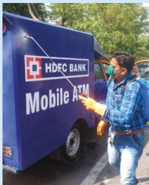

> **AI Description:**
> **Source:** `assets/_page_2_Figure_1.jpg`
> 
> **Generated:** 2026-05-24 13:54:23
> 
> ---
> 
> The image contains a photograph of a HDFC Bank Mobile ATM van. The van is blue with the HDFC Bank logo and the words "Mobile ATM" prominently displayed on the side. A person is seen interacting with the van, possibly using a device or pointing towards it. The background shows a tree and part of another vehicle, indicating an outdoor setting. The image provides visual context for a mobile banking service offered by HDFC Bank.

Continue to focus on ESG priorities and undertake initiatives that help meet long-term goals

## ESG

> **AI Description:**
> **Source:** `assets/_page_2_Figure_2.jpg`
> 
> **Generated:** 2026-05-24 13:50:43
> 
> ---
> 
> The image contains a photograph of two individuals, likely in a professional setting, as they are dressed in business attire and are holding a tablet computer. The individuals appear to be engaged in a discussion or presentation, as they are both looking at the tablet and smiling. The background suggests an outdoor setting with a modern building and a clear sky. The image does not contain any text or additional visual elements beyond the two individuals and the tablet.

## COVID-19

Ensuring business continuity and the safety of our customers and employees despite the pandemic

## + PG 54

## Strategy

Continued progress on core strategies. Seting the agenda for a Future-Ready Bank

## + PG 40

## Asset quality

Maintain balance sheet strength with stable margins, robust asset quality and capital adequacy

## Feature stories

Demonstrating responsible leadership

## PG 8

Cruising ahead despite headwinds

Driving aspirations of inclusive growth

## PG 28

Catalysing the next wave of transformation

## PG 38

> **AI Description:**
> **Source:** `assets/_page_2_Figure_12.jpg`
> 
> **Generated:** 2026-05-24 13:48:48
> 
> ---
> 
> The image contains a simple infographic with a woman sitting at a desk using a laptop. The infographic includes a bar chart with increasing values, labeled "HIT," "BIA," and "FISA." The chart visually represents data, likely showing growth or performance over time for these three categories. The woman appears to be analyzing or presenting this data.

> **AI Description:**
> **Source:** `assets/_page_2_Figure_13.jpg`
> 
> **Generated:** 2026-05-24 13:48:14
> 
> ---
> 
> The image contains a simple illustration of two people in a professional setting. One person is seated at a desk, appearing to be working on a laptop, while the other person is standing and holding a document, seemingly presenting or discussing it. The scene suggests a collaborative work environment, possibly a meeting or a consultation. The illustration uses minimalistic colors and shapes to convey the interaction between the two individuals.

> **AI Description:**
> **Source:** `assets/_page_2_Figure_14.jpg`
> 
> **Generated:** 2026-05-24 13:46:23
> 
> ---
> 
> The image contains a simple illustration of a person sitting at a desk with a laptop. In the background, there is an open book with two bar charts displayed on its pages. The person appears to be engaged with the content on the laptop, suggesting a focus on data analysis or learning. The bar charts in the book likely represent some form of data or statistics, though the specific details of the data are not discernible from the image.

Relentless pursuit of sustainability

> **AI Description:**
> **Source:** `assets/_page_2_Figure_15.jpg`
> 
> **Generated:** 2026-05-24 13:45:51
> 
> ---
> 
> The image contains a simple illustration of two people discussing a chart. The chart is a bar graph with blue bars, and it appears to be a visual representation of data. The person on the left is pointing at the chart, possibly explaining or highlighting a specific part of it. The person on the right is listening attentively. The chart itself does not have any labels or annotations, so the specific data it represents is not clear from the image alone.

> **AI Description:**
> **Source:** `assets/_page_2_Figure_17.jpg`
> 
> **Generated:** 2026-05-24 13:44:36
> 
> ---
> 
> The image depicts a person sitting at a table, working on a sewing machine. The individual is wearing a blue top and light blue pants, and they are sewing a red garment. The sewing machine is gray with a needle and thread visible. There are two spools of thread on the table, one red and one blue, along with a small bottle, possibly containing sewing oil or another liquid. The scene suggests a sewing or tailoring activity.

## About The Report

This Integrated Annual Report for 2020-21 endeavours to provide a holistic assessment of the Bank's financial and non-financial performance. It also outlines relevant information on the Bank's strategy, governance,risks and prospects to offer better insights into its activities and progress.The Bank has been voluntarily reporting its sustainability performance annually since FY14,asa separate report. From this year onwards,our sustainability performance is also included entirely in this report.

## Reporting principles and framework

The financial information presented in this report is in line with the requirements of

· The Companies Act, 2013 (including the rules made thereunder)

·The Indian Accounting Standards

·The Securities and Exchange Board of India (Listing Obligations and Disclosure Requirements) Regulations,2015

· The Banking Regulation Act, 1949 and other relevant RBl regulations

The report has been prepared in accordance with the framework prescribed by the International Integrated Reporting Council (liRC) and also contains disclosures as per the Global Reporting Initiative (GRl) Standards: Comprehensive option and United Nations Sustainable Development Goals (UN SDGs).

Further, the report presents Environmental, Social and Governance (ESG) information in accordance with the ESG framework developed by the Bank's CSR and ESG Committee.There are no restatements of information provided in the integrated report during the reporting year.

## INTEGRATED REPORTING

## SUVTLINAENEGALS

## Materiality and scope

This report includes information which is material to all stakeholders of the Bank and provides an overview of its business and related activities.The report discloses matters that substantially impact oraffect the Bank'sability to create value and could influence decisions of providers of financial capital.The last materialityassessment exercise in line with GRl framework requirements,and in consultation with internal and external stakeholders was undertaken in FY19.For FY21, we have updated our materialityanalysis to better take into account emerging ESG issues that shape our business operations as identified and prioritised by our internal stakeholders. The GRl Content Index,which specifies the GRI Standards and disclosures made under them in the Report, has been provided in this report. + PG 118

## Reporting boundary

The non-financial information in this report covers the activities and progress of the Bank on a standalone basis. It covers information pertaining to the period from April1,2020 to March 31,2021.The last reports were published for the period April 1,2019 -March 31,2020.The Integrated Report for FY20 can be accessed here. The Sustainability Report may be viewed here.

## Assurance statement

The report has also been externally assured byan independent third party, based on ISAE 3000 (Revised).

## Responsibility statement

The content of this report has been reviewed by the senior management of the Bank,and reviewed and approved by the Board of Directors to ensure accuracy, completeness and relevance of the information presented.

## Forward looking statements

Thisreport contains statements that relate to future operations and performance of the Bank.Actual results may differ materially from those suggested by such statements due to certain risksassociated with our expectations with respect to,but not limited to, future circumstances such as technological changes,the impact of changes in banking regulations and other regulatory changes in India and other jurisdictions,natural calamities,inflation, deflation,unanticipated turbulence in interest rates,foreign exchange rates, equity prices or other rates or prices, the performance of the financial markets in India and globally,among others.

Statutory Reports and Financial Statements

How to navigate this report We have used the icons below to aid navigation and cross-referencing across the report.

## Our Capitals

## Financial Capital

Our strong financial position,sustained growth and consistent shareholder returns are a result of our disciplined approach towards raising,lending and managing our financial capital. It includes customer deposits, shareholder equity, retained earnings and external borrowings among others. + PG 24

> **AI Description:**
> **Source:** `assets/_page_3_Figure_6.jpg`
> 
> **Generated:** 2026-05-24 13:55:03
> 
> ---
> 
> The image contains a simple icon of two hands shaking, with one hand colored in blue and the other in red. The hands are positioned as if in a handshake, suggesting a theme of agreement, partnership, or collaboration. The icon is set against a light blue circular background.

## Social & Relationship Capital

The way we manage our stakeholder expectations constitutes our social and relationship capital. Be it with our customers,trade partners and merchants or communities,we take a holistic approach to sustainable value creation by nurturing our long-standing relationships and building new ones.

PG 88

> **AI Description:**
> **Source:** `assets/_page_3_Figure_8.jpg`
> 
> **Generated:** 2026-05-24 13:37:09
> 
> ---
> 
> The image contains a simple icon of a head with a red outline and a blue outline. The icon appears to represent a person or a user profile. There are no charts, graphs, or other visual elements present in the image.

## Human Capital

Our people are at the heart of our success.Their diverse skill sets, expertise and industry knowledge constitute our human capital. We further enhance our human capital through continuous training and development programmes.Our focus on developing a skilled and motivated workforce enables us to acquire,serve and retain our customers. + PG 80

> **AI Description:**
> **Source:** `assets/_page_3_Figure_10.jpg`
> 
> **Generated:** 2026-05-24 13:38:46
> 
> ---
> 
> The image contains a single icon of a location marker, typically used to represent a specific point on a map or in a navigation system. The icon is circular with a blue border and a red dot in the center, which is a standard symbol for a location or pin. There are no charts, graphs, or other visual elements present in the image.

## Manufactured Capital

Facilitating our engagement with customers,people, the society and other stakeholders,manufactured capital comprises our pan-India distribution network of banking outlets,corporate offices,ATMs and other customer touch points. It also covers our IT infrastructure and securityas well as infrastructure development through CSR projects. + PG 12

> **AI Description:**
> **Source:** `assets/_page_3_Figure_12.jpg`
> 
> **Generated:** 2026-05-24 13:39:43
> 
> ---
> 
> The image contains a circular icon with a fingerprint design. The fingerprint is stylized with a blue and red color scheme, and the icon has a white background. There is no text or additional visual elements within the icon itself.

## Intellectual Capital

The adoption of data analytics and emergent technologies such as Artificial Intelligence and Machine Learning enables us to increase operational efficiencies.The knowledge and expertise incorporated within our systems,processes and procedures and the equity built in the HDFC Bank brand constitute our intellectual capital. + PG 76

> **AI Description:**
> **Source:** `assets/_page_3_Figure_14.jpg`
> 
> **Generated:** 2026-05-24 13:42:49
> 
> ---
> 
> The image contains a simple icon of a stylized flower with a red center and blue petals. The flower is centered within a circular background. There are no charts, graphs, or other visual elements present in the image. The icon is likely used as a visual representation of a concept or entity, possibly related to growth, nature, or a specific brand or organization.

## Natural Capital

The natural resources we consume to conduct our business and seamlessly deliver our products and services constitute our natural capital.

PG 60

## Our strategic pillars

Re-lmagining the branch channel Virtual Relationship Management (VRM)

Commercial and Rural

Retail Assets Semi-urban & rura (SURU) and Government and Institutional (G&l)

Corporate Cluster

Leadership in the payments business

Wealth

Technology and Digital

Digital Marketing

## Our stakeholders

> **AI Description:**
> **Source:** `assets/_page_3_Figure_17.jpg`
> 
> **Generated:** 2026-05-24 13:41:31
> 
> ---
> 
> The image is a simple icon featuring two stylized human heads facing each other within a blue circular background. The icon is likely used to represent communication, dialogue, or interaction between individuals.

Customers

Governments/ Regulatory Bodies

> **AI Description:**
> **Source:** `assets/_page_3_Figure_19.jpg`
> 
> **Generated:** 2026-05-24 13:44:21
> 
> ---
> 
> The image contains a simple icon of a heart with a child's head inside it. The heart is white and the background is blue. This icon likely represents a symbol for healthcare, child health, or a related medical or social service.

> **AI Description:**
> **Source:** `assets/_page_3_Figure_20.jpg`
> 
> **Generated:** 2026-05-24 13:48:32
> 
> ---
> 
> The image is a simple diagram featuring a blue circle with a white outline. Inside the circle, there are five white silhouettes of people arranged in a circular formation, with one person at the center and four surrounding them. The diagram appears to represent a social or organizational structure, possibly indicating a team or network.

Employees

> **AI Description:**
> **Source:** `assets/_page_3_Figure_21.jpg`
> 
> **Generated:** 2026-05-24 13:48:28
> 
> ---
> 
> The image contains a simple icon of a safe with a lock, enclosed in a blue circle. The icon is white and represents a secure or protected environment, commonly associated with data security, financial security, or privacy. There are no charts, graphs, or other visual elements present.

> **AI Description:**
> **Source:** `assets/_page_3_Figure_22.jpg`
> 
> **Generated:** 2026-05-24 13:47:09
> 
> ---
> 
> The image contains a simple icon of two hands shaking, enclosed within a blue circle. This icon is commonly used to represent agreement, partnership, or a handshake deal. There are no additional labels or text annotations within the image.

Investors

Suppliers

## Highlights

# Creating value for our stakeholders

At HDFC Bank, we work relentlessly towards creating long-term value for our shareholders and society at large. We provide holistic banking solutions that fulfill their needs and expectations. We offer our employees a fair and inclusive working environment, as well as contribute to the well-being of the local communities. Robust financial performance enables a platform for environmental and social responsibility.

> **AI Description:**
> **Source:** `assets/_page_4_Figure_0.jpg`
> 
> **Generated:** 2026-05-24 13:59:54
> 
> ---
> 
> The image contains a photograph of two individuals in what appears to be a professional setting, possibly a meeting or consultation. One person is seated at a desk with a laptop, wearing a face mask and a suit, while the other person, also wearing a face mask, is seated across the desk, extending a piece of paper towards the other individual. The setting suggests a formal or business environment. The image includes a blue circular icon in the bottom left corner with a white silhouette of two heads, which may represent a communication or collaboration theme.

## Customers

We cater to a diverse customer base with evolving financial needs. Our customers are individuals, large and mid-corporates, financial institutions,Governments, PSUs, MSMEs, farmers,wholesalers and traders. We focus on increasing the depth of engagement, which leads to transformational customer journeys.

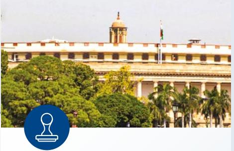

> **AI Description:**
> **Source:** `assets/_page_4_Figure_1.jpg`
> 
> **Generated:** 2026-05-24 14:00:06
> 
> ---
> 
> The image shows a photograph of a large, white building with a dome and a flagpole. The building appears to be a government or legislative structure, as indicated by its architectural style and the presence of the flag. In the foreground, there are trees, and the image has a blue circular logo with a white icon in the bottom left corner. The image does not contain any text or additional visual elements beyond the building and the logo.

## Governments/ Regulatory Bodies

As one of India's largest and systemically important banks,we collaborate with the Government in myriad ways to bring the vast unbanked and under-banked population into the economic mainstream. We are not just a responsible taxpayer complying with applicable regulations, but are also an enabler for delivering social schemes and benefits.

> **AI Description:**
> **Source:** `assets/_page_4_Figure_2.jpg`
> 
> **Generated:** 2026-05-24 13:58:14
> 
> ---
> 
> The image contains a photograph of two individuals, likely a mother and daughter, smiling and posing together. They are wearing traditional attire, with one person wearing a pink scarf and the other a red and blue patterned scarf. The background is a plain light blue. In the bottom left corner, there is a circular icon with a heart shape and a child's face, possibly indicating a focus on family or child welfare.

We are driving holistic, sustainable community development programmes for empowering the less-privileged sections of society in India.

> **AI Description:**
> **Source:** `assets/_page_4_Figure_3.jpg`
> 
> **Generated:** 2026-05-24 13:58:01
> 
> ---
> 
> The image contains a photograph of two individuals in a professional setting. One person is seated at a desk with a laptop, while the other stands beside them, both appearing engaged in a conversation. The background includes bookshelves filled with books, suggesting an office or library environment. The image conveys a collaborative or educational context.

## Community

## Employees

We aspire to be the employer of choice and promote an inclusive and meritocratic culture that ensures engagement, progress and care. We have also been certified as a ‘Great Place to Work' for 2020.

> **AI Description:**
> **Source:** `assets/_page_4_Figure_4.jpg`
> 
> **Generated:** 2026-05-24 13:52:36
> 
> ---
> 
> The image contains a desk with various items on it, including a tablet, a smartphone, and some printed papers with charts and graphs. The charts appear to be bar graphs, possibly representing data related to performance or metrics. The overall setting suggests a workspace or office environment, likely used for data analysis or business planning.

## Investors

We provide transparent, regular disclosures to the investor community to help them make informed decisions.We also regularly engage with research analysts,both on Buy-side and Sell-side, to provide detailed information on our performance.

> **AI Description:**
> **Source:** `assets/_page_4_Figure_5.jpg`
> 
> **Generated:** 2026-05-24 13:50:51
> 
> ---
> 
> The image is a simple illustration of a person sitting at a desk, wearing a headset and working on a computer. The person is dressed in a business suit and is seated on a chair. The desk has a computer monitor on it. The image appears to be a visual representation of a customer service or call center worker.

Growth in Total Advances\*\*

14.0%

Domestic Retail Advances\* 5,27,586 Crore

Contribution to Exchequer\*\*

Merchant Acceptance Points\* 21.34 Lakh

Total Number of BCs in partnership with CSCs\*

40,018.60 Crore

15,556

CSR beneficiaries\*

8.5 Crore+

Impact via Sustainable Livelihood Initiative (SLl)\*

1.29 Crore households

Cumulative renewable energy capacity financed

2,945 MW

Employee strength\* 1,20,093

Employee expenses\*\* 10,364.79 Crore

Net Interest Margin\*\*

4.1%

Return on Capital\*\* 16.6%

Basic Earnings per Share\*\* 56.58

Net Profit\*\*

31,116.5 Crore

\*As on March 31,2021

\*\* For FY21

# Demonstrating Leadership comes with Leadership comes with responsible great responsibility. As great responsibility. As a systemically important a systemically important Bank tributingmted Bank, we are committed to contributing to the leadership Indian growth story while Indian growth story while exercising prudence exercising prudence to create sustained value to create sustained value for all our stakeholders. for all our stakeholders.

This commitment is reflected in our steadily expanding balance sheet, which is the second largest amongst banks in India, while maintaining strong asset quality.

Total Balance Sheet size\*

R17,46,871 Cr

14.1%

> **AI Description:**
> **Source:** `assets/_page_5_Figure_1.jpg`
> 
> **Generated:** 2026-05-24 13:53:53
> 
> ---
> 
> The image contains a photograph of two individuals in a professional setting. One person is standing and smiling, while the other is seated at a desk working on a laptop. The seated individual appears to be focused on the screen. The background suggests an office environment with large windows allowing natural light to enter. The image conveys a sense of collaboration and productivity.

Retail Deposits\*

R10,64,684 Cr

Gross Non-Performing Assets (NPAs)\*

1.32%

> **AI Description:**
> **Source:** `assets/_page_5_Figure_2.jpg`
> 
> **Generated:** 2026-05-24 13:50:24
> 
> ---
> 
> The image is a photograph of a family of four standing in a field of crops. The father is on the right, wearing a light blue shirt and a white undershirt, with a smile on his face. The mother is in the center, wearing a patterned black and white scarf and a dark outfit. The two children are in the foreground; the boy is on the left, wearing a brown shirt, and the girl is on the right, wearing a pink outfit. The background shows a lush green field with some bamboo poles. The setting appears to be rural and agricultural.

Lives impacted through HDFC Bank Parivartan\*

8.5 Cr+

Our robust fundamentals enabled us to deliver banking services to our customers during the pandemic while supporting individuals and small businesses to ride out the storm - extending moratorium on repayments, facilitating loan restructuring and lending support to the Government's ECLGS scheme. We are also actively participating in the nation's inclusive development agenda through focused interventions to improve life and livelihood opportunities. Joining in the fight against the pandemic, we are also helping build a healthcare ecosystem aimed at ensuring the health and wellbeing of our employees, customers and society at large. As we enhance our future-readiness and drive the next wave of growth, we remain anchored to our core values, good governance practices, and continue to make a difference to the lives of people through our social initiatives under HDFC Bank Parivartan. Towards our commitment to protect the environment, we pledge to become carbon neutral by FY32.

## Introduction to HDFC Bank

10 About Us

12 Our Presence

14Our journey

### Full Page Description (Page 6)

**Source:** `assets/_page_6_Asset_2.jpg`

**Generated:** 2026-05-24 13:44:16

---

The image is a bar chart showing the percentage of total retail transactions for the fiscal years FY21, FY20, and FY19. The chart uses a gradient color scheme, with darker shades representing higher percentages. The percentages are as follows: FY21 at 95.7%, FY20 at 95.1%, and FY19 at 91.7%. The chart indicates a slight increase in the percentage of total retail transactions from FY19 to FY21, with FY21 having the highest percentage.

### Full Page Description (Page 6)

**Source:** `assets/_page_6_Asset_3.jpg`

**Generated:** 2026-05-24 13:44:31

---

The image contains a bar chart with three horizontal bars representing financial data for fiscal years FY21, FY20, and FY19. The bars are color-coded from dark blue to light gray, indicating a decrease in values from FY21 to FY19. The values for each fiscal year are labeled at the end of their respective bars: 21.34 for FY21, 17.97 for FY20, and 9.61 for FY19. Additionally, there is a label at the bottom indicating a year-over-year (Y-o-Y) increase of 18.8%.

### Full Page Description (Page 6)

**Source:** `assets/_page_6_Asset_0.jpg`

**Generated:** 2026-05-24 13:46:18

---

The image contains a bar chart with textual data. It displays advances in crores for the fiscal years FY21, FY20, and FY19. The chart shows a significant increase from FY19 to FY21, with FY21 having the highest value at 11,32,837 crores. The percentage increase year-over-year (Y-o-Y) is highlighted as 14.0%. The chart uses different shades of blue to represent each fiscal year, with FY21 in a darker shade and FY19 in a lighter shade.

### Full Page Description (Page 6)

**Source:** `assets/_page_6_Asset_4.jpg`

**Generated:** 2026-05-24 13:47:07

---

The image contains a bar chart with three horizontal bars, each representing a fiscal year (FY19, FY20, and FY21). The bars are color-coded and labeled with corresponding numerical values. The chart shows an increase in the value from FY19 to FY21, with FY21 having the highest value at 5,608. The values for FY20 and FY19 are 5,254 and 4,971, respectively. The chart uses a gradient color scheme to differentiate between the fiscal years, with FY21 having the darkest blue and FY19 the lightest gray.

### Full Page Description (Page 6)

**Source:** `assets/_page_6_Asset_1.jpg`

**Generated:** 2026-05-24 13:46:00

---

The image contains a bar chart with a title "DEPOSITS" and units in "₹ Crore". It presents data for three fiscal years: FY21, FY20, and FY19. The chart shows a clear upward trend in deposits over the years, with FY21 having the highest deposits at 13,35,060 ₹ Crore, followed by FY20 at 11,47,502 ₹ Crore, and FY19 at 9,23,141 ₹ Crore. The chart also includes a percentage increase of 16.3% year-over-year (Y-o-Y) from FY19 to FY21.

## About Us

## Responsible banking in a changing world

HDFC Bank is the largest private sector bank (by Balance Sheet size) in India offering a comprehensive range of financial products and services to a diverse customer base. Our unparalleled reach, coupled with our digital capabilities,enables us to serve the evolving needs of our customers across the country, even in an extremely challenging environment.

## Business verticals

> **AI Description:**
> **Source:** `assets/_page_6_Figure_0.jpg`
> 
> **Generated:** 2026-05-24 13:28:24
> 
> ---
> 
> The image contains three distinct photographs. The first shows a man outdoors, holding a smartphone and a credit card, suggesting a theme of mobile banking or online transactions. The second photograph depicts two individuals engaged in a discussion, possibly related to business or financial planning, as indicated by the formal attire and the presence of a document. The third photograph features a person analyzing a financial chart on a computer screen, highlighting the analysis of stock market trends or financial data.

## Retail

The Retail Business operated under extremely challenging circumstances in the year under review. This business is directly linked to consumption which slowed down during the lockdown. As the‘unlocking phase' gathered momentum, the business recovered and posted a healthy growth on a sequential-quarter basis in Q4. Domestic retail advances grew by 6.7% (Y-o-Y) to over 5.27 Lakh Crore. This constituted about 47% of the Bank's domestic loans as per Basel Il classification.

## Wholesale

Our Wholesale Banking business serves institutional customers such as Government, Large and Emerging Corporates, SMEs and was our key growth driver in FY21. Our strong offerings include Working Capital and Term Loans, Trade Credit, Cash Management, Supply Chain Financing, Foreign Exchange,and Investment Banking Services.

Domestic Wholesale Banking advances recorded a healthy 21.7% growth, ending FY21 with a loan book of over 5.83 Lakh Crore. This constituted about 53% of the Bank's domestic loans as per Basel Il classification.

## Treasury

The Treasury is the custodian of the Bank's cash/liquid assets and handles our investments in securities, foreign exchange and cash instruments. It also manages liquidity and interest rate risks on the balance sheet and ensures the Bank meets its reserve requirements. The Treasury also caters to our customers'needs in managing foreign exchange rate and interest rate risks, generating fee income from the services rendered.The Treasury recorded revenue of 2,438.4 Crore from foreign exchange and derivative transactions during FY21.

Growth in Domestic Retail Advances in FY21

6.7%

Growth in Domestic Wholesale Banking advances in FY21

21.7%

Treasury revenues from Forex and Derivative transactions in FY21

2,438.4 Crore

At HDFC Bank, responsibility is at the heart of everything we do - be it fulfilling aspirations of an emerging India, driving financial inclusion, participating in the nation's fight against a global pandemic, and making a meaningful difference to the lives we touch.

Environmental, Social and Governance (ESG) considerations are embedded in our growth strategy, which reflects our unwavering commitment towards a sustainable future.

> **AI Description:**
> **Source:** `assets/_page_6_Figure_4.jpg`
> 
> **Generated:** 2026-05-24 13:34:49
> 
> ---
> 
> The image contains a simple illustration of two people in a professional setting. One person is seated at a desk with a laptop, while the other stands beside them holding a briefcase. The seated individual appears to be engaged with the laptop, possibly working or presenting. The standing individual seems to be in a leadership or supervisory role, gesturing as if giving instructions or discussing something. The image conveys a scene of collaboration or mentorship in a work environment.

## Recognition

WPP Plc-Kantar Millward Brown BrandZ Report - India's most valuable brand (for the seventh consecutive year in 2020)

I India's Best Bank - Euromoney Awards for Excellence 2020

★ ICAI Awards for Excellence in Financial Reporting for 2019-20 - Won the Gold Shield in the Private Sector Banks (including Foreign Banks) category

Our Water, Sanitation and Hygiene (WASH) programme was adjudged Best Corporate Initiative in Sanitation by ISC-FICCI Sanitation Awards

## Our Presence

## Unparalleled reach

At HDFC Bank, we have built a robust delivery network comprising Banking Outlets, ATMs and Cash Deposit and Withdrawal Machines (CDMs) and merchants. Banking outlets comprise branches and fixed point Business Correspondents (BCs). Our presence across India not only enables us to serve customers better, but also facilitates active participation in the Nation's inclusive development agenda.

## Total Banking Outlets\*

## 21,360

Total Branches\*

The proliferation of digital technologies has transformed the financial services landscape,and HDFC Bank has been at the forefront of such transformation in the Indian Banking industry. By combining our expansive physical presence with digital capabilities,we are breaking down geographic barriers and deploying innovative ways to take formal banking channels to the last mile.

## 5,608^

Total Business Correspondents (BCs)\*

## 15,756

Total ATMs + cash deposit and withdrawal machines\*

## 16,087

Manufactured Capital

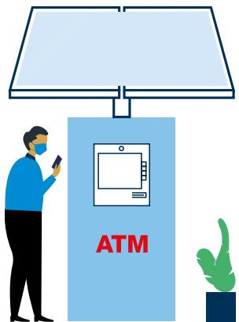

> **AI Description:**
> **Source:** `assets/_page_7_Figure_1.jpg`
> 
> **Generated:** 2026-05-24 13:36:55
> 
> ---
> 
> The image contains a simple diagram of an ATM machine. It features a person standing to the left, holding a smartphone, and wearing a face mask. The ATM is depicted with a screen and buttons, and the word "ATM" is prominently displayed in red text below the machine. The diagram includes a stylized representation of a roof above the ATM, suggesting an outdoor or sheltered setting. The overall design is minimalistic and uses a limited color palette.

\*As on March 31,2021 ^ Including 4 overseas branches

## Our strong pan-India presence\*

## Tapping the Indian diaspora in select international markets

We have set-up branches and Representative Offices to cater to Indian diaspora in Manama (Bahrain), Hong Kong, Dubai International Financial Center (DIFC), Abu Dhabi, Dubai, Nairobi (Kenya).We offer NRl clients Offshore Deposits,Bonds,Equity, Mutual Funds,Treasury and Structured products offered by third parties from Bahrain Branch. We also cater to Corporate clients by offering products such as trade credits,foreign currency term loans including external commercial borrowings (ECBs) and derivatives for hedging purpose.

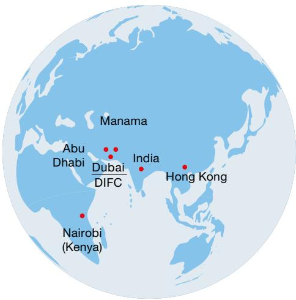

> **AI Description:**
> **Source:** `assets/_page_7_Figure_2.jpg`
> 
> **Generated:** 2026-05-24 13:33:07
> 
> ---
> 
> The image is a simplified map of the world, focusing on the region of the Middle East and parts of Asia. It includes labels for several cities: Abu Dhabi, Dubai (with a note for the Dubai International Financial Centre), Manama, India, Hong Kong, Nairobi (Kenya), and a red dot indicating Dubai. The map is designed to highlight the geographical locations of these cities, possibly for educational or informational purposes.

Contribution of overseas branches to the Bank's total income in FY21

0.64%

## Leveraging our reach to empower communities

The Bank is committed to empowering communities across the country through its CSR initiatives under HDFC Bank Parivartan. We are leveraging our reach and understanding of semi-urban and rural regions to drive sustainable development for the vulnerable and economically weaker sections of the society through focused interventions across identified areas.

> **AI Description:**
> **Source:** `assets/_page_7_Figure_3.jpg`
> 
> **Generated:** 2026-05-24 13:34:09
> 
> ---
> 
> The image contains a photograph of six young girls standing together, smiling. They are wearing matching uniforms consisting of green tops with white collars and white sashes. The background appears to be a classroom setting with pink walls and educational posters or charts visible. The girls are positioned in a line, and their hair is styled in braids. The image conveys a sense of unity and positivity, likely representing a school or educational environment.

Lives impacted\* 8.5 Crore+

> **AI Description:**
> **Source:** `assets/_page_7_Figure_4.jpg`
> 
> **Generated:** 2026-05-24 13:26:06
> 
> ---
> 
> The image is a photograph of a family of four standing in a lush green field, with a blue tractor in the background. The family consists of a man, a woman, and two children, all smiling and appearing happy. The man is wearing a white turban and a light-colored shirt, while the woman is dressed in a red and white outfit. The children are dressed in casual attire. The setting suggests a rural or agricultural environment, possibly indicating a family involved in farming or agriculture. The image conveys a sense of warmth and family unity in a natural, outdoor setting.

No. of households reached\* 5.75 Lakh

> **AI Description:**
> **Source:** `assets/_page_7_Figure_5.jpg`
> 
> **Generated:** 2026-05-24 13:26:38
> 
> ---
> 
> The image is a photograph of a person walking through a field of green crops. The individual is wearing a brown jacket, white pants, and a hat, and is carrying a basket in their left hand. In the background, there are trees and another person walking in the distance. The setting appears to be a rural or agricultural area.

Farmers trained\* 1 Lakh+

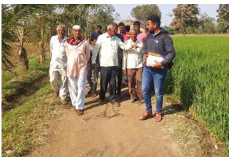

> **AI Description:**
> **Source:** `assets/_page_7_Figure_6.jpg`
> 
> **Generated:** 2026-05-24 13:29:35
> 
> ---
> 
> The image contains a photograph of a group of people walking along a dirt path in a rural setting. The individuals appear to be engaged in a discussion, with one person holding a folder or document. The background shows green fields and some trees, indicating an agricultural or farming environment. The group consists of several men, some wearing traditional attire, suggesting a cultural or community gathering. The setting and attire suggest a focus on rural life or agricultural activities.

Villages covered under our Holistic Rural Development Programme (HRDP)\* 1,970

## Our Journey

# Setting benchmarks, abiding by our core values

## 1994

Housing Development Finance Corporation (HDFC) received an in-principle approval from the RBl to set upa private sector bank

Incorporated in August 1994 as HDFC Bank Limited

## 1995

Banking license received in January 1995

First corporate office and branch opened

IPO oversubscribed 55 times Listed on BSE and NSE

## 1997

Maiden dividend announced

1997-98 New logo launched

## 1999

Launched first international debit card in India in association with Visa International

Began its digital journey by launching online real-time NetBanking.

First ever mega merger in Indian banking industry-Times Bank merged with HDFC Bank

## 2000

A Bank with many firsts 1st Bank to launch Mobile Banking in India

Launched first SMS - based Mobile Banking

## 2001

Overseas listing   
Listed on New York Stock Exchange   
(NYSE)   
Became the first private bank authorised to   
collect income tax

## 2002

ISO 9001 certification for depository and custodial services

## 2003-04

First bank in India to offer credit card in over 100 cities

Touched 10 Lakh users

## 2006

Two new cards launched exclusively for women on International Women's Day

## 2008

Launched its first overseas commercial branch in Bahrain

Merged with Centurion Bank of Punjab in one of the largest mergers in the Indian banking industry

## 2010

Launched 40% faster ATMs - first of its kind in Asia

## 2011

Growing market leadership Expanded customer base to become market leaders in Auto Loans,Personal Loans and Credit Cards

## 2012

Launched MobileBanking App in Hindi Launched premium credit cards for doctors

Launched its nation-wide sports initiative - Josh Unlimited, for employees

## 2013

TheBank'sSustainable Livelihood Initiative (SLl) crosses a milestone, impacting 20 Lakh households

## 2014

Sustainability established as a core value of the Bank

Created a new Guinness World Record for organising the largest single-day blood donation drive

Became market leader in issuing credit cards in 2013-14 with 55 Lakh+ cards

## 2015

Launched its sonic branding i.e. Musical Logo (MOGO) to be used across multiple touch points

## DPAYAPP

Launched PayZapp, India's first 1-click mobilepay solution

Launched 10-second personal loan disbursement in the retail lending space

Concurrent QIP issue & Follow-on offering 9,723 Crore

## 2016

> **AI Description:**
> **Source:** `assets/_page_8_Figure_0.jpg`
> 
> **Generated:** 2026-05-24 13:46:57
> 
> ---
> 
> The image depicts a person sitting on a large, orange bean bag chair, holding a laptop. The person is wearing a white top and blue pants, and there are large, light green leaves in the background. The image is a simple, flat design illustration with no text or labels.

Launched Missed Call mobile recharge for prepaid mobiles

ATMs turned to LDMs (Loan Dispensing Machines)

Launched SmartUp programme for start-ups

> **AI Description:**
> **Source:** `assets/_page_8_Figure_1.jpg`
> 
> **Generated:** 2026-05-24 13:47:14
> 
> ---
> 
> The image contains a simple illustration of two individuals, one in a white lab coat and the other in a blue uniform, likely representing a doctor and a nurse. Both are wearing face masks, suggesting a healthcare setting. The person in the blue uniform is holding a clipboard, indicating a discussion or exchange of information. The illustration is minimalistic and does not contain any text or additional visual elements.

## 2017

Introduced Al   
Launched IRA (Interactive Robotic   
Assistant) and became the first bank in   
India to introduce a humanoid for customer   
service

Introduced EVA chatbot - India's first Albased chatbot to provide customer service

Launched SmartUp Zones for start-ups

Launched EasyEMl on debit cards

Launched an all-in-one DigiPOS machine

> **AI Description:**
> **Source:** `assets/_page_8_Figure_2.jpg`
> 
> **Generated:** 2026-05-24 13:48:43
> 
> ---
> 
> The image contains a diagram with a person sitting on the ground, looking at a smartphone. The smartphone screen displays an illustration of a robot with speech bubbles around it. The illustration suggests a conversation or interaction between the person and the robot, possibly indicating a chatbot or AI assistance scenario. The overall theme of the image seems to be related to technology and communication.

## 2018

Next-gen Mobile Banking App launched

Driving rural empowerment Signed MoU with government to financially empower 2 Lakh rural Indian villages through CSCs

## 2019

Voted no.1 in India by customers in Forbes Worlds Best Banks Survey

BSE inks pact with the Bank to give a boost to the start-up platform

1 Million+ units of blood collected via HDFC Bank Parivartan's Blood Donation Drive over a period of 12 years, primarily from employees

Marked the start of its 25th year

## Opened 5,000th branch

## 2020

Ranked India's most valuable brand (for the seventh consecutive year) by BrandZ Report

Launch of HDFC Bank Millenia range of cards

First ever leadership change (new MD & CEO takes over)

First-of-its-kind product launch: KGC-Shaurya card for armed forces Launch of contactless, consent based customer on-boarding via video KYC facility

Deploying Mobile ATMs during the lockdown

Launched ‘The HealthyLife' programme with Apollo Hospitals for customers and employees

## 2021

Embarked on Project \`Future Ready'

In the year of the pandemic, which put to test conventional notions of resilience and relevance, we not only delivered profitable growth, but also expanded our balance sheet without compromising on asset quality.

## Cruising ahead despite headwinds Capital Adequacy Ratio (CAR)\* Capital Adequacy P

> **AI Description:**
> **Source:** `assets/_page_9_Figure_0.jpg`
> 
> **Generated:** 2026-05-24 13:45:21
> 
> ---
> 
> The image contains a laptop screen displaying a business analytics dashboard. The dashboard features various charts and graphs, including bar charts and a pie chart, which appear to represent data analysis. The screen shows a title labeled "Analytics," indicating that the content is related to data interpretation and performance metrics. The presence of multiple visual elements suggests a focus on data visualization for business insights.

Net Profit\*\*

31,116.5 Cr

\*\*FY21

18.8%

\*As on March 31, 2021

Net Non-performing Assets (NPAs)\*

0.40%

Our net interest income grew by 15.5% while net profit increased by 18.5%. Our gross NPAs stood at 1.32% compared with 1.26% a year earlier, while our balance sheet size increased by 14.1%. This healthy performance in an extremely challenging environment is a reflection of our strong foundation, on which we aspire to build a stronger future.

Despite significant restrictions on mobility and physical proximity, we not only delivered ‘essential' banking services to our customers, but also grew our advances by 14%. We also continued to deliver on our sustainable development objectives backed by our employee volunteers and partners.

## Our Performance

18 Farewell Note to Mr Aditya Puri

20Message from the MD& CEO

24Financial performance

26 Our business segments

Aditya Puri, Ex-Managing Director HDFC Bank Limited

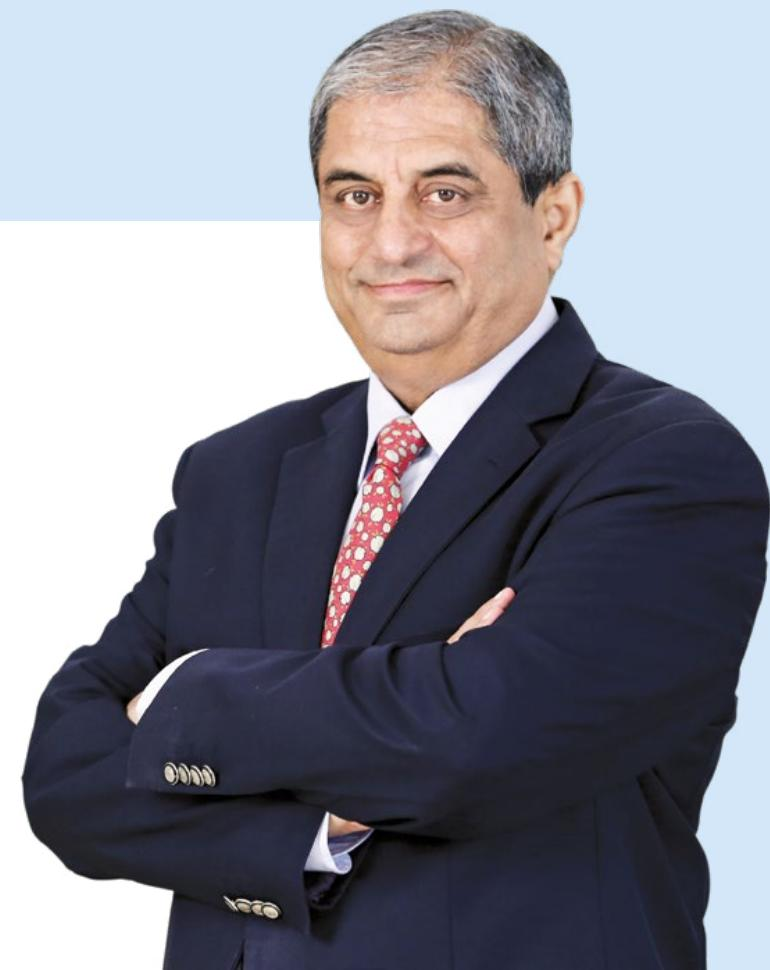

> **AI Description:**
> **Source:** `assets/_page_10_Figure_0.jpg`
> 
> **Generated:** 2026-05-24 13:57:01
> 
> ---
> 
> The image contains a photograph of a man dressed in a dark suit with a red patterned tie. He has his arms crossed and is standing against a plain light blue background. The man appears to be in a professional setting, possibly for a business or corporate profile.

## Dear Mr. Puri,

Sometimes words are not enough to express the influence you have had in building HDFC Bank into an industry bellwether in 25 years. Yet, as you leave behind your indelible imprint on everything we do today, we extend the humble two words of ‘thank you’ to express our gratitude for making us an integral part of a transformative journey. The roadmap you have given us - we will tread on that.

The journey that began during the initial phase of India's liberalisation now connects the many Bharats that live within. As we take confident strides into a rapidly changing digital world with a customer first approach, knowledge, simplicity, empathy in our DNA, we remain true to your legacy - upholding the highest standards in corporate governance, inspiring actions for meaningful social impact, nurturing talent and continuing to be one of India's most trusted and valuable brands.

Thank you once again for giving us the confidence that “the best of the Bank i is yet to come."

# Message from the MD& CEO

Sashidhar Jagdishan Managing Director & Chief Executive Officer HDFC Bank Limited

## Dear Stakeholders,

Let me start by wishing all of you good health and happiness.The financial year gone by has taught all of us to value this more than anything else.Many of you may have lost your near and dear ones.My heartfelt condolences to all of you.We in the HDFC Bank family too have lost several colleagues. My head bows in grief and sorrow.We are supporting and will continue to support their families.

The year gone by saw people across the world being largely confined to their homes with several travel restrictions in place.They faced myriad personal and professional challenges perhaps never before encountered in our lifetime.This obviously had an effect on the economy with the world officially being plunged into recession.

Governments and Central Banks across the world reacted introducing a range of measures to revive the economy and help people move forward.

## Challenging Environment

Our country was no exception. The Reserve Bank of India (RBl) and the Government introduced a slew of measures to revive the economy. These measures bore fruit with the economy growing by 1.6 per cent in the fourth quarter of the year while it had contracted by 24.4 per cent at the end of the first quarter. In the current financial year India is expected to be one of the fastest growing economies in the world. The second wave of the pandemic has dented the optimism a bit,but the peak of the pandemic clearly appears to be behind us.As the vaccine rollout gathers momentum, the economy is expected to be on a much stronger footing especially from the second quarter.

## Our Performance

We posted a healthy growth in Net Profit,Net Interest Income and Balance Sheet size without compromising on asset quality. Net Profit increased by 18.5 per cent to 31,116.5 Crore in FY21 and balance sheet size by 14.1 per cent to 1,746,871 Crore.Gross NPAs increased to 1.32 per cent in FY21 from 1.26 per cent in the previous year. Net interest income,an indication of the difference between interest earned and interest paid grew by 15.5 per cent to 64,879.6 Crore.The details of our performance are elaborated in the report.

lam proud of my colleagues and thank all of them (and their families too) for this performance despite, the dificulties they had to face during the year. As an organisation we learnt and relearnt on the way, pivoted our way to a Work from Home culture and continued to serve our customers.lam delighted by the way our colleagues responded to the myriad challenges we all faced.

## Strengths

At this point l would like to elaborate on some of our strengths and also talk about things that we could have done better.

One of our biggest strengths has been the legacy of over a quarter century. Our iconic ex-Managing Director, Mr Aditya Puri created an institution with strong foundation and fundamentals. It is a huge advantage as well as a privilege to inherit and build upon this. Thanks to his leadership,we today have a strong balance sheet with among the lowest NPAs in the banking industry and strong capitalisation.This has helped us to lend even during difficult times,build market leadership and deliver shareholder value without compromising on our commitment to society and the environment.

## Areas for Improvement

Technology. Quite frankly, it continues to remain both a strength as well as an area for improvement. In the last couple of years our technological capability has been questioned. Justifiably. But at the same time,we cannot afford to miss the big picture.We would not have become a Bank of this scale, size, and grown market share consistently year after year,without having a strong technology backbone.We are one of the largest transaction processing Banks and have come up with cutting edge customer solutions like 10-second personal loans and digital loan against mutual funds.Not to forget the rollout of Video KYC during the pandemic which helped people to become a bank customer from the safety of their homes. Or the DigiDemat and Trading Account which we introduced in partnership with our subsidiary last year. In the last 28 months,we have,however, been in the spotlight for the wrong reasons when it comes to technology. Also, there have been deficiencies in compliance.

The technology problems as well as the compliance issues have led to regulatory actions.This brings me to my focus areas.

## My Focus Areas

The last technology downtime led to the Reserve Bank of India banning us from issuing new credit cards as well as putting on hold new launches under Digital 2.O initiative.Further, the regulator also appointed a third party audit of our IT systems.This audit is now over and the report has been submitted to the regulator.We now await the decision from RBl.

As a Bank we are certainly sorry for what has happened. And have taken this as an opportunity to improve and redouble our efforts to fix this problem for good.We have now embarked on a scale changing technology adoption and transformation agenda to help drive our ambitious future growth plans. Some of the specific initiatives that we have embarked on in our Technology Transformation Agenda are:

1 Infrastructure Scalability: We have invested heavily in the scale up of our infrastructure to handle any potential load for the next 3/5 years. We are also in the process of accelerating our cloud strategy to be on the cutting edge leveraging best-in-class cloud service providers.

2 Disaster Recovery (DR) Resiliency: We have strengthened our process of monitoring our Data Centre (DC) and have shifted key applications to a new DC.This includes key consumer facing ones.We have strengthened the Disaster Recovery trials and processes so as to bounce back to serve our customers faster and quicker.

③ Security Enhancements: We have strengthened our firewalls further. We have to be scanning the horizon for potential security issues and be ever prepared to face them.We haven't had any security issues in the past. But this is always an important area of focus and action plans are underway for further robustness.

4 Monitoring Mechanisms: An enhanced application monitoring mechanism has been put in place across the board to enable us to keep our IT systems Always On.

While we execute this Technology Transformation agenda, there will sometimes be pain and outages beyond our control. But this is the bitter pill we need to swallow.As mentioned earlier we are putting in place measures that will ensure that downtimes will not be prolonged. Yes, it will take some time but we will get around this. And live up to the standards that people have come to expect from us.

# Message from the MD & CEO

## Compliance

There has also been some discussion around the deficiencies in compliance regarding the selling of GPS products.For many years we had been bundling the financing of GPS systems and cars.The teams believed this was a routine lending activity.Also,a particular vendor had entered into an arrangement with us directly. These products were never sold on a standalone basis but only bundled along with the purchase of cars.In November 2019,a whistle blower alleged that the vendor was incentivising some of the employees in the auto loan team to bundle these products with our car loans.We immediately conducted an enquiry and basis the findings have taken necessary actions against the involved employees including termination of their services and also terminated the arrangement with the vendor. RBl in the meanwhile also issued a show cause notice in connection with the Bank's arrangement with the vendor. They contended that such an arrangement was in violation of provisions of the Banking Regulation Act, 1949 and hence the Bank is liable for penal action. Subsequently we have been asked to pay a penalty of 10 Crore and have also been instructed to repay the commission that we earned from this process back to customers.We accept this verdict and will comply with the directives.

## Importance of Culture

These incidents have made us realise that we need to reiterate what culture is. Business objectives should be driven keeping in mind the three Cs: Culture, Conscience and Customers. Customers are at the heart of everything we do. But every individual has to ask himself: Am l doing the right thing for the customer? Am 丨 doing the right thing for the organisation? Does my conscience permit this? As a Bank we have always taken pride in our integrity. However, the unscrupulous practices of a few people has made all of us resolve for far greater process controls to address this. lam personally determined to fix this.At an organisational level there is a greater focus on the role of Credit, Risk, Compliance,Audit and other enabling functions so that our checks and balances get strengthened.

Customers are the reason we exist and our primary goal is to serve and delight them.We are proud of what we have achieved so far and still understand that we have a long way to go in improving our customer experience as consumer behaviours and expectations are changing every day.We realise that.As a Bank,we strongly believe we exist to enable our customers make better money choices, today and tomorrow. To pursue and realise this belief we are encouraging within the bank the principles of Simplicity, Knowledge and Empathy. Simplicity to make day-to-day transactions for our customers intuitive and rewarding, Knowledge to help customers realise their future dreams with the right choice of offerings from us and Empathy in the way we deal with our customers. We have put in place a systemic way of measuring our Customer Experience in the last year by adopting the Net Promoter System.We now have the ability to listen to our customers post transactions and journeys and we commit to use this feedback to solve their problems.We are committed to relook at the consumer journeys and redesign them to delight our customers including making investments in newage omni-channel customer experience technology and training our people to enable and empower our front end colleagues to serve our customers better.

Reinforcing the three Cs: Culture, Conscience and Customers across the organisation is a clear focus area for both me and the Bank.

## Strategy

Let me now come to our strategy. The hallmark of our strategy is that it has the ability to adapt,and evolve without losing the core.We are building upon our stated strategy of expanding our distribution footprint leveraging the Branch Channel and Virtual Relationship Channel with the addition of Digital Marketing as a key channel. This will enable us to capture the growth potential in both India and Bharat and different consumer segments like the tech-savvy and millennials going forward.While we continue to focus on the Corporate Cluster and Government Business to increase penetration,we have created a new business segment of Commercial (MSME) and Rural Banking to capture the next wave of growth.We will continue to strengthen our leadership position in the payments business and retail assets business and have added Wealth Management and Private Banking as a core focus area for us.

All these core business areas would be supported by further strengthening our foundational capabilityin Technology and Digital domains.

Our subsidiaries help us fulfil consumer needs for holistic financial solutions and we will continue to invest in them.

To realise this strategy we have unveiled Project Future Ready.

## Project Future Ready

As a Bank we have grown for over a quarter of a century due to our ability to execute what we have laid out as per our plans. Project Future Ready aims to continue the same tradition by caling out clear areas of focus to further add strength to our strategic and execution muscle.

We have clearly identified our growth engines: Corporate Banking, Commercial Banking (MSME) and Rural, Government and Institutional Banking,Private Banking,Retail Assets and Payments to be driven by our delivery channels of Branch Banking, Tele-Sales/Service/Relationship and Digital Marketing.These growth engines would be powered by our robust technology and digital platforms.These growth engines will account for the bulk of our future investments and can be broadly classified as Business Verticals and Delivery Channels.

2 Our growth engines will be fully supported by our renewed focus and vigour on Technology/Digital investments that would act as the core backbone to both Run and Build the Bank.As mentioned earlier,while we strengthen our Enterprise Technology Factory to keep our systems always‘ON',available and secure,we are creating a new Digital Factory.The mandate of the new Digital Factory is to foster innovations in the Product and Consumer experience domain through own build /collaborate with new age fin-tech and big-tech companies. Hollowing the core,moving to the cloud, creation of micro-services / APl based architecture,innovating through partnerships leveraging APl interconnectivity alibacked by a strong Data/Al strategy would form the core of what we intend to pursue going forward.We are working on many new exciting opportunities to improve our consumer experience and introduce

new innovations like ‘Banking on the Edge',which would be announced in due course of time.

3 We have also put in place the right talent to drive Project Future Ready.The underlying philosophy is to develop employees with diverse skills, multifunctional exposure with a One Bank collaborative mindset to deliver on Project Future Ready and enable more opportunities for career growth.

4 We will continue to strengthen our core enabling functions of Internal Audit, Credit and Underwriting, Risk Management and Compliance/ Governance to support the growth ambitions.

Ifirmly believe Project Future Ready will catalyse,create and capture the next wave of growth.

## Environment, Social and Governance Strategy

The year gone by has brought home to all of us how interconnected our destinies are. Our ESG strategy is based on this interconnectedness, especially in the Environment and Social spheres. Climate change is possibly the biggest threat to humanity after the pandemic. Global warming has huge potential to disrupt both lives and livelihood. Over the years we have been taking small but sure steps to mitigate the impact of global warming.

Recently,we have committed ourselves to becoming carbon neutral by the FY32.As a part of this initiative, the Bank is looking at reducing its emissions,energy and water consumption. The Bank will continue to incorporate and scale up the use of renewable energy in its operations. As a part of the roadmap,we will focus on offering loans for green products like electric vehiclesat lower interest ratesand incorporate ESG scores while making credit decisions.The Bank is also working on a framework for issuing green bonds.All this while we continue to transform lives through our CSR initiatives under Parivartan through which we have already impacted over 8.5 Crore lives.

## Compassion

I would like to end by once again thanking all my colleagues and their families for their tremendous efforts this year in spite of trying circumstances.

Finally,my heartfelt gratitude to our customers who continue to repose their faith in us and keep pushing us to strive for more.To all of them,I would like to say this: There might have been instances where we may not have kept our timelines in serving you,as we used to,due to the pandemic situation we have found ourselves in.Our sincere apologies and many thanks for your understanding and consideration. l want to reiterate that we are committed to delight you with renewed vigour as we move forward.

One last word.As we grapple with many pandemic induced uncertainties, it is important to not lose the human touch while dealing with people in our day to day lives. It is the true wealth that we can bequeath to the world.While business and professional goals have their place,nothing really comes before human life.Take care of your health and stay safe.

Sashidhar Jagdishan Managing Director& Chief Executive Officer HDFC Bank Limited

### Full Page Description (Page 13)

**Source:** `assets/_page_13_Asset_8.jpg`

**Generated:** 2026-05-24 13:45:28

---

The image is a bar chart showing the cost-to-income ratio over three fiscal years: FY19, FY20, and FY21. The chart uses a gradient color scheme to represent the percentage values, with FY21 having the lowest ratio at 36.3%, followed by FY20 at 38.6%, and FY19 at 39.7%. The chart is titled "COST TO INCOME RATIO (%)". The main trend is a decrease in the cost-to-income ratio from FY19 to FY21, indicating improved efficiency or cost management.

### Full Page Description (Page 13)

**Source:** `assets/_page_13_Asset_9.jpg`

**Generated:** 2026-05-24 13:43:38

---

The image contains a bar chart with the title "GROSS NPA RATIO (%)" at the top. The chart displays the gross non-performing asset (NPA) ratio for the fiscal years FY21, FY20, and FY19. The bars are color-coded, with FY21 in dark blue, FY20 in gray, and FY19 in light gray. The values for each fiscal year are clearly labeled: FY21 at 1.32%, FY20 at 1.26%, and FY19 at 1.36%. The chart visually represents the trend in the gross NPA ratio over the three fiscal years, showing a slight decrease from FY19 to FY20 and a further decrease to FY21.

### Full Page Description (Page 13)

**Source:** `assets/_page_13_Asset_10.jpg`

**Generated:** 2026-05-24 13:57:37

---

The image contains a bar chart with the title "RETURN ON ASSETS (average) (%)" at the top. It displays the return on assets for three fiscal years: FY21, FY20, and FY19. The chart uses a gradient color scheme, with FY21 in a darker blue, FY20 in a lighter blue, and FY19 in a gray. The values for each year are as follows: FY21 at 1.97%, FY20 at 2.01%, and FY19 at 1.90%. The chart visually represents the return on assets for each fiscal year, showing a slight increase from FY19 to FY20 and a decrease from FY20 to FY21.

### Full Page Description (Page 13)

**Source:** `assets/_page_13_Asset_3.jpg`

**Generated:** 2026-05-24 13:39:22

---

The image contains a bar chart with the title "ADVANCES (₹ Crore)". It displays data for three fiscal years: FY21, FY20, and FY19. The chart shows the advances in billions of rupees for each fiscal year. The values are as follows: FY21 has 11,32,837 billion rupees, FY20 has 9,93,703 billion rupees, and FY19 has 8,19,401 billion rupees. The chart uses different shades of blue to represent the values for each fiscal year, with FY21 having the darkest shade and FY19 the lightest.

### Full Page Description (Page 13)

**Source:** `assets/_page_13_Asset_0.jpg`

**Generated:** 2026-05-24 13:38:09

---

The image is a pie chart titled "RUPEE EARNED (FY21%)". It visually represents the distribution of rupee earnings across different categories for the fiscal year 2021. The chart includes five segments: Commission, Exchange, Brokerage (11.1%), Other Interest Income (1.9%), FX & Derivative Income (1.7%), Income from Investments (18.9%), and Interest from Advances (64.9%). The "Others" category is the smallest, with a value of 1.5%. The chart uses different colors to distinguish between the categories, making it easy to compare their relative sizes.

### Full Page Description (Page 13)

**Source:** `assets/_page_13_Asset_1.jpg`

**Generated:** 2026-05-24 13:39:14

---

The image is a pie chart titled "RUPEE SPENT (FY21%)". It visually represents the distribution of rupees spent in the financial year 2021. The chart is divided into five segments, each representing a different category of expense: Tax, Transfer to Reserve, Provisions, Operating Expense, and Interest Expense. The largest segment, labeled "Interest Expense," occupies 43.1% of the total, followed by "Operating Expense" at 25.2%, "Provisions" at 12.1%, "Transfer to Reserve" at 11.4%, and "Tax" at 8.1%. The chart uses different colors to distinguish between the categories, with a legend at the bottom for reference.

## All-round performance

The Bank has maintained its leadership position and delivered consistent growth across a majority of its key financial parameters. Despite being a pandemic-disrupted year, it has held its own with a strong customer base, robust risk management framework and best governance practices. All of this underlines its commitment to 'Responsible Business'.

The percentage increase in performanceindicators was subdued as compared toapre-COVID-19 year; even so,the yearon-year increase in key metrics shows a healthy and continued growth.The Bank's growth metricslike its Balance sheet size whichcrossed 17Lakh Crore-a 14.1%increase, was driven by similarincrease in Advances (14.0%)and Deposits (16.3%).Our eficiency in managing capitalcan be seen froma 27.0% increase in our low-cost CASA deposits -the highestinprevious threeyears.Ourprofitabilityindisruptivetimes,isanoutcomeoftheoperational eficienciesbuiltinto oursystem.Wecontinuetodeliveradouble-digit growth inearings,withanincreaseof 18.5%innetprofit,while keeping a check onour operational costs,resulting inalower costto income ratioof36.3%.The Bank's businessresilence is an importantindicatorofourcredit isk evaluationand management.Our keystrength continues tobe maintainingoneof the lowest levels of Gross Non-Performing Assets (NPAs)in the Banking industry with provision coverage ratio of 69.8%.

## Total Balance Sheet Size\*

17,46,871 Crore

## Net Profit^

▲ 14.1%

31,116.5 Crore ▲ 18.5%

\*As of March 31,2021

> **AI Description:**
> **Source:** `assets/_page_13_Figure_0.jpg`
> 
> **Generated:** 2026-05-24 13:34:42
> 
> ---
> 
> The image contains a combination of text and a bar chart. The text includes the words "PROFIT," "RISK," and "STOCK" arranged in a Venn diagram format, suggesting a relationship between these concepts. The bar chart to the right of the text shows a series of increasing bars, indicating a trend or progression in the data. The overall image appears to be related to financial or business concepts, possibly illustrating the relationship between profit, risk, and stock performance.

\*Figures for the years prior to FY20 have been adjusted to reflect the effect of split of equity shares from face value of 2/- each into two equity shares of face value of 1/-each.
\*\* Refer note on Dividend given on page no.126 of Integrated Annual Report 2020-21.

# Our Business Segments

## Engines of growth

> **AI Description:**
> **Source:** `assets/_page_14_Figure_0.jpg`
> 
> **Generated:** 2026-05-24 13:35:23
> 
> ---
> 
> The image is a simple icon depicting two hands exchanging a rectangular object, which appears to represent money. The icon is circular with a blue background and white elements. The icon is likely used to symbolize financial transactions, payments, or the exchange of currency.

## Wholesale banking

This business focuses on institutional customers such as:

· Large corporates including MNCs

· Public Sector Enterprises

· Emerging corporates

· Business banking/SMEs

· Infrastructure finance groups

## Products and services

·Working capital facilities

· Term lending

· Project finance

· Debt capital markets

· Mergers and acquisitions

· Trade credit

· Supply chain financing

·Forex and derivatives

· Cash management services

·Wholesale deposits

· Letters of credit and guarantees

·Custodial services

· Correspondent banking

## Domestic Wholesale Advances

## 5,83,925 Crore ▲ 21.7%#

Of the Bank's total Domestic Advances (as per Basel Il classification)

## 53%

## Our edge

· Full service ‘One Stop Shop' for corporates

·Market leader in cash management services

·Prominent position in large corporate, emerging corporate and SME space

> **AI Description:**
> **Source:** `assets/_page_14_Figure_1.jpg`
> 
> **Generated:** 2026-05-24 13:32:21
> 
> ---
> 
> The image contains a professional setting with a group of people in a meeting. The central figure appears to be presenting, with a visual aid in the background titled "Actual Asset Allocation." The chart includes categories such as Commodities, Fixed Income & Cash, Real Estate, International Equity, and Domestic Equity, with corresponding percentages. The setting suggests a business or financial context, with laptops, water glasses, and other typical meeting room items visible.

> **AI Description:**
> **Source:** `assets/_page_14_Figure_2.jpg`
> 
> **Generated:** 2026-05-24 13:36:05
> 
> ---
> 
> The image contains a simple icon of a storefront with a roof and a door, enclosed within a blue circle. The icon is a symbol commonly used to represent a store or shop. There are no charts, graphs, or other visual elements present. The icon is a single, static image with no additional text or annotations.

## Retail banking

This business caters to:

· Individual borrowers

· Salaried and professional borrowers

· Micro & small sized businesses

·Extremely small businesses like kirana stores

· Self-Help Groups (SHGs)

· Non-resident Indians (NRls)

> **AI Description:**
> **Source:** `assets/_page_14_Figure_3.jpg`
> 
> **Generated:** 2026-05-24 13:37:44
> 
> ---
> 
> The image contains a simple icon of a smartphone with a rupee symbol inside it, indicating a financial or payment-related theme. The icon is blue with a white background, and the rupee symbol suggests that the image is likely related to currency transactions or financial services in India.

## Treasury

The Treasury is the custodian of the Bank's cash/liquid assets and manages its investments in securities and other market instruments. It manages the liquidity and interest rate risks on the balance sheet and is also responsible for meeting statutory reserve requirements.

## Products and services

·Auto loans

· Credit, Debit and Prepaid cards

·Personal loans

·Home loans

·Gold loans

·Mortgages

·Commercial vehicles finance

· Retail business banking

· Savings account

· Current account

· Fixed and recurring deposits

· Corporate salary accounts

· Agri and tractor loans

· SHG loans

· Kisan Gold Card

· Distribution of mutual funds,life,general and health insurance

· Healthcare finance

· Offshore loans to NRls

· NRl deposits

· Small-ticket working capital loans

·Business loans

· Two-wheeler loans

· Loans against securities

## Products and services

· Foreign exchange and derivatives

· Solutions on hedging strategies

·Trade solutions - domestic and cross border

·Bullion

· Debt capital markets

· Equities

·Research Reports and commentary on markets and currencies

·Asset liability management

· Statutory reserve

## Domestic Retail Advances

## 5,27,586 Crore

▲ 6.7%#

Of the Bank's total Domestic Advances (as per Basel Il classification)

## 47%

## Domestic Retail Deposits

## 10,64,684 Crore ▲ 21.1%#

## Our edge

· Dominant presence in the payments business

· Strong product proposition for NRls through branches in India and overseas

·Market leader in almost every asset category with best-in-class portfolio quality

· Pioneer and strong player in the digital loan marketplace

## Revenue from Forex and Derivative transactions

## 2,438.4 Crore ▲ 13.16%#

## Our edge

· Solutions for non-residents,hedging needs in Indian markets

· Integrated trade and treasury solution for customers

·Primary Dealer for Government securities

Semi-urban and rural markets (SURU) have been a core element of our strategy since inception. This assumed special significance in FY21. With the relative insulation of the rural economy from the pandemic, sectors dependent on the hinterland have performed relatively better.

The trend of rising income levels in these markets continued even while the economy was affected by COVID-19. Today, we are well positioned to address the growing demand for better quality financial products and solutions.

Another key aspect of our strategy in these markets has been the near trebling of the Business Correspondent network to 15,756 from 5,541 in the previous year. We have adopted a segment-specific approach like funding to agribusiness, MSMEs and dairy farmers.

We are focusing on SURU markets not just to expand our loan book, but also to empower our customers. One such initiative has been the Kisan Dhan Vikas Kendras. At these centres, farmers access information on soil health, mandi prices, and various government initiatives and receive expert advice. During the pandemic period, we have piloted digital outreach programmes. These services are also available on the Bank's website in vernacular languages.

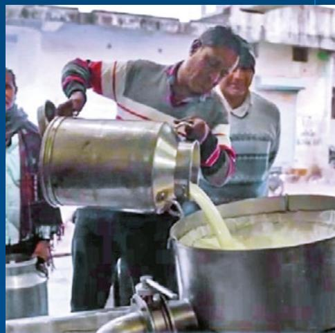

> **AI Description:**
> **Source:** `assets/_page_15_Figure_0.jpg`
> 
> **Generated:** 2026-05-24 13:25:30
> 
> ---
> 
> The image is a photograph showing a person pouring a liquid from a large metal container into a larger pot. The setting appears to be an outdoor or semi-outdoor environment, possibly a market or communal space. The person is wearing a striped sweater and gloves, suggesting they might be involved in food preparation or cooking. The liquid being poured looks like a thick, pale substance, possibly a sauce or broth. The background includes other individuals and structures, indicating a social or communal activity.

The focus on SURU validates our ability to identify opportunities early and address them by providing a wide range of products and solutions that are aligned with the customers' evolving needs.

Bapupura is a small village located in the Gandhinagar district of Gujarat. Out of the 2,500 odd people that call this village their home, many depend on dairy farming for their livelihood. India is the largest producer of milk in the world, yet, our farmers lack access to markets, finance and much needed know how to improve yields in the face of climate change.

HDFC Bank, has installed Milk-To-Money terminals in Bapupura, to help create a viable support ecosystem for small and marginal dairy farmers, automating the entire process of payments. The Milk-To-Money terminals act as multifunctional terminals that provide a transparent mechanism for the farmer to be paid exactly as per quality of milk delivered, thus eliminating any errors or discrepancies. The farmer accounts are electronically credited and they can withdraw the money from cash dispensers immediately, if needed. There are two objectives behind the initiative. One is promoting financial literacy and inclusion in deeper geographies where India resides. The other is promoting digital transactions for financial services in rural India. The project benefits the entire community in the locality irrespective of their demographic profile.

This initiative has helped the farmers inculcate the saving habit and ultimately helped enhance their status.

How We Create Value

30Our value creation model

32 Stakeholder engagement

34 Materiality Assessment

### Full Page Description (Page 16)

**Source:** `assets/_page_16_Asset_0.jpg`

**Generated:** 2026-05-24 13:42:45

---

The image is a circular diagram divided into eight segments, each labeled with a different financial activity or service: Wholesale, Pay, Invest, Shop, Insure, Trade, Borrow, and Save. The outer ring of the circle is labeled "Retail" and the inner ring is labeled "Business segments." The center of the circle is labeled "Customers." The diagram illustrates the various financial services and activities that a business can offer to its customers, categorized into retail and business segments.

## OurResources

## Financial capital

·Deposits

· Shareholders' funds

· External borrowings

## Stakeholder Value Creation

## Our Purpose

We exist to help every Indian make better money choices, today and tomorrow

## Human capital

· Employee base

## Our Values

·Work-from-Home-facilitation

· Learning & Development

·Employee engagement initiatives

Product Leadership

·Employee benefits

People

## Social & relationship capital

Operational Excellence

> **AI Description:**
> **Source:** `assets/_page_16_Figure_2.jpg`
> 
> **Generated:** 2026-05-24 13:55:00
> 
> ---
> 
> The image contains a simple graphic of a blue lock with a red heart shape inside it. The lock appears to be a stylized representation, possibly symbolizing security or privacy with a personal or emotional twist. There are no labels or text annotations present in the image.

·CSR expenditure

· CSR programmes executed through five focused pillars

·Trade partners and merchants

·Workforce engaged in CSR programmes

Customer Focus

·Partnership with government

## Manufactured capital

· Banking outlets, Business Correspondents (BCs) managed under CSC

·ATMs+cash deposit and withdrawal machines

· Corporate office and other locations

· Data centres

## Intellectual capital

· Digital enterprise: Advanced Al and ML capabilities

· Credit policy and underwriting skils

· Technology Focus

· Risk Management framework

· Collaboration with fintechs and start-ups

· Capacity building on climate risk

## Natural capital

· Natural resources consumed - electricity,fuel,water,paper among others

· Natural resource conservation initiatives

Sustainability

· ESG screening of portfolio

## Strategic pillars

· Re-Imagining the branch channel

· Virtual Relationship Management (VRM)

· Semi-Urban & Rural (SURU)and Government & Institutional (G&l)

·Leadership in payments business

·Technology & Digital

· Commercial and Rural

·Retail Assets

· Corporate Cluster

·Wealth

· Digital Marketing

## Key enablers

Effective risk management

Technology robustness

Customer service and experience

Culture

People-leadership and development

## Long term objectives

· Increase customer base

· Operational efficiency

· Expand footprint

·Omnichannel experience

· Healthy asset quality

·Access low cost funds

## Outputs FY21

## Products

▲ Retail Deposits

## Wholesale Deposits

2,67,198.88 Cr

Total Advances 11,32,837 Cr

## Outcomes

5,27,586 Cr

## Financial capital

· Net revenues: 90,084.46 Crore

· Net profit: 31,116.5 Crore

· Return on assets: 1.97%

· Return on capital: 16.6%

· Cost-to-income ratio: 36.3

## Human capital

· Net Additions: 21,471

·Women in workforce:18.15%\*\*

·Employee engagement score: 75%

> **AI Description:**
> **Source:** `assets/_page_16_Figure_10.jpg`
> 
> **Generated:** 2026-05-24 13:34:20
> 
> ---
> 
> The image contains two circular icons. The first icon depicts a group of people with a circle around them, suggesting a team or group setting. The second icon shows two pairs of shoes, indicating a focus on footwear or possibly a comparison between two types of shoes. The icons are blue with white symbols, and the overall design is simple and clear.

## Social & relationship capital

· Net promoter score: 49

· Customer additions: 58 Lakh+

·Total Business Correspondents (BCs): 15,756"

· CSR spend: 634.91 Crore

\* During the year \*\*As on March 31,2020 ^Retail transactions

## Wholesale Advances

Growth

5,83,925 Cr

> **AI Description:**
> **Source:** `assets/_page_16_Figure_15.jpg`
> 
> **Generated:** 2026-05-24 13:29:55
> 
> ---
> 
> The image contains a simple icon with two white ear-like shapes on a blue circular background. This icon is commonly used to represent audio, sound, or listening. There is no text or additional visual content beyond the icon itself.

## Manufactured capital

·Total banking outlets: 21,360

· Cities and towns covered: 2,902

> **AI Description:**
> **Source:** `assets/_page_16_Figure_16.jpg`
> 
> **Generated:** 2026-05-24 13:26:54
> 
> ---
> 
> The image contains three circular icons with blue backgrounds and white symbols. The top left icon shows a group of people, indicating a social or team context. The top right icon depicts two glasses, suggesting a social or celebratory event. The bottom icon shows a tablet or smartphone, indicating digital or technological use. These icons likely represent different aspects of a social or professional setting.

·ATM + cash withdrawal/deposit machine addition: 1,186

## Intellectual capital

· Brand Valuation: \$20.2 Billion^^

· Strengthening of core and creation of digital stack

·Attracted market-leading skills in areas such as data analytics,IT,equities and advisory solutions

· No of APls active on bank's gateway: 178

## Natural capital

· Scope 1 and 2 emission reduction: 23% over FY20

· 463 loan proposals screened and approved through the SEMS framework

·Trees planted in FY21: 6.2 Lakh

· Cumulative rooftop solar capacity in FY21: 198.3 KWp

# For a complete list of SDGs impacted through our social & relationship capital, please refer Page 80 As per BrandZ

## UN SDGS#

8

# Stakeholder Engagement

## An outside-in view

At HDFC Bank, we continuously engage with our stakeholders to understand their expectations and respond to their needs. It also enables us to identify their current and evolving interests, which are fed into our strategy planning process.

We serve Over 6 Crore customers through our 21,360 and growing banking outlets. Our disabilityfriendly infrastructure and services reflect our commitment to empowering all our customers. All our ATMs are enabled with a voice-guided system and braille keypad for the visually challenged; the premises of 718 ATMs provide complete accessibility for wheel-chair bound customers through ramps.

Our family of 1.2 Lakh+ employees with diverse socio-economic and educational backgrounds enable us to deliver hyper-personalised experiences to our customers.We remain committed to fostering a culture of inclusion, diversity, growth and progression, and well-being for our employees.

We work closely with our suppliers to encourage them to add value beyond the economic bottom-line for greater integration of environmental and social considerations.We give preference to local suppliers for procurement of products and services, while taking their relevant geography and footprint into consideration.

· Online and postal communication

## Modes of engagement

· Customer satisfaction surveys

·Regular interaction with customers

·Feedback from customers

Communication of Responses

· Annual performance appraisal discussions

·Employee engagement initiatives

We continue to refine our strategy to respond to the most pressing challenge of our time - the COvID-19 pandemic. We have enhanced the total value of our CSR support and investments across programmes. Our CSR brand, Parivartan has so far impacted 8.5 Crore+ lives across more than 1,970 villages in India.

Stakeholder ldentification

· Innovative technology applications

· Ease of transacting across channels

## Frequency

Reporting

· Phone calls and surveys

Stakeholder Engagement

Key concerns and expectations

Continuous

· Advanced analytics

· Regular meetings

· Data security

Materiality Assessment

· New products enabled by the Bank's digitisation strategy

## Response and Mitigation

·Making personalised recommendations with virtual Regional Manager (RM)

·Awareness on data security and privacy

·Training and career progression

· Wellness and safety

Continuous/Annual performance review

·Employee benefits

We strive to maintain high compliance standards; actively participate and contribute to industry and regulatory working groups. We also have a strong focus on DBT payments to deliver seamlessly to the beneficiaries under various government schemes such as MGNREGA, PMAY, and PMKSY.

·Regular behavioural and technical training

·Employee engagement, health and wellness programmes

## Stakeholder engagement process

In order to capture stakeholder expectations,feedback and response transparently,we have adopted a fivestep stakeholder engagement process.

## Governments/ Regulatory Bodies

Our stakeholder prioritisation exercise was conducted with the departments constituting the internal ESG Action Committee. First, allte relevant key stakeholders were identified based on their interest in the Bank.These identified stakeholder groups then were further prioritised based on their importance to our business.

Continuous/Annual performance review

· Partnership

> **AI Description:**
> **Source:** `assets/_page_17_Figure_5.jpg`
> 
> **Generated:** 2026-05-24 13:54:17
> 
> ---
> 
> The image depicts a simple illustration of two people sitting at a table, engaged in what appears to be a meeting or discussion. One person is seated on the left, wearing a blue dress and holding a piece of paper, while the other person on the right is dressed in a dark suit and is holding a pen. Between them is a table with a laptop on it. The illustration is minimalistic and uses a limited color palette, primarily blues and grays. There are no charts, graphs, or additional text annotations present in the image.

· Governance and ethical practices

> **AI Description:**
> **Source:** `assets/_page_17_Figure_6.jpg`
> 
> **Generated:** 2026-05-24 13:50:33
> 
> ---
> 
> The image contains a simple icon of a safe. The icon is circular with a blue background and a white border. Inside the circle, there is a white outline of a safe with a keyhole and a small handle, suggesting security or protection.

· Ensure timely payment for services

## Investors / Shareholders

· Whistle Blower Policy to ensure good practices

We continue to generate value for our 14 Lakh+ shareholders. Our basic earnings per share (EPS) stands at 56.58 for FY21, up from 48.01 in FY20.

## Modes of engagement

· Regular meetings

·Policy updates and ministry directives

·Mandatory flings with key regulators ·Quarterly reports,integrated reports and press releases

·Investor meets and Annual General Meetings (AGMs), including virtual investor meets and virtual AGMs in the era of COVID-19 pandemic

## Frequency

Continuous

· Regular meetings

Key concerns and expectations

· Focus group discussions

· Compliance

Continuous

·Project monitoring and reviews

· Social Security schemes

· Compliance

· Governance and ethical practices

·Relevant national mandates

· Economic performance

·Policies and demonstration of responsible business conduct

## Response and Mitigation

Compliance and ethics oriented culture including formulation of relevant policy frameworks and enforcement thereof

Continuous/Annual performance review

· Training and inclusive growth

·Awareness generation on the mandates by the Government of India

·Financial literacy

·Holistic rural development programme

·Sustainable livelihood initiative

· Financial literacy camps

## Materiality Assessment

## Identifying issues that impact value creation

We identify key topics that have a material impact on ourability to create value through a materialityassessment exercise,which is aligned with GRl requirements and is conducted in consultation with internal and external stakeholders.The topics identified as ‘material' to us reflect the challenges, risks and opportunities we might face.

The last such exercise was undertaken in FY19,which enabled us to incorporate insights from relevant stakeholder groups into our decisionmaking process. In FY21,we updated ourmateriality analysis to better reflect emerging ESG issues such as climate change risks.

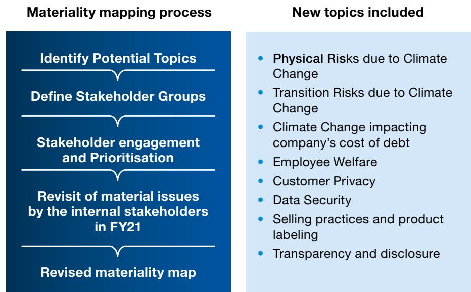

> **AI Description:**
> **Source:** `assets/_page_18_Figure_0.jpg`
> 
> **Generated:** 2026-05-24 13:43:21
> 
> ---
> 
> The image contains a flowchart and a list of new topics. The flowchart outlines the "Materiality mapping process" with four main steps: "Identify Potential Topics," "Define Stakeholder Groups," "Stakeholder engagement and Prioritisation," and "Revisit of material issues by the internal stakeholders in FY21." The flowchart leads to a "Revised materiality map." On the right side, a list titled "New topics included" details eight new areas: Physical Risks due to Climate Change, Transition Risks due to Climate Change, Climate Change impacting company's cost of debt, Employee Welfare, Customer Privacy, Data Security, Selling practices and product labeling, and Transparency and disclosure. The image combines text with a simple flowchart diagram to convey information.

## Outcome

The aggregated inputs from allthe relevant stakeholders were consolidated and combined to arrive at our materiality map. Emerging ESG risks added including climate change risks.

HDFC Bank's Materiality Map (Internal Stakeholders)

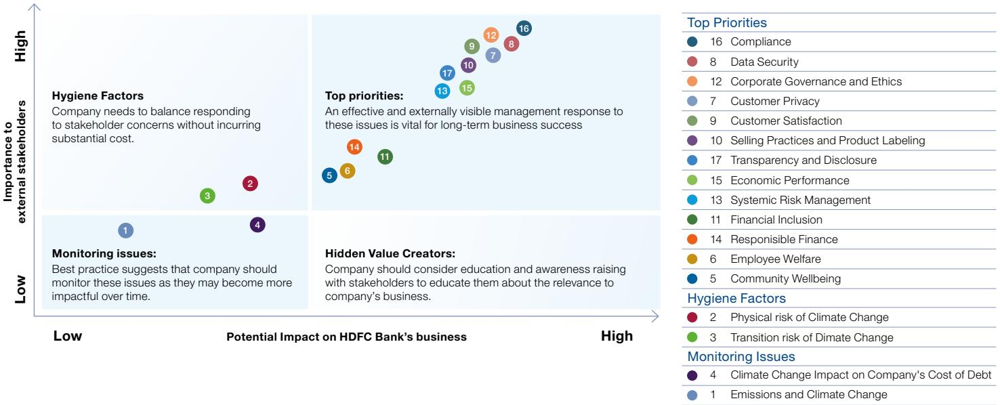

> **AI Description:**
> **Source:** `assets/_page_18_Figure_1.jpg`
> 
> **Generated:** 2026-05-24 13:42:36
> 
> ---
> 
> The image is an infographic combining text with a scatter plot. It categorizes various issues related to HDFC Bank's business into three groups: Hygiene Factors, Top Priorities, and Monitoring Issues. The scatter plot plots the importance to external stakeholders against the potential impact on the bank's business. The top priorities are highlighted, emphasizing the need for an effective and externally visible management response to these issues for long-term business success. The infographic also lists the top priorities, hygiene factors, and monitoring issues with corresponding numbers and brief descriptions.

Theefective managementof materialissuesiscitical toourbusinesssustainabilityasitdirects ourstrategic planningand management priorities towards achieving long-term sustainable value for our stakeholders.

ldentified sustainability topics mapped with relevant GRl aspects and capitals

## Sustainability topics mapped to our value chain

Financial Capital

Human Capital

Intellectual Capital

Social & Relationship Capital

> **AI Description:**
> **Source:** `assets/_page_19_Figure_4.jpg`
> 
> **Generated:** 2026-05-24 13:41:36
> 
> ---
> 
> The image contains a simple icon of a location marker, typically used to indicate a specific point on a map or in a navigation system. The icon is circular with a blue background and a red dot in the center, representing a pinpoint location. There are no additional visual elements or text annotations in the image.

Manufactured Capital

> **AI Description:**
> **Source:** `assets/_page_19_Figure_5.jpg`
> 
> **Generated:** 2026-05-24 13:41:28
> 
> ---
> 
> The image contains a simple icon of a molecule with a blue atom at the center and red and blue lines representing bonds. The icon is circular with a white background. There are no charts, graphs, or text annotations present in the image.

Natural Capital

## Catalysing the next wave of transformation

> **AI Description:**
> **Source:** `assets/_page_20_Figure_0.jpg`
> 
> **Generated:** 2026-05-24 13:54:31
> 
> ---
> 
> The image contains a photograph of two individuals seated at a table, engaged in what appears to be a professional or educational setting. The person on the left is wearing a white shirt and is gesturing with their hands, possibly explaining or discussing something. The person on the right is wearing a purple shirt and is looking towards the person on the left, seemingly attentive. The background is softly lit and out of focus, drawing attention to the two individuals. The setting suggests a meeting or a collaborative discussion.

Over a quarter of a century, we have built a formidable banking franchise by spoting opportunities early and then capitalising on them in relevant markets and through the right channels. Steered by a new leadership, we recently launched Project Future Ready to catalyse, create and capture the next wave of growth.

> **AI Description:**
> **Source:** `assets/_page_20_Figure_1.jpg`
> 
> **Generated:** 2026-05-24 13:55:24
> 
> ---
> 
> The image contains a photograph of two individuals standing in a green field. One person is dressed in traditional attire, holding a tablet with a blank screen, while the other is in a formal shirt and tie, giving a thumbs-up gesture. The setting appears to be rural, with a bicycle partially visible in the foreground and trees in the background. The image conveys a sense of modern technology being used in a traditional context, possibly related to agriculture or farming.

Broadly classified under Business Verticals, Delivery Channels and Technology/Digital, these engines will be driven by a workforce with diverse skills, and multifunctional exposure with a One Bank collaborative mindset. This wil be backed by our traditional strengths in Internal Audit, Underwriting, Risk Management and Governance. Further, we have already outlined our technology transformation agenda to synergise and integrate our technology/digital functions and will invest aggressively to both Run and Build the Bank of the future.

10 growth engines of under Project Future Ready

> **AI Description:**
> **Source:** `assets/_page_20_Figure_2.jpg`
> 
> **Generated:** 2026-05-24 13:53:32
> 
> ---
> 
> The image contains a simple icon of a laptop with a speech bubble coming out of it. The icon is set against a blue circular background. The icon suggests a concept related to communication, possibly indicating a chat, messaging, or feedback feature in the context of a laptop or computer.

Corporate Cluster

MSME and Rural

Government and Institutional

> **AI Description:**
> **Source:** `assets/_page_20_Figure_5.jpg`
> 
> **Generated:** 2026-05-24 13:57:26
> 
> ---
> 
> The image contains a simple icon of a smartphone with a red alert symbol inside it. The alert symbol is a triangle with an exclamation point, commonly used to indicate a warning or critical issue. The icon is set against a blue circular background. The image is a visual representation of a critical alert or warning, likely related to a mobile application or system.

Private Banking

Retail Assets

> **AI Description:**
> **Source:** `assets/_page_20_Figure_7.jpg`
> 
> **Generated:** 2026-05-24 14:01:01
> 
> ---
> 
> The image contains a simple icon. It is a blue circle with a white outline. Inside the circle, there is a white symbol resembling a network or a cloud with lines radiating from a central point. Within this network symbol, there is a white rupee sign (₹) in the center. The icon appears to represent a financial or economic concept, possibly related to currency or financial transactions.

Payments

Branch Banking

> **AI Description:**
> **Source:** `assets/_page_20_Figure_9.jpg`
> 
> **Generated:** 2026-05-24 13:28:35
> 
> ---
> 
> The image is a simple diagram featuring three interconnected circles, each containing a human figure icon. The circles are connected by lines, suggesting a network or relationship structure. The circles are colored in shades of blue, and the lines connecting them are also blue. The diagram appears to represent a social network or a system of interconnected individuals.

Tele-Sales/Service/ Relationships

> **AI Description:**
> **Source:** `assets/_page_20_Figure_10.jpg`
> 
> **Generated:** 2026-05-24 13:47:36
> 
> ---
> 
> The image contains a simple icon of a hand with a finger pointing towards a circular area, which is colored blue. The icon is commonly associated with a "click here" or "touch here" action, often used in user interface designs to indicate a clickable element. The icon does not contain any text or additional visual elements beyond the hand and the circular area.

Digital Marketing

> **AI Description:**
> **Source:** `assets/_page_20_Figure_11.jpg`
> 
> **Generated:** 2026-05-24 13:49:59
> 
> ---
> 
> The image contains a simple diagram of a smartphone with a hand icon pointing towards it. The smartphone screen displays a grid of red squares, which could represent app icons or buttons. The hand icon suggests an action of interaction or selection, possibly indicating a user interface element or a step in a process.

Robust Technology and Digital Platforms

## Our Strategy

40 Strategy in Action

46External Environment

50 Risk Management

54 Business Continuity Plan

## Strategy in Action

# Our Future Ready Strategy

As a Bank, we assess disruptions and real-time challenges for insights to adapt our strategies and focus areas. We continue to keep our stakeholders at the centre of our strategy with ESG as an overarching principle. Our strategic priorities as envisaged in the previous years has held us in good stead through the pandemic. However, this was a year of improvising, finding solutions and being pragmatic,in an unpredictable domestic and global environment.

Toimprove focus on what the Bank perceives as growth engines,we havefine-tuned our strategicpriorities bymaking them moregranular.Ourstrategycanbe visualisedas tenpilars supportedbycertain enablers.Theseare foundationaltothe Bank and hence critical for achieving our strategic goals.

## Our purpose To help every Indian make better money choices, today and tomorrow

Environmental, Social and Governance (ESG)

Focus on customer service is key to the HDFC Banking experience along with the wide range of products and customer-centric initiatives.

Enhance our compliance culture and exhibit highest standards in way we go about doing our business.

Our risk management and compliance framework is embedded in the systems and processes across operations and functions and complemented bya risk conscious culture led by the Board.

Aided with tools and technology, we would focus in ensuring a seamless process of onboarding customers,offering products and services,underwriting processes and customer engagements with minimum intervention,i.e., zero paper, zero touch!

The Bank encourages organisational Culture of mentorship, transparency, communication,empowerment and supporting.

Our‘nurture and care' attitude towards our people is fundamental to the Bank's twin strategic objectives of leadership and development.

## Strategic pillars Re-lmagining the branch channel

Our branches represent the Bank to its customers, the society and other stakeholders and own retail and business customer relationships. Retail branch banking is the key driver for retail deposits franchise,retail trade and forex business,unsecured and secured asset business and third-party distribution business.At the same time it's also a congregation place for its sales force to get together,brainstorm and formulate its one bank approach for ‘Go to market'.

Our strategy is to re-imagine this channel by bringing more science to the art of relationship management. The primary objective of this strategy is to acquire new customers,gather a larger share of the wallet of existing customers and deliver a best in class experience,thus building customer loyalty.

The Bank intends to transform its branches into ‘phygital' financial marketplaces through - catchment scoping and mining with institutionalised consistency and customer need centric conversations enabled through artificial intelligence led predictive analytics.Retail Branch Banking has evolved in a significant manner over a period of time and while the transformation journey continues, the ethos remains the same - ‘Focus on customer'.The key strategic drivers are:

Holistic customer life cycle management: Centred around holistic Customer Lifecycle Management and our ability to read customer insights/ needs and provide the right product proposition. It also,inter alia,entails the ability to map and source the right set of customers using a differentiated go to market approach.

2 Analytics led customer conversation and distribution planning tool: An approach which

Branches - One-Stop shop Branches are well equipped to service all needs of customers

Business Correspondent Reaching the doorstep of citizens through the Bank's 15,756 Business Correspondents

Catchment   
Programme   
Focus on acquiring   
HNW customers in the   
area as well as widening   
reach in every sphere of   
the catchment

How we are re-imagining branch channel

Access to high end Al Adoption of ‘Next Best Action' - an Al-powered analytical tool helping 'predict' customer requirements

encapsulates the tenet of ‘Need Based Selling'. Using cutting edge Al,conversations with the customer are more meaningful.The decision matrix with respect to distribution expansion has now been embedded with structured and unstructured sources of data to help the business team take data driven decisions on key issues like opening branches,or serving customers through a ‘Smart Banking Lobby'or, Business correspondents

③ Digitisation of Sales, Service and Branch Operations: Significant headway in digital journeys in all customer touch points like sales, service and operations.Mobile-first approach leveraging Aadhar,and‘walk out working' straight through journeys are some of the concepts that are helping us achieve significant benefits in terms of improved customer experience and cost reduction

4 Customer Experience Excellence: The cornerstone of Customer Experience is to delight customers at every touch point. In this endeavour, key strategies include process simplification and digitisation Omnichannel Experience All of the Bank's products available at every customer touch point

thus reimagining the journeys and making them simple and user friendly. Also,enable self-service wherever possible so that there is complete empowerment of customers in completing paperless journeys on their own.Net Promoter Score as a metric of measuring customer satisfaction and loyalty has been introduced to build a ‘Customer First' culture.

5 People Capability: Building a ‘Future Fit'team that understands ‘voice of customer' and has the ability to funnel that understanding to create newer propositions,simpler processes and engaging customer experiences. Empowering teams to digitally access interactive learning interventions that equip them to build customer delight.

## Virtual Relationship Management

Digital is transforming the marketplace. The Bank believed early that traditional relationship management is making way for technology and virtual engagement with customers. Over the last few years, the Bank has invested

## Strategy in Action

in its virtual relationship management channel to further advance its customer engagement and enhance its service experience.In the last year, digital or contactless banking has become more of a necessity than a service enhancement.As digital literacy and exposure increases exponentially, VRM is gaining acceptance through wider engagement,deeper relationships and a complete suite of products to offer. A banking experience with digital ease and personalised conversations is the core of our VRM strategy.

The Virtual Relationship Management practice is an integrated customer centric approach covering three pillars.

· Virtual Relationship

· Virtual Sales

· Virtual Care

a) Seamless 24/7 access to customers with global service standards

b) Automated Interactive Voice Response solution in 12 languages with over 20 services

We as a Bank believe we are best placed and have a head start with our Virtual Relationship Management practice leveraging four key components:

a) Omni Channel Engagement framework

b) Seamless digital journeys

c) Data Science led customer interaction

d) Robust talent pool of well-trained Virtual Relationship Managers

The model is built on a foundation of Customer Obsession to Nurture, Careand Collaborate.The Virtual Relationship Managers offer world class service interaction with an analytics led need based product distribution approach aimed to make us the Primary banker of choice to the customer. The Virtual Relationship Managers serves the customer lifecycle under five pillars - a) Save b) Invest c) Borrow d) Transact e) Engage.This cohesive strategy allows to deepen the relationship and proactively offer the right product program to the customers.

The Bank is making significant investments in technology upgradation of the customer facing solutions around Interactive Voice Response Systems, Data Management and digital engagement platforms like Video KYC to offer world class virtual engagement framework for its customers.

## Semi-Urban & Rural (SURU) and Government & Institutional (Gl)

The last few years have been a renaissance of sorts in the Rural Ecosystem with the advent,adaptability and usage of technology in the hinterlands.There has beena steady rise in mobile penetration in the Rural areas and the access of data has opened up the world of aspiration building,increasing demand and thereafter fulfilment.With more than half of our banking outlets and a third of our workforce (including Agri/ SLl and RIG) in this market,we are well poised to excavate and maximise this opportunity by creating phygital processes for business and market share increment as well our Bank's penetration. Our Bank's tie up with CSC -a special purpose vehicle (SPV) set up by Ministry of Electronics and Information Technology (MEITY) to offer Citizen Facilitation Services digitally has been a catalyst in increasing the distribution footprint in the semi-urban and rural geography without incurring cost on setting up a brick & mortar model.Till date we have on-boarded more than 1 Lakh VLE's as Business Facilitators and Business Correspondents to help source business for us.With the help of the VLEs,we intend to create a large distribution network to capture the opportunities in the semi-urban and rural areas as well as geographically increase our reach in deep geographies.

The lifting of the embargo on Government business for private sector banks,the Digital India Mission,and the recent circular on the Single Nodal Agency account by Government of India are strong tailwinds for this business. The growing emphasis at each level

of Government to use technology to bring in transparency and efficiency offers significant promise. Given our large distribution network including in rural areas,technological prowess, partnerships with key digital platform and solution providers,competitive product offerings,and a focus on granular business we are well-poised to further our market share. On the institutional front, the opportunity is humongous in the following segments - education,healthcare,housing societies,NGOs,trusts given the multiple types of trusts,e.g. charitable, family, gratuity,etc.Each segment is a vertical in itself. We are adopting an ecosystem based approach to unlock the opportunity offered by each segment.This entails systematically targeting the constituents of each segment and putting in place the relevant products,partnerships,digital journeys, solutions,and offers for the constituents of each segment.

## Leadership in Payments Business

We are the leading player in the payments ecosystem with dominant share in both card issuing and acquiring business

We have the most extensive suite of payment form factors to offer to our customers be it Cards,POS terminals, payment gateways,UPl,QR etc.With over 51 Million credit cards,debit cards and prepaid cards addressing every market segment, every third rupee spent on cards in India happens on HDFC Bank cards.We are a leading player in credit cards with a strong growth and market share on both booksize/ENR and spends.We have built several strong digital offerings like PayZapp and plan to fortify the product offering in the coming year to provide strong engagement platform for HDFC Bank customers.We will be providing strong unified experience across contactless payments, QR based payments,UPl payments, BNPL and digitalising all payment form factors with rich features ina unified platform. Smartbuy is growing as a

strong offer platform which aggregates strong offers from merchants and partners,providinga one-view to the customer on all benefits which he/ she can avail exclusively as a HDFC Bank customer. We have provided a strong loyalty framework and gained popularity among customers for getting accelerated reward pointsand rewards redemptions ina single platform.

To complete our suite of products and payment suite to the retail consumers, we are scaling BNPL with multiple variants that we are building to make customer purchases convenient. Between Credit card EMI, Debit card EMI,paper financing we are riding the wave of innovation and have become No.1 among all banks in BNPL.We plan to launch several new variants, customised solutions with large brands/ partners in the coming year.

We have extremely strong plans to also grow two new segments apart from retail consumers.Commercial and SME payment solutions is a fast growing space and we have made strong carding and payment solution inroads into this segment.We have several curated solutions being rolled out for Corporate & SME segment and we will grow this segment by 2X in the coming 2 years.

Merchant Acquiring business provides the rail road for banking solutions and Payment offerings to the largest customer segment- MSMEs.As a Bank we have been leading this business for 15+ years and despite the disruptive competition in this space,we have continued to grow and currently have over 47% market share.Our focus is to grow our current 2 Million acceptance points network by 10X in 3-5 years.

Over the years our strategy has evolved in-line with the competitive landscape and market opportunities, From focusing only on large and key merchants in the top 30 cities to expanding the industry by investing in digitising institutional segments like education, government and societies and taking the product range to deeper geographies to now focusing also on the small merchants and neighbourhood kirana stores and building partnerships,our strategy has continued to evolve. In recent times with large fintechs and MNCs entering this space,our strategy has been further strengthened with two new pillars of ‘Partnerships'and ‘Service and Experience'.The success of this is reflected in our consistently growing market share and merchant engagement metrics.

To support this strategy we recently launched SmartHub 3.0 -a comprehensive banking and payment solution range for all merchants.This range of solutions allows merchants and self employed professionals to instantly open a mini savings account or current account and start accepting payments in-store,online and onthe-go.The solution range is tailor made for the size and segment of the merchant and consists of a vast range of offerings starting from rent free SmartHub merchant app and QR to personalised payment link option to a vast bouquet of POS devices.This platform is further being expanded into a super app ecosystem with integrated servicing,integrated cash-flow based lending,small ticket size flexible repayment loans,business cards and suite of value added services,offered in partnership with fintechs.While the platform and ecosystem will ensure engagement and scale, with reducing transaction margins and need for higher investments,the business focus to generate revenue will be through a ‘sandwich strategy'. Under this strategy the payments layer in the middle will be ring-fenced with a layer of liability offerings on one side and asset offering on the other. These offerings will be for both the merchants and also the customers of the merchant, integrated seamlessly in the SmartHub platform. This will help merchants improve their cash-flow as Bank will enable funding & affordability at transaction level on all its acceptance points. This has multilevel benefits to both the bank and the merchants - Bank gets distribution point expansion and Merchants get cashflow benefit and also incentives from the Bank, thus creating a synergistic sustainable strategy for the Business.

## Technology/Digital

Our vision is to build a technology led bank.We are doing this by leveraging our strengths and building for the future. Some key aspects are:

· Continue to focus on scale to manage one of the largest franchises in the world; creating infrastructure, partnerships and competencies for scale is a priority

·Fortifying our infrastructure and building for resiliency

·Focus of customer experience - make banking easy for young and old, urban and rural. Offering best-in-class experience for our existing and potential customers

·Bring in operational efficiencies - build a highly productive workforce

·Build a safe, transparent and a regulatorily compliant technology led bank that citizens can trust

Our approach is two pronged -‘Run the Bank'and ‘Build the Bank of the future'. Making banking easy, contextual and safe for our customers is our priority. We have been digitising our customer journeys across the bank enabling easy onboarding,transactions and customer lifecycle management. In parallel we are also building new capabilities and competencies to build the bank of the future.

As we realise the above objectives through multiple initiatives,we are also building one of the finest digital and technology capabilities in the financial services industry.We are not only fortifying our enterprise IT but also building new muscle through our newly created Digital Factoryand Enterprise Factory.The new factories are bringing in new skils,new technologies and new ways of working.

We have begun architecting our banking technology stack for the future:

1 Building a resilient core that is always‘ON'and performs at scale

2 Creating secure APls and microservices for information interchange

③ Re-imagining intuitive and contextual customer journeys on engagement platforms

## 4 Leveraging data analytics.

We can already see some impact. Our transactions on mobile and net banking are increasing. As our onboarding journeys become simpler and intuitive through the use of new engagement platforms,we see a higher preference and adoption for digital. We are also leveraging data analytics,Artificial Intelligence (Al) and Machine Learning (ML) for powering personalisation,credit underwriting and risk control.

Our underlying core technology infrastructure is being further fortified to make it resilient and scalable to handle the ever increasing load of digita transactions. Our proactive monitoring of service paths and DevSecOps framework would ensure that we have a continuously integrated build and deployment pipeline to ensure agility, qualityand security.

## Commercial and Rural

One of the important pillars of the Bank's strategy is commercial and rural strategy which encompasses - micro,small and medium enterprises (MSME/SME),emerging corporates, the mid-market companies,commercial agriculture and commercial transport companies.This is the Bank's fastest growing market group that contributes significantly to India's manufacturing output,export,employment, supply chain network and infrastructure. Constraints faced by the group include lack of easy or timely access to credit, high cost of credit and collateral deficiency.These issues,viewed with the growth potential of the commercial and rural sector,is an opportunity like no other.The Bank aims to augment as well as facilitate the growth of individual ecosystems that exist within the group, (such as the rural ecosystem or the supply chain network), with products and services tailored to add-value and financial strength. Focusing on the commercial and rural group also supports the Bank's goal of deep geographical penetration and expansion.Using customised product offering,digital expertise and deeper geographical presence, the Bank is contributing to bridging the gap between India and Bharat.

## Retail Assets

The Bank continues its leadership position in Consumer/Retail assets in various key and diversified product offerings like auto loans,personal loans and home loans among others. The strengths built in these products by serving the large metro and urban customer base can be adapted to serve the needs of the large population in the Indian hinterland where consumer aspirations are increasing.Their banking needs have to be assessed and addressed differently from the urban retail banking customers.We have carved Retail Assets as a separate strategic pillar to ensure higher focus on this segment especially in deeper geographies where the growth drivers come from using digital advancement and increased geographical presence. We will continue to focus on salaried segments within top rated corporates and government institutions across geographies and we believe that increasing aspirations will provide us a greater opportunity to cross sell our diversified retail products.The Indian market is likely to growat a better rate in the coming five years vs the last five. This data is basis the emerging markets trends world over and with unorganised sector becoming more organised with bureau support the organised

consumer financial sector will increase at a faster rate. HDFC Bank,with a strong distribution in both open market and internal customer franchise with digital strengths is in the right position to leverage and grow across touch points and pincodes.

## Corporate Cluster

The Bank's corporate banking vertical offers comprehensive banking solutions to corporates across industries and sectors.This includes but is not limited to,large business houses,MNCs, companies in the manufacturing and service sectors,public sector enterprises,financial institutions, Global Capability Centres (GCC) etc. The focus of the corporate cluster is to deepen corporate relationships with more attention being paid to their requirements on the funding side,with regards to their collections and payments,their trade related requirements or even the financial well-being of their employees and key officials.

The strategy around our ‘corporate cluster'has been focused on serving the entire ecosystem of large corporates. Using ground level intelligence about our customers' processes,distribution networks, geographies etc. the Bank provides value-adds and solutions for financial concerns that are unique to industries in this cluster. The Bank already has host to host connectivity with the large corporates using APls and is working towards digitising end-toend transaction processing within their ecosystems.The quality service offering that is provided to our corporate customers can be extended to customers and suppliers of the corporate using ‘ecosystem banking' with a view to bring the client's entire financial world under one umbrella. The Bank's value proposition is twofold; 1. To digitise the purchase and ownership journeys of the company's customers and 2. To enable all sourcing to be digitally tracked and to use trade finance products to enable a

better relationship with its supplier. This initiative uses digital platforms, interfaces,data analytics,and our wealth of relationships to provide the corporate and its entire gamut of customers and trade partners,quick and easy access to financial solutions with an aim to increase product penetration at each corporate.

Diversification of the corporate portfolio is also a key driver of the growth of the corporate cluster.

## Wealth

A large proportion of wealth in India lies distributed even beyond the top 20 cities of the country. The Bank's strategy is to covera larger geographical spread, to provide differentiated wealth management solutions using digital tools.The Bank is creating new product offerings and improving its existing solutions to reach out to this population using technology. With focus on‘wealth'as a strategic priority, the Bank aims to increase its wealth management customer base significantly,in the next few years.

## Digital Marketing

Our digital marketing strategy is to leverage it as an independent channel for end-to-end business generation. It rests on three key pillars.

1 Create Brand awareness and consideration: Leverage digital marketing to drive awareness about our financial solutions,create customer brand love,so they will consider us favorably while making their purchase decisions.

2 Deliver Portfolio Objectives: Use our Omni Channel forte consisting of website, net and mobile banking, notifications,SMS,Email, WhatsApp and social media to deliver the business portfolio objectives. Develop segmented and personalised communication based on highly advanced Al/ML models.

③ Contribute to direct business generation: Digital marketing relies on advanced analytics to identify and target the right customer with the right product,at the right time,in their most preferred channel of communication and with high levels of personalisation. Investments in advanced analytics tools on cloud have ensured we have a deep understanding of customer behaviour,and their preferences to curate personalised interventions,at scale and to create relevant customer engagement.

Investments in latest Martech solutions have been done to create frictionless digital journeys that allow customers to buy our financial products and services with zero or minimal physical interface.

We are closely linking customer understanding using technology to drive digitisation across the bank.We have honed the ability to execute digital marketing plans at scale and in tandem with the traditional marketing channels so as to provide our customers quick and easy access to all our financial solutions.

## Subsidiaries

We have created frictionless digital journeys for loans,deposits and payment solutions which allow our customers experience makinga purchase in a few clicks.This also helps us take our financial solutions to the under-penetrated semi-urban and rural segments.

Our Pay, Save, Borrow, Invest solutions will be part of these digital journeys, so that new and existing customers across segments can get instant approvals and purchase them without stepping out of their homes.

Through its subsidiaries HDFC Securities Limited (HSL) and HDB Financial Services Limited (HDB), the Bank offers a depth of customer relationship with the complete breadth of products. The subsidiaries are important pillars of theBank's strategy totapintoopportunitiesbeyond banking services

## HDB FINANCIAL SERVICES

HDB is a non-deposit taking nonbanking finance company (NBFC) that has positioned itself as a onestop financial services provider, with a complete suite of customised loan and other service offerings through a network of over 1,319 branches across 959 cities/towns. It's range of services and products include loansconsumer and enterprise loans, asset finance, micro-loans, feebased servicesand BPO services. HDB offers the Bank's customers end-to-end specialised services and currently has 61,560.7 Crore as Assets Under Management.

## HDFC securities

HSL is amongst the leading retail broking firms in India,and offers exhaustive range of investment and protection products to its customer base of over 27 Lakh. The Bank's focus on digitisation extends to the digital investment in HSL. In fact, this year, 92% of HSL's over 1 Million active customers accessed its services digitally. HSL's distribution network extends across 216 branches in 159 cities, serving a diverse set of retail and institutional customers in India.

# External Environment

# Responding to market challenges

COVID-19 delivered a global economic shock, leading to a much wider macroeconomic impact than the global financial crisis of 2007-08.

The pandemic disrupted the real economy,and not just the financial system alone.After a contraction of 3.3% in 2020, the global economy is projected to grow at 6.0% in 2021, aided by monetary and fiscal support extended by Governments and Central Banks,and the vaccination rollout. However, the shape of the recovery is likely to vary across regions based on the path of the pandemic,the severity

Projected global economic growth in 2021

of restrictions imposed to contain the spread,and the magnitude of policy actions.

In the US, the fiscal package of \$1.9 trillion is expected to bolster US economic growth and have a positive spill over effect on its trading partners. Among advanced economies, the US is expected to surpass its pre-COVID GDP level in 2021 and the UK's economy is expected to reach its prepandemic size in Q4 2021,while many others in the group are likely to return to pre-pandemic levels only in 2022. Similarly,among emerging economies,

China has already returned to its pre-COVID GDP in 2020 and India is likely to return to its pre-pandemic level of output in FY22.

On the domestic front, the surge in daily COVID-19 cases is likely to impact a fragile recovery,with the relationship between lockdowns, reduced mobility and impact on growth being relatively strong. An increasing number of states were forced to go into a complete lockdown or strict localised containment for a longer period of time, resulting in high impact on economic activity.

## 6%

Challenges posed by the operating environment
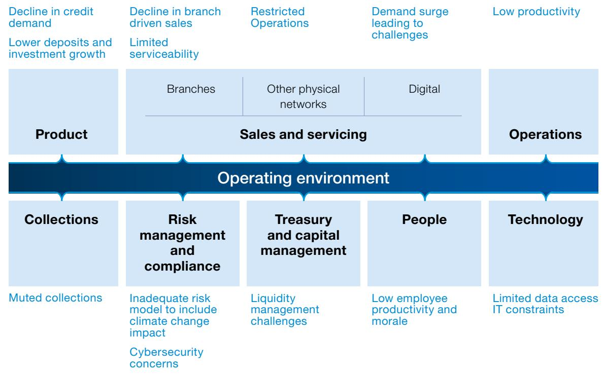

> **AI Description:**
> **Source:** `assets/_page_24_Figure_0.jpg`
> 
> **Generated:** 2026-05-24 13:30:57
> 
> ---
> 
> The image is a detailed infographic combining text with visual elements. It is divided into three main sections: Product, Sales and servicing, and Operations, each with subcategories and corresponding issues. The Product section lists challenges like a decline in credit demand and lower deposits and investment growth. The Sales and servicing section highlights issues such as a decline in branch-driven sales and limited serviceability. The Operations section includes concerns such as restricted operations and low productivity. Below these sections, the infographic further breaks down into Collections, Risk management and compliance, Treasury and capital management, People, and Technology, each with specific issues like muted collections and inadequate risk models. The infographic uses a color-coded structure with blue and white backgrounds to differentiate between different categories and issues.

## Increasing government and regulatory interventions

The Government and Regulators stepped in during the year to alleviate the socio-economic effects of the pandemic and to stimulate growth.

Two such measures were the moratorium and the loan restructuring packages introduced by the Reserve Bank of India.While the first allowed customers (from March to August 202O) to temporarily freeze loan repayments,the second eased the burden of monthly repayments.

## Our response

Loan moratorium - The relief provided to our customers include

·A standstill on delinquency position as of February 2020

· Relief from making loan repayments during between March 2020 and May 2020 (Moratorium 1) and between June 2020 and August 2020 (Moratorium 2)

We operationalised the moratorium process through a robust multichannel customer outreach programme designed to guide customers in a frictionless manner. Customers seeking moratorium were directed to our website to process their applications.

restructuring programme was aimed at easing the burden of monthly repayments for eligible customers who were significantly affected by the pandemic. Customers seeking loan restructuring were allowed to reschedule their loan repayments and were offered lower payment structures, with extended tenors of up to 24 months.

We also conducted an outreach programme to help customers understand the modalities of restructuring and guide them through the process. Our approach through the period was based on empathy, understanding and transparent communication as was evidenced by the scale and scope of relief provided to customers.

The Union Cabinet unveiled a stimulus package of 3 Trillion in May 2020 known as the Emergency Credit Line Guarantee Scheme (ECLGS) in aid of Micro, Small and Medium Enterprises,(MSMEs). This was aimed at addressing their working capital needs,operational liabilities and aiding businesses to restart.

HDFC Bank disbursed 29,622 Crore to over 1.23 Lakh customers in FY21 under the ECLGS scheme.We have also emerged as a star performer under the ECLGS 1.0 and 2.0 schemes.

Disbursement under ECLGS

## 29,622 Crore

> **AI Description:**
> **Source:** `assets/_page_24_Figure_4.jpg`
> 
> **Generated:** 2026-05-24 13:32:37
> 
> ---
> 
> The image contains a visual representation of a person sitting at a desk, working on a laptop. The laptop screen displays a pie chart and a line graph. The pie chart is divided into three segments, and the line graph shows an upward trend. The person is wearing a light blue shirt and dark pants, and the desk is red. The overall scene suggests a professional or analytical setting, possibly related to data analysis or business.

## Banking industry environment

The stress on the banking sector was further accentuated by the pandemic. Estimates suggest that 19 sectors that were previously not under stress before the pandemic have been hit,accounting foralmost15.5 Lakh Crore of debt. Retail and wholesale trade being the worst hit with an estimated outstanding of 5.4 Lakh Crore.The pandemic also affected 11 sectors that were already under stress.These sectors have a cumulative debt of 22.2 Lakh Crore. Of these, non-banking financial companies (NBFCs) accounted for the bulk of the debt at 7.98 Lakh Crore.

The exponential spread of COVID-19 has led to the GDP growth contracting by 7.3% in FY21. The pandemic has a significant impact on economic activities and lending potential across sectors.Financial institutions using their strong liquidity position played a key role in reinvigorating the economy.

## Social distancing and restrictions

> **AI Description:**
> **Source:** `assets/_page_25_Figure_0.jpg`
> 
> **Generated:** 2026-05-24 13:37:03
> 
> ---
> 
> The image contains a photograph of a person wearing a blue surgical mask, standing in what appears to be a casual indoor setting, possibly a café or a similar environment. The background is slightly blurred, showing other individuals seated at tables, suggesting a social or professional gathering. The person in the foreground is gesturing with their hand, possibly in the middle of a conversation or explanation. The overall setting and attire suggest a context related to health or safety precautions, possibly during a pandemic or similar situation.

The banking sector is facilitated by the network it has,whether with branches or physical availability of Bank employees especially in rural India. New norms, state-wise variations in restrictions due to lockdowns and fear of infection after easing of restrictions later in the year have affected all businesses including that of financial institutions.

Restriction on mobility has led to different ways of operating for employees and customers whether retail or wholesale.There is an increased preference for contactless banking and operating remotely.

## Evolution of technology in trade and commerce

Demonetisation led to the faster adoption of digital payments post 2016. Coupled with restrictions in logistics and physical movement induced by COvID-19, there has been a spectacular surge in digital transactions.Further, large companies with a turnover of more than 50 Crore are mandated to offer prescribed electronic payment options from January 1,2020. Ina recent notification, the Central Board of Indirect Taxes and Customs (CBIC) has made e-invoicing for GST,mandatory for taxpayers having turnover of over 50 Crore,from April 1,2021.

## Fintech adoption

We have witnessed a high adoption of fintech solutions in the banking,financial services and insurance (BFSl) sector, which is mainly due to Government initiatives like demonetisation, GST, Digital India initiatives and growth in e-commerce.The pandemic restricted people to their homes,prompting fintech players to innovate and make their solutions more mobile-friendly.

> **AI Description:**
> **Source:** `assets/_page_25_Figure_2.jpg`
> 
> **Generated:** 2026-05-24 13:34:03
> 
> ---
> 
> The image shows a tablet displaying a webpage from a financial institution. The webpage features a promotional banner advertising "Summer Treats" with offers for two-wheeler loans. The banner includes a yellow background with a red circle and text promoting the offers. The webpage also has a navigation bar at the top and a search bar, indicating it is a user interface for accessing financial services. The tablet is being held by a person with red-painted nails, suggesting a casual or home setting.

## Climate change and ESG

As corporate governance issues surface with increasing frequency, banks and financial institutions,along with the regulators,are lookingat risks through the ESG lens. Assessing the ESG health of the creditors is important to identify the inherent risks and take steps to mitigate them in order to preserve credit portfolio quality. Climate change is one of the key ESG risks,with a potential disruptive impact on the economy. It poses both physical and transition risks to our business,as the world transitions to a low-carbon economy.Thus,climate change is botha risk and a value creation opportunity.

> **AI Description:**
> **Source:** `assets/_page_25_Figure_3.jpg`
> 
> **Generated:** 2026-05-24 13:33:14
> 
> ---
> 
> The image is a photograph of a group of women standing outdoors in a rural setting. The woman in the foreground is smiling and wearing a pink and brown outfit with a floral pattern. Behind her, several other women are standing, some with headscarves, and they appear to be part of a community or group. The background includes greenery and what appears to be solar panels, suggesting a focus on renewable energy or sustainable living. The overall scene conveys a sense of community and possibly a focus on environmental or social issues.

## Our response

We actively reached out to large corporates for their funding requirements,which we could do because of our strong balance sheet. Due to TLTRO scheme, we were able to raise funds at lower rates and further improve our liquidity position. We also actively participated in lending to the MSME sector. We continued our retail lending which capitalised on the revival in consumption in Q3 and Q4 to post a Y-o-Y growth of 6.7% in domestic retail loans.

## Growth in total advances (FY21)

## 14%

We started with initiatives to promote Secure Banking during COVID-19. We conducted workshops to increase awareness on the rising cases of cyber frauds while making financial transactions and prevent them. Our Mooh Bandh Rakho campaign was aimed to help prevent cyber frauds and the spread of COVID-19 by means of wearing a mask and keeping one's mouth shut (Mooh Bandh Rakho). In another initiative,we deployed 49 mobile Automated Teller Machines (ATMs) across 47 cities to assist customers during the lockdown. One can conduct over 15 types of transactions using the Mobile ATM,

which are operational at each location for a specific period. We also launched video KYC to ensure full KYC savings account activation and onboard new customers.To ensure the safety and wellbeing of our employees, we undertook various measures such as providing sanitisers and masks, disinfecting and fumigating all offices. We also set up COVID-19 medical helpline and deployed a dedicated team for providing updates to the employees on time. For employees working from home,we provided the required IT support and put in place robust and secure systems and processes.

## Our response

We continued to invest in our intellectual capital, especially technology. We have planned for upgradations in the short-andmedium term.We have attracted talent in areas such as data anlaytics and IT. Also, 178 external APls are currently active on our APl gateway. All of this enabled us to increase our customer base to 6.18 Crore,acquire more merchants,and expand our market share.

We have increased our investments in technology and in designing solutions that are more user friendly and seamless. Further, we are partnering with various fintech companies,as part of our strategy, to provide a differentiated customer experience.

Our response to climate change and ESG issues is three-pronged. First, we manage and mitigate climate change and ESG risks through our internal initiatives.Second,we are developing a strategy to address climate change and ESG risks in our portfolio. Third, we support our communities in enhancing their resilience to climate change and environmental risks.We have set targets for tree plantation and to reduce our energy consumption and Green House Gas (GHG) emissions.We have initiated steps towards implementation of TCFD and SBTi recommendations and continue our endeavor to acquire granular data and test tools for developing climate risk assessment and scenario analysis. We also fund the development of renewable energy projects.

## Risk Management

## Future-proofing the business

Our risk management process is flexible and allows us to adopt best industry practices and adapt them to our business needs. We have adopted a multi-layered risk management process to identify, assess, monitor and manage both traditional as well as emerging risks through the effective use of processes, information and technology.

## Risk Governance

The Board of Directors of the Bank takes responsibility for managing the comprehensive risks faced by the Bank.The Risk Policy& Monitoring Committee (RPMC) is a Board level committee,which supports the Board by supervising the implementation of the risk strategy. It guides the development of policies,procedures and systems for managing risk. It ensures that these are adequate and appropriate to changing business conditions,the structure and needs of the Bank and the risk appetite of the Bank.

The Chief Risk Officer heads the independent Risk Management Group (RMG) which drives risk management centrally in the Bank.The RMG is primarily responsible for implementing the risk strategy approved by the Board,developing procedures &

systems for identifying, measuring, monitoring,assessing and managing risk.The Chief Credit Officer heads the independent Credit Group overseeing the underwriting functions and approvals across retail and wholesale credit functions and ensuring that credit underwriting and portfolio management are aligned with the Board approved credit appetite.

HDFC Bank's Risk Management Framework
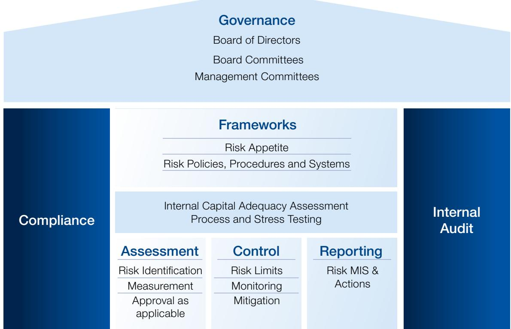

> **AI Description:**
> **Source:** `assets/_page_26_Figure_0.jpg`
> 
> **Generated:** 2026-05-24 14:00:32
> 
> ---
> 
> The image is a structured diagram illustrating the components of a governance framework, compliance, and internal audit processes. It is divided into three main sections: Governance, Compliance, and Internal Audit. The Governance section lists the Board of Directors, Board Committees, and Management Committees. The Compliance section is further divided into Frameworks, Assessment, Control, and Reporting. The Frameworks include Risk Appetite and Risk Policies, Procedures, and Systems. The Assessment section covers Risk Identification, Measurement, and Approval as applicable. The Control section includes Risk Limits, Monitoring, and Mitigation. The Reporting section lists Risk MIS & Actions. The diagram uses a gradient blue background with white text boxes to organize the information.

The broad categories of risk we face are credit risk,market risk,liquidity risk, interest rate risk in the banking book and operational risk. Further, our focus on digitisation leads to cyber security and data risk as well as reputation risk. We are also exposed to Environmental, Social & Governance risks arising out of the nature of business operations of our borrowers (particularly large,corporate borrowers), the industry segment in which they operate and the deficits in their compliance to statutory/ regulatory norms.

Risk exposures are actively captured and reported to the relevant levels of management for initiation of appropriate risk mitigation measures.The Bank has astructured management framework for the identification and measurement of the various material risks that the Bank faces.We are also continuously evaluating the efficacy of existing risk model assumptions and parameters and refining the models to reflect the new business normal.

The Bank has policies,processes and sound methodologies for the effective control and management of individual

Statutory Reports and Financial Statements

risks. The Bank has put in place an overall Risk Appetite statement. In addition,appetites for individual risk types are operationalised through risk specific policies and limit packages. Stress tests form an integral part of risk analysis and computation of capital adequacy under severe but plausible scenarios that may adverselyaffect the Bank.While each of these risks is assessed,monitored and managed under individual policies for day-to-day functioning, the stress testing framework endeavours to assist in identification of potential loss.

## Managing key risks

Risk

## Credit

The risk which arises from default by borrowers in their terms of contract with the Bank especially failure to make payments or repayments

## Market

The risk of potential loss on account of adverse changes in market variables which affect the value of financial instruments that the Bank holds as a part of its statutory reserves or trading activity, such as market instruments, debt securities,equities,foreign exchange and derivative instruments

Mitigation

There are robust policies and processes for managing credit risk in both retail and wholesale businesses, mainly through our a) target defined market, b) credit approval process, c) post-disbursement monitoring and d) remedial management procedures

Our Board-approved Investment Policy, Market Risk Policy and Limit packages cap exposure in line with the Bank's risk appetite.We follow well-established procedures for portfolio risk evaluation, market risk factor assessment and risk controls

Strategies

Capitals Impacted

Maintaining healthy asset quality with optimal riskreward considerations

Optimising profitability of marked-to-market products within the constraints of liquidity and market risk appetite of the Bank

Financial Capital

Human Capital

Intellectual Capital

Social & Relationship Capital

> **AI Description:**
> **Source:** `assets/_page_26_Figure_7.jpg`
> 
> **Generated:** 2026-05-24 13:54:52
> 
> ---
> 
> The image contains a simple icon of a location marker, typically used to represent a geographical point on a map or a pin on a digital map interface. The icon is circular with a blue background and a white pin in the center, indicating a specific location. There is no additional text or data within the image.

Manufactured Capital

> **AI Description:**
> **Source:** `assets/_page_26_Figure_8.jpg`
> 
> **Generated:** 2026-05-24 13:36:49
> 
> ---
> 
> The image contains a simple diagram with a blue circle divided into four quadrants. The top left quadrant is highlighted in red, while the other three quadrants are white. There are no labels or text annotations within the image. The diagram appears to be a basic representation of a four-quadrant model, possibly used in a flowchart or a conceptual diagram.

Natural Capital

## Risk Management

## Risk

## Compliance

The risk of legal or regulatory sanctions, as a result of failure to comply with applicable laws,regulations and standards

Mitigation

Comprehensive Board-approved Compliance policy in place. Drill down of the compliance culture within the organisation through an intricate and comprehensive internal control framework

## Operational

Operational risk arises from inadequate or failed internal processes,people and systems or from external events. It includes risk of loss due to legal risk

A Board-approved governance structure is in place with detailed framework and processes,internal controls,information technology and fraud monitoring mechanisms

## Climate

At a broader level, risks from climate change are typically divided into:

## · Physical risks

Economic losses (physical damage to property and assets) from extreme weather events attributed to climate change

## · Transition risks

The possible process of adjustment to a low carbon economy and its possible effects on the value of financial assets and liabilities

An ESG policy framework has been formulated to address this risk.

Further,we have a robust Social & Environmental Management System (SEMS) framework to address social and environmental/climate change risks in our loans.As a part of the ESG risk identification and mitigation process, we evaluate all our loans,irrespective of project type (greenfield projects or for regular capital expenditure), having a value of more than 10 Crore and a tenor of more than 5 years, for adherence to Environmental, Health, Social & Safety (EHSS) norms.We also track and externally verify our carbon emissions to effectively manage and reduce our footprint

Strategies

Capitals Impacted

Ensuring businesses work within the contours of regulation

Minimising operational losses through risk mitigation

Environmental, Social and Governance (ESG)

We are exploring frameworks to model and assess climate risk.We also continue our endeavour to acquire granular data and test tools for climate risk assessment and conducting scenario analysis. On the Emissions front: we have taken targets to reduce our GHG emissions.Further, we are aligning with the Paris Agreement on climate change by initiating commitment towards Science-Based Targets

Risk

## Liquidity

Liquidity risk is the risk that the Bank may not be able to meet its financial obligations as they fall due without incurring unacceptable losses

## Reputation

Any adverse stakeholder and public perception about our Bank may negatively impact our ability to attract and retain customers and may expose us to litigation and regulatory actions

## Cyber and Data

Risk of cyber-attacks on our Bank's systems through hacking,phishing, ransomware and other means,resulting in disruption of our services or theft or leak of sensitive internal data or customer information

Mitigation

The Bank's framework for liquidity and interest rate riskmanagement is spelled out in our Asset Liability-Management policy.Further,a robust mechanism to comprehensively track cash flow mismatches under normal as well as stressed conditions and critical ratios including Basel Ill ratios has also been implemented.The Bank has an extensive intraday liquidity risk management framework for monitoring intraday positions during the day

We communicate with our stakeholders regularly throughappropriate engagement mechanisms to address stakeholder expectations and assuage their concerns,if any

Every specific cyber threat including data privacy is assessed basis the framework (ldentify,Prevent/Protect, Detect, Respond and Recover) and controls such as firewalls,anti-malware anti-advance persistent threats,data loss prevention,Red Teaming, Intrusiol prevention/detection,digital rights management, 24\*7 security operation centre,and forensics solutions have been put in place.The international ‘general data protection regulation (GDPR)'has also been implemented across relevant operations.The Bank is compliant with ISO 27001:13, ISO22301:19 and PCl DSS standards

Statutory Reports and Financial Statements

Strategies

Capitals Impacted

· To maintain healthy liquidity in comparison to balance sheet size of the bank to tide over any unforeseen stress scenario

·Maintaining competitive cost of funds

·Delivering superior customer experience

> **AI Description:**
> **Source:** `assets/_page_27_Figure_5.jpg`
> 
> **Generated:** 2026-05-24 13:57:05
> 
> ---
> 
> The image contains two circular icons. The first icon on the left features the Indian rupee symbol (₹), indicating currency or financial-related content. The second icon on the right depicts a heart with a line through it, commonly representing a broken heart or a symbol for "no heart" or "heart not available." The icons are simple and use contrasting colors for clarity.

· Wide range of products and services

Facilitating growth via secure Digital initiatives.

·Sustaining operational effectiveness and efficiency through secure Work-from-Home

· Adapting and updating Cyber Defence framework to counter new-age threats

· Continuous information securityawareness for employees and customers

Financial Capital

Human Capital

Intellectual Capital

Social & Relationship Capital

Manufactured Capital

> **AI Description:**
> **Source:** `assets/_page_27_Figure_12.jpg`
> 
> **Generated:** 2026-05-24 13:46:03
> 
> ---
> 
> The image contains a simple icon with a blue background and a white circle in the center. Inside the white circle, there is a red dot and a white star-like shape. The icon appears to be a stylized representation of a molecule or atom, possibly indicating a scientific or chemical theme.

Natural Capital

# Business Continuity Plan

# Ensuring uninterrupted operations amid rapid change

We live in an increasingly unpredictable world. This has been compounded further by the challenge posed by the pandemic as complex operations across multiple stakeholders have to be managed remotely and digitally. At HDFC Bank, we have a well-defined Business Continuity Plan (BCP) in place to ensure the reliability and continuity of operations.

Our BCPis based on regulatory guidelines,ISO 22301 certified,andis subject to regular reviews.We havea Business Continuity Policy and Procedure with clearly defined roles and responsibility.

Disaster management, scope and governance framework of BCP

> **AI Description:**
> **Source:** `assets/_page_28_Figure_0.jpg`
> 
> **Generated:** 2026-05-24 13:39:02
> 
> ---
> 
> The image is a simple icon depicting a person sitting at a desk with a computer monitor. The icon is circular with a blue background and white border. The person is wearing a uniform, suggesting a professional or service-related setting. There are no charts, graphs, or additional visual elements present in the image.

## Broader areas of disaster management

## Business continuity

> **AI Description:**
> **Source:** `assets/_page_28_Figure_1.jpg`
> 
> **Generated:** 2026-05-24 13:38:12
> 
> ---
> 
> The image contains a simple icon of a fire truck with a blue background and a white border. The fire truck is depicted with a ladder extended and a siren on top, indicating it is an emergency vehicle. There are no charts, graphs, or additional text annotations present in the image.

Resume critical   
business operations   
after a disaster

## Emergency response

> **AI Description:**
> **Source:** `assets/_page_28_Figure_2.jpg`
> 
> **Generated:** 2026-05-24 13:39:26
> 
> ---
> 
> The image contains a simple icon consisting of a blue circle with a white outline. Inside the circle, there is a white globe on the left and a white padlock on the right. The icon is likely used to represent a concept related to global security or privacy.

Deal with site-level emergency at an office or a branch involving life safety issues like fire, bomb threats, and so on

> **AI Description:**
> **Source:** `assets/_page_28_Figure_3.jpg`
> 
> **Generated:** 2026-05-24 13:40:29
> 
> ---
> 
> The image contains a simple icon. It features a hand holding a heart with a plus sign in the center, all set against a blue circular background. The icon is likely used to represent healthcare, medical assistance, or first aid. There are no charts, graphs, or additional text elements present in the image.

## IT Disaster recovery

Recover critical   
business applications   
during hardware/   
network/power failure

## Pandemic response

Facilitate an organised and speedy response to any pandemic situation that threatens the safety of the Bank's employees and/or disrupts the Bank's critical business functions

> **AI Description:**
> **Source:** `assets/_page_28_Figure_4.jpg`
> 
> **Generated:** 2026-05-24 13:42:10
> 
> ---
> 
> The image contains a blue circular icon with a white outline of the Earth and a triangular warning symbol inside it. This icon is commonly used to represent global or international warnings or alerts.

## Crisis management

Tackle bank-wide disasters such as pandemic, terrorist attacks, ransomware

attacks, fire, cyclone, earthquake, city-level floods, cyber-attacks, data centre outages,among others

Our central Business Continuity Office works towards strengthening the business continuity preparedness

## BCP: Governance and management

BCP is managed by the Information Security Group and governed by the Business Continuity Steering Committee

This committee is chaired by the Chief Risk Officer (CRO)

The committee's other   
representativesare   
selected from the senior   
management team

> **AI Description:**
> **Source:** `assets/_page_28_Figure_5.jpg`
> 
> **Generated:** 2026-05-24 13:43:26
> 
> ---
> 
> The image contains a simple icon of a hand handing over a stack of money to another hand. The icon is circular with a blue background and white outline. It represents the concept of money transfer or payment.

> **AI Description:**
> **Source:** `assets/_page_28_Figure_6.jpg`
> 
> **Generated:** 2026-05-24 13:42:06
> 
> ---
> 
> The image contains a simple icon of a smartphone with a checkmark inside it, enclosed in a blue circle. The icon suggests a concept related to mobile verification or approval. There are no charts, graphs, or other visual elements beyond the icon itself.

Retail Branch Banking
Phone Banking

## Scope of BCP

Payments   
Business & DBC-  
Risk Control

> **AI Description:**
> **Source:** `assets/_page_28_Figure_8.jpg`
> 
> **Generated:** 2026-05-24 13:43:29
> 
> ---
> 
> The image contains a simple icon of a credit card with a checkmark above it. The icon is circular with a blue background. The checkmark indicates approval or acceptance, likely symbolizing a successful transaction or payment.

Management - Credit Cards

> **AI Description:**
> **Source:** `assets/_page_28_Figure_9.jpg`
> 
> **Generated:** 2026-05-24 13:45:32
> 
> ---
> 
> The image contains a simple icon of a classical building, likely representing a bank or government building. The icon is circular with a white building on a blue background. There are no charts, graphs, or other visual elements present. The icon is a single, static image without any text or additional information.

Wholesale Banking Operations

Retail Banking Operations

> **AI Description:**
> **Source:** `assets/_page_28_Figure_11.jpg`
> 
> **Generated:** 2026-05-24 13:29:53
> 
> ---
> 
> The image contains a simple icon of a closed safe with a lock. The icon is circular with a blue background and white border. The safe is depicted in white with a small lock symbol on the front, indicating security or privacy.

Treasury Operations

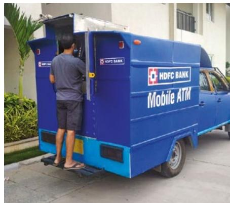

> **AI Description:**
> **Source:** `assets/_page_28_Figure_12.jpg`
> 
> **Generated:** 2026-05-24 13:26:50
> 
> ---
> 
> The image shows a blue mobile ATM truck from HDFC Bank. The truck is parked on a paved area with some greenery and a building in the background. A person is standing in front of the truck, interacting with the ATM. The truck has the HDFC Bank logo and the words "Mobile ATM" prominently displayed on its side. The design suggests it is a portable banking solution for providing services in remote or underserved areas.

## Business continuity in pandemic times

At HDFC Bank,we rose to the challenge of delivering uninterrupted banking services amid large-scale restrictions following the outbreak of the COVID-19 pandemic.We adopted a multipronged strategy to prioritise the safety of our employees while ensuring service delivery to our customers.Following the gradual easing of the nationwide lockdown, we moved from crisis mode to business mode but continued implementing various continuity strategies,keeping in mind the evolving pandemic scenarios.

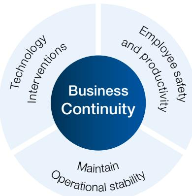

> **AI Description:**
> **Source:** `assets/_page_28_Figure_13.jpg`
> 
> **Generated:** 2026-05-24 13:25:58
> 
> ---
> 
> The image is a circular diagram divided into four quadrants, each labeled with a different aspect of business continuity. The central circle is labeled "Business Continuity." The quadrants are labeled as follows: "Technology Interventions," "Employee safety and productivity," and "Maintain Operational stability." The diagram appears to be an infographic combining text with visual elements to illustrate the components of business continuity.

## Multi-pronged pandemic response

## Technology Interventions

· The new strategy of Work-from-Home was incorporated

· InfoSec Awareness campaign series for all employees was rolled out

· Zero IT downtime and increase in hardware capacity, enabling secure access from home

·Round-the-clock high alert watch to ensure IT security

·External recertification audit by BSl for ISMS and BCMS (ISO27001 and ISO 22301)

·Cyber security threats were thwarted by implementing two-factor authentication,strengthening antivirus feature in the devices at home and prohibiting any download on local storage drives

· Endpoint security posture during COVID-19 improved incrementally

-Endpoint AV signatures updated over the cloud for all endpoints

Endpoint anti-APT (anti-advance persistent threat) agent pushes the indicators of compromise (lOC) over the cloud to all endpoints

\- A proxy agent is present on all endpoints which ensures that all machines are connected to the internet securelyas per rules laid down by the Bank

Data Leakage Prevention (DLP) implemented; all endpoints hardened and access to USB blocked

\- Evaluating solutions to address cloud patching for endpoints

## Employee safety and productivity

Distribution of masks to security guards,pantry staff and other support staff and providing hand sanitisers across locations

> **AI Description:**
> **Source:** `assets/_page_28_Figure_14.jpg`
> 
> **Generated:** 2026-05-24 13:33:57
> 
> ---
> 
> The image is a simple illustration featuring a person wearing a face mask and a blue uniform, standing next to a pedestal with a bottle of hand sanitizer on top. The person appears to be gesturing with their right hand, possibly indicating the use of the hand sanitizer. The illustration is likely intended to convey a message about hygiene or safety measures, such as the importance of using hand sanitizer during a pandemic or in a public setting.

· Introduction of APOLLO HEALTHYLIFE - for all employees,where along with anytime Apollo doctors on call at no cost,employees have preferential access to COVID-19 care packages

·Allow employees to claim medical expenses incurred for COVID-19 treatment (home quarantine/ quarantine centre/hotel isolation with hospital tie-up)

·Sponsor inoculation of over 1Lakh employees and their immediate family members against coronavirus

· When the number of daily cases declined,a Back to Work Guidelines for Employee safety was published

## Maintain operational stability

·Multiple shifts introduced to ensure adherence to government guidelines and social distancing norms

·Ensured efficient execution of extending moratorium to customers and best possible support to the business

· DR site at Kanjurmarg used as a contingency site to ensure the continuity of the critical Treasury Department

·Enhanced internal communication mechanism further; set up a crisis group on the mobile platform for faster communication,action and response

·BCP Strategy for Retail Branch Banking is further being enhanced with plans to include a comprehensive BCP Manual, Table Top on BCP, Periodic Preventive Checks, BCP during Branch downtime, E-Learning Module for Branch Banking

·Bank has procured sufficient additional licenses for VPN& has segregated those basis priorities

-Priority1.Branches facing frequent complaints/isolation

\- Priority 2. Single branch cities

\- Priority 3. Vulnerable geographies

The process is being defined with the help of IT. The pilot run has been completed.

## Relentless pursuit of sustainability

At HDFC Bank, we have always believed that business growth is intricately linked with prosperity of the communities we serve. We are leveraging our scale and reach to empower those sections of the society that remain lessprivileged through our five pillars of Rural Development, Promotion of Education, Skill Training and Livelihood Enhancement, Healthcare and Hygiene and Financial Literacy and Inclusion

Our Holistic Rural Development Programme (HRDP) was born out of the conviction that the nation progresses only when rural India grows. Our multi-pronged interventions range from farm and non farm-based livelihood, water conservation, on-ground training for farmers, creation of Farmer Producer Organisations, sanitation to Natural Resource Management. We facilitate livelihood enhancement opportunities, particularly for women and youth, primarily in agriculture and allied areas such as dairy and poultry. The objective is to help them find jobs locally, enhance their household income and discourage migration.

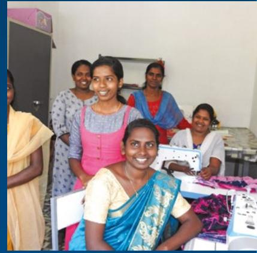

> **AI Description:**
> **Source:** `assets/_page_29_Figure_0.jpg`
> 
> **Generated:** 2026-05-24 13:40:56
> 
> ---
> 
> The image contains a photograph of a group of women in a sewing workshop. They are smiling and appear to be engaged in a sewing activity, with sewing machines and fabric visible in the foreground. The setting suggests a community or educational sewing project, possibly aimed at skill development or employment. The women are dressed in traditional attire, indicating a cultural context.

Our Sustainable Livelihood Initiative (SLl), a unique programme with possibly no parallel globally, is targeted at empowering families by empowering women through occupational skills training, financial literacy, credit counseling, livelihood finance and market linkage.

We also provide infrastructure support, such as building toilets in schools and improving classrooms. At the community level, it also includes educating people on the importance of water, sanitation and hygiene (WaSH). Also, through the Zero Investment Innovations for Education Initiatives (ZIlEl), we are committed to enabling teachers to innovate which in turn benefit students. This programme is aimed at Government schools across India. Parivartan is thus not just about bringing a sustainable change in the society, but also about delivering long-term solutions for pressing social challenges.

## Creating sustainable livelihood opportunities

Unemployment is a significant issue faced by many in the district of ldukki. It's more prevalent, however, in the underdeveloped hamlet of Maniyarankudy - home to the socioeconomically marginal Mannan tribal community known for their unique customs and traditions.

To generate livelihood opportunities in the region, particularly among the women of the community, Parivartan established a tailoring unit and training centre after selecting and training a group of eight beneficiaries to run it. The first batch of 10 trainees are now involved in teaching stitching. Equipment provided to the centre by the Bank include furniture, tailoring machines, cutting machines, embroidery machines and other related accessories. In addition to monitoring by field staff, the programme was also linked to the Start-up Village Entrepreneurship Program (SVEP) so that it may be replicated across the state.

Each beneficiary chosen to run the centre, earns around 2,200 per month. Upon completion of the 3-month training period, the trainees are expected to find sustainable employment - thus setting in motion the gradual improvement of living standards in the region.

## Responsible Business

58 ESG Strategy

60 Environment

70Customer Centricity

76Digitisation

80 Social - People

88 Social - Communities

100Nation building

104 Governance

108 Board of directors

110 Senior management team

11210 year Financial Highlights

114 Awards

# Embedding ESG parameters in business strategy

At HDFC Bank, we factor in environmental, social and governance (ESG) aspects while designing our products, processes and policies. Our ESG strategy focuses on climate change, community and society, along with practices related to people, customers,lending, procurement, and governance.

## ESG governance

CSR& ESG Committee of the Board   
oversees the Bank's sustainability and climate change initiatives.A management level ESG committee,represented by seniormanagementmembersacross major functions, reports to the CSR   
& ESG Committee of the Board and   
provides updates on our Environmental Policy and ESG framework to the Board for review annually. Our Group Head for CSR reports to the Board every quarter, chairs the management-level ESG   
Committee which undertakes focuses discussions through three   
sub-committees.

> **AI Description:**
> **Source:** `assets/_page_30_Figure_0.jpg`
> 
> **Generated:** 2026-05-24 13:37:37
> 
> ---
> 
> The image depicts a classroom setting with a teacher standing at the front, facing a group of students seated at desks. The students are wearing uniforms and appear to be engaged in a lesson. The classroom has a map on the wall and various educational materials and furniture, such as bookshelves and desks, are visible. The image captures a typical educational environment with a focus on teaching and learning.

## Targets

Our Environment Sub-Committee,part of the ESG Committee sets targets and identifies opportunities for improvement in areas of emissions,energy,water and waste.This is driven jointly by the Sustainability team with the ESG committee which reviews plans of action,targets,progress against targets, initiatives undertaken by internal business units and employees towards mitigation.

We have recently set a target to become carbon neutral by FY32. We have achieved our earlier target to reduce energy consumption and overall emissions by FY22.We have now initiate( the process to commit to the Science Based Targets Initiative (SBTi),which will enable us to set climate change targets in accordance with the latest climate science to meet the goals of the Paris Agreement.We have also taken up a target to plant 2.5 Million trees by FY25,of which 1.6 Million trees have already been planted.

10% Reduction in combined Scope 1 and Scope 2 emission intensity\*

3% Reduction in energy consumption\*

5% Reduction in energy intensity\*

\*The base year was FY19 and target year FY22

## ESG approach

We have a Board-approved ESG policy framework and Environmental Policy in place to identify the Bank's environmental risks and impacts.

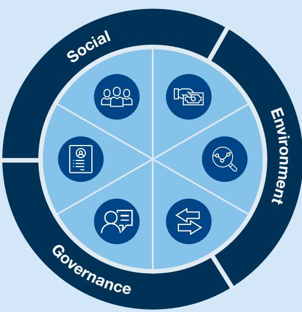

> **AI Description:**
> **Source:** `assets/_page_30_Figure_1.jpg`
> 
> **Generated:** 2026-05-24 13:36:16
> 
> ---
> 
> The image is a circular diagram divided into four quadrants, each labeled with a different category: Social, Environment, and Governance. The diagram includes six icons, each representing a specific aspect within the categories. The Social quadrant contains icons for people, a document, and a speech bubble, indicating social interactions, documents, and communication. The Environment quadrant includes icons for money, a magnifying glass, and arrows, suggesting economic activities, research, and data exchange. The Governance quadrant features icons for a document and a speech bubble, representing governance documents and communication. The diagram visually represents the interconnectedness of these categories and their respective elements.

> **AI Description:**
> **Source:** `assets/_page_30_Figure_2.jpg`
> 
> **Generated:** 2026-05-24 13:32:41
> 
> ---
> 
> The image contains a simple icon of three people, likely representing a group or team. The icon is a flat, two-dimensional graphic with no additional text or visual elements. The design is minimalistic and uses a single color, which suggests it is intended to be a universal symbol for a group or team.

## Our Pemmuantdes

We focus on employee diversity & inclusion, training & development, employment practices

. We invest in our communities through our Sustainable Livelihood Initiative, Holistic Rural Development Program, Teach the Teacher Initiative

· We provide access to financial services to communities

## Conduct and Compliance

. Our corporate Governance Policy ensures highest levels of ethics, integrity, corporate governance and regulatory compliance

Our Board of Directors sets course and evaluates our performance of compliance, risk management & internal control, information& cyber security, customer service, social & environmental responsibility

> **AI Description:**
> **Source:** `assets/_page_30_Figure_4.jpg`
> 
> **Generated:** 2026-05-24 13:25:10
> 
> ---
> 
> The image is a simple icon depicting a hand holding a banknote, symbolizing a transaction or payment. The icon is circular with a blue background and white border. There are no charts, graphs, or additional text annotations present. The icon is designed to represent the concept of money exchange or financial transactions.

## Responsible Financing and Product Responsibility

. We do not fund projects that have an adverse impact on environment, health, safety (EHS) levels

New opportunities in the environmental and social space including those like Green Bonds

> **AI Description:**
> **Source:** `assets/_page_30_Figure_5.jpg`
> 
> **Generated:** 2026-05-24 13:27:08
> 
> ---
> 
> The image contains a simple icon of a magnifying glass with a gear inside it. This icon is commonly used to represent search or filtering functionality, often associated with data analysis or technical settings. The icon does not provide specific numerical data or detailed information but rather serves as a visual cue for a search or filtering tool.

## Tracking our GHG emissions

·We have been tracking our GHG emissions since FY11

Our Code of Conduct ensures transparent dealings with internal and external stakeholders

> **AI Description:**
> **Source:** `assets/_page_30_Figure_7.jpg`
> 
> **Generated:** 2026-05-24 13:27:48
> 
> ---
> 
> The image contains a simple circular icon with two arrows pointing in opposite directions. The arrows are blue and white, and the icon is set against a white background. This icon typically represents a bidirectional or two-way process or action, such as a swap or exchange.

## Managing our Environmental Risks and Opportunities

Our board-governed environmental policy serves as a framework to understand and manage our environmental risks, impacts and opportunities

· Sustainable procurement practices

### Full Page Description (Page 31)

**Source:** `assets/_page_31_Asset_0.jpg`

**Generated:** 2026-05-24 13:40:44

---

The image is a circular diagram with three sections, each labeled with a different aspect of an environmental response. The central text reads "Our three-pronged environmental response." The three sections are labeled as follows: "Responsible Financing," "Our initiatives to reduce emissions," and "Communities Sustainable and Resilient." The diagram is designed to visually represent the three main strategies or components of an environmental response.

# Deploying resources responsibly

## Focus on governance, strategy and risk management and metrics

Our Board sets the course and evaluates our performance on social and environmental responsibility,among others. The Board-governed environmental policy serves as a framework to understand and manage our environmental risks, impacts and opportunities. We continuously strive to incorporate environmentally responsible practices in our own operations, through our vendors,as well as through responsible financing. There were no cases of non-compliance with environmental laws and regulations during FY21. We have also put in place a Social & Environmental Management System (SEMS) framework to assess social and environmental risks for all loan applications with a ticket size above 10 Crore and a tenure of five years. We have also initiated steps towards the implementation of TCFD and SBTi recommendations. We track our GHG emissions and transparently report our environmental performance annually.

> **AI Description:**
> **Source:** `assets/_page_31_Figure_0.jpg`
> 
> **Generated:** 2026-05-24 13:29:21
> 
> ---
> 
> The image contains a photograph of a lush green landscape with trees and a grassy field in the foreground. In the background, there is a mountain covered with dense vegetation. The right side of the image shows a smaller inset photo of workers on a roof, installing solar panels. The number "60" is visible in the bottom left corner of the main image.

## Performance indicators and targets

We monitor key performance indicators (KPls) for all major environmental indicators and initiatives covering energy, GHG emissions,and waste for all our operations with the aim to minimise the environmental impact. We have surpassed our target to reduce energy consumption and overall emissions.In FY21,to further reinforce our corporate climate strategy,we have initiated the process to commit to the Science Based Targets Initiative (SBTi), which will enable us to set climate change targets in accordance with the latest climate science to meet the goals of the Paris Agreement.We have also seta target to become carbon neutral by FY31-32.

## Initiatives to reduce environmental footprint

We are committed to conducting our business operations in a socially and environmentally responsible manner. We explore,develop and adopt business models to ensure low-carbon transformational growth across the entire value chain, thereby contributing to worldwide efforts to limit global warming to below 2°C,and move towardsa sustainable future.We are incorporating both technological as well as process solutions in our day-to-day operations to make a positive impact on the environment.

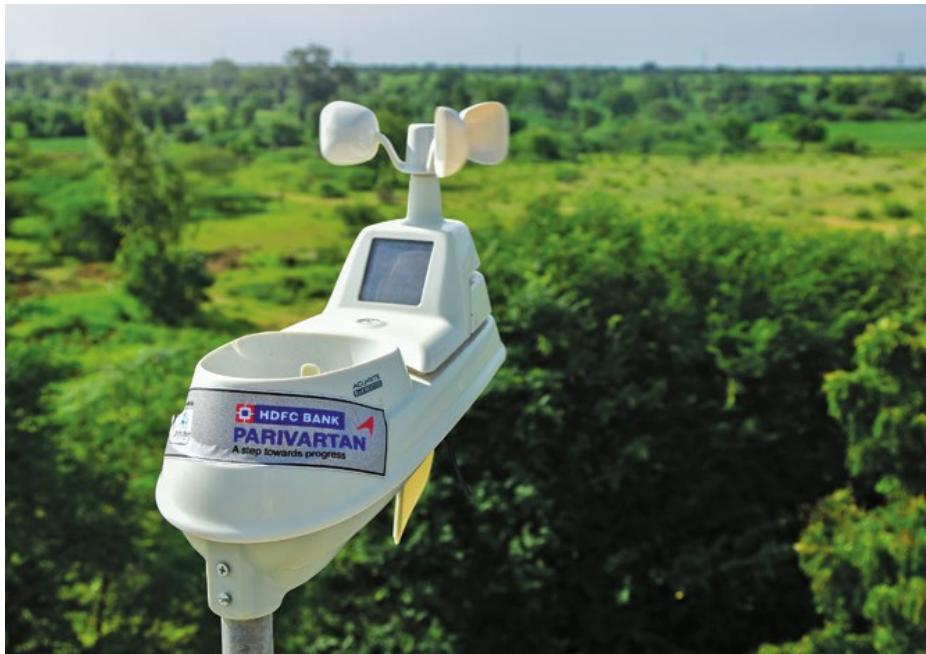

> **AI Description:**
> **Source:** `assets/_page_31_Figure_1.jpg`
> 
> **Generated:** 2026-05-24 13:29:50
> 
> ---
> 
> The image contains a photograph of a weather monitoring device, specifically a wind speed and direction sensor. The device is mounted on a pole and has a label that reads "HDFC BANK PARIVARTAN A step towards progress." The background shows a lush green landscape with trees and open fields, suggesting the device is located in a rural or semi-rural area. The device appears to be part of a larger monitoring system, likely used for agricultural or environmental purposes.

## Targets FY22

Reduction in total energy consumption

3%

Reduction in energy intensity

Reduction in absolute Scope 1 and Scope 2 emissions

3%

Reduction in Scope 1 and Scope 2 emission intensity

## 10%

Plantation Target by FY25

## 25 Lakh trees

## Notes:

Base year for targets: FY19. Our Scope 1 emissions includes emissions from fuel consumption in ownvehicles,and scope 2 emissions include emissions due to fuel use in DG sets and purchased electricity. Energy consumption as discussed in this report includes energy consumed by the Bank within its operations-including electricity, and fuel consumed in DG sets and company vehicles.

> **AI Description:**
> **Source:** `assets/_page_31_Figure_2.jpg`
> 
> **Generated:** 2026-05-24 13:26:44
> 
> ---
> 
> The image contains a simple illustration of two people engaged in gardening activities. One person is watering a plant with a watering can, while the other is planting a seedling. The scene includes a variety of green plants and bushes, suggesting a garden or outdoor setting. The illustration is colorful and uses a cartoon-style depiction to convey the activity.

## Environment

## Initiatives to reduce ESG risks

> **AI Description:**
> **Source:** `assets/_page_32_Figure_0.jpg`
> 
> **Generated:** 2026-05-24 13:55:10
> 
> ---
> 
> The image contains a simple icon with a blue circle background. Inside the circle, there is a white silhouette of a smartphone with a credit card partially inserted into its slot. The icon appears to represent a mobile payment or financial transaction concept.

Digital banking initiatives

> **AI Description:**
> **Source:** `assets/_page_32_Figure_1.jpg`
> 
> **Generated:** 2026-05-24 13:54:57
> 
> ---
> 
> The image contains a simple icon of a hand holding a leaf. The icon is set against a blue circular background. The hand is depicted in a light gray color, and the leaf is a darker green. There are no labels or text annotations present in the image. The icon likely symbolizes environmental protection or sustainability.

Ambitious plantation target

> **AI Description:**
> **Source:** `assets/_page_32_Figure_2.jpg`
> 
> **Generated:** 2026-05-24 13:50:55
> 
> ---
> 
> The image contains a simple icon with a blue circle background. Inside the circle, there is a white building on the right side and a white tree on the left side. The icon appears to represent a concept related to urban green spaces or sustainable architecture.

Green building

> **AI Description:**
> **Source:** `assets/_page_32_Figure_3.jpg`
> 
> **Generated:** 2026-05-24 13:52:29
> 
> ---
> 
> The image contains a simple icon with a blue circle background. Inside the circle, there is a white smartphone icon with a credit card icon overlapping it. The design suggests a theme related to mobile payments or financial transactions on a smartphone.

## Digital banking initiatives

Reduction in paper usage and emissions footprint through:

· Implementation of Digital Banking Initiatives like Phone Banking. Mobile banking, Net banking, ATM banking, Mobile wallet.

· Introduction of several digital products and services even in the rural/semi-urban segment

Investment in R&D in innovative digital product, automation of several internal as well as customer-linked processes and channels

· Saved about 1.5 Million square feet of paper through our "Green Event"Initiative

> **AI Description:**
> **Source:** `assets/_page_32_Figure_4.jpg`
> 
> **Generated:** 2026-05-24 13:57:54
> 
> ---
> 
> The image contains a simple icon of a hand holding a leaf. The icon is set against a blue circular background. The hand is depicted in a light gray color, and the leaf is green. There are no labels or text annotations present in the image.

Ambitious plantation target

· 0.6 Million trees planted during FY21

Target to plant 2.5 Million trees by FY25

Our internal initiatives to reduce our climate change and ESG risks

> **AI Description:**
> **Source:** `assets/_page_32_Figure_5.jpg`
> 
> **Generated:** 2026-05-24 13:58:18
> 
> ---
> 
> The image contains a simple icon with a blue background. It features a white rectangular shape on the right side, which appears to represent a building or a structure. On the left side, there is a white silhouette of a forest with trees, suggesting a natural or outdoor setting. The icon likely represents a concept related to environmental impact, sustainability, or a balance between nature and urban development.

## Green building

· Two of our large buildings have been LEED certified and two more are in the pipeline.

· Our Bangalore Data center ‘Netmagic· DC3B' is certified green data center under the IGBC Green Data Center Rating System

· Several changes within our infrastructure assets have been incorporated to improve energy efficiency

> **AI Description:**
> **Source:** `assets/_page_32_Figure_6.jpg`
> 
> **Generated:** 2026-05-24 14:00:37
> 
> ---
> 
> The image contains a simple icon of a factory with a water droplet below it. The icon is circular with a blue background and white outline. The factory symbol is a basic representation of an industrial building with a smokestack emitting smoke. Below the factory, a small water droplet icon is present, suggesting a connection between industrial activity and water. This icon likely represents an environmental impact, such as pollution or water usage in industrial processes.

## Managing our GHG emissions

· Transparent disclosure of GHG emissions (third-party assured)

· Over-achieved our target to reduce our Scope 1and Scope 2 GHG emissions

· Initiated commitment to the Science Based Targets Initiative {SBTi)

## Managing our GHG emissions

Use of renewable energy

> **AI Description:**
> **Source:** `assets/_page_32_Figure_8.jpg`
> 
> **Generated:** 2026-05-24 13:28:42
> 
> ---
> 
> The image contains a simple icon of a solar panel. The icon is a white outline of a solar panel on a blue background. There are no charts, graphs, or other visual elements present. The icon is a symbol representing solar energy or renewable energy sources.

Energy reduction tives

> **AI Description:**
> **Source:** `assets/_page_32_Figure_9.jpg`
> 
> **Generated:** 2026-05-24 13:30:06
> 
> ---
> 
> The image contains a simple icon with a blue background. The icon features a white outline of a plant with a plug inserted into it. The plug is connected to a white line that extends upwards, symbolizing energy or electricity. The icon is designed to represent the concept of renewable energy or sustainable power.

> **AI Description:**
> **Source:** `assets/_page_32_Figure_10.jpg`
> 
> **Generated:** 2026-05-24 13:39:30
> 
> ---
> 
> The image contains a simple icon of a solar panel. The icon is a blue circle with a white solar panel graphic inside it. There are no additional labels, text, or other visual elements present in the image.

## Use of renewable energy

· Installed solar panels at our large office locations in Bhubaneswar. Bhubaneswar, Chandigarh, Jaipur, Mumbai, Noida and Pune with a cumulative installed solar capacity to 198.3 KWp as on March 31, 2021

· Install solar panels in our upcoming office buildings wherever feasible

> **AI Description:**
> **Source:** `assets/_page_32_Figure_11.jpg`
> 
> **Generated:** 2026-05-24 13:39:49
> 
> ---
> 
> The image contains a simple icon with a blue background. The icon features a white plug with a green leaf attached to it, symbolizing a connection between electricity and nature. This visual element suggests an eco-friendly or sustainable energy theme.

## Energy reduction initiatives

· Implemented the Energy Management System (EnMS) across 600 branches

Use of digital systems and data analytics to understand the energy consumption pattern, in addition to ensuring that the branches are maintained at optimal temperatures. improving the power factor and automating major energy consuming assets

· Installation of inverter ACs and use of LED lights

· Committed to having only LED lights in all our buildings,going forward

## Emissions and climate change

Climate change is one of the most pressing global challenges of our time. At HDFC Bank, we have been recording our GHG emissions since 2010 and are continuously transforming our operations to achieve low-carbon growth.

## Reduced paper emissions

Paper use accounted for about one-third of our Scope 3 emissions in FY21 and is thus one of our priority intervention areas.Our retail marketing team rolled out, Green Event Guidelines,through which we saved about 1.5 Million square feet of paper during the period under review.We are also switching to recycled paper,which accounted for nearly 13% of our total

Green Event Guidelines

The Bank incorporated the 3Rs - Reduce, Replace and Recycle - in its retail marketing initiatives relating to on-ground activations, enhancing visibility of the brand and product promotion.

> **AI Description:**
> **Source:** `assets/_page_32_Figure_12.jpg`
> 
> **Generated:** 2026-05-24 13:38:55
> 
> ---
> 
> The image is a photograph of a tree-lined road. The trees are tall and have a dense canopy of green leaves, creating a tunnel-like effect over the road. The road is paved and appears to be in a rural or suburban setting. The lighting suggests it is either early morning or late afternoon, with sunlight casting long shadows on the ground. The overall scene conveys a serene and peaceful atmosphere.

paper consumption in the reporting period.Our digital strategy has also enabled us to drastically reduce our paper consumption and helped avoid related emissions.Additionally,our digitised processes and products have helped customers reduce their frequency of visits to our branches, ATMs and Offces, thereby reducing associated emissions

> **AI Description:**
> **Source:** `assets/_page_32_Figure_13.jpg`
> 
> **Generated:** 2026-05-24 13:38:38
> 
> ---
> 
> The image contains a photograph of a person's hands holding a small plant with two leaves, emerging from soil. The hands are dirty, suggesting they have been working with the soil. The background is blurred, focusing attention on the plant and hands. The image conveys a sense of nurturing and growth.

## Tree plantation

We are implementing a very ambitious tree plantation programme.So far, we have planted 1.6 Million+ trees, which not only helps sequester some GHG emissions,but also provides an opportunity to further improve our connect with the communities.

Share of recycled paper used in our total paper consumption during FY21

## 13%

Reduction in diesel consumption in DG sets in FY21 over FY20

## 39%

GHG Emissions avoided due to reduced paper consumption during FY21 over FY20

## 588.65 tCO2e

GHG emissions avoided due to reduced diesel consumption in DG in FY21 over FY20

## 6313.90 tCOze

Trees planted during FY21

## 0.6 Million

CO2 sequestration potential created through our plantation activities so far

## 25,000 tCOe/per year

### Full Page Description (Page 33)

**Source:** `assets/_page_33_Asset_4.jpg`

**Generated:** 2026-05-24 13:46:10

---

The image is a bar chart showing financial data for fiscal years FY19, FY20, and FY21. The chart uses three horizontal bars, each representing a different fiscal year. The bars are color-coded: FY19 in gray, FY20 in a lighter gray, and FY21 in blue. The values for each fiscal year are labeled at the top of their respective bars: FY19 at 3.92, FY20 at 2.88, and FY21 at 2.09. The chart visually compares the financial values across the three years, with FY19 having the highest value and FY21 having the lowest.

### Full Page Description (Page 33)

**Source:** `assets/_page_33_Asset_1.jpg`

**Generated:** 2026-05-24 13:47:21

---

The image is a pie chart with three distinct sections, each representing a different scope: Scope 1, Scope 2, and Scope 3. The largest section, labeled Scope 2, occupies 95% of the pie chart. Scope 1 and Scope 3 are much smaller, with Scope 1 having a value of 3 and Scope 3 having a value of 2. The chart uses a blue color for Scope 2, a dark blue for Scope 1, and a gray for Scope 3.

### Full Page Description (Page 33)

**Source:** `assets/_page_33_Asset_2.jpg`

**Generated:** 2026-05-24 13:48:39

---

The image contains a bar chart with three horizontal bars representing financial data for fiscal years FY21, FY20, and FY19. The bars are color-coded, with FY21 in dark blue, FY20 in gray, and FY19 in a lighter gray. The values for each fiscal year are labeled above their respective bars: 305.97 for FY21, 397.83 for FY20, and 456.50 for FY19. The chart visually compares the financial figures across the three fiscal years, showing a general downward trend from FY19 to FY21.

### Full Page Description (Page 33)

**Source:** `assets/_page_33_Asset_3.jpg`

**Generated:** 2026-05-24 13:48:25

---

The image is a bar chart with a line connecting the top of each bar, representing data for fiscal years FY19, FY20, and FY21. The bars are color-coded, with FY19 in gray, FY20 in gray, and FY21 in dark blue. The heights of the bars indicate numerical values: 456.50 for FY19, 397.83 for FY20, and 305.97 for FY21. The line connecting the top of each bar shows a downward trend from FY19 to FY21. The values at the top of each bar are labeled with their respective fiscal years, and the values at the top of the line are labeled with 4.66, 3.40, and 2.55, which likely represent percentages or ratios.

We have been able toachieve a consistent reduction in our absolute emissions,as wellas in Scope 1 and Scope 2 emission intensity overthe years.During FY21,notonlyour emision intensity (perCrore total income)decreased by over 27% Y-o-Y,but we alsoachieved areduction ofover 23%inabsolute scope 1andscope2 emissions owing to our multi-pronged initiatives toreduce GHG emissions,as wellas thepandemic-inducedrestrictionsthat resulted in someof our teams working from home,reducing the activity load at some of our operating locations.

FY21 (000 tonnes of CO2e)

We havesignificantly surpassed our GHG reductiontargets ahead of schedule,achieving a reduction of about 33% in absolute Scope1and Scope 2emissions inFY21 from FY19 base year, with over 46% reduction in Scope 1 and Scope 2 emission intensity

FY21GHGEMISSIONSAND EMISSIONS INTENSITY-SCOPE 1 +SCOPE 2

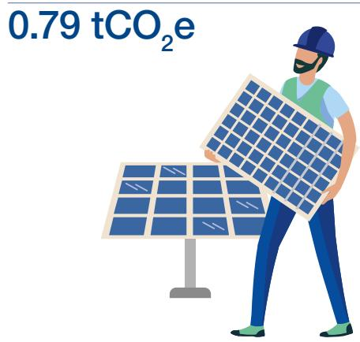

> **AI Description:**
> **Source:** `assets/_page_33_Figure_0.jpg`
> 
> **Generated:** 2026-05-24 13:59:05
> 
> ---
> 
> The image contains a visual representation of a person holding a solar panel, with a smaller solar panel depicted in the background. The text "0.79 tCO₂e" is prominently displayed in the upper left corner, indicating a carbon dioxide equivalent of 0.79 metric tons. The image is an infographic combining text with a simple illustration to convey information about the environmental impact of solar energy.

## Energy efficiency and energy management

Over 95% of our GHG emissions are atributedto energy consumption-purchased electricity from the grid and diesel consumption in DG sets.We are aggressivelyworking to reduce our energy consumptionacross operations tocomplement ourinitiativestodecarboniseourenergyconsumption.Wehavemadesignificantprogressinthisregardbyregulatingexisting equipment,instalingenergy-eficientequipment,andimplementingautomatedenergymanagementsolutions,amongothers.

## Energy efficient lighting

We have replaced over 12,000 conventional/CFL/fluorescent fittings with LED lights at 248 of our locations across 22 states and UTs, resulting in potential energy savings of over 1 Million kWh of electricity per year. Henceforth,all building premises that we occupy will have only LED lights.

## Energy efficient space cooling

In FY21, we installed EC Fan Motors in 55 Air Handling Units (AHUs) resulting in potential savings of O.2 Million kWh o energy per year.We have also installed inverter ACs at our locations,which helped save over 1.75 Million kWh of electricity during FY21.We also saved 32,325 kWh of electricity by installing VRF HVAC units at our back offices.

## Efficient data centres

Disposal of old assets at three of our data centres led to the avoidance of 1.4 Million kWh of electricity during FY21. Our Bangalore data centre ‘Netmagic-DC3B' is a certified green data centre under the IGBC Green Data Centre Rating System. We have implemented several other energy-saving measures including upgradation to efficient cooling units,

IGBC Platinum Certification for our data centre in Bangalore

cold-aisle containment, replacement of old storages and servers and with new generation hardware,and implementation of Smart iPDUs.We have also adopted environment-friendly measures at our data centres such as switching to R-4O7c refrigerant for INROW cooling,adoption of new fire suppression system with NOVEC 1230 gas,and replacement of UPS batteries with Li-ion batteries.

## Building management and Green Buildings

We have incorporated several changes within our infrastructure to improve energy efficiency through auto controls and environment-friendly equipment. We have LEED Gold certified offices in Mumbai and Bhubaneswar. In addition, new buildings in Mohali and Palava training centres are being constructed to meet the IGBC gold certification standards.We have also implemented elevator and equipment scheduling to reduce our energy consumption,and installed occupancy sensors,capacitor banks as well as Building Management Systems at several of our operating locations.The energy management module with auto controls deployed across select branches since FY19 resulted in potential energy savings of about 16%.We plan to extend this initiative to an additional 2,000 branches across the country.

Reduction in grid electricity consumption during FY21 over FY20

## 126 Million kWh

Branches with the energy management system implemented as of March 31, 2021

## 600

Energy saved during FY21 on account of auto controls in branches

## 4.4 Million kWh

During FY21, not only our energy intensity (GJ/employee) decreased by over 30% over FY20,but we also achieved a reduction of over 28% in absolute energy consumption. The reduction in energy consumption is attributed to the comprehensive set of energy reduction measures implemented at our operating locations, as well as the temporary reduction in activity/energy load at some of our operating locations as a result of COVID-19 induced lockdown and movement restrictions.

We also surpassed our energy targets. In FY21,we achieved a reduction of about 34% in absolute energy consumption,and 24% in energy intensity (GJ/per employee) from base year FY19.

### Full Page Description (Page 34)

**Source:** `assets/_page_34_Asset_0.jpg`

**Generated:** 2026-05-24 13:39:40

---

The image is a horizontal bar chart titled "ENERGY CONSUMPTION ('000 GJ)". It compares the consumption of fuel and electricity across three fiscal years: FY19, FY20, and FY21. The chart uses blue bars to represent fuel consumption and gray bars to represent electricity consumption. The data shows a general increase in both fuel and electricity consumption over the three years, with the highest consumption in FY19 and the lowest in FY21. The chart includes numerical values for each category and year, providing a clear visual representation of the energy consumption trends.

### Full Page Description (Page 34)

**Source:** `assets/_page_34_Asset_3.jpg`

**Generated:** 2026-05-24 13:38:28

---

The image is a bar chart with three horizontal bars representing data for fiscal years FY19, FY20, and FY21. The chart displays two metrics: "Cumulative Underwritten ₹ Crore" and "Cumulative RE capacity financed (MW)" for each fiscal year. The blue portion of the bars represents the "Cumulative Underwritten ₹ Crore," while the gray portion represents the "Cumulative RE capacity financed (MW)." The chart also includes year-over-year percentage changes (y-o-y %) for each fiscal year, indicated by upward-pointing triangles. The data shows a significant increase in both metrics from FY19 to FY21.

## Renewable energy

We are continuously increasing the share of renewable energy in our total power consumption.We now have solar power plants at our operations across six cities - Jaipur, Pune, Noida, Bhubaneswar, Chandigarh and Mumbai.

During FY21, we commissioned a 52.8 KWp solar plant at our office in Mumbai, taking our cumulative installed solar capacity to 198.3 KWp,as on March 31, 2021. To realise the potential of renewable energy, we endeavour to install solar panels in our upcoming office buildings wherever feasible. Further, in some rural areas where power fluctuation is high,we have installed solar-powered ATMs.

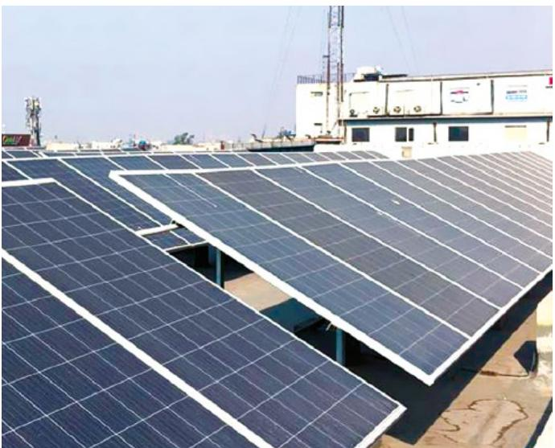

> **AI Description:**
> **Source:** `assets/_page_34_Figure_0.jpg`
> 
> **Generated:** 2026-05-24 13:59:24
> 
> ---
> 
> The image shows a series of solar panels installed on a rooftop. The panels are arranged in a grid pattern, with each panel consisting of multiple dark blue solar cells. The roof structure is visible beneath the panels, and in the background, there are some industrial buildings and a clear sky. The image highlights the installation of solar energy systems, likely for renewable energy generation.

Cumulative solar power generation capacity commissioned as of 31 March 2021

## 198.3 KWp

## Managing waste

We deal with three types of non-hazardous waste- e-waste,dry waste (paper waste) and wet waste (cafeteria, sewage),of which e-waste is disposed ofthrough authorised recyclers.Hazardous waste within the Bank's scope arising from diesel/fuel oil used in generator sets,is negligible.While we are progressively working to track paper waste fromour operations,we have installed sewage treatment plants at some of our large offce premises to treat wastewater before releasing it into municipal waste.

In FY21,we generated 167.88 tonnes of e-waste,as a result of asset refresh, damaged and non-functional assets.We are also aggressively working towards minimising the use of plastic bottles.We have already replaced all single use plastic water bottles at our hub offices across India with multiple-use plastic bottes and glass jars in all meeting and video conferencing rooms.

> **AI Description:**
> **Source:** `assets/_page_34_Figure_1.jpg`
> 
> **Generated:** 2026-05-24 14:01:06
> 
> ---
> 
> The image contains a simple illustration of a person pushing a green recycling bin with a white recycling symbol on it. Next to the recycling bin is a blue trash bin with a similar recycling symbol. The scene depicts the act of waste sorting, emphasizing the importance of recycling and proper waste disposal. The illustration is clean and uses a limited color palette to convey its message.

## Responsible financing

We understand that our investment decisions may have an environmental impact.We are thus committed to exercising our position to enable a positive impact on environmental sustainability and equitable growth through our investments and lending practices.Environmental and social aspectsare integrated into our overall risk assessment framework.We do not fund projects that have an adverse impact on environment, health, safety (EHS) levels.We do not lend to businesses that produce ozonedepleting substances (CFC-11, CFC-12, CFC-113,Carbon Tetrachloride,Methyl Chloroform, Halons-1211).

As a part of our credit policy, we evaluate all loan applications with a ticket size of more than 10 Crore and a tenure of more than 5 years, through our Social and Environmental Management System (SEMS) framework. In FY21, 463 loan proposals were screened and approved through the SEMS framework.

The Product Responsibility subcommittee of our ESG Action Committee focuses on identifying opportunities in the environmental and social space,such as Green Bonds. We aim to provide access to capital for environmentally sustainable projects that contribute to climate change mitigation.We also finance renewable energy projects,and to date,have underwritten financing fora cumulative capacity of 2,945 MW amounting to 10,869 Crore.We have also financed city-gas distribution networks under the Minimum Work Programme,with a total underwritten amount of 5,308 Crore for 935 CNG stations and over 9.5 Million domestic connections.

## Positive environmental impact through community initiatives

In addition to our ongoing ambitious plantation programme,we promote the use of renewable energy through our social initiatives.The Bank invests in providing solar home lights, streetlights and water pumps as part of its community development projects. The solar water pumps are used in agriculture and for accessing drinking water.As of March 31,2021,more than 22,000 solar home lights have been deployed in rural areas, leading to potential avoidance of over 2,100 tCOze per year.We have also deployed over 9,700 solar streetlights across several villages,which would lead to additional avoidance of over 1,400 tCOze per year.We also help our communities by creating water conservation structures. So far, we have supported construction of over 8,800 water conservation structures to enhance water storage capacity.We also supported the construction of 23,500+ household toilets,which will reduce the negative impact on the environment due to open defecation.

## Environment

## TCFD disclosures

HDFC Bank acknowledges growing concerns of regulators, investors and clients arising from the climate risks facing companies,especially banks and financial institutions.The Task Force on Climate-related Financial Disclosures (TCFD) provides an important framework for identifying climate related risks and opportunities, evaluating appropriate responses and disclosing key information to stakeholders.This s our second year working on the recommendations of the TCFD.

The Bank is exploring techniques to assess physical and transition risk of climate change. We also continue our endeavour to acquire granular data and test tools for developing climate risk assessment and scenario analysis.Further, we have been reporting on our climate change strategy,risks,opportunities and emissions to the Carbon Disclosure Project (CDP).

## Governance

Our ESG Action Committee, through its sub-committee on Product Responsibility will continue to focus on assessing Environmental & Social (E&S) risks, including climate risks in our operations while identifying new business opportunities in the E&S space.

We,at the Bank, have a robust Risk Management Group (RMG).headed by the Chief Risk Officer (CRO), which drives risk management centrally in the Bank.The RMG is primarily responsible for implementing the risk strategy approved by the Board, developing procedures & systems for identifying, measuring,monitoring,assessing and managing risk.The Chief Information Security officer reports on updates from Business Impact Analysis and Disaster Response as well as cyber-security concerns for the Bank.

Credit managers analyse the environmental risks translating into Credit Risk from large loans, some with the help of a Lending Independent Engineer

The Bank's Group Head for Corporate Social Responsibility (CSR) reports to the Board every quarter on updates from the Bank's sustainability (ESG) initiatives,chairs the management level ESG Action Committee that is functionally segregated into 3 sub-committees for focused discussions.

The Environment Sub-Committee sets targets and identifies opportunities for improvement in areas of emissions, energy,water and waste to combat climate change.

A dedicated CSR& ESG team, led by the Head, Corporate Social Responsibility ideates and implements several social and environmental programmes of the Bank that are aimed holistic development of our communities (Under the social umbrella of‘Parivartan') environmental and sustainability reporting initiatives at the Bank, focuses on managing and mitigating climate change impacts through internal projects at the Bank, in partnership with the ESG Action sub committees (Infrastructure, Administration, IT and Risk teams at the Bank).Besides, dedicated Administration and Infrastructure teams at the Bank effectively manage and procure Bank's infrastructure and oversee the Bank's energy efficiency and emission reduction initiatives.

## Strategy

The Bank has implemented a Board approved Stress Testing Policy & Framework which forms an integral part of the Bank's ICAAP. Stress Testing involves the use of various techniques to assess the Bank's potential vulnerability to extreme but plausible stressed business conditions. Climate linked scenario analysis is being explored in respect of the tools and data specific to the country, to conduct climate specific scenario stress testing. Given that climate risk is an emerging and long term risk for the Bank,we

will consider adopting a suitable methodology/pathway to analyse the Bank's exposures under different climate scenarios.

The Bank has established Board approved credit policies and procedures.Accordingly, the credit exposures are managed through target market identification,appropriate credit approval processes,post-disbursement monitoring and remedial management procedures.We recognise the inherent social and environmental/climate change risks in our loans and hence in addition to financial and governance performance evaluation,we have an Social& Environmental Management System (SEMS) framework for the assessment of social and environmental risks for all loan applications that are above 10 Crore in size and 5 years in tenure.

Our robust business continuity plan incorporates insurance of our assets in case of disaster occurrences.We invest prudently in insurance and strong Business Continuity and Disaster Response systems.Affected assets serving as collateral in case of our loans,also increase our credit risks and this is factored in our credit appraisal process.

We realise that lending to certain sectors like the agricultural sector have inherent credit risks as a result of delayed monsoons/ droughts.We have taken steps to connect farmers to government initiatives and expert advice on weather, soil health and cropping patterns.

## Risk Management

Risk types considered for climate-related risk assessments

## Metrics and Targets

Apartfrom monitoring impacts fromour own operations,we intend to enhance ourcommitmentofinance climate change solutionslikeenergytransition,enewables,energyeficiencyustainabletransport,greenbuildings,climate-smartagrulture etc.Wearein theprocess ofdefining KPlsandsetting targets tohelpus monitor,manageandtrack progresstowardsour climatechange strategy.This also includes acomprehensive assessment ofourscope 3emisions.Details onourmetrics and targets have already been covered in the Environment section of the report.

## Customer Centricity

## Delivering distinct experiences

Our unflinching commitment to keep customers at the centre of everything we do is reflected in the value and recall our brand enjoys.

As we cater to a diverse customer base - from individuals to government, MSMEs to large corporates, and farmers to start-ups - we undertake various initiatives focused on delivering a distinct and quality experience across their entire financial journey with us.

> **AI Description:**
> **Source:** `assets/_page_36_Figure_1.jpg`
> 
> **Generated:** 2026-05-24 13:30:20
> 
> ---
> 
> The image contains a photograph of a person working at a desk. The individual is seated and appears to be multitasking, using a laptop with one hand and holding a phone to their ear with the other. On the desk, there is a disposable coffee cup, suggesting a casual work environment. The background shows a well-lit room with some furniture and decor, indicating an office or home workspace. The person is wearing a checkered shirt and a wristwatch, adding to the professional yet relaxed atmosphere of the scene.

## How the Bank serves its customers

Bank the way you live

## Bank Anytime. Anywhere.

No matter where the account is located, a customer can access superior banking services from any of HDFC Bank's branches and ATMs. Access your bank account from the comfort of home or while on the move with our NetBanking and MobileBanking.

We have also improvised on the relationship-based banking programs. In addition to our branch-based relationship managers,our Virtual Relationship Management (VRM) program helps to expand the horizon of providing customised solutions for various financial needs.

Customer Services and Grievance Redressal

## Ensuring product quality and service delivery

Ensuring product quality and service delivery becomes vital for business growth.We desire to achieve this by seeking customer feedback as well as benchmarking with the best-in-class business entities.We invite and review the performance on customer service as well as grievance redressal at different levels - Branch Level Customer Service Committees (BLCSCs), Standing Committee on Customer Service (SCCS), and Customer Service Committee of the Board (CSCB).

Service Monitoring and Measurement mechanism

## Robust Processes to Monitor Measures

We have put robust processes in place to regularly monitor and measure quality of service levels not only at various touch points but also at a product and process level bya specialised team called Quality Initiatives Group (QlG),which also works towards implementing strategic initiatives of the Bank through customer experience management. As part of its continuous efforts to enhance quality of service, the Service Quality team carries out regular reviews,including mystery shopping, across various products/processes/ channels by following a structured calendar. Service Quality reviews span across all customer touch points.

## Building a customercentric culture using Net Promoter System (NPS) - 'Infinite Smiles'

We,at the Bank,believe that delivering an outstanding customer experience is a strong differentiator fora great product and is key to a sustained competitive advantage.With this in view, we onboarded one of the top management consulting firms to help us develop and implement a Customer Experience (CX) programme called‘Infinite Smiles'.This programme helps us establish employee behaviours and practices that leads to customer-centric actions and continuous improvements,in our offerings, processes,and policies.

A system for bottom-up measurement of customer loyalty is the cornerstone of this programme-which has been operationalised through our high velocity closed-loop customer feedback system. The measurement encompasses key channels - Branch Banking, Virtual Channels and Contact Centres,critical episodes - In branch transactions, Service Interactions,Query/Request and Leads.We contacted around 43.5 Million customers in FY21.

Guided by our aspiration to move from score to systems,we have been working to institutionalise the process for addressing customer issues that transcend beyond measurement and create a culture of customer-centricity and agility.

At HDFC Bank we believe that customer experience is the total journey of a customer's interactions with a brand and is integrated with the customer's entire lifecycle. Hence,we aim to improve customer's advocacy (emotional, psychological,and physical connection) with the brand. Our ‘Infinite Smiles' programme rests on three meticulously designed pillars-‘Listen'；‘Learn'; and‘Act'which enables us to embed customer feedback led transformation as a discipline into our systems,challenge what is considered as the standard,and offera customer experience that places us amongst the greatest service brands. In order to institutionalise the system, a rigorous and well-defined process for addressing customer issues

## Transforming Score to Systems

was established which transcends measurement:

## Beyond strategic review item for the management:

The aspiration to build a customer obsessed culture trickles down from the top management to our central and cross-functional teams.‘Listen', ‘Learn' and ‘Act' is now a mantra used by everyone,everyday to prioritise opportunities for improvement

## 2 Beyond benchmarking:

We are diligently acting on practices to reinforce the employees'commitment towards creating promoters.To achieve this,we are pursuing a culture of employee engagement through cascade workshops, coaching, trainings,recognition,and celebrating individual successes.

## Championing the change:

We are continuously working to inspire the front-line with adequate training and coaching. Our ‘Smile Champions' persistently work as NPS ambassadors at the frontline and central teams to foster demand for NPS in other parts of the business.

## Bias towards action:

We are committed to translating the feedback into to CX initiatives.We are developing holistic ecosystems complemented with the requisite tools and framework that empower our employees to deconstruct customer feedback and inform about systemic improvements and strategic customer initiatives.We have conducted over

84,000 huddles until March 2021 which has helped weave in a culture to review customer feedback,discuss actions and subsequently plan and execute improvements.

We embarked on our journey to build a customer obsessed culture. It has been our constant effort to include everyone in the organisation and work together to achieve our CX ambition.

## Analytical marketing to drive customer centricity

Marketing initiatives backed by analytics and technology are important enablers to delivera world class customer experience. We use advanced analytics to identify and target the right customer with the right product, at the right time, on their most preferred channel of communication with high levels of personalisation. Enabled through technology, Al led interventions and CRM systems, our physical channels and virtual contactcentresare equipped for addressingall customer needs. To deliver highly personalised digital experiences, marketing has invested in the latest technologies to create frictionless digital journeys that allow customers to buy our financial products and services with zero or minimal physical interface.

## Bank's customer service initiatives

## Mobile ATMs

49 Mobile Automated Teller Machines (ATMs) were deployed across 47 cities in India to assist customers during the lockdown. These ATMs eliminated the need to move out of localities to withdraw cash for exigencies.To ensure the safety and wellbeing of our customers and employees,we implemented several measures like frequent sanitisation and adherence to social distancing norms at the mobile ATMs.

## Customers can conduct

## 15 types of transactions using the mobile ATM

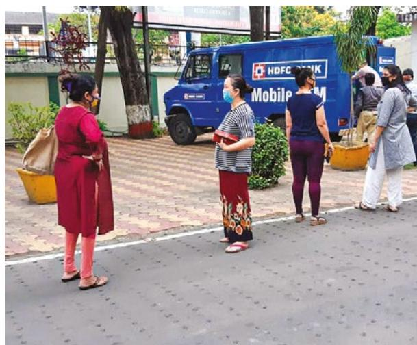

> **AI Description:**
> **Source:** `assets/_page_37_Figure_1.jpg`
> 
> **Generated:** 2026-05-24 13:35:52
> 
> ---
> 
> The image shows a group of people standing in a queue in front of a blue HDFC Bank Mobile ATM truck. The individuals appear to be waiting to use the ATM service. The setting seems to be outdoors, possibly in a public area, as there are trees and a building in the background. The people are spaced apart, adhering to social distancing guidelines, which is evident from their positioning. The truck is prominently displayed in the background, with the HDFC Bank logo and the words "Mobile ATM" clearly visible on its side.

## Shaurya KGC Card

The Shaurya KGC Card is a 1st-of-itskind product for the Indian armed forces personnel. This product offers hassle-free farming loans under Kisan Gold Card, in line with Kisan Credit Card guidelines by the Govt. The Shaurya KGC Card will provide armed forces personnel with finance for agricultural requirements like production of crop, post-harvest maintenance and consumption needs. They can also avail of this funding to purchase farm machinery, irrigation equipment or construct storage structures etc.

## Mooh Bandh Rakho

Our Mooh Bandh Rakho campaign was aimed to help prevent cyber frauds and the spread of COvID-19 by means of wearing a mask and keeping one's mouth shut (Mooh Bandh Rakho). The campaign was launched when the use of online banking services gathered momentum,as a fallout of the COvID-19 pandemic. The Bank used artificial reality filters for the campaign which allowed customers to better absorb the message.

As a socially responsible corporate, we initiated Secure Banking workshops for customers and the general public across the country. In March 2021, we completed our 10o0th workshop of educating people about Cyber Frauds and Secure Banking ways to counter online frauds.

## Campaign widely endorsed by:

Police Oficials, National Payment Corporation of India, ACl Worldwide

## Audience:

Law Enforcement Agencies, Senior Citizens, Channel Partners, Housing Societies, Educational InstitutesandSocietyatlarge

## ‘e-Kisaan Dhan' App for farmers

Our e-Kisaan Dhan App is for farmers to access a bouquet of agricultural and banking services on their mobile.

The app will provide value-added services like mandi prices, latest farming news,weather forecast,information on seed varieties,SMS advisory,e-pashuhaat, Kisan TV,and more.Users can also avail multiple banking services like procuring loans,the opening of Bank accounts,availing insurance facilities,calculate KCC loan eligibility online,and acquiring Government social security schemes at their fingertips.The app will also help with traditional banking services such as apply for loans,Fixed Deposits,Recurring Deposits,and Savings Accounts.

This activity is part of the Bank's ‘Har Gaon Hamara' initiative to provide banking facilities to customers in the rural and under-served areas.

Free247 access to Apollo Doctor on call &more

> **AI Description:**
> **Source:** `assets/_page_37_Figure_3.jpg`
> 
> **Generated:** 2026-05-24 13:35:35
> 
> ---
> 
> The image contains a smartphone displaying a video call with a doctor. The doctor is wearing a white lab coat and a stethoscope, and the screen shows a video call interface with icons for audio, video, and other call options. The top right corner of the image has the text "Service provided by Apollo 24|7." The image is a promotional graphic for a medical service.

Via Free membership to Apollo HealthyLife Excluslvely for HDFC Bankcustomers Condtionsaplyscounts/FeYearmebersharesponsoredbyolo

## HealthFirst Initiative

Inspired by the National Digital Health Mission, HDFC Bank under its HealthFirst initiative joined hands with Apollo Hospitals to provide Bank's customers exclusive access to quality healthcare through Apollo 24|7 HealthyLife program,along with easy financing option.

Our customers now enjoy benefits like 1st year free Apollo membership,round-the-clock access to Apollo doctor on-call service at zero cost, discounts on medicines and healthcare financial support.

## Multiplying the power of knowledge - ‘Business Banking Group (BBG) Workshops'

We believe in sharing knowledge with our customers. in FY21,we conducted workshops through which we reached out to Business Banking Group (BBG) clients. In these workshops,customers were informed about the impact of COvID-19 on the Indian economy,business cycle,various sectors,forex and markets,and were provide guidance on navigating the same.

This partnership will help serve our existing customers better, given that 85 percent of the districts in India are served by HDFC Bank and about 40% Indians are only 30 minutes away from an Apollo pharmacy.

> **AI Description:**
> **Source:** `assets/_page_37_Figure_4.jpg`
> 
> **Generated:** 2026-05-24 13:24:39
> 
> ---
> 
> The image contains a simple illustration of a person presenting a slide. The slide features a stylized atom symbol in the center and a photograph of another person on the right side. The person presenting is wearing a purple lab coat and holding a blue folder. The slide appears to be related to a scientific or educational topic, possibly involving chemistry or physics.

## Banking beyond Business - 'Health Webinars'

At HDFC Bank,we have conducted several webinars and other initiatives for our customers in the area of preventive healthcare.

Two awareness webinars were conducted on World Senior Citizens Day and World Cancer Day. Health and wealth experts came together to guide the audience on combined physical and financial health.

> **AI Description:**
> **Source:** `assets/_page_37_Figure_5.jpg`
> 
> **Generated:** 2026-05-24 13:27:29
> 
> ---
> 
> The image contains a simple line drawing of a person's head with a bun hairstyle, enclosed within a blue circular border. The drawing is minimalistic and does not include any text or additional elements. The image appears to be a stylized representation, possibly used for a logo or icon.

## Senior Citizens Day

## Speakers

. DrNaresh Trehan, Chairman and MD, Medanta - The Medicity

· Mr. Rakesh K. Singh, Group Head - HDFC Bank

Record 65,000+ attendance

> **AI Description:**
> **Source:** `assets/_page_37_Figure_6.jpg`
> 
> **Generated:** 2026-05-24 13:31:25
> 
> ---
> 
> The image contains a simple graphic of a white ribbon on a blue background. The ribbon is a symbol often used to represent awareness or support for various causes, such as cancer awareness. There are no charts, graphs, or other visual elements present in the image. The primary purpose of this image is to convey a symbolic message related to a specific cause or awareness campaign.

## World Cancer Day

## Speakers

Dr. Ashok Vaid, Chairman - Medical Oncology and Hematology, Medanta

· Ms. Sonali Bendre, actress and cancer survivor

· Mr. Arvind Vohra, Country Head, Retail Branch Banking, HDFC Bank

10,000+ attendance

# Customer Centricity

## SmartHub Merchant Solutions 3.0

SmartHub Merchant Solutions 3.0 is India's first comprehensive banking and payments solution for merchants and self-employed professionals.

It facilitates business transactions like opening current accounts or accepting payments,with ease,instantly,online, and on-the-go. It will enable us to reach out to more than 20 Million small and medium merchants and also other professionals in the next 3 years. Through SmartHub, the merchant network is empowered with the best

range of solutions to deepen the penetration of digital forms of payment across India and further the Digital India mission.

## 20 Million

merchants and professionals will be reached in the next three years

> **AI Description:**
> **Source:** `assets/_page_38_Figure_0.jpg`
> 
> **Generated:** 2026-05-24 13:46:45
> 
> ---
> 
> The image contains a photograph of a person wearing a mask and a graphic overlay. The graphic is an advertisement for HDFC Bank's SmartHub digital payment solutions. It features a stylized figure holding a smartphone, with the text "Digital Payment Solutions for Your Business" prominently displayed. The design includes the HDFC Bank logo and the SmartHub logo. The overall image combines a real-life photograph with a promotional graphic.

## HDFC Bank Festive Treats - an ode to the celebratory spirit of India

The festive season in India is that time of the year when Indian consumers tend to spend on themselves as well as their loved ones,without much inhibitions. They look for attractive deals and offers online and in stores. Keeping this in mind, we launched an industry-first property in 2019 - HDFC Bank Festive Treats -a one-stop destination for best offers and financial solutions. After the resounding success of the 1st edition, we returned with Festive Treats 2.0 in 2020.

Customers could avail of special deals on all banking products from loans to bank accounts, because of ‘Now All is Possible' with over 5,000+ offers on cards,easy EMls and loans. We provided national offers on major brands as well as hyper-local offers from tie-ups with local merchants across semi-urban and rural locations.

> **AI Description:**
> **Source:** `assets/_page_38_Figure_2.jpg`
> 
> **Generated:** 2026-05-24 13:49:55
> 
> ---
> 
> The image contains a visual of a smartphone displaying a video call interface. The main visual element is a call screen with a person wearing a headset and a face mask, representing a customer service representative. The HDFC Bank logo is prominently displayed at the top of the screen. In the bottom right corner, there is a smaller inset showing another person, presumably the customer, in a kitchen setting. The call interface includes icons for microphone, video, and additional options, suggesting a video conferencing or customer service interaction.

## Video KYC through V-CIP

Our customers can now open an all-benefits,full-KYC Bank account in just a few minutes and avail our world-class products and services.

Instead of physically visiting a bank,they can complete their account opening digitally through Aadhaar OTP based E-KYC and then click and connect on a video call with bank official for an audio-video based verification.

Video KYC is a part of our One Bank vision, taking a step forward in our customer experience excellence journey.We adhere to all regulations related to video recording storage in a secure manner,along with other mandates to ensure smooth onboarding.

## Beyond Business

## Safety Grid for Social distancing

Using the outer grid of HDFC Bank logo that is synonymous with trust, the Bank created physical markers on the ground to help people maintain the World Health Organisation (WHO) prescribed social distance while waiting in queue at a shop or an establishment. When the nation was fighting the pandemic, we decided to put the bank logo, known to millions of Indians, on the ground, for their safety and protection.

It was rolled out in more than 10 cities - Mumbai, Pune, Chennai, Delhi, Kolkata, Chandigarh, Jaipur, Bangalore, Bhubaneshwar and Hyderabad across 5,oo0+ locations.

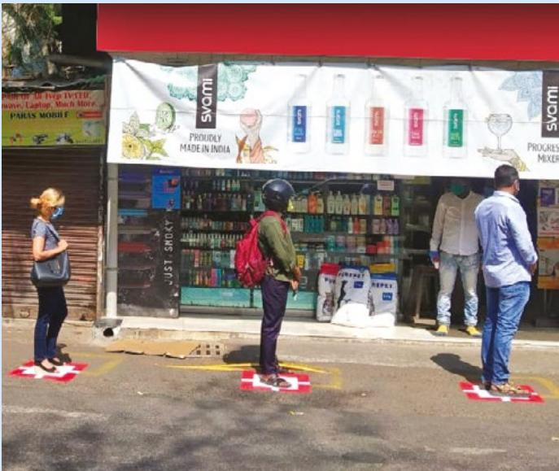

> **AI Description:**
> **Source:** `assets/_page_38_Figure_3.jpg`
> 
> **Generated:** 2026-05-24 13:47:47
> 
> ---
> 
> The image contains a photograph of a small shop with a banner displaying various products and the text "Proudly Made in India." There are two individuals standing on red and white marked squares on the ground, likely indicating social distancing measures. Another person is entering the shop, and a third person is standing outside. The shop has a variety of items displayed in the window, including bottles and other products. The overall scene suggests a retail environment with an emphasis on maintaining safety protocols during the pandemic.

## Unlock your creativity during the lockdown

Showcase your talent for a#BreakFromBoredom and win big atwww.theartproject.in

## The Art Project

To channelise creative energy and keep people motivated during the lockdown, we launched The Art Project, an online contest on art, craft, photography for all age groups. We created a dedicated microsite - a space to upload your creative output such as drawings, photography and art.

People could also attend workshops and view DIY videos.

3 Lakh+ registrations

3.9 Crore campaign reach

## Our Neighbourhood Heroes

45 Lakh votes

During these challenging times, we got to know our neighbourhood heroes who along with us were supporting the communities, in whatever way possible. To recognise, support and felicitate these real heroes and to inspire others, we created a dedicated microsite with videos of our Heroes, felicitating them with personalised e-Certificates for their service to society.

## 24000

nominations across 5000 branches

### Full Page Description (Page 39)

**Source:** `assets/_page_39_Asset_0.jpg`

**Generated:** 2026-05-24 13:51:06

---

The image is a circular diagram with three distinct sections. The top section is labeled "Digitising current banking facilities," the bottom section is labeled "Build for future," and the middle section is labeled "Architecting for Digital." The diagram appears to represent a process or framework for transforming banking facilities into a digital format, emphasizing the importance of both current facilities and future planning. The design is simple and uses a gradient color scheme, with blue tones dominating the circular sections.

## Digitisation

## Staying ahead with smart banking

Digitisation is an important enabler for our vision to be recognised as a Bank which offers a distinctive customer experience. The Bank's digitisation philosophy is inspired by empathy - for our customers and our associates. Hence, we are continuously designing products that make digital banking simple, easy, contextual, and highly secure.

Our digitisation initiatives are founded on our mission to emerge as a preferred bank with a “neo" customer experience, while also driving operational efficiencies, process optimisation,and productivity enhancements.

## Ensuring CORE systems are always ‘ON' and built for scale

Extending core functionalities through API

Build intuitive journeys on our channel and partnership sites

Our technology transformation is aligned with our digital strategy to bring agility in processes and in delivering outcomes.

Our approach is two-pronged - to digitise the current banking products and services and build for the future. Among other things, this approach involves ensuring that the core technology is always ‘ON' and built for scale. Our channels and partnership sites are intuitive using data analytics and a digital stack that is future-ready

Financial services stack on digital platform

## Vision: To make HDFC Bank the most preferred ‘Un-Bank' experience for new India

Build best-in-class experience: Intuitive, Zero Touch and Paperless

Create infrastructure, partnerships and competencies for scale: always ‘ON' and Resilient

Drive Operational Efficiencies: End-to end process optimisation

Build engaged and productive workforce: Enagagment through Technology

Build the finest digital and technology capabilities with new skills, new technologies and new ways of working

## Digitising Customer Journeys

We strive to transform the customer service paradigm by offering our potential and existing customers intuitive,zero-touch,paperless journeys.

## Customer life-cyle management

· Seamless and agile onboarding journeys

· Interactive and 24x7 transaction and servicing capabilites

Future-ready,multi-modal contact centers

## Enhanced APls for integrated end-to end solutions

Connect with various ecosystems with a bouquet of financial services

Integration of new-age technology and analytics in our processes, applications and APls,enables us to offer differentiated experiences to our customers.We are increasingly using microservices and cloud-native applications to offer a comprehensive set of platforms and services to customers,starting from the onboarding stage and moving on to transactions and lifecycle management.

Reimagining customer journeys and experiences

We are also increasingly developing APls to make our products and services available outside our platforms with the ability to cater to the entire spectrum of our customers' financial needs.Our aim is to extend end-to-end banking assistance throughout the transaction ecosystem for our customers.Our digital and technology systems are enabled to power customer interactions using analytics.We leverage data analytics,artificial intelligence,and machine learning to offer personalised services to our customers and enhance our underwriting capabilities.

Leverage our competency in Data and Analytics

· Personalisation

·Underwriting capabilities through Al and ML

· Risk control

> **AI Description:**
> **Source:** `assets/_page_39_Figure_1.jpg`
> 
> **Generated:** 2026-05-24 13:43:52
> 
> ---
> 
> The image depicts a person sitting at a desk, engaged in a virtual meeting. The individual is using a computer with a video conferencing application open, showing three other participants in the meeting. The person is holding a pen, suggesting they might be taking notes or preparing to write. The setting appears to be a professional or educational environment, with the person seated in a chair and the desk providing a workspace for the meeting.

## Building new competencies

We believe that building new competencies is akey pilarofour digitisation strategy.The Bank has adopted a threedimensionalapproach tobuildingnewcompetencies,encompassing targetedefrts togainnewskils,newtechnologiesand new ways of working.

## Digital Factory

· Reimagining ‘Un-Bank' customer

·Build secure and scalable platforms

· Using new age cloud native open-source technologies, microservices enabled

## Enterprise Factory

Building enterprise tech capabilities to support digital factory

Decoupling the core systems into microservices-based business logic

· Moving from Monolith to ‘loosely coupled systems', microservices architecture

## Enterprise IT

Enhancing the core to sustain growth

Ensuring that the core technologies are ‘always ‘ON', building resiliency in stack

· Upgrading legacy platforms

## Digitisation

## Our key digital initiatives

## Rural Digital Initiatives

Our Rural Digital Initiatives align with Gol's Digital India Initiative and has helped us penetrate Semi Urban & Rural (SURU) markets. With this,we have been able to extended banking services at Gram-Panchayat level as well as retail assets via CSCs and VLEs.

## Video KYC

## Digital Journeys

Intended to streamline all online forms, to provide consistency of customer experience through replication of an existing feature/ transaction/product/service currently available on other platforms, this initiative has helped us in offering a frictionless customer experience.

Our Video KYC known as V-CIP service is designed for offering an enhanced on-boarding experience mostly for new to bank customers. This has helped us in reducing account opening TAT with higher conversions.

## Customer Experience Hub

Customer Experience Hub (CXH) is a platform that would enable Omnichannel banking for customers by enabling banking transactions on 10+ self-assisted & agent-assisted channels. This platform would be powering transactions and informatior services that are consumed by channels in the front-end and, is intended to provide customers with personalised digital banking experiences, raise their engagement levels,and encourage them to adopt digital self-service workflows with conversational Al and ML.

The end-to-end, straight through processing of Savings Account origination, has helped us offer digital and seamless customer onboarding to our new customers, reduce journey turn around time, ensure full KYC account activation, enhance user interface and experience, and offer a more robust journey within build validations.

The digital journey created for Personal Loans was aimed at digitising the lending process to easily onboard new and existing customers with a significantly beter experience. It has helped us achieve efficiencies in terms of faster credit decisioning and reducing costs.

## Extending APls for partners

This initiative has helped us extend APls to internal and external platforms and achieve a larger distribution network for banking products/ services. It allows us to be present on the platform of choice of the customer and hence, power ecosystems through consistent STP journeys across multiple platforms.

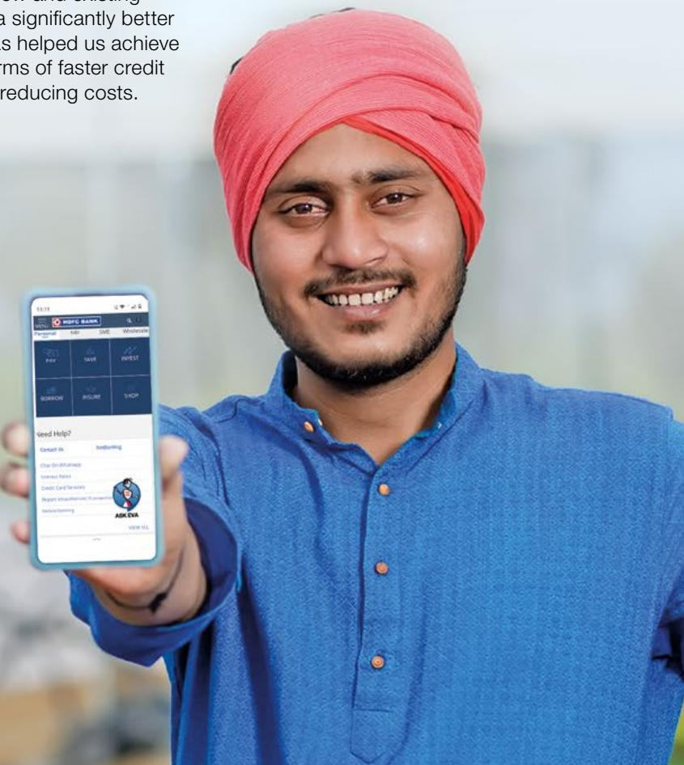

> **AI Description:**
> **Source:** `assets/_page_40_Figure_0.jpg`
> 
> **Generated:** 2026-05-24 13:25:51
> 
> ---
> 
> The image contains a photograph of a person wearing a red turban and a blue kurta, holding up a smartphone displaying the HDFC Bank app interface. The app screen shows various sections such as "Personal," "SME," "Wholesale," "Borrow," "Inquire," and "Shop." The text at the top of the image mentions improvements in terms of faster credit and cost reduction. The image effectively combines a photograph with text and a screenshot of a financial app, providing a visual representation of a banking service.

## Providing smart solution

## Problem Statement

Mrs Nalini Singh (name changed) from a small town in Madhya Pradesh wanted to urgently open a bank account to send across money to her parents.During the current pandemic with most of the offices closed and people becoming fearful of venturing out of their homes,it was difficult for Nalini to visit branch for In Person Verification to complete KYC for account opening.

## Video KYC Solution

In line with RBl guidelines on Video-based Customer ldentification process, Bank has built a robust Video KYC solution for consent-based method of establishing the customer's identity, for onboarding.The customers can now complete KYC process with convenience and safety from the comfort of their home,a video KYC call with Bank Official involves the process of verification of Customer's Geographic location coordinates, Liveliness,Face Match and Document Verification.

With new Amendment of KYC norms by RBI, the VCIP solutions willbe further leveraged to include new categories of customers such as proprietorship firms,authorised signatories and beneficial owners of Legal Entities and for periodic updation of KYC

## On-boarding with Video KYC

Post customer's consent and authentication, the customer receives a Video KYC link to complete the KYC process.Customer clicks on the link and is redirected to Video KYC page.The customer gets connected with the Video KYC Officer for customer identification and due diligence through Video Based verification process.The Video KYC Oficer guides the customer step by step to capture KYC, Geo-coordinates (customer located within India), liveliness details and security checks. On successful verification of the customer, Video KYC Officer approves the application.The application is then sent to concurrent auditor forverification.The concurrent Auditor verifies compliance with KYC/AML policies & procedures and approves or rejects the application. Once approved, the customer is notified and account is regularised as Full KYC Account.

## Key Benefits

Reduction of account opening turnaround time

Enhanced on boarding customer experience

Ease of account opening from the comfort of your home or office

Accounts opened successfully via Video KYC process as on 31st March, 2021

2,36,861

> **AI Description:**
> **Source:** `assets/_page_40_Figure_1.jpg`
> 
> **Generated:** 2026-05-24 13:26:59
> 
> ---
> 
> The image is a photograph of a person wearing a colorful sari, holding a smartphone. The person appears to be smiling and looking at the phone. The background is plain and light-colored, which helps to focus attention on the person and the phone. The image does not contain any text or additional visual elements beyond the person and the phone.

I must congratulate you on the seamless and quick service that your bank is providing to all present and potential customers to help set up an account. Also,Ifind worthy of a mention for Debojit from your team, who guided me through my video KYC to successfully complete it and the professionalism in his dealing made me even more confident about the customer focussed people that make up your organisation.

The process is very easy for the educated people and wish HDFC Bank to come up with something innovative which will help un-educated customers also to get the bank accounts opened instantly without any hassle.

The way you helped for Video KYC it is applicable.Demonstration given by you (VKYC officer) was really excellent. During recording also I could not complete in one go and you permitted me to take my own time to bring paper and adjustment of camera till my satisfaction.

lappreciate HDFC Bank for taking video call initiative.I stay in rural place and faced difficulty to open a new account. Being a mother of a 10 months old,its hard to go out because of COVID crisis.

Great experience to complete KYC in a few steps.lam really Happy with service,and would like to Congratulate Mr. Suraj and video KYC Team for valuing us.Thanks for providing excellent Service such as Video KYC

> **AI Description:**
> **Source:** `assets/_page_40_Figure_2.jpg`
> 
> **Generated:** 2026-05-24 13:30:02
> 
> ---
> 
> The image is a diagram illustrating a video KYC (Know Your Customer) process. It shows a person sitting in a chair using a laptop, which is connected to a large screen displaying a user interface with a QR code and a photo of a person. Another person is standing to the right of the screen, holding a device that appears to be a smartphone or tablet, with a checkmark indicating a successful verification. The diagram visually represents the interaction between the user and the verification system, emphasizing the use of video and digital verification methods.

### Full Page Description (Page 41)

**Source:** `assets/_page_41_Asset_0.jpg`

**Generated:** 2026-05-24 13:40:49

---

The image contains a bar chart with two bars. The first bar is labeled "142.60" and is colored blue, while the second bar is labeled "139.12" and is colored gray. The gray bar is longer than the blue bar, indicating a higher value. The chart appears to be comparing two different data points or categories.

# Catalysing our culture of success

At HDFC Bank, we believe our people are the cornerstone of our success. Their engagement and commitment make us who we are. We aspire to be an employer of choice not just in the BFSl sector, but also across industries by creating great employee experiences.

Learning and development

Diversity and Inclusion

Our employee focus areas

Employee Well-being

> **AI Description:**
> **Source:** `assets/_page_41_Figure_0.jpg`
> 
> **Generated:** 2026-05-24 13:35:20
> 
> ---
> 
> The image contains a photograph of a group of five individuals in a professional setting, seemingly engaged in a collaborative discussion around a laptop. The individuals are dressed in business attire, suggesting a formal or corporate environment. The photo is accompanied by a logo in the top right corner that reads "Great Place To Work Certified APR 2019-MAR 2020 INDIA," indicating the company's certification for being a great place to work in India during that period. The setting appears to be an office or meeting room, with the group seated on a couch and a laptop open in front of them.

Employee Engagement

We undertake varied initiatives to ensure the health and well-being of our people

We follow an equal opportunity hiring process and undertake efforts to develop a conducive work environment

Focus on learning and development and a meritbased, rewarding work culture

Our Bank is a fair employer and does not discriminate on the basis of gender, caste, colour, sex or creed

## Learning and development

We have put in place a Leadership Competency Framework,as well as a Functional Capability Framework to develop the competencies required to deliver on our strategic and operational objectives. Our training cycle begins with an onboarding programme. Our annual need assessment exercise forms the basis of our training modules with a view on regulatory compliance and governing laws.The Training Need Assessment support group facilitates training and measures the effectiveness of training initiatives.We adopt various modes for delivering trainings - classroom sessions,e-learning certifications,on-the-job training kits, guest lectures,exposure visits,among others.We have put in place wllstructured training modules to foster professional growth and personal development.We have designed curated development programmes for our people from every level and function.

We continuously improve our training framework and delivery by collecting feedback from our employees for each of the concluded programmes.Our Talent Review Council meets twice a year to analyse employee feedback and address their concerns.

During the period under review, we navigated through the COVID-19- induced challenges by conducting 80% of our training hours in e-learning mode. We more than doubled up our training from previous year which included Over 1.8 Lakh person-hours of training on Human Rights and over 6.7 Lakh person-hours on anti-corruption,KYC, AML-CFT,among others.A zero-day onboarding programme (induction) was conducted for all new joinees covering human rights specific topics like Code of Conduct and Prevention of Sexual harassment (POSH),among others.On average,our employees spent over106 person-hours on training in FY21.

## Employees received training

## 98.37%

Training hours in FY21 126.8%

## 127+ Lakh person-hours

Training and Development Expenditure

## 3,943.5 Lakh+

The foundation of any sustainable business is built on a competent and motivated workforce.

> **AI Description:**
> **Source:** `assets/_page_41_Figure_5.jpg`
> 
> **Generated:** 2026-05-24 13:31:14
> 
> ---
> 
> The image contains a visual representation of a person pointing at a large chart or graph on a whiteboard. The chart appears to be a line graph with multiple lines, possibly representing different data series over time. The lines show a general downward trend, with fluctuations along the way. The chart includes various data points and may represent a business or economic metric, given the context of the person analyzing it. The whiteboard also features a bar graph in the top left corner, which could be related to the same data set or a different metric. The overall scene suggests a focus on data analysis or financial review.

Total training hours by gender and category

## AVERAGEHOURS OFTRAINING (hours/employee)

Male Female

[Average across the category

Senior management

Middle management

Junior management

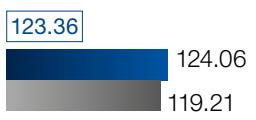

> **AI Description:**
> **Source:** `assets/_page_41_Figure_8.jpg`
> 
> **Generated:** 2026-05-24 13:57:11
> 
> ---
> 
> The image contains a bar chart with two horizontal bars. The top bar is blue and represents a value of 124.06, while the bottom bar is gray and represents a value of 119.21. Above the blue bar, there is a label with the number 123.36, which appears to be a reference or comparison value. The chart seems to be comparing these values, possibly indicating a slight increase from the reference value to the blue bar's value.

Non-supervisory staff

Frontline Staff and Sales Officers

We have a very comprehensive,multidimensional performance measurement system. Employees have joint performance discussions with their respective appraisers on a bi-annual basis covering aspects related to their performance, competencies,development needs and career aspirations.As a part of our Career Development Review process,we create opportunities for our employees to develop and grow by way of career progression, exposure training,development,and exposure and skill development.

### Full Page Description (Page 42)

**Source:** `assets/_page_42_Asset_0.jpg`

**Generated:** 2026-05-24 13:31:05

---

The image is a pie chart with a central icon of a person's head. The chart is divided into four segments with different colors and labeled with numerical values: 2609, 10, 459, and 2389. The largest segment is labeled 16279. The numbers likely represent different categories or data points, but without additional context, the exact meaning of these numbers is unclear. The central icon suggests the chart may be related to demographics or personal data.

### Full Page Description (Page 42)

**Source:** `assets/_page_42_Asset_4.jpg`

**Generated:** 2026-05-24 13:32:30

---

The image is a pie chart with four segments, each representing a different category. The segments are color-coded and labeled with numerical values. The largest segment is red and labeled "27286," the second largest is blue and labeled "94," the third is gray and labeled "12557," and the smallest is also blue and labeled "12557." The chart appears to be a data visualization, possibly representing proportions or percentages of a total value.

### Full Page Description (Page 42)

**Source:** `assets/_page_42_Asset_5.jpg`

**Generated:** 2026-05-24 13:34:54

---

The image is a pie chart with four segments, each representing a different category. The categories are labeled as follows: 
- Red: 33056
- Blue: 138
- Dark blue: 14474
- Grey: Total
The chart visually represents the distribution of these categories, with the red section being the largest, followed by the dark blue section, the grey section labeled "Total," and the smallest section being the blue section labeled 138.

### Full Page Description (Page 42)

**Source:** `assets/_page_42_Asset_1.jpg`

**Generated:** 2026-05-24 13:27:44

---

The image is a pie chart with four segments, each representing a different category with a corresponding number. The largest segment is blue, labeled "54700." The second largest is light blue, labeled "14236." The third segment is dark blue, labeled "25976." The smallest segment is red, labeled "3329." The central graphic is a lightbulb icon. The chart appears to be a breakdown of some numerical data, possibly related to categories or quantities.

### Full Page Description (Page 42)

**Source:** `assets/_page_42_Asset_8.jpg`

**Generated:** 2026-05-24 13:54:01

---

The image is a pie chart with three segments. The largest segment is labeled "Total" and is colored in a light blue shade, representing the largest portion of the data. The second segment is a smaller dark blue section labeled "40970," and the smallest segment is a thin red section labeled "957." The numbers 78166 and 957 are also displayed outside the chart, likely indicating the values corresponding to the segments. The chart visually represents the distribution of these values, with the "Total" segment being the most significant.

### Full Page Description (Page 42)

**Source:** `assets/_page_42_Asset_9.jpg`

**Generated:** 2026-05-24 13:56:06

---

The image is a pie chart with a central icon of a light bulb with a Santa hat. The chart is divided into four segments with different colors and corresponding numerical values. The largest segment is light blue, labeled "7,335". The next segment is dark blue, labeled "662". The third segment is a very small sliver, labeled "124". The smallest segment is red, labeled "4". The chart appears to represent some form of data distribution, possibly related to categories or quantities.

### Full Page Description (Page 42)

**Source:** `assets/_page_42_Asset_6.jpg`

**Generated:** 2026-05-24 13:37:49

---

The image is a pie chart with two segments. The larger segment is blue and represents 10,257, while the smaller segment is red and represents 141. The red segment is significantly smaller than the blue segment, indicating a much smaller value. The chart is divided by a vertical line, with the red segment on the left and the blue segment on the right. The red segment is labeled "CRITICAL," suggesting that the smaller value is the focus of the chart.

### Full Page Description (Page 42)

**Source:** `assets/_page_42_Asset_2.jpg`

**Generated:** 2026-05-24 13:24:51

---

The image is a pie chart with the word "Total" at the center, indicating the sum of all segments. The chart is divided into four sections, each labeled with a number and a color. The largest section is blue, labeled "70979," which represents the largest portion of the total. The second largest section is light blue, labeled "28585." The third section is dark blue, labeled "16625." The smallest section is gray, labeled "3788," and the tiniest section is red, labeled "116." The chart visually represents the distribution of these values, with the blue sections dominating the chart.

### Full Page Description (Page 42)

**Source:** `assets/_page_42_Asset_3.jpg`

**Generated:** 2026-05-24 13:27:21

---

The image is a pie chart divided into four segments, each with a different color and labeled with numerical values. The largest segment is red and labeled "5770," the next largest is blue and labeled "44," the third is gray and labeled "1917," and the smallest is dark blue and also labeled "1917." The central image within the chart is a simplified outline of a person's head and shoulders. The chart appears to represent some form of data distribution or categorization, possibly related to demographics or statistics, but the specific context is not provided.

### Full Page Description (Page 42)

**Source:** `assets/_page_42_Asset_7.jpg`

**Generated:** 2026-05-24 13:35:58

---

The image is a pie chart with three segments, each representing a different category with associated numerical values. The largest segment is blue and labeled "30713," the second largest is light blue and labeled "66818," and the smallest is red and labeled "816." The chart appears to be part of a larger infographic, likely related to data visualization or statistics, with the red segment being the smallest, indicating it represents the smallest portion of the total.

## Employee wellbeing

Employee wellness is an integral component of our employee value proposition,centring around the value of ‘Care'.We constantly explore possibilities and opportunities to deliver the finest customer experience. In the process,we realised that an engaged workforce is not just a productive one, but also a key element for creating ‘Happy Customers'. It begins with health.The key health issues at the workplace stem from sedentary lifestyle,coupled with improper posture and stress.We conduct regular medical check-ups and create awareness on best health practices.We also provide counseling to help our people deal with issues of mental health through a dedicated helpline.All our employees are provided medical cover. For our female employees on the path to embracing motherhood,we have a maternity care programme.

> **AI Description:**
> **Source:** `assets/_page_42_Figure_0.jpg`
> 
> **Generated:** 2026-05-24 13:57:17
> 
> ---
> 
> The image contains a photograph of a pregnant woman sitting in a chair, smiling while talking on a phone. She is wearing a white shirt and a black blazer. In front of her on the table is an open laptop. The background appears to be an office or home office setting with some blurred furniture and decor. The image conveys a professional yet personal atmosphere, possibly suggesting a pregnant professional working from home or in a flexible work environment.

In FY21,we aligned our on-going programmes to equip our people with the information and knowledge required to navigate through COviD-19. We rolled out ‘HDFC Bank Employee Medical Support Services related to COVID-19' in September 2020, followed by ‘COVID-19 pandemic Situation Employee Assistance Services for HDFC Bank Employees' in October 2020 to support our employees affected by the pandemic.We also organised 15 Health Talk webinars on COVID-19 related topics.

There is an employee association at the Bank.As of FY21, 0.16% of our permanent employees are a part of this association.The Bank has an internal Memorandum of Settlements that may be interpreted as a collective bargaining agreement signed between the Management and Union office bearers. There are periodic negotiations with Union Office Bearers and Memorandum of Settlement is signed by Management to the extent of their benefits and service conditions - including any significant operational changes.We provide three months'notice typically to employees and their representatives prior to implementation of significant operational changes that could substantially affect them.

labour, forced labour,and trafficked labour.Further,as a part of our credit policy,we evaluate all loans of more than 10 Crore and tenure of more than five years through our Social and Environmental Management System (SEMS) framework foradherence to Environmental, Health,Social & afety (EHSS) norms - including those relating to child labour. In FY21,we received no complaints of infringement of human rights,cases of child labour, forced labour,and involuntary labour. The facility attendants deployed at our sites for ensuring security are imparted training under the provisions of the PSARA Act, 2005 through security agencies on various aspects of security, safety,etiquette and personal conduct/ behaviour.

Employees availing counselling services

Female employees started receiving counselling under Healthy Motherhood Programme

## 855

We strictly prohibit child labour, forced or compulsory labour in all forms at our operations. In addition, through our ESG policy framework,we strive to ensure that our vendors and suppliers abide by the labour laws and human rights - including prohibition of child

## 826

Calls received for Doc on Call Services

Note: Numbers in parenthesis reflect rate against the absolute numbers reported.

## 23,067

Queries received on Medical Second Opinion

## 111

Calls on Nutrition Counselling Cell Service

## 628

Participants in health-talk webinars

## 2,500+

Newsletters/Health tips published

## 12

## Diversity and Inclusion

Our family of 1.2 Lakh+ employees with diverse socioeconomic and educational backgrounds enable us deliver hyper-personalised experiences to our customers.We remain committed to fostering a culture of inclusion, diversity, growth and progression,and well-being. Our employee diversity assimilates cultures and ideas and helps us establish effective connects with our customers from across geographies.In FY21, no incidents of discrimination were reported.

EMPLOYEESBYCATEGORY

Senior Management Middle Management Junior Management Non Supervisory Staff Frontline staff and sales officers

> **AI Description:**
> **Source:** `assets/_page_42_Figure_1.jpg`
> 
> **Generated:** 2026-05-24 13:58:51
> 
> ---
> 
> The image contains a photograph of four individuals in a professional setting. The person in the foreground is seated at a desk with a laptop, wearing a light-colored shirt and glasses. Behind them, three other individuals are standing, two women and one man. The woman on the left is wearing a black shirt and glasses, the woman in the middle is wearing a white shirt, and the man on the right is wearing a light blue shirt and a turban. The setting appears to be an office environment, with a whiteboard and some office supplies visible in the background. The image conveys a sense of teamwork and collaboration.

EMPLOYEESBYAGE

Senior Management Junior Management Frontline staff and sa

MiddleManagement Non Supervisory Staff officers

1<30 years 30-50 years 1>50 years

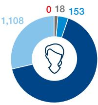

> **AI Description:**
> **Source:** `assets/_page_42_Figure_2.jpg`
> 
> **Generated:** 2026-05-24 14:01:17
> 
> ---
> 
> The image is a pie chart with a central icon of a person's head and shoulders. The chart is divided into three sections, each with a different color and labeled with numbers and text. The largest section is light blue and labeled "1,108". The second section is dark blue and labeled "153". The smallest section is a very small sliver of dark blue and labeled "0". The numbers likely represent counts or percentages of different categories related to the person icon in the center.

2,555

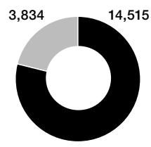

> **AI Description:**
> **Source:** `assets/_page_42_Figure_3.jpg`
> 
> **Generated:** 2026-05-24 13:59:12
> 
> ---
> 
> The image contains a pie chart with two segments. The larger segment is labeled with the number 14,515, and the smaller segment is labeled with the number 3,834. The chart appears to represent a comparison between these two values, with the larger segment occupying a significantly greater portion of the circle.

Male Female
Frontline staff and sales officers

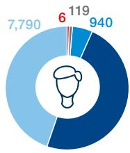

> **AI Description:**
> **Source:** `assets/_page_42_Figure_4.jpg`
> 
> **Generated:** 2026-05-24 13:56:01
> 
> ---
> 
> The image is a pie chart with three segments. The largest segment is blue and labeled "940," representing 60% of the total. The second segment is a smaller blue section labeled "119," representing 7% of the total. The smallest segment is a light blue section labeled "6," representing 0.4% of the total. The remaining portion is labeled "7,790," which represents 33% of the total. The chart appears to be a breakdown of some data, possibly related to categories or percentages.

8,441

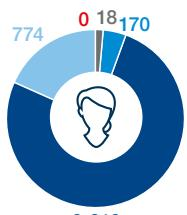

> **AI Description:**
> **Source:** `assets/_page_42_Figure_5.jpg`
> 
> **Generated:** 2026-05-24 13:54:11
> 
> ---
> 
> The image is a pie chart with a central graphic of a head. The chart is divided into three sections with the following data:
> - The largest section, in light blue, is labeled "774".
> - The second largest section, in dark blue, is labeled "170".
> - The smallest section, in dark blue, is labeled "0".
> The chart appears to represent some form of categorization or distribution, possibly related to head-related data or a similar concept. The central graphic of a head suggests a connection to human-related data.

3,213

### Full Page Description (Page 43)

**Source:** `assets/_page_43_Asset_9.jpg`

**Generated:** 2026-05-24 13:41:09

---

The image is a bar chart titled "RATE BY REGION (%)". It displays the percentage rates for males and females in four regions: East, West, South, and North, as well as an "Abroad" category. The chart uses blue bars for males and gray bars for females. The East region shows a higher percentage for females (19%) compared to males (15%). The South region has the highest percentage for both males (20%) and females (23%). The North region shows a higher percentage for females (17%) compared to males (16%). The "Abroad" category has a very low percentage for both males (2%) and females (2%). The chart provides a clear comparison of gender percentages across different regions.

### Full Page Description (Page 43)

**Source:** `assets/_page_43_Asset_8.jpg`

**Generated:** 2026-05-24 13:42:00

---

The image contains a stacked bar chart with the title "BY REGION". The chart is divided into two main sections: "Male" (in blue) and "Female" (in gray), with a smaller "Abroad" section at the top. The regions are East, West, South, and North. Each region is further divided into these three categories, with numerical values indicating the count for each gender and category. The East region has the highest total count, while the North region has the lowest. The West region has a significant number of males, while the South region has a higher number of females. The chart provides a clear comparison of male and female counts across different regions and categories.

### Full Page Description (Page 43)

**Source:** `assets/_page_43_Asset_3.jpg`

**Generated:** 2026-05-24 13:48:06

---

The image contains a pie chart with a numerical value and a percentage. The chart is divided into two segments: a smaller blue segment representing 23% and a larger gray segment representing the remaining portion. The total value is labeled as 70,979, with an exponentiation symbol (^) indicating it might be a scientific notation or a specific unit. The chart visually represents a portion of a larger whole, with the blue segment indicating 23% of the total.

### Full Page Description (Page 43)

**Source:** `assets/_page_43_Asset_7.jpg`

**Generated:** 2026-05-24 13:45:04

---

The image is a bar chart titled "RATE BY AGE (%)" with data presented for males and females across three age groups: "<30 years", "30-50 years", and ">50 years". The chart uses blue bars for males and gray bars for females. The percentages for each age group are as follows:

- For "<30 years":
  - Males: 35%
  - Females: 31%
- For "30-50 years":
  - Males: 10%
  - Females: 12%
- For ">50 years":
  - Males: 7%
  - Females: 6%

The chart shows that the rate for males is consistently higher than for females across all age groups, with the highest difference being in the "<30 years" age group.

### Full Page Description (Page 43)

**Source:** `assets/_page_43_Asset_6.jpg`

**Generated:** 2026-05-24 13:44:07

---

The image is a bar chart titled "RATE BY CATEGORY (%)" with data categorized by gender (Male and Female) and job role. The categories are Senior Management, Middle Management, Junior Management, Non-Supervisory Staff, and Frontline Staff and Sales Officers. Each category has two bars representing the percentage of males and females in that role. The chart shows that the percentage of males in frontline staff and sales officers is 30%, while the percentage of females is 42%. The percentage of males in non-supervisory staff is 15%, and for females, it is 20%. The chart highlights the gender distribution across different job roles, with notable differences in the percentage of males and females in certain categories.

### Full Page Description (Page 43)

**Source:** `assets/_page_43_Asset_2.jpg`

**Generated:** 2026-05-24 13:48:54

---

The image contains a pie chart with a numerical value and a percentage label. The pie chart is divided into two sections: a larger gray section and a smaller blue section. The blue section represents 14% of the total, while the gray section represents the remaining 86%. The number 16,625 is displayed above the chart, likely indicating the total or a related value. The chart is used to visually represent the proportion of 14% out of the total 16,625.

### Full Page Description (Page 43)

**Source:** `assets/_page_43_Asset_1.jpg`

**Generated:** 2026-05-24 13:47:28

---

The image contains a pie chart with a numerical value and percentage label. The chart is divided into two sections: a smaller blue section labeled "12%" and a larger gray section. The number "3,788" is displayed above the chart, with a superscript caret symbol (^), indicating a possible footnote or reference. The chart visually represents a portion of a whole, with the blue section showing 12% of the total represented by the number 3,788.

### Full Page Description (Page 43)

**Source:** `assets/_page_43_Asset_0.jpg`

**Generated:** 2026-05-24 13:46:52

---

The image contains a pie chart with the following key information:
- The title "Senior Management" is displayed at the top.
- The number "116" is shown with a superscript "^", possibly indicating a footnote or additional information.
- The pie chart is divided into two sections: a smaller blue section labeled "9%" and a larger gray section.
- The blue section represents 9% of the total, while the gray section represents the remaining 91%.
The chart visually represents the proportion of a total of 116 units that are attributed to the "Senior Management" category.

### Full Page Description (Page 43)

**Source:** `assets/_page_43_Asset_4.jpg`

**Generated:** 2026-05-24 13:46:36

---

The image contains a pie chart with a numerical value and percentage label. The pie chart is divided into two sections: a smaller blue section labeled "21%" and a larger gray section. The number "91,508" is displayed at the top left of the image, with an asterisk and caret symbol next to it, indicating a footnote or reference. The chart visually represents a portion of a total, with the blue section indicating 21% of the total.

### Full Page Description (Page 43)

**Source:** `assets/_page_43_Asset_10.jpg`

**Generated:** 2026-05-24 13:25:00

---

The image contains a horizontal bar chart with four categories: Senior Management, Junior & Middle Management, Non Supervisory Staff, and Frontline Staff and Sales Officers. Each bar represents a different group, and the length of the bar corresponds to a numerical value. The values are as follows: Senior Management has a value of 0.79, Junior & Middle Management has a value of 0.97, Non Supervisory Staff has a value of 0.89, and Frontline Staff and Sales Officers have a value of 1.07. The chart uses a gradient color scheme for the bars, with darker shades indicating higher values.

## Social - People

DIVERSITY INDICATOR

REPRESENTATIONOF WOMEN

> **AI Description:**
> **Source:** `assets/_page_43_Figure_0.jpg`
> 
> **Generated:** 2026-05-24 13:51:13
> 
> ---
> 
> The image depicts a simple illustration of three individuals sitting at a table with laptops. The individuals are stylized with minimalistic features and are engaged in what appears to be a collaborative work environment. The table is red, and the individuals are using laptops, suggesting a professional or educational setting. The illustration is flat and lacks detailed textures or shading.

Diversity of the Board of Directors

M: Male F: Female

We strive to create and maintain an inclusive work environment for all our employees irrespective of gender,caste,creed,colour,sexual orientation,religion,among others.We provide equal and fair remuneration opportunities,irrespective of gender. We have adopted a gender diversity target to increase the representation of women in our workforce to 25% by FY25\*.With this objective,we are working simultaneously on talent acquisition,as well as talent retention. We have launched a unique endeavour called Careers 2.0,which has provided a platform for transitioning back to work for skilled women professionals who had opted fora break due to family/ personal reasons.So far,we have onboarded 33 women through this initiative.

\*Excludes frontline staff and sales officers

We are also making efforts to prioritise female hiring,e.g.,by offering additional referral bonus for women candidates. We have introduced policies and processes to enable women employees to manage professional and personal commitments - such as offering flexi work time and parttime work arrangements with the objective of arresting attrition. To improve representation of women in leadership positions,we have designed a dedicated,multi-phased, threeyear-long leadership programme in middle-management, called the Career Accelerator Programme. Our flagship programme on diversity,‘Shrishti' aims to createa level-playing field forwomen employees.

We understand the importance and potential of providing a supportive ecosystem for women to enable them to build successful careers.We work towards increasing sensitisation of managers and leaders across levels to enable them to develop a conscious and comprehensive understanding of the challenges women often face as a result of unconscious bias.As part of this initiative,we have launched an audio-visual campaign,‘Uncovering Unconscious Biases',which focuses on creating an inclusive work environment.We have also launched #lntentionallnclusion video series to create overall awarenessaround unconscious biases relating to gender, disability,age,marital status,sexual orientation,among others.

## Employee Connect

We have created several events covering sports,arts, music,culture and nature, to enable employees to nurture themselves holistically. Apart from excelling in the professional space, employees get an opportunity to pursue and showcase their talent and interests.In FY21, keeping in mind the pandemic situation,our Employee Connect (EC) team converted all the existing initiatives in an online format and came up with new initiatives to engage with our employees virtually. A total of 16 initiatives were organised during the year engaging 44,130 unique employees.

## Our initiatives

## Online music classes

We collaborated with the Furtados School of Music and started online music classes for the employees with options to learn Indian classical and Western music.

Employees availed this facility

## Morning fitness sessions

We started morning fitness sessions for our employees which included Zumba, Yoga,Meditation,Aerobics,Pilates and several other forms of physical fitness.

Employees benefitted

## Art & Craft Sessions for kids

We started art and craft sessions for the children of our employees which included various hobby classes, DIY workshops and choreography sessions.

Employees who participated along with their children

## 11,745

## Syahi

We launched a new initiative called - ‘Syahi’which is a digital writing competition. The winning stories were curated in the form of an e-book which was hosted on OurWorld platform.

Employees participated

## 468

> **AI Description:**
> **Source:** `assets/_page_44_Figure_2.jpg`
> 
> **Generated:** 2026-05-24 13:54:49
> 
> ---
> 
> The image shows a person sitting on a yoga mat on a wooden floor, participating in a virtual yoga class. The laptop screen displays a video call with four participants, each in a different pose or position, suggesting a group yoga session. The setting appears to be a home environment, with natural light coming in from a window in the background. The focus is on the laptop screen, which is the main point of interest in the image.

> **AI Description:**
> **Source:** `assets/_page_44_Figure_3.jpg`
> 
> **Generated:** 2026-05-24 13:55:17
> 
> ---
> 
> The image is a simple illustration showing a person sitting in a chair, using a laptop to participate in a video call. The laptop screen displays two other individuals, suggesting a virtual meeting or conference. The illustration uses a minimalist style with flat colors and no detailed textures or shading. The focus is on the concept of remote communication and collaboration.

## Fitness challenge

We organised a weekly fitness challenge for our employees and motivated them with a chance to win the exciting prizes.

Employees participated

## 745

## Festive webinars

We arranged nine festive webinars during Diwali, Navratri and Christmas.

Employees participated

## 3,000

## Million dollar challenge

We started the million dollar challenge - which is a virtual team bonding activity to engage employees ina team initiative.

Sessions conducted

## 107

Employees participated

## 6,500

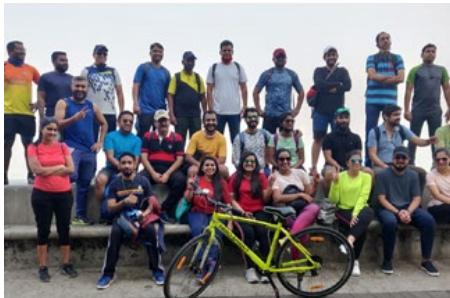

> **AI Description:**
> **Source:** `assets/_page_44_Figure_4.jpg`
> 
> **Generated:** 2026-05-24 13:59:44
> 
> ---
> 
> The image is a photograph of a group of people posing together outdoors. The group appears to be diverse in terms of age and attire, with some individuals wearing casual clothing and others in more athletic wear. There is a bright yellow bicycle in the foreground, suggesting the group might be involved in a cycling activity. The setting appears to be a bridge or elevated walkway, as the background shows a view of water and a cloudy sky. The overall mood of the image is casual and friendly, indicating a social or recreational gathering.

## AnalytlQ

To challenge the employees with some brain teasers,we introduced AnalytlQan online brainteaser contest.

Employees participated

## 3,500

## Breakfast cycle rides

After the lockdown was lifted, people were keen to go outdoors. Hence the EC team arranged Breakfast cycle rides in Mumbai, Bangalore and Chennai.It was an instant hit among the employees as these rides were organised during December which has a pleasant weather and employees wanted to meet their colleagues in an informal atmosphere.We conducted around 10-12 rides.

Employees participated

## 345

> **AI Description:**
> **Source:** `assets/_page_44_Figure_5.jpg`
> 
> **Generated:** 2026-05-24 14:00:56
> 
> ---
> 
> The image contains a photograph of two individuals, likely performing a dance or a traditional Indian dance. The person in the background is wearing a red and gold outfit, while the person in the foreground is dressed in a pink outfit with a decorative neckline. Both individuals are in motion, with their arms raised and extended, suggesting a dance pose. The background is dark, which highlights the subjects and their attire.

## Corporate photography contest

This is an online initiative for our employees who have interest in photography.This year, HDFC Bank won three prizes - best photograph in wildlife category, highest number of votes in mobile photograph category and the third highest number of photographs received from any organisation.

Employees participated

## 1,321

## Digital Voice Hunt

We collaborated with the Furtados School of Music to execute a music competition for our employees'children and spouse.

Employees participated

## 389

## Xpressions

This year,we organised the 6th edition of Xpressions which is a drawing and painting contest for employees and their children on an online platform.

Employees and their children participated

## 1,352

## HUNAR

Hunar is our in-house talent programme launched in 2015 through which we invite employees to showcase their talent in acting singing,and dancing. This year, due to the pandemic, the entire initiative was executed on an online platform. Further, Duet Singing was included in the existing bouquet of categories.

Unique employees participated

1,538

Performances in regional rounds

## 106

Viewers

## 11,200

Votes Polled

## Stepathlon

In order to break the sedentary lifestyle and promote physical fitness among employees and their families, we collaborated with Stepathlon to organise a 45-day long customised step-based fitness contest.

Participants

## 909

## Zaika

We organised Zaika- our culinary skill contest in an online format and executed this initiative in 10 cities.The winning recipes were compiled in an e-book which was launched on the Ourworld platform.

Employees participated

## 1,193

## Women's Day celebration

We celebrated Women's Day on an online platform by conducting a weeklong series of workshops on energy healing techniques, skin care, hair care,financial planning, through leisure games.

Female employees attended

## 2,200+

## Building sustainable communities

Our commitment to society is embedded in our mission statement. We are running significant, sustainable CSR programmes under HDFC Bank Parivartan, which contribute to the development of the less-privileged sections of the society.

## The pillars of HDFC Bank Parivartan

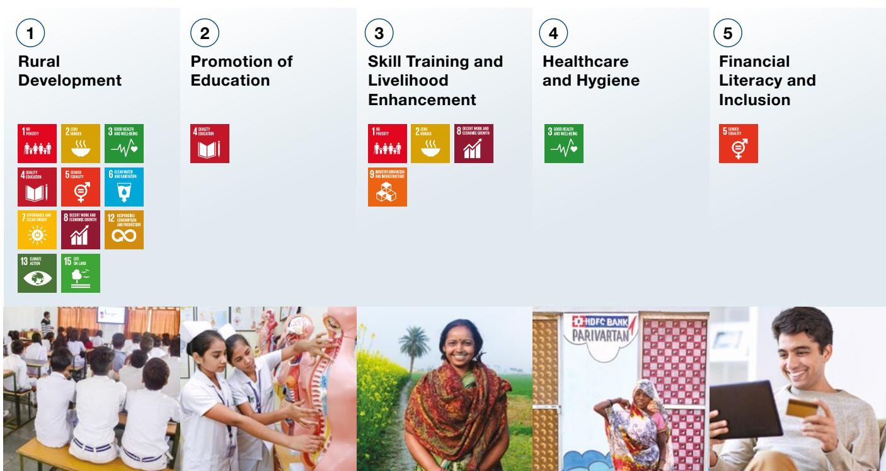

> **AI Description:**
> **Source:** `assets/_page_45_Figure_0.jpg`
> 
> **Generated:** 2026-05-24 13:56:43
> 
> ---
> 
> The image contains a combination of text and visual elements. It presents five main categories of development initiatives: Rural Development, Promotion of Education, Skill Training and Livelihood Enhancement, Healthcare and Hygiene, and Financial Literacy and Inclusion. Each category is accompanied by a set of icons representing the Sustainable Development Goals (SDGs) associated with it. Below the text, there are five photographs illustrating various aspects of these initiatives: a classroom scene, medical students practicing, a woman in a rural setting, a woman in front of a bank, and a man using a tablet. The images serve to visually represent the concepts described in the text.

We are committed to ensuring holistic and sustainable development of our communities.Our CSR initiatives,through direct and indirect interventions,are also aligned with global goals.

The past year was clearly an unprecedented one,especially for rural communities - not just in terms of the pandemic but also the economic challenges it brought with it.

With a total CSR expenditure of 634.91 Crore, we are one of the highest CSR spenders in India.

We continued to refine our strategy to respond to the pandemicinduced challenges and enhanced the total value of our CSR support delivered across our programmes. Responding to the need for a collective effort to contain the pandemic,we contributed to the PM CARES Fund and have been working with our communities at the grassroots level for multi-dimensional development of their health,livelihood and natural environment.

Under Parivartan,ourumbrella brand for social initiatives,we design and shortlist our programmes with the stakeholders through a participative, bottom-up and consultative process with the stakeholders.The programmes are implemented with the support of various NGO partners. The CSR department has put in place several internal systems and processes to monitor and evaluate the programmes. The CSR Committee reviews the progress on a quarterly basis. During FY21, there were no fines or nonmonetary sanctions due to noncompliance with laws and regulations in the social area.No financial assistance was received from the government during FY21 with reference to our Financial Statements.

PARIVARTAN Asteptowardsprogress

## Parivartan - a step towards progress

Parivartan,which denotes change, seeks to bring about a meaningful difference to the lives of people,making them part of the national mainstream. We identify the most disadvantaged sections of society around our areas of operation and enable them- through direct or indirect interventions - to become self-reliant. Parivartan focuses on five distinct areas of socioeconomic empowerment: Rural Development, Education, Skill Training and Livelihood Enhancement Healthcare and Hygiene, and Financial Literacy and Inclusion. Parivartan is also at the forefront of responding to natural disaster response-restoring infrastructure and rehabilitating communities.

Households reached through Parivartan\*

5.75 Lakh +

Lives impacted\*# 8.5 Crore +

## Rural Development

The Holistic Rural Development Programme (HRDP) was born out of the conviction that the progress of India is dependent on the growth of its rural economy. Over half the country's population lives in rural areas and primarily relies on agriculture for livelihood. We undertake focused interventions in the areas of soil, farm-based livelihoods, water, conservation,on-ground training for farmers,creation of Farmer Producer Organisations, education, sanitation and Natural Resource Management.

> **AI Description:**
> **Source:** `assets/_page_45_Figure_2.jpg`
> 
> **Generated:** 2026-05-24 14:01:32
> 
> ---
> 
> The image is a photograph of a person in a field, likely engaged in agricultural work. The individual is wearing a bright pink sari with a blue blouse and a pink headscarf. They are kneeling and holding a few tomatoes, suggesting they are harvesting or inspecting the produce. The background shows lush green vegetation, indicating a healthy tomato crop. The person appears to be smiling, conveying a sense of satisfaction or happiness with their work.

Our Holistic Rural Development Programme

Water conservation structures\* 8,800

HDFC Bank Parivartan received Cll National Award for Excellence in Water Management 2020 for its Holistic Rural Development Programme in 6 villages of East Khasi Hills, Meghalaya

During FY21, our focus was on facilitating employment opportunities for migrant labourers who returned to their native villages following job losses due to the pandemic.We also helped promote entrepreneurship such as poultry and goat rearing.The initiatives benefitted villagers across Uttarakhand, Uttar Pradesh,Bihar, Jharkhand, Odisha, Assam and Meghalaya.

Farmers trained\* 1 Lakh+

## Trees planted\* 16.20+ Lakh

Solar lights deployed\* 31,905+

Annual GHG reduction potential created through solar light deployment

3,500 tCO2

Annual GHG sequestration potential created through plantation works 25,000 tCOze

> **AI Description:**
> **Source:** `assets/_page_46_Figure_0.jpg`
> 
> **Generated:** 2026-05-24 13:34:35
> 
> ---
> 
> The image is a photograph of a person in a rural setting, likely a farmer, engaged in agricultural activity. The individual is holding a hose and appears to be spraying water, possibly for irrigation purposes. The background shows green vegetation, suggesting a field or farm environment. The person is wearing a traditional head covering and a long-sleeved shirt, indicating a warm climate. The water spray creates a dynamic visual effect, emphasizing the action of watering.

## A digital platform for CWMl with NITl Aayog

In order to get an annual snapshot of the water sector status and water management performance of India's different states and UTs, HDFC Bank Parivartan and NITI Aayog came together to create the Composite Water Management Index (CWMl). The digital initiative will make CWMl accessible

to public while digitising the entire process of ranking states. Data for crucial indicators such as groundwater restoration, irrigation management, on-farm water use, rural/urban drinking water supply as well as water policy frameworks can be viewed in various formats for agencies to forecast, plan and manage water resources. The results of the entire exercise will be used to propel action in the states to improve respective outcomes, besides improving upon data collection and performance monitoring mechanisms.

## Promotion of Education

The programme is being executed in partnership with several leading non-governmental organisations. It encompasses teacher training, scholarships, career guidance as well as infrastructure support, such as building toilets in schools and improving classrooms.

The ‘Teaching the Teacher' (3T) programme seeks to transform education in government schools across India by improving the skills of teachers.Our flagship Zero Investment Innovations for Education Initiatives (ZIIEl) was launched under the 3T programme to find and systematically scale up scattered, unrecognised

but effective and zero-cost solutions created by teachers to improve existing systems and processes.Under 3T, teachers across 28 states/union territories have been trained,by inviting ideas from them and implementing the selected ideas in schools to improve the quality of education.

In addition,with the objective of making learning fun and engaging for the students,we integrated technology with education and have so far supported state-run schools in eight states by introducing digital classrooms.

## Teachers trained \* 19.67+ Lakh

Students benefitted#\* 2.07 Crore+

Schools supported\* 2.67 Lakh+

Ideas submitted through ZllEl\* 11.97 Lakh+

Digital classrooms created\* 980+

Community libraries created\* 590+

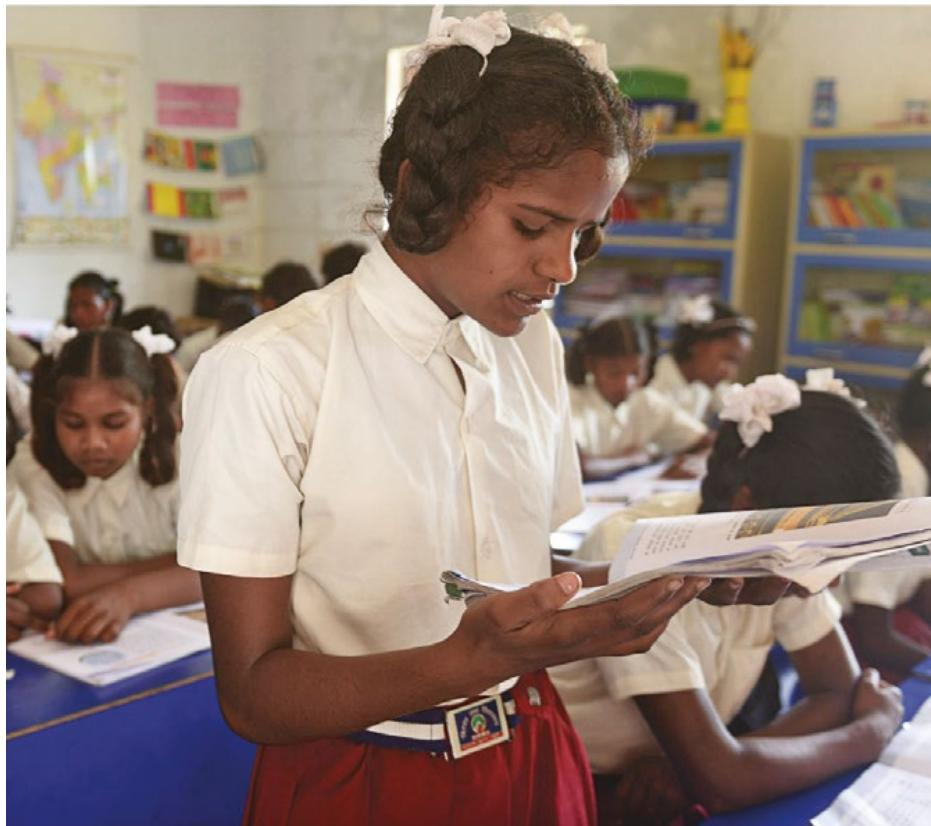

> **AI Description:**
> **Source:** `assets/_page_46_Figure_2.jpg`
> 
> **Generated:** 2026-05-24 13:36:35
> 
> ---
> 
> The image is a photograph of a classroom setting. A student in a white shirt and red skirt is standing and reading from a book. The student is wearing a white hair accessory. In the background, other students are seated at desks, also wearing white shirts. The classroom has shelves with books and educational materials, and a map is visible on the wall. The scene suggests a learning environment with students engaged in reading and studying.

## 3 Skill Training and Livelihood Enhancement

Under our Skill Training and Livelihood Enhancement programme, we target people in rural India and impart income generating skills, primarily in agriculture and allied areas such as dairy and poultry.

The objective is to empower the disadvantaged gain access to better opportunities,help them find jobs locally,enhance their household income and discourage migration.This programme alone has benefitted over 1.7 Lakh people since its inception. As part of this, thousands of youth have received placement-linked skill

development training thus far. Under this programme,we also provide career counselling to school students. During FY21,we responded to the need to create a skilled workforce to support our healthcare system, which was under immense pandemic-induced stress.We trained Auxiliary Nurse Midwife (ANM) nurses in three 3

Nursing Kaushal Colleges in Jharkhand, and plan to replicate this model in other states to enhance India's ANM nursing throughput by 50%,with a goal of extending COVID-19 training to public healthcare workers.

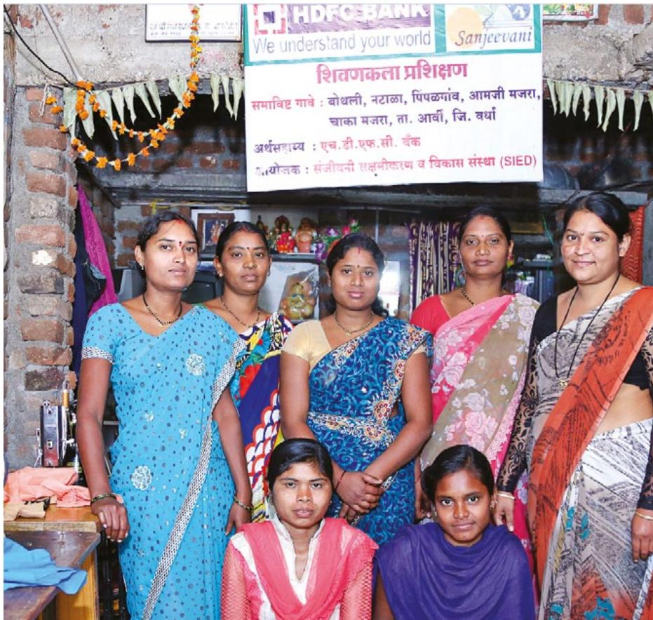

> **AI Description:**
> **Source:** `assets/_page_47_Figure_0.jpg`
> 
> **Generated:** 2026-05-24 13:26:26
> 
> ---
> 
> The image contains a group of women standing in what appears to be a small shop or stall. They are dressed in traditional Indian attire, with sarees and blouses. The background includes a signboard with text in Marathi, indicating a service or business related to "Shivakalpa Prashikshan" (Shiva's Grace Training). The sign also mentions "Sanjeevani" and lists various services or products. The setting suggests a community or local business environment.

\*Refers to achievement since inception till 31 March 2021

ANM candidates enrolled\*

## 952

ANM candidates enrolled during FY21

ANM candidates trained during FY21

232

ANM candidates placed during FY21

188

## Stories of change

## Zero Budget for a Sustainable Future

Bindki Block, Fatehpur District, Uttar Pradesh

Over 90% of Uttar Pradesh's land belongs to marginal farmers. Market demands have forced majority of these farmers to shift from local resource based and labour-intensive agriculture to monocropping using artificial fertilisers and machines, resulting in the widespread degradation of soil quality and increasing input costs.

We partnered with Shramik Bharti to introduce Zero Budget Natural Farming (ZBNF) in 5 villages.

Farmers were collectivised under a Farmers Producer Organisation (FPO),and capacitated to undertake natural farming through exposure visits.

Farmers were provided agri-tools such as potato weeders and seed drills. Krishi-Mitras were developed in each of the villages to create a local resource pool that would be accessible to farmers 24/7. Additionally, community seed banks were established to allow sustainable usage of seeds.

While slow in taking off the intervention has gradually resulted in the creation of a sustainable livelihood for the farmers. The development of their skills has not only allowed them to bargain for better market rates but has also made them confident enough to open an agri processing unit for flour, gram flour, rice, mustard oil and spices. Overall, farmers in the region now make profits that range between {8,000 to 10,000 per month, thus drastically improving their socio-economic situation.

More than 100 small beneficiaries impacted

## Education for a healthy future

Dhanegao, Mujampeth, Hasapur and Nasratpur villages, Nanded District, Maharashtra

The lack of hygiene is a serious issue for women in rural India due to inadequate resources coupled with traditional societal customs. Many of Nanded's young women and girls are no different - and were ignorant of even basic hygienic measures.

We partnered with CARD organisation to conduct health camps in the selected four vilages

These camps were used to raise awareness on hygiene issues specific to girls as well as to counter certain harmful, popular social trends with body positivity.

Haemoglobin levels of 127 girls were tested and were found to be below average.

The initiative impacted 151 beneficiaries. It is being overseen by Tuljai Pathology, set on a mission to spread female hygiene awareness in Nanded's rural communities.

> **AI Description:**
> **Source:** `assets/_page_47_Figure_1.jpg`
> 
> **Generated:** 2026-05-24 13:26:33
> 
> ---
> 
> The image contains a photograph of two individuals wearing school uniforms, including white shirts, ties, and backpacks. The background is a plain light blue color. The individuals appear to be smiling and are positioned side by side. The image does not contain any text or additional visual elements beyond the individuals and their attire.

## Stories of change

## Empowering youth to improve employability

Natun Salmora, Lakhimpur District, Assam

Manasjyoti Barik is a young college dropout and the only earning member in a family of five. He faced immense financial difficulties in making ends meet, tried hands at various professions without much success in absence of any vocational skill.

We partnered with IGSSS to provide training to Manasjyoti on Animal Husbandry at Lakhimpur College of Veterinary Science in 2018.

In line with his interest in poultry farming, he was provided with 200 chicks for the development of his farm in addition to a chicken cleaning machine to help with quick cutting and seling.

In 2020, Manasjyoti opened his meat cutting and selling shop. With aid of training and further support, he is earning 15,000 to 20,000 per month and has been able to purchase many batches of chicks. His income has increased to around 45,000 per month after he opened his shop.

## Infrastructure Development for better irrigation

## Pachdi village, Sohagpur, Madhya Pradesh

Agriculture is the main source of livelihood in the village but remains highly under developed with poor civic infrastructure. The area ranked low in all important human development indicators such as infant mortality rate, maternal mortality rate, literacy and sanitation.

We partnered with Action for Social Advancement (ASA) for the construction of 3 new stop dams and renovation of 13 existing structures.

The structures were constructed with the help of the community participation.

The structures have a collective water holding capacity of6Crorelitres over2 years;andacapacity to irrigate over 200 acres of land.

More than 40o farming households are getting better irigation facilities in a 750-acre area while more than 1,500 farmers have benefited through the recharge of downstream structures.

Due to the stop dam construction, the cultivable area of the region has increased as well. As a result, farmers have started sowing Rabi crops, leading to an increase in income and food security along with a decrease in seasonal migration.

The Sustainable Livelihood Initiative (SLl) is our flagship programme under Skill Training and Livelihood Enhancement through which we aim to ‘create sustainable communities' by empowering women and helping them break the vicious circle of poverty.

We support women by forming Self Help Groups (SHGs) or Joint Liability Groups (JLGs) by providing occupational skills training,financial literacy, credit livelihood finance,and market linkage.We have started SLl EMI collections through Common Service Centres (CSCs) Village Level Entrepreneurs (VLEs) providing customer convenience at the village level.

Women in SHGs trained so far through SLl and HRDP programmes\*

## 7.81 Lakh+

\*As on March 31,2021

EMl collection through the initiative as on March 31,2021

## 87 Lakh

> **AI Description:**
> **Source:** `assets/_page_48_Figure_0.jpg`
> 
> **Generated:** 2026-05-24 13:46:30
> 
> ---
> 
> The image contains a photograph of a person working with a sewing machine. The sewing machine is branded "JUKI" and appears to be a professional-grade model. The person is wearing a dark blazer and is seated at the sewing machine, which is positioned on a table. There is a piece of pink fabric visible in front of the sewing machine, suggesting that the person is in the process of sewing or working on a garment. The background is plain and light blue, which helps to focus attention on the subject and the sewing machine.

## Our unique SLl programme has, perhaps, no parallel globally

An all women's programme

) Covers 28 states and 544 districts

We have exceeded our Board-mandated target of covering 1 Crore households and have already covered about 1.29 Crore households\*

Empowering women means empowering families

Covered around 1.29 Crore households\* \~10% Banks workforce dedicated for running the programme

> **AI Description:**
> **Source:** `assets/_page_48_Figure_3.jpg`
> 
> **Generated:** 2026-05-24 13:44:51
> 
> ---
> 
> The image is a photograph showing three women dressed in traditional red and yellow attire, sitting on the ground in front of a white building with a wooden door. They are engaged with a laptop and a tablet, suggesting they are using technology. The setting appears to be a rural or traditional environment, indicated by the simple structure and the presence of a small fire pit nearby. The women seem to be collaborating or sharing information, possibly related to education or community work.

## 4 Healthcare and Hygiene

We have been actively championing the cause of Swachh Bharat through several sanitation projects with a focus on infrastructure creation, complemented by driving behavioural changes. At the heart of these programmes are community-led sanitation campaigns that promote hygienic conditions in rural areas through appropriate wastewater disposal. We also organise health camps, nutrition programmes and vaccination drives. Our health camps not only offer diagnostic services, but also assist the communities on other healthcare-related aspects. At the community level, we educate people about water, sanitation and hygiene (WaSH) and create awareness on road safety and healthy financial practices.

We also encourage dry waste management practices to improve and support resource utilisation, generate employment,and contribute to sustainable development goals. To mitigate environmental and health issues arising due to improper waste disposal,we have partnered with

the United Nations Development Programme (UNDP), India for dry waste management.Through this initiative,we aim to create an ecosystem with 5Rs of waste management- Refuse, Reduce, Reuse,Repurpose and Recycle - and bring waste pickers into the mainstream through social and financial inclusion.

## Household toilets constructed\* 23,500+

## Sanitation drives conducted\* 1,800+

ISC-FICCl Sanitation Awards HDFC Bank's WASH programme adjudged Best Corporate Initiative in Sanitation

People benefitted through health camps\*

## 1.18 Lakh+

Waste pickers empowered\* 2500+

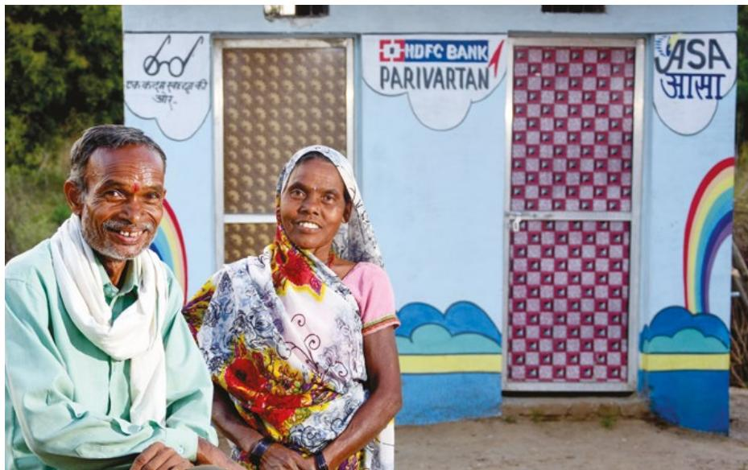

> **AI Description:**
> **Source:** `assets/_page_49_Figure_0.jpg`
> 
> **Generated:** 2026-05-24 13:48:00
> 
> ---
> 
> The image contains a photograph of two individuals standing in front of a colorful wall with various decorations and text. The wall features a logo for HDFC Bank Parivartan and some text in Hindi. The individuals are dressed in traditional attire, and the wall has a painted design with a rainbow and clouds. The setting appears to be outdoors, possibly in a rural area.

\*Refers to achievement since inception till 31 March 2021

## Employee volunteering programme

We encourage our employees to contribute their time and effort to various social programmes under Parivartan.

## 'Making a Difference' initiative

We started a Virtual Volunteering Programme to reach out to students and youngsters in distress due to COVID-19 induced restrictions and economic slowdown.As part of this programme,we partnered with NGOs to create diverse and interactive virtual programmes,ranging from mentoring marginalised students to training staff of smaller NGOs with organisational skill sets.

Over 120 employees spent 86 hours cumulatively volunteering under this programme.

## Plant on-the-go

To encourage our employees to do their bit for making their surroundings greener,we distributed over 500 ‘seedbombs' (mud bals consisting of seeds) among our staff in Mumbai. The ‘seedbombs' were specially made by tribal women from Mumbai and villagers in Madhya Pradesh.

## Go green at home

We adapted our plantation drive to the prevailing COVID-19 situation. We encouraged our employees,along with their family, to plant saplings in their homes or in the vicinity.

> **AI Description:**
> **Source:** `assets/_page_49_Figure_1.jpg`
> 
> **Generated:** 2026-05-24 13:49:46
> 
> ---
> 
> The image is a photograph featuring a group of women. The women are dressed in traditional Indian attire, with some wearing sarees and others in more casual clothing. The woman in the center is wearing a blue top and is smiling, while the others appear to be engaged in a discussion or meeting. The image is from the Integrated Annual Report 2020-21 of HDFC Bank Limited, as indicated by the text at the bottom of the image. The photograph captures a moment of interaction and collaboration among the group.

## Combating COVID-19

> **AI Description:**
> **Source:** `assets/_page_50_Figure_0.jpg`
> 
> **Generated:** 2026-05-24 13:58:33
> 
> ---
> 
> The image shows a close-up of a person's gloved hands inserting a credit card into an ATM machine. The gloves are blue, and the card is partially inserted into the card reader slot. The ATM machine appears to be metallic and has a keypad and display screen visible in the background. The image conveys a sense of security and hygiene, possibly in the context of preventing the spread of germs or viruses.

Our COVID-19 response was guided by a spirit of developing closely-knit working relationships with Government and civil society to contain the spread of the virus and manage the crisis from a socio-economic and healthcare standpoint.

## Extending support to the Government

In FY21, recognising our responsibility towards the frontline warriors in the nation's fight against the pandemic, we supported seven state/district/ city level institutions by providing face masks, sanitisers, gloves,kits, thermometers,in addition to monetary support for procurement of medical equipment.

## Supporting the underprivileged

We aligned our efforts towards supplying essentials to the migrant returnees and their families, as well as daily wage earners - most affected by the COVID-19-induced lockdown. In addition to providing financial support to several implementation organisations,we ensured supply of care-kits consisting of dry ration and other essentials to villagers across Bihar, Odisha, Maharashtra, Haryana and Rajasthan. We also provided cooked meals to those in need across cities including Mumbai, Bhatinda, Lucknow and Patna through our employee volunteers.

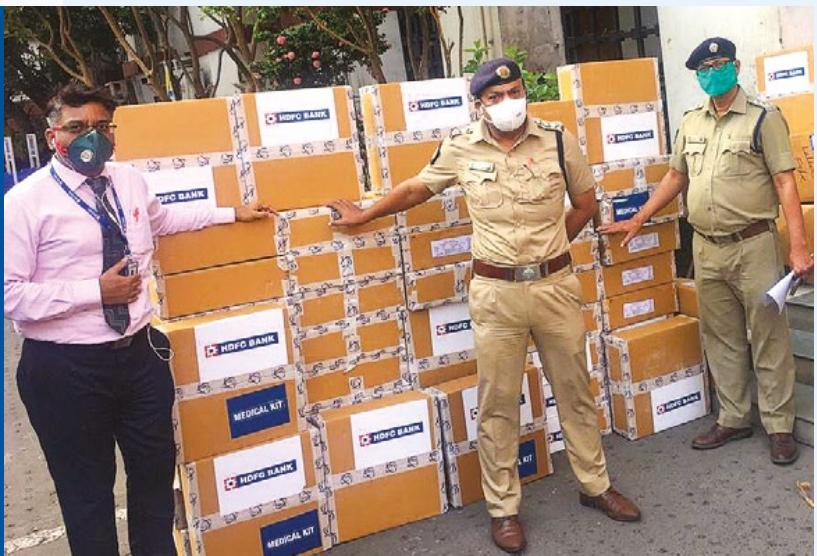

> **AI Description:**
> **Source:** `assets/_page_50_Figure_1.jpg`
> 
> **Generated:** 2026-05-24 13:57:50
> 
> ---
> 
> The image contains a photograph of three individuals standing in front of a large stack of cardboard boxes. The boxes are labeled with the HDFC Bank logo and the text "MEDICAL KIT." The individuals appear to be in uniform, suggesting they are law enforcement or security personnel. One individual is wearing a pink shirt and tie, possibly representing a bank official or representative. The boxes are neatly stacked, indicating a coordinated effort, likely related to the distribution or collection of medical kits. The setting appears to be outdoors, possibly at a bank or a public location.

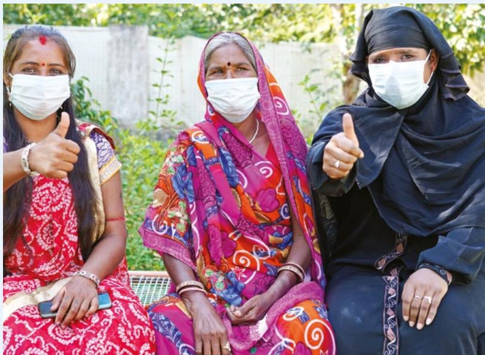

> **AI Description:**
> **Source:** `assets/_page_50_Figure_2.jpg`
> 
> **Generated:** 2026-05-24 13:59:38
> 
> ---
> 
> The image is a photograph showing three women sitting outdoors. They are all wearing face masks and giving a thumbs-up gesture. The woman on the left is wearing a red and gold traditional outfit, the woman in the middle is in a pink and orange saree, and the woman on the right is in a black outfit with a black head covering. The background appears to be a garden or park with greenery.

## Mobilised community support and action

We undertook mass awareness campaigns through cycles and rickshaws to reach the most remote places. We also guided villagers to maintain social distancing in several states including Assam, Jharkhand, Odisha, Haryana and Rajasthan. To salute the indomitable spirit of our COVID-19 warriors,and to drive donations to the PM Cares Fund, we released an anthem of hope and positivity, #HumHaarNahiMaanenge (We will not give up) and pledged to contribute 500 to the PM Cares Fund every time the song was shared on social media. Collectively, we raised and donated 2 Crore as part of this initiative.

> **AI Description:**
> **Source:** `assets/_page_50_Figure_3.jpg`
> 
> **Generated:** 2026-05-24 14:00:48
> 
> ---
> 
> The image contains a photograph of a person sitting at a desk, wearing a face mask and working on a laptop. The individual appears to be taking notes or working on a document, as they are holding a pen and looking at the laptop screen. The background shows a shelving unit with various items, suggesting an office or workspace environment. The image conveys a sense of focus and productivity in a professional setting.

## Financial Literacy and Inclusion

Financial literacy is the first step towards financial inclusion.We conduct financial literacy camps at our banking outlets as well as at financial literacy centres across the country through our NGO partners.The camps are aimed at empowering the communities with knowledge about fundamentals of savings,investment and organised finance, thereby enabling them to make smart financial decisions. Our flagship programme under this initiative, Digidhan criss-crosses the length and breadth of India's hinterlands on wheels, explaining the benefits of digital banking through audio-visual mode.

Financial literacy camps organised\*

18.84 Lakh+

Beneficiaries reached\*

1.42 Crore+

> **AI Description:**
> **Source:** `assets/_page_50_Figure_4.jpg`
> 
> **Generated:** 2026-05-24 13:54:38
> 
> ---
> 
> The image contains a bar chart with a person presenting it. The chart displays a series of bars, each representing a different category or data point. The bars are color-coded, with some being blue and others white, which may indicate different groups or conditions. The person presenting the chart is wearing a face mask and a blue shirt, suggesting a professional or health-conscious setting. The chart appears to be a simple bar graph, likely used to compare quantities or values across different categories.

\* Refers to achievement since inception till March 31,2021

## Nation Building

## Contributing to India's growth

The rural sector emerged as a bright spot in the post-pandemic economic recovery, driven by a favourable harvesting season, aided by reverse migration and limited spread of COVID-19. Central Government's measures like Direct Benefit Transfer (DBT) provided a boost to rural incomes. At HDFC Bank, we enabled efficient and timely disbursement of funds to millions of beneficiaries under various schemes through Public Financial Management System in compliance to Government of India guidelines.

As part of our humanitarian efforts for COVID-19 relief, we extended support towards the fund raising efforts of the Central Government down to the district level. We opened hundreds of accounts for COvID-19 relief, and collected more than 1,500 Crore through our crowdsourcing efforts from our retail and corporate customers.

## Supporting the nation's sustainable development

> **AI Description:**
> **Source:** `assets/_page_51_Figure_0.jpg`
> 
> **Generated:** 2026-05-24 13:50:16
> 
> ---
> 
> The image is a photograph featuring three individuals, likely a family, sitting together outdoors. The man on the left is holding a smartphone, seemingly taking a selfie or a photo with the two other individuals. The woman on the right is wearing a traditional outfit with a red and blue pattern, while the young girl in the center is dressed in a floral dress. The setting appears to be a rural or traditional environment, suggested by the clothing and background. The image conveys a sense of family bonding and cultural attire.

Contributing to economic recovery led by rural India

Facilitating ease of doing business

Taking banking to the unbanked

Developing an ecosystem for Healthcare Banking

Promoting entrepreneurship   
through SmartUp   
programme

Digital solutions

Sustainable financing solutions

Statutory Reports and Financial Statements

## Fuelling economic recovery led by rural India

Ensuring seamless Direct Benefit Transfers

We focus on timely disbursement of Government funds,including DBT payments, through PFMS while ensuring maximum coverage for eligible beneficiaries of important government schemes Such as MGNREGA, PMAY, PMKSY,among others.The Bank processed 9% of the total value of Direct Benefit Transfers in FY21 including disbursement of funds to 12,000+ beneficiaries under Pradhan Mantri Krishi Sinchayee Yojana (PMKSY) for setting up micro-irrigation systems in their farms.

Digitising Gram Panchayats (GP) We have received mandates from the Government to work with Gram Panchayats (GPs) in eight leading states to open accounts for various schemes including those recently introduced by the 15th Finance Commission to enable ease of access to funds through PFMS. During the pandemic,we conducted webinars across states to help train GP staff to work more efficiently by maximising the use of digital solutions provided by us.

## 9%

Of total DBT value processed during FY21

## 10%

Market share of HDFC Bank across Gram Panchayats

HDFC Bank is among the six banks to integrate with National Agriculture Market (eNAM),a pan-India electronic trading portal managed by the Small Farmers Agribusiness Consortium (SFAC) under the Ministry of Agriculture and Farmers' Welfare.eNAM aims to integrate 2,000 Agricultural Produce Market Commitees (APMCs) across the country through a common online platform,providing better price discovery through a transparent auction process.We support the platform by streamlining the payment flow from trader to farmer. It ensures faster and more transparent payments to farmers.

Digitising agricultural procurements

Large share of agricultural procurement was processed as part of state level mandates in Uttar Pradesh, Punjab and Haryana by the Bank.

## Facilitating ease of doing business

Partnering with the Ministry of Corporate Affairs (MCA) As part of the Prime Minister's ‘Ease of Doing Business in India' initiative,we are now integrated into the Government's MCA 21 platform. This enables us to issue a Current Account number on a real time basis to businesses during the registration process with the Ministry.

Increasing participation of MSMEs in government supply chain

We have also integrated with the Government's GeM Portal for accepting Caution Money Deposit for procurement through the portal.This improves transparency and enables ease of doing business for MSMEs when paying the deposit.

First Indian private bank to facilitate salary disbursements for our soldiers We became the first private bank in India to be given the mandate to

establish a Smart Banking lobby (fully digital branch) at the 13 Base Repair Depot of the Indian Air Force.Further, the Ordinance Factory Board under the Defence Ministry has empanelled the Bank to set up salary accounts for their employees across the country.We are also enabling the digitisation of fee collection for 134 Army Public Schools run by the Army Welfare Education Society.

Ensuring efficient Government fund allocation

Deploying the parent-child accounting structure,along with a fund management solution,we enabled several Government departments to better allocate funds to regions based on utilisation levels,and reduce leakages through efficient expense tracking mechanisms.Hundreds of crores of leakages have beenarrested in departments where these solutions have been implemented.

State government owned assets e-auctioned through HDFC Bank facilitated platform

## 1 Lakh+

> **AI Description:**
> **Source:** `assets/_page_51_Figure_1.jpg`
> 
> **Generated:** 2026-05-24 13:53:47
> 
> ---
> 
> The image contains a photograph of a person holding a smartphone with the logo and text "GeM Government eMarketplace" displayed on the screen. The person is pointing at the phone with their other hand. The background appears to be a store or retail environment, with shelves and products slightly out of focus. The image is primarily used to promote the GeM eMarketplace, which is a government initiative.

## Nation Building

## Taking banking to the unbanked

Common Service Centres (CSCs) CSCs play a pivotal role in taking our cost-effective services to the underbanked in the hinterlands of India. Managed by Village Level Entrepreneurs (VLEs), CSCs serve as access points for delivering essential public utilities, healthcare, financial,education and agrarian services alongside social welfare schemes and diverse B2C services.

Statutory Reports and Financial Statements

EMl collections including delinquent and overdue The collection mechanism of delinquent and overdue amount has become easier since the inception of the BC EMI Collection Centres on 28 January 2021. Borrowing customers no longer need to visit the Bank to pay their EMls,which can be carried out at one of 15,oo0 locations across India.

EMls collected (Total Transactions) at the VLE BC Centers

6,700+

## Developing an ecosystem for Healthcare Banking

The pandemic has brought to the fore the need for rapid digitisation in the healthcare space. At HDFC Bank, we are entering into alliances with digital healthcare providers to provide customised and cost-effective banking solutions to various user groups on their platforms.This ranges from ensuring faster access to funds and banking products to addressing the challenges of high-cost treatments,providing loans to doctors and hospitals.We have enabled partner hospitals to provide loansand EMl facility on Debit/Credit cards.

Kisan Gold Card disbursements CSC VLEs can now source Kisan Gold Card (KGC) to help farmers finance their requirements.The farmer can use this towards his farm requirements like production of crop, post-harvest, repair and maintenance and consumption need of the farmer.

## Sustainable Livelihood initiative (SLI)

Over 4,6o0 groups have been funded due to the nation-wide penetration of the CSC Village Level Entrepreneurs (VLEs). These groups were formed across India with the assistance of the CSC VLEs.

Women supported through SHG/JLG loans through our CSC Network (FY21)

## 4,414 Groups 29,663 members

Attractive offers on Debit Card/Credit Card are being listed on HDFC Bank's SmartBuy platform for customers to save more on their wellness spends. As part of this initiative,Apollo Hospital Group has designed‘The HealthyLife Programme'exclusively for HDFC Bank customers and is providing 24/7 teleconsultancy, free delivery of medicines, COVID-19 care and One Apollo membership. HDFC Bank is providing payment options and ease of finance for treatments at Apollo Hospitals.

## CSC Grameen eStores

The CSC Grameen eStore with more than 1.38 Lakh stores,establishes market linkages for local and small businesses. Since its inception in 2020, Grameen eStores have catered to more than 3.2 Lakh customers,recording a turnover of more than 100 Crore.We have onboarded more than 40,oo0 Current Accounts of VLEs registered as Grameen eStore.

## Small savings through Fixed Deposits

Small ticket or big ticket, Fixed Deposits (FDs) have been one of the most trusted investment options to secure ones money. HDFC Bank has enabled the VLEs to open FDs for customers in deeper geographies across the country.

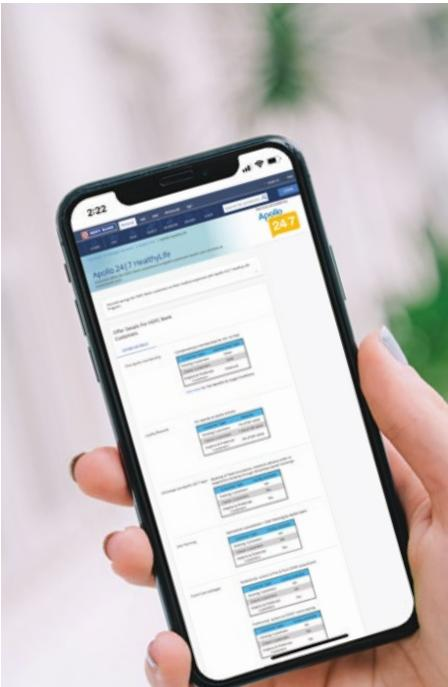

> **AI Description:**
> **Source:** `assets/_page_52_Figure_1.jpg`
> 
> **Generated:** 2026-05-24 13:25:21
> 
> ---
> 
> The image shows a smartphone displaying a webpage with a user interface for a service called "Aquity 24/7." The screen displays a form or dashboard with various sections, each containing text and some highlighted in blue, possibly indicating active or selected options. The top of the screen shows a navigation bar with icons and text, and there is a watermark or logo for "Aquity 24/7" in the upper right corner. The background of the webpage is white with blue and black text, and there are icons and buttons for navigation and actions. The image is a photograph of a hand holding the phone, with a blurred background that appears to be outdoors.

## Promoting entrepreneurship through SmartUp programme

At HDFC Bank,we work with various State Governments and incubators/ accelerators including the Indian Institutes of Technology (llTs) and the Indian Institutes of Management (IIMs) to promote entrepreneurship under our SmartUp programme and Startup fund.We work with 20+ incubators certified by the Department of Science and Technology.

We also organise networking and mentoring sessions for our startup customers with HNls and senior executives of the Bank.We have signed MoUs with five State Governments and the Ministry of Electronics and Information Technology (MEITY) to facilitate the execution of their startup policies.During FY21,we provided financial and advisory support to 21 social impact start-ups in the Ed-tech and skill development sectors.

## Digital solutions

## Mid-day Meal

At HDFC Bank,we have enabled digitisation of the Mid-day Meal scheme by providing a digital solution, integrated with its disbursement channel. It enables centralised fund management for distributed financial operations at State,District, Block and School levels. Digitisation of entire Midday Meal data provides a centralised view to the state nodal agencies and helps monitor and analyse expenditure for efficient fund management.The solution has been rolled out in the state of Jharkhand.

## Education

HDFC Bank has led the digitisation drive not only in Government schools and colleges but also at the State Education Department. This has been achieved through providing solutions enabling deserving students to access scholarships through digital evaluation and timely disbursement of scholarships.

> **AI Description:**
> **Source:** `assets/_page_52_Figure_2.jpg`
> 
> **Generated:** 2026-05-24 13:28:31
> 
> ---
> 
> The image is a digital illustration featuring two individuals working on a large smartphone screen. One person is kneeling and pointing at the screen, while the other is seated and using a laptop. The screen displays a webpage with various elements such as a search bar, text fields, and code snippets, suggesting a focus on web development or digital content creation. The number "21" is visible in the bottom left corner, possibly indicating a version number or a step in a sequence. The overall theme appears to be related to software development or digital design.

Social impact start-ups in the Ed-tech and skill development sectors, we provided financial & advisory support to

> **AI Description:**
> **Source:** `assets/_page_52_Figure_3.jpg`
> 
> **Generated:** 2026-05-24 13:30:29
> 
> ---
> 
> The image contains a photograph of two children, a boy and a girl, sitting at a desk and looking at a laptop screen together. They appear to be engaged and smiling, suggesting they are enjoying their activity on the computer. The setting appears to be indoors, possibly in a classroom or home environment. The focus is on the interaction between the children and the laptop, which could imply a learning or entertainment scenario.

## Sustainable financing solutions

## Green bond

banker, Escrow banker and Bankers to the lssue for both the Bonds.

We at HDFC Bank are proud to be associated with the issuance of the First Green Bond by Ghaziabad Municipal Corporation.This is the first Green Bond issue by any Municipal Corporation in the country. Earlier, we managed the Lucknow Municipal Bonds issue,the first ever municipal bond issue from North India and Uttar Pradesh. Our Bank acted as Merchant

The issues received an overwhelming response from the market and were over-subscribed multiple times.The role of the Bank was highly praised by the Government of Uttar Pradesh and we received an award for both the Lucknow and Ghaziabad Bonds.

> **AI Description:**
> **Source:** `assets/_page_52_Figure_4.jpg`
> 
> **Generated:** 2026-05-24 13:36:41
> 
> ---
> 
> The image contains a series of five trees arranged in a row on a grassy field. The trees are progressively taller from left to right, creating a visual representation of growth or progression. The trees are uniformly shaped and green, with brown trunks. The grass is a vibrant green, indicating a healthy environment. The image is a simple illustration with no text or additional annotations.

## Governance

## Raising the bar higher

Our approach to governance is based on the core principles of strong ethics, enhanced risk consciousness, Board expertise and competence, and unequivocal regulatory compliance. We have put in place well-defined decision-making and monitoring processes to uphold best-in-class governance standards, which ensure a proper balance of authority, accountability and independence. The Bank's corporate governance framework underlines allits activities and operations.

## Board of Directors and Board competence

Our Board reflects a balanced mix of experience and expertise across banking, financial markets, economy, public policy, risk management, finance, credit, information technology, human resource management, small-scale industries, agriculture, rural economy, and law. The Board also seeks opinions from external experts whenever required. We have also inducted information technology experts on the Board as non-executive/independent directors given our focus on digitisation, cybersecurity， data privacy,and related infrastructure.

Average experience of Board mem

## 30 years

Time spent by the Board cumulatively in several familiarisation programmes during FY21

## 32 hours

Independent Directors

\*as on the date of the Integrated Annual Report

> **AI Description:**
> **Source:** `assets/_page_53_Figure_1.jpg`
> 
> **Generated:** 2026-05-24 13:33:51
> 
> ---
> 
> The image depicts a group of four individuals in a professional setting, likely a business meeting or conference, seated around a reflective glass table. They are dressed in formal attire, suggesting a formal or corporate environment. The individuals appear engaged in conversation, with one person holding a cup, possibly indicating a coffee break or casual discussion. The setting includes office chairs and a modern, clean aesthetic, with natural light coming through the windows in the background. The image conveys a sense of collaboration and professional interaction.

## Board involvement and initiative

The Board plays a vital role in shaping, maintaining,and improving the Bank's processes and practices.The onset of the pandemic required the Bank and its Board to rethink the way business is managed and ensure security, continuity and growth. Accordingly，one of the focus areas for the Board in FY21 was to deliberate on and explore new opportunities,leading to initiatives and actions around infrastructure scalability,resilient disaster recovery, security enhancements and enhanced monitoring mechanism.Employee safety and wellbeing remain a key priority area for the Bank,as the second wave of COVID-19 infections sweeps through the nation.

## Culture of transparency and accountability

Transparency and accountability are among the key expectations of stakeholders.To this effect, the Board has always encouraged adoption of global best practices in governance, timely disclosures,and fair presentation of information.We have established practices that allow for a sufficient and visible flow of information,with adequate safeguards in place.We have also formulated a Code of Practices and Procedures for Fair Disclosures in accordance with the SEBl (Prohibition of Insider Trading) Regulations,2015. This Code lays down principles of prompt disclosure and uniform and universal dissemination of information. Further, the Board has approved the following policies which are available on our website for easy reference:

·Policy for appointment and fit and proper criteria of Directors

·Charters of Board-level committees

·Whistle Blower Policy

## Policies and frameworks for ethical conduct

We drive ethical conduct in our day-today operations.To ensure a pervasive culture of ethical behaviour,we have created an environment and instituted policies and frameworks that encourage appropriate business conduct.These policies are communicated regularly to the management,employees and other stakeholders.

## Our corporate governance policies include

· Code for corporate governance

·Policies to prevent insider trading, govern related-party transactions

·Policies around Prevention of Sexual Harassment (POSH)

·Environmental Social & Governance (ESG) Policy Framework

## Code of Conduct and Whistle-blower Policy

We promote an open and transparent system of working and dealing with our stakeholders.While our Code of Conduct & Ethics Policy directs employees to uphold our values and conduct business worldwide with integrity and highest ethical standards, our Whistle-blower Policy provides a comprehensive framework for capturing and addressing stakeholder complaints/ grievances.We did not make any political contributions during FY21.

Our publicly available Conduct Philosophy document defines mechanisms to deal with issues relatec to inhumane treatment including mental or physical coercion or verbal abuse,sexual harassment, sexual abuse,slavery, of employees. During FY21, there were no complaints of infringement of human rights.

We have a ‘Zero Tolerance' policy on sexual harassment and an internal complaints committee in place to address complaints related to sexual harassment. Disclosures related to the sexual harassment cases are included in our Corporate Governance Report on + PG 332

Confirmed Incidents\*wherein employeeswere dismissed or disciplined for corruption in FY21

Confirmed incident(s) wherein contracts with business partners were terminated or not renewed due to corruption in FY21

\*Nature of confirmed incidents of corruption: Staff related Staff related Commission/gratification taken from/for (a) Allocation of cases to collection agency (b) Routing insurance policy (c) Cross sell of products from empanelled vendor (d) Lead sharing incentives earned (e) Empanelling vendor with Bank (f) For arranging documents (g) ssuing Solvency Certificate

> **AI Description:**
> **Source:** `assets/_page_53_Figure_5.jpg`
> 
> **Generated:** 2026-05-24 13:29:27
> 
> ---
> 
> The image contains a simple illustration of two individuals in professional attire. One is a man in a suit holding what appears to be a document or folder, and the other is a woman in a business suit holding a tablet. They are standing in what looks like an office setting, with a small potted plant visible in the background. The illustration is flat and lacks detailed shading or depth, focusing on the interaction between the two characters.

## Anti-Corruption, Anti-bribery, and Anti-Money Laundering (AML)

We have developed a training module for focused and effective training on anti-corruption,anti-bribery,and anti-money laundering (AML) for our employees.The programme comprises of four modules - Foreign Corrupt Practices Act and Bribery Act, Code of Ethics and Commitment, Trade-Based Money Laundering,and KYC and AML norms.All operations are assessed for corruption. Complaints associated with corruption are also raised through the whistle-blower mechanism by al stakeholders including suppliers and customers.

Person-hours spent on Anti-Corruption, AML and KYC trainings.

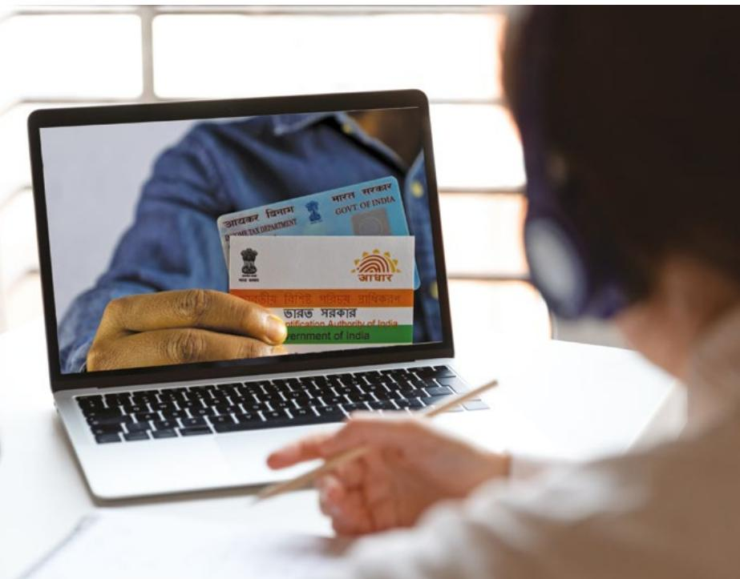

> **AI Description:**
> **Source:** `assets/_page_54_Figure_0.jpg`
> 
> **Generated:** 2026-05-24 13:33:00
> 
> ---
> 
> The image contains a photograph of a person wearing headphones and holding a pen, with a laptop in front of them. The laptop screen displays an image of a hand holding an Indian Aadhaar card, which is a national identity card issued by the Government of India. The card features the Indian flag and text in both English and Hindi. The image appears to be related to the Aadhaar system, which is used for various government services and identification purposes in India.

## 6.7 Lakh+

## Customer satisfaction

The Customer Service Committee of the Board (CSCB) comprises a majority of non-executive directors and is tasked to bring about continuous improvements in the quality of services rendered to our customers.Italso ensures the implementation of directives received from the RBl in this regard. Accordingly, the CSCB formulates the Bank's comprehensive deposit policy incorporating the issues arising out of the product approval process,annual survey of depositor satisfaction, the triennial audit of such services,among others.

We strictly adhere to market conduct regulations to inform our customers and clients with transparent,accurate,and comprehensive marketing statements, advertising,and product-/servicelabelling.We have defined framework, strategy, policies,procedures and have put in place systems to ensure and maintain transparency in communication with our customers and clients to help them make informed decisions. During FY21,we didn't record any case of non-compliance concerning product and service information and labelling,or marketing communications.

Customer Privacy, Information Security,and Data Protection are of paramount importance to us.The IT Strategy Committee is headed by an Independent Director with experience in the IT sector and also comprises an information technology expert,as well as an external expert.We adhere to the‘Code of Bank's Commitment to Customers'as prescribed by the Banking Codes and Standards Board of India (BCSBl) and Employee and Customer Awareness Procedures to ensure customer privacy.We have in place a governance framework, information security practices,and business continuity plan to mitigate information technology-related risks.

We are also guided by the Information Security Policy and Cyber Security Policy, followed byan independent assurance team within Internal Audit which provides assurance on the management of information technologyrelated risks.

The Bank conducts vulnerability assessment of its IT systems through an external entity,and the report thus provided to the Bank is incorporated by the IT team for remediation. During FY21,we received no complaints regarding identified leaks,thefts,or losses of customer data with respect to data security. During the same period,we received 36 complaints from customers concerning breaches of customer privacy, of which two were received from outside parties and two were from regulatory bodies.

## ESG Governance

The Bank has a well-defined Grievance Redressal Mechanism for recording the complaints received through various front-end channels such as Branch/ Phone Banking /Email Management Support Unit.All customer complaints received across branches/front channels are logged in a state-of-theart centralised complaints management system - CRMnext- for tracking and resolution.Credit Card-related complaints are logged in the CBCl and other bank ATM transactionrelated complaints are logged into the DCD (Debit Card Dispute) system. An escalation matrix is built into this system to ensure customer complaints are closed adequately within stipulated timelines.

Governance in areas of ESG or sustainability is an essential element of the governance framework of the Bank.The Environmental Social & Governance (ESG) agenda is driven through a management-level ESG Action Committee which reports to the CSR& ESG Committee of the Board. The Committee oversees sustainability reporting initiatives,climate change disclosures,internal projects to ensure reduction in the Bank's overall emissions and tracks its progress on ESG to achieve industry leadership.The sustainability team works in tandem with different stakeholders within the Bank to achieve set targets in line with the ESG Policy and framework. For better focus and monitoring, we have set up various sub-committees of the ESG Action Committee - the Environment sub-Committee,the Social & Governance sub-Committee and the Product Responsibility sub-Committee.

ESG governance structure and key responsibilities

As a result of our   
continuous efforts,we have been consistently reducing our complaint resolution   
turnaround time - from 8   
working days in FY18 to 5 in FY21.

> **AI Description:**
> **Source:** `assets/_page_54_Figure_1.jpg`
> 
> **Generated:** 2026-05-24 13:34:14
> 
> ---
> 
> The image is a simple illustration of a person sitting at a desk, wearing a headset and using a computer. The person is depicted in a professional setting, likely representing a customer service or support role. The desk and chair are clearly defined, and the computer screen is visible, suggesting a work environment focused on communication or customer interaction.

For more information on the Bank's governance philosophy, please refer to our Corporate Governance Report on

PG 332

## Board of Directors

## Visionary leadership

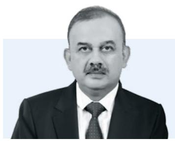

> **AI Description:**
> **Source:** `assets/_page_55_Figure_0.jpg`
> 
> **Generated:** 2026-05-24 13:27:14
> 
> ---
> 
> The image contains a photograph of a man wearing a suit and tie. The background is plain white, and there are no other visual elements or text present in the image.

Atanu Chakraborty
Part Time Non-Executive Chairperson and Additional Independent Director

Renu Karnad Non-Executive Director

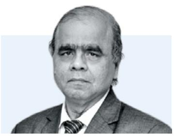

> **AI Description:**
> **Source:** `assets/_page_55_Figure_2.jpg`
> 
> **Generated:** 2026-05-24 13:27:37
> 
> ---
> 
> The image contains a photograph of a person wearing a suit and tie. The background is plain white, and there are no other visual elements or text present in the image.

Umesh Chandra Sarangi Independent Director

Sashidhar Jagdishan Managing Director and Chief Executive Officer

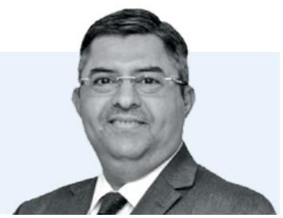

> **AI Description:**
> **Source:** `assets/_page_55_Figure_4.jpg`
> 
> **Generated:** 2026-05-24 13:36:02
> 
> ---
> 
> The image contains a black and white photograph of a person wearing a suit and tie. The individual is smiling and appears to be in a professional setting. There are no charts, graphs, or other visual elements present in the image.

Kaizad Bharucha Executive Director

Srikanth Nadhamuni Non-Executive Director

> **AI Description:**
> **Source:** `assets/_page_55_Figure_6.jpg`
> 
> **Generated:** 2026-05-24 13:35:28
> 
> ---
> 
> The image contains a photograph of a person wearing a suit and tie, smiling. The background is plain and light-colored, which helps to focus attention on the individual. There are no charts, graphs, or other visual elements present in the image. The photograph appears to be a professional headshot or portrait.

MD Ranganath Independent Director

Malay Patel Independent Director

> **AI Description:**
> **Source:** `assets/_page_55_Figure_8.jpg`
> 
> **Generated:** 2026-05-24 13:50:28
> 
> ---
> 
> The image contains a photograph of a person wearing a suit and glasses, smiling. The background is plain and light-colored. There are no charts, graphs, diagrams, or other visual elements present. The image is a simple portrait with no additional text or annotations.

Sandeep Parekh Independent Director

Sanjiv Sachar Independent Director

> **AI Description:**
> **Source:** `assets/_page_55_Figure_10.jpg`
> 
> **Generated:** 2026-05-24 13:38:32
> 
> ---
> 
> The image contains a photograph of a smiling individual with shoulder-length dark hair. The person is wearing a light-colored, possibly white, top. The background is plain and light-colored, which helps to focus attention on the subject. The image appears to be a portrait-style photograph, likely intended for a professional or personal profile.

Sunita Maheshwari Additional Independent Director
Length of service of Directors (Years)
Age group of Directors (Years)
The average length of service of the Board of Directors is 3 years.

## Senior Management Team

## Leading the future-ready Bank

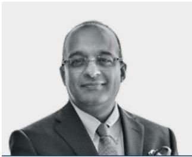

> **AI Description:**
> **Source:** `assets/_page_56_Figure_0.jpg`
> 
> **Generated:** 2026-05-24 13:50:37
> 
> ---
> 
> The image contains a photograph of a person wearing a suit and tie. The individual appears to be professionally dressed, suggesting a formal or business context. The background is plain white, which helps to focus attention on the subject. There are no charts, graphs, or other visual elements present in the image.

Sashidhar Jagdishan
Managing Director and Chief Executive Officer

Kaizad Bharucha Executive Director

Anjani Rathor Chief Digital Officer

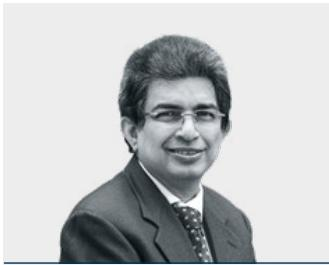

> **AI Description:**
> **Source:** `assets/_page_56_Figure_3.jpg`
> 
> **Generated:** 2026-05-24 13:54:05
> 
> ---
> 
> The image contains a photograph of a person wearing a suit and tie, with a neutral background. The person appears to be smiling and is positioned in a professional setting. There are no charts, graphs, or other visual elements present in the image.

Arup Rakshit
Group Head - Treasury - Sales, Analytics and Overseas
Group Head - Commercial Banking and Rural Business

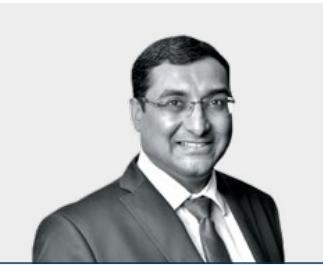

> **AI Description:**
> **Source:** `assets/_page_56_Figure_4.jpg`
> 
> **Generated:** 2026-05-24 14:01:10
> 
> ---
> 
> The image is a black and white photograph of a person wearing a suit and tie. The individual is smiling and appears to be in a professional setting. There are no charts, graphs, or other visual elements present in the image.

Group Head - Retail Assets and SLI

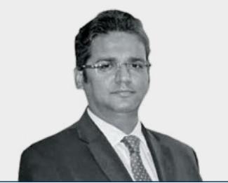

> **AI Description:**
> **Source:** `assets/_page_56_Figure_6.jpg`
> 
> **Generated:** 2026-05-24 13:57:22
> 
> ---
> 
> The image contains a photograph of a person wearing a suit and tie. The individual is wearing glasses and is positioned against a plain background. The image is in grayscale, and there are no additional visual elements or text annotations present.

Nirav Shah
Arvind Kapil

Group Head - Investment Banking, Private Banking, Marketing and Products
Ashima Bhat
Group Head - Retail Branch Banking
Group Head - Payments Business, Digital & IT
Group Head - Business Finance & Strategy, Administration, Infrastructure, ESG & CSR
Arvind Vohra
Group Head - Corporate Banking and PSUs
Group Head - Treasury, GIB, NRI, Overseas and Tele-Service Channels
Ashish Parthasarthy

Rahul Shukla
Rakesh Singh

> **AI Description:**
> **Source:** `assets/_page_56_Figure_12.jpg`
> 
> **Generated:** 2026-05-24 13:41:50
> 
> ---
> 
> The image contains a photograph of a person wearing a suit and tie, smiling. The background is plain and light-colored. There are no charts, graphs, or other visual elements present in the image.

Ramesh Lakshminarayanan Chief Information Officer

Raveesh Bhatia
Group Head - Emerging Corporates Group

S Sampathkumar
Group Head - NRI Domestic & Overseas Business, Third Party Products and Tele-Sales & Service Relationships

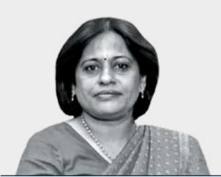

> **AI Description:**
> **Source:** `assets/_page_56_Figure_15.jpg`
> 
> **Generated:** 2026-05-24 13:38:19
> 
> ---
> 
> The image is a black and white photograph of a person wearing traditional attire, including a saree. The background is plain white, and there are no charts, graphs, or other visual elements present. The image appears to be a portrait or headshot.

Smita Bhagat
Group Head - Government, Institutional Business, BC Partnerships, Inclusive Banking and Start-ups

Benjamin Frank Group Head - Wholesale Credit

Bhavesh Zaveri
Group Head - Operations, ATM and Cash Management Product

Jimmy Tata Chief Credit Officer
Chakrapani Venkatachari

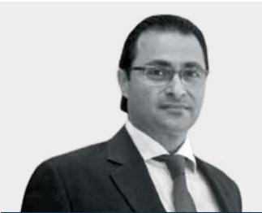

> **AI Description:**
> **Source:** `assets/_page_56_Figure_19.jpg`
> 
> **Generated:** 2026-05-24 13:48:10
> 
> ---
> 
> The image contains a photograph of a person wearing a suit and tie. The image is in black and white, and the person is positioned against a plain background. There are no charts, graphs, or other visual elements present in the image. The image is solely a portrait photograph.

Group Head - Internal Audit and Quality Initiatives Group

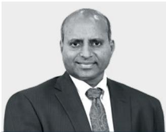

> **AI Description:**
> **Source:** `assets/_page_56_Figure_20.jpg`
> 
> **Generated:** 2026-05-24 13:43:45
> 
> ---
> 
> The image contains a photograph of a man in professional attire, wearing a suit and tie. The background is plain and light-colored, focusing attention on the individual. There are no charts, graphs, diagrams, or other visual elements present in the image.

Srinivasan Vaidyanathan Chief Financial Officer

Vinay Razdan Chief Human Resources Officer

## 10 Year Financial Highlights

1 Crore= 10 Million
\*Figuresforteyearsprrt-ajusdtoeftteeftfsplitfqitsasfrmomofachtooqity shares of nominal value of 1 each.
\*\*Source :NSE (prices for years prior to 2019-2020 have been divided bytwo to reflect the sub-division of shares)
\*\*\*Refer note on Dividend given on page no.126 of Integrated Annual Report 2020-21.
Crore

## Awards

## Acknowledged for excellence

Euromoney (Global) Awards For Excellence 2020

Lifetime Achievement Award - Aditya Puri

Euromoney Awards for Excellence 2020

India's Best Bank

FinanceAsia Country Awards 2020

Best Bank in India

Euromoney Private Banking and Wealth Management Survey 2021 HDFC Bank ranks No. 1 in Mass Affluent category

2020 BrandZTM Top 75 Most Valuable Indian Brands

HDFC Bank ranked India's Most Valuable Brand for the 7th consecutive year

ET Innovation Awards 2020

Marketing and Brand Innovation of the Year Award

Business Today 19th Best Companies to work for in India Survey

HDFC Bank Among Top 10 Best Companies to work for in India

ICAI Award for Excellence in Financial Reporting

HDFC Bank wins Gold Shield Award for 2019-2020 in the Private Sector Banks (including Foreign Banks) category

Great Place To Work

HDFC Bank certified as a ‘Great Place to Work' for 2020

Cll-National Awards for Excellence in Water Management 2020

HDFC Bank Parivartan initiatives in East Khasi Hills district in Meghalaya

ISC-FICCl Sanitation Awards

HDFC Bank's WASH programme adjudged Best Corporate Initiative in Sanitation

Asiamoney Best Bank Awards 2021   
India's Best Bank for SMEs 2021

25th Business Today - KPMG Best Bank Study

Best Large Bank

Finnoviti Awards 2021

Won the Finnoviti Award 2021 for Warehouse Commodity Finance on Mobile

Asiamoney Asia's Outstanding Companies Poll 2019

Most Outstanding Company - Financial Sector

## Assurance Statement

## KPMG

Independent Limited Assurance Statement to HDFC Bank Limited on its non-financial disclosures in the Integrated Annual Report for Financial Year 2020-21

To the Managementof HDFC Bank Limited, HDFC Bank House,SenapatiBapat Marg,Lower Parel (W),Mumbai-400013

## Introduction

We('KPMG Asurance and Consulting Services LLP’,or‘KPMG')havebeen engaged for the purpose of providing assurance ontheselectednon-financial disclosures presented in the Integrated Annual Report ('theReport')of HDFC Bank Limited ('HDFCBank'or'the Company)forFY2020-21.Ourresponsibilitywas toprovidelimitedassuranceontheReportcontentas described in the scope,boundary and limitations.

## Reporting Criteria

HDFCBank has developedits report basedontheapplicableaccounting standardsand has incorporated the principles of theInterationalIntegratedReportingFramework (<IR>)publishedbythe International Integrated Reporting Council (IRC).

HDFC Bank's non-financialperformance reporting criteria hasbeenderivedfrom Global Reporting Initiative(GRI) Standards ‘in-accordance' comprehensive option.

## Assurance Standards Used

We conducted our assurance in accordance with

Limited Assurance requirements of International Federationof Accountants'(IFAC)International Standardon Assurance Engagement (ISAE)300 (revised),Assurance Engagements Other than Audits or Reviews of Historical Financial Information.

·Under this standard,we have reviewed the informationpresentedinthe Reportagainst thecharacteristicsof relevance, completeness,reliability, neutrality and understandability.

·Limited assurance consists primarilyof enquiries and analytical procedures.The procedures performed inalimited asurance engagement varyin nature and timing and are lessin extent than for areasonable assurance engagement.

## Scope, Boundary and Limitations

·Thescope ofassurance covers thenon-financialdisclosuresof HDFCBank for theperid01April2020to31March 2021.

The Disclosures1 subject to assurance were as follows:

## General Disclosures

· Organization Profile: 102-8

· Reporting Practice: 102-48, 102-49, 102-50, 102-51, 102-52, 102-53 and 102-55

## Management Approach

· Explanation of the material topic and its Boundary: 103-1

## KPMG

## Topic Specific Disclosures

## Environmental

· 302 Energy 2016: 302-1, 302-3

· 305 Emissions 2016: 305-1,305-2, 305-3\*, 305-4

· 306 Effluents and Waste 2016: 306-2

## Social

· 401 Employment 2016: 401-1, 401-3

· 404 Training and Education 2016: 404-1, 404-2

· 405 Diversity and Equal Opportunity 2016: 405-1

· 413 Local communities 2016: 413-1

\*Thedatadiscoedunder30-3isrstrictedtoitedupstreamanddownstreamcategoris:Employebuiestrel(ArRailadoad), Purchased goods and services (paper consumption) and Waste generated from operations (E-waste disposed)

The boundary of the Report covers HDFC Bank operations in India which include:

1. 5,633 branches and 2,556 ATMs

2. 32 currency chests

3. 275 corporate and regional ofices

4.28 training centers and guest houses

Thedatareviewand validation were conducted throughthe Corporate offce whichcolates the data forpan India locations.   
The review and management interactions were performed virtually using screen sharing tools.

The assurance scope excludes following:

·Aspects of the Report other than those mentioned in the scope above

· Data and information outside the defined reporting period

·The Company'ssatementsthatdescribeexpressionofopinion,belief,aspirationxpectationim,futureintetioad assertions related to Intellectual Property Rights and other competitive issues.

· Data related to Company's financial performance

· Data review outside the operational sites as mentioned in the boundary above

· Strategy and other related linkages expressed in the Report

## Assurance Procedures

Ourassurance process involves performing procedures toobtain evidence aboutthereliabityofspecified disclosures.The nature,timingand extentofproceduresselecteddependonourjudgment,including theassessmentof therisksofmaterial misstatement of theselectednon-financial disclosures whetherdue to fraud or error.In making those riskassessments,we haveconsideredinternal controls relevant to the preparationofteReport inorder todesignassuranceprocedures thatare appropriate in the current circumstances.

Our assurance procedures also included:

·Assessmentof HDFC Bank's reporting procedures regarding their consistency with the appication of GRI Standards.

·Evaluating theappropriatenessofthe quantificationmethodsused toariveat thenon-financial disclosurespresentedin the Report.

·Reviewofsystemsandprocedures usedforquantification,colation,andanalysis ofnon-financialdisclosuresincludedin the Report.

## KPMG

· Understanding the appropriateness of various assumptions,estimationsand materiality thresholds usedby HDFC Bank for data analysis.

· Assessment of data reliability and accuracy.

·Review of selected key performance data as defined in scope,boundaryandlimitations was caried out onasample basis through screen sharing tool with corporate office

Appropriate documentary evidence wasobtained to supportour conclusions onthe informationanddata verfied.Where suchdocumentaryevidencescouldnotbecollecteddue tosensitive nature ofthe information,ourteam verified the same with the HDFC Bank during virtual interactions.

## Conclusions

We have reviewedselected non-financial disclosures in the reportof HDFC Bank forFY202O-21.Based onour reviewand proceduresperformed,nothing hascome toouratention thatcausesusnottobelieve thatthenon-financialperformance dataandinformationasper thescopeofassurancepresentedintheReportisappropriatelystated,inallmaterialrespects and in accordance with GRl Standards.

We have provided our observations to the Bank inaseparate management etter.These,donot, however,affct our conclusions regarding the Report.

## Independence

The assurancewas conducted byamultidisciplinary team including professionals with suitable skils and experience in auditingenvironmental,socialandeconomic informationinline with therequirementsof ISAE30oo (Revised)standard.

Ourworkwasperformed incompliance with therequirements oftheIFAC Codeof Ethics forProfessionalAccountants,which requires,amongotherrequirements,that themembersoftheassrance team (practitioners)be independentof theassurance client,inrelationtothescoeofthisassuranceengagement,including notbeing involvedinwriting theReport.TeCode alsoincludesdetailedrequirementsforpractitionersregardingintegrityobjectivityprofessionalcompetenceandduecare confidentiaityand professional behaviour. KPMG hassystems and processes in place to monitorcompliance with the Code andtopreventconflicts regarding independence.Thefirmapplies ISQC1and thepractitioner complieswiththeapplicable independence and other ethical requirements of the IESBA code.

## Responsibilities

HDFCBank is responsiblefordeveloping theReportcontents.HDFCBankisalsoresponsibleforidentificationofmaterial sustainabilitytopics,establishing and maintaining appropriateperformance management,internal controlsystems and derivationofperformance datareported.This statementismade solely tothe Managementof HDFCBank in accordance with the terms of our engagement andas per scope of assurance.Our work has been undertaken sothat we might state to HDFCBank those maters forwhich we have been engagedto state in this statement and forno other purpose.To the fullest extentpermittedbylaw,wedonotacceptorassumeresponsibitytoanyoneotherthanHDFCBankforourwork,for thisreport,orfor theconclusions expressedinthis independentassurance statement.The assrance engagementis based ontheassumptionthat thedata andinformation providedtousis complete and true.We expressy disclaimanyliabilityor co-responsibityforany decisionaperson orentitywould makebasedonthisassurance statement. Ourreport is released to HDFCBankonthebasis thatitshallnotbecopied,referedtoordisclosed,inwholeorinpart,withoutourpriorwriten consent.Byreading thisassurancestatement,stakeholdersacknowledgeandagree to the limitationsand disclaimers mentioned above.

## Prathmesh Raichura

Associate Partner

KPMG Assurance and Consulting Services LLP

21 June 2021

## GRI Index

Foranyqueries pertaining tothe GRI disclosuresin theabove table contact Ms.Nusrat Pathanat Nusrat.Pathan@hdfcbank. com or writein to herat HDFC Bank House,Senapati Bapat Marg,Lower Parel,Mumbai - 400013.Tel: 022 3976000

## Directors'Report

## Dear Stakeholders,

Your Directors take great pleasure in presenting the 27th Annual Report on the business and operations of your Bank, together with the audited accounts for the year ended March 31, 2021.

First of all,wishing all of you health and happiness on behalf of the HDFC Bank family.

As the virus casts a shadow over the entire world, the first thing that all of us must do is take every possible step to ensure our safety and that of our loved ones.And say a prayer for our collective well-being.Especially for all the frontline COVID warriors who served the nation, often at great risk to their own lives.Our heads bow in respect for those who lost their lives in this fight. This includes some of our colleagues too.

Needless to say， the pandemic affected the economy. If FY 2019-20 was one of the most challenging years for the Indian economy, then the challenges only multiplied in FY 2020- 21.And this was accentuated further by geo-political tensions.

The year started with one of the most severe lockdowns in the world. Although it was eased in stages, the economy was bound to take a hit. For the first time in many years, India's GDP contracted by 7.3 per cent in FY 2020-21. This was an improvement after the first quarter low of -24.4 per cent.As the lockdown eased, the economy contracted by 7.4 per cent in the second quarter and touched positive territory in the third quarter,posting a growth of +O.5 per cent and 1.6 per cent in the fourth quarter.

The Government of India and the Reserve Bank of India (RBl) announced a host of measures to cushion the direct impact of the lockdown on the economy. The Government announced a stimulus package of 2O trillion in five different tranches in FY 2020-21 to provide support to 1) the MSMEs and the Non Banking Financial Companies via a credit guarantee scheme and liquidity support 2) Migrant labourers via direct spending，and generating employment via enhanced allocation to MNREGA, 3) Small traders,vendors and farmers via loan facilities and 4) Announced structural reforms across sectors like coal, power, agriculture, etc.

On the monetary policy side, the RBl also took a number of steps to provide liquidity and enhance credit flow in the system.

It delivered a total rate cut (repo) of 115 bps since February 2020, taking the repo rate down to 4.O per cent. The central bank also took a slew of measures to address liquidity constraints such as the announcement of moratorium, liquidity infusion through TLTRO (Targeted Long Term Repo Operations) for NBFCs ( 500 billion),liquidity facility of  5oo billion for mutual funds, liquidity support of  5Oo billion for all India financial institutions and a cut in the Cash Reserve Ratio (CRR) by 10O bps to 3 per cent. These measures helped anchor borrowing costs in the economy, support credit growth and cushioned the impact of the disruptions in the financial market (Please refer to the Macroeconomic and Industry section on page 128 for more details).

The Budget announcements for FY 2021-22 too have given confidence to business with its focus on stimulating growth through expansionary fiscal policy at the centre and increasing capital expenditure at the central as well as state Government levels.

While all these have been clear positives,what has cast a shadow on the economy again has been the resurgence of the pandemic in many parts of the country,resulting in partial or complete lockdowns.The mitigating factor has been the arrival of the vaccine and the decision to step up the vaccination drive by making all those over 18 years eligible for taking the vaccine. The Government has invited more manufacturers from abroad to come to India to boost supply in the country.

In this uncertain environment, your Bank continued on its growth path by conducting its business responsibly and reinforcing its commitment to the environment and community at large.

## Financial Parameters

Your Bank recorded an improvement in a majority of its key financial parameters, largely due to its prudent credit evaluation of targeted customers and diversified loan book across customer segments，products,and sectors.Managing riskreturn decisions with discipline also contributed to the Bank's performance. Net Profit at 31,116.5 crore went up by 18.5 per cent.Net Interest Income at  64,879.6 crore rose 15.5 per cent.Net Interest Margin remained stable at 4.1 per cent. Gross Non-Performing Assets (NPAs) at 1.32 per cent were among the lowest in the industry.

## GNPA

## 1.32 per cent Among the lowest in the industry

## Parivartan

Your Bank continued to transform lives through its umbrella CSR brand, Parivartan, which denotes change.

The Bank believes that businesses can only prosper if the communities in which they operate prosper as well. This belief has inspired its social initiatives,which have potentially made a difference to the lives of over 8.5 crore people,predominantly in rural India. Driving this change is the Sustainable Livelihood Initiative (SLl) team,which employs about 10 per cent of the Bank's workforce and works exclusively on improving livelihood opportunities.The‘Teaching-The-Teacher' initiative has impacted over 2 crore students since inception.The Holistic Rural Development Programme has touched another 20 lakh people across more than 1,970 villages.Having an umbrella brand enables the Bank to lend a sharper focus to these efforts. Your Directors are also happy to report that your Bank met the mandatory CSR expenditure through a spend of  634.91 crore. The Bank contributed70 crore towards Prime Minister's CARES Fund to support the Government's fight against the COVID-19 pandemic.

## CSR spend 634.91 crore in FY 2020-21

## For further details on Parivartan please refer to page 88.

## Summary

In FY 2021-22, the pandemic and vaccination drive are critical factors for the pace of economic recovery. In the near-term, the resurgence of COVID-19 cases across the country does pose a risk to the pace of economic recovery but the absence of a national lockdown is a positive.This,of course, poses challenges for your Bank in the short run.

In the long run, the market in the post-pandemic recovery period presents tremendous opportunities, given the under-penetration of banking services in the country. Your Bank is well positioned to capitalise on these opportunities,given the strength of its major franchises.It is also poised to make a greater contribution to bridge the urban-rural divide - be it through its business or social initiatives.This,of course,will not be possible without the contribution of the ever-growing family of over two lakh employees (including those of the subsidiaries) across the country,who remain at the forefront of taking your Bank forward every day.

Your Directors would like to especially thank those who went well beyond their call of duty during the COvID-19 pandemic to keep your Bank functioning.Many of them soldiered on despite the loss of loved ones. During the year,we also lost a few of our colleagues.While we have structured a compensaton package for the families of the deceased,no word or action can adequately convey our sorrow.

Your Directors would also like to place on record that we did not reduce salaries during this trying period. Your Bank paid bonuses and increments on time in the year under review and followed the normal promotion cycle.It is doing the same this year as well.

## Mission and Strategic Focus

Your Bank's mission is to be a‘World-Class Indian Bank'.Its business philosophy is based on five core values:Customer Focus, Operational Excellence,ProductLeadership,People and Sustainability. Sustainability should be viewed in unison with Environmental, Social and Governance performance.As a part of this,your Bank, through its umbrella CSR brand Parivartan, seeks to bring about change in the lives of communities mainly in rural India.

During the year under review, the bank did not lose its human touch but continued building sound customer franchises across distinct businesses to achieve healthy growth in profitability consistent with your Bank's risk appetite.

In line with the above objective,the Bank aims to take digitalisation to the next level to:

·Deliver superior experience and greater convenience to customers

·Increase market share in India's growing banking and financial services industry

·Expand geographical reach

·Cross-sell the broad financial product portfolio

Sustain strong asset quality through disciplined credit risk management

·Maintain low cost of funds

## Directors' Report

YourBankremaisommitedtoteighestlvelsofethicalandardsprofessioalintegrityorporategoveranceandglatory compliance,whichis articulated in its Code of Conduct.Every employee afirms toabide bythe Code annually.

## Summary of Financial Performance

（ crore)

## Dividend

TheRBl,videotificatioatedecember42,tatedtatiiewoftengoigstresadeigteneducertaintyount ofCOVID-19,banksshouldcontinue toconservecapitaltosupporttheeconomyandabsorb losses.Thenotficationalsostated thatinordertofurtherstrengthenthebanks'balanceshets,whileat thesametimesupport lendingtotherealeconomybanks shall notmakeanydividend paymentonequityshares fromtheprofitspertaining tothefinancialyearended March31,2020. Your Bank did not declare dividend for the financial year ended March 31,2020.

Giventhat thecurrent‘secondwave'hassignificantly increasedthenumberofCOvID-19casesin Indiaanduncertaintyremains, theBoardofDrectorsoftheBank,atitseetingheldonApril172021,adconsidereditprudenttonotproposedividedforte financialyearendedMarch312021,anddecidedtore-assessthepositionbasedonanyfurtherguidelinesfromtheRBlinthis regard.SubsequentlyRBlhas,onApril22,021videitsCircularmentionedthatbanksmaypaydividendonequitysharesfrom theprofitsforthefinancialyearendedMarch31,2021subjecttothequantumofdividendbeingnotmorethanftypercentofthe amountdeterminedasperthedividendpayoutratioprescribedinparagraph4of theMay4,2Oo5circularofRBl.Inviewofthis RBICircular,teBoardofDirectorsoftheBank,atitsmetingheldonJune18,2021,hasrecommendedadividendof6.50per equityshareof1/-each,forthefinancialyearendedMarch31,2021.ThistranslatestoaDividendPayoutRatioof1.5%ofthe profits for the financial year ended March 31,2021.

Ingeneral,yourBank'sidendpolicyamongoterthings,baancesthejectivesofrewardingshareoldersandretainingcaital tofundfuturegrowth.Ithasaconsistentrackrecordofdividenddistribution,withtheDividendPayoutRatiorangingbetween20 per cent and 25 per cent,which the Board endeavours to maintain.

Thedividend policyofyour Bankisavailable onyour Bank's website: htps://v1.hdfcbank.com/htdocs/common/pdf/corporate/ Dividend-Distribution-Policy.pdf

Ratings

## Directors'Report

## Issuance of Equity Shares and Employee Stock Option Scheme (ESOP)

As on March 31,2021, the issued, subscribed and paid up capital of your Bank stood at 5,512,776,482/- comprising 5,512,776,482 equity shares of 1/- each.Further,29,490,022 equity shares of face value of  1/- each were issued by your Bank pursuant to the exercise of Employee Stock Options (ESOPs). (For information pertaining to ESOPs,please refer Annexure 1 to the Directors' Report).

## Capital Adequacy Ratio (CAR)

As on March 31, 2021,your Bank's total CAR,calculated as per Basel Ill capital regulations,stood at 18.8 per cent,well above the regulatory minimum requirement of 11.075 per cent, including a Capital Conservation Buffer of 1.875 per cent and an additional requirement of O.20 per cent on account of the Bank being identified as a Domestically Systemic Important Bank. Tier l Capital was at 17.6 per cent as of March 31, 2021.

## Total CAR

## 18.8 per cent

## well above regulatory minimum requirement of 11.075 per cent

## Management Discussion and Analysis Macroeconomic and Industry Developments

The Indian economy contracted sharply in FY 2020-21 in the wake of the global pandemic, with GDP contracting by 7.3 per cent in FY 2020-21 as compared to a 4.0 per cent growth in FY 2019-20.To recall, the World Health Organization declared on March 12,2020 that the virus is a pandemic.On March 23, 2020,the Government of India ordered a nationwide lockdown for 21 days,which got further extended till May 31,202O with some relaxations. India enforced one of the strictest lockdowns at an early phase of rising cases to limit the spread of the virus. Daily COvID-19 cases peaked in September touching a high of \~98,000 and easing to \~8,600 in early February 2021, due to introduction of social distancing norms,localised lockdowns and containment measures.

The Government and the Reserve Bank of India (RBl) announced a host of measures to cushion the direct impact of the lockdown on the economy.This helped GDP growth come off its low of -24.4 per cent in Q1 and -7.4 per cent in Q2 to +0.5 per cent in Q3 and +1.6 per cent in Q4 2020-21. Looking at the internals, agriculture growth continued to remain positive (registering a growth of 3.6 per cent in 2020-21) due to the relative insulation of the rural sector from the virus.Manufacturing growth contracted by 7.2 per cent in 2020-21. However, the sector showed signs of recovery in H2 2020-21 - with a contraction of 18.7 per cent in H1 2020-21 but picked upto + 1.6 per cent in Q3 and + 6.9 per cent in Q4. Service sector remained a laggard with a contraction of 8.4 per cent in 2020-21. Domestic demand began to show green shoots in the second half of the year as activity resumed. Private consumption indicators such as production of consumer durables and non-durables gathered pace in Q3 along with passenger vehicle (PV) sales that turned green in H2 FY21.Encouragingly, GST collections rose to 1.23 trilion in March 2021,averaging 1.13 trillion in H2 FY21 as compared to an average collection of  O.76 trillion in H1 FY21.

The Government announced a stimulus package of 20 trillion in five different tranches in FY 2020-21 to provide support to 1) the MSMEs and the NBFCs viaa credit guarantee scheme and liquidity support 2) migrant labourers via direct spending and generating employment via enhanced allocation to MNREGA 3) small traders,vendors and farmers via loan facilities and 4) announced structural reforms across sectors like coal, power, agriculture, etc.

On the monetary policy side, the RBl also took a number of steps to provide liquidity and enhance credit flow in the system.The RBl delivered a total rate cut (repo) of 115 basis points (bps) since February 2020, taking the repo rate down to 4.0 per cent.The central bank also took a slew of measures to address liquidity constraints such as the announcement of the moratorium, liquidity infusion through TLTRO (Targeted Long Term Repo Operations) for NBFCs ( 50o billion)，liquidity facility of 500 billion for mutual funds,liquidity support of  5Oo billion for all India financial institutions and a cut in the CRR (Cash Reserve Ratio) by 100 bps to 3 per cent. These measures helped anchor borrowing costs in the economy，support credit growth and cushioned the impact of the disruptions in the financial market.

Looking at the inflation side, CPl inflation averaged 6.7 per cent in H1 FY21 mainly due to higher food prices on account of COVIDled supply disruptions. Inflation eased below RBl's upper band of 6.0 per cent from December 2020 to February 2021.In FY 2020-21, the headline inflation averaged 6.2 per cent,above the RBl's target range of 4 +/-2 per cent. In FY 2021-22, CPl inflation rose to 6.3 per cent in May-21 from 4.2 per cent in Apr-21,breaching the RBl's upper threshold of 6 per cent for the first time in six months.Apart from higher fuel and food inflation,a large part of this increase was driven by higher core inflation,possibly reflecting the impact of second wave related supply disruptions and a pass through of cost push pressures. Going forward,we expect inflation to remain above 6 per cent for the next 3 months.For FY 2021-22,we expect the headline inflation to average 6.1% led by higher commodity prices and sticky core inflation.

On the policy front, we expect the central bank to keep its rates unchanged in FY 2021-22 and maintain an accommodative stance.The RBl is likely to only gradually reduce the liquidity surplus in the system once it is confident about the prospects of growth recovery. The central bank is likely to continue managing the yield curve,especially the benchmark yield through open market operations (sterilised and unsterilsed) and the latest announced G-SAP bond buying programme in order to contain borrowing costs in the economy and improve transmission.

HowWe Create Value

## On the policy front, we expect the central bank to keep its rates unchanged in FY 2021- 22 and maintain an accommodative stance.

In the financial sector, the onset of COvID-19 weighed down on credit growth while the deposit growth remained robust. In FY 2020-21, the credit growth averaged at 5.9 per cent as compared to 9.5 per cent y-0-y in FY 2019-20.Asharp slowdown in economic activity as reflected by a 7.3 per cent contraction in GDP weighed on credit demand. On the flip side,deposit growth improved to 10.9 per cent in FY 2020-21 from 9.9 per cent in FY 2019-20.The improvement in deposit growth could be reflecting pandemic related saving tendency among individuals.In Apr-21,while credit growth came in at 5.7 per cent, deposit growth tracked at10.3 per cent.

Looking at the credit sectoral level, the weakness was recorded in the industry sector (large industries) while credit deployment to personal loans and to services sector rose albeit at a slower pace.As per the RBl's January 2O21 Financial Stability Report, the GNPA ratio of scheduled commercial banks eased to 7.5 per cent in September 2020 from 9.3 per cent in September 2019.That said, the central bank estimates the ratio to increase to 13.5 per cent by September 2021.The GNPA could escalate to 14.8 per cent if the macroeconomic environment worsens into a severe stress scenario. Heading into FY 2021-22, credit growth outlook is expected to improve amid improvement in GDP growth and as liquidity remains comfortable.

For the financial sector, the Government announced the Partial Credit Guarantee Scheme (PCGS) 2.0 to provide liquidity support for NBFCs.Under this scheme,the Government provides a sovereign guarantee for the first 2O per cent loss to the public sector banks buying AAA and below rated paper issued by the NBFCs/MFIs/HFCs.

To recall, the stimulus package worth 20 trillion (10 per cent of GDP) announced by the Government had a clear focus on the MSME sector,a key provider of employment in both the organised and unorganised segments and a critical component of the domestic industrial supply chain.The MSME sector that encompasses a wide range of industries had been under considerable stress fora prolonged period before the incidence of COvID-19.This made them particularly vulnerable to the lockdown and its aftermath.The NBFC sector,a major provider of funding to the MSMEs had also been going through a period of stress,particularly in its access to finances both from banks and the market.Thus, the stimulus package focused on the survival of both MSMEs and NBFCs through the COVID-19 crisis and also their revival.The critical element of the stimulus was its attempt to facilitate the flow of credit to both MSMEs directly and to NBFCs.The Government aimed to do this by reducing the risk taken by banks and other institutions in lending to them by providing explicit guarantees either on the entire loan or a fraction.The guarantees delivered were through Special Purpose

Vehicles (SPVs) in which the Government had initially taken an equity stake.Thus,for instance, the targeted credit flow of 300 billion in the form of collateral free loans to the smaller MSMEs was backed by a 10O per cent Government of India guarantee given through National Credit Guarantee Trustee Company (NCGTC). Other measures included creating a fund of funds for MSMEs,PCGS for NBFCs/MFls and providing subordinate debt for stressed MSMEs through a Credit Guarantee Fund Trust.

The direct fiscal spending component (on MNREGA，EPF support for business and workers,foodgrain supply for migrant workers and enhancing micro food enterprises among other things) is relatively low and stands at2 trillion or 1 per cent of GDP. Instead, the broad strategy of the stimulus is to remove bottlenecks on the supply side for the smaller and labourintensive firms to set off a‘virtuous cycle' of more viable operations,increased production and employment,and higher incomes that would translate into enhanced demand.

## The broad strategy of the Government's stimulus is to remove bottlenecks on the supply side for the smaller and labourintensive firms to set off a ‘virtuous cycle' of more viable operations, increased production and employment, and higher incomes that would translate into enhanced demand.

There are non-financial measures as well that aim to benefit MSMEs.The upward revision of turnover and investment limit (Micro:turnover increased to 5 crore, investment increased to 1 crore; Smal: Turnover increased to 50 crore and investment increased to 10 crore; Medium:Turnover increased to100 crore and investment increased to 20 crore) would help MSMEs expand operations considerably without fear of losing some of the fiscal and other benefits that the segment enjoys.In addition to the aforementioned measures, the Government of India announced measures to facilitate capex and help businesses. Measures announced included - guaranteed collateral free credit support for 26 stressed sectors,1.46 lakh crore boost for Atmanirbhar manufacturing, Production Linked Incentive (PLl) scheme for sectors such as electronics,textile, telecom,etc.and additional outlay of 102 billion towards industrial expenditure, industrial incentives and development of defence equipment.

From the Government side, trend in capex has also been encouraging. In FY 2020-21, the Government has spent INR 4.3 trilon on capex,which is a 26.5 per cent y-o-y increase from FY 2019-20.For the ongoing fiscal year, the Government has budgeted capex at an 18 year high of 2.5 per cent of GDP. In INR terms,FY 2021-22 capex is budgeted at INR 5.3 trillion,which marks an increase of 30.5 per cent from the last year.

In fiscal 2020-21,while export demand dipped by 7.2 per cent, imports shrank 17.6 per cent，reflecting pandemic related

## Directors'Report

disruptions.However， trend in services trade balance was encouraging. Services trade balance improved to USD 85.1 Billion from USD 80 Billion in FY 2019-20.Taking these factors into account, we expect current account to record a surplus of 1.0 per cent of GDP in FY 2020-21 vs a deficit of 0.9 per cent in FY 2019-20. However,on a quarterly basis,we expect current account to record a deficit of 0.7 per cent in Q4 FY20-21.Foreign flows remained strong in FY 2020-21 despite initial jitters in the market.While gross FDl flows improved to USD 81.7 Billion in FY 2020-21 as compared to 74.4 Billion in FY 2019-20, Fll flows recorded a net inflow of USD 30.3 Billion vs.a net outflow of USD 5.1 Billion in the previous year. With robust capital flows and a surplus in the capital account, we expect BoP surplus to improve to a record high of USD 100 Billion in FY2020-21. Going ahead，with improvement in domestic demand conditions and higher commodity prices,we expect current account to record a deficit of 1.8 per cent of GDP in FY 2021-22.

As India emerges from the impact of the pandemic in 2021, it is expected to be one of the fastest growing economies in the world in FY 2021-22 with GDP growth expected to rise by 9.1 per cent in real terms.We expect the economy to reach its pre-pandemic output level (2019) by the end of the current fiscal year. Growth is likely to be supported by higher capex spending by the Government, recovery in domestic demand and continued monetary policy support from the RBl. For the next fiscal year, the pandemic situation and vaccination drive are critical factors for the pace of economic recovery. In the near term,the second wave of COvID is likely to weigh on the pace of recovery in Q1 FY2021-22. However,as the economy begins to open up,we expect recovery to pick up pace in Q2 FY2021-22 with support from both fiscal spending and continued monetary accommodation.

We expect the economy to reach its prepandemic output level (2019) by the end of the current fiscal year. Growth is likely to be supported by higher capex spending by the Government

## Financial Performance

The financial performance of your Bank during the year ended March 31,2021,remained healthy with Total Net Revenue (Net Interest Income plus Other Income) rising 13.4 per cent to 90,084.5 crore from 79,447.1 crore in the previous year. Revenue growth was driven by an increase in both Net Interest Income and Other Income.Net Interest Income grew by 15.5 per cent to 64,879.6 crore due to acceleration in loan growth coupled with a Net Interest Margin (NIM) of 4.1 per cent.

## Bank's Net Interest Income

Other Income grew by 8.4 per cent to 25,204.9 crore. The largest component was Fees and Commissions at 16,169.3 crore.Gain on Revaluation and Sale of Investments was 3,867.0 crore. Foreign Exchange and Derivatives Revenue was 2,438.4 crore,and recoveries from written-off accounts were 2,148.4 crore. Consequent to the outbreak of the COVID-19 pandemic, the Indian Government announced a lockdown in March 2020. Subsequently, the national lockdown was lifted by the Government, but regional lockdowns continue to be implemented in areas with a significant number of COVID-19 cases.The impact of COVID-19, including changes in customer behaviour and pandemic fears，as well as restrictions on business and individual activities, have led to significant volatiity in global and Indian financial markets and a significant decrease in global and local economic activities.The slowdown during the year led to a decrease in loan originations, the sale of third party products,the use of credit and debit cards by customers and the efficiency in collection efforts.This may lead to a rise in the number of customer defaults and consequently，an increase in provisions there against. The extent to which the COVID-19 pandemic, including the current second wave that has significantly increased the number of cases in India,will continue to impact the Bank's results will depend on ongoing as well as future developments,which are highly uncertain,including, among other things,any new information concerning the severity of the COVID-19 pandemic and any action to contain its spread or mitigate its impact whether Government-mandated or elected by us.

Operating (Non-Interest) Expenses rose to 32,722.6 crore from  30,697.5 crore. During the year, your Bank set up 354 new branches and 1,186 ATMs / Cash Deposit and Withdrawal Machines (CDMs).This,along with higher spend on IT, resulted in higher infrastructure and staffing expenses. Staff expenses also went up due to employee additions and annual wage revisions. Further, Deposit Insurance and Credit Guarantee Corporation (DICGC) premium cost increased due to deposit growth and rate increase. Despite higher staff and infrastructure expenses, the Cost to Income Ratio improved to 36.3 per cent from 38.6 per cent.

## improved to 36.3 per cent in FY 2020-21

## New ATMs/CDMs

Total Provisions and Contingencies were 15,702.8 crore as compared to 12,142.4 crore in the preceding year. Your Bank's provisioning policies remain more stringent than regulatory requirements.Total provisions for the fourth quarter of the financial year included credit reserves relating to the coronavirus pandemic in the form of contingent provisions of approximately 1,300.0 crore.

The Coverage Ratio based on specific provisions alone excluding write-offs was 69.8 per cent and including General and Floating provisions it was 115 per cent. Your Bank made General Provisions of 867.0 crore during the year. Gross Non Performing Assets (GNPAs) were at 1.32 per cent of Gross Advances,as against 1.26 per cent in the previous year. Net NPA ratio stood at 0.40 per cent as against O.36 per cent in the previous year.

In accordance with the COVID-19 regulatory packages announced by the RBl on March 27,2020,April 17,2020 and May 23, 2020,your Bank,in accordance with its Board approved policy, offered a moratorium on the repayment of all instalments and /or interest,as applicable,due between March 1,2020 and August 31, 2020 to all eligible borrowers classified as standard, even if overdue,as on February 29,2020.In respect of such accounts that were granted moratorium,the asset classification remained standstill during the moratorium period. Your Bank has made provisions above the RBl prescribed requirements against the potential impact of the coronavirus pandemic (based on the information available at this point in time).

Profit Before Tax grew by 13.8 per cent to 41,659.0 crore. After providing for Income Tax of 10,542.5 crore, Net Profit increased by18.5 per cent to 31,116.5 crore from26,257.3 crore.Return on Average Net Worth was 16.60 per cent while Basic Earnings Per Share was 56.58 up from 48.01.

As on March 31, 2021,your Bank's Total Balance Sheet stood at 1,746,871 crore,an increase of 14.1 per cent over 1,530,511 crore on March 31, 2020.Total Deposits rose by 16.3 per cent to 1,335,060 crore from 1,147,502 crore.Savings Account Deposits grew by 30.0 per cent to 403,500 crore while Current Account Deposits rose by 21.8 per cent to 212,182 crore.Time Deposits stood at 719,378 crore, representing an increase of 8.5 per cent. CASA Deposits accounted for 46.1 per cent of Total deposits.Advances stood at 1,132,837 crore an increase of 14.0 per cent. Domestic Loan Portfolio of 1,111,510 crore grew by 14.1 per cent over March 31, 2020.

Net Profit

18.5 per cent Increase in FY 2020-21

## Business Review

Your Bank's operations are split into Domestic and International.

## A) Domestic Business comprises the following: Retail Banking

The Retail Business operated under extremely challenging circumstances in the year under review.This business is directly linked to consumption,which slowed down during the lockdown. As the unlock gathered momentum, the business recovered and with domestic advances rising 6.7 per cent.

Domestic Retail Deposits grew by 21.1 per cent to 1,064,684 crore from 879,145 crore in the preceding year,while Retail Advances rose 6.7 per cent to 527,586 crore from 494,401 crore.

Your Bank continues to be a leader in the auto loans segment with strong presence in passenger， commercial vehicle and two-wheeler financing. The first two quarters were impacted by the lockdown but growth revived in the third quarter and the momentum continued in the fourth. This enabled your Bank to close the year at pre-pandemic levels.While there was a marginal uptick in ticket size in the fourth quarter, growth came largely on the back of improved distribution.

The Personal Loan Business is also surging back to pre-COVID levels,and ended the year at 118,0o0 crore.About 80 per cent of the incremental loans were to employees of top rated corporates with reasonably high disposable income.In the year under review,the portfolio further improved qualitatively,which is indicated by an increase in credit scores across segments.

Your Bank also continues to drive value through its digital platforms,increasing penetration in its internal customer base. Digitalisation also plays a key role for your Bank in pioneering various digital loans - 10 second Personal Loan, Digital Loan Against Shares and Loan Against Mutual Funds.There is also increased focus in digitisiting processes and customer touchpoints to better your Bank's reach to customers across products.

The Payments Business,where your Bank has a dominant presence not only acts as a catalyst for cashless transactions but also spurs consumption.With 3.67 crore debit cards,1.49 crore credit cards and about 21.34 lakh acceptance points, it is among the largest facilitators of cashless payments in the country. Your Bank's payments business has launched digital offerings such as Bharat QR Code, UPl,and SMS pay solutions. It has also pioneered products such as the SmartHub app for small merchants and DigiPos,which enables traditional PoS machines to accept digital payments.

## Directors’ Report

With 3.67 crore debit cards, 1.49 crore credit cards and about 21.34 lakh acceptance points, your Bank is among the largest facilitators of cashless payments in the country.

In the credit card business, the RBl, through its order dated December 2,2020,advised your Bank against sourcing new credit card customers. Your Bank subsequently recalibrated its strategy and began seling more to existing customers of the Bank.Credit cards constitute about 6 per cent of the overall Bank book.

## Credit cards in force 1.49 crore

The Virtual Relationship Management (VRM) programme gained traction during the year under review.Digital or conctacless banking has become a necessity in the pandemic. Under VRM，Relationship Managers reach out to customers through remote and digital platforms, leading to deeper engagement in a cost-effective manner. As digital literacy and exposure increases exponentially,VRM is gaining acceptance through wider engagement,deeper relationships and a complete suite of products to offer. A banking experience with digital ease and personalized conversations is at the core of our VRM strategy. The Virtual Relationship Management practice is an integrated customer centric approach covering three pillars -Virtual Relationships,Virtual Sales and Virtual Care.

Meanwhile,your Bank also added 354 branches during the year, taking the total to 5,608 across 2,902 cities / towns.The share of semi-urban and rural outlets in the network is 50 per cent,reflecting our continued focus on penetrating further into these markets.In addition，your Bank has 15,756 business correspondents primarily managed by the Common Service Centres.The number of ATMs/CDMs also increased to 16,087 from 14,901.The total number of customers your Bank catered to as on March 31,2021 was over 6.18 crore,up from over 5.60 crore in the previous year.

As you are aware, your Bank operates in the Home Loan Business in conjunction with HDFC Limited.As per this arrangement, your Bank sells HDFC home loans while HDFC Limited approves and disburses them. Your Bank receives sourcing fee for these loans and,as per the arrangement, has the option to purchase up to 7O per cent of fully-disbursed loans either through the issuance of mortgage-backed Pass Through Certificates (PTCs) ora direct assignment of loans.The balance is retained by HDFC Limited.The year under review sawa 62 per cent rise over the previous year in home loans.The increase in demand coupled with the SOPs in Maharashtra aided the growth in Q4. Your Bank originated,on an average, 2,470 crore of home loans every month in the year under review and purchased 18,980 crore as direct assignment of loans.

## Third Party Products

Your Bank distributes Life, General and Health Insurance,and Mutual Funds (third party products). Income from this business grew by 27 per cent to 3,573 crore from 2,817 crore and accounted for 22 per cent of Total Fee Income in the year ended March 31, 2021 compared with 17 per cent in the preceding year.

## Insurance

The open architecture adopted by your Bank for insurance distribution with eight insurers was made more robust by leveraging more branches and expanding the product bouquet. Continuing with the digital focus，straight through process from prospecting to proposal stage was introduced with real time integration across all insurers.Premium mobilisation in life Insurance for the year ended March 31,2021 was 5,888 crore.

In the Non-Life insurance space,your Bank,along with its Insurance partners,introduced new and innovative products and increased customer offerings.All the products offered are enabled through Netbanking and telesales platforms.Employees across channels have been trained on the new products and processes.Manpower has been strengthened across Non-Life insurers to increase our business in the non-motor insurance space. Premium mobilisation in General and Health Insurance grew by 13 per cent over the year earlier to 2,230 crore.

## Retail Advances

## 6.7 per cent Growth in FY 2020-21

## Wholesale Banking

The Wholesale Banking business was a key growth engine for your Bank in the year under review.This business focuses on institutional customers such as the Government, large and emerging corporates,and SMEs. Your Bank's strong offerings include working capital and term loans,as well as trade credit, cash management, supply chain financing, foreign exchange, and investment banking services.

The Wholesale Banking business recorded healthy growth, ending FY 2020-21 with a domestic loan book size of over 583,925 crore,recording a growth of 21.7 per cent over the year earlier. This constituted about 53 per cent of your Bank's domestic loans as per Basel Il classification. Your Bank was able to expand its share of the customer wallet, primarily using sharper customisation,cross-selling and expanding into greater geographies.And continuing to lend during the pandemic while being prudent.

## Loan Book Wholesale Banking Business 21.7 per cent Growth in FY 2020-21

Corporate Banking，which focuses on large,well-rated companies，continued to be the biggest contributor to Wholesale Banking in terms of asset size.This business ended FY 2020-21 with a domestic loan book size of  2.98 lakh crore,recording a rise of 23 per cent over the year earlier. This was thanks to your Bank's focused outreach to large corporates and well-rated/blue chip PSUs at the outset of the pandemic to offer them liquidity. It was able to do so as it was armed with sufficient cash due to its strong capital base and balance sheet.Also，post the TLTRO scheme under which banks could access long-term debt from the RBl at the repo rate, this only got reinforced. As per the guidelines of the TLTRO scheme,your Bank deployed this money in designated sectors like agriculture, agri-infrastructure，secured retail,MSMEs,and drugs, pharmaceuticals and healthcare.

This business also continued to capitalise on the trend of large companies preferring to deal with fewer banks.Your Bank deepened its existing relationships as well as gained market share by leveraging its wide product offering.The Emerging Corporates Group,which focuses on the midmarket segment, too witnessed significant growth. Yur Bank leveraged its vast geographical reach, technology backbone,automated processes,suite of financial products and quick turnaround times to offer a differentiated service, which has resulted in new customer acquisitions as well as a higher share of the wallet from existing customers.The business continues to have a diversified portfolio in terms of both industry and geography.

Your Bank leveraged its vast geographical reach, technology backbone, automated processes, suite of financial products and quick turnaround times to offer a differentiated service, which has resulted in new customer acquisitions as well as a higher share of the wallet from existing customers.

In the year under review, the Bank continued its focus on the MSME sector.There has already been increased formalisation of the MSME sector due to the adoption of the Goods and Service Tax (GST). The COVID-19 pandemic led to the sector experiencing substantial stress,prompting the Union Government to announce the Emergency Credit Line Guaratee Scheme (ECLGS),under which your Bank emerged as a star performer in disbursing credit.

The Investment Banking business cemented its prominent position in the Debt and Equity Capital Markets.Your Bank jumped one position to be ranked 2nd in the Bloomberg rankings of Rupee Bond Book Runners for FY 2020-21, improving its market share to 17.46 per cent from 13.72 per cent.Your Bank is actively assisting clients in equity fund raising and was ranked 6th amongst domestic banks in the PRIME Database League Tables for IPOs,Rights Issues and QIPs for FY 2020-21 for private sector issues against 7th for FY 2019-20.

In the Government business，your Bank sustained its focus on tax collections,collecting direct tax of 302,823.78 crore and indirect tax of over1,65,741.27 crore during FY 2020-21. It continues to enjoy a pre-eminent position among the country's major stock and commodity exchanges in both Cash Management Services and Cash Settlement Services.

Your Bank has been a pioneer in providing Digital Banking Services to its wholesale banking customers. It was an earlyadopter of digital technology through the Corporate Net Banking Platform, ENet.

Your Bank offers the entire gamut of financial services, such as payments,collection, tax solutions,Government business,trade finance services，cash management solutions and corporate cards through its flagship platform, besides seamlessly connecting its customers through APl, S2S (Server to Server) and Host-to-Host services.

Your Bank jumped one position to be ranked 2nd in the Bloomberg rankings of Rupee Bond Book Runners for FY 2020- 21, improving its market share to 17.46% from 13.72%.

## Treasury

The Treasury is the custodian of your Bank's cash/liquid assets and handles its investments in securities,foreign exchange and cash instruments.It manages the liquidity andinterest rate risks on the balance sheet and isalso responsible for meeting reserve requirements.The vertical also helps manage the treasury needs of customers and earns a fee income generated from transactions customers undertake with your Bank while managing their foreign exchange and interest rate risks.

Revenue accrues from spreads on customer transactions based on trade and remittance flows and demonstrated hedging needs.Your Bank recorded revenue of2,438.4 crore from foreign exchange and derivative transactions in the year under review.While plain vanilla forex products were in demand across all customer segments,demand for derivatives products increased with RBl liberalising

## Directors’ Report

regulations and allowing Indian banks to participate in Non-Deliverable Offshore markets.

As part of its prudent risk management, your Bank enters into foreign exchange and derivatives deals with counterparties after it has set up appropriate credit limits based on its evaluation of the ability of the counterparty to meet its obligations.Where your Bank enters into foreign currency derivatives contracts not involving the Indian Rupee with its customers,it typically lays them off in the inter-bank market on a matched basis. For such foreign currency derivatives,your Bank primarily carries the counterparty credit risk (where the customer has crystallised payables or mark-to-market losses) and may carry only residual market risk, if any. Your Bank also deals in derivatives on its own account, including for the purpose of its own Balance Sheet risk management.

Your Bank maintains a portfolio of Government Securities, in line with the regulatory norms governing the Statutory Liquidity Ratio (SLR). A significant portion of these SLR securities are ‘Held-to-Maturity' (HTM) category，while some are ‘Available for Sale' (AFS). Your Bank is also a primary dealer for Government Securities.As a part of this business,your Bank holds fixed income securities as ‘Held for Trading' (HFT).

In the year under review,your Bank continued to be a significant participant in the domestic exchange and interest rate markets. It also capitalised on falling bond yields to book profits and is now looking at tapping opportunities arising out of the liberalisation in the foreign exchange and interest rate markets.

## B) International Business

To address the needs of NRl clients and Indian corporates, your Bank has opened branches and representative offices in Manama (Bahrain), Hong Kong, Dubai, DIFC,Abu Dhabi and Nairobi (Kenya). These offices increase awareness of your Bank's brand with existing and prospective clients. It also has a presence in International Financial Service Centre (IFSC) at GIFT City in Gandhinagar, Gujarat. This unit was opened four years ago. Your Bank offers products such as trade credits,foreign currency term loans including External Commercial Borrowings (ECBs) and derivatives to hedge loans.As on March 31,2021, the Balance Sheet size of the international business was US\$ 6 bilion. Advances constituted 2.78 per cent of your Bank's Gross Advances. The Total Income of the overseas branches constituted 0.64 per cent of the Bank's Total Income for the year. The numbers may appear small, but what is significant here is your Bank's ability to cater to a large and growing Indian diaspora and maintain its leadership position among the peer group.

## International Business US\$ 6 billion Balance Sheet

## C)Partnering with the Government 1) CSC Partnership

Your Bank has been closely working with the Government both at the central and state levels.It has an equity investment of over 6.5 per cent in CSC e-Governance Services India Ltd. CSCs,operated by Village Level Entrepreneurs (VLEs),are the access points for the delivery of essential public utility services,social welfare schemes,healthcare, financial, education and agriculture services,apart from a host of B2C services to citizens in rural and remote areas of the country. It is a pan-India network facilitating the Government's mandate of a socially, financially and digitally inclusive society. The Government of India envisages at least one VLE per 2.54 gram panchayat. Your bank will use this network to offer retail products and banking services and further contribute to the Government's‘Digital India' initiative.

During the year under review,your Bank considerably strengthened its relationship with CSCs by empanelling an additional 10,oo0 plus Business Correspondents taking the number of such correspondents to 15,756.

## 2) Start-Up Fund and SmartUp Banking

Under its SmartUp Banking Programme for Startups，your bank crossed the milestone of 16,000 such businesses. It is working with various state governments and incubators/accelerators to promote entrepreneurship.MoUs have already been signed with five state governments and Ministry of Electronics and Information Technology (MeitY) to enable execution of the varied aspects of their respective start-up policies. Your Bank also works with 2O+ incubators certified by the Department of Science and Technology, including various Indian Institutes of Technology and Indian Institutes of Management. This year we extended financial and advisory support to 21 social impact start-ups in the Ed-tech and skill development sectors. We are also causing connects through initiatives like HNI meets along with our partners and mentoring sessions for our start-up customers with senior executives of your Bank.

## D) Semi-Urban and Rural

The Semi Urban and Rural markets have always been a focus of your Bank's strategy. In the last few years,your Bank has made a renewed push into the semi-urban and rural markets as rising income levels and aspirations of rural customers are leading to demand for better quality financial products and services. The rural groups in every department of your Bank work together to tap these opportunities.

Apart from meeting its statutory obligations under PSL, your Bank has been offering a wide range of products on the asset side,such as auto, two-wheeler, personal, gold, Light Commercial Vehicle (LCV)，small shopkeeper loans in these markets. Now, it plans to increase its coverage of villages and deepen relationships in existing ones.The semi urban and rural push has been backed by the bank's digital strategy.

Your Bank's operations in Semi Urban and Rural locations are explained below:

## Agriculture and Allied Activities

Yours Bank's advances to Agriculture & Allied activities rose by 10.92 per cent to 94,977.14 crore for the year ended March 31, 2021.

The importance of this segment can be understood from the fact that about 6O per cent of the population is dependent on agriculture for livelihood. In the year of the pandemic,the Bank disbursed about  2,Ooo crore in line with Government regulations which benefited over 1.42 lakh farmers.

## 1.42 lakh

## Farmers benefited in the pandemic year

The rural economy which primarily depends on agriculture was largely insulated from the pandemic.Post July there was month on month growth in tractor sales thanks to a good monsoon and healthy cash flow. In FY 2020-21, the domestic tractor industry grew 25 per cent in terms of units sold on a YoY basis. HDFC Bank Tractor Loans registered a growth of 55% in FY 2020-21 in terms of no.of units financed.The size of the book has grown 30 per cent YoY crossing  5,000 crore.

In general the key to your Bank's success in this market has been its ability to tap the opportunities through:

\- Wide product range

\- Faster turnaround time

\- Digital solutions

The Bank's product range includes pre-and post-harvest crop loans,two-wheeler loans,auto loans, tractor loans,small agri business loans,loan against gold,among others.This has helped the Bank establish a strong footprint in the rural hinterland with its asset products.Apart from advising farmers on their financial needs,your Bank is increasingly focusing on facilitating various Government/regulatory schemes such as crop insurance, Government subsidy/crore guarantee schemes,interest subvention etc.

The Bank has designed a range of crop and geography-specific products in line with the harvest cycles and the local needs of farmers across diverse agro-climatic zones. It has transformed rural banking services from being product centric to customer centric.

Products such as post-harvest cash credit and warehouse receipt financing enable faster cash flows to farmers.Credit is also offered for allied agricultural activities such as dairy, pisciculture,and sericulture.

Your Bank's focus in the rural markets has not just been on increasing credit offtake,but also on cementing relationships with customers by empowering them.As part of these efforts, farmer centers or Kisan Dhan Vikas Kendras have been rolled out in Punjab,Maharashtra, Uttar Pradesh and Madhya Pradesh.At these centers, farmers access information on soil health,mandi prices，and various Government initiatives and also receive expert advice.These services are also available on the Bank's website in vernacular languages. Kisan Dhan Vikas e-Kendra is one of its kind in the Banking Industry to reach out to the farmers as one stop solution for all their requirements viz. loan eligibility, online application facility, training though kiosks,call an expert facility， soil testing and much more.Your Bank also provides advisory on weather, cropping and harvesting through SMS.

In line with this, the Bank also launched the e-KISAN Dhan app, a unique digital app for the Rural/farming community. This is an exclusive mobile App for all rural banking and agriculture information needs from HDFC Bank.

This app aggregates crucial information required by the farmers.   
There have been about 97,0o0 downloads of the app.

Multiple needs of the farmers can be serviced such as shopping of seeds,agro products, information on best practices,weather alerts，mandi rates,expert advice,Agri news, information on Government schemes like debt waiver, interest subvention, crop insurance,godown and livestock centre amongst others. Another important initiative this year has been the launch of the ‘KGC-Shaurya for the Armed forces personnel/Ex-Servicemen engaged in farming.

This product program offers a hassle free transaction for the defence personnel, so that they can avail farming loans under Kisan Gold Card (based on the KCC guidelines of Government).

## Directors’ Report

KGC Shaurya weaves a smooth process of addressing the farming requirements of defence personnel under various scenarios where loan processes are executed even if the concerned person is on deputation and is unable to be physically present for verification.The target customers are from the Army, Navyand Air Force,Personnel of Para Military Forces like BSF, ITBP, CRPF, Coastal Guards, CISF and Assam/J&K Rifles owning agricultural lands either in their own names or the names of their family members.

Digitising Milk Procurement: This initiative brings transparency in the milk procurement and payment process,which benefits both farmers and dairy societies.Multi-function Terminals (MFTs), popularly known as Milk-to-Money ATMs,are deployed in dairy societies.The MFTs link the milk procurement system of the dairy society to the farmer's account to enable faster payments.MFTs have cash dispensers that function as standard ATMs.Payments are credited without the hassles of cash distribution.Further, this process creates a credit history which can then be used for accessing bank credit.Apart from dairy and cattle loans, customers gain access to all the Bank's products including digital offerings such as 10 Second Personal Loans, Kisan Credit Card,Bill Pay，and Missed Call Mobile Recharge. So far, your Bank has digitized payments at over 1,315 milk co-operatives across 21 states,benefiting more than 5.O8 lakh dairy farmers.

The Dairy business as a whole witnessed a 46 per cent year on year growth in disbursements and 54 per cent in the book.

Substituting Moneylenders: Your Bank is slowly making inroads into a market traditionally dominated by the unorganized sector，moneylenders and pawn brokers.Loans against gold jewellery grew by over 33 per cent to about 8,300 crore in FY 2020-21 from over 6,200 crore in FY 2019-20.The entry of organized players has increased awareness and transparency. The availability of the asset and the ease of securing a loan have made this a convenient and viable credit option.

In FY 2020-21, your Bank added 225 more branches, taking the total number to 1,Ooo through which gold loans are distributed.

Social initiatives in Farm Sector: Farm yield and income are subject to the vagaries of the weather. In addition, factors like soil health,input quality (seeds and fertilizers),water availability, and Government policy have significant impact, along with price realizations and storage facilities. Your Bank has launched a variety of initiatives to ease the stress on farm income and rural households.

Over the last few years,several parts of the country have been severely impacted by natural calamities such as drought, unseasonal rains,hailstorms, floods and the pandemic.Within regulatory guidelines,your Bank has been providing relief to the impacted farmers. It also has put in place systems designed to enable direct benefit transfers in a time-bound manner.

Lending to the agriculture sector, including to small and marginal farmers, is a regulatory mandate as part of priority sector lending requirements.This segment has inherent credit risks.Your bank has taken various initiatives to navigate the changing agrilending trend. It has also taken steps pertaining to delinquency management like root-cause analysis of critical locations,close monitoring of delinquency, prioritisation-based recovery strategy, system automations.The Bank has leveraged its extensive knowledge of rural customers to create as well as deliver products and services at affordable price points and with quick turnaround time.This has enabled the Bank to establish a strong footprint in the rural geographies,which it has now leveraged to increase its penetration of liability products.Further, your Bank is building a segment-specific approach like funding to horticulture clusters,supply chain finance,agribusiness,MSMEs and dairy farmers.It also continues to engage closely with farmers to mitigate risks and protect portfolio quality.

## Micro, Small and Medium Enterprises (MSME)

The MSME sector serves as an important engine for economic growth and is one of the largest employers in the economy. Advances to the MSME and Trader and Wholesaler segment as on March 31, 2021 stood at  2,01,833 crore as against 1,59,107.93 crore a year ago. Your Bank's advances to the Micro Enterprises alone stood at 60,846.03 crore.

The MSME sector was one of the sectors identified for special support by the Government and the RBl during the pandemic through various schemes.

Your Bank has ensured support for its customers through these schemes.Be it helping them avail of the interest moratorium or the Funded Interest Term Loans.And above all, loans under ECLGS Scheme. On the interest and principal moratorium 1 and 2 schemes，your Bank ensured complete coverage of this scheme to its existing customers as per the terms and conditions announced by the Government. Digital applications were accepted through the Bank's website and straight through processing was done to smoothen the process and ensure faster delivery. Your Bank also emerged as a star performer under the ECLGS 1.0 and 2.0 schemes. It disbursed loans amounting to 29,622 crore to over 1.23 lakh customers.This swift support enabled existing customers to meet their operational liabilities and helped in the smooth functioning of their businesses.

## ECLGS schemes - loan disbursements 29,622 crore Over 1.23 lakh customers

The silver lining has been that the pace of digitisation among MSMEs has gained further momentum.This will not only help the pace of disbursement but also increase transparency in the sector.The process started with Government's digitisation push and the adoption of GST,which resulted in easy availability of data for banks regarding cash flows of these companies.

The SME portal continues to offer ad hoc approvals, pre-approved TODs on an STP basis to existing customers. They can request top-up of loans and submit the required documents online.The SME portal also helps customers access your Bank's services related to sanctioned credit facilities 24/7 from anywhere.

On the trade side,your Bank's focus has been on customer engagement for increasing the penetration of Trade on Net applications.This is a complete enterprise trade solution for customers engaged in domestic as wellas foreign trade, enabling them to initiate online requests and track them seamlessly, resulting in reduced time and costs.

## Taking Banking to the Unbanked

Your Bank is fully committed to taking banking to the remotest parts of the country through a combination of an extensive physical network and a robust digital suite of products and services.Today,about half of your Bank's outlets are located in rural and semi-urban areas.Your Bank also offers last mile access through mobile applications such as BHIM, UPl, USSD, Scan and Pay,and RuPay enabled Micro-ATMs.

To bring more under-banked sections of the population into formal financial channels,your Bank has opened over 25.39 lakh accounts under the Pradhan Mantri Jan Dhan Yojana (PMJDY) and enrolled 35.67 lakh customers in social security schemes since inception.We now rank among the leading private sector banks in this regard. Under Pradhan Mantri Garib Kalyan Yojana package,an amount of 5oo per month each for April 2020, May 2020 and June 2020 has been credited to 14.13 lakh women PMJDY account holders under direct benefit transfer during the COVID-19 pandemic. In the year under review, loans to the tune of  5,531.98 crore to 8.94 lakh beneficiaries were extended under the Pradhan Mantri Mudra Yojana (PMMY) and nearly 82.60 crore to 388 beneficiaries under the‘Stand up India' scheme to Scheduled Caste， Scheduled Tribe and women borrowers.Your Bank also has actively supported PM Street Vendor's AtmaNirbhar Nidhi (PMSVANiDHI) a special scheme under micro-credit facility for street vendors with a collateral free affordable term loan of 10,ooo for 1 year,where your bank has disbursed 10,000 each to 3,157 street vendors to support them during the pandemic and have also educated the street vendors for using digital mode for making financial transactions.

## Sustainable Livelihood initiative

This is primarily a social initiative with elements of business. It entails skill training,livelihood financing,and creating market linkages. (Please refer to page 95 for details)

## 10,000 disbursed to each person under PMSVANIDHI scheme

Street vendors benefitted

## E) Environmental Sustainability

Banking by the very nature of its business,is environmentfriendly. During the year under review, your Bank has gone alitle further. The Bank has undertaken several initiatives to reduce its Scope land Scope Il emissions and energy consumption in line with its set targets. To encapsulate your Bank's philosophy, maintaining a balance between natural capital and communities is now integral to our functioning.

To this end,our ATMs have gone paperless,contributing to a reduction of the carbon footprint. Your Bank has given this effort a further filip by ensuring multi-channel delivery through NetBanking,Phone Banking,and Mobile Banking.This results in lower carbon emission not just from operations,but also from reduced customer travel.We have instaled rooftop solar panels in some of our large offices to supplement grid power with renewable energy.

(Please refer to Annexure 2 of this report for disclosures pertaining to CSR as required under the relevant Rules)

## F)Business Enablers

## 1)People Transformation

In a year which has seen the worst humanitarian and health crisis of the century，your Bank has continued to show buoyant growth and resilience due to the commitment and tenacity of its people.

This year, your Bank, being in the essential services sector, had to strike a delicate balance between ensuring the health and safety of its employees while at the same time ensuring that banking operations continued unhindered. As an immediate response to the COvID-19 crisis,every effort was made to transition large sections of the employee base to ‘Work from home'. However, there were also several employees who had to continue to attend office physically as branches and ATMs continued to be functional during the lockdown. Hence a two-pronged approach was taken viz. a) Measures to ensure health and safety of employees who were physically required to attend office and b) Transition support to new ways of working to those who were working from home.The focus of the actions has been along three dimensions:a) Physical well-being,b) Psychological wellbeing and c) Social well-being.

The entire employee awareness and support campaign under the aegis of #HumHaarNahinMaanenge'and ‘HDFC Bank Cares'.which was initiated during the initial wave of the pandemic continues to run even now as we battle the second and more serious wave of the pandemic in India. The campaign also focused on building employee morale and resilience during this period of crisis.Your Bank's internal communication channel ‘Our World',which is accessible to all employees，was leveraged to ensure all relevant communication reached employees through a single channel. This was in addition to regular communication over emails.

## Directors’ Report

Strengthening our Communication Channels: We strengthened the ‘structured' Employee Connect on the ground by our HR business partners to enable any urgent support to employees.A‘We Care'survey was rolled out during April 202O to assess employee well-being at the start of the pandemic.This enabled employees who were operating in far-flung locations across the length and breadth of the country to reach out and seek help for themselves and their family members.Employees who needed medical help were connected with doctors and guided further on medical assistance. This was basis the Bank's tie ups for medical insurance.

24\*7 access to Doc on Call facility and Counselling facility was provided to employees and their families to seek immediate medical guidance over a quick phone call during a crisis.Mental health issues due to stress have also increased globally during the pandemic.The counseling facility enabled employees to seek help while being assured of confidentiality.

Resource Support: Several wellness related online videos were made available to employees to support their physical and mental well-being. Yoga sessions and online fitness challenges like Stepathalon etc.were conducted.An awareness campaign around building immunity practices and talks by psychologists to manage anxiety were also made available in the e-mode.We recognise the critical role played by managers in ensuring high engagement levels amongst employees during this transition. Hence, resources to enable managers realign themselves to managing their teams in a remote working environment have also been a key focus area.

Your Bank has also put in place several measures to support employees who have been required to attend office in person in branches or at Central offices.

This includes temperature screening and providing an adequate stock of sanitisers for those coming to work. Rostering enables people to follow social distancing norms. Detailed guidelines and advisory on‘Do's and Don'ts'at the workplace - have been circulated. Timely sanitisation and fumigation measures and periodic deep cleaning are being ensured. Strict norms for quarantine procedures,in case self or family members are found positive,are being adhered to.

As the first wave receded and a larger set of employees started coming to office physically,a detailed‘Return to Work' handbook ensured ready availability of guidelines to employees.

Social Wellness: We recognise that all through the harsh period of lockdown and social distancing,a key human need to bond and socialise with fellow colleagues has been left unfulfiled.This can result in considerable psychological stress.So，several employee connect initiatives were recalibrated to a digital mode to bring in the much needed social bonding and recreational element at work.Your Bank's annual talent competition ‘Hunar'was run digitally and several new initiatives like Festive Webinars,a Digital Voice Hunt，online photography contests etc.were introduced. Effort was also made to bring in family members of the employees within the umbrella of these initiatives. Unique participants to each programme aggregated to more than 44,000 employees.

Policy and processes to support remote working and impacted employees have been put in place. Employees affected by the coronavirus can take special leave until they recover over and above the regular leaves available to them.Detailed guidelines on availing staff medical insurance have been circulated.We have also extended the medical insurance benefit for expenses incurred during home quarantine. Your Bank is also reimbursing the cost of vaccination for employees and their dependents.With the rising number of cases in the second wave,we are putting in place tie-ups through which employees can have ready access to quarantine and medical care facilities for themselves and their families.

All of the above have been designed to support employees and their families navigate through the crisis.We have also continued to pay regular salaries to all employees and also ensured annual increments，bonus and promotions in line with the usual cycle followed in your Bank.There have been no lay-offs and the sense of security instilled amongst employees has gone a long way in ensuring a high level of employee engagement.

During the initial phase of the lockdown, your Bank focused on utilising the available productive time of employees in skill building and learning certifications.To enable this, the entire learning architecture was made available in a digital mode on a war footing. Innovative ways of imparting learning to a remote workforce were explored and appropriate certifications based on business need were made available in a digital mode.As many as 33 lakh+ learning certifications were completed with more than one lakh employees completing at least one certification.

We recognise that an essential quality which has helped your Bank and its large employee base spread across geographies respond so well to the crisis is a culture which is highly resilient and deeply rooted in what we know as the ‘HDFC Bank way' of doing things.

We recognise that an essential quality which has helped your Bank and its large employee base spread across geographies respond so well to the crisis is a culture which is highly resilient and deeply rooted in what we know as the‘HDFC Bank way' of doing things.To this end,your Bank has embarked on a conscious journey of a Culture Transformation which is enshrined along with the critical leadership tenets of ‘Nurture, Care and Collaborate'.

A large scale organisation transformation which is leader-led，with interventions designed to reach every supervisor in the Bank across every remote geographical location,is an ambitious goal which we have set for ourselves This is expected to result in an engaged workforce which in turn will be a source of competitive advantage.A blend of interventions based on the 70:20:10 principle ranging from fireside chats with leaders,video messages,on the job activities have been incorporated into this which will run well into the coming year as well. Aculture based on the ethos of ‘Nurture, Care, Collaborate' pre-supposes the existence of an inclusive culture.A videobased campaign under the aegis of ‘Valuing Differences' was launched to create awareness on inclusion.

In addition，we have continued to focus on creating the building blocks of an institutionalised approach to talent management in the Bank.This year was witness to several initiatives aimed at strengthening the talent pipeline and putting in place clearly visible succession plans for 100+ senior leadership positions. Detailed talent review meetings in order to have a formal,unified,organisation-wide view of talent and chalking out focused development plans which started last year, have been now recalibrated to a virtual set-up.It is now being institutionalised.as a defined practice.Focus is now on creating technology enablers which will help deepen this process across your Bank. Likewise, the availability and identification of successors to senior leadership positions has been a key focus area. The emphasis will now be on ensuring required developmental inputs to ensure high level of readiness.

SPARK was a structured Leadership Development initiative for 100+ senior leaders which was delivered in conjunction with a globally acclaimed partner. It was developed basis detailed discovery workshops with the senior leadership and was delivered in a blended format,which included self-discovery through rigorous psychometrics and individualised coaching sessions,fireside chats and state-of-the-art courseware for self-paced learning.This is the first step towards building a structured approach to leadership development, catering to varying needs across different leadership levels.

The focus on building a talent pipeline at the entry level through the job-ready model termed‘Future Bankers Program', created in partnership with the Manipal Global Academy of BFSl, has done well.There have been 1500+ enrolments into the programme pan-India and candidates from the initial batches have been successfully absorbed into full time roles after an internship with your Bank.

Your Bank was at the seventh place in the Business Today list of India's Coolest Workplaces.

## 2) Information Technology New Ways of Banking

In the last year, the global pandemic has changed the way India banks. Digital banking has become a way of life and your bank has been taking consistent steps to ensure a smooth and safe customer experience. In the new normal, your Bank has introduced new ways to bank,such as:

. Insta Account Opening: This allows instant account opening with just a mobile, Aadhaar and PAN numbers

Video KYC: Automation of KYC process through video calling from the comfort and safety of a customer's home

## Strengthening Technology Infrastructure

Digital Products are only as strong as the infrastructure supporting them.In the last 12 months,your Bank has taken multiple steps to ensure robust, scalable and secure technology.

## Some key initiatives include:

Capacity for UPl has been tripled: Your Bank has successfully managed over 23 lakh transactions in an hour. It is ranked among the top in the published NPCl dashboard of UPl Performance Metrics

. Technical declines are down with the average uptime for customers at 99.91 per cent in the year under review

Net Banking and Mobile Banking capacity has been doubled to manage 90,ooo users concurrently；a significant step as most of our customers now rely on our digital channels for banking needs

Your bank has migrated core Data Centres in Bengaluru and Mumbai to state-of-the-art facilities

Disaster Recovery drills have been completed for all critical payment systems.This has reinforced our capability to switchover in less than 45 minutes when needed

## Directors' Report

Significant upgrades in Network and Security infrastructure to support our exponential growth in digital transactions

## Transactions managed in an hour 23 lakh+

## Technology Issues and Solutions

Your Bank faces technology challenges and humbly accepts It and is actively working towards resolving it.

Things however have to be seen in perspective. Your Bank could not have become a leading player in the space, grown its market share across business segments (y-o-y) and serviced millions of customers in real time without a strong technology backbone.

In the last 28 months,your Bank has experienced five instances of downtime.Every instance has hardened its resolve to do better. The country has embarked on a tremendous digitisation drive across all sectors of the economy. And your Bank is committed to rising to the occasion and delivering value for all stakeholders by implementing cutting-edge technology solutions. This transformation is an ongoing journey. Some of the technology transformation will be implemented with strategic long-term objectives such as adopting the latest best-in-class technology.

Your Bank also has ambitious growth plans.In this context,it has embarked on a scale changing technology adoption and transformation agenda. Our aim is to ‘Keep SystemS ALWAYS ON.ALWAYS SECURE.AND PERFORM at SCALE'. Some of the specific initiatives that we have embarked on in our Technology Transformation Agenda include: Infrastructure scalability， Disaster Recovery (DR) resiliency， Security Enhancements and Enhanced Monitoring Mechanisms.

Your Bank continues to invest in IT products,infrastructure, services and tools to ensure aseamless banking experience. Key initiatives like a streamlined Customer Experience Hub and a modernised and significantly strengthened customer experience,allowing access to content across channels and devices,are on the anvil. Your Bank will continue to innovate and provide an enhanced digital experience so that your banking needs can be fulfilled in a safe,secure and convenient manner.

## 3)Service Quality Initiatives and Grievance Redressal

Customer Focus is one of the five core values of your Bank.Driven by this core value,your Bank has always endeavoured to improve customer experience and has adopted a holistic approach for the same across multiple channels.This is critical in a highly competitive business environment，especially since it has various lines of businesses.Ensuring product quality and service delivery becomes vital for business growth.Your Bank desires to achieve this by seeking customer feedback as well as benchmarking with best-in-class business entities. Your Bank invites and reviews the performance on customer service as well as grievance redressal at different levels - Branch Level Customer Service Committees (BLCSCs), Standing Committee on Customer Service (SCCS) and Customer Service Committee of the Board (CSCB).

Your Bank has adopted a multi-pronged approach to provide an omnichannel experience to its customers.On one side,your Bank has traditional touch points like branch and phonebanking,and on the other side,it has stateof-the-art platforms like Net Banking，Mobile Banking, the chatbot Eva offering a wide range of channel choice to its customers.Your Bank has also improvised on the relationship based banking programmes. In addition to the branch based relationship managers,it now has a Virtual Relationship Manager (VRM) programme to cater to various financial needs in a personalised manner. Your Bank has put robust processes in place to regularly monitor and measure quality of service levels not only at various touch points but also at a product and process level by a specialised team called Quality Initiatives Group,which also works towards implementing strategic initiatives of your Bank through customer experience management.

As part of its continuous efforts to enhance quality of service,the Service Quality team carries out regular reviews,including mystery shopping across various products/processes/channels by following a structured calendar. Service Quality reviews span across all customer touch points like Retail Branches,ATM, PhoneBanking, NetBanking,MobileBanking, Email Services,Relationship based banking etc,and cover key service parameters like adherence of stipulated TAT, complaints reduction and transactions monitoring to ensure meeting the committed service levels along with process enhancements. The effectiveness of the quality of service is reviewed periodically at different levels,including the Customer Service Committee of the Board.

Your Bank has provided multiple channels to its customers to share feedback on its services as well as register their grievances. It has a Grievance Redressal Policy，duly approved by its Board,available in the public domain for ready reference of the customers.Your Bank is at the forefront of developing innovative financial solutions and digital platforms.This，coupled with concerted efforts at creating awareness among customers，has led to anincrease in the use of its digital channels as well as customer loyalty. Keeping customer interest in focus, your Bank has formulated a Board approved Customer

Protection Policy,which limits the liability of customers in case of unauthorised electronic banking transactions.

Your Bank is on a journey to measure customer loyalty through a high velocity，closed loop customer feedback system.This customer experience transformation programme will help employees empathise better with customers and improve turnaround times.Branded as ‘Infinite Smiles', the programme would help establish behaviours and practices that result in customer-centric actions through continuous improvements in product, services, process and policies.

Thanks to these initiatives,your Bank's customer complaints for FY 21 decreased by 14.8 per cent to 3,25,786 from 3,82,235 in the previous year.

## 4) Risk Management and Portfolio Quality

Traditionally， the key risks that your Bank is exposed to in the course of its business have been the Pillar 1 risks - Credit Risk，Market Risk and Operational Risk. Given the evolving banking landscape, Liquidity Risk and Cyber Security Risk are also vital. These risks not only have a bearing on your Bank's financial strength and operations but also on its reputation.Keeping this in mind,the Bank has put in place Board-approved risk strategy and policies,whose implementation is supervised by the Risk Policy and Monitoring Committee (RPMC).The Committee monitors the compliance of risk parameters / aggregate exposures with the appetite set by the Board. It ensures that frameworks are established for assessing and managing various risks faced by your Bank,systems are developed to relate risk to the Bank's capital level and methods are in place for monitoring compliance with internal risk management policies and processes. It guides the development of policies,procedures and systems for managing risks.It ensures that these are adequate and appropriate to changing business conditions,the structure and needs of your Bank and its risk appetite.

The hallmark of your Bank's risk management function is that it is independent of the business sourcing unit with convergence only at the CEO level.

The gamut of key risks faced by the Bank which are dimensioned and managed include:

Credit Risk including Residual Risk

Credit Concentration Risk

Counterparty Credit Risk

. Market Risk

Operational Risk

Liquidity Risk

Interest Rate Risk in the Banking Book

Intraday Liquidity Risk and Intra Day Credit Risk

. Model Risk

Technology Risk

Outsourcing Risk

. Strategic Risk

. Business Risk

Compliance Risk

. Reputation Risk

## Credit Risk

Credit Risk is defined as the possibility of losses associated with diminution in the credit quality of borrowers or counterparties. Losses stem from outright default or reduction in portfolio value.Your Bank has a distinct credit risk architecture, policies，procedures and systems for managing credit risk in both its retail and wholesale businesses.Wholesale lending is managed on an individual as well as portfolio basis.In contrast, retail lending，given the granularity of individual exposures,is managed largely on a portfolio basis across various products and customer segments.For both categories, there are robust front-end and back-end systems in place to ensure credit quality and to minimise loss from default.The factors considered while sanctioning retail loans include income,demographics,credit history,loan tenor and banking behaviour. In addition, there are multiple credit risk models developed and used to appraise and score different segments of customers on the basis of portfolio behaviour. In wholesale loans, credit risk is managed by capping exposures on the basis of borrower group,industry, credit rating grades and country,among others.This is backed by portfolio diversification,stringent credit approval processes and periodic post-disbursement monitoring and remedial measures.Your Bank has been able to ensure strong asset quality through volatile times in the lending environment by stringently adhering to prudent norms and institutionalised processes.

During the COVID-19 pandemic，your Bank followed RBl directions and granted moratorium,loans backed by Government guaranteed schemes and also carried out one-time restructuring of the accounts. Your Bank has been prudent and adaptive in ensuring higher risk standards and proactively reviewing risk thresholds keeping in mind the COVID-19 pandemic. Further, your Bank assessed the potential stress impact of the pandemic on the credit profile of the Bank basis the available information accompanied with assumptions and judgemental overlay.As on March 31, 2021,your Bank's ratio of Gross Non Performing Assets (GNPAs) to Gross Advances was 1.32 per cent. Net Nonperforming Assets (Gross Non-Performing Assets Less Specific Loan Loss provisions) was 0.40 per cent of Net Advances.

Your Bank has a conservative and prudent policy for specific provisions on NPAs. Its provision for NPAs is higher than the minimum regulatory requirements and adheres to the regulatory norms for Standard Assets.

## Digital Lending and Credit Risk

Driven by rapid advancements in technology，digitalisation is increasingly becoming akey differentiator for customer retention and service delivery in the banking sector. Digital lending enables customers to secure loans at the click of a button in a matter of minutes,if not seconds.However, there are also attendant risks associated with it and your Bank has put in place appropriate checks and balances to manage these risks.Such loans are sanctioned primarily to your Bank's existing customers.Often, they are customers across multiple products,thus enabling the Bank ready access to their credit history and risk profile. This facilitates evaluation on their loan eligibility. Besides,most of the credit checks and scores used by your Bank in process-based underwriting are replicated for digital loans.The Bank hasan independent model validation unit that minutely assesses the models used to generate the credit scores for such loans.These models are monitored, reviewed periodically，back tested and corrective action is taken whenever needed.

## Market Risk

Market Risk arises largely from your Bank's statutory reserve management and trading activity in interest rates,equityand currency market.These risks are managed through a well-defined Board approved Market Risk Policy, Investment Policy, Foreign Exchange Trading Policy and Derivatives Policy that caps risk in different trading desks or various securities through trading risk limits/triggers.The risk measures include position limits,tenor restrictions,sensitivity limits,namely，PVO1,Modified Duration of Hold to Maturity Portfolio and Option Greeks,Value-at-Risk (VaR) Limit, Stop Loss Trigger Level (SLTL), Scenario based P&L Triggers, Potential Loss Trigger Level (PLTL),and are monitored on an end-of-day basis. In addition, forex open positions,currency option delta and interest rate sensitivity limits are computed and monitored on an intraday basis.This is supplemented by a Board-approved stress testing policy and framework that simulates various market risk scenarios to measure losses and initiate remedial measures.The Market Risk capital charge of your Bank is computed on a daily basis using the Standardised Measurement Method applying the regulatory factors.

Further, owing to the COVID-19 pandemic,your Bank evaluated the plausible Mark to Market (MTM) impact on the trading portfolio,assuming judgemental scenario shocks,and undertook frequent reviews of trading portfolio for optimised deployment of surplus liquidity within the Bank. It is observed that at the onset of the pandemic,most of the asset classes became extremely volatile and the market witnessed significant correction in equities,weakening of domestic currency， surge in corporate spreads,etc under extreme risk aversion.Subsequently, both the global and Indian markets showed a sharp recovery.

## Liquidity Risk

Liquidity Risk is the risk that a bank may not be able to meet its short-term financial obligations due to an asset-liability mismatch or interest rate fluctuations.

Your Bank's framework for liquidity and interest rate risk management is spelt out inits Asset Liability Management Policy that is implemented,monitored and periodically reviewed by the Asset Liability Committee (ALCO). As part of this process, your Bank has established various Board-approved limits,both for liquidity and interest rate risks.While the maturity gap and stock ratio limits help manage liquidity risk, net interest income and market value impacts help mitigate interest rate risk.This is reinforced by a comprehensive Board-approved stress testing programme covering both liquidity and interest rate risk. Due to the moratorium on loans and advances announced by the RBI during the COVID-19 pandemic,your Bank has conducted liquidity stress under an additional stress scenario,assuming incremental moratorium availed by customers and the stress gaps were within the internal threshold defined.

Your Bank conducts various studies to assess the behavioural pattern of non-contractual assets and liabilities and embedded options available to customers,which are used while managing maturity gaps. Further，your Bank also has the necessary framework in place to manage intraday liquidity risk.

The Liquidity Coverage Ratio (LCR),a global standard, is also used to measure your Bank's liquidity position. LCR seeks to ensure that the Bank has an adequate stock of unencumbered High-Quality Liquid Assets (HQLA) that can be converted into cash easily and immediately to meet its liquidity needs under a 30-day calendar liquidity stress scenario.While the RBl had provided dispensation to maintain the LCR at 80 per cent until September 30,2020 and at 90 per cent until March 31,2021 owing to COVID 19 pandemic，your Bank has consistently maintained the LCR well above 10O per cent. Based on Basel Il norms，your Bank's LCR stood at 137.95 per cent on a consolidated basis for FY 2020-21.

## Liquidity Coverage Ratio 137.95 per cent on a consolidated basis for FY 2020-21

The RBl has also proposed a minimum Net Stable Funding Ratio (NSFR) of 100 per cent,which shall be effective from October 1, 2021. The NSFR seeks to ensure that your Bank maintains a stable funding profile in relation to the composition of its assets and off-balance sheet activities.As a prudent risk management practice,your Bank has been monitoring this ratio,and is thus adequately prepared to meet the RBl mandated requirements.

The accommodative policy stance by the RBl during the pandemic has resulted in the system liquidity at elevated levels. Your Bank also had a comfortable liquidity surplus during the year.

## Operational Risk

This is the risk of loss resulting from inadequate or failed internal processes，people and systems or from external events.

Given below is a detailed explanation under four different heads: Framework and Process, Internal Control, Information Technology and Security Practices and Fraud Monitoring and Control.

## a.Framework and Process

To manage Operational Risks,your Bank has in place a comprehensive Operational Risk Management Framework, whose implementation is supervised by the Operational Risk Management Committee (ORMC) and reviewed by the RPMC of the Board.An independent Operational Risk Management Department (ORMD) implements the framework. Under the framework, the Bank has three lines of defence.The first line of defence is the business line (including support and operations).

The first line is primarily responsible for managing Operational Risk on a daily basis,in addition to implementing internal control-related policies and procedures.

The second line of defence is the ORMD,which develops policies,procedures,tools and techniques to assess and monitor the adequacy and effectiveness of your Bank's internal controls. In order to achieve the aforesaid objective pertaining to operational risk management framework, the ORMC oversees the ORMD with special focus on:

. ldentification and assessment of risks across the Bank through the Risk and Control Self-Assessment (RCSA) and Scenario analysis

Measurement of Operational Risk based on the actual loss data;

Monitoring of risk through Key Risk Indicators(KRl) and

Management and reporting through KRl, RCSA and loss data of the Bank.

Internal Audit is the third line of defence.The team reviews the effectiveness of governance，risk management and internal controls within your Bank.

## b．Internal Control

Your Bank has implemented sound internal control practices across all processes,units and functions.It has well laid down policies and processes for management of its day-todayactivities.Your Bank follows established,well-designed controls,which include traditional four eye principles, effective segregation of business and support functions, segregation of duties,call back processes,reconciliation, exception reporting and periodic MlS.Specialised risk control units function in risk prone products/functions to minimise operational risk. Controls are tested as part of the SOX control testing framework.

## c．Information Technology and Security Practices

Your Bank operates in a highly automated environment and makes use of the latest technologies to support various operations.This throws up operational risks such as business disruption, risks related to information assets,data security,integrity,reliability and availability, among others.Your Bank has put in place a governance framework,information security practices and business continuity plan to mitigate IT-related risks.An independent assurance team within Internal Audit provides assurance on the management of IT-related risks.

Your Bank has a robust Business Continuity and Disaster Recovery plan that is periodically tested to ensure that it can meet any operational contingencies.There is an independent Information Security Group that addresses information security related risks.A well-documented Board-approved information security policy and cyber security policy are in place.Your Bank also has a welldocumented crisis management plan in place to address the strategic issues of a crisis impacting the Bank and to direct and communicate the corporate response to the crisis including cyber crisis.In addition，employees mandatorily and periodically undergo information security training and sensitisation exercises.

## d.Fraud Monitoring and Control

Your Bank has put in place a Whistle Blower and Vigilance policy and a central vigilance team that oversees the implementation of fraud prevention measures.Frauds are investigated to identify the root cause and relevant corrective steps are taken to prevent recurrence.

Fraud Monitoring committees at the senior management and Board level also deliberate on material fraud events and advise preventive actions.Periodic reports are submitted to the Board and senior management committees.

## Compliance Risk

Compliance Risk is defined as the risk of impairment of your Bank's integrity, leading to damage to its reputation, legal or regulatory sanctions,or financial loss,as a result of a failure (or perceived failure) to comply with applicable laws,regulations and standards.Your Bank has a Compliance Policy to ensure the highest standards of compliance.A dedicated team of subject matter experts in the Compliance Department works with business and operations teams to ensure active Compliance Risk management and monitoring. The team also provides advisory services on regulatory matters.The focus is on identifying and reducing risk by rigorously testing products and also putting in place robust internal policies. Products that adhere to regulatory norms are tested after rollout and shortcomings,if any,are fully addressed till the product stabilises on its own. Internal policies are reviewed and updated periodically as per agreed frequency orbased on market actions or regulatory guidelines /actions. The compliance team also seeks regular feedback on regulatory compliance from product, business and operation teams through self-certifications and monitoring.

## Cyber Security and Data Risk

Your Bank has robust cyber security measures in place. For details please refer page 53.

## ICAAP

Your Bank has a structured management framework in the Internal Capital Adequacy Assessment Process (ICAAP) to identify,assess and manage all risks that may have a material adverse impact on its business/financial position/capital adequacy. The ICAAP framework is guided by the Boardapproved ICAAP Policy.

## Stress Testing Framework

Your Bank has implemented a Board approved Stress Testing Policy and Framework which forms an integral part of the Bank's ICAAP. Stress testing involves the use of various techniques to assess your Bank's potential vulnerability to extreme but plausible stressed business conditions.The changes in the levels of Pillar 丨 risks and select Pillar Il risks,along with the changes in the on and off balance sheet positions of your Bank are assessed under assumed ‘stress'scenarios and sensitivity factors.Typically, these relate,inter alia,to the impact on your Bank's profitability and capital adequacy.

In the backdrop of the COVID-19 pandemic, your Bank developed a topical stress scenario to assess the impact of COViD-19 stress on Credit Risk，Market Risk and Liquidity Risk.The COVID-19 pandemic crisis has been unprecedented, uncertain and continuously evolving. Thus the underlying assumptions and building blocks of the stress methodology get modified depending upon how the pandemic evolves domestically and globally.The stress results from this framework are deployed to ascertain the capital consumption under Pillar Il risks as well as the overall impact on the capital adequacy of your Bank.

The COvlD-19 pandemic crisis has been unprecedented, uncertain and continuously evolving. Thus the underlying assumptions and building blocks of the stress methodology get modified depending upon how the pandemic evolves domestically and globally.

## Group Risk

Your Bank has two subsidiaries, HDB Financial Services Limited and HDFC Securities Limited.The Board of each subsidiary is responsible for managing their respective material risks (Credit Risk,Market Risk, Operational Risk, Liquidity Risk,Technology Risk, Reputation Risk, Compliance Risk and others). The Group Risk Management Committee (GRMC) was instituted in your Bank under the ICAAP framework to establish a formal and dedicated structure to periodically assess the nature/quantum of material risks of the subsidiaries and adequacy of its risk management processes. Stress testing for the group as a whole is carried out by integrating the stress tests of the subsidiaries. Similarly，capital adequacy projections are formulated for the group after incorporating the business/capital plans of the subsidiaries.

## Business Continuity Planning (BCP)

Your Bank has an ISO 22301 certified Business Continuity Plan (BCP) in place to minimise service disruptions and potential impact on its business，employees and customers during any unforeseen adverse event or circumstances.The central Business Continuity Office works towards strengthening the continuity preparedness.The plan is designed in accordance with the regulatory guidelines and is reviewed regularly. The implementation is overseen by the Information Security Group and the Business Continuity Steering Committee which is chaired by the Chief Risk Officer (CRO). The Business Continuity Policy and Procedure defines roles for Crisis Management, Business Recovery， Emergency Response and IT Disaster Recovery Planning teams. Please refer to page 54 for more details.

## Ensuring Business Continuity during COVID 19

Team HDFC Bank rose to the challenge of delivering banking services during the outbreak of the COVID-19 pandemic. Your Bank emerged successfully from the nationwide lockdown and adopted a hybrid approach of working from home, nearby location as well as base location in accordance with pandemic protocols that have been periodically released by the Government.

This has ensured that we continue to keep the safety of our employees as our first priority. It was realised that the pandemic situation was going to be a long haul. Therefore the teams adopted various continuity strategies like split operations,work transfer, people transfer and work from home to move from crisis mode to business mode and continue delivering services to customers.

## 5) Implementation of Indian Accounting Standards (IND-AS)

The Ministry of Corporate Affairs,in its press release dated January 18, 2016, had issued a roadmap for implementation of Indian Accounting Standards (IND-AS) for scheduled commercial banks,insurers/insurance companies and non-banking financial companies.This roadmap required these institutions to prepare IND-AS based financial statements for the accounting periods beginning April 1，2018 with comparatives for the periods beginning April 1,2017. The RBl, through its circular dated February 11,2016,required all scheduled commercial banks to comply with IND-AS for financial statements for the stated periods.The RBl did not permit banks to adopt IND-AS earlier than the stated timelines. The said guidelines also stated that the RBl shal issue necessary instructions/guidance/clarifications on the relevant aspects for implementation of IND-AS as and when required.

The implementation of IND-AS by banks requires certain legislative changes in the format of financial statements to comply with the disclosures required under IND-AS.The change in the format requires an amendment to the third schedule of the Banking Regulation Act,1949 to make it compatible with the presentation of financial statements under IND-AS.Considering the amendments needed to the Banking Regulation Act, 1949, as well as the level of preparedness of several banks,the RBl, through its Statement on Developmental and Regulatory Policies dated April 5,2018, had deferred the implementation of IND-AS bya year by when the necessary legislative amendments were expected.The legislative amendments recommended by the RBl are under consideration by the Government of India.Accordingly, the RBl, through its circular dated March 22,2019,deferred the implementation of IND-AS until further notice.

The implementation of IND-AS is expected to result in significant changes to the way your Bank prepares and presents its financial statements.The areas that are expected to have significant accounting impact on the application of IND-AS are summarised below:

1) Financial assets (which include advances and investments) shall be classified under amortised cost, fair value through other comprehensive income (a component of reserves and surplus) or fair value through profit/loss categories on the basis of the nature of the cash flows and the intention of holding the financial assets.

2) Interest will be recognised in the income statement using the effective interest rate method,where the coupon, fees net of transaction costs and all other premiums or discounts wil be amortised over the life of the financial instrument.

3) Stock options will be required to be fair valued on the date of grant and be recognised as staff expenses in the income statement over the vesting period of the stock options.

4) The impairment requirements of IND-AS 109,Financial Instruments,are based on an Expected Credit Loss (ECL) model that replaces the incurred loss model under the extant framework. Your Bank will generally be required to recognise either a 12-month or lifetime ECL，depending upon whether there has been a significant increase in credit risk since initial recognition. IND-AS 109 will change the Bank's current methodology for calculating the provision for standard assets and NPAs. Your Bank will be required to apply a three-stage approach to measure ECL on financial instruments accounted for at amortised cost or fair value through other comprehensive income. Financial assets will migrate through the following three stages based on the changes in credit quality since initial recognition:

## Stage 1: 12-Month ECL

For exposures which have not been assessed as credit-impaired or where there has not been a significant increase in credit risk since initial recognition, the portion of the ECL associated with the probability of default events occurring within the next 12 months will need to be recognised.

## Stage 2: Lifetime ECL - not Credit impaired

For credit exposures where there has been a significant increase in credit risk since initial recognition but are not credit-impaired, a lifetime ECL will need to be recognised.

## Stage 3: Lifetime ECL - Credit impaired

Financial assets will be assessed as credit impaired when one or more events having a detrimental impact on the estimated future cash flows of that asset have occurred. For financial assets that have become credit impaired,a lifetime ECL will need to be recognised.

Interest revenue will be recognised at the original effective interest rate applied on the gross carrying amount for assets falling under stages 1 and 2 and on written down amount for the assets falling under stage 3.

5) Accounting impact on the application of IND-AS at the transition date shall be recognised in equity (reserves and surplus).

Your Bank,being an associate of Housing Development Finance Corporation Limited (the‘Corporation'),is required to submit its consolidated financial information('fit-for-consolidation information')，prepared in accordance with the recognition and measurement principles of IND-AS as specified under Section 133 of the Companies Act,2013, to the Corporation for the purposes of the consolidated financial statements/results of the Corporation. The results of the Bank upon its first-time adoption of and transition to IND-AS,based on the updated regulations and accounting standards/guidance and business strategy at the date of actual transition, could differ from those reported in the fit-for-consolidation information.

## 6) Internal Controls, Audit and Compliance

Your Bank has put in place extensive internal controls and processes to mitigate Operational Risks,including centralised operations and ‘segregation of duty'between the front office and back office.The front-office units usually act as customer touch-points and sales and service outlets while the back-office carries out the entire processing,accounting and settlement of transactions in the Bank's core banking system. The policy framework,definition and monitoring of limits is carried out by various mid-office and risk management functions.The credit sanctioning and debt management units are also segregated and do not have any sales and operations responsibilities.

Your Bank has set up various executive-level committees,with participation from various business and control functions,that are designed to review and oversee matters pertaining to capital, assets and liabilities,business practices and customer service, Operational Risk,information security，business continuity planning and internal risk-based supervision among others. The control functions set standards and lay down policies and procedures by which the business functions manage risks, including compliance with applicable laws，compliance with regulatory guidelines,adherence to operational controls and

## Directors' Report

relevant standards of conduct. At the ground level, your Bank has a mix of preventive and detective controls implemented through systems and processes,ensuring a robust framework in your Bank to enable correct and complete accounting, identification of outliers (if any) by the Management on a timely basis for corrective action and mitigating Operational Risks.

## Your Bank has put in place various preventive controls:

(a)Limited and need-based access to systems by users

(b)Dual custody over cash and near-cash items

(c)Segregation of duty in processing of transactions vis-a-vis creation of user IDs

(d)Segregation of duty in processing of transactions vis-a-vis monitoring and review of transactions/reconciliation

(e)Four eye principle (maker-checker control) for processing of transactions

(f）Stringent password policy

(g) Booking of transactions in core banking system mandates the earmarking of line/limit (fund as wellas non-fund based) assigned to the customer

(h)STP processes between core banking system and payment interface systems for transmission of messages

(i) Additional authorisation leg in payment interface systems in applicable cases

(i)Audit logs directly extracted from systems

(k)Empowerment grid

## Your Bank also has detective controls in place:

(a)Periodic review of user IDs

(b)Post-transaction monitoring at the back-end by way of call back process (through daily log reports) by an independent person,i.e.,to ascertain that entries in the core banking system/messages in payment interface systems are based on valid/authorised transactions and customer requests

(c)Daily tally of cash and near-cash items at end of day

(d)Reconciliation of Nostro accounts (by an independent team) to ascertain and match-off the Nostro credits and debits (External or Internal) regularly toavoid/identify any unreconciled/unmatched entries passing through the system

(e)Reconciliation of allSuspense Accounts and establishment of responsibility in case of outstanding

(f)Independent and surprise checks periodically by supervisors

Your Bank has an Internal Audit Department which is responsible for independently evaluating the adequacy and effectiveness of all internal controls, risk management, governance systems and processes and is manned by appropriately qualified personnel.

This department adopts a risk-based audit approach and carries out audits across various businesses i.e. Retail, Wholesale and Treasury (for India and Overseas books),audit of Operations units,Management Audits, Information Security Audit, Revenue Audit and Concurrent Audit in order to independently evaluate the adequacy and effectiveness of internal controls on an ongoing basis and pro-actively recommending enhancements thereof. The Internal Audit Department, during the course of audit,also ascertains the extent of adherence to regulatory guidelines, legal requirements and operational processes and provides timely feedback to the Management for corrective actions.A strong oversight on the operations is also kept through off-site monitoring.

The Internal Audit Department also independently reviews your Bank's implementation of Internal Rating Based (IRB)- approach for calculation of capital charge for Credit Risk,the appropriateness of your Bank's ICAAP,as well as evaluates the quality and comprehensiveness of your Bank's disaster recovery and business continuity plans and also carries out management self-assessment of adequacy of the Bank's internal financial controls and operating effectiveness of such controls in terms of Sarbanes Oxley (SOX) Act and Companies Act, 2013.

Any new product/process introduced in your Bank is reviewed by Compliance function in order to ensure adherence to regulatory guidelines and also by Internal Audit from the perspective of existence of internal controls.The Audit function also proactively recommends improvements in operational processes and service quality,wherever deemed fit.

To ensure independence, the Internal Audit Function has a reporting line to the Chairman of the Audit Committee of the Board and a dotted line reporting to the Managing Director.

The Compliance function independently tracks,reviews and ensures compliance with regulatory guidelines and promotes a compliance culture in the Bank.

Your Bank has a comprehensive Know Your Customer, Anti Money Laundering (AML) and Combating Financing of Terrorism (CFT) policy (based on the RBl guidelines/provisions of the Prevention of Money Laundering Act, 2002) incorporating the key elements of Customer Acceptance Policy, Customer Identification Procedures,Risk Management and Monitoring of Transactions.The policy is subjected to an annual review and is duly approved by the Board.

HowWe Create Value

Your Bank has taken significant measures in developing and enhancing an effective and sustainable KYC AML and CFT Compliance Programme.Adherence to the guidelines prescribed in the policy is monitored by your Bank at various stages of the customer lifecycle.Your Bank has robust controls in place to ensure adherence to the KYC guidelines at the time of account opening.

Your Bank also has a continuous review process in the form of transaction monitoring,including a dedicated AML CFT monitoring team，which carries out transaction reviews for identification of suspicious patterns/trends that helps your Bank to further carry out enhanced due diligence and appropriate actions thereafter.The status of adherence to the KYC, AML and CFT guidelines is also placed before the Audit Committee of the Board for their review at quarterly intervals.

The Audit team and the Compliance team undergo regular training both in-house and external to equip them with the necessary knowhow and expertise to carry out the function.

The Audit Committee of the Board reviews the effectiveness of controls,compliance with regulatory guidelines as also the performance of the Audit and Compliance functions in your Bank and provides direction,wherever deemed fit.

Your Bank has always adhered to the highest standards of compliance and has put in place appropriate controls and risk measurement and risk management tools to ensure a robust compliance and governance structure.

## G) Performance of Subsidiary Companies

Your Bank has two subsidiaries, HDB Financial Services Limited (HDBFSL) and HDFC Securities Limited (HSL). HDBFSL is a leading NBFC that caters primarily to segments not covered by the Bank while HSL is among India's largest retail broking firms.The financial results of the subsidiaries are prepared in accordance with notified Indian Accounting Standards ('Ind-AS") with effect from April 1,2018 (April 1, 2017 being the transition date).Accordingly, the financial results for the comparative reporting period have also been prepared in accordance therewith.

The detailed financial performance of the companies is given below.

## Transacting customers of HSL

## 10.10 lakh

## HDFC Securities Limited (HSL)

HSL's Total Income under Indian Accounting Standards was 1,399.43 crore as against 862.26 crore in the previous year and Net Profit was 703.23 crore as against 384.15 crore in the previous year. The company has a customer base of 27.26 lakh to whom it offers an exhaustive range of investment and protection products.In the year under review, HSL had 10.10 lakh (a little over a million) transacting customers.The focus on digitisation continued. Notably, 92 per cent of its customers accessed its services digitally,against 79 per cent in the previous year.

In a conscious effort to rationalise the distribution network with greater emphasis on digital offerings，HSL consolidated its existing branches to end with 216 branches across 159 cities/ towns at the end of the year.It created Digital Boarding Journeys which led to more than 50% customers being onboarded digitally.

In the case of Margin Trade Funding (MTF), the average book size during the year was 932 crore,which is 71% higher than the average book size of  544 crore in the last financial year. The book size at the year end stands at 1,68O crore.The stock markets started FY 2020-21 with pessimism and ended with optimism.An important indicator of this has been the Nifty 50's sharp swing from 8,473 in March 2020 to 14,720 by the end of the year. This resulted in HSL's improved performance. The benchmark index Nifty rose 73% whereas the Sensex rose 68% over this year. Digitisation,along with the vaccination drive, the various stimulus packages and the FY 2021-22 Budget have added to investor confidence in the markets.

As on March 31, 2021, your Bank held 96.34% stake in HSL.

## 61,560.7 crore as of March 31, 2021

## HDB Financial Services Limited

Incorporated in 2007, HDB Financial Services Limited ('HDB') is a subsidiary company of HDFC Bank. It has a strong network of over 1,319 branches spread across 959 cities/towns. HDB's net interest income grew 6.8 per cent to 4,262.7 crore for the year ended March 31,2021, from 3,991.0 crore in the year ended March 31, 2020. Profit for the year under review was 502.8 crore against 1,036.9 crore in the previous year. Its Assets Under Management for the year ended March 31,2021 stood at  61,560.7 crore.HDB is a leading NBFC that caters to the evolving needs of its customers by re-imagining opportunities and fulfilling their aspirations.As a one-stop financial services provider, HDB offers a comprehensive suite of products and service offerings that are tailor-made to suit its customers' requirements, including first-time borrowers and the underserved segments.

## Products

HDB is engaged in the business of Loans, Fee based products and BPO services.

## Directors' Report

Loans: HDB offers a diversified range of product offerings (secured and unsecured) to various customer segments.These include Consumer Loans, Enterprise Loans,Asset Finance and Micro-Lending.

## Consumer Loans

Consumer loans are offered to customers to buy household goods，appliances and personal devices.HDB also provides loans to individuals for personal, family or household purposes to meet their short or medium term requirements.

## Enterprise Loans

HDB offers secured and unsecured loans designed to meet the needs of Smalland Micro Enterprises including working capital and term loans.

## Asset Finance

HDB offers loans for the purchase of new and used vehicles and equipment that generate income for the borrowers.The customer base includes fleet owners,first time users,first time borrowers and captive use buyers.

Micro Lending: HDB recently started providing micro-loans to borrowers through the Joint Liability Groups (JLGs) framework. With Micro-Lending, HDB endeavours to empower and promote financial inclusion within these sections, thus resulting in sustainable development of the nation.

## Fee based products/lnsurance Services

HDB is a registered Corporate Insurance Agent having licence from Insurance Regulatory & Development Authority of India (IRDAl). It sells Life and General insurance products.

## BPO Services

HDB runs a Collections BPO business，offering end-toend,specialised collection services with domain expertise in collections tele-calling，recovery management，collections analytics and cash reconciliation management. The division also delivers back-office services such as forms processing, documents verification, finance and accounting services and correspondence management. Front office services such as contact centre management, outbound marketing and collection services are also undertaken by HDB.

## The Enablers

HDB has a strong understanding of customer needs, providing them with customised products and has a robust risk management framework,which enabled the company to grow even in a pandemic year. HDB's presence across diverse digital channels has enabled the company to offer a wide variety of financial solutions to its customers.HDB's customers can access their loan account 24\*7 through its Mobile Banking Application \*‘HDB On The Go', Customer Service Portal,Missed Call Service, WhatsApp Account Management Service and the Chatbot #AskPriya.

As on March 31, 2021,your Bank held 95.1 per cent stake in HDB.

## Other Statutory Disclosures

Number of Meetings of the Board, attendance, meetings and constitution of various Committees Seventeen (17) meetings of the Board were held during the year under review.The details of Board meetings held during the year,attendance of Directors at the meetings and constitution of various Committees of the Board are included separately in the Corporate Governance Report.

## Annual Return

In accordance with the provisions of Companies Act, 2013, the Annual Return of the Bank in the prescribed Form MGT-7 is available on the website of the Bank at the link https://www.hdfcbank.com/personal/about-us/investorrelations/annual-reports.

Requirement for maintenance of cost records The cost records as specified by the Central Government under Section 148(1) of the Companies Act, 2013,are not required to be maintained by the Bank.

## Details in respect of frauds reported by auditors under Section 143 (12)

During the year under review, no instances of fraud committed against the Bank by its officers or employees were reported by the Statutory Auditors and Secretarial Auditor under Section 143(12) of the Companies Act, 2013 to the Audit Committee or the Board of Directors of the Bank.

## Directors' Responsibility Statement

Pursuant to Section 134 (3) (c) read with Section 134 (5) of the Companies Act, 2013, the Board of Directors hereby confirm that:

In the preparation of the annual accounts, the applicable accounting standards have been followed along with proper explanation relating to material departures.

We have selected such accounting policies and applied them consistently and made judgments and estimates that are reasonable and prudent so as to give a true and fair view of the state of affairs of the Bank as on March 31, 2021 and of the profit of the Bank for the year ended on that date.

We have taken proper and sufficient care for the maintenance of adequate accounting records in accordance with the provisions of the Companies Act, 2013,for safeguarding the assets of the Bank and for preventing and detecting fraud and other irregularities.

We have prepared the annual accounts on a going concern basis.

We have laid down internal financial controls to be followed by the Bank and have ensured that such internal financial controls were adequate and operating effectively.

We have devised proper systems to ensure compliance with the provisions of all applicable laws and that such systems were adequate and were operating effectively.

## Compliance with Secretarial Standards

The Bank is in compliance with all applicable Secretarial Standards as notified from time to time.

## Statutory Auditors

The Bank's current Statutory Auditors are MSKA & Associates, Chartered Accountants.MSKA& Associates were appointed as Statutory Auditor of the Bank, to hold office for a period of four consecutive years from the conclusion of the 25th AGM of the Bank held on July 12,2019, till the conclusion of the 28th AGM to be held for the Financial Year 2022-23,subject to the approval of the Reserve Bank of India. Pursuant to the Guidelines for Appointment of Statutory Central Auditors (SCAs)/Statutory Auditors (SAs) of Commercial Banks (excluding RRBs), UCBs and NBFCs (including HFCs) dated April 27, 2021 issued by the Reserve Bank of India (RBl Guidelines'), banks may appoint the SCAs/SAs for a continuous period of three years. Since MSKA & Associates have already completed two years as Statutory Auditors of the Bank for FY 2019-20 and FY 2020-21, they may continue as Statutory Auditor for one more year, i.e.FY 2021-22, subject to the approval of the RBl. Accordingly, the Bank needs to revise the tenure of appointment of MSKA & Associates as Statutory Auditor of the Bank,to be read as a period of three years w.e.f FY 2019-20 till FY 2021-22, instead of the original tenure of four years w.e.f FY 2019-20 till FY 2022-23 as earlier approved by the shareholders.

Further, the RBl Guidelines mandate that for banks with asset size of 15,ooo crore and above as at the end of previous year,the statutory audit should be conducted under joint audit of a minimum of two audit firms.Accordingly， the Bank needs to appoint minimum of two joint statutory auditors as per RBl guidelines.Accordingly, the Board of Directors,on the recommendation of the Audit Committee，has finalized and recommended to RBl for approval, the name of M.M. Nissim & Co.LLP, Chartered Accountants (ICAl Firm Registration No. 107122W/W100672) as the first preferred firm to act as joint Statutory Auditors of the Bank for a period of three years from FY 2021-22 till FY 2023-24,subject to approval of the shareholders at the ensuing AGM and subject to RBl approval for each year of their tenure.This firm shall act as the joint Statutory Auditors of the Bank along with MSKA & Associates for FY 2021-22 and thereafter act as joint Statutory Auditors of the Bank with such other new joint Statutory Auditor(s) who will be appointed by the Bank subject to prior permission of RBl and approval of the Members of the Bank from FY 2022-23 onwards.

Appropriate resolutions in this regard are also being proposed at the ensuing AGM.

During the yearended March31,2021,feespaid to StatutoryAuditors(MSKA&Associates)anditsnetworkfirms areas follows: ( in crores)

## Directors' Report

## Disclosure under Foreign Exchange Management Act, 1999

As far as FEMA compliances in relation to strategic downstream investments in the Bank's subsidiaries is concerned, during the yearunder review, there have been no strategic downstream investments made by Bank in its subsidiaries.Accordingly, the Bank has obtained a certificate from its statutory auditors (MSKA & Associates) to this effect.

## Related Party Transactions

Particulars of contracts or arrangements with related parties referred to in Section 188 (1),as prescribed in Form AOC-2 under Rule 8 (2) of the Companies (Accounts) Rules, 2014 is enclosed as Annexure 3.

## Particulars ofLoans, Guarantees or Investments

Pursuant to Section 186 (11) of the Companies Act, 2013, the provisions of Section 186 of the Companies Act, 2013,except sub-section (1),do not apply to a loan made, guarantee given or security provided or any investment made by a banking company in the ordinary course of business.The particulars of investments made by the Bank are disclosed in note number 11 of Schedule 18 of the Financial Statements as per the applicable provisions of the Banking Regulation Act, 1949.

## Financial Statements of Subsidiaries and Associates

In terms of Section 134 of the Companies Act, 2013 and read with Rule 8 (1) of the Companies (Accounts) Rules,2014 the performance and financial position of the Bank's subsidiaries are enclosed as Annexure 4 to this report.There were no entities which became or ceased to be the Bank's subsidiaries, associates or joint ventures during the year.

## Whistle Blower Policy /Vigil Mechanism

The Bank encourages an open and transparent system of working and dealing amongst its stakeholders.While the Bank's ‘Code of Conduct & Ethics Policy'directs employees to uphold Bank values and conduct business worldwide with integrity and highest ethical standards, the Bank has also adopted a‘Whistle Blower Policy'which encompasses a comprehensive framework of managing complaints of every stakeholder. It encourages its employees and various stakeholders to raise concerns about illegal/unethical behaviour observed in the Bank,compromise/ violation of Bank's Code of Conduct and Ethics Policy or legal orregulatory provisions,corruption，misuse of office,criminal offences,actual or suspected fraud and other malpractices detrimental to the interest of the Bank without any fear of reprisal, discrimination, harassment or victimization of any kind.

The policy also covers reporting of instances of leakage/ suspected leakage of unpublished price sensitive information which are in violation to SEBl (Prohibition of Insider Trading) Regulations and the Share Dealing Code of the Bank.

All such concerns/complaints are received by the Chief of Internal Vigilance of the Bank and/or by the Whistle Blower Committee through a dedicated email ID mapped to the Whistle Blower Committee members or by way of letter addressed to the Chief of Internal Vigilance of the Bank. Such complaints can also be filed directly by the employee in the internal Information Portal of the Bank.In case the whistle blower wishes to raise a complaint directly to the members of the Audit Committee of the Board (ACB),and not through above mentioned normal channels, the complaint may be directly made to the Chairperson of the ACB.

All such complaints are enquired into by the appropriate authority within the Bank while ensuring confidentiality of the identity of such complainants.On the basis of their investigation,if the allegations are proved to be correct， then the Competent Authority shall recommend to the appropriate Disciplinary Authority to take suitable action against the responsible official and corrective measures in consultation with the concerned stakeholders.The decision of the Whistle Blower Committee is final and binding on all. Other actions/measures considered necessary to prevent/ curb recurrence of events are also taken by the Competent Authority.

Details of whistle blower complaints received and subsequent action taken and the functioning of the Whistle Blower mechanism are reviewed periodically by the ACB.No person has been denied access to the ACB. During the financial year 2020-21,a total of 86 such complaints were received and taken up for investigation of which 56 whistle blower complaints were resolved as of March 31,2021. Further, 21 cases have resulted in certain staff actions post investigation. The broad categories of whistle blower complaints were in the areas of improper business practices,behavioural related issues and corruption related.

The Whistle Blower Policy is available on the website of the Bank at the link- https://www.hdfcbank.com/personal/aboutus/corporate-governance/codes-and-policies

## Securities Class Action Suit

On September 3,2020,a securities class action lawsuit was filed against the Bank and certain of its current and former officers in the United States District Court for the Eastern District of New York.The complaint was amended on February 8,2021. The amended complaint alleges that the Bank, its former Managing Director,Mr. Aditya Puri, and the present Managing Director & CEO,Mr. Sashidhar Jagdishan made materially false and misleading statements regarding certain aspects of the Bank's business and compliance policies,which resulted in the Bank's American Depository Share price declining on July 13,2020 thereby allegedly causing damage to the Bank's investors.The Bank believes that the asserted claims are baseless and without merit and intends to vigorously defend against the allegations.

## Statement on Declaration by Independent Directors

Mr. Malay Patel， Mr. Umesh Chandra Sarangi，Mr. Sanjiv Sachar, Mr.M. D. Ranganath and Mr. Sandeep Parekh are the Independent Directors whereas Dr. (Ms). Sunita Maheshwari is the Additional Independent Director on the Board of the Bank as on March 31, 2021. Further, the Bank has appointed Mr. Atanu Chakraborty as the Part Time Non-Executive Chairman and Additional Independent Director of the Bank with effect from May 5,2021.

Pursuant to the provisions of Section 149 of the Act， the Independent Directors have submitted declarations that each of them meet the criteria of independence as provided in Section 149(6) of the Act along with Rules framed thereunder and Regulation 16(1)(b) of the Securities and Exchange Board of India (Listing Obligations and Disclosure Requirements) Regulations, 2015.There has been no change in the circumstances affecting their status as Independent Directors of the Bank.In the opinion of the Board, the Independent Directors possess the requisite integrity，experience,expertise and proficiency required under all applicable laws and the policies of the Bank.

In compliance with Sections 149 and 152 of the Companies Act,2013，Mr. Umesh Chandra Sarangi is proposed to be re-appointed as an Independent Director of the Bank at the ensuing Annual General Meeting. A resolution seeking shareholders'approval for his re-appointment forms a part of the Notice of this AGM.A brief resume is furnished in the report on Corporate Governance for the information of shareholders.

## Board Performance Evaluation

The Bank's Board of Directors, led by the Nomination and Remuneration Committee (NRC)，invited an independent third-party global leadership advisory firm to conduct a Board effectiveness review to monitor and enhance its performance, and reinforce a culture of high performance in the boardroom.

The review focused on two sides of the‘governance' coin: processes and behaviors.In particular, the areas of review for the Board included Board structure and composition; relationships & dynamics on the Board; meetings,information flows and agenda; strategy and business performance; talent management and succession planning; risk management, regulatory compliance, governance practices and continuous development.

The Committees review focused on areas including overall effectiveness, Committee composition and succession planning, clarity of remit and delegated authority, balance of agenda items between the Committee and the Board and clarity and action items reported by the Committee to the Board.

At an individual Board member level, Independent and Non-Independent Board members were assessed in areas like overall engagement and alignment, quality of contribution,openness in listening and receiving feedback,ability to challenge and take tough decisions etc.

The review made use of both an online structured questionnaire and follow-up 1-1 individual director interviews. Key executives from the management team also lent their perspective on their interactions and experience with the Board through additional conversations.The findings on the Board's current practices were benchmarked with global best-in-class organizations.

The review findings recognized the functional expertise of the Board members,functioning of the key Committees,Board's detail-oriented approachand effectiveness of Board's oversight on critical matters.The culture of cohesiveness,integrity, trust and transparent decision-making at the Board was also noted. Someareas of focus for Board going forward included increasing time dedicated to strategic topics, bringing a holistic enterprise wide approach to risk management and succession planning.

The findings of the exercise were reviewed by the NRC, Independent Directors and the Board.The appropriate feedback was conveyed to the Board members and other concerned stakeholders,for suitable action.

Since Dr. (Ms.) Sunita Maheshwari was appointed on the Board with effect from March 30, 2021,she had not attended any Board meeting held in FY 2020-21 and thus did not participate in the Board performance evaluation for FY 2020-21. Similarly, Mr. Atanu Chakraborty was appointed as the Part Time Non-Executive Chairman and Additional Independent Director of the Bank with effect from May 5,2021 and thus did not participate in the Board performance evaluation for FY 2020-21.

## Policy on Appointment and Remuneration of Directors and Key Managerial Personnel

Your Bank has in place a Policy for appointment and fit and proper criteria for Directors of the Bank.The Policy lays down the criteria for identification of persons who are qualified and ‘fit and proper' to become Directors on the Board- such as academic qualifications, competence, track record, integrity, etc.which shall be considered by the NRC while recommending appointment of Directors.The Policy is available on the website of the Bank at the link https://www.hdfcbank.com/assets/pdf/ Policy-for-appointment-and-fit-proper-criteria-for-directors.pdf

The remuneration of Whole Time Directors, Material Risk Takers, Key Managerial Personnel and senior management is governed by the Compensation Policy of the Bank.The same is available at the link https://www.hdfcbank.com/assets/pdf/Compensation-Policy.pdf.The Compensation Policy of the Bank, duly reviewed and recommended by the NRC has been articulated in line with the relevant Reserve Bank of India guidelines.

Your Bank's Compensation Policy is aimed to attract, retain, reward and motivate talented individuals critical for achieving strategic goals and long term success.The Compensation

## Directors’ Report

Policyis aligned to business strategy,market dynamics,internal characteristics and complexities within the Bank.The ultimate objective is to provide a fair and transparent structure that helps the Bank to retain and acquire the talent pool critical to building competitive advantage and brand equity.

Your Bank's approach is to have a “pay for performance" culture based on the belief that the Performance Management System provides a sound basis for assessing performance holistically. The compensation system should also take into account factors such as roles,skills /competencies,experience and grade/seniority to differentiate pay appropriately on the basis of contribution，skill and availability of talent on account of competitive market forces.The details of the Compensation Policy are also included in Note No.26 of Schedule 18 forming part of the Financial Statements.

Non-Executive Directors are paid remuneration by way of sitting fees for attending meetings of the Board and its Committees, which are determined by the Board based on applicable regulatory prescriptions.

Further,expenses incurred by them for attending meetings of the Board and Committees in person are reimbursed at actuals.Pursuant to the relevant RBl guidelines and approval of the shareholders,the Non-Executive Directors,other than the Chairman,are paid profit-related commission of 1,0o0,000 (Rupees Ten Lakh Only) per annum for each Non-Executive Director.

However, under RBl circular on Corporate Governance in Banks - Appointment of Directors and Constitution of Committees of the Board dated April 26,2021, starting from FY 2021-22, the Bank may provide for payment of compensation to Non-Executive Directors in the form of a fixed remuneration. However, such fixed remuneration for a Non-Executive Director,other than the Chair of the Board, shall not exceed 2,0oo,0o0 per annum as per the said RBl circular. A resolution in this regard is also being proposed for approval of the shareholders at the ensuing Annual General Meeting.

Mr.Malay Patel, Independent Director of the Bank,is also an independent director on the Board of HDFC Securities Limited, subsidiary of the Bank.Mr. Patel receives sitting fees from the said subsidiary. None of the Directors of your Bank other than Mr. Patel is a director of the Bank's subsidiaries as on March 31, 2021.

## Succession Planning

The Bank's Nomination and Remuneration Committee (NRC) oversees matters of succession planning of its Directors,Senior Management and Key Managerial Personnel of the Bank.

Considering the cessation of tenure of Mr. Aditya Puri as the Managing Director of the Bank in October 2020, the Board of Directors had constituted a Search Committee comprising of certain Board members with the mandate to identify potential candidates,both internal and external, to be the next Managing Director& CEO of the Bank.The Search Committee,as authorized by the Board,and with the assistance of a reputed international executive search firm,undertook an extensive global search process and looked at both internal and external candidates and Mr. Sashidhar Jagdishan was identified as the successor to the erstwhile Managing Director. The appointment of Mr. Sashidhar Jagdishan has been approved by the Reserve Bank of India on August 3，2020,and he took charge as the Managing Director & CEO of the Bank with effect from October 27,2020. Mr. Sashidhar Jagdishan's appointment was also approved by the shareholders by way of postal ballot on December 1, 2020.

Further, the Bank has also appointed Mr. Atanu Chakraborty as Part Time Non-Executive Chairman and Additional Independent Director of the Bank with effect from May 5,2021,pursuant to the cessation of tenure of the erstwhile Chairperson and Independent Director, Mrs.Shyamala Gopinath,with effect from close of business hours on January 1, 2021.

## Significant and Material Orders Passed by Regulators

During the FY 2020-21，Reserve Bank of India and other regulatory/statutory authorities have imposed penalties/issued strictures/prohibitions /restrictions on the Bank:

## A. Penalties

1. Reserve Bank of India (RBl) has vide its letter dated December 4,2020 imposeda monetary penalty of 10 lacs on the Bank for bouncing of SGL,which led to shortage of balance in certain securities in the Bank's CSGL account on November 19, 2020.The Bank has since enhanced its review mechanism so as to ensure that such incidents do not recur.

2. Securities Exchange Board of India ("SEBl") issued final order on January 21,2021,levying a penalty of 1 crore on the Bank,in the matter of invocation of securities pledged bya corporate entity for availing credit facilities.SEBl has also directed the Bank to transfer sale proceeds of 158.68 crores on invocation of securities,along with interest to escrow account with a nationalised bank by marking lien in favour of SEBl.The Bank has challenged SEBl's order before SAT and the hearing in the matter is in progress.

## B. Restrictions imposed

Reserve Bank of India (RBl) has issued an Order dated December 02，2020 ("Order") to HDFC Bank Limited with regard to certain incidents of outages in the internet banking /mobile banking/payment utilities of the Bank over the past 2 years,including the outages in the Bank's internet banking and payment system on November 21, 2020 due to a power failure in the primary data centre. RBl, vide above order,advised the Bank (a) to stop all digital business generating activities planned under its ‘Digital 2.0' and proposed Business generating applications digital also imposed restrictions and (b) to stop sourcing of new credit card customers.The Bank has initiated remedial activities including fixing of staff accountability and the same were communicated to the RBl.

Further, the below penalty does not pertain to FY 2020-21, however is being disclosed:

The RBI,by an order dated May 27, 2O21,levied a penalty of 10 cores (Rupees ten crores only) for marketing and sale of third-party non-financial products to the Bank's auto loan customers,arising from a whistle blower complaint, which revealed, inter alia,contravention of Section 6(2 and Section 8 of the Banking Regulation Act, 1949.The Bank has discontinued the sale of said third-party non-financial product since October 2019.

## Directors and Key Managerial Personnel

In compliance with Section 152 of the Companies Act, 2013, Mr. Srikanth Nadhamuni will retire by rotation at the ensuing Annual General Meeting and is eligible for re-appointment.

A resolution seeking shareholders’approval for his reappointment forms a part of the Notice of this AGM.A brief resume is furnished in the report on Corporate Governance for the information of shareholders.

During the year, Mr. Aditya Puri has retired as the Managing Director of the Bank at the end of business hours on October 26,2020,upon reaching 70 years of age,in accordance with the tenure approved by the Reserve Bank of India.As the Managing Director of the Bank since its inception in the year 1994,Mr. Puri has provided outstanding leadership and has contributed significantly to enable the Bank scale phenomenal heights.Mr. Puri's strategic vision was the driving force behind the Bank's foray into the world of “digital banking". In his pathbreaking journey of 26 years with the Bank,he has been conferred with numerous awards and accolades,including the recent Lifetime Achievement Award by Euromoney (Global) Awards for Excellence 202O.Mr. Puri leaves behind a legacy of strong cultural values,prudent risk management, sustainable growth and contribution to nation building through ‘Parivartan', the Bank's social initiatives brand which has contributed to improving the lives and livelihood of millions of Indians.The Board places on record its deep and sincere appreciation for the exceptional contribution made by Mr. Puri,and wishes him the very best for his future endeavours.

Further, during the year, Mrs. Shyamala Gopinath has ceased to be the Part-Time Non- Executive Chairperson and Independent Director of the Bank with effect from the close of business hours on January 1,2021, in accordance with the tenure approved by the Reserve Bank of India. Your Directors place on record their sincere appreciation for the contribution made by Mrs.Shyamala Gopinath during her tenure with the Bank and wishes her well in future endeavours.

Further,your Bank has appointed Mr. Sashidhar Jagdishan as the Managing Director & CEO of the Bank with effect from October 27, 2020, which has been approved by shareholders by means of postal ballot on December 1, 2020.

Dr. (Ms). Sunita Maheshwari has been appointed as an Additional Independent Director subject to the approval of the shareholders with effect from March 30,2021 on the Board of the Bank. Further, the Bank has appointed Mr. Atanu Chakraborty as the Part Time Non-Executive Chairman and Additional Independent Director of the Bank with effect from May 5,2021, to hold office till the conclusion of the AGM.

During the Financial Year 2O20-21, there have been no changes in the Directors and Key Managerial Personnel of the Bank other than the above.

## Particulars of Employees

The information in terms of Rule 5 of the Companies (Appointment and Remuneration of Managerial Personnel) Rules, 2014 is given in Annexure 5 and Annexure 6 to this report.

## Conservation of Energy, Technology Absorption， Foreign Exchange Earnings and Outgo

## (A) Conservation of Energy

Your Bank has undertaken several initiatives in this area such as:   
. Installation of green locks and AC controllers in 7500 air conditioning machines in order to save energy and support go-green initiative

. Installation of energy capacitors at 74 high consumption offices to control the power factor and to reduce energy consumption

All main signboards in branches switched off post 10 p.m. In 500 locations we already manage through Sensors with the help of Eco Energy System.

. Put controls on usage of ifts, ACs,common passage lights and other electrical equipment

Provided LED lamps at branches and offices

. Provided solar panels for captive power generation at our offices in Pune and Bhubaneswar,Noida

## It has also:

Reduced contract demand at Kanjurmarg Hub in Mumbai, Hinjewadi， Palm Spring,and Bandra (East), Kalanagar in Maharashtra.This is reflected in the monthly billing.

. Replaced CFL lamps with LED fixtures at Kanjurmarg Hub/ WBO/Fort in Mumbai/Bank House Mumbai

## (B) Technology Absorption

Your Bank has upgraded the Banking Platform (Weblogic & Kubernetes) and completed containerization of an additional 3oo+ services.This ensures scalability as successful migration of core banking accounting APl for transactions originating from UPl has been completed and system is ready for increased load from NetBanking.The

## Directors’ Report

Bank's IT infrastructure capacity for UPl transactions has been tripled. Your Bank has successfully managed over 23 Lakh transactions in an hour,and is ranked among the top,in the published NPCl dashboard of UPl Performance Metrics.Technical declines are down with the average uptime for customers at 99.91 per cent in the year under review.

## (C) Foreign Exchange Earnings and Outgo

During the year, the total foreign exchange earned by the Bank was 2,438.4 crore (on account of net gains arising on all exchange / derivative transactions) and the total foreign exchange outgo was 1,660.52 crore towards the operating and capital expenditure requirements.

## Secretarial Audit

In terms of Section 204 of the Companies Act, 2013 and the Rules made thereunder， M/s. Alwyn Jay & Co., Company Secretaries were appointed as Secretarial Auditors of the Bank for the financial year 2O2O-21. The report of the Secretarial Auditors is enclosed as Annexure 7 to this Report.

## Corporate Governance

In compliance with Regulation 34 and other applicable provisions of the Securities and Exchange Board of India (Listing Obligations and Disclosure Requirements) Regulations,2015,a separate report on Corporate Governance along with a certificate of compliance from the Secretarial Auditors,forms an integral part of this Report.

## Business Responsibility Report

The Bank's Business Responsibility Report containing a report on its Corporate Social Responsibility Activities and Initiatives in the format adopted by companies in India as per the guidelines of the Securities and Exchange Board of India in this regard is available on its web site https://www.hdfcbank.com/personal/ about-us/investor-relations/annual-reports

Information under the Sexual Harassment of WomenatWorkplace (Prevention,Prohibition and Redressal) Act, 2013

The relevant information is included in the Corporate Governance Report.

## Acknowledgement

Your Directors would like to place on record their gratitude for all the guidance and co-operation received from the Reserve Bank of India and other Government and regulatory agencies. Your Directors would also like to take this opportunity to express their appreciation for the hard work and dedicated efforts put in by the Bank's employees and look forward to their continued contribution in building a‘World Class Indian Bank.'

## Conclusion

It has clearly been the year of the pandemic.While the country had barely come out of the first wave, the more dangerous second wave struck posing fresh challenges for the global and the Indian economy. The presence of the vaccine is a clear source of comfort but there are challenges around its supply. The proactive measures taken by the Union Government like allowing imports is expected to ease the situation. As is the decision to go in fora centralised vaccination procurement and free distribution of vaccines to everyone above the age of 18.

Notwithstanding these challenges the Indian economy is expected to be among the fastest growing ones in the world. Perhaps not as fast as projected earlier.The Union Government's decision to put growth ahead of fiscal consolidation is another positive.

Your Bank of course cannot remain entirely unaffected by these developments. It has certain factors in its favour :A strong balance sheet with among the lowest NPA levels in the industry, a franchise that inspires trust and capitalisation levels that exceed regulatory norms.This means it can continue lending as well as innovate.While there have challenges when it comes to technology, your Bank has initiated both short term as well as long term measures to overcome these.

The biggest opportunity is of course the under penetration of banking services in the country. Changing global dynamics means that countries are increasingly trying to diversify and do not want want to put all their eggs in the China basket. India is well positioned to capitalise on this opportunity.Your Bank is also expected to benefit from these developments.

It will however not abandon the core principles of its journey of overa quarter century.As always it will blend its quest for growth with caution so that there is no undue stress on the balance sheet. The five core values :Customer Focus,Operational Excellence，Product Leadership，People and Sustainability will continue to guide us in this story. As we continue to‘Lead Responsibly'.

## On behalf of the Board of Directors

Sashidhar Jagdishan Managing Director& CEO

June 18,2021

Umesh Chandra Sarangi Independent Director

## Annexure 1 to the Directors' Report

TheESOPSchemesoftheBankareincompliancewithSEBl(ShareBasedEmployeeBenefits)Regulations,2014("theRegulations") and the details as per the Regulations are as under:

Employees' stock options as on March 31, 2021

## Note:

One (1) share of the face value of 1/- would arise on exercise of One (1) Equity Stock Option.

i.Details of stock options granted to directors,senior management and key managerial personnel

#Mr.AdityaPuriceasedtobetheManagingDirectorofteBankwithefectfromthecloseofbusinesshoursonOctober26,2upon reaching 70 years of age,in accordance with the tenure approved by the Reserve Bank of India.
Mr.AdityaPuriwasgrantedatotalquantumof40614employeestockoptionsforteperfomanceyear219-20basisapprovalfromthe ReserveBankofIdiadatedApril29,1.MrKaizadBaruchasgrantedtotalquantuof1530employestockotisforth performanceyear2019-20basisapprovalfromtheReserveBankofIndiadatedApril29,2021.Mr.SashidharJagdishantookoverasManaging DirectorndChiefExecutiveOficerfroOctoer272equantmfgantreportedfoipertainstotegrantreceivedinisstwile roleofGroupHeadofteBankduringthefinancialyear202-21priortohisappointmentasManagingDirectorandChiefExecutiveOficer.

## Directors' Report

## Annexure 2 to the Directors' Report

## HDFC Bank Annual CSR Report 2020-21

## 1．Brief outline on CSR Policy of the Company

TheBank's CSRisimplementedundertheaegisof ‘Parivartan'whichis theumbrellabrandforalltheBank'ssocialinitiatives. Parivartanaims tobringaboutatransformationin thecommunitiesin which theBank operates through multiple initiatives intheareasofEducation,Skiltrainingandliveloodenhancement,HealthCare,Environmental SustainabilityandRural Development.The Bank's programs are guided byCSR Policy dulyapproved bythe Board which is driven bythe visionof "Creating Sustainable Communities".The CSRpolicyand programs are alignedtocomply with therequirementsof Section 135 of the Companies Act, 2013 and are monitored by a Board level committee.

2． Composition of CSR Committee as on March 31, 2021:

\*DuringtheyearMrAdityPuriceasedtobeamemberofteCommiteepursuanttothecesstioofhsteureasManagingdirectorofthe BankwhileMrs.KaradandMraruchawereinductedasembersoteCommittewithefectfromJune32andovember,00 respectively

3.Provide the web-link where Composition of CSR commitee, CSR Policy and CSR projects approved by the Board are disclosed on the website of the company: https://v1.hdfcbank.com/csr/index.aspx

4.Provide the details of Impact assessment of CSR projects carried out in pursuance of subrule (3) of rule 8 of the Companies (Corporate Social Responsibility Policy) Rules, 2014,if applicable (attach the report):

Animpactassessment of the Bank's Holistic Rural Development Program in 15 districts of Uttar Pradesh was carred out voluntarily in the reporting year.The detailed report is available on the link below https://v1.hdfcbank.com/csr/pdf/RTl-HRDP-Impact-Assessment-Report-Final.pdf

The Bank shallcarryout impactassessmentas requiredbytheprovisionscontainedinsub-rule (3)ofrule8ofthe Companies (Corporate Social Responsibility Policy) Rules,2014 introduced with effect from January 22,2021.

5.Details of the amount available for set off in\_pursuance of sub-rule (3) of rule 7 of the Companies (Corporate Social Responsibility Policy) Rules,2014 and amount required for set off for the financial year, if any:

## 6． Average net profit of the company as per section 135(5): 31,393 crore

7.(a) Two percent of average net profit of the company as per section 135(5): 627.86 crore

(b) Surplus arising out of the CSR projects or programmes or activities of the previous financial years: 0crore

(c) Amount required to be set off for the financial year, if any:NA

(d) Total CSR obligation for the financial year (7a+7b-7c): 627.86 crore

8.(a) CSR amount spent or unspent for the financial year:

(b) Details of CSR amount spent against ongoing projects for the financial year:

## Directors' Report

## Directors' Report

## Directors' Report

(c) Details of CSR amount spent against other than ongoing projects for the financial year:

(d)Amount spent in Administrative Overheads 7.84 crore

(e)Amount spent on Impact Assessment, if applicable 0.49 crore

(f)Total amount spent for the Financial Year (8b+8c+8d+8e) 634.91 crore

(g)Excess amount for set-off,if any

## 9(a) Details of Unspent CSR amount for the preceding three financial years: NA

## Directors' Report

(b) Details of CSR amount spent in the financial year for ongoing projects of the preceding financial year(s): NA

Sashidhar Jagdishan

(Managing Director & CEO)

Date: May 22,2021

Umesh Chandra Sarangi

(Chairman, CSR & ESG Committee)

## Annexure 3 to the Directors' Report

## Form No. AOC - 2

(Pursuant to Clause(h)of sub-section (3) of Section 134 of the Act and Rule 8(2)of the Companies (Accounts) Rules, 2014)

Formfordisclosureofparticularsofcontracts/arangements enteredintobythecompanywithrelatedpartiesreferredtoinsubsection (1)ofSection188oftheCompaniesAct,2013 including certainarm's lengthtransactionsunderthird proviso thereto

1.Details of contracts or arrangements or transactions not at arm's length basis:Nil

2.Details of material contracts or arrangement or transactions at arm's length basis

Note:Theabovementionedtransactions wereenteredintobytheBank initsordinarycourseofbusinessMateriaitythreshold is as prescribed in Rule 15 (3)of the Companies (Meetings of Board and its Powers) Amendment Rules,2019.

## Directors'Report

## Annexure 4 to the Directors' Report

( crore)

\*The subsidiaries are domestic entities
\*\*Consolidated net assets are total assets minus total liabilities including minority interest
\*\*\* Amounts are before inter-company adjustments.

## Annexure 5 to the Directors' Report

## Disclosures on Remuneration

1. Ratio of Remuneration of each director to the median employees'remuneration for the FY 2020-21

Note:
1．All employees of the Bank, including overseas employees, have been considered.
2. In caseofMr.Sashidhar JagdishanandMr.Kaizad Bharucha,we haveconsideredfixedpayforthecomputationof ratios.Fixed pay includes -salary,allowances,retiral benefits as wellas value of perquisites excluding ESOPs.
3. Incaseofindependentandnon-executivedirectors,sittng fees paidforatending Boardand Committeemeetings during FY 2020-21andcommissionpaidaspermitedbyrelevant RBlguidelines hasbeenconsidered,exceptincaseof theerstwhile Chairperson Mrs.Shyamala Gopinath,who was not eligible forcommission butwas paid remunerationof26,34,403 (i.e. 35,00,00 perannum)onproportionatebasis,during FY2020-21asapprovedbytheRBlThecommisionpaidouttothe independentand non-executive directors,except Mrs.Gopinath,in FY 2020-21 pertains to FY 2019-20.
4. Mr.Aditya Puriceasedtobe Managing Directorofthe Bank with effctfromthecloseofbusinesshours on October 26,2020. Since Mr Puriwas the Managing Directorforapartofthefinancialyear, theratio withreference tohis salary has notbeen considered as part of the above disclosure.

5.Mrs. Shyamala Gopinath ceased to be a director of the Bank with effect from January 1,2021.

6. Dr.(Ms.)Sunita Maheshwari wasappointedasAdditional Independent Directorof the Bank with effect from March 30,2021, subject to approval of shareholders.

7. Mr.Atanu ChakrabortywasappointedasPartTime Non-Executive Chairpersonand Independent Directorofthe Bank with fect from May 5,2021,subject to approval of shareholders.

## 2. Percentage increase in remuneration of each Director, CFO, CEO, CS or Manager, if any, in the FY 2020-21

APleasenotetheannualincrementpercentagefortheerstwhile ManagingDirector，Mr.AdityaPuriandtheExecutiveDirector, Mr. Kaizad Bharucha for the Financial Year 2020-21 is pending RBl approval.
B Mr.Sashidhar Jagdishan，thecurrent Managing Director&CEO，heldthetitleof GroupHeadof the Bank prior tohis appointmentasthe ManagingDrector&CEOofteBankwithefectfromOctober27,2020.Thepercentageincreasementionedis the increase he received in his previous role.

## Directors' Report

## Non-executive/lndependent Directors:

DuringFY2020-21,sitingfeesof1000o0forattending eachBoard meetingand50000forattending eachCommittee metig werepaid tonon-executive/independent directors.The BoardofDirectors increased the siting feesof certain Commitee meetigsto0permtigwithfctfromApril1,021melyAuditCommitte,RiskPlicy&ig Committe,Nomination & Remuneration Commitee,Credit Approval Commitee and ITStrategy Commitee.Further, the eligible non-executivedirectors (excluding Chairperson)werepaidcommisionaspermitedbytherelevantRBIguidelinesof 1,000,00each.ThecommisionpaidoutinFY2020-21pertains toFY2019-20.Therehasbeennochangeintheamount ofcommission fromthe previousFY2019-20.Theerstwhile Chairperson,Mrs.Shyamala Gopinathwaspaid remunerationof 26,34,403ip)prortiatesisridditiotife,tiio from the Board of the Bank w.e.f close of business hours on January 1, 2021.

3. Percentage Increase in the median remuneration of employees in the FY 2020-21 Thepercentage increasein median remuneration ofemployees in the FY2020-21 was 7.45 %.This includes front ine sales and overseas staff.

4. The number of permanent employees on the rolls of the Bank As of March 31, 2021, the number of permanent employees on the rols of the Bank was 1,20,093.

5. Average percentage increase already made in the salaries of employees other than the managerial personnel in the lastfinancial year and its comparison with the percentage increase in the managerial remuneration and justification thereof and point out if there are any exceptional circumstances for increase in the managerial remuneration. 1The average percentage increase for Key Managerial Personnel:6.84 % The average percentage increase for Non Managerial Staff : 8.71 %

The average percentage increase in the salaries is primarily on account of annualfixed pay increase and promotions.

1ncrementsfortheerstwhileManagingDirector,Mr.AdityaPuriandExecutiveDirector,Mr.KaizadBharuchafortheFinancial Year 2020-21 are pending RBl approval.

6. Affirmation that the remuneration is as per the remuneration policy of the company: Yes

## Annexure 6 to the Directors' Report

Statement under Rule 5 (2) of the Companies (Appointment and Remuneration of Managerial Personnel) Rules, 2014 for the year ended March 31, 2021

## Directors' Report

## Directors’ Report

Notes :
1.Remuneratiooboeidesbsicaaryowanesperformaebos,aslowacesieuofpqsitesoableue ofperquisitesaildomutdperctsutedegratuitymntupaatislti on ESOP & super annuation perquisite.
2．Allappointments are terminable by one/three month's notice as the case may be on either side.
3.The above list does not include employees sent on deputation whose salary is reimbursed by the other company.
4．\*Employee in overseas location

5.None of the employees listed above hold 2%or moreof the paid-up share capitalofthe Bank as at March 31,2021

6．None of the employees listed above is a relative of any director of the Bank

## Directors'Report

## Annexure 7 to the Directors' Report

## Form No. MR-3 SECRETARIAL AUDITREPORT FORTHEFINANCIALYEARENDED MARCH31, 2021

[Pursuant to section 204(1) of the Companies Act, 2013 and Rule No.9 of the Companies (Appointment and Remuneration of Managerial Personnel) Rules,2014]

The Members,

HDFC Bank Limited

We have conducted the secretarial audit of the compliance of applicable statutory provisions and the adherence to good corporate practices by HDFC Bank Limited (CIN: L65920MH1994PLC080618) (hereinafter called “the Bank").

The Secretarial Audit was conducted in a manner that provided us a reasonable basis for evaluating the corporate conducts and statutory compliances and expressing our opinion thereon.

Based on our verification of the Banks's statutory registers, books,papers,minute books, forms and returns filed and other records maintained by the Bank and the information provided by the Bank,its officers,agents and authorized representatives during the conduct of secretarial audit,we hereby report that in our opinion, the Bank has,during the audit period covering the financial year ended on March 31, 2021 complied with the statutory provisions listed hereunder and also that the Bank has followed proper Board-processes and has required compliance mechanism in place to the extent, in the manner and subject to the reporting made hereinafter:

We have examined the books,papers,minute books,forms and returns filed,and other records maintained by the Bank for the financial year ended on March 31, 2021 according to the provisions of:

(i)The Companies Act,2013 (the Act) and the Rules made thereunder;

(ii)The Securities Contracts (Regulation) Act, 1956 ('SCRA") and the Rules made thereunder;

(ii)The Depositories Act, 1996 and the Regulations and Byelaws framed thereunder;

(iv)Foreign Exchange Management Act,1999 and the Rules and Regulations made thereunder for compliance in respect of Foreign Direct Investment, Overseas Direct Investment and External Commercial Borrowings,as applicable;

(v)The Regulations and Guidelines prescribed under the Securities and Exchange Board of India Act,1992 ('SEBl Act') as amended from time to time:-

a) The Securities and Exchange Board of India (Substantial Acquisition of Shares and Takeovers) Regulations, 2011;

b)The Securities and Exchange Board of India (Prohibition of Insider Trading) Regulations, 2015;

C) The Securities and Exchange Board of India (lssue of Capital and Disclosure Requirements) Regulations, 2018;

d)The Securities and Exchange Board of India (Share Based Employee Benefits) Regulations, 2014;

e) The Securities and Exchange Board of India (lssue and Listing of Debt Securities) Regulations,2008;

f) The Securities and Exchange Board of India (Registrars to an Issue and Share Transfer Agents) Regulations, 1993 regarding the Companies Act and dealing with client - Not applicable as the Bank is not registered as Registrar to issue and Share Transfer Agent during the financial year under review;

g) The Securities and Exchange Board of India (Delisting of Equity Shares) Regulations,2Oo9 - Not applicable as the Bank has not delisted /proposed to delist its equity shares from any stock exchange during the financial year under review;

h) The Securities and Exchange Board of India (Buyback of Securities) Regulations,2018 - Not applicable as the Bank has not bought back / proposed to buy-back any of its securities during the financial year under review;

i The Securities and Exchange Board of India (Bankers to an Issue) Regulations,1994;

i) The Securities and Exchange Board of India (Merchant Bankers) Regulations,1992;

k)The Securities and Exchange Board of India (Foreign Portfolio Investors) Regulations,2019;

D The Securities and Exchange Board of India (lssue and Listing of Non-Convertible and Redeemable Preference Shares) Regulations,2013 - Not applicable as the Bank has not issued or listed Non-Convertible and Redeemable Preference Shares during the financial year under review;

m) The Securities and Exchange Board of India (Depositories and Participants) Regulations,2018.

(vi) Other specific business/industry related laws applicable to the Bank - The Bank has complied with the provisions of the Banking Regulation Act, 1949, Master Circulars,Notifications and Guidelines and other directions pertaining to commercial banking issued by the Reserve Bank of India (RBl) from time to time. Further, the Bank has complied with other applicable general business laws,rules,regulations and guidelines.

## We have also examined compliance of:

(a)the Secretarial Standards with regards to Meeting of Board of Directors (SS-1) and General Meeting (SS-2) issued by the Institute of Company Secretaries of India; and

(b)SEBl (Listing Obligations and Disclosures Requirements) Regulations, 2015.

During the period under review, the Bank has complied with the provisions of the Act,Rules,Regulations,Guidelines and Standards mentioned subject to the following observations:

1. Reserve Bank of India (RBl) has imposed,by an order dated May 27,2021 (as received by the Bank on May 28, 2021),a monetary penalty of 10.00 crore (Rupees ten crore only) on HDFC Bank Limited (Bank').As per the said order, the penalty has been imposed in exercise of powers vested in RBl under the provisions of Section 47A(1)(c) read with Section 46(4)(i) of the Banking Regulation Act,1949 (Act), for marketing/sale of third party non-financial products in contravention of provisions of Section 6(2) and Section 8 of the Act.

2. Reserve Bank of India (RBl) has issued an Order dated December 02,2020 ("Order") to HDFC Bank Limited (the “Bank") with regard to certain incidents of outages in the internet banking/mobile banking/ payment utilities of the Bank over the past 2 years,including the outages in the Bank's internet banking and payment system on November 21, 2020 due to a power failure in the primary data centre. RBI,vide above order,advised the Bank (a) to stop all digital business generating activities planned under its‘Digital 2.0' and proposed Business generating applications digital also imposed restrictions and (b) to stop sourcing of new credit card customers.The Bank has initiated remedial activities including fixing of staff accountability and the same were communicated to the RBl.

3. Reserve Bank of India (RBl) has vide its letter dated December 4,2020 imposed a monetary penalty of 10 lacs on the Bank for bouncing of SGL,which lead to shortage of balance in certain securities in the Bank's CSGL account on November 19, 2020.The Bank has since enhanced its review mechanism so as to ensure that such incidents do not recur.

4. SEBl issued final order on January 21,2021, levying a penalty of 1 Crore on the Bank,in the matter of invocation of securities pledged bya corporate entity for availing credit facilities. SEBl has also directed the Bank to transfer sale proceeds of 158.68 crores on invocation of securities, along with interest to escrow account with a nationalised bank by marking lien in favour of SEBl. The Bank has challenged SEBl's order before SAT and the hearing in the matter is in progress.

## We further report that:

(a)The Board of Directors of the Bank is duly constituted with proper balance of Executive Directors，Non-Executive Directors and Independent Directors;

(b)The changes in the composition of the Board of Directors that took place during the period under review were carried out in compliance with the provisions of the Act;

(c) Adequate notice was given to all Directors to schedule the Board Meetings,agenda and detailed notes on agenda were sent at least seven days in advance and shorter notice with consent of all the Directors,and a system exists for seeking and obtaining further information and clarifications on the agenda items before the meeting and for meaningful participation of Directors at the meeting; and

(d)The minutes of the Board/Committee meetings have not identified any dissent by members of the Board/Commitee; hence we have no reason to believe that the decisions by the Board/Committee were not approved by all the directors/members present.

We further report that there are adequate systems and processes in the Bank commensurate with its size and operations to monitor and ensure compliance with applicable laws,rules,regulations and guidelines.As informed,the Bank has responded appropriately to notices received from various statutory/regulatory authorities including initiating actions for corrective measures,wherever found necessary.

## Directors’ Report

We further report that during the audit period there were following specific events /actions having major bearing on Bank's affairs in pursuance of the above referred laws, rules,regulations, guidelines and standards etc.:

1.The Board of Directors of the Bank at their meeting held on June 20,2020O and the Shareholders of the Bank at their 26th Annual General Meeting held July 18,2020, have approved the issue of Unsecured Perpetual Debt Instruments (Part of Additional Tier l Capital), Tier Il Capital Bonds and Long Term Bonds (financing of Infrastructure and affordable housing) on a private placement basis upto a total amount of  50,000 Crores.

2．The Bank has allotted 29,490,022 Equity Shares of Re. 1/- each under ‘Employee Stock Option Schemes'of the Bank.

Place :Mumbai Date : June 18,2021

ALWYN JAY& Co. Company Secretaries

Office Address :   
Annex-103, Dimple Arcade, Asha Nagar, Kandivali (East), Mumbai 400101.

[Alwyn D'Souza, FCS.5559] [Partner] [Certificate of Practice No.5137] [UDIN : F005559C000482851]

Note: This report is to be read with our letter of even date which is annexed as Annexure A and forms an integral part of this report.

## Annexure A

To The Members, HDFC Bank Limited

Our Secretarial Audit Report of even date is to be read along with this letter.

1. The compliance of provisions of allaws, rules, regulations, standards applicable to HDFC Bank Limited (hereinafter called ‘the Bank') is the responsibility of the management of the Bank. Our examination was limited to the verification of records and procedures on test check basis for the purpose of issue of the Secretarial Audit Report.

2. Maintenance of secretarial and other records of applicable laws is the responsibility of the management of the Bank. Our responsibility is to issue Secretarial Audit Report, based on the audit of the relevant records maintained and furnished to us by the Bank,along with explanations where so required.

3. We have followed the audit practices and processes as were appropriate to obtain reasonable assurance about the correctness of the contents of the secretarial and other legal records,legal compliance mechanism and corporate conduct. Further, the verification was done on the basis of electronic data provided to us by the Bank due to COVID-19 lockdown and on test check basis to ensure that correct factsas reflected in secretarial and other records produced to us.We believe that the processes and practices we followed,provides a reasonable basis for our opinion for the purpose of issue of the Secretarial Audit Report.

4. We have not verified the correctness and appropriateness of financial records and Books of Accounts of the Bank.

5. Wherever required,we have obtained the management representation about list of applicable laws,compliance of laws,rules and regulations and major events during the audit period.

6. The Secretarial Audit Report is neither an assurance as to the future viability of the Bank nor of the efficacy or effectiveness with which the management has conducted the affairs of the Bank.

Place :Mumbai Date :June 18,2021

ALWYN JAY& Co. Company Secretaries

Office Address :   
Annex-103, Dimple Arcade, Asha Nagar, Kandivali (East), Mumbai 400101.

[Alwyn D'Souza, FCS.5559] [Partner] [Certificate of Practice No.5137] [UDIN : F005559C000482851]

# Independent Auditor's Report

## To the Members of HDFC Bank Limited

Report on the Audit of the Standalone Financial Statements

## Opinion

We haveauditedthestandalonefinancialstatementsof HFCBankLimited("theBank"),whichcomprisetheBalance Sheetasat March31,2021,theProfitandLossAccount,CashFlowStatementfortheyearthenended,andnotestothestandaoiancial statements,including asummary of significant accounting policies and other explanatory information.

Inouropinionandtothebestofourinformationandaccordingtotheexplanationsgiventous,theaforesaidstandalonefinancial statementsgivetheinformationrequiredbytheBankingRegulationAct,1949aswellastheCompaniesAct,2013("theAct") in themannersorequiredforBankingCompaniesand giveatrueandfairviewinconformitywiththeaccounting principlesgenealy acceptedinIndiaofthestateofafairsoftheBankasat March31,2021anditsprofitanditscashflowsfortheyearendedon that date.

## Basis for Opinion

Weconductedouraudit inaccordance with the Standards on Auditing (SAs)specified under Section 143(10)ofthe Act.Our responsibitesunderthoseStandardsarefurtherdescribedintheAuditor'sResponsibiltesfortheAuditoftheStandaloneFinancial Statementssectionofoureport.Weare independentoftheBankinaccordance withtheCodeof Ethics isuedbythe Instituteof CharteredAccountantsof India("theICAl)togetherwiththeethicalrquirementsthatarerelevanttoourauditofthestandalone financialstatementsundertheprovisionsoftheActandtheRulesthereunderandweavefufildourotheeticalresposit inaccordancewiththeserequirementsandtheCodeofEthics.Webelievethattheaudit evidencewehaveobtainedissuficient and appropriate to provide a basis for our opinion.

## Emphasis of Matter

WedrawatentiontoNote43of Schedule18tothe standalonefinancial statements，whichdescribestheextenttowhich the COVID-19 pandemic willcontinue to impact the Bank's standalone financial statements willdependonongoingand future developments,which are highly uncertain.

Our opinion is not modified in respect of this matter.

## Key Audit Matters

Keyauditmatrsarethosematersthat,inourprofessionaljudgement,wereofmostsignificanceinourauditofthestandalone financial statementsofthecurrentyear.Thesematters wereaddressedinthecontextofourauditof the standalone financial statements asawhole,andin forming our opinion thereon,and we do not provide aseparate opiniononthese matters.

## Independent Auditor's Report

## D Independent Auditor's Report

## Information Technology ("IT") Systems and Controls

## Information Other than the Standalone Financial Statements and Auditor's Report Thereon

TheBank'sBoardofDirectorsisresponsiblefortheotherinformation.TheotherinformationcomprisestheinformationintheBasel Ill-Pilardisclosuresandgrapicalrepresentationofinancialhiglights (butdoesnotinudethefinancialstatementsandour auditor'sreportsthereon)hichweotainedpriortothedateofthisauditor'sreport,andAnnualReport,whichisexpectedto be made available to us after that date.

Our opinion on the standalon financial statements does not cover the other information and we do not express any form of assurance conclusion thereon.

Inconnectionwithourauditofthestandalonefiancialstatementsourresponsibilityistoadthetherinformatioad,indoing so,considerwhethertheotherinformationismaterialy inconsistentwiththestandalonefinancialstatementsorourknowledge obtainedintheuditorotherwiseappears toematerallyisstated.Ifbasedonteorkwehaveperformed,weconcudethat thereisamaterialmisstatementofthisotherinformationearerequiedtoreporthatfact.Wehavenotingtoreportinthisregard.

Whenwereadthe Annual Report,ifweconclude thatthere isamaterial mistatementtherein,wearerequired tocommunicate the matter to Those Charged with Governance.

## Responsibilities of Management and Those Charged with Governance for Standalone Financial Statements

The Bank's Boardof Directors is responsibleforthe matersstated in Section134(5)oftheActwithrespecto thepreparation ofthesestandalonefnancialstatementsthatgiveatrueandfairviewof thefinancialposition,financialperformanceandcash flowsof theBank inaccordancewiththeaccounting principlesgenerallyacceptedin Indiaincluding theAccounting Standards specifiedunderSection133oftheActandtheBankingRegulationAct,1949andcirculars,guidelinesanddirectionsissuedbythe ReserveBankoflIdiafromtimetotime (the“RBIGuidelines")asapplicable toBank.Thisresponsibitalsoincludes maintenance fadequateaccountingrecordsinaccordancewiththeprovisionsoftheActandtheRBIGuidelinesforsafeguardingoftheassets of theBankandforpreventinganddetectingfraudsandotheriregularities;selectionandaplicationofappropriateaccounting policies;making judgementsandestimates that arereasonableandprudent;anddesign,implementationandmaintenanceof adequateinteralfinancialcontrols,thatwereoperatingefectivelyforensuringtheaccuracyandcompletenessofteacounting records,relevanttothepreparationandpresentationoftestandalonefinancialtatements thatgiveatrueandfairviewandare free from material misstatement, whether due to fraud or error.

Inpreparingthestandalonefinancialstatements,theBoardofDirectorsisresponsibleforassessingtheBank'sabitytocontinue asagoing concern,disclosing,asaplicable,matersrelatedtogoingconcernandusing thegoingconcernbasisofaccounting unlesstheBoardofDirectorseitherintends toliquidatetheBankortoceaseoperations,orhasnorealsticalterativebutodoso.

Those Board of Directors are also responsible for overseeing the Bank's financial reporting process.

## Auditor's Responsibilities for the Audit of the Standalone Financial Statements

Our objectives are to obtain reasonableassurance about whetherthe standalone financial statements as awhole are free from material missatement,whetherduetofraudorerorandtoissueanAuditor's Report thatincludesouropinion.Reasonable assurance isahighlevelofassurancebutis notaguaranteethatanauditconductedinaccordancewithSAswillalwaysdetect amaterialmisstatement whenitexists.Misstatementscanarisefromfraudorerrorandareconsideredmaterialif,individuallyor intheaggregate,theycouldreasonablybeexpectedtoinfluencetheeconomicdecisionsofuserstakenonthebasisof these standalone financial statements.

Aspartofanaudit inaccordance with SAs,weexerciseprofessonaljudgement and maintainprofessionalskepticismthroughout the audit. We also:

·ldentfyandassess therisksofmaterialmissatementofthefinancialstatements,whetherduetofraudorerordesignand performaudit proceduresresponsiveto thoserisks，andobtainaudit evidence thatissuffcientandappropriatetoprovidea basis forouropinion.Theriskofnotdetectingamaterialmisstatementresulting fromfraudis higherthan foroneresulting from error,asfraudayinoecolsionforgeryintntialomions,msrepresentations,ortovedeofiterlotrol.

Obtainanunderstandingofinteralcontrolrelevanttotheauditinordertodesignauditproceduresthatareappropriaten the circumstances.Under Section143(3))of theAct,wearealsoresponsibleforexpresingouropiniononwhetherthe Bank has interalfinancialcontrols with reference to financial statements in placeandtheoperating efectiveness ofsuchcontrols.

·Evaluatetheappropriatenessofaccountingpoliciesusedandthereasonablenessofaccountingestimatesandrelateddisclosures made by the Management of the Bank.

Conclude on the appropriateness of Management's useof the going concernbasis of accountingand,based ontheaudit evidenceobtained,whetheramaterialuncertaintyexists relatedtoeventsorconditions thatmaycast signficantdoubtonthe Bank'sabitytocontinueasagoingconcern.Ifweconcludethatamaterialuncertaintyexists,wearerequiredtodrawattntion inourAuditor'sReporttotherelateddisclosuresinthefinancialstatementsor,ifsuchdisclosuresareinadequate,tomodify ouropinion.Ourconclusionsare basedontheaudit evidenceobtaineduptothedate ofour Auditor's Report. However,future events or conditions may cause the Bank to cease to continue as a going concern.

·Evaluatetheoverallpresentation,structureandcontentoftefinancialstatements,includingthedisclosures,andwhetherthe financial statements represent the underlying transactions and events inamanner that achieves fair presentation.

WecommunicatewithThoseChargedwithGoveranceregarding,amongothermatters,theplannedscopeandtimingoftheaudit andsignificant auditfindings,includinganysignificant deficiencies in internalcontrolthat we identifyduring ouraudit.

## Independent Auditor's Report

Wealso provide Those Charged with Govemance witha statementthat we have complied with relevant ethical requirements regarding independence,andtocommunicate withthemallrelationshipsandothermaters thatmayreasonablybethought to bearon our independence,and where applicable,related safeguards.

FromthematerscommunicatedwithThoseChargedwithGovernance,wedeterminethose matters thatwereofmostsignificance intheauditof thestandalonefinancialstatementsforthefinancialyearendedMarch31,2O21andarethereforethekeyaudit maters.We describethese maters inour Auditor's Reportunlesslaworregulation precludes public disclosure aboutthe matter orwhen,inextremelyrarecircumstances,wedeterminethatamattershouldnotbecommunicatedinourreportbecause the adverseconsequencesofdoingsowouldreasonablybeexpected tooutweigh thepublicinterestbenefitsofsuchcommunication.

## Report on Other Legal and Regulatory Requirements

1.TheBalance SheetandtheProfitandLoss Accounthave beendrawnupinacordancewiththeprovisions ofSection29of the Banking Regulation Act,1949 read with Section 133 of the Act and relevant rules issued thereunder.

2. As required by sub-section 3 of Section 30 of the Banking Regulation Act, 1949, we report that:

a)We have sought and obtained allthe information and explanations which to the best ofour knowledgeand belief were necessary for the purpose of our audit and have found them to be satisfactory;

b)Thetransactions of theBank,which havecome toour notice during thecourse ofouraudit,have been withinthepowers of the Bank;

c) Since the keyoperations of the Bankareautomated with the keyapplications integratedtothecore banking system,the auditiscarredoutcentrallyasallthenecessaryrecordsanddatarequiredforthepurposesofourauditareavailabletherein. However, during the course of our audit we visited 98 branches.

3.As required by Section 143(3) of the Act, we report that:

a)We have sought andobtainedallthe informationand explanations which to the best ofour knowledgeand belief were necessary for the purpose of our audit;

b) In ouropinion,proper books of account as required bylaw have been kept by the Bank so faras it appears from our examination of those books;

c) The Balance Sheet,the Profit and Loss Account and the Cash Flow Statement dealt with bythis Report are in agreement with the books of account;

d)Inouropinion,theaforesaidstandalonefinancial statementscomplywiththeAccounting StandardsspecifiedunderSection 133 of the Act and relevant rules made thereunder tothe extent theyare notinconsistent with the accounting policies prescribed by the Reserve Bank of India;

e) Onthe basisof thewritenrepresentationsreceivedfromthedirectorsasonMarch 31,2021takenonrecordbythe Board of Directors,noneofthedirectorsisdisquaifiedasonMarch31,2021frombeingappointedasadirectorintermsofSection 164 (2) of the Act;

f）Withrespecttotheadequacyoftheinternalfinancialcontrols with reference tofinancial statementsoftheBank and the operating effectiveness of such controls,refer to our separate Report in “Annexure A";

g)Withrespect totheothermaterstoeincludedintheAuditor'sReportinaccordancewiththerequirements ofSection197(16) of the Act, as amended;

The Bank is a Banking Companyas definedunder Banking RegulationAct,1949.Accordingly,therequirements prescribed under Section 197 of the Companies Act, 2013 do not apply; and

h)Withrespecto theothermaters tobeincudedin theAuditor'sReport inaccordancewithRule11of the Companies (Audit andAuditors)Rules,2014,inouropinionandto thebestofour knowledgeand belief andaccording totheinformationand explanations given to us:

i.The Bank has disclosedtheimpact ofpending litigationsonitsfinancialposition in its standalone financialstatements-Refer Schedule 12,Schedule 17(C)(18)and Schedules 18(18)(d)(1)and (2)to the standalone financial statements;

ii.The Bankhas madeprovision,as required undertheapplicable laworaccounting standards,for material foreseeable losses,ifanyonlong-termcontractsinludingderivativecontracts-ReferSchedule17(C)(8)and17(C)(18),Schdule18(2) and Schedule 18(18)(d) to the standalone financial statements; and

ii. There werenoamounts whichwererequired tobetransfered totheInvestorEducationandProtectionFundby theBank.

For MSKA&Associates

Chartered Accountants

ICAI Firm Registration Number: 105047W

## Swapnil Kale

Partner

Membership Number: 117812

UDIN: 21117812AAAADS7710

Mumbai April 17, 2021

## Independent Auditor's Report

## Annexure A to the Independent Auditor's Report of even date on the Standalone Financial Statements of HDFC Bank Limited

[Referedtoinparagraph3(f)under‘ReportonOtherLegalandRegulatoryRequirements'intheIndependentAuditor'sReportof even date to the Members of HDFC Bank Limited on the Financial Statements for the year ended March 31,2021]

Report on the Internal Financial Controls under Clause (i) of Sub-section 3of Section 143 of the Companies Act, 2013 ("the Act")

WehaveauditedtheinteralfinancialcontrolswithreferencetofinancialstatementsofHDFCBankLimited(theBank")asofMarch 31,2021inconjunction withourauditof the standalonefinancialstatementsof the Bankfor theyearendedonthatdate.

## Management's Responsibility for Internal Financial Controls

TheBank'sBoardofDirectorsisresponsiblefrestablishingandmaintaininginteralfinancialcontrolsbasedontheinternalcontrol withreferencetofinancialstatementscriteriaestablishedbytheBankconsideringtheessentialcomponentsof internalcontrol statedintheGuidanceNoteonAuditof nternalFinancialControlsOverFinancialReporting issedbytheInstituteofChartered Accountantsof India(ICAl)(the“GuidanceNote").Theseresponsibilies includethedesign,implementationandmaintenanceof internalfinancialcontrolsthatwereoperatigeffectivelyforensuringtheorderlyandeficientconductofitsbusiness,including adherence toBank'spolicies,thesafeguardingofitsassets,thepreventionanddetectionofraudsanderors,theaccuracyand completenessof theaccountingrecords,andthetimelypreparationof reliablefinancialinformationasrequiredundetheAct.

## Auditor's Responsibility

OuresponsibityistoexpressanopinionontheBank'siteralfinancialcontrolswithreferencetofinancialstatementsbasedonour audit.WeconductedourauditinaccordancewiththeGuidanceNoteandthe StandardsonAuditing,isuedbyICAlanddeemed tobeprescribedunderSection143(10)oftheAct,totheextentapplicabletoanauditofintealfinancialcontrols.ToseStandards andthe Guidance Note require that wecomplywith ethical requirementsand planand perform theaudit toobtain reasonable assurance about whether nteralfinancialcontrols with referencetofinancialstatements was establishedandmaintainedandif such controls operated effectively in all material respects.

Ouraudit involves performingprocedures toobtainaudit evidence abouttheadequacyofthe internalfinancial controls with referencetofinancialstatementsandtheiroperatingeffectivenes.Ourauditofinteralfinancialcontrolswithreferencetofiancial statementsincudedobtaininganunderstandingofintealfinancialcontrolswithreferencetofinancialstatements,assesing the riskthatamaterialweaknesexists,andtestingandevaluatingthedesignandoperatingefectivenessofiternalcontrolbasedon theassessedrisk.Theproceduresselecteddependontheauditor'sjudgement,includingtheassssmentoftherisksofmaterial misstatement of the financial statements,whether due to fraud or error.

We believethattheaudit evidence we have obtainedissuffcientand appropriate toprovideabasis forouraudit opiniononthe Bank's internal financial controls with reference to financial statements.

## Meaning of Internal Financial Controls With reference to Financial Statements

A Bank'sinteralfinancialcontrol withreference tofinancial statementsisaprocess designed toprovidereasonableassurance regarding thereliabityoffinancialreportingandthepreparationoffinancialstatements forexternalpurposesinaccordance withgenerallyacceptedaccountingprinciples.ABank's interalfinancialcontrolwithreferencetofinancialstatementsincludes thosepolicieandproceduresthat(1)pertaintotemintenanceofrecordsthat,inasonabledetailaccuratelyndrlyflet thetransactionsanddispositionsoftheasstsoftheBank; (2)provide reasonableassurance thatransactionsarerecordedas necessary topermit preparationofinancial statements inaccordance withgenerallyacceptedaccountingprinciples,andthat receiptsandexpendituresoftheBankarebeingmadeonlyinaccordancewithauthorizationsofmanagementanddirectorsofthe Bank;and(3)providereasonableassuranceregardingpreventionortimelydetectionofunauthorzedacquisition,use,odisposition of the Bank's assets that could have a material effect on the financial statements.

## Inherent Limitations of Internal Financial Controls With reference to Financial Statements

Becauseoftheinherentlimitationsofinteralfinancialcontrolswithreferencetofinancialtatements,ncludingthepossibityof collusionorimpropermanagementoverideofcontrols,materialmistatementsduetoerrororfraudmayoccurandnotbedetected. Also,projectionsofanyevauatioofteintealfinancalcontrolswithreferencetofinancialstatementstofutureperdsaresubject totheriskthattheinternalfinancialcontrolwithreferencetofinancialstatementsmaybecomeinadequate becauseofchangesin conditions,or that the degree of compliance with the policies or procedures may deteriorate.

## Opinion

Inouropinion,theBankhas,inallmaterialrespects,dequateintealfinancialcontrolswitheferencetofiancialstatementsand suchinteralfnancialcontrolswithreferencetofinancialstatementswereoperatingefectivelyasatMarch312021,basedon theinternalcontrolwithreferencetofinancialstatementscriteriaestablishedbytheBankconsidering theessentialcomponentsof internal control stated in the Guidance Note.

For MSKA & Associates

Chartered Accountants

ICAI Firm Registration Number:105047W

## Swapnil Kale

Partner

Membership Number: 117812

UDIN: 21117812AAAADS7710

Mumbai April 17, 2021

As per our report of even date

For and on behalf of the Board

For MSKA& Associates

Chartered Accountants

Umesh Chandra Sarangi Independent Director

Sashidhar Jagdishan

ICAI Firm Registration Number: 105047W

Managing Director& CEO

Swapnil Kale

Partner

Membership Number:117812

Kaizad Bharucha Executive Director

Srinivasan Vaidyanathan Chief Financial Officer

Mumbai, April 17,2021

Santosh Haldankar Company Secretary

## Profit and Loss Account

For the year ended March 31,2021

As per our report of even date

For and on behalf of the Board

ForMSKA& Associates

Chartered Accountants

Umesh Chandra Sarangi Independent Director

ICAI Firm Registration Number: 105047W

Sashidhar Jagdishan ManagingDirector&CEO

Swapnil Kale   
Partner   
Membership Number:117812

Kaizad Bharucha Executive Director

Mumbai,April 17,2021

Srinivasan Vaidyanathan Chief Financial Officer

Santosh Haldankar Company Secretary

For the year ended March 31,2021

As per our report of even date

For and on behalf of the Board

For MSKA& Associates   
Chartered Accountants   
ICAI Firm Registration Number:105047W

Umesh Chandra Sarangi Independent Director

Sashidhar Jagdishan ManagingDirector&CEO

Swapnil Kale   
Partner   
Membership Number: 117812

Kaizad Bharucha Executive Director

Srinivasan Vaidyanathan Chief Financial Officer

Mumbai, April 17,2021

Santosh Haldankar Company Secretary

## Schedules to the Financial Statements

As at March 31,2021

in ‘000

## Schedules to the Financial Statements As at March 31,2021

in‘000

Securedborongiudedandlabe:Nlrevosyar:ectborrogsof.9re(evousyar:2e underepurchasetransactions(incudingtri-partyrepoandtransactionsunderLiquditydjustmentacitandMarginal Standingaity

in‘000

## Schedules to the Financial Statements As at March 31,2021

in‘000

in‘000

\*Includesdeferedtaasset (net)of93776crore(previousyear:335.45crore)anddepositsplacedwithNABARD/SIDB/NHBon account of shortfallin lending to priority sectorof9,320.37 crore (previous year: 9,196.86 crore)

## Schedules to the Financial Statements As at March 31,2021

\*Includes profesionalfees,commision tosalesagents,cardand merchant acquiring expensesand system managementfees.

SCHEDULE 17 - Significant accounting policies appended to and forming part of the financial statements for the year ended March 31, 2021

## ABACKGROUND

HDFC Bank Limited (HDFC Bank’or‘the Bank'), incorporated in Mumbai, India is a publicly held banking company engaged in providing a range of banking and financial services including retail banking，wholesale banking and treasury operations. The Bank is governed by the Banking Regulation Act, 1949 and the Companies Act, 2013. The Bank has overseas branch operations in Bahrain, Hong Kong, Dubai and Offshore Banking Unit at International Financial Service Centre (IFSC),at GIFT City, Gandhinagar in Gujarat. The financial accounting systems of the Bank are centralised and, therefore,accounting returns are not required to be submitted by branches of the Bank.

## BBASIS OF PREPARATION

The financial statements have been prepared and presented under the historical cost convention and accrual basis of accounting,unless otherwise stated and are in accordance with Generally Accepted Accounting Principles in India ('GAAP'), statutory requirements prescribed under the Third Schedule of the Banking Regulation Act,1949,circulars and guidelines issued by the Reserve Bank of India ('RBl") from time to time (RBl guidelines), Accounting Standards (AS") specified under Section 133 of the Companies Act, 2013 read together with paragraph 7 of the Companies (Accounts) Rules,2014 and the Companies (Accounting Standards) Amendment Rules,2016,in so far as they apply to banks.

## Use of estimates

The preparation of financial statements in conformity with GAAP requires the management to make estimates and necessary assumptions in the reported amounts of assets and liabilities (including contingent liabilities) as of the date of the financial statements and the reported income and expenses for the reporting period.Management believes that the estimates used in the preparation of the financial statements are prudent and reasonable.Actual results could differ from these estimates.Any revision in the accounting estimates is recognised prospectively in the current and future periods.

## CPRINCIPAL ACCOUNTING POLICIES

## 1 Investments

## Classification:

In accordance with the RBl guidelines on investment classification and valuation, investments are classified on the date of purchase into“Held for Trading"(‘HFT'), "Available for Sale"(AFS') and“Held to Maturity"('HTM') categories (hereinafter called “categories"). Subsequent shifting amongst the categories is done in accordance with the RBl guidelines.Under each of these categories,investments are further classified under six groups (hereinafter called “groups")- Government Securities，Other Approved Securities,Shares,Debentures and Bonds, Investments in Subsidiaries /Joint Ventures and Other Investments.

Purchase and sale transactions in securities are recorded under settlement date of accounting,except in the case of equity shares where trade date accounting is followed.

## Basis of classification:

Investments that are held principally for resale within 90 days from the date of purchase are classified under HFT category. Investments which the Bank intends to hold til maturity are classified as HTM securities. Investments in the equity of subsidiaries / joint ventures are categorised as HTM in accordance with the RBl guidelines. Investments which are not classified in either of the above categories are classified under AFS category.

## Acquisition cost:

Brokerage,commission，etc.and broken period interest on debt instruments are recognised in the Profit and Loss Account and are not included in the cost of acquisition.

## Disposal of investments:

Profit /Loss on sale of investments under the aforesaid three categories is recognised in the Profit and Loss Account. Cost of investments is based on the weighted average cost method.The profit from sale of investment under HTM category, net of taxes and transfer to statutory reserve is appropriated from the Profit and Loss Account to "Capital Reserve"in accordance with the RBl Guidelines.

## Short sale:

The Bank undertakes short sale transactions in Central Government dated securities in accordance with RBl guidelines.The short position is categorised under HFT categoryand netted off from investments in the Balance Sheet. The short position is marked to market and loss, if any, is charged to the Profit and Loss Account while gain, if any,is ignored.Profit/Loss on settlement of the short position is recognised in the Profit and Loss Account.

## Valuation:

Investments classified under AFS and HFT categories are marked to market as per the RBl guidelines.

Traded investments are valued based on the trades / quotes on the recognised stock exchanges or prices published by Financial Benchmarks India Pvt Ltd. (FBIL) with Fixed Income Money Market and Derivatives Association (FIMMDA)as the calculating agent. Investments

## Schedules to the Financial Statements For the year ended March 31, 2021

denominated in foreign currencies are valued based on the prices provided by market information providers such as Bloomberg, Refinitiv etc.

The market value of unquoted government of India securities,state government securities and special bonds such as oil bonds,fertilizer bonds etc.which are directly issued by the government of India is computed as per the prices published by FBIL with FIMMDA as the calculating agent.These prices are calculated by FIMMDA in accordance with the extant RBl guidelines.

The valuation of other unquoted fixed income securities (viz. other approved securities and bonds and debentures), and preference shares, is done with appropriate mark-up Over the Yield to Maturity (YTM) rates for government of India securities as published by FBIL with FiMMDA as the calculating agent.

Unquoted equity shares are valued at the break-up value, if the latest Balance Sheet is available or at 1 as per the RBl guidelines.

Units of mutual funds are valued at the latest net asset value declared by the respective schemes of the mutual fund.

Treasury bills,commercial papers and certificate of deposits being discounted instruments,are valued at carrying cost.

Security receipts (SR) are valued as per the net asset value provided by the issuing Asset Reconstruction Company from time to time.

Investments in unquoted Venture Capital Fund (VCF) are categorised,at the discretion of the Bank,under HTM category for an initial period of three years and valued at cost during this period, in accordance with the RBl guidelines. Such investments are transferred to the AFS category after the said period of three years and valued at NAV shown by the VCF in its financial statements.At least once a year, the units are valued based on the latest audited financials of the VCF if available orat 1 per VCF as per the RBl guidelines.

Pass Through Certificates (PTC) including Priority Sector-PTCs are valued by using FIMMDA credit spread as applicable for the NBFC category, based on the credit rating of the respective PTC over the YTM rates for government of India securities published by FBIL with FIMMDA as the calculating agent.

Net depreciation in the value,if any,compared to the acquisition cost, in any of the six groups,is charged to the Profit and Loss Account. The net appreciation,if any, in any of the six groups is not recognised except to the extent of depreciation already provided.The valuation of investments includes securities under repo transactions. The book value of individual securities is not changed after the valuation of investments.

Investments classified under HTM category are carried at their acquisition cost and not marked to market. Any premium on acquisition is amortised over the remaining maturity period of the security on a constant yield-tomaturity basis.Such amortisation of premium is adjusted against interest income under the head income from investments as per the RBl guidelines.Any diminution, other than temporary, in the value of investments in subsidiaries / joint ventures is provided for.

Non-performing investments are identified and depreciation / provision are made thereon based on the RBl guidelines. The depreciation /provision on such non-performing investments are not set off against the appreciation in respect of other performing securities. Interest on nonperforming investments is not recognised in the Profit and Loss Account until received.

Repurchase and reverse repurchase transactions: In accordance with the RBl guidelines,repurchase (Repo) and reverse repurchase (Reverse Repo) transactions in government securities and corporate debt securities are reflected as borrowing and lending transactions respectively.

Borrowing cost on repo transactions is accounted for as interest expense and revenue on reverse repo transactions is accounted for as interest income.

## 2 Advances

## Classification:

Advances are classified as performing and non-performing based on the RBl guidelines and are stated net of bills rediscounted, inter-bank participation with risk,specific provisions,interest in suspense for non-performing advances,claims received from Export Credit Guarantee Corporation of India Ltd., provisions for funded interest term loan classified as non-performing advances and provisions in lieu of diminution in the fair value of restructured assets. Interest on non-performing advances is transferred to an interest suspense account and not recognised in the Profit and Loss Account until received.

## Provisioning:

Specific loan loss provisions in respect of non-performing advances are made based on management's assessment of the degree of impairment of wholesale and retail advances，subject to the minimum provisioning level prescribed by the RBl.

The specific provision levels for retail non-performing assets are also based on the nature of product and delinquency levels.Specific loan loss provisions in respect of nonperforming advances are charged to the Profit and Loss Account and included under Provisions and Contingencies.

Non-performing advances are written-off in accordance with the Bank's policies.Recoveries from bad debts written-off are recognised in the Profit and Loss Account and included under other income.

In relation to non-performing derivative contracts,as per the extant RBl guidelines, the Bank makes provision for the entire amount of overdue and future receivables relating to positive marked to market value of the said derivative contracts.

The Bank maintains general provision for standard assets including credit exposures computed as per the current marked to market values of interest rate and foreign exchange derivative contracts and gold in accordance with the guidelines and at levels stipulated by RBl from time to time.In the case of overseas branches,general provision on standard advances is maintained at the higher of the levels stipulated by the respective overseas regulator or RBI. Provision for standard assets is included under other liabilities.

Provisions made in addition to the Bank's policy for specific loan loss provisions for non-performing assets and regulatory general provisions are categorised as floating provisions. Creation of floating provisions is considered by the Bank up to a level approved by the Board of Directors. In accordance with the RBl guidelines,floating provisions are used up to a level approved by the Board only for contingencies under extraordinary circumstances and for making specific provisions for impaired accounts as per these guidelines or any regulatory guidance/instructions. Floating provisions are included under other liabilities.

Further to the provisions required to be held according to the asset classification status,provisions are held for individual country exposures (other than for home country exposure). Countries are categorised into risk categories as per Export Credit Guarantee Corporation of India Ltd. ('ECGC') guidelines and provisioning is done in respect of that country where the net funded exposure is one percent or more of the Bank's total assets.Provision for country risk is included under other liabilities.

In addition to the above, the Bank on a prudent basis makes provisions on advances or exposures which are not NPAs,but has reasons to believe on the basis of the extant environment or specific information or basis regulatory guidance/instructions,of a possible slippage of a specific advance or a group of advances or exposures or potential exposures.These are classified as contingent provisions and included under other liabilities.

The Bank considers a restructured account as one where the Bank,for economic or legal reasons relating to the borrower's financial dificulty，grants to the borrower concessions that the Bank would not otherwise consider. Restructuring would normally involve modification of terms of the advance/ securities,which would generally include, among others,alteration of repayment period/repayable amount / the amount of instalments /rate of interest (due to reasons other than competitive reasons). Restructured accounts are classified as such by the Bank only upon approval and implementation of the restructuring package. Restructuring of an account is done at a borrower level.

In accordance with the RBl guidelines on the prudential framework for resolution of stressed assets and the resolution framework for COVID-19 related stress, the Bank in accordance with its Board approved policy, carried out one-time restructuring of eligible borrowers.The asset classification and necessary provisions thereon are done in accordance with the said RBl guidelines.

## 3 Securitisation and transfer of assets

Assets transferred through securitisation and direct assignment of cash flows are de-recognised in the Balance Sheet when they are sold (true sale criteria being fully met with)and consideration is received by the Bank.Sales / transfers that do not meet these criteria for surrender of control are accounted for as borrowings. In accordance with RBl guidelines, the Bank amortises any profit received for a securitisation or direct assignment transaction based on the method prescribed and any loss arising therefrom is recognised in the Profit and Loss Account at the time of sale.

The Bank transfers advances through inter-bank participation with and without risk. In accordance with the RBl guidelines,in the case of participation with risk, the aggregate amount of the participation issued by the Bank is reduced from advances and where the Bank is participating,the aggregate amount of the participation is classified under advances. In the case of participation without risk, the aggregate amount of participation issued by the Bank is classified under borrowings and where the Bank is participating, the aggregate amount of participation is shown as due from banks under advances.

In accordance with RBl guidelines on sale of nonperforming advances,if the sale is at a price below the net book value (i.e., book value less provisions held), the shortfall is charged to the Profit and Loss Account and if the sale is for a value higher than the net book value, the excess provision is credited to the Profit and Loss Account in the year the amounts are received.

In respect of stressed assets sold by the Bank under an asset securitisation,where the investment by the bank in

## Schedules to the Financial Statements For the year ended March 31, 2021

security receipts (SRs) backed by the assets sold by it is more than 10 percent of such SRs,in accordance with RBl guidelines, provisions held are higher of the provisions required in terms of net asset value declared by the Securitisation Company (SC') / Reconstruction Company (RC")and provisions as per the extant norms applicable to the underlying loans, notionally treating the book value of these SRs as the corresponding stressed loans assuming the loans remained in the books of the Bank.

The Bank invests in Pass Through Certificates (PTCs) issued by other Special Purpose Vehicles (SPVs). These are accounted for at the deal value and are classified as investments.The Bank also buys loans through the direct assignment route which are classified as advances.These are carried at acquisition cost unless it is more than the face value,in which case the premium is amortised over the tenor of the loans.

## 4 Priority Sector Lending Certificates (PSLCs)

The Bank enters into transactions for the sale or purchase of Priority Sector Lending Certificates (PSLCs). In the case of a sale transaction,the Bank sells the fulfilment of priority sector obligation and in the case of a purchase transaction the Bank buys the fulfilment of priority sector obligation through RBl trading platform.There is no transfer of risks or loan assets.The fee received for the sale of PSLCs is recorded as miscellaneous income and the fee paid for purchase of the PSLCs is recorded as other expenditure in Profit and Loss Account. These are amortised over the period of the Certificate.

## 5 Fixed assets and depreciation

Fixed assets are stated at cost less accumulated depreciation as adjusted for impairment,if any. Cost includes cost of purchase and all expenditure like site preparation，installation costs and professional fees incurred on the asset before it is ready to use. Subsequent expenditure incurred on assets put to use is capitalised only when it increases the future benefit / functioning capability from/of such assets.

Depreciation is charged over the estimated useful life of the fixed asset on a straight-line basis.The management believes that the useful life of assets assessed by the Bank,pursuant to Part C of Schedule Il to the Companies Act,2013,taking into account changes in environment, changes in technology, the utility and efficacy of the asset in use,fairly reflects its estimate of useful lives of the fixed assets.The estimated useful lives of key fixed assets are given below:

Improvements to lease hold premises are charged off over the remaining primary period of lease.

Software and system development expenditure is depreciated overa period of 5 years.

Point of sales terminals are depreciated over a period of 4 years.

For assets purchased and sold during the year, depreciation is provided on pro-rata basis by the Bank.

Whenever there is a revision of the estimated useful life of an asset, the unamortised depreciable amount is charged over the revised remaining useful life of the said asset.

Profit on sale of immovable property net of taxes and transfer to statutory reserve,are transferred to capital reserve account.

Assets (other than POS terminals) costing less than 5,000 individually,are fully depreciated in the year of purchase.

## 6 Impairment of assets

The Bank assesses at each Balance Sheet date whether there is any indication that an asset may be impaired. Impairment loss,if any,is provided in the Profit and Loss Account to the extent the carrying amount of assets exceeds their estimated recoverable amount.

## 7Translation of foreign currency items

Foreign currency income and expenditure items of domestic operations are translated at the exchange rates prevailing on the date of the transaction. Income and expenditure items of integral foreign operations (representative offices)

are translated at the weekly average closing rates and of non-integral foreign operations (foreign branches and offshore banking units) at the monthly average closing rates.

Foreign currency monetary items of domestic and integral foreign operations are translated at the closing exchange rates notified by Foreign Exchange Dealers'Association of India (FEDAl) as at the Balance Sheet date and the resulting net revaluation profit or loss arising due to a net open position in any foreign currency is recognised in the Profit and Loss Account.

Both monetary and non-monetary foreign currency assets and liabilities of non-integral foreign operations are translated at closing exchange rates notified by FEDAl at the Balance Sheet date and the resulting profit /loss arising from exchange differences are accumulated in the Foreign Currency Translation Account until disposal of the nonintegral foreign operations in accordance with AS-11,The Effects of Changes in Foreign Exchange Rates and the extant RBl guidelines.

Foreign currency denominated contingent liabilities on account of foreign exchange and derivative contracts, guarantees， letters of credit，acceptances and endorsements are reported at closing rates of exchange notified by FEDAl as at the Balance Sheet date.

## 8 Foreign exchange and derivative contracts

Foreign exchange spot and forward contracts outstanding as at the Balance Sheet date and held for trading,are revalued at the closing spot and forward rates respectively as notified by FEDAl and at interpolated rates for contracts of interim maturities.The USD-INR rate for valuation of contracts having longer maturities i.e. greater than one year,is derived using the MIFOR and LIBOR curves. For other currency pairs,the forward points (for rates/ tenors not published by FEDAl) are obtained from Refinitiv or Bloomberg for valuation of the forex deals.Valuation is considered on present value basis,as directed by FEDAl. For this purpose,the forward profit or loss on the deals are discounted till the valuation date using the discounting yields.The resulting profit or loss on valuation is recognised in the Profit and Loss Account. Foreign exchange contracts are classified as assets when the fair value is positive (positive marked to market value) oras liabilities when the fair value is negative (negative marked to market value).

Foreign exchange forward contracts not intended for trading, that are entered into to establish the amount of reporting currency required or available at the setlement date of a transaction,and are outstanding at the Balance Sheet date,are effectively valued at the closing spot rate. The premium or discount arising at the inception of such forward exchange contract is amortised as expense or income over the life of the contract.

The Bank recognises all derivative contracts (other than those designated as hedges) at fair value, on the date on which the derivative contracts are entered into and are remeasured at fair value as at the Balance Sheet or reporting dates.Derivatives are classified as assets when the fair value is positive (positive marked to market value) or as liabilities when the fair value is negative (negative marked to market value). Changes in the fair value of derivatives other than those designated as hedges are recognised in the Profit and Loss Account.

Derivative contracts designated as hedges are not marked to market unless their underlying transaction is marked to market. In respect of derivative contracts that are marked to market, changes in the market value are recognised in the Profit and Loss Account in the relevant period.The Bank identifies the hedged item (asset or liability) at the inception of the transaction itself. Hedge effectiveness is ascertained at the time of the inception of the hedge and periodically thereafter. Gains or losses arising from hedge ineffectiveness, if any,are recognised in the Profit and Loss Account.

## 9 Revenue recognition

Interest income is recognised in the Profit and Loss Account on an accrual basis,except in the case of nonperforming assets.Also in case of domestic advances, where interest is collected on rear end basis,such interest is accounted on receipt basis in accordance with the RBl communication.

Interest income on investments in PTCs and loans bought out through the direct assignment route is recognised at their effective interest rate.

Income on non-coupon bearing discounted instruments is recognised over the tenor of the instrument on a constant effective yield basis.

Loan processing fee is recognised as income when due. Syndication /Arranger fee is recognised as income when a significant act/milestone is completed.

Gain /loss on sell down of loans is recognised in line with the extant RBl guidelines.

Dividend on equity shares，preference shares and on mutual fund units is recognised as income when the right to receive the dividend is established.

Guarantee commission,commission on letter of credit, annual locker rent fees and annual fees for credit cards are recognised on a straight-line basis over the period

## Schedules to the Financial Statements For the year ended March 31, 2021

of contract. Other fees and commission income are recognised when due，where the Bank is reasonably certain of ultimate collection.

## 10 Employee benefits

## Employee Stock Option Scheme (ESOS):

The Employee Stock Option Scheme ('the Scheme) provides for the grant of options to acquire equity shares of the Bank to its employees and whole time directors.The options granted to employees vest in a graded manner and these may be exercised by the employees within a specified period.

The Bank follows the intrinsic value method to account for its stock-based employee compensation plans. Compensation cost is measured by the excess,if any, of the market price of the underlying stock over the exercise price as determined under the option plan.The market price is the closing price on the stock exchange where there is highest trading volume on the working day immediately preceding the date of grant. Compensation cost, if any is amortised over the vesting period.

## Gratuity:

The Bank has an obligation towards gratuity,a defined benefit retirement plan covering all eligible employees. The plan benefit vests upon completion of five years of service and is in the form of lump sum amount,without an upper limit,equivalent to 15 days'basic salary payable for each completed year of service to all eligible employees on resignation,retirement,death while in employment or on termination of employment.The Bank makes contributions to a recognized Gratuity Trust administered by trustees and whose funds are managed by insurance companies.In respect of erstwhile Lord Krishna Bank (eLKB) employees, the Bank makes contribution to a fund set up by eLKB and administered by the Board of Trustees.

The defined gratuity benefit plans are valued by an independent actuary as at the Balance Sheet date using the projected unit credit method as per the requirement of AS-15, Employee Benefits,to determine the present value of the defined benefit obligation and the related service costs.The actuarial calculations entails assumptions about demographics,early retirement, salary increases and interest rates.Actuarial gain or loss is recognised in the Profit and Loss Account.

## Superannuation:

The Bank has a Superannuation Plan under which employees of the Bank,above a prescribed grade,are entitled to receive retirement benefits either through salary or under a defined contribution plan.For those opting for a defined contribution plan, the Bank contributes a sum equivalent to 13% of the employee's eligible annual basic salary (15% for the whole time directors and for certain eligible employees of the erstwhile Centurion Bank of Punjab (eCBoP) staff) to a Trust administered by trustees and whose funds are managed by insurance companies. The Bank has no liability towards future superannuation fund benefits other than its contribution,and recognises such contribution as an expense in the year incurred.

## Provident fund:

The Bank is covered under the Employees Provident Fund and Miscellaneous Provisions Act，1952 and accordingly all employees of the Bank are entitled to receive benefits under the provident fund.The Bank contributes an amount, ona monthly basis,at a determined rate (currently 12% of employee's basic salary). Of this, the Bank contributes an amount equal to 8.33% of employee's basic salary up to a maximum salary level of 15,0o0/- per month, to the Pension Scheme administered by the Regional Provident Fund Office. The balance amount of the 12% employer's share is contributed to an exempted Trust set up by the Bank and administered by a Board of Trustees.The Bank recognises such contributions as an expense in the year in which it is incurred.

Interest payable to the members of the exempted trust shall not be lower than the statutory rate of interest declared by the Central Government under the Employees Provident Funds and Miscellaneous Provisions Act，1952 and shortfall, if any, shall be made good by the Bank.

The guidance note on implementing AS-15,Employee Benefits,states that benefits involving employer established provident funds,which require interest shortfalls to be provided,are to be considered as defined benefit plans. Actuarial valuation of this Provident Fund interest shortfall is done as per the guidance note issued in this respect by The Institute of Actuaries of India (IAl) and provision towards this liability is made.

The overseas branches of the Bank make contribution to the respective applicable government social security scheme calculated as a percentage of the employees’ salaries. The Bank's obligations are limited to these contributions, which are expensed when due,as such contribution is in the nature of defined contribution.

## Leave encashment:

The Bank has a policy of encashing unavailed leave for eLKB employees under Indian Banks' Association (IBA) structure.The Bank provides for leave encashment based on an independent actuarial valuation at the Balance Sheet date,which includes assumptions about demographics, early retirement,salary increases,interest rates and leave utilisation.

## Pension:

In respect of pension payable to certain eLKB employees under IBA structure,which is a defined benefit scheme, the Bank contributes 10% of basic salary to a pension trust set up by the Bank and administered by the Board of Trustees and an additional amount towards the liability shortfall based on an independent actuarial valuation as at the Balance Sheet date,which includes assumptions about demographics,early retirement,salary increases and interest rates.

In respect of certain eLKB employees who had moved to a Cost to Company (CTC) based compensation structure and had completed less than 15 years of service, the contribution which was made until then,is maintained as a fund and will be converted into annuity on separation after a lock-in-period of two years.For this category of employees, liability stands frozen and no additional provision is required except for interest as applicable to Provident Fund,which is provided for.

In respect of certain eLKB employees who moved to a CTC structure and had completed service of more than 15 years,pension would be paid on separation based on salary applicable as on the date of movement to CTC structure. Provision thereto is made based on an independent actuarial valuation as at the Balance Sheet date.

## New Pension Scheme (NPS):

In respect of employees who opt for contribution to the NPS, the Bank contributes certain percentage of the basic salary of employees to the aforesaid scheme,a defined contribution plan,which is managed and administered by pension fund management companies.The Bank has no liability other than its contribution,and recognises such contributions as an expense in the year incurred.

## 11Debit and credit cards reward points

The Bank estimates the probable redemption of debit and credit card reward points and cost per point using an actuarial method by employing an independent actuary, which includes assumptions such as mortality, redemption and spends.Provisions for liabilities on the outstanding reward points are made based on an independent actuarial valuation as at the Balance Sheet date and included in other liabilities and provisions.

## 12Bullion

The Bank imports bullion including precious metal bars on a consignment basis.The imports are typically on a backto-back basis and are priced to the customer based on the price quoted by the supplier. The difference between the price recovered from customers and cost of bullion is accounted at the time of sale to the customers and reported as“Other Income".

The Bank also deals in bullion on a borrowing and lending basis and the interest thereon is accounted as interest expense/income respectively.

## 13 Lease accounting

Lease payments including cost escalation for assets taken on operating lease are recognised in the Profit and Loss Account over the lease term on a straight-line basis in accordance with the AS-19, Leases.

## 14 Income tax

Income tax expense comprises current tax provision (i.e. the amount of tax for the period determined in accordance with the Income Tax Act,1961, the rules framed there under and considering the material principles set out in Income Computation and Disclosure Standards) and the net change in the deferred tax asset or liability during the year.Deferred tax assets and liabilities are recognised for the future tax consequences of timing differences between the carrying values of assets and liabilities and their respective tax bases,and operating loss carried forward, if any. Deferred tax assets and liabilities are measured using the enacted or substantively enacted tax rates as at the Balance Sheet date.

Current taxassets and liabilities and deferred tax assets and liabilities are off-set when they relate to income taxes levied by the same taxation authority, when the Bank has a legal right to off-set and when the Bank intends to settle on a net basis.

Deferred tax assets are recognised only to the extent there is reasonable certainty that the assets can be realised in future.In case of unabsorbed depreciation or carried forward loss under taxation laws,deferred taxassets are recognised only if there is virtual certainty of realisation of such assets.Deferred tax assets are reviewed at each Balance Sheet date and appropriately adjusted to reflect the amount that is reasonably/virtually certain to be realised.

## 15 Earnings per share

The Bank reports basic and diluted earnings per equity share in accordance with AS-2O, Earnings per Share. Basic earnings per equity share has been computed by dividing net profit for the year attributable to equity shareholders by the weighted average number of equity shares outstanding for the period. Diluted earnings per share reflect the potential dilution that could occur if securities or other contracts to issue equity shares were exercised or converted to equity during the year. Diluted earnings per equity share are computed using the weighted average number of equity shares and the dilutive potential equity shares outstanding during the period except where the results are anti-dilutive.

## Schedules to the Financial Statements For the year ended March 31, 2021

## 16 Share issue expenses

Share issue expenses are adjusted from Share Premium Account in terms of Section 52 of the Companies Act, 2013.

## 17 Segment information

The disclosure relating to segment information is in accordance with AS-17, Segment Reporting and as per guidelines issued by RBl.

## 18 Accounting for provisions, contingent liabilities and contingent assets

In accordance with AS-29,Provisions, Contingent Liabilities and Contingent Assets,the Bank recognises provisions when it has a present obligation as a result of a past event, it is probable that an outflow of resources embodying economic benefits will be required to settle the obligation and when a reliable estimate of the amount of the obligation can be made.

Provisions are determined based on management estimate required to settle the obligation at the Balance Sheet date, supplemented by experience of similar transactions.These are reviewed at each Balance Sheet date and adjusted to reflect the current management estimates.

A disclosure of contingent liability is made when there is:

a possible obligation arising from a past event, the existence of which willbe confirmed by the occurrence or non-occurrence of one or more uncertain future events not within the control of the Bank; or

. a present obligation arising from a past event which is not recognised as it is not probable that an outflow of resources will be required to settle the obligation or a reliable estimate of the amount of the obligation cannot be made.

When there is a possible obligation or a present obligation in respect of which the likelihood of outflow of resources is remote,no provision or disclosure is made.

Contingent assets, if any,are not recognised in the financial statements since this may result in the recognition of income that may never be realised.

## Onerous contracts

Provisions for onerous contracts are recognised when the expected benefits to be derived by the Bank from a contract are lower than the unavoidable costs of meeting the future obligations under the contract. The provision is measured at the present value of the lower of the expected cost of terminating the contract and the expected net cost of continuing with the contract. Before a provision is established, the Bank recognises any impairment loss on the assets associated with that contract.

## 19 Cash and cash equivalents

Cash and cash equivalents include cash and gold in hand, balances with RBi, balances with other banks and money at call and short notice.

## 20 Corporate social responsibility

Expenditure towards corporate social responsibility， in accordance with Companies Act, 2013,is recognised in the Profit and Loss Account.

## SCHEDULE 18 - Notes forming part of the financial statements for the year ended March 31, 2021

Amounts in notesforming partofthefinancial statements fortheyearended March31,2021 aredenominated inrupee crore to conform to extant RBl guidelines,except where stated otherwise.

## 1． Proposed dividend

The Reserve Bankof India(RB),videnotificationdated DecemberO4，2020,statedthatinviewof theongoing stressand heighteneduncertaintyonaccountofCOVID-19,banksshouldcontinue toconservecapitaltosupportheeconomyandabsorb losses.Thenoificationalsostatedthatinordertofurtherstrengthenthebanks'balancesheets,whileatthesametimesupport lending tothereal economy,banksshallnot makeanydividend paymentonequityshares from theprofis pertaining tothe financialyearendedMarch31,2020.TheBank didnotdeclarefinaldividendfor thefinancialyearended March31,2020.

Given that thecurrent “second wave"has significantly increasedthe number of COVID-19 cases in Indiaand uncertainty remains,theBoardofDrectorsoftheBank,atitsmetingheldonApril17,2O21,hasconsidereditprudenttocuntlyot propose dividend forthe financial year ended March 31,2021.The Board shallrassess the position basedonany further guidelines from the RBl in this regard.

## 2．Special Dividend

During theprevious year ended March31,2020 the Bank hadpaid Special Interim Dividendof√5perequityshareofface value of2each (pre-split)forthefinancialyear2019-20,tocommemorate25yearsoftheBank'soperationaggregating to 1,646.95 crore inclusive of tax on dividend.

## 3． Sub-division of Equity Shares

Duringtheprevious yearendedMarch31,2020,theshareholdersoftheBankatthe25th AnnualGeneralMeting heldon July 12,2019approvedsub-division (split)ofoneequityshareofthe Bankfromfacevalueof2/-each intotwo equityshares of facevalueof1/-eachAsharesandpershareinformationinthefinancialstatementsreflecttheefectofsub-division (split) retrospectively.

## 4. Capital adequacy

The Bank'scapital torisk-weightedasetsratio(CapitalAdequacyRatio')asatMarch31,2021iscalculatedinaccordance withtheRBlguidelinesonBasel Ilcapitalregulations(BaselIl).Tephasing-inoftheminimumcapitalratiorquirement under Basel Ill is as follows:

Theabove minimum CET1,tierland totalcapital ratio requirementsincludecapitalconservation bufer(CCB)andadditional capital applicable to our Bank being Domestic-Systemically Important Bank (D-SIB).

The Bank's capital adequacy ratio computed under Basel Il is given below:

( crore)

## Schedules to the Financial Statements For the year ended March 31, 2021

Duringthe yearended March 31,2021andMarch31,2O20,theBank has not raisedAdditionalTierlandTierl capital.

AsonMarch31,2021,theBank'ssubordinatedandperpetualdebtcapitalinstrumentsamountedto9,127.00crore (previous year :  10,232.00 crore) and 8,000.00 crore (previous year : 8,000.00 crore) respectively.

Inaccordance with RBl guidelines,banksare required tomake Pilar3disclosures underthe BaselIllcapital regulations. The Bank's Pilar3disclosures areavailableonits websiteat the following link: htp://www.hdfcbank.com/aboutus/basel\_ disclosures/default.htm.These Pillr3 disclosures have notbeen subjected toaudit orreview by the statutoryauditors.

## Capital infusion

DuringtheyearendedMarch31,021,theBankaloted29490022equityshares (previousyear:3,6673240equitysres) aggregating tofacevalue2.95crore (previous year:3.67crore)in respect ofstock options exercised.Accordingly,the sharecapitalincreasedby2.95crore (previous year:3.67crore)andthesharepremiumincreasedby1,757.15crore (previous year: 1,845.01 crore).

## 5.Earnings per equity share

Basicanddlutedearingsperequityshareof theBank have beencalculatedbasedonthenetprofitaftertaxof31116.53 crore(previous year:26,257.32 crore)and the weightedaverage numberof equitysharesoutstanding duringthe yearof 5,49,96,68,151 (previous year: 5,46,88,02,148).

Following is the reconciliation between the basic and diluted earnings per equity share:

BasicearningsperequityshareoftheBankhasbeencomputedbydividing thenetprofitfortheyearatributable totheequity shareholders bythe weightedaveragenumberofequitysharesoutstanding during theyear. Dilutedearningsperequityshare has beencomputedbydividing thenet profitfortheyearatributable totheequityshareholdersbythe weightedaverage number ofequitysharesanddiltivepotential equityshares outstandingduring theyear,except where theresults areantidilutive.The dilutive impactisonaccount ofstock options granted toemployees bythe Bank.Thereisnoimpactof dilution on the profits in the current year and previous year.

Following is thereconclitionoftheweightedaveragenumberofequitysharesusedin thecomputationofbasicand diluted earnings per share:

## 6． Reserves and Surplus

## Statutory Reserve

The Bank has madeanappropriationof7779.13crore (previous year:6,564.33crore)outof profits fortheyearended March31,2021totheStatutoryReservepursuant totherequirementsofSection17oftheBanking RegulationAct,1949and RBl guidelines dated September 23, 2000.

## Capital Reserve

During theyearendedMarch31,2021,theBankappropriated2291.68crore (previousyear:1123.85crore),being the profitfromsaleofinvestmentsunderHTMcategoryand profitonsaleofimmovable properties,netoftaxesandtransferto statutory reserve, from the Profit and Loss Account to the Capital Reserve.

## General Reserve

The Bank has madeanappropriationof3,11.65crore(previous year:2,625.73crore)outof profits forthe yearended March 31, 2021 to the General Reserve.

## Investment Fluctuation Reserve

Inaccordance withRBlguidelines,banksare requiredtocreatean InvestmentFluctuationReserve(IFR)equivalentto 2%of their HFTandAFS investmentportfolios,withinaperiodof hreeyearsstartingfiscal2019.Accordinglyduring theyearended March 31,2021,theBank hasmadeanappropritionof1,712.00crore (previousyear:1,134.00crore),totheInvestment FluctuationReserve fromtheProfitandLossAccount.Thebalance intheIFRasatMarch31,2021 was equivalentto 2%of the Bank's HFT and AFS investment portfolios.

## Investment Reserve Account

Duringthe yearended March 31,2021,theBankappropriated61.66crore (net)from ProfitandLossAccount toInvestment Reserve Account as per the RBl guidelines. During the previous year ended March 31,2020,the net transfer between Investment Reserve Account and Profit and Loss Account was Nil, as per the RBl guidelines.

## Draw down from reserves

The Bank has notundertakenany drawdown from reserves during the years ended March 31,2021and March 31,2020.

## 7.Dividend on shares allotted pursuant to exercise of stock options

Sharesallotedafterthe Balance Sheet datepursuant toany exerciseofemployeestock options butbefore book closuredate areelgiblefordividend,ifanydeclaredbytheBankandapprovedataGeneralBodyMeetingoftheshareholdersoftheBank.

## 8. Accounting for employee share based payments

Theshareholdersofthe Bankapprovedthe grantofequityshare options underPlan“C"inJune2Oo5,Plan“D"in June 2007, Plan“E"inJune2010,Plan“F"in June 2013andPlan“G"inJuly2016.Underthe termsofeachofthesePlans,the Bank may issuetoitsemployeesand WholeTime Directors,EquityStock Options(ESOPs)eachofwhichisconvertible intooneequity share.Allthe plans were framed in accordance with the SEBI(Employee Stock Option Scheme&Employee Stock Purchase Scheme)Guidelines,1999 asamendedfromtimetotimeandasapplicableatthetimeof thegrant.Theaccountingforthestock options has been inaccordancewiththeSEBl(Share Based Employee Benefits) Regulations,2014 to the extent applicable.

Plans C,D,E,FandGprovide for theisuance ofoptionsatthe recommendationof the Nominationand Remuneration Committe of the Board(NRC')at the closing price on the working dayimmediately preceding the date when options are granted.Thisclosing priceistheclosingpriceof theBank'sequityshareonan Indianstock exchangewiththehighesttrading volume as of the working day preceding the date of grant.

The vesting conditions aplicable to the options are at the discretion of the NRC.These optionsare exercisable on vesting, foraperiodassetforthbytheNRCatthetimeofthe grant.Theperiodinwhich theoptions maybeexercisedcannot exceed fiveyearsfromdateofexpiryofvestingperiod.During theyearsendedMarch31,2021andMarch31,2020,nomodifications were made to the terms and conditions of ESOPs.

# Schedules to the Financial Statements For the year ended March 31, 2021

## Activity in the options outstanding under the Employee Stock Option Plans

Activity in the options outstanding under the various employee stock option plans as at March 31, 2021:

Activity in the options outstanding under the various employee stock option plans as at March 31, 2020:

The following table summarises the information about stock options outstanding as at March 31,2021:

The following table summarises the information about stock options outstanding as at March 31,2020:

## Fair value methodology

The fair value of options usedto computetheproforma net profit and earningsper equity share have been estimated on thedates ofeach grantusing the binomialoption-pricing model.The Bank estimates thevolatilitybasedonthe historical pricesofitsequityshares.The Bank granted5,74,66,600 options during the year ended March 31,2021 (previous year: 4,77,73,600).The variousassumptions considered inthepricing modelforthe ESOPs granted during theyear ended March 31,2021 are:

## Impact of the fair value method on the net profit and earnings per share (EPS)

Hadthe compensation costfor the Bank's stock option plans been determined based onthe fair value approach,the Bank's net profit forthe year and earnings per share would have beenas perthe proforma amounts indicated below:

## 9．Other liabilities

The Bank held provisions towards standardassets amounting to√5,303.37crore as at March 31,2021 (previous year: 4,437.86 crore). These are included under other liabilities.

√ Provision forstandard assetsis made @ O.25% fordirect advances toagricultureand Smalland Micro Enterprises (SMEs)sectors,@1% for advances to commercial real estate sector， @ 0.75% for advances to commercial real estate-residentialhousing sector, @ 5%onrestructured standard advances,@2%untilafterone yearfromthe date on which the ratesare reset at higher rates for housing loans offeredatacomparatively lower rate of interest in the first few years and @2% onall exposures to the wholly owned step down subsidiaries of the overseas subsidiaries of Indian companies,sanctioned /renewed after December 31,2015.

√ Provision is maintained at rates higher thanthe regulatory minimum,on standard advances based on evaluation of the risk and stress in various sectors as per the policy approved by the Board of the Bank.

√ Inaccordance with regulatory guidelines and based on the information madeavailable byits customers to the Bank, for exposures to customers who have not hedged their foreign currncy exposures,provision for standard assets is madeat levels ranging up to O.80% depending on thelikelyloss the entities could incur onaccount of exchange rate movements.

√ Provision for standard assets of overseas branches is made athigher of rates prescribed by the overseas regulator or RBI.

√ For allother loans and advances including credit exposures computed as per the currnt marked to market values of interest rate and foreign exchange derivative contracts,provision for standard assets is made @ 0.40%.

√ In accordance with RBl guidelines,an additional provision is made @ 3% on the incremental exposure to the “Specified Borrowers"(except NBFCs/HFCs) beyond normally permited lending limit (NPLL)as defined by RBl.

Otherliabies includecontingent provisions of5,861.17croreasat March 31,2021(previous year:2,995.8crore) in respect of advances.

The Bank has presented gross unrealised gain on foreign exchange and derivative contracts under other assets and gross unrealised losson foreign exchangeand derivativecontracts under other liabies.Accordingly，other liabilities as at March 31,2021 includeunrealisedlossonforeign exchangeandderivative contracts of8,127.65crore (previous year:  18,470.93 crore).

## 10. Unhedged foreign currency exposure

The Bank has in place apolicyand process for managing currency induced credit risk.The credit appraisal memorandum preparedatthe timeoforiginationandreviewofacredit facityis required todiscuss the exchange risk that the customer is exposedtofromallsources,incudingtraderelated,foreigncurrencyborrowingsandexteralcommercialborowings.t couldcover thenaturalhedgeavailabletothecustomeraswellasotherhedgingmethodsadoptedbythecustomertomitigate exchange risk.For foreign curency loans grantedbythe Bank beyondadefined threshold the customeris encouraged to enterintoappropriateriskhedgingmechanisms withthe Bank.Alternatively,the Banksatisfiesitselfthatthecustomer has thefinancialcapacitytobeartheexchangeriskinthenormalcourseofitsbusinessand/orhasothermitigants toreduce the risk.Onamonthly basis,theBankreviews informationontheunhedged portionofforeigncurrencyexposures ofcustomers, whosetotalforeign currency exposure withthe Bank exceeds a defined threshold.Based on the monthlyreview,the Bank proposessuitable hedging techniques tothecustomertocontaintherisk.ABoardapprovedcredit iskratinglinkedlimit on unhedged foreigncurrencypositionofcustomersisapplicable when extending creditfacitistoacustomer.Thecompliance withthelimit isassssed byestimating the extent of dropinacustomer'sannual Earnings Before Interest andDepreciation (EBID')due toapotentialylargeadversemovement inexchangerate impacting the unhedged foreigncurrency exposureof thecustomer.Whereabreach is observed in suchasimulation,the customeris advised to reduceits unedged exposure.

InaccordancewithRBlguidelines,asatMarch31,2021theBankholdsstandardassetprovisionsof230.31crore(previous year:129.95crore)andmaintainscapital(includingCCB&D-SIB)of918.77crore (previousyear:574.13crore)inrespect of the unhedged foreign currency exposure of its customers.

## 11.Investments

Movement in provisions held towards depreciation on investments has been reckoned on a yearly basis.

## . Repo transactions

√ Details of repo /reverse repo deals excluding tri-party repo /reverse repo (in face value terms) done during the year ended March 31, 2021: ( crore)

√ Details ofrepo /reverse repo deals excluding tri-party repo /reverse repo (in face valueterms)done during the year ended March 31, 2020: ( crore)

√ Details of Tri-party repo/reverse repo deals inamountoffunds borrowedor lent terms)done during theyear ended March 31, 2021: ( crore)

√ Details of Tri-party repo/reverse repo deals inamountofunds borrowed or lentterms)done during the year ended March 31,2020: (crore)

# □ Schedules to the Financial Statements For the year ended March 31,2021

## . Non-SLR investment portfolio

√Issuer-wise composition of non-SLR investments as at March 31, 2021:

( crore)

#Amounts reported under these columns are not mutually exclusive.
(1) Excludes investments in securities issedby foreign sovereignaggregating to 593.61 crore (net of provision held towards depreciationof 7.08crore)
(2) Excludes investments in equity shares and units of equity oriented mutual funds and venture capitalfunds in line with extant RBl guidelines.

(3) Excludes investments in equity shares,units of equity oriented mutual funds and venture capital funds,pass through certificates,securityreceipts,commercial paper,certificateofdepositsand convertibledebentures in line withextant RBI guidelines.

(4)Investments in debt securities issued by subsidiaries /joint ventures have been clasified under private corporate.

√Issuer-wise composition of non-SLR investments as at March 31, 2020:

( crore)

# Amounts reported under these columns are not mutually exclusive.
(1）Excludes investments in securities issued by foreign sovereign aggregating to 840.94 crore.
(2) Excludes investments in equity shares and units of equity oriented mutual funds and venture capital funds in line with extant RBl guidelines.
(3) Excludes investments in equity shares,units of equity oriented mutual funds and venture capital funds,pass through certificates,securityreceipts,commercial paper,certificateof depositsand convertibledebentures in line with extant RBl guidelines.

(4)Investments in debt securities issued by subsidiaries /joint ventures have been clasified under private corporate.

## . Details of investments category-wise

The details of investments heldunder the three categories viz. Held for Trading (HFT),Available for Sale(AFS)and Held to Maturity (HTM) are as under: ( crore)

## . Securities kept as margin

The details of securities that are kept as margin are as under:

( crore)

OtherinvestmentsasatMarch31,2021 includeinvestments incommercialpaperaggregating to977.86crore (previous year: 10,929.00 crore) and nil certificate of deposits (previous year: 1,473.44 crore).

## □ Schedules to the Financial Statements For the year ended March 31, 2021

Duringthe year ended March 31,2021,theaggregate book value of investmentssold from,and transferred to/from HTMcategorywas in excess of 5%of thebook value ofinvestments heldin HTMcategoryatthe beginning ofthe year. The market value of investments (excluding book value of investments in subsidiaries aggregating to 3,826.49 crore andunquotedunits ofventurecapitalfundsaggregating to12.19 crore)under HTMcategoryasonMarch31,2021 was 262,299.32 crore and was higherthan the book valuethereof as ofthat date.Inaccordance with the RBl guidelines, sale from,and transfer to/ from, HTM category excludes:

a. one-time transfer of securities permited tobe undertaken by banks atthe beginning of the accounting year with approval of the Board of Directors;

b.sale to the RBl under pre-announced open market operation auctions;

c.repurchase of Government securities by Government of India from banks;

d.additional shifting of securities explicitly permitted by the RBl from time to time;

e.direct sales from HTM for bringing down SLR holdings in the HTM category; and

f.repurchase of State Development Loans (SDLs) by the concerned state government.

## 12. Derivatives

\* Interest Rate Swaps are comprised of INR Interest Rate Swaps and FCY Interest Rate Swaps.
\*\* Concentration of credit risk arising from swaps is with banks as at March 31,2021 and March 31,2020.
\*\*\* Represents outstanding amount of net margin received from customers as at March 31,2021 and March 31,2020.

The nature and terms of RupeeIRS outstanding as at March 31,2021 are set out below:( crore,except numbers)

The natureand terms of Forward Rate Agreement as on March 31,2021 are setout below:( crore,except numbers)

The nature and terms of Rupee IRS outstanding as at March 31,2020 are set out below:

The nature and terms of foreign currency IRS as on March 31,2O20 are set out below:

There were no forward rate agreements outstanding as on March 31,2020.

## Qualitative disclosures on risk exposure in derivatives

## Overview of business and processes

Derivativesarefinancial instruments whose characteristicsare derived from underlying assets，or from interest rates, exchange rates or indices.These include forwards,swaps,futures and options.The notional amounts of financial instruments such as foreign exchange contracts and derivatives provide abasis for comparison with theinstruments recognisedonthe Balance Sheetbutdonotnecessarilyindicate theamountsofuturecashflowsinvolvedorthecurrent fair value of the instrumentsand,therefore,do notindicate the Bank's exposure tocredit or price risks.The following sections outline the nature and terms of the derivative transactions generally undertaken by the Bank.

## Interest rate contracts

Forwardrateagreements give the buyer theabilitytodetermine the underlying rateof interestforaspecified period commencingonaspecifiedfuturedate(thesetlementdate).Theunderlyingrateofinterestcouldbeaninterestratecurve, interestrateindexorbondyield.Thereisnoexchangeofprincipalandsettlementiseffectedonthesettlementdate.The settement amount is the diferencebetween the contracted rateand the market rate prevaiingon the settlement date discounted for the interest period of the agreement.

Interest rate swaps involve the exchange of interest obligations with the counterparty fora specified period without exchanging the underlying (or notional) principal.

## □ Schedules to the Financial Statements For the year ended March 31,2021

Interest rate caps and floors give the buyertheabilitytofixthe maximum or minimum rate of interest.The writer of the contractpays the amount bywhich the market rate exceeds or is less than the caprate or the floor rate respectively. A combination of interest rate caps and floors can create structures suchas interest rate colar,cap spreads and floor spreads.

Interest rate futures are standardised interest rate derivative contracts traded on a recognised stock exchange to buy orsella notional securityor any other interest bearing instrument oran index of such instruments or interest ratesat a specified future date,at a price determined at the time of the contract.

## Exchange rate contracts

Forward foreign exchange contractsareagreements tobuyorselfixedamounts ofcurrencyatagreedrates ofexchange onfuture date.These instrumentsare carriedatfair value,determined based oneitherFEDAlrates ormarket quotations.

Cross currency swaps are agreements to exchange principal amounts denominated in diffrent currencies.Cross currency swaps may also involve the exchange of interest payments onone specified currency for interest payments in another specified currency for a specified period.

Currency options(including Exchange Traded Curency Option) give the buyer,onpayment ofa premium,the right but notanobligation,tobuyorsellspecifiedamountsofcurrencyatagreedratesofexchangeonorbeforeaspecifiedfuture date.

Currencyfutures contractisastandardisedcontract traded onanexchange,tobuyorsellacertain underlying currencyat acertaindateinthe future,ataspecifiedprice.Thecontractspecifies therateofexchange betweenoneunitofcurrency with another.

The Bank's derivativetransactionsrelate tosalesandtrading activities.Saleactivitiesincludethestructuring and marketing of derivativestocustomers toenable themto hedge theirmarket risks (both interestrateand exchangerisks),withinthe regulatoryframework asapplicable fromtime totime.The Bank deals in derivatives onitsownaccount trading actity) principallyfor thepurposeof generatingaprofitfromshortterm fluctuations in priceyields orimpliedvolatity.The Bank also deals in derivatives to hedge the risk embedded in some of its Balance Sheet assets or liabilities.

## Constituents involved in derivative business

The Treasury front-ofice enters into derivative transactions with customers and inter-bank counterparties.The Bank hasan independent back-offce and mid-officeasperregulatoryguidelines.The Bank hascredit riskand market risk departments that assesses various counterparty credit risk and market risk limits,within the risk architecture and processes of the Bank.

## Derivative policy

The Bank has in placea Derivative Policy which covers variousaspects thatapplyto the functioning of the derivative business.The derivative business is administered through various market risklimits suchaspositionlimits,tenor limits, sensitivitylimits,scenario basedprofit andlosslimitforoptionportfolio,stoplosstrigger levelsand value-at-risklimits thatarerecommended by the Risk Policyand Monitoring Committe(RPMC)to the Boardof Directors for approval. Al methodologies usedto assessmarketandcredit rsks forderivative transactionsare specifiedbythe credit risk and market risk units.Limits are monitored on a daily basis by the mid-office.

The Bank has implemented a Board approved policyon Customer Suitability& Appropriateness,which forms part of theDerivative Policy,toensure thatderivative transactions enteredintoareappropriateand suitable tothecustomer's nature of business/operations.Before entering intoa derivative deal witha customer, the Bank scores the customer on various riskparametersand based on the overallscore levelit determines the kindofproductthatbest suits its risk appetite and the customer's requirements.

## Classification of derivatives book

The derivative bookisclassifiedinto trading and hedgingbook.Classificationofthe derivative bookis made on the basis ofthe defitionsofthetradingand hedgingbooks specifiedintheRBl guidelines.The trading bookis managed within the trading limits recommended by the RPMC and approved by the Board of Directors.

## Hedging policy

Forderivativecontractsdesignatedashedging instruments,theBankdocuments,atinceptionofthehedge,therelationship between the hedging instrument and the hedged item,the risk management objective for undertaking the hedge and the methods used toassess the hedge effectivenessHedge effectivenes is ascertainedatthe timeof inceptionof the hedge and periodicaly thereafter. Hedge efectiveness is measured bythe degreetowhich changes in the fair value or cash flows ofthehedgeditem that are atributable toahedged riskare offsetbychanges in te fairvalue orcash flows of the hedging instrument.

The hedging book consistsoftransactions to hedge Balance Sheetassets orliabilites.The tenorof hedging instrument maybeless thanorequal to the tenorofunderlying hedgedassetorliabityDerivative contractsdesignatedas hedges inanefectivehedge relationship,arenot markedtomarketunlesstheirunderlyingassetorliabityismarkedtomarket. Inrespectofderivativecontracts that are markedtomarket,changes inthe market value are recognised in the Profit andLoss Accountintherelevantperiod.Gainorlossesarising fromhedge inefectiveness,ifanyisrecognised inthe Profitand LossAccount.Foreign exchange forward contracts notintended for trading,that are entered intotoestablish theamountofreportingcurrencyrequiredoravailableatthesettlementdateofatransaction,andareoutstandingatthe Balance Sheetdate,areefectivelyvaluedattheclosing spotrate.Thepremiaordiscountarising attheinceptionof such forward exchange contract is amortised as expense or income over the life of the contract.

## . Provisioning, collateral and credit risk mitigation

The Bank enters into derivative transactions with counter parties based on their business ranking andfinancial position.

The Bank sets upappropriatelimits upon evaluating theabilityofthecounterpartytohonouritsobligations in theevent ofcrystalisationoftheexposure.Appropriatecreditcovenantsarestipulatedwhererequired,as riggereventstocallfor collaterals or terminate a transaction and contain the risk.

The Bank,attheminimum,conforms totheRBlguidelineswithregard toprovisioningrequirements.Overdue receivables representing crystalised positive mark-to-market value of aderivative contract are transferred to the account of the borrowerandtreatedasnon-performing assets,iftheseremainunpaidfor90days ormore.Fullprovisionismade forthe entireamountofoverdue andfuture receivablesrelating topositivemarkedtomarketvalueofnon-performing derivative contracts.

Quantitative disclosure on risk exposure in derivatives
( crore)

\*\*Amounts given are absolute values on a net basis, excluding currency options.

## Schedules to the Financial Statements For the year ended March 31, 2021

√ AsatMarch 31,2021,thenotionalprincipal amountofoutstanding foreign exchange contractsclassfiedas trading amounted to 496,472.67 crore (previous year:607,919.49 crore).There were no foreign exchange contracts classified as hedging outstanding as at March 31, 2021 (previous year: Nil).

< Thenotional principal amounts of derivatives reflect the volume of transactions outstanding as atthe Balance Sheet date and do not represent the amounts at risk.

√ For the purpose of this disclosure,currency derivatives include currency options purchased and sold and cross currency swaps.

√ For the purpose of this disclosure,interest rate derivatives include interestrate swaps,forward rateagreementsand interest rate caps and floors.

√ The Bank has computed the maximum and minimum of PVO1 for the year based on the balances as at the end of every month.

√ In respect of derivative contracts,the Bank evaluates the credit exposure arising there from,in line with RBl guidelines. Credit exposure has been computed using the curent exposure method which is the sum of:

(a)the current replacement cost (marked to market value including accruals)of the contract or zero whichever is higher; and

(b)the Potential Future Exposure (PFE)is aproduct of the notional principal amount of the contract anda factor thatis based on the grid of credit conversionfactors prescribed in RBlguidelines,whichis applied on the basis of the residual maturity and the type of contract.

## 13. Asset quality

NPAs include alloans,investmentsand foreign exchange andderivatives thatare classifiedasnon-performing bythe Bank. \*includes those accounts where al overdue have been paid.

The Honourable Supreme Courtof India (Hon'ble SC),inapublic interestlitigation (Gajendra Sharmavs.Unionof India& Anr),videaninterimorderdatedSeptemberO3,2020(InterimOrder"),haddirectedbanks thataccountswhichwereot declaredNPAtillAugust31,2020shallnotbedeclaredas NPAtilfurtherorders.Accordingly,theBank didnotclassify any account which was not NPA as of August 31,2020 as per the RBI IRAC norms,as NPA after August 31,2020.

TheInterim Order granted tonotdeclareaccountsas NPAstood vacatedon March 23,2021 vide the judgementof the Hon'ble SCin te materofSmallScale Industrial Manufacturers Associationvs.UOl& Ors.andotherconnectedmaters. Inaccordance withtheinstructionsinparagraph5oftheRBlcirculardatedAprilO7,2021 issuedinthisconnection,the Bank has continued with the asset classfication ofborower accounts as per the extant RBl instructions /IRAC norms.

## Technical or prudential write-offs

Technical orprudential write-ofs refer to the amountof non-performingassets whichareoutstanding inthe books of thebranches,buthavebeenwriten-off(fullyorpartialy)atteheadoffcelevel.Thefinancialaccountingsystemsof the Bankareintegratedandthereareno write-ofs donebytheBank whichremainoutstandingin thebooks of the branches. Movement in the stock of technically or prudentially written-off accounts is given below:

## . Floating provisions

Floating provisionof1,451.28 crore (previous year:1,451.28 crore) hasbeen includedunder“Other Liablities". Movement in floating provision is given below:

Floating provisionsshalbeutisedasper theBoardapprovedpolicyforcontingencies under extraordinarycircumstances and for making specific provision for impaired accounts in accordance with the RBl guidelines/ directives.

## Divergence in the asset classification and provisioning

In termsof theRBl guidelines,banks are requiredtodisclose the divergence in asset classificationand provisioning consequent to RBl's annual supervisory processin their notes to accounts to the financial statements,wherever the additional provisioning assessed/additional gross NPAs identified byRBl exceeds the threshold specified by RBl.The thresholdforprovisioningis10percentof thereportedprofitbeforeprovisionsandcontingenciesforthereferenceperiod andthat foradditional gross NPAs is 15per centof the published incremental Gross NPAs forthe referenceperiod.

There was no divergence in asset classification and provisioning for NPAs forthe year ended March 31,2020.

< # #
< #

Details ofaccounts restructuredunder Micro,Smalland Medium Enterprises (MSME)sectorunder RBlguidelines issued in January 2019:

( in crore except number of accounts)

Details of resolution plan implemented underthe Resolution Framework forCOVID-19 related stress as per RBl circular dated August 06,2020 are given below:

( in crore except number of accounts)

( crore)

Detail of Resolution Plan (RP)implemented under Prudential Framework for Resolution of Stressed Assets dated June 07, 2019:

There is no account where the resolution period was extended under the COVID-19 Regulatory Package - Review of Resolution Timelines under the Prudential Framework on Resolutionof Stressed Assets dated April17,2020and May 23,2020.

\*If accounts had been classifiedas NPAduringtheperiodofoperationoftheInterim Orderdated SeptemberO3,2020of the Hon'ble SC,specificprovision wouldhavebeenmadefortheaccountssold.Accordinglythenetbookvalueandaggregate gain/ (loss) over net book value would have been 2,419.41 crore and  (368.35)crore respectively.

Detailsoffinancialassetssoldduring theyeartosecuritisation/reconstructioncompanies (SC/RC)forassetreconstruction are as under:

. Details of book value of investment in security receipts (SRs) backed by NPAs / stressed assets:

( crore)

\*TheBank held contingentprovisionof675.82 crore towardsinvestment insecurityreceipts backedbyNPAs sold bythe Bank as at March 31,2021.

( crore)

\*The Bank held contingent provisionof 185.64 crore towardsinvestment in securityreceipts backedbyNPAs sold by the Bank as at March 31,2020.

Details of financial assets sold during the year to companies other than securtisation/reconstruction companies (SC /RC) for asset reconstruction are as under:

( crore)

During the years ended March31,2021and March31,2020,no non-performing financialassets werepurchasedbythe Bank.

Securitised assets as per books of SPVs sponsored by the Bank:

There are no SPVs sponsored by the Bank as at March 31, 2021 and as at March 31, 2020.

14. Details of exposures to real estate and capital market sectors, risk category-wise country exposures,factoring exposures, single/ group borrower exposures,unsecured advances and concentration of deposits,advances,exposures and NPAs

## . Details of exposure to real estate sector

\* includes loans purchased under the direct loan assignment route.
Of the above,exposure to real estate developers as at March31,2021 is 0.2% (previous year: 0.5%)of totaladvances.

## Details of capital market exposure

Exposure is higher of limits sanctioned or the amount outstanding as at the year end.

## . Details of risk category wise country exposure

( crore)

## . Details of factoring exposure

Thefactoring exposure of the Bank as at March 31,2021 is 4,358.45 crore (previous year: 3,687.86 crore).

## · Details of Single Counterparty Limit / Limit for Group of Connected Counterparties exceeded by the Bank

The RBlhas prescribed limits inkedtoabank's eligible capital base in respect of exposures to single counterparty and group ofconnected counterparties.During the year ended March31,2021 and March 31,2020 the Bank was within the limits prescribed by the RBI.

## . Unsecured advances

Advances forwhich intangiblecolateralssuchasrights,licenses,authority,trademarks,patents,etc.arecharged in favouroftheBank in respectof projects financedbythe Bank,are reckonedas unsecuredadvances under Schedule 9 of the Balance Shetinline with extant RBl guidelines.There are no such advances outstanding as at March 31,2021 (previous year: Nil).

## . Inter-bank Participation with risk sharing

The aggregate amount of participation issued by the Bank and reduced from advances as per regulatory guidelines as at March 31,2021 was Nil (previous year:  4,543.53 crore).

## . Concentration of deposits, advances, exposures and NPAs

a) Concentration of deposits

## b) Concentration of advances

Advancescomprise credit exposure (fundedand non-funded credit limits)including derivativetransactions computed as per current exposure method in accordance with RBl guidelines.

## c) Concentration of exposure

Exposures comprise credit exposure (fundedandnon-funded credit limits）including derivative transactions and investment exposure in accordance with RBl guidelines.

( crore)

## d) Concentration of NPAs

( crore)

## . Details of Priority Sector Lending Certificates (PSLCs)

( crore)

## e) Sector-wise advances

## 15.Other fixed assets

Other fixedassets includeamountcapitaised relating tosoftware having usefulifeofive years.Details regarding the same are tabulated below:

( crore)

## 16.Other assets

Other assets include defered tax asset (net)of 4,937.76 crore (previous year:3,835.45 crore).The break-up of the same is as follows:

( crore)

Key items under“Others"in Other assets are as under:

( crore)

\*TheBankhaspresented gross unrealisedgainonforeignexchangeandderivativecontractsunderotherassetsandgrossunrealised loss on foreign exchange and derivative contracts under other liabilities.

## 18.Provisions and contingent liabilities

GivenbelowisthemovementinprovisionsandabriefdescriptionoftenatureofcontingentliabiliesrecognisedbytheBank.

## a) Provision for credit card and debit card reward points

## b) Provision for legal and other contingencies

## c)Provision pertaining to fraud accounts reported during the year

The informationon frauds forthe financial year ended March 31,2021 includes certain large valuecredits which were already reckoned as NPAs in the prior years and these are fully provided for.

## d) Description of contingent liabilities

\*Also refer Schedule 12- Contingent liabilities

## 19.Business ratios /information

Definitions of certain items in Business ratios/information:
1.Working funds is the daily average of total assets during the year.
2. Operating profitisnetprofitfortheyearbeforeprovisionsandcontingenciesand profit/(ossonsaleofbuildingandotherfixed assets (net).
3.“Business"is the total of quarterly average of net advances and deposits (net of inter-bank deposits).
4.Productivity ratios are based on average employee numbers.
5.Gross advances are net of bils rediscounted and interest in suspense.
6. Net NPAsarenon-performingassets netofspecificprovisions,ECGCclaimsreceived,provisionsforfundedinteresttermloans classifiedas NPAs and provisions in lieu of diminution in the fair value of restructured assets classified as NPAs.
7. Netadvancesareequivalentogrosadvances netofspecificloanlossprovisions,ECGCclaimsreceived,provisionforfunded interestterm loans clasifiedas NPAsand provisions in lieuof diminution in the fair value of restructured assets.
8．Provision coverage ratio does not include assets written-off.

## 20. Interest income

Interest income underthesub-head Income from Investments includes dividendon unitsof mutual fundsand equityand preferencesharesreceivedduring theyearendedMarch31,2021amountingto453.82crore(previousyear:30o.17crore).

## 21. Earnings from standard assets securitised-out

During the years ended March 31,2021 and March 31,2020,there were no standardassets securised-outbythe Bank.

## Form and quantum of services and liquidity provided by way of credit enhancement

The Bank has provided credit and liquidity enhancements in the form of cash colaterals/guarantees /subordination of cash flows etc.,tothe seniorPassThrough Certificates (PTC's)aswellasin loanassignmenttransactions.TheRBlissued addendum guidelinesonsecuritisationofstandardassetsvideitscirculardatedMay7,2012.Accordingly,theBankdoesnot provideliquidityorcredit enhancements onthedirectasignmentransactionsundertakensubsequentothese guidelines.The totalalue ofcredit enhancementoutstanding inthebooksasatMarch31,2021was221.72crore(previous year:221.26 crore)and outstanding servicing liability was 0.02 crore (previous year:  O.03 crore).

## 22. Other income

Commission, exchange and brokerage income

√Commission,exchange and brokerage income is net of correspondent bank charges.

Commission income for the year ended March 31,2021 includes fees of2,748.34 crore (previous year:2,182.76 crore)inrespectoflife insurance businessand398.89 crore(previous year:272.25crore)is in respectof general insurance and health insurance business,ofwhich1,386.82crore(previous year:1,012.64crore)is fordisplaying publicity materials at the Bank's branches /ATMs.

## . Miscellaneous income

Miscellaneous income includes recoveries from writen-offaccounts amounting to 2,148.42 crore (previous year: 2,253.45 crore).

## 23.Other expenditure

Other expenditure includescommission paid tosales agentsamounting to2,61172crore (previous year:3,154.21crore), exceeding 1% of the total income of the Bank.

## 24. Provisions and contingencies

The break-up of provisions and contingencies included in the Profit and Loss Account is given below:

( crore)

1．Includes loss on sale of NPAs /stressed assets
2. Includesproviforta,galdthercontingecies,4.9ore(prevousyear:5238ore)rovsios/(ribck) forsecuritised-outassets(2.21)crore (previous year:1.14crore)andstandardrestructuredassets3.77crore (previous year: 2.08 crore).

## 25.Employee benefits

Gratuity

( crore)

## Schedules to the Financial Statements

Theestimatesoffuturesalaryincreases,consideredinactuarialvaluation,takeaccountofinflation,senioritypromotioand other relevant factors.

Expected rate ofreturn on investments is determined based on the assessment made by the Bank at the begining of the yearwithregard toitsexisting portfolio.Majorcategoriesofplanassetsasapercentageofirvalueoftotalplanassetsare given below:

Experience adjustment

( crore)

Pension

( crore)

Theestimatesoffuturesalaryincreases,consideredinactuarialvaluation,takeaccountofinflation,senioritypromotioand other relevant factors.

Expectedrate of return on investments isdetermined basedon the assessment made bythe Bankatthe begining of the yearwithregardtoits existingportfolio.Majorcategoriesofplanassetsasapercentageofirvalueoftotalplanassetsare given below:

## Schedules to the Financial Statements For the year ended March 31, 2021

## Experience adjustment

## Provident fund

TheguidancenoteonAS-15,EmployeeBenefits,states thatemployerestablishedprovidentfunds,whereinterestisguaranteed aretobeconsideredasdefinedbenefitplansandtheliabityhastobevalued.The InstituteofActuariesofIndia(IAl)asissued a guidance note onvaluation of interestrate guarantees onexempt providentfunds.The actuaryhasaccordinglyvalued the sameandtheBankheldaprovisionofNilasatMarch31,2021 (previousyear:Ni),towardsthepresentvalueoftheguaranteed interestbenefit obligation.Theactuaryhas followed the deterministicapproachas prescribed bythe guidance note.

## Assumptions

TheBankdoes nothaveanyunfundeddefinedbenefitplan.TheBankcontributed370.13crore (previousyear:32622crore) to theprovidentfund,4.63crore (previous year:3.79 crore)to the National Pension Schemeand75.64 crore (previous year: 75.41 crore) to the superannuation plan.

## Leave encashment

The Bank has made provision for lave encashment for eLKB employees under Indian Banks’ Association (IBA)structure of 13.60crore (previous year:11.24crore).TheBankhasdiscontinuedthecarryoverofunutilisedleaveandaccordingly,no provision for compensated absences is required to be held.

## 26. Disclosures on remuneration

## Qualitative Disclosures

## A．Information relating to the bodies that oversee remuneration

## Name and composition

The Boardof Directors ofthe Bankhas constitutedthe Nominationand Remuneration Commitee (hereinafter,the‘NRC") for overseeingand governing the compensation policies of the Bank.The NRC is comprised of four non-executive directors as of March 31,2021.Further,two members of the NRCarealso members of the Risk Policyand Monitoring Committee (hereinafter, the ‘RPMC') of the Board.

As of March 31,2021 the NRCis comprised of Mr. Umesh Chandra Sarangi,Mr.SanjivSachar,Mr.Sandeep Parekh and Mr.M.D.Ranganath.Further,Mr.Sanjiv Sacharand Mr.M.D.Ranganath arealso the members of the RPMC.Mr. Sanjiv Sachar is the chairperson of the NRC.Mrs Shyamala Gopinath,the erstwhile chairperson of the Bank wasa member of the NRCuntil cessationof her tenureon the Boardof Directorsof the Bankon January1,2O21.Mr.Umesh Chandra Sarangi was subsequently included as a member of the NRC in the financial year ended March 31,2021.

## Mandate of the NRC

The primary mandate of the NRCis to overseeand review theimplementationof compensationpoliciesof the Bank. The NRCperiodicaly reviews theoverallRemuneration Policyof the Bank withaviewtoattract,retainandmotivate employees.Inthiscapacityitisrequiredtoreviewandapprove thedesignofthetotalcompensationframework,including compensation strategy programs and plans,on behalf of the Board of Directors.The compensation structure and pay revisionfor the Group Heads,Key Management Personnel and Whole Time Directors of the Bank isapproved by the NRC and subsequentlyapproved bythe Boardof Directors.The compensation ofthe Whole time Directors requires the additionalapproval of the Reserve Bank of India.The NRCco-ordinates withthe RPMC toensure that compensation is aligned with prudentrisktaking.Further the NRCalsoreviews theappointments ofindividuals atthe levelsof Group Heads, Key Management Personnel and Whole Time Directors of the Bank.

## External Consultants

The Bank engaged with the following consultants during the year ended March 31, 2021:

1.AON Consulting Private Limited - in respect of the Bank's annual salary market benchmarking exercise.

2. Deloite Touche Tohmatsu India LLP - in respect of the Bank's benchmarking exercise pertaining to executive compensation.

3.Mercer Consulting (India) Private Limited - in the area of job evaluation.

## Scope of the Bank's Remuneration Policy

The Remuneration Policy of the Bank includes within its scope all business lines and functions,and all permanent staffin the Bank's domesticas wellas intermational ofices.The principlesarticulated in thecompensation policyare applicable uniformly across the Bank. However,anystatutory/regulatory provisionsapplicable inoverseas locations take precedence over the Remuneration Policy of the Bank.

Allpermanent employees of the Bank except those covered under the long term wage agreement are covered by the said Remuneration Policy.The number of employees covered under thecompensationpolicy was 1,19,858 asat March 31,2021 (previous year: 1,16,726).

## B.Information relating to the design and structure of remuneration processes and the key features and objectives of remuneration policy

1. Key Features and Objectives of Remuneration Policy

The Bank'sRemunerationPolicy(the‘Policy)isaigned tobusinessstrategy,marketdynamics,internalcharacteristics andcomplexities within the Bank.The ultimate objectiveofthe Policyis to provideafair and transparent structure thathelps inacquiring and retaining the talent pool critical tobuild competitive advantageand brand equity.The Policy has been designed basis the principles for sound compensation practices in accordance with regulatory requirements and provides a framework to create,modify and maintain appropriate compensation programs and processes with adequate supervision and control.

The Bank's performance management system providesasoundbasis forassessing employeeperformance holisticaly. TheBank's compensation framework is aligned with the performance management system and diferentiates pay appropriatelyamongstits employees based ondegree of contribution,performance,skil,experience,gradeand availabilityof talentowing tocompetitive marketforces.Further,the Bankalsoconsiders compliancetoprocesses, regulatorycompliance andriskmanagement asan integralpartof its performance appraisalprocess.These factors aregiven due weightage for the purposes ofthefinalperformance rating of employees fora givenperformance year.

The NRC considers the aforementioned principles enunciated in the Bank's compensation policyand ensures that:

(a)the compensation is adjusted for alltypes of prudent risk taking;

(b)compensation outcomes are symmetric with risk outcomes;

(c)compensation payouts are sensitive to the time horizon of risk; and

(d)the mix of cash,equity and other forms of compensation are aligned with risk.

# Schedules to the Financial Statements For the year ended March 31, 2021

## Review of Remuneration Policy of the Bank

The Remuneration Policyof the Bank was reviewed by the NRC during the year ended March 31,2021 and changes were made to the policyin accordance with the revised guidelines on compensation of Whole Time Directors/ Chief ExecutiveOficers/Material Risk Takers and ControlFunctionstaffissued ondated November4,2019.These guidelines are applicable fortheperformanceyear commencing onApril1,2020and shall governallremuneration payouts subsequent to March 31,2O21.The key changes have been articulated at para G - Keychanges to the Remuneration Policy pursuantto the revised guidelines on remuneration issued by the RBlon November 4,2019, below.

## Il.Design and Structure of Remuneration

The design and structure of remuneration in accordance with the erstwhile RBl guidelines on remuneration,dated January13,2012,pertaining totheperformance year 2019-2020and the related payouts madeinthefinancialyear ended March 31,2021 are as follows:

## a)Fixed Pay

The Remuneration Policy ensures that the fixed component of the compensation is reasonable, taking into account all relevant factors including industry practice.

## Elements of Fixed Pay

The fixed pay component of the Bank's compensation structure typically consists of elements such as base salary,allowances,perquisites and retirement benefits.Perquisites extendedare in the nature of company car, hardfurnishing,company leased accommodation,club membership and such other benefits or alowances in lieu of such perquisites/benefits. Retirement benefits include contributions to provident fund,superannuation fund (for employeesabove certainjob bands), nationalpensionscheme and gratuity.The Whole Time Directors of the Bank are entitled to other post-retirement benefits such as carand medical facities,in accordance with specified terms of their employment,subject to RBl approval.The Bank also provides pension to certain employees of the erstwhile Lord Krishna Bank (eLKB) under the Indian Banks'Association (IBA') structure.

## Determinants of Fixed Pay

The fixed pay is primarily determined by taking into account factors such as the job size,performance, experience,location,market competitiveness ofpayand is designed to meet the following keyobjectives of: (a)fair compensation given the role complexity and size;

(b)fair compensation given the individual's skill,competence, experience and market pay position;

(c)contribution to post retirement benefits; and

(d)compliance with all statutory obligations.

The quantum ofixed pay for the Group Heads and Key Management Personnel are approved by the NRC and the Board.The quantum ofixed pay forWhole Time Directors is approvedby the NRC and the Board,and is subject to the approval of the RBl.

## b)Variable Pay

The performance management system forms the basis forvariablepayallocation ofthe Bank.The Remuneration Policy of the Bank ensures that the performance management system is comprehensive and considers both, quantitative and qualitative performance measures.

## Whole Time Directors

The bonus for Whole Time Directors does not exceed 7O% of the fixed pay in a year, thereby ensuring that there is abalance between the fixed and variable pays.The variable pay for Whole Time Directors is approved bythe NRC as wellas the Board and is subject to the approval of the RBl.The variable pay component is paid out subject to the following conditions:

Where the variable pay constitutes 50% or more of the fixed pay,a portion of the same is deferred as per the schedule mentioned in the table below:

In cases of deferment of variable pay,the Bank makes an assessment priorto the due date for payment of the deferred portion for any negative contribution.The criteria for negative contribution are decided basis pre-defined financial benchmarks.The Bank has in place appropriate methods for prevention of vesting of deferred variable pay or any part thereof, on account of negative contribution.

The Bank has devised appropriate malus and claw back clauses as risk mitigants for any negative contributions of the Bank and/or relevant line of business in any year. Under the malus clause the incumbent foregoes the payout of the deferred variable payin fullorin part. Under the claw back clause the incumbent is obligated to return al the tranches of payout received of bonus amounts pertaining to the relevant performance year.The deferred bonus is paid out post review and approval by the NRC.

## Employees other than Whole Time Directors

The Bank has formulated the following variable pay plans:

## . Annual bonus plan

The quantum of variable payout is a function of the performance of the Bank,performance of the business unit,performance of the individual employee,job band of the employee and the functional category. Basis these key determinants and due adjustment for risk alignment,a payout matrix for variable pay is developed.Market trends for specific businesses/functions along with inputs from compensation surveys may also be used in finalising the payout.

Bonus pools are designed to meet specific business needs therefore resulting in diferentiation in both the quantum and the method of payout across functions.Typically higher levels of responsibility receive a higher proportion of variable pay vis-a-vis fixed pay.The Bank ensures that the time horizon for risk is assessedand the defermentperiod,ifany,forbonusissetaccordingly.The following is taken intoaccount while administering the annual bonus:

√ In the event the proportion of variable pay exceeds 5O% of fixed pay for employees in certain grades, the Bank has devised the following deferment schedule after taking into consideration the nature of risk, time horizon of risk,and the materiality of risk.

## Schedules to the Financial Statements For the year ended March 31, 2021

√ In cases of deferment of variable pay,the Bank makes an assessment prior to the due date for payment of the deferred portion for any negative contribution.The criteriafor negative contribution are decided basis pre-defined financial benchmarks.The Bank has in place appropriate methods for prevention of vesting of deferred variable pay orany partthereof,on account of negative contribution. The Bank also has in place claw back arrangements in relation to amounts already paid in the eventuality of a negative contribution.

## . Performance-Linked Plans (PLPs)

PLPs are formulated for sales personnel who are given sales targets but have limited impact on risk since creditdecisionsare exercised independent ofthesales function.Al PLP payoutsare based onabalanced scorecard framework which factors not just quantitative,but also qualitative measures,such as quality of business sourced,customer complaints etc.，and are subject to achievement of individual targets enumerated in the respective scorecards of the employees.A portion of the PLP payouts is deferedtil the end of the financial year to provide for any unforeseen performance risks.Employees who are on the PLPs are excluded from the Annual Bonus Plan.

## c) Guaranteed Bonus

Guaranteed bonuses are not consistent with sound risk management or pay for performance principles of the Bank and therefore do not form an integral part of the general compensation practice.

For critical hiring for some select strategic roles,the Bank may consider granting of bonus,based on the performance rating upon confirmation,as aprudent wayto avoid loading the entire cost of atraction into the fixed component of the compensation which could have a long term cost implication for the Bank.For such hiring,thesaid bonus is generaly decidedby taking intoaccountappropriate riskfactorsand marketconditions.

Forhiring at levels of Whole Time Directors/Managing Directorand certain employees in select strategic roles, a sign-onbonus,ifany,is limited to the first year onlyand is only inthe formof Employee Stock Options.

## d)Employee Stock Option Plan ('ESOP's)

The Bank considers ESOPs as a vehicle to create a balance between short term rewards and long term sustainable value creation.ESOPs playa key role in the attraction and retention of key talent.The Bank grants equity share options to its Whole Time Directors and other employees above a certain grade. Al plans for grant of options are framed in accordance with the SEBl guidelines,1999 as amended from time to time and are approved by the shareholders of the Bank.These plans provide for the grant of options post approval by the NRC.

The NRC grants options after considering parameters such as the incumbent's grade and performance rating, and such other factors as may be deemed appropriate by the NRC.Equity share options granted to the Whole Time Directors are also subject to the approval of the NRC,the Board of Directors of the Bank and the RBl.

The Bank grants ESOPs to eligible employees.Such ESOPs vest over four tranches spread over aperiod of 48 months.The ESOPs granted subsequent to April 1, 2019 vest no faster than on a pro rata basis.

## e)Severance Pay

The Bank does not grant severance pay other than accrued benefits (such as gratuity,pension) exceptin cases where it is mandated by any statute.

## f)Hedging

The Bank does not provide any facility or fund or permit its Whole Time Directors and employees to insure or hedge their compensation structure to ofset the risk alignment effects embedded in their compensation arrangement.

## g)Statutory Bonus

Some employees are also paid statutory bonus as per the Payment of Bonus Act (1965)as amended from time to time.

## Ill.  Remuneration Processes

## Fitment at the time of Hire

Payscales atthe Bank are set basis the job size,experience,location and the academic and professional credentials of the incumbent.

Thecompensation ofnew hires is in ine with the existing pay ranges and consistent withthe compensation levels of theexisting employees of the Bank at similar profiles.Thepay ranges are subjecttochangebasis market trends and theBank'stalent management priorities.While the Bank believesin theintemalequityandparityasakeydeterminant of pay,it doesacknowledge theexternal competitive pressuresof thetalent market.Accordingly,there could be certain key profiles withcritical competencies which may be hired at a premiumand treated as an exception to the overall pay philosophy.Anydeviation fromthe defined pay ranges is treated as a hiring exceptionrequiring approval with appropriate justification.

## Pay Increment /Pay Revision

The Bank strives to ensure external competitiveness as wellas intemal equity without diluting the overal focus on optimising cost.Iorder toenhance the Bank's exteralcompetitiveness,itparticipates inanannualsalarysurveyof thebanking sector to understand key markettrends as wellas get insights onrelative market pay positioncompared to peers.The Bank endeavors to ensure that most employees progress to the median of the market in terms of fixed pay over time.Thiscoupled withkeyinternal data indicators like performance score,job family,experience, job grade and salary budget form the basis of decision making on revisions in fixed pay.

Increments infixed payfor majority of theemployee populationare generalyundertaken once every financial year. However,promotions,confirmations and change in job dimensions could also lead toachangein thefixed pay during other times of the financial year.

TheBank alsomakessalary corectionsand adjustments during thefinancial yearforcompetivepaypositioning oftose employees who have a good performance track record. However, such pay revisions are done on an exception basis.

## Risk, Control and Compliance Staff

The Bank hasseparatedthe Risk,Controland Compliance functions from the Business functions inorderto create a strong culture ofchecks and balancesandto eliminateany posibleconflictofinterestbetween revenue generation andrisk managementandcontrol.Accordingly,theoverallvariablepayaswellas theannualsalaryincrementof the employees inthe Risk,Control and Compliance functionsis based ontheir performance,functional objectives and goals.The Bank ensures that the mix ofixed to variable compensation forthese functions is weighted in favour of fixed compensation.

C. Description of the ways in which current and future risks are taken into account in the remuneration processes,including the nature and type of the key measures used to take account of these risks The Bank takes into account various types of risks in its remuneration processes.The Bank follows a comprehensive framework that includes within itsambit the key dimensions of remuneration suchasfixed pay,variable payand long term incentives (i.e. Employee Stock Options).

Fixed pay:The Bank conductsacomprehensive marketbenchmarking studytoensure thatemployeesarecompetitively positioned in terms ofixed pay.TheBank folowsarobustsalary review process whereinrevisionsinfixed compensation are based on performance.The Bank also makes salary adjustments taking into consideration pay positioning of employeesvis-a-vis market referencepoints.Throughthisapproach theBankendeavors toensure thatthetalentrisk due toatritionismitigated.Fixedpaycouldbereviseddownwardsaswellinteeventofcertainprovencasesofmisconduct by an employee.

## Variable pay: The Bank has distinct types of variable pay plans as given below:

## (a)Quarterly / monthly performance-linked pay (PLP) plans:

Al quarterly/monthlyPLP plansare based on the principle ofbalanced scorecard framework that includes within itsambit both quantitativeand quaitative factors including key strategic objectives that ensure future competitive advantage forthe Bank.PLP plans,bydesign,have deterrents that playarole of moderating payouts based on the non-fulfilment of established quantitative/qualitative riskfactors.Deterrents also include rissarisingoutof noncompliance,mis-seletc.Further,aportionofallpayoutsunderthePLPplansisdeferredtilltheendofthefinancial yearto provide forany unforeseen performance risks.Employees who arepartofthe PLP plans are excluded from the Annual Bonus Plan.

## □ Schedules to the Financial Statements For the year ended March 31,2021

## (b)Annual bonus plan:

The Bank takes into consideration the fact that aportion of the Bank's profits are directly atributable to various types of risks the Bank is exposed to suchas credit isk,market risk,operational risk and other quantifiablerisks.

The framework developed bythe Bank inorder to arrive at the quantum ofbonus poolis based on theperformance oftheBankand profitability.Theannualbonus is distributedbasedonbusinessunitand individualperformance and job band and role of the individual for non-business functions.The business unit performance is based on factors suchas growth in revenue,growth in profit,cost to income ratioandachievementvis-a-visplansandkeyobjectives. Bonus pay outforan individual employeeinaparticular gradeis linked to theperformance rating of the employee and subject to meeting the Bank's standards of ethical conduct.

The Bank has devised appropriate malus and claw back clauses as arisk mitigant forany negative contributions of the Bank and/or relevantline of business inany year for Whole Time Directors and employees in certain grades. Under the malus clause the incumbent foregoes the vesting of the deferred variable payin fullorinpart. Under the claw back clause the incumbent is obligated to return allthe tranches of bonus payout pertaining to te reference performance year. The deferred bonus is paid out post review and approval by the NRC.

The bonus for Whole Time Directors is capped at 7O% of the fixed payin a year.The variable pay for Whole Time Directors is approved by the NRCas wellas the Board of Directors of the Bank and is subjectto the approval of the RBI.

The variable pay component for Whole time Directors and employees in certain grades is paid out subject to the following conditions:

Where the variable pay constitutes 50% or more of thefixed pay,a portion of the same would be deferred as per the schedule mentioned in the table below:

(c）Long term incentives (employee stock options):

The Bank also grants employee stock options to employees incertain job bands.The grantis based on performance rating of the individual.

## D.Description of the ways in which the Bank seeks to link performance during a performance measurement period with levels of remuneration

The Bank has arobust performance management system for evaluating the performance of its Whole Time Directors. The performance appraisal system is based ona Balanced Scorecard Framework and considers qualitative as wellas quantitative factors of performance which includes the following parameters:

1.Business Performance - This includes business growth,profitability,asset qualityand shareholder value

2.Stakeholder Relationship -This includes net promoter score and corporate social responsibility

3．Audit and Compliance-This includes internalaudit reportsand compliance with the regulations and inspection reports

4.Digital Transformation -This includes performance on initiatives required to run the bank and grow the bank

5.Organizational Excelence - This includes succession planning and employee engagement

While the above parameters form the core evaluation parameters for the Bank andthe remuneration ofits Whole Time Directors,each of the business units are measured on the following from a remuneration standpoint:

a)Increase in plan over the previous year;

b)Actual growth in revenue over previous year;

c)Growth in net revenue (%);

d)Achievement of net revenue against plan (%);

e)Actual profit before tax;

f)Growth in profit before tax compared to the previous year;

g)Improvement in cost to income over the previous year; and

h)Achievement of key strategic objectives.

Apartfrom the above the business units are also measured against certain key business objectives that arequalitative in nature.

The process by which levels of remuneration in the Bank arealigned to theperformance of the Bank,business unitand individual employees is articulated below:

## Fixed Pay

The Bank reviews the fixed pay portion of the compensation structure basis merit-based increments and market corrections.These are based ona combination of performance rating,job band and the functional category of the individual employee.Foragiven jobband,themerit incrementis directlyrelated to theperformance rating.The Bank strivesto ensure that most employees progress tothe median ofthemarket in terms offixed payovertime.Allother things remaining equal,the correctionpercentage is directlyrelated to the performance rating of the individual.

## Variable Pay

Basis the performance of the businessunit,individual performance and role,the Bank has formulated the following variable pay plans:

## Annual Bonus Plan

The Bank's annual bonus is computed as a percentage of the gross salary for every job band.The bonus multiple is based onperformance of the business unit (based on the parameters above),performance rating,jobbandand thefunctional categoryofthe individual employee.The businessperformance leveldetermines the multiplier forthe bonus. Allotherthings remaining equal,fora givenjobband,thebonus is directly related totheperformancerating. Employees on the annual bonus plan are not part of the PLPs.

## Performance-Linked Plans (PLPs)

The Bank has formulated PLPs for its sales personnel who are given sales targets basis a balanced scorecard methodology.AllPLP payouts are subject to the achievement of individual targets enumerated in the respective scorecards of the employees and moderated by qualitative parameters.Aportion of the PLPpayouts is deferred tilthe endof the financial year to provide forany unforeseenperformance risks.AllPLPsare based onabalanced scorecard framework.

## E.Description of the ways in which the Bank seeks to adjust remuneration to take account of the longer term performance

A discussion of the Bank's policyondeferrland vesting of variable remuneration andcriteria foradjusting deferred remuneration before vesting and after vesting is given below:

## □ Schedules to the Financial Statements For the year ended March 31, 2021

## Whole Time Directors

The bonus for Whole Time Directors does not exceed 7O% of thefixed pay inayear,thereby ensuring that there is a balance between the fixed and variablepay.The variablepayfor Whole Time Directors isapproved bytheNRCas wel as the Boardandis subjectto the approval oftheRBl.The variable pay component is paid out subjectto the following conditions:

Where the variable pay constitutes 50% or more of the fixed pay,an appropriate portion thereof is defered and vests as per the schedule mentioned in the table below:

In cases of deferment of variable pay,the Bank makes an assessment prior to the due date for payment of the defered portion forany negative contribution.Thecriteriafornegative contributionare decided basis pre-defined financialbenchmarks.The Bank has in place appropriate methods for prevention of vesting of deferred variable pay or any part thereof, on account of negative contribution.

The Bank has devised appropriate malus and claw back clauses as risk mitigants for any negative contributions of the Bank and /or relevant line of business in any year.

## √ Malus clause

Under the malus clause the incumbent foregoes the vesting of the deferred variable pay in fullor in part. In the eventthere is a deterioration in specific performance criteria (such as criteria relating to profit or asset quality) that are laid down by the NRC,then the NRC would review the deterioration in the performance taking into consideration the macroeconomic environment as wellas internal performance indicators and accordingly decide whetheranypartof the defered tranchepertaining to the reference financial year merits awithdrawal. The deferred bonus is paid out post review and approval by the NRC.

## √ Claw back clause

Under the claw back clause the incumbent is obligated to return al the tranches of payout received of bonus amounts pertaining to the relevantperformance year.In the event thereisanyact atributable to the concerned Whole Time Director/Managing Director resulting in an incident of wiful and deliberate misinterpretation / misreporting offinancial performance (inflating the financials)of the Bank,fora financial year,which comes to light inthe subsequent three years,the incumbent is obligated to return allthe tranches of bonus payout received pertaining to the relevant performance year.

The specific criteria on the applicabity ofmalus and claw back arrangements are reviewed by the NRC annualy.

Employees other than Whole Time Directors

The Bank has formulated the following variable pay plans:

## . Annual bonus plan

The quantum ofvariable payoutisafunction ofthe performanceof the Bank,performance oftheindividual employee, job band of the employee and the functional category.Basis these key determinants and due adjustment for risk alignment,apayout matrix for variable payis developed.Market trends for specific businesses/functions along with inputs from compensation surveys may also be used in finalising the payout.

Bonus pools are designedto meet specific business needs therefore resulting in diferentiation in both the quantum andthe method of payout across functions.Typically higher levels of responsibility receive a higher proportion of variablepayvis-a-vis fixedpay.The Bank ensures thatthe time horizon forriskisassessedandthedefermentperiod, if any,for bonus is set accordingly.Employees on the annual bonus plan are not part of the PLPs.

The following is taken into account while administering the annual bonus:

In the event the proportion of variablepay exceeds 5O% offixed pay,foremployees incertain grades,the Bank has devised the follwing deferment schedule after taking into consideration the nature of risk,time horizon of risk,and the materiality of risk.

√ In cases of deferment of variable pay,the Bank makes an assessment prior to the due date for payment of the defered portion forany negative contribution.Thecriteriafor negative contributionare decided basis predefinedfinancial benchmarks.The Bank has in place appropriate methods for prevention of vesting of deferred variable pay orany part thereof,on account of negative contribution.The Bank also has in place claw back arrangements in relation to amounts already paid in the eventuality of a negative contribution.

## . Performance-Linked Plans (PLPs)

PLPs are formulated for sales personnel who are given sales targets but have limited impact on risk since credit decisions are exercised independent of the sales function. Al PLP payouts are subject to the achievement of individualtargets enumerated in therespectivescorecardsoftheemployees.AportionofthePLPpayoutsisdeferred till the end of the financial year to provide for any unforeseen performance risks.

## F.Description of the different forms of variable remuneration (i.e.cash,shares,ESOPs and other forms) that the Bank utilises and the rationale for using these different forms

The Bank recognises the importance ofvariable pay in reinforcing apay for performance culture.Variable paystimulates employees to stretch their abilities to exceed expectations.

## . Annual bonus plan

These are paid to reward performance for a given financial year.This covers allemployees (excluding employees under PLPs).Thisis based on performance of the business unit,performance rating, job band and functional categoryof theindividual.For higher job bands theproportion of variablepay to total compensation tends to be higher.

## . Performance-Linked Plans (PLPs)

Thesearepaid tofrontlinesales staffr the achievement of specific sales targets but have limited impact on risk as credit decisions areexercisedindependentof thesales function.Further,ithas been the endeavorof the Bank to ensurethatthe objectivessetare based on the principles ofabalanced scorecard thattakesinto account quantitative andqualitative measures rather than just the achievement offinancial numbers.FurtherallPLPs have inherent risk adjustment mechanisms manifested in the form of deterrents.All PLP payouts are subject to the achievement of parameters,both qualitativeand quantitative enumerated in the respective scorecards of the employees.Aportion of the PLP payouts is deferedtillthe end of the financialyear to provide for any unforeseen performance risks.

## . Employee stock option plan

Thisis torewardfor contribution ofemployeesin creatingalong term,sustainableearningsand enhancing shareholder value.Only employees in a certain job band and with a specific performance rating are eligible for stock options. Performance is the key criteria for granting stock options.

## G.Key changes to the Remuneration Policy pursuant to the revised guidelines on remuneration issued by the RBl on November 4, 2019

The designand structure ofthe remunerationat theBank is inline with RBl guidelines asamended fromtimetotime.The pay-outofvariable payfor the reference performance financial year ended March 31,2O20wereinaccordance with the RBl guidelines dated January13,2012.The payout of variable payfor the reference performancefinancial year ended March31,2021willbeundertaken in the financial yearcommencingonApril1,2021andwillbeinaccordancewiththe RBl guidelines dated November 4, 2019.

## □ Schedules to the Financial Statements For the year ended March 31,2021

Given below are the key changes to the Remuneration Policy undertaken pursuant to the said revised guidelines on remuneration:

## (a)Material Risk Takers

Therevised guidelines on remuneration provide direction with respect to the definition of material risk takers and specify the composition,limits,deferral and vesting of variable pay for the material risk takers.

Inaccordance with therevised guidelinesonremuneration,the Bank hasidentified materialrisk takers (MRTs) based on the standard qualitative and quantitative criteria as prescribed in the said guidelines.

Standard qualitative criteria: Under the standard qualitative criteria,MRTsare tobe identified based on the role anddecision making powerof staffmembers having jointlyor individualy,theauthoritytocommit significantly to risk exposures etc.Accordingly,the Bank's MRTs comprise its whole time directors,employees in the grades of Executive Vice President and aboveand select employees in the role of Business Headsand Treasury Desk Heads in grades Senior Vice President - Il that fulfil the aforementioned qualitative criteria.

Underthestandard quantitative criteria,the revised guidelinesonremuneration permit banks to identifyMRTs, inter alia,basedontheirtotalremuneration exceedingathreshold,the determinationof which is tobe doneprudentlyby the respective banks.The Bank has fixed this threshold to be annual fixed pay of 0.80 crore.

Accordingly,allemployeesof the Bank who meettheaforementioned standard quaitative criteriaand whose annual fixed pay equals or exceeds O.80 crore are classified as MRTs with effect from April 1, 2020.

## (b) Variable Pay

In accordance with the requirements of the revised guidelines on remuneration,the folowing is the Bank's policy on variable pay for its MRTs:

## (i)Composition of variable pay

The variable pay willbe in the form of share linked instruments (such as ESOPs)or a mix of cash and share linkedinstruments.As per thesaid revised guidelines onremuneration,efectiveApril1,2020 the share-linked instruments wil be considered as part of variable pay.The Bank will ensure that tere is a proper balance between cash and share linked instruments in the variable pay.In cases where compensation by way of share-linked instruments is not permittd by law/regulations,the entire variable pay willbe in cash within the prescribed limits.

## (ii)Limits on variable pay

A substantial portion of the compensation i.e.at least 5O% willbe in variable pay and paidon the basis of the performance of the individual,the business unit and the organization.This is inline with the principle that at higher levels of responsibility,theproportion of variable payis higher.The total variablepayislimited toa maximum of 3o0% of the fixed pay (for the relative performance period).As aforementioned,the variable pay will be inclusive of cash as well as share linked instruments.

In case the variable payis up to 2Oo% of the fixed pay,a minimum of 50% of the variablepay,andin the case of variable pay being above 2Oo%,a minimum of 67% thereof, shallbe via non-cash instruments.

In the event that the employee is barredby statute or regulation from grant of share-linked instruments, his / her variable pay willbe capped at 150% offixed pay but shall not be less than 50% of te fixed pay.

## (ii) Deferral of variable pay

For its MRTs,the Bank has in place deferal arrangements for the variable pay.A minimum of 6O% of total variable paywillbe under deferral arrangements.If the cash component is apart of te variable pay,at least 50% of the cash bonus willbe deferred.In cases where cash component of the bonus is under  O.25 crore, the deferral arrangements would not be necessary.

The deferral period is a minimum of three years and applicable to both cash and non-cash components of variablepay.The deferral period for share linked instruments /ESOPs is governed by the ESOP Scheme Rules approved by the NRC and the Board.

## (iv) Vesting of variable pay

The deferred portion of the remuneration vests at the end of deferral period and is spread over the course of the deferral period.The first vesting occurs at the end ofone year from the commencement of the deferral period.The vesting is no faster than onapro rata basis andthe frequency of the vesting is not lessthan ayear in order to ensure appropriate assessment of risk.

## (c)Malus /Clawback Arrangement

Further,themalusand clawback conditions were reviewedbytheNRCand the Board inlightof therevised guidelines on remuneration.The following are the revised malus and clawback conditions governing allvariable pay payouts for MRTsdefined underthe revised guidelines on remunerationapplicable forvariable payand long term incentives (LTIs) pertaining to the performance year ended on March 31, 2021.

The Bank believes in sustained business performancein tandem with prudent risk taking.The Bank, therefore,has devised appropriate deterrents in order to institutionalize the aforementioned commitment.

Malus Arrangement:The provision of a Malus arrangement would entail cancelltion of payout for the deferred portion of reward (variable pay / LTl)

Clawback Arrangement:The provisionof Clawback arrangement would entail return of payoutof reward (variable pay/LTl) made in the previous years atributable to a given reference year wherein the incident has occurred.

The occurrence ofany /some/allof the following conditions(ilustrative)shalltrigger a review by the NRC for the application of the malus or the clawback arrangement:

i. Substantial financial deterioration in profitability or risk parameters

ii.Reckless,negligent or willful actions or exhibited inappropriate values and behavior

Iii.Fraud that requires a financial restatement

iv.Reputational harm

v.Exposing the bank to substantial risk

vi．Additional NRC defined conditions

As per the RBl guidelines on compensation,wherever theassessed divergence in a bank's provisioning for Non-Performing Assets (NPAs)or asset clasification exceeds the prescribed threshold for public disclosure,the bank shallnotpaythe unvested portionofthevariable compensation for theassessment yearunder'malus'arangement. Further, insuch situations,no proposal forincrease in variable pay (for the assessment year) shallbe entertained. In case the Bank's post assessment Gross NPAsare less than 2.0%,these restrictions willapply only if criteria for public disclosureare triggered either onaccount of divergence in provisioning or both provisioning and asset classification.

The NRC may decide to apply malus on part,or allof the unvested deferred bonus amounts and LTIs.The time horizon for the application of malus /clawback clause is four years from the date of reward.

The NRC shallreview the act of misconduct / incident to ascertain the degree of accountabity atributable toa Whole Time Director/Material Risk Taker prior to applying the malus or clawback arangement.

The criteria for malus / clawback arrangement shall be reviewed by the NRC annually.

## (d) Employee stock options

The ESOPs that would be granted to MRTsin the financial year commencing on April 1,2021,in respect of the reference performance financial year endedon March 31,2O21,shallbe reckonedas part of their variable pay in accordance with the revised guidelines on remuneration.

## Quantitative disclosures

The quantitative disclosures for the financial year ended March 31,2O21 cover the Bank's Whole Time Directorsand Material RiskTakers.The material rsk takersareidentified inaccordance with therevised guidelinesonremuneration issued by the RBl on November4，2019.Hitherto,the quantitative disclosures Would cover the Bank's Whole Time Directors and Key Risk Takersas per the erstwhile guidelines on remuneration dated January 13,2012.

\* Excludes gratuity benefits, since the same is computed at Bank level.

## 27. Segment reporting

## Business segments

Businesssegments havebeenidentiedandreportedtaking intoaccount,thetargetcustomerprofile,thenatureofproducts andservices,thediferingrisksandretus,theorgansationstructure,theinteralbusinessreportingsystemandtheguidelines prescribed by RBl. The Bank operates in the following segments:

## a) Treasury

The treasury segment primarily consists of net interest earnings from the Bank's investment portfolio，money market borrowing and lending,gains or losses on investment operations and on account of trading in foreign exchange and derivative contracts.

## b)Retail banking

Theretailbankingsegmentserves retailcustomers throughthe Bank's branch networkandotherchannels.Thissegment raises deposits from customers and provides loansand other services to customers with the helpof specialist product groups.Exposuresareclassfiedunderretailbanking takingintoaccount thestatusoftheborower (orientationcriterion), the nature of product, granularity of the exposure and the quantum thereof.

Revenuesof theretail banking segment arederived from interest earnedonretail loans,interest earned fromother segments forsurplusfunds placed withthosesegments,subventionreceivedfromdealersand manufacturers,fees from servicesrendered,foreign exchangeearnings onretailproducts etc.Expenses of thissegmentprimarilycompriseinterest expense ondeposits,commisionpaid to retail assetssalesagents,infrastructureand premises expenses foroperating the branch network and other delivery channels，personnel costs,other direct overheadsand alocated expenses of specialist product groups,processing units and support groups.

For the year ended March 31,2021

## C) Wholesale banking

The wholesale bankingsegmentprovidesloans,non-fundfaciesandtransactionservices tolargecorporates,emerging corporates,public sectorunits,government bodies,financial institutionsand mediumscale enterprises.Revenuesof the wholesale banking segment consist ofinterest earnedon loans made to customers,interest /fees earned on the cash floatarising from transactionservices,earnings fromtradeservicesand other non-fundfacilites and alsoearnings from foreignexchange and derivative transactions on behalfofcustomers.The principal expenses ofthe segment consistof interest expense on funds borowed from external sourcesand otherinternal segments,premises expenses,personnel costs,other direct overheadsand allcated expenses ofdelivery channels,specialist product groups,procesingunits and support groups.

## d) Other banking business

This segment includes income from parabanking activities such as credit cards,debit cards,third party product distribution, primary dealership business and the associated costs.

## e) Unallocated

Aitems whicharereckonedatanenterprselevelareclassfiedunderthissegment.Thisincudescapitalandreserves,debt clssifiedas TierorTierllcapitalandotherunalocable assetsandliabitessuchasdeferredtax,prepaid expenses,etc.

Segment revenue includes earnings fromexternal customers plus earnings from funds transferred to other segments. Segment resultincludes revenue less interest expense less operating expense and provisions,ifany,forthatsegment. Segment-wise income and expenses include certain alocations.Interest incomeis charged byasegmentthat provides funding toanothersegment,basedonyields benchmarkedtoan internalyapproved yieldcurveoratacertainagreed transfer price rate.Transaction charges are leviedbythe retail banking segment to the wholesale banking segment for theuse byits customers of the retail banking segment's branch network or other delivery channels.Segment capital employed represents the net assets in that segment.

## Geographic segments

The geographic segments of the Bank are categorised as domestic operations and foreign operations. Domestic operations comprise branches in India and foreign operations comprise branches outside India.

Segment reporting for the year ended March 31, 2021 is given below:

## Business segments:

\*Represents material non-cash charge other than depreciation and taxation.

## Geographic segments:

（ crore)

Segment reporting for the year ended March 31, 2020 is given below:

## Business segments:

( crore)

\*Represents material non-cash charge other than depreciation and taxation.

Geographic segments:

## 28. Liquidity coverage ratio

Quantitative information on Liquidity Coverage Ratio (LCR) for year ended March 31, 2021 is given below:

( crore)

\*Theaverageweightedandunweightedamountsarecalculatedtaking simpleaveragebasedondailyobservation fortherespective quarters.

Quantitative information on Liquidity Coverage Ratio (LCR) for year ended March 31, 2020 is given below:

( crore)

\*Theaverage weightedand unweightedamountsarecalculated taking simpleaverage basedondailyobservation fortherespective quarters.

## Schedules to the Financial Statements For the year ended March 31, 2021

## Qualitative disclosure on LCR

TheLiquidityCoverageRatio (LCR)isoneof the Basel Commitee's keyreforms todevelopamore resilentbanking sector. Theobjectiveof theLCRis topromote theshort-termresienceoftheliquidityrskprofileofbanks.Itdoes this byensuring that banks have anadequate stockof unencumbered high-quaityliquid assets (HQLA)that can be converted easilyand immediatelyintocash tomeet theirliquidityneedsfora30calendardayliquiditystress scenario.TheLCRisexpected to improve the banking sector'sabittoabsorbshocksarisingfromfinancialand economic stress,whatever thesource,thus reducing the risk of spillover from the financial sector to the real economy.

The Liquidity Risk Management of the Bank is governed bythe Asset Liabity Management (ALM)Policyapproved bythe Board.TheAssetLiabiltyCommittee(ALCO)isadecision-makingunitresponsibleforimplementing theliquidityandinterest rate riskmanagement strategyof theBank in line with its riskmanagement objectivesand ensures adherence to the risk tolerance/limitssetbytheBoard.Inordertodeterminecashoutflows,theBanksegregatesitsdepositsintovariouscustomer segments,vizRetal (hichinludedepositsfromidiiduals),SmallBusiness Customers(tosewithdepositsunderre), andWholesale(whichwouldcoverallresidualdeposits).WithinWholesale,deposits thatareatributabletolearing,custody andcashmanagementservicesareclasifiedas OperationalDeposits.Othercontractualfunding,includingaportionofother liabilities whichareexpectedtorundownina3Odaytimeframeareincudedinthecashoutflows.Theseclasifications,based on extant regulatory guidelines,are part of the Bank's LCR framework,and are also submited to the RBl.

The LCR is calculated by dividinga Banks stock of HQLAbyits total netcash outflows overa3O-daystress period.The guidelines forLCR were effctive January1,2015,withthe minimum requirementat 60%which wouldrise in equal annual steps to reach 100%on January1,2019.This graduatedapproachwas designed to ensure thattheLCRcouldbe introduced withoutmaterialdisruptiontotheorderlystrengtheningofbankingsystemsortheongoingfinancingofeconomicactivity.The presentrequirement,asonMarch 31,2021is 90%(Asameasuretoaddressthecurentpandemic situation,RBlhadreduced theminimumLCRrequirementfrom100% to 80% which is tobe gradualyrestoredbackintwophases,i.e.,90%byOctober 1,2020 and 100% by April 1, 2021)

IntheIndianontext,therun-offactorsforthestressedsenariosareprescribedbytheRBl,forvariouscategoriesoflabies (viz.,deposits，unsecuredandsecured wholesale borrowings),undrawncommitments，derivative-relatedexposures,and ofset withinflowsemanating fromassetsmaturing within thesametime period.Given belowisatableofrun-offctorsand the average LCR maintained by the Bank quarter-wise over the past two years:

The average LCRfor the quarter ended March31,2021 wasat137.24%asagainst132.20%forthe quarterended March 31,2020,and well above the present prescribed minimum requirement of 90%.Theaverage HQLAforthe quarter ended March31,2021 was387,444.92crore,asagainst was281,400.84croreforthequarterendedMarch31,2020.Duringthe same periodthecomposition of government securities andtreasury bils in the HQLA was at 89.49%as compared to 91% in the previous year.

Forthequarter ended March 31,2021,derivative exposures (netofcash inflows)/colateral requirementsandundrawn commitments constituted just about 0.25%and 2.45%respectivelyof average cash outflow.The Bank hasconsistently maintainedarobust fundingprofile withasignificant portionoffunding through deposits.AsofMarch 31,2021 thetop20 depositors comprised of 4% of total deposits indicating a healthy and stable deposit profile.

## 29. Related party disclosures

As per AS-18,Related Party Disclosure,the Bank's related parties are disclosed below:

## Promoter

Housing Development Finance Corporation Limited

## Subsidiaries

HDFC Securities Limited

HDB Financial Services Limited

## Welfare trust of the Bank

HDB Employees Welfare Trust

## Key management personnel

Sashidhar Jagdishan,Managing Director & Chief Executive Offcer (appointed with effect from October 27,2020)

Kaizad Bharucha, Executive Director

Aditya Puri, Managing Director (retired from services of the Bank effective October 26, 2020)

## Relatives of key management personnel

Nagsri Sashidhar，Jagdishan Chandrasekharan,Dhruv Sashidhar, Mythra Mahesh， Havovi Bharucha, Huzaan Bharucha, Danesh Bharucha, Daraius Bharucha.

## Entity in which relative of key management personnel is interested

Nagsri - Creating Special Memories

The following ceased to be related party effective October 26, 2020:

AnitaPuri,Amit Puri,AmritaPuri,Adishwar Puri,Aarti Sood,SalisburyInvestments Private Limited,Akuri byPuri.

Inaccordancewithparagraph5ofAS-18,theBankhasnotdisclosedcertaintransactionswithrelativesandinterestedentities of key management personnel as they are in the nature of banker-customer relationship.

The significanttransactions betweentheBankandrelated partiesforyearended March 31,2021are givenbelow.Aspecific relatedpartytransactionisdisclosedasasignificantrelatedpartytransactionwhereverit exceeds10%ofallrelatedparty transactions in that category:

Interestpaid: HDBFinancial Services Limited12.78crore (previous year:1.06crore); Housing DevelopmentFinance Corporation Limited10.80crore (previous year:8.53crore); Keymanagement personnel8.22 crore (previous year: 1.82 crore).

Interest received: HDB Financial Services Limited 439.87 crore (previous year: 430.63 crore).

Rendering ofservices: Housing DevelopmentFinance Corporation Limited324.65 crore (previous year:308.94 crore);   
HDFC Securities Limited 41.29 crore (previous year: 31.94 crore).

Receiving of services: HDB Financial Services Limited 2,346.93 crore (previous year: 2,459.50 crore); Housing Development Finance Corporation Limited  589.87 crore (previous year:  586.66 crore).

## Schedules to the Financial Statements For the year ended March 31,2021

Dividend paid: Housing Development Finance Corporation Limited Nil (previous year:  864.62 crore).

Dividend received: HDBFinancial Services Limited Nil (previous year:135.11crore); HDFCSecurities Limited483.04 crore (previous year: 288.61 crore).

The Bank's related party balances and transactions for the year ended March 31,2021 are summarisedas follows:

# Denotes amount less than 1 lakh.
Figuresin bracket indicate maximumbalance outstanding duringtheyearbasedoncomparisonof thetotaloutstanding balances at each quarter-end.
Remuneration paid excludes value of employee stock options exercised during the year.
Bonusandretiralbenefitsforkeymanagerialpersonnelareaccruedasapartofanoverallpolandarenotalocatedagainstthe keymanagerialpersonnelThesewillbepaidbasedoapprovalfromRBl.AsofMarch312021,approvedunpaiddeferedbous in respect of earlier years was 3.24 crore.

The Bankbeinganauthorised dealer,deals in foreignexchangeand derivative transactions with parties which includeits promoter.Theforeignexchangeandderivative transactionsareundertakeninlinewiththeRBlguidelines.Thenotionalprincipal amountofforeignexchangeandderivativecontracts tansactedwiththepromoterthatwereoutstandingasonMarch31,2021 is7,757.49crore (previousyear:2o9.95crore).Thecontingentcreditexposurepertaining tothesecontractscomputed in line with the extant RBl guidelines on exposure norms was 166.45 crore (previous year: √136.86 crore).

Duringtheyear ended March 31,2021,the Bankpurchased debtsecurties from HDBFinancial ServicesLimited3,146.57 crore (previous year:2,0o4.60 crore) issued by it.

During the year ended March31,2021,theBank made investmentof473.06 crore (previous year: 1,982.47crore)inpass through certificates in respect of assets securitised out by HDB Financial Services Limited.

During theyear ended March31,2021,theBank paidrentof0.38 crore (previous year:O.66crore)topartyrelated to the Bank'skeymanagementpersonnelinrelationtoresidentialaccommodation.AsatMarch31,2021,thesecuritydeposit outstanding was Nil (previous year: 3.50 crore).

The deposit outstanding from HDB Employees Welfare Trust as at March 31,2021 was 51.02 crore (previous year:39.37 crore).The Bankalsopaid nterest on depositfrom HDBEmployees Welfare Trust aggregating to 3.13crore (previous year: 3.14 crore).

The Bank's related party balances and transactions for the year ended March 31,2020 aresummarisedas follows:

( crore)

# Denotes amount less than 1 lakh.
Figuresin bracketindicate maximumbalanceoutstanding duringtheyearbasedoncomparisonof thetotaloutstanding balances at each quarter-end.
Remuneration paid excludes value of employee stock options exercised during the year.
Bonusandretiralbenefitsforkeymanagerialpersonnelareaccruedasapartofanoverallpoolandarenotalocatedagainstthe keymanagerialpersonnel.ThesewillbepaidbasedonapprovalfromRBl.AsofMarch31,2020,approvedunpaiddeferredbonus in respect of earlier years was5.92 crore.

## 30. Intra-Group exposure

Intra-Group exposures in accordance with RBl guidelines are as follows:

( crore)

## 31. Leases

Operating leases primarily comprise offce premises,staff residencesand Automated Teler Machines (ATM's), whichare renewable at the option ofthe Bank.The details of maturityprofile offuture operating lease paymentsare given below:

The Bank has sub-leased certain of its properties taken on lease.

Thetermsofrenewalandescalationclausesare thosenormalyprevalentinsimilaragreements.Therearenounduerestrictions or onerous clauses in the agreements.

## 32. Transfers to Depositor Education and Awareness Fund (DEAF)

The details of amount transferred during the respective year to DEAF are as under:

## 33. Penalties levied by the RBl

Duringtheyear ended March31,2021,RBlhasimposedapenaltyofO.10crore for bouncingof Subsidiary General Ledger which led to shortage of balance in certain securitiesin the Bank's Constituent Subsidiary General Ledger account.

Duringtheprevious year ended March 31,2020,RBlhad imposed apenaltyof1crore fornon-compliance withvarious directionsissuedbyRBIon Know Your Customer(KYC)/Anti-Money Laundering (AML)standards.Aditionally,RBI had imposedapenaltyof1croreonthe Bank forfailureto undertake on-going duedigenceincase of39 current accounts opened for bidding in Initial Public Offer (IPO).

## 34. Disclosure for complaints and grievance redress

Summary information oncomplaints received by the Bank from the customers and from the OBOs (Ofice of Banking Ombudsman)

\* Total complaints include:

i)1,05,221 complaints pertaining to failed remote onus ATM transactions (on other banks'ATMs).

ii) 10,503 complaints which wereclosed within next workingday(Asperthesection16.5of theRBls MasterCircularon Customer Service nbanksdatedJulyO1,2015,allcomplaintsredressedwithinnext workingdayneednotbeincludedinthestatementof complaints).

iii)1,34,675 complaints in the nature of queries and requests.

Top five grounds of complaints received by the Bank from the customers for the year ended March 31,2021:

Top five grounds of complaints received bythe Bank from the customers for the year ended March 31,2020:

\*All these cases were pending within the stipulated turnaround time (TAT) of the Bank.

## 35. Disclosure of Letters of Comfort (LoC) issued by the Bank

The Bank has not issued any Leter of Comfort during the years ended March 31,2021 and March 31,2020.

## 36.Small and micro industries

Underthe Micro,SmallandMediumEnterprises DevelopmentAct,2006whichcameintoforce fromOctober2,2006,certain disclosuresare requiredtobe made relating to MicroSmalland Medium enterprises.There have beennoreportedcasesof delays inpayments to microand smal enterprises orofinterest payments due todelays insuch payments during the years ended March31,2021and March 31,2020.Theabove is basedon theinformation available with the Bank whichhas ben relied upon by the auditors.

## 37. Overseas assets, NPAs and revenue

## 38. Off-Balance Sheet SPVs

Thereare no Of-Balance Sheet SPVs sponsored by the Bank,which need to be consolidated as per accounting norms.

## 39. Credit default swaps

The Bank has not transacted in credit default swaps during the year ended March 31, 2021 (previous year: Nil).

## 40. Corporate social responsibility

Operating expenses include634.90 crore (previous year: 535.31 crore)for the year ended March 31,2021 towards Corporate Social Responsibility (CSR), in accordance with Companies Act, 2013.

The Bank hasspent 2.02%(previous year:2.01%)ofitsaverage net profitforthe last hreefinancialyearsaspartofits CSR fortheyear ended March 31,2021.Asaresponsible bank,ithasapproachedthemandatoryrequirements ofCSRspends positivelybylayingafoundationonwhichit wouldbuildandscalefutureprojectsandpartnerships.The Bank continues to evaluatestrategicavenuesforCSRexpenditureinordertodelivermaximumimpact.In theyearstocome,theBankwilfurther strengthen its processes as per requirement.

The details of amount spent during the respective year towards CSR are as under:

## 41. Investor education and protection fund

Therehasbeennodelayintransferingamounts,requiredtobe transferredto the InvestorEducationand ProtectionFundby the Bank during the years ended March 31,2021 and March 31, 2020.

## 42.Disclosure on remuneration to Non-Executive Directors

Remuneration bywayofsittngfees tothe Non-Executive Directors forattnding meetingsof the Boardanditscommittes during the year ended March 31, 2021 amounted to 3.73 crore (previous year: 1.98 crore).

Further,naccordancewithRBlguidelines,profitrelatedcommissontoallNon-ExecutiveDirectorsotherthantheChairperson for the year ended March 31, 2021 amounted to 0.70 crore (previous year:  0.90 crore).

## 43. COVID-19

Consequent to the outbreak of the COVID-19 pandemic,the Indian government announced a lockdown in March 2020. Subsequently,thenationallockdownwasliftedby thegovernment,butregionallockdowns continue tobeimplementedin areas with a significant number of COvID-19 cases.

TheimpactofCOVID-19,includingchangesincustomerbehaviourandpandemicfears,aswellasrestrictionsonbusinesand individualactivities,hasldtosignicantvolatityingoblandIndianfinancalmarketsandasignificantdecreaseinglobaland localeconomicactivies.Theslowdownduring theyearldtoadecreaseinloanoriginations,thesaleofthirdpartyproducts, theuse ofcredit anddebitcards bycustomers andtheeffciencyincollctionefforts.Thismayleadtoariseinthe number of customerdefaultsand consequentlyan increaseinprovisions thereagainst.Theextenttowhichthe COVID-19 pandemic, includingthecurrnt“second wave"thathassignificantly increasedthenumberofcasesinIndia,wilcontinuetoimpactthe Bank's resultswilldependonongoingaswellas future developments,whicharehighlyuncertain,including，among other things,anynewinformationconcerningtheseverityoftheCOVID-19pandemicandanyactiontocontainitsspreadormitigate its impact whether government-mandated or elected by us.

Inaccordance withtheCOVID-19RegulatoryPackagesannouncedbytheRBlonMarch27,2020,April17,2020andMay23, 2020,theBank,inaccordancewithitsboardapprovedpolicyoferedamoratoriumontherepaymentofallinstalmentsand /orinterest,asapplicable,duebetweenMarch1,2020andAugust31,2020toalleligibleborowersclassifiedasstandard, evenif overdue,asonFebruary29,2020.Inrespectofsuchaccountsthatwere grantedmoratorium,theasetclassication remained standstill during the moratorium period.

The disclosures as required by the RBl circular dated April 17, 2020 are given below:

\* as on March 31, 2021 in respect of such accounts.

## 44.Refund /adjustmentof ‘interest on interest'

Inaccordancewiththeinstructions intheparagraph5of theRBlcirculardatedApril072021,the Bankshallrefund/adjust ‘interestoninterest’toallborrowers including those whohad availedofworking capital facities during the moratorium period,irrespectiveofwhethermoratoriumhadbeenfullyorpartialyavaled,orotaviled.Pursuanttotheseinstructions, themethodologyforcalculationof theamountofsuch‘intereston interest'wouldbefinalisedbythe IndianBanks Association (IBA)inconsultationwithotherindustryparticipants/bodiesandisawaitedasonthedateofapprovalofinancialstatements. The Bank hashoweverestimatedthesaidamountand recognisedachargeof 470.O0croreinits ProfitandLoss Account for the year ended March 31, 2021.

## 45. Comparative figures

Figures for the previous year have been regroupedand reclassfied wherever necessaryto conform to the curent year's presentation.

## Basel I - Pillar 3 Disclosures

## As at March 31,2021

TheReserveBankofIndia (RBI)videitscircularunderreference DBR.No.BP.BC.1/21.06.201/2015-16datedJuly1,2015on‘Basel Il CapitalRegulations'（‘BaselIlcircular）readtogetherwiththecicularunderreferenceDBR.NoBPBC.80/21.06.201/2014-15 dated March 31,2015on‘PrudentialGuidelineson CapitalAdequacyand LiquidityStandards-Amendments'requiresbanks to makePIllar3disclosuresincuding leverageratioandliquiditycoverageratioundertheBaselIlFramework.Thesedisclosuresare available on HDFC Bank's website under the‘RegulatoryDisclosures'section.Thelink to this section is given below:

http://www.hdfcbank.com/aboutus/basel\_disclosures/default.htm

The Regulatory Disclosures section contains the following disclosures:

Qualitative and quantitative Pillar 3 disclosures:

Scope of application

Capital adequacy

Credit risk

Credit risk: Portfolios subject to the standardised approach

Credit risk mitigation: Disclosures for standardised approach

Securitisation exposures

Market risk in trading book

Operational risk

Asset Liability Management (ALM' risk management

General disclosures for exposures related to counterparty credit risk

Equities: Disclosure for banking book positions

Composition of capital and reconciliation requirements.

Main features and full terms and conditions of regulatory capital instruments.

Leverage ratio disclosures.

Liquidity coverage ratio disclosure.

# Independent Auditor's Report

## To the Members of HDFC Bank Limited

Report on the Audit of the Consolidated Financial Statements

## Opinion

We haveauditedtheaccompanyingconsolidatedfnancialstatementsofHDFCBankLimited (hereinafterreferredtoasthe“Bank") anditssubsidiaries(theBankanditssubsidiaries togetherreferedtoas“theGroup"),whichcomprisetheConsolidatedBalance SheetasatMarch312021,theConsolidated ProfitandLossAccount,theConsolidatedCashFlowStatementfortheyarthen ended,andnotestotheconsolidatedfinancialstatements,includingasummaryofsignificantaccountingpoliciesandother explanatory information (hereinafter referred to as “the consolidated financial statements").

Inouropinionandtothebestofour informationandaccordingtotheexplanations giventous,basedontheconsiderationof reportsofotherauditorsonseparatefinancialtatementsandontheotherfinancialinformationofthesubsidiaries,theaforesaid consolidatedfinancial statements givetheinformationrequiredbythe Banking RegulationAct,1949aswellastheCompanies Act,2013(theAct)inthemannersorequidandgiveatrueandfairviewinconforityiththeaccountingprinciplesgeealy acceptedinIndia,oftheirconsolidatedstateofafairsoftheGroupasatMarch312021andoftheirconsolidatedprofitandtheir consolidated cash flows for the year then ended.

## Basis for Opinion

Weconductedour audit inaccordance with the StandardsonAuditing (SAs)specfied undersection 143(10)of the Act.Our responsibitesunder those StandardsarefurtherdescribedintheAuditor's Responsibites fortheAuditoftheConsolidated FinancialStatementssectionofourreport.WeareindependentoftheGroupinaccordancewiththeethicalrequirements thatare relevanttoourauditoftheconsolidatedfinancialstatementsinIndiaintermsofCodeofEthicsissuedbyInstuteofChartered AccountantsofIdia(ICAl")，andtherelevant provisionsoftheActandwe have fulfiledourotherethicalresponsibiesin accordancewiththeserequirements.Webelieve thattheaudit evidencewehaveobtainedissuficientandappropriatetoprovide a basis for our opinion.

## Emphasis of Matter

Wedrawattention toNote 24ofSchedule18totheconsolidatedfinancial statements,which describes theextenttowhich the COVID-19 pandemic wil continue toimpact the Bank'sconsolidatedfinancial statements willdependonongoingand future developments,which are highly uncertain.

Our opinion is not modified in respect of this matter.

## Key Audit Matters

Keyauditmatersarethosemattrs thatinourprofessonaljudgement,wereofmostsignificanceinourauditofteconsoliated financialstatementsofthecurentyear.Thesematterswereaddressedinthecontextofourauditoftheconsolidatedfinancial statements asawhole,andin formingour opinion thereon,andwe do not provide aseparate opiniononthese matters.

## Independent Auditor's Report

## D Independent Auditor's Report

## Information Other than the Consolidated Financial Statements and Auditor's Report Thereon

TheBank'sBoardofDirectorsisresponsiblefortheotherinformation.Theotherinformationcomprises theinformationin theBasel Il-Pilar disclosuresandgrapicalrepresentationoffinancialhiglights (butdoesnotincudethefinancialstatementsandour auditor'sreportsthereon),whichwebtainedpriortothedateofthisuditor'sReport,andAnualReport,whichisexpectedto be made available to us after that date.

Ouropiniononthe consolidatedfinancial statements does notcovertheotherinformationand wedo not expressany formof assurance conclusion thereon.

Inconnectionwithourauditofteconsolidatedfinanciastatements,ourresponsibilityistoeadtheotherinformatioandindoing so,considerwhethertheotherinformationismateriall inconsistentwiththeconsolidatedfinancialstatementsorourknowledge obtainedintheuditorotherwiseappears tobematerialymisstated.Ifbasedontheworkwehaveperformed,weconcludethat thereisamaterialmistatementofthisotherinformationearerequiredtoreporthatfact.Wehavenotingtoreportinthisregard.

Whenwereadthe Annual Report,ifweconclude thatthereisamaterial mistatementtherein,wearerequiredtocommunicate the mater to those Charged with Governance.

## Responsibilities of Managementand Those Charged with Governance for the Consolidated Financial Statements

TheBank'sBoardofDirectorsisresponsiblefrthepreparationandpresentationoftheseconsolidatedfinancialstatementsinterm oftherequirementsofteActthatgiveatrueandfairviewoftheconsolidatedfinancialpositionconsolidatedfinancialperformance andconsolidatedcashflowsoftheGroupinaccordancewiththeaccountingprinciplesgenerallyacceptedinIndia,includingthe Acounting Standardsspecifiedundersection133oftheActandtheBankingRegulationAct,1949andcirculars,guidelinesand directionsisuedbytheReserveBankof Indiafromtime totime (the“RBlGuidelines")asaplicabletotheBank.Therespective Boardof Directors ofthecompaniesincluded in the Groupareresponsible formaintenance of adequateaccounting records in accordancewiththeprovisionsoftheActandtheRBlGuidelinesforsafeguardingtheasetsoftheGroupandforpreventingand detectingfraudsandotheriregularities;theselectionandapplicationofappropriateaccountingpolicies;makingjudgementsand estimatesthatarereasonablandprudent;andthedesign,implementationandmaintenanceofadequateinternalfinancialontrols, thatwereoperating efectivelyforensuringaccuracyandcompletenessof theaccounting records,relevanttothepreparation andpresentationoftheconsolidatedfinancialstatements thatgiveatrueandfairviewandarefreefrommaterialmisstatement, whetherdue tofraudoreror,whichhave beenusedforthepurposeofpreparationof theconsolidatedfinancial statements by the Directors of the Bank,as aforesaid.

Inpreparingtheconsolidatedfinancialstatements,therespectiveBoardofDirectorsofthecompaniesincludedintheGroupare responsibleforasessingtheabiltofthGrouptocontiueasagoingconcen,discosingsapplicable,mattersrelatedtogoing concerandusing thegoing concern basisofaccounting unlessthe BoardofDirectorseitherintends toliquidate the Grouporto cease operations,or has no realistic alternative but to do so.

Therespective Boardof Directors of thecompanies includedinthe Groupareresponsible for overseeing the Group'sfinancial reporting process.

## Auditor's Responsibilities for the Audit of the Consolidated Financial Statements

Ourobjectives aretoobtain reasonable assuranceabout whethertheconsolidatedfinancialstatements asawholeare free from material missatement,whetherduetofraudorerorandtoissueanAuditor'sReport thatincludesouropinion.Reasonable assurance isahighlevelofassurance,butisnotaguaranteethat anauditconductedinaccordance with StandardsonAuditing ("SAs")willalwaysdetectamaterialmisstatementwhenitexists.Misstatementscanarisefromfraudorerrorandareconsidered materialif,individualyorinteaggregate,theyouldreasonablybexpectedtoifuencetheeconomicdecisionsofusstaken on the basis of these consolidated financial statements.

As partofanauditinaccordance withSAs,we exerciseprofessionaljudgement and maintainprofessionalskepticismthroughout the audit. We also:

·ldentifyandassess therisksofmaterialmisstatementoftheconsolidatedfinancialstatements,whetherduetofraudorero designand performaudit procedures responsive tothoseriss,andobtainaudit evidence thatissufcientandappropriate to provideabasisforouropinion.Theriskofnotdetectingamaterial mistatementresulting fromfraudis higherthan forone resultingfroosdloliofgeytssepesatiosd control.

Obtainanunderstandingofinternalcontrol relevanttotheaudit inordertodesignaudit proceduresthatareappropriaten the circumstances.UnderSection143(3)i)of theAct,wearealsoresponsibleforexpressngouropiniononwhethertheBank has internalfinancialcontrols withreferencetothefinancialstatements in placeandtheoperating efectiveness ofsuchcontrols.

·Evaluate theappropriateness ofaccountingpoliciesusedandthereasonablenessofaccountingestimatesandrelateddisclosures made by Management.

Conclude on theappropriateness of management's useof the going concernbasis of accountingand,based on the audit evidenceobtained,whetheramaterialuncertaintyexists relatedtoeventsorconditions thatmaycastsignificantdoubtonthe ablity f the Grouptocontinueasa goingconcern.Ifweconclude thatamaterialuncertainty exists,wearerequiredtodraw atentioninourAuditor'sReporttotherelateddisclosuresintheconsolidatedfiancialstatementsoifsuchdiscosuresare inadequate,to modifyouropinion.Ourconclusionsare basedontheaudit evidenceobtaineduptothe dateofour Auditor's Report.However,future events or conditions may cause the Group to cease to continue as a going concern.

## Independent Auditor's Report

·Evaluatetheoverallpresentation,structureandcontentoftheconsolidatedfiancialstatements,includingthedisclosuresand whethertheconsolidatedfinancialstatements represent theunderlyingtransactionsand eventsinamannerthatachieves fair presentation.

Obtainsufcient appropriateaudit evidenceregarding thefinancialinformationoftheentiesorbusinessactivitieswithinthe Group toexpressanopinion ontheconsolidatedfinancialstatements.Weare responsibleforthedirection,supervisionand performanceoftheauditofthefinancialstatementsofsuchentitiesincludedintheconsolidatedfinancialstatementsofwhichwe aretheindependentauditors.Fortheotherentitiesincludedintheconsolidatedfinancialstatements,whichhavebeenaudited byotherauditors,suchotherauditors remainresponsibleforthedirection,supervisionand performanceoftheauditscaried out by them.We remain solely responsible for our audit opinion.

WecommunicatewithThoseChargedwith Governanceof theBankandsuchotherentitiesincludedin theconsolidatedfinancial statementsofwhichweare theindependentauditorsregarding,amongothermaters,theplannedscopeandtimingoftheaudit andsignificantauditfindings,includinganysignificant deficienciesin internal controlthat weidentifyduring ouraudit.

Wealso provide Those Charged with Governance witha statementthat we have complied with relevant ethical requirements regardingindependence,and tocommunicate withthemallrelationshipsandothermaters thatmayreasonablybethought to bear on our independence,and where applicable,related safeguards.

FromthematerscommunicatedwithThose ChargedwithGovernance,wedeterminethosemattrs thatwereofmostsignificance intheauditoftheconsolidatedfinancialstatementsforthefinancialyearendedMarch312021andarethereforethekeyaudit matters.We describethese matters inour Auditors Reportunlesslaworregulationprecludes publicdisclosureaboutthe matter orwhen,inextremelyrarecircumstances,wedeterminethatamatershouldnotbecommunicatedinourreportbecause the adverseconsequencesofdoingsowouldreasonablybeexpectedtooutweigh thepublicinterestbenefitsofsuchcommunication.

## Other Matter

Wedidnotauditefiancialstatementsoftwosubsidiaries,wosefinancialstatementsreflecttotalasstsof6508Lacs asatMarch312021,totalrevenuesof1208782Lacsandnetcashflowsamountingto333Lacsfortheyearendedonthat date,asconsideredintheconsolidatedfinancialstatements.Thesefinancialstatementshavebeenauditedbyotherauditors whose reportshavebeenfurishedtousbytheManagementandouropinionontheconsolidatedfinancialstatements,insofarasitrelates totheamountsanddisclosuresincludedinrespectofthesesubsidiaries,andourreportintermsofsub-section(3)ofection143 of the Act,insofarasit relates to the aforesaid subsidiaries,is basedsolelyon the reports of the other auditors.

Ouropinionontheconsolidatedfinancialstatements,andourreportonOther Legaland RegulatoryRequirements below,is not modified inrespectof theabovematers with respectoourrelianceonthework doneandthereportsof theotherauditors.

## Report on Other Legal and Regulatory Requirements

1.AsrequiredbySection143(3)oftheAct,basedonourauditandtheconsiderationofthereportoftheotherauditorsonseparate financial statements as noted in the ‘Other Maters'paragraph,we report,to the extent applicable,that:

a.We have sought and obtained allthe information and explanations whichto the best ofour knowledge andbelief were necessary for the purposes of our audit of the aforesaid consolidated financial statements;

b.Inouropinion,proper booksof accountas required bylawrelating topreparationof theaforesaidconsolidatedfinancial statements have been kept sofarasit appears from our examination of those booksandthe reports of the other auditors;

c.The Consolidated Balance Sheet,the Consolidated Profitand Loss Accountandthe Consolidated Cash Flow Statement dealt with bythis Reportare inagreement withthe relevant books ofaccount maintained for thepurpose ofpreparationof the consolidated financial statements;

d.Inouropinion,theaforesaidconsolidatedfinancialtatementscomplywiththeAccounting StandardsspecifiedunderSection 133of the Act,read with Rule7of the Companies (Accounts)Rules,2014 totheextenttheyare not inconsistent withthe accounting policies prescribed by RBl;

e.OnthebasisofthewritenrepresentationsreceivedfromthedirectorsoftheBankason March31,2021 takenonrecordby theBoardofDirectorsoftheBankandthereportsofthestatutoryauditorsofitssubsidiarycompanies,noneofthedirectors

of the Groupcompanies,is disqualifiedas onMarch 31,2021 frombeing appointedasadirectorin terms ofSection 164 (2) of the Act;

f.WithrespectotheadequacyofinteralfinancialcontrolswithreferencetotheconsolidatedfnancialstatementsoftheGroup and the operating effectiveness of such controls, refer to our separate report in “Annexure A";

## g. With respect to the matter to be included in the Auditor's Report under Section 197(16):

Inouropinionandaccordingtotheinformationandexplanations giventousandbasedonthereportofthestatutoryauditors f subsidiary companies which were not audited byus,the remuneration paid during the current year by the subsidiary companiesto their directors is inaccordancewiththeprovisions ofSection197oftheAct.Theremuneration paid toany director bythe subsidiarycompaniesis not in excess of thelimit liddownunder Section197of theAct.The Ministryof Corporate Afairs has not prescribed other details under Section197(16)whichare required tobe commented upon by us. Further,the Bank isa banking companyas defined under Banking Regulation Act，1949.Accordingly,therequirements prescribed under Section 197 of the Companies Act, 2013 do not apply to the Bank;and

h.Withrespect to theothermatterstobeincludedin theAuditor'sReport inaccordancewithRule11of the Companies Audit andAuditor's)Rules,2014,inouropinionandtothebestofourinformationandaccording totheexplanations given tous: i.Theconsolidatedfinancialstatements disclosetheimpactofpending ligationsontheconsolidatedfinancialpositionofthe Group-ReferSchedule12,Schedule17(D)(17)and Schedule18(13)(d)(1)and(2)to theconsolidatedfinancial statements;

ii. Provision has ben madeinthe consolidated financial statements,as required under theapplicable law oraccounting standards,formaterialforeseeable losses,ifanyonlong-termcontracts includingderivativecontracts-ReferSchedule 17(D)(7)and17(D)(17)andSchedule18(13)(d)totheconsoidatedfinancialstatementsinrespectofsuchitemsasitrelates to the Group; and

ii.Thereaseennodelayintransferingamounts,requiredtobetransfered,tothelnvestorEducationandProtectionFund by the Bank and its subsidiary companies incorporated in India.

For MSKA & Associates

Chartered Accountants

ICAI Firm Registration Number:105047W

## Swapnil Kale

Partner

Membership Number:117812

UDIN: 21117812AAAADU7699

Mumbai

April 17, 2021

## Annexure A to the Independent Auditors' Report of even date on the Consolidated Financial Statements of HDFC Bank Limited

Referredtoinparagraph1(f)under‘ReportonOtherLegalandRegulatoryRequirements'inthe IndependentAuditor'sReportof evendate tothe Members of HDFCBank Limitedonthe Consolidated Financial Statements fortheyearended March31,2021

## Report on the Internal Financial Controls under Clause (i) of Sub-section 3 of Section 143 of the Companies Act, 2013 ("the Act")

InconjunctionwithourauditoftheconsolidatedfinancialstatementsoftheBankasofandfortheyearendedMarch31,2021,we haveauditedtheinternalfinancialcontrolswithreferencetoconsolidatedfinancialstatementsofHDFCBankLimited(hereinafter referred toas“the Bank")and its subsidiarycompanies,which arecompanies incorporated in India,asof thatdate.

## Management's Responsibility for Internal Financial Controls

TherespectiveBoardofirectorsoftheBank,itssubsidiaryompanies,ichrecompaniesicorporatedindiaareesposible forestablishingandmaintaininginteralfinancialcontrolsbasedontheinternalcontrolwithreferencetoconsolidatedfinancial statementscrieraestablishedbytherespectivecompaniesconsideringtheessntialcomponentsofinteralcontrolstatedinthe GuidanceNoteonAuditofIntealFinancial Controls OverFinancialReportingissuedbytheInsituteofCharteredAccountantsof India("theICAl).eseresponsibiiesincudeteesignimplementationandmaintenanceofitealfnancialcontrolstatere operating efectivelyforensuringtheorderlyandeffcientconductofitsbusiness,includingadherencetotherespectieBank's policies,thesafeguardingofitsassets,thepreventionanddetectionoffraudsanderors,theaccuracyandcompletenessofthe accounting records,and thetimely preparation of reliable financialinformation,as required under the Act.

## Auditors'Responsibility

Ourresponsibitis toexpressanoinionontheinteralfinancialcontrolswithreferencetoconsolidatedfinancialstatementsof theBank,itssubsidiarycompanies,whicharecompanies incorporatedinIndia,basedonouraudit.Weconductedouraudit in accordancewiththe GuidanceNoteonAuditof nternalFinancial Controls OverFinancialReporting(the“GuidanceNote")isued bythe CAlandthe StandardsonAuditing prescribedunder Section143(10)oftheAct,totheextentaplicabletoanauditof internalfinancialcontrols.ThoseStandardsandtheGuidanceNoterequirethatwecomplywithethicalrequirementsandplanand performtheauditoobtainreasonableasuranceaboutwhetherinternalfinancialcontrolswithreference toconsolidatedfinancial statements was established and maintained and if such controls operated effectively in allmaterial respects.

Ourauditinvolvesperformingprocedurestoobtainauditevidenceabouttheinteralfinancialcontrolswithreferencetoconsolidated financialstatementsandtheiroperatingefectiveness.Ourauditofinteralfinancialcontrolswithreferencetoconslidatedfiancial statementsincludedobtaininganunderstandingof interalfinancialcontrolswithreferencetoconsolidatedfinancialstatements, assessing theriskthatamaterialweaknessexists,andtestingandevaluatingthedesignandoperatingefectivenessof internal controlbasedontheasessedrisk.Theproceduresselecteddependontheauditors'jdgement,including theassessmentofthe risks of material misstatement of the consolidated financial statements,whether due to fraud or error.

Webelieve thattheauditevidencewehaveobtainedandtheauditevidenceobtainedbytheotherauditorsintermsoftheireports referredtointheOtherMatersparagraphbelow,issuffcientandapproprite toprovideabasisforourauditopinionontheinteral financialcontrolswithreferencetoconsolidatedfinancialstatementsoftheBank,itssubsidiarycompanies,whicharecompanies incorporated in India.

## Meaning of Internal Financial Controls With Reference to Consolidated Financial Statements

ABank'sinteralfinancialcontrolwithreferencetoconsolidatedfinancialstatementsisaprocessdesignedtoprovidereasonable asuranceregardingthereliabilityofinancialreportingandthepreparationofconsolidatedfinancialstatementsforexternal purposes inaccordancewith generallyacceptedaccounting principles.ABank'sinternal financialcontrol with reference to consolidatedfinancialstatementsincludes thosepoliciesandproceduresthat(1)pertaintothemaintenanceofrecordsthat,in reasonabledetailaccuratelyndfailyreflectthetransactionsanddispositionsoftheassetsoftheBank;(2)providereasoable aurance thattransactionsarerecordedasnecessarytopermit preparationofconsolidatedfinancialstatements inaccordance withgeneralyacceptedaccounting principles,andthatreceiptsandexpendituresoftheBankarebeing madeonlyinaccordance withauthorizationsofmanagementanddirectorsoftheBank;and(3)providereasonableasuranceregardingpreventionortimely detectionofunauthorizedacquisition,use,ordispositionoftheBanksassetsthatcouldhaveamaterefectontheconsolidated financial statements.

## Inherent Limitations of Internal Financial Controls With Reference to Consolidated Financial Statements

Becauseoftheinherentlimitationsof intealfinancialcontrolswithreferencetoconsolidatedfinancialstatements,including the possibityofcollsionorimpropermanagementoverrideofcontrols,materialmisstatementsduetoerrorfraudmayocurndnot bedetected.Asoprojectionsofanyevaluationofthenteafiancialontrolswitreferencetoonsodatedfinancialatemntst futureperiodsaresubjectoteiskthattheinteralfinancialcontrolwithreferencetoconsolidatedfinancialstatementsmaybecome inadequatebecauseofchanges inconditions,orthatthedegreeofcompliancewiththepoliciesorprocedures maydeteriorate.

## Opinion

Inouropinionandtothebestofourinformationandaccordingtotheexplanationsgiventous,theBank,itssubsidiarycompanies, whicharecompaniesincorporatedinIdia,have,inallmaterialrespectsadequateinternalfinancialcontrolswitheferenceto consolidatedfinancialstatementsandsuch interalfinancialcontrolswithreferencetoconsolidatedfinancialstatements were operatingefectivelyasatarch312021basedontheintealcontrolwitreferencetoconsolidatedfinancialstatementscriteri establishedbytherespectivecompaniesconsideringtheessentialcomponents of interalcontrolstated in the Guidance Note issued by the ICAl.

## Other Matters

Ouraforesaidreports under Section143(3)i)oftheActontheadequacyandoperating efectivenessofthe internalfinancial controls withreferencetoconsolidatedfinancialstatementsinsofarasitelatestotwosubsidiarycompanies,whicharecompanies incorporatedin India,is basedonthecoresponding reportsof theauditorsofsuchcompaniesincorporated in India.

For MSKA & Associates

Chartered Accountants

ICAI Firm Registration Number: 105047W

Swapnil Kale

Partner

Membership Number:117812

UDIN: 21117812AAAADU7699

Mumbai April 17,2021

## Consolidated Balance Sheet

As at March 31, 2021

in‘000

As per our report of even date

For and on behalf of the Board

ForMSKA& Associates

Chartered Accountants

Umesh Chandra Sarangi Independent Director

ICAI Firm Registration Number: 105047W

Sashidhar Jagdishan Managing Director& CEO

Swapnil Kale

Partner

Kaizad Bharucha Executive Director

Srinivasan Vaidyanathan Chief Financial Officer

Membership Number: 117812

Mumbai, April 17,2021

Santosh Haldankar Company Secretary

## Consolidated Profit and Loss Account

For the year ended March 31,2021

As per our report of even date

For and on behalf of the Board

ForMSKA& Associates

Chartered Accountants

Umesh Chandra Sarangi Independent Director

Sashidhar Jagdishan

ICAI Firm Registration Number: 105047W

Managing Director& CEO

Swapnil Kale

Partner

Membership Number: 117812

Kaizad Bharucha Executive Director

Srinivasan Vaidyanathan Chief Financial Officer

Mumbai, April 17,2021

Santosh Haldankar Company Secretary

## Consolidated Cash Flow Statement

For the year ended March 31, 2021

For MSKA& Associates   
Chartered Accountants   
ICAI Firm Registration Number:105047W

Umesh Chandra Sarangi Independent Director

Sashidhar Jagdishan Managing Director&CEO

Swapnil Kale   
Partner   
Membership Number: 117812

Kaizad Bharucha Executive Director

Srinivasan Vaidyanathan Chief Financial Officer

Mumbai, April 17,2021

Santosh Haldankar Company Secretary

## Schedules to the Consolidated Financial Statements As at March 31, 2021

in‘000

## Schedules to the Consolidated Financial Statements As at March 31, 2021

in‘000

in‘000

## □ Schedules to the Consolidated Financial Statements As at March 31,2021

in ‘000

in‘000

\*Includesdefedtasst(of54roeevioyr:rore)odillf8roeevoy9 crore)anddepositsplacedwitNABAD/B/Noaccntofsortfalndingtoproritectrof2037roe (evousa 9,196.86 crore)

## Schedules to the Consolidated Financial Statements As at March 31, 2021

\*Includes profesionalfees,commision tosalesagents,cardandmerchantacquiring expensesandsystem management fees.

SCHEDULE 17 - Significant accounting policies appended to and forming part of the consolidated financial statements for the year ended March 31, 2021

## ABACKGROUND

HDFC Bank Limited (‘HDFC Bank’ or‘the Bank'), incorporated in Mumbai, India is a publicly held banking company engaged in providing a range of banking and financial services including retail banking，wholesale banking and treasury operations.The Bank is governed by the Banking Regulation Act, 1949 and the Companies Act,2013.The Bank has overseas branch operations in Bahrain, Hong Kong, Dubai and Offshore Banking Unit at International Financial Service Centre (IFSC),at GiFT City, Gandhinagar in Gujarat. The financial accounting systems of the Bank are centralised and, therefore,accounting returns are not required to be submitted by branches of the Bank.

HDB Financial Services Limited (HDBFSL) and HDFC Securities Limited (HSL) are subsidiaries of the Bank. HDBFSL is a non-deposit taking non-banking finance company. HSL is a financial services provider along with broking as a core product.

## BPRINCIPLES OF CONSOLIDATION

The consolidated financial statements comprise the financial statements of the Bank and its subsidiaries constituting the 'Group'.

The Bank consolidates its subsidiaries in accordance with Accounting Standard (AS') 21, Consolidated Financial Statements,specified under Section 133 of the Companies Act, 2013,on a line-by-line basis by adding together the like items of assets,liabilities,income and expenditure. Capital reserve/Goodwill on consolidation represent the difference between the Bank's share in the net worth of the subsidiary and the cost of acquisition at the time of making the investment in the subsidiary.

## CBASIS OF PREPARATION

The consolidated financial statements have been prepared and presented under the historical cost convention and accrual basis of accounting,unless otherwise stated and are in accordance with Generally Accepted Accounting Principles in India ('GAAP')，statutory requirements prescribed under the Third Schedule of the Banking Regulation Act,1949,circulars and guidelines issued by the Reserve Bank of India(‘RBl') from time to time (RBl guidelines)，Accounting Standards (AS') specified under Section 133 of the Companies Act, 2013 read together with paragraph 7 of the Companies (Accounts) Rules, 2014 and the Companies (Accounting Standards) Amendment Rules, 2016,in so far as they apply to banks.

## Use of estimates

The preparation of consolidated financial statements in conformity with GAAP requires the management to make estimates and necessary assumptions in the reported amounts of assets and liabilities (including contingent liabilities) as of the date of the financial statements and the reported income and expenses for the reporting period. Management believes that the estimates used in the preparation of the financial statements are prudent and reasonable.Actual results could differ from these estimates. Any revision in the accounting estimates is recognised prospectively in the current and future periods.

## Basis of consolidation

The consolidated financial statements present the accounts of HDFC Bank Limited with its following subsidiaries:

The financial statements of HDBFSL and HSL have been prepared in accordance with notified Indian Accounting Standards ('Ind-AS') with effect from April 1,2018.The financial statements used for consolidation are special purpose financial statements prepared in accordance with Generally Accepted Accounting Principles in India (GAAP') specified under Section 133 of the Companies Act, 2013 read together with paragraph 7 of the Companies (Accounts) Rules, 2014 and the Companies (Accounting Standards) Amendment Rules, 2016.

\* The accounts of HDB Employee Welfare Trust,a trust established for providing general welfare measures such as medical relief and educational assistance to the employees of the Bank and their dependents has been entirely consolidated.

\*\* Denotes HDFC Bank's direct interest.

During the year ended March 31，2021 the Bank's shareholding in HDB Financial Services Limited decreased from 95.3% to 95.1% on account of the stock options exercised by minority stakeholders.

During the year ended March 31，2021 the Bank's shareholding in HDFC Securities Limited decreased from 96.6% to 96.3% on account of the stock options exercised byminority stakeholders.

The audited financial statements of the subsidiary companies,entity controlled by the Bank have been drawn up to the same reporting date as that of the Bank,i.e. March 31, 2021.

## Schedules to the Consolidated Financial Statements For the year ended March 31,2021

## DPRINCIPAL ACCOUNTING POLICIES

## 1 Investments

## HDFC Bank Limited

## Classification:

In accordance with the RBl guidelines on investment classification and valuation, investments are classified on the date of purchase into “Held for Trading"('HFT"), “Available for Sale"('AFS") and “Held to Maturity"("HTM') categories (hereinafter called “categories"). Subsequent shifting amongst the categories is done in accordance with the RBl guidelines.Under each of these categories, investments are further classified under six groups (hereinafter called "groups")- Government Securities，Other Approved Securities, Shares, Debentures and Bonds, Investments in Subsidiaries /Joint Ventures and Other Investments.

Purchase and sale transactions in securities are recorded under settlement date of accounting,except in the case of equity shares where trade date accounting is followed.

## Basis of classification:

Investments that are held principally for resale within 90 days from the date of purchase are classified under HFT category. Investments which the Bank intends to hold till maturity are classified as HTM securities.Investments in the equity of subsidiaries /joint ventures are categorised as HTM in accordance with the RBl guidelines. Investments which are not classified in either of the above categories are classified under AFS category.

## Acquisition cost:

Brokerage，commission,etc.and broken period interest on debt instruments are recognised in the Profit and Loss Account and are not included in the cost of acquisition.

## Disposal of investments:

Profit/Loss on sale of investments under the aforesaid three categories is recognised in the Profit and Loss Account. Cost of investments is based on the weighted average cost method.The profit from sale of investment under HTM category, net of taxes and transfer to statutory reserve is appropriated from the Profit and Loss Account to "Capital Reserve"in accordance with the RBl Guidelines.

## Short sale:

The Bank undertakes short sale transactions in Central Government dated securities in accordance with RBl guidelines.The short position is categorised under HFT category and netted off from investments in the Balance Sheet. The short position is marked to market and loss,if any, is charged to the Profit and Loss Account while gain, if any,is ignored. Profit/Loss on settlement of the short position is recognised in the Profit and Loss Account.

## Valuation:

Investments classified under AFS and HFT categories are marked to market as per the RBl guidelines.

Traded investments are valued based on the trades /quotes on the recognised stock exchanges or prices published by Financial Benchmarks India Pvt Ltd. (FBIL) with Fixed Income Money Market and Derivatives Association (FIMMDA) as the calculating agent. Investments denominated in foreign currencies are valued based on the prices provided by market information providers such as Bloomberg,Refinitiv etc.

The market value of unquoted government of India securities, state government securities and special bonds such as oil bonds,fertiizer bonds etc.which are directly issued by the government of India,is computed as per the prices published by FBIL with FIMMDA as the calculating agent. These prices are calculated by FIMMDA in accordance with the extant RBl guidelines.

The valuation of other unquoted fixed income securities (viz. other approved securities and bonds and debentures), and preference shares,is done with appropriate mark-up over the Yield to Maturity (YTM) rates for government of India securities as published by FBIL with FIMMDA as the calculating agent.

Unquoted equity shares are valued at the break-up value, if the latest Balance Sheet is available or at 1 as per the RBl guidelines.

Units of mutual funds are valued at the latest net asset value declared by the respective schemes of the mutual fund.

Treasury bills,commercial papers and certificate of deposits being discounted instruments,are valued at carrying cost.

Security receipts (SR)are valued as per the net asset value provided by the issuing Asset Reconstruction Company from time to time.

Investments in unquoted Venture Capital Fund (VCF) are categorised,at the discretion of the Bank,under HTM category for an initial period of three years and valued at cost during this period,in accordance with the RBl guidelines. Such investments are transferred to the AFS category after the said period of three years and valued at NAV shown by the VCF in its financial statements.At least oncea year, the units are valued based on the latest audited financials of the VCF if available or at 1 per VCF as per the RBl guidelines.

Pass Through Certificates (PTC) including Priority Sector-PTCs are valued by using FIMMDA credit spread as applicable for the NBFC category, based on the credit rating of the respective PTC over the YTM rates for government of India securities published by FBIL with FIMMDA as the calculating agent.

Net depreciation in the value,if any,compared to the acquisition cost, in any of the six groups,is charged to the Profit and Loss Account. The net appreciation,if any, in any of the six groups is not recognised except to the extent of depreciation already provided.The valuation of investments includes securities under repo transactions. The book value of individual securities is not changed after the valuation of investments.

Investments classified under HTM category are carried at their acquisition cost and not marked to market. Any premium on acquisition is amortised over the remaining maturity period of the security on a constant yield to maturity basis.Such amortisation of premium is adjusted against interest income under the head income from investments as per the RBl guidelines.Any diminution,other than temporary, in the value of investments in subsidiaries /joint ventures is provided for.

Non-performing investments are identified and depreciation / provision are made thereon based on the RBl guidelines. The depreciation/ provision on such non-performing investments are not set off against the appreciation in respect of other performing securities. Interest on nonperforming investments is not recognised in the Profit and Loss Account until received.

## Repurchase and reverse repurchase transactions:

In accordance with the RBl guidelines, repurchase (Repo) and reverse repurchase (Reverse Repo) transactions in government securities and corporate debt securities are reflected as borrowing and lending transactions respectively.

Borrowing cost on repo transactions is accounted for as interest expense and revenue on reverse repo transactions is accounted foras interest income.

## HDFC Securities Limited

Investments that are readily realisable and are intended to be held for not more than one year from the date,on which such investments are made,are classified as current investments.All other investments are classified as long term investments. Current investments are carried at cost or fair value,whichever is lower. Long-term investments are carried at cost. However, provision for diminution is made to recognise a decline,other than temporary, in the value of the investments,such reduction being determined and made for each investment individually.

## HDB Financial Services Limited

Investments expected to mature after twelve months are taken as long term/non-current investment and stated at cost. Provision is recognised only in case of diminution, which is other than temporary in nature. Investments maturing within three months from the date of acquisition are classified as cash equivalents if they are readily convertible into cash.All other investments are recognised as short term/current investments and are valued at lower of cost and net realisable value.

## 2Advances

## HDFCBankLimited

## Classification:

Advances are classified as performing and non-performing based on the RBl guidelines and are stated net of bills rediscounted, inter-bank participation with risk,specific provisions，interest in suspense for non-performing advances,claims received from Export Credit Guarantee Corporation of India Ltd, provisions for funded interest term loan classified as non-performing advances and provisions in lieu of diminution in the fair value of restructured assets. Interest on non-performing advances is transferred to an interest suspense account and not recognised in the Profit and Loss Account until received.

## Provisioning:

Specific loan loss provisions in respect of non-performing advances are made based on management's assessment of the degree of impairment of wholesale and retail advances, subject to the minimum provisioning level prescribed by the RBI.

The specific provision levels for retail non-performing assets are also based on the nature of product and delinquency levels.

Specific loan loss provisions in respect of non-performing advances are charged to the Profit and Loss Account and included under Provisions and Contingencies.

Non-performing advances are written-off in accordance with the Bank's policies.Recoveries from bad debts written-off are recognised in the Profit and Loss Account and included under other income.

In relation to non-performing derivative contracts,as per the extant RBl guidelines, the Bank makes provision for the entire amount of overdue and future receivables relating to positive marked to market value of the said derivative contracts.

The Bank maintains general provision for standard assets including credit exposures computed as per the current marked to market values of interest rate and foreign exchange derivative contracts and gold in accordance with

## Schedules to the Consolidated Financial Statements For the year ended March 31,2021

the guidelines and at levels stipulated by RBl from time to time.In the case of overseas branches, general provision on standard advances is maintained at the higher of the levels stipulated by the respective overseas regulator or RBI. Provision for standard assets is included under other liabilities.

Provisions made in addition to the Bank's policy for specific loan loss provisions for non-performing assets and regulatory general provisions are categorised as floating provisions.Creation of floating provisions is considered by the Bank up to a level approved by the Board of Directors. In accordance with the RBl guidelines,floating provisions are used up to a level approved by the Board only for contingencies under extraordinary circumstances and for making specific provisions for impaired accounts as per these guidelines or any regulatory guidance/instructions. Floating provisions are included under other liabilities.

Further to the provisions required to be held according to the asset classification status,provisions are held for individual country exposures (other than for home country exposure). Countries are categorised into risk categories as per Export Credit Guarantee Corporation of India Ltd. (ECGC') guidelines and provisioning is done in respect of that country where the net funded exposure is one percent or more of the Bank's total assets.Provision for country risk is included under other liabilities.

In addition to the above, the Bank on a prudent basis makes provisions on advances or exposures which are not NPAs,but has reasons to believe on the basis of the extant environment or specific information or basis regulatory guidance /instructions,of a possible slippage of a specific advance or a group of advances or exposures or potential exposures.These are classified as contingent provisions and included under other liabilities.

The Bank considers a restructured account as one where the Bank,for economic or legal reasons relating to the borrower's financial difficulty，grants to the borrower concessions that the Bank would not otherwise consider. Restructuring would normally involve modification of terms of the advance/securities,which would generally include, among others,alteration of repayment period /repayable amount /the amount of instalments /rate of interest (due to reasons other than competitive reasons). Restructured accounts are classified as such by the Bank only upon approval and implementation of the restructuring package. Restructuring of an account is done at a borrower level.

In accordance with the RBl guidelines on the prudential framework for resolution of stressed assets and the resolution framework for COVID-19 related stress,the Bank in accordance with its Board approved policy, carried out one-time restructuring of eligible borrowers.The asset classification and necessary provisions thereon are done in accordance with the said RBl guidelines.

## HDB Financial Services Limited Classification:

Receivables under financing activity are classified as standard, sub-standard and doubtful assets as per the Company policy approved by the Board and as per RBl guidelines.The rates applied for making provisions on nonperforming assets (NPA) are higher than those required by the relevant RBl guidelines. Interest on non-performing assets is transferred to an interest suspense account and not recognised in the Profit and Loss Account until received. Receivables under financing activity are recognised on disbursement of loan and in case of new asset financing on the transfer of ownership.

## Provisioning:

The Company assesses allreceivables for their recoverability and accordingly recognises provision for non-performing and doubtful assets as per approved Company policies and guidelines.The Company ensures provisions made are not lower than as stipulated by RBl guidelines.

The Company provides O.40% on standard assets as stipulated by RBl guidelines.

## Loan origination costs:

Brokerage, commission, incentive to employee etc. paid at the time of acquisition of loans are charged to expenses.

## 3 Securitisation and transfer of assets HDFC Bank Limited

Assets transferred through securitisation and direct assignment of cash flows are de-recognised in the Balance Sheet when they are sold (true sale criteria being fully met with)and consideration is received by the Bank.Sales / transfers that do not meet these criteria for surrender of control are accounted for as borrowings.In accordance with RBl guidelines,the Bank amortises any profit received fora securitisation or direct assignment transaction based on the method prescribed and any loss arising therefrom is recognised in the Profit and Loss Account at the time of sale.

The Bank transfers advances through inter-bank participation with and without risk. In accordance with the RBl guidelines,in the case of participation with risk, the aggregate amount of the participation issued by the Bank is reduced from advances and where the Bank is participating, the aggregate amount of the participation is classified under advances. In the case of participation without risk, the aggregate amount of participation issued by the Bank is classified under borrowings and where the Bank is participating, the aggregate amount of participation is shown as due from banks under advances.

In accordance with RBl guidelines on sale of nonperforming advances,if the sale is at a price below the net book value (i.e., book value less provisions held), the shortfall is charged to the Profit and Loss Account and if the sale is for a value higher than the net book value, the excess provision is credited to the Profit and Loss Account in the year the amounts are received.

In respect of stressed assets sold by the Bank under an asset securitisation,where the investment by the bank in security receipts (SRs) backed by the assets sold by it is more than 10 percent of such SRs,in accordance with RBl guidelines,provisions held are higher of the provisions required in terms of net asset value declared by the Securitisation Company ('SC') / Reconstruction Company (RC')and provisions as per the extant norms applicable to the underlying loans,notionally treating the book value of these SRs as the corresponding stressed loans assuming the loans remained in the books of the Bank.

The Bank invests in Pass Through Certificates (PTCs) issued by other Special Purpose Vehicles (SPVs). These are accounted for at the deal value and are classified as investments.The Bank also buys loans through the direct assignment route which are classified as advances.These are carried at acquisition cost unless it is more than the face value,in which case the premium is amortised over the tenor of the loans.

## HDB Financial Services Limited

. Prior to lssuance of RBl Circular dated August 21, 2012 a)On receivables being assigned /securtised, the assets are de-recognised as all the rights, title, future receivables & interest thereof are assigned to the purchaser.

b) Gains arising on assignment of receivables will be recognised at the end of the tenure of assignment contract as per the RBl guidelines,while loss,if any is recognised upfront.

Post Issuance of RBl Circular dated August 21, 2012   
a)Securitised receivables are de-recognised in the Balance Sheet when they are sold i.e. they meet truesale criteria.

b) Gains arising out of securitisation of assets are recognised over the tenure of the securities issued by Special Purpose Vehicle Trust (SPV).

C) The excess interest spread on the securitisation transactions are recognised in the Profit and Loss Account only when it is redeemed in cash by the SPVafter adjusting for overdue receivable for more than 9O days.Losses,if any,are recognised upfront.

## 4.Priority SectorLendingCertificates (PSLCs)

The Bank enters into transactions for the sale or purchase of Priority Sector Lending Certificates (PSLCs). In the case of a sale transaction, the Bank sells the fulfilment of priority sector obligation and in the case of a purchase transaction the Bank buys the fulfilment of priority sector obligation through RBl trading platform.There is no transfer of risks or loan assets.The fee received for the sale of PSLCs is recorded as miscellaneous income and the fee paid for purchase of the PSLCs is recorded as other expenditure in Profit and Loss Account.These are amortised over the period of the Certificate.

## 5 Fixed assets and depreciation HDFC Bank Limited

Fixed assets are stated at cost less accumulated depreciation as adjusted for impairment,if any. Cost includes cost of purchase and all expenditure like site preparation，installation costs and professional fees incurred on the asset before it is ready to use.Subsequent expenditure incurred on assets put to use is capitalised only when it increases the future benefit /functioning capability from ／of such assets.

Depreciation is charged over the estimated useful life of the fixed asset on a straight-line basis.The management believes that the useful life of assets assessed by the Bank, pursuant to Part C of Schedule Il to the Companies Act, 2013,taking into account changes in environment, changes in technology， the utility and efficacy of the asset in use, fairly reflects its estimate of useful lives of the fixed assets. The estimated useful lives of key fixed assets are given below:

## □ Schedules to the Consolidated Financial Statements For the year ended March 31, 2021

Improvements to lease hold premises are charged off over the remaining primary period of lease.

Software and system development expenditure is depreciated overa period of 5 years.

Point of sales terminals are depreciated over a period of 4 years.

For assets purchased and sold during the year, depreciation is provided on pro-rata basis by the Bank.

Whenever there is a revision of the estimated useful life of an asset, the unamortised depreciable amount is charged over the revised remaining useful life of the said asset.

Profit on sale of immovable property net of taxes and transfer to statutory reserve,are transferred to capital reserve account.

Assets (other than POS terminals) costing less than 5,000 individually are fully depreciated in the year of purchase.

## HDFC Securities Limited

Tangible fixed assets are stated at acquisition cost, net of accumulated depreciation and accumulated impairment losses, if any. Cost comprises purchase price and expenses directly attributable to bringing the asset to its working condition for the intended use.Subsequent expenditure related to an item of fixed asset are added to its book value only if it increases the future benefits from the existing asset beyond its previously assessed standard of performance.

Items of fixed assets that have been retired from active use and are held for disposal are stated at the lower of their net book value and net realisable value and are shown separately in the financial statements.

Gains or losses arising from disposal or retirement of tangible fixed assets are measured as the difference between the net disposal proceeds and the carrying amount of the asset and are recognised net，within “Other Income”or “Other Expenses",as the case maybe,in the Profit and Loss Account in the year of disposal or retirement.

Capital work-in-progress are fixed assets which are not yet ready for their intended use.Such assets are carried at cost comprising direct cost and related incidental expenses.

Depreciation is provided on a pro-rata basis to fully depreciate the assets using the straight-line method over the estimated useful lives of the assets.

For the following categories of assets，depreciation on tangible fixed assets has been provided on the straightline method as per the useful life prescribed in Schedule Il to the Companies Act, 2013:

For the following categories of assets, the Company has assessed useful life based on technical advice, taking into account the nature of the asset, the estimates usage of asset, the operating condition of asset，anticipated technological changes and utility in the business,as below:

All tangible and intangible assets costing less than 5,000 individually are fully depreciated in the year of purchase.

Useful lives are reviewed at each financial year end and adjusted if required.

Intangible assets are stated at acquisition cost,net of accumulated amortisation and accumulated impairment losses,if any.

Cost of an intangible asset includes purchase price, non-refundable taxes and duties and any other directly attributable expenditure on making the asset ready for its intended use and net of any trade discounts and rebates. Subsequent expenditure on an intangible asset is charged to the Profit and Loss Account as an expense unless it is probable that such expenditure will enable the intangible asset increase the future benefits from the existing asset beyond its previously assessed standard of performance and such expenditure can be measured and attributed to the intangible asset reliably, in which case,such expenditure is capitalised.

Expenditure on software development eligible for capitalisation are carried as intangible assets under development where such assets are not yet ready for their intended use.

Intangible assets are amortised on a straight-line basis over their estimated useful lives.The amortisation period and the amortisation method are reviewed at least at each reporting date. If the expected useful life of the asset is significantly different from previous estimates，the amortisation period is changed accordingly.

Gains or losses arising from the retirement or disposal of an intangible asset are determined as the difference between the net disposal proceeds and the carrying amount of the asset and recognised as income or expense in the Profit and Loss Account in the year of disposal.

The estimated useful lives of intangible assets used for amortisation are:

## HDB Financial Services Limited

Fixed assets are stated at cost less accumulated depreciation and impairment,if any.The cost of fixed assets comprise purchase price and any attributable cost of bringing the asset to its working condition for its intended use.Subsequent expenditure incurred on assets put to use is capitalised only when it increases the future benefit /functioning capability from /of such assets.

Depreciation is charged over the estimated useful life of the fixed assets on a straight line basis in the manner prescribed in Schedule Il of the Companies Act, 2013.The estimated lives used and differences from the lives prescribed under Schedule Il are noted in the table below:

Improvements to lease hold premises are charged off over the primary period of lease or its useful life, whichever is lower.

Items costing less than  5,ooo are fully depreciated in the year of purchase.

The Company has estimated Nil residual value at the end of the useful life for all block of assets.

For assets purchased and sold during the year, depreciation is being provided on pro-rata basis by the Company.

Software and system development expenditure are capitalised at cost of acquisition including cost attributable to bring the same in working condition and the useful life of the same is estimated of 3 years with zero residual value.Any expenses on such software for support and maintenance payable annually are charged to the Profit and Loss Account.

## Impairment of assets

The Group assesses at each Balance Sheet date whether there is any indication that an asset may be impaired. Impairment loss,if any,is provided in the Profit and Loss Account to the extent the carrying amount of assets exceeds their estimated recoverable amount.

## 6 Translation of foreign currency items HDFC Bank Limited

Foreign currency income and expenditure items of domestic operations are translated at the exchange rates prevailing on the date of the transaction. Income and expenditure items of integral foreign operations (representative ofices) are translated at the weekly average closing rates and of nonintegral foreign operations (foreign branches and offshore banking units) at the monthly average closing rates.

Foreign currency monetary items of domestic and integral foreign operations are translated at the closing exchange rates notified by Foreign Exchange Dealers'Association of India (FEDAl) as at the Balance Sheet date and the resulting net revaluation profit or loss arising due to a net open position in any foreign currency is recognised in the Profit and Loss Account.

Both monetary and non-monetary foreign currency assets and liabilities of non-integral foreign operations are translated at closing exchange rates notified by FEDAl at the Balance Sheet date and the resulting profit /loss arising from exchange diferences are accumulated in the Foreign Currency Translation Account until disposal of the nonintegral foreign operations in accordance with AS-11,The Effects of Changes in Foreign Exchange Rates and the extant RBl guidelines.

## Schedules to the Consolidated Financial Statements For the year ended March 31, 2021

Foreign currency denominated contingent liabilities on account of foreign exchange and derivative contracts, guarantees，letters of credit，acceptances and endorsements are reported at closing rates of exchange notified by FEDAl as at the Balance Sheet date.

## HDFC Securities Limited

Foreign currency transactions are recorded at the rates of exchange prevailing on the date of the transaction. Exchange differences,if any arising out of transactions settled during the year are recognized in the Profit and Loss Account. Monetary assets and liabilities denominated in foreign currencies as at the Balance Sheet date are translated at the closing exchange rate on that date.The exchange differences,if any,are recognised in the Profit and Loss Account and related assets and liabilities are accordingly restated in the Balance Sheet.

## 7Foreign exchange and derivative contracts HDFC Bank Limited

Foreign exchange spot and forward contracts outstanding as at the Balance Sheet date and held for trading,are revalued at the closing spot and forward rates respectively as notified by FEDAl and at interpolated rates for contracts of interim maturities.

The USD-INR rate for valuation of contracts having longer maturities i.e. greater than one year, is derived using the MIFOR and LIBOR curves.For other currency pairs, the forward points (for rates /tenors not published by FEDAl) are obtained from Refinitiv or Bloomberg for valuation of the forex deals.Valuation is considered on present value basis,as directed by FEDAl. For this purpose the forward profit or loss on the deals are discounted till the valuation date using the discounting yields.The resulting profit or loss on valuation is recognised in the Profit and Loss Account. Foreign exchange contracts are classified as assets when the fair value is positive (positive marked to market value) or as liabilities when the fair value is negative (negative marked to market value).

Foreign exchange forward contracts not intended for trading, that are entered into to establish the amount of reporting currency required or available at the settlement date of a transaction and are outstanding at the Balance Sheet date,are effectively valued at the closing spot rate. The premium or discount arising at the inception of such forward exchange contract is amortised as expense or income over the life of the contract.

The Bank recognises all derivative contracts (other than those designated as hedges) at fair value,on the date on which the derivative contracts are entered into and are remeasured at fair value as at the Balance Sheet or reporting dates.Derivatives are classified as assets when the fair value is positive (positive marked to market value) or as liabilities when the fair value is negative (negative marked to market value). Changes in the fair value of derivatives other than those designated as hedges are recognised in the Profit and Loss Account.

Derivative contracts designated as hedges are not marked to market unless their underlying transaction is marked to market. In respect of derivative contracts that are marked to market, changes in the market value are recognised in the Profit and Loss Account in the relevant period. The Bank identifies the hedged item (asset or liability) at the inception of the transaction itself. Hedge effectiveness is ascertained at the time of the inception of the hedge and periodically thereafter. Gains or losses arising from hedge ineffectiveness,if any,are recognised in the Profit and Loss Account.

## HDB Financial Services Limited

Derivative contracts are designated as cash flow hedges, the hedging instrument is measured at fair value and any gain or loss that is determined to be an effective hedge is recognised within equity i.e., Cash flow Hedge Reserve. Amounts recognised in equity are transferred to the Statement of Profit and Loss in the same period as the cash flows of hedged items affect the Statement of Profit and Loss.When a derivative contract expires or is sold or if a hedge no longer meets the criteria for hedge accounting,any cumulative profit or loss in the Cash Flow Hedge Reserve is retained in equity until the hedged cash flow is recognised in the Statement of Profit and Loss. However, if hedged cash flows are no longer expected to occur, the profit or loss against the corresponding derivative contract,accumulated in the Cash Flow Hedge Reserve, is immediately released through the Statement of Profit and Loss. Changes in the fair values of derivative instruments that do not qualify for hedge accounting are recognised immediately in the Statement of Profit and Loss.

## 8 Revenue recognition HDFC Bank Limited

Interest income is recognised in the Profit and Loss Account on an accrual basis,except in the case of non-performing assets.Also in case of domestic advances,where interest is collected on rear end basis,such interest is accounted on receipt basis in accordance with the RBl communication.

Interest income on investments in PTCs and loans bought out through the direct assignment route is recognised at their effective interest rate.

Income on non-coupon bearing discounted instruments is recognised over the tenor of the instrument on a constant effective yield basis.

Loan processing fee is recognised as income when due.Syndication /Arranger fee is recognised as income when a significant act/milestone is completed.

Gain /loss on sell down of loans is recognised in line with the extant RBl guidelines.

. Dividend on equity shares,preference shares and on mutual fund units is recognised as income when the right to receive the dividend is established.

Guarantee commission, commission on letter of credit, annual locker rent fees and annual fees for credit cards are recognised on a straight-line basis over the period of contract. Other fees and commission income are recognised when due,where the Bank is reasonably certain of ultimate collection.

## HDFC Securities Limited

. Income from services rendered as a broker is recognised upon rendering of the services.

Fees for subscription based services are received periodically but are recognised as earned on a prorata basis over the term of the contract.

Commissions from distribution of financial products are recognised upon allotment of the securities to the applicant oras the case may be, issue of the insurance policy to the applicant.

Commissions and fees recognised as aforesaid are exclusive of goods and service tax, securities transaction tax,stamp duties and other levies by SEBl and stock exchanges.

Interest is earned on delayed payments from clients and amounts funded to them as well as term deposits with banks.

Interest income is recognised on a time proportion basis taking into account the amount outstanding from customers or on the financial instrument and the rate applicable.

Dividend income is recognised when the right to receive the dividend is established.

## HDB Financial Services Limited

. Interest income is recognised in the Profit and Loss Account on an accrualbasis. In case of Non Performing Assets (NPA), interest income is recognised upon realisation as per the RBl Guidelines. Interest accrued and not realised before the classification of the asset as an NPA is reversed and credited to the interest suspense account.

Income from BPO services and other financial charges are recognised on an accrual basis,except in case of cheque bouncing charges,late payment charges, foreclosure charges and application money,which are accounted as and when received.

Upfront / processing fees are recovered and recognised at the time of disbursement of loan.

## 9 Employee benefits HDFC Bank Limited

## Employee Stock Option Scheme (ESOS):

The Employee Stock Option Scheme ('the Scheme") provides for the grant of options to acquire equity shares of the Bank to its employees and whole time directors. The options granted to employees vest in a graded manner and these may be exercised by the employees within a specified period.

The Bank follows the intrinsic value method to account for its stock-based employee compensation plans. Compensation cost is measured by the excess, if any,of the market price of the underlying stock over the exercise price as determined under the option plan. The market price is the closing price on the stock exchange where there is highest trading volume on the working day immediately preceding the date of grant. Compensation cost, if any is amortised over the vesting period.

## Gratuity:

The Bank has an obligation towards gratuity,a defined benefit retirement plan covering all eligible employees. The plan benefit vests upon completion of five years of service and is in the form of lump sum amount,without an upper limit,equivalent to 15 days'basic salary payable for each completed year of service to all eligible employees on resignation,retirement,death while in employment or on termination of employment.The Bank makes contributions to a recognized Gratuity Trust administered by trustees and whose funds are managed by insurance companies.In respect of erstwhile Lord Krishna Bank (eLKB) employees, the Bank makes contribution to a fund set up by eLKB and administered by the Board of Trustees.

The defined gratuity benefit plans are valued by an independent actuary as at the Balance Sheet date using the projected unit credit method as per the requirement of AS-15, Employee Benefits,to determine the present value of the defined benefit obligation and the related service costs.The actuarial calculations entails assumptions about demographics,early retirement，salary increases and interest rates. Actuarial gain or loss is recognised in the Profit and Loss Account.

# Schedules to the Consolidated Financial Statements For the year ended March 31,2021

## Superannuation:

The Bank has a Superannuation Plan under which employees of the Bank,above a prescribed grade,are entitled to receive retirement benefits either through salary or under a defined contribution plan. For those opting for a defined contribution plan, the Bank contributes a sum equivalent to 13% of the employee's eligible annual basic salary (15% for the whole time directors and for certain eligible employees of the erstwhile Centurion Bank of Punjab (eCBoP) staff) to a Trust administered by trustees and whose funds are managed by insurance companies. The Bank has no liability towards future superannuation fund benefits other than its contribution,and recognises such contribution as an expense in the year incurred.

## Provident fund:

The Bank is covered under the Employees Provident Fund and Miscellaneous Provisions Act，1952 and accordingly all employees of the Bank are entitled to receive benefits under the provident fund. The Bank contributes an amount, on a monthly basis,at a determined rate (currently 12% of employee's basic salary). Of this,the Bank contributes an amount equal to 8.33% of employee's basic salary up to a maximum salary level of 15,0o0/- per month,to the Pension Scheme administered by the Regional Provident Fund Office.The balance amount of the 12% employer's share is contributed to an exempted Trust set up by the Bank and administered bya Board of Trustees.The Bank recognises such contributions as an expense in the year in which it is incurred. Interest payable to the members of the exempted trust shall not be lower than the statutory rate of interest declared by the Central Government under the Employees Provident Fundsand Miscellaneous Provisions Act, 1952 and shortfall, if any, shall be made good by the Bank.

The guidance note on implementing AS-15, Employee Benefits,states that benefits involving employer established provident funds,which require interest shortfalls to be provided,are to be considered as defined benefit plans. Actuarial valuation of this Provident Fund interest shortfall is done as per the guidance note issued in this respect by The Institute of Actuaries of India (Al) and provision towards this liability is made.

The overseas branches of the Bank make contribution to the respective applicable government social security scheme calculated as a percentage of the employees' salaries. The Bank's obligations are limited to these contributions, which are expensed when due,as such contribution is in the nature of defined contribution.

## Leave encashment:

The Bank has a policy of encashing unavailed leave for eLKB employees under Indian Banks' Association (IBA) structure. The Bank provides for leave encashment based on an independent actuarial valuation at the Balance Sheet date,which includes assumptions about demographics, early retirement,salary increases,interest rates and leave utilisation.

## Pension:

In respect of pension payable to certain eLKB employees under IBA structure,which is a defined benefit scheme, the Bank contributes 10% of basic salary to a pension trust set up by the Bank and administered by the Board of Trustees and an additional amount towards the liability shortfall based on an independent actuarial valuation as at the Balance Sheet date,which includes assumptions about demographics,early retirement,salary increases and interest rates.

In respect of certain eLKB employees who had moved to a Cost to Company (CTC) based compensation structure and had completed less than 15 years of service, the contribution which was made until then, is maintained as a fund and will be converted into annuity on separation after a lock-in-period of two years.For this category of employees, liability stands frozen and no additional provision is required except for interest as applicable to Provident Fund,which is provided for.

In respect of certain eLKB employees who moved to a CTC structure and had completed service of more than 15 years, pension would be paid on separation based on salary applicable as on the date of movement to CTC structure. Provision thereto is made based on an independent actuarial valuation as at the Balance Sheet date.

## New Pension Scheme (NPS):

In respect of employees who opt for contribution to the NPS, the Bank contributes certain percentage of the basic salary of employees to the aforesaid scheme,a defined contribution plan,which is managed and administered by pension fund management companies.The Bank has no liability other than its contribution,and recognises such contributions as an expense in the year incurred.

## HDFC Securities Limited

## Short term

Short term employee benefits include salaries and performance incentives.A liability is recognised for the amount expected to be paid under short-term cash bonus or target based incentives if the Company has a present legal or informal obligation to pay this amount as a result of past service provided by the employee,and the obligation can be estimated reliably.These costs are recognised as an expense in the Profit and Loss Account at the undiscounted amount expected to be paid over the period of services rendered by the employees to the Company.

## Post-employment

The Company offers its employees long term benefits by way of defined-contribution and defined-benefit plans,of which some have assets in special funds or securities.The plans are financed by the Company and in the case of some defined contribution plans by the Company along with its employees.

## Defined-contribution plans

These are plans in which the Company pays pre-defined amounts to separate funds and does not have any legal orinformal obligation to pay additional sums.These comprise of contributions to the National Pension Scheme, Employees' Provident Fund, Family Pension Fund and Superannuation Fund. The Company's payments to the defined-contribution plans are reported as expenses during the period in which the employees perform the services that the payment covers.

## Defined-benefit plans

Expenses for defined-benefit gratuity plan are calculated as at the Balance Sheet date by an independent actuary in a manner that distributes expenses over the employee's working life.These commitments are valued at the present value of the expected future payments,with consideration for calculated future salary increases,using a discount rate corresponding to the interest rate estimated by the actuary having regard to the interest rate on government bonds with a remaining term that is almost equivalent to the average balance working period of employees.The fair values of the plan assets are deducted in determining the net liability.When the fair value of plan assets exceeds the commitments computed as aforesaid, the recognised asset is limited to the net total of any cumulative past service costs and the present value of any economic benefits available in the form of reductions in future contributions to the plan.

Actuarial losses or gains are recognised in the Profit and Loss Account in the year in which they arise.

## Other long term employee benefits

Compensated absences which accrue to employees and which can be carried to future periods and are expected to be availed in more than twelve months immediately following the year in which the employee has rendered service are reported as expenses during the year in which the employees perform the services that the benefit covers and the liabilities are reported at the undiscounted amount of the benefits.

## Share-based payment transactions

Equity settled stock options granted under the Company's Employee Stock Option Schemes are accounted for as per the accounting treatment prescribed by the Guidance Note on Employee Share-based Payments issued by the Institute of Chartered Accountants of India.The intrinsic value of the option being excess of fair value of the underlying share immediately prior to date of grant over its exercise price is recognised as deferred employee compensation with a credit to employee stock option outstanding account. The deferred employee compensation is charged to Profit and Loss Account on straight line basis over the vesting period of the option. The options that lapse are reversed by a credit to employee compensation expense,equal to the amortised portion of value of lapsed portion and credit to deferred employee compensation expense equal to the unamortised portion.

## HDB Financial Services Limited Gratuity

The Company provides for gratuity to all employees.The benefit is in the form of lump sum payments to vested employees on resignation，retirement，or death while in employment or on termination of employment of an amount equivalent to 15 days basic salary payable for each completed year of service.Vesting occurs upon completion of five years of service. The Company makes annual contributions to fund administered by trustees and managed by insurance companies.The defined benefit planare valued byan independent external actuary as at the Balance Sheet date using the projected unit credit method to determine the present value of defined benefit obligation and the related service costs. Under this method, the determination is based on actuarial calculations,which include assumptions about demographics,early retirement, salary increases and interest rates.Actuarial gain or loss is recognised in the Profit and Loss Account.

## Provident fund

In accordance with the applicable law,all employees of the Company are entitled to receive benefits under the Provident Fund Act，1952.The Company contributes an amount, on a monthly basis,at a determined rate to the Pension Scheme administered by the Regional Provident Fund Commissioner ('RPFC') and the Company has no liability for future provident fund benefits other than its annual contribution. Since it is a defined contribution plan, the contributions are accounted for on an accrual basis and recognized in the Profit and Loss Account.

## Employee Stock Option Plan

The Company follows the intrinsic value method to account for its stock-based employee compensation plans. Compensation cost is measured by the excess, if any, of the fair value of the underlying stock over the exercise price as determined under the option plan.The fair value of options have been estimated on the dates of each grant using the Black-Scholes model.

## Schedules to the Consolidated Financial Statements For the year ended March 31,2021

## 10 Debit and credit cards reward points HDFC Bank Limited

The Bank estimates the probable redemption of debit and credit card reward points and cost per point using an actuarial method by employing an independent actuary, which includes assumptions such as mortality, redemption and spends.Provisions for liabilities on the outstanding reward points are made based on an independentactuarial valuation as at the Balance Sheet date and included in other liabilities and provisions.

## 11Bullion

## HDFC Bank Limited

The Bank imports bullion including precious metal bars on a consignment basis.The imports are typically ona backto-back basis and are priced to the customer based on the price quoted by the supplier.The difference between the price recovered from customers and cost of bullion is accounted at the time of sale to the customers and reported as“Other Income".

The Bank also deals in bullion on a borrowing and lending basis and the interest thereon is accounted as interest expense/income respectively.

## 12 Lease accounting

Lease payments including cost escalation for assets taken on operating lease are recognised in the Profit and Loss Account over the lease term on a straight-line basis in accordance with the AS-19, Leases.

## 13 Income tax

Income tax expense comprises current tax provision (i.e. the amount of tax for the period determined in accordance with the Income Tax Act,1961, the rules framed thereunder and considering the material principles set out in Income Computation and Disclosure Standards) and the net change in the deferred taxasset or liability during the year. Deferred tax assets and liabilities are recognised for the future tax consequences of timing differences between the carrying values of assets and liabilities and their respective tax bases,and operating loss carried forward, if any. Deferred tax assets and liabilities are measured using the enacted orsubstantively enacted tax rates as at the Balance Sheet date.

Current tax assets and liabilities and deferred tax assets and liabilities are off-set when they relate to income taxes levied by the same taxation authority,when the entity has a legal right to off-set and when the entity intends to setle on a net basis.

Deferred tax assets are recognised only to the extent there is reasonable certainty that the assets can be realised in future.In case of unabsorbed depreciation or carried forward loss under taxation laws,deferred tax assets are recognised only if there is virtual certainty of realisation of such assets.Deferred tax assets are reviewed at each Balance Sheet date and appropriately adjusted to reflect the amount that is reasonably/virtually certain to be realised.

## 14 Earnings per share

The Group reports basic and diluted earnings per equity share in accordance with AS-20, Earnings per Share.Basic earnings per equity share has been computed by dividing net profit for the year atributable to equity shareholders by the weighted average number of equity shares outstanding for the period. Diluted earnings per share reflect the potential dilution that could occur if securities or other contracts to issue equity shares were exercised or converted to equity during the year. Diluted earnings per equity share are computed using the weighted average number of equity shares and the dilutive potential equity shares outstanding during the period except where the results are anti-dilutive.

## 15 Share issue expenses

## HDFC Bank Limited

Share issue expenses are adjusted from Share Premium Account in terms of Section 52 of the Companies Act, 2013.

## 16 Segment information

The disclosure relating to segment information is in accordance with AS-17, Segment Reporting and as per guidelines issued by RBl.

## 17 Accountingfor\_.provisions,，contingent liabilities and contingent assets

In accordance with AS-29, Provisions, Contingent Liabilities and Contingent Assets, the Group recognises provisions when it has a present obligation as a result of a past event, it is probable that an outflow of resources embodying economic benefits will be required to settle the obligation and when a reliable estimate of the amount of the obligation can be made.

Provisions are determined based on management estimate required to settle the obligation at the Balance Sheet date, supplemented by experience of similar transactions.These are reviewed at each Balance Sheet date and adjusted to reflect the current management estimates.

## A disclosure of contingent liability is made when there is:

a possible obligation arising from a past event, the existence of which willbe confirmed by the occurrence or non-occurrence of one or more uncertain future events not within the control of the Group; or

. a present obligation arising from a past event which is not recognised as it is not probable that an outflow of resources will be required to settle the obligation or a reliable estimate of the amount of the obligation cannot be made.

When there is a possible obligation ora present obligation in respect of which the likelihood of outflow of resources is remote,no provision or disclosure is made.

Contingent assets, if any,are not recognised in the financial statements since this may result in the recognition of income that may never be realised.

## Onerous contracts

Provisions for onerous contracts are recognised when the expected benefits to be derived by the Bank from a contract are lower than the unavoidable costs of meeting the future obligations under the contract. The provision is measured at the present value of the lower of the expected cost of terminating the contract and the expected net cost of continuing with the contract. Before a provision is established, the Bank recognises any impairment loss on the assets associated with that contract.

## 18 Cash and cash equivalents

Cash and cash equivalents include cash and gold in hand, balances with RBi, balances with other banks and money at call and short notice.

## 19 Corporate social responsibility

Expenditure towards corporate social responsibility，in accordance with Companies Act, 2013,is recognised in the Profit and Loss Account.

# Schedules to the Consolidated Financial Statements For the year ended March 31, 2021

## SCHEDULE 18 - Notes forming part of the consolidated financial statements for the year ended March 31, 2021

Amounts innotes formingpartof theconsolidatedfinancialstatements fortheyearended March31,2O21aredenominatedin rupee crore to conform to extant RBl guidelines,except where stated otherwise.

## 1Proposed dividend

The Reserve Bank of India (RBl),vide notificationdated December04,2020,statedthatinviewof theongoing stressand heightened uncertaintyonaccount of COVID-19,banksshould continue toconservecapitaltosupport the economyand absorb losses.The noticationalsostated thatinordertofurtherstrengthenthebanks'balancesheets,whileatthesametime support lending totherealeconomy,banksshallnotmakeanydividendpaymentonequitysharesfromtheprofitspertaining tothefinancialyearended March31,2O20.TheBank didnotdeclarefinaldividendforthefinancialyearended March 31, 2020.

Giventhatthe curent “second wave"has significantly increasedthe number of COVID-19 cases in Indiaand uncertainty remains,theBoardfDrectorsoftheBank,atitsmeetingheldonApril17,2021,hasconsidereditprudenttourentlyot propose dividendforthe financial year ended March 31,2021.The Board shalreassess thepositionbasedonany further guidelines from the RBl in this regard.

## 2Special dividend

During the previous yearended March31,2020,theBank hadpaid Special nterim Dividendof5perequityshareof face valueof2each(pre-split)forthefinancialyear2019-20,tocommemorate25yearsoftheBank'soperationaggregatingto 1,646.95 crore inclusive of tax on dividend.

## 3Sub-division of Equity Shares

Duringtheprevious yearended March31,2020,theshareholdersoftheBankatthe25thAnnualGeneralMeetingheldonJuly 12,2019approvedsub-division (split)ofoneequityshareoftheBank fromfacevalueof2/-each intotwoequityshares of facevalueof1/-each.Allsharesandpershareinformationinthefinancialstatementsreflecttheeffctofsub-division(spit) retrospectively.

## 4Capital infusion

During theyearendedMarch31,2021,theBankaloted2,94,90022equityshares (previousyear:3,6673,240equityshares) aggregating toface value2.95crore(previous year:3.67crore)inrespectofstock options exercised.Accordingly,the share capitalincreasedby2.95crore (previous year:3.67crore)andtheshare premium increasedby1,757.15crore (previous year: 1,845.01 crore).

The details of the movement in the paid-up equity share capital of the Bank are given below:

( crore)

## 5Earnings per equity share

Basicand diluted earnings perequityshare have beencalculated basedonthe consolidatednetprofit aftertaxattributable to the Group of 31,833.21 crore (previous year: 27,253.96 crore)andthe weighted averagenumber of equity shares outstanding during the year of 5,49,96,68,151 (previous year: 5,46,88,02,148).

Following is the reconciliation between the basic and diluted earnings per equity share:

Basicearingsperequitysharehasbeencomputedbydividing thenetprofitforteyearatributable totheequityshareholders bythe weighted average number of equity shares outstanding duringthe year.Diluted earnings per equity share has been computedbydividing thenetprofitfor theyearatributable totheequityshareholdersbythe weightedaverage numberof equitysharesanddilutivepotentialequitysharesoutstandingduringtheyear,except wheretheresultsareanti-dlutie.The dilutiveimpactisonaccountofstock options grantedtoemployees bythe Bank.Thereis noimpactof dilutiononthe profits in the current year and previous year.

Following is thereconciliationof theweightedaverage numberofequitysharesusedin thecomputationofbasicand diluted earnings per share:

## 6Reserves and Surplus

## Statutory Reserve

TheBankandasubsidiaryhasmadeanappropriationof7879.70crore(previousyear:6,771.72crore)outofprofitsforthe yearended March31,2021tothe StatutoryReservepursuantto therequirementsof Section17of the Banking Regulation Act,1949 and RBl guidelines dated September 23,2000.

## Capital Reserve

DuringtheyearendedMarch31,2021,theBankapproprated2291.68rore (previousyear:1123.85crore),being the profit fromsaleof investments under HTMcategoryandprofit onsaleofimmovable properties,netoftaxes and transfer to statutory reserve, from the Profit and Loss Account to the Capital Reserve.

## General Reserve

The Bank has madeanappropriationof3,11.65crore (previous year:2,625.73crore)out of profits forthe yearended March 31,2021 to the General Reserve.

## Investment Fluctuation Reserve

InaccordancewithRBlguidelines,banksare requiredtocreatean InvestmentFluctuationReserve(IFR)equivalentto2%of theirHFTandAFS investmentportfolios,withinaperiodof hreeyearsstartingfiscal2019.Accordinglyduring theyeareded March31,2021,theBankhasmadeanapproprationof1,712.00crore (previousyear:1,13400crore),totheInvestment Fluctuation ReservefromtheProfitandLossAccount.Thebalance intheIFRasat March31,2021 was equivalentto2%of the Bank's HFT and AFS investment portfolios.

# □ Schedules to the Consolidated Financial Statements For the year ended March 31,2021

## Investment Reserve Account

Duringtheyearended March 31,2021,theBankappropriated61.66crore (net)fromProfitandLoss AccountInvestment Reserve Account as perthe RBl guidelines.During the previous year ended March 31,2020,the net transfer between Investment Reserve Account and Profit and Loss Account was Nil, as per the RBl guidelines.

## Drawdown from reserves

The Bank has notundertaken any drawdown from reserves during the years ended March 31,2021 and March 31,2020.

## 7Dividend on shares allotted pursuant to exercise of stock options

Shares alloted after the Balance Shet date pursuant to any exercise of employee stock options but before book closure dateareeligiblefordividend,ifanydeclaredbytheBankandapprovedataGeneralBodyMetingoftheshareholdersofthe Bank.

## 8 Accounting for employee share based payments HDFCBankLimited

Theshareholdersofthe Bank approvedthe grantofequityshare options underPlan“C"inJune2Oo5,Plan“D"in June 2007, Plan“E"inJune 2010,Plan“F"inJune 2013and Plan“G"inJuly2016.Under the terms ofeachofthese Plans,the Bank mayissue to itsemployeesand WholeTime Directors,Equity Stock Options ‘ESOPs')each ofwhichisconvertible into one equity share.Allthe plans were framed in accordance with te SEBI(Employee Stock Option Scheme and Employee Stock PurchaseScheme)Guidelines,1999asamendedfromtimeto timeandasapplicableatthe timeofthe grant.Theaccounting forthestock options hasbeeninaccordancewiththeSEBl(Share Based Employee Benefits)Regulations,2014 totheextent applicable.

Plans C,D,E,FandGprovide for theisuance of optionsatthe recommendation of the Nominationand Remuneration Committe ofthe Board(NRC')at the closing price on the working dayimmediatelypreceding the date when options are granted.Thisclosingpriceistheclosing priceoftheBank'sequityshareonan Indianstock exchangewiththehighesttrading volume as of the working day preceding the date of grant.

The vesting conditions aplicable totheoptionsareatthe discretionof theNRC.These optionsareexercisableonvesting, foraperiodassetforthbytheNRCatthetimeofthe grant.Theperiodinwhichtheoptionsmaybeexercisedcannot exceed fiveyearsfromdateofexpiryofvesting period.During theyearsendedMarch31,2021andMarch31,2020,nomodifications were made to the terms and conditions of ESOPs.

## Activity in the options outstanding under the Employee Stock Option Plans

Activity in the options outstanding under the various employee stock option plans as at March 31,2021:

Activity in the options outstanding under the various employee stock option plans as at March 31,2020:

The following table summarises the information about stock options outstanding as at March 31, 2021:

The following table summarises the information about stock options outstanding as at March 31, 2020:

## Fair value methodology

Thefairvalue of options used tocompute theproforma net profit and earningsperequityshare have been estimated onthe datesofeachgrantusing thebinomialoption-pricingmodel.TheBankestimates thevolatitybasedonthehistoricalpricesof itsequityshares.TheBank granted5,746660ooptionsduring theyearendedMarch31,2021 (previousyear:4,7773600). The variousassumptions considered in the pricing modelfor theESOPs granted during the year ended March 31,2021are:

# Schedules to the Consolidated Financial Statements For the year ended March 31,2021

## Impact of the fair value method on the net profit and earnings per share (EPS)

( crore)

Hadthe compensation costforthe Bank's stock option plans beendetermined basedonthefairvalue approach,the Bank's net profit for the year and earnings per share would have been as per the proforma amounts indicated below:

## HDFC Securities Limited

The shareholders of the Companyapproved a stock option scheme (viz.ESOS -I)inFebruary 2017 ("CompanyOptions"). Underthetermsof thescheme,the Companyissuesstockoptions toemployees,wholetime director,managingdirectorand directors (excluding Independent Directors)ofthe Company,each of which is convertible into oneequity share.

SchemeESOS-Iprovides for theissuance ofoptionsatthe recommendationof the Compensation Committeeof the Board of Directors(the“Compensation Committe").The Company sued stock options in February2017atapriceof1,136per share,in June2019at a price of4,844 pershareand later in December 2020ataprice of5,458 per share,being the fair marketvalueof thesharearivedbyconsidering theaveragepriceof thetwo independentvaluationreports.Methodof settement of these options are equity shares of the Company.

Such options vest atdefinitive dates,savefor specific incidents,prescribedin the schemeasframed/approved by the Compensation Committe.Suchoptionsareexercisableforaperiodfolowing thevestingathediscretionoftheCompensation Committee.

Employee Stock Option granted to HDFC Bank employees who are on secondment to the company fornot included in this disclosure

## Method used for accounting for shared based payment plan

The Company uses the Intrinsic Value method to account forthe compensationcost of stock options to employees of the Company.

## Activity in the options outstanding under the Employee Stock Options Plan

Activity in the options outstanding under the various employee stock option plans as at March 31, 2021:

Activityin the options outstanding under the various employee stock option plans as at March 31, 2020:

The following table summarises the information about stock options outstanding as at March 31, 2021:

The following table summarises the information about stock options outstanding as at March 31,2020:

## Schedules to the Consolidated Financial Statements For the year ended March 31, 2021

## Fair value methodology

Thefair valueof optionsused tocomputeproformanetprofitand eamings per equityshare have been estimatedondatesof eachgrantusing the Blackand Scholes model.Thesharesofthe Companyarenotlistedonanystockexchange.Accordingly， theCompanyhasconsideredthevolatityofitstockpriceasanaverageoftehistoricalvolatityofsimilarlistedenterprises forthepurpose ofcalculatingthefairvaluetoreduceanycompany specicvariations.Thevariousassumptions considered in the pricing model for the stock options granted by the Company.

## Impact of the fair value method on the net profit and earning per share

Hadcompensationcostforthe Company's stock optionplans outstanding been determined basedonthefairvalue approach, the Company's net profit and earnings per share would have been as per the proforma amounts indicated below:

( crore)

## HDB Financial Services Limited

Inaccordance with resolutionapproved bythe shareholders,the Company has reserved shares,forissue to employees through ESOS Scheme. Onthe approval of Nominationand Remuneration Committee(NRC),each ESOS schemeis issed. The NRC hasapproved stock optionschemes ESOS-10on October 13,2017,ESOS-11on January15,2019,ESOS-12 on October 05,2020and ESOS-13onJanuary14,2021.Underthe term oftheschemes,the Companymayissue stock options to employees and directors of the Company,each of which is convertible into one equity share.

Suchoptions vestatadefinivedate,saveforspecificincidents,prescribed in theschemeasframed/approvedbythe NRC. Suchoptionsare exercisableforaperiodfolowing vestingatthe discretionof theNRC,subjectoamaximumoffouryears from the date of vesting for ESOS-10, ESOS-11, ESOS-12 and ESOS-13.

## Method used for accounting for shared based payment plan

The Company uses the intrinsic value method to account for the compensation cost of stock options to employees of the Company.

## Activity in the options outstanding under the Employee Stock Option Plans

Activity in the options outstanding under the various employee stock option plans as at March 31,2021:

Activity in the options outstanding under the various employee stock option plans as at March 31,2020:

The following table summarises the information about stock options outstanding as at March 31, 2021:

The following table summarises the information about stock options outstanding as at March 31, 2020:

## Schedules to the Consolidated Financial Statements For the year ended March 31, 2021

## Fair value methodology

Thefairvalueofoptions used tocomputeproforma net profit andearings perequityshare have been estimatedon the dates ofeachgrantusing the Black-Scholesmodel.Theshares of Companyare notlisted onanystock exchange.Accordingly,the Companyhasconsideredthevolatityofitsstockprice basedonhistoricalvolatityofsimilarlistedenterprises.Thevarious assumptions considered in the pricing model for the stock options granted by the Company are:

## Impact of the fair value method on the net profit and earning per share

Had compensation cost for the Company's stock option plans been determined based on the fair value approach,the Company's net profit and earnings per share would have been as per the proforma amounts indicated below:

（ crore)

## Group

## Impact of the fair value method on the net profit and earning per share of the Group

Hadcompensationcostforthestockoptionplans outstanding beendeterminedbasedon thefairvalueapproach,the Group's net profit and earnings per share would have been as per the proforma amounts indicated below:

( crore)

## 9Other liabilities

The Bank has presented gross unrealised gain on foreign exchange and derivative contracts under other assets and gross unrealisedlossonforeignexchangeandderivativecontractsunderotherliabites.Accordingly，otherliabitiesasatMarch 31,2021 includeunrealisedlossonforeignexchangeandderivativecontractsof8,127.65crore(previous year:18,47093 crore).

## 10 Investments

HDFCBankLimited

The details of securities that are kept as margin are as under:

（ crore)

## HDFC Securities Limited

（ crore)

## HDB Financial Services Limited

The Company has not placed any securities as margin during the year (previous year: Nil).

## Schedules to the Consolidated Financial Statements For the year ended March 31, 2021

## 11 Other fixed assets

Other fixed assets include amount capitalised relating to software, Bombay Stock Exchange card and electronic trading platform. Details regarding the same are tabulated below:

( crore)

## 12 Other assets

Other assets include deferedtax asset (net)of 5.541.64 crore (previous year: 4,14.23crore).The break-upof the same is as follows:

( crore)

The Bank has presented gross unrealised gain on foreign exchange and derivative contracts under other assets and gross unrealised loss onforeign exchangeandderivativecontracts underotherliabilities.Accordingly,otherassetsasat March 31,2021 include unrealised gain on foreign exchange and derivativecontracts of8,472.31 crore (previous year: 19,006.28 crore).

## 13Provisions and contingent liabilities

Givenbelowis themovementinprovisionsandabriefdescriptionofthenatureofcontingentliablitiesrecognisedbytheBank. a)Provision for credit card and debit card reward points

( crore)

b) Provision for legal and other contingencies

( crore)

## c) Provision pertaining to fraud accounts reported during the year

The informationon frauds forthefinancialyearended March 31,2021includes certain largevaluecreditswhichwerealready reckoned as NPAs in the prior years and these are fully provided for.

## Schedules to the Consolidated Financial Statements For the year ended March 31, 2021

## d) Description of contingent liabilities

\*Also refer Schedule 12 - Contingent liabilities

## 14 Commission, exchange and brokerage income

Commission, exchange and brokerage income is net of correspondent bank charges.

## 15Provisions and contingencies

The break-up of ‘Provisions and Contingencies' included in the Profit and Loss Account is given below:

( crore)

1.Includes loss on sale of NPAs /stressed assets

2. Includesprovisiosfortax,galadotherontingencis40630core(previousyar:53.62crore)rovisios/(wiebck) forsecuritised-outassets(2.21)crore (previous year:1.14crore)andstandardrestructuredassets3.77crore (previous year: 2.08 crore).

## 16 Employee benefits

Gratuity

( crore)

## Schedules to the Consolidated Financial Statements For the year ended March 31, 2021

Theestimatesoffuturesalaryincreases,consideredinactuarialvaluation,takeaccountofinflation,senioritypromotioand other relevant factors.

Expected rate of return oninvestments is determined based on theassessment made by the Groupatthe beginningof the yearwithregard toits existingportfolio.Majorcategoriesofplanassetsasapercentageofairvalueof totalplanassetsare given below:

Experience adjustment

( crore)

Pension (HDFC Bank Limited)

( crore)

## Schedules to the Consolidated Financial Statements For the year ended March 31,2021

Theestimatesoffuturesalaryincrease,consideredinactuarialvaluation,takeacountofinflation,senioritypromotioand other relevant factors.

Expected rate of return on investments is determined based on the assessment made by the Bankat the begining of the yearwithregard toitsexistingportfolio.Majorcategoriesofplanassetsasapercentageofairvalueoftotalplanassetsare given below:

## Experience adjustment

( crore)

## Provident fund

TheguidancenoteonAS-15,EmployeeBenefits,tates thatemployerestablishedprovidentfunds,whereinterestisguaranteed aretobeconsideredasdefinedbenefitplansandtheliabityhastobevalued.The Instituteof ActuariesofIndia(IAl)asissued a guidance note onvaluation ofinterestrate guarantees on exempt providentfunds.The actuaryhasaccordinglyvaluedthe sameandtheBankheldaprovisionofNilasatMarch31,2021(previous year:Nil)towardsthepresentvalueoftheguaranteed interest benefit obligation.The actuary has folowed the deterministic approach as prescribed by the guidance note.

## Assumptions:

The Groupdoes not haveany unfunded defined benefit plan.TheGroup contributed542.78 crore (previous year:490.14 crore)totheprovidentfundand4.96crore(previousyear:3.79crore)totheNationalPension Scheme.TheBankcontributed 75.64 crore (previous year: 75.41 crore) to the superannuation plan.

## Leave encashment

## HDFC Bank Limited

The Bank has made provision for leave encashment for eLKB employees under Indian Banks'Association (BA)structure of 13.60crore (previousyear:11.24crore).TheBankhasdiscontinuedthecarryoverofunutilisedleaveandaccordingly,no provision for compensated absences is required to be held.

## HDFC Securities Limited

Theactuarialiabityofcompensated absences of accumulated privilegedandsick leaves of the employees of the entity is given below:

( crore)

Theestimatesoffuturesalaryincreases,consideredinactuarialvaluation,takeaccountofinfation,senioritypromotioand other relevant factors.

## 17 Segment reporting

## Business segments

Businesssegments havebeenidentifiedandreportedtakingintoaccount,thetargetcustomerprofile,thenatureofproducts andservices,the difering risksand returns,the organisation structure,theinternal business reporting systemand the guidelines prescribed by RBl. The Group operates in the following segments:

## (a) Treasury

The treasury segment primarily consists of net interest earnings from the Bank's investment portfolio,money market borowing and lending，gains or losses on investment operations and on account of trading in foreign exchange and derivative contracts.

# Schedules to the Consolidated Financial Statements For the year ended March 31, 2021

## (b) Retail banking

The retail banking segment ofthe Bank serves retail customersthroughthe Bank's branch network and other channels. This segment raises deposits from customers and provides loans and other services to customers with the help of specialist product groups.Exposuresareclassified underretail banking taking intoaccount the status of the borrower (orientation criterion),the nature of product, granularity of the exposure and the quantum thereof.

Revenues of theretail banking segmentarederived from interest earnedonretail loans,interest earned from other segmentsforsurplusfunds placed withthosesegments,subventionreceivedfromdealersand manufacturers,fee from servicesrendered,foreign exchangeearningsonretailproducts etc.Expensesof thissegmentprimarilycomprise interest expenseondeposits,commissonpaidtoretailassetssalesagents,infrastructureand premises expenses foroperating thebranch network and other deliverychannels,personnel costs,other direct overheadsand alocated expenses of specialist product groups,processing units and support groups.

## (c) Wholesale banking

The wholesale banking segmentprovidesloans,non-fundfaciesandtransactionservices tolargecorporates,emerging corporates,public sectorunits,government bodies,financialinstitutionsand mediumscale enterprises.Revenuesof the wholesale banking segment consistof interest earned on loans made to customers,interest/fees earned on the cash floatarising from transactionservices,earnings fromtradeservicesand other non-fundfacilites and alsoearings from foreignexchange and derivative transactions on behalf ofcustomers.The principal expenses ofthe segment consist of interest expense on funds borowed from external sources and otherinternal segments,premises expenses,personnel costs,other directoverheads and allcated expenses ofdeliverychannels,specialistproduct groups,processng units and support groups.

## (d) Other banking business

This segment includes income from parabanking activities such as credit cards,debit cards,third party product distribution,primarydealership businessand the associated costs.This segment also includes Bank's subsidiaries.

## (e) Unallocated

Alitems which are reckonedatanenterprise levelare classified underthis segment.This includes capitaland reserves, debtclassfiedasTierlorTierIlcapitalandotherunalocable assetsandlibitessuchasdeferedtax,prepaid expenses, etc.

Segment revenue includes earnings from external customers plus earnings from funds transfered to other segments. Segment result includes revenue less interest expense lessoperating expense and provisions,ifany,forthatsegment. Segment-wise incomeand expenses includecertain allocations.Interest incomeis charged byasegmentthat provides funding toanothersegment,basedon yields benchmarkedtoan internalyapproved yieldcurveoratacertainagreed transfer pricerate.Transaction charges are levied bythe retailbanking segmentto the wholesale banking segment for theuse byits customers of the retail banking segment's branch network or other delivery channels.Segment capital employed represents the net assets in that segment.

## Geographic segments

The geographic segments of theBank are categorisedas domestic operationsand foreign operations.Domestic operations comprise branches in India and foreign operations comprise branches outside India.

Segment reporting for the year ended March 31, 2021 is given below:

## Business segments:

（ crore)

\*Represents material non-cash charge other than depreciation and taxation.

## Geographic segments:

( crore)

## Schedules to the Consolidated Financial Statements For the year ended March 31, 2021

Segment reporting for the year ended March 31, 2020 is given below:

Business segments:

( crore)

\*Represents material non-cash charge other than depreciation and taxation.

## Geographic segments:

( crore)

## 18 Related party disclosures

As per AS-i8, Related Party Disclosure, the Group's related parties are disclosed below:

Promoter

Housing Development Finance Corporation Limited

## Key management personnel

Sashidhar Jagdishan,Managing Director & Chief Executive Oficer (appointed with effect from October 27,2020)

Kaizad Bharucha, Executive Director

Aditya Puri, Managing Director (retired from services of the Bank effective October 26, 2020)

## Relatives of key management personnel

Nagsri Sashidhar，Jagdishan Chandrasekharan,Dhruv Sashidhar, Mythra Mahesh, Havovi Bharucha, Huzaan Bharucha, Danesh Bharucha, Daraius Bharucha.

Entity in which relative of key management personnel is interested Nagsri - Creating Special Memories

The following ceased to be related party effective October 26, 2020:

AnitaPuri,Amit Puri,AmritaPuri,Adishwar Puri,Aarti Sood,SalisburyInvestments Private Limited,Akuri byPuri.

Inaccordancewithparagraph5ofAS-18,theBankhasnotdisclosedcertaintransactions withrelativesandinterestedentities of key management personnel as they are in the nature of banker-customer relationship.

Aspecificrelatedpartytransactionisdisclosedasasignificantrelatedpartytransactionwhereveritexceeds10%ofalrelated party transactions in that category.Transactions between the Bankand Housing DevelopmentFinance CorporationLimited exceed 10% of all related party transactions in that category.

The Group's related party balances and transactions forthe yearended March 31,2021 aresummarisedas follows:

( crore)

## Schedules to the Consolidated Financial Statements For the year ended March 31,2021

# Denotes amount less than 1 lakh
Figures nbracket indicate maximumbalanceoutstanding during theyearbasedoncomparisonof thetotaloutstanding balances at each quarter-end.
Remuneration paid excludes value of employee stock options exercised during the year.
Bonusandretiralbenefitsforkeymanagerialpersonnelareaccruedasapartofanoverallpoolandarenotalocatedagainstthe keymanagerialpersonnelThesewilbepaidbasedonapprovalfromRBl.AsofMarch312021,approvedunpaiddeferedbonus in respect of earlier years was3.24 crore.

The Bank beinganauthorised dealer,deals in foreign exchangeand derivative transactions with parties whichincludeits promoter.TheforeignexchangeandderivativetransactionsareundertakeninlinewiththeRBlguidelines.Thenotionalprincipal amountofforeignexchangeandderivativecontracts transactedwiththepromoterthatwereoutstandingasonMarch31,2021 is7,757.49crore (previousyear:1209.95crore).Thecontingentcredit exposurepertaining tothesecontractscomputed in line with the extant RBl guidelines on exposure norms was 166.45 crore (previous year: 136.86 crore).

During theyear ended March 31,2021,theBank paidrentof0.38 crore (previous year:0.66 crore)topartyrelated to theBank'skeymanagementpersonnelinrelationtoresidentialaccommodation.AsatMarch31,2021,thesecuritydeposit outstanding was Nil (previous year:  3.50 crore).

TheGroup's related party balancesand transactions for the year ended March 31,2020are summarisedas follows:

( crore)

# Denotes amount less than 1 lakh
Figures nbracket indicate maximum balanceoutstanding during theyearbasedoncomparisonof thetotaloutstanding balances at each quarter-end.
Remuneration paid excludes value of employee stock options exercised during the year.
Bonusandretiralbenefitsforkeymanagerialpersonnelareaccruedasapartofanoveralpoolandarenotalocatedagainstthe keymanagerialpersonnel.ThesewillbepaidbasedonapprovalfromRBl.AsofMarch31,2020,approvedunpaiddeferredbous in respect of earlier years was 5.92 crore.

# Schedules to the Consolidated Financial Statements For the year ended March 31,2021

## 19 Additional information pursuant to Schedule Il of the Companies Act, 2013

Additionalinformation toconsolidatedaccountsatMarch312021(Pursuant toSchedule IloftheCompaniesAct2013)

( crore)

\*The subsidiaries are domestic entities
\*\*Consolidated net assets are total assets minus total liabilities including minority interest
\*\*\*Amounts are before inter-company adjustments.

Additional informationtoconsolidatedaccountsatMarch31,2020(PursuanttoSchedule IloftheCompaniesAct2013)

( crore)

\*The subsidiaries are domestic entities
\*\*Consolidated net assets are total assets minus total liabilities including minority interest
\*\*\*Amounts are before inter-company adjustments.

## 20 Leases

Operating leases primarilycomprise ofice premises,staffresidences and Automated Teller Machines (ATM's), which arerenewable at the option of the Group.The details of maturity profile of future operating lease payments are given below:

( crore)

The Bank has sub-leased certain of its properties taken on lease.

Theterms ofrenewaland escalationclausesare thosenormaly prevalent insimilaragreements.Therearenoundue restrictions or onerous clauses in the agreements.

## 21Penalties levied by the RBl

Duringtheyear ended March31,2021,RBlhasimposedapenaltyofO.10crore for bouncingof Subsidiary General Ledger which led to shortage of balance in certain securitiesin the Bank's Constituent Subsidiary General Ledger account.

During theprevious year ended March 31,2020,RBlhad imposedapenaltyof1crore fornon-compliance withvarious directions issued byRBIon Know Your Customer(KYC)/Anti-Money Laundering (AML)standards.AditionallyRBl had imposedapenaltyof1croreontheBank forfailure toundertake on-going duedigence incaseof39 curent accounts opened for bidding in Initial Public Offer (IPO).

## 22 Small and micro industries

## HDFC Bank Limited

UndertheMicroSmallandMediumEnterprisesDevelopmentAct,2006whichcameintoforcefromOctober2,206,certain disclosuresarerequiredtobemade relating toMicro,SmalandMediumenterprises.There have beennoreportedcasesof delays inpaymentsto micro and smallenterprisesorofinterest payments dueto delays insuch payments during the years ended March 31,2021and March 31,2020.Theabove is basedon the information available with the Bank whichhas been relied upon by the auditors.

## HDFC Securities Limited

Onthe basis ofthe informationavailable with the Companyand theintimationreceivedfrom‘supliers'regarding their status underthe Micro,SmallandMedium Enterprises DevelopmentAct,2006theamount unpaidasat March31,2021 was0.28 crore (previous year:  0.13 crore).

## HDB Financial Services Limited

As pertheconfirmationreceivedfrom thesuplierscoveredunderthe MicroSmallandMediumEnterprisesDevelopmentAct, 2006,theamount unpaid as at March 31,2021 was 0.01 crore (previous year: Nil).The aboveis basedontheinformation available with the Company which has been relied upon by the auditors.

## 23 Corporate social responsibility

Operating expenses include676.59 crore (previous year:572.62 crore)for the year ended March 31,2021 towards Corporate Social Responsibility (CSR), in accordance with Companies Act, 2013.

The details of amount spent by the Group during the respective years towards CSR are as under:

( crore)

# Schedules to the Consolidated Financial Statements For the year ended March 31, 2021

## 24 COVID-19

## HDFCBankLimited

Consequent to the outbreak of the COVID-19 pandemic,the Indian government announced a lockdown in March 2020. Subsequently,the nationallockdownwasliftedby the government,butregional lockdowns continue tobe implementedin areas with a significant number of COVID-19 cases.

TheimpactofCOVID-19,including changesincustomerbehaviourand pandemicfears,aswllsrestrictionsonbusinesand individualactivities,hasldtosignificantvolatityingobalandIndianfinancialmarketsandasignificantdecreaseinglobaland localeconomicactivies.Theslowdownduring theyearledtoadecreaseinloanoriginations,thesaleofthirdpartyproducts, theuseofcredit anddebitcards bycustomersandtheeffciencyincolectionefforts.Thismaylead toarisein the number of customer defaultsand consequentlyan increaseinprovisions thereagainst.Theextenttowhich the COVID-19 pandemic, includingthecurrent“secondwave"thathassignificantlyincreasedthenumberofcasesinIndia,wilcontinue toimpactthe Bank's esultswildependonongoingaswellasfuturedevelopments,whicharehighlyuncertain,including,amongother things,anynewinformationconceringtheseverityoftheCOVID-19pandemicandanyactiontocontainitsspreadormitigate its impact whether government-mandated or elected by us.

InaccordancewiththeCOVID-19RegulatoryPackagesannouncedbytheRBlonMarch27,2020,April17,2020andMay23, 2020,the Bank,inaccordancewithitsboardapprovedpolicyoferedamoratoriumontherepaymentofallinstalmentsand /orinterest,asapplicableduebetweenMarch12020andAugust31,2020toallelgibleborrowersclassfedasstandard evenifoverdueasonFebruary29,2020.Inrespectofsuchaccountsthatwere grantedmoratorium,theassetclasification remained standstill during the moratorium period.

The disclosures as required by the RBl circular dated April 17, 2O20 are given below:

\* as on March 31,2021 in respect of such accounts.

## HDFC Securities Limited

The COViD-19 pandemiccontinues to haveaconsiderable impact oneconomic activitiesacross the various parts of the countryandacross the globe.The Governmentof Indiaandvariousstate goverments haveintroducedaseriesofinititives over the past year including lockdowns in order to contain the impact of the virus.

Stock broking and depositoryservices have been declared as essential services allthrough the yearandaccordingly, the Company hasfacednobusiness stoppage/interruptiononaccountof thelockdown.AsofMarch 31,2021,basedonfacts andcircumstancesexistingasofthatdate,theCompanydoesnotanticipateanymaterialuncertaintieswhichafectsitsliquidity position and also ability to continue as a going concern.

## HDB Financial Services Limited

The Company had recognized provision on loans for which moratorium was granted in accordance with the COVID-19 RegulatoryPackageannouncedbytheReserveBankofIndiavidenotificationsdatedMarch272020,April17,202andMay 23,2020.Theprovisionamountis reviewed regularlyandget reversed when these loansareconsideredasNPAwherein the amount is transferred to NPA provision.

Further,theCompanyholdsprovisionsasatMarch31,2021againstthepotentialimpactofCOVID-19basedontheinformation availableatthispointintime.The extenttowhich the COVID-19pandemic wilimpact the Company's financialperformance is dependentonfuture developments,whicharehighlyuncertain.Theimpact of theglobalhealth pandemic maybediferent fromthat estimatedatthe date of approvalof these financial resultsandthe Companywillcontinue toclosely monitorany material changes to future economic conditions.

## 25Refund /adjustment of ‘interest on interest'

Inaccordancewiththeinstructionsintheparagraph5oftheRBlcirculardatedApri07,2021,theGroupshallrfund/adjust ‘interestoninterest’toallborrowers including those whohadavailedofworking capital facities during themoratorium period,irespectiveofwhethermoratoriumadbeenfullyrpartiallviled,rntavailed.Pursuanttoteseinstructions, the methodologyforcalculationoftheamountofsuch‘interestoninterest'wouldbefinalisedbytheIndianBanksAssociation (IBA)inconsultationwithotherindustryparticipants/bodiesandisawaitedason thedateofapprovalofinancialstatements. The Group has however estimated thesaidamount and recognisedachargeof490.O0 croreinits Profit andLoss Account for the year ended March 31, 2021.

## 26 Additional disclosure

Additional statutoryinformation disclosed in theseparatefinancialstatementsof theBankandsubsidiaries haveno material bearingonthetrueandfairviewofthe ConsolidatedFinancialStatementsandtheinformationpertaining tosuchitems which are not material have not been disclosed in the Consolidated Financial Statements.

## 27 Comparative figures

Figures for the previous year have been regrouped and reclassified wherever necessaryto conform to the current year's presentation.

of the Companies Act, 2013

Form AOC-1: Pursuant to the first proviso to sub-section (3)of section 129of the Companies Act,2013 read with rule 5 of Companies (Accounts) Rules, 2014 and Companies (Accounts) Amendment Rules, 2016

Statement containing salientfeatures of the financial statements of subsidiaries,associate companies and jointventures

Part A: Subsidiaries

( crore)

\*IncludesinterimdividendonequitysharespaidduringtheyearIntermsofrevisedAcountingStandard(AS)4ContingenciesandEvents occuringaftertheBalanceshetdateasnotifiedbytheMinistryofCorprateAfisthroughamendmentstoCompanies(Accounting Standards)AmendmentRules2016,thesubsidiarieshavenotappropriatedtheirpropseddividend(includingtax)fromProfitadLoss Account for the year ended March 31,2021.

Notes:

1.There are no subsidiaries that are yet to commence operations.

2.No subsidiaries were liquidated or sold during the year.

Part B: Associate Companies and Joint Ventures Not Applicable

For and on behalf of the Board

Umesh Chandra Sarangi Independent Director

Sashidhar Jagdishan Managing Director& CEO

Kaizad Bharucha Executive Director

Srinivasan Vaidyanathan Chief Financial Officer

Mumbai, April17,2021

Santosh Haldankar Company Secretary

# Certificate on Corporate Governance

The Members of HDFC Bank Limited ("the Bank")

We haveexaminedthecompliance ofconditionsofcorporate goveranceby HDFCBank Limited("theBank")fortheyearended March31,2021asprescribedinRegulations17to27clauses(b)to()ofsub-regulation(2)ofregulation46andParaCDand EofScheduleVto Securitiesand Exchange BoardofIndia (Listing ObligationsandDisclosureRequirements)Regulations,2015 ('the SEBl Listing Regulations').

WestatethatthecomplianceofconditionsofCorporateGovernanceistheresponsibilityofthemanagement,andourexamination waslimited toproceduresandimplementationthereofadoptedbytheBankforensuringthecomplianceoftheconditions of the Corporate Governance.Itis neitheran audit nor an expression of opinionon the financial statements of the Bank.

Inouropinion,andtothebestofourinformationandaccording totheexplanations giventous,wecertifythatthe Bank has compliedwiththeconditionsofCorporate Governanceasstipulatedintheaforesaid provisionsoftheSEBIListing Regulations.

WfurtherstatethatsuchcomplianceisneitheranassuranceastothefutureviabilityoftheBanknortheeffciencyorefectivnss with which the management has conducted the affairs of the Bank.

For BNP& Associates

Company Secretaries

[Firm Regn. No.P2014MH037400]

Avinash Bagul

Partner

FCS No.: 5578 CP No.: 19862

UDIN:F005578C000482021

Place: Mumbai Date: June 18,2021

## □ Certificate under SEBl Listing Regulations

[PursuantoRegulation34(3)andSchedule VPara Cclause(10))of theSEBl(Listing ObligationsandDisclosureRequirements) Regulations, 2015 ("the SEBi Listing Regulations")]

## To,

The Members,

HDFC Bank Limited,

HDFC Bank House,

Senapati Bapat Marg,

Lower Parel (West),

Mumbai - 400013.

Wehaveexaminedtherelevantregisters,records,forms,returnsanddisclosuresreceivedfromtheDirectorsofHDFCBankLimited [CIN.: L65920MH1994PLC080618](hereinaftercaled the‘Bank'）havingitsRegisteredOficeatHDFCBank House,Senapati BapatMarg,LowerParel (West,umbai-40o3andalsotheinformationprovidedbytheBankitsoffcersandtheauthoried representatives forthepurposeof issanceofthe Certficate,inaccordancewithRegulation34(3)readwith ScheduleVPara-C Subclause 10(i)ofthe Securities ExchangeBoardof India (Listing ObligationsandDisclosureRequirements)2015(LODR),as amended vide notification no SEBl/LAD/NRO/GN/2018/10 dated May 9,2018 issued by SEBl.

Inouropinionandtothebestofourinformationandaccordingtotheverifications (includingDirectorsIdentificationNumber(DIN) statusat theportalwww.mcagov.n)asconsiderednecessaryandexplanations furnishedtousbytheBankanditsofficers,we herebycertifythatnoneoftheDirectorsontheBoardoftheBankasstatedbelowfortheFinancial YearendedonMarch31,2021 havebeendebaredordisqualifiedfrombeingappointedorcontinuingasDirectorsoftheBankbySecuritiesandExchangeBoard of India, Ministry of Corporate Affairs or such other statutory authority.

\*Date of appointment is taken from MCA.
1 Ceased to be the Director of the Bank with effct from October 26, 2020.
2 Ceased to be the Director of the Bank with effect from January 1, 2021.
3AppointedsanAditionalDirectroftheankndthereafterappontedytesharehodersastheanagingDirectorandCiefEecutive Officer with effect from October 27,2020.
4Appointed as an Additional Director of the Bank with effect from March 30,2021.

## Note:

Mr.AtanuChakrabortywasappointedas thePart-Timeon-ExecutiveChairman&AdditionalIndependentDirectorof theBankwitheect from May 5,2021.

Ensuringtheeligibityfortheappointment/contiuityofeveryDirectorotheBoardistheresponsibityoftemanagementofthe Bank.Ourresponsibityistoexpressanopininonthesebasedonourverification.Tiscertficateiseitheanassuraneastothe futureviabilityoftheBanknoroftheeficiencyoreffectivenesswithwhichthemanagementhasconductedtheafairsoftheBank.

## For BNP& Associates

Company Secretaries

[Firm Regn.No.P2014MH037400]

## Avinash Bagul

Partner

Date: June 18, 2021

FCS No.: 5578 CP No.: 19862

UDIN:F005578C000482054

## □ Corporate Governance

[Report on Corporate Governance pursuant to the Companies Act,2013and the SEBl (Listing Obligationsand Disclosure Requirements)Regulations,2015{"theSEBlListing Regulations"} andformingapartofthereportof the Boardof Directors]

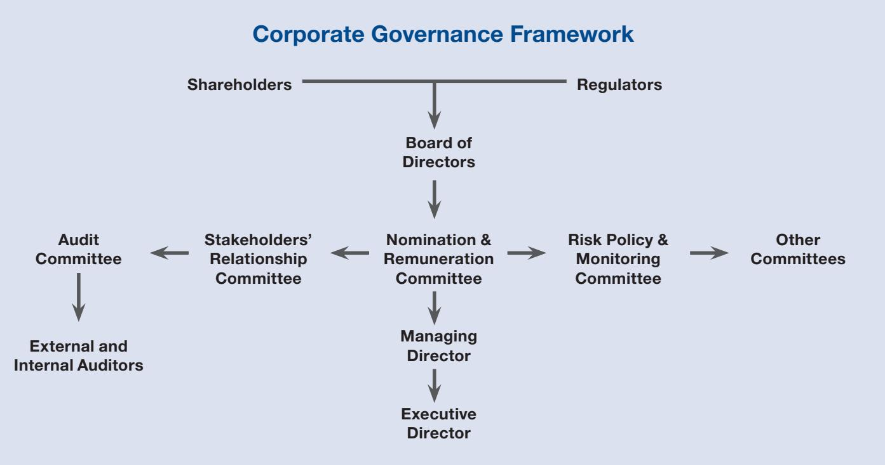

> **AI Description:**
> **Source:** `assets/_page_167_Figure_0.jpg`
> 
> **Generated:** 2026-05-24 13:40:25
> 
> ---
> 
> The image is a flowchart titled "Corporate Governance Framework." It illustrates the structure and relationships within a corporate governance system. The flowchart starts with shareholders and regulators at the top, leading to the Board of Directors. From the Board of Directors, arrows point to various committees: Audit Committee, Stakeholders' Relationship Committee, Nomination & Remuneration Committee, and Risk Policy & Monitoring Committee. The Nomination & Remuneration Committee leads to the Managing Director, who then points to the Executive Director. Other Committees are also mentioned, indicating a broader governance structure. The flowchart uses arrows to show the direction of influence or responsibility, highlighting the interconnectedness of different governance roles and committees.

·The Board of Directors of the Bank are the ultimate custodians of governance.

The Board of Directors are accountable to various stakeholders such as shareholders and regulatory authorities including Reserve Bank of India, Securities and Exchange Board of India,Ministry of Corporate Affairs,etc.

·The Board of Directors has constituted various committees under it,each with defined roles and responsibilities such as Audit Committee, Stakeholders'Relationship Committee, Nomination & Remuneration Committee，Risk Policy & Monitoring Committee,and other committees.

·The Statutory Auditors have a reporting responsibility to the Audit Committee.

The Managing Director & Chief Executive Oficer is responsible for the overall affairs of the Bank,under the superintendence, guidance and control of the Board of Directors.

·The Executive Director, under the guidance of the Managing Director, has over-sight over various business functions.

## Philosophy on Code of Corporate Governance

The Bank believes in adopting and adhering to the best recognized corporate governance practices and continuously benchmarking itself against each such practice.The Bank understands and respects its role and responsibility towards its shareholders and strives hard to meet their expectations.

The Bank believes that best board governance practices, transparent disclosures and shareholder empowerment are necessary for creating shareholder value.

The Bank has infused the philosophy of corporate governance into all its activities.The philosophy on corporate governance is an important tool for shareholder protection and maximization of their long term values.The cardinal principles such as independence,accountability,responsibility, transparency， fair and timely disclosures,credibility,sustainability,etc.serve as the means for implementing the philosophy of corporate governance in letter and in spirit.

## Board of Directors

The composition of the Board of Directors of the Bank ("Board") is governed by the provisions of the Companies Act, 2013, the Banking Regulation Act, 1949, the SEBl Listing Regulations and otherapplicable laws.

As on the date of this report, the Board consists of eleven (11) Directors as follows:

Mr.Aditya Puri ceased to be the Managing Director of the Bank with effect from the close of business hours on October 26, 2020,upon reaching 70 years of age,inaccordance with the tenure approved by the Reserve Bank of India.

Mrs.Shyamala Gopinath ceased to be the Part-time Non-Executive Chairperson & Independent Director of the Bank with effect from the close of business hours on January 1, 2021,in accordance with the tenure approved by the Reserve Bank of India.

Mr. Sashidhar Jagdishan was appointed as the Managing Director & Chief Executive Officer of the Bank with effect from October 27, 2020,and the appointment was approved by the shareholders of the Bank through Postal Ballot on December 1, 2020.

Dr. (Ms.) Sunita Maheshwari was appointed as an Additional Independent Director of the Bank with effect from March 30,2021,subject to the approval of the shareholders at the ensuing Annual General Meeting of the Bank.

Mr.Atanu Chakraborty was appointed as the Part-time Non-Executive Chairman & Additional Independent Director of the Bank with effect from May 5,2021,pursuant to the approval granted by the Reserve Bank of India,and subject to the approval of the shareholders at the ensuing Annual General Meeting of the Bank.

Pursuant to the SEBl Listing Regulations, none of the Directors on the Board is a member of more than ten (10) committees and chairperson of more than five (5) committees across all public companies in which he/she is a director. All the directors have made necessary disclosures regarding committee positions occupied by them in other companies.

## None of the directors are related to each other.

Details of directorships,memberships and chairpersonships of the committees of other companies for the current directors of the Bank are as follows:

\* The figures in brackets indicate chairpersonships.

Note:For the purpose of considering the limit of the directorships and limits of committees on which the directors are members / chairpersons,all public limited companies (whether listed or not), private limited companies,foreign companies and companies under Section 8 of the Companies Act, 2013 have been included.Further, chairpersonships /memberships of only the Audit Committee and the Stakeholders' Relationship Committee in these companies have been considered.

## Profile of Board of Directors

The profile of the Directors of the Bank as on the date of this reportare as under:

## Mr. Atanu Chakraborty

Mr. Atanu Chakraborty,aged 61 years,served the Government of India, fora period of thirty-five (35) years,as a member of Indian Administrative Service (IAS) in Gujarat cadre. He has mainly worked in areas of Finance & Economic Policy, Infrastructure, Petroleum & Natural Gas.In the Union Government, he held various posts such as Secretary to Government of India in the Ministry of Finance (Dept. of Economic Affairs) during FY 2019-20. As Secretary (DEA), he co-ordinated economic policy making for all ministries/departments and managed entire process of formulation of budget making for Union of India, including its passage in Parliament. He was responsible for fiscal management policies,policies for public debt management and development & management of financial markets.

## Corporate Governance

Mr. Chakraborty also handled financial stability and currency, domestic & foreign related issues as well. He managed flow of funds with multilateral and bilateral financial institutions and had multiple interfaces with them. He also headed a multi-disciplinary task force that produced the National Infrastructure Pipeline (NIP). He has also served as Secretary to the Union Government for Disinvestment (DIPAM) wherein he was responsible for both policy as well as execution of the process of disinvestment of Government of India's stake in state owned enterprises.

During the period 2002-07, Mr. Chakraborty served as Director and subsequently as Joint Secretary，Ministry of Finance (Department of Expenditure). During this period,he appraised projects in the Infrastructure sector as well as looked after subsidies of Government of India. He had also updated and modernized the Government's Financial & Procurement rules. Mr. Chakraborty has also discharged varied roles in the Gujarat State Government including heading the Finance Department as its Secretary. He had been responsible for piloting the private sector investment legislation in the State. In the State Govt., he has worked on the ground in both public governance and development areas.

Mr. Chakraborty has also served on the Board of World Bank as alternate Governoras well as on the Central Board of Directors of the Reserve Bank of India. He was also the Chairman of National Infrastructure Investment Fund (NIIF)as also on the Board of many listed companies.Mr. Chakraborty was also the CEO/MD of the GSPC group of companies as wellas Gujarat State Fertilizers and Chemicals Ltd.Mr. Chakraborty had published articles in reputed journals in the areas of public finance, risk sharing in Infrastructure projects and gas infrastructure.Mr. Chakraborty graduated as a Bachelor in Engineering (Electronics & Communication) from NIT Kurukshetra. He holds a Diploma in Business Finance (ICFAl, Hyderabad) and a Master's degree in Business Administration from the University of Hull, UK.

Mr. Chakraborty is not a director in any other listed or public limited company.

Mr. Chakraborty does not hold any shares in the Bank as on the date of his appointment.

## Mr. Sashidhar Jagdishan

Mr. Sashidhar Jagdishan (Sashi),aged 56 years,has an overall experience of 30 years.He has completed his graduation in Science with specialization in Physics,is a Chartered Accountant by profession and holds a Master's degree in Economics of Money， Banking& Finance from the University of Sheffield, United Kingdom.

Mr. Jagdishan joined the Bank in the year 1996 as a Manager in the Finance function. He became Business Head - Finance in 1999 and was appointed as Chief Financial Officer in the year 2008. He played a critical role in supporting the growth trajectory of the Bank, and led the finance function with a pivotal role in aligning the organization in achieving the strategic objectives over the years.

Prior to his appointment as Managing Director & Chief Executive Officer of the Bank,he was the Group Head of the Bank in addition to overseeing the functions of Finance，Human Resources,Legal & Secretarial,Administration, Infrastructure, Corporate Communications and Corporate Social Responsibility.

Mr. Jagdishan is not a director in any other company.

Mr. Jagdishan along with his relatives,holds 15,95,288 equity shares in the Bank as on March 31, 2021.

## Mr. Kaizad Bharucha

Mr. Kaizad Bharucha,aged 56 years,holds a Bachelor of Commerce degree from University of Mumbai. He has been associated with the Bank since 1995. In his current position as Executive Director, he is responsible for Wholesale Banking covering areas of Corporate Banking，PSUs，Capital & Commodities Markets,Financial Institutions,Custody，Mutual Funds, Global Capability Centre & Financial Sponsors coverage, and Banks coverage.

In his previous position as Group Head - Credit & Market Risk, he was responsible for the Risk Management activities in the Bank viz., Credit Risk，Market Risk，Debt Management, Risk Intelligence and Control functions.

Mr. Bharucha has been a career banker with over three decades of banking experience. Prior to joining the Bank,he worked in SBI Commercial and International Bank in various areas including Trade Finance and Corporate Banking.

He has represented HDFC Bank as a member of the working group constituted by the Reserve Bank of India to examine the role of Credit Information Bureau and on the sub-committee with regard to adoption of the Basel Il guidelines.

Mr. Bharuchais not a director in any other company.

Mr. Bharucha,along with his relatives,holds 18,62,195 equity shares in the Bank as on March 31, 2021.

## Mr. Malay Patel

Mr. Malay Patel，aged 44 years,is a Major in Engineering (Mechanical) from Rutgers University, Livingston,NJ, USA,and an A.A.B.A. in business from Bergen County College, Fairlawn, NJ, USA. He is a director on the Board of Eewa Engineering Company Private Limited,a company in the plastics /packaging industry with exports to more than 5O countries. He has been involved in varied roles such as export/import,procurement, sales and marketing,etc.in Eewa Engineering Company Private Limited.

Mr. Malay Patel has special knowledge and practical experience in matters relating to small scale industries in terms of Section 10-A (2 a) of the Banking Regulation Act,1949.

Mr. Patel is not a director in any other listed company.

Mr. Patel is also on the Board of the following public limited companies:

Mr. Patel does not hold any shares in the Bank as on March 31, 2021.

## Mr. Umesh Chandra Sarangi

Mr. Umesh Chandra Sarangi,aged 69 years, holds a Master's degree in Science (Botany) from Utkal University (gold medalist).

Mr. Sarangi has over three decades of experience in Indian Administrative Service and brought in significant reforms in modernizing of agriculture, focus on agro processing and export. As the erstwhile Chairman of National Bank for Agricultural and Rural Development (NABARD) from December 2007 to December 2O10,Mr. Sarangi focused on rural infrastructure, accelerated initiatives such as microfinance,financial inclusion, watershed development and tribal development.

Mr. Sarangi has been appointed as a Director having specialized knowledge and experience in agriculture and rural economy pursuant to Section 10-A (2)(a) of the Banking Regulation Act, 1949.

Mr. Sarangi is not a director in any other listed or public limited company.

Mr. Sarangi does not hold any shares in the Bank as on March 31,2021.

## Mr.Srikanth Nadhamuni

Mr. Srikanth Nadhamuni,aged 57 years,holds a Bachelor's degree in Electronics and Communications from National Institute of Engineering and a Master's degree in Electrical Engineering from Louisiana State University. Mr. Nadhamuni is a technologist and an entrepreneur with 30 years of experience in the areas of CPU design, Healthcare,e-Governance,National ID, Biometrics, Financial Technology and Banking sectors.

Mr. Nadhamuni is presently the Chairman of Novopay Solutions Private Limited,a company involved in the area of mobile payments and is the CEO of Khosla Labs Private Limited,a startup incubator. He has also been a co-founder of e-Governments Foundation with Mr. Nandan Nilekani which work on the objectives to improve governance in Indian cities and creation of Municipal ERP suite which improves service delivery of cities.Mr. Nadhamuni has extensive experience in Information Technology，particularly in the banking and financial services industry.

Mr. Nadhamuni was the Chief Technology Officer of Aadhaar (UID Authority of India) during 2009-2012 where he participated in design and development of the world's largest biometric based ID system.He was instrumental in development of Aadhaar technology， several banking and financial protocols including MicroATM，Aadhaar Enabled Payment System (AEPS) and Aadhaar Payment Bridge (APB).

Mr. Nadhamuni spent 14 years in the Silicon Valley(California, US) working for several global companies such as Sun Microsystems (CPU design), Intel Corporation (CPU design), Silicon Graphics (Interactive TV) and WebMD (Internet Healthcare).

Mr. Nadhamuni has been appointed as a Director having expertise in the field of Information Technology.

Mr. Nadhamuni is not a director in any other listed or public limited company.

Mr. Nadhamuni does not hold any shares in the Bank as on March 31,2021.

## Mr. Sanjiv Sachar

Mr. Sanjiv Sachar,aged 63 years,is a Fellow Associate of the Institute of Chartered Accountants of India and former Senior Partner of Egon Zehnder, the world's largest privately held executive search firm.

Mr. Sachar set up the Egon Zehnder practice in India in 1995 and played a key role in establishing the firm as a market leader in the executive search space across various country segments.Over the course of his two decades at Egon Zehnder, Mr. Sachar has mentored senior executives across industry sectors that today are either Board members,CEOs or CFOs of large corporates in India and overseas.Mr. Sachar has also been the co-founder of the chartered accountancy and management consulting firm, Sachar Vasudeva& Associates and co-founded executive search firm, Direct Impact.

Mr. Sachar is on the Board of the following public companies:

Mr. Sachar does not hold any shares in the Bank as on March 31, 2021.

## Mr. Sandeep Parekh

Mr. Sandeep Parekh,aged 49 years, holds an L.M.(Securities and Financial Regulations) degree from Georgetown University

## Corporate Governance

and an LL.B. degree from Delhi University. He is the managing partner of Finsec Law Advisors,a financial sector law firm based in Mumbai.

He was an Executive Director at the Securities & Exchange Board of India during 2Oo6-O8,heading the Enforcement and Legal Affairs departments. He isa faculty at the Indian Institute of Management, Ahmedabad. He has worked for law firms in Delhi, Mumbai and Washington, D.C.Mr. Parekh focuses on securities regulations,investment regulations,private equity,corporate governance and financial regulations. He is admitted to practice law in New York. He was recognized by the World Economic Forum as a“Young Global Leader” in 20o8.He was Chairman and member of various SEBl and RBl Committees and sub-Committees and is presently a member of SEBl's Mutual Fund Advisory Committee.

Mr. Parekh is not a director in any other listed or public limited company.

Mr. Parekh does not hold any shares in the Bank as on March 31,2021.

## Mr.M.D.Ranganath

Mr. M.D. Ranganath,aged 59 years, holds Master's degree in technology from IIT,Madras and a Bachelor's degree in Engineering from the University of Mysore.He is a PGDM from IIM,Ahmedabad and a member of CPA,Australia.

Mr. Ranganath has over 28 years of experience in the Global IT services and financial services industry. He was Chief Financial Officer of Infosys Limited, a globallylisted IT services company, till November,2018.During his tenure of 18 years at Infosys, he was an integral part of the growth and transformation of Infosys into a globally respected IT services company and effectively played leadership roles in a wide spectrum of areas-Strategy, Finance,Merger & Acquisition (M&A), Consulting, Risk Management, and Corporate planning- culminating in the role of Chief Financial Officer and worked closely with the Board of Infosys and its committees in formulating and executing its strategic priorities.Prior to Infosys, he worked at IClCl Limited for 8 years and executed responsibilities in credit, treasury,equity portfolio management and corporate planning.

In the years 2017 and 2018,Mr. Ranganath was the recipient of the Best CFO Asia award in the technology sector, by Institutional Investor publication，based on poll of buy-side and sell-side investor community.

Mr. Ranganath is not a director in any other company.

Mr. Ranganath does not hold any shares in the Bank as on March 31,2021.

## Mrs.Renu Karnad

Mrs. Renu Karnad,aged 68 years, is the Managing Director of Housing Development Finance Corporation Limited since 2010. She is a Post Graduate in Economics from the University of Delhi and holds a degree in Law from the University of Mumbai.She is also a Parvin Fellow-Woodrow Wilson School of Public and International Affairs,Princeton University,USA.Mrs.Karnad brings with her rich experience and knowledge of the mortgage sector, having been associated with real estate and mortgage industry in India for over 4O years.Over the years,she has been the recipient of numerous awards and accolades，such as the‘Outstanding Woman Business Leader' award granted by CBNC-TV18 India Business Leader Awards 2012, induction in the Hall of Fame,Fortune India magazine's most powerful women from 2011 to 2019,‘Top Ten Powerful Women to watch out for in Asia' by Wall Street Journal Asia in 2O06,etc.

She has been a Non-Executive Director on the Board of the Bank in the past.

Mrs. Karnad is on the Board of the following public companies:

Mrs.Karnad,along with her relatives,holds 5,95,320 equity shares in the Bank as on March 31, 2021.

## Dr. (Ms.) Sunita Maheshwari

Dr. (Ms.) Sunita Maheshwari,aged 55 years,is a US Board certified Pediatric Cardiologist,and completed her MBBS at Osmania Medical College followed by post-graduation at AlIMS, Delhi and Yale University in the US.With over 30 years of experience, she has lived and worked in the US and India. In addition to being a clinician, Dr. (Ms.) Maheshwari is a medical entrepreneur and co-founder at-

(a) Teleradiology Solutions (India's first and largest teleradiology company that has provided over 5 million diagnostic reports to patients and hospitals globally including for the Tripura state government),

(b)Telrad Tech which builds Al enabled tele health software and

(c)RXDX healthcare - achain of multi-specialty neighborhood clinics in Bangalore.

She has also incubated other start-up companies in the tele-health space such as Healtheminds-a tele-counseling platform. She is active in the social arena in India where she runs 2 trust funds. ‘People4people' has put up over 450 playgrounds in government schools and Telrad Foundation provides teleradiology and telemedicine services to poor areas in Asia that do not have access to high quality medical care.Her other interests include teaching - she has been running India's e-teaching program for postgraduates in Pediatric Cardiology for over a decade.In 2019, she helped the Kerala National health mission Hridayam launch e-classes in pediatric cardiology for pediatricians in the state. She has over 2Oo academic presentations and publications to her credit and is an inspirational speaker having given over 200 lectures,including several TEDx talks.

Dr. (Ms.) Maheshwari is the recipient of several prestigious awards and honours including: WOW (Woman of Worth) 2019 award, Outlook Business; 50 most powerful women of India, March 2016; Amazing Indian award- Times Now 2014; Top 20 women Health care achievers in India,Modern Medicare 2009; Yale University- Outstanding Fellow Teacher of the Year Award, 1995,amongst others.

Dr. (Ms.) Maheshwari is on the Board of the following public companies:
Dr. (Ms.) Maheshwari does not hold any shares in the Bank as on March 31,2021.

## ATTENDANCE AT BOARD MEETINGS& LAST ANNUAL GENERAL MEETING (AGM)

The Board / Committee Meetings are convened by giving appropriate notice wellin advance of the meetings.The Directors /Members are provided with appropriate information in the form of agenda items in a timely manner,to enable them to deliberate on each agenda item and make informed decisions and provide appropriate directions to the Management.While the Companies Act, 2013 and other applicable laws do not prescribe a minimum number of meetings to be attended by directors, the Board members endeavor to attend and participate in all board meetings,unless he/she is unable to attend the meeting onaccount of reasonable cause for which leave of absence is requested,which is considered by the Board for approval.

Video-conferencing facility is also provided at the Board / Committee meetings in case any director is unable to attend the meeting physically but wishes to participate through electronic mode in the meetings.During the COvID-19 pandemic and given the enabling regulations made by the Ministry of Corporate

Affairs and Securities & Exchange Board of India, the directors were given the facility of attending meetings through videoconferencing and they were able to participate in the Board/ Committee meetings seamlessly through the video-conference facility.

At the Board / Committee meetings，presentations and deepdive sessions are made covering important areas of the Bank such as annual plans and strategies,Cyber security and Data Privacy,amendments and salient provisions of the SEBl Listing Regulations and other applicable regulations / laws, Macro Economic updates and monetary policy implications, Parivartan (CSR Initiatives), Impact of Covid-19 on regulatory models,fraud risk assessment,rewards strategy,etc.Directors are also encouraged to attend relevant programs and seminars conducted by reputed external organizations.

During the financial year under review, seventeen (17) Board Meetings were held. The meetings were held on April 18, 2020, June 20,2020,July 17,2020,July 28,2020,August 17,2020, September 10，2020，October 8，2020，October 17,2020, November 25,2020, December 14,2020,December 28,2020, January1,2021, January16,2021,February 3,2021,February 25,2021,March 5,2021,and March 26,2021.

Details of attendance at the Board Meetings held during the financial year under review and attendance at the last virtual AGM are as follows:

1 Mrs.Shyamala Gopinath ceased to be Part-Time Non-Executive Chairperson and Independent Director of the Bank with effect from close of business hours on January 1, 2021.

2 Mr. Aditya Puri ceased to be the Managing Director of the Bank with effect from close of business hours on October 26,2020.

3 Mr. Sashidhar Jagdishan was appointed as Managing Director and Chief Executive Officer of the Bank with effect from October 27,2020.

## REMUNERATION OFDIRECTORS

## Managing Director and other Executive Directors:

ThedetailsoftheremuneratiopaidtoMr.AdityaPuri,erstwhile)ManagingDirector,Mr.SashidharJagdishan,ManagingDrector & Chief Executive Offcer,andMr.Kaizad Bharucha,ExecutiveDirector,duringthefinancialyear 202O-21areas under:

(Amount in )

\* Mr Aditya Puri ceased tobethe Managing Directorof the Bank at the end of businesshours on October 26,2020.
#Mr.SashidharJagdishanwasappointedasManagingDirectorandChiefExecutiveOficeroftheBankwitheffctfromOtober272020.

## Notes:

1.Mr.AdityPurietidrtesrveofteankatedfbsisoursoOctobr62emuneatioepordbete remuneration paid till the date of his superannuation.

2.ForMrSashidharJagdishan,theremunerationishisanualremunerationthatinudeshisrmuneratioasGroupHadoftheBanforthe periodApriltictodsmueratioaingectordCEetifoftnkeiobr 27,2020 till March 31,2021.

3.TheAaleetfestiatoditrEutiectozaduedin

aMrAdityurisderataptof(Gros)tiremesrtofsoiremteits.so by the Reserve Bank of India and the same has been included in Allowances and Perquisites.

bTheperformancebonusreportedaboveincludes thedeferedtranchesbelonging topreviousyearspaidinthefinancialYear2020-21.

For the erstwhile Managing Director, Mr. Aditya Puri the following are the deferred tranches:

A)Tranche 1: 68,83,979 for the Performance Year 2018-19

B)Tranche 2:57,36,649 for the Performance Year 2017-18

C)Tranche 3:46,32,077 for the Performance Year 2016-17

Total Payout (A) + (B) + (C)= 17,252,705

For the Executive Director Mr. Kaizad Bharucha the following are the deferred tranches:

A)Tranche 1: 33,08,079 for the Performance Year 2018-19

B)Tranche 2:28,76,590 for the Performance Year 2017-18

## Total Payout (A) + (B)=6,184,669

ThperformanebuforMAdityaPuriforteperformanceear1-s466bssapprovalfroteReserveBankofdadated April 29,2021.

TheperformancebusforMrKizadBaruchafortheperformanceyar2019-20as084895basisapprovalfromtheReserveBnkofldia datedApril29,2eperformacebouspaidtoMsdarJgdsanduringte2-1prtaistoteperformaceyar1for his erstwhile roleof Group Headofthe Bank priorto his appointmentas Managing Directorand Chief Executive Officer.

## Employee Stock Options:

Mr.AdityaPuriagrantedtotalantuofmployetcsforteperfomaceyar1-salfrotesee BankofIdiaddrilKdrusadotaafployesforrfocer 2019-20 basis approval from the Reserve Bank of India dated April 29, 2021.

MrSashidarJagdisatookoveaanagigDirectorandChiefEecutiveOficerfroOctobe22euantuofrantreportedfor pertainstotegrantreceivdinserstilolefGroupHadoftBnkdurigthfinanalyar1prirtoisappontmenasaaging Director and Chief Executive Officer.

Theemployeestockotiosgrantedhaveotbeenssuedatdiscountandtesamehavebeengrantedateosingmarketpriceprevalingonthe daypriortothdatefrantoteNtioalStckEchangfdiatdhstigschdulefortestockotiosis-5%ofoptioey oftwelvemonthsfoatefgrant%ptiosfteexpifttyfouotsfrtateofgrant5%ftisfteepirti monthsfromthedateofgrantandthebalane25%ptiosafterexpiryofortyeightmonthsfromdatefgrantsubjectoaroalfle options so vested are to be exercised within 2 years from the respective dates of vesting.

The criteria for evaluation of performance of Whole-Time Directors include Business Performance, Stakeholder Relationship,Audit and Compliance，Digital Transformation and Organization Excellence.

The notice period for each of them,as specified in their respective terms of appointments,is three months.

Pursuant to the Banking Regulation Act, 1949, the appointment and tenure of Whole-Time Directors is subject to the approval of RBI.

The Bank provides for gratuityin the form of lump-sum payment on retirement or on death while in employment or on termination of employment of an amount equivalent to 15 (fifteen) days basic salary payable for each completed year of service.

The Bank makes annual contributions to funds administered by trustees and managed by insurance companies for amounts notified by the said insurance companies.The Bank accounts for the liability for future gratuity benefits based on an independent external actuarial valuation carried out annually.

Perquisites (evaluated as per Income Tax Rules,1962 wherever applicable and at actual cost to the Bank otherwise) such as the benefit of the Bank's furnished accommodation, gas,electricity, water and furnishings,club fees,personal accident insurance, use of car and telephone at residence,medical reimbursement, leave and leave travel concession and other benefits like provident fund,superannuation and gratuity are provided in accordance with the rules of the Bank in this regard.

No sittng fees were paid to Mr. Puri，Mr. Bharucha and Mr. Jagdishan for attending meetings of the Board and /or its Committees.

## DETAILSOFREMUNERATION/SITTINGFEES PAID TO NON-EXECUTIVEDIRECTORS

All the non-executive directors including the independent directors and the Chairperson receive remuneration by way of sitting fees for each meeting of the Board and its various Committees.No stock options are granted to any of the nonexecutive directors.

During the year, Mrs.Shyamala Gopinath was paid remuneration of  26,34,403,(i.e. 35,00,000 per annum) on proportionate basis for the period from April 1,2020 to January 1,2021 as she ceased to be the Part-Time Chairperson and Independent Director of the Bank with effect from the close of business hours on January 1, 2O21.The remuneration of the Chairperson has been approved by the Reserve Bank of India. Pursuant to the provisions of Companies Act,2013,the Directors are paid sitting fees of  50,000 and 100,000 per meeting for attending Committee & Board meetings respectively.The Board of Directors increased the sitting fees of certain Committee meetings to 100,000 per meeting with effect from April 1,2021, namely, Audit Committee,Risk Policy & Monitoring Committee, Nomination & Remuneration Committee，Credit Approval Committee and IT Strategy Committee.

Pursuant to RBl guidelines dated June 1, 2015 on Compensation to Non-Executive Directors of Private Sector Banks and read with the relevant shareholders'resolution in this regard,nonexecutive directors,including the independent directors,other than the Chairperson,also receive profit related commission as per the limits prescribed in the RBl guidelines. Pursuant to these guidelines and shareholders' resolution passed at the 22nd Annual General Meeting of the Bank held on July 21, 2016, the non-executive directors were paid profit related commission of 1,000,0o0 each during the financial year 2020-21 pertaining to financial year 2019-20.This is in addition to the sitting fees paid to them for attending Committee & Board meetings.

The details of sitting fees and commission paid to non-executive directors during the financial year 202O-21 is as under:

(Amount in )

#Refers to commission for FY2019-20,paid out in FY 2020-21 1Mrs.Shyamala Gopinath ceased tobeadirectorof the Bank with effect from January1,2021.

2Mr. Keki Mistry ceased to be a director of the Bank with effect from January 18,2020. Since he received the commission pertaining to FY 2019-20,paid out in FY 2020-21,above disclosure has been made.

3Dr. (Ms.) Sunita Maheshwari was appointed as Additional Independent Director of the Bank with effect from March 30,2021,subject to approval of shareholders.

4Mr. Atanu Chakraborty was appointed as Part-Time\_Non-Executive Chairman and Additional Independent Director of the Bank with effect from May 5,2021 pursuant to approval of Reserve Bank of India and subject to approval of shareholders.

There were no other pecuniary relationships or transactions of Non-Executive Directors vis-a-vis the Bank (except banking transactions in the ordinary course of business and on arm's length basis) during FY 2020-21.

## Corporate Governance

## COMPOSITION OF COMMITTEES OF DIRECTORS, TERMS OF REFERENCE AND ATTENDANCEATTHEMEETINGS

TheBoard hasconstitutedvarious Commitees of Directors totakeinformed decisions in the bestinterestofthe Bank.These Commitees monitor the activities as per the scope defined in their Charter and terms of reference.

The Board's Committees are as follows as on the date of this Report:

Member Chairperson
\* Includes external IT consultant in addition to the above members.

## Audit Committee

Stakeholders' Relationship Committee

Credit Approval Committee

## Corporate Governance

Customer Service Committee

Corporate Social Responsibility & ESG Committee

Review Committee for Wilful Defaulters' ldentification

Digital Transaction Monitoring Committee

## IT Strategy Committee

## Meeting of the Independent Directors:

TheIndependentDirectorsoftheBankheldfour(4)meetingsonJune20,2020,July3,2020,November6,2020,andNovember 8,2020.Al Independent Directors as on the date of the respective meetings were present.

## □ Corporate Governance

## ATTENDANCE AT THE COMMITTEE MEETINGS HELD DURING FINANCIAL YEAR 2020-21

Digital Transactions Monitoring Committee [Total three meetings held]

1Mrs.Shyamala Gopinath ceased to be a director of the Bank with effect from January1,2021.

2Mr. Aditya Puri ceased to be a director of the Bank with effect from October 26,2020.

3Mr. Sashidhar Jagdishan was inducted on the Committees with effect from November 25,2020.

4Mr. Sandeep Parekh was inducted on the Digital Transactions Monitoring Committee with effect from November 25,2020,and the Premises Committee with effect from January 1, 2021.

5Mr. Sanjiv Sachar was inducted on the Risk Policy & Monitoring Committee with effect from November 25,2020,and the Fraud Monitoring Committee with effect from January 1,2021.

6Mrs. Renu Karnad was inducted on the Risk Policy & Monitoring Committee with effect from June 3,2020,and the Credit Approval Committee with effect from November 25, 2020.

7Mr. Kaizad Bharucha was inducted on the Committee with effect from November 25,2020.

8Mr. Umesh Chandra Sarangi was inducted on the Committee with effect from November 25,2020.

## OWNERSHIP RIGHTS

Certain rights that a shareholder in a company enjoys:

To carry out transmission / transposition and deletion of name on the share certificates(s) and receive the duly endorsed share certificates within the period prescribed in the SEBl Listing Regulations.

To receive notice of general meetings,annual report, the balance sheet and profit and loss account and the auditor's report.

To attend and speak in person,at general meetings.

To appoint proxy to attend and vote at the general meetings. In case the member is a body corporate,to appoint a representative to attend and vote at the general meetings of the company on its behalf.

Proxy can vote on a poll.In case of vote on poll,the number of votes of a shareholder is proportionate to the number of equity shares held by him.In case of the 27th Annual General Meeting of the Bank which willbe conducted by Video-Conferencing /Other Audio-Visual Means pursuant to the relevant MCA circulars,physical attendance of the shareholders has been dispensed with and accordingly, the facility for appointment of proxies for attending and voting on behalf of shareholders will not be available at the 27th Annual General Meeting of the Bank.

In terms of Section 12 of the Banking Regulation Act, 1949 as amended with effect from January 18,2013 vide the Banking Laws Amendment Act, 2012, no person holding shares in a banking company shall,in respect of any shares held by him,exercise voting rights on poll in excess of ten (10) per cent of the total voting rights of all the shareholders of the banking company, provided that RBl may increase, in a phased manner, such ceiling on voting rights from ten (10) percent to twenty-six (26) per cent.The notification dated July 21, 2016 issued by RBl and notified in the Gazette of India dated September 17,2016 states that the current level of ceiling on voting rights is at twenty-six (26) per cent.

To requisition an extraordinary general meeting of the company by shareholders who collectively hold not less than 1/10th of the total paid-up capital of the company.

To move amendments to resolutions proposed at general meetings.

To receive dividend and other corporate benefits like rights, bonus shares,etc.as and when declared /announced.

To inspect various registers of the company, minutes books of general meetings and to receive copies thereof after complying with the procedure prescribed in the Companies Act, 2013 as amended from time to time.

To make nomination in respect of shares held by the shareholder.

To participate in and be sufficiently informed of the decisions concerning fundamental corporate changes.

To be informed of the rules,including voting procedures that govern general shareholder meetings.

To have adequate mechanism to address the grievances of the shareholders.

To ensure protection of minority shareholders from abusive actions by,or in the interest of,controlling shareholders acting either directly or indirectly,and effective means of redress.The rights mentioned above are prescribed in the Companies Act, 2013,the SEBl Listing Regulations and Banking Regulation Act,1949,wherever applicable,and should be followed only after careful reading of the relevant sections.These rights are not necessarily absolute.

## Corporate Governance

## GENERAL BODYMEETINGS

Following are the details of general body meetings for the previous three financial years:

\*TheRegistrarand ShareTransferAgentof theBank,forallsuchissues,was Datamatics Business SutionsLimited(formerlykownas Datamatics Financial Services Limited)

## POSTAL BALLOT

Details of resolutions passed through Postal Ballot:

TheBanksentPostalBalotnoticedatedOctober17,2020tothemembersseekingtherapprovaltroughPostalBalltforpassing the following Ordinary resolutions:

Resolution No.1: Appointment of Mr. Sashidhar Jagdishan (DIN: 08614396) as a Director of the Bank

Resolution No.2: Appointmentof Mr.Sashidhar Jagdishan (DIN:08614396)as the Managing Director& Chief ExecutiveOficer of theBank,foraperiodofthree(3)years,withefectfromOctober272020,onthetermsandconditionsrelatingtothesaid appointment, including remuneration,as approved by the RBl.

TheBank hadappointedB.N.&Associates,Practising CompanySecretariesas thescrutinizerforconducting thePostal Ballot process.AccordinglythepostalBalotwasconductedbythescrutinzerandareportwassubmitedtoteChaiperson.Thesuls of the voting conducted through Postal Ballot are as under:

Therewereatotalof1,411294shareholdersoftheBankasontherecorddatei.e.October30,2020,outofwhich3,212members comprising of3,687564,824equitysharesrepresenting 66.98%of thesharecapitalpartcipatedinthee-voting procesThe breakup of Valid and Invalid votes is as mentioned below:

## RESOLUTION NO. 1

## RESOLUTION NO. 2

Note:Invalidotestelaereusdyemberstioyolutifoebitigtetesorpoateotersmtin requisite documents,etc.

## DISCLOSURES

## Material Subsidiary

The Bank has two (2) subsidiaries viz: HDB Financial Services Limited and HDFC Securities Limited, neither of which qualifies to be a material subsidiary within the meaning of the SEBI Listing Regulations. However,as a good corporate governance practice, the Bank has formulated a policy for determining material subsidiary.The policy is available on the Bank's website at https://www.hdfcbank.com/personal/about-us/corporategovernance/codes-and-policies.

## Related Party Transactions

During the year, the Bank has entered into transactions with the related parties in the ordinary course of business.The Bank has not entered into any materially significant transactions with the related parties including promoters,directors,the management, subsidiaries or relatives of the Directors,which could lead to a potential conflict of interest between the Bank and these parties. Transactions with related parties were placed before the Audit Committee for approval. There were no material transactions with related parties,which were not in the normal course of business,nor were there any material transactions,which were not atan arm's length basis.Details of related party transactions entered into during the year ended March 31, 2021 are given in, Note No. 29 in Schedule 18, forming part of ‘Notes to Accounts'.

The Bank has put in place a policy to deal with related party transactions and the same has been uploaded on the Bank's web-site at https://www.hdfcbank.com/personal/about-us/ corporate-governance/codes-and-policies.

## Commodity Price Risks and Foreign Exchange Risksand Hedging activities

Being in the business of banking,as per the extant regulations, the Bank does not deal in any commodity, though,can be exposed to the commodity price risks of its customers in its capacity as lender/ banker. Currently, the Bank has open exposure in Precious Metals i.e,Gold / Silver and such open exposures in Gold / Silver are primarily on account of positions created from short term deposits under the Gold Monetisation Scheme (GMS) raised from Customers and trading positions in Gold/Silver. These positions are managed similar to other foreign exchange exposures using spot, outright forwards and swap transactions in Gold and monitored as part of the trading portfolio within the stipulated trading risk limits viz.Net overnight open position limit, Intraday open position limit, Value-at-Risk limit, Stop Loss Trigger Level etc. that are defined in the Treasury Limits Package.In addition, Bank is authorized by Reserve Bank of India to import gold and silver and the exposure arising out of import of gold and silver on consignment basis is covered on back to back basis.The spot, forward and swap contracts,outstanding as on the Balance Sheet date and held for trading,are revalued at the closing spot and forward rates respectively as notified by FEDAl (Foreign Exchange Dealers'Association of India) and at interpolated rates for contracts of interim maturities.The USD/ INR rate for valuation of contracts having longer maturities i.e. greater than one (1) year is implied from INR-MIFOR and USD-LIBOR swap curves.For other pairs,where the rates/ tenors are not published by FEDAl, the spot and forward points are obtained from Refinitiv or Bloomberg for valuation of the foreign exchange deals.The foreign exchange profit or loss is arrived on present value basis thereafter,as directed by FEDAl,whereby the forward profits or losses on the deals,as computed above,are discounted till the valuation date using the applicable discounting yields.The resulting profit or loss on valuation is recognized in the Statement of Profit and Loss.

Given below are the exposure details of the Bank under the Gold Monetisation Scheme deposits as of March 31, 2021.

Total open exposure of the Bank to commodities i.e. Gold (in ) as on March 31, 2021: Nil

Note: As part of trading position in Gold, the Treasury Gold Desk has open position in Gold of 482.78 ounce,which is equivalent to  59,510,985.34 as on March 31, 2021,and was within the NOOP limit prescribed for XAU.

## Accounting Treatment

The financial statements have been prepared and presented under the historical cost convention and accrual basis of accounting，unless otherwise stated and are in accordance with Generally Accepted Accounting Principles in India('GAAP), statutory requirements prescribed under the Third Schedule of the Banking Regulation Act， 1949,circulars and guidelines issued by the Reserve Bank of India('RBl') from time to time (RBl guidelines), Accounting Standards (AS") specified under Section 133 of the Companies Act, 2013 read together with paragraph 7 of the Companies (Accounts) Rules,2014 and the Companies (Accounting Standards) Amendment Rules,2016,in so far as they apply to banks.

## Credit Ratings

The details of all credit ratings obtained by the Bank for all debt instruments are furnished in the Directors'Report which may be referred to.

## Whistle Blower Policy/Vigil Mechanism

The details of establishment of whistle blower policy / vigil mechanism are furnished in the Directors’ Report which may be referred to. None of the Bank's personnel have been denied access to the Audit Committee.

## Remuneration and Selection criteriafor Directors

All non-executive directors receive remuneration by way of sitting fees for each meeting of the Board and its various committees.No stock options are granted to any of the non-executive directors.

## Corporate Governance

In addition,pursuant to RBl guidelines dated June 1, 2015 on Compensation to Non-Executive Directors of Private Sector Banks and read with the relevant shareholders'resolution in this regard, non-executive directors,other than the Chairperson, also received profit related commission tillFY 2020-21 as per the limits prescribed in the RBl guidelines.Kindly refer to the other relevant details as furnished in the Directors'Report.

Further,in terms of RBl circular on Corporate Governance in Banks - Appointment of Directors and Constitution of Committees of the Board dated April 26,2021,starting from FY 2021-22， banks may provide for payment of compensation to Non-Executive Directors in the form of a fixed remuneration commensurate with an individual director's responsibilities and demands on time and which are considered sufficient to attract qualified competent individuals.However，such fixed remuneration for a Non-Executive Director,other than the Chair of the Board, shall not exceed  2,0oo,ooo per annum as per the said RBl circular.

## Appointment / Resignation of Director

During the year, Mr. Aditya Puri ceased to be the Managing Director of the Bank with effect from the close of business hours on October 26,2020,upon reaching 70 years of age, in accordance with the tenure approved by the Reserve Bank of India,while Mrs. Shyamala Gopinath ceased to be the Part Time Chairperson & Independent Director of the Bank with effect from the close of business hours on January 1,2021,in accordance with the tenure approved by the Reserve Bank of India.

Further, Mr. Sashidhar Jagdishan was appointed as the Managing Director & Chief Executive Officer of the Bank with effect from October 27, 2020,and the appointment was approved by the shareholders of the Bank through Postal Ballot on December 1,202O,while Dr. (Ms.) Sunita Maheshwari was appointed as an Additional Independent Director of the Bank with effect from March 30,2021,subject to the approval of the shareholders at the ensuing Annual General Meeting of the Bank. Mr. Atanu Chakraborty was also appointed as the Part Time Non-Executive Chairman & Independent Director of the Bank with effect from May 5,2021,pursuant to the approval granted by the Reserve Bank of India,and subject to the approval of the shareholders at the ensuing Annual General Meeting of the Bank.

## Familiarization of Independent Directors

The details of familiarization programmes imparted to Independent Directors are available on the website of the Bank at https://www.hdfcbank.com/personal/about-us/corporategovernance/familiarization-of-independent-directors

## Strictures and Penalties for last three financial years:

The RBl,by an Order dated May 27,2021， levied a penalty of 10 cores (Rupees ten crores only) for marketing and sale of third-party non-financial products to the Bank's auto loan customers，arising from a whistle blower complaint，which revealed,inter alia,contravention of Section 6(2) and Section 8 of the Banking Regulation Act, 1949.The Bank has discontinued the sale of said third-party non-financial product since October 2019.

## FY 2020-21:

During the financial year 202O - 21, the Reserve Bank of India and other regulatory/statutory authorities have imposed the following penalties /strictures /prohibitions /restrictions on the Bank:

## A. Penalties:

1. Reserve Bank of India (RBl) has vide its letter dated December 04,2020 imposed a monetary penalty of 10 lacs on the Bank for bouncing of SGL,which lead to shortage of balance in certain securities in the Bank's CSGL account on November 19, 2020.The Bank has since enhanced its review mechanism so as to ensure that such incidents do not recur.

2. SEBl issued final order on January 21, 2021, levying a penalty of 10O lacs on the Bank,in the matter of invocation of securities pledged by a corporate entity foravailing credit facilities. SEBl has also directed the Bank to transfer sale proceeds of 158.68 crores on invocation of securities,along with interest to escrow account with a nationalised bank by marking lien in favour of SEBl.The Bank has challenged SEBl's order before SAT and the hearing in the matter is in progress.

## B. Restrictions imposed:

Reserve Bank of India (RBl) has issued an Order dated December 02,2020 ("Order") to HDFC Bank Limited (the “Bank") with regard to certain incidents of outages in the internet banking/ mobile banking/ payment utilities of the Bank over the past 2 years,including the outages in the Bank's internet banking and payment system on November 21,2020 due to a power failure in the primary data centre. RBI,vide above order,advised the Bank (a) to stop all digital business generating activities planned under its‘Digital 2.0' and proposed Business generating applications digital also imposed restrictions and (b) to stop sourcing of new credit card customers.The Bank has initiated remedial activities including fixing of staff accountability and the same were communicated to the RBl.

## FY 2019-20:

During the financial year 2019-20, the Reserve Bank of India (RBI) has,vide its order dated June 13,2019,imposed a monetary penalty of 10 million (Rupees ten million only) on the Bank for non-compliance with directions issued by RBl on Know Your Customer (KYC)/ Anti-Money Laundering (AML) Norms and on reporting of frauds.The penalty has been imposed in exercise of powers vested in RBl under the provisions of Section 47A(1)(c) read with Section 46(4)(i)

of the Banking Regulation Act, 1949.In the instant case, the Bank had made a reference to the Custom Authorities for verification of Bill of Entry submitted by certain importers. Examination of these customers revealed violations of RBl directions on ‘KYC/AML norms'and on reporting of frauds. The Bank has taken necessary measures to strengthen its internal control mechanisms so as to ensure that such incidents do not recur.

The Reserve Bank of India (RBl) has also,vide its order dated January 29,2020, imposed a monetary penalty of 10 million (Rupees ten million only) on the Bank for failure to undertake ongoing due diligence in case of 39 current accounts opened for bidding in Initial Public Offer (IPO). The penalty has been imposed by RBl in exercise of the powers conferred under the provisions of Section 47A(1) (c) read with Section 46(4)(i) of the Banking Regulation Act, 1949.The Bank has since strengthened its internal control mechanisms so as to ensure that such incidents do not recur.

## FY 2018-19:

During the FY 2018-19,RBl has,vide its order dated February 4,2019, imposed amonetary penalty of 2 million on the Bank for non-compliance with various directions issued by RBl on Know Your Customer (KYC)/ Anti-Money Laundering (AML） standards，more specifically those contained in their circulars dated November 29,2o04 and May 22, 20o8.The Bank has since implemented corrective action to strengthen its internal control mechanisms so as to ensure that such incidents do not recur.

Further， during the FY 2017-18，pursuant to the media reports， SEBl has issued directions to the Bank ("SEBl Directions"） in relation to leakage of unpublished price sensitive information ("UPSl"） pertaining to the financial results of the Bank for the quarter ended December 31, 2015 and the quarter ended June 30,2017 in various private WhatsApp groups ahead of Bank's official announcement to the relevant stock exchanges.

SEBI had directed the Bank to observe the following: (i) to strengthen its processes /systems /controls forthwith to ensure that such instances of leakage of unpublished price sensitive information do not recur in future,(ii) to submit a report on: (a)the present systems and controls and how the present systems and controls have been strengthened, (b) details of persons who are responsible for monitoring such systems，and (c) the periodicity of monitoring. Further, SEBl had directed the Bank to conduct an internal inquiry into the leakage of UPSl relating to its financial figures including Non-Performing Assets (NPAs) results and take appropriate action against those responsible for the same，in accordance with the applicable law.

The scope of such inquiry included determination of the possible role of following persons in relation to the aforesaid leakage of UPSl:(i) persons /members of committees involved in generation of the original data for the purpose of determination of key figures pertaining to financial figures including gross NPAs,(i) persons involved in the consolidation of the figures for the financial results, (ii) persons involved in the preparation of board notes and presentations, (iv) persons involved in dissemination of information relating to financial results in the public domain,and (v) any other persons who had access to the information. SEBl had directed the Bank to complete the inquiry within a period of three (3) months from the date of the SEBl Directions and thereafter, file a report with SEBl in this regard within a further period of seven (7) days.

The Bank had submitted the requisite information and reports to SEBl in compliance with the SEBl Directions and within the timelines prescribed therein.SEBl has since asked for information /clarifications from the Bank on the said matter from time to time,which have been furnished by the Bank.On August 31,2020,SEBl has passed an Adjudication Order in the matter of circulation of UPSl through Whatsapp messages with respect to the Bank, against one Mr. Renish Hareshbhai Bhuva.Pursuant to the Order, the Adjudicating Officer has levied a monetary penalty of  1,500,000 (Rupees Fifteen Lakh only)on Mr. Renish Hareshbhai Bhuva for violation of the Regulation 12A(e) of the SEBl Act, 1992 and Regulation 3 (1) of the SEBl (Prohibition of Insider Trading) Regulations,2015 relating to communication of UPSl. The Bank is not and was never associated / related/ connected，directly or indirectly,with Mr. Renish Hareshbhai Bhuva,except in his capacity as a customer of the Bank.

## A chart or a matrix setting out the skills /expertise /competence of the Board of Directors:

The Board of Directors have identified the following core skills/expertise/competencies /special knowledge or practical experience,as required in the context of the Bank's business and sector(s) for it to function effectively. The same are in line with the relevant provisions of the Banking Regulation Act,1949 and relevant circulars issued by the Reserve Bank of India from time to time:

(i)Accountancy,

(ii)Agriculture and Rural Economy,

(i) Banking,

(iv) Co-operation,

(v）Economics,

## Corporate Governance

(vi)Finance,

(vii) Law,

(vii) Small-Scale Industry,

(ix）Information Technology,

(x)Payment & Settlement Systems,

(xi) Human Resources,

(xii) Risk Management,

(xiii) Business Management,

(xiv)Anyothermaterthespecialknowledgeof,andpracticalexperiencein,whichwould,intheopinionoftheReserveBank, be useful to the Bank's business /sectors.

Details of utilization of funds\_raised through preferential allotment or qualified institutions placement as specified under Regulation 32 （7A)

During the year under review, the Bank has not raised any funds through Preferential Allotment or Qualified Institutions Placement as specified under Regulation 32(7A) of the SEBl Listing Regulations.

Disclosures in relation to the Sexual Harassment of WomenatWorkplace(Prevention,Prohibition and Redressal) Act, 2013

Details of the number of complaints received,disposed,and pending during the year 2020-21 pertaining to the Sexual Harassment of Women at Workplace are as under:

Number of complaints received during the year 2020-21 47   
Number of complaints disposed during the year 2020-21 35   
Number of cases pending as on March 31, 2021 12

## COMPLIANCE WITH MANDATORY REQUIREMENTS

The Bank has complied with all the applicable mandatory requirements of the Code of Corporate Governance as prescribed under the SEBl Listing Regulations.

## PERFORMANCEEVALUATION

The Bank has put in place a mechanism for performance evaluation of the Directors.The details of the same have been included in the Directors' Report.

## COMPLIANCEWITHNON-MANDATORY REQUIREMENTS

## a) Board of Directors

The Bank maintains the expenses relating to the office of the Part-Time Non-Executive Chairperson of the Bank and reimburses all the expenses incurred in performance of his duties. Pursuant to Section 10-A (2)(a) of the Banking Regulation Act, 1949,none of the directors,other than the Chairperson and/or whole-time directors, is permitted to hold office continuously for a period exceeding eight (8) years.

All the independent directors of the Bank possess requisite qualifications and experience which enable them to contribute effectively to the Bank.The Board confirms that in its opinion,the independent directors fulfill conditions specified in these regulations and are independent of the management.

## b)Shareholder's Rights

The Bank publishes its results on its website at www. hdfcbank.com which is accessible to the public at large. The same are also available on the websites of the Stock Exchanges on which the Bank's shares are listed.

A half-yearly declaration of financial performance including summary of the significant events is presently not being sent separately to each household of shareholders.The Bank's results for each quarter are published in an English newspaper having a wide circulation and in a Marathi newspaper having a wide circulation in Maharashtra. Hence, half-yearly results are not sent to the shareholders individually.

## c)Audit Qualifications

During the period under review, there is no audit qualification in the Bank's financial statements. The Bank continues to adopt best practices to ensure regime of unqualified financial statements.

## d） Separate posts of\_\_Chairpersonand Managing Director/ CEO

Mr. Atanu Chakraborty is the Part-time Non-Executive Chairman of the Bank and Mr. Sashidhar Jagdishan is the Managing Director & Chief Executive Officer of the Bank.

## e)Reporting of Internal Auditor

The Internal Auditor of the Bank reports to the Audit Committee of the Bank.

### Full Page Description (Page 178)

**Source:** `assets/_page_178_Asset_2.jpg`

**Generated:** 2026-05-24 13:43:03

---

The image is a combined bar and line chart showing the ADS price and volume of HDFC Bank's ADSs on the NYSE from April 2020 to March 2021. The chart includes two sets of data: the black line represents the ADS price in US dollars, while the blue bars represent the volume (number of ADSs) traded. The price fluctuates throughout the period, starting around $60 in April 2020 and reaching a peak of approximately $70 in December 2020 before declining slightly. The volume of traded ADSs shows a general upward trend, with the highest volume in March 2021. The chart is labeled with the title "HDFC Bank's ADS price on NYSE" and includes a legend for the volume data.

### Full Page Description (Page 178)

**Source:** `assets/_page_178_Asset_1.jpg`

**Generated:** 2026-05-24 13:41:46

---

The image is a combination of a bar chart and a line graph. The bar chart represents the high and low share prices of HDFC Bank on the NSE for each month from April 2020 to March 2021. The line graph shows the S&P CNX Nifty index for the same period. The chart highlights the fluctuations in HDFC Bank's share price and the broader market performance during this time. Notable features include the general upward trend in both the share price and the index, with a peak in March 2021 for both.

### Full Page Description (Page 178)

**Source:** `assets/_page_178_Asset_0.jpg`

**Generated:** 2026-05-24 13:41:25

---

The image is a bar chart and line graph combined, showing HDFC Bank's share price on the BSE (Bombay Stock Exchange) alongside the Sensex (BSE Sensitive Index) over a period from April 2020 to March 2021. The chart includes:

1. **Bar Graph**: The blue bars represent the high share price of HDFC Bank for each month, while the light blue bars represent the low share price for each month.
2. **Line Graph**: The black line represents the Sensex for the same period.
3. **X-axis**: The months from April 2020 to March 2021 are plotted.
4. **Y-axis**: The left side is labeled "Share Price (₹)" and ranges from 0 to 1600, while the right side is labeled "Sensex" and ranges from 0 to 50000.

Key trends and patterns:
- HDFC Bank's share price generally increased over the period.
- The Sensex also showed an upward trend.
- There were fluctuations in both the high and low share prices of HDFC Bank, with some months showing higher highs and lows compared to others.

## GENERAL SHAREHOLDER INFORMATION:

The Bank's share capital consists ofone classofequity shares having face valueof 1each,and the Bank has notissued any other class of shares.

\* One (1) American Depository Share (ADS) represents three (3) underlying equity shares of the Bank.

1,418,572Folioscomprisingof5,499,692,561 equityshares forming 99.76 %of theshare capitalare indemat form.

24,621 Folios comprising of 13,083,921 equity shares forming 0.24 %of the share capital are in physica form.

Note:OtherthanthestockoptionsgrantedtotheemploysoftheBankwhichwllresultinanaditiontotheequitycapitalof teBank ontheexerciseofthestockoptinsandsubsequentalotmentofequityshares,thBankhasnooutstandingwarrntsorothrovertible instruments as on March 31,2021 which could have an impact on the equity capital of the Bank.

## SHAREPRICE/CHART

Themonthly highandlow quotationof Bank'sequityshares tradedonBSELtd(SE)and the National Stock Exchange of India Ltd (NSE)during FY2020-21 andits performance vis-a-vis BSE SENSEX and S&PCNX NIFTYrespectively is as under:

### Full Page Description (Page 179)

**Source:** `assets/_page_179_Asset_0.jpg`

**Generated:** 2026-05-24 13:55:51

---

The image is a pie chart titled "Details of Shareholding." It visually represents the distribution of shares among various categories of shareholders. The chart includes segments for Promoters, ADS, Foreign Institutional Investors, Overseas Corporate Bodies, NRIs, Foreign Bodies, Financial Institutions, Banks, Mutual Funds, Central Government, LIC of India and its Subsidiaries, Other Insurance Corporations, Indian Companies, and Others. Each segment is color-coded and labeled with its respective percentage of the total shareholding. The largest shareholding is held by Foreign Institutional Investors at 32.37%, followed by Promoters at 21.13%. The chart provides a clear and concise overview of the shareholding structure.

## □ Corporate Governance

(#) JP Morgan Chase Bank is the Depository for the ADS (1,028,115,525 underlying equity shares)

## MONTHLY VOLUMES OF THE BANK'S SHARES TRADED ON NSE AND BSE

FINANCIAL CALENDAR

## CODE OF CONDUCT

The Bank has framed andadopteda Codeof Conduct,which isapprovedbytheBoard.The Codeisapplicable toalldirectors andseniormanagement personnelof theBank.This Code hasbeenpostedonthe Bank's websiteathtps://ww.hdfcbank.com/ personalabout-us/corporategoverance/codes-and-policies.Allthe Directorsandseniormanagement personnelhaveafirmed compliance with the Code of Conduct / Ethics as approved and adopted by the Board.

## LISTING

## Listing on Indian Stock Exchanges:

Theequityshares ofthe Bankarelistedatthe folowing Stock Exchanges and theannualfees for 2020-21 have beenpaid:

Names of Depositories in India for dematerialization of equity shares (ISIN No. INE040A01034)

. National Securities Depository Limited (NSDL)

Central Depository Services (India) Limited (CDSL)

## International Listing:

TheDepositoryforADSandGDRisrepresentedinIndiaby:JPMorganChaseBankNA.,IndiaSubCustody，JPMorgan ChaseBankNA, 6th Floor, Paradigm“B"Wing, Behind Toyota Showroom, Mindspace, Malad (West), Mumbai - 400 064.
Note: Annual listing fees of The New York Stock Exchange has been duly paid.

## SHARETRANSFERPROCESS AND SYSTEM

The Bank'sshares whichareincompulsory dematerialized(Demat)listaretransferable through the depository system.Requests fortransmision/transpositionorfordeletionofnameincaseofphysicalsharecerticatesareprocessdbytheRegistrarand ShareTransfer Agents,Datamatics Business Solutions Limited(formerlyknownas Datamatics Financial Services Limitedand areapprovedbythe Stakeholders’Relationship Commiteeof theBankorauthorizedoficialsoftheBank.Theservicerequests of such naturearegeneralyprocessedwithinaperiodofteen (15)days fromthedateofreceiptof therelevantdocumentsby Datamatics Business Solutions Limited.

Please notethataspertheamendedSEBIListingRegulations,withefectfromApril1,2019,anyrequestsfortransferofscurties shall not be processed unless the securities are held in dematerialized form.

## Corporate Governance

## FEES FOR STATUTORY AUDITORS

For the details of total fees for all services paid by the Bank and its subsidiaries,on a consolidated basis,to the Statutory Auditor and all entities in the network firm/network entity of which the Statutory Auditor is a part, kindly refer to the Directors'Report.

## MEANS OFCOMMUNICATION

The quarterlyand half-yearly unaudited /audited financial results are normally published in the newspapers,viz., the Business Standard in English and Mumbai Sakal /Navshakti in Marathi (regional language).The results are also displayed on the Bank's website at www.hdfcbank.com.

The shareholders can visit the Bank's website for financial information，shareholding information，dividend policy，key shareholders'agreements,if any，Memorandum and Articles of Association of the Bank, etc. The website also gives a link to www.sec.gov where the investors can view statutory filings of the Bank with the Securities and Exchange Commission, USA.

The information relating to the Bank's financial results and shareholding pattern are displayed on the websites of the Stock Exchanges on which the Bank's shares are listed.

Other information such as official news/press releases,stock exchange disclosures and presentations made to investors and analysts,etc.are regularly displayed on the Bank's website.

## CODEFORPREVENTION OFINSIDER TRADING

The Bank has adopted a share dealing code for the prevention of insider trading in the shares of the Bank as wellas in other listed and proposed to be listed companies.The share dealing code, inter-alia,prohibits dealing in securities of the Bank by insiders while in possession of unpublished price sensitive information.

## DEBENTURETRUSTEES

The SEBl Listing Regulations require companies,which have listed their debt securities,to disclose the names of their debenture trustees with contact details in their Annual Report. The following are the debenture trustees for the privately placed bonds of the Bank:

1. IDBI Trusteeship Services Ltd, Asian Building, Ground Floor, 17 R Kamani Marg,Ballard Estate,Mumbai 40oo01.Tel: 022-40807000

2. Axis Trustee Services Limited, The Ruby, 2nd Floor, SW, 29, Senapati Bapat Marg, Dadar West, Mumbai- 400 028. Tel: 022-62260054/50

3. Vistra ITCL (India) Limited (Formerly known as IL&FS Trust Company Limited), The IL&FS Financial Centre, Plot C-22/G Block，7th Floor,Bandra Kurla Complex, Bandra (East), Mumbai 400051. Tel: 022-26593535.

## SHAREHOLDERS'HELPDESK

Share transfers,dividend payments and all other investor related activities are attended to and processed at the office of Registrar and Transfer Agents.

For lodgment of transfer deeds and any other documents or for any grievances / complaints,shareholders / investors may contact at the following address:

Mr.Sunny Abraham/Ms.Manisha Parkar/Mr.Tukaram Thore Datamatics Business Solutions Ltd (formerly known as Datamatics Financial Services Ltd)

Plot No.B5, Part B Crosslane, |   
MIDC, Marol, Andheri (East),   
Mumbai 400 093   
Tel:+91-022 - 66712213-14   
Fax:+91-022 - 66712011   
E-mail : hdinvestors@datamaticsbpm.com Timings : 10:00 a. m. to 4:30 p. m.   
(Monday to Friday except public holidays)

For the convenience of investors,transfers up to 5oo shares and complaints from investors are accepted at the Bank's Office at 2nd Floor, Zenith House,Keshavrao Khadye Marg，opposite Race Course Gate no.5&6, Mahalaxmi (West), Mumbai 400034.

Shareholders' Helpdesk Timings :10:30 a.m. to 3:30 p.m. Between Monday to Friday (except on Bank holidays) Telephone :+91-022-3976 0000 Email : shareholder.grievances@hdfcbank.com

For IEPF Related matters :Mr. Santosh Haldankar (Nodal   
Officer)，Mr. Dhanjit Thaivalappil & Mr. Sushant Date (Deputy   
Nodal Officers):   
Tel: +91-022-3976 0000   
Email: shareholder.grievances@hdfcbank.com   
Queries relating to the Bank's operational and financial   
performance may be addressed to:   
shareholder.grievances@hdfcbank.com

Name of the Compliance Officer of the Bank: Mr. Santosh Haldankar, Senior Vice President-Legal & Company Secretary Telephone: +91-022-3976 0000

## BANKING CUSTOMER HELPDESK

In the event of any queries /complaints,banking customers can directly approach the Branch Manager or can call /write to the Bank using the following contact details:

## Call at: Our customer care (Phone Banking) numbers.

Location wise list of customer care numbers are available at: https://www.hdfcbank.com/personal/need-help/ customer-care

How We Create Value

## Write to:

HDFC Bank Ltd., New Building,“A"Wing,2nd Floor, 26-A Narayan Property, Chandivali Farm Road, Off Saki Vihar Road, Chandivali, Andheri (East), Mumbai - 400 072. Email: support@hdfcbank.com

## Contact us online:

Fill up the“Complaint Form”available at the following website link: https://eads.hdfcbank.com/applications/webforms/apply/ HDFC\_CustomerCenter/Customer\_Center.aspx

For grievances other than shareholder grievances please send your communication to the following email addresses: 1）Depository Services: dphelp@hdfcbank.com

2)Retail Banking/ATM/Debit Cards/Mutual Fund: support@hdfcbank.com

3)Loans,Advances /Advance against shares: loansupport@hdfcbank.com

4)Credit Cards: customerservices.cards@hdfcbank.com

## PLANT LOCATIONS

Being in the banking business, the Bank does not have plants. However, the Bank has 5,608 branches in 2,902 cities / towns as on March 31, 2021.The locations of the branches are also displayed on the Bank's website.

Statutory Reportsand Financial Statements

## COMPLIANCECERTIFICATEOFTHE AUDITORS

M/s.BNP& Associates,Company Secretaries,have certified that the Bank has complied with the conditions of Corporate Governance as stipulated in the listing requirements of the Indian Stock Exchanges where the Bank's securities are listed.The same is annexed to the Annual Report.

The said Certificate will be sent to the Stock Exchanges along with the Annual Report of the Bank.

On behalf of the Board of Directors

Sashidhar Jagdishan Umesh Chandra Sarangi Managing Director and CEO Independent Director

June 18,2021

## DECLARATION

l confirm that for the year under review,all directors and senior management have afrmed their adherence to the provisions of the Code of Conduct of Directors and senior management personnel.

Sashidhar Jagdishan Managing Director and CEO

June 18,2021

## Shareholder Information

## A)DIVIDENDS

## Receipt of Dividends through Electronic mode

TheSEBl(ListingObligationsandDisclosure Requirements) Regulations,2015 have directed that listed companies shall mandatorily make all payments to investors including dividend to shareholders,by using any RBl approved electronic mode of payment viz., Electronic Clearing System (ECS)， LECS (Local ECS), RECS (Regional ECS)，NECS (National ECS)，Direct Credit,RTGS, NEFT etc.

In orderto receive the dividend withoutloss of time (as and when declared by the Bank),all the eligible shareholders holding shares in demat mode are requested to update with their respective Depository Participants，their correct core banking account number, including 9 digit MICR Code and 11 digit IFSC Code,E-Mail ID and Mobile No(s).This will facilitate the remittance of the dividend amount as directed by SEBl directly in the Bank Account electronically. Updation of E-Mail IDs and Mobile No(s) will enable sending communication relating to credit of dividend, unencashed dividend etc.

Shareholders holding shares in physical form may communicate details relating to their core banking account, viz., core banking account number, including 9 digit MICR Code and 11 digit IFSC Code, E- Mail ID and Mobile No(s) to the Registrar and Share Transfer Agents viz.,Datamatics Business Solutions Limited (formerly, Datamatics Financial Services Limited,) having address at Plot No.B 5, Part B Crosslane,MIDC,Marol,Andheri (E)，Mumbai-400 O93，by quoting the reference folio number and attaching a photocopy of the Cheque leaf of their active core banking account and also a selfattested copy of their PAN card and a self-attested copy of any one of the documents mentioned hereafter: utility payment bills (not more than three months old) /bank pass book/passport/driving license to validate their present address.

Various modes for making payment of dividend under electronic mode:

In case，the shareholder has updated core banking account details (including 9 digit MlCR Code and 11 digit IFSC code) for the purpose of payment of dividend (as and when declared by the Bank), then the Bank shall make the payment of dividend to such shareholder under any one of the following modes:

1.National Automated Clearing House (NACH)

2．National Electronic Fund Transfer (NEFT)

3. Direct credit in case the shareholders have an active Bank account with HDFC Bank Limited.

In case dividend paid by electronic mode is returned or rejected by the corresponding bank due to any reason then the Bank will issue a dividend warrant and print the bank account details available in its records on the said dividend warrant to avoid fraudulent encashment of the warrants.The dividend warrant willbe dispatched by the Registrars at the registered address of the shareholder.

## TransferofEquitySharesto lnvestorEducationand Protection Fund (IEPF) Authority

Pursuant to the applicable provisions of Section 124(6) of the Companies Act, 2013 all equity shares in respect of which dividend has/have remained unpaid or unclaimed for consecutive seven (7） years，the corresponding equity shares have been transferred in the name of IEPF Authority as notified by the Ministry of Corporate Affairs, Government of India (MCA).The MCA has also notified the applicability of Section 124(6) along with the Investor Education and Protection Fund Authority (Accounting, Audit,Transfer and Refund) Rules,2016 with effect from September 7, 2016 and Notification dated February 28,2017 issued in this regard (Collectively the “IEPF Rules").As per said IEPF Rules,companies are required to transfer the equity shares to IEPF Authority where seven years as provided under Section 124(5) of the Companies Act, 2013 have been completed and upon completion of 3 months from the date of the notification as stated hereinabove.

In compliance with the aforesaid provision on November 30,2017,your Bank has transferred 5,524,448 equity shares to the Investor Education and Protection Fund Authority， Ministry of Corporate Affairs account (IEPF) bearing demat account no 12047200 13676780 which is opened with SBl CAP Securities Ltd as Depository Participant under the Central Depository Services Limited (CDSL). As required under the said provisions all subsequent corporate benefits that may accrue in relation to the above shares will also be credited to the said IEPF Authority. Bank has further transferred 828,846 and 710,122 equity shares to IEPF account on April 12，2019 and August 30，2019 respectively. During the year ended March 31,2021 Bank has further transferred 144,206 equity shares to IEPF account on August 25,2020.The IEPF Authority, till March 31,2021, transferred 392,821 equity shares against the claims received by them from the shareholders. (Share figures reported are of the face value of 1.00 each).

As per the terms of Section 124(6) of the Companies Act, 2013 and the Rule 7 of the IEPF Rules, the shareholders whose corresponding equity shares of the face value of 1.00 each stand transferred to IEPF account can claim those shares from IEPF Authority by making an online application in Form IEPF 5 which is available at http://www.iepf.gov.in.

## Guidelines to file your claim

For claiming the shares and dividend from the IEPF Authority,shareholders can make an online web based application through MCA portal. Shareholders need to register themselves on MCA portal by creating Login ID credentials.After successful login into MCA portal， shareholders have to click on MCA services tab and choose IEPF-5 option under “Investor Services"and follow the due process for filing the form.

Printout of the duly filled Form IEPF - 5with claimant and joint holders' (if any) signature and along with the acknowledgment issued after uploading the form will have to be submitted together with an indemnity bond in original, cancelled Cheque leaf

## Unclaimed Dividends

of active bank account (details of which mentioned by the claimant at the time of uploading the web based form),and other documents as mentioned in the Form IEPF-5 to Nodal Officer (IEPF) of the Bank in an envelope marked “Claim for refund from IEPF Authority". Certain information about the Bank which will have to be submitted are as under:

(a) Corporate Identification Number (CIN) of Company: L65920MH1994PLC080618

(b)Name of the Company: HDFC Bank Limited

(c)Address of registered office of the company: HDFC Bank House， Senapati Bapat Marg, Lower Parel (West), Mumbai 400013

(d)Email ID of the company: shareholder.grievances@hdfcbank.com

As per the applicable provisions of the Companies Act,2013 read with the Investor Education and Protection Fund Authority(Accounting,Audit,Transferand Refund)Rules,2016("IEPFRules",the Bankisstatutorilyrequiredtotransfer totheInvestor Education &Protection Fund(EPF)alldividends remaining unclaimed foraperiodofseven (7) years from thedate they becamedue for payment.Dividends forand upto the financial year ended March 31,2013 have already been transferrdtothe IEPFand the dividend forthe financial yearended March 31,2014 willbe transferred to IEPF around September 30,2021.Thedetailsofunclaimed dividends for thefinancial yearended2014onwardsand the last date for claiming such dividends are given below:

## B) SHARES LYING IN UNCLAIMED SUSPENSE ACCOUNT

\* Number of shareholders who approached the Bank for the transfer of shares from the suspense account.
\*\* Voting rights on these shares shallremain frozentillthe rightful owners of such shares claim these shares

## Shareholder Information

Deduction of tax at source on dividend In terms of the provisions of the Income-tax Act,1961,("the Act"), dividend paid or distributed by a Company on or after April 1, 2020 is taxable in the hands of the shareholders. The Company shall therefore be required to deduct tax at source at the time of payment of dividend. The deduction of tax at source will be based on the category of shareholders and subject to fulfilment of conditions as provided herein below:

## For resident shareholders

Tax will be deducted at source ("TDS") under Section 194 of the Act @ 10% on the amount of dividend payable unless exempt under any of the provisions of the Act. However, in case of resident shareholders,TDS would not apply if the aggregate of total dividend distributed/paid to them by the Company during a financial year does not exceed  5,000.

Tax will not be deducted at source in cases where a shareholder provides Form 15G (applicable to allassessees other than firms and companies) /Form 15H (applicable to an individual above the age of 6O years),provided that the eligibility conditions are met. Blank Form 15G and 15H can be downloaded from the link given at the end of this communication. Please note that allfields mentioned in the Form are mandatory and the Bank may reject the forms submitted, if it does not fulfil the requirement of the law.

Needless to mention,valid Permanent Account Number ("PAN") will be mandatorily required. Shareholders who are required to link Aadhaar number with PAN as required under section 139AA(2) read with Rule 114AAA,should compulsorily link the same by June 30,2021.If,as required under the law,any PAN is found to have not been linked with Aadhaar by June 3O, 2O21 then such a PAN will be inoperative and Tax would be deducted at a higher rate under section 2O6AA of the Act.The Bank reserves its right to recover any demand raised subsequently on the Bank for not informing the Bank or providing wrong information about applicability of Section 2O6AA in your case.

Nil / lower tax shall be deducted on the dividend payable to following resident shareholders on submission of selfdeclaration (as per formats attached) as listed below:

i. Insurance companies:Declaration (refer format) that the provisions of Section 194 of the Act are not applicable to them along with self-attested copy of registration certificate and PAN card;

ii. Mutual Funds: Declaration (refer format) by Mutual Fund shareholder eligible for exemption u/s 10(23D) of the Income- tax Act, 1961 along with self-attested copy of registration documents and PAN card;

ii. Alternative Investment Fund (AlF) established in India:Declaration (refer format) that the shareholder is eligible for exemption under section 10(23FBA) of the Act and they are established as Category lor Category I AIF under the SEBl regulations,along with Copy of self-attested registration documents and PAN card.

iv.New Pension System Trust: Declaration (refer format) along with self-attested copy of documentary evidence supporting the exemption and self-attested copy of PAN card.

V. Other shareholders- Declaration (refer format) along with self-attested copy of documentary evidence supporting the exemption and self-attested copy of PAN card.

vi. Shareholders who have provided a valid certificate issued u/s.197 of the Act for lower/nil rate of deduction or an exemption certificate issued by the income tax authorities along with Declaration (refer format).

## . For non-resident shareholders (including Foreign Portfolio Investors)

Tax is required to be withheld in accordance with the provisions of Section 195 and section 196D of the Act at applicable rates in force.As per the relevant provisions of the Act, the tax shall be withheld @ 20% (plus applicable surcharge and cess) on the amount of dividend payable. However，as per Section 90 of the Act,a non-resident shareholder has the option to be governed by the provisions of the Double Tax Avoidance Agreement ("DTAA") between Indiaand the country of tax residence of the shareholder, if they are more beneficial to the shareholder. For this purpose,i.e. to avail the DTAA benefits,the non-resident shareholder will have to provide the following:

i. Self-attested copy of PAN card, if any,allotted by the Indian Income Tax Authorities;

ii. Self-attested copy of Tax Residency Certificate ("TRC") obtained from the tax authorities of the country of which the shareholder is resident;

ii.Self-declaration in Form 10F (refer format);

iv. Self-declaration (refer format) by the non-resident shareholder of meeting DTAA eligibility requirement and satisfying beneficial ownership requirement (Nonresident having PE in India would need to comply with provisions of section 206AB of the IT Act).

v.In case of Foreign Portfolio Investors,self-attested copy of SEBl registration certificate.

The self-declarations referred to in point nos. (ii) to (iv) can be downloaded from the link given at the end of this communication

Application of beneficial DTAA rate shall depend upon the completeness and satisfactory review by the Bank, of the documents submitted by non- resident shareholders and meeting requirement of the Act read with applicable DTAA. In absence of the same, the Bank will not be obligated to apply the beneficial DTAA rate at the time of tax deduction on dividend.

## Section 206AB of the Act

Rate of TDS @10% u/s 194 of the Act is subject to provisions of section 206AB of Act (effective from July 1,2021) which introduces special provisions for TDS in respect of nonfilers of income-tax return．As provided in section 206AB, tax is required to be deducted at the highest of following rates in case of payments to specified persons:

at twice the rate specified in the relevant provision of the Act; or

at twice the rate or rates in force; or

at the rate of 5%.

Where sections 206AA and 206AB are applicable simultaneously i.e. the specified person has not submitted the PAN as well as not filed returns; the tax shall be deducted at the higher of the two rates prescribed in these two sections.

The term ‘specified person’ is defined in sub section (3) of section 206AB of the Act who satisfies the following conditions:

A person who has not filed the income tax return for two previous years immediately prior to the previous year in which tax is required to be deducted, for which the time limit of filing of return of income under section 139(1) of the Act has expired; and

The aggregate of TDS and TCS in his case is 50,000 or more in each of these two previous years.

The non-resident who does not have the permanent establishment is excluded from the scope of a specified person.

We request you to inform us well in advance and before cutoff date if you are covered under the definition of 'specified person'as provided in section 206AB of the IT Act. The Bank reserves its right to recover any demand raised subsequently on the Bank for not informing the Bank or providing wrong information about applicability of Section 206AB in your case.

To summarise, dividend willbe paid after deducting the tax at source as under:

i. NIL for resident shareholders receiving dividend upto 5,000/- or in case Form 15G/ Form 15H (as applicable) along with self-attested copy of the PAN card is submitted.

ii. 10% for other resident shareholders in case copy of PAN card is provided/available.

iii. 20% for resident shareholders if copy of PAN card is not provided /not available.

iv.Tax will be assessed on the basis of documents submitted by the non-resident shareholders.

V. 20% plus applicable surcharge and cess for nonresident shareholders in case the relevant documents are not submitted.

vi.Lower /NIL TDS on submission of self-attested copy of the valid certificate issued under section 197 of the Act.

Aforesaid rates will be subject to applicability of section 206AB of the Act.

In terms of Rule 37BA of Income Tax Rules 1962,if dividend income on which tax has been deducted at source is assessable in the hands of a person other than the deductee, then such deductee should file declaration (refer format) with Bank in the manner prescribed by the Rules.

In case tax on dividend is deducted at a higher rate in the absence of receipt or defect in any of the aforementioned details/ documents,you will be able to claim refund of the excess tax deducted by filing your income tax return.No claim shall lie against the Bank for such taxes deducted.

## Updation of PAN， email address and other details

Shareholders holding shares in dematerialized mode，are requested to update their records such as tax residential status, permanent account number (PAN), registered email addresses, mobile numbers and other details with their relevant depositories through their depository participants.Shareholders holding

## Shareholder Information

shares in physical mode are requested to furnish details to the Bank's registrar and share transfer agent Datamatics Business Solutions Limited.The Bank is obligated to deduct tax at source (TDS) based on the records available with RTA and no request will be entertained for revision of TDS return.

Kindly note that the aforementioned documents should be uploaded before June 30,2021 with Datamatics Business Solutions Limited, the Registrar and Transfer Agent of the Bank at https://tdsforms.datamaticsbpm.com/. You can also visit their web site at https://www.datamaticsbpm.com/ under tab - Service -> Registrar Transfer Agent -> RTA quick links -> Submission of Tax Exemption Forms to download and submit the duly filled and signed documents as applicable.

## Updation of Bank account details

While on the subject,we request you to submit / update your bank account details with your Depository Participant, in case you are holding shares in the electronic form. In case your shareholding is in the physical form,you will have to submit a scanned copy of a covering letter，duly signed by you,along with a cancelled cheque leaf with your name and bank account details and a copy of your PAN card duly self-attested. This will facilitate receipt of dividend directly into your bank account. In case the cancelled cheque leaf does not bear your name, please attach a copy of the bank pass-book statement,duly self-attested.

Disclaimer:Thformatisouteaboesicuddfgenealiforatiopurpossolynddotoitutelgaloradiceince thetaxcnsequencesaredepedentonfactsandcicumstancesofeachcase,teinvestorsareadvisedtoonsultheirontaxostantwith respect to specific tax implications arising out of receipt of dividend.

Registered Office   
HDFC Bank House, Senapati Bapat Marg,   
Lower Parel,Mumbai- 400 013   
Tel:+ 9122 66521000   
Fax: + 91 22 2496 0737

Corporate ldentification Number L65920MH1994PLC080618

Statutory Auditors (FY21) MSKA& Associates, Chartered Accountants

Registrars & Transfer Agents Datamatics Business Solutions Limited (Formerly Datamatics Financial Services Limited) Plot No.B5,Part B Crosslane,MIDC,Marol, Andheri (East), Mumbai - 400 093

Tel:+ 91 22 66712213/14   
Fax:+ 91 22 6671 2011

E-mail: hdinvestors@datamaticsbpm.com

