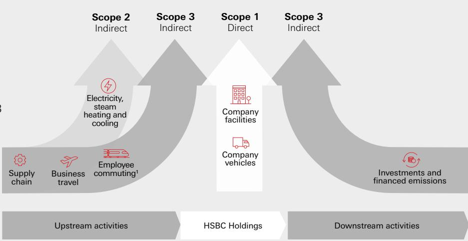
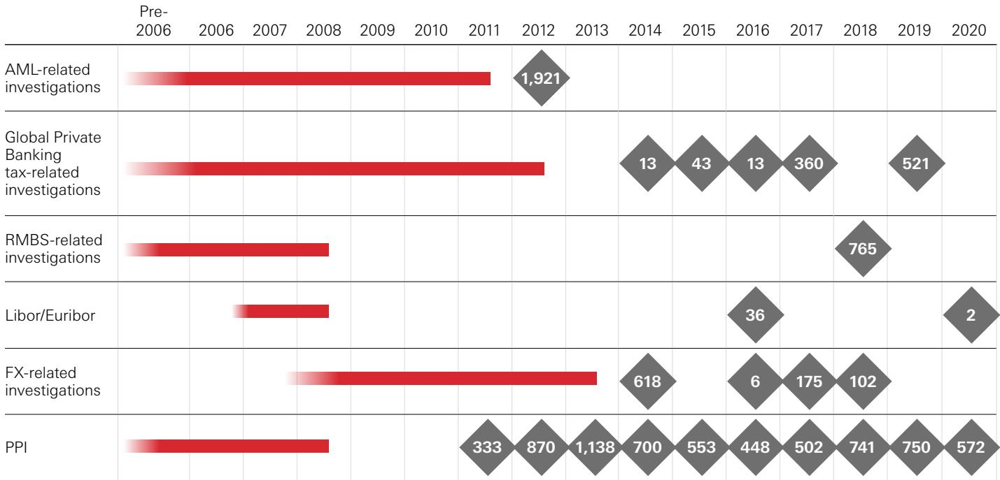
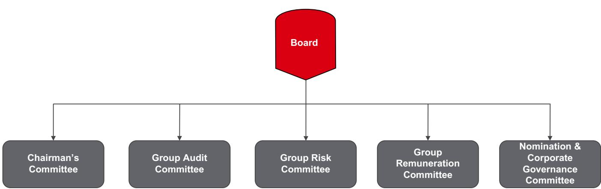

HSBC Holdings plc Annual Report and Accounts 2020

Opening up a world of opportunity

## Contents

## Strategic report Strategic report

2 Highlights   
4 Who we are   
6 Group Chairman’s statement   
8 Group Chief Executive’s review   
12 Our strategy   
16 How we do business   
22 Board decision making and   
engagement with stakeholders   
25 Remuneration   
26 Financial overview   
30 Global businesses   
37 Risk overview   
41 Long-term viability and going   
concern statement   
Environmental, social and   
governance review   
43 Our approach to ESG   
44 Climate   
52 Customers   
62 Employees   
70 Governance   
Financial review   
77 Financial summary   
85 Global businesses and geographical   
regions   
103 Reconciliation of alternative   
performance measures   
Risk review   
107 Our approach to risk   
110 Top and emerging risks   
116 Areas of special interest   
118 Our material banking risks   
Corporate governance report   
196 Group Chairman’s governance statement   
198 Biographies of Directors and senior   
management   
213 Board committees   
229 Directors’ remuneration report   
Financial statements   
267 Independent auditors’ report   
278 Financial statements   
288 Notes on the financial statements   
Additional information   
371 Shareholder information   
377 Abbreviations

## We have changed how we are reporting this year

We have changed our Annual Report and Accounts to embed the content previously provided in our Environmental Social and Governance Update,demonstrating that how we do business is as important as what we do.

This Strategic Report was approved by the Board on 23 February 2021.

## Mark E Tucker

Group Chairman

## A reminder

The currency we report in is US dollars.

## Adjusted measures

We supplement our IFRS figures with non-IFRS measures used by management internally that constitute alternative performance measures under European Securities and Markets Authority guidance and non-GAAP financial measures defined in and presented in accordance with US Securities and Exchange Commission rules and regulations. These measures are highlighted with the following symbol:

> **AI Description:**
> **Source:** `assets/_page_1_Figure_1.jpg`
> 
> **Generated:** 2026-05-25 13:29:19
> 
> ---
> 
> Error analyzing image: model runner has unexpectedly stopped, this may be due to resource limitations or an internal error, check ollama server logs for details (status code: 500)

> **AI Description:**
> **Source:** `assets/_page_1_Figure_2.jpg`
> 
> **Generated:** 2026-05-25 13:27:00
> 
> ---
> 
> Error analyzing image: model runner has unexpectedly stopped, this may be due to resource limitations or an internal error, check ollama server logs for details (status code: 500)

Further explanation may be found on page 28.

None of the websites referred to in this Annual Report and Accounts 2020 (including where a link is provided), and none of the information contained on such websites, are incorporated by reference in this report.

Cover image: Opening up a world of opportunity
We connect people, ideas and capital across the world, opening up opportunities for our customers and the communities we serve.

# Opening up a world of opportunity

Our ambition is to be the preferred international financial partner for our clients.

We have refined our purpose, ambition and values to reflect our strategy and to support our focus on execution.

Read more on our values, strategy and purpose on pages 4, 12 and 16.

## Key themes of 2020

The Group has been – and continues to be – impacted by developments in the external environment, including:

> **AI Description:**
> **Source:** `assets/_page_2_Figure_0.jpg`
> 
> **Generated:** 2026-05-25 13:40:14
> 
> ---
> 
> The image contains a simple red circular icon with a smaller red circle inside, resembling a stylized virus or particle. There are no labels, text, or additional visual elements present in the image. The icon is uniform in color and shape, with no gradients or additional details.

## Covid-19

The Covid-19 outbreak has significantly affected the global economic environment and outlook, resulting in adverse impacts on financial performance, downward credit migration and muted demand for lending.

Read more on page 38.

> **AI Description:**
> **Source:** `assets/_page_2_Figure_1.jpg`
> 
> **Generated:** 2026-05-25 13:39:19
> 
> ---
> 
> The image contains a simple line graph with a red upward arrow. The graph appears to represent a trend over time, with a line that starts low and increases steadily, indicating growth or improvement. The red arrow suggests a positive direction, reinforcing the upward trend.

## Market factors

Interest rate reductions and market volatility impacted financial performance during 2020. We expect low global interest rates to provide a headwind to improved profitability and returns.

Read more on page 26.

> **AI Description:**
> **Source:** `assets/_page_2_Figure_2.jpg`
> 
> **Generated:** 2026-05-25 13:38:08
> 
> ---
> 
> The image is a simple graphic of a globe with a red overlay highlighting the African continent. The globe is stylized with a white background and black outlines of the continents. The red overlay is used to draw attention to the African region, possibly indicating its significance or relevance in the context of the image.

## Geopolitical risk

Levels of geopolitical risk increased with heightened US-China tensions and the UK’s trade negotiations with the EU notably impacting business and investor sentiment. We continue to monitor developments closely.

## Progress in key areas

> **AI Description:**
> **Source:** `assets/_page_2_Figure_3.jpg`
> 
> **Generated:** 2026-05-25 13:38:58
> 
> ---
> 
> Error analyzing image: model runner has unexpectedly stopped, this may be due to resource limitations or an internal error, check ollama server logs for details (status code: 500)

Read more on page 38.

The Group continued to make progress in areas of strategic focus during 2020, including:

## Supporting customers

We continued to support our customers during the Covid-19 outbreak, providing relief to wholesale and retail customers through both market-wide schemes and HSBCspecific measures.

Read more on page 17.

> **AI Description:**
> **Source:** `assets/_page_2_Figure_5.jpg`
> 
> **Generated:** 2026-05-25 13:41:17
> 
> ---
> 
> The image contains a bar chart with a red bar. The chart appears to represent some form of data, with the bars increasing in height from left to right. The chart does not have any labels or annotations, and the background is white. The chart likely represents a comparison or trend over four categories or time periods.

## Strategic progress

We made good progress with our transformation programme in 2020. We have now set out the next phase of our strategic plan.

> **AI Description:**
> **Source:** `assets/_page_2_Figure_6.jpg`
> 
> **Generated:** 2026-05-25 13:42:42
> 
> ---
> 
> Error analyzing image: model runner has unexpectedly stopped, this may be due to resource limitations or an internal error, check ollama server logs for details (status code: 500)

Read more on page 12.

> **AI Description:**
> **Source:** `assets/_page_2_Figure_7.jpg`
> 
> **Generated:** 2026-05-25 13:42:13
> 
> ---
> 
> The image contains a simple red icon of a wind turbine. It is a single, isolated graphic with no additional text or elements. The icon is a stylized representation of a wind turbine, commonly used to symbolize renewable energy or wind power.

## Climate

In October 2020, we set out an ambitious plan to prioritise sustainable finance and investment that supports the global transition to a net zero carbon economy.

> **AI Description:**
> **Source:** `assets/_page_2_Figure_8.jpg`
> 
> **Generated:** 2026-05-25 13:27:47
> 
> ---
> 
> Error analyzing image: model runner has unexpectedly stopped, this may be due to resource limitations or an internal error, check ollama server logs for details (status code: 500)

Read more on page 15.

## Financial performance

Reported profit after tax \$6.1bn (2019: \$8.7bn)

\$0.19 (2019: \$0.30)

(2019: 14.7%)

Read more on our financial overview on page 26.

## Non-financial highlights

30.3%

Women in senior leadership roles. (2019: 29.4%)

## Customer satisfaction

Wealth and Personal Banking markets sustained top-three rank and/or improved in customer satisfaction.

## Sustainable finance and investment

Cumulative total provided and facilitated since 2017. (2019: \$52.4bn)

## 5 out of 8

Commercial Banking markets sustained top-three rank and/or improved in customer satisfaction.

Read more on how we set and define our environmental, social and governance (‘ESG’) metrics on page 18.

## Highlights

Financial performance in 2020 was impacted by the Covid-19 outbreak, together with the resultant reduction in global interest rates. Nevertheless, performance in Asia remained resilient and our Global Markets business delivered revenue growth.

Delivery against our financial targets

Return on average tangible equity ?

3.1%

February 2020 target: in the range of 10% to 12% in 2022.   
(2019: 8.4%)

Adjusted operating expenses ?

\$31.5bn

Target: ≤\$31bn in 2022. (2019: \$32.5bn)

Gross RWA reduction

\$61.1bn

Target: >\$100bn by end-2022.

D Further explanation of performance against Group financial targets may be found on page 26.

## Financial performance (vs 2019)

– Reported profit after tax down 30% to \$6.1bn and reported profit before tax down 34% to \$8.8bn from higher expected credit losses and other credit impairment charges (‘ECL’) and lower revenue, partly offset by a fall in operating expenses. Reported results in 2020 included a \$1.3bn impairment of software intangibles, while reported results in 2019 included a \$7.3bn impairment of goodwill. Adjusted profit before tax down 45% to \$12.1bn.

– Reported revenue down 10% to \$50.4bn, primarily due to the progressive impact of lower interest rates across our global businesses, in part offset by higher revenue in Global Markets. Adjusted revenue down 8% to \$50.4bn.

– Net interest margin of 1.32% in 2020, down 26 basis points (‘bps’) from 2019, due to the impact of lower global interest rates.

– Reported ECL up \$6.1bn to \$8.8bn, mainly due to the impact of the Covid-19 outbreak and the forward economic outlook. Allowance for ECL on loans and advances to customers up from \$8.7bn at 31 December 2019 to \$14.5bn at 31 December 2020.

– Reported operating expenses down 19% to \$34.4bn, mainly due to the non-recurrence of a \$7.3bn impairment of goodwill. Adjusted operating expenses down 3% to \$31.5bn, as cost-saving initiatives and lower performance-related pay and discretionary expenditure more than offset the growth in investment spend.

– During 2020, deposits grew by \$204bn on a reported basis and \$173bn on a constant currency basis, with growth in all global businesses.

– Common equity tier 1 (‘CET1’) ratio of 15.9%, up 1.2 percentage points from 14.7% at 31 December 2019, which included the impact of the cancellation of the fourth interim dividend of 2019 and changes to the capital treatment of software assets.

– After considering the requirements set out in the UK Prudential Regulation Authority’s (‘PRA’) temporary approach to shareholder distributions for 2020, the Board has announced an interim dividend for 2020 of \$0.15 per ordinary share, to be paid in cash with no scrip alternative.

## Outlook and strategic update

In February 2020, we outlined our plan to upgrade the return profile of our risk-weighted assets (‘RWAs’), reduce our cost base and streamline the organisation. Despite the significant headwinds posed by the impact of the Covid-19 outbreak, we have made good progress in implementing our plan.

However, we recognise a number of fundamental changes, including the prospect of prolonged low interest rates, the significant increase in digital engagement from customers and the enhanced focus on the environment.

We have aligned our strategy accordingly. We intend to increase our focus on areas where we are strongest. We aim to increase and accelerate our investments in technology to enhance the capabilities we provide to customers and improve efficiency to drive down our cost base. We also intend to continue the transformation of our underperforming businesses. As part of our climate ambitions, we have set out our plans to capture the opportunities presented by the transition to a low-carbon economy.

We will continue to target an adjusted cost base of \$31bn or less in 2022. This reflects a further reduction in our cost base, which has been broadly offset by the adverse impact of foreign currency translation due to the weakening US dollar towards the end of 2020. We will also continue to target a gross RWA reduction of over \$100bn by the end of 2022. Given the significant changes in our operating environment during 2020, we no longer expect to reach our return on average tangible equity (‘RoTE’) target of between 10% and 12% in 2022 as originally planned. The Group will now target a RoTE of greater than or equal to 10% in the medium term.

We intend to maintain a CET1 ratio above 14%, managing in the range of 14% to 14.5% in the medium term and managing this range down in the longer term. The Board has adopted a policy designed to provide sustainable dividends going forward. We intend to transition towards a target payout ratio of between 40% and 55% of reported earnings per ordinary share (‘EPS’) from 2022 onwards, with the flexibility to adjust EPS for non-cash significant items such as goodwill or intangibles impairments. We will no longer offer a scrip dividend option, and will pay dividends entirely in cash.

For reconciliations of our reported results to an adjusted basis, including lists of significant items, see page 85. Definitions and calculations of other alternative performance measures are included in our ‘Reconciliation of alternative performance measures’ on page 103.
1 Profit attributable to ordinary shareholders, excluding impairment of goodwill and other intangible assets and changes in present value of in-force insurance contracts (‘PVIF’) (net of tax), divided by average ordinary shareholders’ equity excluding goodwill, PVIF and other intangible assets (net of deferred tax).
2 Excludes impact of \$0.10 per share dividend in the first quarter of 2019, following a June 2019 change in accounting practice on the recognition of interim dividends, from the date of declaration to the date of payment.
3 Unless otherwise stated, regulatory capital ratios and requirements are based on the transitional arrangements of the Capital Requirements Regulation in force at the time. These include the regulatory transitional arrangements for IFRS 9 ‘Financial Instruments’, which are explained further on page 173. Leverage ratios are calculated using the end point definition of capital and the IFRS 9 regulatory transitional arrangements. Following the end of the transition period after the UK’s withdrawal from the EU, any reference to EU regulations and directives (including technical standards) should be read as a reference to the UK’s version of such regulation and/or directive, as onshored into UK law under the European Union (Withdrawal) Act 2018, as amended.
4 The fourth interim dividend of 2019, of \$0.21 per ordinary share, was cancelled in response to a written request from the PRA. 2019 has been re-presented accordingly.

### Full Page Description (Page 5)

**Source:** `assets/_page_5_Asset_0.jpg`

**Generated:** 2026-05-25 13:41:02

---

The image is a pie chart with three segments, each representing a different category: WPB (44%), CMB (26%), and GBM (30%). The segments are color-coded: WPB is red, CMB is gray, and GBM is light gray. The chart visually represents the distribution of these categories, with WPB occupying the largest portion of the chart, followed by GBM and then CMB.

# Who we are

## About HSBC

With assets of \$3.0tn and operations in 64 countries and territories at 31 December 2020, HSBC is one of the largest banking and financial services organisations in the world. More than 40 million customers bank with us and we employ around 226,000 full-time equivalent staff. We have around 194,000 shareholders in 130 countries and territories.

## Our values

Our values help define who we are as an organisation, and are key to our long-term success.

We value difference Seeking out different perspectives

We succeed together Collaborating across boundaries

We take responsibility Holding ourselves accountable and taking the long view

We get it done   
Moving at pace and making   
things happen

For further details on our strategy and purpose, see pages 12 and 16.

## Our global businesses

We serve our customers through three global businesses. On pages 30 to 36 we provide an overview of our performance in 2020 for each of our global businesses, as well as our Corporate Centre.

During the year, we simplified our organisational structure by combining Global Private Banking and Retail Banking and Wealth Management to form Wealth and Personal Banking. We also renamed our Balance Sheet Management function as Markets Treasury to reflect the activities it undertakes more accurately and its relationship to our Group Treasury function more broadly. These changes followed realignments within our internal reporting and include the reallocation of Markets Treasury, hyperinflation accounting in Argentina and HSBC Holdings net interest expense from Corporate Centre to the global businesses.

Each of the chief executive officers of our global businesses reports to our Group Chief Executive, who in turn reports to the Board of HSBC Holdings plc.

For further information on how we are governed, see our corporate governance report on page 195.

1 Calculation is based on adjusted revenue of our global businesses excluding Corporate Centre, which is also excluded from the total adjusted revenue number. Corporate Centre had negative adjusted revenue of \$262m in 2020.

Adjusted revenue by global business1

> **AI Description:**
> **Source:** `assets/_page_5_Figure_0.jpg`
> 
> **Generated:** 2026-05-25 13:40:19
> 
> ---
> 
> The image contains a photograph of two individuals in what appears to be a retail or customer service setting. One person is standing and facing the other, who is bent over, possibly interacting with a device or system. The background shows other individuals and what looks like a checkout area with a cash register or similar equipment. The setting suggests a customer service interaction or a transaction process.

Wealth and Personal Banking (’WPB’)

We help millions of our customers look after their day-to-day finances and manage, protect and grow their wealth.

> **AI Description:**
> **Source:** `assets/_page_5_Figure_1.jpg`
> 
> **Generated:** 2026-05-25 13:39:11
> 
> ---
> 
> The image is a photograph of a large container ship at sea. The ship is loaded with numerous shipping containers, stacked in rows and columns. The containers are primarily blue and red, indicating they are likely used for international trade. The ship is seen from an aerial perspective, showing its full length and the vast number of containers it carries. The water around the ship appears calm, suggesting favorable weather conditions for navigation.

## Commercial Banking (‘CMB’)

Our global reach and expertise help domestic and international businesses around the world unlock their potential.

> **AI Description:**
> **Source:** `assets/_page_5_Figure_2.jpg`
> 
> **Generated:** 2026-05-25 13:37:49
> 
> ---
> 
> The image depicts a modern urban landscape with a train station featuring a train on an elevated track. The station is part of a larger transportation network, with a curved roof structure and a platform. In the background, there are tall buildings and a city skyline, suggesting a metropolitan setting. The scene is bathed in warm, golden light, indicating either sunrise or sunset, which adds a serene and picturesque quality to the image. The overall composition highlights the integration of transportation infrastructure with urban architecture.

Global Banking and Markets (’GBM’)

We provide a comprehensive range of financial services and products to corporates, governments and institutions.

## Our global functions

Our business is supported by a number of corporate functions and our Digital Business Services teams, formerly known as HSBC Operations, Services and Technology. The global functions include Corporate Governance and Secretariat, Communications, Finance, Compliance, Human Resources, Internal Audit, Legal, Marketing, Risk and Strategy. Digital Business Services provides real estate, procurement, technology and operational services to the business.

## Our global reach

We aim to create long-term value for our shareholders and capture opportunity. Our goal is to lead in wealth, with a particular focus on Asia and the Middle East. Taking advantage of our international network, we aspire to lead in cross-border banking flows, and to serve mid-market corporates globally. We continue to maintain a strong capital, funding and liquidity position with a diversified business model.

Value of customer accounts by geography
See page 84 for further information on our customers and approach to geographical information.

## Engaging with our stakeholders

> **AI Description:**
> **Source:** `assets/_page_6_Figure_1.jpg`
> 
> **Generated:** 2026-05-25 13:29:15
> 
> ---
> 
> The image is a diagram containing six circular icons, each representing a different stakeholder group in a business context. The icons are color-coded and labeled as follows: Customers (blue), Employees (purple), Investors (green), Communities (orange), Regulators and governments (blue), and Suppliers (teal). Each icon is accompanied by a simple line drawing of a person or group of people, symbolizing the respective stakeholder. The diagram is designed to visually represent the various groups that a business interacts with and should consider in its operations and decision-making processes.

Building strong relationships with our stakeholders helps enable us to deliver our strategy in line with our long-term values, and operate the business in a sustainable way. Our stakeholders are the people who work for us, bank with us, own us, regulate us, and live in the societies we serve and the planet we all inhabit. These human connections are complex and overlap. Many of our employees are customers and shareholders, while our business customers are often suppliers. We aim to serve, creating value for our customers and shareholders. Our size and global reach mean our actions can have a significant impact. We are committed to doing business responsibly, and thinking for the long term. This is key to delivering our strategy.

Our section 172 statement, detailing our Directors’ responsibility to stakeholders, can be found on page 22.

## Multi-award winning

We have won industry awards around the world for a variety of reasons – ranging from the quality of the service we provide to customers, to our efforts to support diversity and inclusion in the workplace.

## A selection of the awards recognising our support of customers during the Covid-19 outbreak includes:

## GREENWICH

Euromoney Awards for Excellence 2020 Global Excellence in Leadership Excellence in Leadership in Asia Excellence in Leadership in the Middle East

Greenwich Associates 2020 – Standout Bank for Corporates in Asia During Crisis Most Distinctive in Helping to Mitigate Impact of Covid-19

We highlight a selection of our other recent wins below.

Euromoney Awards for Excellence 2020 World’s Best Bank for Sustainable Finance World’s Best Bank for Transaction Services Hong Kong’s Best Bank

The Banker Innovation in Digital Banking   
Awards 2020   
Best Digital Bank in Asia

Asia Insurance Industry Awards 2020 Life Insurance Company of the Year

PWMWealth Tech Awards 2020 Best Global Private Bank for Digital Customer Experience

Stonewall Stonewall Top Global Employers List – 2020

# Group Chairman’s statement

The past year brought unprecedented challenges, but our people responded exceptionally well and our performance has been resilient.

> **AI Description:**
> **Source:** `assets/_page_7_Figure_0.jpg`
> 
> **Generated:** 2026-05-25 13:32:51
> 
> ---
> 
> The image contains a photograph of a man wearing a dark suit jacket over a white shirt. He is balding with short hair on the sides and is wearing glasses. The background is out of focus and appears to be an indoor setting with a light, blurred background. There are no charts, graphs, or other visual elements present in the image.

Mark E Tucker Group Chairman

In 2020, we experienced economic and social upheaval on a scale unseen in living memory. Even before the year began, the external environment was being reshaped by a range of factors – including the impact of trade tensions between the US and China, Brexit, low interest rates and rapid technological development. The spread of the Covid-19 virus made that environment all the more complex and challenging.

The Covid-19 pandemic has severely impacted our customers, our colleagues, our shareholders and the communities we serve. The first priority was, and remains, dealing with the public health crisis, but the economic crisis that unfolded simultaneously has also been unprecedented in recent times. The financial services industry has been at the forefront of helping businesses and individuals through the difficulties they have faced, working with governments and regulators towards expected recovery and future growth. I am enormously proud of the professionalism, dedication and energy that my colleagues around the world have demonstrated as they helped ensure our customers received the support they needed – all the while managing their own, at times extremely difficult, situations at home. On behalf of the Board, I would like to express my deepest thanks to them all for the exceptional way they are responding to these most challenging circumstances.

Against this backdrop, HSBC demonstrated a resilient performance. Reported profit before tax was \$8.8bn, a fall of 34%, and adjusted profit before tax was \$12.1bn, down 45%. Within this, Global Banking and Markets performed particularly well, while Asia was once again by far the most profitable region. Deposits also increased significantly across the Group, reinforcing the strength of our funding and liquidity positions.

In response to a request from the UK’s Prudential Regulation Authority, we cancelled the fourth interim dividend for 2019. We also announced that, until the end of 2020, we would make no quarterly or interim dividend payments or accruals in respect of ordinary shares. This was a difficult decision and we deeply regret the impact it has had on our shareholders. We are therefore pleased to restart dividend payments at the earliest opportunity. The Board has announced an interim dividend of \$0.15 for 2020, and adopted a policy designed to provide sustainable dividends in the future.

## Board of Directors

The confirmation of Noel Quinn as permanent Group Chief Executive underlined the Board’s belief that he is the best person to lead the delivery of the strategic plan. We look forward to working closely with Noel and the management team as they focus on executing our strategic priorities in 2021.

Jamie Forese, Steve Guggenheimer and Eileen Murray joined the Board as independent non-executive Directors in 2020. All three have already demonstrated the valuable skills, expertise and experience they bring across a wide range of areas, including technology. We have also announced that Dame Carolyn Fairbairn will join the Board as an independent non-executive Director. Carolyn will bring a wealth of relevant experience, and her appointment will be effective from 1 September 2021.

# “There are many opportunities ahead for a bank with HSBC’s competitive strengths.”

As reported in the Annual Report and Accounts 2019, Sir Jonathan Symonds and Kathleen Casey retired from the Board last year. Today we also announced that Laura Cha will step down from the Board immediately after our 2021 Annual General Meeting (‘AGM’) in May. I would like to thank Jon, Kathy and Laura for the enormous contributions they made to HSBC during their years of service. We are now in the advanced stages of a search for suitable candidates to join and strengthen the Board, and I will update further on the outcome of this search in due course.

Like the rest of the Group, the Board had to adapt its ways of working in 2020. We met virtually for much of the year, which brought benefits including less travel and more frequent, shorter meetings. It will be important for us to consider how we retain what has worked well over the last year once restrictions are lifted and it becomes possible to travel once again.

The Board enjoys the constructive discussions that we have with shareholders at the AGM in the UK and the Informal Shareholders’ Meeting in Hong Kong, so it was a matter of regret that we did not meet in person in 2020. While we did maintain regular contact with shareholders throughout the year, we will resume our face-to-face engagement with shareholders in the UK, Hong Kong and more widely, as soon as is practicable.

## External environment

After the significant deterioration in global economic conditions in the first half of the year due to the Covid-19 pandemic, there were signs of improvement in the second half, especially in Asia. The most impressive economic recovery has been in China – still the biggest driver of global growth – where international trade is rebounding most strongly. The signing of the Regional Comprehensive Economic Partnership should further boost intra-regional activity across Asia, while the recent political agreement between the EU and China on an investment deal should, once ratified, bolster the already significant two-way investment flows.

Covid-19 infection levels remain very high in Europe, the US and Latin America, and new variants of the virus have spread quickly. This has necessitated new lockdown measures in the UK and other countries. While the deployment of multiple vaccines means we are more optimistic about the future, there is clearly still some way to go before life can return to something like normality. Recovery will therefore take longer in these economies, with growth more likely later in 2021 in these economies.

The agreement of a trade deal between the UK and EU prior to the end of 2020 provides some certainty for cross-border trade. However, the reduced access for financial services under these new arrangements means that further work is needed to maintain the level playing field that has existed until now. Given the many benefits that the UK financial services industry brings to the UK and EU economies, equivalence must be a key priority for both parties.

The geopolitical environment remains challenging – in particular for a global bank like HSBC – and we continue to be mindful of the potential impact that it could have on our strategy. We continue to engage fully and frequently with all governments as we seek to do everything we possibly can to help our customers navigate an increasingly complex world.

## Capturing future opportunities

Given the external environment, it is vital we stay focused on what we can control. The Board is confident there are many opportunities ahead for a bank with HSBC’s competitive strengths. This makes it all the more important that we position ourselves to capture them.

While we prioritised supporting our customers and our people during the pandemic, we made good progress against the three strategic priorities announced in February 2020 – reallocating capital from underperforming parts of the business, reducing costs and simplifying the organisation. In particular, the Board worked closely with the management team over the course of the year on plans to accelerate progress and investment in key areas of growth, which include our Asian franchise, our wealth business and new technology across the Group.

We are today unveiling the outcome of extensive consultation with our people and customers on the Group’s purpose and values. Being clear about who we are, what we stand for and how this connects to our strategy is an important part of how we align and energise the organisation to create long-term value for all those we work with and for – our investors, customers, employees, suppliers and the communities we serve. The Board fully endorses the outcome of this work.

Our commitment to create sustainable value is demonstrated by the new climate ambitions we announced in October 2020. The most significant contribution that HSBC can make to the fight against climate change is to bring our customers with us on the transition to a low-carbon future. Our goal of being net zero for our financed emissions by 2050 sends an important signal to our investors, our customers and our people – if our clients are prepared to change their business models and make that transition, we will help and support them to do so. HSBC was also delighted to be one of the founding signatories of the Terra Carta, which was launched last month by HRH The Prince of Wales’ Sustainable Markets Initiative. Further details about all of the steps we are taking towards a more sustainable future are set out in the ESG review, which for the first time is included within the Annual Reportand Accounts 2020.

Finally, 2020 underlined once again that our people are the driving force behind our business. I would like to reiterate how enormously grateful I am to my colleagues for the great dedication and care they showed to our customers and to each other during such testing times. Further empowering and enabling them to do their jobs and execute our strategic priorities is the key to our future success.

Mark E Tucker Group Chairman

23 February 2021

# Group Chief Executive’s review

With a blueprint for the future and a renewed purpose to guide us, we are building a dynamic, efficient and agile global bank with a digital-first mindset, capable of providing a world-leading service to our customers and strong returns for our investors.

> **AI Description:**
> **Source:** `assets/_page_9_Figure_0.jpg`
> 
> **Generated:** 2026-05-25 13:36:54
> 
> ---
> 
> The image is a professional portrait of a person wearing a dark suit, white shirt, and patterned tie. The background is a gradient of light blue shades. The person is smiling and looking directly at the camera. There are no charts, graphs, or other visual elements present in the image.

Noel Quinn Group Chief Executive

In 2020, HSBC had a very clear mandate – to provide stability in a highly unstable environment for our customers, communities and colleagues. I believe we achieved that in spite of the many challenges presented by the Covid-19 pandemic and heightened geopolitical uncertainty.

Our people delivered an exceptional level of support for our customers in very tough circumstances, while our strong balance sheet and liquidity gave reassurance to those who rely on us. We achieved this while delivering a solid financial performance in the context of the pandemic – particularly in Asia – and laying firm foundations for our future growth. I am proud of everything our people achieved and grateful for the loyalty of our customers during a very turbulent year.

## 2020

Helping our customers emerge from the Covid-19 pandemic in a sustainable position was our most pressing priority. We did this by equipping our colleagues to work from home at the height of the pandemic, and keeping the vast majority of our branches and all of our contact centres open. Our investment in our digital capabilities – both in 2020 and in previous years – enabled our customers to access more services remotely, and we worked closely with our regulators around the world to open new digital channels in a safe and secure way. In total, we provided more than \$26bn of relief to our personal customers and more than \$52bn to our wholesale customers, both through government schemes and our own relief initiatives. We also played a vital role in keeping capital flowing for our clients, arranging more than \$1.9tn of loan, debt and equity financing for our wholesale customers during 2020.

Even in the middle of the pandemic, we continued to look to the future. In October, we announced our ambition to become a net zero bank by 2050, supporting customers through the transition to a low-carbon economy and helping to unlock next-generation climate solutions. If the Covid-19 pandemic provided a shock to the system, a climate crisis has the potential to be much more drastic in its consequences and longevity. We are therefore stepping up support for our clients in a material way, working together to build a thriving low-carbon economy and focusing our business on helping achieve that goal.

The actions we outlined in February 2020 are largely on track or ahead of where we intended them to be, despite the complications of the pandemic. We renewed and re-energised the senior management team, with around three-quarters of the Group Executive Committee in post for just over a year or less. Our business is more streamlined than it was a year ago, with three global businesses instead of four and increased back-office consolidation. Costs are down materially, with over \$1bn of gross operating costs removed during 2020. We are also already more than half-way towards our target to reduce at least \$100bn of gross riskweighted assets by 2022. Unfortunately, the changed interest-rate environment means we are no longer able to achieve a return on tangible equity of 10% to 12% by 2022. We will now target a return on tangible equity of 10% or above over the medium term.

The world around us changed significantly in 2020. Central bank interest rates in many countries fell to record lows. Pandemic-related lockdowns led to a rapid acceleration in the shift from physical to digital banking. Like many businesses, we learned that our people could be just as productive working from

# “Helping our customers emerge from the Covid-19 pandemic in a sustainable position was our most pressing priority.

home as in the office. Also, as the world resolved to build back responsibly from the pandemic, governments, businesses and customers united to accelerate a low-carbon transition that works for all.

All of these things caused us to adjust and reinforce elements of our strategy to fit this new environment. The growth plans that we have developed are a natural progression of our February 2020 plans. They aim to play to our strengths, especially in Asia; to accelerate our technology investment plans to deliver better customer service and increased productivity; to energise our business for growth; and to invest further in our own low-carbon transition and that of our customers. They are also designed to deliver a 10% return on tangible equity over the medium term in the current low interestrate environment.

## Our purpose

As we charted the next stage of HSBC’s journey, we also reflected on our purpose as a business. We consulted widely both internally and externally, speaking to thousands of colleagues and customers, and looked deeply into our history. The same themes came up again and again.

HSBC has always focused on helping customers pursue the opportunities around them, whether as individuals or businesses. Sometimes those opportunities are clear and visible, and sometimes they are far from obvious. Sometimes they arise in the next street, and sometimes on the next continent. Sometimes they exist in the status quo, and sometimes they are a product of great social or economic change. But always, they

represent a chance for our customers to grow and to help those close to them – protecting, nurturing, building.

‘Opening up a world of opportunity’ both captures this aim and lays down a challenge for the future. Opportunity never stands still. It changes and evolves with the world around us. It is our job to keep making the most of it, and to find and capture it with a spirit of entrepreneurialism, innovation and internationalism that represents HSBC at its very best. This is the essence of what our plans intend to deliver, and what we intend to keep delivering for our customers, colleagues and communities as we navigate change and complexity together.

## Financial performance

The pandemic inevitably affected our 2020 financial performance. The shutdown of much of the global economy in the first half of the year caused a large rise in expected credit losses, and cuts in central bank interest rates reduced revenue in rate-sensitive business lines. We responded by accelerating the transformation of the Group, further reducing our operating costs and moving our focus from interest-rate sensitive business lines towards fee-generating businesses. Our expected credit losses stabilised in the second half of the year in line with the changed economic outlook, but the revenue environment remained muted.

As a consequence, the Group delivered \$8.8bn of reported profit before tax, down 34% on 2019, and \$12.1bn of adjusted profits, down 45%. Our Asia business was again the major contributor, delivering \$13bn of adjusted profit before tax in 2020.

Adjusted revenue was 8% lower than in 2019. This was due mainly to the impact of interest rate cuts at the start of the year on our deposit franchises in all three global businesses. By contrast, our Global Markets business benefited from increased customer activity due to market volatility throughout the year, growing adjusted revenue by 27%.

We made strong progress in reducing our operating expenses. A combination of our cost-saving programmes, cuts in performance-related pay and lower discretionary spending due to the Covid-19 pandemic helped to reduce our adjusted operating expenses by \$1.1bn or 3%.

## Response to Covid-19

Our operations have stayed highly resilient and we are participating in several Covid-19 relief measures.

Approximately

85%

of our employees are now equipped to work from home.

We provided over

\$26bn

of relief to our personal customers.

Our investment plans remain essential to the future of the business. We continued to invest heavily in technology while managing costs down, spending \$5.5bn during 2020.

Our funding, liquidity and capital remain strong. We grew deposits by \$173bn on a constant currency basis, with increases across all three global businesses. Our common equity tier one ratio was 15.9% on 31 December 2020.

## Our shareholders

It was a difficult year for our shareholders. The Covid-19 pandemic and the impact of geopolitics weighed heavily on our share price throughout 2020. In March, we cancelled the payment of our fourth interim dividend for 2019 at the request of our lead regulator, and also agreed not to make any quarterly or interim dividend payments until the end of 2020. This particularly affected shareholders who rely on our dividend for income. It was a priority for the management team to get back to being able to pay dividends by the end of the year, and we were pleased to be able to recommend the payment of an interim dividend for 2020.

Dividends are hugely important, but so is capacity for growth. To deliver both, we are adopting a new policy designed to provide sustainable dividends, offering good income while giving management the flexibility to reinvest capital to grow the firm over the medium term. We will consider share buy-backs, over time and not in the near term, where no immediate opportunity for capital redeployment exists. We will also no longer offer a scrip dividend option, and will pay dividends entirely in cash.

The last 12 months were tough, but I am highly focused on turning our performance around in 2021 and beyond. I strongly believe that the combination of our growth plans and our new dividend policy will unlock greater value for our shareholders in the years to come.

## Opening up a world of opportunity

‘Opening up a world of opportunity’ is more than a purpose – it is a statement of intent. Everything that we plan to do over the next decade is designed to unlock opportunity for our stakeholders, whether customers, colleagues, shareholders or communities. We intend to do this by building a dynamic, efficient and agile global bank with a digital-first mindset, capable of providing a world-leading service to our customers and strong returns for our investors. We will also need to focus intently on the areas where we excel, and to foster a commercial and entrepreneurial culture with a conviction to get things done. We believe we can achieve this in four ways.

First, we plan to focus on and invest in the areas in which we are strongest. In Wealth and Personal Banking, we aim to become a market-leader for high net worth and ultra high net worth clients in Asia and the Asian diaspora, and to invest in our biggest retail markets where the opportunity is greatest. In Commercial Banking, we want to remain a global leader in cross-border trade, and to lead the world in serving mid-market corporates internationally. In Global Banking and Markets, we intend to invest to capture trade and capital flows into and across Asia, while connecting global clients to Asia and the Middle East through our international network.

Second, we intend to increase the pace at which we digitise HSBC through higher levels of technology investment. This underpins

everything that we want to achieve. It is how we intend to win new customers and retain them, to become more agile and efficient, to create richer, seamless customer journeys, and to build strong and innovative partnerships that deliver excellent benefits for our customers. We have an opportunity to meet the growing market need for sophisticated, robust and rapid payment solutions, and to lead our industry in applying digital solutions to analogue services, such as trade. We therefore intend to protect technology investment throughout the cycle, even as we reduce spending elsewhere.

Third, we want to energise HSBC for growth through a strong culture, simple ways of working, and by equipping our colleagues with the future skills they need. Giving life to our purpose will be critical to building the dynamic, entrepreneurial and inclusive culture that we want to create, as will removing the remaining structural barriers that sometimes stop our people from delivering for our customers. We need to change the way we hire to build skills and capabilities in areas that are different to what we have needed historically, including data, artificial intelligence, and sustainable business models. Our expanded HSBC University will also help to upskill and reskill our people, while fostering more of the softer skills that technology can never replace.

Fourth, we will seek to help our customers and communities to capture the opportunities presented by the transition to a low-carbon economy. Accelerating this transition is the right thing to do for the environment, but also the right thing commercially. We intend to build on our market-leading position in sustainable finance, supporting our clients with \$750bn to \$1tn of sustainable financing and investment over the next 10 years. We also intend to unlock new climate solutions by building one of the world’s leading climate managers – HSBC Pollination Climate Asset Management – and helping to transform sustainable infrastructure into a global asset class. These will help us achieve our ambition to align our portfolio of financed emissions to the Paris Agreement goal to achieve net zero by 2050.

## Championing inclusion

I believe passionately in building an inclusive organisation in which everyone has the

# ”I believe passionately in building an inclusive organisation in which everyone has the opportunity to fulfil their potential”

opportunity to fulfil their potential. Failing to do so isn’t just wrong, it is totally self-defeating. It means you don’t get the best out of the talent you have, and sends the wrong signals to the people you want to recruit. An inclusive environment is the foundation of a truly diverse organisation, with all of the rewards that brings.

There is much still to do, but we are moving in the right direction. More than 30% of our senior leaders are female, in line with the goal we set to achieve by the end of 2020. I want that number to increase to at least 35% by 2025, and we have a number of initiatives in place to help achieve it. In May, we launched a new global ethnicity inclusion programme to better enable careers and career progression for colleagues from ethnic minorities, and in July, we made a series of commitments to address feedback from Black colleagues in particular. These included a commitment to more than double our number of Black senior leaders by 2025.

I am particularly proud that during a difficult year, which included a large-scale redundancy programme, employee sentiment improved within HSBC. Around 71% of my colleagues said that they found HSBC to be a great place to work, up from 66% in 2019. However, the view varies across employees from different groups. We know, for example, that employees with disabilities or who identify as ethnic minorities do not feel as engaged as

others. I take these gaps very seriously. Better demographic data globally will help us benchmark and measure our progress more effectively, and we are taking concerted steps to be able to capture that information where possible.

## 2021 outlook

We have had a good start to 2021, and I am cautiously optimistic for the year ahead. While a spike in Covid-19 infection rates led to renewed lockdown measures in many places at the start of 2021, the development of multiple vaccines gives us hope that the world will return to some form of normality before long. Nonetheless, we remain reactive to the ebb and flow of the Covid-19 virus and prepared to take further steps to manage the economic impact where necessary.

The geopolitical uncertainty that prevailed during 2020 remains a prominent feature of our operating environment. We are hopeful that this will reduce over the course of 2021, but mindful of the potential impact on our business if levels remain elevated. We remain focused on serving the needs of our customers, colleagues and communities in all our markets.

## Our people

I would like to pay tribute to my colleagues and all those who supported them throughout a difficult year. HSBC is a community of around 226,000 colleagues – but it relies just as much on the family, friends and support networks that help them be the best they can be. Our people did extraordinary things in 2020, but it asked a lot of those around them. I am hugely grateful to everyone who helped HSBC – whether directly or indirectly – in supporting our customers, communities and each other over the last 12 months.

Noel Quinn Group Chief Executive

23 February 2021

### Full Page Description (Page 13)

**Source:** `assets/_page_13_Asset_0.jpg`

**Generated:** 2026-05-25 13:33:43

---

The image is a line graph showing the trend of a specific metric over time for three regions: the US, the UK, and Hong Kong. The x-axis represents the years from 2018 to 2021, and the y-axis represents the metric's value, ranging from 0.0 to 3.0. The graph includes three lines, each representing the data for the US, the UK, and Hong Kong, respectively. The US line is gray, the UK line is black, and the Hong Kong line is red. The graph highlights a general downward trend in all three regions, with Hong Kong showing the most significant decline. Notably, the Hong Kong line dips sharply around 2020, indicating a significant drop in the metric during that year.

### Full Page Description (Page 13)

**Source:** `assets/_page_13_Asset_1.jpg`

**Generated:** 2026-05-25 13:34:10

---

The image is a bar chart comparing mobile and online spending across four countries: the US, UK, China, and India. The chart uses two sets of bars, one for mobile spending (light gray) and one for online spending (dark gray), with the average spending level indicated by a dashed line at approximately 35. The countries are listed on the x-axis, and the y-axis represents the spending amount in percentage terms. The chart shows that mobile spending is consistently higher than online spending across all four countries, with India having the highest mobile spending and China having the highest online spending.

# Our strategy

With continued delivery against our February 2020 commitments, we are now in the next stage of our strategic plan, which responds to the significant shifts during the year and aligns to our refreshed purpose, values and ambition.

## Progress on our 2020 commitments

In February 2020, we outlined our plan to upgrade our returns profile through recycling risk-weighted assets (‘RWAs’) out of lowreturn franchises into higher-performing ones, reducing our cost base and streamlining our organisation.

During 2020, in spite of significant headwinds posed by the impact of the Covid-19 outbreak across our network, we made significant progress on delivering against the ambitions we outlined. We delivered \$1bn of cost programme saves. We also reduced gross RWAs by \$52bn, including \$24bn from our non-ring-fenced bank in Europe and the UK, and are currently on track to meet the greater than \$100bn target outlined by 2022.

We took bold steps to simplify our organisation, including the merger of Retail Banking and Wealth Management and Global Private Banking to form Wealth and Personal

Banking. We also reduced management layers in Global Banking and Markets and our non-ring-fenced bank in Europe and the UK. We have built a strong capital position, ending the year with a CET1 ratio of 15.9%. Our return on tangible equity (‘RoTE’) of 3.1% was negatively impacted by the Covid-19 outbreak and the challenging macroeconomic environment, including lower interest rates and higher expected credit losses.

## Responding to the new environment

There was a set of fundamental shifts in 2020 that profoundly impacted our organisation as well as the wider financial services sector. We have adapted our strategy accordingly.

Low interest-rate environment Interest rates are expected to remain lower for longer, resulting in a more difficult revenue environment for the financial services sector.

The new digital experience economy Remote working and global lockdowns due to the Covid-19 outbreak have increased our customers’ propensity and preference to engage digitally.

Evolution of major interbank rates1 Three-month interbank oered rates (%)

Increased focus on sustainability The demand for sustainable solutions and green finance rose to new highs in 2020.

Digital banking usage up c.30%2 in the industry

We are responding by targeting fee income growth in wealth and wholesale banking products and improving cost efficiencies.

We are responding by increasing investments in technology across our customer platforms.

1 Source: Datastream.

We stepped up our climate ambitions – we aim to be a net zero bank and support our clients in their transition with \$750bn to \$1tn of financing.

2 Source: Bain & Company Covid-19 Pulse Survey, July 2020; Overall sample: 10,000.

3 Fourth quarter of 2020 vs fourth quarter of 2019.

4 Source: Dealogic.

## Shifting capital to areas with the highest returns and growth

We are responding to the changes in our operating environment, and building on our 2020 commitments. Our strategy includes accelerating the shift of capital to areas, principally Asia and wealth, that have demonstrated the highest returns and where we have sustainable advantage through scale. Our international network remains a key competitive advantage and we will continue to support cross-border banking flows between major trade corridors. Supported by these shifts, we are aiming to reach mid-single-digit revenue growth in the medium to long term1 , with a higher proportion of our revenue coming from fee and insurance income.

## Capital allocation

(as a % of Group tangible equity2)

Medium to long term

## Wealth and Personal Banking

(as a % of Group tangible equity3)

## Fees and insurance

(as a % of total revenue)

1 Medium term is three to four years; long term is five to six years.

2 Based on tangible equity of the major legal entities excluding associates, Holdings companies, consolidation adjustments, and any potential inorganic actions. 3 WPB tangible equity as a share of tangible equity allocated to the global businesses (excluding Corporate Centre). Excludes Holdings companies, consolidation adjustments, and any potential inorganic actions.

## Group targets, dividend and capital policy

To support the ambitions of our strategy, we have revised our Group targets, dividend and capital policy.

(on December 2020 average exchange rate; or ≤\$30bn using full year 2020 average exchange rate)

(manage in 14% to 14.5% range over medium term2 , and manage the range down further long term2 )

from 2022 onwards

(vs 10% to 12% in 2022 in February 2020 commitment)

We have increased our 2022 cost reduction target by \$1bn and we plan to keep costs stable from 2022. We also plan to reduce tangible equity in the US and in our non-ring-fenced-bank in Europe and the UK, and increase tangible equity in Asia and in Wealth and Personal Banking. Dividends could be supplemented by buy-backs or special dividends, over time and not in the near term4 . We will also no longer offer a scrip dividend option, and will pay dividends entirely in cash. Given the significant changes in our operating environment during 2020, we no longer expect to reach our RoTE target of between 10% and 12% in 2022 as originally planned.

1 Excludes any inorganic actions.

2 Medium term is three to four years; long term is five to six years.

3 We intend to transition towards a target payout ratio of between 40% and 55% of reported earnings per ordinary share (‘EPS’) from 2022 onwards, with the flexibility to adjust EPS for non-cash significant items, such as goodwill or intangibles impairments.

4 Should the Group find itself in an excess capital position absent compelling investment opportunities to deploy that excess.

## Our strategy

We have embedded our purpose, values and ambition into our strategy. Our purpose is ‘Opening up a world of opportunity’. Our values are: we value difference; we succeed together; we take responsibility; and we get it done. Our ambition is to be the preferred international financial partner for our clients. Our strategy centres around four key areas: focus on our areas of strengths; digitise at scale to adapt our operating model for the future; energise our organisation for growth; and support the transition to a net zero global economy.

## Focus on our strengths

## In our global businesses

In each of our global businesses, we will focus on areas where we are strongest and have significant opportunities for growth. We aim to invest approximately \$6bn in Asia1 , where we intend to drive double-digit growth in profit before tax in the region in the medium to long term2 .

## Wealth and Personal Banking

Our goal is to lead in wealth, with a particular focus on Asia and the Middle East, while investing in our largest retail markets such as Hong Kong and the UK. Over the medium to long term, we intend to grow wealth revenue at more than 10% compound annual growth rate, and grow Asia wealth assets under management faster than the market. In support of these ambitions, we aim to: capture opportunities to serve high and ultra high net worth segments across Asia, especially in China, south-east Asia, Hong Kong and Singapore; deploy our manufacturing capabilities at scale in insurance and asset management; and build propositions that facilitate client origination from our wholesale businesses.

## Commercial Banking

Taking advantage of our international network, we aspire to lead in supporting cross-border trade and in serving mid-market corporates globally. We plan to accelerate international client acquisition and deepen our share of wallet in cross-border services. We aim to develop front-end ecosystems to drive international mid-market client acquisition at scale. We plan to improve SME propositions in key markets with digital sales and service journeys. We will also continue to invest in our front-end platforms for Global Liquidity and Cash Management, Global Trade and Receivables Finance and Foreign Exchange to drive more fee income and accelerate our asset distribution.

## Global Banking and Markets

We will continue to invest in Global Banking and Markets as a leading international bank in Asia and the Middle East, with a global network to support trade and capital flows. We aim to invest in areas such as: enhancing digital platforms for our Asia wealth propositions, including structured products and foreign exchange; market access and execution capabilities in Global Markets and Securities Services; and expansion of our investment banking coverage across Asia. The next five years should see Global Banking and Markets pivot to a less volatile and higher-returns model, relying less on our balance sheet, and focusing more on the growing capital markets opportunity in Asia and the Middle East.

We aim to invest more than

in Asia over five years to 20251 .

## We aim to invest approximately \$2bn

across global platforms3 over five years to 20251 .

## We aim to invest approximately \$0.8bn

in Asia over five years to 20251 .

## Continued execution of our transformation programme

To help create capacity for growth, we are refocusing our US business, our non-ring-fenced bank in Europe and the UK, and our Global Banking and Markets business.

A focused international business in the US We will continue to invest in our substantial corporate and institutional franchise in the US over the medium to long term, including taking actions to further increase international connectivity and revenue in other geographies where HSBC and our US client base have a strong presence around the world including Asia, the Middle East, the UK and continental Europe. We continue to explore strategic options with respect to our US retail franchise, looking to focus on our high net worth, Jade and Premier client base and wealth management products, while reviewing other options in respect of our retail banking presence.

## Our non-ring-fenced bank in Europe and the UK

Our non-ring-fenced bank will focus on a wholesale footprint that serves international customers both outbound and inbound within our network. We intend to continue investing in our transaction banking franchise that has strong linkage to Asia. We are continuing with the strategic review of our retail banking operations in France and are in negotiations in relation to a potential sale, although no decision has yet been taken. If any sale is implemented, given the underlying performance of the French retail business, a loss on sale is expected. We simplified our operating model, with shared services between our two hubs in London and Paris. We plan to continue reducing complexity in our RWA and cost consumption, and we aim to reduce costs5 by approximately 20% by 2022.

Commercial Banking and Global Banking revenue4 (\$bn)

Our Global Banking and Markets business will refocus on Asia and the Middle East. We aim to be the pre-eminent corporate and investment bank in Asia, focusing on opportunities such as the regionalisation of trade and capital flows and the rise in wealth creation. We will focus on serving clients into and within Asia and the Middle East, and providing global institutions with access to developed and emerging markets. We are redeploying capital and moving centres of excellence in Global Markets and Global Banking closer to clients in Asia as we allocate investments to the region.

## Our Global Banking and Markets business

RWA5 (\$bn)

1 Consists of ‘growth investment’, which refers to investment in strategic business growth (including the build-out of front-line staff).

2 Medium term is three to four years; long term is five to six years.

3 Commercial Banking platforms will be tested in Asia and rolled out globally thereafter.

4 Including Global Liquidity and Cash Management and Global Trade and Receivables Finance revenue.

5 Excludes any inorganic actions.

6 Gross RWA saves of \$24.4bn achieved in 2020, largely offset by changes in asset size and quality, and updates to models, methodology and policy.

### Full Page Description (Page 16)

**Source:** `assets/_page_16_Asset_0.jpg`

**Generated:** 2026-05-25 13:36:35

---

The image contains a horizontal bar chart with two sets of bars representing "Investments" and "Business-as-usual activities" for the years 2018, 2019, 2020, and 2022. The chart shows the following data:

- In 2018, investments were 4.7 units, and business-as-usual activities were not explicitly shown.
- In 2019, investments increased to 5.3 units.
- In 2020, investments further increased to 5.5 units.
- In 2022, investments reached 5.5 units, which is the same as in 2020.

The chart uses red bars for investments and gray bars for business-as-usual activities, with the years listed on the x-axis and the values on the y-axis.

## Digitise at scale

We plan to grow investments1 at a compound annual growth rate of approximately 7% to 10% from 2019 to 2022. We will focus our investments in areas such as technology to improve our customers’ digital experiences while ensuring security and resilience. These investments will be funded in part by using technology to drive down costs, including a reduction in manual client processes and a reduction in our commercial real estate footprint.

## Investing in technology

We aim to deliver excellent customer experience throughout our network, including through the use of straight-through processing for payments, and through partnerships with big technology firms and fintechs for innovation support. We also intend to build platforms for higher front-end productivity, including arming our front-line staff with data analytics and visualisation for key insights. We plan to automate our middle and back office by, for example, integrating machine-learning to improve analytics capabilities. We also plan to build solutions to

## Energise for growth

We are moving to a leaner and simpler organisation that is energised and fit for the future.

## Inspire a dynamic culture

We intend to re-energise our culture to succeed with purpose and bring our values to life. We also aim to adopt future ways of working. To support these objectives, we secured inputs from approximately 120,000 colleagues and engaged with over 2,500 customers to help shape our renewed purpose and values, which have been embedded into our strategy. Furthermore, we are launching new leadership expectations that help to: give life to our purpose; unleash our organisation’s potential; and see through our actions.

## Transition to net zero

Our ambition is to support the transition to a net zero global economy.

## Becoming a net zero bank

We are making changes both in our own operations and for our customers through our financing portfolio. We aim to bring our operations and supply chain to net zero by 2030 or sooner. We also plan to align our financed emissions – the carbon emissions of our portfolio of customers – to the Paris Agreement goal to achieve net zero by 2050 or sooner.

free up office footprint, supported by a shift to a more agile way of working and more efficiencies through reduced headcount.

Driving down our cost base We plan to deliver \$5bn to \$5.5bn of cost programme saves from 2020 to 2022, supporting a decline of our cost base to \$31bn or less by 2022 (using December 2020 average exchange rate) or \$30bn or less (using full year 2020 average exchange rate). We plan to keep costs broadly stable from 2022, while increasing the proportion of investment.

## Champion inclusion

We aim to increase diverse representation, particularly in the senior levels of our organisation. In 2020, we achieved more than 30% of female senior leadership, and we intend to increase to more than 35% by 2025. We endeavour to close the gaps in employee engagement in under-represented groups. We are also focusing on the quality and reporting of ethnicity data and benchmarking our actions. Our progress to date includes race commitments to at least double the number of Black employees in senior leadership roles globally by 2025 and recognition within Stonewall’s 2020 Top Global Employers Index for LGBT+ staff.

## Supporting our customers

Our aim is to provide between \$750bn and \$1tn of sustainable finance and investment by 2030 to support our customers in their transition to lower carbon emissions.

## Unlocking new climate solutions

We are working with a range of partners to increase investment in natural resources, clean technology and sustainable infrastructure. We also plan to donate \$100m to a programme that will support climate solutions to scale over the next five years.

## \$1bn

increase in our 2022 cost reduction target (≤\$30bn based on full year 2020 exchange rate vs ≤\$31bn in our February 2020 commitments)

We plan to deliver

## \$5bn to \$5.5bn

of cost programme saves from 2020 to 2022. (vs \$4.5bn in February 2020 commitments)

We plan to spend approximately

## \$7bn

in costs to achieve to help deliver our cost saves. (vs \$6bn in February 2020 commitments)

1 ‘Investment’ includes strategic business growth (including build-out of front-line staff), and other strategic, regulatory, and technology investment (including amortisation).

## Develop future skills

To energise our colleagues, we are setting out initiatives to help develop their future skills and capabilities. We aim to deepen the prevalence of digital, professional and enabling skills across the organisation. Our accomplishments to date include expanding HSBC University courses on future skills, digitalisation and sustainability. Moreover, we are deploying third-party platforms such as Degreed, for educational technology, and Gloat, for career development.

We address the progress made on our commitments in a number of different sections of this Annual Report and Accounts 2020 and beyond. For more information on our climate strategy, please refer to the below.

## Our ESG review can be found on page 42.

A summary of our fourth Task Force on Climate-related Financial Disclosures (‘TCFD’) can be found on page 20, and our TCFD Update 2020 can be found at www.hsbc.com/esg.

# How we do business

We conduct our business intent on supporting the sustained success of our customers, people and other stakeholders.

## Our approach

We recognise that it is important to be clear about who we are and what we stand for to create long-term value for our stakeholders. This will help us deliver our strategy and operate our business in a way that is sustainable.

Following an extensive consultation with our people and customers, we refined our purpose and values. Our new purpose is ‘Opening up a world of opportunity’ and we aim to be the preferred international financial partner for our clients.

To achieve this in a way that is sustainable, we are guided by our values: we value difference; we succeed together; we take responsibility; and we get it done.

## Our Covid-19 actions

Having a clear purpose and strong values has never been more important, with the Covid-19 pandemic testing us all in ways we could never have anticipated. As the world changed over the course of 2020, we adapted to new ways of working and endeavoured to provide support to our customers during this challenging period.

We kept the majority of our branches and all of our contact centres open. To help achieve this, we equipped 85% of our colleagues to be able to work from home, and provided extra resources and support to help them manage the mental and physical health challenges of the pandemic.

We did not apply for government support packages for our employees across the countries and territories in which we operate.

On the following page, we have set out further ways that we supported each of our stakeholders.

## Fair outcomes

In 2020, we continued to promote and encourage good conduct through our people’s behaviours and the decisions we take during these unprecedented times. We define conduct as delivering fair outcomes for our customers and not disrupting the orderly and transparent operation of financial markets. This is central to our long-term success and ability to serve customers. We have clear policies, frameworks and governance in place to protect them. For further information on conduct, see page 187. Details on our conduct framework are available at www.hsbc.com/ who-we-are/esg-and-responsible-business/ our-conduct.

We believe diversity makes us stronger, and we are dedicated to building a diverse and connected workforce. We achieved our target of 30% women holding senior leadership roles, which are classified as 0 to 3 in our global career band structure, by 2020. We want to keep our focus and momentum and build more gender-balanced teams, so we have set ourselves a target to achieve 35% women in senior leadership roles by 2025.

We published ethnicity data in the UK and US and recognise we need to take action. We aim to at least double the number of Black employees in senior leadership roles globally by 2025.

## Our climate ambition

In 2020, we announced our climate ambition to become net zero in our operations and our supply chain by 2030, and align our financed emissions to the Paris Agreement goal of net zero by 2050. We know this is a journey and recognise that the current means of measuring progress globally need improving to track reductions better.

We have changed how we report on ESG issues this year by embedding the content previously provided in our stand-alone ESG Update within this Annual Report and Accounts.This can be found in the ESG review on page 42.

# Supporting our stakeholders through Covid-19

The Covid-19 outbreak has created a great deal of uncertainty and disruption for the people, businesses and communities we serve around the world. It is affecting everyone in different ways, with markets at different stages of the crisis. We are tailoring our response to the different circumstances and situations in which our stakeholders find themselves.

## Customers

The Covid-19 outbreak has posed significant challenges for our customers. Our immediate priority is to do what we can to provide them with support and flexibility.

This has included offering payment relief and restructuring mortgage payments, as well as extending relief loans or temporary credit limit increases for borrowers. At 31 December 2020, we had active payment relief measures impacting 87,000 accounts and \$5.5bn in balances as part of market-wide schemes and our own payment holidays programmes.

On the first day of a government cash payout scheme in Hong Kong, we received one million registrations after we set up a simple digital and branch registration process. At the end of 2020, the lending support we provided to more than 237,000 wholesale customers globally was valued at \$35.3bn, both through government schemes and our own initiatives.

We have taken steps to keep many of our branches open while protecting customers and our colleagues. However, with customers doing more of their banking online, we have also deployed new technology to help enable them to engage with us in new ways.

For further details on how we are helping our customers, including during the Covid-19 outbreak, see the Customers section of the ESG review on page 52.

## Employees

The Covid-19 outbreak tested our colleagues in many ways and they adapted at pace in this fast-changing environment.

In branches, we introduced social distancing measures, provided personal protective equipment, reduced operating hours and offered virtual appointments. For office workers, we made sure cybersecurity controls and software supported home working.

For some of our colleagues, we changed their roles, asking them to undertake activities that were outside their normal activities. This helped to keep many of our colleagues working during these extraordinary times.

Our employee networks have held regular support calls for those experiencing mental health challenges and 92,000 colleagues participated in our Covid-19 well-being survey, with 86% telling us they were confident in the approach our leadership team was taking to managing the crisis.

D For further details on how we are helping our colleagues, see the Employees section of the ESG review on page 62.

## Investors

The Covid-19 outbreak and the impact of geopolitics weighed heavily on our share price throughout 2020. Central banks and governments also implemented several measures in their response to the pandemic. In line with all other large UK-based banks, and in response to a request from the UK’s PRA, we cancelled the fourth interim dividend for 2019. We also announced that, until the end of 2020, we would make no quarterly or interim dividend payments or accruals in respect of ordinary shares.

This was a difficult decision and we deeply regret the impact it has had on shareholders. We are therefore pleased to restart dividend payments at the earliest opportunity. The Board has announced an interim dividend of \$0.15 for 2020. Adopting a prudent approach now will help ensure the dividend remains sustainable in the future.

We continued to engage virtually with investors. It was unfortunately not possible for shareholders to attend the 2020 AGM in person due to social distancing measures. Shareholders were instead encouraged to vote by proxy and submit questions in advance with the answers published subsequently on our website. We also maintained an active programme of shareholder meetings and presentations.

> **AI Description:**
> **Source:** `assets/_page_18_Figure_3.jpg`
> 
> **Generated:** 2026-05-25 13:36:21
> 
> ---
> 
> The image contains a simple icon of three orange circles arranged in a triangular formation, with a white outline. This icon is commonly used to represent a group or team of people. There are no charts, graphs, or other visual elements present in the image.

## Communities

Our \$25m Covid-19 donation fund supported relief and recovery efforts around the world, including immediate medical relief, access to food, and care for the most vulnerable people.

## Regulators and governments

We have proactively engaged with regulators and governments globally regarding the policy changes issued in response to the Covid-19 outbreak to help our customers and to contribute to an economic recovery.

## Suppliers

We made early payments to thousands of our suppliers during the year to support them through the pandemic.

## Our ESG metrics and targets

We have established targets that guide how we do business, including how we operate and how we serve our customers. These targets are designed to help us to make our business – and those of our customers – more environmentally sustainable. They also help us to improve employee advocacy and diversity at senior levels as well as strengthen our market conduct.

The 2020 annual incentive scorecards of the Group Chief Executive, Group Chief Financial Officer and Group Managing Directors had 30% weightings for measures linked to

outcomes that underpin the ESG metrics below. In addition, for executive Directors, a 25% weighting is given to environment and sustainability measures in the 2020 long-term incentive (‘LTI’) scorecards, which have a three-year performance period ending on 31 December 2023. The targets for this measure are linked to our climate ambition of achieving a reduction in our carbon footprint and facilitating financing to help our clients in their transition to net zero. For a summary of how all financial and non-financial metrics link to executive remuneration outcomes, see pages 241 to 245 in the Director’s remuneration report.

For a number of the metrics outlined below, 2020 was a transition year. For further details, including the high-level framework for how we are looking to measure the progress on our new climate ambition, see the ESG review on page 42. In 2021, we will introduce new metrics and targets aligned to our strategy.

1 The sustainable finance commitment and progress figure includes green, social and sustainability activities. In October 2020, we announced a new target ambition to provide between \$750bn to \$1tn of sustainable finance and investment by 2030. For further details, see page 44 in the ESG review.

2 This carbon figure covers scope 1, scope 2 and scope 3 (travel) emissions. For further details, see www.hsbc.com/our-approach/esg-information/esg-reportingand-policies.

3 Our customer satisfaction performance is based on improving from our 2017 baseline. Our scale markets are Hong Kong, the UK, Mexico, the Pearl River Delta, Singapore, Malaysia, the UAE and Saudi Arabia. For further details on how we are transitioning to a new metric, see page 54 in the ESG review.

4 Our target was to improve employee advocacy by three points each year through to 2020. Our employee advocacy score in 2019 was 66%. Performance is based on our employee Snapshot results. From 2021, our targets will be based on our employee engagement index.

5 Senior leadership is classified as 0 to 3 in our global career band structure.

6 The launch of conduct global mandatory training in 2020 was delayed due to the Covid-19 outbreak and the completion date was rolled over into 2021.

## Our climate risk and reporting strategy

Every organisation has a role to play in limiting the impact of climate change. We believe our most significant contribution will be to align with the Paris Agreement goal of net zero global greenhouse emissions by 2050, through financing the transformation of businesses and infrastructure.

Central to our new climate ambition of becoming net zero in our financed emissions by 2050 or sooner is the intensification of our support for customers transitioning to a low-carbon economy. We aim to mobilise between \$750bn and \$1tn of sustainable finance and investment by 2030.

The Financial Stability Board’s Task Force on Climate-related Financial Disclosures (‘TCFD’) recommendations set an important framework for understanding and analysing climate-related risks, and we are committed to regular, transparent reporting to help communicate and track our progress. We will advocate the same from our customers, suppliers and the industry. However, this is a journey and much work lies ahead as we develop our climate risk management and metrics capabilities, and build on our 2020 climate scenario analysis. This summary, together with our separate TCFD Update 2020, forms our fourth TCFD disclosure.

We have made headway assessing climate’s impact on our customers and our operations – from the physical risk of increased severity or shifts in weather events, and the potential transition risk from changes to policy, technology and consumer behaviour. Working to embed climate into our risk management framework, we are initially focusing on five principal risk types most likely to be influenced by climate risk. The table below sets out examples of how these risk types might be impacted.

D For further details of our climate ambition, see pages 45 to 50 in the ESG review. Our TCFD Update 2020 can be found at www.hsbc.com/esg.

We have identified six sectors where we are most exposed to transition risk and our level of lending activity in those sectors. From our corporate questionnaire, we collate information about our customers’ climate transition strategies to assess their need and readiness to adapt, and to identify potential business opportunities. This supports our decision making and credit risk management processes. Across 2019 and 2020, we received responses from customers within the six high transition risk sectors, which represented 41% of our exposure – an increase of seven percentage points from 2019. The table below shows our lending activity in the six sectors and insights from our questionnaire.

Within the power and utilities, and metals and mining sectors shown in the table below, our direct exposure to thermal coal is 0.2% of the wholesale loans and advances figures.

Wholesale loan exposure to transition risk sectors and customer questionnaire responses

1 Amounts shown in the table include green and other sustainable finance loans, which support the transition to the low-carbon economy. The methodology for quantifying our exposure to high transition risk sectors and the transition risk metrics will evolve over time as more data becomes available and is incorporated in our risk management systems and processes.

2 Counterparties are allocated to the high transition risk sectors via a two-step approach. Firstly, where the main business of a group of connected counterparties is in a high transition risk sector, all lending to the group is included irrespective of the sector of each individual obligor within the group. Secondly, where the main business of a group of connected counterparties is not in a high transition risk sector, only lending to individual obligors in the high transition risk sectors is included.

3 Total wholesale loans and advances to customers and banks amount to \$673bn (2019: \$680bn).

4 All percentages are weighted by exposure.

Task Force on Climate-related Financial Disclosures (‘TCFD’)

1 Short term: less than one year; medium term: period to 2030; long term: period to 2050.
2 For further details of our UK Pension Scheme’s latest TCFD statement, see https://futurefocus.staff.hsbc.co.uk/-/media/project/futurefocus/information-centre/ pensioner/other-information/2020-tcfd-statement.pdf

### Full Page Description (Page 22)

**Source:** `assets/_page_22_Asset_0.jpg`

**Generated:** 2026-05-25 13:32:25

---

The image contains a bar chart with percentages representing gender distribution in different leadership roles. The chart is divided into three sections: "Male" and "Female" for the overall population, "Senior leadership," and "Directors." The percentages for "Male" are 48% for the overall population, 70% for senior leadership, and 64% for directors. For "Female," the percentages are 52% for the overall population, 30% for senior leadership, and 36% for directors. The chart visually compares the proportion of males and females in each category, highlighting a higher representation of males in senior leadership and directors compared to females.

## Responsible business culture

We have the responsibility to protect our customers, our communities and the integrity of the financial system. In this section, we outline our requirements under the Non-Financial Reporting Directive.

## Environmental matters

In October 2020, we announced our ambition to achieve net zero in our own operations and our supply chain by 2030 or sooner. We also plan to align our financed emissions – the carbon emissions of our portfolio of customers – to the Paris Agreement goal of net zero by 2050 or sooner. For further details of our climate strategy and carbon emission metrics, see the ESG review on page 44.

## Employee matters

We are opening up a world of opportunity for our colleagues through building an inclusive organisation that prioritises well-being and prepares our colleagues for the future of work.

We expect colleagues to treat each other with dignity and respect and take action where we find behaviour that falls short of our expectations. We monitor how we perform on metrics that we value and benchmark against our peers. We have a range of tools and resources to help colleagues to take ownership of their development journey.

We believe in the importance of listening to our people and seek innovative ways to encourage employees to speak up. At times, individuals may not feel comfortable speaking up through the usual channels. Our global whistleblowing channel, HSBC Confidential, is open to colleagues, past and present, to raise concerns either confidentially or anonymously.

In 2018, we committed to reach 30% women in senior leadership roles, which are classified as 0 to 3 in our global career band structure, by 2020. At the end of 2020, we achieved 30.3% and have now set ourselves a target to achieve 35% by 2025. In July 2020, we set out global race commitments, which included a goal to at least double the number of Black

employees in senior roles over the next five years. We are focusing on the quality and reporting of ethnicity data to be more transparent about our representation and accountable for the effectiveness of our actions. In 2020, we began a three-year transformation programme. We work hard to ensure colleagues impacted by change are supported.

The table below outlines high-level diversity metrics.

D For further details on how we look after our people, including our diversity targets, transformation employee metrics and how we encourage our employees to speak up, see the Employees section of the ESG review on page 62.

## Social matters

We have a responsibility to invest in the long-term prosperity of the communities where we operate. We recognise that technology is developing at a rapid pace and that a range of new and different skills are now needed to succeed in the workplace. For this reason, much of our focus is on programmes that develop employability and financial capability. We also back initiatives that support responsible business, and

contribute to disaster relief efforts based on need. In 2020, we contributed \$112.7m to charitable programmes and our employees volunteered 82,000 hours to community activities during the working day.

## Human rights

Our commitment to respecting human rights, principally as they apply to our employees, our suppliers and through our financial services lending, is set out in our Statement on Human Rights. This statement, along with our statements under the UK’s Modern Slavery Act (‘MSA’) is available on www.hsbc.com/ our-approach/measuring-our-impact.

## Anti-corruption and anti-bribery

HSBC requires compliance with all applicable anti-bribery and corruption laws in all markets and jurisdictions in which we operate. These laws include the UK Bribery Act, the US Foreign Corrupt Practices Act, and the Hong Kong Prevention of Bribery Ordinance, as well as other similar laws and regulations in the countries where we operate. We have a global anti-bribery and corruption policy, which gives practical effect to these laws and regulations, but also requires compliance with the spirit of laws and regulations to demonstrate HSBC’s commitment to ethical behaviours and conduct.

## Non-financial information statement

This section primarily covers our nonfinancial information as required by the regulations. Other related information can be found as follows:

For further details on our key performance indicators, see page 1.

? For further details on our business model, see page 4.

For further details on our principal risks and how they are managed, see pages 37 to 40.

## Investing in the skills of the future

In 2020, we launched the global HSBC Future Skills Innovation Challenge in partnership with Ashoka, a global network for social entrepreneurs, to support innovations that help people become more employable and financially capable. We received more than 200 submissions to the challenge, with 12 winners selected. Each winner received a prize of up to \$25,000 and additional support and mentoring.

All winning entries provided solutions that address local problems, such as digital platform Bamba, which helps domestic workers gain access to the financial system in Mexico.

Thanks to our support to the challenge, we won The Banker's global award for Banking in the Community in December 2020. The award recognised the most innovative initiatives launched by financial institutions that enrich and improve the societies in which they operate.

# Board decision making and engagement with stakeholders

Our Board is committed to effective engagement and seeks to understand the interests of and impacts on relevant stakeholders when making decisions.

## Section 172 (1) statement

This section, from pages 22 to 24, forms our section 172 statement. It describes how the Directors have performed their duty to

promote the success of the company, including how they have considered and engaged with stakeholders and, in particular,

## Stakeholder engagement and Covid-19

There were no changes to the Board’s identified key stakeholders during the year, namely our customers, employees, investors, communities, suppliers, and regulators and governments. In overseeing the business, the Board sought to understand – and have appropriate regard to – the interests and priorities of these stakeholders, including in relation to material decisions that were taken during the course of the year.

Events during the year called for careful consideration of the needs and interests of the company’s various stakeholders. A specific area of focus arising from the Covid-19 pandemic included our colleagues’ mental and physical health, which the Board monitored by way of frequent Snapshot and pulse surveys, and discussions with senior management on the well-being of their teams. Another area of Board focus, supported by guidance from subject matter experts, was the evolving views and requirements of our customers, investors, employees, communities and suppliers. The effects of the Covid-19 outbreak on these

stakeholders contributed to the development of our Group strategy and purpose and values. For further details of how the Board engaged with stakeholders in adapting our Group strategy and refreshing our purpose and values, see ‘Board engagement with shareholders’ on page 204.

The unique nature of the Covid-19 outbreak also brought logistical challenges for interacting with stakeholders. For instance, to protect and keep our shareholders and people safe and in line with the advice from the UK Government, it was not possible for shareholders to attend our AGM. Consequently, shareholders did not have the opportunity to ask questions of the Board in person, although alternative arrangements were made to publish responses to written questions on our website. Similarly, it was not possible to hold the Informal Shareholders’ Meeting in Hong Kong nor for the Board to undertake site visits due to travel restrictions. In addition, the financial impact of the pandemic brought into sharp focus the need to how they have taken account of the matters set out in section 172(1)(a) to (f) of the Companies Act 2006.

consider carefully the impact of decisions on a range of stakeholders. For example, the decision to cancel the fourth interim dividend for 2019 and suspend dividends for 2020 required consideration of the request from the Prudential Regulation Authority to cancel the dividend, the impact the decision would have on our shareholders and the important role that HSBC has in helping its customers manage through the crisis. Further details on the dividend cancellation are provided in ‘Financial decisions’ on page 209 and ‘Dividends’ on page 256.

Despite logistical challenges, the Board continued to engage directly with many stakeholders, including employees, regulators and shareholders, and was kept informed indirectly about relevant stakeholder matters through management reports. Some of the ways in which the Board engaged with – or received views – from its key stakeholders during the year are provided below. Further details on our stakeholders are provided in ‘How we do business’ on page 17.

Our business is centred around our customers and clients. The greater the understanding we have of their needs and the challenges they face, the better we can support them to achieve their financial aims. Examples of the Board engaging with customers in 2020 included:

– monthly Group Chief Executive Board reports, which included updates on key customer sentiment and activities;

– reports from the Group Chief Executive on meetings he held with customers across the world, including pre-Covid-19 interactions and Covid-19 safe physical meetings in the UK and Asia;

– regional and sector-based customer insights developed through customer interactions with senior management and relationship managers, which were incorporated into relevant Board reports; and

– customer survey feedback, including the results of our 2020 Navigator survey and net promoter scores.

## 品 Employees

We want our organisation to continue to be a positive place to work and build careers. The success of the Group’s strategy is dependent upon having motivated people with the expertise and skills required to help deliver our strategy. Examples of the Board’s engagement with our employees in 2020 included:

– ‘Snapshot’ survey updates on employee sentiment and well-being, which were published twice during the year;

– additional employee opinion surveys to assess employee physical and mental well-being;

– status surveys to assess how employees might be affected by the Covid-19 outbreak so that they can be supported appropriately;

– virtual and Covid-19 safe attendance by our Board members at workforce engagement events focused on our global businesses, functions and employee resource groups; and

– reports from members of senior management on the welfare of their teams and areas of expertise and skills that required development to deliver the strategy.

We seek to understand investor needs through ongoing dialogue. Examples of the Board engaging with investors in 2020 included:

– virtual and Covid-19 safe regular meetings with investors to understand evolving views, trends and sentiment;

– reports from institutional investor meetings attended by Directors; and

– regular updates from Investor Relations, including a weekly update on market activity and sentiment.

## Regulators and governments

Constructive dialogue and relations with the relevant authorities in the markets we operate are critical to support the effective functioning of economies globally. Examples of the Board’s engagement with regulators and governments in 2020 included:

– executive and non-executive Directors ‘continuous assessment’ meetings with the PRA and other individual regulatory meetings;

– the annual presentation by the PRA to discuss the outcome and progress of its Periodic Summary Meeting Letter;

– the presentation by the UK Financial Conduct Authority (‘FCA’) of its Firm Evaluation;

– reports from meetings with the supervisory college of regulators; and

– regular dialogue with governments across the world, including representation on governmentled forums.

## Communities

We play an important role in supporting the communities in which we operate through customers we serve and corporate social responsibility activities. We are, in turn, dependent on those communities. Examples of the Board’s engagement with communities in 2020 included:

– regular climate and ESG-related updates to the Board;

– economist updates to the Board on the varying impact of the Covid-19 outbreak on the markets in which the Group operates, helping to guide the focus of the strategy and connect with stakeholder groups;

– immunologist updates to the Board on the varying impact of the Covid-19 outbreak in the geographies in which the Group operates, providing insight into what support may be required by governments globally in support of the recovery and from HSBC to our customers and employees; and

– a Director-led roundtable in Latin America to focus on geopolitical and social matters influencing that region.

## Suppliers

Our suppliers provide the Group with vital resources, expertise and services to help us operate our business effectively. We work with our suppliers to ensure mutually beneficial relationships on a global and local level. In some cases our suppliers will also be our customers. Examples of the Board’s engagement with suppliers in 2020 included:

– reports from the Group Chief Operating Officer, which included updates on third-party suppliers and operational resilience; and

– Board level engagement at external events such as the World Economic Forum with the opportunity to engage with suppliers across the globe.

## Principal decisions

Examples of principal decisions made by the Board during 2020, where the Directors had regard to the relevant matters set out in section 172(1) (a)-(f) of the Companies Act 2006 when discharging their duties, are set out below:

## Appointment of Group Chief Executive

> **AI Description:**
> **Source:** `assets/_page_24_Figure_2.jpg`
> 
> **Generated:** 2026-05-25 13:26:06
> 
> ---
> 
> The image contains a series of icons representing different user roles or profiles. There are four icons, each with a distinct symbol and color. The first icon is orange with a user silhouette, the second is blue with a group of people, the third is green with a user silhouette, and the fourth is green with a user silhouette. These icons likely represent different types of users or roles within a system or application.

In early 2020, Noel Quinn was appointed as Group Chief Executive to lead the Group through the next phase of its strategy and transformation.

The appointment followed a thorough and robust search process, which considered the best internal and external talent with the aim of identifying the most suitable and able candidate to lead HSBC through its next stage. For further details of the appointment process, see the Nomination & Corporate Governance Report on page 213.

In taking this decision, the Board considered among other matters the ability of prospective candidates to develop trusted, constructive and strong relations with each of the Group’s customers, colleagues, regulators and members of the investor community. For instance, the Board benefited from assessment criteria that evaluated the ability of each candidate to develop and maintain strong relations with the global workforce while implementing strategic change.

Given the market sensitive implications of the appointment and the requirement for absolute discretion and confidentiality in relation to prospective candidates, it would not have been appropriate to engage with all stakeholders while the process was ongoing. The Group’s principal regulators were kept

appraised of the progress with the search. Towards the end of the process, the appointment was approved by the Group’s UK regulators, an important step given that the role of Group Chief Executive is a regulated position in the UK.

This detailed engagement, together with the various interviews and assessments conducted during the process, helped the Board determine that the appointment of Noel was in the best interests of the Group as a whole.

## Dividend cancellation

> **AI Description:**
> **Source:** `assets/_page_24_Figure_3.jpg`
> 
> **Generated:** 2026-05-25 13:26:58
> 
> ---
> 
> The image contains a set of four circular icons, each with a distinct symbol and color. The first icon is blue with a scale, representing balance or justice. The second icon is a light blue with a person, symbolizing a person or individual. The third icon is green with three people, indicating a group or team. The fourth icon is orange with three people, also representing a group or team. The icons are evenly spaced and appear to be part of a user interface or infographic related to human resources or team dynamics.

On 31 March 2020, HSBC announced that, in response to a written request from the Bank of England through the PRA, the Board had cancelled the fourth interim dividend for 2019. The Board also announced that no quarterly or interim dividend payments, accruals or share buy-backs would be paid in respect of ordinary shares until the end of 2020.

Cancelling the dividend was an extremely difficult decision for the Board. In reaching its decision, the Board took into account a number of considerations including the

request from the PRA, the then current and potential material impact on the global economy as a result of the Covid-19 outbreak and the important role that HSBC has in helping its customers manage through the crisis and to have the resources to invest when recovery occurs.

The Board recognised that while HSBC had a strong capital, funding and liquidity position, there were significant uncertainties in assessing the length and impact of the Covid-19 outbreak. The Board also noted HSBC’s commitment to supporting customers in the economies in which HSBC serves, particularly Hong Kong and the UK.

These considerations were carefully balanced against the impact the decision would have on HSBC’s shareholders, including retail

shareholders in Hong Kong, the UK and elsewhere.

At the time of the announcement in March, the Board stated that it would review the ordinary share dividend policy and payments in respect of 2020 once the full impact of the outbreak was better understood and economic forecasts for global growth in future years were clearer.

We are therefore pleased to restart dividend payments at the earliest opportunity and on 23 February 2021 the Board announced an interim dividend for 2020 of \$0.15 per ordinary share. The Board has adopted a policy designed to provide sustainable dividends going forward. For more information on dividend decisions for 2021 see ‘Highlights’ on page 2.

## Principal decisions continued

## Adapted Group strategy

> **AI Description:**
> **Source:** `assets/_page_25_Figure_0.jpg`
> 
> **Generated:** 2026-05-25 13:32:16
> 
> ---
> 
> The image contains a series of five circular icons, each with a different color and a small icon inside. The colors are blue, gray, green, orange, and purple. The icons inside each circle appear to represent different symbols: a balance scale, a person, a group of people, a house, and a person. The icons are evenly spaced and arranged in a horizontal row.

When Covid-19 was declared a global pandemic, the Board determined that the assumptions underpinning its February 2020 business review were to be revisited.

As the extent and implications of the Covid-19 outbreak began to emerge, the Board recognised the need to consider the impact on the strategy of a prolonged low interest-rate environment, as well as geopolitical, technological and environmental challenges. These fundamental shifts profoundly impacted our organisation as well as the wider financial services sector. The Board responded by aligning our strategy accordingly.

## Purpose and values

## she & &8

The strategic review prompted the Board to revise the Group’s purpose and values.

To support the Board in its decision making, a working group was established to develop proposals, including three non-executive Directors who supported and challenged management’s proposals.

An extensive programme of stakeholder engagement across our main operating markets was undertaken during the development of the revised purpose and values involving interviews, focus groups and

## Climate ambition

The insights gained from this stakeholder engagement were used to shape, refine and enhance the proposals presented to the Board for approval. In terms of our values, there was a consistent message that we should build on what was already working and avoid passive language. Clear direction was provided that the values should be simple, memorable, translate and be easily understood in many

large-scale surveys. This engagement sought to understand what was important to and resonated with our employees and customers (including next generation customers), while identifying societal trends. The purpose and value statements were tested for longevity and were required to support a culture that could help deliver the Group’s strategy.

Customer insights were gathered through comprehensive engagement with over 4,000 customers, led by Global Banking and Markets, which helped inform the Board of the likely wider medium- to long-term implications and consumer and societal shifts arising from the pandemic. These insights indicated that the Covid-19 outbreak had accelerated customers’ behaviours and preferences towards an increasingly digital, data-driven and real-time service requirement, with service standards set by sectors outside of financial services. Providing a superior digitalised proposition supports our customers to help achieve their full potential and create a culture of innovation and accountability among our colleagues.

The Board actively engaged with senior management to consider the likely consequences of the strategic actions proposed, while providing constructive challenge and support in the development of

In reviewing and approving a new climate ambition, the Board acknowledged that ESG issues have developed significantly over recent years, and such issues are now recognised by stakeholders as key elements and risks for businesses to manage.

countries, and represent a clear guide to action. This feedback encouraged the Board to adopt a fourth value focused on delivery and decision making. As the stakeholder engagement neared completion, an additional 7,000 colleagues were consulted in the final assessment of the proposed values. The primary view indicated that the revised values represented a ‘positive evolution’ for HSBC.

In May 2020, the Board conducted a detailed review of stakeholder expectations and was advised of key stakeholders impacted by the proposed climate strategy and the leading role HSBC was expected to take. This included a its plans. The insights gained reinforced the need to shift capital away from underperforming businesses while investing for growth and reducing our cost base. The Board considered the views of the Group’s brokers in challenging the current strategy from an investment perspective. In addition, the Board recognised the need for continued and constructive engagement with our regulators to address their concerns and priorities as the Group transforms its business.

During the year, the Board reviewed and approved a new climate ambition for the Group.

The Board selected the purpose and values that it considered best aligned to the Group’s revised strategy, would drive a culture to deliver that strategy, and resonated most with stakeholder sentiment.

> **AI Description:**
> **Source:** `assets/_page_25_Figure_1.jpg`
> 
> **Generated:** 2026-05-25 13:32:35
> 
> ---
> 
> The image contains a series of five circular icons, each with a distinct color and a simple line drawing. The colors are blue, green, purple, orange, and yellow, from left to right. The icons represent different concepts: the first icon shows scales, likely symbolizing justice or law; the second icon depicts a person, possibly representing human resources or personnel; the third icon is a person with a speech bubble, suggesting communication or dialogue; the fourth icon is a person with a checkmark, which could symbolize approval or completion; and the fifth icon is a person with a checkmark and a speech bubble, combining approval and communication.

Our new purpose and values can be found on page 16.

Employees were identified as a key stakeholder group given that they needed to understand and implement the Group strategy. The Board received updates on senior talent and areas where skills need to be developed further.

For further details of the Group’s adapted strategy, see ‘Strategy and business performance’ on page 209.

In the course of the Board’s discussions, it considered stakeholder feedback in the context of our business mix and the need to work towards an orderly transition, given current exposures to fossil fuels assets. The

As part of the review, HSBC’s climate advisory panel – consisting of representatives from non-government organisations, clients and academics – was consulted in the development and drafting of the new climate ambition. Wider stakeholder engagement was undertaken to help inform the Group’s position from a customer perspective including the HSBC Sustainable Financing and Investment Survey 2020 and the HSBC Navigator survey.

comprehensive market update on current positions taken by non-government organisations, investors, competitors, regulators and increased societal awareness.

Board acknowledged the opportunity to help support our customers with their transition to lower carbon emissions and to manage other expectations and matters impacting our shareholders, employees and local communities.

In addition, the Board noted that HSBC had been recognised as a leading bank for sustainable finance and acknowledged increased competitive activity. As a result, it was conscious of the need to maintain the Group’s leadership in this area.

In making its decision, the Board recognised investors’ expectations for HSBC to continue to make progress on climate change, as it provides sustainable finance and investment and gradually reduces exposure to highcarbon assets on a timeline aligned with the Paris Agreement.

# Remuneration

Our remuneration policy supports the achievement of our strategic objectives by aligning reward with our long-term sustainable performance.

## Our remuneration principles

Our performance and pay strategy aims to reward competitively the achievement of long-term sustainable performance by attracting, motivating and retaining the very best people, regardless of gender, ethnicity, age, disability or any other factor unrelated to performance or experience.

For further details of our principles and what we did during 2020 to ensure remuneration outcomes were consistent with those principles, see page 233.

## Variable pay

Our variable pay pool was \$2,659m, a 20.4% decrease from 2019.

For details of how the Group Remuneration Committee sets the pool, see page 229.

(\$m)

## Remuneration for our executive Directors

Our remuneration policy for executive Directors was approved at our AGM in 2019 and is intended to apply for three performance years until the AGM in 2022. Details of the policy can be found in the Directors’ remuneration report on page 235.

Variable pay for our executive Directors is driven by scorecard achievement. Targets in the scorecard are set according to our key performance indicators to ensure linkages between our strategy and remuneration policies and outcomes.

2019Executive Directors’ annual incentive scorecard outcome (% of maximum opportunity)

The table below shows the amount our executive Directors earned in 2020. For details of Directors’ pay and performance for 2020, see the Directors’ remuneration report on page 229.

## Single figure of remuneration

1 Noel Quinn succeeded John Flint as interim Group Chief Executive with effect from 5 August 2019 and was appointed permanently into the role on 17 March 2020. The remuneration included in the single figure table above for 2019 is in respect of his services provided as an executive Director for that year.

2 As outlined on page 230, the executive Directors each donated a quarter of their base salary for six months in 2020. The base salary shown in the single figure of remuneration is the gross salary before charitable donations.

3 Taxable benefits include the provision of medical insurance, accommodation, car and tax return assistance (including any associated tax due, where applicable). Non-taxable benefits include the provision of life assurance and other insurance cover.

4 Under the policy approved by shareholders, executive Directors can receive 50% of their annual incentive award in cash and the remaining 50% in immediately vested shares subject to a one-year retention period. As the executive Directors each decided not to take an annual cash bonus, the 2020 annual incentive is the amount after this waiver and will be delivered in immediately vested shares subject to a one-year retention period. The total annual incentives waived by the Group Chief Executive and Group Chief Financial Officer were £799,000 and £450,000, respectively.

5 ‘Notional returns’ refers to the notional return on deferred cash for awards made in prior years. The deferred cash portion of the annual incentive granted in prior years includes a right to receive notional returns for the period between the grant date and vesting date, which is determined by reference to a rate of return specified at the time of grant. A payment of notional return is made annually and the amount is disclosed on a paid basis in the year in which the payment is made.

6 As set out in the 2018 Directors’ remuneration report, in 2019 Ewen Stevenson was granted replacement awards to replace unvested awards, which were forfeited as a result of him joining HSBC. The awards, in general, match the performance, vesting and retention periods attached to the awards forfeited, and will be subject to any performance adjustments that would otherwise have been applied. The values included in the table for 2019 relate to Ewen Stevenson’s 2015 and 2016 LTI awards granted by The Royal Bank of Scotland Group plc (‘RBS’) for performance years 2014 and 2015, respectively, and replaced with HSBC shares when Ewen Stevenson joined HSBC. These awards are not subject to further performance conditions and commenced vesting in March 2019. The total value is an aggregate of £1,121,308 for the 2015 LTI and £852,652 for the 2016 LTI. The 2016 LTI award value has been determined by applying the performance assessment outcome of 27.5% as disclosed in RBS’s Annual Report and Accounts 2018 (page 70) to the maximum number of shares subject to performance conditions. Values in the table for 2020 relate to his 2017 LTI award granted by RBS for performance year 2016, which was determined by applying the performance assessment outcome of 56.25% as disclosed in RBS’s Annual Report and Accounts 2019 (page 91) to the maximum number of shares subject to performance conditions. This resulted in a payout equivalent to 78.09% of the RBS award shares that were forfeited and replaced with HSBC shares. A total of 313,608 shares were granted in respect of his 2017 LTI replacement award at a share price of £6.643. The HSBC share price was £5.845 when the awards ceased to be subject to performance conditions, with no value attributable to share price appreciation.

# Financial overview

In assessing the Group’s financial performance, management uses a range of financial measures that focus on the delivery of sustainable returns for our shareholders and maintaining our financial strength.

## Executive summary

Financial performance in 2020 was impacted by the Covid-19 outbreak, together with the resultant reduction in global interest rates. Reported profit before tax of \$8.8bn decreased by 34%, while adjusted profit before tax of \$12.1bn decreased by 45%. The fall in reported profit was due to an increase in our expected credit losses and other credit impairment charges (‘ECL’) and a reduction in reported revenue. These factors were partly mitigated by lower reported operating expenses. Our return on average tangible equity (‘RoTE’) for 2020 was 3.1%. Given the significant changes in our operating environment during 2020, we no longer expect to reach our RoTE target of between 10% and 12% in 2022, as originally planned.

During 2020, our operations in Asia continued to perform resiliently, generating a reported profit before tax of \$12.8bn, representing 146% of Group reported profits. In addition, our Global Markets business delivered revenue growth of 27% compared with 2019.

Reported results in 2020 included a \$1.3bn impairment of capitalised software, primarily relating to businesses within HSBC Bank plc, our non-ring-fenced bank in Europe, reflecting underperformance and a deterioration in the future forecasts, substantially relating to prior periods. During 2020, we also incurred restructuring and other related costs of \$2.1bn, in part related to our strategic actions taken to address underperformance in our US business and our non-ring-fenced bank in Europe and

## Group financial targets

Return on average tangible equity (%) ?

We have made good progress in implementing the transformation programme we announced in February 2020, despite the significant headwinds posed by the Covid-19 outbreak. However, we recognise the fundamental changes in our operating environment, including the prospect of prolonged low interest rates, the significant increase in digital engagement from customers and the enhanced focus on the environment, and have aligned our strategy accordingly. The implications for our Group financial targets are set out below.

the UK. Reported results in 2019 included a \$7.3bn impairment of goodwill, primarily in GBM and CMB, and customer redress programme costs of \$1.3bn.

3.1%

(2019: 8.4%)

In our business update set out in February 2020, the Group targeted a reported RoTE in the range of 10% to 12% in 2022.

Our RoTE for 2020 was 3.1%, a reduction of 530 basis points from 2019, primarily reflecting higher ECL and a reduction in revenue. Given the significant changes in our operating environment during 2020, we no longer expect to reach our RoTE target of between 10% and 12% in 2022, as originally planned.

We have adapted our strategy with an intention to increase investment in our areas of strength to generate mid-single-digit revenue growth, mainly from fees and volumes. We intend to drive further reductions in our cost base by 2022 and aim for broadly stable costs thereafter. As we progress with our transformation of our underperforming businesses, we also expect to optimise the capital allocation across the Group. Collectively through these actions, together with a normalisation in our ECL charge closer to levels seen prior to the Covid-19 pandemic, we will now target a RoTE of greater than or equal to 10% in the medium term.

Adjusted operating expenses

\$31.5bn

In February 2020, we announced a plan to substantially reduce the cost base and accelerate the pace of change, with the aim of becoming leaner, simpler and more competitive. In 2020, our adjusted operating expenses were \$31.5bn, a reduction of 3% compared with 2019.

Our adjusted cost target for 2022 will remain \$31bn or less. This reflects a further reduction in our cost base, which has been broadly offset by the adverse impact of foreign currency translation due to the weakening US dollar towards the end of 2020.

We now plan to deliver \$5bn to \$5.5bn of cost saves for 2020 to 2022, while spending around \$7bn in costs to achieve.

In the medium to long term, we aim to drive positive operating leverage by growing revenue while maintaining a broadly stable cost base.

## Gross RWA reductions

\$61.1bn

To improve the return profile of the Group, we have targeted a gross RWA reduction of more than \$100bn by 2022, mainly in low-returning parts of the Group.

In 2020, we achieved gross RWA reductions of \$51.5bn, taking our cumulative RWA reductions to \$61.1bn. We expect to achieve a further \$30bn of gross RWA reductions in 2021. In addition, we continue to expect to incur total asset disposal costs of around \$1.2bn during the period 2020 to 2022.

## Capital and dividend policy

We intend to maintain a CET1 ratio in excess of 14%, managing in the range of 14% to 14.5% in the medium term. We will seek to manage this range down in the longer term.

The Board has adopted a policy designed to provide sustainable dividends going forward. We intend to transition towards a target payout ratio of between 40% and 55% of reported earnings per ordinary share (‘EPS’) from 2022 onwards, with the flexibility to adjust EPS for non-cash significant items, such as goodwill or intangibles impairments. The Group has decided to discontinue the scrip dividend option as it is dilutive, including to dividend per share progression over time.

## Reported results

## Reported profit

Reported profit after tax of \$6.1bn was \$2.6bn or 30% lower than in 2019.

Reported profit before tax of \$8.8bn was \$4.6bn or 34% lower due to a rise in reported ECL, primarily reflecting the impact of the Covid-19 outbreak on the forward economic outlook, and a fall in reported revenue, mainly from lower global interest rates. These were partly offset by lower reported operating expenses, reflecting the non-recurrence of a \$7.3bn impairment of goodwill in 2019, lower customer redress programme costs, a reduction of the variable pay accrual and lower discretionary expenditure.

Results in 2020 included the impact of certain volatile items, notably favourable market impacts in life insurance manufacturing in WPB of \$90m (2019: \$129m favourable) and favourable movements on our long-term debt and associated swaps in Corporate Centre of \$150m (2019: \$147m favourable). These were partly offset by adverse credit and funding valuation adjustments in GBM of \$252m (2019: \$44m favourable). Additionally in 2019, results included disposal gains in WPB and CMB of \$157m.

Our operations across Asia delivered resilient performances in 2020, despite the impact of lower interest rates and higher ECL, with reported profit before tax representing more than 146% of Group profits. Outside of Asia, in addition to higher ECL and lower interest rates, HSBC Bank plc and our US business incurred restructuring costs and charges from the impairment of intangibles, in part as a result of our strategic actions to address underperformance. Reported profit in MENA for 2020 included our share of an impairment by our associate, The Saudi British Bank (‘SABB’), of \$462m, while 2019 included a \$0.8bn dilution gain recognised on the completion of the merger of SABB with Alawwal bank.

## Reported revenue

Reported revenue of \$50.4bn was \$5.7bn or 10% lower than in 2019, primarily reflecting the progressive impact of lower global interest rates on net interest income, notably in Retail Banking in WPB and Global Liquidity and Cash Management (‘GLCM’) in CMB and GBM. In WPB, revenue also reduced from lower unsecured lending, a fall in credit card spending and lower sales in insurance. In GBM, adverse valuation movements relating

Reported profit after tax \$6.1bn

(2019: \$8.7bn)

Basic earnings per share \$0.19 (2019: \$0.30)

to the widening of credit spreads in the first quarter partly reversed as spreads narrowed in the subsequent quarters, and in WPB the adverse market impacts in life insurance manufacturing in the first quarter more than reversed over the same period.

These factors were partly offset by higher revenue in Global Markets as market volatility remained elevated. Revenue relating to Markets Treasury, which is allocated to our global businesses, also increased, primarily due to increased disposal gains.

Reported revenue included net adverse movements in significant items of \$0.6bn, primarily from the non-recurrence of a \$0.8bn dilution gain in 2019 as discussed above. Significant items in 2020 included restructuring and other related costs of \$0.2bn associated with disposal losses related to RWA reductions, as well as a property-related gain, both of which related to February 2020 business update commitments. Foreign currency translation differences resulted in a further adverse movement of \$0.5bn compared with 2019.

We have observed reductions in the Hong Kong interbank offered rate (‘HIBOR’) in the early part of 2021. This could put further pressure on net interest income, and also noting uncertainty around loan growth as economies recover from the Covid-19 pandemic.

## Reported ECL

Reported ECL of \$8.8bn were \$6.1bn higher than in 2019, with increases across all global businesses.

The ECL charge in 2020 reflected a significant increase in stage 1 and stage 2 allowances, notably in the first half of the year, to reflect the deterioration in the forward economic outlook globally as a result of the Covid-19 outbreak. The economic outlook stabilised in the second half of 2020 and as a result stage 1 and stage 2 allowances were broadly unchanged at 31 December 2020, compared with 30 June 2020. Stage 3 charges also increased compared with 2019, largely against wholesale exposures, including a significant charge related to a CMB client in Singapore in the first quarter of 2020.

While we expect the full year ECL charge for 2021 to be materially lower than in 2020, the outlook is highly uncertain and remains dependent on the future path of the Covid-19 outbreak, including the successful deployment of mass vaccination programmes, and the credit quality of our loan portfolio as government support packages are gradually withdrawn.

## Reported operating expenses

Reported operating expenses of \$34.4bn were \$7.9bn or 19% lower than in 2019, primarily reflecting a net favourable movement in significant items of \$6.6bn, driven by the non-recurrence of a \$7.3bn impairment of goodwill in 2019 and lower customer redress programme costs. Additionally, the reduction reflected lower performance-related pay, reduced discretionary expenditure and the impact of our cost-saving initiatives, partly offset by an increase in investments in technology, inflation and impairments of certain real estate assets.

## The movement in significant items included:

– a \$1.1bn impairment of goodwill and other intangibles in 2020, primarily capitalised software related to the businesses within HSBC Bank plc and to a lesser extent in the US. It reflected underperformance and a deterioration in the future forecasts of these businesses, in the case of HSBC Bank plc substantially relating to prior periods. This compared with an impairment of goodwill of \$7.3bn in 2019, primarily related to lower long-term economic growth assumptions in CMB and GBM, and the planned reshaping of GBM; and

– a net release in customer redress programme costs of \$0.1bn in 2020, compared with charges of \$1.3bn in 2019.

These were partly offset by restructuring and other related costs of \$1.9bn in 2020, of which \$0.9bn related to severance, \$0.2bn related to an impairment of software intangibles and \$0.2bn related to the impairment of tangible assets in France and the US. This compared with restructuring and other related costs of \$0.8bn in 2019.

The reduction in reported operating expenses included favourable foreign currency translation differences of \$0.2bn.

## Reported results continued

## Reported share of profit in associates and joint ventures

Reported share of profit in associates of \$1.6bn was \$0.8bn or 32% lower than in 2019. This included our share of impairment of goodwill by SABB of \$462m. In addition, our share of profit from associates fell due to the impact of the Covid-19 outbreak and lower global interest rates.

## Adjusted performance

Our reported results are prepared in accordance with IFRSs, as detailed in the financial statements on page 288.

We also present alternative performance measures (non-GAAP financial measures). These include adjusted performance, which we use to align internal and external reporting, identify and quantify items management believes to be significant, and provide insight into how management assesses period-onperiod performance. Alternative performance

## Tax expense

The tax expense of \$2.7bn was \$2.0bn lower than in 2019, and the effective tax rate for 2020 of 30.5% was lower than the 34.8% effective tax rate for 2019. An impairment of goodwill and non-deductible customer redress charges increased the 2019 effective tax rate. These were not repeated in 2020. Additionally, the non-taxable dilution gain arising on the merger of SABB with Alawwal bank decreased the

measures are highlighted with the following symbol:

To derive adjusted performance, we adjust for:

– the year-on-year effects of foreign currency translation differences; and

– the effect of significant items that distort year-on-year comparisons, which are excluded to improve understanding of the underlying trends in the business.

effective tax rate in 2019. Higher charges in respect of the non-recognition of deferred tax assets, particularly in the UK (\$0.4bn) and France (\$0.4bn), increased the 2020 effective tax rate.

The results of our global businesses are presented on an adjusted basis, which is consistent with how we manage and assess global business performance.

For reconciliations of our reported results to an adjusted basis, including lists of significant items, see page 85. Definitions and calculations of other alternative performance measures are included in our ‘Reconciliation of alternative performance measures’ on page 103.

## Adjusted profit before tax

Adjusted profit before tax of \$12.1bn was \$10.0bn or 45% lower than in 2019, primarily from a rise in adjusted ECL and a fall in adjusted revenue. Adjusted ECL increased by \$6.2bn, mainly from charges in the first half of 2020 relating to the global impact of the Covid-19 outbreak on the forward economic outlook. Adjusted revenue decreased by \$4.6bn or 8%, primarily from the progressive impact of lower global interest rates in all our global businesses, notably in our deposit franchises, partly offset by higher revenue from Global Markets. Adjusted operating expenses decreased by \$1.1bn or 3% as we lowered performance-related pay and reduced discretionary expenditure while continuing to invest in our businesses.

Reconciliation of reported to adjusted profit before tax

## Adjusted performance continued

## Adjusted revenue

Adjusted revenue of \$50.4bn was \$4.6bn or 8% lower than in 2019, reflecting falls in WPB (down \$3.6bn) and CMB (down \$1.9bn), partly offset by higher revenue in GBM (up \$0.4bn) and Corporate Centre (up \$0.4bn).

The reduction in adjusted revenue reflected the progressive impact of lower global interest rates in many of the key markets in which we operate. This had an adverse impact on revenue in Retail Banking within WPB, and in GLCM within CMB and GBM, although we grew deposit balances across these businesses compared with 2019. In WPB, revenue also reduced as the impact of the Covid-19 outbreak resulted in lower customer activity in unsecured lending, including a fall in credit card spending, and a reduction in sales of insurance and certain investment products. In GBM, adverse valuation movements, primarily in the first quarter, partly reversed in the subsequent quarters. This resulted in a net adverse movement in credit and funding valuation adjustments of \$0.3bn and a reduction in revenue of \$0.1bn in Principal Investments compared with 2019. In life insurance manufacturing, the adverse market impacts in the first quarter following the sharp fall in equity markets more than reversed over the remainder of the year.

These reductions were partly offset by higher revenue in Global Markets, as market volatility remained elevated, as well as in Corporate Centre. Revenue relating to Markets Treasury,

## Balance sheet and capital

## Balance sheet strength

Total assets of \$3.0tn were \$269bn or 10% higher than at 31 December 2019 on a reported basis, and 7% higher on a constant currency basis. The increase in total assets included growth in cash balances and in financial investments, as well as from an increase in derivative assets, mainly reflecting favourable revaluation movements on interest rate derivatives. On a constant currency basis, loans and advances to customers reduced by \$25bn during the year, despite mortgage growth in WPB.

Customer accounts of \$1.6tn increased by \$204bn, or \$173bn on a constant currency basis, as corporate customers consolidated their funds and redeployed them into cash, while our personal customers reduced

which is allocated to our global businesses, also increased, primarily due to higher disposal gains.

## Adjusted ECL 1

Adjusted ECL, which removes the period-onperiod effects of foreign currency translation differences, were \$8.8bn, an increase of \$6.2bn from 2019. This increase occurred in all global businesses and mainly reflected charges related to the global impact of the Covid-19 outbreak.

The ECL charge in 2020 reflected a significant increase in stage 1 and stage 2 allowances, notably in the first half of the year, to reflect the deterioration in the forward economic outlook globally as a result of the Covid-19 outbreak. The economic outlook stabilised in the second half of 2020 and as a result, stage 1 and stage 2 allowances were broadly unchanged at 31 December 2020, compared with 30 June 2020. Stage 3 charges in 2020 increased compared with 2019, with the rise largely related to wholesale exposures, including a significant charge related to a CMB client in Singapore in the first quarter of 2020.

Adjusted ECL as a percentage of average gross loans and advances to customers was 0.81%, compared with 0.25% in 2019.

## Adjusted operating expenses

Adjusted operating expenses of \$31.5bn were \$1.1bn or 3% lower than in 2019, as we continued to review and reprioritise costs and investments to help mitigate revenue

spending, resulting in larger balances held in current and savings accounts.

## Distributable reserves

The distributable reserves of HSBC Holdings at 31 December 2020 were \$31.3bn. Movements in 2020 included the retained earnings of HSBC Holdings plc for the year, offset by distributions to and redemptions of preference shares and other equity instruments. Movements also included a \$1.7bn return of capital from a subsidiary, which had previously been considered as part of distributable reserves.

## Capital position

We actively manage the Group’s capital position to support our business strategy and meet our regulatory requirements at all times,

15.9% headwinds. The decrease primarily reflected a \$0.5bn reduction in performance-related pay and lower discretionary expenditure, including marketing (down \$0.3bn) and travel costs (down \$0.3bn). In addition, our cost-saving initiatives resulted in a reduction of \$1.4bn, of which \$1.0bn related to our costs to achieve programme, and the UK bank levy was \$0.2bn lower than in 2019. These decreases were partly offset by an increase in investments in technology to enhance our digital and automation capabilities to improve how we serve our customers, as well as inflation and volume-related increases. In addition, the 2020 period included impairments of certain real estate assets.

We are forecasting broadly stable adjusted operating expenses in 2021, relative to 2020.

During 2020, we reduced the number of employees expressed in full-time equivalent staff (‘FTE’) and contractors by 11,011. This included a 9,292 reduction in FTE to 226,059 at 31 December 2020, while the number of contractors reduced by 1,719 to 5,692 at 31 December 2020.

## Adjusted share of profit in associates and joint ventures →

Adjusted share of profit from associates of \$2.1bn was \$0.3bn or 12% lower than in 2019, primarily reflecting the impact of the Covid-19 outbreak and lower global interest rates on the share of profit we recognised from our associates.

including under stress, while optimising our capital efficiency. To do this, we monitor our capital position using a number of measures. These include: our capital ratios, the impact on our capital ratios as a result of stress, and the degree of double leverage being run by HSBC Holdings. Double leverage is a constraint on managing our capital position, given the complexity of the Group’s subsidiary structure and the multiple regulatory regimes under which we operate. For further details, see page 169.

Our CET1 ratio at 31 December 2020 was 15.9%, up from 14.7% at 31 December 2019. This increase included the impact of the cancellation of the fourth interim dividend of 2019 and changes to the capital treatment of software assets.

## Liquidity position

We actively manage the Group’s liquidity and funding to support our business strategy and meet regulatory requirements at all times, including under stress. To do this, we monitor our position using a number of risk appetite measures, including the liquidity coverage ratio and the net stable funding ratio. At 31 December 2020, we held high-quality liquid assets of \$678bn.

### Full Page Description (Page 31)

**Source:** `assets/_page_31_Asset_0.jpg`

**Generated:** 2026-05-25 13:35:51

---

The image is a pie chart with a red section labeled "$4.1bn (34%)". The chart is divided into three sections, with the red section representing 34% of the total. The other two sections are gray and appear to represent smaller portions of the total, though their exact values are not provided. The chart is titled "before tax".

# Wealth and Personal Banking

Contribution to Group adjusted profit before tax

WPB was formed in the second quarter of 2020 by combining our Retail Banking and Wealth Management and Global Private Banking businesses. Throughout the pandemic we supported our customers with payment holidays and by keeping between 70% to 90% of our branches open. Performance in 2020 was impacted by lower interest rates across most markets, reduced customer activity and a rise in adjusted ECL charges. However, we remain committed to serving our customers and increased our

## net promoter scores in most of our channels in the UK and Hong Kong.

We serve more than 38 million customers across the full spectrum from retail customers to ultra high net worth individuals and their families.

We offer locally-tailored products and services across multiple channels for our customers’ everyday banking needs, as well as insurance, investment management, advisory and wealth solutions for those with more sophisticated requirements. Our global presence provides for customers with international needs.

## Financial planning delivered to your door

In 2020, we launched HSBC Pinnacle, a new financial planning business in mainland China, which offers insurance solutions and wealth services outside of branches, bringing them direct to new customers. Our wealth planners can advise on life and health protection, education savings, retirement and legacy planning supporting multiple needs in one tailored proposition.

Blending seamless digital experiences with the expertise and great service of our people sits at the very heart of our approach.

The pioneering business has plans to hire 3,000 wealth professionals over a four-year period. By the end of 2020, almost 200 new colleagues were already helping customers in the cities of Shanghai, Guangzhou, Hangzhou and Shenzhen. Pinnacle is vital to our ambitions for growth and opportunity in one of the world’s largest insurance markets, and supports our ambition to be the number one wealth manager in Asia in the medium to long term.

> **AI Description:**
> **Source:** `assets/_page_31_Figure_0.jpg`
> 
> **Generated:** 2026-05-25 13:28:09
> 
> ---
> 
> The image contains a group of individuals dressed in business attire, standing in a hallway. The individuals are wearing lanyards with ID badges, suggesting a professional or corporate setting. The group appears to be posing for a photograph, with some individuals crossing their arms. The setting appears to be indoors, with a neutral background. The image does not contain any charts, graphs, or text beyond the ID badges, which are not legible in the image.

### Full Page Description (Page 32)

**Source:** `assets/_page_32_Asset_0.jpg`

**Generated:** 2026-05-25 13:29:07

---

The image contains a bar chart with data for the years 2018, 2019, and 2020. The chart displays numerical values for each year, with 2019 having the highest value at 8.9, followed by 2020 at 4.1, and 2018 at 7.9. The bars are color-coded with 2020 in red and the other years in gray. The chart visually represents a comparison of values across these three years, showing a decrease from 2019 to 2020.

1 ‘Other’ includes the distribution and manufacturing (where applicable) of retail and credit protection insurance, disposal gains and other non-product specific income.
2 ’Net operating income’ means net operating income before change in expected credit losses and other credit impairment charges (also referred to as ‘revenue’).

## Divisional highlights

## \$1.6tn

WPB wealth balances at 31 December 2020, up 12% from 31 December 2019.

## \$22bn

Growth in mortgage book in the UK (up 9%) and Hong Kong (up 5%) since 31 December 2019.

## Adjusted profit before tax (\$bn)

## \$4.1bn

Net operating income (\$bn)

## \$22.0bn

## Financial performance

Adjusted profit before tax of \$4.1bn was \$4.7bn or 53% lower than in 2019. Despite this, we achieved a RoTE of 9.1%. The reduction in adjusted profit before tax reflected a fall in adjusted revenue and an increase in adjusted ECL from the impact of the Covid-19 outbreak. The reduction in revenue was mainly as a result of lower global interest rates, which particularly affected deposit margins, as well as from lower spending and reduced customer demand for borrowing.

Adjusted revenue of \$22.0bn was \$3.6bn or 14% lower, which included the non-recurrence of 2019 disposal gains in Argentina and Mexico of \$133m.

In Retail Banking, revenue of \$12.9bn was down \$2.7bn or 17%.

– Net interest income was \$2.3bn lower due to narrower margins from lower global interest rates. This reduction was partly offset by deposit balance growth of \$67bn or 9%, particularly in Hong Kong and the UK, and higher mortgage lending of \$22bn or 6%, mainly in the UK and Hong Kong.

– Non-interest income fell by \$0.4bn, driven by lower fee income earned on unsecured lending products primarily due to lower customer activity as a result of the Covid-19 outbreak.

In Wealth Management, revenue of \$7.8bn was down \$0.8bn or 9%.

– In life insurance manufacturing, revenue fell by \$0.6bn or 26%, mainly as the value of new business written reduced by \$0.4bn or 37% due to lower volumes following the Covid-19 outbreak, in part mitigated by

continued actions to support customers by improving our digital channels. The reduction also included lower favourable movement in market impacts of \$38m (2020: \$90m favourable, 2019: \$128m favourable), as the sharp adverse movement we saw in the first quarter reversed over subsequent quarters.

– In Global Private Banking, revenue was \$0.1bn or 7% lower, as net interest income fell as a result of lower global interest rates, although investment revenue increased, reflecting market volatility and higher fees from advisory and discretionary mandates.

– In investment distribution, revenue was \$0.1bn or 2% lower, reflecting adverse market conditions, which resulted in lower mutual fund sales and a reduction in wealth insurance distribution. This was partly offset by higher brokerage fees from increased transaction volumes.

Adjusted ECL of \$2.9bn were \$1.5bn higher than in 2019, reflecting the global impact of the Covid-19 outbreak on the forward economic outlook across all regions, notably in the UK.

Adjusted operating expenses of \$15.0bn were \$0.4bn or 2% lower, as a decrease in performance-related pay and reduced discretionary expenditure more than offset the impact of inflation and our continued investment in digital.

### Full Page Description (Page 33)

**Source:** `assets/_page_33_Asset_0.jpg`

**Generated:** 2026-05-25 13:37:17

---

The image is a pie chart with a single segment highlighted in red. The red segment represents 15% of the total, with the label "$1.9bn" indicating the value associated with this portion. The rest of the pie chart is gray, suggesting that the remaining 85% is not visually represented in this image.

## Commercial Banking

Contribution to Group adjusted profit before tax

Throughout 2020, CMB continued to support our customers’ liquidity and working capital needs, growing deposit balances, while our ongoing investment in technology enabled us to support customers under exceptionally challenging conditions. Performance in 2020 was adversely impacted by an increase in adjusted ECL charges and lower global interest rates.

We support over 1.3 million business customers in 53 countries and territories, ranging from small enterprises focused primarily on their domestic markets to large companies operating globally.

We help entrepreneurial businesses grow by supporting their financial needs, facilitating cross-border trade and payment services, and providing access to products and services offered by other global businesses.

## Pioneering ecommerce solutions

Hong Kong-based SHOPLINE helps companies trade online through its ecommerce shopping platform. Founded in 2013, it has expanded to support over 250,000 merchants, which serve more than 80 million customers across 10 regions in Asia. We partnered with SHOPLINE to integrate advanced digital capabilities, such as our Business Collect and PayMe for Business services, into their propositions. These ‘banking as a service’ capabilities enable merchants to access the latest collections technology with no additional development required. Our collaboration with SHOPLINE embodies our passion to support small and medium-sized enterprises through innovation, enabling them to grow their platforms and ecosystems across Asia and beyond.

> **AI Description:**
> **Source:** `assets/_page_33_Figure_0.jpg`
> 
> **Generated:** 2026-05-25 13:42:00
> 
> ---
> 
> The image is a photograph of a person in a warehouse setting, holding and looking at a document. The individual is wearing a light blue shirt and purple glasses. The background shows shelves with various items, indicating a storage or inventory environment. The image captures a moment of focus and work, possibly related to inventory management or supply chain activities.

1 Includes revenue from Foreign Exchange, insurance manufacturing and distribution, interest rate management and Global Banking products. 2 ’Net operating income’ means net operating income before change in expected credit losses and other credit impairment charges (also referred to as ‘revenue’).

## Divisional highlights

## \$73.2bn

Growth in adjusted customer deposits in 2020. ?

+8%

Increase in international account openings.

Adjusted profit before tax ? (\$bn)

\$1.9bn

Net operating income ? (\$bn)

\$13.3bn

## Financial performance

Adjusted profit before tax of \$1.9bn was \$5.3bn or 74% lower than in 2019. Adjusted ECL were higher, reflecting the impact of the Covid-19 outbreak, and adjusted revenue fell, which was primarily due to the impact of lower global interest rates.

Adjusted revenue of \$13.3bn was \$1.9bn or 12% lower.

– In GLCM, revenue decreased by \$1.8bn or 30% due to the impact of the lower global interest rates, mainly in Hong Kong and the UK. This was partly offset by a 16% increase in average deposit balances, with growth across all regions, particularly in the UK and the US.

– In Global Trade and Receivables Finance (‘GTRF’), revenue decreased by \$82m or 4% from lower lending balances and fees, notably in Hong Kong and the UK, reflecting a reduction in global trade volumes as a result of the Covid-19 outbreak. This was partly offset by wider margins in the UK and Latin America.

– In ‘Markets products, Insurance and Investments and Other’, revenue was \$0.4bn lower, reflecting the impact of lower interest rates on income earned on capital held in the business, a fall in revenue from Insurance, Investments and Markets products, as well as a reduction in revaluation gains on shares. In addition, 2019 included a disposal gain of \$24m in Latin America.

## This was partly offset by:

– In Credit and Lending, revenue increased by \$0.2bn or 4%, reflecting growth in average balances driven by the uptake of government-backed lending schemes and from wider margins.

Adjusted ECL of \$4.8bn were \$3.6bn higher than in 2019. The increase reflected the global impact of the Covid-19 outbreak on the forward economic outlook, mainly in the UK and Asia. There were also higher charges against specific customers in 2020, particularly in the oil and gas and wholesale trade sectors, including a significant charge related to a corporate exposure in Singapore in the first quarter of 2020.

Adjusted operating expenses of \$6.7bn were \$0.1bn or 2% lower, reflecting a decrease in performance-related pay and reduced discretionary expenditure, while we continued to invest in our digital and transaction banking capabilities to improve customer experience.

In 2020, we delivered around \$13bn of RWA reductions as part of our transformation programme, which mitigated an increase from asset quality deterioration.

### Full Page Description (Page 35)

**Source:** `assets/_page_35_Asset_0.jpg`

**Generated:** 2026-05-25 13:41:24

---

The image is a pie chart with a red section labeled "$4.8bn (40%)". The chart is divided into three sections, with the red section being the largest. The other two sections are gray and appear to represent smaller portions of the total, but their exact values are not provided in the image. The chart visually represents a breakdown of a total amount, with the red section indicating 40% of the total.

# Global Banking and Markets

Contribution to Group adjusted profit before tax

GBM increased adjusted revenue as strong Global Markets performance more than offset the impact of lower global interest rates and adverse movements in credit and funding valuation adjustments. In 2020, management actions delivered gross RWA reductions of \$37bn globally. Performance in Global Markets was achieved with both a decrease in RWAs and no increase in trading value at risk (‘VaR’).

We continue to invest in digital capabilities to provide value to our clients and support them in the current environment.

We support major government, corporate and institutional clients worldwide. Our product specialists deliver a comprehensive range of transaction banking, financing, advisory, capital markets and risk management services.

## Supporting Rolls-Royce with a capital markets drive

Rolls-Royce, the blue-chip FTSE 100 engineering company, needed to raise additional liquidity in the fourth quarter of 2020 as a consequence of the Covid-19 outbreak. We acted as joint global coordinator on a £2bn fully underwritten rights issue, which received strong support from Rolls-Royce shareholders with a 94% take-up. The rights issue was part of a broader liquidity solution that also incorporated raising additional debt, including a £2bn unsecured notes offering where we acted as joint bookrunner, and a £1bn term loan where we acted as lead arranger and bookrunner. The rights issue was the largest equity capital markets transaction we acted on in the UK in 2020 and demonstrates our expertise in offering holistic solutions to our clients across both equity and debt.

> **AI Description:**
> **Source:** `assets/_page_35_Figure_0.jpg`
> 
> **Generated:** 2026-05-25 13:39:42
> 
> ---
> 
> The image contains a photograph of a person working on a large, industrial component, likely part of a turbine or engine. The component features multiple curved, metallic blades or vanes, which are part of a larger mechanical assembly. The individual appears to be inspecting or adjusting the component, possibly performing maintenance or repair work. The setting suggests a technical or industrial environment, emphasizing the complexity and scale of the machinery being worked on.

1 From 1 June 2020, revenue from Issuer Services, previously reported in Securities Services, was reported within Global Banking. This resulted in \$96m additional revenue being recorded in Global Banking for 2020. Comparatives have not been restated.
2 ‘Other’ in GBM includes allocated funding costs. In addition, notional tax credits are allocated to the businesses to reflect the economic benefit generated by certain activities to reflect the total operating income on an IFRS basis; the offset to these tax credits is included within ‘Other’.
3 ’Net operating income’ means net operating income before change in expected credit losses and other credit impairment charges (also referred to as ‘revenue’).

## Divisional highlights

Adjusted revenue generated in Asia in 2020.

## \$8bn

Reduction in reported RWAs compared with 31 December 2019.

Adjusted profit before tax ? (\$bn)

\$4.8bn

\$15.3bn

## Financial performance

Adjusted profit before tax of \$4.8bn was \$0.3bn lower than in 2019, mainly due to higher adjusted ECL, which reflected the global impact of the Covid-19 outbreak and included charges relating to specific exposures, partly offset by higher adjusted revenue and lower adjusted operating expenses.

Adjusted revenue of \$15.3bn increased by \$0.4bn compared with 2019. We grew adjusted revenue, which included adverse movements in credit and funding valuation adjustments of \$0.3bn, while reducing net reported RWAs by \$8bn, compared with 31 December 2019.

– In Global Markets, revenue increased by \$1.6bn or 27%, as higher volatility levels and increased client activity, together with wider spreads supported an improved FICC performance, particularly in Foreign Exchange and Credit. Rates also performed strongly due to increased trading activity in government bonds.

## This was partly offset by:

– In Securities Services, revenue fell by \$0.2bn or 12% due to lower global interest rates, mainly affecting Asia and Europe, although fees increased.

– In Global Banking, revenue decreased by \$0.1bn or 2%, reflecting lower real estate and structured finance fee income and losses on legacy corporate restructuring positions. However, we grew capital markets revenue and net interest income increased from corporate lending.

– In GLCM, revenue decreased \$0.7bn or 26% due to the impact of lower global interest rates and a fall in transaction volumes that reduced fee income, notably in the US and the UK, partly offset by a 21% growth in average balances, across all regions, particularly in the US, Asia and the UK.

– In GTRF, revenue decreased by \$33m or 4%, reflecting lower fees in Europe due to management actions taken to reduce RWAs, partly offset by repricing initiatives in Asia and Latin America.

– In Principal Investments, revenue fell by \$0.1bn, reflecting revaluation losses incurred in the first quarter of 2020, mainly in Europe, as a result of the Covid-19 outbreak, which partly reversed in the remainder of the period.

Adjusted ECL were \$1.2bn, up \$1.1bn compared with 2019 from charges relating to the impact of the Covid-19 outbreak on the forward economic outlook, particularly in Europe, MENA and North and Latin America.

Adjusted operating expenses of \$9.3bn were \$0.3bn or 3% lower, reflecting management’s cost reduction initiatives and from lower performance-related pay, which more than offset growth in regulatory programme costs and investments in technology.

In 2020, net reported RWAs fell by \$8bn. We delivered around \$37bn of RWA reductions in 2020, taking our cumulative reduction, including accelerated saves relating to our transformation programme, to \$47bn. This mitigated RWA growth from asset quality deterioration, elevated market volatility and from regulatory changes.

# Corporate Centre

During 2020, we began allocating the revenue and expenses relating to Markets Treasury, the funding costs of HSBC Holdings debt and the impacts of hyperinflation in Argentina to the global businesses. This was to improve how we reflect revenue and expense related to the global businesses generating or utilising these activities. All comparatives have been restated accordingly.

The results of Corporate Centre now primarily comprise the share of profit from our interests in our associates and joint ventures, together with Central Treasury revenue, stewardship costs and consolidation adjustments.

## Financial performance

Adjusted profit before tax of \$1.3bn was \$0.4bn higher than in 2019.

Adjusted revenue increased by \$0.4bn, which included intersegment eliminations, largely related to movements in own shares held by the global businesses, which offset an equivalent adverse movement in these businesses. In addition, certain funding costs that were retained in Corporate Centre during 2019 were allocated to global businesses with effect from 1 January 2020. Revenue in our legacy portfolios rose by \$0.1bn due to the non-recurrence of portfolio losses in 2019.

Adjusted operating expenses, which are stated after recovery of costs from our global businesses, decreased by \$0.3bn due to a lower UK bank levy charge and a reduction in discretionary expenditure.

Share of profit in associates and joint ventures decreased by \$0.2bn, primarily due to the impact of falling interest rates and the Covid-19 outbreak.

1 Central Treasury includes favourable valuation differences on issued long-term debt and associated swaps of \$150m (2019: gains of \$146m; 2018: losses of \$313m). 2 In June 2020, we began allocating the revenue from Markets Treasury, HSBC Holdings net interest expense and Argentina hyperinflation out to the global businesses, to align them better with their revenue and expense. The total Markets Treasury revenue component of this allocation for 2020 was \$2,809m (2019: \$2,040m; 2018: \$2,213m).

3 ’Net operating income’ means net operating income before change in expected credit losses and other credit impairment charges (also referred to as ‘revenue’).

# Risk overview

Active risk management helps us to achieve our strategy, serve our customers and communities and grow our business safely.

## Managing risk

Unprecedented global economic events meant banks played an expanded role in supporting society and customers in 2020. Many of our customers’ business models and income were impacted by the global economic downturn caused by the Covid-19 outbreak, requiring them to take significant levels of support from both governments and banks.

Throughout the pandemic, we continued to support our customers and adapted our operational processes. We maintained high levels of service as our people, processes and systems responded to the required changes.

The financial performance of our operations varied in different geographies, but the balance sheet and liquidity of the Group remained strong. This helped us to support our customers both during periods of government imposed restrictions and when these restrictions were eased.

To meet the additional challenges, we supplemented our existing approach to risk management with additional tools and practices. We increased our focus on the quality and timeliness of the data used to inform management decisions, through measures such as early warning indicators, prudent active risk management of our risk appetite, and ensuring regular communication with our Board and key stakeholders.

## Our risk appetite

Our risk appetite defines our desired forwardlooking risk profile, and informs the strategic and financial planning process. It provides an objective baseline to guide strategic decision making, helping to ensure that planned business activities provide an appropriate balance of return for the risk assumed, while remaining within acceptable risk levels.

Our risk appetite also provides an anchor between our global businesses and the Global Risk and Global Finance functions, helping to enable our senior management to allocate capital, funding and liquidity optimally to finance growth, while monitoring exposure and the cost impacts of managing nonfinancial risks.

In 2020, we continued to evolve our risk appetite by reallocating both financial and non-financial resources and adapting aspects of our risk appetite statement to ensure we remained able to support our customers and strategic goals

Key risk appetite metrics

against the backdrop of the Covid-19 outbreak. We placed a specific emphasis on capital and liquidity to ensure the Group could withstand extreme but plausible stress, and had adequate capacity to provide increasing levels of financial support to customers. Associated non-financial risks were reviewed and, where applicable, processes and controls were enhanced to accommodate material increases in lending volumes and help our people manage the lending process from a home environment. A particular focus was placed on enhancing our risk appetite statement to provide early warnings of credit deterioration, deliver a more holistic view of the Group’s resilience capabilities and develop a climate risk appetite focusing on transition and physical risk Significant work is also underway to further develop our risk appetite framework, with forward-looking statements informed by stress testing.

As seen in the key risk appetite metrics table, the financial impact of the Covid-19 outbreak is apparent with RoTE and ECL outside of appetite. These are subject to close monitoring and management actions focusing on adapting our strategy in the context of the pandemic and recovery. We have conducted reviews of our portfolios that are highly vulnerable to general economic conditions and additional review measures have been implemented for new credit requests.

## Stress tests

We regularly conduct stress tests to assess the resilience of our balance sheet and our capital adequacy, as well as to provide actionable insights into how key elements of our portfolios may behave during crises. We use the outcomes to calibrate our risk appetite and to review the robustness of our strategic and financial plans, helping to improve the quality of management’s decision making. Stress testing analysis assists management in understanding the nature and extent of vulnerabilities to which the Group is exposed. The results from the stress tests also drive recovery and resolution planning to enhance the Group’s financial stability under various macroeconomic scenarios. The selection of stress scenarios is based upon the identification and assessment of our top and emerging risks identified and our risk appetite.

In 2020, the Bank of England (‘BoE’) and European Banking Authority (‘EBA’) cancelled the requirement for all participating banks to conduct their respective 2020 stress test exercises in light of the emerging impacts of the Covid-19 outbreak. Notwithstanding this, we conducted a range of internal stress tests during 2020. These included stress tests covering several potential Covid-19-related outcomes, incorporating assessments from credit experts to assess the resilience of key balance sheet metrics including capital adequacy and liquidity. We are regularly reviewing the economic impacts for key economies and markets to understand potential vulnerabilities in our balance sheet and to identify appropriate mitigating actions. We continue to monitor emerging geopolitical, economic and environmental risks impacting the Group’s capital adequacy and liquidity. Our balance sheet and capital adequacy remain resilient based on regulatory and internal stress test outcomes.

We also developed a framework for our climate stress testing and scenario analysis capabilities. We conducted a pilot climate scenario analysis on some of our portfolios exposed to climate risk. The analysis was used to identify the most material drivers of climate risk within our business, and create informed insights of our climate exposures for use in our risk management and business decision making.

## Our operations

We remain committed to investing in the reliability and resilience of our IT systems and critical services that support all parts of our business. We do so to protect our customers, affiliates and counterparties, and to help ensure that we minimise any disruption to services that could result in reputational and regulatory consequences. We continue to operate in a challenging environment in which cyber threats are prevalent. To help defend against these threats we continue to invest in business and technical controls, such as our infrastructure, software solutions, and system resilience and service continuity.

We have started to move forward with the implementation of our business transformation plans. This follows a pause on some elements during the first half of 2020 to help ensure our continued safe operation and to support our people and communities during a period of significant change due to the Covid-19 outbreak. We are aiming to manage the risks of the restructuring safely, which include execution, operational, governance, reputational, conduct and financial risks. We put support in place to help our people, particularly when we are unable to find alternative roles for them as a result of the business transformation plans.

For further details on our risk management framework and risks associated with our banking and insurance manufacturing operations, see pages 118 and 119 respectively.

## Risks related to Covid-19

The Covid-19 outbreak and its effect on the global economy have impacted our customers and our performance, and the future effects of the outbreak remain uncertain. The outbreak necessitated governments to respond at unprecedented levels to protect public health, local economies and livelihoods. It has affected regions at different times and to varying degrees as it has developed. The varying government support measures and restrictions in response have added challenges, given the rapid pace of change and significant operational demands. The speed at which countries and territories will be able to unwind the government support measures and restrictions and return to pre-Covid-19 economic levels will vary based on the levels of infection, local governmental decisions and access to and ability to roll out vaccines. There remains a risk of subsequent waves of infection, as evidenced by the recently emerged variants of the virus. Renewed outbreaks emphasise the ongoing threat of Covid-19 even in countries that have recorded lower than average cases so far. We continue to monitor the situation.

The development of Covid-19 vaccines has raised hopes of widespread immunisation being achieved by the end of 2021 and government restrictions being eased. However, tensions could increase as countries compete for access to the array of vaccines either under

development, approved or pending approval, while the potential differences in protection offered by vaccines and the speed and scale with which they can be manufactured and distributed may further add to tensions.

The Covid-19 outbreak has led to a significant weakening in GDP in many of our markets, although regions and sectors have rebounded to differing levels from their previous low points. Economic consensus forecasts have stabilised in recent months and monthly changes to the forecasts have become smaller, with a partial rebound broadly predicted for 2021. However, there is wide dispersion in forecasts, and these have yet to incorporate fully the adverse effect of the most recent stringent government restrictions that have been imposed in an increasing number of countries. Labour markets in several key economies (namely those of the UK and EU) may take longer to recover, with unemployment rates expected to rise in 2021 as government support measures are discontinued or tapered off.

Notwithstanding the potential for recovery in 2021, GDP levels are unlikely to return to pre-Covid-19 levels until later years in many markets. Differing levels of vaccine access between markets will also hamper economic recovery and could see individual markets rebound at different paces.

While the longer-term effects of the outbreak on businesses are uncertain, our financial position should allow us to continue to help support our customers. The management of capital and liquidity remains a key focus area and is being continually monitored both at Group and entity levels.

The nature and scale of the Covid-19 crisis has necessitated strong responses from governments, central banks and regulators, and the outbreak has also resulted in changes in the behaviours of our retail and wholesale customers. These factors have impacted the performance of our expected credit loss models, requiring enhanced monitoring of model outputs and use of compensating controls, specifically management judgemental adjustments based on the expert judgement of senior credit risk managers. In addition, we have built up our operational capacity rapidly in response to government and central bank support measures aimed at combating the impacts of the Covid-19 outbreak, and have been responding to complex conduct considerations and heightened risk of fraud related to these external programmes.

For further details on our approach to the risks related to Covid-19, see ‘Areas of special interest’ on page 116.

## Geopolitical and macroeconomic risks

The geopolitical and economic landscape was dominated by the Covid-19 outbreak for much of 2020 and the virus and its economic impact is expected to remain the dominating factor of 2021. The pandemic contributed to an increasingly fragmented trade and regulatory environment, and impacted business and investor sentiment during a period of heightened existing US-China tensions and trade negotiations between the UK and the EU.

Central banks reduced interest rates in most financial markets due to the adverse impact of the pandemic, which has in turn increased the likelihood of negative interest rates. Prolonged low interest rates and flatter interest rate curves in major financial markets continue to present risks and concerns, such as our readiness to accommodate zero or negative rates, the resulting impacts on customers, and the financial implications on our net interest income.

A range of tensions in US-China relations could have potential ramifications for the Group and its customers. These tensions could include divisions over Hong Kong, US funding of and trading with strategic Chinese industries, claims of human rights violations, and others. Some of these tensions have manifested themselves through actions taken by the governments of the US and China in 2020 and early 2021. These tensions may affect the Group as a result of the impact of sanctions, including sanctions that impact the Group’s customers, as well as regulatory, reputational and market risks. The US has imposed a range of sanctions and trade restrictions on Chinese persons and companies, focusing on entities the US believes are involved in human rights violations, information technology and communications equipment and services, and military activities, among others. In response, China has announced a number of sanctions and trade restrictions that target or provide authority to target foreign officials and companies,

including those in the US. Certain measures are of particular relevance, including the US Hong Kong Autonomy Act. It remains unclear the extent to which the new US administration will affect the current geopolitical tensions following the inauguration of President Biden. We continue to monitor the situation.

Investor and business sentiment in some sectors in Hong Kong remains dampened, although the financial services sector has remained strong and has benefited from stable liquidity conditions.

The financial impact to the Group of geopolitical risks in Asia is heightened due to the strategic importance of the region, and Hong Kong in particular, in terms of profitability and prospects for growth.

? For further details on our approach to geopolitical and macroeconomic risks, see ‘Top and emerging risks' on page 110.

## UK withdrawal from the European Union

The UK left the EU on 31 January 2020 and entered a transition period until 31 December 2020. A Trade and Cooperation Agreement between the EU and the UK was agreed on 24 December 2020 and ratified by the UK on 30 December 2020. The deal mainly focused on goods and services but also covered a wide range of other areas, including competition, state aid, tax, fisheries, transport, data and security. However, it included limited elements on financial services, and, as a result, did not change HSBC’s planning in relation to the UK’s withdrawal from the EU.

The EU and UK agreed through a joint declaration to establish structured regulatory cooperation on financial services, with the aim of establishing a durable and stable relationship between autonomous jurisdictions. Based on a shared commitment to preserve financial stability, market integrity, and the protection of investors and consumers, these arrangements are expected to allow for:

## Ibor transition

Throughout 2020, our interbank offered rate (‘Ibor’) transition programme, which is tasked with the development of new replacement near risk-free rate (‘RFR’) products and transition from legacy Ibor products, has continued to implement the required IT and operational changes necessary to facilitate an orderly transition from Ibors to RFRs, or alternative benchmarks, such as policy interest rates. These changes have enabled HSBC to meet regulatory endorsed milestones related to product readiness and the clearing house-led transition to RFR discounting. Additionally, to further support our business and our customers, our programme’s scope has widened to include additional interest rate benchmarks, which now have a plan for demise in the near future. The Ibor transition

## Top and emerging risks

Our top and emerging risks report identifies forward-looking risks so that they can be considered in determining whether any incremental action is needed to either prevent them from materialising or to limit their effect.

Top risks are those that may have a material impact on the financial results, reputation or business model of the Group in the year ahead. Emerging risks are those that have large unknown components and may form beyond a one-year horizon. If any of these risks were to occur, it could have a material adverse effect on HSBC.

Our suite of top and emerging risks is subject to review by senior governance forums. In January 2020, our top and emerging risk

– bilateral exchanges of views and analysis relating to regulatory initiatives and other issues of interest;

– transparency and appropriate dialogue in the process of adoption, suspension and withdrawal of equivalence decisions; and

– enhanced cooperation and coordination, including in international bodies as appropriate.

In the coming months, both parties are expected to enter discussions with the aim of agreeing a memorandum of understanding establishing the framework for this cooperation. The parties are expected to discuss, inter alia, how to move forward on both sides with financial equivalence determinations between the EU and UK.

Our global presence and diversified customer base should help mitigate the direct impacts on our financial position of the absence of a comprehensive agreement on financial

programme now covers 12 interest rate benchmarks: five London interbank offered rate (‘Libor’) currencies; four Asia-Pacific benchmarks that reference US dollar Libor; the Euro Overnight Index Average (‘Eonia’); the Singapore interbank offered rate (‘Sibor’); and Turkish Lira interbank offered rate (‘TRLibor’).

Global business lines, functions and, where appropriate, HSBC entities have identified financial and non-financial risks related to the transition and developed key actions to mitigate the identified risks. These risks include those associated with the continued sale of products referencing Ibor, through 2020. However, HSBC has actively removed certain Ibor referencing products from sale, and implemented processes and controls to

themes were streamlined to interconnect appropriate thematic risk issues that impact our portfolios and business. The themes ‘geopolitical risk’, ‘the credit cycle’ and ‘economic outlook and capital flows’ were merged into a single theme under ‘geopolitical and macroeconomic risks’. We continue to monitor closely the identified risks and ensure robust management actions are in place, as required. In December 2020, change execution risk was added as a new thematic risk due to the level of change in priorities resulting from the Group transformation programme and other regulatory or remediation programmes.

services between the UK and EU. Our existing footprint in the EU, and in particular our subsidiary in France, provides a strong foundation for us to build upon. As part of our stress testing programme, a number of internal macroeconomic and event-driven scenarios were assessed to support our planning for, and evaluation of, the impact of the UK’s withdrawal from the EU. The results confirmed that we are well positioned to withstand potential shocks. However, the UK’s withdrawal from the EU is likely to increase market volatility and economic risk, particularly in the UK, which could adversely impact our profitability and prospects for growth in this market.

D For further details on our approach to the UK’s withdrawal from the EU, see ‘Areas of special interest’ on page 116.

manage the continued sale of Ibor products to assist in meeting our clients’ needs. As products referencing Ibor continue to be sold, and RFR products are developed, considerations relating to the enforceability of Ibor fallback provisions and the evolution of RFR market conventions have increased legal and compliance risks.

Furthermore, the impact of the Covid-19 outbreak has compressed timelines for client engagement and potentially increased the resilience risks associated with the rollout of new products, transition of legacy contracts, and new RFR product sales.

For further details on our approach to Ibor transition, see ‘Top and emerging risks’ on page 110.

Risk heightened during 2020

# Long-term viability and going concern statement

Under the UK Corporate Governance Code, the Directors are required to provide a viability statement that must state whether the Group will be able to continue in operation and meet its liabilities, taking into account its current position and the principal risks it faces. They must also specify the period covered by, and the appropriateness of, this statement.

The Directors have specified a period of three years to 31 December 2023. They are satisfied that a forward-looking assessment of the Group for this period is sufficient to enable a reasonable statement of viability. In addition, this period is covered by the Group’s stress testing programmes, and its internal projections for profitability, key capital ratios and leverage ratios. Notwithstanding this, our stress testing programmes also cover scenarios out to five years and our assessment of risks are beyond three years where appropriate:

– This period is representative of the time horizon to consider the impact of ongoing regulatory changes in the financial services industry.

– Our updated business plan covers 2021–2025.

The Board, having made appropriate enquiries, is satisfied that the Group as a whole has adequate resources to continue operations for a period of at least 12 months from the date of this report, and it therefore continues to adopt the going concern basis in preparing the financial statements.

Based upon their assessment, the Directors have a reasonable expectation that the Group will be able to continue in operation and meet liabilities as they fall due over the next three years.

In making their going concern and viability assessments, the Directors have considered a wide range of detailed information relating to present and potential conditions, including projections for profitability, cash flows, capital requirements and capital resources.

The Directors carried out a robust assessment of the emerging and principal risks facing the Group to determine its long-term viability, including those that would threaten its solvency and liquidity. They determined that the principal risks are the Group’s top and emerging risks, as set out on page 39. These include risks related to geopolitical and macroeconomic risks (including in relation to Covid-19), which bring a heightened level of uncertainty compared with previous years.

The Directors assessed that all of the top and emerging risks identified are considered to be material and, therefore, appropriate to be classified as the principal risks to be considered in the assessment of viability. They also appraised the impact that these principal risks could have on the Group’s risk profile, taking account of mitigating actions planned or taken for each, and compared this with the Group’s risk appetite as approved by the Board. At 31 December 2020, there were seven heightened top and emerging risks: geopolitical and macroeconomic risks; financial crime risk environment; Ibor transition; climate-related risks; risks associated with workforce capability, capacity and environmental factors with potential impact on growth; model risk management; and change executions risks.

In carrying out their assessment of the principal risks, the Directors considered a wide range of information including:

– details of the Group’s business and operating models, and strategy;

– details of the Group’s approach to managing risk and allocating capital;

– a summary of the Group’s financial position considering performance, its ability to maintain minimum levels of regulatory capital, liquidity funding and the minimum requirements for own funds and eligible liabilities over the period of the assessment. Notable are the risks which the Directors believe could cause the Group’s future results or operations to adversely impact any of the above;

– enterprise risk reports, including the Group’s risk appetite profile (see page 107 of the Annual Report and Accounts 2020 and top and emerging risks (see page 110 of the Annual Report and Accounts 2020);

– the impact on the Group due to the Covid-19 pandemic, the UK’s departure from the EU, tensions between the US and China and the situation in Hong Kong;

– reports and updates regarding regulatory and internal stress testing. While the Bank of England and European Banking Authority cancelled their industry-wide stress test exercises in 2020, a number of internal stress tests were conducted in 2020, including several potential Covid-19 related outcomes;

– reports and updates from management on risk-related issues selected for in-depth consideration;

– reports and updates on regulatory developments;

– legal proceedings and regulatory matters set out in Note 34 on the financial statements of the Annual Report and Accounts 2020;and

– reports and updates from management on the operational resilience of the Group.

Having considered all the factors outlined above, the Directors confirm that they have a reasonable expectation that the Group will be able to continue in operation and meet its liabilities as they fall due over the period of the assessment up to 31 December 2023.

Aileen Taylor   
Group Company Secretary and Chief   
Governance Officer

23 February 2021

## Environmental, social and governance review

43 Our approach to ESG

44 Climate

52 Customers

62 Employees

70 Governance

## Our ESG reporting

We have changed how we report this year by embedding the content previously provided in our stand-alone ESG Update within our Annual Report and Accounts. This is to further demonstrate that how we do business is just as important as what we do. In response to the feedback from our investors, we are publishing a more extensive breakdown of ESG information in a supplementary ESG Data Pack for the first time alongside the ESG review, which can be found at www.hsbc.com/esg.

# Our approach to ESG

We have sought to support our stakeholders through an unprecedented year, as we set a new climate ambition and refined our purpose, ambition and values to reflect our strategy.

## About the ESG review

Our new purpose is: ‘Opening up a world of opportunity’.

To achieve our purpose and deliver our strategy in a way that is sustainable, we are guided by our values: we value difference; we succeed together; we take responsibility; and we get it done.

We also need to build strong relationships with all of our stakeholders, who are the people who work for us, bank with us, own us, regulate us, and live in the societies we serve and the planet we all inhabit.

Having a clear purpose and strong values have never been more important, with the Covid-19 pandemic testing us all in ways we could never have anticipated.

We introduced payment relief measures to our customers as part of government-backed and our own schemes, which impacted 87,000 personal accounts and \$5.5bn in balances, as at the end of 2020. We also provided \$35.3bn of lending support to more than 237,000 wholesale customers. For our colleagues, we adapted to new ways of working and provided extra support and resources to manage their mental and physical health. We also announced our climate ambition of net zero by 2050, but we know this is a journey and that the current means of tracking emissions globally need improving.

In this Environmental, Social and Governance (‘ESG’) review, we aim to set out our approach to our climate, customers, employees and governance.

## Environmental

– We announced our net zero climate ambition and increased our climate disclosures under TCFD, but we recognise more work is needed as methods to measure progress evolve.

– We surpassed our goal of reducing CO per FTE to 2.0 tonnes in 2020, although we acknowledge this was mainly due to the consequences of the Covid-19 pandemic.

Read more in the Climate section on page 44.

## Social

– The customer shift to digital accelerated, with 54% of retail customers digitally active in 2020. Mobile app downloads of our core business digital platform, HSBCnet, rose 146%.

– An increase in complaints in certain markets reflected a challenging year, but we continued to embed new ways of capturing feedback.

Read more in the Customers section on page 52.

– Employees responded to our Snapshot surveys at a record rate, and our employee advocacy rose five points to 71%.

– We met our target of 30% women in senior leadership roles, and published ethnicity data in the UK and US. We recognise we need to take action, and aim to at least double the number of Black employees in senior leadership roles by 2025.

Read more in the Employees section on page 62.

## Governance

– Our pioneering scheme to help survivors of human trafficking is used as a model for making financial services more accessible.

– In seeking to safeguard the financial system, we screen over 708 million transactions each month for signs of money laundering and financial crime.

Read more in the Governance section on page 70.

## How we decide what to measure

We listen to our stakeholders in a number of different ways, which we set out in more detail within the ESG review. We use the information they provide us to identify the issues that are most important to them – and consequently also matter to our own business.

Our ESG Steering Committee and other relevant governance bodies regularly discuss the new and existing themes and issues that matter to our stakeholders. Our management team then uses this insight, alongside the framework of the ESG Guide (which refers to our obligations under the Environmental,

Social and Governance Reporting Guide contained in Appendix 27 to The Rules Governing the Listing of Securities on the Stock Exchange of Hong Kong Limited) to choose what we measure and publicly report in this ESG review.

Recognising the need for a consistent and global set of ESG metrics, we have committed to start aligning to World Economic Forum core metrics from next year.

Under the ESG Guide, ’materiality’ is considered to be the threshold at which

ESG issues become sufficiently important to our investors and other stakeholders that they should be publicly reported. We are also informed by stock exchange listing and disclosure rules globally. We know that what is important to our stakeholders evolves over time and we will continue to assess our approach to ensure we remain relevant in what we measure and publicly report.

For further information on our approach to reporting, see the ‘Additional information’ section on page 375.

We are powering new solutions to the climate crisis and supporting the transition to a low-carbon future, moving to carbon net zero ourselves and helping others to do so too.

## At a glance

## Our climate ambition

The transition to net zero carbon emissions creates a clear opportunity to set the global economy on a more sustainable, resilient and inclusive path. We have the ability to catalyse a resilient, vibrant future by financing the transformation of businesses and infrastructure to a low-carbon economy.

We have a strong track record of leadership in the transition to a low-carbon economy. In 2017, we committed that we would provide and facilitate \$100bn of sustainable finance and investment by 2025. Since then, we have achieved \$93.0bn of that goal, launched a number of award-winning products and been recognised as a leading bank for sustainable finance.

Achieving the scale of change required for the world to meet the Paris Agreement goal of net zero by 2050 will require us to go further and faster. As such, in October 2020, we set out a three-part plan to accelerate financing for the transition to net zero, underpinned by strong governance and risk management.

A summary of our fourth TCFD disclosure can be found on page 20 in our Strategic Report. The full TCFD Update 2020 can be found at www.hsbc.com/esg.

> **AI Description:**
> **Source:** `assets/_page_45_Figure_0.jpg`
> 
> **Generated:** 2026-05-25 13:40:24
> 
> ---
> 
> The image contains a simple icon with a red cloud and a globe, connected by a line with an arrow pointing downward. This icon typically represents cloud-to-cloud or cloud-to-device data transfer, often used in the context of cloud computing or data synchronization. The icon is minimalistic and does not contain any text or additional labels.

> **AI Description:**
> **Source:** `assets/_page_45_Figure_1.jpg`
> 
> **Generated:** 2026-05-25 13:41:35
> 
> ---
> 
> The image contains a simple icon of two speech bubbles. One bubble has a heart symbol inside, and the other has a gear symbol. The icon is outlined in red and set against a white background. This icon likely represents communication or feedback, with the heart symbol possibly indicating positive feedback or a like, and the gear symbol suggesting settings or adjustments.

> **AI Description:**
> **Source:** `assets/_page_45_Figure_2.jpg`
> 
> **Generated:** 2026-05-25 13:43:01
> 
> ---
> 
> The image is a simple diagram consisting of a circular arrow with a leaf in the center. The arrow is red and points in a clockwise direction, indicating a cycle or rotation. The leaf symbol in the center suggests a natural or environmental theme, possibly representing a cycle related to growth, renewal, or sustainability.

> **AI Description:**
> **Source:** `assets/_page_45_Figure_3.jpg`
> 
> **Generated:** 2026-05-25 13:41:39
> 
> ---
> 
> The image contains a simple red line drawing of a leaf inside a circle. The leaf is depicted with a single stem and a single leaf blade. There are no additional labels, text, or other elements present in the image. The drawing appears to be a minimalist representation of a leaf, possibly symbolizing growth, nature, or environmental themes.

## Becoming a net zero bank

To achieve our ambition to be a net zero bank, we can make changes both in our own operations and for our customers through our financing portfolio. We aim to bring our operations and supply chain to net zero by 2030 or sooner, and align our financed emissions to the Paris Agreement goal to achieve net zero by 2050 or sooner.

Read more on becoming a net zero bank on page 45.

## Supporting our customers through transition

The most significant contribution we can make to solving the climate crisis is supporting our customers to decarbonise, while helping to ensure their ongoing resilience and prosperity. Our aim is to provide between \$750bn and \$1tn of sustainable finance and investment by 2030 to support our customers to transition to lower carbon emissions.

Read more on supporting our customers through transition on page 48.

## Unlocking climate solutions and innovations

We need new ideas to increase the pace of the transition to net zero. We are working with a range of partners to increase investment in natural resources, technology and sustainable infrastructure. We also plan to donate \$100m to a programme that will support climate solutions to scale over the next five years.

Read more on unlocking climate solutions and innovations on page 50.

## Our approach to sustainability policies

Our sustainability policies help define our appetite for business, and seek to encourage customers to meet good international standards of practice. In light of our new net zero ambition, we are undertaking a review of our sustainability risk policies. We have also removed an exception to our energy policy and are a signatory of the Equator Principles.

Read more on our approach to sustainability policies on page 51.

## Awards and achievements

Euromoney Awards for Excellence 2020   
World’s Best Bank for Sustainable Finance   
(second consecutive year)   
Asia’s Best Bank for Sustainable Finance   
Middle East’s Best Bank for Sustainable Finance   
Western Europe’s Best Bank for Sustainable   
Finance   
The Banker Investment Banking Awards 2020   
Best Investment Bank for Sustainability Finance   
Best Investment Bank for Green/Climate   
Action Bonds   
Best Investment Bank for Sustainable SSA   
Financing

Environmental Finance Bond Awards 2020 Lead Manager for the Year for Green Bond Bank Lead Manager for the Year for Green Bond SSA Lead Manager for the Year for Sustainability Bond Local Authority/Municipality Lead Manager for the Year for Sustainability Bond Bank Lead Manager for the Year for Social Bond SSA

## Becoming a net zero bank

Securing the future of our planet – and economic resilience and prosperity – depends on the transition to a net zero global economy. The Intergovernmental Panel on Climate Change, a United Nations body, indicated that in order to avoid the worst impacts of climate change, we need to reduce global greenhouse emissions by 45% by 2030, and achieve net zero by 2050.

## Our net zero ambition

In October 2020, we announced our ambition to become net zero in all direct and indirect emissions, known as scope 1, 2 and 3 emissions. We aim to deliver this by achieving net zero in our operations and our supply chain by 2030 or sooner. We also plan to align our financed emissions – the carbon emissions of our portfolio of customers – to the Paris Agreement goal of net zero by 2050 or sooner.

We have outlined on the following page a set of metrics and indicators against which we plan to report progress towards our climate ambition. We continue to make regular TCFD-aligned disclosures and have published our fourth disclosure, a summary of which is on page 20. Our stand-alone TCFD Update 2020 is available at www.hsbc.com/esg.

We understand that achieving net zero requires not just emissions reduction but investment in carbon offsets for a balanced transition. However, the world currently lacks both a globally consistent, future-proofed standard to measure financed emissions and

Explaining scope 1, 2 and 3 emissions To measure and manage our carbon emissions, we follow the Greenhouse Gas Protocol global framework, which identifies three scopes of emissions. Scope 1 represents the direct emissions we create. Scope 2 represents the indirect emissions resulting from the use of electricity and energy to run a business. Scope 3 represents indirect emissions attributed to upstream and downstream activities taking place to provide services to customers. Our upstream activities include business travel and emissions from our supply chain including transport, distribution and waste. Our downstream activities are those related to investments and financed emissions.

For further details, see our ESG Data Pack at www.hsbc.com/esg.

a fully functional carbon offset market. We are working closely with our peers, central banks and industry bodies to mobilise the financial system around these important goals.

## Reduce, replace and remove

To achieve net zero carbon emissions in our operations and our supply chain, we are building on the set of reduction targets that we set in 2011 to reduce environmental and carbon impacts from our operations by 2020. Among other achievements, we reduced carbon emissions from energy and travel per FTE by 49.6% from the 2011 baseline. For further details on our progress, see www. hsbc.com/who-we-are/our-climate-strategy/ becoming-a-net-zero-bank.

For our 2030 ambition, we have three elements to our strategy: reduce, replace and remove. We plan to first focus on reducing carbon emissions from consumption, and then replacing remaining emissions with low-carbon alternatives in line with the Paris Agreement goal of limiting global warming to below 1.5°C. We plan to remove the remaining emissions that cannot be reduced or replaced by procuring high-quality offsets at a later stage.

We will compare our success against our carbon emissions in 2019, including scope 1, 2 and 3 emissions. We will use 2019 figures as a baseline due to the Covid-19 outbreak affecting working behaviours, which helped to drive further reductions reflected in 2020 results. For our 2019 baseline, our operational emissions were mainly composed of energy (approximately 16%), travel (approximately 6%) and supply chain emissions (approximately 78%). We are in the process of reviewing our supply chain methodology and we will be updating our 2019 baseline, accordingly. We will take into consideration cabin class in our recording of travel emissions, including the baseline, as it represents a more accurate representation of our air travel emissions.

## Reducing our operational emissions

In 2017, we committed to achieving 100% renewable power across our operations by 2030, joining other global companies in the RE100 initiative. As electricity currently makes up 92% of our energy emissions, our aim is to reduce electricity consumption by 50% over the next 10 years. We plan to then transition the remainder to renewable energy. In 2020, 37.4% of our electricity was renewable, mainly due to our power purchase agreements of wind and solar energy in the UK, Mexico and India. We plan to continue to build our power purchase agreements portfolio and expand our purchase of green tariffs in markets where these are available.

The majority of our travel emissions are concentrated in air travel, which fell in 2020 due to the Covid-19 outbreak. As travel restrictions are lifted, we expect our travel emissions to rise. However, we will continue to encourage the use of technological solutions where possible to provide connectivity with colleagues and customers.

> **AI Description:**
> **Source:** `assets/_page_46_Figure_0.jpg`
> 
> **Generated:** 2026-05-25 13:31:26
> 
> ---
> 
> The image is a diagram illustrating the different scopes of carbon emissions associated with HSBC Holdings. It categorizes emissions into Scope 1 (Direct), Scope 2 (Indirect), and Scope 3 (Indirect) emissions. Scope 1 includes emissions from company facilities and vehicles. Scope 2 covers indirect emissions from electricity, steam, heating, and cooling. Scope 3 includes indirect emissions from the supply chain, business travel, employee commuting, and investments and financed emissions. The diagram uses arrows and icons to visually represent the different categories and their relationships within the company's carbon footprint.

1 HSBC-sponsored shuttles only

### Full Page Description (Page 47)

**Source:** `assets/_page_47_Asset_0.jpg`

**Generated:** 2026-05-25 13:30:59

---

The image is a line graph with two y-axes and a single x-axis. The x-axis represents the years from 2011 to 2020. The left y-axis, labeled "Total CO₂ emissions (tonnes)," shows the total carbon dioxide emissions in tonnes. The right y-axis, labeled "CO₂ per FTE (tonnes)," represents the carbon dioxide emissions per full-time equivalent employee in tonnes. The graph displays two lines: one orange line representing total CO₂ emissions and one grey line representing CO₂ emissions per FTE. Both lines show a downward trend over the years, indicating a decrease in both total emissions and emissions per FTE. The orange line starts at approximately 950,000 tonnes in 2011 and decreases to around 450,000 tonnes in 2020. The grey line starts at around 3.5 tonnes per FTE in 2011 and decreases to around 1.0 tonnes per FTE in 2020.

# Becoming a net zero bank continued

## Working with our supply chain

As the majority of our emissions are within our supply chain, we know we cannot achieve our net zero goal without our suppliers joining us on our journey. Our supplier emissions are currently calculated using a methodology based on supplier spend. In 2020, we began the three-year process of targeting our largest suppliers, representing 60% of our annual supplier spend, to encourage them to make their own carbon commitments, and to disclose their emissions via the CDP supply chain programme. This programme will allow us to work with our suppliers to understand their commitment to carbon emission reduction, to educate those that are starting their journey, and to collaborate with those that are leading in this area.

## Our lending portfolio

At the heart of our climate plan is a goal to align our financed emissions to the Paris Agreement goal of net zero by 2050 or sooner.

In 2020, we surpassed our carbon emissions target of 2.0 tonnes per FTE, achieving 1.76 tonnes per FTE. This was mainly attributed to travel restrictions and the reduction of usage of our buildings due to the Covid-19 outbreak. We also implemented over 600 energy conservation measures that amounted to an estimated energy avoidance in excess of 15 million kWh.

In 2017, we pledged to provide and facilitate \$100bn of sustainable finance and investment by 2025 to support our customers as they switch to more sustainable ways of doing business, and by the end of 2020 we had already achieved \$93.0bn of that ambition. In October 2020, we set ourselves a new target of providing between \$750bn and \$1tn in sustainable finance and investment by 2030 (for further details, see page 48).

This means making financing decisions with a consideration for climate change, and intensifying our support for customers in their transition to lower carbon emissions.

In 2020, we collected data on energy use and business travel for our operations in 28 countries and territories, which accounted for approximately 93% of our FTEs. To estimate the emissions of our operations in countries and territories

We report our carbon emissions following the Greenhouse Gas Protocol, which incorporates the scope 2 market-based emission methodology. We report carbon dioxide emissions resulting from energy use in our buildings and employees’ business travel.

We will work with our portfolio of customers to provide expert advice and support them on their transition to lower carbon emissions, while taking into account the unique conditions for customers across developed and developing economies. To do this, we will increase our portfolio of transition finance

## Our carbon dioxide emissions in 2020

solutions to help even the most heavyemitting sectors to progressively decarbonise, while helping to ensure a just and stable transition to maintain economic stability.

where we have operational control and a small presence, we scale up the emissions data from 93% to 100%.

We then apply emission uplift rates to reflect uncertainty concerning the quality and coverage of emission measurement and estimation. The rates are 4% for electricity, 10% for other energy and 6% for business travel. This is consistent both with the Intergovernmental Panel on Climate Change’s Good Practice Guidance and Uncertainty Management in National Greenhouse Gas Inventories and our internal analysis of data coverage and quality.

Further details on our methodology, our third-party assurance report and relevant environment key facts found in our ESG Data Pack can each be found at www.hsbc.com/esg.

Included within the \$100bn facilitation total is \$2.8bn-worth of advisory services on HSBC-issued green/SDG bonds. Our green bond report summarises and our asset register lists the loans that underpin our issuances. The latest report includes \$1.6bn of balances as at 30 June 2020 that have been included within the financing total. The green report and asset register are available at: www.hsbc.com/ our-approach/esg-information/esgreporting-and-policies.

Carbon dioxide emissions in tonnes

Carbon dioxide emissions in tonnes per FTE

Energy consumption in GWh

## Becoming a net zero bank continued

## Measuring our progress

We are using several metrics to measure our progress of our net zero journey, including our carbon emissions, renewable energy sourced for our operations, balance sheet exposure to carbon-intensive sectors and progress made against our sustainable finance commitment.

We intend to develop clear, measurable pathways to net zero within our financing portfolio, using the Paris Agreement Capital Transition Assessment (‘PACTA’) tool, which measures the alignment of relevant sectors with net zero.

In 2020, we began to apply PACTA to the relevant segments of our loan book, starting with the automotive sector, to build our knowledge of the tool and improve our understanding of its effectiveness and limitations (for further details, see page 18 of our TCFD Update 2020).

We know this is a journey and recognise that the current means of measurement of financed emissions globally need improving to track reductions better. Over the course of 2021, we will be refining our approach to financed and supply chain emissions,

formalising the qualifying criteria for sustainable finance, and enhancing reporting on investments.

In the following table, we set out our ambition, the metrics and indicators we used in 2020 to measure our progress, and the metrics and indicators we aim to develop in future to measure our progress.

# Supporting our customers through transition

Our ability to finance the transformation of businesses and infrastructure is key to building a sustainable future for our customers and society. The most significant contribution we can make to this is supporting our portfolio of customers to decarbonise within the transition to a net zero global economy.

## A leader in sustainable finance

We are a recognised leader in sustainable finance, helping to pioneer the market for green, social and sustainable bonds and attaching ambitious environmental targets to business loans. We maintained leadership in green, social and sustainable bonds, ranking third globally in 2020, according to Dealogic on an excluding self-mandated basis. We also set up HSBC Pollination Climate Asset Management, the first large-scale venture to invest in natural capital as an asset class (see page 50). We have been recognised as the World’s Best Bank for Sustainable Finance by Euromoney in 2019 and 2020.

In 2020, we continued to expand the horizons of sustainable finance. We helped the Egyptian government launch the first sovereign green bond in the Middle East and supported Henkel, a German household goods company, to issue the world’s first plastics reduction bond (see page 76). We also issued the first transition Islamic bond to enable Etihad, a Middle Eastern airline, to become more sustainable (see page 266). As we set out below, we are intensifying our support to customers as they transition to lower carbon emissions.

Our vision is to help create a vibrant, thriving and resilient future that opens up opportunities for new skills, ideas and jobs to thrive. Providing transition finance solutions, particularly in emerging markets where the opportunity is greatest, is core to our climate strategy.

## Transition solutions

In 2017, we committed to providing and facilitating \$100bn of sustainable finance and investment by 2025. At the end of 2020, we had fulfilled \$93.0bn of this commitment, comprising \$66.9bn through facilitating the flow of capital and providing customers

> **AI Description:**
> **Source:** `assets/_page_49_Figure_0.jpg`
> 
> **Generated:** 2026-05-25 13:37:24
> 
> ---
> 
> The image contains a photograph of a series of solar panel structures integrated into a lush, green environment. The panels are mounted on tall, slender poles and are angled to capture sunlight. The background features a clear blue sky with some scattered clouds, and there are trees and foliage surrounding the solar panels, suggesting a sustainable and eco-friendly setting. The design of the panels and their integration with the natural surroundings highlight the theme of renewable energy and environmental harmony.

access to capital markets, and \$20.0bn in financing and \$6.1bn in investments to support environmental and social goals.

Our sustainable finance commitment has enabled sustainable infrastructure and energy systems, financed the transition towards net zero emissions by promoting decarbonisation efforts across the real economy, and enhanced investor capital through sustainable investments.

We recognise that more and faster action is needed to achieve the Paris Agreement goal of net zero by 2050 or sooner. That is why in October 2020 we announced our ambition to provide between \$750bn and \$1tn of sustainable finance and investment over the next 10 years. This new commitment builds on our 2017 target. Our new commitment incorporates sustainable finance and investment of \$40.6bn in 2020, which also contributed to our initial 2017 target, as well as additional products of \$3.5bn.

Our sustainable finance and investment in 2020 for our updated target comprises 23% green and sustainability-linked lending to companies, 9% investments we manage and distribute on behalf of investors, and 68% facilitating the flow of capital and providing access to capital markets.

We have developed and evolved our existing data dictionary, taking into consideration the principles we developed with UK Finance in the white paper ‘Sustainable finance: Establishing a principles-based framework for the measurement and reporting of multi-year commitments’. Our progress will be published each year and will seek to continue to be independently assured.

Our revised data dictionary, which includes a detailed definition of contributing activities, and our ESG Data Pack, which includes our third-party assurance letter and the breakdown of our sustainable finance and investment, can be found at www.hsbc.com/who-we-are/esg-andresponsible-business/esg-reporting-and-policies.

For further details of our net zero ambition, see www.hsbc.com/who-we-are/our-climatestrategy/becoming-a-net-zero-bank.

## Our approach to climate risk

We continue to improve the identification, oversight and management of climate risk. In 2020, we enhanced our climate risk appetite statement with quantitative metrics to articulate the risks from climate change, and we plan to develop our risk appetite and key indicators iteratively through 2021.

## Sustainable finance We define sustainable finance as:

– any form of financial service that integrates ESG criteria into business or investment decisions; and

– financing, investing and advisory activities that support the UN Sustainable Development Goals (‘SDGs’), in particular taking action to combat climate change. The SDGs, also known as the Global Goals, were adopted by all UN member states in 2015 as a universal call to action to end poverty, protect the planet and ensure that all people enjoy peace and prosperity by 2030.

We have reviewed and updated these definitions to reflect our updated climate ambition, which is available at www.hsbc. com/who-we-are/esg-and-responsiblebusiness/esg-reporting-and-policies.

## \$93.0bn

Cumulative progress since 2017 on our commitment to provide and facilitate sustainable finance and investment.

(Target: \$100bn by 2025)

## 3rd

Dealogic ranking for green, social and sustainability bonds globally in 2020. (2019: 2nd)

We also formalised our overall approach to climate risk management to integrate climate risk into the Group-wide risk management framework.

For further details on climate risk, see our TCFD Update 2020at www.hsbc.com/esg.

# Supporting our customers through transition continued

## Sustainable infrastructure

Good infrastructure is the backbone of any successful society and economy. However, addressing climate change requires the world – particularly emerging markets – to develop a new generation of sustainable infrastructure quickly. The OECD estimates that up to \$6.9tn each year is needed through to 2030 to achieve this. While many institutions have been engaged in mobilising finance for this purpose, there remains a significant investment gap and lack of adequate, bankable projects. Stronger standards are also needed to bring investors to the table.

To help solve for this, we are leading the Finance to Accelerate the Sustainable Transition-Infrastructure (‘FAST-Infra’) initiative. This was established in partnership with the International Finance Corporation (‘IFC’), the OECD, the World Bank’s Global Infrastructure Facility and Climate Policy Initiative under the auspices of the One Planet Lab to develop a consistent, globally applicable labelling system for sustainable infrastructure investment. This will aim to ensure that governments and project developers embed high ESG standards into new infrastructure to access this label. We also co-chair the Coalition for Climate Resilient Investment, launched at the UN General Assembly’s Climate Action Summit in 2019, bringing together institutional investors, banks, insurers, rating agencies and governments to develop risk-informed frameworks and tools to integrate and price physical climate risks in decision making.

Responsible and sustainable investment We offer a broad suite of ESG capabilities across asset management, global markets, research, wealth, private banking and securities services, enabling institutional and individual investors to manage risk and pursue ESG-related opportunities.

Our endeavour is to influence the market through active engagement on ESG issues. We have a dedicated Responsible Investment team across developed and emerging markets. The team’s activities, along with portfolio managers and other investment

analysts, led to ESG issues being raised in engagements with over 2,300 corporate and non-corporate issuers in 78 markets in 2020. We voted on more than 86,000 resolutions at over 8,200 company meetings in 70 markets.

At HSBC Global Asset Management, nearly 89% of total assets under management were invested according to at least one of the seven strategies defined by the Global Sustainable Investment Alliance, as at December 2020.

We define sustainable investing as: inclusion, which involves strategies that enhance portfolio exposure to better ESG performers; thematic, where strategies provide exposure to transformative environmental or social trends; and impact, which are strategies linked to tangible societal or environmental outcomes/impact.

We launched the Real Economy Green Investment Opportunity (‘REGIO’) fund with the IFC, and at December 2020 had raised \$475m to fund green projects in developing economies that reduce emissions and meet the UN SDG Goals. Through our HGIF Lower Carbon Equity and Bond Funds, which are available in nine Wealth and Personal Banking markets and seven Global Private Banking markets, we aim to help investors generate long-term total return with a lower carbon footprint than reference benchmark indices. We expanded our investment offering for private banking and wealth clients, including: TPG Rise, an impact fund linked to the UN SDGs; structured products and certificates of deposit where proceeds were used to fund green and sustainable development projects; and various thematic solutions such as gender equality and energy transition.

As a signatory of the United Nations Environment Programme Finance Initiative’s Principles of Sustainable Insurance, our insurance business has continued to implement its sustainability policy. The policy includes restricting investments that may have adverse impacts on people and the environment, and incorporating ESG principles into our investment governance. We continued to build our sustainable investment portfolios to support the UN SDGs and the Paris Agreement. During 2020, we expanded the assets in scope of the policy with full compliance due in early 2021.

## Embedding ESG into our engagement

Our vision is to support our customers’ aspirations to make a positive change in the world through wealth value creation. We are embedding ESG across client engagement and investment solutions in our wealth management and private banking businesses.

We offer a comprehensive range of sustainable investment products to help clients marry their sustainability and financial goals. These include green, social and sustainability bonds, investment funds, ETFs, discretionary mandates, private market investments, structured products and green certificates of deposit. Our advisory offering also covers securities with substantial exposure to environmental themes.

To help customers understand the topic and the benefits of investing sustainably, a range of educational materials, thought leadership publications, and articles on sustainability themes are distributed regularly. We partnered with the Principles for Responsible Investment to develop a training programme for our advisers, covering ESG fundamentals, investing strategies and client engagement.

We provide our customers with ESG insights and foster industry development. HSBC Global Research published over 200 climate and ESG-related reports in 2020, accompanied by approximately 500 client meetings and 15 client webcasts. Our ESG team works in close collaboration with analysts from other asset classes and across markets, embedding sustainability into research and offering a deeper integration approach to a global investor client base. The team released four episodes of the ESG Brief podcast. ESG Insights from HSBC Global Research are also repackaged for retail investors as a series known as #WhyESGMatters.

## Laying the foundations for a sustainable future

Cement is one of the world’s most socially and economically important materials – and also among the most highly carbon intensive. Long-term change is needed to help cement producers reduce their environmental impact. Switzerland-based LafargeHolcim, one of the largest global cement producers, aims to lead its industry in becoming greener.

We helped LafargeHolcim towards its goals by playing a major role in the world’s first building materials sustainability-linked bond. We acted as joint bookrunner on the €850m sustainability-linked bond, whose terms mean LafargeHolcim must pay a premium if it does not meet its target to reduce the carbon intensity of the cement it produces by 17.5% – from 2018 levels – by 2030.

# Unlocking climate solutions and innovations

We understand the need to find new solutions to increase the pace of change if the world is to achieve the Paris Agreement’s goal of being net zero by 2050. We are working closely with a range of partners to accelerate investment in natural resources, technology and innovations, and sustainable infrastructure to reduce emissions and address climate change.

## Working with our partners

We know that many investors want to invest in companies that can demonstrate their ESG credentials. Through philanthropy, partnerships and new initiatives our aim is to help them invest in protecting the planet, with HSBC Global Asset Management offering a range of funds for clients to invest in businesses and projects that have strong ESG track records and ambitions.

HSBC Global Asset Management also created a joint venture in 2020 with Pollination, a specialist climate change advisory and investment firm. The joint venture, HSBC Pollination Climate Asset Management, aims to be the world’s largest manager of capital invested in natural resources (see box below).

To encourage more investment in building sustainable infrastructure, we are at the forefront of an initiative that gives investors greater confidence about where their money is going. Working with the IFC, OECD, the World Bank’s Global Infrastructure Facility and the Climate Policy Initiative, under the auspices of the One Planet Lab, we helped conceive the FAST-Infra initiative. Our collective aim is to turn sustainable infrastructure into a mainstream asset class. We will aim to achieve this by establishing a global labelling system that clearly shows investors the infrastructure in which they are investing is sustainable and contributes to achieving the UN’s SDGs.

Backing new technology and innovations Addressing climate change requires innovative ideas. By connecting financing with fresh thinking, we can help climate solutions to scale to support sustainable growth. Formed in 2020, our \$100m philanthropic climate programme aims to do this and truly transform the way we protect our planet, overcoming barriers to addressing climate change. We provided \$7.1m to our non-governmental organisation partners during the year to get the programme underway.

We intend to expand our technology venture debt capabilities to provide \$100m of financing to companies developing clean technologies that can be deployed at scale to support businesses and households to transition to a low-carbon economy. We will provide further updates on cleantech investment and the philanthropic programme in 2021.

## Skills for a sustainable future

We have a responsibility to invest in the long-term prosperity of the communities where we operate. We recognise that technology is developing at a rapid pace and that a range of new and different skills are now needed to succeed. For this reason, much of our focus is on programmes that develop employability and financial capability. We also back climate solutions and innovation, and contribute to disaster relief efforts based on need (see panel on the right).

We also continue to increase knowledge on sustainability issues with our people. We developed a seven-part online course exclusively for our employees in partnership with the University of Cambridge Institute for Sustainability Leadership. In 2020, our colleagues completed more than 36,700 modules.

## Our charitable contributions

In 2020, our charitable giving totalled \$112.7m, including our \$25m Covid-19 donation fund. We also encourage our people to volunteer time and share their skills, offering paid volunteer days. In 2020, our colleagues gave over 82,000 hours to community activities during work time.

In 2018, we set out a three-year goal to help two million people in our communities be more employable and financially capable through providing more than \$100m in charitable donations. Current projections from our charity partners indicate our support reached more than four million people through donations of over \$115m. This funding helped marginalised young people prepare for and secure their first jobs, supported indigenous people to complete their education and gain employment, and helped migrant workers avoid financial fraud. The increased reach from our initial projection is due in part to increased reach from programmes moving online.

## Investing in nature-based projects with Pollination

> **AI Description:**
> **Source:** `assets/_page_51_Figure_0.jpg`
> 
> **Generated:** 2026-05-25 13:37:43
> 
> ---
> 
> The image depicts a natural scene featuring a waterfall cascading over a lush, green landscape. The waterfall is surrounded by dense vegetation, with moss-covered rocks and trees indicating a moist, tropical environment. The mist from the waterfall adds a dynamic element to the scene, suggesting the presence of a strong current and possibly a significant drop in elevation. The overall impression is one of natural beauty and the power of water in shaping the environment.

A key part of our strategy is to unlock new climate solutions, helping to transform sustainable infrastructure into a global asset class. As part of this ambition, we launched HSBC Pollination Climate Asset Management in August 2020, with the vision to create the world’s largest dedicated natural capital investment manager. The joint venture with Pollination, a specialist climate change advisory and

investment firm, intends to set up funds that will invest in a range of nature-based projects that protect and enhance nature over the long term, and reduce greenhouse emissions. The intention is to launch a series of natural capital and carbon credit funds for institutional investors, with the aim to launch the first fund in mid-2021.

# Our approach to sustainability policies

We recognise that businesses can have an impact on the environment, individuals and communities around them. We have developed, implemented and refined our approach to working with our business customers to understand and manage these issues.

Our sustainability risk policies seek to ensure that the financial services that we provide to customers do not contribute to unacceptable impacts on people or the environment. We seek to analyse the impact of ESG issues and follow international good practice in these areas.

We believe that the key to managing sustainability risk is creating partnerships with our customers, assisting them on their transition path to a more sustainable and low-carbon economy.

## Our policies

Our sustainability risk policies cover agricultural commodities, chemicals, defence, energy, forestry, mining and metals, UNESCO World Heritage Sites and Ramsar-designated wetlands.

These policies define our appetite for business in these sectors and seek to encourage customers to meet good international standards of practice. Where we identify activities that could cause material negative impacts, we will only provide finance if we can confirm customers are managing these risks responsibly. Such customers are subject to greater due diligence and generally require additional approval by sustainability risk specialists. We will not provide finance if the business activities are not aligned to our aims and values.

Our sustainability policies are being aligned with our approach to climate risk as well as our net zero commitments, and will be enhanced during 2021.

D For further details on how we manage sustainability risk as well as our full policies, see www.hsbc.com/our-approach/risk-andresponsibility/sustainability-risk.

## Supporting the transition

At the heart of our net zero plan is an aim to align our financed emissions – emissions produced by our portfolio of customers – to the Paris Agreement goal of net zero by 2050 or sooner. The most significant contribution we can make is to support our customers’ transition to lowering carbon through transition financing, which is financial support that helps heavy-emitting companies take action to become more environmentally sustainable over time.

To accelerate the global transition to net zero, we also want to unlock climate solutions, such as cleantech innovation, sustainable infrastructure and nature-based solutions. These will help smooth a transition and shift to a more sustainable economy in the long term. As we move closer to 2050, we expect our portfolio of financed emissions to reflect this and our customers’ business activities to be less carbon intensive.

In that light, we are undertaking a review of our sustainability risk policies to ensure that they will reflect this need to transition and the phased reduction of carbon-intensive business activities.

## Governance

Within our Global Risk function, we have reputational and sustainability risk specialists who are responsible for reviewing, implementing and managing our sustainability risk policies as well as our application of the Equator Principles. Our global network of more than 75 sustainability risk managers supports the implementation of these policies. In 2020, these local sustainability risk managers were further supported by regional reputational risk managers across the Group who have taken on additional oversight responsibilities for sustainability risk.

We have also established a Sustainability Risk Oversight Forum, made up of senior members of the Global Risk function and global businesses across the Group.

## Equator Principles

The Equator Principles provide a risk management framework for determining, assessing and managing environmental and social risk in projects. We were an early adopter of the principles in 2003.

In October 2020, the revised Equator Principles framework came into effect, after consultation with member banks and external stakeholders. In response to the launch of the revised framework, we are rolling out updated training for staff in 2021 to ensure that Equator Principles transactions are properly identified and managed.

We report annually on the transactions completed under the principles. Our latest Equator Principles report is available at: www. hsbc.com/who-we-are/our-climate-strategy/ sustainability-risk/equator-principles.

For further details of our approach to human rights, see page 71.

D For further details of our approach to risk management, see page 37.

> **AI Description:**
> **Source:** `assets/_page_52_Figure_0.jpg`
> 
> **Generated:** 2026-05-25 13:26:51
> 
> ---
> 
> The image is a photograph showing a modern urban landscape with a prominent solar panel array in the foreground. The solar panels are installed along a road or pathway, suggesting a focus on renewable energy integration in urban settings. In the background, there are tall buildings and greenery, indicating a mix of urban development and green spaces. The lighting suggests either sunrise or sunset, adding a warm tone to the scene. The image conveys a message of sustainable urban planning and the use of solar energy in city environments.

## Our energy policy

When we last updated our energy policy in 2018, we stated that we would not finance any new coal-fired power plants, with the potential targeted and time-limited exceptions in Bangladesh, Indonesia and Vietnam, recognising the need to balance local humanitarian needs with the need to transition to a low-carbon economy.

We therefore agreed that any funding of new coal-fired power plants in those three countries would only be considered subject to certain strict criteria. It is important to note that we have not provided any project finance for any new coal-fired power plants anywhere in the world since then, including those countries.

In April 2020, we removed these exceptions and will not finance any new coal-fired power plants anywhere globally. We continue to support the other needs of our customers in these countries and continue to support their governments.

Within the power and utilities, and metals and mining sectors shown in our TCFD disclosures on page 19, our direct exposure to thermal coal is 0.2% of the wholesale loans and advances figures.

> **AI Description:**
> **Source:** `assets/_page_53_Figure_0.jpg`
> 
> **Generated:** 2026-05-25 13:30:32
> 
> ---
> 
> The image contains a simple icon of a person, which is a generic representation of a user or individual. It is a circular icon with a blue background and a white silhouette of a person. There are no charts, graphs, or other visual elements present.

# Customers

We are bringing the benefits of connectivity and a global economy to more people around the world.

## At a glance

## Our relationship

We create value by providing the products and services our customers need and aim to do so in a way that fits seamlessly into their lives. This helps us to build long-lasting relationships with our customers. We maintain trust by striving to protect our customers’ data and information, and delivering fair outcomes for them. If things do go wrong, we aim to take action in a timely manner.

Operating with high standards of conduct is central to our long-term success and underpins our ability to serve our customers.

In this section, we report on our customers as three distinct groups: our wealth and personal banking customers; medium and large-sized corporate customers; and our global and institutional customers. These groups are served by our three global businesses respectively: Wealth and Personal Banking (‘WPB’), Commercial Banking (‘CMB’) and Global Banking and Markets (‘GBM’).

## Digital and technology

> **AI Description:**
> **Source:** `assets/_page_53_Figure_1.jpg`
> 
> **Generated:** 2026-05-25 13:30:36
> 
> ---
> 
> The image contains a simple line drawing of a hand pressing a button. The drawing is minimalistic, with a circular background and a red outline of the hand and button. The hand is depicted in a way that suggests it is interacting with the button, possibly indicating an action or command.

Our retail and wholesale customers are using digital services more than ever before, with the Covid-19 outbreak accelerating the shift to digital banking. We have continued to invest in digital and technology to help make banking simpler and safer, and have launched new products and platforms to assist and support our customers.

Read more on digital and technology on page 53.

## Customer satisfaction

> **AI Description:**
> **Source:** `assets/_page_53_Figure_2.jpg`
> 
> **Generated:** 2026-05-25 13:32:29
> 
> ---
> 
> The image contains a simple icon of a person with a speech bubble above their head. The speech bubble contains a heart symbol, indicating a theme of love, affection, or care. The icon is circular and uses a minimalist design with a red outline.

Through a series of surveys, we aim to listen to our customers to put them at the centre of our decision making. We continued to redesign how we receive feedback to create a consistent measure of the customer experience and act on customers’ feedback. While the roll-out of the full programme was slowed during the Covid-19 outbreak, we continue to embed the new ways of working.

Read more on customer satisfaction on page 54.

## How we listen

We aim to be open and consistent in how we track, record and manage complaints. In 2020, complaints fell across our WPB and GBM businesses and were up overall in CMB. Complaint resolution was impacted by staffing challenges from the Covid-19 pandemic, while corporate complaints were focused on account opening and operations due to increased demand for finance.

? Read more on how we listen on page 56.

## Conduct

We responded to the changing environment and sought to help our customers, particularly the most vulnerable, with payment relief measures, lending support and improvements to our products and services. The conduct of our people is linked to the way we work. We adapted our global training and support for our colleagues, updated how we design products and deliver fair value, and continued to help customers transition from interbank offered rates.

Read more on conduct on page 58.

## Digital and technology

The Covid-19 outbreak meant that many of our customers needed to increasingly use our services remotely. The significant technology investments we made in the years before the pandemic to make digital banking easier meant we could support the accelerated shift to mobile and online channels during 2020.

In 2020, more than nine out of every 10, or 92.7%, of our global personal banking transactions were done digitally, an increase of four points year-on-year. At the same time, 54% of our retail customers were digitally active, an increase of five points from 2019.

Our corporate customers also increased their use of our digital services, with mobile app downloads of our core business digital platform, HSBCnet, growing 146% in 2020.

Throughout the Covid-19 outbreak, we continued to invest in technology to help our customers to do more of their everyday banking online, and we rolled out new functionality to support them through the pandemic and provide digital solutions for their growth ambitions.

## Making banking simpler and faster

During 2020, we completed the initial roll-out of new online banking and mobile platforms for our retail customers, replacing legacy technology across 16 markets, which will let us innovate more quickly in the future.

In 2020, the retail mobile banking app achieved an average Apple rating of 4.8 in the UK and 4.7 in Hong Kong, and an average Android rating of 3.8 in the UK and 3.5 in Hong Kong.

We helped many customers in need of support during the economic slowdown. On average we deployed digital lending portals within six days for business customers to be able to apply for government lending schemes in the UK, the US and Hong Kong.

As it has been more difficult to meet in person, we introduced customer video meetings for all business areas across 47 markets. We also continued to expand the use of chatbots to support customers with day-to-day queries. In WPB, we launched online and in-app chat services across eight new markets and there were more than 10.5 million chat conversations in 2020.

For our clients with wealth management needs we launched a simplified version of Wealth View, an online platform enabling easier analysis of their holdings and transactions. It is available in Hong Kong, Singapore, Luxembourg, the UK, Channel Islands and the US.

Our improved global online Business Banking Experience, used by more than 49,000 businesses across nine markets, helps customers to complete everyday banking tasks themselves and run their businesses remotely. It has an average customer satisfaction score of 9 out of 10.

## Helping businesses to grow

We continue to transform our digital platform for Global Trade and Receivables Finance, HSBC Trade Solutions. We launched trade finance and risk mitigation solutions to 2,100 customers in Hong Kong in November 2020, making trade simpler, safer and faster.

In the UK, HSBC Kinetic, a new mobile proposition for SMEs, had 2,899 customers onboarded by the end of 2020. Launched in June 2020, it enables customers who need a business current account or a Business Bounceback loan from the UK Government to apply online and do their day-to-day banking digitally.

In GBM, we are investing heavily in digital and data capabilities to support our clients’ growth ambitions and accelerated digital needs. In Securities Services, we are developing solutions to provide clients with fast access to data, and more control of their assets and transactions. The monthly usage of our API suite, which gives on-demand access to data, grew 2,716% in the year to December 2020, with a significant increase in committed customers.

To help make HSBC even more secure, we provide a front-end digital know-yourcustomer solution via our SmartServe platform, which has been launched in 20 countries and territories, including the UK, UAE, the US, Hong Kong and France.

For further details of our digital satisfaction scores, see page 54.

For further details of new features we introduced to give people more control over their financial lives during the Covid-19 outbreak, see page 58.

> **AI Description:**
> **Source:** `assets/_page_54_Figure_0.jpg`
> 
> **Generated:** 2026-05-25 13:30:15
> 
> ---
> 
> The image contains a visual representation of a network or system with a central blue sphere at the center. This sphere is connected to various icons and symbols around it, which appear to represent different data points or categories such as location, user, and possibly other types of data. The connections between the central sphere and the surrounding icons are highlighted with glowing lines, suggesting a dynamic or interactive network. The overall design conveys a sense of interconnectedness and data flow.

## Harnessing the benefits of blockchain

We are implementing distributed ledger technology, including blockchain, to improve efficiency, transparency and security for clients. In global trade, we are using the technology to replace the previously paper-driven letter of credit process, which are the documents guaranteeing the seller will be paid. It offers a fast and secure alternative, which is helping reduce letters of credit processing time from between five and 10 days to a matter of hours.

151%

Year-on-year increase in wholesale customer mobile payments during 2020.

92.7%

Retail banking transactions globally that were digital at the end of 2020.

119,782

Downloads of the HSBCnet mobile app in 2020, a 146% year-on-year increase.

## Customer satisfaction

We are continuing to redesign how we receive feedback from our customers to put them at the centre of decision making.

In 2019, we said we wanted to measure the likelihood of customers to recommend HSBC across our global businesses, and we now have this consistent measure of our customer experience to help engage our people and improve how we benchmark our performance internally and against our competitors.

## Our transition to a new feedback system

What we are trying to achieve goes beyond just a measure. It is a way of systematically collecting, analysing and acting on our customers’ feedback. Across our global businesses, it will help us get better insight from our customers, build stronger relationships with them, and identify and prioritise areas where we can improve the experience they have with us.

Through a series of surveys, we ensure we are listening to our customers and creating insights at all levels of the relationship. We create more transparency of the customer experience by sharing feedback directly with our customer-facing teams and allowing them to respond directly to those customers to address specific feedback.

The metric that underpins this new system is the net promoter score based on the question: ‘On a scale on 0 to 10, how likely is it that you would recommend HSBC to a friend or colleague?’ The score is calculated by subtracting the percentage of ‘detractors’, who provide a score of 0 to 6, from the percentage of ‘promoters’, who provide a score of 9 to 10. It can range as low as -100 to as high as 100.

Although the roll-out of the full programme was slowed during the Covid-19 outbreak, as we redirected resources to ensure our front-line teams could focus on delivering for our customers, we continue to embed the new ways of working. In 2020, WPB launched more than 157 new surveys across 15 markets. In CMB, we launched elements of our programme in the UK, the US, Canada, Mexico and India, with more than 30 markets planned for 2021. Our GBM business is also continually working on ways to collect valuable feedback and improve customer experience. In 2020, we started conducting post-implementation assessments through questionnaires, which provide useful insights on our performance.

## How we fared

In 2017, we set ourselves the strategic targets to improve customer satisfaction in our WPB and CMB global businesses by 2020. Both businesses achieved high levels of satisfaction in the majority of their respective ‘scale markets’, although were unable to fully achieve their 2020 ambitions to be either ranked as top three against relevant competitors in these markets, or to have improved by at least two ranks compared with their 2017 baselines.

Our WPB business, which surveyed more than one million customers on their likelihood to recommend HSBC and their satisfaction with our services, achieved its target in seven of our eight scale markets in 2020. Overall, our ranking fell below ambition in Malaysia, despite our rank position improving during 2020. Our lower performance than target was largely due to ‘the ease of banking with us’ compared with our competitors. We are carrying out several initiatives to improve its performance, including the release of new digital features, staff training and a refresh of our customer propositions.

In surveys that we largely conducted of customers’ views of our specific services and channels, increased market attention, geopolitical tensions and market volatility impacted scores in mainland China. This trend began to reverse due in part to enhanced customer communications and a greater emphasis on digital assistance. For our relationship manager scores, we noted

## 7 out of 8

WPB markets sustained top-three rank and/or improved in customer satisfaction.

## 5 out of 8

CMB markets sustained top-three rank and/or improved in customer satisfaction.

GBM’s overall net promoter score, outperforming competitors’ score of 39.

performance below expectations in France, where we have ongoing action plans to improve communications and drive more proactive contact with customers.

In our private bank, our global net promoter score fell to nine in 2020, compared with 24 in the previous year, largely due to a decline in Hong Kong and Switzerland. However, our scores improved in Singapore and in France. We achieved strong scores for our relationship management services, and our approach to coping with the Covid-19 outbreak was commended in many markets. Key areas where our clients would like us to improve were our digital and advisory offerings, on which we are focusing significant investment.

In CMB, five out of eight tracked markets met targets by improving their rank position by two places from 2017 or being in the top three against competitors, which were Hong Kong, the UAE, the Pearl River Delta, Singapore and Saudi Arabia in 2020. We declined to fifth position in the UK, as we deployed staff to Covid-19-related lending schemes impacting customer experience in telephony and specialist availability in branches. Our rank in Mexico remained unchanged at fifth. Similarly, in Malaysia, our position remained unchanged at sixth, notwithstanding improvement in underlying satisfaction scores.

In GBM, our aim is to outperform the average competitor score. To measure this, each year we partner with Greenwich Associates to conduct a relationship level satisfaction survey. In 2020, we achieved an overall net promoter score of 48, outperforming our competitors’ score of 39. We scored 49 in Asia-Pacific, compared with 32 for our competitors, and 44 in the Europe and Middle East region, compared with 41 for our competitors. However, we scored 54 in North America, below our competitors’ score of 73.

## Digital channels

Our customers have increasingly turned to our digital services in recent years, a trend which was accelerated in 2020 due to the Covid-19 outbreak. We launched new capabilities and digital enhancements in each of our global businesses to be closer to our customers and support them during the pandemic.

In WPB, we were able to maintain robust performance in our digital channels, with an improvement in scores in online banking in almost all markets compared with 2019.

This reflects the success of new mobile app functionality in the UK, including balance after bills forecasting, direct debits and standing orders cancellation and in-app overdraft limit management. Customers in the US, Canada and the UK gained a view of pending transactions, while in Hong Kong and UAE we added block and unblock cards capability. We introduced digital secure key access and pay by instalment in Singapore and Malaysia, and launched our HSBC Life Well+ in-app wellness and lifestyle programme in Hong Kong.

1 The net promoter score is measured by subtracting the percentage of ‘detractors’ from the percentage of ‘promoters’. ‘Detractors’ are customers who provide a score of 0 to 6, and ‘promoters’ are customers who provide a score of 9 to 10 to the question: ‘On a scale on 0 to 10, how likely is it that you would recommend HSBC to a friend or colleague’.
2 Hong Kong benchmark data for 2019 is unavailable as the survey methodology changed. The data reported for 2019 is based on January 2020.

We faced a temporary technical issue related to Bill Pay, a service that allows our US customers to pay third-party bills online. This affected our digital banking scores, but they rebounded once this was resolved.

In CMB, customer satisfaction with our digital services improved in six of the seven markets assessed compared with 2019, which were Hong Kong, the UAE, Singapore, Malaysia, Mexico and the Pearl River Delta. However, it fell in the UK, as the significant increase in Covid-19-related lending schemes negatively impacted turnaround times and our customers’ perception of our digital services.

Despite the difficulties of operating during the Covid-19 outbreak, technology enhancements introduced during 2020 increased our interactions with our customers, helping us to provide solutions to their problems, and contributed to performing at industry best practice levels in our Global Liquidity and Capital Management and Global Trade and Receivables Finance businesses.

All of our relationship managers were enabled to work remotely to support customers from home. We introduced digital capabilities that were particularly relevant in key markets, including remote cheque deposits, a one-hour turnaround of shipping guarantees and a dedicated trade finance helpline in the UK, and electronic signing for key product onboarding in Hong Kong. Improvements to our digital tools contributed to a 146% year-on-year increase in customer downloads of HSBCnet mobile in 2020 compared with 2019. Active desktop users increased from 400,000 to more than 470,000.

In GBM, the overall satisfaction with our digital proposition was strong with 64% satisfaction globally, and well ahead of competition in the Asia-Pacific, and Europe, Middle East and Africa regions, according to our relationship level satisfaction survey. Our scores were only slightly above our competitors’ score in North America. Feedback from clients showed we needed to reduce the complexity associated with our systems and procedures. To address this, we are shifting towards the use of technology in our processes, helping to remove unnecessary layers while increasing efficiency. In 2020, we began the roll-out to a small set of customers of HSBC SmartServe, an automated centralised service that aims to help clients onboard digitally and use services with fewer manual transactions.

We also now offer customers the opportunity to sign documentation electronically for credit and lending, with this service live in 22 countries at December 2020. We have also begun rolling out new soft token security solutions.

> **AI Description:**
> **Source:** `assets/_page_56_Figure_0.jpg`
> 
> **Generated:** 2026-05-25 13:38:04
> 
> ---
> 
> The image contains a photograph of a person wearing a headset, likely in a customer service or call center environment. The individual is wearing a hijab and appears to be engaged in a conversation or interaction, possibly with a customer or colleague. The background is blurred, focusing attention on the person and the headset. The image does not contain any text or additional visual elements beyond the person and the headset.

## Providing support in challenging times

While we have invested in digital and technology, it has been important to provide effective access to support our vulnerable personal customers in our other channels during the Covid-19 outbreak.

Conditions have been challenging for in-person interactions at retail branches and with relationship managers, which hindered performance in some markets, such as in Mexico, where a portion of our branches remained closed until August 2020. This affected wait times and staffing at open branches.

Our WPB contact centres recorded strong scores during 2020.

In the UK, our WPB business issued new telephone security numbers to 1.6 million non-digitally active customers. We also created a customer line for key workers and vulnerable customers, supporting more than 1.67 million customers in 2020 through our contact centres.

## How we listen

To improve how we serve our customers, we must be open to feedback and acknowledge when things go wrong. This was especially true during periods of Covid-19-related lockdown restrictions when our customers encountered new challenges and we needed to adapt quickly.

We aim to be open and consistent in how we track, record and manage complaints, although as we serve a wide range of customers – from personal banking and wealth customers to large corporates, institutions and governments – we tailor our approach in each of our global businesses.

## When things go wrong

In 2020, our WPB business received just over one million complaints from customers. The ratio of complaints per 1,000 customers per month in our large markets reduced from 3.7 to 2.6.

During the year, 73% of complaints were resolved on the same or next working day, a decline from 77% in 2019, and 80% were resolved within five working days, compared with 83% in 2019. Complaint resolution was impacted predominantly due to staffing challenges caused by the Covid-19 outbreak, and by our focus on ensuring our customers were served safely during this difficult time.

The reduction in complaints in the UK was driven in part by the end of the payment protection insurance (‘PPI’) complaints programme in 2019. Our customers also demonstrated a high level of understanding of our Covid-19-related challenges. The increase in complaints in Hong Kong was related to operational stresses due to external events, such as the Covid-19 outbreak, economic relief measures, social-political sentiments and investment market activities. We are addressing these by equipping our colleagues with home working capabilities, offering flexible solutions and enhanced digital solutions to improve our customer servicing capabilities. In the fourth quarter of 2020, we succeeded in bringing down the number of complaints by 13% from its peak during June to September.

In our private bank in 2020, we received 572 complaints, an 8% increase on 2019. Administration and servicing issues remained the largest contributor of complaint categories, at 79% in total. Complaints linked to product and performance as well as advice and suitability were higher than in the previous year. This was largely attributable to complaints indirectly linked to the Covid-19 outbreak.

In 2020, the private bank resolved 557 complaints, which was a 14% increase from 2019. We upheld 270 complaints, which was a 3% increase on 2019.

Our CMB business resolved 105,215 customer complaints in 2020, a 14% increase from 2019. Of the overall volumes, 78% came from the UK, 16% from Hong Kong and 1% from France.

The highest sources of complaints involved operations and account opening. This was due to the unprecedented demand from customers for funding and finance during the Covid-19 outbreak through government lending schemes and other relief measures, which resulted in account opening delays and increased call handling times. Recognising the impact on our customers, we increased automation in our loan application process, extended repayment holidays and improved processes to escalate and prioritise vulnerable customers. We also redeployed resources to support increases in call volumes in key customer support functions.

Complaints on operations fell compared with the previous year. However, based on customer feedback, we are continuing to implement changes to reduce payment processing errors and delays, most notably in the UK and in Hong Kong with several digital business banking enhancements, including payment notification services.

An overall increase in the number of complaints in Hong Kong was largely attributed to the adoption of a more prudent complaints definition. This resulted in a substantial increase in March 2020, although it stabilised from July 2020.

WPB complaint volumes1 (per 1,000 customers per month)

CMB complaint volumes2 (000s)

### Full Page Description (Page 58)

**Source:** `assets/_page_58_Asset_2.jpg`

**Generated:** 2026-05-25 13:33:48

---

The image is a pie chart divided into six segments of varying colors. The segments represent different categories, but the specific labels for each segment are not provided. The chart is circular with a white center, and the segments are evenly distributed around the circle. The colors used are purple, teal, orange, green, blue, and gray.

### Full Page Description (Page 58)

**Source:** `assets/_page_58_Asset_3.jpg`

**Generated:** 2026-05-25 13:34:02

---

The image is a pie chart divided into four segments, each in a different color: green, purple, orange, and teal. The chart is divided equally, with each segment representing 25% of the whole. There are no labels or text annotations within the chart itself, and the background is white.

### Full Page Description (Page 58)

**Source:** `assets/_page_58_Asset_1.jpg`

**Generated:** 2026-05-25 13:34:14

---

The image is a pie chart divided into five segments of varying colors: purple, teal, orange, green, and blue. The chart appears to represent a division of a whole into five distinct parts, but without labels or numerical data, the specific proportions or categories it represents are not clear. The chart is simple and uses a circular format to illustrate the relationship between the different segments.

## How we listen continued

Our GBM business received 1,432 customer complaints, which represented a 14% decline compared with 2019, despite the increased transaction volumes during the Covid-19 outbreak in 2020. Our Global Liquidity and Cash Management business received the most complaints of GBM businesses. This corresponds to the nature of the business and the high volume of transactions processed daily. Despite increased demands as a result of the Covid-19 pandemic, Global Liquidity and Cash Management demonstrated resilience to major shocks and had a reduced number of complaints compared with 2019.

## Capturing feedback

We listen to complaints to address customers’ concerns and understand where we can improve processes, procedures and systems.

In 2020, we continued to focus on staff training in each of our global businesses and emphasise the importance of recording complaints. This is intended to improve our complaint handling expertise and help ensure our customers are provided with fair outcomes. Complaints are monitored and reported to governance forums to ensure they are handled quickly and thoroughly.

In our WPB business, we are using our new complaints management platform, which we set up in 2018, in seven markets, allowing us to deliver a more customer-focused experience when managing feedback. We have been able to streamline the complaints process by simplifying complaints forms and procedures, and integrating with our back-end systems. We introduced greater automation to track complaints from beginning to end and provide customers with regular updates. We also enhanced our reporting so we can spot trends and fix emerging issues more quickly.

We have also continued our efforts to improve the way we capture and report on customer complaints in our wholesale businesses. We are now piloting a single, overarching tool to gather customer feedback for parts of our wholesale businesses. The tool enables customer complaints to be recorded by customer-facing employees across GBM in four sites and CMB in one site. This holistic approach helps ensure consistent handling of complaints and fair outcomes for customers. It also makes it easier to identify a clear root cause for each complaint, allowing detailed thematic analysis, faster resolution and more efficient reporting. In 2021, we plan to expand the scope of the tool and use it in the majority of countries and territories in which we operate.

WPB top complaint categories (% of total)

CMB top complaint categories (% of total)

1 A complaint is defined as any expression of dissatisfaction, whether upheld/justified or not, from (or on behalf of) a client relating to the provision of, or failure to provide, a specific product or service activity.

2 Global Liquidity and Cash Management excludes 1,175 complaints relating to payment operations, which is part of Digital Business Services.

## Conduct

We are committed to providing customers with products that meet their needs. Good conduct at HSBC means that we deliver fair outcomes for customers, and maintain the orderly and transparent operation of financial markets

In this section, we address how we endeavoured to help our customers in each of our global businesses during a difficult year, which included the global Covid-19 pandemic.

17

Number of major markets where we introduced payment relief measures for our personal and wealth customers.

>237,000

Wholesale customers supported globally with \$35.3bn of lending through both government schemes and our own initiatives at the end of 2020.

21,000

GBM colleagues who completed virtual conduct training in 2020.

## Supporting our customers responsibly

We responded rapidly to the changing environment caused by the Covid-19 outbreak and revised our internal policies and procedures to help our customers – especially the most vulnerable – fairly and safely.

Many of our personal banking and wealth customers needed financial relief as a result of the economic slowdown caused by the Covid-19 outbreak, which we sought to address in a responsible way. At 31 December 2020, we had active payment relief measures impacting 87,000 accounts and \$5.5bn in balances as part of market-wide schemes and our own payment holidays programmes. This consisted of \$4.7bn of mortgage balances and \$850m of other personal loans in repayment relief, compared with \$21.1bn of mortgage balances and \$5.2bn of other personal loans at the end of June 2020. To ensure customers were financially prepared, we followed local government guidelines. In the UK, we extended the payment relief scheme into March 2021 for customers who have not had a payment holiday, in line with local furlough timeframes.

In select markets, we used our digital messaging capabilities to inform customers about available financial help to reach more people more quickly. We also made the payment relief applications available online and offered support to customers through our chat functions, to enable a quick turnaround of payment relief requests. We responded quickly and flexibly to change our products for customers, adding insurance coverage for people whose health had been affected by Covid-19 in Hong Kong, mainland China, Singapore and Mexico, and extended the grace period for premium payment deferral in these countries as well as in France, the UK and Argentina.

While our digital services can support many of our customers, we were proactive in supporting the most vulnerable. In the UK, we identified customers who were at risk of being vulnerable during the Covid-19 outbreak, and conducted 565,780 outbound care calls to update them on safe options to access banking services, including access to emergency cash and the available payment relief options.

Global and country operational teams transitioned resources to homeworking throughout the period to ensure customer service levels were maintained with minimal disruption. Flexible resourcing and training was undertaken to allow staff to move from branches to call centres to support customers.

> **AI Description:**
> **Source:** `assets/_page_59_Figure_0.jpg`
> 
> **Generated:** 2026-05-25 13:35:44
> 
> ---
> 
> The image is a photograph of a person wearing a headset, smiling while looking at a computer screen. The background shows a red door and a window. The person appears to be engaged in a customer service or support role, as indicated by the headset and the computer setup.

## Seeking solutions with our ‘Covid bundle’

We aimed to reach more of our personal and wealth customers in innovative ways during the Covid-19 outbreak, which contributed to higher demand for banking services due to its economic impact. Our ‘Covid bundle’ project aimed to support our customers in our most affected markets through new features, capabilities and initiatives. In addition to providing customers in financial need a variety of payment options, we upgraded our telephony services and conversational capabilities on mobile and web chat to improve how we routed queries on forbearance and collections to our relevant front-line colleagues. This helped support our customers more quickly and mitigate the increased demand on our other front-line operational colleagues.

## Conduct continued

Prior to the Covid-19 outbreak, we increased our focus on identifying vulnerable customers in the UK, but this meant that our teams who service vulnerable customers in financial difficulty became much busier, resulting in a backlog of customer requests. In response, we added more staff to these teams, trained them and are working to resolve the backlog.

We also focused on training and coaching our customer-facing colleagues to meet the needs of customers who were made vulnerable due to having difficulties making payments.

## Responding to business needs

Our CMB and GBM businesses introduced several measures to support our customers, many of whom faced pressures in their finances as lockdown restrictions impacted their businesses. As at the end of 2020, the lending support we provided to more than 237,000 wholesale customers globally was valued at \$35.3bn, both through government schemes and our own initiatives. We offered repayment holidays to help businesses respond to cash flow pressures and provided trade finance solutions to support customers with their supply chains.

We launched online portals for customer applications to various government-initiated loan schemes, and set up a global team to help oversee the provision of the loans, expediting the turnaround of loan requests and getting funds to our customers quicker. In the UK, a dedicated Covid-19-related phone line supported our customers by conveying what financial guidance and support is available to them. In order to help identify and mitigate any potential fraud associated with the Bounce Bank Loan Scheme, our UK Commercial Banking business is also part of an industry-wide fraud collaboration working group, which has been set up by UK Finance and includes other lenders and government bodies.

> **AI Description:**
> **Source:** `assets/_page_60_Figure_0.jpg`
> 
> **Generated:** 2026-05-25 13:39:49
> 
> ---
> 
> The image contains a photograph of a smiling individual wearing a light pink shirt. The person appears to be in an office setting, as suggested by the blurred background and what seems to be a computer monitor partially visible on the right side of the frame. The individual's expression is cheerful and relaxed, suggesting a positive or friendly atmosphere.

In our GBM business, we focused on making responsible lending decisions and extending credit to corporate and institutional customers. We also sought to protect the integrity and flow of both internal and customer data, while maintaining an operationally resilient infrastructure. Relationship managers were in regular contact with customers, helping to ensure they received the most suitable support for their business.

Our Global Liquidity and Cash Management business, which helps our corporate clients access, manage and move their cash, provided urgent payment facilities to mobilise clients’ cash where it was needed most, and helped them move rapidly to digital solutions. This included fast-tracking payments for urgent medical supplies from China to hospitals in Italy and enabling cashless, socially distanced payments for drive-through testing sites in Malaysia. Global Liquidity and Cash Management also launched a green deposit proposition during 2020 in the UK, Singapore and India, which involved allowing treasurers to make deposits that we use to finance environmentally beneficial initiatives, such as renewable energy and energy efficient projects.

Our Markets and Securities Services business provided additional guidance around pricing decisions in 2020, in light of heightened credit risk and remote working arrangements. We put in place measures and guidelines to help ensure information continues to be monitored effectively and controlled in the new working environment.

## Conduct of our colleagues

The conduct of our people is inextricably linked to the way we work.

In WPB, in response to the Covid-19 outbreak, we adapted and reprioritised global training, and rolled out well-being programmes and tools, such as coaching plans to support virtual working to ensure our teams had the resources they needed to work safely and productively.

We also remodelled our incentive programme scorecards to allow for flexibility, to help our colleagues focus on our customer needs, ensuring they can provide the appropriate solutions as a result of the pandemic.

While working remotely, our Global Research team enhanced its review processes to provide timely research on economics, currencies, fixed income and equities, helping our institutional, government, corporate and central bank clients, as well as colleagues, navigate the extremely complex and fastmoving situation. We also increased the number of research products made freely available to help those affected by the crisis on a wide variety of platforms.

## Digital support

We continued to invest in our digital services and tools to support our customers and colleagues, delivering initiatives to make banking with us simpler and more efficient, and we made greater use of online appointments and video calls to enable our workforce to work from home.

We launched new features in each of our businesses so we could handle crucial everyday activities remotely, such as onboarding.

In WPB, new digital features included allowing customers to activate cards and cancel regular payments through our mobile apps in select markets. Our CMB and GBM businesses each enabled key documents to be sent and received with paperless instructions, enabling digital sign-offs and eliminating the need for physical signatures.

We also rolled out globally our digital platform ‘Vital Insights’ in CMB following a pilot in Asia-Pacific, which helped enable us to understand the impact of Covid-19 on our customers and to take relevant action to help them manage uncertainty.

In our CMB and GBM businesses, we issued guidance to our colleagues on remote working to help maintain high standards of conduct, adhere to competition law, and manage potential conflicts of interest.

In GBM, classroom-based conduct training was adapted for virtual learning, with more than 21,000 colleagues completing the curriculum in 2020. Cultivating a positive working culture is central to the well-being of our colleagues and the performance of our business. We introduced culture ambassadors, set up new communication channels for interactions with senior management, and established various well-being programmes.

## Conduct continued

## Delivering fair outcomes with our products

We are committed to providing customers with products that meet their needs. We have policies and procedures to help deliver fair outcomes for our customers, and to maintain orderly and transparent financial markets. Conduct principles are embedded into the way we develop, distribute, structure and execute products and services. We are refreshing our approach to conduct arrangements across the Group with a view to ensuring that the arrangements remain appropriate for the nature of our business.

Product design and development Our approach to product design and development entails the following overarching principles:

– We offer a carefully selected range of products that are continually reviewed to help ensure they remain relevant in each country they are offered and perform in line with expectations we have set. Where products do not meet our customers’ needs or no longer meet our high standards, improvements are made or they are withdrawn from sale.

– Wherever possible, we act on feedback from our customers to provide better and more accessible products and services.

– We complete regular assessments of our products to help ensure we continue to deliver fair value.

Oversight of product design and sales governance for each of our global businesses is provided by governance committees chaired and attended by senior executives who are accountable for ensuring we manage our related non-financial risks appropriately, within appetite and in a manner designed to ensure fair customer outcomes.

Our CMB business considers customer feedback and user groups in its product development and has invested in the development of a new global product inventory and lifecycle management system to help ensure optimal product governance. The system uses Cloud technology to provide an improved way of managing our products from approval through to demise, and has been successfully piloted in our Global Trade and Receivables Finance and Global Liquidity and Cash Management businesses. The system, which we plan to deploy to all CMB markets within 2021, will help us to bring appropriate products to market more quickly, as well as helping to ensure we can more easily demonstrate fair customer outcomes.

In our GBM business, we made strides to further improve pricing transparency. We launched the first phase of our strategic foreign exchange margin management tool across 1.1 million wholesale customers in Singapore, the UAE, Australia and the UK. The tool provides customers who make or receive payments that require foreign exchange conversion with consistent pricing and improved transparency of information across our various banking channels.

## Transitioning away from Ibors

As a result of the planned cessation of the London interbank offered rates (‘Libor’), Euro Overnight Index Average (‘Eonia’) and other benchmarks actively known as Ibors, we are ensuring that we have the product capability in place to support our customers on the transition to alternative rates. We aim to clearly outline the options available to our customers holding existing Libor-based products, and our commercial strategy is designed to minimise value transfer when transitioning their products from Libor to alternative rates.

In October 2020, we launched loans using the Sterling Overnight Index Average

(‘Sonia’) benchmark administered by the Bank of England, which means that customers wanting to borrow on sterling Libor now have the option to borrow against Sonia instead.

We began offering Secured Overnight Financing Rate (‘SOFR’) loans as an alternative to US dollar Libor in the US, Hong Kong and the UK in 2020. Further products, notably derivatives, and country roll-outs are scheduled in 2021.

For further details on the transition from Ibors, see ‘Ibor transition’ in the Risk section on page 112.

## Conduct continued

## Ensuring sales quality

In our WPB business, to help ensure the quality of our sales process and our colleagues’ behaviour in each of our markets, we conduct a mystery shopping programme and/or a sales quality programme. Issues identified are treated seriously.

We will take action to help achieve a fair outcome for our customers. Where concerns are found, we will contact the customer to apologise, explain and remediate. Depending on the severity of the issue, the relevant employee will be given enhanced training to improve their behaviour and they may become ineligible for an incentive reward payment. Where a case of misconduct occurs, disciplinary action may be taken, which can lead to dismissal.

In CMB, for our smaller business clients, we operate sales outcomes testing in 12 markets to ensure we correctly explain important product features, pricing, risks and benefits. In 2020, we identified 65 issues related to documentation, sales process and pricing, as well as some wrong customer outcomes. We ensured appropriate customer remediation took place along with the necessary internal action to resolve the situation. We plan to expand sales outcome testing to a further six sites in 2021.

## Meeting our customers’ needs

We have robust oversight of the sales process, which aims to meet our customers’ needs effectively. This involves reviewing the ongoing suitability of the products and services we offer and monitoring sales quality as well as examining how we incentivise our colleagues (see box below).

In our WPB business, we consider our customers’ financial needs and personal circumstances to assist us in offering suitable product recommendations. This is achieved through:

– a globally consistent methodology to rate the riskiness of investment products, which is customised for local regulatory requirements;

– a thorough customer risk profiling methodology to help assess customers’ financial objectives, attitude towards risk, financial ability to bear investment risk, and their knowledge and experience;

– robust testing during the design and development of a product to help ensure there is a clearly identifiable need in the market; and

– consistent standards to follow when we provide advice to our customers, while taking into account local regulations.

We realise that some circumstances can put customers in a vulnerable position, so we are training our colleagues to recognise and treat these individuals fairly.

Given the varying levels of customer sophistication and associated exposure to vulnerability in our CMB business, in 2020 we developed a globally consistent approach to ensure we can more effectively identify and support customers who are deemed potentially vulnerable, with a particular focus on sole traders and small and medium-sized enterprises.

## Lessons learned from the FX DPA

In 2018, we entered into a three-year deferred prosecution agreement with the US Department of Justice arising from its investigation into HSBC’s historical foreign exchange activities (‘FX DPA’). Since then, we have significantly raised our standards of conduct and strengthened our controls. We have introduced systems and enhanced procedures to monitor how we execute client transactions, carried out extensive conduct-focused training and built a conduct-led culture. As a result, the FX DPA has now expired, although the process to formally dismiss the underlying criminal charges will continue for several months. Our corresponding 2017 Consent Order with the US Federal Reserve Board remains in force and going forward we seek to continue to implement further reforms and we aim to ensure that they are effective and sustainable in the long term.

> **AI Description:**
> **Source:** `assets/_page_62_Figure_0.jpg`
> 
> **Generated:** 2026-05-25 13:33:33
> 
> ---
> 
> The image contains a photograph of two individuals engaged in a discussion at a table. One person is gesturing with their hand, while the other is looking at a laptop screen. The background features abstract artwork on the wall. The setting appears to be a modern office or workspace environment.

## Managing front-line employees and their incentives

In our WPB business, we provide training to our employees through our Product Management Academy, with more than 2,000 of our colleagues completing over 5,200 courses since 2017, including on customer insight, customer-focused design, communications, product development and governance.

We also use a discretionary approach to incentivising our front-line colleagues instead of a straight formula linked to sales. This global improvement has resulted in a more balanced performance assessment for our people. We have since reviewed the incentives approach during 2020 to

establish opportunities to be even more customer-centric, have greater focus on employee development and simplify the framework. We have also strengthened our approach to third-party sales agents that distribute our products, such as insurance, to ensure that our principles on balanced reward are in place. While there is still more to do, this change is designed to improve oversight and alignment with third-party sales agents.

> **AI Description:**
> **Source:** `assets/_page_63_Figure_0.jpg`
> 
> **Generated:** 2026-05-25 13:27:52
> 
> ---
> 
> The image contains a simple icon of a person with a medical cross symbol on their chest, set against a purple circular background. The icon suggests a healthcare or medical context, possibly representing a healthcare provider or a medical professional. There are no charts, graphs, or other visual elements present in the image.

## Employees

We are opening up a world of opportunity for our colleagues by building an inclusive organisation that prioritises well-being, invests in learning and careers and prepares our colleagues for the future of work.

## At a glance

## Our culture

Our organisation has been shaped by the many cultures, communities and continents we serve, with over 226,000 full-time equivalent employees (‘FTEs’) in 64 countries with 168 nationalities. We were founded on the strength of different experience and we continue to value that difference. We strive to champion inclusivity to better reflect the worlds of our customers and communities. Our culture is underpinned by our values: we value difference; we succeed together; we take responsibility, and we get it done.

For further details on region, age, ethnicity, tenure and employment type of our workforce, see the ESG Data Pack at www.hsbc.com/esg.

> **AI Description:**
> **Source:** `assets/_page_63_Figure_1.jpg`
> 
> **Generated:** 2026-05-25 13:28:59
> 
> ---
> 
> The image is a simple diagram of a group of people. It consists of a circle with four red icons representing individuals, arranged in a semi-circular formation. The icons are connected by lines, suggesting a team or group dynamic. There are no labels or text annotations within the image.

## The future of work

The Covid-19 outbreak taught us many roles can be undertaken effectively outside of our branches and offices, accelerating our focus on enabling greater flexibility in future working arrangements. Reskilling is also a key priority for us and we are investing in a programme to build future skills as we transform the structure of our business.

Read more on the future of work on page 63.

## Inclusion

> **AI Description:**
> **Source:** `assets/_page_63_Figure_2.jpg`
> 
> **Generated:** 2026-05-25 13:26:45
> 
> ---
> 
> The image is a simple icon depicting two human figures with speech bubbles above their heads, connected by a line. The icon suggests a concept of communication or dialogue between two individuals. There are no charts, graphs, or other visual elements present.

While there have been many new challenges during the Covid-19 outbreak, we continued our emphasis on inclusion. We believe that diversity makes us stronger, and we are dedicated to building a diverse and connected workforce. We made good progress on gender diversity and increased our focus on ethnicity and supporting our Black colleagues.

Read more on inclusion on page 64.

## Well-being

> **AI Description:**
> **Source:** `assets/_page_63_Figure_3.jpg`
> 
> **Generated:** 2026-05-25 13:26:11
> 
> ---
> 
> The image contains a simple red outline of a lotus flower within a circular border. The lotus is a symbol often associated with purity, enlightenment, and rebirth in various cultures. The design is minimalistic and does not include any text or additional elements.

We provided extra resources to help colleagues manage the mental and physical health challenges caused by the Covid-19 outbreak. We carried out two global well-being surveys of our colleagues in 2020, helping to shape our response and ensure we had the right assistance in place.

Read more on well-being on page 66.

> **AI Description:**
> **Source:** `assets/_page_63_Figure_4.jpg`
> 
> **Generated:** 2026-05-25 13:31:03
> 
> ---
> 
> The image contains a simple icon with a human figure above three red star icons. The stars are evenly spaced and aligned horizontally, suggesting a rating or review system. The human figure likely represents a user or reviewer. The icon is likely used to indicate a rating or feedback system, possibly for a service or product.

## Learning and skills development

We have continued to find new ways to support colleagues’ learning and growth, transitioning to on-demand and digital platforms. We are also using video technologies to collaborate across boundaries more than ever before.

Read more on learning and skills development on page 67.

## Listening to our colleagues

> **AI Description:**
> **Source:** `assets/_page_63_Figure_5.jpg`
> 
> **Generated:** 2026-05-25 13:30:09
> 
> ---
> 
> The image contains a simple icon of a hand holding a heart. The hand is depicted in a red outline, and the heart is also in red, suggesting a theme of care or love. The icon is circular, with the hand and heart centered within the circle. There are no labels or additional text in the image.

We believe in the importance of listening to our colleagues and seeking innovative ways to encourage colleagues to speak up. We monitor how we perform on selected metrics and benchmark against our peers.

Read more on listening to our colleagues on page 68.

## The future of work

We expect the way our colleagues work to change as the workforce of the future meets new demands. Colleagues will be using new skills we have helped them to develop, and working more flexibly to support a better work-life balance.

## Adapting how we work

The Covid-19 outbreak tested our colleagues in many ways and they adapted at pace in this fast-changing environment.

In branches, we introduced social distancing measures, provided personal protective equipment, reduced operating hours and offered virtual appointments. For office workers, we made sure cybersecurity controls and software supported home working. In 2020, we delivered laptops, desktops or virtual desktop infrastructure to over 78,000 colleagues and had at points up to 70% of our whole workforce working from home at the same time. For some of our colleagues, we changed their roles, asking them to undertake activities that were outside of their normal activities (see box). We took an early decision not to furlough colleagues in the UK or apply for government support packages for our employees throughout 2020.

Our businesses are thinking about how we adapt to the future of work. As our offices reopen we expect to see a much greater degree of hybrid working, recognising that some roles and groups, such as regulated roles and new graduates, will need to spend more time in the office than others. We expect a change in the way we use our office space, recognising the work-life balance and environmental benefits of hybrid working arrangements.

The Covid-19 outbreak also impacted turnover, with 2020 recording the lowest voluntary turnover in the last 10 years at 8%, down three percentage points on 2019. The rates gradually declined month on month from April as the pandemic became more of a global challenge. Historically, voluntary turnover has on average been closer to 11%, and has remained largely flat at this rate over recent years.

## Building the skills of the future

We have developed a flagship Future Skills programme to prepare our colleagues for the changing skills required in the future workplace. We want our employees to take greater ownership of their development and invest time in learning new skills. We are creating an innovative internal talent marketplace through new technology that helps improve career development by matching the skills and aspirations of our colleagues with business needs and opportunities.

## Managing change

Our three-year transformation programme, launched in February 2020, is accelerating the delivery of our strategy by creating a simpler, more customer-centric and futurefocused bank.

We work hard to ensure our colleagues understand the reasons for change and how they might be affected. We communicate through our managers, supported by our transformation programme website, which explains our plans and rationale in each of our global businesses and functions, and we are committed to engaging meaningfully with our employee representative bodies. We ask our businesses to apply global guidance when carrying out changes to how we work to ensure a fair and consistent experience for our colleagues. We also provide mental health support guidance to managers to ensure they are mindful of the psychological impact of change for our colleagues and know how to access help. During the height of the Covid-19 outbreak, we paused the vast majority of redundancy activity.

We redeploy our colleagues impacted by change where possible. During 2020, we restricted external hiring and retained employees in preference to contractors so that internal talent came first wherever possible. We have made it easier for our colleagues affected by the transformation programme to find alternative roles with us by creating a dedicated platform on which their CVs are directly visible to internal recruiters. Of those whose roles became redundant in 2020, 14% were able to find new positions within HSBC. We provide skills development, career transition support and education for all our colleagues, including those who leave as a result of the transformation programme. We will aim to continue to retain and reskill our colleagues as much as possible over the next two years of the programme but where we cannot we provide severance payments in many locations that exceed statutory minimum levels.

> **AI Description:**
> **Source:** `assets/_page_64_Figure_0.jpg`
> 
> **Generated:** 2026-05-25 13:28:15
> 
> ---
> 
> The image contains a photograph of a person sitting at a desk, working on a laptop. The individual is wearing a white shirt and glasses, and appears to be focused on the screen. The setting seems to be a modern workspace with a pink, textured wall in the background. Another person is partially visible behind the main subject, also engaged with a laptop. The image captures a moment of concentration and productivity in a contemporary office environment.

## Adapting to a changing environment

Many of our colleagues have needed to adapt to the challenges brought about by the Covid-19 outbreak, and in some cases took on new responsibilities. In the UK, we asked colleagues to volunteer to undertake activities that were outside of their normal roles to meet the changing needs of our customers. This helped to keep many of our colleagues working during these extraordinary times. When we reduced branch opening times, over 1,000 UK branch staff worked in other business areas supporting activities such as processing Bounce Back loans to businesses, helping customers access loan repayment holidays and supporting with card disputes.

70%

Workforce working from home at the same time during the Covid-19 outbreak.

8%

Voluntary employee turnover. (2019: 11%)

### Full Page Description (Page 65)

**Source:** `assets/_page_65_Asset_1.jpg`

**Generated:** 2026-05-25 13:26:27

---

The image is a pie chart showing the gender distribution. It indicates that 70% of the population is male, with a slight decrease from 71% in 2019. The remaining 30% is female, which has increased slightly from 29% in 2019. The chart uses two colors: purple for males and gray for females, with percentages and year comparisons provided for each gender.

### Full Page Description (Page 65)

**Source:** `assets/_page_65_Asset_0.jpg`

**Generated:** 2026-05-25 13:26:34

---

The image is a pie chart with two segments representing the gender distribution of a population. The purple segment represents males, comprising 48% of the population, which has remained the same from 2019. The gray segment represents females, comprising 52% of the population, which also has remained the same from 2019. The chart visually compares the proportion of males and females in the population, showing a slight majority of females.

## Inclusion

Our customers, suppliers and communities span many cultures and continents. We believe this diversity makes us stronger, and we are dedicated to building a diverse and connected workforce where everyone feels a sense of belonging.

## Women in senior leadership

In 2018, we committed to reach 30% women in senior leadership roles by 2020, which are classified as 0 to 3 in our global career band structure. We achieved 30.3%. Appointments of external female candidates into senior leadership reduced from 33.0% in 2019 to 31.6% in 2020. We will continue efforts to build more gender-balanced leadership teams and have set ourselves a target to achieve 35% women in senior leadership roles by 2025.

To diversify the talent pipeline, every member of our Group Executive Committee, as well as many members of their management teams, actively sponsor colleagues from underrepresented groups, including women. We paid specific attention to how we select and promote candidates for roles and how colleagues can readily access opportunities.

In 2020, we expanded the Accelerating into Leadership programme to all businesses and functions. The programme provides group coaching, networking and development for high-performing women at manager level, which are those at level 4 in our global career band structure. Our Accelerating Female Leaders programme, which focuses on developing high-performing women at level 3 in the global career band structure, was attended by four times as many women in 2020 than in the previous year.

## Focus on UK gender and ethnicity pay gaps

In 2020, our median aggregate UK-wide gender pay gap, including all reported HSBC entities, was 48%, and our median bonus gap was 57.9%. Our overall UK gender pay gap is driven by the shape of our UK workforce. There are more men than women in senior and high-paid roles, and more women than men in junior roles, many of which are part-time.

For the first time we also published our UK ethnicity pay gap. Our median aggregate UK-wide ethnicity pay gap across all reported HSBC entities was -5.6%. Our median bonus gap was 0.8%. However, the pay gaps differ depending on the underlying ethnic minority group. The businesses and roles which employees from different ethnic groups work in impact the gaps, with relatively lower representation of ethnic minority employees in senior, higher paid roles. While 79% of our UK employees have declared their ethnicity, fewer senior, higher paid employees have done so to date and were therefore not included in our ethnicity pay gap analysis.

We intend to publish ethnicity representation and pay gap data annually to help ensure we continue making progress and help us identify further areas for action.

We review our pay practices regularly and also work with independent third parties to review equal pay. The most recent exercise was undertaken in 2020. If pay differences are identified that are not due to objective, tangible reasons such as performance or skills and experience, we make adjustments.

Our complete Gender and Ethnicity UK Pay Gap Report 2020, along with more information about our pay gaps and related actions, can be found at www.hsbc.com/who-we-are/our-people-andcommunities/diversity-and-inclusion.

Gender diversity statistics1,2

## Male Female

1 Combined executive committee and direct reports includes HSBC executive Directors, Group Managing Directors, Group Company Secretary and Chief Governance Officer and their direct reports (excluding administrative staff).

2 Senior leadership refers to employees performing roles classified as 0, 1, 2 and 3 in our global career band structure.

Gender balance

All employees

30.3%

(2019: 29.4%)

## Our approach to ethnicity and Black Lives Matter

In May 2020, we launched a global ethnicity inclusion programme to help us respond to challenges that we identified through our data. This programme aims to improve the diversity of our workforce ethnicity profile across the organisation to reflect the customers and communities we serve.

The tragic death of George Floyd in the US accelerated conversations around race and ethnicity across the Group. Listening to what our colleagues have told us in response to the Black Lives Matter movement has been so important in informing our actions. In July 2020, we also set out our race commitments to improve opportunities for Black and ethnic minority colleagues and boost the diversity of our senior leadership.

As part of this, we set an aspirational target to at least double the number of Black employees in senior leadership roles from 0.7% at 31 December 2020 to 1.3% globally by 2025. To achieve our commitments, we are also strengthening our recruitment processes, partnering with specialist search firms, and enhancing talent development opportunities. In October 2020, we also published country-specific ethnicity data and action plans in the UK and US.

## Inclusion continued

## Delivering more inclusive outcomes for all

Our diversity and inclusion strategy is designed to deliver more inclusive outcomes for our colleagues, customers and suppliers. Globally we have driven improvements in representation and sentiment across multiple diversity strands, grown our commercial focus, strengthened our employee networks, and improved our diversity data. Here are some examples of our key achievements in 2020:

> **AI Description:**
> **Source:** `assets/_page_66_Figure_0.jpg`
> 
> **Generated:** 2026-05-25 13:41:43
> 
> ---
> 
> The image contains a simple diagram with a circle and several arrows pointing in different directions. The arrows are labeled with arrows pointing upwards, to the right, and to the left, indicating movement or flow in those directions. The circle likely represents a central point or a starting point for the arrows. The diagram suggests a concept of movement or flow in multiple directions from a central point.

## Beyond gender

Our global approach to diversity goes beyond gender to include ethnicity, disability and LGBT+ inclusion:

– Ethnicity: In 2020, we launched our global ethnicity inclusion programme, which is sponsored by Group Chief Risk Officer Pam Kaur and aims to diversify our workforce ethnicity profile (see box on page 64).

– Disability: We continue to develop our global approach to workplace adjustments to improve consistency for employees with disabilities, as part of our global disability confidence programme, sponsored by Group Chief Financial Officer Ewen Stevenson. We used our global footprint and connectivity to raise awareness about disability inclusion through our sponsorship of #PurpleLightUp.

– LGBT+: Our work, particularly around leadership and engaging colleagues, has again been recognised by Stonewall, which named HSBC as one of only 17 Top Global Employers for LGBT+ inclusion.

> **AI Description:**
> **Source:** `assets/_page_66_Figure_1.jpg`
> 
> **Generated:** 2026-05-25 13:42:58
> 
> ---
> 
> The image is a simple diagram featuring a central circle with a smaller circle inside it, connected by lines to two larger circles above and below. The central circle appears to represent a group or team, with the smaller circle possibly indicating a leader or a specific role within the group. The larger circles above and below the central circle could represent other individuals or roles within the same context. The lines connecting the circles suggest a network or relationship structure.

## Beyond employees

Across our businesses, we are taking opportunities to be more inclusive of diverse customer groups.

In our private bank, we want to improve how we serve and gain insights into our female clients, and we are partnering with external networks AllBright and WealthiHer to address ways to improve women’s wealth.

Our Global Banking and Markets business has a team that incorporates a gender perspective into our mainstream products and business lines to generate business revenue from transactions that drive gender equality.

Our insurance business HSBC Life uses a diversity and inclusion framework to ensure product development and engagement opportunities are designed to address needs across different customer groups.

> **AI Description:**
> **Source:** `assets/_page_66_Figure_2.jpg`
> 
> **Generated:** 2026-05-25 13:41:31
> 
> ---
> 
> The image is a simple diagram consisting of a central circle connected to four smaller circles arranged in a square pattern around it. The connections between the central circle and the surrounding circles are indicated by purple lines. There are no labels or text annotations present in the image. The diagram appears to represent a basic network or structure, possibly illustrating a central node with four peripheral nodes.

## Employee networks

By appointing global executive sponsors from our Group People Committee as well as global co-chairs across our employee networks we are helping them to deliver consistent and impactful outcomes aligned to our strategy.

In 2020, we appointed our first global executive sponsors for our Embrace (ethnicity) and Generations (age) networks, and our first global co-chairs for Embrace, Ability (disability) and Nurture (caregivers) networks. Global sponsors and co-chairs are identifying issues and opportunities across their groups in different markets, and are collaborating with key business areas and across networks to implement changes that will help improve representation and engagement with diverse groups of colleagues.

> **AI Description:**
> **Source:** `assets/_page_66_Figure_3.jpg`
> 
> **Generated:** 2026-05-25 13:40:28
> 
> ---
> 
> The image contains a simple line diagram. It consists of a series of connected circles and lines, forming a zigzag pattern. The circles are evenly spaced, and the lines connect them in a straight manner. There are no labels or text annotations present in the image. The diagram appears to represent a sequence or a series of steps or stages, but without additional context, the exact meaning is unclear.

## Enhancing data

Collecting better diversity data is imperative to measure the success of our diversity and inclusion strategy, and to inform our inclusion priorities going forward. It will help us to gain a more accurate picture of our workforce diversity, pinpoint inclusion hotspots and be more transparent about our progress.

We have updated ethnicity categories in markets where we can currently collect that data to better reflect how colleagues self-identify. In many locations we have also delivered local campaigns to promote selfidentification. In 2021, we are enabling more colleagues to share their ethnicity data with us where it is legally permissible and culturally acceptable to do so. We will run similar self-identification campaigns to improve declaration rates throughout the year.

> **AI Description:**
> **Source:** `assets/_page_66_Figure_4.jpg`
> 
> **Generated:** 2026-05-25 13:39:04
> 
> ---
> 
> The image is a photograph of a group of seven people seated in a circle on orange chairs. The individuals are dressed in casual attire, and the setting appears to be indoors with a light-colored floor and walls. The arrangement suggests a group discussion or meeting.

## Making progress and next steps

There is a clear commitment to achieve change from across our leadership. This commitment is reinforced by enhanced recruitment processes, targets, partnerships with like-minded organisations, programmes to accelerate diverse leadership and ongoing dialogue with employees from underrepresented groups to understand what we can do better.

The next phase of our strategy will take a broader approach to inclusion across the organisation. We will expand our focus to recognise the impact of belonging to multiple under-represented groups – for example, the barriers that might be faced by a Black women with disability.

We will continue to integrate inclusion principles into how we do business, and will use our employee networks to help us address barriers or opportunities together. Following colleague feedback, we will also seek to improve the HSBC experience for those with disability, using the Business Disability Forum’s Disability Standard – for which we achieved Silver in 2020 – as well as for our ethnic minority colleagues.

We are realistic that some progress will take time, and we will keep seeking to understand different perspectives and experiences to grow, learn and improve.

For further details on how our colleagues self-identify, see the ESG Data Pack at www.hsbc.com/esg.

## Well-being

We are deeply committed to supporting the well-being of our people. Given the immense strain caused by the Covid-19 outbreak, including the new realities of working from home, home schooling and lack of physical contact with family members, friends and colleagues – it has never been more important. Our well-being priorities, driven by feedback from surveys of our people, remain mental health, work-life balance and financial security. Helping our colleagues be healthy and happy is the right thing to do, but by doing so, we also enable them to better support our customers and communities, which has been hugely important this year.

## Adapting to the challenges

In 2020, we provided extra resources to help colleagues manage the mental and physical health challenges caused by the Covid-19 outbreak. We launched a microsite to provide them with up-to-date information to support well-being, including guidance on how to work safely from home. We also made medical services available via videoconferencing to more than 50,000 colleagues.

At the start of the outbreak, we undertook additional surveys and virtual focus groups, helping us shape our response to the Covid-19 outbreak and to ensure we had the right assistance in place. From this, 86% told us they were confident in the approach our leadership team was taking to managing the crisis. In December 2020, we ran our annual global well-being survey, where 92,000 colleagues took part, helping us evaluate progress since 2019 and to shape future plans.

## Mental health

Our global well-being survey revealed 81% of colleagues rated their mental health as positive, a decrease of two points compared with 2019. Given the extraordinary challenges caused by the Covid-19 outbreak, we are not surprised to see that decrease. However, we are very encouraged to see that 70% of

> **AI Description:**
> **Source:** `assets/_page_67_Figure_0.jpg`
> 
> **Generated:** 2026-05-25 13:40:05
> 
> ---
> 
> The image contains a photograph of three individuals in what appears to be a professional setting. The person in the foreground is wearing a headset and is looking towards the person in the blue shirt, who is partially out of frame. The background shows another individual wearing glasses, and the setting seems to be indoors, possibly in an office or meeting room. The image conveys a sense of interaction or communication between the individuals.

colleagues feel confident talking to their line manager about mental health, an increase of 12 points compared with 2019.

Just over three-quarters (78%) of colleagues know how to get support at work about their mental health, an increase of 17 points compared with 2019, and 63% of colleagues feel able to take time off work when they experience a mental health concern, an increase of 17 points compared with 2019. In 2020, we provided specialist support to colleagues who were particularly affected by the Covid-19 outbreak, including a mental health seminar to colleagues in Wuhan, China. Human resources advisers and business continuity teams were given mental health resource packs. Our employee network group, Ability, offered weekly mental health calls to those in need.

We conducted an independent review of all our employee assistance programmes to see if they met best-practice standards, and to identify ways to improve our counselling services. We continued to promote our global mental health education programme that we launched in 2019, which has been completed by more than 22,000 colleagues. We also redesigned our mental health classroom course to be delivered virtually. Throughout 2020, we partnered with mental health groups, the City Mental Health Alliance and United for Global Mental Health, to share ideas with other organisations on ways to raise awareness and alleviate stigma surrounding mental health.

## Flexible working

Our colleagues have had to adapt how they work due to the Covid-19 outbreak, with 80% needing to work from home at the height of the outbreak. Our global well-being survey revealed 74% of colleagues feel they have a positive work-life balance, an increase of two points compared with 2019.

## World Mental Health Day

To celebrate World Mental Health Day, we ran a global awareness campaign and created a film of colleagues sharing personal stories. Our human resources teams and employee network groups held virtual events in all locations across the whole month of October 2020. These events featured colleagues and external experts providing advice on a range of mental health-related topics including resilience, sleep and management of stress. Following this activity, we saw a 29% increase in colleagues accessing well-being resources

We are encouraged to see 76% of colleagues feel confident talking to their line manager about work-life balance and flexible working, an increase of 12 points compared with 2019, and 71% of colleagues know how to get support at work about work-life balance and flexible working, an increase of 14 points since 2019. In 2020, we promoted new resources, videos and education to help colleagues working remotely. Topics included stress management, coping with isolation, remote collaboration, workstation support, and balancing care-giving responsibilities. We are also thinking about how we will adapt when our offices reopen, recognising a greater need for hybrid working arrangements and the work-life benefits these bring.

## Financial security

Our global well-being survey revealed 68% of colleagues rated their financial well-being as positive, an increase of 14 points compared with 2019. We are encouraged to see that 50% of colleagues feel confident talking to their line manager about their financial well-being, an increase of 14 points compared with 2019. The survey also showed that 56% of colleagues know how to seek support at work about their financial well-being, an increase of 16 points since 2019, and 42% of colleagues feel they could handle an unexpected expense without significant hardship, an increase of 10 points since 2019. While these results are positive, we know there is more we can do.

Conscious that the pandemic may put financial pressures on some of our colleagues, we worked with experts from our Wealth and Personal Banking business to create a financial well-being education programme to help colleagues develop healthy financial habits. The programme was launched globally as part of our Future Skills Resilience curriculum. We will continue to expand this programme, with a follow-up module on the theme of building up savings, later in 2021.

compared with the previous month. We believe this campaign activity contributed to the significant increases in levels of awareness, confidence and de-stigmatisation of mental health, and why 75% of colleagues said they believe HSBC cares about their well-being in our global well-being survey. In 2021, we will continue to work with our charity partner, United for Global Mental Health, to create campaigns that raise awareness and alleviate stigma.

## Learning and skills development

A workforce capable of meeting the challenges of today and tomorrow requires significant support to develop the right skills. Whatever our colleagues’ career paths, we have a range of tools and resources to help them.

## A rapid shift to virtual learning

The Covid-19 outbreak resulted in a halt to classroom training and rapid expansion in virtual learning. We prioritised the transition to remote working and helping colleagues manage their well-being. The shift from physical classroom training to shorter virtual equivalents and online resources resulted in a total of 5.2 million hours and 2.9 days per FTE training in 2020.

We converted or rebuilt technical, professional and personal classroom programmes to deliver online. New joiners to HSBC experienced an immersive virtual induction programme and virtual internships. Our global graduate induction programme moved entirely online with more than 100 leaders and graduate alumni welcoming approximately 650 graduates.

## Supporting self-development

We have a range of tools and resources to help colleagues take ownership of their development and career.

– HSBC University is our one-stop shop for learning delivered via an online portal, network of global training centres and third-party providers.

– Our My HSBC Career portal offers career development resources and information on managing change and on giving back to the organisation and the communities in which we operate. Over 100,000 of our colleagues made use of it in 2020.

– We launched a global mentoring system in 2020 to enable colleagues to match with a mentor or mentee. At 31 December 2020, we had in excess of 6,800 mentors and mentees in 58 countries and territories.

## Developing core skills

Our managers are the critical link in supporting our colleagues. In 2020, we redesigned our suite of training and resources for managers so they can focus on the most important skills including leading and supporting teams through change.

Risk management remains central to development and is part of our mandatory training. Those at higher risk of exposure to financial wrongdoing experience more in-depth training on financial risks, such as money laundering, sanctions, bribery and corruption. Other programmes and resources address specific areas of risk, like management of third-party suppliers.

Our Cyber Hub brings together training, insights, events and campaigns on how to combat cyber-crime. We are also supporting those who develop models and senior leaders with training to help them understand and apply our Principles for the Ethical Use of Big Data and AI.

## A learning and feedback culture

We want our colleagues to be well prepared for changing workplace requirements and so have developed a flagship Future Skills programme to support them. We identified nine key behaviours we believe are necessary future skills for colleagues and built a curriculum of resources to support learners to develop these.

More than 1,000 colleagues now act as Future Skills Influencers, supporting their businesses and teams to invest in learning. In November 2020, we ran a week-long MySkills festival, which helped colleagues explore future skills through virtual events, interactive workshops and online resources. Demand to join sessions surpassed our expectations with more than 45,000 registrations for the events.

## Senior succession planning

Developing future leaders is critical to our long-term success. The Group Executive Committee dedicates time to articulate the current and future capabilities required to deliver the business strategy, and identify successors for our most critical roles.

Successors undergo robust assessment and participate in executive development. Potential successors for senior roles also benefit from coaching and mentoring and are moved into roles that build their skills and capabilities.

> **AI Description:**
> **Source:** `assets/_page_68_Figure_0.jpg`
> 
> **Generated:** 2026-05-25 13:33:54
> 
> ---
> 
> The image contains a photograph of two individuals sitting at a table, each working on a laptop. The person on the left appears to be wearing a dark jacket, while the person on the right is dressed in a light-colored, patterned shirt and glasses. The setting suggests a collaborative or educational environment, possibly a classroom or study area. The focus is on the interaction between the two individuals and their engagement with the laptops.

## Inspiring future coders

We know supporting the next generation provides a sense of fulfilment to our colleagues. We support the Technovation Girls programme, which inspires girls globally to design and code applications that solve problems in their community. The long-term goals of the programme are to build the capacity of girls as technology innovators, thereby reducing the gender gap in science, technology, engineering and mathematics (‘STEM’) professions.

Through our support, over 1,400 girls across the globe were able to participate in the programme in 2020. In August 2020, we supported the virtual Technovation World Summit that had nearly 2,000 participants. Winning teams were awarded cash prizes to spend on furthering their education in STEM subjects or turning their ideas into commercial projects.

> **AI Description:**
> **Source:** `assets/_page_68_Figure_1.jpg`
> 
> **Generated:** 2026-05-25 13:33:57
> 
> ---
> 
> The image contains a simple purple circle with a black line extending from the top right, resembling a clock hand. The line is positioned at approximately the 3 o'clock mark. There are no additional labels, text, or other elements present in the image.

## Training at HSBC 5.2 million

Training hours carried out by our colleagues in 2020.   
(2019: 6.5 million)

Training days per FTE. (2019: 3.5 days)

## Listening to our colleagues

We run a Snapshot survey every six months and report insights to our Group Executive Committee and the Board. Results are shared across the Group to provide managers in each region with a better understanding to plan and make decisions.

As our colleagues faced considerable challenges in 2020, Snapshot was a critical tool to ensure we were responding to our colleagues’ needs.

## Listening to employee sentiment

In our 2020 Snapshot surveys, we had a record response rate of 62% in July and 56% in December, up from 52% and 50% respectively in the same periods of 2019. We undertook additional surveys and virtual focus groups, focusing on our colleagues’ well-being, the changes that the Covid-19 outbreak brought to their working lives and their views on returning to the workplace. More than 50% of our colleagues participated in our Covid-19 well-being survey, with 86% telling us they were confident in the approach our leadership team was taking to managing the crisis.

## Finding new ways to listen

We used new and innovative ways to gather feedback and ideas from our colleagues in 2020. In June, we conducted virtual focus groups for the first time. Approximately 850 employees in four markets discussed what it was like to work during the Covid-19 outbreak and considered how work will evolve in the future. In October, we organised our first ‘employee jam’ – a live online chat between employees in 49 countries. This online conversation ran over 72 hours and captured more than 9,500 online posts on topics including the future of work and our values, which we have refreshed to remain relevant and reflective of our organisation.

In February 2021, we introduced to our colleagues our revised purpose and values, which were co-created through an extensive listening, talking and reflecting exercise with tens of thousands of colleagues, customers and other stakeholders. Our new purpose is ‘Opening up a world of opportunity’. Our new values are ‘we value difference’; ‘we succeed together’; ‘we take responsibility’; and ‘we get it done’.

It was the largest employee engagement programme in HSBC’s history – helping to ensure our plans were an accurate reflection of everything our colleagues told us about what is best about HSBC, and everything we want to become.

During the consultation on our values, 90% of colleagues said they were clear on HSBC’s new values and how they could be embedded into their day-to-day work.

## Encouraging our colleagues to speak up

We believe that change only happens when people speak up. If our colleagues have concerns, we want them to speak up to help us do what’s right. In 2020, acting on findings from the November 2019 Snapshot survey, we ran a programme to raise awareness of how to speak up and what happens when we do. Our efforts focused on improving the process, demystifying how we investigate concerns and improving transparency about what action we should take as a result. Following the 2020 ‘Speak Up’ campaign, our speak-up index, which is formed by surveying our colleagues’ comfort on speaking up, rose six points in December 2020, compared with November 2019. The index outperformed peers by 10 points. We were pleased to see an improvement in employee sentiment, with 78% of respondents saying they felt able to speak up when they saw behaviour they considered to be wrong. However, a smaller proportion (66%) said they were confident that if they speak up, appropriate action will be taken. We recognise there is more to do to give our colleagues confidence that their concerns will be fully addressed. In 2021, we aim

to continue the speak-up programme and will monitor sentiment through our Snapshot survey.

## Our whistleblowing channels

At times individuals may not feel comfortable speaking up through the usual channels. Our global whistleblowing channel, HSBC Confidential, allows our colleagues and other stakeholders to raise concerns confidentially, and if preferred, anonymously (subject to local laws). Enhancements to the channel in December 2020 mean the majority of concerns are now raised through an independent third party offering 24/7 hotlines and a web portal in multiple languages.

We also provide and monitor an external email address for concerns about accounting, internal financial controls or auditing matters (accountingdisclosures@hsbc.com).

In 2020, while we continued to actively promote the channel, the volume of whistleblowing concerns fell by 11%, driven in part by the change in working environment during the Covid-19 outbreak. Of the whistleblowing cases closed in 2020, 81% related to behaviour and conduct, 15% to security and fraud risks, 4% to compliance risks and less than 1% to other categories.

The Group Audit Committee has overall oversight of the Group’s whistleblowing arrangements. Concerns are investigated proportionately and independently, with action taken where appropriate. This can include disciplinary action, dismissal, and adjustments to variable pay and performance ratings.

Our 2020 Snapshot survey showed increasing confidence among our colleagues in raising whistleblowing concerns without fear of reprisal, reflecting our policy of zero tolerance for acts of retaliation. This continues to be an area of focus.

## Employee conduct and harassment

We rely on our people to deliver fair outcomes for our customers and to make sure we act with integrity in financial markets.

We foster a healthy working environment and expect our people to treat each other with dignity and respect, and take action where we find behaviour that falls short of our expectations.

The types of cases, thematic links between them, and changes in volumes are reported on a regular basis to management

committees. Where we see themes or adverse trends we take action, including training, communications and policy changes.

In 2020, to ensure clarity over the standards of behaviour expected, we delivered mandatory training on bullying and workplace harassment. The training emphasised our commitment to creating an environment where our people feel comfortable to speak up and step in where they witness poor behaviour.

We also took disciplinary action against 2% of our employees for poor conduct, examples of which include avoiding customer calls and not treating colleagues respectfully. Over 800 colleagues were dismissed for poor behaviour, including 41 for workplace harassment. We believe in transparency on these matters, and also know that we have room to improve. In 2021, we will enhance our conduct policies and procedures so that they remain current, clear and effective.

# Listening to our colleagues continued

## Measuring our progress against peers

In 2020, we introduced six new Snapshot indices to measure key areas of focus and to enable comparison against a peer group of global financial institutions. The table sets out how we performed.

1 Each index comprises three constituent questions, with the average of these questions forming the index score.

2 We benchmark Snapshot results against a peer group of global financial services institutions, provided by our research partner, Karian and Box. Scores for each question are calculated as the percentage of employees who agree to each statement. For further details on the constituent questions and past results, see the ESGDataPackctwww.hsc.coe

## Measuring employee engagement

To understand how our colleagues perceive the organisation, we ask if they feel proud, valued and willing to recommend HSBC as a great place to work. These questions form our employee engagement index. Engagement rose significantly in 2020 and was two points above our peers. More colleagues said they ‘feel valued by HSBC’ compared with November 2019. Employee advocacy, which is defined as those who would recommend HSBC, improved five points in 2020 to 71%. We aim to continue improving our understanding and address why 20% of our colleagues report neutral levels of advocacy. Our research showed that key drivers of engagement are career opportunities, trust in leadership and our commitment to encourage speaking up. We expect our flagship programme to help build future skills and that this will in turn drive further improvements in engagement levels.

## Measuring employee focus

Our employee focus index tells us about our colleagues’ perception of their work. The 2020 results were four points above our peers. This will be a key measure of progress for our transformation and our programme to build future skills.

## Measuring strategy and change leadership

Our strategy index, which measures how employees feel about HSBC’s direction, was just below its benchmark. However, the index included an improvement in scores for questions on whether colleagues see a positive impact of our strategy and if they have confidence in the future. Our efforts to reshape the business and the uncertain business environment are affecting these results, and we recognise the challenge this creates for colleagues. Despite these challenges, our change leadership index, which measures how employees feel about change communication and leadership setting a positive example, performed in line with the benchmark. This will continue to be vital during our ongoing transformation.

## Measuring speak-up and trust

Our speak-up index rose six points from November 2019, representing the biggest improvement in the indices we measure. Similarly, trust, particularly in senior leadership, improved significantly. These results are encouraging but need to be viewed in the context of the Covid-19 outbreak where research showed our colleagues were positive about HSBC’s handling of the crisis. Maintaining these gains through a period of ongoing change and uncertainty will require sustained effort.

Whistleblowing concerns raised (subject to investigation) in 2020 2,510   
(2019: 2,808)   
Substantiated and partially   
substantiated whistleblowing   
cases in 20201   
42%   
(2019: 33%)

Employee advocacy 71%

Would recommend HSBC as a great place to work.   
(2019: 66 %)

1 The 2020 substantiation rate excludes concerns redirected to other escalation routes.

# Governance

We remain committed to high standards of governance. We work alongside our regulators and recognise our contribution to building healthy and sustainable societies.

## At a glance

Our relationship

We act on our responsibility to run our business in a way that upholds high standards of corporate governance.

We are committed to working with our regulators to manage the safety of the financial system, adhering to the spirit and the letter of the rules and regulations governing our industry. In our endeavour to restore trust in our industry, we aim to act with courageous integrity and learn from past events to help prevent their recurrence.

We meet our responsibilities to society, including through being transparent in our approach to paying taxes. We also seek to ensure we respect global standards on human rights in our workplace and our supply chains, and continually work to improve our compliance management capabilities.

We acknowledge that increasing financial inclusion is a continuing effort, and we are carrying out a number of initiatives to increase access to financial services.

For further details on our corporate governance see our corporate governance report on page 195.

## Respecting human rights

> **AI Description:**
> **Source:** `assets/_page_71_Figure_0.jpg`
> 
> **Generated:** 2026-05-25 13:29:19
> 
> ---
> 
> The image contains a simple icon of a hand with five fingers, enclosed in a circular border. The hand is depicted in a red outline against a white background. There are no additional visual elements, text, or annotations present in the image.

We respect human rights and have signed, or expressed support for, a number of international codes, as set out in our Statement on Human Rights.

Read more on respecting human rights on page 71.

## Our approach with our suppliers

> **AI Description:**
> **Source:** `assets/_page_71_Figure_1.jpg`
> 
> **Generated:** 2026-05-25 13:27:35
> 
> ---
> 
> The image contains a simple red outline of two hands shaking, symbolizing a handshake or agreement. This visual element is commonly used to represent collaboration, partnership, or a deal being made. There are no additional labels or text annotations within the image.

Our ethical code of conduct for suppliers of goods and services, which must be complied with by all suppliers, sets out minimum standards for economic, environmental and social impacts.

Read more on our approach with our suppliers on page 73.

## Supporting financial inclusion

We aim to deliver products and services that address financial barriers. We invest in financial education to help customers, colleagues and people in our communities be confident users of financial services.

Read more on supporting financial inclusion on page 71.

## A responsible approach to tax

## Protecting data

We are committed to protecting the information we hold and process in accordance with local laws and regulations. We continue to strengthen our controls to prevent, detect and react to cyber threats.

> **AI Description:**
> **Source:** `assets/_page_71_Figure_4.jpg`
> 
> **Generated:** 2026-05-25 13:29:59
> 
> ---
> 
> The image contains a simple diagram with a red cloud icon featuring an upward arrow and a downward arrow, indicating data transfer or cloud-based data exchange. The cloud symbolizes cloud computing or cloud services, while the arrows suggest the movement of data in both directions, implying bidirectional data flow or synchronization.

We seek to pay our fair share of tax in the jurisdictions in which we operate and to minimise the likelihood of customers using our products to inappropriately avoid tax.

Read more on protecting data on page 72.

## Restoring trust

Read more on a responsible approach to tax on page 74.

## Safeguarding the financial system

> **AI Description:**
> **Source:** `assets/_page_71_Figure_5.jpg`
> 
> **Generated:** 2026-05-25 13:31:29
> 
> ---
> 
> The image contains a simple icon of an umbrella with a checkmark inside it. The umbrella is outlined in red, and the checkmark is also red, indicating a positive or approved status. The icon is set against a white background.

Read more on safeguarding the financial system on page 73.

> **AI Description:**
> **Source:** `assets/_page_71_Figure_6.jpg`
> 
> **Generated:** 2026-05-25 13:33:19
> 
> ---
> 
> The image contains a simple icon of a red padlock on a light gray background. The padlock is a common symbol for security, privacy, or protection. There are no charts, graphs, or other visual elements present in the image. The icon itself is the sole visual content.

We remain committed in our efforts to combat financial crime by continuing to invest in new technology to protect our customers and organisation, while supporting key industry initiatives.

We have sought to learn from past mistakes and we are seeking to develop and implement specific measures designed to prevent recurrence of similar events in the future.

Read more on restoring trust on page 75.

## Respecting human rights

We recognise the duty of states to protect human rights and the role played by business in respecting them, in line with the UN Guiding Principles’ Protect, Respect and Remedy framework. We have signed, or expressed support for, a number of international codes as set out in our Statement on Human Rights. Our Human Rights Steering Committee, which was set up in 2018, continues to develop our approach to human rights. Our Statement on Human Rights is available at www.hsbc.com/ our-approach/esg-information.

## Pioneering scheme

Our pioneering scheme to help survivors of human trafficking is now used as a model for making financial services more accessible to vulnerable communities through the UN’s

> **AI Description:**
> **Source:** `assets/_page_72_Figure_0.jpg`
> 
> **Generated:** 2026-05-25 13:39:16
> 
> ---
> 
> The image contains a close-up photograph of a fingerprint. The fingerprint is highlighted with a blue hue, emphasizing the ridges and valleys. The background appears to be a dark, textured surface, possibly a glass slide or a similar material. The image is likely used to illustrate the detail and uniqueness of a fingerprint, which is commonly used for identification purposes.

## Supporting financial inclusion

We believe that financial services, when accessible and fair, can reduce inequality and help more people access opportunities.

Access to products and services We aim to deliver products and services that address the barriers people can face in accessing financial services.

In 2020, we continued to offer innovative product offerings. In the UK, we are educating people about banking services and reducing barriers for those who do not have a fixed address as well as for survivors of human trafficking. We also introduced new products, such as banking services for refugees in Hong Kong, allowing individuals to have a safe, affordable way to receive support from overseas family, friends or local non-governmental organisations.

Finance Against Slavery and Trafficking (‘FAST’) Survivor Inclusion Initiative.

Building on the success of our Survivor Bank programme in the UK, for which we received a Stop Slavery Award from the Thomson Reuters Foundation, we became the first bank in Hong Kong to offer a Hong Kong Dollar Statement Savings account for residents who do not have a fixed abode, or who are living in subdivided flats without access to postal services. Having a bank account can improve financial security for members of disadvantaged communities – including those under potential risk of forced labour or debt bondage – and potentially enable them to receive welfare allowances or find employment.

## Identifying suspicious activity

When two large cash deposits were made to the same account on two consecutive days, it raised suspicion with one of our analysts. Further investigation identified a number of cautionary flags for potential illegal activity, including the apparent findings that 17 people – all of whom banked with HSBC – lived in the same property. The case was escalated to an investigations team, who filed a suspicious

We embedded diversity and inclusion standards into our new product approval framework for retail banking, wealth, insurance and digital products, such as in India, where we added a transgender option to the customer application and underwriting criteria for health insurance.

## Access to financial education

We invest in financial education to help customers, colleagues and people in our communities be confident users of financial services.

In 2020, we provided more of our own financial education content, such as articles and features on our digital channels. We had over 1.7 million unique visitors to our digital content in 2020, making progress towards our

## Spotting the signs of human trafficking

In many cases, transactions related to modern slavery and human trafficking will not be identified by automated systems alone. As a result, our analysts also use a range of secondary indicators that may not signify suspicious activity on their own, but which can be assessed as part of a case review. Examples where such transactions have successfully been identified and escalated are then shared internally, as case studies for others to learn from.

For details of our approach to modern slavery, see: www.hsbc.com/our-approach/risk-andresponsibility/modern-slavery-act.

activity report with the UK regulator. We also proceeded to close the account. With these actions, we not only disrupted the individual, but also alerted the authorities to take the case forward through appropriate law enforcement channels.

2019 goal of reaching four million unique visitors by the end of 2022.

We also support charity programmes that deliver financial education. In 2020, HSBC UK partnered with Young Money, a UK-based charity focused on children’s financial education, to introduce Money Heroes, an innovative education programme that brings together teachers and parents or carers to develop a child’s financial capability from ages three to 11. Combining learning with real life activities, Money Heroes aims to reach one million children over three years, supporting the most vulnerable communities.

## Protecting data

## Cybersecurity

The threat of cyber-attacks remains a concern for our organisation, as it does across the entire financial sector. Failure to protect our operations from internet crime or cyber-attacks may result in financial loss, disruption for customers or a loss of data. This could undermine our reputation and ability to attract and retain customers.

We have invested in business and technical controls to help prevent, detect and react to these threats. We continually evaluate threat levels for the most prevalent attack types and their potential outcomes. We have strengthened our controls to reduce the likelihood and impact of advanced malware, data leakage, infiltration of payment systems and denial of service attacks. In 2020, we continued to strengthen our cyber defences to enhance our cybersecurity capabilities, including: Cloud security; identity and access management; metrics and data analytics; and third-party security reviews. These defences are grounded in mature controls that mitigate the current cyber-attacks and build upon a proactive data analytical approach to identify and mitigate future advanced targeted threats. In addition, an important part of our defence strategy is ensuring our people remain aware of cybersecurity issues and know how to report incidents. We continue to run regular cyber awareness campaigns and have dedicated training programmes in place.

We operate a three lines of defence model, aligned to the operational risk management framework, to ensure robust oversight and challenge of our cybersecurity capabilities and priorities. In the first line of defence, we have risk owners within global businesses and functions who are accountable for identifying, owning and managing the cyber risk. They work with control owners to help ensure controls are in place to mitigate issues, prevent risk events from occurring and resolve them if they do. These controls are executed in line with policies produced by the information

security risk teams, the second line of defence, which provide independent review and challenge. They are overseen by the third line of defence, which is the Global Internal Audit function.

We regularly report and review cyber risk and control effectiveness at relevant governance forums and the Board to ensure appropriate oversight. We also report across the global businesses, functions and regions to help ensure appropriate visibility and governance of risks and mitigating controls.

## Data privacy

We are committed to protecting and respecting the data we hold and process, in accordance with the laws and regulations of the geographies in which we operate.

> **AI Description:**
> **Source:** `assets/_page_73_Figure_0.jpg`
> 
> **Generated:** 2026-05-25 13:42:41
> 
> ---
> 
> The image contains a close-up photograph of fiber optic cables connected to a circuit board. The cables are white and appear to be bundled together, with some of the connectors visible. The circuit board beneath has a dark background with small, square components that are likely electronic components or resistors. The image provides a detailed view of the connection points between the fiber optics and the circuit board, highlighting the integration of optical fiber technology with electronic circuitry.

Our approach rests on having the right talent, technology, systems, controls policies, and processes to help ensure appropriate management of privacy risk. Our Group-wide privacy policy and principles provide a consistent global approach to managing data privacy risk, and must be applied by all of our global businesses and global functions.

We conduct regular training sessions on data privacy and security issues throughout the year, including global mandatory training for all our colleagues, along with additional training sessions, where required, to keep abreast of new developments in this space.

We provide transparency to our customers and stakeholders on how we collect, use and manage their personal data, and their associated rights. Where relevant, we work closely with third parties to help ensure adequate protections are provided, in line with our data privacy policy and as required under data privacy law. We offer a broad range of channels in the markets we operate, through which customers and stakeholders can raise any concerns regarding the privacy of their data.

We have established dedicated privacy teams reporting to the highest level of management on data privacy risks and issues, and overseeing our global data privacy programmes. We report data privacy regularly at multiple governance forums, including at Board level, to help ensure there is appropriate challenge and visibility among senior executives. In addition, we have established data privacy governance structures and continue to embed accountability across all businesses.

Our cybersecurity teams endeavour to educate, support and equip every colleague with the tools to prevent, mitigate and report cyber incidents, and keep our organisation and customers’ data safe. Throughout October 2020, the cybersecurity team hosted a number of virtual awareness events for all colleagues as part of a dedicated annual Cybersecurity Awareness Month. The global

We are committed to implementing industry practices for data security and our privacy teams work closely to drive the necessary design, implementation and monitoring of privacy solutions, including conducting regular reviews and data privacy risk assessments. We implemented procedures that articulate clearly the action to be taken when dealing with a data privacy breach. These include notifying regulators, customers or other data subjects, as required under applicable privacy laws and regulations, in the event of a reportable incident occurring.

## Data Privacy Day

In January 2020, we hosted a global data privacy event for all our colleagues to mark International Data Privacy Day. The event highlighted the importance of taking accountability for data privacy across the organisation and the continuing need to provide simple and clearer mechanisms for our customers to have more control and choice in managing their data.

## Cybersecurity Awareness Month

We invited internal and external speakers, including the UK’s former Deputy Information Commissioner, our Group Data Protection Officer and Group Chief Data Officer, as well as representatives from the technology industry. The event was broadcast across 62 countries.

and local events were hosted by our executive leaders, with the support of a number of internal subject matter experts and external guest speakers. The Cybersecurity Awareness Month established a new level of awareness, participation, and commitment to cybersecurity inside the Group.

## Safeguarding the financial system

We have continued our efforts to combat financial crime risks and reduce their impact on our organisation and the wider world. These financial crime risks include money laundering, terrorist and proliferation financing, tax evasion, bribery and corruption, sanctions and fraud. As part of this work, we have made progress on several key initiatives, enabling us to manage and mitigate these risks more effectively, and further our pioneering work in financial crime risk management across the financial services industry.

## Financial crime risk management

We have embedded a strong financial crime risk management framework across all global businesses and all countries and territories in which we operate. For further details on our financial crime risk management framework, see page 187.

We continue to invest in new technology to enable us to make an impact in the fight against financial crime. Our global social network analytics platform, which we launched in 2018 as an investigative tool, now helps us detect high-risk activity across our trade finance business. Using a contextual monitoring approach, we are able to improve the accuracy and efficiency of our operations, removing delays in approving genuine customer transactions while focusing attention on behaviour of concern.

Building on this approach, we have made progress in applying machine learning techniques to improve the accuracy and timeliness of our financial crime detection capabilities. Working with industry leaders, we have sought to share what we have learned, contributing to the development of best practice in this emerging field, in line with our Principles for the Ethical Use of Big Data and AI.

We are confident our adoption of these new technologies will continue to enhance our ability to respond quickly to suspicious activity and be more granular in our risk assessments, helping to protect our customers and the integrity of the financial system.

## The scale of our work

Each month, we screen over 708 million transactions across 275 million accounts for signs of money laundering and financial crime. In addition, we screen approximately 114 million customer records and 45 million transactions monthly for sanctions exposures. During 2020, we filed almost 50,000 suspicious activity reports to law enforcement and regulatory authorities where we identified potential financial crime.

> **AI Description:**
> **Source:** `assets/_page_74_Figure_0.jpg`
> 
> **Generated:** 2026-05-25 13:42:35
> 
> ---
> 
> The image is a photograph of a person sitting by a window, holding a tablet. The individual is wearing a light pink jacket over a yellow top and black pants. The background shows a blurred view of a cityscape with buildings and windows, suggesting an urban setting. The person appears to be focused on the tablet, possibly reading or browsing. The lighting in the image is soft, indicating it might be daytime.

## Our approach with our suppliers

We have globally consistent standards and procedures for the onboarding and use of external suppliers. We require suppliers to meet our compliance and financial stability requirements, as well as to comply with our supplier ethical code of conduct. We consider on time payment to be of paramount importance, and our commitment to paying our suppliers is in line with all local requirements, including the Prompt Payment Code in the UK.

Supplier ethical code of conduct We have an ethical code of conduct for suppliers of goods and services, which must be complied with by all suppliers. While our businesses and functions are accountable for the suppliers they use, our global procurement function owns the code of conduct review process for them. Our goal is to work collaboratively with our supply chain partners on sustainability at all times.

The ethical code of conduct, which we require suppliers to adopt, sets out minimum standards for economic, environmental and social impacts and outlines the requirement for a governance and management structure to help ensure compliance. Our supplier management conduct principles set out how we conduct business with our third-party suppliers both in our legal and commercial obligations. They also explain how we treat suppliers fairly through our behaviour and actions and in line with our values.

Our supplier management principles and our ethical code of conduct are available at: www. hsbc.com/our-approach/risk-and-responsibility/ working-with-suppliers.

### Full Page Description (Page 75)

**Source:** `assets/_page_75_Asset_0.jpg`

**Generated:** 2026-05-25 13:30:05

---

The image is a pie chart divided into five segments, each with a different color: blue, green, gray, dark gray, and light blue. The largest segment is blue, followed by green, gray, dark gray, and light blue. The chart appears to represent a distribution or allocation of some quantity or resource, but without labels or numerical data, the specific details are not clear.

### Full Page Description (Page 75)

**Source:** `assets/_page_75_Asset_1.jpg`

**Generated:** 2026-05-25 13:31:13

---

The image is a circular chart divided into sections with different colors. The largest section is light blue, representing the majority of the circle. Smaller sections are in dark blue, green, and gray, indicating smaller proportions. The chart appears to represent a pie chart or a donut chart, but the specific data or categories it represents is not labeled in the image.

### Full Page Description (Page 75)

**Source:** `assets/_page_75_Asset_2.jpg`

**Generated:** 2026-05-25 13:33:16

---

The image is a circular chart divided into four segments, each with a different color: blue, light blue, green, and gray. The chart appears to represent a pie chart or a segmented circle, possibly used to illustrate proportions or categories. The segments are not labeled, so the specific data they represent is not clear. The chart does not contain any text annotations or labels to provide context for the segments.

## A responsible approach to tax

We seek to pay our fair share of tax in the jurisdictions in which we operate and to minimise the likelihood of customers using our products and services to evade or inappropriately avoid tax. Our approach to tax and governance processes is designed to achieve these goals.

Through adoption of the Group’s risk management framework, controls are in place that are designed to ensure that inappropriately tax-motivated transactions or products are not adopted by the Group and that any tax planning used must be supported by genuine commercial activity. HSBC has no appetite for using aggressive tax structures. Significant investment has been made to strengthen our risk processes and train staff to identify instances of potential tax evasion and we continue to enhance these processes.

With respect to our own taxes, we are guided by the following principles:

– We are committed to applying both the letter and spirit of the law in all jurisdictions in which we operate. This includes adherence to a variety of measures arising from the OECD Base Erosion and Profit Shifting initiative.

– We seek to have open and transparent relationships with all tax authorities. As with any group of our size and complexity, a number of areas of differing interpretation or disputes with tax authorities exist at any point in time. We work with the local tax authorities to try to agree and resolve these in a timely manner.

– We have applied the OECD/G20 Inclusive Framework Pillar 2 guidance to identify those jurisdictions in which we operate that have nil or low tax rates (12.5% or below). We have identified seven such jurisdictions in which we had active subsidiaries during 20201 . We continually monitor the number of subsidiaries within the Group as part of the Group’s ongoing entity rationalisation programme. We intend to continue this process, with the aim of ensuring that the HSBC entities remaining in such jurisdictions are regulated entities essential for conducting business.

With respect to our customers’ taxes, we are guided by the following principles:

– We have made considerable investment implementing processes designed to enable us to support external tax transparency initiatives and reduce the risk of banking

services being used to facilitate customer tax evasion. These initiatives include the US Foreign Account Tax Compliance Act, the OECD Standard for Automatic Exchange of Financial Account Information (the ‘Common Reporting Standard’), and the UK legislation on the corporate criminal offence of failing to prevent the facilitation of tax evasion.

– We have processes in place to help ensure that inappropriately tax-motivated products and services are not provided to our customers.

For further details of our approach to financial crime and action we have taken, see page 73.

## Our tax contributions

The effective tax rate for the year was 30.5%.   
Further details are provided on page 308.

As highlighted below, in addition to paying \$8.1bn of our own tax liabilities during 2020, we collected taxes of \$9.5bn on behalf of governments around the world. A more detailed geographical breakdown of the taxes paid in 2020 is provided in the ESG Data Pack. The tax we paid during 2020 was higher than in 2019 due to differences in the timing of payments, particularly in Hong Kong.

Europe \$3,022m (2019: \$3,077m) Asia-Pacific \$3,911m (2019: \$1,487m) Middle East and North Africa \$299m (2019: \$313m) North America \$382m (2019: \$314m) Latin America \$444m (2019: \$400m)

1 The Bahamas, Bermuda, the Cayman Islands, Guernsey, Ireland, Jersey and the British Virgin Islands.

## Restoring trust

Restoration of trust in our industry remains a significant challenge as past misdeeds continue to remain in the spotlight. But it is a challenge we must meet successfully. We owe this not just to our customers and to society at large, but to our employees to ensure they can rightly be proud of the organisation where they work. We aim to act with courageous integrity in all we do. This guiding principle means having the courage to make decisions based on doing the right thing for customers and never compromising our ethical standards.

The chart below sets out fines and penalties arising out of major investigations involving criminal, regulatory, competition or other law enforcement authorities, and costs relating to PPI remediation. We have sought to learn from these past mistakes and are seeking to

develop and implement specific measures designed to prevent recurrence of similar events in the future. Further information regarding the measures that we have taken to prevent the recurrence of some of these matters can be found at www.hsbc.com/ who-we-are/esg-and-responsible-business/ esg-reporting-and-policies.

Major criminal and regulatory fines and penalties and PPI remediation1

> **AI Description:**
> **Source:** `assets/_page_76_Figure_0.jpg`
> 
> **Generated:** 2026-05-25 13:29:51
> 
> ---
> 
> The image is a horizontal bar chart with a timeline from pre-2006 to 2020. It presents data on various financial investigations and their related numbers. The chart includes categories such as AML-related investigations, Global Private Banking tax-related investigations, RMBS-related investigations, Libor/Euribor, FX-related investigations, and PPI. Each category has a red bar representing the period before 2006 and a series of gray diamonds indicating the number of investigations for each year from 2013 to 2020. The chart highlights a significant increase in AML-related investigations in 2012, with 1,921 investigations, and a notable drop in Libor/Euribor investigations to 2 in 2020.

1 This chart only includes fines and penalties arising out of major investigations involving criminal, regulatory, competition or other law enforcement authorities, and costs relating to PPI remediation. The chart reflects the year in which a fine, penalty or remediation cost was paid, which may be different from when a loss or provision was recognised under IFRSs. Settlements or other costs arising out of private litigation or arbitration proceedings are not included.

Financial review

77 Financial summary   
85 Global businesses and geographical regions   
103 Reconciliation of alternative performance measures

## World’s first corporate bonds to tackle plastic waste

Our green expertise and global connectivity helped Henkel, a leading consumer goods and industrial company, to issue the first ever corporate bonds aimed at tackling plastic waste.

The firm behind well-known brands and products such as Persil detergent, Schwarzkopf shampoo and Loctite adhesives will use the equivalent of \$100m raised for projects and expenditures related to its activities to foster a circular economy, which include the development of reusable and recyclable packaging.

We were sole green structuring adviser and sole lead manager on the five-year fixed-rate bonds, which were issued in two tranches. The bonds generated interest from international investors from Japanese insurers to German banks.

## Financial summary

## Use of alternative performance measures

Our reported results are prepared in accordance with IFRSs as detailed in the financial statements starting on page 278. To measure our performance, we supplement our IFRS figures with non-IFRS measures that constitute alternative performance measures under European Securities and Markets Authority guidance and non-GAAP financial measures defined in and presented in accordance with US Securities and Exchange Commission rules and regulations. These measures include those derived from our reported results that eliminate factors that distort year-on-year comparisons. The ‘adjusted performance’ measure used throughout this report is described below. Definitions and calculations of other alternative performance measures are included in our ‘Reconciliation of alternative performance measures’ on page 103. All alternative performance measures are reconciled to the closest reported performance measure.

A change in reportable segments was made in 2020 by combining Global Private Banking and Retail Banking and Wealth Management to form Wealth and Personal Banking. We also reallocated our reporting of Markets Treasury, hyperinflation accounting in Argentina and HSBC Holdings net interest expense from Corporate Centre to the global businesses. Comparative data have been re-presented on an adjusted basis in accordance with IFRS 8 ‘Operating Segments’ with the change in reportable segments explained in more detail in Note 10: Segmental analysis on page 311.

## Adjusted performance

Adjusted performance is computed by adjusting reported results for the effects of foreign currency translation differences and significant items, which both distort year-on-year comparisons. We consider adjusted performance provides useful information for investors by aligning internal and external reporting, identifying and quantifying items management believes to be significant, and providing insight into how management assesses year-on-year performance.

## Significant items

‘Significant items’ refers collectively to the items that management and investors would ordinarily identify and consider separately to improve the understanding of the underlying trends in the business.

The tables on pages 85 to 88 and pages 94 to 99 detail the effects of significant items on each of our global business segments, geographical regions and selected countries/territories in 2020, 2019 and 2018.

## Foreign currency translation differences

Foreign currency translation differences reflect the movements of the US dollar against most major currencies during 2020. We exclude them to derive constant currency data, allowing us to assess balance sheet and income statement performance on a like-for-like basis and better understand the underlying trends in the business.

## Foreign currency translation differences

Foreign currency translation differences for 2020 are computed by retranslating into US dollars for non-US dollar branches, subsidiaries, joint ventures and associates:

• the income statements for 2019 and 2018 at the average rates of exchange for 2020; and

• the balance sheets at 31 December 2019 and 31 December 2018 at the prevailing rates of exchange on 31 December 2020.

No adjustment has been made to the exchange rates used to translate foreign currency-denominated assets and liabilities into the functional currencies of any HSBC branches, subsidiaries, joint ventures or associates. The constant currency data of HSBC’s Argentinian subsidiaries have not been adjusted further for the impacts of hyperinflation. When reference is made to foreign currency translation differences in tables or commentaries, comparative data reported in the functional currencies of HSBC’s operations have been translated at the appropriate exchange rates applied in the current period on the basis described above.

## Changes from 1 January 2020

## Interest rate benchmark reform – Phase 2

Interest Rate Benchmark Reform Phase 2: Amendments to IFRS 9, IAS 39, IFRS 7, IFRS 4 and IFRS 16 issued in August 2020 represents the second phase of the IASB’s project on the effects of interest rate benchmark reform, addressing issues affecting financial statements when changes are made to contractual cash flows and hedging relationships as a result of the reform.

Under these amendments, changes made to a financial instrument that are economically equivalent and required by interest rate benchmark reform do not result in the derecognition or a change in the carrying amount of the financial instrument, but instead require the effective interest rate to be updated to reflect the change in the interest rate benchmark. In addition, hedge accounting will not be discontinued solely because of the replacement of the interest rate benchmark if the hedge meets other hedge accounting criteria.

These amendments apply from 1 January 2021 with early adoption permitted. HSBC has adopted the amendments from 1 January 2020 and has made the additional disclosures as required by the amendments, see pages 112 to 113.

## Critical accounting estimates and judgements

The results of HSBC reflect the choice of accounting policies, assumptions and estimates that underlie the preparation of HSBC’s consolidated financial statements. The significant accounting policies, including the policies which include critical accounting estimates and judgements, are described in Note 1.2 on the financial statements. The accounting policies listed below are highlighted as they involve a high degree of uncertainty and have a material impact on the financial statements:

• Impairment of amortised cost financial assets and financial assets measured at fair value through other comprehensive income (‘FVOCI’): The most significant judgements relate to defining what is considered to be a significant increase in credit risk, determining the lifetime and point of initial recognition of revolving facilities, and making assumptions and estimates to incorporate relevant information about past events, current conditions and forecasts of economic conditions. A high degree of uncertainty is involved in making estimations using assumptions that are highly subjective and very sensitive to the risk factors. See Note 1.2(i) on page 293.

• Deferred tax assets: The most significant judgements relate to judgements made in respect of expected future profitability. See Note 1.2(l) on page 298.

• Valuation of financial instruments: In determining the fair value of financial instruments a variety of valuation techniques are used, some of which feature significant unobservable inputs and are subject to substantial uncertainty. See Note 1.2(c) on page 291.

• Impairment of interests in associates: Impairment testing involves significant judgement in determining the value in use, and in particular estimating the present values of cash flows expected to arise from continuing to hold the investment, based on a number of management assumptions. The most significant judgements relate to the impairment testing of our investment in Bank of Communications Co., Limited (‘BoCom’). See Note 1.2(a) on page 290.

Impairment of goodwill and non-financial assets: A high degree of uncertainty is involved in estimating the future cash flows of the cash-generating units (‘CGUs’) and the rates used to discount these cash flows. See Note 1.2(a) on page 290.

• Provisions: Significant judgement may be required due to the high degree of uncertainty associated with determining whether a present obligation exists, and estimating the probability and amount of any outflows that may arise. See Note 1.2(m) on page 298.

• Post-employment benefit plans: The calculation of the defined benefit pension obligation involves the determination of key assumptions including discount rate, inflation rate, pension payments and deferred pensions, pay and mortality. See Note 1.2(k) on page 297.

Given the inherent uncertainties and the high level of subjectivity involved in the recognition or measurement of the items above, it is possible that the outcomes in the next financial year could differ from the expectations on which management’s estimates are based, resulting in the recognition and measurement of materially different amounts from those estimated by management in these financial statements.

## Consolidated income statement

1 The debt instruments, issued for funding purposes, are designated under the fair value option to reduce an accounting mismatch.
2 Net operating income before change in expected credit losses and other credit impairment charges/Loan impairment charges and other credit risk provisions, also referred to as revenue.
3 Dividends recorded in the financial statements are dividends per ordinary share declared and paid in the period and are not dividends in respect of, or for, that period.
4 Dividends per ordinary share expressed as a percentage of basic earnings per share.
Unless stated otherwise, all tables in the Annual Report and Accounts 2020 are presented on a reported basis.
For a summary of our financial performance in 2020, see page 27.

For further financial performance data for each global business and geographical region, see pages 85 to 88 and 92 to 102 respectively. The global business segmental results are presented on an adjusted basis in accordance with IFRS 8 ‘Operating Segments’, in Note 10: Segmental analysis on page 311.

## Income statement commentary

The following commentary compares Group financial performance for the year ended 2020 with 2019.

1 Gross interest yield is the average annualised interest rate earned on average interest-earning assets (‘AIEA’). Gross interest payable is the average annualised interest cost as a percentage on average interest-bearing liabilities.

2 Net interest spread is the difference between the average annualised interest rate earned on AIEA, net of amortised premiums and loan fees, and the average annualised interest rate payable on average interest-bearing funds.

3 Net interest margin is net interest income expressed as an annualised percentage of AIEA.

Summary of interest income by type of asset

Summary of interest expense by type of liability

1 Including interest-bearing bank deposits only.

2 Including interest-bearing customer accounts only.

Net interest income (‘NII’) for 2020 was \$27.6bn, a decrease of \$2.9bn or 9.5% compared with 2019. This reflected lower average market interest rates across the major currencies compared with 2019. This was partly offset by interest income associated with the increase in average interest-earning assets (‘AIEA’) of \$170.1bn or 8.8%.

Excluding the favourable impact of significant items and the adverse effects of foreign currency translation differences, net interest income decreased by \$2.7bn or 9%.

NII for the fourth quarter of 2020 was \$6.6bn, down 13.5% yearon-year, and up 2.6% compared with the previous quarter. The year-on-year decrease was driven by the impact of lower market interest rates predominantly in Asia and North America. This was partly offset by higher NII from growth in AIEA, notably short-term funds and financial investments and predominantly in Asia and Europe. The increase compared with the previous quarter was mainly driven by lower rates on customer deposits and issued debt securities, which were partly offset by lower rates on AIEA.

Net interest margin (‘NIM’) for 2020 of 1.32% was 26 basis points (‘bps’) lower compared with 2019 as the reduction in the yield on AIEA of 84bps was partly offset by the fall in funding costs of average interest-bearing liabilities of 67bps. The decrease in NIM in 2020 included the favourable impacts of significant items and the adverse effects of foreign currency translation differences. Excluding this, NIM fell by 25bps.

NIM for the fourth quarter of 2020 was 1.22%, down 34bps yearon-year, and up 2bps compared with the previous quarter. The year-on-year decrease was mainly driven by Asia and caused by the impact of lower market interest rates. The increase compared with the previous quarter was driven by a reduction in funding costs of average interest-bearing liabilities of 8bps, which was partly offset by a reduction in the yield on AIEA of 5bps.

Interest income for 2020 of \$41.8bn decreased by \$12.9bn or 24%, primarily due to the lower average interest rates compared with 2019 as the yield on AIEA fell by 84bps. This was partly offset by income from balance sheet growth, predominantly in Asia and Europe. The balance sheet growth was driven by higher balances in short-term funds and loans and advances to banks and financial investments, which increased by \$85.3bn and \$45.6bn, respectively. The decrease in interest income included \$0.2bn in relation to the favourable impact of significant items and \$0.8bn from the adverse effects of foreign currency translation differences. Excluding these, interest income decreased by \$12.3bn.

Interest income of \$9.3bn in the fourth quarter of 2020 was down \$3.9bn year-on-year, and down \$0.2bn compared with the previous quarter. The year-on-year decrease was predominantly driven by the impact of lower market interest rates, predominantly in Asia and in North America, although partly offset by growth in AIEA, notably short-term funds and loans and advances to banks and financial investments. The small decrease compared with the previous quarter was mainly driven by reduced rates on financial investments and loans and advances to customers.

Interest expense for 2020 of \$14.2bn decreased by \$10.1bn or 41% compared with 2019. This reflected the decrease in funding costs of 67bps, mainly arising from lower interest rates paid on interest-bearing liabilities. This was partly offset by higher interest expense from growth in interest-bearing customer accounts, which increased by \$104.8bn. The decrease in interest expense included the favourable effects of foreign currency translation differences of \$0.5bn. Excluding this, interest expense decreased by \$9.6bn.

Interest expense of \$2.7bn in the fourth quarter of 2020 was down \$2.9bn year-on-year, and down \$0.3bn compared with the previous quarter. The year-on-year decrease was predominantly driven by the impact of lower market interest rates, partly offset by growth in interest-bearing customer accounts, which increased by \$142.9bn. The small decrease compared with the previous quarter was mainly due to reduced funding costs on customer deposits and debt issuances.

Net fee income of \$11.9bn was \$0.1bn lower, reflecting reductions in WPB and CMB, partly offset by an increase in GBM. In WPB, lower fee income reflected a reduction in account services, notably in the UK, due to lower customer activity. Income from credit cards also reduced, as customer spending activity fell across most markets, mainly in Hong Kong, the UK, MENA and the US. Fee income on unit trusts fell, mainly in Hong Kong. These decreases were partly offset by higher income from broking, primarily in Hong Kong, as volatility in the equity markets resulted in increased customer activity. Fee expenses fell as a result of reduced customer activity levels, mainly in cards.

In CMB, trade-related fee income fell, reflecting the reduction in global trade activity, notably in Hong Kong and the UK. Income also fell in remittances due to lower client activity.

In GBM, net fee income was higher, mainly from growth in underwriting fees in the US and the UK. Global custody and broking fees also rose as client activity and turnover of securities increased due to market volatility. These increases were partly offset by a reduction in fee income from credit facilities, notably in the UK, Hong Kong and the US.

Net income from financial instruments held for trading or managed on a fair value basis of \$9.6bn was \$0.6bn lower and included a loss of \$0.3bn from asset disposals relating to our restructuring programme. This was partly offset by favourable fair value movements on non-qualifying hedges of \$0.1bn and favourable debit value adjustments of \$0.1bn.

The remaining reduction was primarily due to lower trading interest income, reflecting lower market rates. However, other trading income increased in GBM as elevated market volatility and wider spreads supported a strong performance in FICC.

measured at fair value through profit or loss was a net income of \$2.1bn, compared with a net income of \$3.5bn in 2019. This decrease primarily reflected less favourable equity market performance, compared with 2019 in France and Hong Kong, due to the impact of the Covid-19 outbreak on the equity and unit trust assets supporting insurance and investment contracts. After large losses in the first quarter of 2020, there was a partial recovery in the remainder of the year, resulting in higher revenue in these

subsequent quarters during 2020 compared with the equivalent quarters in 2019.

This adverse movement resulted in a corresponding movement in liabilities to policyholders and the present value of in-force longterm insurance business (‘PVIF’) (see ‘Other operating income’ below). This reflected the extent to which the policyholders and shareholders respectively participate in the investment performance of the associated assets.

Change in fair value of designated debt and related derivatives of \$0.2bn was \$0.1bn favourable compared with 2019. The movements were driven by the fall in interest rates between the periods, notably in US dollars and pounds sterling. The majority of our financial liabilities designated at fair value are fixed-rate, long-term debt issuances and are managed in conjunction with interest rate swaps as part of our interest rate management strategy. These liabilities are discussed further on page 83.

Changes in fair value of other financial instruments mandatorily measured at fair value through profit or loss of \$0.5bn was \$0.4bn lower compared with 2019. This primarily reflected adverse movements in equity markets due to the impact of the Covid-19 outbreak.

Gains less losses from financial investments of \$0.7bn increased by \$0.3bn, reflecting higher gains from the disposal of debt securities in Markets Treasury.

Net insurance premium income of \$10.1bn was \$0.5bn lower than in 2019, reflecting lower new business volumes, particularly in France and Hong Kong, partly offset by lower reinsurance arrangements in Hong Kong.

Other operating income of \$0.5bn decreased by \$2.4bn compared with 2019, primarily due to lower favourable changes in PVIF compared with 2019 (down \$1.4bn) and also the nonrecurrence of a \$0.8bn dilution gain in 2019 following the merger of The Saudi British Bank (‘SABB’) with Alawwal bank in Saudi Arabia.

The change in PVIF included a reduction of \$0.8bn due to assumption changes and experience variances, mainly in Hong Kong and France due to the effect of interest rate changes on the valuation of liabilities under insurance contracts. In addition, the value of new business written fell by \$0.4bn, primarily in Hong Kong, as sales volumes decreased.

The reduction also reflected the non-recurrence of 2019 gains recognised in Argentina and Mexico.

Net insurance claims and benefits paid and movement in liabilities to policyholders was \$2.3bn lower, primarily due to lower returns on financial assets supporting contracts where the policyholder is subject to part or all of the investment risk. New business volumes were also lower, particularly in Hong Kong and France, partly offset by lower reinsurance arrangements in Hong Kong.

Changes in expected credit losses and other credit impairment charges (‘ECL’) of \$8.8bn were \$6.1bn higher compared with 2019 with increases in all global businesses.

The ECL charge in 2020 reflected a significant increase in stage 1 and stage 2 allowances, notably in the first half of the year, to reflect the deterioration in the forward economic outlook globally as a result of the Covid-19 outbreak. The economic outlook stabilised in the second half of 2020 and as a result stage 1 and stage 2 allowances were broadly unchanged at 31 December 2020, compared with 30 June 2020. Stage 3 charges also increased compared with 2019, largely against wholesale exposures, including a significant charge related to a CMB client in Singapore in the first quarter of 2020.

Excluding currency translation differences, ECL as a percentage of average gross loans and advances to customers was 0.81%, compared with 0.25% in 2019.

The estimated impact of the Covid-19 outbreak was incorporated in the ECL through additional scenario analysis, which considered differing severity and duration assumptions relating to the global pandemic. These included probability-weighted shocks to annual GDP and consequential impacts on unemployment and other economic variables, with differing economic recovery

assumptions. Given the severity of the macroeconomic projections, and the complexities of the government measures, which have never been modelled, additional judgemental adjustments have been made to our provisions. While we expect the full year ECL charge for 2021 to be materially lower than in 2020, the outlook is highly uncertain and remains dependent on the future path of the Covid-19 outbreak, including

Operating expenses – currency translation and significant items the successful deployment of mass vaccination programmes, and the credit quality of our loan portfolio as government support packages are gradually withdrawn.

For further details on the calculation of ECL, including the measurement uncertainties and significant judgements applied to such calculations, the impact of alternative/additional scenarios and management judgemental adjustments, see pages 127 to 135.

1 Comprises costs associated with preparations for the UK’s exit from the European Union.

2 Includes impairment of software intangible assets of \$189m (of the total software intangible asset impairment of \$1,347m) and impairment of tangible assets of \$197m.

1 A change in reportable segments was made in 2020. Comparative data have been re-presented accordingly. For further guidance, see Note 10: Segmental analysis on page 311.

Operating expenses of \$34.4bn were \$7.9bn lower than in 2019, primarily reflecting the net favourable movements in significant items of \$6.6bn, which included:

the non-recurrence of a \$7.3bn impairment of goodwill in 2019, primarily related to lower long-term economic growth assumptions in GBM and CMB, and the planned reshaping of GBM. This compared with a \$1.1bn impairment of goodwill and other intangibles in 2020, primarily capitalised software related to the businesses within HSBC Bank plc, and to a lesser extent our businesses in the US. These impairments reflected underperformance and a deterioration in the future forecasts of these businesses, and in the case of HSBC Bank plc substantially relating to prior periods; and

customer redress programme costs, which were a net release of \$0.1bn in 2020, compared with charges of \$1.3bn in 2019. This was partly offset by:

• restructuring and other related costs of \$1.9bn in 2020, of which \$0.9bn related to severance, \$0.2bn related to an impairment of software intangibles and \$0.2bn related to the impairment of tangible assets in France and the US. This compared with restructuring and other related costs of \$0.8bn in 2019.

The reduction also included favourable currency translation differences of \$0.2bn.

The remaining reduction of \$1.1bn reflected a \$0.5bn decrease in performance-related pay and lower discretionary expenditure, including marketing (down \$0.3bn) and travel costs (down \$0.3bn). In addition, our cost-saving initiatives resulted in a reduction of \$1.4bn, of which \$1.0bn related to our costs to achieve programme, and the UK bank levy was \$0.2bn lower than in 2019. These decreases were partly offset by an increase in investments in technology to enhance our digital and automation capabilities to improve how we serve our customers, as well as inflation and volume-related increases. In addition, the 2020 period included impairments of certain real estate assets.

During 2020, we reduced the number of employees expressed in full-time equivalent staff (‘FTE’) and contractors by 11,011. This included a 9,292 reduction in FTE to 226,059 at 31 December 2020, while the number of contractors reduced by 1,719 to 5,692 at 31 December 2020.

Share of profit in associates and joint ventures of \$1.6bn was \$0.8bn or 32% lower than in 2019, primarily reflecting our share of an impairment of goodwill by SABB of \$0.5bn. This goodwill was recognised by SABB on the completion of its merger with Alawwal bank in 2019. The remaining reduction reflected a lower share of profit recognised from our associates in Asia and MENA due to the impact of the Covid-19 outbreak and the lower interest-rate environment.

At 31 December 2020, we performed an impairment review of our investment in BoCom and concluded that it was not impaired, based on our value-in-use (‘VIU’) calculations. However, the excess of the VIU of BoCom and its carrying value has reduced over the period, increasing the risk of impairment in the future. For more information, see Note 18: Interests in associates and joint ventures on page 331.

## Tax expense

The effective tax rate for 2020 of 30.5% was lower than the 34.8% effective tax rate for 2019. An impairment of goodwill and nondeductible customer redress charges increased the 2019 effective tax rate. These were not repeated in 2020. Additionally, the nontaxable dilution gain arising on the merger of SABB with Alawwal bank decreased the effective tax rate in 2019. Higher charges in respect of the non-recognition of deferred tax assets, particularly in the UK (\$0.4bn) and France (\$0.4bn), increased the 2020 effective tax rate.

## Consolidated balance sheet

## 1 Net of impairment allowances.

A more detailed consolidated balance sheet is contained in the financial statements on page 280.

Five-year selected financial information

1 Capital resources are regulatory capital, the calculation of which is set out on page 173.
2 Including perpetual preferred securities, details of which can be found in Note 28: Subordinated liabilities on page 344.
3 The definition of net asset value per ordinary share is total shareholders’ equity, less non-cumulative preference shares and capital securities, divided by the number of ordinary shares in issue, excluding own shares held by the company, including those purchased and held in treasury.

## Balance sheet commentary compared with 31 December 2019

At 31 December 2020, our total assets were \$3.0tn, an increase of \$269bn or 10% on a reported basis and \$200bn or 7% on a constant currency basis.

The increase in total assets primarily reflected growth in cash balances, derivative assets and financial investments.

On a reported basis, our ratio of customer advances to customer accounts was 63.2%, compared with 72.0% at 31 December 2019, mainly due to growth in customer accounts.

## Assets

Cash and balances at central banks increased by \$150bn or 98%, mainly in the UK, France, Hong Kong and North America, as a result of deposit inflows and an increase in the commercial surplus.

Trading assets decreased by \$22bn or 9%, notably from a reduction in debt securities held, along with a reduction in bond positions previously used for hedging purposes.

Derivative assets increased by \$65bn or 27%, primarily in the UK, France and Hong Kong, reflecting favourable revaluation movements on interest rate contracts as interest rates fell in most major markets. There was also an increase in foreign exchange contracts linked to valuation movements attributable to market conditions. The growth in derivative assets was consistent with the increase in derivative liabilities, as the underlying risk is broadly matched.

Loans and advances to customers of \$1.0tn increased by \$1bn on a reported basis. This included favourable foreign currency translation differences of \$26bn. Excluding the effects of foreign currency translation differences, loans and advances to customers decreased by \$25bn or 2%.

The commentary below is on a constant currency basis.

In GBM, customer lending was down \$28bn or 11%, while in CMB customer lending was down \$11bn or 3%. Despite significant growth in these businesses in the first quarter of 2020 from customers drawing down on credit facilities, balances subsequently reduced as customers made repayments in part due to the uncertain economic outlook.

In GBM, lower lending was mainly from decreases in term lending in Asia, Europe and the US, and also from a decrease in overdrafts in Europe.

In CMB, the decrease in customer lending reflected a reduction in other lending and overdrafts in Asia and North America. In Europe, lending remained relatively flat as lower other lending and overdrafts were almost entirely offset by a rise in term lending.

In WPB, lending increased by \$14bn or 3%, notably from mortgage growth in the UK (up \$12bn) and in Hong Kong (up \$5bn). This was partly offset by a \$6bn reduction in credit card balances and overdrafts as customer activity fell as a result of government measures to contain the outbreak of Covid-19.

Financial investments increased by \$47bn or 11%, mainly as we redeployed our commercial surplus. We increased our holdings of debt securities and treasury bills and benefited from valuation gains resulting from interest rate reductions. The increases in financial investments were notably observed in Hong Kong, as we increased our holdings of government-issued bonds and bills. These increases were partly offset by lower holdings of debt securities in Canada.

Other assets increased by \$23bn due to a \$10bn increase in cash collateral balances, mainly in France and Hong Kong as underlying derivative balances grew. Additionally, there were increases in precious metals balances, mainly in the US as we grew our depository.

## Liabilities

Customer accounts of \$1.6tn increased by \$204bn or 14% on a reported basis and included the favourable effect of foreign currency translation differences of \$31bn. Excluding this, customer accounts increased by \$173bn or 12%.

The commentary below is on a constant currency basis.

Customer accounts increased in all our global businesses and regions. In CMB, balances grew by \$73bn, and in GBM, customer accounts increased by \$33bn. These increases included the impact of corporate clients consolidating their funds and depositing these into their customer accounts to maintain liquidity, notably in the UK, Hong Kong and the US.

In WPB, customer account balances increased by \$67bn, notably in the UK and Hong Kong, reflecting reduced customer spending resulting in larger balances held in current and savings accounts.

Repurchase agreements – non-trading decreased by \$28bn or 20%, primarily in the US, in line with our actions to manage our funding requirements across the Group.

Derivative liabilities increased by \$64bn or 27%, which is consistent with the increase in derivative assets, since the underlying risk is broadly matched.

## Equity

Total shareholders’ equity, including non-controlling interests, increased by \$12bn or 6% compared with 31 December 2019, reflecting the effects of profits generated of \$6.1bn combined with other comprehensive income (‘OCI’) of \$8bn. OCI included fair value gains on debt instruments of \$2bn, favourable remeasurement of defined benefit pension obligations of \$1bn and foreign exchange differences of \$5bn. These increases were partly offset by \$2bn of coupon distributions on securities classified as equity and dividends paid by non-controlling interests.

Risk-weighted assets

Risk-weighted assets (‘RWAs’) totalled \$857.5bn at 31 December 2020, a \$14.1bn increase since 2019. Excluding foreign currency translation differences, RWAs increased by \$1.0bn in 2020, and included the following movements:

a \$9.7bn asset size decrease, largely driven by RWA reductions in CMB and GBM under our transformation programme. This was partly offset by lending growth and increases in counterparty credit risk RWAs due to mark-tomarket movements;

• a \$24.5bn increase in RWAs due to changes in asset quality, mostly in CMB and GBM. This was largely due to credit migration in Asia, North America and Europe, partly offset by decreases due to portfolio mix changes; and

a \$14.2bn fall in RWAs due to changes in methodology and policy, mostly in GBM and CMB. This included reductions under management initiatives involving risk parameter refinements, improved collateral linkage, and data enhancement, and changes under the CRR ‘Quick Fix’ relief package. These reductions were partly offset by changes in approach to credit risk exposures.

From a global business perspective, primarily in GBM and CMB, increases from credit migration, lending growth, and market risk volatility were mitigated by reductions of \$51.5bn as a result of our transformation programme.

Loans and advances, deposits by currency

1 ‘Others’ includes items with no currency information available (\$8,671m for loans to banks, \$56,729m for loans to customers, \$4m for deposits by banks and \$5m for customer accounts).

## Global businesses and geographical regions

## Summary

The Group Chief Executive, supported by the rest of the Group Executive Committee (‘GEC') (previously the Group Management

Board), reviews operating activity on a number of bases, including by global business and geographical region. Global businesses are our reportable segments under IFRS 8 ‘Operating Segments’ and are presented in Note 10: Segmental analysis on page 311.

Geographical information is classified by the location of the principal operations of the subsidiary or, for The Hongkong and Shanghai Banking Corporation Limited, HSBC Bank plc, HSBC UK Bank plc, HSBC Bank Middle East Limited and HSBC Bank USA, by the location of the branch responsible for reporting the results or providing funding.

The expense of the UK bank levy is included in the Europe geographical region as HSBC regards the levy as a cost of being headquartered in the UK. For the purposes of the presentation by global business, the cost of the levy is included in the Corporate Centre.

The results of geographical regions are presented on a reported basis.

## Reconciliation of reported and adjusted items – global businesses

Supplementary unaudited analysis of significant items by global business is presented below.

1 Net operating income before change in expected credit losses and other credit impairment charges, also referred to as revenue.
2 Includes fair value movements on non-qualifying hedges and debt valuation adjustments on derivatives.
3 Comprises losses associated with the RWA reduction commitments and gains relating to the business update in February 2020.
4 Includes impairment of software intangible assets of \$189m (of the total software intangible asset impairment of \$1,347m) and impairment of tangible assets of \$197m.
5 During the year, The Saudi British Bank ('SABB'), an associate of HSBC, impaired the goodwill that arose following the merger with Alawwal bank in 2019. HSBC's post-tax share of the goodwill impairment was \$462m.

1 Net operating income before change in expected credit losses and other credit impairment charges, also referred to as revenue.
2 Includes fair value movements on non-qualifying hedges and debt valuation adjustments on derivatives.
3 Comprises costs associated with preparations for the UK’s exit from the European Union.
4 A change in reportable segments was made in 2020. Comparative data have been re-presented accordingly. For further guidance, see Note 10: Segmental analysis on page 311.

1 Net operating income before change in expected credit losses and other credit impairment charges, also referred to as revenue.
2 Includes fair value movements on non-qualifying hedges and debt valuation adjustments on derivatives.
3 Comprises costs associated with preparations for the UK’s exit from the European Union, costs to establish the UK ring-fenced bank (including the UK ServCo group) and costs associated with establishing an intermediate holding company in Hong Kong.
4 A change in reportable segments was made in 2020. Comparative data have been re-presented accordingly. For further guidance, see Note 10: Segmental analysis on page 311.

## Reconciliation of reported and adjusted risk-weighted assets

1 Adjusted risk-weighted assets are calculated using reported risk-weighted assets adjusted for the effects of currency translation differences and significant items.

## Supplementary tables for WPB and GBM

## WPB adjusted performance by business unit

A breakdown of WPB by business unit is presented below to reflect the basis of how the revenue performance of the business units is assessed and managed.

WPB – summary (adjusted basis)

WPB – summary (adjusted basis) (continued)

1 The results presented for insurance manufacturing operations are shown before elimination of inter-company transactions with HSBC noninsurance operations. These eliminations are presented within Banking operations.

2 Net operating income before change in expected credit losses and other credit impairment charges, also referred to as revenue. WPB insurance manufacturing adjusted revenue of \$1,874m (2019: \$2,639m, 2018: \$1,868m) was disclosed within the management view of adjusted revenue on page 31, as follows: Wealth Management \$1,816m (2019: \$2,464m, 2018: \$1,621m) and Other \$58m (2019: \$175m, 2018: \$247m).

## WPB insurance manufacturing adjusted results

The following table shows the results of our insurance manufacturing operations by income statement line item. It shows the results of insurance manufacturing operations for WPB and for all global business segments in aggregate, and separately the insurance distribution income earned by HSBC bank channels.

Adjusted results of insurance manufacturing operations and insurance distribution income earned by HSBC bank channels1, 2

1 Adjusted results are derived by adjusting for year-on-year effects of foreign currency translation differences, and the effect of significant items that distort year-on-year comparisons. There are no significant items included within insurance manufacturing, and the impact of foreign currency translation on all global businesses’ profit before tax is 2019: \$45m favourable (reported: \$2,135m), 2018: \$15m favourable (reported: \$1,573m).   
2 The results presented for insurance manufacturing operations are shown before elimination of inter-company transactions with HSBC noninsurance operations.

3 Net operating income before change in expected credit losses and other credit impairment charges, also referred to as revenue.

4 The effect on the insurance manufacturing operations of applying hyperinflation accounting in Argentina resulted in an increase in adjusted revenue in 2020 of \$9m (2019: reduction of \$1m, 2018: reduction of \$8m) and an increase in profit before tax in 2020 of \$12m (2019: increase of \$1m, 2018: reduction of \$3m). These effects are recorded within ‘All global businesses’.

## Insurance manufacturing

The following commentary, unless otherwise specified, relates to the ‘All global businesses’ results.

HSBC recognises the present value of long-term in-force insurance contracts and investment contracts with discretionary participation features (‘PVIF’) as an asset on the balance sheet. The overall balance sheet equity, including PVIF, is therefore a measure of the embedded value in the insurance manufacturing entities, and the movement in this embedded value in the period drives the overall income statement result.

Adjusted profit before tax of \$1.4bn decreased by \$0.8bn or 37% compared with 2019.

Net operating income before change in expected credit losses and other credit impairment changes was \$0.7bn or 27% lower than in 2019. This reflected the following:

• ‘Net income from assets and liabilities of insurance businesses, including related derivatives, measured at fair value through profit or loss’ of \$2.1bn in 2020 compared with \$3.6bn in 2019. This decrease primarily reflected less favourable equity market performance, compared with 2019 in France and Hong Kong, due to the impact of the Covid-19 outbreak on the equity and unit trust assets supporting insurance and investment contracts. While there was strong investment performance within the portfolio in light of volatile markets during the year, the overall fair value gains were lower compared with 2019.

This adverse movement resulted in a corresponding movement in liabilities to policyholders and PVIF (see ‘Other operating income’ below). This reflected the extent to which policyholders and shareholders respectively participate in the investment performance of the associated assets.

• Net insurance premium income of \$10.2bn was \$0.6bn lower than in 2019, primarily reflecting lower new business volumes due to the Covid-19 outbreak, particularly in France and Hong Kong, partly offset by lower reinsurance premiums ceded in Hong Kong.

Other operating income of \$0.4bn decreased by \$1.5bn compared with 2019, mainly from adverse movements in PVIF. This included a reduction of \$0.8bn due to assumption changes and experience variances, mainly in Hong Kong and France due to the effect of interest rate changes. In addition, the value of new business written fell by \$0.4bn, primarily in Hong Kong, as sales volumes decreased.

• Net insurance claims and benefits paid and movement in liabilities to policyholders was \$2.2bn lower, primarily due to lower returns on financial assets supporting contracts where the policyholder is subject to part or all of the investment risk. New business volumes were lower, particularly in Hong Kong and France, partly offset by lower reinsurance arrangements in Hong Kong.

• Change in expected credit losses and other credit impairment charges (‘ECL’) of \$92m was \$6m higher compared with 2019, mainly from charges relating to the global impact of the Covid-19 outbreak on the forward economic outlook, partly offset by the ECL release on Argentina sovereign exposure due to the debt restructure in 2020.

Adjusted operating expenses of \$0.5bn increased by 2% compared with 2019, reflecting investments in core insurance functions and capabilities during the period.

Annualised new business premiums (‘ANP’) is used to assess new insurance premium generation by the business. It is calculated as 100% of annualised first year regular premiums and 10% of single premiums, before reinsurance ceded. Lower ANP during the period reflected a reduction in new business volumes, mainly in Hong Kong and France.

Insurance distribution income from HSBC channels included \$470m (2019: \$658m; 2018: \$644m) on HSBC manufactured products, for which a corresponding fee expense is recognised within insurance manufacturing, and \$331m (2019: \$382m; 2018: \$397m) on products manufactured by third-party providers. The WPB component of this distribution income was \$423m (2019: \$583m; 2018: \$575m) from HSBC manufactured products and \$314m (2019: \$362m; 2018: \$374m) from third-party products.

## WPB: Client assets and funds under management

The following table shows the client assets and funds under management, including self-directed client investments and execution-only trades, across our WPB global business. Funds under management represents assets managed, either actively or passively, on behalf of our customers.

WPB – reported client assets and funds under management1

1 Client assets and funds distributed and under management are not reported on the Group’s balance sheet, except where it is deemed that we are acting as principal rather than agent in our role as investment manager. Customer deposits included in client assets are on balance sheet.

## WPB wealth balances

The following table shows the consolidated areas of focus across all WPB wealth balances.

1 Premier and Jade deposits, which include Prestige deposits in Hang Seng Bank, form part of the total WPB customer accounts balance of \$835bn on page 85 (31 December 2019: \$754bn).

## Asset Management: Funds under management

The following table shows the funds under management of our Asset Management business. Funds under management represents assets managed, either actively or passively, on behalf of our customers. Funds under management are not reported on the Group’s balance sheet, except where it is deemed that we are acting as principal rather than agent in our role as investment manager.

Asset Management – reported funds under management by geography

At 31 December 2020, Asset Management funds under management amounted to \$602bn, an increase of \$96bn or 19%. The increase reflected strong net new money, primarily from money market funds and passive investment products. In addition, the growth reflected positive market performance and favourable foreign exchange translation.

## Global Private Banking: client assets

The following table shows the client assets of our Global Private Banking business which are translated at the rates of exchange applicable for their respective year-ends, with the effects of currency translation reported separately.

1 Client assets are not reported on the Group’s balance sheet, except where it is deemed that we are acting as principal rather than agent in our role as investment manager. Customer deposits included in these client assets are on balance sheet.

## GBM: Securities Services and Issuer Services

## Assets held in custody

Custody is the safekeeping and servicing of securities and other financial assets on behalf of clients. Assets held in custody are not reported on the Group’s balance sheet, except where it is deemed that we are acting as principal rather than agent in our role as investment manager. At 31 December 2020, we held \$10.0tn of assets as custodian, 17% higher than at 31 December 2019. This increase was driven by favourable market movements and the effect of currency translation differences globally. In addition, there were increases from new client asset inflows, notably in Asia.

## Assets under administration

Our assets under administration business, which includes the provision of bond and loan administration services, transfer agency services and the valuation of portfolios of securities and other financial assets on behalf of clients, complements the custody business. At 31 December 2020, the value of assets held under administration by the Group amounted to \$4.5tn, which was 13% higher than at 31 December 2019. This increase was mainly driven by the favourable effect of currency translation differences in Europe and favourable market movements globally. It also included increases from the onboarding of new client assets, notably in Europe.

## Analysis of reported results by geographical regions

HSBC reported profit/(loss) before tax and balance sheet data (continued)

## Reconciliation of reported and adjusted items – geographical regions

1 Net operating income before change in expected credit losses and other credit impairment charges, also referred to as revenue.
2 Amounts are non-additive across geographical regions due to inter-company transactions within the Group.
3 Includes fair value movements on non-qualifying hedges and debt valuation adjustments on derivatives.
4 Comprises losses associated with the RWA reduction commitments and gains relating to the business update in February 2020.
5 Includes impairment of software intangible assets of \$189m (of the total software intangible asset impairment of \$1,347m) and impairment of tangible assets of \$197m.
6 During the year, The Saudi British Bank ('SABB'), an associate of HSBC, impaired the goodwill that arose following the merger with Alawwal bank in 2019. HSBC's post-tax share of the goodwill impairment was \$462m.

1 Net operating income before change in expected credit losses and other credit impairment charges, also referred to as revenue.
2 Includes fair value movements on non-qualifying hedges and debt valuation adjustments on derivatives.
3 Comprises losses associated with the RWA reduction commitments and gains relating to the business update in February 2020.

1 Net operating income before change in expected credit losses and other credit impairment charges, also referred to as revenue.
2 Amounts are non-additive across geographical regions due to inter-company transactions within the Group.
3 Includes fair value movements on non-qualifying hedges and debt valuation adjustments on derivatives.
4 Comprises costs associated with preparations for the UK’s exit from the European Union.
5 Amounts are non-additive across geographical regions due to goodwill impairment recognised on the Global Banking and Markets cashgenerating unit, which is monitored on a global basis.

1 Net operating income before change in expected credit losses and other credit impairment charges, also referred to as revenue.
3 Comprises costs associated with preparations for the UK’s exit from the European Union.

1 Net operating income before change in expected credit losses and other credit impairment charges, also referred to as revenue.
2 Amounts are non-additive across geographical regions due to inter-company transactions within the Group.
3 Includes fair value movements on non-qualifying hedges and debt valuation adjustments on derivatives.
4 Comprises costs associated with preparations for the UK’s exit from the European Union, costs to establish the UK ring-fenced bank (including the UK ServCo group) and costs associated with establishing an intermediate holding company in Hong Kong.

1 Net operating income before change in expected credit losses and other credit impairment charges, also referred to as revenue.
2 Includes fair value movements on non-qualifying hedges and debt valuation adjustments on derivatives.
3 Comprises costs associated with preparations for the UK’s exit from the European Union, costs to establish the UK ring-fenced bank (including the UK ServCo group) and costs associated with establishing an intermediate holding company in Hong Kong.

## Analysis by country

1 UK includes results from the ultimate holding company, HSBC Holdings plc, and the separately incorporated group of service companies (‘ServCo Group’).

1 UK includes results from the ultimate holding company, HSBC Holdings plc, and the separately incorporated group of service companies (‘ServCo Group’).

## Reconciliation of alternative performance measures

## Use of alternative performance measures

Our reported results are prepared in accordance with IFRSs as detailed in our financial statements starting on page 278.

As described on page 77, we use a combination of reported and alternative performance measures, including those derived from our reported results that eliminate factors that distort year-on-year comparisons. These are considered alternative performance measures (non-GAAP financial measures).

The following information details the adjustments made to the reported results and the calculation of other alternative performance measures. All alternative performance measures are reconciled to the closest reported performance measure.

## Return on average ordinary shareholders’ equity and return on average tangible equity

Return on average ordinary shareholders’ equity (‘RoE’) is computed by taking profit attributable to the ordinary shareholders of the parent company (‘reported results’), divided by average ordinary shareholders’ equity (‘reported equity’) for the period. The adjustment to reported results and reported equity excludes amounts attributable to non-controlling interests and holders of preference shares and other equity instruments.

Return on average tangible equity (‘RoTE’) is computed by adjusting reported results for the movements in the present value of in-force long-term insurance business (‘PVIF’) and for impairment of goodwill and other intangible assets (net of tax), divided by average reported equity adjusted for goodwill, intangibles and PVIF for the period.

Return on average tangible equity excluding significant items and UK bank levy is annualised profit attributable to ordinary shareholders, excluding changes in PVIF, significant items and bank levy (net of tax), divided by average tangible shareholders’ equity excluding fair value of own debt, debt valuation adjustment (‘DVA’) and other adjustments for the period.

We provide RoTE ratios in addition to RoE as a way of assessing our performance, which is closely aligned to our capital position.

Return on average ordinary shareholders’ equity and return on average tangible equity

## The following table details the adjustments made to reported results by global business:

Return on average tangible equity by global business

## Net asset value and tangible net asset value per ordinary share

Net asset value per ordinary share is total shareholders' equity less non-cumulative preference shares and capital securities (‘total ordinary shareholders’ equity’), divided by the number of ordinary shares in issue excluding shares that the company has purchased and are held in treasury.

Tangible net asset value per ordinary share is total ordinary shareholders’ equity excluding goodwill, PVIF and other intangible assets (net of deferred tax) (‘tangible ordinary shareholders’ equity’), divided by the number of basic ordinary shares in issue excluding shares that the company has purchased and are held in treasury.

Net asset value and tangible net asset value per ordinary share

## Post-tax return and average total shareholders’ equity on average total assets

Post-tax return on average total assets is profit after tax divided by average total assets for the period.

Average total shareholders’ equity to average total assets is average total shareholders' equity divided by average total assets for the period.

## Expected credit losses and other credit impairment charges as % of average gross loans and advances to customers

The adjusted numbers are derived by adjusting reported ECL and loans and advances to customers for the effects of foreign currency translation differences.

Expected credit losses and other credit impairment charges (‘ECL’) as % of average gross loans and advances to customers is the annualised adjusted ECL divided by adjusted average gross loans and advances to customers for the period.

## Risk review

107 Our approach to risk

107 Our risk appetite

107 Risk management

109 Key developments in 2020

110 Top and emerging risks

110 Externally driven

114 Internally driven

116 Areas of special interest

116 Risks related to Covid-19

117 UK withdrawal from the European Union

118 Our material banking risks

119 Credit risk

169 Treasury risk

182 Market risk

186 Resilience risk

186 Regulatory compliance risk

187 Financial crime risk

188 Model risk

189 Insurance manufacturing operations risk

## Operational resilience in a pandemic

We upheld our operational resilience during the Covid-19 outbreak during a period of increased demand on our teams and systems, with approximately 1.6 million of our WPB customers granted payment relief options across more than 30 markets.

We supplemented our existing approach to risk management with additional tools and practices helping to mitigate and manage risks. Initiatives included mortgage assistance, payment holidays, and the waiving of certain fees and charges.

As we helped our customers during these challenging times, we continued to prioritise effective and robust credit risk management. We also increased our focus on the quality and timeliness of the data used to inform management decisions, so we were able to manage the varying level of risk actively throughout the year.

For further details of our customer relief programmes, see page 142.

## Our approach to risk

## Our risk appetite

We recognise the importance of a strong culture, which refers to our shared attitudes, values and standards that shape behaviours related to risk awareness, risk taking and risk management. All our people are responsible for the management of risk, with the ultimate accountability residing with the Board.

We seek to build our business for the long term by balancing social, environmental and economic considerations in the decisions we make. Our strategic priorities are underpinned by our endeavour to operate in a sustainable way. This helps us to carry out our social responsibility and manage the risk profile of the business. We are committed to managing and mitigating climaterelated risks, both physical and transition, and continue to incorporate consideration of these into how we manage and oversee risks internally and with our customers.

The following principles guide the Group’s overarching appetite for risk and determine how our businesses and risks are managed.

## Financial position

• We aim to maintain a strong capital position, defined by regulatory and internal capital ratios.

• We carry out liquidity and funding management for each operating entity, on a stand-alone basis.

## Operating model

• We seek to generate returns in line with a conservative risk appetite and strong risk management capability.

• We aim to deliver sustainable earnings and consistent returns for shareholders.

## Business practice

• We have zero tolerance for any of our people knowingly engaging in any business, activity or association where foreseeable reputational risk or damage has not been considered and/or mitigated.

• We have no appetite for deliberately or knowingly causing detriment to consumers, or incurring a breach of the letter or spirit of regulatory requirements.

• We have no appetite for inappropriate market conduct by any member of staff or by any Group business.

## Enterprise-wide application

Our risk appetite encapsulates the consideration of financial and non-financial risks. We define financial risk as the risk of a financial loss as a result of business activities. We actively take these types of risks to maximise shareholder value and profits. Non-financial risk is the risk to achieving our strategy or objectives as the result of failed internal processes, people and systems, or from external events.

Our risk appetite is expressed in both quantitative and qualitative terms and applied at the global business level, at the regional level and to material operating entities. Every three years, the Global Risk function commissions an external independent firm to review the Group’s approach to risk appetite and to help ensure that it remains in line with market best practice and regulatory expectations. The exercise carried out in 2019 confirmed the Group’s risk appetite statement (‘RAS’) remains aligned to best practices, regulatory expectations and strategic goals. Our risk appetite continues to evolve and expand its scope as part of our regular review process.

The Board reviews and approves the Group’s risk appetite twice a year to make sure it remains fit for purpose. The Group’s risk appetite is considered, developed and enhanced through:

• an alignment with our strategy, purpose, values and customer needs;

• trends highlighted in other Group risk reports;

• communication with risk stewards on the developing risk landscape;

• strength of our capital, liquidity and balance sheet;

• compliance with applicable laws and regulations;

• effectiveness of the applicable control environment to mitigate risk, informed by risk ratings from risk control assessments;

• functionality, capacity and resilience of available systems to manage risk; and

• the level of available staff with the required competencies to manage risks.

We formally articulate our risk appetite through our RAS. Setting out our risk appetite ensures that we agree a suitable level of risk for our strategy. In this way, risk appetite informs our financial planning process and helps senior management to allocate capital to business activities, services and products.

The RAS consists of qualitative statements and quantitative metrics, covering financial and non-financial risks. It is applied to the development of business line strategies, strategic and business planning and remuneration. At a Group level, performance against the RAS is reported to the Group Risk Management Meeting (‘RMM’) alongside key risk indicators to support targeted insight and discussion on breaches of risk appetite and associated mitigating actions. This reporting allows risks to be promptly identified and mitigated, and informs risk-adjusted remuneration to drive a strong risk culture.

Each global business, region and strategically important country and territory is required to have its own RAS, which is monitored to help ensure it remains aligned with the Group’s RAS. Each RAS and business activity is guided and underpinned by qualitative principles and/or quantitative metrics.

## Risk management

We recognise that the primary role of risk management is to protect our customers, business, colleagues, shareholders and the communities that we serve, while ensuring we are able to support our strategy and provide sustainable growth. This is supported through our three lines of defence model described on page 109.

We are focused on the implementation of our business strategy, as part of which we are carrying out a major change programme. It is critical that we ensure that as we implement changes, we use active risk management to manage the execution risks.

We will also perform periodic risk assessments, including against strategies, to help ensure retention of key personnel for our continued safe operation.

We use a comprehensive risk management framework across the organisation and across all risk types, underpinned by our culture and values. This outlines the key principles, policies and practices that we employ in managing material risks, both financial and nonfinancial.

The framework fosters continual monitoring, promotes risk awareness and encourages sound operational and strategic decision making. It also ensures a consistent approach to identifying, assessing, managing and reporting the risks we accept and incur in our activities.

## Our risk management framework

The following diagram and descriptions summarise key aspects of the risk management framework, including governance and structure, our risk management tools and our culture, which together help align employee behaviour with our risk appetite.

Key components of our risk management framework

## Risk governance

The Board has ultimate responsibility for the effective management of risk and approves our risk appetite.

The Group Chief Risk Officer, supported by the RMM, holds executive accountability for the ongoing monitoring, assessment and management of the risk environment and the effectiveness of the risk management framework.

The Group Chief Risk Officer is also responsible for the oversight of reputational risk, with the support of the Group Reputational Risk Committee. The Group Reputational Risk Committee considers matters arising from customers, transactions and third parties that either present a serious potential reputational risk to the Group or merit a Group-led decision to ensure a consistent risk management approach across the regions, global businesses and global functions. Our reputational risk policy sets out our risk appetite and the principles for managing reputational risk. Further details can be found under the ‘Reputational risk’ section of www.hsbc.com/our-approach/risk-and-responsibility.

The management of regulatory compliance risk and financial crime risk resides with the Group Chief Compliance Officer. Oversight is maintained by the Group Chief Risk Officer, in line with their enterprise risk oversight responsibilities, through the RMM.

Day-to-day responsibility for risk management is delegated to senior managers with individual accountability for decision making. All our people have a role to play in risk management. These roles are defined using the three lines of defence model, which takes into account our business and functional structures as described in the following commentary, 'Our responsibilities’.

We use a defined executive risk governance structure to help ensure there is appropriate oversight and accountability of risk, which facilitates reporting and escalation to the RMM. This structure is summarised in the following table.

Governance structure for the management of risk

The Board committees with responsibility for oversight of risk-related matters are set out on page 213.

## Our responsibilities

All our people are responsible for identifying and managing risk within the scope of their roles as part of the three lines of defence model.

## Three lines of defence

To create a robust control environment to manage risks, we use an activity-based three lines of defence model. This model delineates management accountabilities and responsibilities for risk management and the control environment.

The model underpins our approach to risk management by clarifying responsibility and encouraging collaboration, as well as enabling efficient coordination of risk and control activities. The three lines of defence are summarised below:

• The first line of defence owns the risks and is responsible for identifying, recording, reporting and managing them in line with risk appetite, and ensuring that the right controls and assessments are in place to mitigate them.

• The second line of defence challenges the first line of defence on effective risk management, and provides advice and guidance in relation to the risk.

• The third line of defence is our Global Internal Audit function, which provides independent assurance that our risk management approach and processes are designed and operating effectively.

## Global Risk function

Our Global Risk function, headed by the Group Chief Risk Officer, is responsible for the Group’s risk management framework. This responsibility includes establishing global policy, monitoring risk profiles, and identifying and managing forward-looking risk. Global Risk is made up of sub-functions covering all risks to our business. Global Risk forms part of the second line of defence. It is independent from the global businesses, including sales and trading functions, to provide challenge, appropriate oversight and balance in risk/return decisions.

Responsibility for minimising both financial and non-financial risk lies with our people. They are required to manage the risks of the business and operational activities for which they are responsible. We maintain adequate oversight of our risks through our various specialist risk stewards and the collective accountability held by our chief risk officers.

Non-financial risk is the risk to achieving our strategy or objectives as a result of failed internal processes, people and systems, or from external events. Sound non-financial risk management is central to achieving good outcomes for our customers.

During 2020, we continued to strengthen the control environment and our approach to the management of non-financial risk, as broadly set out in our risk management framework. The management of non-financial risk focuses on governance and risk appetite, and provides a single view of the non-financial risks that matter the most and the associated controls. It incorporates a risk management system designed to enable the active management of non-financial risk. Our ongoing focus is on simplifying our approach to non-financial risk management, while driving more effective oversight and better end-to-end identification and management of non-financial risks. This is overseen by the Operational and Resilience Risk function, headed by the Group Head of Operational and Resilience Risk.

## Stress testing and recovery planning

We operate a wide-ranging stress testing programme that is a key part of our risk management and capital and liquidity planning. Stress testing provides management with key insights into the impact of severely adverse events on the Group, and provides confidence to regulators on the Group’s financial stability.

Our stress testing programme assesses our capital and liquidity strength through a rigorous examination of our resilience to external shocks. As well as undertaking regulatory-driven stress tests, we conduct our own internal stress tests in order to understand the nature and level of all material risks, quantify the impact of such risks and develop plausible business-as-usual mitigating actions.

The Bank of England (‘BoE’) annual cyclical scenario stress test in 2020 was cancelled and the publication of the results of the 2019 biennial exploratory scenario on liquidity was postponed due to the Covid-19 outbreak.

## Internal stress tests

Our internal capital assessment uses a range of stress scenarios that explore risks identified by management. They include potential adverse macroeconomic, geopolitical and operational risk events, as well as other potential events that are specific to HSBC.

The selection of stress scenarios is based upon the output of our identified top and emerging risks and our risk appetite. Stress testing analysis helps management understand the nature and extent of vulnerabilities to which the Group is exposed. Using this information, management decides whether risks can or should be mitigated through management actions or, if they were to crystallise, be absorbed through capital and liquidity. This in turn informs decisions about preferred capital and liquidity levels and allocations.

In addition to the Group-wide stress testing scenarios, each major subsidiary conducts regular macroeconomic and event-driven scenario analyses specific to its region. They also participate, as required, in the regulatory stress testing programmes of the jurisdictions in which they operate, such as the Comprehensive Capital Analysis and Review and Dodd-Frank Act Stress Testing programmes in the US, and the stress tests of the Hong Kong Monetary Authority (‘HKMA’). Global functions and businesses also perform bespoke stress testing to inform their assessment of risks to potential scenarios.

We also conduct reverse stress tests each year at Group level and, where required, at subsidiary entity level to understand potential extreme conditions that would make our business model nonviable. Reverse stress testing identifies potential stresses and vulnerabilities we might face, and helps inform early warning triggers, management actions and contingency plans designed to mitigate risks.

## Recovery and resolution plans

Recovery and resolution plans form part of the integral framework safeguarding the Group’s financial stability. The Group recovery plan together with stress testing help us understand the likely outcomes of adverse business or economic conditions and in the identification of appropriate risk mitigating actions. The Group is committed to further developing its recovery and resolution capabilities in line with the BoE resolvability assessment framework requirements.

## Key developments in 2020

We actively managed the risks resulting from the Covid-19 outbreak and its impacts on our customers and operations during 2020, as well as other key risks described in this section.

In addition, we enhanced our risk management in the following areas:

• In January 2020, we simplified our approach and articulation of risk management through the combination of our enterprise risk management framework and our operational risk management framework.

• The global model risk policy and associated standards were revised to improve how we manage model risk and meet enhanced external expectations.

• We continued to focus on simplifying our approach to nonfinancial risk management. We are implementing more effective oversight and better end-to-end identification and management of non-financial risks.

• We established the Treasury Risk Management function. This function is a dedicated second line of defence, providing independent oversight of treasury activities across capital risk, liquidity and funding risk, structural foreign exchange risk and interest rate risk in the banking book, together with pension risk.

• We continued to support the business and our customers throughout the global pandemic, while continuing our focus on managing financial crime risk. We continued to invest in both advanced analytics and artificial intelligence, which remain key components of our next generation of tools to fight financial crime.

• We combined our Operational Risk and Resilience Risk teams to form a new Operational and Resilience Risk sub-function. This sub-function provides robust non-financial risk first line of defence oversight and risk steward oversight of the management of risk by the Group’s businesses, functions, legal entities and critical business services. The sub-function helps to ensure that the first line of defence is focused firmly on priority tasks. By bringing the two teams together, we expect to benefit from improved stewardship, better risk management capabilities and better outcomes for our customers.

• We established a dedicated Climate Risk Oversight Forum to shape and oversee our approach to climate risk. We have also established a climate risk programme to drive the delivery of our enhanced climate risk management approach.

## Top and emerging risks

We use a top and emerging risks process to provide a forwardlooking view of issues with the potential to threaten the execution of our strategy or operations over the medium to long term.

We proactively assess the internal and external risk environment, as well as review the themes identified across our regions and global businesses, for any risks that may require global escalation, updating our top and emerging risks as necessary.

We define a ‘top risk’ as a thematic issue that may form and crystallise within one year, and which has the potential to materially affect the Group’s financial results, reputation or business model. It may arise across any combination of risk types, regions or global businesses. The impact may be well understood by senior management and some mitigating actions may already be in place.

An ‘emerging risk’ is a thematic issue with large unknown components that may form and crystallise beyond a one-year time horizon. If it were to materialise, it could have a material effect on our long-term strategy, profitability and/or reputation. Existing mitigation plans are likely to be minimal, reflecting the uncertain nature of these risks at this stage. Some high-level analysis and/or stress testing may have been carried out to assess the potential impact.

Our current top and emerging risks are as follows.

## Externally driven

## Geopolitical and macroeconomic risks

Our operations and portfolios are exposed to risks associated with political instability, civil unrest and military conflict, which could lead to disruption of our operations, physical risk to our staff and/ or physical damage to our assets.

Global tensions over trade, technology and ideology can manifest themselves in divergent regulatory standards and compliance regimes, presenting long-term strategic challenges for multinational businesses.

The Covid-19 outbreak dominated the political and economic landscape through much of 2020. The twin shocks of a public health emergency and the resultant economic fallout were felt around the world, hitting both advanced and emerging markets. The closure of borders threatened medical and food supplies for many markets, leading to countries and territories focusing efforts on building resilient supply chains closer to home. The Covid-19 outbreak and corresponding vaccine roll-out will likely dominate the political and economic agenda for most of 2021.

Tensions could increase as countries compete for access to the array of vaccines either under development, approved or pending approval, while the potential differences of protection offered by vaccines, and the speed and scale with which they can be manufactured and distributed may further add to tensions.

The Covid-19 outbreak also heightened existing US-China tensions. Tensions span a wide range of issues, including trade, finance, military, technology and human rights. The Covid-19 outbreak has accelerated US and Chinese efforts to reduce mutual dependence in strategic industries such as sensitive technology, pharmaceuticals and precursor chemicals.

A range of tensions in US-China relations could have potential ramifications for the Group and its customers. These tensions could include divisions over Hong Kong, US funding of and trading with strategic Chinese industries and claims of human rights violations. Some of these tensions have manifested themselves through actions taken by the governments of the US and China in 2020 and early 2021. These tensions may affect the Group through the impact of sanctions, including the impact of sanctions on customers, and could result in regulatory, reputational and market risks for the Group.

The US has imposed a range of sanctions and trade restrictions on Chinese persons and companies, focusing on entities the US believes are involved in human rights violations, information technology and communications equipment and services, and military activities, among others. In response, China has announced a number of sanctions and trade restrictions that target or provide authority to target foreign officials and companies, including those in the US. Certain measures are of particular relevance.

The US Hong Kong Autonomy Act provides 'secondary sanctions’ authority that allows for the imposition of US sanctions against non-US financial institutions found to be engaged in significant transactions with certain Chinese individuals and entities subject to US sanctions as a result of a US determination that these individuals or entities engaged in activities undermining Hong Kong’s autonomy. The US has also imposed restrictions on US persons’ ability to engage in transactions in or relating to publicly traded securities of a number of prominent Chinese companies. China has subsequently adopted regulations providing a framework for specific prohibitions against compliance with, and private rights of action for damages resulting from, measures that the government determines have an unjustified extraterritorial application that impairs Chinese sovereignty.

No penalties have yet been imposed against financial institutions under any of these measures, and their scope and application remain uncertain. These and any future measures that may be taken by the US and China may affect the Group, its customers, and the markets in which we operate.

It remains unclear the extent to which the new US administration will affect the current geopolitical tensions, following the inauguration of President Biden on 20 January 2021. However, long-term differences between the two nations will likely remain, which could affect sentiment and restrict global economic activity. We continue to monitor the situation.

While UK-China relations have historically been shaped by strong trade and investment, there are also emerging challenges. Following China’s implementation of the Hong Kong national security law, the UK offered residency rights and a path to citizenship to eligible British National (Overseas) passport holders in Hong Kong. In addition, both the UK and Hong Kong governments have suspended their extradition treaties with each other.

As geopolitical tensions rise, the compliance by multinational corporations with their legal or regulatory obligations in one jurisdiction may be seen as supporting the law or policy objectives of that jurisdiction over another, creating additional reputational and political risks for the Group. We maintain an open dialogue with our regulators on the impact of legal and regulatory obligations on HSBC's business and customers.

China’s expanding data privacy and cybersecurity laws could pose potential challenges to intra-group data sharing, especially within the Greater Bay Area. China’s draft Personal Information

Protection Law and Data Security Law, if passed in their current forms, could increase financial institutions’ compliance burdens in respect of cross-border transfers of personal information. In Hong Kong, there is also an increasing focus by regulators on the use of data and artificial intelligence. Use of personal data through digital platforms for initiatives in the Greater Bay Area may need to take into account these evolving data privacy and cybersecurity obligations.

Emerging and frontier markets have suffered particularly heavily from the Covid-19 outbreak, in light of healthcare shortcomings, widespread labour informality, exposure to commodities

Multilateral institutions have mobilised support for the weaker frontier markets, with the World Bank and G-20 marshalling efforts to implement a standstill on debt to public sector institutions. The International Monetary Fund has also, to date, made

approximately \$106bn in emergency funds available to over 80 countries. However, negotiations on debt to the private sector will likely prove more difficult, and may result in sovereign debt restructuring and defaults for several countries. Most developed markets are expected to recover from the crisis, as

macroeconomic policies remain highly accommodative. However, permanent business closures and job losses in some sectors will likely prevent several developed markets from achieving pre-crisis growth rates or activity levels in the near term. These countries and territories should be able to shoulder the higher public deficits and debts necessary to offset private sector weaknesses, given the continuing low cost of servicing public debt. However, some continental European countries entered the Covid-19 crisis on a weak economic and fiscal footing and suffered high healthcare and economic costs. Although substantial joint EU monetary and fiscal measures should help support recoveries and keep debt servicing costs down at least through 2021, there are concerns that permanently higher debt burdens will eventually lead to investors questioning their sustainability. Renewed government restrictions in response to new waves of infections will put further pressure on these economies.

Central banks have reduced interest rates in most financial markets due to the adverse impact on the path for economic recovery from the Covid-19 outbreak, which has in turn increased the likelihood of negative interest rates. This raises a number of risks and concerns, such as the readiness of our systems and processes to accommodate zero or negative rates, the resulting impacts on customers, and the financial implications given the significant impact that prolonged low interest rates have had, and may continue to have, on our net interest income. For some products, we have floored deposit rates at zero or made decisions not to charge negative rates. This, alongside loans repriced at lower rates, will result in our commercial margins being compressed, which is expected to be reflected in our profitability. The pricing of this risk will need to be carefully considered. These factors may challenge the long-term profitability of the banking sector, including HSBC, and will be considered as part of the Group’s transformation programme.

A Trade and Cooperation Agreement between the EU and the UK was agreed on 24 December 2020 and ratified by the UK on 30 December 2020. This avoids the imposition of tariffs and quotas on UK-EU goods trade, and thus a more material setback to the expected gradual recovery of the UK and EU economies from recessions caused by the Covid-19 outbreak. However, the new trading relationship features non-tariff barriers, and leaves several aspects of the broader relationship, including financial services trade, for further negotiation. While it is too early to assess the full economic impact, the UK’s exit from the EU may lead to an increase in market volatility and economic risk, particularly in the UK, which could adversely impact our profitability and prospects for growth in this market. For further details on our approach to the UK’s withdrawal from the EU, see ‘Areas of special interest’ on page 116.

The contraction in the global economy during 2020 has had varying effects on our customers, with many of them experiencing financial difficulties. This has resulted in an increase in expected credit losses (‘ECL’) and risk-weighted assets (‘RWAs’). For further details on customer relief programmes, see page 142. For further details on RWAs, see page 174.

## Mitigating actions

• We closely monitor economic developments in key markets and sectors and undertake scenario analysis. This helps enable us to take portfolio actions where necessary, including enhanced monitoring, amending our risk appetite and/or reducing limits and exposures.

• We stress test portfolios of particular concern to identify sensitivity to loss under a range of scenarios, with management actions being taken to rebalance exposures and manage risk appetite where necessary.

• We undertake regular reviews of key portfolios to help ensure that individual customer or portfolio risks are understood and our ability to manage the level of facilities offered through any downturn is appropriate.

• We continually monitor the geopolitical outlook, in particular in countries where we have material exposures and/or a significant physical presence. We have also established dedicated forums to monitor geopolitical developments.

• We continue to carry out contingency planning following the UK’s withdrawal from the EU and we are assessing the potential impact on our portfolios, operations and staff. This includes the possibility of disputes arising from differing interpretations of the Trade and Cooperation Agreement and other aspects of the bilateral relationship.

• We have taken steps to enhance physical security in those geographical areas deemed to be at high risk from terrorism and military conflicts.

## Climate-related risks

Climate change can have an impact across HSBC’s risk taxonomy through both transition and physical channels. Transition risk can arise from the move to a low-carbon economy, such as through policy, regulatory and technological changes. Physical risk can arise through increasing severity and/or frequency of severe weather or other climatic events, such as rising sea levels and flooding.

These have the potential to cause both idiosyncratic and systemic risks, resulting in potential financial and non-financial impacts for HSBC. Financial impacts could materialise if transition and physical risks impact the ability of borrowers to repay their loans. Non-financial impacts could materialise if our own assets or operations are impacted by extreme weather or chronic changes in weather patterns, or as a result of business decisions to achieve our climate ambition.

Climate risks increased over 2020, primarily as a result of the pace and volume of policy and regulatory changes. These impacted the Group both directly and indirectly through our customers.

## Mitigating actions

• A dedicated Climate Risk Oversight Forum is responsible for shaping and overseeing our approach to climate risk to provide support in managing the Group climate-related risks that are outside of our risk appetite. We have also established a climate risk programme to drive the delivery of our plans relating to the enhancement of our risk management approach.

• The Group’s risk appetite statement has been enhanced with quantitative metrics to articulate the risks from climate change and embed climate risk into our risk management framework. We established a transition risk framework to gain a better understanding of our exposure to the highest transition risk sectors.

• We implement sustainability risk policies as part of our reputational risk framework. We focus our policies on sensitive sectors that may have a high adverse impact on people or on the environment and in which we have a significant number of customers. These include sectors with potentially high-carbon impacts.

We have conducted a climate stress test pilot to inform the development of our approach to climate risk management. This pilot also aims to help us prepare and build the necessary capabilities to execute the Bank of England’s climate biennial exploratory scenario in 2021.

• We continue to engage with our customers, investors and regulators proactively when compiling and disclosing the information needed to manage climate risk. We also engage with initiatives actively, including the Climate Financial Risk Forum, Equator Principles, Taskforce on Climate-related Financial Disclosures and CDP (formerly the Carbon Disclosure Project) to drive best practice for climate risk management.

For further information, see our TCFD report on page 20.

## Ibor transition

Interbank offered rates (‘Ibors’) are used to set interest rates on hundreds of trillions of US dollars of different types of financial transactions and are used extensively for valuation purposes, risk measurement and performance benchmarking.

The UK’s Financial Conduct Authority (‘FCA’) announced in July 2017 that it would no longer continue to persuade or require panel banks to submit rates for the London interbank offered rate (‘Libor’) after 2021. In addition, the 2016 EU Benchmark Regulation, which aims to ensure the accuracy, robustness and integrity of interest rate benchmarks, has resulted in other regulatory bodies reassessing their national benchmarks. As a result, industry-led national working groups are actively discussing the mechanisms for an orderly transition of five Libor currencies, four Asia-Pacific benchmarks that reference US dollar Libor, the Euro Overnight Index Average (‘Eonia’), the Singapore interbank offered rate (‘Sibor’), and the Turkish Lira interbank offered rate (‘TRLibor’) to their chosen replacement rates.

The transition process away from Ibors, including the transition of legacy contracts that reference Ibors, exposes HSBC to material execution risks, and increases some financial and non-financial risks.

As our Ibor transition programme progresses into the execution phase, resilience and operational risks are heightened. This is due to an expected increase in the number of new near risk-free rate ('RFR') products being rolled out, compressed timelines for the transition of legacy Ibor contracts and the extensive systems and process changes required to facilitate both new products and the transition. This is being exacerbated by the current interest rate environment where low Libor rates, in comparison with replacement RFRs, could affect decisions to transition contracts early, further compressing transition timelines. Regulatory compliance, legal and conduct risks may also increase as a result of both the continued sale of products referencing Ibors, and the sale of new products referencing RFRs, principally due to the lack of established market conventions across the different RFR products, and the compressed timelines for transition. Financial risks resulting from the discontinuation of Ibors and the development of market liquidity in RFRs will also affect HSBC throughout transition. The differences in Ibor and RFR interest rates will create a basis risk that we need to actively manage through appropriate financial hedging. Basis risk in the trading book and in the banking book may arise out of the asymmetric adoption of RFRs across assets and liabilities and across currencies and products. In addition, this may limit the ability to hedge effectively.

The continued orderly transition from Ibors continues to be the programme’s key objective through 2021 and can be broadly grouped into two workstreams: the development of alternative rate and RFR product capabilities and the transition of legacy Ibor contracts.

Development of alternative rate and RFR product capabilities

All of our global businesses have actively developed and implemented system and operational capabilities for alternative rates, such as base or prime rates and RFR products during 2020. Several key RFR product transactions were undertaken within the wholesale, Wealth and Personal Banking and Markets and

Securities Services business areas. The offering of RFR products is expected to be expanded, with further releases for products referencing the Sterling Overnight Index Average (‘Sonia’) and the Secured Overnight Financing Rate (‘SOFR’) set for the first half of 2021, in addition to products linked to other RFRs set to be released throughout 2021.

These developments and the reduced suitability of Ibor products have enabled HSBC to cease selling certain Ibor-linked products. Notably, the origination of US adjustable rate mortgages linked to Libor has ceased, and Libor-linked loan products have been demised for Business Banking and mid-market enterprise segments in certain countries, where suitable alternatives are available.

While Ibor sales do continue for a number of product lines, Ibor exposures that have post-2021 maturities are reducing, aided by market compression of Ibor trades, and undertaking new transactions in alternative rate and replacement RFR products, as market liquidity builds.

## Transition legacy contracts

In addition to offering alternative rate and replacement RFR products, the development of new product capabilities will also help facilitate the transition of legacy Ibor and Eonia products. HSBC has begun to engage clients to determine their ability to transition in line with the readiness of alternative rate and replacement RFR products. The Covid-19 outbreak and the interest-rate environment may have affected clients’ abilities to transition early, and has resulted in compressed timelines for the transition of legacy Ibor contracts. However, for some US dollar Libor legacy contracts, this timing risk may be mitigated in part by the recent announcement by the Libor benchmark administrator, ICE Benchmark Administration Limited (‘IBA’), to consult on extending the publication of overnight and one, three, six and 12 month US dollar Libor settings to 30 June 2023. Despite the proposed extension, regulatory and industry guidance has been clear that market participants should cease writing new US dollar Libor contracts as soon as is practicable, and in any event by the end of 2021 for the majority of products. While the extended deadline will result in additional US dollar Libor transactions maturing before cessation, not all of them will, so it is possible that other proposed solutions, including legislative relief, will still be needed.

The Group continues to have Ibor and Eonia derivatives, loan and bond exposures maturing beyond 2021.

For the derivatives exposures, HSBC’s main trading entities have adhered to the adoption of the International Swaps and Derivatives Association (‘ISDA’) protocol as a fallback provision, which came into effect in January 2021, and the successful changes made by clearing houses to discount derivatives using the euro short-term rate (‘€STR’) and SOFR, to reduce the risk of a disorderly transition of the derivatives market.

For HSBC’s loan book, our global businesses have developed commercial strategies that include active client engagement and communication, providing detailed information on RFR products to determine our clients’ abilities to transition to a suitable alternative rate or replacement RFR product, before Ibor cessation.

With respect to HSBC’s legacy bond issuances referencing Ibors that may be subject to demise, we continue to assess the terms of those bond issuances and a variety of transition options, with a view to implementing, through 2021 and beyond, transition plans that we expect to be value neutral and in line with market practice. The timing of that implementation will depend on a variety of factors, including the expected timing for the demise of the relevant Ibor rate. The success of these transition plans will, to a certain extent, also depend on the participation and engagement of third-party market participants. In addition, bond issuances that reference Ibors by certain issuing entities in the Group also reduced during 2020, with such entities opting to issue bonds that reference RFRs such as Sonia and SOFR. For those bonds where HSBC is the paying agent, there remains dependence on engagement of third-party market participants in the transition process of their issued debt.

## Mitigating actions

Our global Ibor transition programme continues to assist in progressing towards an orderly transition to alternative benchmarks and replacement RFRs for our business and our clients, which is overseen by the Group Chief Risk Officer.

• We have widened the scope of the global Ibor transition programme to include additional interest rate benchmarks, where plans are in place to demise those benchmarks in the near future.

• We have and continue to carry out extensive training, communication and client engagement to facilitate appropriate selection of products.

• We have dedicated teams in place to support the development of and transition to alternative rate and replacement RFR products.

• We are implementing IT and operational changes to enable a longer transition window.

• We met the third quarter of 2020 regulatory endorsed milestones for implementing changes to contractual documentation and the clearing house-led transition to RFR discounting for derivatives.

We actively compressed derivative contracts and are targeting regulatory endorsed and industry-agreed milestones for the cessation of new issuance of Libor transactions maturing post-2021. These include the first quarter 2021 for sterling Libor and the second quarter 2021 for US dollar Libor. This led to a reduction in the Group’s Ibor portfolio of financial instruments.

• We are undertaking reviews of existing Ibor hedge accounting strategies and have implemented policy and entity tools in respect of regulatory reliefs.

• We assess, monitor and dynamically manage risks, and implement specific mitigating controls when required.

• We continue to engage with regulatory and industry bodies actively to mitigate risks relating to hedge accounting changes, multiple RFR market conventions, and so-called ‘tough legacy’ contracts that have no appropriate replacements or no likelihood of renegotiation to transition. This includes providing feedback and responses on recent IBA and FCA consultations.

## Financial instruments impacted by Ibor reform

## (Audited)

Interest Rate Benchmark Reform Phase 2, the amendments to IFRSs issued in August 2020, represents the second phase of the IASB’s project on the effects of interest rate benchmark reform. The amendments address issues affecting financial statements when changes are made to contractual cash flows and hedging relationships.

Under these amendments, changes made to a financial instrument measured at other than fair value through profit or loss that are economically equivalent and required by interest rate benchmark reform, do not result in the derecognition or a change in the carrying amount of the financial instrument. Instead they require the effective interest rate to be updated to reflect the change in the interest rate benchmark. In addition, hedge accounting will not be discontinued solely because of the replacement of the interest rate benchmark if the hedge meets other hedge accounting criteria.

These amendments applied from 1 January 2021 with early adoption permitted. HSBC adopted the amendments from 1 January 2020.

1 Comprises financial instruments referencing other significant benchmark rates yet to transition to alternative benchmarks (Euro Libor, Swiss franc Libor, Eonia, SOR, MIFOR, THBFIX, PHIREF, TRLibor and Sibor).

2 Gross carrying amount excluding allowances for expected credit losses.

The amounts in the above table relate to HSBC’s main operating entities where HSBC has material exposures impacted by Ibor reform, including in the UK, Hong Kong, France, the US, Mexico, Canada, Singapore, the UAE, Bermuda, Australia, Qatar, Germany, Japan and Thailand. The amounts provide an indication of the extent of the Group’s exposure to the Ibor benchmarks that are due to be replaced. Amounts are in respect of financial instruments that:

• contractually reference an interest rate benchmark that is planned to transition to an alternative benchmark;

• have a contractual maturity date after 31 December 2021, the date by which Libor is expected to cease; and

• are recognised on HSBC’s consolidated balance sheet.

The administrator of Libor, IBA, has announced a proposal to extend the publication date of most US dollar Libor tenors until 30 June 2023. Publication of one-week and two-month tenors will cease after 31 December 2021. This proposal, if endorsed, would reduce the amounts presented in the above table as some financial instruments included will reach their contractual maturity date prior to 30 June 2023.

## Financial crime risk environment

Financial institutions remain under considerable regulatory scrutiny regarding their ability to prevent and detect financial crime. Financial crime threats continue to evolve, often in tandem with increased geopolitical developments and tensions, posing challenges for financial institutions to keep abreast of developments and manage conflicting laws. In particular, during

2020, the escalating US-China tensions had significant impacts on sanctions and export control legal and regulatory regimes. The global economic slowdown as a result of the Covid-19 outbreak, and the resulting rapid deployment of government relief measures to support individuals and businesses, have increased the risk of fraud. Developments around virtual currencies, stablecoins and central bank digital currencies have continued, with the industry’s financial crime risk assessment and management frameworks in their early stages. The evolving regulatory environment presents an execution challenge. We continue to face increasing challenges presented by national data privacy requirements in a global organisation, which may affect our ability to manage financial crime risks effectively. There has also been an increase in media and public scrutiny on how financial crime is managed within financial institutions.

## Mitigating actions

• We continue to enhance our financial crime risk management capabilities. We are investing in next generation capabilities to fight financial crime through the application of advanced analytics and artificial intelligence. We continue to monitor geopolitical developments closely and the impacts on our financial crime controls.

• We are strengthening and investing in our fraud controls, to introduce next generation anti-fraud capabilities to protect both our customers and the Group.

• We have developed procedures and controls to manage the risks associated with direct and indirect exposure to virtual currencies. We continue to monitor external developments. We continue to educate our staff on emerging digital products and associated risks.

• We continue to monitor external developments on stablecoins and central bank digital currencies, engaging with central banks and regulators on financial crime risk management.

• We continue to work with jurisdictions and relevant international bodies to address data privacy challenges through international standards, guidance and legislation to help enable effective management of financial crime risk.

• We continue to take steps designed to ensure that the reforms we have put in place are both effective and sustainable over the long term.

• We continue to work closely with our regulators and engage in public-private partnerships, playing an active role in shaping the industry’s financial crime controls for the future.

## Regulatory compliance risk environment including conduct

Financial service providers continue to face numerous regulatory and supervisory requirements, particularly in the areas of capital and liquidity management, conduct of business, financial crime, internal control frameworks, the use of models and the integrity of financial services delivery. The competitive landscape in which the Group operates may be significantly altered by future regulatory changes and government intervention. Regulatory changes, including those driven by geopolitical issues, such as US-China tensions and those resulting from the UK’s exit from the EU, may affect the activities of the Group as a whole, or of some or all of its principal subsidiaries. For further details, see page 110.

## Mitigating actions

• We engage, wherever possible, with governments and regulators in the countries and territories in which we operate, to help ensure that new requirements are considered properly and can be implemented effectively. In particular, we were proactive with the global policy changes issued in response to the Covid-19 outbreak to help our customers and contribute to an economic recovery.

• We have had regular meetings with all relevant authorities to discuss strategic contingency plans, including those arising from geopolitical issues.

## Cyber threat and unauthorised access to systems

Together with other organisations, we continue to operate in an increasingly hostile cyber threat environment, which requires ongoing investment in business and technical controls to defend against these threats.

Key threats include unauthorised access to online customer accounts, advanced malware attacks, attacks on our third-party suppliers and security vulnerabilities being exploited.

## Mitigating actions

• We continually evaluate threat levels for the most prevalent attack types and their potential outcomes. To further protect HSBC and our customers and help ensure the safe expansion of our global business lines, we strengthen our controls to reduce the likelihood and impact of advanced malware, data leakage, exposure through third parties and security vulnerabilities.

• We continue to enhance our cybersecurity capabilities, including Cloud security, identity and access management, metrics and data analytics, and third-party security reviews. An important part of our defence strategy is ensuring our colleagues remain aware of cybersecurity issues and know how to report incidents.

• We report and review cyber risk and control effectiveness quarterly at executive and non-executive Board level. We also report across our global businesses, functions and regions to help ensure appropriate visibility and governance of the risk and mitigating actions.

• We participate globally in several industry bodies and working groups to share information about tactics employed by cybercrime groups and to collaborate in fighting, detecting and preventing cyber-attacks on financial organisations.

## Internally driven

## Data management

We use a large number of systems and applications to support key business processes and operations. To manage the risk of error, HSBC employs data controls at the point of capture, transfer and consumption. Along with other organisations, we also need to meet external/regulatory obligations such as the General Data Protection Regulation (‘GDPR’) and Basel III.

## Mitigating actions

• We are improving data quality across a large number of systems globally. Our data management, aggregation and oversight continues to strengthen and enhance the effectiveness of internal systems and processes. We are implementing data controls for end-to-end critical processes to improve our data capture at the point of entry and throughout the data lifecycle.

• Through our global data management framework we are expanding and enhancing our data governance processes to help monitor the quality of critical customer, product, reference and transaction data proactively and resolve associated data issues in a timely manner.

• We continue to modernise our data and analytics infrastructure through investments in advanced capabilities in Cloud, visualisation, machine learning and artificial intelligence platforms.

• We help protect customer data via our global data privacy framework programme, which establishes data privacy practices, design principles and guidelines that help enable us to demonstrate compliance with data privacy laws and regulations in the jurisdictions in which we operate.

• To help our employees keep abreast of data privacy laws and regulations we hold data privacy awareness training, highlighting our commitment to protect personal data for our customers, employees and other stakeholders.

## Model risk management

Model risk arises whenever business decision making includes reliance on models. We use models in both financial and nonfinancial contexts, as well as in a range of business applications such as customer selection, product pricing, financial crime transaction monitoring, creditworthiness evaluation and financial reporting. Assessing model performance is a continuous undertaking. Models can need redevelopment as market conditions change. This was required following the outbreak of Covid-19 as some models used for estimating credit losses needed to be redeveloped due to the dramatic change to inputs including GDP, unemployment rates and housing prices.

Prior to the Covid-19 outbreak a key area of focus was improving and enhancing our model risk governance, and this activity continued throughout 2020. We prioritised the redevelopment of internal ratings-based (‘IRB’) and internal models methods (‘IMM’) models, in relation to counterparty credit, as part of the IRB repair and Basel III programmes with a key focus on enhancing the quality of data used as model inputs.

## Mitigating actions

• We enhanced the monitoring and review of loss model performance through our Model Risk Management function as part of a broader quarterly process to determine loss levels. The Model Risk Management team aims to provide strong and effective review and challenge of any future redevelopment of these models.

• We appointed model risk stewards for each of the global businesses and functions to support, oversee and guide the global businesses and functions on model risk management. The risk stewards will provide close monitoring of changes in model behaviour, working closely with business and function model owners and sponsors.

• We worked with the model owners of IRB models and traded risk models to increase our engagement on management of model risk with key regulators including the Prudential Regulation Authority (‘PRA’).

• We updated the model risk policy and introduced model risk standards to enable a more risk-based approach to model risk management.

• We refreshed the model risk controls through the risk control assessment process. Employees who work in the first line of defence are expected to complete testing using the new enhanced controls in order to assess and understand model risk across the global businesses and key geographies.

• We upgraded the Group model inventory system to provide more granular measurement and management of model risk for multiple applications of a single model.

• We are redeveloping our IRB and IMM models for counterparty credit and our internal models approach (‘IMA’) for traded risk models. These will be submitted for PRA approval over the next two years.

## Risks arising from the receipt of services from third parties

We use third parties for the provision of a range of services, in common with other financial service providers. Risks arising from the use of third-party service providers may be less transparent and therefore more challenging to manage or influence. It is critical that we ensure we have appropriate risk management policies, processes and practices. These should include adequate control over the selection, governance and oversight of third parties, particularly for key processes and controls that could affect operational resilience. Any deficiency in our management of risks arising from the use of third parties could affect our ability to meet strategic, regulatory or customer expectations.

## Mitigating actions

• We continue to embed our delivery model in the first line of defence led by a global third-party management team, which works closely with our global businesses, global functions and regions. We have deployed processes, controls and technology to assess third-party service providers against key criteria and associated control monitoring, testing and assurance. This includes requesting third-party service providers to attest to HSBC’s ethical code of conduct during onboarding.

• A dedicated oversight forum in the second line of defence monitors the embedding of policy requirements and performance against risk appetite.

• We delivered a major programme involving our global businesses, global functions and regions to help ensure that we are compliant with our third-party risk policy.

• We reviewed our external supplier engagements to ensure that they meet our third-party risk quality standards including remediation where necessary.

• We implemented a new process for risk assessing our internal group service providers and ensuring that services we provide to other parts of our business also meet defined standards.

## Risks associated with workforce capability, capacity and environmental factors with potential impact on growth

Our success in delivering our strategic priorities and managing the regulatory environment proactively depends on the development and retention of our leadership and high-performing employees. The ability to continue to attract, develop and retain competent individuals in an employment market impacted by the Covid-19 outbreak is challenging particularly due to organisational restructuring. Changed working arrangements, local Covid-19 restrictions and health concerns during the pandemic also impact on employee mental health and well-being.

## Mitigating actions

• We have put in place measures to help support our people so they are able to work safely during the Covid-19 outbreak. While our approach to workplace recovery around the world is consistent, the measures we take in different locations are specific to their environment.

• We promote a diverse and inclusive workforce and provide active support across a wide range of health and well-being activities. We continue to build our speak-up culture through active campaigns.

• We monitor people risks that could arise due to organisational restructuring, helping to ensure we manage redundancies sensitively and support impacted employees.

• We launched the Future Skills curriculum through HSBC University to help provide critical skills that will enable employees and HSBC to be successful in the future.

• We continue to develop succession plans for key management roles, with actions agreed and reviewed on a regular basis by the Group Executive Committee.

• We have robust plans in place, driven by senior management, to mitigate the effects of external factors that may impact our employment practices. Political and regulatory challenges are closely monitored to minimise the impact on the attraction and retention of talent and key performers.

## IT systems infrastructure and resilience

We are committed to investing in the reliability and resilience of our IT systems and critical services. We do so to protect our customers and ensure they are not impacted by disruption to services.

## Mitigating actions

• We continue to invest in transforming how software solutions are developed, delivered and maintained, with a particular focus on providing high-quality, stable and secure services. We concentrate on improving system resilience and service continuity testing. We have enhanced the security features of our software development life cycle and improved our testing processes and tools.

• We upgraded many of our IT systems, simplified our service provision and replaced older IT infrastructure and applications. These enhancements led to continued global improvements in service availability during 2020 for both our customers and employees.

## Change execution risk

In February 2020, we announced our plans to restructure our business, reallocate freed-up capital into higher-growth and higher-return businesses and markets, and to simplify our organisation and reduce costs. Our success in delivering our strategic priorities and continuing to address regulatory change and other top and emerging risks is dependent on the effective and safe delivery of change across the Group.

## Mitigating actions

• We have established a global transformation programme to deliver the commitments made in February 2020. The programme is overseen by members of the Group Executive Committee. Related execution risks across the initiatives, including their sequencing and prioritisation, are being monitored and managed. Many of the initiatives impact our staff and require continued investment in technology.

• We continue to work to strengthen our change management practices to deliver sustainable change. These include increased adoption across the Group of Agile ways of working to deliver change.

## Areas of special interest

During 2020, a number of areas were identified and considered as part of our top and emerging risks because of the effect they may have on the Group. While considered under the themes captured under top and emerging risks, in this section we have placed a particular focus on the Covid-19 outbreak and the UK withdrawal from the EU.

## Risks related to Covid-19

The Covid-19 outbreak and its effect on the global economy have impacted our customers and our performance, and the future effects of the outbreak remain uncertain. The outbreak necessitated governments to respond at unprecedented levels to protect public health, local economies and livelihoods. It has affected regions at different times and to varying degrees as it has developed. The varying government support measures and restrictions in response have added challenges, given the rapid pace of change and significant operational demands. The speed at which countries and territories will be able to unwind the government support measures and restrictions and return to pre-Covid-19 economic levels will vary based on the levels of infection, local governmental decisions and access to and ability to roll out vaccines. There remains a risk of subsequent waves of infection, as evidenced by the recently emerged more transmissible variants of the virus. Renewed outbreaks emphasise the ongoing threat of Covid-19 even in countries that have recorded lower than average cases so far.

Government restrictions imposed around the world to limit the spread of Covid-19 resulted in a sharp contraction in global economic activity during 2020. At the same time governments also took steps designed to soften the extent of the damage to investment, trade and labour markets. Our Central scenario used to calculate impairment assumes that economic activity will gradually recover over the course of 2021. In this scenario, recovery will be supported by a successful roll-out of vaccination programmes across our key markets, which, coupled with effective non-pharmacological measures to contain the virus, will lead to a decline in infections over the course of the year. Governments and central banks are expected to continue to work together across many of our key markets to ensure that households and firms receive an appropriate level of financial support until restrictions on economic activity and mobility can be materially eased. Such support is intended to ensure that labour and housing markets do not experience abrupt, negative corrections. It is also intended to limit the extent of long-term structural damage to economies. There is a high degree of uncertainty associated with economic forecasts in the current environment and there are significant risks to our Central scenario. The degree of uncertainty varies by market, driven by countryspecific trends in the evolution of the pandemic and associated policy responses. As a result, our Central scenario for impairment has not been assigned an equal likelihood of occurrence across our key markets. For further details of our Central and other scenarios see ‘Measurement uncertainty and sensitivity analysis’ on page 127.

There is a material risk of a renewed drop in economic activity. The economic fallout from the Covid-19 outbreak risks increasing inequality across markets that have already suffered from social unrest. This will leave the burden on governments and central banks to maintain or increase fiscal and monetary stimulus. After financial markets suffered a sharp fall in the early phases of the spread of Covid-19, they rebounded but still remain volatile. Depending on the long-term impact on global economic growth, financial asset prices may suffer a further sharp fall.

Governments and central banks in major economies have deployed extensive measures to support their local populations. Measures implemented by governments have included income support to households and funding support to businesses. Central bank measures have included cuts to policy rates, support to funding markets and asset purchases. These measures are being extended in countries where further waves of the Covid-19 outbreak are prompting renewed government restrictions. Central banks are expected to maintain record-low interest rates for a considerable period of time and the debt burden of governments is expected to rise significantly.

We initiated market-specific measures to support our personal and business customers through these challenging times. These included mortgage assistance, payment holidays, the waiving of certain fees and charges, and liquidity relief for businesses facing market uncertainty and supply chain disruption. We are also working closely with governments, and supporting national schemes that focus on the parts of the economy most impacted by Covid-19. In the UK, this included providing access to the various government support schemes from the beginning. In Hong Kong, we provided prompt liquidity relief to businesses facing market uncertainty and supply chain pressures. For further details of our customer relief programmes, see page 142.

Central bank and government actions and support measures taken in response to the Covid-19 outbreak, and our responses to those, have created, and may in the future create restrictions in relation to capital. This has limited and may in the future limit management's flexibility in managing the business and taking action in relation to capital distribution and capital allocation. For example, in response to a written request from the PRA, we cancelled the fourth interim dividend for 2019 of \$0.21 per ordinary share. We also announced that we would make no quarterly or interim dividend payments or accruals in respect of ordinary shares until the end of 2020. Following this, in December 2020 the PRA announced a temporary approach to shareholder distributions for 2020 in which it set out a framework for board decisions on dividends. After considering the requirements of the temporary approach, the Board announced an interim dividend for 2020 of \$0.15 per ordinary share.

The rapid introduction and varying nature of the government support schemes, as well as customer expectations, has led to risks as the Group implements large-scale changes in a short period of time. This has led to increased operational risks, including complex conduct considerations, increased reputational risk and increased risk of fraud. These risks are likely to be heightened further as and when those government support schemes are unwound. Central bank and government actions and support measures, and our responses to those, have also led to increased litigation risk, including lawsuits that have been and may continue to be brought in connection with our cancellation of the fourth interim dividend for 2019.

At 31 December 2020, our CET1 ratio was 15.9%, compared with 14.7% at 31 December 2019, and our liquidity coverage ratio (‘LCR’) was 139%. Our capital, funding and liquidity position is expected to help us to continue supporting our customers throughout the Covid-19 outbreak.

In many of our markets the Covid-19 outbreak has led to a worsening of economic conditions and increased uncertainty, which has been reflected in higher ECL reserves. Furthermore, credit losses may increase due to exposure to vulnerable sectors of the economy such as retail, hospitality and commercial real estate. The impact of the pandemic on the long-term prospects of businesses in these sectors is uncertain and may lead to significant credit losses on specific exposures, which may not be fully captured in ECL estimates. In addition, in times of stress, fraudulent activity is often more prevalent, leading to potentially significant credit or operational losses.

The significant changes in economic and market drivers, customer behaviours and government actions caused by Covid-19 have materially impacted the performance of financial models. ECL model performance has been significantly impacted, which has increased reliance on management judgement in determining the appropriate level of ECL estimates. The reliability of ECL models under these circumstances has also been impacted by the unprecedented response from governments to provide a variety of economic stimulus packages to support livelihoods and businesses. Historical observations on which the models were built do not reflect these unprecedented support measures. We continue to monitor credit performance against the level of government support and customer relief programmes.

In order to address some model limitations and performance issues, we redeveloped some of the key models used to calculate ECL estimates. These models have been independently validated by the Model Risk Management team and assessed as having the ability to deliver reliable credit loss estimates. While this reduced the reliance on management judgement for determining ECL estimates, the current uncertain economic outlook, coupled with the expected end to government support schemes, resulted in judgemental post-model adjustments still being required. The Model Risk Management team is reviewing IFRS 9 model performance at the country and Group level on a quarterly basis to assess whether or not the models in place can deliver reliable outputs.

These assessments provide the credit teams with a view of model reliability. The redevelopment of IFRS 9 models will continue as the economic consequences of the Covid-19 outbreak become clearer over time, economic conditions normalise and actual credit losses occur.

As a result of the Covid-19 outbreak, business continuity responses were implemented and the majority of service level agreements have been maintained. We have not experienced any major impacts to the supply chain from our third-party service providers due to the pandemic. The risk of damage or theft to our physical assets or criminal injury to our employees remains unchanged and no significant incidents have impacted our buildings or staff.

There remain significant uncertainties in assessing the duration of the Covid-19 outbreak and its impact. The actions taken by various governments and central banks, in particular in the UK, mainland China, Hong Kong and the US, provide an indication of the potential severity of the downturn and post-recovery environment, which from a commercial, regulatory and risk perspective could be significantly different to past crises and persist for a prolonged period. A continued prolonged period of significantly reduced economic activity as a result of the impact of the outbreak could have a materially adverse effect on our financial condition, results of operations, prospects, liquidity, capital position and credit ratings. We continue to monitor the situation closely, and given the novel or prolonged nature of the outbreak, additional mitigating actions may be required.

## UK withdrawal from the European Union

The UK left the EU on 31 January 2020 and entered a transition period until 31 December 2020. A Trade and Cooperation Agreement between the EU and the UK was agreed on 24 December 2020 and ratified by the UK on 30 December 2020. It includes a joint declaration of cooperation, and in the coming months both parties are expected to enter discussions with the aim of agreeing a Memorandum of Understanding establishing the framework for this cooperation. As expected, the financial passporting arrangement expired at the end of the transition period, and therefore financial institutions in the UK including HSBC Bank plc and HSBC UK lost their EU regulatory permissions to continue servicing clients in the European Economic Area (‘EEA’) from 1 January 2021. The Trade and Cooperation Agreement mainly focused on goods and services but also covered a wide range of other areas, including competition, state aid, tax, fisheries, transport, data and security. However, it included limited elements on financial services, and, as a result, did not change HSBC’s planning in relation to the UK’s withdrawal from the EU.

Our programme to manage the impact of the UK withdrawal from the EU has now been largely completed. It was based on the assumption of a scenario whereby the UK exits the transition period without the financial passporting or regulatory equivalence framework that supports cross-border business.

Equivalence decisions are an established feature of EU law, which allow the authorities in the UK and EU to rely on the other’s regime for specific regulatory purposes only. While the UK and the EU have made a number of equivalence decisions, these decisions do not give UK firms full access to EU clients and counterparties.

Our programme focused on four main components: legal entity restructuring; product offering; customer migrations; and employees. However, there remain risks, many of them linked to the absence of some equivalence decisions between the EU and the UK.

We have carried out detailed reviews of our credit portfolios to determine those sectors and customers most vulnerable to the UK’s exit from the EU and will continue to monitor any implications for our clients in adhering to the new requirements under the Trade and Cooperation Agreement.

## Legal entity restructuring

Our branches in seven EEA countries (Belgium, the Netherlands, Luxembourg, Spain, Italy, Ireland and Czech Republic) relied on financial passporting out of the UK. We had worked on the assumption that this passporting would no longer be possible following the UK’s withdrawal from the EU and therefore transferred our branch business to newly established branches of HSBC Continental Europe, our primary banking entity authorised in the EU. This was completed in the first quarter of 2019.

## Product offering

To accommodate customer migrations and new business after the UK’s departure from the EU, we expanded our product offering in a wide range of areas such as in our Markets and Securities Services franchise as well as in our Global Trade Business. We also enhanced our cash management solutions in France, the Netherlands and Ireland. We also opened a new branch in Stockholm to service our customers in the Nordic region.

## Customer migrations

The UK’s withdrawal from the EU has had an impact on our clients’ operating models, including their working capital requirements, investment decisions and financial markets infrastructure access. Our priority is to provide continuity of service, and while our intention was to minimise the level of change for our customers, we were required to migrate some EEA-incorporated clients from the UK to HSBC Continental Europe or another EEA entity. We have now migrated almost all clients who we expect can no longer be serviced out of the UK. The majority of remaining customers are covered by national regimes that allow continuity of financial services on a temporary or permanent basis between the UK and their respective jurisdictions. We are working in close collaboration with our customers with the aim of managing their transition in 2021, where required.

## Employees

The migration of EEA-incorporated clients required us to strengthen our local teams in the EU, and France in particular. We have now completed the transfer of roles from London to Paris to support our post-UK withdrawal from the EU operating model.

Looking beyond the transfer of roles to the EU, we are also providing support to our employees who are UK citizens resident in EEA countries, and employees who are citizens of an EU member state resident in the UK, for example on settlement applications.

## Our material banking risks

The material risk types associated with our banking and insurance manufacturing operations are described in the following tables:

## Credit risk

## Overview

Credit risk is the risk of financial loss if a customer or counterparty fails to meet an obligation under a contract. Credit risk arises principally from direct lending, trade finance and leasing business, but also from other products such as guarantees and credit derivatives.

## Credit risk management

## Key developments in 2020

There were no material changes to the policies and practices for the management of credit risk in 2020. We continued to apply the requirements of IFRS 9 ‘Financial Instruments’ within the Credit Risk sub-function.

Due to the unique market conditions observed during the Covid-19 outbreak, we expanded operational practices to provide short-term support to customers under the current credit policy framework.

The outbreak necessitated governments to respond at unprecedented levels to protect public health, local economies and livelihoods. It has affected regions at different times and varying degrees as it has developed. The varying government support measures in response have added challenges, given the rapid pace of change and significant operational demands. The speed at which countries and territories will be able to unwind the government measures and return to pre-Covid-19 economic levels will vary based on the levels of infection, local political decisions and access to and ability to roll out vaccine.

As we helped our customers during these challenging times, we continued to prioritise effective and robust credit risk management. We performed a number of reviews on segments of our loan portfolio that were likely to be impacted by the economic slowdown. A number of internal stress tests were conducted under different scenarios in order to assess the potential impact of the Covid-19 outbreak on expected credit losses. We reviewed and implemented the guidance provided by regulators on how to manage the credit portfolio, how to identify the effects of the various payment moratoria, and the appropriate classification of forborne/renegotiated loans under the various schemes. We also increased our focus on the quality and timeliness of the data used to inform management decisions, so we were able to manage the varying level of risk actively throughout the year.

The Covid-19 outbreak and its effect on the global economy have impacted our customers and our performance during this year, and the future effects of the outbreak remain uncertain.

For further details of market-specific measures to support our personal and business customers, see page 142.

## Governance and structure

We have established Group-wide credit risk management and related IFRS 9 processes. We continue to assess the impact of economic developments in key markets on specific customers, customer segments or portfolios. As credit conditions change, we take mitigating action, including the revision of risk appetites or limits and tenors, as appropriate. In addition, we continue to evaluate the terms under which we provide credit facilities within the context of individual customer requirements, the quality of the relationship, local regulatory requirements, market practices and our local market position.

## Credit Risk sub-function

## (Audited)

Credit approval authorities are delegated by the Board to the Group Chief Executive together with the authority to sub-delegate them. The Credit Risk sub-function in Global Risk is responsible for the key policies and processes for managing credit risk, which include formulating Group credit policies and risk rating frameworks, guiding the Group’s appetite for credit risk exposures, undertaking independent reviews and objective assessment of credit risk, and monitoring performance and management of portfolios.

The principal objectives of our credit risk management are:

• to maintain across HSBC a strong culture of responsible lending, and robust risk policies and control frameworks;

• to both partner and challenge our businesses in defining, implementing and continually re-evaluating our risk appetite under actual and scenario conditions; and

• to ensure there is independent, expert scrutiny of credit risks, their costs and their mitigation.

## Key risk management processes

## IFRS 9 ‘Financial Instruments’ process

The IFRS 9 process comprises three main areas: modelling and data; implementation; and governance.

## Modelling and data

We have established IFRS 9 modelling and data processes in various geographies, which are subject to internal model risk governance including independent review of significant model developments.

## Implementation

A centralised impairment engine performs the expected credit losses calculation using data, which is subject to a number of validation checks and enhancements, from a variety of client, finance and risk systems. Where possible, these checks and processes are performed in a globally consistent and centralised manner.

## Governance

Regional management review forums are established in key sites and regions in order to review and approve the impairment results. Regional management review forums have representatives from Credit Risk and Finance. The key site and regional approvals are reported up to the global business impairment committee for final approval of the Group’s ECL for the period. Required members of the committee are the global heads of Wholesale Credit, Market Risk, and Wealth and Personal Banking Risk, as well as the global business chief financial officers and the Group Chief Accounting Officer.

## Concentration of exposure

## (Audited)

Concentrations of credit risk arise when a number of counterparties or exposures have comparable economic characteristics, or such counterparties are engaged in similar activities or operate in the same geographical areas or industry sectors so that their collective ability to meet contractual obligations is uniformly affected by changes in economic, political or other conditions. We use a number of controls and measures to minimise undue concentration of exposure in our portfolios across industries, countries and global businesses. These include portfolio and counterparty limits, approval and review controls, and stress testing.

## Credit quality of financial instruments

## (Audited)

Our risk rating system facilitates the internal ratings-based approach under the Basel framework adopted by the Group to support the calculation of our minimum credit regulatory capital requirement. The five credit quality classifications encompass a range of granular internal credit rating grades assigned to wholesale and retail lending businesses, and the external ratings attributed by external agencies to debt securities.

For debt securities and certain other financial instruments, external ratings have been aligned to the five quality classifications based upon the mapping of related customer risk rating (‘CRR’) to external credit rating.

## Wholesale lending

The CRR 10-grade scale summarises a more granular underlying 23-grade scale of obligor probability of default (‘PD’). All corporate customers are rated using the 10- or 23-grade scale, depending on the degree of sophistication of the Basel approach adopted for the exposure.

Each CRR band is associated with an external rating grade by reference to long-run default rates for that grade, represented by the average of issuer-weighted historical default rates. This mapping between internal and external ratings is indicative and may vary over time.

## Retail lending

Retail lending credit quality is based on a 12-month point-in-time probability-weighted PD.

1 Customer risk rating (‘CRR’).
2 12-month point-in-time probability-weighted probability of default (‘PD’).

## Quality classification definitions

• ‘Strong’ exposures demonstrate a strong capacity to meet financial commitments, with negligible or low probability of default and/or low levels of expected loss.

• ‘Good’ exposures require closer monitoring and demonstrate a good capacity to meet financial commitments, with low default risk.

• ‘Satisfactory’ exposures require closer monitoring and demonstrate an average-to-fair capacity to meet financial commitments, with moderate default risk.

• ‘Sub-standard’ exposures require varying degrees of special attention and default risk is of greater concern.

• ‘Credit-impaired’ exposures have been assessed as described on Note 1.2(i) on the financial statements.

## Renegotiated loans and forbearance

## (Audited)

‘Forbearance’ describes concessions made on the contractual terms of a loan in response to an obligor’s financial difficulties.

A loan is classed as ‘renegotiated’ when we modify the contractual payment terms on concessionary terms because we have significant concerns about the borrowers’ ability to meet contractual payments when due. Non-payment-related concessions (e.g. covenant waivers), while potential indicators of impairment, do not trigger identification as renegotiated loans.

Loans that have been identified as renegotiated retain this designation until maturity or derecognition.

For details of our policy on derecognised renegotiated loans, see Note 1.2(i) on the financial statements.

## Credit quality of renegotiated loans

On execution of a renegotiation, the loan will also be classified as credit impaired if it is not already so classified. In wholesale lending, all facilities with a customer, including loans that have not been modified, are considered credit impaired following the identification of a renegotiated loan.

Wholesale renegotiated loans are classified as credit impaired until there is sufficient evidence to demonstrate a significant reduction in the risk of non-payment of future cash flows, observed over a minimum one-year period, and there are no other indicators of impairment. Personal renegotiated loans generally remain credit impaired until repayment, write-off or derecognition.

## (Audited)

For retail lending, unsecured renegotiated loans are generally segmented from other parts of the loan portfolio. Renegotiated expected credit loss assessments reflect the higher rates of losses typically encountered with renegotiated loans. For wholesale lending, renegotiated loans are typically assessed individually. Credit risk ratings are intrinsic to the impairment assessments. The individual impairment assessment takes into account the higher risk of the future non-payment inherent in renegotiated loans.

## Customer relief programmes and renegotiated loans

In response to the Covid-19 outbreak, governments and regulators around the world encouraged a range of customer relief programmes including payment deferrals. In determining whether a customer is experiencing financial difficulty for the purposes of identifying renegotiated loans a payment deferral requested under such schemes, or an extension thereof, is not automatically determined to be evidence of financial difficulty and would therefore not automatically trigger identification as renegotiated loans. Rather, information provided by payment deferrals is considered in the context of other reasonable and supportable information. The IFRS 9 treatment of customer relief programmes is explained on page 142.

## Impairment assessment

(Audited)

For details of our impairment policies on loans and advances and financial investments, see Note 1.2(i) on the financial statements.

## Write-off of loans and advances

(Audited)

For details of our policy on the write-off of loans and advances, see Note 1.2(i) on the financial statements.

Unsecured personal facilities, including credit cards, are generally written off at between 150 and 210 days past due. The standard period runs until the end of the month in which the account becomes 180 days contractually delinquent. However, in exceptional circumstances, they may be extended further.

For secured facilities, write-off should occur upon repossession of collateral, receipt of proceeds via settlement, or determination that recovery of the collateral will not be pursued.

Any secured assets maintained on the balance sheet beyond 60 months of consecutive delinquency-driven default require additional monitoring and review to assess the prospect of recovery.

There are exceptions in a few countries and territories where local regulation or legislation constrains earlier write-off, or where the realisation of collateral for secured real estate lending takes more time. In the event of bankruptcy or analogous proceedings, writeoff may occur earlier than the maximum periods stated above. Collection procedures may continue after write-off.

## Credit risk in 2020

At 31 December 2020, gross loans and advances to customers and banks of \$1,134bn increased by \$19.4bn, compared with 31 December 2019. This included favourable foreign exchange movements of \$26.4bn. Excluding foreign exchange movements, the decline was driven by a \$33.2bn decrease in wholesale loans and advances to customers. This was partly offset by a \$15bn increase in personal loans and advances and a \$11.2bn increase in loans and advances to banks.

At 31 December 2020, the allowance for ECL of \$15.7bn increased by \$6.3bn compared with 31 December 2019, including adverse foreign exchange movements of \$0.1bn. It increased by \$1.2bn compared with 30 June 2020. The \$15.7bn allowance comprised \$14.7bn in respect of assets held at amortised cost, \$0.9bn in respect of loan commitments and financial guarantees, and \$0.1bn in respect of debt instruments measured at fair value through other comprehensive income (‘FVOCI’).

During the first half of 2020, the Group experienced a significant increase in allowances for ECL, which subsequently stabilised during the second half of 2020. Excluding foreign exchange movements, the allowance for ECL in relation to loans and advances to customers increased by \$5.7bn from 31 December 2019. This was attributable to:

• a \$4.1bn increase in wholesale loans and advances to customers, of which \$2.0bn was driven by stages 1 and 2; and

• a \$1.6bn increase in personal loans and advances to customers, of which \$1.3bn was driven by stages 1 and 2.

During the first six months of the year, the Group experienced significant migrations from stage 1 to stage 2, reflecting a worsening of the economic outlook. This trend slowed during the second half of 2020 as forward economic guidance remained broadly stable in comparison with 30 June 2020, with some regions experiencing transfers from stage 2 to stage 1.

At 31 December 2020, stage 3 gross loans and advances to customers and banks of \$19.1bn increased by \$5.7bn compared with 31 December 2019. This included favourable foreign exchange movements of \$0.2bn. Stage 3 gross loans and advances to customers and banks at 31 December 2020 increased from \$17.1bn at 30 June 2020, while benefiting from releases from historical default cases. As the Covid-19 pandemic continues, there may be volatility in future stage 3 balances, in particular due to the expiration of the measures implemented by governments, regulators and banks to support customers.

The ECL charge for 2020 was \$8.8bn, inclusive of recoveries, which comprised \$6.0bn in respect of wholesale lending, of which stage 3 and purchased or originated credit impaired ('POCI') was \$3.4bn; \$2.7bn in respect of personal lending, of which stage 3 was \$0.8bn; and \$0.1bn in respect of other financial assets measured at amortised cost and debt instruments measured at FVOCI.

The ECL charge for the six months ended 30 June 2020 was \$6.9bn, which comprised \$4.6bn in respect of wholesale lending, of which stage 3 and POCI was \$2.2bn; \$2.0bn in respect of personal lending, of which stage 3 was \$0.5bn; and \$0.2bn in respect of other financial assets measured at amortised cost and debt instruments measured at FVOCI.

Income statement movements are analysed further on page 79.

While credit risk arises across most of our balance sheet, ECL have typically been recognised on loans and advances to customers and banks, in addition to securitisation exposures and other structured products. As a result, our disclosures focus primarily on these two areas. For further details of:

• maximum exposure to credit risk, see page 126;

• measurement uncertainty and sensitivity analysis of ECL estimates, see page 127;

reconciliation of changes in gross carrying/ nominal amount and allowances for loans and advances to banks and customers including loan commitments and financial guarantees, see page 135;

• credit quality, see page 138;

• customer relief programmes, see page 142;

• total wholesale lending for loans and advances to banks and customers by stage distribution, see page 145;

• wholesale lending collateral, see page 150;

• total personal lending for loans and advances to customers at amortised cost by stage distribution, see page 159; and

• personal lending collateral, see page 162.

## Summary of credit risk

The following disclosure presents the gross carrying/nominal amount of financial instruments to which the impairment requirements in IFRS 9 are applied and the associated allowance for ECL.

Summary of financial instruments to which the impairment requirements in IFRS 9 are applied (Audited)

1 The total ECL is recognised in the loss allowance for the financial asset unless the total ECL exceeds the gross carrying amount of the financial asset, in which case the ECL is recognised as a provision.
2 Includes only those financial instruments that are subject to the impairment requirements of IFRS 9. ‘Prepayments, accrued income and other assets’, as presented within the consolidated balance sheet on page 280, includes both financial and non-financial assets.
3 Represents the maximum amount at risk should the contracts be fully drawn upon and clients default.
4 Debt instruments measured at FVOCI continue to be measured at fair value with the allowance for ECL as a memorandum item. Change in ECL is recognised in ‘Change in expected credit losses and other credit impairment charges’ in the income statement.

The following table provides an overview of the Group’s credit risk by stage and industry, and the associated ECL coverage. The financial assets recorded in each stage have the following characteristics:

• Stage 1: These financial assets are unimpaired and without significant increase in credit risk on which a 12-month allowance for ECL is recognised.

• Stage 2: A significant increase in credit risk has been experienced on these financial assets since initial recognition for which a lifetime ECL is recognised.

• Stage 3: There is objective evidence of impairment and the financial assets are therefore considered to be in default or otherwise credit impaired on which a lifetime ECL is recognised.

• POCI: Financial assets that are purchased or originated at a deep discount are seen to reflect the incurred credit losses on which a lifetime ECL is recognised.

Summary of credit risk (excluding debt instruments measured at FVOCI) by stage distribution and ECL coverage by industry sector at 31 December 2020 (Audited)

Unless identified at an earlier stage, all financial assets are deemed to have suffered a significant increase in credit risk when they are 30 days past due (‘DPD’) and are transferred from stage 1 to stage 2. The following disclosure presents the ageing of stage 2 financial assets by those less than 30 days and greater than 30

DPD and therefore presents those financial assets classified as stage 2 due to ageing (30 DPD) and those identified at an earlier stage (less than 30 DPD).

Stage 2 days past due analysis at 31 December 2020

1 Days past due (‘DPD’).
2 The days past due amounts presented above are on a contractual basis and include the benefit of any customer relief payment holidays granted.

Summary of credit risk (excluding debt instruments measured at FVOCI) by stage distribution and ECL coverage by industry sector at 31 December 2019 (continued) (Audited)

1 Represents the maximum amount at risk should the contracts be fully drawn upon and clients default.

Stage 2 days past due analysis at 31 December 2019

## 1 Days past due (‘DPD’).

## Credit exposure

## Maximum exposure to credit risk

(Audited)

This section provides information on balance sheet items and their offsets as well as loan and other credit-related commitments. Commentary on consolidated balance sheet movements in 2020 is provided on page 83.

The offset on derivatives remains in line with the movements in maximum exposure amounts.

## ‘Maximum exposure to credit risk’ table

The following table presents our maximum exposure before taking account of any collateral held or other credit enhancements (unless such enhancements meet accounting offsetting requirements). The table excludes financial instruments whose carrying amount best represents the net exposure to credit risk, and it excludes equity securities as they are not subject to credit risk. For the financial assets recognised on the balance sheet, the maximum exposure to credit risk equals their carrying amount and is net of the allowance for ECL. For financial guarantees and other guarantees granted, it is the maximum amount that we would have to pay if the guarantees were called upon. For loan commitments and other credit-related commitments, it is generally the full amount of the committed facilities.

The offset in the table relates to amounts where there is a legally enforceable right of offset in the event of counterparty default and where, as a result, there is a net exposure for credit risk purposes. However, as there is no intention to settle these balances on a net basis under normal circumstances, they do not qualify for net presentation for accounting purposes. No offset has been applied to off-balance sheet collateral. In the case of derivatives, the offset column also includes collateral received in cash and other financial assets.

## Other credit risk mitigants

While not disclosed as an offset in the following ‘Maximum exposure to credit risk’ table, other arrangements are in place that reduce our maximum exposure to credit risk. These include a charge over collateral on borrowers’ specific assets, such as residential properties, collateral held in the form of financial instruments that are not held on the balance sheet and short positions in securities. In addition, for financial assets held as part of linked insurance/investment contracts the risk is predominantly borne by the policyholder. See page 293 and Note 30 on the financial statements for further details of collateral in respect of certain loans and advances and derivatives.

Collateral available to mitigate credit risk is disclosed in the ‘Collateral’ section on page 150.

(Audited)

## Concentration of exposure

We have a number of global businesses with a broad range of products. We operate in a number of geographical markets with the majority of our exposures in Asia and Europe.

For an analysis of:

• financial investments, see Note 16 on the financial statements;

• trading assets, see Note 11 on the financial statements;

• derivatives, see page 158 and Note 15 on the financial statements; and

• loans and advances by industry sector and by the location of the principal operations of the lending subsidiary (or, in the case of the operations of The Hongkong and Shanghai Banking Corporation, HSBC Bank plc, HSBC Bank Middle East Limited and HSBC Bank USA, by the location of the lending branch), see page 144 for wholesale lending and page 158 for personal lending.

## Credit deterioration of financial instruments

(Audited)

A summary of our current policies and practices regarding the identification, treatment and measurement of stage 1, stage 2, stage 3 (credit impaired) and POCI financial instruments can be found in Note 1.2 on the financial statements.

## Measurement uncertainty and sensitivity analysis of ECL estimates

(Audited)

The recognition and measurement of ECL involves the use of significant judgement and estimation. We form multiple economic scenarios based on economic forecasts, apply these assumptions to credit risk models to estimate future credit losses, and probability-weight the results to determine an unbiased ECL estimate. Management judgemental adjustments are used to address late-breaking events, data and model limitations, model deficiencies and expert credit judgements.

## Methodology

Four economic scenarios have been used to capture the exceptional nature of the current economic environment and to articulate management’s view of the range of potential outcomes. Scenarios produced to calculate ECL are aligned to HSBC’s top and emerging risks. Three of these scenarios are drawn from consensus forecasts and distributional estimates. The Central scenario is deemed the ‘most likely’ scenario, and usually attracts the largest probability weighting, while the outer scenarios represent the tails of the distribution, which are less likely to occur. The Central scenario is created using the average of a panel of external forecasters, while consensus Upside and Downside scenarios are created with reference to distributions for select markets that capture forecasters’ views of the entire range of outcomes. Management has chosen to use an additional scenario to represent its view of severe downside risks. The use of an additional scenario is in line with HSBC’s forward economic guidance methodology and has been regularly used over the course of 2020. Management may include additional scenarios if it feels that the consensus scenarios do not adequately capture the top and emerging risks. Unlike the consensus scenarios, these additional scenarios are driven by narrative assumptions, could be country-specific and may result in shocks that drive economic activity permanently away from trend.

## Description of economic scenarios

The economic assumptions presented in this section have been formed by HSBC with reference to external forecasts specifically for the purpose of calculating ECL.

The world economy experienced a deep economic shock in 2020. As Covid-19 spread globally, governments in many of our markets sought to limit the human impact by imposing significant restrictions on mobility, in turn driving the deep falls in activity that were observed in the first half of the year. Restrictions were eased as cases declined in response to the initial measures, which supported an initial rebound in economic activity by the third quarter of 2020. This increase in mobility unfortunately led to renewed transmission of the virus in several countries, placing healthcare systems under significant burden, leading governments to reimpose restrictions on mobility and causing economic activity to decline once more.

Economic forecasts are subject to a high degree of uncertainty in the current environment. Limitations of forecasts and economic models require a greater reliance on management judgement in addressing both the error inherent in economic forecasts and in assessing associated ECL outcomes. The scenarios used to calculate ECL in the Annual Report and Accounts 2020 are described below.

## The consensus Central scenario

HSBC’s Central scenario features an improvement in economic growth in 2021 as activity and employment gradually return to the levels experienced prior to the outbreak of Covid-19.

Despite the sharp contraction in activity, government support in advanced economies played a crucial role in averting significant financial distress. At the same time, central banks in our key markets implemented a variety of measures, which included lowering their main policy interest rates, implementing emergency support measures for funding markets, and either restarting or increasing quantitative easing programmes in order to support

economies and the financial system. Across our key markets, governments and central banks are expected to continue to work together to ensure that households and firms receive an appropriate level of financial support until restrictions on economic activity and mobility can be materially eased. Such support intends to ensure that labour and housing markets do not experience abrupt, negative corrections and also intends to limit the extent of long-term structural damage to economies.

Our Central scenario incorporates expectations that governments and public health authorities in our key markets will implement large vaccination programmes, first by inoculating critical groups and then increasing coverage to include the wider population. The deployment of mass vaccination programmes marks a significant step forward in combating the virus and will ease the burden on healthcare systems. We expect vaccination programmes across our key markets to contribute positively to recovery prospects and our Central scenario assumes a steady increase in the proportion of the population inoculated against Covid-19 over the course of 2021.

Differences across markets in the speed and scale of economic recovery in the Central scenario reflect timing differences in the progression of the Covid-19 outbreak, national level differences in restrictions imposed, the coverage achieved by vaccination programmes and the scale of support measures.

The key features of our Central scenario are:

• Economic activity across our top eight markets will recover in 2021, supported by a successful roll-out of vaccination programmes. We expect vaccination programmes, coupled with effective non-pharmacological measures to contain the virus including ‘track and trace’ systems and restrictions to mobility, to lead to a significant decline in infections across our key markets by the end of 2021.

• Where government support programmes are available, they will continue to provide support to labour markets and households in 2021. We expect a gradual reversion of the unemployment rate to pre-crisis levels over the course of the projection period as a result of economic recovery and due to the orderly withdrawal of government support.

• Inflation will converge towards central bank targets in our key markets.

• In advanced economies, government support in 2020 led to large deficits and a significant increase in public debt. This support is expected to continue as needed and deficits are expected to reduce gradually over the projection period. Sovereign debt levels will remain high and our Central scenario does not assume fiscal austerity.

• Policy interest rates in key markets will remain at current levels for an extended period and will increase very modestly towards the end of our projection period. Central banks will continue to provide assistance through their asset purchase programmes as needed.

• The West Texas Intermediate oil price is forecast to average \$43 per barrel over the projection period.

### Full Page Description (Page 129)

**Source:** `assets/_page_129_Asset_1.jpg`

**Generated:** 2026-05-25 13:32:11

---

The image is a line graph showing the economic growth (or decline) of Hong Kong from 2019 to 2025. The graph includes two lines representing two different central scenario 5-year average growth rates: 4Q19 Central scenario with an average of 1.9% and 4Q20 Central scenario with an average of 2.9%. The x-axis represents the years from 2019 to 2025, while the y-axis represents the percentage change in growth. The graph shows a significant dip in 2020, followed by a recovery and fluctuation in the subsequent years. The 4Q20 Central scenario shows a more stable trend compared to the 4Q19 Central scenario.

### Full Page Description (Page 129)

**Source:** `assets/_page_129_Asset_0.jpg`

**Generated:** 2026-05-25 13:33:02

---

The image is a line graph showing economic data for the UK from 2019 to 2025. It includes two lines representing different central scenario forecasts: "4Q19 Central" in red and "4Q20 Central" in gray. The y-axis represents a percentage, while the x-axis represents years. The graph highlights the 5-year average growth rates for these scenarios, with the "4Q19 Central" scenario having an average of 1.6% and the "4Q20 Central" scenario having an average of 2.8%. The graph visually illustrates the economic forecast trends over the specified period.

### Full Page Description (Page 129)

**Source:** `assets/_page_129_Asset_2.jpg`

**Generated:** 2026-05-25 13:30:28

---

The image contains a line graph with two lines representing different scenarios for the US economy. The x-axis represents years from 2019 to 2025, and the y-axis represents a percentage scale. The red line represents the 4Q19 Central scenario, which has a 5-year average of 1.9%. The gray line represents the 4Q20 Central scenario, which has a 5-year average of 2.7%. The graph shows fluctuations in the percentage values over the years, with the 4Q20 Central scenario showing a more stable trend compared to the 4Q19 Central scenario.

The following table describes key macroeconomic variables and the probabilities assigned in the consensus Central scenario.

The graphs comparing the respective Central scenarios in the fourth quarters of 2019 and 2020 reveal the extent of economic dislocation that occurred in 2020 and the impact this has had on central projections made at the end of 2019.

The emergent nature of the Covid-19 outbreak at the end of 2019 meant that, consistent with other banks, HSBC’s Central scenario did not, on a forward-looking basis, consider the impact of the virus. Our Central scenario at the 2019 year-end projected moderate growth over a five-year horizon, with strong prospects for employment and a gradual increase in policy interest rates by central banks in the major economies of Europe and North America. The onset of the virus led to a fundamental reassessment of our Central forecast and the distribution of risks over the course of 2020. Our Central scenario at the end of 2020, as described above, is based on assumptions that are considerably different.

### Full Page Description (Page 130)

**Source:** `assets/_page_130_Asset_0.jpg`

**Generated:** 2026-05-25 13:26:01

---

The image is a line graph titled "Mainland China." It displays data for two central scenarios, "4Q19 Central" and "4Q20 Central," over a time period from 2019 to 2025. The graph shows fluctuations in a metric, with the 4Q19 Central scenario peaking around 2021 and then declining to a lower level. The 4Q20 Central scenario also shows a peak around 2021 but remains relatively stable after that. Both scenarios have a 5-year average of 5.6% as indicated in the legend. The graph uses a horizontal axis for years and a vertical axis for the metric, with a red line representing the 4Q19 Central scenario and a gray line representing the 4Q20 Central scenario.

## The consensus Upside scenario

Compared with the consensus Central scenario, the consensus Upside scenario features a faster recovery in economic activity during the first two years, before converging to long-run trends.

The scenario is consistent with a number of key upside risk themes. These include the orderly and rapid global abatement of Covid-19 via successful containment and prompt deployment of a vaccine; de-escalation of tensions between the US and China; deescalation of political tensions in Hong Kong; continued support from fiscal and monetary policy and smooth relations between the UK and the EU, which enables the two parties to swiftly reach a comprehensive agreement on trade and services.

The following table describes key macroeconomic variables and the probabilities assigned in the consensus Upside scenario.

Note: Real GDP shown as year-on-year percentage change.
Consensus Upside scenario best outcome

Note: Extreme point in the consensus Upside is ‘best outcome’ in the scenario, for example the highest GDP growth and the lowest unemployment rate, in the first two years of the scenario.

## Downside scenarios

The year 2021 is expected to be a period of economic recovery, but the progression and management of the pandemic presents a key risk to global growth. A new and more contagious strain of the virus increased the transmission rate in the UK and resulted in stringent restrictions to mobility towards the end of 2020. This viral strain observed in the UK, together with aggressive strains observed in other countries including South Africa and Brazil, introduce the risk that transmission may increase significantly within the national borders of a number of countries in 2021 and also raise concerns around the efficacy of vaccines as the virus mutates. Some countries may keep significant restrictions to mobility in place for an extended period of time and at least until critical segments of the population can be inoculated. Further risks to international travel also arise.

A number of vaccines have been developed and approved for use at a rapid pace and plans to inoculate significant proportions of national populations in 2021 across many of our key markets are a clear positive for economic recovery. While we expect vaccination programmes to be successful, governments and healthcare authorities face country-specific challenges that could affect the speed and spread of vaccinations. These challenges include the logistics of inoculating a significant proportion of national populations within a limited timeframe and the public acceptance of vaccines. On a global level, supply challenges could affect the pace of roll-out and the efficacy of vaccines is yet to be determined.

Government support programmes in advanced economies in 2020 were supported by accommodative actions taken by central banks. These measures by governments and central banks have provided households and firms with significant support. An inability or unwillingness to continue with such support or the untimely withdrawal of support present a downside risk to growth.

While Covid-19 and related risks dominate the economic outlook, geopolitical risks also present a threat. These risks include:

• Continued long-term differences between the US and China, which could affect sentiment and restrict global economic activity.

• The Covid-19 outbreak reduced the incidence of protests in Hong Kong. Despite the passage of the national security law in 2020, such unrest has the potential to return as the virus abates and restrictions to mobility ease.

• The Trade and Cooperation Agreement between the UK and EU averted a disorderly UK departure from the EU, but the risk of future disagreements remains, which may hinder the ability to reach a more comprehensive agreement on trade and services.

## The consensus Downside scenario

In the consensus Downside scenario, economic recovery is considerably weaker compared with the Central scenario. GDP growth remains weak, unemployment rates stay elevated and asset and commodity prices fall before gradually recovering towards their long-run trends.

The scenario is consistent with the key downside risks articulated above. Further outbreaks of Covid-19, coupled with delays in vaccination programmes, lead to longer-lasting restrictions on economic activity in this scenario. Other global risks also increase and drive increased risk-aversion in asset markets.

### Full Page Description (Page 131)

**Source:** `assets/_page_131_Asset_0.jpg`

**Generated:** 2026-05-25 13:37:35

---

The image is a line graph showing economic data for the US from 2016 to 2025. The graph includes four lines representing different economic scenarios: Central, Upside, Downside, and Additional Downside. The Central line represents the most likely scenario, while the Upside and Downside lines represent optimistic and pessimistic outcomes, respectively. The Additional Downside line further illustrates a more severe economic downturn. The graph highlights a significant drop in the Central line around 2020, followed by a sharp increase in 2021, with the Upside line peaking around 2021 and then declining. The Downside and Additional Downside lines show more pronounced declines, especially in 2021 and 2022.

The following table describes key macroeconomic variables and the probabilities assigned in the consensus Downside scenario.
Consensus Downside scenario worst outcome

Note: Extreme point in the consensus Downside is 'worst outcome' in the scenario, for example lowest GDP growth and the highest unemployment rate, in the first two years of the scenario.

## Additional Downside scenario

An additional Downside scenario that features a global recession has been created to reflect management’s view of severe risks. In this scenario, infections rise in 2021 and setbacks to vaccine programmes imply that successful roll-out of vaccines only occurs towards the end of 2021 and it takes until the end of 2022 for the pandemic to come to an end. The scenario also assumes governments and central banks are unable to significantly increase fiscal and monetary programmes, which results in abrupt corrections in labour and asset markets.

The following table describes key macroeconomic variables and the probabilities assigned in the additional Downside scenario.

Additional Downside scenario worst outcome
Note: Extreme point in the additional Downside is 'worst outcome' in the scenario, for example lowest GDP growth and the highest unemployment rate, in the first two years of the scenario.

In considering economic uncertainty and assigning probabilities to scenarios, management has considered both global and countryspecific factors. This has led management to assigning scenario probabilities that are tailored to its view of uncertainty in individual markets.

To inform its view, management has considered trends in the progression of the virus in individual countries, the expected reach and efficacy of vaccine roll-outs over the course of 2021, the size and effectiveness of future government support schemes and the connectivity with other countries. Management has also been guided by the actual response to the Covid-19 outbreak and by the economic experience across countries in 2020. China’s visible success at containing the virus and its repeated rapid response to localised outbreaks, coupled with government support programmes and clear signs of economic recovery, have led management to conclude that the economic outlook for mainland China is the least volatile out of all our top markets. The Central scenario for mainland China has an 80% probability while a total of 10% has been assigned to the two Downside scenarios. In Hong Kong, the combination of recurrent outbreaks, a lack of details around the roll-out of a vaccination programme and the other risks outlined above, have led management to assign 25% weight to the two Downside scenarios.

The UK and France face the greatest economic uncertainty in our key markets. In the UK, the discovery of a more infectious strain of the virus and subsequent national restrictions on activity imposed before the end of 2020 have resulted in considerable uncertainty in the economic outlook. In France, the increases in cases and hospitalisations towards the end of 2020, the difficulties experienced with the launch of a national vaccination programme and the wide range of measures taken to restrict activity similarly affect the economic outlook. Given these considerations, the Central and the consensus Downside scenario for the UK and France have each been assigned 40% probability. This reflects management’s view that, as a result of elevated uncertainty in these two markets, the Central scenario cannot be viewed as the single most likely outcome. The additional Downside scenario has been assigned 15% probability to reflect the view that the balance of risks is weighted to the downside.

Uncertainty related to the continued impact of the pandemic and the ability of governments to control its spread via restrictions and vaccinations over the course of 2021 also play a prominent role in assigning scenario weights to our other markets. In addition, for the US, Canada and Mexico, connectivity across the three North American economies has been considered. In the UAE, the impact of the oil price on the economy and the ability of non-oil sectors to contribute to economic recovery have influenced the view of uncertainty. The Central scenario has been assigned between 65% and 70% weight for these four markets and, with risks perceived as being weighted to the downside, the two Downside scenarios have been given weights between 20% and 30%.

The following graphs show the historical and forecasted GDP growth rate for the various economic scenarios in our four largest markets.

### Full Page Description (Page 132)

**Source:** `assets/_page_132_Asset_0.jpg`

**Generated:** 2026-05-25 13:38:39

---

The image is a line graph depicting economic data for the UK from 2016 to 2025. The graph includes four lines representing different scenarios: Central, Upside, Downside, and Additional Downside. The Central line shows a relatively stable trend with minor fluctuations. The Upside and Downside lines represent potential economic outcomes, with the Upside line peaking sharply in 2021 and then declining, while the Downside line shows a significant drop in 2021 followed by a gradual recovery. The Additional Downside line is a dashed red line that mirrors the Downside line but shows a more pronounced decline. The graph highlights the volatility in the UK's economic performance, particularly the sharp decline and subsequent recovery in 2021.

### Full Page Description (Page 132)

**Source:** `assets/_page_132_Asset_1.jpg`

**Generated:** 2026-05-25 13:38:52

---

The image is a line graph titled "Hong Kong." It displays economic data from 2016 to 2025, with four different lines representing different economic scenarios: Central, Upside, Downside, and Additional Downside. The Central line shows a relatively stable trend with minor fluctuations. The Upside line shows a more optimistic economic outlook, with a significant peak around 2021. The Downside line depicts a more pessimistic scenario, starting with a sharp decline in 2020 and showing a gradual recovery but remaining below the Central line. The Additional Downside line further emphasizes the pessimistic outlook, with a more pronounced decline and slower recovery compared to the Downside line. The graph uses a color-coded legend to distinguish between the different economic scenarios.

### Full Page Description (Page 132)

**Source:** `assets/_page_132_Asset_2.jpg`

**Generated:** 2026-05-25 13:39:59

---

The image is a line graph titled "Mainland China." It presents economic data for the period from 2016 to 2025, showing four different scenarios: Central, Upside, Downside, and Additional Downside. The x-axis represents the years, and the y-axis represents the economic indicator, likely growth or decline, measured in percentage points. The graph highlights significant fluctuations, particularly a sharp peak and decline around 2021, which could be attributed to the COVID-19 pandemic. The "Downside" and "Additional Downside" scenarios show more pronounced declines compared to the "Central" and "Upside" scenarios.

## Critical accounting estimates and judgements

The calculation of ECL under IFRS 9 involves significant judgements, assumptions and estimates. The level of estimation uncertainty and judgement has increased during 2020 as a result of the economic effects of the Covid-19 outbreak, including significant judgements relating to:

• the selection and weighting of economic scenarios, given rapidly changing economic conditions in an unprecedented manner, uncertainty as to the effect of government and central bank support measures designed to alleviate adverse economic impacts, and a wider distribution of economic forecasts than before the pandemic. The key judgements are the length of time over which the economic effects of the pandemic will occur, the speed and shape of recovery. The main factors include the effectiveness of pandemic containment measures, the pace of roll-out and effectiveness of vaccines, and the emergence of new variants of the virus, plus a range of geopolitical uncertainties, which together represent a very high degree of estimation uncertainty, particularly in assessing Downside scenarios;

estimating the economic effects of those scenarios on ECL, where there is no observable historical trend that can be reflected in the models that will accurately represent the effects of the economic changes of the severity and speed brought about by the Covid-19 outbreak. Modelled assumptions and

linkages between economic factors and credit losses may underestimate or overestimate ECL in these conditions, and there is significant uncertainty in the estimation of parameters such as collateral values and loss severity; and

• the identification of customers experiencing significant increases in credit risk and credit impairment, particularly where those customers have accepted payment deferrals and other reliefs designed to address short-term liquidity issues given muted default experience to date. The use of segmentation techniques for indicators of significant increases in credit risk involves significant estimation uncertainty.

## How economic scenarios are reflected in ECL calculations

Models are used to reflect economic scenarios on ECL estimates. As described above, modelled assumptions and linkages based on historical information could not alone produce relevant information under the unprecedented conditions experienced in 2020, and it was necessary to place greater emphasis on judgemental adjustments to modelled outcomes than in previous years.

We have developed globally consistent methodologies for the application of forward economic guidance into the calculation of ECL for wholesale and retail credit risk. These standard approaches are described below, followed by the management judgemental adjustments made, including those to reflect the circumstances experienced in 2020.

For wholesale, a global methodology is used for the estimation of the term structure of probability of default (‘PD’) and loss given default (‘LGD’). For PDs, we consider the correlation of forward economic guidance to default rates for a particular industry in a country. For LGD calculations, we consider the correlation of forward economic guidance to collateral values and realisation rates for a particular country and industry. PDs and LGDs are estimated for the entire term structure of each instrument.

For impaired loans, LGD estimates take into account independent recovery valuations provided by external consultants where available or internal forecasts corresponding to anticipated economic conditions and individual company conditions. In estimating the ECL on impaired loans that are individually considered not to be significant, we incorporate forward economic guidance proportionate to the probability-weighted outcome and the Central scenario outcome for non-stage 3 populations.

For retail, the impact of economic scenarios on PD is modelled at a portfolio level. Historical relationships between observed default rates and macroeconomic variables are integrated into IFRS 9 ECL estimates by using economic response models. The impact of these scenarios on PD is modelled over a period equal to the remaining maturity of the underlying asset or assets. The impact on LGD is modelled for mortgage portfolios by forecasting future loan-to-value (‘LTV’) profiles for the remaining maturity of the asset by using national level forecasts of the house price index and applying the corresponding LGD expectation.

These models are based largely on historical observations and correlations with default rates. Management judgemental adjustments are described below.

## Management judgemental adjustments

In the context of IFRS 9, management judgemental adjustments are short-term increases or decreases to the ECL at either a customer or portfolio level to account for late-breaking events, model and data limitations and deficiencies, and expert credit judgement applied following management review and challenge. In the Annual Report and Accounts 2019, these were ‘Post-model adjustments’.

The most severe projections at 31 December 2020 of macroeconomic variables are outside the historical observations on which IFRS 9 models have been built and calibrated to operate. Moreover, the complexities of country-specific governmental support programmes, the impacts on customer behaviours and the unpredictable pathways of the pandemic have never been modelled. Consequently, HSBC’s IFRS 9 models, in some cases, generate outputs that appear overly sensitive when compared

with other economic and credit metrics. Governmental support programmes and customer payment reliefs have dislocated the correlation between economic conditions and defaults on which models are based. Management judgemental adjustments are required to help ensure that an appropriate amount of ECL impairment is recognised.

We have internal governance in place to regularly monitor management judgemental adjustments and, where possible, to reduce the reliance on these through model recalibration or redevelopment, as appropriate. During 2020 the composition of modelled ECL and management judgemental adjustments changed significantly, reflecting the path of the pandemic, containment efforts and government support measures, and this is expected to continue to be the case until economic conditions improve. Wider-ranging model changes will take time to develop and need observable loss data on which models can be developed. Models will be revisited over time once the longer-term impacts of Covid-19 are observed. Therefore, we anticipate significant management judgemental adjustments for the foreseeable future.

Management judgemental adjustments made in estimating the reported ECL at 31 December 2020 are set out in the following table. The table includes adjustments in relation to data and model limitations resulting from the pandemic, and as a result of the regular process of model development and implementation. It shows the adjustments applicable to the scenario-weighted ECL numbers. Adjustments in relation to Downside scenarios are more significant, as results are subject to greater uncertainty.

Management judgemental adjustments to ECL1

1 Management judgemental adjustments presented in the table reflect increases or (decreases) to ECL, respectively.

Management judgemental adjustments at 31 December 2019 were an increase to ECL of \$75m for the wholesale portfolio and \$131m for the retail portfolio. This excludes adjustments for alternative scenarios.

During 2020, management judgemental adjustments reflected the volatile economic conditions associated with the Covid-19 pandemic. The composition of modelled ECL and management judgemental adjustments changed significantly over 2020 as certain economic measures, such as GDP growth rate, passed the expected low point in a number of key markets and returned towards those reflected in modelled relationships, subject to continued uncertainty in the recovery paths of different economies.

At 31 December 2020, wholesale management judgemental adjustments were an ECL reduction of \$0.2bn (31 December 2019: \$0.1bn increase). These wholesale adjustments were lower than those made in the second and third quarters of 2020 following an improvement in macroeconomic assumptions, with models operating closer to their calibration range and following recalibration for stressed conditions.

The adjustments relating to low-credit-risk exposures are mainly to highly rated banks, sovereigns and US government-sponsored entities, where modelled credit factors did not fully reflect the underlying fundamentals of these entities or the effect of government support and economic programmes in the Covid-19 environment.

Adjustments to corporate exposures principally reflect the outcome of management judgements for high-risk and vulnerable sectors in some of our key markets, supported by credit experts’ input, quantitative analyses and benchmarks. Considerations

include potential default suppression in some sectors due to government intervention and late-breaking idiosyncratic developments.

In the fourth quarter of 2020, retail management judgemental adjustments led to an ECL increase of \$1.5bn, primarily from additional ECL of \$1.9bn to reflect adjustments to the timing of default, which has been delayed by government support and customer relief measures. This was partly offset by adjustments to retail lending PD outputs, to reduce ECL of \$0.8bn for unintuitive model responses, primarily where economic forecasts were beyond the bounds of the model development period. Other retail lending adjustments of \$0.4bn led to an increase in ECL from areas such as customer relief and data limitations.

The retail model default suppression adjustment was applied as defaults remain temporarily suppressed due to government support and customer relief programmes, which have supported stabilised portfolio performance. Retail models are reliant on the assumption that as macroeconomic conditions deteriorate, defaults will crystallise. This adjustment aligns the increase in default due to changes in economic conditions to the period of time when defaults are expected to be observed. The retail model default suppression adjustment will be monitored and updated prospectively to ensure appropriate alignment with expected performance taking into consideration the levels and timing of government support and customer relief programmes.

Retail lending PD adjustments are primarily related to an adjustment made in relation to the UK. The downside unemployment forecasts were outside the historical bounds on which the model was developed resulting in unintuitive levels of PD. This adjustment reduced the sensitivity of PD to better align with the historical correlation between changes in levels of unemployment and defaults.

## Economic scenarios sensitivity analysis of ECL estimates

Management considered the sensitivity of the ECL outcome against the economic forecasts as part of the ECL governance process by recalculating the ECL under each scenario described above for selected portfolios, applying a 100% weighting to each scenario in turn. The weighting is reflected in both the determination of a significant increase in credit risk and the measurement of the resulting ECL.

The ECL calculated for the Upside and Downside scenarios should not be taken to represent the upper and lower limits of possible ECL outcomes. The impact of defaults that might occur in the future under different economic scenarios is captured by recalculating ECL for loans in stages 1 and 2 at the balance sheet date. The population of stage 3 loans (in default) at the balance sheet date is unchanged in these sensitivity calculations. Stage 3 ECL would only be sensitive to changes in forecasts of future economic conditions if the LGD of a particular portfolio was sensitive to these changes.

There is a particularly high degree of estimation uncertainty in numbers representing tail risk scenarios when assigned a 100% weighting.

For wholesale credit risk exposures, the sensitivity analysis excludes ECL and financial instruments related to defaulted obligors because the measurement of ECL is relatively more sensitive to credit factors specific to the obligor than future economic scenarios. Therefore, it is impracticable to separate the effect of macroeconomic factors in individual assessments. For retail credit risk exposures, the sensitivity analysis includes ECL for loans and advances to customers related to defaulted obligors. This is because the retail ECL for secured mortgage portfolios including loans in all stages is sensitive to macroeconomic variables.

## Wholesale and retail sensitivity

The wholesale and retail sensitivity analysis is stated inclusive of management judgemental adjustments, as appropriate to each scenario. The results tables exclude portfolios held by the insurance business and small portfolios, and as such cannot be directly compared to personal and wholesale lending presented in other credit risk tables. Additionally in both the wholesale and retail analysis, the comparative period results for additional/

alternative Downside scenarios are also not directly comparable with the current period, because they reflect different risk profiles relative to the consensus scenarios for the period end.

## Wholesale analysis

IFRS 9 ECL sensitivity to future economic conditions3

1 ECL sensitivity includes off-balance sheet financial instruments that are subject to significant measurement uncertainty.
2 Includes low credit-risk financial instruments such as debt instruments at FVOCI, which have high carrying amounts but low ECL under all the above scenarios.
3 ECL sensitivities for 2019 exclude portfolios utilising less complex modelling approaches and management judgemental adjustments only included in reported ECL.
4 The UK alternative Downside (‘AD’) scenario 1 had an ECL impact of \$1bn with AD2 and AD3 scenarios with ECL impacts of \$1.9bn and \$2.1bn respectively. The Hong Kong AD1 and AD2 scenarios had an impact of \$0.55bn and \$0.7bn respectively.

At 31 December 2020, the most significant level of ECL sensitivity was observed in the UK, Hong Kong and mainland China. This higher sensitivity is largely driven by significant exposure in these regions and more severe impacts of the Downside scenarios relative to the Central and probability-weighted scenarios. For mainland China, the additional Downside scenario weighting of

2% reflects a scenario that is considered highly unlikely and is significantly more adverse compared with the Central scenario, resulting in a higher ECL estimate relative to the reported and Central scenarios.

## Retail analysis

IFRS 9 ECL sensitivity to future economic conditions1

IFRS 9 ECL sensitivity to future economic conditions1 (continued)

1 ECL sensitivities exclude portfolios utilising less complex modelling approaches.
2 ECL sensitivity includes only on-balance sheet financial instruments to which IFRS 9 impairment requirements are applied.

At 31 December 2020, the most significant level of ECL sensitivity was observed in the UK, Mexico and Hong Kong.

Mortgages reflected the lowest level of ECL sensitivity across most markets as collateral values remain resilient. Hong Kong mortgages had low levels of reported ECL due to the credit quality of the portfolio, and so presented sensitivity was negligible. Credit cards and other unsecured lending are more sensitive to economic forecasts, which have deteriorated in 2020 due to the Covid-19 pandemic.

## Group ECL sensitivity results

The ECL impact of the scenarios and management judgemental adjustments are highly sensitive to movements in economic forecasts, including the efficacy of government support measures. Based upon the sensitivity tables presented above, if the Group ECL balance (excluding wholesale stage 3, which is assessed individually) was estimated solely on the basis of the Central scenario, Downside scenario or the additional Downside scenario at 31 December 2020, it would increase/(decrease) as presented in the below table.

1 On the same basis as retail and wholesale sensitivity analysis.

There still remains a significant degree of uncertainty in relation to the UK economic outlook. If a 100% weight were applied to the consensus Downside and additional Downside scenario for the UK, respectively, it would result in an increase in ECL of \$0.2bn and \$1.8bn in wholesale and \$0.2bn and \$0.5bn in retail.

## Reconciliation of changes in gross carrying/ nominal amount and allowances for loans and advances to banks and customers including loan commitments and financial guarantees

The following disclosure provides a reconciliation by stage of the Group’s gross carrying/nominal amount and allowances for loans and advances to banks and customers, including loan commitments and financial guarantees. Movements are calculated on a quarterly basis and therefore fully capture stage movements between quarters. If movements were calculated on a year-to-date basis they would only reflect the opening and closing position of the financial instrument.

The transfers of financial instruments represents the impact of stage transfers upon the gross carrying/nominal amount and associated allowance for ECL.

The net remeasurement of ECL arising from stage transfers represents the increase or decrease due to these transfers, for example, moving from a 12-month (stage 1) to a lifetime (stage 2) ECL measurement basis. Net remeasurement excludes the underlying customer risk rating (‘CRR’)/probability of default (‘PD’) movements of the financial instruments transferring stage. This is captured, along with other credit quality movements in the ‘changes in risk parameters – credit quality’ line item.

Changes in ‘New financial assets originated or purchased’, ‘assets derecognised (including final repayments)’ and ‘changes to risk parameters – further lending/repayment’ represent the impact from volume movements within the Group’s lending portfolio.

As shown in the previous table, the allowance for ECL for loans and advances to customers and banks and relevant loan commitments and financial guarantees increased \$6,266m during the period from \$9,125m at 31 December 2019 to \$15,391m at 31 December 2020.

This increase was primarily driven by:

• \$9,199m relating to underlying credit quality changes, including the credit quality impact of financial instruments transferring between stages;

• \$1,001m relating to the net remeasurement impact of stage transfers; and

• foreign exchange and other movements of \$425m.

These were partly offset by:

• \$2,974m of assets written off;

• \$945m relating to volume movements, which included the ECL allowance associated with new originations, assets derecognised and further lending/repayment;

• \$433m of changes to models used for ECL calculation; and

• \$7m of credit-related modifications that resulted in derecognitions.

The ECL charge for the period of \$8,822m presented in the previous table consisted of \$9,199m relating to underlying credit quality changes, including the credit quality impact of financial instruments transferring between stage and \$1,001m relating to the net remeasurement impact of stage transfers. This was partly offset by \$945m relating to underlying net book volume movement and \$433m in changes to models used for ECL calculation.

Summary views of the movement in wholesale and personal lending are presented on pages 147 and 160.

Reconciliation of changes in gross carrying/nominal amount and allowances for loans and advances to banks and customers including loan commitments and financial guarantees

## Credit quality

## Credit quality of financial instruments

## (Audited)

We assess the credit quality of all financial instruments that are subject to credit risk. The credit quality of financial instruments is a point-in-time assessment of PD, whereas stages 1 and 2 are determined based on relative deterioration of credit quality since initial recognition. Accordingly, for non-credit-impaired financial instruments, there is no direct relationship between the credit quality assessment and stages 1 and 2, although typically the lower credit quality bands exhibit a higher proportion in stage 2.

The five credit quality classifications each encompass a range of granular internal credit rating grades assigned to wholesale and personal lending businesses and the external ratings attributed by external agencies to debt securities, as shown in the table on page 121.

Distribution of financial instruments by credit quality at 31 December 2020

1 For the purposes of this disclosure, gross carrying value is defined as the amortised cost of a financial asset before adjusting for any loss allowance. As such, the gross carrying value of debt instruments at FVOCI as presented above will not reconcile to the balance sheet as it excludes fair value gains and losses.

Distribution of financial instruments by credit quality at 31 December 2019 (continued) (Audited)

1 For the purposes of this disclosure, gross carrying value is defined as the amortised cost of a financial asset before adjusting for any loss allowance. As such, the gross carrying value of debt instruments at FVOCI as presented above will not reconcile to the balance sheet as it excludes fair value gains and losses.

Distribution of financial instruments to which the impairment requirements in IFRS 9 are applied, by credit quality and stage allocation (Audited)

1 For the purposes of this disclosure, gross carrying value is defined as the amortised cost of a financial asset before adjusting for any loss allowance. As such, the gross carrying value of debt instruments at FVOCI as presented above will not reconcile to the balance sheet as it excludes fair value gains and losses.

## Credit-impaired loans

## (Audited)

We determine that a financial instrument is credit impaired and in stage 3 by considering relevant objective evidence, primarily whether:

• contractual payments of either principal or interest are past due for more than 90 days;

• there are other indications that the borrower is unlikely to pay, such as when a concession has been granted to the borrower for economic or legal reasons relating to the borrower’s financial condition; and

• the loan is otherwise considered to be in default. If such unlikeliness to pay is not identified at an earlier stage, it is deemed to occur when an exposure is 90 days past due, even where regulatory rules permit default to be defined based on 180 days past due. Therefore, the definitions of credit impaired and default are aligned as far as possible so that stage 3 represents all loans that are considered defaulted or otherwise credit impaired.

## Renegotiated loans and forbearance

The following table shows the gross carrying amounts of the Group’s holdings of renegotiated loans and advances to customers by industry sector and by stages. Mandatory and general offer loan modifications that are not borrower-specific, for example market-wide customer relief programmes, have not been classified as renegotiated loans. For details on customer relief schemes see page 142.

A summary of our current policies and practices for renegotiated loans and forbearance is set out in ‘Credit risk management’ on page 119.

Renegotiated loans and advances to customers by geographical region

## Customer relief programmes

In response to the Covid-19 outbreak, governments and regulators around the world have introduced a number of support measures for both personal and wholesale customers in market-wide schemes. The following table presents the number of personal accounts/wholesale customers and the associated drawn loan values of customers under these schemes and HSBC-specific measures for major markets at 31 December 2020. In relation to personal lending, the majority of relief measures, including payment holidays, relate to existing lending, while in wholesale lending the relief measures comprise payment holidays, refinancing of existing facilities and new lending under government-backed schemes.

At 31 December 2020, the gross carrying value of loans to personal customers under relief was \$5.5bn (30 June 2020: \$26.3bn). This comprised \$4.7bn in relation to mortgages (30 June 2020: \$21.1bn) and \$0.9bn in relation to other personal lending (30 June 2020: \$5.2bn). The decrease in personal customer relief during the second half of the year was driven by customers exiting relief measures. The gross carrying value of loans to wholesale customers under relief was \$35.3bn (30 June 2020: \$51.8bn). We continue to monitor the recoverability of loans granted under customer relief programmes, including loans to a small number of customers that were subsequently found to be ineligible for such relief. The ongoing performance of such loans remains an area of uncertainty at 31 December 2020.

1 Other major markets include Australia, Canada, mainland China, Egypt, France, Germany, India, Indonesia, Malaysia, Mexico, Singapore, Switzerland, Taiwan and UAE.
2 In Malaysia, personal lending customers are granted an automatic moratorium programme for all eligible retail customers. At 31 December 2020, the number of accounts under this moratorium was 26,000 with an associated drawn balance of \$452m.
3 In Mexico, there were 16,000 personal lending accounts under customer relief with an associated drawn balance of \$233m.

The initial granting of customer relief does not automatically trigger a migration to stage 2 or 3. However, information provided by payment deferrals is considered in the context of other reasonable and supportable information. This forms part of the overall assessment for whether there has been a significant increase in credit risk and credit impairment to identify loans for which lifetime ECL is appropriate. An extension in payment deferral does not automatically result in a migration to stage 2 or stage 3. The key accounting and credit risk judgement to ascertain whether a significant increase in credit risk has occurred is whether the economic effects of the Covid-19 outbreak on the customer are likely to be temporary over the lifetime of the loan, and whether they indicate that a concession is being made in respect of financial difficulty that would be consistent with stage 3.

## Market-wide schemes

The following narrative provides further details on the major government and regulatory schemes offered in the UK, Hong Kong and the US.

## UK personal lending

## Mortgages

Customer relief granted on UK mortgages primarily consists of payment holidays or partial payment deferrals.

Relief is offered for an initial period of three months and may be extended for a further three months in certain circumstances. No payment is required from the customer during this period (though with a partial payment deferral the customer has expressed a desire to make a contribution) and interest continues to be charged as usual. The customer’s arrears status is not worsened from utilisation of these schemes.

## Other personal lending payment holidays

Customer relief is granted for an initial period of three months and may be extended for a further three months. The maximum relief value is up to the due payment amount during the period.

## UK wholesale lending

The primary relief granted under government schemes consists of the Bounce Back Loan Scheme, Coronavirus Business Interruption Loan Scheme and Coronavirus Large Business Interruption Loan Scheme. Since their initial launch, the application deadline for these schemes has been extended until 31 March 2021. The key features of these schemes are as follows:

• The Bounce Back Loan Scheme provides small and mediumsized enterprises (‘SME’) with loans of up to £50,000 for a maximum period of six years. Interest is charged at 2.5% and the government pays the fees and interest for the first 12 months. No capital repayment is required by the customer for the first 12 months of the scheme. A government guarantee of 100% is provided under the scheme. Before their first payment is due customers can extend the term of the loan to 10 years, move to interest-only repayments for a period of six months (customers can use this option up to three times) and/or pause repayments for a period of six months (customers can use this option once).

The Coronavirus Business Interruption Loan Scheme provides SMEs that have a turnover of less than £45m with loans of up to £5m for a maximum period of six years. Interest is charged between 3.49% and 3.99% above the UK base rate and no capital repayment is required by the customer for the first 12 months of the scheme. A government guarantee of up to 80% is provided under the scheme.

• The Coronavirus Large Business Interruption Loan Scheme provides medium and large-sized enterprises that have a turnover in excess of £45m with loans of up to £200m. The interest rate and tenor of the loan are negotiated on commercial terms. A government guarantee of 80% is provided under the scheme.

## Hong Kong wholesale lending

Pre-approved Principal Payment Holiday Scheme for Corporate Customers

The above scheme enables eligible customers to apply for a payment holiday of six months (or 90 days for trade finance) with no change to the existing interest rate charge. On 2 September 2020, the Hong Kong Monetary Authority announced that this scheme has been extended for a further six months to April 2021.

## US wholesale lending

## Paycheck Protection Program

The CARES Act created the Paycheck Protection Program (‘PPP’) loan guarantee programme to provide small businesses with support to cover payroll and certain other expenses. Loans made under the PPP are fully guaranteed by the Small Business Administration, whose guarantee is backed by the full faith and credit of the US. PPP-covered loans also afford customers forgiveness up to the principal amount of the PPP-covered loan, plus accrued interest, if the loan proceeds are used to retain workers and maintain payroll or to make certain mortgage interest, lease and utility payments, and certain other criteria are satisfied. The Small Business Administration will reimburse PPP lenders for any amount of a PPP-covered loan that is forgiven, and PPP lenders will not be liable for any representations made by PPP borrowers in connection with their requests for loan forgiveness. Lenders receive pre-determined fees for processing and servicing PPP loans.

## HSBC-specific measures

## UK wholesale lending

HSBC is offering capital repayment holidays to CMB customers. Relief is offered on a preferred term of six months. However, some are granted for three months with the option of an extension. Interest continues to be paid as usual.

## Hong Kong personal lending

## Mortgages

Customer relief granted on Hong Kong mortgages consists of deferred principal repayment of up to 12 months. This relief programme is available to existing HSBC mortgage loan customers who have a good repayment record during the past six months.

## US total personal lending

Customer relief granted on US mortgages and other personal lending consists of deferrals of up to 12 months and up to nine months respectively.

## Wholesale lending

This section provides further details on the regions, countries, territories and products comprising wholesale loans and advances to customers and banks. Product granularity is also provided by stage with geographical data presented for loans and advances to customers, banks, other credit commitments, financial guarantees and similar contracts. Additionally, this section provides a reconciliation of the opening 1 January 2020 to 31 December 2020 closing gross carrying/nominal amounts and the associated allowance for ECL.

At 31 December 2020, wholesale lending for loans and advances to banks and customers of \$673bn decreased by \$7.1bn since 31 December 2019. This included favourable foreign exchange movements of \$14.9bn. Excluding foreign exchange movements, the total wholesale lending decrease was driven by a \$25.3bn decline in corporate and commercial balances and a \$8bn decline in balances from non-bank financial institutions. This was partly offset by a \$11.2bn increase in loans and advances to banks.

The primary driver of the decline in corporate and commercial balances was \$14.5bn in Asia, notably \$7.1 bn in Hong Kong, \$2.8bn in Australia and \$1.5bn in Singapore. Balances in Europe declined \$4.3bn, notably \$2.4bn in Germany and \$2bn in the UK, partly offset by growth of \$1.8bn in France.

In North America and Latin America, balances declined \$6.8bn and \$1.3bn respectively, while they grew in MENA by \$1.6bn.

Loan commitments and financial guarantees grew \$45bn since 31 December 2019 to \$441bn at 31 December 2020, including a \$8.6bn increase related to unsettled reverse repurchase agreements. This also included favourable foreign exchange movements of \$15.4bn.

The allowance for ECL attributable to wholesale loans and advances to banks and customers increased \$4.2bn to \$9.8bn at 31 December 2020 from \$5.6bn at 31 December 2019. This included adverse foreign exchange movements of \$0.1bn.

Excluding foreign exchange movements, the total increase in the wholesale ECL allowance for loans and advances to customers and banks was driven by a \$4bn rise in corporate and commercial balances. The primary driver of this increase in corporate and commercial allowance for ECL was \$1.5bn in Europe, notably \$1.3bn in the UK. There was an increase of \$1.3bn in Asia, notably \$0.7bn in Singapore and \$0.4bn in Hong Kong. Additionally, there were increases of \$0.5bn, \$0.4bn and \$0.4bn in MENA, North America and Latin America, respectively.

The allowance for ECL attributable to loan commitments and financial guarantees of \$0.8bn at 31 December 2020 increased from \$0.4bn at 31 December 2019.

Total wholesale lending for loans and advances to banks and customers by stage distribution

Total wholesale lending for loans and other credit-related commitments and financial guarantees by stage distribution1

1 Included in loans and other credit-related commitments and financial guarantees is \$62bn relating to unsettled reverse repurchase agreements, which once drawn are classified as ‘Reverse repurchase agreements – non-trading’.

Total wholesale lending for loans and advances to banks and customers by stage distribution

Total wholesale lending for loans and other credit-related commitments and financial guarantees by stage distribution1

1 Included in loans and other credit-related commitments and financial guarantees is \$53bn relating to unsettled reverse repurchase agreements, which once drawn are classified as ‘Reverse repurchase agreements – non-trading’.

Wholesale lending – reconciliation of changes in gross carrying/nominal amount and allowances for loans and advances to banks and   
customers including loan commitments and financial guarantees   
(Audited)

As shown in the above table, the allowance for ECL for loans and advances to customers and banks and relevant loan commitments and financial guarantees increased \$4,642m during the period from \$5,975m at 31 December 2019 to \$10,617m at 31 December 2020.

This increase was primarily driven by:

• \$5,769m relating to underlying credit quality changes, including the credit quality impact of financial instruments transferring between stages;

• \$869m relating to the net remeasurement impact of stage transfers; and

• foreign exchange and other movements of \$304m.

These were partly offset by:

• \$1,567m of assets written off;

• \$440m of changes to models used for ECL calculation;

• \$286m relating to volume movements, which included the ECL allowance associated with new originations, assets derecognised and further lending/repayments; and

• \$7m of credit-related modifications that resulted in derecognition.

The ECL charge for the period of \$5,912m presented in the above table consisted of \$5,769m relating to underlying credit quality changes, including the credit quality impact of financial instruments transferring between stage and \$869m relating to the net remeasurement impact of stage transfers. These charges were partly offset by \$440m in changes to models used for ECL calculation and \$286m relating to underlying net book volume movements.

Wholesale lending – reconciliation of changes in gross carrying/nominal amount and allowances for loans and advances to banks and customers including loan commitments and financial guarantees (Audited)

Wholesale lending – distribution of financial instruments to which the impairment requirements of IFRS 9 are applied by credit quality

Our risk rating system facilitates the internal ratings-based approach under the Basel framework adopted by the Group to support calculation of our minimum credit regulatory capital requirement. The credit quality classifications can be found on page 121.

## Commercial real estate

Commercial real estate lending includes the financing of corporate, institutional and high net worth customers who are investing primarily in income-producing assets and, to a lesser extent, in their construction and development. The portfolio is globally diversified with larger concentrations in Hong Kong, the UK and the US.

Our global exposure is centred largely on cities with economic, political or cultural significance. In more developed markets, our exposure mainly comprises the financing of investment assets, the redevelopment of existing stock and the augmentation of both commercial and residential markets to support economic and population growth. In less-developed commercial real estate markets, our exposures comprise lending for development assets on relatively short tenors with a particular focus on supporting larger, better capitalised developers involved in residential construction or assets supporting economic expansion.

Commercial real estate lending declined \$5bn, including favourable foreign exchange movements of \$2.4bn, mainly in Hong Kong and, to a lesser extent, within the UK.

## Refinance risk in commercial real estate

Commercial real estate lending tends to require the repayment of a significant proportion of the principal at maturity. Typically, a customer will arrange repayment through the acquisition of a new loan to settle the existing debt. Refinance risk is the risk that a

customer, being unable to repay the debt on maturity, fails to refinance it at commercial rates. We monitor our commercial real estate portfolio closely, assessing indicators for signs of potential issues with refinancing.

Commercial real estate gross loans and advances maturity analysis

## Collateral and other credit enhancements

## (Audited)

Although collateral can be an important mitigant of credit risk, it is the Group’s practice to lend on the basis of the customer’s ability to meet their obligations out of cash flow resources rather than placing primary reliance on collateral and other credit risk enhancements. Depending on the customer’s standing and the type of product, facilities may be provided without any collateral or other credit enhancements. For other lending, a charge over collateral is obtained and considered in determining the credit decision and pricing. In the event of default, the Group may utilise the collateral as a source of repayment.

Depending on its form, collateral can have a significant financial effect in mitigating our exposure to credit risk. Where there is sufficient collateral, an expected credit loss is not recognised. This is the case for reverse repurchase agreements and for certain loans and advances to customers where the loan to value (‘LTV’) is very low.

Mitigants may include a charge on borrowers’ specific assets, such as real estate or financial instruments. Other credit risk mitigants include short positions in securities and financial assets held as part of linked insurance/investment contracts where the risk is predominantly borne by the policyholder. Additionally, risk may be managed by employing other types of collateral and credit risk enhancements, such as second charges, other liens and

unsupported guarantees. Guarantees are normally taken from corporates and export credit agencies. Corporates would normally provide guarantees as part of a parent/subsidiary relationship and span a number of credit grades. The export credit agencies will normally be investment grade.

Certain credit mitigants are used strategically in portfolio management activities. While single name concentrations arise in portfolios managed by Global Banking and Corporate Banking, it is only in Global Banking that their size requires the use of portfolio level credit mitigants. Across Global Banking, risk limits and utilisations, maturity profiles and risk quality are monitored and managed proactively. This process is key to the setting of risk appetite for these larger, more complex, geographically distributed customer groups. While the principal form of risk management continues to be at the point of exposure origination, through the lending decision-making process, Global Banking also utilises loan sales and credit default swap (‘CDS’) hedges to manage concentrations and reduce risk. These transactions are the responsibility of a dedicated Global Banking portfolio management team. Hedging activity is carried out within agreed credit parameters, and is subject to market risk limits and a robust governance structure. Where applicable, CDSs are entered into directly with a central clearing house counterparty. Otherwise, the Group’s exposure to CDS protection providers is diversified among mainly banking counterparties with strong credit ratings.

CDS mitigants are held at portfolio level and are not included in the expected loss calculations. CDS mitigants are not reported in the following tables.

## Collateral on loans and advances

Collateral held is analysed separately for commercial real estate and for other corporate, commercial and financial (non-bank) lending. The following tables include off-balance sheet loan commitments, primarily undrawn credit lines.

The collateral measured in the following tables consists of fixed first charges on real estate, and charges over cash and marketable financial instruments. The values in the tables represent the expected market value on an open market basis. No adjustment has been made to the collateral for any expected costs of recovery. Marketable securities are measured at their fair value.

Other types of collateral such as unsupported guarantees and floating charges over the assets of a customer’s business are not measured in the following tables. While such mitigants have value, often providing rights in insolvency, their assignable value is not sufficiently certain and they are therefore assigned no value for disclosure purposes.

The LTV ratios presented are calculated by directly associating loans and advances with the collateral that individually and uniquely supports each facility. When collateral assets are shared by multiple loans and advances, whether specifically or, more generally, by way of an all monies charge, the collateral value is pro-rated across the loans and advances protected by the collateral.

For credit-impaired loans, the collateral values cannot be directly compared with impairment allowances recognised. The LTV figures use open market values with no adjustments. Impairment allowances are calculated on a different basis, by considering other cash flows and adjusting collateral values for costs of realising collateral as explained further on page 294.

## Commercial real estate loans and advances

The value of commercial real estate collateral is determined by using a combination of external and internal valuations and physical inspections. For CRR 1–7, local valuation policies determine the frequency of review on the basis of local market conditions because of the complexity of valuing collateral for commercial real estate. For CRR 8–10, almost all collateral would have been revalued within the last three years.

In Hong Kong, market practice is typically for lending to major property companies to be either secured by guarantees or unsecured. In Europe, facilities of a working capital nature are generally not secured by a first fixed charge, and are therefore disclosed as not collateralised.

Wholesale lending – commercial real estate loans and advances including loan commitments by level of collateral for key countries/territories (by stage) (continued)

Wholesale lending – commercial real estate loans and advances including loan commitments by level of collateral for key countries/territories

Other corporate, commercial and financial (non-bank) loans and advances

Other corporate, commercial and financial (non-bank) loans are analysed separately in the following table, which focuses on the countries/territories containing the majority of our loans and advances balances. For financing activities in other corporate and commercial lending, collateral value is not strongly correlated to principal repayment performance.

Collateral values are generally refreshed when an obligor’s general credit performance deteriorates and we have to assess the likely performance of secondary sources of repayment should it prove necessary to rely on them.

Accordingly, the following table reports values only for customers with CRR 8–10, recognising that these loans and advances generally have valuations that are comparatively recent.

Wholesale lending – other corporate, commercial and financial (non-bank) loans and advances including loan commitments by level of collateral for key countries/territories (by stage) (Audited)

Wholesale lending – other corporate, commercial and financial (non-bank) loans and advances including loan commitments by level of collateral for key countries/territories

## Other credit risk exposures

In addition to collateralised lending, other credit enhancements are employed and methods used to mitigate credit risk arising from financial assets. These are summarised below:

• Some securities issued by governments, banks and other financial institutions benefit from additional credit enhancements provided by government guarantees that cover the assets.

• Debt securities issued by banks and financial institutions include asset-backed securities (‘ABSs’) and similar instruments, which are supported by underlying pools of financial assets. Credit risk associated with ABSs is reduced through the purchase of credit default swap (‘CDS’) protection.

• Trading loans and advances mainly pledged against cash collateral are posted to satisfy margin requirements. There is limited credit risk on cash collateral posted since in the event of default of the counterparty this would be set off against the related liability. Reverse repos and stock borrowing are by their nature collateralised.

Collateral accepted as security that the Group is permitted to sell or repledge under these arrangements is described on page 330 of the financial statements.

• The Group’s maximum exposure to credit risk includes financial guarantees and similar contracts granted, as well as loan and other credit-related commitments. Depending on the terms of the arrangement, we may use additional credit mitigation if a guarantee is called upon or a loan commitment is drawn and subsequently defaults.

For further information on these arrangements, see Note 32 on the financial statements.

## Derivatives

We participate in transactions exposing us to counterparty credit risk. Counterparty credit risk is the risk of financial loss if the counterparty to a transaction defaults before satisfactorily settling it. It arises principally from over-the-counter (‘OTC’) derivatives and securities financing transactions and is calculated in both the trading and non-trading books. Transactions vary in value by reference to a market factor such as an interest rate, exchange rate or asset price.

The counterparty risk from derivative transactions is taken into account when reporting the fair value of derivative positions. The adjustment to the fair value is known as the credit valuation adjustment (‘CVA’).

For an analysis of CVAs, see Note 12 on the financial statements.

The following table reflects by risk type the fair values and gross notional contract amounts of derivatives cleared through an exchange, central counterparty or non-central counterparty.

Notional contract amounts and fair values of derivatives

The purposes for which HSBC uses derivatives are described in Note 15 on the financial statements.

The International Swaps and Derivatives Association (‘ISDA’) master agreement is our preferred agreement for documenting derivatives activity. It is common, and our preferred practice, for the parties involved in a derivative transaction to execute a credit support annex (‘CSA’) in conjunction with the ISDA master agreement. Under a CSA, collateral is passed between the parties to mitigate the counterparty risk inherent in outstanding positions. The majority of our CSAs are with financial institutional clients.

We manage the counterparty exposure on our OTC derivative contracts by using collateral agreements with counterparties and netting agreements. Currently, we do not actively manage our general OTC derivative counterparty exposure in the credit markets, although we may manage individual exposures in certain circumstances.

We place strict policy restrictions on collateral types and as a consequence the types of collateral received and pledged are, by value, highly liquid and of a strong quality, being predominantly cash.

Where a collateral type is required to be approved outside the collateral policy, approval is required from a committee of senior representatives from Markets, Legal and Risk.

See page 352 and Note 30 on the financial statements for details regarding legally enforceable right of offset in the event of counterparty default and collateral received in respect of derivatives.

## Personal lending

This section presents further disclosures related to personal lending. It provides details of the regions, countries and products that are driving the change observed in personal loans and advances to customers, with the impact of foreign exchange separately identified. Additionally, Hong Kong and UK mortgage book LTV data is provided.

This section also provides a reconciliation of the opening 1 January 2020 to 31 December 2020 closing gross carrying/ nominal amounts and associated allowance for ECL.

Further product granularity is also provided by stage, with geographical data presented for loans and advances to customers, loan and other credit-related commitments and financial guarantees.

At 31 December 2020, total personal lending for loans and advances to customers of \$461bn increased by \$26.5bn compared with 31 December 2019. This increase included favourable foreign exchange movements of \$11.5bn. Excluding foreign exchange movements, there was growth of \$15.1bn, primarily driven by \$10.1bn in Europe and \$3.4bn in Asia. The allowance for ECL attributable to personal lending, excluding off-balance sheet loan commitments and guarantees, and foreign exchange movements, increased \$1.6bn to \$4.7bn at 31 December 2020.

Excluding foreign exchange movements, total personal lending was primarily driven by mortgage growth, which grew by \$21.5bn. Mortgages grew \$12.3bn in the UK; \$6.4bn in Asia, notably \$4.7bn in Hong Kong and \$1.6bn in Australia; and \$1.8bn in Canada. The allowance for ECL, excluding foreign exchange, attributable to mortgages of \$0.8bn increased \$0.2bn compared with 31 December 2019.

The quality of both our Hong Kong and UK mortgage books remained high, with low levels of impairment allowances. The average LTV ratio on new mortgage lending in Hong Kong was 61%, compared with an estimated 45% for the overall mortgage portfolio. The average LTV ratio on new lending in the UK was 70%, compared with an estimated 51% for the overall mortgage portfolio.

Excluding foreign exchange movements, other personal lending balances at 31 December 2020 declined by \$6.5bn compared with 31 December 2019. The decline was attributable to a \$3.8bn decline in credit cards and a \$2.4bn decline in loans and overdrafts.

The \$3.8bn decrease in credit card lending was attributable to declines of \$2.1bn in the UK, \$0.5bn in Hong Kong and \$0.3bn in the US. The \$2.4bn decrease in loans and overdrafts was attributable to declines of \$1.1bn in Hong Kong, \$1.4bn in the UK, \$0.5bn in Singapore and \$0.3bn in MENA. These declines were partly offset by growth of \$1bn in France, primarily in other personal lending guaranteed by Crédit Logement and \$0.5bn in Switzerland.

The allowance for ECL, excluding foreign exchange, attributable to other personal lending of \$4.0bn increased \$1.4bn compared with 31 December 2019. Excluding foreign exchange, the allowance for ECL attributable to credit cards increased by \$0.7bn while loans and overdrafts increased by \$0.7bn.

Total personal lending for loans and advances to customers at amortised cost by stage distribution

Total personal lending for loans and other credit-related commitments and financial guarantees by stage distribution

Total personal lending for loans and advances to customers at amortised cost by stage distribution (continued)

## Exposure to UK interest-only mortgage loans

The following information is presented for HSBC branded UK interest-only mortgage loans with balances of \$15.0bn. This excludes offset mortgages in the first direct brand and Private Bank mortgages.

At the end of 2020, the average LTV ratio in the portfolio was 41% and 99% of mortgages had an LTV ratio of 75% or less.

Of the interest-only mortgages that expired in 2018, 89% were repaid within 12 months of expiry with a total of 98% being repaid within 24 months of expiry. For interest-only mortgages expiring during 2019, 89% were fully repaid within 12 months of expiry.

The profile of maturing UK interest-only loans is as follows:

## Exposure to offset mortgage in first direct

The offset mortgage in first direct is a flexible way for our customers to take control of their finances. It works by grouping together the customer’s mortgage, savings and current accounts to off-set their credit and debit balances against their mortgage exposure which at the end of 2020 is of \$8.6bn with an average LTV ratio of 37%.

Personal lending – reconciliation of changes in gross carrying/nominal amount and allowances for loans and advances to customers including loan commitments and financial guarantees

As shown in the above table, the allowance for ECL for loans and advances to customers and banks and relevant loan commitments and financial guarantees increased \$1,624m during the period from \$3,150m at 31 December 2019 to \$4,774m at 31 December 2020.

This increase was primarily driven by:

• \$3,430m relating to underlying credit quality changes, including the credit quality impact of financial instruments transferring between stages;

• \$132m relating to the net remeasurement impact of stage transfers;

• foreign exchange and other movements of \$121m; and

• \$7m due to changes to models used for ECL calculation.

These were partly offset by:

• \$1,407m of assets written off;

• \$659m relating to volume movements, which included the ECL allowance associated with new originations, assets derecognised and further lending/repayments.

The ECL charge for the period of \$2,910m presented in the above table consisted of \$3,430m relating to underlying credit quality changes, including the credit quality impact of financial instruments transferring between stages, \$132m relating to the net remeasurement impact of stage transfers and \$7m in changes to models used for ECL calculation. This was partly offset by \$659m relating to underlying net book volume movements.

Personal lending – reconciliation of changes in gross carrying/nominal amount and allowances for loans and advances to customers including loan commitments and financial guarantees (continued)

Personal lending – credit risk profile by internal PD band for loans and advances to customers at amortised cost

1 12-month point in time adjusted for multiple economic scenarios.

## Collateral on loans and advances

(Audited)

The following table provides a quantification of the value of fixed charges we hold over specific assets where we have a history of enforcing, and are able to enforce, collateral in satisfying a debt in the event of the borrower failing to meet its contractual

obligations, and where the collateral is cash or can be realised by sale in an established market. The collateral valuation excludes any adjustments for obtaining and selling the collateral and, in particular, loans shown as not collateralised or partially collateralised may also benefit from other forms of credit mitigants.

Personal lending – residential mortgage loans including loan commitments by level of collateral for key countries/territories by stage (Audited)

Supplementary information
Wholesale lending – loans and advances to customers at amortised cost by country/territory

1 Real estate lending within this disclosure corresponds solely to the industry of the borrower. Commercial real estate on page 150 includes borrowers in multiple industries investing in income-producing assets and to a lesser extent, their construction and development.

Personal lending – loans and advances to customers at amortised cost by country/territory

1 Included in other personal lending at 31 December 2020 is \$20,625m (31 December 2019: \$17,585m) guaranteed by Crédit Lodgement.

## Change in reportable segments

Effective from 30 June 2020, we made the following realignments within our internal reporting:

• We simplified our matrix organisational structure by merging Global Private Banking and Retail Banking and Wealth Management to form Wealth and Personal Banking (‘WPB’). As a result, the gross carrying/nominal values and the associated allowance for ECL of Global Private Banking and Retail Banking and Wealth Management have been merged into WPB.

• We reallocated Markets Treasury from Corporate Centre to the global businesses. As a result, Market Treasury's gross carrying/nominal values and the associated allowance for ECL have been transferred from the Corporate Centre into the other global businesses.

Comparative data have been re-presented accordingly. There is no impact upon total gross carrying/nominal values, total allowance for ECL or the staging of financial instruments.

Summary of financial instruments to which the impairment requirements in IFRS 9 are applied – by global business

## 1 2019 figures are restated for the change in reportable segments.

## HSBC Holdings

## (Audited)

Risk in HSBC Holdings is overseen by the HSBC Holdings Asset and Liability Management Committee (‘Holdings ALCO’). The major risks faced by HSBC Holdings are credit risk, liquidity risk and market risk (in the form of interest rate risk and foreign exchange risk).

Credit risk in HSBC Holdings primarily arises from transactions with Group subsidiaries and its investments in those subsidiaries.

In HSBC Holdings, the maximum exposure to credit risk arises from two components:

• financial instruments on the balance sheet (see page 285); and

• financial guarantees and similar contracts, where the maximum exposure is the maximum that we would have to pay if the guarantees were called upon (see Note 32).

In the case of our derivative balances, we have amounts with a legally enforceable right of offset in the case of counterparty default that are not included in the carrying value. These offsets also include collateral received in cash and other financial assets.

The total offset relating to our derivative balances was \$1.7bn at 31 December 2020 (2019: \$0.1bn).

The credit quality of loans and advances and financial investments, both of which consist of intra-Group lending and US Treasury bills and bonds, is assessed as ‘strong’, with 100% of the exposure being neither past due nor impaired (2019: 100%). For further details of credit quality classification, see page 121.

## Treasury risk

## Overview

Treasury risk is the risk of having insufficient capital, liquidity or funding resources to meet financial obligations and satisfy regulatory requirements, together with the financial risks arising from the provision of pensions and other post-employment benefits to staff and their dependants. Treasury risk also includes the risk to our earnings or capital due to structural foreign exchange exposures and changes in market interest rates.

Treasury risk arises from changes to the respective resources and risk profiles driven by customer behaviour, management decisions or the external environment.

## Approach and policy

## (Audited)

Our objective in the management of treasury risk is to maintain appropriate levels of capital, liquidity, funding, foreign exchange and market risk to support our business strategy, and meet our regulatory and stress testing-related requirements.

Our approach to treasury management is driven by our strategic and organisational requirements, taking into account the regulatory, economic and commercial environment. We aim to maintain a strong capital and liquidity base to support the risks inherent in our business and invest in accordance with our strategy, meeting both consolidated and local regulatory requirements at all times.

Our policy is underpinned by our risk management framework, our internal capital adequacy assessment process (‘ICAAP’) and our internal liquidity adequacy assessment process (‘ILAAP’). The risk framework incorporates a number of measures aligned to our assessment of risks for both internal and regulatory purposes. These risks include credit, market, operational, pensions, structural foreign exchange, banking book foreign exchange risk and interest rate risk in the banking book.

The ICAAP and ILAAP provide an assessment of the Group’s capital and liquidity adequacy with consideration of HSBC’s risk metrics, business model, strategy, performance and planning, risks to capital, and the implications of stress testing to capital.

For further details, refer to our Pillar 3 Disclosures at 31 December 2020.

## Treasury risk management

## Key developments in 2020

In 2020, we established the Treasury Risk Management function. This function is a dedicated second line of defence, providing independent oversight of treasury activities across capital risk, liquidity and funding risk, structural foreign exchange risk, banking book foreign exchange risk, and interest rate risk in the banking book, together with pension risk. The approach to treasury risk management is evolving. This will operate across the Group focusing on both adequacy of capital and sufficiency of returns. In 2020, we carried out several initiatives focused on treasury risk:

• We focused on the management of capital and liquidity to ensure we responded to the unprecedented customer and capital demands arising from the Covid-19 outbreak.

• In response to a written request from the PRA, we cancelled the fourth interim dividend for 2019 of \$0.21 per ordinary share. Similar requests were also made to other UK incorporated banking groups. We also announced that we would make no quarterly or interim dividend payments or accruals in respect of ordinary shares until the end of 2020. In December 2020, the PRA announced a temporary approach to shareholder distributions for 2020. After considering the requirements of the temporary approach, the Board announced an interim dividend for 2020 of \$0.15 per ordinary share.

• In our response to the Covid-19 outbreak, we liaised with governments, central banks and regulatory authorities globally, to ensure there was continued support and provision of financial services to the real economy. The Bank of England’s Financial Policy Committee announced a reduction of the UK countercyclical buffer rate to 0% effective from March 2020. This change was reflected in the Group’s risk appetite statement, and together with other regulatory relief, resulted in a reduction to Group common equity tier 1 (‘CET1’) and leverage ratio requirements.

• We implemented the acceleration of some of the beneficial elements of the amendments to the Capital Requirements Regulation (‘CRR II’) that were originally scheduled for June 2021. The relevant changes impacting the fourth quarter of 2020 positions included a resetting of the transitional provisions in relation to recognising IFRS 9 provisions and the application of the revised small and medium-sized enterprises (‘SME’) supporting factor. It also included changes in the capital treatment of software intangible assets and the netting of the leverage ratio exposure measure of regular-way purchases and sales. Additionally, there were changes that enabled more favourable prudential treatment for investments in infrastructure, beneficial changes to prudent valuation adjustments and exemptions of market risk back-testing exceptions that arose due to the extraordinary market dislocations.

• The Group’s CET1 ratio was 15.9% at 31 December 2020 and the leverage ratio was 5.5%. The Group also continues to maintain the appropriate resources required for the risks to which it is exposed, while continuing to support local economies. This has been further informed by additional internal stress tests carried out in response to the Covid-19 outbreak. Capital risk management practices continued to be enhanced across the Group through the Treasury Risk Management function, focusing on both adequacy of capital and sufficiency of returns.

• The Group’s liquidity levels were impacted by the drawdown of committed facilities and buy-backs of short-term debt. However, this was offset by increases in deposits, use of central bank facilities where appropriate, and the ability to issue in the short-term markets as they stabilised. As a result of these liability enhancing actions, the Group and all entities had significant surplus liquidity, resulting in heightened liquidity coverage ratios throughout 2020. At 31 December 2020, all of the Group’s material operating entities were above regulatory minimum levels of liquidity and funding.

Declines in interest rates and the flattening of interest rate yield curves combined to put downwards pressure on net interest income (‘NII’). Balance sheet composition changed, with a significant build-up of liquidity that was deployed in short-term investments, which were predominantly cash, hold-to-collectand-sell securities and reverse repos. This factor, together with the lower level of interest rates, increased the sensitivity of NII to future changes in interest rates. In the scenario where interest rates fall significantly from current levels, contractual floors would dampen the effect on the average rate that would be paid on liabilities whereas the asset side of the balance sheet would be more likely to reprice lower, reducing commercial margin.

During 2020 we worked with the fiduciaries of all our pension plans to ensure robust and timely actions were taken in response to the Covid-19 outbreak, including the smooth transition to remote working for plan providers and dealing appropriately with affected plan members. Our de-risking programmes provided protection against the volatility in financial markets that resulted from the outbreak’s economic impact.

For quantitative disclosures on capital ratios, own funds and RWAs, see pages 173 to 174. For quantitative disclosures on liquidity and funding metrics, see pages 176 to 178. For quantitative disclosures on interest rate risk in the banking book, see pages 179 to 180.

## Governance and structure

The Global Head of Treasury Risk Management and Global Risk Analytics is the accountable risk steward for all treasury risks, the Group Head of Performance and Reward is the risk owner for pensions and the Group Treasurer is the risk owner for remaining treasury risks.

Capital and liquidity are the responsibility of the Group Executive Committee and directly addressed by the Group Risk Committee (‘GRC’). Treasury risks are generally managed through the Holdings Asset and Liability Management Committee (‘ALCO’) and local ALCOs and overseen by the Risk Management Meeting (‘RMM’).

The Asset, Liability and Capital Management (‘ALCM’) function is responsible for managing interest rate risk in the banking book. It maintains the transfer pricing framework and informs the Holdings ALCO of the Group’s overall banking book interest rate exposure. Banking book interest rate positions may be transferred to be managed by the Markets Treasury business, previously known as Balance Sheet Management, within the market risk limits approved by the RMM. Effective governance of Markets Treasury is supported by the dual reporting lines it has to the Chief Executive Officer of Global Banking and Markets and to the Group Treasurer, with the Global Risk function acting as a second line of defence.

Pension risk is managed by a network of local and regional pension risk forums. The Global Pensions Oversight Forum provides oversight of all pension plans sponsored by HSBC globally and is co-chaired by the Group Treasurer and the Global Head of Treasury Risk Management and Global Risk Analytics.

## Capital, liquidity and funding risk management processes

## Assessment and risk appetite

Our capital management policy is underpinned by a capital management framework and our ICAAP. The framework incorporates key capital risk appetites for CET1, total capital, minimum requirements for own funds and eligible liabilities (‘MREL’), and double leverage. The ICAAP is an assessment of the Group’s capital position, outlining both regulatory and internal capital resources and requirements resulting from HSBC’s business model, strategy, risk profile and management,

performance and planning, risks to capital, and the implications of stress testing. Our assessment of capital adequacy is driven by an assessment of risks. These risks include credit, market, operational, pensions, insurance, structural foreign exchange and interest rate risk in the banking book. The Group ICAAP supports the determination of the consolidated capital risk appetite and target ratios as well as enables the assessment and determination of capital requirements by regulators. Subsidiaries prepare ICAAPs based on their local regulatory regimes in order to determine their own risk appetites and ratios.

HSBC Holdings is the provider of equity capital to its subsidiaries and also provides them with non-equity capital where necessary. These investments are substantially funded by HSBC Holdings’ own capital issuance and profit retention.

HSBC Holdings seeks to maintain a prudent balance between the composition of its capital and its investments in subsidiaries, including management of double leverage. Double leverage reflects the extent to which equity investments in operating entities are funded by holding company debt. Where Group capital requirements are less than the aggregate of operating entity capital requirements, double leverage can be used to improve Group capital efficiency provided it is managed appropriately and prudently in accordance with risk appetite. Double leverage is a constraint on managing our capital position, given the complexity of the Group’s subsidiary structure and the multiple regulatory regimes under which we operate. As a matter of long-standing policy, the holding company retains a substantial portfolio of highquality liquid assets (‘HQLA’), which at 31 December 2020 was in excess of \$14bn. The portfolio of HQLA helps to mitigate holding company cash flow risk arising from double leverage, and underpins the strength of support the holding company can offer its subsidiaries in times of stress. Further mitigation is provided by additional tier 1 (‘AT1’) securities issued in excess of the regulatory requirements of our subsidiaries.

We maintain a comprehensive liquidity and funding risk management framework (‘LFRF’), which aims to enable us to withstand very severe liquidity stresses. The LFRF comprises policies, metrics and controls designed to ensure that Group and entity management have oversight of our liquidity and funding risks in order to manage them appropriately. We manage liquidity and funding risk at an operating entity level to ensure that obligations can be met in the jurisdiction where they fall due, generally without reliance on other parts of the Group. Operating entities are required to meet internal minimum requirements and any applicable regulatory requirements at all times. These requirements are assessed through the ILAAP, which ensures that operating entities have robust strategies, policies, processes and systems for the identification, measurement, management and monitoring of liquidity risk over an appropriate set of time horizons, including intra-day. The ILAAP informs the validation of risk tolerance and the setting of risk appetite. It also assesses the capability to manage liquidity and funding effectively in each major entity. These metrics are set and managed locally but are subject to robust global review and challenge to ensure consistency of approach and application of the LFRF across the Group.

## Planning and performance

Capital and risk-weighted asset (‘RWA’) plans form part of the annual operating plan that is approved by the Board. Capital and RWA forecasts are submitted to the Group Executive Committee on a monthly basis, and capital and RWAs are monitored and managed against the plan. The responsibility for global capital allocation principles rests with the Group Chief Financial Officer supported by the Group Capital Management Meeting. This is a specialist forum addressing capital management, reporting into Holdings ALCO.

Through our internal governance processes, we seek to strengthen discipline over our investment and capital allocation decisions, and to ensure that returns on investment meet management’s objectives. Our strategy is to allocate capital to businesses and entities to support growth objectives where returns above internal hurdle levels have been identified and in order to meet their

regulatory and economic capital needs. We evaluate and manage business returns by using a return on average tangible equity measure.

Funding and liquidity plans form part of the annual operating plan that is approved by the Board. The critical Board-level appetite measures are the liquidity coverage ratio (‘LCR’) and net stable funding ratio (‘NSFR’). An appropriate funding and liquidity profile is managed through a wider set of measures:

• a minimum LCR requirement;

• a minimum NSFR requirement or other appropriate metric;

• a legal entity depositor concentration limit;

• three-month and 12-month cumulative rolling term contractual maturity limits covering deposits from banks, deposits from non-bank financial institutions and securities issued;

• a minimum LCR requirement by currency;

• intra-day liquidity;

• the application of liquidity funds transfer pricing; and

• forward-looking funding assessments.

The LCR and NSFR metrics are to be supplemented by an internal liquidity metric in 2021.

## Risks to capital and liquidity

Outside the stress testing framework, other risks may be identified that have the potential to affect our RWAs and/or capital position. Downside and Upside scenarios are assessed against our capital management objectives and mitigating actions are assigned as necessary. We closely monitor future regulatory changes and continue to evaluate the impact of these upon our capital requirements. This includes the UK’s implementation of amendments to the Capital Requirements Regulation, the Basel III Reforms, and the regulatory impact from the UK’s withdrawal from the EU, as well as other regulatory statements including changes to IRB modelling requirements.

We currently estimate that these regulatory changes could potentially increase RWAs, before any mitigating actions, by approximately 5% over 2022–23. We plan to take action to substantially mitigate a significant proportion of the increase.

The Basel III Reforms introduce an output floor that will be introduced in 2023 with a five-year transitional provision. We estimate that there will be an additional RWA impact as a result of the output floor from 2027.

In parallel with regulatory developments in the EU, the UK’s PRA is reviewing the requirements for the capitalisation of structural foreign exchange risk to align to a Pillar 1 approach.

There remains a significant degree of uncertainty in the impact of the regulatory changes due to the number of national discretions and the need for further supporting technical standards to be developed. Furthermore, the impact does not take into consideration the possibility of offsets against Pillar 2, which may arise as shortcomings within Pillar 1 are addressed.

We have applied the revised regulatory treatment of software assets that became law in the EU following its publication in December 2020. We are aware that the PRA intends to consult on this change with a view to returning to full deduction. In line with the PRA’s guidance, we have therefore excluded the capital benefit of \$2.1bn from our decisions about distributions.

## Regulatory reporting processes and controls

There is a continued focus on the quality of regulatory reporting by the PRA and other regulators globally. We continue to strengthen our processes and controls, including commissioning independent external reviews of various aspects of regulatory reporting. As a result, there may be impacts on some of our regulatory ratios such as the CET1 and LCR. We continue to keep the PRA and other relevant regulators informed of adverse findings from external reviews and our progress in strengthening the control environment.

Further details can be found in the ‘Regulatory developments’ section of the Group’s Pillar 3 Disclosures at 31 December 2020.

## Stress testing and recovery planning

The Group uses stress testing to evaluate the robustness of plans and risk portfolios, and to meet the requirements for stress testing set by supervisors. Stress testing also informs the ICAAP and ILAAP and supports recovery planning in many jurisdictions. It is an important output used to evaluate how much capital and liquidity the Group requires in setting risk appetite for capital and liquidity risk. It is also used to re-evaluate business plans where analysis shows capital, liquidity and/or returns do not meet their target.

In addition to a range of internal stress tests, we are subject to supervisory stress testing in many jurisdictions. These include the programmes of the Bank of England, the US Federal Reserve Board, the European Banking Authority, the European Central Bank and the Hong Kong Monetary Authority, as well as stress tests undertaken in other jurisdictions. The results of regulatory stress testing and our internal stress tests are used when assessing our internal capital requirements through the ICAAP. The outcomes of stress testing exercises carried out by the PRA and other regulators feed into the setting of regulatory minimum ratios and buffers.

The Group and subsidiaries have established recovery plans, which set out potential options management could take in a range of stress scenarios that could result in a breach of our internal capital buffers. This is to help ensure that our capital and liquidity position can be recovered even in an extreme stress event.

During 2020, in light of the Covid-19 outbreak, we carried out additional internal testing on baseline and stressed scenarios. The results of these stress tests were considered in determining capital actions to manage the Group’s position.

Additionally, further stress testing was carried out to include scenarios relating to the impact of the UK’s withdrawal from the EU and elevated tensions between the US and China.

All entities monitor internal and external triggers that could threaten their capital, liquidity or funding positions. Entities have established recovery plans providing detailed actions that management would consider taking in a stress scenario should their positions deteriorate and threaten to breach risk appetite and regulatory minimum levels.

Details of HSBC’s liquidity and funding risk management framework (‘LFRF’) can be found in the Group’s Pillar 3 Disclosures at 31 December 2020.

## Measurement of interest rate risk in the banking book processes

## Assessment and risk appetite

Interest rate risk in the banking book is the risk of an adverse impact to earnings or capital due to changes in market interest rates. It is generated by our non-traded assets and liabilities, specifically loans, deposits and financial instruments that are not held for trading intent or held in order to hedge positions held with trading intent. Interest rate risk that can be economically hedged may be transferred to the Markets Treasury business. Hedging is generally executed through interest rate derivatives or fixed-rate government bonds. Any interest rate risk that Markets Treasury cannot economically hedge is not transferred and will remain within the global business where the risks originate.

The ALCM function uses a number of measures to monitor and control interest rate risk in the banking book, including:

• net interest income sensitivity;

• economic value of equity sensitivity; and

• hold-to-collect-and-sell stressed value at risk.

Net interest income sensitivity

A principal part of our management of non-traded interest rate risk is to monitor the sensitivity of expected net interest income (‘NII’) under varying interest rate scenarios (i.e. simulation modelling), where all other economic variables are held constant. This monitoring is undertaken at an entity level by local ALCOs, where entities forecast both one-year and five-year NII sensitivities across a range of interest rate scenarios.

Projected NII sensitivity figures represent the effect of pro forma movements in projected yield curves based on a static balance sheet size and structure. The exception to this is where the size of the balances or repricing is deemed interest rate sensitive, for example, non-interest-bearing current account migration and fixed-rate loan early prepayment. These sensitivity calculations do not incorporate actions that would be taken by Markets Treasury or in the business that originates the risk to mitigate the effect of interest rate movements.

The NII sensitivity calculations assume that interest rates of all maturities move by the same amount in the ‘up-shock’ scenario. The sensitivity calculations in the ‘down-shock’ scenarios reflect no floors to the shocked market rates. However, customer product-specific interest rate floors are recognised where applicable. This is a change from the NII sensitivity methodology applied in the Annual Report and Accounts 2019, where market rates were floored to zero, unless the central bank rate was already negative as in the case of the euro, Swiss franc and Japanese yen.

## Economic value of equity sensitivity

Economic value of equity (‘EVE’) represents the present value of the future banking book cash flows that could be distributed to equity providers under a managed run-off scenario. This equates to the current book value of equity plus the present value of future NII in this scenario. EVE can be used to assess the economic capital required to support interest rate risk in the banking book. An EVE sensitivity represents the expected movement in EVE due to pre-specified interest rate shocks, where all other economic variables are held constant. Operating entities are required to monitor EVE sensitivities as a percentage of capital resources.

## Hold-to-collect-and-sell stressed value at risk

Hold-to-collect-and-sell stressed value at risk (‘VaR’) is a quantification of the potential losses to a 99% confidence level of the portfolio of securities held under a held-to-collect-and-sell business model in the Markets Treasury business. The portfolio is accounted for at fair value through other comprehensive income together with the derivatives held in designated hedging relationships with these securities. This is quantified based on the worst losses over a one-year period going back to the beginning of 2007 and the assumed holding period is 60 days.

Hold-to-collect-and-sell stressed VaR uses the same models as those used for trading book capitalisation and covers only the portfolio managed by Markets Treasury under this business model.

## Other Group risks

## Structural foreign exchange exposures

Structural foreign exchange exposures represent net investments in subsidiaries, branches and associates, the functional currencies of which are currencies other than the US dollar. An entity’s functional currency is normally that of the primary economic environment in which the entity operates.

Exchange differences on structural exposures are recognised in other comprehensive income (‘OCI’). We use the US dollar as our presentation currency in our consolidated financial statements because the US dollar and currencies linked to it form the major currency bloc in which we transact and fund our business. Therefore, our consolidated balance sheet is affected by exchange differences between the US dollar and all the non-US dollar functional currencies of underlying subsidiaries.

Our structural foreign exchange exposures are managed with the primary objective of ensuring, where practical, that our consolidated capital ratios and the capital ratios of individual banking subsidiaries are largely protected from the effect of changes in exchange rates. We hedge structural foreign exchange exposures only in limited circumstances.

For further details of our structural foreign exchange exposures, see page 179.

## Banking book foreign exchange exposures

Banking book foreign exchange exposures arise from transactions in the banking book generating profit and loss or OCI reserves in a currency other than the reporting currency of the operating entity. Transactional foreign exchange exposure is transferred to Markets and Securities Services or Markets Treasury and managed within limits, with the exception of both exposure generating OCI reserves and limited residual foreign exchange exposure arising from timing differences or for other reasons.

## HSBC Holdings risk management

As a financial services holding company, HSBC Holdings has limited market risk activities. Its activities predominantly involve maintaining sufficient capital resources to support the Group’s diverse activities; allocating these capital resources across the Group’s businesses; earning dividend and interest income on its investments in the businesses; payment of operating expenses; providing dividend payments to its equity shareholders and interest payments to providers of debt capital; and maintaining a supply of short-term liquid assets for deployment under extraordinary circumstances.

The main market risks to which HSBC Holdings is exposed are banking book interest rate risk and foreign currency risk. Exposure to these risks arises from short-term cash balances, funding positions held, loans to subsidiaries, investments in long-term financial assets and financial liabilities including debt capital issued. The objective of HSBC Holdings’ market risk management strategy is to manage volatility in capital resources, cash flows and distributable reserves that could be caused by movements in market parameters. Market risk for HSBC Holdings is monitored by Holdings ALCO in accordance with its risk appetite statement.

HSBC Holdings uses interest rate swaps and cross-currency interest rate swaps to manage the interest rate risk and foreign currency risk arising from its long-term debt issues.

During 2020, HSBC Holdings undertook a variety of liability management exercises, including the issuance of fixed-rate eligible liabilities. Group Treasury generally hedged out the fixedrate interest rate risk on these liabilities in previous years, but as major interest rate markets remained at very low levels during 2020, this was assessed on a case-by-case basis and in some cases the decision was made to retain the fixed-rate risk.

For quantitative disclosures on interest rate risk in the banking book, see pages 179 to 180.

## Pension risk management processes

Our global pensions strategy is to move from defined benefit to defined contribution plans, where local law allows and it is considered competitive to do so. In 2020 we reviewed our risk appetite metrics and in 2021 we will continue to enhance and expand these to further assist the internal monitoring of our derisking programmes.

In defined contribution pension plans, the contributions that HSBC is required to make are known, while the ultimate pension benefit will vary, typically with investment returns achieved by investment choices made by the employee. While the market risk to HSBC of defined contribution plans is low, the Group is still exposed to operational and reputational risk.

In defined benefit pension plans, the level of pension benefit is known. Therefore, the level of contributions required by HSBC will vary due to a number of risks, including:

• investments delivering a return below that required to provide the projected plan benefits;

• the prevailing economic environment leading to corporate failures, thus triggering write-downs in asset values (both equity and debt);

• a change in either interest rates or inflation expectations, causing an increase in the value of plan liabilities; and

• plan members living longer than expected (known as longevity risk).

Pension risk is assessed using an economic capital model that takes into account potential variations in these factors. The impact of these variations on both pension assets and pension liabilities is assessed using a one-in-200-year stress test. Scenario analysis and other stress tests are also used to support pension risk management. To fund the benefits associated with defined benefit plans, sponsoring Group companies, and in some instances employees, make regular contributions in accordance with advice from actuaries and in consultation with the plan’s trustees where relevant. These contributions are normally set to ensure that there are sufficient funds to meet the cost of the accruing benefits for the future service of active members. However, higher contributions are required when plan assets are considered insufficient to cover the existing pension liabilities. Contribution rates are typically revised annually or once every three years, depending on the plan.

The defined benefit plans invest contributions in a range of investments designed to limit the risk of assets failing to meet a plan’s liabilities. Any changes in expected returns from the investments may also change future contribution requirements. In pursuit of these long-term objectives, an overall target allocation is established between asset classes of the defined benefit plan. In addition, each permitted asset class has its own benchmarks, such as stock-market or property valuation indices or liability characteristics. The benchmarks are reviewed at least once every three to five years and more frequently if required by local legislation or circumstances. The process generally involves an extensive asset and liability review.

In addition, some of the Group’s pension plans hold longevity swap contracts. These arrangements provide long-term protection to the relevant plans against costs resulting from pensioners or their dependants living longer than initially expected. The most sizeable plan to do this is the HSBC Bank (UK) Pension Scheme, which holds longevity swaps covering approximately threequarters of the plan’s pensioner liabilities (50% with The Prudential Insurance Company of America and 25% with Swiss Re).

## Capital risk in 2020

## Capital overview

Following the end of the transition period following the UK's withdrawal from the EU, any reference to EU regulations and directives (including technical standards) should be read as a reference to the UK's version of such regulation or directive, as onshored into UK law under the European Union (Withdrawal) Act 2018, as amended.

Capital figures and ratios in the previous table are calculated in accordance with the revised Capital Requirements Regulation and Directive, as implemented (‘CRR II’). The table presents them under the transitional arrangements in CRR II for capital instruments and after their expiry, known as the end point. The end point figures in the table above include the benefit of the regulatory transitional arrangements in CRR II for IFRS 9, which are more fully described below.

Where applicable, they also reflect government relief schemes intended to mitigate the impact of the Covid-19 outbreak.

## Regulatory transitional arrangements for IFRS 9 ‘Financial Instruments’

We have adopted the regulatory transitional arrangements in CRR II for IFRS 9, including paragraph four of article 473a. Our capital and ratios are presented under these arrangements throughout the table above, including in the end point figures. Without their application, our CET1 ratio would be 15.7%.

The IFRS 9 regulatory transitional arrangements allow banks to add back to their capital base a proportion of the impact that IFRS 9 has upon their loan loss allowances during the first five years of use. The impact is defined as:

• the increase in loan loss allowances on day one of IFRS 9 adoption; and

• any subsequent increase in ECL in the non-credit-impaired book thereafter.

Any add-back must be tax affected and accompanied by a recalculation of exposure and RWAs. The impact is calculated separately for portfolios using the standardised (‘STD’) and internal ratings-based (‘IRB’) approaches. For IRB portfolios, there is no add-back to capital unless loan loss allowances exceed regulatory 12-month expected losses.

The EU’s CRR II ‘Quick Fix’ relief package enacted in June 2020 increased from 70% to 100% the relief that banks may take for loan loss allowances recognised since 1 January 2020 on the non-credit-impaired book.

In the current period, the add-back to CET1 capital amounted to \$1.6bn under the STD approach with a tax impact of \$0.4bn. At 31 December 2019, the add-back to the capital base under the STD approach was \$1.0bn with a tax impact of \$0.2bn.

## Own funds

\* The references identify the lines prescribed in the European Banking Authority (‘EBA’) template, which are applicable and where there is a value.
1 Following the call and subsequent redemption of HSBC Holdings' non-cumulative preference shares, the remaining share premium that related to such preference shares is now treated as an 'other reserve' and included in CET1.

Throughout 2020, we complied with the PRA’s regulatory capital adequacy requirements, including those relating to stress testing. At 31 December 2020, our CET1 ratio increased to 15.9% from 14.7% at 31 December 2019.

CET1 capital increased during the year by \$12.1bn, mainly as a result of:

the cancellation of the fourth interim dividend of \$3.4bn for 2019;

• favourable foreign currency translation differences of \$3.4bn;

capital generation of \$2.8bn net of dividends relating to other equity instruments;

a fall of \$2.1bn in the deduction for other intangible assets due to changes to the capital treatment of software assets;

a \$1.8bn increase in fair value through other comprehensive income reserve; and

• a \$1.8bn fall in the deduction for excess expected loss.

These increases were partly offset by:

• an interim dividend for 2020 of \$3.1bn; and

a \$0.8bn fall in allowable non-controlling interest in CET1. This partly reflected the acquisition in May 2020 of additional shares representing 18.66% of the capital of HSBC Trinkaus and Burkhardt from Landesbank Baden-Württemberg, the principal minority shareholder.

We have applied the revised regulatory treatment of software assets, which became a UK requirement in December 2020. Subsequently, the PRA announced its intention to consult on a reversal of this change in due course and recommended firms do not base their distribution decision on any capital increase from applying this requirement. As a result, we have not considered the related capital benefit in our distributions. The impact of the change on our CET1 ratio was 0.2 percentage points.

Our Pillar 2A requirement at 31 December 2020, as per the PRA’s Individual Capital Requirement based on a point-in-time assessment, was equivalent to 3.0% of RWAs, of which 1.7% was met by CET1.

## Risk-weighted assets

RWAs by geographical region

1 RWAs are non-additive across geographical regions due to market risk diversification effects within the Group.

RWA movement by global business by key driver

RWA movement by geographical region by key driver

Risk-weighted assets (‘RWAs’) rose by \$14.1bn during the year, including an increase of \$13.1bn due to foreign currency translation differences. The \$1.0bn increase (excluding foreign currency translation differences) is described in the commentary below. During the period we recognised RWA reductions through our transformation programme of \$51.5bn. These are included within the movements described below, primarily under asset size movements and methodology and policy changes.

## Asset size

The \$9.7bn fall in RWAs due to asset size movements was due to reductions in CMB and GBM, partly offset by increases in Corporate Centre, WPB and market risk.

The \$12.3bn decrease in CMB RWAs was primarily due to management initiatives under our transformation programme, most notably in Europe, North America and Asia.

The \$3.1bn fall in GBM RWAs was driven by \$16.4bn of reductions under the transformation programme, largely in North America, Europe, Asia and Latin America. This was partly offset by lending growth, mostly in Asia and MENA, and mark-to-market movements in counterparty credit risk RWAs.

In Asia, an increase in the value of material holdings and lending growth in the property market drove increases in Corporate Centre and WPB RWAs of \$2.4bn and \$2.2bn respectively.

Market risk RWAs increased by \$1.1bn, largely due to market conditions, partly offset by management initiatives.

## Asset quality

Changes in asset quality led to an RWA increase of \$24.5bn, mostly in CMB and GBM. This included credit migration of

\$29.7bn, largely caused by the Covid-19 outbreak. These downgrades were mostly in Asia, North America and Europe, partly offset by decreases due to portfolio mix changes.

## Model updates

The \$0.6bn fall in RWAs due to model updates comprised decreases in GBM and market risk, partly offset by increases in WPB and CMB.

The \$2.2bn reduction in GBM RWAs was due to corporate model updates in our major regions, most significantly in North America.

Market risk RWAs fell by \$2.0bn primarily as a result of changes to the calculation of risks not in VaR, and the implementation of a new model for an options portfolio.

The increases in WPB and CMB credit risk RWAs were mainly due to updates to French, Hong Kong and North American models.

## Methodology and policy

The \$14.2bn reduction in RWAs due to methodology and policy changes included reductions as a result of risk parameter refinements and regulatory responses to the Covid-19 outbreak, offset by changes in approach to credit risk exposures.

GBM and CMB reduced RWAs by \$23.8bn, of which \$11.5bn were under the transformation programme. These reductions stem from a variety of actions, including risk parameter refinements, improved collateral linkage, and data enhancement.

Changes under the CRR ‘Quick Fix’ relief package also reduced CMB and GBM RWAs. Implementation of the revised small and medium-sized enterprise supporting factor led to a \$3.4bn fall in RWAs for CMB while the new infrastructure supporting factor caused a \$0.5bn fall in GBM. Partly offsetting these reductions, the recent change in the regulatory treatment of software assets caused a \$2.3bn increase in Corporate Centre RWAs.

At the start of 2020, we implemented two changes that led to a \$6.4bn increase in our wholesale credit risk exposures. Application of the new securitisation framework to the pre-existing book caused RWAs to rise by \$3.4bn, mainly in Corporate Centre and GBM. Following the conclusion of discussions with the PRA, we also transferred several UK corporate portfolios onto a Foundation IRB approach, causing a \$3bn rise in RWAs in CMB and GBM.

## Leverage ratio1

Corporate Centre and WPB RWAs increased by \$5bn as a result of updates to exposures in Asia and the French retail business. The \$0.5bn fall in market risk largely comprised reductions from updates to the calculation of stressed VaR and foreign exchange risk, partly offset by increases due to risks not in VaR.

## Acquisitions and disposals

The increase in our shareholding of The Saudi British Bank from 29.2% to 31.0% led to \$1.0bn additional Corporate Centre RWAs.

\* The references identify the lines prescribed in the EBA template.
1 The CRR II regulatory transitional arrangements for IFRS 9 are applied in both leverage ratio calculations.
2 UK leverage ratio denotes the Group’s leverage ratio calculated under the PRA’s UK leverage framework. This measure excludes qualifying central bank balances and loans under the UK Bounce Back Loan Scheme from the calculation of exposure.

Our leverage ratio calculated in accordance with the Capital Requirements Regulation was 5.5% at 31 December 2020, up from 5.3% at 31 December 2019, due to an increase in tier 1 capital, offset by an increase in exposure primarily due to growth in central bank deposits and financial investments. The change in treatment of software assets benefited our leverage ratio by 0.1 percentage points.

At 31 December 2020, our UK minimum leverage ratio requirement of 3.25% under the PRA’s UK leverage framework was supplemented by an additional leverage ratio buffer of 0.7% and a countercyclical leverage ratio buffer of 0.1%. These additional buffers translated into capital values of \$17.9bn and \$1.8bn respectively. We exceeded these leverage requirements.

## Pillar 3 disclosure requirements

Pillar 3 of the Basel regulatory framework is related to market discipline and aims to make financial services firms more transparent by requiring publication of wide-ranging information on their risks, capital and management. Our Pillar 3 Disclosures at 31 December 2020 is published on our website, www.hsbc.com/ investors.

## Liquidity and funding risk in 2020

## Liquidity metrics

At 31 December 2020, all of the Group’s material operating entities were above regulatory minimum liquidity and funding levels.

Each entity maintains sufficient unencumbered liquid assets to comply with local and regulatory requirements. The liquidity value of these liquidity assets for each entity is shown in the following table along with the individual LCR levels on a European Commission (‘EC’) basis. This basis may differ from local LCR measures due to differences in the way non-EU regulators have implemented the Basel III standards.

Each entity maintains sufficient stable funding relative to the required stable funding assessed using the NSFR or other appropriate metrics.

Given our continued focus on the quality of regulatory reporting, liquidity reporting processes are undergoing a detailed review, which may lead to impacts on some of our regulatory ratios, including LCR and NSFR. All entities are above regulatory minimums and are expected to continue to remain above risk appetite.

The Group liquidity and funding position at the end of 2020 is analysed in the following sections.

Operating entities’ liquidity (continued)

1 HSBC UK Bank plc refers to the HSBC UK liquidity group, which comprises four legal entities: HSBC UK Bank plc (including the Dublin branch), Marks and Spencer Financial Services plc, HSBC Private Bank (UK) Ltd and HSBC Trust Company (UK) Limited, managed as a single operating entity, in line with the application of UK liquidity regulation as agreed with the PRA.
2 HSBC Bank plc includes oversea branches and special purpose entities consolidated by HSBC for financial statements purposes.
3 The Hongkong and Shanghai Banking Corporation – Hong Kong branch and The Hongkong and Shanghai Banking Corporation – Singapore branch represent the material activities of The Hongkong and Shanghai Banking Corporation. Each branch is monitored and controlled for liquidity and funding risk purposes as a stand-alone operating entity.
4 HSBC Continental Europe and HSBC Canada represent the consolidated banking operations of the Group in France and Canada, respectively. HSBC Continental Europe and HSBC Canada are each managed as single distinct operating entities for liquidity purposes.

At 31 December 2020, all of the Group’s principal operating entities were well above regulatory minimum levels.

The most significant movements in 2020 are explained below:

• HSBC UK Bank plc improved its liquidity ratio to 198%, mainly driven by growth in commercial and retail deposits.

• HSBC Bank plc and HSBC Continental Europe maintained a strong liquidity position, with an increase in HQLA mainly due to deposit growth. However the LCR declined, reflecting a reassessment of potential outflows, particularly with respect to committed facilities.

• The Hongkong and Shanghai Banking Corporation – Hong Kong branch, Hang Seng Bank and HSBC Bank China remained in a strong liquidity position, mainly as result of an increase in customer deposits.

• HSBC Bank USA remained in a strong liquidity position, mainly driven by an increase in deposits and a reduction in illiquid assets.

• HSBC Bank Middle East – UAE branch remained in a strong liquidity position, with a liquidity ratio of 280%.

• HSBC Canada increased its LCR to 165%, mainly driven by increased customer deposits and covered bond issuance.

## Liquid assets

At 31 December 2020, the Group had a total of \$678bn of highly liquid unencumbered LCR eligible liquid assets (31 December 2019: \$601bn) held in a range of asset classes and currencies. Of these, 90% were eligible as level 1 (31 December 2019: 90%).

The following tables reflect the composition of the liquidity pool by asset type and currency at 31 December 2020:

1 As defined in EU regulations, level 1 assets means ‘assets of extremely high liquidity and credit quality’, and level 2 assets means ‘assets of high liquidity and credit quality’.

Liquidity pool by currency

## Consolidated liquidity metrics

At 31 December 2020, the total HQLA held at entity level amounted to \$857bn (31 December 2019: \$646bn), an increase of \$211bn, reflecting the increases in entity liquidity positions described above. Consistent with prior periods, the application of requirements under the EC Delegated Act resulted in an adjustment of \$179bn (31 December 2019: \$45bn) to reflect the limitations in the fungibility of entity liquidity around the Group. As a consequence, the Group consolidated LCR was 139% at 31 December 2020 (31 December 2019: 150%). The \$179bn of HQLA remains available to cover liquidity risk in the relevant entities.

The methodology used in the Group consolidated LCR in relation to the treatment of part of the Group’s HQLA is currently under review. Upon implementation of this revised approach it is anticipated that the Group’s consolidated LCR will reduce, although remain within appetite. The liquidity position of the entities is unaffected by this change and remains the key focus.

## Sources of funding

Our primary sources of funding are customer current accounts and savings deposits payable on demand or at short notice. We issue secured and unsecured wholesale securities to supplement customer deposits, meet regulatory obligations and to change the currency mix, maturity profile or location of our liabilities.

The following ‘Funding sources’ and ‘Funding uses’ tables provide a view of how our consolidated balance sheet is funded. In practice, all the principal operating entities are required to manage liquidity and funding risk on a stand-alone basis.

The tables analyse our consolidated balance sheet according to the assets that primarily arise from operating activities and the sources of funding primarily supporting these activities. Assets and liabilities that do not arise from operating activities are presented at a net balancing source or deployment of funds.

In 2020, the level of customer accounts continued to exceed the level of loans and advances to customers. The positive funding gap was predominantly deployed in liquid assets.

1 Includes only those financial instruments that are subject to the impairment requirements of IFRS 9. ‘Prepayments, accrued income and other assets’, as presented within the consolidated balance sheet on page 280, includes both financial and non-financial assets.

## Wholesale term debt maturity profile

The maturity profile of our wholesale term debt obligations is set out in the following table.

The balances in the table are not directly comparable with those in the consolidated balance sheet because the table presents gross cash flows relating to principal payments and not the balance sheet carrying value, which includes debt securities and subordinated liabilities measured at fair value.

Wholesale funding cash flows payable by HSBC under financial liabilities by remaining contractual maturities

## Structural foreign exchange risk in 2020

Structural foreign exchange exposures represent net investments in subsidiaries, branches and associates, the functional currencies of which are currencies other than the US dollar. Exchange differences on structural exposures are recognised in ‘Other comprehensive income’.

Net structural foreign exchange exposures

1 At 31 December 2020, we had forward foreign exchange contracts of \$11.2bn (2019: \$10.5bn) in order to manage our sterling structural foreign exchange exposure.

Shareholders’ equity would decrease by \$2,427m (2019: \$2,298m) if euro and sterling foreign currency exchange rates weakened by 5% relative to the US dollar.

## Interest rate risk in the banking book in 2020

## Net interest income sensitivity

The following tables set out the assessed impact to a hypothetical base case projection of our NII (excluding insurance) under the following scenarios:

• an immediate shock of 25 basis points (‘bps’) to the current market-implied path of interest rates across all currencies on 1 January 2021 (effects over one year and five years); and

• an immediate shock of 100bps to the current market-implied path of interest rates across all currencies on 1 January 2021 (effects over one year and five years).

The sensitivities shown represent our assessment of the change to a hypothetical base case NII, assuming a static balance sheet and no management actions from the Markets Treasury business. They incorporate the effect of interest rate behaviouralisation, managed rate product pricing assumptions and customer behaviour, including prepayment of mortgages or customer migration from non-interest-bearing to interest-bearing deposit accounts under the specific interest rate scenarios. Market uncertainty and our competitors’ behaviours also need to be factored in when analysing these results. The scenarios represent interest rate shocks to the current market implied path of rates.

The NII sensitivity analysis performed in the case of a down-shock does not include floors to the shocked market rates for wholesale assets and liabilities including those denominated in US dollars and sterling. Floors have however been maintained for deposits and loans to customers where this is contractual or where negative rates would not be applied. This is a change from the NII sensitivity approach published in the Annual Report and Accounts 2019, where market rates were floored to zero, unless the central bank rate was already negative, as in the case of the euro, Swiss franc and Japanese yen. This reflects the increased risk of negative market interest rates going forward.

As such, the one-year and five-year NII sensitivities in the downshock scenarios have increased in December 2020 at Group level when compared with December 2019. This was driven by the change in approach, changes in the forecasted yield curves and changes in balance sheet composition. The NII sensitivities are forecasted for the whole period of one and five years each quarter.

The NII sensitivities shown are indicative and based on simplified scenarios. Immediate interest rate rises of 25bps and 100bps would increase projected NII for the 12 months to 31 December 2021 by \$1,647m and \$5,348m, respectively. Conversely, falls of 25bps and 100bps would decrease projected NII for the 12 months to 31 December 2021 by \$1,508m and \$4,854m, respectively.

The sensitivity of NII for 12 months increased by \$2,550m in the plus 100bps parallel shock and increased by \$(1,542)m in the minus 100bps parallel shock, comparing December 2021 with December 2020.

The increase in the sensitivity of NII for 12 months in the plus 100bps parallel shock was mainly driven by the growth of rate insensitive customer deposits, against an increase in rate sensitive assets due to a general build-up of liquidity throughout the Group, which has been deployed in short-term investments (predominantly cash, held-to-collect-and-sell securities, and reverse repos) as well as shortening of Markets Treasury’s positioning in view of the significant drop in interest rates.

The change in NII sensitivity for five years is also driven by the factors above.

The tables do not include Markets Treasury management actions or changes in MSS net trading income that may further limit the impact.

The limitations of this analysis are discussed within the ‘Treasury risk management’ section on page 169.

NII sensitivity to an instantaneous change in yield curves (12 months)

The net interest income sensitivities arising from the scenarios presented in the tables above are not directly comparable. This is due to timing differences relating to interest rate changes and the repricing of assets and liabilities.

## Sensitivity of capital and reserves

Hold-to-collect-and-sell stressed VaR is a quantification of the potential losses to a 99% confidence level of the portfolio of securities held under a hold-to-collect-and-and-sell business model in the Markets Treasury business. The portfolio is accounted for at fair value through other comprehensive income together with the derivatives held in designated hedging relationships with these securities. The mark-to-market of this portfolio therefore has an impact on CET1. Stressed VaR is quantified based on the worst losses over a one-year period going back to the beginning of 2007 and the assumed holding period is 60 days. At December 2020, the stressed VaR of the portfolio was \$2.94bn (2019: \$3.2bn).

Alongside our monitoring of the stressed VaR of this portfolio, we also monitor the sensitivity of reported cash flow hedging reserves to interest rate movements on a yearly basis by assessing the expected reduction in valuation of cash flow hedges due to parallel movements of plus or minus 100bps in all yield curves.

Although we allow rates to go negative in this assessment, we apply a floor on the shocks in the minus 100bps scenario set at the lower of either minus 50bps or the central bank deposit rate. These particular exposures form only a part of our overall interest rate exposure.

The following table describes the sensitivity of our cash flow hedge reported reserves to the stipulated movements in yield curves at the year end. The sensitivities are indicative and based on simplified scenarios.

Comparing December 2020 with December 2019, the sensitivity of the cash flow hedging reserve reduced by \$37m in the plus 100bps scenario and reduced by \$323m in the minus 100bps scenario. The reduction in the minus 100bps scenario was mainly driven by the significant downwards movement in sterling yields during 2020, which meant that the floor at minus 50bps had an impact across the yield curve.

Sensitivity of cash flow hedging reported reserves to interest rate movements

## Third-party assets in Markets Treasury

For our Markets Treasury governance framework, see page 170.

Third-party assets in Markets Treasury increased by 40% compared with 31 December 2019. Commercial surplus went up in 2020 due to an increase in client deposits and lower credit growth. This was partly reflected in the increase of \$135bn in ‘Cash and balances at central banks’.

The increase of \$42bn across ‘Loans and advances to banks’ and ‘Reverse repurchase agreements’ was driven by the short-term investment of part of this surplus. The remainder was invested in high-quality liquid assets, contributing to the increase of \$39bn in ‘Financial Investments’.

## Defined benefit pension plans

Market risk arises within our defined benefit pension plans to the extent that the obligations of the plans are not fully matched by

assets with determinable cash flows.

For details of our defined benefit plans, including asset allocation, see Note 5 on the financial statements, and for pension risk management, see page 172.

## Additional market risk measures applicable only to the parent company

HSBC Holdings monitors and manages foreign exchange risk and interest rate risk. In order to manage interest rate risk, HSBC Holdings uses the projected sensitivity of its NII to future changes in yield curves and the interest rate repricing gap tables.

During 2020, HSBC Holdings undertook a variety of liability management exercises, replacing approximately \$11.5bn of shortterm fixed-rate debt and their corresponding hedges with longer term fixed-rate debt of five to 10 years. As major interest rate markets remained at very low levels during 2020, we left this replacement debt unhedged. In addition to these exercises, approximately \$4bn of debt matured in 2020 and we issued \$2.5bn of new debt. The impact of this can be observed in the ‘Repricing gap analysis of HSBC Holdings’ table below, where the gap switched from a net liability to a net asset profile in the ‘Up to 1 year’ bucket, with a concurrent liability gap increase in the ‘5 to 10 years’ bucket. Additionally it can be observed in the NII sensitivity tables, where NII now increases as interest rates rise.

## Foreign exchange risk

HSBC Holdings’ foreign exchange exposures derive almost entirely from the execution of structural foreign exchange hedges on

behalf of the Group as its business-as-usual foreign exchange exposures are managed within tight risk limits. At 31 December 2020, HSBC Holdings had forward foreign exchange contracts of \$11.2bn (2019: \$10.5bn) to manage the Group’s sterling structural foreign exchange exposure.

## Sensitivity of net interest income

HSBC Holdings monitors NII sensitivity over a five-year time horizon, reflecting the longer-term perspective on interest rate risk management appropriate to a financial services holding company. These sensitivities assume that any issuance where HSBC Holdings has an option to reimburse at a future call date is called at this date. The table below sets out the effect on HSBC Holdings’ future NII over a five-year time horizon of incremental 25bps parallel falls or rises in all yield curves at the beginning of each quarter during the 12 months from 1 January 2021.

The NII sensitivities shown are indicative and based on simplified scenarios. Immediate interest rate rises of 25bps and 100bps would increase projected NII for the 12 months to 31 December 2021 by \$23m and \$90m, respectively. Conversely, falls of 25bps and 100bps would decrease projected NII for the 12 months to 31 December 2021 by \$23m and \$96m, respectively.

NII sensitivity to an instantaneous change in yield curves (12 months)

NII sensitivity to an instantaneous change in yield curves (5 years)

The figures represent hypothetical movements in NII based on our projected yield curve scenarios, HSBC Holdings’ current interest rate risk profile and assumed changes to that profile during the next five years.

The sensitivities represent our assessment of the change to a hypothetical base case based on a static balance sheet assumption, and do not take into account the effect of actions that could be taken to mitigate this interest rate risk.

## Interest rate repricing gap table

The interest rate risk on the fixed-rate securities issued by HSBC Holdings is not included within the Group VaR, but is managed on a repricing gap basis. The following ‘Repricing gap analysis of HSBC Holdings’ table analyses the full-term structure of interest rate mismatches within HSBC Holdings’ balance sheet where debt issuances are reflected based on either the next repricing date if floating rate or the maturity/call date (whichever is first) if fixed rate.

1 Investments in subsidiaries and equity have been allocated based on call dates for any callable bonds. The prior year figures have been amended to reflect this.

## Market risk

## Overview

Market risk is the risk that movements in market factors, such as foreign exchange rates, interest rates, credit spreads, equity prices and commodity prices, will reduce our income or the value of our portfolios. Exposure to market risk is separated into two portfolios: trading portfolios and non-trading portfolios.

## Market risk management

## Key developments in 2020

There were no material changes to our policies and practices for the management of market risk in 2020.

## Governance and structure

The following diagram summarises the main business areas where trading and non-trading market risks reside, and the market risk measures used to monitor and limit exposures.

1 The interest rate risk on the fixed-rate securities issued by HSBC Holdings is not included in the Group value at risk. The management of this risk is described on page 181.

Where appropriate, we apply similar risk management policies and measurement techniques to both trading and non-trading portfolios. Our objective is to manage and control market risk exposures to optimise return on risk while maintaining a market profile consistent with our established risk appetite.

Market risk is managed and controlled through limits approved by the Group Chief Risk Officer for HSBC Holdings. These limits are allocated across business lines and to the Group’s legal entities. The majority of HSBC’s total value at risk (‘VaR’) and almost all trading VaR reside in GBM. Each major operating entity has an independent market risk management and control sub-function, which is responsible for measuring, monitoring and reporting market risk exposures against limits on a daily basis. Each operating entity is required to assess the market risks arising in its business and to transfer them either to its local Markets and Securities Services or Markets Treasury unit for management, or to separate books managed under the supervision of the local ALCO. The Traded Risk function enforces the controls around trading in permissible instruments approved for each site as well as changes that follow completion of the new product approval process. Traded Risk also restricts trading in the more complex derivative products to offices with appropriate levels of product expertise and robust control systems.

## Key risk management processes

## Monitoring and limiting market risk exposures

Our objective is to manage and control market risk exposures while maintaining a market profile consistent with our risk appetite.

We use a range of tools to monitor and limit market risk exposures including sensitivity analysis, VaR and stress testing.

## Sensitivity analysis

Sensitivity analysis measures the impact of individual market factor movements on specific instruments or portfolios, including interest rates, foreign exchange rates and equity prices. We use sensitivity measures to monitor the market risk positions within each risk type. Granular sensitivity limits are set for trading desks with consideration of market liquidity, customer demand and capital constraints, among other factors.

## Value at risk

## (Audited)

VaR is a technique for estimating potential losses on risk positions as a result of movements in market rates and prices over a specified time horizon and to a given level of confidence. The use of VaR is integrated into market risk management and calculated for all trading positions regardless of how we capitalise them. In addition, we calculate VaR for non-trading portfolios to have a complete picture of risk. Where we do not calculate VaR explicitly, we use alternative tools as summarised in the ‘Stress testing’ section below.

Our models are predominantly based on historical simulation that incorporates the following features:

• historical market rates and prices, which are calculated with reference to foreign exchange rates, commodity prices, interest rates, equity prices and the associated volatilities;

• potential market movements that are calculated with reference to data from the past two years; and

• calculations to a 99% confidence level and using a one-day holding period.

The models also incorporate the effect of option features on the underlying exposures. The nature of the VaR models means that an increase in observed market volatility will lead to an increase in VaR without any changes in the underlying positions.

## VaR model limitations

Although a valuable guide to risk, VaR is used with awareness of its limitations. For example:

• The use of historical data as a proxy for estimating future market moves may not encompass all potential market events, particularly those that are extreme in nature.

• The use of a one-day holding period for risk management purposes of trading and non-trading books assumes that this short period is sufficient to hedge or liquidate all positions.

• The use of a 99% confidence level by definition does not take into account losses that might occur beyond this level of confidence.

• VaR is calculated on the basis of exposures outstanding at the close of business and therefore does not reflect intra-day exposures.

## Risk not in VaR framework

The risks not in VaR (‘RNIV’) framework captures and capitalises material market risks that are not adequately covered in the VaR model.

Risk factors are reviewed on a regular basis and are either incorporated directly in the VaR models, where possible, or quantified through either the VaR-based RNIV approach or a stress test approach within the RNIV framework. While VaR-based RNIVs are calculated by using historical scenarios, stress-type RNIVs are estimated on the basis of stress scenarios whose severity is calibrated to be in line with the capital adequacy requirements. The outcome of the VaR-based RNIV approach is included in the overall VaR calculation but excluded from the VaR measure used for regulatory back-testing. In addition, the stressed VaR measure also includes risk factors considered in the VaR-based RNIV approach.

Stress-type RNIVs include a deal contingent derivatives capital charge to capture risk for these transactions and a de-peg risk measure to capture risk to pegged and heavily managed currencies.

## Stress testing

Stress testing is an important procedure that is integrated into our market risk management framework to evaluate the potential impact on portfolio values of more extreme, although plausible, events or movements in a set of financial variables. In such scenarios, losses can be much greater than those predicted by VaR modelling.

Stress testing is implemented at legal entity, regional and overall Group levels. A set of scenarios is used consistently across all regions within the Group. The risk appetite around potential stress losses for the Group is set and monitored against a referral limit.

Market risk reverse stress tests are designed to identify vulnerabilities in our portfolios by looking for scenarios that lead to loss levels considered severe for the relevant portfolio. These scenarios may be quite local or idiosyncratic in nature, and complement the systematic top-down stress testing.

Stress testing and reverse stress testing provide senior management with insights regarding the ‘tail risk’ beyond VaR, for which our appetite is limited.

## Trading portfolios

Trading portfolios comprise positions held for client servicing and market-making, with the intention of short-term resale and/or to hedge risks resulting from such positions.

## Back-testing

We routinely validate the accuracy of our VaR models by backtesting the VaR metric against both actual and hypothetical profit and loss. Hypothetical profit and loss excludes non-modelled items such as fees, commissions and revenue of intra-day transactions.

The number of back-testing exceptions is used to gauge how well the models are performing. We consider enhanced internal monitoring of a VaR model if more than five profit exceptions or more than five loss exceptions occur in a 250-day period.

We back-test our VaR at set levels of our Group entity hierarchy.

## Market risk in 2020

Global financial conditions worsened rapidly with the onset of the Covid-19 outbreak from mid-February 2020. Market volatility reached extreme levels across most asset classes and equity prices fell sharply. In credit markets, spreads and yields reached multi-year highs. The gold market experienced Covid-19-related disruption in refining and transportation, affecting the relative pricing of gold futures contracts. Oil prices collapsed due to rising oversupply as demand reduced materially from the economic slowdown. Financial markets stabilised from April onwards, as governments in several developed countries announced economic recovery programmes and key central banks intervened to provide liquidity and support asset prices. Global equity markets substantially recovered from their losses in March and credit

### Full Page Description (Page 185)

**Source:** `assets/_page_185_Asset_0.jpg`

**Generated:** 2026-05-25 13:36:13

---

The image is a line graph showing the daily Value at Risk (VaR) for trading portfolios, specifically for a 99% confidence level over a 1-day period, measured in millions of dollars. The graph includes multiple lines representing different trading categories: Trading total, Interest rate ('IR') trading, Equity ('EQ') trading, Credit spread ('CS') trading intent, Foreign exchange ('FX') trading, and Diversification. The x-axis represents the time period from December 2019 to December 2020, while the y-axis shows the VaR values. The Trading total line is the most prominent, fluctuating significantly throughout the period. The other lines show less variation, with some showing a general upward trend and others remaining relatively stable. The diversification line shows negative values, indicating potential risk reduction.

spreads reverted towards pre-Covid-19 levels. During the second half of 2020 markets remained susceptible to further bouts of volatility triggered by increases in Covid-19 cases and various geopolitical risks. Market sentiment improved after positive vaccine news and the US presidential elections in November 2020, adding momentum to the performance of risky assets.

We managed market risk prudently during 2020. Sensitivity exposures remained within appetite as the business pursued its core market-making activity in support of our customers during the outbreak. We also undertook hedging activities to protect the business from potential future deterioration in credit conditions. Market risk continued to be managed using a complementary set of exposure measures and limits, including stress and scenario analysis.

## Trading portfolios

Value at risk of the trading portfolios

Trading VaR was predominantly generated by the

Markets and Securities Services business. The Fixed Income business continued to be the key driver of trading VaR up to the end of 2020, although with a lower contribution than in the first half of the year. Interest rate risks from market-making activities were the main drivers of trading VaR.

Trading VaR at 31 December 2020 was higher than at 31 December 2019. The moderate increase in trading VaR during the year and a spike in the first half of the year were due primarily to higher levels of market volatility reached in March and April 2020, as a result of the economic impact of the Covid-19 outbreak. Trading VaR did not change significantly during the second half of the year and VaR remained in line with the normal range observed in 2019. Overall market risk in the trading book was actively managed during the year.

The daily levels of total trading VaR during 2020 are set out in the graph below.

1 Trading portfolios comprise positions arising from the market-making and warehousing of customer-derived positions.
2 Portfolio diversification is the market risk dispersion effect of holding a portfolio containing different risk types. It represents the reduction in unsystematic market risk that occurs when combining a number of different risk types – such as interest rate, equity and foreign exchange – together in one portfolio. It is measured as the difference between the sum of the VaR by individual risk type and the combined total VaR. A negative number represents the benefit of portfolio diversification. As the maximum and minimum occurs on different days for different risk types, it is not meaningful to calculate a portfolio diversification benefit for these measures.
3 The total VaR is non-additive across risk types due to diversification effects.

## Back-testing

During 2020, the Group experienced three loss back-testing exceptions against actual profit and losses, with no additional back-testing exceptions in the second half of 2020. The Group also experienced 10 loss back-testing exceptions against hypothetical profit and losses, including one back-testing exception in the second half of the year. The high number of hypothetical back-

testing exceptions that occurred from March 2020 was primarily due to the extreme market volatility resulting from the economic impact of the Covid-19 outbreak, which was significantly greater than the volatility used in the model calibration.

In recognition of the exceptional market environment in 2020, the PRA granted an exemption from the higher VaR multiplier for market risk RWA purposes arising from six out of 10 VaR backtesting exceptions that occurred after the onset of the Covid-19 outbreak. These six back-testing exceptions were granted on the basis that they were not the result of inherent model weaknesses but were driven by larger than normal market volatility in the first half of 2020 caused by the Covid-19 outbreak.

### Full Page Description (Page 186)

**Source:** `assets/_page_186_Asset_0.jpg`

**Generated:** 2026-05-25 13:28:56

---

The image is a line graph showing the daily Value at Risk (VaR) for non-trading portfolios at a 99% confidence level over a period from December 2019 to December 2020. The graph includes four lines representing different categories: "Non-trading total," "IR non-trading," "CS non-trading intent," and "Diversification." The "Non-trading total" line is the highest, fluctuating around 200 million dollars, while the "Diversification" line is the lowest, fluctuating around -100 million dollars. The "IR non-trading" and "CS non-trading intent" lines are in between, with the "IR non-trading" line being slightly higher than the "CS non-trading intent" line. The graph highlights the variability in VaR across different categories and time periods.

The hypothetical profit and loss reflects the profit and loss that would be realised if positions were held constant from the end of one trading day to the end of the next. This measure of profit and loss does not align with how risk is dynamically hedged, and is not therefore indicative of the actual performance of the business.

Accordingly, of the 10 loss back-testing exceptions against hypothetical profit and losses, only two corresponded to actual profit and loss exceptions.

Despite the high number of loss exceptions, performance of the VaR model was in line with expectations when considered in the context of the extraordinary market movements observed in March and April 2020. During this period, market risk continued to be managed using a complementary set of exposure measures and limits, including stress and scenario analysis. This ensured that the business was prudently managed and performed well across the period.

## Non-trading portfolios

Non-trading portfolios comprise positions that primarily arise from the interest rate management of our retail and commercial banking assets and liabilities, financial investments measured at fair value through other comprehensive income, debt instruments measured at amortised cost, and exposures arising from our insurance operations.

Value at risk of the non-trading portfolios

The VaR for non-trading activity at 31 December 2020 was higher than at 31 December 2019. The increase arose primarily from the effect of higher levels of market volatility observed in March and April 2020 due to the economic impact of the Covid-19 outbreak. Although the size of interest rate and credit exposures did not change significantly during the year, increased volatility of yields and spreads led to an increase in VaR and a reduction of the diversification benefit effects across these exposures.

Non-trading VaR includes the interest rate risk in the banking book transferred to and managed by Markets Treasury and the nontrading financial instruments held by Markets Treasury. The management of interest rate risk in the banking book is described further in the ‘Net interest income sensitivity’ section.

The daily levels of total non-trading VaR over the last year are set out in the graph below.

1 Portfolio diversification is the market risk dispersion effect of holding a portfolio containing different risk types. It represents the reduction in unsystematic market risk that occurs when combining a number of different risk types – such as interest rate, equity and foreign exchange – together in one portfolio. It is measured as the difference between the sum of the VaR by individual risk type and the combined total VaR. A negative number represents the benefit of portfolio diversification. As the maximum and minimum occurs on different days for different risk types, it is not meaningful to calculate a portfolio diversification benefit for these measures.

2 The total VaR is non-additive across risk types due to diversification effects.

Non-trading VaR excludes equity risk on securities held at fair value, structural foreign exchange risk and interest rate risk on fixed-rate securities issued by HSBC Holdings. HSBC’s management of market risks in non-trading books is described further in the Treasury Risk section.

## Market risk balance sheet linkages

The following balance sheet lines in the Group’s consolidated position are subject to market risk:

## Trading assets and liabilities

The Group’s trading assets and liabilities are in almost all cases originated by GBM. These assets and liabilities are treated as traded risk for the purposes of market risk management, other than a limited number of exceptions, primarily in Global Banking where the short-term acquisition and disposal of the assets are linked to other non-trading-related activities such as loan origination.

## Derivative assets and liabilities

We undertake derivative activity for three primary purposes: to create risk management solutions for clients, to manage the portfolio risks arising from client business, and to manage and hedge our own risks. Most of our derivative exposures arise from sales and trading activities within GBM. The assets and liabilities included in trading VaR give rise to a large proportion of the income included in net income from financial instruments held for trading or managed on a fair value basis. Adjustments to trading income such as valuation adjustments are not measured by the trading VaR model.

For information on the accounting policies applied to financial instruments at fair value, see Note 1 on the financial statements

## Resilience risk

## Overview

Resilience risk is the risk that we are unable to provide critical services to our customers, affiliates and counterparties, as a result of sustained and significant operational disruption. Resilience risk arises from failures or inadequacies in processes, people, systems or external events.

## Resilience risk management

## Key developments in 2020

In line with the increasing expectations from customers, regulators and the Board, and in response to a continually evolving threat landscape that the wider industry faces, we combined Operational Risk and Resilience Risk to form a new Operational and Resilience Risk sub-function. This sub-function provides robust non-financial risk steward oversight of the management of risk by the Group businesses, functions, legal entities and critical business services. It also provides effective and timely independent challenge. We carried out several initiatives during the year:

• We developed regional hubs accountable for core Operational and Resilience Risk activities.

• We implemented teams aligned to businesses and functions, which were focused on emerging risks as well as material products and services.

• We deployed risk management oversight of the most material transformation programmes across the Group.

• We implemented central services including governance, reporting and transformation.

• We created a stand-alone assurance capability that provides independent review and evaluation of end-to-end processes, risks and key controls.

We prioritise our efforts on material risks and areas undergoing strategic growth, aligning our location strategy to this need. We also remotely provide oversight and stewardship, including support of chief risk officers, in territories where we have no physical presence.

## Governance and structure

The Operational and Resilience Risk target operating model provides a globally consistent view across resilience risks, strengthening our risk management oversight while operating effectively as part of a simplified non-financial risk structure. We view resilience risk across seven risk types related to: third parties and supply chains; information, technology and cybersecurity; payments and manual processing; physical security; business interruption and contingency risk; building unavailability; and workplace safety.

A principal senior management meeting for operational and resilience risk governance is the Non-Financial Risk Management Board, chaired by the Group Chief Risk Officer, with an escalation path to the Group Risk Management Meeting.

## Key risk management processes

Operational resilience is our ability to anticipate, prevent, adapt, respond to, recover and learn from internal or external disruption, protecting customers, the markets we operate in and economic stability. Resilience is determined by assessing whether we are able to continue to provide our most important services, within an agreed level. We accept we will not be able to prevent all disruption but we prioritise investment to continually improve the response and recovery strategies for our most important business services.

## Business operations continuity

As a result of the Covid-19 outbreak, we successfully implemented business continuity responses and continue to maintain the majority of service level agreements. We did not experience any major impacts to the supply chain from our third-party service providers due to the pandemic. The risk of damage or theft to our physical assets or criminal injury to our colleagues remains unchanged and no significant incidents impacted our buildings or people.

## Regulatory compliance risk

## Overview

Regulatory compliance risk is the risk that we fail to observe the letter and spirit of all relevant laws, codes, rules, regulations and standards of good market practice, which as a consequence incur fines and penalties and suffer damage to our business.

Regulatory compliance risk arises from the risks associated with breaching our duty to our customers and inappropriate market conduct, as well as breaching regulatory licensing, permissions and rules.

## Regulatory compliance risk management

## Key developments in 2020

In 2020, we made changes to our wider approach to the governance and structure of the Compliance function and continued to raise standards related to the conduct of our business, as set out below.

## Governance and structure

In May, we introduced a new operating model to transform the Compliance function. We created a new Group capability called Group Regulatory Conduct, which was formed from the regulatory compliance and regulatory affairs capabilities, and the monitor liaison office team. The Group Head of Regulatory Conduct continues to report to the Group Chief Compliance Officer. The Group Regulatory Conduct capability works with the newly appointed regional chief compliance officers and their respective teams to help them identify and manage regulatory compliance risks across the Group. They also work together to ensure good conduct outcomes and provide enterprise-wide support on the regulatory agenda.

## Key risk management processes

The Group Regulatory Conduct capability is responsible for setting global policies, standards and risk appetite to guide the Group’s management of regulatory compliance. It also devises clear

frameworks and support processes to protect against regulatory compliance risks. The capability provides oversight, review and challenge to the regional chief compliance officers and their teams to help them identify, assess and mitigate regulatory compliance risks, where required. The Group’s regulatory compliance risk policies are regularly reviewed. Global policies and procedures require the prompt identification and escalation of any actual or potential regulatory breach. Relevant reportable events are escalated to the Group RMM and the GRC, as appropriate.

## Conduct of business

In 2020, we continued to promote and encourage good conduct through our people’s behaviour and decision making to deliver fair outcomes for our customers, and to maintain financial market integrity. During 2020:

• We continued to champion a strong conduct and customerfocused culture. We implemented a number of measures throughout the Covid-19 outbreak to support our customers in financial difficulties. We also maintained service and supported colleagues in unprecedented conditions.

• We continued our focus on culture and behaviours, adapting our controls and risk management processes to reflect significant levels of remote working throughout the year.

• We continued to invest significant resources to improve our compliance systems and controls relating to our activities in Global Markets and to ensure market integrity. These included enhancements to: pricing and disclosure, order management and trade execution; trade; voice and audio surveillance; front office supervision; and the enforcement and discipline framework for employee misconduct.

We continued to emphasise – and worked to create – an environment in which employees are encouraged and feel safe to speak up. We placed a particular focus on the importance of well-being during the pandemic through regular top-down communications, virtual town halls, videos and podcasts.

• We continued to embed conduct within our business line processes. We also considered and sought to mitigate the conduct impacts of the Group’s strategic transformation programme and other key business change programmes, including those relating to the UK’s departure from the EU and the Ibor transition.

• We delivered our sixth annual global mandatory training course on conduct to reinforce the importance of conduct for all colleagues.

• We are refreshing our approach to conduct arrangements across the Group with a view to ensuring that the arrangements remain appropriate for the nature of our business.

The Board continues to maintain oversight of conduct matters through the GRC.

Further details can be found under the ‘Our conduct’ section of www.hsbc.com/our-approach/risk-and-responsibility.

## Financial crime risk

## Overview

Financial crime risk is the risk of knowingly or unknowingly helping parties to commit or to further illegal activity through HSBC, including money laundering, fraud, bribery and corruption, tax evasion, sanctions breaches, and terrorist and proliferation financing. Financial crime risk arises from day-to-day banking operations involving customers, third parties and employees.

## Financial crime risk management

## Key developments in 2020

In 2020, we continued to strengthen our fight against financial crime and to enhance our financial crime risk management capability. Amid the challenges posed by the Covid-19 outbreak, we introduced a number of financial crime risk management

measures during this period to support the business and our customers. These included:

• We supported the most vulnerable customers and those in financial difficulty, including by increasing the awareness of fraud during this period.

• The Compliance function proactively engaged with other parts of the organisation to ensure financial crime risks were considered as part of Covid-19-related decisions.

• Compliance colleagues were seconded to other parts of the organisation to assist with supporting the establishment of government relief measures.

• We supported customers and the organisation through policy exceptions, including by allowing email instructions instead of face-to-face meetings, and introducing virtual onboarding.

We consistently review the effectiveness of our financial crime risk management framework, which includes consideration of geopolitical and wider economic factors. The sanctions regulatory environment remained changeable and uncertain during the course of 2020 due to the ongoing geopolitical tensions between the US and China, the end of the transition period following the UK’s departure from the EU, and the increasing divergence in sanctions policies between the US and the EU on Iran and Russia. Our policy is to comply with all applicable sanctions regulations in the jurisdictions in which we operate, and we continue to monitor the geopolitical landscape for ongoing developments. We also continued to progress several key financial crime risk management initiatives, including:

• We continued to strengthen our anti-fraud capabilities, focusing on threats posed by new and existing technologies, and have delivered a comprehensive fraud training programme across the Group.

• We continued to invest in the use of artificial intelligence (‘AI’) and advanced analytics techniques to manage financial crime risk, and we published our principles for the ethical use of Big Data and AI.

• We continued to work on strengthening our ability to combat money laundering and terrorist financing. In particular, we focused on the use of technology to enhance our risk management processes while minimising the impact to the customer. We also continued to develop our approach of intelligence-led financial crime risk management, in part, through enhancements to our automated transaction monitoring systems.

## Governance and structure

Since establishing a global framework of financial crime risk management committees in 2018, we have continued to strengthen and review the effectiveness of our governance framework to manage financial crime risk. Formal governance committees are held across all countries, territories, regions and global businesses, and are chaired by the respective chief executive officers. They help to enable compliance with the letter and the spirit of all applicable financial crime laws and regulations, as well as our own standards, values and policies relating to financial crime risks. At a Group level, the Financial Crime Risk Management Meeting, chaired by the Group Chief Compliance Officer, has served as the pinnacle of this governance structure, ultimately responsible for the management of financial crime risk. As a reflection of the growing maturity and effectiveness of our financial crime risk management, this meeting was integrated with the Group Risk Management Meeting in January 2021. During the course of 2021, we will review the management of financial crime risk across the Group to identify other areas that could be simplified.

During 2020, we redesigned and delivered an integrated operating model for our Compliance function, with the accompanying restructure providing greater accountability to our regional Compliance teams. These teams, led by regional chief compliance officers, will support the Group Chief Compliance Officer in aligning the way in which we manage all compliance risks, including financial crime risk, to the needs and aims of the wider business. They will also support making our compliance risk management processes and procedures more efficient and effective.

## Key risk management processes

We continued to deliver a programme to further enhance the policies and controls around identifying and managing the risks of bribery and corruption across our business. Recognising that the fight against financial crime is a constant challenge, we maintained our investment in operational controls and new technology to deter and detect criminal activity in the banking system. We continued to simplify our governance and policy frameworks, and our management information reporting process, which demonstrates the effectiveness of our financial crime controls. We remain committed to enhancing our risk assessment capabilities and to delivering more proactive risk management, including our ongoing investment in the next generation of capabilities to fight financial crime by applying advanced analytics and AI.

We are committed to working in partnership with the wider industry and the public sector in managing financial crime risk, protecting the integrity of the financial system, and helping to protect the communities we serve. We are a strong advocate of public-private partnerships and participate in a number of information-sharing initiatives around the world. We are a constructive partner to national governments and international standard setters, and support reforms being undertaken in key markets such as the UK and the EU where the Group is represented on the joint public-private Economic Crime Strategic Board and the Centre for European Policy Studies taskforce on anti-money laundering, respectively. We also work closely with peer banks in Singapore, and with the Monetary Authority of Singapore. In the US, we are a member of the Bank Secrecy Act Advisory Group, which has put forward recommendations for reform that have been supported by the US Treasury and the Financial Crimes Enforcement Network.

We have been an advocate for a more effective international framework for managing financial crime risk, whether through engaging directly with intergovernmental bodies such as the Financial Action Task Force, or via our key role in industry groups such as the Wolfsberg Group and the Institute of International Finance.

## Skilled Person/Independent Consultant

In December 2012, HSBC Holdings entered into a number of agreements, including an undertaking with the UK Financial Services Authority (replaced with a Direction issued by the UK Financial Conduct Authority (‘FCA’) in 2013 and again in 2020), as well as a cease-and-desist order with the US Federal Reserve Board (‘FRB’), both of which contained certain forward-looking anti-money laundering (‘AML’) and sanctions-related obligations. HSBC also agreed to retain an independent compliance monitor (who was, for FCA purposes, a ‘Skilled Person’ under section 166 of the Financial Services and Markets Act and, for FRB purposes, an ‘Independent Consultant’) to produce periodic assessments of the Group’s AML and sanctions compliance programme.

In 2020, HSBC’s engagement with the independent compliance monitor, acting in his roles as both Skilled Person and Independent Consultant, concluded. The role of FCA Skilled Person was assigned to a new individual in the second quarter of 2020. Separately, a new FRB Independent Consultant will be appointed pursuant to the cease-and-desist order.

The new Skilled Person has a narrower mandate to assess the remaining areas that require further work in order for HSBC to transition fully to business-as-usual financial crime risk management. The review is ongoing and is expected to complete later in 2021. The new Independent Consultant is expected to carry out the eighth annual review for the FRB during 2021.

In accordance with the Direction issued by the FCA to HSBC Holdings in 2020, the Group Risk Committee retains oversight of matters relating to anti-money laundering, sanctions, terrorist financing and proliferation financing. Throughout 2020, the Group

Risk Committee received regular updates on the Skilled Person’s and the Independent Consultant’s reviews.

## Model risk

## Overview

Model risk is the potential for adverse consequences from business decisions informed by models, which can be exacerbated by errors in methodology, design or the way they are used. Model risk arises in both financial and non-financial contexts whenever business decision making includes reliance on models.

## Key developments in 2020

In 2020, we carried out a number of initiatives to further develop and embed the Model Risk Management sub-function, including:

• We appointed a Group Chief Model Risk Officer, which is a senior role reporting to the Group Chief Risk Officer.

• We updated the model risk policy and introduced model risk standards to enable a more risk-based approach to model risk management while retaining a consistent approach.

• Working with the businesses and functions, new model risk controls were developed in the risk control library. These controls formed the basis for model risk control assessments that have been implemented for businesses and functions.

• We updated the target operating model for Model Risk Management, referring to internal and industry best practice and added risk stewards for key businesses, functions and legal vehicles. The risk stewards will also provide close monitoring of changes in model behaviour, working closely with business and function model owners and sponsors.

• The independent model validation team began a transformation programme that will use advanced analytics and new workflow tools, with the objective of providing a more risk-based, efficient and effective management of model validation processes.

• The consequences of the Covid-19 outbreak on model performance and reliability resulted in enhanced monitoring of models and related model adjustments. Dramatic changes to model inputs such as GDP and unemployment rates made the model results unreliable. Model performance limitations have been most pronounced for IFRS 9 models, which calculate expected credit losses. As a result, greater reliance has been placed on management underlays and overlays based on business judgement to derive expected credit losses.

• New IFRS 9 models for portfolios that required the largest model overlays during 2020 have been redeveloped, validated and implemented in the fourth quarter of 2020. Limited new data was available for the use in the recalibrations, therefore judgemental post-model adjustments were required to allow for the economic effects of the pandemic not captured by the models.

## Governance and structure

We placed greater focus on our model risk activities during 2020, and to reflect this, we elevated Model Risk Management to a function in its own right within the Global Risk structure. Previously, structured as a sub-function within the Global Risk Strategy function, the team now reports directly to the Group Chief Risk Officer. Regional Model Risk Management teams support and advise all areas of the Group.

## Key risk management processes

We use a variety of modelling approaches, including regression, simulation, sampling, machine learning and judgemental scorecards for a range of business applications. These activities include customer selection, product pricing, financial crime transaction monitoring, creditworthiness evaluation and financial reporting. Global responsibility for managing model risk is delegated from the RMM to the Group Model Risk Committee, which is chaired by the Group Chief Risk Officer. This committee regularly reviews our model risk management policies and procedures, and requires the first line of defence to demonstrate comprehensive and effective controls based on a library of model risk controls provided by Model Risk Management.

Model Risk Management also reports on model risk to senior management on a regular basis through the use of the risk map, risk appetite metrics and top and emerging risks.

We regularly review the effectiveness of these processes, including the model oversight committee structure, to help ensure appropriate understanding and ownership of model risk is embedded in the businesses and functions.

## Insurance manufacturing operations risk

## Overview

The majority of the risk in our insurance business derives from manufacturing activities and can be categorised as financial risk or insurance risk. Financial risks include market risk, credit risk and liquidity risk. Insurance risk is the risk, other than financial risk, of loss transferred from the holder of the insurance contract to HSBC, the issuer.

## HSBC’s bancassurance model

We operate an integrated bancassurance model that provides insurance products principally for customers with whom we have a banking relationship.

The insurance contracts we sell relate to the underlying needs of our banking customers, which we can identify from our point-ofsale contacts and customer knowledge. For the products we manufacture, the majority of sales are of savings, universal life and credit and term life contracts.

We choose to manufacture these insurance products in HSBC subsidiaries based on an assessment of operational scale and risk appetite. Manufacturing insurance allows us to retain the risks and rewards associated with writing insurance contracts by keeping part of the underwriting profit and investment income within the Group.

We have life insurance manufacturing subsidiaries in eight countries and territories, which are Hong Kong, France, Singapore, the UK, mainland China, Malta, Mexico and Argentina. We also have a life insurance manufacturing associate in India.

Where we do not have the risk appetite or operational scale to be an effective insurance manufacturer, we engage with a small number of leading external insurance companies in order to provide insurance products to our customers through our banking network and direct channels. These arrangements are generally structured with our exclusive strategic partners and earn the Group a combination of commissions, fees and a share of profits. We distribute insurance products in all of our geographical regions.

Insurance products are sold worldwide through branches, direct channels and third-party distributors.

## Insurance manufacturing operations risk management

## Key developments in 2020

There were no material changes to the insurance risk management framework in 2020. Policies and practices for the management of risks associated with the selling of insurance contracts outside of bancassurance channels were enhanced in response to this being an increasing area of importance for the insurance business. Also, enhancements were made to the capital risk framework for

insurance operations to better align to the Group’s capital risk framework.

## Governance and structure

(Audited)

Insurance risks are managed to a defined risk appetite, which is aligned to the Group’s risk appetite and risk management framework, including its three lines of defence model. For details of the Group’s governance framework, see page 107. The Global Insurance Risk Management Meeting oversees the control framework globally and is accountable to the WPB Risk Management Meeting on risk matters relating to the insurance business.

The monitoring of the risks within our insurance operations is carried out by insurance risk teams. Specific risk functions, including Wholesale Credit and Market Risk, Operational and Resilience Risk, and Compliance, support Insurance Risk teams in their respective areas of expertise.

## Stress and scenario testing

(Audited)

Stress testing forms a key part of the risk management framework for the insurance business. We participate in local and Group-wide regulatory stress tests, as well as internally-developed stress and scenario tests, including Group internal stress test exercises.

These have highlighted that a key risk scenario for the insurance business is a prolonged low interest-rate environment. In order to mitigate the impact of this scenario, the insurance operations have taken a number of actions, including repricing some products to reflect lower interest rates, launching less capital intensive products, investing in more capital efficient assets and developing investment strategies to optimise the expected returns against the cost of economic capital.

## Key risk management processes

Market risk

(Audited)

All our insurance manufacturing subsidiaries have market risk mandates that specify the investment instruments in which they are permitted to invest and the maximum quantum of market risk that they may retain. They manage market risk by using, among others, some or all of the techniques listed below, depending on the nature of the contracts written:

• We are able to adjust bonus rates to manage the liabilities to policyholders for products with discretionary participating features (‘DPF’). The effect is that a significant portion of the market risk is borne by the policyholder.

• We use asset and liability matching where asset portfolios are structured to support projected liability cash flows. The Group manages its assets using an approach that considers asset quality, diversification, cash flow matching, liquidity, volatility and target investment return. It is not always possible to match asset and liability durations due to uncertainty over the receipt of all future premiums, the timing of claims and because the forecast payment dates of liabilities may exceed the duration of the longest dated investments available. We use models to assess the effect of a range of future scenarios on the values of financial assets and associated liabilities, and ALCOs employ the outcomes in determining how best to structure asset holdings to support liabilities.

• We use derivatives to protect against adverse market movements to better match liability cash flows.

• For new products with investment guarantees, we consider the cost when determining the level of premiums or the price structure.

• We periodically review products identified as higher risk, such as those that contain investment guarantees and embedded optionality features linked to savings and investment products, for active management.

• We design new products to mitigate market risk, such as changing the investment return sharing portion between policyholders and the shareholder.

• We exit, to the extent possible, investment portfolios whose risk is considered unacceptable.

• We reprice premiums charged on new contracts to policyholders.

## Credit risk

## (Audited)

Our insurance manufacturing subsidiaries are responsible for the credit risk, quality and performance of their investment portfolios. Our assessment of the creditworthiness of issuers and counterparties is based primarily upon internationally recognised credit ratings and other publicly available information.

Investment credit exposures are monitored against limits by our insurance manufacturing subsidiaries and are aggregated and reported to the Group Insurance Credit Risk and Group Credit Risk functions. Stress testing is performed on investment credit exposures using credit spread sensitivities and default probabilities.

We use a number of tools to manage and monitor credit risk. These include a credit report containing a watch-list of investments with current credit concerns, primarily investments that may be at risk of future impairment or where high concentrations to counterparties are present in the investment portfolio. Sensitivities to credit spread risk are assessed and monitored regularly.

## Liquidity risk

## (Audited)

Risk is managed by cash flow matching and maintaining sufficient cash resources, investing in high credit-quality investments with deep and liquid markets, monitoring investment concentrations and restricting them where appropriate, and establishing committed contingency borrowing facilities.

Insurance manufacturing subsidiaries complete quarterly liquidity risk reports and an annual review of the liquidity risks to which they are exposed.

## Insurance risk

HSBC Insurance primarily uses the following techniques to manage and mitigate insurance risk:

• a formalised product approval process covering product design, pricing and overall proposition management (for example, management of lapses by introducing surrender charges);

• underwriting policy;

• claims management processes; and

• reinsurance which cedes risks above our acceptable thresholds to an external reinsurer thereby limiting our exposure.

## Insurance manufacturing operations risk in 2020

## Measurement

## (Audited)

The risk profile of our insurance manufacturing businesses is measured using an economic capital approach. Assets and liabilities are measured on a market value basis, and a capital requirement is defined to ensure that there is a less than onein-200 chance of insolvency over a one-year time horizon, given the risks to which the businesses are exposed. The methodology for the economic capital calculation is largely aligned to the pan-European Solvency II insurance capital regulations. The economic capital coverage ratio (economic net asset value divided by the economic capital requirement) is a key risk appetite measure.

The Covid-19 outbreak caused sales of insurance products to be lower than forecast in 2020, although we responded by expanding digital and remote servicing capabilities. To date there has been limited impact on claims or lapse behaviours, although this remains under close monitoring. The largest effect on insurance entities came from volatility in the financial markets and the material fall in interest rates, which impact levels of capital and profitability. Businesses responded by executing de-risking strategies followed by subsequent re-risking of positions as markets recovered. Enhanced monitoring of risks and pricing conditions continues.

The following tables show the composition of assets and liabilities by contract type and by geographical region.

Balance sheet of insurance manufacturing subsidiaries by type of contract1

1 Balance sheet of insurance manufacturing operations are shown before elimination of inter-company transactions with HSBC non-insurance operations.
2 ‘Other Contracts’ includes term insurance, credit life insurance, universal life insurance and investment contracts not included in the ‘Unit-linked’ or ‘With DPF’ columns.

4 Present value of in-force long-term insurance business.

5 ‘Deferred tax’ includes the deferred tax liabilities arising on recognition of PVIF.

1 HSBC has no insurance manufacturing subsidiaries in the Middle East and North Africa or North America.
2 Balance sheet of insurance manufacturing operations are shown before elimination of inter-company transactions with HSBC non-insurance operations.
3 Comprise mainly loans and advances to banks, cash and inter-company balances with other non-insurance legal entities.
4 Present value of in-force long-term insurance business.
5 ‘Deferred tax’ includes the deferred tax liabilities arising on recognition of PVIF.

## Key risk types

The key risks for the insurance operations are market risks, in particular interest rate and equity, and credit risks, followed by insurance underwriting risk and operational risks. Liquidity risk, while significant for the bank, is minor for our insurance operations.

## Market risk

(Audited)

## Description and exposure

Market risk is the risk of changes in market factors affecting HSBC’s capital or profit. Market factors include interest rates, equity and growth assets and foreign exchange rates.

Our exposure varies depending on the type of contract issued. Our most significant life insurance products are contracts with discretionary participating features (‘DPF’) issued in France and Hong Kong. These products typically include some form of capital guarantee or guaranteed return on the sums invested by the policyholders, to which discretionary bonuses are added if allowed by the overall performance of the funds. These funds are primarily invested in bonds, with a proportion allocated to other asset classes to provide customers with the potential for enhanced returns.

DPF products expose HSBC to the risk of variation in asset returns, which will impact our participation in the investment performance.

In addition, in some scenarios the asset returns can become insufficient to cover the policyholders’ financial guarantees, in which case the shortfall has to be met by HSBC. Amounts are held against the cost of such guarantees, calculated by stochastic modelling.

The cost of such guarantees is accounted for as a deduction from the present value of in-force ('PVIF') asset, unless the cost of such guarantees is already explicitly allowed for within the insurance contract liabilities under the local rules.

The following table shows the total reserve held for the cost of guarantees, the range of investment returns on assets supporting these products and the implied investment return that would enable the business to meet the guarantees.

The cost of guarantees increased to \$1,105m (2019: \$693m) primarily due to the reduction in swap rates in France and Hong

Kong, partly offset by the impact of modelling changes in France and Hong Kong.

For unit-linked contracts, market risk is substantially borne by the policyholder, but some market risk exposure typically remains, as fees earned are related to the market value of the linked assets.

## Sensitivities

Changes in financial market factors, from the economic assumptions in place at the start of the year, had a positive impact on reported profit before tax of \$102m (2019: \$124m). The following table illustrates the effects of selected interest rate, equity price and foreign exchange rate scenarios on our profit for the year and the total equity of our insurance manufacturing subsidiaries.

Where appropriate, the effects of the sensitivity tests on profit after tax and equity incorporate the impact of the stress on the PVIF.

Due in part to the impact of the cost of guarantees and hedging strategies, which may be in place, the relationship between the profit and total equity and the risk factors is non-

linear, particularly in a low interest-rate environment. Therefore, the results disclosed should not be extrapolated to measure sensitivities to different levels of stress. For the same reason, the impact of the stress is not necessarily symmetrical on the upside and downside. The sensitivities are stated before allowance for management actions, which may mitigate the effect of changes in the market environment. The sensitivities presented allow for adverse changes in policyholder behaviour that may arise in response to changes in market rates. The differences between the impacts on profit after tax and equity are driven by the changes in value of the bonds measured at fair value through other comprehensive income, which are only accounted for in equity.

Sensitivity of HSBC’s insurance manufacturing subsidiaries to market risk factors (Audited)

## Credit risk

(Audited)

Description and exposure

Credit risk is the risk of financial loss if a customer or counterparty fails to meet their obligation under a contract. It arises in two main areas for our insurance manufacturers:

• risk associated with credit spread volatility and default by debt security counterparties after investing premiums to generate a return for policyholders and shareholders; and

• risk of default by reinsurance counterparties and nonreimbursement for claims made after ceding insurance risk.

The amounts outstanding at the balance sheet date in respect of these items are shown in the table on page 191.

The credit quality of the reinsurers’ share of liabilities under insurance contracts is assessed as ‘satisfactory’ or higher (as defined on page 121), with 100% of the exposure being neither past due nor impaired (2019: 100%).

Credit risk on assets supporting unit-linked liabilities is predominantly borne by the policyholder. Therefore, our exposure is primarily related to liabilities under non-linked insurance and investment contracts and shareholders’ funds. The credit quality of insurance financial assets is included in the table on page 138.

The risk associated with credit spread volatility is to a large extent mitigated by holding debt securities to maturity, and sharing a degree of credit spread experience with policyholders.

## Capital and liquidity risk

(Audited)

Description and exposure

Liquidity risk is the risk that an insurance operation, though solvent, either does not have sufficient financial resources available to meet its obligations when they fall due, or can secure them only at excessive cost.

The following table shows the expected undiscounted cash flows for insurance liabilities at 31 December 2020. The liquidity risk exposure is wholly borne by the policyholder in the case of unitlinked business and is shared with the policyholder for non-linked insurance.

The profile of the expected maturity of insurance contracts at 31 December 2020 remained comparable with 2019. The remaining contractual maturity of investment contract liabilities is included in Note 29 on page 347.

## Insurance risk

## Description and exposure

Insurance risk is the risk of loss through adverse experience, in either timing or amount, of insurance underwriting parameters (non-economic assumptions). These parameters include mortality, morbidity, longevity, lapses and unit costs.

The principal risk we face is that, over time, the cost of the contract, including claims and benefits, may exceed the total amount of premiums and investment income received.

The tables on pages 191 and 192 analyse our life insurance risk exposures by type of contract and by geographical region.

The insurance risk profile and related exposures remain largely consistent with those observed at 31 December 2019.

## Sensitivities

(Audited)

The following table shows the sensitivity of profit and total equity to reasonably possible changes in non-economic assumptions across all our insurance manufacturing subsidiaries.

Mortality and morbidity risk is typically associated with life insurance contracts. The effect on profit of an increase in mortality or morbidity depends on the type of business being written. Our largest exposures to mortality and morbidity risk exist in Hong Kong.

Sensitivity to lapse rates depends on the type of contracts being written. For a portfolio of term assurance, an increase in lapse rates typically has a negative effect on profit due to the loss of future income on the lapsed policies. However, some contract lapses have a positive effect on profit due to the existence of policy surrender charges. We are most sensitive to a change in lapse rates on unit-linked and universal life contracts in Hong Kong and DPF contracts in France.

Expense rate risk is the exposure to a change in the cost of administering insurance contracts. To the extent that increased expenses cannot be passed on to policyholders, an increase in expense rates will have a negative effect on our profits.

## Sensitivity analysis

# Corporate governance report

196 Group Chairman’s governance statement

198 The Board

202 Senior management

204 How we are governed

209 Board activities during 2020

213 Board committees

229 Directors’ remuneration report

256 Share capital and other related disclosures

260 Internal control

261 Employees

264 Statement of compliance

265 Directors’ responsibility statement

HSBC is committed to high standards of corporate governance. We have a comprehensive range of policies and systems in place designed to ensure that the Group is well managed, with effective oversight and control.

# Group Chairman’s governance statement

Despite the challenging environment, the Board remained informed on relevant issues, engaged with stakeholders, and oversaw the development of our new Group purpose and values.

> **AI Description:**
> **Source:** `assets/_page_197_Figure_0.jpg`
> 
> **Generated:** 2026-05-25 13:38:23
> 
> ---
> 
> The image contains a photograph of a person wearing a dark blazer over a white shirt. The background is blurred and appears to be an indoor setting with a neutral color palette. The individual is wearing glasses and has short, light-colored hair. The image is a professional portrait style, likely intended for a corporate or formal context.

Mark E Tucker Group Chairman

“Governance improvements will remain an area of focus for the Board and its subsidiaries in the years ahead as the Group aims to achieve its ambition of operating with world-class governance.”

## Dear Shareholder

With the global pandemic and challenging macroeconomic and geopolitical environment, 2020 was an extraordinary year for the Board. These challenges have highlighted the importance of our governance framework and operating practices. Against this backdrop, the Board oversaw the development of the Group’s future purpose and strategy led by the Group Chief Executive. We adapted our Board and senior management engagement schedule to ensure that as a Board, we continued to deliver on our responsibilities to our key stakeholders.

As Group Chairman, I am ultimately responsible for the Group’s governance arrangements and the effective operation of the Board. I am also responsible for ensuring that the Board sets the right tone from the top of the organisation and monitors the Group’s culture. Given the unique challenges faced during 2020 as a result of the Covid-19 outbreak, it was important that the Board was properly informed on a regular basis on all key issues and priorities affecting the Group. To achieve this, we increased our Board communication and met more frequently during 2020, albeit remotely and with scheduling flexed to meet the challenges of Directors based in different time zones. This allowed us to share insights and receive updates on key developments, supported by the attendance of external subject matter experts.

Given the restrictions on travel and large gatherings, and the guidance available to us at the time, we took the decision to hold the 2020 AGM behind closed doors. As we approach our 2021 AGM, we will continue to monitor the situation, and will prioritise the health and safety of the Board, our colleagues and of course our shareholders. Further details will be provided when our Notice of AGM is published on 24 March 2021.

## Board changes

Following a thorough and robust search process, as more fully set out in the Nomination & Corporate Governance Committee report on page 213, the Board unanimously supported the appointment of Noel Quinn as Group Chief Executive on 17 March 2020. Noel has provided strong direction and excellent leadership to HSBC through these unprecedented times.

I would like to thank Sir Jonathan Symonds and Kathleen Casey who stepped down from the Board earlier this year. We subsequently appointed three new Directors, James Forese, Steven Guggenheimer and Eileen Murray, who collectively bring strong universal banking, operational and technology expertise.

While the Board and its committees have operated well in a virtual environment, I do not underestimate the value of in-person meetings. Our three new Directors underwent a successful virtual non-executive Director induction programme during the year and we look forward to welcoming them in person at an appropriate point in the future.

Today we also announce that Laura Cha will step down from the Board at the conclusion of our 2021 AGM in May. On behalf of the Board, I wish to thank Laura for her outstanding dedication and the enormous contribution she has made to the success of HSBC over many years. I greatly appreciate the support and counsel that she has provided to me personally on many occasions since I became the Group Chairman.

The Board initiated a search for suitable candidates to join and strengthen the expertise on the Board, and further enhance our Board diversity and knowledge of Asia. I was delighted that last week we were able to announce the appointment of Dame Carolyn Fairbairn as an independent non-executive Director. Carolyn will bring a wealth of relevant experience to our Board and her appointment will be effective from 1 September 2021. I am pleased to report we are in advanced stages on other searches that will result in further strengthening the Board’s skill set.

## Board evaluation

In line with best practice, the Board and its committees again conducted a review of the effectiveness of our operation and practices.

Our 2019 review identified a number of areas for improvement in the way that the Board operated. We took a number of actions during the second half of 2019 and throughout 2020 to address the areas identified, which contributed to improved effectiveness despite the challenges posed by Covid-19 and the uncertain geopolitical environment.

We took the decision to once again invite Dr Tracy Long, the independent board evaluator, to facilitate our 2020 review, provide assurance on the progress made, and identify any areas where further action was required. Further details of the process, findings and recommendations from the 2020 review can be found on page 211.

## Subsidiary governance

During the year, the Board requested the Group Company Secretary and Chief Governance Officer to undertake a review of subsidiary governance, including a review of the composition of the principal subsidiary boards. Following this exercise, principal subsidiaries will report to the Nomination & Corporate Governance Committee during 2021 on their future board compositions and succession plans to help ensure that they have effective and diverse skill sets that are aligned with our future strategy. Further details are set out in the Nomination & Corporate Governance Committee report on page 213.

We enhanced our subsidiary accountability framework, which applies to all subsidiaries within the Group, by supplementing this with clear principles and provisions. The refreshed framework builds on the progress made to enhance Group standards with the aim of achieving world-class governance across all our subsidiaries.

We strengthened connectivity between the HSBC Holdings Board and principal subsidiaries by increasing the frequency of the Chairman’s Forum meetings. These monthly meetings – which I chair – are attended by the chairs of the Holdings Board committees and the chairs of the principal subsidiaries’ boards. Given the significant uncertainty and challenges that the Group, the industry and wider society encountered in 2020, these more frequent meetings proved hugely beneficial in identifying and navigating the challenges facing the Group globally.

## Purpose and values

As we developed our purpose and values, the Board undertook significant engagement with key stakeholders. Their input was important and influenced the outcome. It is critical that the values and associated behaviours are embedded across the Group. Senior management’s success in embedding the purpose and values will be overseen by the Board. The Board and the Group Executive Committee set the tone from the top by adopting these refreshed values, which will inform the Board’s engagement practices and help facilitate an open and collaborative relationship with its stakeholders. The boardroom guidelines, which set out the ways of working between the Board and management and which were implemented in 2020, also support the engagement between the Board and management.

Further details of the Board’s consideration when developing the purpose and values can be found in our section 172 statement on page 24.

## Climate commitments

Environmental, social and governance (‘ESG’) issues have been an area of significant Board focus during 2020. This has been in the form of formal consideration of our strategy and ambitions in relation to ESG and climate

issues, as well as training to provide the Board with insight and an understanding of the developing landscape and stakeholder expectations.

Recognising the importance of these matters to our stakeholders, investors and customers, the Board was pleased to announce our updated climate ambition in October 2020. Further information is provided on pages 24 and 44.

## Workforce engagement

Members of the Board and subsidiary boards engaged actively with our employees during 2020 in line with the requirements of the 2018 UK Corporate Governance Code in relation to workforce engagement.

Despite travel restrictions, all of the nonexecutive Directors engaged directly with members of the workforce across our global business lines, and through our employee resource groups. This has provided great insight into the views of the wider workforce and gave valuable context for the Directors in informing their discussions at the Board. Further details of our workforce engagement practices during 2020 can be found on page 210.

## Looking ahead

I am pleased with the progress that the Board and broader Group have made in enhancing our governance practices during 2020. Governance improvements will remain an area of focus for the Board and its subsidiaries in the years ahead as the Group aims to achieve its ambition of operating with world-class governance.

As a result of the Covid-19 outbreak, we have had to adjust how we engage with our shareholders and other stakeholders, with in-person meetings substituted for virtual meetings where necessary. Despite this, we continued to engage fully with institutional investors. With encouraging news regarding successful vaccines, I look forward to resuming in-person engagement practices with our stakeholders when safe to do so.

Mark E Tucker Group Chairman

23 February 2021

## The Board

The Board aims to promote the Group’s long-term success, deliver sustainable value to shareholders and promote a culture of openness and debate.

## Chairman and executive Directors

> **AI Description:**
> **Source:** `assets/_page_199_Figure_0.jpg`
> 
> **Generated:** 2026-05-25 13:36:25
> 
> ---
> 
> The image contains a photograph of a person wearing a dark blazer over a white shirt. The background is a blurred, light blue gradient. There are no charts, graphs, or other visual elements present in the image.

Mark E Tucker (63)   
Group Chairman   
Appointed to the Board: September 2017   
Group Chairman since: October 2017

Skills and experience: With over 30 years’ experience in financial services in Asia and the UK, Mark has a deep understanding of the industry and the markets in which we operate.

Career: Mark was previously Group Chief Executive and President of AIA Group Limited (‘AIA’). Prior to joining AIA, he held various senior management roles with Prudential plc, including as Group Chief Executive for four years. He served on Prudential’s Board for 10 years.

Mark previously served as non-executive Director of the Court of The Bank of England, as an independent non-executive Director of Goldman Sachs Group and as Group Finance Director of HBOS plc.

## External appointments:

– Chair of TheCityUK – Non-executive Chairman of Discovery Limited – Member of Build Back Better Council – Supporting Chair of Chapter Zero

Committee Chair

## Board committee membership key

Group Audit Committee

Noel Quinn (59)   
Group Chief Executive   
Appointed to the Board: August 2019   
Group Chief Executive since: March 2020

Skills and experience: Noel has more than 30 years’ banking and financial services experience, both in the UK and Asia, with over 28 years at HSBC.

Career: Noel was formally named Group Chief Executive in March 2020, having held the role on an interim basis since August 2019. He has held various management roles across HSBC since joining in 1992. He was most recently Chief Executive Officer of Global Commercial Banking, having been appointed to the role in December 2015 and as a Group Managing Director in September 2016. Noel joined Forward Trust Group, a subsidiary of Midland Bank, in 1987 and joined HSBC in 1992 when the Group acquired Midland Bank.

## External appointments:

– Chair of the Financial Services Task Force of the Sustainable Market Initiative

> **AI Description:**
> **Source:** `assets/_page_199_Figure_2.jpg`
> 
> **Generated:** 2026-05-25 13:36:18
> 
> ---
> 
> The image contains a photograph of a person wearing a suit and tie. The background is blurred and appears to be an indoor setting with a neutral color scheme. The person is smiling and looking directly at the camera. There are no charts, graphs, or other visual elements present in the image.

Ewen Stevenson (54) Group Chief Financial Officer Appointed to the Board: January 2019

Skills and experience: Ewen has over 25 years’ experience in the banking industry, both as an adviser to major banks and as an executive of large financial institutions. In addition to his existing leadership responsibilities for Group Finance, Ewen assumed responsibility for the oversight of the Group's transformation programme in February 2021 and will assume responsibility for the Group’s mergers and acquisitions activities in April 2021.

Career: Ewen was Chief Financial Officer of Royal Bank of Scotland Group plc from 2014 to 2018. Prior to this, Ewen spent 25 years with Credit Suisse, where his last role was co-Head of the EMEA Investment Banking Division and co-Head of the Global Financial Institutions Group.

External appointments: None

# Independent non-executive Directors

> **AI Description:**
> **Source:** `assets/_page_200_Figure_0.jpg`
> 
> **Generated:** 2026-05-25 13:38:28
> 
> ---
> 
> The image contains a photograph of a person wearing glasses and a red top. The background is a plain, light-colored gradient. There are no charts, graphs, or other visual elements present in the image.

## Laura Cha, GBM (71)

Independent non-executive Director Appointed to the Board: March 2011

Skills and experience: Laura has extensive regulatory and policymaking experience in the finance and securities sector in Hong Kong and mainland China.

Career: Laura was formerly Vice Chairman of the China Securities Regulatory Commission, becoming the first person outside mainland China to join the Central Government of the People’s Republic of China at Vice-Ministerial level. The Hong Kong Government awarded her the Grand Bauhinia Medal for public service.

She has previously served as non-executive Director of China Telecom Corporation Limited, Bank of Communications Co., Ltd, and Tata Consultancy Services Limited.

## External appointments:

– Chair of Hong Kong Exchanges and Clearing Limited

– Non-executive Chair of The Hongkong and Shanghai Banking Corporation Limited

– Non-executive Director of The London Metal Exchange

– Non-executive Director of Unilever PLC

> **AI Description:**
> **Source:** `assets/_page_200_Figure_1.jpg`
> 
> **Generated:** 2026-05-25 13:38:57
> 
> ---
> 
> The image contains a photograph of a man wearing a suit and tie. The background is a gradient of light colors, possibly blue and white, which suggests a professional or corporate setting. The man appears to be smiling and is looking directly at the camera. There are no charts, graphs, or other visual elements present in the image.

## Henri de Castries (66)

Independent non-executive Director Appointed to the Board: March 2016

Skills and experience: Henri has more than 25 years’ international experience in the financial services industry, working in global insurance and asset management.

Career: Henri joined AXA S.A. in 1989 and held a number of senior roles, including Chief Executive Officer from 2000. In 2010, he was appointed Chairman and Chief Executive, before stepping down in 2016.

He has previously worked for the French Finance Ministry Inspection Office and the French Treasury Department.

## External appointments:

– Special Adviser to General Atlantic – Chairman of Institut Montaigne

– Vice Chairman of Nestlé S.A.

– Non-executive Director of the French National Foundation for Political Science

– Member of the Global Advisory Council at LeapFrog Investments

– Senior Independent non-executive Director of Stellantis NV

## James Forese (58)

Independent non-executive Director Appointed to the Board: May 2020

Skills and experience: James has over 30 years’ international business and management experience in the finance industry.

Career: James formerly served as President of Citigroup. He began his career in securities trading with Salomon Brothers, one of Citigroup’s predecessor companies, in 1985. In addition to his most recent role as President and Chief Executive Officer of Citigroup’s Institutional Clients Group, he has been Chief Executive of its Securities and Banking division and head of its Global Markets business. On 1 January 2021, he became a non-executive Director of HSBC North America Holdings Inc.

## External appointments:

– Non-executive Chairman of Global Bamboo Technologies – Trustee of Colby College

> **AI Description:**
> **Source:** `assets/_page_200_Figure_3.jpg`
> 
> **Generated:** 2026-05-25 13:39:26
> 
> ---
> 
> The image contains a photograph of a smiling individual. The person is wearing a dark suit jacket over a light-colored shirt. The background is a soft, out-of-focus blue, which helps to highlight the subject. There are no charts, graphs, or other visual elements present in the image.

Steven Guggenheimer (55) Independent non-executive Director Appointed to the Board: May 2020

Skills and experience: Steven is an experienced technology executive with a strong track record of advising businesses on digital transformation. He brings extensive insight into technologies ranging from artificial intelligence to Cloud computing.

Career: Steven has more than 25 years’ experience at Microsoft, where he has held a variety of senior leadership roles. These include: Corporate Vice President for AI Business; Corporate Vice President of AI and ISV Engagement; Chief Evangelist; and Corporate Vice President, Original Equipment Manufacturer.

## External appointments:

– Non-executive Director of Forrit Technologies Limited

– Advisor to Tensility Venture Fund – Advisory Board Member of 5G Open Innovation Lab

# Independent non-executive Directors

> **AI Description:**
> **Source:** `assets/_page_201_Figure_0.jpg`
> 
> **Generated:** 2026-05-25 13:41:27
> 
> ---
> 
> The image contains a photograph of a person wearing a yellow top and a patterned scarf. The background appears to be a blurred indoor setting with soft lighting. The person is smiling and looking directly at the camera.

## Irene Lee (67)

Independent non-executive Director Appointed to the Board: July 2015

Skills and experience: Irene has more than 40 years’ experience in the finance industry, having held senior investment banking and fund management roles in the UK, the US and Australia.

Career: Irene held senior positions at Citibank, the Commonwealth Bank of Australia and SealCorp Holdings Limited.

Other past appointments include being a member of the Advisory Council for J.P. Morgan Australia, a member of the Australian Government Takeovers Panel and a non-executive Director of Cathay Pacific Airways Limited.

## External appointments:

– Executive Chair of Hysan Development Company Limited

– Non-executive Director of The Hongkong and Shanghai Banking Corporation Limited

– Non-executive Director of Hang Seng Bank Limited

– Member of the Exchange Fund Advisory Committee of the Hong Kong Monetary Authority.

– Chair of Hang Seng Bank Limited (from the conclusion of its 2021 AGM)

> **AI Description:**
> **Source:** `assets/_page_201_Figure_1.jpg`
> 
> **Generated:** 2026-05-25 13:40:32
> 
> ---
> 
> The image contains a photograph of a man wearing a suit and tie. The background appears to be a blurred indoor setting, possibly an office or conference room. The man has a beard and is looking directly at the camera. There are no charts, graphs, or other visual elements present in the image.

## Dr José Antonio Meade Kuribreña (51)

Independent non-executive Director Appointed to the Board: March 2019

Skills and experience: José has extensive experience across a number of industries, including in public administration, banking, financial policy and foreign affairs.

Career: Between 2011 and 2017, José held Cabinet-level positions in the federal government of Mexico, including as Secretary of Finance and Public Credit, Secretary of Social Development, Secretary of Foreign Affairs and Secretary of Energy. Prior to his appointment to the Cabinet, he served as Undersecretary and as Chief of Staff in the Ministry of Finance and Public Credit.

José is also a former Director General of Banking and Savings at the Ministry of Finance and Public Credit and served as Chief Executive Officer of the National Bank for Rural Credit.

## External appointments:

– Commissioner and Board Member of the Global Commission on Adaptation

– Non-executive Director of Alfa S.A.B. de C.V.

> **AI Description:**
> **Source:** `assets/_page_201_Figure_2.jpg`
> 
> **Generated:** 2026-05-25 13:42:04
> 
> ---
> 
> The image is a photograph of a person wearing glasses, a patterned scarf, and a blazer. The background appears to be a blurred indoor setting, possibly an office or conference room. The person is smiling and looking directly at the camera.

## Heidi Miller (67)

Independent non-executive Director Appointed to the Board: September 2014

Skills and experience: Heidi has more than 30 years’ senior management experience in international banking and finance.

Career: Heidi was President of International at J.P. Morgan Chase & Co. between 2010 and 2012 where she led the bank’s global expansion and international business strategy across the investment bank, asset management, and treasury and securities services divisions. Previously, she ran the treasury and securities services division for six years.

Other past roles included Chief Financial Officer of Bank One Corporation and Senior Executive Vice President of Priceline.com Inc.

She has previously served in non-executive Director roles for General Mills Inc., Merck & Co Inc. and Progressive Corp. She was also a trustee of the International Financial Reporting Standards Foundation. She is currently Chair of HSBC North America Holdings Inc.

## External appointments:

– Non-executive Director of Fiserv Inc. – Chair of the Audit Committee of Fiserv, Inc.

> **AI Description:**
> **Source:** `assets/_page_201_Figure_3.jpg`
> 
> **Generated:** 2026-05-25 13:42:53
> 
> ---
> 
> The image is a photograph of a person wearing glasses, a black blazer, and a red top. The background appears to be a blurred indoor setting, possibly an office or a professional environment. The image is clear and focused on the individual, providing a professional portrait.

## Eileen Murray (62)

Independent non-executive Director Appointed to the Board: July 2020

Skills and experience: Eileen is an accomplished executive with extensive knowledge in financial technology and corporate strategy from a career spanning more than 40 years.

Career: Eileen most recently served as co-Chief Executive Officer of Bridgewater Associates, LP. Prior to joining Bridgewater, she was Chief Executive Officer for Investment Risk Management LLC and President and co-Chief Executive Officer of Duff Capital Advisors.

She started her professional career in 1984 at Morgan Stanley, where she held several senior positions including Controller, Treasurer, and Global Head of Technology and Operations, as well as Chief Operating Officer for its Institutional Securities Group. From 2002 to 2005, she was Head of Global Technology, Operations and Product Control at Credit Suisse and served on its management and executive board.

## External appointments:

– Chair of the Financial Industry Regulatory Authority

– Non-executive Director of Compass

– Non-executive Director of Guardian

– Director of HumanityCorp

– Non-executive Director of Atlas Crest Investment Corp.

## David Nish (60)

Independent non-executive Director Appointed to the Board:May 2016 Senior Independent non-executive Directorsince February 2020

Skills and experience: David has substantial international experience of financial services, corporate governance, financial accounting and operational transformation.

Career: David served as Group Chief Executive Officer of Standard Life plc between 2010 and 2015, having joined the company in 2006 as Group Finance Director. He is also a former Group Finance Director of Scottish Power plc and was a partner at Price Waterhouse.

David has also previously served as a non-executive Director of HDFC Life (India), Northern Foods plc, London Stock Exchange Group plc, the UK Green Investment Bank plc and Zurich Insurance Group.

## External appointments:

– Non-executive Director of Vodafone Group plc

> **AI Description:**
> **Source:** `assets/_page_202_Figure_1.jpg`
> 
> **Generated:** 2026-05-25 13:31:35
> 
> ---
> 
> The image is a photograph of a person wearing a suit and tie. The background appears to be a blurred indoor setting, possibly an office or conference room. The person is facing the camera directly, and the image is well-lit, suggesting a professional or formal context. There are no charts, graphs, or other visual elements present in the image.

## Jackson Tai (70)

Independent non-executive Director Appointed to the Board: September 2016

Skills and experience: Jackson has significant experience as a non-executive Director, having held senior operating and governance roles across Asia, North America and Europe.

Career: Jackson was Vice Chairman and Chief Executive Officer of DBS Group and DBS Bank Ltd. between 2002 and 2007, having served as Chief Financial Officer and then as President and Chief Operating Officer. He was previously a managing director and senior officer for Asia-Pacific, and executive director and Head of Japan Capital Markets in the investment banking division of J.P. Morgan & Co. Incorporated, where he worked for 25 years.

Other former appointments include non-executive Director of Canada Pension Plan Investment Board, Royal Philips N.V., Bank of China Limited, Singapore Airlines, NYSE Euronext, ING Groep N.V., CapitaLand Ltd, SingTel Ltd. and Jones Lang LaSalle Inc. He also served as Vice Chairman of Islamic Bank of Asia.

## External appointments:

– Non-executive Director of Eli Lilly and Company

– Non-executive Director of MasterCard Incorporated

> **AI Description:**
> **Source:** `assets/_page_202_Figure_2.jpg`
> 
> **Generated:** 2026-05-25 13:33:24
> 
> ---
> 
> The image contains a photograph of a person with short, styled hair, wearing a light-colored blazer over a patterned top. The background is a blurred, light blue gradient, which suggests a professional or formal setting. There are no charts, graphs, or text annotations present in the image.

## Pauline van der Meer Mohr (61) ●o●@

Independent non-executive Director Appointed to the Board: September 2015

Skills and experience: Pauline has extensive legal, corporate governance and human resources experience across a number of different sectors.

Career: Pauline served on the Supervisory Board of ASML Holding N.V. between 2009 and 2018. She was formerly President of Erasmus University Rotterdam, a member of the Dutch Banking Code Monitoring Committee and a Senior Vice President and Head of Group Human Resources Director at ABN AMRO Bank N.V. and TNT N.V. She also held various executive roles at the Royal Dutch Shell Group.

## External appointments:

– Chair of the Dutch Corporate Governance Code Monitoring Committee

– Chair of the Supervisory Board of EY Netherlands

– Deputy Chair of the Supervisory Board of Royal DSM N.V.

– Member of the Selection and Nomination Committee of the Supreme Court of the Netherlands

– Member of the Capital Markets Committee of the Dutch Authority for Financial Markets

– Non-executive Director of Viatris, Inc.

> **AI Description:**
> **Source:** `assets/_page_202_Figure_3.jpg`
> 
> **Generated:** 2026-05-25 13:31:43
> 
> ---
> 
> The image contains a photograph of a person wearing a red top and a pearl necklace. The background is a gradient of light colors, possibly blue and white. There are no charts, graphs, or text annotations present in the image.

## Aileen Taylor (48)

Group Company Secretary and Chief Governance Officer Appointed: November 2019

Skills and experience: Aileen has significant governance and regulatory experience across various roles in the banking industry. She is a solicitor and a member of the European Corporate Governance Council, the GC100 and the Financial Conduct Authority’s Listing Authority Advisory Panel.

Career: Aileen spent 19 years at the Royal Bank of Scotland Group, having held various legal, risk and compliance roles. She was appointed Group Secretary in 2010 and was most recently Chief Governance Officer and Board Counsel.

## Former Directors who served for part of the year

## Sir Jonathan Symonds

Sir Jonathan Symonds retired from the Board on 18 February 2020.

## Kathleen Casey

Kathleen Casey retired from the Board on 24 April 2020.

# Senior management

Senior management, which includes the Group Executive Committee, supports the Group Chief Executive in the day-to-day management of the business and the implementation of strategy.

## Elaine Arden (52) Group Chief Human Resources Officer

Elaine joined HSBC as Group Chief Human Resources Officer in June 2017. She was previously at the Royal Bank of Scotland Group, where she was Group Human Resources Director. She has held senior human resources and employee relations roles in a number of other financial institutions, including Clydesdale Bank and Direct Line Group. Elaine is a member of the Chartered Institute of Personnel and Development and a fellow of the Chartered Banker Institute.

> **AI Description:**
> **Source:** `assets/_page_203_Figure_1.jpg`
> 
> **Generated:** 2026-05-25 13:26:20
> 
> ---
> 
> The image is a photograph of a person wearing a suit and tie. The background is a blurred gradient of light colors, possibly indicating a professional setting. The individual appears to be middle-aged with short hair. There are no charts, graphs, or other visual elements present in the image.

## Colin Bell (53) Chief Executive Officer, HSBC Bank plc and HSBC Europe

Colin joined HSBC in July 2016 and was appointed Chief Executive Officer, HSBC Bank plc and HSBC Europe on 22 February 2021. He previously held the role of Group Chief Compliance Officer, and also led the Group transformation oversight programme. Colin previously worked at UBS, which he joined in 2007, where he was the Global Head of Compliance and Operational Risk Control. Colin joined the British Army in 1990 and he served for 16 years in a variety of command and staff roles and completed the Joint Services Command and Staff College in 2001.

> **AI Description:**
> **Source:** `assets/_page_203_Figure_2.jpg`
> 
> **Generated:** 2026-05-25 13:28:19
> 
> ---
> 
> The image contains a photograph of a person wearing a dark suit and tie, with a neutral background. The individual appears to be professionally dressed, suggesting a formal or business setting. There are no charts, diagrams, or other visual elements present in the image.

## Jonathan Calvert-Davies (52) Group Head of Audit

Jonathan joined HSBC as Group Head of Audit in October 2019 and is a standing attendee of the Group Executive Committee. He has 30 years of experience providing assurance, audit and advisory services to the banking and securities industries in the UK, the US and Europe. Prior to joining HSBC, he led KPMG’s financial services internal audit services practice. His previous roles include leading PwC’s UK internal audit services practice. He also served as interim Group Head of Internal Audit at the Royal Bank of Scotland Group.

## Georges Elhedery (46) Co-Chief Executive Officer, Global Banking and Markets

Georges joined HSBC in 2005 and was appointed as co-Chief Executive Officer of Global Banking and Markets in March 2020. He is also head of the Markets and Securities Services division of the business. Georges previously served as Chief Executive Officer for HSBC, Middle East, North Africa and Turkey and Head of Global Markets; Head of Global Banking and Markets, MENA; and Regional Head of Global Markets, MENA.

> **AI Description:**
> **Source:** `assets/_page_203_Figure_3.jpg`
> 
> **Generated:** 2026-05-25 13:28:24
> 
> ---
> 
> The image contains a photograph of a person with long blonde hair, wearing a dark lace top. The background is a blurred, light-colored setting, possibly an indoor environment. There are no charts, graphs, or other visual elements present in the image.

> **AI Description:**
> **Source:** `assets/_page_203_Figure_4.jpg`
> 
> **Generated:** 2026-05-25 13:32:00
> 
> ---
> 
> The image contains a photograph of a person in professional attire, wearing a suit and tie. The background is blurred, suggesting an indoor setting, possibly an office or corporate environment. The individual appears to be smiling and is facing slightly to the right. There are no charts, graphs, or other visual elements present in the image.

## Kirsty Everett (44) Interim Group Chief Compliance Officer

## Greg Guyett (57) Co-Chief Executive Officer, Global Banking and Markets

> **AI Description:**
> **Source:** `assets/_page_203_Figure_6.jpg`
> 
> **Generated:** 2026-05-25 13:30:39
> 
> ---
> 
> The image contains a photograph of a person wearing a suit and glasses. The background is blurred and appears to be an indoor setting with soft lighting. The person is smiling and looking directly at the camera.

Kirsty was appointed as Interim Group Chief Compliance Officer on 22 February 2021. She took on this role in addition to her existing responsibilities as the Global Chief Operating Officer for the Compliance function. She joined HSBC in March 2019 as the Chief of Staff and Head of Digital Transformation for Compliance. Prior to joining HSBC, Kirsty was the designated Chief Compliance Officer, Head of Conduct Risk and Operational Risk, Head of Monitoring and Oversight at UBS, having originally joined from Deloitte in 2012.

Greg joined HSBC in October 2018 as Head of Global Banking and became co-Chief Executive Officer of Global Banking and Markets in March 2020. Prior to joining HSBC, he was President and Chief Operating Officer of East West Bank. Greg began his career as an investment banker at J.P. Morgan, where positions included: Chief Executive Officer for Greater China; Chief Executive Officer, Global Corporate Bank; Head of Investment Banking for Asia-Pacific; and Co-Head of Banking Asia-Pacific.

## John Hinshaw (50) Group Chief Operating Officer

John became Group Chief Operating Officer in February 2020, having joined HSBC in December 2019. John has an extensive background in transforming organisations across a range of industries. Most recently, he served as Executive Vice President of Hewlett Packard and Hewlett Packard Enterprise, where he managed technology and operations and was Chief Customer Officer. He also held senior roles at Boeing and Verizon and served on the Board of Directors of BNY Mellon.

## Bob Hoyt (56) Group Chief Legal Officer

Bob joined HSBC as Group Chief Legal Officer in January 2021. He was most recently Group General Counsel at Barclays from 2013 to 2020. Prior to that he was General Counsel and Chief Regulatory Affairs Officer for The PNC Financial Services Group. Bob has served as General Counsel to the US Department of the Treasury under Secretary Paulson, and as Special Assistant and Associate Counsel to the White House under President George W. Bush.

> **AI Description:**
> **Source:** `assets/_page_204_Figure_0.jpg`
> 
> **Generated:** 2026-05-25 13:26:42
> 
> ---
> 
> The image contains a photograph of a person wearing a maroon top and a necklace. The background appears to be an outdoor setting with a blurred view of a building. The person is looking slightly to the side.

## Pam Kaur (57) Group Chief Risk Officer

Pam was appointed Group Chief Risk Officer in January 2020, having joined HSBC in 2013. She was previously Head of Wholesale Market and Credit Risk and Chair of the enterprise-wide non-financial risk forum. Pam has also served as Group Head of Internal Audit and held a variety of audit and compliance roles at banks, including Deutsche Bank, RBS, Lloyds TSB and Citigroup. She serves as a nonexecutive Director of Centrica plc.

## Michael Roberts (60) President and Chief Executive Officer, HSBC USA

Michael joined HSBC in October 2019. He is an executive Director, President and CEO of HSBC North America Holdings Inc. He also serves as Chairman of HSBC Bank USA, N.A. and HSBC USA Inc. Michael will assume executive responsibility for the Group’s Canadian and Latin American businesses, in addition to his existing responsibilities in relation to the US. His expanded role as CEO, US and Americas will take effect from April 2021. Previously, he spent 33 years at Citigroup in a number of senior leadership roles, most recently as Global Head of Corporate Banking and Capital Management and Chief Lending Officer of Citibank N.A.

## Nuno Matos (53) Chief Executive Officer, Wealth and Personal Banking

Nuno joined HSBC in 2015 and was appointed Chief Executive Officer of Wealth and Personal Banking on 22 February 2021. He was previously the Chief Executive Officer of HSBC Bank plc and HSBC Europe, a role he held from March 2020. He has also served as Chief Executive Officer of HSBC Mexico, and as regional head of Retail Banking and Wealth Management in Latin America. Prior to joining HSBC, he held senior positions at Santander Group.

> **AI Description:**
> **Source:** `assets/_page_204_Figure_3.jpg`
> 
> **Generated:** 2026-05-25 13:28:30
> 
> ---
> 
> The image contains a photograph of a person in professional attire. The individual is wearing a dark suit, a light blue shirt, and a light blue tie. The background appears to be an indoor setting with a blurred, neutral-colored backdrop. There are no charts, graphs, or other visual elements present in the image.

Ian has been Chief Executive Officer of HSBC UK Bank plc since April 2017 and has worked in financial services for over four decades. He joined HSBC as Head of Commercial Banking Europe in 2014, having previously led the corporate and business banking businesses at Barclays and NatWest. He started his career at Bank of Scotland. Ian is a business ambassador for Meningitis Now and a member of the Economic Crime Strategic Board.

> **AI Description:**
> **Source:** `assets/_page_204_Figure_4.jpg`
> 
> **Generated:** 2026-05-25 13:31:46
> 
> ---
> 
> The image contains a photograph of a person wearing a suit and tie. The background is a plain, light color. There are no charts, graphs, or other visual elements present in the image.

## Stephen Moss (54) Regional Chief Executive

Stephen joined HSBC in 1992. He was named Regional Chief Executive in March 2020, with responsibility for overseeing the Group's businesses in Europe (apart from HSBC UK); the Middle East, North Africa and Turkey (‘MENAT’); Latin America; and Canada. He previously held the role of Chief of Staff to the Group Chief Executive and oversaw the Group’s mergers and acquisitions and strategy and planning activities. Stephen will be appointed as CEO, MENAT, in April 2021 subject to regulatory approval. Stephen is a non-executive Director of The Saudi British Bank, HSBC Bank Middle East Limited, HSBC Middle East Holdings B.V, HSBC Latin America Holdings (UK) Limited and HSBC Bank Canada.

> **AI Description:**
> **Source:** `assets/_page_204_Figure_5.jpg`
> 
> **Generated:** 2026-05-25 13:33:10
> 
> ---
> 
> The image contains a photograph of a man in professional attire, wearing a dark suit, white shirt, and red tie. The background is a plain, light-colored gradient. There are no charts, graphs, or other visual elements present in the image. The image is a portrait-style photograph with a focus on the individual.

Peter Wong (69) Deputy Chairman and Chief Executive Officer, The Hongkong and Shanghai Banking Corporation Limited

Peter joined HSBC in 2005 and is Chairman and non-executive Director of HSBC Bank (China) Company Limited, and a non-executive Director of Hang Seng Bank Limited. Other appointments include Council Member of Hong Kong Trade Development Council, a member of its Belt and Road Committee; and Chairman of the Hong Kong General Chamber of Commerce.

> **AI Description:**
> **Source:** `assets/_page_204_Figure_6.jpg`
> 
> **Generated:** 2026-05-25 13:31:07
> 
> ---
> 
> The image contains a photograph of a person wearing a suit and tie. The background is blurred, suggesting an indoor setting, possibly an office or professional environment. The individual appears to be facing slightly to the left of the camera. There are no charts, graphs, or other visual elements present in the image.

## Barry O’Byrne (45) Chief Executive Officer, Global Commercial Banking

Barry joined HSBC in April 2017 and was appointed Chief Executive of Global Commercial Banking in February 2020, having served in the role on an interim basis since August 2019. He was previously Chief Operating Officer for Global Commercial Banking. Prior to joining HSBC, Barry worked at GE Capital for 19 years in a number of senior leadership roles, including as CEO, GE Capital International and in CEO positions in Italy, France and the UK.

## Additional members of the Group Executive Committee

Noel Quinn

Ewen Stevenson

Aileen Taylor

Biographies are provided on pages 198 and 201.

## How we are governed

We are committed to high standards of corporate governance. The Group has a comprehensive range of policies and procedures in place designed to ensure that it is well managed, with effective oversight and controls. We comply with the provisions of the UK Corporate Governance Code and the applicable requirements of the Hong Kong Corporate Governance Code.

## Board’s role, Directors’ responsibilities and attendance

The Board, led by the Group Chairman, is responsible among other matters for:

• promoting the Group’s long-term success and delivering sustainable value to shareholders;

• establishing and approving the Group’s strategy and objectives and monitoring the alignment of the Group’s purpose, strategy and values with the desired culture;

• setting the Group’s risk appetite and monitoring the Group’s risk profile;

• approving and monitoring capital and operating plans for achieving strategic objectives; and

• approving material transactions.

The Board's terms of reference are available on our website at www.hsbc.com/who-we-are/leadership-and-governance/boardresponsibilities.

The Board's powers are subject to relevant laws, regulations and HSBC’s articles of association.

The role of the independent non-executive Directors is to support the development of proposals on strategy, hold management to account and ensure the executive Directors are discharging their responsibilities properly, while creating the right culture to encourage constructive challenge. Non-executive Directors also review the performance of management in meeting agreed goals and objectives. The Group Chairman meets with the non-executive Directors without the executive Directors in attendance after Board meetings and otherwise, as necessary.

The roles of Group Chairman and Group Chief Executive are separate. There is a clear division of responsibilities between the leadership of the Board by the Group Chairman, and the executive responsibility for day-to-day management of HSBC’s business, which is undertaken by the Group Chief Executive.

The majority of Board members are independent non-executive Directors. At 31 December 2020, the Board comprised the Group Chairman, 11 non-executive Directors, and two executive Directors who are the Group Chief Executive and the Group Chief Financial Officer. With effect from 1 January 2020, the role of the Group Chief Risk Officer ceased to be a member of the Board.

For further details of the Board’s career background, skills, experience and external appointments, see pages 198 to 201.

## Operation of the Board

The Board is ordinarily scheduled to meet at least seven times a year. In 2020, due to the Covid-19 outbreak, the Board held 17 meetings. The Board agenda is agreed by the Group Chairman, working with the Group Company Secretary and Chief Governance Officer and the Group Chief Executive. For more information, see the section on 'Board activities during 2020' on page 209.

The Group Chief Risk Officer and Group Chief Legal Officer are regular attendees at Board meetings, and other senior executives attend as required.

Outside of Board meetings, the Board Oversight Sub-Group, established by the Group Chairman, meets in advance of each Board meeting as an informal mechanism for a smaller group of Board members and management to discuss emerging issues. This group provides regular opportunities for members of the Board to communicate with senior management to deepen understanding of, and provide input into, key issues facing the

Group. For further details of how the Board engages with the workforce, see page 210.

## How Board governance was adapted for Covid-19

The Board oversaw the implementation of various governance changes introduced in response to the Covid-19 outbreak. Board and committee agendas were tailored to focus on key priorities taking into account the need to hold most meetings via videoconference. The challenges that arose from communicating across three time zones were navigated by remaining agile in meeting arrangements and through increased frequency of communications during the year.

In addition to substantially increasing the frequency of Board and executive committee meetings, the following changes were implemented to improve connectivity, and provide an understanding of the challenges and priorities of the management team as it led the organisation through the crisis:

• The Group Chairman introduced a weekly Board update note.

• Management produced a weekly Board report on its response to the Covid-19 outbreak.

• A Board Oversight Sub-Group was set up to provide guidance to the executive team on emerging issues.

• The chairs of our principal subsidiaries and the chairs of the Group's Board committees attended the Group Chairman’s Forum each month.

## Technology governance

In light of the increasingly significant role of technology in the Group’s strategy, operations and growth prospects, in January 2021 the Board approved the establishment of a Technology Governance Working Group for a period of 12 months.

The working group has been tasked with developing recommendations to strengthen the Board’s oversight of technology strategy, governance and emerging risks and enhance connectivity with the principal subsidiaries.

The working group will be jointly chaired by Eileen Murray and Steven Guggenheimer, given their expertise and experience in this area. Jackson Tai, the Group Risk Committee Chair, will be a member, along with other non-executive Directors to be nominated by each of our US, UK, European and Asian principal subsidiaries. The co-Chairs will each receive fees in respect of their leadership of the working group over the next 12 months. Details of these fees can be found on page 238.

Key IT and business staff will attend the Technology Governance Working Group to provide insights on key technology issues across the Group allowing the working group to make recommendations for enhanced Board oversight of technology. The total time commitment expected of the co-chairs will be up to 30 days, reflective of the complexity and profile of the subject matter.

## Board engagement with shareholders

In 2020, the Group Chairman, Senior Independent Director and the Group Company Secretary and Chief Governance Officer engaged with a number of our large institutional investors in over 20 meetings, primarily ahead of the 2020 AGM. Topics that were raised included geopolitical tensions, primarily relating to Hong Kong, mainland China, the US and the UK, as well as Board composition, changes to the Group Executive Committee, our climate policy and the impact of the Covid-19 outbreak on the Group, its employees, customers and communities.

The Group Remuneration Committee Chair also engaged with key investors and proxy advisory firms on our remuneration approach in respect of the 2020 performance year. During such engagements, the Group Remuneration Committee Chair kept investors informed on other matters including the Group’s response to the Covid-19 outbreak and the Group Chief Executive's and Group Chief Financial Officer's salary sacrifice and charitable donations.

Board roles, responsibilities and attendance

At 31 December 2020, the Board comprised the Group Chairman, 11 non-executive Directors and two executive Directors. The table below sets out their roles, responsibilities and attendance at Board meetings. For a full description of responsibilities see www.hsbc.com/who-we-are/leadership-and-governance/board-responsibilities.

1 The non-executive Group Chairman was considered to be independent on appointment.

2 Mark Tucker, David Nish, Noel Quinn and Ewen Stevenson attended the AGM on 24 April 2020. As a consequence of the UK Government's Covid-19 guidance and prohibitions at the time of the AGM, only a limited number of Directors and essential personnel attended the AGM to ensure a quorum was present and to conduct the business of the meeting.

3 Independent non-executive Director. All of the non-executive Directors are considered to be independent of HSBC. There are no relationships or circumstances that are likely to affect any individual non-executive Director’s judgement. All non-executive Directors have confirmed their independence during the year. Kathleen Casey and Sir Jonathan Symonds retired from the Board on 24 April 2020 and 18 February 2020 respectively.

4 Eileen Murray was unable to attend two Board meetings owing to prior commitments made before her appointment to the Board. Heidi Miller was unable to attend one Board meeting that was arranged at short notice owing to a pre-scheduled external commitment.

## Board induction and training

The Group Company Secretary and Chief Governance Officer works with the Group Chairman to oversee appropriate induction and ongoing training programmes for the Board. On appointment, new Board members are provided with tailored, comprehensive induction programmes to fit with their individual experiences and needs, including the process for dealing with conflicts.

The structure of the induction allows a Board member to contribute meaningfully from appointment. An early focus on induction supports good information flows within the Board and its committees and between senior management and nonexecutive Directors, providing a better understanding of our culture and way of operating. During 2020 we welcomed three new non-executive Directors to our Board and also facilitated the Group Chief Executive’s induction. For illustrations of the typical induction modules, see the 'Directors' induction and ongoing development in 2020' table on the following page.

Although there were constraints due to the Covid-19 outbreak, virtual meetings enabled our new non-executive Directors to engage with colleagues and key external personnel in a shorter time period than would have been the case if meeting in person.

When it is safe to recommence Board travel to our global locations, we will take opportunities to facilitate comprehensive face-to-face engagement. These opportunities provide invaluable insight and understanding of our business, customers, culture and people.

Directors undertook routine training during 2020. They also participated in 'deep dive' sessions into specific areas of the Group’s strategic priorities, risk appetite and approach to managing certain risks. These focused on areas such as:

technology and Cloud capability; climate change; financial crime; shareholder activism; and business and governance. External consultants, in conjunction with the Group Company Secretary and Chief Governance Officer, provided specific training to members of relevant boards and executive committees within scope for the Senior Managers and Certification Regime. This included practical examples of responsibility in decision making and discussion of relevant case studies.

In addition, non-executive Directors discussed individual development areas with the Group Chairman during performance reviews and in conversations with the Group Company Secretary and Chief Governance Officer. The Group Company Secretary and Chief Governance Officer makes appropriate arrangements for any additional training needs identified using internal resources, or otherwise, at HSBC’s expense.

Between the induction and training programmes, the Directors’ understandings of key matters and risks for the business are supported so that they provide effective, informed and insightful challenge in their leadership and oversight roles.

Members of Board committees receive relevant training as appropriate. Directors may take independent professional advice at HSBC’s expense.

Board Directors who serve on principal subsidiary boards also receive training relevant to those boards. Opportunities exist for the principal subsidiary and principal subsidiary committee chairs to share their understanding in specific areas with the Board Directors.

'I was impressed with the smooth and thorough management of my induction at a time when the Covid-19 outbreak was otherwise creating confusion and uncertainty.

James Forese Non-executive Director

Where I had questions or wanted further conversations, the team responded swiftly and engaged in additional sessions as requested. Despite the lack of the usual in-person induction meetings, the open culture at HSBC helped me to come up the learning curve quickly and made me feel immediately welcomed.'

1 The induction programme is delivered through formal briefings and introductory sessions with Board members, senior management, treasury executives, legal counsel, auditors, brokers, tax advisers and regulators. Topics covered included: values, culture and leadership; governance and stakeholder management; Directors’ legal and regulatory duties; anti-money laundering and anti-bribery; technical and business briefings; and strategy.

2 Directors participated in business strategy, market development and business briefings, which are global, regional and/or market-specific. Examples of specific sessions held in 2020 included 'Asia growth: build and strengthen in Hong Kong' and 'Strategic priority: growth of UK ringfenced bank'.

3 Directors received risk and control training. Examples of specific sessions held in 2020 included 'Governance of climate-related risk', 'Wholesale and retail credit risk management', 'Forward-looking financial crime risk issues', ’Resolvability assessment framework’ and ‘Technology terminology’.

4 All Directors received corporate governance training including ‘Senior Managers and Certification Regime’ and ‘Climate and sustainable finance’.   
5 Global mandatory training, issued to all Directors, mirrored training undertaken by all employees, including senior management. These included management of risk under the enterprise risk management framework, with a focus on operational risk; cyber risk and fraud; health, safety and well-being; data privacy and the protection of data of our customers and colleagues; combating financial crime, including understanding money laundering, sanctions, and bribery and corruption risks; and our values and conduct, including workplace harassment and speaking up.

## Board committees

The Board delegates oversight of certain audit, risk, remuneration, nomination and governance matters to its committees. Each standing Board committee is chaired by a non-executive Board member and has a remit to cover specific topics in accordance with their respective terms of reference. Only independent nonexecutive Directors are members of Board committees. Details of the work carried out by each of the Board committees can be found in the respective committee reports from page 213.

In addition, the Chairman’s Committee is convened to provide flexibility for the Board to consider ad hoc Board and routine matters between scheduled Board meetings. It meets with attendees determined by the nature of the proposed business to be discussed.

> **AI Description:**
> **Source:** `assets/_page_208_Figure_0.jpg`
> 
> **Generated:** 2026-05-25 13:35:34
> 
> ---
> 
> The image is a flowchart depicting the organizational structure of a Board. It shows the Board at the top, with five committees branching out from it: Chairman's Committee, Group Audit Committee, Group Risk Committee, Group Remuneration Committee, and Nomination & Corporate Governance Committee. The flowchart uses a red hexagon to represent the Board and gray rectangles for the committees, indicating a hierarchical relationship.

## Relationship between Board and senior management

The Board delegates day-to-day management of the business and implementation of strategy to the Group Chief Executive. The Group Chief Executive is supported in his day-to-day management of the Group by recommendations and advice from the Group Executive Committee ('GEC'), an executive forum that he chairs comprising members of senior management.

The Directors are encouraged to have free and open contact with management at all levels and full access to all relevant information. Non-executive Directors are encouraged to visit local business operations and meet local management when they attend off-site Board meetings and when travelling for other reasons, although this was not possible during 2020 due to the Covid-19 outbreak.

## Executive governance

The Group’s executive governance is underpinned by the Group operating rhythm, which sets out the Board and executive engagement schedule. This was refreshed for 2020 to facilitate end-to-end governance flowing up from executive governance to the Board.

The Group operating rhythm is characterised by three pillars: i. The GEC normally meets every week to discuss current and emerging issues. However, during 2020 it met much more frequently as a result of Covid-19.

ii. On a monthly basis, the GEC reviews the performance of global businesses, principal geographical areas and legal entities. These performance reviews are supplemented by quarterly performance management review meetings between the Group Chief Executive and the Group Chief Financial Officer and each of the chief executive officers of the global businesses, principal geographical areas and legal entities on an individual basis.

iii. The GEC holds a strategy and governance meeting two weeks in advance of each Board meeting.

Separate committees have been established to provide specialist oversight for matters delegated to the Group Chief Executive and senior management, in keeping with their responsibilities under the Senior Managers and Certification Regime. Some of these separate committees are dedicated sub-committees of the GEC, and some operate under individual accountability. These committees support the Group Chief Executive and GEC members in areas such as capital and liquidity, risk management, disclosure and financial reporting, restructuring and investment considerations, transformation programmes, people issues, diversity and inclusion, and talent and development.

In addition to our regional company secretaries supporting our principal subsidiaries, we have corporate governance officers supporting our global lines of business, digital business services and our larger global functions to assist in effective end-to-end governance, consistency and connectivity across the Group.

## Subsidiary governance

Subsidiaries are formally designated as principal subsidiaries by approval of the Board.

The designated principal subsidiaries are:

To strengthen accountability and information flow, each principal subsidiary takes responsibility for the oversight of Group companies in its region through the subsidiary accountability framework. The guidance underpinning the framework principles defines how we escalate and cascade information and procedures between the Board, the principal subsidiary boards and their respective committees.

During 2020, a subsidiary governance review was undertaken by the Group Company Secretary and Chief Governance Officer to consider the application of the framework by the principal subsidiaries and certain material subsidiaries. This resulted in recommended changes to both the subsidiary accountability framework principles and their application. All relevant boards will consider and implement any recommendations and actions arising out of this review over the course of 2021. For further details of the subsidiary governance review, see the Nomination & Corporate Governance Committee report on page 213.

The Group Chairman interacts regularly with the chairs of the principal subsidiaries, including through the Chairman’s Forum, which brings together the chairs of the principal subsidiaries and the chairs of the Group's audit, risk and remuneration committees to discuss Group-wide and regional matters. From March 2020, these meetings moved from twice a year to monthly, in response to the complex and dynamic environment. The Group Chairman hosted nine Chairman’s Forums, which were also attended by relevant executive management, to cover sessions on strategy, the economy, regulatory matters, cyber risk and resilience, implementation of the subsidiary accountability framework and corporate governance.

The chairs of each of the Group Audit Committee, Group Risk Committee and Group Remuneration Committee also have regular dialogues with the respective committees of the principal subsidiaries to ensure an awareness and coordinated approach to key issues. These interactions are reinforced through Audit and Risk Committee Chairs' Forums, and the Remuneration Committee Chairs' Forum, which are held several times a year. The chairs of the principal subsidiaries’ committees are invited to attend the relevant forums to raise and discuss current and future global issues, including regulatory priorities in each of the regions.

Board members attend principal subsidiary meetings as guests from time to time. Similarly, principal subsidiary directors are invited to attend committee meetings at Group level, where relevant.

## Board activities during 2020

During 2020, the Board focused on resetting the strategic direction, supporting the Group Chief Executive and overseeing performance and risk. It considered performance against financial and other strategic objectives, key business challenges, emerging risks, business development, investor relations and the Group’s relationships with its stakeholders. The end-to-end governance framework facilitated discussion on strategy and performance by each of the global businesses and across the principal geographical areas, which enabled the Board to support executive management with its delivery of the Group’s strategy.

The Board's key areas of focus in 2020 are set out by theme below.

## Strategy and business performance

In February 2020, the Group’s strategic review and associated transformation programme was announced. This aimed to reshape underperforming businesses, simplify the organisation and reduce costs, to position the Group to increase returns for investors, create capacity for future investment and build a sustainable platform for growth.

In contrast to 2019 when the Board held two dedicated strategy sessions, given the evolving external landscape during 2020, the Board engaged in ongoing dialogue with management throughout the year to progress development of the Group strategy. As part of the strategy review, the Board considered organic and inorganic opportunities to grow and restructure the business, as well as disposal options.

The Board announced its new climate statement with the Group's ambition to align financed emissions to net zero by 2050 and become net zero for its own operations and supply chain by 2030, its aim to support clients on the road to a net zero carbon economy and a focus on sustainable finance opportunities. For further details of our new climate ambitions, see page 44.

The Board received external insights on topics such as the economic implications of the Covid-19 outbreak and ongoing geopolitical issues at regular intervals throughout the year.

## Financial decisions

The Board approved key financial decisions throughout the year and approved the Annual Report and Accounts 2019, the Interim Report 2020 and the first quarter and the third quarter Earnings Releases.

The Board approved the annual operating plan for 2020 at the start of 2020 and since 31 December 2020 has approved the annual operating plan for 2021. The Board monitored the Group's performance against the approved 2020 annual operating plan, as well as the operating plans of each of the global businesses. The Board also approved the renewal of the debt issuance programme.

On 31 March 2020, HSBC announced that, in response to a written request from the Bank of England through the UK's Prudential Regulation Authority ('PRA'), the Board had cancelled the fourth interim dividend for 2019. Similar requests were also made to other UK incorporated banking groups. We also announced that until the end of 2020 we would make no quarterly or interim dividend payments or accruals in respect of ordinary shares. For further details of the dividend cancellation, see page 256 and our section 172 statement on page 22.

In December 2020, the PRA announced a temporary approach to shareholder distributions for 2020 in which it set out a framework for Board decisions on dividends. After considering the requirements of the temporary approach, on 23 February 2021 the Board announced an interim dividend for 2020 of \$0.15 per ordinary share.

The Board has adopted a policy designed to provide sustainable dividends going forward. We intend to transition towards a target payout ratio of between 40% and 55% of reported earnings per ordinary share (‘EPS’) for 2022 onwards, with the flexibility to adjust EPS for non-cash significant items such as goodwill or intangibles impairments. The Board believes this payout ratio

approach will allow for a good level of income to shareholders and a progressive dividend, assuming good levels of economic and earnings growth.

The Group will not be paying quarterly dividends during 2021 but will consider whether to announce an interim dividend at the 2021 half-year results in August. The Group will review whether to revert to paying quarterly dividends at or ahead of its 2021 results announcement in February 2022. The 2020 interim dividend will be paid in cash with no scrip alternative. The Group has decided to discontinue the scrip dividend option as it is dilutive, including to dividend per share progression over time.

The dividend policy could be supplemented by buy-backs or special dividends, over time and not in the near term, should the Group find itself in an excess capital position absent compelling investment opportunities to deploy that excess.

## Risk, regulatory and legal considerations

The Board, advised by the Group Risk Committee, promotes a strong risk governance culture that shapes the Group’s risk appetite and supports the maintenance of a strong risk management framework, giving consideration to the measurement, evaluation, acceptance and management of risks, including emerging risks.

The Board considered the Group’s approach to risk including its regulatory obligations. A number of key frameworks, control documents, core processes and legal responsibilities were also reviewed and approved as required. These included:

• the Group's risk appetite framework and risk appetite statement;

• the individual liquidity adequacy assessment process;

• the individual capital adequacy assessment process;

• the Group’s obligations under the Modern Slavery Act and approval of the Modern Slavery Act statement;

• stress testing and capabilities required to meet the PRA’s resolvability assessment framework;

• the revised terms of reference for the Board and Board committees; and

• delegations of authority.

The Board also reviewed and monitored the implications of geopolitical developments during the year including US-China relations and the trade talks between the UK and the EU following the UK's departure, including no-deal contingency planning.

## Technology

Throughout the year, the Board received regular updates on technology from the Group Chief Operating Officer, including the refreshed technology strategy and restructuring of the technology leadership function.

The newly appointed non-executive Directors with deep technology experience have worked in collaboration with the Group Chief Operating Officer to enhance the governance of technology.

The Board received technology training and educational sessions from both internal and external subject matter experts to understand further the evolving technology landscape.

## People and culture

The Board continued to spend time discussing people and culturerelated topics. The Group Chief Executive led discussions on the development of a new people strategy to support the Group’s growth and transformation.

During the year, the Board shaped the revision of the Group's purpose and values statement, which was approved in December 2020. A sub-group of the Board was created to assist the process. It met regularly with management to provide support, guidance and constructive challenge, seeking to ensure the revised purpose and values remained aligned with the Group's culture and future strategy. For further details of how stakeholder engagement was

# Report of the Directors | Corporate governance report

used by the Board in setting the revised purpose and values, see the section 172 statement on page 22.

## Governance

The Board continued to oversee the governance, smooth operation and oversight of the Group and its principal and material subsidiaries. During 2020, it undertook a review of subsidiary governance. For further details of the review and subsequent actions, see page 208.

Succession planning was considered by the Board following a thorough review at the Nomination & Corporate Governance Committee. During the year, Kathleen Casey retired as independent non-executive Director and Sir Jonathan Symonds retired as Deputy Group Chairman, Senior Independent Director and the Chair of the Group Audit Committee. The Board appointed David Nish in the role of Senior Independent Director and Chair of the Group Audit Committee, and appointed James Forese, Steven Guggenheimer and Eileen Murray as independent non-executive Directors. The Board, supported by the Nomination & Corporate Governance Committee, will continue to review the skills and experience of the Board as a whole to ensure that it comprises the relevant skills, experiences and competencies to discharge its responsibilities effectively.

For further details of the changes to the Board, see the Nomination & Corporate Governance Committee report on page 213.

The Board monitored its compliance with the UK Corporate Governance Code and the Companies Act 2006 throughout the year.

## Workforce engagement

The Board reaffirmed, in accordance with the UK Corporate Governance Code, that it would use ‘alternative arrangements’ in approaching workforce engagement. This flexible method allowed all non-executive Directors to have direct engagement across a wide network of employees in multiple geographies. The virtual working environment during the Covid-19 outbreak enabled more employees to participate in various workforce engagement activities. The programme of activities used a variety of interaction styles: more bespoke sessions with smaller groups; formal presentations; Q&A opportunities; and sessions to facilitate engagement across a breadth of experience and seniority. This enabled open dialogue and two-way discussions between non-executive Directors and employees. Non-executive Directors met with:

• employees of the innovation teams in Wealth and Personal Banking, Commercial Banking and Global Banking and Markets where discussions focused on bespoke businessspecific matters;

• representatives of global employee resource groups where wide-ranging issues were discussed such as employee sentiment;

• leaders and talent from Digital Business Services at an employee Exchange session; and

• participants in the Asia talent programme.

The Board received formal updates from the Group Chief Executive and the Group Chief Human Resources Officer on employee views and sentiment. These include results of employee engagement surveys, benchmarked data, and additional surveys to understand well-being throughout the Covid-19 outbreak. The Chairman’s Forum meetings also discussed employee feedback from the Group's subsidiaries.

As the Board considered the Group’s strategy and strategic initiatives throughout 2020, themes emerged that directly impacted the workforce. These helped shape subsequent workforce engagement sessions. These sessions continue to give the Board valuable insight on employee perspectives when reviewing proposals. For further details of how the Board considered the views of employees and other stakeholders, see the section 172 statement on page 22.

The Board looks forward to continuing its workforce engagement programme and holding in-person sessions when possible in 2021.

1 No formal Board meetings were held during August 2020.
2 Meetings attended by members of the Financial Conduct Authority, Prudential Regulation Authority, Monetary Authority of Singapore, Hong Kong Monetary Authority.

## Board and committee effectiveness, performance and accountability

The Board and its committees are committed to regular, independent evaluation of their effectiveness at least once every three years.

Following the externally facilitated review of the Board and committee effectiveness in 2019, conducted by the external service provider Dr Tracy Long of Boardroom Review Limited, the Nomination & Corporate Governance Committee again invited Dr Long to support the Board with its annual evaluation. She was invited to conduct a follow-up review on the Board's progress against the findings and recommendations from her 2019 report, and more broadly on the effectiveness of the Board's operations. Dr Long is independent and has no other connection to the Group or any individual Director.

This external review was complemented by a review of the Board committees led by the Group Company Secretary and Chief Governance Officer. Details of the Board committees’ effectiveness reviews, key findings and recommendations can be found in the respective committee reports on pages 213 to 232.

Dr Long acknowledged the progress that the Board had made in respect of her 2019 recommendations, with her 2020 review again focusing on the main themes from the previous review. These were: leadership, shared perspective, culture, end-to-end governance and future thinking. Qualitative feedback was gathered from one-to-one interviews held with members of the Board and regular Board attendees.

At the December Board meeting, the key findings presented were:

• a strong focus on vision, strategy, and balancing short-term and long-term objectives;

• a culture of collegiality and inclusion with positive team dynamics and healthy dialogue;

an open and transparent communication between the Board and management and the boards of the principal subsidiaries, a shared perspective on strategy and risk between the Board and management, with a focus on clarity of objectives;

• a clear focus on operational resilience and support for clients, continuous Board and employee communications, attention to employee well-being, and documented lessons learned;

• a clear focus on priorities, with sessions on current and dynamic topics as required; and

• a strong link between culture and remuneration.

Following Dr Long’s final report, the Group Chairman led a Board discussion in January 2021, at which the Board agreed the actions and priorities to be implemented, which will be monitored and addressed on an ongoing basis. Progress against these actions will be included in the Annual Report and Accounts 2021.

The following table outlines the main findings from the 2019 and 2020 reviews, progress against the 2019 findings and the actions agreed by the Board to address the areas that were identified as requiring improvement.

During 2020, a review of the Group Chairman’s performance was led by the Senior Independent Director in consultation with the other independent non-executive Directors. Non-executive Directors also undergo regular individual reviews with the Group Chairman. The reviews confirmed that the Group Chairman and each Director were effective and had met their time commitments during the year.

The review of executive Directors’ performance, which helps determine the level of variable pay they receive each year, is contained in the Directors’ remuneration report on page 240.

## Board committees

# Nomination & Corporate Governance Committee

> **AI Description:**
> **Source:** `assets/_page_214_Figure_0.jpg`
> 
> **Generated:** 2026-05-25 13:41:09
> 
> ---
> 
> The image contains a photograph of a man wearing glasses, a dark blazer over a white shirt. The background appears to be an out-of-focus indoor setting, possibly an office or corporate environment. There are no charts, graphs, or other visual elements present in the image.

"The Committee's priorities in 2021 will continue to be composition, succession and development of the Board, as well as efforts to enhance the Group’s diversity, talent and bench strength for key executive positions."

## Dear Shareholder

It has been a busy year for the Nomination & Corporate Governance Committee. This report provides an overview of the work of the Committee and its activities during the year.

## Priorities during 2020

Succession planning for both the Board and our senior executive team remained a critical focus of the Committee in line with its responsibilities. In addition to the appointment of Noel as Group Chief Executive, we appointed three new independent nonexecutive Directors during the year. Details of the appointments are set out below.

In line with our strategic focus on Asia, we considered proposals from management on ways to improve how we support and develop our talent under the Asia talent programme. Asian representation on the Board remains of critical importance, given the benefits that having members with deep knowledge and insight into Asian culture and business practices can bring to our discussions as a Board.

Subsidiary governance has also been an area of focus for the Committee, and we have made great progress in this regard during the past couple of years. The Subsidiary Governance Review, which is summarised later in this report, has demonstrated the progress made while acknowledging there is more to do to support our ambition of achieving world-class governance across the Group.

## Focus for 2021

The Committee's priorities in 2021 will continue to be composition, succession and development of the Board, as well as efforts to enhance the Group’s diversity, talent and bench strength for key executive positions. In developing our talent, the Committee will continue to focus on the promotion of diverse candidates to ensure that the Group Executive Committee and other senior management are representative of the customers, communities and markets in which we operate.

As our strategy develops, we know that the skills and capabilities we require will evolve and the Committee has a key role to play.

Mark E Tucker

Chair

Nomination & Corporate Governance Committee

23 February 2021

1 Sir Jonathan Symonds stepped down from the Board on 18 February 2020. Kathleen Casey stepped down from the Board on 24 April 2020.

2 Eileen Murray was unable to attend one Committee meeting owing to a prior commitment made before her appointment to the Board

## Group Chief Executive succession

The choice of Group Chief Executive is a matter of significance, and it was therefore important that we allowed ourselves the time to fully assess our options before arriving at our decision, given the potential ramifications on the future success of the Group and our stakeholders.

We conducted a thorough and robust search process with the support of an external search partner, Egon Zehnder, to identify the new Group Chief Executive. The Committee was delighted to have been able to source an internal candidate, in Noel Quinn, and believe that we identified the best candidate for the role and for the Group. Further information on Noel’s appointment is set out in our section 172 statement on page 22. Egon Zehnder provides assistance with senior recruitment at HSBC. It has no other connection with the Group or members of the Board.

Following Noel’s appointment on a permanent basis in March 2020, the Committee agreed a comprehensive induction and development plan to best support him to succeed in leading the Group through the various challenges we face. The Committee monitored this throughout the year, and will continue to support Noel and his executive team in the delivery of our strategic and business priorities.

## Board composition

The composition of both the Board and its Committee continued to be a key focus during 2020, with progress made in ensuring that the Board possesses the necessary expertise to oversee, support and monitor management performance based on the longer-term strategy and developments in the external environment.

In James Forese, Steven Guggenheimer and Eileen Murray, the Board has added deep experience in the areas of banking, technology and operations, which will remain critical to the Board’s discussions in the coming years. Further details on skills and previous experience are set out in the Board biographies on pages 198 to 201.

Russell Reynolds Associates supported the Board in identifying prospective non-executive Director candidates. It has also supported the Committee and the management team in senior executive succession planning, as part of an integrated approach to talent identification, assessment and development during 2020. Russell Reynolds also assists with senior recruitment at HSBC. They have no other connection with the Group or members of the Board.

We refreshed our Board skills matrix in recognition of the changing context in which the Group is now operating and the strategic priorities. The revised skills matrix places greater emphasis on the need for competencies in areas such as transformation, ESG and climate given the Group’s ambitions in these areas. The skills matrix will be a key tool in ensuring that the Board has the necessary range of skills and experience to discharge its responsibilities, oversee management and respond to emerging trends.

The Board remains committed to increasing its diversity, and ensuring that it is reflective of the markets and societies in which we serve.

## Board changes

There have been a number of changes to the Board during the past year. In addition to the appointment of the three new nonexecutive Directors referred to above, in February 2020, we saw the departure of both Sir Jonathan Symonds and Kathleen Casey during 2020. David Nish was appointed in the role of Senior Independent Director and Chair of the Group Audit Committee in place of Sir Jonathan Symonds.

Laura Cha will retire from the Board at the conclusion of our 2021 AGM at the end of May.

As mentioned earlier in the report, Dame Carolyn Fairbairn will join the Board on 1 September 2021. We are in the process of concluding a search for suitable candidates to join and further strengthen the expertise and experience on the Board and its committees.

We have also considered our committee membership and as a result confirm that David Nish will step down from the Group Remuneration Committee following the publication of the Annual Report and Accounts 2020. David kindly agreed to remain a member throughout 2020 following his appointment as Senior Independent Director and GAC Chair in February 2020 to provide a strong link through all committees while new Board members were onboarded.

## Senior executive succession and development

Following Noel’s appointment as Group Chief Executive on an interim basis in August 2019, he took steps to refresh the composition of the then Group Management Board and repositioned this as the Group Executive Committee. This included the appointment of new incumbents for seven roles, meaning that we actioned a significant number of our succession plans for our most senior executive positions.

The Committee has therefore focused on rebuilding this bench strength during 2020 to ensure that we have a strong cohort of potential future leaders of HSBC. We have worked in partnership with Noel and our Group Chief Human Resources Officer to support an integrated approach to our assessment, development and external market benchmarking of executive talent.

The refreshed Group Executive Committee succession plan, which we discussed and approved at our meeting in December 2020, reflects the changing shape of the Group and involves greater diversity, in particular with regard to gender and ethnicity.

In connection with this, and to ensure we support and develop talent from the Group’s key region, the Committee received an update on the Asia talent programme. This programme involves approximately 1,000 employees of high potential talent in the region and aims to support their development and progression both within the region and across the broader Group.

## Committee evaluation

The annual review of the effectiveness of the Board committees, including the Committee, was internally facilitated for 2020.

Overall the review concluded that the Committee continued to operate effectively. The review made certain recommendations for improvement, in particular regarding the time allocated for discussion of key items to ensure that the Committee has sufficient opportunity to discuss topics such as senior executive succession and development in the required depth. The

Committee has considered and discussed the outcomes of the evaluation and accepts the findings.

The outcomes of the evaluation have been reported to the Board and the Committee will track progress on the recommendations during 2020.

## Subsidiary governance review

Following the implementation of the subsidiary accountability framework in 2019, during 2020 the Committee commissioned a governance review of the Group’s seven principal subsidiaries, plus three material subsidiaries in the form of Hang Seng Bank, HSBC Global Asset Management and HSBC Private Bank (Suisse).

The review was led by our Group Company Secretary and Chief Governance Officer and focused on:

• Board size, skills, tenure and fees;

• governance support; and

• the relationship between the Group and its subsidiaries.

Good boardroom practice and adherence to our Group governance expectations, including under the subsidiary accountability framework, were observed in the course of the review.

A number of recommendations were identified to raise the standard and ensure consistent application of governance across the organisation, and to further improve the transparency and engagement between the Group and its subsidiaries. These included:

• Subsidiary accountability framework: a review and update to the principles under the subsidiary accountability framework to clarify and provide greater guidance on the Group’s expectations;

• Board composition, size and independence: clarification of the Group’s expectations on the size, composition and independence of subsidiary boards and length of board tenure, to encourage proactive refreshment of subsidiary board membership. A number of our longer-serving subsidiary Directors have announced their retirement from the Group as a result of this review; and

• Board reporting and management information: the need for greater consistency in the quality of reporting and management information, with work underway to ensure that the Board and its committees, as well as individuals on subsidiary boards and other senior governance forums, receive the information they require to make informed decisions.

Given the success and strong support that the review received at both Group and subsidiary level, including the Group Executive Committee, it has been agreed that a review of our governance practices in our global businesses will be undertaken in 2021.

## Governance

Our decision to create the Chief Governance Officer role in 2019 was in recognition of the significance the Board assigns to the governance agenda and the strategic importance of having bestin-class governance at HSBC, including in the oversight of subsidiaries. This role is held by the Group Company Secretary, now designated as the Group Company Secretary and Chief Governance Officer, reporting to the Group Chairman.

Despite the challenges we have faced as an organisation from a business and geopolitical perspective, we have made good progress in enhancing our overall governance arrangements during 2020, in particular the areas identified as requiring improvement in our 2019 Board effectiveness review.

This has included our new governance operating rhythm, which was established to provide robust end-to-end governance and more efficient and effective governance meetings across the Board, Group Executive Committee and subsidiaries. The new Group operating rhythm has resulted in greater alignment between our Board and the Group Executive Committee, and has driven the sequencing of meetings to allow for our subsidiaries and global business to have input on key matters prior to discussion and approval at the Board. This has been particularly pertinent during 2020, given the central role that our subsidiaries hold in developing and executing our strategic priorities.

In line with the Board’s commitment at the commencement of the UK Corporate Governance Code 2018, the Committee reviewed the Board’s choice of an alternative mechanism to engage with and understand the views of the wider workforce with reference to developing market practice. During 2020, the Committee confirmed that it remained confident that our preferred mechanism of 'alternative arrangements' remained effective and believed that this was most appropriate for an organisation of our scale and geographical diversity. Engagement with the workforce will continue to be a priority for the Board in 2021. Further details on the arrangements we have in place to facilitate workforce engagement can be found on page 210.

## Diversity

The Board diversity policy sets out our approach to achieving our diversity ambitions, and helps to ensure that diversity and inclusion factors are taken into account in succession planning.

In line with our ongoing commitment to diversity, we reviewed our Board diversity policy during 2020. This review included consideration of developments in best practice as well as regulatory expectations on board diversity, including those outlined by the PRA.

A number of minor updates were made to the characteristics that the Board will take into account when considering candidates for future appointment as Directors. These included adding social backgrounds to the Board diversity policy as a factor for consideration, and making amendments to emphasise the link between diversity of thought with risk avoidance and improved decision making. The revised Board diversity policy is available at www.hsbc.com/who-we-are/leadership-and-governance/boardresponsibilities.

Our recent non-executive Director searches have prioritised diversity both in terms of gender and representation from those of Asia-Pacific heritage. These have been identified as areas where we needed to strengthen in anticipation of retirements from the Board in the coming years.

At the year-end, at 35% (five out of 14), our Board gender diversity met the Hampton-Alexander Review target of 33% female representation by the end of 2020. We have also met and exceeded the Parker Review targets of at least one Director from an ethnic minority background by 2021, with four members of our Board self-identifying as 'Directors of colour' in line with the definition set by Parker.

The Board is also extremely focused on diversity across the wider organisation, and believes that this is a critical component of

HSBC’s future success. Further details on activities to improve diversity across senior management and the wider workforce, together with representation statistics, can be found on pages 64 to 65.

## Independence of non-executive Directors

The Committee has delegated authority from the Board in relation to the assessment of the independence of non-executive Directors.

In accordance with the UK and Hong Kong Corporate Governance Codes, the Committee has reviewed and confirmed that all nonexecutive Directors who have submitted themselves for election and re-election at the AGM are considered to be independent. This conclusion was reached after consideration of all relevant circumstances that are likely to impair, or could appear to impair, independence.

Laura Cha, who joined the Board in 2011, will not be standing for re-election at the 2021 AGM. The Committee determined that Laura, notwithstanding her length of service, continues to be independent when taking into consideration all other relevant circumstances that are likely to impair, or could appear to impair, independence and that she will continue to be independent up to the date of the 2021 AGM when she will retire from the Board.

The Committee also has oversight of the composition of the boards of the Group’s regional principal subsidiaries and approves the appointment of Directors and senior management in those subsidiaries.

## Appointment process – assessment of new non-executive Directors

## Step 1

The Committee agreed the desired criteria sought in the candidates for appointment to the Board. An external search partner was engaged.

## Step 2

The Committee considered a long-list of candidates   
and agreed which should be prioritised. Relevant   
candidates were   
approached by the external search partner to   
understand their interest.

## Step 3

Meetings were arranged between members of the Committee and priority nonexecutive Director candidates. Feedback from the non-executive Directors was discussed alongside consideration of potential conflicts and other matters identified through due diligence.

## Step 4

The Committee   
recommended the   
appointment of the nonexecutive Director to the Holdings Board for   
approval, subject to   
completion of outstanding due diligence.

## Step 5

Outstanding due diligence and associated procedures completed prior to announcement of appointment. Director onboarding and induction pack issued and completed.

## Group Audit Committee

> **AI Description:**
> **Source:** `assets/_page_217_Figure_0.jpg`
> 
> **Generated:** 2026-05-25 13:30:47
> 
> ---
> 
> The image contains a photograph of a man in professional attire. He is wearing a dark suit, a light blue shirt, and a dark tie. The background is out of focus, with a soft gradient of light colors, possibly suggesting an indoor setting with professional lighting. The man appears to be middle-aged with short, graying hair. There are no charts, graphs, or text annotations present in the image.

"The Committee spent substantial time in understanding and assessing the effect of the Covid-19 outbreak on expected credit losses, the Group-wide transformation programme and other related accounting judgements and disclosures."

## Dear Shareholder

I am pleased to present my first report to you as Chair of the Group Audit Committee (‘GAC’). The Committee had a busy year, holding 13 meetings. This report sets out some of the issues considered during 2020.

The Committee has strong, but diverse, financial services experience. To strengthen our skill set further, we welcomed Pauline van der Meer Mohr, James Forese and Eileen Murray as new members. Sir Jonathan Symonds and Kathleen Casey stepped down during the year and I would like to thank them for their insightful and significant contributions to the work of the GAC.

The Committee spent substantial time in understanding and assessing the effect of the Covid-19 outbreak on expected credit losses, the Group-wide transformation programme, the impact of regulatory change on the control environment, and other related accounting judgements and disclosures.

Given the Committee's role in relation to whistleblowing I regularly met with the Group Chief Compliance Officer and the Group Head of Whistleblowing Oversight to discuss material whistleblowing cases, enhancements to whistleblowing arrangements and plans for periodic updates to the Committee.

To develop a better understanding of the key issues and challenges at the local level, I attended a number of principal subsidiary audit committee meetings throughout the Group. These meetings were complemented by regular Audit and Risk Committee Chairs’ Forums throughout the year to ensure alignment of priorities and to strengthen our relationship with the principal subsidiaries.

The Committee received regular updates from the Group Head of Audit on the progress against the audit plan. During the year the audit plan was adjusted in response to new risks arising from the Covid-19 outbreak and assurance work in relation to major change programmes throughout the Group.

Our external auditor, PricewaterhouseCoopers LLP ('PwC'), has now completed its sixth audit. PwC continues to provide robust challenge to management and provide sound independent advice to the Committee on specific financial reporting judgements and the control environment.

An internal evaluation concluded that the Committee continued to operate effectively in 2020, and made certain recommendations for continual improvement.

## David Nish

Chair, Group Audit Committee, 23 February 2021

## Membership

1 Sir Jonathan Symonds stepped down from the Board on 18 February 2020. Kathleen Casey stepped down from the Board on 24 April 2020.

2 Eileen Murray was unable to attend a meeting in July 2020 due to a prior commitment made before her appointment.

## Key responsibilities

The Committee’s key responsibilities include:

monitoring and assessing the integrity of the financial statements, formal announcements and regulatory information in relation to the Group's financial performance, as well as significant accounting judgements;

• reviewing the effectiveness of, and ensuring that management has appropriate internal controls over, financial reporting;

• reviewing and monitoring the relationship with the external auditor and oversees its appointment, tenure, rotation, remuneration, independence and engagement for non-audit services; and

overseeing the work of Global Internal Audit and monitoring and assessing the effectiveness, performance, resourcing, independence and standing of the function.

## Committee governance

The Committee keeps the Board informed and advises on matters concerning the Group's financial reporting requirements to ensure that the Board has exercised oversight of the work carried out by management, Global Internal Audit and the external auditor.

The Group Chief Executive, Group Chief Financial Officer, Group Head of Finance, Group Chief Accounting Officer, Group Head of Audit, Group Chief Risk Officer and other members of senior management routinely attended meetings of the GAC. The external auditor attended all meetings.

The Chair held regular meetings with management, Global Internal Audit and the external auditor to discuss agenda planning and specific issues as they arose during the year outside the formal Committee process. The Committee also regularly met separately with the Group Chief Legal Officer, internal and external auditors and other senior management to discuss matters in private.

The Committee Secretary regularly met with the Chair to ensure the Committee fulfilled its governance responsibilities and to consider input from stakeholders when finalising meeting agendas, tracking progress on actions and Committee priorities.

Meetings of the Committee usually take place a couple of days before the Board meeting to allow the Committee to report its findings and recommendations in a timely and orderly manner. This is done through the Chair who comments on matters of particular relevance and the Board receives copies of the Committee agenda and minutes of meetings.

## Compliance with regulatory requirements

The Board has confirmed that each member of the Committee is independent according to the criteria from the US Securities and Exchange Commission, and the Committee continues to have competence relevant to the sector in which the Group operates. The Board has determined that David Nish, Jackson Tai and Eileen Murray are all ‘financial experts’ for the purposes of section 407 of the Sarbanes-Oxley Act and have recent and relevant financial experience for the purposes of the UK and Hong Kong Corporate Governance Codes.

The Committee assessed the adequacy of resources of the accounting and financial reporting function. It also monitored the legal and regulatory environment relevant to its responsibilities.

The GAC Chair had regular meetings with the regulators, including the UK’s PRA and the FCA. These included trilateral meetings involving the Group’s external auditor PwC.

## How the Committee discharged its responsibilities

## Connectivity with principal subsidiary audit committees

During the year the GAC Chair regularly met with the chairs of the principal subsidiary audit committees and attended meetings to enable closer links and deeper understanding on judgements around key issues. In addition, there was regular interaction with committee chairs across the Group through the Audit and Risk Committee Chairs’ Forum (‘ARCC’).

Appointments to the audit committees of the principal subsidiary audit committees were reviewed and endorsed by the GAC. The GAC Chair met with proposed new chairs prior to their appointment.

On a half-yearly basis, principal subsidiary audit committees provided certifications to the GAC regarding the preparation of their financial statements, adherence to Group policies and escalation of any issues that required the attention of the GAC.

## Financial reporting

The Committee’s review of financial reporting during the year included the Annual Report and Accounts, Interim Report, quarterly earnings releases, analyst presentations and Pillar 3 disclosures.

As part of its review, the GAC evaluated management’s application of critical accounting policies, significant accounting judgements and compliance with disclosure requirements to ensure these were consistent, appropriate and acceptable under the relevant financial reporting requirements. The Committee gave careful consideration to the key performance metrics related to

strategic priorities and ensured that the performance and outlook statements were fair, balanced and reflected the risks and uncertainties appropriately.

During the year, the Committee received regular updates from management on the additional guidance and disclosures made in relation to the Covid-19 outbreak. The Committee considered and was satisfied with the management response to the Financial Reporting Council’s (‘FRC') comments on HSBC’s Annual Report and Accounts 2019 regarding goodwill impairment disclosures, and the industry-wide FRC publications, including the letter to audit committee chairs.

In conjunction with the Group Risk Committee (‘GRC’), the GAC considered the current position of the Group, along with the emerging and principal risks, and carried out a robust assessment of the Group’s prospects, before making a recommendation to the Board on the Group’s long-term viability statement. The GAC also undertook a detailed review before recommending to the Board that the Group continues to adopt the going concern basis in preparing the annual and interim financial statements. Further details can be found on page 41.

The Committee’s review of the long-term viability statement and the adoption of the going concern basis factored in additional guidance issued by the FRC on financial reporting in light of the Covid-19 outbreak.

Following review and challenge of the disclosures, the Committee recommended to the Board that the financial statements, taken as a whole, were fair, balanced and understandable. The financial statements provided the shareholders with the necessary information to assess the Group’s position and performance, business model, strategy and risks facing the business.

## Covid-19 impact on accounting judgements

The Committee devoted significant time, including additional meetings, to the review and challenge of management’s approach and analysis of IFRS 9 expected credit losses (‘ECL’) in light of the Covid-19 outbreak and other geopolitical events. In its review, the GAC gave due regard to the interpretation and application of additional guidelines in relation to the Covid-19 outbreak and estimating ECL that were issued by various regulators.

The Committee gave careful consideration to the measurement of ECL, in particular the key judgements and management adjustments made in relation to the forward economic guidance, underlying economic scenarios, reasonableness of the weightings and the impact on financial statements and disclosures.

There was detailed discussion on the risks to ECL models as the unprecedented nature of the pandemic meant that the severity of the economic conditions was outside the bounds of historical data and experience used to develop IFRS 9 models. The Committee challenged management on the approach to modelling ECL, specifically the use of Credit Risk judgements and invited HSBC’s credit experts to present their views to the Committee.

At the request of the GAC Chair, Global Internal Audit carried out additional verification and assurance regarding the disclosures made in quarterly reporting on the range of ECL outlook and consistency of the ECL disclosures. The Group’s external auditor regularly shared its views with the Committee on the reasonableness of management assumptions, given the significant changes made to the estimation of ECL due to the impact of the Covid-19 outbreak on the design, implementation and operation of ECL controls.

Other areas of significant accounting judgements requiring indepth review due to the Covid-19 pandemic included valuation of financial instruments, goodwill impairment, hedge accounting and investment in associates. Further details can be found in the 'Principal activities and significant issues considered during 2020' table on page 220.

## Internal controls

The GAC assessed the effectiveness of the internal control system for financial reporting and any developments affecting it. This was in support of the Board’s assessment of internal control over financial reporting, in accordance with section 404 of the Sarbanes-Oxley Act.

The Committee received regular updates and confirmations that management had taken, or was taking, the necessary actions to remediate any failings or weaknesses identified through the operation of the Group’s framework of controls. Further details of how the Board reviewed the effectiveness of key aspects of internal control can be found on page 260.

In 2020 the updates provided to the Committee included the potential impacts on internal control from the Covid-19 outbreak. These impacts included both those directly relevant to operational processes and controls, such as where new or amended controls were required to administer government relief packages, and more indirect impacts such as from colleagues working under contingency arrangements. A number of additional assurance procedures were performed across the lines of defence to monitor, assess and mitigate these impacts, with results regularly reported to the Committee.

## External auditor

The Group’s external auditor is PwC, which has held the role for six years, and the senior audit partner is Scott Berryman who has been in the role since 2019. The Committee reviewed the external auditor’s approach and strategy for the annual audit and also received regular updates on the impact on the control environment from the Covid-19 outbreak and the Group transformation programme. Principal matters discussed with PwC are set out in its report on page 267.

PwC discussed the impact from the Covid-19 outbreak on the execution and delivery of the audit and the plans to deliver the audit through remote working and mitigating actions being taken. These included accelerating aspects of planning and performing a number of areas of audit earlier to factor in expected delays due to remote working. There was also discussion on additional relevant work in relation to significant accounting judgements, such as expected credit losses, and the impact of the Covid-19 outbreak on the basis for determining materiality.

During the year, the GAC assessed the effectiveness of PwC as the Group's external auditor, using a questionnaire that focused on the overall audit process, its effectiveness and the quality of output. The Committee gave particular focus to the actions being taken by PwC in response to the findings from the HSBC effectiveness review and the PwC firm-wide Audit Quality Review by the Financial Reporting Council. PwC highlighted the continuing investment in both additional resources and new technologies to improve the quality and consistency of the audit. The Committee Chair also met the PwC engagement quality control partner for

HSBC privately to discuss the continuous audit improvement actions.

The GAC received an update on the partner rotation and succession for the Group and its principal subsidiaries and the steps taken to ensure effective transitions.

The GAC monitored the policy on hiring employees or former employees of the external auditor, and there were no breaches of the policy highlighted during the year. The external auditor attended all Committee meetings and the GAC Chair maintains regular contact with the senior audit partner and his team throughout the year.

The Committee also assessed any potential threats to independence that were self-identified or reported by PwC. The GAC considered PwC to be independent and PwC, in accordance with professional ethical standards, provided the GAC with written confirmation of its independence for the duration of 2020.

The Committee confirms it has complied with the provisions of the Competition and Markets Authority Order for the financial statements. The Committee acknowledges the provisions contained in the UK Corporate Governance Code in respect of audit tendering. In conformance with these requirements, HSBC will be required to tender for the audit for the 2025 financial year end and beyond, having appointed PwC from 1 January 2015.

The Committee believed it would not be appropriate to re-tender as a change in auditor would have a significant impact on the organisation, including on the Global Finance function. A change would lead to disruption and an increase in operational risk given the ongoing impact from the Covid-19 pandemic and the significant strategic change underway through the Group transformation programme. In addition, the Committee is closely monitoring the consultations and proposals arising from the Competition and Market Authority's statutory audit market study, the Kingman Review of the Financial Reporting Council and the Brydon Review on the quality and effectiveness of audit on the future of the UK external audit market. The Committee will consider its audit tendering strategy in line with the outcomes of the UK audit reform and well in advance of re-tendering in 2025.

The Committee has recommended to the Board that PwC should be reappointed as auditor. Resolutions concerning the reappointment of PwC and its audit fee for 2021 will be proposed to shareholders at the 2021 AGM.

## Non-audit services

The Committee is responsible for setting, reviewing and monitoring the appropriateness of the provision of non-audit services by the external auditor. It also applies the Group’s policy on the award of non-audit services to the external auditor. During the year, GAC reviewed changes made to the Group’s policy resulting from the implementation of ‘The Financial Reporting Council Revised Ethical Standard 2019’ (effective in 2020) and changes to internal governance. The key change in the revised standard is the introduction of a ‘whitelist of services’ that the principal accountant can provide. All services not prescribed in the whitelist are prohibited. The non-audit services are carried out in accordance with the external auditor independence policy to ensure that services do not create a conflict of interest. All nonaudit services are either approved by the GAC, or by Group Finance when acting within delegated limits and criteria set by the GAC.

The non-audit services carried out by PwC included 45 engagements approved during the year where the fees were over \$100,000 but less than \$1m. Global Finance, as a delegate of GAC, considered that it was in the best interests of the Group to use PwC for these services because they were:

• audit-related engagements that were largely carried out by members of the audit engagement team, with the work closely related to the work performed in the audit;

engagements covered under other assurance services that require obtaining appropriate audit evidence to express a conclusion designed to enhance the degree of confidence of the intended users other than the responsible party about the subject matter information; or

• other permitted services to advisory attestation reports on internal controls of a service organisation primarily prepared for and used by third-party end users.

Eight engagements during the year were approved where the fees exceeded \$1m. These were mainly engagements required by the regulator and incremental fees related to previously approved engagements. One new engagement outside the scope of the preapproved services related to preliminary advanced audit procedures for the adoption of IFRS 17 in 2023.

## Global Internal Audit

The primary role of the Global Internal Audit function is to help the Board and management protect the assets, reputation and sustainability of the Group. Global Internal Audit does this by providing independent and objective assurance on the design and operating effectiveness of the Group’s governance, risk management and control framework and processes, prioritising the greatest areas of risk.

The independence of Global Internal Audit from day-to-day line management responsibility is critical to its ability to deliver objective audit coverage by maintaining an independent and objective stance. Global Internal Audit is free from interference by any element in the organisation, including on matters of audit selection, scope, procedures, frequency, timing, or internal audit report content. Global Internal Audit adheres to The Institute of Internal Auditors' mandatory guidance.

The Group Head of Audit reports to the Chair of the GAC and there are frequent meetings held between them. Results of audit work, together with an assessment of the Group’s overall governance, risk management and control framework and processes are reported regularly to the GAC, GRC and local audit and risk committees, as appropriate. This reporting highlights key themes identified through audit activity, business and regulatory developments, and provides an independent view of emerging and horizon risk, together with details of audit coverage.

Audit coverage is achieved using a combination of business and functional audits of processes and controls, risk management frameworks and major change initiatives, as well as regulatory audits, investigations and special reviews. In addition to the ongoing importance of regulatory-focused work, key risk theme categories for 2020 audit coverage were strategy, governance and culture, financial crime, conduct and compliance, financial resilience and operational resilience. In April 2020, in response to the Covid-19 outbreak, Global Internal Audit completed a riskbased review to revise the 2020 annual audit plan to create capacity for real-time audits targeted at key risks arising from the pandemic. Real-time audits provide real-time, independent ongoing observations to management responding to the Covid-19 outbreak. Issues are raised for significant observations that are not addressed in a timely manner. In addition, in response to the business update in February 2020, Global Internal Audit focused on governance over the transformation programme and performed project audit activity for selected complex and high-priority business cases.

Executive management is responsible for ensuring that issues raised by the Global Internal Audit function are addressed within an appropriate and agreed timetable. Confirmation to this effect must be provided to Global Internal Audit, which validates closure on a risk basis.

Consistent with previous years, the 2021 audit planning process includes assessing the inherent risks and strength of the control environment across the audit entities representing the Group. Results of this assessment are combined with a top-down analysis of risk themes by risk category to ensure that themes identified are addressed in the plan. Risk theme categories for the 2021 audit

work continue to be strategy, governance and culture, financial crime, conduct and compliance, financial resilience, and operational resilience. During 2021, a quarterly assessment of key risk themes will form the basis of thematic reporting and plan updates and will ultimately drive the 2022 planning process. The annual audit plan and material plan updates are approved by the GAC. Based on regular internal audit reporting to the GAC, private sessions with the Group Head of Audit, the Global Professional Practices annual assessment and quarterly Quality Assurance updates, the GAC is satisfied with the effectiveness of the Global Internal Audit function and the appropriateness of its resources. Global Internal Audit maintains a close working relationship with HSBC’s external auditor, PwC. The external auditor is kept informed of Global Internal Audit’s activities and results, and is afforded free access to all internal audit reports and supporting records.

## Principal activities and significant issues considered during 2020

## Collaborative oversight by GAC and GRC

The GAC and GRC worked closely to ensure there were procedures to manage risk and oversee the internal control framework. They also worked together to ensure any common areas of responsibility were addressed appropriately with inter-committee communication or joint discussions with the Chairs.

The Chairs are members of both committees and engage on the agendas of each other’s committees to further enhance connectivity, coordination and flow of information. This is further complemented with significant overlap in membership of the GAC and GRC to ensure deeper understanding and informed challenge at both meetings.

During 2020, the GAC and GRC Chairs reviewed and challenged management’s proposals to transition the responsibility for oversight of entity level controls from the GAC to the GRC. The Chairs considered whether there was the suitable level of management seniority for ownership of entity level controls and whether there was regular and appropriate reporting to both committees to fulfil their oversight responsibilities.

In 2020, five ARCC Forums were held with the chairs of principal and regional subsidiaries’ audit and risk committees, together with senior management from these subsidiaries. The purpose of these ARCC Forums was to discuss mutual priorities, improvement and remediation programmes and forward-looking issues in relation to the management of risk and the internal control framework. The topics discussed at the ARCC Forums can be found in the GRC report on page 226.

Three areas of joint focus for the GAC and GRC during 2020 were:

## Sustainable control environment

With oversight from the GAC, the Group Executive Committee continued a programme to ensure there is clear understanding, accountability and ownership for internal controls and end-to-end processes to deliver operational quality and consistent outcomes for customers and simpler operation of controls for colleagues.

The GAC provided constructive challenge to management proposals and received regular progress updates on the work streams. Improvements were measured and tracked through a new enterprise-wide non-financial risk forum with escalation paths into the GAC and GRC.

## Financial reporting

The GAC reviewed and provided feedback on the assurance work and management’s opinion on internal controls over financial reporting, as required by the Sarbanes-Oxley Act. In conjunction with the GRC, the GAC monitored the remediation of significant deficiencies and weaknesses in entity level controls raised by management and the external auditor. The GAC will continue to monitor the progress of remediation as well as efforts to integrate requirements of the Sarbanes-Oxley Act with the operational risk framework as part of the sustainable control environment programme.

In 2020, the GAC and the GRC reviewed the risks arising from models used for the estimation of expected credit losses under IFRS 9, particularly given the economic backdrop of the Covid-19 outbreak. The committees challenged the underlying economic scenarios, additional scenarios added by management and the reasonableness of the weightings applied to each scenario in order to understand the impact on the financial statements.

## Monitoring changes to regulatory requirements

The GAC approved an annual priorities plan to review management’s response to current and future changes in regulatory requirements affecting financial reporting. In 2020, this included interpretation of new accounting standards, industrywide regulatory reform programmes and their impact on accounting judgements. The GAC will continue to monitor specific accounting issues identified during the year and future regulatory items that will impact the integrity of financial reporting, the Group and its relationships with regulators.

There continues to be an increased focus on the quality of regulatory reporting by the PRA and other regulators globally. The GAC will review the steps taken by management to strengthen the controls over regulatory reporting and as we strengthen our processes and controls, there may be impacts on some of our regulatory ratios.

In conjunction with the GRC, the GAC continued to oversee the progress of management’s proposals and implementation of the Basel III Reforms and the Ibor transition. The GAC focused on the operational and control environment impacts from Basel III Reforms and Ibor transition on HSBC’s financial reporting and interdependencies with other Group transformation programmes.

## Whistleblowing and ‘speak up’ culture

Whistleblowing is a key element of ‘speak up’ culture, with the Group’s whistleblowing channel, HSBC Confidential, offering a variety of ways for our people to raise whistleblowing concerns (see page 68 for further information). The GAC is responsible for the oversight of the effectiveness of the Group’s whistleblowing arrangements.

The Group’s Chief Compliance Officer provides periodic reporting to the GAC on the efficacy of the whistleblowing arrangements, providing an assessment of controls and detailing the results of internal audit assessments. The Committee is also briefed on culture and conduct risks and associated management actions arising from whistleblowing cases. The Chair of the GAC acts as the Group’s whistleblowers’ champion, with responsibility for ensuring and overseeing the integrity, independence and effectiveness of HSBC’s policies and procedures on whistleblowing and the protection of whistleblowers. The Chair met with the Group Head of Whistleblowing Oversight throughout the year for briefings on material whistleblowing cases and assessments of the whistleblowing arrangements.

The Committee has requested updates on a number of key areas during 2020, including an assessment of the timeliness of whistleblowing investigations. The arrangements were subject to an internal audit review during 2020, which rated the design, control and management oversight of the arrangements as satisfactory. As part of the ongoing assessment of the end-to-end arrangements, the Committee has requested a deeper review in key markets of the employee investigation function in which the whistleblowing arrangements have a dependency. An external benchmarking assessment was presented to the GAC in December 2020. This provided an overview of the overall effectiveness of whistleblowing arrangements and investigations processes against a number of industry peers, and best practice guidance issued by external consultancy and legal firms as well as the UK charity, Protect. The assessment reflected the significant progress made during 2020 such as the implementation of a new whistleblowing platform (Navex), the enhanced global minimum standards and improvements observed in the ‘speak up’ culture. In addition, governance was improved with a particular focus on key emerging conduct themes to enable timely management action, and a mechanism was introduced for whistleblowers to provide feedback post-investigation. The assessment also identified further opportunities for 2021 as part of the Group’s fit for the future programme with updates to be provided to the whistleblowing champion and the GAC throughout 2021.

## Committee evaluation and effectiveness

The annual review of the effectiveness of the Board committees, including the GAC, was conducted internally in 2020. Overall the review concluded that the GAC continued to operate effectively, and highlighted improvements made in 2020 in relation to Committee structure and focus. The review also made certain recommendations for continuous improvement, including in relation to further enhancing the quality of information presented to the meeting through revised executive governance oversight. The Committee has considered and discussed the outcomes of the evaluation and accepts the findings.

The outcomes of the evaluation have been reported to the Board and the Committee will track progress on the recommendations during 2021.

## Focus of future activities

At the beginning of each year the Committee discusses its key priorities for the year ahead. In 2021, the Committee will continue to monitor execution of the Group transformation programme and its impact on the risk and control environment. In monitoring the Group transformation programme, the Committee will consider the interdependencies between the Group transformation programme and implementation of large-scale regulatory change programmes such as Basel III Reforms, the Ibor transition and IFRS 17 'Insurance Contracts'. A major area of focus is also expected to be the GAC’s engagement with the UK Government’s consultation and proposals for the future of the UK external audit market.

## Group Risk Committee

> **AI Description:**
> **Source:** `assets/_page_225_Figure_0.jpg`
> 
> **Generated:** 2026-05-25 13:42:49
> 
> ---
> 
> The image is a photograph of a person wearing a suit and tie, standing in front of a blurred background that appears to be an office or corporate setting. The individual is smiling and looking directly at the camera. The image is clear and well-lit, with a professional appearance.

“Geopolitical developments, civil unrest, the UK's trade negotiation with the EU and the Covid-19 outbreak introduced new challenges for our organisation, customers and people. The Group Risk Committee responded by working closely with management to understand and appropriately challenge scenario stress testing, early warning indicators and management of information."

## Dear Shareholder

I am pleased to present the Group Risk Committee (‘GRC’) report.

Geopolitical developments, civil unrest in Hong Kong, the UK’s trade negotiations with the EU and the Covid-19 outbreak introduced new challenges for our organisation, customers and people. The GRC responded by working closely with management to understand and appropriately challenge scenario stress testing results, early warning indicators and key management metrics. Importantly, we monitored heightened capital and liquidity risks against the prospect of greater market volatility, large customer financing needs, rapid credit deterioration and lapses in fair outcomes for our customers. We reviewed and challenged the impact of forward economic growth assumptions on our markets and credit exposures. We maintained close watch over people and operational risks arising from fatigue, the health impact of the virus, and government-imposed restrictions.

The GRC continued to strengthen its composition and skills to promote proactive risk governance. During the year we welcomed seasoned technology and operations experts Steven Guggenheimer and Eileen Murray to the GRC. We also extended deep appreciation to Sir Jonathan Symonds and Kathleen Casey for their valuable insight and contribution upon their retirement from the GRC and the Board.

The GRC convened eight formal meetings plus seven special sessions to review and challenge our most important responsibilities, including Group internal stress testing, internal liquidity adequacy assessment process ('ILAAP'), and internal capital adequacy assessment process ('ICAAP'). We also organised timely education sessions, including a full-day training on sanctions in Hong Kong for non-executive Directors and management in Asia-Pacific.

Throughout 2020, the GRC and GAC coordinated closely our respective agendas, as evident in our five jointly organised regional Audit and Risk Committee Chairs’ Forums, which featured discussion on key audit and risk issues with our principal subsidiaries, ensuring alignment of priorities between the Group and its subsidiaries.

Jackson Tai

Chair

Group Risk Committee

23 February 2021

1 Sir Jonathan Symonds stepped down from the Board on 18 February 2020. Kathleen Casey stepped down from the Board on 24 April 2020.

## Key responsibilities

The Group Risk Committee has overall non-executive responsibility for oversight of risk-related matters and the risks impacting the Group. The GRC’s key responsibilities includes:

• advising the Board on risk appetite-related matters, and key regulatory submissions, including the ICAAP and ILAAP, as well as recovery and resolution planning;

• overseeing and advising the Board on all risk-related matters, including financial risks, non-financial risks and the effectiveness of the Group’s conduct framework;

• undertaking a review and challenge of the Group’s stress testing exercises; and

• reviewing the effectiveness of the Group’s enterprise risk management framework and internal controls systems (other than internal financial controls overseen by the GAC).

## Committee governance

In carrying out its responsibilities, the GRC is supported by the participation of senior management, including Noel Quinn who attended six GRC meetings in 2020.

The Group Chief Risk Officer, Group Chief Financial Officer, Group Head of Audit, Group Chief Compliance Officer and Global Head of Risk Strategy are standing attendees and regularly attend GRC meetings to contribute their subject matter expertise and insight. They facilitate GRC members' review and challenge of current and forward-looking risk issues, working together with business, functional and regional leaders across all three lines of defence. The Chair also regularly meets with the Group Chief Risk Officer, the Group Head of Audit and external auditor, PwC, without management present.

The Chair also has regular meetings with members of senior management to discuss specific risk matters that arise during the year outside formal meetings. The Chair consults regularly with the Committee Secretary to ensure the GRC meets its governance responsibilities and to consider input from stakeholders when finalising meeting agendas, tracking progress on actions and Committee priorities.

Matters considered by the GRC in 2020

## How the GRC discharges its responsibilities

During 2020, the GRC reshaped its meeting agenda to place greater emphasis on a regular review of the Group’s risk landscape and to track the management of information and desired outcomes for our most important risk areas. Each meeting now commences with a review of our enterprise risk landscape through the Group Chief Risk Officer’s update of the Group risk profile followed by a comprehensive review of critical management information, led by the Group Chief Risk Officer, and supported by the Group Chief Financial Officer, Group Chief Operating Officer, Group Chief Compliance Officer and Group Human Resources Officer.

The GRC also reviewed internal and external audit reports and regular risk reports, which provided deeper reporting on the Group’s risk profile and highlighted the material current and forward-looking risks and issues, such that the GRC could effectively identify any areas that required more of the GRC's attention. A summary of coverage is set out in the table above.

Throughout the year, the GRC adhered to an agenda that sought to regularly address topics and oversight responsibilities set out in the Group risk taxonomy, while being flexible to undertake informed review and appropriate challenge of timely risk issues that have economic, commercial, regulatory and reputational implications for the Group’s franchise.

Three thematic risk areas are described below to illustrate the GRC’s focus during the year.

## Sustainable control environment

During 2020, the GRC undertook in-depth reviews of a number of topics relating to the Group’s internal controls and the necessary culture change needed to improve the control environment. The GRC reviewed model enhancements needed as a result of changes in the economy due to the Covid-19 outbreak. The GRC also continued its review of the Group’s approach to operational resilience and identified improvements from a pilot study to identify areas for further enhancements. The GRC also reviewed the effectiveness of the Group’s anti-fraud controls. At the November meeting of the Committee, it was agreed the ultimate oversight for all of the Group’s entity level controls move from the GAC to the GRC. This change supports the Committee’s responsibility for review and oversight of the risk management culture, framework and internal control systems.

## Financial risk

The GRC provided informed review and constructive challenge to the Group’s regulatory submissions of ICAAP and ILAAP. It also monitored progress on the Group’s liquidity risk management improvement plan, including the development of the internal liquidity metric. It reviewed work by the Global Finance function on strengthening recovery planning.

The GRC continued to maintain oversight of the Group’s regulatory and internal stress testing programmes, particularly in light of the impact of the Covid-19 outbreak with specific review and challenge of the key assumptions, strategic management actions and outcomes of the principal tests conducted. Through these reviews, the GRC assessed risks facing the Group to determine the principal risks to its long-term viability, including those that would threaten its solvency and liquidity.

## Monitoring changes to regulatory requirements

During 2020, the GRC undertook review and challenge of a number of risk areas for which the Group has regulatory obligations or is facing regulatory change. These included operational resilience, climate risk and sanctions. The Committee received updates on regulators’ rules and guidance relating to operational resilience, which is designed to protect customers and maintain economic stability by preventing incidents leading to intolerable consumer harm, market disruption, and impact to the safety and soundness of firms. To reinforce continued emphasis and visibility on financial crime and sanctions compliance, the GRC organised a full-day training session on international sanctions early in the year in Hong Kong for our Asia-Pacific nonexecutive Directors and management.

The GRC also considered the PRA’s latest requirements and expectations relating to evidencing of the embedding of climate risk management capabilities within regulated firms.

## Activities outside formal meetings

The GRC organised a number of activities outside of its regular meeting cycle to facilitate more effective oversight of the risks impacting the Group. In particular, the GRC’s formal meetings continue to be supported by training and ‘walk-through’ sessions to raise the GRC’s understanding of the underlying domain issues, ensuring the GRC is well prepared in its informed review and constructive challenge. The chairs of principal subsidiary risk committees were also invited. Activities included, among others:

• a Directors' education session, held in October 2020, focusing on the increasingly complex international sanctions and export control landscape, including key sanctions challenges facing the Group with the imposition of new US sanctions following the US Hong Kong Autonomy Act. This education session was attended by 27 non-executive Directors from across the Group;

• a Directors' education session, held in November 2020, led by senior leaders in Group Treasury on the implementation of the internal liquidity metric, which is designed to provide an internal view of liquidity risk and to ensure the Group holds enough liquidity to meet and recover from a defined stress;

• GRC Chair’s Working Sessions on a range of topics including financial crime developments, progress on FCA conduct remediation matters (May 2020), the Wealth and Personal Banking conduct programme (May 2020), progress on regulatory remediation programmes (January and December 2020), the outcomes and implications of the 2020 Group internal stress test (November 2020), and progress on the 2020 ICAAP and ILAAP submissions (November 2020); and

• three cybersecurity consultation sessions and regular updates on cyber developments such as cyber-crime, legislation and technology led by the GRC’s independent cybersecurity adviser.

## Connectivity with principal subsidiary risk committees

The risk committees of principal subsidiaries provided half-yearly confirmations to the GRC. These certifications confirmed that the principal subsidiary risk committees had challenged management on the quality of the information provided, reviewed the actions proposed by management to address any emerging issues or trends and that the risk management and internal control systems in place were operating effectively.

Throughout 2020, the GRC proactively encouraged principal subsidiary risk committee chairs to participate in regular GRC meetings and special review or learning sessions, leading to improved connectivity between the Group and principal subsidiary risk committees. In addition the GRC Chair participated in the meetings of principal subsidiary risk committees for Asia, the UK, Europe, the US, Latin America, Canada and the Middle East, with the aim of ensuring strong alignment, information sharing and connectivity between the GRC and principal subsidiaries.

## Collaboration between the GRC and GAC

The GRC worked closely with the GAC to ensure that there are no gaps in risk oversight, and that any areas of significant overlap are appropriately addressed by inter-committee coordination or joint meetings where appropriate. The GRC and GAC Chairs are members of both committees to further enhance connectivity, coordination and flow of information.

## Audit and Risk Committee Chairs' Forum

The Audit and Risk Committee Chairs' ('ARCC') Forum meetings continue to be one of the more collaborative GRC and GAC exercises. The forum meetings promote shared risk and audit subject matter expertise, align Group and subsidiary priorities, support the subsidiary accountability framework and promote two-way connectivity between the Group and principal subsidiary risk and audit committees. The meetings are jointly hosted by the GAC and GRC Chairs and attended by members of the GAC and GRC, the Group Executive Committee (more than half of whom attended at least one meeting), several Group non-executive Directors, the chairs of principal and regional subsidiary audit and risk committees, together with non-executive Directors and senior management from those subsidiaries.

In May, the ARCC Forum provided updates through video calls with the Asia-Pacific region and a combined call with the Europe, Middle East and Americas regions. This was followed by three ARCC Forum calls for each of the Asia-Pacific, UK, Europe and Middle East, and Americas regions in September and November.

The ARCC Forums provided an important opportunity for the GRC to understand locally-specific issues and priorities with potential read-across to other areas and regions of the Group. They also served to help the GRC hear the observations, concerns and achievements from subsidiary risk and audit chairs, with a particular focus on pressing issues or concerns (such as the Covid-19 outbreak, business restructuring, or macroeconomic issues); where Group initiatives need to be recalibrated to reflect regional constraints; cross-regional dependencies; and where the Group can progress faster. In light of the Covid-19 pandemic and highly uncertain macroeconomic environment, the ARCC Forum meetings included discussion on:

• reinforcing the control environment and embedding of nonfinancial risk management;

• sustaining operational integrity and resilience during a Covid-19 and restructuring environment;

• need for even stronger risk appetite, credit, counterparty and conduct risk management during a Covid-19 and macroeconomic-sensitive environment;

• strengthening model risk management and our portfolio of models at the Group level and in the regions;

• subsidiaries’ role and responsibilities in our Group recovery and resolvability planning in a more macroeconomic-sensitive environment; and

• understanding the perspectives and feedback from regional subsidiaries.

## Focus of future activities

The GRC’s focus for 2021 will include the following activities. It will:

• provide oversight of the execution risk arising from the Group transformation programme;

• oversee enhancements to our risk appetite statement so that it is more regular, forward-looking and risk responsive;

ensure the risk appetite statement is closely linked to our strategic goals, our annual operating plan, stress testing, ILAAP and ICAAP exercises, and our recovery and resolution planning;

monitor and appropriately challenge management’s plans to manage and mitigate the impacts of geopolitical risks on our operations and portfolios in Asia, the Middle East and the rest of the world;

monitor the impact of the Covid-19 outbreak on the Group’s customer franchise as well as on the capital and liquidity risk, credit risk, market risk, people and operational risk for the Group;

monitor continued progress in financial crime compliance, including enhancements in our transaction monitoring programme and the application of new analytical tools and applications to improve our fraud detection and prevention;

• continue to monitor developments and enhancements in the Group’s management of conduct and culture, as well as people risk management;

• continue to review and challenge management’s progress in developing and implementing our operational resilience strategy;

• oversee the Group’s approach to climate risk management and climate risk appetite;

• review plans, jointly with the GAC, to strengthen the Group’s data strategy and management so that we can better serve our customers, protect customer data as well as strengthen model risk management, credit risk management and risk appetite, including climate risk appetite; and

• track progress regularly in remediating outstanding, unresolved regulatory actions across the Group and principal subsidiaries, including progress in closing-out any regulatory consent orders or matters requiring attention.

## Committee evaluation

The GRC is committed to regular, independent evaluation of its own effectiveness. During 2020, the GRC undertook an internal GRC effectiveness exercise, which concluded that the GRC continued to operate effectively and in line with regulatory requirements.

The effectiveness exercise highlighted improvements made in 2020 to anchor meetings with the regular review of the Group’s risk landscape and management information. Progress made in relation to the Committee’s operation and engagement with principal subsidiaries was acknowledged. The review also made certain recommendations for enhancement, including in relation to rebalancing the breadth of the GRC agenda, and increasing the use of alternative mechanisms to allow the GRC to efficiently exercise oversight of risk matters through additional education and supplementary sessions. The Committee has considered and discussed the outcomes of the evaluation and accepts the findings.

The outcomes of the evaluation have been reported to the Board and the Committee will track progress on the recommendations during 2020.

Principal activities and significant issues considered during 2020

Directors’ remuneration report

All disclosures in the Directors’ remuneration report are unaudited unless otherwise stated. Disclosures marked as audited should be considered audited in the context of financial statements taken as a whole.

> **AI Description:**
> **Source:** `assets/_page_230_Figure_0.jpg`
> 
> **Generated:** 2026-05-25 13:42:21
> 
> ---
> 
> The image contains a photograph of a person standing in front of a blurred background of what appears to be a modern building or office complex. The individual is wearing a light gray cardigan over a white top, accessorized with a brooch and a light-colored scarf. The background is out of focus, emphasizing the subject in the foreground.

'The remuneration outcomes for 2020 strike the right balance between rewarding our employees for their exceptional efforts this year and being equitable in the broader context.'

## Dear Shareholder

I am pleased to present our 2020 Directors’ remuneration report on behalf of the members of the Group Remuneration Committee.

Making remuneration decisions in the face of the challenges presented by the Covid-19 pandemic required a delicate balancing of factors. Recognising our people for their performance is a key element of our reward strategy and helps to drive ongoing engagement, which is critically important as we navigate through the Covid-19 outbreak and the Group’s transformation. However, we must also recognise the impact of these circumstances on our stakeholders and the wider community.

## Actions taken in response to Covid-19

In determining the remuneration outcomes, the Committee noted the following:

• We did not apply for government support packages for our employees across the countries and territories in which we operate, and put employee well-being, customer experience, and supporting the economy at the centre of our response to the pandemic.

• Our front-line employees continued to serve customers in challenging circumstances. Our customer contact centres were fully operational during the period, and between 70% and 90% of branches remained open, as we continued to enhance our digital capabilities.

We worked with governments to support national schemes, granting over 720,000 payment holidays to our personal customers and 237,000 loans to our wholesale customers. We provided more than \$26bn in customer relief to our personal customers during the initial stages of the pandemic and more than \$52bn in lending to wholesale customers, many of whom still require our support.

• In line with all other large UK-based banks and at the direct request of the Group’s lead regulator, the UK’s PRA, we cancelled the fourth interim dividend of 2019 and suspended dividend payments until the end of 2020. In December 2020, the PRA announced a temporary approach to shareholder distributions for 2020. After considering the requirements of the temporary approach, the Board announced an interim dividend for 2020 of \$0.15 per ordinary share.

Membership

Reflecting on these actions, the Committee concluded that the 2020 remuneration outcomes should strike the right balance between rewarding our employees for their exceptional efforts this year and being equitable in the broader context.

## Performance and pay for 2020

## Financial performance

The Group's financial performance deteriorated in 2020, reflecting the impact of the Covid-19 outbreak on the global economy. Adjusted profit before tax of \$12bn was down 45% due to lower revenue and a higher expected credit loss charge directly linked to the impact of the pandemic.

However, the Group continued to make good progress on its strategic plan, demonstrated by a \$51.5bn reduction of RWAs in 2020 in low-return franchises and a 3% reduction in adjusted costs. Economic activity in Asia has proven to be resilient and is rebounding. We continue to elevate our ambition in the region by stepping up our investment.

## Non-financial performance

We made progress in creating a simpler, more efficient organisation by combining our wholesale back office operations, and bringing our retail, wealth and private banking businesses together into a single global business. We also continue to increase investment in technology to drive improved customer experience and operational efficiency. Technology enhancements introduced in 2020 included automated lending processes for Covid-19 relief programmes, upgraded global payment systems, transformed customer onboarding processes, and use of Cloud technology for risk analytics systems.

## Remuneration funding approach

While events such as those seen in 2020 are rare, our remuneration framework was designed with the entire economic cycle in mind, including the possibility of exceptional years. We use a countercyclical funding methodology, with both a floor and a ceiling, to recognise that there will be times when profitability is exceptionally low or exceptionally high as a result of factors not directly linked to employee performance. In such years, factors such as applying franchise protection and limiting the risk of inappropriate behaviour need to be considered when setting the variable pay pool. Nonetheless, financial performance and affordability remain central tenets in determining the appropriateness of the variable pay pool.

## Group variable pay pool

For 2020, the Committee reviewed and agreed the Group variable pay pool of \$2,659m, taking into account performance against financial and non-financial metrics set out in the Group risk appetite statement, including conduct, and targets set out in our operating plan. This represents a 20.4% reduction in the pool compared with 2019, with the variable pay pool down approximately 15% in Global Banking and Markets, asset management and private banking, and approximately 22.5% in other areas of the Group. We also differentiated by market, with a better year-on-year outcome in Asia, reflecting the region's strategic importance and consistent contribution towards Group performance.

In determining the size of the pool, the Committee took into account the fact that overall financial performance was lower than what we had targeted at the start of the year, and certain nonfinancial risk metrics were outside of our risk appetite. We also took into account the exceptional circumstances faced by our shareholders, including the impact of the regulatory request to

cancel the final 2019 dividend and suspend dividend payments until the end of 2020.

While it is appropriate that the pool is significantly lower this year, the Committee was cognisant of the extraordinary effort and performance of many of our colleagues in 2020. Equally, it is critical we retain talent for the long-term interests of our stakeholders. This is of particular importance in growth markets and our areas of strategic focus, and is most acute for our high performers who are helping us restore the business to our expected performance levels. As a result, the variable pay accrual was increased in the fourth quarter in response to financial performance and market pay challenges.

## Review of workforce remuneration

## Remuneration outcomes

In allocating the pool, the Committee decided that while the variable pay outcomes for junior colleagues should reflect Group performance, they should receive better outcomes with less differentiation relative to our senior employees. Overall, total compensation for our junior members of staff was broadly flat, which we felt was important given their significant efforts in a challenging year. Higher paid employees had an overall decrease in total compensation. We also made limited fixed pay increases for 2021 and targeted these towards our junior colleagues. As part of the year-end pay review, the Committee reviewed results of remuneration outcomes to ensure they were in line with our pay principles and the approach decided by the Committee for 2020.

## Support for our employees

Throughout 2020, the well-being of our people was our paramount concern. Many employees had to juggle personal and professional priorities, while adapting to new and unfamiliar ways of working. In March 2020, we temporarily paused the redundancy programme intended to deliver the reduction in headcount that we set out in the transformation programme announced in February 2020. The Board was conscious of the impact of proceeding with redundancies, particularly at the outset of the crisis given the significant stress for our people and communities, and the need to protect our capacity to serve our customers. The Board lifted the pause on the redundancy programme in June 2020 while continuing the freeze on the vast majority of external recruitment to make every effort to fill vacancies internally. We maintained a regular flow of communication and listened closely to our colleagues' needs, providing the support and flexibility required to help them manage their lives during the pandemic, and maintained their full pay without applying for government support packages.

We ran a mid-year employee survey to determine how the Covid-19 outbreak was impacting our colleagues and how we could support them through this period. More than 50% of our total employee population responded, of which more than 89% said they were getting the information they needed from the organisation, 86% reported that they were getting the support they needed from their line manager and 86% of the respondents reported they felt confident in leadership. In addition, 75% of employees that participated in our 2020 Snapshot survey said they believed HSBC values their well-being.

For our departing colleagues, we took steps to offer them support on searching and applying for jobs and preparing for interviews. We also maintained a dedicated advice website, offered virtual workshops and provided access to career development tools to set them up for success outside HSBC.

## Key remuneration decisions for Directors

## Voluntary decisions made by executive Directors

Reflecting on the severity of the impact of Covid-19 at the outset, our two executive Directors made personal contributions to the fight against the pandemic by donating to charity a quarter of their base salaries for six months, and our Group Chairman donated his entire fee for 12 months to charity. Additionally, as an organisation, we provided \$25m in charitable donations, which went toward immediate medical relief, access to food, and care

for the most vulnerable people. Our executive Directors also decided to voluntarily forgo any annual cash bonus for 2020 due to the impact of the suspension of dividends on our shareholders.

## Executive Director annual performance assessment

With regard to performance-based pay for 2020, the financial measures in the executive Directors’ annual scorecards were aligned to the delivery of profit before tax, our strategic priority of reducing RWAs in low-return franchises and, for the Group Chief Financial Officer, effective management of Group costs. Following careful consideration, these targets were not revised for the significant economic impact of the Covid-19 outbreak to reflect the Committee’s view that reward for our executive Directors should align with the experience of our shareholders.

Non-financial performance measures were linked to customer satisfaction, employee engagement and diversity, environmental stewardship, risk and compliance, and organisational simplification. The Committee noted strong non-financial performance as our commitment to delivering responsibly for our stakeholders remained unchanged throughout the pandemic. In addition to the actions noted to support our customers and the wider economy, customer and digital satisfaction scores increased in some of our scale markets, employee engagement scores improved, we met our diversity goal of having at least 30% women in senior management roles, and we achieved carbon reduction and sustainable finance and investment targets. We were also recognised by Euromoney for ‘Global Excellence in Leadership during the Covid-19 pandemic’ in its Awards for Excellence 2020.

## Executive Director annual incentive scorecard outcome

The above resulted in an overall outcome of 64.50% for the Group Chief Executive and 63.75% for the Group Chief Financial Officer (further details of performance are provided on page 240). The Committee reviewed this outcome in the context of a number of internal and external considerations to determine whether it should exercise its discretion to reduce the outcome, including:

overall share price performance in the year, which was significantly impacted by both the Covid-19 outbreak and the impact of the PRA’s request to suspend dividend payments;

• the impact of the bonus pool reduction on the total compensation for our wider workforce;

• profit before tax and return on tangible equity ('RoTE') performance; and

• the positive actions taken by the Board to support our customers, colleagues and communities in these uncertain times.

The Committee determined the 2020 formulaic scorecard outcomes appropriately reward the executive Directors for their performance within the context of overall stakeholder experience. With the voluntary waiver of cash bonuses by executive Directors, the Group Chief Executive's effective payout was reduced to 32.25% of its maximum, and the Group Chief Financial Officer's was reduced to 31.88%. The effective payouts are 51.43% and 58.86% below their respective outcomes compared with 2019.

## 2020 long-term incentive ('LTI') for executive Directors

To reflect the Group’s strategy, and after listening to our shareholders, the Committee has agreed that the 2020 LTI will be based on four equally weighted measures.

• RoTE: We have retained a key measure of our financial performance and how we generate returns that deliver value for our shareholders.

• Capital reallocation to Asia: We have set a new metric to assess a key lever of our strategy and business transformation plan.

Environment and sustainability: We have set a new measure to align with the Group’s climate ambition to bring our own operations to net zero by 2030 and support our customers in their transition to a more sustainable future.

• Relative total shareholder return: We have retained this metric, which rewards executive Directors based on comparison of the total shareholder return performance of the Group and a relevant peer group.

## 2020 LTI grant size

The Committee is aware of shareholders’ expectations on the need to adjust the size of LTI awards to ensure they do not result in 'windfall gains' in the event that the share price falls significantly due to the impact of the Covid-19 outbreak. While this does not impact outstanding LTI awards, the Committee agreed, in line with investor expectations, that the 2020 LTI awards should be subject to a 'windfall gain' adjustment at grant if the share price falls significantly relative to the grant price of the 2019 LTI. This is to ensure that the reward for our executive Directors aligns with the experience of our shareholders and is reflective of management performance over the performance period.

While the share price to be used for the 2020 LTI award is not known at this stage, the Committee has agreed, in line with investor expectations, if the 2020 LTI grant share price experiences a greater than 30% decline since the previous grant, this would be considered a material share price fall, and an adjustment percentage equal to half the share price percentage decline would be applied to the awards to mitigate the potential for 'windfall gains'.

## Executive Directors' fixed pay for 2021

We have increased the base salary of our executive Directors by 1.6% in line with the average increase for our Group employees. Additionally, in an expansion to his current remit, the Group Chief Financial Officer will assume responsibility for the Group’s transformation programme, effective immediately, and its mergers and acquisitions agenda, from April. In acknowledgement of the expanded remit and responsibilities, the Committee has decided to adjust his fixed pay allowance from £950,000 to £1,085,000 in accordance with the terms of the Directors’ remuneration policy approved at the 2019 AGM. The executive Directors have made the personal decision to donate 100% of their salary and fixed pay allowance increases for 2021 to charity given the ongoing challenging external environment.

## Investor consultation

The Committee considers that regular dialogue with our shareholders, including outside of our policy vote years and especially during these uncertain times, is important to ensure our remuneration policy operates as intended and in line with shareholder expectations. In 2020, we met with a number of our significant shareholders and proxy voting agencies to hear their views on executive and wider workforce remuneration. As ever, we found this engagement to be very helpful as we considered the implementation of our remuneration policy, including the 'windfall gain' adjustment for the 2020 LTI award, and use of ESG measures in the forward-looking scorecards. Further details of the 2020 LTI measures and targets are on page 243. The 2021 annual incentive scorecard is provided on page 249.

On behalf of the Committee, I would like to thank investors for their time during the consultations and their support for the direction of travel.

The Group’s Directors’ remuneration policy is due to expire at the 2022 AGM. During the course of 2021, we will be reviewing our current approach to Directors’ remuneration and will consult with our large shareholders and proxy advisory bodies with the aim of introducing a new policy in 2022. The review will continue to be based on our following key principles:

• The policy should be simple and transparent.

• There should be a strong alignment between rewards and the interests of our stakeholders, including shareholders, customers and employees.

• The policy should maintain a focus on long-term performance.

• The total compensation package should be competitive to ensure we can retain and attract talent.

• The structure should meet the expectations of investors and our regulators.

The Committee is concerned that over time, HSBC’s overall remuneration opportunity has fallen behind desired levels to reflect the calibre of the executives and market positioning. While conscious of external sentiment, one of the areas of focus for the Committee will therefore be ensuring that overall remuneration levels remain appropriate in the context of the above and support delivery of our strategic priorities. Any proposed changes would be discussed with shareholders and the proxy advisory bodies as part of the wider consultation on the remuneration policy in 2021.

## Our annual report on remuneration

As Chair of the Committee, I hope you will support the 2020 Directors' remuneration report.

Pauline van der Meer Mohr

Chair

Group Remuneration Committee

23 February 2021

## Group Remuneration Committee

The Group Remuneration Committee is responsible for setting the overarching principles, parameters and governance of the Group's remuneration framework for all employees, and the remuneration of executive Directors, the Group Chairman and other senior Group employees. The Committee regularly reviews the framework in the context of consistent and effective risk management, and the regulatory requirements of multiple jurisdictions.

No Directors are involved in deciding their own remuneration. All members of the Committee are independent non-executive Directors of HSBC Holdings. A copy of the Committee’s terms of reference can be found on our website at www.hsbc.com/ourapproach/corporate-governance/board-committees.

The Committee met five times during 2020. James Forese was appointed as a member of the Committee on 1 May 2020. David Nish stepped down as a member of the Committee on 23 February 2021. The following is a summary of the Committee’s key activities during 2020.

## Advisers

The Committee received input and advice from different advisers on specific topics during 2020. Deloitte LLP’s engagement with the Committee was extended during 2020. The Committee’s decision reflected the quality and objectivity of the independent advice that Deloitte had provided to the Committee on remuneration matters. Deloitte provided benchmarking data on remuneration policy matters and independent advice to the Committee. Deloitte also provided tax compliance and other advisory services to the Group.

The Committee also received advice from Willis Towers Watson on market data and remuneration trends for senior management. Willis Towers Watson was appointed as remuneration adviser by management after considering invited proposals from similar consultancy firms. It provides actuarial support to Global Finance and benchmarking data and services related to benefits administration for our Group employees. To ensure the advice from Deloitte and Willis Towers Watson was objective, the Committee required the advice to be independent and distinct from any internal review and analysis on remuneration policy matters. The Committee was satisfied the advice provided by Deloitte and Willis Towers Watson was objective and independent in 2020. Deloitte is a founding member of the Remuneration Consultants Group and voluntarily operates under the code of conduct in relation to executive remuneration consulting in the UK.

For 2020, total fees of £173,900 and £68,289 were incurred in relation to remuneration advice provided by Deloitte and Willis Towers Watson, respectively. This was based on pre-agreed fees and a time-and-materials basis.

## Attendees and interaction with other Board committees

During the year, Noel Quinn as the Group Chief Executive provided regular briefings to the Committee. In addition, the Committee engaged with and received updates from the following:

• Mark Tucker, Group Chairman;

• Elaine Arden, Group Chief Human Resources Officer;

• Alexander Lowen, Group Head of Performance Management, Reward, Human Resources Transformation and People Analytics;

• Pam Kaur, Group Chief Risk Officer;

• Colin Bell, Group Chief Compliance Officer;

• Jonathan Calvert-Davies, Group Head of Audit; and

• Aileen Taylor, Group Company Secretary and Chief Governance Officer.

The Committee also received feedback and input from the Group Risk Committee and Group Audit Committee on risk, conduct and compliance-related matters relevant to remuneration.

## Review of workforce remuneration and related policies

In light of the year's challenging circumstances, the Committee's review and approval of the workforce remuneration strategy was particularly focused on ensuring protection for our junior employees and delivering appropriate pay differentiation for those areas of the business that performed well.

The Committee also reviewed the results of remuneration outcomes across the Group to ensure they were in line with our pay principles (as set out on page 233). This included details of variable remuneration adjustments and information on reward outcomes by performance and behaviour ratings. The Committee uses this information to assess the effectiveness of our remuneration framework and whether our framework aligns employee rewards with our values.

We measure our employees’ sentiment on performance and pay matters through our annual pay review surveys. In the first half of 2020, the Committee reviewed the results of the most recent survey. A significant proportion of the respondents’ comments indicated improved sentiment towards our pay review process. The majority of employees believed their year-end ratings were a fair reflection of their performance and behaviour, and felt motivated to perform at their best following their performance review.

## Committee effectiveness

The annual review of the effectiveness of the Board committees was internally facilitated during 2020. Overall, the review concluded that the Group Remuneration Committee continued to operate effectively, with a number of positive aspects of the operation and practices highlighted by the review. There were also areas of improvement identified, including the engagement dynamic with advisers. The Committee has considered and discussed the outcomes of the evaluation, and accepts the findings with a number of actions to address them already in progress. The outcomes of the evaluation have been reported to the Board and the Committee will track progress against the recommendations during 2021.

## Our approach to workforce remuneration

## Remuneration principles

Our performance and pay strategy aims to reward competitively the achievement of long-term sustainable performance by attracting, motivating and retaining the very best people, regardless of gender, ethnicity, age, disability or any other factor unrelated to performance or experience. It supports our people to perform their roles in the long-term interests of our stakeholders, which includes the customers and communities we serve, our shareholders and our regulators. The strategy is underpinned by:

• decisions that are fair, appropriate and free from bias;

• a culture supportive of continuous feedback through manager and employee empowerment;

• reward and recognition of sustainable performance and values-aligned behaviour; and

• a balanced, simple and transparent total reward package that supports employee well-being.

## Spotlight on 2020: Our response to the Covid-19 outbreak

These principles were key to facilitating the agile approach we took to pay and performance in response to the Covid-19 outbreak. In response to the challenging circumstances our colleagues faced, we offered them increased practical support, recognised them for their exceptional response to our customers and each other, and helped to ensure fair and appropriate treatment.

## Appropriate practical support for our colleagues

We took a country-based approach to our response to ensure that what we provided to our employees was appropriate for the conditions and restrictions in place in their location.

• Our priority was to support the well-being of our employees using a range of initiatives focusing on:

– enabling employees to work flexibly to support additional caring responsibilities;

– ensuring employees could purchase the equipment they needed to work from home wherever possible;

providing financial assistance to employees who may have incurred additional costs, for example where normal commuting or onsite catering services were disrupted; and

supporting mental and physical well-being with employee assistance programmes, access to Covid-19-related private medical treatment and flu vaccination initiatives.

More than 50% of our total employee population responded to our mid-year employee survey. Of those who responded, 86% of employees reported they were getting the support they needed from their line manager, and 83% said they believed HSBC valued their well-being.

## Recognising the exceptional response

We ran a ‘Spotlight’ campaign within our ‘At Our Best Recognition’ points programme that focused on recognising our Covid-19 Heroes.

There were over 169,000 colleague recognitions made over a three-month period, a threefold increase in recognitions compared with previous Spotlight campaigns that we have run.

## Helping managers to make fair decisions

The majority of our people underwent a change in working pattern and/or location as a result of the Covid-19 outbreak. We wanted to ensure our people are always recognised against relevant and achievable objectives with allowance for barriers to performance outside of their control.

In response to the Covid-19 outbreak, we issued specific guidance for managing performance under some of the most common scenarios our people found themselves in, to support our managers in continuing to make performance decisions.

Our approach to performance and pay in 2020 for the broader workforce was underpinned by our remuneration principles.

## Our approach to Directors' remuneration

This section summarises our remuneration policy for executive and non-executive Directors. The policy was approved at the AGM on 12 April 2019 and is intended to apply for three performance years until the AGM in 2022. The full remuneration policy, including the policy on payment for loss of office, can be found on pages 175 to 184 of our Annual Report and Accounts 2018 and the Directors' Remuneration Policy Supplement, which is available under Group Results and Reporting in the Investor Relations section of www.hsbc.com.

## Remuneration policy summary – executive Directors

1 The executive Directors have made the personal decision to donate 100% of their increases to salaries and increases to their fixed pay allowances for 2021 to charity given the ongoing challenging external environment.

Remuneration policy summary – executive Directors

## Illustration of release profile

The following chart provides an illustrative release profile of remuneration for executive Directors.

1 The seven-year vesting period and the one-year post-vesting retention period applied to shares granted under the LTI aligns with the minimum five-year holding period expected by shareholders and under the UK Corporate Governance Code as the share awards will be released over a period of eight years with a weighted-average holding period of six years.

The table below details how the Group Remuneration Committee addresses the principles set out in the UK Corporate Governance Code in respect of the Directors' remuneration policy.

## Remuneration policy – non-executive Directors

Non-executive Directors are not employees. They receive base fees for their service and further fees for additional Board duties, including but not limited to chairmanship, membership of a committee, or acting as the Senior Independent Director and/or Deputy Chairman.

Non-executive Directors also receive a travel allowance of £4,000 towards the additional time commitment required for travel.

Any other taxable or other expenses incurred in performing their role are reimbursed, as well as any related tax cost on such reimbursement.

All non-executive Directors are expected to satisfy a shareholding guideline of 15,000 shares within five years of their appointment.

There have been no changes to the non-executive Directors' fees from the remuneration policy approved at the AGM in 2019, with the exception of a revised fee for the Senior Independent Director. This change was approved by the Committee following Sir Jonathan Symonds' retirement from the Board and as Deputy Group Chairman and Senior Independent Director in February

2020, when David Nish was appointed as Senior Independent Director.

In addition, and in light of the increasingly significant role of technology in the Group’s strategy, operations and growth prospects, the Board approved the establishment of a Technology Governance Working Group for a period of 12 months. The working group has been tasked with developing recommendations to strengthen the Board’s oversight of technology strategy, governance and emerging risks.

The working group will be jointly chaired by Eileen Murray and Steven Guggenheimer, given their expertise and experience in this area. Jackson Tai, the Group Risk Committee Chair, will be a member, with other non-executive Directors members from our US, UK, European and Asian principal subsidiaries.

The time commitment expected of the co-Chairs will be up to 30 days, reflective of the complexity and profile of the subject matter. As a result, the Group Remuneration Committee have determined a fee of £60,000. Members will not receive fees.

Accordingly, the following table sets out the fees for 2021.

1 The Group Chairman does not receive a base fee or any other fee in respect of chairing of the Nomination & Corporate Governance Committee. 2 For the period to 18 February 2020, a fee of £375,000 was paid in respect of the combined role of Deputy Group Chairman and Senior Independent Director.

## Service contracts

## Executive Directors

The length of service and notice periods of executive Directors are set at the discretion of the Committee, taking into account market practice, governance considerations, and the skills and experience of the particular candidate at that time.

Service agreements for each executive Director are available for inspection at HSBC Holdings’ registered office. Consistent with the best interests of the Group, the Committee will seek to minimise termination payments. Directors may be eligible for a payment in relation to statutory rights. The Directors’ biographies are set out on pages 198 to 203, and include those directorships provided for under the Capital Requirements Regulation II.

## Non-executive Directors

Non-executive Directors are appointed for fixed terms not exceeding three years, which may be renewed subject to their reelection by shareholders at AGMs. Non-executive Directors do not have service contracts, but are bound by letters of appointment issued for and on behalf of HSBC Holdings, which are available for inspection at HSBC Holdings’ registered office. There are no obligations in the non-executive Directors’ letters of appointment that could give rise to remuneration payments or payments for loss of office.

Non-executive Directors’ current terms of appointment will expire as follows:

1 James Forese, Steven Guggenheimer and Eileen Murray were appointed following the 2020 AGM and therefore their initial three-year appointment terms are subject to approval of their election by shareholders at the 2021 AGM. Their initial three-year term of appointment will end at the conclusion of the 2024 AGM, subject to shareholders' approval at the relevant AGMs.

## Annual report on remuneration

This section sets out how our approved Directors’ remuneration policy was implemented during 2020.

## Single figure of remuneration

(Audited)

The following table shows the single figure of total remuneration of each executive Director for 2020, together with comparative figures.

Single figure of remuneration

1 Noel Quinn succeeded John Flint as interim Group Chief Executive with effect from 5 August 2019 and was appointed permanently into the role on 17 March 2020. The remuneration included in the single figure table above for 2019 is in respect of his services provided as an executive Director for that year.

2 As outlined on page 230, the executive Directors each donated a quarter of their base salary for six months in 2020. The base salary shown in the single figure of remuneration is the gross salary before charitable donations.

3 Taxable benefits include the provision of medical insurance, accommodation, car and tax return assistance (including any associated tax due, where applicable). Non-taxable benefits include the provision of life assurance and other insurance cover.

4 Under the policy approved by shareholders, executive Directors can receive 50% of their annual incentive award in cash and the remaining 50% in immediately vested shares subject to a one-year retention period. As the executive Directors each decided not to take an annual cash bonus, the 2020 annual incentive is the amount after this waiver and will be delivered in immediately vested shares subject to a one-year retention period. The total annual incentives waived by the Group Chief Executive and Group Chief Financial Officer were £799,000 and £450,000, respectively.

5 'Notional returns' refers to the notional return on deferred cash for awards made in prior years. The deferred cash portion of the annual incentive granted in prior years includes a right to receive notional returns for the period between the grant date and vesting date, which is determined by reference to a rate of return specified at the time of grant. A payment of notional return is made annually and the amount is disclosed on a paid basis in the year in which the payment is made.

6 As set out in the 2018 Directors' remuneration report, in 2019 Ewen Stevenson was granted replacement awards to replace unvested awards, which were forfeited as a result of him joining HSBC. The awards, in general, match the performance, vesting and retention periods attached to the awards forfeited, and will be subject to any performance adjustments that would otherwise have been applied. The values included in the table for 2019 relate to Ewen Stevenson's 2015 and 2016 LTI awards granted by The Royal Bank of Scotland Group plc ('RBS') for performance years 2014 and 2015, respectively, and replaced with HSBC shares when Ewen Stevenson joined HSBC. These awards are not subject to further performance conditions and commenced vesting in March 2019. The total value is an aggregate of £1,121,308 for the 2015 LTI and £852,652 for the 2016 LTI. The 2016 LTI award value has been determined by applying the performance assessment outcome of 27.5% as disclosed in RBS's Annual Report and Accounts 2018 (page 70) to the maximum number of shares subject to performance conditions. Values in the table for 2020 relate to his 2017 LTI award granted by RBS for performance year 2016, which was determined by applying the performance assessment outcome of 56.25% as disclosed in RBS's Annual Report and Accounts 2019 (page 91) to the maximum number of shares subject to performance conditions. This resulted in a payout equivalent to 78.09% of the RBS award shares that were forfeited and replaced with HSBC shares. A total of 313,608 shares were granted in respect of his 2017 LTI replacement award at a share price of £6.643. The HSBC share price was £5.845 when the awards ceased to be subject to performance conditions, with no value attributable to share price appreciation.

## Benefits

The values of the significant benefits in the single figure table are set out in the following table1.

1 The value of benefits provided to Noel Quinn in 2019 were not deemed significant. The insurance and car benefits for Ewen Stevenson are not included in the above table as they were not deemed significant.

## Determining executive Directors’ performance

(Audited)

Awards made to executive Directors reflected the Committee’s assessment of performance against scorecard objectives which were developed with consideration for the Group’s strategic priorities and risk appetite. The targets for financial measures were set at the start of the financial year. They were not revised for the significant economic impact of the Covid-19 outbreak due to the Committee’s desire that reward for our executive Directors should reflect the experience of our shareholders in the year. For nonfinancial objectives, the performance assessment involved considering targets set in line with our disclosed commitments, such as carbon emissions reduction, diversity, survey results for employee experience and customer satisfaction measures, as detailed in the non-financial performance assessment table. Performance achieved against each measure was applied to the weighting of each objective to determine the outcome percentage. As part of this assessment, the Committee consulted the Group Risk Committee and took into consideration its feedback in determining outcomes for the executive Directors' risk and compliance measures. It also considered whether any discretion should be exercised with respect to the risk and compliance underpin.

As set out in the scorecard assessment table below, the target for profit before tax was not met. However, good progress was made against the targets set for RWA optimisation and cost-savings measures, and strong progress was made on the non-financial metrics, as our commitment to delivering responsibly for our stakeholders remained unchanged throughout the pandemic.

Overall, this level of performance resulted in a payout of 64.50% of the maximum for the Group Chief Executive and 63.75% for the Group Chief Financial Officer. The Committee reviewed these outcomes in the context of a number of internal and external

considerations to determine whether it should exercise its discretion to reduce the outcome, including:

overall share price performance in the year, which was significantly impacted by both the Covid-19 outbreak and the impact of the regulator’s request to suspend dividend payments;

• the impact of the bonus pool reduction on the total compensation for our wider workforce;

• profit before tax and RoTE performance; and

• the positive actions taken by the Board to support our customers, colleagues and communities in these difficult and uncertain times.

Taking the above into account, the Committee determined that the 2020 formulaic scorecard outcome appropriately rewards the executive Directors for their performance within the context of overall stakeholder experience. With the voluntary waiver of cash bonuses by the executive Directors, the effective payout was reduced to 32.25% of the maximum for the Group Chief Executive (2019: 66.40%) and 31.88% for the Group Chief Financial Officer (2019: 77.50%).

In order for any annual incentive award to be made, each executive Director must achieve a minimum behaviour rating, which is assessed by reference to the HSBC Values. For 2020, both executive Directors met this requirement.

The maximum 2020 annual incentive opportunity for Noel Quinn was set at 195% of salary and for Ewen Stevenson at 191% of salary.

1 Profit before tax, as defined for Group annual bonus pool calculation. This definition excludes business disposal gains and losses, debt valuation and goodwill adjustments and variable pay expense. However, it takes into account fines, penalties and costs of customer redress, including provisions, which are excluded from the adjusted profit before tax. Other significant items are included or excluded in line with the principles underpinning the definition. The adjusted profit before tax as per adjusted results is found on page 2.
2 As set out in our February 2020 business update, our objective is to reduce RWAs in low-return franchises (in particular the US and the non-ringfenced bank in Europe and the UK) and redeploy capital in areas of faster growth and higher returns. Our target is to achieve a \$100bn reduction by 2022, with a \$35bn RWA reduction target for 2020. We achieved a reduction of \$51.5bn during 2020, which included a reduction of \$37.4bn in GBM, mainly in our non-ring-fenced bank and in the US, and \$12.9bn in CMB, primarily in our ring-fenced bank.

Non-financial performance

## 2017 long-term incentive performance

The 2017 LTI award was granted to Marc Moses (former Group Chief Risk Officer) and Iain Mackay (former Group Finance Director)1.

1 Based on the scorecard outcome, 29,655 shares will vest with Iain Mackay and 86,491 shares will vest with Marc Moses (determined by prorating their awards for time in employment during the performance period of 1 January 2018 to 31 December 2020). The awards will vest in five equal annual instalments commencing in March 2021. Using the average daily closing share prices over the three months to 31 December 2020 of £3.604 the value of awards to vest with Iain Mackay and Marc Moses is £106,877 and £311,714, respectively.

2 Significant items are excluded from the profit attributable to ordinary shareholders of the company for the purpose of computing adjusted return on equity.

3 The peer group for the 2017 award is: Bank of America, Barclays, BNP Paribas, Citigroup, Credit Suisse Group, DBS Group Holdings, Deutsche Bank, JPMorgan Chase & Co., Lloyds Banking Group, Standard Chartered and UBS Group.

4 The performance outcome was reviewed and approved by the Group Risk Committee taking into account evidence of progress made during the three-year performance period. Specifically, it noted a steady improvement in financial crime risk related audit outcomes, a significant reduction of overdue and re-opened high and medium risk assurance issues and stabilisation of the global residual risk for anti-money laundering, sanctions, and anti-bribery and corruption. The non-financial risk optimisation programme made significant progress during 2020 to demonstrate operational risk management maturity in areas of focus. There was also a steady improvement in conduct ratings with significant improvement seen in Global Banking and Markets since 2018. The Group Risk Committee also noted the need for ongoing enhancements in certain areas and the need for further improvement in approach to conduct management.

5 Assessed based on cumulative financing and investment made to develop clean energy, lower-carbon technologies and projects that contribute to the delivery of the Paris Agreement and the UN Sustainable Development Goals.

6 Assessed based on results of the latest employee Snapshot survey question, ‘I am seeing the positive impact of our strategy’. Assessedbasedonresultsofthelatest employee Snapshotsurveyquestion,lamseeing thepositiveimpactofourstrategy

7 Taking into consideration the overall performance of the Group using a number of internal and external measures, including profit before tax, RoTE, share price and total shareholder returns, the Committee considered that the scorecard outcomes reflected the performance achieved.

## Long-term incentive awards (Audited)

## Long-term incentive in respect of 2020

After taking into account performance for 2020, the Committee decided to grant Noel Quinn and Ewen Stevenson LTI awards of £3,718,000 and £2,118,000, respectively. These awards will be subject to 'windfall gain' adjustments, as set out below. As the awards are not entitled to dividend equivalents in accordance with regulatory requirements, the number of shares to be awarded will be adjusted to reflect the expected dividend yield of the shares over the vesting period.

The 2020 LTI awards will have a three-year performance period starting 1 January 2021. During this period, performance will be assessed based on the 2020 LTI scorecard comprising four equally-weighted measures: two financial measures to incentivise value creation for our shareholders; a measure linked to our climate ambitions; and a measure for relative total shareholder return ('TSR').

RoTE was retained as a metric as it remains a key measure of our financial performance and how we generate returns that deliver value for our shareholders. Given the uncertainty from the economic impact of the Covid-19 outbreak, the Committee determined it was most appropriate to assess RoTE at the end of the performance period. This element of the award will continue to be subject to a CET1 underpin.

Capital reallocation to Asia was added as a new metric as this is one of the key levers of our strategy and business transformation plan. This measure will be assessed based on the share of Group tangible equity allocated to Asia at the end of the performance period and is also subject to the CET1 underpin.

The environment and sustainability scorecard measure was added to align to our new climate ambition. Announced in October 2020, we set out how we aim to bring carbon emissions in our own

operations to net zero by 2030 and support our customers in the transition to a more sustainable future with financing, facilitation and investments of \$750bn to \$1tn over the same time period. Scorecard targets are linked to this climate ambition and performance will be assessed based on the reduction in our carbon footprint and the financing we provide to our clients in their net zero transition.

Relative TSR was retained as a metric in the scorecard as it rewards executive Directors based on comparison of the total shareholder return performance of the Group and a relevant peer group. No changes were made to the peer group used for this purpose. Given the planned strategic shifts in our geographical and business mix, notably future growth investment in Asia and wealth business, we will review our peer group for any relative TSR measure to be used for the 2021 LTI scorecard. The updated peer group will be set out in the Annual Report and Accounts 2021.

The LTI continues to be subject to a risk and compliance modifier, which gives the Committee the discretion to adjust down the overall scorecard outcome to ensure that the Group operates soundly when achieving its financial targets. For this purpose, the Committee will receive information including any risk metrics outside of tolerance for a significant period of time and any risk management failures that have resulted in significant customer detriment, reputational damage and/or regulatory censure.

To the extent performance conditions are satisfied at the end of the three-year performance period, the awards will vest in five equal annual instalments commencing from around the third anniversary of the grant date. On vesting, shares equivalent to the net number of shares that have vested (after those sold to cover any income tax and social security payable) will be held for a retention period of up to one year, or such period as required by regulators.

Performance conditions for LTI awards in respect of 2020

1 To be assessed based on RoTE at the end of the performance period. The measure will also be subject to a CET1 underpin. If the CET1 ratio at the end of the performance period is below the CET1 risk tolerance level set in the risk appetite statement, then the assessment for this measure will be reduced to nil.

2 To be assessed based on share of Group tangible equity (on a constant currency basis and excluding associates) allocated to Asia by 31 December 2023. This metric will be measured on an organic basis and will exclude changes in Group tangible equity allocation resulting from acquisitions and disposals (and also part-acquisitions or part-disposals) of businesses and is subject to the CET1 underpin outlined above.

3 Carbon reduction will be measured based on percentage reduction in total energy and travel emissions achieved by 31 December 2023 using 2019 as the baseline. A sustainable finance and investment metric will assess cumulative financing provided over the period commencing on 1 January 2020 and ending on 31 December 2023.

4 The peer group for the 2020 award is: Bank of America, Barclays, BNP Paribas, Citigroup, Credit Suisse Group, DBS Group Holdings, Deutsche Bank, J.P. Morgan Chase & Co., Lloyds Banking Group, Morgan Stanley, Standard Chartered and UBS Group.

5 Awards will vest on a straight-line basis for performance between the minimum, target and maximum levels of performance set in this table.

## 2020 LTI grant size

The Committee is conscious of the external commentary on 'windfall gains' from LTI awards given the impact of the Covid-19 outbreak. The Committee is also aware that a number of investors have expressed their preference that, where executives may benefit from 'windfall gains', the Committee is proactive in considering award levels at the time of grant. Based on the above and discussions with investors and proxy voting agencies, the Committee agreed that the 2020 LTI awards should be subject to a 'windfall gain' adjustment at grant if the share price falls significantly relative to the grant price of the 2019 LTI. This is to ensure reward for our executive Directors aligns with the experience of our shareholders and is reflective of management

performance over the performance period. While the share price to be used for the 2020 LTI award is not known at this stage, the Committee agreed that, in line with investor expectations, if the 2020 LTI grant share price experiences a greater than 30% decline since the previous grant, this would be considered a material fall in share price (based on review of historical share price volatility and the impact of significant external macroeconomic events). In such an event, an adjustment percentage equal to half the share price percentage decline will be applied to the awards to mitigate the potential for 'windfall gains'. This approach will apply to the 2020 LTI award to be granted in 2021.

## 2018 long-term incentive award

The LTI granted in respect of 2018 included an ESG measure based on our objective disclosed in the Strategy Update in June 2018 to achieve an 'Outperformer' rating from ratings provider Sustainalytics. Our 2018 Directors' remuneration report noted that in the event Sustainalytics changed its rating approach, the Committee retained the discretion to review and modify the assessment approach and targets to ensure the assessment approach achieved its original purpose.

Sustainalytics has since revised its methodology and replaced 'performer' ratings with low, medium and high risk ratings. In 2020, the Committee approved a revised assessment approach and targets that aim for HSBC to 'outperform' a set of peers using Sustainalytics' revised risk-based rating as detailed in the table below. The Committee is comfortable that the proposed targets are no more or less difficult to achieve than the original proposed targets.

Performance conditions for LTI awards in respect of 2018

1 If the CET1 ratio at the end of performance period is below the CET1 risk tolerance level set in the risk appetite statement, then the assessment for this measure will be reduced to nil.

2 To be assessed based on results of the latest employee Snapshot survey question: 'I would recommend this company as a great place to work'.   
3 Peer group (in line with TSR peer group for the 2017 LTI, including three additional peers): Bank of America, Barclays, BNP Paribas, Citigroup, Credit Suisse Group, Deutsche Bank, DBS Group Holdings, J.P. Morgan Chase & Co., Lloyds Banking Group, Standard Chartered, UBS Group, ICBC, Itau and Santander.

## Scheme interests awarded during 2020

(Audited)

report. No non-executive Directors received scheme interests during the financial year.

The table below sets out the scheme interests awarded to Directors in 2020, as disclosed in the 2019 Directors’ remuneration

1 The face value of the award has been computed using HSBC's closing share price of £5.622 taken on 21 February 2020. LTI awards are subject to a three-year forward-looking performance period and vest in five equal annual instalments, between the third and seventh anniversary of the award date, subject to performance achieved. On vesting, awards will be subject to a one-year retention period. Awards are subject to malus during the vesting period and clawback for a maximum period of 10 years from the date of the award.

2 In line with regulatory requirements, scheme interests awarded during 2020 were not eligible for dividend equivalents. In accordance with the remuneration policy approved by shareholders at the 2019 AGM, the LTI award was determined at 290% of salary for Ewen Stevenson and the number of shares to be granted was determined by taking into account a share price discounted based on HSBC’s expected dividend yield of 5% per annum for the vesting period (i.e. £4.393). Noel Quinn did not receive the 2019 LTI award that was granted on 24 February 2020, as he was in the Group Chief Executive role in an interim capacity during 2019.

3 2019 annual incentive award received by Noel Quinn for his role as Chief Executive Officer of Commercial Banking and interim Group Chief Executive. As noted in the Annual Report and Accounts 2019, 60% of his annual incentive award was deferred and in line with regulatory requirements split between cash and shares. The awards will vest in five equal annual instalments between the third and seventh anniversary of the award date. On vesting, the deferred shares will be subject to a one-year retention period. As the deferred share awards are not eligible for dividend equivalents, the number of shares to be granted was determined by taking into account a share price discounted based on HSBC’s expected dividend yield of 5% per annum for the vesting period (i.e. £4.393).

The above table does not include details of shares issued as part of the fixed pay allowance and shares issued as part of the 2020 annual incentive award that vested on grant and were not subject to any further service or performance conditions. Details of the performance measures and targets for the LTI award in respect of 2019 are set out on the following page.

Performance conditions for LTI awards in respect of 2019

1 To be assessed based on RoTE in the 2022 financial year. The measure will also be subject to a CET1 underpin. If the CET1 ratio at the end of performance period is below the CET1 risk tolerance level set in the risk appetite statement, then the assessment for this measure will be reduced to nil.
2 Awards will vest on a straight-line basis for performance between the minimum, target and maximum levels of performance set in this table. 3 The peer group for the 2019 award is: Bank of America, Barclays, BNP Paribas, Citigroup, Credit Suisse Group, DBS Group Holdings, Deutsche Bank, J.P. Morgan Chase & Co., Lloyds Banking Group, Morgan Stanley, Standard Chartered and UBS Group.

## Executive Directors’ interests in shares

## (Audited)

The shareholdings of all persons who were executive Directors in 2020, including the shareholdings of their connected persons, at 31 December 2020 (or the date they stepped down from the Board, if earlier) are set out below. The following table shows the comparison of shareholdings with the company shareholding guidelines. There have been no changes in the shareholdings of the executive Directors from 31 December 2020 to the date of this report.

Individuals are given five years from their appointment date to build up the recommended levels of shareholding. Unvested share-based incentives are not normally taken into consideration in assessing whether the shareholding requirement has been met.

The Committee reviews compliance with the shareholding requirement and has full discretion in determining if any unvested shares should be taken into consideration for assessing compliance with this requirement, taking into account shareholder expectations and guidelines. The Committee also has full discretion in determining any penalties for non-compliance.

With regard to the post-employment shareholding requirement, we believe that our remuneration structure achieves the objective of ensuring there is ongoing alignment of executive Directors' interests with shareholder experience post-cessation of their

employment due to the following features of the policy:

• Shares delivered to executive Directors as part of the FPA have a five-year retention period, which continues to apply following a departure of an executive Director.

• Shares delivered as part of an annual incentive award are subject to a one-year retention period, which continues to apply following a departure of an executive Director.

• When an executive Director ceases employment as a good leaver under our policy, any LTI awards granted will continue to be released over a period of up to eight years, subject to the outcome of performance conditions.

An executive Director who ceases employment as a good leaver after a tenure of five years will have share interests not subject to further performance conditions equivalent in value to more than 400% of salary assuming they receive a target payout of 50% for LTI awards.

HSBC operates an anti-hedging policy under which individuals are not permitted to enter into any personal hedging strategies in relation to HSBC shares subject to a vesting and/or retention period.

1 The gross number of shares is disclosed. A portion of these shares will be sold at vesting to cover any income tax and social security that falls due at the time of vesting.
2 The value of the shareholding is calculated using an average of the daily closing share prices in the three months to 31 December 2020 (£3.604).
3 As at 31 December 2020, Noel Quinn and Ewen Stevenson did not hold any options under the HSBC Holdings Savings-Related Share Option Plan (UK).
4 The amount for Ewen Stevenson reflects the award granted in May 2019, replacing the 2015 to 2018 LTIs forfeited by the Royal Bank of Scotland Group plc (‘RBS’) and is subject to any performance adjustments assessed and disclosed in the relevant Annual Report and Accounts of RBS.
5 LTI awards granted in February 2020 are subject to the performance conditions as set out on page 244.
6 All Group Managing Directors and executive Directors are expected to meet their shareholding guidelines within five years of the date of their appointment (Noel Quinn and Ewen Stevenson were appointed on 5 August 2019 and 1 January 2019 respectively).The shareholding guidelines for Group Managing Directors have been updated from 250,000 shares to 250% of reference salary from 1 January 2019 to align with the approach used for executive Directors.

### Full Page Description (Page 247)

**Source:** `assets/_page_247_Asset_0.jpg`

**Generated:** 2026-05-25 13:37:57

---

The image is a line graph with two lines representing data over time from December 2010 to December 2020. The x-axis represents years, and the y-axis represents a percentage scale, ranging from 0% to 200%. The gray line shows a general upward trend, while the red line fluctuates more and dips below the gray line in later years. The graph includes data points for each year, with the gray line consistently above the red line throughout the period.

## Summary of shareholder return and Group Chief Executive remuneration

The following graph shows HSBC TSR performance (based on the daily spot Return Index in sterling) against the FTSE 100 Total Return Index for the 10-year period ended 31 December 2020.

The FTSE 100 Total Return Index has been chosen as a recognised broad equity market index of which HSBC Holdings is a member. The single figure remuneration for the Group Chief Executive over the past 10 years, together with the outcomes of the respective annual incentive and LTI awards, are presented in the following table.

1 The 2012 annual incentive figure for Stuart Gulliver used for this table includes 60% of the annual incentive disclosed in the 2012 Directors’ remuneration report, which was deferred for five years and subject to service conditions and satisfactory completion of the five-year deferred prosecution agreement with the US Department of Justice, entered into in December 2012 ('AML DPA') as determined by the Committee. The AML DPA performance condition was met and the award vested in 2018. The value of the award at vesting was included in the 2018 single figure of remuneration and included as long-term incentive for 2018.

2 Long-term incentive awards are included in the single figure for the year in which the performance period is deemed to be substantially completed. For Group Performance Share Plan ('GPSP') awards, this is the end of the financial year preceding the date of grant. GPSP awards shown in 2011 to 2015 are therefore related to awards granted in 2012 to 2016.

3 The GPSP was replaced by the LTI in 2016 and the value for GPSP is nil for 2016 as no GPSP award was made for 2016. LTI awards have a threeyear performance period and the first LTI award was made in February 2017. The value of the LTI awards expected to vest will be included in the total single figure of remuneration of the year in which the performance period ends. Noel Quinn did not receive the 2017 LTI award that had a performance period ended on 31 December 2020.

## Comparison of Directors' and employees' pay

The following table compares the changes in each Director's pay with changes in employee pay between 2019 and 2020.

Annual percentage change in remuneration

1 Noel Quinn succeeded John Flint as interim Group Chief Executive with effect from 5 August 2019 and was appointed permanently into the role on 17 March 2020. The annual percentage change for Noel Quinn is based on remuneration reported in his 2019 single figure of remuneration (for the period 5 August 2019 to 31 December 2019) and his 2020 single figure of remuneration (for the period 1 January 2020 to 31 December 2020). Based on his annualised 2019 compensation as an executive Director, his percentage change in salary, benefits and annual incentive is 2.1%, 85.2% and -50.9%, respectively.

2 In some instances, non-executive Directors may have served only part of the year resulting in large year-on-year percentage changes in fees and/ or benefits. Page 248 provides the underlying single figure of remuneration for non-executive Directors used to calculate the figures above.

3 Employee group consists of individuals employed by HSBC Group Management Services Ltd, the employing entity of the executive Directors, as no individuals are employed directly by HSBC Holdings.

### Full Page Description (Page 248)

**Source:** `assets/_page_248_Asset_0.jpg`

**Generated:** 2026-05-25 13:37:09

---

The image is a bar chart titled "Relative importance of spend on pay." It compares the spending on dividends and share buy-backs for the years 2019 and 2020. The chart shows that dividends and share buy-backs were both $3,055 million in 2020 and $6,063 million in 2019. The chart also includes a percentage change, indicating a decrease of 56.7% in dividends and a slight increase of 0.4% in share buy-backs. The chart uses red for dividends and gray for share buy-backs, with the years 2019 and 2020 clearly labeled on the x-axis.

## Pay ratio

The following table shows the ratio between the total pay of the Group Chief Executive and the lower quartile, median and upper quartile pay of our UK employees.

Total pay ratio

Total pay and benefits amounts used to calculate the ratio

Our ratios have been calculated using the option ‘A’ methodology prescribed under the UK Companies (Miscellaneous Reporting) Regulations 2018. Under this option, the ratios are computed using full-time equivalent pay and benefits of all employees providing services in the UK at 31 December 2020. We believe this approach provides accurate information and representation of the ratios. The ratio has been computed taking into account the pay and benefits of over 40,000 UK employees, other than the individual performing the role of Group Chief Executive. We calculated our lower quartile, median and upper quartile pay and benefits information for our UK employees using:

• full-time equivalent annualised fixed pay, which includes salary and allowances, at 31 December 2020;

• variable pay awards for 2020, including notional returns paid during 2020;

• gains realised from exercising awards from taxable employee share plans; and

• full-time equivalent value of taxable benefits and pension contributions.

For this purpose, full-time equivalent fixed pay and benefits for each employee have been computed by using each employee’s fixed pay and benefits at 31 December 2020. Where an employee works part-time, fixed pay and benefits are grossed up, where appropriate, to full-time equivalent. One-off benefits provided on a temporary basis to employees on secondment to the UK have not been included in calculating the ratios above as these are not permanent in nature and in some cases, depending on individual circumstances, may not truly reflect a benefit to the employee.

Total pay and benefits for the Group Chief Executive used for this purpose is the total remuneration for Noel Quinn as reported in the single figure of remuneration table. Total remuneration does not include an LTI as he has not received an LTI award with a performance period that ended during 2020. In a year in which a value of an LTI is included in the single figure table of remuneration, the above ratios could be higher.

Given the different business mix, size of the business, methodologies for computing pay ratios, estimates and assumptions used by other companies to calculate their respective pay ratios, as well as differences in employment and compensation practices between companies, the ratios reported above may not be comparable to those reported by other listed peers on the FTSE 100 and our international peers.

The decrease in median ratio is primarily driven by the lower annual incentive award for the Group Chief Executive, reflecting the lower scorecard outcome and the voluntary waiver of the cash portion of the award. Without this waiver, the median ratio is 102:1.

While total compensation for the Group Chief Executive declined compared with 2019, total pay and benefits for the median

employee for 2020 was 5% higher at £48,703 compared with 2019.

Our UK workforce comprises a diverse mix of employees across different businesses and levels of seniority, from junior cashiers in our retail branches to senior executives managing our global business units. We aim to deliver market-competitive pay for each role, taking into consideration the skills and experience required for the business. Our approach to pay is designed to attract and motivate the very best people, regardless of gender, ethnicity, age, disability or any other factor unrelated to performance or experience. We actively promote learning and development opportunities for our employees to provide them a framework to develop their career. As an individual progresses in their career we would expect their total compensation opportunity to also increase, reflecting their role and responsibilities.

Pay structure varies across roles in order to deliver an appropriate mix of fixed and variable pay. Junior employees have a greater portion of their pay delivered in a fixed component, which does not vary with performance and allows them to predictably meet their day-to-day needs. Our senior management, including executive Directors, generally have a higher portion of their total compensation opportunity structured as variable pay and linked to the performance of the Group, given their role and ability to influence the strategy and performance of the Group. Executive Directors also have a higher proportion of their variable pay delivered in shares, which vest over a period of seven years with a post-vesting retention period of one year. During this deferral and retention period, the awards are linked to the share price so the value of award realised by them after the vesting and retention period will be aligned to the performance of the Group.

We are satisfied that the median pay ratio is consistent with the pay, reward and progression policies for our UK workforce, taking into account the diverse mix of our UK employees, the compensation structure mix applicable to each role and our objective of delivering market competitive pay for each role subject to Group, business and individual performance.

## Relative importance of spend on pay

The following chart shows the change in:

• total staff pay between 2019 and 2020; and

• dividends in respect of 2019 and 2020.

In 2019, we returned a total of \$1bn to ordinary shareholders through share buy-backs.

## Non-executive Directors

## (Audited)

## Fees and benefits

1 The Directors' remuneration policy was approved at the 2019 AGM and the new fees became effective from 13 April 2019. Fees include a travel allowance of £4,000 for non-UK based non-executive Directors and for all non-executive Directors effective from 1 June 2019. Given the travel restrictions in place, the Board was unable to travel to attend meetings in person. Therefore, the travel allowance available to all non-executive Directors was pro-rated to reflect the travel required of the Board during 2020.

2 Benefits include taxable expenses such as accommodation, travel and subsistence relating to attendance at Board and other meetings at HSBC Holdings' registered offices. Amounts disclosed have been grossed up using a tax rate of 45%, where relevant.

3 Appointed as a member of the Group Risk Committee on 17 January 2020.

4 Stepped down as a member of the Financial System Vulnerabilities Committee on 17 January 2020 when the Committee was demised.

5 Includes fees of £423,800 (2019: £104,000) for her role as non-executive Chair and member of the Nomination Committee of The Hongkong and Shanghai Banking Corporation. Following approval of the non-executive Chair fee by the Group Remuneration Committee in 2020, Laura also received a pro-rated additional Chair fee of HK\$201,639 paid in respect of the period from 6 December to 31 December 2019.

6 Appointed to the Board and a member of the Group Audit Committee, Group Remuneration Committee and Nomination & Corporate Governance Committee on 1 May 2020.

7AppointedtotheBoardandasamemberoftheGroupRiskCommiteandNomination&CorporateGovernanceCommiteeon1May220. 7 Appointed to the Board and as a member of the Group Risk Committee and Nomination & Corporate Governance Committee on 1 May 2020.

8 Includes fees of £344,000 (2019: £260,000) in relation to her roles as a Director, Remuneration Committee Chair, Audit Committee member and Risk Committee member of The Hongkong and Shanghai Banking Corporation Limited. Fees in relation to her role as a Director, Risk Committee Chair and Audit Committee member, and from 28 December 2020 as a member of the Nomination Committee, of Hang Seng Bank Limited.   
0 of.£430,000.(2019:£431,000).in Ch ofHSRCNerth U-l-i

9 Includes fees of £430,000 (2019: £431,000) in relation to her role as Chair of HSBC North America Holdings Inc.

10 Appointed to the Board and as member of the Group Audit Committee, Group Risk Committee and Nomination & Corporate Governance Committee on 1 July 2020.

11 Appointed as Senior Independent Director, Chair of the Group Audit Committee and member of the Group Risk Committee on 18 February 2020.

12 Stepped down as Chair of the Financial System Vulnerabilities Committee on 17 January 2020 when the Committee was demised.

13 The Group Chairman donated 100% of his 2020 fee to charities in the UK and Hong Kong supporting vulnerable people and in the local response to Covid-19.

14 Appointed as a member of the Group Audit Committee on 19 February 2020.

## Non-executive Directors’ interests in shares

## (Audited)

The shareholdings of persons who were non-executive Directors in 2020, including the shareholdings of their connected persons, at 31 December 2020, or date of cessation as a Director if earlier, are set out below. Non-executive Directors are expected to meet the shareholding guidelines within five years of the date of their appointment. All non-executive Directors who had been appointed for five years or more at 31 December 2020 met the guidelines except Irene Lee, who has committed to acquiring the remaining shares as soon as possible, and no later than the conclusion of the 2021 AGM.

Voting results from Annual General Meeting

## 2021 annual incentive scorecards

The 2021 annual incentive scorecard measures for our executive Directors have been set against the backdrop of the continuing impact of the Covid-19 outbreak on the global economy; geopolitical risks, particularly those relating to trade and other tensions; and expectations that global interest rates will remain lower for longer. In this context, the Committee determined the scorecard measures should incentivise adapting our business model to a protracted, low interest-rate environment; reducing our operating costs; and transforming the Group.

Therefore, the 2021 annual incentive scorecard includes financial measures linked to the reduction of the Group's cost base, the reduction of assets in low-return areas and the creation of opportunities in our high-growth areas. The scorecard also includes non-financial measures linked to delivering against our customer and employee objectives.

The Committee will continue to retain discretion to adjust down the formulaic outcomes of scorecards, taking into account factors such as Group profits, wider business performance and

stakeholder experience, to ensure alignment between executive reward and the broader stakeholder experience.

The weightings and performance measures for the 2021 annual incentive award for executive Directors are disclosed below. The performance targets are commercially sensitive and it would be detrimental to the Group’s interests to disclose them at the start of the financial year. Subject to commercial sensitivity, we will disclose the targets for a given year in the Annual Report and Accounts for that year in the Directors‘ remuneration report.

Executive Directors will be eligible for an annual incentive award of up to 215% of base salary.

The 2021 annual incentive scorecards for our Group Managing Directors include similar measures as the executive Directors to drive performance in each of our businesses, functions and regions that contribute to the overall success of the Group. Their annual incentive scorecards will also include RoTE and environmental measures, which are aligned with achieving the three-year forward-looking performance targets in the 2020 LTI.

1 For the Group Chief Executive, this includes the launch of our refreshed purpose and values, and the delivery of strategy at pace (equally weighted at 5% each). For the Group Chief Financial Officer, this includes Finance Cloud deployment, resolvability assessment framework attestation, climate stress tests, and Group Finance costs and FTE (equally weighted at 5% each).

The 2021 annual incentive scorecard is subject to a risk and compliance modifier, which allows the Committee the discretion to adjust down the overall scorecard outcome to ensure that the Group operates soundly when achieving its financial targets. For this purpose, the Committee will receive information including any risk thresholds outside of tolerance for a significant period of time and any risk management failures that have resulted in significant customer detriment, reputational damage and/or regulatory censure.

## 2021 long-term incentives

Details of the performance measures and targets for LTI awards to be made in 2021, in respect of 2020, are provided on page 243.

The performance measures and targets for awards to be made in respect of 2021, granted in 2022, will be provided in the Annual Report and Accounts 2021.

## Total pension entitlements

## (Audited)

No employees who served as executive Directors during the year have a right to amounts under any HSBC final salary pension scheme for their services as executive Directors or are entitled to additional benefits in the event of early retirement. There is no retirement age set for Directors, but the normal retirement age for employees is 65.

## Payments to past Directors

## (Audited)

Details of the 2017 LTI outcome, in which Marc Moses (former Group Chief Risk Officer) and Iain Mackay (former Group Finance Director) participated, are outlined on page 242. No payments were made to, or in respect of, former Directors in the year in excess of the minimum threshold of £50,000 set for this purpose.

## Payments for loss of office

## (Audited)

No payments for loss of office were made to, or in respect of, former or current Directors in the year.

## External appointments

During 2020, executive Directors did not receive any fees from external appointments.

## Remuneration structure for our Group employees

Total compensation, which comprises fixed and variable pay, is the key focus of our remuneration framework, with variable pay differentiated by performance and adherence to the HSBC Values.

We set out below the key features and design characteristics of our remuneration framework, which apply on a Group-wide basis, subject to compliance with local laws:

## Overview of remuneration structure for employees

1 Executive Directors are also eligible to be considered for a long-term incentive award. See details on page 235.

## Link between risk, performance and reward

Our remuneration practices promote sound and effective risk management while supporting our business objectives.

We set out below the key features of our remuneration framework, which help enable us to achieve alignment between risk, performance and reward, subject to compliance with local laws and regulations:

Alignment between risk and reward

## Additional remuneration disclosures

This section provides disclosures required under the Hong Kong Ordinances, Hong Kong Listing Rules and the Pillar 3 remuneration disclosures.

For the purpose of the Pillar 3 remuneration disclosures, executive Directors and non-executive Directors are considered to be members of the management body. Members of the Group Executive Committee other than the executive Directors are considered as senior management.

## MRT remuneration disclosures

The following tables set out the remuneration disclosures for individuals identified as MRTs for HSBC Holdings. Remuneration information for individuals who are only identified as MRTs at HSBC Bank plc, HSBC UK Bank plc or other solo-regulated entity levels is included, where relevant, in those entities' disclosures.

The 2020 variable pay information included in the following tables is based on the market value of awards. For share awards, the market value is based on HSBC Holdings' share price at the date of grant (unless indicated otherwise). For cash awards, it is the value of awards expected to be paid to the individual over the deferral period.

Remuneration – fixed and variable amounts (REM1)

## 1 Cash-based fixed remuneration is paid immediately.

2 Variable pay awarded in respect of 2020. In accordance with shareholder approval received on 23 May 2014 (98% in favour), for each MRT the variable component of remuneration for any one year is limited to 200% of fixed component of the total remuneration.

3 In general, share-based awards are made in HSBC shares. Vested shares are subject to a retention period of up to one year.

Guaranteed bonus, sign-on and severance payments (REM2)

1 This table provides details of balances and movements during performance year 2020. For details of variable pay awards granted for 2020, refer to the 'Remuneration – fixed and variable amounts' table. Deferred remuneration is made in cash and/or shares. Share-based awards are made in HSBC shares.
2 Includes unvested deferred awards and vested deferred awards subject to retention period at 31 December 2020.
3 Includes any amendments due to malus or clawback.
4 Shares are considered as paid when they vest. Vested shares are valued using the sale price or the closing share price on the business day immediately preceding the vesting day.

1 Table prepared in euros in accordance with Article 450 of the European Union Capital Requirements Regulation, using the exchange rates published by the European Commission for financial programming and budget for December of the reported year as published on its website.

## Directors’ emoluments

The details of compensation paid to executive and non-executive Directors for the year ended 31 December 2020 are set out below.

1 Includes the value of the deferred and LTI awards at grant.

The aggregate amount of Directors' emoluments (including both executive Directors and non-executive Directors) for the year ended 31 December 2020 was \$24,624,520. As per our policy, benefits in kind may include, but are not limited to, the provision of medical insurance, income protection insurance, health assessment, life assurance, club membership, tax assistance, car benefit, travel assistance, provision of company ownedaccommodation and relocation costs (including any tax due on these benefits, where applicable). Post-employment medical insurance benefit was provided to former Directors, including Douglas Flint valued at £5,859 (\$7,515), Stuart Gulliver valued at £5,859 (\$7,515) and John Flint valued at £4,784 (\$6,136). Tax support fees of £460 (\$590) were also provided to Stuart Gulliver, giving a total aggregate value of £16,962 (\$21,756) for benefits provided to past directors. The aggregate value of Director retirement benefits for current Directors is nil. Amounts are converted into US dollars based on the average year-to-date exchange rates for the respective year.

There were payments under retirement benefit arrangements with two former Directors of \$413,160. The provision at 31 December 2020 in respect of unfunded pension obligations to former Directors amounted to \$7,821,639.

## Emoluments of senior management and five highest paid employees

The following tables set out the details of emoluments paid to senior management, which in this case comprises executive Directors and members of the Group Executive Committee, for the year ended 31 December 2020, or for the period of appointment in 2020 as a Director or member of the Group Executive Committee. Details of the remuneration paid to the five highest paid employees, comprising one executive Director and four Group Managing Directors, for the year ended 31 December 2020, are also presented.

1 Includes the value of deferred shares awards at grant.

## Share capital and other related disclosures

## Share buy-back programme

HSBC Holdings did not announce a share buy-back to purchase its ordinary shares of \$0.50 each during the year.

## Dividends

## Dividends for 2020

On 31 March 2020, HSBC announced that, in response to a written request from the Bank of England through the Prudential Regulation Authority ('PRA'), the Board had cancelled the fourth interim dividend for 2019. Similar requests were also made to other UK incorporated banking groups. We also announced that until the end of 2020 we would make no quarterly or interim dividend payments or accruals in respect of ordinary shares.

In December 2020, the PRA announced a temporary approach to shareholder distributions for 2020 in which it set out a framework for board decisions on dividends. On 23 February 2021, after considering the requirements of the temporary approach, the Directors approved an interim dividend for 2020 of \$0.15 per ordinary share. The interim dividend will be payable on 29 April 2021 in cash in US dollars, or in sterling or Hong Kong dollars at exchange rates to be determined on 19 April 2021.

The 2020 interim dividend will be paid in cash with no scrip alternative. The Group has decided to discontinue the scrip dividend option as it is dilutive, including to dividend per share progression over time.

As the interim dividend for 2020 was approved after 31 December 2020, it has not been included in the balance sheet of HSBC as a liability. The distributable reserves of HSBC Holdings at 31 December 2020 were \$31.3bn.

A quarterly dividend of \$15.50 per 6.20% non-cumulative US dollar preference share, Series A (‘Series A dollar preference share’), (equivalent to a dividend of \$0.3875 per Series A American Depositary Share (‘ADS’), each of which represents 1/40th of a Series A dollar preference share), and £0.01 per Series A sterling preference share was paid on 16 March, 16 June, 15 September and 15 December 2020. The Series A dollar preference shares were redeemed on 13 January 2021.

## Dividends for 2021

In December 2020, the PRA also announced that it intends to transition back to its standard approach to capital setting and shareholder distributions through 2021. In the meantime, for 2021 dividends the PRA is content for appropriately prudent dividends to be accrued but not paid out. The PRA aims to provide a further update ahead of the 2021 half-year results of large UK banks.

The Group will not pay quarterly dividends during 2021 but will consider whether to announce an interim dividend at the 2021 half-year results in August.

The Group will review whether to revert to paying quarterly dividends at or ahead of its 2021 results announcement in February 2022.

A dividend of £0.01 per Series A sterling preference share was approved on 23 February 2021 for payment on 15 March 2021.

## Share capital

## Issued share capital

The nominal value of HSBC Holdings’ issued share capital paid up at 31 December 2020 was \$10,346,810,550 divided into 20,693,621,100 ordinary shares of \$0.50 each, 1,450,000 noncumulative preference shares of \$0.01 each and one noncumulative preference share of £0.01, representing approximately 100.00%, 0.00%, and 0.00% respectively of the nominal value of HSBC Holdings’ total issued share capital paid up at 31 December 2020. The 1,450,000 non-cumulative preference shares of \$0.01 each were redeemed on 13 January 2021.

## Rights, obligations and restrictions attaching to shares

The rights and obligations attaching to each class of ordinary and non-cumulative preference shares in our share capital are set out in full in our Articles of Association. The Articles of Association may be amended by special resolution of the shareholders and can be found on our website at www.hsbc.com/who-we-are/ leadership-and-governance/board-responsibilities.

## Ordinary shares

HSBC Holdings has one class of ordinary share, which carries no right to fixed income. There are no voting restrictions on the issued ordinary shares, all of which are fully paid. On a show of hands, each member present has the right to one vote at general meetings. On a poll, each member present or voting by proxy is entitled to one vote for every \$0.50 nominal value of share capital held. There are no specific restrictions on transfers of ordinary shares, which are governed by the general provisions of the Articles of Association and prevailing legislation.

Information on the policy adopted by the Board for paying interim dividends on the ordinary shares may be found in the 'Shareholder information' section on page 371.

## Dividend waivers

HSBC Holdings' employee benefit trusts, which hold shares in HSBC Holdings in connection with the operation of its share plans, have lodged standing instructions to waive dividends on shares held by them that have not been allocated to employees. There were no dividends waived during 2020 as there were no dividends paid on ordinary shares during 2020.

## Preference shares

The preference shares, which have preferential rights to income and capital, do not, in general, confer a right to attend and vote at general meetings.

There are three classes of preference shares in the share capital of HSBC Holdings: non-cumulative US dollar preference shares of \$0.01 each (‘dollar preference shares’); non-cumulative preference shares of £0.01 each (‘sterling preference shares’); and noncumulative preference shares of €0.01 (‘euro preference shares’). The sterling preference share in issue is a Series A sterling preference share. There are no dollar preference shares or euro preference shares in issue.

Information on dividends approved for 2020 and 2021 may be found in Note 8 on the financial statements on page 309.

Further details of the rights and obligations attaching to the HSBC Holdings’ issued share capital may be found in Note 31 on the financial statements.

## Compliance with Hong Kong Listing Rule 13.25A(2)

HSBC Holdings has been granted a waiver from strict compliance with Rule 13.25A(2) of the Rules Governing the Listing of Securities on the Stock Exchange of Hong Kong.

Under this waiver, HSBC’s obligation to file a Next Day Return following the issue of new shares, pursuant to the vesting of share awards granted under its share plans to persons who are not Directors, would only be triggered where it falls within one of the circumstances set out under Rule 13.25A(3).

## Share capital changes in 2020

The following events occurred during the year in relation to the ordinary share capital of HSBC Holdings:

## Scrip dividends

There were no scrip dividends issued during the year.

## Authorities to allot and to purchase shares and pre-emption rights

At the AGM in 2020, shareholders renewed the general authority for the Directors to allot new shares up to 13,554,626,552 ordinary shares, 15,000,000 non-cumulative preference shares of £0.01 each, 15,000,000 non-cumulative preference shares of \$0.01 each and 15,000,000 non-cumulative preference shares of €0.01 each. Shareholders also renewed the authority for the Directors to make market purchases of up to 2,033,193,983 ordinary shares, which was not exercised during the year.

In addition, shareholders gave authority for the Directors to grant rights to subscribe for, or to convert any security into, no more than 4,066,387,966 ordinary shares in relation to any issue by HSBC Holdings or any member of the Group of contingent convertible securities that automatically convert into or are exchanged for ordinary shares in HSBC Holdings in prescribed circumstances. For further details on the issue of contingent convertible securities, see Note 31 on the financial statements.

Other than as disclosed in the tables above headed ‘Share capital changes in 2020’, the Directors did not allot any shares during 2020.

## Debt securities

In 2020, HSBC Holdings issued the equivalent of \$15.95bn of debt securities in the public capital markets in a range of currencies and maturities in the form of senior securities to ensure it meets the current and proposed regulatory rules, including those relating to the availability of adequate total loss-absorbing capacity. For further details of capital instruments and bail-inable debt, see Notes 28 and 31 on pages 344 and 353.

## Treasury shares

In accordance with the terms of a waiver granted by the Hong Kong Stock Exchange on 19 December 2005, HSBC Holdings will comply with the applicable law and regulation in the UK in relation to the holding of any shares in treasury and with the conditions of the waiver in connection with any shares it may hold in treasury. At 31 December 2020, pursuant to Chapter 6 of the UK Companies Act 2006, 325,273,407 ordinary shares were held in treasury. This was the maximum number of shares held at any time during 2020, representing 1.57% of the shares in issue as at 31 December 2020. The nominal value of shares held in treasury was \$162,636,704.

## Notifiable interests in share capital

At 31 December 2020, HSBC Holdings had received the following notification of major holdings of voting rights pursuant to the requirements of Rule 5 of the Disclosure, Guidance and Transparency Rules:

BlackRock, Inc. gave notice on 3 March 2020 that on 2 March 2020 it had the following: an indirect interest in HSBC Holdings ordinary shares of 1,235,558,490; qualifying financial instruments with 7,294,459 voting rights that may be acquired if the instruments are exercised or converted; and financial instruments with a similar economic effect to qualifying financial instruments, which refer to 2,441,397 voting rights, representing 6.07%, 0.03% and 0.01%, respectively, of the total voting rights at 2 March 2020.

No further notifications had been received pursuant to the requirements of Rule 5 of the Disclosure, Guidance and Transparency Rules between 31 December 2020 and 15 February 2021.

At 31 December 2020, according to the register maintained by HSBC Holdings pursuant to section 336 of the Securities and Futures Ordinance of Hong Kong:

BlackRock, Inc. gave notice on 1 September 2020 that on 27 August 2020 it had the following interests in HSBC Holdings ordinary shares: a long position of 1,477,023,361 shares and a short position of 38,760,188 shares, representing 7.14% and 0.19%, respectively, of the ordinary shares in issue at that date.

Ping An Asset Management Co., Ltd, gave notice on 25 September 2020 that on 23 September 2020 it had a long position of 1,655,479,531 in HSBC Holdings ordinary shares, representing 8.00% of the ordinary shares in issue at that date.

## Sufficiency of float

In compliance with the Rules Governing the Listing of Securities on The Stock Exchange of Hong Kong Limited, at least 25% of the total issued share capital has been held by the public at all times during 2020 and up to the date of this report.

## Dealings in HSBC Holdings listed securities

The Group has policies and procedures that, except where permitted by statute and regulation, prohibit specified transactions in respect of its securities listed on The Stock Exchange of Hong Kong Limited. Except for dealings as intermediaries or as trustees by subsidiaries of HSBC Holdings, neither HSBC Holdings nor any of its subsidiaries has purchased, sold or redeemed any of its securities listed on The Stock Exchange of Hong Kong Limited during the year ended 31 December 2020.

## Directors’ interests

Pursuant to the requirements of the UK Listing Rules and according to the register of Directors’ interests maintained by HSBC Holdings pursuant to section 352 of the Securities and Futures Ordinance of Hong Kong, the Directors of HSBC Holdings at 31 December 2020 had certain interests, all beneficial unless otherwise stated, in the shares or debentures of HSBC Holdings and its associated corporations. Save as stated in the following table, no further interests were held by Directors, and no Directors or their connected persons were awarded or exercised any right to subscribe for any shares or debentures in any HSBC corporation during the year.

No Directors held any short position as defined in the Securities and Futures Ordinance of Hong Kong in the shares or debentures of HSBC Holdings and its associated corporations.

Directors’ interests – shares and debentures

1 Kathleen Casey has an interest in 3,025, James Forese has an interest in 23,000, Steven Guggenheimer has an interest in 3,000, José Antonio Meade Kuribreña has an interest in 3,000, Heidi Miller has an interest in 3,140, Eileen Murray has an interest in 15,000 and Jackson Tai has an interest in 13,303 listed ADS, which are categorised as equity derivatives under Part XV of the Securities and Futures Ordinance of Hong Kong. Each ADS represents five HSBC Holdings ordinary shares.
2 Executive Directors’ other interests in HSBC Holdings ordinary shares arising from the HSBC Holdings Savings-Related Share Option Plan (UK) and the HSBC Share Plan 2011 are set out in the Scheme interests in the Directors’ remuneration report on page 229. At 31 December 2020, the aggregate interests under the Securities and Futures Ordinance of Hong Kong in HSBC Holdings ordinary shares, including interests arising through employee share plans and the interests above were: Noel Quinn – 1,333,514; and Ewen Stevenson – 1,751,278. Each Director’s total interests represents less than 0.01% of the shares in issue and 0.01% of the shares in issue excluding treasury shares.

3 Jackson Tai has a non-beneficial interest in 11,965 shares of which he is custodian.

4 On 19 May 2020, Steven Guggenheimer reported to HSBC that he had acquired 5,000 shares on 1 May 2020. Prior clearance was not obtained as required pursuant to the standards set out in the Hong Kong Model Code for Securities Transactions by Directors of Listed Issuers. Enhancements have been made to the Directors' onboarding process, along with communication throughout the year, to highlight share dealing obligations.

There have been no changes in the shares or debentures of the Directors from 31 December 2020 to the date of this report.

## Listing Rule 9.8.4 and other disclosures

This section of the Annual Report and Accounts 2020 forms part of and includes certain disclosures required in the Report of the Directors incorporated by cross-reference, including under Listing Rule 9.8.4 and otherwise as applicable by law.

## Directors’ governance

## Appointment and re-election

A rigorous selection process is followed for the appointment of Directors. Appointments are made on merit and candidates are considered against objective criteria, having regard to the benefits of a diverse Board. Appointments are made in accordance with HSBC Holdings' Articles of Association. The Nomination &

Corporate Governance Committee report sets out further detail on the Board selection process. The number of Directors (other than any alternate Directors) must not be fewer than five nor exceed 25. The Board may at any time appoint any person as a Director, either to fill a vacancy or as an addition to the existing Board. The Board may appoint any Director to hold any employment or executive office, and may revoke or terminate any such appointment.

Non-executive Directors are appointed for an initial three-year term and, subject to continued satisfactory performance based upon an assessment by the Group Chairman and the Nomination & Corporate Governance Committee, are proposed for re-election by shareholders at each AGM. They typically serve two three-year terms. The Board may invite a Director to serve additional periods but any term beyond six years is subject to review with an explanation to be provided in the Annual Report and Accounts.

Shareholders vote at each AGM on whether to elect and re-elect individual Directors. All Directors that stood for election and reelection at the 2020 AGM were elected and re-elected by shareholders.

None of the Directors who retired during the year or who are not offering themselves for re-election at the 2021 AGM have raised concerns about the operation of the Board or the management of the company.

No executive Director is involved in deciding their own remuneration outcome.

## Commitments

The terms and conditions of the appointments of non-executive Directors are set out in a letter of appointment, which includes the expectations of them and the estimated time required to perform their role. Letters of appointment of each non-executive Director are available for inspection at the registered office of HSBC Holdings. The current anticipated time commitment, which is subject to periodic review, is 75 days per year. Non-executive Directors who chair a Board committee are expected to devote up to 100 days per year to the Group. The Chair of the Group Risk Committee is expected to commit up to 150 days per year, reflecting the complexity of the role and responsibilities of this committee. All non-executive Directors confirm that they can meet this requirement, taking into account any other commitments they have.

Board approval is required for any non-executive Directors’ external commitments, with consideration given to time commitments and conflicts of interest.

## Conflicts of interest

The Board has an established policy and set of procedures to ensure that the Board’s management of the Directors’ conflicts of interest policy operates effectively. The Board has the power to authorise conflicts where they arise, in accordance with the Companies Act 2006 and HSBC Holdings' Articles of Association. Details of all Directors’ conflicts of interest are recorded in the register of conflicts, which is maintained by the Group Company Secretary and Chief Governance Officer's office. Upon appointment, new Directors are advised of the policy and procedures for managing conflicts. Directors are required to notify the Board of any actual or potential conflicts of interest and to update the Board with any changes to the facts and circumstances surrounding such conflicts. The Board has considered, and authorised (with or without conditions) where appropriate, potential conflicts as they have arisen during the year in accordance with the said policy and procedures.

## Directors' indemnity

The Articles of Association of HSBC Holdings contain a qualifying third-party indemnity provision, which entitles Directors and other officers to be indemnified out of the assets of HSBC Holdings against claims from third parties in respect of certain liabilities.

HSBC Holdings has granted, by way of deed poll, indemnities to the Directors, including former Directors who retired during the year, against certain liabilities arising in connection with their position as a Director of HSBC Holdings or of any Group company. Directors are indemnified to the maximum extent permitted by law.

The indemnities that constitute a 'qualifying third-party indemnity provision', as defined by section 234 of the Companies Act 2006, remained in force for the whole of the financial year (or, in the case of Directors appointed during 2020, from the date of their appointment). The deed poll is available for inspection at the registered office of HSBC Holdings.

Additionally, Directors have the benefit of Directors’ and officers’ liability insurance.

Qualifying pension scheme indemnities have also been granted to the Trustees of the Group's pension schemes, which were in force for the whole of the financial year and remain in force as at the date of this report.

## Contracts of significance

During 2020, none of the Directors had a material interest, directly or indirectly, in any contract of significance with any HSBC company. During the year, all Directors were reminded of their obligations in respect of transacting in HSBC securities and following specific enquiry all Directors have confirmed that they have complied with their obligations.

## Additional non-financial disclosures

Additional non-financial disclosures detailing HSBC’s policies and practices in relation to the workforce, environment, social matters,

human rights, and anti-corruption and anti-bribery matters are included in other sections of this Annual Report and Accounts 2020.

## Shareholder engagement

The Board is directly accountable to, and gives high priority to communicating with, HSBC’s shareholders. Information about HSBC and its activities is provided to shareholders in its Interim Reports and the Annual Report and Accounts as well as on www.hsbc.com.

To complement regular publications, there is continual dialogue between members of the Board and institutional investors throughout the year. For examples of such engagement see the Group Chairman's letter on page 196 and the Remuneration Committee Chair's letter on page 229.

Directors are encouraged to develop an understanding of the views of shareholders. Enquiries from individuals on matters relating to their shareholdings and HSBC’s business are welcomed.

Any individual or institutional investor can make an enquiry by contacting the investor relations team, Group Chairman, Group Chief Executive, Group Chief Financial Officer and Group Company Secretary and Chief Governance Officer. Our Senior Independent Director is also available to shareholders if they have concerns that cannot be resolved or for which the normal channels would not be appropriate. He can be contacted via the Group Company Secretary and Chief Governance Officer at 8 Canada Square, London E14 5HQ.

## Annual General Meeting

The AGM in 2021 is planned to be held in London at 11:00am on Friday, 28 May 2021. Information on how to participate, both in advance and on the day, can be found in the Notice of the 2021 AGM, which will be sent to shareholders on 24 March 2021 and be available on www.hsbc.com/agm. A live webcast will be   
available on www.hsbc.com. A recording of the proceedings will be available on www.hsbc.com shortly after the conclusion of the AGM. Due to the current environment these arrangements may change. Shareholders should monitor our website and   
announcements for any updates. Shareholders may send enquiries to the Board in writing via the Group Company Secretary and Chief Governance Officer, HSBC Holdings plc, 8 Canada Square, London E14 5HQ or by sending an email to   
shareholderquestions@hsbc.com.

## General meetings and resolutions

Shareholders may require the Directors to call a general meeting other than an AGM, as provided by the UK Companies Act 2006. A valid request to call a general meeting may be made by members representing at least 5% of the paid-up capital of HSBC Holdings as carries the right of voting at its general meetings (excluding any paid-up capital held as treasury shares). A request must state the general nature of the business to be dealt with at the meeting and may include the text of a resolution that may properly be moved and is intended to be moved at the meeting. At any general meeting convened on such request, no business may be transacted except that stated by the requisition or proposed by the Board.

Shareholders may request the Directors to send a resolution to shareholders for consideration at an AGM, as provided by the UK Companies Act 2006. A valid request must be made by (i) members representing at least 5% of the paid-up capital of HSBC Holdings as carries the right of voting at its general meetings (excluding any paid-up capital held as treasury shares), or (ii) at least 100 members who have a right to vote on the resolution at the AGM in question and hold shares in HSBC Holdings on which there has been paid up an average sum, per member, of at least £100. The request must be received by the company not later than (i) six weeks before the AGM in question; or (ii) if later, the time at which the notice of AGM is published.

A request may be in hard copy form or in electronic form, and must be authenticated by the person or persons making it. A request may be made in writing to HSBC Holdings at its UK address, referred to in the paragraph above or by sending an email to shareholderquestions@hsbc.com.

## Events after the balance sheet date

For details of events after the balance sheet date, see Note 36 on the financial statements.

## Change of control

The Group is not party to any significant agreements that take effect, alter or terminate following a change of control of the Group. The Group does not have agreements with any Director or employee that would provide compensation for loss of office or employment resulting from a takeover bid.

## Branches

The Group provides a wide range of banking and financial services through branches and offices in the UK and overseas.

## Research and development activities

During the ordinary course of business the Group develops new products and services within the global businesses.

## Political donations

HSBC does not make any political donations or incur political expenditure within the ordinary meaning of those words. We have no intention of altering this policy. However, the definitions of political donations, political parties, political organisations and political expenditure used in the UK Companies Act 2006 are very wide. As a result, they may cover routine activities that form part of the normal business activities of the Group and are an accepted part of engaging with stakeholders. To ensure that neither the Group nor any of its subsidiaries inadvertently breaches the UK Companies Act 2006, authority is sought from shareholders at the AGM to make political donations.

HSBC provides administrative support to two political action committees ('PACs') in the US funded by voluntary political contributions by eligible employees. We do not control the PACs, and all decisions regarding the amounts and recipients of contributions are directed by the respective steering committee of each PAC, which are comprised of eligible employees. The PACs recorded combined political donations of \$100,750 during 2020 (2019: \$119,600).

## Charitable contributions

For details of charitable contributions, see page 50.

## Internal control

The Board is responsible for maintaining and reviewing the effectiveness of risk management and internal control systems, and for determining the aggregate level and types of risks the Group is willing to take in achieving its strategic objectives.

To meet this requirement and to discharge its obligations under the FCA Handbook and the PRA Handbook, procedures have been designed: for safeguarding assets against unauthorised use or disposal; for maintaining proper accounting records; and for ensuring the reliability and usefulness of financial information used within the business or for publication.

These procedures provide reasonable assurance against material misstatement, errors, losses or fraud. They are designed to provide effective internal control within the Group and accord with the Financial Reporting Council‘s guidance for Directors issued in 2014, on risk management, internal control and related financial and business reporting. The procedures have been in place throughout the year and up to 23 February 2021, the date of approval of this Annual Report and Accounts 2020.

The key risk management and internal control procedures include the following:

## Global principles

The Group's Global Principles set an overarching standard for all other policies and procedures and are fundamental to the Group’s risk management structure. They inform and connect our purpose,

values, strategy and risk management principles, guiding us to do the right thing and treat our customers and our colleagues fairly at all times.

## Risk management framework

The risk management framework provides an effective and efficient approach to how we govern and oversee the organisation as well as how we monitor and mitigate risks to the delivery of our strategy. It applies to all categories of risk, covering core governance, standards and principles that bring together all of the Group’s risk management practices into an integrated structure.

## Delegation of authority within limits set by the Board

Subject to certain matters reserved for the Board, the Group Chief Executive has been delegated authority limits and powers within which to manage the day-to-day affairs of the Group, including the right to sub-delegate those limits and powers. Each relevant Group Executive Committee member or executive Director has delegated authority within which to manage the day-to-day affairs of the business or function for which he or she is accountable.

Delegation of authority from the Board requires those individuals to maintain a clear and appropriate apportionment of significant responsibilities and to oversee the establishment and maintenance of systems of control that are appropriate to their business or function. Authorities to enter into credit and market risk exposures are delegated with limits to line management of Group companies. However, credit proposals with specified higher-risk characteristics require the concurrence of the appropriate global function. Credit and market risks are measured and reported at subsidiary company level and aggregated for risk concentration analysis on a Group-wide basis.

## Risk identification and monitoring

Systems and procedures are in place to identify, assess, control and monitor the material risk types facing HSBC as set out in the risk management framework. The Group‘s risk measurement and reporting systems are designed to help ensure that material risks are captured with all the attributes necessary to support wellfounded decisions, that those attributes are accurately assessed and that information is delivered in a timely manner for those risks to be successfully managed and mitigated.

## Changes in market conditions/practices

Processes are in place to identify new risks arising from changes in market conditions/practices or customer behaviours, which could expose the Group to heightened risk of loss or reputational damage. The Group employs a top and emerging risks framework, which contains an aggregate of all current and forward-looking risks and enables it to take action that either prevents them materialising or limits their impact.

During 2020 unprecedented global economic events led to banks playing an expanded role to support society and customers. The Covid-19 outbreak and its impact on the global economy have impacted many of our customers’ business models and income, requiring significant levels of support from both governments and banks.

To meet the additional challenges, we supplemented our existing approach to risk management with additional tools and practices. We increased our focus on the quality and timeliness of the data used to inform management decisions, through measures such as early warning indicators, prudent active risk management of our risk appetite, and ensuring regular communication with our Board and other key stakeholders.

## Responsibility for risk management

All employees are responsible for identifying and managing risk within the scope of their role as part of the three lines of defence model. This is an activity-based model to delineate management accountabilities and responsibilities for risk management and the control environment. The second line of defence sets the policy and guidelines for managing specific risk areas, provides advice and guidance in relation to the risk, and challenges the first line of defence (the risk owners) on effective risk management.

The Board delegated authority to the Group Audit Committee ('GAC') and it reviewed the independence, autonomy and effectiveness of the Group's policies and procedures on whistleblowing, including the procedures for the protection of staff who raise concerns of detrimental treatment.

## Strategic plans

Strategic plans are prepared for global businesses, global functions and geographical regions within the framework of the Group’s overall strategy. Annual operating plans, informed by detailed analysis of risk appetite describing the types and quantum of risk that the Group is prepared to take in executing its strategy, are prepared and adopted by all major Group operating companies and set out the key business initiatives and the likely financial effects of those initiatives.

The effectiveness of the Group’s system of risk management and internal control is reviewed regularly by the Board, the Group Risk Committee ('GRC') and the GAC.

During 2020, the Group continued to focus on operational resilience and invest in the non-financial risk infrastructure. There was a particular focus on material and emerging risks and areas undergoing strategic growth.

The GRC and the GAC received confirmation that executive management has taken or is taking the necessary actions to remedy any failings or weaknesses identified through the operation of the Group's framework of controls. In response to the Covid-19 outbreak, our business continuity responses have been successfully implemented and the majority of service level agreements continue to be maintained.

## Internal control over financial reporting

HSBC is required to comply with section 404 of the US Sarbanes-Oxley Act of 2002 and assess its effectiveness of internal control over financial reporting at 31 December 2020. In 2014, the GAC endorsed the adoption of the COSO 2013 framework for the monitoring of risk management and internal control systems to satisfy the requirements of section 404 of the Sarbanes-Oxley Act.

The key risk management and internal control procedures over financial reporting include the following:

## Entity level controls

The primary mechanism through which comfort over risk management and internal control systems is achieved is through assessments of the effectiveness of controls to manage risk, and the reporting of issues on a regular basis through the various risk management and risk governance forums. Entity level controls are a defined suite of internal controls that have a pervasive influence over the entity as a whole and meet the principles of the Committee of Sponsoring Organizations of the Treadway Commission ('COSO') framework. They include controls related to the control environment, such as the Group's values and ethics, the promotion of effective risk management and the overarching governance exercised by the Board and its non-executive committees. The design and operational effectiveness of entity level controls are assessed annually as part of the assessment of the effectiveness of internal controls over financial reporting. If issues are significant to the Group, they are escalated to the GRC and also to the GAC, if concerning financial reporting matters. The suite of entity level controls was updated in 2020 to simplify and align with the Group’s refreshed risk management framework.

## Process level transactional controls

Key process level controls that mitigate the risk of financial misstatement are identified, recorded and monitored in accordance with the risk framework. This includes the identification and assessment of relevant control issues against which action plans are tracked through to remediation. Further details on HSBC’s approach to risk management can be found on page 107. The GAC has continued to receive regular updates on HSBC’s ongoing activities for improving the effective oversight of end-to-end business processes and management continued to identify opportunities for enhancing key controls, such as through the use of automation technologies.

## Financial reporting

The Group’s financial reporting process is controlled using documented accounting policies and reporting formats, supported by detailed instructions and guidance on reporting requirements, issued to all reporting entities within the Group in advance of each reporting period end. The submission of financial information from each reporting entity is supported by a certification by the responsible financial officer and analytical review procedures at reporting entity and Group levels.

## Disclosure Committee

Chaired by the Group Chief Financial Officer, the Disclosure Committee supports the discharge of the Group’s obligations under relevant legislation and regulation including the UK and Hong Kong listing rules, the UK Market Abuse Regulation and US Securities and Exchange Commission rules. In so doing, the Disclosure Committee is empowered to determine whether a new event or circumstance should be disclosed, including the form and timing of such disclosure, and review certain material disclosures made or to be made by the Group. The membership of the Disclosure Committee consists of senior management, including the Group Chief Financial Officer, Group Chief Legal Officer and Group Company Secretary and Chief Governance Officer. The Group's brokers, external auditors and its external legal counsel also attend as required. The integrity of disclosures is underpinned by structures and processes within the Global Finance and Global Risk functions that support rigorous analytical review of financial reporting and the maintenance of proper accounting records. As required by the Sarbanes-Oxley Act, the Group Chief Executive and the Group Chief Financial Officer have certified that the Group's disclosure controls and procedures were effective as at the end of the period covered by this Annual Report and Accounts 2020.

The annual review of the effectiveness of the Group's system of risk management and internal control over financial reporting was conducted with reference to the COSO 2013 framework. Based on the assessment performed, the Directors concluded that for the year ended 31 December 2020, the Group's internal control over financial reporting was effective.

PwC has audited the effectiveness of HSBC's internal control over financial reporting and has given an unqualified opinion.

## Going concern

The Board, having made appropriate enquiries, is satisfied that the Group as a whole has adequate resources to continue operations for a period of at least 12 months from the date of this report, and it therefore continues to adopt the going concern basis in preparing the financial statements. For further details, see page 41.

## Employees

At 31 December 2020, HSBC had a total workforce equivalent to 226,000 full-time employees compared with 235,000 at the end of 2019 and 229,000 at the end of 2018. Our main centres of employment were the UK with approximately 40,000 employees, India with 39,000, Hong Kong with 29,000, mainland China with 27,000, Mexico with 15,000, the US with 8,000 and France with 7,000.

Our people span many cultures, communities and continents. By focusing on employee well-being, diversity, inclusion and engagement, as well as building our peoples’ skills and capabilities for now and for the future, we aim to create an environment where our people can fulfil their potential. We use confidential surveys to assess progress and make changes. We want to have an open culture where our people feel connected, supported to speak up and where our leaders encourage feedback. Where we make organisational changes, we support our people throughout the change and in particular where there are job losses.

## Employee relations

We consult with and, where appropriate, negotiate with employee representative bodies where we have them. It is our policy to maintain well-developed communications and consultation programmes with all employee representative bodies. There have been no material disruptions to our operations from labour disputes during the past five years.

We are committed to complying with the applicable employment laws and regulations in the jurisdictions in which we operate. HSBC’s global employment practices and relations policy provides the framework and controls through which we seek to uphold that commitment.

## Diversity and inclusion

Our customers, suppliers and communities span many cultures and continents. We believe this diversity makes us stronger, and we are dedicated to building a diverse and connected workforce where everyone feels a sense of belonging.

Our Group People Committee, which is made up of Group Executive Committee members, governs our diversity and inclusion agenda. It meets regularly to agree actions to improve diverse representation and build a more inclusive culture where our colleagues can bring the best of themselves to work and deliver more equal outcomes for our stakeholders. Members of our Group Executive Committee are held to account for the actions they take on diversity via aspirational targets contained within their performance scorecards. Our people managers also have a component of their performance assessed on the degree to which they create team environments that are inclusive, motivating and nurturing. Every colleague at HSBC must treat each other with dignity and respect, creating an inclusive environment. Our policies make clear we do not tolerate unlawful discrimination, bullying or harassment on any grounds.

To align our approach to inclusion best practice, we participate in global diversity benchmarks, which help us to identify improvement opportunities. We also track a large number of diversity and inclusion metrics, which enable us to pinpoint inclusion barriers and take action where required.

Our gender diversity statistics are set out on page 64.

Further details of our diversity and inclusion activity, together with our Gender and Ethnicity UK Pay Gap Report 2020, can be found at www.hsbc.com/ diversitycommitments.

## Employment of people with a disability

We believe in providing equal opportunities for all employees. The employment of people with a disability is included in this commitment. The recruitment, training, career development and promotion of people with a disability are based on the aptitudes and abilities of the individual. Should employees become disabled during their employment with us, efforts are made to continue their employment and, if necessary, appropriate training and reasonable equipment and facilities are provided.

## Employee development

A workforce capable of meeting the challenges of today and tomorrow requires significant support to develop the right skills. Whatever our colleagues’ career paths, we have a range of tools and resources to help them.

## A rapid shift to virtual learning

The Covid-19 outbreak resulted in a halt to classroom training and rapid expansion in virtual learning. We prioritised the transition to remote working and helping people manage their well-being. The shift from physical classroom training to shorter virtual equivalents and online resources resulted in a total of 5.2 million hours and 2.9 days per FTE in training in 2020. For further details on training hours and days by gender, region and seniority, see the ESG Data Pack at www.hsbc.com/esg.

We converted or rebuilt technical, professional and personal classroom programmes to deliver online. New joiners to HSBC experienced an immersive virtual induction programme and virtual internships. Our global graduate induction programme moved

entirely online with more than 100 leaders and graduate alumni welcoming approximately 650 graduates.

## Supporting self-development

We have a range of tools and resources to help colleagues take ownership of their development and career.

• HSBC University is our one-stop shop for learning delivered via an online portal, network of global training centres and thirdparty providers.

• Our My HSBC Career portal offers career development resources and information on managing change and on giving back to the organisation and the communities in which we operate. Over 100,000 of our colleagues made use of it in 2020.

• We launched a global mentoring system in 2020 to enable colleagues to match with a mentor or mentee. At 31 December 2020, we had in excess of 6,800 mentors and mentees in 58 countries and territories.

## Developing core skills

Our managers are the critical link in supporting our colleagues. In 2020, we redesigned our suite of training and resources for managers so they can focus on the most important skills including leading and supporting teams through change.

Risk management remains central to development and is part of our mandatory training. Those at higher risk of exposure to financial wrongdoing experience more in-depth training on financial risks, such as money laundering, sanctions, bribery and corruption. Other programmes and resources address specific areas of risk, like management of third-party suppliers.

Our Cyber Hub brings together training, insights, events and campaigns on how to combat cyber-crime. We are also supporting those who develop models and senior leaders with training to help them understand and apply our Principles on the Ethical Use of Big Data and Artificial Intelligence.

## A learning and feedback culture

We want our colleagues to be well prepared for changing workplace requirements and so have developed a flagship Future Skills programme to support them. We identified nine key behaviours we believe are necessary future skills for colleagues and built a curriculum of resources to support learners to develop these.

More than 1,000 colleagues now act as Future Skills Influencers, supporting their businesses and teams to invest in learning. In November 2020, we ran a week-long MySkills festival, which helped colleagues explore future skills through virtual events, interactive workshops and online resources. Demand to join sessions surpassed our expectations with more than 45,000 registrations for events.

## Senior succession planning

Developing future leaders is critical to our long-term success. The Group Executive Committee dedicates time to articulate the current and future capabilities required to deliver the business strategy, and identify successors for our most critical roles.

Successors undergo robust assessment and participate in executive development. Potential successors for senior roles also benefit from coaching and mentoring and are moved into roles that build their skills and capabilities.

## Health and safety

We are committed to providing a safe and healthy working environment for everyone. We strive to ensure we adopt best health and safety management practices across the organisation and aim for standards that reflect our core values.

Chief operating officers have overall responsibility for ensuring that global policies, procedures and safeguards are put into practice locally, and that all legal requirements are met.

To put our commitment into practice, we delivered a range of programmes in 2020 to help us understand and manage

effectively the risks we face and improve the buildings in which we operate:

Based on expert medical advice, we created safe workplaces globally, designed to protect our employees, contractors and customers from the risks of Covid-19. We carried out approximately 1,700 Covid-19-related workplace enhancements globally, with measures involving: enhanced cleaning; training and awareness; public hygiene; and track and trace.

• We updated our advice on working from home, providing more awareness and best practices on good ergonomics and wellbeing to be adopted during these unprecedented times.

• We delivered an improved health and safety training and awareness programme to 245,000 of our employees and contractors globally, ensuring roles and responsibilities were clear and understood.

• We completed the annual safety inspection on all of our buildings globally, subject to local Covid-19 restrictions, to ensure we were meeting our standards and continuously improving our safety performance.

• We continued to focus on enhancing the safety culture in our supply chain through our SAFER Together programme, covering the five key elements of best practice safety culture, including speaking up about safety, and recognising excellence. Our 2020 safety climate survey results showed a continued year-on-year increase in safety culture, and significantly above the industry average.

• Our Eat Well Live Well programme continued through educating and informing our colleagues on how to make healthy food and drink choices. We enhanced the programme to provide digital educational and information resources, including a suite of videos and recipe ideas. The programme was runner up in the 2020 Global Healthy Workplace Awards.

• We put in place effective storm preparation controls and processes to ensure the protection of our people and operations. In 2020, there were 41 named storms, which passed over 2,316 of our buildings and resulted in no injuries or business impact.

1 Fractures, dislocation, concussion, loss of consciousness, overnight admission to hospital.

## Remuneration

HSBC’s pay and performance strategy is designed to reward competitively the achievement of long-term sustainable performance and attract and motivate the very best people, regardless of gender, ethnicity, age, disability or any other factor unrelated to performance or experience with the Group, while performing their role in the long-term interests of our stakeholders.

For further details of the Group’s approach to remuneration, see page 233.

## Employee share plans

Share options and discretionary awards of shares granted under HSBC share plans align the interests of employees with the creation of shareholder value. The following table sets out the particulars of outstanding options, including those held by employees working under employment contracts that are regarded as ‘continuous contracts’ for the purposes of the Hong Kong Employment Ordinance. The options were granted at nil consideration. No options have been granted to substantial shareholders and suppliers of goods or services, nor in excess of the individual limit for each share plan. No options were cancelled by HSBC during the year.

A summary for each plan of the total number of the options that were granted, exercised or lapsed during 2020 is shown in the following table. Further details required to be disclosed pursuant to Chapter 17 of the Rules Governing the Listing of Securities on The Stock Exchange of Hong Kong Limited are available on our website at www.hsbc.com/who-we-are/leadership-andgovernance/remuneration and on the website of The Stock Exchange of Hong Kong Limited at www.hkex.com.hk, or can be obtained upon request from the Group Company Secretary and Chief Governance Officer, 8 Canada Square, London E14 5HQ.

Particulars of options held by Directors of HSBC Holdings are set out on page 245.

Note 5 on the financial statements gives details of share-based payments, including discretionary awards of shares granted under HSBC share plans.

## All-employee share plans

HSBC operates all-employee share option plans under which options are granted over HSBC ordinary shares. Subject to leaver provisions, options are normally exercisable after three or five years. During 2020, options were granted by reference to the average market value of HSBC Holdings ordinary shares on the five business days immediately preceding the invitation date, then applying a discount of 20%. The closing price for HSBC Holdings ordinary shares quoted on the London Stock Exchange on 23 September 2020, the day before the options were granted and as derived from the Daily Official List, was £2.9025.

The HSBC Holdings Savings-Related Share Option Plan (UK) will expire on 24 April 2030, by which time the plan may be extended with approval from shareholders, unless the Directors resolve to terminate the plan at an earlier date.

The HSBC International Employee Share Purchase Plan was introduced in 2013 and now includes employees based in 27 jurisdictions, although no options are granted under this plan. During 2020, approximately 171,000 employees were offered participation in these plans.

HSBC Holdings Savings-Related Share Option Plan (UK)

1 The weighted average closing price of the shares immediately before the dates on which options were exercised was £5.2014.

## Statement of compliance

The statement of corporate governance practices set out on pages 195 to 265 and the information referred to therein constitutes the 'Corporate governance report' and 'Report of the Directors' of HSBC Holdings. The websites referred to do not form part of this report.

HSBC is subject to corporate governance requirements in both the UK and Hong Kong. During 2020, save to the extent referred to below, HSBC complied with the provisions and requirements of both the UK and Hong Kong Corporate Governance Codes.

Following the UK Government’s introduction of social distancing measures and prohibition on non-essential travel and public gatherings, it was not possible for shareholders to attend the 2020 Annual General Meeting (‘AGM’) in person. The Board was fully informed of all relevant AGM and shareholder matters but only a limited number of Directors and essential personnel attended the AGM to ensure the meeting was quorate and to enable the business of the meeting to be conducted. Shareholders were advised to vote by submitting a proxy in advance of the AGM and that they should only appoint the Chairman of the AGM to act as their proxy. To ensure that shareholders did not lose the opportunity to raise questions, shareholders were encouraged to submit questions for the Board via email in advance of the AGM. Responses to the most frequent questions across key themes were published on the HSBC website after due consideration by the Board. None of the questions submitted covered a topic that required consideration by the auditor. Given these measures, not all of the persons set out in paragraphs A.6.7 and E.1.2 of the Hong Kong Corporate Governance Code were able to attend the AGM.

Under the Hong Kong Code, the audit committee should be responsible for the oversight of all risk management and internal control systems. HSBC’s Group Risk Committee is responsible for oversight of internal control, other than internal control over financial reporting, and risk management systems. This is permitted under the UK Corporate Governance Code.

Notwithstanding that Laura Cha has served on the Board for more than nine years, the Board has determined that she continues to be independent when taking into consideration all other relevant circumstances that are likely to impair, or could appear to impair, independence. Laura will not be standing for re-election at the 2021 AGM.

HSBC Holdings has codified obligations for transactions in Group securities in accordance with the requirements of the UK Market Abuse Regulation and the rules governing the listing of securities on HKEx, save that the HKEx has granted waivers from strict compliance with the rules that take into account accepted practices in the UK, particularly in respect of employee share plans. During the year, all Directors were reminded of their obligations in respect of transacting in HSBC Group securities and, except as disclosed on page 258, following specific enquiry all Directors have confirmed that they have complied with their obligations.

On behalf of the Board

Mark E Tucker

Group Chairman

HSBC Holdings plc

Registered number 617987

23 February 2021

## Directors’ responsibility statement

The Directors are responsible for preparing the Annual Report and Accounts 2020, the Directors’ remuneration report and the financial statements in accordance with applicable law and regulations.

Company law requires the Directors to prepare financial statements for each financial year. Under that law, the Directors have prepared the parent company (‘Company’) and Group financial statements in accordance with International Financial Reporting Standards (‘IFRSs’) as adopted by the European Union. In preparing these financial statements, the Directors have also elected to comply with IFRSs, issued by the International Accounting Standards Board (‘IASB’). Under company law, the Directors must not approve the financial statements unless they are satisfied that they give a true and fair view of the state of affairs of the Company and Group, and of the profit or loss of the Company and Group for that period. In preparing these financial statements, the Directors are required to:

• select suitable accounting policies and then apply them consistently;

• make judgements and estimates that are reasonable and prudent;

• state whether applicable IFRSs as adopted by the European Union and IFRSs issued by IASB have been followed, subject to any material departures disclosed and explained in the financial statements; and

• prepare the financial statements on a going concern basis unless it is inappropriate to presume that the Company and Group will continue in business.

The Directors are also responsible for safeguarding the assets of the Company and the Group and hence for taking reasonable steps for the prevention and detection of fraud and other irregularities.

The Directors are responsible for keeping adequate accounting records that are sufficient to show and explain the Company’s transactions, and disclose with reasonable accuracy at any time the financial position of the Company and the Group enabling them to ensure that the financial statements and the Directors’ remuneration report comply with the Companies Act 2006 and, as regards the Group financial statements, Article 4 of the IAS Regulation.

The Directors are responsible for the maintenance and integrity of the Annual Report and Accounts 2020 as they appear on the Company’s website. Legislation in the UK governing the preparation and dissemination of financial statements may differ from legislation in other jurisdictions.

The Directors consider that the Annual Report and Accounts 2020, taken as a whole, is fair, balanced and understandable, and provides the information necessary for shareholders to assess the Company’s position, performance, business model and strategy.

Each of the Directors, whose names and functions are listed in the ‘Report of the Directors: Corporate governance report’ on pages 198 to 201 of the Annual Report and Accounts 2020, confirms that, to the best of their knowledge:

• the Group financial statements, which have been prepared in accordance with IFRSs as adopted by the EU, give a true and fair view of the assets, liabilities, financial position, and profit or loss of the Group; and

• the management report represented by the Report of the Directors includes a fair review of the development and performance of the business and the position of the Group, together with a description of the principal risks and uncertainties that it faces.

The Group Audit Committee has responsibility, delegated to it from the Board, for overseeing all matters relating to external financial reporting. The Group Audit Committee report on page 216 sets out how the Group Audit Committee discharges its responsibilities.

## Disclosure of information to auditors

In accordance with section 418 of the Companies Act 2006, the Directors’ report includes a statement, in the case of each Director in office as at the date the Report of the Directors is approved, that:

• so far as the Director is aware, there is no relevant audit information of which the Company’s auditors are unaware; and

• they have taken all the steps they ought to have taken as a Director in order to make themselves aware of any relevant audit information and to establish that the Company’s auditors are aware of that information.

On behalf of the Board

Mark E Tucker

Group Chairman

HSBC Holdings plc

Registered number 617987

23 February 2021

## Financial statements

267 Independent auditors’ report to the members of HSBC Holdings plc

278 Financial statements

288 Notes on the financial statements

> **AI Description:**
> **Source:** `assets/_page_267_Figure_0.jpg`
> 
> **Generated:** 2026-05-25 13:27:32
> 
> ---
> 
> The image contains a photograph of an airplane in flight against a sunset sky. The airplane is silhouetted against the warm hues of the sky, which are a mix of orange and yellow tones. The clouds in the sky are tinged with these colors, adding to the serene and picturesque quality of the scene. The airplane appears to be a commercial jet, given its size and design, and it is captured at a low altitude, suggesting it is either taking off or landing. The overall composition of the image conveys a sense of travel and adventure.

## Supporting our customers through transition finance

We are supporting our customers to make progress towards their commitments to cut greenhouse gas emissions, in line with the goals of the Paris Agreement on climate change. We played a key role in the world’s first ‘transition’ Islamic bond, known as a sukuk, to help reduce carbon emissions in the aviation industry. Etihad Airways will use the \$600m proceeds for energy-efficient aircraft and research and development into sustainable aviation fuel.

This sukuk included a commitment from Etihad to purchase a set amount of carbon offsets if it fails to meet its short-term target to reduce the carbon intensity of its passenger fleet.

We acted as joint global coordinator and joint sustainability structuring agent on the deal, as well as joint bookrunner and dealer manager.

# Independent auditors’ report to the members of HSBC Holdings plc Report on the audit of the financial statements

## Opinion

In our opinion, HSBC Holdings plc’s (‘HSBC’) group financial statements1 and company financial statements (the ‘financial statements’):

give a true and fair view of the state of the group’s and of the company’s affairs as at 31 December 2020 and of the group’s and company’s profit and the group’s and company’s cash flows for the 12 month period (the "year") then ended;

• have been properly prepared in accordance with international accounting standards in conformity with the requirements of the Companies Act 2006; and

• have been prepared in accordance with the requirements of the Companies Act 2006.

Our opinion is consistent with our reporting to the Group Audit Committee (‘GAC’).

## Separate opinion in relation to international financial reporting standards adopted pursuant to Regulation (EC) No 1606/2002 as it applies in the European Union

As explained in note 1.1(a) to the financial statements, the group, in addition to applying international accounting standards in conformity with the requirements of the Companies Act 2006, has also applied international financial reporting standards adopted pursuant to Regulation (EC) No 1606/2002 as it applies in the European Union.

In our opinion, the group financial statements have been properly prepared in accordance with international financial reporting standards adopted pursuant to Regulation (EC) No 1606/2002 as it applies in the European Union.

## Separate opinion in relation to IFRSs as issued by the IASB

As explained in note 1.1(a) to the financial statements, the group, in addition to applying international accounting standards in conformity with the requirements of Companies Act 2006, has also applied IFRSs as issued by the International Accounting Standards Board (IASB).

In our opinion, the group financial statements have been properly prepared in accordance with IFRSs as issued by the IASB.

## Basis for opinion

We conducted our audit in accordance with International Standards on Auditing (UK) (‘ISAs (UK)’) and applicable law. Our responsibilities under ISAs (UK) are further described in the Auditors’ responsibilities for the audit of the financial statements section of our report. We believe that the audit evidence we have obtained is sufficient and appropriate to provide a basis for our opinion.

## Independence

We remained independent of the group in accordance with the ethical requirements that are relevant to our audit of the financial statements in the UK, which includes the FRC’s Ethical Standard, as applicable to listed public interest entities, and we have fulfilled our other ethical responsibilities in accordance with these requirements.

To the best of our knowledge and belief, we declare that non-audit services prohibited by the FRC’s Ethical Standard were not provided to the group.

Other than those disclosed in note 6 to the financial statements, we have provided no non-audit services to the group in the period under audit.

## Our audit approach

## Overview

This was the second year that it has been my responsibility to form this opinion on behalf of PricewaterhouseCoopers LLP ('PwC'), who you first appointed on 31 March 2015 in relation to that year’s audit. In addition to forming this opinion, in this report we have also provided information on how we approached the audit, how it changed from the previous year and details of the significant discussions that we had with the GAC.

Given the impact of Covid-19, substantially all of our interactions were undertaken virtually, including those between the engagement team, with the teams for Significant Subsidiaries and Operations Centres, and with HSBC Board members and management. Similarly, substantially all of our audit testing was performed remotely. For further details around the impact of Covid-19 on our audit, please see the ‘Impact of Covid-19’ key audit matter below.

## Materiality

• Overall group materiality: \$900m (2019: \$1,000m) based on 5% of an adjusted profit before tax for the last three years.

• Overall company materiality: \$855m (2019: \$900m) being an amount capped below the overall group materiality.

We have audited the financial statements, included within the Annual Report and Accounts (the ‘Annual Report’), which comprise: the consolidated and company balance sheets as at 31 December 2020, the consolidated and company income statements and the consolidated and company statements of comprehensive income for the year then ended, the consolidated and company statements of cash flows for the year then ended, the consolidated and company statements of changes in equity for the year then ended, and the notes to the financial statements, which include a summary of significant accounting policies and other explanatory information. Certain notes to the financial statements have been presented elsewhere in the Annual Report and Accounts 2020, rather than in the notes to the financial statements. These are cross-referenced from the financial statements and are identified as ‘(Audited)’. The relevant disclosures are included in the Risk review section on pages 113 to 194 and the Directors' remuneration report disclosures on pages 239 to 249.

# Independent auditors’ report to the members of HSBC Holdings plc

## Audit scope

The scope of our audit and the nature, timing and extent of audit procedures performed were determined based on our risk assessment, taking into account changes from the prior year, the financial significance of subsidiaries and other qualitative factors. We executed the planned approach and concluded based on the results of our testing, ensuring that sufficient audit evidence had been obtained to support our opinion.

## Key audit matters

• Impact of Covid-19 (group and company)

• Expected credit losses - Impairment of loans and advances (group)

• Investment in associate - Bank of Communications Company, Limited (‘BoCom’) (group)

• Impairment of goodwill and intangible assets (group)

• Valuation of financial instruments (group)

• Impairment of investments in subsidiaries (company)

• Valuation of defined benefit pensions obligations (group)

• IT access management (group)

## The scope of our audit

As part of designing our audit, we determined materiality and assessed the risks of material misstatement in the financial statements. In particular, we looked at where the directors made subjective judgements, for example in respect of significant accounting estimates that involved making assumptions and considering future events that are inherently uncertain.

## Capability of the audit in detecting irregularities, including fraud

Irregularities, including fraud, are instances of non-compliance with laws and regulations. We design procedures in line with our responsibilities, outlined in the Auditors’ responsibilities for the audit of the financial statements section, to detect material misstatements in respect of irregularities, including fraud. The extent to which our procedures are capable of detecting irregularities, including fraud, is detailed below.

Based on our understanding of the group and industry, we identified that the principal risks of non-compliance with laws and regulations related to breaches of financial crime laws & regulations and regulatory compliance, including conduct of business, and we considered the extent to which non-compliance might have a material effect on the financial statements. We also considered those laws and regulations that have a direct impact on the preparation of the financial statements, such as the Companies Act 2006 and the UK and Hong Kong listing rules. We evaluated management’s incentives and opportunities for fraudulent manipulation of the financial statements (including the risk of override of controls), and determined that the principal risks were related to posting inappropriate journal entries to increase revenue or reduce costs, creating fictitious trades to hide losses or to improve financial performance, and management bias in accounting estimates. The group engagement team shared this risk assessment with the component auditors so that they could include appropriate audit procedures in response to such risks in their work. Audit procedures performed by the group engagement team and/or component auditors included:

• Review of correspondence with and reports to the regulators, including the Prudential Regulation Authority (‘PRA’) and Financial Conduct Authority (‘FCA’);

• Reviewed reporting to the GAC and GRC in respect of compliance and legal matters;

• Review a sample of legal correspondence with legal advisors;

• Enquiries of management and review of internal audit reports in so far as they related to the financial statements;

• Obtain legal confirmations from legal advisors relating to material litigation and compliance matters;

Assessment of matters reported on the group’s whistleblowing and ‘Speak up’ programmes and the results of management’s investigation of such matters; in so far as they related to the financial statements;

Challenging assumptions and judgements made by management in its significant accounting estimates, in particular in relation to the determination of expected credit losses, and the impairment assessments of goodwill, intangible assets, the investment in BoCom, valuation of financial instruments, valuation of defined benefit pensions obligations and investment in subsidiaries (see related key audit matters below);

• Obtaining confirmations from third parties to confirm the existence of a sample of transactions; and

• Identifying and testing journal entries, including those posted with certain descriptions, posted and approved by the same individual, backdated journals or posted by infrequent and unexpected users.

There are inherent limitations in the audit procedures described above. We are less likely to become aware of instances of noncompliance with laws and regulations that are not closely related to events and transactions reflected in the financial statements. Also, the risk of not detecting a material misstatement due to fraud is higher than the risk of not detecting one resulting from error, as fraud may involve deliberate concealment by, for example, forgery or intentional misrepresentations, or through collusion.

## Key audit matters

Key audit matters are those matters that, in the auditors’ professional judgement, were of most significance in the audit of the financial statements of the current period and include the most significant assessed risks of material misstatement (whether or not due to fraud) identified by the auditors, including those which had the greatest effect on: the overall audit strategy; the allocation of resources in the audit; and directing the efforts of the engagement team. These matters, and any comments we make on the results of our procedures thereon, were addressed in the context of our audit of the financial statements as a whole, and in forming our opinion thereon, and we do not provide a separate opinion on these matters. This is not a complete list of all risks identified by our audit.

The impact of Covid-19 and valuation of financial instruments are new key audit matters this year. Otherwise, the key audit matters below are consistent with last year.

## Impact of Covid-19 (group and company)

## Nature of the key audit matter

The impact of the Covid-19 pandemic has resulted in unprecedented economic conditions and resulting government support programmes and regulatory interventions to support businesses and people. The Covid-19 pandemic has also changed the way that companies operate their businesses, with one of the most substantial impacts being the transition to remote working.

A substantial proportion of HSBC’s employees have been working remotely during 2020, with some consequential changes on their processes and the control environment, some of which were relevant for financial reporting purposes. Our audit team has also been working remotely for most of 2020, as have most of our teams auditing the Significant Subsidiaries and operational centres.

The impact of the Covid-19 pandemic and resulting uncertainty has impacted a number of the estimates in the group financial statements and company financial statements. The impact on the most significant accounting judgements and our audit is set out in the following other key audit matters in this opinion:

• Expected credit losses - Impairment on loans and advances to customers;

• Investment in associate - BoCom;

• Impairment of goodwill and intangible assets;

• Valuation of financial instruments; and

• Impairment of investment in subsidiaries.

## Matters discussed with the Group Audit Committee

We discussed our assessment of the impact of Covid-19 on HSBC’s operations and control environment with the GAC. We also explained how we planned to execute our audit with substantially all of our audit team working remotely.

## How our audit addressed the Key Audit Matter

We engaged with the Board and management at HSBC in a manner consistent with our previous audits, albeit remotely using video and telephone calls. Substantially all of the information and audit evidence we need for the HSBC audit is provided in electronic format. We shared information, including the audit evidence provided to us by HSBC, using share-screen functionality in video calls and our secure encrypted information sharing software. Where we would have previously inspected physical evidence, for example our stock counts of precious metals, these audit procedures were performed virtually.

We understood and assessed the transition of HSBC employees to working remotely on the control environment relevant to financial reporting, and reflected this in our audit approach for new or changed processes and controls.

Where the group undertook new business activities as a result of Covid-19, for example, the government sponsored lending programmes, we assessed the audit risks and designed appropriate audit procedures.

We were not able to visit any of the audit teams for the Significant Subsidiaries and operational centres during our 2020 audit. However, consistent with our experience with HSBC, we engaged with and directed these teams in a manner consistent with our previous audits using video conferencing and telephone calls. This included ‘virtual visits’ to certain locations, in which we met with both the audit teams and local management. To ensure we were satisfied with the audits performed by the audit teams for the Significant Subsidiaries, we evaluated and reviewed audit evidence by remotely reviewing electronic audit files or using share-screen functionality in video conferencing.

• Note 1.2(i): Impairment of amortised cost and FVOCI financial assets, page 293.

Investment in associate – BoCom (group)

## Nature of the key audit matter

At 31 December 2020, the market value of the investment in BoCom, based on the share price, was \$13.7bn lower than the carrying value of \$21.2bn. This is an indicator of potential impairment. An impairment test was performed by management, with supporting sensitivity analysis, using a value in use ('VIU') model. The VIU was \$0.6bn in excess of the carrying value. On this basis, management concluded no impairment was required and the share of BoCom’s profits has been recognised in the consolidated income statement.

The methodology in the VIU model is dependent on various assumptions, both short term and long term in nature. These assumptions, which are subject to estimation uncertainty, are derived from a combination of management’s judgement, analysts’ forecasts and market data. The significant assumptions that we focused our audit on were those with greater levels of management judgement and for which variations had the most significant impact on the VIU. Specifically, these included

• discount rates;

• forecast operating income;

• long term growth rates;

• future expected credit losses;

• effective tax rates; and

• regulatory capital requirements.

## Matters discussed with the Group Audit Committee

We discussed the appropriateness of the VIU methodology and significant assumptions with the GAC, giving consideration to the macroeconomic environment, as well as Covid-19 and the outlook for the Chinese banking market. We considered reasonably possible alternatives for the significant assumptions. We also discussed the disclosures made in relation to BoCom, including the use of sensitivity analysis to explain estimation uncertainty and the conditions that would result in an impairment being recognised.

## How our audit addressed the Key Audit Matter

We tested controls in place over significant assumptions and the model used to determine the VIU. We assessed the appropriateness of the methodology used, and the mathematical accuracy of the calculations, to estimate the VIU. In respect of the significant assumptions, our testing included the following:

• Challenging the basis for determining significant assumptions and, where relevant, their interrelationships;

Obtaining and evaluating evidence where available for critical data relating to significant assumptions, from a combination of historic experience, external market information, third-party sources including analyst reports, information from BoCom management and historical publicly available BoCom financial information;

• Assessing the sensitivity of the VIU to reasonable variations in significant assumptions, both individually and in aggregate; and

Determining a reasonable range for the discount rate used within the model, with the assistance of our valuation experts, and comparing it to the discount rate used by management.

We observed meetings in April, May, September and November 2020 between management and senior BoCom executive management, held specifically to identify facts and circumstances impacting assumptions relevant to the determination of the VIU.

We evaluated and tested the disclosures made in the Annual Report and Accounts 2020 in relation to BoCom.

Relevant references in the Annual Report and Accounts 2020

• GAC Report, page 221.

• Note 1.2(a): Critical accounting estimates and judgements, page 291.

• Note 18 Interests in associates and joint ventures, page 331.

# Independent auditors’ report to the members of HSBC Holdings plc

## Impairment of goodwill and intangible assets (group)

## Nature of the key audit matter

The impact of the Covid-19 pandemic has resulted in unprecedented economic conditions, impacting the performance of HSBC in both 2020 and the outlook into 2021 and beyond. This is considered by management to be an indicator of impairment.

An impairment test was performed by management, with supporting sensitivity analysis, using the higher of value in use (‘VIU’) and fair value less cost to sell. Management predominantly used VIU in its impairment tests, unless it believed that fair value less cost to sell would result in a higher recoverable amount for any cash generating unit (‘CGU’). The impairment test resulted in impairment charges of \$1.3bn and \$41m for software intangibles and goodwill being recognised respectively for certain CGUs. For the remaining CGUs, where the recoverable amount was higher than the carrying value, no impairment was recorded. The remaining goodwill and software intangibles on the balance sheet at 31 December 2020 are \$5.9bn and \$4.5bn respectively.

The methodology in the models is dependent on various assumptions, both short term and long term in nature. These assumptions, which are subject to estimation uncertainty, are derived from a combination of management’s judgement, experts engaged by management and market data. The significant assumptions that we focused our audit on were those with greater levels of management judgement and for which variations had the most significant impact on the recoverable amount. Specifically, these included HSBC’s annual operating plan (AOP) for 2021 to 2025 including revenue forecasts and cost reduction targets, regulatory capital requirements, long term growth rates and discount rates.

## Matters discussed with the Group Audit Committee

We discussed the appropriateness of methodologies used and significant assumptions with the GAC, giving consideration to the macroeconomic environment, as well as Covid-19 and HSBC’s strategy. We considered reasonably possible alternatives for significant assumptions. We also discussed the disclosures made in relation to goodwill and software intangibles, including the use of sensitivity analysis to explain estimation uncertainty and the conditions that would result in an impairment being recognised.

## How our audit addressed the Key Audit Matter

We tested controls in place over significant assumptions and the model used to determine VIUs and fair values. We assessed the appropriateness of the CGUs and the methodology used, and the mathematical accuracy of the calculations, to estimate the recoverable amounts. In respect of the significant assumptions, our testing included the following:

• challenging the achievability of management’s AOP and the prospects for HSBC’s businesses;

obtaining and evaluating evidence where available for critical data relating to significant assumptions, from a combination of historic experience and external market and other financial information;

• assessing whether the cash flows included in the model were in accordance with the relevant accounting standard;

• assessing the sensitivity of the VIU to reasonable variations in significant assumptions, both individually and in aggregate; and

determining a reasonable range for the discount rate used within the model, with the assistance of our valuation experts, and comparing it to the discount rate used by management.

We evaluated and tested the disclosures made in the Annual Report and Accounts 2020 in relation to goodwill and software intangibles.

## Relevant references in the Annual Report and Accounts 2020

• GAC Report, page 221.

• Note 1.2(a): Critical accounting estimates and judgements, page 290.

• Note 1.2(n): Critical accounting estimates and judgements, page 299.

• Note 21: Goodwill and intangible assets, page 338.

## Valuation of financial instruments (group)

## Nature of the key audit matter

The financial instruments held by the group range from those that are traded daily on active markets with quoted prices, to more complex and bespoke positions. The valuation of financial instruments can require the use of prices or inputs which are not readily observable in the market. Where significant pricing inputs are unobservable, the financial instruments are classified as Level 3 (L3), per the IFRS 13 fair value hierarchy. Determining unobservable inputs in fair value measurement involves management judgement and is subject to a high degree of estimation uncertainty.

The most material L3 financial instruments which are dependent on unobservable inputs are the group’s holding of \$11.0bn of private equity (PE) investments held by the Global Banking and Markets and the Insurance businesses. The group also holds \$758m of similar investments in the pension scheme assets for HSBC (UK) Bank plc. Covid-19 has resulted in markets being more volatile. The level of judgement surrounding the valuation of PE investments increases in times of heightened market volatility.

Fair value of the group’s PE investments is estimated using commonly accepted valuation methodologies, which are set out in the International Private Equity and Venture Capital Valuation Guidelines and includes the use of net asset value (NAV) statements from fund managers, the price of recent investments, the use of market comparables or discounted cash flow models. The fair value of most PE investments are based on NAV statements provided by fund managers.

## Matters discussed with the Group Audit Committee

We discussed with the GAC the appropriateness of the PE valuation approaches for PE investments. We also discussed the governance and controls over determining fair values, in particular, when markets are more volatile.

## How our audit addressed the Key Audit Matter

We tested controls in place, including those relating to the assessment of valuations based on NAV statements and the fund managers that provide them. For fair values based on NAV statements from fund managers, we inspected NAV statements and engaged our valuation experts to test management’s assessment of the reliability of those valuations. For these valuations, we also:

• compared fair value movements to movements in relevant market information, such as industry indices;

• agreed NAV statements from fund managers to audited fund financial statements where they were available; and

• performed back testing of fair values to any recent transactions.

We evaluated the adequacy and extent of disclosures made in the Annual Report and Accounts 2020 in relation to valuation of L3 financial instruments.

## Relevant references in the Annual Report and Accounts 2020

• GAC Report, page 221.

• Note 1.2(c): Critical accounting estimates and judgements, page 292.

• Note 12: Fair values of financial instruments carried at fair value, page 314.

## Impairment of investments in subsidiaries (company)

## Nature of the key audit matter

The impact of the Covid-19 pandemic has resulted in unprecedented economic conditions, impacting the performance of HSBC in both 2020 and the outlook into 2021 and beyond. This is considered by management to be an indicator of impairment on the investment in subsidiaries.

Management compared the net assets to the carrying value of each subsidiary. Where the net assets did not support the carrying value or the subsidiary made a loss during the period, management estimated the recoverable amount using the higher of value in use (‘VIU’) or fair value less cost to sell. Management predominantly used VIU in its impairment tests, unless it believed that fair value would result in a higher recoverable amount for any subsidiary. The impairment test resulted in impairment charges of \$435m in relation to HSBC Overseas Holdings (UK) limited. The remaining investment in subsidiaries was \$158bn at 31 December 2020.

The methodology in the models used to estimate the recoverable amount is dependent on various assumptions, both short term and long term in nature. These assumptions, which are subject to estimation uncertainty, are derived from a combination of management’s judgement, experts engaged by management and market data. The significant assumptions that we focused our audit on were those with greater levels of management judgement and for which variations had the most significant impact on the recoverable amount. Specifically, these included HSBC’s AOP for 2021 to 2025 including revenue forecasts and cost reduction targets, regulatory capital requirements, long term growth rates and discount rates.

## Matters discussed with the Group Audit Committee

We discussed the appropriateness of methodologies used and significant assumptions with the GAC, giving consideration to the macroeconomic environment, as well as Covid-19 and HSBC’s strategy. We considered reasonably possible alternatives for significant assumptions. We also discussed the disclosures made in relation to investment in subsidiaries, including the use of sensitivity analysis to explain estimation uncertainty and the conditions that would result in an impairment being recognised.

## How our audit addressed the Key Audit Matter

We tested controls in place over significant assumptions and the model used to determine the recoverable amounts. We assessed the appropriateness of the methodology used, and the mathematical accuracy of the calculations, to estimate the recoverable amounts. In respect of the significant assumptions, our testing included the following:

• challenging the achievability of management’s AOP and the prospects for HSBC’s businesses;

obtaining and evaluating evidence where available for critical data relating to significant assumptions, from a combination of historic experience and external market and other financial information;

• assessing whether the cash flows included in the model were in accordance with the relevant accounting standard;

• assessing the sensitivity of the VIU to reasonable variations in significant assumptions, both individually and in aggregate; and

• determining a reasonable range for the discount rate used within the model, with the assistance of our valuation experts, and comparing it to the discount rate used by management.

We evaluated and tested the disclosures made in the Annual Report and Accounts 2020 in relation to investment in subsidiaries.

## Relevant references in the Annual Report and Accounts 2020

• Note 19: Investments in subsidiaries, page 335.

## Valuation of defined benefit pensions obligations (group)

## Nature of the key audit matter

The group has a defined benefit obligation of \$44bn, of which \$33bn relates to HSBC Bank (UK) pension scheme.

The valuation of the defined benefit obligation for HSBC Bank (UK) is dependent on a number of actuarial assumptions. Management uses an actuarial expert to determine the valuation of the defined benefit obligation. The expert uses a valuation methodology that requires a number of market based inputs and other financial and demographic assumptions. The significant assumptions that we focused our audit on were those with greater levels of management judgement and for which variations had the most significant impact on the liability. Specifically, these included the discount rate, inflation rate and mortality rate.

## Matters discussed with the Group Audit Committee

We discussed with the GAC the methodologies and significant assumptions used by management to determine the value of the defined benefit obligation.

## How our audit addressed the Key Audit Matter

We tested controls in place over the methodologies and the significant assumptions. We also evaluated the objectivity and competence of management’s expert involved in the valuation of the defined benefit obligation.

We assessed the appropriateness of the methodology used, and the mathematical accuracy of the calculations, to estimate the liability. In respect of the significant assumptions, our actuarial experts understood the judgements made by management and management’s actuarial expert in determining the significant assumptions, and compared these assumptions to our independently compiled expected ranges based on market observable indices and our market experience. We also tested the members data used in calculating the obligation. We evaluated and tested the disclosures made in the Annual Report and Accounts 2020 in relation to defined benefit pension obligation. WeevaluatedandtestedthedisclosuresmadeintheAnnualReportandAccounts220inrelationtodefinedbenefitpensionobligation.

## Relevant references in the Annual Report and Accounts 2020

• GAC Report, page 221.

• Note 1.2(k): Critical accounting estimates and judgements, page 298.

• Note 5: Employee compensation and benefits, page 301.

# Independent auditors’ report to the members of HSBC Holdings plc

## IT access management (group)

## Nature of the key audit matter

HSBC has operations across a number of countries supporting a wide range of products and services, resulting in an IT environment that is large, complex and increasingly reliant on third parties. HSBC’s financial reporting processes rely upon a significant element of this IT environment, both within Finance and the business and operations more broadly.

Access management controls are an important part of the IT environment to ensure both access and changes made to systems and data are appropriate.   
Our audit approach planned to rely extensively on the effectiveness of IT access management controls.

As part of our audit work in prior periods, control deficiencies were identified in relation to IT access management for systems and data relevant to financial reporting. Management has an ongoing remediation programme to address these matters.

Matters discussed with the Group Audit Committee

The significance of IT access management to our audit was discussed at GAC meetings during the year, as well as progress on management’s remediation programme, control deficiencies identified and our related audit responses.

## How our audit addressed the Key Audit Matter

IT access management controls were tested for systems and data relevant to financial reporting that we planned to rely upon as part of our audit. Specifically we tested controls over:

• authorising new access requests;

• the timely removal of access rights;

• periodic monitoring of the appropriateness of access rights to systems and data;

• restricting highly privileged access to appropriate personnel;

• the accuracy of information about IT users to facilitate access management;

• segregation of access across IT and business functions;

• changes made to systems and data; and

• understanding and assessing reliance on third parties, including Service Organisation controls reports.

We also independently assessed password policies and system configurations, and performed substantive audit procedures in relation to access right removal, privileged access, IT user information and segregation of duties.

We performed further testing where control deficiencies were identified, including:

• where inappropriate access was identified, we understood and assessed the nature of the access, and obtained additional evidence on the appropriateness of activities performed; and,

we identified and tested compensating business controls and performed other audit procedures where IT compensating controls were not sufficient to address the audit risk.

Relevant references in the Annual Report and Accounts 2020

• Effectiveness of internal controls, page 260.

## Materiality

The scope of our audit was influenced by our application of materiality. We set certain quantitative thresholds for materiality. These, together with qualitative considerations, helped us to determine the scope of our audit and the nature, timing and extent of our audit procedures on the individual financial statement line items and disclosures and in evaluating the effect of misstatements, both individually and in aggregate on the financial statements as a whole.

Based on our professional judgement, we determined materiality for the financial statements as a whole as follows:

We use performance materiality to reduce to an appropriately low level the probability that the aggregate of uncorrected and undetected misstatements exceeds overall materiality. Specifically, we use performance materiality in determining the scope of our audit and the nature and extent of our testing of account balances, classes of transactions and disclosures, for example in determining sample sizes. Our performance materiality was 75% of overall materiality, amounting to \$675m (2019: \$750m) for the group financial statements and \$641m (2019: \$675m) for the company financial statements. In determining the performance materiality, we considered a number of factors - the history of misstatements, our risk assessment and aggregation risk, and the effectiveness of controls.

For each component in the scope of our group audit, we allocated a materiality that is less than our overall group materiality. The range of materiality allocated across components was between \$60m and \$855m. Certain components were audited to a local statutory audit materiality that was less than the materiality we allocated them.

We agreed with the GAC that we would report to them misstatements identified during our group and company audit above \$45m (2019: \$50m), as well as misstatements below those amounts that, in our view, warranted reporting for qualitative reasons.

## How we tailored the audit scope

We tailored the scope of our audit to ensure that we performed enough work to be able to give an opinion on the financial statements as a whole, reflecting the structure of the group and the company, the processes and controls relevant to financial reporting, and the industry in which they operate. Our audit approach incorporated a number of key aspects:

## (1) Audit approach to HSBC’s global businesses

We designed audit approaches for the products and services that substantially make up HSBC’s global businesses, such as lending, deposits and derivatives. These global business approaches were designed by partners and team members who are specialists in the relevant businesses. These approaches were provided to the audit partners and teams around the world that contributed to the group audit.

## (2) Audit work for Significant Subsidiaries:

Through our risk assessment and scoping we identified certain entities (collectively the Significant Subsidiaries) for which we obtained audit opinions. We obtained full scope audit opinions for Hongkong and Shanghai Banking Corporation Limited, HSBC Bank plc, HSBC UK Bank plc, HSBC North America Holdings Ltd, HSBC Bank Canada and HSBC Mexico S.A. We obtained audit opinions over specific balances for HSBC Global Services (UK) Limited and HSBC Group Management Services Limited and HSBC Bank Middle East Limited - UAE Operations. The audits for HSBC Bank plc, HSBC UK Bank plc, HSBC Global Services (UK) Limited and HSBC Group Management Services Limited were performed by other PwC teams in the UK. All other audits were performed by other PwC network firms.

We worked with the Significant Subsidiaries in 2020 to develop an approach for rotating certain smaller locations in and out of scope over a number of reporting periods. These locations, which are subject to local external audits, are individually relatively small compared to the group. Notwithstanding their size, the rotational approach is designed to ensure that over time these locations are subject to audit work as part of the group audit. India was removed from the scope of the Hongkong and Shanghai Banking Corporation audit for 2020 and Singapore was included.

We asked the partners and teams reporting to us on the Significant Subsidiaries to work to assigned materiality levels reflecting the size of the operations they audited. The performance materiality levels ranged from \$45m to \$641m. Certain Significant Subsidiaries were audited to a local statutory audit materiality that was less than our overall group materiality.

We were in active dialogue throughout the year with the partners and teams responsible for the audits of the Significant Subsidiaries. This included consideration of how they planned and performed their work, including their use of the global business approaches. We attended Audit Committee meetings for some of Significant Subsidiaries. We also attended meetings with management in each of these Significant Subsidiaries at the year-end.

The audit of The Hongkong and Shanghai Banking Corporation in Hong Kong relied upon work performed by other teams in Hong Kong and the PwC network firms in Malaysia, mainland China and Singapore. Similarly, the audit of HSBC Bank plc and HSBC UK Bank plc in the UK relied upon work performed by other teams in the UK and the PwC network firms in France and Germany. We considered how the audit partners and teams for the Significant Subsidiaries instructed and provided oversight to the work performed in these locations. Collectively, PwC network firms completed audit procedures covering 88% of assets and 73% of total operating income.

## (3) Audit work performed at Operations Centres

A significant amount of the operational processes and controls which are critical to financial reporting are undertaken in operations centres run by Digital Business Services ('DBS') across 12 different locations. Financial reporting processes are performed in HSBC’s four Finance Operations Centres. We coordinated and provided oversight on the audit work performed by PwC teams in the UK, Poland, China, Sri Lanka, Malaysia, India and the Philippines. This work was relied upon by us, as well as the PwC teams auditing the Significant Subsidiaries.

## (4) Audit procedures undertaken at a group level and on the company

We ensured that appropriate further work was undertaken for the HSBC group and company. This work included auditing, for example, the impairment assessment of goodwill and intangible assets, the consolidation of the group’s results, the preparation of the financial statements, certain disclosures within the Directors' remuneration report, litigation provisions and exposures, taxation, and management’s entity level and oversight controls relevant to financial reporting. Subsidiaries' balances that were not identified as part of a Significant Subsidiary were subject to procedures which mitigated the risk of material misstatement, including testing of entity level controls, information technology general controls, testing at the Operations Centre, analytical review procedures and understanding and assessing the outcome of local external audits.

## (5) Using the work of others

We continued to make use of evidence provided by others. This included testing of controls performed by Global Internal Audit and management themselves in some low risk areas. We used the work of PwC experts, for example, valuation experts for our work around the assumptions used in the impairment assessment over goodwill and actuaries on the estimates used in determining pension liabilities. An increasing number of controls are operated on behalf of HSBC by third parties. We rely on audit evidence that is scoped and provided by other auditors that are engaged by those third parties. For example, we obtain a report evidencing the testing of external systems and controls supporting HSBC’s payroll and HR processes.

## Conclusions relating to going concern

Our evaluation of the directors’ assessment of the group's and the company’s ability to continue to adopt the going concern basis of accounting included:

Performing a risk assessment to identify factors that could impact the going concern basis of accounting, including the impact of Covid-19 and geopolitical risks.

Understanding and evaluating the group’s financial forecasts and the group’s stress testing of liquidity and regulatory capital, including the severity of the stress scenarios that were used.

• Reading and evaluating the adequacy of the disclosures made in the financial statements in relation to going concern.

Based on the work we have performed, we have not identified any material uncertainties relating to events or conditions that, individually or collectively, may cast significant doubt on the group's and the company’s ability to continue as a going concern for a period of at least twelve months from when the financial statements are authorised for issue.

In auditing the financial statements, we have concluded that the directors’ use of the going concern basis of accounting in the preparation of the financial statements is appropriate.

## Independent auditors’ report to the members of HSBC Holdings plc

However, because not all future events or conditions can be predicted, this conclusion is not a guarantee as to the group's and the company's ability to continue as a going concern.

In relation to the group's and the company’s reporting on how they have applied the UK Corporate Governance Code, we have nothing material to add or draw attention to in relation to the directors’ statement in the financial statements about whether the directors considered it appropriate to adopt the going concern basis of accounting.

Our responsibilities and the responsibilities of the directors with respect to going concern are described in the relevant sections of this report.

## Reporting on other information

The other information comprises all of the information in the Annual Report other than the financial statements and our auditors’ report thereon. The directors are responsible for the other information. Our opinion on the financial statements does not cover the other information and, accordingly, we do not express an audit opinion or, except to the extent otherwise explicitly stated in this report, any form of assurance thereon.

In connection with our audit of the financial statements, our responsibility is to read the other information and, in doing so, consider whether the other information is materially inconsistent with the financial statements or our knowledge obtained in the audit, or otherwise appears to be materially misstated. If we identify an apparent material inconsistency or material misstatement, we are required to perform procedures to conclude whether there is a material misstatement of the financial statements or a material misstatement of the other information. If, based on the work we have performed, we conclude that there is a material misstatement of this other information, we are required to report that fact. We have nothing to report based on these responsibilities.

With respect to the Strategic Report and Report of the Directors', we also considered whether the disclosures required by the UK Companies Act 2006 have been included.

Based on our work undertaken in the course of the audit, the Companies Act 2006 requires us also to report certain opinions and matters as described below.

## Strategic Report and Report of the Directors

In our opinion, based on the work undertaken in the course of the audit, the information given in the Strategic Report and Report of the Directors' for the year ended 31 December 2020 is consistent with the financial statements and has been prepared in accordance with applicable legal requirements.

In light of the knowledge and understanding of the group and company and their environment obtained in the course of the audit, we did not identify any material misstatements in the Strategic Report and Report of the Directors.

## Directors’ Remuneration

In our opinion, the part of the Directors' Remuneration Report to be audited has been properly prepared in accordance with the Companies Act 2006.

## Corporate governance statement

The Listing Rules require us to review the directors’ statements in relation to going concern, longer-term viability and that part of the corporate governance statement relating to the company’s compliance with the provisions of the UK Corporate Governance Code specified for our review. Our additional responsibilities with respect to the corporate governance statement as other information are described in the Reporting on other information section of this report.

Based on the work undertaken as part of our audit, we have concluded that each of the following elements of the corporate governance statement is materially consistent with the financial statements and our knowledge obtained during the audit and we have nothing material to add or draw attention to in relation to:

• The directors’ confirmation that they have carried out an assessment of the emerging and principal risks;

• The disclosures in the Annual Report and Accounts that describe those principal risks, what procedures are in place to identify emerging risks and an explanation of how these are being managed or mitigated;

The directors’ statement in the financial statements about whether they considered it appropriate to adopt the going concern basis of accounting in preparing them, and their identification of any material uncertainties to the group’s and company’s ability to continue to do so over a period of at least twelve months from the date of approval of the financial statements;

• The directors’ explanation as to their assessment of the group's and company’s prospects, the period this assessment covers and why the period is appropriate; and

The directors’ statement as to whether they have a reasonable expectation that the company will be able to continue in operation and meet its liabilities as they fall due over the period of its assessment, including any related disclosures drawing attention to any necessary qualifications or assumptions.

Our review of the directors’ statement regarding the longer-term viability of the group was substantially less in scope than an audit and only consisted of making inquiries and considering the directors’ process supporting their statement; checking that the statement is in alignment with the relevant provisions of the UK Corporate Governance Code; and considering whether the statement is consistent with the financial statements and our knowledge and understanding of the group and company and their environment obtained in the course of the audit.

In addition, based on the work undertaken as part of our audit, we have concluded that each of the following elements of the corporate governance statement is materially consistent with the financial statements and our knowledge obtained during the audit:

The directors’ statement that they consider the Annual Report, taken as a whole, is fair, balanced and understandable, and provides the information necessary for the members to assess the group’s and company's position, performance, business model and strategy;

• The section of the Annual Report that describes the review of effectiveness of risk management and internal control systems; and

• The section of the Annual Report describing the work of the GAC.

We have nothing to report in respect of our responsibility to report when the directors’ statement relating to the company’s compliance with the Code does not properly disclose a departure from a relevant provision of the Code specified under the Listing Rules for review by the auditors.

## Responsibilities for the financial statements and the audit

## Responsibilities of the directors for the financial statements

As explained more fully in the Directors' responsibilities statement, the directors are responsible for the preparation of the financial statements in accordance with the applicable framework and for being satisfied that they give a true and fair view. The directors are also responsible for such internal control as they determine is necessary to enable the preparation of financial statements that are free from material misstatement, whether due to fraud or error.

In preparing the financial statements, the directors are responsible for assessing the group’s and the company’s ability to continue as a going concern, disclosing, as applicable, matters related to going concern and using the going concern basis of accounting unless the directors either intend to liquidate the group or the company or to cease operations, or have no realistic alternative but to do so.

## Auditors’ responsibilities for the audit of the financial statements

Our objectives are to obtain reasonable assurance about whether the financial statements as a whole are free from material misstatement, whether due to fraud or error, and to issue an auditors’ report that includes our opinion. Reasonable assurance is a high level of assurance, but is not a guarantee that an audit conducted in accordance with ISAs (UK) will always detect a material misstatement when it exists. Misstatements can arise from fraud or error and are considered material if, individually or in the aggregate, they could reasonably be expected to influence the economic decisions of users taken on the basis of these financial statements.

Our audit testing might include testing complete populations of certain transactions and balances, possibly using data auditing techniques. However, it typically involves selecting a limited number of items for testing, rather than testing complete populations. We will often seek to target particular items for testing based on their size or risk characteristics. In other cases, we will use audit sampling to enable us to draw a conclusion about the population from which the sample is selected.

A further description of our responsibilities for the audit of the financial statements is located on the FRC’s website at: www.frc.org.uk/ auditorsresponsibilities. This description forms part of our auditors’ report.

## Use of this report

This report, including the opinions, has been prepared for and only for the company’s members as a body in accordance with Chapter 3 of Part 16 of the Companies Act 2006 and for no other purpose. We do not, in giving these opinions, accept or assume responsibility for any other purpose or to any other person to whom this report is shown or into whose hands it may come save where expressly agreed by our prior consent in writing.

## Other required reporting

## Companies Act 2006 exception reporting

Under the Companies Act 2006 we are required to report to you if, in our opinion:

• we have not obtained all the information and explanations we require for our audit; or

adequate accounting records have not been kept by the company, or returns adequate for our audit have not been received from branches not visited by us; or

• certain disclosures of directors’ remuneration specified by law are not made; or

• the financial statements and the part of the Directors' Remuneration Report to be audited are not in agreement with the accounting records and returns.

We have no exceptions to report arising from this responsibility.

## Appointment

Following the recommendation of the GAC, we were appointed by the members on 31 March 2015 to audit the financial statements for the year ended 31 December 2015 and subsequent financial periods. The period of total uninterrupted engagement is six years, covering the years ended 31 December 2015 to 31 December 2020.

Scott Berryman (Senior Statutory Auditor)

for and on behalf of PricewaterhouseCoopers LLP

Chartered Accountants and Statutory Auditors

London

23 February 2021

Financial statements

## Consolidated income statement

for the year ended 31 December

\* For Notes on the financial statements, see page 288.
1 Interest income includes \$35,293m (2019: \$45,708m) of interest recognised on financial assets measured at amortised cost and \$5,614m (2019: \$8,259m) of interest recognised on financial assets measured at fair value through other comprehensive income.
2 Interest revenue calculated using the effective interest method comprises interest recognised on financial assets measured at either amortised cost or fair value through other comprehensive income.
3 Interest expense includes \$12,426m (2019: \$21,922m) of interest on financial instruments, excluding interest on financial liabilities held for trading or designated or otherwise mandatorily measured at fair value.
4 The debt instruments, issued for funding purposes, are designated under the fair value option to reduce an accounting mismatch.
5 Includes depreciation of the right-of-use assets of \$1,029m (2019: \$912m). Right-of-use assets have been recognised from 1 January 2019 following the adoption of IFRS 16. Comparatives have not been restated.

Consolidated statement of comprehensive income for the year ended 31 December

Consolidated balance sheet

\* For Notes on the financial statements, see page 288.

The accompanying notes on pages 288 to 370 and the audited sections in: ‘Risk’ on pages 106 to 194 (including ‘Measurement uncertainty and sensitivity analysis of ECL estimates’ on pages 127 to 135), and ‘Directors’ remuneration report’ on pages 229 to 255 form an integral part of these financial statements.

These financial statements were approved by the Board of Directors on 23 February 2021 and signed on its behalf by:

Mark E Tucker Group Chairman

## Consolidated statement of cash flows for the year ended 31 December

Interest received was \$45,578m (2019: \$58,627m; 2018: \$45,291m), interest paid was \$17,740m (2019: \$27,384m; 2018: \$14,172m) and dividends received (excluding dividends received from associates, which are presented separately above) were \$1,158m (2019: \$2,369m; 2018: \$1,702m).

1 Adjustment to bring changes between opening and closing balance sheet amounts to average rates. This is not done on a line-by-line basis, as details cannot be determined without unreasonable expense.

2 Subordinated liabilities changes during the year are attributable to repayments of \$(3.5)bn (2019: \$(4.2)bn; 2018: \$(4.1)bn) of securities. Noncash changes during the year included foreign exchange gains/(losses) of \$0.5bn (2019: \$0.6bn; 2018: \$(0.6)bn) and fair value gains/(losses) of \$1.1bn (2019: \$1.4bn; 2018: \$(1.4)bn).

3 At 31 December 2020, \$41,912m (2019: \$35,735m; 2018: \$26,282m) was not available for use by HSBC, of which \$16,935m (2019: \$19,353m; 2018: \$19,755m) related to mandatory deposits at central banks.

## Consolidated statement of changes in equity for the year ended 31 December

## Consolidated statement of changes in equity (continued) for the year ended 31 December

1 During 2020 HSBC Holdings issued \$1,500m of perpetual subordinated contingent convertible securities. In 2018, HSBC Holdings issued \$4,150m, £1,000m and SGD750m of perpetual subordinated contingent convertible capital securities on which there were \$60m of external issuance costs, \$49m of intra-Group issuance costs and \$11m of tax benefits. Under IFRSs these issuance costs and tax benefits are classified as equity.

2 During 2020, HSBC Holdings called \$1,450m 6.20% non-cumulative US dollar preference shares. For further details, see Note 31 in the Annual Report and Accounts 2020. In 2019, HSBC Holdings redeemed \$1,500m 5.625% perpetual subordinated capital securities on which there were \$12m of external issuance costs. In 2018, HSBC Holdings redeemed \$2,200m 8.125% perpetual subordinated capital securities and its \$3,800m 8.000% perpetual subordinated capital securities, Series 2, on which there were \$172m of external issuance costs and \$23m of intra-Group issuance costs wound down. Under IFRSs external issuance costs are classified as equity.

3 At 31 December 2020, retained earnings included 509,825,249 treasury shares (2019: 432,108,782; 2018: 379,926,645). In addition, treasury shares are also held within HSBC’s Insurance business retirement funds for the benefit of policyholders or beneficiaries within employee trusts for the settlement of shares expected to be delivered under employee share schemes or bonus plans, and the market-making activities in Global Markets.

4 Cumulative goodwill amounting to \$5,138m has been charged against reserves in respect of acquisitions of subsidiaries prior to 1 January 1998, including \$3,469m charged against the merger reserve arising on the acquisition of HSBC Bank plc. The balance of \$1,669m has been charged against retained earnings.

5 Statutory share premium relief under section 131 of the Companies Act 1985 (the ‘Act’) was taken in respect of the acquisition of HSBC Bank plc in 1992, HSBC Continental Europe in 2000 and HSBC Finance Corporation in 2003, and the shares issued were recorded at their nominal value only. In HSBC’s consolidated financial statements, the fair value differences of \$8,290m in respect of HSBC Continental Europe and \$12,768m in respect of HSBC Finance Corporation were recognised in the merger reserve. The merger reserve created on the acquisition of HSBC Finance Corporation subsequently became attached to HSBC Overseas Holdings (UK) Limited (‘HOHU’), following a number of intra-Group reorganisations. During 2009, pursuant to section 131 of the Companies Act 1985, statutory share premium relief was taken in respect of the rights issue and \$15,796m was recognised in the merger reserve.

6 Permitted transfers from the merger reserve to retained earnings were made when the investment in HSBC Overseas Holdings (UK) Limited was previously impaired. In 2018, a part reversal of this impairment resulted in a transfer from retained earnings back to the merger reserve of \$2,200m. In 2019, an additional impairment of \$2,475m was recognised and a permitted transfer of this amount was made from the merger reserve to retained earnings. During 2020, a further impairment of \$435m was recognised and a permitted transfer of this amount was made from the merger reserve to retained earnings.

7 For further details, see Note 31 in the Annual Report and Accounts 2020. In August 2019, HSBC announced a share buy-back of up to \$1.0bn, which was completed in September 2019. In May 2018, HSBC announced a share buy-back of up to \$2.0bn, which was completed in August 2018.

## HSBC Holdings income statement for the year ended 31 December

\* For Notes on the financial statements, see page 288.
1 The debt instruments, issued for funding purposes, are designated under the fair value option to reduce an accounting mismatch.
2 The 2018 year included \$44,893m (2020 and 2019: nil) return on capital from HSBC Finance (Netherlands) resulting from restructuring the Group’s Asia operation to meet resolution and recovery requirements.

## HSBC Holdings statement of comprehensive income

for the year ended 31 December

HSBC Holdings balance sheet

\* For Notes on the financial statements, see page 288.
The accompanying notes on pages 288 to 370 and the audited sections in: ‘Risk’ on pages 106 to 194 (including ‘Measurement uncertainty and sensitivity analysis of ECL estimates’ on pages 127 to 135), and ‘Directors’ remuneration report’ on pages 229 to 255 form an integral part of these financial statements.
These financial statements were approved by the Board of Directors on 23 February 2021 and signed on its behalf by:

Mark E Tucker Group Chairman

## HSBC Holdings statement of cash flows

Interest received was \$1,952m (2019: \$2,216m; 2018: \$2,116m), interest paid was \$3,166m (2019: \$3,819m; 2018: \$3,379m) and dividends received were \$8,156m (2019: \$15,117m; 2018: \$10,411m).

## HSBC Holdings statement of changes in equity for the year ended 31 December

Dividends per ordinary share at 31 December 2020 were nil (2019: \$0.51; 2018: \$0.51).

1 At 31 December 2020, retained earnings included 326,766,253 (\$2,521m) treasury shares (2019: 326,191,804 (\$2,543m); 2018: 326,503,319 (\$2,546m)).

2 In August 2019, HSBC announced a share buy-back of up to \$1.0bn, which was completed in September 2019.

3 The 2018 year included a re-presentation of the cancellation of shares to retained earnings and capital redemption reserve in respect of the 2018 share buy-back, under which retained earnings has been reduced by \$3,000m, share premium increased by \$2,836m and other reserves increased by \$164m.

4 At 31 December 2020, an impairment of \$435m of HSBC Overseas Holdings (UK) Limited (2019: \$2,475m) was recognised and a permitted transfer of \$435m (2019: \$2,475m) was made from the merger reserve to retained earnings. In 2018, a part reversal of the impairment of HSBC Overseas Holdings (UK) Limited resulted in a transfer from retained earnings back to the merger reserve of \$2,200m.

5 Includes an adjustment to retained earnings for a repayment of capital by a subsidiary of \$1,650m, which had been recognised as dividend income in 2019.

## Notes on the financial statements

## 1 Basis of preparation and significant accounting policies

## 1.1 Basis of preparation

## (a) Compliance with International Financial Reporting Standards

The consolidated financial statements of HSBC and the separate financial statements of HSBC Holdings comply with international accounting standards in conformity with the requirements of the Companies Act 2006 and have also applied international financial reporting standards adopted pursuant to Regulation (EC) No 1606/2002 as it applies in the European Union. These financial statements are also prepared in accordance with International Financial Reporting Standards (‘IFRSs’) as issued by the International Accounting Standards Board (‘IASB’), including interpretations issued by the IFRS Interpretations Committee, as there are no applicable differences from IFRSs as issued by the IASB for the periods presented. ‘Interest Rate Benchmark Reform – Phase 2’, which amends IFRS 9, IAS 39 ‘Financial Instruments,’ IFRS 7 ‘Financial Instruments,’ IFRS 4 ‘Insurance Contracts’ and IFRS 16 ‘Leases’, was adopted for use in the UK and the EU in January 2021 and has been early adopted as set out below. Therefore, there were no unendorsed standards effective for the year ended 31 December 2020 affecting these consolidated and separate financial statements.

Standards adopted during the year ended 31 December 2020

## Interest Rate Benchmark Reform – Phase 2

Interest Rate Benchmark Reform Phase 2: Amendments to IFRS 9, IAS 39, IFRS 7, IFRS 4 and IFRS 16 issued in August 2020 represents the second phase of the IASB’s project on the effects of interest rate benchmark reform, addressing issues affecting financial statements when changes are made to contractual cash flows and hedging relationships as a result of the reform.

Under these amendments, changes made to a financial instrument measured at other than fair value through profit or loss that are economically equivalent and required by interest rate benchmark reform do not result in the derecognition or a change in the carrying amount of the financial instrument, but instead require the effective interest rate to be updated to reflect the change in the interest rate benchmark. In addition, hedge accounting will not be discontinued solely because of the replacement of the interest rate benchmark if the hedge meets other hedge accounting criteria.

These amendments apply from 1 January 2021 with early adoption permitted. HSBC adopted the amendments from 1 January 2020 and made the additional disclosures as required by the amendments. Further information is included in Note 15 and in ‘Financial instruments impacted by Ibor reform’ on page 113.

## Other changes

In addition, HSBC adopted a number of interpretations and amendments to standards, which had an insignificant effect on the consolidated financial statements of HSBC and the separate financial statements of HSBC Holdings.

In 2018, HSBC adopted IFRS 9 and made voluntary presentation changes, including to certain financial liabilities, which contain both deposit and derivative components, and to cash collateral, margin and settlement accounts. The impact of this is included in the HSBC Holdings statement of changes in equity for that year end.

Other than as noted above, accounting policies have been consistently applied.

## (b) Differences between IFRSs and Hong Kong Financial Reporting Standards

There are no significant differences between IFRSs and Hong Kong Financial Reporting Standards in terms of their application to HSBC, and consequently there would be no significant differences had the financial statements been prepared in accordance with Hong Kong Financial Reporting Standards. The ‘Notes on the financial statements’, taken together with the ‘Report of the Directors’, include the aggregate of all disclosures necessary to satisfy IFRSs and Hong Kong reporting requirements.

## (c) Future accounting developments

## Minor amendments to IFRSs

The IASB has not published any minor amendments effective from 1 January 2021 that are applicable to HSBC. However, the IASB has published a number of minor amendments to IFRSs that are effective from 1 January 2022 and 1 January 2023. HSBC expects they will have an insignificant effect, when adopted, on the consolidated financial statements of HSBC and the separate financial statements of HSBC Holdings.

## New IFRSs

## IFRS 17 ‘Insurance Contracts’

IFRS 17 ‘Insurance Contracts’ was issued in May 2017, with amendments to the standard issued in June 2020. The standard sets out the requirements that an entity should apply in accounting for insurance contracts it issues and reinsurance contracts it holds. Following the amendments, IFRS 17 is effective from 1 January 2023. The Group is in the process of implementing IFRS 17. Industry practice and interpretation of the standard are still developing. Therefore, the likely numerical impact of its implementation remains uncertain. However, we have the following expectations as to the impact compared with the Group’s current accounting policy for insurance contracts, which is set out in policy 1.2(j) below:

Under IFRS 17, there will be no PVIF asset recognised; rather the estimated future profit will be included in the measurement of the insurance contract liability as the contractual service margin (‘CSM’) and gradually recognised in revenue as services are provided over the duration of the insurance contract. The PVIF asset will be eliminated to equity on transition, together with other adjustments to assets and liabilities to reflect IFRS 17 measurement requirements and any consequential amendments to financial assets in the scope of IFRS 9;

• IFRS 17 requires increased use of current market values in the measurement of insurance liabilities. Depending on the measurement model, changes in market conditions for certain products (measured under the General Measurement Approach) are immediately recognised in profit or loss, while for other products (measured under the Variable Fee Approach) they will be included in the measurement of CSM.

In accordance with IFRS 17, directly attributable costs will be included in the results of insurance services as profit is recognised over the duration of insurance contracts. Costs that are not directly attributable will remain in operating expenses. This will result in a reduction in operating expenses compared with the current accounting policy.

## (d) Foreign currencies

HSBC’s consolidated financial statements are presented in US dollars because the US dollar and currencies linked to it form the major currency bloc in which HSBC transacts and funds its business. The US dollar is also HSBC Holdings’ functional currency because the US dollar and currencies linked to it are the most significant currencies relevant to the underlying transactions, events and conditions of its subsidiaries, as well as representing a significant proportion of its funds generated from financing activities.

Transactions in foreign currencies are recorded at the rate of exchange on the date of the transaction. Assets and liabilities denominated in foreign currencies are translated at the rate of exchange at the balance sheet date, except non-monetary assets and liabilities measured at historical cost, which are translated using the rate of exchange at the initial transaction date. Exchange differences are included in other comprehensive income or in the income statement depending on where the gain or loss on the underlying item is recognised. In the consolidated financial statements, the assets and liabilities of branches, subsidiaries, joint ventures and associates whose functional currency is not US dollars are translated into the Group’s presentation currency at the rate of exchange at the balance sheet date, while their results are translated into US dollars at the average rates of exchange for the reporting period. Exchange differences arising are recognised in other comprehensive income. On disposal of a foreign operation, exchange differences previously recognised in other comprehensive income are reclassified to the income statement.

## (e) Presentation of information

Certain disclosures required by IFRSs have been included in the sections marked as (‘Audited’) in this Annual Report and Accounts 2020 as follows:

• disclosures concerning the nature and extent of risks relating to insurance contracts and financial instruments are included in the ‘Risk review’ on pages 106 to 194;

• the ‘Own funds disclosure’ included in the ‘Risk review’ on page 174; and

• disclosures relating to HSBC’s securitisation activities and structured products are included in the ‘Risk review’ on pages 106 to 194.

HSBC follows the UK Finance Disclosure Code (‘the UKF Disclosure Code’). The UKF Disclosure Code aims to increase the quality and comparability of UK banks’ disclosures and sets out five disclosure principles together with supporting guidance agreed in 2010. In line with the principles of the UKF Disclosure Code, HSBC assesses good practice recommendations issued from time to time by relevant regulators and standard setters, and will assess the applicability and relevance of such guidance, enhancing disclosures where appropriate.

## (f) Critical accounting estimates and judgements

The preparation of financial information requires the use of estimates and judgements about future conditions. In view of the inherent uncertainties and the high level of subjectivity involved in the recognition or measurement of items, highlighted as the ‘critical accounting estimates and judgements’ in section 1.2 below (including impairment of non-financial assets for the first time), it is possible that the outcomes in the next financial year could differ from those on which management’s estimates are based. This could result in materially different estimates and judgements from those reached by management for the purposes of these financial statements. Management’s selection of HSBC’s accounting policies that contain critical estimates and judgements reflects the materiality of the items to which the policies are applied and the high degree of judgement and estimation uncertainty involved.

## (g) Segmental analysis

HSBC’s Chief Operating Decision Maker is the Group Chief Executive, who is supported by the rest of the Group Executive Committee (‘GEC’), which operates as a general management committee under the direct authority of the Board. Operating segments are reported in a manner consistent with the internal reporting provided to the Group Chief Executive and the GEC.

Measurement of segmental assets, liabilities, income and expenses is in accordance with the Group’s accounting policies. Segmental income and expenses include transfers between segments, and these transfers are conducted at arm’s length. Shared costs are included in segments on the basis of the actual recharges made.

## (h) Going concern

The financial statements are prepared on a going concern basis, as the Directors are satisfied that the Group and parent company have the resources to continue in business for the foreseeable future. In making this assessment, the Directors have considered a wide range of information relating to present and future conditions, including future projections of profitability, cash flows, capital requirements and capital resources. These considerations include stressed scenarios that reflect the increasing uncertainty that the global Covid-19 outbreak has had on HSBC’s operations, as well as considering potential impacts from other top and emerging risks, and the related impact on profitability, capital and liquidity.

## 1.2 Summary of significant accounting policies

## (a) Consolidation and related policies

## Investments in subsidiaries

Where an entity is governed by voting rights, HSBC consolidates when it holds – directly or indirectly – the necessary voting rights to pass resolutions by the governing body. In all other cases, the assessment of control is more complex and requires judgement of other factors, including having exposure to variability of returns, power to direct relevant activities, and whether power is held as agent or principal.

Business combinations are accounted for using the acquisition method. The amount of non-controlling interest is measured either at fair value or at the non-controlling interest’s proportionate share of the acquiree’s identifiable net assets. This election is made for each business combination.

HSBC Holdings’ investments in subsidiaries are stated at cost less impairment losses.

## Goodwill

Goodwill is allocated to cash-generating units (‘CGUs’) for the purpose of impairment testing, which is undertaken at the lowest level at which goodwill is monitored for internal management purposes. HSBC’s CGUs are based on geographical regions subdivided by global business, except for Global Banking and Markets, for which goodwill is monitored on a global basis.

Impairment testing is performed at least once a year, or whenever there is an indication of impairment, by comparing the recoverable amount of a CGU with its carrying amount.

Goodwill is included in a disposal group if the disposal group is a CGU to which goodwill has been allocated or it is an operation within such a CGU. The amount of goodwill included in a disposal group is measured on the basis of the relative values of the operation disposed of and the portion of the CGU retained.

Critical accounting estimates and judgements

The review of goodwill and non-financial assets (see Note 1.2(n)) for impairment reflects management’s best estimate of the future cash flows of the CGUs and the rates used to discount these cash flows, both of which are subject to uncertain factors as follows:

## HSBC sponsored structured entities

HSBC is considered to sponsor another entity if, in addition to ongoing involvement with the entity, it had a key role in establishing that entity or in bringing together relevant counterparties so the transaction that is the purpose of the entity could occur. HSBC is generally not considered a sponsor if the only involvement with the entity is merely administrative.

## Interests in associates and joint arrangements

Joint arrangements are investments in which HSBC, together with one or more parties, has joint control. Depending on HSBC’s rights and obligations, the joint arrangement is classified as either a joint operation or a joint venture. HSBC classifies investments in entities over which it has significant influence, and that are neither subsidiaries nor joint arrangements, as associates.

HSBC recognises its share of the assets, liabilities and results in a joint operation. Investments in associates and interests in joint ventures are recognised using the equity method. The attributable share of the results and reserves of joint ventures and associates is included in the consolidated financial statements of HSBC based on either financial statements made up to 31 December or pro-rated amounts adjusted for any material transactions or events occurring between the date the financial statements are available and 31 December.

Investments in associates and joint ventures are assessed at each reporting date and tested for impairment when there is an indication that the investment may be impaired. Goodwill on acquisitions of interests in joint ventures and associates is not tested separately for impairment, but is assessed as part of the carrying amount of the investment.

The most significant critical accounting estimates relate to the assessment of impairment of our investment in Bank of Communications Co. Limited (‘BoCom’), which involves estimations of value in use:

## (b) Income and expense

## Operating income

## Interest income and expense

Interest income and expense for all financial instruments, excluding those classified as held for trading or designated at fair value, are recognised in ‘Interest income’ and ‘Interest expense’ in the income statement using the effective interest method. However, as an exception to this, interest on debt instruments issued by HSBC for funding purposes that are designated under the fair value option to reduce an accounting mismatch and on derivatives managed in conjunction with those debt instruments is included in interest expense.

Interest on credit-impaired financial assets is recognised using the rate of interest used to discount the future cash flows for the purpose of measuring the impairment loss.

## Non-interest income and expense

HSBC generates fee income from services provided at a fixed price over time, such as account service and card fees, or when HSBC delivers a specific transaction at a point in time, such as broking services and import/export services. With the exception of certain fund management and performance fees, all other fees are generated at a fixed price. Fund management and performance fees can be variable depending on the size of the customer portfolio and HSBC’s performance as fund manager. Variable fees are recognised when all uncertainties are resolved. Fee income is generally earned from short-term contracts with payment terms that do not include a significant financing component.

HSBC acts as principal in the majority of contracts with customers, with the exception of broking services. For most brokerage trades, HSBC acts as agent in the transaction and recognises broking income net of fees payable to other parties in the arrangement.

HSBC recognises fees earned on transaction-based arrangements at a point in time when it has fully provided the service to the customer. Where the contract requires services to be provided over time, income is recognised on a systematic basis over the life of the agreement.

Where HSBC offers a package of services that contains multiple non-distinct performance obligations, such as those included in account service packages, the promised services are treated as a single performance obligation. If a package of services contains distinct performance obligations, such as those including both account and insurance services, the corresponding transaction price is allocated to each performance obligation based on the estimated stand-alone selling prices.

Dividend income is recognised when the right to receive payment is established. This is the ex-dividend date for listed equity securities, and usually the date when shareholders approve the dividend for unlisted equity securities.

Net income/(expense) from financial instruments measured at fair value through profit or loss includes the following:

• ‘Net income from financial instruments held for trading or managed on a fair value basis’: This comprises net trading income, which includes all gains and losses from changes in the fair value of financial assets and financial liabilities held for trading and other financial instruments managed on a fair value basis, together with the related interest income, expense and dividends, excluding the effect of changes in the credit risk of liabilities managed on a fair value basis. It also includes all gains and losses from changes in the fair value of derivatives that are managed in conjunction with financial assets and liabilities measured at fair value through profit or loss.

‘Net income/(expense) from assets and liabilities of insurance businesses, including related derivatives, measured at fair value through profit or loss’: This includes interest income, interest expense and dividend income in respect of financial assets and liabilities measured at fair value through profit or loss; and those derivatives managed in conjunction with the above that can be separately identifiable from other trading derivatives.

‘Changes in fair value of designated debt instruments and related derivatives’: Interest paid on debt instruments and interest cash flows on related derivatives is presented in interest expense where doing so reduces an accounting mismatch.

‘Changes in fair value of other financial instruments mandatorily measured at fair value through profit or loss’: This includes interest on instruments that fail the solely payments of principal and interest test, see (d) below.

The accounting policies for insurance premium income are disclosed in Note 1.2(j).

## (c) Valuation of financial instruments

All financial instruments are initially recognised at fair value. Fair value is the price that would be received to sell an asset or paid to transfer a liability in an orderly transaction between market participants at the measurement date. The fair value of a financial instrument on initial recognition is generally its transaction price (that is, the fair value of the consideration given or received). However, if there is a difference between the transaction price and the fair value of financial instruments whose fair value is based on a quoted price in an active market or a valuation technique that uses only data from observable markets, HSBC recognises the difference as a trading gain or loss at inception (a ‘day 1 gain or loss’). In all other cases, the entire day 1 gain or loss is deferred and recognised in the income statement over the life of the transaction until the transaction matures, is closed out, the valuation inputs become observable or HSBC enters into an offsetting transaction. The fair value of financial instruments is generally measured on an individual basis. However, in cases where HSBC manages a group of financial assets and liabilities according to its net market or credit risk exposure, the fair value of the group of financial instruments is measured on a net basis but the underlying financial assets and liabilities are presented separately in the financial statements, unless they satisfy the IFRS offsetting criteria.

Critical accounting estimates and judgements

## (d) Financial instruments measured at amortised cost

Financial assets that are held to collect the contractual cash flows and which contain contractual terms that give rise on specified dates to cash flows that are solely payments of principal and interest are measured at amortised cost. Such financial assets include most loans and advances to banks and customers and some debt securities. In addition, most financial liabilities are measured at amortised cost. HSBC accounts for regular way amortised cost financial instruments using trade date accounting. The carrying value of these financial assets at initial recognition includes any directly attributable transactions costs. If the initial fair value is lower than the cash amount advanced, such as in the case of some leveraged finance and syndicated lending activities, the difference is deferred and recognised over the life of the loan through the recognition of interest income.

HSBC may commit to underwriting loans on fixed contractual terms for specified periods of time. When the loan arising from the lending commitment is expected to be held for trading, the commitment to lend is recorded as a derivative. When HSBC intends to hold the loan, the loan commitment is included in the impairment calculations set out below.

Non-trading reverse repurchase, repurchase and similar agreements

When debt securities are sold subject to a commitment to repurchase them at a predetermined price (‘repos’), they remain on the balance sheet and a liability is recorded in respect of the consideration received. Securities purchased under commitments to resell (‘reverse repos’) are not recognised on the balance sheet and an asset is recorded in respect of the initial consideration paid. Non-trading repos and reverse repos are measured at amortised cost. The difference between the sale and repurchase price or between the purchase and resale price is treated as interest and recognised in net interest income over the life of the agreement.

Contracts that are economically equivalent to reverse repo or repo agreements (such as sales or purchases of debt securities entered into together with total return swaps with the same counterparty) are accounted for similarly to, and presented together with, reverse repo or repo agreements.

## (e) Financial assets measured at fair value through other comprehensive income

Financial assets held for a business model that is achieved by both collecting contractual cash flows and selling and which contain contractual terms that give rise on specified dates to cash flows that are solely payments of principal and interest are measured at fair value through other comprehensive income (‘FVOCI’). These comprise primarily debt securities. They are recognised on the trade date when HSBC enters into contractual arrangements to purchase and are normally derecognised when they are either sold or redeemed. They are subsequently remeasured at fair value and changes therein (except for those relating to impairment, interest income and foreign currency exchange gains and losses) are recognised in other comprehensive income until the assets are sold. Upon disposal, the cumulative gains or losses in other comprehensive income are recognised in the income statement as ‘Gains less losses from financial instruments’. Financial assets measured at FVOCI are included in the impairment calculations set out below and impairment is recognised in profit or loss.

## (f) Equity securities measured at fair value with fair value movements presented in other comprehensive income

The equity securities for which fair value movements are shown in other comprehensive income are business facilitation and other similar investments where HSBC holds the investments other than to generate a capital return. Gains or losses on the derecognition of these equity securities are not transferred to profit or loss. Otherwise, equity securities are measured at fair value through profit or loss (except for dividend income, which is recognised in profit or loss).

## (g) Financial instruments designated at fair value through profit or loss

Financial instruments, other than those held for trading, are classified in this category if they meet one or more of the criteria set out below and are so designated irrevocably at inception:

• the use of the designation removes or significantly reduces an accounting mismatch;

• a group of financial assets and liabilities or a group of financial liabilities is managed and its performance is evaluated on a fair value basis, in accordance with a documented risk management or investment strategy; and

• the financial liability contains one or more non-closely related embedded derivatives.

Designated financial assets are recognised when HSBC enters into contracts with counterparties, which is generally on trade date, and are normally derecognised when the rights to the cash flows expire or are transferred. Designated financial liabilities are recognised when HSBC enters into contracts with counterparties, which is generally on settlement date, and are normally derecognised when extinguished. Subsequent changes in fair values are recognised in the income statement in ‘Net income from financial instruments held for trading or managed on a fair value basis’ or ‘Net income/(expense) from assets and liabilities of insurance businesses, including related derivatives, measured at fair value through profit or loss’ except for the effect of changes in the liabilities’ credit risk, which is presented in ‘Other comprehensive income’, unless that treatment would create or enlarge an accounting mismatch in profit or loss.

Under the above criterion, the main classes of financial instruments designated by HSBC are:

Debt instruments for funding purposes that are designated to reduce an accounting mismatch: The interest and/or foreign exchange exposure on certain fixed-rate debt securities issued has been matched with the interest and/or foreign exchange exposure on certain swaps as part of a documented risk management strategy.

Financial assets and financial liabilities under unit-linked and non-linked investment contracts: A contract under which HSBC does not accept significant insurance risk from another party is not classified as an insurance contract, other than investment contracts with discretionary participation features (‘DPF’), but is accounted for as a financial liability. Customer liabilities under linked and certain non-linked investment contracts issued by insurance subsidiaries are determined based on the fair value of the assets held in the linked funds. If no fair value designation was made for the related assets, at least some of the assets would otherwise be measured at either fair value through other comprehensive income or amortised cost. The related financial assets and liabilities are managed and reported to management on a fair value basis. Designation at fair value of the financial assets and related liabilities allows changes in fair values to be recorded in the income statement and presented in the same line.

Financial liabilities that contain both deposit and derivative components: These financial liabilities are managed and their performance evaluated on a fair value basis.

## (h) Derivatives

Derivatives are financial instruments that derive their value from the price of underlying items such as equities, interest rates or other indices. Derivatives are recognised initially and are subsequently measured at fair value through profit or loss. Derivatives are classified as assets when their fair value is positive or as liabilities when their fair value is negative. This includes embedded derivatives in financial liabilities, which are bifurcated from the host contract when they meet the definition of a derivative on a stand-alone basis.

Where the derivatives are managed with debt securities issued by HSBC that are designated at fair value, the contractual interest is shown in ‘Interest expense’ together with the interest payable on the issued debt.

## Hedge accounting

When derivatives are not part of fair value designated relationships, if held for risk management purposes they are designated in hedge accounting relationships where the required criteria for documentation and hedge effectiveness are met. HSBC uses these derivatives or, where allowed, other non-derivative hedging instruments in fair value hedges, cash flow hedges or hedges of net investments in foreign operations as appropriate to the risk being hedged.

## Fair value hedge

Fair value hedge accounting does not change the recording of gains and losses on derivatives and other hedging instruments, but results in recognising changes in the fair value of the hedged assets or liabilities attributable to the hedged risk that would not otherwise be recognised in the income statement. If a hedge relationship no longer meets the criteria for hedge accounting, hedge accounting is discontinued and the cumulative adjustment to the carrying amount of the hedged item is amortised to the income statement on a recalculated effective interest rate, unless the hedged item has been derecognised, in which case it is recognised in the income statement immediately.

## Cash flow hedge

The effective portion of gains and losses on hedging instruments is recognised in other comprehensive income and the ineffective portion of the change in fair value of derivative hedging instruments that are part of a cash flow hedge relationship is recognised immediately in the income statement within ‘Net income from financial instruments held for trading or managed on a fair value basis’. The accumulated gains and losses recognised in other comprehensive income are reclassified to the income statement in the same periods in which the hedged item affects profit or loss. When a hedge relationship is discontinued, or partially discontinued, any cumulative gain or loss recognised in other comprehensive income remains in equity until the forecast transaction is recognised in the income statement. When a forecast transaction is no longer expected to occur, the cumulative gain or loss previously recognised in other comprehensive income is immediately reclassified to the income statement.

## Net investment hedge

Hedges of net investments in foreign operations are accounted for in a similar way to cash flow hedges. The effective portion of gains and losses on the hedging instrument is recognised in other comprehensive income and other gains and losses are recognised immediately in the income statement. Gains and losses previously recognised in other comprehensive income are reclassified to the income statement on the disposal, or part disposal, of the foreign operation.

## Derivatives that do not qualify for hedge accounting

Non-qualifying hedges are derivatives entered into as economic hedges of assets and liabilities for which hedge accounting was not applied.

## (i) Impairment of amortised cost and FVOCI financial assets

Expected credit losses (‘ECL’) are recognised for loans and advances to banks and customers, non-trading reverse repurchase agreements, other financial assets held at amortised cost, debt instruments measured at FVOCI, and certain loan commitments and financial guarantee contracts. At initial recognition, allowance (or provision in the case of some loan commitments and financial guarantees) is required for ECL resulting from default events that are possible within the next 12 months, or less, where the remaining life is less than 12 months (’12-month ECL’). In the event of a significant increase in credit risk, allowance (or provision) is required for ECL resulting from all possible default events over the expected life of the financial instrument (‘lifetime ECL’). Financial assets where 12-month ECL is recognised are considered to be ‘stage 1’; financial assets that are considered to have experienced a significant increase in credit risk are in ‘stage 2’; and financial assets for which there is objective evidence of impairment so are considered to be in default or otherwise credit impaired are in ‘stage 3’. Purchased or originated credit-impaired financial assets (‘POCI’) are treated differently, as set out below.

## Credit impaired (stage 3)

HSBC determines that a financial instrument is credit impaired and in stage 3 by considering relevant objective evidence, primarily whether:

• contractual payments of either principal or interest are past due for more than 90 days;

• there are other indications that the borrower is unlikely to pay, such as when a concession has been granted to the borrower for economic or legal reasons relating to the borrower’s financial condition; and

• the loan is otherwise considered to be in default.

If such unlikeliness to pay is not identified at an earlier stage, it is deemed to occur when an exposure is 90 days past due, even where regulatory rules permit default to be defined based on 180 days past due. Therefore, the definitions of credit impaired and default are aligned as far as possible so that stage 3 represents all loans that are considered defaulted or otherwise credit impaired.

Interest income is recognised by applying the effective interest rate to the amortised cost amount, i.e. gross carrying amount less ECL allowance.

## Write-off

Financial assets (and the related impairment allowances) are normally written off, either partially or in full, when there is no realistic prospect of recovery. Where loans are secured, this is generally after receipt of any proceeds from the realisation of security. In circumstances where the net realisable value of any collateral has been determined and there is no reasonable expectation of further recovery, write-off may be earlier.

## Renegotiation

Loans are identified as renegotiated and classified as credit impaired when we modify the contractual payment terms due to significant credit distress of the borrower. Renegotiated loans remain classified as credit impaired until there is sufficient evidence to demonstrate a significant reduction in the risk of non-payment of future cash flows and retain the designation of renegotiated until maturity or derecognition.

A loan that is renegotiated is derecognised if the existing agreement is cancelled and a new agreement is made on substantially different terms, or if the terms of an existing agreement are modified such that the renegotiated loan is a substantially different financial instrument. Any new loans that arise following derecognition events in these circumstances are considered to be POCI and will continue to be disclosed as renegotiated loans.

Other than originated credit-impaired loans, all other modified loans could be transferred out of stage 3 if they no longer exhibit any evidence of being credit impaired and, in the case of renegotiated loans, there is sufficient evidence to demonstrate a significant reduction in the risk of non-payment of future cash flows over the minimum observation period, and there are no other indicators of impairment. These loans could be transferred to stage 1 or 2 based on the mechanism as described below by comparing the risk of a default occurring at the reporting date (based on the modified contractual terms) and the risk of a default occurring at initial recognition (based on the original, unmodified contractual terms). Any amount written off as a result of the modification of contractual terms would not be reversed.

## Loan modifications other than renegotiated loans

Loan modifications that are not identified as renegotiated are considered to be commercial restructuring. Where a commercial restructuring results in a modification (whether legalised through an amendment to the existing terms or the issuance of a new loan contract) such that HSBC’s rights to the cash flows under the original contract have expired, the old loan is derecognised and the new loan is recognised at fair value. The rights to cash flows are generally considered to have expired if the commercial restructure is at market rates and no payment-related concession has been provided. Mandatory and general offer loan modifications that are not borrower-specific, for example market-wide customer relief programmes, have not been classified as renegotiated loans and generally have not resulted in derecognition, but their stage allocation is determined considering all available and supportable information under our ECL impairment policy.

## Significant increase in credit risk (stage 2)

An assessment of whether credit risk has increased significantly since initial recognition is performed at each reporting period by considering the change in the risk of default occurring over the remaining life of the financial instrument. The assessment explicitly or implicitly compares the risk of default occurring at the reporting date compared with that at initial recognition, taking into account reasonable and supportable information, including information about past events, current conditions and future economic conditions. The assessment is unbiased, probability-weighted, and to the extent relevant, uses forward-looking information consistent with that used in the measurement of ECL. The analysis of credit risk is multifactor. The determination of whether a specific factor is relevant and its weight compared with other factors depends on the type of product, the characteristics of the financial instrument and the borrower, and the geographical region. Therefore, it is not possible to provide a single set of criteria that will determine what is considered to be a significant increase in credit risk, and these criteria will differ for different types of lending, particularly between retail and wholesale. However, unless identified at an earlier stage, all financial assets are deemed to have suffered a significant increase in credit risk when 30 days past due. In addition, wholesale loans that are individually assessed, which are typically corporate and commercial customers, and included on a watch or worry list, are included in stage 2.

For wholesale portfolios, the quantitative comparison assesses default risk using a lifetime probability of default (‘PD’), which encompasses a wide range of information including the obligor’s customer risk rating (‘CRR’), macroeconomic condition forecasts and credit transition probabilities. For origination CRRs up to 3.3, significant increase in credit risk is measured by comparing the average PD for the remaining term estimated at origination with the equivalent estimation at the reporting date. The quantitative measure of significance varies depending on the credit quality at origination as follows:

For CRRs greater than 3.3 that are not impaired, a significant increase in credit risk is considered to have occurred when the origination PD has doubled. The significance of changes in PD was informed by expert credit risk judgement, referenced to historical credit migrations and to relative changes in external market rates.

For loans originated prior to the implementation of IFRS 9, the origination PD does not include adjustments to reflect expectations of future macroeconomic conditions since these are not available without the use of hindsight. In the absence of this data, origination PD must be approximated assuming through-the-cycle (‘TTC’) PDs and TTC migration probabilities, consistent with the instrument’s

underlying modelling approach and the CRR at origination. For these loans, the quantitative comparison is supplemented with additional CRR deterioration-based thresholds, as set out in the table below:

Further information about the 23-grade scale used for CRR can be found on page 121.

For certain portfolios of debt securities where external market ratings are available and credit ratings are not used in credit risk management, the debt securities will be in stage 2 if their credit risk increases to the extent they are no longer considered investment grade. Investment grade is where the financial instrument has a low risk of incurring losses, the structure has a strong capacity to meet its contractual cash flow obligations in the near term, and adverse changes in economic and business conditions in the longer term may, but will not necessarily, reduce the ability of the borrower to fulfil their contractual cash flow obligations.

For retail portfolios, default risk is assessed using a reporting date 12-month PD derived from credit scores, which incorporates all available information about the customer. This PD is adjusted for the effect of macroeconomic forecasts for periods longer than 12 months and is considered to be a reasonable approximation of a lifetime PD measure. Retail exposures are first segmented into homogeneous portfolios, generally by country, product and brand. Within each portfolio, the stage 2 accounts are defined as accounts with an adjusted 12-month PD greater than the average 12-month PD of loans in that portfolio 12 months before they become 30 days past due. The expert credit risk judgement is that no prior increase in credit risk is significant. This portfolio-specific threshold identifies loans with a PD higher than would be expected from loans that are performing as originally expected, and higher than what would have been acceptable at origination. It therefore approximates a comparison of origination to reporting date PDs.

## Unimpaired and without significant increase in credit risk (stage 1)

ECL resulting from default events that are possible within the next 12 months (‘12-month ECL’) are recognised for financial instruments that remain in stage 1.

## Purchased or originated credit impaired

Financial assets that are purchased or originated at a deep discount that reflects the incurred credit losses are considered to be POCI. This population includes the recognition of a new financial instrument following a renegotiation where concessions have been granted for economic or contractual reasons relating to the borrower’s financial difficulty that otherwise would not have been considered. The amount of change-in-lifetime ECL is recognised in profit or loss until the POCI is derecognised, even if the lifetime ECL are less than the amount of ECL included in the estimated cash flows on initial recognition.

## Movement between stages

Financial assets can be transferred between the different categories (other than POCI) depending on their relative increase in credit risk since initial recognition. Financial instruments are transferred out of stage 2 if their credit risk is no longer considered to be significantly increased since initial recognition based on the assessments described above. Except for renegotiated loans, financial instruments are transferred out of stage 3 when they no longer exhibit any evidence of credit impairment as described above. Renegotiated loans that are not POCI will continue to be in stage 3 until there is sufficient evidence to demonstrate a significant reduction in the risk of nonpayment of future cash flows, observed over a minimum one-year period and there are no other indicators of impairment. For loans that are assessed for impairment on a portfolio basis, the evidence typically comprises a history of payment performance against the original or revised terms, as appropriate to the circumstances. For loans that are assessed for impairment on an individual basis, all available evidence is assessed on a case-by-case basis.

## Measurement of ECL

The assessment of credit risk and the estimation of ECL are unbiased and probability-weighted, and incorporate all available information that is relevant to the assessment including information about past events, current conditions and reasonable and supportable forecasts of future events and economic conditions at the reporting date. In addition, the estimation of ECL should take into account the time value of money.

In general, HSBC calculates ECL using three main components: a probability of default, a loss given default (’LGD’) and the exposure at default (‘EAD’).

The 12-month ECL is calculated by multiplying the 12-month PD, LGD and EAD. Lifetime ECL is calculated using the lifetime PD instead. The 12-month and lifetime PDs represent the probability of default occurring over the next 12 months and the remaining maturity of the instrument respectively.

The EAD represents the expected balance at default, taking into account the repayment of principal and interest from the balance sheet date to the default event together with any expected drawdowns of committed facilities. The LGD represents expected losses on the EAD given the event of default, taking into account, among other attributes, the mitigating effect of collateral value at the time it is expected to be realised and the time value of money.

HSBC leverages the Basel II IRB framework where possible, with recalibration to meet the differing IFRS 9 requirements as set out in the following table:

While 12-month PDs are recalibrated from Basel II models where possible, the lifetime PDs are determined by projecting the 12-month PD using a term structure. For the wholesale methodology, the lifetime PD also takes into account credit migration, i.e. a customer migrating through the CRR bands over its life.

The ECL for wholesale stage 3 is determined on an individual basis using a discounted cash flow (‘DCF’) methodology. The expected future cash flows are based on the credit risk officer’s estimates as at the reporting date, reflecting reasonable and supportable assumptions and projections of future recoveries and expected future receipts of interest. Collateral is taken into account if it is likely that the recovery of the outstanding amount will include realisation of collateral based on the estimated fair value of collateral at the time of expected realisation, less costs for obtaining and selling the collateral. The cash flows are discounted at a reasonable approximation of the original effective interest rate. For significant cases, cash flows under four different scenarios are probability-weighted by reference to the economic scenarios applied more generally by the Group and the judgement of the credit risk officer in relation to the likelihood of the workout strategy succeeding or receivership being required. For less significant cases, the effect of different economic scenarios and work-out strategies is approximated and applied as an adjustment to the most likely outcome.

## Period over which ECL is measured

Expected credit loss is measured from the initial recognition of the financial asset. The maximum period considered when measuring ECL (be it 12-month or lifetime ECL) is the maximum contractual period over which HSBC is exposed to credit risk. For wholesale overdrafts, credit risk management actions are taken no less frequently than on an annual basis and therefore this period is to the expected date of the next substantive credit review. The date of the substantive credit review also represents the initial recognition of the new facility. However, where the financial instrument includes both a drawn and undrawn commitment and the contractual ability to demand repayment and cancel the undrawn commitment does not serve to limit HSBC’s exposure to credit risk to the contractual notice period, the contractual period does not determine the maximum period considered. Instead, ECL is measured over the period HSBC remains exposed to credit risk that is not mitigated by credit risk management actions. This applies to retail overdrafts and credit cards, where the period is the average time taken for stage 2 exposures to default or close as performing accounts, determined on a portfolio basis and ranging from between two and six years. In addition, for these facilities it is not possible to identify the ECL on the loan commitment component separately from the financial asset component. As a result, the total ECL is recognised in the loss allowance for the financial asset unless the total ECL exceeds the gross carrying amount of the financial asset, in which case the ECL is recognised as a provision.

## Forward-looking economic inputs

HSBC applies multiple forward-looking global economic scenarios determined with reference to external forecast distributions representative of our view of forecast economic conditions. This approach is considered sufficient to calculate unbiased expected loss in most economic environments. In certain economic environments, additional analysis may be necessary and may result in additional scenarios or adjustments, to reflect a range of possible economic outcomes sufficient for an unbiased estimate. The detailed methodology is disclosed in ‘Measurement uncertainty and sensitivity analysis of ECL estimates’ on page 127.

Critical accounting estimates and judgements

## (j) Insurance contracts

A contract is classified as an insurance contract where HSBC accepts significant insurance risk from another party by agreeing to compensate that party on the occurrence of a specified uncertain future event. An insurance contract may also transfer financial risk, but is accounted for as an insurance contract if the insurance risk is significant. In addition, HSBC issues investment contracts with discretionary participation features (‘DPF‘), which are also accounted for as insurance contracts as required by IFRS 4 ‘Insurance Contracts’.

## Net insurance premium income

Premiums for life insurance contracts are accounted for when receivable, except in unit-linked insurance contracts where premiums are accounted for when liabilities are established. Reinsurance premiums are accounted for in the same accounting period as the premiums for the direct insurance contracts to which they relate.

## Net insurance claims and benefits paid and movements in liabilities to policyholders

Gross insurance claims for life insurance contracts reflect the total cost of claims arising during the year, including claim handling costs and any policyholder bonuses allocated in anticipation of a bonus declaration.

Maturity claims are recognised when due for payment. Surrenders are recognised when paid or at an earlier date on which, following notification, the policy ceases to be included within the calculation of the related insurance liabilities. Death claims are recognised when notified.

Reinsurance recoveries are accounted for in the same period as the related claim.

## Liabilities under insurance contracts

Liabilities under non-linked life insurance contracts are calculated by each life insurance operation based on local actuarial principles. Liabilities under unit-linked life insurance contracts are at least equivalent to the surrender or transfer value, which is calculated by reference to the value of the relevant underlying funds or indices.

## Future profit participation on insurance contracts with DPF

Where contracts provide discretionary profit participation benefits to policyholders, liabilities for these contracts include provisions for the future discretionary benefits to policyholders. These provisions reflect the actual performance of the investment portfolio to date and management’s expectation of the future performance of the assets backing the contracts, as well as other experience factors such as mortality, lapses and operational efficiency, where appropriate. The benefits to policyholders may be determined by the contractual terms, regulation, or past distribution policy.

## Investment contracts with DPF

While investment contracts with DPF are financial instruments, they continue to be treated as insurance contracts as required by IFRS 4. The Group therefore recognises the premiums for these contracts as revenue and recognises as an expense the resulting increase in the carrying amount of the liability.

In the case of net unrealised investment gains on these contracts, whose discretionary benefits principally reflect the actual performance of the investment portfolio, the corresponding increase in the liabilities is recognised in either the income statement or other comprehensive income, following the treatment of the unrealised gains on the relevant assets. In the case of net unrealised losses, a deferred participating asset is recognised only to the extent that its recoverability is highly probable. Movements in the liabilities arising from realised gains and losses on relevant assets are recognised in the income statement.

## Present value of in-force long-term insurance business

HSBC recognises the value placed on insurance contracts and investment contracts with DPF, which are classified as long-term and inforce at the balance sheet date, as an asset. The asset represents the present value of the equity holders’ interest in the issuing insurance companies’ profits expected to emerge from these contracts written at the balance sheet date. The present value of in-force business (‘PVIF’) is determined by discounting those expected future profits using appropriate assumptions in assessing factors such as future mortality, lapse rates and levels of expenses, and a risk discount rate that reflects the risk premium attributable to the respective contracts. The PVIF incorporates allowances for both non-market risk and the value of financial options and guarantees. The PVIF asset is presented gross of attributable tax in the balance sheet and movements in the PVIF asset are included in ‘Other operating income’ on a gross of tax basis.

## (k) Employee compensation and benefits

## Share-based payments

HSBC enters into both equity-settled and cash-settled share-based payment arrangements with its employees as compensation for the provision of their services.

The vesting period for these schemes may commence before the legal grant date if the employees have started to render services in respect of the award before the legal grant date, where there is a shared understanding of the terms and conditions of the arrangement. Expenses are recognised when the employee starts to render service to which the award relates.

Cancellations result from the failure to meet a non-vesting condition during the vesting period, and are treated as an acceleration of vesting recognised immediately in the income statement. Failure to meet a vesting condition by the employee is not treated as a cancellation, and the amount of expense recognised for the award is adjusted to reflect the number of awards expected to vest.

## Post-employment benefit plans

HSBC operates a number of pension schemes including defined benefit, defined contribution and post-employment benefit schemes.

Payments to defined contribution schemes are charged as an expense as the employees render service.

Defined benefit pension obligations are calculated using the projected unit credit method. The net charge to the income statement mainly comprises the service cost and the net interest on the net defined benefit asset or liability, and is presented in operating expenses. Remeasurements of the net defined benefit asset or liability, which comprise actuarial gains and losses, return on plan assets excluding interest and the effect of the asset ceiling (if any, excluding interest), are recognised immediately in other comprehensive income. The net defined benefit asset or liability represents the present value of defined benefit obligations reduced by the fair value of plan assets (see policy (c)), after applying the asset ceiling test, where the net defined benefit surplus is limited to the present value of available refunds and reductions in future contributions to the plan.

The cost of obligations arising from other post-employment plans are accounted for on the same basis as defined benefit pension plans.

Critical accounting estimates and judgements

## (l) Tax

Income tax comprises current tax and deferred tax. Income tax is recognised in the income statement except to the extent that it relates to items recognised in other comprehensive income or directly in equity, in which case the tax is recognised in the same statement as the related item appears.

Current tax is the tax expected to be payable on the taxable profit for the year and on any adjustment to tax payable in respect of previous years. HSBC provides for potential current tax liabilities that may arise on the basis of the amounts expected to be paid to the tax authorities.

Deferred tax is recognised on temporary differences between the carrying amounts of assets and liabilities in the balance sheet, and the amounts attributed to such assets and liabilities for tax purposes. Deferred tax is calculated using the tax rates expected to apply in the periods in which the assets will be realised or the liabilities settled.

Current and deferred tax are calculated based on tax rates and laws enacted, or substantively enacted, by the balance sheet date.

Critical accounting estimates and judgements

## (m) Provisions, contingent liabilities and guarantees

## Provisions

Provisions are recognised when it is probable that an outflow of economic benefits will be required to settle a present legal or constructive obligation that has arisen as a result of past events and for which a reliable estimate can be made.

Critical accounting estimates and judgements

## Contingent liabilities, contractual commitments and guarantees

## Contingent liabilities

Contingent liabilities, which include certain guarantees and letters of credit pledged as collateral security, and contingent liabilities related to legal proceedings or regulatory matters, are not recognised in the financial statements but are disclosed unless the probability of settlement is remote.

## Financial guarantee contracts

Liabilities under financial guarantee contracts that are not classified as insurance contracts are recorded initially at their fair value, which is generally the fee received or present value of the fee receivable.

HSBC Holdings has issued financial guarantees and similar contracts to other Group entities. HSBC elects to account for certain guarantees as insurance contracts in HSBC Holdings’ financial statements, in which case they are measured and recognised as insurance liabilities. This election is made on a contract-by-contract basis, and is irrevocable.

## (n) Impairment of non-financial assets

Software under development is tested for impairment at least annually. Other non-financial assets are property, plant and equipment, intangible assets (excluding goodwill) and right-of-use assets. They are tested for impairment at the individual asset level when there is indication of impairment at that level, or at the CGU level for assets that do not have a recoverable amount at the individual asset level. In addition, impairment is also tested at the CGU level when there is indication of impairment at that level. For this purpose, CGUs are considered to be the principal operating legal entities divided by global business.

Impairment testing compares the carrying amount of the non-financial asset or CGU with its recoverable amount, which is the higher of the fair value less costs of disposal or the value in use. The carrying amount of a CGU comprises the carrying value of its assets and liabilities, including non-financial assets that are directly attributable to it and non-financial assets that can be allocated to it on a reasonable and consistent basis. Non-financial assets that cannot be allocated to an individual CGU are tested for impairment at an appropriate grouping of CGUs. The recoverable amount of the CGU is the higher of the fair value less costs of disposal of the CGU, which is determined by independent and qualified valuers where relevant, and the value in use, which is calculated based on appropriate inputs (see Note 21).

When the recoverable amount of a CGU is less than its carrying amount, an impairment loss is recognised in the income statement to the extent that the impairment can be allocated on a pro-rata basis to the non-financial assets by reducing their carrying amounts to the higher of their respective individual recoverable amount or nil. Impairment is not allocated to the financial assets in a CGU.

Impairment loss recognised in prior periods for non-financial assets is reversed when there has been a change in the estimate used to determine the recoverable amount. The impairment loss is reversed to the extent that the carrying amount of the non-financial assets would not exceed the amount that would have been determined (net of amortisation or depreciation) had no impairment loss been recognised in prior periods.

Critical accounting estimates and judgements

The review of goodwill and other non-financial assets for impairment reflects management’s best estimate of the future cash flows of the CGUs and the rates used to discount these cash flows, both of which are subject to uncertain factors as described in the Critical accounting estimates and judgements in Note 1.2(a).

## 2 Net fee income

Net fee income by global business

1 A change in reportable segments was made in 2020. Comparative data have been re-presented accordingly. For further guidance, see Note 10: Segmental Analysis on page 311.

Net fee income includes \$5,858m of fees earned on financial assets that are not at fair value through profit or loss, other than amounts included in determining the effective interest rate (2019: \$6,647m; 2018: \$7,522m), \$1,260m of fees payable on financial liabilities that are not at fair value through profit or loss, other than amounts included in determining the effective interest rate (2019: \$1,450m; 2018: \$1,682m), \$3,426m of fees earned on trust and other fiduciary activities (2019: \$3,110m; 2018: \$3,165m) and \$267m of fees payable relating to trust and other fiduciary activities (2019: \$237m; 2018: \$175m).

## 3 Net income from financial instruments measured at fair value through profit or loss

1 The debt instruments, issued for funding purposes, are designated under the fair value option to reduce an accounting mismatch.

## HSBC Holdings

## 4 Insurance business

Net insurance premium income

1 Discretionary participation features.

Net insurance claims and benefits paid and movement in liabilities to policyholders

Liabilities under insurance contracts

1 Discretionary participation features.

The key factors contributing to the movement in liabilities to policyholders included movements in the market value of assets supporting policyholder liabilities, death claims, surrenders, lapses, new business, the declaration of bonuses and other amounts attributable to policyholders.

## 5 Employee compensation and benefits

1 A change in reportable segments was made in 2020. Comparative data have been re-presented accordingly. For further guidance, see Note 10: Segmental analysis on page 311.

Average number of persons employed by HSBC during the year by geographical region

Reconciliation of total incentive awards granted to income statement charge

## Share-based payments

‘Wages and salaries’ includes the effect of share-based payments arrangements, of which \$434m was equity settled (2019: \$478m; 2018: \$450m), as follows:

Movement on HSBC share awards

## Calculation of fair values

The fair values of share options are calculated using a Black-Scholes model. The fair value of a share award is based on the share price at the date of the grant.

1 Weighted average exercise price.
2 The weighted average fair value of options granted during the year was \$0.47 (2019: \$1.36).
3 The weighted average share price at the date the options were exercised was \$7.08 (2019: \$7.99).

## Post-employment benefit plans

The Group operates pension plans throughout the world for its employees. ‘Pension risk management processes’ on page 172 contains details of the policies and practices associated with these pension plans, some of which are defined benefit plans. The largest defined benefit plan is the HBUK section of the HSBC Bank (UK) Pension Scheme (‘the principal plan’), created as a result of the HSBC Bank (UK) Pension Scheme being fully sectionalised in 2018 to meet the requirements of the Banking Reform Act.

HSBC holds on its balance sheet the net surplus or deficit, which is the difference between the fair value of plan assets and the discounted value of scheme liabilities at the balance sheet date for each plan. Surpluses are only recognised to the extent that they are recoverable through reduced contributions in the future or through potential future refunds from the schemes. In assessing whether a surplus is recoverable, HSBC has considered its current right to obtain a future refund or a reduction in future contributions together with the rights of third parties such as trustees.

## The principal plan

The principal plan has a defined benefit section and a defined contribution section. The defined benefit section was closed to future benefit accrual in 2015, with defined benefits earned by employees at that date continuing to be linked to their salary while they remain employed by HSBC. The plan is overseen by an independent corporate trustee, who has a fiduciary responsibility for the operation of the plan. Its assets are held separately from the assets of the Group.

The investment strategy of the plan is to hold the majority of assets in bonds, with the remainder in a diverse range of investments. It also includes some interest rate swaps to reduce interest rate risk and inflation swaps to reduce inflation risk.

The latest funding valuation of the plan at 31 December 2019 was carried out by Colin G Singer of Willis Towers Watson Limited, who is a Fellow of the UK Institute and Faculty of Actuaries, using the projected unit credit method. At that date, the market value of the plan’s assets was £31.1bn (\$41.1bn) and this exceeded the value placed on its liabilities on an ongoing basis by £2.5bn (\$3.3bn), giving a funding level of 109%. These figures include defined contribution assets amounting to £2.4bn (\$3.2bn). The main differences between the assumptions used for assessing the defined benefit liabilities for this funding valuation and those used for IAS 19 are more prudent assumptions for discount rate, inflation rate and life expectancy. The next funding valuation will have an effective date of 31 December 2022.

Although the plan was in surplus at the valuation date, HSBC continues to make further contributions to the plan to support a lower-risk investment strategy over the longer term. The remaining contribution is £160m (\$218m) to be paid in 2021. The main employer of the principal plan is HSBC UK Bank plc, with additional support from HSBC Holdings plc. The HSBC Bank (UK) Pension Scheme is fully sectionalised and no entities outside the ring fence participate in the HBUK section. The sectionalisation, which took place in 2018, did not materially affect the overall funding position of the plan.

The actuary also assessed the value of the liabilities if the plan were to have been stopped and an insurance company asked to secure all future pension payments. This is generally larger than the amount needed on the ongoing basis described above because an insurance company would use more prudent assumptions and include an explicit allowance for the future administrative expenses of the plan. Under this approach, the amount of assets needed was estimated to be £33bn (\$44bn) at 31 December 2019.

## Guaranteed minimum pension equalisation

Following a judgment issued by the High Court of Justice of England and Wales in 2018, we estimated the financial effect of equalising benefits in respect of guaranteed minimum pension (‘GMP’) equalisation, and any potential conversion of GMPs into non-GMP benefits, to be an approximate 0.9% increase in the principal plan’s liabilities, or £187m (\$239m). This was recognised in the income statement in 2018. A further judgment by the High Court on 20 November 2020 ruled that GMPs should also be equalised for those who had previously transferred benefits from the principal plan to another arrangement, with £13m (\$17m) consequently being recognised in 2020. We continue to assess the impact of GMP equalisation.

Net assets/(liabilities) recognised on the balance sheet in respect of defined benefit plans

## HSBC Holdings

Employee compensation and benefit expense in respect of HSBC Holdings’ employees in 2020 amounted to \$56m (2019: \$37m). The average number of persons employed during 2020 was 59 (2019: 60). Employees who are members of defined benefit pension plans are principally members of either the HSBC Bank (UK) Pension Scheme or the HSBC International Staff Retirement Benefits Scheme. HSBC Holdings pays contributions to such plans for its own employees in accordance with the schedules of contributions determined by the trustees of the plans and recognises these contributions as an expense as they fall due.

## Defined benefit pension plans

1 For further details of the principal plan, see page 303.

2 Actuarial gains/(losses) for our principal plan includes losses relating to financial assumptions of \$3,179m (2019: \$3,049m), gains relating to demographic assumptions of \$86m (2019: \$186m) and experience adjustments of \$975m (2019: \$315m). Actuarial gains/(losses) for our other plans includes losses relating to financial assumptions of \$564m (2019: \$847m), gains relating to demographic assumptions of \$49m (2019: \$94m) and experience adjustments of \$87m (2019: \$246m).

3 The comparatives have been re-presented to reclassify gains and losses relating to demographic and experience assumptions in other plans from 'other changes' to 'actuarial gains and losses’.

4 Other movements include contributions by HSBC, contributions by employees, administrative costs and taxes paid by plan.

HSBC expects to make \$376m of contributions to defined benefit pension plans during 2021. Benefits expected to be paid from the plans to retirees over each of the next five years, and in aggregate for the five years thereafter, are as follows:

1 The duration of the defined benefit obligation is 17.4 years for the principal plan under the disclosure assumptions adopted (2019: 18.1 years) and 13.5 years for all other plans combined (2019: 13.2 years).
2 For further details of the principal plan, see page 303.

Fair value of plan assets by asset classes

1 The fair value of plan assets includes derivatives entered into with HSBC Bank plc as detailed in Note 35. These derivatives are presented within the principal plan at 31 December 2020. Comparatives have been re-presented.
2 For further details on the principal plan, see page 303.

## Post-employment defined benefit plans’ principal actuarial financial assumptions

HSBC determines the discount rates to be applied to its obligations in consultation with the plans’ local actuaries, on the basis of current average yields of high-quality (AA-rated or equivalent) debt instruments with maturities consistent with those of the defined benefit obligations.

Key actuarial assumptions for the principal plan1

1 For further details on the principal plan, see page 303.

Mortality tables and average life expectancy at age 601 for the principal plan

1 For further details of the principal plan, see page 303.

2 Self-administered pension scheme (‘SAPS’) S3 table (males: 'Normal health pensioners, Light' version; females: 'Normal health pensioners, Heavy' version) with a multiplier of 1 for both male and female pensioners. Improvements are projected in accordance with the continual mortality investigation (‘CMI’) 2019 core projection model with a long-term rate of improvement of 0.25% per annum and a long-term rate of improvement of 1.25% per annum. Separate tables have been applied to lower-paid pensioners and dependant members.

3 Self-administered pension scheme (‘SAPS’) S2 table (males: 'Normal health pensioners' version; females: 'All pensioners' version) with a multiplier of 0.94 for male and 1.15 for female pensioners. Improvements are projected in accordance with the continual mortality investigation (‘CMI’) 2019 core projection model with an initial addition to improvements of 0.25% per annum and a long-term rate of improvement of 1.25% per annum. Separate tables have been applied to lower-paid pensioners and dependant members.

The effect of changes in key assumptions on the principal plan1

The above sensitivity analyses are based on a change in an assumption while holding all other assumptions constant. In practice, this in unlikely to occur, and changes in some of the assumptions may be correlated. When calculating the sensitivity of the defined benefit obligation to significant actuarial assumptions the same method (present value of the defined benefit obligation calculated with the projected unit credit method at the end of the reporting period) has been applied as when calculating the defined benefit asset recognised in the balance sheet. The methods and types of assumptions used in preparing the sensitivity analysis did not change compared with the prior period.

## Directors’ emoluments

Details of Directors’ emoluments, pensions and their interests are disclosed in the Directors’ remuneration report on page 229.

## 6 Auditor’s remuneration

Fees payable by HSBC to PwC

1 Fees payable to PwC for the statutory audit of the consolidated financial statements of HSBC and the separate financial statements of HSBC Holdings. They include amounts payable for services relating to the consolidation returns of HSBC Holdings’ subsidiaries, which are clearly identifiable as being in support of the Group audit opinion.

2 Including services for assurance and other services that relate to statutory and regulatory filings, including interim reviews.

3 Including permitted services relating to attestation reports on internal controls of a service organisation primarily prepared for and used by third party end user, including comfort letters.

4 Includes reviews of PRA regulatory reporting returns in 2020.

No fees were payable by HSBC to PwC as principal auditor for the following types of services: internal audit services and services related to litigation, recruitment and remuneration.

Fees payable by HSBC’s associated pension schemes to PwC

No fees were payable by HSBC’s associated pension schemes to PwC as principal auditor for the following types of services: internal audit services, other assurance services, services related to corporate finance transactions, valuation and actuarial services, litigation, recruitment and remuneration, and information technology.

In addition to the above, the estimated fees paid to PwC by third parties associated with HSBC amounted to \$12.3m (2019: \$17.2m; 2018: \$14.0m). In these cases, HSBC was connected with the contracting party and may therefore have been involved in appointing PwC. These fees arose from services such as auditing mutual funds managed by HSBC and reviewing the financial position of corporate concerns that borrow from HSBC.

Fees payable for non-audit services for HSBC Holdings are not disclosed separately because such fees are disclosed on a consolidated basis for the Group.

## 7 Tax

Tax expense

1 Current tax included Hong Kong profits tax of \$888m (2019: \$1,413m; 2018: \$1,532m). The Hong Kong tax rate applying to the profits of subsidiaries assessable in Hong Kong was 16.5% (2019: 16.5%; 2018: 16.5%).

2 In addition to amounts recorded in the income statement, a tax charge of \$7m (2019: charge of \$6m) was recorded directly to equity.

## Tax reconciliation

The tax charged to the income statement differs from the tax charge that would apply if all profits had been taxed at the UK corporation tax rate as follows:

The Group’s profits are taxed at different rates depending on the country or territory in which the profits arise. The key applicable tax rates for 2020 include Hong Kong (16.5%), the US (21%) and the UK (19%). If the Group’s profits were taxed at the statutory rates of the countries in which the profits arose, then the tax rate for the year would have been 21.00% (2019: 20.90%). The effective tax rate for the year of 30.5% (2019: 34.8%) was lower than for 2019. The effective tax rate for 2019 included a non-deductible impairment of goodwill of \$7.3bn (10.7% increase in effective tax rate) and a higher level of non-deductible customer compensation (3.1% increase in effective tax rate compared with 2020), both of which are non-recurring items. This was partly offset by the impact of non-recognition of deferred tax, mainly in the UK (\$0.4bn) and France (\$0.4bn), being greater in 2020 than 2019 (9.2% increase in effective tax rate compared with 2019).

Following an amendment to IAS 12 effective 1 January 2019, the income tax consequences of distributions, including AT1 coupon payments, were recorded in the income statement tax expense. The 2018 reconciliation has not been restated.

Accounting for taxes involves some estimation because the tax law is uncertain and its application requires a degree of judgement, which authorities may dispute. Liabilities are recognised based on best estimates of the probable outcome, taking into account external advice where appropriate. We do not expect significant liabilities to arise in excess of the amounts provided. HSBC only recognises current and deferred tax assets where recovery is probable.

Movement of deferred tax assets and liabilities

1 Fair value of own debt.
2 After netting off balances within countries, the balances as disclosed in the accounts are as follows: deferred tax assets \$4,483m (2019: \$4,632m) and deferred tax liabilities \$4,313m (2019: \$3,375m).

In applying judgement in recognising deferred tax assets, management has critically assessed all available information, including future business profit projections and the track record of meeting forecasts.

The Group’s net deferred tax asset of \$0.2bn (2019: \$1.3bn) included \$2.4bn (2019: \$2.8bn) of deferred tax assets relating to the US, of which \$1.0bn related to US tax losses that expire in 13 to 17 years. Management expects the US deferred tax asset to be substantially recovered in seven to eight years, with the majority recovered in the first five years. During 2020, the Group derecognised \$250m of deferred tax asset relating to US state tax losses as management did not consider there to be sufficient evidence of future taxable profits against which to recover these losses before they expire. Management’s assessment of the likely availability of future taxable profits against which to recover the US deferred tax assets takes into consideration the reversal of existing taxable temporary differences, past business performance and forecasts of future business performance. The most recent financial forecasts approved by management cover a five-year period and the forecasts have been extrapolated beyond five years by assuming that performance remains constant after the fifth year.

The Group’s net deferred tax asset of \$0.2bn (2019: \$1.3bn) also included a net UK deferred tax asset of \$0.6bn (2019: liability of \$0.5bn), of which \$0.5bn related to UK banking tax losses created in 2020. The net UK deferred tax asset of \$0.6bn excludes the deferred tax liability arising on the UK pension scheme surplus, the reversal of which is not taken into account when estimating future taxable profits. The UK deferred tax asset is supported by forecasts of taxable profit, also taking into consideration the history of profitability in the combined UK banking entities and the fact that the loss arising in 2020 arose due to an identifiable and non-recurring reason, being the economic impacts of Covid-19.

## Unrecognised deferred tax

The amount of gross temporary differences, unused tax losses and tax credits for which no deferred tax asset is recognised in the balance sheet was \$15.6bn (2019: \$9.9bn). This amount included unused UK corporation tax losses of \$9.3bn (2019: \$7.3bn) which were not recognised due to uncertainty regarding the availability of sufficient future taxable profits against which to recover them. Of the total amounts unrecognised, \$11.5bn (2019: \$7.4bn) had no expiry date, \$0.7bn (2019: \$1.3bn) was scheduled to expire within 10 years and the remaining balance is expected to expire after 10 years.

Deferred tax is not recognised in respect of the Group’s investments in subsidiaries and branches where HSBC is able to control the timing of remittance or other realisation and where remittance or realisation is not probable in the foreseeable future. The aggregate temporary differences relating to unrecognised deferred tax liabilities arising on investments in subsidiaries and branches is \$12.1bn (2019: \$13.4bn) and the corresponding unrecognised deferred tax liability was \$0.7bn (2019: \$1.0bn).

## 8 Dividends

Dividends to shareholders of the parent company

1 Discretionary coupons are paid quarterly on the perpetual subordinated capital securities, in denominations of \$25 per security.
2 Discretionary coupons are paid semi-annually on the perpetual subordinated contingent convertible securities, in denominations of each security’s issuance currency 1,000 per security.
3 For further details of these securities, see Note 31.
4 This security was called by HSBC Holdings on 22 November 2019 and was redeemed and cancelled on 17 January 2020. Between the date of exercise of the call option and the redemption, this security was considered to be a subordinated liability. For further details on additional tier 1 securities, see Note 31.
5 This security was issued by HSBC Holdings on 17 December 2020. The first call date commences six calendar months prior to the reset date of 17 June 2031.

After the end of the year, the Directors approved an interim dividend in respect of the financial year ended 31 December 2020 of \$0.15 per ordinary share, a distribution of approximately \$3,055m. The interim dividend will be payable on 29 April 2021 to holders on the Principal Register in the UK, the Hong Kong Overseas Branch Register or the Bermuda Overseas Branch Register on 12 March 2021. No liability was recorded in the financial statements in respect of the interim dividend for 2020.

On 4 January 2021, HSBC paid a coupon on its €1,250m subordinated capital securities, representing a total distribution of €30m (\$36m).  No liability was recorded in the balance sheet at 31 December 2020 in respect of this coupon payment.

## 9 Earnings per share

Basic earnings per ordinary share is calculated by dividing the profit attributable to ordinary shareholders of the parent company by the weighted average number of ordinary shares outstanding, excluding own shares held. Diluted earnings per ordinary share is calculated by dividing the basic earnings, which require no adjustment for the effects of dilutive potential ordinary shares, by the weighted average number of ordinary shares outstanding, excluding own shares held, plus the weighted average number of ordinary shares that would be issued on conversion of dilutive potential ordinary shares.

Profit attributable to the ordinary shareholders of the parent company

Basic and diluted earnings per share

1 Weighted average number of ordinary shares outstanding (basic) or assuming dilution (diluted).

The number of anti-dilutive employee share options excluded from the weighted average number of dilutive potential ordinary shares is 14.6 million (2019: 1.1 million; 2018: nil).

## 10 Segmental analysis

The Group Chief Executive, supported by the rest of the Group Executive Committee (‘GEC’), is considered the Chief Operating Decision Maker (‘CODM’) for the purposes of identifying the Group’s reportable segments. Global business results are assessed by the CODM on the basis of adjusted performance that removes the effects of significant items and currency translation from reported results. Therefore, we present these results on an adjusted basis as required by IFRSs. The 2019 and 2018 adjusted performance information is presented on a constant currency basis. The 2019 and 2018 income statements are converted at the average rates of exchange for 2020, and the balance sheets at 31 December 2019 and 31 December 2018 at the prevailing rates of exchange on 31 December 2020.

Our operations are closely integrated and, accordingly, the presentation of data includes internal allocations of certain items of income and expense. These allocations include the costs of certain support services and global functions to the extent that they can be meaningfully attributed to global businesses. While such allocations have been made on a systematic and consistent basis, they necessarily involve a degree of subjectivity. Costs that are not allocated to global businesses are included in Corporate Centre.

Where relevant, income and expense amounts presented include the results of inter-segment funding along with inter-company and inter-business line transactions. All such transactions are undertaken on arm’s length terms. The intra-Group elimination items for the global businesses are presented in Corporate Centre.

## Change in reportable segments

Effective from the second quarter of 2020, we made the following realignments within our internal reporting to the GEC and CODM:

• We simplified our matrix organisational structure by combining Global Private Banking and Retail Banking and Wealth Management to form Wealth and Personal Banking.

• We reallocated our reporting of Markets Treasury, hyperinflation accounting in Argentina and HSBC Holdings net interest expense from Corporate Centre to the global businesses.

Comparative data have been re-presented accordingly.

## Our global businesses

We provide a comprehensive range of banking and related financial services to our customers in our three global businesses. The products and services offered to customers are organised by these global businesses.

Wealth and Personal Banking (‘WPB’) provides a full range of retail banking and wealth products to our customers from personal banking to ultra high net worth individuals. Typically, customer offerings include retail banking products, such as current and savings accounts, mortgages and personal loans, credit cards, debit cards and local and international payment services. We also provide wealth management services, including insurance and investment products, global asset management services, investment management and Private Wealth Solutions for customers with more sophisticated and international requirements.

• Commercial Banking (‘CMB’) offers a broad range of products and services to serve the needs of our commercial customers, including small and medium-sized enterprises, mid-market enterprises and corporates. These include credit and lending, international trade and receivables finance, treasury management and liquidity solutions (payments and cash management and commercial cards), commercial insurance and investments. CMB also offers customers access to products and services offered by other global businesses, such as Global Banking and Markets, which include foreign exchange products, raising capital on debt and equity markets and advisory services.

Global Banking and Markets (‘GBM’) provides tailored financial solutions to major government, corporate and institutional clients and private investors worldwide. The client-focused business lines deliver a full range of banking capabilities including financing, advisory and transaction services, a markets business that provides services in credit, rates, foreign exchange, equities, money markets and securities services, and principal investment activities.

HSBC adjusted profit before tax and balance sheet data

1 Net operating income before change in expected credit losses and other credit impairment charges, also referred to as revenue.

2 A change in reportable segments was made in 2020. Comparative data have been re-presented accordingly.

HSBC adjusted profit before tax and balance sheet data (continued)

1 Net operating income before change in expected credit losses and other credit impairment charges, also referred to as revenue.
2 A change in reportable segments was made in 2020. Comparative data have been re-presented accordingly.

Reported external net operating income is attributed to countries and territories on the basis of the location of the branch responsible for reporting the results or advancing the funds:

1 Net operating income before change in expected credit losses and other credit impairment charges, also referred to as revenue.

1 Net operating income before change in expected credit losses and other credit impairment charges, also referred to as revenue.

Adjusted balance sheet reconciliation

Adjusted profit reconciliation

1 Includes fair value movements on non-qualifying hedges and debt valuation adjustments on derivatives.
2 Comprises losses associated with the RWA reduction commitments and gains relating to the business update in February 2020.
3 Comprises costs associated with preparations for the UK’s exit from the European Union, costs to establish the UK ring-fenced bank (including the UK ServCo group) and costs associated with establishing an intermediate holding company in Hong Kong.
4 Includes impairment of software intangible assets of \$189m (of the total software intangible asset impairment of \$1,347m) and impairment of tangible assets of \$197m.
5 During the year, The Saudi British Bank ('SABB'), an associate of HSBC, impaired the goodwill that arose following the merger with Alawwal bank in 2019. HSBC's post-tax share of the goodwill impairment was \$462m.

## 11 Trading assets

1 Loans and advances to banks and customers include reverse repos, stock borrowing and other accounts.

1 Included within these figures are debt securities issued by banks and other financial institutions of \$10,876m (2019: \$17,846m), of which \$1,298m (2019: \$2,637m) are guaranteed by various governments.
2 Includes securities that are supported by an explicit guarantee issued by the US Government.

3 Excludes asset-backed securities included under US Treasury and US Government agencies.

## 12 Fair values of financial instruments carried at fair value

## Control framework

Fair values are subject to a control framework designed to ensure that they are either determined or validated by a function independent of the risk taker.

Where fair values are determined by reference to externally quoted prices or observable pricing inputs to models, independent price determination or validation is used. For inactive markets, HSBC sources alternative market information, with greater weight given to information that is considered to be more relevant and reliable. Examples of the factors considered are price observability, instrument comparability, consistency of data sources, underlying data accuracy and timing of prices.

For fair values determined using valuation models, the control framework includes development or validation by independent support functions of the model logic, inputs, model outputs and adjustments. Valuation models are subject to a process of due diligence before becoming operational and are calibrated against external market data on an ongoing basis.

Changes in fair value are generally subject to a profit and loss analysis process and are disaggregated into high-level categories including portfolio changes, market movements and other fair value adjustments.

The majority of financial instruments measured at fair value are in GBM. GBM’s fair value governance structure comprises its Finance function, Valuation Committees and a Valuation Committee Review Group. Finance is responsible for establishing procedures governing valuation and ensuring fair values are in compliance with accounting standards. The fair values are reviewed by the Valuation Committees, which consist of independent support functions. These committees are overseen by the Valuation Committee Review Group, which considers all material subjective valuations.

## Financial liabilities measured at fair value

In certain circumstances, HSBC records its own debt in issue at fair value, based on quoted prices in an active market for the specific instrument. When quoted market prices are unavailable, the own debt in issue is valued using valuation techniques, the inputs for which are either based on quoted prices in an inactive market for the instrument or are estimated by comparison with quoted prices in an active market for similar instruments. In both cases, the fair value includes the effect of applying the credit spread that is appropriate to HSBC’s liabilities. The change in fair value of issued debt securities attributable to the Group’s own credit spread is computed as follows: for each security at each reporting date, an externally verifiable price is obtained or a price is derived using credit spreads for similar securities for the same issuer. Then, using discounted cash flow, each security is valued using a Libor-based discount curve. The difference in the valuations is attributable to the Group’s own credit spread. This methodology is applied consistently across all securities.

Structured notes issued and certain other hybrid instruments are included within trading liabilities and are measured at fair value.   
The credit spread applied to these instruments is derived from the spreads at which HSBC issues structured notes.

Gains and losses arising from changes in the credit spread of liabilities issued by HSBC, recorded in other comprehensive income, reverse over the contractual life of the debt, provided that the debt is not repaid at a premium or a discount.

## Fair value hierarchy

Fair values of financial assets and liabilities are determined according to the following hierarchy:

Level 1 – valuation technique using quoted market price. These are financial instruments with quoted prices for identical instruments in active markets that HSBC can access at the measurement date.

Level 2 – valuation technique using observable inputs. These are financial instruments with quoted prices for similar instruments in active markets or quoted prices for identical or similar instruments in inactive markets and financial instruments valued using models where all significant inputs are observable.

• Level 3 – valuation technique with significant unobservable inputs. These are financial instruments valued using valuation techniques where one or more significant inputs are unobservable.

Financial instruments carried at fair value and bases of valuation

Balances from 2019 have been re-presented to disclose a consistent application of the levelling methodology, primarily for private debt and equity and real estate investments during the period. This resulted in \$15.1bn and \$2.9bn moving into Levels 2 and 3, respectively, from Level 1. The change has impacted the disclosure for ‘Financial investments’ and ‘Financial assets designated and otherwise mandatorily measured at fair value’.

Transfers between Level 1 and Level 2 fair values

Balances from 2019 have been re-presented to disclose a consistent application of the levelling methodology.
Transfers between levels of the fair value hierarchy are deemed to occur at the end of each quarterly reporting period. Transfers into and out of levels of the fair value hierarchy are primarily attributable to observability of valuation inputs and price transparency.

## Fair value adjustments

We adopt the use of fair value adjustments when we take into consideration additional factors not incorporated within the valuation model that would otherwise be considered by a market participant. We classify fair value adjustments as either ‘risk-related’ or ‘modelrelated’. The majority of these adjustments relate to GBM. Movements in the level of fair value adjustments do not necessarily result in the recognition of profits or losses within the income statement. For example, as models are enhanced, fair value adjustments may no longer be required. Similarly, fair value adjustments will decrease when the related positions are unwound, but this may not result in profit or loss.

We reallocated our reporting of Markets Treasury and the funding costs of HSBC Holdings debt from Corporate Centre to the global businesses. Comparative data have been re-presented accordingly.

Fair value adjustment changes were mainly driven by an increase in inception profit (Day 1 P&L reserves), and an increase in credit valuation adjustment (‘CVA’) due to widening credit spreads and changes to derivative exposures caused by interest rates moves.

## Bid-offer

IFRS 13 ‘Fair value measurement’ requires the use of the price within the bid-offer spread that is most representative of fair value. Valuation models will typically generate mid-market values. The bid-offer adjustment reflects the extent to which bid-offer costs would be incurred if substantially all residual net portfolio market risks were closed using available hedging instruments or by disposing of or unwinding the position.

## Uncertainty

Certain model inputs may be less readily determinable from market data and/or the choice of model itself may be more subjective. In these circumstances, an adjustment may be necessary to reflect the likelihood that market participants would adopt more conservative values for uncertain parameters and/or model assumptions than those used in HSBC’s valuation model.

## Credit and debt valuation adjustments

The credit valuation adjustment (‘CVA’) is an adjustment to the valuation of over-the-counter (‘OTC’) derivative contracts to reflect the possibility that the counterparty may default and that HSBC may not receive the full market value of the transactions.

The debt valuation adjustment (‘DVA’) is an adjustment to the valuation of OTC derivative contracts to reflect the possibility that HSBC may default, and that it may not pay the full market value of the transactions.

HSBC calculates a separate CVA and DVA for each legal entity, and for each counterparty to which the entity has exposure. With the exception of central clearing parties, all third-party counterparties are included in the CVA and DVA calculations, and these adjustments are not netted across Group entities.

HSBC calculates the CVA by applying the probability of default (‘PD’) of the counterparty, conditional on the non-default of HSBC, to HSBC’s expected positive exposure to the counterparty and multiplying the result by the loss expected in the event of default. Conversely, HSBC calculates the DVA by applying the PD of HSBC, conditional on the non-default of the counterparty, to the expected positive exposure of the counterparty to HSBC and multiplying the result by the loss expected in the event of default. Both calculations are performed over the life of the potential exposure.

For most products HSBC uses a simulation methodology, which incorporates a range of potential exposures over the life of the portfolio, to calculate the expected positive exposure to a counterparty. The simulation methodology includes credit mitigants, such as counterparty netting agreements and collateral agreements with the counterparty.

The methodologies do not, in general, account for ‘wrong-way risk’. Wrong-way risk is an adverse correlation between the counterparty’s probability of default and the mark-to-market value of the underlying transaction. The risk can either be general, perhaps related to the currency of the issuer country, or specific to the transaction concerned. When there is significant wrong-way risk, a tradespecific approach is applied to reflect this risk in the valuation.

## Funding fair value adjustment

The funding fair value adjustment (‘FFVA’) is calculated by applying future market funding spreads to the expected future funding exposure of any uncollateralised component of the OTC derivative portfolio. The expected future funding exposure is calculated by a simulation methodology, where available, and is adjusted for events that may terminate the exposure, such as the default of HSBC or the counterparty. The FFVA and DVA are calculated independently.

## Model limitation

Models used for portfolio valuation purposes may be based upon a simplified set of assumptions that do not capture all current and future material market characteristics. In these circumstances, model limitation adjustments are adopted.

## Inception profit (Day 1 P&L reserves)

Inception profit adjustments are adopted when the fair value estimated by a valuation model is based on one or more significant unobservable inputs. The accounting for inception profit adjustments is discussed in Note 1.

Financial instruments measured at fair value using a valuation technique with significant unobservable inputs – Level 3

Balances from 2019 have been re-presented to disclose a consistent application of the levelling methodology. This resulted in an increase of \$2.9bn of assets in Level 3. ‘Other portfolios’ increased by \$1.4bn and ‘Private equity including strategic investments’ increased by \$1.5bn.

Level 3 instruments are present in both ongoing and legacy businesses. Loans held for securitisation, derivatives with monolines, certain ‘other derivatives’ and predominantly all Level 3 ABSs are legacy positions. HSBC has the capability to hold these positions.

## Private equity including strategic investments

The fair value of a private equity investment (including strategic investments) is estimated on the basis of an analysis of the investee’s financial position and results, risk profile, prospects and other factors; by reference to market valuations for similar entities quoted in an active market; the price at which similar companies have changed ownership; or from published net asset values (‘NAVs’) received. If necessary, adjustments are made to the NAV of funds to obtain the best estimate of fair value.

## Asset-backed securities

While quoted market prices are generally used to determine the fair value of the asset-backed securities (‘ABSs’), valuation models are used to substantiate the reliability of the limited market data available and to identify whether any adjustments to quoted market prices are required. For certain ABSs, such as residential mortgage-backed securities, the valuation uses an industry standard model with assumptions relating to prepayment speeds, default rates and loss severity based on collateral type, and performance, as appropriate. The valuations output is benchmarked for consistency against observable data for securities of a similar nature.

## Structured notes

The fair value of Level 3 structured notes is derived from the fair value of the underlying debt security, and the fair value of the embedded derivative is determined as described in the paragraph below on derivatives. These structured notes comprise principally equity-linked notes issued by HSBC, which provide the counterparty with a return linked to the performance of equity securities and other portfolios.

Examples of the unobservable parameters include long-dated equity volatilities and correlations between equity prices, and interest and foreign exchange rates.

## Derivatives

OTC derivative valuation models calculate the present value of expected future cash flows, based upon ‘no arbitrage’ principles. For many vanilla derivative products, the modelling approaches used are standard across the industry. For more complex derivative products, there may be some differences in market practice. Inputs to valuation models are determined from observable market data wherever possible, including prices available from exchanges, dealers, brokers or providers of consensus pricing. Certain inputs may not be observable in the market directly, but can be determined from observable prices via model calibration procedures or estimated from historical data or other sources.

## Reconciliation of fair value measurements in Level 3 of the fair value hierarchy

1 Included in ‘financial investments: fair value gains/(losses)’ in the current year and ‘exchange differences’ in the consolidated statement of comprehensive income.

Balances from 2019 have been re-presented to disclose a consistent application of the levelling methodology. The result of this is an increase of \$2.9bn of assets in Level 3. ‘Financial investments’ increased by \$1.2bn and ‘Private equity including strategic investments financial assets designated and otherwise mandatorily measured at fair value’ increased by \$1.7bn.

Transfers between levels of the fair value hierarchy are deemed to occur at the end of each quarterly reporting period. Transfers into and out of levels of the fair value hierarchy are primarily attributable to observability of valuation inputs and price transparency.

Effect of changes in significant unobservable assumptions to reasonably possible alternatives

Sensitivity of fair values to reasonably possible alternative assumptions

1 ‘Derivatives, trading assets and trading liabilities’ are presented as one category to reflect the manner in which these instruments are riskmanaged.

Balances from 2019 have been re-presented to disclose a consistent application of the levelling methodology. The result of this is an increase in ‘Financial investments reflected through OCI’ and ‘Financial asset designated and mandatorily measured at fair value reflected in profit or loss’ of \$59m and \$86m respectively.

The sensitivity analysis aims to measure a range of fair values consistent with the application of a 95% confidence interval. Methodologies take account of the nature of the valuation technique employed, as well as the availability and reliability of observable proxy and historical data.

When the fair value of a financial instrument is affected by more than one unobservable assumption, the above table reflects the most favourable or the most unfavourable change from varying the assumptions individually.

## Key unobservable inputs to Level 3 financial instruments

The following table lists key unobservable inputs to Level 3 financial instruments and provides the range of those inputs at 31 December 2020.

Quantitative information about significant unobservable inputs in Level 3 valuations

1 ‘Other’ includes a range of smaller asset holdings.

## Private equity including strategic investments

Given the bespoke nature of the analysis in respect of each private equity holding, it is not practical to quote a range of key unobservable inputs.

## Prepayment rates

Prepayment rates are a measure of the anticipated future speed at which a loan portfolio will be repaid in advance of the due date. They vary according to the nature of the loan portfolio and expectations of future market conditions, and may be estimated using a variety of evidence, such as prepayment rates implied from proxy observable security prices, current or historical prepayment rates and macroeconomic modelling.

## Market proxy

Market proxy pricing may be used for an instrument when specific market pricing is not available but there is evidence from instruments with common characteristics. In some cases it might be possible to identify a specific proxy, but more generally evidence across a wider range of instruments will be used to understand the factors that influence current market pricing and the manner of that influence.

## Volatility

Volatility is a measure of the anticipated future variability of a market price. It varies by underlying reference market price, and by strike and maturity of the option. Certain volatilities, typically those of a longer-dated nature, are unobservable and are estimated from observable data. The range of unobservable volatilities reflects the wide variation in volatility inputs by reference market price. The core range is significantly narrower than the full range because these examples with extreme volatilities occur relatively rarely within the HSBC portfolio.

## Correlation

Correlation is a measure of the inter-relationship between two market prices and is expressed as a number between minus one and one. It is used to value more complex instruments where the payout is dependent upon more than one market price. There is a wide range of instruments for which correlation is an input, and consequently a wide range of both same-asset correlations and cross-asset correlations is used. In general, the range of same-asset correlations will be narrower than the range of cross-asset correlations.

Unobservable correlations may be estimated based upon a range of evidence, including consensus pricing services, HSBC trade prices, proxy correlations and examination of historical price relationships. The range of unobservable correlations quoted in the table reflects the wide variation in correlation inputs by market price pair.

## Credit spread

Credit spread is the premium over a benchmark interest rate required by the market to accept lower credit quality. In a discounted cash flow model, the credit spread increases the discount factors applied to future cash flows, thereby reducing the value of an asset. Credit spreads may be implied from market prices and may not be observable in more illiquid markets.

## Inter-relationships between key unobservable inputs

Key unobservable inputs to Level 3 financial instruments may not be independent of each other. As described above, market variables may be correlated. This correlation typically reflects the manner in which different markets tend to react to macroeconomic or other events. Furthermore, the effect of changing market variables on the HSBC portfolio will depend on HSBC’s net risk position in respect of each variable.

## HSBC Holdings

## 13 Fair values of financial instruments not carried at fair value

Fair values of financial instruments not carried at fair value and bases of valuation

Other financial instruments not carried at fair value are typically short term in nature and reprice to current market rates frequently. Accordingly, their carrying amount is a reasonable approximation of fair value. They include cash and balances at central banks, items in the course of collection from and transmission to other banks, Hong Kong Government certificates of indebtedness and Hong Kong currency notes in circulation, all of which are measured at amortised cost.

## Valuation

Fair value is an estimate of the price that would be received to sell an asset or paid to transfer a liability in an orderly transaction between market participants at the measurement date. It does not reflect the economic benefits and costs that HSBC expects to flow from an instrument’s cash flow over its expected future life. Our valuation methodologies and assumptions in determining fair values for which no observable market prices are available may differ from those of other companies.

## Loans and advances to banks and customers

To determine the fair value of loans and advances to banks and customers, loans are segregated, as far as possible, into portfolios of similar characteristics. Fair values are based on observable market transactions, when available. When they are unavailable, fair values are estimated using valuation models incorporating a range of input assumptions. These assumptions may include: value estimates from third-party brokers reflecting over-the-counter trading activity; forward-looking discounted cash flow models, taking account of expected customer prepayment rates, using assumptions that HSBC believes are consistent with those that would be used by market participants in valuing such loans; new business rates estimates for similar loans; and trading inputs from other market participants including observed primary and secondary trades. From time to time, we may engage a third-party valuation specialist to measure the fair value of a pool of loans.

The fair value of loans reflects expected credit losses at the balance sheet date and estimates of market participants’ expectations of credit losses over the life of the loans, and the fair value effect of repricing between origination and the balance sheet date. For creditimpaired loans, fair value is estimated by discounting the future cash flows over the time period they are expected to be recovered.

## Financial investments

The fair values of listed financial investments are determined using bid market prices. The fair values of unlisted financial investments are determined using valuation techniques that incorporate the prices and future earnings streams of equivalent quoted securities.

## Deposits by banks and customer accounts

The fair values of on-demand deposits are approximated by their carrying value. For deposits with longer-term maturities, fair values are estimated using discounted cash flows, applying current rates offered for deposits of similar remaining maturities.

## Debt securities in issue and subordinated liabilities

Fair values in debt securities in issue and subordinated liabilities are determined using quoted market prices at the balance sheet date where available, or by reference to quoted market prices for similar instruments.

## Repurchase and reverse repurchase agreements – non-trading

Fair values of repurchase and reverse repurchase agreements that are held on a non-trading basis provide approximate carrying amounts. This is due to the fact that balances are generally short dated.

## HSBC Holdings

The methods used by HSBC Holdings to determine fair values of financial instruments for the purposes of measurement and disclosure are described above.

1 Fair values (other than Level 1 financial investments) were determined using valuation techniques with observable inputs (Level 2).

## 14 Financial assets designated and otherwise mandatorily measured at fair value through profit or loss

1 Included within these figures are debt securities issued by banks and other financial institutions of \$1,180m (2019 re-presented: \$1,244m), of which nil (2019: nil) are guaranteed by various governments.
2 Excludes asset-backed securities included under US Treasury and US Government agencies.

## 15 Derivatives

Notional contract amounts and fair values of derivatives by product contract type held by HSBC

The notional contract amounts of derivatives held for trading purposes and derivatives designated in hedge accounting relationships indicate the nominal value of transactions outstanding at the balance sheet date. They do not represent amounts at risk.

Derivative assets and liabilities increased during 2020, driven by yield curve movements and changes in foreign exchange rates.

Notional contract amounts and fair values of derivatives by product contract type held by HSBC Holdings with subsidiaries

## Use of derivatives

For details regarding the use of derivatives, see page 186 under ‘Market risk’.

## Trading derivatives

Most of HSBC’s derivative transactions relate to sales and trading activities. Sales activities include the structuring and marketing of derivative products to customers to enable them to take, transfer, modify or reduce current or expected risks. Trading activities include market-making and risk management. Market-making entails quoting bid and offer prices to other market participants for the purpose of generating revenue based on spread and volume. Risk management activity is undertaken to manage the risk arising from client transactions, with the principal purpose of retaining client margin. Other derivatives classified as held for trading include non-qualifying hedging derivatives.

Substantially all of HSBC Holdings’ derivatives entered into with subsidiaries are managed in conjunction with financial liabilities designated at fair value.

## Derivatives valued using models with unobservable inputs

The difference between the fair value at initial recognition (the transaction price) and the value that would have been derived had valuation techniques used for subsequent measurement been applied at initial recognition, less subsequent releases, is as shown in the following table:

1 This amount is yet to be recognised in the consolidated income statement.

## Hedge accounting derivatives

HSBC applies hedge accounting to manage the following risks: interest rate, foreign exchange and net investment in foreign operations.   
Further details on how these risks arise and how they are managed by the Group can be found in the ‘Risk review’.

## Fair value hedges

HSBC enters into fixed-for-floating-interest-rate swaps to manage the exposure to changes in fair value caused by movements in market interest rates on certain fixed-rate financial instruments that are not measured at fair value through profit or loss, including debt securities held and issued.

HSBC hedging instrument by hedged risk

1 The notional contract amounts of derivatives designated in qualifying hedge accounting relationships indicate the nominal value of transactions outstanding at the balance sheet date. They do not represent amounts at risk.

2 Used in effectiveness testing; comprising the full fair value change of the hedging instrument not excluding any component.

3 The hedged risk ‘interest rate’ includes inflation risk.

HSBC hedged item by hedged risk

HSBC hedged item by hedged risk (continued)

1 Used in effectiveness testing; comprising amount attributable to the designated hedged risk that can be a risk component.
2 The accumulated amount of fair value adjustments remaining in the statement of financial position for hedged items that have ceased to be
3 The hedged risk ‘interest rate’ includes inflation risk.

HSBC Holdings hedging instrument by hedged risk

1 The notional contract amounts of derivatives designated in qualifying hedge accounting relationships indicate the nominal value of transactions outstanding at the balance sheet date; they do not represent amounts at risk.
2 Used in effectiveness testing; comprising the full fair value change of the hedging instrument not excluding any component.

3 The hedged risk ‘interest rate’ includes foreign exchange risk.

4 The notional amount of non-dynamic fair value hedges is equal to \$34,006m, of which the weighted-average maturity date is February 2028 and the weighted-average swap rate is 1.71%. The majority of these hedges are internal to the Group.

HSBC Holdings hedged item by hedged risk

1 Used in effectiveness testing; comprising amount attributable to the designated hedged risk that can be a risk component.
3 The hedged risk ‘interest rate’ includes foreign exchange risk.

Sources of hedge ineffectiveness may arise from basis risk, including but not limited to the discount rates used for calculating the fair value of derivatives, hedges using instruments with a non-zero fair value, and notional and timing differences between the hedged items and hedging instruments.

For some debt securities held, HSBC manages interest rate risk in a dynamic risk management strategy. The assets in scope of this strategy are high-quality fixed-rate debt securities, which may be sold to meet liquidity and funding requirements.

The interest rate risk of the HSBC fixed-rate debt securities issued is managed in a non-dynamic risk management strategy.

## Cash flow hedges

HSBC’s cash flow hedging instruments consist principally of interest rate swaps and cross-currency swaps that are used to manage the variability in future interest cash flows of non-trading financial assets and liabilities, arising due to changes in market interest rates and foreign-currency basis.

HSBC applies macro cash flow hedging for interest rate risk exposures on portfolios of replenishing current and forecasted issuances of non-trading assets and liabilities that bear interest at variable rates, including rolling such instruments. The amounts and timing of future cash flows, representing both principal and interest flows, are projected for each portfolio of financial assets and liabilities on the basis of their contractual terms and other relevant factors, including estimates of prepayments and defaults. The aggregate cash flows representing both principal balances and interest cash flows across all portfolios are used to determine the effectiveness and ineffectiveness. Macro cash flow hedges are considered to be dynamic hedges.

HSBC also hedges the variability in future cash flows on foreign-denominated financial assets and liabilities arising due to changes in foreign exchange market rates with cross-currency swaps, which are considered dynamic hedges.

1 The notional contract amounts of derivatives designated in qualifying hedge accounting relationships indicate the nominal value of transactions outstanding at the balance sheet date. They do not represent amounts at risk.
2 Used in effectiveness testing; comprising the full fair value change of the hedging instrument not excluding any component.
3 Used in effectiveness assessment; comprising amount attributable to the designated hedged risk that can be a risk component.

Sources of hedge ineffectiveness may arise from basis risk, including but not limited to timing differences between the hedged items and hedging instruments and hedges using instruments with a non-zero fair value.

## Hedges of net investments in foreign operations

The Group applies hedge accounting in respect of certain consolidated net investments. Hedging is undertaken for Group structural exposure to changes in the US dollar-sterling exchange rate using forward foreign exchange contracts or by financing with foreign currency borrowings. This risk arises due to the Group investment in sterling functional currency subsidiaries and is only hedged for changes in spot exchange rates. At 31 December 2020, the fair values of outstanding financial instruments designated as hedges of net investments in foreign operations were assets of nil (2019: nil), liabilities of \$733m (2019: \$485m) and notional derivative contract values of \$10,500m (2019: \$10,500m). These values are included in ‘Derivatives’ presented in the balance sheet. Ineffectiveness recognised in ‘Net income from financial instruments held for trading or managed on a fair value basis’ in the year ended 31 December 2020 was nil (2019: nil) and the net investment hedge reserve was a negative \$56m as of 31 December 2020 (\$304m in 2019 and \$780m in 2018). There were no amounts reclassified to the profit and loss account during the accounting periods presented.

## Interest rate benchmark reform: Amendments to IFRS 9 and IAS 39 ‘Financial Instruments’

The first set of amendments (‘Phase 1’) to IFRS 9 and IAS 39, published in September 2019 and endorsed in January 2020, primarily allows the assumption that interbank offered rates (‘Ibors’) are to continue unaltered for the purposes of forecasting hedged cash flows until such time as the uncertainty of transitioning to near risk-free rates (‘RFRs’) is resolved. The second set of amendments (‘Phase 2’), issued in August 2020 and endorsed in January 2021, allows the modification of hedge documentation to reflect the components of hedge relationships that have transitioned to RFRs on an economically equivalent basis as a direct result of the Ibor transition.

While the application of Phase 1 amendments is mandatory for accounting periods starting on or after 1 January 2020, the Group chose to early adopt the Phase 2 amendments from the beginning of 2020. Significant judgement will be required in determining when Ibor transition uncertainty is resolved and therefore decide when Phase 1 amendments cease to apply and when some of the Phase 2 amendments can be applied.

The notional value of the derivatives impacted by the Ibors reform but which are not used in designated hedge accounting relationships is disclosed on page 113 in the section ‘Financial instruments impacted by the Ibor reform’.

The Group has cash flow and fair value hedge accounting relationships that are exposed to different Ibors, predominantly US dollar Libor, sterling Libor and Euribor, as well as overnight rates subject to the market-wide benchmarks reform such as the European Overnight Index Average rate (‘Eonia’). Existing financial instruments (such as derivatives, loans and bonds) designated in relationships referencing these benchmarks are expected to transition to RFRs in different ways and at different times. External progress on the transition to RFRs is being monitored, with the objective of ensuring a smooth transition for the Group’s hedge accounting relationships. The specific issues arising will vary with the details of each hedging relationship, but may arise due to the transition of existing products included in the designation, a change in expected volumes of products to be issued, a change in contractual terms of new products issued, or a combination of these factors. Some hedges may need to be de-designated and new relationships entered into, while others may survive the market-wide benchmarks reform.

The hedge accounting relationships that are affected by Phase 1 and Phase 2 amendments are presented in the balance sheet as ‘Financial assets designated and otherwise mandatorily measured at fair value through other comprehensive income’, ‘Loans and advances to customers’, ‘Debt securities in issue’ and ‘Deposits by banks’.

The notional amounts of interest rate derivatives designated in hedge accounting relationships represent the extent of the risk exposure managed by the Group that is expected to be directly affected by market-wide Ibors reform and in scope of Phase 1 and Phase 2 amendments. The cross-currency swaps designated in hedge accounting relationships and affected by Ibor reform are not significant and have not been presented below:

Hedging instrument impacted by Ibor reform
1 The notional contract amounts of interest rate derivatives designated in qualifying hedge accounting relationships indicate the nominal value of transactions outstanding at the balance sheet date; they do not represent amounts at risk.

During 2019, the main market event in scope of Ibor reform was the change to the calculation of Eonia to be calculated as the euro short-term rate (‘€STR’) plus a fixed spread of 8.5 basis points. This event had no material impact to the valuation of components of designated hedge accounting relationships and there were no discontinuations of existing designated relationships. The main market events in scope of Ibor reform during 2020 were the changes applied by central clearing counterparties to remunerating euro and US dollar collateral. While there was a minimal valuation impact to the derivatives in scope that are used for hedge accounting, these changes had no discontinuation impact to any of the designated relationships affected.

For further details of Ibor transition, see ‘Areas of special interest’ in the Risk review on page 116.

Hedging instrument impacted by Ibor reform held by HSBC Holdings

## 16 Financial investments

Carrying amount of financial investments

Equity instruments measured at fair value through other comprehensive income

Financial investments at amortised cost and fair value

1 Included within ‘fair value’ figures are debt securities issued by banks and other financial institutions of \$62bn (2019: \$61bn), of which \$10bn (2019: \$11bn) are guaranteed by various governments.

2 Includes securities that are supported by an explicit guarantee issued by the US Government.

3 Excludes asset-backed securities included under US Government agencies and sponsored entities.

Maturities of investments in debt securities at their carrying amount

Contractual maturities and weighted average yields of investment debt securities

The maturity distributions of ABSs are presented in the above table on the basis of contractual maturity dates. The weighted average yield for each range of maturities is calculated by dividing the annualised interest income for the year ended 31 December 2020 by the book amount of debt securities at that date. The yields do not include the effect of related derivatives.

## HSBC Holdings

Financial investments at amortised cost and fair value

Maturities of investments in debt securities at their carrying amount

Contractual maturities and weighted average yields of investment debt securities

The weighted average yield for each range of maturities is calculated by dividing the annualised interest income for the year ended 31 December 2020 by the book amount of debt securities at that date. The yields do not include the effect of related derivatives.

## 17 Assets pledged, collateral received and assets transferred

## Assets pledged

Assets pledged as collateral include all assets categorised as encumbered in the disclosure on page 78 of the Pillar 3 Disclosures at 31 December 2020.

The amount of assets pledged to secure liabilities may be greater than the book value of assets utilised as collateral. For example, in the case of securitisations and covered bonds, the amount of liabilities issued plus mandatory over-collateralisation is less than the book value of the pool of assets available for use as collateral. This is also the case where assets are placed with a custodian or a settlement agent that has a floating charge over all the assets placed to secure any liabilities under settlement accounts.

These transactions are conducted under terms that are usual and customary for collateralised transactions including, where relevant, standard securities lending and borrowing, repurchase agreements and derivative margining. HSBC places both cash and non-cash collateral in relation to derivative transactions.

Hong Kong currency notes in circulation are secured by the deposit of funds in respect of which the Hong Kong Government certificates of indebtedness are held.

Financial assets pledged as collateral which the counterparty has the right to sell or repledge

## Collateral received

The fair value of assets accepted as collateral relating primarily to standard securities lending, reverse repurchase agreements, swaps of securities and derivative margining that HSBC is permitted to sell or repledge in the absence of default was \$447,101m (2019: \$468,798m). The fair value of any such collateral sold or repledged was \$246,520m (2019: \$304,261m).

HSBC is obliged to return equivalent securities. These transactions are conducted under terms that are usual and customary to standard securities lending, reverse repurchase agreements and derivative margining.

## Assets transferred

The assets pledged include transfers to third parties that do not qualify for derecognition, notably secured borrowings such as debt securities held by counterparties as collateral under repurchase agreements and equity securities lent under securities lending agreements, as well as swaps of equity and debt securities. For secured borrowings, the transferred asset collateral continues to be recognised in full while a related liability, reflecting the Group’s obligation to repurchase the assets for a fixed price at a future date, is also recognised on the balance sheet. Where securities are swapped, the transferred asset continues to be recognised in full. There is no associated liability as the non-cash collateral received is not recognised on the balance sheet. The Group is unable to use, sell or pledge the transferred assets for the duration of the transaction, and remains exposed to interest rate risk and credit risk on these pledged assets. With the exception of ‘Other sales’ in the following table, the counterparty’s recourse is not limited to the transferred assets.

Transferred financial assets not qualifying for full derecognition and associated financial liabilities

## 18 Interests in associates and joint ventures

Carrying amount of HSBC’s interests in associates and joint ventures

1 Principal associates are listed on recognised stock exchanges. The fair values are based on the quoted market prices of the shares held (Level 1 in the fair value hierarchy).

1 In December 2020, HSBC purchased additional shares and increased its shareholding in The Saudi British Bank (‘SABB’) from 29.2% to 31.0%. SABB will continue to be accounted for as an associate of HSBC.

A list of all associates and joint ventures is set out in Note 37.

## Bank of Communications Co., Limited

The Group’s investment in Bank of Communications Co., Limited (‘BoCom’) is classified as an associate. Significant influence in BoCom was established with consideration of all relevant factors, including representation on BoCom’s Board of Directors and participation in a Resource and Experience Sharing (‘RES’) agreement. Under the RES, HSBC staff have been seconded to assist in the maintenance of BoCom’s financial and operating policies. Investments in associates are recognised using the equity method of accounting in accordance with IAS 28, whereby the investment is initially recognised at cost and adjusted thereafter for the post-acquisition change in the Group’s share of BoCom’s net assets. An impairment test is required if there is any indication of impairment.

## Impairment testing

At 31 December 2020, the fair value of the Group’s investment in BoCom had been below the carrying amount for approximately nine years. As a result, the Group performed an impairment test on the carrying amount, which confirmed that there was no impairment at 31 December 2020 as the recoverable amount as determined by a value-in-use (‘VIU’) calculation was higher than the carrying value.

Compared with 31 December 2019, the extent to which the VIU exceeds the carrying value (‘headroom’) decreased by \$1.9bn. The reduction in headroom was principally due to the impact on the VIU from BoCom's actual performance, which was lower than earlier forecasts due to the impact of the Covid-19 outbreak and the disruption to global economic activity, downward revisions to management's best estimates of BoCom's future earnings in the short to medium term, and the net impact of revisions to certain longterm assumptions. Both the VIU and the carrying value increased due to the impact of foreign exchange movements.

In future periods, the VIU may increase or decrease depending on the effect of changes to model inputs. The main model inputs are described below and are based on factors observed at period-end. The factors that could result in a change in the VIU and an impairment include a short-term underperformance by BoCom, a change in regulatory capital requirements or an increase in uncertainty regarding the future performance of BoCom resulting in a downgrade of the forecast of future asset growth or profitability. An increase in the discount rate as a result of an increase in the risk premium or risk-free rates could also result in a reduction of VIU and an impairment. At the point where the carrying value exceeds the VIU, impairment would be recognised.

If the Group did not have significant influence in BoCom, the investment would be carried at fair value rather than the current carrying value.

## Basis of recoverable amount

The impairment test was performed by comparing the recoverable amount of BoCom, determined by a VIU calculation, with its carrying amount. The VIU calculation uses discounted cash flow projections based on management’s best estimates of future earnings available to ordinary shareholders prepared in accordance with IAS 36. Significant management judgement is required in arriving at the best estimate. There are two main components to the VIU calculation. The first component is management’s best estimate of BoCom’s earnings, which is based on explicit forecasts over the short to medium term. This results in forecast earnings growth that is lower than recent historical actual growth and also reflects the uncertainty arising from the current economic outlook. Earnings beyond the short to medium term are then extrapolated into perpetuity using a long-term growth rate to derive a terminal value, which comprises the majority of the VIU. The second component is the capital maintenance charge (‘CMC’), which is management’s forecast of the earnings that need to be withheld in order for BoCom to meet regulatory capital requirements over the forecast period, meaning that CMC is deducted when arriving at management’s estimate of future earnings available to ordinary shareholders. The principal inputs to the CMC calculation include estimates of asset growth, the ratio of risk-weighted assets to total assets and the expected minimum regulatory capital requirements. An increase in the CMC as a result of a change to these principal inputs would reduce VIU. Additionally, management considers other factors, including qualitative factors, to ensure that the inputs to the VIU calculation remain appropriate.

## Key assumptions in value-in-use calculation

We used a number of assumptions in our VIU calculation, in accordance with the requirements of IAS 36:

• Long-term profit growth rate: 3% (2019: 3%) for periods after 2024, which does not exceed forecast GDP growth in mainland China and is consistent with forecasts by external analysts.

• Long-term asset growth rate: 3% (2019: 3%) for periods after 2024, which is the rate that assets are expected to grow to achieve long-term profit growth of 3%.

Discount rate: 11.37% (2019: 11.24%). This is based on a capital asset pricing model (‘CAPM’) calculation for BoCom, using market data. Management also compares the rate derived from the CAPM with discount rates from external sources. The discount rate used is within the range of 10.3% to 15.0% (2019: 10.0% to 15.0%) indicated by external sources. The increased rate reflects the net impact of updates to certain components of CAPM due to elevated levels of risk arising from the impact of the Covid-19 outbreak and the disruption to global economic activity.

Expected credit losses (‘ECL’) as a percentage of customer advances: This ranges from 0.98% to 1.22% (2019: 0.95%) in the short to medium term, reflecting increases due to the Covid-19 outbreak and BoCom's actual results. For periods after 2024, the ratio is 0.88% (2019: 0.76%), which is slightly higher than BoCom’s average ECL in recent years. This ratio was increased to reflect trends in BoCom’s actual results in recent years of increasing ECL and of changes to BoCom’s loan portfolio.

Risk-weighted assets as a percentage of total assets: This ranges from 61% to 62% (2019: 61%) in the short to medium term, reflecting increases that may arise from higher ECL in the short term, followed by reductions that may arise from a subsequent lowering of ECL and a continuation of the trend of strong retail loan growth. For periods after 2024, the ratio is 61% (2019: 61%). These rates are similar to BoCom’s actual results in recent years and are slightly below forecasts disclosed by external analysts.

Operating income growth rate: This ranges from 3.5% to 6.7% (2019: 4.9% to 9.4%) in the short to medium term, and is lower than BoCom’s actual results in recent years and the forecasts disclosed by external analysts, reflecting economic pressures from the Covid-19 outbreak, global trade tensions and industry developments in mainland China.

• Cost-income ratio: This ranges from 36.3% to 36.8% (2019: 37.1% to 38.8%) in the short to medium term. These ratios are similar to BoCom's actual results in recent years and slightly higher than forecasts disclosed by external analysts.

Effective tax rate: This ranges from 7.8% to 16.5% (2019: 12.0% to 17.0%) in the short to medium term, reflecting BoCom’s actual results and an expected increase towards the long-term assumption through the forecast period. For periods after 2024, the rate is 16.8% (2019: 22.5%), which is higher than the recent historical average. This rate was reduced on expectations of a lower effective tax rate in the long term, reflecting BoCom’s actual results in recent years and forecast financial asset composition, and forecasts disclosed by external analysts.

• Capital requirements: This was based on a capital adequacy ratio of 11.5% (2019: 11.5%) and tier 1 capital adequacy ratio of 9.5% (2019: 9.5%), based on the minimum regulatory requirements.

The following table shows the change to each key assumption in the VIU calculation that on its own would reduce the headroom to nil:

The following table further illustrates the impact on VIU of reasonably possible changes to key assumptions. This reflects the sensitivity of the VIU to each key assumption on its own and it is possible that more than one favourable and/or unfavourable change may occur at the same time. The selected rates of reasonably possible changes to key assumptions are largely based on external analysts’ forecasts, which can change period to period.

Sensitivity of VIU to reasonably possible changes in key assumptions

Considering the interrelationship of the changes set out in the table above, management estimates that the reasonably possible range of VIU is \$18.2bn to \$24.2bn (2019: \$18.5bn to \$22.8bn). The range is based on the favourable/unfavourable change in the earnings in the short- to medium-term, and long-term expected credit losses as a percentage of customer advances as set out in the table above. All other long-term assumptions, the discount rate and the basis of the CMC have been kept unchanged when determining the reasonably possible range of the VIU.

## Selected financial information of BoCom

The statutory accounting reference date of BoCom is 31 December. For the year ended 31 December 2020, HSBC included the associate’s results on the basis of the financial statements for the 12 months ended 30 September 2020, taking into account changes in the subsequent period from 1 October 2020 to 31 December 2020 that would have materially affected the results.

Reconciliation of BoCom’s total shareholders’ equity to the carrying amount in HSBC’s consolidated financial statements

## The Saudi British Bank

The Group’s investment in The Saudi British Bank (‘SABB’) is classified as an associate. In June 2019, the merger between SABB and Alawwal bank (‘Alawwal’) became effective, which reduced HSBC’s 40% interest in SABB to 29.2%. On 3 December 2020, HSBC purchased additional shares in SABB, which increased the Group’s shareholding to 31%. HSBC remains the largest shareholder in SABB. Significant influence in SABB is established via representation on the Board of Directors. Investments in associates are recognised using the equity method of accounting in accordance with IAS 28, as described previously for BoCom.

## Impairment testing

At 31 December 2020, the fair value of the Group’s investment in SABB of \$4.20bn was below the carrying amount of \$4.22bn. As a result, the Group performed an impairment test on the carrying amount, which confirmed no impairment. The recoverable amount as determined by a VIU calculation is \$4.74bn.

## The basis of recoverable amount

The impairment test was performed by comparing the recoverable amount of SABB, determined by a VIU calculation, with its carrying amount. The VIU calculation uses discounted cash flow projections based on management’s best estimates of future earnings available to ordinary shareholders prepared in accordance with IAS 36, which requires significant management judgement. A key component to the VIU calculation is management’s best estimate of SABB’s earnings, which is based on explicit forecasts over the short to medium term. This reflects the uncertainty arising from the current economic outlook. Earnings beyond the short to medium term are then extrapolated in perpetuity using a long-term growth rate to derive a terminal value, which comprises the majority of the VIU. Additionally, management considers other factors (including qualitative factors) to ensure that the inputs to the VIU calculation remain appropriate.

## Key assumptions in value-in-use calculation

We used a number of assumptions in our VIU calculation, in accordance with the requirements of IAS 36:

• Long-term profit growth rate: 2.85% for periods after 2024. This does not exceed forecast GDP growth in Saudi Arabia.

• Long-term asset growth rate: 2.85% for periods after 2024. This is the rate that assets are expected to grow to achieve long-term profit growth of 2.85%.

• Discount rate: 10.4%. This is based on a CAPM calculation for Saudi Arabia using market data. Management also compares the rate derived from the CAPM with cost of capital rates from external sources.

• Management’s judgement in estimating the cash flows of SABB: Cash flow projections have considered the scale of the entity following the merger with Alawwal, current market conditions and our macroeconomic outlook.

## Sensitivity of VIU to reasonably possible changes in key assumptions

At 31 December 2020, the Group’s investment in SABB was sensitive to reasonably possible adverse changes in key assumptions supporting the recoverable amount. The most sensitive inputs to the impairment test are set out in the following table. A reasonable change in a single key assumption may not result in impairment, although taken together a combination of reasonable changes in key assumptions could result in a recoverable amount that is lower than the carrying amount.

## Key assumption

## Reasonably possible change

• Cash flow projections

• Cash flow projections decrease by 15%. This could result in an impairment of \$0.2bn.

• Discount rate

• Discount rate increases by 100 basis points. This does not result in impairment.

## 19 Investments in subsidiaries

Main subsidiaries of HSBC Holdings

1 The Group acquired the remaining minority equity interest in HSBC Trinkaus & Burkhardt AG on 1 February 2021. The Group now owns 100% of this subsidiary.

Details of the debt, subordinated debt and preference shares issued by the main subsidiaries to parties external to the Group are included in Note 25 ‘Debt securities in issue’ and Note 28 ‘Subordinated liabilities’, respectively.

A list of all related undertakings is set out in Note 37. The principal countries of operation are the same as the countries and territories of incorporation except for HSBC Life (International) Limited, which operates mainly in Hong Kong.

HSBC is structured as a network of regional banks and locally incorporated regulated banking entities. Each bank is separately capitalised in accordance with applicable prudential requirements and maintains a capital buffer consistent with the Group’s risk appetite for the relevant country or region. HSBC’s capital management process is incorporated in the annual operating plan, which is approved by the Board.

HSBC Holdings is the primary provider of equity capital to its subsidiaries and also provides them with non-equity capital where necessary. These investments are substantially funded by HSBC Holdings’ issuance of equity and non-equity capital, and by profit retention. The net reduction in investments in subsidiaries was partly due to the impairment of HSBC Overseas Holdings (UK) Limited of \$0.4bn.

As part of its capital management process, HSBC Holdings seeks to maintain a balance between the composition of its capital and its investment in subsidiaries. Subject to this, there is no current or foreseen impediment to HSBC Holdings’ ability to provide funding for such investments. During 2020, consistent with the Group’s capital plan, the Group’s subsidiaries did not experience any significant restrictions on paying dividends or repaying loans and advances. Also, there are no foreseen restrictions envisaged with regard to planned dividends or payments. However, the ability of subsidiaries to pay dividends or advance monies to HSBC Holdings depends on, among other things, their respective local regulatory capital and banking requirements, exchange controls, statutory reserves, and financial and operating performance.

The amount of guarantees by HSBC Holdings in favour of other Group entities is set out in Note 32.

Information on structured entities consolidated by HSBC where HSBC owns less than 50% of the voting rights is included in Note 20 ‘Structured entities’. In each of these cases, HSBC controls and consolidates an entity when it is exposed, or has rights, to variable returns from its involvement with the entity and has the ability to affect those returns through its power over the entity.

## 20 Structured entities

HSBC is mainly involved with both consolidated and unconsolidated structured entities through the securitisation of financial assets, conduits and investment funds, established either by HSBC or a third party.

## Consolidated structured entities

Total assets of HSBC’s consolidated structured entities, split by entity type

## Conduits

HSBC has established and manages two types of conduits: securities investment conduits (‘SICs’) and multi-seller conduits.

Securities investment conduits

The SICs purchase highly rated ABSs to facilitate tailored investment opportunities.

• At 31 December 2020, Solitaire, HSBC’s principal SIC, held \$1.9bn of ABSs (2019: \$2.1bn). It is currently funded entirely by commercial paper (‘CP’) issued to HSBC. At 31 December 2020, HSBC held \$2.1bn of CP (2019: \$3.2bn).

## Multi-seller conduit

HSBC’s multi-seller conduit was established to provide access to flexible market-based sources of finance for its clients. Currently, HSBC bears risk equal to the transaction-specific facility offered to the multi-seller conduit, amounting to \$9.6bn at 31 December 2020 (2019: \$12.4bn). First loss protection is provided by the originator of the assets, and not by HSBC, through transaction-specific credit enhancements. A layer of secondary loss protection is provided by HSBC in the form of programme-wide enhancement facilities.

## Securitisations

HSBC uses structured entities to securitise customer loans and advances it originates in order to diversify its sources of funding for asset origination and capital efficiency purposes. The loans and advances are transferred by HSBC to the structured entities for cash or synthetically through credit default swaps, and the structured entities issue debt securities to investors.

## HSBC managed funds

HSBC has established a number of money market and non-money market funds. Where it is deemed to be acting as principal rather than agent in its role as investment manager, HSBC controls these funds.

## Other

HSBC has entered into a number of transactions in the normal course of business, which include asset and structured finance transactions where it has control of the structured entity. In addition, HSBC is deemed to control a number of third-party managed funds through its involvement as a principal in the funds.

## Unconsolidated structured entities

The term ‘unconsolidated structured entities’ refers to all structured entities not controlled by HSBC. The Group enters into transactions with unconsolidated structured entities in the normal course of business to facilitate customer transactions and for specific investment opportunities.

Nature and risks associated with HSBC interests in unconsolidated structured entities

The maximum exposure to loss from HSBC’s interests in unconsolidated structured entities represents the maximum loss it could incur as a result of its involvement with these entities regardless of the probability of the loss being incurred.

• For commitments, guarantees and written credit default swaps, the maximum exposure to loss is the notional amount of potential future losses.

• For retained and purchased investments and loans to unconsolidated structured entities, the maximum exposure to loss is the carrying value of these interests at the balance sheet reporting date.

The maximum exposure to loss is stated gross of the effects of hedging and collateral arrangements that HSBC has entered into in order to mitigate the Group's exposure to loss.

## Securitisations

HSBC has interests in unconsolidated securitisation vehicles through holding notes issued by these entities. In addition, HSBC has investments in ABSs issued by third-party structured entities.

## HSBC managed funds

HSBC establishes and manages money market funds and non-money market investment funds to provide customers with investment opportunities. Further information on funds under management is provided on page 90.

HSBC, as fund manager, may be entitled to receive management and performance fees based on the assets under management. HSBC may also retain units in these funds.

## Non-HSBC managed funds

HSBC purchases and holds units of third-party managed funds in order to facilitate business and meet customer needs.

## Other

HSBC has established structured entities in the normal course of business, such as structured credit transactions for customers, to provide finance to public and private sector infrastructure projects, and for asset and structured finance transactions.

In addition to the interests disclosed above, HSBC enters into derivative contracts, reverse repos and stock borrowing transactions with structured entities. These interests arise in the normal course of business for the facilitation of third-party transactions and risk management solutions.

## HSBC sponsored structured entities

The amount of assets transferred to and income received from such sponsored structured entities during 2020 and 2019 were not significant.

## 21 Goodwill and intangible assets

1 Included within other intangible assets is internally generated software with a net carrying value of \$4,452m (2019: \$4,829m). During the year, capitalisation of internally generated software was \$1,934m (2019: \$2,086m), impairment was \$1,322m (2019: \$38m) and amortisation was \$1,085m (2019: \$947m).

## Goodwill

## Impairment testing

In previous years the Group’s annual impairment test in respect of goodwill allocated to each CGU was performed at 1 July. Beginning in 2020 the annual impairment test will be performed as at 1 October to better align the timing of the test with cash flow projections approved by the Board. A review for indicators of impairment is undertaken at each subsequent quarter-end.

## Basis of the recoverable amount

The recoverable amount of all CGUs to which goodwill has been allocated was equal to its value in use (‘VIU’) at each respective testing date. The VIU is calculated by discounting management’s cash flow projections for the CGU. At 1 October 2020, all CGUs supporting goodwill had a VIU larger than their respective carrying amounts. The key assumptions used in the VIU calculation for each individually significant CGU that is not impaired are discussed below.

Key assumptions in VIU calculation – significant CGUs at 1 October 2020

1 CGU tested as Europe – RBWM at 31 December 2019. Details regarding our change in global businesses are set out in Note 10.

At 1 October 2020, aggregate goodwill of \$2,059m (1 July 2019: \$2,938m; 31 December 2019: \$2,126m) had been allocated to CGUs that were not considered individually significant. The Group’s CGUs do not carry on their balance sheets any significant intangible assets with indefinite useful lives, other than goodwill.

## Management’s judgement in estimating the cash flows of a CGU

The cash flow projections for each CGU are based on plans approved by the Board. The Board challenges and endorses planning assumptions in light of internal capital allocation decisions necessary to support our strategy, current market conditions and macroeconomic outlook. For the 1 October 2020 impairment test, cash flow projections until the end of the first quarter of 2025 were considered. As required by IFRSs, estimates of future cash flows exclude estimated cash inflows or outflows that are expected to arise from restructuring initiatives before an entity has a constructive obligation to carry out the plan, and would therefore have recognised a provision for restructuring costs.

## Discount rate

The rate used to discount the cash flows is based on the cost of capital assigned to each CGU, which is derived using a capital asset pricing model (‘CAPM’). CAPM depends on a number of inputs reflecting financial and economic variables, including the risk-free rate and a premium to reflect the inherent risk of the business being evaluated. These variables are based on the market’s assessment of the economic variables and management’s judgement. The discount rates for each CGU are refined to reflect the rates of inflation for the countries within which the CGU operates. In addition, for the purposes of testing goodwill for impairment, management supplements this process by comparing the discount rates derived using the internally generated CAPM, with the cost of capital rates produced by external sources for businesses operating in similar markets.

## Long-term growth rate

The long-term growth rate is used to extrapolate the cash flows in perpetuity because of the long-term perspective within the Group of business units making up the CGUs. These growth rates reflect inflation for the countries within which the CGU operates or from which it derives revenue.

## Sensitivities of key assumptions in calculating VIU

At 31 December 2020, Europe – WPB was sensitive to reasonably possible adverse changes in key assumptions supporting the recoverable amount. In making an estimate of reasonably possible changes to assumptions, management considers the available evidence in respect of each input to the model, such as the external range of discount rates observable, historical performance against forecast and risks attaching to the key assumptions underlying cash flow projections. A reasonable change in one or more of these assumptions could result in an impairment.

Sensitivity of VIU to reasonably possible changes in key assumptions and changes to current assumptions to achieve nil headroom

## 30 June impairment indicators review

At 30 June 2020, we considered the pervasive macroeconomic deterioration caused by the outbreak of Covid-19, along with the impact on forecast profitability in some businesses, to be an indicator of goodwill impairment. As a result, an interim impairment test was performed by comparing the estimated recoverable amount of each CGU carrying goodwill, determined by a VIU calculation, with its carrying amount. At 30 June 2020, the goodwill allocated to Middle East and North Africa – WPB (\$41m) was fully impaired. This CGU carried no further significant non-financial assets.

## Other intangible assets

## Impairment testing

We considered the pervasive macroeconomic deterioration caused by the outbreak of Covid-19, along with the impact of forecast profitability in some businesses, to be indicators of intangible asset impairment during the period. The impairment tests were performed by comparing the net carrying amount of CGUs containing intangible assets with their recoverable amounts. Recoverable amounts were determined by calculating an estimated VIU or fair value, as appropriate, for each CGU. Our cash flow forecasts were updated for changes in the external outlook, although economic and geopolitical risks increase the inherent estimation uncertainty.

We recognised \$1.3bn of capitalised software impairment related principally to businesses within HSBC Bank plc, our non-ring-fenced bank in Europe, and to a lesser degree businesses within HSBC USA Inc. This impairment reflected underperformance and deterioration in the future forecasts of these businesses, substantially relating to prior periods in HSBC Bank plc.

## Key assumptions in VIU calculation

We used a number of assumptions in our VIU calculation, in accordance with the requirements of IAS 36:

Management’s judgement in estimating future cash flows: We considered past business performance, the scale of the current impact from the Covid-19 outbreak on our operations, current market conditions and our macroeconomic outlook to estimate future earnings. As required by IFRSs, estimates of future cash flows exclude estimated cash inflows or outflows that are expected to arise from restructuring initiatives before an entity has a constructive obligation to carry out the plan, and would therefore have recognised a provision for restructuring costs. For some businesses, this means that the benefit of certain strategic actions are not included in this impairment assessment, including capital releases.

• Long-term growth rates: The long-term growth rate is used to extrapolate the cash flows in perpetuity because of the long-term perspective of the businesses within the Group.

Discount rates: Rates are based on a CAPM calculation considering market data for the businesses and geographies in which the Group operates. Discount rates ranged from 8.5% to 9.7% for HSBC Bank plc's businesses.

Future software capitalisation

We will continue to invest in digital capabilities to meet our strategic objectives. However, software capitalisation within businesses where impairment was identified will not resume until the performance outlook for each business indicates future profits are sufficient to support capitalisation. The cost of additional software investment in these businesses will be recognised as an operating expense until such time.

Sensitivity of estimates relating to non-financial assets

As explained in Note 1.2(a), estimates of future cash flows for cash-generating units (‘CGUs’) are made in the review of goodwill and non-financial assets for impairment. Non-financial assets include other intangible assets shown above, and owned property, plant and equipment and right-of-use assets (see Note 22). The most significant sources of estimation uncertainty are in respect of the goodwill balances disclosed above. There are no non-financial asset balances relating to individual CGUs which involve estimation uncertainty that represents a significant risk of resulting in a material adjustment to the results and financial position of the Group within the next financial year. Non-financial assets are widely distributed across CGUs within the legal entities of the Group, including Corporate Centre assets that cannot be allocated to CGUs and are therefore tested for impairment at consolidated level, and the recoverable amounts of other intangible assets, owned property, plant and equipment, and right-of-use assets cannot be lower than individual asset fair values less costs to dispose, where relevant. At HSBC Holdings plc consolidated level, Corporate Centre assets that cannot be allocated to CGUs within the legal entities of the Group were sensitive to reasonably possible adverse changes in cash flow projections and discount rates, which could result in a recoverable amount that is lower than the carrying amount. Corporate Centre non-financial assets include owned property, plant and equipment (\$2.1bn), right-of-use assets (\$0.6bn) and other intangible assets (\$0.5bn). A 12% decrease in cash flow projections or a 110bps increase in the discount rate (from 10.5% to 11.6%) would reduce the current CGU headroom (\$27.5bn) to nil.

## Present value of in-force long-term insurance business

When calculating the present value of in-force long-term (‘PVIF’) insurance business, expected cash flows are projected after adjusting for a variety of assumptions made by each insurance operation to reflect local market conditions, and management’s judgement of future trends and uncertainty in the underlying assumptions is reflected by applying margins (as opposed to a cost of capital methodology) including valuing the cost of policyholder options and guarantees using stochastic techniques.

Actuarial Control Committees of each key insurance entity meet on a quarterly basis to review and approve PVIF assumptions. All changes to non-economic assumptions, economic assumptions that are not observable and model methodologies must be approved by the Actuarial Control Committee.

Movements in PVIF

1 ‘Expected return’ represents the unwinding of the discount rate and reversal of expected cash flows for the period.

## Assumption changes and experience variances

Included within this line item are:

• \$132m (2019: \$1,126m), directly offsetting interest rate-driven changes to the valuation of liabilities under insurance contracts;

• \$247m (2019: \$36m), reflecting the future expected sharing of returns with policyholders on contracts with discretionary participation features (‘DPF’), to the extent this sharing is not already included in liabilities under insurance contracts; and

• \$225m (2019: \$216m), driven by other assumptions changes and experience variances.

## Key assumptions used in the computation of PVIF for main life insurance operations

Economic assumptions are set in a way that is consistent with observable market values. The valuation of PVIF is sensitive to observed market movements and the impact of such changes is included in the sensitivities presented below.

1 For 2020, the calculation of France’s PVIF assumes a risk discount rate of 1.34% (2019: 1.27%) plus a risk margin of \$213m (2019: \$130m).

## Sensitivity to changes in economic assumptions

The Group sets the risk discount rate applied to the PVIF calculation by starting from a risk-free rate curve and adding explicit allowances for risks not reflected in the best-estimate cash flow modelling. Where the insurance operations provide options and guarantees to policyholders, the cost of these options and guarantees is accounted for as a deduction from the PVIF asset, unless the cost of such guarantees is already allowed for as an explicit addition to liabilities under insurance contracts. For further details of these guarantees and the impact of changes in economic assumptions on our insurance manufacturing subsidiaries, see page 193.

## Sensitivity to changes in non-economic assumptions

Policyholder liabilities and PVIF are determined by reference to non-economic assumptions, including mortality and/or morbidity, lapse rates and expense rates. For further details on the impact of changes in non-economic assumptions on our insurance manufacturing operations, see page 194.

## 22 Prepayments, accrued income and other assets

Prepayments, accrued income and other assets include \$105,469m (2019: \$92,979m) of financial assets, the majority of which are measured at amortised cost.

## 23 Trading liabilities

1 ‘Deposits by banks’ and ‘Customer accounts’ include repos, stock lending and other amounts.

## 24 Financial liabilities designated at fair value

1 Structured deposits placed at HSBC Bank USA are insured by the Federal Deposit Insurance Corporation, a US government agency, up to \$250,000 per depositor.

2 In 2020, cash prime brokerage balances of \$3,889m have been presented as a single balance, resulting in a reclassification from customer accounts at amortised cost to provide more relevant information on the effect of these transactions on the Group’s financial position. Comparatives have not been re-presented.

The carrying amount of financial liabilities designated at fair value was \$9,333m more than the contractual amount at maturity (2019: \$6,120m more). The cumulative amount of change in fair value attributable to changes in credit risk was a loss of \$2,542m (2019: loss of \$2,877m).

The carrying amount of financial liabilities designated at fair value was \$3,019m more than the contractual amount at maturity (2019: \$2,227m more). The cumulative amount of change in fair value attributable to changes in credit risk was a loss of \$1,210m (2019: \$1,386m).

## 25 Debt securities in issue

## 26 Accruals, deferred income and other liabilities

Accruals, deferred income and other liabilities include \$120,229m (2019: \$111,395m) of financial liabilities, the majority of which are measured at amortised cost.

Further details of ‘Legal proceedings and regulatory matters’ are set out in Note 34. Legal proceedings include civil court, arbitration or tribunal proceedings brought against HSBC companies (whether by way of claim or counterclaim) or civil disputes that may, if not settled, result in court, arbitration or tribunal proceedings. Regulatory matters refer to investigations, reviews and other actions carried out by, or in response to the actions of, regulators or law enforcement agencies in connection with alleged wrongdoing by HSBC.

Customer remediation refers to HSBC’s activities to compensate customers for losses or damages associated with a failure to comply with regulations or to treat customers fairly. Customer remediation is often initiated by HSBC in response to customer complaints and/or industry developments in sales practices and is not necessarily initiated by regulatory action. Further details of customer remediation are set out in this note.

At 31 December 2020, \$0.3bn (2019: \$1.1bn) of the customer remediation provision related to the estimated liability for redress in respect of the possible mis-selling of payment protection insurance (‘PPI’) policies in previous years. Of the \$1.1bn balance at 31 December 2019, \$0.6bn has been utilised during 2020 and an unused release of \$0.1bn was recognised.

At 31 December 2020, a provision of \$0.3bn (2019: \$0.3bn) was held relating to the estimated liability for redress payable to customers following a review of historical collections and recoveries practices in the UK.

For further details of the impact of IFRS 9 on undrawn loan commitments and financial guarantees, presented in ‘Contractual commitments’, see Note 32. This provision results from the adoption of IFRS 9 and has no comparatives. Further analysis of the movement in the expected credit loss provision is disclosed within the 'Reconciliation of allowances for loans and advances to banks and customers including loan commitments and financial guarantees' table on page 136.

## 28 Subordinated liabilities

## HSBC’s subordinated liabilities

Subordinated liabilities rank behind senior obligations and generally count towards the capital base of HSBC. Capital securities may be called and redeemed by HSBC subject to prior notification to the PRA and, where relevant, the consent of the local banking regulator. If not redeemed at the first call date, coupons payable may reset or become floating rate based on interbank rates. On subordinated liabilities other than floating rate notes, interest is payable at fixed rates of up to 10.176%.

The balance sheet amounts disclosed in the following table are presented on an IFRS basis and do not reflect the amount that the instruments contribute to regulatory capital, principally due to regulatory amortisation and regulatory eligibility limits.

1 Amounts owed to third parties represent securities included in the capital base of HSBC as tier 2 securities in accordance with the grandfathering provisions under CRR II. Prior period figures are included on a CRD IV basis.
2 These securities are included in the capital base of HSBC as fully CRR II-compliant tier 2 securities on an end point basis.
3 These subordinated notes are measured at amortised cost in HSBC Holdings, where the interest rate risk is hedged using a fair value hedge, while they are measured at fair value in the Group.
4 This security was called by HSBC Holdings on 22 November 2019 and was redeemed and cancelled on 17 January 2020. Between the date of exercise of the call option and the redemption, this security was considered to be a subordinated liability. Refer to Note 31 for further details on additional tier 1 securities.

## Guaranteed by HSBC Holdings or HSBC Bank plc

Capital securities guaranteed by HSBC Holdings or HSBC Bank plc were issued by the Jersey limited partnerships. The proceeds of these were lent to the respective guarantors by the limited partnerships in the form of subordinated notes. They qualify as additional tier 1 capital for HSBC under CRR II by virtue of the application of grandfathering provisions. The capital security guaranteed by HSBC Bank plc also qualifies as additional tier 1 capital for HSBC Bank plc (on a solo and a consolidated basis) under CRR II by virtue of the same grandfathering process.

These preferred securities, together with the guarantee, are intended to provide investors with rights to income and capital distributions and distributions upon liquidation of the relevant issuer that are equivalent to the rights that they would have had if they had purchased non-cumulative perpetual preference shares of the relevant issuer. There are limitations on the payment of distributions if such payments are prohibited under UK banking regulations or other requirements, if a payment would cause a breach of HSBC’s capital adequacy requirements, or if HSBC Holdings or HSBC Bank plc has insufficient distributable reserves (as defined).

HSBC Holdings and HSBC Bank plc have individually covenanted that, if prevented under certain circumstances from paying distributions on the preferred securities in full, they will not pay dividends or other distributions in respect of their ordinary shares, or repurchase or redeem their ordinary shares, until the distribution on the preferred securities has been paid in full.

If the consolidated total capital ratio of HSBC Holdings falls below the regulatory minimum required or if the Directors expect it to do so in the near term, provided that proceedings have not been commenced for the liquidation, dissolution or winding up of HSBC Holdings, the holders’ interests in the preferred securities guaranteed by HSBC Holdings will be exchanged for interests in preference shares issued by HSBC Holdings that have economic terms which are in all material respects equivalent to the preferred securities and their guarantee.

If the preferred securities guaranteed by HSBC Bank plc are outstanding in November 2048, or if the total capital ratio of HSBC Bank plc (on a solo or consolidated basis) falls below the regulatory minimum required, or if the Directors expect it to do so in the near term, provided that proceedings have not been commenced for the liquidation, dissolution or winding up of HSBC Bank plc, the holders’ interests in the preferred security guaranteed by HSBC Bank plc will be exchanged for interests in preference shares issued by HSBC Bank plc that have economic terms which are in all material respects equivalent to the preferred security and its guarantee.

## Tier 2 securities

Tier 2 capital securities are either perpetual or dated subordinated securities on which there is an obligation to pay coupons. These capital securities are included within HSBC's regulatory capital base as tier 2 capital under CRR II, either as fully eligible capital or by virtue of the application of grandfathering provisions. In accordance with CRR II, the capital contribution of all tier 2 securities is amortised for regulatory purposes in their final five years before maturity.

## 29 Maturity analysis of assets, liabilities and off-balance sheet commitments

The table on page 348 provides an analysis of consolidated total assets, liabilities and off-balance sheet commitments by residual contractual maturity at the balance sheet date. These balances are included in the maturity analysis as follows:

• Trading assets and liabilities (including trading derivatives but excluding reverse repos, repos and debt securities in issue) are included in the ‘Due not more than 1 month’ time bucket, because trading balances are typically held for short periods of time.

Financial assets and liabilities with no contractual maturity (such as equity securities) are included in the ‘Due over 5 years’ time bucket. Undated or perpetual instruments are classified based on the contractual notice period, which the counterparty of the instrument is entitled to give. Where there is no contractual notice period, undated or perpetual contracts are included in the ‘Due over 5 years’ time bucket.

• Non-financial assets and liabilities with no contractual maturity are included in the ‘Due over 5 years’ time bucket.

Financial instruments included within assets and liabilities of disposal groups held for sale are classified on the basis of the contractual maturity of the underlying instruments and not on the basis of the disposal transaction.

Liabilities under insurance contracts are included in the ‘Due over 5 years’ time bucket. Liabilities under investment contracts are classified in accordance with their contractual maturity. Undated investment contracts are included in the ‘Due over 5 years’ time bucket, although such contracts are subject to surrender and transfer options by the policyholders.

• Loan and other credit-related commitments are classified on the basis of the earliest date they can be drawn down.

## HSBC

1 ‘Customer accounts’ includes \$463,524m (2019: \$408,090m) insured by guarantee schemes.
2 In 2020, cash prime brokerage balances of \$3,889m have been presented as a single balance, resulting in a reclassification from customer accounts at amortised cost to provide more relevant information on the effect of these transactions on the Group’s financial position. Comparatives have not been re-presented.

## HSBC Holdings

## Contractual maturity of financial liabilities

The following table shows, on an undiscounted basis, all cash flows relating to principal and future coupon payments (except for trading liabilities and derivatives not treated as hedging derivatives). For this reason, balances in the following table do not agree directly with those in our consolidated balance sheet. Undiscounted cash flows payable in relation to hedging derivative liabilities are classified according to their contractual maturities. Trading liabilities and derivatives not treated as hedging derivatives are included in the ‘Due not more than 1 month’ time bucket and not by contractual maturity.

In addition, loans and other credit-related commitments and financial guarantees are generally not recognised on our balance sheet. The undiscounted cash flows potentially payable under loan and other credit-related commitments and financial guarantees are classified on the basis of the earliest date they can be called.

Cash flows payable by HSBC under financial liabilities by remaining contractual maturities

1 In 2020, cash prime brokerage balances of \$3,889m have been presented as a single balance, resulting in a reclassification from customer accounts at amortised cost to provide more relevant information on the effect of these transactions on the Group’s financial position. Comparatives have not been re-presented.
2 Excludes performance guarantee contracts to which the impairment requirements in IFRS 9 are not applied.

## HSBC Holdings

HSBC Holdings’ primary sources of liquidity are dividends received from subsidiaries, interest on and repayment of intra-Group loans and securities, and interest earned on its own liquid funds. HSBC Holdings also raises funds in the debt capital markets to meet the Group’s minimum requirement for own funds and eligible liabilities. HSBC Holdings uses this liquidity to meet its obligations, including interest and principal repayments on external debt liabilities, operating expenses and collateral on derivative transactions.

HSBC Holdings is also subject to contingent liquidity risk by virtue of credit-related commitments and guarantees and similar contracts issued relating to its subsidiaries. Such commitments and guarantees are only issued after due consideration of HSBC Holdings’ ability to finance the commitments and guarantees and the likelihood of the need arising.

HSBC Holdings actively manages the cash flows from its subsidiaries to optimise the amount of cash held at the holding company level. During 2020, consistent with the Group’s capital plan, the Group’s subsidiaries did not experience any significant restrictions on paying dividends or repaying loans and advances. Also, there are no foreseen restrictions envisaged with regard to planned dividends or payments. However, the ability of subsidiaries to pay dividends or advance monies to HSBC Holdings depends on, among other things, their respective local regulatory capital and banking requirements, exchange controls, statutory reserves, and financial and operating performance.

HSBC Holdings currently has sufficient liquidity to meet its present requirements.

Liquidity risk in HSBC Holdings is overseen by Holdings ALCO. This risk arises because of HSBC Holdings’ obligation to make payments to debt holders as they fall due and to pay its operating expenses. The liquidity risk related to these cash flows is managed by matching external debt obligations with internal loan cash flows and by maintaining an appropriate liquidity buffer that is monitored by Holdings ALCO.

The balances in the following table are not directly comparable with those on the balance sheet of HSBC Holdings as the table incorporates, on an undiscounted basis, all cash flows relating to principal and future coupon payments (except for derivatives not treated as hedging derivatives). Undiscounted cash flows payable in relation to hedging derivative liabilities are classified according to their contractual maturities. Derivatives not treated as hedging derivatives are included in the ‘On demand’ time bucket.

In addition, loan commitments and financial guarantees and similar contracts are generally not recognised on our balance sheet. The undiscounted cash flows potentially payable under financial guarantees and similar contracts are classified on the basis of the earliest date on which they can be called.

Cash flows payable by HSBC Holdings under financial liabilities by remaining contractual maturities

1 Excludes performance guarantee contracts to which the impairment requirements in IFRS 9 are not applied.

## 30 Offsetting of financial assets and financial liabilities

In the following table, the ‘Amounts not set off in the balance sheet’ include transactions where:

• the counterparty has an offsetting exposure with HSBC and a master netting or similar arrangement is in place with a right to set off only in the event of default, insolvency or bankruptcy, or the offset criteria are otherwise not satisfied; and

• in the case of derivatives and reverse repurchase/repurchase, stock borrowing/lending and similar agreements, cash and non-cash collateral has been received/pledged.

For risk management purposes, the net amounts of loans and advances to customers are subject to limits, which are monitored and the relevant customer agreements are subject to review and updated, as necessary, to ensure the legal right to set off remains appropriate.

Offsetting of financial assets and financial liabilities

1 At 31 December 2020, the amount of cash margin received that had been offset against the gross derivatives assets was \$7,899m (2019: \$2,350m). The amount of cash margin paid that had been offset against the gross derivatives liabilities was \$17,955m (2019: \$8,303m). 2 For the amount of repos, reverse repos, stock lending, stock borrowing and similar agreements recognised on the balance sheet within ‘Trading assets’ \$22,277m (2019: \$21,350m) and ‘Trading liabilities’ \$16,324m (2019: \$10,260m), see the ‘Funding sources and uses’ table on page 178. 3 At 31 December 2020, the total amount of ‘Loans and advances to customers’ was \$1,037,987m (2019: \$1,036,743m), of which \$20,101m (2019: \$22,911m) was subject to offsetting.
4 At 31 December 2020, the total amount of ‘Customer accounts’ was \$1,642,780m (2019: \$1,439,115m), of which \$30,295m (2019: \$26,622m) was subject to offsetting.

5 These exposures continue to be secured by financial collateral, but we may not have sought or been able to obtain a legal opinion evidencing enforceability of the right of offset.

## 31 Called up share capital and other equity instruments

## Called up share capital and share premium

HSBC Holdings ordinary shares of \$0.50 each, issued and fully paid

1 All HSBC Holdings ordinary shares in issue, excluding 325,273,407 shares held in treasury, confer identical rights, including in respect of capital, dividends and voting.

2 In 2019 this security was included in the capital base of HSBC as additional tier 1 capital in accordance with the CRR II rules, by virtue of the application of grandfathering provisions. This security was called by HSBC Holdings on 10 December 2020 and was redeemed and cancelled on 13 January 2021. Between the date of exercise of the call option and the redemption, this security was considered as an other liability.

## HSBC Holdings 6.20% non-cumulative US dollar preference shares, Series A of \$0.01

The 6.20% non-cumulative US dollar preference shares, Series A of \$0.01 each were redeemed on 13 January 2021.

## HSBC Holdings non-cumulative preference share of £0.01

The one non-cumulative sterling preference share of £0.01 (‘sterling preference share’) has been in issue since 29 December 2010 and is held by a subsidiary of HSBC Holdings. Dividends are paid quarterly at the sole and absolute discretion of the Board. The sterling preference share carries no rights of conversion into ordinary shares of HSBC Holdings and no right to attend or vote at shareholder meetings of HSBC Holdings. These securities can be redeemed by HSBC Holdings at any time, subject to prior approval by the PRA.

## Other equity instruments

HSBC Holdings includes three types of additional tier 1 capital securities in its tier 1 capital. Two are presented in this Note and they are the HSBC Holdings non-cumulative preference shares outlined above and the contingent convertible securities described below. These are accounted for as equity because HSBC does not have an obligation to transfer cash or a variable number of its own ordinary shares to holders under any circumstances outside its control. See Note 28 for additional tier 1 securities accounted for as liabilities.

## Additional tier 1 capital – contingent convertible securities

HSBC Holdings continues to issue contingent convertible securities that are included in its capital base as fully CRR II-compliant additional tier 1 capital securities on an end point basis. These securities are marketed principally and subsequently allotted to corporate investors and fund managers. The net proceeds of the issuances are typically used for HSBC Holdings’ general corporate purposes and to further strengthen its capital base to meet requirements under CRR II. These securities bear a fixed rate of interest until their initial call dates. After the initial call dates, if they are not redeemed, the securities will bear interest at rates fixed periodically in advance for fiveyear periods based on credit spreads, fixed at issuance, above prevailing market rates. Interest on the contingent convertible securities will be due and payable only at the sole discretion of HSBC Holdings, and HSBC Holdings has sole and absolute discretion at all times to cancel for any reason (in whole or part) any interest payment that would otherwise be payable on any payment date. Distributions will not be paid if they are prohibited under UK banking regulations or if the Group has insufficient reserves or fails to meet the solvency conditions defined in the securities’ terms.

The contingent convertible securities are undated and are repayable at the option of HSBC Holdings in whole typically at the initial call date or on any fifth anniversary after this date. In addition, the securities are repayable at the option of HSBC in whole for certain regulatory or tax reasons. Any repayments require the prior consent of the PRA. These securities rank pari passu with HSBC Holdings’ sterling preference shares and therefore rank ahead of ordinary shares. The contingent convertible securities will be converted into fully paid ordinary shares of HSBC Holdings at a predetermined price, should HSBC’s consolidated non-transitional CET1 ratio fall below 7.0%. Therefore, in accordance with the terms of the securities, if the non-transitional CET1 ratio breaches the 7.0% trigger, the securities will convert into ordinary shares at fixed contractual conversion prices in the issuance currencies of the relevant securities, equivalent to £2.70 at the prevailing rate of exchange on the issuance date, subject to anti-dilution adjustments.

1 This security was called by HSBC Holdings on 22 November 2019 and was redeemed and cancelled on 17 January 2020. Between the date of exercise of the call option and the redemption, this security was considered to be a subordinated liability. See Note 28.
2 This security was issued by HSBC Holdings on 17 December 2020. The first call date commences six calendar months prior to the reset date of 17 June 2031.

## Shares under option

For details of the options outstanding to subscribe for HSBC Holdings ordinary shares under the HSBC Holdings Savings-Related Share Option Plan (UK), see Note 5.

Aggregate options outstanding under these plans

## Maximum obligation to deliver HSBC Holdings ordinary shares

At 31 December 2020, the maximum obligation to deliver HSBC Holdings ordinary shares under all of the above option arrangements and the HSBC International Employee Share Purchase Plan, together with GPSP awards, long-term incentive awards and deferred share awards granted under the HSBC Share Plan 2011, was 238,278,952 (2019: 163,567,253). The total number of shares at 31 December 2020 held by employee benefit trusts that may be used to satisfy such obligations to deliver HSBC Holdings ordinary shares was 5,179,531 (2019: 5,397,395).

## 32 Contingent liabilities, contractual commitments and guarantees

1 Guarantees by HSBC Holdings are all in favour of other Group entities.

2 Includes \$659,783m of commitments at 31 December 2020 (31 December 2019: \$600,029m), to which the impairment requirements in IFRS 9 are applied where HSBC has become party to an irrevocable commitment.

The preceding table discloses the nominal principal amounts of off-balance sheet liabilities and commitments for the Group, which represent the maximum amounts at risk should the contracts be fully drawn upon and the clients default. As a significant portion of guarantees and commitments are expected to expire without being drawn upon, the total of the nominal principal amounts is not indicative of future liquidity requirements. The expected credit loss provision relating to guarantees and commitments under IFRS 9 is disclosed in Note 27.

The majority of the guarantees have a term of less than one year, while guarantees with terms of more than one year are subject to HSBC’s annual credit review process.

Contingent liabilities arising from legal proceedings, regulatory and other matters against Group companies are excluded from this note but are disclosed in Notes 27 and 34.

## Financial Services Compensation Scheme

The Financial Services Compensation Scheme (‘FSCS’) provides compensation, up to certain limits, to eligible customers of financial services firms that are unable, or likely to be unable, to pay claims against them. The FSCS may impose a further levy on the Group to the extent the industry levies imposed to date are not sufficient to cover the compensation due to customers in any future possible collapse. The ultimate FSCS levy to the industry as a result of a collapse cannot currently be estimated reliably. It is dependent on various uncertain factors including the potential recoveries of assets by the FSCS, changes in the level of protected products (including deposits and investments) and the population of FSCS members at the time.

## Associates

HSBC’s share of associates’ contingent liabilities, contractual commitments and guarantees amounted to \$53.1bn at 31 December 2020 (2019: \$46.7bn). No matters arose where HSBC was severally liable.

## 33 Finance lease receivables

HSBC leases a variety of assets to third parties under finance leases, including transport assets (such as aircraft), property and general plant and machinery. At the end of lease terms, assets may be sold to third parties or leased for further terms. Rentals are calculated to recover the cost of assets less their residual value, and earn finance income.

## 34 Legal proceedings and regulatory matters

HSBC is party to legal proceedings and regulatory matters in a number of jurisdictions arising out of its normal business operations. Apart from the matters described below, HSBC considers that none of these matters are material. The recognition of provisions is determined in accordance with the accounting policies set out in Note 1. While the outcomes of legal proceedings and regulatory matters are inherently uncertain, management believes that, based on the information available to it, appropriate provisions have been made in respect of these matters as at 31 December 2020 (see Note 27). Where an individual provision is material, the fact that a provision has been made is stated and quantified, except to the extent that doing so would be seriously prejudicial. Any provision recognised does not constitute an admission of wrongdoing or legal liability. It is not practicable to provide an aggregate estimate of potential liability for our legal proceedings and regulatory matters as a class of contingent liabilities.

## Bernard L. Madoff Investment Securities LLC

Bernard L. Madoff (‘Madoff’) was arrested in December 2008 and later pleaded guilty to running a Ponzi scheme. His firm, Bernard L.   
Madoff Investment Securities LLC (‘Madoff Securities’), is being liquidated in the US by a trustee (the ‘Trustee’).

Various non-US HSBC companies provided custodial, administration and similar services to a number of funds incorporated outside the US whose assets were invested with Madoff Securities. Based on information provided by Madoff Securities as at 30 November 2008, the purported aggregate value of these funds was \$8.4bn, including fictitious profits reported by Madoff.

Based on information available to HSBC, the funds’ actual transfers to Madoff Securities minus their actual withdrawals from Madoff Securities during the time HSBC serviced the funds are estimated to have totalled approximately \$4bn. Various HSBC companies have been named as defendants in lawsuits arising out of Madoff Securities’ fraud.

US litigation: The Trustee has brought lawsuits against various HSBC companies and others in the US Bankruptcy Court for the Southern District of New York (the ‘US Bankruptcy Court’), seeking recovery of transfers from Madoff Securities to HSBC in an amount not yet pleaded or determined. HSBC and other parties to the actions have moved to dismiss the Trustee’s claims. The US Bankruptcy Court granted HSBC’s motion to dismiss with respect to certain of the Trustee’s claims in November 2016. In February 2019, the US Court of Appeals for the Second Circuit (the ‘Second Circuit Court of Appeals’) reversed that dismissal. Following the US Supreme Court’s denial of certiorari in June 2020, the cases were remanded to the US Bankruptcy Court, where they are now pending.

Fairfield Sentry Limited, Fairfield Sigma Limited and Fairfield Lambda Limited (together, ‘Fairfield’) (in liquidation since July 2009) have brought a lawsuit in the US against fund shareholders, including HSBC companies that acted as nominees for clients, seeking restitution of redemption payments. In December 2018, the US Bankruptcy Court issued an opinion, which ruled in favour of the defendants’ motion to dismiss in respect of certain claims by the liquidators for Fairfield and granted a motion by the liquidators to file amended complaints. As a result of that opinion, all claims against one of the HSBC companies, and certain claims against the remaining HSBC defendants, were dismissed. In May 2019, the liquidators appealed certain issues from the US Bankruptcy Court to the US District Court for the Southern District of New York (the ’New York District Court’) and, in January 2020, the liquidators filed amended complaints on the claims remaining in the US Bankruptcy Court. In March 2020, HSBC and other parties to the action moved to dismiss the amended complaints in the US Bankruptcy Court. In December 2020, the US Bankruptcy Court granted in part and denied in part the defendants’ motion. This action remains pending in the US Bankruptcy Court and the New York District Court.

UK litigation: The Trustee has filed a claim against various HSBC companies in the High Court of England and Wales, seeking recovery of transfers from Madoff Securities to HSBC in an amount not yet pleaded or determined. The deadline for service of the claim has been extended to September 2021 for UK-based defendants and November 2021 for all other defendants.

Cayman Islands litigation: In February 2013, Primeo Fund (‘Primeo’) (in liquidation since April 2009) brought an action against HSBC Securities Services Luxembourg (‘HSSL’) and Bank of Bermuda (Cayman) Limited (now known as HSBC Cayman Limited), alleging breach of contract and breach of fiduciary duty and claiming damages and equitable compensation. The trial concluded in February 2017 and, in August 2017, the court dismissed all claims against the defendants. In September 2017, Primeo appealed to the Court of Appeal of the Cayman Islands and, in June 2019, the Court of Appeal of the Cayman Islands dismissed Primeo’s appeal. In August 2019, Primeo filed a notice of appeal to the UK Privy Council, which has listed the first of two possible hearings for April 2021.

Luxembourg litigation: In April 2009, Herald Fund SPC (‘Herald’) (in liquidation since July 2013) brought an action against HSSL before the Luxembourg District Court, seeking restitution of cash and securities that Herald purportedly lost because of Madoff Securities’ fraud, or money damages. The Luxembourg District Court dismissed Herald’s securities restitution claim, but reserved Herald’s cash restitution claim and its claim for money damages. Herald has appealed this judgment to the Luxembourg Court of Appeal, where the matter is pending. In late 2018, Herald brought additional claims against HSSL and HSBC Bank plc before the Luxembourg District Court, seeking further restitution and damages.

In October 2009, Alpha Prime Fund Limited (‘Alpha Prime’) brought an action against HSSL before the Luxembourg District Court, seeking the restitution of securities, or the cash equivalent, or money damages. In December 2018, Alpha Prime brought additional claims before the Luxembourg District Court seeking damages against various HSBC companies. These matters are currently pending before the Luxembourg District Court.

In December 2014, Senator Fund SPC (‘Senator’) brought an action against HSSL before the Luxembourg District Court, seeking restitution of securities, or the cash equivalent, or money damages. In April 2015, Senator commenced a separate action against the Luxembourg branch of HSBC Bank plc asserting identical claims before the Luxembourg District Court. In December 2018, Senator brought additional claims against HSSL and HSBC Bank plc Luxembourg branch before the Luxembourg District Court, seeking restitution of Senator’s securities or money damages. These matters are currently pending before the Luxembourg District Court.

Ireland litigation: In November 2013, Defender Limited brought an action against HSBC Institutional Trust Services (Ireland) Limited (‘HTIE’) and others, based on allegations of breach of contract and claiming damages and indemnification for fund losses. The trial commenced in October 2018. In December 2018, the Irish High Court issued a judgment in HTIE’s favour on a preliminary issue, holding that Defender Limited had no effective claim against HTIE. This judgment concluded the trial without further issues in dispute being heard. In February 2019, Defender Limited appealed the decision. In July 2020, the Irish Supreme Court ruled in part in favour of Defender Limited and returned the case to the High Court for further proceedings, which will resume in April 2021.

There are many factors that may affect the range of possible outcomes, and any resulting financial impact, of the various Madoff-related proceedings described above, including but not limited to the multiple jurisdictions in which the proceedings have been brought. Based upon the information currently available, management’s estimate of the possible aggregate damages that might arise as a result of all claims in the various Madoff-related proceedings is up to or exceeding \$500m, excluding costs and interest. Due to uncertainties and limitations of this estimate, any possible damages that might ultimately arise could differ significantly from this amount.

## Anti-money laundering and sanctions-related matters

In December 2012, HSBC Holdings entered into a number of agreements, including an undertaking with the UK Financial Services Authority (replaced with a Direction issued by the UK Financial Conduct Authority (‘FCA’) in 2013 and again in 2020) as well as a ceaseand-desist order with the US Federal Reserve Board (‘FRB’), both of which contained certain forward-looking anti-money laundering (‘AML’) and sanctions-related obligations. HSBC also agreed to retain an independent compliance monitor (who was, for FCA purposes, a ‘Skilled Person’ under section 166 of the Financial Services and Markets Act and, for FRB purposes, an ‘Independent Consultant’) to produce periodic assessments of the Group’s AML and sanctions compliance programme. In 2020, HSBC’s engagement with the independent compliance monitor, acting in his roles as both Skilled Person and Independent Consultant, concluded. The role of FCA Skilled Person was assigned to a new individual in the second quarter of 2020. Separately, a new FRB Independent Consultant will be appointed pursuant to the cease-and-desist order. The roles of each of the FCA Skilled Person and the FRB Independent Consultant are discussed on page 188.

The FCA is conducting an investigation into HSBC Bank plc’s and HSBC UK Bank plc’s compliance with UK money laundering regulations and financial crime systems and controls requirements. HSBC continues to cooperate with the FCA’s investigation, which is at or nearing completion.

In May 2014, a shareholder derivative action was filed by a shareholder of HSBC Holdings purportedly on behalf of HSBC Holdings, HSBC Bank USA N.A. (‘HSBC Bank USA’), HSBC North America Holdings Inc. and HSBC USA Inc. (the ‘Nominal Corporate Defendants’) in New York state court against certain current and former directors and officers of the Nominal Corporate Defendants (the ‘Individual Defendants’). The complaint alleges that the Individual Defendants breached their fiduciary duties to the Nominal Corporate Defendants and caused a waste of corporate assets by allegedly permitting and/or causing the conduct underlying the five-year deferred prosecution agreement with the US Department of Justice (‘DoJ’), entered into in December 2012. In November 2015, the New York state court granted the Nominal Corporate Defendants’ motion to dismiss, but the appellate court reversed the decision in November 2018 and reinstated the action. In June 2020, the parties reached an agreement to resolve this derivative action, under which HSBC has received a payment from directors and officers liability insurance providers and will continue for a period of time certain corporate governance practices. In November 2020, the court issued an order granting final settlement approval and dismissing the action. This matter is now concluded.

Since November 2014, a number of lawsuits have been filed in federal courts in the US against various HSBC companies and others on behalf of plaintiffs who are, or are related to, victims of terrorist attacks in the Middle East or of cartel violence in Mexico. In each case, it is alleged that the defendants aided and abetted the unlawful conduct of various sanctioned parties in violation of the US Anti-Terrorism Act. Currently, 10 actions remain pending in federal courts in New York or the District of Columbia. In March, September and October 2019, the courts granted HSBC’s motions to dismiss in three of these cases. In October 2020, the appellate court affirmed the dismissal of one of the actions on appeal. An appeal remains pending in another case, and plaintiffs are seeking certification to appeal in the third case. HSBC filed motions to dismiss in three further cases, with two of the motions granted in June 2020, and the third granted in November 2020. These dismissals are subject to appeal. The four remaining actions are at a very early stage.

There are many factors that may affect the range of outcomes, and the resulting financial impact, of these matters, which could be significant.

## London interbank offered rates, European interbank offered rates and other benchmark interest rate investigations and litigation

Euro interest rate derivatives: In December 2016, the European Commission (the ‘EC’) issued a decision finding that HSBC, among other banks, engaged in anti-competitive practices in connection with the pricing of euro interest rate derivatives in early 2007. The EC imposed a fine on HSBC based on a one-month infringement. HSBC appealed the decision and, in September 2019, the General Court of the European Union (the ‘General Court’) issued a decision largely upholding the EC’s findings on liability but annulling the fine. HSBC and the EC have both appealed the General Court’s decision to the European Court of Justice.

US dollar Libor: Beginning in 2011, HSBC and other panel banks have been named as defendants in a number of private lawsuits filed in the US with respect to the setting of US dollar Libor. The complaints assert claims under various US laws, including US antitrust and racketeering laws, the US Commodity Exchange Act (‘US CEA’) and state law. The lawsuits include individual and putative class actions, most of which have been transferred and/or consolidated for pre-trial purposes before the New York District Court.

In 2017 and 2018, HSBC reached agreements with plaintiffs to resolve putative class actions brought on behalf of the following five groups of plaintiffs: persons who purchased US dollar Libor-indexed bonds; persons who purchased US dollar Libor-indexed exchangetraded instruments; US-based lending institutions that made or purchased US dollar Libor-indexed loans; persons who purchased US dollar Libor-indexed interest rate swaps and other instruments directly from the defendant banks and their affiliates; and persons who purchased US dollar Libor-indexed interest rate swaps and other instruments from certain financial institutions that are not the defendant banks or their affiliates. The New York District Court has granted final approval of each of the five referenced settlements. Additionally, a number of other US dollar Libor-related actions remain pending against HSBC in the New York District Court and the Second Circuit Court of Appeals.

Intercontinental Exchange (‘ICE’) Libor: Between January and March 2019, HSBC and other panel banks were named as defendants in three putative class actions filed in the New York District Court on behalf of persons and entities who purchased instruments paying interest indexed to US dollar ICE Libor from a panel bank. The complaints allege, among other things, misconduct related to the suppression of this benchmark rate in violation of US antitrust and state law. In July 2019, the three putative class actions were consolidated, and the plaintiffs filed a consolidated amended complaint. In March 2020, the court granted the defendants’ joint motion to dismiss in its entirety. This matter is on appeal.

Singapore interbank offered rate (‘Sibor’), Singapore swap offer rate (‘SOR’) and Australia bank bill swap rate (‘BBSW’): In July and August 2016, HSBC and other panel banks were named as defendants in two putative class actions filed in the New York District Court on behalf of persons who transacted in products related to the Sibor, SOR and BBSW benchmark rates. The complaints allege, among other things, misconduct related to these benchmark rates in violation of US antitrust, commodities and racketeering laws, and state law.

In the Sibor/SOR litigation, following a decision on the defendants’ motion to dismiss in October 2018, the claims against a number of HSBC entities were dismissed, and The Hongkong and Shanghai Banking Corporation Limited (‘HBAP’) remained as the only HSBC defendant in this action. In October 2018, HBAP filed a motion for reconsideration of the decision based on the issue of personal jurisdiction. This motion was denied in April 2019. Also in October 2018, the plaintiffs filed a third amended complaint naming only the Sibor panel members, including HBAP, as defendants. The court dismissed the third amended complaint in its entirety in July 2019 against all defendants. In August 2019, the plaintiffs filed an appeal to the Second Circuit Court of Appeals, which remains pending.

In the BBSW litigation, in November 2018, the court dismissed all foreign defendants, including all the HSBC entities, on personal jurisdiction grounds. In April 2019, the plaintiffs filed an amended complaint, which the defendants moved to dismiss. In February 2020, the court again dismissed the plaintiffs’ amended complaint against all the HSBC entities.

There are many factors that may affect the range of outcomes, and the resulting financial impact, of these matters, which could be significant.

## Foreign exchange-related investigations and litigation

Since at least 2014, the EC has been conducting an investigation into trading activities by a number of banks, including HSBC, in the foreign exchange spot market. HSBC is cooperating with this investigation.

In January 2021, HSBC Holdings exited its three-year deferred prosecution agreement with the Criminal Division of the DoJ (the ‘FX DPA’), regarding fraudulent conduct in connection with two particular transactions in 2010 and 2011. HSBC Holdings entered into the FX DPA in January 2018, following the conclusion of the DoJ’s investigation into HSBC’s historical foreign exchange activities. Under the terms of the FX DPA, the DoJ is expected to file a motion to dismiss the charges deferred by the FX DPA in due course.

In December 2016, Brazil’s Administrative Council of Economic Defense initiated an investigation into the onshore foreign exchange market and identified a number of banks, including HSBC, as subjects of its investigation.

In June 2020, the Competition Commission of South Africa, having initially referred a complaint for proceedings before the South African Competition Tribunal in February 2017, filed a revised complaint against 28 financial institutions, including HSBC Bank plc and HSBC Bank USA, for alleged anti-competitive behaviour in the South African foreign exchange market. In August 2020, HSBC Bank plc and HSBC Bank USA filed an application to dismiss the revised complaint, which remains pending.

In late 2013 and early 2014, various HSBC companies and other banks were named as defendants in various putative class actions consolidated in the New York District Court. The consolidated complaint alleged, among other things, that the defendants conspired to manipulate the WM/Reuters foreign exchange benchmark rates. In September 2015, HSBC reached an agreement with the plaintiffs to resolve the consolidated action, and the court granted final approval of the settlement in August 2018.

A putative class action complaint making similar allegations on behalf of retail customers of foreign exchange products was filed in the US District Court for the Northern District of California in 2015, and was subsequently transferred to the New York District Court where it remains pending. In 2017, putative class action complaints making similar allegations on behalf of purported indirect purchasers of foreign exchange products were filed in New York and were subsequently consolidated in the New York District Court. In April 2020, HSBC reached an agreement with the plaintiffs to resolve the indirect purchaser action. In November 2020, the New York District Court granted final approval of the settlement.

In September 2018, various HSBC companies and other banks were named as defendants in two motions for certification of class actions filed in Israel alleging foreign exchange-related misconduct. In July 2019, the Tel Aviv Court allowed the plaintiffs to consolidate their claims and, in September 2019, the plaintiffs filed a motion for certification of the consolidated class action. In August 2020, HSBC

Bank plc filed a motion to dismiss and, in January 2021, HSBC Holdings filed a motion seeking to challenge the service of the motion for certification on defendants outside Israel. These motions remain pending.

In November and December 2018, complaints alleging foreign exchange-related misconduct were filed in the New York District Court and the High Court of England and Wales against HSBC and other defendants by certain plaintiffs that opted out of the US class action settlement. In May 2020, the New York District Court granted in part and denied in part the defendants’ motion to dismiss the US optout actions. These matters remain at an early stage. It is possible that additional civil actions will be initiated against HSBC in relation to its historical foreign exchange activities.

There are many factors that may affect the range of outcomes, and the resulting financial impact, of these matters, which could be significant.

## Precious metals fix-related litigation

Gold: Beginning in March 2014, numerous putative class actions were filed in the New York District Court and the US District Courts for the District of New Jersey and the Northern District of California, naming HSBC and other members of The London Gold Market Fixing Limited as defendants. The complaints allege that, from January 2004 to June 2013, the defendants conspired to manipulate the price of gold and gold derivatives for their collective benefit in violation of US antitrust laws, the US CEA and New York state law. The actions were consolidated in the New York District Court. The defendants’ motion to dismiss the consolidated action was granted in part and denied in part in October 2016. In June 2017, the court granted the plaintiffs leave to file a third amended complaint, naming a new defendant. In October 2020, HSBC reached a settlement in principle with the plaintiffs to resolve the consolidated action. The settlement remains subject to court approval.

Beginning in December 2015, numerous putative class actions under Canadian law were filed in the Ontario and Quebec Superior Courts of Justice against various HSBC companies and other financial institutions. The plaintiffs allege that, among other things, from January 2004 to March 2014, the defendants conspired to manipulate the price of gold and gold derivatives in violation of the Canadian Competition Act and common law. These actions are ongoing.

Silver: Beginning in July 2014, numerous putative class actions were filed in federal district courts in New York, naming HSBC and other members of The London Silver Market Fixing Limited as defendants. The complaints allege that, from January 2007 to December 2013, the defendants conspired to manipulate the price of silver and silver derivatives for their collective benefit in violation of US antitrust laws, the US CEA and New York state law. The actions were consolidated in the New York District Court. The defendants motion to dismiss the consolidated action was granted in part and denied in part in October 2016. In June 2017, the court granted the plaintiffs leave to file a third amended complaint, which names several new defendants. The court has denied the pre-existing defendants’ request for leave to file a joint motion to dismiss, and discovery is proceeding.

In April 2016, two putative class actions under Canadian law were filed in the Ontario and Quebec Superior Courts of Justice against various HSBC companies and other financial institutions. The plaintiffs in both actions allege that, from January 1999 to August 2014, the defendants conspired to manipulate the price of silver and silver derivatives in violation of the Canadian Competition Act and common law. These actions are ongoing.

Platinum and palladium: Between late 2014 and early 2015, numerous putative class actions were filed in the New York District Court, naming HSBC and other members of The London Platinum and Palladium Fixing Company Limited as defendants. The complaints allege that, from January 2008 to November 2014, the defendants conspired to manipulate the price of platinum group metals (‘PGM’) and PGM-based financial products for their collective benefit in violation of US antitrust laws and the US CEA. In March 2017, the defendants’ motion to dismiss the second amended consolidated complaint was granted in part and denied in part. In June 2017, the plaintiffs filed a third amended complaint. In March 2020, the court granted the defendants' motion to dismiss the third amended complaint but granted the plaintiffs leave to re-plead certain claims. The plaintiffs have filed an appeal.

Based on the facts currently known, it is not practicable at this time for HSBC to predict the resolution of these matters, including the timing or any possible impact on HSBC, which could be significant.

## Film finance litigation

In July and November 2015, two actions were brought by individuals against HSBC Private Bank (UK) Limited (‘PBGB’) in the High Court of England and Wales seeking damages on various alleged grounds, including breach of duty to the claimants, in connection with their participation in certain Ingenious film finance schemes. These actions are ongoing.

In December 2018, a separate action was brought against PBGB in the High Court of England and Wales by multiple claimants seeking damages for alleged unlawful means conspiracy and dishonest assistance in connection with lending provided by PBGB to third parties in respect of certain Ingenious film finance schemes in which the claimants participated. In June 2019, a similar claim was issued against PBGB in the High Court of England and Wales by additional claimants. These actions are ongoing.

In June 2020, two separate claims were issued against HSBC UK Bank plc (as successor to PBGB’s business) by two separate groups of investors in Eclipse film finance schemes in connection with PBGB’s role in the development of such schemes. These matters are at an early stage.

In February 2020, a claim was issued against HSBC UK Bank plc (as successor to PBGB’s business) by two individuals in relation to the Zeus film finance schemes. The claimants failed to serve the claim on time, and this claim has now lapsed. Separately, in June 2020, HSBC UK Bank plc received an application for disclosure of documents by a law firm acting on behalf of a number of investors in the Zeus film finance schemes. This application was dismissed by the court in November 2020.

It is possible that additional actions or investigations will be initiated against HSBC UK Bank plc as a result of PBGB’s historical involvement in the provision of certain film finance-related services.

Based on the facts currently known, it is not practicable to predict the resolution of these matters, including the timing or any possible impact on HSBC, which could be significant.

## Other regulatory investigations, reviews and litigation

HSBC Holdings and/or certain of its affiliates are subject to a number of other investigations and reviews by various regulators and competition and law enforcement authorities, as well as litigation, in connection with various matters relating to the firm’s businesses and operations, including:

• investigations by tax administration, regulatory and law enforcement authorities in Argentina, India and elsewhere in connection with allegations of tax evasion or tax fraud, money laundering and unlawful cross-border banking solicitation;

• an investigation by the US Commodity Futures Trading Commission regarding interest rate swap transactions related to bond issuances;

• an investigation by the FCA in connection with collections and recoveries operations in the UK;

• an information request from the UK Competition and Markets Authority concerning the financial services sector;

• a putative class action brought in the New York District Court relating to the Mexican government bond market;

• two group actions pending in the US courts and a claim issued in the High Court of England and Wales in connection with HSBC Bank plc’s role as a correspondent bank to Stanford International Bank Ltd from 2003 to 2009; and

• litigation brought against various HSBC companies in the US courts relating to residential mortgage-backed securities, based primarily on (a) claims brought against HSBC Bank USA in connection with its role as trustee on behalf of various securitisation trusts; and (b) claims against several HSBC companies seeking that the defendants repurchase various mortgage loans.

There are many factors that may affect the range of outcomes, and the resulting financial impact, of these matters, which could be significant.

## 35 Related party transactions

Related parties of the Group and HSBC Holdings include subsidiaries, associates, joint ventures, post-employment benefit plans for HSBC employees, Key Management Personnel (‘KMP’) as defined by IAS 24, close family members of KMP and entities that are controlled or jointly controlled by KMP or their close family members. KMP are defined as those persons having authority and responsibility for planning, directing and controlling the activities of HSBC Holdings. These individuals also constitute ‘senior management’ for the purposes of the Hong Kong Listing Rules. In applying IAS 24, it was determined that for this financial reporting period all KMP included Directors, former Directors and senior management listed on pages 198 to 203 and that the roles of Chief Legal Officer, Group Head of Audit, Group Chief Human Resources Officer, Group Chief Compliance Officer, Group Company Secretary and Chief Governance Officer did not meet the criteria for KMP as provided for in the standard.

Particulars of transactions with related parties are tabulated below. The disclosure of the year-end balance and the highest amounts outstanding during the year is considered to be the most meaningful information to represent the amount of the transactions and outstanding balances during the year.

## Key Management Personnel

Details of Directors’ remuneration and interest in shares are disclosed in the ‘Directors’ remuneration report’ on pages 229 to 255.   
IAS 24 ‘Related party disclosures’ requires the following additional information for key management compensation.

Compensation of Key Management Personnel

Shareholdings, options and other securities of Key Management Personnel

Advances and credits, guarantees and deposit balances during the year with Key Management Personnel

1 Advances and credits entered into by subsidiaries of HSBC Holdings plc during 2020 with Directors and former Directors, disclosed pursuant to section 413 of the Companies Act 2006, totalled \$4.7m (2019: \$3m).

Some of the transactions were connected transactions as defined by the Rules Governing The Listing of Securities on The Stock Exchange of Hong Kong Limited, but were exempt from any disclosure requirements under the provisions of those rules. The above transactions were made in the ordinary course of business and on substantially the same terms, including interest rates and security, as for comparable transactions with persons of a similar standing or, where applicable, with other employees. The transactions did not involve more than the normal risk of repayment or present other unfavourable features.

## Associates and joint ventures

The Group provides certain banking and financial services to associates and joint ventures including loans, overdrafts, interest and noninterest bearing deposits and current accounts. Details of the interests in associates and joint ventures are given in Note 18.

The above outstanding balances arose in the ordinary course of business and on substantially the same terms, including interest rates and security, as for comparable transactions with third-party counterparties.

## Post-employment benefit plans

At 31 December 2020, \$3.5bn (2019: \$3.9bn re-presented) of HSBC post-employment benefit plan assets were under management by HSBC companies, earning management fees of \$13m in 2020 (2019: \$8m). The 2019 plan assets under management by HSBC companies have been re-presented to exclude \$1.5bn of assets identified to be managed by third parties. At 31 December 2020, HSBC’s post-employment benefit plans had placed deposits of \$452m (2019: \$530m) with its banking subsidiaries, earning interest payable to the schemes of nil (2019: \$0.3m). The above outstanding balances arose from the ordinary course of business and on substantially the same terms, including interest rates and security, as for comparable transactions with third-party counterparties.

The combined HSBC Bank (UK) Pension Scheme enters into swap transactions with HSBC to manage inflation and interest rate sensitivity of its liabilities and selected assets. At 31 December 2020, the gross notional value of the swaps was \$7.7bn (2019: \$9.9bn); these swaps had a positive fair value to the scheme of \$1.0bn (2019: \$1.2bn); and HSBC had delivered collateral of \$1.0bn (2019: \$1.2bn) to the scheme in respect of these arrangements. All swaps were executed at prevailing market rates and within standard market bid/offer spreads.

## HSBC Holdings

Details of HSBC Holdings’ subsidiaries are shown in Note 37.

The above outstanding balances arose in the ordinary course of business and on substantially the same terms, including interest rates and security, as for comparable transactions with third-party counterparties.

Some employees of HSBC Holdings are members of the HSBC Bank (UK) Pension Scheme, which is sponsored by a separate Group company. HSBC Holdings incurs a charge for these employees equal to the contributions paid into the scheme on their behalf. Disclosure in relation to the scheme is made in Note 5.

## 36 Events after the balance sheet date

An interim dividend for 2020 of \$0.15 per ordinary share (a distribution of approximately \$3,055m) was declared by the Directors after 31 December 2020. HSBC Holdings called \$1,450m 6.20% non-cumulative US dollar preference shares on 10 December 2020. The security was redeemed and cancelled on 13 January 2021. These accounts were approved by the Board of Directors on 23 February 2021 and authorised for issue.

## 37 HSBC Holdings’ subsidiaries, joint ventures and associates

In accordance with section 409 of the Companies Act 2006 a list of HSBC Holdings plc subsidiaries, joint ventures and associates, the registered office addresses and the effective percentages of equity owned at 31 December 2020 are disclosed below.

Unless otherwise stated, the share capital comprises ordinary or common shares that are held by Group subsidiaries. The ownership percentage is provided for each undertaking. The undertakings below are consolidated by HSBC unless otherwise indicated.

## Subsidiaries

## Joint ventures

The undertakings below are joint ventures and equity accounted.

## Associates

The undertakings below are associates and equity accounted.

## Registered offices

## Shareholder information

A glossary of terms used in this Annual Report and Accounts can be found in the Investors section of www.hsbc.com.

## Interim dividend for 2020

The Directors have approved an interim dividend for 2020 of \$0.15 per ordinary share. Information on the currencies in which shareholders may elect to have the cash dividend paid will be sent to shareholders on or about 24 March 2021. The interim dividend will be paid in cash with no scrip alternative, as it is dilutive. The timetable for the interim dividend is:

1 Removals to and from the Overseas Branch register of shareholders in Hong Kong will not be permitted on this date.

## Interim dividends for 2021

In December 2020, the PRA announced that it intends to transition back to its standard approach to capital setting and shareholder distributions through 2021. In the meantime, for 2021 dividends the PRA is content for appropriately prudent dividends to be accrued but not paid out and the PRA aims to provide a further update ahead of the 2021 half-year results of large UK banks. As a result, the Group will not be paying quarterly dividends during 2021 but will consider whether to announce an interim dividend at the 2021 half-year results in August.

The Group will review whether to revert to paying quarterly dividends at or ahead of its 2021 results announcement in February 2022.

The Board has adopted a policy designed to provide sustainable dividends going forward. We intend to transition towards a target payout ratio of between 40% and 55% of reported earnings per ordinary share (‘EPS’) for 2022 onwards, with the flexibility to adjust EPS for noncash significant items such as goodwill or intangibles impairments. The dividend policy could be supplemented by buy-backs or special dividends, over time and not in the near term, should the Group find itself in an excess capital position absent compelling investment opportunities to deploy that excess.

Dividends are declared in US dollars and, at the election of the shareholder, paid in cash in one of, or in a combination of, US dollars, pounds sterling and Hong Kong dollars. The Group has decided to discontinue the scrip dividend option as it is dilutive, including to dividend per share progression over time.

## Other equity instruments

## Additional tier 1 capital – contingent convertible securities

HSBC continues to issue contingent convertible securities that are included in its capital base as fully CRR II-compliant additional tier 1 capital securities. For further details on these securities, please refer to Note 31 on the financial statements.

In 2020, HSBC issued \$1,500m 4.600% Perpetual Contingent Convertible Securities on 17 December 2020.

## 2020 Annual General Meeting

All resolutions considered at the 2020 Annual General Meeting held at 11:00 am on 24 April 2020 at 8 Canada Square, London E14 5HQ, UK were passed on a poll.

## Earnings releases and interim results

First and third quarter results for 2021 will be released on 27 April 2021 and 25 October 2021 respectively. The interim results for the six months to 30 June 2021 will be issued on 2 August 2021.

## Shareholder enquiries and communications

## Enquiries

Any enquiries relating to shareholdings on the share register (for example, transfers of shares, changes of name or address, lost share certificates or dividend cheques) should be sent to the Registrars at the address given below. The Registrars offer an online facility, Investor Centre, which enables shareholders to manage their shareholding electronically.

## Principal Register:

Computershare Investor Services PLC   
The Pavilions   
Bridgwater Road   
Bristol BS99 6ZZ   
United Kingdom   
Telephone: +44 (0) 370 702 0137   
Email via website:   
www.investorcentre.co.uk/contactus

Investor Centre: www.investorcentre.co.uk

Hong Kong Overseas Branch Register:

Computershare Hong Kong Investor   
Services Limited   
Rooms 1712-1716, 17th Floor   
Hopewell Centre   
183 Queen’s Road East   
Hong Kong   
Telephone: +852 2862 8555   
Email: hsbc.ecom@computershare.com.hk

Investor Centre: www.investorcentre.com/hk

Bermuda Overseas Branch Register:

Investor Relations Team   
HSBC Bank Bermuda Limited   
37 Front Street   
Hamilton HM 11   
Bermuda   
Telephone: +1 441 299 6737   
Email: hbbm.shareholder.services@hsbc.bm

Investor Centre: www.investorcentre.com/bm

Any enquiries relating to ADSs should be sent to the depositary:

The Bank of New York Mellon   
Shareowner Services   
PO Box 505000   
Louisville, KY 40233-5000   
USA   
Telephone (US): +1 877 283 5786   
Telephone (International): +1 201 680 6825   
Email: shrrelations@cpushareownerservices.com   
Website: www.mybnymdr.com

If you have elected to receive general shareholder communications directly from HSBC Holdings, it is important to remember that your main contact for all matters relating to your investment remains the registered shareholder, or custodian or broker, who administers the investment on your behalf. Therefore, any changes or queries relating to your personal details and holding (including any administration of it) must continue to be directed to your existing contact at your investment manager or custodian or broker. HSBC Holdings cannot guarantee dealing with matters directed to it in error.

Shareholders who wish to receive a hard copy of this Annual Report and Accounts 2020 should contact HSBC’s Registrars. Please visit www.hsbc.com/investors/investor-contacts for further information. You can also download an online version of the report from www.hsbc.com.

## Electronic communications

Shareholders may at any time choose to receive corporate communications in printed form or to receive notifications of their availability on HSBC’s website. To receive notifications of the availability of a corporate communication on HSBC’s website by email, or revoke or amend an instruction to receive such notifications by email, go to www.hsbc.com/investors/shareholder-information/manage-yourshareholding. If you provide an email address to receive electronic communications from HSBC, we will also send notifications of your dividend entitlements by email. If you received a notification of the availability of this document on HSBC’s website and would like to receive a printed copy, or if you would like to receive future corporate communications in printed form, please write or send an email (quoting your shareholder reference number) to the appropriate Registrars at the address given above. Printed copies will be provided without charge.

## Chinese translation

A Chinese translation of this Annual Report and Accounts 2020 will be available upon request after 24 March 2021 from the Registrars:

Please also contact the Registrars if you wish to receive Chinese translations of future documents, or if you have received a Chinese translation of this document and do not wish to receive them in future.

《2020年報及眼目》備有中譯本，各界人士可於2021年3月24日之後，向上列股份登記處索閱。

閣下如欲於日後收取相關文件的中譯本，或已收到本文件的中譯本但不希望繼續收取有關譯本，均請聯絡股份登記處。

## Stock symbols

## Investor relations

Enquiries relating to HSBC’s strategy or operations may be directed to:

## Where more information about HSBC is available

This Annual Report and Accounts 2020 and other information on HSBC may be downloaded from HSBC’s website: www.hsbc.com. Reports, statements and information that HSBC Holdings files with the Securities and Exchange Commission are available at www.sec.gov. Investors can also request hard copies of these documents upon payment of a duplicating fee by writing to the SEC at the Office of Investor Education and Advocacy, 100 F Street N.E., Washington, DC 20549-0213 or by emailing PublicInfo@sec.gov. Investors should call the Commission at (1) 202 551 8090 if they require further assistance. Investors may also obtain the reports and other information that HSBC Holdings files at www.nyse.com (telephone number (1) 212 656 3000).

HM Treasury has transposed the requirements set out under CRD IV and issued the Capital Requirements Country-by-Country Reporting Regulations 2013. The legislation requires HSBC Holdings to publish additional information in respect of the year ended 31 December 2020 by 31 December 2021. This information will be available on HSBC’s website: www.hsbc.com/tax.

## Taxation of shares and dividends

## Taxation – UK residents

The following is a summary, under current law and the current published practice of HM Revenue and Customs (‘HMRC’), of certain UK tax considerations that are likely to be material to the ownership and disposition of HSBC Holdings ordinary shares. The summary does not purport to be a comprehensive description of all the tax considerations that may be relevant to a holder of shares. In particular, the summary deals with shareholders who are resident solely in the UK for UK tax purposes and only with holders who hold the shares as investments and who are the beneficial owners of the shares, and does not address the tax treatment of certain classes of holders such as dealers in securities. Holders and prospective purchasers should consult their own advisers regarding the tax consequences of an investment in shares in light of their particular circumstances, including the effect of any national, state or local laws.

## Taxation of dividends

Currently, no tax is withheld from dividends paid by HSBC Holdings.

## UK resident individuals

UK resident individuals are generally entitled to a tax-free annual allowance in respect of dividends received. The amount of the allowance for the tax year beginning 6 April 2020 is £2,000. To the extent that dividend income received by an individual in the relevant tax year does not exceed the allowance, a nil tax rate will apply. Dividend income in excess of this allowance will be taxed at 7.5% for basic rate taxpayers, 32.5% for higher rate taxpayers and 38.1% for additional rate taxpayers.

## UK resident companies

Shareholders that are within the charge to UK corporation tax should generally be entitled to an exemption from UK corporation tax on any dividends received from HSBC Holdings. However, the exemptions are not comprehensive and are subject to anti-avoidance rules.

If the conditions for exemption are not met or cease to be satisfied, or a shareholder within the charge to UK corporation tax elects for an otherwise exempt dividend to be taxable, the shareholder will be subject to UK corporation tax on dividends received from HSBC Holdings at the rate of corporation tax applicable to that shareholder.

## Scrip dividends

HSBC Holdings plc did not pay any ordinary share dividends during 2020.

## Taxation of capital gains

The computation of the capital gains tax liability arising on disposals of shares in HSBC Holdings by shareholders subject to UK tax on capital gains can be complex, partly depending on whether, for example, the shares were purchased since April 1991, acquired in 1991 in exchange for shares in The Hongkong and Shanghai Banking Corporation Limited, or acquired subsequent to 1991 in exchange for shares in other companies.

For capital gains tax purposes, the acquisition cost for ordinary shares is adjusted to take account of subsequent rights and capitalisation issues. Any capital gain arising on a disposal of shares in HSBC Holdings by a UK company may also be adjusted to take account of indexation allowance if the shares were acquired before 1 January 2018, although the level of indexation allowance that is given in calculating the gain would be frozen at the value that would apply to the disposal of assets acquired on or after 1 January 2018. If in doubt, shareholders are recommended to consult their professional advisers.

## Stamp duty and stamp duty reserve tax

Transfers of shares by a written instrument of transfer generally will be subject to UK stamp duty at the rate of 0.5% of the consideration paid for the transfer (rounded up to the next £5), and such stamp duty is generally payable by the transferee. An agreement to transfer shares, or any interest therein, normally will give rise to a charge to stamp duty reserve tax at the rate of 0.5% of the consideration. However, provided an instrument of transfer of the shares is executed pursuant to the agreement and duly stamped before the date on which the stamp duty reserve tax becomes payable, under the current published practice of HMRC it will not be necessary to pay the stamp duty reserve tax, nor to apply for such tax to be cancelled. Stamp duty reserve tax is generally payable by the transferee.

Paperless transfers of shares within CREST, the UK’s paperless share transfer system, are liable to stamp duty reserve tax at the rate of 0.5% of the consideration. In CREST transactions, the tax is calculated and payment made automatically. Deposits of shares into CREST generally will not be subject to stamp duty reserve tax, unless the transfer into CREST is itself for consideration. Following the case HSBC pursued before the European Court of Justice (Case C-569/07 HSBC Holdings plc and Vidacos Nominees Ltd v The Commissioners for HM Revenue and Customs) and a subsequent case in relation to depositary receipts, HMRC accepted that the charge to stamp duty reserve tax at 1.5% on the issue of shares (and transfers integral to capital raising) to a depositary receipt issuer or a clearance service was incompatible with European Union law, and would not be imposed.

Following the UK’s departure from the European Union and the expiry of the transition period, the 1.5% stamp duty reserve tax charge on issues of shares to overseas clearance services and depositary receipt issuers is still disapplied, but no assurance can be given that legislation will not be amended in the future to reintroduce the charge.

## Taxation – US residents

The following is a summary, under current law, of the principal UK tax and US federal income tax considerations that are likely to be material to the ownership and disposition of shares or American Depositary Shares (‘ADSs’) by a holder that is a US holder, as defined below, and who is not resident in the UK for UK tax purposes.

The summary does not purport to be a comprehensive description of all of the tax considerations that may be relevant to a holder of shares or ADSs. In particular, the summary deals only with US holders that hold shares or ADSs as capital assets, and does not address the tax treatment of holders that are subject to special tax rules. These include banks, tax-exempt entities, insurance companies, dealers in securities or currencies, persons that hold shares or ADSs as part of an integrated investment (including a ‘straddle’ or ‘hedge’) comprised of a share or ADS and one or more other positions, and persons that own directly or indirectly 10% or more (by vote or value) of the stock of HSBC Holdings. This discussion is based on laws, treaties, judicial decisions and regulatory interpretations in effect on the date hereof, all of which are subject to change.

For the purposes of this discussion, a ‘US holder’ is a beneficial holder that is a citizen or resident of the United States, a US domestic corporation or otherwise is subject to US federal income taxes on a net income basis in respect thereof.

Holders and prospective purchasers should consult their own advisers regarding the tax consequences of an investment in shares or ADSs in light of their particular circumstances, including the effect of any national, state or local laws.

Any US federal tax advice included in this Annual Report and Accounts 2020 is for informational purposes only. It was not intended or written to be used, and cannot be used, for the purpose of avoiding US federal tax penalties.

## Taxation of dividends

Currently, no tax is withheld from dividends paid by HSBC Holdings. For US tax purposes, a US holder must include cash dividends paid on the shares or ADSs in ordinary income on the date that such holder or the ADS depositary receives them, translating dividends paid in UK pounds sterling into US dollars using the exchange rate in effect on the date of receipt. A US holder that elects to receive shares in lieu of a cash dividend must include in ordinary income the fair market value of such shares on the dividend payment date, and the tax basis of those shares will equal such fair market value.

Subject to certain exceptions for positions that are held for less than 61 days, and subject to a foreign corporation being considered a ‘qualified foreign corporation’ (which includes not being classified for US federal income tax purposes as a passive foreign investment company), certain dividends (‘qualified dividends’) received by an individual US holder generally will be subject to US taxation at preferential rates. Based on the company’s audited financial statements and relevant market and shareholder data, HSBC Holdings was not and does not anticipate being classified as a passive foreign investment company. Accordingly, dividends paid on the shares or ADSs generally should be treated as qualified dividends.

## Taxation of capital gains

Gains realised by a US holder on the sale or other disposition of shares or ADSs normally will not be subject to UK taxation unless at the time of the sale or other disposition the holder carries on a trade, profession or vocation in the UK through a branch or agency or permanent establishment and the shares or ADSs are or have been used, held or acquired for the purposes of such trade, profession, vocation, branch or agency or permanent establishment. Such gains will be included in income for US tax purposes, and will be long-term capital gains if the shares or ADSs were held for more than one year. A long-term capital gain realised by an individual US holder generally will be subject to US tax at preferential rates.

## Inheritance tax

Shares or ADSs held by an individual whose domicile is determined to be the US for the purposes of the United States – United Kingdom Double Taxation Convention relating to estate and gift taxes (the ‘Estate Tax Treaty’) and who is not for such purposes a national of the UK will not, provided any US federal estate or gift tax chargeable has been paid, be subject to UK inheritance tax on the individual’s death or on a lifetime transfer of shares or ADSs except in certain cases where the shares or ADSs (i) are comprised in a settlement (unless, at the time of the settlement, the settlor was domiciled in the US and was not a national of the UK), (ii) are part of the business property of a UK permanent establishment of an enterprise, or (iii) pertain to a UK fixed base of an individual used for the performance of independent personal services. In such cases, the Estate Tax Treaty generally provides a credit against US federal tax liability for the amount of any tax paid in the UK in a case where the shares or ADSs are subject to both UK inheritance tax and to US federal estate or gift tax.

## Stamp duty and stamp duty reserve tax – ADSs

If shares are transferred to a clearance service or American Depositary Receipt (‘ADR’) issuer (which will include a transfer of shares to the depositary) under the current published HMRC practice, UK stamp duty and/or stamp duty reserve tax will be payable. The stamp duty or stamp duty reserve tax is generally payable on the consideration for the transfer and is payable at the aggregate rate of 1.5%.

The amount of stamp duty reserve tax payable on such a transfer will be reduced by any stamp duty paid in connection with the same transfer.

No stamp duty will be payable on the transfer of, or agreement to transfer, an ADS, provided that the ADR and any separate instrument of transfer or written agreement to transfer remain at all times outside the UK, and provided further that any such transfer or written agreement to transfer is not executed in the UK. No stamp duty reserve tax will be payable on a transfer of, or agreement to transfer, an ADS effected by the transfer of an ADR.

## US backup withholding tax and information reporting

Distributions made on shares or ADSs and proceeds from the sale of shares or ADSs that are paid within the US, or through certain financial intermediaries to US holders, are subject to information reporting and may be subject to a US ‘backup’ withholding tax. General exceptions to this rule happen when the US holder: establishes that it is a corporation (other than an S corporation) or other exempt holder; or provides a correct taxpayer identification number, certifies that no loss of exemption from backup withholding has occurred and otherwise complies with the applicable requirements of the backup withholding rules. Holders that are not US taxpayers generally are not subject to information reporting or backup withholding tax, but may be required to comply with applicable certification procedures to establish that they are not US taxpayers in order to avoid the application of such information reporting requirements or backup withholding tax to payments received within the US or through certain financial intermediaries.

## Approach to ESG reporting

The information set out in the ESG review on pages 42 to 75, taken together with other information relating to ESG issues, aims to provide key ESG information and data relevant to our operations for the year ended 31 December 2020. In this context, we have also considered our obligations under the Environmental, Social and Governance Reporting Guide contained in Appendix 27 to The Rules Governing the Listing of Securities on the Stock Exchange of Hong Kong Limited (‘ESG Guide’). We comply with the ‘comply or explain’ provisions in the ESG Guide, save with respect to the following:

• A1(b) on emissions laws/regulations: we are fully compliant with our publication of information regarding scope 1 and 2 carbon emissions, but we only partially publish information on scope 3 carbon emissions, as the data required for that publication is not yet fully available. Our progress on publishing information with respect to scope 3 is referenced on page 45;

• A1.3 on total hazardous waste produced, A1.6 on the handling of hazardous and non-hazardous waste, A2.2 on water consumption and A2.5 on packaging material: taking into account the nature of our business, we do not consider these to be material issues for our stakeholders; and

• A2.1 on direct energy consumption: taking into account the nature of our business, we do not consider this to be a material issue for our stakeholders. We report on what we consider to be our most relevant operational sustainability KPIs as set out on page 47.

This is aligned with the materiality reporting principle that is set out in the ESG Guide. See ‘How we decide what to measure’ on page 43 for further information on how we determine what issues are material to our stakeholders.

We will continue to develop and refine our reporting and disclosures on ESG issues in line with feedback received from our investors and other stakeholders, and in view of our obligations under the ESG Guide.

## Cautionary statement regarding forwardlooking statements

This Annual Report and Accounts 2020 contains certain forwardlooking statements with respect to HSBC’s financial condition; results of operations and business, including the strategic priorities; 2021 financial, investment and capital targets; and ESG targets/commitments described herein.

Statements that are not historical facts, including statements about HSBC’s beliefs and expectations, are forward-looking statements. Words such as ‘will’, ‘should’, ‘expects’, ‘targets’, ‘anticipates’, ‘intends’, ‘plans’, ‘believes’, ‘seeks’, ‘estimates’, ‘potential’ and ‘reasonably possible’, variations of these words and similar expressions are intended to identify forward-looking statements. These statements are based on current plans, information, data, estimates and projections, and therefore undue reliance should not be placed on them. Forward-looking statements speak only as of the date they are made. HSBC makes no commitment to revise or update any forward-looking statements to reflect events or circumstances occurring or existing after the date of any forward-looking statements.

Written and/or oral forward-looking statements may also be made in the periodic reports to the US Securities and Exchange Commission, summary financial statements to shareholders, proxy statements, offering circulars and prospectuses, press releases and other written materials, and in oral statements made by HSBC’s Directors, officers or employees to third parties, including financial analysts.

Forward-looking statements involve inherent risks and uncertainties. Readers are cautioned that a number of factors could cause actual results to differ, in some instances materially, from those anticipated or implied in any forward-looking statement. These include, but are not limited to:

changes in general economic conditions in the markets in which we operate, such as continuing or deepening recessions and fluctuations in employment and creditworthy customers beyond those factored into consensus forecasts (including, without limitation, as a result of the Covid-19 pandemic); the Covid-19 pandemic, which is expected to continue to have adverse impacts on our income due to lower lending and transaction volumes, lower wealth and insurance manufacturing revenue, and lower or negative interest rates in markets where we operate, as well as, more generally, the potential for material adverse impacts on our financial condition, results of operations, prospects, liquidity, capital position and credit ratings; deviations from the market and economic assumptions that form the basis for our ECL measurements (including, without limitation, as a result of the Covid-19 pandemic or the UK's exit from the EU); potential changes in dividend policy; changes in foreign exchange rates and interest rates, including the accounting impact resulting from financial reporting in respect of hyperinflationary economies; volatility in equity markets; lack of liquidity in wholesale funding or capital markets, which may affect our ability to meet our obligations under financing facilities or to fund new loans, investments and businesses; geopolitical tensions or diplomatic developments producing social instability or legal uncertainty, such as the unrest in Hong Kong, the continuing US-China tensions and the emerging challenges in UK-China relations, which in turn may affect demand for our products and services and could result in (among other things) regulatory, reputational and market risks for HSBC; the efficacy of government, customer, and HSBC's actions in managing and mitigating climate change and in supporting the global transition to net zero carbon emissions, which may cause both idiosyncratic and systemic risks resulting in potential financial and non-financial impacts; illiquidity and downward price pressure in national real estate markets; adverse changes in central banks’ policies with respect to the provision of liquidity support to financial markets; heightened market concerns over sovereign creditworthiness in over-indebted countries; adverse changes in the funding status of public or private defined benefit pensions; societal shifts in customer financing and investment needs, including consumer perception as to the continuing availability of credit; exposure to counterparty risk, including third parties using us as a conduit for illegal activities without our knowledge; the expected discontinuation of certain key Ibors and the development of near risk-free benchmark rates, which may require us to enhance our capital position and/or position additional capital in specific subsidiaries; and price competition in the market segments we serve;

• changes in government policy and regulation, including the monetary, interest rate and other policies of central banks and other regulatory authorities in the principal markets in which we operate and the consequences thereof (including, without limitation, actions taken as a result of the Covid-19 pandemic); initiatives to change the size, scope of activities and interconnectedness of financial institutions in connection with the implementation of stricter regulation of financial institutions in key markets worldwide; revised capital and liquidity benchmarks, which could serve to deleverage bank balance sheets and lower returns available from the current business model and portfolio mix; imposition of levies or taxes designed to change business mix and risk appetite; the practices, pricing or responsibilities of financial institutions serving their consumer markets; expropriation, nationalisation, confiscation of assets and changes in legislation relating to foreign ownership; the UK’s exit from the EU, which may result in a prolonged period of uncertainty, unstable economic conditions and market volatility, including currency fluctuations; passage of the Hong Kong national security law and restrictions on telecommunications, as well as the US Hong Kong Autonomy Act, which have caused tensions between China, the US and the UK; general changes in government policy that may significantly influence investor decisions; the costs, effects and outcomes of regulatory reviews, actions or litigation, including any additional compliance requirements; and the effects of competition in the markets where we operate including increased competition from non-bank financial services companies; and

factors specific to HSBC, including our success in adequately identifying the risks we face, such as the incidence of loan losses or delinquency, and managing those risks (through account management, hedging and other techniques); our ability to achieve our financial, investment, capital and ESG targets/commitments, which may result in our failure to achieve any of the expected benefits of our strategic priorities; model limitations or failure, including, without limitation, the impact that the consequences of the Covid-19 pandemic have had on the performance and usage of financial models, which may require us to hold additional capital, incur losses and/or use compensating controls, such as overlays and overrides, to address model limitations; changes to the judgements, estimates and assumptions we base our financial statements on; changes in our ability to meet the requirements of regulatory stress tests; a reduction in the credit ratings assigned to us or any of our subsidiaries, which could increase the cost or decrease the availability of our funding and affect our liquidity position and net interest margin; changes to the reliability and security of our data management, data privacy, information and technology infrastructure, including threats from cyber-attacks, which may impact our ability to service clients and may result in financial loss, business disruption and/ or loss of customer services and data; changes in insurance customer behaviour and insurance claim rates; our dependence on loan payments and dividends from subsidiaries to meet our obligations; changes in accounting standards, which may have a material impact on the way we prepare our financial statements; changes in our ability to manage third-party, fraud and reputational risks inherent in our operations; employee misconduct, which may result in regulatory sanctions and/or reputational or financial harm; changes in skill requirements, ways of working and talent shortages, which may affect our ability to recruit and retain senior management and diverse and skilled personnel; and changes in our ability to develop sustainable finance products and our capacity to measure the climate impact from our financing activity, which may affect our ability to achieve our climate ambition. Effective risk management depends on, among other things, our ability through stress testing and other techniques to prepare for events that cannot be captured by the statistical models it uses; and our success in addressing operational, legal and regulatory, and litigation challenges; and other risks and uncertainties we identify in ‘Top and emerging risks’ on pages 110 to 116.

## Certain defined terms

Unless the context requires otherwise, ‘HSBC Holdings’ means HSBC Holdings plc and ‘HSBC’, the ‘Group’, ‘we’, ‘us’ and ‘our’ refer to HSBC Holdings together with its subsidiaries. Within this document the Hong Kong Special Administrative Region of the People’s Republic of China is referred to as ‘Hong Kong’. When used in the terms ‘shareholders’ equity’ and ‘total shareholders’ equity’, ‘shareholders’ means holders of HSBC Holdings ordinary shares and those preference shares and capital securities issued by HSBC Holdings classified as equity. The abbreviations ‘\$m’, ‘\$bn’ and ‘\$tn’ represent millions, billions (thousands of millions) and trillions of US dollars, respectively.

## Abbreviations

1 A full definition is included in the glossary to the Annual Report and Accounts 2020 which is available at www.hsbc.com/investors.

## HSBC Holdings plc

Incorporated in England on 1 January 1959 with limited liability under the UK Companies Act Registered in England: number 617987

## Registered Office and Group Head Office

8 Canada Square London E14 5HQ United Kingdom

Telephone: 44 020 7991 8888 Facsimile: 44 020 7992 4880 Web: www.hsbc.com

## Registrars

## Principal Register

Computershare Investor Services PLC   
The Pavilions   
Bridgwater Road   
Bristol BS99 6ZZ   
United Kingdom

Telephone: 44 0370 702 0137 Email: via website Web: www.investorcentre.co.uk/contactus

## Hong Kong Overseas Branch Register

Computershare Hong Kong Investor Services Limited   
Rooms 1712-1716, 17th floor   
Hopewell Centre   
183 Queen’s Road East   
Hong Kong

Telephone: 852 2862 8555 Email: hsbc.ecom@computershare.com.hk Web: www.investorcentre.com/hk

## Bermuda Overseas Branch Register

Investor Relations Team   
HSBC Bank Bermuda Limited   
37 Front Street   
Hamilton HM11   
Bermuda

Telephone: 1 441 299 6737 Email: hbbm.shareholder.services@hsbc.bm Web: www.investorcentre.com/bm

## ADR Depositary

The Bank of New York Mellon   
Shareowner Services   
PO Box 505000   
Louisville, KY 40233-5000   
USA

Telephone (US): 1 877 283 5786 Telephone (International): 1 201 680 6825 Email: shrrelations@cpushareownerservices.com Web: www.mybnymdr.com

## Corporate Brokers

Morgan Stanley & Co. International plc   
25 Cabot Square   
London E14 4QA   
United Kingdom

Bank of America Securities 2 King Edward Street London EC1A 1HQ United Kingdom

HSBC Bank plc 8 Canada Square London E14 5HQ United Kingdom

Printed by Park Communications Limited, London, on Nautilus SuperWhite board and paper using vegetable oil-based inks. Made in Austria, the stocks comprise 100% de-inked post-consumer waste. Pulps used are totally chlorine-free.

The FSC® recycled logo identifies a paper which contains 100% post-consumer recycled fibre certified in accordance with the rules of the Forest Stewardship Council®.

HSBC Holdings plc

8 Canada Square

London E14 5HQ

United Kingdom

Telephone: +44 (0)20 7991 8888

www.hsbc.com

Incorporated in England with limited liability

Registered number 617987