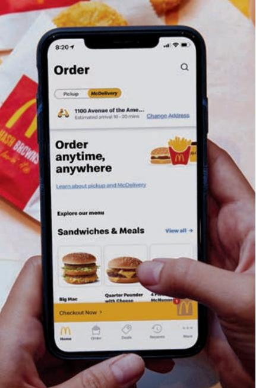
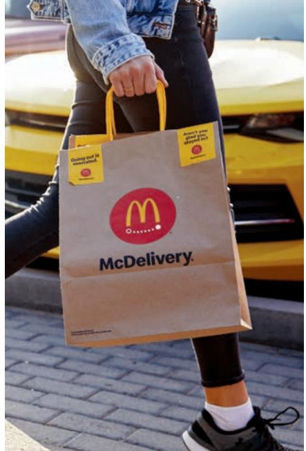
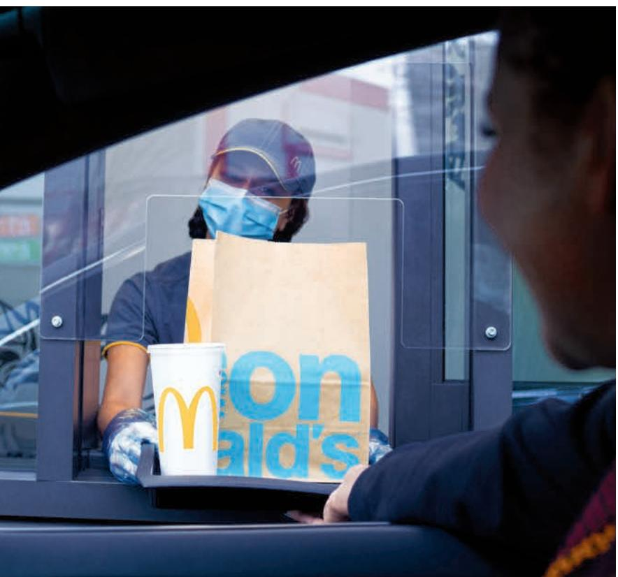
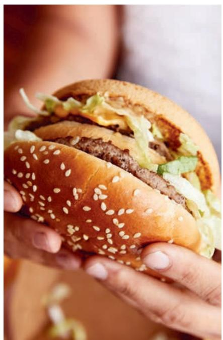

> **AI Description:**
> **Source:** `assets/_page_0_Figure_0.jpg`
> 
> **Generated:** 2026-05-27 15:38:33
> 
> ---
> 
> The image contains a screenshot of a McDonald's mobile app interface. The screen displays an order page with options for "Pickup" and "McDelivery." It shows a delivery address and estimated arrival time. The app interface includes a section titled "Order anytime, anywhere," with a link to learn about pickup and McDelivery. Below this, there is a menu section labeled "Sandwiches & Meals," featuring images of a Big Mac and a Quarter Pounder with Cheese. The bottom of the screen has navigation icons for Home, Order, Details, and Cart. The image includes a photograph of a hand holding the phone, with part of a McDonald's branded bag visible in the background.

> **AI Description:**
> **Source:** `assets/_page_0_Figure_1.jpg`
> 
> **Generated:** 2026-05-27 15:37:52
> 
> ---
> 
> The image contains a photograph of a person holding a McDonald's McDelivery paper bag. The bag features the McDonald's logo and the text "McDelivery." The person is wearing a denim jacket and jeans, and the background includes a yellow vehicle. The image is primarily focused on the McDelivery bag, which is the central visual element.

Annual Report 2020

> **AI Description:**
> **Source:** `assets/_page_0_Figure_2.jpg`
> 
> **Generated:** 2026-05-27 15:37:05
> 
> ---
> 
> The image is a photograph of a drive-thru interaction at a McDonald's. A person wearing a face mask and gloves is handing over a McDonald's branded bag and a cup to a customer in a car. The McDonald's logo is prominently displayed on both the bag and the cup. The interaction is taking place through a clear plastic barrier, which is likely a safety measure. The setting appears to be outdoors, with a glimpse of the McDonald's restaurant in the background.

> **AI Description:**
> **Source:** `assets/_page_0_Figure_3.jpg`
> 
> **Generated:** 2026-05-27 15:37:15
> 
> ---
> 
> The image shows a close-up of a person holding a hamburger. The hamburger consists of a sesame seed bun, a beef patty, lettuce, and possibly some cheese. The focus is on the burger, highlighting its ingredients and the texture of the bun and patty. The background is blurred, emphasizing the burger as the main subject.

# Dear Shareholders, the Global McFamily and our Customers,

At McDonald’s, we are privileged to be active participants in the local communities where we live, work and serve. That means we reflect the values and understand the needs of the customers and people we strive to put first every day. This was especially prudent as we navigated the COVID-19 pandemic and societal challenges within this past year. Through it all, and with the strength of our McFamily and a values-led mindset, we did the right thing from the start. We prioritized the safety of restaurant crew and customers; we took important steps to preserve our financial flexibility; we leveraged the power of our supply chain; and we stood by and supported our local communities.

I believe firmly that our Brand will be defined by how we respond to such challenges, both as the world’s largest restaurant company—and as good neighbors. At the onset of the pandemic, I laid out five principles that McDonald’s used to guide our approach to this historic challenge:

“We’re all in this together”

“Think and act with a long-term mindset”

“ Be transparent with each other and our stakeholders”

“Lead by example”

“Stay true to our purpose”

Supported by these principles and energized by the incredible courage and effort from people across our three-legged stool, McDonald’s delivered a resilient performance in what was the most difficult year in our history.

## Emerging from 2020 in a position of strength

While conditions were challenging in most markets, we still achieved nearly \$20 billion in full year revenue and over \$90 billion in full year Systemwide sales. We were well-positioned to effectively navigate such challenging circumstances because of our operating model, our focus on running great restaurants and our many competitive strengths, including our formidable Drive Thru presence. We also were wellpositioned due to the significant investments we’ve made in recent years to develop our digital and delivery capabilities, which proved to be a boon throughout the pandemic.

The US delivered its sixth consecutive year of positive comparable sales, and average US franchisee restaurant operating cash flow reached an all-time high in 2020, after a previous all-time high in 2019. Elsewhere, Japan and Australia posted five and seven consecutive years of positive comparable sales growth, respectively. Markets that had to significantly reduce operations or face closures due to government restrictions did so with remarkable agility and care. Their ability to respond quickly to the external environment was a further demonstration of our System’s unmatched execution prowess.

## While 2020 was a historically demanding year, it has helped McDonald’s to do everything better.

We engaged Mayo Clinic to provide ongoing expertise on emerging science in COVID-19 infection prevention, and we devised new ways to safely and reliably serve our customers. This, in turn, allowed us to continue gaining market share in most major markets. We also improved on our already unrivaled Drive Thru capabilities and continued to see the enormous benefits of contactless delivery, take-away, and curbside pick-up. Meanwhile, more customers used our app than ever before, as digital sales reached nearly 20 percent of Systemwide sales across our top six markets.

At the outset of the pandemic, we committed to helping every operator and partner survive the crisis. We took prudent,

quick action designed to prevent not a single Owner/Operator from failing due to the pandemic. We offered franchisees nearly \$1 billion in short-term financial liquidity support through rent and royalty deferrals, along with timely, targeted, and temporary assistance to individual franchisees in the most precarious situations. Thanks to our quick decision-making and our robust balance sheet, the financial health of the McDonald’s System remains strong.

Just as important, we addressed our shortterm challenges without sacrificing our long-term priorities. We continued to invest in our Brand, including an incremental \$200 million in marketing support to widen our market share gains and accelerate our recovery. We also opened nearly 1,000 new restaurants globally, modernized another 900 restaurants in the US, and together with our franchisees, we invested more than \$1 billion in technology and digital initiatives.

I said several times through the year that we were confident McDonald’s would be just as strong coming out of the pandemic as we were going into it, and we are proving that in so many ways.

## A new, holistic growth strategy to reflect the changing environment

Motivated by our resilience in the face of unprecedented challenges, we began writing the next chapter for McDonald’s as we shared our new growth strategy, Accelerating the Arches. Alongside bold business objectives, the strategy articulates a clear vision of where and how we intend to make a difference in the world, reflecting the changing expectations that today’s customers have of modern corporations like McDonald’s.

We already knew customer habits and expectations were changing going into 2020. The pandemic accelerated some of those changes and brought other powerful truths into focus.

First, our customers’ needs are different than they were prior to the pandemic, so the experience we offer must adapt. A world with less dine-in and more takeout plays to our significant advantage in Drive Thru and our growing capabilities in delivery and curbside pick-up. More lunch and dinner visits are well-suited to our core menu, with iconic favorites that people love. Greater dependence on technology bodes well for McDonald’s fast-growing digital experience and our inherent scale advantages.

This understanding was essential as we identified three new growth pillars to deliver our next phase of sustainable growth under Accelerating the Arches. They are easy to remember… just think M-C-D:

## M - Maximize our Marketing

McDonald’s is one of the world’s most recognized brands, and we invest about \$4 billion per year in marketing. Working with our agency partners, we will raise our creative ambition and capitalize on evolving digital behaviors to deepen the connection with our customers to drive growth.

## C - Commit to the Core

McDonald’s menu is known around the globe, and customers love favorites like the Big Mac®, Chicken McNuggets®, and of course, our World Famous Fries®. During the pandemic, we focused on these classics and were reminded not only of customers’ enduring passion for these products, but also the significant growth opportunities that still exist within our core menu.

## D - Double Down on the Three Ds

Digital, Delivery and Drive Thru. Customers have always loved McDonald’s for its convenience, and new technologies offer us the opportunity to make the McDonald’s experience even faster and easier. We will innovate in these service channels to unlock even more growth.

It is especially encouraging to see the power of the three pillars coming together already. The launch of Famous Orders in the US, for example, brought together the strength of our marketing, the popularity of our core menu items and enormous digital engagement to drive significant sales in the third and fourth quarters of 2020. The success of this initiative was just a glimpse of what is possible and we are excited for what is to come.

## Leading with our purpose and refreshing our values to guide our strategy

The second truth is that people expect more from corporations today and are seeking brands that reflect their own values. Customers want to see that the McDonald’s they visit locally matches how we act globally. They want and expect us to be a force for good everywhere.

The strength of McDonald’s business entering 2020 and our resilience through the pandemic allowed us to broaden our perspective to make Accelerating the Arches a strategy focused on more than just business performance. It is rooted in our belief that our next chapter of growth depends not just on what we do, but how we do it in more than 39,000 local restaurants around the world.

Meeting the needs of our customers and communities requires us to embrace a bigger, more holistic vision. Just as our timeless commitment to Quality, Service, Cleanliness, and Value has been refined over the years to make them relevant for each era, the language we use to express our purpose, mission, and values must be reinvigorated to ensure it is responsive to today’s

environment. That’s especially true in an era when customers and communities expect more of us. That is why one of our priorities over the past year was to ensure our purpose, mission, and values reflect the role we play in society today— while embracing the vital place these timeless ideals and principles occupy as an essential part of this special Brand we all love.

In speaking to franchisees, customers and crew around the world, it became clear that McDonald’s purpose is to feed and foster communities. It also became clear in those conversations that our ability to deliver on our purpose is rooted in a refreshed set of core values:

> **AI Description:**
> **Source:** `assets/_page_4_Figure_0.jpg`
> 
> **Generated:** 2026-05-27 15:42:06
> 
> ---
> 
> The image contains a simple diagram of two hands forming a heart shape. The hands are colored in shades of brown, suggesting a connection to cultural or ethnic diversity. There are no labels or text annotations within the image itself. The visual is symbolic and conveys a message of unity or love.

We put our customers and people first

Inclusion We open our doors to everyone

> **AI Description:**
> **Source:** `assets/_page_4_Figure_2.jpg`
> 
> **Generated:** 2026-05-27 15:42:03
> 
> ---
> 
> The image contains a simple icon of a compass. The compass is designed with a circular shape and features four cardinal points: North, East, South, and West. The North point is highlighted with a yellow arrow, indicating the direction of true north. There are no charts, graphs, or other visual elements present in the image.

Integrity We do the right thing

> **AI Description:**
> **Source:** `assets/_page_4_Figure_3.jpg`
> 
> **Generated:** 2026-05-27 15:41:59
> 
> ---
> 
> The image contains a simple diagram of a house with three people standing in front of it. The house is represented by a yellow outline, and the people are depicted as simple stick figures with heads and bodies. There are no labels or text annotations within the image. The diagram appears to symbolize a family or a group of people living together in a home.

Community We are good neighbors

> **AI Description:**
> **Source:** `assets/_page_4_Figure_4.jpg`
> 
> **Generated:** 2026-05-27 15:41:42
> 
> ---
> 
> The image depicts a simple diagram of a stool with three legs. The stool has a circular seat and three legs, each colored differently: the left leg is yellow, the right leg is orange, and the front leg is red. The diagram is minimalistic and does not contain any text or additional annotations.

Family We get better together

Ray Kroc used to talk constantly about our values. He knew that in a System where every restaurant is unique and locally owned, our values would be the light that guides us through every decision. These refreshed values are a foundational component of Accelerating the Arches and will guide us in achieving our business objectives while providing a common compass for how we serve our communities, and one another.

With its holistic view of what McDonald’s seeks to accomplish as an organization, Accelerating the Arches will strengthen our advantages and deliver value—not only to our business, but to our communities, customers, franchisees, crew, employees, farmers and suppliers.

## Looking forward to another year of progress

We are a stronger Brand for the challenges we faced together in 2020. Our business performance and the trust we fostered throughout our communities reinforced our confidence in McDonald’s long-term success. As a result, we were pleased to continue the company’s more than 40-year tradition of annual dividend increases.

While 2020 was a year beset with obstacles, it was also a year of progress for McDonald’s, and it has emboldened us to build on the platform we created to write our next great chapter together. Supported by a bold new strategy and our enduring foundation of running great restaurants, McDonald’s will continue to strive to be a force for good in our communities while strengthening and widening the competitive advantages that help us make delicious feel-good moments easy for everyone.

Thank you to our shareholders for your continued investment in McDonald’s, to our customers for giving us the opportunity to serve you and your communities, and to the people in the McDonald’s System who make this business what it is and give us the spirit to succeed.

Be well.

Ce:Kjoo

Chris Kempczinski President and CEO McDonald’s Corporation

# UNITED STATES SECURITIES AND EXCHANGE COMMISSION Washington, DC 20549

FORM 10-K

☒ ANNUAL REPORT PURSUANT TO SECTION 13 OR 15(d) OF THE SECURITIES EXCHANGE ACT OF 1934 For the fiscal year ended December 31, 2020

☐ TRANSITION REPORT PURSUANT TO SECTION 13 OR 15(d) OF THE SECURITIES EXCHANGE ACT OF 1934 For the transition period from to

Commission File Number 1-5231

McDONALD’S CORPORATION

(Exact name of registrant as specified in its charter)

Delaware

(State or other jurisdiction of incorporation or organization)

36-2361282 (I.R.S. Employer Identification No.)

110 North Carpenter Street, Chicago, Illinois (Address of principal executive offices)

60607 (Zip code)

Registrant’s telephone number, including area code: (630) 623-3000 Securities registered pursuant to Section 12(b) of the Act:

Title of each class

Trading Symbol(s)

Name of each exchange on which registered

Common Stock, \$0.01 par value

MCD

New York Stock Exchange

Securities registered pursuant to Section 12(g) of the Act: None

Indicate by check mark if the registrant is a well-known seasoned issuer, as defined in Rule 405 of the Securities Act. Yes ☒ No ☐

Indicate by check mark if the registrant is not required to file reports pursuant to Section 13 or Section 15(d) of the Act. Yes ☐ No ☒

Indicate by check mark whether the registrant (1) has filed all reports required to be filed by Section 13 or 15(d) of the Securities Exchange Act of 1934 during the preceding 12 months (or for such shorter period that the registrant was required to file such reports), and (2) has been subject to such filing requirements for the past 90 days. Yes ☒ No ☐

Indicate by check mark whether the registrant has submitted electronically every Interactive Data File required to be submitted pursuant to Rule 405 of Regulation S-T (§232.405 of this chapter) during the preceding 12 months (or for such shorter period that the registrant was required to submit such files). Yes ☒ No ☐

Indicate by check mark whether the registrant is a large accelerated filer, an accelerated filer, a non-accelerated filer, a smaller reporting company, or an emerging growth company. See the definitions of “large accelerated filer,” “accelerated filer,” “smaller reporting company,” and "emerging growth company" in Rule 12b-2 of the Exchange Act.

Large accelerated filer ☒ Accelerated filer ☐ Non-accelerated filer ☐

Smaller reporting company ☐ Emerging growth company ☐

If an emerging growth company, indicate by check mark if the registrant has elected not to use the extended transition period for complying with any new or revised financial accounting standards provided pursuant to Section 13(a) of the Exchange Act. ☐

Indicate by check mark whether the registrant has filed a report on and attestation to its management’s assessment of the effectiveness of its internal control over financial reporting under Section 404(b) of the Sarbanes-Oxley Act (15 U.S.C. 7262(b)) by the registered public accounting firm that prepared or issued its audit report. ☒

Indicate by check mark whether the registrant is a shell company (as defined in Rule 12b-2 of the Exchange Act). Yes ☐ No ☒

The aggregate market value of common stock held by non-affiliates of the registrant as of June 30, 2020 was \$137,233,144,378.

The number of shares outstanding of the registrant’s common stock as of January 31, 2021 was 745,572,145.

## DOCUMENTS INCORPORATED BY REFERENCE

Part III of this Form 10-K incorporates information by reference from the registrant’s 2021 definitive proxy statement, which will be filed no later than 120 days after December 31, 2020.

## McDONALD’S CORPORATION TABLE OF CONTENTS

## ORGANIZATION OF OUR ANNUAL REPORT ON FORM 10-K

The order and presentation of content in our Annual Report on Form 10-K ("Form 10-K") differs from the traditional U.S. Securities and Exchange Commission ("SEC") Form 10-K format. We believe that our format improves readability and better presents how we organize and manage our business. See "Form 10-K Cross-Reference Index" for a cross-reference index to the traditional SEC Form 10-K format.

Page reference   
Forward-Looking Statements 3   
About McDonald's 3   
Business Summary . 3   
Management's Discussion and Analysis of Financial Condition and Results of Operations 8   
Management's View of the Business . 8   
Financial Performance and Strategic Direction 8   
Outlook . 10   
Consolidated Operating Results 11   
Cash Flows 19   
Financial Position and Capital Resources 21   
Other Matters . 24   
Other Key Information 25   
Selected Financial Data 26   
Market for Registrant's Common Equity, Related Shareholder Matters and Issuer Purchases of Equity Securities . 28   
Risk Factors 29   
Legal Proceedings . 35   
Properties . 35   
Information About our Executive Officers 36   
Availability of Company Information 37   
Financial Statements and Supplementary Data 37   
Controls and Procedures 64   
Security Ownership of Certain Beneficial Owners and Management and Related Shareholder Matters 64   
Exhibits and Financial Statement Schedules . 65   
Form 10-K Cross-Reference Index 68   
Signatures 69

The information in this report includes forward-looking statements about future events and circumstances and their effects upon revenues, expenses and business opportunities. Generally speaking, any statement in this report not based upon historical fact is a forward-looking statement. Forward-looking statements can also be identified by the use of forward-looking words, such as "could," "should," "continue," "estimate," "forecast," "intend," "look," “may,” “will,” “expect,” “believe,” “anticipate,” “plan,” "remain" and "confident" or similar expressions. In particular, statements regarding our plans, strategies, prospects and expectations regarding our business and industry, including those under "2020 Financial Performance", "Strategic Direction", "Outlook", or "Risk Factors" are forward-looking statements. They reflect our expectations, are not guarantees of performance and speak only as of the date of this report. Except as required by law, we do not undertake to update such forward-looking statements. Our business results are subject to a variety of risks, including those considerations or risks that are reflected in the "Risk Factors" section, as well as elsewhere in our filings with the SEC. If any of these considerations or risks materialize, our expectations (or underlying assumptions) may change or not be realized and our performance may be adversely affected. Therefore, you should not rely unduly on any forward-looking statements.

## ABOUT McDONALD'S

McDonald’s Corporation, the registrant, together with its subsidiaries, is referred to herein as the "Company." The Company, its franchisees and suppliers, are referred to herein as the "System."

## BUSINESS SUMMARY

## General

For the year ended December 31, 2020, there were no material changes to the Company's corporate structure or in its method of conducting business. The Company’s reporting segments are aligned with its strategic priorities and reflect how management reviews and evaluates operating performance. Significant reportable segments include the United States ("U.S.") and International Operated Markets ("IOM"). In addition, throughout this report we present the International Developmental Licensed Markets & Corporate segment ("IDL"), which includes markets in over 80 countries, as well as Corporate activities. Effective January 1, 2019, McDonald's changed its global operating structure. Refer to the Segment and Geographic Information section included on page 50 of this Form 10-K for additional information.

## Description of business

## • General

The Company franchises and operates McDonald’s restaurants, which serve a locally-relevant menu of quality food and beverages in 119 countries. Of the 39,198 restaurants at year-end 2020, 36,521 were franchised, which is 93% of McDonald's restaurants.

McDonald’s franchised restaurants are owned and operated under one of the following structures - conventional franchise, developmental license or affiliate. The optimal ownership structure for an individual restaurant, trading area or market (country) is based on a variety of factors, including the availability of individuals with the entrepreneurial experience and financial resources, as well as the local legal and regulatory environment in critical areas such as property ownership and franchising. The business relationship between McDonald’s and its independent franchisees is supported by adhering to standards and policies and is of fundamental importance to overall performance and to protecting the McDonald’s brand.

The Company is primarily a franchisor and believes franchising is paramount to delivering great-tasting food, locally relevant customer experiences and driving profitability. Franchising enables an individual to be their own employer and maintain control over all employment related matters, marketing and pricing decisions, while also benefiting from the strength of McDonald’s global brand, operating system and financial resources.

Directly operating McDonald’s restaurants contributes significantly to our ability to act as a credible franchisor. One of the strengths of the franchising model is that the expertise from operating Company-owned restaurants allows McDonald’s to improve the operations and success of all restaurants while innovations from franchisees can be tested and, when viable, efficiently implemented across relevant restaurants. Having Company-owned and operated restaurants provides Company personnel with a venue for restaurant operations training experience. In addition, in our Company-owned and operated restaurants, and in collaboration with franchisees, we are able to further develop and refine operating standards, marketing concepts and product and pricing strategies that will ultimately benefit McDonald’s restaurants.

The Company’s revenues consist of sales by Company-operated restaurants and fees from restaurants operated by franchisees. Fees vary by type of site, amount of Company investment, if any, and local business conditions. These fees, along with occupancy and operating rights, are stipulated in franchise/license agreements that generally have 20-year terms. The Company’s Other revenues are comprised of technology fees paid by franchisees, revenues from brand licensing arrangements, and third party revenues for the Dynamic Yield business.

## Conventional Franchise

Under a conventional franchise arrangement, the Company generally owns or secures a long-term lease on the land and building for the restaurant location and the franchisee pays for equipment, signs, seating and décor. The Company believes that ownership of real estate, combined with the co-investment by franchisees, enables us to achieve restaurant performance levels that are among the highest in the industry.

Franchisees are also responsible for reinvesting capital in their businesses over time. In addition, to accelerate implementation of certain initiatives, the Company may co-invest with franchisees to fund improvements to their restaurants or their operating systems. These investments, developed in collaboration with franchisees, are designed to cater to consumer preferences, improve local business performance, and increase the value of our brand through the development of modernized, more attractive and higher revenue generating restaurants.

The Company requires franchisees to meet rigorous standards and generally does not work with passive investors. The business relationship with franchisees is designed to facilitate consistency and high quality at all McDonald’s restaurants. Conventional franchisees contribute to the Company’s revenue, primarily through the payment of rent and royalties based upon a percent of sales, with specified minimum rent payments, along with initial fees paid upon the opening of a new restaurant or grant of a new franchise. The Company's heavily franchised business model is designed to generate stable and predictable revenue, which is largely a function of franchisee sales, and resulting cash flow streams. As most revenues are based on a percent of sales, the Company expects that consumer sentiment and government regulations as a result of COVID-19 may continue to have a negative impact on revenue in the near term.

## Developmental License or Affiliate

Under a developmental license or affiliate arrangement, licensees are responsible for operating and managing the business, providing capital (including the real estate interest) and developing and opening new restaurants. The Company generally does not invest any capital under a developmental license or affiliate arrangement, and it receives a royalty based on a percent of sales, and generally receives initial fees upon the opening of a new restaurant or grant of a new license.

While developmental license and affiliate arrangements are largely the same, affiliate arrangements are used in a limited number of foreign markets (primarily China and Japan) within the International Developmental Licensed Markets segment and a limited number of individual restaurants within the International Operated Markets segment, where the Company also has an equity investment and records its share of net results in Equity in earnings of unconsolidated affiliates.

As both royalty revenues and the Company's share of net results in equity investments are based on sales results, the Company may continue to experience a negative impact to revenues and Equity in earnings of unconsolidated affiliates as a result of COVID-19 in the near term.

## . Supply chain, food safety, and quality

The Company and its franchisees purchase food, packaging, equipment, and other goods from numerous independent suppliers. The Company has established and enforces high food safety and quality standards. The Company has quality centers around the world designed to promote consistency of its high standards. The quality management systems and processes not only involve ongoing product reviews, but also on-site and virtual supplier visits. A Food Safety Advisory Council, composed of the Company’s internal food safety experts, as well as suppliers and outside academia, provides strategic global leadership for all aspects of food safety. We have ongoing programs to educate employees about food safety practices, and our suppliers and restaurant operators participate in food safety trainings where we share best practices on food safety and quality. In addition, the Company works closely with suppliers to encourage innovation and drive continuous improvement. Leveraging scale, supply chain infrastructure and risk management strategies, the Company also collaborates with suppliers toward a goal of achieving competitive, predictable food and paper costs over the long term.

Independently owned and operated distribution centers, approved by the Company, distribute products and supplies to McDonald’s restaurants. In addition, restaurant personnel are trained in the proper storage, handling and preparation of food for customers.

As a result of the COVID-19 pandemic, the Company implemented a framework called Safety+ for enhanced hygiene and safety standards to help re-enforce customer and crew safety. Additionally, the Company worked closely with suppliers on contingency planning for continuous supply so that we were able to continue to operate safe restaurants, and we had no breaks in supply for food, packaging, toys or equipment globally throughout 2020 due to COVID-19.

## • Products

McDonald’s restaurants offer a substantially uniform menu, although there are geographic variations to suit local consumer preferences and tastes.

McDonald’s menu includes hamburgers and cheeseburgers, Big Mac, Quarter Pounder with Cheese, Filet-O-Fish, several chicken sandwiches, Chicken McNuggets, wraps, McDonald's Fries, salads, oatmeal, shakes, McFlurry desserts, sundaes, soft serve cones, bakery items, soft drinks, coffee, McCafé beverages and other beverages.

McDonald’s restaurants in the U.S. and many international markets offer a full or limited breakfast menu. Breakfast offerings may include Egg McMuffin, Sausage McMuffin with Egg, McGriddles, biscuit and bagel sandwiches, oatmeal, breakfast burritos and hotcakes.

In addition to these menu items, the restaurants sell a variety of other products during limited-time promotions.

Taste, quality, choice, value and nutrition are important to our customers, and we are continuously evolving our menu to meet our customers' needs, including testing new products on an ongoing basis.

## • Marketing

McDonald’s global brand is well known. Marketing, promotional and public relations activities are designed with customers in mind and are focused on promoting the McDonald’s brand and differentiating the Company from its competitors. Marketing and promotional efforts focus on value, quality, food taste, menu choice, nutrition, convenience and the customer experience.

## • Intellectual property

The Company owns or is licensed to use valuable intellectual property including trademarks, service marks, patents, copyrights, trade secrets and other proprietary information. The Company considers the "McDonald's" trademark and the Golden Arches Logo to be of material importance to its business. Depending on the jurisdiction, trademarks and service marks generally are valid as long as they are used and/or registered. Patents, copyrights and licenses are of varying durations.

## • Competition

McDonald’s restaurants compete with international, national, regional and local retailers of traditional, fast casual and other food service competitors. The Company competes in the quick-service restaurant industry on the basis of price, convenience, service, experience, menu variety and product quality in a highly fragmented global restaurant industry.

In measuring the Company’s competitive position, management reviews data compiled by Euromonitor International, a leading source of market data with respect to the global restaurant industry. The Company measures itself using the informal eating out ("IEO") segment information, which is inclusive of the Company’s primary competition of quick-service restaurants. The IEO segment includes the following restaurant categories defined by Euromonitor International: limited-service restaurants (which combines quick-service eating establishments and 100% home delivery/takeaway providers), street stalls or kiosks, cafés, specialist coffee shops, self-service cafeterias and juice/ smoothie bars. The IEO segment excludes establishments that primarily serve alcohol and full-service restaurants other than providers with limited table service.

Based on data from Euromonitor International, the global IEO segment was composed of approximately 9 million outlets and generated \$1.2 trillion in annual sales in 2019, the most recent year for which data is available. McDonald’s Systemwide 2019 restaurant business accounted for 0.4% of those outlets and 8.4% of the sales.

Management also on occasion benchmarks McDonald’s against the entire restaurant industry, including the IEO segment defined above and all full-service restaurants. Based on data from Euromonitor International, the restaurant industry was composed of approximately 20 million outlets and generated \$2.6 trillion in annual sales in 2019. McDonald’s Systemwide restaurant business accounted for 0.2% of those outlets and 3.8% of the sales.

## • Environmental matters

The Company prioritizes progress across a range of environmental matters, and endeavors to improve our long-term sustainability and resiliency, which benefits McDonald’s and the communities it serves. The Company monitors environment-related governmental initiatives and consumer preferences, and while we cannot predict the precise nature of how these may evolve, the Company plans to respond in a timely and appropriate manner. Although any impact would likely vary by geographic region and/or market, we believe that the adoption of new regulations may increase costs or operational complexity for the Company.

To guide our management of environmental matters, the Company has developed goals and performance indicators that are updated periodically on the Company’s website, informed by relevant frameworks including the Sustainability Accounting Standards Board. These include goals and initiatives to reduce System greenhouse gas emissions, eliminate deforestation from our global supply chain, responsibly source ingredients and packaging, and increase the availability of recycling in restaurants to reduce waste, which the Company recognizes are increasingly important to customers. The Company also discloses the impacts of environmental risks and opportunities in its annual CDP Climate Change, CDP Forests and CDP Water reports. In recent years, we have made significant progress on our global commitments where we can make a difference at scale and drive industry-wide change.

Actual or perceived effects of changes in climate, weather patterns, water resources, forests or other natural resources, or packaging waste could have a direct or indirect impact on the operations of the System in ways which we cannot fully predict at this time. The Company will continue to assess potential risks and opportunities to analyze possible material impacts to the System as we believe taking action on environmental matters will drive business value in the long-term by ensuring we are managing operational costs in our energy supply, improving the security of supply of our raw materials and reducing our exposure to increasing environmental risks, regulation and taxes.

## • Government regulations

The Company has global operations and is therefore subject to the laws of the United States and multiple foreign jurisdictions in which the Company operates and the rules and regulations of various governing bodies, which may differ among jurisdictions. Throughout 2020, there were various instances around the world of COVID-19 related government restrictions on operating hours, dine-in capacity and in some cases, mandated full restaurant closures. These government restrictions negatively impacted the Company's revenues. The Company does not believe that compliance with other current government regulations will have a material effect on the Company's capital expenditures, earnings or competitive position.

## • Human capital management

## Purpose, Mission, & Values

Through our size and scale, the Company is embracing and prioritizing our role and commitment to the communities in which we operate through our:

Purpose to feed and foster communities,

Mission to create delicious feel-good moments for everyone, and

Core values that define who we are and how we run our business.

At McDonald's, we are guided by our five core values:

1. Serve – We put our customers and people first;

2. Inclusion – We open our doors to everyone;

3. Integrity – We do the right thing;

4. Community – We are good neighbors; and

5. Family – We get better together.

The Company believes that it is our people, all around the world, who set us apart and bring these values to life on a daily basis.

In addition, the Company’s people strategies aim to create an environment grounded in diversity, equity and inclusion; continually evaluate and evolve compensation and benefits programs, while offering quality training and learning opportunities; and uphold a high standard of health and safety for employees and customers alike.

We encourage you to read more information within McDonald’s “Purpose & Impact” section on the Company’s website that includes additional information regarding our human capital management and other initiatives and is updated periodically as our strategies evolve. Our website is not deemed incorporated by reference into this Annual Report on Form 10-K, but does provide background for reference.

## Our People

The Company’s employees include those in our corporate and other offices as well as Company-owned and operated restaurant employees, totaling approximately 200,000 worldwide as of year-end 2020, of which over 75% are based outside of the U.S. In addition to Company employees, the over two million individuals who work in our independent Franchisee restaurants globally are critical to the Company’s success, enabling us to drive long-term value creation and further our purpose and mission. People are at the cornerstone of our business and an essential part of the McDonald's System – our owner-operators, our suppliers, and the Company.

## Diversity, Equity and Inclusion (“DEI”)

At McDonald’s, our aspiration is that no matter where you are in the world, when you interact with McDonald’s, inclusivity and equity are evident. We believe that a diverse workforce is critical to McDonald’s success, and we are committed to making this a continued priority for our Company. Our Board of Directors reflects this commitment as half of the 12 members are women or racially diverse, including the Chairman of the Board. With this leadership, the Company recently launched a new global DEI strategy designed to drive accountability across the System to better represent the diverse communities in which McDonald’s operates, to accelerate cultures of inclusion and belonging, and to further dismantle barriers to economic opportunity.

The Company’s enhanced DEI strategy builds on existing initiatives from across the business, including:

the ongoing initiative to improve the representation of women at all levels of the Company,

long-standing work designed to encourage franchisees and suppliers to create greater diversity in their own operations,

upholding human rights and cultivating a respectful workplace that is ethical, truthful and dependable, and

our commitment to equitable pay among Company employees with comparable job responsibilities, experience, performance and contributions.

While McDonald’s is proud of our more than 65-year history as an employer, we expect our global DEI strategy to represent a step change in how we view equitable opportunity across our System and we are committed to accelerating the representation, inclusion and opportunity for historically underrepresented groups throughout our business. Aligned with our purpose, mission and values, this strategy will shape our future as a leading employer.

Beginning in 2021, the Company is incorporating quantitative human capital management related metrics to annual incentive compensation for its executives. In addition to the Company’s financial performance, executives will be measured on their ability to champion our core values, improve diversity representation within leadership roles for both women and historically underrepresented groups, and create a strong culture of inclusion within the Company.

## Workplace Health and Safety

McDonald’s has always focused on protecting the health and safety of our people and our customers. Throughout 2020, in response to the global COVID-19 pandemic, we have made informed decisions with the guidance from health ministries in most of the countries in which we operate, as well as the World Health Organization. As safety, hygiene and customers’ trust and confidence in our restaurants is critical in this environment, the Company has established even greater discipline in restaurant operations to meet those needs. McDonald’s engaged Mayo Clinic, a global leader in serious and complex healthcare, to provide ongoing counsel and expertise on emerging science in infection prevention and control, and to identify best practices to mitigate the spread of COVID-19. Over the last year, elevated standards informed by this engagement have been executed in the majority of McDonald’s over 39,000 restaurants, including more than 50 process changes in U.S. restaurants. Encompassed in a framework called Safety+, this effort builds on the Company’s history of safety-first leadership in McDonald’s restaurants, and supplements the work of global markets to help keep customers and crew safe.

## Respectful Workplace Environment

Fostering safe, inclusive, and respectful workplaces, wherever we do business, has been integral to the Company for its more than 65 year history. We understand the importance of providing a positive experience in our offices and in the restaurants where everyone is valued. In 2018, we introduced McDonald's Human Rights Policy, which outlines our commitment to respect our people and their rights. Our commitment to respect human rights is also set out in our Standards of Business Conduct which apply to Company employees, and in our Supplier Code of Conduct, which contains our human rights requirements for our global suppliers. Company staff are trained regularly on the Standards and are required to annually certify their understanding of and commitment to upholding them.

Additionally, we recognize that developing respectful workplaces, where everyone’s rights are recognized, is an ongoing process that requires continuous effort and improvement. That’s why we worked with third party experts to strengthen our U.S. discrimination, harassment and anti-retaliation policy and provide enhanced interactive training for corporate staff and U.S. Company-owned restaurant employees. We have shared this policy and training with our franchisees and encourage them to utilize these tools and resources. We also recognize how important it is to provide channels for employees to report human rights concerns. Company employees can raise concerns in many ways, including through an anonymous global channel, the Business Integrity Line – staffed by a live operator from an independent company – 24 hours a day, 365 days a year. This is complemented by additional reporting channels in many markets. We expect our employees and franchisees to uphold human rights and cultivate respectful workplaces which builds trust, protects the integrity of our brand and fuels our success.

## Compensation, Benefits, and Talent Development

The compensation and benefits provided to U.S. and internationally-based Company employees, including both corporate staff and Company-owned restaurant employees, is established based upon competitive considerations in the relevant labor market. The amount and type of compensation varies by level of employee as well as their location, and may include some combination of the following (in addition to base pay): cash bonuses, stock-based awards, retirement savings programs, and health and welfare benefits. In addition, Company employees may receive paid time off, family care resources, tuition assistance and flexible work schedules. In 2020, the Company placed a significant emphasis on wellbeing globally, deploying a multitude of new benefits focused on the physical, financial and mental health of our employees. For example, in the U.S., these enhancements included the introduction of new Emotional Wellbeing and Employee Assistance programs.

McDonald’s has a long-standing commitment to provide training, education benefits and career paths, which empower people and the communities we serve. McDonald’s is committed to providing opportunities for people to enhance their skills and fulfill their potential through talent development programs, apprenticeship opportunities, language and technical skill training, and by supporting continuing education. We believe this helps to facilitate talent attraction, career development and retention. Further, McDonald’s Hamburger University has eight campuses around the world to provide training for Company employees as well as franchisees and eligible employees from their organizations. These are just a few examples of how education plays an important role in our business and our communities.

## Communities

The Company embraces our role and commitment to the communities we serve. Throughout the past year, McDonald’s rallied together with our suppliers, franchisees and partners, not just to keep restaurants open and running safely, but also to support our communities and first responders as seen through our donations of food and masks. Through the Company’s Youth Opportunity program, we aim to reduce barriers to employment for many at risk young people, through pre-employment job readiness training, employment opportunities, and workplace development programs. We are also proud of the network of over 260 local Chapters of Ronald McDonald House Charities (“RMHC”) spanning over 60 countries and regions that creates, finds and supports programs that directly improve the health and well-being of children and their families. In support of RMHC, in 2020, the Company announced our five-year commitment to RMHC totaling \$100 million. The Company will continue to look for ways to utilize our size and scale to create an even bigger impact in the communities we serve in the future.

# MANAGEMENT'S DISCUSSION AND ANALYSIS OF FINANCIAL CONDITION AND RESULTS OFOPERATIONS

## MANAGEMENT'S VIEW OF THE BUSINESS

In analyzing business trends, management reviews results on a constant currency basis and considers a variety of performance and financial measures which are considered to be non-GAAP, including comparable sales and comparable guest count growth, Systemwide sales growth, after-tax return on invested capital from continuing operations, free cash flow and free cash flow conversion rate, as described below. Management believes these measures are important in understanding the financial performance of the Company.

Constant currency results exclude the effects of foreign currency translation and are calculated by translating current year results at prior year average exchange rates. Management reviews and analyzes business results excluding the effect of foreign currency translation, impairment and other strategic charges and gains, as well as income tax provision adjustments related to the Tax Cuts and Jobs Act of 2017 (“Tax Act”), and bases incentive compensation plans on these results, because the Company believes this better represents underlying business trends.

Comparable sales are compared to the same period in the prior year and represent sales at all restaurants, whether operated by the Company or by franchisees, in operation at least thirteen months including those temporarily closed. Some of the reasons restaurants may be temporarily closed include reimaging or remodeling, rebuilding, road construction and natural disasters (including restaurants temporarily closed due to COVID-19 in 2020). Comparable sales exclude the impact of currency translation and the sales of any market considered hyper-inflationary (generally identified as those markets whose cumulative inflation rate over a three-year period exceeds 100%), which management believes more accurately reflects the underlying business trends. Comparable sales are driven by changes in guest counts and average check, which is affected by changes in pricing and product mix.

Comparable guest counts represent the number of transactions at all restaurants, whether operated by the Company or by franchisees, in operation at least thirteen months including those temporarily closed.

Systemwide sales include sales at all restaurants, whether operated by the Company or by franchisees. While franchised sales are not recorded as revenues by the Company, management believes the information is important in understanding the Company's financial performance, because these sales are the basis on which the Company calculates and records franchised revenues and are indicative of the financial health of the franchisee base. The Company's revenues consist solely of sales by Company-operated restaurants and fees from franchised restaurants operated by conventional franchisees, developmental licensees and affiliates. Changes in Systemwide sales are primarily driven by comparable sales and net restaurant unit expansion.

The Company’s after-tax return on invested capital ("ROIC") from continuing operations is a metric that management believes measures our capital-allocation effectiveness over time. Other companies may calculate ROIC differently, limiting the usefulness of the measure for comparisons with other companies. Refer to the reconciliation in Exhibit 12 for further information on the Company's calculation of ROIC.

Free cash flow, defined as cash provided by operations less capital expenditures, and free cash flow conversion rate, defined as free cash flow divided by net income, are measures reviewed by management in order to evaluate the Company’s ability to convert net profits into cash resources, after reinvesting in the core business, that can be used to pursue opportunities to enhance shareholder value. Refer to the reconciliations in Exhibit 12 for further information on the Company's calculations of free cash flow and free cash flow conversion rate.

## 2020 FINANCIAL PERFORMANCE

In 2020, global comparable sales decreased 7.7% primarily as a result of COVID-19. Comparable guest counts were negative across all segments for the year.

Comparable sales in the U.S. increased 0.4% benefiting from strong average check growth and positive comparable sales primarily at the dinner daypart. The Company's strategic marketing investments and promotional activity, along with growth in delivery, had a positive impact on comparable sales in the second half of 2020.

Comparable sales in the International Operated segment decreased 15.0% reflecting negative comparable sales in most markets as a result of COVID-19. The comparable sales decline was primarily driven by France, the U.K., Germany, Italy and Spain, partly offset by positive results in Australia.

Comparable sales in the International Developmental Licensed segment decreased 10.5% reflecting negative comparable sales primarily in Latin America and Asia, partly offset by strong comparable sales in Japan.

In addition to the comparable sales results, the Company had the following financial results in 2020:

Consolidated revenues decreased 10% (10% in constant currencies).

Systemwide sales decreased 7% (7% in constant currencies).

Consolidated operating income decreased 19% (20% in constant currencies) and included \$268 million of net strategic gains. Excluding these gains, operating income decreased 23% (23% in constant currencies), when also excluding \$74 million of net strategic charges from the prior year. Refer to the Operating Income section on page 17 for additional details.

Operating margin, defined as operating income as a percent of total revenues, decreased from 42.5% in 2019 to 38.1% in 2020.   
Excluding the items referenced in the previous bullet point, operating margin decreased from 42.8% in 2019 to 36.7% in 2020.

Diluted earnings per share of \$6.31 decreased 20% (20% in constant currencies). Refer to the Net Income and Diluted Earnings Per Share section on page 12 for additional details.

Cash provided by operations was \$6.27 billion.

Capital expenditures of \$1.64 billion were allocated mainly to reinvestment in existing restaurants and, to a lesser extent, to new restaurant openings.

Free cash flow was \$4.62 billion, a 19% decrease from the prior year.

Across the System, nearly 1,000 restaurants (including those in our developmental licensee and affiliated markets) were opened.

The Company increased its quarterly cash dividend per share by 3% to \$1.29 for the fourth quarter, equivalent to an annual dividend of \$5.16 per share.

## STRATEGIC DIRECTION

In 2020, the Company announced a new growth strategy, Accelerating the Arches (the “Strategy”). The Strategy encompasses all aspects of McDonald’s business as the leading global omni-channel restaurant brand, and includes a refreshed purpose, updated values, and new growth pillars that build on the Company’s competitive advantages.

## Purpose, Mission, & Values

The Company is embracing and prioritizing its role and commitments to the communities in which it operates through our:

• Purpose to feed and foster communities,

• Mission to create delicious feel-good moments for everyone, and

• Core values that define who we are and how we run our business.

## Growth Pillars

The new growth pillars, rooted in the Company’s identity, MCD, build on historic strengths and articulate areas of further opportunity. Under the Strategy, the Company will:

Maximize our Marketing by investing in new, culturally relevant approaches to effectively communicate the story of our brand, food and purpose. This will focus on enhanced digital capabilities that provide a more personal connection with customers. The Company is also committed to a marketing strategy that highlights value at every tier of the menu, as affordability remains a cornerstone of the McDonald’s brand.

Commit to the Core by tapping into customer demand for the familiar and focusing on serving delicious burgers, chicken and coffee. The Company will prioritize chicken and beef offerings as we expect they represent the largest growth opportunities. The Company expects there is significant opportunity to expand its chicken offerings by leveraging line extensions of customer favorites. In addition, the Company plans to introduce a new Crispy Chicken Sandwich in the U.S. at the end of February. The Company will also implement a series of operational and formulation changes designed to improve upon the great taste of our burgers. We also see a significant opportunity with coffee, and markets will leverage the McCafe brand, experience, value and quality to drive long-term growth.

Double Down on the 3D's: Digital, Delivery and Drive Thru by leveraging competitive strengths and building a powerful digital experience growth engine that provides a fast, easy experience for our customers. To unlock further growth, the Company will accelerate technology innovation so that when customers interact with McDonald’s, they can enjoy a fast, easy experience that meets their needs.

Digital: The Company’s new digital experience growth engine, “MyMcDonald’s” will transform its digital offerings across drive thru, takeaway, delivery, curbside pick-up and dine-in. Through the digital tools across this platform, customers will receive tailored offers, be able to participate in a new loyalty program and order and receive McDonald's food through the channel of their choice. The Company expects to have elements of “MyMcDonald’s” across its top six markets by the end of 2021, featuring loyalty programs in several of those markets, including a U.S. loyalty launch later in 2021. Across these top six markets, digital sales exceeded \$10 billion or nearly 20% of Systemwide sales in 2020.

Delivery: Over the past three years, the Company has expanded the number of McDonald’s restaurants offering delivery to nearly 30,000 restaurants, and delivery sales have grown significantly. The Company will build on this progress and enhance the delivery experience for customers by adding the ability to order on the McDonald’s app, which is already available in several markets around the world, and optimizing operations with a focus on speed and accuracy.

Drive Thru: The Company has drive thru locations in over 25,000 restaurants globally, including nearly 95% of the over 13,000 locations in the U.S. During the COVID-19 pandemic, this channel has heightened importance and we expect that it will become even more critical to meet customers’ demand for flexibility and choice. The Company will build on its drive thru advantage as the vast majority of new restaurant openings in the U.S. and International Operated Markets will include a drive thru. The Company will test new concepts and technology to enhance the customer experience, including automated order taking; a new drive thru express pick-up lane for customers with a digital order; and a restaurant concept that offers drive thru, delivery and takeaway only to provide a faster, more convenient experience.

The Company’s Strategy is underpinned by a relentless focus on running great restaurants, including improving speed of service to address customer needs. The Company believes this Strategy will build on our inherent strengths by harnessing our competitive advantages and investing in innovations that will enhance the customer experience and deliver long-term growth.

## OUTLOOK

## 2021 Outlook

Based on current conditions, the following information is provided to assist in forecasting the Company's future results for 2021.

The Company expects 2021 Systemwide sales growth, in constant currencies, in the low double digits, and expects net restaurant unit expansion to contribute about 1% to 2021 Systemwide sales growth.

The Company expects operating margin percent to be in the low-to-mid 40% range.

The Company expects full year 2021 selling, general and administrative expenses of approximately 2.3% of Systemwide sales, reflecting a decrease of about 2% to 4% in constant currencies.

Based on current interest and foreign currency exchange rates, the Company expects interest expense for the full year 2021 to decrease about 1% to 3% due primarily to lower average debt balances as the Company expects to pay down current debt levels to return to pre-COVID-19 leverage ratios.

The Company expects the effective income tax rate for the full year 2021 to be in the 21% to 23% range. Some volatility may result in a quarterly tax rate outside of the annual range.

• The Company expects 2021 capital expenditures to be approximately \$2.3 billion, about half of which will be directed towards new unit expansion across the U.S. and International Operated Markets.

In 2021, about \$1.1 billion will be dedicated to our U.S. business, about \$500 million of which will be allocated to approximately 1,200 restaurant modernization projects. Globally, the Company expects to open over 1,300 restaurants. We will open nearly 500 restaurants in the U.S. and International Operated Markets segments, and our developmental licensee and affiliates will contribute capital towards over 800 restaurant openings in their respective markets. Additionally, the U.S. expects to close roughly 325 restaurants in 2021; a majority of which are lower sales volume McDonald's in Walmart locations. The Company expects about 650 net restaurant additions in 2021.

The Company expects to achieve a free cash flow conversion rate greater than 90%.

## 2022 Outlook

The Company has provided a 2022 outlook that is detailed in its Form 10-Q for the quarter ended September 30, 2020.

## CONSOLIDATED OPERATING RESULTS

The following discussion should be read in conjunction with the consolidated financial statements and accompanying notes included on pages 38 through 59 of this Form 10-K. This section generally discusses 2020 and 2019 items and the year-to-year comparisons between the year ended December 31, 2020 compared to the year ended December 31, 2019. Discussions of 2018 items and the year-to-year comparisons between the year ended December 31, 2019 compared to the year ended December 31, 2018 are not included in this Form 10-K and can be found in the “Management’s Discussion and Analysis of Financial Condition and Results of Operations” section of the Company’s Annual Report on Form 10-K for the year ended December 31, 2019, filed with the SEC on February 26, 2020.

n/m Not meaningful

## IMPACT OF FOREIGN CURRENCY TRANSLATION ON REPORTED RESULTS

While changes in foreign currency exchange rates affect reported results, McDonald’s mitigates exposures, where practical, by purchasing goods and services in local currencies, financing in local currencies and hedging certain foreign-denominated cash flows.

Impact of foreign currency translation on reported results

In 2020, results primarily reflected the strengthening of the Euro and British Pound, partly offset by the weakening of the Brazilian Real. In 2019, results reflected the weakening of the Euro and most other major currencies.

In 2020, net income decreased 21% (22% in constant currencies) to \$4.7 billion and diluted earnings per common share decreased 20% (20% in constant currencies) to \$6.31. Foreign currency translation had a positive impact of \$0.04 on diluted earnings per share.

Results in 2020 reflected sales declines in the International Operated Markets and International Developmental Licensed Markets segments as a result of COVID-19.

Results in 2020 also included the following:

Higher Selling, General and Administrative Expenses reflecting:

\$100 million for the Company's five year commitment to Ronald McDonald House Charities;

one-time investments in renewed brand communications as part of the “Serving Here” campaign launch that was announced with the new growth strategy, Accelerating the Arches; and

◦ partly offset by lower incentive-based compensation expense.

Over \$200 million of incremental franchisee support for the year for marketing to accelerate recovery and drive growth across the U.S. and International Operated Markets, a majority of which was recorded in Selling, General and Administrative Expenses.

About \$100 million was recorded in the U.S. and the remaining support was recorded in the International Operated Markets segment.

Higher restaurant closing costs of \$68 million in both the International Operated Markets and in the U.S. The U.S. costs were primarily related to planned closings of McDonald’s in Walmart locations.

• Lower gains on sales of restaurant businesses.

An increase of reserves for bad debts of \$58 million related to rent and royalty deferrals.

Outlined below is additional information for the full year 2020, 2019, and 2018:

Diluted Earnings Per Common Share Reconciliation

## 2020 results included:

net pre-tax strategic gains of \$268 million, or \$0.26 per share, primarily related to the sale of McDonald's Japan stock, which reduced the Company's ownership by about 6%.

2019 results included:

◦ \$84 million, or \$0.11 per share, of income tax benefit due to regulations issued in the fourth quarter 2019 related to the Tax Act.

net pre-tax strategic charges of \$74 million, or \$0.07 per share, primarily related to impairment associated with the purchase of our joint venture partner's interest in the India Delhi market, partly offset by gains on the sales of property at the former Corporate headquarters.

2018 results included:

net tax cost of \$75 million, or \$0.10 per share, associated with the final 2018 adjustments to the provisional amounts recorded in December 2017 under the Tax Act.

\$234 million, or \$0.26 per share, of pre-tax strategic impairment and restructuring charges.

Excluding the above 2020 and 2019 items, 2020 net income decreased 24% (25% in constant currencies), and diluted earnings per share decreased 23% (23% in constant currencies).

Diluted earnings per share for 2020 and 2019 benefited from a decrease in diluted weighted average shares outstanding. In early March 2020, the Company suspended its share repurchase program. The Company repurchased 4.3 million shares of its stock for \$874 million in 2020 and 25.0 million shares of its stock for \$5 billion in 2019.

## RESTAURANT UPDATE

The Company has continued to follow the guidance of expert health authorities to ensure the appropriate precautionary steps are taken to protect the health and safety of our people and our customers.

As a result of COVID-19, throughout 2020, there have been numerous instances of government restrictions on restaurant operating hours, limited dine-in capacity in most countries and, in some cases, mandated dining room closures particularly in the International Operated Markets. These restrictions, which have carried into 2021, are impacting most of the Company's key markets outside of the U.S., particularly those with fewer drive thru restaurant locations. The Company expects some restrictions in various markets so long as the COVID-19 pandemic continues.

### Full Page Description (Page 17)

**Source:** `assets/_page_17_Asset_0.jpg`

**Generated:** 2026-05-27 15:41:49

---

The image is a pie chart representing data for the year 2020. The chart is divided into three segments, each with a corresponding percentage: 9%, 41%, and 50%. The largest segment, labeled with 50%, is the most prominent, occupying more than half of the pie chart. The other two segments are smaller, with the second largest segment labeled 41% and the smallest segment labeled 9%. The chart uses shades of blue to differentiate between the segments.

### Full Page Description (Page 17)

**Source:** `assets/_page_17_Asset_1.jpg`

**Generated:** 2026-05-27 15:41:22

---

The image contains a pie chart with three segments. The largest segment represents 54% of the total, the second largest represents 37%, and the smallest segment represents 9%. The chart uses different shades of blue to differentiate between the segments. The percentages are clearly labeled on each segment.

### Full Page Description (Page 17)

**Source:** `assets/_page_17_Asset_2.jpg`

**Generated:** 2026-05-27 15:41:54

---

The image is a pie chart with three segments. The largest segment represents 54% of the total, the second largest represents 37%, and the smallest segment represents 9%. The chart uses shades of blue to differentiate between the segments, with the largest segment in a darker shade and the smallest in a lighter shade.

## REVENUES

The Company's revenues consist of sales by Company-operated restaurants and fees from restaurants operated by franchisees, developmental licensees and affiliates. Revenues from conventional franchised restaurants include rent and royalties based on a percent of sales with minimum rent payments, and initial fees. Revenues from restaurants licensed to developmental licensees and affiliates include a royalty based on a percent of sales, and generally include initial fees. The Company’s Other revenues are comprised of fees paid by franchisees to recover a portion of costs incurred by the Company for various technology platforms, revenues from brand licensing arrangements to market and sell consumer packaged goods using the McDonald’s brand, and third party revenues for the Dynamic Yield business.

Franchised restaurants represented 93% of McDonald's restaurants worldwide at December 31, 2020. The Company's heavily franchised business model is designed to generate stable and predictable revenue, which is largely a function of franchisee sales and resulting cash flow streams. As most revenues are based on a percent of sales, the Company expects that government regulations as a result of COVID-19 resurgences will continue to have a negative impact on revenue in the near term.

## Revenues

In 2020, total Company-operated sales and franchised revenues decreased 10% (10% in constant currencies), primarily reflecting sales declines in the International Operated Markets segment as a result of COVID-19. Results also reflected positive sales performance in the U.S., which was more than offset by support provided for marketing, through incentives to franchisees, to accelerate recovery and drive growth, including the free Thank You Meals served across the country to first responders and health care workers.

Revenue declines were more significant in the International Operated Markets segment, driven by the temporary restaurant closures and limited operations. While performance was mixed, the ability of each market to drive sales and revenue growth is also impacted by the number of drive thru restaurant locations. The revenue declines were driven by the U.K., France, Germany, Italy and Spain.

TOTAL REVENUES BY SEGMENT

The following tables present comparable sales and Systemwide sales increases/(decreases):

Comparable sales increases/(decreases)

Systemwide sales increases/(decreases)\*

\* Unlike comparable sales, the Company has not excluded hyper-inflationary market results from Systemwide sales as these sales are the basis on which the Company calculates and records revenues.

Franchised sales are not recorded as revenues by the Company, but are the basis on which the Company calculates and records franchised revenues and are indicative of the financial health of the franchisee base. The following table presents franchised sales and the related increases/(decreases):

Franchised sales

### Full Page Description (Page 19)

**Source:** `assets/_page_19_Asset_0.jpg`

**Generated:** 2026-05-27 15:37:42

---

The image is a bar chart showing financial data for the years 2018, 2019, and 2020. It compares two types of margins: Franchised margins and Company-operated margins. The chart uses blue bars to represent Franchised margins and light blue bars to represent Company-operated margins. The Franchised margins show a slight increase from 2018 to 2019 and then a decrease in 2020. The Company-operated margins show a steady increase from 2018 to 2019 and then a slight decrease in 2020. The total amounts for each year are labeled on the bars.

## n/m Not meaningful

In 2020, total restaurant margins decreased 13% (13% in constant currencies), which reflected sales declines in the International Operated Markets segment as a result of COVID-19, partly offset by positive sales performance in the U.S.

Franchised margins represented over 85% of restaurant margin dollars.

Franchised margins in the U.S. reflected higher depreciation costs related to investments in Experience of the Future ("EOTF"), as well as support provided for marketing to accelerate recovery and drive growth, including the free Thank You Meals served across the country to first responders and health care workers.

Company-operated margins in the U.S. and International Operated Markets segments reflected incremental COVID-19 expenses incurred for employee related costs, personal protective equipment, and signage and other restaurant costs.

Due to the nature of our operating model, franchised margin expenses (primarily comprised of lease expense and depreciation expense) are mainly fixed, whereas Company-operated restaurant expenses have more variable cost components. Total restaurant margins included \$1,452 million of depreciation and amortization expenses in 2020.

## RESTAURANT MARGINS BY TYPE (In millions)

(1) Included in International Developmental Licensed Markets & Corporate are home office support costs in areas such as facilities, finance, human resources, investments in strategic technology initiatives, legal, marketing, restaurant operations, supply chain and training.

(2) Includes all cash incentives and share-based compensation expense.

In 2020, consolidated selling, general and administrative expenses increased 14% (14% in constant currencies). The results reflected about \$175 million of incremental marketing contributions by the Company to the System's advertising cooperative arrangements across the U.S. and International Operated Markets to accelerate recovery and drive growth; the Company's five year commitment totaling \$100 million to RMHC; one-time investments in renewed brand communications as part of the “Serving Here” campaign launch that was announced with the new growth strategy, Accelerating the Arches; and higher investments in strategic technology initiatives. These results were partly offset by lower incentive-based compensation expense and travel costs.

Selling, general and administrative expenses as a percent of Systemwide sales was 2.7% in 2020, 2.2% in 2019 and 2.3% in 2018. Management believes that analyzing selling, general and administrative expenses as a percent of Systemwide sales is meaningful because these costs are incurred to support the overall McDonald's business.

## OTHER OPERATING (INCOME) EXPENSE, NET

Other operating (income) expense, net

• Gains on sales of restaurant businesses

In 2020, gains on sales of restaurant businesses decreased primarily due to fewer restaurant sales primarily in the U.K. and the U.S.

Equity in earnings of unconsolidated affiliates

In 2020, equity in earnings of unconsolidated affiliates declined primarily due to sales declines as a result of COVID-19 in both the International Operated Markets and International Developmental Licensed Markets.

• Asset dispositions and other (income) expense, net

Asset dispositions and other expense, net reflected \$68 million of restaurant closing costs in both the International Operated Markets and in the U.S. The U.S. costs were primarily related to planned closings of McDonald's in Walmart locations.

Results also reflected an increase of reserves for bad debts of \$58 million, related to rent and royalty deferrals; \$31 million of payments to distribution centers for obsolete inventory to support franchisee liquidity; and litigation settlements.

## • Impairment and other charges (gains), net

In 2020, impairment and other charges (gains), net reflected \$274 million of pre-tax strategic gains related to the sale of McDonald's Japan stock, which reduced the Company's ownership by about 6% for the year. Results also reflected the write-off of impaired software that was no longer being used of \$26 million, partly offset by \$13 million of income primarily comprised of a reversal of a reserve associated with the Company's sale of its business in the India Delhi market in January 2020.

The results in 2019 reflected \$99 million of impairment associated with the purchase of our joint venture partner's interest in the India Delhi market, partly offset by \$20 million of gains on the sales of property at the former Corporate headquarters.

The results in 2018 reflected \$140 million of impairment charges and \$85 million of strategic restructuring charges in the U.S.

### Full Page Description (Page 21)

**Source:** `assets/_page_21_Asset_2.jpg`

**Generated:** 2026-05-27 15:40:10

---

The image contains a pie chart with three segments. The largest segment represents 48% of the total, the second largest represents 41%, and the smallest segment represents 11%. The chart visually represents the proportions of three categories, with the largest category being significantly larger than the other two.

### Full Page Description (Page 21)

**Source:** `assets/_page_21_Asset_1.jpg`

**Generated:** 2026-05-27 15:39:55

---

The image is a pie chart with three segments, each representing a percentage of a whole. The largest segment is labeled "48%" and is colored in a light blue shade. The second largest segment is labeled "41%" and is also in a light blue shade. The smallest segment is labeled "11%" and is in a darker blue shade. The chart visually represents the distribution of three categories, with the largest category making up the majority of the whole.

### Full Page Description (Page 21)

**Source:** `assets/_page_21_Asset_0.jpg`

**Generated:** 2026-05-27 15:40:00

---

The image contains a pie chart with three segments. The largest segment represents 45%, the second largest represents 39%, and the smallest segment represents 16%. The chart visually represents the distribution of three categories, with the largest portion being the one labeled 45%.

Operating Income: Operating income decreased 19% (20% in constant currencies). Results for 2020 included \$268 million of net strategic gains primarily related to the sale of McDonald's Japan stock, and results for 2019 included \$74 million of net strategic charges. Excluding these current year and prior year items, operating income decreased 23% (23% in constant currencies) for 2020.

U.S.: The operating income decrease reflected positive sales performance, which was more than offset by about \$100 million of support for marketing to accelerate recovery and drive growth; EOTF depreciation; a comparison to a prior year gain on the sale of real estate; lower gains on sales of restaurant businesses; and higher restaurant closing costs, primarily related to planned closings of McDonald's in Walmart locations.

International Operated Markets: The operating income decrease reflected sales declines as a result of COVID-19; over \$100 million of support for marketing to accelerate recovery and drive growth; incremental COVID-19 Company-operated expenses primarily for employee related costs; lower gains on sales of restaurant businesses primarily in the U.K.; higher restaurant closing costs; lower equity in earnings from unconsolidated affiliates; and \$23 million of payments to distribution centers for obsolete inventory.

International Developmental Licensed Markets & Corporate: Excluding the current year and prior year strategic gains and charges described above, the results primarily reflected higher G&A due to the Company's five year commitment totaling \$100 million to RMHC as well as one-time investments in renewed brand communications.

OPERATING INCOME BY SEGMENT\*

U.S.   
International Operated Markets   
International Developmental Licensed Markets & Corporate\*

\*The IDL segment excludes Corporate activities, which is a Non-GAAP metric.

### Full Page Description (Page 22)

**Source:** `assets/_page_22_Asset_0.jpg`

**Generated:** 2026-05-27 15:38:23

---

The image is a bar chart showing the operating margin and changes in various categories from 2018 to 2020. The chart includes data for restaurant margins, other revenues and other restaurant expenses, net, G&A (General and Administrative expenses), and other operating (income) expense, net. It uses blue bars to represent the operating margin for each year, with additional blue bars indicating increases and light blue bars indicating decreases. The chart highlights a slight increase in restaurant margins from 2018 to 2019, followed by a decrease in 2020. Other revenue and other restaurant expenses show a slight increase in 2019, while G&A and other operating expenses show decreases in 2019 and 2020.

Operating margin: Operating margin is defined as operating income as a percent of total revenues. The contributions to operating margin differ by segment due to each segment's ownership structure, primarily due to the relative percentage of franchised versus Company-operated restaurants. Additionally, the number of temporary restaurant closures, which varies by segment, as a result of COVID-19, also impacts the contribution of each segment to the consolidated operating margin.

The decrease in operating margin percent for 2020 was driven by a decline in sales, higher other operating expenses and higher G&A. While the sales-driven franchised margin decline had a dilutive effect on operating margin percent, franchised margin dollars represented over 85% of overall margin dollars and were a key component of operating income.

## OPERATING MARGIN PERCENT ROLL-FORWARD\*

## INTEREST EXPENSE

Interest expense increased 9% (8% in constant currencies) and 14% (16% in constant currencies) in 2020 and 2019, respectively. Results in 2020 reflected higher average debt balances, partly offset by a decrease in the amount of Euro denominated deposits incurring interest expense as a result of the Company's cash management strategies.

## NONOPERATING (INCOME) EXPENSE, NET

Nonoperating (income) expense, net

Foreign currency and hedging activity includes net gains or losses on certain hedges that reduce the exposure to variability on certain intercompany foreign currency cash flow streams.

In 2020, 2019 and 2018 the reported effective income tax rates were 23.0%, 24.9% and 24.2%, respectively.

Results for 2020 included \$50 million of income tax benefits due to new U.S. tax regulations and \$48 million of income tax benefits related to the impact of a tax rate change in the U.K.

The effective income tax rate for 2019 reflected \$84 million of income tax benefit due to regulations issued in the fourth quarter 2019 related to the Tax Act. Excluding the income tax benefit, the effective income tax rate was 25.9% for the year 2019.

The effective income tax rate for 2018 reflected the final 2018 adjustments to the provisional amounts recorded in 2017 under the Tax Act of \$75 million net tax cost. Excluding the impact of the Tax Act and impairment charges, the effective income tax rate was 22.9% for the year 2018.

Consolidated net deferred tax liabilities included tax assets, net of valuation allowance, of \$6.5 billion in 2020 and \$5.3 billion in 2019. Substantially all of the net tax assets are expected to be realized in the U.S. and other profitable markets.

## RECENTLY ISSUED ACCOUNTING STANDARDS

Recently issued accounting standards are included on page 43 of this Form 10-K.

## CASH FLOWS

The Company has a long history of generating significant cash from operations and has substantial credit capacity to fund operating and discretionary spending such as capital expenditures, debt repayments, dividends and share repurchases. As our operations have been impacted due to COVID-19, we have taken actions to preserve financial flexibility, primarily during the peak of the pandemic.

Cash provided by operations totaled \$6.3 billion in 2020, a decrease of \$1.9 billion or 23%. Free cash flow was \$4.6 billion in 2020, a decrease of \$1.1 billion or 19%. The Company’s free cash flow conversion rate was 98% in 2020 and 95% in 2019. Cash provided by operations decreased in 2020 compared to 2019 primarily due to a reduction in operating earnings due to COVID-19. In 2019, cash provided by operations totaled \$8.1 billion, an increase of \$1.1 billion or 17% compared with 2018, primarily due to a decrease in accounts receivable and lower income tax payments.

During 2020, the Company deferred collection of rent and royalties earned from franchisees. In total, the Company deferred collection of approximately \$1 billion, and has collected over 80% of these total deferrals as of December 31, 2020. The remaining deferrals are expected to be collected in the first half of 2021.

Cash used for investing activities totaled \$1.5 billion in 2020, a decrease of \$1.5 billion compared with 2019. The decrease was primarily due to lower capital expenditures, fewer strategic acquisitions, and proceeds received from the sale of McDonald’s Japan stock in 2020. Cash used for investing activities totaled \$3.1 billion in 2019, an increase of \$616 million compared with 2018. The increase was primarily due to the Company’s strategic acquisitions of a real estate entity, Dynamic Yield and Apprente, partly offset by lower capital expenditures.

Cash used for financing activities totaled \$2.2 billion in 2020, a decrease of \$2.7 billion compared with 2019. The decrease was primarily due to \$4.1 billion of lower treasury stock purchases in 2020 as the Company suspended its share repurchase program in early March 2020. In addition, the Company had \$2.2 billion in net debt issuances in 2020, as compared to \$3.2 billion in net debt issuances in 2019. The decrease in net debt issuances was primarily due to the timing of short-term commercial paper issuances and repayments. Cash used for financing activities totaled \$5.0 billion in 2019, a decrease of \$955 million compared with 2018, primarily due to net debt activity.

The Company’s cash and equivalents balance was \$3.4 billion and \$899 million at year end 2020 and 2019, respectively. In addition to cash and equivalents on hand and cash provided by operations, the Company can meet short-term funding needs through its continued access to commercial paper borrowings and line of credit agreements.

### Full Page Description (Page 24)

**Source:** `assets/_page_24_Asset_2.jpg`

**Generated:** 2026-05-27 15:40:48

---

The image contains a bar chart with three vertical bars representing data for the U.S., IOM, and IDL. The heights of the bars correspond to numerical values: 13,229 for the U.S., 8,509 for IOM, and 13,347 for IDL. Additionally, there are smaller blue bars at the base of each main bar, representing smaller values: 685 for the U.S., 1,754 for IOM, and 331 for IDL. The chart appears to be comparing some metric across these three categories.

### Full Page Description (Page 24)

**Source:** `assets/_page_24_Asset_0.jpg`

**Generated:** 2026-05-27 15:41:14

---

The image is a bar chart with three vertical bars representing different categories: U.S., IOM, and IDL. Each bar is divided into two segments: a larger light blue section and a smaller blue section. The light blue sections represent the total values for each category, while the smaller blue sections represent a subset of these values. The values for the U.S. category are 13,025 and 657, for the IOM category are 8,841 and 1,719, and for the IDL category are 14,655 and 301. The chart appears to be comparing two different metrics or subsets of data within each category.

### Full Page Description (Page 24)

**Source:** `assets/_page_24_Asset_1.jpg`

**Generated:** 2026-05-27 15:41:04

---

The image is a bar chart with three vertical bars representing data for three categories: U.S., IOM, and IDL. Each bar has two segments: a larger light blue segment and a smaller dark blue segment. The light blue segments represent the total values, while the dark blue segments represent a subset of these values. The total values for each category are as follows: U.S. has 13,185, IOM has 8,787, and IDL has 14,087. The subset values for each category are: U.S. has 661, IOM has 1,678, and IDL has 297. The chart visually compares the total and subset values across the three categories.

## RESTAURANT DEVELOPMENT AND CAPITAL EXPENDITURES

In 2020, the Company opened 977 restaurants and closed 643 restaurants. In 2019, the Company opened 1,231 restaurants and closed 391 restaurants. The decrease in openings during the year compared to 2019 was due to COVID-19. The closures in 2020 include approximately 200 closures in the U.S.; over half of which are lower sales volume McDonald's in Walmart locations.

Systemwide restaurants at year end

Approximately 93% of the restaurants at year-end 2020 were franchised, including 95% in the U.S., 84% in International Operated Markets and 98% in the International Developmental Licensed Markets.

Capital expenditures decreased \$753 million or 31% in 2020 primarily due to lower reinvestment in existing restaurants as a result of COVID-19. Capital expenditures decreased \$348 million or 13% in 2019 primarily due to lower reinvestment in existing restaurants, partly offset by an increase in new restaurant openings that required the Company's capital.

### Full Page Description (Page 25)

**Source:** `assets/_page_25_Asset_0.jpg`

**Generated:** 2026-05-27 15:41:39

---

The image is a stacked bar chart showing the revenue distribution for new restaurants, existing restaurants, and other categories over the years 2018, 2019, and 2020. The chart breaks down the revenue contributions of each category for each year. Notable features include a consistent increase in total revenue across all categories from 2018 to 2020, with existing restaurants contributing the largest share of revenue in each year.

New restaurant investments in all years were concentrated in markets with strong returns and/or opportunities for long-term growth. Average development costs vary widely by market depending on the types of restaurants built and the real estate and construction costs within each market. These costs, which include land, buildings and equipment, are managed through the use of optimally-sized restaurants, construction and design efficiencies, as well as leveraging the Company's global sourcing network and best practices. Although the Company is not responsible for all costs for every restaurant opened, total development costs for new traditional McDonald’s restaurants in the U.S. averaged approximately \$4.4 million in 2020.

As of December 31, 2020 and December 31, 2019, the Company owned approximately 55% of the land and 80% of the buildings for restaurants in its consolidated markets.

## SHARE REPURCHASES AND DIVIDENDS

In 2020, the Company returned approximately \$4.6 billion to shareholders, primarily through dividends paid.

Shares repurchased and dividends

In December 2019, the Company's Board of Directors authorized the purchase of up to \$15 billion of the Company's outstanding stock, with no specified expiration date. In 2020, approximately 4.3 million shares were repurchased for \$874.1 million under the program. In early March 2020, the Company voluntarily suspended share repurchases from the open market.

The Company has paid dividends on its common stock for 45 consecutive years and has increased the dividend amount every year. The 2020 full year dividend of \$5.04 per share reflects the quarterly dividend paid for each of the first three quarters of \$1.25 per share, with an increase to \$1.29 per share paid in the fourth quarter. This 3% increase in the quarterly dividend equates to a \$5.16 per share annual dividend and reflects the Company’s confidence in the ongoing strength and reliability of its cash flow. As in the past, future dividend amounts will be considered after reviewing profitability expectations and financing needs, and will be declared at the discretion of the Company’s Board of Directors.

## FINANCIAL POSITION AND CAPITAL RESOURCES

## TOTAL ASSETS AND RETURN

Total assets increased \$5.1 billion or 11% in 2020, primarily due to an increase in Cash and equivalents driven by lower capital expenditures and fewer treasury stock purchases compared to the prior year, as well as proceeds received from the sale of McDonald's Japan stock. Net property and equipment increased \$0.8 billion in 2020, primarily due to fixed asset additions and the impact of foreign exchange rates, partly offset by depreciation. Net property and equipment and the Lease right-of-use asset, net represented approximately 50% and approximately 25%, respectively, of total assets at year-end. Approximately 86% of total assets were in the U.S. and International Operated Markets at year-end 2020.

The Company’s after-tax ROIC from continuing operations is a metric that management believes measures our capital-allocation effectiveness over time and was 14.9%, 19.2% and 20.0% as of December 31, 2020, 2019 and 2018, respectively. The decrease from 2019 to 2020 was primarily due to the decrease in operating performance as a result of COVID-19 and higher average debt balances compared to the prior year. Refer to the reconciliation in Exhibit 12.

## FINANCING AND MARKET RISK

The Company generally borrows on a long-term basis and is exposed to the impact of interest rate changes and foreign currency fluctuations. Debt obligations at December 31, 2020 totaled \$37.4 billion, compared with \$34.2 billion at December 31, 2019. The net increase in 2020 was primarily due to net long-term issuances of \$3.1 billion, which were used to bolster our cash position in anticipation of the adverse macroeconomic and business conditions associated with COVID-19.

## Debt highlights(1)

(1) All percentages are as of December 31, except for the weighted-average annual interest rate, which is for the year. See reconciliation in Exhibit 12.
(2) Based on debt obligations before the effects of fair value hedging adjustments and deferred debt costs. These effects are excluded as they have no impact on the obligation at maturity. See Debt Financing note to the consolidated financial statements.
(3) Includes the effect of interest rate swaps used to hedge debt.

In connection with the increased funding activity during the first quarter of 2020, both Standard & Poor’s (S&P) and Moody’s affirmed our ratings, although S&P put McDonald's on negative outlook. S&P and Moody's currently rate the Company’s commercial paper A-2 and P-2, respectively; and its long-term debt BBB+ and Baa1, respectively. To access the debt capital markets, the Company relies on creditrating agencies to assign short-term and long-term credit ratings.

Certain of the Company’s debt obligations contain cross-acceleration provisions and restrictions on Company and subsidiary mortgages and the long-term debt of certain subsidiaries. There are no provisions in the Company’s debt obligations that would accelerate repayment of debt as a result of a change in credit ratings or a material adverse change in the Company’s business. In December 2019, the Company's Board of Directors authorized \$15 billion of borrowing capacity with no specified expiration date, of which \$9.5 billion remains outstanding as of December 31, 2020. These borrowings may include (i) public or private offering of debt securities; (ii) direct borrowing from banks or other financial institutions; and (iii) other forms of indebtedness. In April 2020, the Company’s Board of Directors provided additional authorization to issue commercial paper and draw on lines of credit agreements up to \$8 billion in addition to the \$15 billion authorized as referenced above. In addition to debt securities available through a medium-term notes program registered with the SEC and a Global Medium-Term Notes program, the Company has \$4.5 billion available under committed line of credit agreements (see Debt Financing note to the consolidated financial statements). As of December 31, 2020, the Company's subsidiaries also had \$274 million of borrowings outstanding, primarily under uncommitted foreign currency line of credit agreements.

The Company uses major capital markets, bank financings and derivatives to meet its financing requirements. The Company manages its debt portfolio in response to changes in interest rates and foreign currency rates by periodically retiring, redeeming and repurchasing debt, terminating swaps and using derivatives. The Company does not hold or issue derivatives for trading purposes. All swaps are overthe-counter instruments.

In managing the impact of interest rate changes and foreign currency fluctuations, the Company uses interest rate swaps and finances in the currencies in which assets are denominated. The Company uses foreign currency debt and derivatives to hedge the foreign currency risk associated with certain royalties, intercompany financings and long-term investments in foreign subsidiaries and affiliates. This reduces the impact of fluctuating foreign currencies on cash flows and shareholders’ equity. Total foreign currency-denominated debt was \$13.7 billion and \$12.9 billion for the years ended December 31, 2020 and 2019, respectively. In addition, where practical, the Company’s restaurants purchase goods and services in local currencies resulting in natural hedges. See the Summary of significant accounting policies note to the consolidated financial statements related to financial instruments and hedging activities for additional information regarding the accounting impact and use of derivatives.

The Company does not have significant exposure to any individual counterparty and has master agreements that contain netting arrangements. Certain of these agreements also require each party to post collateral if credit ratings fall below, or aggregate exposures exceed, certain contractual limits. At December 31, 2020, the Company was required to post an immaterial amount of collateral due to the negative fair value of certain derivative positions. The Company's counterparties were not required to post collateral on any derivative position, other than on hedges of certain of the Company’s supplemental benefit plan liabilities where the counterparties were required to post collateral on their liability positions.

The Company’s net asset exposure is diversified among a broad basket of currencies. The Company’s largest net asset exposures (defined as foreign currency assets less foreign currency liabilities) at year end were as follows:

Foreign currency net asset exposures

The Company prepared sensitivity analyses of its financial instruments to determine the impact of hypothetical changes in interest rates and foreign currency exchange rates on the Company’s results of operations, cash flows and the fair value of its financial instruments. The interest rate analysis assumed a one percentage point adverse change in interest rates on all financial instruments, but did not consider the effects of the reduced level of economic activity that could exist in such an environment. The foreign currency rate analysis assumed that each foreign currency rate would change by 10% in the same direction relative to the U.S. Dollar on all financial instruments; however, the analysis did not include the potential impact on revenues, local currency prices or the effect of fluctuating currencies on the Company’s anticipated foreign currency royalties and other payments received from the markets. Based on the results of these analyses of the Company’s financial instruments, neither a one percentage point adverse change in interest rates from 2020 levels nor a 10% adverse change in foreign currency rates from 2020 levels would materially affect the Company’s results of operations, cash flows or the fair value of its financial instruments.

## LIQUIDITY

The Company has significant operations outside the U.S. where we earn approximately 65% of our operating income. A significant portion of these historical earnings have been reinvested in foreign jurisdictions where the Company has made, and will continue to make, substantial investments to support the ongoing development and growth of our international operations.

During the first quarter of 2020, the Company secured \$6.5 billion of new financing, including \$5.5 billion of debt issuances at various maturities and a new \$1.0 billion line of credit that was drawn upon immediately. In the third quarter of 2020, the Company repaid the total \$1.0 billion on its line of credit. The \$1.0 billion line of credit agreement remains in place and the amount remains available to be borrowed. The Company also has \$3.5 billion available under a committed line of credit, which has not been drawn upon, as well as continuing authority to issue commercial paper in the U.S. and global markets. In 2021, the Company intends to reduce current debt levels to return to pre-COVID-19 leverage ratios.

Consistent with prior years, we expect existing domestic cash and equivalents, domestic cash flows from operations, the ability to issue domestic debt, and repatriation of a portion of foreign earnings to continue to be sufficient to fund our domestic operating, investing, and financing activities. We also continue to expect existing foreign cash and equivalents and foreign cash flows from operations to be sufficient to fund our foreign operating, investing and financing activities.

In the future, should we require more capital to fund activities in the U.S. than is generated by our domestic operations and is available through the issuance of domestic debt, we could elect to repatriate a greater portion of future periods' earnings from foreign jurisdictions.

## CONTRACTUAL OBLIGATIONS AND COMMITMENTS

The Company has long-term contractual obligations primarily in the form of lease obligations (related to both Company-operated and franchised restaurants) and debt obligations. In addition, the Company has long-term revenue and cash flow streams that relate to its franchise arrangements. Minimum rent payments under franchise arrangements are based on the Company’s underlying investment in owned sites and parallel the Company’s underlying lease obligations and escalations on properties that are leased. The Company believes that control over the real estate enables it to achieve restaurant performance levels that are amongst the highest in the industry. Cash provided by operations (including cash provided by these franchise arrangements) along with the Company’s borrowing capacity and other sources of cash will be used to satisfy the obligations. The following table summarizes the Company’s contractual obligations and their aggregate maturities as well as future minimum rent payments due to the Company under existing franchise arrangements as of December 31, 2020.

(1) For sites that have lease escalations tied to an index, future minimum payments reflect the current index adjustments through December 31, 2020. In addition, future minimum payments exclude option periods that have not yet been exercised.

(2) The maturities include reclassifications of short-term obligations to long-term obligations of \$269 million, as they are supported by a long-term line of credit agreement expiring in December 2024. Debt obligations do not include the impact of non-cash fair value hedging adjustments, deferred debt costs and accrued interest.

In the U.S., the Company maintains certain supplemental benefit plans that allow participants to (i) make tax-deferred contributions and (ii) receive Company-provided allocations that cannot be made under the qualified benefit plans because of Internal Revenue Service ("IRS") limitations. At December 31, 2020, total liabilities for the supplemental plans were \$431 million.

At December 31, 2020, total liabilities for gross unrecognized tax benefits were \$1.5 billion.

On a recurring basis, the Company contracts with vendors and suppliers in the normal course of business. These contracts may include items related to construction projects, inventory, energy, marketing, technology and other services. Generally, these items are shorter term in nature and have no minimum payment requirements. They are funded from operating cash flows and reflected in other areas of the Form 10-K (e.g., franchised margins, Company-operated margins and selling, general and administrative expenses that are reflected in the Consolidated Statement of Income and capital expenditures that are reflected on the Consolidated Statement of Cash Flows).

The Company has guaranteed certain loans totaling approximately \$95 million at December 31, 2020. These guarantees are contingent commitments generally issued by the Company to support borrowing arrangements of the System. At December 31, 2020, there was no carrying value for obligations under these guarantees in the Consolidated Balance Sheet.

## OTHER MATTERS

## CRITICAL ACCOUNTING POLICIES AND ESTIMATES

Management’s Discussion and Analysis of Financial Condition and Results of Operations is based upon the Company’s consolidated financial statements, which have been prepared in accordance with accounting principles generally accepted in the U.S. The preparation of these financial statements requires the Company to make estimates and judgments that affect the reported amounts of assets, liabilities, revenues and expenses as well as related disclosures. On an ongoing basis, the Company evaluates its estimates and judgments based on historical experience and various other factors that are believed to be reasonable under the circumstances. Actual results may differ from these estimates.

The Company reviews its financial reporting and disclosure practices and accounting policies quarterly to confirm that they provide accurate and transparent information relative to the current economic and business environment. The Company believes that of its significant accounting policies, the following involve a higher degree of judgment and/or complexity:

## • Property and equipment

Property and equipment are depreciated or amortized on a straight-line basis over their useful lives based on management’s estimates of the period over which the assets will generate revenue (not to exceed lease term plus options for leased property). The useful lives are estimated based on historical experience with similar assets, taking into account anticipated technological or other changes. Refer to the Property and Equipment section in the Summary of Significant Accounting Policies footnote on page 44 and the Property and Equipment footnote on page 51 for additional information.

## • Leasing Arrangements

The Lease right-of-use asset and Lease liability include an assumption on renewal options that have not yet been exercised by the Company. The Company also uses an incremental borrowing rate in calculating the Lease liability that represents an estimate of the interest rate the Company would incur to borrow on a collateralized basis over the term of a lease within a particular currency environment. Refer to the Leasing section in the Summary of Significant Accounting Policies footnote on page 44 and the Leasing Arrangements footnote on page 52 for additional information.

## • Long-lived assets impairment review

Long-lived assets (including goodwill) are reviewed for impairment annually. If qualitative indicators of impairment are present, such as changes in global and local business and economic conditions, operating costs, inflation, competition, and consumer and demographic trends, the Company will use these and other factors in estimating future cash flows when testing for the recoverability of its long-lived assets. Estimates of future cash flows are highly subjective judgements based on the Company’s experience and knowledge of its operations. A key assumption impacting estimated future cash flows is the estimated change in comparable sales. If the Company’s estimates or underlying assumptions change in the future, the Company may be required to record impairment charges. Refer to the Longlived Assets and Goodwill sections in the Summary of Significant Accounting Policies footnote on page 45 for additional information.

## • Litigation accruals

In the ordinary course of business, the Company is subject to proceedings, lawsuits and other claims primarily related to competitors, customers, employees, franchisees, government agencies, intellectual property, shareholders and suppliers. The Company is required to assess the likelihood of any adverse judgments or outcomes to these matters as well as potential ranges of probable losses. Refer to the Contingencies footnote on page 53 for additional information.

## • Income taxes

The Company records a valuation allowance to reduce its deferred tax assets if it is considered more likely than not that some portion or all of the deferred tax assets will not be realized.

The Company operates within multiple taxing jurisdictions and is subject to audit in these jurisdictions. The Company records accruals for the estimated outcomes of these audits, and the accruals may change in the future due to new developments in each matter.

Refer to the Income Taxes sections in the Summary of Significant Accounting Policies footnote on page 46 and the Income Taxes footnote on page 53 for additional information.

## EFFECTS OF CHANGING PRICES—INFLATION

The Company has demonstrated an ability to manage inflationary cost increases effectively. This ability is because of rapid inventory turnover, the ability to adjust menu prices, cost controls and substantial property holdings, many of which are at fixed costs and partly financed by debt made less expensive by inflation.

## SELECTED FINANCIAL DATA

(1) Refer to the Basis of Presentation section included in the Summary of Significant Accounting Policies footnote of this Form 10-K for additional information related to a change in presentation that was effective January 1, 2020, which was applied retrospectively to all periods presented.
(2) Represents treasury stock purchases as reflected in Shareholders' equity. Treasury stock purchases decreased from 2019 to 2020 as the Company suspended its share repurchase program in March 2020.
(3) Total assets increased from 2018 to 2019 primarily due to the Company's Lease right-of-use asset recorded as a result of the adoption of Accounting Standard Codification ("ASC") Topic 842, "Leases" ("ASC 842").

### Full Page Description (Page 31)

**Source:** `assets/_page_31_Asset_0.jpg`

**Generated:** 2026-05-27 15:40:39

---

The image is a line graph that compares the performance of McDonald's Corporation, the S&P 500 Index, and the Dow Jones Industrials from 2015 to 2020. The graph uses different line styles and markers to represent each entity: a solid blue line with square markers for McDonald's Corporation, a dotted black line with triangle markers for the S&P 500 Index, and a solid black line with circle markers for the Dow Jones Industrials. The y-axis represents the value in dollars, ranging from $50 to $250. The graph shows that all three entities experienced growth over the period, with McDonald's Corporation and the Dow Jones Industrials showing a more consistent upward trend compared to the S&P 500 Index, which shows more volatility.

## STOCK PERFORMANCE GRAPH

At least annually, we consider which companies comprise a readily identifiable investment peer group. McDonald's is included in published restaurant indices; however, unlike most other companies included in these indices, which have no or limited international operations, McDonald's does business in more than 100 countries and a substantial portion of our revenues and income is generated outside the U.S. In addition, because of our size, McDonald's inclusion in those indices tends to skew the results. Therefore, we believe that such a comparison is not meaningful.

Our market capitalization, trading volume and importance in an industry that is vital to the U.S. economy have resulted in McDonald's inclusion in the Dow Jones Industrial Average (DJIA) since 1985. Like McDonald's, many DJIA companies generate meaningful revenues and income outside the U.S. and some manage global brands. Thus, we believe that the use of the DJIA companies as the group for comparison purposes is appropriate.

The following performance graph shows McDonald's cumulative total shareholder returns (i.e., price appreciation and reinvestment of dividends) relative to the Standard & Poor's 500 Stock Index (S&P 500 Index) and to the DJIA companies for the five-year period ended December 31, 2020. The graph assumes that the value of an investment in McDonald's common stock, the S&P 500 Index and the DJIA companies (including McDonald's) was \$100 at December 31, 2015. For the DJIA companies, returns are weighted for market capitalization as of the beginning of each period indicated. These returns may vary from those of the Dow Jones Industrial Average Index, which is not weighted by market capitalization, and may be composed of different companies during the period under consideration.

Source: S&P Capital IQ

## MARKET FOR REGISTRANT'S COMMON EQUITY, RELATED SHAREHOLDER MATTERS AND ISSUER PURCHASES OF EQUITY SECURITIES

## MARKET INFORMATION AND DIVIDEND POLICY

The Company’s common stock trades under the symbol MCD and is listed on the New York Stock Exchange in the U.S.

The number of shareholders of record and beneficial owners of the Company’s common stock as of January 31, 2021 was estimated to be 2,900,000.

Given the Company’s returns on its capital investments and significant cash provided by operations, management believes it is prudent to reinvest in the business to drive profitable growth and use excess cash flow to return cash to shareholders through dividends and share repurchases. The Company has paid dividends on common stock for 45 consecutive years through 2020 and has increased the dividend amount at least once every year. As in the past, future dividend amounts will be considered after reviewing profitability expectations and financing needs, and will be declared at the discretion of the Company’s Board of Directors.

## ISSUER PURCHASES OF EQUITY SECURITIES

The following table presents information related to repurchases of common stock the Company made during the quarter ended December 31, 2020\*:

Subject to applicable law, the Company may repurchase shares directly in the open market, in privately negotiated transactions, or pursuant to derivative instruments and plans complying with Rule 10b5-1, among other types of transactions and arrangements.

## GLOBAL PANDEMIC

The COVID-19 pandemic has adversely affected and is expected to continue to adversely affect our financial results, condition and outlook.

Health epidemics or pandemics can adversely affect consumer spending and confidence levels and supply availability and costs, as well as the local operations in impacted markets, all of which can affect our financial results, condition and outlook. Importantly, the global pandemic resulting from COVID-19 has disrupted global health, economic and market conditions, consumer behavior and McDonald’s global restaurant operations beginning in early 2020. Local and national governmental mandates or recommendations and public perceptions of the risks associated with the COVID-19 pandemic have caused, and we expect will continue to cause, consumer behavior to change and worsening or volatile economic conditions, each of which could continue to adversely affect our business. In addition, our global operations have been disrupted to varying degrees and may continue to be disrupted given the unpredictability of the virus, its resurgences and government responses thereto as well as potentially permanent changes to the industry we operate in. While we cannot predict the duration or scope of the COVID-19 pandemic, the resurgence of infections in one or more markets, or the impact of vaccines across the globe, the COVID-19 pandemic has negatively impacted our business and is expected to continue to impact our financial results, condition and outlook in a way that may be material.

The COVID-19 pandemic may also heighten other risks disclosed in these Risk Factors, such as, but not limited to, those related to consumer behavior, consumer perceptions of our brand, supply chain interruptions, commodity costs and labor availability and cost.

## STRATEGY AND BRAND

If we do not successfully evolve and execute against our business strategies, including the new Accelerating the Arches strategy, we may not be able to drive business growth.

To drive Systemwide sales, operating income and free cash flow growth, our business strategies must be effective in maintaining and strengthening customer appeal and capturing additional market share. Whether these strategies are successful depends mainly on our System’s ability to:

Capitalize on our global scale, iconic brand and local market presence to build upon our historic strengths and competitive advantages, such as our marketing, core menu items and digital, delivery and drive thru;

Continue to innovate and differentiate the McDonald's experience, including by preparing and serving our food in a way that balances value and convenience to our customers with profitability;

Accelerate digital innovation for a fast and easy customer experience;

Continue to run great restaurants by driving efficiencies and expanding capacities while continuing to prioritize health and safety;

Identify and develop restaurant sites consistent with our plans for net growth of Systemwide restaurants;

Accelerate our existing strategies, including through growth opportunities and potential acquisitions, investments and partnerships; and

Evolve and adjust our business strategies in response to, among other things, changing consumer behavior, operational restrictions and impacts to our results of operations and liquidity, including as a result of the COVID-19 pandemic.

If we are delayed or unsuccessful in executing our strategies, or if our strategies do not yield the desired results, our business, financial condition and results of operations may suffer.

Failure to preserve the value and relevance of our brand could have an adverse impact on our financial results.

To be successful in the future, we believe we must preserve, enhance and leverage the value of our brand, including our corporate purpose, mission and values. Brand value is based in part on consumer perceptions. Those perceptions are affected by a variety of factors, including the nutritional content and preparation of our food, the ingredients we use, the manner in which we source commodities and our general business practices. Consumer acceptance of our offerings is subject to change for a variety of reasons, and some changes can occur rapidly. For example, nutritional, health, environmental and other scientific studies and conclusions, which constantly evolve and may have contradictory implications, drive popular opinion, litigation and regulation (including initiatives intended to drive consumer behavior) in ways that affect the “informal eating out” (“IEO”) segment or perceptions of our brand, generally or relative to available alternatives. Consumer perceptions may also be affected by adverse commentary from third parties, including through social media or conventional media outlets, regarding the quick-service category of the IEO segment, our brand, our culture, our operations, our suppliers, or our franchisees. If we are unsuccessful in addressing adverse commentary or perceptions, whether or not accurate, our brand and our financial results may suffer.

Additionally, the ongoing relevance of our brand may depend on the success of our sustainability initiatives, which require Systemwide coordination and alignment. We are working to manage any risks and costs to us, our franchisees and our supply chain of any effects of climate change, greenhouse gases, and diminishing energy and water resources. These risks include any increased public focus, including by governmental and nongovernmental organizations, on these and other environmental sustainability matters, such as packaging and waste, animal health and welfare, deforestation and land use. These risks also include any increased pressure to make commitments, set targets or establish additional goals and take actions to meet them. These risks could expose us to market, operational and execution costs or risks.

If we are not effective in addressing social and environmental responsibility matters or achieving relevant sustainability goals, consumer trust in our brand may suffer. In particular, business incidents or practices, whether actual or perceived, that erode consumer trust or confidence, particularly if such incidents or practices receive considerable publicity or result in litigation, can significantly reduce brand value and have a negative impact on our financial results.

If we do not anticipate and address evolving consumer preferences and effectively execute our pricing, promotional and marketing plans, our business could suffer.

Our continued success depends on our System’s ability to build upon our historic strengths and competitive advantages. In order to do so, we need to anticipate and respond effectively to continuously shifting consumer demographics and trends in food sourcing, food preparation, food offerings and consumer preferences and behaviors in the IEO segment. If we are not able to predict, or quickly and effectively respond to, these changes, or our competitors predict or respond more effectively, our financial results could be adversely impacted.

Our ability to build upon our strengths and advantages also depends on the impact of pricing, promotional and marketing plans across the System, and the ability to adjust these plans to respond quickly and effectively to evolving customer preferences, as well as shifting economic and competitive conditions. Existing or future pricing strategies, marketing plans, and the value proposition they represent, are expected to continue to be important components of our business strategy; however, they may not be successful, or may not be as successful as the efforts of our competitors, and could negatively impact sales, guest counts and market share.

Additionally, we operate in a complex and costly advertising environment. Our marketing and advertising programs may not be successful in reaching our customers in the way we intend. Our success depends in part on whether the allocation of our advertising and marketing resources across different channels, including digital marketing, allows us to reach our customers effectively and efficiently, and in ways that are meaningful to them. If the advertising and marketing programs are not successful, or are not as successful as those of our competitors, our sales, guest counts and market share could decrease.

Our investments to enhance the customer experience, including through technology, may not generate the expected returns.

Our long-term business objectives depend on the successful Systemwide execution of our strategies. We continue to build upon our investments in technology and modernization, digital engagement and delivery, in order to transform the customer experience. As part of these investments, we are placing renewed emphasis on improving our service model and strengthening relationships with customers, in part through digital channels and loyalty initiatives, mobile ordering and payment systems, and enhancing our drive thru technologies, which may not generate expected returns. We also continue to offer and refine our delivery initiatives, including through growing awareness and trial. Utilizing a third-party delivery service may not have the same level of profitability as a non-delivery transaction, and may introduce additional food quality and customer satisfaction risks. If these customer experience initiatives are not well executed, or if we do not fully realize the intended benefits of these significant investments, our business results may suffer.

We face intense competition in our markets, which could hurt our business.

We compete primarily in the IEO segment, which is highly competitive. We also face sustained, intense competition from traditional, fast casual and other competitors, which may include many non-traditional market participants such as convenience stores, grocery stores and coffee shops as well as online retailers. We expect our environment to continue to be highly competitive, and our results in any particular reporting period may be impacted by a contracting IEO segment or by new or continuing actions, product offerings or consolidation of our competitors and third party partners, which may have a short- or long-term impact on our results.

We compete on the basis of product choice, quality, affordability, service and location. In particular, we believe our ability to compete successfully in the current market environment depends on our ability to improve existing products, successfully develop and introduce new products, price our products appropriately, deliver a relevant customer experience, manage the complexity of our restaurant operations, manage our investments in technology and modernization, and respond effectively to our competitors’ actions or offerings or to unforeseen disruptive actions. There can be no assurance these strategies will be effective, and some strategies may be effective at improving some metrics while adversely affecting other metrics, which could have the overall effect of harming our business.

We may not be able to adequately protect our intellectual property or adequately ensure that we are not infringing the intellectual property of others, which could harm the value of the McDonald’s brand and our business.

The success of our business depends on our continued ability to use our existing trademarks and service marks in order to increase brand awareness and further develop our branded products in both domestic and international markets. We rely on a combination of trademarks, copyrights, service marks, trade secrets, patents and other intellectual property rights to protect our brand and branded products.

We have registered certain trademarks and have other trademark registrations pending in the U.S. and certain foreign jurisdictions. The trademarks that we currently use have not been registered in all of the countries outside of the U.S. in which we do business or may do business in the future and may never be registered in all of these countries. It may be costly and time consuming to protect our intellectual property, and the steps we have taken to protect our intellectual property in the U.S. and foreign countries may not be adequate. In addition, the steps we have taken may not adequately ensure that we do not infringe the intellectual property of others, and third parties may claim infringement by us in the future. In particular, we may be involved in intellectual property claims, including often aggressive or opportunistic attempts to enforce patents used in information technology systems, which might affect our operations and results. Any claim of infringement, whether or not it has merit, could be time-consuming, result in costly litigation and harm our business.

We cannot ensure that franchisees and other third parties who hold licenses to our intellectual property will not take actions that hurt the value of our intellectual property.

## OPERATIONS

The global scope of our business subjects us to risks that could negatively affect our business.

We encounter differing cultural, regulatory, geopolitical and economic environments within and among the more than 100 countries where McDonald’s restaurants operate, and our ability to achieve our business objectives depends on the System's success in these environments. Meeting customer expectations is complicated by the risks inherent in our global operating environment, and our global success is partially dependent on our System’s ability to leverage operating successes across markets and brand perceptions. Planned initiatives may not have appeal across multiple markets with McDonald's customers and could drive unanticipated changes in customer perceptions and guest counts.

Disruptions in operations or price volatility in a market can also result from governmental actions, such as price, foreign exchange or changes in trade-related tariffs or controls, sanctions and counter sanctions, government-mandated closure of our, our franchisees’ or our suppliers’ operations, and asset seizures. Trade policies, tariffs and other regulations affecting trade between the U.S. and other countries could adversely affect our business and operations. These and other government actions may impact our results and could cause reputational or other harm. Our international success depends in part on the effectiveness of our strategies and brand-building initiatives to reduce our exposure to such governmental actions.

Additionally, challenges and uncertainties are associated with operating in developing markets, which may entail a relatively higher risk of political instability, economic volatility, crime, corruption and social and ethnic unrest. Such challenges may be exacerbated in many cases by a lack of an independent and experienced judiciary and uncertainties in how local law is applied and enforced, including in areas most relevant to commercial transactions and foreign investment. An inability to manage effectively the risks associated with our international operations could have a material adverse effect on our business and financial condition.

We may also face challenges and uncertainties in developed markets. For example, as a result of the U.K.’s exit from the European Union, it is possible that there will be increased regulatory complexities and uncertainty in European or worldwide economic conditions. The decision created volatility in certain foreign currency exchange rates that may or may not continue, and may result in increased supply chain costs for items that are imported from other countries. Any of these effects, and others we cannot anticipate, could adversely affect our business, results of operations, financial condition and cash flows.

## Supply chain interruptions may increase costs or reduce revenues.

We depend on the effectiveness of our supply chain management to assure reliable and sufficient supply of quality products on favorable terms. Although many of the products we sell are sourced from a wide variety of suppliers in countries around the world, certain products have limited suppliers, which may increase our reliance on those suppliers. Supply chain interruptions, including as a result of shortages and transportation issues or unexpected increases in demand, and price increases can adversely affect us as well as our suppliers and franchisees, whose performance may have a significant impact on our results. Such shortages or disruptions could be caused by factors beyond the control of our suppliers, franchisees or us. If we experience interruptions in our System’s supply chain, or if contingency planning is not effective, our costs could increase and it could limit the availability of products critical to our System’s operations.

## Our franchise business model presents a number of risks.

The Company's success as a heavily franchised business relies to a large degree on the financial success and cooperation of our franchisees, including our developmental licensees and affiliates. Our restaurant margins arise from two sources: fees from franchised restaurants (e.g., rent and royalties based on a percentage of sales) and, to a lesser degree, sales from Company-operated restaurants. Our franchisees and developmental licensees manage their businesses independently, and therefore are responsible for the day-to-day operation of their restaurants. The revenues we realize from franchised restaurants are largely dependent on the ability of our franchisees to grow their sales. Business risks affecting our operations also affect our franchisees. In particular, our franchisees have also been significantly impacted by the COVID-19 pandemic, and the Company granted the deferral of cash collection for certain rent and royalties earned from franchisees in substantially all markets. If franchisee sales trends worsen, or do not improve at a sufficiently rapid rate, our financial results will continue to be negatively affected, which may be material.

Our success also relies on the willingness and ability of our independent franchisees and affiliates to implement major initiatives, which may include financial investment, and to remain aligned with us on operating, value/promotional and capital-intensive reinvestment plans. The ability of franchisees to contribute to the achievement of our plans is dependent in large part on the availability to them of funding at reasonable interest rates and may be negatively impacted by the financial markets in general, by the creditworthiness of our franchisees or the Company or by banks’ lending practices. If our franchisees are unwilling or unable to invest in major initiatives or are unable to obtain financing at commercially reasonable rates, or at all, our future growth and results of operations could be adversely affected.

Our operating performance could also be negatively affected if our franchisees experience food safety or other operational problems or project an image inconsistent with our brand and values, particularly if our contractual and other rights and remedies are limited, costly to exercise or subjected to litigation and potential delays. If franchisees do not successfully operate restaurants in a manner consistent with our required standards, our brand’s image and reputation could be harmed, which in turn could hurt our business and operating results.

Our ownership mix also affects our results and financial condition. The decision to own restaurants or to operate under franchise or license agreements is driven by many factors whose interrelationship is complex. The benefits of our more heavily franchised structure depend on various factors including whether we have effectively selected franchisees, licensees and/or affiliates that meet our rigorous standards, whether we are able to successfully integrate them into our structure and whether their performance and the resulting ownership mix supports our brand and financial objectives.

Challenges with respect to labor, including availability and cost, could impact our business and results of operations.

Our success depends in part on our System’s ability to proactively recruit, motivate and retain qualified individuals to work in McDonald's restaurants and to maintain appropriately-staffed restaurants in an intensely competitive environment. Increased costs associated with recruiting, motivating and retaining qualified employees to work in our Company-operated restaurants, as well as costs to promote awareness of the opportunities of working at McDonald's restaurants, could have a negative impact on our Company-operated margins. Similar concerns apply to our franchisees.

We are also impacted by the costs and other effects of compliance with U.S. and international regulations affecting our workforce, which includes our staff and employees working in our Company-operated restaurants. These regulations are increasingly focused on employment issues, including wage and hour, healthcare, immigration, retirement and other employee benefits and workplace practices. Claims of non-compliance with these regulations could result in liability and expense to us. Our potential exposure to reputational and other harm regarding our workplace practices or conditions or those of our independent franchisees or suppliers, including those giving rise to claims of harassment or discrimination (or perceptions thereof) or workplace safety could have a negative impact on consumer perceptions of us and our business. Additionally, economic action, such as boycotts, protests, work stoppages or campaigns by labor organizations, could adversely affect us (including our ability to recruit and retain talent) or the franchisees and suppliers that are also part of the McDonald's System and whose performance may have a material impact on our results.

Effective succession planning is important to our continued success.

Effective succession planning is important to our long-term success. Failure to effectively identify, develop and retain key personnel, recruit high-quality candidates and ensure smooth management and personnel transitions could disrupt our business and adversely affect our results.

Food safety concerns may have an adverse effect on our business.

Our ability to increase sales and profits depends on our System’s ability to meet expectations for safe food and on our ability to manage the potential impact on McDonald’s of food-borne illnesses and food or product safety issues that may arise in the future, including in the supply chain, restaurants or delivery. Food safety is a top priority, and we dedicate substantial resources to ensure that our customers enjoy safe food products, including as our menu and service model evolve. However, food safety events, including instances of food-borne illness, occur within the food industry and our System from time to time and could occur in the future. Instances of food tampering, food contamination or food-borne illness, whether actual or perceived, could adversely affect our brand and reputation as well as our revenues and profits.

If we do not effectively manage our real estate portfolio, our operating results may be negatively impacted.

We have significant real estate operations, primarily in connection with our restaurant business. We generally own or secure a longterm lease on the land and building for conventional franchised and Company-operated restaurant sites. We seek to identify and develop restaurant locations that offer convenience to customers and long-term sales and profit potential. As we generally secure long-term real estate interests for our restaurants, we have limited flexibility to quickly alter our real estate portfolio. The competitive business landscape continues to evolve in light of changing business trends, consumer preferences, trade area demographics, consumer use of digital and delivery, local competitive positions and other economic factors. If our restaurants are not located in desirable locations, or if we do not evolve in response to these factors, it could adversely affect Systemwide sales and profitability.

Our real estate values and the costs associated with our real estate operations are also impacted by a variety of other factors, including governmental regulations; insurance; zoning, tax and eminent domain laws; interest rate levels and the cost of financing. A significant change in real estate values, or an increase in costs as a result of any of these factors, could adversely affect our operating results.

Information technology system failures or interruptions, or breaches of network security, may impact our operations or cause reputational harm.

We are increasingly reliant upon technology systems, such as point-of-sale, technologies supporting McDonald’s digital and delivery solutions, and technologies that facilitate communication and collaboration with affiliated entities, customers, employees, franchisees, suppliers, service providers or other independent third parties to conduct our business, whether developed and maintained by us or provided by third parties. Any failure or interruption of these systems could significantly impact our franchisees’ operations, or our customers’ experience and perceptions. Additionally, we provide certain technology systems to businesses that are unaffiliated with the McDonald’s System and a failure, interruption or breach of these systems may cause harm to those unaffiliated parties, which may result in liability to the Company or reputational harm.

Despite the implementation of security measures, those technology systems could become vulnerable to damage, disability or failures due to theft, fire, power loss, telecommunications failure or other catastrophic events. Certain technology systems may also become vulnerable, unreliable or inefficient in cases where technology vendors limit or terminate product support and maintenance. Our increasing reliance on third party systems also present the risks faced by the third party’s business, including the operational, security and credit risks of those parties. If those systems were to fail or otherwise be unavailable, or if business continuity or disaster recovery plans were not effective, and we were unable to recover in a timely manner, we could experience an interruption in our or our franchisees’ operations.

Furthermore, security incidents or breaches have from time to time occurred and may in the future occur involving our systems, the systems of the parties we communicate or collaborate with (including franchisees), or those of third party providers. These may include such things as unauthorized access, phishing attacks, account takeovers, denial of service, computer viruses, introduction of malware or ransomware and other disruptive problems caused by hackers. Our technology systems contain personal, financial and other information that is entrusted to us by our customers, our employees, our franchisees, our business customers and other third parties, as well as financial, proprietary and other confidential information related to our business. An actual or alleged security breach could result in disruptions, shutdowns, theft or unauthorized disclosure of personal, financial, proprietary or other confidential information. The occurrence of any of these incidents could result in reputational damage, adverse publicity, loss of consumer confidence, reduced sales and profits, complications in executing our growth initiatives and regulatory and legal risk, including criminal penalties or civil liabilities.

## LEGAL AND REGULATORY

Increasing regulatory and legal complexity may adversely affect our business and financial results.

Our regulatory and legal environment worldwide exposes us to complex compliance, litigation and similar risks that could affect our operations and results in material ways. Many of our markets are subject to increasing, conflicting and highly prescriptive regulations involving, among other matters, restaurant operations, product packaging, marketing, the nutritional and allergen content and safety of our food and other products, labeling and other disclosure practices. Compliance efforts with those regulations may be affected by ordinary variations in food preparation among our own restaurants and the need to rely on the accuracy and completeness of information from thirdparty suppliers. Our success depends in part on our ability to manage the impact of regulations that can affect our business plans and operations, and have increased our costs of doing business and exposure to litigation, governmental investigations or other proceedings.

We are also subject to legal proceedings that may adversely affect our business, including class actions, administrative proceedings, government investigations and proceedings, shareholder proceedings, employment and personal injury claims, landlord/ tenant disputes, supplier related disputes, and claims by current or former franchisees. Regardless of whether claims against us are valid or whether we are found to be liable, claims may be expensive to defend and may divert management's attention away from operations.

Litigation and regulatory action concerning our relationship with franchisees and the legal distinction between our franchisees and us for employment law purposes, if determined adversely, could increase costs, negatively impact our business operations and the business prospects of our franchisees and subject us to incremental liability for their actions. Similarly, although our commercial relationships with our suppliers remain independent, there may be attempts to challenge that independence, which, if determined adversely, could also increase costs, negatively impact the business prospects of our suppliers, and subject us to incremental liability for their actions.

Our results could also be affected by the following:

The relative level of our defense costs, which vary from period to period depending on the number, nature and procedural status of pending proceedings;

The cost and other effects of settlements, judgments or consent decrees, which may require us to make disclosures or take other actions that may affect perceptions of our brand and products; and

Adverse results of pending or future litigation, including litigation challenging the composition and preparation of our products, or the appropriateness or accuracy of our marketing or other communication practices.

A judgment significantly in excess of any applicable insurance coverage or third party indemnity could materially adversely affect our financial condition or results of operations. Further, adverse publicity resulting from claims may hurt our business. If we are unable to effectively manage the risks associated with our complex regulatory and legal environment, it could have a material adverse effect on our business and financial condition.

Changes in tax laws and unanticipated tax liabilities could adversely affect the taxes we pay and our profitability.

We are subject to income and other taxes in the U.S. and foreign jurisdictions, and our operations, plans and results are affected by tax and other initiatives around the world. In particular, we are affected by the impact of changes to tax laws or policy or related authoritative interpretations. We are also impacted by settlements of pending or any future adjustments proposed by taxing and governmental authorities inside and outside of the U.S. in connection with our tax audits, all of which will depend on their timing, nature and scope. Any significant increases in income tax rates, changes in income tax laws or unfavorable resolution of tax matters could have a material adverse impact on our financial results.

Changes in accounting standards or the recognition of impairment or other charges may adversely affect our future operations and results.

New accounting standards or changes in financial reporting requirements, accounting principles or practices, including with respect to our critical accounting estimates, could adversely affect our future results. We may also be affected by the nature and timing of decisions about underperforming markets or assets, including decisions that result in impairment or other charges that reduce our earnings. In assessing the recoverability of our long-lived assets, we consider changes in economic conditions and make assumptions regarding estimated future cash flows and other factors. These estimates are highly subjective and can be significantly impacted by many factors such as global and local business and economic conditions, operating costs, inflation, competition, consumer and demographic trends, and our restructuring activities. If our estimates or underlying assumptions change in the future, we may be required to record impairment charges. If we experience any such changes, they could have a significant adverse effect on our reported results for the affected periods.

If we fail to comply with privacy and data collection laws, we could be subject to legal proceedings and penalties, which could negatively affect our financial results or brand perceptions.

We are subject to legal and compliance risks and associated liability related to privacy and data collection, protection and management, as it relates to information associated with our technology-related services and platforms made available to business partners, customers, employees, franchisees or other third parties. For example, the General Data Protection Regulation (“GDPR”) requires entities processing the personal data of individuals in the European Union to meet certain requirements regarding the handling of that data. We are also subject to U.S. federal and state and foreign laws and regulations in this area such as the California Consumer Privacy Act (“CCPA”). These regulations have been subject to frequent change, and there may be markets or jurisdictions that propose or enact new or emerging data privacy requirements in the future. Failure to comply with GDPR, CCPA or other privacy and data collection laws could result in legal proceedings and substantial penalties, and materially adversely impact our financial results or brand perceptions.

## MACROECONOMIC AND MARKET CONDITIONS

Unfavorable general economic conditions could adversely affect our business and financial results.

Our results of operations are substantially affected by economic conditions, which can vary significantly by market and can impact consumer disposable income levels and spending habits. Economic conditions can also be impacted by a variety of factors including hostilities, epidemics, pandemics and actions taken by governments to manage national and international economic matters, whether through austerity, stimulus measures or trade measures, and initiatives intended to control wages, unemployment, credit availability, inflation, taxation and other economic drivers. Sustained adverse economic conditions or periodic adverse changes in economic conditions in our markets could pressure our operating performance and our business continuity disruption planning, and our business and financial results may suffer.

Our results of operations are also affected by fluctuations in currency exchange rates and unfavorable currency fluctuations could adversely affect reported earnings.

Changes in commodity and other operating costs could adversely affect our results of operations.

The profitability of our Company-operated restaurants depends in part on our ability to anticipate and react to changes in commodity costs, including food, paper, supplies, fuel, utilities and distribution, and other operating costs, including labor. Any volatility in certain commodity prices or fluctuation in labor costs could adversely affect our operating results by impacting restaurant profitability. The commodity markets for some of the ingredients we use, such as beef and chicken, are particularly volatile due to factors such as seasonal shifts, climate conditions, industry demand, international commodity markets, food safety concerns, product recalls and government regulation, all of which are beyond our control and, in many instances, unpredictable. We can only partially address future price risk through hedging and other activities, and therefore increases in commodity costs could have an adverse impact on our profitability.

A decrease in our credit ratings or an increase in our funding costs could adversely affect our profitability.

Our credit ratings may be negatively affected by our results of operations or changes in our debt levels. As a result, our interest expense, the availability of acceptable counterparties, our ability to obtain funding on favorable terms, collateral requirements and our operating or financial flexibility could all be negatively affected, especially if lenders impose new operating or financial covenants.

Our operations may also be impacted by regulations affecting capital flows, financial markets or financial institutions, which can limit our ability to manage and deploy our liquidity or increase our funding costs. If any of these events were to occur, they could have a material adverse effect on our business and financial condition.

Trading volatility and the price of our common stock may be adversely affected by many factors.

Many factors affect the volatility and price of our common stock in addition to our operating results and prospects. The most important of these factors, some of which are outside our control, are the following:

The unpredictable nature of global economic and market conditions;

Governmental action or inaction in light of key indicators of economic activity or events that can significantly influence financial markets, particularly in the U.S., which is the principal trading market for our common stock, and media reports and commentary about economic, trade or other matters, even when the matter in question does not directly relate to our business;

Trading activity in our common stock or trading activity in derivative instruments with respect to our common stock or debt securities, which can be affected by market commentary (including commentary that may be unreliable or incomplete); unauthorized disclosures about our performance, plans or expectations about our business; our actual performance and creditworthiness; investor confidence, driven in part by expectations about our performance; actions by shareholders and others seeking to influence our business strategies; portfolio transactions in our stock by significant shareholders; or trading activity that results from the ordinary course rebalancing of stock indices in which McDonald’s may be included, such as the S&P 500 Index and the Dow Jones Industrial Average;

The impact of our stock repurchase program or dividend rate; and

The impact on our results of corporate actions and market and third-party perceptions and assessments of such actions, such as those we may take from time to time as we implement our strategies, including through acquisitions, in light of changing business, legal and tax considerations and evolve our corporate structure.

Events such as severe weather conditions, natural disasters, hostilities and social unrest, among others, can adversely affect our results and prospects.

Severe weather conditions, natural disasters, hostilities and social unrest, climate change or terrorist activities (or expectations about them) can adversely affect consumer spending and confidence levels and supply availability and costs, as well as the local operations in impacted markets, all of which can affect our results and prospects. Our receipt of proceeds under any insurance we maintain with respect to some of these risks may be delayed or the proceeds may be insufficient to cover our losses fully.

## LEGAL PROCEEDINGS

The Company has pending a number of lawsuits that have been filed in various jurisdictions. These lawsuits cover a broad variety of allegations spanning the Company’s entire business. The following is a brief description of the more significant types of claims and lawsuits. In addition, the Company is subject to various national and local laws and regulations that impact various aspects of its business, as discussed below. While the Company does not believe that any such claims, lawsuits or regulations will have a material adverse effect on its financial condition or results of operations, unfavorable rulings could occur. Were an unfavorable ruling to occur, there exists the possibility of a material adverse impact on net income for the period in which the ruling occurs or for future periods.

## ▪ Franchising

A substantial number of McDonald’s restaurants are franchised to independent owner/operators and developmental licensees under contractual arrangements with the Company. In the course of the franchise relationship, occasional disputes arise between the Company and its current or former franchisees relating to a broad range of subjects including, but not limited to, quality, service and cleanliness issues, menu pricing, contentions regarding grants or terminations of franchises, alleged discrimination, delinquent payments of rents and fees, and franchisee claims for additional franchises or renewals of franchises. Additionally, occasional disputes arise between the Company and individuals who claim they should have been granted a McDonald’s franchise or who challenge the legal distinction between the Company and its franchisees for employment law purposes.

## ▪ Suppliers

The Company and its affiliates and subsidiaries generally do not supply food, paper or related items to any McDonald’s restaurants. The Company relies upon numerous independent suppliers, including service providers, that are required to meet and maintain the Company’s high standards and specifications. On occasion, disputes arise between the Company and its suppliers (or former suppliers) which include, for example, compliance with product specifications and the Company’s business relationship with suppliers. In addition, disputes occasionally arise on a number of issues between the Company and individuals or entities who claim that they should be (or should have been) granted the opportunity to supply products or services to the Company’s restaurants.

## ▪ Employees

Hundreds of thousands of people are employed by the Company and in restaurants owned and operated by subsidiaries of the Company. In addition, thousands of people from time to time seek employment in such restaurants. In the ordinary course of business, disputes arise regarding hiring, termination, promotion and pay practices, including wage and hour disputes, alleged discrimination and compliance with labor and employment laws.

## ▪ Customers

Restaurants owned by subsidiaries of the Company regularly serve a broad segment of the public as do independent owner/operators and developmental licensees of McDonald's restaurants. In so doing, disputes arise as to products, service, incidents, pricing, advertising, nutritional and other disclosures, as well as other matters common to an extensive restaurant business such as that of the Company.

## ▪ Intellectual Property

The Company has registered trademarks and service marks, patents and copyrights, some of which are of material importance to the Company’s business. From time to time, the Company may become involved in litigation to protect its intellectual property and defend against the alleged use of third party intellectual property.

## ▪ Government Regulations

Local and national governments have adopted laws and regulations involving various aspects of the restaurant business including, but not limited to, advertising, franchising, health, safety, environment, competition, zoning, employment and taxation. The Company is occasionally involved in litigation or other proceedings regarding these matters. The Company strives to comply with all applicable existing statutory and administrative rules and cannot predict the effect on its operations from these matters or the issuance of additional requirements in the future.

## PROPERTIES

The Company owns and leases real estate primarily in connection with its restaurant business. The Company identifies and develops sites that offer convenience to customers and long-term sales and profit potential to the System. To assess potential, the Company analyzes traffic and walking patterns, census data and other relevant data. The Company’s experience and access to advanced technology aid in evaluating this information. The Company generally owns or secures a long-term lease on the land and building for conventional franchised and Company-operated restaurant sites, which facilitates long-term occupancy rights and helps control related costs. Restaurant profitability for both the Company and franchisees is important; therefore, ongoing efforts are made to control average development costs through construction and design efficiencies, standardization and by leveraging the Company’s global sourcing network.

In addition, the Company primarily leases real estate in connection with its corporate headquarters, field and other offices.

Additional information about the Company’s properties is included in Management’s Discussion and Analysis of Financial Condition and Results of Operations on pages 8 through 25 and in Financial Statements and Supplementary Data on pages 38 through 59 of this Form 10- K.

## INFORMATION ABOUT OUR EXECUTIVE OFFICERS

The following are the Executive Officers of our Company (as of the date of this filing):

Ian Borden, 52, is President, International, a position he has held since January 2020. Prior to that, Mr. Borden served as President - International Developmental Licensed Markets, from January 2019 through December 2019. Prior to that, Mr. Borden served as President - Foundational Markets, from July 2015 through December 2018. Mr. Borden has served the Company for 26 years.

Heidi Capozzi, 51, is Corporate Executive Vice President - Chief People Officer, a position she has held since April 2020. Prior to joining the Company, Ms. Capozzi served as Senior Vice President of Human Resources for The Boeing Company from 2016 to April 2020.

Francesca A. DeBiase, 55, is Corporate Executive Vice President - Global Chief Supply Chain Officer, a position she has held since October 2020. Prior to that, Ms. DeBiase served as Corporate Executive Vice President - Worldwide Supply Chain and Sustainability, from April 2018 through October 2020 and Corporate Senior Vice President - Worldwide Supply Chain and Sustainability, from March 2015 through March 2018. Ms. DeBiase has served the Company for 29 years.

Joseph Erlinger, 47, is President, McDonald's USA, a position he has held since November 2019. Prior to that, Mr. Erlinger served as President - International Operated Markets, from January 2019 through October 2019 and President - High Growth Markets, from September 2016 through December 2018. From March 2015 to January 2017, Mr. Erlinger served as Vice President and Chief Financial Officer - High Growth Markets (serving in dual roles from September 2016 through January 2017). Mr. Erlinger has served the Company for nearly 19 years.

Katherine Beirne Fallon, 45, is Corporate Executive Vice President - Chief Global Impact Officer, a position she has held since October 2020. Prior to joining the Company, Ms. Fallon served as Executive Vice President, Global Corporate Affairs for Hilton.

Daniel Henry, 50, is Corporate Executive Vice President - Chief Information Officer, a position he has held since May 2018. From October 2017 through April 2018, Mr. Henry served as Corporate Vice President - Chief Information Officer. Prior to that, Mr. Henry served as Vice President of Customer Technology and Enterprise Architecture at American Airlines from April 2012 to October 2017. Mr. Henry has served the Company for 3 years.

Catherine Hoovel, 49, is Corporate Vice President - Chief Accounting Officer, a position she has held since October 2016. Ms. Hoovel served as Controller for the McDonald's restaurants owned and operated by McDonald's USA from April 2014 to September 2016. Ms. Hoovel has served the Company for nearly 25 years.

Christopher Kempczinski, 52, is President and Chief Executive Officer, a position he has held since November 2019. Prior to that, Mr. Kempczinski served as President, McDonald’s USA from December 2016 through October 2019 and Corporate Executive Vice President - Strategy, Business Development and Innovation, from October 2015 through December 2016. Mr. Kempczinski joined the Company from Kraft Heinz, where he most recently served as Executive Vice President of Growth Initiatives and President of Kraft International from December 2014 to September 2015. Mr. Kempczinski has served the Company for 5 years.

Kevin Ozan, 57, is Corporate Executive Vice President and Chief Financial Officer, a position he has held since March 2015. From February 2008 through February 2015, Mr. Ozan served as Corporate Senior Vice President - Controller. Mr. Ozan has served the Company for 23 years.

## AVAILABILITY OF COMPANY INFORMATION

The Company is subject to the informational requirements of the Securities Exchange Act of 1934 ("Exchange Act"). The Company therefore files periodic reports, proxy statements and other information with the SEC. Such reports may be obtained by visiting the SEC's website at www.sec.gov.

Financial and other information can also be accessed on the investor section of the Company’s website at www.investor.mcdonalds.com. The Company uses this website as a primary channel for disclosing key information to its investors, some of which may contain material and previously non-public information. The Company makes available, free of charge, copies of its annual report on Form 10-K, quarterly reports on Form 10-Q, current reports on Form 8-K, and amendments to those reports filed or furnished pursuant to Section 13(a) or 15(d) of the Exchange Act as soon as reasonably practicable after filing such material electronically or otherwise furnishing it to the SEC. Copies of financial and other information are also available free of charge by calling (800) 228-9623.

Also posted on McDonald’s website are the Company’s Corporate Governance Principles; the charters for each of the Committees of the Board of Directors, including the Audit and Finance Committee, Compensation Committee, Governance Committee, Public Policy and Strategy Committee and Sustainability and Corporate Responsibility Committee; the Code of Conduct for the Board of Directors; and the Company’s Standards of Business Conduct, which applies to all officers and employees. Copies of these documents are also available free of charge by calling (800) 228-9623.

Information on the Company’s website is not incorporated into this Form 10-K or the Company’s other securities filings unless expressly noted.

## Financial Statements and Supplementary Data

See Notes to consolidated financial statements.

See Notes to consolidated financial statements.

Consolidated Balance Sheet

See Notes to consolidated financial statements.

Consolidated Statement of Cash Flows

See Notes to consolidated financial statements.

Consolidated Statement of Shareholders’ Equity

(1) Accounting Standards Codification ("ASC") 606, "Revenue Recognition - Revenue from Contracts with Customers."

(2) Accounting Standards Update ("ASU") 2016-16, "Income Taxes (Topic 740): Intra-Entity Transfers of Assets Other Than Inventory."

See Notes to consolidated financial statements.

## Summary of Significant Accounting Policies

## NATURE OF BUSINESS

The Company franchises and operates McDonald’s restaurants in the global restaurant industry. All restaurants are operated either by the Company or by franchisees, including conventional franchisees under franchised arrangements, and developmental licensees or affiliates under license agreements.

The following table presents restaurant information by ownership type:

The results of operations of restaurant businesses purchased and sold in transactions with franchisees were not material either individually or in the aggregate to the consolidated financial statements for periods prior to purchase and sale.

## BASIS OF PRESENTATION

Prior to January 1, 2020, the Company presented both expenditures and receipts related to technology fees charged to franchisees and revenues related to certain licensing arrangements within Other operating (income) expense, net, because these activities were not part of the Company’s ongoing major or central operations. Effective January 1, 2020, the Company is presenting the revenues and expenses related to these activities within Other revenues and Other restaurant expenses, respectively, in the Consolidated Statement of Income. The change in presentation was applied retrospectively to all periods presented and had no effect on Operating income, Net income, or Earnings per share.

## CONSOLIDATION

The consolidated financial statements include the accounts of the Company and its subsidiaries. Investments in affiliates owned 50% or less (primarily McDonald’s China and Japan) are accounted for by the equity method.

On an ongoing basis, the Company evaluates its business relationships such as those with franchisees, joint venture partners, developmental licensees, suppliers and advertising cooperatives to identify potential variable interest entities. Generally, these businesses qualify for a scope exception under the variable interest entity consolidation guidance. The Company has concluded that consolidation of any such entity is not appropriate for the periods presented.

## ESTIMATES IN FINANCIAL STATEMENTS

The preparation of financial statements in conformity with accounting principles generally accepted in the U.S. requires management to make estimates and assumptions that affect the amounts reported in the financial statements and accompanying notes. Actual results could differ from those estimates.

## FOREIGN CURRENCY TRANSLATION

Generally, the functional currency of operations outside the U.S. is the respective local currency.

## RECENT ACCOUNTING PRONOUNCEMENTS

## Recently Adopted Accounting Pronouncements

## Financial Instruments - Credit Losses

In June 2016, the Financial Accounting Standards Board ("FASB") issued guidance codified in ASC Topic 326, "Financial Instruments – Credit Losses: Measurements of Credit Losses on Financial Instruments". The standard replaces the incurred loss impairment methodology in prior GAAP with a methodology that instead reflects a current estimate of all expected credit losses on financial assets, including receivables. The guidance requires that an entity measure and recognize expected credit losses at the time the asset is recorded, while considering a broader range of information to estimate credit losses including country specific macroeconomic conditions that correlate with historical loss experience, delinquency trends and aging behavior of receivables, among others. The Company adopted this guidance effective January 1, 2020, prospectively, and the adoption of this standard did not have a material impact on the consolidated financial statements. The Company had an Allowance for bad debts of \$55.3 million as of December 31, 2020 recorded as a reduction to Accounts and notes receivable on the Consolidated Balance Sheet.

## Recent Accounting Pronouncements Not Yet Adopted

## Income Taxes

In December 2019, the FASB issued ASU 2019-12, “Income Taxes (Topic 740): Simplifying the Accounting for Income Taxes” (“ASU 2019-12”), which simplifies the accounting for income taxes. ASU 2019-12 is effective for fiscal years beginning after December 15, 2020, including applicable interim periods. The Company anticipates the adoption of ASU 2019-12 will not have a material impact on its consolidated financial statements.

## Reference Rate Reform

In March 2020, the FASB issued ASU 2020-04, "Reference Rate Reform (Topic 848): Facilitation of the Effects of Reference Rate Reform on Financial Reporting". The pronouncement provides temporary optional expedients and exceptions to the current guidance on contract modifications and hedge accounting to ease the financial reporting burdens related to the expected market transition from the London Interbank Offered Rate and other interbank offered rates to alternative reference rates. The guidance was effective upon issuance and may be applied prospectively to contract modifications made and hedging relationships entered into or evaluated on or before December 31, 2022. The adoption of this standard is not expected to have a material impact on the Company's consolidated financial statements.

## REVENUE RECOGNITION

The Company's revenues consist of sales by Company-operated restaurants and fees from restaurants operated by franchisees, developmental licensees and affiliates. Revenues from conventional franchised restaurants include rent and royalties based on a percent of sales with minimum rent payments, and initial fees. Revenues from restaurants licensed to developmental licensees and affiliates include a royalty based on a percent of sales, and generally include initial fees. The Company’s Other revenues are comprised of fees paid by franchisees to recover a portion of costs incurred by the Company for various technology platforms, revenues from brand licensing arrangements to market and sell consumer packaged goods using the McDonald’s brand, and third party revenues for the Dynamic Yield business.

Sales by Company-operated restaurants are recognized on a cash basis at the time of the underlying sale and are presented net of sales tax and other sales-related taxes. Royalty revenues are based on a percent of sales and recognized at the time the underlying sales occur. Rental income includes both minimum rent payments, which are recognized straight-line over the franchise term (with the exception of rent concessions as a result of COVID-19 – refer to the Leasing section that follows), and variable rent payments based on a percent of sales, which are recognized at the time the underlying sales occur. Initial fees are recognized as the Company satisfies the performance obligation over the franchise term, which is generally 20 years.

The Company provides goods or services related to various technology platforms to certain franchisees that are distinct from the franchise agreement because they do not require integration with other goods or services we provide. The Company has determined that it is the principal in these arrangements. Accordingly, the related revenue is presented on a gross basis on the Consolidated Statement of Income. These revenues are recognized as the goods or services are transferred to the franchisee, and related expenses are recognized as incurred. Brand licensing arrangement revenues are based on a percent of sales and are recognized at the time the underlying sales occur. Dynamic Yield third party revenues are generated from providing software as a service solutions to customers and are recognized over the applicable subscription period as the service is performed.

## PROPERTY AND EQUIPMENT

Property and equipment are stated at cost, with depreciation and amortization provided using the straight-line method over the following estimated useful lives: buildings–up to 40 years; leasehold improvements–the lesser of useful lives of assets or lease terms, which generally include certain option periods; and equipment–3 to 12 years.

The Company periodically reviews these lives relative to physical factors, economic factors and industry trends. If there are changes in the planned use of property and equipment, or if technological changes occur more rapidly than anticipated, the useful lives assigned to these assets may need to be shortened, resulting in the accelerated recognition of depreciation and amortization expense or write-offs in future periods.

The Company may share in the cost of certain restaurant improvements with its franchisees, primarily in the U.S. Since McDonald's manages the project and provides up front funding in these instances, during the project the Company estimates which costs are the responsibility of McDonald's and which are the responsibility of the franchisee, and allocates the corresponding costs between Property and equipment and Accounts receivable. Upon the completion of the project, the allocation of costs is finalized and may result in immaterial adjustments to the balances and associated depreciation expense.

Refer to the Property and Equipment footnote on page 51 for additional information.

## LEASING

The Company is the lessee in a significant real estate portfolio, primarily through ground leases (the Company leases the land and generally owns the building) and through improved leases (the Company leases the land and buildings). The Lease right-of-use asset and Lease liability reflect the present value of the Company’s estimated future minimum lease payments over the lease term, which includes options that are reasonably assured of being exercised, discounted using the rate implicit in each lease, if determinable, or a collateralized incremental borrowing rate considering the term of the lease and particular currency environment. Leases with an initial term of 12 months or less, primarily related to leases of office equipment, are not included in the Lease right-or-use asset or Lease liability and continue to be recognized in the Consolidated Statement of Income on a straight-line basis over the lease term.

The Company has elected not to separate non-lease components from lease components in our lessee portfolio. To the extent that occupancy costs, such as site maintenance, are included in the asset and liability, the impact is immaterial and is generally limited to Company-owned restaurant locations. For franchised locations, which represent the majority of the restaurant portfolio, the related occupancy costs including property taxes, insurance and site maintenance are generally required to be paid by the franchisees as part of the franchise arrangement. In addition, the Company is the lessee under non-restaurant related leases such as office buildings, vehicles and office equipment. These leases are not a material subset of the Company’s lease portfolio.

The FASB issued guidance for how companies may account for COVID-19 related rent concessions in the form of FASB staff and Board members’ remarks at the April 8, 2020 public meeting and the FASB Staff Q&A issued on April 10, 2020.

The Company elected the practical expedient to account for COVID-19 related rent concessions as if they were part of the enforceable rights and obligations of the parties under the existing lease contract. This was elected for the Company’s entire lessee and lessor portfolio for any rent deferrals or rent abatements. For the lessee portfolio, the Company elected not to remeasure the Lease right- of-use asset and Lease liability if a rent deferral or a rent abatement is granted. Refer to the Leasing Arrangements footnotes on page 52 of this Form 10-K for additional information on the Lease right-of-use asset and Lease liability.

The Company deferred collection of approximately \$490 million of rental income on revenue that was recognized in 2020, and has collected over 80% of these deferrals as of December 31, 2020. Rental income includes both minimum rent payments and variable rent payments based on a percent of sales.

Refer to the Franchise Arrangements footnote on page 51 of this Form 10-K for additional information on deferred collections of rental income as well as royalties.

## CAPITALIZED SOFTWARE

Capitalized software is stated at cost and amortized using the straight-line method over the estimated useful life of the software, which primarily ranges from 2 to 7 years. Customer facing software is typically amortized over a shorter useful life, while back office and Corporate systems may have a longer useful life. Capitalized software less accumulated amortization is recorded within Miscellaneous other assets on the Consolidated Balance Sheet and was (in millions): 2020-\$691.2; 2019-\$665.4; 2018-\$609.7.

The Company reviews capitalized software for impairment whenever events or changes in circumstances indicate that the carrying amount of an asset may not be recoverable or if an indicator of impairment exists, which occurs more regularly throughout the year, such as when new software may be ready for its intended use. Results for the year ended 2020 reflected write-offs of impaired software that were no longer being used of \$26.3 million.

## LONG-LIVED ASSETS

Long-lived assets are reviewed for impairment annually in the fourth quarter and whenever events or changes in circumstances indicate that the carrying amount of an asset may not be recoverable. For purposes of annually reviewing McDonald’s restaurant assets for potential impairment, assets are initially grouped together in the U.S. at a field office level, and internationally, at a market level. The Company manages its restaurants as a group or portfolio with significant common costs and promotional activities; as such, an individual restaurant’s cash flows are not generally independent of the cash flows of others in a market. If an indicator of impairment exists for any grouping of assets, an estimate of undiscounted future cash flows produced by each individual restaurant within the asset grouping is compared to its carrying value. If an individual restaurant is determined to be impaired, the loss is measured by the excess of the carrying amount of the restaurant over its fair value as determined by an estimate of discounted future cash flows.

Losses on assets held for disposal are recognized when management and the Board of Directors, as required, have approved and committed to a plan to dispose of the assets, the assets are available for disposal and the disposal is probable of occurring within 12 months, and the net sales proceeds are expected to be less than its net book value, among other factors. Generally, such losses are related to restaurants that have closed and ceased operations as well as other assets that meet the criteria to be considered “held for sale".

## GOODWILL

Goodwill represents the excess of cost over the net tangible assets and identifiable intangible assets of acquired restaurants and other businesses. The Company's goodwill primarily results from purchases of McDonald's restaurants from franchisees and ownership increases in subsidiaries or affiliates, and it is generally assigned to the reporting unit (defined as each individual market) expected to benefit from the synergies of the combination. If a Company-operated restaurant is sold within 24 months of acquisition, the goodwill associated with the acquisition is written off in its entirety. If a restaurant is sold beyond 24 months from the acquisition, the amount of goodwill written off is based on the relative fair value of the business sold compared to the reporting unit.

The following table presents the 2020 activity in goodwill by segment:

The Company conducts goodwill impairment testing in the fourth quarter of each year or whenever indicators of impairment exists. If an indicator of impairment exists, the goodwill impairment test compares the fair value of a reporting unit, generally based on discounted future cash flows, with its carrying amount including goodwill. If the carrying amount of a reporting unit exceeds its fair value, an impairment loss is recorded for the difference. In the current period, the Company performed a qualitative assessment and did not identify any indicators of impairment. Historically, goodwill impairment has not significantly impacted the consolidated financial statements. Goodwill on the Consolidated Balance Sheet reflects accumulated impairment losses of \$14.5 million and \$113.9 million as of December 31, 2020 and 2019, respectively.

## ADVERTISING COSTS

Advertising costs included in operating expenses of Company-operated restaurants primarily consist of contributions to advertising cooperatives based upon a percent of sales, and were (in millions): 2020–\$325.5; 2019–\$365.8; 2018–\$388.8. The decrease in 2020 is primarily due to lower sales in the International Operated Markets as a result of COVID-19. Costs related to the Olympics sponsorship are included in the expenses for 2018.

In addition, significant advertising costs are incurred by conventional franchisees through contributions to advertising cooperatives in individual markets that are also based upon a percent of sales. In the markets that make up the vast majority of the Systemwide advertising spend, including the U.S., McDonald’s is not the primary beneficiary of these entities, and therefore has concluded that consolidation would not be appropriate, as the Company does not have the power through voting or similar rights to direct the activities of the cooperatives that most significantly impact their economic performance.

Production costs for radio and television advertising are expensed when the commercials are initially aired. These production costs, primarily in the U.S., as well as other marketing-related expenses are included in Selling, general & administrative expenses and were (in millions): 2020–\$329.2; 2019–\$81.5; 2018–\$88.0. The increase in 2020 is primarily due to about \$175 million of incremental marketing contributions by the Company to the System's advertising cooperative arrangements across the U.S. and International Operated Markets to accelerate recovery and drive growth, as well as one-time investments in renewed brand communications as part of the “Serving Here” campaign launch that was announced with the new growth strategy, Accelerating the Arches.

## INCOME TAXES

## Income Tax Uncertainties

The Company, like other multi-national companies, is regularly audited by federal, state and foreign tax authorities, and tax assessments may arise several years after tax returns have been filed. Accordingly, tax liabilities are recorded when, in management’s judgment, a tax position does not meet the more likely than not threshold for recognition. For tax positions that meet the more likely than not threshold, a tax liability may still be recorded depending on management’s assessment of how the tax position will ultimately be settled. The Company records interest and penalties on unrecognized tax benefits in the provision for income taxes.

Deferred tax assets and liabilities are recognized for the tax consequences of temporary differences between the financial reporting basis and the tax basis of existing assets and liabilities. The Company records a valuation allowance to reduce its deferred tax assets if it is considered more likely than not that some portion or all of the deferred tax assets will not be realized. While the Company has considered future taxable income and ongoing prudent and feasible tax strategies, including the sale of appreciated assets, in assessing the need for the valuation allowance, if these estimates and assumptions change in the future, the Company may be required to adjust its valuation allowance. This could result in a charge to, or an increase in, income in the period such determination is made.

Refer to the Income Taxes footnote on page 53 for additional information.

## Accounting for Global Intangible Low-Taxed Income ("GILTI")

The accounting policy of the Company is to record any tax on GILTI in the provision for income taxes in the year it is incurred.

## FAIR VALUE MEASUREMENTS

The Company measures certain financial assets and liabilities at fair value on a recurring basis, and certain non-financial assets and liabilities on a nonrecurring basis. Fair value is defined as the price that would be received to sell an asset or paid to transfer a liability in the principal or most advantageous market in an orderly transaction between market participants on the measurement date. Fair value disclosures are reflected in a three-level hierarchy, maximizing the use of observable inputs and minimizing the use of unobservable inputs.

The valuation hierarchy is based upon the transparency of inputs to the valuation of an asset or liability on the measurement date. The three levels are defined as follows:

Level 1 – inputs to the valuation methodology are quoted prices (unadjusted) for an identical asset or liability in an active market.

Level 2 – inputs to the valuation methodology include quoted prices for a similar asset or liability in an active market or model-derived valuations in which all significant inputs are observable for substantially the full term of the asset or liability.

Level 3 – inputs to the valuation methodology are unobservable and significant to the fair value measurement of the asset or liability.

Certain of the Company’s derivatives are valued using various pricing models or discounted cash flow analyses that incorporate observable market parameters, such as interest rate yield curves, option volatilities and currency rates, classified as Level 2 within the valuation hierarchy. Derivative valuations incorporate credit risk adjustments that are necessary to reflect the probability of default by the counterparty or the Company.

## ▪ Certain Financial Assets and Liabilities Measured at Fair Value

The following tables present financial assets and liabilities measured at fair value on a recurring basis by the valuation hierarchy as defined in the fair value guidance:

December 31, 2020

(1) Level 1 is comprised of derivatives that hedge market driven changes in liabilities associated with the Company’s supplemental benefit plans.

## Non-Financial Assets and Liabilities Measured at Fair Value on a Nonrecurring Basis

Certain assets and liabilities are measured at fair value on a nonrecurring basis; that is, the assets and liabilities are not measured at fair value on an ongoing basis, but are subject to fair value adjustments in certain circumstances (e.g., when there is evidence of impairment). For the year ended December 31, 2020, the Company did not record any material fair value adjustments to long-lived assets (including goodwill).

## ▪ Certain Financial Assets and Liabilities not Measured at Fair Value

At December 31, 2020, the fair value of the Company’s debt obligations was estimated at \$43.7 billion, compared to a carrying amount of \$37.4 billion. The fair value was based on quoted market prices, Level 2 within the valuation hierarchy. The carrying amount for both cash equivalents and notes receivable approximate fair value.

## FINANCIAL INSTRUMENTS AND HEDGING ACTIVITIES

The Company is exposed to global market risks, including the effect of changes in interest rates and foreign currency fluctuations. The Company uses foreign currency denominated debt and derivative instruments to mitigate the impact of these changes. The Company does not hold or issue derivatives for trading purposes.

The Company documents its risk management objective and strategy for undertaking hedging transactions, as well as all relationships between hedging instruments and hedged items. The Company’s derivatives that are designated for hedge accounting consist mainly of interest rate swaps, foreign currency forwards, and cross-currency interest rate swaps, and are classified as either fair value, cash flow or net investment hedges. Further details are explained in the "Fair Value," "Cash Flow" and "Net Investment" hedge sections.

The Company enters into certain derivatives that are not designated for hedge accounting. The Company has entered into equity derivative contracts, including total return swaps, to hedge market-driven changes in certain of its supplemental benefit plan liabilities. The Company has also entered into certain derivatives to mitigate the share price risk related to its sale of stock in McDonald’s Japan. In addition, the Company uses foreign currency forwards to mitigate the change in fair value of certain foreign currency denominated assets and liabilities. Further details are explained in the “Undesignated Derivatives” section.

All derivatives (including those not designated for hedge accounting) are recognized on the Consolidated Balance Sheet at fair value and classified based on the instruments’ maturity dates. Changes in the fair value measurements of the derivative instruments are reflected as adjustments to AOCI and/or current earnings.

The following table presents the fair values of derivative instruments included on the Consolidated Balance Sheet as of December 31, 2020 and 2019:

The following table presents the pre-tax amounts from derivative instruments affecting income and AOCI for the year ended December 31, 2020 and 2019, respectively:

(1)The amount of gain (loss) recognized in income related to components excluded from effectiveness testing.

## Fair Value Hedges

The Company enters into fair value hedges to reduce the exposure to changes in fair values of certain liabilities. The Company enters into fair value hedges that convert a portion of its fixed rate debt into floating rate debt by use of interest rate swaps. At December 31, 2020, the carrying amount of fixed-rate debt that was effectively converted was an equivalent notional amount of \$1.1 billion, which included an increase of \$35.8 million of cumulative hedging adjustments. For the year ended December 31, 2020, the Company recognized a \$23.7 million gain on the fair value of interest rate swaps, and a corresponding loss on the fair value of the related hedged debt instrument to interest expense.

## Cash Flow Hedges

The Company enters into cash flow hedges to reduce the exposure to variability in certain expected future cash flows. To protect against the reduction in value of forecasted foreign currency cash flows (such as royalties denominated in foreign currencies), the Company uses foreign currency forwards to hedge a portion of anticipated exposures. The hedges cover the next 18 months for certain exposures and are denominated in various currencies. As of December 31, 2020, the Company had derivatives outstanding with an equivalent notional amount of \$1.2 billion that hedged a portion of forecasted foreign currency denominated cash flows.

Based on market conditions at December 31, 2020, the \$111.3 million in cumulative cash flow hedging losses, after tax, is not expected to have a significant effect on earnings over the next 12 months.

## Net Investment Hedges

The Company primarily uses foreign currency denominated debt (third party and intercompany) to hedge its investments in certain foreign subsidiaries and affiliates. Realized and unrealized translation adjustments from these hedges are included in shareholders' equity in the foreign currency translation component of Other comprehensive income ("OCI") and offset translation adjustments on the underlying net assets of foreign subsidiaries and affiliates, which also are recorded in OCI. As of December 31, 2020, \$13.3 billion of the Company's third party foreign currency denominated debt and \$843.2 million of intercompany foreign currency denominated debt were designated to hedge investments in certain foreign subsidiaries and affiliates.

## Undesignated Derivatives

The Company enters into certain derivatives that are not designated for hedge accounting, therefore the changes in the fair value of these derivatives are recognized immediately in earnings together with the gain or loss from the hedged balance sheet position. As an example, the Company enters into equity derivative contracts, including total return swaps, to hedge market-driven changes in certain of its supplemental benefit plan liabilities. Changes in the fair value of these derivatives are recorded in selling, general & administrative expenses together with the changes in the supplemental benefit plan liabilities. The Company may also use certain derivatives to mitigate the share price risk related to its sale of stock in McDonald’s Japan. The changes in the fair value of the undesignated derivatives used for the most recent sale transaction were recognized immediately in earnings in Other operating (income) expense, net. In addition, the Company uses foreign currency forwards to mitigate the change in fair value of certain foreign currency denominated assets and liabilities. The changes in the fair value of these derivatives are recognized in Nonoperating (income) expense, net, along with the currency gain or loss from the hedged balance sheet position.

## Credit Risk

The Company is exposed to credit-related losses in the event of non-performance by its derivative counterparties. The Company did not have significant exposure to any individual counterparty at December 31, 2020 and has master agreements that contain netting arrangements. For financial reporting purposes, the Company presents gross derivative balances in the financial statements and supplementary data, including for counterparties subject to netting arrangements. Some of these agreements also require each party to post collateral if credit ratings fall below, or aggregate exposures exceed, certain contractual limits. At December 31, 2020, the Company was required to post an immaterial amount of collateral due to the negative fair value of certain derivative positions. The Company's counterparties were not required to post collateral on any derivative position, other than on certain hedges of the Company’s supplemental benefit plan liabilities where the counterparties were required to post collateral on their liability positions.

## SHARE-BASED COMPENSATION

The Company has a share-based compensation plan, which authorizes the granting of various equity-based incentives including stock options and restricted stock units (“RSUs”) to employees and nonemployee directors.

Share-based compensation, which includes the portion vesting of all share-based awards granted based on the grant date fair value, is generally amortized on a straight-line basis over the vesting period in Selling, general & administrative expenses.

The fair value of each stock option granted is estimated on the date of grant using a closed-form pricing model. The pricing model requires assumptions, which impact the assumed fair value, including the expected life of the stock option, the risk-free interest rate, expected volatility of the Company’s stock over the expected life and the expected dividend yield. The Company uses historical data to determine these assumptions and if these assumptions change significantly for future grants, share-based compensation expense will fluctuate in future years. In addition, the Company estimates forfeitures when determining the amount of compensation costs to be recognized each period.

The fair value of each RSU granted is equal to the market price of the Company’s stock at date of grant. For performance-based RSUs, the Company includes a relative Total Shareholder Return ("TSR") modifier to determine the number of shares earned at the end of the performance period. The fair value of performance-based RSUs that include the TSR modifier is determined using a Monte Carlo valuation model.

Refer to the Share-based Compensation footnote on page 58 for additional information.

## PER COMMON SHARE INFORMATION

Diluted earnings per common share is calculated using net income divided by diluted weighted-average shares. Diluted weighted-average shares include weighted-average shares outstanding plus the dilutive effect of share-based compensation calculated using the treasury stock method, of (in millions of shares): 2020–5.5; 2019–6.8; 2018–7.3. Share-based compensation awards that were not included in diluted weighted-average shares because they would have been antidilutive were (in millions of shares): 2020–1.8; 2019–0.1; 2018–0.5.

## CASH AND EQUIVALENTS

The Company considers short-term, highly liquid investments with an original maturity of 90 days or less to be cash equivalents. As of December 31, 2020, Cash and equivalents was \$3.4 billion, of which \$2.0 billion consisted of certificates of deposit.

Effective January 1, 2019, McDonald’s operates under an organizational structure with the following global business segments reflecting how management reviews and evaluates operating performance:

U.S. - the Company’s largest market. The segment is 95% franchised as of December 31, 2020.

International Operated Markets - comprised of markets, or countries in which the Company operates and franchises restaurants, including Australia, Canada, France, Germany, Italy, the Netherlands, Russia, Spain and the U.K. The segment is 84% franchised as of December 31, 2020.

International Developmental Licensed Markets & Corporate - comprised primarily of developmental licensee and affiliate markets in the McDonald’s system. Corporate activities are also reported in this segment. The segment is 98% franchised as of December 31, 2020.

In April and October 2019, the Company completed the acquisitions of Dynamic Yield and Apprente, respectively. The related financial performance is reflected within the International Developmental Licensed Markets & Corporate segment from the dates of acquisition.

All intercompany revenues and expenses are eliminated in computing revenues and operating income. Corporate general and administrative expenses consist of home office support costs in areas such as facilities, finance, human resources, information technology, legal, marketing, restaurant operations, supply chain and training. Corporate assets include corporate cash and equivalents, asset portions of financial instruments and home office facilities.

\* Total assets increased from 2018 to 2019 primarily due to the Company's Lease right-of-use asset recorded as a result of the adoption of ASC 842.

Total long-lived assets, primarily property and equipment and beginning in 2019, the Company's Lease right-of-use asset, were (in millions)–Consolidated: 2020–\$39,696.3; 2019–\$38,291.5; U.S. based: 2020–\$19,509.7; 2019–\$19,487.6.

## Property and Equipment

Net property and equipment consisted of:

Depreciation and amortization expense for property and equipment was (in millions): 2020–\$1,469.4; 2019–\$1,392.2; 2018–\$1,302.9.

## Franchise Arrangements

Conventional franchise arrangements generally include a lease and a license and provide for payment of initial fees, as well as continuing rent and royalties to the Company based upon a percent of sales with minimum rent payments. Minimum rent payments are based on the Company's underlying investment in owned sites and parallel the Company’s underlying leases and escalations on properties that are leased. Under the franchise arrangement, franchisees are granted the right to operate a restaurant using the McDonald’s System and, in most cases, the use of a restaurant facility, generally for a period of 20 years. At the end of the 20-year franchise arrangement, the Company maintains control of the underlying real estate and building and can either enter into a new 20-year franchise arrangement with the existing franchisee or a different franchisee, or close the restaurant. Franchisees generally pay related occupancy costs including property taxes, insurance and site maintenance.

Developmental licensees and affiliates operating under license agreements pay a royalty to the Company based upon a percent of sales, and generally pay initial fees.

McDonald’s has elected to allocate consideration in the franchise contract among lease and non-lease components in the same manner that it has historically: rental income (lease), royalty income (non-lease) and initial fee income (non-lease). This disaggregation and presentation of revenue is based on the nature, amount, timing and certainty of the revenue and cash flows. The allocation has been determined based on a mix of both observable and estimated standalone selling prices (the price at which an entity would sell a promised good or service separately to a customer).

Revenues from franchised restaurants consisted of:

As rent and royalties are based upon a percent of sales, government regulations as a result of COVID-19 had a negative impact on revenues in 2020. The Company granted the deferrals of cash collection for certain rent and royalties earned from franchisees in substantially all markets primarily in the first and second quarters of 2020. In total, the Company deferred collection of approximately \$1 billion, and has collected over 80% of these total deferrals as of December 31, 2020.

Future gross minimum rent payments due to the Company under existing conventional franchise arrangements are:

At December 31, 2020, net property and equipment under franchise arrangements totaled \$20.0 billion (including land of \$5.7 billion) after deducting accumulated depreciation and amortization of \$12.1 billion.

The Company is the lessee in a significant real estate portfolio, primarily through ground leases (the Company leases the land and generally owns the building) and through improved leases (the Company leases the land and buildings). The Company determines whether an arrangement is a lease at inception. Lease terms for most restaurants, where market conditions allow, are generally for 20 years and, in many cases, provide for rent escalations and renewal options. Renewal options are typically solely at the Company’s discretion. Escalation terms vary by market with examples including fixed-rent escalations, escalations based on an inflation index and fair-value market adjustments. The timing of these escalations generally range from annually to every five years.

The following table provides detail of rent expense:

Rent expense included percent rents in excess of minimum rents (in millions) as follows–Company-operated restaurants: 2020–\$53.7; 2019–\$74.4; 2018–\$82.1. Franchised restaurants: 2020–\$136.5; 2019–\$200.7; 2018–\$200.8. These variable rent payments are based on a percent of sales and as sales have decreased in 2020 as a result of COVID-19, the related rent expense has also decreased as compared to the prior year.

The Lease right-of-use asset and Lease liability reflect the present value of the Company's estimated future minimum lease payments over the lease term, which includes options that are reasonably assured of being exercised, discounted using a collateralized incremental borrowing rate. Typically, renewal options are considered reasonably assured of being exercised if the associated asset lives of the building or leasehold improvements exceed that of the initial lease term, and the sales performance of the restaurant remains strong. Therefore, the Lease right-of-use asset and Lease liability include an assumption on renewal options that have not yet been exercised by the Company, and are not currently a future obligation.

The Company's lease portfolio includes both operating and finance leases, however as of December 31, 2020, the vast majority of the portfolio was classified as operating leases.

As the rate implicit in each lease is not readily determinable, the Company uses an incremental borrowing rate to calculate the lease liability that represents an estimate of the interest rate the Company would incur to borrow on a collateralized basis over the term of a lease within a particular currency environment. The weighted average discount rate used for leases was 3.8% as of December 31, 2020 and 4.0% as of December 31, 2019.

As of December 31, 2020, maturities of lease liabilities for our lease portfolio were as follows:

Total lease payments include option periods that are reasonably assured of being exercised. See contractual cash outflows for leases within the Contractual Obligations and Commitments section on page 24.

The increase in the present value of the lease liability since December 31, 2019 is approximately \$0.6 billion. The lease liability will continue to be impacted by new leases, lease modifications, lease terminations, reevaluation of lease terms, and foreign currency.

As of December 31, 2020 and December 31, 2019, the Weighted Average Lease Term remaining that is included in the maturities of lease liabilities was 20 years.

In the ordinary course of business, the Company is subject to proceedings, lawsuits and other claims primarily related to competitors, customers, employees, franchisees, government agencies, intellectual property, shareholders and suppliers. The Company is required to assess the likelihood of any adverse judgments or outcomes to these matters as well as potential ranges of probable losses. A determination of the amount of accrual required, if any, for these contingencies is made after careful analysis of each matter. The required accrual may change in the future due to new developments in a particular matter or changes in approach such as a change in settlement strategy in dealing with these matters. The Company does not believe that any such matter currently being reviewed will have a material adverse effect on its financial condition or results of operations.

## Other Operating (Income) Expense, Net

## ▪ Gains on sales of restaurant businesses

The Company’s purchases and sales of businesses with its franchisees are aimed at maintaining an optimal ownership mix in each market. Resulting gains or losses on sales of restaurant businesses are recorded in operating income because these transactions are a recurring part of our business.

▪ Equity in earnings of unconsolidated affiliates

Unconsolidated affiliates and partnerships are businesses in which the Company actively participates but does not control. The Company records equity in (earnings) losses from these entities representing McDonald’s share of results for markets in both the International Operated Markets and International Developmental Licensed Markets segments. For foreign affiliated markets—primarily China and Japan —results are reported after interest expense and income taxes.

Asset dispositions and other (income) expense, net

Asset dispositions and other (income) expense, net consists of gains or losses on excess property and other asset dispositions, provisions for restaurant closings, reserves for bad debts, asset write-offs due to restaurant reinvestment (including investment in Experience of the Future), strategic sale of properties, and other miscellaneous income and expenses.

▪ Impairment and other charges (gains), net

Impairment and other charges (gains), net includes losses that result from the write down of goodwill and long-lived assets from their carrying value to their fair value, as well as charges associated with strategic initiatives, such as refranchising and restructuring activities. The realized gains/losses from the divestiture of ownership percentages of subsidiaries are reflected in this category, including the 2020 gain on the sale of McDonald's Japan stock as the Company divested about 6% of its ownership in McDonald's Japan.

## Income Taxes

Income before provision for income taxes, classified by source of income, was as follows:

\* The decrease in Income before provision for income taxes from 2019 to 2020 was primarily due to COVID-19.

In October 2016, the FASB issued ASU 2016-16, “Income Taxes (Topic 740): Intra-Entity Transfers of Assets Other Than Inventory.” The goal of this update was to improve the accounting for the income tax consequences of intra-entity transfers of assets other than inventory. The Company adopted this standard on January 1, 2018 using a modified retrospective method, resulting in a cumulative catch up adjustment of \$57 million, the majority of which was recorded within Miscellaneous other assets on the Consolidated Balance Sheet. The adoption of this standard did not have a material impact on the Consolidated Statements of Income and Cash Flows.

The Tax Cuts and Jobs Act of 2017 ("Tax Act") was enacted in the U.S. in December 2017. The Tax Act reduced the U.S. federal corporate income tax rate to 21% from 35% and required companies to pay a one-time transition tax on earnings of certain foreign subsidiaries that were previously tax deferred. In 2017, the Company recorded provisional amounts for certain enactment-date effects of the Tax Act by applying the guidance in Staff Accounting Bulletin ("SAB") 118. In 2018, the Company recorded adjustments to the provisional amounts and completed its accounting for all of the enactment-date income tax effects of the Tax Act.

At December 31, 2017, the Company had not completed its accounting for all of the enactment-date income tax effects of the Tax Act under ASC 740, Income Taxes, primarily for the one-time transition tax.

The one-time transition tax is based on the Company's total post-1986 earnings and profits ("E&P"), the tax on which it previously deferred from U.S. income taxes under U.S. law. The Company recorded a provisional amount for its one-time transition tax liability of approximately \$1.2 billion at December 31, 2017. Upon further analysis of the Tax Act and notices and regulations issued and proposed by the U.S. Department of the Treasury and the IRS, the Company increased its December 31, 2017 provisional amount by approximately \$75 million during 2018. The Company has elected to pay its transition tax over the eight-year period provided in the Tax Act.

The provision for income taxes, classified by the timing and location of payment, was as follows:

Net deferred tax (assets) liabilities consisted of:

At December 31, 2020, the Company had net operating loss carryforwards of \$392.5 million, of which \$228.2 million has an indefinite carryforward. The remainder will expire at various dates from 2021 to 2039.

The Company’s effective income tax rates are higher than the U.S. statutory tax rate of 21% primarily due to the impact of state income taxes and foreign income that is subject to local statutory country tax rates that are above the 21% U.S. statutory tax rate.

The statutory U.S. federal income tax rate reconciles to the effective income tax rates as follows:

The Tax Act enacted the GILTI provision, which taxes U.S. allocated expenses and certain income from foreign operations. Also, the Tax Act enacted the FDII provision, which allows deductions against certain types of U.S. taxable income resulting in a lower effective U.S. tax rate on such income.

As of December 31, 2020 and 2019, the Company’s gross unrecognized tax benefits totaled \$1,479.2 million and \$1,439.1 million, respectively. After considering the deferred tax accounting impact, it is expected that about \$940 million of the total as of December 31, 2020 would favorably affect the effective tax rate if resolved in the Company’s favor.

The following table presents a reconciliation of the beginning and ending amounts of unrecognized tax benefits:

(1) Of this amount, \$1,137.8 million and \$1,285.3 million are included in Long-term income taxes for 2020 and 2019, respectively, and \$325.0 million and \$138.8 million are included in Prepaid expenses and other current assets for 2020 and 2019, respectively, on the Consolidated Balance Sheet. The remainder is included in Deferred income taxes on the Consolidated Balance Sheet.

In 2015, the Internal Revenue Service (“IRS”) issued a Revenue Agent Report (“RAR”) that included certain disagreed transfer pricing adjustments related to the Company’s U.S. Federal income tax returns for 2009 and 2010. Also in 2015, the Company filed a protest with the IRS related to these disagreed transfer pricing matters. During 2017, the Company received a response to its protest. In December 2018, the Company met with the IRS Appeals team and, during 2019 and 2020, the Company and the IRS Appeals team continued to have a dialogue regarding these disagreed transfer pricing matters. As of December 31, 2020, the Company does not yet have a signed agreement with the IRS related to the settlement of these issues.

In 2017, the IRS completed its examination of the Company’s U.S. Federal income tax returns for 2011 and 2012. In 2018, the IRS issued a RAR for these years. As expected, the RAR included the same disagreed transfer pricing matters as the 2009 and 2010 RAR. Also in 2018, the Company filed a protest with the IRS related to these disagreed transfer pricing matters. The transfer pricing matters for 2011 and 2012 are being addressed along with the 2009 and 2010 transfer pricing matters as part of the 2009-2010 appeals process. The Company is also under audit in multiple foreign tax jurisdictions for matters primarily related to transfer pricing, and the Company is under audit in multiple state tax jurisdictions. While the Company cannot estimate the impact to the effective tax rate, it is reasonably possible that the total amount of unrecognized tax benefits could decrease up to \$1,040 million within the next 12 months. This would be due to the possible settlement of the IRS transfer pricing matters, completion of the aforementioned foreign and state tax audits and the expiration of the statute of limitations in multiple tax jurisdictions.

In addition, it is reasonably possible that, as a result of audit progression in both the U.S. and foreign tax audits within the next 12 months, there may be new information that causes the Company to reassess the total amount of unrecognized tax benefits recorded. While the Company cannot estimate the impact that new information may have on our unrecognized tax benefit balance, it believes that the liabilities recorded are appropriate and adequate.

The Company operates within multiple tax jurisdictions and is subject to audit in these jurisdictions. With few exceptions, the Company is no longer subject to U.S. federal, state and local, or non-U.S. income tax examinations for years before 2009.

The Company had \$177.4 million and \$174.4 million accrued for interest and penalties related to tax matters at December 31, 2020 and 2019, respectively. The Company recognized interest and penalties related to tax matters of \$32.4 million in 2020, \$39.9 million in 2019, and \$13.9 million in 2018, which are included in the provision for income taxes.

As of December 31, 2020, the Company has accumulated undistributed earnings generated by our foreign subsidiaries, which were predominantly taxed in the U.S. as a result of the transition tax provisions enacted under the Tax Act. Management does not assert that these previously-taxed unremitted earnings are indefinitely reinvested in operations outside the U.S. Accordingly, the Company has provided deferred taxes for the tax effects incremental to the transition tax. We have not provided for deferred taxes on outside basis differences in our investments in our foreign subsidiaries that are unrelated to these accumulated undistributed earnings, as these outside basis differences are indefinitely reinvested. A determination of the unrecognized deferred taxes related to these other components of our outside basis differences is not practicable.

The Company's 401(k) Plan is maintained for U.S.-based employees and includes a 401(k) feature, as well as an employer match. The 401(k) feature allows eligible participants to make pre-tax contributions that are matched each pay period (with an annual true-up) through cash contributions and, prior to July 31, 2018, from shares released under the Employee Stock Ownership Plan. Effective August 1, 2018, the contributions are matched only through cash contributions.

All current account balances, future contributions and related earnings can be invested in nine investment alternatives (including a target date fund series), as well as McDonald’s stock in accordance with each participant’s investment elections. Future participant contributions are limited to 20% investment in McDonald’s stock. Participants may choose to make separate investment choices for current account balances and future contributions.

The Company also maintains certain unfunded nonqualified supplemental benefit plans that allow participants to (i) make tax-deferred contributions and (ii) receive Company-provided matching allocations that cannot be made under the 401(k) Plan because of IRS limitations. The investment alternatives and returns are based on certain market-rate investment alternatives under the 401(k) Plan, net of expenses. Total liabilities were \$431.2 million and \$435.0 million at December 31, 2020 and 2019, respectively, and were primarily included in Other long-term liabilities on the Consolidated Balance Sheet.

The Company has entered into derivative contracts to hedge market-driven changes in certain of the liabilities. At December 31, 2020, derivatives with a fair value of \$185.6 million indexed to the Company's stock and a total return swap with a notional amount of \$180.4 million indexed to certain market indices were included at their fair value in Prepaid expenses and other current assets on the Consolidated Balance Sheet. Changes in liabilities for these nonqualified plans and in the fair value of the derivatives are recorded primarily in Selling, general & administrative expenses. Changes in fair value of the derivatives indexed to the Company’s stock are recorded in the income statement because the contracts provide the counterparty with a choice to settle in cash or shares.

Total U.S. costs for the 401(k) Plan and nonqualified benefits and related hedging activities, were (in millions): 2020–\$37.0; 2019– \$30.4; 2018–\$18.0. Certain subsidiaries outside the U.S. also offer profit sharing, stock purchase or other similar benefit plans. Total plan costs outside the U.S. were (in millions): 2020–\$36.6; 2019–\$35.3; 2018–\$33.7.

The total combined liabilities for international retirement plans were \$45.5 million and \$42.3 million at December 31, 2020 and 2019, respectively. Other post-retirement benefits and post-employment benefits were immaterial to the Consolidated Income Statement.

## LINE OF CREDIT AGREEMENTS

At December 31, 2020, the Company had two line of credit agreements available, with a combined commitment amount of \$4.5 billion. Both line of credit agreements remain unused, with the \$1.0 billion agreement expiring in March 2021, and the \$3.5 billion agreement expiring in December 2024. The Company intends to renew both line of credit agreements prior to their expiration. The \$1.0 billion line of credit includes a fixed fee of 0.375% on the total commitment, and the \$3.5 billion line of credit incurs fees of 0.09% per annum on the total commitment. Fees and interest rates on the \$3.5 billion line of credit are primarily based on the Company’s long-term credit rating assigned by Moody’s and Standard & Poor's. In addition, the Company's subsidiaries had unused lines of credit that were primarily uncommitted, short-term and denominated in various currencies at local market rates of interest.

The weighted-average interest rate of short-term borrowings was 1.9% at December 31, 2020 (based on \$265.7 million of foreign currency bank line borrowings) and 1.9% at December 31, 2019 (based on \$242.4 million of foreign currency bank line borrowings and \$899.3 million of commercial paper outstanding).

## DEBT OBLIGATIONS

The Company has incurred debt obligations principally through public and private offerings and bank loans. There are no provisions in the Company’s debt obligations that would accelerate repayment of debt as a result of a change in credit ratings or a material adverse change in the Company’s business. Certain of the Company’s debt obligations contain cross-acceleration provisions, and restrictions on Company and subsidiary mortgages and the long-term debt of certain subsidiaries. Under certain agreements, the Company has the option to retire debt prior to maturity, either at par or at a premium over par. The Company has no current plans to retire a significant amount of its debt prior to maturity, but continues to look for ways to optimize its debt portfolio.

The following table summarizes the Company’s debt obligations (interest rates and debt amounts reflected in the table include the effects of interest rate swaps used to hedge debt).

(1) Weighted-average effective rate, computed on a semi-annual basis.

(2) Consists of Swiss Francs and Korean Won.

(3) Aggregate maturities for 2020 debt balances, before fair value adjustments and deferred debt costs, are as follows (in millions): 2021–\$2,243.6; 2022–\$2,332.2; 2023–\$2,643.9; 2024–\$3,300.7; 2025–\$3,159.6; Thereafter–\$23,880.8. These amounts include a reclassification of short-term obligations totaling \$268.9 million to long-term obligations as they are supported by a long-term line of credit agreement expiring in December 2024.

(4) The carrying value of underlying items in fair value hedges, in this case debt obligations, are adjusted for fair value changes to the extent they are attributable to the risk designated as being hedged. The related hedging instruments are also recorded at fair value on the Consolidated Balance Sheet.

The Company maintains a share-based compensation plan, which authorizes the granting of various equity-based incentives including stock options and RSUs to employees and nonemployee directors. The number of shares of common stock reserved for issuance under the plan was 39.3 million at December 31, 2020, including 24.6 million available for future grants.

Share-based compensation expense and the effect on diluted earnings per common share were as follows:

As of December 31, 2020, there was \$121.5 million of total unrecognized compensation cost related to nonvested share-based compensation that is expected to be recognized over a weighted-average period of 2.0 years.

## STOCK OPTIONS

Stock options to purchase common stock are granted with an exercise price equal to the closing market price of the Company’s stock on the date of grant. Substantially all of the options become exercisable in four equal installments, beginning a year from the date of the grant, and generally expire 10 years from the grant date.

The following table presents the weighted-average assumptions used in the option pricing model for the 2020, 2019 and 2018 stock option grants. The expected life of the options represents the period of time the options are expected to be outstanding and is based on historical trends. Expected stock price volatility is generally based on the historical volatility of the Company’s stock for a period approximating the expected life. The expected dividend yield is based on the Company’s most recent annual dividend rate. The risk-free interest rate is based on the U.S. Treasury yield curve in effect at the time of grant with a term equal to the expected life.

Weighted-average assumptions

Intrinsic value for stock options is defined as the difference between the current market value of the Company’s stock and the exercise price. During 2020, 2019 and 2018, the total intrinsic value of stock options exercised was \$290.4 million, \$356.1 million and \$364.4 million, respectively. Cash received from stock options exercised during 2020 was \$295.5 million and the tax benefit realized from stock options exercised totaled \$59.3 million. The Company uses treasury shares purchased under the Company’s share repurchase program to satisfy share-based exercises.

A summary of the status of the Company’s stock option grants as of December 31, 2020, 2019 and 2018, and changes during the years then ended, is presented in the following table:

## RSUs

RSUs generally vest 100% on the third anniversary of the grant and are payable in either shares of McDonald’s common stock or cash, at the Company’s discretion. The fair value of each RSU granted is equal to the market price of the Company’s stock at date of grant. Separately, Company executives have been awarded RSUs that vest based on Company performance. For performance-based RSUs, the Company includes a relative TSR modifier to determine the number of shares earned at the end of the performance period. The fair value of performance-based RSUs that include the TSR modifier is determined using a Monte Carlo valuation model.

A summary of the Company’s RSU activity during the years ended December 31, 2020, 2019 and 2018 is presented in the following table:

The total fair value of RSUs vested during 2020, 2019 and 2018 was \$119.4 million, \$111.0 million and \$117.9 million, respectively. The tax benefit realized from RSUs vested during 2020 was \$23.6 million.

## SUBSEQUENT EVENTS

The Company evaluated subsequent events through the date the financial statements were issued and filed with the SEC. There were no subsequent events that required recognition or disclosure.

The financial statements were prepared by management, which is responsible for their integrity and objectivity and for establishing and maintaining adequate internal controls over financial reporting.

The Company’s internal control over financial reporting is designed to provide reasonable assurance regarding the reliability of financial reporting and the preparation of financial statements for external purposes in accordance with generally accepted accounting principles. The Company’s internal control over financial reporting includes those policies and procedures that:

I. pertain to the maintenance of records that, in reasonable detail, accurately and fairly reflect the transactions and dispositions of the assets of the Company;

II. provide reasonable assurance that transactions are recorded as necessary to permit preparation of financial statements in accordance with generally accepted accounting principles, and that receipts and expenditures of the Company are being made only in accordance with authorizations of management and directors of the Company; and

III. provide reasonable assurance regarding prevention or timely detection of unauthorized acquisition, use or disposition of the Company’s assets that could have a material effect on the financial statements.

There are inherent limitations in the effectiveness of any internal control, including the possibility of human error and the circumvention or overriding of controls. Accordingly, even effective internal controls can provide only reasonable assurances with respect to financial statement preparation. Further, because of changes in conditions, the effectiveness of internal controls may vary over time.

Management assessed the design and effectiveness of the Company’s internal control over financial reporting as of December 31, 2020. In making this assessment, management used the criteria set forth by the Committee of Sponsoring Organizations of the Treadway Commission (“COSO”) in Internal Control – Integrated Framework (2013 Framework).

Based on management’s assessment using those criteria, as of December 31, 2020, management believes that the Company’s internal control over financial reporting is effective.

Ernst & Young, LLP, independent registered public accounting firm, has audited the financial statements of the Company for the fiscal years ended December 31, 2020, 2019 and 2018 and the Company’s internal control over financial reporting as of December 31, 2020. Their reports are presented on the following pages. The independent registered public accountants and internal auditors advise management of the results of their audits, and make recommendations to improve the system of internal controls. Management evaluates the audit recommendations and takes appropriate action.

## McDONALD’S CORPORATION

February 23, 2021

The Board of Directors and Shareholders of McDonald’s Corporation

## Opinion on the Financial Statements

We have audited the accompanying consolidated balance sheets of McDonald’s Corporation (the Company) as of December 31, 2020 and 2019, and the related consolidated statements of income, comprehensive income, shareholders' equity and cash flows for each of the three years in the period ended December 31, 2020, and the related notes (collectively referred to as the “consolidated financial statements”). In our opinion, the consolidated financial statements present fairly, in all material respects, the financial position of the Company at December 31, 2020 and 2019, and the results of its operations and its cash flows for each of the three years in the period ended December 31, 2020, in conformity with U.S. generally accepted accounting principles.

We also have audited, in accordance with the standards of the Public Company Accounting Oversight Board (United States) (PCAOB), the Company's internal control over financial reporting as of December 31, 2020, based on criteria established in Internal Control-Integrated Framework issued by the Committee of Sponsoring Organizations of the Treadway Commission (2013 framework) and our report dated February 23, 2021 expressed an unqualified opinion thereon.

## Basis for Opinion

These financial statements are the responsibility of the Company's management. Our responsibility is to express an opinion on the Company’s financial statements based on our audits. We are a public accounting firm registered with the PCAOB and are required to be independent with respect to the Company in accordance with the U.S. federal securities laws and the applicable rules and regulations of the Securities and Exchange Commission and the PCAOB.

We conducted our audits in accordance with the standards of the PCAOB. Those standards require that we plan and perform the audit to obtain reasonable assurance about whether the financial statements are free of material misstatement, whether due to error or fraud. Our audits included performing procedures to assess the risks of material misstatement of the financial statements, whether due to error or fraud, and performing procedures that respond to those risks. Such procedures included examining, on a test basis, evidence regarding the amounts and disclosures in the financial statements. Our audits also included evaluating the accounting principles used and significant estimates made by management, as well as evaluating the overall presentation of the financial statements. We believe that our audits provide a reasonable basis for our opinion.

## Critical Audit Matter

The critical audit matter communicated below is a matter arising from the current period audit of the financial statements that was communicated or required to be communicated to the audit committee and that: (1) relates to accounts or disclosures that are material to the financial statements and (2) involved our especially challenging, subjective or complex judgments. The communication of the critical audit matter does not alter in any way our opinion on the consolidated financial statements, taken as a whole, and we are not, by communicating the critical audit matter below, providing a separate opinion on the critical audit matter or on the account or disclosure to which it relates.

## Unrecognized Tax Benefits

As described in the income taxes footnote to the consolidated financial statements, the Company’s unrecognized tax benefits, which includes transfer pricing matters, totaled \$1,479.2 million at December 31, 2020. The Company, like other multi-national companies, is regularly audited by federal, state and foreign tax authorities, and tax assessments may arise several years after tax returns have been filed. Accordingly, tax liabilities are recorded when, in management’s judgment, a tax position does not meet the more likely than not threshold for recognition. For tax positions that meet the more likely than not threshold, a tax liability may still be recorded depending on management’s assessment of how the tax position will ultimately be settled.

Auditing the measurement of unrecognized tax benefits related to transfer pricing used in intercompany transactions was challenging because the measurement is based on judgmental interpretations of complex tax laws and legal rulings and because the pricing of the intercompany transactions is based on studies that may produce a range of outcomes (e.g., the price that would be charged in an arm’s-length transaction).

We obtained an understanding, evaluated the design, and tested the operating effectiveness of controls over the Company’s process to assess the technical merits and measure unrecognized tax benefits related to transfer pricing used in intercompany transactions. For example, we tested management’s review of the unrecognized tax benefit calculations, which included evaluation of the comparable transactions used to determine the ranges of outcomes, pricing conclusions reached in management’s transfer pricing studies, and the assessment of other third-party information.

With the assistance of our income tax professionals, we performed audit procedures that included, among others, evaluating the technical merits of the Company’s position and testing the measurement of unrecognized tax benefits related to transfer pricing. For example, we assessed the inputs utilized and the pricing conclusions reached in the transfer pricing studies executed by management, and compared the methods used to alternative methods and industry benchmarks. We also reviewed the Company’s communications with the relevant tax authorities and any advice obtained by the Company from third-party advisors. In addition, we used our knowledge of historical settlement activity, income tax laws, and other market information to evaluate the technical merits of the positions and the measurement of unrecognized tax benefits related to transfer pricing.

## /s/ Ernst & Young LLP

Chicago, Illinois February 23, 2021

We have served as the Company’s auditor since 1964.

The Board of Directors and Shareholders of McDonald’s Corporation

## Opinion on Internal Control over Financial Reporting

We have audited McDonald’s Corporation’s internal control over financial reporting as of December 31, 2020, based on criteria established in Internal Control—Integrated Framework issued by the Committee of Sponsoring Organizations of the Treadway Commission (2013 framework) (the COSO criteria). In our opinion, McDonald’s Corporation (the Company) maintained, in all material respects, effective internal control over financial reporting as of December 31, 2020, based on the COSO criteria.

We also have audited, in accordance with the standards of the Public Company Accounting Oversight Board (United States) (PCAOB), the consolidated balance sheets of McDonald’s Corporation as of December 31, 2020 and 2019, and the related consolidated statements of income, comprehensive income, shareholders’ equity and cash flows for each of the three years in the period ended December 31, 2020, and the related notes and our report dated February 23, 2021 expressed an unqualified opinion thereon.

## Basis for Opinion

The Company’s management is responsible for maintaining effective internal control over financial reporting and for its assessment of the effectiveness of internal control over financial reporting included in the accompanying Management’s Assessment of Internal Control Over Financial Reporting. Our responsibility is to express an opinion on the Company’s internal control over financial reporting based on our audit. We are a public accounting firm registered with the PCAOB and are required to be independent with respect to the Company in accordance with the U.S. federal securities laws and the applicable rules and regulations of the Securities and Exchange Commission and the PCAOB.

We conducted our audit in accordance with the standards of the PCAOB. Those standards require that we plan and perform the audit to obtain reasonable assurance about whether effective internal control over financial reporting was maintained in all material respects.

Our audit included obtaining an understanding of internal control over financial reporting, assessing the risk that a material weakness exists, testing and evaluating the design and operating effectiveness of internal control based on the assessed risk, and performing such other procedures as we considered necessary in the circumstances. We believe that our audit provides a reasonable basis for our opinion.

## Definition and Limitations of Internal Control Over Financial Reporting

A company’s internal control over financial reporting is a process designed to provide reasonable assurance regarding the reliability of financial reporting and the preparation of financial statements for external purposes in accordance with generally accepted accounting principles. A company’s internal control over financial reporting includes those policies and procedures that (1) pertain to the maintenance of records that, in reasonable detail, accurately and fairly reflect the transactions and dispositions of the assets of the company; (2) provide reasonable assurance that transactions are recorded as necessary to permit preparation of financial statements in accordance with generally accepted accounting principles, and that receipts and expenditures of the company are being made only in accordance with authorizations of management and directors of the company; and (3) provide reasonable assurance regarding prevention or timely detection of unauthorized acquisition, use, or disposition of the company’s assets that could have a material effect on the financial statements.

Because of its inherent limitations, internal control over financial reporting may not prevent or detect misstatements. Also, projections of any evaluation of effectiveness to future periods are subject to the risk that controls may become inadequate because of changes in conditions, or that the degree of compliance with the policies or procedures may deteriorate.

/s/ Ernst & Young LLP

Chicago, Illinois February 23, 2021

## DISCLOSURE CONTROLS

An evaluation was conducted under the supervision and with the participation of the Company’s management, including the Chief Executive Officer ("CEO") and Chief Financial Officer ("CFO"), of the effectiveness of the design and operation of the Company’s disclosure controls and procedures (as that term is defined in Rules 13a-15(e) and 15d-15(e) under the Securities Exchange Act of 1934 (the “Exchange Act”)) as of December 31, 2020. Based on that evaluation, the CEO and CFO concluded that the Company’s disclosure controls and procedures were effective as of such date to provide reasonable assurances that information required to be disclosed by the Company in the reports filed or submitted under the Exchange Act is recorded, processed, summarized and reported within the time periods specified in SEC rules and forms, and is accumulated and communicated to the Company's management, including the CEO and CFO, as appropriate to allow timely decisions regarding required disclosure.

## INTERNAL CONTROL OVER FINANCIAL REPORTING

The Company's management, including the CEO and CFO, confirm that there was no change in the Company's internal control over financial reporting during the quarter ended December 31, 2020 that has materially affected, or is reasonably likely to materially affect, the Company's internal control over financial reporting.

## MANAGEMENT’S REPORT

Management’s Report and the Report of Independent Registered Public Accounting Firm on Internal Control Over Financial Reporting are set forth in the consolidated financial statements.

## Security Ownership of Certain Beneficial Owners and Management and Related Shareholder Matters

The following table summarizes information about the Company’s equity compensation plans as of December 31, 2020. All outstanding awards relate to the Company’s common stock. Shares issued under all of the following plans may be from the Company’s treasury, newly issued or both.

Equity compensation plan information

(1) Includes 802,380 stock options granted under the McDonald’s Corporation 2001 Omnibus Stock Ownership Plan and 12,545,811 stock options and 1,324,622 restricted stock units granted under the McDonald's Corporation Amended and Restated 2012 Omnibus Stock Ownership Plan.

Additional matters are incorporated herein by reference from the Company’s definitive proxy statement, which will be filed no later than 120 days after December 31, 2020.

## Exhibits and Financial Statement Schedules

## a. (1) All financial statements

Consolidated financial statements filed as part of this report and are included on pages 38 through 59 of this Form 10-K.

## (2) Financial statement schedules

No schedules are required because either the required information is not present or is not present in amounts sufficient to require submission of the schedule, or because the information required is included in the consolidated financial statements or the notes thereto.

## b. Exhibits

The exhibits listed in the accompanying index are filed as part of this report.

## McDonald’s Corporation Exhibit Index

- (h) Form of Executive Stock Option Grant Agreement in connection with the Amended and Restated 2001 Omnibus Stock Ownership Plan, as amended, incorporated herein by reference from Exhibit 10(j) of Form 10-K (File No. 001-05231), for the year ended December 31, 2011.\*\*
- (i) Form of 2013 Executive Stock Option Award Agreement in connection with the 2012 Omnibus Stock Ownership Plan, incorporated herein by reference from Exhibit 10(n) of Form 10-Q (File No. 001-05231), for the quarter ended March 31, 2013.\*\*
- (j) Form of 2014 Executive Stock Option Award Agreement in connection with the 2012 Omnibus Stock Ownership Plan, incorporated herein by reference from Exhibit 10(z) of Form 10-Q (File No. 001-05231), for the quarter ended March 31, 2014.\*\*
- (k) Form of Executive Confidentiality, Intellectual Property and Restrictive Covenant Agreement, incorporated herein by reference from Exhibit 10(o) of Form 10-Q (File No. 001-05231), for the quarter ended March 31, 2017.\*\*
- (l) Form of 2018 Executive Stock Option Award Agreement in connection with the 2012 Omnibus Stock Ownership Plan, incorporated herein by reference from Exhibit 10(q) of Form 10-Q (File No. 001-05231), for the quarter ended March 31, 2018. \*\*
- (m) Form of 2018 Executive Performance-Based Restricted Stock Unit Award Agreement in connection with the 2012 Omnibus Stock Ownership Plan, incorporated herein by reference from Exhibit 10(r) of Form 10-Q (File No. 001-05231), for the quarter ended March 31, 2018. \*\*
- (n) Separation Agreement and General Release between Douglas Goare and the Company, dated January 7, 2019, incorporated herein by reference from Exhibit 10(r) of Form 10-K (File No. 001-05231), for the year ended December 31, 2018.\*\*
- (o) McDonald's Corporation Target Incentive Plan, effective as of January 1, 2013, as Amended and Restated February 13, 2019, incorporated herein by reference from Exhibit 10(p) of Form 10-Q (File No. 001-05231), for the quarter ended March 31, 2019.\*\*
- (p) McDonald's Corporation Officer Severance Plan, as Amended and Restated, effective January 1, 2019, incorporated herein by reference from Exhibit 10(q) of Form 10-Q (File No. 001-05231), for the quarter ended March 31, 2019.\*\*
- (q) Form of 2019 Executive Stock Option Award Agreement in connection with the 2012 Omnibus Stock Ownership Plan, incorporated herein by reference from Exhibit 10(r) of Form 10-Q (File No. 001-05231), for the quarter ended March 31, 2019.\*\*
- (r) Form of 2019 Executive Performance-Based Restricted Stock Unit Award Agreement in connection with the 2012 Omnibus Stock Ownership Plan, incorporated herein by reference from Exhibit 10(s) of Form 10-Q (File No. 001-05231), for the quarter ended March 31, 2019.\*\*
- (s) Separation Agreement and General Release between Stephen Easterbrook and the Company, dated October 31, 2019, incorporated herein by reference from Exhibit 10.1 of Form 8-K (File No. 001-05231), filed November 4, 2019.
- (t) Separation Agreement and General Release between Silvia Lagnado and the Company, dated August 14, 2019, incorporated herein by reference from Exhibit 10(t) of Form 10-Q (File No. 001-05231), for the quarter ended June 30, 2020.\*\*
- (u) Separation Agreement and General Release between Silvia Lagnado and the Company, dated October 31, 2019, incorporated herein by reference from Exhibit 10(u) of Form 10-Q (File No. 001-05231), for the quarter ended June 30, 2020.\*\*
- (v) Separation Agreement and General Release between Jerome N. Krulewitch and the Company, dated October 13, 2020, filed herewith.\*\*

(12) Computation of Ratios.

(21) Subsidiaries of the Registrant.

(23) Consent of Independent Registered Public Accounting Firm.

(24) Power of Attorney.

(31.1) Rule 13a-14(a) Certification of Chief Executive Officer.

(31.2) Rule 13a-14(a) Certification of Chief Financial Officer.

- (32.1) Certification pursuant to 18 U.S.C. Section 1350 by the Chief Executive Officer, as adopted pursuant to Section 906 of the Sarbanes-Oxley Act of 2002.
- (32.2) Certification pursuant to 18 U.S.C. Section 1350 by the Chief Financial Officer, as adopted pursuant to Section 906 of the Sarbanes-Oxley Act of 2002.
- (101.INS) XBRL Instance Document - the instance document does not appear in the Interactive Data File because its XBRL tags are embedded within the Inline XBRL document.
- (101.SCH) Inline XBRL Taxonomy Extension Schema Document.

(101.CAL) Inline XBRL Taxonomy Extension Calculation Linkbase Document.

(101.DEF) Inline XBRL Taxonomy Extension Definition Linkbase Document.

(101.LAB) Inline XBRL Taxonomy Extension Label Linkbase Document.

(101.PRE) Inline XBRL Taxonomy Extension Presentation Linkbase Document.

Other instruments defining the rights of holders of long-term debt of the registrant, and all of its subsidiaries for which consolidated financial statements are required to be filed and which are not required to be registered with the Commission, are not included herein as the securities authorized under these instruments, individually, do not exceed 10% of the total assets of the registrant and its subsidiaries on a consolidated basis. An agreement to furnish a copy of any such instruments to the Commission upon request has been filed with the Commission.

\*\* Denotes compensatory plan.

Part I   
Item 1 Business . Pages 3-7, 9   
Item 1A Risk Factors and Cautionary Statement Regarding Forward-Looking Statements Pages 3, 29-35   
Item 1B Unresolved Staff Comments Not applicable   
Item 2 Properties . Page 36   
Item 3 Legal Proceedings Page 35   
Item 4 Mine Safety Disclosures Not applicable   
Additional Item Information About our Executive Officers . Page 36   
Part II   
Item 5 Market for Registrant’s Common Equity, Related Shareholder Matters and IssuerPurchases of Equity Securities . . . . . . . . . . . . . . . . . . . . . . . . . . . . . . . . . . . . . . . . Page 28   
Item 6 Selected Financial Data . Page 26   
Item 7 Management’s Discussion and Analysis of Financial Condition and Results of Operations . . . . . . . . . . . . . . . . . . . . . . . . . . . . . . . . . . . . . . . . . . . . . . . . . . . . . Pages 3-37   
Item 7A Quantitative and Qualitative Disclosures About Market Risk . Pages 22-24   
Item 8 Financial Statements and Supplementary Data Pages 38-59   
Item 9 Changes in and Disagreements with Accountants on Accounting and Financial Not applicable   
Disclosure   
Item 9A Controls and Procedures . Page 64   
Item 9B Other Information Not applicable   
Part III   
Item 10 Directors, Executive Officers and Corporate Governance Page 36, (a)   
Item 11 Executive Compensation . (a)   
Item 12 Security Ownership of Certain Beneficial Owners and Management and RelatedShareholder Matters . . . . . . . . . . . . . . . . . . . . . . . . . . . . . . . . . . . . . . . . . . . . . . . Page 64   
Item 13 Certain Relationships and Related Transactions, and Director Independence . (a)   
Item 14 Principal Accounting Fees and Services . (a)   
Part IV   
Item 15 Exhibits and Financial Statement Schedules . Pages 65-67   
Item 16 Form 10-K Summary . Not applicable   
Signatures Page 69

(a) - Incorporated herein by reference from the Company's definitive proxy statement, which will be filed no later than 120 days after December 31, 2020.

Pursuant to the requirements of Section 13 or 15(d) of the Securities Exchange Act of 1934, the registrant has duly caused this report to be signed on its behalf by the undersigned, thereunto duly authorized.

McDonald’s Corporation (Registrant)

By /s/ Kevin M. Ozan

Corporate Executive Vice President and Chief Financial Officer

February 23, 2021

Pursuant to the requirements of the Securities Exchange Act of 1934, this report has been signed below by the following persons on behalf of the registrant and in their capacities indicated below on the 23rd day of February, 2021:

By /s/ Lloyd H. Dean Lloyd H. Dean Director

By /s/ Robert A. Eckert Robert A. Eckert Director

By /s/ Catherine M. Engelbert Catherine M. Engelbert Director

By /s/ Margaret H. Georgiadis Margaret H. Georgiadis Director

By /s/ Enrique Hernandez, Jr. Enrique Hernandez, Jr. Chairman of the Board and Director

By /s/ Catherine Hoovel Catherine Hoovel Corporate Vice President – Chief Accounting Officer (Principal Accounting Officer)

By /s/ Christopher J. Kempczinski Christopher J. Kempczinski President, Chief Executive Officer and Director (Principal Executive Officer)

By /s/ Richard H. Lenny Richard H. Lenny Director

By /s/ John J. Mulligan John J. Mulligan Director

By /s/ Kevin M. Ozan Kevin M. Ozan Corporate Executive Vice President and Chief Financial Officer (Principal Financial Officer)

By /s/ Sheila A. Penrose Sheila A. Penrose Director

By /s/ John W. Rogers, Jr. John W. Rogers, Jr. Director

By /s/ Paul S. Walsh Paul S. Walsh Director

By /s/ Miles D. White Miles D. White Director

# Separation Agreement and General Release

Thank you for over 19 years of contributions to the McDonald’s system. This Agreement sets forth the terms of your separation from employment with McDonald’s (also referred to as “the Company”). Throughout this Agreement, the term “McDonald’s” or the “Company” includes McDonald’s Corporation, McDonald’s USA, LLC, all of their respective subsidiaries, affiliates and related entities and companies, and their current and former directors, officers, agents, employees and attorneys, trustees and other fiduciaries, and all successors and assigns of all of the foregoing. If you understand and agree with these terms, please sign in the space provided below. If you and the Company sign below (and you do not revoke this Agreement as provided below), this will be a legally binding document representing the entire agreement between you and the Company regarding the subjects it covers. We will refer to this document as the “Agreement.”

1. Retirement Date. Your last day of employment with the Company shall be mutually agreed upon by and between you and the Corporate Executive Vice President – Global Chief People Officer, and in no event shall such date be prior to February 18, 2021 (the “Termination Date”). As a condition to the Company’s obligations under this Agreement, you will provide any transition services necessary to facilitate a smooth transition of your job responsibilities, and perform such other duties and responsibilities as reasonably requested by the Company through the Termination Date, taking into account your ability to do so in light of your diagnosis and based upon the advice of your physician. Effective as of the Termination Date, you will resign, or will have resigned, from all positions at the Company (and as a fiduciary of any benefit plan of the Company), and you shall be deemed to have resigned as of no later than the Termination Date. You will execute such additional documents as requested by the Company to evidence the foregoing.

2. Consideration. In recognition of your past service to the Company, as consideration for the mutual promises and covenants set forth herein, and subject to your continued compliance with the terms and conditions set forth in this Agreement, the Company will provide:

a. Eight (8) weeks’ base salary representing your earned sabbatical consistent with Company policy. The Company will make that payment to you after six (6) months have elapsed from your separation from service, as such term is defined by the Internal Revenue Service, in accordance with Section 409A of the Internal Revenue Code and the regulations and guidance promulgated thereunder (“Section 409A”), which date may occur prior to the Termination Date (“Separation from Service”), if you do not revoke the Agreement after executing and re-executing it as provided below;

b. You are eligible for Target Incentive Plan (“TIP”) award payment, consistent with the TIP plan and any administrative requirements thereunder, if any is earned based on Company performance; and

c. Following your Termination Date, if you are eligible for and timely elect coverage under the Consolidated Omnibus Budget Reconciliation Act (“COBRA”), the cost of your medical benefits under COBRA, minus the cost of coverage for an active employee at level of Executive Vice President, for a period of 18 months, beginning in the month following your Termination Date. You will only be able to take the COBRA coverage if you pay the applicable employee cost on a monthly basis, and otherwise continue to remain eligible for COBRA. McDonald’s will not withhold your share of these costs from any cash amounts owed to you. After the applicable 18-month period, you will be responsible for the full cost of any remaining COBRA coverage at the rate charged for non-subsidized COBRA coverage.

3. Other Payments. All other pay earned by you including any accrued but unused vacation, personal days, and floating holidays as of your Termination Date, will be paid to you in accordance with the terms of the applicable plans and otherwise as required pursuant to applicable law. All payments to you, as set forth in this Agreement, will be issued in accordance with, and subject to any withholding required by, all local, state, and federal laws.

4. Benefits Treatment. In the event that you qualify for short-term disability leave, in accordance with Company policy, you will continue to receive all current benefits through your Termination Date, and in the event you qualify for long-term disability leave, you will be entitled to all of the benefits provided for in the relevant McDonald’s benefit plan documents and polices, including specifically the Long-Term disability plan document. Unless otherwise provided below, your termination date for purposes of McDonald’s benefits programs, including but not limited to the 401(k) Plan, Long Term Incentive Plans and the McDonald’s welfare plans, such as the Health (medical, dental vision), Group Insurance and Spending Account Plans, shall be determined in accordance with the terms of

the applicable plan and awards. For information on continuing Health or Healthcare Spending Account Plans through COBRA, see below. If there are any discrepancies between this Agreement and the official benefit plan documents, the official plan documents will govern. McDonald’s reserves the right, in its sole discretion, to change or discontinue its benefit programs at any time, with or without prior notice.

5. Continuation of Health Coverage. You will receive information, under separate cover, regarding your rights under COBRA to a temporary extension of your group health coverage, as well as timeframes necessary for continuations, conversions and/or distribution of benefits under the Company’s benefit programs after your Termination Date and otherwise in accordance with the terms thereof.

6. Stock Options and Restricted Stock Units. All stock option and restricted stock unit (RSU) awards held by you shall be treated in accordance with the terms of the McDonald’s Corporation 2012 Omnibus Stock Ownership Plan, as amended, and the applicable stock option or RSU award agreement (collectively, the “Grant Materials”). Notwithstanding anything to the contrary in this Agreement, for purposes of your stock options, your reason for termination is Termination of Employment with at Least 68 Years of Combined Age and Company or Affiliate Service and for purposes of your RSUs, your reason for Termination of Employment is Disability, which shall constitute a “disability” for purposes of Section 409A. Notwithstanding anything set forth herein to the contrary, the Company reserves the right to terminate your employment for “Cause” between the date hereof and the Termination Date or deem your employment to have been terminated for “Cause” if facts or circumstances are discovered following the Termination Date that would have given rise to grounds for a termination of employment by the Company for “Cause” had such facts or circumstances been known prior to the Termination Date.

Your stock options and RSUs will be treated in accordance with the applicable provisions in the Grant Materials, as summarized below.

## Stock Options

Pursuant to the terms of the Grant Materials, you will be permitted to exercise your outstanding stock option awards as provided in the chart below.

## Restricted Stock Units (RSUs)

Pursuant to the terms of the Grant Materials, your RSUs will be treated as follows:

For the avoidance of doubt, upon your respective Termination Date and Separation from Service, you shall receive the treatment provided in Grant Materials consistent with reason for separation as provided in this Section 6,

however, in the event of a conflict between any other terms of this document and the relevant Grant Materials, the Grant Materials will prevail.

7. Officer Financial Planning. After your Termination Date, you have three (3) months (or until the end of the calendar year in which the Termination Date occurs, if earlier) to complete your financial planning and submit any expenses for reimbursement for the calendar year in which your Termination Date occurs.

8. Officer Annual Physical. You will be eligible to receive your annual executive physical for calendar year 2021, and any future years, in accordance with and as provided by the terms of the Executive Physical Program, provided your physical is completed within six months of your Termination Date. Executive Physicals completed after your Termination Date are considered taxable income to you.

9. Retirement Transition Counseling. You are eligible to receive Retirement Counseling Services in accordance with the terms of the program, unless you already used the program. McDonald’s may amend or discontinue this program at any time in its sole discretion, even after you have satisfied the eligibility requirements and/or begun your counseling sessions.

10. Resignations. I hereby agree to tender my resignation in a timely manner as requested by the Company for any and all officer and director positions that I hold with a McDonald’s group company.

11. Release of Claims. In exchange for the payment(s) and benefit(s) described in this Agreement, you agree to waive, as of the date hereof and again by re-executing this agreement in the space provided on the signature page hereto for such re-execution on a date that is no later than fifteen (15) days following the Termination Date, to the fullest extent permitted by law, all claims available under federal, state or local law against the Company and the directors, officers, employees, and agents of the Company arising out of your employment with the Company or the termination of that employment, including but not limited to all claims arising under the Age Discrimination in Employment Act, the Americans with Disabilities Act, the Civil Rights Act of 1866, the Civil Rights Act of 1991, the Employee Retirement Income Security Act, the Equal Pay Act, the Worker Adjustment and Retraining Notification Act (WARN), the Genetic Information Non-Discrimination Act, the Family and Medical Leave Act, Section 1981 of U.S.C, Title VII of the Civil Rights Act of 1964, the Uniformed Services Employment and Reemployment Rights Act, the Fair Credit Reporting Act, the Immigration Reform Control Act, the Occupational Safety and Health Act, the Employee Polygraph Protection Act, the Lilly Ledbetter Fair Pay Act of 2009, any state or federal consumer protection and/or trade practices act, the Illinois Human Rights Act, the Illinois Equal Pay Act, the Illinois Wages of Women and Minors Act, the Illinois Occupational Safety and Health Act, the Illinois Worker Adjustment and Retraining Notification Act, the Illinois One Day Rest in Seven Act, the Illinois Religious Freedom Restoration Act, the Illinois Whistleblower Act, the anti-retaliation provisions of the Illinois Workers Compensation Act, the Illinois Wage Payment and Collection Act, the Illinois Minimum Wage law, the Illinois Family Military Leave Act, the Illinois Nursing Mothers in the Workplace Act, the Illinois Right to Privacy in the Workplace Act, the Illinois Union Employee Health and Benefits Protection Act, the Illinois Employment Contract Act, the Illinois Labor Dispute Act, and the Illinois Victims’ Economic Security and Safety Act, as well as wrongful termination claims, breach of contract claims, discrimination claims, harassment claims, retaliation claims, whistleblower claims (to the fullest extent they may be released under applicable law), defamation or other tort claims, and claims for attorneys’ fees and costs. You understand that you are not waiving your right to vested benefits under the written terms of the Company’s 401(k) Plan, claims for unemployment or workers’ compensation benefits, claims to enforce this Agreement including the use of this Agreement as evidence, any medical claim incurred during your employment that is payable under applicable medical plans or an employer-insured liability plan, rights as current and former Company Officer under Indemnification and hold harmless provisions of the Company Bylaws or elsewhere, claims arising after the date on which you sign this Agreement, your right to appeal decisions denying benefits or the existence of a short term or long term disability, or claims that are not otherwise waivable under applicable law.

You agree that this Agreement provides benefits to you that are above and beyond anything to which you are otherwise entitled. This release does not include any claims that may not be released by law, and this release does not waive claims or rights that arise after the dates on which you execute and then re-execute this Agreement. Further, this release will not prevent you from doing either of the following:

a. Obtaining unemployment compensation, which the Company will not contest, state or Company disability insurance and disability related benefits, or workers’ compensation benefits from the appropriate state agency in which you live and work, provided you satisfy the legal requirements for such benefits; nothing in this Agreement, however, guarantees or otherwise constitutes a representation of any kind that you are entitled to such benefits; or

b. Asserting any right you have that is created or preserved by this Agreement, such as your right to receive the payments and benefits set forth above, or to continue at your own cost group medical coverage under COBRA.

12. Medicare Disclaimer. You represent that you are not a Medicare Beneficiary as of the time you enter into this Agreement. To the extent that you are a Medicare Beneficiary, you agree to contact a Company Human Resources Representative for further instruction.

13. Reports to Government Entities and No Interference with Rights. Nothing in this Agreement, including the Release of Claims, restricts or prohibits you from initiating communications directly with, responding to any inquiries from, providing testimony before, providing confidential information to, reporting possible violations of law or regulation to, or from filing a claim or assisting with an investigation directly with a self-regulatory authority or a government agency or entity, including the U.S. Equal Employment Opportunity Commission (“EEOC”), the Department of Labor (“DOL”), the National Labor Relations Board (“NLRB”), the Department of Justice (“DOJ”), the Securities and Exchange Commission (“SEC”), the Congress, and any agency Inspector General (collectively, the “Regulators”), or from making other disclosures that are protected under the whistleblower provisions of state or federal law or regulation. You also understand that this Agreement does not prohibit you from making any truthful statements or disclosures required by law, regulation or legal process or requesting or receiving confidential legal advice regarding this Agreement before it is executed. Additionally, you understand that nothing in this Agreement waives your right to testify in an administrative, legislative, or judicial proceeding concerning alleged criminal conduct, alleged unlawful employment practices, or alleged discrimination or harassment regarding the Company, its agents, or employees, when you have been required or requested to do so pursuant to a court order, subpoena, or written request from an administrative agency or the legislature. You do not need the prior authorization of the Company to engage in such communications, respond to such inquiries, provide confidential information or documents to the Regulators, or make any such reports or disclosures to the Regulators. You are not required to notify the Company that you have engaged in such communications with the Regulators.

However, you are waiving your right to receive any personal monetary relief resulting from such claims, regardless of whether you or another party has filed them, and in the event you obtain such monetary relief, the Company will be entitled to an offset for the payments made pursuant to this Agreement, except where such limitations are prohibited as a matter of law (e.g., under the Sarbanes-Oxley Act of 2002, 18 U.S.C.A. §§ 1514A). Notwithstanding the forgoing, this Agreement does not prohibit you from accepting any award issued to you by the SEC as a reward for providing information to that agency, or under any state or federal bounty program.

14. No Other Amounts Due. You acknowledge and agree that as of the date of the re-execution of this Agreement following the Termination Date you: (i) will have received all salary and benefits due to you to date; (i) have taken any family and medical leave prior to the date hereof to which you are entitled under applicable federal, state, and local law (it being understood that you remain entitled to make a claim for disability benefits under any applicable Company policy with respect to any medical condition arising prior to the Termination Date); and (ii) have not experienced any work-related injury or illness for which you have not already filed a claim. All pay earned by you and due to have been paid as of the date of this Agreement and again upon its re-execution as required by Sections 11, 33 and 34 hereof, as applicable, including but not limited to any vacation pay due, has been paid or is included in the amounts referred to in Sections 2 and 3 above.

15. Neutral Reference. McDonald’s agrees to provide a neutral reference (providing only dates of employment and positions held) to any reference requests by parties outside McDonald’s, provided that all reference requests are directed only to The Work Number at www.theworknumber.com or 1-800-367-5690. McDonald’s is not responsible for statements or references given by any other McDonald’s personnel.

## 16. Representations.

a. You hereby represent and warrant that you have not knowingly violated or caused the Company to violate any federal, state or local laws; and you acknowledge: (i) it is Company policy to encourage reporting internally any actual or potential violations of any federal, state or local laws by the Company; and (ii) no one interfered with your ability to do so during your employment. You further represent you have had the opportunity to raise any safety concerns, safety complaints, or whistleblower activities against the Company, and no one has interfered with your opportunity to raise any safety concerns, safety complaints, or whistleblower activities during your employment.

b. The Company hereby acknowledges and agrees that as of the date hereof it is not aware of any fact or circumstance that would permit the Company to terminate your employment for “Cause” (as defined in the Amended and Restated 2012 Omnibus Stock Ownership Plan).

17. Duty of Cooperation Post-Termination. In keeping with your then current professional and personal obligations, you agree to continue to cooperate fully and in a timely manner with the Company and its counsel following your Termination Date with respect to any matter (including, without limitation, any litigation, investigation or governmental proceeding) which relates to anything you may have knowledge or information about through your employment with the Company. This cooperation may include appearing from time-to-time for conferences and interviews and providing the officers of the Company and its counsel with the full benefit of your knowledge with respect to any such matter. The Company will reimburse you for reasonable out-ofpocket costs and expenses and will endeavor to set meeting times that are mutually agreeable. If cooperation exceeds one day per month, including travel, the Company will pay your current hourly rate.

## 18. Governing Law. This Agreement shall be governed by the laws of Delaware.

19. Limits on Adverse Comments and Publications. Except as provided in the Reports to Government Entities and No Interference with Rights Section above, you agree to refrain from all conduct, verbal or otherwise (including but not limited to postings on the internet and/or on any social media outlet, such as Twitter and Facebook) that disparages or damages or could disparage or damage the reputation, goodwill, or standing in the community of McDonald’s, its past or current parents, subsidiaries or joint ventures, or any of its or their past or present officers, directors or employees. Without limiting the generality of the foregoing, you further agree that, you shall not, for three (3) years following your Termination Date, publish any articles or books about McDonald’s, its business, or any McDonald’s employee, or grant an interview to any representative of the public media, without the prior written consent of McDonald’s acting General Counsel. Please contact Carrie Reuter (or their successor), c/o McDonald’s Corporation, 110 North Carpenter Street, Dept. #146, Chicago, IL 60607, to request such written consent. You agree that the requirements and obligations in this Section serve you as well as the Company in ensuring an amicable separation between the parties. You further agree and understand that this Agreement does not prohibit you from making truthful statements or disclosures regarding unlawful employment practices and that this Agreement does not, in any way, restrict or impede you from exercising your rights under Section 7 of the National Labor Relations Act or exercising other protected rights to the extent that such rights cannot be waived by agreement. The Company agrees to direct non-employee Directors and Executive Officers to refrain from any communication, verbal or written (including but not limited to postings on the internet and/or on any social media outlet, such as Twitter and Facebook) that directly disparages and damages your reputation for integrity and/or competence, and negatively affects your standing in the professional or civic community, provided, however, truthful communications, verbal or written, relating to the Company’s legal or business matters shall not be limited by this provision.

20. License to Right of Publicity. You hereby grant to McDonald’s the irrevocable, unrestricted worldwide right to use, publish, display, broadcast, edit, modify and distribute materials bearing your name, voice, image, likeness, music, statements attributable to you or any other identifiable representation of you in connection with or related to your employment with McDonald’s (collectively, “your Likeness”) in any form, style, color or medium whatsoever now existing or developed in the future. You agree that all materials containing your Likeness which currently exist are and shall remain the sole and exclusive property of McDonald’s, and you hereby assign any proprietary right you may have in such materials to McDonald’s. You hereby release and forever discharge McDonald’s from any and all

liability, claims and damages relating to the use of your Likeness and you waive any right you may have to inspect or approve the finished materials or any part or element thereof that incorporates your Likeness.

21. Assignment of Intellectual Property. You hereby fully and irrevocably assign to McDonald’s all of your right, title and interest in and to any and all confidential information, works of authorship, inventions, trade secrets, ideas, improvements, discoveries, developments, devices, methods, processes, software, designs, reports, trademarks, trade names, service marks, logos and trade dress (collectively, “Intellectual Property”), and all proprietary and intellectual property rights with respect thereto (collectively, “Proprietary Rights”), whether or not patentable or registrable under trademark, copyright or other statutes, made or conceived or reduced to practice by you as a result of your employment with McDonald’s, either alone or jointly with others, during the period of your employment with McDonald’s. You acknowledge that all original works of authorship which are made by you, solely or jointly with others, within the scope of your employment and which are protectable by copyright are “works made for hire,” as that term is defined in the United States Copyright Act (17 U.S.C., Section 101), and that even if it should be determined that such works do not qualify as “works made for hire,” all of your right, title and interest thereto is nonetheless assigned to McDonald’s by virtue of this Agreement. All Intellectual Property shall be owned by McDonald’s irrespective of any copyright notices or confidentiality legends to the contrary. You agree to promptly disclose to the Company and hold in trust for the sole right, benefit and use of the Company any such Intellectual Property, and to promptly execute any and all declarations, assignments, applications and other instruments which McDonald’s shall deem necessary to apply for and obtain patents and copyright registrations in any country or otherwise to protect McDonald’s interests in the Intellectual Property. Furthermore, any assignment to McDonald’s of Intellectual Property includes all rights of attribution, paternity, integrity, modification, disclosure and withdrawal and any other rights throughout the world that may be known as or referred to as rights of “droit moral” or “moral rights” and/or any similar rights or principles of law that you may have in any Intellectual Property (collectively, “Moral Rights”). To the extent that such Moral Rights are not assignable under applicable law, you hereby waive and agree not to enforce any and all such Moral Rights, including, without limitation, any right to identification of authorship or limitation on subsequent modification. You acknowledge that McDonald’s shall have the full and free right to do or not to do whatever it desires with respect to the Intellectual Property, including without limitation, the right to utilize or not utilize the same, the right to file or not file a patent application and the right to license or sell the same, upon such terms as it may desire, with or without compensation. You recognize that this Agreement does not require assignment of: (i) any Intellectual Property that you made or conceived prior to the commencement of your employment with McDonald’s (which, to preclude any possible uncertainty, you have listed on Attachment A attached hereto); or (ii) any Intellectual Property that you develop entirely on your own time without using McDonald’s equipment, supplies, facilities, or trade secret information except for that Intellectual Property which either: (a) relates at the time of conception or reduction to practice to McDonald’s business, or actual or demonstrably anticipated research or development of McDonald’s; or (b) results from any work performed by you for McDonald’s. The provisions of this Section shall be binding upon you and your heirs, executors and administrators.

22. Non-Compete. You acknowledge that McDonald’s is engaged in a highly competitive business and has a compelling business need and interest in preventing release or disclosure of its confidential, proprietary and trade secret information as defined in this Agreement. Moreover, you acknowledge that McDonald’s has highly valuable, long-term and near permanent relationships with certain customers, suppliers, manufacturers, franchisees, employees and service organizations which McDonald’s has a legitimate interest in protecting and that you, by virtue of your position with McDonald’s, had, have and will continue to have access to these customers, suppliers, manufacturers, franchisees, employees and service organizations as well as the confidential, proprietary and trade secret information as defined in this Agreement. You also acknowledge that McDonald’s has invested substantial time, money and other resources in building and maintaining good will, reputation and a valuable brand and system. You acknowledge and agree that, in performing services for McDonald’s, you were placed in a position of trust with McDonald’s and that, because of the nature of the services provided by you to McDonald’s, Confidential Information will become engrained in you, so much so that you would inevitably or inadvertently disclose such information in the event you were to provide similar services to a competitor of McDonald’s. As such, you agree and covenant that from and after the date hereof and for a period of eighteen (18) months following your Termination Date: (A) you shall not either directly or indirectly, alone or in conjunction with any other party or entity, perform any services, work or consulting for one or more Competitive Companies anywhere in the world. “Competitive Companies” shall mean any company in the ready-to-eat restaurant industry that competes with the business of McDonald’s,

including any business in which McDonald’s engaged during the term of your employment and any business that McDonald’s conducting at the time of the your termination of employment. Examples of Competitive Companies include, but are not limited to: YUM Brands, Inc. (including but not limited to Taco Bell, Pizza Hut and Kentucky Fried Chicken and all of YUM Brands, Inc.’s subsidiaries), Quick Service Restaurant Holdings (and all of its brands and subsidiaries), Burger King/Hungry Jacks, Wendy’s, Culver’s, In-N-Out Burger, Sonic, Hardee’s, Checker’s, Arby’s, Long John Silver’s, Jack-in-the-Box, Popeye’s Chicken, Chick-fil-A, Domino’s Pizza, Chipotle, Q-doba, Panera Bread, Papa John’s, Potbelly, Raising Cane’s, Subway, Quiznos, Dunkin’ Brands, Seven-Eleven, Tim Horton’s, Starbucks, Peet’s Coffee, Jamba Juice, BoJangle’s, WaWa, Five Guys, Denny’s and their respective organizations, partnerships, ventures, sister companies, franchisees, affiliates or any organization in which they have an interest and which are involved in the ready-to-eat restaurant industry anywhere in the world, or which otherwise compete with McDonald’s. You agree to consult with the Executive Vice President of Human Resources, or his/her successor, for clarification as to whether or not McDonald’s views a prospective employer, consulting client or other business relationship of you may have or have had in the ready-to-eat industry not listed above as a Competitive Company; and (B) you shall not perform or provide, or assist any third party in performing or providing, Competitive Services anywhere in the world, whether directly or indirectly, as an employer, officer, director, owner, employee, partner or otherwise, of any person, entity, business, or enterprise. For the purposes of this restriction, “Competitive Services” means the design, development, manufacture, marketing or sale of a product, product line or service that competes with any product, product line or service of McDonald’s as they presently exist or as may be in existence or development on Executive’s Termination Date. You agree that you will notify McDonald’s prior to engaging in any way with a competitor of McDonald’s, and you further acknowledge and agree that McDonald’s may contact the subsequent employer and reveal the terms of this Agreement. This Section is not meant to prevent you from earning a living or fostering your career, but rather to prevent any competitive business from gaining any unfair advantage from your knowledge of McDonald’s Confidential Information, trade secrets and/or proprietary information. Nothing in this non-compete shall be construed to restrict the right of a lawyer to provide legal services for another company, provided that a lawyer who has formerly represented McDonald’s may not thereafter represent another company in a matter that is the same or substantially related to a matter in which the lawyer represented McDonald’s and in which the other company’s interests are materially adverse to McDonald’s interests, and may not use or disclose confidential information obtained while employed by McDonald’s. For the avoidance of doubt, nothing in this Agreement precludes you from serving on the Board of Directors of a company that does not provide Competitive Services.

23. No Solicitation. In consideration of the valuable benefits you are receiving by virtue of executing this Agreement (which you expressly agree is sufficient consideration for the promises contained herein) and in light of McDonald’s legitimate business interests as set forth in Section 22 above, you agree that from and after the date hereof and for a period of two (2) years from your Termination Date, you will not directly or indirectly solicit for employment any salaried employee of McDonald’s with whom you had material business contact or about whom you had Confidential Information (as that term is defined below), whether employed at the corporate office or in the field. This restriction includes, but is not limited to, all officers of McDonald’s. You also agree that from and after the date hereof and for a period of two (2) years from your Termination Date, you will not directly or indirectly induce any vendor, supplier, franchisee, consultant, independent contractor or partner of McDonald’s to reduce or curtail its relationship with McDonald’s. Additionally, you agree not to release names of any McDonald’s salaried employees to recruiters, headhunters or employment agencies. Any person described in this Section shall be deemed covered by this Section while so employed or retained by McDonald’s and for a period of two (2) years thereafter. This Section shall not apply to employees based in California.

24. Protecting the Company’s Confidential Information. You understand that in the course of your employment, you received the Company’s Confidential Information (as defined below). You agree:

a. to treat all Confidential Information as strictly confidential;

b. not to directly or indirectly disclose, publish, communicate or make available Confidential Information, or allow it to be disclosed, published, communicated or made available, in whole or part, to any entity or person whatsoever not having a need to know and authority to know and use the Confidential Information in connection with the business of the Company and, in any event, not to anyone outside of the direct employ of the Company without consent of an authorized officer acting on behalf of the Company; and

c. not to access or use any Confidential Information, and not to copy any documents, records, files, media or other resources containing any Confidential Information, or remove any such documents, records, files, media or other resources from the premises or control of the Company without the prior consent of an authorized officer acting on behalf of the Company.

You can disclose Confidential Information as required by applicable law or regulation, or pursuant to the valid order of a court of competent jurisdiction or an authorized government agency, such as the SEC, provided that the disclosure does not exceed the extent of disclosure required by such law, regulation or order. You agree that you will provide the Company with immediate written notice of such an order, to the extent permitted by law, but you do not need permission from the Company to respond.

You understand and acknowledge that your obligations under this Agreement with regard to any particular Confidential Information starts now and continues during and after your separation from employment with the Company, for any reason, whether with or without cause, at the option of the Company or you, with or without notice, until the Confidential Information has become public knowledge through no wrongful act or omission by you.

You understand and acknowledge that this Confidential Information and the Company’s ability to reserve it for the exclusive knowledge and use of the Company is of great competitive importance and commercial value to the Company, and that if you improperly use or disclose the Confidential Information, you can cause the Company to incur financial costs, loss of business advantage, liability under confidentiality agreements with third parties, civil damages and criminal penalties. Unauthorized use or disclosure of the Confidential Information shall be deemed a material breach of this Agreement.

The term “Confidential Information” means any and all confidential and/or proprietary knowledge, data or information of the Company. By way of illustration, but not limitation, “ Confidential Information” includes (i) trade secrets, inventions, mask works, ideas, processes, formulas, source and object codes, data, programs, marketing innovations (including brand names, taglines and logos), other works of authorship, know-how, improvements, discoveries, developments, designs and techniques (collectively referred to as “Inventions”); (ii) client lists and information, including the terms of contracts and arrangements with and proposals to Company’s clients and prospective clients (collectively “Clients”); (iii) terms of agreements with franchisees and developmental licensees; (iv) customer lists, personal data, financial data and other information obtained from customers of the Company and Company’s affiliates, franchisees and developmental licensees (“McDonald’s System Parties”); (v) non-public pricing information, vendor prices and lists, buying and pricing strategies and merchandise plans, including the terms of contracts and arrangements with vendors, service providers or suppliers to the McDonald’s System Parties; (vi) promotional, marketing and advertising strategies and plans, including information about projects in development and the terms of contracts and arrangements relating to promotions, marketing and advertising (including arrangements with athletes and other third parties); (vii) non-public financial and statistical information relating to the Company, its business, the businesses of its Clients and the businesses of the McDonald’s System Parties, including budgets, financial and business forecasts, expansion plans and business strategies; (viii) information regarding the skills, performance and compensation of other employees, contractors and consultants of the Company; and (ix) any information received from third parties for which the Company may owe a duty to maintain confidential or use solely for limited purposes.

25. Defend Trade Secrets Act (“DTSA”) Notice. Federal law provides criminal and civil immunity from federal and state claims for trade secret misappropriation to individuals who disclose a trade secret to their attorney, a court, or a government official in certain confidential circumstances that are set forth at 18 U.S.C. Secs. 1883(b)(1) and 1833(b)(2) related to the reporting or investigation of a suspected violation of the law or in connection with a lawsuit for retaliation for reporting a suspected violation of the law.

26. Return of Records and Equipment and Authorization of Deductions. On or by your Termination Date, you will return to McDonald’s and will not maintain originals or copies in your possession of all documents (including electronic documents), manuals, office equipment (including, but not limited to, any computers, credit cards and other things belonging to McDonald’s, but you shall be entitled to retain your cellular phone after the Company has taken any necessary action to capture the necessary information), which you have borrowed or which you possess or control. You hereby expressly authorize McDonald’s to deduct from your severance pay: (i) any money owed

McDonald’s as a result of items which are not returned or personal charges on a corporate credit card, or for loans or advances you have received and which remain unpaid, if you agreed to allow such deductions at the time the loans or advances were made; and (ii) any statutory deductions, including those pursuant to a court order, levy, lien, or an administrative proceeding. Any such deductions will be reflected and itemized on the applicable paystub. If you have any questions regarding any of those deductions, you can direct those to the Service Center at 1-877-623-1955.

27. Remedies for Breach and Intent of Parties Concerning Restrictive Covenants. Without limiting any other rights or remedies McDonald’s may have, McDonald’s reserves the right to enforce any and all rights and obligations it has under the Grant Materials. Furthermore, should a court of competent jurisdiction find that you have breached any portion of the provisions of this Agreement, McDonald’s may seek remedies, which will include, but not be limited to: (i) recovery of any consideration you have received prior to the date of breach pursuant to this Agreement; (ii) injunctive relief; and (iii) any additional damages suffered by McDonald’s and granted by the court as a result of said breach. In addition, McDonald’s reserves the right to suspend any payments or other consideration due to you under this Agreement that has not been paid at the time it determines there is a breach and will not be required to resume or otherwise release such payments until there is a ruling from the court determining what if any damages should be awarded to McDonalds. The parties agree that the consideration already paid to you prior to any suspension of payment as a result of breach represents ongoing valid consideration for the Release of Claims in this Agreement (including any re-execution thereof as required by Sections 11, 33 and 34).

In the event of a violation of any of the restrictive covenants set forth herein, you acknowledge and agree that the post-termination restrictions contained herein shall be extended by a period of time equal to the period of the violation, it being the intention of the parties hereto that the running of the applicable post-termination restriction period shall be tolled during any period of such violation. If it is determined by a court of competent jurisdiction in any state (or other governing body), that any restrictive covenant is excessive in duration or scope or is unreasonable or unenforceable under applicable law but in no case greater than set forth in this Agreement.

28. Entire Agreement. This Agreement contains the full agreement between you and McDonald’s and completely supersedes any prior written or oral agreements or representations concerning the subject matter thereof, provided, however, that pursuant to Section 6, in the event of a conflict between this Agreement and the Grant Materials, the Grant Materials shall govern. Each of the parties hereto expressly agrees and acknowledges that neither is entering into this Agreement in reliance upon any representations, promises or assurance from the other party other than those expressly set forth in this Agreement.

29. Severability. In the event a court, arbitrator or other entity with jurisdiction determines that any portion of this Agreement (other than the Release of Claims Section) is invalid or unenforceable, the remaining portions of the Agreement shall remain in full force and effect.

30. Valid Consideration. You agree and acknowledge that you have received valid, bargained for consideration in exchange for the terms of this Agreement, including but not limited to the Limits on Adverse Comments and Publications Section above.

31. Consideration Period & Signature. You acknowledge that the Company advises you to consult with an attorney prior to executing this Agreement and re-executing this Agreement as required by Sections 11, 33 and 34 hereof. You further acknowledge that you have been given at least 21 days to consider the terms of this Agreement, that you have been able to use this period, or as much of this period as you desire, and that you have executed and re-executed, as applicable, this Agreement voluntarily with the express intention of making a binding legal Agreement, including giving up all claims against McDonald’s. You forever waive any relief not explicitly set forth in this document. The 21-day review period will not be affected or extended by any revisions, whether material or immaterial, that might be made to this Agreement.

32. Knowing and Voluntary Release. By executing this Agreement and re-executing this Agreement as required by Sections 11, 33 and 34 hereof, you agree that you have read and fully understand this Agreement and have voluntarily entered into this Agreement with full knowledge and understanding that you are expressly waiving valuable rights.

You agree and understand that by executing this Agreement and re-executing this Agreement as required by Sections 11, 33 and 34 hereof, you are releasing any claims that you might have against McDonald’s under the Age Discrimination in Employment Act, the Illinois Human Rights Act, Title VII of the Civil Rights Act, and any claims enforced by the Illinois Department of Human Rights or Equal Employment Opportunity Commission that occurred prior to the execution and re-execution of this Agreement.

33. Execution and Re-Execution of this Agreement. Please execute the Agreement and re-execute the Agreement no later than fifteen (15) days following your Termination Date in the space provided for each such execution on the signature page hereto and return this Agreement to Carrie Reuter (or their successor) at the following address:

McDonald’s Corporation   
Department #146   
Attention: Carrie Reuter (or their successor)   
110 N. Carpenter Street   
Chicago, Illinois 60607

34. Right to Revoke. The execution and re-execution of this Agreement may be revoked by delivering a written notice of revocation to Carrie Reuter (or their successor), McDonald’s Corporation, 110 N. Carpenter Street, Chicago, Illinois 60607, no later than the seventh day after you execute or re-execute, as applicable, it. Revocations delivered by mail must be postmarked by the seventh day after executing or re-executing, as applicable, this Agreement. Provided that you timely execute and re-execute and return, and do not revoke, this Agreement, it will become effective on the eighth (8th) day after you execute and then-re-execute it. If you do not execute and re-execute this Agreement and return it within the time period described above, or you revoke the Agreement during the seven (7) day revocation period, no part of the payments and benefits described in this Agreement will be available to you and the Company will have the right to recoup the full amount of any such payments and benefits previously paid or made available to you.

35. Impact of Death. If you die before all benefits due under this Agreement are received by you, benefits will be due to your wife, Jayne Krulewitch, and if she does not survive you, to your Estate.

36. Compliance with Section 409A. The intent of the parties is that payments and benefits under this Agreement comply with, or be exempt from, Section 409A and, accordingly, to the maximum extent permitted, this Agreement shall be interpreted to be in compliance with Section 409A. Any payments that qualify for the “short-term deferral” exception, the separation pay exception or another exception under Section 409A shall be paid under the applicable exception. For purposes of the limitations on nonqualified deferred compensation under Section 409A, each payment or installment in a series of payments under this Agreement shall be treated as a separate payment of compensation. All payments to be made upon a termination of employment under this Agreement may only be made upon a “separation from service” under Section 409A to the extent necessary to avoid the imposition of penalty taxes on you pursuant to Section 409A. In no event may you, directly or indirectly, designate the calendar year of any payment under this Agreement, and to the extent required by Section 409A, any payment that may be paid in more than one taxable year (depending on the time that you execute this Agreement) shall be paid in the later taxable year. In no event shall McDonald’s be liable for any additional tax, interest or penalty that may be imposed on you by Section 409A or otherwise or for damages for failing to comply with Section 409A. If McDonald’s, on the advice of counsel, reasonably believes that this Agreement, or any benefit hereunder, is subject to and does not comply with the requirements of Section 409A, the parties shall cooperate in good faith to take such steps as are reasonably necessary and appropriate, including amending this Agreement, to avoid the imposition of a Section 409A penalty while maintaining to the maximum extent possible, the economic benefits provided to you in this Agreement. If you are deemed on your Termination Date to be a “specified employee” within the meaning of Section 409A, then with regard to any payment or the provision of any benefit that is considered “nonqualified deferred compensation” under Section 409A payable on account of a “separation from service,” to the extent required by Section 409A, such payment or benefit shall be made or provided on the date which is the earlier of (a) the expiration of the six (6)-month period measured from the date of your “separation from service,” and (b) the date of your death, to the extent required under Section 409A. Upon the expiration of the foregoing delay period, all payments and benefits delayed pursuant to this section shall be paid or reimbursed to you in a lump sum and all remaining payments and benefits due (if any) shall be paid or provided in accordance with the normal payment

dates. With regard to any reimbursement of costs and expenses or in-kind benefits, except as permitted by Section 409A, (i) the right to reimbursement or in-kind benefits shall not be subject to liquidation or exchange for another benefit, (ii) the amount of expenses eligible for reimbursement, or in-kind benefits provided, during any taxable year shall not affect the expenses eligible for reimbursement, or in-kind benefits to be provided, in any other taxable year, (iii) such payments shall be made on or before the last day of your taxable year following the taxable year in which the expense occurred and (iv) any reimbursement is for expenses incurred during your lifetime (or during a shorter period of time specified in this Agreement).

I have read and understand this Agreement. By signing below, I hereby fully and freely agree to abide by the promises, releases, and obligations set forth above.

Employee Signature: /s/ Jerome N. Krulewitch Jerome N. Krulewitch

Date: October 13, 2020

Re-Execution By Employee as Required by Sections 11, 33 and 34

Employee Signature:

Date:

McDonald’s Corporation Signature: /s/ Heidi B. Capozzi

Name (print): Heidi B. Capozzi

Title: EVP, Global Chief People Officer

Date: October 14, 2020

## Attachment A: Intellectual Property

Please list any Intellectual Property which you made, conceived or learned prior to the commencement of your employment with McDonald’s:

Fixed-Rate Debt as a Percent of Total Debt(1)(2)

(1) Based on debt obligations before the effects of fair value hedging adjustments and deferred debt costs. These effects are excluded as they have no impact on the obligation at maturity. See Debt Financing note to the consolidated financial statements.

(2) Includes the effect of interest rate swaps.

Foreign Currency-Denominated Debt as a Percent of Total Debt(1)

(1) Based on debt obligations before the effects of fair value hedging adjustments and deferred debt costs. These effects are excluded as they have no impact on the obligation at maturity. See Debt Financing note to the consolidated financial statements.

Total Debt as a Percent of Total Capitalization(1)(2)

(1) Based on debt obligations before the effects of fair value hedging adjustments and deferred debt costs. These effects are excluded as they have no impact on the obligation at maturity. See Debt Financing note to the consolidated financial statements.

(2) Total capitalization represents debt obligations before fair value adjustments and deferred debt costs, and total shareholders' equity.

Cash Provided by Operations as a Percent of Total Debt(1)

(1) Based on debt obligations before the effects of fair value hedging adjustments and deferred debt costs. These effects are excluded as they have no impact on the obligation at maturity. See Debt Financing note to the consolidated financial statements.

Free Cash Flow and Free Cash Flow Conversion Rate

After-tax Return on Invested Capital (dollars in millions)

(1) The Operating lease interest is calculated using the Short-term and Long-term Lease liability amount multiplied by 3.8% and 4.0% for the years ended December 31, 2020 and 2019, respectively. The rate for December 31, 2018 is 4.0%, which assumes a consistent rate from December 31, 2019 as this is prior to the adoption of Accounting Standard Codification Topic 842, "Leases" ("Topic 842"). The rates represent the Company's weighted average discount rate used for leases that represents an estimate of the interest rate the Company would incur to borrow on a collateralized basis over the term of a lease within a particular currency environment.

(2) Calculated using the effective income tax rate for each year presented. The 2019 and 2018 amounts are calculated using the Non-GAAP tax rates previously disclosed on page 19 within the Consolidated Operating Results section of the Form 10-K.

(3) The amounts for each year presented are calculated as the simple average of each of the previous four quarters.

(4) This amount for 2018 does not include averages as this was prior to the adoption of Topic 842, and is calculated as 8x the total rent expense for 2018 of \$1,521.8 million.

ROIIC is a measure that evaluates the overall profitability of our markets and the effectiveness of capital deployed over one-year and threeyear time periods. This measure is calculated using operating income and constant foreign exchange rates to exclude the impact of foreign currency translation. The numerator is the Company’s incremental operating income plus depreciation and amortization from the base period.

The denominator is the weighted-average cash used for investing activities during the applicable one-or three-year period. The weighted-average cash used for investing activities is based on a weighting applied on a quarterly basis. These weightings are used to reflect the estimated contribution of each quarter’s investing activities to incremental operating income. For example, fourth quarter 2020 investing activities are weighted less because the assets purchased have only recently been deployed and would have generated little incremental operating income (12.5% of fourth quarter 2020 investing activities are included in the one-year and three-year calculations). In contrast, fourth quarter 2019 is heavily weighted because the assets purchased were deployed more than 12 months ago, and therefore have a full-year impact on 2020 operating income, with little or no impact to the base period (87.5% and 100.0% of fourth quarter 2019 investing activities are included in the one-year and three-year calculations, respectively). Cash used for investing activities can vary significantly by quarter, resulting in a weighted-average that may be higher or lower than the simple average of the periods presented. Management believes that weighting cash used for investing activities provides a more accurate reflection of the relationship between its investments and returns than a simple average.

The reconciliations to the most comparable measurements, in accordance with accounting principles generally accepted in the U.S., for the numerator and denominator of the one-year and three-year ROIIC are as follows:

One-year ROIIC calculation (dollars in millions):

Three-year ROIIC calculation (dollars in millions):

(1) Represents the effect of foreign currency translation by translating results at an average exchange rate for the periods measured.
(2) Represents one-year and three-year, respectively, weighted-average cash used for investing activities, determined by applying the weightings below to the cash (provided by) used for investing activities for each quarter in the two-year and four-year periods ended December 31, 2020.

Exhibit 21. Subsidiaries of the Registrant

Name of Subsidiary [State or Country of Incorporation]   
Domestic Subsidiaries   
McDonald's Deutschland LLC [Delaware]   
McDonald's Development Italy LLC [Delaware]   
McDonald's Global Markets LLC [Delaware]   
McDonald's International Property Company, Ltd. [Delaware]   
McDonald's Real Estate Company [Delaware]   
McDonald's Restaurant Operations Inc. [Delaware]   
McDonald's USA, LLC [Delaware]   
McD Asia Pacific, LLC [Delaware]   
Foreign Subsidiaries   
3267114 Nova Scotia Company [Canada]   
Asia Pacific McD Franchising [United Kingdom]   
HanGook McDonald's Co. Ltd. [South Korea]   
Limited Liability Company "NRO" [Russia]   
Moscow-McDonald's [Russia]   
McDonald's Limited Liability Company [Russia]   
McD APMEA Singapore Investments Pte. Ltd. [Singapore]   
MCD Europe Limited [United Kingdom]   
MCD Global Franchising Limited [United Kingdom]   
McDonald's Australia Limited [Australia]   
McDonald's France S.A.S. [France]   
McDonald's Franchise GmbH [Austria]   
McDonald's GmbH [Germany]   
McDonald's Immobilien Gesellschaft mit beschränkter Haftung [Germany]   
McDonald's Nederland B.V. [Netherlands]   
McDonald's Polska Sp. z o.o [Poland]   
McDonald's Real Estate LLP [United Kingdom]   
McDonald's Restaurants Limited [United Kingdom]   
McDonald's Restaurants of Canada Limited [Canada]   
McDonald's Suisse Development Sàrl [Switzerland]   
McDonald's Suisse Franchise Sàrl [Switzerland]   
McDonald's Suisse Restaurants Sàrl [Switzerland]   
Restaurantes McDonald's, S.A.U. [Spain]

## Exhibit 23. Consent of Independent Registered Public Accounting Firm

We consent to the incorporation by reference in the Registration Statements of McDonald's Corporation (listed below) and in the related prospectuses of our reports dated February 23, 2021 with respect to the consolidated financial statements of McDonald's Corporation and the effectiveness of internal control over financial reporting of McDonald's Corporation, included in this Annual Report (Form 10-K) for the year ended December 31, 2020.

Commission File No. for Registration Statements

/s/ Ernst & Young LLP
Chicago, Illinois
February 23, 2021

## Power of Attorney

KNOW ALL PERSONS BY THESE PRESENTS, that each of the undersigned, being a director or officer, or both, of McDonald's Corporation, a Delaware corporation (the “Company”), hereby constitutes and appoints Denise A. Horne, Catherine Hoovel, Kevin M. Ozan and Mahrukh Hussain, and each one of them, as his or her true and lawful attorneys-in-fact and agents, with full power of substitution and resubstitution, for him or her and in his or her name, place and stead, in any and all capacities to execute any and all amendments to the Company's Annual Report on Form 10-K for the fiscal year ended December 31, 2020, to be filed with the U.S. Securities and Exchange Commission by the Company under the Securities Exchange Act of 1934, as amended, with all exhibits thereto, and other documents in connection therewith, granting unto said attorneys-in-fact and agents, and each one of them, full power and authority to do and perform each and every act and thing requisite or necessary to be done in and about the premises, as fully to all intents and purposes as he or she might or could do in person, hereby ratifying and confirming all that said attorneys-in-fact and agents, or any one of them, or their or his or her substitutes, may lawfully do or cause to be done by virtue hereof.

This Power of Attorney may be signed in any number of counterparts, each of which shall be an original, with the same effect as if the signatures thereto and hereto were upon the same instrument.

IN WITNESS WHEREOF, each of the undersigned has executed this Power of Attorney on and as of the 23rd day of February, 2021.

I, Christopher J. Kempczinski, certify that:

(1) I have reviewed this annual report on Form 10-K of McDonald’s Corporation;

(2) Based on my knowledge, this report does not contain any untrue statement of a material fact or omit to state a material fact necessary to make the statements made, in light of the circumstances under which such statements were made, not misleading with respect to the period covered by this report;

(3) Based on my knowledge, the financial statements, and other financial information included in this report, fairly present in all material respects the financial condition, results of operations and cash flows of the registrant as of, and for, the periods presented in this report;

(4) The registrant’s other certifying officer(s) and I are responsible for establishing and maintaining disclosure controls and procedures (as defined in Exchange Act Rules 13a-15(e) and 15d-15(e)) and internal control over financial reporting (as defined in Exchange Act Rules 13a-15(f) and 15d-15(f)) for the registrant and have:

(a) Designed such disclosure controls and procedures, or caused such disclosure controls and procedures to be designed under our supervision, to ensure that material information relating to the registrant, including its consolidated subsidiaries, is made known to us by others within those entities, particularly during the period in which this report is being prepared;

(b) Designed such internal control over financial reporting, or caused such internal control over financial reporting to be designed under our supervision, to provide reasonable assurance regarding the reliability of financial reporting and the preparation of financial statements for external purposes in accordance with generally accepted accounting principles;

(c) Evaluated the effectiveness of the registrant’s disclosure controls and procedures and presented in this report our conclusions about the effectiveness of the disclosure controls and procedures, as of the end of the period covered by this report based on such evaluation; and

(d) Disclosed in this report any change in the registrant’s internal control over financial reporting that occurred during the registrant’s most recent fiscal quarter (the registrant’s fourth fiscal quarter in the case of an annual report) that has materially affected, or is reasonably likely to materially affect, the registrant’s internal control over financial reporting; and

(5) The registrant’s other certifying officer(s) and I have disclosed, based on our most recent evaluation of internal control over financial reporting, to the registrant’s auditors and the audit committee of the registrant’s board of directors (or persons performing the equivalent functions):

(a) All significant deficiencies and material weaknesses in the design or operation of internal control over financial reporting which are reasonably likely to adversely affect the registrant’s ability to record, process, summarize and report financial information; and

(b) Any fraud, whether or not material, that involves management or other employees who have a significant role in the registrant’s internal control over financial reporting.

I, Kevin M. Ozan, certify that:

(1) I have reviewed this annual report on Form 10-K of McDonald’s Corporation;

(2) Based on my knowledge, this report does not contain any untrue statement of a material fact or omit to state a material fact necessary to make the statements made, in light of the circumstances under which such statements were made, not misleading with respect to the period covered by this report;

(3) Based on my knowledge, the financial statements, and other financial information included in this report, fairly present in all material respects the financial condition, results of operations and cash flows of the registrant as of, and for, the periods presented in this report;

(4) The registrant’s other certifying officer(s) and I are responsible for establishing and maintaining disclosure controls and procedures (as defined in Exchange Act Rules 13a-15(e) and 15d-15(e)) and internal control over financial reporting (as defined in Exchange Act Rules 13a-15(f) and 15d-15(f)) for the registrant and have:

(a) Designed such disclosure controls and procedures, or caused such disclosure controls and procedures to be designed under our supervision, to ensure that material information relating to the registrant, including its consolidated subsidiaries, is made known to us by others within those entities, particularly during the period in which this report is being prepared;

(b) Designed such internal control over financial reporting, or caused such internal control over financial reporting to be designed under our supervision, to provide reasonable assurance regarding the reliability of financial reporting and the preparation of financial statements for external purposes in accordance with generally accepted accounting principles;

(c) Evaluated the effectiveness of the registrant’s disclosure controls and procedures and presented in this report our conclusions about the effectiveness of the disclosure controls and procedures, as of the end of the period covered by this report based on such evaluation; and

(d) Disclosed in this report any change in the registrant’s internal control over financial reporting that occurred during the registrant’s most recent fiscal quarter (the registrant’s fourth fiscal quarter in the case of an annual report) that has materially affected, or is reasonably likely to materially affect, the registrant’s internal control over financial reporting; and

(5) The registrant’s other certifying officer(s) and I have disclosed, based on our most recent evaluation of internal control over financial reporting, to the registrant’s auditors and the audit committee of the registrant’s board of directors (or persons performing the equivalent functions):

(a) All significant deficiencies and material weaknesses in the design or operation of internal control over financial reporting which are reasonably likely to adversely affect the registrant’s ability to record, process, summarize and report financial information; and

(b) Any fraud, whether or not material, that involves management or other employees who have a significant role in the registrant’s internal control over financial reporting.

Pursuant to Section 906 of the Sarbanes-Oxley Act of 2002 (subsections (a) and (b) of Section 1350, Chapter 63 of Title 18, United States Code), the undersigned officer of McDonald’s Corporation (the “Company”), does hereby certify, to such officer’s knowledge, that the Annual Report on Form 10-K for the year ended December 31, 2020 of the Company fully complies with the requirements of Section 13(a) or 15(d) of the Securities Exchange Act of 1934 and information contained in the Form 10-K fairly presents, in all material respects, the financial condition and results of operations of the Company.

Date: February 23, 2021

/s/ Christopher J. Kempczinski

Exhibit 32.2. Certification pursuant to 18 U.S.C. Section 1350 by the Chief Financial Officer, as Adopted Pursuant to Section 906 of the Sarbanes-Oxley Act of 2002

Pursuant to Section 906 of the Sarbanes-Oxley Act of 2002 (subsections (a) and (b) of Section 1350, Chapter 63 of Title 18, United States Code), the undersigned officer of McDonald’s Corporation (the “Company”), does hereby certify, to such officer’s knowledge, that the Annual Report on Form 10-K for the year ended December 31, 2020 of the Company fully complies with the requirements of Section 13(a) or 15(d) of the Securities Exchange Act of 1934 and information contained in the Form 10-K fairly presents, in all material respects, the financial condition and results of operations of the Company.

Date: February 23, 2021

/s/ Kevin M. Ozan

## Values in Action Our 2020 Journey

> **AI Description:**
> **Source:** `assets/_page_96_Figure_0.jpg`
> 
> **Generated:** 2026-05-27 15:40:51
> 
> ---
> 
> The image contains a simple diagram of two hands forming a heart shape. The hands are depicted in a stylized manner with distinct colors: one hand is orange, and the other is brown. The image is likely symbolic, representing unity, love, or diversity. There are no labels or text annotations present in the image.

## Serve

We put our customers and people first.

Leaned into our competitive advantages with Digital, Delivery and Drive Thru to keep serving millions of customers per day during the pandemic.

Engaged the Mayo Clinic to provide ongoing consulting services and enacted elevated hygiene and safety standards to help keep crew and customers safe.

Granted two weeks of paid time off work to employees of Company-owned restaurants in the US for COVID-related absence.

> **AI Description:**
> **Source:** `assets/_page_96_Figure_1.jpg`
> 
> **Generated:** 2026-05-27 15:40:14
> 
> ---
> 
> The image contains a simple diagram with three human heads, each with a different colored hair and shirt. The heads are arranged in a triangular formation, with the top head facing downward and the two heads at the bottom facing upward. The colors of the hair and shirts are orange, brown, and yellow, respectively. There are no labels or text annotations in the image.

## Inclusion

We open our doors to everyone.

Launched our Global Diversity Equity & Inclusion Aspiration to accelerate meaningful societal change for our employees, franchisees, suppliers, customers and communities.

Introduced our “Inclusion Index”, an internal survey, to measure the critical components of building an inclusive culture.

For the fifth year running, received a score of 100 on the Human Rights Campaign Foundation’s Corporate Equality Index.

> **AI Description:**
> **Source:** `assets/_page_96_Figure_2.jpg`
> 
> **Generated:** 2026-05-27 15:40:54
> 
> ---
> 
> The image contains a simple compass icon. It is a circular shape with a red needle pointing towards the right, indicating a direction. The icon is designed to represent navigation or orientation.

## Integrity

We do the right thing.

Ignited a renewed focus and commitment around McDonald’s values.

Launched a new Global Impact Team to fulfill our purpose to feed and foster communities.

Launched a new respectful workplace training aimed at the prevention and mitigation of harassment, discrimination and retaliation in our corporate offices, as well as a separate training called “Speak Up,” which aims to encourage employees to raise and report issues and guides them on how to do so.

> **AI Description:**
> **Source:** `assets/_page_96_Figure_3.jpg`
> 
> **Generated:** 2026-05-27 15:41:17
> 
> ---
> 
> The image depicts a simple icon of a stool with a yellow seat and a blue base. The stool has three legs, each with a small circular foot. The design is minimalistic and does not contain any text or additional visual elements.

## Family

We get better together.

Took quick, prudent action designed to prevent not a single Owner/Operator from failing due to the pandemic.

Continued our commitment to help restaurant crew develop skills and talent in training through Hamburger University, and education programs like English Under the Arches.

Found creative ways to celebrate McFamily milestones during the pandemic – from graduations to birthdays, anniversaries and retirements.

> **AI Description:**
> **Source:** `assets/_page_96_Figure_4.jpg`
> 
> **Generated:** 2026-05-27 15:40:04
> 
> ---
> 
> The image is a simple diagram featuring a stylized house with a yellow roof and a group of three people standing underneath it. The people are represented by silhouettes with different colored heads (yellow, brown, and red), suggesting diversity or a family unit. The image appears to symbolize a home or family environment.

## Community

We are good neighbors.

Donated millions of free meals and critically needed PPE to frontline workers in markets around the world during the pandemic.

Announced a \$100 million commitment to Ronald McDonald House Charities (RMHC) over five years through a new campaign called #HereforRMHC.

Fostered ways for students and teachers to engage across markets through Happy Meal Readers and transformed spaces at some McDonald’s restaurants to create virtual learning spaces.

Became one of the leading corporate buyers of renewable energy in the US as part of our commitment to climate action.

> **AI Description:**
> **Source:** `assets/_page_97_Figure_0.jpg`
> 
> **Generated:** 2026-05-27 15:39:49
> 
> ---
> 
> The image contains a collage of photographs and a sign. The top left photo shows a family enjoying an outdoor fitness area with a green wall. The top right photo displays a plate of fried chicken nuggets with a dipping sauce. The middle photo shows a group of McDonald's employees wearing masks, standing together with their fists raised, in front of a menu board. The bottom left photo features a person smiling while holding a McCafé coffee cup. The bottom right photo is a McDonald's sign with the text "WE ARE HERE FOR YOU." The images collectively represent various aspects of the McDonald's brand, including food, employees, and customer interaction.
