
Novo Nordisk

## Annual Report 2020

changing diabetes"

changing diabetes? ?

novo nordisk PRO CYCLING

GSG SHIMAnO COLNAGO t. RUCYCLING

## Contents

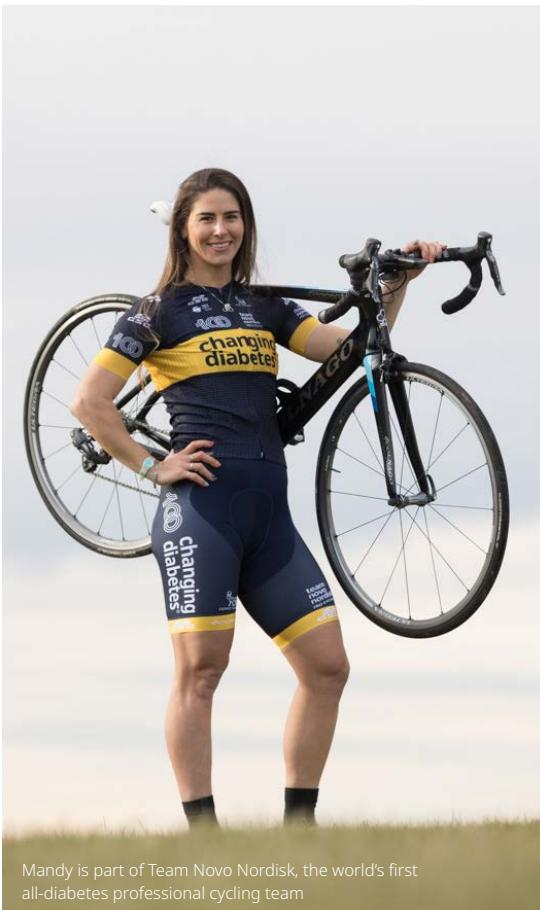

> **AI Description:**
> **Source:** `assets/_page_1_Figure_0.jpg`
> 
> **Generated:** 2026-05-28 03:30:55
> 
> ---
> 
> The image contains a photograph of a person wearing a cycling jersey with the text "changing diabetes" and "Team Novo Nordisk" printed on it. The individual is holding a road bicycle and standing outdoors in a grassy area. The text at the bottom of the image states, "Mandy is part of Team Novo Nordisk, the world's first all-diabetes professional cycling team." The image visually represents a professional cyclist associated with a diabetes-focused cycling team.

Introducing Novo Nordisk   
Letter from the Chair 3   
Letter from the CEO 5   
Novo Nordisk at a glance . 7   
Business model . 8   
Performance highlights . 9   
Strategic Aspirations   
Purpose and sustainability 11   
Innovation and therapeutic focus 20   
Commercial execution . 26   
Financials 29   
Corporate governance   
Risk management . 34   
Shares and capital structure 36   
Corporate governance . 38   
Governance practices . 40   
Board of Directors . 42   
Executive Management . 45

## Consolidated statements

Consolidated financial statements   
Income statement . 47   
Cash flow statement . 48   
Balance sheet . 49   
Equity statement . 50   
Notes to the consolidated financial statements 51   
Consolidated ESG statement (supplementary information)   
Statement of ESG performance 81   
Notes to the consolidated ESG statement . 82   
Statement by Board of Directors and Executive Management . . . . 88   
Independent Auditor's Reports 89   
Independent Assurance Report on the ESG statement . 91   
Additional information   
More information 92   
Product overview . 93

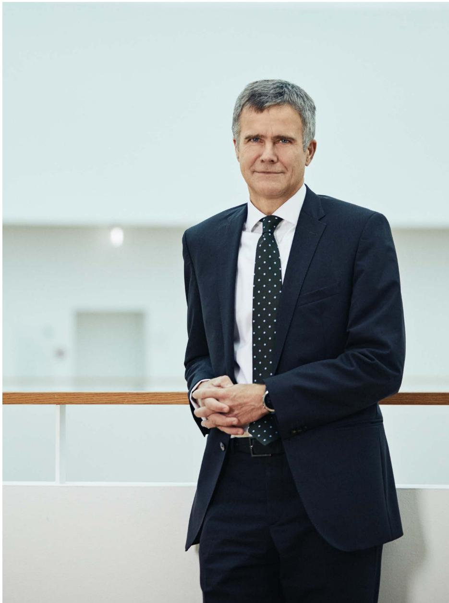

> **AI Description:**
> **Source:** `assets/_page_2_Figure_0.jpg`
> 
> **Generated:** 2026-05-28 03:36:46
> 
> ---
> 
> The image contains a photograph of a person dressed in a dark suit with a white shirt and a tie featuring white polka dots. The person is standing indoors, with a blurred background that includes a wooden railing and a white wall. The individual has their hands clasped in front of them and is looking directly at the camera. The overall setting appears to be a professional or formal environment.

Letter from the Chair

# Rising to the challenge

The devastating impact of COVID-19 on societies and economies in 2020 intensified existing challenges such as inequality and poverty. However, in times of crisis, businesses play a critical role in mobilising resources and providing solutions. Novo Nordisk has worked hard to respond to the challenges, helping people with serious chronic diseases while also supporting society on a broader scale.

Novo Nordisk’s highest priority in 2020 was to ensure the safety of our employees and the uninterrupted supply of our life-saving medicines for patients. We achieved this, while also supporting society's response to the pandemic, most notably in Denmark, where our headquarter presence meant we were able to assist the government in the rapid scale-up of coronavirus testing. At the same time, our scientists continued to make significant progress in discovering new therapies of the future, while our global

commercial organisation embraced an increasingly digital new reality.

The world has been through one of the most difficult years in recent human history. Despite the pandemic and the turbulent business environment, Novo Nordisk took important steps towards delivering on our purpose of driving change to defeat diabetes and other serious chronic diseases – a goal we are confident will translate into sustainable and profitable growth.

This does not mean that the road ahead is going to be easy. The pandemic has exacted an immense economic, as well as human, cost on societies and it is inevitable that public finances will remain fragile for many years. Those fiscal constraints will put pressure on businesses that work closely with governments, including the pharmaceutical industry, and we will have to find new ways to ensure that our products are accessible to all those who need them.

Beyond COVID-19, two consistent priorities were high on the Board’s agenda in 2020, namely scientific innovation and sustainability – both of which are vital to ensure the future of the company. It is therefore satisfying to see a healthy product pipeline, including the pioneering science that we consider to be the biggest contribution we can make to society.

Our research is now more broadly focused as we look to deliver treatments within therapy areas adjacent to our core competencies. Specifically, this means looking beyond semaglutide, the GLP-1 molecule found in our new oral diabetes treatment Rybelsus® and the once-weekly injectable Ozempic®. We are exploring novel ways to treat a range of conditions beyond diabetes, including cardiovascular disease – the world’s leading cause of death1 – obesity and most recently also as a potential treatment for Alzheimer’s disease. In tandem with this push into new areas, we are also establishing more external alliances and partnerships to complement our in-house expertise.

> **AI Description:**
> **Source:** `assets/_page_3_Figure_0.jpg`
> 
> **Generated:** 2026-05-28 03:38:58
> 
> ---
> 
> The image shows a person in a laboratory setting, wearing a white lab coat and a blue headscarf. They are holding a pipette and appear to be in the process of transferring a liquid from one container to another. The background includes laboratory equipment and a sink, indicating a scientific or medical environment. The person is focused on their task, suggesting a professional or educational context related to laboratory work.

Employees from the Novo Nordisk research department volunteered to contribute to the fight against COVID-19 and, together with staff from the Danish health service, they helped to increase the testing capacity in Denmark.

“Above all, 2020 underscored the need for strong corporate values and a shared sense of purpose. We are fortunate that both are well-established across our organisation, empowering our employees to keep delivering for both patients and investors, despite the unprecedented disruptions caused by COVID-19.”

It is increasingly clear that society expects more from businesses as the world grapples with climate change and environmental degradation, as well as the need for greater equity in healthcare. Indeed, the pandemic has turbocharged many of these issues, with an effective alliance emerging between young people and investors that is prompting companies to pay far more attention to sustainability.

At Novo Nordisk, we have been focused on sustainability for many years – but we are determined to continue to raise our game. In the past year we launched a new social responsibility strategy, Defeat Diabetes, and initiated programmes within renewable power and recycling as part of our Circular for Zero environmental strategy.

Above all, 2020 underscored the need for strong corporate values and a shared sense of purpose. We are fortunate that both are well-established across our organisation, empowering our employees to keep delivering for both patients and investors, despite the unprecedented disruptions caused by COVID-19.

On behalf of the Board of Directors I would like to offer my thanks to all Novo Nordisk’s employees for their hard work and commitment during the exceptional challenges of 2020; to Lars Fruergaard Jørgensen and his team for leading the company through a turbulent year in such a thoughtful and positive manner; and to our shareholders for their continued support.

1. WHO, The top 10 causes of death (2020)

## Helge Lund

Chair of the Board of Directors

Letter from the CEO

# The power of purpose

The COVID-19 pandemic has taken a terrible toll around the world – but the pain has not been shared equally. People with underlying conditions have been hit disproportionately hard by the virus, a fact that makes Novo Nordisk’s purpose of driving change to defeat diabetes and other serious chronic diseases more meaningful than ever.

Today, one in 11 people in the world has diabetes and if action is not taken to bend the curve, that figure is projected to rise to one in nine by 20451 . The risk posed by COVID-19 to people living with diabetes and obesity is a clear wake-up call: we must continue to do more to tackle these diseases or risk vast future damage to millions of lives, as well as to broader societies and economies.

We measure our contribution to the fight against diabetes and other serious chronic diseases in our Strategic Aspirations for 2025. Appropriately, after a year as unparalleled as 2020, and as the world acknowledges the hundredth anniversary of the discovery of insulin, the first of these is 'Purpose and sustainability'. Over the past year we have stepped up our commitment to our purpose by launching a new Defeat Diabetes social responsibility strategy. This sets out our ambition to accelerate the prevention of type 2 diabetes, provide access to affordable care for vulnerable patients in every country and innovate to improve lives.

Beyond defeating serious chronic diseases, we also aspire to have zero environmental impact. In 2020, we took an important step by achieving our target of using 100% renewable power across global production – a key milestone on the road to our target of zero CO emissions from all operations and transport by 2030.

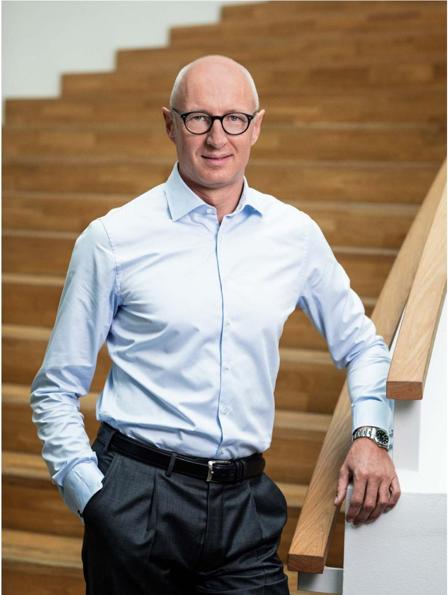

> **AI Description:**
> **Source:** `assets/_page_4_Figure_0.jpg`
> 
> **Generated:** 2026-05-28 03:38:46
> 
> ---
> 
> The image is a photograph of a person standing on a staircase. The individual is wearing a light blue dress shirt, dark trousers, and a black belt. They are also wearing glasses and a wristwatch on their left hand. The background consists of wooden stairs, and the person is leaning slightly on the railing. The setting appears to be indoors, possibly in an office or institutional building.

We now also ask that by the end of the decade, our direct suppliers use only renewable power when supplying us. It has been great to see some of our largest suppliers step up and meet this target already.

Despite this encouraging progress, we can only fulfil our purpose and be respected for adding value to society if we deliver on our core contribution of scientific innovation. Thanks to a strategy of targeted investment, our scientists are currently pursuing higher levels of innovation across more therapy areas than at any point in the company’s history. Consequently, I believe we are now well-positioned for success in the short, medium and long term.

Within diabetes, we are further raising the innovation bar with the roll-out of the world’s first once-daily GLP-1 tablet, Rybelsus®, while at the same time working on novel insulins, 100 years after the discovery of the molecule. Our Research & Development (R&D) colleagues are also pursuing greater weight loss in obesity, and in 2020 they demonstrated the potential of semaglutide 2.4 mg in the STEP phase 3 clinical trial programme.

Crucially, we also broadened our technology platforms and expanded our research into adjacent disease areas in 2020 including cardiovascular disease, non-alcoholic steatohepatitis (NASH) and Alzheimer’s disease – areas of huge unmet medical need and a great burden for patients, families and society alike.

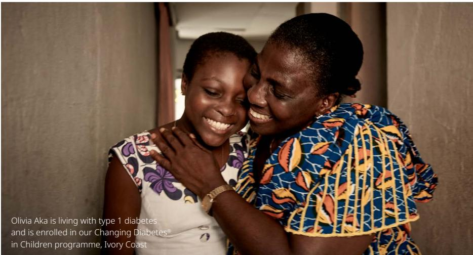

> **AI Description:**
> **Source:** `assets/_page_5_Figure_0.jpg`
> 
> **Generated:** 2026-05-28 03:37:03
> 
> ---
> 
> The image is a photograph showing two individuals, likely a mother and daughter, embracing each other. The daughter is smiling and appears to be in her teenage years, while the adult woman is wearing a patterned blouse and has her arm around the younger woman. The background is simple, with neutral-colored walls and a curtain. The text at the bottom of the image provides information about Olivia Aka, who is living with type 1 diabetes and is enrolled in a diabetes program in Ivory Coast.

Our continued focus on external innovation led to the significant acquisitions of Corvidia Therapeutics and Emisphere Technologies, strengthening our positions in cutting-edge areas of cardiovascular medicine and drug delivery respectively.

Commercially, 2020 was a challenging year as lockdowns reduced the time doctors spent with their patients, leading to fewer initiations of new treatments. Despite this, we expanded our leadership position in the diabetes market in terms of value, keeping us on track to reach a share of more than one third by 2025. Diabetes sales were driven by sales of GLP-1 products (Victoza®, Ozempic® and Rybelsus®), which offset mixed market conditions for insulins. We continued to help more people living with obesity, while making “Over the past year we have stepped up our commitment to our purpose by launching a new Defeat Diabetes social responsibility strategy. This sets out our ambition to accelerate the prevention of type 2 diabetes, provide access to affordable care for vulnerable patients in every country and innovate to improve lives."

progress with our ambition to secure sustained growth within our Biopharm division thanks to strong demand for our growth hormone and new haemophilia products.

I believe that our ability to meet the needs of our millions of patients during the pandemic in 2020 comes as a consequence of our crystal-clear purpose and long-established company values. We are far from done and have many more millions of patients for whom treatment is not accessible today. So now is the time to continue to invest in our people and in our organisation, creating an inclusive, diverse and safe working environment in which colleagues have equal opportunities to thrive and fulfil their potential.

Looking to the future, I am confident that our clear corporate strategy will make us a valued partner to society as the world continues on the long road to recovery from the pandemic.

In closing, I would like to thank my colleagues around the world for their agility and commitment during this most challenging of years. Special thanks must go to our partners and collaborators, without whom we could not succeed. A sincere thank you goes to our Board of Directors for their continued support and constructive challenging of the organisation. Finally, I would like to send a thank you to our shareholders for their continuous support.

Lars Fruergaard Jørgensen President & Chief Executive Officer

# Novo Nordisk at a glance

Novo Nordisk is a global healthcare company, headquartered in Denmark. Our key contribution is to discover and develop innovative biological medicines and make them accessible to patients throughout the world. We aim to lead in all disease areas in which we are active.

## Our corporate strategy

Our corporate strategy has four distinct focus areas in which we operate. It is built on our purpose, the Novo Nordisk Way and our ambition to be a sustainable business.

We aim to strengthen our leadership and treatment options in Diabetes and Obesity care, secure leading positions within Biopharm and establish a strong presence in other serious chronic diseases such as NASH, cardiovascular disease and Alzheimer’s disease. Succeeding in this will drive sustainable growth for Novo Nordisk.

126,946 DKK million in net sales

54,126 DKK million in operating profit

28,565 DKK million in free cash flow

45,323 employees worldwide

169 countries with marketed products

80 countries with affiliates

## Diabetes care

Strengthen leadership by offering innovative medicines and driving patient outcomes

## Biopharm

Secure a leading position   
by leveraging full portfolio and expanding into adjacent areas

Driving change to defeat diabetes and other serious chronic diseases

## Obesity care

Strengthen treatment options through market development and by offering innovative medicines and driving patient outcomes

Other serious chronic diseases

Establish presence by building competitive pipeline and scientific leadership

countries with R&D facilities

## 463

million people live with diabetes1

650

million people live with obesity2

450

thousand people live with haemophilia3

## 5

1. IDF Diabetes Atlas, 9th edition, 2019 2. WHO, Obesity and overweight, fact sheet, 2020 3. World Federation of Hemophilia, Annual Survey, 2018

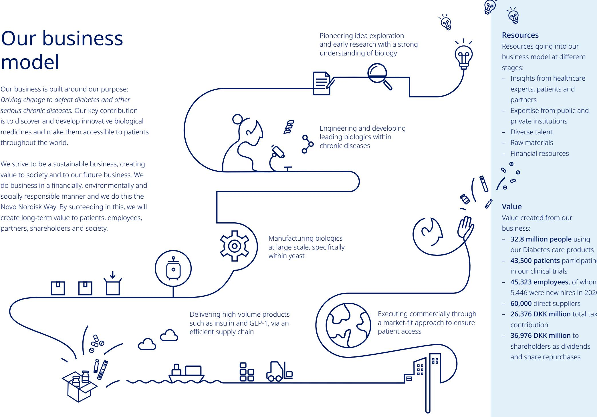

> **AI Description:**
> **Source:** `assets/_page_7_Figure_0.jpg`
> 
> **Generated:** 2026-05-28 03:33:01
> 
> ---
> 
> The image contains an infographic with a flowchart-style diagram illustrating a business model. The flowchart outlines the stages of a company's operations, from idea exploration and research to commercial execution. Key elements include:
> 
> 1. Pioneering idea exploration and early research with a strong understanding of biology.
> 2. Engineering and developing leading biologics within chronic diseases.
> 3. Manufacturing biologics at large scale, specifically within yeast.
> 4. Delivering high-volume products such as insulin and GLP-1, via an efficient supply chain.
> 5. Executing commercially through a market-fit approach to ensure patient access.
> 
> The infographic also lists resources and value created from the business, such as insights from healthcare experts, patients, and partners, and the number of people using the company's diabetes care products. The visual elements effectively complement the textual information, providing a clear and concise overview of the company's operations and contributions.

## Performance highlights

## Strategic Aspirations 2025

To reflect the broad aspects of Novo Nordisk across therapy areas and geographies, Novo Nordisk introduced in 2019 a comprehensive approach describing the future growth aspirations of the company under the headline Strategic Aspirations 2025. The Strategic Aspirations are objectives that Novo Nordisk intends to work towards and are not a projection of Novo Nordisk's financial outlook or expected growth.

## Purpose and sustainability

## 2025 Strategic Aspirations

– Being respected for adding value to society

– Progress towards zero environmental impact

Ensure distinct core capabilities and evolve culture

## 2020 highlights

## Adding value to society:

– Launch of new social responsibility strategy, Defeat Diabetes

– Expansion of US affordability offerings

– Societal contributions during COVID-19

– Lowered ceiling price of human insulin in 76 countries

## Environment:

– 100% renewable power across all production sites

– Launch of supplier target aiming at 100% renewable power by 2030

Ensure distinct capabilities and evolve culture

– Progress on diversity and inclusion agenda as well as digitalisation capabilities

> **AI Description:**
> **Source:** `assets/_page_8_Figure_1.jpg`
> 
> **Generated:** 2026-05-28 03:34:01
> 
> ---
> 
> The image contains a simple line graph. The graph shows an upward trend, indicating growth or increase over time. The x-axis appears to represent time, while the y-axis represents a quantity or value that is increasing. There are no specific labels or annotations provided for the axes or the graph itself.

– Strengthen diabetes leadership – aim at global value market share of more than 1/3

– Strengthen obesity leadership and double 2019 reported sales

## 2020 highlights

Secure a sustained growth outlook for Biopharm

Diabetes sales increased by 8% at CER1

– Value market share leadership expanded by 0.7 percentage points to 29.3%

## 2025 Strategic Aspirations

Obesity sales increased by 3% at CER to DKK 5.6 billion

Biopharm sales increased by 1% at CER

## Innovation and therapeutic focus

## 2025 Strategic Aspirations

– Further raise the innovation bar for diabetes treatment

Develop a leading portfolio of superior treatment solutions for obesity

## Commercial execution

– Strengthen and progress the Biopharm pipeline

## 2020 highlights

– Establish presence in other serious chronic diseases focusing on cardiovascular disease (CVD), NASH and chronic kidney disease (CKD)

## Diabetes:

– Semaglutide 2.0 mg phase 3b trial successfully completed

– Once-weekly insulin icodec phase 3 trial programme initiated

– Rybelsus® approved in the EU, the UK and Japan

## Biopharm:

## Obesity:

– Applications for semaglutide 2.4 mg submitted to FDA and EMA

– AM833 + semaglutide 2.4 mg phase 1 trial successfully completed

– Mim8 phase 1/2 trial initiated

Other serious chronic disease:

Concizumab phase 3 trial reinitiated

– Successful completion of phase 2 trials for ziltivekimab and semaglutide in NASH

## Financials

## 2025 Strategic Aspirations

– Deliver solid sales and operating profit growth:

– Deliver 6–10% sales growth in IO2

– Transform 70% of sales in the US (from 2015 to 2022)

– Drive operational efficiencies across the value chain to enable investments in future growth assets

– Deliver free cash flow to enable attractive capital allocation to shareholders

## 2020 highlights

Operating profit increased by 7% at CER to DKK 54.1 billion

Sales increased by 7% at CER, to

– 10% sales growth at CER in IO

– 3% sales growth at CER in NAO3 , with 48% of US sales transformed to products launched since 2015

Free cash flow of DKK 28.6 billion and DKK 37 billion returned to shareholders

### Full Page Description (Page 9)

**Source:** `assets/_page_9_Asset_0.jpg`

**Generated:** 2026-05-28 03:34:19

---

The image is a pie chart with four segments, each representing a different category with a percentage value. The largest segment, in blue, represents 48% of the total. The second largest, in dark blue, represents 27%. The third segment, in teal, represents 11%, and the smallest segment, in gray, represents 14%. The chart visually represents the distribution of four categories, with the blue segment taking up the largest portion of the chart.

### Full Page Description (Page 9)

**Source:** `assets/_page_9_Asset_1.jpg`

**Generated:** 2026-05-28 03:34:57

---

The image is a pie chart with three segments. The largest segment, occupying 81% of the chart, is dark blue. The second segment, representing 15%, is yellow, and the smallest segment, making up 4%, is light blue. The chart visually represents the distribution of percentages among the three categories.

Performance highlights Financial highlights

Sales by geographic area North America EMEA Region China Rest of World

1. See 'Non-IFRS financial measures' 2. See 'Financial definitions'. 3. Total dividend for the year including interim dividend of DKK 3.25 per share, corresponding to DKK 7,570 million, which was paid in August 2020. The remaining DKK 5.85 per share, corresponding to DKK 13,496 million, will be paid subject to approval at the Annual General Meeting.

Purpose and sustainability

# Adding value to society and to our future business

Demands on companies are changing fast as the world is faced with extraordinary challenges. Threats like the COVID-19 pandemic and climate change mean that 'business as usual' is no longer an option. The stakes are high and we are determined to be a sustainable business by adding value to society and to our future business.

## 2025 Strategic Aspirations Purpose and sustainability

Being respected for adding value to society

Progress towards zero environmental impact

Ensure distinct core capabilities and evolve culture

The rapid outbreak of COVID-19 during 2020 put the potential vulnerability of people living with diseases, including diabetes and obesity, firmly in the spotlight. At the same time, climate change remains an urgent challenge. These challenges call for corporations to step up and take a leading role in delivering and adopting solutions.

In 2020 we addressed these challenges by increasing access to our medicines across the world, pursuing zero environmental impact, and taking steps towards creating a more sustainable and inclusive workplace.

## Responding to COVID-19

During 2020, COVID-19 led to a cascade of critical needs around the world and we used our expertise, resources and global reach to contribute to the response. Our highest priority was to ensure the safety of our employees and the uninterrupted supply of life-saving medicines for our patients. In addition, we focused our resources on donations towards global relief efforts and activated our research and development organisation to perform COVID-19 testing following a request for support from the Danish government.

## Leading a sustainable business

Our purpose is to drive change to defeat diabetes and other serious chronic diseases. To maximise our positive impact, we must offer solutions beyond providing medicines to help tackle the global societal challenges of growth in non-communicable diseases, lack of access to affordable care and the impacts of climate change.

We are committed to being a sustainable business. To us, this means that we add value to society and to our future business. To achieve this ambition, we do business in a financially, environmentally and socially responsible way, as reflected in our Articles of Association and the Novo Nordisk Way. This approach is integrated into every aspect of our decision-making, in strategies and actions, always keeping in mind what is best in the long term for the patients we serve, our shareholders, our employees, the communities in which we are present and the global society we are part of.

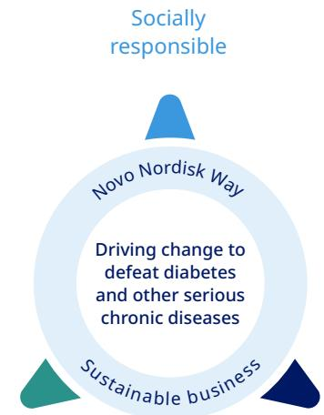

> **AI Description:**
> **Source:** `assets/_page_10_Figure_1.jpg`
> 
> **Generated:** 2026-05-28 03:38:07
> 
> ---
> 
> The image is a diagram illustrating the Novo Nordisk Way, which is described as a socially responsible approach to driving change to defeat diabetes and other serious chronic diseases. The diagram is circular with three key elements: "Socially responsible" at the top, "Sustainable business" at the bottom, and "Driving change to defeat diabetes and other serious chronic diseases" in the middle. The diagram is designed to convey the company's commitment to both social responsibility and sustainable business practices in the context of addressing health challenges.

Environmentally responsible

Financially responsible

With that, we lead towards our Strategic Aspirations within purpose and sustainability.

This is what ESG – Environmental, Social and Governance – means to us.

Read more about ESG in the following sections and in the consolidated ESG statement.

# Purpose and sustainability Our environmental responsibility

Each year, billions of Novo Nordisk tablets, vials and injection pens are distributed to patients and demand for them is growing. This puts us in the front line of some of the most challenging environmental issues including climate change, water and resource scarcity, pollution and plastic waste. Our ambition is bold and simple: to have zero environmental impact.

To get there, we are adopting a circular mindset, designing products that can be re-used or recycled, reshaping our business practice to minimise consumption and eliminate waste, and working with suppliers who share our ambition. We call our environmental strategy Circular for Zero and we measure our progress based on use of resources, emissions and waste. The Circular for Zero strategy incorporates our entire value chain and is based on three pillars: circular supply, circular company and circular products.

## Circular supply

As part of our ambition to switch to circular sourcing and procurement, we collaborate with suppliers to encourage them to shift to sustainably sourced materials, thus reducing our environmental impact. In 2020 we set an ambitious target that all our direct suppliers should source 100% renewable power by 2030 when supplying us. To achieve this, we will work with our suppliers to help them in this transition to renewable power. Successful conversion among our 60,000 suppliers would result in around 300,000 tonnes of CO being eliminated from our direct suppliers each year.

## Circular company

We work to reduce our environmental impact across all areas of our operations and transportation. In 2020, total CO emissions across our operations and transportation were 170,000 tonnes of CO , representing a 44% decrease from 2019, due primarily to the implementation of renewable energy projects and impacts on travel from COVID-19.

CO emissions from operations includes all production facilities, global office buildings and laboratories. In 2020, CO emissions from production were 37,000 tonnes CO , a reduction of 57% versus 2019, primarily due to the implementation of various renewable energy initiatives. These projects include implementation of renewable heat and steam in Kalundborg, wind power in France, Algeria and Russia, and solar power in the US. CO emissions from office buildings and laboratories were 8,000 tonnes CO , a decrease of 38% versus 2019, due primarily to energy-saving projects and COVID-19 shut-downs.

Our environmental strategy, Circular for Zero and 2030 ambitions

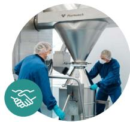

> **AI Description:**
> **Source:** `assets/_page_11_Figure_0.jpg`
> 
> **Generated:** 2026-05-28 03:34:47
> 
> ---
> 
> The image contains a photograph of two individuals in a laboratory or industrial setting, working with a large piece of equipment that appears to be a mixing or processing machine. The individuals are wearing protective clothing, including gloves and hairnets, suggesting a focus on hygiene and safety. The machine has a funnel-like top, and there is a logo and text in the top right corner that reads "Ferment." The bottom left corner features a circular icon with a water droplet symbol, indicating a possible focus on water or liquid handling in the process.

Circular supply: Proactive collaboration with suppliers to embed circular thinking for reduced environmental impact across the value chain and move towards circular sourcing and procurement

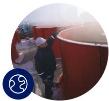

> **AI Description:**
> **Source:** `assets/_page_11_Figure_1.jpg`
> 
> **Generated:** 2026-05-28 03:34:29
> 
> ---
> 
> The image shows a person working on or around a large red cylindrical tank. The individual appears to be wearing a white cap and dark clothing, and is engaged in some form of maintenance or inspection activity. The tank is part of a larger industrial or agricultural setting, as indicated by the surrounding structures and equipment. The image is circular and includes a logo in the bottom left corner, suggesting it may be from a specific organization or company.

Circular company: Eliminate environmental footprint from operations and drive a circular transition across the company aiming for zero environmental impact

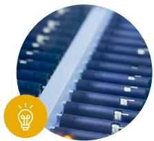

> **AI Description:**
> **Source:** `assets/_page_11_Figure_2.jpg`
> 
> **Generated:** 2026-05-28 03:35:24
> 
> ---
> 
> The image contains a close-up photograph of a solar panel. The panel is composed of numerous blue photovoltaic cells arranged in a grid pattern. The cells are connected by metallic strips, and the image highlights the texture and structure of the solar panel. The bottom left corner features a yellow circle with a lightbulb icon, possibly indicating an idea or concept related to renewable energy or solar technology.

Circular products: Upgrade existing and design new products based on circular principles and solve the end-of-life product waste challenge to close the resource loop

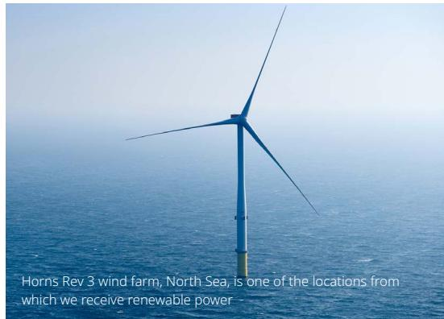

> **AI Description:**
> **Source:** `assets/_page_11_Figure_3.jpg`
> 
> **Generated:** 2026-05-28 03:36:09
> 
> ---
> 
> The image contains a photograph of a single offshore wind turbine situated in the North Sea. The turbine is blue and white, with three blades extending outward. The background is a vast expanse of blue water under a clear sky. The text at the bottom of the image identifies the location as Horns Rev 3 wind farm and mentions that it is one of the locations from which renewable power is received.

Due to COVID-19, CO emissions from business flights were reduced to 19,000 tonnes CO , a reduction of 71% compared with 2019. During 2021, we will focus on ensuring that emissions from business travel are minimised through the promotion of virtual collaboration with both colleagues and stakeholders. CO emissions from our company cars in 2020 were 45,000 tonnes CO , 27% lower than in 2019, primarily due to fewer in-person meetings and less travel as a result of COVID-19. Novo Nordisk is a member of EV100 and has committed to transitioning to 100% electric company cars by 2030. In 2020, CO emissions from product distribution were 61,000 tonnes CO , a decrease of 24% compared with 2019, due to optimisation projects to move products shipped from air to sea freight.

At the beginning of the year, we achieved our ambition of sourcing 100% renewable power in our global production when a new solar facility went online

> **AI Description:**
> **Source:** `assets/_page_12_Figure_0.jpg`
> 
> **Generated:** 2026-05-28 03:30:27
> 
> ---
> 
> The image contains a simple circular diagram with two arrows pointing in a clockwise direction around a central symbol resembling a globe or Earth. The arrows suggest a cycle or continuous process, while the central symbol could represent the Earth or a related concept. The design is minimalistic and uses a single color, making it suitable for representing a cycle or loop in a visual format.

## Environmental performance

## 170

1,000 tonnes CO emissions from operations and transport -44% from 2019

## 100%

share of renewable power for production sites +24 percentage points from 2019

## <1%

of waste from production sites sent to landfill 0% change from 2019

powering our entire US operations. In the process, we became the first pharmaceutical company in the renewable power initiative, RE100, to do this.

In 2020, the energy consumption for our operations was 3,191,000 GJ, an increase of 7% compared with 2019, primarily due to a new production site in North Carolina. Energy-saving projects implemented in 2020 within production sites are expected to result in annual savings of 94,000 GJ.

Water consumption at production sites was 3,368,000 cubic meters, an increase of 7% compared with 2019 due to the new production site in North Carolina. Four production sites including China and Brazil are in areas subject to water stress or high seasonal variations. These sites accounted for 11% of the total water consumption in 2020, and water consumption at these sites decreased by 15% in 2020, despite adding new production sites. We will continue to focus on reducing water consumption across these sites.

We are committed to reducing waste and have a target of sending zero production waste to landfill by 2030. In 2020, production sites had a total of 141,000 tonnes of waste, an increase of 14% compared with 2019. This increase was due to increased production in Kalundborg.

## Circular products

We are working to ensure existing and new products are fit for circularity and have developed a circular design guideline within R&D to reduce the environmental footprint of our devices.

As part of Circular for Zero, we are seeking to address the end-of-life challenges associated with many of our medical devices. In late 2020, we initiated a pilot take-back scheme for medical devices in Denmark with the aim of scaling globally in the future. Through recycling our production waste, we have been able to successfully recycle insulin pens, providing materials for the manufacture of lamps and office furniture. We are pursuing greater re-use and recycling of our devices and aspire to achieve this in coming years.

“The Danish Association of Pharmacies is very excited to be part of this important take-back project aiming to reduce the environmental impact from used insulin pens, which consist of valuable materials suitable for recycling. By recycling we avoid the negative climate impact from burning the material as normal waste.”

– Birthe Søndergaard, Danish Association of Pharmacies

93% of waste arising from our production was recycled, converted to biogas or incinerated in waste-to-energy plants. During 2020 less than 1% (1,000 tonnes) of our waste was sent to landfill.

Read more about our environmental performance in the consolidated ESG statement in this report and on novonordisk.com.

It is our ambition to have zero environmental impact. In order to achieve this ambition we set out a 2030 supplier target, with the desire that

## 60,000

direct suppliers use renewable power when supplying us.

## 300,000

tonnes of CO would be eliminated from our direct suppliers each year.

# Purpose and sustainability Our social responsibility

At Novo Nordisk, it is our ambition to be respected for adding value to society. We aim to achieve this by adding value to the communities we are part of, delivering innovative solutions to patients, and by offering an inclusive, diverse, safe and ethical workplace.

Today, one in every 11 people in the world is living with diabetes, a figure that is projected to rise to one in nine by 2045 if action is not taken1 . Diabetes places a great burden on health systems, and we are committed to working with health authorities and other partners to prevent and treat the disease. In 2020 we launched a long-term social responsibility strategy, Defeat Diabetes, to help society rise to one of its biggest challenges. We recognise that we cannot defeat diabetes alone, but we can accelerate our actions to find solutions.

## Innovation

Our key contribution is to discover and develop innovative biological medicines and make them

We are driving change to Defeat Diabetes by…

> **AI Description:**
> **Source:** `assets/_page_13_Figure_0.jpg`
> 
> **Generated:** 2026-05-28 03:31:21
> 
> ---
> 
> The image is a circular photograph showing a person riding a bicycle on a city street. The cyclist is wearing a helmet and carrying a backpack, and the background features urban buildings, traffic lights, and other vehicles. The image also includes a blue circular icon with a hand holding a heart, suggesting themes of care or assistance.

…accelerating prevention to bend the curve…

> **AI Description:**
> **Source:** `assets/_page_13_Figure_1.jpg`
> 
> **Generated:** 2026-05-28 03:31:17
> 
> ---
> 
> The image contains a photograph of a woman sitting on a step. She is wearing a patterned orange and white top and appears to be smiling. There is a circular icon in the bottom left corner with two figures, one adult and one child, suggesting a family or community context. The background includes a green wall and part of a staircase.

…providing access to affordable care for vulnerable patients in every country…

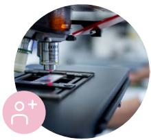

> **AI Description:**
> **Source:** `assets/_page_13_Figure_2.jpg`
> 
> **Generated:** 2026-05-28 03:31:37
> 
> ---
> 
> The image contains a photograph of a microscope in use, focusing on a sample slide. The microscope is in a laboratory setting, and the image captures the detailed view through the microscope's eyepiece. The sample slide appears to be under examination, with the microscope's objective lens in close proximity to the slide. The image is circular with a pink logo and text in the bottom left corner.

…innovating to improve lives.
1. IDF Diabetes Atlas, 9th edition, 2019

accessible to patients throughout the world. In 2020, we reached an estimated total of 32.8 million patients with our Diabetes care products, up 9% from 2019.

目 Read more in the section on innovation and therapeutic focus.

## Access and affordability

We recognise that affordability of medicines can be a challenge and we know that some people in the US living with diabetes are increasingly finding it hard to pay for their healthcare, including our diabetes medicines. Ensuring access and affordability is a responsibility we share with all involved in healthcare. During 2020, we continued our efforts to help patients in the US struggling to afford their Novo Nordisk insulins through a range of options, including:

– Follow-on brands: Unbranded biologic versions of fast-acting (Novolog®) and premix insulin (Novolog® Mix) at a 50% list price discount versus branded versions

– My\$99Insulin: 30-day supply of a combination of Novo Nordisk insulin products (up to three vials or two packs of pens) for 99 USD for eligible patients

Patient Assistance Program: Free diabetes medication to people in need who meet certain eligibility criteria, including annual household income at or below 400% of governmentdefined poverty level. Programme expanded during COVID-19

– Human insulin: For about 25 USD per vial at national pharmacies, including Walmart and CVS

– Immediate Supply Program: A free, one-time, immediate supply of Novo Nordisk insulin (up to 3 vials or 2 packs of pens) to eligible patients at risk of rationing

– Co-pay Savings Cards: To help defray high out-of-pocket costs for commercially insured patients.

During 2020, we reached more than one million people through affordability offerings in the US.

We also recognise that there are vulnerable patients in every country and to identify these groups we will initiate vulnerability assessments where we operate, excluding the US where we have already expanded our affordability offerings. We do this to identify how we can improve access to affordable care and capacity building. Based on 21 country assessments made in 2020, we have developed affordability plans in 19 countries.

Vulnerable patient groups include people impacted by humanitarian crises, people living in remote areas or in poorer parts of the world with inefficient healthcare systems and vulnerable population groups, such as children and the elderly.

In 2020, we strengthened our Access to Insulin Commitment by lowering the ceiling price (the maximum price within the commitment) from USD 4 to USD 3 per human insulin vial in 76 countries. This covers Least Developed Countries as defined by the UN, other low-income countries as defined by the World Bank, and middle-income countries in which large low-income populations lack sufficient health coverage, as well as selected humanitarian organisations.

An estimated 3.2 million people were treated with insulin under this commitment in 2020. In 2020, the average price of insulin sold under this commitment was 2.9 USD per vial, corresponding to 11.6 cents per patient per day. Beyond this commitment, we sold human insulin at or below the ceiling price in other countries, reaching an estimated another 3.1 million people during 2020. Our Access to Insulin Commitment is only one element and it cannot stand alone. Supply chain improvements and capacity building are also important in our efforts to provide access to affordable care to vulnerable patients.

Read more about our Access to Insulin Commitment on novonordisk.com.

To further improve capacity building we extended our Partnering for Change partnership with the International Committee of the Red Cross (ICRC) and the Danish Red Cross (DRC), aimed at improving care for people living with chronic diseases in humanitarian crises and we launched an ambition that no child should die from type 1 diabetes. To achieve this, we expanded our Changing Diabetes in Children programme with the aim of reaching 100,000 children by 2030. In 2020, we enrolled 2,601 additional children.

In total, 469 healthcare professionals have been trained, 222 clinics established and 28,296 children across 14 countries have received care as part of the programme since 2009.

## Prevention

In addition to the impact on patient lives, diabetes also constitutes one of the biggest societal challenges. To help society rise to this challenge, we focus our efforts within diabetes and obesity prevention where our expertise has the biggest impact. Our aim is to find, pilot and scale effective interventions to prevent diabetes and obesity, starting with early interventions and health inequalities in cities.

Within early interventions, our collaboration with UNICEF to prevent childhood overweight and obesity in Mexico and Colombia is progressing despite COVID-19, and global advocacy on childhood malnutrition continues.

Within health inequality in cities, we have a publicprivate partnership, Cities Changing Diabetes, which aims to address diabetes prevention and treatment amongst vulnerable populations in urban settings. In 2020, Cities Changing Diabetes reached 36 cities, up from 25 in 2019, spanning five continents and more than a hundred local partners across the public and private sectors.

## Donations and other contributions

During 2020 we increased our donations, partly to respond to COVID-19. Selected donations include: – 165 DKK million to the Antimicrobial Resistance

We expanded our Changing Diabetes in Children programme with the ambition to reach

> **AI Description:**
> **Source:** `assets/_page_14_Figure_0.jpg`
> 
> **Generated:** 2026-05-28 03:31:29
> 
> ---
> 
> The image is a simple line drawing of an arm with a heart symbol near the elbow. The heart has a small cross inside it, suggesting a medical or health-related theme. The arm is depicted in a raised position, possibly indicating a gesture of care or support. The drawing is minimalistic and does not contain any text or additional labels.

28,296 children reached in 14 countries.

1. Categorised as an equity investment and therefore not expensed in the income statement

Research (AMR) Action Fund, the largest collective fund ever established to support vital research into antimicrobial resistance research and development1

138 DKK million to the World Diabetes Foundation (WDF), including a special one-off contribution of 50 DKK million in 2020

– 20 DKK million to the Novo Nordisk Haemophilia Foundation

## Helping society respond to COVID-19

Since the outbreak of COVID-19, additional efforts have been focused on helping society.

In Denmark, where we are headquartered, we supported the Danish healthcare system in increasing national testing capacity and developed a COVID-19 antibody test which is being used by the University of Copenhagen to study the virus.

We offered free insulin for six months to the humanitarian organisations that we normally supply, including UNRWA and the Red Cross Organisations, to support relief efforts in humanitarian settings in low- and middle-income countries.

## Employees

We aim to be an attractive employer that offers an inclusive, diverse, safe and ethical working environment in which all employees have equal opportunities to realise their potential.

At the end of 2020, the total number of people employed in Novo Nordisk was 45,323, corresponding to 44,723 full-time positions, which is a 5% increase compared with 2019. The growth was mainly driven by International Operations.

## Diversity and inclusion

To deliver on our Strategic Aspirations it is crucial to have an inclusive and diverse organisation at all levels, including our Board of Directors. We fundamentally believe that diversity of people and inclusive leadership drive value for Novo Nordisk.

One element of our diversity and inclusion aspiration is to achieve a balanced gender representation at all managerial levels. While several initiatives have been launched to accelerate diversity and inclusion and drive gender balance, there has only been gradual change and we still have room for improvement. The gender distribution amongst managers in 2020 was 59% men and 41% women, compared with 40% women in 2019. In Senior Management1 76% were men and 24% were women in 2020, compared with 18% women in 2019. In our Board of Directors 62% were men and 38% women.

To accelerate diversity and inclusion and ensure accountability for driving progress, all levels throughout the organisation have implemented local action plans during 2020. In addition, in 2020 diversity and inclusion has been anchored in both short- and long-term incentive programmes. The strong stance on diversity and inclusion will continue in 2021 with a focus on realising continuous progress from the local action plans.

> **AI Description:**
> **Source:** `assets/_page_15_Figure_0.jpg`
> 
> **Generated:** 2026-05-28 03:30:23
> 
> ---
> 
> The image contains a simple icon representing a person with a plus sign and pills, suggesting a medical or health-related context. The icon is a blue outline with a circular head and shoulders, a plus sign in the center, and three pills above the head. This icon is commonly used to represent health, medicine, or healthcare services.

Social performance

32.8

million patients reached with Diabetes care products +9% from 2019

158

million in donations to World Diabetes Foundation and Novo Nordisk Haemophilia Foundation +50% from 2019

## 45,323

employees worldwide +5% from 2019

1. Defined as Executive Vice Presidents and Senior Vice Presidents

## Human rights and labour

We are committed to fulfilling our responsibility to respect human rights, including labour rights across all our activities and business relationships as a minimum standard of business conduct.

Read more about our Human Rights Commitment on novonordisk.com.

Since 2014, we have been a part of the living wage programme with an external global non-profit business network and consultancy. The objective is to ensure that all our employees are paid a living wage, i.e. adequate to purchase basic goods and services necessary to achieve a basic standard of living, based on calculations of living wages in the countries we operate in. In 2020 we analysed data for 74 countries compared with 12 countries in 2019, and as a result of this analysis an action plan has been implemented.

Read more about our Global Labour Code of Conduct for labour rights on novonordisk.com.

Progress was made in regard to management of salient human rights issues beyond those already addressed by existing global standards and programmes. In 2020, manager and employee human rights training strengthened awareness of these issues, while the training scope covered all human rights and all company operations. In 2020, for patient safety and the right to health, we strove to increase the share of affiliates providing safety reporting on local websites to more than 96%. For availability and affordability aspects of the right to health, see progress above.

To mitigate risks of exploitation of human biosamples used in pre-clinical research and ensure respect for donors’ rights to free and informed consent, we implemented a strengthened risk-based due diligence process.

For local manufacturing projects, we implemented enhanced human rights due diligence requirements for all new high-risk business partners. For supply chains, we strengthened the human rights focus of our supplier audits, by updating the auditor toolbox and conducting training with an external expert organisation.

Read more about our due diligence on modern slavery risks on novonordisk.com.

Health and safety and accident reporting Safety behaviour is part of our company values. In 2020, the average frequency rate of occupational accidents involving absence was 1.3 per million working hours, compared with 2.2 in 2019. In 2020, as in 2019, we had one work-related fatality. We work with a zero-injury mindset and remain committed to continuously improving safety performance.

Read more about our social performance in the consolidated ESG statement in this report and on novonordisk.com

# Purpose and sustainability Governing sustainable business

In Novo Nordisk, sustainability considerations are integrated into our business, decision-making and governance structures. We strive to conduct our business in a responsible manner, in accordance with the Novo Nordisk Way – a set of guiding principles which underpins every decision we make.

## Novo Nordisk Way

The Novo Nordisk Way is a set of guiding principles which underpins every decision we make. We use a unique, systematic approach known as facilitation to ensure that everyone lives up to the Novo Nordisk Way. In 2020, 26 facilitations were conducted, down from 32 in 2019 due to COVID-19 travel restrictions. Any issues are addressed locally, and consolidated insights are shared with Executive Management and the Board of Directors. The Novo Nordisk Way also underpins our performance management and incentive programmes.

The Novo Nordisk Way states that we treat everyone with respect, meaning there is no acceptance of discrimination nor harassment. We have processes in place to encourage the reporting of any discrimination, harassment or retaliation, including an anonymous reporting hotline. We encourage all managers and employees to have an open dialogue on the matter.

## Company trust

The level of trust in Novo Nordisk among key stakeholders – people with diabetes, general practitioners and diabetes specialists – is an indicator of the extent to which we are living up to stakeholders’ expectations.

Our trust score, measured on a scale of 0-100, increased to 80.6 in 2020 from 78.2 in 2019. The increase was the most significant improvement in a trust score in the pharmaceutical industry in 2020.

## Business ethics

Our approach to business ethics is about acting with integrity and in compliance with the Novo Nordisk Way, our Business Ethics Code of Conduct and international and local standards for responsible business conduct. Business ethics covers anti-bribery and anti-corruption, data protection and human rights with the aim of minimising any potential risks to our business, people and society.

## Novo Nordisk Essentials, part of the Novo Nordisk Way

1 We create value by having a patient centred business approach.

2 We set ambitious goals and strive for excellence.

3 We are accountable for our financial, environmental and social performance.

4 We provide innovation to the benefit of our stakeholders.

5 We build and maintain good relations with our key stakeholders.

6 We treat everyone with respect.

7 We focus on personal performance and development.

8 We have a healthy and engaging working environment.

9 We strive for agility and simplicity in everything we do.

10 We never compromise on quality and business ethics.

Annual training in business ethics is mandatory for all employees, including all new hires. In 2020, 99% of employees completed and documented their training, with the remaining 1% missing mainly due to employees being on leave. In 2020, 32 business ethics reviews were completed with 107 findings, compared with 34 reviews with 87 findings in 2019. Consolidated findings are reported to our Executive Management and the Audit Committee.

During COVID-19, all audits outside Denmark were conducted virtually. Despite the changed approach for 2020, Group Internal Audit assesses that the level of business ethics compliance is sound. Management action plans and closure of findings progressed as planned, and there were no overdue management actions or findings at the end of the year.

In 2020, we started developing data ethics principles and will implement these principles to ensure responsible and sustainable use of data. Furthermore, data protection and human rights risks were integrated into the global business ethics risk reporting process in 2020.

## Product quality and supplier audits

In 2020, as in 2019, there were no failed inspections among those resolved at year-end. During the year, 77 inspections were conducted, compared with 66 in 2019. At year-end, 59 inspections were passed and 18 were unresolved, as final inspection reports had not been received or the final authority acceptance was pending. Follow-up on unresolved inspections continues in 2021.

In 2020, a total of 177 supplier audits were conducted to assess compliance levels with our supplier standards. One critical finding was issued related to quality audits regarding handling of controlled waste. A follow-up audit has since been conducted, where the finding was found to have been closed satisfactorily.

In 2020, we had no product recalls from the market, compared with four in 2019.

## Corporate governance

As a foundation-owned company, being a sustainable business is integrated into our ownership structure. Our foundation ownership supports the overarching imperative to be both commercially successful and responsive to the wider needs of society. The fact that we have a combination of foundation ownerships and stock listing enables us to embark on longterm strategies while maintaining short-term transparency on performance.

The objective of the Novo Nordisk Foundation is to provide a stable basis for the commercial and research activities of Novo Nordisk and support broader scientific, humanitarian and social purposes.

In addition to managing our business, our governing bodies set direction and ensure that sustainability is implemented in business decisions. In line with that, two consistent priorities were high on the Board’s agenda in 2020, namely scientific innovation and sustainability – both of which are vital to the future of the company.

目 Read more about our corporate governance in the corporate governance section of this report.

## Remuneration

The variable remuneration of executives is designed to promote performance in line with the company’s strategy, purpose and ambition to be a sustainable business.

目 Read more about the remuneration of our executives in the corporate governance section of this report.

## Sustainable tax approach

Our overall guiding principle within tax is to have a sustainable tax approach (tax policy), emphasising our commercial approach to managing the impact of taxes while remaining true to our values of operating our business in a responsible and transparent manner. This means that we pay tax where value is generated and are always respecting international and domestic tax rules.

As a global business, we conduct cross-border trading, which is subject to transfer pricing regulations. We apply a 'Principal structure' in line with OECD principles, meaning all legal entities perform their functions on contract on behalf of the principals and are allocated an activity-based profit according to a benchmarked profit margin. The tax outcome of this operational model is reflected in the overview below, which shows our corporate income taxes by region. To ensure alignment between taxing authorities about the allocation of profit between our entities, we have Advance Pricing Agreements in place for geographies representing more than 65% of our revenue worldwide.

> **AI Description:**
> **Source:** `assets/_page_17_Figure_0.jpg`
> 
> **Generated:** 2026-05-28 03:37:16
> 
> ---
> 
> The image is a photograph of a young girl standing in a busy street market. She is wearing a peach-colored dress and a beaded necklace, and she is reaching out to pick apples from a wooden crate. The background shows a street scene with motorcycles and vehicles, indicating a bustling urban environment. The text at the bottom of the image states, "Roshni has type 1 diabetes and lives in India."

Our sustainable tax approach has been approved by the Board of Directors. Read more about our sustainable tax approach on novonordisk.com.

In addition to corporate income taxes, we also pay other taxes. Please refer to 'total tax contribution' in the ESG statement.

Corporate income taxes by region – three year average

Share of category

1. Intellectual property rights based on sales from where intellectual property rights are located
2. Production based on production employees in the region
3. Sales based on the location of the customer

## Financial and ESG assurance

Our financial reporting and the internal controls of financial reporting processes are audited by an independent audit firm elected at the Annual General Meeting. As part of our ESG responsibility, we voluntarily include an Assurance Report from an independent external auditor for ESG reporting in the annual report. The assurance provider reviews whether the ESG performance information covers aspects that are deemed to be material and verifies the internal control processes for the information reported.

Our internal audit function provides independent and objective assurance, primarily within internal control of financial processes, IT security and business ethics. To ensure that the internal financial audit function operates independently of Executive Management, its charter, audit plan and budget are approved by the Audit Committee. The Audit Committee must approve the appointment, remuneration and dismissal of the head of the internal audit function.

Governance performance

> **AI Description:**
> **Source:** `assets/_page_18_Figure_0.jpg`
> 
> **Generated:** 2026-05-28 03:33:32
> 
> ---
> 
> The image contains a simple icon of a hand holding a heart. The hand is depicted in a light blue color, and the heart is also in the same light blue shade. This icon is commonly used to represent themes of care, support, or love.

facilitations of the Novo Nordisk Way   
conducted   
6 fewer than in 2019

## 26

## 80.6

company trust level +3% from 2019

business ethics reviews conducted 2 fewer than in 2019

## 32

## Materiality

目 Read more about our corporate governance in the corporate governance section of this report.

We have a robust materiality process in place where material issues are determined and reassessed on an annual basis by management.

The three most material risk factors that can impact our ability to create value over time are defined by management as:

## 177

supplier audits 59 fewer than in 2019

– Product quality and patient safety

– Progress in the R&D pipeline and regulatory approval

– Pricing and market access environment

Read more in the risk management section of this report.

## Sustainability standards and performance

We strive to report on our ESG performance in accordance with relevant disclosure standards. One of these is the Taskforce on Climate-related Financial Disclosures (TCFD). Here we take a stepwise approach to incorporate material climaterelated disclosures into our annual report. A summary of how we address the risks related to climate change can be found at our website and in our CDP disclosure report. As recommended by TCFD, we are integrating climate change scenarios of 2⁰C, consistent with meeting the Paris Agreement Goal (Representative Concentration Pathway ‘RCP 2.6’) and 4⁰C as an alternative high emission (RCP 8.5) RCP to identify short-, mediumand long-term risks within our production and supply chain to ensure a steady supply of medicine to patients.

We strive to adhere to the disclosures of the Social Accountability Standards Board (SASB) which apply to our industry. We do this to demonstrate our commitment to being transparent and accountable for how we operate. We are fully or partially aligned to 20 of 25 metrics. In 2021 we will further assess our adherence and disclosure.

## We adhere to international standards, commitments and recommendations, including those outlined below:

– Access to Medicines Index

– CDP

– Sustainability Accounting Standards Board

Task Force on Climate-Related Financial Disclosures

– UK Bribery Act

– UK Modern Slavery Act

– UN Global Compact Ten Principles

– UN Guiding Principles on Business and Human Rights

UN Political Declaration on Universal Health Coverage

– UN Sustainable Development Goals

– US Foreign Corrupt Practices Act

For more information, see novonordisk.com.

For the United Nations Sustainable Development Goals (SDGs), we focus our efforts on Goal 3, 'health' and Goal 12, 'responsible consumption and production', as this is where we believe we can maximise our positive impact on the SDGs.

Read more about our sustainability governance in the consolidated ESG statement in this report and on novonordisk.com.

# Innovation and therapeutic focus Prioritising a pipeline of hope for serious chronic diseases

## 2025 Strategic Aspirations Innovation and therapeutic focus

– Further raise the innovation bar for diabetes treatment

Develop a leading portfolio of superior treatment solutions for obesity

– Strengthen and progress the Biopharm pipeline

– Establish presence in other serious chronic diseases focusing on cardiovascular disease, NASH and chronic kidney disease

For almost a century, Novo Nordisk has pioneered scientific breakthroughs within serious chronic diseases. To ensure that we continue to deliver value to society, we are pursuing even higher levels of innovation, across more therapy areas and technology platforms and with more patients and partners than at any point in our history.

Discovering ways to treat serious chronic diseases has never been more important. The COVID-19 pandemic has highlighted the vulnerability of hundreds of millions of people with diabetes, obesity and other serious chronic diseases, underlining the urgency of addressing their unmet medical needs.

We are rising to the challenge by building on a successful track record in diabetes to pursue innovative approaches to fighting obesity and other serious chronic diseases, as well as expanding our therapy area focus. These approaches will rely not only on our cutting-edge protein and peptide engineering, but on novel technology platforms including oral delivery of biologics, stem cells, RNA interference (RNAi) and gene editing to further advance our innovative pipeline for long-term success.

## Shifting gears for future growth

Our Research & Development (R&D) strategy is driven by targeted investment in novel products and technology platforms, resulting in higher levels of innovation across more therapy areas and with more external partners than at any point in our near 100-year history. In an increasingly competitive biopharmaceutical industry, this gear-shift is imperative to ensure that we retain a leading scientific position in the disruptive innovations that are set to transform medicine in the 21st century.

Over the past decade, on average we have developed one novel product each year and our business has grown strongly. To secure future growth platforms, we expect to increase our R&D investments in near- and mid-term opportunities. By building on our core capabilities including our clinical trial expertise, large scale protein manufacturing base and commercial excellence, we strive to enable more products to be launched in future years.

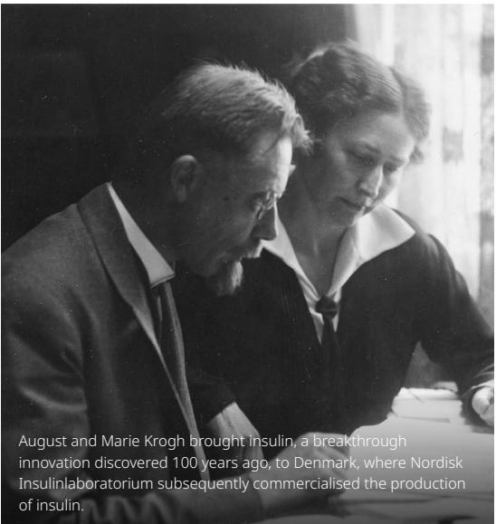

> **AI Description:**
> **Source:** `assets/_page_19_Figure_0.jpg`
> 
> **Generated:** 2026-05-28 03:33:16
> 
> ---
> 
> The image contains a black and white photograph of two individuals, August and Marie Krogh, sitting together and looking at something on a table. The photograph is accompanied by text that provides historical context about their discovery of insulin and its commercialization in Denmark. The text is informative and provides historical information about the discovery and commercialization of insulin.

In 2020 we had more than 43,500 patients participating in our clinical phase one to four trials – more than at any point in our history. And, despite the disruption caused to society and healthcare systems by COVID-19, we safely maintained continuity of key clinical trials through remote monitoring of patients and by distributing trial products directly to them rather than via study sites where possible.

Significant regulatory milestones in the past year included European and Japanese approvals for Rybelsus® – the first commercially available GLP-1 based medicine in a tablet – strengthening our leadership position in diabetes. The once-daily treatment represents a major technological advance for people living with type 2 diabetes and is now available in nine markets.

## Raising the bar in diabetes research

With the number of people living with diabetes projected to increase from 463 million today to 700 million in 20451 , there remains an urgent need to find innovative and more convenient treatments. This includes novel forms of insulin, a molecule discovered 100 years ago in 1921. One such candidate is insulin icodec, which during 2020 was seen to be effective and well-tolerated in phase 2 trials. This once-weekly insulin might one day offer patients far fewer injections than the current option of once- or twice-daily basal insulins.

Within GLP-1s we are building on our legacy by developing mono- and combination therapies that deliver higher efficacy and improved outcomes by demonstrating benefits on diabetes comorbidities.

However, our efforts within diabetes research do not stop there. In late 2020, we initiated a phase 1 trial to establish the safety of a glucose-sensitive insulin candidate. We hope that such a treatment might one day mimic the body’s own, naturally occurring insulin by sensing and responding to blood sugar levels in the body. Furthermore, together with Massachusetts Institute of Technology, we are continuing to progress the development of systems enabling the oral delivery of macromolecules, including the tortoise shell-inspired, self-orienting oral device 'SOMA', with the ultimate ambition of one day delivering insulin in a tablet.

Shaping the future of obesity treatment We are also playing a leading role in discovering new treatments for obesity, which is still not universally recognised as a serious chronic and progressive disease. This is despite the fact that people with obesity face a range of other health risks, from cancer, type 2 diabetes and heart disease to severe illness or complications from COVID-19. Among significant progress made in the past year was the phase 3 clinical trial programme STEP (Semaglutide Treatment Effect in People with obesity), in which our GLP-1 once weekly injectable semaglutide 2.4 mg demonstrated average weight loss of 17%-18% over 68 weeks in subjects with obesity without diabetes, when using a trial product estimand (15%-17% weight loss reported when using a treatment policy estimand). By leveraging GLP-1 semaglutide treatment we hope to maximise the ability of people with obesity to achieve and maintain substantial weight loss. Our aspiration is to close the gap between current pharmacological treatment options and bariatric surgery by using combination therapies based on our peptide innovation.

Semaglutide – also the active ingredient in Rybelsus® and Ozempic® – exemplifies an important trend in medicine in the form of a more holistic approach to cardiometabolic diseases. The close association between type 2 diabetes, obesity, cardiovascular disease, chronic kidney disease and non-alcoholic steatohepatitis (NASH) means that the classical siloed approach to treating disease symptoms one by one is breaking down and that a molecule like semaglutide can potentially target a number of different therapeutic areas.

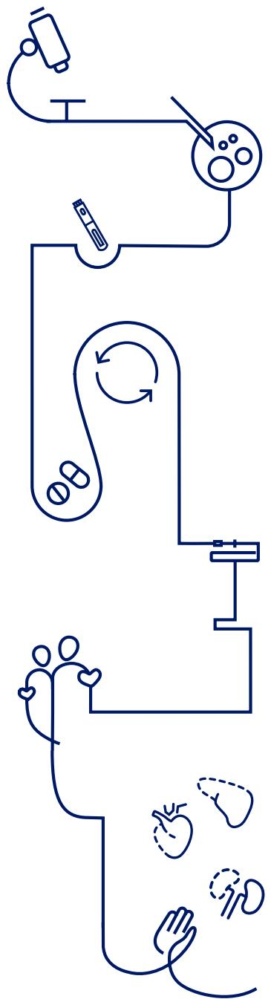

> **AI Description:**
> **Source:** `assets/_page_20_Figure_0.jpg`
> 
> **Generated:** 2026-05-28 03:35:15
> 
> ---
> 
> The image is a line drawing that appears to represent a process or flow. It includes various symbols and shapes, such as a battery, a USB drive, a circular arrow, a heart, a hand, and some abstract shapes. The lines connect these symbols in a sequence, suggesting a step-by-step process or a flowchart. The symbols and lines are simple and abstract, making it difficult to determine the exact nature of the process being depicted without additional context.

## Other serious chronic diseases

As a result, semaglutide is becoming a pipeline of opportunities within a single molecule. In addition to the results seen with semaglutide in diabetes and obesity, a recent phase 2 trial involving patients with NASH showed that treatment with semaglutide resulted in a significantly higher percentage of patients achieving NASH resolution compared to placebo and could potentially play a key role in preventing disease progression. Furthermore, early-stage research supports investigating semaglutide as treatment for early Alzheimer's disease. A pivotal phase 3 programme with oral semaglutide will be initiated in the first half of 2021. But, while such a molecule is every scientist's dream, our long-term innovation for the benefit of patients must go beyond semaglutide.

It is with this ambition that we are branching into areas of medicine that build upon our core capabilities. In cardiovascular therapy, this includes several approaches, including an anti-IL6 monoclonal antibody and a PCSK9 peptidebased inhibitor, the latter of which would provide an alternative to existing forms of powerful cholesterol-lowering therapy. This molecule has just completed phase 1 studies.

## Harnessing external innovation

The acquisition in 2020 of US-based biotech company Corvidia Therapeutics further strengthens our pipeline by introducing the anti-IL-6 monoclonal antibody, ziltivekimab, which has shown encouraging results in phase 2 on inflammatory biomarkers in patients with atherosclerotic cardiovascular disease and chronic kidney disease.

Strategic investments of this nature reflect our ambition to establish a leading presence in new adjacent therapy areas – just as we do within diabetes, obesity, haemophilia and growth disorders. During 2020, we also acquired Emisphere Technologies, and with it proprietary technologies that enable the oral formulation of therapeutics – including the Eligen® SNAC technology found in Rybelsus®.

By continuing to work with a growing number of external partners and investing in novel technology platforms – including stem cell research, RNA-interfering (RNAi) therapeutics and gene editing – we aim to deliver innovation across a broader range of serious chronic diseases than ever before. These technologies are revolutionising what is possible in medicine and they will power the disruptive innovations of the future.

## Progressing the Biopharm pipeline

External innovation is also playing an important role in the evolution of our Biopharm business, a speciality care unit that encompasses treatments for rare blood and rare endocrine disorders, where unmet need remains high. Our pipeline includes Mim8 – a next generation treatment for haemophilia A, concizumab for the treatment of haemophilia A or B and once-weekly somapacitan for growth-related disorders. However, we are also collaborating with bluebird bio, which is pioneering the development of next-generation in vivo genome editing treatments for genetic diseases, including haemophilia.

## Looking to the future

Our investment in stem cell-based, regenerative therapies lays the foundation for additional expansion into new areas such as Parkinson’s disease, dry age-related macular degeneration and chronic heart failure. Not to mention stem cell-based therapies potentially offering a path to curing type 1 diabetes – an aspiration at the heart of our purpose to defeat diabetes and other serious chronic diseases.

One thing common to our entire innovation strategy is a drive to maximise the potential of data and digital technology – spaces that we invested in throughout 2020 via recruitment and external collaboration. It is increasingly clear that excellence in digital science, just as much as expertise in biology, will be vital for success in biopharmaceutical R&D in the 21st century, as advances in analytics and real-world evidence move data-driven discovery to centre-stage in the hunt for new medicines.

> **AI Description:**
> **Source:** `assets/_page_21_Figure_0.jpg`
> 
> **Generated:** 2026-05-28 03:39:32
> 
> ---
> 
> The image is a photograph of an older woman standing against a wall with a gradient of orange and blue. She is wearing a dark coat over a white turtleneck sweater and a decorative necklace. She is holding a walking cane with a colorful pattern. The text at the bottom of the image identifies her as Shirley Stewart, who has type 2 diabetes and lives in the US.

# Innovation and therapeutic focus

## Diabetes

## Regulatory events

– The oral glucagon-like peptide 1 (GLP-1) analogue in a tablet, Rybelsus®, was granted market authorisation in the EU and Japan for treatment of adults with type 2 diabetes (T2D).

– In China, a label expansion for Victoza® was approved to include a cardiovascular (CV) indication based on LEADER. Furthermore, new drug applications (NDAs) were submitted to China’s National Medicinal Products Administration for semaglutide and the insulin degludec/liraglutide combination.

## Clinical progress

– The phase 3b trial, SUSTAIN FORTE, completed successfully, demonstrating superior reduction in HbA1c for 2.0 mg semaglutide compared with 1.0 mg semaglutide when administered once-weekly subcutaneously (sc) in people with T2D in need of treatment intensification1 .

– A phase 3b trial was initiated, investigating the effects of sc semaglutide in people with T2D and peripheral artery disease.

– A phase 3b trial was initiated with high dose oral semaglutide, 25 and 50 mg, in people with T2D in H1 2021.

– Phase 2 trials with the once-weekly basal insulin analogue, insulin icodec, were successfully completed and the phase 3a trial programme, ONWARDS, was initiated.

– Phase 1 trials for icosema and insulin 965 were successfully completed.

– The first human dose trials were initiated for glucosesensitive insulin, once-weekly combination sema-GIP and a DNA immunotherapy for T1D.

## Obesity

## Regulatory events

– An NDA for once-weekly sc semaglutide 2.4 mg for weight management in adults with obesity was filed with the FDA utilising a priority review voucher. A marketing authorisation application for semaglutide 2.4 mg in obesity was submitted to the European Medicines Agency.

– The submissions are based on the results from the STEP phase 3a clinical trial programme, which included more than 4,500 adults with obesity or overweight. Across the STEP programme, people with obesity treated with once-weekly semaglutide 2.4 mg achieved a statistically significant and greater reduction in body weight compared to placebo. Across the trials in people without diabetes, STEP 1, 3 and 4, a weight loss of 17%-18% was reported for people treated with semaglutide 2.4 mg, when using a trial product estimand (15%-17% weight loss reported when using a treatment policy estimand).

– Saxenda® was granted a label expansion to include the use in adolescents (aged 12 to <18 years) with obesity or overweight in the US.

## Clinical progress

– Novo Nordisk announced successful headline results from two clinical trials with the once-weekly sc amylin analogue (AM833). Encouraging results were obtained in a phase 2 AM833 monotherapy trial and a phase 1b combination trial of AM833 and onceweekly semaglutide 2.4 mg.

## Biopharm

## Regulatory events

– The once-weekly growth hormone derivative, somapacitan, was approved under the brand name Sogroya® for treatment of adult growth hormone deficiency (AGHD) in the US and Japan. Positive Committee for Medicinal Products for Human Use (CHMP) opinion for Sogroya® for AGHD was granted in Europe.

## Clinical progress

– The phase 2 proof-of-concept study (Explorer 4) with concizumab in haemophilia patients with inhibitors completed successfully. The halted phase 3 programme (Explorer 6, 7 and 8) was reinitiated, investigating sc concizumab prophylaxis treatment in haemophilia A and B patients regardless of inhibitor status.

– The combined phase 1/2 trial was initiated for Mim8, a next-generation factor VIII mimetic bispecific antibody for sc prophylaxis in haemophilia A patients regardless of inhibitor status. After successful single-dose administration (phase 1), Mim8 entered multiple-dose administration (phase 2).

– A phase 1 trial for EPI-01 in sickle cell disease completed successfully.

## Other serious chronic diseases

## Clinical progress

– The phase 2 trial investigating daily, sc semaglutide in non-alcoholic steatohepatitis (NASH) was completed successfully and semaglutide was granted breakthrough therapy designation in the US. Phase 3a initiation of semaglutide in NASH will be initiated in 2021.

– Novo Nordisk and Gilead Sciences presented results from a phase 2 proof-of-concept trial in NASH. The five-arm trial evaluated combinations of semaglutide with Gilead’s FXR agonist, cilofexor, and/or ACC inhibitor, firsocostat in people with NASH.

– Novo Nordisk acquired Corvidia Therapeutics Inc., with the lead compound ziltivekimab in late-stage clinical development. Ziltivekimab is a fully human monoclonal antibody directed against interleukin-6 (IL-6). Following the acquisition, the phase 2b trial with ziltivekimab was successfully completed. Ziltivekimab showed reduction in markers of inflammation compared to placebo in a chronic kidney disease patient population with atherosclerotic CV disease and inflammation. A phase 3 CV outcomes trial is expected to be initiated in 2021.

– Positive phase 1 results were reported for the PCSK9i mimetic peptide showing long-lasting LDL-cholesterol lowering effect.

## Innovation and therapeutic focus Pipeline overview

Diabetes care

Biopharm

1. GHD: Growth hormone deficiency 2. HGH: Human growth hormone 3. NASH: Non-alcoholic steatohepatitis 4. CVD: Cardiovascular disease

Innovation and therapeutic focus

# Patent status for marketed products

The patent expiry dates for the products are shown in the table on the right. The dates provided are for expiry in the US, China, Japan and Germany of patents on the active ingredient, unless otherwise indicated, and include extensions of patent term, when applicable. For several products, in addition to the active ingredient patent, Novo Nordisk holds other patents on manufacturing processes, formulations or uses that may be relevant for exclusivity beyond the expiration of the active ingredient patent. Furthermore, regulatory data protection and/or orphan exclusivity may apply.

Commercial execution

# Delivering innovation to patients in the face of a pandemic

## 2025 Strategic Aspirations Commercial execution

Strengthen diabetes leadership – aim at a global value market share of 1/3

– Strengthen obesity leadership and double 2019 reported sales

Secure a sustained growth outlook for Biopharm

Around the world, the number of people living with diabetes and other serious chronic diseases is growing fast and the need to supply improved treatments is critical. But ensuring that life-saving medicines reach all those who require them – from Stockholm to Shanghai and New York to Nigeria – has demanded new ways of doing business in 2020 as the COVID-19 pandemic has disrupted societies and economies.

Despite the challenging backdrop provided by the COVID-19 pandemic, our commercial teams around the world have remained committed to delivering innovation to patients. By harnessing the power of digital technologies, they have shown it is possible to continue to grow market share and execute on key new product launches, while meeting the needs of our patients and customers. This includes the successful roll-out of Rybelsus®, our GLP-1 based medicine in a tablet. As a result, we remain on track to reach our goal of a global diabetes value market share of more than one third by 2025, after expanding our value market share by 0.7 percentage points to 29.3% in 2020. Obesity treatment sales were impacted by the COVID-19 pandemic in 2020 but are also on course to double from 2019 to 2025, while the Biopharm division is building a platform for sustainable growth.

## A victory for agility

Our ability to maintain effective commercial operations during these exceptional times reflects our willingness to pursue new, simpler, agile ways of working. Even before the pandemic hit, we were already adopting strategies to address the opportunity presented by the rise of digitisation in healthcare and the challenge of ensuring the affordability of our medicines. The effect of COVID-19 has been to push the 'fast-forward' button on all these key activities, inspiring colleagues to adapt and evolve business practices faster than ever in 2020.

The crisis underscores the importance of increasing our efforts in prevention and disease management for people with diabetes and obesity, as they are subject to an increased risk of severe symptoms and outcomes from COVID-19. With millions of patients depending on us, failing to meet their needs is simply not an option.

## Embracing virtual interactions

Across the pharmaceutical industry the pandemic has created an unprecedented commercial environment in which traditional ways of delivering medical innovations could no longer continue. Face-to-face contacts – whether between patients and doctors or companies and customers – became almost impossible in many countries for significant periods of 2020. This challenged some parts of our business, especially in the dynamic section of the market as fewer patients could be initiated onto new treatments in the face of widespread lockdowns and follow-up clinic visits were delayed.

But we quickly adapted to the new ways of communicating, by transitioning to virtual interactions with healthcare professionals and customers. As well as a far greater degree of virtual interactions, this involved making the majority of our commercial materials digital and shifting group presentations into a virtual setting – a particularly popular approach in China. We also moved our line-up of expert educational events to digital platforms, running a significant proportion of these virtually in 2020.

### Full Page Description (Page 26)

**Source:** `assets/_page_26_Asset_0.jpg`

**Generated:** 2026-05-28 03:34:12

---

The image is a line graph showing the percentage of patients using GLP-1, insulin, and diabetes treatments from 2018 to 2020. The graph includes three lines representing GLP-1 (blue), insulin (black), and diabetes (green). The percentages for each treatment are marked at the end of each year: GLP-1 increased from 46.2% to 50.4%, insulin remained relatively stable at 43.6% to 44.3%, and diabetes increased from 27.8% to 29.3%. The data source is IQVIA.

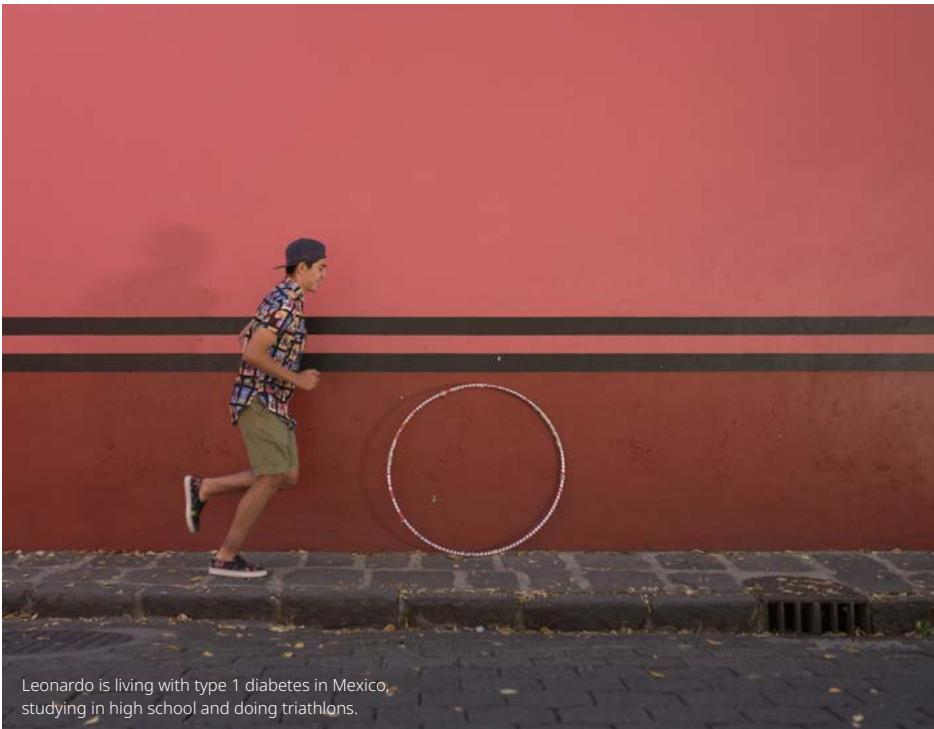

> **AI Description:**
> **Source:** `assets/_page_26_Figure_0.jpg`
> 
> **Generated:** 2026-05-28 03:39:50
> 
> ---
> 
> The image contains a photograph of a person running on a sidewalk in front of a red wall with a black horizontal stripe. The person is wearing a patterned shirt, khaki shorts, and a dark cap. The wall features a white circle drawn on it. Below the image, there is text providing information about the person in the photo. The text states that the individual, Leonardo, is living with type 1 diabetes in Mexico, studying in high school, and participating in triathlons.

This line-up of changes dovetailed with a dramatic rise in the use of telemedicine across primary and some secondary care in key markets including the US and the UK, as well as the transition of international medical congresses from physical to virtual platforms. Fortunately, the inability to run physical congresses allowed many more healthcare professionals who would not normally attend in person to participate remotely and learn about the latest developments in their field.

Ozempic® has now been launched in

A leading portfolio of diabetes medicines In diabetes, 2020 was a breakthrough year for our latest GLP-1 products, with Ozempic®, our once weekly injectable, now launched in 52 countries around the world and Rybelsus®, our semaglutidebased oral medicine, now launched in nine countries around the world. Overall sales of GLP-1 products for type 2 diabetes (Victoza®, Ozempic® and Rybelsus®) increased by 25.9% in Danish kroner and by 28.7% in constant exchange rates.

GLP-1 therapies are now helping millions of people to manage their disease, and the segment’s value share of the total diabetes market has grown to 50.4% compared with 47.5% a year ago. The GLP-1 story shows how we are continuing to deliver meaningful advances for patients, despite having been in diabetes for nearly a century.

Insulin sales across global markets were mixed, with growth across International Operations being offset by declining sales in the US due to lower realised prices following higher rebates, launches of affordability programmes and changes in the Medicare Part D Coverage Gap legislation. Measured by volume, we continue to be the world’s leading provider of insulin.

Around the globe, the insulin market is becoming increasingly competitive, and we are adapting our commercial approach according to the needs of different markets. Despite the challenges, one of our core strengths is a broad portfolio of products at different price points – from human insulin in

glass vials to the newer insulins, such as Tresiba® and Ryzodeg®, offered in FlexTouch® pre-filled pens. We are also adapting packaging to the needs of different markets, for example by offering smaller pack sizes in out-of-pocket markets such as in India, where some customers struggle to afford monthly or quarterly purchases of their medicines.

We also know some people are struggling to afford their insulin in the US as well, and offer patients a range of options to help. We invested in raising awareness of Novocare®, which provides patient affordability and access support, to ensure

### Full Page Description (Page 27)

**Source:** `assets/_page_27_Asset_1.jpg`

**Generated:** 2026-05-28 03:30:44

---

The image is a bar chart showing sales data in DKK billion for the years 2016 to 2020. The chart includes two sets of data: "Sales as reported" (blue bars) and "Growth at CER" (not explicitly shown in the chart but presumably represented by the white space or absence of a second set of bars). The sales figures are as follows: 2016 (22.5 billion DKK), 2017 (18.5 billion DKK), 2018 (17.5 billion DKK), 2019 (19.5 billion DKK), and 2020 (18.5 billion DKK). The chart includes percentage changes for each year, with 2016 showing a 4% increase, 2017 a -16% decrease, 2018 a -1% decrease, 2019 a 4% increase, and 2020 a 1% increase. The chart is labeled with "DKK billion" on the y-axis and the years on the x-axis.

### Full Page Description (Page 27)

**Source:** `assets/_page_27_Asset_0.jpg`

**Generated:** 2026-05-28 03:30:18

---

The image is a bar chart showing sales data in Danish Krone (DKK) billions for the years 2016 to 2020. The chart includes two sets of data: "Sales as reported" (blue bars) and "Growth at CER" (not explicitly shown but implied by the percentages above the bars). The sales figures for each year are as follows: 2016 (1.5 billion DKK), 2017 (2.5 billion DKK), 2018 (3.5 billion DKK), 2019 (5.5 billion DKK), and 2020 (5.5 billion DKK). The growth percentages for 2017 and 2018 are 64% and 60%, respectively, while the growth percentage for 2019 is 42%. The chart indicates a significant increase in sales from 2016 to 2019, with a slight decrease in 2020.

## The global burden of obesity

650 million adults have obesity1

124 million children and adolescents are living with obesity2

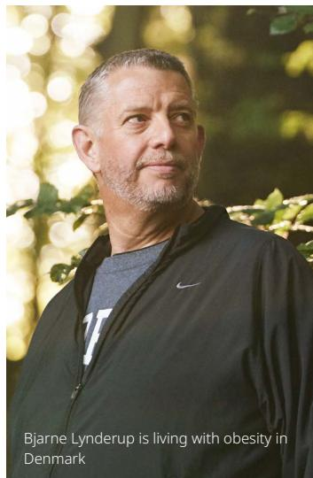

> **AI Description:**
> **Source:** `assets/_page_27_Figure_0.jpg`
> 
> **Generated:** 2026-05-28 03:35:03
> 
> ---
> 
> The image contains a photograph of a man standing outdoors in a natural setting. The man is wearing a black jacket with a Nike logo and a gray shirt underneath. The background is blurred, showing green foliage and sunlight filtering through the trees. The text overlay at the bottom of the image reads: "Bjarne Lynderup is living with obesity in Denmark."

1. WHO, Obesity and overweight, fact sheet,   
2020

2. Lancet, Worldwide trends in body-mass index, underweight, overweight, and obesity from 1975 to 2016: a pooled analysis of 2416 population-based measurement studies in 128.9 million children, adolescents, and adults (2017) 3. Population covers people with a BMI at or above 35 and with cardiovascular risk

that during a period of financial hardship and increased unemployment, patients are aware of the options available – including our Patient Assistance Program, which offered a free 90-day supply of insulin for eligible patients who lost healthcare coverage due to COVID-19.

## Leading the way in obesity

Obesity is a serious chronic disease that is closely linked to type 2 diabetes and which also poses a range of other health risks – from cancer and heart disease to severe outcomes from COVID-19. Our ambition is to ensure that it is widely recognised as such and to offer medical treatment to help effective management of the disease. It has been encouraging to see more governments – including Italy, Germany, the UK and Switzerland – taking steps during 2020 to recognise and address obesity as a chronic disease. But there is still more to be done to raise awareness and to fight the stigma and bias associated with obesity.

Sales of Saxenda® increased by 3.3% in constant exchange rates, while declining by 1.3% in Danish kroner in 2020. Sales growth was negatively impacted by COVID-19 as fewer patients initiated treatment. In October 2020 the United Kingdom’s National Institute for Health and Care Excellence (NICE) recommended Saxenda® for certain people with obesity3 ; however, it is often not reimbursed and is paid for out of pocket by patients. In countries such as Brazil, Saudi Arabia and South Korea, fewer Saxenda® prescriptions were filled due to patients cutting personal spending as

the COVID-19 pandemic took hold. In the US, meanwhile, growth was negatively impacted by a significant drop in doctor visits and fewer patients initiating treatment.

Nonetheless, we remain confident in the difference we can make for people with obesity and we are well-placed to serve a growing demand as we aspire to transition from a single-product obesity offering to a portfolio of therapies in the future. In the near term, this is expected to be driven by semaglutide, 2.4 mg, which has proven effective in clinical trials, demonstrating weight loss of 17%-18% in subject with obesity without diabetes, when using a trial product estimand (15%-17% weight loss reported when using a treatment policy estimand), and thus showing potential as a transformative treatment for obesity.

## Building in Biopharm

Sales of Biopharm products increased by 0.7% in constant exchange rates and declined 1.3% in Danish kroner. The growth as measured in constant exchange rates is following increasing demand for our growth hormone Norditropin®, due in part to supply challenges for competing products in some countries. Our haemophilia medicine NovoSeven®, however, experienced weaker sales, partly as a result of reduced elective surgeries and bleeds during COVID-19 lockdowns. This was offset to some extent by the successful roll-out of the new haemophilia treatments Esperoct® and Refixia®.

### Full Page Description (Page 28)

**Source:** `assets/_page_28_Asset_0.jpg`

**Generated:** 2026-05-28 03:33:25

---

The image is a bar chart showing the net sales of two entities, NAO and IO, as reported and the growth at CER (Constant Exchange Rate) from 2016 to 2020. The chart is presented in DKK billion. The bars are divided into two segments: the lower segment represents the net sales as reported, and the upper segment represents the growth at CER. The growth percentages for each year are indicated within the bars. The main trend shows an increase in net sales for both entities over the years, with the growth at CER being consistently higher than the reported net sales.

# 2020 performance and 2021 outlook

## 2025 Strategic Aspirations oI Financials

Deliver solid sales and operating profit growth:

Deliver 6–10% sales growth in International Operations

– Transform 70% of sales in the US (from 2015 to 2022)

Drive operational efficiencies across the value chain to enable investments in future growth assets

Deliver free cash flow to enable attractive capital allocation to shareholders

## Financial performance

Sales increased by 4% measured in Danish kroner and by 7% at CER to DKK 126,946 million in 2020. Sales growth was negatively impacted by COVID-19, driven by fewer patients initiating treatment. Novo Nordisk’s 2020 sales and operating profit performance measured at constant exchange rates (CER) were within the ranges provided in October 2020. The effective tax rate, capital expenditure as well depreciation, amortisiation and impairment loses were all broadly in line with the guidance. The free cash flow subceeded the range provided in October 2020 reflecting the acquisitions of Emisphere Technologies Inc. in the fourth quarter of 2020.

## Geographic sales development

Sales in International Operations increased by 7% measured in Danish kroner and by 10% at CER. Sales growth was driven by all geographical areas. Sales in EMEA increased by 6% measured in Danish kroner and by 9% at CER.  Sales in Region China increased by 10% measured in Danish kroner and by 11% at CER.  Sales in Rest of World increased by 6% measured in Danish kroner and by 12% at CER.

Sales in North America Operations increased by 1% measured in Danish kroner and by 3% at CER. In 2020, 48% of US sales came from products launched after 2015, with the aspiration to reach 70% by 2022.

## Sales development across therapeutic areas

Diabetes care sales growth of 8% (CER), Obesity care sales growth of 3% (CER) and Biopharm sales growth of 1% (CER).

## Diabetes and Obesity care

Diabetes care, sales development

Sales in Diabetes care increased by 5% measured in Danish kroner and by 8% at CER to DKK 102,412 million driven by GLP-1 growth. Novo Nordisk has improved the global diabetes value market share over the last 12 months from 28.6% to 29.3%, driven by market share gains in both International Operations and North America Operations.

In the following sections, unless otherwise noted, market data are based on moving annual total (MAT) from November 2020 and November 2019 provided by the independent data provider IQVIA.

## Insulin

Sales of insulin decreased by 5% measured in Danish kroner and by 3% at CER to DKK 56,550 million. The sales decrease was driven by declining sales in the US, partly offset by increased sales in International Operations.

Sales of long-acting insulin decreased by 11% measured in Danish kroner and by 9% at CER to DKK 18,439 million. Novo Nordisk has increased its global volume market share in the long-acting insulin segment from 32.4% to 32.8% in the last 12 months. The sales decline measured at CER was driven by declining Levemir® and Tresiba® sales, partially offset by increased sales of Xultophy®. Tresiba® has been launched in 91 countries, while Xultophy® has been launched in 42 countries.

Sales of premix insulin increased by 3% measured in Danish kroner and by 6% at CER to DKK 10,925 million. Novo Nordisk is the market leader in the premix insulin segment with a global volume market share of 65.2% compared to 64.2% 12 months ago. The sales increase was driven by increased sales of both Ryzodeg® and NovoMix®. Ryzodeg® has now been launched in 37 countries.

## Financial performance

### Full Page Description (Page 29)

**Source:** `assets/_page_29_Asset_0.jpg`

**Generated:** 2026-05-28 03:37:26

---

The image is a bar chart with a stacked bar format, showing data for the years 2016 to 2020. The bars are divided into two segments: a lower blue section and an upper gray section. Each bar has a percentage label at the top of the gray section. The blue section represents a larger portion of the bar each year, while the gray section represents a smaller portion. The percentages for each year are as follows: 6% in 2016, 2% in 2017, 5% in 2018, 6% in 2019, and 7% in 2020. The chart appears to be comparing two different categories or data points over the years, with the blue section consistently representing a larger share of the total.

### Full Page Description (Page 29)

**Source:** `assets/_page_29_Asset_1.jpg`

**Generated:** 2026-05-28 03:37:47

---

The image is a bar chart with a vertical orientation, displaying data in DKK billion for the years 2016 to 2020. The bars are divided into two segments: a lower blue segment and an upper dark blue segment, each representing different percentages as indicated by the text annotations above each bar. The percentages for each year are as follows: 5% in 2016, 6% in 2017, 4% in 2018, 4% in 2019, and 8% in 2020. The chart shows a general upward trend in the total value represented by the combined segments of the bars over the years, with the largest increase occurring between 2019 and 2020.

Sales of fast-acting insulin decreased by 5% measured in Danish kroner and by 3% at CER to DKK 18,313 million. Novo Nordisk is the market leader in the fast-acting insulin segment and has increased its global volume market share to 51.7% from 50.7% in the last 12 months. The sales decrease was driven by NovoRapid®, partly offset by increased Fiasp® sales. Fiasp® has now been launched in 41 countries.

Sales of human insulin decreased by 2% measured in Danish kroner and increased by 2% at CER to DKK 8,873 million.

## GLP-1 therapy for type 2 diabetes

Sales of GLP-1 products for type 2 diabetes (Ozempic®, Victoza® and Rybelsus®) increased by 26% measured in Danish kroner and by 29% at CER to DKK 41,831 million. Ozempic® has now been launched in 52 countries with sales of DKK 21,211 million, and Rybelsus® has been launched in nine countries with sales of DKK 1,873 million. The GLP-1 segment’s value share of the total diabetes market has increased to 22.0% compared with 18.0% 12 months ago. Novo Nordisk continues to be the global market leader in the GLP-1 segment with a 50.4% value market share, an increase of 2.9 percentage points compared to 12 months ago. Sales growth was negatively impacted by COVID-19.

Obesity care, sales development Sales of Saxenda® decreased by 1% measured in Danish kroner and increased by 3% at CER to DKK

Sales by therapeutic areas

Diabetes care Obesity care Biopharm Growth at CER

DKK billion

5,608 million. Saxenda® sales growth at CER was driven by International Operations, partially offset by North America Operations. Sales growth was negatively impacted by COVID-19 as fewer patients initiated treatment. Saxenda® has now been launched in 55 countries. Novo Nordisk currently has a value market share of 64.7% of the global obesity prescription drug market.

## Biopharm

Biopharm, sales development   
Sales of biopharm products decreased by 1% measured in Danish kroner and increased by 1% at CER to DKK 18,926 million. The sales growth at CER was driven by International Operations. Sales growth was driven by Growth Disorders and the launches of new haemophilia products, offset by declining sales of NovoSeven®. Sales growth was negatively impacted by lower demand due to COVID-19.

## Haemophilia

Sales of haemophilia products decreased by 6% measured in Danish kroner and by 4% at CER to DKK 9,662 million. The decreasing sales were driven by declining NovoSeven® sales, while the haemophilia A and B franchises grew driven by the continued global roll-out of Esperoct® and Refixia®.

Sales of NovoSeven® decreased by 11% measured in Danish kroner and by 9% at CER to DKK 7,203 million. The sales development was driven by declining sales in North America Operations, Rest of World and EMEA, partially offset by increasing sales in Region China, reflecting timing of shipments. The declining sales partly reflect reduced elective surgeries and bleedings due to COVID-19.

Sales of NovoEight® decreased by 4% measured in Danish kroner and by 1% at CER to DKK 1,462 million. The decreasing sales were driven by declining sales in EMEA and the US, partly offset by increased sales in Rest of World. The NovoEight® sales decrease was offset by Esperoct®, the longacting haemophilia A treatment, which has now been launched in 19 countries.

Sales of Refixia® increased to DKK 518 million. Sales growth was driven by continued uptake in Rest of World and EMEA as well as continued uptake in North America Operations. Refixia® has been launched in 25 countries.

## Growth disorders (Norditropin®)

Sales of Norditropin® increased by 6% measured in Danish kroner and by 8% at CER to DKK 7,704 million. The sales increase was driven by International Operations increasing by 16%, partially offset by North America Operations declining by 4% at CER. Novo Nordisk is the leading company in the global human growth disorder market with a value market share of 36.0% compared to 33.0% a year ago, driven by new indications and the global roll-out of the nextgeneration device. Sales growth was positively impacted by additional demand, following supply challenges for competing products in select countries.

### Full Page Description (Page 30)

**Source:** `assets/_page_30_Asset_1.jpg`

**Generated:** 2026-05-28 03:35:33

---

The image is a bar chart with a stacked design, showing data for the years 2017 to 2021. The bars are divided into three segments, each representing a different category. The categories are represented by different colors: blue, dark blue, and gray. The gray section at the top of each bar appears to be a constant value across all years, while the blue and dark blue sections show varying values. The chart includes a legend indicating the color coding for each category. The years are labeled on the x-axis, and the y-axis represents the numerical values for each category. The chart seems to be illustrating a comparison of three different metrics over the five-year period.

### Full Page Description (Page 30)

**Source:** `assets/_page_30_Asset_0.jpg`

**Generated:** 2026-05-28 03:36:02

---

The image is a bar chart with a secondary y-axis showing percentages. The bars represent data in DKK billion for the years 2016 to 2020. The chart indicates an increase in the value from 2016 to 2020, with percentages shown for each year: 0%, 5%, 3%, 6%, and 7%. The secondary y-axis ranges from 0% to 60%, with increments of 10%. The chart visually represents the growth in DKK billion over the five-year period, with the highest percentage increase occurring in 2020.

Development in costs and operating profit The cost of goods sold increased by 4% measured in Danish kroner and by 5% at CER to DKK 20,932 million, resulting in an unchanged gross margin of 83.5% measured in Danish kroner compared to 2019. The unchanged gross margin reflects productivity improvements and a positive product mix driven by increased GLP-1 sales. This is countered by a negative impact from lower realised prices in the US and a negative currency impact of 0.3 percentage points.

Sales and distribution costs increased by 3% measured in Danish kroner and by 6% at CER to DKK 32,928 million. The increase in costs is driven by North America Operations reflecting launch activities for Rybelsus® and continued promotional activities for Ozempic®, partly offset by lower promotional spend related to insulin. In International Operations, promotional spend is related to launch activities for Ozempic® and Rybelsus® as well as the continued roll-out of Saxenda®. COVID-19 resulted in a reduction of the activity level and delay of promotional activities.

Research and development costs increased by 9% measured in Danish kroner and by 10% at CER to DKK 15,462 million. The cost increase is driven by the amortisation of the priority review voucher for semaglutide 2.4 mg in obesity in the third quarter of 2020. Increased activities within Other serious chronic diseases are driving the cost increase following progression of the early pipeline within cardiovascular disease and stem cell projects as well as patient recruitment to the ongoing cardiovascular outcomes trials, SOUL and SELECT.

Administration costs decreased by 1% measured in Danish kroner and increased by 1% at CER to DKK 3,958 million, reflecting broadly unchanged spend across administrative areas.

Other operating income (net) was DKK 460 million compared with DKK 600 million in 2019 following reduced royalty income.

Operating profit increased by 3% measured in Danish kroner and by 7% at CER to DKK 54,126 million.

## Financial items (net) and tax

Financial items (net) showed a net loss of DKK 996 million compared with a net loss of DKK 3,930 million in 2019.

In line with Novo Nordisk’s treasury policy, the most significant foreign exchange risks for Novo Nordisk have been hedged, primarily through foreign exchange forward contracts. The foreign exchange result was a net loss of DKK 747 million compared with a net loss of DKK 3,212 million in 2019. This reflects losses on non-hedged currencies driven by significant depreciations of several emerging market currencies, partially offset by gains on hedged currencies.

As per the end of December 2020, a positive market value of financial contracts of approximately DKK 1.8 billion has been deferred for recognition in 2021. For more information see note 4.3 in the financial statement.

The effective tax rate is 20.7% in 2020 compared with an effective tax rate of 19.8% in 2019. In 2019, a tax reform was passed in Switzerland which had positive impact on the effective tax rate, driven by a non-recurring increase to deferred tax assets.

## Cash flow and capital allocation

Capital expenditure for property, plant and equipment was DKK 5.8 billion compared with DKK 8.9 billion in 2019. The lower capital expenditure was mainly related to lower investments in the new production facility for diabetes active pharmaceutical ingredients in Clayton, North Carolina, US, which is now in the final stages of construction.

Free cash flow of DKK 28.6 billion compared with DKK 34.5 billion in 2019. The decrease is reflecting purchase of intangible assets of DKK 16.3 billion, primarily related to the acquisitions of Corvidia Therapeutics Inc. and Emisphere Technologies Inc.

Novo Nordisk’s financial reserves were DKK 28.8 billion by end of December 2020 comprising cash at bank and undrawn credit facilities less overdrafts and loans repayable within 12 months.

## Operating profit and margin

Operating profit (left axis) Operating profit margin (right axis) Growth at CER

## 2021 outlook

The current expectations for 2021 are summarised in the table named 'Outlook 2021' on this page.

For 2021, sales growth is expected to be 5% to 9% at CER. The guidance reflects expectations for continued sales growth in International Operations in line with the Strategic Aspiration of 6-10% growth as well as growth in North America Operations. The guidance reflects expectations for sales growth within Diabetes care, mainly driven by the GLP-1 products Ozempic® and Rybelsus®, as well as growth within Obesity care. Intensifying competition within both Diabetes care and Biopharm is also reflected in the guidance. Furthermore, continued pricing pressure within Diabetes care, especially in the US, is expected to negatively impact sales development. Given the current exchange rates versus the Danish krone, growth reported in DKK is expected to be around 4 percentage points lower than at CER.

Operating profit growth is expected to be 4% to 8% at CER. The expectation for operating profit growth primarily reflects the sales growth outlook and continued investments in current and future growth drivers across the operating units, including the continued roll-out of Ozempic® and Rybelsus® as well as global investments in building an anti-obesity market and the expected launch of semaglutide 2.4 mg in the US. Furthermore, resources are allocated to both early and late-stage pipeline activities, including expected initiations of several phase 3a clinical trial programmes in

2021. Given the current exchange rates versus the Danish krone, growth reported in DKK is now expected to be around 6 percentage points lower than at CER, mainly driven by the spot rate of the USD being 615 versus an average of 654 in 2020.

The current COVID-19 pandemic causes uncertainty to the outlook regarding the number of patients initiating treatment and societal impacts such as the unemployment rate in the US, which is impacting healthcare insurance coverage. The outlook is based on a number of assumptions related to the severity and duration of impacts from COVID-19. Consequently, volatility in quarterly results should be expected.

For 2021, Novo Nordisk expects financial items (net) to amount to a gain of around DKK 0.7 billion, reflecting the expected hedging gains of DKK 1.1 billion mainly related to the US dollar with a hedging period of 11 months and associated hedging costs.

The effective tax rate for 2021 is expected to be in the range of 20-22%.

Capital expenditure is expected to be around DKK 8.0 billion in 2021, primarily relating to investments in additional capacity for active pharmaceutical ingredient (API) production at existing manufacturing sites within Diabetes care. The expected increase in capital expenditure reflects progress of R&D projects based on the oral technology platform.

Depreciation, amortisation and impairment losses are expected to be around DKK 6.0 billion. The increase in depreciation, amortisation and impairment losses in 2021 reflects depreciation of the new production facility for diabetes active pharmaceutical ingredients in Clayton, North Carolina, US. The free cash flow is expected to be DKK 36-41 billion. The increase in free cash flow compared to 2020 reflects the impact from the acquisitions in 2020.

All of the above expectations are based on assumptions that the global or regional macroeconomic and political environment will not significantly change business conditions for Novo Nordisk during 2021, including the potential implications from major healthcare reforms, and that the currency exchange rates, especially the US dollar, will

## Outlook 2021

The current expectations for 2021 are summarised in the table below:

remain at the current level versus the Danish krone. Neither does the guidance include the financial implications of significant business development transactions during the remainder of 2021.

Novo Nordisk has hedged expected net cash flows in a number of invoicing currencies and, all other things being equal, movements in key invoicing currencies will impact Novo Nordisk’s operating profit operating profit as outlined in note 4.2 in the financial statements.

## Forward-looking statements

Novo Nordisk’s reports filed with or furnished to the US Securities and Exchange Commission (SEC), including this statutory Annual Report 2020 and Form 20-F, which are both expected to be filed with the SEC in February 2021 in continuation of the publication of this Annual Report 2020, and written information released, or oral statements made, to the public in the future by or on behalf of Novo Nordisk, may contain forward-looking statements.

Words such as ‘believe’, ‘expect, ‘may’, ‘will’, ‘plan’, ‘strategy’, ‘prospect’, ‘foresee’, ‘estimate’, ‘project’, ‘anticipate’, ‘can’, ‘intend’, ‘target’ and other words and terms of similar meaning in connection with any discussion of future operating or financial performance identify forward-looking statements. Examples of such forward-looking statements include, but are not limited to:

– Statements of targets, plans, objectives or goals for future operations, including those related to Novo Nordisk’s products, product research, product development, product introductions and product approvals as well as cooperation in relation thereto,

– Statements containing projections of or targets for revenues, costs, income (or loss), earnings per share, capital expenditures, dividends, capital structure, net financials and other financial measures,

– Statements regarding future economic performance, future actions and outcome of contingencies such as legal proceedings, and

– Statements regarding the assumptions underlying or relating to such statements.

In this Annual Report 2020, examples of forwardlooking statements can be found under the section related to our ‘Strategic Aspirations’ and elsewhere.

These statements are based on current plans, estimates and projections. By their very nature, forward-looking statements involve inherent risks and uncertainties, both general and specific. Novo Nordisk cautions that a number of important factors, including those described in this Annual Report 2020, could cause actual results to differ materially from those contemplated in any forward-looking statements.

Factors that may affect future results include, but are not limited to, global as well as local political and economic conditions, including interest rate and currency exchange rate fluctuations, delay or failure of projects related to research and/or development, unplanned loss of patents, interruptions of supplies and production, product recalls, unexpected contract breaches or terminations, government-mandated or market-driven price decreases for Novo Nordisk’s products, introduction of competing products, reliance on information technology, Novo Nordisk’s ability to successfully market current and new products, exposure to product liability and legal proceedings and investigations, changes in governmental laws and related interpretation thereof, including on reimbursement, intellectual property protection and regulatory controls on testing, approval, manufacturing and marketing, perceived or actual failure to adhere to ethical marketing practices, investments in and divestitures of domestic and foreign companies, unexpected growth in costs and expenses, failure to recruit and retain the right employees, failure to maintain a culture of compliance and epidemics, pandemics or other public health crises.

For an overview of some, but not all, of the risks that could adversely affect Novo Nordisk’s results or the accuracy of forward-looking statements in this Annual Report 2020, reference is made to the overview of risk factors in ‘Risk management’ of this Annual Report 2020.

Unless required by law, Novo Nordisk is under no duty and undertakes no obligation to update or revise any forward-looking statement after the distribution of this Annual Report 2020, whether as a result of new information, future events, or otherwise.

### Full Page Description (Page 33)

**Source:** `assets/_page_33_Asset_0.jpg`

**Generated:** 2026-05-28 03:33:58

---

The image is a heat map with a gradient of blue shades, ranging from light to dark. The map is divided into four quadrants, each labeled with a combination of "High" and "Low" for both "Impact" and "Likelihood." The quadrants are arranged in a 2x2 grid, with the top left quadrant labeled "Low Impact, Low Likelihood," the top right "Low Impact, High Likelihood," the bottom left "High Impact, Low Likelihood," and the bottom right "High Impact, High Likelihood." The gradient of blue shades visually represents the intensity of the likelihood and impact, with darker shades indicating higher values.

# Risk management

In order for us to become a sustainable business, we must anticipate and adapt to our surrounding environment to create new strategic opportunities. Managing risks rigorously and systematically is key in order for us to create and protect value over the short, medium and long term.

Addressing risks in our strategic planning: Scenario and risk-thinking exercises are part of our strategic planning process. They include analyses of market dynamics as well as socioeconomic and political developments that present risks or opportunities for our business.

## Access and affordability

In the short and medium term, access to affordable care and innovative treatments is a key challenge for patients in many parts of the world. Access to affordable care is a global issue as healthcare systems struggle to provide quality care at a sustainable cost, while the burden of chronic diseases keeps rising. Ensuring access and affordability is a responsibility Novo Nordisk shares with all involved in healthcare. We recognise that we cannot defeat diabetes alone, but we can accelerate our actions to find solutions in collaboration with relevant stakeholders.

## Digital disruption

New digital technologies in healthcare are offering more personalised treatment and better management of diseases. This is an opportunity for us to deliver more value to our stakeholders and help patients live a life free from the limitations of their disease. New digital health solutions, including our own, bring new risks particularly around data regulation and data privacy, as well as potential quality and reliability risks. We strive to develop digital health solutions in collaboration with relevant partners. We also believe in the value of open innovation and sharing our knowledge and experience.

## Environmental risks

We are preparing for the risks and opportunities which will arise from climate change. As recommended by the Task Force on Climaterelated Financial Disclosures (TCFD), we are integrating climate change scenarios into our risk management processes to identify short-, medium- and long-term risks.

## Human rights and labour risks

We take a proactive approach to integrating risk management of human and labour rights into our risk management process, while recognising that modern slavery, including human trafficking, forced labour, bonded labour, child slavery and hazardous child labour, can occur in every industry and sector. We respect human rights as per the UN Guiding Principles on Business and Human Rights.

## Risk management process

A rigorous approach to enterprise risk management helps the company protect and enhance the value of our assets. We are continually exposed to risks throughout our value chain – from early discovery of new, promising molecules to the production and delivery of medicines to patients. Some risks are inherent in the pharmaceutical industry, such as delays or failures of potential new medicines in the R&D pipeline. Other risks, such as supply disruptions and competitive threats, are well-known to any manufacturing company with global production. We will never compromise on product quality, patient safety and business ethics: these are front and centre of our enterprise-wide risk management set-up. We apply a two-way lens and assess risks to potential financial loss and reputational damage.

Executive Management and the Board of Directors review a 'heat map' of our biggest risks every six months. This map is based on insights from management teams in the organisation and includes risks that could cause significant disruptions to the business over a three-year horizon. The following overview provides more details of our key risks.

For more information, see our Corporate Governance report available on www.novonordisk.com/about/corporate -governance/recommendations-and-practices.html

## Key risks

An aggregated presentation of our key risks is outlined below and on the next page. Every six months, our Board of Directors and Executive Management review our key risks and a mapping of these in the below 'heat map'.

Development Risks

2 Product Supply, Quality and Safety Risks

3 Commercialisation Risks

IT Security Risks

Financial Risks

6 Legal and Compliance Risks

### Full Page Description (Page 35)

**Source:** `assets/_page_35_Asset_0.jpg`

**Generated:** 2026-05-28 03:37:58

---

The image is a pie chart with four segments, each representing a different region or category. The chart is divided into four sections, each with a different color and labeled with the region it represents: Denmark (blue), North America (dark blue), UK (gray), and Other (green). The percentages for each segment are as follows: Denmark is 41%, North America is 26%, UK is 8%, and Other is 25%. The chart visually represents the distribution of data across these four categories.

# Shares and capital structure

Through open and proactive communication, Novo Nordisk aims to provide the basis for fair and efficient pricing of our shares.

## Share capital and ownership

Novo Nordisk’s share capital of DKK 470,000,000 is divided into A and B share capital. The A and B shares are calculated in units of DKK 0.20, amounting to 2.35 billion shares. The A share capital, consisting of 537 million shares, has a nominal value of DKK 107,487,200 and the B share capital, consisting of 1,813 million shares, has a nominal value of DKK 362,512,800. Each A share carries 200 votes and each B share carries 20 votes. Novo Nordisk's B shares are listed on Nasdaq Copenhagen and on the New York Stock Exchange (NYSE) as American Depository Receipts (ADRs).

The company’s A shares are not listed and are held by Novo Holdings A/S1 , a Danish public limited liability company wholly-owned by the Novo Nordisk Foundation. The Foundation has a dual objective: to provide a stable basis for the commercial and research activities conducted by the companies within the Novo Group (of which Novo Nordisk A/S is the largest), and to support scientific and humanitarian purposes. According to the Articles of Association of the Foundation, the A shares cannot be divested. Special rights attached to A shares include pre-emptive subscription rights in the event of an increase in the A share capital and pre-emptive purchase rights in the event of a sale of A shares, while B shares take priority for liquidation proceedings. A shares take priority for dividends below 0.5%, and B shares take priority for dividends between 0.5 and 5%. However, in practice, A and B shares receive the same amount of dividend per share.

As of 31 December 2020, Novo Holdings A/S also held a B share capital of nominally DKK 24,347,800. Together with the A shares, Novo Holdings A/S's total ownership amounted to nominally DKK 131,835,000. Novo Holdings A/S's ownership is reflected in the 'Ownership structure' chart.

There is no complete record of all shareholders; however, based on available sources of information, as of 31 December 2020 it is estimated that shares were geographically distributed as shown in the 'Geographical split of shareholders’ chart. As of 31 December 2020, the free float of listed B shares was 91.2% (of which approximately 10.0% are listed as ADRs), excluding Novo Holdings A/S's holding and Novo Nordisk’s holding of treasury shares. As of 31 December 2020, Novo Holdings A/S and Novo Nordisk B shares equalled 159,277,660 shares and had a nominal value of DKK 31,855,532. For details about the share capital, see note 4.1 to the consolidated financial statements.

## Capital structure

Novo Nordisk’s Board of Directors and Executive Management consider that the current capital and share structure of Novo Nordisk serve the interests of the shareholders and the company well. Novo Nordisk’s capital structure strategy offers a balance between long-term shareholder value creation and competitive shareholder return in the short term.

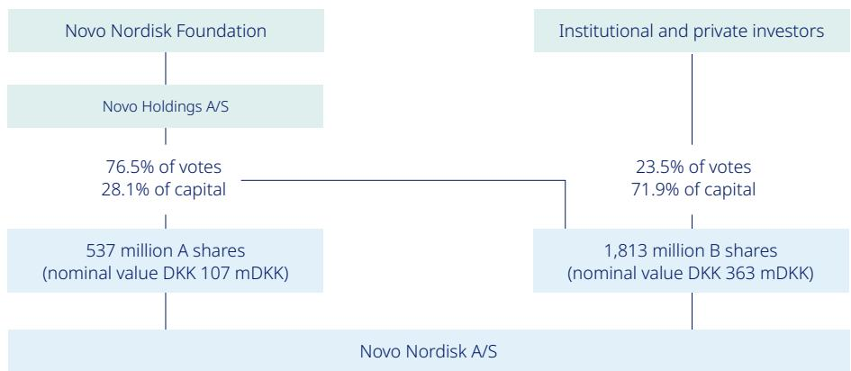

> **AI Description:**
> **Source:** `assets/_page_35_Figure_0.jpg`
> 
> **Generated:** 2026-05-28 03:35:53
> 
> ---
> 
> The image is a flowchart depicting the ownership structure of Novo Nordisk A/S. It shows the relationship between the Novo Nordisk Foundation, Novo Holdings A/S, and institutional and private investors. The Novo Nordisk Foundation holds 76.5% of the votes and 28.1% of the capital through its ownership of 537 million A shares with a nominal value of DKK 107 mDKK. Institutional and private investors hold 23.5% of the votes and 71.9% of the capital through their ownership of 1,813 million B shares with a nominal value of DKK 363 mDKK. The flowchart highlights the significant influence of the Novo Nordisk Foundation in controlling the voting rights and capital of the company.

1. Novo Holdings A/S's registered address is Tuborg Havnevej 19, DK-2900 Hellerup, Denmark. 2. Using shareholder registered home countries. 3. Treasury shares are included, however, voting rights of treasury shares cannot be exercised.

### Full Page Description (Page 36)

**Source:** `assets/_page_36_Asset_0.jpg`

**Generated:** 2026-05-28 03:33:48

---

The image is a line graph showing the share price performance of Novo Nordisk and its indexed peers for the year 2020. The graph includes three lines: Novo Nordisk (blue), Pharmaceutical industry index (dark blue), and OMXC25 (gray). The y-axis represents the share price in Danish Krone (DKK), and the x-axis represents the months from January to December. The graph shows the fluctuation of the share prices over the year. Novo Nordisk's share price increased by 33.7%, while the Pharmaceutical industry index decreased by 2.4%, and the OMXC25 index increased by 10.3%.

The capital structure has been adjusted as a consequence of Novo Nordisk’s debt-financed, USD 1.8 billion acquisition of Emisphere Technologies Inc., which was finalised on 8 December 2020.

## Dividend policy

The company’s dividend policy applies a pharmaceutical industry benchmark to ensure a competitive payout ratio for dividend payments, which are complemented by share repurchase programmes. The final dividend for 2019 paid in March 2020 was equal to DKK 5.35 per A and B share of DKK 0.20 as well as for ADRs. The total dividend for 2019 was DKK 8.35 per A and B share of DKK 0.20, corresponding to a payout ratio of 50.5%, which was in line with the 2019 pharma peer group average of 53.5%.

In August 2020, an interim dividend was paid equalling DKK 3.25 per A and B share of DKK 0.20 as well as for ADRs. For 2020, the Board of Directors will propose a final dividend of DKK 5.85 to be paid in March 2021, equivalent to a total dividend for 2020 of DKK 9.10 and a payout ratio of 50.0%. The company expects to distribute an interim dividend in August 2021. Further information regarding this interim dividend will be announced in connection with the financial report for the first six months of 2021. Dividends are paid from distributable reserves. Novo Nordisk does not pay a dividend on its holding of treasury shares.

Share repurchase programme for 2020/2021 During the twelve-month period beginning 1 February 2020, Novo Nordisk repurchased shares worth DKK 17 billion. The share repurchase programme has primarily been conducted in accordance with the safe harbour rules in the EU Market Abuse Regulation (MAR). For the next 12 months, Novo Nordisk has decided to implement a new share repurchase programme. The expected total repurchase value of B shares amounts to a cash value of up to DKK 17 billion. The total programme may be reduced in size if significant business development opportunities arise during 2021. Novo Nordisk expects to conduct the majority of the new share repurchase programme according to the safe harbour rules in MAR. At the Annual General Meeting in March 2021, the Board of Directors will propose a further reduction in the company’s B share capital, corresponding to approximately 1.7% of the total share capital, by cancelling 40,000,000 treasury shares.

## Share price development

Novo Nordisk’s share price increased by 10.3% between its 2019 close of DKK 386.65 and the 31 December 2020 close of DKK 426.65. For comparison purposes, the Danish OMXC25 stock index increased by 33.7% and the pharma peer group decreased by 2.4% during 2020. The total market value of Novo Nordisk’s B shares, excluding treasury shares and Novo Holdings A/S shares, was DKK 705,374,617,388 as of 31 December 2020.

## Corporate governance

## Executive Management

1. Related as a member of either the Board of Directors or Executive Management of Novo Holdings A/S. 2. Independence as defined by the Danish Corporate Governance Recommendations.

Board committees1

### Full Page Description (Page 39)

**Source:** `assets/_page_39_Asset_1.jpg`

**Generated:** 2026-05-28 03:34:35

---

The image is a pie chart titled "Gender - Board members." It visually represents the gender distribution among board members, with two segments: one for men and one for women. The chart shows that 62% of board members are men, while 38% are women. The chart uses dark blue for men and light blue for women, with percentages clearly labeled next to each segment.

### Full Page Description (Page 39)

**Source:** `assets/_page_39_Asset_0.jpg`

**Generated:** 2026-05-28 03:34:40

---

The image is a pie chart with two segments representing the nationality of board members. The chart is divided into two categories: "Non-Nordic" and "Nordic." The "Non-Nordic" segment occupies 54% of the chart, while the "Nordic" segment occupies 46%. The chart visually represents the proportion of board members from each nationality.

### Full Page Description (Page 39)

**Source:** `assets/_page_39_Asset_2.jpg`

**Generated:** 2026-05-28 03:35:40

---

The image is a pie chart with two segments representing the distribution of shareholder- and employee-elected Board members. The chart is divided into two sections: a larger dark blue section labeled "Shareholder-elected" and a smaller light blue section labeled "Employee-elected." The dark blue section represents 69% of the total, while the light blue section represents 31%. The chart uses contrasting colors to differentiate between the two categories and provides a clear visual representation of the proportion of each group.

# Governance practices

## Nomination

The Nomination Committee presents proposals for election or re-election of shareholder-elected Board members to the Board of Directors. When recommending candidates to be nominated by the Board, the Nomination Committee considers factors such as the balance between renewal and continuity, the desired competences and experience, the performance of the individual Board members, the ambition for diversity as well as independence considerations.

The Board of Directors has determined a competence profile for the shareholder-elected Board members. Board members should possess integrity, accountability, fairness, financial literacy, commitment and desire for innovation. Additionally, the following competences and experience should be represented: Global business management, strategic operations and governance. Healthcare industry and market access. Research and development, technology and digitalisation. M&A and external innovation sourcing. People leadership and change management. Finance and accounting.

Please refer to the overview on page 44 for competence profiles for shareholder-elected Board members. The Competence Profile is available at novonordisk.com.

## Board diversity

In 2016, the Board of Directors adjusted its diversity ambition and set new targets for diversity among shareholder-elected Board members. By 2020, it was the aim that at least two members were of Nordic nationality and two of non-Nordic nationality. The aim was also to have at least three shareholder-elected Board members of each gender.

As of 31 December 2020, our shareholderelected Board members consisted of two Nordic members and seven non-Nordic members. Of these, three members were female and six were male. Thus, the Board of Directors fulfilled its 2016 gender and nationality ambition. The Board of Directors finds that being diverse in gender and nationality is of continued importance, and consequently in 2020 the Board of Directors prolonged its gender and nationality ambition to 2024. When including the employee-elected Board members, six members were Nordic and seven were non-Nordic. Of these, five were female and eight were male.

In accordance with sections 99b and 107d of the Danish Financial Statements Act, Novo Nordisk discloses current performance on diversity in the social responsibility section. Novo Nordisk’s diversity policy is available in that section.

## Evaluation

The Board conducts an annual evaluation. The evaluation includes all Board members and executives. The chair has overall responsibility for the evaluation in collaboration with the Nomination Committee. Every third year, the evaluation is facilitated by external consultants, who interview all Board members and executives. For the subsequent two years, the evaluation is facilitated by the secretary of the Nomination Committee based on written questionnaires. The evaluation includes topics such as Board performance, effectiveness, composition and succession, performance of the Chairmanship and the Board Committees as well as the collaboration in the Board and between the Board and Executive Management. Each Board member and executive also receives feedback from all other Board members and executives on their individual performance.

In 2020, the Board evaluation was facilitated externally by a consultant working exclusively with Board effectiveness reviews. Overall, the evaluation revealed good performance by the Board and good collaboration between the Board and Executive Management. The evaluation resulted in continued focus on Board culture, evolving the induction for new Board members, Board documentation and presentations, Board competency profile and informal time between the Board members, which had been affected by COVID-19.

## Remuneration

In 2020, a new Remuneration Policy was adopted by the Annual General Meeting describing Board and Executive remuneration. The policy replaces Novo Nordisk’s Remuneration Principles and was introduced to comply with changed EU legislation. The new policy is applicable to Board remuneration as of 2020, while it is applicable to Executive remuneration as of 2021. Consequently, the Remuneration Principles applied to Board remuneration relating to the period up to and including 2019 and to Executive remuneration for the period up to and including 2020. The Remuneration Policy and the Remuneration Principles are available at: https://www.novonordisk.com/about/ corporate-governance/remuneration.html

Novo Nordisk has prepared a separate Remuneration Report describing the remuneration awarded or due during 2020 to the Board members and Executives as registered with the Danish Business Authority. The Remuneration Report will be submitted to the Annual General Meeting for an advisory vote. The Remuneration Report is available at: https://www.novonordisk.com/about/ corporate-governance/remuneration.html

Compliance with corporate governance codes Novo Nordisk’s B shares are listed on Nasdaq Copenhagen and on the New York Stock Exchange (NYSE) as American Dipository Receipts (ADRs).

Today, Novo Nordisk adheres to all Danish Corporate Governance Recommendations (2017) designated by Nasdaq Copenhagen except the five recommendations outlined under the heading 'Danish Corporate Governance Recommendations not being fulfilled'.

In addition, Novo Nordisk complies with the Corporate Governance Standards of the NYSE applicable to foreign private issuers. A summary of the significant ways in which Novo Nordisk’s corporate governance practices differ from the NYSE Corporate Governance Standards can be found in Novo Nordisk’s Corporate Governance Report 2020.

Novo Nordisk's compliance with and explanations about the applicable corporate governance codes designated by Nasdaq Copenhagen and the New York Stock Exchange is available at www.novonordisk.com/about/ corporate-governance/recommendations-and -practices.html in accordance with section 107b of the Danish Financial Statements Act.

## Danish Corporate Governance Recommendations not being fulfilled

## 3.3.2

Disclosure of additional information about the Board members: Information on matters such as numbers of shares owned and changes during the year is disclosed in the Remuneration Report for 2020 and not in the management commentary.

## 3.4.2

Independence of Board committees: The majority of the members of the Nomination Committee and the Remuneration Committee are not independent.

## 3.4.6

Tasks of the Nomination Committee: Responsibility for succession management and recommending candidates for the Executive Management resides with the Chairmanship and not with the Nomination Committee.

## 3.4.7

Tasks of the Remuneration Committee: Responsibility for the remuneration policy applicable to employees in general resides with Executive Management and not with the Remuneration Committee.

## 4.1.5

Termination payments: One executive employment contract entered into before 2008 allows for severance payments of more than 24 months’ fixed base salary plus pension contribution, and thus the total value of the remuneration relating to the notice period and of the severance payment exceeds two years of remuneration.

## Disclosure regarding change of control

The EU Takeover Bids Directive, as partially implemented by the Danish Financial Statements Act, requires listed companies to disclose information that may be of interest to the market and potential take-over bidders, in particular in relation to disclosure of change-of-control provisions in material contracts.

Novo Nordisk discloses that the Group has one significant agreement with a US payer which takes effect, alters or terminates upon a change of control of the Group. If effected, a takeover could – at the discretion of the relevant counterparty – lead to the termination of such agreement. Given the ownership structure of Novo Nordisk, the risk is considered to be remote.

In relation to Executive Management, the current employment contracts allow for severance payments of up to 36 months' fixed base salary plus pension contributions in the event of a merger, acquisition or takeover of Novo Nordisk.

For information about the ownership structure of Novo Nordisk, see 'Shares and capital structure'.

## Board of Directors

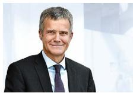

> **AI Description:**
> **Source:** `assets/_page_41_Figure_0.jpg`
> 
> **Generated:** 2026-05-28 03:31:24
> 
> ---
> 
> The image contains a photograph of a person wearing a suit and tie, smiling. The background is a blurred professional setting, likely an office or corporate environment. There are no charts, graphs, or other visual elements present in the image.

## Helge Lund — Chair

Chair of the Board of Novo Nordisk A/S since 2018 (member for one year in 2014-2015 and again in 2017) and chair of the Nomination Committee since 2018 (member since 2017).

## Positions and management duties:

Operating advisor to Clayton Dubilier & Rice, US. Chair of the boards of BP p.l.c. UK and Inkerman Holding AS, Norway. Member of the boards of P/F Tjaldur, Faroe Islands and Belron SA, Luxembourg. Member of the board of Trustees of the International Crisis Group.

## Special competences:

Extensive executive and board experience in large multinational companies and significant financial knowledge.

## Education:

MBA from INSEAD, France (1991) and MA in Economics from the Norwegian School of Economics & Business Administration (NHH), Norway (1987).

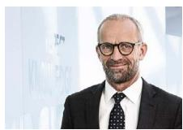

> **AI Description:**
> **Source:** `assets/_page_41_Figure_1.jpg`
> 
> **Generated:** 2026-05-28 03:31:12
> 
> ---
> 
> The image contains a photograph of a man wearing a suit and tie, standing in front of a blurred background. The man appears to be middle-aged with short, graying hair and a beard. The background is out of focus, with some indistinct shapes and colors, possibly suggesting a formal or professional setting.

Jeppe Christiansen — Vice Chair Vice chair and member of the Board of Novo Nordisk A/S since 2013. Chair of the Remuneration Committee since 2017 (member since 2015).

Positions and management duties: Chief Executive Officer of Maj Invest Holding A/S as well as board member and/or executive director of two wholly owned subsidiaries of this company, both in Denmark. Chair of Haldor Topsøe A/S, Emlika Holding ApS, and two wholly owned subsidiaries of the latter company, and chair of JEKC Holding ApS. Board member of Novo Holdings A/S and KIRKBI A/S, Pluto Naturfonden and Randers Regnskov, all in Denmark. Member of the board of BellaBeat Inc., US. Member of the board of Governors of Det Kgl. Vajsenhus, Denmark. Adjunct Professor, Department of Finance, Copenhagen Business School, Denmark.

## Special competences:

Executive background and extensive experience within the financial sector, in particular in relation to financial and capital market issues as well as insight into the investor perspective.

## Education:

MSc in Economics from University of Copenhagen, Denmark (1985).

> **AI Description:**
> **Source:** `assets/_page_41_Figure_2.jpg`
> 
> **Generated:** 2026-05-28 03:31:32
> 
> ---
> 
> The image contains a photograph of a man wearing a suit and tie, smiling. The background appears to be a light, possibly white or off-white color. There are no charts, graphs, or other visual elements present in the image.

## Brian Daniels

Member of the Board of Novo Nordisk A/S since 2016, member of the Remuneration Committee since 2018 and member of the Research & Development Committee since 2017.

Positions and management duties: Partner with 5AM Venture Management, LLC, member of the board at Caballeta Bio Inc., and Artiva Biotherapeutics, all in the US.

## Special competences:

Extensive experience in clinical development, medical affairs and corporate strategy across a broad range of therapeutic areas within the pharmaceutical industry, especially in the US.

## Education:

MD from Washington University, St. Louis, US (1987), and MA in Metabolism and Nutritional Biochemistry (1981) and BSc in Life Sciences (1981), both from Massachusetts Institute of Technology, Cambridge, US.

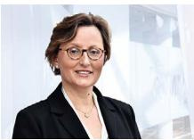

> **AI Description:**
> **Source:** `assets/_page_41_Figure_3.jpg`
> 
> **Generated:** 2026-05-28 03:33:08
> 
> ---
> 
> The image contains a photograph of a person wearing a dark blazer and a necklace, with a blurred background that appears to be an indoor setting with some indistinct shapes and colors. There are no charts, graphs, or other visual elements present in the image.

## Laurence Debroux

Member of the Board of Novo Nordisk A/S and member of the Audit Committee since 2019.

Positions and management duties: Group Chief Financial Officer, executive board member of Heineken N.V., the Netherlands. Member of the board of Exor N.V., the Netherlands, and of HEC Paris Business School, France.

## Special competences:

Significant financial and accounting experience, extensive global experience within the pharmaceutical industry and experience from executive positions in major international companies.

## Education:

Master's Degree from HEC Paris, Ecoles des Hautes Etudes Commerciales, France (1992).

## Andreas Fibig

Member of the Board of Novo Nordisk A/S and member of the Audit Committee since 2018.

Positions and management duties: Chair and Chief Executive Officer of International Flavors & Fragrances Inc., US, Chair of the board of the German American Chamber of Commerce, and Executive Committee member of the World Business Council for Sustainable Development (WBCSD).

## Special competences:

Extensive global experience within biopharmaceutical companies, in-depth knowledge of strategy, sales and marketing and knowledge about how large international companies operate.

## Education:

Degree in Marketing from Berlin School of Economics, Germany (1982).

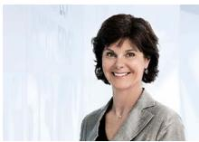

> **AI Description:**
> **Source:** `assets/_page_41_Figure_5.jpg`
> 
> **Generated:** 2026-05-28 03:31:05
> 
> ---
> 
> The image is a photograph of a person standing against a light-colored background. The individual is wearing a light-colored blazer and has short, dark hair. The background appears to be a plain, light-colored wall or backdrop. There are no charts, graphs, or other visual elements present in the image.

## Sylvie Grégoire

Member of the Board of Novo Nordisk A/S and of the Audit Committee since 2015, member of the Research & Development Committee since 2017, and member of the Nomination Committee since 2018.

Positions and management duties: Executive Chair of the board of EIP Pharma, Inc., and member of the board of Perkin Elmer Inc.,both in the US.

## Special competences:

Deep knowledge of the regulatory environment in both the US and the EU, with experience of all phases of the product life cycle, including discovery, registration, pre-launch and managing the life cycle while on the market. Ms. Grégoire also has financial insight, including into P&L responsibility.

## Education:

Pharmacy Doctorate degree from the State University of NY at Buffalo, US (1986), BA in Pharmacy from Laval University, Canada (1984), and Science College degree from Séminaire de Sherbrooke, Canada (1980).

> **AI Description:**
> **Source:** `assets/_page_42_Figure_0.jpg`
> 
> **Generated:** 2026-05-28 03:37:09
> 
> ---
> 
> The image contains a photograph of a person wearing glasses and a light-colored jacket. The background appears to be a blurred indoor setting, possibly an office or professional environment. There are no charts, graphs, or other visual elements present in the image.

> **AI Description:**
> **Source:** `assets/_page_42_Figure_1.jpg`
> 
> **Generated:** 2026-05-28 03:37:51
> 
> ---
> 
> The image contains a photograph of a person standing outdoors. The individual is wearing a dark, long-sleeved top and has short, light-colored hair. The background appears to be a white wall or structure, possibly indicating an urban or architectural setting. The person is smiling, suggesting a positive or friendly demeanor.

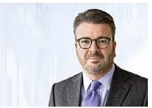

> **AI Description:**
> **Source:** `assets/_page_42_Figure_2.jpg`
> 
> **Generated:** 2026-05-28 03:39:55
> 
> ---
> 
> The image contains a photograph of a man wearing a suit and tie. The background appears to be a blurred professional setting, possibly an office or conference room. The man is looking directly at the camera with a neutral expression. There are no charts, graphs, or other visual elements present in the image.

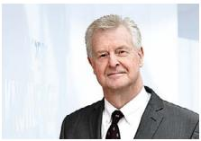

> **AI Description:**
> **Source:** `assets/_page_42_Figure_4.jpg`
> 
> **Generated:** 2026-05-28 03:36:50
> 
> ---
> 
> The image contains a photograph of a man in a suit and tie, standing against a light background with a blurred, abstract design. The man appears to be middle-aged with short, light-colored hair. The image is clear and focused on the individual, suggesting it may be used for professional or formal purposes.

## Liz Hewitt

Member of the Board of Novo Nordisk A/S since 2012, chair of the Audit Committee since 2015 (member since 2012) and member of the Remuneration Committee since 2018.

## Positions and

management duties: Member (senior independent director) of the board of Melrose Industries plc, UK, where she chairs the audit committee, and member of the board of National Grid plc, UK.

## Special competences:

Extensive experience within the field of medical devices, significant financial knowledge, including mergers and acquisitions, and knowledge about how large international companies operate.

## Education:

Qualified Chartered Accountant FCA (UK Institute of Chartered Accountants) (1982), and BSc (Econ Hons) from the University College in London, UK (1977).

## Mette Bøjer Jensen

Member of the Board of Novo Nordisk A/S (employee representative) and member of the Nomination Committee since 2018.

## Positions and

management duties: Wash & Sterilisation Specialist in Product Supply, Novo Nordisk A/S.

## Education:

Graduate Programme (HD) in Business Administration (Strategic management and business development) from Copenhagen Business School, Denmark (2010), and MSc in Biotechnology, Aalborg University, Denmark (2001).

## Kasim Kutay

Member of the Board of Novo Nordisk A/S and member of the Nomination Committee since 2017 and member of the Research & Development Committee since 2020.

## Positions and

management duties: Chief Executive Officer of Novo Holdings A/S, Denmark. Member of the board of Novozymes A/S, Denmark, of Evotec SE, Germany, and of the Life Sciences Advisory board of Gimv NV, Belgium.

## Special competences:

Extensive experience as an investor in the life science sector. Mr Kutay manages an investment fund that invests in life science companies at all stages of development including the venture, growth and developed stages. Extensive experience as financial advisor to the pharmaceutical, biotechnology and medical device industries. Mr Kutay has also advised healthcare companies on an international basis including companies based in Europe, the US, Japan and India.

## Education:

MSc in Economics (1987), and BSc in Economics (1986), both from the London School of Economics, UK.

## Anne Marie Kverneland

Member of the Board of Novo Nordisk A/S since 2000 (employee representative) and member of the Remuneration Committee since 2017.

## Positions and

## management duties:

Laboratory technician and full-time union representative in Novo Nordisk A/S. Member of the Board of Directors of the Novo Nordisk Foundation since 2014.

## Education:

Degree in medical laboratory technology (laboratory technologist) from Copenhagen University Hospital, Denmark (1980).

## Martin Mackay

Member of the Board of Novo Nordisk A/S and chair of the Research & Development Committee since 2018.

## Positions and

management duties: Co-founded Rallybio LLC, US, in January 2018 and serves as chair of the board and CEO of the company and in an executive leadership role overseeing all research and non-research functions. Member of the board of 5:01 Acquisition Corporation, US. Senior advisor to New Leaf Venture Partners, LLC, US. Member of the board and chairs the Science and Technology Committee of Charles River Laboratories International, Inc., US.

## Special competences:

R&D executive with extensive experience in building a pipeline, acquiring products and managing the portfolio of early-stage and late-stage projects in large international pharmaceutical companies.

## Education:

Doctorate/PhD from University of Edinburgh, UK (1984), and BSc (First Class Honours) in Microbiology from Heriot-Watt University, Edinburgh, UK (1979).

## Thomas Rantzau

Member of the Board of Novo Nordisk A/S (employee representative) and member of the Research & Development Committee since 2018.

Positions and management duties: Area specialist in Product Supply, Novo Nordisk A/S.

## Education:

Degree in food engineering from DTU, Denmark (2003) and diploma as dairy technician (1992).

## Stig Strøbæk

Member of the Board of Novo Nordisk A/S since 1998 (employee representative) and member of the Audit Committee since 2013.

## Positions and

management duties: Electrician and a full-time union representative in Novo Nordisk A/S.

## Education:

Diploma in further training for board members from the Danish Employees’ Capital Pension Fund (LD) (2003), and diploma in electrical engineering (1984).

## Independence, meeting attendance and competence overview

Meeting attendance in 20201

1. Number of meetings attended by each Board member out of the total number of meetings within the member's term. 2. In accordance with recommendation 3.2.1 of the Danish Corporate Governance Recommendations as designated by Nasdaq Copenhagen. 3. In addition, Helge Lund was a member of the Board for one year in 2014-2015 4. Member of the Board of Directors or Executive Management of Novo Holdings A/S. 5. Pursuant to the US Securities Exchange Act, Ms Hewitt, Ms Grégoire, Ms Debroux and Mr Fibig qualify as independent Audit Committee members, while Mr Strøbæk relies on an exemption from the independence requirements. 6. Ms Hewitt, Ms Grégoire, Ms Debroux and Mr Fibig qualify as independent Audit Committee members as defined under part 8 of the Danish Act on Approved Auditors and Audit Firms. 7. Elected by employees of Novo Nordisk. 8. All members have relevant industry expertise. 9. Designated as financial experts as defined by the US Securities and Exchange Commission (SEC).

Competencies and experiences to be represented among shareholder-elected Board members (see page 40)

Global business management, strategic operations and governance Healthcare industry and market access

Research and development, technology and digitalisation M&A and external innovation sourcing

People leadership and change management Finance and accounting

## Executive Management

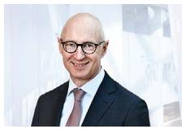

> **AI Description:**
> **Source:** `assets/_page_44_Figure_0.jpg`
> 
> **Generated:** 2026-05-28 03:34:50
> 
> ---
> 
> The image contains a photograph of a person wearing a suit and tie, smiling. The background appears to be a professional setting with some blurred elements that might be office furniture or equipment. The image is clear and well-lit, suggesting a formal or corporate environment.

Lars Fruergaard Jørgensen — President and Chief Executive Officer (CEO)

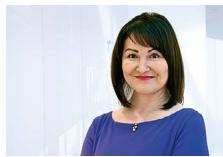

> **AI Description:**
> **Source:** `assets/_page_44_Figure_1.jpg`
> 
> **Generated:** 2026-05-28 03:34:24
> 
> ---
> 
> The image contains a photograph of a person. The individual is smiling and wearing a blue top. The background appears to be a plain, light-colored wall. There are no charts, graphs, or other visual elements present in the image.

Monique Carter — Executive Vice President, People & Organisation

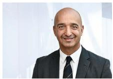

> **AI Description:**
> **Source:** `assets/_page_44_Figure_2.jpg`
> 
> **Generated:** 2026-05-28 03:35:19
> 
> ---
> 
> The image contains a photograph of a person wearing a suit and tie. The background appears to be a light, possibly outdoor setting with a blurred background. The person is smiling and looking directly at the camera. There are no charts, graphs, or other visual elements present in the image.

Maziar Mike Doustdar1 — Executive Vice President, International Operations

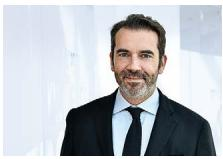

> **AI Description:**
> **Source:** `assets/_page_44_Figure_3.jpg`
> 
> **Generated:** 2026-05-28 03:36:13
> 
> ---
> 
> The image is a photograph of a man wearing a dark suit and tie. The background appears to be a light, possibly indoor setting with a blurred, out-of-focus background. There are no charts, graphs, diagrams, or other visual elements present in the image. The image is solely a portrait of the man.

Ludovic Helfgott1   
— Executive Vice President,   
Biopharm

Karsten Munk Knudsen — Executive Vice President, Chief Financial Officer (CFO)

Born: November 1966.

Other positions and management duties: Vice chair of the supervisory board and member of the audit committee and nomination committee of Carlsberg A/S, Denmark.

Born: December 1973.

Other positions and management duties: No other management positions.

Born: August 1970.

Other positions and management duties: No other management positions.

Born: July 1974.

Born: December 1971.

Other positions and management duties: President of the Novo Nordisk Haemophilia Foundation Council.

Other positions and management duties: Chair of the board of NNE A/S, Denmark.

As of 1 January 2021, vice president elect of the European Federation of Pharmaceutical Industries and Associations (EFPIA).

Doug Langa1 — Executive Vice President, North America Operations

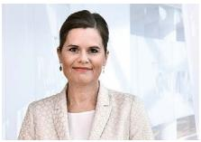

> **AI Description:**
> **Source:** `assets/_page_44_Figure_6.jpg`
> 
> **Generated:** 2026-05-28 03:37:37
> 
> ---
> 
> The image contains a photograph of a person. The individual appears to be wearing a light-colored blazer over a white top. The background is blurred, suggesting an indoor setting with some indistinct shapes and colors. There are no charts, graphs, or other visual elements present in the image.

Camilla Sylvest   
— Executive Vice President,   
Commercial Strategy &   
Corporate Affairs

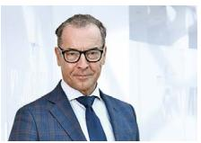

> **AI Description:**
> **Source:** `assets/_page_44_Figure_7.jpg`
> 
> **Generated:** 2026-05-28 03:37:30
> 
> ---
> 
> The image contains a photograph of a person wearing a suit and tie. The background appears to be a blurred indoor setting, possibly a conference or event space. The individual is wearing glasses and has a professional appearance. There are no charts, graphs, or other visual elements present in the image.

Mads Krogsgaard Thomsen — Executive Vice President, Chief Science Officer (CSO)

Henrik Wulff — Executive Vice President, Product Supply, Quality & IT

Born: October 1966.

Other positions and management duties: No other management positions.

Born: November 1972.

Born: December 1960.

1. Not registered as executive with the Danish Business Authority.

Other positions and   
management duties:   
Member of the board of Danish   
Crown A/S, Denmark and   
Vice Chair of the board of the World Diabetes Foundation, Denmark.

Born: November 1970.

Other positions and   
management duties:   
Member of the board of BB Biotech AG, Switzerland. Member of the   
editorial boards of international, peer-reviewed journals.

Adjunct professor at the Faculty of Health and Medical Sciences of the University of Copenhagen, Denmark.

Other positions and   
management duties:   
Member of the board of Ambu A/S, Denmark and member of the board of Grundfos Holding A/S, Denmark.

# Consolidated financial, environmental, social and governance statements 2020

Consolidated financial statements Section 4   
Income statement p. 47 Capital structure and financial items   
Cash flow statement p. 48 4.1 Earnings per share, distributions to shareholders, treasury   
Balance sheet p. 49 shares, share capital and other reserves p. 65   
Equity statement p. 50 4.2 Financial risks p. 66   
4.3 Derivative financial instruments p. 68   
Notes to the consolidated financial statements 4.4 Borrowings p. 69   
4.5 Cash and cash equivalents, financial reserves and free cash flow p. 69   
Section 1 4.6 Change in working capital p. 70   
Basis of preparation 4.7 Other non-cash items p. 70   
1.1 Principal accounting policies and key accounting estimates p. 51 4.8 Financial assets and liabilities p. 71   
1.2 Changes in accounting policies and disclosures p. 51 4.9 Financial income and expenses p. 72   
Section 2 Section 5   
Results for the year Other disclosures   
2.1 Net sales and rebates p. 52 5.1 Share-based payment schemes p. 73   
2.2 Segment information p. 53 5.2 Commitments p. 75   
2.3 Research and development costs p. 55 5.3 Related party transactions p. 76   
2.4 Employee costs p. 55 5.4 Fee to statutory auditors p. 76   
2.5 Other operating income, net p. 56 5.5 General accounting policies p. 76   
2.6 Income taxes and deferred income taxes p. 56 5.6 Companies in the Novo Nordisk Group p. 77   
Section 3   
Operating assets and liabilities   
3.1 Intangible assets and property, plant and equipment p. 58   
3.2 Leases p. 60   
3.3 Inventories p. 61   
3.4 Trade receivables p. 61   
3.5 Retirement benefit obligations p. 62   
3.6 Provisions and contingent liabilities p. 63   
3.7 Other liabilities p. 64   
Statement of environmental, social and governance (ESG)   
performance (supplementary information)   
Statement of ESG performance p. 81   
Notes to the ESG statement   
Section 6   
Basis of preparation p. 82   
Section 7   
Environmental performance   
7.1 Energy consumption for operations and share of   
renewable power p. 83   
7.2 Water consumption for production sites p. 83   
7.3 CO emissions from operations and transportation p. 83   
7.4 Waste from production sites p. 84   
Section 8   
Social performance   
8.1 Patients reached with Novo Nordisk’s Diabetes care products p. 84   
8.2 Donations and other contributions p. 84   
8.3 Employees p. 85   
8.4 Frequency of occupational accidents p. 85   
8.5 Animals purchased for research p. 85   
8.6 Gender diversity p. 85   
Section 9   
Governance performance   
9.1 Business ethics p. 86   
9.2 Facilitations of the Novo Nordisk Way p. 86   
9.3 Supplier audits p. 86   
9.4 Product recalls p. 86   
9.5 Failed inspections p. 86   
9.6 Company trust p. 86   
9.7 Total tax contribution p. 87   
9.8 Breaches of environmental regulatory limit values p. 87

## Income statement

## and statement of comprehensive income for the year ended 31 December

## Cash flow statement

## for the year ended 31 December

## Balance sheet

## at 31 December

## Equity statement

at 31 December

Refer to note 4.1 for details of movements in other reserves.

# Section 1 Basis of preparation

## 1.1 Principal accounting policies and key accounting estimates

The consolidated financial statements included in this Annual Report have been prepared in accordance with International Financial Reporting Standards (IFRS) as issued by the International Accounting Standards Board (IASB) and in accordance with IFRS as endorsed by the EU and further requirements in the Danish Financial Statements Act. All entities in the Novo Nordisk Group follow the same Group accounting policies.

## Measurement basis

The consolidated financial statements have been prepared on the historical cost basis except for derivative financial instruments, equity investments and trade receivables in a factoring portfolio, which are measured at fair value.

Except for the changes described in note 1.2, the principal accounting policies set out below have been applied consistently in the preparation of the consolidated financial statements for all the years presented. The general accounting policies are described in note 5.5.

## Principal accounting policies

Novo Nordisk’s accounting policies are described in each of the individual notes to the consolidated financial statements. Accounting policies listed in the table below are regarded as the principal accounting policies applied by Management.

## Key accounting estimates and judgements

The use of reasonable estimates and judgements is an essential part of the preparation of the consolidated financial statements. Given the uncertainties inherent in Novo Nordisk’s business activities, Management must make certain estimates regarding valuation and make judgements on the reported amounts of assets, liabilities, net sales, expenses and related disclosures.

The key accounting estimates identified are those that have a significant risk of resulting in a material adjustment to the measurement of assets and liabilities in the following reporting period. An example being the estimation of US sales deductions and provisions for sales rebates. Management bases its estimates on historical experience and various other assumptions that are held to be reasonable under the circumstances. The estimates and underlying assumptions are reviewed on an ongoing basis. If necessary, changes are recognised in the period in which the estimate is revised. Management considers the key accounting estimates to be reasonable and appropriate based on currently available information. The actual amounts may differ from the amounts estimated as more detailed information becomes available.

In addition, Management makes judgements in the process of applying the entity’s accounting policies, for example the classification of a transaction as an asset acquisition or a business combination.

Management regards those listed below as the key accounting estimates and judgements used in the preparation of the consolidated financial statements.

Please refer to the specific notes for further information on the key accounting estimates and judgements as well as assumptions applied.

## Applying materiality

The consolidated financial statements are a result of processing large numbers of transactions and aggregating those transactions into classes according to their nature or function. The transactions are presented in classes of similar items in the consolidated financial statements. If a line item is not individually material, it is aggregated with other items of a similar nature in the consolidated financial statements or in the notes.

Management provides specific disclosures required by IFRS unless the information is not applicable or is considered immaterial to the decisionmaking of the primary users of these financial statements.

## 1.2 Changes in accounting policies and disclosures

## Adoption of new or amended IFRSs

Management has assessed the impact of new or amended and revised accounting standards and interpretations (IFRSs) issued by the IASB and IFRSs endorsed by the European Union effective on or after 1 January 2020.

The Group adopted the amendments to IFRS 3 for the first time in 2020. The amendments narrow and clarify the definition of a business and permit a simplified assessment of whether an acquired set of activities and assets is a group of assets rather than a business (concentration test). The amendments are applied prospectively to all business combinations and asset acquisitions with an acquisition date on or after 1 January 2020.

It is assessed that application of other new amendments effective from 1 January 2020 has not had a material impact on the consolidated financial statements in 2020. Furthermore, Management does not anticipate any significant impact on future periods from the adoption of these new amendments.

## Adoption of new or amended IFRSs in prior periods

As of 1 January 2019, Novo Nordisk applied IFRS 16 'Leases' for the first time. The standard was implemented using the modified retrospective approach. On transition to IFRS 16 the Group recognised an additional DKK 3,778 million of right-of-use assets and DKK 3,988 million of lease liabilities. The implementation did not have any impact on equity.

As of 1 January 2018, Novo Nordisk applied IFRS 9 'Financial Instruments' and IFRS 15 'Revenue from contracts with customers' for the first time. The impact of the implementation of IFRS 9 and IFRS 15 was immaterial in relation to recognition and measurement.

# Section 2 Results for the year

## 2.1 Net sales and rebates

Gross-to-net sales reconciliation

## Provisions for sales rebates

Sales discounts and sales rebates are predominantly issued in the US. As such, rebates amount to 74% of gross sales in the US (71% in 2019 and 68% in 2018). Provisions for sales rebates includes US Managed Care, Medicare, Medicaid and other minor US rebate types, as well as rebates in a number of European countries and Canada.

## Pricing mechanisms in the US market

In the US, sales rebates are paid in connection with public healthcare insurance programmes, namely Medicare and Medicaid, as well as rebates to pharmacy benefit managers (PBMs) and managed healthcare plans. Key customers in the US include private payers, PBMs and government payers. PBMs and managed healthcare plans play a role in negotiating price concessions with drug manufacturers for both the commercial and government channels, and determine which drugs are covered on their formularies (or 'preferred drug lists').

## US Managed Care and Medicare

For Managed Care and Medicare, rebates are offered to a number of PBMs and managed healthcare plans. These rebate programmes allow the customer to receive a rebate after attaining certain performance parameters relating to formulary status or pre-established market shares thresholds. Rebates are estimated according to the specific terms in each agreement, historical experience, anticipated channel mix, growth rates and market share information. Novo Nordisk adjusts the provision periodically to reflect actual sales performance. Managed Care and Medicare rebates are generally settled around 100 days from the transaction date.

## US wholesaler charge-backs

Wholesaler charge-backs relate to contractual arrangements between Novo Nordisk and indirect customers in the US whereby products are sold at contract prices lower than the list price originally charged to wholesalers. A wholesaler charge-back represents the difference between the invoice price to the wholesaler and the indirect customer’s contract price. Accruals are calculated for estimated charge-backs using a combination of factors such as historical experience, current wholesaler inventory levels, contract terms and the value of claims received but not yet processed. Wholesaler chargebacks are generally settled within 30 days after receipt of claim.

## US Medicaid rebates

Medicaid is a government insurance programme. Medicaid rebates have been estimated using a combination of historical experience, product and population growth, price changes, and the impact of contracting strategies. The calculation also involves interpretation of relevant regulations that are subject to changes in interpretative guidance from government authorities. Novo Nordisk adjusts the provision periodically to reflect actual sales performance. Medicaid rebates are generally settled around 150 days from the transaction date.

## Other US and non-US discounts and sales returns

Other discounts are provided to distributors, wholesalers, hospitals, pharmacies, etc. They are usually linked to sales volume or provided as cash discounts. Discounts are calculated based on historical data and recorded as a reduction in gross sales at the time the related sales are recorded. Sales returns relate to damaged or expired products.

## Other net sales disclosures

In 2020, Novo Nordisk had three major wholesalers distributing products in the US, representing 19%, 13% and 12% respectively of total net sales (19%, 14% and 12% in 2019 and 20%, 13% and 13% in 2018). Sales to these three wholesalers are within both Diabetes and Obesity care and Biopharm.

Net sales to be recognised from fulfilling existing customer contracts containing fixed or minimum sales volumes, with an original term greater than 12 months, are expected to be DKK 431 million within 12 months (DKK 544 million in 2019) and DKK 216 million thereafter (DKK 32 million in 2019).

Novo Nordisk's sales are impacted by exchange rate changes. Refer to note 4.2 for development in key exchange rates.

## Accounting policies

Revenue from sale of goods is recognised when Novo Nordisk has transferred control of products sold to the buyer and it is probable that Novo Nordisk will collect the consideration to which it is entitled for transferring the products. Control of the products is transferred at a point in time, typically on delivery. The amount of sales to be recognised is based on the consideration Novo Nordisk expects to receive in exchange for its goods. When sales are recognised, Novo Nordisk also records estimates for a variety of sales deductions, including product returns as well as rebates and discounts to government agencies, wholesalers, health insurance companies, managed healthcare organisations and retail customers. Sales deductions are recognised as a reduction of gross sales to arrive at net sales, by assessing the expected value of the sales deductions (variable consideration). Where contracts contain customer acceptance criteria, Novo Nordisk recognises sales when the acceptance criteria are satisfied.

In some markets, Novo Nordisk sells products on a sale-or-return basis. Where there is historical experience or a reasonably accurate estimate of future returns, estimated product returns are recorded as a reduction in sales. Where shipments of new products are made on a sale-or-return basis, without sufficient historical experience for estimating sales returns, revenue is recorded based on estimated demand and acceptance rates for wellestablished products with similar market characteristics. If similar market characteristics do not exist, revenue is recorded when there is evidence of consumption or when the right of return has expired.

Unsettled rebates are recognised as provisions when the timing or amount is uncertain (note 3.6).

Where absolute amounts are known, the rebates are recognised as other liabilities. Wholesaler charge-backs are netted against trade receivable balances.

The impact of foreign currency hedging is recognised in the income statement in financial items. Please refer to notes 4.2, 4.3 and 4.9 for more details on hedging.

## Key accounting estimates of sales deductions and provisions for sales rebates

Sales deductions are estimated and provided for at the time the related sales are recorded. These estimates of unsettled rebate, discount and product return obligations require use of significant judgement, as not all conditions are known at the time of sale, for example total sales volume to a given customer.

The estimates are based on analyses of existing contractual obligations and historical experience. Provisions are calculated on the basis of a percentage of sales for each product as defined by the contracts with the various customer groups. Provisions for sales rebates are adjusted to actual amounts as rebates, discounts and returns are processed.

Novo Nordisk considers the provisions established for sales rebates to be reasonable and appropriate based on currently available information. However, the actual amount of rebates and discounts may differ from the amounts estimated by Management as more detailed information becomes available.

## 2.2 Segment information

Business segments – Key figures

Novo Nordisk operates in two business segments based on therapies: Diabetes and Obesity care and Biopharm, representing the entirety of the Group's operations.

The segments include research, development, manufacturing and marketing of products within the following areas:

– Diabetes and Obesity care: insulin, GLP-1 and related delivery systems, oral antidiabetic products (OAD), obesity and other serious chronic diseases.

– Biopharm: haemophilia, growth disorders and hormone replacement therapy.

Segment performance is evaluated on the basis of operating profit, consistent with the consolidated financial statements. Financial income and expenses, and income taxes are managed at Group level and are not allocated to business segments. There are no sales or other transactions between the business segments. Costs have been split between business segments according to a specific allocation. In addition, a small number of corporate overhead costs are allocated systematically between the segments. Other operating income has been allocated to the two segments based on the same principle.

## Accounting policies

Operating segments are reported in a manner consistent with the internal reporting provided to Executive Management and the Board of Directors. We consider Executive Management to be the operating decision-making body, as all significant decisions regarding business development and direction are taken in this forum.

## Geographical areas

Sales to external customers attributed to the US are collectively the most material to the Group. The US and Mainland China are the only territories where sales contribute 10% or more of total net sales.

In 2020 Novo Nordisk operated in two main commercial units:

– International Operations

– EMEA: Europe, the Middle East and Africa.

– China: Mainland China, Hong Kong and Taiwan.

– Rest of World: All other countries except for North America.

– North America Operations (the US and Canada)

International Operations was reorganised with effect from 1 April 2020, and the geographical reporting has been amended to reflect the new organisation. Amounts for 2018 and 2019 have been restated. Refer to note 5.6 for an overview of companies in the Novo Nordisk Group based on geographical areas.

The country of domicile is Denmark, which is part of EMEA. Denmark is immaterial to Novo Nordisk’s activities in terms of sales as 99.7% of total sales are realised outside Denmark. Sales are attributed to geographical areas according to the location of the customer.

Net sales – Business segments and geographical areas

## 2.3 Research and development costs

Novo Nordisk’s research and development is mainly focused on:

– Insulins, GLP-1s and other therapeutic new antidiabetic drugs for diabetes treatment.

– GLP-1s, combinations and new modes of action for Obesity care.

– Blood-clotting factors and new modes of action for treatment of haemophilia and other rare blood disorders.

– Human growth hormone and new modes of action for treatment of growth disorders and other rare endocrine disorders.

– New modes of action including GLP-1 and stem cells for treatment of NASH, cardiovascular disease, Alzheimer's disease, chronic kidney disease and Parkinson's disease, among others.

The research activities mainly utilise biotechnological methods based on advanced protein chemistry and protein engineering. These methods have played a key role in the development of the production technology used to manufacture insulin, GLP-1, recombinant blood-clotting factors and human growth hormone. Research activities further focus on new technology platforms including stem cells and developing RNAi therapies for liverrelated cardio-metabolic diseases.

Research and development activities are carried out by Novo Nordisk’s research and development centres, mainly in Denmark, the US, the UK and China. Clinical trials are carried out all over the world. Novo Nordisk also enters into partnerships and licence agreements.

## Accounting policies

Novo Nordisk expenses all research costs. In line with industry practice, internal and subcontracted development costs are also expensed as they are incurred, due to significant regulatory uncertainties and other uncertainties inherent in the development of new products. This means that they do not qualify for capitalisation as intangible assets until marketing approval by a regulatory authority is obtained or considered highly probable. Costs for post-approval activities that are required by authorities as a condition for obtaining regulatory approval are recognised as research and development costs.

Research and development costs primarily comprise employee costs, and internal and external costs related to execution of studies, including manufacturing costs and facility costs of the research centres. The costs also comprise amortisation, depreciation and impairment losses related to software and property, plant and equipment used in the research and development activities. Impairment losses recognised on intangible assets not yet available for use related to research and development projects are presented in research and development costs.

Certain research and development activities are recognised outside research and development costs:

– Royalty expenses paid to partners after regulatory approval are expensed as cost of goods sold.

– Royalty income received from partners is recognised as part of other operating income, net.

– Contractual research and development obligations to be paid in the future are disclosed separately as commitments in note 5.2.

## 2.4 Employee costs

Remuneration to Executive Management and Board of Directors

1. Please refer to note 5.1 for further information.
2. Total remuneration for registered members of Executive Management amounts to DKK 141 million (DKK 135 million in 2019 and DKK 142 million in 2018). All members of the Board of Directors are registered.

## Accounting policies

Wages, salaries, social security contributions, annual leave and sick leave, bonuses and non-monetary benefits are recognised in the year in which the associated services are rendered by employees of Novo Nordisk. Where Novo Nordisk provides long-term employee benefits, the costs are accrued to match the rendering of the services by the employees concerned.

## 2.5 Other operating income, net

## Accounting policies

Other operating income, net, comprises licence income and income of a secondary nature in relation to the main activities of Novo Nordisk. Licence income from royalties on net sales is recognised as the underlying customers' sale occurs and from sales milestones once the contingent sale milestone is achieved in accordance with the terms of the relevant agreement. Income from the transfer of the right to use intellectual property may contain development or regulatory milestones (variable consideration) on which the income is recognised when the significant uncertainties in achieving the milestones are resolved, due to the significant uncertainties inherent in the development of pharmaceutical products. Operating profit from the wholly owned subsidiary NNE A/S, not related to Novo Nordisk’s main activities, is recognised as other operating income. Other operating income also includes income from sale of intellectual property rights.

2.6 Income taxes and deferred income taxes
Income taxes expensed

The deviation in foreign subsidiaries' tax rates from the Danish tax rate is mainly driven by Swiss business activities.

Other adjustments in 2020 comprise of tax related to acquisitions and subsequent transfers of intellectual property rights (around 4%) countered by clarification of tax uncertainties, settlement of tax cases and adjustment of prior years.

Income taxes paid

In 2020, income taxes paid in Denmark and paid outside Denmark are impacted by transfers of intellectual property rights related to acquisitions.

## Swiss tax reform

In 2019, a tax reform was passed in Switzerland. The tax reform has a minor positive impact on the effective tax rate, driven by a non-recurring increase to deferred tax assets.

## Accounting policies

The tax expense for the period comprises current and deferred tax. It also includes adjustments to previous years and changes in provisions for uncertain tax positions. Tax is recognised in the income statement except to the extent that it relates to items recognised in equity or other comprehensive income.

Provisions for ongoing tax disputes are included as part of deferred tax assets, tax receivables and tax payables.

Deferred income taxes arise from temporary differences between the accounting and tax values of the individual consolidated companies and from realisable tax loss carry-forwards. The tax value of tax loss carryforwards is included in deferred tax assets to the extent that these are expected to be utilised in future taxable income. The deferred income taxes are measured according to current tax rules and at the tax rates assumed in the year in which the assets are expected to be utilised.

In general, the Danish tax rules related to dividends from group companies provide exemption from tax for most repatriated profits. A provision for withholding tax is only recognised if a concrete distribution of dividends is planned. The unrecognised potential withholding tax amounts to DKK 337 million (DKK 315 million in 2019).

The value of future tax deductions in relation to share programmes is recognised as deferred tax, until the shares are paid out to the employees. Any estimated excess tax deduction compared to the costs realised in the income statement is charged to equity.

## Management judgement regarding recognition of deferred income tax assets and provisions for uncertain tax positions

Novo Nordisk is subject to income taxes around the world. Significant judgement and estimates are required in determining the worldwide accrual for income taxes, deferred income tax assets and liabilities, and provisions for uncertain tax positions.

Novo Nordisk recognises deferred income tax assets if it is probable that sufficient taxable income will be available in the future, against which the temporary differences and unused tax losses can be utilised.

Management has considered future taxable income and applied its judgement in assessing whether deferred income tax assets should be recognised.

In the course of conducting business globally, tax and transfer pricing disputes with tax authorities may occur. Management judgement is applied to assess the possible outcome of such disputes. The 'most probable outcome' method is applied when making provisions for uncertain tax positions, and Novo Nordisk considers the provisions made to be adequate. However, the actual obligation may deviate and depends on the result of litigation and settlements with the relevant tax authorities.

Development in deferred income tax assets and liabilities

The total tax value of unrecognised tax loss carry-forwards amounts to DKK 628 million in 2020 (DKK 144 million in 2019).

# Section 3 Operating assets and liabilities

## 3.1 Intangible assets and property, plant and equipment

Of total property, plant and equipment and intangible assets, DKK 44,431 million is located in Denmark (DKK 28,322 million in 2019) and DKK 18,750 million is located in the US (DKK 20,256 million in 2019) where the Group's main production, filling, packaging, moulding, assembly facilities and intangible assets are located.

## Intangible assets

Amortisation and impairment losses

## 2020 additions

In 2020 Novo Nordisk acquired Corvidia Therapeutics Inc., in a transaction accounted for as an asset acquisition. An addition of DKK 4,580 million was recognised in patents and licences for the acquisition of Ziltivekimab, a fully human monoclonal antibody directed against Interleukin-6 related to chronic kidney disease, which is under development.

Novo Nordisk acquired Emisphere Technologies Inc. and obtained ownership of the Eligen® SNAC oral delivery technology. Novo Nordisk and Emisphere have collaborated since 2007 and Emisphere’s proprietary drug delivery technology Eligen® SNAC is used by Novo Nordisk under an existing licence agreement in the oral formulation of Novo Nordisk’s GLP-1 receptor agonist semaglutide, which is marketed and sold under the brand name Rybelsus®. Under the terms of the agreement, Novo Nordisk acquired all outstanding shares of Emisphere for USD 1,335 million. As part of the transaction, Novo Nordisk also acquired related Eligen® SNAC royalty stream obligations owed to MHR Fund Management LLC (MHR), the largest shareholder of Emisphere, for USD 450 million. The transaction has been accounted for as an asset acquisition, with DKK 11,060 million recognised in patents and licences, of which DKK 2,467 million are related to assets under development. At 31 December 2020, the carrying amount of acquired intangible assets related to Rybelsus is DKK 7,716 million, which has a remaining amortisation period of 14 years.

Of the total addition of intangible assets in 2020 DKK 396 million is internally developed (DKK 221 million in 2019).

## Accounting policies

Patents and licences, including patents and licences acquired for research and development projects, are carried at historical cost less accumulated amortisation and any impairment loss. Upfront fees and acquisition costs are capitalised and subsequent milestone payments payable on achievement of a contingent event will be capitalised on the contingent event being probable of being achieved.

Amortisation is based on the straight-line method over the estimated useful life. This means the legal duration or the economic useful life depending on which is shorter, and not exceeding 15 years. The amortisation of patents and licences begins after regulatory approval has been obtained.

Internal development of software for internal use are recognised as intangible assets if the recognition criteria are met, for example a significant business system where the expenditure leads to the creation of a durable asset. Amortisation is based on the straight-line method over the estimated useful life of 3-15 years. The amortisation begins when the asset is in the location and condition necessary for it to be capable of operating in the manner intended by Management.

## Research and development projects

Internal and subcontracted research costs are charged in full to the consolidated income statement in the period in which they are incurred. Consistent with industry practice, development costs are also expensed until regulatory approval is obtained or is probable; please refer to note 2.3.

Payments to third parties under collaboration and licence agreements are assessed for the substance of their nature. Payments which represent subcontracted research and development are expensed as the services are received. Payments which represent rights to the transfer of intellectual property, developed at risk by the third party, are capitalised.

For acquired research and development projects, patents and licences, the likelihood of obtaining future commercial sales is reflected in the cost of the asset, and thus the probability recognition criteria is always considered to be satisfied. As the cost of acquired research and development projects can often be measured reliably, these projects fulfil the capitalisation criteria as intangible assets on acquisition. Subsequent milestone payments payable on achievement of a contingent event (e.g. commencement of phase 3 trials) are accrued and capitalised into the cost of the intangible asset when the achievement of the event is probable. Development costs incurred subsequent to acquisition are treated consistently with internal project development costs.

Assets that are subject to amortisation are reviewed for impairment whenever events or changes in circumstances indicate that the carrying amount may not be recoverable.

Factors considered material that could trigger an impairment test include the following:

– Development of a competing drug.

– Changes in the legal framework covering patents, rights and licences.

– Advances in medicine and/or technology that affect the medical treatments.

– Lower-than-predicted sales.

– Adverse impact on reputation and/or brand names.

– Changes in the economic lives of similar assets.

– Relationship to other intangible assets or property, plant and equipment.

– Changes or anticipated changes in participation rates or reimbursement policies.

If the carrying amount of intangible assets exceeds the recoverable amount based on the existence of one or more of the above indicators of impairment, any impairment is measured based on discounted projected cash flows. Impairments are reviewed at each reporting date for possible reversal.

## Key accounting estimates and judgements on intangible assets

In 2020, an impairment loss of DKK 350 million (DKK 982 million in 2019) was recognised, substantially all of which related to patents and licences. DKK 350 million (DKK 282 million in 2019) of the impairment was related to the Diabetes and Obesity care segment and none related to Biopharm (DKK 700 million in 2019). All the impairment loss in 2020 was recognised in research and development costs (DKK 529 million in cost of goods sold and DKK 450 million in research and development costs in 2019). The impairment was a result of Management’s review of expectations related to patents and licences not yet in use. No impairment related to marketable products was identified in 2020.

Intangible assets with an indefinite useful life and intangible assets not yet available for use are not subject to amortisation. They are tested annually for impairment, irrespective of whether there is any indication that they may be impaired.

Intangible assets not yet being amortised amounts to DKK 9,607 million (DKK 3,380 million in 2019), primarily patents and licences in relation to research and development projects. Impairment tests in 2020 and 2019 of patents and licences not yet in use are based on Management’s projections and anticipated net present value of estimated future cash flows from marketable products. Terminal values used are based on the expected life of products, forecasted life cycle and cash flow over that period, and the useful life of the underlying assets. In addition, Management makes judgements related to intangible assets when assessing whether a transaction is a business combination or an asset acquisition. An asset acquisition will arise when substantially all the transaction value is concentrated in a single asset or when there are no substantive business processes in the acquired entity. Judgements are also made in evaluating whether payments under collaboration arrangements are acquisition of assets or prepayment of R&D services.

## Property, plant and equipment

Depreciation and impairment losses

Capital expenditure in the reporting period was primarily related to investments in facility upgrades and new production facilities for active pharmaceutical ingredients for diabetes, mainly the facility in Clayton, US. The facility in Clayton is intended to strengthen the Novo Nordisk supply chain. Capital expenditure also related to investments in facility upgrades of the purification plant in Kalundborg and investments were also made to establish additional API capacity in Kalundborg. Finally, capital expenditure related to the establishment of an oral tablet facility near Durham, US for launch and commercial manufacturing of tablets.

## Accounting policies

Property, plant and equipment is measured at historical cost less accumulated depreciation and any impairment loss. The cost of selfconstructed assets includes costs directly and indirectly attributable to the construction of the assets. Any subsequent cost is included in the asset’s carrying amount or recognised as a separate asset only when it is probable that future economic benefits associated with the item will flow to Novo Nordisk and the cost of the item can be measured reliably. Depreciation is based on the straight-line method over the estimated useful lives of the assets (buildings: 12-50 years, plant and machinery: 5-25 years and other equipment: 3-10 years. Land is not depreciated).

The depreciation commences when the asset is available for use, i.e. when it is in the location and condition necessary for it to be capable of operating in the manner intended by Management. The assets’ residual values and useful lives are reviewed and adjusted, if appropriate, at the end of each reporting period. If an asset’s carrying amount is higher than its estimated recoverable amount, it is written down to the recoverable amount. Plant and equipment with no alternative use developed as part of a research and development project are expensed. However, plant and equipment with an alternative use or used for general research and development purposes are capitalised and depreciated over the estimated useful life as research and development costs.

## 3.2 Leases

Right-of-use assets in the balance sheet

Amounts recognised in the income statement

In 2020 the total cash outflow for leases amounted to DKK 1,367 million (DKK 1,295 million in 2019). Please refer to note 4.4 for a maturity analysis of lease payments. The lease costs for 2018 were DKK 1,299 million.

## Accounting policies

Novo Nordisk mainly leases office buildings, warehouses, laboratories and vehicles. The right-of-use asset is presented in property, plant and equipment and the lease liability in borrowings.

For contracts which are, or contain, a lease, the Group recognises a right-ofuse asset and a lease liability. The right-of-use asset is initially measured at cost, being the initial amount of the lease liability. The right-of-use asset is subsequently depreciated using the straight-line method over the lease term. The right-of-use asset is periodically adjusted for certain remeasurements of the lease liability and reduced by any impairment losses.

The lease term determined by the Group is the non-cancellable period of a lease, together with extension/termination option if these are reasonably certain to be exercised. When determining the term, Management considers multiple factors that create economic incentives to exercise an option to extend the lease or not to terminate the lease, including termination penalties, potential relocation costs and whether significant leasehold improvements have been capitalised on the lease, with a remaining useful life which exceeds the fixed minimum duration of the lease. For contracts with a rolling term (evergreen leases), the Group estimates the leasing period to be equal to the termination period if no probable scenario exists for estimating the leasing period.

The lease liability is initially measured at the present value of the lease payments outstanding at the commencement date, discounted using the incremental borrowing rate. The lease liability is measured using the effective interest method. Variable lease payments not based on an index or a rate are recognised as an expense in the income statement as incurred. Residual value guarantees that are expected to be paid are included in the initial measurement of the lease liability.

The lease liability is remeasured when there is a change in future lease payments, typically due to a change in index or rate (e.g. inflation) on property leases, or if there is a reassessment of whether an extension or termination option will be exercised. A corresponding adjustment is made to the right-ofuse asset, or in the income statement when the right-of-use asset has been fully depreciated.

New lease contracts with a lease term of 12 months or less and lease of low value assets are not recognised on the balance sheet. These are expensed on a straight-line basis over the lease term or another systematic basis. Lease of low value assets include personal computers, telephones and small items of office equipment.

As of 31 December 2020, the lease liability excludes DKK 2,363 million (undiscounted) of potential lease payments related to lease term extension rights on properties which were not considered reasonably certain to be exercised (DKK 2,760 million in 2019).

## 3.3 Inventories

All write-downs in both 2020 and 2019 relate to fully impaired inventory.

In 2019 a reversal of write-down on prelaunch inventory with a net positive income statement effect of DKK 510 million on research and development costs was recognised.

## Accounting policies

Inventories are stated at cost or net realisable value, whichever is lower. Cost is determined using the first-in, first-out method. Cost comprises direct production costs such as raw materials, consumables and labour as well as indirect production costs. Production costs for work in progress and finished goods include indirect production costs such as employee costs, depreciation, maintenance, etc. If the expected sales price less completion costs to execute sales (net realisable value) is lower than the carrying amount, a write-down is recognised for the amount by which the carrying amount exceeds its net realisable value.

Inventory manufactured prior to regulatory approval (prelaunch inventory) is capitalised but immediately provided for, until there is a high probability of regulatory approval for the product. A write-down is made against inventory, and the cost is recognised in the income statement as research and development costs. Once there is a high probability of regulatory approval being obtained, the write-down is reversed, up to no more than the original cost.

## Key accounting estimate of indirect production costs capitalised and inventory write-downs

Indirect production costs account for approximately 50% of the net inventory value, reflecting a lengthy production process compared with low direct raw material costs. The production of both Diabetes and Obesity care and Biopharm products is highly complex from fermentation to purification and formulation, including quality control of all production processes. Furthermore, the process is very sensitive to manufacturing conditions. These factors all influence the parameters for capitalisation of indirect production costs at Novo Nordisk and the full cost of the products. Indirect production costs are measured using a standard cost method. This is reviewed regularly to ensure relevant measures of capacity utilisation, production lead time, cost base and other relevant factors, hence inventory is valued at actual cost. When calculating total inventory, Management must make judgements about cost of production, standard cost variances and idle capacity in estimating indirect production costs for capitalisation. Changes in the parameters for calculation of indirect production costs could have an impact on the gross margin and the overall valuation of inventories.

## 3.4 Trade receivables

## Movements in allowance for doubtful trade receivables

Novo Nordisk closely monitors the current economic conditions of countries impacted by currency fluctuations, high inflation and an unstable political climate. These indicators as well as payment history are taken into account in the valuation of trade receivables.

During 2020 country risk ratings have been downgraded in a number of countries. However, despite of the COVID-19 pandemic, Novo Nordisk has not experienced significant increases in collectability issues on individual customers nor have we experienced significant deterioration in the ageing of receivables. Please refer to note 4.2 for the trade receivable programmes.

## Accounting policies

Trade receivables are initially recognised at transaction price and subsequently measured at amortised cost using the effective interest method, less allowance for doubtful trade receivables. The allocation of trade receivables and allowance for trade receivables is based on the location of the customer.

Before being sold, trade receivables in factoring portfolios are measured at fair value with changes recognised in other comprehensive income. The allowance for doubtful receivables is deducted from the carrying amount of trade receivables, and the amount of the loss is recognised in the income statement under sales and distribution costs. Subsequent recoveries of amounts previously written off are credited against sales and distribution costs.

## Novo Nordisk’s customer base comprises government agencies,

wholesalers, retail pharmacies and other customers. Management makes allowance for doubtful trade receivables based on the simplified approach to provide for expected credit losses, which permits the use of the lifetime expected loss provision for all trade receivables. The allowance is an estimate based on shared credit risk characteristics and the days past due. Generally, invoices are due for payment within 90 days from shipment of goods. Loss allowance is calculated using an ageing factor, geographical risk and specific customer knowledge. The allowance is based on a provision matrix on days past due and a forward looking-element relating mainly to incorporation of the Dun & Bradstreet country risk rating and an individual assessment. Please refer to note 4.2 for a general description of credit risk.

## 3.5 Retirement benefit obligations

Net retirement benefit obligations

Key assumptions used for valuation and sensitivity analysis

The sensitivities consider the single change shown, with the other assumptions assumed to be unchanged. The table shows the NPV impact of net retirement liabilities.

## Defined contribution plans

Novo Nordisk operates a number of defined contribution plans throughout the world. These plans are externally funded in entities that are legally separate from the Group.

## Defined benefit plans

In a few countries, Novo Nordisk operates defined benefit plans, primarily located in the US, Germany, Switzerland and Japan. In Germany and Switzerland, the defined benefit plans are partly reimbursed by international insurance companies. The risk related to the plan assets in these countries is therefore limited to counterparty risk against these insurance companies. The total cost recognised for the year amounts to DKK 138 million (DKK 151 million in 2019).

The present value of partly funded retirement benefit obligations amounts to DKK 1,953 million (DKK 1,845 million in 2019). The present value of unfunded retirement benefit obligations amounts to DKK 671 million (DKK 663 million in 2019).

Net remeasurement is a loss of DKK 67 million (loss of DKK 187 million in 2019), primarily related to changes in financial assumptions (discount rate), and is included in other comprehensive income.

Please refer to note 5.2 for a maturity analysis of the net retirement benefit obligation. Novo Nordisk does not expect the contributions over the next five years to differ significantly from current contributions.

## Accounting policies

## Defined contribution plans

Novo Nordisk’s contributions to the defined contribution plans are charged to the income statement in the year to which they relate.

## Defined benefit plans

The costs for the year for defined benefit plans are determined using the projected unit credit method. This reflects services rendered by employees to the valuation dates and is based on actuarial assumptions primarily regarding discount rates used in determining the present value of benefits and projected rates of remuneration growth. Discount rates are based on the market yields of high-rated corporate bonds in the country concerned.

Actuarial gains and losses arising from experience adjustments and changes in actuarial assumptions are charged or credited to other comprehensive income in the period in which they arise. Past service costs are recognised immediately in the income statement.

Pension plan assets are only recognised to the extent that Novo Nordisk is able to derive future economic benefits such as refunds from the plan or reductions of future contributions.

Costs recognised for retirement benefits are included in cost of goods sold, sales and distribution costs, research and development costs, and administrative costs. The net obligation recognised in the balance sheet is reported as non-current liabilities.

Actuarial valuations are performed annually for all major defined benefit plans. Assumptions regarding future mortality are based on actuarial advice in accordance with published statistics and experience in each country. Other assumptions such as medical cost trend rate and inflation are also considered in the calculation. Significant actuarial assumptions for the determination of the retirement benefit obligation (not considering plan assets) are discount rate and expected future remuneration increases. The sensitivity analysis has been determined based on reasonably likely changes in the assumptions occurring at the end of the period.

3.6 Provisions and contingent liabilities

1. Provisions for sales rebates are related to US Managed Care, Medicare, Medicaid and other minor US rebate types, as well as rebates in a number of European countries and Canada. 2. Other provisions consists of various types of provision, including obligations in relation to employee benefits such as jubilee benefits, company-owned life insurance, etc. 3. For non-current liabilities, provision for sales rebates is expected to be settled after one year, provisions for product returns will be utilised in 2022 and 2023. In the case of provisions for legal disputes, the timing of settlement cannot be determined.

## Contingent liabilities

Novo Nordisk is currently involved in pending litigations, claims and investigations arising out of the normal conduct of its business. While provisions that Management deems to be reasonable and appropriate have been made for probable losses, there are uncertainties connected with these estimates. Novo Nordisk does not expect the pending litigations, claims and investigations, individually and in the aggregate, to have a material impact on Novo Nordisk’s financial position, operating profit or cash flow in addition to the amounts accrued as provision for legal disputes.

## Pending litigation against Novo Nordisk

Novo Nordisk, along with the majority of incretin-based product manufacturers in the United States, is a defendant in product liability lawsuits related to use of incretin-based medications. As of 1 February 2021, 384 plaintiffs have named Novo Nordisk in product liability lawsuits, predominantly claiming damages for pancreatic cancer that allegedly developed as a result of using Victoza® and other GLP-1/DPP-IV incretinbased products. 236 of the Novo Nordisk plaintiffs have also named other defendants in their lawsuits. Most Novo Nordisk plaintiffs have filed suit in California federal and state courts. Novo Nordisk does not currently have any individual trials scheduled in 2021. Novo Nordisk does not expect the pending claims to have a material impact on its financial position, operating profit or cash flow.

Since January 2017, several class action lawsuits have been filed against Novo Nordisk, former CEO Lars Rebien Sørensen, former CFO Jesper Brandgaard and former President of Novo Nordisk Inc. Jakob Riis in the United States District Court for the District of New Jersey on behalf of all purchasers of Novo Nordisk American Depositary Receipts between February 2015 and February 2017. All lawsuits have been consolidated into one case. The lawsuit alleges that Novo Nordisk artificially inflated its financial results, failed to disclose pricing pressure and rising rebate payments to PBMs, and made other materially misleading statements to potential investors. Novo Nordisk does not expect the litigation to have a material impact on Novo Nordisk’s financial position, operating profit or cash flow.

In August 2019, a securities lawsuit was filed against Novo Nordisk in Denmark by a number of institutional shareholders. The claim is for a total amount of DKK 11.8 billion based on trading and holding of shares in Novo Nordisk during the period between February 2015 and February 2017. The lawsuit alleges that Novo Nordisk made misleading statements and did not make appropriate disclosures regarding its sales of insulin products in the US. It contains broadly similar allegations to those of the previously disclosed securities class action lawsuit filed in the US in 2017 on behalf of all purchasers of Novo Nordisk American Depository Receipts. Novo Nordisk does not expect the lawsuit to have a material impact on Novo Nordisk’s financial position, operating profit or cash flow.

Novo Nordisk is currently defending six lawsuits, including two plead as putative class actions, relating to the pricing of diabetes medicines. Four of these cases are pending in New Jersey federal court; the other two are pending in Kentucky state court and Texas federal court. All pending matters also name as defendants Eli Lilly and Company and Sanofi-Aventis U.S. LLC; while certain matters also name Pharmacy Benefit Managers (PBMs) and related entities. Plaintiffs generally allege that the manufacturers and PBMs colluded to artificially inflate list prices paid by consumers for diabetes products, while offering reduced prices to PBMs through rebates used to secure formulary access. Novo Nordisk does not expect the lawsuits to have a material impact on Novo Nordisk’s financial position, operating profit or cash flow.

In 2016, Novo Nordisk US received a Civil Investigative Demand from the U.S. Department of Justice (“DOJ CID”) relating to potential off-label marketing of NovoSeven® (including high dose and for prophylactic use) and interactions with physicians and patients. The DOJ investigation was likely prompted by a lawsuit filed by a former Novo Nordisk US employee (the “Relator”) under seal in the Western District of Oklahoma in 2015. Relator alleges Novo Nordisk US caused the submission of false claims to Medicare, Medicaid, Federal Employees Health Benefits Program and private insurers in California as a result of the same conduct that was the subject of the DOJ CID. As a result of these allegations, Relator (on behalf of the federal and state governments) seeks injunctive and monetary relief. A consolidated complaint was jointly filed by relator and the State of Washington on 9 March 2020. The consolidated complaint was unsealed (made public) by the court on 28 May 2020. Novo Nordisk has filed two motions seeking dismissal of the Complaint, both of which are currently pending and awaiting ruling from the Court. Novo Nordisk does not expect the lawsuit to have a material impact on Novo Nordisk’s financial position, operating profit or cash flow.

## Pending claims against Novo Nordisk and investigations involving Novo Nordisk

Several authorities in the US have served Novo Nordisk with Civil Investigative Demands (CIDs) or subpoenas calling for the production of documents and information. Below is a list of ongoing matters:

– Washington Attorney General’s Office CID (March 2017), relating to, among other things, pricing and trade practices for insulin products, including Levemir®, NovoLog®, and Novolin®, from 1 January 2005 through the present date.

– New Mexico Attorney General’s Office CID (April 2017), relating to, among other things, trade practice and pricing of insulin products, namely NovoLog® and Novolin® from 1 January 2012 through the present date.

– Texas Attorney General’s Office CID (March 2019), relating to, among other things, marketing and promotional practices for Ozempic®.

– New York State Attorney General’s Office Subpoena (July 2019), relating to, among other things, pricing and trade practices for insulin products, from 1 July 2013 through the present.

– Colorado Attorney General’s Office CID (December2019), relating to, among other things, pricing and trade practices for insulin products, for the period from 1 January 2010 to present.

– State of California Office of the Insurance Commissioner Subpoena (July 2020) related to Novo Nordisk’s patent and regulatory strategies for Prandin® and Prandimet® in the US market, and the projected impact of generic repaglinide on Novo Nordisk’s Prandin® and Prandimet® franchises in the US.

– Mississippi Attorney General’s Office Subpoena (December 2020), related to, among other things, pricing and trade practices for insulin products, including Levemir®, NovoLog®, and Novolin®, from 1 January 2005 through the present date.

– Vermont Attorney General’s Office Subpoena (December 2020), related to, among other things, pricing and trade practices for insulin products sold by Novo Nordisk during the period 1 January 2011 through the present date.

In all matters Novo Nordisk is cooperating with the authority in question. Novo Nordisk does not expect the above investigations to have a material impact on Novo Nordisk’s financial position, operating profit or cash flow.

Novo Nordisk is one of several pharmaceutical companies that received requests for information involving pricing practices for its diabetes products from several committees of the Unites States House of Representatives and/or United States Senate. Novo Nordisk is working with the staff of the various committees to respond to their questions. Novo Nordisk does not expect the inquiries to have a material impact on Novo Nordisk’s financial position, operating profit or cash flow.

## Other contingent liabilities

In addition to the above, the Novo Nordisk Group is engaged in certain litigation proceedings and various ongoing audits and investigations. In the opinion of Management, neither settlement or continuation of such proceedings, nor such pending audits and investigations, are expected to have a material effect on Novo Nordisk’s financial position, operating profit or cash flow.

## Accounting policies

Provisions for sales rebates and discounts granted to government agencies, wholesalers, retail pharmacies, Managed Care and other customers are recorded at the time the related revenues are recorded or when the incentives are offered. Provisions are calculated based on historical experience and the specific terms in the individual agreements. Unsettled rebates are recognised as provisions when the timing or amount is uncertain. Where absolute amounts are known, the rebates are recognised as other liabilities. Please refer to note 2.1 for further information on sales rebates and provisions.

Provisions for legal disputes are recognised where a legal or constructive obligation has been incurred as a result of past events and it is probable that there will be an outflow of resources that can be reliably estimated. In this case, Novo Nordisk arrives at an estimate based on an evaluation of the most likely outcome. Disputes for which no reliable estimate can be made are disclosed as contingent liabilities.

Provisions are measured at the present value of the anticipated expenditure for settlement. This is calculated using a pre-tax discount rate that reflects current market assessments of the time value of money and the risks specific to the obligation. The increase in the provision for interest is recognised as a financial expense.

Novo Nordisk issues credit notes for expired goods as a part of normal business. Where there is historical experience or a reasonably accurate estimate of expected future returns can otherwise be made, a provision for estimated product returns is recorded. The provision is measured at gross sales value.

## Key accounting estimate regarding ongoing legal disputes, litigation and investigations

Provisions for legal disputes consist of various types of provision linked to ongoing legal disputes. Management makes estimates regarding provisions and contingencies, including the probability of pending and potential future litigation outcomes. These are by nature dependent on inherently uncertain future events. When determining likely outcomes of litigation, etc., Management considers the input of external counsels on each case, as well as known outcomes in case law.

Although Management believes that the total provisions for legal proceedings are adequate based on currently available information, there can be no assurance that there will not be any changes in facts or matters, or that any future lawsuits, claims, proceedings or investigations will not be material.

## 3.7 Other liabilities

Other liabilities primarily comprises employee cost payables, payables related to non-current assets, and sales rebates.

# Section 4 Capital structure and financial items

4.1 Earnings per share, distributions to shareholders, treasury shares, share capital and other reserves

## Earnings per share

1. For further information on the outstanding share pool, please refer to note 5.1.

## Accounting policies

Earnings per share is presented as both basic and diluted earnings per share. Basic earnings per share is calculated as net profit divided by the monthly average number of shares outstanding. Diluted earnings per share is calculated as net profit divided by the sum of monthly average number of shares outstanding, including the dilutive effect of the outstanding share pool. Please refer to ‘Financial definitions’ for a description of calculation of the dilutive effect.

The net cash distribution to shareholders in the form of dividends and share repurchases amounts to DKK 36,976 million, compared with a free cash flow of DKK 28,565 million. This is in line with the guiding principle of paying out excess capital to investors after funding organic growth and potential acquisitions.

The total dividend for 2020 amounts to DKK 21,066 million (DKK 9.10 per share). The 2020 final dividend of DKK 13,496 million (DKK 5.85 per share) is expected to be distributed pending approval at the Annual General Meeting. The interim dividend of DKK 7,570 million (DKK 3.25 per share) was paid in August 2020. The total dividend for 2019 was DKK 19,651 million (DKK 8.35 per share), of which the final dividend of DKK 12,551 million (DKK 5.35 per share) was paid in March 2020. No dividend is declared on treasury shares.

According to Danish corporate law, reserves available for distribution as dividends are based on the financial statements of the parent company, Novo Nordisk A/S. Dividends are paid from distributable reserves. Share premium is a distributable reserve, and any former share premium reserve has been fully distributed. As at 31 December 2020, distributable reserves total DKK 51,858 million (DKK 40,801 million in 2019), corresponding to the parent company's retained earnings and cash flow hedge reserve.

## Treasury shares

Treasury shares are primarily acquired to reduce the company’s share capital. In addition, a limited part is used to finance Novo Nordisk’s long-term share-based incentive programme (restricted stock units) and restricted stock units to employees. Treasury shares are deducted from the share capital on cancellation at their nominal value of DKK 0.20 per share. Differences between this amount and the amount paid to acquire or received for disposing of treasury shares are deducted directly in equity.

Novo Nordisk’s guiding principle is that any excess capital after the funding of organic growth opportunities and potential acquisitions should be returned to investors. Novo Nordisk's dividend payouts are complemented by share repurchase programmes.

The purchase of treasury shares during the year relates to the remaining part of the 2019 share repurchase programme, totalling DKK 0.9 billion and the DKK 17 billion Novo Nordisk B share repurchase programme for 2020, of which DKK 1 billion was outstanding at year-end. The programme ended on 1 February 2021. Transfer of treasury shares relates to the long-term sharebased incentive programme and restricted stock units to employees.

## Share capital

At the end of 2020, the share capital amounted to DKK 107 million in A share capital (equal to 537 million A shares of DKK 0.20) and DKK 363 million in B share capital (equal to 1,813 million B shares of DKK 0.20). Each A share carries 200 votes and each B share carries 20 votes.

## Specification of Other reserves

1. For information on derivatives refer to note 4.3

## 4.2 Financial risks

Management has assessed the following key financial risks:

Novo Nordisk has centralised management of the Group's financial risks. The overall objectives and policies for the company's financial risk management are outlined in an internal Treasury Policy, which is approved by the Board of Directors. The Treasury Policy consists of the Foreign Exchange Policy, the Investment Policy, the Financing Policy and the Policy regarding Credit Risk on Financial Counterparts, and includes a description of permitted use of financial instruments and risk limits.

Novo Nordisk only hedges commercial exposures and consequently does not enter into derivative transactions for trading or speculative purposes. Novo Nordisk uses a fully integrated treasury management system to manage all financial positions, and all positions are marked-to-market.

## Foreign exchange risk

Foreign exchange risk is the most important financial risk for Novo Nordisk and can have a significant impact on the income statement, statement of comprehensive income, balance sheet and cash flow statement.

The overall objective of foreign exchange risk management is to reduce the short-term negative impact of exchange rate fluctuations on earnings and cash flow, thereby contributing to the predictability of the financial results.

The majority of Novo Nordisk's sales are in USD, EUR, CNY, JPY, CAD and GBP. The foreign exchange risk is most significant in USD, CNY and JPY, while the EUR exchange rate risk is regarded as low because of Denmark's fixed exchange rate policy towards EUR.

Novo Nordisk hedges existing assets and liabilities in key currencies as well as future expected cash flows up to a maximum of 24 months forward. Hedge accounting is applied to match the impact of the hedged item and the hedging instrument in the consolidated income statement. Management has chosen to classify the result of hedging activities as part of financial items.

During 2020, the hedging horizon varied between 5 and 13 months for USD, CNY, JPY, CAD and GBP. The currency hedging strategy balances risk reduction and cost of hedging by use of foreign exchange forwards and foreign exchange options matching the due dates of the hedged items. Expected cash flows are continually assessed using historical inflows, budgets and monthly sales forecasts. Hedge effectiveness is assessed on a regular basis. There is no expected ineffectiveness at 31 December 2020, primarily because hedging instruments match currencies of hedged cash flows.

The financial contracts existing at year-end cover the expected future cash flow for the following number of months:

1. Chinese yuan traded offshore (CNH) is used to hedge Novo Nordisk's CNY currency exposure.

## Key currencies

## Foreign exchange sensitivity analysis

At year-end, an immediate 5% increase/decrease in the following currencies versus EUR and DKK would impact Novo Nordisk’s operating profit estimated by Management as outlined in the table below:

At year-end, an immediate 5% increase/decrease in all other currencies versus EUR and DKK would affect other comprehensive income and the income statement as outlined in the table below:

A 5% depreciation of USD versus EUR and DKK at 31 December 2020 would affect other comprehensive income by DKK 1,380 million (DKK 1,298 million in 2019) and the income statement by DKK -2 million (DKK 135 million in 2019).

The foreign exchange sensitivity analysis comprises effects from the Group's cash, trade receivables and trade payables, current loans, current and noncurrent financial investments, lease liabilities, foreign exchange forwards and foreign exchange options at year-end. Anticipated currency transactions, investments and non-current assets are not included.

## Credit risk

Credit risk arises from the possibility that transactional counterparties may default on their obligations, causing financial losses for the Group. Novo Nordisk considers its maximum credit exposure to financial counterparties to be DKK 15,089 million (DKK 15,663 million in 2019). In addition, Novo Nordisk considers its maximum credit exposure to trade receivables, other receivables (less prepayments and VAT receivables) and other financial assets to be DKK 29,522 million (DKK 26,622 million in 2019). Please refer to note 4.8 for details of the Group's total financial assets.

To manage credit risk regarding financial counterparties, Novo Nordisk only enters into derivative financial contracts and money market deposits with financial counterparties possessing a satisfactory long-term credit rating from at least two out of the three selected ratings agencies: Standard and Poor's, Moody's and Fitch. Furthermore, maximum credit lines defined for each counterparty diversify the overall counterparty risk. The table below shows Novo Nordisk's credit exposure on cash and financial derivatives.

Credit exposure for cash at bank and derivative financial instruments (market value)

Outside the US, Novo Nordisk has no significant concentration of credit risk related to trade receivables or other receivables and prepayments, as the exposure in general is spread over a large number of counterparties and customers. In the US, the three major wholesalers account for a large proportion of total net sales, see note 2.1. However, US wholesaler credit ratings are monitored and part of the trade receivables are sold on full nonrecourse terms; see below for details. Novo Nordisk continues to monitor the credit exposure in countries with increasing sales and low credit ratings.

## Trade receivable programmes

Please refer to note 3.4 for the description of COVID-19’s impact on trade receivables including the loss allowance for the Group and ageing analysis.

Novo Nordisk's subsidiaries in the US and Japan employ trade receivable programmes in which trade receivables are sold on full non-recourse terms to optimise working capital.

At year-end, the Group had derecognised receivables without recourse having due dates after 31 December 2020 amounting to:

In addition, full non-recourse off-balance-sheet factoring arrangement programmes are occasionally applied by Novo Nordisk subsidiaries around the world, with limited impact on the Group's trade receivables.

Please refer to note 3.4 for the split of allowance for trade receivables by geographical segment.

## Interest rate risk

Novo Nordisk has no significant exposure to interest rate risk as Novo Nordisk does not hold any significant interest-bearing marketable securities or non-current loans. Furthermore, net interest costs have low sensitivity towards interest rates due to the capital structure.

## Liquidity risk

The liquidity risk is considered to be low. Novo Nordisk ensures the availability of the required liquidity through a combination of cash management, highly liquid investment portfolios and both uncommitted and committed credit facilities. Novo Nordisk uses cash pools for optimisation and centralisation of cash management.

## 4.3 Derivative financial instruments

1. Average hedge rate for USD cash flow hedges is 640 at the end of 2020 and 654 at the end of 2019.
2. The fair value of cash flow hedges at year-end 2020, DKK 1,802 million, is recognised in other comprehensive income. In addition DKK 418 million in cash flow hedge losses on intangible asset purchases has been incurred for a total 2020 other comprehensive impact of DKK 1,384 million. The DKK 418 million deferred loss was transferred directly from the cash flow hedge reserve to the initial cost of the intangible assets.

The financial contracts are expected to impact the income statement within the next 12 months, with deferred gains and losses on cash flow hedges then being transferred to financial income or financial expenses.

## Accounting policies

Novo Nordisk uses financial instruments to reduce the impact of foreign exchange on financial results.

## Use of derivative financial instruments

The derivative financial instruments are used to manage the exposure to market risk. None of the derivatives are held for trading.

Novo Nordisk uses forward exchange contracts and, to a lesser extent, currency options to hedge forecast transactions, assets and liabilities. The overall policy is to hedge the majority of total currency exposure.

Net investments in foreign subsidiaries are currently not hedged.

## Initial recognition and measurement

On initiation of the contract, Novo Nordisk designates each derivative financial contract that qualifies for hedge accounting as one of:

– hedges of the fair value of a recognised asset or liability (fair value hedge) – hedges of the fair value of a forecast financial transaction (cash flow hedge).

All contracts are initially recognised at fair value and subsequently remeasured at fair value at the end of the reporting period.

## Fair value hedges

Value adjustments of fair value hedges are recognised in the income statement along with any value adjustments of the hedged asset or liability that are attributable to the hedged risk.

## Cash flow hedges

For cash flow hedges of foreign currency risk on highly probable nonfinancial asset purchases, the cumulative value adjustments are transferred directly from the cash flow hedge reserve to the initial cost of the asset when recognised.

Value adjustments of the effective part of cash flow hedges are recognised directly in other comprehensive income. The cumulative value adjustment of these contracts is transferred from other comprehensive income to the income statement when the hedged transaction is recognised in the income statement.

## Discontinuance of cash flow hedging

When a hedging instrument expires or is sold, or when a hedge no longer meets the criteria for hedge accounting, any cumulative gain or loss existing in equity at that time remains in equity and is recognised when the forecast transaction is ultimately recognised in the income statement. When a forecast transaction is no longer expected to occur, the cumulative gain or loss that was reported in equity is immediately transferred to the income statement under financial income or financial expenses.

## Fair value determination

The fair value of derivative financial instruments is measured on the basis of quoted market prices of financial instruments traded in active markets. If an active market exists, the fair value is based on the most recently observed market price at the end of the reporting period.

If a financial instrument is quoted in a market that is not active, Novo Nordisk bases its valuation on the most recent transaction price.

Adjustment is made for subsequent changes in market conditions, for instance by including transactions in similar financial instruments assumed to be motivated by normal business considerations.

If an active market does not exist, the fair value of standard and simple financial instruments, such as foreign exchange forward contracts, interest rate swaps, currency swaps and unlisted bonds, is measured according to generally accepted valuation techniques. Market-based parameters are used to measure the fair value.

## 4.4 Borrowings

4.5 Cash and cash equivalents, financial reserves and free cash flow

1. Bank overdrafts includes DKK 576 million classified as financing activities (DKK 595 million in 2019) and DKK 531 million classified as cash and cash equivalents (DKK 64 million in 2019).

2. The undrawn committed credit facility comprises a EUR 1,550 million facility (EUR 1,550 million in 2019 and EUR 1,550 million in 2018) committed by a portfolio of international banks. The facility matures in 2024.

3. The undrawn bridge facility included in financial reserves comprises the EUR 750 million (DKK 5,577 million) undrawn portion of EUR 1,500 million bridge facility. The facility is expected to mature in 2021 but the terms provide that the maturity can be extended, at the option of Novo Nordisk, through June 2022. Financial reserves include amounts undrawn under credit facilities and overdrafts where the repayment is not contractually required within 12 months. In accordance with IFRS, the DKK 5,577 million (EUR 750 million) drawn loan has been classified as current borrowings as it is Management’s expectation that it will be repaid in 2021.

4. Additional non-IFRS financial measure; please refer to ‘Non-IFRS financial measures’, which is not part of the audited financial statements.

## Restricted cash

Cash and cash equivalents at 31 December 2020 includes DKK 653 million that is restricted (DKK 509 million in 2019). The restricted cash balance relates to subsidiaries in which availability of currency for remittance of funds is temporarily scarce.

## Accounting policies

The cash flow statement is presented in accordance with the indirect method commencing with net profit for the year. Cash flows in foreign currencies are translated to DKK at the average exchange rate for the respective year.

Cash from operating activities converts income statement items from the accrual basis of accounting to cash basis. As such, starting with net profit, non-cash items are reversed and actual payments included. The change in working capital is also taken into account, as this shows the development in money tied up in the balance sheet. Cash from investing activities shows payments related to the purchase and sale of Novo Nordisk’s long-term investments. This includes fixed assets such as construction of new production sites, intangible assets such as patents and licences, and financial assets.

Cash and cash equivalents consists of cash offset by short-term bank overdrafts. Where short-term bank overdrafts are consistently overdrawn, they are excluded from cash and cash equivalents. The movement in such facilities is presented under financing activities in the cash flow statement.

Financial reserves comprise the sum of cash and cash equivalents at the end of the year and undrawn committed credit and loan facilities, with a maturity of more than 12 months, less loans and bank overdrafts classified as liabilities arising from financing activities contractually obliged for repayment within 12 months of the balance sheet date.

4.6 Change in working capital

## Accounting policies

Working capital is defined as current assets less current liabilities and measures the liquid assets Novo Nordisk has available for the business.

## 4.7 Other non-cash items

For the purpose of presenting the cash flow statement, non-cash items with effect on the income statement must be reversed to identify the actual cash flow effect from the income statement. The adjustments are specified as follows:

4.8 Financial assets and liabilities
Financial assets by category

Financial liabilities by category

3. The fair value of loans approximates the booked amount

1. Financial assets with the exception of other financial assets and the non-current part of other receivables and prepayments (DKK 674 million in 2020, DKK 841 million in 2019) are all due within one year. Other financial assets at amortised cost include DKK 280 million which are due in more than five years (DKK 327 million in 2019). Other financial assets measured at fair value through the income statement are minor shareholdings. 2. Trade receivables which are measured at fair value through OCI, which have no associated loss allowance. Refer to note 3.4.

4. Please refer to note 4.4 for a maturity analysis for non-current and current borrowings. All other financial liabilities are due within one year.

Fair value measurement hierarchy

5. The fair value of trade receivables in a factoring portfolio is calculated based on the net invoice amount (invoice amount less charge-backs) less the fee payable to the factoring entity. The factoring fee is insignificant due to the short period between the time of sale to the factoring entity and the invoice due date and the rate applicable. Inputs into the estimate of US wholesaler charge-backs are described in note 2.1.

Financial assets and liabilities measured at fair value can be categorised using the fair value measurement hierarchy above. There were no transfers between the ’Active market data’ and ’Directly or indirectly observable market data’ categories during 2020, 2019 or 2018. There are no significant intangible assets or items of property, plant and equipment measured at fair value.

For a description of the credit quality of financial assets such as trade receivables, cash at bank, current debt and derivative financial instruments, refer to notes 4.2 and 4.3.

## Accounting policies

Depending on purpose, Novo Nordisk classifies investments into the following categories:

– Financial assets at fair value through the income statement

– Financial assets at amortised cost

– Financial assets at fair value through OCI

Management determines the classification of its financial assets on initial recognition and re-evaluates this at the end of every reporting period to the extent that such a classification is permitted or required.

## Recognition and measurement

Purchases and sales of financial assets are recognised on the settlement date. These are initially recognised at fair value.

Fair value disclosures are made separately for each class of financial instruments at the end of the reporting period.

Financial assets are removed from the balance sheet when the rights to receive cash flows have expired or have been transferred, and Novo Nordisk has transferred substantially all the risks and rewards of ownership.

## Financial assets 'at fair value through the income statement'

Financial assets at fair value through the income statement consist of equity investments and forward exchange contracts. Equity investments are included in other financial assets unless management intends to dispose of the investment within 12 months of the end of the reporting period. In that case, the current part is included in other receivables and prepayments.

Net gains and losses arising from changes in the fair value of financial assets are recognised in the income statement as financial income or expenses. The fair values of quoted investments are based on current bid prices at the end of the reporting period. Financial assets for which no active market exists are carried at fair value based on a valuation methodology.

## Financial assets 'at amortised cost'

Financial assets at amortised cost are cash at bank and non-derivative financial assets solely with payments of principal and interest. Novo Nordisk normally 'holds-to-collect' the financial assets to attain the contractual cash flows. If collection is expected within one year (or in the normal operating cycle of the business if longer), they are classified as current assets. If not, they are presented as non-current assets.

Trade receivables are initially recognised at transaction price and other receivables are recognised initially at fair value. Subsequently they are measured at amortised cost using the effective interest method, less allowance for doubtful receivables.

Financial assets 'at fair value through other comprehensive income' Financial assets at fair value through other comprehensive income are trade receivables that are held to collect or to sell in factoring agreements.

Financial liabilities 'at fair value through the income statement' Financial liabilities at fair value through the income statement consist of forward exchange contracts.

Financial liabilities 'at amortised cost'   
Financial liabilities at amortised cost consist of bank overdrafts, trade payables and other liabilities.

4.9 Financial income and expenses

1. Total interest income and expenses is measured at amortised cost for financial assets and liabilities.

Financial impact from forward contracts and currency options, specified

## Accounting policies

As described in note 4.2 Management has chosen to classify the result of hedging activities as part of financial items in the income statement except for cash flow hedges of foreign currency risk on highly probable non-financial asset purchases, where the cumulative value adjustments are transferred directly from the cash flow hedge reserve to the initial cost of the asset when recognised.

Financial items primarily relate to foreign exchange elements and are mainly impacted by the cumulative value adjustment of cash flow hedges transferred from other comprehensive income to the income statement when the hedged transaction is recognised in the income statement.

In addition, value adjustments of fair value hedges are recognised in financial income and financial expenses along with any value adjustments of the hedged asset or liability that are attributable to the hedged risk. Finally, value adjustments of foreign currency assets and liabilities in non-hedged currencies will impact financial income and financial expenses.

# Section 5 Other disclosures

## 5.1 Share-based payment schemes

Share-based payment expensed in the income statement

1. In 2017 Novo Nordisk introduced, for the first time, a share-based compensation programme with terms which amortises the grant date valuation over four years. The 2020 expense includes amortisation of the 2017, 2018, 2019 and 2020 programmes.

## Restricted stock units to employees

In appreciation of the efforts of employees during recent years, as of 1 August 2019, all employees in the company were offered 75 restricted stock units. A restricted stock unit gives the holder the right to receive one Novo Nordisk B share free of charge in February 2023 subject to continued employment. The cost of the DKK 660 million programme is amortised over the vesting period.

## Long-term share-based incentive programme

## Management Board

On 2 February 2021, the Board of Directors approved the allocation of a total of 370,038 Novo Nordisk B shares to the members of the Management Board for the 2020 financial year. The value at launch of the programme (adjusted for expected dividends) was DKK 152 million. On average, this corresponds to 14.9 months’ fixed base salary plus pension contribution for the CEO, 11.2 months’ fixed base salary plus pension contribution per executive vice president as of 1 March 2020 and 8.3 months’ fixed base salary plus pension for senior vice presidents. The cost of the 2020 programme is amortised over the vesting period of 2020-2023 at an annual amount of DKK 38 million. The amount of shares allocated may be reduced or increased by up to 30%, depending on whether the average sales growth per year in the three-year vesting period deviates from a target set by the Board of Directors.

The grant date of the programme was February 2020, and the share price used for the determining the grant date fair value of the award was the average share price (DKK 435) for Novo Nordisk B shares on Nasdaq Copenhagen in the period 5-19 February 2020, adjusted for the expected dividend. Based on the split of participants when the share allocation was decided, 47% of the allocated shares will be allocated to members of Executive Management and 53% to other members of the Management Board.

The shares allocated to the pool for 2017 were released to the individual participants subsequent to approval of the 2020 Annual Report by the Board of Directors and after the announcement of the 2020 full-year financial results on 3 February 2021. The shares allocated correspond to a value at launch of the programme of DKK 76 million, expensed over the vesting period of 2017-2020. The number of shares to be transferred (331,587 shares) is lower than the original number of shares allocated, as some participants had left the company before the programme's release conditions were met.

All restricted stock units and shares allocated to Management are hedged by treasury shares.

## Management group below Management Board

The management group below the Management Board has a share-based incentive programme with similar performance criteria. For 2020, a total of 1,011,692 shares were allocated to this group, corresponding to a value at launch of the programme (adjusted for expected dividends) of DKK 416 million. The cost of the 2020 programme is amortised over the vesting period of 2020-2023 at an annual amount of DKK 104 million. The amount of shares allocated may be reduced or increased by up to 30%, depending on whether the average sales growth per year in the three-year vesting period deviates from a target set by the Board of Directors.

The shares allocated for 2017 were released to the individual participants subsequent to approval of the 2020 Annual Report by the Board of Directors and after the announcement of the 2020 full-year financial results on 3 February 2021. The shares allocated correspond to a value at launch of the programme of DKK 162 million amortised over the period 2017-2020. The number of shares to be transferred (635,516 shares) is lower than the original number of shares allocated, as some participants had left the company before the programme’s release conditions were met.

## Accounting policies

## Share-based compensation

Novo Nordisk operates equity-settled, share-based compensation plans. The fair value of the employee services received in exchange for the grant of shares is recognised as an expense and allocated over the vesting period.

The total amount to be expensed over the vesting period is determined by reference to the fair value of the shares granted, excluding the impact of any non-market vesting conditions. The fair value is fixed at the grant date, and adjusted for expected dividends during the vesting period. Non-market vesting conditions are included in assumptions about the number of shares that are expected to vest. At the end of each reporting period, Novo Nordisk revises its estimates of the number of shares expected to vest. Novo Nordisk recognises the impact of the revision of the original estimates, if any, in the income statement and in a corresponding adjustment to equity (change in proceeds) over the remaining vesting period. Adjustments relating to prior years are included in the income statement in the year of adjustment.

## General terms and conditions of launched programmes

1. Number of shares for Management Board and management group below Management board has been adjusted as the sales growth target set by the Board is expected to be exceeded for the 2018, 2019 and 2020 programmes.

## 5.2 Commitments

Total contractual obligations and recognised non-current debt can be specified as follows (payments due by period):

1. Predominantly relates to estimated variable property taxes, leases committed not yet commenced and low value assets.

## Contractual obligations

The lease commitments are related to IFRS 16 leases primarily for premises and company cars and include the present value of future lease payments during the lease term. Approximately 75% of the commitments are related to leases outside Denmark.

Research and development obligations include contingent payments related to achieving development milestones. Such amounts entail uncertainties in relation to the period in which payments are due because a proportion of the obligations are dependent on milestone achievements. Exercise fees and subsequent milestone payments under in-licensing option agreements are excluded, as Novo Nordisk is not contractually obligated to make such payments. Commercial product launch milestones include contingent payments solely related to achievement of a commercial product launch following regulatory approval. Commercial milestones, royalties and other payments based on a percentage of sales generated from sale of goods following marketing approval are excluded from the contractual commitments analysis because of their contingent nature, related to future sales. The due periods disclosed are based on Management’s best estimate.

The purchase obligations primarily relate to purchase agreements regarding medical equipment and consumer goods. Novo Nordisk expects to fund these commitments with existing cash and cash flow from operations.

## Other guarantees

Other guarantees amounts to DKK 1,117 million (DKK 906 million in 2019). Other guarantees primarily relate to performance guarantees issued by Novo Nordisk.

## World Diabetes Foundation (WDF)

At the Annual General Meeting in 2020, a donation to WDF was approved, thereby replacing the remaining five years of the former donation approved by the Annual General Meeting in 2014, which covered the period 2018- 2024. For the years 2020-2024, the donation is calculated as 0.085% of Novo Nordisk's total Diabetes care net sales. The annual donation cannot exceed DKK 91 million in 2020, DKK 92 million in 2021, DKK 93 million in 2022, DKK 94 million in 2023, ending at DKK 95 million in 2024, or 15% of the taxable income of Novo Nordisk A/S in the financial year in question, whichever is the lowest. In addition, in 2020 Novo Nordisk A/S granted a special one-off contribution of DKK 50 million.

For 2020, the total amount to WDF was DKK 138 million (DKK 86 million in 2019 and DKK 85 million in 2018).

## 5.3 Related party transactions

1. The liability disclosed for 2019 related to capital commitment was paid in 2020 (DKK 392 million).

Novo Nordisk A/S is controlled by Novo Holdings A/S (incorporated in Denmark), which owns 28.1% of the share capital in Novo Nordisk A/S, representing 76.5% of the total number of votes. The remaining shares are widely held. The ultimate parent of the Group is the Novo Nordisk Foundation (incorporated in Denmark). Both entities are considered related parties.

As associated companies of Novo Nordisk A/S, NNIT Group and Churchill Stateside Solar Fund XIV, LLC ('CS Solar Fund XIV') are considered related parties. As an associated company of Novo Holdings A/S, Unchained Labs, Inc. is considered a related party to Novo Nordisk A/S. As they share a controlling shareholder, the Novozymes Group, Sonion Group and Xellia Pharmaceuticals are also considered to be related parties as well as the Board of Directors or Executive Management of Novo Nordisk A/S.

In 2020, Novo Nordisk A/S acquired 14,025,000 B shares, worth DKK 6.0 billion, from Novo Holdings A/S as part of the DKK 17.0 billion share repurchase programme. The transaction price for each transaction was calculated as the average market price in the open windows following the announcements of the financial results for the four quarters in 2020.

In Novo Nordisk A/S, there were no transactions with the Board of Directors or Executive Management besides remuneration. There were no other transactions with the Board of Directors or Executive Management of NNIT A/S, Novozymes A/S, Novo Holdings A/S, the Novo Nordisk Foundation, Xellia Pharmaceuticals ApS, Unchained Labs, Sonion A/S or CS Solar Fund XIV.

For information on remuneration of the Management of Novo Nordisk, please refer to note 2.4, ‘Employee costs’. There were no loans to the Board of Directors or Executive Management in 2020, nor were there any in 2019 or 2018.

There were no material unsettled balances with related parties at the end of the year.

## 5.4 Fee to statutory auditors

Fees for services other than statutory audit of the financial statements amount to DKK 16 million (DKK 19 million in 2019 and DKK 17 million in 2018). PricewaterhouseCoopers Statsautoriseret Revisionspartnerselskab (PricewaterhouseCoopers Denmark) provided other services in the amount of DKK 9 million (DKK 12 million in 2019 and DKK 9 million in 2018), which relate to tax compliance and transfer pricing, educational training, review of ESG data, due diligence and other assurance assessments and opinions.

## 5.5 General accounting policies

## Principles of consolidation

The consolidated financial statements incorporate the financial statements of the parent company Novo Nordisk A/S and entities controlled by Novo Nordisk A/S. Control exists when Novo Nordisk has effective power over the entity and has the right to variable returns from the entity.

Where necessary, adjustments are made to bring the financial statements of subsidiaries in line with the Novo Nordisk Group's accounting policies. All intra-Group transactions, balances, income and expenses are eliminated in full when consolidated.

The results of subsidiaries acquired or disposed of during the year are included in the consolidated income statement from the effective date of acquisition and up to the effective date of disposal.

## Translation of foreign currencies

## Functional and presentation currency

Items included in the financial statements of Novo Nordisk's entities are measured using the currency of the primary economic environment in which the entity operates (functional currency). The consolidated financial statements are presented in Danish kroner (DKK), which is also the functional and presentation currency of the parent company.

## Translation of transactions and balances

Foreign currency transactions are translated into the functional currency using the exchange rates prevailing at the transaction dates. Foreign exchange gains and losses resulting from the settlement of such transactions and from the translation at year-end exchange rates of monetary assets and liabilities are recognised in the income statement.

Foreign currency differences arising from the translation of effective qualifying cash flow hedges are recognised in other comprehensive income.

## Translation of Group companies

Financial statements of foreign subsidiaries are translated into DKK at the exchange rates prevailing at the end of the reporting period for balance sheet items, and at average exchange rates for income statement items.

All effects of exchange rate adjustments are recognised in other comprehensive income, i.e.:

– The translation of foreign subsidiaries’ net assets at the beginning of the year to the exchange rates at the end of the reporting period. – The translation of foreign subsidiaries’ statements of comprehensive income at average to year-end exchange rates.

## 5.6 Companies in the Novo Nordisk Group

Activity: • Sales and marketing · Production Research and development Services/investments

Companies without significant activities are not included in the list. NNE A/S subsidiaries are not included in the list.

## Financial definitions

(part of Management's review – not audited)

Financial ratios have been calculated in accordance with the guidelines from the Danish Society of Financial Analysts, and supplemented by certain key ratios for Novo Nordisk. Financial ratios are described below and in the section 'Non-IFRS financial measures'.

An American Depository Receipt (or ADR) represents ownership of the shares of a non-US company and trades in US financial markets.

## ADR

Basic earnings per share (EPS) Net profit divided by the average number of shares outstanding.

Purchase of property, plant and equipment Cash flow statement amount for the purchase of property, plant and equipment.

The definition of capital expenditure was redefined in 2019. Capital expenditure is now defined as purchase of property, plant and equipment from the cash flow statement. Amounts for 2016-2018 have been restated in 'Performance highlights'.

## Diluted earnings per share

Purchase of intangible assets Cash flow statement amount for the purchase of intangible assets.

Net profit divided by average number of shares outstanding, including the dilutive effect of the outstanding restricted stock units.

Income taxes as a percentage of profit before income taxes.

## Effective tax rate

Gross margin Gross profit as a percentage of sales.

Net profit margin Net profit as a percentage of sales.

Dividend payout ratio Total dividends for the year as a percentage of net profit.

Number of shares outstanding The total number of shares, excluding the holding of treasury shares.

Operating margin Operating profit as a percentage of sales.

Other comprehensive income (OCI) Other comprehensive income comprises all items recognised in equity for the year other than those related to transactions with owners of the company. Examples of items that are required to be presented in OCI are:

– Exchange rate adjustments of investments in subsidiaries.

– Changes in fair value of financial instruments in a cash flow hedge.

– Remeasurements of defined benefit plans.

# Non-IFRS financial measures

(part of Management's review – not audited)

In the Annual Report, Novo Nordisk discloses certain financial measures of the Group’s financial performance, financial position and cash flows that reflect adjustments to the most directly comparable measures calculated and presented in accordance with IFRS. These non-IFRS financial measures may not be defined and calculated by other companies in the same manner, and may thus not be comparable.

The non-IFRS financial measures presented in the Annual Report are:

– Sales and operating profit in constant exchange rates

– Operating profit after tax to net operating assets (OPAT/NOA)

– Financial reserves

– Free cash flow

– Cash to earnings

refers to an IFRS financial measure.

Sales and operating profit growth in constant exchange rates 'Growth in constant exchange rates’ means that the effect of changes in exchange rates is excluded. It is defined as sales/operating profit for the period measured at the average exchange rates for the same period of the prior year compared with net sales/operating profit for the same period of the prior year. Price adjustments within hyperinflation countries as defined in IAS 29 ‘Financial reporting in hyperinflation economies’ are excluded from the calculation to avoid growth in constant exchange rates being artificially inflated.

Growth in constant exchange rates is considered to be relevant information for investors in order to understand the underlying development in sales and operating profit by adjusting for the impact of currency fluctuations.

Sales in constant exchange rates

## Operating profit in constant exchange rates

## Operating profit after tax to net operating assets (OPAT/NOA)

Operating profit after tax to net operating assets is defined as ‘operating profit after tax‘ (using the effective tax rate) as a percentage of average inventories, receivables, property, plant and equipment, intangible assets and deferred tax assets, less non-interest-bearing liabilities including provisions and deferred tax liabilities (where average is the sum of the above assets and liabilities at the beginning of the year and at year-end divided by two).

Management believes operating profit after tax to net operating assets is a useful measure in providing investors and Management with information regarding the Group's performance. The calculation of this financial target is a widely accepted measure of earnings efficiency in relation to total capital employed.

Solely for the purpose of calculating average net operating assets for 2019, year-end net operating assets for 2018 have been adjusted upwards by DKK 3,778 million to DKK 40,541 million, reflecting the recognition by Novo Nordisk of right-of-use assets of DKK 3,778 million as of 1 January 2019 in accordance with IFRS 16. Comparative figures for 2018 have not been restated. Please refer to note 1.2.

The following table shows the reconciliation of operating profit after tax to net operating assets with operating profit/equity in %, the most directly comparable IFRS financial measure:

## Operating profit/equity in %

## Operating profit after tax to net operating assets

## OPAT/NOA numerator

Reconciliation of operating profit to operating profit after tax:

OPAT/NOA denominator

1. Average net operating assets for 2019 was calculated based on an adjusted net operating assets figure for 2018, which was adjusted by the right-of-use assets of DKK 3,778 million as of 1 January 2019, following the implementation of IFRS 16. As a consequence, the net operating assets figure for 2018 was adjusted to DKK 40,541 million for the calculation of the average net operating assets for 2019.

Reconciliation of net operating assets to equity:

## Financial reserves

'Financial reserves at the end of the year' is defined as the sum of cash and cash equivalents at the end of the year and undrawn committed credit and loan facilities, with a maturity of more than 12 months, less loans and bank overdrafts classified as liabilities arising from financing activities with obliged repayment within 12 months of the balance sheet date.

Management believes that financial reserves at the end of the year are an important measure of the Group's financial strength from an investor's perspective, capturing the robustness of the Group's financial position and its financial preparedness for unforeseen developments.

The following table reconciles total financial reserves with cash and cash equivalents, the most directly comparable IFRS financial measure:

## Financial reserves

2. Financial reserves include amounts undrawn under credit facilities and overdrafts where the repayment of such facilities or overdrafts is not contractually required within 12 months of the balance sheet date. Financial reserves include the DKK 5,577 million (EUR 750 million) undrawn portion of a bridge facility as the terms of the facility provide that the maturity can be extended, at the option of Novo Nordisk, through June 2022. In accordance with IFRS, the DKK 5,577 million (EUR 750 million) drawn portion of the bridge facility has nevertheless been classified as current debt as it is Management’s expectation that the facility will be repaid in 2021.

## Free cash flow

Novo Nordisk used to define free cash flow as ‘net cash generated from operating activities’ less ‘net cash used in investing activities’.

From 1 January 2019, Novo Nordisk has defined free cash flow as ’net cash generated from operating activities’, less ‘net cash used in investing activities’, less repayment on lease liabilities. The updated definition reflects the imple mentation of IFRS 16, which accordingly has a neutral effect on free cash flow.

Free cash flow is a measure of the amount of cash generated in the period which is available for the Board to allocate between Novo Nordisk's capital providers, through measures such as dividends, share repurchases and repayment of debt (excluding lease liability repayments) or for retaining in the business to fund future growth.

The following table shows a reconciliation of free cash flow with net cash generated from operating activities, the most directly comparable IFRS financial measure:

## Free cash flow

## Cash to earnings

Cash to earnings is defined as 'free cash flow as a percentage of net profit'.

Management believes that cash to earnings is an important performance metric because it measures the Group’s ability to turn earnings into cash. Since Management wants this measure to capture the ability of the Group’s operations to generate cash, free cash flow is used as the numerator instead of net cash flow.

The following table shows the reconciliation of cash to earnings to cash flow from operating activities/net profit in %, the most directly comparable IFRS financial measure:

Cash flow from operating activities/net profit in %

# Statement of environmental, social and governance (ESG) performance

for the year ended 31 December

1. Due to COVID-19, the annual employee engagement survey was replaced with more frequent and dynamic surveys tailored to local needs to ensure a continuous check-in with employees throughout 2020.

# Notes to the consolidated ESG statement

## Section 6 Basis of preparation

## General reporting standards and principles

Novo Nordisk's annual reporting complies with the Danish Financial Statements Act. Sections 99a, 99b and 107d specify the requirements of the EU Directive on disclosure of non-financial and diversity information to report on the management of risks related to the environment, climate, human rights, labour and social conditions, anti-corruption and gender distribution. These requirements are addressed in the Management Review. Novo Nordisk also adheres to the International Integrated Reporting Framework and the AA1000AP(2018), which states that reporting must provide a complete, accurate, relevant and balanced picture of the organisation’s approach to and impact on stakeholders and society.

Novo Nordisk is an active member of the world's leading circular economy network, the Ellen MacArthur Foundation.

As recommended by the Task Force on Climate-related Financial Disclosures (TCFD), Novo Nordisk is working to integrate two climate change scenarios into the risk management process to identify short, medium and long-term risks within our production and supply chain:

– 2⁰C scenario, consistent with meeting the Paris Agreement Goal (Representative Concentration Pathway RCP 2.6) – 4⁰C scenario as an alternative high-emission scenario (RCP 8.5)

Novo Nordisk discloses in accordance with the recommendations put forward by the Carbon Disclosure Project (CDP). For a full breakdown of climate and water impacts, please refer to the publicly available report of Novo Nordisk CDP disclosures.

Novo Nordisk applies AA1000AP(2018) as a component in creating a generally applicable approach to assessing and strengthening the credibility of the Group's public reporting of ESG information. Novo Nordisk has designed processes to ensure that the qualitative and quantitative information that documents the ESG dimensions of performance is assured, as well as the systems that underpin the data and performance. The principles outlined in AA1000AP(2018) have been applied as described below.

## Inclusivity

As a pharmaceutical business with global reach, Novo Nordisk is committed to being accountable to those stakeholders who are impacted by the organisation. From the perspective of social responsibility, the key stakeholder groups are patients who rely on Novo Nordisk products, employees at Novo Nordisk and throughout the Group's value chain, business partners and local communities. Novo Nordisk maps its stakeholders and has processes in place to ensure inclusion of stakeholder concerns and expectations. In addition, Novo Nordisk continuously develops its stakeholder engagement and capacity to be a sustainable business at corporate, regional and affiliate levels. See how Novo Nordisk defines what is meant by sustainable business in 'Purpose & sustainability'.

## Materiality

Key issues are identified through ongoing stakeholder engagement and trendspotting, informed by data-driven analysis and addressed by programmes or action plans with clear and measurable targets. The issues presented in the Annual Report are deemed to have a significant impact on the Group's future business performance and may support stakeholders in their decision-making.

## Responsiveness

The Annual Report reflects how the company is managing operations in ways that consider and respond to stakeholder concerns and interests. The report reaches out to a wide range of stakeholders, each with specific needs and interests. The Annual Report is prepared with investors in mind. To these stakeholders, however, as well as to the many other groups who may seek information in the Annual Report, this is just one element of interaction and communication with the company.

## Impact

Understanding, measuring and communicating the positive and negative impacts on society and the environment of Novo Nordisk's activities are important. Novo Nordisk is currently working on developing methodologies to be better able to do just that, covering the entire value chain.

## Applying materiality

The consolidated ESG statement is a result of assessing legal requirements and disclosure commitments applicable to Novo Nordisk. Whether information is tied directly or indirectly to Novo Nordisk's ability to create value over the short, medium and long term is also assessed. When assessing whether a disclosure is material to include in the consolidated ESG statement, Management considers whether the matter is of such relevance and importance that it could substantively influence the assessment by providers of financial capital of Novo Nordisk's ability to create value over the short, medium and long term. See more at novonordisk.com.

## Principles of consolidation

The environmental disclosures covers the production sites, laboratories and offices with significant activities. CO emissions related to transportation cover cars leased or owned by Novo Nordisk, business flights and suppliers distributing Novo Nordisk products.

The social and governance-related disclosures cover the Novo Nordisk Group, comprising Novo Nordisk A/S and entities controlled by Novo Nordisk A/S.

## Accounting policies

The accounting policies set out below in the notes have been applied consistently in the preparation of the consolidated ESG statement for all the years presented.

## Changes to accounting policies and disclosures

Children reached through the Changing Diabetes in Children programme (CDiC) has been added to expand disclosure to align with the Defeat Diabetes strategy.

Gender in the Board of Directors (BoD) (ratio men:women) has been added to expand on the diversity reporting.

# Section 7 Environmental performance

7.1 Energy consumption for operations and share of renewable power

Energy consumption for operations

Energy consumption for production increased by 11% primarily due to a new API production facility in Clayton, North Carolina. Energy consumption in office buildings and laboratories decreased by 12% due to both energysaving projects and COVID-19 shutdowns.

Energy-saving projects implemented in 2020 within production sites are expected to result in annual savings of 94,000 GJ.

In 2020, 100% of power sourced at production sites was from renewable energy, an increase from 76% in 2019. This is due to five production sites, including North America, Russia and France, now also sourcing renewable power starting in 2020.

## Accounting policies

Energy consumption for operations is measured as consumption of power, steam, heat and fuel. The fuel is mainly from natural gas, biogas and wood. Energy consumption is based on meter readings and invoices and covers all energy types at production sites and laboratories and consumption of power at office buildings outside of production sites.

The share of renewable power used at production sites is reported according to the Greenhouse Gas (GHG) Protocol Scope 2 Guideline. It is calculated as the sum of power in each country that comes from 100% renewable sources, either sourced or self-produced.

## 7.2 Water consumption for production sites

In 2020, production sites consumed 3,368,000 cubic metres of water, an increase of 7% compared with 2019 due to the start-up of a new API production facility in Clayton, North Carolina.

Four production sites, including China and Brazil, are in areas subject to water stress or high seasonal variations. They consume 11% of the total water for global production. Overall, water consumption at these facilities decreased by 15% in 2020, despite adding new sites. This was due to significant water-saving projects implemented in China and Brazil.

## Accounting policies

Water consumption is measured based on meter readings and invoices. It includes drinking water, industrial water and steam used at production sites.

## 7.3 CO emissions from operations and transportation

CO emissions from operations and transportation

Novo Nordisk has a long-term target of zero CO emissions from operations and transportation by 2030.

In 2020, CO emissions from operations and transportation decreased by 44%. The decrease was due to the implementation of renewable energy initiatives in production, as well as impacts from COVID-19 on transportation.

CO emissions from production decreased by 57% due to the implementation of renewable heat and steam in Kalundborg, Denmark, wind power in France, Algeria and Russia, and solar power in the US.

CO emissions from global offices and laboratories decreased by 38% in 2020. As part of the Circular for Zero strategy, all offices and laboratories will source renewable power by 2030. In 2020, CO emissions from office buildings and laboratories decreased, primarily due to energy-saving projects and impacts from COVID-19.

In 2020, emissions from product distribution decreased by 24%, primarily driven by optimisation projects to move products shipped from air to sea freight despite supply and market challenges.

CO emissions from business flights decreased by 71%, and emissions from company cars decreased by 27%. This was due to impacts from COVID-19.

A full breakdown of scope 1, 2 and 3 emissions from Novo Nordisk can be found at cdp.net.

## Accounting policies

CO emissions from operations (production, office buildings and laboratories)

CO emissions from operations cover consumption of power, fuel, heat and steam at office buildings in Denmark, global production sites and laboratories, and consumption of power in office buildings outside Denmark. Emissions are measured in metric tonnes, calculated according to the GHG Protocol and based on emission factors from the previous year.

## CO emissions from product distribution

CO emissions from product distribution are calculated by external transportation suppliers as the estimated emissions from product distribution in metric tonnes. CO emissions are calculated based on the worldwide distribution of semi-finished and finished products, raw materials and components by air, sea and road between production sites and from production sites to subsidiaries, direct customers and importing distributors. CO emissions from product distribution from subsidiaries to pharmacies, hospitals and wholesalers are not included.

## CO emissions from business flights

CO emissions from business flights are estimated based on mileage and emission factors for short, medium and long-haul flights along with passenger class obtained from travel agencies.

## CO emissions from company cars

CO emissions from company cars cover cars leased or owned by Novo Nordisk. Emissions are calculated by multiplying emission factors by the volumes of diesel and petrol used.

## 7.4 Waste from production sites

Waste from production sites

1. Organic residues for recycling are waste from the production of the active pharmaceutical ingredients, where the energy is recovered in biogas plants and the digested slurry is used on local farmland as fertiliser.

2. Ethanol is used in purification of Diabetes care and Biopharm products. The ethanol is recovered in internal regeneration plants and re-used many times. The ethanol waste reported here is from production with no regeneration or residues from the regeneration process.

3. Energy recovery is waste disposed of at waste-to-energy plants and at a biogas plant. 4. Water waste and other waste not suitable for other disposal methods, such as hazardous waste for incineration and various other types of waste.

In 2020, waste from production sites increased by 14% compared with 2019. The amount of waste recycled increased by 20% in 2020 primarily due to an increase in production in Kalundborg, Denmark.

The amount of waste sent for energy recovery decreased by 17% primarily due to a distillation method within API production to reuse ethanol internally instead of sending it for incineration with energy recovery.

In 2020, 93% of the total waste from production sites was recycled, used for biogas production or incinerated at plants where the energy is used for heat and power production. Less than 1% of total waste was sent to landfill.

14% of the waste is categorised as hazardous waste, a decrease from 18% in 2019. This reduction was due to a reduction in ethanol waste from the production of API for Diabetes and Obesity care.

## Accounting policies

Waste is measured as the sum of all the waste disposed of at production sites based on weight receipts.

# Section 8 Social performance

8.1 Patients reached with Novo Nordisk's Diabetes care products

The estimated number of full-year patients reached with Novo Nordisk's Diabetes care products increased from 30.0 million in 2019 to 32.8. million in 2020. This 9% increase was primarily driven by sales of long-acting, premix and fast-acting insulins, human insulin and GLP-1 products.

In 2020, the estimated number of patients reached with Novo Nordisk's Diabetes care products via the Access to Insulin Commitment was 3.2 million, compared with 2.9 million in 2019. Novo Nordisk sold insulin according to this commitment in 34 countries of the 76 countries in scope. Beyond this scheme, Novo Nordisk also sold human insulin below the ceiling price in other countries, reaching an estimated additional 3.1 million patients in 2020. Approximately 130,000 patients were reached through human insulin vial donations to humanitarian organisations.

Through the Changing Diabetes in Children programme, 28,296 children had been reached by the end of 2020, compared with 25,695 in 2019.

## Accounting policies

The number of full-year patients reached with Novo Nordisk's Diabetes care products, excluding devices and PrandiMet®, is estimated by dividing Novo Nordisk's annual sales volume by the annual usage dose per patient for each product class as defined by the World Health Organization (WHO). PrandiMet® is not included as no WHO-defined dosage exists. WHO has not yet assigned a daily dose for Rybelsus®. For this calculation, it is assumed that one tablet equals one patient treatment day.

The number of full-year patients reached with Novo Nordisk's Diabetes care products (human insulin in vials) via the Access to Insulin Commitment (AtIC) is estimated by dividing Novo Nordisk's annual sales volume by the annual usage dose per patient reached via the AtIC as defined by WHO.

The WHO-defined daily dosage has not changed since 1982, except for Victoza® which was changed in 2019, and may not accurately reflect the recommended or prescribed daily dose. Actual doses are based on individual characteristics (e.g. age and weight) and pharmacokinetic

considerations. Despite this uncertainty, Novo Nordisk assesses this to be the most consistent way of reporting.

The number of children reached with free diabetes care treatment through the Changing Diabetes in Children programme is measured as the total accumulated number of children reached at the end of the year since 2009, when the programme was initiated.

## 8.2 Donations and other contributions

Donations and other contributions

The WDF, an independent trust, supports sustainable partnerships and acts as a catalyst to help others do more. In 2020, the WDF provided funding to 21 partnership projects in 22 countries. The projects focus on awareness, education and capacity-building at local, regional and global levels The amount granted to WDF in 2020 covers i.a. the donation approved by the Annual General Meeting in 2020 and a special one-off contribution. See note 5.2 in the consolidated financial statements and worlddiabetesfoundation.org for additional information.

The NNHF supports programmes in low- and middle-income countries. Initiatives focus on capacity-building, diagnosis and registry, awareness and advocacy. Since 2005, the NNHF has provided funding for 296 programmes in 78 countries. See nnhf.org.

Furthermore, DKK 165 million was granted to the Antimicrobial Resistance Research (AMR) Action Fund, the largest collective fund ever established to support vital research into antimicrobial resistance research and development. It is categorised as an equity investment and therefore not expensed in the income statement.

## Accounting policies

Donations and other contributions by Novo Nordisk to the WDF and the NNHF are recognised as an expense when the donation or contribution is paid out or when an unconditional commitment to donate has been made.

## 8.3 Employees

## Employees

The growth in employees was mainly driven by International Operations, with the highest growth rate in China. Novo Nordisk also continues to increase the number of employees in Global Business Services in India, which grew by 14% compared with last year.

The employee turnover rate decreased significantly from 11.4% in 2019 to 7.9% in 2020, and it is assumed to be related to the COVID-19 pandemic.

## Accounting policies

The number of employees is recorded as all employees except externals, employees on unpaid leave, interns, bachelor and master thesis employees and substitutes at year-end.

Employees are attributed to geographical regions according to their primary workplace across the commercial units, research and development, production and support functions. Employees in corporate functions are included in EMEA, and employees in Global Business Service in Bangalore, India are included in Rest of World.

The rate of turnover is measured as the number of employees, excluding temporary employees, who left the Group during the financial year divided by the average number of employees, excluding temporary employees. Employees working for Group companies that have been disposed of are not counted as having left the Group.

Employee engagement is measured on a scale of 1–5 and based on questions relating to employee engagement in the annual employee survey, OurVoice. The score is calculated as the proportion of employees who responded favourably (4 or 5) to relevant questions.

## 8.4 Frequency of occupational accidents

The average frequency rate of occupational accidents with absence was 1.3 accidents per million working hours in 2020, compared with 2.2 in 2019, due to a 39% decrease in the number of accidents. In 2020, as in 2019, Novo Nordisk had one work-related fatality. The significant decrease in the number of occupational accidents is attributed to the global COVID-19- related lockdown. Our production sites, which have remained in operation during the lockdown, also show a decline in the number of occupational accidents with absence. Novo Nordisk works with a zero-injury mindset and has a long-term commitment to continuously improving safety performance.

## Accounting policies

The frequency of occupational accidents with absence is measured as the internally reported number of accidents using full-time employees, excluding externals, employees on unpaid leave, interns, bachelor and master thesis employees and substitutes, per million nominal working hours. An occupational accident with absence is any work-related accident causing at least one day of absence in addition to the day of the accident.

## 8.5 Animals purchased for research

## Animals purchased

The number of animals purchased for research in 2020 increased by 1% compared with 2019 due to the purchase of fish. The overall development reflects the changes in stages of the different research projects. However, for 2020 the animals purchased for research are also impacted by the overall COVID-19 situation. The reduction in the number of rodents purchased also reflects Novo Nordisk's continuous focus on reducing the number of animals per research project. 78% of the animals purchased were rodents.

## Accounting policies

The record of animals purchased for research comprises the number of animals purchased for all research undertaken by Novo Nordisk either in-house or by external contractors. The number of animals purchased is based on internal registration of purchased animals and yearly reports from external contractors.

## 8.6 Gender diversity

## Gender in management

All management teams, from entry level upwards, are encouraged to focus on enhanced diversity, with the aim of ensuring a robust pipeline of talent for management positions. For additional information about diversity at executive management level and at BoD level see page 42 - 45.

Gender diversity in management overall remained approximately the same as in 2019. Among employees as a whole, the gender split was 49% women and 51% men in 2020, the same as in 2019.

## Accounting policies

Diversity at Novo Nordisk is reported as the percentage split by gender in all managerial positions. Managerial positions are defined as all managers at Novo Nordisk (global job level including Executive Vice Presidents (EVP), Senior Vice Presidents (SVP), Corporate Vice Presidents (CVP), Vice Presidents (VP), General Managers (GM), Directors, Managers and Team Leaders).

Diversity at Board of Directors-level is reported as the percentage split by gender among the members.

# Section 9 Governance performance

## 9.1 Business ethics

## Accounting policies

The mandatory business ethics training is based on the Business Ethics Code of Conduct in the form of globally applicable e-learning, and related tests released annually by the Novo Nordisk Business Ethics Compliance Office. The percentage of employees completing the training is calculated as the percentage of completion of training in both the Code of Conduct and related tests, based on internal registrations.

The number of business ethics reviews is recorded as the number of business ethics reviews performed by Group Internal Audit in subsidiaries, production sites and headquarter areas.

## 9.2 Facilitations of the Novo Nordisk Way

In 2020, a total of 26 units were facilitated and more than 1,200 employees, were individually interviewed. In addition, feedback on those units was collected from approximately 340 stakeholders.

Overall, the 2020 process continues to show a good level of adherence to the Novo Nordisk Way. Three units were found to be in breach of one or more of the Novo Nordisk Essentials. The Essential with the strongest performance continues to be the 'Patient-centred business approach'. In 2020, partly driven by the focus on strengthening the culture journey, significantly more findings were issued related to the Essential 'We set ambitious goals and strive for excellence'.

## Accounting policies

Facilitations of the Novo Nordisk Way is measured as the number of facilitations and culture coaching sessions completed. Both are internal processes for assessing adherence with the Novo Nordisk Way. The assessments are based on review of documentation and feedback from stakeholders followed by an on-site visit during which randomly selected employees and management are interviewed. Identified gaps and improvement opportunities related to the Novo Nordisk Way are presented to and discussed with management. The facilitators and management agree on an action plan to address those gaps and improvement opportunities.

## 9.3 Supplier audits

## Supplier audits

The number of audits concluded in 2020 decreased by 25% compared with 2019. The decrease was due to COVID-19-related restrictions imposed on travel and general ability to access suppliers' facilities and subsequent postponement of planned audits. No critical findings were issued related to responsible sourcing audits, while one critical finding was issued related to quality audits regarding handling of controlled waste. A follow-up audit has since been conducted, where the finding was found to have been closed satisfactorily.

## Accounting policies

The number of supplier audits concluded by Novo Nordisk's Corporate Quality function consists of the number of responsible sourcing audits and quality audits conducted at suppliers.

## 9.4 Product recalls

Novo Nordisk had no product recalls from the market in 2020, compared with four in 2019. To verify that the product recall process remains robust and efficient, a mock recall was effectuated in 18 affiliates worldwide. Based on that, the product recall process has been evaluated and concluded to be effective.

## Accounting policies

The number of product recalls is recorded as the number of times Novo Nordisk has instituted a recall and includes recalls in connection with clinical trials. A recall can affect various countries.

## 9.5 Failed inspections

In 2020, as in 2019, there were no failed inspections among those resolved at year-end. During the year, 77 inspections were conducted, compared with 66 in 2019. At year-end, 59 inspections were passed and 18 were unresolved, as final inspection reports had not been received or the final authority acceptance was pending, which is normal. Follow-up on unresolved inspections continues in 2021.

## Accounting policies

The number of failed inspections is measured in relation to inspections by the US Food & Drug Administration (USFDA), the European Medicines Agency (EMA), the Notified Body (TÜV SUD) and domestic authorities for strategic manufacturing sites. Failed inspections are defined as inspections where Warning Letters or EMA non-compliance letters related to GMP inspections are received, GMP/ISO certificates for strategic sites are lost, pre-approval inspections result in a Warning Letter, study conclusions are changed due to GCP/GLP inspection issues, or marketing or import authorisations are withdrawn due to inspection issues. Strategic sites are defined as the manufacturing sites in Brazil, China, Denmark, France and the US.

## 9.6 Company trust

## Company trust

## Accounting policies

Company trust is measured annually. The total score is measured as the mean company trust score among people with diabetes, general practitioners and diabetes specialists across key markets. Trust is measured on a scale of 0–100, with 100 being the best possible score. A score above 80 is considered excellent; a score between 70 and 80 is considered strong. Data were collected between June and July 2020.

The data are collected through annual surveys carried out by external consultancy firms.

## 9.7 Total tax contribution

The total tax contribution in 2020 amounted to DKK 26,376 million split with 52% on taxes borne and 48% on taxes collected. In 2019, the split was 54% on taxes borne (DKK 14,829 million) and 46% on taxes collected (DKK 12,698 million).

The overall decrease in total tax contribution from 2019 to 2020 is primarily related to 'Corporate income taxes paid' . This is mainly due to less prepayment in Denmark as a consequence of acquisitions in the end of 2020.

## Accounting policies

Novo Nordisk's total tax contribution is measured as the taxes borne or collected by Novo Nordisk, which have been paid in the respective year. Taxes borne are defined as taxes where Novo Nordisk carries the cost. Taxes collected are defined as taxes collected by Novo Nordisk on behalf of others, e.g. employee income taxes deducted from the employee salaries and paid on to the government.

## Corporate income taxes paid

Corporate income taxes paid primarily consists of corporate income taxes and withholding taxes on company dividends paid during the year.

## Employment taxes

Employment taxes primarily consist of taxes collected from the employees on behalf of the government and social security costs (part of payroll taxes in some countries).

## Indirect taxes

Indirect taxes consist of non-refundable VAT, net VAT collections, customs duties, environmental taxes and property taxes.

## Other taxes

Other taxes consist of country-specific taxes not linked to one of the categories above, e.g. the US branded prescription drug (BPD) fee.

## 9.8 Breaches of environmental regulatory limit values

In 2020, there were 15 breaches, a decrease from 16 breaches in 2019. The breaches were mainly related to wastewater, and all had a minor impact on the environment.

## Accounting policies

Breaches of regulatory limit values cover all breaches reported to the environmental authorities.

# Statement by the Board of Directors and Executive Management on the 2020 Annual Report

Today, the Board of Directors and Executive Management approved the Annual Report of Novo Nordisk A/S for the year 2020. The Board of Directors and Executive Management are jointly responsible for ensuring the integrity and quality of the report.

The Annual Report has been prepared in accordance with the International Integrated Reporting Framework. The Consolidated Financial Statements have been prepared in accordance with International Financial Reporting Standards (IFRS) as issued by the International Accounting Standards Board and in accordance with IFRS as endorsed by the EU and further requirements in the Danish Financial Statements Act.

In our opinion, the Consolidated Financial Statements and the Financial statements of the Parent Company give a true and fair view of the financial position at 31 December 2020, the results of the Group’s and Parent Company’s operations, and consolidated cash flows for the financial year 2020. Furthermore, in our opinion, Management's Review includes a true and fair account of the development in the operations and financial circumstances, of the results for the year and of the financial position of the Group and the Parent Company as well as a description of the most significant risks and elements of uncertainty facing the Group and the Parent Company.

Novo Nordisk’s Consolidated Environmental, Social and Governance Statements have been prepared in accordance with the reporting principles of materiality, inclusivity, responsiveness and impact of AA1000AP(2018) and environmental, social and governance accounting policies. They give a true and fair account and a balanced and reasonable presentation of the organisation’s environmental, social and governance performance in accordance with these principles.

Further, the Financial statements of the Parent Company and Management’s Review have been prepared in accordance with the Danish Financial Statements Act.

In our opinion, the Annual Report of Novo Nordisk A/S for the financial year 1 January to 31 December 2020 identified as NOVO-2020-12-31.zip is prepared, in all material respects, in compliance with the ESEF Regulation.

We recommend that the Annual Report be adopted at the Annual General Meeting.

Bagsværd, 3 February 2021

Registered Executive Management

Board of Directors

Lars Fruergaard Jørgensen President and CEO

Karsten Munk Knudsen CFO

Helge Lund Chair

Jeppe Christiansen Vice chair

Brian Daniels

Monique Carter

Camilla Sylvest

Laurence Debroux

Andreas Fibig

Sylvie Grégoire

Mads Krogsgaard Thomsen

Henrik Wulff

Liz Hewitt

Mette Bøjer Jensen

Kasim Kutay

Anne Marie Kverneland

Martin Mackay

Thomas Rantzau

Stig Strøbæk

# Independent Auditor’s Reports

## To the shareholders of Novo Nordisk A/S

Report on the audit of the Financial Statements

## Our opinion

In our opinion, the Consolidated Financial Statements give a true and fair view of the Group’s financial position at 31 December 2020 and of the results of the Group’s operations and cash flows for the financial year 1 January to 31 December 2020 in accordance with International Financial Reporting Standards (IFRS) as issued by the International Accounting Standards Board and in accordance with IFRS as endorsed by the EU and further requirements in the Danish Financial Statements Act.

Moreover, in our opinion, the Parent Company Financial Statements give a true and fair view of the Parent Company’s financial position at 31 December 2020 and of the results of the Parent Company’s operations for the financial year 1 January to 31 December 2020 in accordance with the Danish Financial Statements Act.

Our opinion is consistent with our Auditor’s Long-form Report to the Audit Committee and the Board of Directors.

## What we have audited

The Consolidated Financial Statements of Novo Nordisk A/S for the financial year 1 January to 31 December 2020, section ‘Consolidated financial statements’, comprise income statement and statement of comprehensive income, cash flow statement, balance sheet, equity statement and notes, including summary of significant accounting policies.

The Parent Company Financial Statements of Novo Nordisk A/S for the financial year 1 January to 31 December 2020, section ‘Financial Statements of the Parent Company’, comprise income statement, balance sheet, equity statement and notes, including summary of significant accounting policies.

Collectively referred to as the “Financial Statements”.

## Basis for opinion

We conducted our audit in accordance with International Standards on Auditing (ISAs) and the additional requirements applicable in Denmark. Our responsibilities under those standards and requirements are further described in the Auditor’s responsibilities for the audit of the Financial Statements section of our report.

We believe that the audit evidence we have obtained is sufficient and appropriate to provide a basis for our opinion.

## Independence

We are independent of the Group in accordance with the International Ethics Standards Board for Accountants’ Code of Ethics for Professional Accountants (IESBA Code) and the additional requirements applicable in Denmark. We have also fulfilled our other ethical responsibilities in accordance with the IESBA Code.

To the best of our knowledge and belief, prohibited non-audit services referred to in Article 5(1) of Regulation (EU) No 537/2014 were not provided.

## Key audit matter

## Revenue recognition relating to rebates and discounts in the US business

The Group sells to various customers in the US, which can fall under certain commercial and government mandated contracts and reimbursement arrangements, of which the most significant are Managed Care, Medicare, Medicaid and charge-backs to wholesalers.

These arrangements result in deductions to gross sales in arriving at net sales and give rise to obligations for the Group to provide customers with rebates, discounts and allowances, which for unsettled amounts are recognised as an accrual.

We focused on this area because rebates, discounts and allowances are complex and because establishing an appropriate accrual requires significant judgement and estimation by Management. This judgement is particularly complex in a US healthcare environment in which competitive pricing pressure and product discounting are growing trends.

Refer to Note 2.1 and Note 3.6.

## Appointment

We were first appointed auditors of Novo Nordisk A/S in April 1982 for the financial year 1982. We have been reappointed annually by shareholder resolution for a total period of uninterrupted engagement of 39 years including the financial year 2020.

## Key audit matters

Key audit matters are those matters that, in our professional judgement, were of most significance in our audit of the Financial Statements for 2020. These matters were addressed in the context of our audit of the Financial Statements as a whole, and in forming our opinion thereon, and we do not provide a separate opinion on these matters.

## How our audit addressed the key audit matter

We obtained Management’s calculations for accruals under applicable schemes and assessed the significance of assumptions applied by comparing them to the stated commercial policies, the terms of the applicable contracts, third party data and historical levels of paid rebates and discounts in the US business.

We compared the assumptions to contracted prices, historical rebates, discounts, allowances and to current payment trends. We also considered the historical accuracy of the Group’s estimates.

We formed an independent assessment of the most significant elements of the accrual at 31 December 2020 using third party data and compared this expectation to the actual accrual recognised.

## Statement on Management’s Review

Management is responsible for Management’s Review, section ‘Managements review’.

Our opinion on the Financial Statements does not cover Management’s Review, and we do not express any form of assurance conclusion thereon.

In connection with our audit of the Financial Statements, our responsibility is to read Management’s Review and, in doing so, consider whether Management’s Review is materially inconsistent with the Financial Statements or our knowledge obtained in the audit, or otherwise appears to be materially misstated.

Moreover, we considered whether Management’s Review includes the disclosures required by the Danish Financial Statements Act.

Based on the work we have performed, in our view, Management’s Review is in accordance with the Consolidated Financial Statements and the Parent Company Financial Statements and has been prepared in accordance with the requirements of the Danish Financial Statements Act. We did not identify any material misstatement in Management’s Review.

## Management’s responsibilities for the Financial Statements

Management is responsible for the preparation of consolidated financial statements that give a true and fair view in accordance with International Financial Reporting Standards (IFRS) as issued by the International Accounting Standards Board and in accordance with IFRS as endorsed by the EU and further requirements in the Danish Financial Statements Act and for the preparation of parent company financial statements that give a true and fair view in accordance with the Danish Financial Statements Act, and for such internal control as Management determines is necessary to enable the preparation of financial statements that are free from material misstatement, whether due to fraud or error.

In preparing the Financial Statements, Management is responsible for assessing the Group’s and the Parent Company’s ability to continue as a going concern, disclosing, as applicable, matters related to going concern and using the going concern basis of accounting unless Management either intends to liquidate the Group or the Parent Company or to cease operations, or has no realistic alternative but to do so.

## Auditor’s responsibilities for the audit of the Financial Statements

Our objectives are to obtain reasonable assurance about whether the Financial Statements as a whole are free from material misstatement, whether due to fraud or error, and to issue an auditor’s report that includes our opinion. Reasonable assurance is a high level of assurance, but is not a guarantee that an audit conducted in accordance with ISAs and the additional requirements applicable in Denmark will always detect a material misstatement when it exists. Misstatements can arise from fraud or error and are considered material if, individually or in the aggregate, they could reasonably be expected to influence the economic decisions of users taken on the basis of these Financial Statements.

As part of an audit in accordance with ISAs and the additional requirements applicable in Denmark, we exercise professional judgement and maintain professional scepticism throughout the audit.

## We also:

– Identify and assess the risks of material misstatement of the Financial Statements, whether due to fraud or error, design and perform audit procedures responsive to those risks, and obtain audit evidence that is sufficient and appropriate to provide a basis for our opinion. The risk of not detecting a material misstatement resulting from fraud is higher than for one resulting from error, as fraud may involve collusion, forgery, intentional omissions, misrepresentations, or the override of internal control.

– Obtain an understanding of internal control relevant to the audit in order to design audit procedures that are appropriate in the circumstances, but not for the purpose of expressing an opinion on the effectiveness of the Group’s and the Parent Company’s internal control.

– Evaluate the appropriateness of accounting policies used and the reasonableness of accounting estimates and related disclosures made by Management.

– Conclude on the appropriateness of Management’s use of the going concern basis of accounting and based on the audit evidence obtained, whether a material uncertainty exists related to events or conditions that may cast significant doubt on the Group’s and the Parent Company’s ability to continue as a going concern. If we conclude that a material uncertainty exists, we are required to draw attention in our auditor’s report to the related disclosures in the Financial Statements or, if such disclosures are inadequate, to modify our opinion. Our conclusions are based on the audit evidence obtained up to the date of our auditor’s report. However, future events or conditions may cause the Group or the Parent Company to cease to continue as a going concern. – Evaluate the overall presentation, structure and content of the Financial Statements, including the disclosures, and whether the Financial Statements represent the underlying transactions and events in a manner that achieves fair presentation.

– Obtain sufficient appropriate audit evidence regarding the financial information of the entities or business activities within the Group to express an opinion on the Consolidated Financial Statements. We are responsible for the direction, supervision and performance of the group audit. We remain solely responsible for our audit opinion.

We communicate with those charged with governance regarding, among other matters, the planned scope and timing of the audit and significant audit findings, including any significant deficiencies in internal control that we identify during our audit.

We also provide those charged with governance with a statement that we have complied with relevant ethical requirements regarding independence, and to communicate with them all relationships and other matters that may reasonably be thought to bear on our independence, and where applicable, related safeguards.

From the matters communicated with those charged with governance, we determine those matters that were of most significance in the audit of the Financial Statements of the current period and are therefore the key audit matters. We describe these matters in our auditor’s report unless law or regulation precludes public disclosure about the matter or when, in extremely rare circumstances, we determine that a matter should not be communicated in our report because the adverse consequences of doing so would reasonably be expected to outweigh the public interest benefits of such communication.

## Report on compliance with the ESEF Regulation

As part of our audit of the Financial Statements we performed procedures to express an opinion on whether the Annual Report of Novo Nordisk A/S for the financial year 1 January to 31 December 2020 with the file name NOVO-2020-12-31.zip is prepared, in all material respects, in compliance with the Commission Delegated Regulation (EU) 2019/815 on the European Single Electronic Format (ESEF Regulation) which includes requirements related to the preparation of the Annual Report in XHTML format and iXBRL tagging of the Consolidated Financial Statements.

Management is responsible for preparing an Annual Report that complies with the ESEF Regulation. This responsibility includes:

– The preparation of the Annual Report in XHTML format;

– The selection and application of appropriate iXBRL tags, including extensions to the ESEF taxonomy and the anchoring thereof to elements in the taxonomy, for all financial information required to be tagged using judgement where necessary;

– Ensuring consistency between iXBRL tagged data and the Consolidated Financial Statements presented in human-readable format; and

– For such internal control as Management determines necessary to enable the preparation of an Annual Report that is compliant with the ESEF Regulation.

Our responsibility is to obtain reasonable assurance on whether the Annual Report is prepared, in all material respects, in compliance with the ESEF Regulation based on the evidence we have obtained, and to issue a report that includes our opinion. The nature, timing and extent of procedures selected depend on the auditor’s judgement, including the assessment of the risks of material departures from the requirements set out in the ESEF Regulation, whether due to fraud or error. The procedures include: – Testing whether the Annual Report is prepared in XHTML format;

– Obtaining an understanding of the company’s iXBRL tagging process and of internal control over the tagging process;

– Evaluating the completeness of the iXBRL tagging of the Consolidated Financial Statements;

– Evaluating the appropriateness of the company’s use of iXBRL elements selected from the ESEF taxonomy and the creation of extension elements where no suitable element in the ESEF taxonomy has been identified;

– Evaluating the use of anchoring of extension elements to elements in the ESEF taxonomy; and

– Reconciling the iXBRL tagged data with the audited Consolidated Financial Statements.

In our opinion, the Annual Report of Novo Nordisk A/S for the financial year 1 January to 31 December 2020 with the file name NOVO-2020-12-31.zip is prepared, in all material respects, in compliance with the ESEF Regulation.

Hellerup, 3 February 2021 PricewaterhouseCoopers Statsautoriseret Revisionspartnerselskab CVR no 3377 1231

Mogens Nørgaard Mogensen State Authorised Public Accountant mne21404

Mads Melgaard   
State Authorised Public Accountant   
mne34354

# Independent Assurance Report on the ESG statement

## To the Stakeholders of Novo Nordisk A/S

Novo Nordisk A/S engaged us to provide limited assurance on the Consolidated ESG statement stated in the Annual Report of Novo Nordisk for the year ended 31 December 2020.

## Our conclusion

Based on the procedures we performed and the evidence we obtained:

A. nothing has come to our attention that causes us to believe that the Consolidated ESG statement of Novo Nordisk’s Annual Report for the year ended 31 December 2020 has not been prepared, in all material respects, in accordance with the Reporting Criteria; and

B. nothing has come to our attention that causes us to believe that the description of Novo Nordisk’s alignment with the AA1000 Accountability Principles (AA1000AP) (2018) of Inclusivity, Materiality, Responsiveness and Impact is not fairly stated.

This conclusion is to be read in the context of what we say in the remainder of our report.

## What we are assuring

The scope of our work was limited to assurance over:

A. the Consolidated ESG statement and associated notes on pages 81 - 87 in the Annual Report of Novo Nordisk;

B. Novo Nordisk’s description of alignment with the AA1000AP principles of Inclusivity, Materiality, Responsiveness and Impact for the year ended 31 December 2020 which is set out on page 82 (the stakeholder engagement description) of the Annual Report.

## Professional standards applied and level of assurance

We performed a limited assurance engagement in accordance with International Standard on Assurance Engagements 3000 (Revised) ‘Assurance Engagements other than Audits and Reviews of Historical Financial Information’ and, in respect of the greenhouse gas emissions stated on pages 81 and 83 in accordance with International Standard on Assurance Engagements 3410 ‘Assurance engagements on greenhouse gas statements’ and AA1000 Assurance Standard (AA1000AS, 2008) with 2018 Addendum (Type 2,

moderate, which is the equivalent to ISAE 3000 limited assurance). A limited assurance engagement is substantially less in scope than a reasonable assurance engagement in relation to both the risk assessment procedures, including an understanding of internal control, and the procedures performed in response to the assessed risks; consequently, the level of assurance obtained in a limited assurance engagement is substantially lower than the assurance that would have been obtained had a reasonable assurance engagement been performed.

## Our independence and quality control

We have complied with the Code of Ethics for Professional Accountants issued by the International Ethics Standards Board for Accountants, which includes independence and other ethical requirements founded on fundamental principles of integrity, objectivity, professional competence and due care, confidentiality and professional behaviour. We also qualify as independent as defined by the AA1000AS. The firm applies International Standard on Quality Control 1 and accordingly maintains a comprehensive system of

quality control including documented policies and procedures regarding compliance with ethical requirements, professional standards and applicable legal and regulatory requirements. Our work was carried out by an independent multidisciplinary team with experience in sustainability reporting and assurance.

## Understanding reporting and measurement methodologies

The Consolidated ESG statement needs to be read and understood together with the Reporting Criteria (pages 82 - 87), which Novo Nordisk A/S is solely responsible for selecting and applying. The absence of a significant body of established practice on which to draw to evaluate and measure non-financial information allows for different, but acceptable, measurement techniques and can affect comparability between entities and over time.

## Work performed

A. We are required to plan and perform our work in order to consider the risk of material misstatement of the Consolidated ESG statement. In doing so, we:

– conducted interviews to understand the key processes and control activities for reporting data;

– obtained an understanding of the key processes and controls for managing, recording and reporting;

– performed limited substantive testing on a selective basis to check that data had been appropriately measured, recorded, collated and reported;

– performed analysis of data selected on the basis of risk and materiality to the group;   
– made inquiries to significant development in reported data;

– considered the presentation and disclosure of the Consolidated ESG statement; and – assessed that the process for reporting greenhouse gas emissions data comply with the principles of relevance, completeness, consistency, transparency and accuracy outlined in the greenhouse gas protocol (2003).

B. In respect of Novo Nordisk’s description of alignment with the AA1000AP of Inclusivity, Materiality, Responsiveness and Impact we performed the following activities:

– interviewed members of Novo Nordisk’s Board of Directors and Executive Management team, representatives responsible for Corporate and Commercial Strategy at global level and within International Operations, key employees in Global Public Affairs and Sustainability to determine their understanding of Novo Nordisk’s stakeholders, the mechanisms used to engage them and key issues that are of interest to each stakeholder group;

– interviewed external stakeholders to determine their perception of Novo Nordisk’s stakeholder engagement capabilities, particularly, in relation to understanding and responding to material concerns, needs and desires linked to access and affordability regarding medicin and Circular for Zero;

– reviewed evidence on a selective basis to support the assertions made in these interviews and in the stakeholder engagement description;

– confirmed the systems and procedures to support Novo Nordisk’s governance for responsible business conduct and stakeholder relationships. Our work focused on how Novo Nordisk intends to deliver on the Atrategic Aspiration of Purpose and sustainability and to what extend it is aligned with stakeholder needs and concerns and Novo Nordisk’s aim of being a truly sustainable company; and

– assessed the disclosure and presentation of the stakeholder engagement description.

## Novo Nordisk’s responsibilities

Management are responsible for:

– designing, implementing and maintaining internal controls over information relevant to the preparation of the Consolidated ESG statement that is free from material misstatement, whether due to fraud or error;

– establishing objective Reporting Criteria for preparing the Consolidated ESG statement; – preparing the greenhouse gas protocol statement in accordance with the defined Reporting Criteria. Greenhouse gas quantification is subject to inherent uncertainty because of incomplete scientific knowledge used to determine emissions factors and the values needed to combine emissions of different gases; – measuring and reporting the Consolidated ESG statement based on the Reporting Criteria; and

– the content of the Annual Report 2020.

## Our responsibility

We are responsible for:

– planning and performing the engagement to obtain limited assurance about whether the Consolidated ESG statement is free from material misstatement, whether due to fraud or error;

– forming an independent conclusion, based on the procedures we performed and the evidence we obtained; and

– reporting our conclusion to the Stakeholders of Novo Nordisk A/S.

## Observations and recommendations

According to AA1000AS, we are required to include observations and recommendations for improvements in relation to adherence to the AA1000AP. We have no significant recommendations regarding Inclusivity, Materiality, Responsiveness and Impact. We have communicated a number of minor recommendations for improvement to the Management.

Hellerup, 3 February 2021 PricewaterhouseCoopers Statsautoriseret Revisionspartnerselskab CVR no 3377 1231

Mogens Nørgaard Mogensen State Authorised Public Accountant mne21404

Mads Melgaard   
State Authorised Public Accountant   
mne34354

## More information

## Additional reporting

Novo Nordisk provides additional disclosure to satisfy legal requirements and stakeholder interests. Supplementary reports can be downloaded from novonordisk.com/annualreport, while additional information can be found at novonordisk.com

## Materiality

Novo Nordisk leans on the International Integrated Reporting Council’s definition of materiality. Information deemed material for providers of financial capital in their decision-making is included in the Annual Report, i.e. of such relevance and importance that it could substantively influence their assessments of Novo Nordisk’s ability to create value over the short, medium and long term. See how Novo Nordisk determines materiality and material issues at novonordisk.com

## Annual Report

This Annual Report is Novo Nordisk’s full statutory Annual Report pursuant to Section 149(1) of the Danish Financial Statements Act.

The statutory Annual Report will be presented and adopted at the annual general meeting on 25 March 2021 and will subsequently be submitted to and be available at the Danish Business Authority.

The Annual Report is prepared in accordance with the International Financial Reporting Standards and the Danish Financial Statements Act. Moreover, it meets the requirements of an integrated report, as per the International Integrated Reporting Framework.

The Annual Report also meets the requirements for Communication on Progress to the UN Global Compact, a voluntary reporting on performance towards its 10 principles on human rights, labour rights, environment and anti-corruption and additional progress reporting on corporate sustainability leadership and UN goals. The Annual Report also adheres to the UN Guiding Principles Reporting Framework on respect of human rights.

## Form 20 F

The Form 20-F is filed using a standardised reporting form so that investors can evaluate the company alongside US domestic equities. It is an annual reporting requirement by the US Securities and Exchange Commission (SEC) for foreign private issuers with equity shares listed on exchanges in the United States.

## Remuneration report

The remuneration report includes the total remuneration received by each member of the Board of Directors and the Executive Management of Novo Nordisk A/S from 2016 to 2020.

## Corporate governance report

The corporate governance report discloses Novo Nordisk’s compliance with Danish Corporate Governance Recommendations to meet the requirements of the Danish Financial Statements Act.

## References

Throughout the management review section in this report, links are provided to online sources for additional information. Some of the references are not mandatory and hence not included in the audit of the management review.

For more news from Novo Nordisk, visit novonordisk.com/investors.html novonordisk.com/news-and-media/latest-news.html

## Credits

Design and production: Kontrapunkt.   
Photography: Gustavo Aranda Hernández, Oliver Grenaa, Martin Nordmark.

## Product overview

## Diabetes care

New-generation insulin and   
combinations   
Tresiba®, insulin degludec   
Ryzodeg® 70/30, insulin degludec/   
insulin aspart   
Fiasp®, fast-acting insulin aspart   
Xultophy®\*, insulin degludec/liraglutide

## Modern insulin

Levemir®, insulin detemir NovoRapid®\*\*, insulin aspart NovoMix® 30, biphasic insulin aspart NovoMix® 50, biphasic insulin aspart NovoMix® 70, biphasic insulin aspart

## Human insulin

lnsulatard®, isophane (NPH) insulin Actrapid®, regular human insulin Mixtard® 30, biphasic human insulin Mixtard® 40, biphasic human insulin Mixtard® 50, biphasic human insulin

Glucagon-like peptide-1 Victoza®, liraglutide Ozempic®, semaglutide Rybelsus®, oral semaglutide

## Diabetes delivery systems

Pre-filled delivery system   
FlexTouch®, U100, U200   
FlexPen®   
InnoLet®   
Ozempic® pen   
Ozempic® Single dose device   
(approved in Japan)   
Durable delivery systems   
NovoPen® 5   
NovoPen® 4   
NovoPen Echo®

Other delivery systems PumpCart®, NovoRapid® and Fiasp® cartridge to be used in pump Cartridge Vial

Oral antidiabetic agents NovoNorm®, repaglinide

Glucagon GlucaGen®, glucagon for diagnostic use GlucaGen® Hypokit, glucagon emergency kit for severe hypoglycaemia

Needles NovoFine® Plus NovoFine® NovoTwist® NovoFine® AutoCover®

## Obesity care

Glucagon-like peptide-1 Saxenda®, liraglutide 3 mg

Obesity delivery systems Saxenda® pen

Human growth hormone Norditropin®, somatropin (rDNA origin) Macrilen, Macimorelin; growth hormone secretagogue receptor agonist

Human growth hormone delivery system   
Pre-filled delivery system   
FlexPro®   
NordiFlex®   
Nordilet®   
NordiPen®   
Durable delivery systems   
Durable multi-dose delivery system to be used   
with Norditropin® SimpleXx®

Other delivery system PenMate®, automatic needle inserter (for NordiPen® and NordiFlex®)

Hormone replacement therapy Vagifem®, estradiol hemihydrate Activelle®, estradiol/norethisterone acetate Kliogest®, estradiol/norethisterone acetate Novofem®, estradiol/norethisterone acetate Trisequens®, estradiol/norethisterone acetate Estrofem®, estradiol

## Biopharm

NovoSeven®, recombinant factor VIia, also available with pre-filled syringe in an increasing number of countries NovoEight®\*\*\*, recombinant factor VIII NovoThirteen®, recombinant factor XIII Refixia®\*\*\*\*, Nonacog beta pegol; N9/GP Esperoct®, Turoctocog alfa pegol, NS-GP

\* in the US approved under the brand name Xultophy® 100/3.6 in the US called NovoLog®   
\*\*\* in the US spelt Novoeight®   
\*\*\*\* in the US approved under the name of REBINYN®

## 2021 financial calender

3 February 2021   
Financial statement for 2020 and Annual Report 2020   
25 March 2021   
Annual General meeting 2020

26 March 2021 Ex-dividend

29 March 2021 Record date

30 March 2021 Payment, B shares

9 April 2021 Payment, ADRs

5 May 2021   
Financial statement for the first three months of 2021   
5 August 2021   
Financial statement for the first six months of 2021

16 August 2021 Ex-dividend

17 August 2021 Record date

18 August 2021 Payment, B shares

25 August 2021 Payment, ADRs

3 November 2021   
Financial statement for the first nine months of 2021

## 2022 financial calendar

2 February 2022   
Financial statement for 2021 and Annual Report 2021

## Headquarters

Novo Nordisk A/S Novo Allé   
2880 Bagsværd   
Denmark

Tel +45 4444 8888 CVR number 24 25 67 90 novonordisk.com

## Investor Service

We welcome enquiries and feedback to the Annual Report via https://www.novonordisk.com/contact-us.html

Shareholders’ enquiries concerning dividend payments and shareholder accounts should be addressed to: investor-relations@novonordisk.com

ADR holders’ enquiries concerning dividend payments, transfer of ADR certificates, consolidation of accounts and tracking of ADRs should be addressed to:

JPMorgan Chase Bank, N.A

Toll free number: Phone: 1 800 990 1135

Outside the U.S.: Phone: +1 651 453 2128

Regular correspondence: Shareowner Services P.O. Box 64504 St. Paul, MN 55164-0504

Email: StockTransfer@equiniti.com

# Financial statements of the parent company 2020

The following pages comprise the financial statements of the parent company, the legal entity Novo Nordisk A/S. Apart from ownership of the subsidiaries in the Novo Nordisk Group, activity within the parent company mainly comprises sales, research and development, production, corporate activities and support functions.

Income statement

For the year ended 31 December

## Balance sheet

At 31 December

Equity statement

Please refer to note 4.1 in the consolidated financial statements for details on the average number of shares, treasury shares and total number of A and B shares in Novo Nordisk A/S.

## Notes

## 1 Accounting policies

The financial statements of the parent company have been prepared in accordance with the Danish Financial Statements Act (Class D) and other accounting regulations for companies listed on Nasdaq Copenhagen.

The accounting policies for the financial statements of the parent company are unchanged from the previous financial year except for a change of presentation of equity. The accounting policies are the same as for the consolidated financial statements with the adjustments described below. For a description of the accounting policies of the Group, please refer to the consolidated financial statements.

No separate statement of cash flows has been prepared for the parent company; please refer to the statement of cash flows for the Group.

## Change of presentation of equity

The Danish Financial Statements Act has been amended effective from 1 January 2020 to require an equity reserve corresponding to income and expenses on cash flow hedges recognised in equity ('Reserve for cash flow hedges'). These transactions have previously been recognised in retained earnings. The reserve for cash flow hedges is distributable.

The amendment has been implemented retrospectively. The impact at the beginning of 2019 is recognition of a reserve for cash flow hedges amounting to DKK (1,506) million and a corresponding increase in retained earnings. The implementation had no impact on total equity. The movement in the reserve for 2019 amounted to DKK 1,183 million, resulting in a reserve of DKK (323) million at the end of 2019.

Supplementary accounting policies for the parent company

## Financial assets

In the financial statements of the parent company, investments in subsidiaries and associated companies are recorded under the equity method, using the respective share of the net asset values in subsidiaries and associated companies. The equity method is used as a measurement basis rather than a consolidation method. The net profit of subsidiaries and associated companies less unrealised intra-group profits is recorded in the income statement of the parent company.

To the extent that net profit exceeds declared dividends from such companies, the net revaluation of investments in subsidiaries and associated companies is transferred to net revaluation reserve under equity according to the equity method. Profits in subsidiaries and associated companies are disclosed as profit after tax.

## Tax

For Danish tax purposes, the parent company is assessed jointly with its Danish subsidiaries. The Danish jointly taxed companies are included in a Danish on-account tax payment scheme for Danish corporate income tax. All current taxes under the scheme are recorded in the individual companies. Novo Nordisk A/S and its Danish subsidiaries are included in the joint taxation of the parent company, Novo Holdings A/S.

## 2 Sales

Sales are attributed to a geographical segment based on location of the customer. For definitions of segments, please refer to note 2.2 in the consolidated financial statements. Refer to note 5.6 in the consolidated financial statements for an overview of companies in the Novo Nordisk Group based on geographical areas.

## 3 Employee costs

For information regarding remuneration to the Board of Directors and Executive Management, please refer to note 2.4 to the consolidated financial statements.

4 Financial income and financial expenses

5 Deferred income tax assets/(liabilities)

The Danish corporate tax rate was 22% in 2020 (22% in 2019).

## 6 Intangible assets

7 Property, plant and equipment

Intangible assets primarily relate to patents and licences, internally developed software and costs related to major IT projects.

Leased property, plant and equipment primarily relates to lease of office buildings, warehouses, laboratories and vehicles.

The carrying amount of investments in subsidiaries does not include capitalised goodwill at the end of the year. For a list of companies in the Novo Nordisk Group, please refer to note 5.6 to the consolidated financial statements.

## 9 Derivatives

For information on derivative financial instruments, please refer to note 4.3 to the consolidated financial statements.

## 10 Borrowings

Borrowings within one year includes a DKK 5,577 million loan. The remainder of Borrowings are related to lease liabilities.

## 11 Other provisions

Provisions for pending litigations are recognised as other provisions. For information on pending litigations, please refer to note 3.6 to the consolidated financial statements. Furthermore, as part of normal business Novo Nordisk issues credit notes for expired goods. Consequently, a provision for future returns is made, based on historical product return statistics.

## 12 Related party transactions

For information on transactions with related parties, please refer to note 5.3 to the consolidated financial statements.

Transactions with CS Solar Fund XIV disclosed in note 5.3 in the consolidated financial statements are not related to the parent company. The parent company’s share of services provided by NNIT Group amounts to DKK 638 million (DKK 758 million in 2019).

Novo Nordisk A/S is included in the consolidated financial statements of Novo Nordisk Foundation.

13 Fee to statutory auditors

## 14 Commitments and contingencies

1. Lease commitments predominantly relate to estimated variable property taxes and low value assets.
2. Potential milestone payments are associated with uncertainty as they are linked to successful achievements in research activities; please refer to note 5.2 to the consolidated financial statements.

Novo Nordisk A/S and its Danish subsidiaries are jointly taxed with the Danish companies in Novo Holdings A/S. The joint taxation also covers withholding taxes in the form of dividend tax, royalty tax and interest tax. The Danish companies are jointly and severally liable for the joint taxation. Any subsequent adjustments to income taxes and withholding taxes may lead to a larger liability. The tax for the individual companies is allocated in full on the basis of the expected taxable income.

For information on pending litigation and other contingencies, please refer to notes 3.6 and 5.2 to the consolidated financial statements.