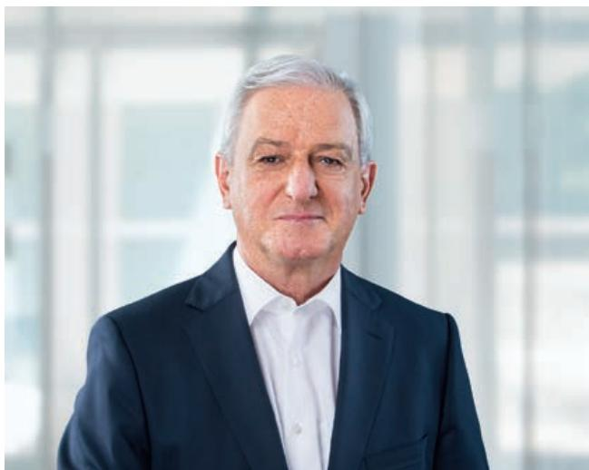
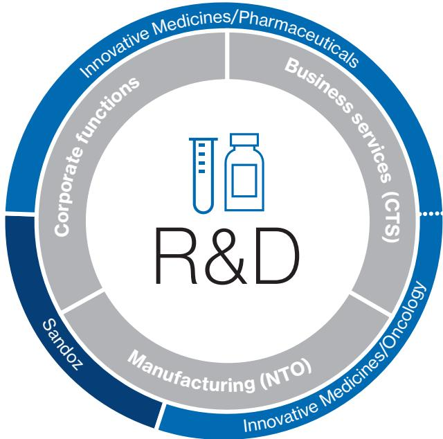
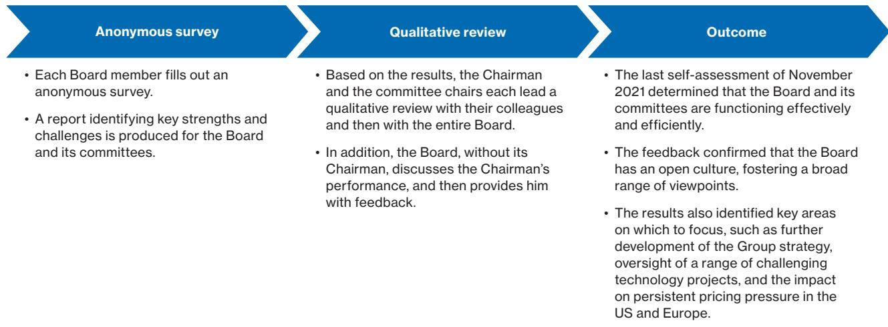
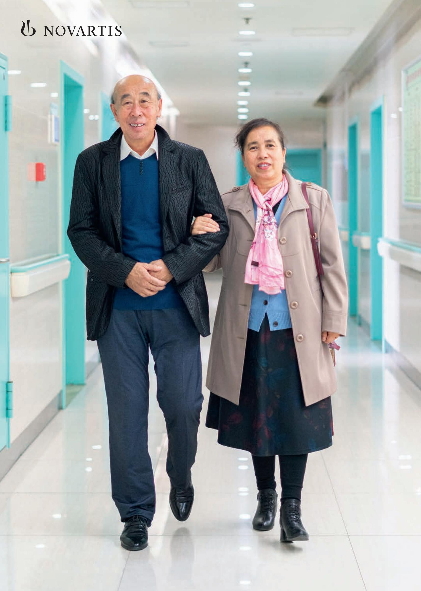

> **AI Description:**
> **Source:** `assets/_page_0_Figure_0.jpg`
> 
> **Generated:** 2026-05-28 12:29:22
> 
> ---
> 
> The image contains a photograph of a person wearing a medical or laboratory uniform, including a hairnet, face mask, and protective eyewear. The individual is dressed in a light blue, grid-patterned gown, which is commonly used in medical or laboratory settings to maintain hygiene and prevent contamination. The background is blurred, focusing attention on the person and their attire. The image conveys a professional and protective environment, likely associated with healthcare or scientific research.

Annual Report 2021

# Chairman’s letter

Novartis delivered a solid performance in 2021. Strong demand for heart failure medicine Entresto, psoriasis and autoimmune disease treatment Cosentyx, and recently launched therapies such as multiple sclerosis drug Kesimpta helped us increase sales and net profit as we maintained cost discipline. Looking ahead, we are confident we can maintain our momentum as we remain focused on operational excellence and science-based innovation.

With more than 12 new drug approvals by the US Food and Drug Administration in the past five years, we are committed to our long-term research and development (R&D) strategy, which is aimed at creating breakthrough therapies for patients with high unmet medical needs. We strive to build leading market positions in fast-growing areas of medicine and broaden patient reach to deliver on our purpose to improve and extend people’s lives around the world.

Last year we continued to make significant investments in R&D, including in cutting-edge medical technologies such as radioligand therapy and small-interfering RNA. Our clinical pipeline covers a diverse area of noncommunicable diseases such as cancer and heart disease. This is positioning us well for the future amid the rising global need for innovative chronic therapies as we continue to strengthen patient engagement.

We started a strategic review of our Sandoz generics division with the goal of strengthening its operational performance and maximizing shareholder return. Also, we divested our investment in Roche Holding AG, reflecting our strategy to create a focused medicines company.

Acute pressure on societies and healthcare systems due to the COVID-19 pandemic remains high. In this challenging environment, our focus on operational excellence and shift to flexible working by our employees continued to help us navigate the crisis. In a post-pandemic world, these lessons will enable us to maintain high levels of resilience and operational efficiency while continuing to position us as an employer of choice in a changing work environment.

We also made further progress in our environmental, social and governance (ESG) activities, which are an essential part of our strategy and an important reputation driver. Besides our progress in reducing our environmental footprint, we broadened patient access to our strategic medicines and launched a new program in the United States to address health disparities – all with the intention to create more equitable and sustainable healthcare systems and support the United Nations’ efforts to achieve the Sustainable Development Goals.

> **AI Description:**
> **Source:** `assets/_page_3_Figure_0.jpg`
> 
> **Generated:** 2026-05-28 12:34:45
> 
> ---
> 
> The image contains a photograph of a person wearing a dark suit and a white shirt. The background appears to be a blurred interior space, possibly an office or a conference room, with large windows allowing natural light to enter. The person is positioned centrally in the frame, and the image is well-lit, suggesting a professional setting. There are no charts, graphs, or other visual elements present in the image.

The Board of Directors took further action to strengthen governance. We paved the way for comprehensive ESG oversight and changed the leadership of the Compensation Committee and the Governance, Nomination and Corporate Responsibilities Committee. We also nominated a new Board member. Together with the Executive Committee, the Board of Directors will continue the intensive dialogue with all stakeholder groups with a view to further strengthen trust in society and to maximize shareholder return.

I thank you for the confidence you have placed in our company and am pleased to be able to propose a dividend increase of 3.3% to CHF 3.10 at the next Annual General Meeting.

Sincerely,

2. DuhcrdL

Joerg Reinhardt Chairman of the Board of Directors

# CEO’s letter

2021 was another year of rapid change for the biopharmaceutical industry and the world. The pandemic continues to disrupt care for patients across the spectrum of disease, creating a syndemic, or confluence of epidemics, that requires healthcare systems to cope with COVID-19 while caring for patients with chronic diseases.

Through the challenges ahead, there are reasons to be optimistic a healthier future is within our grasp – including the ways our industry has brought to this crisis the power of technology and shown once again the extraordinary ability of science to overcome humanity’s greatest tests.

As we reimagine medicine at Novartis, our unwavering focus on our strategy and purpose enabled us to continue creating value for patients, healthcare professionals, healthcare systems, employees, shareholders and society.

The adaptability and commitment of  our employees, together with the resilience of our operations and capabilities in data science and technology, minimized disruptions to our business. Many changes, such as hybrid working, are now business as usual.

Our impact on the world remains extraordinary, with 766 million patients reached in 2021. We received 21 approvals in the US, the EU, Japan and China, including two new molecular entities. Our siRNA therapy Leqvio is now approved in more than 50 countries, including the US. We also demonstrated the strength of our in-market portfolio, with medicines like Cosentyx, Entresto, Zolgensma, Kesimpta and Kisqali driving growth.

Our pipeline promises innovation for years to come. We have built depth in five therapeutic areas and are building scale in five next-generation technology platforms. 2021 saw important data readouts, including for Kisqali in HR+/ HER2- advanced breast cancer, and for 177Lu-PSMA-617, our investigational targeted radioligand therapy for patients with advanced prostate cancer, which received breakthrough therapy designation by the US Food and Drug Administration (FDA). We also received approval for Scemblix, a novel stamp inhibitor for the treatment of chronic myeloid leukemia.

We have a promising mid- and late-stage portfolio, with more than 20 assets with expected approval by 2026 that each have sales potential over USD 1 billion. We also initiated a share buyback of up to USD 15 billion, underscoring our confidence in our mid- and long-term pipeline and growth outlook.

Progressing on our journey to build trust with society and furthering our legacy in global health and access, in 2021 Novartis reached the milestone of delivering a staggering 1 billion courses of malaria treatment to people in endemic countries. We continue delivering on our longstanding commitment to expand access, narrowing the time it takes to scale our latest innovations. Our progress was underscored by improved environmental, social and governance (ESG) ratings, and we once again ranked second in the Access to Medicine Index.

> **AI Description:**
> **Source:** `assets/_page_4_Figure_0.jpg`
> 
> **Generated:** 2026-05-28 12:34:34
> 
> ---
> 
> The image is a photograph of a person wearing a white shirt, standing in front of a blurred background that appears to be a natural setting with greenery. The person is smiling and looking directly at the camera. There are no charts, graphs, or other visual elements present in the image.

We continued to go big on data science and digital technologies, integrating our data and digital teams within Customer & Technology Solutions to maximize efficiency as we scale value-driving projects. For example, AI Nurse, developed in collaboration with Tencent, helps patients with heart failure and other cardiovascular diseases manage disease progression. It is used by 300 000 patients in China.

Novartis also continued doing our part to end the pandemic, quickly scaling up production of COVID-19 vaccines. We’re proud to have helped develop a potential new treatment option with Molecular Partners.

Our financial performance highlights the progress we’ve made and drives confidence for the future – with 4% growth in net sales and 6% growth in core operating income from the previous year. We’re confident we’ll drive consistent growth to 2030 and beyond. We’ve also initiated a strategic review of Sandoz to enable Sandoz to be positioned as a long-term leader in the generics industry.

Emerging from the COVID-19 pandemic, I remain optimistic about a new era in medicine. Stakeholders like you play an important role in that. On behalf of all of us at Novartis, we’re grateful for your contributions on the journey of reimagining medicine.

Sincerely,

Vas Narasimhan Chief Executive Officer

## Table of contents

Introduction and use of certain terms.... ......... ......4   
Forward-looking statements ...... ................................................................................ .....5   
PART I 7   
Item 1. Identity of Directors, Senior Management and Advisers .................................................................... .......7   
Item 2. Offer Statistics and Expected Timetable.. ...8   
Item 3. Key Information ............. ......9   
3.A Selected financial data.... ................................................................................................. .....9   
3.B Capitalization and indebtedness.....................................................................................................................................................9   
3.C Reasons for the offer and use of proceeds ..............................................................................................................................9   
3.D Risk factors .... .......9   
Item 4. Information on the Company...... ............................................................................................................. .....22   
4.A History and development of Novartis ........................................................................................................................................22   
4.B Business overview........\* .....................................................................................................................................................22   
Innovative Medicines ...Sandoz ................................ ....................................................................................................................................................23................................................................................................................................................... 43   
4.C Organizational structure...... ......................................................................................................... ........ 48   
4.D Property, plants and equipment .. ..... 48   
Item 4A. Unresolved Staff Comments.. ....50   
Item 5. Operating and Financial Review and Prospects.....\* ..... 51   
5.A Operating results........... .......................................................................................................................... 51   
5.B Liquidity and capital resources ..................................................................................................................................................... 74   
5.C Research and development, patents and licenses.............................................................................................................85   
5.D Trend information.... ............................................................................ .....85   
5.E Critical accounting estimates .. ...................................................................................... ......85   
Item 6. Directors, Senior Management and Employees ....................................................................................................... ..........89   
6.A Directors and senior management ... ......89   
6.B Compensation ..... ........................................................................................................ .....90   
6.C Board practices... ........................................................................................................................ ........ 121   
6.D Employees ........ .............................................................................. ........ 157   
6.E Share ownership...... ...................................................................... ....... 157   
Item 7. Major Shareholders and Related Party Transactions... ..... 158   
7.A Major shareholders ..................... ...................................................................................................................................... 158   
7.B Related party transactions........................................................................................................................................................... 159   
7.C Interests of experts and counsel ... .................................................................................................................................. 159   
Item 8. Financial Information...... ................................................................ ....... 160   
8.A Consolidated statements and other financial information... ......................................................... ...... 160   
8.B Significant changes .. .................................................................. ..... 161   
Item 9. The Offer and Listing .... ...... 162   
9.A Offer and listing details ... ..... 162   
9.B Plan of distribution..... ................................................................................................................................ ..... 162   
9.C Markets............................... ................................................................................................................................................................... 162   
9.D Selling shareholders..... ........................................................................................................................... ........ 162   
9.E Dilution ............... ........................................................................................................................... ....... 162   
9.F Expenses of the issue .................................................................................................................................................................... 162   
Item 10. Additional Information.....................................................................................................................................................................163   
10.A Share capital........... ....................................................................................................................................163   
10.B Memorandum and articles of association.... ......................................................................................................... ........163   
10.C Material contracts.....10.D Exchange controls.... .............................................................................................. ....... 166....... 167   
10.E Taxation...... ..... 167   
10.F Dividends and paying agents... ..... 170   
10.G Statement by experts ...... ..... 170   
10.H Documents on display ...... .............................................. ..... 171   
10.I Subsidiary information... .................................................................. . 171   
Item 11. Quantitative and Qualitative Disclosures About Market Risk .................................................................................... 172   
Item 12. Description of Securities Other Than Equity Securities.. .................................................................. ... 173   
12.A Debt securities ... ... 173   
12.B Warrants and rights.. .. 173   
12.C Other securities .. ................................................ ... 173   
12.D American Depositary Shares..........   
PART II 175   
Item 13. Defaults, Dividend Arrearages and Delinquencies..... ............................. ........ 175   
Item 14. Material Modifications to the Rights of Security Holders and Use of Proceeds .. ........................... .... 176   
Item 15. Controls and Procedures.. ........................... ...... 177   
Item 16A. Audit Committee Financial Expert.. .... 178   
Item 16B. Code of Ethics.. .. 179   
Item 16C. Principal Accountant Fees and Services.. .. 180   
Item 16D. Exemptions from the Listing Standards for Audit Committees....... ................................ ....... 181   
Item 16E. Purchases of Equity Securities by the Issuer and Affiliated Purchasers .................................................... ...... 182   
Item 16F. Change in Registrant’s Certifying Accountant... ...183   
Item 16G. Corporate Governance.... .............................................................. ...... 184   
Item 16H. Mine Safety Disclosure.... ........................................................................................................................................... ... 185   
PART III 186   
Item 17. Financial Statements.. .. 186   
Item 18. Financial Statements.... .. 187   
Item 19. Exhibits... ..188

# Introduction and use of certain terms

Novartis AG and its consolidated affiliates publish consolidated financial statements expressed in US dollars. Our consolidated financial statements responsive to Item 18 of this Annual Report on Form 20-F (Annual Report) are prepared in accordance with International Financial Reporting Standards (IFRS) as issued by the International Accounting Standards Board (IASB). “Item 5. Operating and Financial Review and Prospects,” together with the sections on products in development and key development projects of our businesses (see “Item 4. Information on the Company—Item 4.B. Business overview”), constitute the Operating and Financial Review (“Lagebericht”), as defined by the Swiss Code of Obligations.

Unless the context requires otherwise, the words “we,” “our,” “us,” “Novartis,” “Group,” “Company,” and similar words or phrases in this Annual Report refer to Novartis AG and its consolidated affiliates. However, each Group company is legally separate from all other Group companies and manages its business independently through its respective board of directors or similar supervisory body or other top local management body, if applicable. Each executive identified in this Annual Report reports directly to other executives of the Group company that employs the executive, or to that Group company’s board of directors.

In this Annual Report, references to “US dollars,” “USD” or “\$” are to the lawful currency of the United States of America, references to “CHF” are to Swiss francs, and references to “euro” or “EUR” are to the lawful currency of 27 member states participating in the European Union; references to the “United States” or to “US” are to the United States of America, references to the “European Union” or to “EU” are to the European Union and its 27 member states, references to “Latin America” are to Central and South America, including the Caribbean, and references to “Australasia” are to Australia, New Zealand, Melanesia, Micronesia and Polynesia, unless the context otherwise requires; references to the “EC” are to the European Commission; references to “associates” are to employees of our affiliates; references to the “SEC” are to the US Securities and Exchange Commission; references to the “FDA” are to the US Food and Drug Administration; references to the “EMA” are to the European Medicines Agency, an agency of the EU, and references to the “CHMP” are to the Committee for Medicinal Products for Human Use of the EMA; references to “ADR” or “ADRs” are to Novartis American Depositary Receipts, and references to “ADS” or “ADSs” are to Novartis American Depositary Shares; references to the “NYSE” are to the New York Stock Exchange, and references to “SIX” are to the SIX Swiss Exchange; references to “ECN” are to the Executive Committee of Novartis; references to “GSK” are to GlaxoSmithKline plc, references to “AAA” are to Advanced Accelerator Applications S.A., references to “Novartis Gene Therapies” are to Novartis Gene Therapies, Inc., and references to “Endocyte” are to Endocyte, Inc.

All product names appearing in italics are trademarks owned by or licensed to Group companies. Product names identified by a “®” or a “™” are trademarks that are not owned by or licensed to Group companies and are the property of their respective owners.

# Forward-looking statements

This Annual Report contains certain forward-looking statements within the meaning of Section 27A of the Securities Act of 1933, as amended, Section 21E of the Securities Exchange Act of 1934, as amended (the “Exchange Act”), and the United States Private Securities Litigation Reform Act of 1995, as amended. Other written materials filed with or furnished to the SEC by Novartis, as well as other written and oral statements made to the public, may also contain forward-looking statements. Forward-looking statements can be identified by words such as “potential,” “expected,” “will,” “planned,” “pipeline,” “outlook,” “may,” “could,” “would,” “anticipate,” “seek,” or similar terms, or by express or implied discussions regarding potential new products, potential new indications for existing products, or regarding potential future revenues from any such products; or regarding the potential outcome, or financial or other impact on Novartis, of any of the transactions described; or regarding the potential impact of share buybacks; or regarding potential future sales or earnings of the Group or any of its divisions or potential shareholder returns; or regarding potential future credit ratings of the Group; or by discussions of strategy, plans, expectations or intentions. Such forward-looking statements are based on the current beliefs and expectations of management regarding future events, and are subject to significant known and unknown risks and uncertainties. Should one or more of these risks or uncertainties materialize, or should underlying assumptions prove incorrect, actual results may vary materially from those set forth in the forward-looking statements. You should not place undue reliance on these statements.

In particular, our expectations could be affected by, among other things:

• Uncertainties regarding the success of key products and commercial priorities;

• Global trends toward healthcare cost-containment, including ongoing government, payer and general public pricing and reimbursement pressures and requirements for increased pricing transparency;

• Uncertainties in the research and development of new healthcare products, including clinical trial results and additional analysis of existing clinical data;

• The potential that the strategic benefits, operational efficiencies or opportunities expected from our recent transactions or the business transformation of our Sandoz Division, including any proposed actions arising from the strategic review of the Sandoz Division, may not be realized or may take longer to realize than expected;

• Our ability to obtain or maintain proprietary intellectual property protection, including the ultimate extent of the impact on Novartis of the loss of patent protection and exclusivity on key products that commenced in prior years and is expected to continue this year;

• Our performance on environmental, social and governance measures;

• Uncertainties in the development or adoption of potentially transformational digital technologies and business models;

• Uncertainties regarding potential significant breaches of information security or disruptions of our information technology systems;

• Our reliance on outsourcing key business functions to third parties;

• Safety, quality, data integrity or manufacturing issues;

• Uncertainties surrounding the implementation of our new Enterprise Resource Planning system and Enterprise Data Management implementation;

• Our ability to attract, integrate and retain key personnel and qualified individuals;

• Uncertainties regarding actual or potential legal proceedings, including, among others, litigation and other legal disputes with respect to our recent transactions, product liability litigation, litigation and investigations regarding sales and marketing practices, intellectual property disputes and government investigations generally;

• Regulatory actions or delays or government regulation generally, including potential regulatory actions or delays with respect to the development of the products described in this Annual Report;

• Our ability to comply with data privacy laws and regulations, and uncertainties regarding potential significant breaches of data privacy;

• General political, economic and business conditions, including the effects of and efforts to mitigate pandemic diseases such as COVID-19;

• The impact of pandemic diseases such as COVID-19 on enrollment in, initiation and completion of our clinical trials in the future, and research and development timelines;

• Uncertainties involved in predicting shareholder returns;

• Uncertainties regarding the effects of recent and anticipated future changes in tax laws and their application to us;

• Uncertainties regarding future global exchange rates; and

• Uncertainties regarding future demand for our products.

Some of these factors are discussed in more detail in this Annual Report, including under “Item 3. Key Information— Item 3.D. Risk factors,” “Item 4. Information on the Company,” and “Item 5. Operating and Financial Review and Prospects.” Should one or more of these risks or uncertainties materialize, or should underlying assumptions prove incorrect, actual results may vary materially from those described in this Annual Report as anticipated, believed, estimated or expected. We provide the information in this Annual Report as of the date of its filing. We do not intend, and do not assume any obligation, to update any information or forward-looking statements set out in this Annual Report as a result of new information, future events or otherwise.

PART I

# Item 1. Identity of Directors, Senior Management and Advisers

Not applicable.

# Item 2. Offer Statistics and Expected Timetable

Not applicable.

# Item 3. Key Information

# 3.A Selected financial data

Not applicable.

## 3.B Capitalization and indebtedness

Not applicable.

# 3.C Reasons for the offer and use of proceeds

Not applicable.

## 3.D Risk factors

Our businesses face significant risks and uncertainties. You should carefully consider all of the information set forth in this Annual Report and in other documents we file with or furnish to the SEC, including the following risk factors, before deciding to invest in or to maintain an investment in any Novartis securities. Our business, as well as our reputation, financial condition, results of operations, and share price, could be materially adversely affected by any of these risks, as well as other risks and uncertainties not currently known to us or not currently considered material.

## Strategic risks

## Key products and commercial priorities

## Risk description

Failure to deliver key commercial priorities and successfully launch new products

## Context and potential impact

Our ability to maintain and grow our business and to replace revenue and income lost to generic, biosimilar and other competition depends heavily on the commercial success of our new or existing key products. The commercial success of these products could be impacted at any time by a number of factors, including pressure from new or existing competitive products, changes in the prescribing habits of healthcare professionals, unexpected side effects or safety signals, supply chain issues or other product shortages, pricing pressure, regulatory proceedings, changes in labeling, loss of intellectual property protection, and global pandemics. In addition, our revenue and margins could be significantly impacted by the timing and rate of commercial acceptance of new products.

Healthcare professionals, patients and payers may choose competitor products instead of ours for various reasons, including if they perceive them to be better in terms of efficacy, safety, cost, convenience or other reasons. The commercial success of our key products and launches in the face of increasing competition requires significant attention and management focus. Such competitive products could significantly affect the revenue from our products and our results of operations. This impact could also be compounded to the extent such competition results in us making significant additional investments in research and development, marketing or sales.

Pricing, reimbursement and access

## Risk description

Pricing and reimbursement pressure, including access to healthcare

## Context and potential impact

Our businesses experience significant pressures on the pricing of our products and on our ability to obtain and maintain satisfactory rates of reimbursement for our products by governments, insurers and other payers. These pressures have many sources, including growth of healthcare costs as a percentage of gross domestic product; funding restrictions and policy changes; management of the COVID-19 pandemic and its impact on healthcare spending; and public controversies, political debate, investigations and legal proceedings regarding pharmaceutical pricing. Pressures on pricing may negatively impact both our product pricing and the availability of our products.

In addition, we face numerous cost-containment measures imposed by governments and other payers, including government-imposed industrywide price reductions, mandatory pricing systems, reference pricing systems, payers limiting access to treatments based on cost-benefit analyses, importation of drugs from lower-cost countries to higher-cost countries, shifting of the payment burden to patients through higher co-payments and co-pay accumulator programs, limiting physicians’ ability to choose among competing medicines, mandatory substitution of generic drugs for the patented equivalent, pressure on physicians to reduce the prescribing of patented prescription medicines, increasing pressure on intellectual property protections, and growing requirements for increased transparency on pricing. For more information on price controls, see “Item 4. Information on the Company—Item 4.B Business overview— Innovative Medicines—Price controls.”

These challenges are expected to intensify in 2022 and beyond as political and budget pressures mount, and healthcare payers around the globe, including government-controlled health authorities, insurance companies and managed care organizations, step up initiatives to reduce the overall cost of healthcare, restrict access to higher-priced new medicines, increase the use of generics, and impose overall price cuts. These factors may materially affect our ability to achieve value-based prices and maintain an acceptable return on our investments in the research and development of our products, and may impact our ability to research and develop new products.

In addition, our Sandoz Division has faced and may continue to face intense competition from other generic and biosimilar pharmaceutical companies, which aggressively compete for market share, including through significant price competition. Such competitive actions may increase the costs and risks associated with our efforts to introduce and market generic and biosimilar products, may delay the introduction or marketing of such products, and may further limit the prices at which we are able to sell these products. In particular, in the US in past years, industrywide price competition among generic pharmaceutical companies and consolidation of buyers caused significant declines in sales and profits of Sandoz.

## Research and development

## Risk description

Failure or delay in the research and development of new products or new indications for existing products

## Context and potential impact

We engage in extensive and costly research and development activities, both through our own internal resources and through collaborations with third parties, in an effort to identify and develop new products and new indications for existing products that address unmet and changing medical needs and are commercially successful. Our ability to grow our business; to replace sales lost due to branded competition, entry of generics, or other reasons; and to bring to market products that take advantage of new and potentially disruptive technologies, including cell, gene and radioligand therapies, depends in significant part upon the success of these efforts.

Research and development of new products of our Innovative Medicines Division, including the research and development of our cell and gene therapies, is a costly, lengthy and uncertain process. Because intellectual property protections are limited in scope and duration, the longer it takes to develop a product, the less time there may be for us to recoup our research and development costs before loss of exclusivity. Failure can occur at any point in the process, including in later stages after substantial investment. In spite of such substantial investment, there can be no guarantee that our research and development activities will produce commercially successful new products that will enable us to replace revenue and income lost to competition and to grow our business. See also “Item 4. Information on the Company—Item 4.B Business overview—Innovative Medicines—Research and development” with regards to the research and development efforts of our Innovative Medicines Division.

New products must undergo intensive preclinical and clinical testing, and must be approved by means of a highly complex, lengthy and expensive approval processes that can vary from country to country. Further, regulatory authorities continue to establish new and increasingly rigorous and time-consuming requirements for approval and reimbursement of new products and new indications. Similarly, the post-approval regulatory burden has also increased. These requirements make the maintenance of regulatory approvals for our products increasingly expensive, and further heighten the risk of recalls, product withdrawals, change to product specifications, loss of market share, and loss of revenue and profitability. The clinical testing, regulatory processes and post-approval activities described above become more difficult during pandemics, such as the COVID-19 pandemic. This is primarily due to challenges related to recruiting, enrolling and treating patients in clinical trials. In addition, travel restrictions resulting from pandemics make it more difficult for regulatory authorities to inspect sites. For a further description of the research and development and approval processes for the products of our Innovative Medicines Division, see the sections headed “Research and development” and “Regulation” included in the description of our Innovative Medicines Division under “Item 4. Information on the Company—Item 4.B Business overview—Innovative Medicines.”

Our Sandoz Division has made, and expects to continue to make, significant investments in the development of biotechnology-based, “biologic” medicines intended for sale as bioequivalent or “biosimilar” versions of currently marketed biotechnology products. While the development of such products typically is significantly less costly and complex than the development of the equivalent originator medicines, it is nonetheless significantly more costly and complex than that for typical small-molecule generic products. See also “Item 4. Information on the Company—Item 4.B Business overview— Sandoz—Development and registration” with regards to the research and development efforts of our Sandoz Division. In addition, many countries do not yet have fully developed legislative or regulatory pathways to facilitate the development of biosimilars and permit their sale in a manner in which they are readily substitutable alternatives to the originator product. Further delays or difficulties in the development or marketing of biosimilars could put at risk the significant investments that Sandoz has made, and will continue to make, in its Biopharmaceuticals business. Failure to successfully develop and market biosimilars could have a material adverse effect on the success of the Sandoz Division and the Group as a whole. For more information about the approval processes that must be followed to market Sandoz Division products, see “Item 4. Information on the Company—Item 4.B Business overview—Sandoz—Regulation.” Further, our research and development activities must be conducted in an ethical and compliant manner. Among other things, we are concerned with patient safety (both preand post-product approval), data privacy, Current Good Clinical Practices (cGCP) requirements, data integrity, the fair treatment of patients, and animal welfare. Should we fail to properly manage such issues, we risk injury to third parties, damage to our reputation, negative financial consequences as a result of potential claims for damages, sanctions and fines, and the potential that investments in research and development activities could have no benefit to the Group. Research to find new targets for drug discovery and the therapeutic agents to treat unmet medical needs is made more difficult during pandemics, such as the COVID-19 pandemic. This is primarily due to safety-related restrictions on the ability of laboratory scientists to work in research laboratories, and impacts our ability to collaborate with academic and commercial research organizations facing similar challenges and restrictions.

## Alliances, acquisitions and divestments

## Risk description

Failure to identify external business opportunities or realize the expected benefits from our strategic acquisitions or divestments

## Context and potential impact

As part of our strategy, from time to time we acquire and divest products or entire businesses, and enter into strategic alliances and collaborations. For example, in February 2021, we closed the in-licensing of tislelizumab from an affiliate of BeiGene, Ltd. for North America, Europe and Japan. This strategy depends in part on our ability to identify strategic external business opportunities and to move forward with such opportunities on acceptable terms.

Once a strategic transaction is agreed upon with a third party, we may not be able to complete the transaction in a timely manner or at all, nor can we be sure that pre-transaction due diligence will identify all possible issues that might arise during and after the transaction. Our efforts on such transactions can also divert management’s attention from our existing businesses.

After a transaction, efforts to develop and market acquired or licensed products, to integrate the acquired business or to achieve expected synergies may fail or may not fully meet expectations, as a result of difficulties in retaining key personnel, customers and suppliers; failure to obtain marketing approval or reimbursement within expected time frames or at all; differences in corporate culture, standards, controls, processes and policies; or other factors. Transactions can also result in liabilities being incurred that were not known at the time of acquisition, or the creation of tax or accounting issues. Acquired businesses are not always in full compliance with legal, regulatory or Novartis standards, including, for example, Current Good Manufacturing Practices (cGMP) or cGCP standards, which can be costly and time-consuming to remedy. Also, our strategic alliances and collaborations with third parties may not achieve their intended goals and objectives within expected time frames, or at all.

Similarly, we cannot ensure that we will be able to successfully divest or spin off businesses or other assets that we have identified for this purpose, or that any completed divestment or spin-off will achieve the expected strategic benefits, operational efficiencies or opportunities, or that the divestment or spin-off will ultimately maximize shareholder value.

## Intellectual property

## Risk description

Expiry, assertion or loss of intellectual property protection

## Context and potential impact

Many products of our Innovative Medicines Division are protected by intellectual property rights, which may provide us with exclusive rights to market those products for a limited time and enable our purpose of reimagining medicine by sustainably financing our research and development. However, the strength and duration of those rights can vary significantly from product to product and country to country, and they may be successfully challenged by third parties or governmental authorities.

Loss of intellectual property protection and the introduction of generic or biosimilar competition for a patented branded medicine in a country typically result in a significant and rapid reduction in net sales and operating income for the branded product. Such competition can occur after successful challenges to intellectual property rights or the regular expiration of the patent term or other intellectual property rights. Such competition can also result from the entry of generic or biosimilar versions of another medicine in the same therapeutic class as one of our drugs or in a competing therapeutic class, from a Declaration of Public Interest or the compulsory licensing of our intellectual property by governmental authorities, or as a result of a general weakening of intellectual property and governing laws in certain countries around the world. In addition, generic or biosimilar manufacturers may sometimes conduct so-called “launches at risk” of products that are still under legal challenge for infringement, or whose patents are still under legal challenge for validity, before final resolution of legal proceedings.

We also rely in all aspects of our businesses on unpatented proprietary technology, know-how, trade secrets and other confidential information, which we seek to protect through various measures, including confidentiality agreements with licensees, employees, third-party collaborators and consultants who may have access to such information. If these agreements are breached or our other protective measures should fail, then our contractual or other remedies may not be adequate to cover our losses.

We may also be subject to assertions of intellectual property rights against our innovative medicines by third parties. If successful, these actions may involve payment of future royalties or damages, for example for patent infringement, and may also involve injunctive relief requiring removal of one or more dosage strengths of a product from the market (or removal of a therapeutic indication from the product’s approved labeling) for some period of time or throughout the life of the asserted intellectual property right. Such damages or such an injunction may have a material impact on our operating income and net sales.

In any given year, we may experience a potentially significant impact on our net sales from products that have already lost intellectual property protections, as well as products that may lose protection during the year. Because we may have substantially reduced marketing and research and development expenses related to products that are in their final years of exclusivity, the initial loss of protection for a product during a given year could also have an impact on our operating income for that year in an amount corresponding to a significant portion of the product’s lost sales. The magnitude of the impact of generic or biosimilar competition on our income could depend on a number of factors, including, with respect to income in a given year, the time of year at which the generic or biosimilar competitor is launched; the ease or difficulty of manufacturing a competitor product and obtaining regulatory approval to market it; the number of generic or biosimilar competitor products approved, including whether, in the US, a single competitor is granted an exclusive marketing period; whether an authorized generic is launched; the geographies in which generic or biosimilar competitor products are approved, including the strength of the market for generic or biosimilar pharmaceutical products in such geographies, and the comparative profitability of branded pharmaceutical products in such geographies; and our ability to successfully develop and launch new products for patients that may also offset the income lost to generic or biosimilar competition. For more information on the patent and generic competition status of our Innovative Medicines Division products, see “Item 4. Information on the Company—Item 4.B Business overview—Innovative Medicines—Intellectual property.”

## Environmental, social and governance matters

## Risk description

Failure to meet environmental, social and governance expectations

## Context and potential impact

Increasingly, in addition to financial results, companies are being judged by performance on a variety of environmental, social and governance (ESG) matters, which can contribute to the long-term sustainability of our companies’ performance. An inability to successfully perform on ESG matters and meet societal expectations can result in negative impacts to our reputation, recruitment, retention, operations, financial results and share price.

A variety of organizations measure the performance of companies on ESG topics, and the results of these assessments are widely publicized. In addition, investment in funds that specialize in companies that perform well in such assessments are increasingly popular, and major institutional investors have publicly emphasized the importance of such ESG measures in making their investment decisions. Topics taken into account in such assessments include, among others, the unintentional costs or benefits of our actions on third parties not involved in such actions, which may impact society and the environment, such as with respect to climate change, the degradation of biodiversity, and inequality in society. In particular, the resulting costs of such actions may in the long term impact our operations and ability to achieve our strategic goals, ultimately resulting in broader negative impacts on the value of Novartis. Therefore, the role of our Board of Directors and executive officers in supervising various sustainability issues is becoming increasingly important. In addition to the topics typically considered in such assessments in the healthcare industry, the public’s ability to access our medicines is particularly important. If our advocacy and lobbying efforts are not aligned with our publicly stated ESG targets, our purpose statement or societal expectations, our performance on ESG assessments may be negatively impacted.

We actively manage a broad range of such ESG matters, taking into consideration their expected impact on the sustainability of our business over time, and the potential impact of our business on society and the environment. We recently created an ESG Management Office, which is tasked with developing our ESG strategy and tracking our performance against our ESG targets. However, in light of investors’ increasing focus on ESG matters and rapidly changing views on acceptable levels of action across a range of topics, there can be no certainty that we will manage such issues successfully, that the ESG standards we use to create our ESG targets and currently use to measure our performance against will remain the same, or that we will successfully meet society’s or investors’ expectations.

## Sandoz business transformation

## Risk description

Inability to drive sustainable growth mid-term by pursuing biosimilars and inorganic growth opportunities

## Context and potential impact

Our Sandoz Division operates in a challenging generics and biosimilars market, where it faces intense competition and continued pricing pressures as it seeks to increase its market share and achieve sustainable and profitable growth mid-term. To achieve this objective, we are implementing a strategy for Sandoz focused on several goals, including accelerating biosimilars growth in the long term, rebuilding the Sandoz US business, and achieving inorganic growth by identifying and successfully executing on merger and acquisition and strategic in-licensing partnership opportunities on acceptable terms. There is no guarantee that we will achieve our strategic goals for Sandoz within the expected time frame, or at all. Concurrently with implementing this strategy, in October 2021 we announced the commencement of a strategic review of our Sandoz Division. This review will explore all options, ranging from retaining the business to separation, to determine how best to maximize value for our shareholders. As a result, our inability to achieve these strategic goals or to successfully implement any proposed actions arising out of the strategic review could have a material adverse effect on the success of the Sandoz Division and the Group as a whole, and may have a material adverse effect on our results of operations and financial condition. In addition, the strategic review itself will utilize additional employee and management time as well as Company resources that could be allocated to other areas of our business, which may negatively impact our overall Company performance. See also “—Pricing, reimbursement and access” with regards to the price competition for our Sandoz Division, “—Research and development” with regards to our research and development efforts related to the biosimilars market, and “—Alliances, acquisitions and divestments.”

## Emerging business models

## Risk description

Missed opportunities in digitalization and emerging business models

## Context and potential impact

Rapid progress in medical and digital technologies and in the development of new business models is substantially transforming our industry and is creating new businesses and new opportunities for improving patient care and increasing revenue and profit, while sometimes quickly rendering established businesses uncompetitive or obsolete. Such transformations, both positive and negative, may impact the healthcare industry overall. Numerous tech companies are seeking to enter into the healthcare field, from research and development to pharmaceutical distribution and the delivery of care, which generates opportunities for technology partnerships that may accelerate innovation and complement our capabilities. However, this may also potentially disrupt our relationships with patients, healthcare professionals, customers, distributors and suppliers, with potentially negative consequences for us.

To take advantage of these opportunities, we have embarked upon a digital transformation strategy, with the goal of becoming an industry leader in leveraging advanced analytics and digital technologies, which was accelerated by the COVID-19 pandemic. We expect to invest substantial resources into efforts to improve the way we use data in drug discovery and development; to gain insights into customer preferences and behaviors via data science; to improve the ways we engage with patients, doctors and other stakeholders; and to automate business processes. Our success in these efforts will depend on many factors, including data quality, technology architecture, partnering with the right technology companies, training our employees to fully capitalize on the new capabilities, attracting and retaining employees with appropriate skills and mindsets, and successfully innovating across a variety of technology fields. Our efforts in some of these initiatives have started to gain significant traction. However, we do not yet know if these changes will be sustainable as we scale and make them part of our ways of working. As a result, we may ultimately fail to either create innovative new products, tools or techniques in an adequate time frame, or fail to differentiate our products and business models via digital technologies.

Furthermore, our increasing use of social media and other digital engagement platforms carries risks related to potential violations of rules regulating the promotion of prescription medicines and the potential disclosure of confidential information, trade secrets, or loss of other intellectual property. As a result of the COVID-19 pandemic, the use of social media and other digital engagement platforms has increased and is expanding into new uses. There continue to be uncertainties as to the rules that apply to such communications and as to the interpretations that health authorities will apply in this context, and as a result, despite our efforts to comply with applicable rules, there is a risk that our use of social media and other digital engagement platforms may cause us to be found in violation of applicable regulations.

In addition, the market for our products is evolving rapidly with frequent changes in scientific evidence, significant advances in availability and utilization of realworld evidence (RWE), and the acceleration in the adoption of virtual and social media and other digital engagement platforms by customers, patients and other stakeholders, which may allow us to (i) better understand the appropriate utilization of our products through RWE, (ii) engage and appropriately educate customers, patients and other stakeholders about the benefits and risks associated with our products, and (iii) increase the efficiency of our engagement with customers. Failure to effectively utilize these increasingly important channels and sources of evidence can result in the inadequate education of customers regarding the benefits and risks of our products and the loss of market share. In addition, there is risk of inappropriate utilization of this data and these channels by our employees or vendors.

## Operational risks

## Cybersecurity and IT systems

## Risk description

Cybersecurity breaches and catastrophic loss of IT systems

## Context and potential impact

We are heavily dependent on critical, complex and interdependent information technology (IT) systems, including internet-based systems to support our business processes. We also have outsourced significant parts of our IT infrastructure to third-party providers, and we currently use these providers to perform business-critical IT services for us. We are therefore vulnerable to cybersecurity attacks and incidents on such networks and systems, whether our own or those of the third-party providers we contract, and we have experienced and may in the future experience such cybersecurity threats and attacks. Cybersecurity threats and attacks take many forms, and the size, age and complexity of our IT systems make them potentially vulnerable to external and internal security threats; outages; malicious intrusions and attacks; cybercrimes, including state-sponsored cybercrimes; malware; misplaced or lost data; programming or human errors; or other similar events. In the context of the COVID-19 pandemic, the risk of such threats and attacks has increased, as virtual and remote working has become more widely used, and sensitive data is accessed by employees working in less secure, home-based environments. In addition, due to our reliance on third-party providers, we have experienced and may in the future experience interruptions, delays or outages in IT service availability due to a variety of factors outside of our control, including technical failures, natural disasters, fraud, or security attacks experienced by or caused by the third-party provider. Interruptions in the service provided by these third parties could affect our ability to perform critical tasks.

A significant information security or other event, such as a disruption or loss of availability of one or more of our IT systems, whether managed by us or a third-party service provider, has previously and could in the future negatively impact important business processes, such as the conduct of scientific research and clinical trials, the submission of data and information to health authorities, our manufacturing and supply chain processes, our shipments to customers, our compliance with legal obligations, and communication between employees and with third parties. IT issues have previously led to, and could in the future lead to, the compromise of trade secrets or other intellectual property that could be sold and used by competitors to accelerate the development or manufacturing of competing products; to the compromise of personal financial and health information; and to the compromise of IT security data such as usernames, passwords and encryption keys, as well as security strategies and information about network infrastructure, which could allow unauthorized parties to gain access to additional systems or data. In addition, malfunctions in software or medical devices that make significant use of IT could lead to a risk of direct harm to patients.

Although we have experienced some of the events described above, to date they have not had a material impact on our operations. Nonetheless, the occurrence of any of the events described above in the future could disrupt our business operations and result in enforcement actions or liability, including potential government fines and penalties, claims for damages, and shareholder litigation or allegations that the public health, or the health of individuals, has been harmed.

Any significant events of this type could require us to expend significant resources beyond those we already invest to remediate any damage, to further modify or enhance our protective measures, and to enable the continuity of our business.

## Third-party management

## Risk description

Failure to maintain adequate governance and oversight over third-party relationships, and failure of third parties to meet their contractual, regulatory or other obligations

## Context and potential impact

We outsource the performance of certain key business functions to third parties, and invest a significant amount of effort and resources into doing so, including to manage and oversee such third parties. Such outsourced functions include research and development collaborations, manufacturing operations, warehousing and distribution activities, certain finance functions, sales and marketing activities, data management and others. Some of these third parties, particularly those in developing countries, do not have internal compliance systems comparable to those within our organization.

Our reliance on outsourcing and third parties for the research and development, sales or manufacturing of our products poses certain risks, including misappropriation of our intellectual property, failure of the third party to comply with regulatory and quality assurance requirements, unexpected supply disruptions, breach of the research and development or manufacturing agreement by the third party, and the unexpected termination or nonrenewal of the agreement by the third party.

In addition, governments and the public expect companies like Novartis to take responsibility for and report on compliance with various human rights, responsible sourcing and environmental practices, as well as other actions of their third-party contractors around the world.

Ultimately, if third parties fail to meet their obligations to us, we may lose our investment in the collaborations or fail to receive the expected benefits of our agreements with such third parties. In addition, should any of these third parties fail to comply with the law or our standards, or should they otherwise act inappropriately in the course of their performance of services for us, there is a risk that we could be held responsible for their acts, that our reputation may suffer, and that penalties may be imposed upon us.

## Manufacturing and product quality

## Risk description

Inability to ensure proper controls in product development and product manufacturing, and failure to comply with applicable regulations and standards

## Context and potential impact

The development and manufacture of our products is complex and heavily regulated by governmental health authorities around the world. Whether or not our products and the related raw materials are developed and manufactured at our own manufacturing sites or by third parties, we must ensure that all development and manufacturing processes comply with regulatory requirements as well as our own quality standards in order to deliver novel therapies to patients with unmet needs while ensuring patient safety. Failure to comply with regulatory requirements has resulted in, and may in the future result in, warning letters, suspension of manufacturing, seizure of products, injunctions, product recalls, failure to secure product approvals, or debarment.

In recent years, global health authorities have substantially intensified their scrutiny of manufacturers’ compliance with regulatory requirements. Any significant failure by us or our third-party suppliers to comply with regulatory requirements, or with health authorities’ expectations, may create the need to suspend clinical trials, shut down production facilities or production lines, and recall commercial products. A failure to fully comply with regulatory requirements could also lead to a delay in the approval of new products, an inability to ship or import our products, and significant penalties and reputational harm.

Fragmented IT landscape and Enterprise Resource Planning (ERP) and Enterprise Data Management (EDM) implementation

## Risk description

Fragmented business processes and unclear data ownership may impact future digital opportunities, including the implementation of the new ERP system and EDM governance

## Context and potential impact

We rely on various information and other business systems to leverage data in order to operate our complex global business. Historically, while there are highly overlapping data strategy and architectural needs across our business units, we have taken the approach of building distinct solutions across both business units and geographies, which may cause disruptions to our operational stability. We are currently in the design and planning phase for the implementation of a new global ERP system that seeks to simplify, standardize and digitize processes in our commercial and finance functions and our Novartis Technical Operations unit to help ensure efficient and compliant business operations across business units and geographies as well as the availability of high-quality data necessary to aid our decision-making. We expect the first implementation of our new ERP system to begin in the second half of 2023, with full implementation by 2028, when our current system is out of maintenance by the software provider. Implementing and operating a new ERP system involves certain risks, including a failure of the new system to operate as expected, a failure to properly integrate with other systems we use, potential loss of data or information, compliance issues, cost overruns and delays, and operational disruptions. Any disruptions or malfunctions of our new ERP system could cause critical information we use to be delayed, defective, corrupted, inadequate or inaccessible. In addition, if the design or implementation of our new ERP system is deficient, it could adversely affect our operations, and could negatively impact the effectiveness of our internal controls.

## Talent management

## Risk description

Inability to attract, integrate and retain key personnel and qualified individuals

## Context and potential impact

We rely on a diverse, highly skilled workforce across our businesses and functions. Novartis invests in attracting, integrating and retaining talented individuals to achieve our business objectives. If we are unable to sufficiently attract, integrate and retain key personnel – including senior members of our scientific and management teams, high-quality researchers and development specialists, and skilled personnel in key markets – our ability to achieve our major business objectives may be adversely affected, our brand and reputation could be negatively impacted, and the diversity of our workforce may decline.

Our future growth will depend on our ability to retain key talent and leaders while also recruiting new talent who bring new skills and perspectives. The market for skilled talent has become increasingly competitive. We are experiencing challenges in attracting and retaining skilled talent in several areas, including biology, chemistry, clinical development, drug manufacturing, IT and, in particular, our Oncology business unit and advanced technology platforms (i.e., our chimeric antigen receptor T-cell (CAR-T) therapies, gene therapies and radioligand therapies). In addition, biotechnology companies have seen and continue to see a significant inflow of capital, and are not only competing with us to attract the same skilled talent but are also aggressively pursuing our experienced talent, threatening our ability to sustain a skilled talent supply to deliver on our business priorities.

The constraints associated with lockdowns during the COVID-19 pandemic accelerated the need for more flexible working models. We addressed this need through our program called Choice with Responsibility, which now gives many employees the flexibility to determine, in consultation with their teams, where, when and how they work, while remaining in compliance with any tax, legal and other limitations. Our transition toward a more flexible working model accelerated our efforts to expand our recruitment of talent from an increasingly global pool. However, the external supply of new talent is especially limited in many of the geographies that are expected to be sources of growth for Novartis, particularly China and the US. In China, the US and several other markets, the geographic mobility of talent is decreasing, with ample career opportunities available closer to home for talented individuals, who often have increasing expectations that they may choose where they work.

The risks associated with drawing from the external supply of talent will be exacerbated if we are unable to retain and effectively develop our key personnel and maintain a sustainable pipeline of talent and senior leaders with the critical skills and experiences necessary to deliver on our business priorities. As a result, our ability to retain critical talent, reward performance, incentivize our employees, pay competitive compensation and successfully implement our key personnel succession plans is essential. Our inability to integrate, engage and motivate employees, in particular those in leadership positions, may jeopardize our succession plans and our ability to achieve our business priorities.

## Legal, ethics and compliance

## Risk description

Challenges in keeping up with legal and regulatory requirements, and evolving societal expectations regarding ethical behavior

## Context and potential impact

We are obligated to comply with the laws of all countries in which we operate and sell products with respect to an extremely wide and growing range of activities. Such legal requirements are extensive and complex.

The laws and regulations relevant to the healthcare industry and applicable to us are broad in scope and are subject to change and evolving interpretations, which could require us to incur substantial costs associated with compliance or to alter one or more of our business practices. For example, we have been, are currently and may in the future be subject to various significant legal proceedings, such as private party litigation, government investigations and law enforcement actions worldwide. These types of matters may take various forms based upon evolving government enforcement and private party litigation priorities, and could include matters pertaining to pricing; bribery and corruption; trade regulation and embargo legislation; product liability; commercial disputes; employment and wrongful discharge; antitrust; securities; government benefit programs; reimbursement; rebates; healthcare fraud; sales and marketing practices; insider trading; occupational health and safety; environmental regulations; tax; cybersecurity; data privacy; regulatory interactions; and intellectual property. Such activities can involve criminal proceedings and can retroactively challenge practices previously considered to be legal.

There is also a risk that governance for our medical and patient support activities, and our interactions with governments, public officials/institutions, healthcare professionals, healthcare organizations and patient organizations may be inadequate or fail, or that we may undertake activities based on improper or inadequate scientific justification.

Our Sandoz Division may from time to time seek approval to market a generic version of a product before the expiration of patents claimed by the marketer of the patented product. We do this in cases where we believe the relevant patents are invalid or unenforceable, or would not be infringed by our generic product. As a result, affiliates of our Sandoz Division frequently face patent litigation, and in certain circumstances, we may make the business decision to market a generic product even though patent infringement actions are still pending. Should we elect to do so and conduct a so-called “launch at risk,” we could face substantial damages if the final court decision is adverse to us.

Legal proceedings and investigations are inherently unpredictable, and large judgments sometimes occur. As a consequence, we may in the future incur judgments that could involve large payments, including the potential repayment of amounts allegedly obtained improperly, and other penalties, including treble damages. In addition, such legal proceedings and investigations, even if meritless, may affect our reputation, may create a risk of potential exclusion from government reimbursement programs in the US and other countries, and may lead to civil litigation. As a result, having taken into account all relevant factors, we have in the past and may again in the future enter into major settlements of such claims without bringing them to final legal adjudication by courts or other such bodies, despite having potentially significant defenses against them, in order to limit the risks they pose to our business and reputation. Such settlements may require us to pay significant sums of money and to enter into corporate integrity or similar agreements, which are intended to regulate company behavior for extended periods.

For information on significant legal matters pending against us, see “Item 18. Financial Statements—Note 20. Provisions and other non-current liabilities” and “Item 18. Financial Statements—Note 28. Commitments and contingencies.”

New requirements may also be imposed on us as a result of changing government and societal expectations regarding the healthcare industry, and acceptable corporate behavior generally. For example, we are faced with laws and regulations requiring changes in how we do business, including with respect to disclosures concerning our interactions with healthcare professionals, healthcare organizations and patient organizations. These laws and regulations include requirements that we disclose payments or other transfers of value made to healthcare professionals and organizations, as well as information relating to the costs and prices for our products, which represent evolving standards of acceptable corporate behavior. These requirements may incur significant costs, including substantial time and additional resources, that are necessary to bring our interactions with healthcare professionals and organizations into compliance with these evolving standards.

In addition to legal and regulatory requirements, as a company we aim to meet the evolving societal expectations of the public and our investors regarding ethical behavior and the increasing importance placed on ESG matters.

To help us in our efforts to comply with the many requirements that impact us, we have a significant global ethics and compliance program in place, and we devote substantial time and resources to efforts to ensure that our business is conducted in a lawful and publicly acceptable manner. Despite our efforts, an actual or alleged failure to comply with law or with heightened public expectations could lead to substantial liabilities that may not be covered by insurance, or to other significant losses.

## Data privacy

## Risk description

Noncompliance with personal data protection laws and regulations

## Context and potential impact

We operate in an environment that relies on the collection, processing, analysis and interpretation of large sets of patients’ and other individuals’ personal information, including via social media and mobile technologies. Also, the operation of our business requires data to flow freely across borders of numerous countries in which there are different, and potentially conflicting, frequently changing data privacy laws in effect. For example, the EU General Data Protection Regulation (GDPR), which took effect in May 2018; the California Consumer Privacy Act, which took effect in January 2020; Brazil’s General Personal Data Protection Law, which entered into force in September 2020; and the Personal Information Protection Law in China, which took effect in November 2021, impose stringent requirements on how we and third parties with whom we contract collect, share, export or otherwise process personal information, and provide for significant penalties for noncompliance. Breaches of our systems or those of our third-party contractors, or other failures to protect the data we collect from misuse or breach by third parties, could expose such personal information to unauthorized persons.

Any event involving the substantial loss of personal information, use of personal information without a legal basis, or other privacy violations could give rise to significant liability, reputational harm, damaged relationships with business partners, and potentially substantial monetary penalties under laws enacted or being enacted around the world. Such events could also lead to restrictions on our ability to use personal information and/or transfer personal information across country borders. In addition, there is a trend of increasing divergence of data privacy legal frameworks, not only across these frameworks but also within individual legal frameworks themselves. This divergence may constrain the implementation of global business processes and may lead to different approaches on the use of health data for scientific research, which may have a negative impact on our business and operations.

## Supply chain

## Risk description

Inability to maintain continuity of product supply

## Context and potential impact

Many of our products are produced using technically complex manufacturing processes and require a supply of highly specialized raw materials. For some of our products and raw materials, we may rely on a single source of supply. In addition, we manufacture and sell a number of sterile products, biologic products, and products involving advanced therapy platforms, such as CAR-T therapies, gene therapies and radioligand therapy products, all of which are particularly complex and involve highly specialized manufacturing technologies. Because the production process for some of our products is complex, there is a risk of production failures, which may result in supply interruptions or product recalls due to defective products being distributed to the market.

In addition, due to the inherent complexities of our production processes, we are required to plan our production activities well in advance. If we suffer from thirdparty raw material shortages, underestimate market demand for a product, or fail to accurately predict when a new product will be approved for sale, then we may not be able to produce sufficient product to meet demand. These issues could be made worse during a pandemic like the COVID-19 pandemic, and could lead to (i) a sudden increase in demand for selected medicinal products, resulting in the short-term unavailability of raw material; (ii) logistical and supply challenges that may lead to our inability to ship products from one place to another due to restrictions imposed as a result of a pandemic, which can impact transportation and warehousing costs; or (iii) our inability to properly operate a production site due to restrictions imposed as the result of a pandemic.

Our or our third-party suppliers’ inability to manage such issues could lead to shutdowns, to product shortages, or to our being entirely unable to supply products to patients for an extended period of time. Further, because our products are intended to promote the health of patients, such shortages or shutdowns could endanger our reputation and have led to, and could continue to lead to, significant losses of sales revenue, potential litigation or allegations that the public health, or the health of individuals, has been harmed.

## Falsified medicines

## Risk description

Impact on patient safety, and reputational and financial harm to Novartis and our products

## Context and potential impact

We continue to be challenged by the vulnerability of distribution channels to falsified medicines, which include counterfeit, stolen, tampered and illegally diverted medicines under the definition of the World Health Organization. The COVID-19 pandemic has substantially increased the presence of falsified medicines in the markets affected and on the internet. Falsified medicines pose patient safety risks and can be seriously harmful or life-threatening. Reports of adverse events related to falsified medicines and increased levels of falsified medicines in the healthcare system affect patient confidence in our genuine medicines and in healthcare systems in general. These events could also cause us substantial reputational and financial harm, and potentially lead to litigation if the adverse event from the falsified medicine is mistakenly attributed to the genuine one. Stolen or illegally diverted medicines, which are then not properly stored and are later sold through unauthorized channels, could adversely impact patient safety, our reputation and our business. Further, there is a direct financial loss when, for example, falsified medicines replace sales of genuine medicines, or genuine medicines are recalled following discovery of falsified products.

## Emerging risks

## Geo-political and socio-economic threats

## Risk description

Impact of geo- and socio-political threats and macroeconomic developments

## Context and potential impact

Unpredictable political conditions currently exist in various parts of the world, including a backlash in certain areas against free trade; anti-immigrant sentiment; anti-corporatist sentiment; social unrest; fears of terrorism; risk of direct conflicts between nations; a global pandemic; and economic downturn.

The imposition of tariffs, including those imposed by the US and China, and the possibility of additional tariffs or other trade restrictions relating to trade between the US and other countries, could have a material negative impact on our business. Given that the status of trade negotiations remains subject to change, we cannot be certain of the nature or extent of the potential impact on our business. For example, if tariffs on pharmaceutical products or active pharmaceutical ingredients (APIs)

were increased, this could impact the profitability of our products and disrupt our supply chain. Increasing opposition to free trade may increase the risks we face in our efforts to improve and harmonize standards in regulation and intellectual property.

Furthermore, significant conflicts continue in certain parts of the world. Collectively, such unstable conditions could, among other things, disturb the international flow of goods and increase the costs and difficulties of international transactions, which could significantly impact time to market and our ability to supply our products to patients in an undisrupted fashion, and further erode reimbursement levels for innovative therapies.

In addition, local economic conditions may adversely affect the ability of payers, as well as our distributors, customers, suppliers and service providers, to pay for our products, or otherwise to buy necessary inventory or raw materials, and to perform their obligations under agreements with us. Although we make efforts to monitor these third parties’ financial condition and their liquidity, our ability to do so is limited, and some of them may become unable to pay their bills in a timely manner or may even become insolvent. These risks may be elevated with respect to our interactions with fiscally challenged government payers, or with third parties with substantial exposure to such payers.

Our business may be impacted by economic and financial conditions directly affecting consumers. Given that in many countries, patients directly pay a large portion of their own healthcare costs, there is a risk that consumers may cut back on prescription drugs due to financial constraints.

At the same time, significant changes and potential future volatility in the financial markets, in the consumer and business environment, in the competitive landscape, and in the global political and security landscape make it increasingly difficult for us to predict our revenues and earnings. As a result, any revenue or earnings guidance or outlook that we have given or might give may be overtaken by events, or may otherwise turn out to be inaccurate. Though we endeavor to give reasonable estimates of future revenues and earnings at the time we give such guidance, based on then-current knowledge and conditions, there is a risk that such guidance or outlook will turn out to be incorrect.

Financial market issues may also result in a lower return on our financial investments, and a lower value on some of our assets. Alternatively, inflation could accelerate, which could lead to higher interest rates, increasing our costs of raising capital. Uncertainties around future central bank and other economic policies in the US and EU, as well as high debt levels in certain other countries, could also impact world trade. Sudden increases in economic, currency or financial market volatility in different countries have also impacted, and may continue to unpredictably impact, our business or results of operations, including the conversion of our operating results into our reporting currency, the US dollar, as well as the value of our investments in our pension plans.

For a discussion of the effect of price controls on our business, see “Item 4. Information on the Company—Item 4.B—Business overview—Innovative Medicines—Price controls.” See also “Item 5. Operating and Financial

Review and Prospects—Item 5.B Liquidity and capital resources—Effects of currency fluctuations,” “Item 5. Operating and Financial Review and Prospects—Item 5.B Liquidity and capital resources—Condensed consolidated balance sheets,” “Item 18. Financial Statements— Note 15. Trade receivables” and “Item 18. Financial Statements—Note 29. Financial instruments – additional disclosures.”

Tax laws and developments

## Risk description

Changes in tax laws or their application

## Context and potential impact

Our multinational operations are taxed under the laws of the countries and other jurisdictions in which we operate. Changes in tax laws or in their application could lead to an increased risk of international tax disputes and an increase in our effective tax rate, which could adversely affect our financial results. The integrated nature of our worldwide operations can produce conflicting claims from revenue authorities in different countries as to the profits to be taxed in the individual countries, including potential disputes relating to the prices our subsidiaries charge one another for intercompany transactions, known as transfer pricing. Most of the jurisdictions in which we operate have double tax treaties with other foreign jurisdictions, which provide a framework for mitigating the impact of double taxation on our revenues and capital gains. However, mechanisms developed to resolve such conflicting claims are largely untried and can be expected to be very lengthy. Accruals for tax contingencies are made based on experience, interpretations of tax law, and judgments about potential actions by tax authorities. However, due to the complexity of tax contingencies, the ultimate resolution of any tax matter may result in payments materially different from the amounts accrued.

In 2019, the Organization for Economic Co-operation and Development (OECD) launched a new initiative on behalf of the G20 to minimize profit shifting by working toward a global tax framework that ensures that corporate income taxes are paid where consumption takes place and also introduces a global standard on minimum taxation combined with new tax dispute resolution processes. This project achieved OECD political consensus in October 2021, and the detailed principles are still under discussion. The OECD expects that the implementation of these new principles will begin globally in 2023. The EU also adopted a new Directive on Administrative Cooperation (DAC6) in 2018, which seeks additional reporting as of July 2020. During 2021, all EU member states implemented this EU directive as part of their respective local laws and regulations. In 2020, the EU announced it will introduce new centralized taxation powers to address the financial impact of the COVID-19 pandemic, which has not yet occurred. In addition, the European Commission continues to extend the application of its policies seeking to limit fiscal aid by member states to particular companies, and the related investigation of the member states’ practices regarding the issuance of rulings on tax matters relating to individual companies.

Although we have taken steps to comply with evolving initiatives like that of the OECD and the EU, and will continue to do so, significant uncertainties remain as to the outcome of our efforts.

For more information, see “Item 18. Financial Statements—Note 6. Income taxes” and “Item 18. Financial Statements—Note 12. Deferred tax assets and liabilities.”

## General risks

Indebtedness

## Risk description

Our indebtedness could adversely affect our operations

## Context and potential impact

As of December 31, 2021, we had USD 22.9 billion of non-current financial debt, and USD 6.3 billion of current financial debt. Our current and long-term debt requires us to dedicate a portion of our cash flow to service interest and principal payments and, if interest rates rise, this amount may increase. As a result, our existing debt may limit our ability to use our cash flow to fund capital expenditures, to engage in transactions, or to meet other capital needs, or otherwise may place us at a competitive disadvantage relative to competitors that have less debt. Our debt could also limit our flexibility to plan for and react to changes in our business or industry, and increase our vulnerability to general adverse economic and industry conditions, including changes in interest rates or a downturn in our business or the economy. We may also have difficulty refinancing our existing debt or incurring new debt on terms that we would consider to be commercially reasonable, if at all.

## Goodwill and intangible assets

## Risk description

Goodwill and intangible assets resulting in significant impairment charges

## Context and potential impact

We carry a significant amount of goodwill and other intangible assets on our consolidated balance sheet, including, in particular, substantial goodwill and other intangible assets obtained through acquisitions, including most recently through our acquisitions of The Medicines Company, Xiidra, Endocyte, Novartis Gene Therapies, AAA, and certain oncology products from GSK. As a result, we may incur significant impairment charges in the future if the fair value of the intangible assets and the groupings of cash-generating units containing goodwill would be less than their carrying value on the Group’s consolidated balance sheet at any point in time.

We regularly review our intangible and tangible assets for impairment, including identifiable intangible assets and goodwill. Any significant impairment charges could have a material adverse effect on our results of operations and financial condition. In 2021, for example, we recorded intangible asset impairment charges of USD 403 million.

For a detailed discussion of how we determine whether an impairment has occurred, what factors could result in an impairment, and the impact of impairment charges on our results of operations, see Item 18. Financial Statements—Note 1. Significant accounting policies” and “Item 18. Financial Statements—Note 11. Goodwill and intangible assets.”

## Foreign currency exchange rates

## Risk description

Negative effect on financial results due to foreign currency exchange rate fluctuations

## Context and potential impact

Changes in exchange rates between the US dollar, our reporting currency, and other currencies can result in significant increases or decreases in our reported sales, costs and earnings as expressed in US dollars, and in the reported value of our assets, liabilities and cash flows.

In addition to ordinary market risk, there is a risk that countries could take affirmative steps that could significantly impact the value of their currencies. Such steps could include “quantitative easing” measures and potential withdrawals by countries from common currencies. In addition, countries facing local financial difficulties, including countries experiencing high inflation rates and highly indebted countries facing large capital outflows, may impose controls on the exchange of foreign currency. Currency exchange controls could limit our ability to distribute retained earnings from our local affiliates, or to pay intercompany payables due from those countries.

Despite measures undertaken to reduce or hedge against foreign currency exchange risks, because a significant portion of our earnings and expenditures are in currencies other than the US dollar, including expenditures in Swiss francs that are significantly higher than our revenue in Swiss francs, any such exchange rate volatility may negatively and materially impact our results of operations and financial condition, and may impact the reported value of our net sales, earnings, assets and liabilities. In addition, the timing and extent of such volatility can be difficult to predict. Further, depending on the movements of particular foreign exchange rates, we may be materially adversely affected at a time when the same currency movements are benefiting some of our competitors.

For more information on the effects of currency fluctuations on our consolidated financial statements and on how we manage currency risk, see “Item 5. Operating and Financial Review and Prospects—Item 5.B Liquidity and capital resources—Effects of currency fluctuations” and “Item 18. Financial Statements—Note 29. Financial instruments – additional disclosures.”

## Key customers

## Risk description

Ongoing consolidation among our distributors and retailers, and the concentration of credit risk

## Context and potential impact

Increasingly, a significant portion of our global sales is made to a relatively small number of drug wholesalers, retail chains and other purchasing organizations. For example, our three most important customers globally accounted for approximately 17%, 11% and 6%, respectively, of net sales in 2021. The largest trade receivables outstanding were for these three customers, amounting to 16%, 12% and 7%, respectively, of the Group’s trade receivables at December 31, 2021. The trend has been toward further consolidation among distributors and retailers. As a result, we may be affected by fluctuations in the buying patterns of such customers. Furthermore, these customers are gaining additional purchasing leverage, increasing the pricing pressures facing our businesses. These pressures can particularly impact our Sandoz Division, the generic products of which can often be obtained from numerous competitors. Moreover, we are exposed to a concentration of credit risk as a result of this concentration among our customers. If one or more of our major customers experienced financial difficulties, the effect on us would be substantial, and could include a substantial loss of sales and an inability to collect amounts owed to us.

## Environmental matters

## Risk description

Impact of environmental liabilities

## Context and potential impact

The environmental laws of various jurisdictions impose actual and potential obligations on us to investigate and remediate contaminated sites, including in connection with activities in the past by businesses that are no longer part of Novartis. In some cases, these remediation efforts may take many years. While we have set aside provisions for known worldwide environmental liabilities that are probable and estimable, there is no guarantee that additional costs will not be incurred beyond the amounts for which we have provided in the Group consolidated financial statements. If environmental contamination resulting from our facility operations, business activities or products adversely impacts third parties or if we fail to properly manage the safety of our facilities, including the safety of our employees and contractors, and the environmental risks, we may face substantial one-time and recurring costs and other penalties, and be required to increase our provisions for environmental liabilities.

See also “Item 4. Information on the Company—Item 4.D Property, plants and equipment” and “Item 18. Financial Statements—Note 20. Provisions and other non-current liabilities.”

## Climate change

## Risk description

Climate change and increased risk of major natural disasters

## Context and potential impact

Novartis is exposed to climate risks such as physical risks (e.g., heat, water scarcity, sea level rise, flooding from severe weather events) and transition risks (e.g., regulatory frameworks, carbon pricing, cost of and access to capital), which could vary in magnitude and impact country by country.

For example, some of our production facilities that depend on the availability of significant water supplies are located in areas where water is increasingly scarce. Other facilities are located in places that, because of increasingly violent weather events, sea level rise, or both, are increasingly at risk of substantial flooding. In regions where this risk is present, it impacts not only our own operations but also our distributed supply chain. Such events may result in increased costs, business interruptions, destruction of facilities, loss of life, and disruption to healthcare systems that patients use to access our medicines.

Climate change may trigger the adoption of new regulatory requirements across the globe. Such legislation could include increased requirements to invest in technology to reduce energy use, water use and greenhouse gas emissions, beyond what we expect to invest in our existing plans. In addition, legislation could include carbon pricing, climate risk disclosure mandates, and changes in zoning or building codes to increase climate resilience. The combined impact of these transition risks could increase our direct operating costs and result in the same impact across our supply chain. As a result of these transition risks, we are committed to becoming carbon neutral in our own operations by 2025, and carbon neutral across our value chain by 2030. In addition, we are committed to achieving net zero across our value chain by 2040. Any failure to achieve these commitments in the expected time frame, or at all, could result in negative impacts to our reputation, our operations, and the price of our shares.

Furthermore, our corporate headquarters, the headquarters of our Innovative Medicines and Sandoz Divisions, and certain of our major Innovative Medicines Division production and research facilities are located near earthquake fault lines in Basel, Switzerland. Other major facilities are located near major earthquake fault lines in various locations around the world. In the event of a major earthquake, we could experience business interruptions, destruction of facilities, and loss of life.

## Pension plans

## Risk description

Inaccuracies in the assumptions and estimates used to calculate our pension plan and other post-employment obligations

## Context and potential impact

We sponsor pension and other post-employment benefit plans in various forms that cover a significant portion of our current and former employees. For post-employment plans with defined benefit obligations, we are required to make significant assumptions and estimates about future events in calculating the expense and the present value of the liability related to these plans. These include assumptions about the discount rates we apply to estimate future defined benefit obligations and net periodic pension expense, as well as rates of future pension increases. In addition, our actuarial consultants provide our management with historical statistical information, such as withdrawal and mortality rates in connection with these estimates.

Assumptions and estimates we use may differ materially from the actual results we experience due to changing market and economic conditions, higher or lower withdrawal rates, and longer or shorter life spans of participants, among other factors. Depending on events, such differences could have a material effect on our total equity and may require us to make additional contributions to our pension funds.

For more information on obligations under retirement and other post-employment benefit plans and underlying actuarial assumptions, see “Item 18. Financial Statements—Note 25. Post-employment benefits for associates.”

# Item 4. Information on the Company

# 4.A History and development of Novartis

## Novartis AG

Novartis AG was incorporated on February 29, 1996, under the laws of Switzerland as a stock corporation (“Aktiengesellschaft”) with an indefinite duration. On December  20, 1996, our predecessor companies, Ciba-Geigy AG and Sandoz AG, merged into this new entity, creating Novartis. We are domiciled in and governed by the laws of Switzerland. Our registered office is located at the following address:

Novartis AG   
Lichtstrasse 35   
CH-4056 Basel, Switzerland   
Telephone: +41-61-324-1111   
Web: www.novartis.com

Novartis is a multinational group of companies specializing in the research, development, manufacturing and marketing of a broad range of innovative pharmaceuticals and cost-saving generic medicines. Novartis AG, our Swiss holding company, owns, directly or indirectly, all of our significant operating companies. For a list of our significant operating subsidiaries, see “Item 18. Financial Statements—Note 32. Principal Group subsidiaries and associated companies.”

For a description of important corporate developments since January 1, 2019, see “Item 18. Financial Statements—Note 2. Significant transactions.”

The SEC maintains an internet site at http://www.sec. gov that contains reports, information statements, and other information regarding issuers that file electronically with the SEC.

## 4.B Business overview

## Overview

Our purpose is to reimagine medicine to improve and extend people’s lives. We use innovative science and technology to address some of society’s most challenging healthcare issues. We discover and develop breakthrough treatments and find new ways to deliver them to as many people as possible. We also aim to reward those who invest their money, time and ideas in our Company. Our vision is to be a trusted leader in changing the practice of medicine. Our strategy is to build a focused medicines company powered by technology leadership in research and development, world-class commercialization, global access and data science. As we implement our strategy, we have five priorities to shape our future and help us continue to create value for our Company, our shareholders and society: unleash the power of our people, deliver transformative innovation, embrace operational excellence, go big on data and digital, and build trust with society.

In 2021, Novartis achieved net sales from continuing operations of USD 51.6  billion, and total net income amounted to USD 24.0 billion. Headquartered in Basel, Switzerland, our Group companies employed approximately 110 000 full-time equivalent employees as of December 31, 2021. Our products are sold in approximately 155 countries around the world.

The Group comprises two global operating divisions:

• Innovative Medicines: innovative patent-protected prescription medicines

For a description of our Innovative Medicines Division, see “—Innovative Medicines—Overview” below.

• Sandoz: generic pharmaceuticals and biosimilars For a description of our Sandoz Division, see Sandoz” below.

Our divisions are supported by the following organizational units: the Novartis Institutes for BioMedical Research (NIBR), Global Drug Development (GDD), Novartis Technical Operations (NTO), and Customer & Technology Solutions (CTS) (formerly named Novartis Business Services). The financial results of these organizational units are included in the results of the divisions for which their work is performed. For more information about NIBR, see “—Innovative Medicines—Research and development—Research program” below. For more information about GDD, see “—Innovative Medicines— Research and development—Development program” below. For more information about NTO, see “—Item 4.D Property, plants and equipment.” For more information about CTS, see “Item 18. Financial Statements—Note 3. Segmentation of key figures 2021, 2020 and 2019.”

## Corporate activities

We separately report the results of Corporate activities. The financial results of our Corporate activities include the costs of the Group headquarters and those of corporate coordination functions in major countries. In addition, Corporate includes other items of income and expense that are not attributable to specific segments, such as certain revenues from intellectual property rights and certain expenses related to post-employment benefits, environmental remediation liabilities, charitable activities, donations and sponsorships.

# Innovative Medicines

Overview

Our Innovative Medicines Division is a world leader in offering patent-protected medicines to patients and physicians. The Innovative Medicines Division researches, develops, manufactures, distributes and sells patented pharmaceuticals, and is composed of two global business units: Novartis Oncology and Novartis Pharmaceuticals.

The Novartis Oncology business unit is responsible for the commercialization of products in the areas of cancer and hematologic disorders, and consists of the global business franchises Hematology and Solid Tumor. The Novartis Pharmaceuticals business unit is organized into the following global business franchises responsible for the commercialization of various products in their respective therapeutic areas: Immunology, Hepatology and Dermatology; Neuroscience; Ophthalmology; Cardiovascular, Renal and Metabolism; Respiratory and Allergy; and Established Medicines.

The Innovative Medicines Division is the larger of our two divisions in terms of consolidated net sales. It reported consolidated net sales of USD 42.0 billion in 2021, which represented 81.3% of the Group’s net sales.

The product portfolio of the Innovative Medicines Division includes a significant number of key marketed products, many of which are among the leaders in their respective therapeutic areas.

## Innovative Medicines Division products

The following summaries describe certain key marketed products in our Innovative Medicines Division, listed according to year-end net sales within each franchise. While we typically seek to sell our marketed products throughout the world, not all products and indications are available in every country. Therefore, the indications described in these summaries may vary by country. In addition, a product may be available under different brand names depending on country and indication. Some of the products described below have lost patent protection or are otherwise subject to generic competition. Others are subject to patent challenges by potential generic competitors. Please see “—Intellectual property” for general information on intellectual property and regulatory data protection, and for further information on the status of patents and exclusivity for Innovative Medicines Division products.

## Key marketed products Novartis Oncology business unit Hematology

• Tasigna (nilotinib) is an oral tyrosine kinase inhibitor targeting the BCR-ABL protein. It is approved in the US, the EU and other countries to treat:

• Patients with Philadelphia chromosome-positive chronic myeloid leukemia (Ph+ CML) in the chronic and/or accelerated phase who are resistant or intolerant to existing treatment. Ph+ CML is a cancer that starts in the blood-forming cells of bone marrow

• Newly diagnosed adults and children with Ph+ CML in the chronic phase

• Promacta/Revolade (eltrombopag) is a once-daily oral thrombopoietin receptor agonist that works by stimulating bone marrow cells to produce platelets. It is approved in the US, the EU and other countries to treat:

• Immune thrombocytopenia (ITP) in patients who have had an insufficient response to or have failed previous therapies. ITP is a bleeding disorder caused by an unusually low number of platelets

• Thrombocytopenia in patients with chronic hepatitis C to allow them to initiate and maintain interferon-based therapy

• Patients with severe aplastic anemia (SAA). SAA is a condition in which the body does not produce enough blood cells

Promacta/Revolade is marketed under a research, development and license agreement between Novartis and RPI Finance Trust (dba Royalty Pharma), as assignee of Ligand Pharmaceuticals.

• Jakavi (ruxolitinib) is an oral inhibitor of the JAK1 and JAK2 tyrosine kinases. It is the first therapy approved in the EU and other countries to treat:

• Adults with myelofibrosis (MF), including primary myelofibrosis, post-polycythemia vera myelofibrosis and post-essential thrombocythemia myelofibrosis. MF is a rare blood cancer characterized by abnormal blood cell production and scarring in the bone marrow, which can lead to an enlarged spleen

• Adults with polycythemia vera (PV) who are resistant or intolerant to a medication called hydroxyurea. PV is a rare blood cancer in which the bone marrow produces too many red blood cells, resulting in serious problems like clots

Novartis licensed ruxolitinib from Incyte Corporation for development and commercialization in the indications of oncology, hematology and graft-versus-host disease outside the US. Incyte Corporation markets ruxolitinib as Jakafi® in the US.

• Gleevec/Glivec (imatinib mesylate/imatinib) is an oral tyrosine kinase inhibitor approved in the US, the EU and other countries to treat patients with certain types of cancer, including:

• Patients with Philadelphia chromosome-positive chronic myeloid leukemia (Ph+ CML) in the chronic, accelerated or blast crisis (acute) phase. Ph+ CML is a cancer that starts in the blood-forming cells of bone marrow

• Adults and children with Philadelphia chromosome-positive acute lymphoblastic leukemia (Ph+ ALL). Ph+ ALL is a rare subtype of the most common childhood cancer

• Adults with KIT (CD117)-positive gastrointestinal stromal tumors (GISTs). GISTs are tumors found in the digestive system

• Adults with advanced hypereosinophilic syndrome (HES) and/or chronic eosinophilic leukemia (CEL) who have a rearrangement of two genes called FIP1L1 and PDGFR-alpha. HES and CEL are closely related diseases in which the body produces too many eosinophils (a type of white blood cell)

• Adults with myelodysplastic syndromes (MDS) and myeloproliferative disorders (MPD). MDS and MPD are a group of diseases of the blood and bone marrow

• Adults with aggressive systemic mastocytosis (ASM) and dermatofibrosarcoma protuberans (DFSP) when surgery is not possible or the disease has spread. ASM is a form of mast cell disease, and DFSP is a rare skin cancer

Approved indications vary by country.

• Adakveo (crizanlizumab) is a humanized monoclonal antibody that binds to P-selectin, a cell adhesion protein that plays a central role in the multicellular interactions that can lead to vaso-occlusion in sickle cell disease (SCD). Delivered via intravenous infusion, Adakveo is approved in the US, the EU and other countries to:

• Prevent or reduce the frequency of vaso-occlusive crises (VOCs), or pain crises, in patients aged 16 years and older with SCD. SCD is a group of inherited blood disorders in which the body makes abnormally shaped red blood cells that become sticky and can block blood vessels, leading to unpredictable, painful VOCs

## Solid Tumor

• Tafinlar + Mekinist (dabrafenib + trametinib) is an oral combination therapy. Tafinlar and Mekinist are kinase inhibitors of the BRAF and MEK1/2 proteins, respectively, approved in combination in the US, the EU and other countries to treat patients who have certain types of cancer with a change in the BRAF gene (called a BRAF V600 mutation), including:

• Adults with unresectable or metastatic melanoma with a BRAF V600 mutation. Melanoma is a form of skin cancer; unresectable melanoma cannot be removed with surgery, and metastatic melanoma has spread to other parts of the body. Tafinlar and Mekinist are also approved as single agents for this indication

• Adults with stage III melanoma with a BRAF V600 mutation as an adjuvant treatment (following surgery)

• Adults with advanced non-small cell lung cancer (NSCLC) with a BRAF V600 mutation. NSCLC is the most common type of lung cancer

• Adults with locally advanced or metastatic anaplastic thyroid cancer with a BRAF V600 mutation and no satisfactory treatment options. Anaplastic thyroid cancer is a rare and aggressive form of thyroid cancer

Approved indications vary by country. Novartis has worldwide exclusive rights to develop, manufacture and commercialize trametinib granted by Japan Tobacco Inc.

• Sandostatin SC (octreotide acetate for injection) and Sandostatin LAR (octreotide acetate for injectable suspension) are somatostatin analogs approved in the US, the EU and other countries to treat:

• Adults with acromegaly that is inadequately controlled by surgery or radiotherapy. Acromegaly is a chronic disease caused by the oversecretion of growth hormone

• Patients with certain symptoms associated with carcinoid tumors and other types of functional gastrointestinal and pancreatic neuroendocrine tumors

Sandostatin LAR is also approved in the EU and other countries to treat patients with advanced neuroendocrine tumors of the midgut or of unknown primary tumor origin.

• Kisqali (ribociclib) is an oral cyclin-dependent kinase inhibitor approved in the US, the EU and other countries to treat:

• Pre-, peri- and postmenopausal women, and men (US), with hormone receptor-positive (HR+)/human epidermal growth factor receptor 2-negative (HER2-) locally advanced or metastatic breast cancer, in combination with an aromatase inhibitor as initial endocrine-based therapy. HR+/HER2- breast cancer is the most common subtype of breast cancer

• Postmenopausal women, and men (US), with HR+/ HER2- locally advanced or metastatic breast cancer, in combination with fulvestrant, as first- or second-line therapy

Kisqali was developed by the Novartis Institutes for BioMedical Research under a research collaboration with Astex Pharmaceuticals.

• Lutathera (lutetium Lu 177 dotatate/lutetium (177Lu) oxodotreotide) is an intravenous targeted radioligand therapy approved in the US, the EU and other countries to treat:

• Adults with somatostatin receptor-positive gastroenteropancreatic neuroendocrine tumors (GEP-NETs). GEP-NETs are rare tumors found in the digestive tract, including the foregut, midgut and hindgut

• Piqray (alpelisib) is an oral kinase inhibitor approved in the US, the EU and other countries to treat:

• Postmenopausal women, and men, with PIK3CA-mutated, hormone receptor-positive (HR+)/human epidermal growth factor receptor 2-negative (HER2-) locally advanced or metastatic breast cancer, in combination with fulvestrant, after disease progression following endocrine therapy as monotherapy (EU), or after disease progression on or following endocrine therapy (US). HR+/HER2- breast cancer is the most common subtype of breast cancer

## Novartis Pharmaceuticals business unit Immunology, Hepatology and Dermatology1

• Cosentyx (secukinumab) is an injectable, fully human monoclonal antibody that selectively inhibits interleukin-17A (IL-17A), a cytokine involved in several immunological diseases. It is approved in the US, the EU and other countries to treat:

• Adults and children aged 6 years and older with moderate-to-severe plaque psoriasis. Psoriasis is a debilitating systemic inflammatory disease that is characterized by the appearance of raised, red patches on the skin

• Adults with active ankylosing spondylitis (AS). AS is a progressive inflammatory disease that is characterized by chronic back pain, is generally visible on X-rays, and can cause structural damage to the bones and joints

• Adults with active non-radiographic axial spondyloarthritis (nr-axSpA). nr-axSpA is a long-term inflammatory disease that is characterized by chronic back pain and is not visible on X-rays

• Adults with active psoriatic arthritis (PsA). PsA is a type of progressive inflammatory arthritis that results in swollen and painful joints and tendons, which can cause structural damage to the bones and joints

Additionally, Cosentyx was approved in the US in 2021 to treat active juvenile psoriatic arthritis in patients aged 2 years and older, and active enthesitis-related arthritis (ERA) in patients aged 4 years and older. ERA is an inflammatory disease characterized by joint swelling and pain.

• Ilaris (canakinumab) is an injectable, selective, high-affinity, fully human monoclonal antibody that inhibits interleukin-1 beta (IL-1 beta), a key cytokine in the inflammatory pathway. It is approved in the US, the EU and other countries to treat patients with certain debilitating autoinflammatory disorders, including:

• Adults and children with periodic fever syndromes. Periodic fever syndromes are a set of rare disorders characterized by recurrent episodes of illness, with fever as the main symptom

• Patients with Still’s disease, including systemic juvenile idiopathic arthritis and adult-onset Still’s disease. Still’s disease is a disorder that causes fevers, rash and joint pain

• Adults with gouty arthritis. Gouty arthritis is a type of arthritis characterized by pain, redness, tenderness and swelling in one or more joints

Approved indications vary by country.

## Neuroscience

• Gilenya (fingolimod) is an oral sphingosine-1-phosphate (S1P) receptor modulator that inhibits the movement of lymphocytes (a type of white blood cell) out of the lymph nodes into the central nervous system, thereby preventing nerve inflammation and nervous tissue damage. It is approved:

• In the US to treat adults and children aged 10 years and older with relapsing forms of multiple sclerosis, including clinically isolated syndrome, relapsing-remitting multiple sclerosis (RRMS) and active secondary progressive multiple sclerosis (SPMS). Multiple sclerosis is a disease in which the immune system attacks the protective covering of nerves (known as myelin)

• In the EU to treat adults and children aged 10 years and older who have highly active RRMS despite treatment with at least one disease-modifying agent, or who have rapidly evolving severe RRMS

Gilenya is licensed from Mitsubishi Tanabe Pharma Corporation.

• Zolgensma (onasemnogene abeparvovec) is a onetime intravenous gene therapy designed to address the genetic root cause of spinal muscular atrophy (SMA) by replacing the function of the missing or nonworking SMN1 gene. Zolgensma delivers a new working copy of the SMN1 gene into a patient’s cells. It is approved in the US, the EU and other countries to treat:

• Babies and young children who have SMA and a biallelic mutation in the SMN1 gene. SMA is a rare, genetic neuromuscular disease resulting in the progressive and irreversible loss of motor neurons, which causes muscle weakness and atrophy

• Kesimpta (ofatumumab) is an anti-CD20 monoclonal antibody that enables the targeted depletion of B-cells, specifically in lymph nodes. Kesimpta is self-administered as a once-monthly injection via the Sensoready autoinjector pen. It is approved:

• In the US to treat adults with relapsing forms of multiple sclerosis, including clinically isolated syndrome, relapsing-remitting multiple sclerosis (RRMS) and active secondary progressive multiple sclerosis (SPMS). Multiple sclerosis is a disease in which the immune system attacks the protective covering of nerves (known as myelin)

• In the EU to treat adults with relapsing forms of multiple sclerosis with active disease defined by clinical or imaging features (i.e., relapse, disability, or lesions detected by MRI scans)

Approved indications vary across other countries. Ofatumumab was originally developed by Genmab and licensed to GlaxoSmithKline (GSK). Novartis obtained the rights to ofatumumab from GSK across all indications.

• Mayzent (siponimod) is an oral, selective sphingosine-1-phosphate (S1P) receptor modulator that selectively binds to S1P1 and S1P5 receptors and penetrates the central nervous system, where it may impact central nervous system inflammation and repair mechanisms. It is approved:

• In the US and other countries to treat adults with relapsing forms of multiple sclerosis, including clinically isolated syndrome, relapsing-remitting multiple sclerosis (RRMS) and active secondary progressive multiple sclerosis (SPMS). Multiple sclerosis is a disease in which the immune system attacks the protective covering of nerves (known as myelin)

• In the EU and other countries to treat adults with SPMS with active disease

Approved indications vary across other countries.

## Ophthalmology

• Lucentis (ranibizumab) is a recombinant, humanized, high-affinity antibody fragment that binds to vascular endothelial growth factor A (VEGF-A), a protein that can cause the growth of blood vessels in the eye, potentially leading to vision loss. Lucentis is an anti-VEGF therapy that is injected into the eye. It is approved in the EU and other countries to treat patients with certain eye conditions, including:

• Adults with neovascular (wet) age-related macular degeneration (AMD). Wet AMD develops when abnormal blood vessels grow under the macula and leak blood and other fluids in the back of the eye, which damages the macula

• Adults with proliferative diabetic retinopathy, moderately severe to severe non-proliferative diabetic retinopathy, and/or diabetic macular edema. These conditions are complications of diabetes

• Adults with visual impairment due to macular edema secondary to retinal vein occlusion (branch RVO or central RVO). Retinal vein occlusion is a blockage of the branch or central retinal vein, which carry blood away from the retina

Approved indications vary by country. Lucentis is licensed from Genentech, and Novartis holds the rights to commercialize the product outside the US. Genentech holds the rights to commercialize Lucentis in the US. For further information, see “Item 18. Financial Statements—Note 27. Transactions with related parties—Roche Holding AG.”

• Xiidra (lifitegrast 0.5%), an LFA-1 antagonist, is a prescription eye drop designed to block the interaction of two key proteins called ICAM-1 and LFA-1, thereby reducing inflammation. It is approved in the US and other countries to treat:

• The signs and symptoms of dry eye disease in adults

• Beovu (brolucizumab) is the first humanized single-chain antibody fragment approved for clinical use. It binds to vascular endothelial growth factor A (VEGF-A), a protein that can cause the growth of blood vessels in the eye, potentially leading to vision loss. Beovu is an anti-VEGF therapy that is injected into the eye. It is approved in the US, the EU and other countries to treat:

• Patients with neovascular (wet) age-related macular degeneration (AMD). Wet AMD develops when abnormal blood vessels grow under the macula and leak blood and other fluids in the back of the eye, which damages the macula

## Cardiovascular, Renal and Metabolism

• Entresto (sacubitril/valsartan) is an oral, first-in-class angiotensin receptor/neprilysin inhibitor. Entresto enhances the protective effects of a hormone system called the natriuretic peptide system, and simultaneously suppresses the harmful effects of a hormone system called the renin-angiotensin-aldosterone system. It is approved in the US, the EU and other countries to treat:

• Adults who have symptomatic heart failure with reduced ejection fraction (HFrEF). HFrEF is a disease in which the heart cannot pump enough blood

In 2021, Entresto was granted an expanded chronic heart failure indication in the US and other countries, allowing for the treatment of most heart failure patients with preserved ejection fraction (another disease in which the heart cannot pump enough blood). Additionally, Entresto was approved in China and Japan in 2021 to treat patients with essential hypertension (a type of high blood pressure).

• Leqvio (inclisiran) is the first and only small-interfering RNA therapy to reduce LDL cholesterol, a risk factor for atherosclerotic cardiovascular disease (ASCVD), which is caused by plaque buildup in the arteries. Leqvio is administered by a healthcare professional twice a year as an injection, following an initial dose and a dose at three months. It is approved:

• In the EU and other countries to treat adults with primary hypercholesterolemia (heterozygous familial and non-familial) or mixed dyslipidemia. It is used in combination with a statin or a statin with other lipid-lowering therapies in patients unable to reach LDL cholesterol goals with the maximum tolerated dose of a statin, or alone or in combination with other lipid-lowering therapies in patients who are statin-intolerant or for whom a statin is contraindicated. Primary hypercholesterolemia and mixed dyslipidemia are disorders characterized by high levels of fats in the blood

• In the US to treat adults with clinical ASCVD or heterozygous familial hypercholesterolemia (HeFH), as an adjunct to diet and maximally tolerated statin therapy, who require additional lowering of LDL cholesterol. HeFH is an inherited disorder that causes dangerously high levels of LDL cholesterol. (The effect of Leqvio on cardiovascular morbidity and mortality has not yet been determined)

Novartis obtained global rights to develop, manufacture and commercialize inclisiran under a license and collaboration agreement with Alnylam Pharmaceuticals, Inc.

## Respiratory and Allergy

• Xolair (omalizumab) is an injectable prescription medicine and the only approved antibody designed to target and block immunoglobulin E (IgE). It is approved in the US, the EU and other countries to treat:

• Adults and children aged 6 years and older with moderate-to-severe, or severe, persistent allergic asthma

• Adults and children aged 12 years and older with chronic spontaneous urticaria/chronic idiopathic urticaria (hives)

• Adults with nasal polyps or severe chronic rhinosinusitis with nasal polyps (CRSwNP). CRSwNP is a chronic inflammation of the nose and the sinuses with the presence of benign lesions (nasal polyps) on the lining of the nasal sinuses or nasal cavity

Approved indications vary by country. Xolair is provided as lyophilized powder for reconstitution, and as liquid formulation in a pre-filled syringe. Novartis co-promotes Xolair with Genentech in the US and shares a portion of operating income, but Novartis does not record any US sales. Novartis records all sales of Xolair outside the US. For further information, see “Item 18. Financial Statements—Note 27. Transactions with related parties—Roche Holding AG.”

## Established Medicines

• Galvus (vildagliptin) is an oral inhibitor of the DPP-4 enzyme approved in the EU and other countries to treat:

• Adults with type 2 diabetes, in combination with diet and exercise. It can be used as monotherapy when metformin (another antidiabetic medicine) is inappropriate due to contraindications or intolerance. It can also be used to treat diabetes in combination with other medicines, including insulin, when these do not adequately control a patient’s blood sugar

Approved indications vary by country. An oral single-pill combination of vildagliptin and metformin, marketed as Eucreas/GalvusMet, is also approved in the EU and other countries to treat adults with type 2 diabetes.

## Compounds in development

The following table provides an overview of the key Innovative Medicines Division projects currently in the

Confirmatory Development stage and may also describe certain projects in the Exploratory Development stage. Projects typically enter Confirmatory Development and become the responsibility of our Global Drug Development organization during Phase II testing. (For more information about our drug development program, see “—Research and development—Development program.”) Projects are listed in alphabetical order by compound code, or by product name where applicable. Projects include those seeking to develop potential uses of new molecular entities as well as potential additional indications or new formulations for already marketed products. The table below, entitled “Projects removed from the development table since 2020,” highlights changes to the table entitled “Selected development projects” from the previous year.

The year that each project entered the current phase of development refers to the year of the first patient’s first visit in the first clinical trial of that phase. For projects in Phase II, the year refers to the first patient’s first visit in the first Phase II trial, which can happen before the Confirmatory Development stage. Prior to 2020, we reported the current phase based on the year in which the decision to enter the phase was made. To maintain continuity, we have included certain previously disclosed projects, noted below, that have not yet achieved “first patient, first visit” in any Phase I-III study for the reported indication and route of administration. We have disclosed these projects using our previous reporting criteria.

A reference to a project being in registration means that an application has been submitted to a health authority for marketing approval. Compounds and new indications in development are subject to required regulatory approvals and, in certain instances, contractual limitations. These compounds and indications are in various stages of development throughout the world. It may not be possible to obtain regulatory approval for any or all of the new compounds and new indications referred to in this Form 20-F in any country or in every country. See “—Regulation” for further information on the approval process.

## Selected development projects

1 Approved in the US as Scemblix for chronic myeloid leukemia
3 Clinical hold lifted; pivotal confirmatory study initiating
2 Project added to selected development projects table in 2021 – entered Confirmatory Development

4 US filing by Incyte Corporation
5 US filing by Incyte Corporation
6 Reflects the year in which the decision to enter the disclosed phase was made; “first patient, first visit” has not yet occurred
7 Project added to selected development projects table in 2021 – entered Confirmatory Development
8 Project added to selected development projects table in 2021 – entered Confirmatory Development
9 Project added to selected development projects table in 2021 – entered Confirmatory Development
10 Project added to selected development projects table in 2021 – entered Confirmatory Development

11 Previously disclosed as metastatic castration-resistant prostate cancer
12 Project added to selected development projects table in 2021 – entered Confirmatory Development
13 Project added to selected development projects table in 2021 – entered Confirmatory Development
14 Reflects the year in which the decision to enter the disclosed phase was made; “first patient, first visit” has not yet occurred
15 Project added to selected development projects table in 2021 – entered Confirmatory Development
16 Project added to selected development projects table in 2021 – entered Confirmatory Development
17 Phase III PEARL data in evaluation
18 Project added to selected development projects table in 2021 – entered Confirmatory Development
19 Project added to selected development projects table in 2021 – entered Confirmatory Development
20 In-licensed from Molecular Partners in 2021 (option deal)
21 In-licensed from an affiliate of BeiGene, Ltd. in 2021
22 Biologics License Application (BLA) submitted by BeiGene, Ltd. to the FDA

Projects removed from the development table since 2020

## Principal markets

The Innovative Medicines Division sells products in approximately 140 countries worldwide. Net sales are primarily concentrated in the US and Europe. The following table sets forth the aggregate 2021 net sales of the Innovative Medicines Division by region:

## Innovative Medicines

1 Emerging Growth Markets comprise all markets other than the Established Markets of the US, Canada, Western Europe, Japan, Australia and New Zealand.

Many of our Innovative Medicines Division products are used for chronic conditions that require patients to consume the product over long periods of time, ranging from months to years. However, certain of our marketed products and development projects, such as cell and gene therapies, are administered only once. Net sales of the vast majority of our products are not subject to material changes in seasonal demand.

## Production

Our primary goal is to ensure the uninterrupted, timely and cost-effective supply of products that meet all product specifications and quality standards. The manufacturing of our products is highly regulated by governmental health authorities around the world, including the FDA and EMA. In addition to regulatory requirements, many of our products involve technically complex manufacturing processes or require highly specialized raw materials.

In 2021, we integrated Novartis Gene Therapies into our existing manufacturing and supply structure, created a new ophthalmology supply unit, and launched a contract manufacturing organization in biotechnology and cell and gene therapy services. We manufacture our products across the following platforms at facilities worldwide: large molecules, small molecules, Sandoz Technical Operations, cell and gene therapy, and ophthalmology and local market manufacturing (see also “— Item 4.D Property, plants and equipment”). In our manufacturing network, we maintain state-of-the-art processes, with quality as a priority, and require our suppliers to adhere to the same high standards we expect from our own people and processes. Those processes include chemical and biological syntheses; sterile processing, including CAR-T cell processing; and formulation and packaging. We are constantly working to improve our existing manufacturing processes, to develop new and innovative technologies, and to review and adapt our manufacturing network to meet our needs and those of our patients and customers.

We produce raw materials for manufacturing in-house or we purchase them from a number of third-party suppliers. Where possible, we maintain multiple supply sources so that the business is not dependent on a single or limited number of suppliers. However, our ability to do so may at times be limited by regulatory or other requirements. We monitor market developments that could have an adverse effect on the supply of essential materials. Our suppliers of raw materials are required to comply with applicable regulations and Novartis quality standards.

Because the manufacturing of our products is complex and highly regulated by governmental health authorities, supply is never guaranteed. If we or our third-party suppliers fail to comply with applicable regulations, then there could be a product recall or other disruption to our production activities. We have experienced supply interruptions for our products in the past, and there can be no assurance that supply will not be interrupted again in the future. However, we have implemented a global manufacturing strategy to maximize business continuity in case of such events.

## Marketing and sales

The Innovative Medicines Division serves customers with 23 243 field force representatives, as of December 31, 2021, including supervisors and administrative personnel. These trained representatives present the therapeutic benefits and risks of our products to physicians, pharmacists, hospitals, insurance groups, managed care organizations and other healthcare professionals. In the US, Novartis advertises certain products via digital and traditional media channels, including the internet, television, newspapers and magazines. Novartis also pursues co-promotion/co-marketing opportunities as well as licensing and distribution agreements with other companies in various markets.

The marketplace for healthcare is evolving: Customer groups beyond prescribers have increasing influence on treatment decisions and guidelines, while patients continue to become more informed stakeholders in their healthcare decisions and look for solutions to meet their changing needs. Novartis is responding by adapting our business practices to engage appropriately with patients, customer groups and other stakeholders, including by delivering innovative solutions to drive education, access and improved patient care.

The COVID-19 pandemic has accelerated additional changes related to marketing and sales techniques in the healthcare industry. For example, many healthcare professionals have increased their use of virtual platforms when interacting with pharmaceutical companies, and prefer to receive information in a more convenient and personalized way. In response, Novartis is working to implement a new customer engagement model that combines traditional face-to-face visits with digital methods of engaging healthcare professionals. We are similarly changing our approach to engaging healthcare systems, payers and other healthcare providers.

Although specific distribution patterns vary by country, Novartis generally sells its prescription drugs primarily to wholesale and retail drug distributors, hospitals, clinics, government agencies and managed healthcare providers. The growing number of so-called “specialty” drugs in our portfolio has resulted in increased engagement with specialty pharmacies. In the US, specialty pharmacies continue to grow as a distribution channel for specialty products. Most specialty drugs can only be dispensed through specialty pharmacies that are wholly owned by national pharmacy benefit managers.

In the US, the US Centers for Medicare & Medicaid Services (CMS) is the largest single payer for healthcare services as a result of continuing changes in healthcare economics and an aging population. In addition, both commercial and government-sponsored managed care organizations continue to be among the largest groups of payers for healthcare services in the US. In other countries, national health services are often the only significant payer for healthcare services. In an effort to control prescription drug costs, almost all managed care organizations and national health services use formularies that list specific drugs that may be reimbursed and/or the level of reimbursement for each drug. Managed care organizations and national health services also increasingly use cost-benefit analyses to determine whether or not newly approved drugs will be added to a formulary and/or the level of reimbursement for that drug, and to determine whether or not to continue to reimburse existing drugs. We have dedicated teams that actively seek to optimize patient access, including formulary positions, for our products.

The trend toward consolidation among distributors and retailers of Innovative Medicines Division products continues in the US and internationally, both within country and across countries. This has increased our customers’ purchasing leverage and resulted in increased pricing pressure on our products. Moreover, we are exposed to increased concentration of credit risk as a result of the consolidation among our customers.

Drug pricing is an increasingly prominent issue in many countries as healthcare spending continues to rise.

This issue has received significant attention in the US (please see “—Price controls” for further information). At Novartis, we are increasing our efforts to enable patient access through innovative pricing and access initiatives in the US, Europe and other markets. These include contract structures such as pay-over-time and outcome-based agreements.

In 2021, Novartis reached an agreement with the National Health Service (NHS) in England to implement a first-of-its-kind population health management approach designed to provide faster and broader access to Leqvio for certain high-risk patients with atherosclerotic cardiovascular disease. Novartis is exploring similar collaborations in other countries.

Additionally, following conditional approval of Zolgensma in Europe in 2020, Novartis Gene Therapies established “Day One” early access agreements in multiple European countries. These agreements support early patient access by allowing a variety of customizable options, including retroactive rebates, deferred payments, installment options, outcome-based rebates, and collaborations with healthcare systems to optimize disease management. These efforts have expanded globally, and we now have multiple early access agreements and pay-for-performance agreements (i.e., outcome-based arrangements) in place in various markets around the world. Zolgensma is approved in over 40 countries.

Novartis has established an outcome-based framework in the US for one of the approved indications of our oncology product Kymriah, whereby the product invoice is linked to a successful outcome for each patient at an agreed milestone. Novartis also offers outcome-based agreements for approved indications of Kymriah and Luxturna in certain countries other than the US. These typically involve a full upfront payment of the product with a partial refund in case of failed outcomes, or installment payments based on successful patient outcomes at agreed milestones.

## Competition

The global pharmaceutical market is highly competitive. We compete against other major international corporations that have substantial financial and other resources, as well as against smaller companies that operate regionally or nationally. Competition within the industry is intense and extends across a wide range of activities, including pricing, product characteristics, customer service, sales and marketing, and research and development.

Like other companies selling patented pharmaceuticals, Novartis faces challenges from companies selling competing patented products. Generic forms of our products may follow the expiry of intellectual property protection, and generic companies may also gain entry to the market through successfully challenging our intellectual property rights. We use legally permissible measures to defend those rights. See also “—Intellectual property” below. We also may face competition from over-the-counter (OTC) products that do not require a prescription from a physician.

There is ongoing consolidation in the pharmaceutical industry. At the same time, new entrants are looking to use their expertise to establish or expand their presence in healthcare, including technology companies seeking to benefit from the increasing importance of data and data management in our industry.

## Research and development

The discovery and development of a new drug usually requires approximately 10 to 15  years from the initial research to bringing a drug to market. This includes approximately six to eight years from Phase I clinical trials to market entry. At each of these steps, there is a substantial risk that a compound (i.e., drug or biologic) or other therapeutic candidate will not meet the requirements to progress further. In such an event, we may be required to abandon the development of a potential therapy in which we have made a substantial investment.

We manage our research and development expenditures across our entire portfolio in accordance with our strategic priorities. We make decisions about whether or not to proceed with development projects on a project-by-project basis. These decisions are based on the project’s potential to meet a significant unmet medical need or to improve patient outcomes, the strength of the science underlying the project, and the potential of the project (subject to the risks inherent in pharmaceutical development) to generate significant positive financial results for the Company. Once a management decision has been made to proceed with the development of a particular molecule, the level of research and development investment required will be driven by many factors. These include the medical indications for which it is being developed, the number of indications being pursued, whether the molecule is of a chemical or biological nature, the stage of development, and the level of evidence necessary to demonstrate clinical efficacy and safety.

## Research program

Our research program is conducted by the Novartis Institutes for BioMedical Research (NIBR), which is the research and early development innovation engine of Novartis. NIBR is responsible for the discovery of new medicines for diseases with unmet medical need. We focus our work in areas where we believe we can have the most impact for patients. This requires the hiring and retention of highly talented employees, a focus on fundamental disease mechanisms that are relevant across different disease areas, continuous improvement in technologies for drug discovery and potential therapies, close alliances with clinical colleagues, and the establishment of strategic external alliances.

Approximately 5 200 full-time-equivalent scientists, physicians and business professionals work at NIBR sites in Basel, Switzerland; Cambridge, Massachusetts; East Hanover, New Jersey; San Diego, California; Emeryville, California; and Shanghai, China. They contribute to research into disease areas such as cardiovascular, renal and metabolic diseases; neuroscience; oncology; muscle disorders; ophthalmology; autoimmune diseases; and respiratory and allergic diseases.

Research at the Friedrich Miescher Institute and the Genomics Institute of the Novartis Research Foundation focuses on basic genetic and genomic research, and the Novartis Institute for Tropical Diseases (NITD), in Emeryville, California, focuses on discovering new medicines to fight tropical diseases, including malaria and cryptosporidiosis.

All drug candidates go through proof-of-concept trials to enable an early assessment of the safety and efficacy of the drug while collecting basic information on pharmacokinetics and tolerability, and adhering to the guidance for early clinical testing set forth by health authorities. Following proof of concept, our Global Drug Development unit conducts confirmatory trials on the drug candidates.

In 2020, we discontinued early discovery research at NIBR’s Shanghai site and focused our research and development activities there on expanding the scale and scope of our early clinical development and later-stage clinical trial operations to help accelerate the development of new medicines.

In response to the current pandemic, we are pursuing potential therapeutic strategies to help combat COVID-19. Chief among these are our efforts to discover a novel therapy targeting the main protease – an enzyme essential to the replication of many coronaviruses, including SARS-CoV-2 – and our collaboration with Molecular Partners to develop ensovibep, a potential new treatment option for COVID-19 that targets the virus using proprietary DARPin technology to neutralize SARS-CoV-2. The topline results of a Phase II study reported in early 2022 showed that a single intravenous dose of ensovibep reduced viral load through Day Eight, shortened symptom duration, reduced emergency room visits and/or hospitalizations related to COVID-19, and reduced deaths, compared to placebo. In separate studies, it maintained potent in-vitro pan-variant activity against all variants of concern identified so far, including Omicron.

## Development program

Our Global Drug Development (GDD) organization oversees drug development activities for our Innovative Medicines Division. GDD works collaboratively with NIBR to execute our overall pipeline strategy. The GDD organization includes centralized global functions such as Regulatory Affairs and Global Development Operations, and global Development Units aligned with our business franchises. GDD was created to improve resource allocation, technology implementation and process standardization to further increase innovation. GDD includes approximately 12 400 full-time equivalent employees worldwide.

The traditional model of clinical development consists of three phases:

Phase I: The first clinical trials of a new compound – generally performed in a small number of healthy human volunteers – to assess the drug’s safety profile, including the safe dosage range. These trials also determine how a drug is absorbed, distributed, metabolized and excreted, and the duration of its action.

Phase II: Clinical studies performed with patients who have the target disease, with the aim of continuing the

Phase I safety assessment in a larger group, assessing the efficacy of the drug in the patient population, and determining the appropriate doses for further evaluation. Phase III: Large-scale clinical studies with several hundred to several thousand patients, which are conducted to establish the safety and efficacy of the drug in specific indications for regulatory approval. Phase III trials may also be used to compare a new drug against a current standard of care to evaluate the overall benefit-risk relationship of the new medicine.

In each of these phases, physicians monitor volunteer patients closely to assess the safety and efficacy of a potential new drug or indication.

Though we use this traditional model, we have tailored the development process to be simpler, more flexible and efficient. We divide the development process into two stages: Exploratory Development to establish proof of concept, followed by Confirmatory Development to confirm the concept in large numbers of patients. Exploratory Development consists of clinical proof-ofconcept (PoC) studies, which are small clinical trials (typically involving between five and 15 patients) that combine elements of traditional Phase  I/II testing. NIBR conducts these customized trials, which are designed to give early insights into issues such as safety, efficacy and toxicity for a drug in a given indication. Once a positive proof of concept has been established, the drug moves to the Confirmatory Development stage and becomes the responsibility of GDD. Confirmatory Development has elements of traditional Phase II/III testing and includes trials aimed at confirming the safety and efficacy of the drug in the given indication, leading up to submission of a dossier to health authorities for approval. This stage can also include trials that compare the drug to the current standard of care for the disease in order to evaluate the drug’s overall benefit-risk profile. Further, with new treatment approaches such as gene therapy for rare diseases, elements of Exploratory and Confirmatory Development may be combined and suffice for registration under certain conditions such as high unmet medical need and clinical data showing highly favorable benefit-risk. In these cases, additional post-approval studies may be required by the regulatory authorities to continue to gather important data to further support approval.

The vast amount of data that must be collected and evaluated makes clinical testing the most time-consuming and expensive part of new drug development. The next stage in the drug development process is to seek registration for the new drug. For more information, see “—Regulation.”

Our Innovation Management Board (IMB) manages our activities at each phase of clinical development. The IMB is responsible for all major aspects of our development portfolio and oversees our drug development budget as well as major project phase transitions and milestones following a positive proof-of-concept outcome, including transitions to Confirmatory Development and the decision to submit a regulatory application to the health authorities. The IMB is also responsible for the endorsement of overall development strategy, the endorsement of development project priorities, and decisions on project discontinuations. Our Chief Executive

Officer chairs the IMB, and other representatives from Novartis senior management, with expertise spanning multiple fields, are among its core and extended membership.

## Alliances and acquisitions

Our Innovative Medicines Division enters into business development agreements with other pharmaceutical and biotechnology companies and with academic and other institutions to develop new products and access new markets. We license products that complement our current product line and are appropriate to our business strategy. We focus on strategic alliances and acquisition activities for key disease areas and indications that we expect to be growth drivers in the future. We review products and compounds we are considering licensing, using the same criteria that we use for our own internally discovered drugs.

In December 2021, Novartis announced the signing of an option, collaboration and license agreement with an affiliate of BeiGene, Ltd. for ociperlimab, a late-stage TIGIT inhibitor that may be active against a wide range of solid tumors. This partnership strengthens the Company’s immunotherapy pipeline and expands development opportunities with the PD-1 inhibitor tislelizumab. Novartis announced in February 2021 that it closed the in-licensing of tislelizumab from an affiliate of BeiGene, Ltd. for North America, Europe and Japan. Novartis is advancing tislelizumab as a potential bridge to synergistic drug combinations, with the goal of extending survival for more patients across tumors and lines of therapy.

For information about recent business acquisitions, see “Item 18. Financial Statements—Note 2. Significant transactions.”

## Regulation

The international pharmaceutical industry is highly regulated. Regulatory authorities around the world administer numerous laws and regulations regarding the testing, approval, manufacturing, importing, labeling and marketing of drugs, and review the safety and efficacy of pharmaceutical products. Extensive controls exist on the non-clinical and clinical development of pharmaceutical products. These regulatory requirements, and the implementation of them by local health authorities around the globe, are a major factor in determining whether a substance can be developed into a marketable product, and the amount of time and expense associated with that development.

Health authorities, including those in the US and the EU, have high standards of technical evaluation. The introduction of new pharmaceutical products generally entails a lengthy approval process. Products must be authorized or registered prior to marketing, and such authorization or registration must subsequently be maintained. In recent years, the registration process has required increased testing and documentation for the approval of new drugs, with a corresponding increase in the expense of product introduction.

To register a pharmaceutical product, a registration dossier containing evidence establishing the safety, efficacy and quality of the product must be submitted to regulatory authorities. Generally, a therapeutic product must be registered in each country in which it will be sold. In every country, the submission of an application to a regulatory authority does not guarantee that approval to market the product will be granted. Although the criteria for the registration of therapeutic drugs are similar in most countries, the formal structure of the necessary registration documents and the specific requirements, including risk tolerance, of the local health authorities can vary significantly from country to country. Even if a drug is registered and marketed in one country, the registration authority in another country may request additional information from the pharmaceutical company prior to registration or even reject the product. A drug may be approved for different indications in different countries.

The registration process generally takes between six months and several years, depending on the country, the quality of the data submitted, the efficiency of the registration authority’s procedures, and the nature of the product. Many countries provide for accelerated processing of registration applications for innovative products of particular therapeutic interest. In recent years, the US and the EU have made efforts to harmonize registration requirements in order to achieve shorter development and registration times for medical products. However, the requirement in many countries to negotiate selling prices or reimbursement levels with government regulators and other payers can substantially extend the time until a product may finally be available to patients.

The following provides a summary of the regulatory processes in the principal markets served by Innovative Medicines Division affiliates:

## United States

In the US, applications for drug registration are submitted to and reviewed by the FDA. The FDA regulates the testing, manufacturing, labeling and approval for marketing of pharmaceutical products intended for commercialization in the US. The FDA continues to monitor the safety of pharmaceutical products after they have been approved for sale in the US market. The pharmaceutical development and registration process is typically intensive, lengthy and rigorous. When a pharmaceutical company has gathered data that it believes sufficiently demonstrates a drug’s safety, efficacy and quality, then the company may file a New Drug Application (NDA) or Biologics License Application (BLA), as applicable, for the compound. The NDA or BLA must contain all the scientific information that has been gathered about the compound. This typically includes information regarding the clinical experiences of patients tested in the drug’s clinical trials. A Supplemental New Drug Application (sNDA) or Supplemental Biologics License Application (sBLA) must be filed for new indications for a previously approved drug.

Once an application is submitted, the FDA assigns reviewers from its staff, including experts in biopharmaceutics, chemistry, clinical microbiology, pharmacology/ toxicology, and statistics. After a complete review, these content experts provide written evaluations of the NDA or BLA. These recommendations are consolidated and are used by senior FDA staff in its final evaluation of the NDA or BLA. Based on that final evaluation, the FDA then provides to the NDA or BLA’s sponsor an approval, or a “complete response” letter if the NDA or BLA application is not approved. If not approved, the letter will state the specific deficiencies in the NDA or BLA that need to be addressed. The sponsor must then submit an adequate response to the deficiencies in order to restart the review procedure.

Once the FDA has approved an NDA, BLA, sNDA or sBLA, the company can make the new drug available for physicians and other healthcare providers to prescribe. The drug owner must submit periodic reports to the FDA, including any cases of adverse reactions. For some medications, the FDA requires additional post-approval studies (Phase IV) to evaluate long-term effects or to gather information on the use of the product under specified conditions.

Throughout the life cycle of a product, the FDA requires compliance with standards relating to good laboratory, clinical and manufacturing practices. The FDA also requires compliance with rules pertaining to the manner in which we may promote our products.

## European Union

In the EU, there are three main procedures for application for authorization to market pharmaceutical products in more than one EU member state at the same time: the centralized procedure, the mutual recognition procedure and the decentralized procedure. It is also possible to obtain a national authorization for products intended for commercialization in a single EU member state only. The procedure used for first authorization must continue to be followed for subsequent changes, e.g., to add an indication for a licensed product.

Under the centralized procedure, applications are made to the EMA for an authorization that is valid for the European Union (all member states). The centralized procedure is mandatory for all biotechnology products; new chemical entities in cancer, neurodegenerative disorders, diabetes, AIDS, autoimmune diseases and other immune dysfunctions; advanced therapy medicines, such as gene therapy, somatic cell therapy and tissue-engineered medicines; and orphan medicines (medicines for rare diseases). It is optional for other new chemical entities, innovative medicinal products, and medicines for which authorization would be in the interest of public health. When a pharmaceutical company has gathered data that it believes sufficiently demonstrates a drug’s safety, efficacy and quality, the company may submit an application to the EMA. The EMA then receives and validates the application, and the specialized committee for human medicines, the CHMP, appoints a rapporteur and co-rapporteur to review it. They use experts from their countries to carry out the assessment but can also draw expertise from other member states (“multinational teams”). The entire review cycle must be completed within 210 days, although there are “clock stops” to allow the company to respond to questions set forth in the rapporteur and co-rapporteur’s assessment report and agreed with the CHMP. The first clock stop is at Day 120 and the clock restarts on Day 121, when the company’s complete response is received by the EMA. If there are further aspects of the dossier requiring clarification, the CHMP will issue further questions at Day 180, and may also request an oral explanation, in which case the sponsor must not only respond to the further questions but also appear before the committee to justify its responses. On Day 210, the CHMP will take a vote to recommend the approval or non-approval of the application, and their opinion is transferred to the EC. The final EC decision under this centralized procedure is a single decision that is applicable to all member states. This decision occurs 60 days, on average, after a positive CHMP recommendation.

Under both the mutual recognition procedure (MRP) and the decentralized procedure (DCP), the assessment is led by one member state, called the reference member state (RMS) which then liaises with other member states, known as the concerned member states. In the MRP, the company first obtains a marketing authorization in the RMS, which is then recognized by the concerned member states in 90 days. In the DCP, the application is done simultaneously in the RMS and all concerned member states. During the DCP, the RMS drafts an assessment report within 120 days. Within an additional 90 days, the concerned member states review the application and can issue objections or requests for additional information. On Day 90, each concerned member state must be assured that the product is safe and effective, and that it will cause no risks to the public health. Once an agreement has been reached, each member state grants national marketing authorizations for the product.

After receiving the marketing authorizations, the company must submit periodic safety reports to the relevant health authority (EMA for the centralized procedure, national health authorities for DCP or MRP). In addition, pharmacovigilance measures must be implemented and monitored, including the collection, evaluation and expedited reporting of adverse events, and updates to risk management plans. For some medications, post-approval studies (Phase IV) may be imposed to complement available data with additional data to evaluate longterm effects (called a Post-Approval Safety Study, or PASS) or to gather additional efficacy data (called a Post-Approval Efficacy Study, or PAES).

European marketing authorizations have an initial duration of five years. The holder of the marketing authorization must actively apply for its renewal after this first five-year period. As part of the renewal procedure, the competent authority will perform a full benefit-risk review of the product. Should the authority conclude that the benefit-risk balance is no longer positive, the marketing authorization can be suspended or revoked. Once renewed, the marketing authorization is valid for an unlimited period, unless it is determined that the product must be further monitored for safety reasons. In this case, the authority may require another renewal at 10 years. If the holder does not apply for renewal, the marketing authorization automatically lapses. Any marketing authorization that is not followed within three years of its granting by the actual placing on the market of the corresponding medicinal product ceases to be valid.

## Price controls

In most of the markets where we operate, the prices of pharmaceutical products are subject to both direct and indirect price controls and to drug reimbursement programs with varying price control mechanisms. Due to increasing political pressure and governmental budget constraints, we expect these mechanisms to remain robust – and potentially even to be strengthened – and to have a continued negative influence on the prices we are able to charge for our products.

## Direct governmental efforts to control prices

United States: President Biden has made comprehensive drug pricing reform a priority in the US. Lacking 60 votes in the US Senate, Democrats pursued legislation through a procedure known as budget reconciliation to mandate a negotiation process for drugs covered in Medicare Part D and, eventually, Medicare Part B; redesign the Medicare Part D benefit with an out-of-pocket cap for seniors; and impose penalties for drug prices that increase faster than inflation. This legislation did not pass before the end of the 2021 calendar year. However, Democrats said they plan to revisit it in early 2022 and would like to pass drug pricing reform legislation before campaigning for the November mid-term elections begins. Further, by December 31, 2021, 20 US states had passed legislation intended to impact pricing or requiring manufacturer price transparency reporting, with eight of these states also allowing for drug affordability (i.e., price control) review boards. The disclosure requirements vary by state. Many states require multiple types of reporting, including for new drug applications, new drug launches, prior notice of price increases, and quarterly or annual reporting. It is expected in 2022 that state legislatures will continue to focus on drug pricing and that similar bills will be passed in more states.

Europe: In Europe, our operations are subject to significant price and marketing regulations. Many governments are introducing healthcare reforms in a further attempt to curb increasing healthcare costs. In some member states, these include reforms to permit the reimbursed use of off-label medicines, despite the presence of licensed alternatives on the market. In the EU, governments influence the price of pharmaceutical products through their control of national healthcare systems that fund a large part of the cost of such products to patients. The downward pressure on healthcare costs in general in the EU, particularly with regard to prescription drugs, is intense. Increasingly strict analyses are applied when evaluating the entry of new products, and as a result, access to innovative medicines is limited based on strict cost-benefit assessments. In addition, prices for marketed products are referenced within member states and across international borders, further impacting individual EU member state pricing. Member states also collaborate to enhance pricing transparency and have started conducting joint health technology assessments, joint pricing negotiations and/or joint purchasing. As an additional control for healthcare budgets, some EU countries have passed legislation to impose further mandatory rebates for pharmaceutical products and/or financial claw-backs on the pharmaceutical industry. The calculation of these rebates and claw-backs may lack transparency in some cases and can be difficult to predict.

## Regulations favoring generics and biosimilars

In response to rising healthcare costs, most governments and private medical care providers have established reimbursement schemes that favor the substitution of generic pharmaceuticals for more expensive brand-name pharmaceuticals. All US states have generic substitution statutes. These statutes permit or require the dispensing pharmacist to substitute a less expensive generic drug instead of an original drug. Other countries, including many European countries, have similar laws. We expect that the pressure for generic substitution will continue to increase. In addition, the US, the EU and other jurisdictions are increasingly crafting laws and regulations encouraging the development of biosimilar versions of biologic drugs, which can also be expected to have an impact on pricing.

## Cross-border sales

Price controls in one country can have an impact in other countries as a result of cross-border sales. In the EU, products that we have sold to customers in countries with stringent price controls can be legally resold to customers in other EU countries at a lower price than the price at which the product is otherwise available in the importing country (known as parallel trade). In North America, products that we have sold to customers in Canada – which has relatively stringent price controls – are sometimes resold into the US, again at a lower price than the price at which the product is otherwise sold in the US. Such imports from Canada and other countries into the US are currently illegal. However, given the increased focus on pharmaceutical prices in the US, the Biden administration, certain members of the US Congress, and several US states continued to explore regulatory and legislative ways to allow the safe importation of pharmaceutical products into the US from select countries, including Canada. Six US states have enacted drug importation laws, but the Secretary of the US Department of Health and Human Services (HHS) must certify that each state’s importation plan is safe and cost-effective before it can be implemented.

We expect that pressures on pricing will continue worldwide and will likely increase. Because of these pressures, there can be no certainty that in every instance we will be able to charge prices for a product that, in a particular country or in the aggregate, would enable us to earn an adequate return on our investment in that product.

## Intellectual property

We attach great importance to intellectual property (IP) rights – including patents, trademarks, copyrights, know-how, trade secrets and regulatory data protection – as essential to our purpose of reimagining medicine to improve and extend people’s lives, and to protect our investment in research and development, manufacturing and marketing. The IP system provides a means to attract the investments needed to conduct and sustainably finance innovative R&D, and to manage the risks inherent in our work. For example, we seek IP protection under applicable laws for significant product developments in major markets. Among other things, patents may cover the products themselves, including the product’s active ingredient or ingredients and its formulation. Patents may cover processes for manufacturing a product, including processes for manufacturing intermediate substances used in the manufacture of the product. Patents may also cover particular uses of a product, such as its use to treat a particular disease, or its dosage regimen. In addition, patents may cover tests for certain diseases or biomarkers – which can improve patient outcomes when administered with certain drugs – as well as assays, research tools and other techniques used to identify new drugs. The protection afforded, which may vary from country to country, depends upon the type of patent, its duration and its scope of coverage.

In the US and other countries, the law recognizes that product development and review by the FDA and other health authorities can take an extended period, and provides an extension of patent term for a period related to the time taken for the conduct of clinical trials and for the health authority’s review. However, the length of this extension and the patents to which it applies cannot be known in advance and can only be determined after the product is approved. In practice, it is not uncommon for patent term extensions (PTEs) or supplementary protection certificates (SPCs) to not fully account for the time it took to develop the product and receive marketing authorization. As a result, for example, it is rarely the case that a product’s active ingredient(s) will have a full patent term at the time the product is approved by the FDA and other health authorities.

In addition to patent protection, various countries provide regulatory data protection (RDP) or regulatory-based marketing exclusivities for a prescribed period of time. RDP is a distinct type of IP right providing exclusivity that precludes a potential competitor from filing a regulatory application that relies on the sponsor’s clinical trial data, or that precludes the regulatory authority from approving the application for a set period of time. The RDP period can vary depending upon the type of data included in the sponsor’s application. When it is available, market exclusivity, unlike RDP, may preclude a competitor from obtaining marketing approval for a product even if a competitor’s application relies on its own data. RDP and market exclusivity periods generally run from the date a product is approved, and so their expiration dates cannot be known with certainty until the product approval date is known and exclusivity has been granted by the relevant authorities.

## United States Patents

In the US, a patent issued for an application filed today will receive a term of 20 years from the earliest application filing date, subject to potential patent term adjustments for delays in patent issuance based upon certain delays in prosecution by the United States Patent and Trademark Office (USPTO). A US pharmaceutical patent that claims a product, method of treatment using a product, or method of manufacturing a product may also be eligible for a PTE. This type of extension may only extend the patent term for a maximum of five years, and may not extend the patent term beyond 14 years from regulatory approval. Only one patent may be extended for any product based on FDA review.

## RDP and market exclusivity

Separate from patent exclusivities, the FDA may provide RDP or regulatory-based market exclusivity, which runs in parallel to any patent protection.

• A new small-molecule active pharmaceutical ingredient receives five years of RDP, during which time a competitor generally may not submit or obtain approval of an application to the FDA based on a sponsor’s clinical data.

• A new biologic active pharmaceutical ingredient receives 12 years of regulatory-based market exclusivity, during which time a competitor generally may not market the same or similar drug.

• The FDA may also request that a sponsor conduct pediatric studies and, in exchange, it will grant an additional six-month period of pediatric market exclusivity if the FDA accepts the data, the sponsor makes a timely application for approval for pediatric treatment, and the sponsor has a patent-based and/or regulatory-based exclusivity period for the product that can be extended.

• Orphan drug exclusivity provides seven years of market exclusivity for drugs designated by the FDA as orphan drugs, meaning drugs that treat rare diseases. During this period, a potential competitor generally may not market the same or similar drug for the same indication even if the competitor’s application does not rely on data from the sponsor.

## European community Patents

Patent applications in Europe may be filed in the European Patent Office (EPO) or in a particular country or countries. The EPO system permits a single application to be granted for the EU plus other non-EU countries such as Switzerland, Turkey and the UK. When the EPO grants a patent, it is then validated in the countries that the patent owner designates. The term of a patent granted by the EPO or a European country office is 20 years from the earliest application filing date. Pharmaceutical patents can be granted a further period of exclusivity under the SPC system. SPCs are designed, in part, to account for the time it took to receive marketing authorization of a product by the European health authorities. An SPC may be granted to provide, in combination with the patent, up to 15 years of exclusivity from the date of the first European marketing authorization. However, an SPC cannot last longer than five years. The SPC duration may be extended by a further six months if the product is the subject of an agreed pediatric investigation plan. The post-grant phase of patents, including the SPC system, is currently administered on a country-by-country basis under national laws that, while differing, are intended to (but do not always) have the same effect.

## RDP and market exclusivity

Separate from patent exclusivities, the EU provides a system of regulatory data protection for authorized human medicines that runs in parallel to any patent protection. The system for new drugs being approved today is usually referred to as $" 8 + 2 + 1 "$ because it provides an initial period of eight  years of data protection, during which a competitor cannot rely on the relevant data; a further period of two years of market exclusivity, during which the data can be used to support applications for marketing authorization but a competitive product cannot be launched; and a possible one-year extension of the market exclusivity period if, during the initial eight-year data exclusivity period, the sponsor registered a new therapeutic indication with “significant clinical benefit.” This system applies both to national and centralized authorizations in the EU plus other non-EU countries such as the UK.

The EU also has an orphan drug exclusivity system for medicines. If a medicine is designated as an orphan drug, then it benefits from 10 years of market exclusivity after it is authorized, during which time an application for the same or similar medicine for the same indication will not generally be accepted or granted. Under certain circumstances, this exclusivity can be extended with a two-year pediatric extension.

## Third-party patents and challenges to intellectual property

Third parties can challenge our IP, including patents, patent term extensions, RDP and marketing exclusivities (such as pediatric extensions and orphan drug exclusivity), through various proceedings. For example, patents in the US can be challenged in the USPTO through various proceedings, including Inter Partes Review (IPR) and Post-Grant Review (PGR) proceedings. They may also be challenged through patent infringement litigation under the Abbreviated New Drug Application (ANDA) provisions of the Hatch-Waxman Act or under the Biologics Price Competition and Innovation Act (BPCIA). In the EU, patents may be challenged through oppositions in the EPO, or national patents may be challenged in national courts or national patent offices. The outcomes of such challenges can be difficult to predict.

In addition to directly challenging our IP rights, in some circumstances a competitor may be able to market a generic version of one of our products by, for example, designing around our patents or marketing the generic product for non-patent-protected indications, or filing a separate New Drug Application (NDA) under the Hatch-Waxman Act (typically referred to as a 505(b)(2) application). Despite RDP, a competitor could opt to incur the costs of conducting its own clinical trials and preparing its own regulatory application, and avoid our RDP altogether. There is a risk that some countries may seek to impose limitations on or seek not to recognize the availability of IP rights for pharmaceutical products, or limit the extent to which such rights may be enforced. Also, even though we may own, co-own or in-license patents protecting our products, and conduct freedom-to-operate analyses, a third party may nevertheless assert that one of our products infringes a third-party patent for which we do not have a license, seeking remedies such as monetary damages or an injunction against our continued marketing of the product.

As a result, there can be no assurance that our IP rights will protect our products or that we will be able to avoid adverse effects from the loss of IP protection or from third-party patents in the future.

## Intellectual property protection for certain key

marketed produ pment We present below additional details regarding certain IP protection for the listed Innovative Medicines Division products. For each, we identify issued, unexpired patents by their general subject matter and, in parentheses, years of expiry in, if relevant, the US and the EU. The identified patents are owned, co-owned or exclusively in-licensed by Novartis and relate to at least one dosage strength of the product or to the method of treatment or its use as it is currently approved and marketed or, in the case of a compound in development, as it is currently submitted to the FDA and/or the EMA for approval. Identification of an EU patent refers to national patents in EU countries and/or to the national patents that have been derived from a patent granted by the EPO. Novartis may own, co-own, control or have rights to additional patents, for example, relating to compound forms, methods of treatment or use, formulations, devices, processes, product-by-process, synthesis, purification and detection.

We identify unexpired RDP periods and, in parentheses, years of expiry if the relevant marketing authorizations have been authorized or granted. We identify certain unexpired patent term extensions and marketing exclusivities and, in parentheses, years of expiry if they are granted; their subject matter scope may be limited and is not specified. Marketing exclusivities and patent term extensions include orphan drug exclusivity (ODE), pediatric exclusivity (PE), patent term extension (PTE) and supplementary protection certificate (SPC). We designate them as “pending” if they have been applied for but not granted and include years of expiry if estimable. Such pending applications may or may not ultimately be granted.

In the case of the EU, identification of a patent, supplementary protection certificate, marketing exclusivity or regulatory data protection means grant, authorization and maintenance in at least one EU country or the UK. However, it could be pending, not granted, expired or found invalid in others.

For each product below, we indicate whether there is current generic or biosimilar competition for one or more product versions in one or more approved indications in either the US or one or more EU countries, if IP is otherwise disclosed. We identify certain enforcement actions, or ongoing challenges to the disclosed IP, including IPRs or PGRs if instituted by the USPTO, that have not been finally resolved (including appeals) unless noted. Challenges identified as being in administrative entities, such as national patent offices, include judicial appeals from decisions of those entities. Resolution of challenges to the disclosed IP, which in the EU may involve IP in one or more EU countries, may include settlement agreements under which Novartis permits or does not permit future launch of generic versions of our products before expiration of that IP. We identify certain material terms of such settlement agreements where they could have a material adverse effect on our business. In other cases, such settlement agreements may contain confidentiality obligations restricting what may be disclosed.

For additional information regarding commercial arrangements with respect to these products, see “— Key marketed products.”

## Novartis Oncology business unit

Hematology

• Tasigna. US: Patent on compound (2023), PE (2024); three patents on salt forms (2026, 2027, 2028), three PEs (2027, 2028, 2029); patent on polymorph compound form (2026), PE (2027); two patents on capsule form (2026, 2027), two PEs (2027, 2028); patent on method of treatment (2032), PE (2032). EU: Patent on compound (2023); patent on salt form (2026); patent on polymorph compound form (2026); patent on capsule form (2027); patent on method of treatment (2030). There is no generic competition in the US or the EU. In the US, generic manufacturers have filed ANDAs challenging certain patents other than the compound patent. In the EU, the capsule form patent is being opposed in the EPO.

• Promacta/Revolade. US: Patent on compound (2021), PTE (2022), PE (2023); patent on method of enhancing platelet production using salt (2023), PE (2023); patent on salt form and thrombocytopenia use (2025), PE (2026); five patents on tablet formulations of different dose strengths (2027) (5), five PEs (2028) (5); ODE on severe aplastic anemia patients with an insufficient response to immunosuppressive therapy (2021), PE (2022); ODE on severe aplastic anemia patients in combination with standard immunosuppressive therapy (2025). EU: Patent on compound (2021), SPC (2025), PE (2025); patent on salt form (2023); patent on severe aplastic anemia use (2028); patent on severe aplastic anemia dosing regimen (2030). There is no generic competition in the US or the EU. In the US, generic manufacturers have filed ANDAs challenging certain patents other than the compound patent.

• Jakavi. EU: Patent on compound (2026), SPC (2027); patent on salt form (2028); patent on compound for polycythemia vera (PV) use (2026); patent on salt form for PV use (2028); RDP (2023). There is no generic competition in the EU. In the EU, the salt form patent and the patent on salt form for PV use are being opposed in the EPO.

• Gleevec/Glivec. US: Patent on gastrointestinal stromal tumor (GIST) use (2021), PE (2022). EU: Patent on tablet formulation (2023). There is generic competition in the US and the EU.

• Adakveo. US: Patent on composition of matter (2028); patent on methods of treatment (2027); RDP (2031), PE (2032); ODE (2026). PTE pending. EU: Patent on composition of matter (2027), SPC (2032); patent on dissociation use (2031); RDP (2030); ODE (2030). There is no generic competition in the US or the EU.

## Solid Tumor

• Tafinlar and Mekinist.

Tafinlar. US: Two patents on compound (2030, 2030); patent on method of treatment (2029). EU: Patent on compound (2029); RDP (2023). There is no generic competition in the US or the EU.

Mekinist. US: Patent on compound (2025), PTE (2027); patent on method of treatment (2025); four patents on formulation (2032) (4). EU: Patent on compound (2025), SPC (2029); patent on formulation (2031); RDP (2025). There is no generic competition in the US or the EU.

Use of Mekinist with Tafinlar or Tafinlar with Mekinist. US: Patent on combination (2030); three patents on method of use of combination (2025, 2030, 2033); ODE on non-small cell lung cancer (2024); ODE on adjuvant treatment of melanoma (2025); ODE on anaplastic thyroid cancer (2025). EU: Patent on combination (2030); RDP (2025). There is no generic competition in the US or the EU. In the EU, the combination patent is being opposed in the EPO.

## • Sandostatin SC and Sandostatin LAR.

Sandostatin SC. There is no such patent protection in the US or the EU. There is generic competition in the US and the EU.

Sandostatin LAR. There is no such patent protection in the US or the EU. There is generic competition in most EU markets but no generic competition in the US.

• Kisqali. US: Three patents on compound (2028, 2030, 2031), PTE pending (2031); three patents on methods of treatment (2029, 2029, 2031); patent on salt form (2031); patent for tablet formulation (2036); RDP (2022). EU: Patent on compound (2027); patent on compound (2029), SPC (2032); patent on salt form (2031); patent on methods of use (2029); RDP (2027). There is no generic competition in the US or the EU. In the US, the three compound patents, the three method of treatment patents, the salt patent and the formulation patent are being challenged in ANDA proceedings against generic manufacturers.

• Lutathera. US: Two patents on formulation (2038, 2038); RDP (2023); ODE (2025). EU: RDP (2027); ODE (2027). There is no generic competition in the US or the EU.

• Piqray. US: Patent on compound (2029); patent on compound and use (2030), PTE pending (2033); RDP (2024). EU: Patent on compound and use (2029), SPC (2034); RDP (2030). There is no generic competition in the US or the EU.

## Novartis Pharmaceuticals business unit

Immunology, Hepatology and Dermatology • Cosentyx. US: Patent on composition of matter (2026), PTE (2029); patent on psoriatic arthritis use (2031); patent on psoriasis use (2032); patent on ankylosing spondylitis use (2033); RDP (2027). EU: Patent on composition of matter (2025), SPC (2030), PE (2030); patent on psoriasis use (2031); patent on ankylosing spondylitis use (2031); RDP (2026). There is no generic competition in the US or the EU. In the EU, the patent on ankylosing spondylitis use is being opposed in the EPO.

• Ilaris. US: Patent on composition of matter (2024); patent on cryopyrin-associated periodic syndromes use (2026); patent on familial Mediterranean fever (FMF) use (2026); patent on systemic onset juvenile idiopathic arthritis (SJIA) use (2027); patent on hyperimmunoglobulin D syndrome and tumor necrosis factor receptor-associated periodic syndrome use (2028); patent on formulation (2029). EU: Patent on composition of matter (2021), SPC (2024), PE (2025); patent on SJIA use (2026); patent on FMF use (2026); patent on formulation (2029). There is no generic competition in the US or the EU.

## Neuroscience

• Gilenya. US: Patent on dosage regimen (2027), PE (2027); patent on 0.25 mg formulation (2032), PE (2032); patent on method of treatment (2027). EU: Patent on formulation (2024), SPC (2026); patent on 0.25 mg formulation (2032); RDP (2022). There is no generic competition in the US or the EU. In the US, the dosage regimen patent was challenged in ANDA proceedings against a generic manufacturer and was found valid and infringed, a decision that was upheld by the US Court of Appeals for the Federal Circuit in January 2022. Novartis has entered into settlement agreements with a number of manufacturers that had filed ANDAs to market a generic version of 0.5 mg Gilenya. Under the confidential terms of these settlements, these ANDA filers will be able to launch a generic version of 0.5 mg Gilenya on an agreed-upon date that is prior to the expiration of the dosage regimen patent. Novartis is also enforcing the dosage regimen patent and the method of treatment patent against manufacturers of a generic form and a 505(b)(2) tablet form of 0.5 mg Gilenya.

• Zolgensma. US: Four patents on composition of matter (2024, 2024, 2026, 2033), PTE pending (2029); three patents on methods of treatment (2028, 2028, 2029); ODE for spinal muscular atrophy (SMA) in patients less than 2 years old with biallelic mutations in the SMN1 gene (2026); RDP (2031). EU: Three patents on composition of matter (2024, 2024, 2028), SPC (2029), two SPCs pending (2029, 2033); patent on methods of use (2028), SPC pending (2033); ODE for SMA in patients with a biallelic mutation in the SMN1 gene and a clinical diagnosis of SMA type 1, or patients with a biallelic mutation in the SMN1 gene and up to three copies of the SMN2 gene (2030); RDP (2030). There is no generic competition in the US or the EU.

• Kesimpta. US: Patent on compound (2031); patent on dosing regimen (2037). EU: Patent on compound (2023); patent on use (2023), SPC (2028); patent on formulation (2028), patent on formulation and use (2028), SPC (2033); patent on dosing regimen (2037). There is no generic competition in the US or the EU.

• Mayzent. US: Patent on compound (2024); patent on treatment initiation use (2030); RDP (2024). PTE pending. EU: Patent on compound (2024); patent on solid form (2029); two patents on treatment initiation use (2029, 2029), SPC (2034); two patents on formulation (2032, 2035); RDP (2030). There is no generic competition in the US or the EU. In the EU, one treatment initiation use patent is being opposed in the EPO.

## Ophthalmology

• Lucentis. EU: Patent on composition of matter (2018), SPC (2022), PE (2022). There is no generic competition in the EU.

• Xiidra. US: Four patents on compound (2024, 2024, 2025, 2026); two patents on formulation (2024, 2033); five patents on method of treatment (2024, 2024, 2026, 2029, 2029); one patent on polymorph compound form (2029). PTE pending. There is no generic competition in the US. Xiidra is not marketed in the EU. In the US, the compound, compound and use, formulation, method of treatment, and polymorph compound form patents are being challenged in ANDA proceedings against generic manufacturers.

• Beovu. US: Patent on composition of matter (2029), PTE pending (2033); patent on method of treatment (2029); patent on nucleic acid molecule (2029); patent on antibodies (2023); two patents on dosing regimen (2035, 2035); RDP (2031). EU: Two patents on composition of matter (2029, 2029), SPC (2034); two patents on antibodies (2023, 2029); RDP (2030). There is no generic competition in the US or the EU.

## Cardiovascular, Renal and Metabolism

• Entresto. US: Four patents on combination (2023) (4), PTE (2025), four PEs (2023, 2023, 2024, 2025); two patents on complex (2026, 2027), two PEs (2027, 2027); three patents on methods of treatment (2033) (3); patent on dosage regimen (2036); RDP for new pediatric patient population (2022), PE (2023); RDP for labeling changes related to new clinical investigation (2024). EU: Patent on combination (2023), SPC (2028); two patents on complex (2026, 2026), two SPCs (2030, 2030); patent on method of use (2034); RDP (2025). There is no generic competition in the US or the EU. In the US, two combination patents, the two complex patents, the three method of treatment patents, and the dosage regimen patent are being challenged in ANDA proceedings against generic manufacturers. In the EU, one complex patent and the use patent are being opposed in the EPO.

• Leqvio. US: Two patents on composition of matter (2027, 2034), anticipated PTE (2035); two patents on method of treatment and dosing regimen (2027, 2036); RDP (2026). EU: Two patents on composition of matter (2027, 2033), SPC (2035); RDP (2030). There is no generic competition in the US or the EU.

## Respiratory and Allergy

• Xolair. US: Two patents on syringe formulation (2024, 2025). EU: Two patents on syringe formulation (2024, 2024). There is no generic competition in the US or the EU.

## Established Medicines

• Galvus and Eucreas. EU: Patent on compound (2019), SPC (2022); patent on combination (2021), SPC (2022); two patents on Galvus formulation (2025, 2025). Galvus/Eucreas is not marketed in the US. There is generic competition for Galvus and Eucreas in some EU countries. In the EU, the Galvus formulation patents are being opposed in the EPO.

## Compounds in development

We provide certain patent information for non-marketed compounds in development that have been submitted to the FDA and/or the EMA for registration but have not yet been approved by either agency. For these products, Novartis will seek all appropriate RDP, will continue to seek additional intellectual property protection for significant product developments, and will apply for PTEs and SPCs in keeping with the great importance we attach to intellectual property.

• 177Lu-PSMA-617 (lutetium Lu 177 vipivotide tetraxetan/ lutetium (177Lu) vipivotide tetraxetan). US: Two patents on composition of matter (2028, 2034). EU: Patent on composition of matter (pending).

• VDT482 (tislelizumab). US: Patent on composition of matter (2033). EU: Patent on composition of matter (2033).

## Sandoz

Our Sandoz Division is a global leader in generic pharmaceuticals and biosimilars, and sells products in well over 100 countries. In 2021, the Sandoz Division achieved consolidated net sales of USD 9.6 billion, representing 18.7% of the Group’s total net sales. Sandoz develops, manufactures and markets finished dosage form medicines as well as intermediary products including active pharmaceutical ingredients.

Sandoz is organized globally into three franchises: Retail Generics, Anti-Infectives and Biopharmaceuticals. In Retail Generics, Sandoz develops, manufactures and markets active ingredients and finished dosage forms of small-molecule pharmaceuticals to third parties across a broad range of therapeutic areas, as well as finished dosage form anti-infectives sold to third parties. In Anti-Infectives, Sandoz manufactures and supplies active pharmaceutical ingredients and intermediates – mainly antibiotics – for internal use by Retail Generics and for sale to third-party customers. In Biopharmaceuticals, Sandoz develops, manufactures and markets protein- and other biotechnology-based products, including biosimilars, and provides biotechnology manufacturing services to other companies.

The Sandoz strategic ambition is to be the world’s leading and most valued generics company (including biosimilars). Our divisional strategy focuses on three areas: developing a broad and consistent pipeline of generic and biosimilar launches across key geographies and across a broad range of therapeutic areas; positioning Sandoz to be “first in” by having a strong pipeline with a focus on being first to market and “last out” by way of competitive costs and stable supply; and instilling a true “generic mindset,” with a focus on priorities, simple and rapid decision-making, and focused resource allocation.

Sandoz is a global market leader in biosimilars, with a total of eight approved and marketed products, and a pipeline of over 15 molecules. In addition to internally developed projects, our biosimilar portfolio comprises publicly announced commercialization agreements with BioCon, Gan & Lee, EirGenix, Polpharma Biologics and Bio-Thera Solutions Ltd. Availability of our biosimilars varies by country.

Sandoz is also the global market leader in generic antibiotics by volume. Its Kundl, Austria, manufacturing site is the hub of the last vertically integrated antibiotics production chain in Europe, which offers certain competitive advantages including added supply chain resilience.

On January 31, 2020, we closed the previously announced acquisition of the Japanese business of Aspen Global Incorporated, consisting of off-patent branded medicines with a focus on anesthetics and specialty brands.

On July 27, 2020, Sandoz and the Austrian government announced a planned combined investment of more than EUR 150 million to enhance the long-term competitiveness and supply resilience of European production for key antibiotics. In May 2021, Sandoz confirmed details of its investment of EUR 100 million in its Kundl, Austria, manufacturing site and announced an additional EUR 50 million investment in a new sterile production line in Palafolls, Spain. In October 2021, Sandoz announced that its planned acquisition of GSK’s global cephalosporin antibiotics business, first announced in February 2021, had been successfully closed.

On October 1, 2021, Sandoz Inc., the US subsidiary of Sandoz, entered into a settlement agreement with the Civil Division of the US Department of Justice (DOJ) concerning the department’s yearslong pricing investigation into the US generic drug industry. This settlement was an expected outcome of the resolution the company reached in March 2020 with the DOJ Antitrust Division regarding the same investigation and underlying conduct. As part of the settlement, Sandoz agreed to certain corporate integrity obligations as part of a corporate integrity agreement with the Office of Inspector General of the US Department of Health and Human Services. The latest settlement contains no new factual allegations against Sandoz and, in 2020, the Group fully provisioned for this settlement and disclosed the agreement in principle as part of the March 2020 resolution. For more information, see “Item 18. Financial Statements—Note 20. Provisions and other non-current liabilities.”

In October 2021, we announced the commencement of a strategic review of our Sandoz Division. This review will explore all options, ranging from retaining the business to separation, to determine how to best maximize value for our shareholders.

## Key marketed products

The Sandoz global portfolio covers a wide range of therapeutic areas. The following are some of the Sandoz key marketed products in each of its franchises (availability varies by market):

## Retail Generics

Anti-Infectives

## Biopharmaceuticals

1 Approved in the US in 2016. In patent litigation with Amgen, which markets Enbrel®, the US District Court of New Jersey ruled against Sandoz in August 2019, which was upheld on appeal. The decision is now final and Sandoz cannot launch its Erelzi product in the US until 2029.

## Selected development projects – biosimilars in Phase III development and registration

The following table describes Sandoz biosimilar projects that are in registration trial or in registration with a regulatory agency (including filing preparation):

1 Development in collaboration with EirGenix, Inc.
2 Development in collaboration with Polpharma Biologics
3 Development in collaboration with Gan & Lee
4 Development in collaboration with Bio-Thera Solutions

## Principal markets

The two largest generics markets in the world – the US and Europe – are the principal markets for Sandoz. The following table sets forth the aggregate 2021 net sales of Sandoz by region:

## Sandoz

1 Emerging Growth Markets comprise all markets other than the Established Markets of the US, Canada, Western Europe, Japan, Australia and New Zealand.

Many Sandoz products are used for chronic conditions that require patients to consume the product over long periods of time, from months to years. Sales of our anti-infective products and over-the-counter cough and cold products are subject to material changes in seasonal demand, while sales of the vast majority of our other products are not. The COVID-19 pandemic has substantially impacted seasonal variation.

## Production

For information on the production of our products, see “—Item 4.B Business overview—Innovative Medicines— Production.”

In September 2020, as part of a broader reorganization of Novartis Technical Operations (NTO), we established the Sandoz Technical Operations (STO) platform within NTO. STO focuses on producing generic medicines for Sandoz, as well as related external supply operations and supply chain.

Due to impurities found in the active ingredient batches sourced from third-party manufacturers, we recalled Sandoz valsartan, losartan and irbesartan products in the second half of 2018 and the first quarter of 2019, and ranitidine film-coated tablets in the second half of 2019, from several markets, in line with our quality standards for all of our marketed products. The discovery of nitrosamines in some types of drug products led several health regulators (e.g., EMA, FDA and others) to conduct a detailed analysis of these impurities in affected medicinal products. Novartis works with health authorities around the world to continuously review all chemical and biological human medicines for the possible presence of nitrosamines. The EMA, FDA and other health authorities have provided guidance to the pharmaceutical industry to prevent unacceptable levels of nitrosamines in medicines. The EMA review concluded in March 2021 for chemical human medicines and in July 2021 for biological human medicines. Any products identified with a potential risk for nitrosamines will undergo further testing. For these products, the final outcome of this testing and potentially necessary control strategies will be submitted to the EMA and other health authorities by September 2022.

Beginning in September 2021, we initiated a voluntary recall of all finished product batches of losartan and losartan HCT products exceeding or potentially exceeding acceptable regulatory limits of the azido impurity in the losartan drug substance. This impurity, which is an industrywide issue, is a mutagen that may increase the risk of cancer over time if allowed to rise above certain levels. This recall is unrelated to the nitrosamine-related recalls described above, and we are working to re-establish supply as soon as practicable.

## Marketing and sales

Sandoz sells a broad portfolio of products, including the products of our Retail Generics franchise and biosimilars, to wholesalers, pharmacies, hospitals and other healthcare outlets. Sandoz adapts its marketing and sales approach to local decision-making processes, depending on the structure of the market in each country.

In response to rising healthcare costs, many governments and private medical care providers, such as health maintenance organizations, have instituted reimbursement schemes that favor the substitution of bioequivalent generic versions of originator pharmaceutical products, such as those sold by our Retail Generics franchise. In the US, statutes have been enacted by all states that permit or require pharmacists to substitute a less expensive generic product for the brand-name version of a drug that has been prescribed to a patient. Generic use is growing in Europe, but penetration rates in many EU countries (as a percentage of volume) remain well below those in the US.

Recent trends have been toward continued consolidation among distributors and retailers of Sandoz products, both in the US and internationally, which has increased our customers’ purchasing leverage.

Legislative or regulatory changes can have a significant impact on our business in a country. For more information on such changes, see “—Item 4.B Business overview—Innovative Medicines—Price controls.”

Our Anti-Infectives franchise supplies active pharmaceutical ingredients and intermediates – mainly antibiotics – for internal use by Retail Generics and for sale to the pharmaceutical industry worldwide.

Our Biopharmaceuticals franchise operates in an already mature market framework in Europe and some other markets, while the business environment is rapidly evolving in the US and many international markets. Regulatory pathways for approving biosimilar products are at various stages of maturity by market, but in some cases are still relatively new or still in development. Policies have not yet been fully defined or implemented regarding the substitution and reimbursement of biosimilars in many markets, including the US. As a result, in many of these markets, our biosimilar products are marketed as branded competitors to the originator products.

## Competition

The market for generic products is characterized by increasing demand for high-quality pharmaceuticals that can be marketed at lower costs due to comparatively minimal initial research and development investments. Increasing pressure on healthcare expenditure and numerous patent and data exclusivity period expirations have encouraged more generic product launches, resulting in increased competition among the companies selling generic pharmaceutical products, leading to ongoing price pressure. In particular, Sandoz faces increased industrywide pressure on prices for generic products, particularly in the US, driven by factors including customer consolidation and growing competition from other manufacturers of generic medicines. These factors contributed to a decline in industrywide US sales that began in 2017 and continued through 2021.

## Development and registration

Development of Sandoz Biopharmaceuticals is jointly overseen by Sandoz and GDD, and is governed by the IMB. Development and registration activities for Retail Generics products, and registration activities for Biopharmaceuticals products, are also overseen by Sandoz.

Before a generic pharmaceutical may be marketed, intensive technical and clinical development work must be performed to demonstrate, in bioavailability studies, the bioequivalence of the generic product to the reference product. Nevertheless, research and development costs associated with generic pharmaceuticals are generally much lower than those of the originator pharmaceuticals, as no original drug discovery, preclinical studies or clinical trials on dose finding, safety and efficacy are typically performed by the generics company. As a result, the different focus and lower costs of the generic pharmaceutical model ultimately allow generic pharmaceutical products to be offered at lower prices, which support and contribute to the cost containment goals of healthcare systems.

While generic pharmaceuticals are follow-on versions of chemically synthesized molecules, biosimilar products contain a version of the active substance of an already approved biological reference medicine. Due to the inherent variability and complexity of biologic products, including batch-to-batch differences and variations following manufacturing changes, the development and the regulatory pathway of biosimilars differ significantly from that of generics.

The development of a biosimilar product is much more technically challenging than the development of a typical generic small-molecule pharmaceutical. While generic pharmaceuticals normally do not require clinical studies in patients, regulators worldwide do require such targeted studies for biosimilar products. Biosimilars are engineered to match the reference medicine in quality, safety and efficacy. This is achieved by systematically defining the target range of the reference medicine and then comparing the biosimilar to the reference medicine at various development stages to confirm biosimilarity and to establish that there are no clinically meaningful differences between the proposed biosimilar and the reference biologic. Because the purpose of a biosimilar clinical development program is to confirm biosimilarity and not to establish efficacy and safety de novo, the clinical studies required are less than those required for a reference biologic. Therefore, the cost of development for a biosimilar is usually less than that of a reference biologic.

The development and registration staff employed by affiliates of the Sandoz Division are based worldwide, including at facilities in Holzkirchen, Germany; Hyderabad, India; Kundl, Austria; Ljubljana, Slovenia; and Rudolstadt, Germany. In November 2020, Sandoz completed (i) the previously announced closure of the Holzkirchen, Germany, development and registration site, with the exception of patch development and the project management group, and (ii) the closure of the product development and registration site as well as the maintenance and development regulatory centers in Unterach, Austria. We are conducting a review of our global development and regulatory network to consolidate and streamline operations and optimize our network structure to enable Sandoz to compete sustainably in an increasingly challenging generics environment. As part of this review, in the fourth quarter of 2020, Sandoz announced the planned closure of its maintenance regulatory center in Barleben, Germany, which was completed in December 2021. Sandoz also announced the planned closure of the Fougera development center located in Melville, New York, as well as the product development center in Boucherville, Canada, which were completed in April 2021 and June 2021, respectively.

## Regulation

## Generics

The Hatch-Waxman Act in the US (and similar legislation in the EU and in other countries) eliminated the requirement that manufacturers of generic pharmaceuticals repeat the extensive clinical trials required for reference products, so long as the generic version could be shown to be therapeutically equivalent to the reference product.

In the US, the decision on whether a generic pharmaceutical is therapeutically equivalent to the original product is made by the FDA based on an Abbreviated New Drug Application (ANDA) filed by the generic product’s manufacturer. An ANDA is generally permitted to be filed four years after the initial approval of the reference product and generally cannot be fully approved by the FDA until any regulatory exclusivity of the reference product has expired. The process typically takes nearly two years from the filing of the ANDA until FDA approval. However, delays can occur if issues arise, for example, regarding the interpretation of bioequivalence study data, labeling requirements for the generic product, or qualifying the supply of active ingredients. In addition, the Hatch-Waxman Act requires a generic manufacturer to certify in certain situations that the generic product does not infringe on any current applicable patents on the product held by the holder of the marketing authorization for the reference product, or to certify that such patents are invalid. This certification often results in a patent infringement lawsuit being brought against the generics company. In the event of such a lawsuit, the Hatch-Waxman Act imposes an automatic 30-month delay in the approval of the ANDA to allow the parties to resolve the intellectual property issues. For generic applicants who are the first to file their ANDA containing a certification claiming non-infringement or patent invalidity, the Hatch-Waxman Act generally provides those applicants with 180  days of marketing exclusivity, enabling such generic applicants to exclusively market their product alongside the reference product at a certain point in time, which is generally after any intellectual property issues have been resolved. However, after such point in time, the generic applicants must launch their products within certain time frames or risk losing the marketing exclusivity that they had gained by being a first-to-file applicant.

In the EU, decisions on the granting of a marketing authorization are made either by the European Commission based on a positive recommendation by the EMA under the centralized procedure, or by a single member state under the national or decentralized procedure. See “—Innovative Medicines—Regulation—European Union.” Companies may submit abridged applications for approval of a generic medicinal product based upon its “essential similarity” to a medicinal product authorized and marketed in the EU following the expiration of the product’s data exclusivity period. In such cases, the generics company is able to submit its abridged application based on the data submitted by the innovator company for the reference product, without the need to conduct extensive Phase III clinical trials of its own. For all products that received a marketing authorization in the EU after late 2005, the abridged application can be submitted throughout the EU. However, the data submitted by the innovator company in support of its application for a marketing authorization for the reference product is generally protected for 10 years after the first grant of marketing authorization in all member states, and can be extended for an additional year if, during the initial eight-year data exclusivity period, the innovator company registers a new therapeutic indication with “significant clinical benefit.” In the case of orphan drugs, it may be extended with a two-year pediatric extension. See “—

Item 4.B Business overview—Innovative Medicines— Intellectual property.”

## Biosimilars

The regulatory pathways for approval of biosimilar medicines are still being developed and established in many countries of the world. A regulatory framework for the approval of biosimilars has been established in the EU, Japan, Canada and the US, while the World Health Organization (WHO) has issued guidance. Sandoz has successfully registered and launched the first biosimilar (or biosimilar-type) medicine in Europe, the US, Canada, Japan, Taiwan, Australia, and many countries in Latin America and Asia. Sandoz was the first company to secure approval for and launch a biosimilar under the US biosimilar pathway that was established as part of the Biologics Price Competition and Innovation Act (BPCIA). The approval of biosimilars in Europe follows a process similar to that followed for small molecules. However, biosimilars usually have to be approved through the centralized procedure because they are manufactured using recombinant DNA technology. As part of the approval process in the EU, biosimilars have to demonstrate comparability to the reference medicine in terms of safety, efficacy and quality through an extensive comparability exercise, based on strict guidelines set by the authorities. Regulators will only approve a biosimilar based on data that allows the regulators to conclude that there are no clinically meaningful differences between the reference medicine and the biosimilar.

In the US, under the BPCIA, a biosimilar must be highly similar with no clinically meaningful differences compared to the reference medicine. Approval of a biosimilar in the US requires the submission of a BLA to the FDA, including an assessment of immunogenicity and pharmacokinetics; an efficacy study; and possibly a pharmacodynamics study. The BLA for a biosimilar can be submitted as soon as four years after the initial approval of the reference biologic, but can only be approved 12 years after the initial approval of the reference biologic.

## Intellectual property

We take all reasonable steps to ensure that our products do not infringe valid intellectual property rights held by others, including taking steps to proactively challenge intellectual property rights that we believe should not have been granted. Nevertheless, competing companies commonly assert patent and other intellectual property rights. As a result, we can become involved in significant litigation regarding our products. If we are unsuccessful in defending these suits, we could be subject to injunctions preventing us from selling our products and to potentially substantial damages.

Wherever possible, our products are protected by our own patents. Among other things, patents may cover the products themselves, including the product’s formulation, or the processes for manufacturing a product. However, there can be no assurance that our intellectual property will protect our products or that we will be able to avoid adverse effects from the loss of intellectual property protection in the future.

## 4.C Organizational structure

## Organizational structure

See “Item 4. Information on the Company—Item 4.A History and development of Novartis” and “Item 4. Information on the Company—Item 4.B Business overview—Overview.”

## Significant subsidiaries

See “Item 18. Financial Statements—Note 32. Principal Group subsidiaries and associated companies.”

## 4.D Property, plants and equipment

Our principal executive offices are located in Basel, Switzerland. Our divisions operate through a number of affiliates that have offices, research and development facilities, and production sites throughout the world.

We generally own our facilities or have entered into long-term lease arrangements for them. Some of our principal facilities are subject to mortgages and other security interests granted to secure certain debts.

Novartis Technical Operations (NTO) manages the production, supply chains and quality of our Innovative Medicines and Sandoz Division products through a network of 53 manufacturing sites, as well as through external suppliers, and warehouse and distribution centers. In addition, our Innovative Medicines Division manages six AAA sites for radioligand therapy production. Endocyte manages one site for research and its headquarters and administrative offices.

The following table sets forth our major headquarters and most significant production, research and development, and administrative facilities. See also “—Item 4.B Business overview—Innovative Medicines—Production” and “—Item 4.B Business overview—Sandoz—Production” for a discussion of our manufacturing processes.

## Major facilities

As our product portfolio evolves, NTO is adapting our manufacturing capacity and capabilities to meet our changing needs, shifting from high-volume products toward lower-volume, customized and personalized medicines. As of December 31, 2021, we have closed, exited or sold 18 manufacturing sites since 2018 and have announced the closure, exit or sale of 10 additional manufacturing sites. We have continued to invest in new technologies implemented at our sites, such as the nucleic acid facility in Kundl, Austria, and our first small-interfering RNA (siRNA) oligonucleotide manufacturing facility in Schweizerhalle, Switzerland. We are leveraging innovation to increase the reliability and productivity of our manufacturing network, including using data and digital technologies. We continue to seek opportunities to manage our production facilities as efficiently as possible, optimize external spend, and simplify and standardize across our manufacturing network to help us increase our cost competitiveness and optimize the value of our products. At the same time, we are working to improve our environmental sustainability, for example by reducing energy, waste disposal and water consumption at our sites by making our manufacturing processes more efficient and switching to clean and renewable energy solutions.

For a description of the impact of environmental matters, see “Item 3. Key Information—Item 3.D Risk factors—Environmental, social and governance matters— Failure to meet increasingly challenging environmental, social and governance expectations,” “Item 3. Key Information—Item 3.D Risk factors—Environmental matters— Impact of environmental liabilities,” and “Item 3. Key Information—Item 3.D Risk factors—Climate change—Climate change and increased risk of major natural disasters.” See also “Item 18. Financial Statements—Note 22. Provisions and other non-current liabilities.”

# Item 4A. Unresolved Staff Comments

Not applicable.

# Item 5. Operating and Financial Review and Prospects

## 5.A Operating results

This operating and financial review should be read with the Group’s consolidated financial statements in this Annual Report, which have been prepared in accordance with International Financial Reporting Standards (IFRS) as published by the International Accounting Standards Board (see “Item 18. Financial Statements”). “Item 5. Operating and Financial Review and Prospects” with the sections on compounds in development and selected development projects of our divisions (see “Item 4. Information on the Company—Item 4.B Business overview”) constitute the Operating and Financial Review (Lagebericht), as defined by the Swiss Code of Obligations.

The discussion and analysis of the financial condition and results of operations of certain items from fiscal year ended December 31, 2019, and year-to-year comparison between fiscal year ended December 31, 2020, and December 31, 2019, that are not included in this Form 20-F can be found in “Item 5. Operating and Financial Review and Prospects” of our Form 20-F for the fiscal year ended December 31, 2020, which is incorporated by reference herein.

## Overview

Our purpose is to reimagine medicine to improve and extend people’s lives. We use innovative science and technology to address some of society’s most challenging healthcare issues. We discover and develop breakthrough treatments and find new ways to deliver them to as many people as possible. We also aim to reward those who invest their money, time and ideas in our Company. Our vision is to become the most valued and trusted medicines company in the world.

The businesses of Novartis are divided operationally on a worldwide basis into two identified reporting segments:

• Innovative Medicines: innovative patent-protected prescription medicines

• Sandoz: generic pharmaceuticals and biosimilars

In addition, we separately report the results of Corporate activities. The financial results of our Corporate activities include the costs of the Group headquarters and those of corporate coordination functions in major countries. Corporate also includes other items of income and expense that are not attributable to specific segments, such as certain revenues from intellectual property rights and certain expenses related to post-employment benefits, environmental remediation liabilities, charitable activities, donations and sponsorships.

Our divisions are supported by the following organizational units: the Novartis Institutes for BioMedical Research, Global Drug Development, Novartis Technical Operations and Customer & Technology Solutions (formerly named Novartis Business Services). The financial results of these organizational units are included in the results of the divisions for which their work is performed.

Significant transactions are discussed in “Item 18. Financial Statements—Note 2. Significant transactions,” “Item 18. Financial Statements—Note 3. Segmentation of key figures 2021, 2020 and 2019,” and “Item 18. Financial Statements—Note 30. Discontinued operations.”

Following the February 28, 2019, shareholders’ approval of the spin-off of the Alcon business, the Group reported its consolidated financial statements as “continuing operations” and “discontinued operations” to comply with IFRS. Continuing operations include the businesses of the Innovative Medicines and Sandoz Divisions, and the continuing Corporate activities. Discontinued operations include the Alcon eye care devices business and certain Corporate activities attributable to the Alcon business prior to the spin-off, the gain on distribution of Alcon Inc. to Novartis AG shareholders, and certain other expenses related to the spin-off. See “Item 18. Financial Statements—Note 1. Significant accounting policies,” “Item 18. Financial Statements—Note 2. Significant transactions” and “Item 18. Financial Statements—Note 30. Discontinued operations.”

## Our business environment

We operate in a complex, fast-moving environment. Innovation is accelerating, driven by better understanding of the genetic and biological roots of disease, and surging use of data analytics and digital technology in healthcare. At the same time, people around the world are living longer, fueling a rise in chronic diseases. Together, these factors are increasing demand for high-quality care and pressuring healthcare systems to restrain spending growth.

• Healthcare demand and associated spending are expected to rise, post-COVID-19. Global demand for healthcare will continue to grow over the next five years, supported by renewed economic growth and increased investment in healthcare in many countries after the COVID-19 pandemic. We see future growth for our business in many markets around the world, including in the US and – over the longer term – in China. Meanwhile, pressure on pharmaceutical pricing is expected to continue as payers around the world step up initiatives to reduce the overall cost of healthcare.

• Innovation continues to accelerate. Medical innovation is accelerating, as technologies like gene therapy and artificial intelligence open new paths to scientific discovery. Increased cooperation within the industry, highlighted by the development of COVID-19 vaccines and therapeutics, could lead to a new era of open science. At the same time, innovation is getting harder, with new discoveries requiring significant long-term investment.

• Use of data and technology is expanding across our industry. The use of data science and digital technologies is increasing rapidly across our industry – in everything from clinical trials and manufacturing to patient diagnostics and treatment. COVID-19 has accelerated this trend. Meanwhile, customers want more efficient and personalized ways to connect with pharmaceutical companies. Against this backdrop, data privacy and cybersecurity are growing in importance.

• Access to healthcare remains a global challenge. According to the World Health Organization (WHO), almost a third of the world’s population does not have access to the medicines they need. For the past five years, access rates in the poorest countries have been declining. Meanwhile, the COVID-19 pandemic has highlighted deep health inequities in both developed and developing countries. Access can be improved by integrating access strategies into how we research, develop and deliver our new medicines globally.

• Aging populations are driving a rise in noncommunicable diseases. As the complexity of the world’s healthcare challenges grows, the nature of the global disease burden is also changing. Aging populations are fueling a rise in noncommunicable conditions such as heart disease and cancer, driving an increase in disability and putting additional pressure on healthcare systems.

• New ways of working are here to stay even after COVID-19. COVID-19 changed our work habits. Post-pandemic, many employees continue to want more flexibility in how they work. Within our own workforce, there is more emphasis on digital skills, which are in increasingly short supply across the economy. At the same time, workplace diversity has become more important than ever to attract and retain talented employees, and support innovation.

• Climate crisis is threatening to undermine global health gains. Climate change is already causing extreme heat and poor air quality in some areas, which threaten to exacerbate pre-existing health conditions such as respiratory diseases. In addition, an increase in temperature and humidity may cause a proliferation of insects that carry vector-borne diseases, including dengue fever and malaria. Ultimately, climate change could undermine decades of progress in improving human health at a time when antimicrobial resistance is also rising.

• There is an opportunity to build public trust in wake of the COVID-19 pandemic. COVID-19 has brought an opportunity to reset public trust in our industry, with companies working together to end the pandemic. Trust matters for our industry: Our success depends on patents and trademarks that are granted by society and protect the long-term investments required for our business. Trust also matters for patient engagement, for working with regulators and policymakers, and for attracting talented employees.

## Our strategy

Our strategy is to build a focused medicines company powered by technology leadership in research and development (R&D), world-class commercialization, global access and data science. In 2021, we continued to execute on this strategy, as reflected by our commencement of a strategic review of our Sandoz Division and the divestment of our investment in Roche in a bilateral transaction with Roche (see “Item 18. Financial Statements—Note 2. Significant transactions”). As we implement our strategy, we have five priorities to shape our future and help us continue to create value for our company, our shareholders and society:

## Deliver transformative innovation

In our pursuit of transformative treatments, we seek to find new ways to cure disease, intervene earlier in chronic illnesses and improve patients’ quality of life. We have one of the strongest clinical development programs in the industry, with more than 275 research programs as well as 98 assets in development spanning around 50 diseases – from heart disease and cancer to rare but debilitating genetic disorders – and 71 new molecular entities, with the potential to transform the standard of care for patients.

We invest in technology platforms – including cell and gene therapies and radioligand therapies – that offer more targeted approaches to fighting and, in some cases, potentially curing serious diseases. We invested USD 9.5 billion in research and development in 2021, or approximately 18.5% of our net sales. We use data and digital strategies in our research and development operations to open new paths to scientific discovery, improve patient outcomes and streamline the development process. We also focus our R&D capabilities on global health challenges like malaria and sickle cell disease.

## Embrace operational excellence

We work to improve the productivity of our operations while maintaining high standards of patient safety and environmental sustainability. Our efforts cut across the Company, with special emphasis on manufacturing and our supply chain, new product launches and business services. These activities underpin our investment in innovation and support our financial performance, while helping to build trust with stakeholders. In our commercial operations, we are taking steps to deliver more focused and consistent launches across key markets to support our long-term financial performance and provide better outcomes for patients and customers.

We are transforming our manufacturing operations to support our strategy, while reducing the environmental footprint of our facilities and helping to produce vaccines for COVID-19. In addition, patient health and safety is fundamental to our purpose, and our activities in this regard are focused on three areas: product quality, pharmacovigilance and combating falsified medicines. Our supply chain is key to the resilience of our operations: We identify, assess, monitor and mitigate risk associated with suppliers through our Third-Party Risk Management framework, which promotes ethical behavior and fosters sustainability. With a view toward delivering efficient and effective business services, in 2021 we merged all business services and technology operations into a new organization called Customer & Technology Solutions (CTS). CTS will further accelerate productivity improvements while investing to support the business to implement our strategy.

## Go big on data and digital

Our aim is to transform Novartis into a medicines company powered by data science and digital technologies. Using data, we believe, can improve efficiency, drive sales and innovation, and ultimately increase the value of our pipeline of new medicines. We plan to achieve this by focusing on four areas: (i) accelerating innovation by embracing data analytics and applying artificial intelligence and other technologies to the challenge of discovering new medicines, and forming partnerships with technology companies big and small; (ii) engaging customers by investing in digital tools to provide personalization and better experiences, while also providing digital health solutions for patients; (iii) embedding data and digital in our operations by using technologies like artificial intelligence to drive greater efficiency and cost savings across our own operations, and to promote training opportunities to develop digital skills among our employees; and (iv) using data responsibly and securely to ensure the ethical use of new technologies and prioritize effective data privacy and cybersecurity.

## Unleash the power of people

We continue to transform our corporate culture to support our long-term performance. We want every employee to feel inspired by our purpose, be curious about new ideas, and work in an unbossed environment that encourages initiative and teamwork. We are exploring new ways of working, post-pandemic, to give employees greater flexibility, while maintaining a focus on productivity and innovation, and ensure we continue to attract world-class talent. At the same time, we are making progress in diversity and inclusion to support employee engagement and bring us closer to the diverse perspectives of patients and other stakeholders. We aim to achieve gender balance in management and fulfill our United Nations (UN) pay equity and transparency pledge by 2023.

## Build trust with society

Building trust with customers, patients, partners and our employees is critical to delivering on our purpose. It defines our approach to managing our key environmental, social and corporate governance (ESG) topics: being a part of the solution on pricing and access, addressing global health challenges, being a responsible citizen, and holding ourselves to high ethical standards. We seek to expand access to our medicines to patients in both developed and developing countries, while addressing major global health challenges. We reached 56.2 million patients in 2021 through access initiatives, and we have set ambitious targets to reinforce our commitments to access and global health. We focus our global health efforts on the control or elimination of four priority diseases: (i) sickle cell disease, (ii) Chagas disease, (iii) malaria and (iv) leprosy.

In 2020, Novartis committed to increase patient reach with our strategic innovative therapies by at least 200% by 2025 (compared with 2019), and we aim to increase patient reach of our four global health flagship programs by at least 50% over the same period. To reinforce our commitment to these targets, we issued a EUR 1.85 billion sustainability-linked bond (SLB) in 2020. The bond is the first of its kind in the healthcare industry and the first SLB incorporating social targets, with bondholders entitled to receive a higher amount of interest if Novartis fails to meet its access targets. Our stakeholders expect us to follow high ethical standards wherever we operate: We are making progress in embedding our Code of Ethics across the organization and supporting employees to do what is right when faced with ethical dilemmas. We are also committed to being a responsible corporate citizen by reducing the environmental footprint of our Company. We are committed to becoming carbon neutral in our own operations by 2025 and carbon neutral across our value chain by 2030. In addition, we are committed to achieving net zero across our value chain by 2040. We also aim to be water and plastic neutral by 2030.

## Results of operations

## Financial year 2021 compared to 2020

## Key figures1

1 For an explanation of non-IFRS measures and reconciliation tables, see “—Non-IFRS measures as defined by Novartis.” nm = not meaningful

## Group overview

The COVID-19 situation continues to evolve and is taking differing courses across the multitude of geographies that Novartis operates in. We continue to take strong actions to help address the pandemic consequences. Our primary concerns remain the health and safety of our employees and patients.

During the year, the COVID-19 situation normalized in most geographies and therapeutic areas, however we still saw a slight impact on parts of our business, mainly in oncology and generics. Our operations remain stable and cash collections continue to be according to our normal trade terms, with days sales outstanding at normal levels. Novartis remains well positioned to meet its ongoing financial obligations and has sufficient liquidity to support our normal business activities. At present, drug development operations are continuing with manageable disruptions, with our range of digital technologies allowing us to proactively manage our clinical trials portfolio and rapidly mitigate any disruptions (see the section on compounds in development and selected development projects of our divisions within “Item 4. Information on the Company—Item 4.B Business overview”).

In 2021, Novartis delivered sales growth, margin expansion, and advanced its pipeline.

Net sales to third parties for Novartis continuing operations were USD 51.6 billion, up 6% in reported terms and up 4% measured in constant currencies (cc) to remove the impact of exchange rate movements. Sales growth was driven by volume growth of 8 percentage points, mainly driven by Entresto, Cosentyx, Zolgensma and Kesimpta for the Novartis Pharmaceuticals business unit, and Promacta/Revolade, Kisqali, Jakavi and Tafinlar + Mekinist for the Novartis Oncology business unit. The strong volume growth was partly offset by the negative impacts of pricing (2 percentage points) and generic competition (2 percentage points).

By division, Innovative Medicines delivered net sales of USD 42.0 billion (+8%, +6% cc). Sandoz net sales were USD 9.6 billion (0%, –2% cc), as growth from Biopharmaceuticals and 1 percentage point relating to contract manufacturing revenue reclassification was more than offset by negative price impact and softer Retail Generics demand.

In Emerging Growth Markets, which comprise all markets excluding the US, Canada, Western Europe, Japan, Australia and New Zealand, sales from continuing operations were USD 13.3 billion (+12%, +11% cc) driven by China (USD 3.1 billion) growing 19% (+11% cc).

Operating income from continuing operations was USD 11.7 billion (+15%, +13% cc), mainly driven by higher sales and lower legal expenses, partly offset by increased M&S and R&D investments and higher amortization. Operating income margin was 22.6% of net sales, increasing by 1.7 percentage points (+1.8 percentage points cc).

Net income was USD 24.0 billion compared to USD 8.1 billion in the prior year benefiting from the USD 14.6 billion gain from the divestment of our investment in Roche Holding AG, Basel (Roche)1 . Earnings per share were USD 10.71 compared to USD 3.55 in the prior year.

Net cash flows from operating activities from continuing operations amounted to USD 15.1 billion, compared to USD 13.6 billion in 2020. This increase was mainly driven by higher net income adjusted for non-cash items and other adjustments, including divestment gains, and lower payments out of provisions, mainly due to legal matters in the prior year. This was partly offset by unfavorable hedging results.

Free cash flow increased to USD 13.3 billion (+14% USD). This was mainly driven by higher operating income adjusted for non-cash items and lower payments for legal provisions, partly offset by USD 650 million upfront payment to in-license tislelizumab from an affiliate of Bei-Gene, Ltd.

We also present our core results2, which exclude the impact of amortization, impairments, disposals, acquisitions, restructurings and other significant items, to help investors understand our underlying performance.

Core operating income from continuing operations was USD 16.6 billion (+8%, +6% cc) benefiting from higher sales, partly offset by increased M&S and R&D investments. Core operating income margin was 32.1% of net sales, increasing by 0.4 percentage points (+0.5 percentage points cc).

Core net income was USD 14.1 billion (+7%, +5% cc). Core EPS was USD 6.29 (+9%, +7% cc), growing faster than core net income and benefiting from lower weighted average number of shares outstanding.

# Net sales from continuing operations by segment

The following table provides an overview of net sales to third parties by segment:

## Innovative Medicines

The Innovative Medicines Division delivered net sales of USD 42.0 billion, up 8% in reported terms and 6% in constant currencies (cc). The Novartis Pharmaceuticals business unit delivered net sales of USD 26.5 billion, growing 9% (+7% cc), driven by Entresto, Cosentyx, Zolgensma, and Kesimpta partly offset by generic competition mainly for Ciprodex and Diovan. Growth drivers and Launches, contributed 52% of sales, up from 43% in the prior year. The Novartis Oncology business unit delivered net sales of USD 15.5 billion, growing 5% (+4% cc), driven by Promacta/Revolade, Kisqali, Jakavi, Tafinlar + Mekinist and Kymriah partially offset by generic competition mainly for Afinitor, Gleevec/Glivec and Exjade. Growth drivers and Launches, contributed 51% of sales, up from 45% in the prior year. Volume contributed 9 percentage points to growth. Generic competition had a negative impact of 3 percentage points. Pricing had a negligible impact on sales growth.

Regionally, US sales (USD 15.0 billion, +5%) grew driven by Entresto, Cosentyx and Kesimpta. Europe sales (USD 14.9 billion, +11%, +8% cc) grew driven by Zolgensma, Entresto, Kisqali, Jakavi and Lucentis. Emerging Growth Markets grew 12% (+11% cc) driven by China with sales of USD 2.8 billion (+18%, +10% cc) with the launches of Entresto and Cosentyx.

The following table provides an overview of net sales to third parties by business franchise in the Innovative Medicines Division:

The following table provides the top 20 Innovative Medicines Division product net sales in 2021 as well as the change compared to 2020:

1 Net sales reflect Xolair sales for all indications.
2 For an explanation of non-IFRS measures and reconciliation tables, see “—Non-IFRS measures as defined by Novartis.”

For the table providing the top 20 Innovative Medicines Division product net sales in 2020, see “Item 18. Financial statements—Note 3. Segmentation of key figures 2021, 2020 and 2019.”

For information about the approved indications for certain products described, see “Item 4. Information on the Company—Item 4.B Business overview—Innovative Medicines— Innovative Medicines Division products.”

## Novartis Oncology business unit Hematology

Sales in the Hematology franchise reached USD 8.4 billion (+7%, +6% cc), of which Tasigna delivered USD 2.1 billion, Promacta/Revolade USD 2.0 billion and Jakavi

USD 1.6 billion. The highest growth coming from Promacta/Revolade, followed by Jakavi, Kymriah, offsetting decline in Gleevec/Glivec and Exjade/Jadenu.

Tasigna (USD 2.1 billion, +5%, +4% cc) sales grew due to a solid performance in the US and Emerging Growth

Markets, partly offset by a decline seen in Europe and Japan.

Promacta/Revolade (USD 2.0 billion, +16%, +15% cc) grew across all regions, driven by increased use in chronic immune thrombocytopenia (ITP) and as first-line treatment for severe aplastic anemia (SAA) in the US. In the first quarter, the US prescribing information was updated to include “persistent” ITP, per clinical treatment guidelines.

Jakavi (USD 1.6 billion, +19%, +16% cc) growth was driven by strong demand in the myelofibrosis and polycythemia vera indications. Data readouts from two Phase III studies (REACH2 and REACH3) showed Jakavi significantly improved outcomes in patients with steroid-resistant/dependent graft-versus-host disease (GvHD) compared to best available therapy. Regulatory filings are under review and approvals are expected in 2022.

Gleevec/Glivec (USD 1.0 billion, –14%, –15% cc) declined due to increased generic competition.

Kymriah (USD 587 million, +24%, +22% cc) grew strongly in all regions. Coverage continued to expand, with more than 350 qualified treatment centers and 30 countries having coverage for at least one indication. The US Food and Drug Administration (FDA) granted regenerative medicine advanced therapy designation and orphan drug status for Kymriah in follicular lymphoma. At the interim analysis, the Phase II ELARA trial in patients with relapsed or refractory follicular lymphoma met its primary endpoint of complete response rate. Manufacturing for Kymriah was expanded through regulatory approvals in Switzerland, France and Japan.

Exjade/Jadenu (USD 563 million, –14%, –16% cc) declined mainly due to pressure from generic competition in all regions.

Adakveo (USD 164 million, +56%, +56% cc) worldwide launch continued to progress well, with continuous double-digit growth in cumulative patients in the US in 2021, despite COVID-19 challenges. In the US, more than 95% of insured lives have a payer coverage policy in place across Medicaid, Medicare, and Commercial segments. In the UK, NICE recommendation was received in October 2021.

## Solid Tumor

Sales in the Solid Tumor franchise reached USD 7.1 billion (+3%, +2% cc), of which Tafinlar + Mekinist delivered USD 1.7 billion, Sandostatin USD 1.4 billion, Afinitor/ Votubia USD 0.9 billion and Kisqali USD 0.9 billion. The highest growth coming from Kisqali, followed by Tafinlar + Mekinist, and Tabrecta, offsetting decline in Afinitor/ Votubia, Votrient and other mature brands.

Tafinlar + Mekinist (USD 1.7 billion, +10%, +8% cc), the worldwide targeted therapy leader in BRAF/MEK-inhibition, continued to deliver strong growth driven by demand in both BRAF+ adjuvant / metastatic melanoma and BRAF+ advanced non-small cell lung cancer (NSCLC). Tafinlar + Mekinist is the first and only targeted therapy to achieve both five-year overall survival (OS) in metastatic melanoma and five-year relapse-free survival (RFS) in adjuvant melanoma.

Sandostatin (USD 1.4 billion, –2%, –3% cc) sales declined due to ongoing competitive pressure in Europe and Japan.

Afinitor/Votubia (USD 938 million, –13%, –14% cc) declined due to generic competition in the US, Europe and Emerging Growth Markets. In the US, generic competition for the 10 mg and disperse formulation entered in October 2021.

Kisqali (USD 937 million, +36%, +36% cc) sales grew across all geographies driven by the longest overall survival benefit ever reported in HR+/HER2- advanced breast cancer. New overall survival data presented at The San Antonio Breast Cancer Symposium provide further evidence of the Kisqali unique benefit across the most common intrinsic subtypes, including HER2-enriched subtype, suggesting that Kisqali re-sensitizes ET-resistent tumors to hormonal therapy and supporting the scientific rationale for the Phase III HARMONIA trial comparing Kisqali to palbociclib. Kisqali is approved in 96 countries.

Votrient (USD 577 million, –9%, –10% cc) declined due to increased competition in the US, Europe and Japan.

Lutathera (USD 475 million, +7%, +6% cc) sales grew in all the regions. There are 450 centers now actively treating patients globally. Sales from all AAA brands (including Lutathera and radiopharmaceutical diagnostic products) were USD 717 million.

Piqray (USD 329 million, +3%, +3% cc) grew in Europe and Emerging Growth Markets, partially offset by a decline in the US. Piqray in combination with fulvestrant received European Commission (EC) approval to treat HR+/HER2- advanced breast cancer with a PIK3CA mutation. Piqray is the first and only therapy specifically for the approximately 40% of HR+/HER2- advanced breast cancer patients who have a PIK3CA mutation, which is associated with poor prognosis. Piqray is approved in more than 60 countries.

Tabrecta (USD 90 million, +157%, +155% cc) US launch continues to progress well. All leading lung cancer institutions have started patients on treatment with more than 1,000 unique prescribers LTD and Tabrecta maintains its strong position as the number one prescribed MET inhibitor for NSCLC in the US. Tabrecta is the first and only therapy approved by the FDA to specifically target metastatic NSCLC with a mutation that leads to MET exon 14 skipping (METex14), as detected by an FDA-approved test using tissue and blood. Tabrecta is approved in nine countries.

## Novartis Pharmaceuticals business unit Immunology, Hepatology and Dermatology

Sales in the Immunology, Hepatology and Dermatology franchise reached USD 5.8 billion (+19%, +18% cc), of which Cosentyx delivered USD 4.7 billion.

Cosentyx (USD 4.7 billion, +18%, +17% cc) saw strong growth driven by sustained underlying demand across indications in the US and Europe and volume growth in China following National Reimbursement Drug List (NRDL) listing in the first quarter of 2021. In 2021, Novartis received an EU label update for Cosentyx to include efficacy data on axial manifestations in patients with psoriatic arthritis, based upon data from the MAXIMISE trial. Cosentyx received approval in the US and China for moderate to severe plaque psoriasis in pediatric patients aged six years and older. Cosentyx also received US approval for the treatment of active enthesitis-related arthritis (ERA) in patients aged four years and older, and active juvenile psoriatic arthritis (JPsA) in patients aged two years and older. Two hidradenitis suppurativa (HS) Phase III studies (SUNRISE and SUNSHINE) met their primary endpoint, with more patients treated with Cosentyx achieving an HS Clinical Response (HiSCR), compared with placebo, at week 16.

Ilaris (USD 1.1 billion, +21%, +22% cc) strong sales were driven by continued growth across all regions. Contributors to continuing growth include launch of adult-onset Still’s disease, the other adult rheumatology indications in the US and Periodic Fever Syndromes (PFS) indications in Europe.

## Neuroscience

Sales in the Neuroscience franchise were USD 5.1 billion (+17%, +15% cc), mainly driven by the sales growth of Kesimpta and Zolgensma, partly offset by sales decline of Gilenya.

Gilenya (USD 2.8 billion, –7%, –9% cc) sales declined due to increased competition.

Zolgensma (USD 1.4 billion, +47%, +46% cc) access continued to expand globally throughout 2021. Zolgensma had a strong fourth quarter with year-over-year growth driven by expanding access in Europe and Emerging Growth Markets, combined with steady US sales. Zolgensma is now approved in 42 countries.

Kesimpta (USD 372 million) sales were driven by strong access and increased demand. To initiate access, Kesimpta is being provided free of charge for US patients who are eligible for reimbursement until they are covered by their insurance. The share of free goods is decreasing as reimbursement progresses. In March, Kesimpta received EC approval. Kesimpta is now approved in 64 countries.

Mayzent (USD 281 million, +65%, +65% cc) continued to grow, driven by fulfilling an important unmet need in multiple sclerosis (MS) patients showing signs of progression despite being on other treatments. Mayzent is the first and only oral disease modifying therapy (DMT) studied and proven to delay disease progression in a broad secondary progressive multiple sclerosis (SPMS) patient population. Mayzent is now approved in 67 countries.

Aimovig (USD 215 million, ex-US, ex-Japan +31%, +27% cc). Effective January 1, 2022, Novartis and Amgen reached an agreement to settle all remaining claims in the litigation between the companies. Novartis returns its Aimovig US rights to Amgen, which is now exclusively commercializing Aimovig in the US. Novartis’ ex-US rights remain unaffected and Novartis will continue to commercialize Aimovig in the rest of the world, with the exception of Japan. Amgen will no longer pay royalties to Novartis on sales of Aimovig in the United States, and the parties’ cost sharing for commercialization of Aimovig in the United States ceases. The parties will continue to share development expenses worldwide in accordance with the relevant agreements. Other terms of the settlement are confidential. Aimovig has been prescribed to over 620,000 patients worldwide in the post-trial setting. See also “Item 18. Financial Statements—Note 20. Provisions and other non-current liabilities.”

## Ophthalmology

Sales in the Ophthalmology franchise were USD 4.3 billion (–2%, –4% cc).

Lucentis (USD 2.2 billion, +12%, +8% cc) sales growth was driven by Europe and Emerging Growth Markets, partly offset by decline in Japan.

Xiidra (USD 468 million, +24%, +24% cc) showed double-digit growth, driven by a solid and sustainable increased brand awareness among diagnosed patients suffering from signs and symptoms of dry eye disease and a lower prior year base due to COVID-19.

Beovu (USD 186 million, –2%, –3% cc) sales declined in the US partly offset by growth in other markets versus prior year following continued geographic expansion. Beovu is now approved in 73 countries.

Other Ophthalmology products declined due to generic impacts in the US, primarily for Travatan and Ciprodex.

## Cardiovascular, Renal and Metabolism

Sales in the Cardiovascular, Renal and Metabolism franchise were USD 3.6 billion (+43%, +40% cc).

Entresto (USD 3.5 billion, +42%, +40% cc) sustained strong growth with increased patient share across markets, driven by demand as the essential first-choice therapy for heart failure patients (with reduced ejection fraction). Sales in the US continue to benefit from FDA approval in February of an expanded indication in patients with left ventricular ejection fraction (LVEF) below normal, making Entresto the first therapy indicated for heart failure with reduced ejection fraction (HFrEF) and most heart failure patients with preserved ejection fraction (HFpEF). The European Society of Cardiology heart failure guidelines and the American College of Cardiology Expert Consensus Decision Pathway recommend Entresto as first-line heart failure therapy. In China, Entresto has been listed in the National Reimbursement Drug List (NRDL) for both HFrEF and hypertension, effective January 2022.

Leqvio (USD 12 million) is the first and only small-interfering RNA therapy to reduce LDL cholesterol, a risk factor for atherosclerotic cardiovascular disease (ASCVD), which is caused by plaque buildup in the arteries. Leqvio is administered by a healthcare professional twice a year as an injection, following an initial dose and a dose at three months. On December 22, 2021, it was approved in the US to treat adults with clinical ASCVD or heterozygous familial hypercholesterolemia (HeFH), as an adjunct to diet and maximally tolerated statin therapy, who require additional lowering of LDL cholesterol. In the EU and other countries, it is approved to treat adults with primary hypercholesterolemia (heterozygous familial and non-familial) or mixed dyslipidemia. It is used in combination with a statin or a statin with other lipid-lowering therapies in patients unable to reach LDL cholesterol goals with the maximum tolerated dose of a statin, or alone or in combination with other lipid-lowering therapies in patients who are statin-intolerant or for whom a statin is contraindicated.

## Respiratory and Allergy

Sales in the Respiratory and Allergy franchise were USD 2.1 billion (+9%, +6% cc), of which Xolair delivered USD 1.4 billion.

Xolair (USD 1.4 billion, +14%, +12% cc) continued growth, mainly driven by the chronic spontaneous urticaria (CSU) and severe allergic asthma (SAA) indications. The indication of nasal polyps has been approved and currently launched in the US, Germany, Canada and several other countries. In April 2021 the FDA approved Xolair for self-injection; this formulation in the US in the second quarter of 2021. Novartis co-promotes Xolair with Genentech in the US and shares a portion of operating income, but does not record any US sales.

Ultibro Group (USD 584 million, –6%, –10% cc) sales declined mainly in Europe due to competition. Ultibro Group consists of Ultibro Breezhaler, Seebri Breezhaler and Onbrez Breezhaler.

## Established Medicines

The Established Medicines franchise had sales of USD 5.7 billion (–9%, –10% cc).

## Sandoz

Net sales were USD 9.6 billion (0%, –2% cc). Volume increased by 7 percentage points from growth in Biopharmaceuticals and 1 percentage point relating to contract manufacturing revenue reclassification, partly offset by the impact of softer Retail demand, with a weak cough and cold season in the first half. Volume growth was more than offset by a negative price effect of 9 percentage points mainly due to increasing competition and the impact of prior year off-contract sales in the US. We continue to see an impact of COVID-19, particularly for the Retail Generics and third-party Anti-Infectives businesses. However, the effects have been more moderate in recent months and the Sandoz business is continuing to normalize.

Sales in Europe were USD 5.3 billion (+1%, –2% cc), in the US USD 1.8 billion (–15%), in Asia / Africa / Australasia USD 1.7 billion (+11%, +9% cc) and in Canada and Latin America USD 872 million (+13%, +10% cc). Sales in Europe declined due to the impact of COVID-19 on the Retail Generics business. The sales decline in the US was due to the negative price effect in the Retail Generics business, especially oral solids, which were additionally impacted by partnership terminations, as well as prior year Biopharmaceuticals off-contract sales.

The following table provides an overview of net sales to third parties by business franchise in the Sandoz Division:

1 Sandoz total anti-infectives net sales amounted to USD 1.1 billion (2020: USD 1.2 billion), of which USD 707 million (2020: USD 694 million) is sold through the Retail Generics business franchise and USD 423 million (2020: USD 474 million) is sold to other third-party companies through the Anti-Infectives business franchise.

Galvus Group (USD 1.1 billion, –9%, –8% cc) declined across all regions, mainly in Emerging Growth Markets due to generic competition and in Japan due to the exclusive promotion agreement.

Exforge Group (USD 901 million, –8%, –11% cc) declined mainly due to generic competition and the impact of Volume-Based procurement in China.

Diovan Group (USD 773 million, –23%, –25% cc) declined mainly due to generic competition and the impact of Volume- Based procurement in China.

Zortress/Certican (USD 431 million, –5%, –6% cc) declined mainly due to generic competition in the US.

Voltaren/Cataflam (USD 373 million, +4%, +3% cc) grew in Emerging Growth Markets, partially offset by decline in Europe and Japan.

Neoral/Sandimmun(e) (USD 368 million, –6%, –8% cc) declined across all markets mainly due to generic competition.

## Retail Generics

In Retail Generics, Sandoz develops, manufactures and markets active ingredients and finished dosage forms of small molecule pharmaceuticals to third parties across a broad range of therapeutic are, as well as finished dosage form of anti-infectives sold to third parties.

Retail sales were USD 7.1 billion (–2%, –4% cc), declining due to the above-mentioned factors.

## Biopharmaceuticals

In Biopharmaceuticals, Sandoz develops, manufactures and markets protein- and other biotechnology-based products, including biosimilars, and provides biotechnology manufacturing services to other companies. The Biopharmaceuticals business also includes Glatopa, a generic version of Copaxone®, which treats relapsing forms of multiple sclerosis and is marketed in the US.

Global sales of Biopharmaceuticals (biosimilars, biopharmaceutical contract manufacturing and Glatopa) grew to USD 2.1 billion (+10%, +7% cc), driven by continued growth outside the US and Ziextenzo (pegfilgrastim) US.

## Anti-Infectives

In Anti-Infectives, Sandoz manufactures and supplies active pharmaceutical ingredients and intermediates, mainly antibiotics, for internal use by Retail Generics and for sale to third-party customers.

Total Anti-Infectives franchise sales were USD 1.1 billion (–3%, –5% cc) impacted by softer retail demand. These sales were including finished dosage forms sold under the Sandoz name (USD 707 million, 2%, 0% cc) and Anti-Infectives sold to third-parties for sale under their own name (USD 423 million, –11%, –12% cc).

On October 26, 2021, Novartis has announced that it will commence a strategic review of the Sandoz Division. The review will explore all options, ranging from retaining the business to separation, in order to determine how to best maximize value for our shareholders.

## Operating income from continuing operations

The following table provides an overview of operating income from continuing operations by segment:

Operating income from continuing operations was USD 11.7 billion (+15%, +13% cc), mainly driven by higher sales and lower legal expenses, partly offset by increased M&S and R&D investments and higher amortization.

Core operating income from continuing operations key figures1

1 For an explanation of non-IFRS measures and reconciliation tables, see “—Non-IFRS measures as defined by Novartis.”

The adjustments made to operating income from continuing operations to arrive at core operating income from continuing operations amounted to USD 4.9 billion (compared to USD 5.3 billion in the prior year). For details, please see “—Non-IFRS measures as defined by Novartis—2021 and 2020 reconciliation from IFRS results to core results.”

Core operating income from continuing operations was USD 16.6 billion (+8%, +6% cc) benefiting from higher sales, partly offset by increased M&S and R&D investments. Core operating income margin was 32.1% of net sales, increasing by 0.4 percentage points (+0.5 percentage points cc).

The following table provides an overview of core operating income from continuing operations by segment:

## Innovative Medicines

Operating income was USD 10.7 billion (+17%, +15% cc), mainly driven by sales growth, lower impairments and lower legal expenses, partly offset by higher spend, amortization and restructuring. Operating income margin was 25.5% of net sales, increasing 2.0 percentage points (+2.0 percentage points cc).

Core adjustments were USD 4.5 billion, mainly due to amortization. Core adjustments were in line with prior year (USD 4.5 billion) as lower impairments and lower legal expenses were offset by higher amortization and restructuring.

Core operating income was USD 15.2 billion (+12%, +10% cc) mainly driven by sales growth and productivity, partly offset by higher spend. Core operating income margin was 36.2% of net sales, increasing 1.2 percentage points (+1.3 percentage points cc).

Core gross margin increased by 0.6 percentage points (cc). Core R&D expenses as a percentage of net sales decreased by 0.2 percentage points (cc). Core selling, general and administration (SG&A) expenses as a percentage of net sales decreased by 0.6 percentage points (cc). Core other income and expense decreased the margin by 0.1 percentage points (cc).

## Sandoz

Operating income was USD 1.6 billion (+53%, +48% cc), mainly driven by lower legal settlements, lower impairments and lower amortization partly offset by unfavorable gross margin and lower sales. Operating income margin increased by 5.6 percentage points in constant currencies. Currency had a positive impact of 0.2 percentage points, resulting in a net increase of 5.8 percentage points to 16.6% of net sales.

Core adjustments were USD 464 million, including USD 236 million of amortization. Prior year core adjustments were USD 1.3 billion. The change in core adjustments compared to prior year was driven by lower legal settlements, lower impairments and lower amortization.

Core operating income was USD 2.1 billion (–12%, –14% cc), declining due to unfavorable gross profit and lower sales. Core operating income margin was 21.4% of net sales, decreasing 2.8 percentage points (-2.9 percentage points cc) versus prior year.

Core gross margin as a percentage of sales decreased by 2.4 percentage points (cc), due to unfavorable price effects and product and geographic mix. Core R&D expenses as a percentage of net sales increased by 0.4 percentage points (cc) driven by biopharmaceutical pipeline investments. Core SG&A expenses increased by 0.3 percentage points (cc) mainly due to lower sales. Core other income and expense increased the margin by 0.2 percentage points (cc) driven by higher divestment income.

## Corporate income and expense, net

Corporate income and expense, which includes the cost of Group headquarter and coordination functions, amounted to an expense of USD 599 million, compared to an expense of USD 63 million in prior year, mainly driven by royalty settlement gains related to intellectual property rights in the prior year, lower contributions from the Novartis Venture Fund, prior year fair value adjustment on contingent receivables related to intellectual property rights and adjustments to provision on M&A transactions.

## Innovative Medicines Division research and development

The following table provides an overview of the reported and core research and development expense of the Innovative Medicines Division:

1 Core results exclude impairments, amortization and certain other items. For an explanation of non-IFRS measures and reconciliation tables, see “—Non-IFRS measures as defined by Novartis.”

Innovative Medicines Division research and exploratory development expense increased by 17% (+16% cc) to USD 3.2 billion, mainly due to higher impairment charges. Confirmatory development expense amounted to USD 5.4 billion, in line with prior year.

Total core research and development expense in the Innovative Medicines Division as a percentage of sales decreased by 0.2 percentage points (0.2 percentage points cc) to 19.4% of net sales, mainly driven by higher net sales.

## Non-operating income and expense from continuing operations

The term “non-operating income and expense” includes all income and expense items outside operating income. The following table provides an overview of non-operating income and expense from continuing operations:

nm = not meaningful

## Income from associated companies

Income from associated companies increased to USD 15.3 billion in the current year from USD 673 million in the prior year, an increase of USD 14.7 billion. This increase was mainly due to the gain of USD 14.6 billion recognized on the divestment of our investment in Roche. As a result of the decision to divest our investment in Roche, the Group discontinued the recognition of its share of income of Roche from November 3, 2021.

Excluding the divestment gain from our investment in Roche, income from associated companies increased to USD 783 million, compared to USD 673 million in prior year, mainly due to the increase in the share of income from Roche. The estimated income for Roche through November 3, 2021, net of amortization, was USD 745 million compared to USD 741 million in prior full year period. A positive prior year true up of USD 40 million has been recognized in the first quarter of 2021, compared to a negative true up of USD 64 million in the first quarter of 2020.

## Interest expense and other financial income and expense

Interest expense decreased to USD 811 million from USD 869 million in prior year, mainly due to lower interest expense on financial debts.

Other financial income and expense amounted to a net expense of USD 80 million in line with a net expense of USD 78 million in the prior year.

## Income taxes

The tax rate was 8.1% compared to 18.3% in the prior year. In the current year, the tax rate decreased due to the impact of the divestment gain recognized on the sale of our investment in Roche, partially offset by uncertain tax positions and prior year items. The prior year tax rate was impacted by the effect of non-deductible legal charges and uncertain tax positions.

Excluding these impacts, the rate would have been 15.7% compared to 15.6% in the prior year. The increase from prior year was mainly the result of a change in profit mix.

## Net income

Net income was USD 24.0 billion, benefiting from the USD 14.6 billion gain from the divestment of our investment in Roche.

## Earnings per share

Basic earnings per share were USD 10.71 compared to USD 3.55 in the prior year.

## Core non-operating income and expense from continuing operations1

The following table provides an overview of core non-operating income and expense from continuing operations:

## Core income from associated companies

Core income from associated companies decreased to USD 1.0 billion from USD 1.1 billion in prior year due to a lower estimated core income contribution from Roche for the current period due to the discontinuance of the recognition of the Group’s share of income of Roche from November 3, 2021, as a result of the decision to divest our investment in Roche.

## Core interest expense and other financial income and expense

Core interest expense decreased to USD 811 million from USD 869 million in prior year, mainly due to lower interest expense on financial debts.

Core other financial income and expense amounted to a net expense of USD 41 million compared to a net expense of USD 83 million in the prior year mainly due to lower currency losses.

## Core income taxes

The core tax rate (core taxes as a percentage of core income before tax from continuing operations) was 15.8% compared to 15.4% in the prior year. The increase from prior year was mainly the result of a change in profit mix.

## Core net income

Core net income was USD 14.1 billion (+7%, +5% cc).

## Core earnings per share

Core EPS was USD 6.29 (+9%, +7% cc), growing faster than core net income and benefiting from lower weighted average number of shares outstanding.

1 For an explanation of non-IFRS measures and reconciliation tables, see “—Non-IFRS measures as defined by Novartis.”

# Factors affecting comparability of year-on-year results of operations

## Significant transactions in 2021 and 2020

The comparability of the year-on-year results of our operations for the total Group can be significantly affected by acquisitions and divestments. As part of our long-term strategy to focus Novartis as a leading medicines company, we announced and/or completed several acquisitions and divestments during 2021 and 2020.

A detailed description of significant transactions in 2021 and 2020, can be found in “Item 18. Financial Statements—Note 2. Significant transactions.”

## Internal control over financial reporting

The Group’s management has assessed the effectiveness of internal control over financial reporting. The Group’s independent statutory auditor also issued an opinion on the effectiveness of internal control over financial reporting. Both the Group’s management and

## Approach to risk management

See “Item 6. Directors, Senior Management and Employees—Item 6.C Board practices—Corporate governance—Information and control systems—Risk manageits external auditors concluded that the Group maintained, in all material respects, effective internal control over financial reporting as of December 31, 2021. For more details, see “Item 15. Controls and Procedures.”

ment” and “Item 18. Financial Statements—Note 29. Financial instruments – additional disclosures.”

## Non-IFRS measures as defined by Novartis

Novartis uses certain non-IFRS metrics when measuring performance, especially when measuring current-year results against prior periods, including core results, constant currencies, free cash flow and net debt.

Despite the use of these measures by management in setting goals and measuring the Group’s performance, these are non-IFRS measures that have no standardized meaning prescribed by IFRS. As a result, such measures have limits in their usefulness to investors.

Because of their non-standardized definitions, the non-IFRS measures (unlike IFRS measures) may not be comparable to the calculation of similar measures of other companies. These non-IFRS measures are presented solely to permit investors to more fully understand how the Group’s management assesses underlying performance. These non-IFRS measures are not, and should not be viewed as, a substitute for IFRS measures, and should be viewed in conjunction with IFRS financials.

As an internal measure of Group performance, these non-IFRS measures have limitations, and the Group’s performance management process is not solely restricted to these metrics.

## Core results

The Group’s core results – including core operating income, core net income and core earnings per share – exclude fully the amortization and impairment charges of intangible assets, excluding software, net gains and losses on fund investments and equity securities valued at fair value through profit and loss, and certain acquisition- and divestment-related items. The following items that exceed a threshold of USD  25 million are also excluded: integration- and divestment-related income and expenses; divestment gains and losses; restructuring charges/releases and related items; legal-related items; impairments of property, plant and equipment, and financial assets, and income and expense items that management deems exceptional and that are or are expected to accumulate within the year to be over a USD 25 million threshold.

Novartis believes that investor understanding of the Group’s performance is enhanced by disclosing core measures of performance since, core measures exclude items that can vary significantly from year to year, they enable better comparison of business performance across years. For this same reason, Novartis uses these core measures in addition to IFRS and other measures as important factors in assessing the Group’s performance.

The following are examples of how these core measures are utilized:

• In addition to monthly reports containing financial information prepared under International Financial Reporting Standards (IFRS), senior management receives a monthly analysis incorporating these core measures.

• Annual budgets are prepared for both IFRS and core measures.

As an internal measure of Group performance, the core results measures have limitations, and the Group’s performance management process is not solely restricted to these metrics. A limitation of the core results measures is that they provide a view of the Group’s operations without including all events during a period, such as the effects of an acquisition, divestment, or amortization/impairments of purchased intangible assets, impairments to property, plant and equipment and restructurings and related items.

## Constant currencies

Changes in the relative values of non-US currencies to the US dollar can affect the Group’s financial results and financial position. To provide additional information that may be useful to investors, including changes in sales volume, we present information about our net sales and various values relating to operating and net income that are adjusted for such foreign currency effects.

Constant currency calculations have the goal of eliminating two exchange rate effects so that an estimate can be made of underlying changes in the consolidated income statement excluding the impact of fluctuations in exchanges rates:

• The impact of translating the income statements of consolidated entities from their non-USD functional currencies to USD

• The impact of exchange rate movements on the major transactions of consolidated entities performed in currencies other than their functional currency.

We calculate constant currency measures by translating the current year’s foreign currency values for sales and other income statement items into USD, using the average exchange rates from the prior year and comparing them to the prior year values in USD.

We use these constant currency measures in evaluating the Group’s performance, since they may assist us in evaluating our ongoing performance from year to year. However, in performing our evaluation, we also consider equivalent measures of performance that are not affected by changes in the relative value of currencies.

## Growth rate calculation

For ease of understanding, Novartis uses a sign convention for its growth rates such that a reduction in operating expenses or losses compared to the prior year is shown as a positive growth.

## Free cash flow

Novartis defines free cash flow as net cash flows from operating activities and cash flows from investing activities associated with purchases and sales of property, plant and equipment, of intangible assets, of financial assets and of other non-current assets. Excluded from free cash flow are cash flows from investing activities associated with acquisitions and divestments of businesses and of interests in associated companies, purchases and sales of marketable securities, commodities, time deposits and net cash flows from financing activities.

Free cash flow is a non-IFRS measure and is not intended to be a substitute measure for net cash flows from operating activities as determined under IFRS. Free cash flow is presented as additional information because management believes it is a useful supplemental indicator of the Group’s ability to operate without reliance on additional borrowing or use of existing cash. Free cash flow is a measure of the net cash generated that is available for investment in strategic opportunities, returning to shareholders and for debt repayment. Free cash flow is a non-IFRS measure, which means it should not be interpreted as a measure determined under IFRS.

## Net debt

Novartis calculates net debt as current financial debts and derivative financial instruments plus non-current financial debt less cash and cash equivalents and marketable securities, commodities, time deposits and derivative financial instruments.

Net debt is a non-IFRS measure, which means it should not be interpreted as a measure determined under IFRS. Net debt is presented as additional information because management believes it is a useful supplemental indicator of the Group’s ability to pay dividends, to meet financial commitments, and to invest in new strategic opportunities, including strengthening its balance sheet.

## Additional information

## EBITDA

Novartis defines earnings before interest, tax, depreciation and amortization (EBITDA) as operating income, excluding depreciation of property, plant and equipment, depreciation of right-of-use assets, amortization of intangible assets, and impairments of plant and equipment, right-of-use assets and of intangible assets.

1 There were no impairments of right-of-use assets in 2021 and 2020.

## Enterprise value

Enterprise value represents the total amount that shareholders and debt holders have invested in Novartis, less the Group’s liquidity.

## Reconciliation from IFRS results to core results

The following tables provide an overview of the reconciliation from IFRS results to core results.

## 2021 and 2020 reconciliation from IFRS results to core results

1 Earnings per share (EPS) is calculated on the amount of net income attributable to shareholders of Novartis AG.

## 2021 and 2020 reconciliation from IFRS results to core results – Group

The following are adjustments to arrive at core gross profit
<table><tr><td>Cost of goods sold</td><td>- 15 867</td><td>3655</td><td>18</td><td>414</td><td>-11780</td></tr></table>

The following are adjustments to arrive at core operating income

The following are adjustments to arrive at core income before taxes

1 Amortization of intangible assets: cost of goods sold includes the amortization of acquired rights to currently marketed products and other production-related intangible assets; research and development includes the amortization of acquired rights for technologies; income from associated companies includes USD 210 million for the Novartis share of the estimated Roche core items

2 Impairments: cost of goods sold and research and development include impairment charges related to intangible assets; other income and other expense include reversals of impairment charges and impairment charges related to property, plant and equipment

3 Acquisition or divestment of businesses and related items, including restructuring and integration charges: other income includes adjustments to portfolio transformation and Alcon spin-off accruals; other income and other expense include transitional service-fee income and expenses related to the Alcon distribution; other expense also includes adjustments to provisions; income from associated companies includes the gain related to the divestment of our investment in Roche; other financial income and expense includes other financial gains related to the divestment of our investment in Roche

4 Other items: cost of goods sold, research and development, other income and other expense include net restructuring and other charges related to the Group-wide rationalization of manufacturing sites; cost of goods sold, selling, general and administration, other income and other expense include other restructuring income and charges and related items; cost of goods sold, research and development, other income and other expense also include adjustments to contingent considerations; selling, general and administration, research and development, other income and other expense include adjustments to provisions; other income and other expense also include gains and losses from the divestment of products and financial assets and fair value adjustments on financial assets, adjustments to environmental provisions and legal-related items; other financial income and expense includes a charge related to the monetary loss due to hyperinflation in Argentina and Venezuela and a revaluation impact of a financial liability incurred through the Alcon distribution

5 Taxes on the adjustments between IFRS and core results take into account, for each individual item included in the adjustment, the tax rate that will finally be applicable to the item based on the jurisdiction where the adjustment will finally have a tax impact. Generally, this results in amortization and impairment of intangible assets and acquisition-related restructuring and integration items having a full tax impact. There is usually a tax impact on other items, although this is not always the case for items arising from legal settlements in certain jurisdictions. Adjustments related to income from associated companies are recorded net of any related tax effect. Due to these factors and the differing effective tax rates in the various jurisdictions, the tax on the total adjustments of USD 9.4 billion to arrive at the core results before tax amounts to USD 516 million. Excluding the gain on the divestment of our investment in Roche, the tax on the total adjustments of USD 5.2 billion to arrive at the core results before tax amounts to USD 516 million and the average tax rate on the adjustments was 10.0%.

6 Earnings per share (EPS) is calculated on the amount of net income attributable to shareholders of Novartis AG.

The following are adjustments to arrive at core gross profit

The following are adjustments to arrive at core operating income

The following are adjustments to arrive at core income before taxes

1 Amortization of intangible assets: cost of goods sold includes the amortization of acquired rights to currently marketed products and other production-related intangible assets; research and development includes the amortization of acquired rights for technologies; income from associated companies includes USD 424 million for the Novartis share of the estimated Roche core items

2 Impairments: cost of goods sold and research and development include impairment charges related to intangible assets; other income includes an impairment reversal related to property, plant and equipment; other expense includes impairment charges related to property, plant and equipment

3 Acquisition or divestment of businesses and related items, including restructuring and integration charges: cost of goods sold, selling, general and administration, research and development and other expense include net charges related to acquisitions; other income and other expense include transitional service-fee income and expenses related to the Alcon distribution

4 Other items: other revenues includes a settlement of royalties; cost of goods sold includes the cumulative amount of the depreciation up to December 31, 2019, recognized with the reclassification of property, plant and equipment out of assets of disposal group held for sale (see Item 18. Financial Statements–Note 2. Significant transactions–Significant transactions in 2020); cost of goods sold, other income and other expense include net restructuring and other charges related to the Group-wide rationalization of manufacturing sites; cost of goods sold, selling, general and administration, research and development, other income and other expense include other restructuring income and charges and related items; cost of goods sold and research and development also include adjustments to contingent considerations; selling, general and administration and other expense include expenses related to COVID-19 donations; selling, general and administration also includes adjustments to provisions; other income and other expense include fair value adjustments and divestment gains and losses on financial assets, and adjustments to environmental provisions; other income also includes net gains from the divestment of products, a fair value adjustment on a contingent receivable and adjustments to provisions; other expense includes adjustments to legal provisions, legal-related items and a termination fee; other financial income and expense includes a revaluation impact of a financial liability incurred through the Alcon distribution

5 Income taxes on the adjustments between IFRS and core results take into account, for each individual item included in the adjustment, the tax rate that will finally be applicable to the item based on the jurisdiction where the adjustment will finally have a tax impact. Generally, this results in amortization and impairment of intangible assets and acquisitionrelated restructuring and integration items having a full tax impact. There is usually a tax impact on other items, although this is not always the case for items arising from legal settlements in certain jurisdictions. Adjustments related to income from associated companies are recorded net of any related tax effect. Due to these factors and the differing effective tax rates in the various jurisdictions, the tax on the total adjustments for continuing operations of USD 5.7 billion to arrive at the core results before tax amounts to USD 596 million. The average tax rate on the adjustments is 10.5%.

6 Earnings per share (EPS) is calculated on the amount of net income, attributable to shareholders of Novartis AG.

## 2021 and 2020 reconciliation from IFRS results to core results – Innovative Medicines

The following are adjustments to arrive at core gross profit
<table><tr><td>Cost of goods sold</td><td>- 11751</td><td>3419</td><td>344</td><td>-7 988</td></tr></table>

1 Amortization of intangible assets: cost of goods sold includes the amortization of acquired rights to currently marketed products and other production-related intangible assets; research and development includes the amortization of acquired rights for technologies

2 Impairments: research and development includes impairment charges related to intangible assets; other income and other expense include reversals of impairment charges and impairment charges related to property, plant and equipment

3 Acquisition or divestment of businesses and related items, including restructuring and integration charges: other income and other expense include transitional service fee income and expenses related to the Alcon distribution

4 Other items: cost of goods sold, research and development, other income and other expense include net restructuring and other charges related to the Group-wide rationalization of manufacturing sites; cost of goods sold, selling, general and administration, other income and other expense include other restructuring income and charges and related items; cost of goods sold, research and development and other expense include adjustments to contingent considerations; selling, general and administration, research and development and other expense include adjustments to provisions; other income and other expense include gains and losses from the divestment of products and financial assets and fair value adjustments on financial assets; other expense also includes legal-related items and adjustments to environmental provisions

<table><tr><td>Cost of goods sold</td><td>- 10 927</td><td>2935</td><td>250</td><td>48</td><td>146</td><td>-7548</td></tr></table>

1 Amortization of intangible assets: cost of goods sold includes the amortization of acquired rights to currently marketed products and other production-related intangible assets; research and development includes the amortization of acquired rights for technologies

2 Impairments: cost of goods sold and research and development include impairment charges related to intangible assets; other income and other expense include net impairment charges related to property, plant and equipment

3 Acquisition or divestment of businesses and related items, including restructuring and integration charges: cost of goods sold, selling, general and administration, research and development and other expense include net charges related to acquisitions; other income and other expense include transitional service-fee income and expenses related to the Alcon distribution

4 Other items: cost of goods sold, other income and other expense include net restructuring and other charges related to the Group-wide rationalization of manufacturing sites; cost of goods sold, selling, general and administration, research and development, other income and other expense include other restructuring income and charges and related items; cost of goods sold and research and development also include adjustments to contingent considerations; selling, general and administration includes expenses related to COVID-19 donations and adjustments to provisions; other income and other expense include fair value adjustments on financial assets; other income also includes net gains from the divestment of products and financial assets and adjustments to provisions; other expense includes legal-related items and a termination fee

## 2021 and 2020 reconciliation from IFRS to core results – Sandoz

1 Amortization of intangible assets: cost of goods sold includes the amortization of acquired rights to currently marketed products and other production-related intangible assets 2 Impairments: cost of goods sold and research and development include impairment charges related to intangible assets; other income and other expense include reversals of impairment charges and impairment charges related to property, plant and equipment

3 Other items: cost of goods sold, other income and other expense include net restructuring and other charges related to the Group-wide rationalization of manufacturing sites and other restructuring income and charges and related items; research and development includes adjustments to provisions; other income includes net gains from the divestment of a product; other income and other expense include legal-related items

1 Amortization of intangible assets: cost of goods sold includes the amortization of acquired rights to currently marketed products and other production-related intangible assets 2 Impairments: cost of goods sold and research and development include impairment charges related to intangible assets; other income includes an impairment reversal related to property, plant and equipment; other expense includes impairment charges related to property, plant and equipment

3 Acquisition or divestment of businesses and related items, including restructuring and integration charges: cost of goods sold includes net charges related to an acquisition 4 Other items: cost of goods sold includes the cumulative amount of the depreciation up to December 31, 2019, recognized with the reclassification of property, plant and equipment out of assets of disposal group held for sale (see Item 18. Financial Statements–Note 2. Significant transactions–Significant transactions in 2020); cost of goods sold and other expense include restructuring and other charges related to the Group-wide rationalization of manufacturing sites; cost of goods sold, selling, general and administration, other income and other expense include other restructuring income and charges and related items; selling, general and administration also includes expenses related to COVID-19 donations and adjustments to provisions; other income includes net gains from the divestment of a product and adjustments to provisions; other expense includes a legal provision and legal-related items

## 2021 and 2020 reconciliation from IFRS results to core results – Corporate

1 Acquisition or divestment of businesses and related items, including restructuring and integration charges: other income includes adjustments to portfolio transformation and Alcon spin-off accruals; other income and other expense include transitional service fee income and expenses related to the Alcon distribution; other expense also includes adjustments to provisions

2 Other items: other income includes an adjustment to a contingent consideration receivable; other income and other expense include fair value adjustments and divestment gains and losses on financial assets, adjustments to environmental provisions and restructuring income and charges and related items

1 Acquisition or divestment of businesses and related items, including restructuring and integration charges: other income and other expense include transitional service fee income and expenses related to the Alcon distribution

2 Other items: other revenues includes a settlement of royalties; other income and other expense include fair value adjustments and divestment gains and losses on financial assets, adjustments to environmental provisions and restructuring income and charges and related items; other income also includes a fair value adjustment on a contingent receivable and adjustments to provisions; other expense includes adjustments to legal provisions and expenses related to COVID-19 donations

## 5.B Liquidity and capital resources

The following tables summarize the Group’s cash flows and net debt.

## Cash flow

## Financial year 2021 compared to 2020

Net cash flows from operating activities from continuing operations amounted to USD 15.1 billion, compared to USD 13.6 billion in 2020. This increase was mainly driven by higher net income adjusted for non-cash items and other adjustments, including divestment gains, and lower payments out of provisions, mainly due to legal matters in the prior year. This was partly offset by unfavorable hedging results.

Net cash inflows from investing activities from continuing operations amounted to USD 4.2 billion, compared to net cash outflows of USD 13.1 billion in 2020.

The current year cash inflows were driven by proceeds of USD 20.7 billion from the divestment of our investment in Roche; USD 2.3 billion from the sale of marketable securities, commodities and time deposits; and USD 1.4 billion from the sale of intangible assets, financial assets and property, plant and equipment. These cash inflows were partly offset by USD 16.4 billion cash outflows for purchases of marketable securities and time deposits, mainly due to the investment of a portion of the proceeds from the divestment of our investment in Roche; USD 1.6 billion for purchases of intangible assets (including the upfront payment to in-license tislelizumab from an affiliate of BeiGene, Ltd); USD 1.4 billion for purchases of property, plant and equipment; USD 0.6 billion for acquisitions and divestments of businesses, net (including the acquisition of GSK’s cephalosporin antibiotics business for USD 351 million); and USD 0.2 billion for purchases of financial assets.

In 2020, net cash outflows used in investing activities from continuing operations of USD 13.1 billion were mainly driven by USD 10.0 billion for acquisitions and divestments of businesses, net (including the acquisition of The Medicines Company for USD 9.5 billion, net of cash acquired USD 0.1 billion, and the acquisition of the Japanese business of Aspen Global Incorporated for

USD 0.3 billion); USD 1.4 billion for net purchases of marketable securities, commodities and time deposits; USD 1.3 billion for purchases of property, plant and equipment; and USD 1.3 billion for purchases of intangible assets. These cash outflows were partly offset by cash inflows of USD 0.7 billion from the sale of financial assets (including USD 0.3 billion proceeds from the sale of Alcon Inc. shares) and USD 0.4 billion from the sale of intangible assets.

Net cash outflows used in financing activities from continuing operations amounted to USD 16.3 billion, compared to USD 2.2 billion in 2020.

The current year cash outflows were driven by USD 7.4 billion for the dividend payment; USD 3.0 billion for net treasury share transactions; USD 3.5 billion net decrease in current financial debts; and USD 2.2 billion for the repayment of two bonds denominated in euro (notional amount of EUR 1.25 billion and of EUR 0.6 billion) at maturity. Payments of lease liabilities and other financing cash flows resulted in a net cash outflow of USD 0.2 billion.

In 2020, net cash outflows used in financing activities from continuing operations of USD 2.2 billion were driven by USD 7.0 billion for the dividend payment; USD 2.1 billion for net treasury share transactions; USD 2.0 billion for the repayment of two US dollar bonds at maturity; USD 0.3 billion net payments for lease liabilities; and USD 0.2 billion for other financing cash outflows, net. These cash outflows were partly offset by cash inflows of USD 7.1 billion from the increase in non-current financial debts, mainly consisting of USD 4.9 billion from the issuance of bonds denominated in US dollars (notional amount of USD 5.0 billion) and USD 2.1 billion from the issuance of a sustainability-linked bond denominated in euro (notional amount of EUR 1.85 billion); and USD 2.3 billion from the net increase in current financial debts.

## Free cash flow

Free cash flow is a non-IFRS measure, see “—Item 5.A Operating results—Non-IFRS measures as defined by Novartis—Free cash flow” for further information.

The following table is a reconciliation of the three major categories of the IFRS consolidated statements of cash flows to free cash flow:

1 Excluded from the free cash flow are cash flows from investing activities associated with acquisitions and divestments of businesses and of interest in associated companies, purchases and sales of marketable securities, commodities and time deposits.

4 Net cash flows used in financing activities are excluded from the free cash flow.

The following table is a summary of the free cash flow:

1 For the free cash flow in 2020, proceeds from the sale of financial assets exclude the cash inflows from the sale of a portion of the Alcon Inc. shares received by certain consolidated foundations through the Alcon spin-off, which amounted to USD 276 million. See “Item 18. Financial Statements–Note 2. Significant transactions–Significant transactions in 2019.”

## Financial year 2021 compared to 2020

Free cash flow amounted to USD 13.3 billion (+14% USD), compared to USD 11.7 billion in 2020. This increase was mainly driven by higher operating income adjusted for non-cash items and other adjustments, and lower payments out of provisions, mainly due to legal matters in the prior year, partly offset by USD 650 million upfront payment to in-license tislelizumab from an affiliate of BeiGene, Ltd.

## Condensed consolidated balance sheets

1 The December 31, 2020 deferred tax assets and deferred tax liabilities balances have been adjusted to conform with the 2021 presentation, see “Item 18. Financial Statements– Note 12. Deferred tax assets and liabilities.”

## Assets

Total non-current assets of USD 86.1 billion at December 31, 2021, decreased by USD 12.0 billion compared to December 31, 2020.

Intangible assets other than goodwill decreased by USD 2.6 billion as net additions (including the in-licensing of tislelizumab from an affiliate of BeiGene, Ltd) and acquisitions were more than offset by amortization, unfavorable currency translation adjustments and impairments.

Goodwill decreased by USD 0.4 billion, mainly due to unfavorable currency translation adjustments, only partially offset by additions.

Property, plant and equipment decreased by USD 0.7 billion, as net additions were more than offset by depreciation, unfavorable currency translation adjustments and net impairments.

Investments in associated companies decreased by USD 9.4 billion mainly due to the divestment of our investment in Roche.

These decreases were partly offset by an increase in financial and other non-current assets of USD 1.5 billion, driven by an increase in the prepaid post-employment benefit plans of USD 1.2 billion, resulting from actuarial gains primarily from valuation impact on plan assets and changes in the discount rates used to calculate the actuarial defined benefit obligations.

Right-of-use assets and deferred tax assets were broadly in line with December 31, 2020.

Total current assets of USD 45.7 billion at December 31, 2021, increased by USD 16.0 billion compared to December 31, 2020.

Cash and cash equivalents increased by USD 2.7 billion and marketable securities, commodities, time deposits and derivative financial instruments increased by USD 14.0 billion, mainly driven by the cash generated through operating activities and the proceeds of USD 20.7 billion from the divestment of our investment in Roche, partially offset by the dividend payment, the purchase of treasury shares and the repayment of a financial debt.

Inventories, trade receivables and other current assets and income tax receivables were broadly in line with December 31, 2020.

We consider our provisions for doubtful trade receivables to be adequate. We continue to monitor the level of trade receivables, particularly in Argentina, Brazil, Greece, Italy, Portugal, Russia, Spain and Turkey. Should there be a substantial deterioration in our economic exposure with respect to those countries, we may change the terms of trade on which we operate. The gross trade receivables from these countries at December 31, 2021, amounted to USD 1.3 billion (2020: USD 1.5 billion), of which USD 27 million is past due for more than one year (2020: USD  55 million), and for which provisions of USD 24 million have been recorded (2020: USD 27 million). At December 31, 2021, amounts past due for more than one year were not significant in any of these countries on a standalone basis. The majority of the outstanding trade receivables from Portugal, Spain and Greece are due directly from local governments or government-funded entities.

For a table showing an overview of the aging analysis of total trade receivables and the total amount of the provision for doubtful trade receivables as of December 31, 2021 and 2020, see “Item 18. Financial Statements— Note 15. Trade receivables.”

There is also a risk that certain countries could devalue their currency. Currency exposures are described in more detail in “—Effects of currency fluctuations.”

## Liabilities

Total non-current liabilities of USD 33.8 billion decreased by USD 4.3 billion compared to December 31, 2020.

Non-current financial debts decreased by USD 3.4 billion mainly due to the reclassification of USD 2.6 billion from non-current to current financial debts, primarily two USD denominated bonds with notional amounts of USD 1.0 billion and USD 1.5 billion maturing in 2022, and favorable currency translation adjustments of USD 0.8 billion.

Provisions and other non-current liabilities decreased by USD 0.8 billion, primarily due to a USD 0.9 billion decrease in accrued liabilities for defined benefit pension plans mainly due to actuarial gains primarily from valuation impact on plan assets and the changes in discount rates used to calculate the actuarial defined benefit obligations.

Non-current lease liabilities and deferred tax liabilities were broadly in line with December 31, 2020.

Total current liabilities of USD 30.2 billion decreased by USD 2.9 billion compared to December 31, 2020.

Provisions and other current liabilities and current income tax liabilities increased by USD 0.5 billion mainly due to an increase in the treasury share repurchase obligation of USD 1.0 billion, which was partially offset by a decrease of USD 0.4 billion in other current provisions.

Current financial debts and derivative financial instruments decreased by USD 3.5 billion mainly due to the repayment of a USD 1.5 billion bond denominated in euro (notional amount of EUR 1.25 billion) and USD 0.7 billion bond denominated in euro (notional amount of EUR 0.6 billion) at maturity, repayments of current financial debts of USD 3.5 billion and favorable currency translation adjustments of USD 0.3 billion, partly offset by the reclassification from non-current to current financial debts of USD 2.6 billion.

Current lease liabilities and trade payables were broadly in line with December 31, 2020.

In our key countries, Switzerland and the United States, assessments have been agreed by the tax authorities up to 2016 in Switzerland and up to 2014 in the United States, with the exception of one open United States position related to the 2007 tax filing. In addition, a subsidiary in France, acquired with the AAA acquisition, has an open position related to the tax years 2014 and 2015. Uncertainties also exist on the application of a taxing right based on a German non-resident tax regulation for specific revenues derived from German registered intellectual property rights.

Novartis believes that its total provisions are adequate based upon currently available information. However, given the inherent difficulties in estimating liabilities in this area, Novartis may incur additional costs beyond the amounts provided. Management believes that such additional amounts, if any, would not be material to the Group’s financial condition but could be material to the results of operations or cash flows in a given period.

## Equity

The Group\`s equity increased by USD 11.2 billion to USD 67.8 billion at December 31, 2021, compared to December 31, 2020.

This increase was mainly due to the net income of USD 24.0 billion, net actuarial gains of USD 1.8 billion, equity-based compensation of USD 0.7 billion and the net favorable fair value adjustments on financial instruments of USD 0.2 billion.

This was partially offset by the cash-dividend payment of USD 7.4 billion, purchases of treasury shares of USD 2.9 billion, the increase of the treasury share repurchase obligation of USD 1.0 billion and unfavorable currency translation differences of USD 4.8 billion.

Summary of equity movements attributable to Novartis AG shareholders

1 Impact of hyperinflationary economies (see “Item 18. Financial Statements—Note 1. Significant accounting policies”).

In 2021, Novartis repurchased a total of 30.7 million shares for USD 2.8 billion on the SIX Swiss Exchange second trading line, including 19.6 million shares (USD 1.8 billion) under the up-to USD 2.5 billion share buyback announced in November 2020, 8.6 million shares (USD 0.8 billion) to mitigate dilution related to participation plans of employees and 2.5 million shares (USD 0.2 billion) under the up-to USD 15 billion share buyback announced in December 2021. In addition, 1.5 million shares (USD 0.1 billion) were repurchased from employees. In the same period, 10.3 million shares (for an equity value of USD 0.8 billion) were delivered as a result of options exercised and share deliveries related to participation plans of employees. Consequently, the total number of shares outstanding decreased by 21.9 million versus December 31, 2020. These treasury share transactions resulted in a decrease in equity of USD 2.1 billion and a net cash outflow of USD 3.0 billion.

In 2020, Novartis repurchased a total of 32.6 million shares for USD 2.9 billion on the SIX Swiss Exchange second trading line, including 8.0 million shares (USD 0.7 billion) bought back under the up-to USD 2.5 billion share buyback announced in November 2020, and 24.6 million shares (USD 2.2 billion) to mitigate dilution related to participation plans of employees. In addition, 1.7 million shares (USD 0.2 billion) were repurchased from employees. In the same period, 26.1 million shares (for an equity value of USD 1.5 billion) were delivered as a result of options exercised and share deliveries related to participation plans of employees. Consequently, the total number of shares outstanding decreased by 8.2 million versus December 31, 2019. These treasury share transactions resulted in a decrease in equity of USD 1.6 billion and a net cash outflow of USD 2.1 billion including the benefit from net option proceeds.

## Treasury shares

At December 31, 2021, our holding of treasury shares amounted to 199.5 million shares, or approximately 8% of the total number of issued shares. Approximately 102.5 million treasury shares were held in entities that restrict their availability for use.

At December 31, 2020, our holding of treasury shares amounted to 210.2 million shares, or approximately 9% of the total number of issued shares. Approximately 103.0 million treasury shares were held in entities that restrict their availability for use.

## Effects of currency fluctuations

We transact our business in many currencies other than the US dollar, our reporting currency.

The following table provides an overview of net sales and operating expenses for our continuing operations based on IFRS values for 2021 and 2020, for currencies most important to the Group:

1 Operating expenses include cost of goods sold; selling, general and administration; research and development; other income and other expense.

We prepare our consolidated financial statements in US dollars. As a result, fluctuations in the exchange rates between the US dollar and other currencies can have a significant effect on both the Group’s results of operations as well as the reported value of our assets, liabilities and cash flows. This in turn may significantly affect reported earnings (both positively and negatively) and the comparability of period-to-period results of operations.

For purposes of our consolidated balance sheets, we translate assets and liabilities denominated in other currencies into US dollars at the prevailing market exchange rates as of the relevant balance sheet date. For purposes of the Group’s consolidated income and cash flow statements, revenue, expense and cash flow items in local currencies are translated into US dollars at average exchange rates prevailing during the relevant period. As a result, even if the amounts or values of these items remain unchanged in the respective local currency, changes in exchange rates have an impact on the amounts or values of these items in our consolidated financial statements.

Because our expenditure in Swiss francs is significantly higher than our revenue in Swiss francs, volatility in the value of the Swiss franc can have a significant impact on the reported value of our earnings, assets and liabilities, and the timing and extent of such volatility can be difficult to predict.

The Group manages its global currency exposure by engaging in hedging transactions where management deems appropriate, after taking into account the natural hedging afforded by our global business activity. In 2021 and 2020, we entered into various contracts that change in value with movements in foreign exchange rates, to preserve the value of assets, commitments and expected transactions. We use forward contracts and foreign currency options to hedge. For more information on how these transactions affect our consolidated financial statements and on how foreign exchange rate exposure is managed, see “Item 18. Financial Statements—Note 1. Significant accounting policies,” “Item 18. Financial Statements—Note 5. Interest expense and other financial income and expense,” “Item 18. Financial Statements— Note 15. Trade receivables,” “Item 18. Financial Statements—Note 28. Commitments and contingencies” and “Item 18. Financial Statements—Note 29. Financial instruments – additional disclosures.”

The following table sets forth the foreign exchange rates of the US dollar against key currencies used for foreign currency translation when preparing the Group’s consolidated financial statements:

The following table provides a summary of the currency impact on key Group figures due to their conversion into US dollars, the Group’s reporting currency. For additional information on the constant currency calculation (“cc”), see “—Item 5.A Operating results—Non-IFRS measures as defined by Novartis—Constant currencies”.

## Currency impact on key figures

nm = not meaningful

For additional information on the effects of currency fluctuations, see “Item 18. Financial Statements—Note 29. Financial instruments – additional disclosures.”

# Group liquidity, financial debts and net debt

The following table shows Group liquidity, financial debts and net debt:

1 For further information about the net debt measure, which is a non-IFRS measure, see “—Item 5.A Operating results—Non-IFRS measures as defined by Novartis—Net debt.”

## Financial year 2021

Group net debt at December 31, 2021, decreased to USD 0.9 billion, compared to USD 24.5 billion at December 31, 2020.

Total financial debts amounted to USD 29.2 billion at December 31, 2021, compared to USD 36.0 billion at December 31, 2020. Non-current financial debts decreased by USD 3.4 billion mainly due to the reclassification of USD 2.6 billion from non-current to current financial debts, primarily two USD denominated bonds with notional amounts of USD 1.0 billion and USD 1.5 billion maturing in 2022, and favorable currency translation adjustments of USD 0.8 billion.

Current financial debts and derivative financial instruments decreased by USD 3.5 billion mainly due to the repayment of a USD 1.5 billion bond denominated in euro (notional amount of EUR 1.25 billion) and USD 0.7 billion bond denominated in euro (notional amount of EUR 0.6 billion) at maturity, repayments of current financial debts of USD 3.5 billion and favorable currency translation adjustments of USD 0.3 billion, partly offset by the reclassification from non-current to current financial debts of USD 2.6 billion.

Novartis has two US commercial paper programs under which it can issue up to USD 9.0 billion in the aggregate of unsecured commercial paper notes. Novartis also has a Japanese commercial paper program under which it can issue up to JPY 150 billion (approximately USD 1.3 billion) of unsecured commercial paper notes. Commercial paper notes totaling USD 0.9 billion under these three programs were outstanding as per December 31, 2021 (2020: USD 4.3 billion).

Novartis also has a committed credit facility of USD 6.0 billion, which was renewed in 2019. This credit facility is provided by a syndicate of banks and is intended to be used as a backstop for the US commercial paper programs. The renewed facility matures in September 2024 and was undrawn as per December 31, 2021, and December 31, 2020.

Total liquidity increased to USD 28.3 billion compared to USD 11.6 billion at December 31, 2020, mainly driven by the cash proceeds received from the divestment of our investment in Roche.

As of year-end 2021, Moody’s Investors Service rated the Company A1 for long-term maturities and P-1 for short-term maturities and S&P Global Ratings rated the company AA- for long-term maturities and A-1+ for shortterm maturities.

For the tables showing the maturity schedule of our current financial assets, current and non-current financial debts and net debt at December 31, 2021 and December 31, 2020, see “Item 18. Financial Statements—Note 29. Financial instruments – Additional disclosures— Nature and extent of risks arising from financial instruments—Liquidity risk.”

For a description of risks and restrictions on the ability of subsidiaries to transfer funds to the Company via cash dividends, loan or advances, please see “—Liquidity/short-term funding” and “Item 18. Financial Statements—Note 29. Financial instruments – Additional disclosures—Nature and extent of risks arising from financial instruments.”

Information regarding the Company’s material commitments for capital expenditures as of the end of 2021 and 2020 and an indication of the general purpose of such commitments and the anticipated sources of funds needed to fulfill such commitments are provided in “— Material short- and long-term cash requirements.”

## Liquidity and financial debt by currency

The following table provides a breakdown of liquidity and financial debt by currency as of December 31:

1 Liquidity includes cash and cash equivalents and marketable securities, including debt securities, commodities and time deposits.
2 Financial debt includes non-current and current financial debt.

## Bonds

In March 2021, a 4-year EUR bond of EUR 1.25 billion with a coupon of 0.00% was repaid at maturity.

In November 2021, a 7-year EUR bond of EUR 0.6 billion with a coupon of 0.75% was repaid at maturity.

In February 2020, a 3-year USD bond of USD 1.0 billion with a coupon of 1.80% was repaid at maturity.

In February 2020, four US dollar bonds totaling USD 5.0 billion were issued: a 5-year bond of USD 1.0 billion with a coupon of 1.75%, a 7-year bond of USD 1.25 billion with a coupon of 2.00%, a 10-year bond of USD 1.5 billion with a coupon of 2.20%, and a 30-year bond of USD 1.25 billion with a coupon of 2.75%.

In April 2020, a 10-year USD bond of USD 1.0 billion with a coupon of 4.40% was repaid at maturity.

In September 2020, an 8-year euro sustainability-linked bond of EUR 1.85 billion with a coupon of 0.00% was issued.

## Liquidity/short-term funding

The Group’s liquidity amounted to USD 28.3 billion at December 31, 2021, compared to USD 11.6 billion at December 31, 2020. Total non-current and current financial debts, including derivatives, amounted to USD 29.2 billion at December 31, 2021, compared to USD 36.0 billion at December 31, 2020.

The debt/equity ratio decreased to 0.43:1 at December 31, 2021, compared to 0.64:1 at December 31, 2020.

The net debt decreased to USD 0.9 billion at December 31, 2021, compared to USD 24.5 billion at December 31, 2020, mainly driven by the USD 20.7 billion cash proceeds received from the divestment of our investment in Roche.

We continuously track our liquidity position and asset/liability profile. This involves modeling cash flow maturity profiles based on both historical experiences and contractual expectations to project our liquidity requirements. We seek to preserve prudent liquidity and funding capabilities. We are confident that we have sufficient liquidity to support our normal business activities for the foreseeable future.

Certain countries have legal or economic restrictions on the ability of subsidiaries to transfer funds to the Group in the form of cash dividends, loans or advances, but these restrictions do not have an impact on the ability of the Group to meet its cash obligations.

We are not aware of any significant demands to change the level of liquidity needed to support our normal business activities. We make use of various borrowing facilities provided by several financial institutions. We also successfully issued various bonds in previous years, and raised funds through our commercial paper programs.

The maturity schedule of our net debt can be found in “Item 18. Financial Statements—Note 29. Financial instruments – Additional disclosures—Nature and extent of risks arising from financial instruments—Liquidity risk.”

## Material short- and long-term cash requirements

The following table summarizes the Group’s material short- and long-term cash requirements:

1 Please refer to “Item 18. Financial Statements – Note 2 Significant transactions” for additional information.

The Group intends to fund the research and development; property, plant and equipment; intangible asset purchase commitments with internally generated resources, and the acquisition of business commitment through available cash and short- and long-term borrowings.

For other contingencies, see “Item 8. Financial Information—Item 8.A Consolidated statements and other financial information,” “Item 18. Financial Statements— Note 10. Right-of-use assets and lease liabilities,” “Item 18. Financial Statements—Note 20. Provisions and other non-current liabilities,” and “Item 18. Financial Statements—Note 28. Commitments and contingencies.”

# 5.C Research and development, patents and licenses

Our research and development spending from continuing operations totaled USD 9.5 billion and USD 9.0 billion (Core research and development USD 9.0 billion and USD 8.5 billion) for the years 2021 and 2020, respectively.

Each of our divisions has its own research and development and patent policies. Our divisions have numerous products in various stages of development. For further information on these policies and these products in development, see “Item 4. Information on the Company— Item 4.B Business overview.”

As described in the risk factors section and elsewhere in this Annual Report, our drug development efforts are subject to the risks and uncertainties inher-

## 5.D Trend information

Please see “—Item 5.A Operating results”, “—Item 5.B Liquidity and capital resources” and “Item 4. Information ent in any new drug development program. Due to the risks and uncertainties involved in progressing through preclinical development and clinical trials, and the time and cost involved in obtaining regulatory approvals, among other factors, we cannot reasonably estimate the timing, completion dates and costs, or range of costs, of our drug development programs, or of the development of any particular development compound (see “Item 3. Key Information—Item 3.D Risk factors”). In addition, for a description of the research and development process for the development of new drugs and our other products, and the regulatory process for their approval, see “Item 4. Information on the Company—Item 4.B Business overview.”

on the Company—Item 4.B Business overview” for trend information.

# 5.E Critical accounting estimates

Our consolidated financial statements are prepared in accordance with International Financial Reporting Standards (IFRS) as issued by the International Accounting Standards Board (IASB). The preparation of financial statements requires management to make certain estimates and assumptions, either at the balance sheet date or during the year, which affect the reported amounts of revenues, expenses, assets, liabilities and contingent amounts. Our significant accounting policies that are set out in “Item 18. Financial Statements—Note 1. Significant accounting policies” include a description of the estimates, assumptions and judgments applied in the preparation of the consolidated financial statements of the Group.

Given the uncertainties inherent in our business activities, we must make certain estimates and assumptions that require difficult, subjective and complex judgments. Because of uncertainties inherent in such judgments, actual outcomes and results may differ from our assumptions and estimates, which could materially affect the Group’s consolidated financial statements. Application of the following accounting policies requires certain assumptions and estimates that have the potential for the most significant impact on our consolidated financial statements.

Management believes that the estimation uncertainties described below did not have or are not reasonably likely to have a material impact on the Group’s financial condition but could be material to the results of operations or cash flows in a given period.

## Deductions from revenues

As is typical in the pharmaceutical industry, our gross sales are subject to various deductions, which are primarily composed of rebates and discounts to retail customers, government agencies, wholesalers, health insurance companies and managed healthcare organizations. These deductions represent estimates of the related obligations, requiring the use of judgment when estimating the effect of these sales deductions on gross sales for a reporting period. These adjustments are deducted from gross sales to arrive at net sales.

The following summarizes the nature of some of these deductions and how the deduction is estimated. After recording these, net sales represent our best estimate of the cash that we expect to ultimately collect. The US market has the most complex arrangements related to revenue deductions.

## United States-specific healthcare plans and program rebates

The United States Medicaid Drug Rebate Program is administered by state governments, using state and federal funds to provide assistance to certain vulnerable and needy individuals and families. Calculating the rebates to be paid related to this program involves interpreting relevant regulations, which are subject to challenge or change in interpretative guidance by government authorities. Provisions for estimating Medicaid rebates are calculated using a combination of historical experience, product and population growth, product pricing, and the mix of contracts and specific terms in the individual state agreements.

The United States Federal Medicare Program, which funds healthcare benefits to individuals aged 65 and older, and to people with certain disabilities, provides prescription drug benefits under the Part D section of the program. This benefit is provided and administered through private prescription drug plans. Provisions for estimating Medicare Part D rebates are calculated based on the terms of individual plan agreements, product sales and population growth, product pricing, and the mix of contracts.

We offer rebates to key managed healthcare and private plans in an effort to ensure patient access to our products and to sustain and increase the market share of our products. These programs provide a rebate after the plans have demonstrated they have met all terms and conditions set forth in their contract with us.

These rebates are estimated based on the terms of individual agreements, historical experience, product pricing and projected product growth rates, and are recorded as a deduction from revenue at the time the related revenues are recorded.

These provisions are adjusted based on established processes and experiences from filing data with individual states and plans. There is often a time lag of several months between recording of the revenue deductions and the final accounting for them.

## Non-United States-specific healthcare plans and program rebates

In certain countries other than the US, we provide rebates to governments and other entities. These rebates are often mandated by laws or government regulations. These rebates are estimated based on government regulations, laws and terms of individual rebate arrangements, historical experience and other relevant factors, and are recorded as a deduction from revenue at the time the related revenue is recorded. These estimates are adjusted periodically to reflect actual experience. There is often a time lag of several months between the recording of revenue deductions and the final accounting for them.

## Innovative pay-for-performance arrangements

We enter into innovative pay-for-performance arrangements (i.e. outcome based arrangements) with certain healthcare providers and governments. Under these agreements, we may be required to make refunds, defer a portion of the sales price until anticipated treatment outcomes meet predefined targets, or to provide additional medicines free of charge if anticipated treatment outcomes do not meet predefined targets.

The impact of potential refunds, deferral of a portion of the sales price, or the delivery of additional medicines at no cost is estimated and recorded as a deduction from revenue at the time the related revenues are recorded. Estimates are based on historical experience and clinical data. In cases where historical experience and clinical data are not sufficient for a reliable estimation of the outcome, revenue recognition is deferred until such history is available.

These provisions for revenue deductions are adjusted periodically based on established processes and actual experience, including the products actual outcomes achieved compared to the anticipated predefined targets.

There is often a time lag of several months between recording of the revenue deductions and the final accounting for them.

## Non-healthcare plans and program rebates, returns and other deductions

We offer rebates to purchasing organizations and other direct and indirect customers to sustain and increase market share and to ensure patient access to our products. Since rebates are contractually agreed upon, the related provisions are estimated based on the terms of the individual agreements, historical experience and projected product sales growth rates.

Chargebacks occur where our subsidiaries have arrangements with indirect customers to sell products at prices that are lower than the price charged to wholesalers. A chargeback represents the difference between the invoice price to the wholesaler and the indirect customer’s contract price. We account for chargebacks by reducing revenue by the estimate of chargebacks attributable to a sales transaction. Provisions for estimated chargebacks are calculated using a combination of factors, such as historical experience, product growth rates, product pricing, level of inventory in the distribution channel, and the terms of individual agreements.

When we sell a product providing a customer the right to return it, we record a provision for estimated sales returns based on our sales return policy and historical return rates. Other factors considered include actual product recalls, expected marketplace changes, the remaining shelf life of the product, and the expected entry of generic products. In 2021, sales returns amounted to approximately 1% of gross product sales. If sufficient experience is not available, sales are only recorded based on evidence of product consumption or when the right of return has expired.

We enter into distribution service agreements with major wholesalers, which provide a financial disincentive for the wholesalers to purchase product quantities in excess of current customer demand. Where possible, we adjust shipping patterns for our products to maintain wholesalers’ inventory levels consistent with underlying patient demand.

We offer cash discounts to customers to encourage prompt payment. Cash discounts are estimated and accrued at the time of invoicing and are deducted from revenue.

Following a decrease in the price of a product, we generally grant customers a “shelf stock adjustment” for their existing inventory for the relevant product. Provisions for shelf stock adjustments, which are primarily relevant within the Sandoz Division, are determined at the time of the price decline or at the point of sale, if the impact of a price decline on the products sold can be reasonably estimated based on the customer’s inventory levels of the relevant product.

Other sales discounts, such as consumer coupons and copay discount cards, are offered in some markets. The estimated amounts of these discounts are recorded at the time of sale or when the coupons are issued, and are estimated utilizing historical experience and the specific terms for each program. If a discount for a probable future transaction is offered as part of a sales transaction, then an appropriate portion of revenue is deferred to cover this estimated obligation.

In addition, we offer global patient assistance programs.

We adjust provisions for revenue deductions periodically to reflect actual experience. To evaluate the adequacy of provision balances, we use internal and external estimates of the inventory in transit, the level of inventory in the distribution and retail channels, actual claims data received, and the time lag for processing rebate claims. External data sources include reports from wholesalers and third-party market data purchased by Novartis.

For the table showing the worldwide extent of our revenue deductions provisions and related payment experiences for the Group see “Item 18. Financial Statements— Note 22. Provisions and other current liabilities.”

## Gross-to-net sales reconciliation

The table below shows the gross-to-net sales reconciliation for our Innovative Medicines Division:

1 The gross-to-net sales adjustments are charged through revenue deduction provisions or charged directly to the income statement without being recorded in revenue deduction provisions.

## Impairment of goodwill, intangible assets and property, plant and equipment

We review long-lived intangible assets, plant and equipment for impairment whenever events or changes in circumstance indicate that the asset’s balance sheet carrying amount may not be recoverable. Goodwill and other currently not amortized intangible assets are reviewed for impairment at least annually.

An asset is considered impaired when its balance sheet carrying amount exceeds its estimated recoverable amount, which is defined as the higher of its fair value less costs of disposal and its value in use. Usually, Novartis applies the fair value less costs of disposal method for its impairment assessment. In most cases, no directly observable market inputs are available to measure the fair value less costs of disposal. Therefore, an estimate is derived indirectly and is based on net present value techniques utilizing post-tax cash flows and discount rates. In the limited cases where the value in use method would be applied, net present value techniques would be applied using pre-tax cash flows and discount rates.

Fair value less costs of disposal reflects estimates of assumptions that market participants would be expected to use when pricing the asset or cash generating units (CGUs), and for this purpose, management considers the range of economic conditions that are expected to exist over the remaining useful life of the asset.

The estimates used in calculating the net present values are highly sensitive and depend on assumptions specific to the nature of the Group’s activities as indicated in “Item 18. Financial Statements—Note 1. Significant accounting policies.” Due to these factors, actual cash flows and values could vary significantly from forecasted future cash flows and related values derived using discounting techniques.

The recoverable amount of the grouping of cash-generating units to which goodwill is allocated is based on fair value less costs of disposal. The valuations are derived from applying discounted future cash flows based on key assumptions, including the terminal growth rate and discount rate. For additional information on impairment charges recognized and reversed by divisions, see “Item 18. Financial Statements—Note 1. Significant accounting policies—Impairment of goodwill and intangible assets” and “Item 18. Financial Statements— Note 11. Goodwill and intangible assets.”

Goodwill and other intangible assets represent a significant part of our consolidated balance sheet, primarily due to acquisitions. Although no significant additional impairments are currently anticipated based on our impairment assessment and review of reasonable possible changes in key assumptions to the respective impairment assessment, future impairment evaluation could lead to material impairment charges in the future.

For more information, see “Item 18. Financial Statements—Note 11. Goodwill and intangible assets.”

For net impairment charges for property, plant and equipment from continuing operations see “Item 18. Financial Statements—Note 9. Property, plant and equipment.”

## Contingent consideration

In an acquisition or divestment of a business, it is necessary to recognize contingent future amounts due to previous owners representing contractually defined potential amounts as a liability or asset. Usually for Novartis, these are linked to milestone or royalty payments related to certain assets and are recognized as a financial liability or financial asset at their fair value, which is then remeasured at each subsequent reporting date. These estimations typically depend on factors such as technical milestones or market performance, and are adjusted for the probability of their likelihood of payment and, if material, are appropriately discounted to reflect the impact of time.

For additional information, see “Item 18. Financial Statements—Note 29. Financial instruments – additional disclosures.”

## Retirement and other postemployment benefit plans

We sponsor pension and other post-employment benefit plans in various forms that cover a significant portion of our current and former employees. For post-employment plans with defined benefit obligations, we are required to make significant assumptions and estimates about future events in calculating the expense and the present value of the liability related to these plans. These include assumptions about the interest rates we apply to estimate future defined benefit obligations and net periodic pension expense, as well as rates of future pension increases. In addition, our actuarial consultants provide our management with historical statistical information, such as withdrawal and mortality rates in connection with these estimates.

Assumptions and estimates used by the Group may differ materially from the actual results we experience due to changing market and economic conditions, higher or lower withdrawal rates, and longer or shorter life spans of participants, among other factors.

Depending on events, such differences could have a material effect on our total equity.

For more information on obligations under retirement and other post-employment benefit plans and underlying actuarial assumptions, see “Item 18. Financial Statements—Note 25. Post-employment benefits for employees.”

## Income taxes

We prepare and file our tax returns based on an interpretation of tax laws and regulations, and we record estimates based on these judgments and interpretations. Our tax returns are subject to examination by the competent taxing authorities, which may result in an assessment being made, requiring payments of additional tax, interest or penalties. Since Novartis uses its intellectual property globally to deliver goods and services, the transfer prices within the Group as well as arrangements between subsidiaries to finance research and development and other activities may be challenged by the national tax authorities in any of the jurisdictions in which Novartis operates. Therefore, inherent uncertainties exist in our estimates of our tax positions, but we believe that our estimated amounts for current and deferred tax assets or liabilities, including any amounts related to any uncertain tax positions, are appropriate based on currently known facts and circumstances.

For more information, see “Item 18. Financial Statements—Note 6. Income taxes” and “Item 18. Financial Statements—Note 12. Deferred tax assets and liabilities.”

## Provisions and contingencies

A number of Group companies are involved in various government investigations and legal proceedings (intellectual property, sales and marketing practices, product liability, commercial, employment and wrongful discharge, environmental claims, etc.) arising out of the normal conduct of their businesses.

We record provisions for legal proceedings when it is probable that a liability has been incurred and the amount can be reliably estimated. These provisions are adjusted periodically as assessments change or additional information becomes available. For significant product liability cases, the provision is actuarially determined based on factors such as past experience, amount and number of claims reported, and estimates of claims incurred but not yet reported.

Provisions are recorded for environmental remediation costs when expenditure on remedial work is probable and the cost can be reliably estimated.

Novartis believes that its total provisions are adequate based upon currently available information. However, given the inherent difficulties in estimating liabilities in this area, Novartis may incur additional costs beyond the amounts provided. Management believes that such additional amounts, if any, would not be material to the Group’s financial condition but could be material to the results of operations or cash flows in a given period.

For more information, see “Item 18. Financial Statements—Note 20. Provisions and other non-current liabilities” and “Item 18. Financial Statements—Note 28. Commitments and contingencies.”

# Item 6. Directors, Senior Management and Employees

# 6.A Directors and senior management

The information set forth under “Item 6. Directors, Senior Management and Employees—Item 6.C Board practices—Corporate governance—Board of Directors” and

“Item 6. Directors, Senior Management and Employees— Item 6.C Board practices—Corporate governance— Executive Committee” is incorporated by reference.

# 6.B Compensation

# Dear shareholder,

I am pleased to share with you the 2021 Compensation Report of Novartis AG.

I would like to start by thanking Enrico Vanni for his valuable contribution during his tenure as Chair of the Compensation Committee and express my sincerest gratitude for his support and advice since I took over the role.

At Novartis, our compensation system seeks to reward our executives for delivering sustainable growth, successful outcomes on our financial and strategic targets and value creation for our shareholders. We aim to be transparent in how we link executive compensation to performance and have continued to engage with shareholders and proxy advisors in this effort.

## 2021 changes to Executive Committee compensation system and disclosures

The year completes the first three-year performance cycle of the new Long-Term Performance Plan (LTPP), following the combination of the previous LTPP and the Long-Term Relative Performance Plan (LTRPP), as communicated in our 2018 Compensation Report. The combined plan focuses on four equally weighted performance metrics: net sales compound annual growth rate (CAGR), core operating income CAGR, innovation, and relative total shareholder return (TSR).

In 2021, we reviewed our Compensation Report format with a view to increase its accessibility while maintaining its depth of disclosure. We chose to develop our “—Compensation at a glance” section to incorporate a more graphical illustration of the 2021 CEO pay outcomes and provide a summary of our executive compensation framework for the year ahead. In addition, we offer further visibility into the 2019-2021 LTPP targets, showing the threshold, target and maximum opportunity for each performance metric.

## 2021 performance highlights

2021 was a year of solid performance, with growth across sales, profits, margins and cash flow. Sales growth drivers were Entresto (USD 3.5 billion), Cosentyx (USD 4.7 billion), and Zolgensma (USD 1.4 billion), along with therapies like Kesimpta, Promacta/Revolade, Kisqali and Jakavi. These growth brands, along with other launch products, represent 52% of Innovative Medicines sales, up from 44% in 2020. While overall sales performance was on target, COVID-19 continued to have an impact on parts of our business, specifically Oncology and Sandoz.

We continued to deliver innovation to patients in 2021 with 21 approvals, including Leqvio (US, EU) and Scemblix (US), and 34 submissions made across our top four markets. However, the year was not without setbacks, as some clinical trials of experimental compounds – including Kymriah for blood cancer, ACZ885 (canakinumab) for lung cancer, and CFZ533 (iscalimab) in kidney transplant patients – did not meet their primary goals.

We progressed our efforts to deliver next-generation medicines while driving our environmental, social and governance (ESG) agenda. Pursuing new health equity initiatives in clinical trial diversity, advancing access to medicines, and using data and digital technologies in underserved regions in Africa, South America and Asia are some examples of our long-term commitment to transforming global health. More details on our ESG efforts can be found in the Novartis in Society Integrated Report 2021.

Performance against the incentive targets, combined with base salary and other benefits, pension, Alcon Keep Whole awards and dividend equivalents, resulted in 2021 total realized compensation for the CEO of CHF 11 224 727. This is a reduction of 11.8% compared to 2020. Overall, while the financial and operational targets were met or surpassed, some of the innovation targets were missed, which led to a reduction in long-term growth potential. This is reflected in a TSR performance below the peer group median. The reduced contribution of innovation and relative TSR to the 2019-2021 LTPP cycle were the main drivers of the lower total realized compensation in 2021 versus 2020. (For more information, please see “—LTPP performance outcomes”)

## 2022 Board compensation and Annual General Meeting (AGM)

The Board is planning to split the Vice Chairman and Lead Independent Director (LID) roles, and to appoint separate board members to these roles as from the 2022 AGM. The Board has approved the introduction of an LID fee. More information can be found in “—2022 Board compensation” and “—Vice Chairman and Lead Independent Director” in Item 6.C of this Annual Report.

In line with our Articles of Incorporation, we put to a vote the maximum aggregate amount of compensation for the Board of Directors from the 2022 AGM to the 2023 AGM, and the maximum aggregate amount of compensation for the Executive Committee for the financial year 2023. We also request your advisory vote on this Compensation Report.

We deeply value our ongoing dialogue with you and other stakeholders. As always, we welcome your feedback, which is extremely valuable in driving improvements in our compensation system and practices.

Finally, I would like to acknowledge and thank my fellow committee members for their diligence and service during the year.

Simon Moroney, D.Phil.

Chair of the Compensation Committee

### Full Page Description (Page 94)

**Source:** `assets/_page_94_Asset_0.jpg`

**Generated:** 2026-05-28 12:27:36

---

The image is a bar chart with a horizontal axis labeled "% of target" and a vertical axis representing the range from 0% to 200%. The bar is shaded blue and extends to 100% on the horizontal axis, indicating that the target has been met. The text annotations include "Maximum" at 200%, "Target" at 100%, and "Payout: 100% of target," suggesting that the payout is directly proportional to the target achievement. The chart visually represents a scenario where the target has been fully met, resulting in a payout of 100% of the target.

### Full Page Description (Page 94)

**Source:** `assets/_page_94_Asset_1.jpg`

**Generated:** 2026-05-28 12:27:18

---

The image is a bar chart with a vertical axis labeled "% of target" ranging from 0% to 200%. The chart includes a blue bar representing the target, which is at 100% of the target. There is an arrow pointing to a payout of 107% of the target. The chart also includes a list of metrics and their respective percentages relative to the target: Net sales CAGR at 119% of target, Core operating income CAGR at 200% of target, Innovation at 109% of target, and Relative TSR at 0% of target. The chart visually represents the performance metrics and their contribution to the payout.

### Full Page Description (Page 94)

**Source:** `assets/_page_94_Asset_2.jpg`

**Generated:** 2026-05-28 12:27:54

---

The image is a bar chart with a legend and percentages indicating the composition of fixed and variable pay components in CHF 000s. The chart breaks down the total compensation into four categories: Annual base salary, Pension and other benefits, 2021 Annual Incentive, and LTTPP 2019-2021 cycle. The Annual base salary accounts for 20% of the total, Pension and other benefits for 4%, the 2021 Annual Incentive for 24%, and the LTTPP 2019-2021 cycle for 56% of the total compensation. The chart visually represents the distribution of these components, highlighting the significant portion of the total compensation attributed to the LTTPP cycle.

# Compensation at a glance

## 2021 outcomes

## CEO pay for performance

2021 Annual Incentive

## CEO total realized compensation

The 2021 total realized compensation for Vasant Narasimhan was CHF 11 224 727. It includes payouts of the Annual Incentive and LTPP based on actual performance assessed for the cycles concluding in 2021. More information on the overall assessment of the CEO by the Board of Directors can be found in “—2021 CEO balanced scorecard.”

1 The shown amounts represent the underlying share value of the total number of shares vested (including Alcon Keep Whole awards of CHF 612 696 as well as dividend equivalents of CHF 581 198) to the CEO for the 2019-2021 LTPP performance cycle.

## Board compensation

Total actual compensation earned by Board members in the 2021 financial year is shown in the table below.

1 Includes an amount of CHF 25 580 for mandatory employer contributions for all Board members paid by Novartis to governmental social security systems. This amount is out of total employer contributions of CHF 435 204 and provides a right to the maximum future insured government pension benefit for the Board member.
2 No additonal compensation was paid for the Lead Independent Director role.

## 2022 compensation systems

An overview of the 2022 compensation systems for the Executive Committee and the Board of Directors is given below.

## Executive Committee compensation system

There are no changes planned to the Executive Committee compensation system for 2022.

1 LTPP = Long-Term Performance Plan
2 Executive Committee members may elect to receive more of their Annual Incentive in equity instead of cash.
3 The Annual Incentive deferred in equity is granted under the Deferred Share Bonus Plan (DSBP).
4 Strategic objectives are aligned with the five strategic pillars: innovation, operational excellence, data and digital, people and culture, and building trust with society.

## Board compensation system

The compensation system applicable to the Board of Directors for the 2022-2023 AGM shown below includes the compensation introduced for the Lead Independent Director role (for more information, see “—2022 Board compensation”). All fees to the Board members are delivered at least 50% in shares and the remainder in cash.

# Executive Committee compensation philosophy and principles

## Novartis compensation philosophy

Our compensation philosophy aims to ensure that we attract and retain outstanding Executive Committee members and reward them according to their success in implementing the Company strategy, and their contribution to Company performance and long-term value creation. The main elements of our compensation philosophy are set out in the table below.

## Alignment with Company strategy

Our strategy is to build a focused medicines company powered by technology leadership in research and development, world-class commercialization, global access and data science. We foster a company culture that is inspired, curious and unbossed. We believe these elements drive continued innovation and will support the creation of value over the long term for our Company, employees, society and shareholders.

To continue to align the compensation system with this strategy and to ensure that Novartis is a highperforming organization, the Company operates both a short-term Annual Incentive plan and a Long-Term Incentive (LTI) plan with a balanced set of measures and targets. The Board of Directors determines specific, measurable and time-bound performance measures for the Annual Incentive and LTI plans. The Compensation Committee reviewed the existing compensation system and determined that it continues to support our strategy.

## Approach to market benchmarking

There remains significant competition for top executive talent with deep expertise, competencies and proven performance within the pharmaceutical and biotechnology industries. As such, external peer compensation data is one of a number of key reference points considered by the Board of Directors and the Compensation Committee when making decisions on executive pay, helping to ensure that the compensation system and compensation levels at Novartis remain competitive. Novartis makes the commitment to shareholders to confirm benchmarking practices, including the peer group, each year.

The Compensation Committee believes in a rigorous approach to peer group construction and maintenance. The Compensation Committee also believes that using a consistent set of peers that is similar in size and scope enables shareholders to evaluate the compensation year on year and make pay-for-performance comparisons. In 2021, the Compensation Committee decided to maintain the same primary peer group of 14 global healthcare companies, as presented in the table below.

GLOBAL HEALTHCARE PEER GROUP

The companies in this peer group reflect our industry and are similar to Novartis in terms of both size and scope of operations. Although Novartis is headquartered in Switzerland, more than a third of its sales come from the US market, and the US remains a significant talent pool for the recruitment of executives by the Company. It is therefore critical that Novartis is able to attract and retain key talent globally, especially from the US.

For consideration of European and local practices, the Compensation Committee also reviewed in 2021 a cross-industry peer group of Europe-headquartered multinational companies, selected based on comparability to Novartis in terms of industry, size, global scope of operations, and economic influence. Based on this review, the selected European peers were Anheuser-Busch InBev, AstraZeneca, Bayer, BMW, GlaxoSmith-Kline, L’Oréal, Merck KgaA, Nestlé, Novo Nordisk, Reckitt Benckiser (new), Roche, Siemens (new), Sanofi and Unilever.

Executive Committee appointments compensation policy

Treatment of variable compensation for Executive Committee leavers

## Malus and clawback

Any incentive compensation paid to Executive Committee members is subject to malus and clawback rules. This means that the Board of Directors for the CEO, and the Compensation Committee for the other Executive Committee members, may decide – subject to applicable law – to retain any unpaid or unvested incentive compensation (malus), or to recover incentive compensation that has been paid or has vested in the past (clawback). This applies in cases where the payout has resulted from a violation of laws or conflicts with internal management standards, including Company and accounting policies.

This principle applies to both the short-term Annual Incentive and LTI plans.

## Executive Committee performance management process

To foster a high-performance culture, the Company applies a performance management process based on quantitative and qualitative criteria. The CEO and the other Executive Committee members are subject to a formal three-step process: objective setting, performance evaluation and compensation determination. This process is explained in the chart below.

Performance targets are generally set before the start of the relevant performance cycle. There is a rigorous framework in place for establishing targets to ensure they are suitably robust and challenging, and align with the strategic priorities of the Group.

The key factors taken into account when setting targets include:

• Internal and external market expectations

• Novartis strategic priorities

• Regulatory factors (e.g., new launches, patent expiries)

• Investment in capital expenditure

• Values and Behaviors

The targets are challenged at multiple stages before they are ultimately approved by the Board of Directors. In line with good governance practices, the Compensation Committee works to set targets that are ambitious and challenging but do not encourage undue risk-taking.

Following the end of the performance cycle, the Board of Directors and the Compensation Committee consider performance against the targets originally set. The CEO and Executive Committee members are not present while the Board of Directors and the Compensation Committee discuss their individual performance evaluations. Prior to determining the final outcome, related factors such as performance relative to peers, wider market conditions, general industry trends and good practice are used to inform the overall performance assessment.

## Objective setting

• The CEO proposes his targets to the Chairman of the Board; they are then reviewed and approved by the Board of Directors, based on input from the Compensation Committee.

• For other Executive Committee members, targets for their division or unit are initially discussed with the CEO and subsequently approved by the Board of Directors and Compensation Committee.

## Performance evaluation

• The CEO’s performance against the individual balanced scorecard is assessed by the Board of Directors.

• For Executive Committee members, the CEO discusses with the Chairman each member’s performance (assessed against his or her individual balanced scorecard) before making recommendations to the Board of Directors.

• Periodic assessments, including at the mid-year stage, ensure progress is suitably tracked.

## Compensation determination

• A recommendation for the CEO’s variable pay is made by the Compensation Committee to the Board of Directors for final determination.

• For the Long-Term Incentive financial measures payout schedules, a formulaic approach applies and the Compensation Committee can also exercise judgment to ensure there is appropriate alignment between payout levels and overall performance achieved. The same principle of discretion applies to the relative TSR and innovation performance measures.

• The CEO’s recommendations for other Executive Committee members are considered and approved by the Compensation Committee, after which the Board of Directors is notified of the outcomes.

# 2021 Executive Committee compensation

## Annual base salary

Overview • The annual base salary is reviewed each year, taking into account the individual’s role, performance and experience; business performance and the external environment; increases across the Group; and market movements.

2021 annual base salaries

The 2021 annual base salaries were as follows:

• CEO (effective March 1, 2021): CHF 1 771 500.

• OTHER EXECUTIVE COMMITTEE MEMBERS (effective March 1, 2021): All other members of the Executive Committee were awarded increases in line with the average of all Novartis employees, with the exception of five individuals as disclosed in Item 6.B of the 2020 Annual Report.

## Pension and other benefits

## Overview

• Pension and other benefits do not constitute a significant proportion of total compensation and are provided to the Executive Committee on the same terms as all other employees based on local country practices and regulations.

• The CEO and all other Swiss-based members of the Executive Committee are members of the Novartis Swiss pension funds, which provide Company contributions on the base salary and Annual Incentive up to the legal cap on the insured salary of CHF 860 400. No supplementary pension plans or savings plans are provided. The CEO’s employer pension contributions represent 9.99% of his base salary.

• Globally the Company operates both defined benefit and defined contribution pension plans (see also Note 25 to the Group’s consolidated financial statements).

• Novartis may provide other benefits according to local market practice. These include Company car provision, tax and financial planning, and insurance benefits.

• Executive Committee members who are required to relocate internationally may also receive additional benefits (including tax equalization), in line with the Company’s global mobility policies.

## 2021 Annual Incentive

PLAN OVERVIEW

## 2021 CEO BALANCED SCORECARD

This section presents the balanced scorecard for the CEO. Balanced scorecard performance is measured in constant currencies (cc) to reflect operational performance that can be influenced. The Board of Directors uses a stringent process to set ambitious financial targets to incentivize superior performance. In addition to the financial targets, the CEO also has ambitious strategic objectives across five key pillars, two of which are related to ESG matters.

Strategic objectives – 40% of total Annual Incentive, comprising:

## Innovation (20%)

## Below

Novartis continued to deliver a range of innovations to patients in 2021. Major approvals included Leqvio (US, EU), Scemblix (US), and Kesimpta (EU). Amongst our critical clinical trials, Cosentyx met primary efficacy endpoint in two hidradenitis suppurativa Phase III studies, and the US Food and Drug Administration (FDA) granted Breakthrough Therapy designation to LU-PSMA based on Phase III studies that demonstrated significant positive results in the treatment of metastatic castration-resistant prostate cancer.

Thirty-four submissions were made across our top four markets: the US, the EU, China and Japan. We advanced our diverse pipeline of investigational therapies, with 20 clinical data readouts and seven transitions into our Global Drug Development (GDD) organization. In our early-stage development activities, we secured 12 proofs of concept (POCs)/ proofs of mechanism (POMs). We continued to invest in technology platforms with the initiation of Phase III trials for Zolgensma for older children and advancing two rapid CAR-Ts into pivotal trials following positive POC results. We also continued to expand our portfolio of radio-ligand therapies and siRNA therapeutics.

The year was however not without setbacks, as several clinical trials of experimental compounds did not meet their primary goals, including Kymriah for second line diffuse large B-cell lymphoma (DLBCL), canakinumab for lung cancer, iscalimab in kidney transplant patients, and the program on ECF843 for treatment of dry eye.

The biosimilars pipeline was expanded with one late-stage alliance program and early-stage internal programs, strengthening our 15-plus molecule pipeline.

The pipeline was further advanced through partnerships with BeiGene, Alnylam, Molecular Partners and UCB; bolt-on acquisitions such as Gyroscope Therapeutics and Arctos Medical; and the out-licensing of products outside of our core areas.

## Operational excellence (20%)

## Above

Financial performance in 2021 improved from last year on core operating income and core margin, to USD 16.0 billion and 32.0% in constant currencies respectively. Net income exceeded target. The gain from the divestment of the investment in Roche Holding AG was not considered in any of the performance assessments. The financial performance was largely driven by growth brands Cosentyx and Entresto, which together generated USD 8.3 billion in sales as well as other growth drivers like Zolgensma, Promacta/Revolade, Kisqali, and Kesimpta. However, the effects of the pandemic were still apparent in Oncology and Sandoz as we continued to see delays in cancer care and a weak flu season dampened generics sales.

Key launches were successfully executed in 2021 with Entresto (US; to treat heart failure with preserved ejection fraction) and Kesimpta (EU, Japan) achieving their sales goals.

We continue to optimize our network of manufacturing sites and testing labs worldwide, adjusting our production capacity to match our changing product mix. Overall, our year-end footprint was consolidated to 53 sites, with a number of other site exits planned.

## Data and digital (20%)

Using data science and digital technology, we opened new paths to treat disease, engage with customers, support patients and streamline our operations. Our industry-leading data42 platform continued to expand, integrating additional external data sets and making data from more than 2 700 clinical trials, as well as data from real-world settings, available to data scientists and researchers across Novartis.

In partnership with Microsoft, we rolled out a new artificial intelligence platform that connects data sets and leverages information from past formulations which was used by our development team for formulation development and early manufacturing of investigational medicines. Usage of AI Nurse, our cardiovascular disease app developed in collaboration with Tencent, grew to more than 300 000 patients and more than 5 000 healthcare professionals across 1 000 hospitals in China using it.

SpotOn, a platform in our manufacturing operations, was expanded to five sites providing multiple digital solutions to help maximize economy of scale, reduce throughput times, and optimize inventories.

## 2021 CEO BALANCED SCORECARD − CONTINUED

## People and culture (20%)

We made progress on our Equal Pay International Coalition (EPIC) pledge to achieve gender balance in management by 2023 and ensure pay equity and transparency for all our employees globally. The percentage of women in management increased to 46% in 2021 (from 45% in 2020). In addition to our prior year progress, we achieved pay transparency in a further 10 countries in 2021, including Switzerland and the US bringing the total to 16 countries where employees can compare their pay to external benchmarks. Additionally, we eliminated historical salary data from 80% of global hiring to reduce the risk of bias when making job offers. Based on the data available at the time of disclosure, Novartis has a global mean pay gap of +3.3%, compared with 3.6% in the prior year. While we acknowledge this percentage is influenced by worldwide workforce demographics, this is significantly ahead of the Bloomberg benchmarks of +21% mean for the same period.

We continued our progress on building a curious and learning culture, and achieved an employee engagement score of 78, which is five points higher than the industry benchmark. In 2021 we had an additional 5 000 managers taking part in the ‘Unbossed Leadership Experience’, a development program for leaders.

## Building trust with society (including access to healthcare, reputation and other ESG topics) (20%)

## ETHICAL STANDARDS

In 2021, we completed the integration of human rights into the risk areas (labor rights, health and safety, data privacy, and anti-bribery and corruption) of our Third-Party Risk Management (TPRM) process. All our new suppliers have been assessed against all of these TPRM risks.

Novartis participated in a collective action initiated by Norges Bank Investment Management (NBIM) to jointly develop a reporting standard on anti-corruption. We published our first anti-bribery report for 2021 based on the guidance issued by NBIM and aligned with principles such as the United Nations (UN) Global Compact and the OECD Guidelines for Multinational Enterprises.

## PRICING AND ACCESS

We made progress on health equity with 100% of US Phase III studies evaluating diversity and inclusion principles in feasibility planning since mid-2021.

A global access strategy is defined for 100% of our new Innovative Medicines launches. In 2021, we launched a total of 31 new emerging market brands (EMBs) across this portfolio and reduced the time lag between launches in Europe and low- and middle-income countries (LMICs). For example, Kesimpta was launched in Brazil within 4 months of first launch in Europe; Tabrecta EMB was launched in India 6 months ahead of planned first launch in Europe, and Adakveo EMB was launched simultaneously in India and Germany.

In 2021 we reached more than 56 million patients through our access approaches including flagship programs, emerging market brands, support programs and donations.

The Access to Medicine Foundation recognized our efforts in this area, ranking us second in the 2021 Access to Medicine Index.

## GLOBAL HEALTH

Our flagship programs reached more than 32 million patients in LMICs. We continued to make important contributions to improving global health by focusing on the control or elimination of four priority diseases (sickle cell disease, Chagas disease, malaria, and leprosy). We achieved several of our Global Health pipeline milestones in 2021; for example, positive results were reported for the Phase IIb study of KAF156, a Novartis compound for malaria, and its partner medicine, lumefantrine, in adults and children with malaria. We also expanded our sickle cell disease (SCD) program rollout in India, which has the world’s highest burden of SCD outside of Africa, and in Ghana and Uganda.

## RESPONSIBLE CITIZENSHIP

In 2021, we committed to a 2040 goal to become net zero across our value chain, leveraging our efforts to be carbon neutral across our value chain by 2030. In this pursuit, we exceeded our targets with a 34% reduction in Scope 1 and 2 emissions, and 40% and 56% reduction in our water consumption and waste respectively, versus the 2016 baseline.

## Long-Term Performance Plan, 2019-2021 cycle

As communicated in the 2018 Compensation Report, for awards granted effective 2019, the existing LTPP and LTRPP were combined into a single Long-Term Performance Plan. The aim was to introduce a simplified LTI program that compensates executives more directly on performance linked to the Group’s strategic imperatives of accelerating growth and margin expansion to drive long-term value.

The previous financial performance measure was replaced by net sales CAGR and core operating income CAGR in the simplified LTPP. The long-term innovation and relative TSR performance measures were retained, and an equal weighting applies to each of the aforementioned measures. Each of the four measures has a maximum payout of 200% of target.

OVERVIEW OF LONG-TERM PERFORMANCE PLAN

### Full Page Description (Page 105)

**Source:** `assets/_page_105_Asset_0.jpg`

**Generated:** 2026-05-28 12:34:57

---

The image is a bar chart with a title "Vesting range 0-200% of target". It displays four levels of performance: Maximum (200%), Actual, Target, and Threshold (0%). The bar shows the following percentages: Maximum (200%) at 7.3% (CAGR), Actual at 5.2% (CAGR), Target at 4.3% (CAGR), and Threshold (0%) at 2.3% (CAGR). The chart also includes a note indicating that the net sales growth payout is 119% of the target. The bar is blue and the text is black, with horizontal lines indicating the different performance levels.

### Full Page Description (Page 105)

**Source:** `assets/_page_105_Asset_1.jpg`

**Generated:** 2026-05-28 12:34:24

---

The image is a bar chart with a title "Vesting range 0-200% of target". It presents a range of performance metrics against a target, using a bar to represent the actual performance. The bar reaches up to 13.2% (CAGR), which is above the target of 7.0% (CAGR) and the threshold of 3.0% (CAGR). The bar chart visually represents the performance against the target, with the actual performance exceeding the threshold and the target. The chart includes annotations indicating the maximum performance at 200% of the target, which is 13.0% (CAGR).

# LTPP performance outcomes

The charts below illustrate the performance of the 2019-2021 LTPP against target.

## NET SALES CAGR

(25% weighting)

Novartis achieved a net sales CAGR of 5.2% (in constant currencies – cc) against the 4.3% target set at the beginning of the performance cycle. The strong performance was mainly driven by Entresto, Gilenya, Cosentyx and Zolgensma, and partly offset by pricing pressures in our retail generics business.

Following the application of the payout curve, the net sales CAGR (cc) achievement generates a payout factor of 119% for this part of the LTPP.

## CORE OPERATING INCOME (COI) CAGR

(25% weighting)

Vesting range 0–200% of target

Novartis achieved a COI CAGR of 13.2% (cc) against the 7.0% target set at the beginning of the performance cycle. This was mainly driven by

• Higher Innovative Medicines sales over the three-year cycle (predominantly in 2019)

• Continued transformation of our manufacturing network, and productivity improvements in marketing and sales as well as research and development

Following the application of the payout curve, and plan rules on limiting payout to the maximum of the range, the COI CAGR (cc) achievement generates the maximum payout factor of 200% for this part of the LTPP.

## INNOVATION

## (25% weighting)

The following developments were considered in our 2019-2021 LTPP innovation performance:

• US and EU approvals for Leqvio to treat hyperlipidemia

• US and EU approvals for Kesimpta to treat multiple sclerosis and for Adakveo to treat sickle cell disease

• US approval for Scemblix to treat chronic myeloid leukemia, and US and EU submission of 177Lu-PSMA-617 to treat prostate cancer

• The first FDA filing acceptance for VDT482 (tislelizumab), to treat esophageal cancer

• The Phase III BELINDA study on Kymriah and the Phase III CANOPY-2 study evaluating ACZ885 (canakinumab), which did not meet their primary endpoints and were terminated

• In NIBR, two novel cell therapies and two novel renal medicines were brought to clinical phase, and three transcription factor targeting projects identified as development candidates

Based on input from the Science & Technology Committee, the Board of Directors approved an innovation performance factor of 109% of target.

RELATIVE TOTAL SHAREHOLDER RETURN (TSR)

## (25% weighting)

TSR for the 2019-2021 cycle was 22.2%. As a result, Novartis ranked No. 12 out of 15 healthcare companies (including Novartis). Considering that the relative TSR rank is below median, there was a zero payout for this metric.

## 2019-2021 LTPP PAYOUT

Overall, the Board of Directors approved a 2019-2021 LTPP payout at 107% of target, within the range of 0–200%. No adjustments, pandemicrelated or otherwise, were made in the evaluation of performance. This resulted in an LTPP payout of CHF 6 356 128 for the CEO, including Alcon Keep Whole awards of CHF 612 696 and dividend equivalents of CHF 581 198.

# Compensation for joining and departing Executive Committee members in 2021

## 2021 Executive Committee member appointments

In 2021, two new appointments were made to the Executive Committee.

Karen L. Hale, Chief Legal Officer, was appointed a member of the Executive Committee on May 15, 2021. A buyout award in cash of CHF 111 975 was granted to replace compensation forfeited from her former employer as a result of her appointment at Novartis, in line with our policy (see “—Executive Committee appointments compensation policy”).

Robert Kowalski was promoted internally as Chief People & Organization (P&O) Officer on September 1, 2021.

## 2021 Executive Committee member departures

In determining the compensation arrangements for departing Executive Committee members, the Compensation Committee ensures that contractual entitlements are respected, and all payments are in line with our plan rules and the Swiss Ordinance against Excessive Compensation in Listed Companies.

All Executive Committee members have a 12-month notice period during which they are entitled to their contractual base salary, pension, Annual Incentive and other benefits. No new LTPP grants are made during the notice period.

The plan rules require that any equity vesting will occur on the normal vesting date (i.e., there is no accelerated vesting, with the exception of termination due to death or long-term disability, and malus and clawback as well as non-compete restrictions will continue to apply). No severance or non-compete payments are made to departing Executive Committee members. Further details on the policy treatment of variable compensation for departing Executive Committee members can be found in “—Treatment of variable compensation for Executive Committee leavers.”

Former Chief Legal Officer of Novartis, Shannon Klinger, resigned from the Executive Committee as of March 15, 2021. The Board of Directors agreed to shorten her 12-month notice period and decided on a cool-off period until May 31, 2021, during which she had no access to any confidential information concerning the Company. Strictly in line with the Novartis incentive plan rules, her Annual Incentive for the 2021 performance year; unvested LTPP for cycles 2019-2021, 2020-2022 and 2021-2023; and unvested DSBP awarded in 2019, 2020 and 2021 were all forfeited in full.

Former Chief Digital Officer of Novartis, Bertrand Bodson, left the Executive Committee on February 1, 2021, and former Chief People & Organization Officer of Novartis, Steven Baert, left the Executive Committee on June 30, 2021. Both departed under good leaver conditions.

Subsequently, the Board of Directors agreed to shorten the 12-month notice period for both Mr. Bodson and Mr. Baert to allow them to take on new positions on December 1, 2021, and October 1, 2021, respectively, with companies that are not in the Novartis comparator peer group as defined in the applicable variable pay plan rules. Outstanding LTI grants will vest at the end of the relevant performance cycles on a pro-rata basis, per their contractual agreements and in line with the said plan rules.

## Realized compensation

To aid shareholders’ understanding of the link between pay and performance, the Compensation Committee discloses the realized compensation for the CEO individually, and for the other members of the Executive Committee on an aggregated basis. Disclosing realized compensation means that the Annual Incentive and the LTI are disclosed at the end of their respective performance cycles, reflecting actual payouts based on performance.

The total actual payout may vary year on year depending on multiple factors, including the composition of the Executive Committee and the tenure of its members (as new members may not have a vested LTI), compensation increases, payout of variable compensation based on actual performance, share price fluctuations of the LTI, and dividend equivalents.

As communicated in the previous Compensation Reports, all Novartis shareholders received a dividend in kind in Alcon shares at the spin-off date, which created immediate and significant value to shareholders. Unvested performance share units (PSUs), such as the LTPP, were not entitled to such dividend in kind. To ensure equal treatment relative to shareholders, PSU holders were instead awarded Alcon Keep Whole awards of similar value to the dividend in kind. These are only realized at the same time as the underlying PSUs and are subject to the same performance conditions. The vesting of these Alcon Keep Whole awards will be disclosed in the realized compensation of the CEO and Executive Committee members.

## 2021 realized compensation for the CEO and other Executive Committee members

The table below reports fixed and other compensation for the year, including the Annual Incentive for the 2021 performance year, the realized LTI for the 2019-2021 performance cycle, and any buyouts vesting in 2021. The portion of the Annual Incentive paid in shares for the year 2021 is disclosed using the underlying value of Novartis shares at the date of grant, while the realized values of any other equity awards (including dividend equivalents) are calculated using the share price on the date of vesting.

To determine the appropriateness of the 2021 CEO and executive compensation payouts under the Annual Incentive and LTI plans, the Board of Directors and the Compensation Committee reviewed management’s performance and contribution, taking the following into consideration:

• Operational and financial performance against targets

• Progress toward strengthening our global product portfolio

• Accomplishments across all strategic pillars, with careful attention to ESG targets

The incentive performance outcomes, combined with base salary and other benefits, pension, Alcon Keep Whole awards and dividend equivalents, resulted in 2021 total realized compensation for the CEO of CHF 11 224 727.

2021 realized compensation for the CEO and other Executive Committee members

See 2020 realized compensation for the CEO and other Executive Committee members for 2020 comparative figures.

The table and information below provide additional details on awards granted as part of the 2019-2021 LTPP performance cycle, including the number of shares awarded and delivered, following the application of the payout factor and the addition of dividend equivalent shares.

## 2019-2021 LTPP performance cycle

1 Marie-France Tschudin and Robert Kowalski joined the Executive Committee during the course of the 2019-2021 performance period. As such, the information disclosed reflects their pro-rata LTPP 2019-2021 attributable to the period in which they were members of the Executive Committee. Richard Saynor and Karen Hale joined Novartis after the 2019-2021 LTPP awards were made and hence did not receive an LTPP award for this performance period.
2 The shown amounts represent the underlying share value of the target number of PSUs granted to each Executive Committee member for the 2019-2021 performance period, based on the closing share price on the grant date (January 22, 2019) of CHF 88.14 per Novartis share and USD 88.32 per ADR (pre-Alcon spin-off share price).
3 The shown amounts, inclusive of earned Alcon Keep Whole awards, represent the underlying share value of the number of PSUs vested for the 2019-2021 performance period, based on the closing share price on the day the Novartis Board of Directors approved the final LTPP performance payout factor (i.e., January 26, 2022) of CHF 78.16 per Novartis share and USD 84.24 per ADR.
4 Dividend equivalent shares are calculated on the dividend each member of the Executive Committee would have received, based on the actual number of shares delivered at the end of the 2019-2021 performance period. At vesting, the dividend equivalents are credited in shares or ADRs.

The table and information below provide details on the 2020 realized compensation for the CEO and other Executive Committee members, for comparative purposes. When comparing this with the 2021 realized compensation, it is important to recognize that the two LTI plans (LTPP and LTRPP) were combined into a single LTPP from the 2019-2021 cycle.

2020 realized compensation for the CEO and other Executive Committee members

1 Includes mandatory employer contributions of CHF 8 336 for the CEO and CHF 59 591 for the other Executive Committee members paid by Novartis to governmental social security systems. This amount is out of total employer contributions of CHF 6 088 770 paid in 2020 for all Executive Committee members, and provides a right to the maximum future insured government pension benefit for the Executive Committee members.

5 Includes 6 128 vested RSUs (CHF 471 666), of which 698 vested on March,13 2020, and 5 430 on July 28, 2020, as well as 4 022 vested PSUs (CHF 281 379) on March 13, 2020, to John Tsai in lieu of the LTI that he forfeited when leaving his previous employer. Also includes 2 421 vested RSUs (USD 229 487) on January 4, 2020, to James Bradner in lieu of the LTI that he forfeited when leaving his previous employer and 6 011 vested PSUs (CHF 550 788) on January 17, 2020, to Klaus Moosmayer in lieu of the LTI he forfeited when leaving his previous employer. Lastly, includes 2 348 vested RSUs (CHF 224 516) and 2 178 vested PSUs (CHF 208 260) on February 15, 2020, to Richard Saynor in lieu of the LTI that he forfeited when leaving his previous employer. The PSUs had the same performance measures as the LTPP for the 2017-2019 performance cycle (NCVA and long-term innovation). 6 All amounts are before deduction of the social security contribution and income tax due by the Executive Committee member.

7 Amounts for Executive Committee members paid in USD were converted at a rate of USD 1.00 = CHF 0.939, which is the same average exchange rate used in the Group’s 2020 consolidated financial statements (similar rule applies in case of payments made in other currencies during the year).

Realized compensation for the CEO and other Executive Committee members for 2021 compared to 2020 The 2021 total realized compensation for the CEO was CHF 11 224 727. This is a reduction of 11.8% compared to the prior year, mainly due to the lower performance payout of the 2019-2021 LTPP (107% compared to the 126% combined payout for the 2018-2020 LTPP and LTRPP). During the 2019-2021 LTPP performance cycle, the TSR ranking for Novartis, which is weighted 25% of the overall LTPP opportunity, was below median, which resulted in zero payout for this measure. Long-term Innovation performance, also weighted 25%, was also lower (109% compared to 131% in 2018-2020). For more detail, please refer to “—LTPP performance outcomes.”

The 2021 total realized compensation for the Executive Committee members, including the CEO, was CHF 56 639 891. The small decrease compared to the prior year can be mainly attributed to the lower 2019-2021 LTPP payout compared to the 2018-2020 cycle and, to a lesser extent, lower annual incentive payouts on average for Executive Committee members for 2021 compared to the prior performance year. The lower performance payouts were partially offset by vesting of the first LTI for some Executive Committee members, granted to them following their respective appointments three years ago.

## Compensation at grant value

In accordance with the Swiss Ordinance against Excessive Compensation in Listed Companies, Novartis continues to disclose total compensation at grant value for the CEO and other Executive Committee members. The following tables disclose for the CEO and other Executive Committee members:

• Fixed 2021 compensation (base salary and benefits)

• The actual cash portion and the deferred portion granted in equity of the 2021 Annual Incentive

• 2021-2023 LTPP performance cycle awards, which are reported at target grant date value, under the assumption that the awards will vest at 100% achievement, excluding any share price movement and dividend equivalents that may be accrued over the performance cycle. The future payout will be determined only after the performance cycle concludes in three years (i.e., the end of 2023), with a payout range of 0% to 200% of the target value

• Other compensation for 2021, which includes other benefits, either paid in cash or granted in equity in the year

To assess CEO actual pay for performance in 2021, including the Annual Incentive payout for the 2021 performance year and the LTI payouts for the 2019-2021 performance cycle, shareholders should refer to the 2021 realized compensation table in “—2021 realized compensation for the CEO and other Executive Committee members.”

2021 compensation at grant value for the CEO and other Executive Committee members

Based on assumption of 100% payout at target. Actual payout (0–200% of target) will be known at the end of the three-year cycle in January 2024

See next page for 2020 comparative figures.

1 Includes mandatory employer contributions of CHF 5 498 for the CEO and CHF 53 693 for the other Executive Committee members paid by Novartis to governmental social security systems. This amount is out of total employer contributions of CHF 4 966 397 paid in 2021 for all Executive Committee members, and provides a right to the maximum future insured government pension benefit. ， NL dUSD8424

2 The portion of the Annual Incentive delivered in equity is rounded up to the nearest share, based on the closing share price on the grant date (January 26, 2022) of CHF 78.16 per Novartis share and USD 84.24 per ADR.

3 The amounts represent the underlying share value of the target number of PSUs granted to Executive Committee members for the 2021-2023 performance cycle, based on the closing share price on the grant date (January 20, 2021) of CHF 86.01 per Novartis share and USD 96.92 per ADR for all members.

4 Includes any other perquisites, benefits in kind, and international assignment benefits as per the global mobility policy (e.g., housing, international health insurance, children’s school fees, tax equalization). The compensation and benefits elements related to the period after the step-down dates are also reported under ‘other 2021 compensation’.

5 All amounts are before deduction of the social security contribution and income tax due by the Executive Committee member.

6 Amounts in USD for James Bradner were converted at a rate of CHF 1.00 = USD 1.0942, which is the average rate used in the Group’s 2021 consolidated financial statements.

7 Karen Hale received a pro-rata LTPP award of 18 639 PSUs on Apr-2, 2021 (at CHF 81.15 share price at grant) upon joining the organization, as per contractual entitlement. The other compensation amount includes the first six weeks of compensation before her appointment to the Executive Committee.

8 Robert Kowalski received his 2021 LTPP grant before his appointment to Executive Committee, therefore the reported LTPP amount is pro-rated to reflect his time as Executive Committee member over the full performance cycle.

9 Steven Baert left the Executive Committee on June 30, 2021 and ended his notice period on September 30, 2021, in line with his reduced contractual notice period (for more details, see “—2021 Executive Committee member departures”). He received his 2021 Annual Incentive 100% in cash on a pro-rata basis, and the LTPP grant for the 2021-2023 performance cycle, included in the table above, will vest at the end of the performance cycle on a pro-rata basis subject to the plan rules.

# 2020 compensation at grant value for the CEO and other Executive Committee members For comparative purposes, the table below provides the compensation at grant value for 2020.

## Executive Committee member compensation at grant for financial year 2020

Based on assumption of 100% payout at target. Actual payout (0–200% of target) will be known at the end of the three-year cycle in January 2023.

1 Includes mandatory employer contributions of CHF 8 336 for the CEO and CHF 59 591 for the other Executive Committee members paid by Novartis to governmental social security systems. This amount is out of total employer contributions of CHF 6 088 770 paid in 2020 for all Executive Committee members, and provides a right to the maximum future insured government pension benefit for the Executive Committee members.

2 The portion of the Annual Incentive delivered in equity is rounded up to the nearest share, based on the closing share price on the grant date (January 20, 2021) of CHF 86.01 per Novartis share and USD 96.92 per ADR.

3 The amounts represent the underlying share value of the target number of PSUs granted to Executive Committee members for the performance cycle 2020-2022, based on the closing share price on the grant date (January 21, 2020) of CHF 92.89 per Novartis share and USD 95.19 per ADR for all members.

4 Includes any other perquisites, benefits in kind, and international assignment benefits as per the global mobility policy (e.g., housing, international health insurance, children’s school fees, tax equalization).

5 All amounts are before deduction of the social security contribution and income tax due by the Executive Committee member.

6 Amounts in USD for James Bradner were converted at a rate of CHF 1.00 = USD 1.0649, which is the average rate used in the Group’s 2020 consolidated financial statements.

## Compensation at grant value for the CEO and other Executive Committee members for 2021 compared to 2020

Grant compensation delivered in 2021 to the CEO and the other Executive Committee members, including those who stepped down, remained broadly similar to that in 2020.

## Additional disclosures for the CEO and other Executive Committee members

This section provides additional disclosures, including information about the shareholdings of the CEO and the other Executive Committee members.

## Malus and clawback

Per our “—Executive Committee compensation philosophy and principles,” in 2021 there was no legal or factual basis on which to exercise malus or clawback for current or former Executive Committee members.

Number of equity instruments granted to the CEO and other Executive Committee members for financial year 2021

See next page for 2020 comparative figures.
1 The values of the awards are reported in the table “2021 compensation at grant value for the CEO and other Executive Committee members.”
2 Vested shares, restricted shares and/or RSUs granted under the Annual Incentive for the 2021 performance period.
3 Target number of PSUs granted under the LTPP as applicable for the 2021-2023 performance cycle.
4 Steven Baert left the Executive Committee on June 30, 2021 and ended his notice period on September 30, 2021, in line with his reduced contractual notice period (for more details, see “—2021 Executive Committee member departures”). The LTPP grant for the 2021-2023 performance cycle, included in the table above, will vest at the end of the performance cycle on a pro-rata basis subject to the plan rules.
5 Bertrand Bodson left the Executive Committee on January 31, 2021 and ended his notice period on November 30, 2021, in line with his reduced contractual notice period (for more details, see “—2021 Executive Committee member departures”). No LTPP was granted for the 2021-2023 performance cycle.
6 Shannon Klinger resigned as Chief Legal Officer as of March 15, 2021, and left the Company on May 31, 2021, in line with her reduced contractual notice period (for more details, see “—2021 Executive Committee member departures”). The LTPP 2021-2023 cycle grant (23 586 PSUs), displayed at pro-rata value for the time she was in her role in 2021, was forfeited in full upon her departure.

Number of equity instruments granted to the CEO and other Executive Committee members for financial year 2020 (comparative information)

1 The values of the awards are reported in the table “2020 compensation at grant value for the CEO and other Executive Committee members.”
3 Target number of PSUs granted under the LTPP as applicable for the 2020-2022 performance cycle.

## Share ownership requirements for the CEO and other Executive Committee members

Executive Committee members are required to own at least a minimum multiple of their annual base salary in Novartis shares or RSUs within five years of hire or promotion, as set out in the table here. In addition, the CEO and CFO are required to hold the equity vesting under the LTPP plan (granted since 2021) for a minimum of two years after the vesting date. In the event of a substantial rise or drop in the share price, the Board of Directors may, at its discretion, amend that time period accordingly.

The determination of equity amounts against the share ownership requirements is defined to include vested and unvested Novartis shares or American Depositary Receipts (ADRs), and RSUs acquired under the Company’s compensation plans. However, unvested PSUs are excluded. The determination also includes other shares and vested options of Novartis shares or ADRs that are owned directly or indirectly by “persons closely linked” to an Executive Committee member. The Compensation Committee reviews compliance with the share ownership guideline on an annual basis.

## Shares, ADRs and other equity rights owned by Executive Committee members at December 31, 20211

The following table shows, in alphabetical order after the CEO, the total number of shares, ADRs and other equity rights owned by the CEO and the other Executive Committee members and “persons closely linked” to them as of December 31, 2021. As of December 31, 2021, no members of the Executive Committee, either individually or together with “persons closely linked” to them, owned 1% or more of the outstanding shares or ADRs of Novartis. As of December 31, 2021, all members who have served at least five years on the Executive Committee have met or exceeded their personal Novartis share ownership requirements.

## Fixed and variable compensation

The following table summarizes the annual base salary and variable compensation mix at grant value for financial year 2021 for the CEO and other Executive Committee members.

1 Excludes pension and other benefits and is pro-rated for ECN time.
2 See the table “2021 compensation at grant value for the CEO and other Executive Committee members” with regard to the disclosure principles of variable compensation.
3 Excludes members, who stepped down during the year.

Other payments to Executive Committee members During 2021, no other payments or waivers of claims other than those set out in the tables (including their footnotes) contained in this Compensation Report were made to Executive Committee members or to “persons closely linked” to them.

## Payments to former Executive Committee members

Under the former Executive Committee members’ contracts and in line with the Company’s LTI plan rules, payments were made to 7 former members. Of this, CHF 1 496 357 relates to the vesting of the LTPP 2019- 2021 performance cycle and the vesting of buyout awards. In addition, contractual amounts totalling CHF 150 137 were made (comprising base salary, the Annual Incentive and other benefits), and 5 individuals had tax equalization on their variable compensation granted during an international assignment amounting to a total of CHF 399 593.

No other payments (or waivers of claims) were made to former Executive Committee members or to “persons closely linked” to them during 2021.

## Loans to Executive Committee members

Our policy does not allow loans to be granted to current or former members of the Executive Committee or to “persons closely linked” to them. Therefore, no loans were granted in 2021, and none were outstanding as of December 31, 2021.

## Persons closely linked

“Persons closely linked” are (i) their spouse, (ii) their children below age 18, (iii) any legal entities that they own or otherwise control, and (iv) any legal or natural person who is acting as their fiduciary.

## Note 27 to the Group’s audited consolidated financial statements

The total expense for the year for compensation awarded to Executive Committee and Board members, using International Financial Reporting Standards (IFRS) measurement rules, is presented in Note 27 to the Group’s audited consolidated financial statements.

Award and delivery of equity to Novartis employees During 2021, 11.1 million unvested restricted shares (or ADRs), RSUs and target PSUs were granted, and 10.4 million Novartis vested shares (or ADRs) were delivered to Novartis employees under various equity-based participation plans. Current unvested equity instruments (restricted shares, RSUs and target PSUs) and outstanding equity options held by employees represent 1.21% of issued shares. Novartis delivers treasury shares to employees to fulfill these obligations and aims to offset the dilutive impact from its equity-based participation plans.

## Interim update regarding ongoing LTI performance cycles

Below we report how performance is tracking against our stretch targets for our ongoing LTI performance cycles.

## 2020-2022 LTPP

After the first two years of the three-year LTPP performance cycle, both net sales CAGR and operating income CAGR are tracking behind target, driven mainly by the negative and unexpected impact of COVID-19 in 2020 and 2021 as well as the safety update on Beovu. Innovation is on track with some filings already submitted and others in the pipeline. At the end of 2021, the relative TSR for Novartis was below median among our global healthcare peer group.

CAGR = compound annual growth rate

## 2021-2023 LTPP

After the first year of the three-year LTPP performance cycle, net sales CAGR is tracking at target and core operating income CAGR is slightly behind target, while innovation performance is on target. At the end of 2021, the relative TSR for Novartis was below median among our global healthcare peer group.

CAGR = compound annual growth rate
T On or ahead of target M Slightly behind or behind target

# 2022 Executive Committee compensation

## 2022 Executive Committee member compensation increases

As outlined in “—Executive Committee appointments compensation policy,” some members were appointed with total target compensation below external market median level. Each year, we collaborate with our advisors to benchmark the compensation levels of the members of the Executive Committee. Taking this into consideration and to ensure our competitiveness in the market, the total target compensation for these members has been assessed, and increases have been made for 2022 in line with their demonstrated performance and ability in their respective roles.

For the Executive Committee members not outlined below, including the CEO, the compensation review was applied based on the principles applicable to associates in Switzerland and, where applicable, the US.

## Marie-France Tschudin, President of Novartis Pharmaceuticals

Ms. Tschudin delivered a very strong year financially in 2021, with growth drivers Cosentyx and Entresto exceeding sales targets and continuing to build a strong market share. Targeted launches in the US and Japan were successful and pre-launch preparation for a number of brands was well executed. Effective March 1, 2022, Ms. Tschudin will receive an increase in annual base salary of 4.8% to CHF 925 000, a 10% increase in her Annual Incentive target to 110% and a 10% increase in target LTI to 240%, as a percentage of annual base salary.

## Steffen Lang, Global Head of Novartis Technical Operations

Mr. Lang delivered very strong financial and operational performance in 2021. Under his leadership, the Technical Operations function built new capabilities and streamlined processes in our manufacturing activities, while continuing to ensure quality and compliance. Effective March 1, 2022, he will receive an increase in annual base salary of 4.5% to CHF 820 000, a 10% increase in both the target Annual Incentive and LTI to 100% and 210% respectively, as a percentage of his annual base salary.

## Robert Weltevreden, Head of Customer & Technology Solutions

Mr. Weltevreden’s role was expanded in February 2021 when we merged our Digital function with our business services. To recognize these additional responsibilities and his strong delivery of improved efficiencies across the organization, Mr. Weltevreden will receive a 10% increase in both the target Annual Incentive and LTI to 90% and 200% respectively, as a percentage of his annual base salary.

## Susanne Schaffert, President of Novartis Oncology

Ms. Schaffert led strong performance of our inline Oncology brands in 2021 and took important strategic decisions to focus on key cancers through targeted therapy programs. Ms. Schaffert will receive a 10% increase to her 2022 Annual Incentive target to 110%, as a percentage of annual base salary.

## Klaus Moosmayer, Chief Ethics, Risk & Compliance Officer

Mr. Moosmayer has continued to drive the ethical transformation of the company, establishing a robust approach to the active management of risks and compliance, as demonstrated to external regulators. Mr. Moosmayer will receive a 10% increase to his 2022 Annual Incentive target, to 90%, as a percentage of annual base salary.

# 2021 Board compensation

## Philosophy and benchmarking

Aligned with market practice in Switzerland, the Board of Directors sets compensation for its members at a level that allows for the attraction of high-caliber individuals, including both Swiss and international members, who have global experience.

Board members do not receive variable compensation, in line with their focus on corporate strategy, supervision and governance. Each year at the AGM, shareholders are requested to approve, in a binding vote, the total compensation of the Board of Directors until the following AGM.

The Board of Directors sets the level of compensation for its Chairman and the other members to be in line with relevant benchmark companies, which include other large Switzerland-based multinational companies: ABB, Credit Suisse, Holcim, Nestlé, Roche and UBS. This peer group was chosen for Board compensation due to the comparability of Swiss legal requirements, including broad personal and individual liabilities under Swiss law (and criminal liability under Swiss rules regarding board and executive committee compensation related to the Ordinance against Excessive Compensation in Listed Companies), and under US law (due to the Company’s secondary listing on the New York Stock Exchange). The Board of Directors reviews the compensation of its members, including the Chairman, each year based on a proposal by the Compensation Committee and on advice from its independent advisor, including relevant benchmarking information. The peer group used for the Board of Directors is different than that used for the Executive Committee to ensure independence of decision-making.

The Chairman’s contract and the Board of Directors compensation policy do not provide for any termination-related payments.

## Chairman of the Board

As Chairman, Joerg Reinhardt receives total annual compensation valued at CHF 3.8 million. The total compensation is comprised equally of cash and shares, as follows:

• Cash compensation: CHF 1.9 million per year

• Share compensation: annual value equal to CHF 1.9 million of unrestricted Novartis shares

For 2021, the Chairman voluntarily waived the increase in compensation to which he is contractually entitled, which is an amount not lower than the average annual compensation increase awarded to employees based in Switzerland (1.0% for 2021).

## Other Board members

The annual fee rates for Board membership and additional functions are included in the table below. These were approved by the Board of Directors with effect from the 2021 AGM. Aggregate Board compensation is aligned with other large Swiss companies.

In addition, the following policies apply regarding Board compensation:

• 50% of compensation is delivered in cash, paid on a quarterly basis in arrears. Board members may choose to receive more of their compensation in shares instead of cash.

• At least 50% of compensation is delivered in shares in two installments: one six months after the AGM, and one 12 months after the AGM.

Board members bear the full cost of their employee social security contributions, if any, and do not receive share options or pension benefits.

## 2022 Board compensation

The Board of Directors fee levels will remain the same in 2022 with one exception. Since the 2021 AGM, the roles of Vice Chairman and Lead Independent Director (LID) have been held by the same Board member and no additional compensation was paid for the LID role. From the 2022 AGM, the roles will be held by separate Board members. For more information on the roles, please refer to “—Vice Chairman and Lead Independent Director” in Item 6.C of this Annual Report.

The Board has approved an annual fixed fee of CHF 20 000 for the LID role. As per the Board compensation policy, at least 50% of the fee will be paid in Novartis shares and the remainder will be paid in cash. When determining the compensation principles and the amount, the designated LID candidate was excused from any discussion.

Board member total compensation earned for the financial year 2021

See next page for 2020 comparative figures.
1 The shown amounts represent the gross number of shares delivered to each Board member in 2021 for the respective Board member’s service period. The number of shares reported in this column represent: (i) the second and final equity installment delivered in February 2021 for the services from the 2020 AGM to the 2021 AGM, and (ii) the first of two equity installments delivered in August 2021 for the services from the 2021 AGM to the 2022 AGM. The second and final equity installment for the services from the 2021 AGM to the 2022 AGM will take place in February 2022.
2 Includes an amount of CHF 25 580 for mandatory employer contributions for all Board members paid by Novartis to governmental social security systems. This amount is out of total employer contributions of CHF 435 204 and provides a right to the maximum future insured government pension benefit for the Board member.
3 All amounts are before deduction of the social security contribution and income tax due by the Board member.
4 No additional committee fees for chairing the Science & Technology Committee were delivered to Joerg Reinhardt.
5 Until March 2, 2021.
6 From March 2, 2021.
7 No additonal compensation was paid for the Lead Independent Director role.

Board member total compensation earned for the financial year 2020

5 From February 28, 2020.

## Additional disclosures

Share ownership requirements for Board members The Chairman is required to own a minimum of 30 000 Novartis shares, and other members of the Board of Directors are required to own at least 5 000 Novartis shares within five years after joining the Board of Directors, to ensure their interests are aligned with those of shareholders.

Board members are prohibited from hedging or pledging their ownership positions in Novartis shares that are part of their guideline share ownership requirement and are required to hold these shares for 12 months after retiring from the Board of Directors. As of December 31, 2021, all current and former members of the Board of Directors who were required to meet the minimum share ownership requirements did so.

## Shares, ADRs and share options owned by Board members

The total number of vested Novartis shares and ADRs owned by members of the Board of Directors and “persons closely linked” to them as of December 31, 2021, is shown in the table below. As of December 31, 2021, no members of the Board, either individually or together with “persons closely linked” to them, owned 1% or more of the outstanding shares (or ADRs) of Novartis. As of the same date, no members of the Board of Directors held any share options to purchase Novartis shares.

Number of shares

1 Includes holdings of “persons closely linked” to Board members (see definition “Persons closely linked”).
2 Each share provides entitlement to one vote.

## Loans to Board members

Our policy does not allow loans to be granted to current or former members of the Board of Directors or to “persons closely linked” to them. Therefore, no loans were granted in 2021, and none were outstanding as of December 31, 2021.

## Other payments to Board members

During 2021, no payments (or waivers of claims) other than those set out in the Board member compensation table titled “—Board member total compensation earned for the financial year 2021” (including its footnotes) were made to current members of the Board or to “persons closely linked” to them.

## Payments to former Board members

During 2021, no payments (or waivers of claims) were made to former Board members or to “persons closely linked” to them, except for the payments reported in Note 27 to the Group’s audited consolidated financial statements.

# Compensation governance

## Legal framework

The Swiss Code of Obligations and the corporate governance guidelines of the SIX Swiss Exchange require listed companies to disclose certain information about the compensation of board and executive committee members, their equity participation, and loans made to them. This Annual Report fulfills that requirement. In addition, the Annual Report is in line with the principles of the Swiss Code of Best Practice for Corporate Governance of the Swiss Business Federation (economiesuisse).

## Risk management principles

The Compensation Committee, with support from its independent advisor, reviews market trends in compensation, and changes in corporate governance rules and best practices. Together with the Risk Committee, it also reviews the Novartis compensation systems to ensure that they do not encourage inappropriate or excessive risk-taking, and instead encourage behaviors that support sustainable value creation. A summary of the risk management principles is outlined below.

## RISK MANAGEMENT PRINCIPLES

Executive Committee employment contracts provide for a notice period of up to 12 months and contain no changeof-control clauses or severance provisions (for example, agreements concerning special notice periods, longer-term contracts, “golden parachutes,” waiver of lockup periods for equities and bonds, shorter vesting periods, and additional contributions to occupational pension schemes). For share ownership requirements, please refer to “—Share ownership requirements for the CEO and other Executive Committee members.”

## Compensation decision-making authorities

Authority for decisions related to compensation is governed by the Articles of Incorporation, Board Regulations and the Compensation Committee Charter, which are all published on the Company website: www.novartis.com/ investors/company-overview/corporate-governance. The Compensation Committee serves as the supervisory and governing body for compensation policies and plans within Novartis, and has overall responsibility for determining, reviewing and proposing compensation policies and plans for approval by the Board of Directors in line with the Compensation Committee Charter. A summary of discussions and conclusions of each committee meeting is delivered to the full Board of Directors. A summary of the compensation decision-making authorities is set out below.

Compensation authorization levels within the parameters set by the shareholders’ meeting

## Committee member independence

The Compensation Committee is composed exclusively of members of the Board of Directors who meet the independence criteria set forth in the Board Regulations. From the 2021 AGM, the Compensation Committee had the following five members: Simon Moroney (as Chair), Patrice Bula, Bridgette Heller, Enrico Vanni and William Winters.

## Role of the Compensation Committee’s independent advisor

The Compensation Committee retained Mercer Limited during the financial year 2021 as its independent external compensation advisor to support the committee in determining the design and implementation of compensation and benefits. The advisor from Mercer Limited was hired directly by the Compensation Committee in 2017, and the Compensation Committee has been fully satisfied with the performance and independence of the advisor since its engagement. In determining whether to renew the engagement with the advisor, the Compensation Committee evaluates, at least annually, the quality of the consulting service, the independence of the advisor, and the benefits of rotating advisors. Mercer Limited also provides services related to management development at the mid- and frontline leader level and in respect of corporate pensions. The independent advisor and his team that advises and supports the committee are not responsible or rewarded for work beyond support to the Compensation Committee and the People & Organization function on senior compensation.

## Meetings held in 2021 and self-evaluation

In 2021, the Compensation Committee held seven formal meetings. In line with prior years, it collaborated with the Science & Technology Committee to review and endorse, for approval by the Board of Directors, the innovation targets and achievements of the Annual Incentive and LTPP. The Compensation Committee conducted a self-evaluation in 2021.

# Report of the statutory auditor on the Compensation Report of Novartis AG

To the General Meeting of Novartis AG, Basel

We have audited the 2021 realized compensation for the CEO and other Executive Committee members on pages 104-106, the 2021 compensation at grant value for the CEO and other Executive Committee members on pages 107-108, and additional disclosures for the CEO and other Executive Committee members on pages 109-112, as well as the 2021 Board compensation on pages 115- 117 and the additional disclosures on page 118 of the accompanying Compensation Report of Novartis AG for the year ended December 31, 2021, hereinafter referred to as “disclosures made on the pages defined as subject to audit.”

## Board of Directors’ responsibility

The Board of Directors is responsible for the preparation and overall fair presentation of the Compensation Report in accordance with Swiss law and the Ordinance against Excessive Compensation in Stock Exchange Listed Companies (Ordinance). The Board of Directors is also responsible for designing the remuneration system and defining individual remuneration packages.

## Auditor’s responsibility

Our responsibility is to express an opinion on the accompanying disclosures made on the pages defined as subject to audit. We conducted our audit in accordance with Swiss Auditing Standards. Those standards require that we comply with ethical requirements and plan and perform the audit to obtain reasonable assurance about whether the disclosures made on the pages defined as subject to audit comply with Swiss law and articles 14–16 of the Ordinance.

An audit involves performing procedures to obtain audit evidence on the disclosures made on the pages defined as subject to audit with regard to compensation, loans and credits in accordance with articles 14–16 of the Ordinance. The procedures selected depend on the auditor’s judgment, including the assessment of the risks of material misstatements in the disclosures made on the pages defined as subject to audit, whether due to fraud or error. This audit also includes evaluating the reasonableness of the methods applied to value components of remuneration, as well as assessing the overall presentation of the disclosures made on the pages defined as subject to audit.

We believe that the audit evidence we have obtained is sufficient and appropriate to provide a basis for our opinion.

## Opinion

In our opinion, the disclosures made on the pages defined as subject to audit of the accompanying Compensation Report of Novartis AG for the year ended December 31, 2021, comply with Swiss law and articles 14–16 of the Ordinance.

PricewaterhouseCoopers AG

Claudia Benz Audit expert Auditor in charge

Kris Muller

Global Relationship

Partner

Basel, February 1, 2022

## 6.C Board practices

# Corporate governance

## Framework

Novartis is committed to effective corporate governance, and our corporate governance framework is intended to support sustainable financial performance and longterm value creation for our shareholders, patients, employees and other stakeholders based on our Values and Behaviors.

The Novartis corporate governance principles are further described in key governance documents, in particular in our Articles of Incorporation and the Regulations of the Board, the Board Committees and the Executive Committee (“Board Regulations”) (www.novartis.com/ investors/company-overview/corporate-governance).

The Governance, Nomination and Corporate Responsibilities Committee (GNCRC) regularly reviews both the corporate governance principles and the key governance documents against evolving best practice standards and new developments in line with our commitment to maintaining the highest standards.

## Governance bodies

## GENERAL MEETING OF SHAREHOLDERS

Approves operating and financial review, Novartis Group consolidated financial statements, and financial statements of Novartis AG; decides appropriation of available earnings and dividend; approves compensation of Board and Executive Committee; elects Board members, Chairman, Compensation Committee members, Independent Proxy and external auditor; adopts and modifies Articles of Incorporation

## BOARD OF DIRECTORS

AUDIT AND COMPLIANCE COMMITTEE

COMPENSATION COMMITTEE

GOVERNANCE, NOMINATION AND CORPORATE RESPONSIBILITIES COMMITTEE

RISK COMMITTEE

SCIENCE & TECHNOLOGY COMMITTEE

Sets strategic direction of Novartis, appoints and oversees key executives, approves major transactions and investments, adopts and modifies Board Regulations

## EXECUTIVE COMMITTEE

Responsible for operational management of Novartis

## EXTERNAL AUDITOR

Provides opinion on compliance of Novartis Group consolidated financial statements and the financial statements of Novartis AG with applicable standards and Swiss law, on compliance of the Compensation Report with applicable law, on effectiveness of internal controls over financial reporting, and on the corporate responsibility reporting of Novartis

# Group structure and shareholders

Group structure

Novartis AG and Group companies

Novartis AG, the Group’s holding company, is a corporation organized under Swiss law with issued registered shares and registered office at Lichtstrasse 35, CH-4056 Basel, Switzerland.

The principal subsidiaries and associated companies of the Novartis Group are shown in “Item 18. Financial Statements—Note 32. Principal Group subsidiaries and associated companies.”

## Divisions

Novartis has two focused, customer-facing divisions: Innovative Medicines, which includes the Novartis Pharmaceuticals and Novartis Oncology business units; and Sandoz, the generics and biosimilars division. The divisions are supported by the Novartis Institutes for BioMedical Research (NIBR), Global Drug Development (GDD), Novartis Technical Operations (NTO), Customer & Technology Solutions (CTS),1 and corporate functions. A detailed review of 2021 business results can be found in “Item 18. Financial Statements—Note 3. Segmentation of key figures 2021, 2020 and 2019.”

> **AI Description:**
> **Source:** `assets/_page_125_Figure_0.jpg`
> 
> **Generated:** 2026-05-28 12:33:33
> 
> ---
> 
> The image is a circular diagram illustrating the structure and functions of a pharmaceutical company. It is divided into four quadrants, each labeled with a different function: "Innovative Medicines/Pharmaceuticals," "Business services (CTS)," "Manufacturing (NTO)," and "Sandoz." The center of the circle contains the acronym "R&D," which stands for Research and Development, with icons of a test tube and a vial above it. The diagram visually represents the company's organizational structure, highlighting the various departments and their roles within the pharmaceutical industry.

## Shareholdings

Majority holdings in publicly traded Group companies The Novartis Group owns 70.7% of Novartis India Ltd., with registered office in Mumbai, India, and listing on the BSE (formerly known as the Bombay Stock Exchange) (ISIN INE234A01025, symbol: HCBA). The total market value of the 29.3% free float of Novartis India Ltd. was

USD 75.7 million on December 31, 2021, using the quoted market share price at year-end. Applying this share price to all the shares of the company, the market capitalization of the whole company was USD 258.1 million, and that of the shares owned by Novartis was USD 182.4 million.

Significant minority shareholding owned by the Group On November 3, 2021, the Novartis Group agreed to sell 53.3 million (approximately 33%) of the bearer shares of Roche Holding AG, with registered office in Basel, Switzerland, and listing on the SIX Swiss Exchange (ISIN CH0012032113, symbol: RO) in a bilateral transaction to Roche Holding AG for USD 20.7 billion. The transaction was approved by the shareholders of Roche Holding AG on November 26, 2021, and was consummated on December 6, 2021.

## Shareholders

## Significant shareholders

According to the Share Register, as of December 31, 2021, the following registered shareholders, including nominees and the American Depositary Share (ADS) depositary, held more than 2% of the total share capital, with the right to vote all their shares based on exemptions granted by the Board of Directors (“Board”) (see “—Item 6.C Board practices—Shareholder participation— Voting rights, restrictions and representation—Registration restrictions”):2

1 In 2021, Novartis Business Services (NBS) was merged with the Digital function to form the new CTS unit.
2 Excluding 4% of the share capital held as treasury shares by Novartis AG or its fully owned subsidiaries

According to a disclosure notification filed with Novartis AG, Norges Bank (Central Bank of Norway), Oslo, held 2.1% of the share capital but was not registered in the Share Register as of December 31, 2021.

According to a disclosure notification filed with Novartis AG and the SIX Swiss Exchange, BlackRock, Inc., New York, held 5% but was registered with less than 2% of the share capital as of December 31, 2021.

Disclosure notifications pertaining to shareholdings filed with Novartis AG and the SIX Swiss Exchange are published on the latter’s electronic publication platform: www.six-exchange-regulation.com/en/home/publications/ significant-shareholders.html.

## Duty to make an offer

According to the Swiss Federal Act on Financial Infrastructures, anyone who – directly, indirectly or acting in concert with third parties – acquires equity securities exceeding 33 1/3% of the voting rights of a company (whether or not such rights are exercisable) is required to make an offer to acquire all listed equity securities of that company. A company may raise this threshold up to 49% of the voting rights (“opting up”) or may, under certain circumstances, waive the threshold (“opting out”). Novartis AG has not adopted any such measures.

## Cross shareholdings

Novartis AG has no cross shareholdings in excess of 5% of capital, or voting rights with any other company.

## Overview on shareholder structure

The following tables relate only to registered shareholders and cannot be assumed to represent the entire investor base because nominees and JPMorgan Chase Bank, N.A., as ADS depositary, are registered as shareholders for a large number of beneficial owners.

As of December 31, 2021, Novartis AG had approximately 186 000 registered shareholders.

## Number of registered shareholders/shares

1 At the record date of the 2021 Annual General Meeting of Shareholders (AGM),
unregistered shares amounted to 16.8%.
2 Including significant registered shareholders as listed above

## Registered shareholders by type

1 Excluding 4% of the share capital held as treasury shares by Novartis AG or its fully owned subsidiaries

## Registered shareholders by country1

1 Registered shares held by nominees are shown in the country where the company/ affiliate entered in the Share Register as shareholder has its registered seat.
2 Excluding 4% of the share capital held as treasury shares by Novartis AG or its fully owned subsidiaries

## Capital structure

## Share capital

As of December 31, 2021, the share capital amounted to CHF 1 217 210 460 fully paid-in and divided into 2 434 420 920 registered shares with a nominal value of CHF 0.50 each.

Shares are listed on the SIX Swiss Exchange (ISIN CH0012005267, symbol: NOVN) and on the New York Stock Exchange (NYSE) in the form of American Depositary Receipts (ADRs) representing American Depositary Shares (ADSs) (ISIN US66987V1098, symbol: NVS).

No authorized and conditional capital exists as of December 31, 2021.

## Shares, participation certificates, non-voting equity securities, profitsharing certificates

Shares are issued as uncertificated securities (in the sense of the Swiss Code of Obligations) and as book entry securities (in terms of the Swiss Act on Intermediated Securities). All shares have equal voting rights and carry equal entitlements to dividends. No participation certificates, non-voting equity securities (Genussscheine) or profit-sharing certificates have been issued.

## Convertible securities and options

Novartis AG has not issued convertible or exchangeable bonds, warrants, options or other securities granting rights to shares, other than options (or similar instruments such as stock appreciation rights) granted under or in connection with equity-based participation plans of employees. Novartis AG does not grant any new stock options under these plans.

## Limitation on transferability

No transferability restrictions are imposed on shares (for registration restrictions, see “—Item 6.C Board practices— Shareholder participation—Voting rights, restrictions and representation—Registration restrictions”). The registration of shareholders in the Share Register or in the ADR register kept by JPMorgan Chase Bank, N.A., does not affect the tradability of shares or ADRs.

## Changes to share capital

1 All shares were repurchased on the SIX Swiss Exchange second trading line.

2 In addition to the remaining authorization from the 2021 AGM

## Key Novartis share data

1 Approximately 102 million treasury shares (2020: 103 million; 2019: 118 million) are held in Novartis entities that restrict their availability for use.

## Per-share information1

1 Calculated on the weighted average number of shares outstanding, except year-end equity
2 2021: proposal to shareholders for approval at the AGM on March 4, 2022.
3 Translated into US dollars at the December 31, 2021, rate of USD 1.093 to the Swiss franc. This translation is an example only, and should not be construed as a representation that the Swiss franc amount represents, or has been or could be converted into US dollars at that or any other rate. 2020 and 2019, dividends are translated into US dollars at the Bloomberg Market System Rate on the payment date.

## Key ratios – December 31

1 Based on the Novartis share price at December 31 of each year

## Share price (CHF)

## Key data on ADRs issued in the US

1 2021, 2020 and 2019 exclude the business of Alcon, which was spun off in April 2019 into a separately traded standalone company.
2 Based on the daily closing prices
3 Market capitalization is calculated based on the number of shares outstanding (excluding treasury shares). Market capitalization in USD is based on the market capitalization in CHF converted at the year-end CHF/USD exchange rate.
1 2021, 2020 and 2019 exclude the business of Alcon, which was spun off in April 2019 into a separately traded standalone company.
2 Based on the daily closing prices
3 The depositary, JPMorgan Chase Bank, N.A., holds one Novartis AG share for every ADR issued.

# Shareholder participation

## Shareholder engagement

Shareholder engagement is fundamental to our commitment to governance and transparency, and the feedback we receive during these engagements helps us create long-term and sustainable value.

We concentrate our outreach efforts on our largest 100 shareholders – portfolio managers, buy-side professionals, stewardship teams and ESG analysts – who represent 60% of our ownership. While the Chairman, CEO and CFO together with Investor Relations are accountable for ensuring effective shareholder engagement, other senior managers from within and outside the Executive Committee also participate in the meetings. We conduct regular outreach to investors throughout the year.

## TYPES OF ENGAGEMENTS (SELECT EXAMPLES):

• AGM and quarterly results teleconferences (TCs)

• Bank conferences and management roadshows

• “Meet Novartis Management” capital markets event

• R&D Day

• Oncology pipeline update

• Governance roadshow and TCs

• Chairman’s TCs for US and UK investors

• ESG Investor Day and roadshows

## TOPICS DISCUSSED WITH SHAREHOLDERS DURING 2021:

## INNOVATION:

• Progress and milestones

• Data of pipeline projects

• Replacement power

• Launches (e.g., Kesimpta, Cosentyx, Entresto, Leqvio)

• Progress on key mergers and acquisitions (M&A) investments

## OPERATIONAL EXECUTION:

• Financial prudence and supply chain resilience during COVID-19

• Progress on financial, strategic and operational performance

• Long-term sustainability of financial performance

• Capital allocation strategy

• Policy and pricing environment

• Life cycle management

## DATA AND DIGITAL:

• New initiatives and progress on cybersecurity, artificial intelligence and technology

## BUILDING TRUST WITH SOCIETY AND CULTURE (ESG):

• COVID-19 response to address all stakeholder needs

• Board accountability on ESG, and integration of ESG and compensation

• Strong governance, enhanced process and focus on material ESG factors, leading to improved rating agency scores

• ESG targets: full carbon neutrality, patient access targets for strategic innovative therapies, and global health flagship programs

• Sustainability-linked bond demonstrating ESG innovation

• Progress on culture and metrics

• Integrated, sustainable business models and access principles to help address access and inequities

## COMPENSATION AND GOVERNANCE:

• Diversity of the Board, the Executive Committee and the Company

• Board renewal, succession planning and evaluation

• Link of compensation system to key strategic priorities

• Risk oversight

• Stakeholder expectations from the Board on ESG

• Overboarding

We appreciate the value that shareholders attach to ESG matters. We will continue to integrate ESG into our strategy and to promote transparency through our comprehensive

ESG engagement program. We have more than doubled the number of investor engagements on ESG matters in recent years, and in 2021, our CEO led our ESG Investor Day for the third time (marking our eighth dedicated ESG event for investors since 2014). We also held virtual roadshows in 2021 as part of our engagement with North American, European and Asian investors.

## Voting rights, restrictions and representation

## REGISTRATION

Shareholders have the right to vote and to execute all other rights as granted under Swiss law and the Articles of Incorporation (see, in particular, articles 17 and 18 of the Articles of Incorporation).

Each share registered with the right to vote by the third business day before the General Meeting entitles the holder to one vote at General Meetings. Article 5, paragraph 2 of the Articles of Incorporation provides that to be registered with voting rights, a shareholder must declare that he or she acquired the shares in his or her own name and for his or her own account. According to article 5, paragraph 3 of the Articles of Incorporation, the Board may register nominees with the right to vote. The Share Register is an internal, non-public register subject to statutory confidentiality and data privacy.

The Articles of Incorporation are available at www. novartis.com/investors/company-overview/corporate-governance.

## REGISTRATION RESTRICTIONS

Article 5, paragraph 2 of the Articles of Incorporation provides that no shareholder shall be registered with the right to vote for more than 2% of the share capital. Given that shareholder representation at General Meetings traditionally has been rather low in Switzerland, Novartis AG considers registration restrictions necessary to prevent a minority shareholder from dominating a General Meeting. The Board may, upon request, grant an exemption. Considerations include whether the shareholder supports our goal of creating sustainable value and has a long-term investment horizon. Exemptions are in force for the registered shareholders listed in “—Item 6.C Board practices—Group structure and shareholders— Shareholders—Significant shareholders.” Exemptions also apply to the Novartis Foundation for Employee Participation, Basel, which as of December 31, 2021, was registered in the Share Register with less than 2% of the share capital, and to Norges Bank (Central Bank of Norway), Oslo, which as of December 31, 2021, was not registered but held 2.1% according to a disclosure notification filed with Novartis AG. No further exemptions were requested in 2021. The same restrictions indirectly apply to ADR holders.

Article 5, paragraph 3 of the Articles of Incorporation provides that no nominee shall be registered with the right to vote for more than 0.5% of the registered share capital. The Board may, upon request, grant an exemption from this restriction if the nominee discloses the names, addresses and number of shares of the persons for whose account it holds 0.5% or more of the registered share capital. Exemptions are in force for the nominees listed in “—Item 6.C Board practices—Group structure and shareholders—Shareholders—Significant shareholders,” and for the nominee Citibank, London, which in 2015 requested an exemption, but as of December 31, 2021, was not registered in the Share Register. The same restrictions indirectly apply to ADR holders.

According to article 5, paragraph 4 of the Articles of Incorporation, shareholders, ADR holders, or nominees who are linked to each other or who act in concert to circumvent registration restrictions are treated as one person or nominee for the purposes of the restrictions on registration.

The registration restrictions may be changed by resolution of the General Meeting, with approval of at least two-thirds of the votes represented at the meeting.

The Articles of Incorporation are available at www. novartis.com/investors/company-overview/corporate-governance.

## REPRESENTATION AND ONLINE VOTING PLATFORM

Registered shareholders will receive personal invitations to the General Meetings along with a registration/proxy form as well as a personal one-time password and a QR code to log in to our online voting platform. By returning the registration/proxy form or using the online voting platform, shareholders would normally be able to order an admission card for the General Meeting or appoint another shareholder or the Independent Proxy to vote their shares on their behalf. However, in accordance with Swiss legislation passed in response to the COVID-19 pandemic, physical attendance at the 2021 Annual General Meeting (AGM) was not possible, and shareholders could exercise their voting rights only through the Independent Proxy. Due to the challenging and unpredictable situation regarding COVID-19, the Board decided in December 2021 to also hold the 2022 AGM without shareholders being physically present.

If the Independent Proxy is appointed, shareholders can also give voting instructions on alternative or additional motions related to the agenda items either (i) following the recommendations of the Board for such alternative or additional motions, or (ii) opposing such alternative or additional motions. They can also abstain from voting.

Shareholders choosing not to receive the comprehensive invitation materials will be informed of upcoming General Meetings through a letter containing the login credentials to access the online platform as well as a reference to www.novartis.com/investors/shareholder-information/general-meetings, where all relevant information is available.

## ADR HOLDERS

ADR holders have the rights enumerated in the deposit agreement (such as the right to give voting instructions and to receive dividends). The ADS depositary of Novartis AG – JPMorgan Chase Bank, N.A., New York – holds the shares underlying the ADRs and is registered as a shareholder in the Share Register. An ADR is not a share, and an ADR holder is not a Novartis AG shareholder. Each ADR represents one share. ADR holders exercise their voting rights by instructing the depositary to exercise their voting rights. The ADS depositary exercises the voting rights for registered shares underlying ADRs for which no voting instructions have been given by providing a discretionary proxy to an uninstructed independent designee. Such designee has to be a shareholder.

## General Meeting

## CONVENING

The AGM must be held within six months after the end of our financial year (December 31), and normally takes place in late February/early March. Extraordinary General Meetings may be requested by the Board, the external auditor, or shareholders representing at least 10% of the share capital.

## AGENDA

Shareholders representing shares with an aggregate nominal value of at least CHF 1 million may request that an item be included in a General Meeting agenda. Such requests must be made in writing at least 45 days before the meeting, specifying the requested item and proposal.

## POWERS

According to article 17 of the Articles of Incorporation (www.novartis.com/investors/company-overview/corporate-governance), the following powers are vested exclusively in the General Meeting:

• Adoption and amendment of the Articles of Incorporation

• Election and removal of the Chairman, the Board and Compensation Committee members, the Independent Proxy and the external auditor

• Approval of the management report and of the consolidated financial statements

• Approval of the financial statements of Novartis AG, and decision on the appropriation of available earnings shown on the balance sheet, including dividends

• Approval of the maximum aggregate compensation of the Board (from an AGM until the next AGM) and of the Executive Committee (for the financial year following the AGM). If the maximum aggregate amount of compensation already approved by the AGM is not sufficient to cover the compensation of newly appointed or promoted Executive Committee members, Novartis may use up to 40% of the amount last approved for the newly appointed or promoted Executive Committee members.

• Discharge of Board and Executive Committee members

• Decision on other matters that are reserved by law or by the Articles of Incorporation (e.g., advisory vote on the Compensation Report) to the General Meeting

## STATUTORY QUORUMS

The General Meeting passes resolutions and elections with the absolute majority of the votes represented at the meeting. However, under article 18 of the Articles of Incorporation (www.novartis.com/investors/company-overview/ corporate-governance), the approval of two-thirds of the votes represented at the meeting is required for:

• Alteration of the purpose of Novartis AG

• Creation of shares with increased voting powers

• Implementation of restrictions on the transfer of registered shares, and the removal of such restrictions

• Authorized or conditional increase of the share capital

• Increase of the share capital out of equity, by contribution in kind, for the purpose of an acquisition of property or the grant of special rights

• Restriction or cancellation of subscription rights

• Change of the registered office of Novartis AG

• Dissolution of Novartis AG

In addition, the law provides for a qualified majority for other resolutions, such as a merger or demerger.

## Board of Directors

## Composition (as per December 31, 2021)

1 Mr. von Planta will not stand for re-election at the 2023 AGM.

## Changes to the Board of Directors

Srikant Datar, Board member since 2003, did not stand for re-election at the 2021 AGM following his appointment as dean of Harvard Business School in the US. Mr. Datar’s CV can be found in the 2020 Annual Report (page 136), available at www.novartis.com/media-library/novartis-annual-report-2020.

## Election and term of office

Board members (including the Chairman) and Compensation Committee members are elected individually by shareholders at the General Meeting for a one-year term of office. The term of office expires at the end of the next AGM.

As adopted by the 2021 AGM, the previous age limit set forth in the Articles of Incorporation was replaced by a term limit. Accordingly, a member shall not serve on the Board for more than 12 years. Under special circumstances and if deemed to be in the best interest of the Company, the Board may recommend exceptions to the shareholders (see article 20, paragraph 3 of the Articles of Incorporation: www.novartis.com/investors/company-overview/corporate-governance).

The term limit supports our commitment to renew the Board on an ongoing basis. It also follows international best practice, which increasingly asks for an overall tenure of no more than 12 years. We believe age is still a relevant factor in Board composition, and the GNCRC will consider this and other factors – including gender, nationality and ethnicity – when evaluating candidates and exploring ways to increase Board diversity.

## Succession planning

The Chairman, supported by the GNCRC, ensures effective succession plans for the Board, the CEO and the Executive Committee. These plans are discussed by the Board in private meetings. A search for a new Board member is launched – normally with the support of a professional executive search company – with individual selection criteria defined based on the evolving needs of the Company and a continuing focus on diversity. The set of competencies (further explained in “—Item 6.C Board practices—Board of Directors—Board skills”) is also an important criterion for the GNCRC when evaluating new candidates. Candidates are interviewed by the Chairman, members of the GNCRC, other Board members, and members of the Executive Committee. The GNCRC then makes a recommendation to the full Board, and the Board ultimately decides who should be proposed for election at the upcoming AGM.

The Board will propose to the shareholders Ana de Pro Gonzalo as new Board member for election at the 2022 AGM. Andreas von Planta already announced that he will not stand for re-election at the 2023 AGM. To ensure an orderly transition, the Board will also propose the re-election of Mr. von Planta by granting an exception pursuant to article 20, paragraph 3 of the Articles of Incorporation, as he will exceed the 12-year term limit introduced last year.

### Full Page Description (Page 132)

**Source:** `assets/_page_132_Asset_0.jpg`

**Generated:** 2026-05-28 12:34:12

---

The image contains four pie charts, each representing different categories of data: Nationality, Gender, Age, and Tenure. 

- The Nationality chart shows the percentage distribution of individuals by nationality, with American and Swiss each accounting for 30%, Dutch and German each for 12%, British for 8%, Irish and New Zealander each for 4%.
- The Gender chart indicates that 69% of the individuals are male and 31% are female.
- The Age chart displays the age distribution, with 23% in the 55-60 age range, 54% in the 61-65 age range, and 23% in the >65 age range.
- The Tenure chart shows the distribution of individuals by their length of service, with 23% having <3 years, 31% having 3-6 years, 23% having 7-9 years, and 23% having >9 years.

The charts provide a clear visual representation of the demographic and tenure distribution of the population being studied.

## Independence

All Board members – including the Chairman – are nonexecutive and independent, pursuant to applicable corpo-NATIONALITY GNATIONALITYrate governance rules and Novartis independence criteria, which are outlined in Appendix II to the Board Regulations (www.novartis.com/investors/company-overview/ corporate-governance). In particular, no Board member is or was a member of the management of Novartis AG or of any other Novartis Group company in the last three financial years up to December 31, 2021, or has a significant business relationship with Novartis AG or with any other Novartis Group company. Because all Board members are independent, no separate meetings of independent Board members were held in 2021.

Independence is assessed annually. Each Board member completes an independence questionnaire that is subject to review by the GNCRC. The GNCRC then submits a proposal to the full Board, and the Board determines the independence status of each Board member.

## Diversity

Diversity of culture, experience and opinion is a key factor to success and Board effectiveness. A diverse Board GENDER EXECUTIVE/NON-EXECUTIVE DER EXECUTIVE/NON-EXECUTIVE ensures that the appropriate balance of skills, expertise and experience is represented to discharge responsibilities to shareholders, and helps create long-term value. We are continuously looking for opportunities to increase our Board diversity, including gender, age, nationality and ethnicity. The female representation on our Board currently amounts to 31%. The GNCRC is focused on achieving even greater diversity when identifying new Board member candidates.

## Board skills

Upon proposal by the GNCRC, the Board has determined a diverse set of competencies for its members that aligns with our status as a listed company as well as our business portfolio, geographic reach and culture. Based on this set of competencies, our Board members were asked to identify their most relevant skills highlighted by their educational background, professional experience and personal achievements.

The GNCRC assesses the set of competencies as well as the individual skills annually to ensure that an appropriate balance of skills, expertise, experience and diversity is represented on the Board.

To learn more about our Board members’ biographies and their individual skills, see “—Item 6.C Board practices— Board of Directors—Members of the Board of Directors.”

## Board skill distribution

## Members of the Board of Directors

## Joerg Reinhardt, Ph.D.

Chairman since 2013 | Nationality: German | Year of birth: 1956

Joerg Reinhardt is a healthcare industry veteran whose career spans nearly 40 years. After receiving his doctorate in pharmaceutical sciences, Mr. Reinhardt joined Sandoz Pharma Ltd., a predecessor to Novartis, in 1982. He held a number of senior leadership positions at Novartis, including Chief Operating Officer and Head of the Vaccines and Diagnostics Division. Additionally, he led Bayer HealthCare AG as chairman of the board of management and the executive committee from 2010 to 2013.

## Professional experience

• Chairman of the board of management and the executive committee, Bayer HealthCare AG, Germany (2010–2013)

• Chief Operating Officer, Novartis AG, Switzerland (2008–2010)

• Head of the Vaccines and Diagnostics Division, Novartis AG, Switzerland (2006–2008)

• Various managerial positions at Sandoz Pharma Ltd. and Novartis AG, Switzerland (1982–2006)

## Mandates

• Senate member, Helmholtz Association of German Research Centres, Germany

• Chairman of the board of trustees, Institute of Molecular and Clinical Ophthalmology Basel (IOB), Switzerland

• Chairman of the board of trustees, Novartis Foundation, Switzerland

• Board member, Swiss Re AG, Switzerland

• Member of the European Advisory Panel, Temasek Holdings Private Ltd., Singapore

• Board member, Lonza Group AG, Switzerland (2012–2013)

• Chairman, Genomics Institute of the Novartis Research Foundation, US (2000–2010)

## Education

• Doctorate in pharmaceutical sciences, Saarland University, Germany

## Key skills

x Medicine/healthcare/R&D g Leadership/management l Law/regulatory/risk management

## Enrico Vanni, Ph.D.

Vice Chairman since 2011 | Lead Independent Director since January 1, 2021 | Nationality: Swiss | Year of birth: 1951

Enrico Vanni is an expert in business management, healthcare and technology who began his career as a research engineer at the International Business Machines Corp. (IBM) in the US. He later joined McKinsey & Co. in Switzerland, where he managed the Geneva office and led the firm’s European pharmaceutical practice. Since retiring in 2007, Mr. Vanni has continued to support leaders of pharmaceutical and biotechnology companies on core strategic challenges facing the healthcare industry.

## Professional experience

• Independent consultant supporting leaders of pharmaceutical and biotechnology companies (2008–2015)

• Director, consulting in pharmaceutical, consumer and financial sectors, McKinsey & Co., Switzerland (1994–2007)

• Head of the Geneva office, McKinsey & Co., Switzerland (1988–2004)

## Mandates

• Board member, Advanced Oncotherapy PLC, UK

• Board member, Lombard Odier & Cie SA, Switzerland

• Board member, Banque Privée BCP (Suisse) SA, Switzerland (2009–2021)

• Board member, Eclosion2 SA, Switzerland (2009–2017)

• Board member, Alcon Inc., Switzerland (2010–2011)

• Board member, Actavis PLC, Ireland (2010)

## Education

• Master of Business Administration, INSEAD, France

• Doctorate in physical chemistry, University of Lausanne, Switzerland

• Engineering degree in chemistry, Federal Polytechnic School of Lausanne, Switzerland

## Key skills

x Medicine/healthcare/R&D m Finance/accounting

## Nancy C. Andrews, M.D., Ph.D.

Board member since 2015 | Nationality: American/Swiss | Year of birth: 1958

Nancy C. Andrews has extensive experience as a physician, scientist, professor and senior administrator at leading academic institutions and hospitals. Her distinguished career spans more than 30 years, with leadership roles at both Harvard Medical School and the Duke University School of Medicine. Dr. Andrews currently chairs the board of the American Academy of Arts and Sciences, and is credited with conducting research that led to advances in understanding iron biology and iron diseases.

## Professional experience

• Executive vice president and chief scientific officer, Boston Children’s Hospital, US (December 2021– present)

• Dean emerita, Duke University School of Medicine, and vice chancellor emerita for academic affairs, Duke University, US (2017–2021)

• Dean, Duke University School of Medicine, and vice chancellor for academic affairs, Duke University, US (2007–2017)

• Professor of pediatrics, pharmacology and cancer biology, Duke University, US (2007–2021)

• Dean for basic sciences and graduate studies, Harvard Medical School, US (2003–2007)

• Director, Harvard/MIT M.D.-Ph.D. Program, US (1999–2003)

• Biomedical research investigator, Howard Hughes Medical Institute, US (1993–2006)

## Mandates

• Board member, Maze Therapeutics Inc., US

• Board member and chair of the Science and Technology Committee, Charles River Laboratories International Inc., US

• Council member, National Academy of Sciences, US

• Former council member (2013–2019) and member, National Academy of Medicine, US

• Member of the executive committee of the Corporation, Massachusetts Institute of Technology, US

• Chair of the board, American Academy of Arts and Sciences, US

• Member of the Scientific Advisory Board, Dyne Therapeutics Inc., US

• Board member and former chair, Burroughs Wellcome Fund, US (2011–2019)

• Member of the Scientific Management Review Board, National Institutes of Health, US (2014–2019)

## Education

• Doctor of medicine, Harvard Medical School, US

• Doctorate in biology, Massachusetts Institute of Technology, US

• Master of Science and Bachelor of Science in molecular biophysics and biochemistry, Yale University, US

## Key skills

x Medicine/healthcare/R&D g Leadership/management

## Ton Buechner

Board member since 2016 | Nationality: Dutch/Swiss | Year of birth: 1965

Ton Buechner is an engineer by training who started his career in the oil and gas construction industry. Before becoming the CEO of Sulzer AG, he held several divisional leadership roles at the company and worked in markets including Asia. Mr. Buechner most recently served as CEO and chairman of the executive board of AkzoNobel NV, where he introduced industry-leading ESG policies.

## Professional experience

• CEO and chairman of the executive board, AkzoNobel NV, Netherlands (2012–2017)

• CEO, Sulzer AG, Switzerland (2007–2011)

• President, Sulzer Pumps, Switzerland (2003–2006)

• President, Sulzer Turbomachinery Services, Switzerland (2000–2002)

• Various managerial positions at Sulzer AG, China and Switzerland (1994–2000)

## Mandates

• Chairman of the board of directors and the sustainability board, Swiss Prime Site AG, Switzerland

• Chairman of the board of directors and the Strategy and Sustainability Committee, Burckhardt Compression AG, Switzerland

• Advisor, Ammega, Switzerland

• Member of the presidential and shareholder committees, Voith GmbH & Co. KGaA, Germany (2014–2020)

• Member of the supervisory board, Voith GmbH & Co. KGaA, Germany (2014–2018)

## Education

• Master of Business Administration, IMD business school, Switzerland

• Master of Science in civil engineering, Delft University of Technology, Netherlands

## Key skills

g Leadership/management m Finance/accounting l Law/regulatory/risk management

z Environmental, social and governance (ESG)

## Patrice Bula

Board member since 2019 | Nationality: Swiss | Year of birth: 1956

Patrice Bula has 40 years of global management experience and is a leader in the consumer goods industry across established and emerging markets. He has served in various senior roles at Nestlé SA, including as general manager of its businesses in China, Germany and South Africa. Most recently, he successfully led the Nestlé Group’s brand strategies, digital marketing transformation and Nespresso business.

## Professional experience

• Executive vice president and head of strategic business units, marketing, sales and Nespresso, Nestlé SA, Switzerland (2011–2021)

• Market head of the Greater China region, Nestlé SA, Switzerland (2007–2011)

• Market head of Germany, Nestlé SA, Switzerland (2003–2007)

• Head of the confectionery and biscuits strategic business unit, Nestlé SA, Switzerland (2000–2003)

• Various managerial positions at Nestlé SA, Switzerland (1980–2000)

## Mandates

• Chairman, Froneri Lux Topco Sarl, Luxembourg

• Board member, Schindler AG, Switzerland

• Co-chairman (2020–2021) and board member (2015–2021), Cereal Partners Worldwide SA, Switzerland (Nestlé representative)

• Board member, Froneri Lux Topco Sarl, Luxembourg (Nestlé representative) (2016–2020)

• Board member, Bobst Group SA, Switzerland (2017–2019)

• Chairman, Blue Bottle Coffee Inc., US (Nestlé representative) (2017–2019)

• Chairman, Nestlé Nespresso SA, Switzerland (Nestlé representative) (2011–2019)

• Board member, Hsu Fu Chi Food Companies, China (Nestlé representative) (2011–2019)

## Education

• Program for Executive Development, IMD business school, Switzerland

• Master’s degree in economic sciences, HEC Lausanne, Switzerland

## Key skills

g Leadership/management m Finance/accounting y Data/digital

## Elizabeth (Liz) Doherty

Audit Committee Financial Expert

Elizabeth (Liz) Doherty is an expert in finance and accounting who has broad operational experience in international consumer and retail businesses. She began her career in internal audit at Unilever PLC and has held senior finance and accounting roles there and at other companies including Tesco PLC and Reckitt Benckiser Group PLC.

## Professional experience

• CFO (interim), Cognita Schools Ltd., UK (2014–2015)

• CFO and board member, Reckitt Benckiser Group PLC, UK (2011–2013)

• CFO (interim), City Inn, UK (2010)

• CFO, Brambles Ltd., Australia (2007–2009)

• Group international finance director, Tesco PLC, UK (2001–2007)

• Various managerial positions at Unilever PLC, UK (1981–2001)

## Mandates

• Board member and chair of the Audit Committee, Corbion NV, Netherlands

• Member of the supervisory board and chair of the Audit Committee, Royal Philips NV, Netherlands

• Advisor, Affinity Petcare SA and GB Foods SA, Spain

• Board member, Dunelm Group PLC, UK (2013–2019)

• Board member, HM Courts & Tribunals Service, UK (2015–2019)

• Board member, Ministry of Justice, UK (2015–2019)

• Board member, Delhaize Group, Belgium (2013–2016)

• Board member, Nokia Corp., Finland (2013–2016)

• Board member, Brambles Ltd., Australia (2007–2009)

• Board member, SABMiller PLC, UK (2004–2010)

## Education

• Fellow, Chartered Institute of Management Accountants, UK

• Bachelor’s degree in liberal studies in science (physics), University of Manchester, UK

## Key skills

g Leadership/management m Finance/accounting l Law/regulatory/risk management

## Ann Fudge

Board member since 2008 | Nationality: American | Year of birth: 1951

Ann Fudge has a track record of success across global technology and consumer goods companies, and is widely considered one of the most influential women in American business. Before serving as chairman and CEO of Young & Rubicam Brands, Ms. Fudge spent 15 years in leadership roles at Kraft Foods Inc. She is deeply committed to social initiatives, including the Executive Leadership Council, a nonprofit focused on helping African American leaders positively impact business and communities. With WGBH Public Media, she has brought greater focus to more diverse media programming and broadening the reach of community-based initiatives. More recently, she has consulted with companies and educational institutions as they develop social justice initiatives.

## Professional experience

• Chairman and CEO, Young & Rubicam Brands, US (2003–2007)

• President of the Beverages, Desserts and Post Division brands, Kraft Foods Inc., US (2000–2001)

• Various managerial positions at Kraft Foods Inc., US (1986–2000)

## Mandates

• Board member, Northrop Grumman Corp., US

• Board member, Catalyst Partners Acquisition Corp., US

• Senior trustee, the Brookings Institution, US

• Member, American Academy of Arts and Sciences, US

• Chair of the board of trustees, WGBH Public Media, US

• Chair of the United States Program Advisory Panel, Bill & Melinda Gates Foundation, US (2007–2019)

• Member of the Visiting Committee, Harvard Business School, US (2014–2019)

• Board member and former vice chair, Unilever PLC and NV, UK and Netherlands (2009–2018)

• Board member, General Electric Co., US (1999–2015)

## Education

• Master of Business Administration, Harvard Business School, US

• Bachelor’s degree in management, Simmons College, US

## Key skills

g Leadership/management z Environmental, social and governance (ESG)

## Bridgette Heller

Board member since 2020 | Nationality: American | Year of birth: 1961

Bridgette Heller has proven experience in the standalone divisions of companies such as Johnson & Johnson, Merck & Co. Inc. and Danone SA, and has served on the audit committees of ADT Corp. and Tech Data Corp. During her career, she has overseen the performance of CFOs and made decisions on strategic R&D priorities. Ms. Heller is an advocate for diversity, equity and inclusion, and traveled globally to reinforce Danone’s commitment to infant and maternal health, inclusive diversity, an equitable workforce for women, and sustainable communities. She is co-founder and CEO of the Shirley Proctor Puller Foundation, an education and youth empowerment nonprofit, and devotes much of her time to strengthening education and sustainability in an underserved community in the US.

## Professional experience

• Co-founder and CEO, Shirley Proctor Puller Foundation, US (2019–present)

• EVP and president of specialized nutrition, Danone SA, Netherlands (2017–2019)

• EVP of early life nutrition, Danone SA, Netherlands (2016–2019)

• EVP and president of consumer care, Merck & Co. Inc., US (2010–2015)

• Global president of the baby global business unit, Johnson & Johnson, US (2007–2009)

• President of the US baby, kids and wound care business and of global innovation development, Johnson & Johnson, US (2005–2007)

• Managing partner, Heller Associates: Ideas for Growth Inc., US (2004–2005)

• CEO, Chung’s Gourmet Foods, US (2003–2004)

• Various managerial positions at Kraft Foods Inc., US (1985–2003)

## Mandates

• Board member, Integral Ad Science Inc., US

• Board member, Aramark, US

• Board member, Dexcom Inc., US

• Board member, Newman’s Own Inc., US

• Member of the board of trustees, Northwestern University, US

• Member of the advisory board, Kellogg School of Management at Northwestern University, US

• Board member, Shirley Proctor Puller Foundation, US

• Board member, Newman’s Own Foundation, US

• Board member, Tech Data Corp., US (2016–2020)

• Board member, ADT Corp., US (2012–2016)

• Board member, Girls Inc., US (2002–2014)

## Education

• Master’s degree in marketing and management policy, Kellogg School of Management at Northwestern University, US

• Bachelor’s degree in economics and computer studies, Northwestern University, US

## Key skills

x Medicine/healthcare/R&D g Leadership/management m Finance/accounting

z Environmental, social and governance (ESG)

## Frans van Houten

Board member since 2017 | Nationality: Dutch | Year of birth: 1960

Frans van Houten is passionate about purpose-driven innovation, entrepreneurship and business transformation to drive competitiveness and customer value. Under his leadership as CEO, Royal Philips NV has transformed into a focused health technology leader through targeted divestments, acquisitions and organic business development. Royal Philips NV has also adopted a comprehensive set of commitments across all the ESG dimensions, and is today carbon neutral in its operations and recycles 90% of its operational waste. Mr. van Houten was an initiator of The Compact for Responsive and Responsible Leadership, which aims to create a corporate governance framework with a focus on the long-term sustainability of corporations and the long-term goals of society.

## Professional experience

• CEO and chairman of the executive committee and the board of management, Royal Philips NV, Netherlands (2011–present)

• Interim management, ING Group NV, Netherlands (2009–2010)

• CEO and chairman of the management board, NXP Semiconductors NV (formerly Philips Semiconductors NV), Netherlands (2004–2009)

• Various managerial positions at Royal Philips Electronics NV, Netherlands (1986–2004)

## Mandates

• Member of the steering committee, European Round Table for Industry (ERT), Belgium

• Chairman of the supervisory board, Erasmus Trust Foundation, Netherlands

• Chairman, Graduate Entrepreneur Foundation, Netherlands

• Chairman, NL2025 Foundation, Netherlands

• Vice chairman and member of the supervisory board, Philips Lighting, Netherlands (2016–2017)

## Education

• Master of Science in economics and business management, Erasmus University Rotterdam, Netherlands • Bachelor of Science in economics, Erasmus University Rotterdam, Netherlands

## Key skills

x Medicine/healthcare/R&D g Leadership/management l Law/regulatory/risk management

y Data/digital z Environmental, social and governance (ESG)

## Simon Moroney, D.Phil.

Board member since 2020 | Nationality: German/New Zealander | Year of birth: 1959

As co-founder and CEO of MorphoSys AG, Simon Moroney played a central role in establishing the company as a force in the field of therapeutic antibodies, with one of the broadest pipelines of drug candidates in the industry. Mr. Moroney holds both a doctorate and a Master of Science in chemistry.

## Professional experience

• Co-founder and CEO, MorphoSys AG, Germany (1992–2019)

• Research associate, Department of Pharmacology, University of Cambridge, UK (1991–1992)

• Assistant professor, Department of Chemistry, University of British Columbia, Canada (1989–1990)

## Mandates

• Chairman of the board of directors and the Remuneration and Nomination Committee, Biotalys NV, Belgium

## Education

• Doctorate in chemistry, University of Oxford, UK

• Master of Science in chemistry, University of Waikato, New Zealand

## Key skills

x Medicine/healthcare/R&D g Leadership/management l Law/regulatory/risk management

## Andreas von Planta, Ph.D.

Board member since 2006 | Nationality: Swiss | Year of birth: 1955

Andreas von Planta is a leading expert in corporate governance, corporate law and stock exchange regulation. He advises boards of public companies on corporate governance matters and is a sought-after speaker and writer on these topics. He has co-authored the Switzerland chapter of the International Comparative Legal Guide to Corporate Governance for many years.

## Professional experience

• Senior counsel, Lenz & Staehelin, Switzerland (2017–present)

• Partner, Lenz & Staehelin, Switzerland (1988–2017)

## Mandates

• Board member, Helvetia Holding AG, Switzerland

• Member of the board of trustees, Novartis Foundation, Switzerland

• Vice chairman of the board of directors, A.P. Moller Finance SA, Switzerland

• Board member, Helvetia Schweizerische Lebensversicherungsgesellschaft AG, Switzerland

• Board member, Helvetia Schweizerische Versicherungsgesellschaft AG, Switzerland

• Chairman, HSBC Private Bank (Suisse) SA, Switzerland

• Chairman, HSBC Private Banking Holdings (Suisse) SA, Switzerland

• Board member, Socotab Frana SA, Switzerland

• Chairman of the regulatory board, SIX Swiss Exchange AG, Switzerland

• Board member, Burberry (Suisse) SA, Switzerland

• Chairman of the Audit Committee, International Road Transport Union, Switzerland

• Board member, Société Immobilière Quai Gustave Ador 50 SA, Switzerland

• Board member, Raymond Weil SA, Switzerland (2007–2018)

• Board member and former chairman, Clinique Générale-Beaulieu SA, Switzerland (2008–2016)

• Board member and former chairman, Schweizerische National Versicherungs AG, Switzerland (1997–2015)

• Board member, Holcim AG, Switzerland (2003–2014)

## Education

• Master of Laws, Columbia Law School, US

• Bar examination, Switzerland

• Doctorate in law, University of Basel, Switzerland

• Licentiatus iuris, University of Basel, Switzerland

## Key skills

l Law/regulatory/risk management z Environmental, social and governance (ESG)

## Charles L. Sawyers, M.D.

Board member since 2013 | Nationality: American | Year of birth: 1959

Charles L. Sawyers is a highly accomplished expert and leader in cancer research. As a physician and prominent scientist, he has a deep understanding of the benefits of drugs for patients and society at large, and the importance of access to medicines. Dr. Sawyers co-developed the Novartis cancer drug Gleevec/ Glivec and has received numerous honors and awards, including the Lasker-DeBakey Clinical Medical Research Award.

## Professional experience

• Chair of the Human Oncology and Pathogenesis Program, Memorial Sloan Kettering Cancer Center, US (2006–present)

• Professor of medicine (2008–present), and professor of cell and developmental biology (2011–present), Weill Cornell Graduate School of Medical Sciences, US

• Investigator, Howard Hughes Medical Institute, US (2002–2006 and 2008–present)

• Associate chief, Division of Hematology-Oncology, University of California, Los Angeles, US (1996–2006)

## Mandates

• Member, National Academy of Medicine, US

• Member, National Academy of Sciences, US

• Investigator, Howard Hughes Medical Institute, US

• Science advisor for the following US companies: Agios Pharmaceuticals Inc.; Arsenal Capital Partners; BeiGene Ltd.; Blueprint Medicines Corp.; Foghorn Therapeutics Inc.; Housey Pharmaceutical Research Laboratories; KSQ Therapeutics Inc.; Nextech Invest Ltd.; ORIC Pharmaceuticals Inc.; PMV Pharmaceuticals Inc.; The Column Group

• Member, National Cancer Advisory Board, US (2012–2020)

• President, American Association for Cancer Research, US (2013–2014)

## Education

• Doctor of medicine, Johns Hopkins University School of Medicine, US

• Bachelor of Arts, Princeton University, US

## Key skills

x Medicine/healthcare/R&D g Leadership/management z Environmental, social and governance (ESG)

## William T. Winters

Board member since 2013 | Nationality: British/American | Year of birth: 1961

William T. Winters has extensive leadership experience in the financial sector. He began his career at JPMorgan Chase & Co. in 1983 and has held management roles across several market areas and in corporate finance. Mr. Winters founded Renshaw Bay LLP, an alternative asset management firm, and now serves as CEO of Standard Chartered PLC, where he is leading a digital transformation of the global bank.

## Professional experience

• CEO, Standard Chartered PLC, UK (2015–present)

• Chairman and CEO, Renshaw Bay LLP, UK (2011–2015)

• Co-CEO of the Investment Bank, JPMorgan Chase & Co., UK (2004–2010)

• Various managerial positions at JPMorgan Chase & Co., UK and US (1983–2004)

## Mandates

• Board member, Standard Chartered Bank PLC, UK

• Member of the board of overseers, International Rescue Committee, UK

• Chair of the board of trustees, The Coronet Theatre, UK

• Commissioner, Independent Commission on Banking, UK (2010–2011)

## Education

• Master of Business Administration, Wharton School of the University of Pennsylvania, US

• Bachelor’s degree in international relations, Colgate University, US

## Key skills

g Leadership/management m Finance/accounting l Law/regulatory/risk management y Data/digital

## Corporate Secretary

Charlotte Pamer-Wieser, Ph.D.

## Self-assessment

The Board and its committees conduct a self-assessment once a year, covering topics including Board composition, purpose, scope and responsibilities; Board processes and governance; Board meetings and pre-reading material; team effectiveness; and Chairman and peer evaluation. Every third year, this process is conducted by an independent external consultant. This last happened in 2020 with the consulting firm Egon Zehnder.

> **AI Description:**
> **Source:** `assets/_page_140_Figure_0.jpg`
> 
> **Generated:** 2026-05-28 12:32:21
> 
> ---
> 
> The image contains a flowchart with three main sections: "Anonymous survey," "Qualitative review," and "Outcome." The flowchart outlines a process where each Board member completes an anonymous survey, followed by a qualitative review led by the Chairman and committee chairs. The outcome of this process is that the Board and its committees are functioning effectively and efficiently, with an open culture fostering a broad range of viewpoints. The flowchart also highlights areas for further development, such as the Group strategy, oversight of challenging technology projects, and the impact on persistent pricing pressure in the US and Europe.

## Trainings

Our Board receives regular briefings and trainings on ethics, risks and compliance, and other relevant topics. In 2021, each Board member completed the following e-learning courses:

• Diversity & Inclusion

• Adverse Events

• Fit to Commit, focusing on our ethical commitments around our Professional Practices Policy (P3), insider trading, data privacy, and digital engagement for personal use

Our Chief Legal Officer also provides regular updates to our Board members on developments related to insider trading laws and regulations, and annually briefs the members of the Board and the Executive Committee on their insider trading duties. In addition, the Company offers to its Board members a broad set of external trainings.

## Role of the Board and its committees

The Board is responsible for the overall direction and oversight of management, and holds the ultimate decision-making authority, with the exception of decisions reserved for shareholders.

The Board has delegated certain of its duties and responsibilities to its five committees led by a Board-elected committee chair, as set out in the Board Regulations (www. novartis.com/investors/company-overview/corporate-governance). In some cases, these responsibilities are of an advisory or preparatory nature (A/P). In other cases, the committee has decision-making power that is subject to final Board approval (FBA), or the responsibilities have been fully delegated to the committee (FD). All committees have the authority to retain external consultants.

Any Board member may request a Board or committee meeting and the inclusion of an agenda item. Before meetings, Board members receive materials to help them prepare the discussions and decision-making.

## Board of Directors

## Primary responsibilities

• Strategy: decides on the ultimate direction of the Group’s business (including portfolio, markets, acquisitions and divestments)

• Structure and organization: determines major changes in the Group’s structure and organization

• Culture: oversees the strategy and implementation of the corporate culture

• Ethics and compliance: oversees the Group’s ethics and compliance framework, including the approval of fundamental corporate policies such as the Novartis Code of Ethics

• Risk management: oversees the Group’s risk management system, the most significant risks, and how these risks are managed

• Finance: determines the Group’s accounting system, financial controls and financial planning;

• People and organization: nominates or appoints, removes, and determines responsibilities of key executives, and succession planning

## Key activities in 2021

Oversaw the Company’s five strategic pillars and the strategic focus on certain therapeutic areas and technology platforms, key geographic areas and the generics business

• Received a key strategy review for the US and China markets

Reviewed and discussed strategic considerations around mergers and acquisitions, and the Company’s larger strategic moves to drive sustainable growth

• Discussed and approved the divestment of the Company’s investment in Roche Holding AG

• Initiated a strategic review of Sandoz to maximize shareholder value

• Reviewed the Company’s ESG strategy, plans and developments

## Strategic priorities1

Discussed the strategy on cybersecurity and how Novartis is prepared to respond in case of an incident

> **AI Description:**
> **Source:** `assets/_page_141_Figure_0.jpg`
> 
> **Generated:** 2026-05-28 12:33:15
> 
> ---
> 
> The image contains a series of icons arranged in a grid-like pattern. The icons represent people, light bulbs, gears, laptops, and hearts. The arrangement of these icons suggests a visual representation of different concepts or ideas, possibly related to teamwork, innovation, technology, and affection or care. The icons are evenly spaced and there is no text or additional annotations within the image.

Discussed longer-term Board succession planning and required profiles, proposing one new Board member candidate to be elected at the 2022 AGM

• Discussed and reviewed the annual Board self-evaluation

## Meetings

The Board met nine times in 2021. This includes regular meetings in January, April, June, August, October and December, and additional special meetings to deal with ad hoc matters. Board committees typically meet the day before the meetings of the full Board. In response to the COVID-19 pandemic, the Board held virtual, hybrid and physical meetings, with participants joining in person when possible.

J. Reinhardt (Chairman) 9   
E. Vanni (Vice Chairman, Lead Independent Director) 9   
N. Andrews 9   
T. Buechner 9   
P. Bula 9   
E. Doherty 9   
A. Fudge 9   
B. Heller 9   
F. van Houten 9   
S. Moroney 9   
A. von Planta 9   
C. Sawyers 8   
W. Winters 9

## Documents

• Articles of Incorporation of Novartis AG

• Board Regulations

www.novartis.com/investors/company-overview/corporate-governance 1 Strategic priorities:

## Audit and Compliance Committee

## Primary responsibilities

• Supervises the external auditor, and selects and nominates the external auditor for election by the shareholders (FD)\*\*

• Oversees Internal Audit (FD)\*\*

• Oversees accounting policies, financial controls, and compliance with accounting and internal control standards (FD)\*\*

• Approves financial statements for the first three quarters of each calendar year and the corresponding financial results releases (FD)\*\*, and reviews the annual financial statements and the corresponding financial results releases (FBA)\*\*\*

• Oversees internal control and compliance processes and procedures (FD)\*\*

• Oversees compliance with laws, regulations and internal policies falling into its subject matter expertise (FD)\*\*

## Key activities in 2021

Strategic priorities3

• Closely monitored and followed up on the external auditor transition process for the nomination and election of KPMG AG (“KPMG”) at the 2022 AGM1 e

• Evaluated the performance of the external auditor PricewaterhouseCoopers AG (PwC) during 2021

• Reviewed the accounting and financial reporting, focusing in particular on those areas involving significant risk or judgment e

Received reports and updates from Internal Audit; Quality; Ethics, Risk & Compliance; the SpeakUp Office; Health, Safety & Environment; Tax (particularly on G7 tax proposals); and Legal, and discussed progress on identifying and remedying the root causes of issues

> **AI Description:**
> **Source:** `assets/_page_142_Figure_0.jpg`
> 
> **Generated:** 2026-05-28 12:30:05
> 
> ---
> 
> The image contains a simple infographic with three icons. The first icon depicts three human figures, the second is a gear, and the third is a heart. These icons are likely used to represent different categories or concepts, possibly related to human resources, settings, and health or care.

## Meetings

## Documents

• Board Committees Charter, Appendix I to the Board Regulations

www.novartis.com/investors/company-overview/corporate-governance

\* A/P = advisory or preparatory task

\*\* FD = fully delegated task

\*\*\* FBA = task subject to final Board approval

1 See “—Item 6.C Board practices—Auditors—Auditor tender process”

2 Ms. Heller and Mr. von Houten became members of the Audit and Compliance Committee after the 2021 AGM and have attended all Audit and Compliance Committee meetings since that time.

3 Strategic priorities:

Unleash the power of our people

Deliver transformative innovation

Go big on data and digital

## Compensation Committee

## Primary responsibilities

• Designs, reviews and recommends to the Board the compensation policies and programs (FBA)\*\*\*

• Advises the Board on the compensation of Board members and of the CEO (A/P)\*

• Decides on the compensation of Executive Committee members (FD)\*\*

• Prepares the Compensation Report and the Say-on-Pay brochure, and submits them to the Board for approval (FBA)\*\*\*

## Meetings

## Documents

• Board Committees Charter, Appendix I to the Board Regulations

www.novartis.com/investors/company-overview/corporate-governance

\* A/P = advisory or preparatory task

\*\* FD = fully delegated task

\*\*\* FBA = task subject to final Board approval

1 Mr. Moroney was elected at the 2021 AGM as a new member of the Compensation Committee and designated by the Board as Chair. Mr. Moroney has attended all Compensation Committee meetings since his election. For the period from the 2020 AGM to the 2021 AGM, Mr. Moroney attended all Compensation Committee meetings as a permanent guest.

2 Strategic priorities:

Deliver transformative innovation

Go big on data and digital

# Governance, Nomination and Corporate Responsibilities Committee

## Primary responsibilities

• Oversees the Company’s strategy, governance and progress on ESG, global health and corporate responsibility (FBA)\*\*\*

• Recommends to the Board corporate governance best practices (FBA)\*\*\*

• Reviews periodically the Articles of Incorporation and Board Regulations (FD)\*\*

• Reviews regularly the composition and size of the Board and its committees (FBA)\*\*\*

• Identifies new Board member candidates and recommends to the Board whether existing Board members should stand for re-election (FBA)\*\*\*

• Prepares and reviews succession plans for the Chairman, the Vice Chairman, the Lead Independent Director, Board members, committee members and chairs, and the CEO (FBA)\*\*\*

• Reviews annually the independence of each Board member (FBA)\*\*\*

• Reviews directorships and agreements of Board members for conflicts of interest, and deals with conflicts of interest (FBA)\*\*\*

## Key activities in 2021

## Strategic priorities2

• Evaluated progress on sustainability at Novartis, focusing on material ESG factors, strategy and corresponding short- and mid-term ESG targets, and ways to further enhance Novartis ESG efforts

• Received updates on the priorities and activities of the ESG Management Office

• Reviewed progress on access-to-medicine and global health targets

> **AI Description:**
> **Source:** `assets/_page_144_Figure_0.jpg`
> 
> **Generated:** 2026-05-28 12:29:38
> 
> ---
> 
> The image contains a series of icons arranged in a grid. The icons represent various concepts such as people, light bulbs, gears, laptops, and hearts. The icons are blue and appear to be part of a visual representation or infographic. The arrangement suggests a possible categorization or relationship between these concepts, but without additional context, the exact meaning is unclear.

Received updates on environmental sustainability and reviewed progress on the Company’s carbon strategy and targets for Scope 1, 2 and 3 emissions as well as its objectives regarding waste reduction and water consumption

Received an update on key patient engagement achievements in 2021 and discussed the priorities going forward

• Assessed ESG rating agency scores and identified potential for further improvement

Received updates on ESG and governance roadshows held in 2021 as well as the 2021 ESG Investor Day

> **AI Description:**
> **Source:** `assets/_page_144_Figure_1.jpg`
> 
> **Generated:** 2026-05-28 12:29:27
> 
> ---
> 
> The image contains a series of icons representing different concepts. The icons include a group of people, a light bulb, a gear, a laptop, and a heart. These icons are commonly used to represent ideas such as teamwork, creativity, settings or configurations, technology, and emotions or care, respectively.

Evaluated the 2021 AGM held without physical shareholder attendance in response to the COVID-19 pandemic

Discussed and recommended to the Board an amendment to the Board Regulations to better reflect the Board’s evolving role and responsibilities in sustainability and ESG matters

• Regularly discussed the composition of, and the succession for, the Board and its committees

• Reviewed the skills matrix and independence of the Board

> **AI Description:**
> **Source:** `assets/_page_144_Figure_2.jpg`
> 
> **Generated:** 2026-05-28 12:29:47
> 
> ---
> 
> The image contains a series of icons representing different concepts. From left to right, the icons depict a group of people, a light bulb, a gear, a laptop, and a heart. These icons are likely used to represent ideas such as teamwork, creativity, settings or configuration, technology or computing, and affection or care, respectively. The icons are simple and blue, suggesting a theme of collaboration and innovation.

## Meetings

## Documents

• Board Committees Charter, Appendix I to the Board Regulations

www.novartis.com/investors/company-overview/corporate-governance

\* A/P = advisory or preparatory task

\*\* FD = fully delegated task

\*\*\* FBA = task subject to final Board approval

1 At the 2022 AGM, Mr. von Planta will step down as Chair and remain a member of the Governance, Nomination and Corporate Responsibilities Committee. The Board has designated Patrice Bula as Mr. von Planta’s successor in the role of Chair.

2 Strategic priorities:

Unleash the power of our people

Deliver transformative innovation

e Embrace operational excellence

Go big on data and digital

## Risk Committee

## Primary responsibilities

• Oversees the risk management system and processes (FBA)\*\*\*

• Reviews, together with management, the prioritization and handling of risks, the risk portfolio, and actions implemented by management (FBA)\*\*\*

• Performs deep dives into key risk areas and fosters a culture of smart risk-taking (FBA)\*\*\*

## Key activities in 2021

## Strategic priorities1

## Meetings

## Documents

• Board Committees Charter, Appendix I to the Board Regulations

www.novartis.com/investors/company-overview/corporate-governance

\* A/P = advisory or preparatory task

\*\* FD = fully delegated task

\*\*\* FBA = task subject to final Board approval

1 Strategic priorities:

Go big on data and digital

## Science & Technology Committee

## Primary responsibilities

• Monitors emerging scientific, data-related, technological and research trends and issues, and brings recommendations to the Board (FBA)\*\*\*

• Periodically informs the Board about critical developments for the success of the portfolio and for scientific, technological and research activities as well as benchmarking (A/P)\*

• Assists the Board with setting the Company’s strategy for science, data, technology and research (A/P)\*

• Assists the Board with oversight and evaluation of the performance of the Company’s scientific, technological and R&D activities (FBA)\*\*\*

• Reviews performance and proposed targets in the area of science, technology and research (FD)\*\*

• Reviews such other matters in relation to science, data, technology and research as the committee may, in its own discretion, deem desirable in connection with its responsibilities (A/P)\*

## Key activities in 2021

## Strategic priorities1

• Reviewed the emergence of new categories of patient-derived data and their applications to drug discovery, development and commercialization

Received an external assessment of the portfolio and productivity of Novartis R&D, and discussed the implications for future R&D strategy

• Discussed the Novartis R&D pipeline overall, and conducted an in-depth review of top priority programs

## Meetings

## Documents

• Board Committees Charter, Appendix I to the Board Regulations

www.novartis.com/investors/company-overview/corporate-governance

\* A/P = advisory or preparatory task

\*\* FD = fully delegated task

\*\*\* FBA = task subject to final Board approval

Unleash the power of our people

1 Strategic priorities:

## Chairman

The Chairman leads the Board to represent the interests of all stakeholders and ensures an appropriate balance of power between the Board and the Executive Committee. In this role, the Chairman:

• Provides leadership to the Board

• Supports and mentors the CEO

• Ensures that the Board and its committees work effectively

• Sets the agenda, style and tone of Board discussions, promoting constructive dialogue and effective decision-making

• Ensures onboarding programs for new Board members, and continuing education and specialization for all Board members

• Ensures the Board’s annual performance evaluation

• Promotes effective relationships and communication between Board and Executive Committee members

• Ensures effective communication with the Company’s shareholders, other stakeholders and the public

## Vice Chairman and Lead Independent Director

## Vice Chairman

The Vice Chairman has the following responsibilities:

• Leads the Board in case and as long as the Chairman is incapacitated

• Leads the yearly session of the Board members to evaluate the performance of the Chairman, during which the Chairman is not present

The Vice Chairman also provides advice and support to the Chairman.

## Lead Independent Director

To support adequate control mechanisms, the Board Regulations outline the role of the Lead Independent Director. The Lead Independent Director has the following responsibilities:

• Chairs the sessions of the independent Board members

• Leads the independent Board members in case of a crisis or matter requiring their separate consideration or decision

The roles of the Vice Chairman and the Lead Independent Director can be held by two Board members or by one Board member (combined role).

The Board appointed Enrico Vanni as Vice Chairman and Lead Independent Director (combined role) effective as of January 1, 2021.

## Honorary Chairmen

Alex Krauer and Daniel Vasella were appointed Honorary Chairmen in recognition of their significant achievements on behalf of Novartis.

On December 5, 2021, Mr. Krauer passed away at the age of 90. Mr. Krauer, chairman of Ciba-Geigy from 1987 to 1996, was a driving force behind the merger between Ciba-Geigy and Sandoz to create Novartis in 1996. After the merger, he served as Chairman of the Board of Directors of Novartis until 1999, when he was appointed Honorary Chairman.

Honorary Chairmen are not provided with Board documents and do not attend Board meetings.

## Mandates outside the Novartis Group

According to article 34, paragraph 1 of the Articles of Incorporation (www.novartis.com/investors/companyoverview/corporate-governance), the following limitations on mandates apply:

1 Holding a chair position of the board of directors in other listed companies counts as two mandates.

According to article 34, paragraph 3 of the Articles of Incorporation (www.novartis.com/investors/companyoverview/corporate-governance), the following mandates are not subject to the above-mentioned limitations:

“Mandates” means those in the supreme governing body of a legal entity that is required to be registered in the commercial register or a comparable foreign register. Mandates in different legal entities that are under joint control are deemed one mandate.

# Executive Committee

## Composition (as per December 31, 2021)

Vasant (Vas) Narasimhan Chief Executive Officer

James (Jay) Bradner President of the Novartis Institutes for BioMedical Research (NIBR)

Steffen Lang Global Head of Novartis Technical Operations (NTO)

John Tsai Head of Global Drug Development and Chief Medical Officer

Karen L. Hale Chief Legal Officer

Klaus Moosmayer Chief Ethics, Risk & Compliance Officer

Marie-France Tschudin President of Novartis Pharmaceuticals

Harry Kirsch Chief Financial Officer

Richard Saynor Chief Executive Officer of Sandoz

Robert (Rob) Kowalski Chief People & Organization Officer

Robert Weltevreden Head of Customer & Technology Solutions (CTS)

Susanne Schaffert President of Novartis Oncology

## Changes to the Executive Committee

Bertrand Bodson, Chief Digital Officer of Novartis since 2018, stepped down from his role following the decision to merge the Digital function with NBS to form the new CTS unit, effective February 1, 2021. Shannon Thyme Klinger, Chief Legal Officer of Novartis since 2018, stepped down from her role as of March 15, 2021. From March 15, 2021, until May 14, 2021, Thomas Kendris, Global Head Litigation and US Country President, served as ad interim Chief Legal Officer but was not a member of the Executive Committee. Karen L. Hale became Chief Legal Officer of Novartis effective May 15, 2021. Steven Baert, Chief People & Organization Officer of Novartis since 2014, stepped down from his role as of June 30, 2021. From July 1, 2021, until August 31, 2021, Vicki Rawlinson, Head of People & Organization for Novartis in the US, served as ad interim Chief People & Organization Officer but was not a member of the Executive Committee. Robert (Rob) Kowalski became Chief People & Organization Officer of Novartis effective September 1, 2021. The CVs of the former members of the Executive Committee can be found in the 2020 Annual Report (pages 151 and 152), available at www.novartis.com/media-library/ novartis-annual-report-2020.

## Role of the Executive Committee

The Board has appointed the Executive Committee members and delegated to them the overall responsibility for and oversight of the operational management of Novartis, including:

• Recruiting, appointing and promoting senior management

• Ensuring the efficient operation of the Group and the achievement of optimal results

• Promoting an active internal and external communications policy

• Developing policies and strategic plans for Board approval, and implementing those approved

• Submitting the following to the Board for approval: investments, divestments, transactions, contracts and litigations with a value exceeding USD 500 million, capital market and other important financing transactions, as well as all other matters of fundamental significance to the Novartis Group

• Preparing and submitting quarterly and annual reports to the Board and its committees

• Informing the Board of all matters of fundamental significance to the businesses

• Dealing with any other matters delegated by the Board

There are no contracts between Novartis and third parties whereby Novartis would delegate any business management tasks to such third parties.

## CEO

With the support of the Executive Committee, the CEO is responsible for the operational management of Novartis. This includes effectively implementing the Company strategy, delivering financial results, and shaping a corporate culture of empowerment and responsibility to help drive innovation, performance and reputation.

In addition to other Board-assigned duties, the CEO leads the Executive Committee, building and maintaining an effective executive team. With the support of the Executive Committee, the CEO is responsible for:

• Ensuring Novartis has the capabilities to achieve its long-term strategic objectives

• Developing robust management succession and development plans for presentation to the Board

• Promoting effective communication with shareholders and other stakeholders

• Ensuring Novartis conducts its business in a legal and ethical manner

• Developing an effective risk control framework for all business activities

• Ensuring the flow of information to the Board is accurate, timely and clear

### Full Page Description (Page 149)

**Source:** `assets/_page_149_Asset_0.jpg`

**Generated:** 2026-05-28 12:27:04

---

The image contains four pie charts, each representing different demographic categories: Nationality, Gender, Age, and Tenure. The pie charts visually display the proportion of individuals in each category. For Nationality, the largest segment is American at 42%, followed by German at 25%, Swiss at 17%, British at 8%, and Dutch at 8%. For Gender, 75% are male and 25% are female. In terms of Age, 25% are in the 45-50 age range and 75% are over 50. For Tenure, 17% have less than 2 years, 66% have 2-4 years, and 17% have more than 4 years. The charts provide a clear visual representation of the distribution across these categories.

## Diversity

The composition as of December 31, 2021, in terms of nationality, gender, age and length of tenure, is shown in the following charts:

Diversity profile

## CKGROUND/EXPERIENCE AGEGROUND/EXPERIENCE AGEMandates outside the Novartis Group

According to article 34, paragraph 2 of the Articles of Incorporation (www.novartis.com/investors/companyoverview/corporate-governance), the following limitations on mandates apply:

1 Holding a chair position of the board of directors in other listed companies is not allowed.

TENURETENUREAccording to article 34, paragraph 3 of the Articles of Incorporation (www.novartis.com/investors/companyoverview/corporate-governance), the following mandates are not subject to above-mentioned limitations:

“Mandates” means those in the supreme governing body of a legal entity that is required to be registered in the commercial register or a comparable foreign register. Mandates in different legal entities that are under joint control are deemed one mandate.

## Members of the Executive Committee

## Vasant (Vas) Narasimhan, M.D.

Chief Executive Officer of Novartis since 2018 | Nationality: American | Year of birth: 1976

## Professional experience

• Global Head of Drug Development and Chief Medical Officer, Novartis AG, Switzerland (2016–2018)

• Global Head of Development, Novartis Pharmaceuticals, Switzerland (2014–2016)

• Global Head of Biopharmaceuticals and Oncology Injectables, Sandoz International, Germany (2014)

• Global Head of Development, Novartis Vaccines, US (2012–2014)

• North America Region Head, Novartis Vaccines, and US Country President, Novartis Vaccines and Diagnostics, US (2008–2012)

• Joined Novartis in 2005

## Mandates

• Member, National Academy of Medicine, US

• Board member, African Parks Network, South Africa

• Committee member, Biopharmaceutical CEOs Roundtable (BCR), International Federation of

Pharmaceutical Manufacturers & Associations (IFPMA), Switzerland

• Member of the board of fellows, Harvard Medical School, US

• Board member and treasurer, Pharmaceutical Research and Manufacturers of America (PhRMA), US

## Education

• Doctor of medicine, Harvard Medical School, US

• Master’s degree in public policy, John F. Kennedy School of Government, Harvard University, US

• Bachelor’s degree in biological sciences, University of Chicago, US

## James (Jay) Bradner, M.D.

President of the Novartis Institutes for BioMedical Research (NIBR) since 2016 | Nationality: American | Year of birth: 1972

## Professional experience

• Associate professor, Department of Medicine, Harvard Medical School, US (2014–2016)

• Assistant professor, Department of Medicine, Harvard Medical School, US (2010–2014)

• Attending physician, Department of Medical Oncology, Dana-Farber Cancer Institute, US (2005–2015)

• Co-founder of five biotechnology companies

• Co-author of more than 250 scientific publications and 50 US patent applications

## Mandates

• Science advisor for the Abdul Latif Jameel Clinic for Machine Learning in Health, Massachusetts Institute of Technology, US, and for Brigham and Women’s Hospital, US

• Chairman, Genomics Institute of the Novartis Research Foundation, US

## Education

• Doctor of medicine, University of Chicago Pritzker School of Medicine, US

• Bachelor’s degree in biochemistry, Harvard University, US

• Postdoctoral training in chemistry and chemical biology, Harvard University, US

• Fellowship in medical oncology and hematology, Dana-Farber Cancer Institute, US

• Residency in medicine, Brigham and Women’s Hospital, US

## Karen L. Hale

Chief Legal Officer of Novartis since May 15, 2021 | Nationality: American | Year of birth: 1968

## Professional experience

• Vice president, deputy general counsel, AbbVie Inc., US (2019–2021)

• Vice president, chief ethics and compliance officer, AbbVie Inc., US (2013–2019)

• Vice president, litigation and legal specialty operations, AbbVie Inc., US (2013)

• Divisional vice president, commercial litigation, Abbott Laboratories, US (2006–2012)

• Began practicing law in 1994 and joined Abbott in 1997

## Education

• Bar memberships: Illinois and Virginia, US

• Juris doctor, William & Mary Law School, US

• Bachelor’s degree in economics, Duke University, US

## Harry Kirsch

Chief Financial Officer of Novartis since 2013 | Nationality: German/Swiss | Year of birth: 1965

## Professional experience

• Chief Financial Officer of the Pharmaceuticals Division (now known as the Innovative Medicines Division), Novartis Pharmaceuticals, Switzerland (2010-2013)

• Chief Financial Officer of Pharma Europe, Novartis Pharmaceuticals, Switzerland (2008–2010)

• Head of Business Planning & Analysis for the Pharmaceuticals Division, Novartis Pharmaceuticals, Switzerland (2005–2008)

• Joined Novartis in 2003 as Head Finance Global Primary Care, and over the years held positions of increasing responsibility within Finance

## Mandates

• Represented Novartis on the board of GlaxoSmithKline Consumer Healthcare Holdings Ltd. (2015–2018)

## Education

• Diploma degree in industrial engineering and economics, University of Karlsruhe, Germany

## Robert (Rob) Kowalski

Chief People & Organization Officer of Novartis since September 1, 2021 | Nationality: American | Year of birth: 1968

## Professional experience

• Executive Vice President and Global Head of Regulatory Affairs (2018–2021), and US Head of Global

• Ad interim President, Novartis Corporation, US (March–May 2021)

• Ad interim Head of Global Drug Development and Chief Medical Officer, Novartis AG, Switzerland (February–April 2018)

• Senior Vice President and Head of Regulatory Affairs, Novartis Pharmaceuticals Corporation, US (2009–2015 and 2017–2018)

• Senior Vice President and Head of Regulatory Affairs, Novartis Pharma AG, Switzerland (2015–2017)

• Global Head of Country Medical Development, Novartis Pharmaceuticals Corporation, US (2010–2011)

• Previously held regulatory leadership roles at Schering-Plough Corporation (now Merck) and Pharmacia Corporation (now Pfizer)

## Mandates

• Member of the advisory board, Industry Pharmacists Organization, US

## Education

• Doctor of pharmacy, University of Wisconsin-Madison, US

• Bachelor of Science in pharmaceutical sciences, University of Wisconsin-Madison, US

## Steffen Lang, Ph.D.

Global Head of Novartis Technical Operations (NTO) since 2017 | Nationality: German/Swiss | Year of birth: 1967

## Professional experience

• Global Head of Biologics Technical Development and Manufacturing, Novartis Technical Operations, Switzerland (2015–2017)

• Global Head of Technical Research and Development, Novartis Pharmaceuticals, Switzerland (2009–2015)

• Joined Novartis in 1994 as Head of Laboratory in Research, and over the years held positions of increasing responsibility within Pharmaceuticals Development

## Mandates

• Board member, Bachem Holding AG, Switzerland

## Education

• Doctorate in pharmaceutical technology, Swiss Federal Institute of Technology, Switzerland

• Master’s degree in pharmaceutical sciences, University of Heidelberg, Germany

## Klaus Moosmayer, Ph.D.

Chief Ethics, Risk & Compliance Officer of Novartis since 2018 | Nationality: German | Year of birth: 1968

## Professional experience

• Chief compliance officer, Siemens AG, Germany (2014–2018)

• Chief counsel compliance, Siemens AG, Germany (2009–2013)

• Compliance operating officer, Siemens AG, Germany (2007–2009)

## Mandates

• Board member, SwissHoldings, the Swiss federation representing Swiss-based multinational companies, Switzerland

• Co-chair, B20 Integrity & Compliance Task Force under the G20 presidency of Indonesia (2022)

• Vice chair, Business at OECD (BIAC) executive board, Paris

• Member of the advisory panel, Pharmaceutical Supply Chain Initiative, US

• Co-founder and board member, European Chief Compliance and Integrity Officers’ Forum

• Co-chair, B20 Integrity & Compliance Task Force under the G20 presidency of Italy (2021)

• Chair of the Anti-Corruption Committee of the Business and Industry Advisory Committee (BIAC),

Organization for Economic Co-operation and Development (OECD), Paris (2013–2020)

• Co-chair, B20 Integrity & Compliance Task Force under the G20 presidency of Saudi Arabia (2020)

• Co-chair, B20 Integrity & Compliance Task Force under the G20 presidency of Argentina (2018)

• Chair, B20 Integrity & Compliance Task Force under the G20 presidency of Germany (2017)

## Education

• First and second state examination in law, Germany

• Doctor of jurisprudence, University of Freiburg, Germany

## Richard Saynor

Chief Executive Officer of Sandoz since 2019 | Nationality: British | Year of birth: 1967

## Professional experience

• Senior vice president of classic and established products, and commercial and digital platforms, GlaxoSmithKline (GSK) Pte. Ltd., UK (March–June 2019)

• Senior vice president and global head of classic and established products, GSK, UK (2014–2019)

• Senior vice president and global head of established products, GSK, UK (2013–2014)

• Senior vice president of classic brands and generics for Europe, Japan, and the emerging markets and Asia-Pacific (EMAP) region, GSK, Singapore (2010–2013)

• Region Head of Asian Markets, Sandoz International, Singapore (2008–2010)

• Region Head of Asia-Pacific, Latin America, Canada and Turkey, Sandoz International, Germany (2005–2008)

## Mandates

• Member, Royal Pharmaceutical Society, UK

• Board member, GSK India, India (2018–2019)

## Education

• Bachelor of Pharmacy, University of Bradford, UK

## Susanne Schaffert, Ph.D.

President of Novartis Oncology since 2019 | Nationality: German | Year of birth: 1967

## Professional experience

• Chairperson and President, Advanced Accelerator Applications, Switzerland (2018–2019)

• General Manager of Europe, Novartis Oncology, Italy (2012–2018)

• Global Head of Investor Relations, Novartis AG, Switzerland (2010–2012)

• Global Franchise Head for Immunology and Infectious Diseases, Novartis AG, Switzerland (2009–2010)

• General Manager of Northern and Central Europe, Novartis Oncology, Italy (2007–2009)

• General Manager of Germany, Novartis Oncology, Germany (2004–2007)

## Mandates

• Board and executive committee member, European Federation of Pharmaceutical Industries and Associations (EFPIA), Belgium

• Represented Novartis on the board of GlaxoSmithKline Consumer Healthcare Holdings Ltd. (2015–2018)

## Education

• Doctorate in organic chemistry, University of Erlangen, Germany

## John Tsai, M.D.

Head of Global Drug Development and Chief Medical Officer for Novartis since 2018 | Nationality: American | Year of birth: 1967

## Professional experience

• Chief medical officer and senior vice president of Global Medical, Amgen Inc., US (2017–2018)

• Global head of clinical development for marketed products, Bristol-Meyers Squibb Co. (BMS), US (2016–2017)

• Full development team leader in oncology, BMS, US (2015–2016)

• Head of Worldwide Medical, BMS, US (2014–2015)

• Chief medical officer for Europe, BMS, France (2012–2014)

• Vice president of US Medical, BMS, US (2010–2012)

• Vice president of Cardiovascular Medical, BMS, US (2006–2010)

## Education

• Doctor of medicine, University of Louisville School of Medicine, US

• Bachelor of Science in electrical engineering, Washington University in St. Louis, US

## Marie-France Tschudin

President of Novartis Pharmaceuticals since 2019 | Nationality: Swiss | Year of birth: 1971

## Professional experience

• President, Advanced Accelerator Applications, France (March–June 2019)

• Europe Region Head, Novartis Pharmaceuticals, Switzerland (2017–2019)

• Corporate vice president of hematology and oncology for Europe, the Middle East and Africa, Celgene International, Switzerland (2014–2016)

• Regional vice president of northern Europe, Celgene International, Switzerland (2012–2014)

• General manager of Austria, Switzerland, the Czech Republic, Poland, Slovenia and Slovakia, Celgene International, Switzerland (2009–2011)

• Country manager of Switzerland, Celgene International, Switzerland (2008–2009)

## Mandates

• Board member, IMD Foundation, Switzerland

• Board member, AXA, France

## Education

• Master of Business Administration, IMD business school, Switzerland

• Bachelor of Science, Georgetown University, US

## Robert Weltevreden

Head of Customer & Technology Solutions (CTS) for Novartis since February 1, 2021 | Nationality: Dutch | Year of birth: 1969

## Professional experience

• Head of Novartis Business Services (NBS), Novartis AG, Switzerland (2018-2021)

• Head of business services, Syngenta AG, Switzerland (2015–2017)

• Head of business process management, Syngenta AG, Switzerland (2014)

• Head of finance services, Syngenta AG, Switzerland, (2009–2014)

• Chief financial officer of the Asia-Pacific region, Syngenta Crop Protection AG, Singapore (2007–2009)

## Education

• Master’s degree in international finance, economics and business administration, Erasmus University Rotterdam, Netherlands

• Master of Business Administration in financial management, Vlerick Business School, Belgium

# Information and control systems

The Board’s information and control systems vis-à-vis management include a steady flow of information from senior management; monthly financial reports; a comprehensive and integrated risk management framework; an integrated assurance framework; and the independent evaluation of our risk management and internal control framework by Internal Audit, a function of Novartis Business Assurance & Advisory (NBAA) (see “Item 15. Controls and Procedures”).

## Information from senior management

The Board ensures that it receives sufficient information from the Executive Committee through:

• Monthly CEO reporting (including detailed written updates from each division and business unit head), frequent communications from the CEO on current developments, and a yearly presentation

• Executive Committee meeting minutes

• Regular meetings/teleconferences by the Board and/or Board committees with the CEO and/or other members of the Executive Committee (e.g., the CFO, the Chief Legal Officer, the Chief Ethics, Risk & Compliance Officer), and regular meetings/teleconferences with senior management (e.g., the Global Head of NBAA and Head of Internal Audit)

• Information from Executive Committee members or other Novartis employees, and visits to Novartis sites

To get an outside view, the Board and/or Board committees occasionally invite external advisors (e.g., the independent advisor of the Compensation Committee, the external auditor) to attend a meeting and/or represent a specific topic.

## Monthly financial reports

Novartis produces comprehensive, consolidated (unaudited) financial statements on a monthly basis for the Group and its operating divisions. These are typically available within 10 days after the end of the month, and include the following:

• Consolidated income statement of the month and year to date, in accordance with International Financial Reporting Standards (IFRS), as well as adjustments to arrive at core results, as defined by Novartis (see “Item 5. Operating and Financial Review and Prospects—Item 5.A Operating results—Non-IFRS measures as defined by Novartis”). The IFRS and core figures are compared to the prior-year period and targets in both USD and on a constant currency basis.

• Supplementary data on a monthly and year-to-date basis, such as free cash flow and earnings per share on a USD basis

Management information related to the consolidated income statements and free cash flow is made available to Board members through the monthly CEO Report, including an analysis of key deviations from the prior year or target.

Prior to the release of each quarter’s results, the Board receives the actual consolidated financial statement information and an outlook of the full-year results in accordance with IFRS and core results (as defined by Novartis), together with related commentary.

Annually, in the middle of the year, the Board approves the Company’s strategic plan for the next three years. In the fourth quarter of the year, the Board approves the operating targets for the following year as well as the financial targets for the following three-year period, including a projected consolidated income statement in USD prepared in accordance with IFRS and non-IFRS measures as defined by Novartis (core results).

The Board does not have direct access to the Novartis financial and management reporting systems but can, at any time, request more detailed information.

## Risk management

## Overview

At Novartis, our continued success depends on our ability to manage risk. Our Board has ultimate oversight of the Enterprise Risk Management (ERM) system and regularly reviews the most significant risks and how these risks are managed. As further explained below, the Board is supported by its committees. Furthermore, our Internal Audit function provides an independent evaluation of risk management (see “—Item 6.C Board practices—Information and control systems—Novartis Business Assurance & Advisory”).

## BOARD COMMITTEES

## RISK COMMITTEE

• Oversees the risk management system and processes

• Reviews, together with management, the prioritization and handling of risks, the risk portfolio, and actions implemented by management

• Performs deep dives into key risk areas and fosters a culture of smart risk-taking

• Receives updates at its four annual meetings from designated risk owners as well as the Chief Ethics, Risk & Compliance Officer and/ or the Head of Risk & Resilience

## AUDIT AND COMPLIANCE COMMITTEE

• Ensures that Internal Audit plans are aligned with key risks and that the function provides independent assurance and insights around these risks

• Works closely with the Risk Committee to minimize gaps in risk coverage

• Reviews the integrated assurance report with the Chief Ethics, Risk & Compliance Officer and the Global Head of

• Receives a biannual presentation from the Chief Ethics, Risk & Compliance Officer

• Receives a quarterly presentation from the Global Head of NBAA and Head of Internal Audit on the progress of the risk-based audit plan and key insights from audit and advisory activities

• Pays particular attention to financial risk

• Has closed sessions individually with the Global Head of NBAA and Head of Internal Audit and, upon request, with the Chief Ethics, Risk & Compliance Officer

## COMPENSATION COMMITTEE

• Works closely with the Risk Committee to ensure that the compensation system does not lead to excessive risk-taking (see “—Item 6.B Compensation—Compensation governance— Risk management principles”)

## EXECUTIVE COMMITTEE OF NOVARTIS

• Regularly assesses risks and fosters a culture of risk awareness, in line with the Novartis Values and Behaviors and the Novartis Code of Ethics

## ETHICS, RISK & COMPLIANCE

• Governs the Novartis Code of Ethics

• Provides an integrated ERM framework (further described in the following section)

• Governs the global compliance program within Novartis

• Administers the Enterprise Policy Management and global Internal Controls framework

## SENIOR LEADERS OF DIVISIONS, ORGANIZATIONAL UNITS AND GROUP FUNCTIONS, AT ALL LEVELS

• Provide appropriate risk management within their area of responsibility

• Establish adequate risk prevention and mitigation strategies when risk exposure is identified, including tracking progress and providing resources for possible actions

• Assess emerging risks, trends and overall exposure as part of the ERM process

## Enterprise Risk Management framework

The Ethics, Risk & Compliance (ERC) function provides an integrated ERM framework to obtain a holistic view of Company risks and drive a culture of smart risk-taking. Under the leadership of the Chief Ethics, Risk & Compliance Officer, the Risk & Resilience team is responsible for the overall ERM process. This process covers, but is not limited to covering, risks associated with:

• The research, development, manufacturing, marketing and sales of products

• Finance; taxes; intellectual property; compliance with law and regulations; security; product safety; human resources; and health, safety and environmental protection

• Business objectives and strategies, including mergers and acquisitions

• External factors such as the social, political and economic environment

The ERM process continued to evolve in 2021. The Risk & Resilience team conducted risk workshops and collaborated with all risk assurance/monitoring functions to identify key risks across the Company. Each Novartis unit organized a focused risk workshop at the leadership team level. In parallel, risk workshops were held in the top 11 countries (by revenue) and in certain focus markets. Once key risks were identified, mitigation action plans were created to effectively address them. The findings from these workshops were consolidated into the Novartis Risk Compass, which enables senior management, the Executive Committee and the Board to focus discussions on key risks and more closely align our corporate strategy with our risk exposure and ways of working.

In 2021, we further matured our ERM framework within the Novartis Risk & Resilience organization, developed additional risk management trainings, and integrated other critical risk management functions (like Third-Party Risk Management) into the Risk & Resilience department. Furthermore, a new team was established to coordinate and harmonize monitoring activities across the Company. The Enterprise Policy Management and Internal Control teams are progressing as planned to generate a holistic framework.

## Novartis Business Assurance & Advisory

NBAA brings together the independent functions of Global Security and Internal Audit, with Quality, Data Analytics, Operations and Strategy (QDOS) as their support and excellence function. It provides the business, management and Board with protection, independent advice and assurance so Novartis can better manage risks and opportunities, make more informed decisions, and achieve its objectives. NBAA also proactively shares insights through learnings from audits, advisories, reviews, investigations and anti-counterfeit activities to enable the business to better detect and address emerging risks, trends and developments.

## SpeakUp Office

Our SpeakUp Office provides a safe place for employees to report potential misconduct. They have the option to do so anonymously. The SpeakUp Office moved from NBAA to ERC in 2021 to further support an integrated and holistic compliance system.

## Internal Audit

The purpose of Internal Audit is to assist the Board and the Executive Committee in discharging their governance responsibilities by providing independent assurance and advice on the effectiveness, efficiency and adequacy of processes and controls that support Novartis in achieving its objectives, managing its major risks, and ensuring compliance with applicable policies, laws and regulations. The Internal Audit function executes the risk-based annual audit plan approved by the Audit and Compliance Committee (ACC) at the Group and entity levels, and reports the results to the audited units, the Executive Committee and the ACC (in the form of formal quarterly updates).

Potential material irregularities are escalated to the ACC and to the SpeakUp Office for triage and possible investigation, and action plans are developed together with the audited units. Moreover, Internal Audit conducts follow-up for high-risk findings prior to the due date for remediation actions. Overdue high-risk findings are reported to the ACC on a quarterly basis. If the audit opinion is “needs major improvement,” a follow-up audit takes place the next year. Audit findings and action plans are stored and monitored in a single application to enable efficient follow-up.

In 2021, a larger proportion of the plan was focused on assurance in comparison to 2020, with good coverage of ERM Group risks as well as emerging topics including digital, gene therapies and business continuity management. More flexibility and agility were built into the plan, meaning Internal Audit could respond to new risks and business requests throughout the year, adding ten new engagements and progressing toward its real-time assurance aspiration. The following outlines the number of audits, internal reviews and advisories performed in 2021, and key topics repeatedly observed.

## 2021 INTERNAL AUDIT ACTIVITIES AND OBSERVATIONS

Internal Audit performed 100% of planned activities (equating to 70 engagements) in 2021, most conducted remotely, despite the obstacles created by COVID-19. These engagements comprised 46 audits, 14 advisories and 10 internal reviews covering the entire value chain of Novartis and key strategic and operational risks. Internal Audit has developed a hybrid model for engagement delivery, choosing between remote and in-person auditing based on the engagement scope and COVID-19 situation within the audited entity.

NBAA and ERC continue to work toward integrated assurance by improving collaboration across all Novartis risk and assurance/monitoring providers. This includes the coordination of internal plans; alignment on terminology (e.g., root cause analysis) and risk areas; development of the integrated assurance map with aligned messaging and reporting; and increased communication around potential issues and risks. On a quarterly basis, to increase the level of assurance provided, NBAA reports to the ACC and the Executive Committee on key insights from all risk and monitoring functions, including key risks identified, emerging trends and monitoring coverage, comparing it with the Internal Audit insights.

## Global Security

Global Security proactively collects and shares threat intelligence to protect Novartis from situations that may compromise the safety of people, products and assets, and the reputation of our organization. Global Security protects patients from counterfeit products and, as part of the SpeakUp process, performs fair and timely investigations into high-risk cases of alleged internal misconduct. It also provides personal security advice and support for Novartis executives and other employees with utmost discretion.

## NBAA leadership

Our Global Head of NBAA and Head of Internal Audit reports administratively to the CEO, and functionally to the Chair of the ACC, and meets with the latter and the Chairman at least quarterly. She is a standing guest at the Executive Committee meetings. She has full access to the ACC and the Chairman, and confirms the organizational independence of the Internal Audit function annually to the ACC.

## Auditors

## Duration of the mandate and terms of office

On behalf of the Board, the ACC selects and nominates an independent auditor for election at the AGM. PwC assumed its existing auditing mandate for Novartis in 1996. Claudia Benz, auditor in charge, began serving in her role in 2021, and Kris Muller, global relationship partner, began serving in her role in 2019. The ACC together with PwC ensure that these partners are rotated at least every five years.

## Auditing fees and additional fees

The ACC monitors and preapproves the fees paid to the external auditor for all audit and non-audit services. It has developed and approved a policy with clear guidelines on the engagement of the independent auditor firm. This policy is designed to help ensure that the independence of the external auditor is maintained. It limits the scope of services that the external auditor may provide to the Group, stipulating certain permissible types of audit-related and non-audit services, including tax services and other services that have been preapproved by the ACC. The ACC preapproves all other services on a case-by-case basis.

The external auditor is required to report periodically to the ACC about the scope of the services it has provided to the Group and the fees for the services it has performed to date. PwC fees for professional services related to the 12-month periods ended December 31, 2021, and December 31, 2020, are as follows:

Audit services include work performed to issue opinions on consolidated financial statements and parent company financial statements of Novartis AG, to issue opinions related to the effectiveness of the Group’s internal control over financial reporting, and to issue reports on local statutory financial statements. Also included are audit services that generally can only be provided by the statutory auditor, such as the audit of the Compensation Report, audits of the adoption of new accounting policies, audits of information systems and the related control environment, as well as reviews of quarterly financial results.

Audit-related services include other assurance services provided by the independent auditor but not restricted to those that can only be provided by the statutory auditor. They include services such as audits of pension and other employee benefit plans; audits in connection with non-recurring transactions; contract audits of third-party arrangements; corporate responsibility assurance; and other audit-related services.

Tax services represent tax compliance, assistance with historical tax matters, and other tax-related services.

Other services include procedures related to corporate integrity agreements, benchmarking studies, and license fees for use of accounting and other reporting guidance databases.

## Information to the Board and the ACC

The ACC, acting on behalf of the Board, is responsible for overseeing the activities of the external auditor. In 2021, this committee held eight meetings. PwC was invited to all of these meetings to attend the discussions on auditing matters and any other matters relevant to its audit.

The ACC recommended to the Board to approve the audited consolidated financial statements and the separate parent company financial statements of Novartis AG for the year ended December 31, 2021. The Board proposed the acceptance of these financial statements for approval by the shareholders at the next AGM.

The ACC regularly evaluates the performance of the external auditor and, based on this, once a year determines whether the external auditor should be proposed to the shareholders for re-election. To assess the performance of the external auditor, the ACC holds private meetings with the CFO and the Global Head of NBAA and Head of Internal Audit and, if necessary, obtains an independent external assessment. Criteria applied for the performance assessment of the external auditor include an evaluation of its technical and operational competence; its independence and objectivity; the sufficiency of the resources it has employed; its focus on areas of significant risk to Novartis; its willingness to probe and challenge; its ability to provide effective, practical recommendations; and the openness and effectiveness of its communications and coordination with the ACC, the Internal Audit function and management.

Once a year, the auditor in charge and the global relationship partner report to the Board on the external auditor’s activities during the current year and on the audit plan for the coming year.

On an annual basis, the external auditor provides the ACC with written disclosures required by the US Public Company Accounting Oversight Board, and the committee and the external auditor discuss the external auditor’s independence from Novartis.

## Auditor tender process

In April 2020, upon proposal by the ACC, the Board decided to invite several audit firms, including PwC, to participate in a tender process that would lead to the selection of an external auditor to be proposed for election at the 2022 AGM. The audit tender was conducted through a fair, transparent and balanced process according to defined selection criteria under a strong governance structure, ensuring that all audit firms had equal access to management and information. Based on the results of this tendering process, the ACC shortlisted two firms and, based on the assessment of those two firms against the selection criteria, the Board decided to propose to the shareholders at the 2022 AGM the election of KPMG as the external auditor commencing for the 2022 financial year. If KPMG is elected as our new external auditor at the 2022 AGM, PwC’s mandate as our external auditor will end at the conclusion of the 2022 AGM, and KPMG will serve as our external auditor for the 2022 financial year.

# Information policy

Novartis is committed to open and transparent communication with shareholders, investors, financial analysts, customers, suppliers and other stakeholders. Novartis disseminates information about material developments in its businesses in a broad and timely manner that complies with the rules of the SIX Swiss Exchange and the NYSE.

## Communications

Novartis publishes this Annual Report to provide information on the Group’s results and operations. Novartis discloses financial results in accordance with IFRS on a quarterly basis, and issues press releases from time to time regarding business developments.

Novartis publishes press releases related to financial results and material events to the US Securities and Exchange Commission (SEC) via Form 6-K. An archive containing annual reports, US SEC Form 20-F, quarterly results releases and all related materials – including presentations and conference call webcasts – is available at www.novartis.com/investors.

Novartis also publishes a Novartis in Society Integrated Report, available at www.reporting.novartis.com, which highlights progress on the Company’s five strategic priorities and describes how Novartis creates value for diverse stakeholders. The Novartis in Society Integrated Report has been prepared in accordance with the Global Reporting Initiative (GRI) Standards: Core option, and fulfills the Company’s reporting requirement as a signatory of the United Nations Global Compact.

The information on Board and Executive Committee compensation is outlined in the Compensation Report (see “—Item 6.B Compensation” in general, and for certain compensation information with respect to our Board that is responsive to Item 6.C.2 of Form 20-F, see “—Item 6.B Compensation—2021 Board compensation—Philosophy and benchmarking”). Please also refer to articles 29-35 of the Articles of Incorporation (www.novartis.com/ investors/company-overview/corporate-governance). There are no change-of-control and “golden parachute” clauses benefiting Board members, Executive Committee members, or other members of senior management. Employment contracts with Executive Committee members are either for a fixed term not exceeding one year or for an indefinite period with a notice period not exceeding 12 months, and do not contain commissions for the acquisition or transfer of enterprises or severance payments. No loans or credits are granted to Board and Executive Committee members.

Information contained in reports and releases issued by Novartis is only correct and accurate at the time of release. Novartis does not update past releases to reflect subsequent events, and advises against relying on them for current information.

## Investor Relations

Investor Relations manages the Group’s interactions with the international financial community. Several events are held each year to provide institutional investors and analysts with various opportunities to learn more about Novartis.

Investor Relations is based at the Group’s headquarters in Basel. Part of the team is located in the US to coordinate interaction with US investors. More information is available at www.novartis.com/investors.

## Website information

## Quiet periods

According to our Global Insider Policy, employees who have access to material non-public information on a regular basis are designated as Continuing Insiders and are banned from trading in Novartis securities during quiet periods. Limited exemptions for the expiry of options or warrants within a quiet period apply. Our quarterly quiet periods commence at the beginning of the last trading day of each calendar quarter and end at the beginning of the first trading day after the subsequent release of the quarterly and/or annual results.

In 2021, the following quiet periods applied:

• December 30, 2020, until (and including) January 26, 2021

• March 31, 2021, until (and including) April 27, 2021 • June 30, 2021, until (and including) July 21, 2021 • September 30, 2021, until (and including) October 26, 2021

• December 30, 2021, until (and including) February 2, 2022

## 6.D Employees

The table below sets forth the breakdown of the total year-end number of our full-time equivalent employees by main category of activity and geographic area for the past three years.

1 relates to full-time equivalent employees from our Customer & Technology Solutions (formerly named Novartis Business Services) organizational unit.

A significant number of our employees are represented by unions or works councils. We have not experienced any material work stoppages in recent years, and we consider our employee relations to be good.

## 6.E Share ownership

The information set forth under “Item 6. Directors, Senior Management and Employees—Item 6.B Compensation—2021 Executive Committee compensation—Additional disclosures for the CEO and other Executive Committee members—Shares, ADRs and other equity rights owned by Executive Committee members at December 31, 2021” and under “Item 6. Directors, Senior Management and Employees—Item 6.B Compensation—2021

Board compensation—Additional disclosures—Shares, ADRs and share options owned by Board members” is incorporated by reference. For more information on our equity-based participation plans, see the information set forth under “Item 18. Financial Statements—Note 26. Equity-based participation plans for associates,” which is incorporated by reference.

# Item 7. Major Shareholders and Related Party Transactions

## 7.A Major shareholders

Novartis shares are widely held. As of December 31, 2021, Novartis had approximately 186 000 shareholders listed in the Novartis Share Register, representing approximately 66.3% of issued shares. Based on the Novartis Share Register and excluding treasury shares, approximately 46.2% of the shares registered by name were held in Switzerland, and approximately 23.6% were held in the US. Approximately 15.1% of the shares registered in our share register were held by individual investors, while approximately 35.7% were held by legal entities (excluding 4.0% of our share capital held as treasury shares by Novartis AG or its fully owned subsidiaries), and 49.2% were held by nominees, fiduciaries and the ADS depositary.

Based on our share register, we believe that we are not directly or indirectly owned or controlled by another corporation or government, or by any other natural or legal persons. There are no arrangements that may result in a change of control.

The tables below set forth information with respect to our major shareholders according to our share register as of December 31, 2021, excluding 4.0% of our share capital held as treasury shares by Novartis AG or its fully owned subsidiaries. The following registered shareholders (including nominees and the ADS depositary) held more than 2% of the total share capital of Novartis with the right to vote all their Novartis shares based on an exemption granted by the Board of Directors:

1 The Novartis Foundation for Employee Participation (the “Employee Foundation”) is a special purpose entity that was founded by, but is independent from, Novartis.

According to a disclosure notification filed with Novartis AG, Norges Bank (Central Bank of Norway), Oslo, Norway, held 2.1% of the share capital of Novartis AG, or 50 487 229 shares, as of December 31, 2021, but was not registered in our share register as of December 31, 2021. Provided that these shares are registered in the share register on the record date of the Annual General Meeting, Norges Bank will have full voting rights for all of these shares.

According to a disclosure notification filed with Novartis AG and the SIX Swiss Exchange, Black-Rock, Inc., New York, NY, held 5%, but was registered with less than 2% of the share capital of Novartis AG in our share register as of December 31, 2021.

According to disclosure notifications filed with Novartis AG and the SIX Swiss Exchange, The Capital Group Companies, Inc., Los Angeles, California, held between 3% and 5%, but was not registered in our share register as of December 31, 2019, and December 31, 2018.

As of December 31, 2021, no other shareholder was registered as owner of more than 2% of the registered share capital.

The Articles of Incorporation provide that no shareholder shall be registered with the right to vote shares comprising more than 2% of the registered share capital. The Board of Directors may, upon request, grant an exemption from this restriction. Considerations include whether the shareholder supports the Novartis goal of creating sustainable value and has a long-term investment horizon. Exemptions are in force for the registered major shareholders as described above. Novartis has not entered into any agreement with any shareholder regarding the voting or holding of Novartis shares.

## 7.B Related party transactions

The information set forth under “Item 18. Financial Statements—Note 27. Transactions with related parties” is incorporated by reference.

## 7.C Interests of experts and counsel

Not applicable.

# Item 8. Financial Information

# 8.A Consolidated statements and other financial information

See “Item 18. Financial Statements.”

Dividend policy

Subject to the dividend policy described below, our Board of Directors expects to recommend the payment of a dividend in respect of each financial year. If approved by our shareholders at the relevant annual shareholders’ meeting, the dividends will be payable shortly following such approval. Any shareholder who purchases our shares before the ex-dividend date and holds the shares until that date shall be deemed to be entitled to receive the dividends approved at that meeting. Dividends are reflected in our financial statements in the year in which they are approved by our shareholders.

Our dividend policy is to pay a growing annual dividend in Swiss francs. This policy is subject to our financial conditions and outlook at the time, the results of our operations, and other factors.

The Board will propose a dividend of CHF 3.10 per share to the shareholders for approval at the Annual General Meeting to be held on March 4, 2022. Because we pay dividends in Swiss francs, exchange rate fluctuations will affect the US dollar amounts received by holders of ADRs. For the amount of dividends we paid in the past three years, see “Item 18. Financial Statements— Note 18—Equity.”

## Disclosure pursuant to Section 219 of the Iran Threat Reduction and Syria Human Rights Act (ITRA)

At Novartis, our purpose is to reimagine medicine to improve and extend people’s lives, regardless of where they live. This includes the compliant sale of medicines and other healthcare products worldwide. To help us fulfill this mission, we have for many years maintained two representative offices located in Iran.

As of October 18, 2010, a non-US affiliate within our Innovative Medicines Division entered into a non-binding Memorandum of Understanding (MoU) with the Ministry of Health and Medical Education of the Islamic Republic of Iran. Pursuant to the MoU, the Iranian Ministry of Health acknowledges certain benefits that may apply to sales of certain Innovative Medicines Division medicines by third-party distributors in Iran. These include fast-track registration, market exclusivity, end-user subsidies, and exemptions from customs tariffs. Novartis receives no payments from the Iranian Ministry of Health under the MoU, and the MoU creates no obligations on the part of either Novartis or the Iranian Ministry of Health.

From time to time, including in 2021, non-US affiliates in our Innovative Medicines and Sandoz Divisions made payments to government entities in Iran related to patents, trademarks, exit fees and other transactions ordinarily incident to travel by doctors and other medical professionals resident in Iran to attend conferences or other events outside Iran.

From time to time, including in 2021, non-US affiliates in our Innovative Medicines and Sandoz Divisions enter into agreements with hospitals, research institutes, medical associations and universities in Iran to provide grants and sponsor congresses, seminars and symposia, and with doctors and other healthcare professionals for consulting services, including participation in advisory boards and investigator services for observational (non-interventional) studies. Some hospitals and research institutes are owned or controlled by the government of Iran, and some doctors and healthcare professionals are employed by hospitals that may be public or government-owned.

Because our Innovative Medicines and Sandoz Divisions have operations in Iran, including employees, they obtain services and have other dealings incidental to their activities in that country, including paying taxes and salaries either directly or indirectly through a service provider, and obtaining office rentals, insurance, electricity, water and telecommunications services, office and similar supplies, and customs-related services from Iranian companies that may be owned or controlled by the government of Iran. In addition, from time to time, representatives of our non-US affiliates participate in meetings with Iranian officials to discuss issues relevant to our business and the pharmaceutical industry.

Non-US affiliates in our Innovative Medicines and Sandoz Divisions maintain local accounts at banks that are, as of November 5, 2018, on the Specially Designated Nationals and Blocked Persons List (SDN List). These non-US affiliates make local transactions for employee payroll and local vendor payment purposes. These transactions are conducted for the purpose of facilitating the provision of medicine to Iran, in line with the humanitarian exceptions contained in Section 11 of Executive Order 13902 and other applicable sanctions legal authorities. No transactions are made with an Iranian financial institution designated on the SDN List in connection with Iran’s support for international terrorism or proliferation of weapons of mass destruction.

## 8.B Significant changes

None.

# Item 9. The Offer and Listing

## 9.A Offer and listing details

Our shares are listed in Switzerland on the SIX Swiss Exchange (SIX).

ADSs, each representing one share, have been available in the US through an ADR program since December 1996. This program was established pursuant to a deposit agreement that we entered into with JPMorgan Chase Bank, N.A., as depositary (“Deposit Agreement”).

Our ADRs have been listed on the NYSE since May 2000 and are traded under the symbol NVS.

The depositary has informed us that as of January 26, 2022, there were 273 million ADRs outstanding, each representing one Novartis share (approximately 11% of total Novartis shares issued). On January 26, 2022, the closing price was CHF 78.16 per share on the SIX, and USD 84.24 per ADR on the NYSE.

## 9.B Plan of distribution

Not applicable.

## 9.C Markets

See “—Item 9.A Offer and listing details.”

## 9.D Selling shareholders

Not applicable.

## 9.E Dilution

Not applicable.

## 9.F Expenses of the issue

Not applicable.

# Item 10. Additional Information 10.A Share capital

Not applicable.

# 10.B Memorandum and articles of association

The following is a non-exhaustive summary of certain provisions of our Articles of Incorporation (“Articles”); our Regulations of the Board, the Board Committees and the Executive Committee (“Board Regulations”); and Swiss law, particularly the Swiss Code of Obligations (“Swiss CO”), and is qualified in its entirety by reference to the Articles and the Board Regulations, which are an exhibit to this Form 20-F, and to Swiss law.

## 10.B.1 Company purpose

Novartis AG is registered in the commercial register of the canton of Basel-Stadt, Switzerland, under number CHE-103.867.266. Our business purpose, as stated in Article 2 of the Articles, is to hold interests in enterprises in the area of healthcare or nutrition. We may also hold interests in enterprises in the areas of biology, chemistry, physics, information technology or related areas. We may acquire, mortgage, liquidate or sell real estate and intellectual property rights in Switzerland or abroad. In pursuing our business purpose, we strive to create sustainable value.

## 10.B.2 Directors

According to our Articles, the Board of Directors (“Board”) consists of a minimum of eight and a maximum of 16 members. The members of the Board (including the Chairman) are elected individually by the General Meeting of Shareholders (“General Meeting”) for a one-year term of office lasting until completion of the next Annual General Meeting of Shareholders (“AGM”).

(a) A Board resolution requires the affirmative majority of the votes cast. According to our Board Regulations, a member of our Board (“Director”) may not participate in decisions and resolutions on matters that affect, or reasonably might affect, the Director’s interests or the interests of a person close to the Director.

(b) Compensation of the Directors is subject to the approval of the aggregate amounts of such compensation by a shareholders’ resolution under the Ordinance against Excessive Compensation in Public Companies of the Swiss Federal Council.

(c) The Articles prohibit the granting of loans or credits to Directors.

(d) The Articles provide that a Director shall not serve on the Board for more than 12 years. The Board may, under certain circumstances and if deemed in the best interests of the Company, recommend exceptions to this rule to the General Meeting.

(e) Our Directors are not required to be shareholders at the time of the election by the General Meeting. However, according to our share ownership guidelines, the Chairman is required to own a minimum of 30 000 Novartis AG shares, and other Directors are required to own at least 5 000 Novartis AG shares within five years after joining the Board, to ensure their interests are aligned with those of our shareholders.

## 10.B.3 Shareholder rights

Because Novartis AG has only one class of registered shares, the following information applies to all shareholders.

(a) Under the Swiss CO, we may only pay dividends out of balance sheet profits or out of distributable reserves. In any event, under the Swiss CO, while the Board may propose that a dividend be paid, we may only pay dividends upon shareholders’ approval at a General Meeting. Furthermore, the Swiss CO requires us to accrue general legal reserves under certain circumstances so long as these reserves amount to less than 20% of our registered share capital, and Swiss law and the Articles permit us to accrue additional reserves beyond the statutory reserves. Our auditors must confirm that the dividend proposal of our Board conforms with the Swiss CO and the Articles. Our Board expects to recommend the payment of a dividend in respect of each financial year. See “Item 6. Directors, Senior Management and Employees—Item 6.C Board Practices—Capital Structure—Limitation on transferability—Per-share information” and “Item  8.  Financial Information—Item  8.A. Consolidated statements and other financial information— Dividend policy.”

Dividends are usually due and payable shortly after the shareholders have passed a resolution approving the payment. Dividends that have not been claimed within five years after the due date revert to us and are allocated to our general reserves. For information about deduction of the withholding tax or other duties from dividend payments, see “—Item 10.E Taxation.”

(b) Each share is entitled to one vote at a General Meeting. Voting rights may only be exercised for shares registered with the right to vote on the record date for the applicable General Meeting. In order to do so, the shareholder must file a share registration form with us, setting forth the shareholder’s name, address and citizenship (or, in the case of a legal entity, its registered office). If the shareholder has not timely registered its shares, then the shareholder may not vote at, or participate in, a General Meeting.

To vote its shares, the shareholder must also explicitly declare that it has acquired the shares in its own name and for its own account. If the shareholder refuses to make such a declaration, the shares may not be voted unless the Board recognizes such shareholder as a nominee.

The Articles provide that no shareholder shall be registered with the right to vote shares comprising more than 2% of the registered share capital. The Board may, upon request, grant an exemption from this restriction. Considerations include whether the shareholder supports our goal of creating sustainable value and has a long-term investment horizon. Furthermore, the Articles provide that no nominee shall be registered with the right to vote shares comprising more than 0.5% of the registered share capital. The Board may, upon request, grant an exemption from this restriction if the nominee discloses the names, addresses, and number of shares of the persons for whose account it holds 0.5% or more of the registered share capital. The same restrictions indirectly apply to ADR holders. We have in the past granted exemptions from the 2% rule for shareholders and the 0.5% rule for nominees.

For purposes of the 2% rule for shareholders and the 0.5% rule for nominees, groups of companies and groups of shareholders acting in concert are considered to be one shareholder. These rules also apply to shares acquired or subscribed by the exercise of subscription, option or conversion rights.

After hearing the registered shareholder or nominee, the Board may cancel, with retroactive effect as of the date of registration, the registration of the shareholders if the registration was effected based on false information.

Registration restrictions in the Articles may only be removed upon a resolution carrying a two-thirds majority of the votes represented at a General Meeting.

Except as noted below, shareholders’ resolutions require the approval of an absolute majority of the votes present at a General Meeting. As a result, abstentions have the effect of votes against such resolutions. Some examples of shareholders’ resolutions requiring a vote by such “absolute majority of the votes” are:

• Adoption and amendment of the Articles

• Election and removal of the Chairman, the Board and Compensation Committee members, the Independent Proxy and the external auditor

• Approval of the management report and of the consolidated financial statements

• Approval of the financial statements of Novartis AG, and decision on the appropriation of available earnings shown on the balance sheet, including dividends, if any

• Approval of the maximum aggregate compensation of the Board (from an AGM until the next AGM) and of the Executive Committee (for the financial year following the AGM)

• Discharge of Board and Executive Committee members from liability for matters disclosed to the General Meeting

• Decision on other matters that are reserved by law or by the Articles (e.g., advisory vote on the Compensation Report) to the General Meeting

According to the Articles and Swiss law, the following matters require the approval of a “supermajority” of at least two-thirds of the votes present at a General Meeting:

• Alteration of the purpose of Novartis AG

• Creation of shares with increased voting powers

• Implementation of restrictions on the transfer of registered shares, and the removal of such restrictions

• Authorized or conditional increase of the share capital

• Increase of the share capital out of equity, by contribution in kind, for the purpose of an acquisition of property or the grant of special rights

• Restriction or cancellation of subscription rights

• Change of the registered office of Novartis AG

• Dissolution of Novartis AG

In addition, the law provides for a qualified majority for other resolutions, such as a merger or demerger.

Our shareholders are required to annually elect all Directors (including the Chairman), the Compensation Committee members, the external auditor and the Independent Proxy. The Articles do not provide for cumulative voting of shares.

At a General Meeting, shareholders can be represented by a proxy, which must either be the shareholder’s legal representative, another shareholder with the right to vote, or the Independent Proxy. Votes are taken either by a show of hands or by electronic voting, unless the General Meeting resolves to have a ballot or where a ballot is ordered by the chair of the meeting. However, in accordance with Swiss legislation passed in response to the COVID-19 pandemic, in December 2021 the Board has decided that voting rights at our 2022 AGM can only be exercised through the Independent Proxy. It will not be possible to physically attend our 2022 AGM.

ADSs, each representing one Novartis AG share and evidenced by ADRs, are issued by our depositary JPMorgan Chase Bank, N.A., New York, and not by us. The ADR is vested with rights defined and enumerated in the Deposit Agreement (such as the rights to vote, to receive a dividend and to receive a share of Novartis AG in exchange for a certain number of ADRs). The enumeration of rights, including any limitations on those rights in the Deposit Agreement, is final. There are no other rights given to the ADR holders. Only the ADS depositary, holding our shares underlying the ADRs, is registered as shareholder in our share register. An ADR is not a Novartis AG share and an ADR holder is not a Novartis AG shareholder.

The Deposit Agreement between our depositary, the ADR holder and us has granted certain indirect rights to vote to the ADR holders. ADR holders may not attend a General Meeting in person. ADR holders exercise their voting rights by instructing JPMorgan Chase Bank, N.A., our depositary, to exercise the voting rights attached to the registered shares underlying the ADRs. Each ADR represents one Novartis AG share. JPMorgan Chase Bank, N.A., exercises the voting rights for registered shares underlying ADRs for which no voting instructions have been given by providing a discretionary proxy to an uninstructed independent designee. Such designee has to be a shareholder of Novartis AG. The same voting restrictions apply to ADR holders as to those holding Novartis AG shares (i.e., the right to vote up to 2% of the Novartis AG registered share capital – unless otherwise granted an exemption by the Board – and the disclosure requirement for nominees).

(c) Shareholders have the right to allocate the profit shown on our balance sheet and to distribute dividends by vote taken at the General Meeting, subject to the legal requirements described in “Item 10.B.3(a) Shareholder rights.”

(d) Under the Swiss CO, any surplus arising out of a liquidation of Novartis AG (i.e., after the settlement of all claims of all creditors) would be distributed to the shareholders in proportion to the paid-in nominal value of their shares.

(e) The Swiss CO limits a corporation’s ability to hold or repurchase its own shares. We and our subsidiaries may only repurchase shares if we have sufficient freely disposable equity in the amount of the purchase price of the acquired shares. The aggregate nominal value of all Novartis AG shares held by us and our subsidiaries may not exceed 10% of our registered share capital. However, it is accepted that a Swiss corporation may repurchase its own shares beyond the statutory limit of 10% if the repurchased shares are clearly earmarked for cancellation. In addition, we are required to recognize a negative position, or if our subsidiaries acquire our shares, to create a special reserve on our balance sheet in the amount of the purchase price of the acquired shares. Repurchased shares held by us or our subsidiaries do not carry any rights to vote at a General Meeting, but are entitled to the economic benefits generally connected with the shares. The definition of subsidiaries, and therefore, treasury shares, for purposes of the above-described reserves requirement and voting restrictions, differs from the definition of subsidiaries for purposes of consolidation in our consolidated financial statements. The definition in the consolidated financial statements requires consolidation for financial reporting purposes of special purpose entities in instances where we have the power to govern the financial and operating policies of the entity so as to obtain benefits from its activities. Therefore, our consolidated financial statements include special purpose entities, mainly foundations, which do not qualify as subsidiaries subject to the reserve requirements and voting restrictions of the Swiss CO because we do not hold a majority participation in these special purpose entities. Accordingly, no reserve requirements apply to shares held by such special purpose entities, and such entities are not restricted from independently voting their shares.

Under the Swiss CO, we may not cancel treasury shares without the approval of a capital reduction by our shareholders.

(f) Not applicable.

(g) Since all of our issued and outstanding shares have been fully paid in, our shareholders are not obliged to make further contributions with respect to their shares.

(h) See “—Item  10.B.3(b) Shareholder rights” and “— Item 10.B.7 Change in control.”

## 10.B.4 Changes to shareholder rights

Under the Swiss CO, we may not issue new shares without the prior approval of a capital increase by our shareholders. If a capital increase is approved, then our shareholders would generally have certain pre-emptive rights to obtain newly issued shares in an amount proportional to the nominal value of the shares they already hold. These pre-emptive rights could be excluded in certain limited circumstances with the approval of a resolution adopted at a General Meeting by a supermajority of two-thirds of the votes. In addition, we may not create shares with increased voting powers or place restrictions on the transfer of registered shares without the approval of a resolution adopted at a General Meeting by a supermajority of votes. In addition, see “—Item 10.B.3(b) Shareholder rights” with regard to the Board’s ability to cancel the registration of shares under limited circumstances.

## 10.B.5 Shareholder meetings

Under the Swiss CO and the Articles, we must hold an AGM within six months after the end of our financial year. A General Meeting may be convened by the Board or, if necessary, by the external auditor. The Board is further required to convene an extraordinary General Meeting if so resolved by a General Meeting, or if so requested by shareholders representing at least 10% of the share capital, specifying the items for the agenda and their proposals. Shareholders representing shares with an aggregate nominal value of at least CHF 1 000 000 may request that an item be included in a General Meeting agenda. A General Meeting is convened by publishing a notice in the Swiss Official Gazette of Commerce (Schweizerisches Handelsamtsblatt) at least 20 days prior to such meeting. Shareholders may also be informed by mail. Neither the Swiss CO nor the Articles require a quorum for a General Meeting. In addition, see “— Item 10.B.3(b) Shareholder rights” regarding conditions for exercising a shareholder’s right to vote at a General Meeting.

## 10.B.6 Limitations

There are no limitations under the Swiss CO or our Articles on the right of non-Swiss residents or nationals to own or vote shares other than the restrictions applicable to all shareholders. But see “—Item 10.B.3(b) Shareholder rights” regarding conditions for exercising an ADR holder’s right to vote at a shareholder meeting.

## 10.B.7 Change in control

The Articles and the Board Regulations contain no provision that would have an effect of delaying, deferring or preventing a change in control of Novartis AG and that would operate only with respect to a merger, acquisition or corporate restructuring involving us or any of our subsidiaries.

According to the Swiss Merger Act, shareholders may pass a resolution to merge with another corporation at any time. Such a resolution would require the consent of at least two-thirds of all votes present at the necessary General Meeting.

Under the Swiss Financial Market Infrastructure Act, shareholders and groups of shareholders acting in concert who acquire more than 33 1/3% of our shares would be under an obligation to make an offer to acquire all remaining Novartis AG shares. Novartis AG has neither opted out from the mandatory takeover offer obligation nor opted to increase the threshold for mandatory takeover offers in its Articles.

## 10.C Material contracts

## Acquisition of The Medicines Company

On November 23, 2019, we entered into an Agreement and Plan of Merger (the “Merger Agreement”) with US-based pharmaceutical company The Medicines Company. Pursuant to the Merger Agreement, on December 5, 2019, Novartis, through a subsidiary, commenced a tender offer to acquire all outstanding shares of The Medicines Company for USD 85 per share, or a total consideration of approximately USD 9.6 billion in cash on a fully diluted basis. The tender offer expired on January 3, 2020, and on January 6, 2020, the acquiring subsidiary merged with and into The Medicines Company, resulting in The Medicines Company becoming an indi-

## 10.B.8 Disclosure of shareholdings

Under the Swiss Financial Market Infrastructure Act, persons who directly, indirectly or in concert with other parties acquire or dispose of our shares or purchase or sale rights relating to our shares are required to notify us and the SIX of the level of their holdings whenever such holdings reach, exceed or fall below certain thresholds – 3%, 5%, 10%, 15%, 20%, 25%, 33 1/3%, 50% and 66 2/3% – of the voting rights represented by our share capital (whether exercisable or not). This also applies to anyone who has discretionary power to exercise voting rights associated with our shares. Following receipt of such notification, we are required to inform the public by publishing the information via the electronic publication platform operated by the SIX.

An additional disclosure obligation exists under the Swiss CO that requires us to disclose, once a year in the notes to the financial statements published in our Annual Report, the identity of all of our shareholders (or related groups of shareholders) who have been granted exemption entitling them to vote more than 2% of our registered share capital, as described in “—Item 10.B.3(b) Shareholder rights.”

## 10.B.9 Differences in the law

See the references to Swiss law throughout this “— Item 10.B Memorandum and articles of association.”

## 10.B.10 Changes in capital

The requirements of the Articles regarding changes in capital are not more stringent than the requirements of Swiss law.

rect wholly owned subsidiary of Novartis. This merger broadens our cardiovascular portfolio by adding inclisiran, an investigational cholesterol-lowering therapy.

## Divestment of Roche shares

On November 3, 2021, we entered into a Share Repurchase Agreement with Roche under which we agreed to sell 53.3 million (approximately 33%) of Roche bearer shares in a bilateral transaction to Roche for a total consideration of USD 20.7 billion. The transaction was approved by the shareholders of Roche on November 26, 2021, and closed on December 6, 2021.

## 10.D Exchange controls

There are no Swiss governmental laws, decrees or regulations that affect – in a manner material to Novartis AG – the export or import of capital, including the availability of cash and cash equivalents for use by Novartis or

## 10.E Taxation

The taxation discussion set forth below is intended only as a descriptive summary and does not purport to be a complete analysis or listing of all potential tax effects relevant to the ownership or disposition of our shares or ADRs. The statements of US and Swiss tax laws set forth below are based on the laws and regulations in force as of the date of this 20-F – including the current Convention Between the US and the Swiss Confederation for the Avoidance of Double Taxation with Respect to Taxes on Income, entered into force on December 19, 1997 (“the Treaty”); the US Internal Revenue Code of 1986, as amended (“the Code”); Treasury regulations; rulings; judicial decisions; and administrative pronouncements – and may be subject to any changes in US and Swiss law, and in any double taxation convention or treaty between the US and Switzerland occurring after that date, which changes may have retroactive effect.

## Swiss taxation

## Swiss residents

Withholding Tax on dividends and distributions. Dividends that we pay and similar cash or in-kind distributions that we may make to a holder of shares or ADRs (including distributions of liquidation proceeds in excess of the nominal value, stock dividends and, under certain circumstances, proceeds from repurchases of shares by us in excess of the nominal value) are generally subject to a Swiss federal withholding tax (“the Withholding Tax”) at a current rate of 35%. Under certain circumstances, distributions out of capital contribution reserves made by shareholders after December  31, 1996, are exempt from the Withholding Tax. We are required to withhold Withholding Tax due from the gross distribution and to pay the Withholding Tax to the Swiss Federal Tax Administration. The Withholding Tax is refundable in full to Swiss tax residents who are the beneficial owners of the taxable distribution at the time it is resolved and duly report the gross distribution received on their personal tax return or in their financial statements for tax purposes, as the case may be.

Income tax on dividends. A Swiss tax resident who receives dividends and similar distributions (including stock dividends and liquidation surplus) on shares or ADRs is required to include such amounts in the shareholder’s personal income tax return. However, distribuany foreign exchange controls that affect the remittance of dividends, interest or other payments to non-residents or non-citizens of Switzerland who hold Novartis AG securities.

tions out of qualified capital contribution reserves are not subject to income tax. A corporate shareholder may claim substantial relief from taxation of dividends and similar distributions received if the shares held represent a fair market value of at least CHF 1 million.

Capital gains tax upon disposal of shares. Under current Swiss tax law, the gain realized on shares held by a Swiss resident who holds shares or ADRs as part of his private property is generally not subject to any federal, cantonal or municipal income taxation on gains realized on the sale or other disposal of shares or ADRs. However, gains realized upon a repurchase of shares by us may be characterized as taxable dividend income if certain conditions are met. Book gains realized on shares or ADRs held by a Swiss corporate entity or by a Swiss resident individual as part of the shareholder’s business property are, in general, included in the taxable income of such person. However, the Federal Law on the Direct Federal Tax of December 14, 1990, and several cantonal laws on direct cantonal taxes provide for exceptions for Swiss corporate entities holding more than 10% of our voting stock for more than one year.

## Residents of other countries

Recipients of dividends and similar distributions on our shares who are neither residents of Switzerland for tax purposes nor holding shares as part of a business conducted through a permanent establishment situated in Switzerland (“Non-Resident Holders”) are not subject to Swiss income taxes in respect of such distributions. Moreover, gains realized by such recipients upon the disposal of shares are not subject to Swiss income taxes.

Non-Resident Holders of shares are, however, subject to the Withholding Tax on dividends and similar distributions mentioned above and, under certain circumstances, to the Stamp Duty described below. Such Non-Resident Holders may be entitled to a partial refund of the Withholding Tax if the country in which they reside has entered into a bilateral treaty for the avoidance of double taxation with Switzerland. Non-Resident Holders should be aware that the procedures for claiming treaty refunds (and the time frame required for obtaining a refund) may differ from country to country. Non-Resident Holders should consult their own tax advisors regarding receipt, ownership, purchase, sale or other dispositions of shares or ADRs, and the procedures for claiming a refund of the Withholding Tax.

As of January 1, 2022, Switzerland has entered into bilateral treaties for the avoidance of double taxation with respect to income taxes with the following countries, whereby a part of the above-mentioned Withholding Tax may be refunded (subject to the limitations set forth in such treaties):

Tax treaty negotiations are underway, or have been conducted, with Bosnia and Herzegovina, Cameroon, Costa Rica, Ethiopia, Kenya, Libya, Nigeria, Rwanda, Senegal, Syria and Zimbabwe. Tax treaty negotiations between Switzerland and some of the countries listed in the immediately preceding sentence have been ongoing for an extended period of time, and we are not certain when or if such negotiations will be completed, and when or if the corresponding treaties will come into effect.

A Non-Resident Holder of shares or ADRs will not be liable for any Swiss taxes other than the Withholding Tax described above and, if the transfer occurs through or with a Swiss bank or other Swiss securities dealer, the Stamp Duty described below. If, however, the shares or ADRs of Non-Resident Holders can be attributed to a permanent establishment or a fixed place of business maintained by such person within Switzerland during the relevant tax year, the shares or ADRs may be subject to Swiss income taxes in respect of income and gains realized on the shares or ADRs, and such person may qualify for a full refund of the Withholding Tax based on Swiss tax law.

Residents of the US. A Non-Resident Holder who is a resident of the US for purposes of the Treaty is eligible for a reduced rate of tax on dividends equal to 15% of the dividend, provided that such holder (i) qualifies for benefits under the Treaty, (ii) is not a company (or, if it is a company, such company directly holds less than 10% of our voting stock), and (iii) does not conduct business through a permanent establishment or fixed base in Switzerland to which the shares or ADRs are attributable. Such an eligible holder must apply for a refund of the amount of the Withholding Tax in excess of the 15% Treaty rate. A Non-Resident Holder who is a resident of the US for purposes of the Treaty is eligible for a reduced rate of tax on dividends equal to 5% of the dividend, provided that such holder (i) is a company, (ii) qualifies for benefits under the Treaty, (iii) holds directly at least 10% of our voting stock, and (iv) does not conduct business through a permanent establishment or fixed place of business in Switzerland to which the shares or ADRs are attributable. Such an eligible holder must apply for a refund of the amount of the Withholding Tax in excess of the 5% Treaty rate. Claims for refunds must be filed on Swiss Tax Form 82 (82C for corporations; 82I for individuals; 82E for other entities), which may be obtained from any Swiss Consulate General in the US or from the Federal Tax Administration of Switzerland at the address below, together with an instruction form. Four copies of the form must be duly completed, signed before a notary public of the US, and sent to the Federal Tax Administration of Switzerland, Eigerstrasse 65, CH-3003 Bern, Switzerland. The form must be accompanied by suitable evidence of deduction of Swiss tax withheld at source, such as certificates of deduction, signed bank vouchers or credit slips. The form may be filed on or after July 1 or January 1 following the date the dividend was payable, but no later than December 31 of the third year following the calendar year in which the dividend became payable. For US resident holders of ADRs, JPMorgan Chase Bank, N.A., as depositary, will comply with these Swiss procedures on behalf of the holders, and will remit the net amount to the holders.

Stamp Duty upon transfer of securities. The sale of shares, whether by Swiss residents or Non-Resident Holders, may be subject to federal securities transfer Stamp Duty of 0.15%, calculated on the sale proceeds, if the sale occurs through or with a Swiss bank or other Swiss securities dealer, as defined in the Swiss Federal Stamp Duty Act. The Stamp Duty has to be paid by the securities dealer and may be charged to the parties in a taxable transaction who are not securities dealers. Stamp Duty may also be due if a sale of shares occurs with or through a non-Swiss bank or securities dealer, provided that (i) such bank or dealer is a member of the SIX, and (ii) the sale takes place on the SIX. In addition to this Stamp Duty, the sale of shares by or through a member of the SIX may be subject to a minor stock exchange levy.

## US federal income taxation

The following is a general discussion of the material US federal income tax consequences of the ownership and disposition of our shares or ADRs that may be relevant to you if you are a US Holder (as defined below). Because this discussion does not consider any specific circumstances of any particular holder of our shares or ADRs, persons who are subject to US taxation are strongly urged to consult their own tax advisors as to the overall US federal, state and local tax consequences, as well as to the overall Swiss and other foreign tax consequences, of the ownership and disposition of our shares or ADRs. In particular, additional or different rules may apply to US expatriates; banks and other financial institutions; regulated investment companies; traders in securities who elect to apply a mark-to-market method of accounting; dealers in securities or currencies; tax-exempt entities; insurance companies; broker-dealers; investors liable for alternative minimum tax; investors that hold shares or ADRs as part of a straddle, hedging or conversion transaction; holders whose functional currency is not the US dollar; partnerships or other pass-through entities; persons who acquired our shares pursuant to the exercise of employee stock options or otherwise as compensation; and persons who hold, directly, indirectly or by attribution, 10% or more of our outstanding shares. This discussion generally applies only to US Holders who hold the shares or ADRs as a capital asset (generally, for investment purposes), and whose functional currency is the US dollar. Investors are urged to consult their own tax advisors concerning whether they are eligible for benefits under the Treaty.

For purposes of this discussion, a US Holder is a beneficial owner of our shares or ADRs who is (i) an individual who is a citizen or resident of the US for US federal income tax purposes; (ii) a corporation (or other entity taxable as a corporation for US federal income tax purposes) created or organized in or under the laws of the US or a state thereof or the District of Columbia; (iii) an estate the income of which is subject to US federal income taxation regardless of its source; or (iv) a trust (i) subject to the primary supervision of a US court and the control of one or more US persons, or (ii) that has a valid election in place to be treated as a US person. If a partnership (or other entity treated as a partnership for US federal income tax purposes) holds shares or ADRs, the tax treatment of a partner generally will depend upon the status of the partner and the activities of the partnership. Partners in a partnership that holds shares or ADRs are urged to consult their own tax advisor regarding the specific tax consequences of the owning and disposing of such shares or ADRs by the partnership.

For US federal income tax purposes, a US Holder of ADRs generally will be treated as the beneficial owner of our shares represented by the ADRs. However, see the discussion below under “—Dividends” regarding certain statements made by the US Treasury concerning depositary arrangements.

This discussion assumes that each obligation in the Deposit Agreement and any related agreement will be performed in accordance with its terms.

Dividends. US Holders will be required to include in gross income, as an item of ordinary income, the full amount (without reduction for any Withholding Tax) of the dividend paid with respect to our shares or ADRs at the time that such dividend is received by the US Holder, in the case of shares, or by the depositary, in the case of ADRs. For this purpose, a “dividend” will include any distribution paid by us with respect to our shares or ADRs (other than certain pro rata distributions of our capital stock) paid out of our current or accumulated earnings and profits, as determined under US federal income tax principles. To the extent the amount of a distribution by us exceeds our current and accumulated earnings and profits, such excess will first be treated as a tax-free return of capital to the extent of a US Holder’s tax basis in the shares or ADRs (with a corresponding reduction in such tax basis), and thereafter will be treated as capital gain, which will be long-term capital gain if the US Holder held our shares or ADRs for more than one year. Under the Code, dividend payments by us on the shares or ADRs are not eligible for the dividends received deduction generally allowed to corporate shareholders.

Dividend income in respect of our shares or ADRs will constitute income from sources outside the US for US foreign tax credit purposes. Subject to the limitations and conditions provided in the Code, US Holders generally may claim as a credit against their US federal income tax liability, any Withholding Tax withheld from a dividend. The rules governing the foreign tax credit are complex. Each US Holder is urged to consult its own tax advisor concerning whether, and to what extent, a foreign tax credit will be available with respect to dividends received from us. Alternatively, a US Holder may claim the Withholding Tax as a deduction for the taxable year within which the Withholding Tax is paid or accrued, provided a deduction is claimed for all of the foreign income taxes the US Holder pays or accrues in the particular year. A deduction does not reduce US tax on a dollar-for-dollar basis like a tax credit. The deduction, however, is not subject to the limitations applicable to foreign tax credits, but may be subject to other limitations, and each US Holder is urged to consult its own tax advisor.

The US Treasury has expressed concern that parties to whom ADRs are released may be taking actions inconsistent with the claiming of foreign tax credits for US Holders of ADRs. Accordingly, the summary above of the creditability of the Withholding Tax could be affected by future actions that may be taken by the US Treasury.

In general, a US Holder will be required to determine the amount of any dividend paid in Swiss francs, including the amount of any Withholding Tax imposed thereon, by translating the Swiss francs into US dollars at the spot rate on the date the dividend is actually or constructively received by a US Holder, in the case of shares, or by the depositary, in the case of ADRs, regardless of whether the Swiss francs are in fact converted into US dollars. If a US Holder converts the Swiss francs so received into US dollars on the date of receipt, the US Holder generally should not recognize foreign currency gain or loss on such conversion. If a US Holder does not convert the Swiss francs so received into US dollars on the date of receipt, the US Holder will have a tax basis in the Swiss francs equal to the US dollar value on such date. Any foreign currency gain or loss that a US Holder recognizes on a subsequent conversion or other disposition of the Swiss francs generally will be treated as US source ordinary income or loss.

For a non-corporate US Holder, the US dollar amount of any dividends paid that constitute qualified dividend income generally will be taxable at a maximum rate of 15% (or 20% in the case of taxpayers with annual income that exceeds certain thresholds), provided that the US Holder meets certain holding period and other requirements. In addition, the dividends could be subject to a 3.8% net investment income tax. This tax is applied against the lesser of the US Holder’s net investment income or the amount by which modified adjusted gross income exceeds a statutory threshold amount based on filing status. We currently believe that dividends paid with respect to our shares and ADRs will constitute qualified dividend income for US federal income tax purposes, provided that the US Holder meets certain holding period and other requirements. US Holders of shares or ADRs are urged to consult their own tax advisors regarding the availability to them of the reduced dividend rate in light of their own particular situation and the computations of their foreign tax credit limitation with respect to any qualified dividends paid to them, as applicable.

Sale or other taxable disposition. Upon a sale or other taxable disposition of shares or ADRs, US Holders generally will recognize capital gain or loss in an amount equal to the difference between the US dollar value of the amount realized on the disposition and the US Holder’s tax basis (determined in US dollars) in the shares or ADRs. This capital gain or loss generally will be US source gain or loss and will be treated as long-term capital gain or loss if the holding period in the shares or ADRs exceeds one year. In the case of a non-corporate US Holder, any long-term capital gain generally will be subject to US federal income tax at preferential rates, with a maximum rate of 15% (or 20% in the case of taxpayers with annual income that exceeds certain thresholds). In addition, the gains could be subject to a 3.8% investment income tax. This tax is applied against the lesser of the US Holder’s net investment income or the amount by which modified adjusted gross income exceeds a statutory threshold amount based on filing status. The deductibility of capital losses is subject to significant limitations under the Code. Deposits or withdrawals of our shares by US Holders in exchanges for ADRs will not result in the realization of gain or loss for US federal income tax purposes.

US information reporting and backup withholding. Dividend payments with respect to shares or ADRs and proceeds from the sale, exchange or other disposition of shares or ADRs received in the United States or through US-related financial intermediaries may be subject to information reporting to the US Internal Revenue Service (IRS) and possible US backup withholding. Certain exempt recipients (such as corporations) are not subject to these information reporting and backup withholding requirements. Backup withholding will not apply to a US Holder who furnishes a correct taxpayer identification number and makes any other required certification or who is otherwise exempt from backup withholding. Any US Holders required to establish their exempt status generally must provide a properly executed IRS Form W-9 (Request for Taxpayer Identification Number and Certification). Backup withholding is not an additional tax. Amounts withheld as backup withholding may be credited against a US Holder’s US federal income tax liability, and a US Holder may obtain a refund of any excess amounts withheld under the backup withholding rules by timely filing the appropriate claim for refund with the IRS and furnishing any required information.

## 10.F Dividends and paying agents

Not applicable.

## 10.G Statement by experts

Not applicable.

## 10.H Documents on display

Any statement in this Form 20-F about any of our contracts or other documents is not necessarily complete. If the contract or document is filed as an exhibit to the Form 20-F, the contract or document is deemed to modify the description contained in this Form 20-F. You must review the exhibits themselves for a complete description of the contract or document.

The SEC maintains an internet site at http://www.sec. gov that contains reports and other information regarding issuers that file electronically with the SEC. These

## 10.I Subsidiary information

Not applicable.

SEC filings are also available to the public from commercial document retrieval services.

We are required to file or furnish reports and other information with the SEC under the Exchange Act and regulations under that act. As a foreign private issuer, we are exempt from the rules under the Exchange Act prescribing the form and content of proxy statements, and our officers, directors and principal shareholders are exempt from the reporting and short-swing profit recovery provisions contained in Section 16 of the Exchange Act.

# Item 11. Quantitative and Qualitative Disclosures About Market Risk

The major financial risks facing the Group are managed centrally by Group Treasury, which has established processes and procedures to identify, aggregate and manage our financial risk exposure. The Group Treasury function is included in management’s internal control assessment.

For information about the effects of currency fluctuations and how we manage currency risk, see “Item 5. Operating and Financial Review and Prospects—Item 5.B Liquidity and capital resources.”

The information set forth under “Item 18. Financial Statements—Note 29. Financial instruments—additional disclosures” is incorporated by reference.

# Item 12. Description of Securities Other Than Equity Securities

## 12.A Debt securities

Not applicable.

## 12.B Warrants and rights

Not applicable.

## 12.C Other securities

Not applicable.

## 12.D American Depositary Shares

## Fees payable by ADR holders

According to our Deposit Agreement with the ADS depositary, JPMorgan Chase Bank, N.A. (JPMorgan), holders of our ADRs may have to pay to JPMorgan, either directly or indirectly, fees or charges up to the amounts set forth below:

## Fees payable by the depositary to the issuer

Pursuant to an agreement effective as of May 11, 2017 (“the Agreement”), JPMorgan, as our ADS depositary, has agreed to make an annual contribution payment to Novartis at the end of each 12-month period beginning on the effective date of the Agreement and on each subsequent anniversary of the effective date of the Agreement (each such 12-month period is a “Contract Year”). This annual contribution payment will equal: (a)(1) USD 1.7 million less (a)(2) the custody costs, fees and expenses (including, without limitation, any central securities depository fees, charges and expenses) incurred during the applicable Contract Year (the items in (a)(2) collectively are the “Custody Costs”) plus (b) 70% of the gross issuance and cancellation fees collected by JPMorgan under the Deposit Agreement during such Contract Year minus (c) that portion (if any) of JPMorgan’s legal fees, charges and out-of-pocket expenses in excess of USD 50 000 for such Contract Year. To the extent that the Custody Costs for a Contract Year exceed USD 1.7 million, these costs would be capped at USD 1.7 million.

JPMorgan has further agreed to waive the USD 0.05 per ADS issuance fees that would normally be owed by Novartis in connection with our deposits of shares as part of our employee stock ownership and employee participation plans. Novartis is responsible for reimbursing JPMorgan for all taxes and governmental charges required to have been withheld and/or paid, and not so withheld and/or paid, arising from such waived fees.

PART II

# Item 13. Defaults, Dividend Arrearages and Delinquencies

None.

# Item 14. Material Modifications to the Rights of Security Holders and Use of Proceeds

None.

# Item 15. Controls and Procedures

# Report of Novartis Management on Internal Control Over Financial Reporting

Novartis AG’s Chief Executive Officer and Chief Finan‑ cial Officer, after evaluating the effectiveness of our dis‑ closure controls and procedures (as defined in Exchange Act Rule 13a‑15(e)) as of the end of the period covered by this Annual Report, have concluded that, as of such date, our disclosure controls and procedures were effec‑ tive.

The Board of Directors and management of the Group are responsible for establishing and maintaining adequate internal control over financial reporting. The Group’s internal control system was designed to provide reasonable assurance to the Group’s management and Board of Directors regarding the reliability of financial reporting and the preparation and fair presentation of its published consolidated financial statements.

All internal control systems, no matter how well designed, have inherent limitations. Therefore, even those systems determined to be effective may not pre‑ vent or detect misstatements and can provide only rea‑ sonable assurance with respect to financial statement preparation and presentation. Also, projections of any evaluation of effectiveness to future periods are subject to the risk that controls may become inadequate because of changes in conditions, or that the degree of compli‑ ance with the policies or procedures may deteriorate.

Group management assessed the effectiveness of the Group’s internal control over financial reporting as of December 31, 2021. In making this assessment, it used the criteria established in Internal Control—Integrated Framework (2013) issued by the Committee of Sponsor‑ ing Organizations of the Treadway Commission (COSO). Based on our assessment, management concluded that, as of December 31, 2021, the Group’s internal control over financial reporting is effective based on those cri‑ teria.

PricewaterhouseCoopers AG, Switzerland, an inde‑ pendent registered public accounting firm, has issued an unqualified opinion on the effectiveness of the Group’s internal control over financial reporting, which is included in this Annual Report under “Item 18. Financial State‑ ments—Report of independent registered public accounting firm.”

See the report of PwC, an independent registered public accounting firm, included under “Item 18. Finan‑ cial Statements—Report of independent registered pub‑ lic accounting firm.”

There were no changes to our internal control over financial reporting that occurred during the period cov‑ ered by this Annual Report that have materially affected, or are reasonably likely to materially affect, our internal control over financial reporting.

Vas Narasimhan

Chief Executive Officer

Harry Kirsch

Chief Financial Officer

Basel, February 1, 2022

## Item 16A. Audit Committee Financial Expert

Our Audit and Compliance Committee has determined that Elizabeth Doherty possesses specific accounting and financial management expertise and that she is an Audit Committee Financial Expert as defined by the SEC. The Board of Directors has also determined that Eliza‑ beth Doherty is “independent” in accordance with the applicable requirements of Rule 10A‑3 of the Exchange Act, and that other members of the Audit and Compli‑ ance Committee have sufficient experience and ability in finance and compliance matters to enable them to adequately discharge their responsibilities.

## Item 16B. Code of Ethics

In addition to our Code of Ethics and Professional Prac‑ tices Policy, which are applicable to all of our employees, we have adopted Ethical Conduct Requirements that impose additional obligations on our principal executive officer, principal financial officer, principal accounting officer, and persons performing similar functions. This document is accessible on our internet website at: https://www.novartis.com/investors/company-over‑ view/corporate-governance

# Item 16C. Principal Accountant Fees and Services

The information set forth under “Item 6. Directors, Senior Management and Employees—Item 6.C Board practices— Corporate governance—Auditors” is incorporated by reference.

# Item 16D. Exemptions from the Listing Standards for Audit Committees

Not applicable.

# Item 16E. Purchases of Equity Securities by the Issuer and Affiliated Purchasers

# Item 16F. Change in Registrant’s Certifying Accountant

On behalf of the Board, the ACC selects and nominates an independent external auditor for election at the AGM by our shareholders, who must elect the external audi‑ tor on an annual basis via shareholder resolutions that require the approval of an absolute majority of the votes present at the AGM. In April 2020, the ACC decided to invite several audit firms, including PwC, to participate in a tender process that would lead to the selection of an external auditor to be proposed for election at the 2022 AGM. The audit tender was conducted through a fair, transparent and balanced process according to defined selection criteria under a strong governance structure, ensuring that all audit firms had equal access to man‑ agement and information. Based on the results of this tendering process, the Board decided to propose to the shareholders at the 2022 AGM the election of KPMG AG (“KPMG”) as the external auditor commencing for the 2022 fiscal year. As disclosed in our Form 20-F for the fiscal year ended December 31, 2020, we notified PwC that they would not be proposed for re-election as exter‑ nal auditor at the AGM on March 4, 2022. If KPMG is elected as our new external auditor at the 2022 AGM, KPMG would then serve as our external auditor for the 2022 fiscal year.

In respect of fiscal years 2020 and 2021 and the sub‑ sequent interim period through February 1, 2022:

• PwC has not issued any reports on our consolidated financial statements or on the effectiveness of our internal control over financial reporting that contained an adverse opinion or a disclaimer of opinion. The rel‑ evant PwC auditor’s reports were not qualified or mod‑ ified as to uncertainty, audit scope or accounting prin‑ ciples.

• There has not been any disagreement with PwC on any matter of accounting principles or practices, financial statement disclosure, or auditing scope or procedures which disagreement, if not resolved to PwC’s satisfac‑ tion, would have caused PwC to make reference to the subject matter of the disagreement in connection with its auditor’s reports, or any reportable event as described in Item 16F(a)(1)(v) of Form 20-F.

We have provided PwC with a copy of the foregoing dis‑ closure and have requested that the firm furnish us with a letter addressed to the US Securities and Exchange Commission stating whether PwC agrees with such dis‑ closure and, if not, stating the respects in which it does not agree. A copy of PwC’s letter, dated February 2, 2022, in which PwC stated that the firm agrees with such dis‑ closure, is filed as Exhibit 16.1.

During fiscal years 2020 and 2021, and the subse‑ quent interim period through February 1, 2022, we did not consult with KPMG regarding: (i) the application of accounting principles to any specified transaction, either completed or proposed, or the type of audit opinion that might be rendered on our financial statements, and nei‑ ther was a written report or oral advice provided to us by KPMG that KPMG concluded was an important fac‑ tor considered by us in reaching a decision as to an accounting, auditing or financial reporting issue, or (ii) any matter that was either the subject of a disagreement or reportable event as described in Item 16F(a)(1) of Form 20-F.

## Item 16G. Corporate Governance

Novartis AG is subject to and compliant with the laws and regulations of Switzerland (in particular, Swiss com‑ pany and securities laws, SIX Swiss Exchange rules and the Swiss Code of Best Practice for Corporate Gover‑ nance) and the securities laws of the United States, including New York Stock Exchange (NYSE) rules, as applicable to foreign private issuers of securities. The following summarizes some significant ways in which our corporate governance practices differ from those fol‑ lowed by domestic listed US companies under the list‑ ing standards of the NYSE:

• Novartis AG shareholders do not receive written reports directly from Board committees.

• External auditors are appointed by shareholders at the Annual General Meeting of Shareholders (AGM), as opposed to being appointed by the Audit and Compli‑ ance Committee.

• While shareholders cannot vote on all equity compen‑ sation plans, they are entitled to hold separate, yearly binding votes on Board and Executive Committee com‑ pensation.

• The Board has set up a separate Risk Committee that oversees the risk management system and processes, as opposed to delegating this responsibility to the Audit and Compliance Committee.

• The full Board is responsible for overseeing the performance evaluation of the Board and Executive Committee.

• The full Board is responsible for setting objectives rel‑ evant to the CEO’s compensation and for evaluating his performance.

# Item 16H. Mine Safety Disclosure

Not applicable.

## PART III

## Item 17. Financial Statements

See response to “Item 18. Financial Statements.”

## Item 18. Financial Statements

The following financial statements are filed as part of this Annual Report.   
Page   
Consolidated income statements F-1   
Consolidated statements of comprehensive income F-2   
Consolidated balance sheets F-3   
Consolidated statements of changes in equity F-4   
Consolidated statements of cash flows F-5   
Notes to the Novartis Group consolidated financial statements F-6   
1. Significant accounting policies F-6   
2. Significant transactions F-15   
3. Segmentation of key figures 2021, 2020 and 2019 F-18   
4. Associated companies F-28   
5. Interest expense and other financial income and expense F-29   
6. Taxes F-30   
7. Earnings per share F-31   
8. Changes in consolidated statements of comprehensive income F-32   
9. Property, plant and equipment F-33   
10. Right-of-use assets and lease liabilities F-35   
11. Goodwill and intangible assets F-36   
12. Deferred tax assets and liabilities F-39   
13. Financial and other non-current assets F-41   
14. Inventories F-41   
15. Trade receivables F-41   
16. Marketable securities, commodities, time deposits, derivative financial instruments,   
and cash and cash equivalents F-43   
17. Other current assets F-43   
18. Equity F-43   
19. Non-current financial debt F-46   
20. Provisions and other non-current liabilities F-47   
21. Current financial debt and derivative financial instruments F-51   
22. Provisions and other current liabilities F-52   
23. Details to the consolidated statements of cash flows F-54   
24. Acquisitions of businesses F-57   
25. Post-employment benefits for associates F-58   
26. Equity-based participation plans for associates F-62   
27. Transactions with related parties F-64   
28. Commitments and contingencies F-65   
29. Financial instruments – additional disclosures F-67   
30. Discontinued operations F-77   
31. Events subsequent to the December 31, 2021, consolidated balance sheet date F-79   
32. Principal Group subsidiaries and associated companies F-80   
Report of the statutory auditor on the consolidated financial statements of Novartis AG F-82   
Financial statements of Novartis AG A-1   
Notes to the financial statements of Novartis AG A-3   
Appropriation of available earnings and reserves of Novartis AG A-11   
Report of the statutory auditor on the financial statements of Novartis AG A-12

## Item 19. Exhibits

The SEC maintains an internet site at http://www.sec.gov that contains reports and other information regarding issuers that file electronically with the SEC. These SEC filings are also available to the public from commercial doc‑ ument retrieval services.

1.1 Articles of Incorporation of Novartis AG, as amended March 2, 2021 (English translation) (incorporated by reference to Exhibit 4.1 to Novartis AG’s registration statement on Form S-8 (File No. 333-258081) as filed with the SEC on July 22, 2021).

1.2 Regulations of the Board of Directors, the Board Committees and the Executive Committee of Novartis AG, effective January 1, 2021 (incorporated by reference to Exhibit 1.2 to Novartis AG’s Annual Report on Form 20-F (File No. 001-15024) as filed with the SEC on January 26, 2021).

2.1 Amended and Restated Deposit Agreement, dated as of May 11, 2000, among Novartis AG, JPMorgan Chase Bank (fka Morgan Guaranty Trust Company of New York), as depositary, and all holders from time to time of ADRs issued thereunder (incorporated by reference to Exhibit (a)(1) to Post-Effective Amend‑ ment No. 1 to Novartis AG’s registration statement on Form F-6 (File No. 333-11758) as filed with the SEC on September 8, 2000).

2.2 Amendment No. 1 to the Amended and Restated Deposit Agreement (incorporated by reference to Exhibit (a)(2) to Post-Effective Amendment No. 1 to Novartis AG’s registration statement on Form F-6 (File No. 333-11758) as filed with the SEC on September 8, 2000).

2.3 Amendment No. 2 to the Amended and Restated Deposit Agreement (incorporated by reference to Exhibit (a)(3) to Novartis AG’s registration statement on Form F-6 (File No. 333-13446) as filed with the SEC on May 3, 2001).

2.4 Restricted Issuance Agreement, dated as of January 11, 2002, among Novartis AG, JPMorgan Chase Bank, as depositary, and all holders from time to time of ADRs representing ADSs issued thereunder (incorporated by reference to Exhibit 4 to the Registration Statement on Form F-3 (File No. 333-81862) as filed with the SEC on January 31, 2002).

2.5 Letter Agreement, dated December 14, 2007, between Novartis AG and JPMorgan Chase Bank, as depos‑ itary (incorporated by reference to Exhibit 2.4 to the Form 20-F for the year ended December 31, 2007, as filed with the SEC on January 28, 2008).

2.6 Form of American Depositary Receipt (incorporated by reference to Exhibit (a)(7) to the Registration Statement on Form F-6 (File No. 333-198623) as filed with the SEC on September 8, 2014).

2.7 The total amount of long-term debt securities authorized under any instrument does not exceed 10% of the total assets of the Company and its subsidiaries on a consolidated basis. We hereby agree to furnish to the SEC, upon its request, a copy of any instrument defining the rights of holders of long-term debt of the Company or of its subsidiaries for which consolidated or unconsolidated financial statements are required to be filed.

2.8 Description of Securities registered under Section 12 of the Exchange Act.

8.1 For a list of all of our principal Group subsidiaries and associated companies, see “Item 18. Financial Statements—Note 32. Principal Group subsidiaries and associated companies.”

12.1 Certification of Vasant Narasimhan, Chief Executive Officer of Novartis AG, pursuant to Section 302 of the Sarbanes-Oxley Act of 2002.

12.2 Certification of Harry Kirsch, Chief Financial Officer of Novartis AG, pursuant to Section 302 of the Sar‑ banes-Oxley Act of 2002.

13.1 Certification of Vasant Narasimhan, Chief Executive Officer of Novartis AG, pursuant to Section 18 U.S.C. Section 1350, as adopted pursuant to Section 906 of the Sarbanes-Oxley Act of 2002.

13.2 Certification of Harry Kirsch, Chief Financial Officer of Novartis AG, pursuant to Section 18 U.S.C. Sec‑ tion 1350, as adopted pursuant to Section 906 of the Sarbanes-Oxley Act of 2002.

15.1 Consent of PricewaterhouseCoopers AG.

16.1 Letter from PricewaterhouseCoopers AG regarding change in registrants’ certifying accountant.

101.INS XBRL Instance Document

101.SCH XBRL Taxonomy Extension Schema Document

101.CAL XBRL Taxonomy Extension Calculation Linkbase Document

101.DEF XBRL Taxonomy Extension Definition Linkbase Document

101.LAB XBRL Taxonomy Extension Label Linkbase Document

101.PRE XBRL Taxonomy Extension Presentation Linkbase Document

104 Cover Page Interactive Data File (embedded within the Inline XBRL document and included in Exhibit 101).

(This page has been left blank intentionally.)

# Novartis Group consolidated financial statements

## Consolidated income statements

(For the years ended December 31, 2021, 2020 and 2019)

The accompanying Notes form an integral part of the consolidated financial statements.

## Consolidated statements of comprehensive income

(For the years ended December 31, 2021, 2020 and 2019)

The accompanying Notes form an integral part of the consolidated financial statements.

## Consolidated balance sheets

(At December 31, 2021 and 2020)

The accompanying Notes form an integral part of the consolidated financial statements.
1 The December 31, 2020 deferred tax assets and deferred tax liabilities balances have been adjusted to conform with the 2021 presentation, see Note 12 for additional disclosures.

## Consolidated statements of changes in equity

(For the years ended December 31, 2021, 2020 and 2019)

The accompanying Notes form an integral part of the consolidated financial statements.

## Consolidated statements of cash flows

(For the years ended December 31, 2021, 2020 and 2019)

The accompanying Notes form an integral part of the consolidated financial statements.

# Notes to the Novartis Group consolidated financial statements 1. Significant accounting policies

The Novartis Group (Novartis or Group) is a multinational group of companies specializing in the research, development, manufacturing and marketing of a broad range of innovative pharmaceuticals and cost-saving generic medicines. The Group is headquartered in Basel, Switzerland.

The consolidated financial statements of the Group are prepared in accordance with International Financial Reporting Standards (IFRS) as issued by the International Accounting Standards Board (IASB). They are prepared in accordance with the historical cost convention, except for items that are required to be accounted for at fair value.

The Group’s financial year-end is December 31, which is also the annual closing date of the individual entities’ financial statements incorporated into the Group’s consolidated financial statements.

The preparation of financial statements requires management to make certain estimates and assumptions, either at the balance sheet date or during the year, which affect the reported amounts of revenues, expenses, assets, liabilities and contingent amounts.

Estimates are based on historical experience and other assumptions that are considered reasonable under the given circumstances and are regularly monitored. Actual outcomes and results could differ from those estimates and assumptions. Revisions to estimates are recognized in the period in which the estimate is revised.

Listed below are accounting policies of significance to Novartis or, in cases where IFRS provides alternatives, the option adopted by Novartis.

## Scope of consolidation

The consolidated financial statements include all entities, including structured entities, over which Novartis AG, Basel, Switzerland, directly or indirectly has control (generally as a result of owning more than 50% of the entity’s voting interest). Consolidated entities are also referred to as “subsidiaries.”

In cases where Novartis does not fully own a subsidiary, it has elected to value any remaining outstanding non-controlling interest at the time of acquiring control of the subsidiary at its proportionate share of the fair value of the net identified assets.

Investments in associated companies (generally defined as investments in entities in which Novartis holds between 20% and 50% of voting shares or over which it otherwise has significant influence) and joint ventures are accounted for using the equity method, except for selected venture fund investments for which the Group has elected to apply the method of fair value through the consolidated income statement.

## Foreign currencies

The consolidated financial statements of Novartis are presented in US dollars (USD). The functional currency of a subsidiary is generally the local currency of that respective entity. The functional currency used for the reporting of certain Swiss and foreign finance entities is USD instead of their respective local currencies. This reflects the fact that the cash flows and transactions of these entities are primarily denominated in this currency.

For subsidiaries not operating in hyperinflationary economies, the subsidiary’s results, financial position and cash flows that do not have USD as their functional currency are translated into USD using the following exchange rates:

• Income, expense and cash flows for each month using the average exchange rate, with the US dollar values for each month being aggregated during the year

• Balance sheet using year-end exchange rates

• Resulting exchange rate differences are recognized in other comprehensive income

For subsidiaries operating in hyperinflationary economies, the impact of the restatement of the non-monetary assets and liabilities with the general price index at the beginning of the period is recorded in retained earnings in equity. The subsequent gains or losses resulting from the restatement of non-monetary assets are recorded in “Other financial income and expense” in the consolidated income statement.

## Non-current assets held for sale or held for distribution to owners

Non-current assets are accounted for as assets held for sale or as related to discontinued operations when their carrying amount is to be recovered principally through a sale transaction or distribution to owners and a sale or distribution to owners is considered highly probable. They are stated at the lower of carrying amount and fair value less costs to sell and any resulting impairment is recognized. Assets related to discontinued operations and assets of a disposal group held for sale are not depreciated or amortized. The prior year consolidated balance sheet is not restated.

If in a subsequent period, the criteria for classification as held for sale are no longer met, the recoverable amount of assets and liabilities are reclassified out of assets held for sale into the respective balance sheet lines and the prior year consolidated balance sheet is not restated. The cumulative amount of depreciation and amortization not recorded since the date of their classification as assets held for sale, and any required adjustments to the recoverable amounts of assets are recognized in the consolidated income statement.

## Distribution of Alcon Inc. to Novartis AG shareholders

During the first quarter of 2019, at the Annual General Meeting (AGM) of Novartis AG shareholders, held on February 28, 2019, the Novartis AG shareholders approved a special distribution by way of a dividend in kind to effect the spin-off of Alcon Inc.

The February 28, 2019, shareholder approval for the spin-off required the Alcon Division and selected portions of corporate activities attributable to Alcon’s business (the “Alcon business”) to be reported as discontinued operations.

The shareholder approval to spin off the Alcon business also required the recognition of a distribution liability at the fair value of the Alcon business. The Group elected to measure the distribution liability at the fair value of the Alcon business net assets taken as a whole. The distribution liability was recognized through a reduction in retained earnings. It was required to be adjusted at each balance sheet date for changes in its estimated fair value, up to the date of the distribution to shareholders through retained earnings. Any resulting impairment of the business assets to be distributed would have been recognized in the consolidated income statements in “Other expense” of discontinued operations, at the date of initial recognition of the distribution liability or at subsequent dates resulting from changes of the distribution liability valuation. At the April 8, 2019, distribution settlement date, the resulting gain, which was measured as the excess amount of the distribution liability over the then-carrying value of the net assets of the business distributed, was recognized on the line “Gain on distribution of Alcon Inc. to Novartis AG shareholders” in the income statement of discontinued operations.

The recognition of the distribution liability required the use of valuation techniques for purposes of impairment testing of the Alcon business’ assets to be distributed and for the measurement of the fair value of the distribution liability. These valuations required the use of management assumptions and estimates related to the Alcon business’ future cash flows, market multiples to estimate day one market value, and control premiums to apply in estimating the Alcon business fair value. These fair value measurements were classified as “Level 3” in the fair value hierarchy. The section “—Impairment of goodwill and intangible assets” in this Note 1 provides additional information on key assumptions that are highly sensitive in the estimation of fair values using valuation techniques.

Transaction costs that were directly attributable to the distribution (spin-off) of Alcon to the Novartis shareholders, and that would otherwise have been avoided, were recorded to equity.

For additional disclosures, refer to “Note 2. Significant transactions—Significant transactions in 2019— Completion of the spin-off of the Alcon business through a dividend in kind distribution to Novartis AG shareholders,” and “Note 30. Discontinued operations.”

## Acquisition of assets and businesses

Assets separately acquired are recorded at cost, which includes the purchase price and any directly attributable costs for bringing the asset into the condition to operate as intended. Expected costs for obligations to dismantle and remove property, plant and equipment and restore the site when it is no longer used are included in their cost.

Acquired businesses are accounted for by applying the acquisition method, unless the optional concentration test is applied. The optional concentration test allows for an election on a transaction-by-transaction basis to account for the acquired business as an asset separately acquired when substantially all of the fair value of the gross assets acquired is concentrated in a single identifiable asset or group of similar identifiable assets.

The acquisition method requires that the assets acquired and liabilities assumed be recorded at their respective fair values on the date the Group obtains control. The excess of the fair value of the total purchase consideration transferred over the fair value of the acquired assets and assumed liabilities is recognized as goodwill. The valuations are based on information available at the acquisition date. Acquisition related costs are expensed as incurred.

The application of the acquisition method requires certain estimates and assumptions to be made, especially concerning the fair values of the acquired intangible assets, inventories, property, plant and equipment and the liabilities assumed at the acquisition date, and the useful lives of the intangible assets and property, plant and equipment. Estimates of fair value require the use of valuation techniques. These valuations require the use of management assumptions and estimates, including the value of comparable assets in the market, amount and timing of future cash flows, outcomes and costs of research and development activities, probability of obtaining regulatory approval, long-term sales forecasts, actions of competitors, discount rates and terminal growth rates. The section “—Impairment of goodwill and intangible assets” in this Note 1 provides additional information on key assumptions that are highly sensitive in the estimation of fair values using valuation techniques.

## Property, plant and equipment

Property, plant and equipment is depreciated on a straight-line basis in the consolidated income statement over the estimated useful life of the individual asset. Freehold land is not depreciated. The related depreciation expense is included in the costs of the functions using the asset.

Property, plant and equipment is assessed for impairment whenever there is an indication that the balance sheet carrying amount may not be recoverable using cash flow projections over the useful life.

The following table shows the estimated useful life by major categories for property, plant and equipment:

Government grants obtained for construction activities, including any related equipment, are deducted from the gross acquisition cost to arrive at the balance sheet carrying value of the related assets.

## Leases and right-of-use assets

As lessee, at inception and upon the modification of a contract the Group assesses whether the contract contains a lease. The Group elected to allocate the consideration in the contract to the lease and non-lease components on the basis of the relative standalone price of each component.

The Group recognizes a right-of-use asset and a corresponding lease liability for all arrangements in which it is a lessee, except for leases with a term of 12 months or less (short-term leases) and low-value leases. For these short-term and low-value leases, the Group recognizes the lease payments as an operating expense on a straight-line basis over the term of the lease.

The lease liability is initially measured at the present value of the future lease payments as from the commencement date of the lease to the end of the lease term. The lease term includes the period of any lease extension that management assess as reasonably certain to be exercised by the Group. The lease payments are discounted using the interest rate implicit in the lease or, if not readily determinable, the Novartis incremental borrowing rate for the asset subject to the lease in the relevant market.

The Group remeasures the lease liability (and makes a corresponding adjustment to the related right-of-use asset) whenever there is a change to the lease terms or expected payments under the lease, or a modification that is not accounted for as a separate lease.

The portion of the lease payments attributable to the repayment of lease liabilities is recognized in cash flows used in financing activities, and the portion attributable to the payment of interest is included in cash flows from operating activities.

Right-of-use assets are initially recognized on the balance sheet at cost, which comprises the amount of the initial measurement of the corresponding lease liability, adjusted for any lease payments made at or prior to the commencement date of the lease, any lease incentive received, and any initial direct costs incurred by Novartis, and expected costs for obligations to dismantle and remove right-of-use assets when they are no longer used.

Right-of-use assets are depreciated on a straight-line basis from the commencement date of the lease over the shorter of the useful life of the right-of-use asset or the end of the lease term.

Right-of-use assets are assessed for impairment whenever there is an indication that the balance sheet carrying amount may not be recoverable using cash flow projections for the useful life.

In arrangements where the Group is the lessor, it determines at lease inception whether the lease is a finance lease or an operating lease. Leases that transfer substantially all of the risk and rewards incidental to ownership of the underlying asset to the counterparty (the lessee) are accounted for as finance leases. Leases that do not transfer substantially all of the risks and rewards of ownership are accounted for as operating leases. Operating lease payments received are recognized on a straight-line basis over the lease term in the consolidated income statement in either “net sales” or “other income,” depending on the nature of the underlying asset to the lease arrangement.

## Goodwill and intangible assets

## Goodwill

Goodwill arises on applying the acquisition method on the acquisition of a business and is the excess of the fair value of the consideration transferred to acquire the business over the underlying fair value of the net identified assets acquired. It is allocated to groups of cash-generating units (CGUs), which are usually represented by the reported segments. Goodwill is tested for impairment annually at the level of these groups of CGUs, and any impairment charges are recorded under “Other expense” in the consolidated income statement.

## Intangible assets available for use

Novartis has the following classes of available for use intangible assets: currently marketed products; technologies and other intangible assets (including computer software).

Currently marketed products represent the composite value of acquired intellectual property (IP), patents, distribution rights and product trade names.

Technologies represent identified and separable acquired know-how used in the research, development and production processes.

Significant investments in internally developed and acquired computer software are capitalized and included in the “Other” category, and amortized once available for use.

Intangible assets available for use with a definite useful life are amortized over their estimated useful lives on a straight-line basis and are evaluated for potential impairment whenever facts and circumstances indicate that their carrying value may not be recoverable.

The following table shows the estimated useful life by major categories for intangible assets available for use and the line in the consolidated income statement in which the amortization and any potential impairment charge is recognized:

## Intangible assets not yet available for use

Acquired research and development intangible assets that have not yet obtained marketing approval are recognized as in-process research and development (IPR&D).

IPR&D is not amortized, but is evaluated for potential impairment on an annual basis or when facts and circumstances warrant. Any impairment charge is recorded in the consolidated income statement under “Research and development.” Once a project included in IPR&D has received marketing approval from a regulatory authority, it is transferred to the “Currently marketed products” category.

## Impairment of goodwill and intangible assets

An asset, a CGU or a grouping of CGUs is considered impaired when its balance sheet carrying amount exceeds its estimated recoverable amount, which is defined as the higher of its fair value less costs of disposal and its value in use. Usually, Novartis applies the fair value less costs of disposal method for its impairment assessment. In most cases, no directly observable market inputs are available to measure the fair value less costs of disposal. Therefore, an estimate is derived indirectly and is based on net present value techniques utilizing post-tax cash flows and discount rates. In the limited cases where the value-in-use method would be applied, net present value techniques would be applied using pre-tax cash flows and discount rates.

Fair value less costs of disposal reflects estimates of assumptions that market participants would be expected to use when pricing the asset or CGU, and for this purpose, management considers the range of economic conditions that are expected to exist over the remaining useful life of the asset.

The estimates used in calculating the net present values are highly sensitive and depend on assumptions specific to the nature of the Group’s activities with regard to:

• Amount and timing of projected future cash flows

• Long-term sales forecasts

• Actions of competitors (launch of competing products, marketing initiatives, etc.)

• Sales erosion rates after the end of patent or other intellectual property rights protection, and timing of the entry of generic competition

• Outcome of research and development activities (compound efficacy, results of clinical trials, etc.)

• Amount and timing of projected costs to develop IPR&D into commercially viable products

• Profit margins

• Probability of obtaining regulatory approval

• Future tax rate

• Appropriate terminal growth rate

• Appropriate discount rate

Generally, for intangible assets with a definite useful life, Novartis uses cash flow projections for the whole useful life of these assets. For goodwill, Novartis generally utilizes cash flow projections for a five-year period based on management forecasts, with a terminal value based on cash flow projections usually in line with inflation rates for later periods.

Probability-weighted scenarios are typically used.

Discount rates used consider the Group’s estimated weighted average cost of capital, adjusted for specific asset, country and currency risks associated with cash flow projections, to approximate the discount rate that market participants would use to value the asset.

Due to the above factors, actual cash flows and values could vary significantly from forecasted future cash flows and related values derived using discounting techniques.

## Impairment of associated companies accounted for at equity

Novartis considers investments in associated companies for impairment evaluation whenever objective evidence indicates the net investment may be impaired, including when a quoted share price indicates a fair value less than the per-share balance sheet carrying value for the investment.

If the recoverable amount of the investment is estimated to be lower than the balance sheet carrying amount, an impairment charge is recognized for the difference in the consolidated income statement under “Income from associated companies.”

## Cash and cash equivalents

Cash and cash equivalents include highly liquid investments with original maturities of three months or less, which are readily convertible to known amounts of cash. Bank overdrafts are usually presented within current financial debts on the consolidated balance sheet, except in cases where a right of offset has been agreed with a bank, which allows for presentation on a net basis.

## Marketable securities, commodities and non-current financial assets

Commodities, which include gold bullion or coins, are valued at the lower of cost or fair value using current market prices. The changes in fair value below cost are immediately recorded in “Other financial income and expense.”

Marketable securities are financial assets held for short-term purposes which are principally traded in liquid markets and are classified within current assets on the consolidated balance sheet. The financial impacts related to these financial assets are recorded in “Other financial income and expense” in the consolidated income statement. Non-current financial assets held for long-term strategic purposes are classified within non-current assets on the consolidated balance sheet. The financial impacts related to these financial assets are recorded in “Other income” and “Other expense” in the consolidated income statement.

Marketable securities and non-current financial assets are initially recorded at fair value on their trade date, which is different from the settlement date when the transaction is ultimately effected. Quoted securities are remeasured at each reporting date to fair value based on current market prices. If the market for a financial asset is not active or no market is available, fair values are established using valuation techniques. The majority of non-quoted investments are initially valued at fair value through the purchase price established between a willing buyer and seller. Non-quoted investments are subsequently adjusted based on values derived from discounted cash flow analysis or other pricing models. These investment values are classified as “Level 3” in the fair value hierarchy.

The Group classifies and accounts for its marketable securities and non-current financial assets in the following categories:

• Debt securities are valued at fair value through other comprehensive income with subsequent recycling into the consolidated income statement, as they meet both the “solely payment of principal and interest” and the business model criteria. Unrealized gains and losses, except exchange gains and losses, are recorded as a fair value adjustment in the consolidated statement of comprehensive income. They are recognized in the consolidated income statement when the debt instrument is sold, at which time the gain is transferred to “Other financial income and expense.” Exchange gains and losses related to debt instruments are immediately recognized in the consolidated income statement in “Other financial income and expense.”

• Fund investments and equity securities of the Novartis Venture Fund are valued at fair value through profit and loss (FVPL). Unrealized gains and losses, including exchange gains and losses, are recognized in the consolidated income statement in “Other income” for gains and “Other expense” for losses.

• Equity securities held as strategic investments, typically held outside of the Novartis Venture Fund, are generally designated at the date of acquisition as financial assets valued at fair value through other comprehensive income with no subsequent recycling through profit and loss. Unrealized gains and losses, including exchange gains and losses, are recorded as a fair value adjustment in the consolidated statement of comprehensive income. They are reclassified to retained earnings when the equity security is sold. If these equity securities are not designated at the date of acquisition as financial assets valued at fair value through other comprehensive income, they are valued at FVPL, as described above.

• Other non-current financial assets, such as loans and long-term receivables from customers, advances and other deposits, are valued at amortized cost, which reflects the time value of money less any allowances for expected credit losses.

The Group assesses on a forward-looking basis the expected credit losses associated with its debt securities valued at fair value through other comprehensive income. Impairments on debt securities are recorded in “Other financial income and expense.”

For other financial assets valued at amortized cost, impairments, which are based on their expected credit losses, and exchange rate losses are included in “Other expense” in the consolidated income statement. Exchange rate gains and interest income, using the effective interest rate method, are included in “Other income” or “Other financial income” in the consolidated income statement, depending on the nature of the item.

## Derivative financial instruments

Derivative financial instruments are initially recognized in the balance sheet at fair value and are remeasured to their current fair value at the end of each subsequent reporting period. The valuation of a forward exchange rate contract is based on the discounted cash flow model, using interest curves and forward rates at the reporting date as observable inputs.

Options are valued based on a modified Black-Scholes model using volatility and exercise prices as major observable inputs.

The Group utilizes derivative financial instruments for the purpose of hedging to reduce the volatility in the Group’s performance due to the exposure to various business-related risks. To mitigate these risks, the Group enters into certain derivative financial instruments. The risk reduction is obtained because the derivative’s value or cash flows are expected, wholly or partly, to offset changes in the value or cash flows of the recognized assets or liabilities. The overall strategy is aiming to mitigate the currency and interest rate risk of positions that are contractually agreed, and to partially mitigate the exposure risk of selected anticipated transactions.

Certain derivative financial instruments meet the criteria for hedge accounting treatment. A prerequisite for obtaining this accounting-hedge relationship is extensive documentation on inception and proving on a regular basis that the economic hedge is effective for accounting purposes. Other derivative financial instruments do not meet the criteria to qualify for hedge accounting. Changes in the fair value of these derivative instruments are recognized immediately in “Other financial income and expense” in the consolidated income statement.

In addition, the Group has designated certain longterm debt components as hedges of the translation risk arising on certain net investments in foreign operations. On consolidation, foreign currency differences arising on long-term debt designated as net investment hedges of a foreign operation are recognized in other comprehensive income and accumulated in currency translation effects, to the extent that the hedge is effective. The foreign currency differences arising from hedge ineffectiveness are recognized in the income statement in “Other financial income and expense.”

When a hedged net investment is disposed of, the proportionate portion of the cumulative amount recognized in equity in relation to the hedged net investment is transferred to the consolidated income statement as an adjustment to the gain or loss on disposal.

## Inventories

Inventory is valued at the lower of acquisition or production cost determined on a first-in, first-out basis and net realizable value. This value is used for the “Cost of goods sold” in the consolidated income statement. Unsaleable inventory is fully written off in the consolidated income statement under “Cost of goods sold.”

## Trade receivables

Trade receivables are initially recognized at their invoiced amounts, including any related sales taxes less adjustments for estimated revenue deductions such as rebates, chargebacks and cash discounts.

Provisions for doubtful trade receivables are established using a forward-looking expected credit loss model (ECL), which includes possible default events on the trade receivables over the entire holding period of the trade receivable. These provisions represent the difference between the trade receivable’s carrying amount in the consolidated balance sheet and the estimated collectible amount. Charges for doubtful trade receivables are recorded as marketing and selling costs recognized in the consolidated income statement within “Selling, general and administration” expenses.

## Legal and environmental liabilities

Novartis and its subsidiaries are subject to contingencies arising in the ordinary course of business, such as patent litigation, environmental remediation liabilities and other product-related and commercial litigation, and governmental investigations and proceedings. A provision is recorded where a reliable estimate can be made of the probable outcome of legal or other disputes against the subsidiary.

## Contingent consideration

In an acquisition or divestment of a business, it is necessary to recognize contingent future amounts due to previous owners, representing contractually defined potential amounts as a liability or an asset. Usually for Novartis, these are linked to milestone or royalty payments related to certain assets and are recognized as a financial liability or financial asset at fair value, which is then remeasured at each subsequent reporting date. These estimations typically depend on factors such as technical milestones or market performance, and are adjusted for the probability of their likelihood of payment, and are appropriately discounted to reflect the impact of time.

Changes in the fair value of contingent consideration liabilities in subsequent periods are recognized in the consolidated income statement in “Cost of goods sold” for currently marketed products and in “Research and development” for IPR&D. Changes in contingent consideration assets are recognized in “Other income” or “Other expense,” depending on their nature.

The effect of unwinding the discount over time is recognized for contingent liabilities in “Interest expense” and for contingent assets as interest income recognized in the consolidated income statement within “Other financial income and expense.”

## Defined benefit pension plans and other post-employment benefits

The liability in respect of defined benefit pension plans and other post-employment benefits is the defined benefit obligation calculated annually by independent actuaries using the projected unit credit method. The current service cost for such post-employment benefit plans is included in the personnel expenses of the various functions in which employees are employed, while the net interest on the net defined benefit liability or asset is recognized as “Other expense” or “Other income.”

## Treasury shares

Treasury shares are initially recorded at fair value on their trade date, which is different from the settlement date, when the transaction is ultimately effected. Treasury shares are deducted from consolidated equity at their nominal value of CHF  0.50 per share. Differences between the nominal amount and the transaction price on purchases or sales of treasury shares with third parties, or the value of services received for the shares allocated to employees as part of share-based compensation arrangements, are recorded in “Retained earnings” in the consolidated statement of changes in equity.

## Revenue recognition

Revenue on the sale of Novartis Group products and services, which is recorded as “Net sales” in the consolidated income statement, is recognized when a contractual promise to a customer (performance obligation) has been fulfilled by transferring control over the promised goods and services to the customer, substantially all of which is at the point in time of shipment to or receipt of the products by the customer or when the services are performed. If contracts contain customer acceptance provisions, revenue is recognized upon the satisfaction of the acceptance criteria. If products are stockpiled at the request of the customer, revenue is only recognized once the products have been inspected and accepted by the customer, and there is no right of return or replenishment on product expiry. The amount of revenue recognized is based on the consideration Novartis expects to receive in exchange for its goods and services, when it is highly probable that a significant reversal will not occur. If a contract contains more than one performance obligation, the consideration is allocated based on the standalone selling price of each performance obligation.

The consideration Novartis receives in exchange for its goods or services may be fixed or variable. Variable consideration is only recognized when it is highly probable that a significant reversal will not occur. The most common elements of variable consideration are listed below.

• Rebates and discounts granted to government agencies, wholesalers, retail pharmacies, managed healthcare organizations and other customers, as well as chargebacks are provisioned and recorded as revenue deductions at the time the related revenues are recorded, or when the incentives are offered. They are calculated on the basis of historical experience, regulations, specific terms in the individual agreements, product pricing and the mix of products, contracts, channels and payors.

• Refunds granted to healthcare providers under innovative pay-for-performance agreements (i.e., outcome based arrangements) are provisioned and recorded as a revenue deduction at the time the related sales are recorded. They are calculated on the basis of historical experience and clinical data available for the product, as well as specific terms of the individual agreements. In cases where historical experience and clinical data are not sufficient for a reliable estimation of the outcome, revenue recognition is deferred until the uncertainty is resolved or until such history is available.

• Cash discounts are offered to customers to encourage prompt payment and are provisioned and recorded as revenue deductions at the time the related sales are recorded.

• Shelf stock adjustments are generally granted to customers, primarily of the Sandoz Division, to cover the inventory held by them at the time a price decline becomes effective. Revenue deduction provisions for shelf stock adjustments are recorded when the price decline is anticipated, based on the impact of the price decline on the customer’s estimated inventory levels.

• Sales returns provisions are recognized and recorded as revenue deductions when there is historical experience of Novartis agreeing to customer returns and Novartis can reasonably estimate expected future returns. In doing so, the estimated rate of return is applied, determined on the basis of historical experience of customer returns and considering any other relevant factors. This is applied to the amounts invoiced, also considering the amount of returned products to be destroyed versus products that can be placed back in inventory for resale. Where shipments are made on a resale or return basis, without sufficient historical experience for estimating sales returns, revenue is only recorded when there is evidence of consumption or when the right of return has expired.

Net sales and provisions for revenue deductions are adjusted to actual amounts as rebates, refunds, discounts and returns are processed. The provision represents estimates of the related obligations, requiring the use of judgment when estimating the effect of these sales deductions.

“Other revenue” includes income from profit-sharing arrangements with our collaboration partners, and royalty and milestone income from the out-licensing of intellectual property when Novartis retains an interest in the intellectual property through a license. Royalty income earned from a license is recognized when the underlying sales have occurred. Milestone income is recognized at the point in time when it is highly probable that the relevant milestone event criteria are met, and the risk of reversal of revenue recognition is remote. Other revenue also includes revenue from activities such as manufacturing or other services rendered, to the extent such revenue is not recorded under net sales, and is recognized when control transfers to the third party and our performance obligations are satisfied.

## Research and development

Internal research and development (R&D) costs are fully charged to “Research and development” in the consolidated income statement in the period in which they are incurred. The Group considers that regulatory and other uncertainties inherent in the development of new products preclude the capitalization of internal development expenses as an intangible asset until marketing approval from a regulatory authority is obtained in a major market such as the United States, the European Union, Switzerland or Japan.

Payments made to third parties, such as contract research and development organizations in compensation for subcontracted R&D, that are deemed not to transfer intellectual property to Novartis are expensed as internal R&D expenses in the period in which they are incurred. Such payments are only capitalized if they meet the criteria for recognition of an internally generated intangible asset, usually when marketing approval has been received from a regulatory authority in a major market.

Payments made to third parties to in-license or acquire intellectual property rights, compounds and products, including initial upfront and subsequent milestone payments, are capitalized, as are payments for other assets, such as technologies to be used in R&D activities. If additional payments are made to the originator company to continue performing R&D activities, an evaluation is made as to the nature of the payments. Such additional payments will be expensed if they are deemed to be compensation for subcontracted R&D services not resulting in an additional transfer of intellectual property rights to Novartis. Such additional payments will be capitalized if they are deemed to be compensation for the transfer to Novartis of additional intellectual property developed at the risk of the originator company. Subsequent internal R&D costs in relation to IPR&D and other assets are expensed, since the technical feasibility of the internal R&D activity can only be demonstrated by the receipt of marketing approval for a related product from a regulatory authority in a major market.

Costs for post-approval studies performed to support the continued registration of a marketed product are recognized as marketing expenses. Costs for activities that are required by regulatory authorities as a condition for obtaining marketing approval in a major market are capitalized and recognized as currently marketed products.

Inventory produced ahead of regulatory approval is fully provisioned, and the charge is included in “Other expense” in the consolidated income statement, as its ultimate use cannot be assured. If this inventory can subsequently be sold, the provision is released to “Other income” in the consolidated income statement, either on approval by the appropriate regulatory authority or, exceptionally in Europe, on recommendation by the Committee for Medicinal Products for Human Use (CHMP), if approval is virtually certain.

## Share-based compensation

Vested Novartis shares and American Depositary Receipts (ADRs) that are granted as compensation are valued at their market value on the grant date and are immediately expensed in the consolidated income statement.

The fair values of unvested restricted shares (RSs), restricted share units (RSUs) and performance share units (PSUs) in Novartis shares and ADRs granted to employees as compensation are recognized as an expense over the related vesting period. The expense recorded in the consolidated income statement is included in the personnel expenses of the various functions in which the employees are employed.

Unvested restricted shares, restricted ADRs and RSUs are only conditional on the provision of services by the plan participant during the vesting period. They are valued at fair value on the grant date. As RSUs do not entitle the holder to dividends, the fair value is based on the Novartis share price at the grant date adjusted for the net present value of the dividends expected to be paid during the holding period. The fair value of these grants, after making adjustments for assumptions related to forfeiture during the vesting period, is expensed on a straight-line basis over the respective vesting period.

PSUs are subject to the achievement of certain performance criteria during the vesting period and require plan participants to provide services during this period. The following paragraphs provide an overview of the accounting policies for the share-based compensation plans that grant PSUs.

For PSUs that are subject to performance criteria based on Novartis internal performance metrics and that are conditional on the provision of service by plan participants during the vesting period, the expense is recognized on a straight-line basis over the vesting period, and is determined based on assumptions concerning the expected performance against the internal performance metrics throughout the vesting period. The assumptions are based on the Group’s targets for those performance metrics, and the expected forfeitures due to plan participants not meeting their service conditions. The assumptions are periodically adjusted over the vesting period. Any change in estimates for past services is recorded immediately as an expense or income in the consolidated income statement, and amounts for the remaining vesting period are expensed on a straight-line basis. As a result, at the end of the vesting period, the charge during the entire vesting period represents the amount that will finally vest. The number of equity instruments that finally vest is determined at the vesting date.

For PSUs that are subject to performance criteria based on variables that can be observed in the market, which for Novartis plans is the Novartis total shareholder return (TSR) relative to a specific peer group of companies over the vesting period, and that are conditional on the provision of services by the plan participants during the vesting period, the expense is recognized on a straight-line basis over the vesting period, and is determined based on the total fair value of the grant over the vesting period. IFRS requires that these variables that can be observed in the market are taken into account in determining the fair value of the PSUs at the grant date. Novartis determined the fair value of these PSUs at the date of grant using a Monte Carlo simulation model. Adjustments to the number of equity instruments granted are only made if a plan participant does not fulfill the service conditions.

For PSUs granted under plans that are subject to both performance criteria based on Novartis internal performance metrics and Novartis TSR relative to a specific peer group of companies over the vesting period and that are conditional on the provision of service by plan participants during the vesting period, the expense is recognized on a straight-line basis over the vesting period, and is determined based on a bifurcation into the components based on the performance criteria related to Novartis internal performance metrics and TSR, as described in the paragraphs above.

Measuring the fair values of PSUs granted that include TSR performance criteria requires use of estimates. The Monte Carlo simulation used to determine the fair value of the PSUs TSR performance criteria requires the probability of factors related to uncertain future events; the term of the award; the grant price of underlying shares or ADRs; expected volatilities; the expected correlation matrix of the underlying equity instruments with those of the peer group of companies; and the risk-free interest rate as input parameters.

If a plan participant leaves Novartis for reasons other than retirement, disability or death, then unvested restricted shares, restricted ADRs, RSUs and PSUs are forfeited, unless determined otherwise by the provision of the plan rules or by the Compensation Committee of the Novartis Board of Directors, for example, in connection with a reorganization or divestment.

## Government grants

Grants from governments or similar organizations are recognized at their fair value when there is reasonable assurance that the grant will be received and the Group will comply with all attached conditions.

Government grants received to compensate costs are deferred and recognized in the consolidated income statement over the period necessary to match them against the related costs that they are intended to compensate.

The accounting policy for property, plant and equipment describes the treatment of any related grants.

## Restructuring charges

Restructuring provisions are recognized for the direct expenditures arising from the restructuring, where the plans are sufficiently detailed and where appropriate communication to those affected has been made.

Charges to increase restructuring provisions are included in “Other expense” in the consolidated income statements. Corresponding releases are recorded in “Other income” in the consolidated income statement.

## Healthcare contributions

Healthcare contribution levies and fees under governmental programs that require the Group to contribute to a country’s healthcare costs, other than programs described in “Revenue recognition” in this Note 1, are recognized in “Other expense” in the consolidated income statement. Provisions for healthcare contributions are adjusted to the actual amounts levied. The provision represents estimates of the related obligations, requiring the use of judgment when estimating the effect of these healthcare contributions.

## Income taxes

Taxes on income are recorded in the same periods as the revenues and expenses to which they relate and include interest and penalties incurred during the period. Deferred taxes are determined using the comprehensive liability method and are calculated on the temporary differences that arise between the tax base of an asset or liability and its carrying value in the balance sheet prepared for consolidation purposes, except for those temporary differences related to investments in subsidiaries and associated companies, where the timing of their reversal can be controlled and it is probable that the difference will not reverse in the foreseeable future. Since the retained earnings are reinvested, withholding or other taxes on eventual distribution of a subsidiary’s retained earnings are only taken into account when a dividend has been planned.

The estimated amounts for current and deferred tax assets or liabilities, including any amounts related to any uncertain tax positions, are based on currently known facts and circumstances. Tax returns are based on an interpretation of tax laws and regulations, and reflect estimates based on these judgments and interpretations.

The tax returns are subject to examination by the competent taxing authorities, which may result in an assessment being made requiring payments of additional tax, interest or penalties. Inherent uncertainties exist in the estimates of the tax positions.

## Impact of adopting significant new IFRS standard in 2021

The following new IFRS standard has been adopted by Novartis from January 1, 2021:

Interest Rate Benchmark Reform – Phase 2, Amendments to IFRS 9, IAS 39, IFRS 7, IFRS 4 and IFRS 16 (Interest Benchmark Reform Amendments) Interest Benchmark Reform Amendments became effective from January 1, 2021. These amendments address issues that might affect financial reporting when an existing interest rate benchmark (i.e. Interbank offered rate – IBOR) is replaced with an alternative benchmark interest rate. The effects of interest rate benchmark reform on the Group’s financial instruments and risk management strategies did not have a material impact on the Group’s consolidated financial statements and are not expected to have a significant impact in future periods.

There are no other IFRS standards or interpretations not yet effective that would be expected to have a material impact on the Group.

## Impact of adopting significant new IFRS standard in 2020

The following new IFRS standard has been adopted by Novartis from January 1, 2020:

## IFRS 3 Business Combinations amendments

The IASB issued amendments to IFRS 3 Business Combinations that revised the definition of a business, which assist entities with the evaluation of when an asset or group of assets acquired should be considered a business. This amended standard has been applied to transactions entered into on or after January 1, 2020. The amended standard allows an entity to apply an optional concentration test, on a transaction-by-transaction basis, to evaluate whether substantially all of the fair value of the gross assets acquired is concentrated in a single identifiable asset or group of similar identifiable assets. If this optional concentration test is met, the set of activities and assets is determined not to be a business. The adoption of this amended standard on January 1, 2020, did not have a significant impact on our consolidated financial statements and is not expected to have a significant impact in future periods. However, this will depend on the facts and circumstances of future transactions and if the Group decides to apply the optional concentration test in the assessment of whether an acquired set of activities and assets is or is not a business.

## Impact of adopting significant new IFRS standard in 2019

The following new IFRS standard has been adopted by Novartis from January 1, 2019:

## IFRS 16 Leases

IFRS 16 Leases substantially changed the financial statements, as the majority of leases for which the Group is the lessee became on-balance sheet liabilities with corresponding right-of-use assets also recognized on the balance sheet. The lease liability reflects the net present value of the remaining lease payments, and the rightof-use asset corresponds to the lease liability, adjusted for payments made before the commencement date, lease incentives and other items related to the lease agreement. The standard replaces IAS 17 Leases and related interpretations.

Upon adoption of the new standard, a portion of the annual operating lease costs, which was previously fully recognized as functional expenses, as a component of operating income, was recorded as interest expense. In addition, the portion of the lease payments that represents the reduction of the lease liability is recognized in the cash flow statement as an outflow from financing activities, which was previously fully recognized as an outflow from operating activities. Given the leases involved, these effects are not significant to the consolidated income statement and consolidated statement of cash flow.

The Group implemented the new standard on January 1, 2019, and applied the modified retrospective method, with right-of-use assets measured at an amount equal to the lease liability, adjusted by the amount of the prepaid or accrued lease payments relating to those leases recognized in the balance sheet immediately before the date of initial application. The Group did not restate prior years.

## 2. Significant transactions

The Group applied the acquisition method of accounting for businesses acquired, and did not elect to apply the optional concentration test to account for acquired business as an asset separately acquired.

## Significant transactions in 2021

## Sandoz – acquisition of GSK’s cephalosporin antibiotics business

On February 10, 2021, Sandoz entered into an agreement with certain subsidiaries of GlaxoSmithKline plc (GSK) for the acquisition of the GSK’s cephalosporin antibiotics business.

Under the agreement, Sandoz acquired the global rights to three established brands (Zinnat®, Zinacef® and

## Results of our impact assessment:

The undiscounted operating lease commitments as of December 31, 2018, amounted to USD 3.6 billion. This includes approximately USD 0.1 billion of leases with a commencement date in 2019, as well as short-term leases and low-value leases that are recognized from January 1, 2019, upon adoption of IFRS 16, on a straightline basis as expense in profit and loss. This also includes USD 0.2 billion lease commitments related to the Alcon Division, which is attributable to discontinued operation in 2019. For the remaining undiscounted lease commitments attributable to continuing operations of USD 3.3 billion, the Group recognized on January 1, 2019, lease liabilities of USD 1.74 billion and right-of-use assets of USD 1.55 billion (after the reclassification of USD 0.1 billion from property, plant and equipment, and net adjustments for the USD 0.3 billion recognition of sublease receivables, prepayments and accrued lease payments recognized as at December 31, 2018). For the lease commitments attributable to discontinued operations, the Group recognized on January 1, 2019, lease liabilities and right-of-use assets of USD 0.2 billion. This does not include the discontinued operations right-of-use assets and lease liability on finance lease agreements of USD 75 million and USD 89 million, respectively. There was an insignificant increase to retained earnings upon adoption of IFRS 16 of USD 3 million that arose from subleases that were accounted for as operating lease agreements under IAS 17 and are accounted for as finance leases under IFRS 16.

As a lessor, the Group had no significant impact upon adoption.

For additional significant accounting policies applicable to the discontinued operations business, see Note 30.

Fortum®) in more than 100 markets. It excluded the rights in the US, Australia and Germany to certain of those brands, which were previously divested by GSK, and the rights in India, Pakistan, Egypt, Japan (to certain of the brands) and China, which will be retained by GSK. The transaction closed on October 8, 2021.

The purchase price consisted of a USD 350 million upfront payment paid at closing and potential milestone payments up to USD 150 million, which GSK will be eligible to receive upon the achievement of certain annual sales milestones for the portfolio.

The fair value of the total purchase consideration was USD 415 million. The amount consisted of a payment of USD 351 million, including purchase price adjustments, and the fair value of contingent consideration of USD 64 million, which GSK is eligible to receive upon the achievement of specified milestones. The purchase price allocation resulted in net identifiable assets of USD 308 million, consisting of USD 292 million intangible assets and USD 16 million deferred tax assets. Goodwill amounted to USD 107 million.

The results of operations since the date of acquisition are not material.

## Corporate – divestment of the investment in Roche Holding AG

On November 3, 2021, Novartis entered into a Share Repurchase Agreement with Roche Holding AG under which Novartis agreed to sell 53.3 million (approximately 33.3%) bearer shares of Roche Holding AG voting shares in a bilateral transaction to Roche Holding AG for a total consideration of USD 20.7 billion. As a result, Novartis discontinued the use of equity method accounting starting from November 3, 2021.

The transaction closed on December 6, 2021. Novartis realized a gain of USD 14.6 billion, recorded in income from associated companies.

## Significant pending transactions

## Innovative Medicines – acquisition of Gyroscope Therapeutics Holdings plc

On December 22, 2021, Novartis entered into an agreement to acquire Gyroscope Therapeutics Holdings plc (Gyroscope), a UK-based ocular gene therapy company. Gyroscope focuses on the discovery and development of gene therapy treatments for retinal indications.

The purchase price will consist of a cash payment of USD 0.8 billion, subject to certain purchase adjustments, and potential additional milestone payments of up to USD 0.7 billion, upon achievement of specified milestones.

The acquisition is expected to close in the first quarter of 2022. Completion of the acquisition is subject to customary closing conditions.

## Significant transactions in 2020

## Innovative Medicines – acquisition of The Medicines Company

On November 23, 2019, Novartis entered into an agreement and plan of merger (“the Merger Agreement”) with The Medicines Company, a US-based pharmaceutical company headquartered in Parsippany, New Jersey, USA. Pursuant to the Merger Agreement, on December 5, 2019, Novartis, through a subsidiary, commenced a tender offer to acquire all outstanding shares of The Medicines Company for USD 85 per share, or a total consideration of approximately USD 9.6 billion in cash on a fully diluted basis, including the equivalent share value related to The Medicines Company’s convertible notes, in accordance with their terms. The tender offer expired on January 3, 2020, and on January 6, 2020, the acquiring subsidiary merged with and into The Medicines Company, resulting in The Medicines Company becoming an indirect wholly owned subsidiary of Novartis. Novartis financed the transaction through available cash, and short- and long-term borrowings.

The Medicines Company is focused on the development of inclisiran, a potentially first-in-class, twice yearly therapy that allows administration during patients’ routine visits to their healthcare professionals and will potentially contribute to improved patient adherence and sustained lower LDL-C levels.

The fair value of the total purchase consideration was USD 9.6 billion. The purchase price allocation resulted in net identifiable assets of approximately USD 7.1 billion, consisting of USD 8.5 billion intangible assets, USD 1.4 billion net deferred tax liabilities and goodwill of approximately USD 2.5 billion.

The 2020 results of operations since the date of acquisition were not material.

## Sandoz – acquisition of the Japanese business of Aspen Global Incorporated

On November 11, 2019, Sandoz entered into an agreement for the acquisition of the Japanese business of Aspen Global Incorporated (AGI), a wholly owned subsidiary of Aspen Pharmacare Holdings Limited. Under the agreement, Sandoz acquired the shares in Aspen Japan K.K. and associated assets held by AGI. The transaction closed on January 31, 2020.

Aspen’s portfolio in Japan consisted of off-patent medicines with a focus on anesthetics and specialty brands. The acquisition will enable Sandoz to expand its presence in the third-largest worldwide generics marketplace.

The purchase price consisted of EUR 274 million (USD 303 million) upfront payment, less customary purchase price adjustment of EUR 27 million (USD 30 million), plus potential milestone payments of up to EUR 70 million (USD 77 million), which AGI is eligible to receive upon the achievement of specified milestones.

The fair value of the total purchase consideration was EUR 294 million (USD 324 million). The amount consisted of a cash payment of EUR 247 million (USD 273 million) and the fair value of contingent consideration of EUR 47 million (USD 51 million), which AGI is eligible to receive upon the achievement of specified milestones. The purchase price allocation resulted in net identifiable assets of USD 238 million, consisting of USD 196 million intangible assets, USD 26 million other net assets and USD 16 million net deferred tax assets. Goodwill amounted to USD 86 million.

The 2020 results of operations since the date of acquisition were not material.

## Sandoz – retention of US dermatology business and generic US oral solids portfolio, previously planned to be divested

On September 6, 2018, Novartis announced that it entered into a stock and asset purchase agreement (SAPA) with Aurobindo Pharma USA Inc. (Aurobindo) for the sale of selected portions of its Sandoz US portfolio, specifically the Sandoz US dermatology business and generic US oral solids portfolio, for USD 0.8 billion in cash and potential earnouts. The closing was conditional on obtaining regulatory approval.

In March 2020, Novartis took the decision to retain the Sandoz US generic oral solids and dermatology businesses and on April 2, 2020 entered into a mutual agreement with Aurobindo to terminate the transaction. The decision was taken as approval from the US Federal Trade Commission for the transaction was not obtained within the agreed timelines.

The cumulative amount of the depreciation on property, plant and equipment (USD 38 million) and amortization on intangible assets (USD 102 million) not recorded in the consolidated income statement since the date of classification as held for sale was recognized in the consolidated income statement in the first quarter of 2020. In addition, an impairment of currently marketed products of USD 42 million was recognized in the first quarter of 2020 consolidated income statement.

As at March 31, 2020, the assets and liabilities of the Sandoz US generic oral solids and dermatology businesses were reclassified out of assets and liabilities of disposal group held for sale. The prior year balance sheet was not required to be restated.

There were no cumulative income or expenses included in the other comprehensive income relating to the disposal group.

## Significant transactions in 2019

## Completion of the spin-off of the Alcon business through a dividend in kind distribution to Novartis AG shareholders

On June 29, 2018, Novartis announced its intention to seek shareholder approval for the spin-off of the Alcon business into a separately traded standalone company, following the complete structural separation of the Alcon business into a standalone company (the Alcon business or Alcon Inc.).

The Novartis AG shareholders approved the spin-off of the Alcon business at the 2019 Annual General Meeting held on February 28, 2019, subject to completion of certain conditions precedent to the distribution. Upon shareholder approval, the Alcon business was reported as discontinued operations, and the fair value of the Alcon business exceeded the carrying value of its net assets.

The conditions precedent to the spin-off were met and on April 8, 2019 the spin-off of the Alcon business was effected by way of a distribution of a dividend in kind of Alcon Inc. shares to Novartis AG shareholders and ADR (American Depositary Receipt) holders (“the Distribution”), which amounted to USD 23.4 billion and was recognized as a reduction to retained earnings. Through the Distribution, each Novartis AG shareholder received one Alcon Inc. share for every five Novartis AG shares/ ADRs they held on April 8, 2019, close of business. As of April 9, 2019, the shares of Alcon Inc. are listed on the SIX Swiss Exchange (SIX) and on the New York Stock Exchange (NYSE) under the symbol “ALC.”

The dividend in kind distribution liability to effect the spin-off of the Alcon business (“the distribution liability”) amounted to USD 26.4 billion at March 31, 2019, unchanged from its initial recognition on February 28, 2019, and was in excess of the carrying value of the Alcon business net assets as of February 28, 2019, and as of March 31, 2019. The net assets of the Alcon business amounted to USD 23.1 billion as at March 31, 2019.

On March 6, 2019, Alcon entered into financing arrangements with a syndicate of banks under which it borrowed on April 2, 2019, a total amount of USD 3.2 billion. These borrowings consisted of approximately USD 2.8 billion and the equivalent of USD 0.4 billion in EUR in bridge and other term loans under such Alcon facilities agreement. In addition, approximately USD 0.3 billion of borrowings under a number of local bilateral facilities in different countries, with the largest share of borrowings in Japan, were raised. This resulted in a total gross debt of USD 3.5 billion. These outstanding borrowings of the Alcon legal entities were recorded in the balance sheet and financing cash flow from discontinued operations. Prior to the spin-off, through a series of intercompany transactions, Alcon legal entities paid approximately USD 3.1 billion in cash to Novartis and its affiliates.

At the April 8, 2019 Distribution, the fair value of the distribution liability of the Alcon business amounted to USD 23.4 billion, a decrease of USD 3.0 billion from March 31, 2019. As mentioned above, prior to the spinoff, through a series of intercompany transactions, Alcon legal entities incurred additional net financial debt and paid approximately USD 3.1 billion in cash to Novartis and its affiliates. This additional net debt and transactions resulted in a decrease in Alcon’s net assets to USD 20.0 billion at the date of the Distribution of the dividend in kind to Novartis AG shareholders on April 8, 2019. The distribution liability at April 8, 2019, remained in excess of the then-carrying value of the Alcon business net assets.

Certain consolidated foundations own Novartis AG dividend-bearing shares restricting their availability for use by the Group. These Novartis AG shares are accounted for as treasury shares. Through the Distribution, these foundations received Alcon Inc. shares representing an approximate 4.7% equity interest in Alcon Inc. Upon the loss of control of Alcon Inc. through the Distribution, the financial investment in Alcon Inc. was recognized at its fair value based on the opening traded share price of Alcon Inc. on April 9, 2019 (a Level 1 hierarchy valuation). At initial recognition, its fair value of USD 1.3 billion was reported on the Group’s consolidated balance sheet as a financial asset. Management has designated this investment at fair value through other comprehensive income.

The total non-taxable, non-cash gain recognized at the distribution date of the spin-off of the Alcon business amounted to USD 4.7 billion consisting of:

For additional disclosures on discontinued operations, refer to Note 30.

Innovative Medicines – acquisition of IFM Tre, Inc. On May 7, 2019, Novartis acquired IFM Tre, Inc., a privately held, US-based biopharmaceutical company focused on developing anti-inflammatory medicines targeting the NLRP3 inflammasome. The acquisition gave Novartis full rights to IFM Tre, Inc.’s portfolio of NLRP3 antagonists. The NLRP3 antagonists portfolio consisted of one clinical program and two preclinical programs: IFM-2427, a first-in-class, clinical-stage systemic antagonist for an array of chronic inflammatory disorders, including atherosclerosis and nonalcoholic steatohepatitis (NASH); a preclinical-stage gut-directed molecule for the treatment of inflammatory bowel disease; and a preclinical-stage central nervous system (CNS)-penetrant molecule.

The previously held interest of 9% was adjusted to its fair value of USD 33 million through the consolidated income statement at acquisition date. This remeasurement resulted in a gain of USD 14 million. The fair value of the total purchase consideration for acquiring the 91% stake Novartis did not already own amounted to USD 361 million. The amount consisted of an initial cash payment of USD 285 million, and the fair value of the contingent consideration of USD 76 million due to the IFM Tre, Inc. shareholders, which they are eligible to receive upon the achievement of specified development and commercialization milestones. The purchase price allocation resulted in net identifiable assets of USD 355 million, mainly intangible assets, and goodwill of USD 39 million.

The 2019 results of operations since the date of acquisition were not material.

## Innovative Medicines – acquisition of Xiidra

On May 8, 2019, Novartis entered into an agreement with Takeda Pharmaceutical Company Limited (Takeda) to acquire the assets associated with Xiidra (lifitegrast ophthalmic solution) 5% worldwide. Xiidra is the first and only prescription treatment approved to treat both signs and symptoms of dry eye by inhibiting inflammation caused by the disease. The transaction bolstered the Novartis front-of-the-eye portfolio and ophthalmic leadership. The transaction closed on July 1, 2019. The purchase price consisted of a USD 3.4 billion upfront payment, customary purchase price adjustments of USD 0.1 billion, and the potential milestone payments of up to USD 1.9 billion, which Takeda is eligible to receive upon the achievement of specified commercialization milestones.

The fair value of the total purchase consideration was USD 3.7 billion. The amount consisted of an initial cash payment of USD 3.5 billion, and the fair value of the contingent consideration of USD 0.2 billion, which Takeda is eligible to receive upon the achievement of specified commercialization milestones.

The purchase price allocation resulted in net identifiable assets of approximately USD 3.6 billion, consisting mainly of intangible assets of USD 3.6 billion, and goodwill amounted to approximately USD 0.1 billion. In 2019, from the date of acquisition, the business generated net sales of USD 0.2 billion. Management estimated that net sales for the entire year of 2019 would have amounted to USD 0.3 billion, had the business been acquired at the beginning of the 2019 reporting period.

The 2019 results of operations since the date of acquisition were not material.

# 3. Segmentation of key figures 2021, 2020 and 2019

The businesses of Novartis are divided operationally on a worldwide basis into two identified reporting segments: Innovative Medicines and Sandoz. In addition, we separately report Corporate activities.

Reporting segments are presented in a manner consistent with the internal reporting to the chief operating decision-maker, which is the Executive Committee of Novartis. The reporting segments are managed separately because they each research, develop, manufacture, distribute and sell distinct products that require differing marketing strategies.

The Executive Committee of Novartis is responsible for allocating resources and assessing the performance of the reporting segments.

The reporting segments are as follows:

Innovative Medicines researches, develops, manufactures, distributes and sells patented prescription medicines. The Innovative Medicines Division is organized into two global business units: Novartis Oncology and Novartis Pharmaceuticals. Novartis Oncology consists of the global business franchises Hematology and Solid Tumor, and Novartis Pharmaceuticals consists of the global business franchises Immunology, Hepatology and Dermatology; Neuroscience; Ophthalmology; Cardiovascular, Renal and Metabolism; Respiratory and Allergy; and Established Medicines.

Sandoz develops, manufactures and markets finished dosage form medicines as well as intermediary products including active pharmaceutical ingredients. Sandoz is organized globally into three franchises: Retail Generics, Anti-Infectives and Biopharmaceuticals. In Retail Generics, Sandoz develops, manufactures and markets active ingredients and finished dosage forms of small molecule pharmaceuticals to third parties across a broad range of therapeutic areas, as well as finished dosage form of anti-infectives sold to third parties. In Anti-Infectives, Sandoz manufactures and supplies active pharmaceutical ingredients and intermediates, mainly antibiotics, for internal use by Retail Generics and for sale to third-party customers. In Biopharmaceuticals, Sandoz develops, manufactures and markets protein- or other biotechnology-based products, including biosimilars, and provides biotechnology manufacturing services to other companies.

Income and expenses relating to Corporate include the costs of the Group headquarters and those of corporate coordination functions in major countries. In addition, Corporate includes other items of income and expense that are not attributable to specific segments, such as certain revenues from intellectual property rights, certain expenses related to post-employment benefits, environmental remediation liabilities, charitable activities, donations and sponsorships. Usually, no allocation of Corporate items is made to the segments. As a result, Corporate assets and liabilities principally consist of net debt (cash and cash equivalents, marketable securities less financial debts), investments in associated companies, and current and deferred taxes and non-segment-specific environmental remediation and post-employment benefit liabilities.

Our divisions are supported by the Novartis Institutes for BioMedical Research, Global Drug Development, Novartis Technical Operations and Customer & Technology Solutions (formerly named Novartis Business Services).

• The Novartis Institutes for BioMedical Research (NIBR) conducts research activities for the Innovative Medicines Division and also collaborates with Sandoz.

• The Global Drug Development organization oversees all drug development activities for our Innovative Medicines Division and collaborates with our Sandoz Division on the development of its biosimilars portfolio.

• The Novartis Technical Operations organization manages our manufacturing operations across our Innovative Medicines and Sandoz Divisions.

• Customer & Technology Solutions (CTS), formerly named Novartis Business Services, is our shared services organization that delivers business support services across the Group, such as information technology, real estate and facility services, procurement, product lifecycle services, talent and people solutions, financial reporting and accounting operations, and communication and engagement.

Following the February 28, 2019, shareholders’ approval of the spin-off of the Alcon business (refer to Notes 1, 2 and 30 for further details), the Group reported its consolidated financial statements as “continuing operations” and “discontinued operations.”

Continuing operations comprise the activities of the Innovative Medicines and Sandoz Divisions, and the continuing Corporate activities.

Discontinued operations included the operational results from the Alcon eye care devices business and certain corporate activities attributable to the Alcon business prior to the spin-off, the gain on distribution of Alcon Inc. to Novartis AG shareholders, and certain other expenses related to the Distribution (refer to Notes 1, 2 and 30 for further details).

The accounting policies mentioned in Note 1 are used in the reporting of segment results. Inter-segmental sales are made at amounts that are considered to approximate arm’s length transactions. The Executive Committee of Novartis evaluates segmental performance and allocates resources among the segments based on a number of measures, including net sales, operating income and net operating assets. Segment net operating assets consist primarily of property, plant and equipment; rightof-use assets; intangible assets; goodwill; inventories; and trade and other operating receivables less operating liabilities.

Segmentation – consolidated income statements

Segmentation – consolidated balance sheets

1 The December 31, 2020 total assets, total liabilities and deferred tax liabilities have been adjusted from the previously reported amounts due to a change in the presentation of the deferred tax assets and deferred tax liabilities on the consolidated balance sheet, to conform with the 2021 presentation (see Note 12 for additional disclosures).
2 Note 29 provides additional disclosures related to net debt
3 Excluding the impact of business acquisitions

The following table shows countries that accounted for more than 5% of at least one of the respective Group totals, as well as regional information for net sales to third parties for the years ended December 31, 2021, 2020 and 2019, and for selected non-current assets for the years ended December 31, 2021 and 2020:

1 Net sales to third party from continuing operations by location of customer
2 Total of property, plant and equipment; right-of-use assets; goodwill; intangible assets and investment in associated companies

The Group’s largest, second-largest and third-largest customers account for approximately 17%, 11% and 6% of net sales, respectively (2020: 17%, 11% and 6%, respectively; 2019: 18%, 13% and 8%, respectively). All segments had sales to these customers in 2021, 2020 and 2019.

The highest amounts of trade receivables outstanding were for these same three customers and amounted to approximately 16%, 12% and 7%, respectively, of the trade receivables at December 31, 2021 (2020: 14%, 12% and 6%, respectively).

## Segmentation – net sales by region1

1 Net sales to third parties by location of customer. Emerging Growth Markets comprise all markets other than the Established Markets of the US, Canada, Western Europe, Japan, Australia and New Zealand.

## Innovative Medicines Division net sales by business franchise

1 Net sales reflect Xolair sales for all indications.
nm = not meaningful

## Top 20 Innovative Medicines Division product net sales – 2021

1 Net sales reflect Xolair sales for all indications.

## Top 20 Innovative Medicines Division product net sales – 2020

1 Net sales reflect Xolair sales for all indications.

## Top 20 Innovative Medicines Division product net sales – 2019

1 Net sales reflect Xolair sales for all indications.

## Sandoz Division net sales by business franchise

1 Sandoz total anti-infectives net sales amounted to USD 1.1 billion (2020: USD 1.2 billion; 2019: USD 1.3 billion), of which USD 707 million (2020: USD 694 million; 2019: USD 784 million) is sold through the Retail Generics business franchise and USD 423 million (2020: USD 474 million; 2019: USD 534 million) is sold to other third-party companies through the Anti-Infectives business franchise.

The product portfolio of Sandoz is widely spread in 2021, 2020 and 2019.

## Segmentation – other revenue

1 Other includes revenue from activities such as manufacturing or other services rendered, to the extent such revenue is not recorded under net sales.

## 4. Associated companies

1 In 2021, Novartis share of other comprehensive income recognized by associated companies, net of taxes of USD 3 million was recycled into the consolidated income statement as a result of the divestment of the investment in Roche Holding AG. No Novartis share of other comprehensive income recognized by associated companies was recycled to the consolidated income statement in 2020 and 2019.

Novartis has certain non-significant investments and had a significant investment in Roche Holding AG, Basel (Roche), which was divested on December 6, 2021, to Roche, that are accounted for as associated companies.

## Roche Holding AG

On November 3, 2021, Novartis entered into an agreement with Roche Holding AG to divest its 33.3% of Roche Holding AG (Roche) voting shares, representing approximately 6.2% of Roche’s total outstanding voting and non-voting equity instruments, to Roche for USD 20.7 billion in cash. As a result, Novartis discontinued the use of equity method accounting starting from November 3, 2021.

The divestment transaction closed on December 6, 2021, and Novartis realized a gain of USD 14.6 billion, recorded in income from associated companies. See Note 2.

The Group’s holding in Roche voting shares was 33.3% at December 31, 2020 and 2019. This investment represented approximately 6.2% of Roche’s total outstanding voting and non-voting equity instruments at December 31, 2020 and 2019.

Since full-year financial data for Roche is not available when Novartis produces its consolidated financial results, a survey of analyst estimates is used to estimate the Group’s share of Roche’s net income. Any differences between these estimates and actual results were adjusted in the Group’s consolidated financial statements when available. As Novartis discontinued the use of equity method accounting starting from November 3, 2021, and the divestment closed on December 6, 2021, no such adjustment will be made to the 2022 Group’s consolidated financial statements.

The following tables show summarized financial information for Roche, including current values of fair value adjustments made at the time of the acquisition of the shares, for the year ended December 31, 2020, and for the six months ended June 30, 2021:

In 2021, dividends received from Roche in relation to the distribution of its 2020 net income amounted to USD 522 million (2020: USD 487 million in relation to the distribution of its 2019 net income).

The consolidated income statement effects from applying Novartis accounting principles for this investment in 2021, 2020 and 2019 are as follows:

1 The gain on divestment of the investment in Roche includes the recycling of currency translation effects (see Note 8.1) and other comprehensive income effects totaling USD 3.2 billion.

# 5. Interest expense and other financial income and expense

## Interest expense

Other financial income and expense

## 6. Income taxes

## Income before taxes

1 The 2021 income before taxes in Switzerland includes a USD 14.6 billion non-taxable gain on the divestment of the Group’s investment in Roche Holding AG (see Note 2 and Note 4).

## Current and deferred income tax expense

The significant components of the provision for income taxes are as follows:

## Analysis of tax rate

Novartis has a substantial business presence in many countries and is therefore subject to different income and expense items that are non-taxable (permanent differences) or are taxed at different rates in those tax jurisdictions. This results in a difference between our applicable tax rate and effective tax rate.

The main elements contributing to the difference between the Group’s overall applicable tax rate (which can change each year since it is calculated as the weighted average tax rate based on the pre-tax income of each subsidiary) and the effective tax rate are shown in the following table:

1 2021 includes the effect of income not subject to tax (– 7.3%) arising from the non-taxable gain on the divestment of our investment in Roche. See Notes 2 and 4 for further details.
2 2019 is mainly related to the revaluation of the deferred tax assets and liabilities resulting from the tax reforms enacted in Switzerland in 2019. Refer to Note 12 for additional disclosures.
3 2019 is primarily related to a non-cash, one-time deferred tax expense for the write-off of a deferred tax asset resulting from legal entity reorganizations.
4 In 2021, other items include changes in uncertain tax positions (+1.3%). In 2021,other items include changes in uncertain tax positions (+1.3%).
In 2020, other items (+1.9%) include changes in uncertain tax positions (+2.0%) and other items (-0.1%).
In 2019, other items (+3.0%) include changes in uncertain tax positions (+2.6%) and other items (+0.4%).

The utilization of tax-loss carry-forwards lowered the tax charge by USD 5 million in 2021, by USD 29 million in 2020, and by USD 11 million in 2019.

For the amount of income taxes attributable to discontinued operations, see Note 30.

## 7. Earnings per share

Basic earnings per share (EPS) is calculated by dividing net income attributable to shareholders of Novartis AG by the weighted average number of shares outstanding in a reporting period. This calculation excludes the average number of issued shares purchased by the Group and held as treasury shares.

For diluted EPS, the weighted average number of shares outstanding is adjusted to assume the vesting of all restricted shares, restricted share units, and the conversion of all potentially dilutive shares arising from options on Novartis shares that have been issued.

No options were excluded from the calculation of diluted EPS in 2021, 2020 or 2019, as all options were dilutive in all years.

# 8. Changes in consolidated statements of comprehensive income

The consolidated statements of comprehensive income include the Group’s net income for the year as well as all other valuation adjustments recorded in the Group’s consolidated balance sheet, which under IFRS are not recorded in the consolidated income statement. These include fair value adjustments on financial instruments, actuarial gains or losses on defined benefit pension plans, and currency translation effects, net of taxes.

1 Includes fair value adjustments on equity securities designated as financial assets valued at fair value through other comprehensive income with no subsequent recycling into the consolidated income statement

8.1) In 2021, net cumulative currency translation gains of USD 3.2 billion were recycled through the income statement as a result of the divestment of the investment in Roche. See Notes 2 and 4. No currency translation losses or gains were recycled through the income statement in 2020.

In 2019, cumulative currency translation gains of USD 129 million were recycled through the income statement mainly as a result of the spin-off of the Alcon business through a dividend in kind distribution to Novartis AG shareholders. See Notes 2 and 30.

## 9. Property, plant and equipment

The following table summarizes the movements of property, plant and equipment during 2021:

Capitalized borrowing costs

The following table summarizes the movements of property, plant and equipment during 2020:

1 At March 31, 2020, the property, plant and equipment of the Sandoz US generic oral solids and dermatology businesses were reclassified out of assets of disposal group held for sale. See Note 2 for further details.
2 Depreciation charge includes USD 38 million (USD 20 million for buildings and USD 18 million for machinery and other equipment), representing the cumulative amount of depreciation charge on the disposal group held for sale for property, plant and equipment from the date of classification to held for sale, September 2018, to March 31, 2020, the date of reclassification out of assets of disposal group held for sale. See Note 2 for further details.
The following table shows the property, plant and equipment impairment charges and reversals for continuing operations by reporting segment:

## 10. Right-of-use assets and lease liabilities

The following table summarizes the movements of the right-of-use assets:

1 Lease contract terminations also includes modifications to existing leases that result in reductions to the right-of-use assets, and reductions due to sub-leasing.
2 No impairment charge was recorded in 2021 (2020: nil).

The following table shows the right-of-use assets carrying value and depreciation charge at December 31, 2021 and 2020, by underlying class of asset:

The following table shows the lease liabilities by maturity at December 31, 2021 and 2020:

At December 31, 2021, and December 31, 2020, there were no material future cash outflows, including extension options, excluded from the measurement of lease liabilities. The Group’s most material lease with a lease term extension, representing a lease liability value of USD 0.6 billion (2020: USD 0.6 billion), has a determined lease term end date of 2071 (2020: 2071). Non-enforceable extension options of up to 10 years have not been included within the measurement of this lease liability, and do not have a material impact to the carrying value of the lease for both 2021 and 2020. Should the landlord agree to a lease extension, rent will be referenced to the market rates as at the commencement of the extension period. There were no significant sale and leaseback transactions in 2021 or 2020.

In 2019, the Group completed sale and leaseback transactions for certain property, plant and equipment as part of its plans to consolidate sites. Transactions resulted in net cash inflows of USD 0.7 billion and the recognition of USD 96 million of lease liabilities, and USD 37 million of right-of-use assets. The right-of-use assets value reflects the proportion of the property, plant and equipment retained for a period of one to five years, with two five-year extension periods for certain right-of-use assets. The liabilities reflect the net present value of future lease payments. The net gain on the sale and leaseback transactions amounted to USD 478 million.

The following table provides additional disclosures related to right-of-use assets and lease liabilities for 2021, 2020 and 2019:

1 The weighted average interest rate is 3.2% (2020: 3.4%, 2019: 3.9%).
2 Cash flows from short-term and low-value leases are included within total net cash flows from operating activities. The portfolio of short-term leases to which the Group is committed to at December 31, 2021, 2020 and 2019, is similar to the portfolio of short-term leases the Group entered into during 2021, 2020 and 2019.
3 Included within total net cash flows from operating activities
4 Reported as cash outflows used in financing activities net of lease incentives received of USD nil (2020: nil, 2019: USD 33 million)

The net investment held and income from subleasing right-of-use assets were not significant for 2021 and 2020. Income from leasing Novartis property, plant and equipment to third parties for both 2021 and 2020 was not significant.

## 11. Goodwill and intangible assets

The following table summarizes the movements of goodwill and intangible assets in 2021:

1 Reclassifications between various asset categories as a result of product launches of acquired in-process research and development and completion of software development 2 Derecognition of assets that are no longer being used or developed and are not considered to have a significant disposal value or other alternative use

The following table summarizes the movements of goodwill and intangible assets in 2020:

1 At March 31, 2020, intangible assets of the Sandoz US generic oral solids and dermatology businesses were reclassified out of assets of disposal group held for sale. See Note 2 for further details.
2 Reclassifications between various asset categories as a result of product launches of acquired in-process research and development and completion of software development 3 No addition for the disposal group held for sale for the period from January 1, 2020, to March 31, 2020
4 Derecognition of assets that are no longer being used or developed and are not considered to have a significant disposal value or other alternative use
5 Amortization charge includes USD 102 million (USD 73 million for currently marketed products and USD 29 million for technologies), representing the cumulative amount of amortization charge for the disposal group held for sale for intangible assets from the date of reclassification to held for sale, September 6, 2018, to March 31, 2020, the date of reclassification out of assets of disposal group held for sale. See Note 2 for further details.
6 Impairment charge includes USD 42 million on currently marketed products that were previously classified within assets of disposal group held for sale. See Note 2 for further details.

The following table summarizes the allocation of the net book values of goodwill and intangible assets by reporting segment at December 31, 2021:

The following table summarizes the allocation of the net book values of goodwill and intangible assets by reporting segment at December 31, 2020:

The Innovative Medicines and Sandoz Divisions’ cash-generating units, to which goodwill is allocated, each comprise a group of smaller cash-generating units. The valuation method of the recoverable amount of the cash-generating units, to which goodwill is allocated, is based on the fair value less costs of disposal.

The following assumptions are used in the calculations:

The discount rates for all divisions consider the Group’s weighted average cost of capital, adjusted to approximate the weighted average cost of capital of a comparable market participant.

The fair value less costs of disposal, for all cash-generating units containing goodwill, is reviewed for the impact of reasonably possible changes in key assumptions. In particular, we considered an increase in the discount rate, a decrease in the terminal growth rate, and certain negative impacts on the forecasted cash flows. These reasonably possible changes in key assumptions did not indicate an impairment.

“Note 1. Significant accounting policies—Impairment of goodwill and intangible assets” provides additional disclosures on how the Group performs goodwill and intangible asset impairment testing.

The following table shows the intangible asset and goodwill impairment charges and reversals for continuing operations by reporting segment:

1 2021 includes an impairment of USD 201 million related to the write-down of IPR&D related to cessation of clinical development program GTX312.
2019 includes an impairment of USD 416 million related to the write-down of IPR&D related to cessation of clinical development program EMA401 and a USD 108 million write-down related to the cessation of clinical development program for MOR106 for atopic dermatitis.
2 2019 includes an impairment of USD 442 million related to the write-down of IPR&D related to the discontinuation of the generic Advair® development program.

Note 30 provides additional disclosures on discontinued operations.

## 12. Deferred tax assets and liabilities

1 The December 31, 2020 offsetting amount and deferred tax assets and deferred tax liabilities after offsetting the deferred tax assets and liabilities within the same tax jurisdiction have been adjusted from the previously reported amounts, due to a change in the presentation of the deferred tax assets and deferred tax liabilities on the consolidated balance sheet, to conform with the 2021 presentation. The net deferred tax balance at December 31, 2020 did not require adjustment (see the paragraphs below in this Note 12 for additional disclosures).

The December 31, 2020, presentation of deferred tax liabilities and deferred tax assets on the consolidated balance sheet has been adjusted. This adjustment was made to conform with the December 31, 2021, presentation to offset all deferred tax liabilities and deferred tax assets within the same tax jurisdiction and when a legally enforceable right to offset current tax assets against current tax liabilities exists.

In the December 31, 2020, consolidated balance sheet, deferred tax liabilities and deferred tax assets were presented on gross basis and not fully netted as required for presentation in the consolidated balance sheet, because only certain portions of deferred tax amounts were offset.

The correction resulted in a decrease in the previously reported December 31, 2020, deferred tax liabilities, total non-current liabilities, total liabilities, and total equity and liabilities by USD 4.3 billion and a corresponding USD 4.3 billion decrease in deferred tax assets, total non-current assets, and total assets. The correction resulted only in the net presentation of these deferred tax amounts in the consolidated balance sheet, with no impact to the consolidated income statement, statement of comprehensive income, statement of changes in equity and statement of cash flows, and management concluded the item was not material to the previously issued consolidated financial statements.

Deferred tax liabilities have not been recognized for the withholding tax and other taxes that would be payable on the remittance of earnings of foreign subsidiaries, as the Group has the ability to control any future reversal and the unremitted earnings are retained in the foreign subsidiaries for reinvestment. The total unremitted earnings retained for reinvestment in the Group’s foreign subsidiaries that would be subject to withholding tax or other taxes if remitted to the Group are estimated at approximately USD 29 billion in 2021 (2020: USD 27 billion).

The gross value of tax-loss carry-forwards that have or have not been capitalized as deferred tax assets, with their expiry dates, is as follows:

1 Not capitalized more than five years includes USD 3.2 billion attributable to US state tax-loss carry-forwards, of which USD 1.6 billion relates to The Medicines Company, which was acquired in 2020 (see Note 2).

Deferred tax assets related to taxable losses of relevant Group entities are recognized to the extent it is considered probable that future taxable profits will be available against which such losses can be utilized in the foreseeable future.

The Basel-Stadt cantonal tax reform was approved by voters in February 2019, with parts of the reform retroactively enacted per January 1, 2019. The newly enacted tax rate resulted in a decrease of the blended cantonal and federal tax rate from 22% to 13%. This change impacted the Group’s Basel-Stadt-domiciled operating subsidiaries.

The Swiss federal tax reform was approved by voters in May 2019. The enactment of the Swiss federal tax reform required the abolishment of the holding company tax regimes as of January 1, 2020. As a result, the holding company tax rate increased from the current 8% to 13%, effective January 1, 2020.

The enactment of these Swiss tax reforms required a revaluation of the deferred tax assets and liabilities to the newly enacted tax rates at the date of enactment.

The following table shows the impact on the revaluation of deferred assets and liabilities in 2019, as at the respective dates of the enactment of the Swiss tax reforms:

1 Related to post-employment benefits

## 13. Financial and other non-current assets

## Financial assets

1 Note 29 provides additional disclosures related to contingent considerations.

Other non-current assets

## 14. Inventories

The following table shows the amount of inventory recognized as an expense in “Cost of goods sold” in the consolidated income statements from continuing operations:

The following table shows the recognized amount of inventory provision and reversals of inventory provision recorded in the consolidated income statements from continuing operations:

The reversals mainly result from the release of products initially requiring additional quality control inspections and from the reassessment of inventory values manufactured prior to regulatory approval but for which approval was subsequently received.

## 15. Trade receivables

The following table summarizes the movement in the provision for doubtful trade receivables:

1 Notes 1, 2 and 30 provide information related to discontinued operations.

The following table shows the trade receivables that are not overdue as specified in the payment terms and conditions established with Novartis customers, as well as an analysis of overdue amounts and related provisions for doubtful trade receivables:

Trade receivable balances represent amounts due from our customers, which are mainly drug wholesalers, retailers, private health systems, government agencies, managed care providers, pharmacy benefit managers and government-supported healthcare systems. Novartis continues to monitor sovereign debt issues and economic conditions in the countries in which it operates, particularly in Argentina, Brazil, Greece, Italy, Portugal, Russia, Spain and Turkey, and evaluates trade receivables in these countries for potential collection risks. The majority of the outstanding trade receivables from Portugal, Spain and Greece are due directly from local governments or from government-funded entities. Deteriorating credit and economic conditions as well as other factors in these closely monitored countries have resulted in, and may continue to result in, an increase in the average length of time that it takes to collect these trade receivables, and may require the Group to re-evaluate the expected credit loss amount of these trade receivables in future periods.

The following table shows the gross trade receivables balance from these closely monitored countries at December 31, 2021 and 2020; the amounts that are past due for more than one year; and the related provisions for doubtful trade receivables that have been recorded:

At December 31, 2021, amounts past due for more than one year are not significant in any of these countries on a standalone basis.

Total trade receivables include amounts denominated in the following major currencies:

# 16. Marketable securities, commodities, time deposits, derivative financial instruments, and cash and cash equivalents

Marketable securities, commodities, time deposits and derivative financial instruments

The vast majority of debt security, time deposits and short-term investment with an original maturity of more than 90 days was denominated in USD as of December 31, 2021 and in EUR as of December 31, 2020.

## Cash and cash equivalents

## 17. Other current assets

## 18. Equity

The following table shows the movement in the share capital:

The following table shows the movement in the shares:

1 Approximately 102.5 million treasury shares (2020: 103.0 million; 2019: 117.6 million) are held in Novartis entities that restrict their availability for use.
2 Novartis reduced its share capital by canceling shares that were repurchased on the SIX Swiss Exchange second trading line during previous years.
3 Shares repurchased on the SIX Swiss Exchange second trading line under a CHF 10 billion share buyback authority approved at the 2016 Annual General Meeting (AGM) for transactions before February 28, 2019, under a CHF 10 billion share buyback authority approved at the 2019 AGM for transactions after February 28, 2019 until March 2, 2021, and under a new CHF 10 billion share buyback authority approved at the 2021 AGM for transactions after March 2, 2021
4 Shares acquired from employees, which were previously granted to them under the respective equity-based participation plans
5 Shares delivered as a result of options being exercised and physical share deliveries related to equity-based participation plans

18.1) The amount available for distribution as a dividend to shareholders is based on the available distributable retained earnings of Novartis AG determined in accordance with the legal provisions of the Swiss Code of Obligations.

18.2) The following table summarizes the treasury shares movements:

1 Shares repurchased on the SIX Swiss Exchange second trading line under a CHF 10 billion share buyback authority approved at the 2016 AGM for transactions before February 28, 2019, under a CHF 10 billion share buyback authority approved at the 2019 AGM for transactions after February 28, 2019 until March 2, 2021, and under a new CHF 10 billion share buyback authority approved at the 2021 AGM for transactions after March 2, 2021
2 Shares acquired from employees, which were previously granted to them under the respective equity-based participation plans
3 Shares delivered as a result of options being exercised related to equity-based participation plans and the delivery of treasury shares. The average share price of the shares delivered was significantly below market price, reflecting the strike price of the options exercised.
4 Equity-settled share-based compensation is expensed in the consolidated income statement in accordance with the vesting period of the share-based compensation plans. The value for the shares and options granted is credited to consolidated equity over the respective vesting period. In addition, tax benefits arising from tax-deductible amounts exceeding the expense recognized in the income statement are credited to equity.

18.3) In December 2021, Novartis entered into an irrevocable, non-discretionary arrangement with a bank to repurchase Novartis shares on the second trading line under its up-to USD 15.0 billion share buyback. Novartis is able to cancel this arrangement at any time but could be subject to a 90-day waiting period. The commitment under this arrangement therefore reflects the obligated purchases by the bank under such trading plan over a rolling 90-day period, or if shorter, until the maturity date of such trading plan.

The liability under this arrangement amounted to USD 2.8 billion as of December 31, 2021.

In June 2021, Novartis entered into an irrevocable, non-discretionary arrangement with a bank to repurchase Novartis shares to mitigate dilution related to participation plans of employees. Novartis would have been able to cancel this arrangement at any time but would have been subject to a 90-day waiting period.

This trading plan commitment was fully executed and expired in June 2021, and as a consequence, there is no liability related to this plan recognized as of December 31, 2021.

In November 2020, Novartis entered into an irrevocable, non-discretionary arrangement with a bank to repurchase Novartis shares on the second trading line under its up-to USD 2.5 billion share buyback. Novartis would have been able to cancel this arrangement at any time, but would have been subject to a 90-day waiting period. The commitment under this arrangement therefore reflected the obligated purchases by the bank under such trading plan over a rolling 90-day period, or if shorter, until the maturity date of such trading plan.

The commitment under this arrangement amounted to USD 1.8 billion as of December 31, 2020. This trading plan commitment was fully executed and expired in March 2021, and as a consequence, there is no liability related to this plan recognized as of December 31, 2021.

In August 2020, Novartis entered into an irrevocable, non-discretionary arrangement with a bank to repurchase Novartis shares to mitigate dilution related to participation plans of employees. Novartis would have been able to cancel this arrangement at any time but would have been subjected to a 90-day waiting period.

This trading plan commitment was fully executed and expired, and as a consequence, there is no liability related to this plan recognized as of December 31, 2020.

In 2019, Novartis entered into a similar irrevocable, non-discretionary arrangement with a bank to repurchase Novartis shares on the second trading line under its up-to USD 5 billion share buyback and to repurchase Novartis shares to mitigate dilution related to participation plans of employees. The commitment under this arrangement therefore reflects the obligated purchases by the bank under such trading plan over a rolling 90-day period, or if shorter, until the maturity date of such trading plan.

The trading plan commitment was fully executed and expired, and as a consequence, there is no liability related to this plan recognized as of December 31, 2019.

18.4) In October 2020, Novartis entered into an agreement with the market maker for its employee options to repurchase a portion of the outstanding written call options. A total of 3.7 million options were repurchased under this agreement. This agreement was terminated in November 2020.

18.5) The impact of change in ownership of consolidated entities represents the excess of the amount paid to non-controlling interest over their carrying value and equity allocation to non-controlling interest due to change in ownership percentage.

18.6) Changes in non-controlling interests represent the impact on the non-controlling interest of transactions with minority shareholders, such as change in ownership percentage, dividend payments and other equity transactions.

18.7) Other movements include, for subsidiaries in hyperinflationary economies, the impact of the restatement of the non-monetary assets and liabilities with the general price index at the beginning of the period as well as the restatement of the equity balances of the current year. See Note 29 for additional disclosures.

18.8) Transaction costs that were directly attributable to the distribution (spin-off) of Alcon Inc. to Novartis AG shareholders and that would otherwise have been avoided, were recorded to equity, see Note 1 for further details.

18.9) At December 31, 2021, the market maker held 3 million (2020: 1 million; 2019: 13 million) written call options, originally issued as part of the share-based compensation for employees, that have not yet been exercised. The weighted average exercise price of these options is USD 61.45 (2020: USD 60.09; 2019: USD 63.90), and they have contractual lives of 10 years, with remaining lives up to two years (2020: three years; 2019: four years).

In December 2018, Novartis entered into an agreement with the market maker for its employee options to repurchase a portion of the outstanding written call options that are not exercised in exchange for treasury shares. During 2019, this agreement was fully executed.

## 19. Non-current financial debt

1 Average interest rate 0.9% (2020: 0.3%)

All bonds are initially recorded at the amount of proceeds received, net of transaction costs. They are subsequently carried at amortized cost, with the difference between the proceeds, net of transaction costs, and the amount due on redemption being recognized as a charge to the consolidated income statement over the period of the relevant bond. Financial debts, including current financial debts, contain only general default covenants. The Group is in compliance with these covenants.

The percentage of fixed-rate financial debt to total financial debt was 87% at December 31, 2021, and 79% at December 31, 2020.

The average interest rate on total financial debt in 2021 was 1.9% (2020: 2.0%).

Note 29 contains a maturity table of the Group’s future contractual interest payments commitments.

The following table provides a breakdown of straight bonds:

1 The EUR 1 850 million bond issued in 2020 features a coupon step-up of 0.25% commencing with the first interest payment date after December 31, 2025, if one or both of the 2025 Patient Access Targets are not met. These 2025 Patient Access Targets are the 2025 Flagship Programs Patient Reach Target and the 2025 Strategic Innovative Therapies Patient Reach Target, as defined in the bond prospectus. As of December 31, 2021, there is no indication that these 2025 Patient Access Targets will not be met.

The following tables provide a breakdown of total non-current financial debt, including current portion by maturity and currency:

Breakdown by maturity:

The following table shows the comparison of balance sheet and fair value of total non-current financial debt, including current portion:

The fair values of straight bonds are determined by quoted market prices. Other financial debts are recorded at notional amounts, which are a reasonable approximation of the fair values.

## 20. Provisions and other non-current liabilities

1 Note 25 provides additional disclosures related to post-employment benefits.
2 Note 29 provides additional disclosures related to contingent consideration.

Novartis believes that its total provisions are adequate based upon currently available information. However, given the inherent difficulties in estimating liabilities in this area, Novartis may incur additional costs beyond the amounts provided. Management believes that such additional amounts, if any, would not be material to the Group’s financial condition but could be material to the results of operations or cash flows in a given period.

## Environmental remediation provisions

The following table shows the movements in the environmental liability provisions:

The material components of the environmental remediation provisions consist of costs to sufficiently clean and refurbish contaminated sites to the extent necessary and to continue surveillance at sites where the environmental remediation exposure is less significant.

A substantial portion of the environmental remediation provisions relate to the remediation of Basel regional landfills in the adjacent border areas in Switzerland, Germany and France. The provisions are reassessed on a yearly basis and adjusted as necessary.

In the United States, Novartis has been named under federal legislation (the Comprehensive Environmental Response, Compensation and Liability Act of 1980, as amended) as a potentially responsible party (PRP) in respect of certain sites. Novartis actively participates in, or monitors, the cleanup activities at the sites in which it is a PRP. The provision takes into consideration the number of other PRPs at each site as well as the identity and financial position of such parties in light of the joint and several nature of the liability.

The expected timing of the related cash outflows as of December 31, 2021, is currently projected as follows:

## Provisions for product liabilities, governmental investigations and other legal matters

Novartis has established provisions for certain product liabilities, governmental investigations and other legal matters where a potential cash outflow is probable and Novartis can make a reliable estimate of the amount of the outflow. These provisions represent the Group’s current best estimate of the total financial effect for the matters described below and for other less significant matters. Potential cash outflows reflected in a provision might be fully or partially offset by insurance in certain circumstances.

Novartis has not established provisions for potential damage awards for certain additional legal claims against its subsidiaries if Novartis currently believes that a payment is either not probable or cannot be reliably estimated. In total, these not-provisioned-for matters include more than 3 000 individual product liability cases and certain other legal matters. Plaintiffs’ alleged claims in these matters, which Novartis does not believe to be entirely remote but which do not fulfill the conditions for the establishment of provisions, currently aggregate to, according to the current best belief of Novartis, approximately USD 0.5 billion. In addition, in some of these matters there are claims for punitive or multiple (treble) damages, civil penalties and disgorgement of profits that in the view of Novartis are either wholly or partially unspecified, or wholly or partially unquantifiable at present; the Group believes that information about these amounts claimed by plaintiffs generally is not meaningful for purposes of determining a reliable estimate of a loss that is probable or more than remote.

A number of other legal matters are in such early stages or the issues presented are such that the Group has not made any provisions since it cannot currently estimate either a potential outcome or the amount of any potential losses. For these reasons, among others, the Group generally is unable to make a reliable estimate of possible loss with respect to such cases. It is therefore not practicable to provide information about the potential financial impact of those cases.

There might also be cases for which the Group was able to make a reliable estimate of the possible loss or the range of possible loss, but the Group believes that publication of such information on a case-by-case basis would seriously prejudice the Group’s position in ongoing legal proceedings or in any related settlement discussions. Accordingly, in such cases, information has been disclosed with respect to the nature of the contingency, but no disclosure is provided as to an estimate of the possible loss or range of possible loss.

Note 28 contains additional information on contingencies.

## Summary of significant legal proceedings

The following is a summary of significant legal proceedings to which Novartis or its subsidiaries are currently a party, or were a party and that concluded in 2021.

## Investigations and related litigations Southern District of New York (S.D.N.Y.) Gilenya marketing practices investigation and litigation

In 2013, Novartis Pharmaceuticals Corporation (NPC) received a civil investigative demand from the United States Attorney’s Office (USAO) for the S.D.N.Y. requesting the production of documents and information relating to marketing practices for Gilenya, including the remuneration of healthcare providers in connection therewith. In 2017, the S.D.N.Y. and New York State declined to intervene in claims raised by an individual relator in a qui tam complaint, which continue to be vigorously contested.

## Government generic pricing antitrust investigations, antitrust class actions

Since 2016, Sandoz Inc. has received a grand jury subpoena and a civil investigative demand and interrogatories from the Antitrust and Civil Divisions of the US Department of Justice (DOJ), and a subpoena and interrogatories from the Attorney General of the State of Connecticut in connection with those agencies’ investigations into alleged price fixing and market allocation of generic drugs in the United States as well as alleged federal False Claims Act (FCA) violations. In 2020, Sandoz Inc. reached a resolution with the DOJ Antitrust Division, pursuant to which Sandoz Inc. paid USD 195 million and entered into a deferred prosecution agreement. The Sandoz Inc. resolution related to instances of misconduct at the company between 2013 and 2015 with regard to certain generic drugs sold in the United States. Under the terms of that agreement, Sandoz Inc. will continue to take steps to enhance its compliance program, employee training and monitoring, and will continue to cooperate with the US government’s ongoing investigation into the generic pharmaceutical industry. Sandoz Inc. also finalized a resolution with the DOJ Civil Division and in 2021 paid USD 185 million plus interest from the date of the agreement in principle, to settle related claims arising under the FCA, and entered into a corporate integrity agreement with the Office of Inspector General (OIG) of the US Department of Health and Human Services (HHS). This resolution with the DOJ resolves all federal government matters related to price fixing allegations.

Since the third quarter of 2016, Sandoz Inc. and Fougera Pharmaceuticals Inc. have been sued alongside other generic pharmaceutical companies in numerous individual and putative class action complaints by direct and indirect private purchasers and by 54 US states and territories, represented by their respective Attorneys General. Plaintiffs claim that defendants, including Sandoz Inc., engaged in price fixing and market allocation of generic drugs in the United States, and seek damages and injunctive relief. The litigation includes complaints alleging product-specific conspiracies, as well as complaints alleging the existence of an overarching industry conspiracy, and assert claims for damages and penalties under federal and state antitrust and consumer protection acts. The cases have been consolidated for pretrial purposes in the United States District Court (USDC) for the Eastern District of Pennsylvania, and the claims are being vigorously contested.

## Lucentis/Avastin® matters

In connection with an investigation into whether Novartis entities, F. Hoffmann-La Roche AG, Genentech Inc. and Roche S.p.A. colluded to artificially preserve the market positions of Avastin® and Lucentis, in 2014 the Italian Competition Authority (ICA) imposed a fine equivalent to USD 125 million on the Novartis entities. Novartis paid the fine, subject to the right to later claim recoupment, and appealed before the Consiglio di Stato (CdS). In 2014 and 2015, the Italian Ministry of Health and the Lombardia region sent letters with payment requests for a total equivalent of approximately USD 1.3 billion in damages from Novartis and Roche entities based on these allegations. In 2019, the CdS upheld the ICA decision and fine. Following that CdS decision, several additional Italian regions and hospitals sent letters claiming damages for an aggregate amount of approximately USD 330 million. None of these claims have been asserted in legal proceedings and no further letters have been sent since. Novartis continues to appeal the CdS decision. In 2019, the French Competition Authority (FCA) issued a Statement of Objections against Novartis entities, alleging anti-competitive practices on the French market for anti-vascular endothelial growth factor treatments for wet age-related macular degeneration from 2008 to 2013. In 2020, the FCA issued a decision finding that the Novartis entities had infringed competition law by abusing a dominant position and imposing a fine equivalent to approximately USD 452 million. Novartis paid the fine, again subject to recoupment, and is appealing the FCA’s decision. Novartis continues to vigorously contest all claims in Italy and France. Novartis is also challenging policies and regulations allowing off-label/unlicensed use and reimbursement for economic reasons in various countries, including Italy and Turkey.

## South Korea investigation

In 2016, the Seoul Western District Prosecutor initiated a criminal investigation into, among other things, allegations that Novartis Korea utilized medical journals to provide inappropriate economic benefits to healthcare professionals (HCPs). This resulted in a non-material fine, which the prosecutor appealed. In 2021, the appellate court upheld the fine, and the prosecutor has appealed that decision.

## Greece investigation

Novartis is providing information to the Greek authorities investigating allegations of potentially inappropriate economic benefits to HCPs, government officials and others in Greece. These authorities include the Greek Coordinating Body for Inspection and Control, and the Greek Body of Prosecution of Financial Crime (SDOE), from which the Company received a summons in 2018 and 2020. In 2021, SDOE imposed on Novartis Hellas a fine equivalent to approximately USD 1.2 million, which Novartis Hellas has appealed.

## 340B Drug Pricing Program investigation

In 2021, NPC received a civil investigative subpoena from the Office of the Attorney General of the State of Vermont. The subpoena requested the production of documents and information concerning NPC’s participation in the 340B Drug Pricing Program in Vermont. NPC provided documents and information to the Office of the Attorney General. Also in 2021, NPC received a notification from the US Health Resources and Services Administration (HRSA) stating that HRSA believes NPC’s contract pharmacy policy, which was revised in 2020 to establish a geographic limitation on contract pharmacy eligibility, but maintained eligibility for pharmacies located within a 40-mile radius of the parent 340B hospital, violates the 340B statute. HRSA also threatened an enforcement action. NPC believes its policy is consistent with the 340B program’s original intent to support vulnerable patients. Accordingly, NPC sued HRSA in the USDC for the District of Columbia to challenge HRSA’s determination and to enjoin HRSA from taking action with respect to NPC’s contract pharmacy policy. HRSA then referred the matter regarding NPC’s contract pharmacy policy to OIG, which could result in the imposition of civil monetary penalties on NPC. In November 2021, the USDC issued a decision rejecting HRSA’s interpretation of the 340B statute, vacated the violation notification and remanded the matter to HRSA. HRSA has filed an appeal.

## Entresto matter

In 2021, NPC received a civil investigative demand from the DOJ seeking information from 2016 to the present regarding the marketing and pricing of Entresto, including remuneration provided to HCPs. NPC is cooperating with the DOJ’s inquiry.

## Antitrust class actions Exforge

Since 2018, Novartis Group companies as well as other pharmaceutical companies have been sued by various direct and indirect purchasers of Exforge in multiple US individual and putative class action complaints. They claim that Novartis made a reverse payment in the form of an agreement not to launch an authorized generic, alleging violations of federal antitrust law and state antitrust, consumer protection and common laws, and seeking damages as well as injunctive relief. The cases have been consolidated in the S.D.N.Y. and the claims are being vigorously contested.

## Product liability litigation Reclast

NPC is a defendant in more than 20 US product liability actions involving Reclast and alleging atypical femur fracture injuries, all of which are in New Jersey state or federal court and in California state court, coordinated with claims against other bisphosphonate manufacturers. The claims are being vigorously contested.

## Taxotere® (docetaxel)

Sandoz is a defendant in more than 3 000 US product liability actions involving Taxotere® (docetaxel), an oncology product, many of which have been transferred to a multidistrict litigation in the Eastern District of Louisiana. The complaints allege misleading marketing and that Sanofi, as innovator, and several 505(b)(2) NDA holders (including Sandoz) failed to warn of the risk of permanent alopecia/hair loss. The claims are being vigorously contested.

## Amiodarone

Sandoz entities are named in more than five individual and multi-plaintiff US product liability cases involving amiodarone, a cardiac drug indicated to treat life-threatening arrhythmias that have not responded to other treatment. The complaints allege failure to warn, off-label promotion, and failure to include medication guides to pharmacies. The claims are being vigorously contested.

## Sartans and ranitidine

Since 2018, claims have been brought against Sandoz and other pharmaceutical companies alleging injury from carcinogenic impurities found in valsartan and valsartan/ HCT film-coated tablets and/or losartan marketed or manufactured by Sandoz. These claims include several putative class actions in Canada. Claims have also been brought alleging injury from carcinogenic impurities in ranitidine-containing medicines. These claims also include several putative class actions in Canada and a multidistrict litigation in Florida. All of these claims are being vigorously contested.

## Tasigna

NPC is a defendant in more than 300 US product liability actions involving Tasigna, alleging that the product caused various cardiovascular effects and that NPC failed to provide adequate warnings about those alleged side effects. State court actions are pending in a multicounty litigation in Bergen County, New Jersey, and federal cases are pending in a multidistrict litigation in the Middle District of Florida. The claims are being vigorously contested.

## Other matters

## Average Wholesale Price (AWP) litigation

Lawsuits have been brought, the latest in February 2016, by various US state governmental entities and private parties against various pharmaceutical companies, including NPC, alleging that they fraudulently overstated the AWP that is or has been used by payers, including state Medicaid agencies, to calculate reimbursements to healthcare providers. NPC remains a defendant in a putative class action brought by private payers in New Jersey, and vigorously contests those claims.

## Shareholder derivative lawsuit

In 2021, NPC, Sandoz Inc., Novartis Capital Corporation and certain present and former directors and officers of Novartis were named as defendants, and Novartis was named as a nominal defendant, in a purported shareholder derivative lawsuit filed in New York state court. The plaintiffs, derivatively as purported Novartis shareholders on behalf of Novartis, seek damages and other remedies based on alleged conduct by the corporate and individual defendants. The claims are being vigorously contested.

## Concluded legal matters Japan investigation

In 2015, a trial started against a former Novartis Pharma K.K. (NPKK) employee, and also against NPKK under the dual liability concept in Japanese law, over allegations brought by the Tokyo District Public Prosecutor Office for alleged manipulation of data in sub-analysis publications of the Kyoto Heart Study regarding valsartan. The charges against NPKK were subject to a maximum total fine of JPY 4 million. In 2018, the Tokyo High Court upheld a not-guilty ruling of the Tokyo District Court in 2017 for both the former NPKK employee and NPKK, and that ruling was appealed to the Supreme Court of Japan. In 2021, the Supreme Court issued its decision dismissing the prosecutors’ appeal and upholding the Tokyo District Court’s not-guilty ruling. This matter is now concluded.

## Aimovig–Amgen dispute

In 2015 and 2017, Novartis and Amgen entered into agreements regarding the development and commercialization of Aimovig, which the companies co-commercialized in the US and to which Novartis has exclusive rights in all territories outside the US, excluding Japan. Amgen issued a termination notice in April 2019 based on an alleged material breach of the collaboration agreements, and this notice, as well as other ancillary matters, were the subject of legal proceedings between Novartis and Amgen. Novartis disputed Amgen’s allegations vigorously. In 2020, the court ruled that Amgen did not have grounds to terminate the 2017 agreement and dismissed that portion of their lawsuit. In 2022, the parties reached a confidential agreement to settle all remaining claims in the litigation. Novartis returned its Aimovig US rights to Amgen, which is now exclusively commercializing Aimovig in the US. Novartis will continue to commercialize Aimovig in the rest of the world, with the exception of Japan. This matter is now concluded.

Summary of product liability, governmental investigations and other legal matters provision movements

1 Notes 1, 2 and 30 provide information related to discontinued operations.

Novartis believes that its total provisions for investigations, product liability, arbitration and other legal matters are adequate based upon currently available information. However, given the inherent difficulties in estimating liabilities, there can be no assurance that additional liabilities and costs will not be incurred beyond the amounts provided.

## 21. Current financial debt and derivative financial instruments

1 Weighted average interest rate 0.25% (2020: 0.4%)
2 Weighted average interest rate 6.1% (2020: 5.0%)

The consolidated balance sheet amounts of current financial debt, other than the current portion of noncurrent financial debt, approximate the estimated fair value due to the short-term nature of these instruments.

Details on commercial papers and short-term borrowings are provided under “Liquidity risk” in Note 29.

## 22. Provisions and other current liabilities

1 Note 20 provides additional disclosures related to legal provisions.
2 Note 29 provides additional disclosures related to contingent considerations.
3 Note 18 provides additional disclosures related to commitment for repurchase of own shares.

Provisions are based upon management’s best estimate and adjusted for actual experience. Such adjustments to historic estimates have not been material.

## Provisions for deductions from revenue

## The following table shows the movement of the provisions for deductions from revenue:

1 Notes 1, 2 and 30 provide information related to discontinued operations.

## Restructuring provisions movements

1 Notes 1, 2 and 30 provide information related to discontinued operations.

In 2021, additions to provisions of USD 328 million were mainly related to the following reorganizations:

• The Innovative Medicines Division commenced a plan to restructure its field force and supporting functions in response to changes in its go-to-market structure with increased utilization of digital technology.

• Group-wide initiatives to streamline Novartis Technical Operations and implement new technologies continued. In addition, Customer & Technology Solutions continued the phased implementation of the new operating model to transition activities to service centers.

In 2020, additions to provisions of USD 354 million were mainly related to the following reorganizations:

• The Innovative Medicines Division restructured its field force and supporting functions in Region Europe.

• The Sandoz Division initiatives to realign its organizational structures to improve competitiveness that commenced in 2019 continued.

• Group-wide initiatives to streamline Novartis Technical Operations through the setup of operations centers and implementation of new technologies, in the Innovative Medicines Division and the Sandoz Division, continued. In addition, Customer & Technology Solutions continued the phased implementation of the new operating model to change outsourcing structures and transition activities to service centers.

In 2019, additions to provisions of USD 492 million were mainly related to the following reorganizations:

• The Innovative Medicines Division restructured its field force and supporting functions in Latin America, and following the Xiidra acquisition, its Ophthalmology field force in the US.

• The Sandoz Division initiatives to realign its organizational structures to improve competitiveness. These initiatives include reduction in its headquarters, global functions and countries workforce, and the closure of its development center in Holzkirchen, Germany.

• Group-wide initiatives to streamline Novartis Technical Operations and implement new technologies, mainly in the Innovative Medicines Division and in the Sandoz Division, continued. In addition, Customer & Technology Solutions launched the next phase of the new operating model to change outsourcing structures and transition activities to service centers.

## 23. Details to the consolidated statements of cash flows

## 23.1) Reversal of non-cash items and other adjustments from continuing operations

1 Includes fair value adjustments
2 2021 includes the gain of USD 14.6 billion recognized from the divestment of the Group’s investment in Roche (see Notes 2 and 4).

## 23.2) Total amount of income taxes paid

In 2021, the total amount of income taxes paid was USD 2.3 billion, which was included within “Net cash flows from operating activities from continuing operations.”

In 2020, the total amount of income taxes paid was USD 1.9 billion, of which USD 1.8 billion was included within “Net cash flows from operating activities from continuing operations,” and USD 88 million was included within “Net cash flows used in investing activities from discontinued operations.”

In 2019, the total amount of income taxes paid was USD 2.0 billion, of which USD 1.9 billion was included within “Net cash flows from operating activities from continuing operations,” USD 38 million was included within “Net cash flows from operating activities from discontinued operations,” and USD 79 million was included within “Net cash flows used in investing activities from discontinued operations.”

23.3) Cash flows from changes in working capital and other operating items included in the net cash flows from operating activities from continuing operations

## 23.4) Cash flows arising from divestments and acquisitions of interests in associated companies, net

In 2021, divestments and acquisitions of interests in associated companies, net included USD 20.7 billion proceeds from the divestment of the Group’s investment in Roche (see Notes 2 and 4).

## 23.5) Cash flows arising from acquisitions and divestments of businesses, net

The following table is a summary of the cash flow impact of acquisitions and divestments of businesses. The most significant transactions are described in Note 2.

1 In 2021, USD 66 million included USD 52 million net cash inflows from divestments in previous years, and a USD 14 million net cash inflow from a business divestment in 2021, comprised of intangible assets.

In 2019, USD 91 million included USD 4 million of net cash outflows from divestments in previous years, and USD 95 million net cash inflows from business divestments in 2019. The net identifiable assets of the 2019 divested businesses amounted to USD 196 million, comprised of non-current assets of USD 159 million; current assets of USD 96 million, including USD 11 million cash and cash equivalents; non-current liabilities of USD 18 million; and current liabilities of USD 41 million.

Notes 2 and 24 provide further information regarding acquisitions and divestments of businesses. All acquisitions were for cash.

## 23.6) Reconciliation of liabilities arising from financing activities

1 Lease liabilities recognized on January 1, 2019, the date of implementation of IFRS 16 Leases. See Note 1.
2 In 2018, financial debts included USD 89 million for previously reported finance lease obligations of the Alcon business that were reclassified on January 1, 2019, to lease liabilities, with the adoption of IFRS 16 Leases.
3 Represents the financial debts and lease liabilities at January 1, 2019, related to the Alcon business reported as discontinued operations. See Notes 1 and 2.

For net cash flows used in investing and financing activities from discontinued operations, see Note 30.

## 24. Acquisitions of businesses

Fair value of assets and liabilities arising from acquisitions of businesses:

Note 2 details significant acquisitions of businesses, specifically, the acquisition of the cephalosporin antibiotics business from GSK in 2021; The Medicines Company and the Japanese business of AGI in 2020 and Xiidra and IFM Tre, Inc. in 2019. The goodwill arising out of these acquisitions is attributable to the buyer-specific synergies, the assembled workforce, and the accounting for deferred tax liabilities on the acquired assets. Goodwill of USD 107 million in 2021 (2020: USD 74 million; 2019: USD 98 million) is tax deductible.

# 25. Post-employment benefits for employees

## Defined benefit plans

In addition to the legally required social security schemes, the Group has numerous independent pension and other post-employment benefit plans. In most cases, these plans are externally funded in entities that are legally separate from the Group. For certain Group companies, however, no independent plan assets exist for the pension and other post-employment benefit obligations of employees. In these cases, the related unfunded liability is included in the balance sheet. The defined benefit obligations (DBOs) of all major pension and other post-employment benefit plans are reappraised annually by independent actuaries. Plan assets are recognized at fair value. The major plans are based in Switzerland, the United States, the United Kingdom, Germany and Japan, which represent 95% of the Group’s total DBO for pension plans. Details of the plans in the two most significant countries, Switzerland and the United States, which represent 80% of the Group’s total DBO for post-employment benefit plans, are provided below.

Swiss-based pension plans represent the most significant portion of the Group’s total DBO and plan assets. For the active insured members born on or after January 1, 1956, or having joined the plans after December 31, 2010, the benefits are partially linked to the contributions paid into the plan. Certain features of Swiss pension plans required by law preclude the plans from being categorized as defined contribution plans. These factors include a minimum interest guarantee on retirement savings accounts, a predetermined factor for converting the accumulated savings account balance into a pension, and embedded death and disability benefits.

All benefits granted under Swiss-based pension plans are vested, and Swiss legislation prescribes that the employer has to contribute a fixed percentage of an employee’s pay to an external pension fund. Additional employer contributions may be required whenever the plan’s statutory funding ratio falls below a certain level. The employee also contributes to the plan. The pension plans are run by separate legal entities, each governed by a board of trustees that – for the principal plans – consists of representatives nominated by Novartis and the active insured employees. The boards of trustees are responsible for the plan design and asset investment strategy.

In December 2020, the Board of Trustees of the Novartis Swiss Pension Fund agreed to adjust the annuity conversion rate at retirement with effect from January 1, 2022. This amendment does not affect existing pensioners, and its impact on existing plan participants will be mitigated by way of defined compensatory measures. This amendment resulted in a net pre-tax curtailment gain of USD 101 million (CHF 90 million).

The United States pension plans represent the second-largest component of the Group’s total DBO and plan assets. The principal plans (Qualified Plans) are funded, whereas plans providing additional benefits for executives (Restoration Plans) are unfunded. Employer contributions are required for Qualified Plans whenever the statutory funding ratio falls below a certain level.

Furthermore, in certain countries, employees are covered under other post-employment benefit plans and post-retirement medical plans.

In the US, other post-employment benefit plans consist primarily of post-employment healthcare benefits, which have been closed to new members since 2015. Part of the costs of these plans is reimbursable under the Medicare Prescription Drug, Improvement, and Modernization Act of 2003. There is no statutory funding requirement for these plans. The Group is funding these plans to the extent that it is tax efficient.

The following tables are a summary of the funded and unfunded defined benefit obligation for pension and other post-employment benefit plans of employees at December 31, 2021 and 2020:

The reconciliation of the net liability from January 1 to December 31 is as follows:

The following table shows a breakdown of the DBO for pension plans by geography and type of member, and the breakdown of plan assets into the geographical locations in which they are held:

The following table shows a breakdown of the DBO for other post-employment benefit plans by geography and type of member, and the breakdown of plan assets into the geographical locations in which they are held:

The following table shows the principal weighted average actuarial assumptions used for calculating defined benefit plans and other post-employment benefits of employees:

Changes in the aforementioned actuarial assumptions can result in significant volatility in the accounting for the Group’s pension plans in the consolidated financial statements. This can result in substantial changes in the Group’s other comprehensive income, long-term liabilities and prepaid pension assets.

The DBO is significantly impacted by assumptions regarding the rate that is used to discount the actuarially determined post-employment benefit liability. This rate is based on yields of high-quality corporate bonds in the country of the plan. Decreasing corporate bond yields decrease the discount rate, so that the DBO increases and the funded status decreases.

In Switzerland, an increase in the DBO due to lower discount rates is slightly offset by lower future benefits expected to be paid on the employee’s savings account where the assumption on interest accrued changes in line with the discount rate.

The impact of decreasing interest rates on a plan’s assets is more difficult to predict. A significant part of the plan assets is invested in bonds. Bond values usually rise when interest rates decrease and may therefore partially compensate for the decrease in the funded status. Furthermore, pension assets also include significant holdings of equity instruments. Share prices tend to rise when interest rates decrease and therefore often counteract the negative impact of the rising defined benefit obligation on the funded status (although the correlation of interest rates with equities is not as strong as with bonds, especially in the short term).

The expected rate for pension increases significantly affects the DBO of most plans in Switzerland, Germany and the United Kingdom. Such pension increases also decrease the funded status, although there is no strong correlation between the value of the plan assets and pension/inflation increases.

Assumptions regarding life expectancy significantly impact the DBO. An increase in longevity increases the DBO. There is no offsetting impact from the plan assets, as no longevity bonds or swaps are held by the pension funds. Generational mortality tables are used where this data is available.

The following table shows the sensitivity of the defined benefit pension obligation to the principal actuarial assumptions for the major plans in Switzerland, the United States, the United Kingdom, Germany and Japan on an aggregated basis:

The healthcare cost trend rate assumptions used for other post-employment benefits are as follows:

The following table shows the weighted average plan asset allocation of funded defined benefit pension plans at December 31, 2021 and 2020:

Cash and most of the equity and debt securities have a quoted market price in an active market. Real estate and alternative investments, which include hedge fund, private equity, infrastructure and commodity investments, usually have a quoted market price or a regularly updated net asset value.

The strategic allocation of assets of the different pension plans is determined with the objective of achieving an investment return that, together with the contributions paid by the Group and its employees, is sufficient to maintain reasonable control over the various funding risks of the plans. Based upon the market and economic environments, actual asset allocations may temporarily be permitted to deviate from policy targets. The asset allocation currently includes investments in shares of Novartis AG as per the below table:

The weighted average duration of the defined benefit obligation is 14.9 years (2020: 15.4 years).

The Group’s ordinary contribution to the various pension plans is based on the rules of each plan. Additional contributions are made whenever this is required by statute or law (i.e., usually when statutory funding levels fall below predetermined thresholds). The only significant plans that are foreseen to require additional funding are those in the United Kingdom and Germany.

The expected future cash flows in respect of pension and other post-employment benefit plans at December 31, 2021, were as follows:

## Defined contribution plans

In many subsidiaries, employees are covered by defined contribution plans. Contributions charged to the consolidated income statement for the defined contribution plans were:

For defined contribution plans for discontinued operations, see Note 30.

# 26. Equity-based participation plans for employees

The expense related to all equity-based participation plans and the liabilities arising from equity-based payment transactions were as follows:

Equity-based participation plans can be separated into the following plans:

## Annual Incentive

The Annual Incentive for the Novartis Group CEO and other Executive Committee members (ECN) is paid 50% in cash and 50% in Novartis restricted shares (RSs) or restricted share units (RSUs). For the Novartis Top Leaders (NTLs), the Annual Incentive is paid 70% in cash and 30% in RSs or RSUs. Both the ECN and NTLs can opt to invest up to the maximum cash portion of their Annual Incentive to receive further RSs or RSUs. Any cash is paid out during February or March in the year following the end of the performance period, and the shares are granted during January in the year following the end of the performance period.

## Share savings plans

Employees in certain countries and certain key executives worldwide are encouraged to invest their Annual Incentive in a share savings plan.

Under the share savings plan, participants may elect to receive their relevant compensation fully or partially in Novartis shares in lieu of cash. As a reward for their participation in the share savings plan, at no additional cost to the participant, Novartis matches their investments in shares after a holding period of three or five years.

Novartis operates share savings plans for which employees may only participate in one of the share savings plans in any given year. The most significant are listed below:

• In Switzerland, Employee Share Ownership Plan (ESOP) participants may choose to receive their Annual Incentive (i) 100% in shares, (ii) 50% in shares and 50% in cash, or (iii) 100% in cash. After expiration of a threeyear holding period for Novartis shares invested under the ESOP, participants will receive one matching share for every two invested shares. Employees eligible for the equity plan “Select” are not eligible to receive ESOP matching shares starting with the 2017 performance period.

• The Leveraged Share Savings Plan (LSSP) was available to key executives for performance periods prior to 2016. At the participant’s election, the Annual Incentive was awarded partly or entirely in shares. The elected number of shares is subject to a holding period of five years. At the end of the holding period, Novartis will match the invested shares at a ratio of 1-to-1 (i.e., one share awarded for each invested share). In the United States, both the LSSP award and the corresponding match are cash settled.

The Novartis Group CEO, the other Executive Committee members from 2014, and the NTLs from 2016 are not eligible to participate in the share savings plans.

## Novartis equity plan “Select”

The equity plan “Select” is a global equity incentive plan under which eligible employees may annually be awarded a grant subject to a three-year, and for selected units a four-year, staggered vesting period. No awards are granted for performance ratings below a certain threshold. Executive Committee members and NTLs are not eligible to participate in the equity plan “Select.”

The equity plan “Select” currently allows participants in Switzerland to choose the form of their equity compensation in RSs or RSUs. In all other jurisdictions, RSs or RSUs are granted unilaterally. Until 2013, participants could also choose to receive part or the entire grant in the form of tradable share options.

Tradable share options expire on their 10th anniversary from the grant date. Each tradable share option entitles the holder to purchase after vesting (and before the 10th anniversary from the grant date) one Novartis share at a stated exercise price that equals the closing market price of the underlying share at the grant date. As the exercise price does not reflect the decrease in the Novartis share due to the Alcon spin, one-fifth of an Alcon share will also be awarded to the option holder upon exercise.

## Options under Novartis equity plan “Select” outside North America

The following table shows the activity associated with the share options during the period. The weighted average prices in the table below are translated from Swiss francs into USD at historical rates.

All share options were granted at an exercise price that was equal to the closing market price of the Group’s shares at the grant date. The weighted average share price at the dates of sale or exercise was USD 90.0.

The following table summarizes information about share options outstanding at December 31, 2021:

## Options under Novartis equity plan “Select” for North America

The following table shows the activity associated with the ADR options during the period:

All ADR options were granted at an exercise price that was equal to the closing market price of the ADRs at the grant date. The weighted average ADR price at the dates of sale or exercise was USD 91.5.

The following table summarizes information about ADR options outstanding at December 31, 2021:

## Long-Term Performance Plan

The Long-Term Performance Plan (LTPP) is an equity plan for the ECN, the NTLs and employees of Group units with specific targets.

Participants are granted a target number of performance share units (PSUs) at the beginning of every performance period, which are converted into unrestricted Novartis shares after the performance period. The actual payout depends on the achievement of the performance measures and ranges between 0% and 200% of the granted amount. PSUs granted under the LTPP do not carry voting rights, but do carry dividend equivalents that are paid in unrestricted Novartis shares at the end of the performance period.

The LTPP awards are subject to a three-year performance and vesting period. Until 2018, the performance criteria were based on Novartis internal performance metrics. Starting in 2019, following the combination of the two LTPP and LTRPP, for new grants the performance criteria are based on both Novartis internal performance metrics and variables that can be observed in the market, which is the ranking of the Novartis total shareholder return (TSR) relative to a global healthcare peer group of 14 other companies, over rolling three-year performance periods.

TSR for Novartis and the peer companies is calculated as the change in the company share price, which is translated to USD at the relevant exchange rate, including the reinvestment return of dividends, over the threeyear performance period. The calculation is based on Bloomberg standard published TSR data, which is publicly available. The position of Novartis in the peer group determines the payout range based on a payout matrix.

## Long-Term Relative Performance Plan

The LTRPP is an equity plan for the Novartis ECN and NTLs. The last grant under this plan was made in 2018. The LTRPP performance criteria are based on variables that can be observed in the market, which is the ranking of the Novartis TSR relative to a global healthcare peer group of 14 other companies, over rolling three-year performance periods. The TSR for Novartis and the peer companies is calculated as described in the LTPP section above.

## Other share awards

Selected employees may exceptionally receive Special Share Awards of RSs or RSUs. These Special Share Awards provide an opportunity to reward outstanding achievements or exceptional performance, and aim to retain key contributors. They are based on a formal internal selection process, through which the individual performance of each candidate is thoroughly assessed at several management levels. Special Share Awards have a minimum three-year vesting period. In exceptional circumstances, Special Share Awards may be awarded to attract special expertise and new talents to the organization. Externally recruited ECN members are eligible only for special awards that are “buyouts” in the case that it is to replace equity forfeited with their former employer. The equity is provided on a like-for-like basis as the forfeited equity, at the same value with the same vesting period, and with or without a performance condition.

Worldwide, employees at different levels in the organization were awarded RSs and RSUs in 2021, 2020 and 2019.

In addition, in 2021, 2020 and 2019, Board members received unrestricted shares as part of their regular compensation.

## Summary of non-vested share grants

The table below provides a summary of non-vested share grants (RSs, RSUs and PSUs) for all plans:

1 LTRPP grants in 2020 represent incremental payouts based on performance criteria under the plan.

## 27. Transactions with related parties

## Roche Holding AG

Novartis has two agreements with Genentech, Inc., United States (Genentech), and one agreement with Spark Therapeutics, Inc., United States (Spark). Both companies are subsidiaries of Roche Holding AG (Roche), which were indirectly included in the consolidated financial statements using equity accounting until November 3, 2021, when Novartis entered into an agreement with Roche to divest its 33.3% of Roche voting shares. On December 6, 2021, Novartis divested its investment in Roche, on which date Roche ceased to be a related party (see Notes 2 and 4).

## Lucentis

Novartis has licensed from Genentech/Roche the exclusive rights to develop and market Lucentis outside the United States for indications related to diseases of the eye. Novartis pays royalties on the net sales of Lucentis products outside the United States. From January 1, 2021 until December 6, 2021, Lucentis sales of USD 2.0 billion (2020: USD 1.9 billion; 2019: USD 2.1 billion) were recognized by Novartis.

## Xolair

Novartis and Genentech/Roche are co-promoting Xolair in the United States, where Genentech/Roche records all sales. Novartis records sales outside the United States.

Novartis markets Xolair and records all sales and related costs outside the United States as well as co-promotion costs in the US. Genentech/Roche and Novartis share the resulting profits from sales in the United States, Europe and other countries, according to agreed profit-sharing percentages. From January 1, 2021 until December 6, 2021, Novartis recognized total sales of Xolair of USD  1.3 billion (2020: USD  1.3 billion; 2019: USD 1.2 billion), including sales to Genentech/Roche for the United States market.

## Luxturna

In 2018, Novartis entered into an exclusive licensing and commercialization agreement and a supply agreement with Spark for Luxturna outside the United States. The agreements include regulatory and sales milestones as well as royalties payable to Spark on ex-US sales. On December 17, 2019, Roche acquired Spark.

The net income for royalties, cost sharing and profit sharing arising out of the Lucentis, Xolair and Luxturna agreements with Roche totaled USD 188 million from January 1, 2021 until December 6, 2021 (net income in 2020: USD 217 million; net income in 2019: USD 101 million).

Furthermore, Novartis has several patent license, supply and distribution agreements with Roche.

## Novartis Pension Fund

In 2018, a Group subsidiary provided an uncommitted overnight credit facility to the Novartis Pension Fund, Switzerland, for up to USD 500 million with interest at

the US Federal Funds Rate. This credit facility was not utilized during the current and past years.

## Executive Officers and Non-Executive Directors compensation

At December 31, 2021, there were 12 Executive Committee members (“Executive Officers”). During 2021, 3 Executive Officers stepped down. At December 31,

2020, there were 13 Executive Officers. At December   
31, 2019, there were 13 Executive Officers. During 2019,   
2 Executive Officers stepped down.

The total compensation for Executive Committee members and the 14 Non-Executive Directors (14 in 2020 and 13 in 2019) using the Group’s accounting policies for equity-based compensation and pension benefits was as follows:

During 2021, the IFRS compensation expense decreased due to one role less at the ECN, and lower cash and equity compensation attributable to former ECN members, partially offset by the net increase of the IFRS compensation expense of current ECN members.

During 2020, the IFRS compensation expense increased due to higher cash and other compensation. This increase in cash compensation is mainly attributable to ECN members who joined the ECN during 2019. As a result, 2019 represented only a portion of their annual compensation. Other compensation increased on account of higher social security payments on vested equity-based compensation.

The Annual Incentive award, which is fully included in equity-based compensation even when paid out in cash, is granted in January in the year following the reporting period.

The disclosures on Board and executive compensation required by the Swiss Code of Obligations and in accordance with the Swiss Ordinance against Excessive Compensation in Stock Exchange Listed Companies are shown in the Compensation Report of the Group.

## Transactions with former members of the Board of Directors

During 2021, 2020 and 2019, the following payments (or waivers of claims) were made to former Board members or to “persons closely” linked to them:

Dr. Alex Krauer, Honorary Chairman, was entitled to an amount of CHF 60 000 for annual periods from one AGM to the next. This amount was fixed in 1998 upon his departure from the Board in 1999, and has not been revised since that date.

# 28. Commitments and contingencies

## Research and development commitments

The Group has entered into long-term research and development agreements with various institutions related to intangible assets, which provide for potential milestone payments by Novartis. As of December 31, 2021, the Group’s commitments to make payments under those agreements, and their estimated timing, were as follows:

## Commitments for capital calls

The Group holds investments in funds in which it has committed to invest further upon future capital calls. As of December 31, 2021, the total uncalled capital commitments for the Group’s investments in funds amounts to USD 71 million. Note 29 contains further information on the Group’s investments in funds.

## Other commitments

The Group has entered into various purchase commitments for services and materials as well as for equipment in the ordinary course of business. These commitments are generally entered into at current market prices and reflect normal business operations. For disclosure of property, plant and equipment purchase commitments, see Note 9.

## Guarantees issued

The Group has issued guarantees to third parties in the ordinary course of business, mostly for tax, customs or other governmental agencies.

In addition, Novartis AG is guarantor of the Group’s issued bonds, credit facilities and commercial paper programs.

## Contingencies

Group companies have to observe the laws, government orders and regulations of the country in which they operate.

A number of Novartis companies are, and will likely continue to be, subject to various legal proceedings and investigations that arise from time to time, including proceedings regarding product liability; sales and marketing practices; commercial disputes; employment and wrongful discharge; and antitrust, securities, health and safety, environmental, tax, international trade, privacy and intellectual property matters. As a result, the Group may become subject to substantial liabilities that may not be covered by insurance and that could affect our business, financial position and reputation. While Novartis does not believe that any of these legal proceedings will have a material adverse effect on its financial position, litigation is inherently unpredictable and large judgments sometimes occur. As a consequence, Novartis may in the future incur judgments or enter into settlements of claims that could have a material adverse effect on its results of operations or cash flow.

Governments and regulatory authorities around the world have been stepping up their compliance and law enforcement activities in recent years in key areas, including marketing practices, pricing, corruption, trade restrictions, embargo legislation, insider trading, antitrust, cyber security and data privacy. Further, when one government or regulatory authority undertakes an investigation, it is not uncommon for other governments or regulators to undertake investigations regarding the same or similar matters. Responding to such investigations is costly and requires an increasing amount of management’s time and attention. In addition, such investigations may affect our reputation, create a risk of potential exclusion from government reimbursement programs in the United States and other countries, and lead to (or arise from) litigation. These factors have contributed to decisions by Novartis and other companies in the healthcare industry, when deemed in their interest, to enter into settlement agreements with governmental authorities around the world prior to any formal decision by the authorities or a court. These government settlements have involved and may in the future involve large cash payments, sometimes in the hundreds of millions of dollars or more, including the potential repayment of amounts allegedly obtained improperly and other penalties, including treble damages. In addition, settlements of government healthcare fraud cases often require companies to enter into corporate integrity agreements, which are intended to regulate company behavior for a period of years. Our affiliate Novartis Corporation is a party to such an agreement, which will expire in 2025. Also, matters underlying governmental investigations and settlements may be the subject of separate private litigation.

While provisions have been made for probable losses, which management deems to be reasonable or appropriate, there are uncertainties connected with these estimates.

Note 20 contains additional information on these matters.

A number of Group companies are involved in legal proceedings concerning intellectual property rights. The inherent unpredictability of such proceedings means that there can be no assurances as to their ultimate outcome. A negative result in any such proceeding could potentially adversely affect the ability of certain Novartis companies to sell their products, or require the payment of substantial damages or royalties.

In the opinion of management, however, the outcome of these actions will not materially affect the Group’s financial position but could be material to the results of operations or cash flow in a given period.

The Group’s potential environmental remediation liability is assessed based on a risk assessment and investigation of the various sites identified by the Group as at risk for environmental remediation exposure. The Group’s future remediation expenses are affected by a number of uncertainties. These uncertainties include, but are not limited to, the method and extent of remediation, the percentage of material attributable to the Group at the remediation sites relative to that attributable to other parties, and the financial capabilities of the other potentially responsible parties.

Note 20 contains additional information on environmental liabilities.

## 29. Financial instruments – additional disclosures

The following tables show the carrying values of financial instruments by measurement categories as of December 31, 2021 and 2020. Except for straight bonds

(see Note 19), the carrying values are equal to, or a reasonable approximation of, the fair values.

1 Includes short-term highly rated government-backed debt securities, with an original maturity of three months or less

## Derivative financial instruments

The following tables show the contract or underlying principal amounts and fair values of derivative financial instruments analyzed by type of contract at December 31, 2021 and 2020. Contract or underlying principal amounts indicate the gross volume of business outstanding at the consolidated balance sheet date and do not represent amounts at risk. The fair values are determined by reference to market prices or standard pricing models that use observable market inputs at December 31, 2021 and 2020.

The following table shows by currency contract or underlying principal amount the derivative financial instruments at December 31, 2021 and 2020:

Derivative financial instruments effective for hedge accounting purposes

At the end of 2021 and 2020, there were no open hedging instruments for anticipated transactions.

## Fair value by hierarchy

As required by IFRS, financial assets and liabilities recorded at fair value in the consolidated financial statements are categorized based upon the level of judgment associated with the inputs used to measure their fair value. There are three hierarchical levels, based on increasing subjectivity associated with the inputs to derive fair valuation for these assets and liabilities, which are as follows:

The assets carried at Level 1 fair value are equity and debt securities listed in active markets.

The assets generally included in Level 2 fair value hierarchy are foreign exchange and interest rate derivatives, and certain debt securities. Foreign exchange and interest rate derivatives are valued using corroborated market data. The liabilities generally included in this fair value hierarchy consist of foreign exchange and interest rate derivatives.

Level 3 inputs are unobservable for the asset or liability. The assets generally included in Level 3 fair value hierarchy are various investments in hedge funds and unquoted equity security investments. Contingent consideration carried at fair value is included in this category.

1 Includes short-term highly rated government-backed debt securities, with an original maturity of three months or less

The change in carrying values associated with Level 3 financial instruments, using significant unobservable inputs during the year ended December 31, is set forth below:

During 2021, there were several individually non-significant transfers of equity securities from Level 3 to Level 1 for USD 73 million (2020: USD 166 million), due to Initial Public Offerings of the invested companies. During 2021, there was a transfer of equity securities of USD 29 million from Level 1 to Level 3 due to de-listing (2020: nil).

Realized gains and losses associated with Level 3 long-term financial investments measured at fair value through the consolidated income statement are recorded in the consolidated income statement under “Other income” or “Other expense,” respectively. Realized gains and losses associated with Level 3 long-term financial investments measured at fair value through other comprehensive income are not recycled through the consolidated income statement but are instead reclassified to retained earnings.

During the year, the net loss and net gain recorded on associated companies, fund investments and longterm financial investments at fair value through profit and loss were USD 173 million and USD 212 million, respectively.

To determine the fair value of a contingent consideration, various unobservable inputs are used. A change in these inputs might result in a significantly higher or lower fair value measurement. The inputs used are, among others, the probability of success, sales forecast and assumptions regarding the discount rate and timing and different scenarios of triggering events. The inputs are interrelated. The significance and usage of these inputs to each contingent consideration may vary due to differences in the timing and triggering events for payments or in the nature of the asset related to the contingent consideration.

If the most significant parameters for the Level 3 input were to change by 10% positively or negatively, or where the probability of success (POS) is the most significant input parameter, 10% were added or deducted from the applied probability of success, for contingent consideration payables and contingent consideration receivables, this would change the amounts recorded in the 2021 consolidated income statement by USD 246 million and USD 198 million, respectively.

## Equity securities measured at fair value through other comprehensive income

Equity securities held as strategic investments, typically held outside the Novartis Venture Fund, are generally designated at date of acquisition as financial assets valued at fair value through other comprehensive income with no subsequent recycling through profit and loss. These are made up of individually non-significant investments. At December 31, 2021, the Group holds 60 nonlisted equity securities (December 31, 2020: 56) and 40 listed equity securities (December 31, 2020: 34) in this category with the following fair values:

During 2021, dividends received from these equity securities were insignificant (2020: nil). In 2021, in accordance with the consolidated foundations Alcon Inc. shares divestment plans, Alcon Inc. shares with a fair value of USD 9 million were sold (2020: USD 331 million), and the USD 1 million gain on disposal (2020: USD 13 million gain) was transferred from other comprehensive income to retained earnings during 2021. In addition, in 2021, equity securities that were no longer considered strategic, with a fair value of USD 254 million (2020: USD 206 million), were sold, and the USD  211 million gain on disposal (2020: USD 137 million gain) was transferred from other comprehensive income to retained earnings (see Note 8).

## Nature and extent of risks arising from financial instruments

## Market risk

Market risk in general comprises currency risk, interest rate risk and price risk, such as commodity and equity prices. Novartis is exposed to market risk, primarily related to foreign currency exchange rates, interest rates and the market value of the investments. The Group actively monitors and seeks to reduce, where it deems it appropriate to do so, fluctuations in these exposures. It is the Group’s policy and practice to enter into a variety of derivative financial instruments to manage the volatility of these exposures. It does not enter into any financial transactions containing a risk that cannot be quantified at the time the transaction is concluded. In addition, it does not sell short assets it does not have, or does not know it will have, in the future. The Group only sells existing assets or enters into transactions and future transactions (in the case of anticipatory hedges) that it confidently expects it will have in the future, based on past experience.

## Foreign currency exchange rate risk

The Group uses the US dollar as its reporting currency. As a result, the Group is exposed to foreign currency exchange movements, primarily in European, Japanese and emerging market currencies. Fluctuations in the exchange rates between the US dollar and other currencies can have a significant effect on both the Group’s results of operations, including reported sales and earnings, as well as on the reported value of our assets, liabilities and cash flows. This, in turn, may significantly affect the comparability of period-to-period results of operations.

Because our expenditures in Swiss francs are significantly higher than our revenues in Swiss francs, volatility in the value of the Swiss franc can have a significant impact on the reported value of our earnings, assets and liabilities, and the timing and extent of such volatility can be difficult to predict.

There is also a risk that certain countries could devalue their currency. If this occurs, it could impact the effective prices we would be able to charge for our products and also have an adverse impact on both our consolidated income statement and balance sheet.

Subsidiaries whose functional currencies have experienced a cumulative inflation rate of more than 100% over the past three years apply the rules of IAS 29 “Financial reporting in Hyperinflationary Economies.” The hyperinflationary economies in which Novartis operates are Argentina and Venezuela. Venezuela was hyperinflationary for all years presented, and Argentina became hyperinflationary effective July 1, 2018, requiring retroactive implementation of hyperinflation accounting as of January 1, 2018. The impacts of applying IAS 29 were not significant in all years presented.

The Group manages its global currency exposure by engaging in hedging transactions where management deems appropriate. Novartis may enter into various contracts that reflect the changes in the value of foreign currency exchange rates to preserve the value of assets, commitments and anticipated transactions. Novartis also uses forward contracts and may enter into foreign currency option contracts to hedge.

Net investments in subsidiaries in foreign countries are long-term investments. Their fair value changes through movements of foreign currency exchange rates. The Group has designated a certain portion of its longterm euro-denominated straight bonds as hedges of the translation risk arising on certain of these net investments in foreign operations with euro functional currency. As of December 31, 2021, long-term financial debt with a carrying amount of EUR 1.8 billion (USD 2.1 billion; December 31, 2020: USD 2.3 billion), has been designated as a hedge instrument. During 2021, USD 216 million of net of taxes unrealized income (unrealized loss in 2020: USD 201 million) was recognized in other comprehensive income and accumulated in currency translation effects in relation with this net investment hedge. The hedge remained effective since inception, and no amount was recognized in the consolidated income statement in 2021, 2020 and 2019.

## Commodity price risk

The Group has only a very limited exposure to price risk related to anticipated purchases of certain commodities used as raw materials by the Group’s businesses. A change in those prices may alter the gross margin of a specific business, but generally by not more than 10% of the margin and thus below the Group’s risk management tolerance levels. Accordingly, the Group does not enter into significant commodity futures, forward or option contracts to manage fluctuations in prices of anticipated purchases.

## Interest rate risk

The Group addresses its net exposure to interest rate risk mainly through the ratio of its fixed-rate financial debt to variable-rate financial debt contained in its total financial debt portfolio. To manage this mix, Novartis may enter into interest rate swap agreements, in which it exchanges periodic payments based on a notional amount and agreed-upon fixed and variable interest rates.

## Equity risk

The Group may purchase equities as investments of its liquid funds. As a policy, it limits its holdings in an unrelated company to less than 5% of its liquid funds. Potential investments are thoroughly analyzed. Call options are written on equities that the Group owns, and put options are written on equities that the Group wants to buy and for which cash is available.

## Credit risk

Credit risks arise from the possibility that customers may not be able to settle their obligations as agreed. To manage this risk, the Group periodically assesses country and customer credit risk, assigns individual credit limits, and takes actions to mitigate credit risk where appropriate.

The provisions for expected credit losses for customers are based on a forward-looking expected credit loss, which includes possible default events on the trade receivables over the entire holding period of the trade receivables.

In measuring the expected credit losses, trade receivables are grouped based on shared credit risk characteristics (such as private versus public receivables) and days past due. In determining the expected credit loss rates, the Group considers current and forward-looking macroeconomic factors that may affect the ability of the customers to settle the receivables, and historical loss rates for each category of customers.

The Group’s largest customer accounted for approximately 17% of net sales, and the second largest and third largest customers accounted for 11% and 6% of net sales, respectively (2020: 17%, 11% and 6%, respectively; 2019: 18%, 13% and 8%, respectively).

The highest amounts of trade receivables outstanding were for these same three customers and amounted to 16%, 12% and 7%, respectively, of the Group’s trade receivables at December 31, 2021 (2020: 14%, 12% and 6%, respectively). There is no other significant concentration of customer credit risk.

## Counterparty risk

Counterparty risk encompasses issuer risk on marketable securities and money market instruments; credit risk on cash, time deposits and derivatives; as well as settlement risk for different instruments. Issuer risk is reduced by only buying securities that are at least A- rated. Counterparty credit risk and settlement risk are reduced by a policy of entering into transactions with counterparties (banks or financial institutions) that feature a strong credit rating. Exposure to these risks is closely monitored and kept within predetermined parameters. The limits are regularly assessed and determined based upon credit analysis, including financial statement and capital adequacy ratio reviews. In addition, reverse repurchasing agreements are contracted, and Novartis has entered into credit support agreements with various banks for derivative transactions. To further reduce the settlement risk, the Group has implemented a multi-currency system, Continuous Linked Settlement (CLS), providing multilateral netting (payment-versus-payment settlement) of cash flows from foreign exchange transactions.

The Group’s cash and cash equivalents include shortterm highly rated government-backed debt securities, with an original maturity of three months or less, for approximately 16% (2020: nil) as well as cash and cash equivalents held with major regulated financial institutions; the three largest ones hold approximately 9.7%, 9.7% and 7.6%, respectively (2020: 14.1%, 12.6% and 9.7%, respectively).

The Group does not expect any losses from non-performance by these counterparties and does not have any significant grouping of exposures to financial sector or country risk.

## Liquidity risk

Liquidity risk is defined as the risk that the Group could not be able to settle or meet its obligations associated with financial liabilities that are settled by delivering cash or another financial asset. Group Treasury is responsible for liquidity, funding and settlement management. In addition, liquidity and funding risks, and related processes and policies, are overseen by management. Novartis manages its liquidity risk on a consolidated basis according to business needs and tax, capital or regulatory considerations, if applicable, through numerous sources of financing in order to maintain flexibility.

Certain countries have legal or economic restrictions on the ability of subsidiaries to transfer funds to the Group in the form of cash dividends, loans or advances, but these restrictions do not have an impact on the ability of the Group to meet its cash obligations.

Management monitors the Group’s net debt or liquidity position through rolling forecasts on the basis of expected cash flows.

Novartis has two US commercial paper programs under which it can issue up to USD 9.0 billion in the aggregate of unsecured commercial paper notes. Novartis also has one Japanese commercial paper program under which it can issue up to JPY  150 billion (approximately USD 1.3 billion) of unsecured commercial paper notes. Commercial paper notes totaling USD 0.9 billion under these three programs were outstanding as per December 31, 2021 (2020: USD 4.3 billion). Novartis further has a committed credit facility of USD 6.0 billion, which was renewed in September 2019. This credit facility is provided by a syndicate of banks and is intended to be used as a backstop for the US commercial paper programs. The facility matures in September 2024 and was undrawn as per December 31, 2021, and December 31, 2020.

In December 2019, Novartis entered into a short-term credit facility of USD 7 billion, with a maturity date of June 30, 2020, with a syndicate of banks. On January 7, 2020, Novartis borrowed USD 7 billion under the facility with interest based on the USD LIBOR. On February 14, 2020, Novartis repaid the full USD 7 billion initially borrowed. The facility expired on June 30, 2020.

The following table sets forth how management monitors net debt or liquidity based on details of the remaining contractual maturities of current financial assets and liabilities, excluding trade receivables and payables as well as contingent considerations at December 31, 2021, and December 31, 2020:

The consolidated balance sheet amounts of financial liabilities included in the above analysis are not materially different to the contractual amounts due on maturity. The positive and negative fair values on derivative financial instruments represent the net contractual amounts to be exchanged at maturity.

The Group’s contractual undiscounted potential cash flows from derivative financial instruments to be settled on a gross basis are as follows:

Other contractual liabilities that are not part of management’s monitoring of the net debt or liquidity consist of the following items:

## Capital risk management

Novartis strives to maintain a strong credit rating. In managing its capital, Novartis focuses on maintaining a strong balance sheet. As of December 31, 2021, Moody’s Investors Service rated the Company A1 for long-term maturities and P-1 for short-term maturities, and S&P Global Ratings rated the Company AA- for long-term maturities and A-1+ for short-term maturities.

## Sensitivity analysis

The Group uses sensitivity analysis disclosures to provide quantitative information about market risks to which it is exposed.

The sensitivity analysis disclosures are in line with the Group’s financial risk management policy, and enhance disclosures by moving to a one-parameter risk model that considers a one-factor linear relationship between risk factors and exposures, as compared to a multi-parameter model under Value-at-risk which was disclosed in prior years. The sensitivity analysis disclosures consider aggregated risk exposure arising from the most significant risk factors (currency risk, interest rate risk and equity prices risk) and includes all financial assets and financial liabilities as set forth in the table on page F-67.

The disclosures below illustrate the potential impact on the Group’s consolidated financial statements as a result of hypothetical market movements in foreign currency exchange rates, interest rates and equity prices. The range of variables chosen reflects management’s view of changes that are reasonably possible over a oneyear period.

## Foreign currency exchange rate sensitivity

The Group uses the US dollar as its reporting currency. As a result, the Group is exposed to foreign currency exchange movements, primarily in European, Japanese and emerging market currencies, as well as in the Swiss franc. A strengthening (weakening) of the US dollar against these currencies as of December 31, 2021 and 2020 would have affected the measurement of financial instruments denominated in these foreign currencies. This analysis assumes that all other variables, in particular interest rates, remain constant. A hypothetical 5% increase or decrease in the foreign currency exchange rates against the US dollar would have impacted the Group’s consolidated income statement as presented below:

As of December 31, 2021, the Group designated EUR 1.8 billion (December 31, 2020: EUR 1.8 billion) of its longterm euro-denominated straight bonds as hedges of the translation risk arising on certain net investments in foreign operations with euro functional currency. This analysis assumes that all other variables, in particular interest rates, remain constant. A hypothetical 5% increase, or decrease, in the foreign currency exchange rates against the US dollar, without considering the translation effect of these net investments, would have impacted the Group’s consolidated equity as presented below:

## Interest rate sensitivity

Our portfolio of fixed-income instruments as of December 31, 2021, was mainly composed of time deposits and debt securities.

Novartis uses duration models to approximate the possible change in the value of fixed-income instruments. Based on these models, management believes that a 100-basis point change in interest is deemed a reasonable possible change over a one-year period.

Based on exposures in 2021 and 2020, a hypothetical 100-basis point increase (decrease) in interest rates would not have resulted in a significant increase (decrease) in the fair values of the fixed-income instruments. In addition, a hypothetical 100-basis point increase (decrease) in interest rates would not have resulted in a material increase (decrease) of cash flows attributable to such fixed-income instruments.

The vast majority of our outstanding financial debts are with fixed interest rates and are therefore not affected by movements in interest rates.

## Equity price sensitivity

Fund investments and equity securities held by the Novartis Venture Fund are valued at fair value through profit and loss. Equity securities held as strategic investments, typically held outside the Novartis Venture Fund, are generally designated at date of acquisition as financial assets valued at fair value through other comprehensive income with no subsequent recycling through profit and loss.

The fair value of these fund investments and equity securities was USD 2.2 billion as of December 31, 2021 (December 31, 2020: USD 2.2 billion). The fair values of these investments are impacted by the volatility of the stock market, valuation parameters applied (for nonlisted equities) and changes in general economic factors. This analysis assumes that all other variables, in particular interest rates, remain constant. A hypothetical increase or decrease of 15% in the risk factors would have impacted the Group’s consolidated income statement as presented below:

A hypothetical increase or decrease of 15% in the risk factors would have impacted the Group’s consolidated equity as presented below:

## 30. Discontinued operations

Discontinued operations include the operational results from the Alcon eye care devices business and certain Corporate activities attributable to the Alcon business prior to the spin-off, the gain on distribution of Alcon Inc. to Novartis AG shareholders, and certain other expenses related to the Distribution (refer to Notes 1 and 2 for further details).

## Consolidated income statement

The Alcon eye care devices business researched, discovered, developed, manufactured, distributed and sold a broad range of eye care products. Alcon was organized into two global business franchises, Surgical and Vision Care. Alcon also provided services, training, education and technical support for both the Surgical and Vision Care businesses.

1 The consolidated income statement amounts are for the period from January 1, 2019, to the completion of the spin-off.
2 See Note 2 for further details on the non-taxable, non-cash gain on distribution of Alcon Inc. to Novartis AG shareholders.

## Supplemental disclosures related to the Alcon business distributed to Novartis AG shareholders

## Additional significant accounting policies

The accounting policies mentioned in Note 1 were used for the reporting of discontinued operations. The following additional significant accounting policies were applicable to discontinued operations.

## Intangible assets available for use

In addition to currently marketed products, technologies and other intangible assets (including computer software), discontinued operations intangible assets available for use also included marketing know-how and the Alcon brand name.

Marketing know-how represents the value attributable to the expertise acquired for marketing and distributing Alcon surgical products.

The Alcon brand name was shown separately, as it was the only Novartis intangible asset that was available for use with an indefinite useful life. Novartis considers that it was appropriate that the Alcon brand name had an indefinite life since Alcon-branded products had a history of strong revenue and cash flow performance, and Novartis had the intent and ability to support the brand with spending to maintain its value for the foreseeable future. The Alcon brand name was not amortized as it had an indefinite useful life, but was evaluated for potential impairment annually.

The following table shows the respective useful lives for available-for-use intangible assets and the location in the consolidated income statement in which the respective amortization and any potential impairment charge were recognized:

The estimates used in calculating the net present values are highly sensitive and depend on assumptions specific to the nature of the activities and more specifically on appropriate royalty rate for the Alcon brand name.

## Revenue recognition

In the Alcon Division, which is reported as discontinued operations, surgical equipment may have been sold together with other products and services under a single contract. Revenues were recognized upon satisfaction of each of the performance obligations in the contract and the consideration was allocated based on the standalone selling price of each performance obligation.

For surgical equipment, in addition to cash and installment sales, revenue was recognized under finance and operating lease arrangements. Arrangements in which substantially all the risks and rewards incidental to ownership transfers to the customer were treated as finance lease arrangements. Revenue from finance lease arrangements was recognized at amounts equal to the fair value of the equipment, which approximated the present value of the minimum lease payments under the arrangements. As interest rates embedded in lease arrangements were approximately market rates, revenue under finance lease arrangements was comparable to revenue for outright sales. Finance income for arrangements longer than 12 months was deferred and subsequently recognized based on a pattern that approximated to the use of the effective interest method and was recorded in “Other income.” Operating lease revenue for equipment rentals was recognized on a straightline basis over the lease term.

## Net income

Included in net income from discontinued operations are:

## Cash flows used in investing activities from discontinued operations

Cash flows used in investing activities from discontinued operations include the investing activities of the Alcon business and cash outflows for transaction-related expenditures attributable to the series of portfolio transformation transactions completed in 2015.

## Cash flows from financing activities from discontinued operations

In 2020, the net cash outflows used in financing activities from discontinued operations of USD 50 million was for transaction cost payments directly attributable to the distribution (spin-off) of the Alcon business to Novartis AG shareholders.

In 2019, the net cash inflows from financing activities from discontinued operations of USD 3.3 billion included mainly USD 3.5 billion cash inflows from Alcon borrowings in connection with the distribution (spin-off) of the Alcon business to Novartis AG shareholders, partly offset by USD 0.2 billion transaction cost payments directly attributable to the distribution (spin-off) of the Alcon business to Novartis AG shareholders (see Notes 1 and 2).

## Defined contribution plans

In many subsidiaries, employees are covered by defined contribution plans. Contributions charged to the consolidated income statement for the defined contribution plans were:

## Significant transactions

In March 2019, Alcon acquired PowerVision, Inc. (PowerVision), a privately held, US-based medical device development company focused on developing accommodative, implantable intraocular lenses. The fair value of the total purchase consideration was USD 424 million. The amount consisted of an initial cash payment of USD 289 million and the fair value of the contingent consideration of USD 135 million, due to PowerVision shareholders, which they are eligible to receive upon the achievement of specified regulatory and commercialization milestones. The purchase price allocation resulted in net identifiable assets of USD 418 million, consisting of intangible assets of USD 505 million, net deferred tax liabilities of USD 93 million, other net assets of USD 6 million, and goodwill of USD 6 million. The 2019 results of operations since the date of the acquisition were not material.

For additional information related to the distribution (spin-off) of the Alcon business to Novartis AG shareholders, effected through a dividend in kind distribution that was completed on April 8, 2019, refer to Note 1 and Note 2.

# 31. Events subsequent to the December 31, 2021, consolidated balance sheet date

## Aimovig–Amgen dispute

On January 31, 2022 Novartis and Amgen entered into a settlement agreement related to Aimovig litigation. For additional information see Note 20.

## Dividend proposal for 2021 and approval of the Group’s 2021 consolidated financial statements Group's 2o21consolidated financial statements

On February 1, 2022, the Novartis AG Board of Directors proposed the acceptance of the 2021 consolidated financial statements of the Novartis Group for approval by the Annual General Meeting on March 4, 2022. Furthermore, also on February 1, 2022, the Board proposed a dividend of CHF 3.10 per share to be approved at the Annual General Meeting on March 4, 2022. If approved, total dividend payments would amount to approximately USD 7.6 billion (2020: USD 7.4 billion), using the CHF/ USD December 31, 2021, exchange rate.

# 32. Principal Group subsidiaries and associated companies

The following table lists the principal subsidiaries controlled by Novartis, associated companies in which Novartis is deemed to have significant influence, and foundations required to be consolidated under IFRS. It includes all subsidiaries, associated companies and consolidated foundations with total assets or net sales to third parties in excess of USD 25 million. The equity interest percentage shown in the table also represents the share in voting rights in those entities.

In addition, the Group is represented by subsidiaries and associated companies with total assets or net sales to third parties below USD 25 million in the following countries: Bosnia and Herzegovina, Bulgaria, Dominican Republic, Ghana, Guatemala, Ivory Coast, Kenya, Kuwait, North Macedonia, Nigeria, Puerto Rico, Senegal and Uruguay 1 Share capital may not reflect the taxable share capital and does not include any paid-in surplus.   
2 Significant subsidiary under SEC Regulation S-X Rule 1-02(w)   
3 Fully consolidated Foundation   
m = million; bn = billion

# Report of the statutory auditor

to the General Meeting of   
Novartis AG   
Basel

## Report on the audit of the consolidated financial statements

## Opinion

We have audited the consolidated financial statements of Novartis AG and its subsidiaries (the “Group”), which comprise the consolidated income statement and consolidated statement of comprehensive income for the year ended December 31, 2021, the consolidated balance sheet as at December 31, 2021, and the consolidated statement of changes in equity and consolidated statement of cash flows for the year then ended, and notes to the consolidated financial statements, including a summary of significant accounting policies.

In our opinion, the consolidated financial statements (pages F-1 to F-81) give a true and fair view of the consolidated financial position of the Group as at December 31, 2021 and its consolidated financial performance and its consolidated cash flows for the year then ended in accordance with the International Financial Reporting Standards (IFRS) and comply with Swiss law.

## Basis for opinion

We conducted our audit in accordance with Swiss law, International Standards on Auditing (ISAs) and Swiss Auditing Standards. Our responsibilities under those provisions and standards are further described in the “Auditor’s responsibilities for the audit of the consolidated financial statements” section of our report.

We are independent of the Group in accordance with the provisions of Swiss law and the requirements of the Swiss audit profession, as well as the International Code of Ethics for Professional Accountants (including International Independence Standards) of the International Ethics Standards Board for Accountants (IESBA Code), and we have fulfilled our other ethical responsibilities in accordance with these requirements. We believe that the audit evidence we have obtained is sufficient and appropriate to provide a basis for our opinion.

## Our audit approach

## Overview

• Overall Group materiality was USD 575 million

• We conducted full scope audit work at the Group’s two operating divisions. We also conducted full scope audit work at four reporting entities in two countries. In addition, full scope audit work on account balances or specified procedures was performed at 19 reporting entities in 13 countries.

• Our audit scope addressed 64% of the Group’s net sales and 86% of Group’s total assets.

As key audit matters the following areas of focus have been identified:

• Intangible Assets Impairment Assessments – Innovative Medicines Division Currently Marketed Products

• US Managed Care, Medicare Part D and Medicaid Rebates

## Materiality

The scope of our audit was influenced by our application of materiality. Our audit opinion aims to provide reasonable assurance that the consolidated financial statements are free from material misstatement. Misstatements may arise due to fraud or error. They are considered material if, individually or in aggregate, they could reasonably be expected to influence the economic decisions of users taken on the basis of the consolidated financial statements.

Based on our professional judgment, we determined certain quantitative thresholds for materiality, including the overall Group materiality for the consolidated financial statements as a whole as set out below. These, together with qualitative considerations, helped us to determine the scope of our audit and the nature, timing and extent of our audit procedures and to evaluate the effect of misstatements, if any, both individually and in aggregate, on the consolidated financial statements as a whole.

Overall Group materiality USD 575 million

## Benchmark applied Profit before tax

## Rationale for the materiality benchmark applied

We chose income before taxes from continuing operations as the materiality measure because, in our view, it is the measure against which the performance of the Group is most commonly measured and it is a generally accepted benchmark.

We agreed with the Audit and Compliance Committee that we would report to them misstatements identified during our audit above USD 25 million as well as any misstatements below that amount which, in our view, warranted reporting for qualitative reasons.

## Audit scope

We tailored the scope of our audit in order to perform sufficient work to enable us to provide an opinion on the consolidated financial statements as a whole, taking into account the structure of the Group, the accounting processes and controls, and the industry in which the Group operates.

The Group financial statements are a consolidation of over 200 reporting entities. We identified four reporting entities that, in our view, required an audit of their complete financial information due to their size or risk characteristics. We worked very closely with and received full scope reporting from the divisional audit teams for Innovative Medicines and Sandoz, each being a global business. To obtain appropriate coverage of material balances, we also received 19 full scope reports from reporting entity audit teams for the full scope audit work performed on account balances and one specified procedures report. None of the reporting entities excluded from our Group audit scope individually contributed more than 5% to net sales or total assets. Audit procedures were also performed by the Group audit team over the Group’s Corporate activities, certain Group functions (including accounting for associated companies, taxation, treasury, certain employee benefits, government investigations and litigation) and Group consolidation.

To exercise the appropriate direction and supervision over the work of the divisional and reporting entity audit teams, the Group audit team reviewed audit working papers, virtually participated in meetings between the divisional and reporting entity audit teams, and virtually attended selected meetings between divisional management and divisional audit teams.

## Key audit matters

Key audit matters are those matters that, in our professional judgement, were of most significance in our audit of the consolidated financial statements of the current period. These matters were addressed in the context of our audit of the consolidated financial statements as a whole, and in forming our opinion thereon, and we do not provide a separate opinion on these matters.

## Intangible Assets Impairment Assessments – Innovative Medicines Division Currently Marketed Products

## Key audit matter

As described in Notes 1 and 11 to the consolidated financial statements, the Group has intangible assets in its Innovative Medicines Division other than goodwill totaling USD 32.4 billion at December 31, 2021, including currently marketed products of USD 25.9 billion. The Group recognized impairments of intangible assets in its Innovative Medicines Division other than goodwill of USD 367 million during the year. In most cases, no directly observable market inputs are available to measure the fair value less costs of disposal that is used to determine if the asset is impaired. Therefore, an estimate is derived indirectly and is based on net present value techniques utilizing post-tax cash flows and discount rates. The estimates that management used in calculating the net present values depend on assumptions specific to the nature of the Innovative Medicines Division’s activities with regard to the amount and timing of projected future cash flows; long-term sales forecasts; actions of competitors (launch of competing products, marketing initiatives, etc.); sales erosion rates after the end of patent or other intellectual property rights protection, and timing of the entry of generic competition; outcome of research and development activities (compound efficacy, results of clinical trials, etc.); amount and timing of projected costs to develop in-process research and development into commercially viable products; profit margins; probability of obtaining regulatory approval; future tax rate; and discount rate.

The principal considerations for our determination that performing procedures relating to the intangible assets impairment assessments of the Innovative Medicines Division currently marketed products is a key audit matter are the significant judgment by management when developing the net present value of the intangible assets. This in turn led to a high degree of auditor judgment, subjectivity, and effort in performing procedures and evaluating management’s significant assumptions related to the amount and timing of projected future cash flows (specifically the long-term sales forecasts).

## How our audit addressed the key audit matter

Addressing the matter involved performing procedures and evaluating audit evidence in connection with forming our overall opinion on the consolidated financial statements. These procedures included testing the effectiveness of controls relating to management’s intangible assets impairment assessments, including controls over the Innovative Medicines Division currently marketed products. These procedures also included, among others, testing management’s process for developing the fair value estimate; evaluating the appropriateness of the net present value techniques; testing the completeness and accuracy of underlying data used in the model; and evaluating the significant assumptions used by management, including the amount and timing of projected future cash flows. Evaluating management’s assumptions related to the amount and timing of projected future cash flows involved evaluating whether the assumptions used by management were reasonable considering the current and past performance of the intangible assets, the consistency with external market and industry data, and whether these assumptions were consistent with evidence obtained in other areas of the audit.

As a result of our procedures, we did not propose any adjustments to the amount of impairment recognized in 2021. For Innovative Medicines Division currently marketed products where management determined that no impairment was required, we found that the assessments made by management were based upon reasonable assumptions, consistently applied.

## US Managed Care, Medicare Part D and Medicaid Rebates

## Key audit matter

As described in Note 1 and 22 to the consolidated financial statements, the consideration Novartis receives in exchange for its goods or services may be fixed or variable. Variable consideration is only recognized when it is highly probable that a significant reversal will not occur. Rebates and discounts granted to government agencies, wholesalers, retail pharmacies, managed healthcare organizations and other customers, as well as chargebacks are provisioned and recorded as a revenue deduction at the time the related revenues are recorded or when the incentives are offered. They are calculated on the basis of historical experience, regulations, the specific terms in the individual agreements, product pricing and the mix of products, contracts, channels and payors. The provision reported as of December 31, 2021 for revenue deductions amounted to USD 6.5 billion, a significant portion of which related to US Managed Care, Medicare Part D and Medicaid rebates.

The principal considerations for our determination that performing procedures relating to the US Managed Care, Medicare Part D and Medicaid rebates is a key audit matter are the significant judgment by management due to the significant measurement uncertainty involved in developing these provisions, as the provisions are based on assumptions developed using historical experience, regulations, the specific terms in the individual agreements, product pricing and the mix of products, contracts, channels and payors. This in turn led to a high degree of auditor judgment, subjectivity and effort in applying procedures relating to these assumptions.

## How our audit addressed the key audit matter

Addressing the matter involved performing procedures and evaluating audit evidence in connection with forming our overall opinion on the consolidated financial statements. These procedures included testing the effectiveness of controls relating to provisions for the US Managed Care, Medicare Part D and Medicaid rebate programs, including controls over the assumptions used to estimate these rebates. These procedures also included, among others, developing an independent estimate of the rebates by utilizing third-party information on price and market conditions in the US, the terms of the specific rebate programs, and the historical trend of actual rebate claims paid; comparing the independent estimate to management’s estimates; and testing rebate claims processed by the Group, including evaluating those claims for consistency with the contractual and mandated terms of the Group’s rebate arrangements.

We did not identify any material differences between our expectations and the accruals, and we found the judgments made by management to be reasonable.

## Other information in the Annual Report

The Board of Directors is responsible for the other information in the Annual Report. The other information comprises all information included in the Annual Report, but does not include the consolidated financial statements, the stand-alone financial statements and the remuneration report of Novartis AG and our auditor’s reports thereon.

Our opinion on the consolidated financial statements does not cover the other information in the Annual Report, and we do not express any form of assurance conclusion thereon.

In connection with our audit of the consolidated financial statements, our responsibility is to read the other information in the Annual Report and, in doing so, consider whether the other information is materially inconsistent with the consolidated financial statements or our knowledge obtained in the audit, or otherwise appears to be materially misstated. If, based on the work we have performed, we conclude that there is a material misstatement of this other information, we are required to report that fact. We have nothing to report in this regard.

## Responsibilities of the Board of Directors for the consolidated financial statements

The Board of Directors is responsible for the preparation of the consolidated financial statements that give a true and fair view in accordance with IFRS and the provisions of Swiss law, and for such internal control as the Board of Directors determines is necessary to enable the preparation of consolidated financial statements that are free from material misstatement, whether due to fraud or error.

In preparing the consolidated financial statements, the Board of Directors is responsible for assessing the Group’s ability to continue as a going concern, disclosing, as applicable, matters related to going concern and using the going concern basis of accounting unless the Board of Directors either intends to liquidate the Group or to cease operations, or has no realistic alternative but to do so.

## Auditor’s responsibilities for the audit of the consolidated financial statements

Our objectives are to obtain reasonable assurance about whether the consolidated financial statements as a whole are free from material misstatement, whether due to fraud or error, and to issue an auditor’s report that includes our opinion. Reasonable assurance is a high level of assurance, but is not a guarantee that an audit conducted in accordance with Swiss law, ISAs and Swiss Auditing Standards will always detect a material misstatement when it exists. Misstatements can arise from fraud or error and are considered material if, individually or in the aggregate, they could reasonably be expected to influence the economic decisions of users taken on the basis of these consolidated financial statements.

As part of an audit in accordance with Swiss law, ISAs and Swiss Auditing Standards, we exercise professional judgment and maintain professional skepticism throughout the audit. We also:

• Identify and assess the risks of material misstatement of the consolidated financial statements, whether due to fraud or error, design and perform audit procedures responsive to those risks, and obtain audit evidence that is sufficient and appropriate to provide a basis for our opinion. The risk of not detecting a material misstatement resulting from fraud is higher than for one resulting from error, as fraud may involve collusion, forgery, intentional omissions, misrepresentations, or the override of internal control.

• Obtain an understanding of internal control relevant to the audit in order to design audit procedures that are appropriate in the circumstances.

• Evaluate the appropriateness of accounting policies used and the reasonableness of accounting estimates and related disclosures made.

• Conclude on the appropriateness of the Board of Directors’ use of the going concern basis of accounting and, based on the audit evidence obtained, whether a material uncertainty exists related to events or conditions that may cast significant doubt on the Group’s ability to continue as a going concern. If we conclude that a material uncertainty exists, we are required to draw attention in our auditor’s report to the related disclosures in the consolidated financial statements or, if such disclosures are inadequate, to modify our opinion. Our conclusions are based on the audit evidence obtained up to the date of our auditor’s report. However, future events or conditions may cause the Group to cease to continue as a going concern.

• Evaluate the overall presentation, structure and content of the consolidated financial statements, including the disclosures, and whether the consolidated financial statements represent the underlying transactions and events in a manner that achieves fair presentation.

• Obtain sufficient appropriate audit evidence regarding the financial information of the entities or business activities within the Group to express an opinion on the consolidated financial statements. We are responsible for the direction, supervision and performance of the Group audit. We remain solely responsible for our audit opinion.

We communicate with the Board of Directors, mostly through the Audit and Compliance Committee, regarding, among other matters, the planned scope and timing of the audit and significant audit findings, including any significant deficiencies in internal control that we identify during our audit.

We also provide the Board of Directors with a statement that we have complied with relevant ethical requirements regarding independence, and communicate with them all relationships and other matters that may reasonably be thought to bear on our independence, and where applicable, actions taken to eliminate threats or safeguards applied.

From the matters communicated with the Board of Directors, we determine those matters that were of most significance in the audit of the consolidated financial statements of the current period and are therefore the key audit matters. We describe these matters in our auditor’s report unless law or regulation precludes public disclosure about the matter or when, in extremely rare circumstances, we determine that a matter should not be communicated in our report because the adverse consequences of doing so would reasonably be expected to outweigh the public interest benefits of such communication.

## Report on other legal and regulatory requirements

In accordance with article 728a paragraph 1 item 3 CO and Swiss Auditing Standard 890, we confirm that an internal control system exists which has been designed for the preparation of consolidated financial statements according to the instructions of the Board of Directors.

We recommend that the consolidated financial statements submitted to you be approved. ■

PricewaterhouseCoopers AG

Claudia Benz Audit Expert Auditor in charge

Kris Muller   
Global relationship   
partner

Basel, February 1, 2022

# Financial statements of Novartis AG

## Income statements

(For the years ended December 31, 2021 and 2020)

The accompanying Notes form an integral part of these financial statements.

## Balance sheets

(At December 31, 2021 and 2020)

The accompanying Notes form an integral part of these financial statements.

# Notes to the financial statements of Novartis AG

## 1. Introduction

The financial statements of Novartis AG, with its registered office in Basel, comply with the requirements of the Swiss accounting legislation of the Swiss Code of Obligations (SCO).

Novartis AG is presenting consolidated financial statements according to IFRS. Therefore, Novartis AG has applied the exemption included in article 961d, paragraph 1 SCO, and has not prepared additional disclosures, a separate cash flow statement and a management report for SCO purposes.

## 2. Accounting policies

## Financial income and expenses

Current assets and current liabilities denominated in foreign currencies are converted at year-end exchange rates. Realized exchange gains and losses, and all unrealized exchange losses arising from these as well as those from business transactions, are recorded net as financial income or financial expenses.

## Derivative financial instruments

Derivative financial instruments are used for hedging purposes. These instruments are valued at fair value. When different accounting policies apply for the hedged item and the derivative financial instrument, hedge accounting is applied through measuring the hedged item together with the derivative financial instrument.

## Financial assets

Financial assets are valued at acquisition cost less adjustments for foreign currency losses and any other impairment of value.

## Investments

Investments are initially recognized at cost. Investments in Novartis Group subsidiaries are assessed annually and, in case of an impairment, adjusted to their recoverable amount within their category.

## Goodwill

Goodwill is capitalized and amortized over a period of 20 years. Goodwill is reviewed for impairment on a yearly basis. If necessary, an impairment loss is recognized.

## Bonds

Bonds are valued at nominal value. Any bond premium is accrued over the duration of the bond so that at maturity, the balance sheet amount will equal the amount that is due to be paid.

## Provisions

Provisions are made to cover general business risks of the Group.

## 3. Goodwill

1 There was no change during 2021 and 2020.

## 4. Litigation and settlement costs

In 2020, Novartis resolved some legacy legal matters. Foreign Corrupt Practices Act (FCPA) investigations into Novartis are now closed, as settlements were reached with the US Department of Justice (DOJ) and the US Securities and Exchange Commission (SEC). As part of the settlements, Novartis AG agreed to pay USD 9 million to the DOJ and USD 113 million to the SEC.

The French Competition Authority (FCA) conducted an investigation into Lucentis against several Novartis subsidiaries. Novartis AG was jointly held liable for a fine of EUR 308 million. As Lucentis is not commercialized by Novartis AG itself, but by Novartis subsidiaries, Novartis AG was fully reimbursed by the operational subsidiary.

## 5. Financial income and expenses

## 6. Investments

The principal direct and indirect subsidiaries and other holdings of Novartis AG are shown in Note 32 to the Group’s consolidated financial statements.

## 7. Bonds

## Straight bonds

## Breakdowns by maturity

## Comparison of balance sheet and fair value

## 8. Share capital

The Novartis AG share capital consists of registered shares with a nominal value of CHF 0.50 each.

The total share capital decreased from CHF 1 233.5 million at December 31, 2020, to CHF 1 217.2 million at December 31, 2021, due to a share capital reduction as a result of the cancellation of 32.6 million repurchased shares with a nominal value of CHF 16.3 million. The cancellation was approved at the Annual General Meeting on March 2, 2021, and became effective on July 8, 2021.

During 2020, the total share capital decreased from CHF 1 263.7 million at December 31, 2019, to CHF 1 233.5 million at December 31, 2020, due to a share capital reduction as a result of the cancellation of 60.3 million repurchased shares with a nominal value of CHF  30.2 million. The cancellation was approved at the Annual General Meeting on February 28, 2020, and became effective on May 7, 2020.

## 9. Legal capital reserves – capital contribution reserve

The capital contribution reserve as of December 31, 2020, of CHF 178 837 279 has been fully used for the repurchase and cancellation of Novartis AG shares bought back under the authority granted by the Annual

General Meeting on February 28, 2019. That use of the capital contribution reserve is in line with the provisions on Swiss withholding tax applicable as of January 1, 2020 (article 4a, paragraph 4 VStG).

## 10. Treasury shares

1 Excluding foundations

Novartis AG has met the legal requirements for legal reserves under articles 659 et. seq. and 663b.10 SCO for the treasury shares.

Treasury share purchases during 2021 totaled 32.2 million (2020: 34.3 million), with an average purchase price of CHF 82 (2020: CHF 81). No treasury share sales were executed during 2021 and 2020, and share-based compensation transactions totaled 9.9 million shares (2020: 11.4 million shares).

The number of treasury shares held by the Company and its subsidiaries meet the definitions and requirements of article 659b SCO. At December 31, 2021, treasury shares held by Novartis AG and its subsidiaries totaled 96 994 929. As per the dividend payment date, Novartis AG and its subsidiaries are expected to hold 107 848 581 shares. These shares are non-dividendbearing shares. It should be noted that within the Novartis Group’s IFRS consolidated financial statements, some Novartis entities are included in the consolidation scope. These entities are mainly foundations, which do not qualify as subsidiaries in the sense of article 659b SCO.

## 11. Free reserves

1 Transfer from legal reserve for treasury shares (including expired dividends)

## 12. Contingent liabilities

Novartis AG is part of the Swiss Novartis value-added tax (VAT) group and is therefore jointly liable for existing and future VAT claims from the Swiss Federal Tax Administration.

In December 2021, Novartis AG entered into an irrevocable, non-discretionary arrangement with a bank to repurchase Novartis AG shares on the second trading line under its up-to USD 15.0 billion share buyback. Novartis AG is able to cancel this arrangement at any time but could be subject to a 90-day waiting period. The commitment under this arrangement therefore reflects the obligated purchases by the bank under such trading plan over a rolling 90-day period, or if shorter, until the maturity date of such trading plan. The commitment under this arrangement, based on Novartis AG share price at December 31, 2021, amounted to CHF 2.6 billion as of December 31, 2021.

# 13. Registration, voting restrictions and major shareholders

The Company’s Articles of Incorporation state that no person or entity shall be registered with the right to vote for more than 2% of the share capital, as set forth in the commercial register. In particular cases, the Board of Directors may allow exemptions from the limitation for registration in the Novartis Share Register.

According to the Novartis Share Register, shareholders who owned 2% or more of the Company’s capital at December 31, 2021, and were entitled to voting rights on all of their shares, excluding treasury shares held by Novartis AG or its fully owned subsidiaries, were as follows:

Furthermore, there were the following other significant shareholders:

The following shareholder was disclosed through a notification filed with Novartis AG, but was not registered as of December 31, 2021, in the Novartis Share Register:

• Norges Bank (Central Bank of Norway), Oslo, which held 2.1% (2020: 2.3%)

The following shareholder was disclosed through a notification filed with Novartis AG and the SIX Swiss Exchange, but was registered with less than 2% of the share capital as of December 31, 2021, in the Novartis Share Register:

• BlackRock, Inc., New York, which held 5%

# 14. Equity instrument disclosures for the Board of Directors and Executive Committee members

Share ownership requirements for Board members The Chairman is required to own a minimum of 30 000 Novartis shares, and other members of the Board of Directors are required to own at least 5 000 Novartis shares within five years after joining the Board of Directors, to ensure their interests are aligned with those of shareholders.

Board members are prohibited from hedging or pledging their ownership positions in Novartis shares that are part of their guideline share ownership requirement, and are required to hold these shares for 12 months after retiring from the Board of Directors. As at December 31, 2021, all current and former members of the Board of Directors who were required to meet the minimum share ownership requirements did so.

## Shares, ADRs and share options owned by Board members

As at December 31, 2021, no member of the Board of Directors, either individually or together with “persons closely linked”1 to them, owned 1% or more of the outstanding shares (or ADRs) of Novartis. As at the same date, no member of the Board of Directors held any share options to purchase Novartis shares.

The total number of vested Novartis shares and ADRs owned by members of the Board of Directors and “persons closely linked”1 to them as at December 31, 2021, and as at December 31, 2020, is shown in the table below.

## Shares and ADRs owned by Board members1

Number of shares 1,2

na – not applicable
1 Includes holdings of “persons closely linked” to Board members (see the “persons closely linked” definition).
2 Each share provides entitlement to one vote.

Share ownership requirements for Executive Committee members

Executive Committee members are required to own at least a minimum multiple of their annual base salary in Novartis shares or RSUs within five years of hire or promotion, as set out in the table below. In addition, the CEO and CFO are required to hold the equity vesting under the LTPP plan (granted since 2021) for a minimum of two years after the vesting date. In the event of a substantial rise or drop in the share price, the Board of Directors may, at its discretion, amend that time period accordingly.

The determination of equity amounts against the share ownership requirements is defined to include vested and unvested Novartis shares or American Depositary Receipts (ADRs), and RSUs acquired under the Company’s compensation plans. However, unvested PSUs are excluded. The determination also includes other shares and vested options of Novartis shares or ADRs that are owned directly or indirectly by “persons closely linked” to an Executive Committee member. The Compensation Committee reviews compliance with the share ownership guideline on an annual basis.

As at December 31, 2021, all members who have served at least five years on the Executive Committee have met or exceeded their personal Novartis share ownership requirements.

## Shares, ADRs, equity rights and share options owned by Executive Committee members

As at December 31, 2021, no member of the Executive Committee, either individually or together with “persons closely linked”1 to them, owned 1% or more of the outstanding shares (or ADRs) of Novartis. As at the same date, no member of the Executive Committee held any share options to purchase Novartis shares.

The following table shows the total number of shares, ADRs and other equity rights owned by Executive Committee members and “persons closely linked”1 to them as at December 31, 2021, and as at December 31, 2020.

Shares, ADRs and other equity rights owned by Executive Committee members1

2 Includes restricted shares, RSUs and target number of PSUs. Target number of PSUs are disclosed pro-rata to December 31, unless the award qualified for full vesting under the relevant plan rules. Awards under all other incentive plans are disclosed in full.
1 Includes holdings of “persons closely linked” to Executive Committee members (see “—persons closely linked” definition).
3 Excludes members who stepped down during the year

# Appropriation of available earnings and reserves of Novartis AG

# Appropriation of available earnings of Novartis AG as per balance sheet and declaration of dividend

1 Based on the Annual General Meeting resolution of March 2, 2021

2 No dividend will be declared on treasury shares held by Novartis AG or its fully owned subsidiaries

If this proposal is approved, the dividend will be paid as from March 10, 2022. The last trading day with entitlement to receive the dividend is March 7, 2022. As from March 8, 2022, the shares will be traded ex-dividend.

## Report of the statutory auditor

to the General Meeting of   
Novartis AG   
Basel

## Report on the audit of the financial statements

## Opinion

We have audited the financial statements of Novartis AG, which comprise the balance sheet as at December 31, 2021, income statement and notes for the year then ended, including a summary of significant accounting policies.

In our opinion, the financial statements (pages A-1 to A-11) as at December 31, 2021 comply with Swiss law and the company’s articles of incorporation.

## Basis for opinion

We conducted our audit in accordance with Swiss law and Swiss Auditing Standards. Our responsibilities under those provisions and standards are further described in the “Auditor’s responsibilities for the audit of the financial statements” section of our report.

We are independent of the entity in accordance with the provisions of Swiss law and the requirements of the Swiss audit profession and we have fulfilled our other ethical responsibilities in accordance with these requirements. We believe that the audit evidence we have obtained is sufficient and appropriate to provide a basis for our opinion.

## Our audit approach

## Materiality

The scope of our audit was influenced by our application of materiality. Our audit opinion aims to provide reasonable assurance that the financial statements are free from material misstatement. Misstatements may arise due to fraud or error. They are considered material if, individually or in aggregate, they could reasonably be expected to influence the economic decisions of users taken on the basis of the financial statements.

Based on our professional judgement, we determined certain quantitative thresholds for materiality, including the overall materiality for the financial statements as a whole as set out in the table below. These, together with qualitative considerations, helped us to determine the scope of our audit and the nature, timing and extent of our audit procedures and to evaluate the effect of misstatements, both individually and in aggregate, on the financial statements as a whole.

Overall materiality CHF 412 million

## Benchmark applied Profit before tax

## Rationale for the materiality benchmark applied

We chose income before taxes as the benchmark because, in our view, it is the benchmark against which the performance of Novartis AG is most commonly measured, and it is a generally accepted benchmark.

We agreed with the Audit and Compliance Committee that we would report to them misstatements above CHF 23 million identified during our audit as well as any misstatements below that amount which, in our view, warranted reporting for qualitative reasons.

## Audit scope

We designed our audit by determining materiality and assessing the risks of material misstatement in the financial statements. In particular, we considered where subjective judgements were made; for example, in respect of significant accounting estimates that involved making assumptions and considering future events that are inherently uncertain. As in all of our audits, we also addressed the risk of management override of internal controls, including among other matters consideration of whether there was evidence of bias that represented a risk of material misstatement due to fraud.

We tailored the scope of our audit in order to perform sufficient work to enable us to provide an opinion on the financial statements as a whole, taking into account the structure of the entity, the accounting processes and controls, and the industry in which the entity operates.

## Report on key audit matters based on the circular 1/2015 of the Federal Audit Oversight Authority

We have determined that there are no key audit matters to communicate in our report.

## Responsibilities of the Board of Directors for the financial statements

The Board of Directors is responsible for the preparation of the financial statements in accordance with the provisions of Swiss law and the company’s articles of incorporation, and for such internal control as the Board of Directors determines is necessary to enable the preparation of financial statements that are free from material misstatement, whether due to fraud or error.

In preparing the financial statements, the Board of Directors is responsible for assessing the entity’s ability to continue as a going concern, disclosing, as applicable, matters related to going concern and using the going concern basis of accounting unless the Board of Directors either intends to liquidate the entity or to cease operations, or has no realistic alternative but to do so.

## Auditor’s responsibilities for the audit of the financial statements

Our objectives are to obtain reasonable assurance about whether the financial statements as a whole are free from material misstatement, whether due to fraud or error, and to issue an auditor’s report that includes our opinion. Reasonable assurance is a high level of assurance, but is not a guarantee that an audit conducted in accordance with Swiss law and Swiss Auditing Standards will always detect a material misstatement when it exists. Misstatements can arise from fraud or error and are considered material if, individually or in the aggregate, they could reasonably be expected to influence the economic decisions of users taken on the basis of these financial statements.

As part of an audit in accordance with Swiss law and Swiss Auditing Standards, we exercise professional judgment and maintain professional scepticism throughout the audit. We also:

• Identify and assess the risks of material misstatement of the financial statements, whether due to fraud or error, design and perform audit procedures responsive to those risks, and obtain audit evidence that is sufficient and appropriate to provide a basis for our opinion. The risk of not detecting a material misstatement resulting from fraud is higher than for one resulting from error, as fraud may involve collusion, forgery, intentional omissions, misrepresentations, or the override of internal control.

• Obtain an understanding of internal control relevant to the audit in order to design audit procedures that are appropriate in the circumstances, but not for the purpose of expressing an opinion on the effectiveness of the entity’s internal control.

• Evaluate the appropriateness of accounting policies used and the reasonableness of accounting estimates and related disclosures made.

• Conclude on the appropriateness of the Board of Directors’ use of the going concern basis of accounting and, based on the audit evidence obtained, whether a material uncertainty exists related to events or conditions that may cast significant doubt on the entity’s ability to continue as a going concern. If we conclude that a material uncertainty exists, we are required to draw attention in our auditor’s report to the related disclosures in the financial statements or, if such disclosures are inadequate, to modify our opinion. Our conclusions are based on the audit evidence obtained up to the date of our auditor’s report. However, future events or conditions may cause the entity to cease to continue as a going concern.

We communicate with the Board of Directors, mostly through the Audit and Compliance Committee, regarding, among other matters, the planned scope and timing of the audit and significant audit findings, including any significant deficiencies in internal control that we identify during our audit.

We also provide the Board of Directors with a statement that we have complied with relevant ethical requirements regarding independence, and communicate with them all relationships and other matters that may reasonably be thought to bear on our independence, and where applicable, actions taken to eliminate threats or safeguards applied.

From the matters communicated with the Board of Directors, we determine those matters that were of most significance in the audit of the financial statements of the current period and are therefore the key audit matters. We describe these matters in our auditor’s report unless law or regulation precludes public disclosure about the matter or when, in extremely rare circumstances, we determine that a matter should not be communicated in our report because the adverse consequences of doing so would reasonably be expected to outweigh the public interest benefits of such communication.

## Report on other legal and regulatory requirements

In accordance with article 728a paragraph 1 item 3 CO and Swiss Auditing Standard 890, we confirm that an internal control system exists which has been designed for the preparation of financial statements according to the instructions of the Board of Directors.

We further confirm that the proposed appropriation of available earnings complies with Swiss law and the company’s articles of incorporation. We recommend that the financial statements submitted to you be approved.

PricewaterhouseCoopers AG

Claudia Benz Audit expert Auditor in charge

Kris Muller

Global relationship

partner

Basel, February 1, 2022

> **AI Description:**
> **Source:** `assets/_page_292_Figure_0.jpg`
> 
> **Generated:** 2026-05-28 12:31:33
> 
> ---
> 
> The image is a photograph of two individuals walking together in a brightly lit hallway. The man is wearing a dark jacket over a blue sweater and dark pants, while the woman is dressed in a beige coat, a blue cardigan, a patterned skirt, and black boots. She is also wearing a pink scarf. The hallway has teal-colored walls and doors, and there are some signs visible in the background. The Novartis logo is present in the top left corner of the image.
