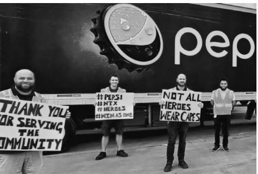
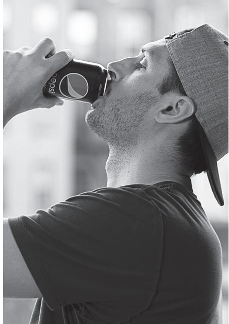

> **AI Description:**
> **Source:** `assets/_page_0_Figure_0.jpg`
> 
> **Generated:** 2026-05-28 15:37:22
> 
> ---
> 
> The image is a black and white photograph of a person wearing a cap and a jacket with a logo on the chest. The person is smiling and appears to be in a casual setting. The jacket has a visible logo that resembles a circular emblem with a design inside it, but the text below the emblem is not fully legible. The background is blurred, suggesting an indoor environment with some indistinct shapes and lights.

> **AI Description:**
> **Source:** `assets/_page_0_Figure_1.jpg`
> 
> **Generated:** 2026-05-28 15:37:10
> 
> ---
> 
> The image is a black and white photograph of a person wearing a lab coat, a face mask, and protective eyewear. The lab coat has a logo and text that reads "PEPSICO GLOBAL." The background appears to be a laboratory setting with shelves and equipment. The image conveys a professional and safety-conscious environment, likely related to a scientific or medical research setting.

> **AI Description:**
> **Source:** `assets/_page_0_Figure_2.jpg`
> 
> **Generated:** 2026-05-28 15:36:47
> 
> ---
> 
> The image is a photograph of a person reaching for a product on a shelf in what appears to be a grocery store or supermarket. The person is wearing a black shirt with a logo on the sleeve. The shelf is stocked with various packaged goods, and price tags are visible on the products. The image is in black and white, and the focus is on the person's arm and the shelf.

> **AI Description:**
> **Source:** `assets/_page_0_Figure_3.jpg`
> 
> **Generated:** 2026-05-28 15:36:54
> 
> ---
> 
> The image contains a black and white photograph of four individuals standing in front of a large vehicle with the Pepsi logo prominently displayed. The individuals are holding signs with text messages. The text on the signs reads: "THANK YOU FOR SERVING THE COMMUNITY," "#PEPSI," "#MTZ," "#HEROES," and "#HEROESWEARCAPES." The image appears to be a promotional or appreciation message for Pepsi, possibly related to a community service event or campaign. The overall composition suggests a focus on gratitude and recognition of service.

> **AI Description:**
> **Source:** `assets/_page_0_Figure_4.jpg`
> 
> **Generated:** 2026-05-28 15:35:28
> 
> ---
> 
> The image contains a photograph of three individuals standing in front of three delivery vans. The vans are branded with the logo and text "Lay" and "Milk Goodness." The individuals are wearing masks and appear to be giving a thumbs-up gesture. The setting appears to be a warehouse or distribution center, as there are boxes and other vehicles visible in the background. The image is in black and white.

> **AI Description:**
> **Source:** `assets/_page_0_Figure_5.jpg`
> 
> **Generated:** 2026-05-28 15:35:35
> 
> ---
> 
> The image is a black and white photograph of a person wearing a beanie and a jacket with a logo on the chest. The person is smiling and appears to be in an indoor setting with blurred lights in the background. The image does not contain any charts, graphs, or text beyond the logo on the jacket.

Annual Report 2020

> **AI Description:**
> **Source:** `assets/_page_0_Figure_6.jpg`
> 
> **Generated:** 2026-05-28 15:36:15
> 
> ---
> 
> The image is a photograph of a person wearing a surgical mask and a hairnet, holding a sign. The sign reads, "I Wear A Mask For My Children My Husband My Friends" with the hashtag #BeatCOVID at the bottom. The person is also wearing a white shirt and has a pair of glasses hanging from their neck. The background appears to be an indoor setting, possibly a workplace or public space. The image conveys a message about the importance of wearing masks during the COVID-19 pandemic.

> **AI Description:**
> **Source:** `assets/_page_1_Figure_0.jpg`
> 
> **Generated:** 2026-05-28 15:35:52
> 
> ---
> 
> The image is a black and white photograph of a person holding a bag of Doritos and a single chip. The person is wearing sunglasses and a denim jacket. The image captures a casual, candid moment, likely taken in a car or vehicle, as suggested by the background. The focus is on the person and the snack, with no additional text or labels present.

> **AI Description:**
> **Source:** `assets/_page_1_Figure_1.jpg`
> 
> **Generated:** 2026-05-28 15:36:28
> 
> ---
> 
> The image is a black and white photograph of a person drinking from a can. The person is wearing a cap and a t-shirt. The can appears to be a beverage can, possibly Pepsi, given the logo visible on the can. The image captures a candid moment, focusing on the action of drinking. The background is blurred, suggesting an urban setting with buildings faintly visible.

> **AI Description:**
> **Source:** `assets/_page_1_Figure_3.jpg`
> 
> **Generated:** 2026-05-28 15:35:17
> 
> ---
> 
> The image is a black and white photograph of two people sitting on a blanket in a grassy field. They appear to be having a picnic, with various items spread out around them, including a bag of Smartfood White Cheddar popcorn, a basket, and some food containers. The background features trees and a clear sky. The image captures a casual, relaxed moment outdoors.

Creating More Smiles with Every Sip and Every Bite sM

> **AI Description:**
> **Source:** `assets/_page_1_Figure_5.jpg`
> 
> **Generated:** 2026-05-28 15:36:39
> 
> ---
> 
> The image is a black and white photograph of a person using a SodaStream machine to carbonate a beverage. The individual is smiling and appears to be in a kitchen setting. The SodaStream machine is prominently displayed in the foreground, with a glass of carbonated water placed next to it on the countertop. The person is wearing a sleeveless top and has a tattoo on their arm. The image captures a moment of enjoyment and the process of making a sparkling drink.

> **AI Description:**
> **Source:** `assets/_page_1_Figure_6.jpg`
> 
> **Generated:** 2026-05-28 15:37:01
> 
> ---
> 
> The image is a black and white photograph of a person smiling and holding a small object near their mouth. The person is wearing a jacket and has a triangle-shaped earring. The background is blurred, focusing attention on the person's face and hand. The image captures a candid, joyful moment.

> **AI Description:**
> **Source:** `assets/_page_1_Figure_7.jpg`
> 
> **Generated:** 2026-05-28 15:37:30
> 
> ---
> 
> The image is a photograph of a person sitting at a table with a bowl of cereal, a glass of what appears to be a smoothie, and some other food items. The setting seems to be indoors, possibly in a kitchen or dining area, with a window in the background. The person is smiling and appears to be enjoying their meal. The image conveys a relaxed and pleasant atmosphere.

### Full Page Description (Page 2)

**Source:** `assets/_page_2_Asset_0.jpg`

**Generated:** 2026-05-28 15:35:59

---

The image is a circular chart divided into segments with numerical labels. The segments are color-coded and numbered from 4 to 32. The numbers are distributed around the circle, and the segments are not evenly divided, indicating varying proportions or values. The chart appears to represent a data distribution or a pie chart-like visualization, but the specific context or meaning of the numbers is not provided.

### Full Page Description (Page 2)

**Source:** `assets/_page_2_Asset_1.jpg`

**Generated:** 2026-05-28 15:36:21

---

The image is a pie chart with two segments. The chart is divided into two categories: "Food" and "Beverage." The "Food" category occupies 55% of the pie chart, while the "Beverage" category occupies 45%. The chart is set against a dark blue background, with the segments colored in light blue and dark blue, respectively. The percentages are clearly labeled next to each segment.

### Full Page Description (Page 2)

**Source:** `assets/_page_2_Asset_2.jpg`

**Generated:** 2026-05-28 15:35:41

---

The image is a pie chart with two segments. The chart is divided into two sections: one labeled "U.S. 58%" and the other labeled "Outside U.S. 42%". The larger section represents the U.S., and the smaller section represents the percentage of something outside the U.S. The chart is set against a dark blue background with white text and a legend indicating the percentages for each category.

## 2020 Financial Highlights

## Net Revenue

## Operating Profit by Division

## Mix of Net Revenue

## PepsiCo, Inc.& Consolidated Subsidiaries (inmillions,except per share data;allper shareamounts assume dilution)

## Summary of Operations

(b Excludes the mark-to-market net impact of our commodity derivatives, restructuringand impairment charges,as well as inventory fair value adjustmentsandmergerandintegrationcharges.Seepage128"Reconciliation of GAAP and Non-GAAP Information”for areconciliation to the most directlycomparable financialmeasureinaccordancewithGAAP.2020 reported operating profitdecreased 2%.

( Excludes the mark-to-market netimpactofour commodity derivatives, restructuringandimpairmentcharges,inventoryfairvalueadjustments andmergerand integrationcharges,aswellaspension-relatedsettlement charges.In2019,alsoexcludesnet taxrelatedtothe TaxCutsandJobs Act (TCJ Act).See page 128"ReconciliationofGAAP and Non-GAAP Information”forareconciliationto the most directlycomparable financial measure inaccordancewithGAAP.

@Includes the impact of net capital spending.See page 128 "Reconciliation ofGAAP and Non-GAAP Information" for a reconciliation to the most directly comparable financial measure inaccordance withGAAP.2o20 net cashprovidedby operatingactivities increased10%.

# Sustainability & Community Highlights

We continue to make progress in our sustainability journey, using our scale,reach,and expertise to help buildamore sustainable food system that can meet 21st century needs. We are committed to setting and workingtoward goalsaround climate,agriculture, water, packaging,people,and products, while partnering with peers,governments,and nongovernmental organizations to deliver positive outcomes for allour stakeholders.At the same time, we remain committed to addressing systemic barriers to opportunity through our Racial Equality Journey, and we continue to support communities in need through The PepsiCo Foundation.For more information on our Sustainability progress, Racial Equality Journey, and The PepsiCo Foundation, please visit www.pepsico.com.

CLIMATE

In 2020, we achieved

## 100% RENEWABLEELECTRICITY FOR OURU.S.DIRECT OPERATIONS

and announced plans to transition to 100% renewable electricity globally.

Approximately 57% of our global electricity needs were met by renewable sources in 2020.

> **AI Description:**
> **Source:** `assets/_page_3_Figure_0.jpg`
> 
> **Generated:** 2026-05-28 15:38:22
> 
> ---
> 
> The image contains a simple icon of a wind turbine. The icon is a stylized representation of a wind turbine with three blades, set against a plain background. The design is minimalistic and does not include any text or additional elements. The icon is likely used to represent renewable energy, specifically wind power.

## PACKAGING

We are transitioning several brands to

## BOTTLES MADE OF 100% rPET³ ACROSS 22 GLOBAL MARKETS,

in key packaging sizes, to help drive a circular economy and ensure packaging never becomes waste.

We are also investing in strategies beyond the bottle through reusable platforms like SodaStream,a business that delivered double-digit net revenue growth in 2020.

## MORE THAN \$570 MILLION OVER 5 YEARS

to lift up Black and Hispanic businesses and communities,address issues of inequality, and create opportunity.

In 2020, together with The PepsiCo Foundation, we committed to investing

## AGRICULTURE

## 100% OF OUR DIRECT COMMODITIES'ARE SUSTAINABLY SOURCED IN 28 COUNTRIES,

and globally, nearly 86% of our direct commodities are sustainably sourced as of 2020.

We achieved our goal to source 100% Bonsucro certified sustainable cane sugar globally by 2020 and achieved 99% RSPO² physically certified palm oil as of 2020.

PEOPLE

## WOMEN HOLD 41% OF OUR GLOBAL MANAGER POSITIONS4

and continue to be paid within 1% of men in 71 countries (representing 99% of our salaried employee population),after controlling for legitimate drivers of pay such as job level, geographic location, and performance ratings.5

## RACIAL EQUALITY

DIVERSITY

In 2020, we set new targets to

## INCREASE OUR BLACK& HISPANICMANAGERIAL POPULATIONS

in the U.S.to 10% of our workforce over the next five years.

> **AI Description:**
> **Source:** `assets/_page_3_Figure_5.jpg`
> 
> **Generated:** 2026-05-28 15:37:42
> 
> ---
> 
> The image is a simple diagram consisting of a group of five blue human-like figures arranged in a pyramid shape. The top figure is slightly larger than the others, suggesting a hierarchy or leadership structure. There are no text annotations or additional labels within the image. The diagram appears to represent a basic organizational chart or a visual representation of a team structure.

## WATER

## As of 2020, our operational

## WATER-USE EFFICIENCY IMPROVED BY 15%

in high water-risk areas since 2015, progress toward our goal of 25% by 2025.

ThePioneer Foods acquisition is included in the presented metric and contributed 3 percentage points to the improved progress against the 2015 baseline year. The SodaStream acquisition is not included in the presented metric because data was not readily available; this exclusion is estimated to be not statistically consequential.

## PRODUCTS

We've continued to expand our portfolio of improved choices for consumers. No-sugar Pepsi Black (also known as Pepsi Zero Sugar or Pepsi MAX), which had doubledigit volume growth in 2020,is available in

## 118 GLOBAL MARKETS.

Quaker showed strong growth across all key markets in 202O and gained market share in the cereals category in the U.S.

## COVID-19 RELIEF

Together with The PepsiCo Foundation, we invested more than \$60 million globally and provided over

## 145 MILLION MEALS

to communities and families impacted by COVID-19 in 2020.

> **AI Description:**
> **Source:** `assets/_page_3_Figure_8.jpg`
> 
> **Generated:** 2026-05-28 15:37:13
> 
> ---
> 
> The image contains a simple icon of a delivery truck with a checkmark and a knife and fork symbol inside it. This icon likely represents a service or feature related to food delivery or meal delivery services. The checkmark suggests approval or completion, while the knife and fork indicate food.

# Dear Fellow Shareholders,

> **AI Description:**
> **Source:** `assets/_page_4_Figure_0.jpg`
> 
> **Generated:** 2026-05-28 15:38:18
> 
> ---
> 
> The image is a black and white photograph of a man smiling. He is wearing a dark sweater over a collared shirt. The background appears to be an indoor setting with some blurred text and logos, but the focus is on the man. There are no charts, graphs, or other visual elements present in the image.

When I wrote to you last Spring, few could have imagined what 2020 had in store for our company and our world. From a global pandemic that cost millions oflives and unleashed an economic catastrophe, to tragic examples ofsystemic racial inequality, to an escalating climate

crisis, and even the passing ofPepsiCo's patriarch and first CEO,Donald M. Kendall, the past 12 months have been among the most challenging in recent memory.

And yet, despite all the heartache and pain,all the volatility and disruption,Iam extremely proud to tell you that PepsiCo continues to persevere.Our strategy to become Faster, Stronger,and Better has proven to be the right one,in good times and bad-enablingus to be there for our communities when they need us most,whilst accelerating our growth and gaining share in many key markets.

In 20201:

Our organic revenue growth accelerated to 5.7 percent in Q4,with 5 percent growth in global snacks and foods and 6 percent growth in global beverages,and mid-single digit growth in both our international developed markets and developing and emerging markets.

We delivered 4.3 percent organic revenue growth for the fullyear, which is a true testament to the dedication and efforts of our employees duringa global pandemic,our diversified portfolio and channel mix,and our agile supply chain and go-to-market systems.

We gained or held share in most of our top markets in both snacks and beverages.

Core constant currency EPS increased 2 percent for the full year.

Iam proud that we were able to achieve these results whilst: 1) staying focused on the issues that matter most to society,and 2) continuing to invest in the business to increase capacity,build better systems,and drive better ways to run our supply chain-capabilities aimed not only at accelerating our long-term growth,but also creating smiles for our many stakeholders.

In 202O,the entire PepsiCo family fully embraced our mission to Create More Smiles with Every Sip and Every Bite.During a year of so much adversity,this simple act was never more powerful.Each of us rose to the challenge,creating smiles for our fellow associates,our communities, our consumers,our customers,the planet,and,of course,our shareholders. In doing so,we welcomed the opportunity to drive positive change among ourselves and in the wider world. Our commitment to transparency in our reporting underpins this aspiration to be not just a successful company, but a sustainable one.

## Smiles for Our Associates and Communities

We know that our company can only succeed when the society we serve flourishes. That's why we are focused on creating smiles for our associates and communities by:

Working to ensure safe working environments through social distancing and distribution of personal protective equipment (PPE), especially for our frontline workers,and donating PPE to fellow frontline workers around the world;

Expanding benefits for associates who were diagnosed with COVID-19 or had to care for a sick family member;

Working with The PepsiCo Foundation to invest more than \$60 million and provide over 145 million meals to hungry families impacted by COVID-19 in 2020,with a special focus on providing nutritious meals for students who usually get meals through school;

Launching our Racial EqualityJourney to elevate diverse voices within our company, our supply chain partners,and communities, whilst helpingbreak down longstanding racial barriers.In 2O2O,we began witha \$4oO million set of initiatives focused on increasing Black representation at PepsiCo,supporting Black-owned businesses, and lifting up Black communities over five years.We built on this witha further \$172 million set ofinitiatives over five years focused on Hispanic Americans,in addition to spending \$224 million with Hispanic suppliers in 2O2O;and

Celebrating success through our internal Smiles initiative,which encourages associates to send smiles to each other for living our PepsiCo Way behaviors and to commemorate special events.In 2020, we created more than 240,oo0 smiles on the platform.

These efforts were recognized by our associates in our annual organizational health survey.In 2O2O,we achieved our highest-ever engagement score,which isa measure of the energy,pride,and optimism of ourassociates.

## 66 In 2020, the entire PepsiCo family fully embraced our mission to Create More Smiles with Every Sip and Every Bite.9

## Smiles for Our Consumers

In a year where routines were routinely disrupted, we had to satisfy new demands that grew from the pandemic,with more consumers eating at home.

In 2020, I'm pleased to say we met the challenge, creating smiles for our consumers by:

Driving innovation in our core brands,with a special focus on no-sugar beverages and flavors that celebrate local food cultures,including Cheetos Popcorn,Flamin'Limon Doritos,Mountain Dew Zero, Gatorade's Bolt24, Gatorade Zero,and Driftwell;

Continuing to build a range of premium snacks designed to address evolving consumer desires and emerging health and wellness trends, with options like Off The Eaten Path,bare,and BFY Brands;

Expanding our investment in omnichannel capabilities,especially eCommerce,as consumers increasingly turn online for their food and beverage needs.This includes launching PantryShop.com and Snacks.com in the U.S.,where eCommerce estimated retail sales grew significantly in 2O2O,and acquiringBe& Cheery,one of the largest online snacks companies in China;

Doing even more to drive SodaStreamas a sustainable,personalized beverage system,including making it easier for consumers to create their favorite beverages at home with bubly drops for SodaStream and other flavors based on popular beverages like PepsiMAX and Mountain Dew;

Increasing our presence in the fast-growing and highly profitable energy categoryby acquiring Rockstar Energy Beverages;

Closing on and continuing to integrate the acquisition of Pioneer Foods,which gives us a scaled platform for foods sales and distribution in Sub-Saharan Africa; and

Powering Quaker Foods North America to 1l percent organic revenue growth for the year,an outstanding performance against strong demand for at-home consumption.

## Smiles for Our Customers

As consumer preferences and habits change, we are focused on pivoting our resources to provide first-class service levels, driving game-changing innovation,and deliveringa level of growth unmatched in our industry, creating smiles for our customers by:

Unlocking granular growth opportunities across our business through innovative data-driven media,marketing,and merchandising solutions,including our new ROI Engine and Canvas capabilities, which leverage near real-time analytics and performance output to optimize investments;

Building dynamic COVID-19 models that reflect the evolving financial and medical impact of COVID-19 on households,creating customized outputs for our customers,and democratizing these outputs through online forums and interactive Tableau dashboards;

Extending our Perfect Store capability,enabling improved service, value offers,assortment,and merchandising for our important small format customers;and

Launching micro-fulfillment centers to increase our strategic capability to help meet the spike in eCommerce demand for our key customers.

Our team's holistic support for our customers earned numerous awards and recognitions in 2O2o,including being named the number one manufacturer in the KantarPoweRanking for the ffth year in a rowin the U.S.and earning similarly strong feedback in many countries around the world.

## Smiles for Our Planet

We know that our ability to create smiles for our associates, communities,consumers,and customers depends on our ability to create smiles for our planet.That's why we are focused on continuing to integrate purpose into ourbusiness strategy and brands to become PepsiCo Positive,deliveringbetter outcomes for people and the environment,whilst enabling us to be a faster-growingand more resilient company. This includes our effort to help build a more sustainable food system,from how we grow our ingredientsand make our products,to how we inspire consumers to make positive choices.

Agriculture is the foundation of the food system and core to our business, so we're working to source ingredients through more sustainable and resilient practices.

As we do that,we are also increasing our support for farmers transitioning to regenerative agriculture practices that are gentler on the earth and can help mitigate climate change:

100 percent of our direct commodities (potatoes,whole corn,oats, and oranges) are sustainably sourced in 28 countries,whilst nearly 86 percent of our direct commodities are sustainably sourced globally as of 2020.

Our Sustainable Farming Program is now operating in 36 countries and engages more than 40,ooo farmers.

Our network oflocal demonstration farms-with sites in India,Brazil, and Thailand,among others-is proving to be very powerful, providing a place where farmers can test new techniques and learn from their peers.

We are collaborating with the World Economic Forum ona network of Innovation Hubs,which bring together the best minds in food science, agronomy,and technology to develop food systems that are inclusive, efficient,sustainable,and nutritious.

## Even Faster, Stronger, and Better

2020 was an extremely busy year, and we expect to accelerate our efforts in 2021, so we can keep pace with the world and stay ahead ofthe competition. That means setting our sights on becoming even Faster, even Stronger, and even Better.

# 66 As we reflect on all the smiles we created in 2020, we know that none of it would be possible without the associates who are the backbone of our company and the shareholders who have trusted us with their investment. ,9

We also know that a company of our size and scale can have a positive impact across our value chain by making products in a way that builds a circular, inclusive, fair economy. That's why we are:

Continuing our efforts to help build a world where packaging never becomes waste by setting a target to use 1OO percent rPET for our Pepsi brand² in nine EUmarkets by 2O22.We estimate this will eliminate over 7O,ooO tons of virgin,fossil-fuel based plastic per year and willower carbon emissions per Pepsi brand bottle by approximately 40 percent in those markets;

Taking steps to address the risks and impacts of climate change by more than doubling our science-based climate goal,targetinga more than 40 percent reduction of absolute greenhouse gas emissions across our value chain by 2030;

Aimingto achieve net-zero emissions across our global operations by 2040,1O years earlier than called for in the Paris Agreement,after already shifting to 1oo percent renewable electricity for our direct operations in the U.S.in 2o2O through a diversified portfolio of solutions;

Introducing SodaStream Professional,an eco-friendly,on-the-go customizable hydration platform that is part of our Beyond the Bottle strategy;and

■Joining otherleading companies in signing the UN's Business Ambition for 1.5C pledge.

Beyond our value chain, we are working to inspire people to make positive choices with products that create more smiles for them and the planet:

This includes continuing to advance our 2o25 goals to reduce added sugars,sodium,and saturated fat,with our no-sugar Pepsi Black now available in 118 markets and Lay's Oven Baked in 27 markets globally.

To become even Faster, we willfocus on accelerating our share of market gains, competing fiercely in every segment, and investing in growing channels and categories.

To become even Stronger, we will work to continue transforming our cost structure,capabilities,and culture,including sharpening our holistic costmanagement initiatives,acceleratingour digital transformation,and investinginour peopleandtalentdevelopment.

To become even Better, we will strive to elevate our efforts to deliver positive outcomes for people and the planet by helping to builda more sustainable food system, strengthening our communities,and advancing social equity.

We also expanded the Stacy's Rise Project from five female entrepreneurs to 15 in 202O,with finalists focused on areas such as social impact,sustainability,and diversity.

Finally,in 2O2O we also published our first Green Bond Report.The report provides an update on the allocation of net proceeds from our billion-dollar Green Bond to Eligible Green Projects through the end of 2019,specifically:water sustainability, decarbonization of our operations and supply chain,and sustainable plastics and packaging.

## Smiles for Our Shareholders

Ultimately,creating smiles for our associates and communities, consumers,customers,and the planet is what enables us to create smiles for our shareholders.

In addition to the Full Year and Q4 financial performance numbers Icalled out earlier, in 202O we also:

Returned a total of \$7.5 billion in cash to shareholders through dividends and share repurchases; and

Delivered an 11.7 percent increase in total shareholder return,a strong showing compared to other consumer staples.

Last month,we also announced a5 percent increase in our annualized dividend per share,effective with the expected June 2o21 dividend payment-our 49th consecutive annual dividend increase.

As we reflect on all the smiles we created in 2O2O,we know that none of it would be possible without the associates who are the backbone ofour company and the shareholders who have trusted us with their investment.This year,more than ever, we are grateful for your faith in us. As vaccines usher in a new phase of the pandemic,we will keep working to earn your trust and support by Winning with Purpose and planning fora post-COVID future.If we work together,Iam confident we can make 2o21a year of resurgence and renewal, with even more smiles for our many stakeholders and the communities we all share.

Sincerely,

RamonL.Laguarta PepsiCo Chairman ofthe Board ofDirectors and Chief Executive Officer

# PepsiCo Board of Directors

Segun Agbaje Managing Director and Chief Executive Officer, Guaranty Trust Bank plc Elected 2020

Shona L.Brown   
Independent Advisor; Former Senior Advisor, Google Inc.   
Elected 2009   
Cesar Conde   
Chairman,   
NBCUniversal News   
Group   
Elected 2016 Ian Cook   
Former Chairman, President and Chief Executive Offficer,   
Colgate-Palmolive Company   
Elected 2008

Dina Dublon Former Executive Vice President and Chief Financial Officer, JPMorgan Chase & Co. Elected 2005

RichardW.Fisher1   
Former President   
and Chief Executive   
Officer,Federal Reserve   
Bank ofDallas   
Elected 2015

Michelle Gass Chief Executive Offfcer, Kohl's Corporation Elected 2019

Ramon L.Laguarta Chairman ofthe Board of Directors and Chief Executive Officer,PepsiCo Elected 2018

Sir Dave Lewis Former Group Chief Executive Offficer, Tesco PLC Elected 2020

David C.Page,MD   
Professor,Massachusetts Institute of Technology; Former Director and   
President,Whitehead   
Institute forBiomedical Research   
Elected 2014

Robert C.Pohlad President ofvarious family-owned entities; Former Chairman and Chief Executive Officer, PepsiAmericas,Inc. Elected 2015

Daniel Vasella, MD Former Chairman and Chief Executive Officer, Novartis AG   
Elected 2002

Darren Walker President, Ford Foundation Elected 2016

Alberto Weisser Former Chairman and Chief Executive Officer, Bunge Limited Elected 2011

1Not standing for re-election and retiring at PepsiCo's 2021 Annual Meeting of Shareholders.

## PepsiCo Leadership

Ramon L.Laguarta Chairman of the Board of Directors and Chief Executive Officer

Jim Andrew Executive Vice President, Beyond the Bottle and Chief Sustainability Offfcer

Roberto Azevédo Executive Vice President and Chief Corporate Affairs Officer

Executive Vice President, Global Communications and President, PepsiCo Foundation

David Flavell Executive Vice President, General Counsel and Corporate Secretary

Hugh F. Johnston Vice Chairman, Executive Vice President and Chief Financial Officer

Executive Vice President and Chief Strategy and Transformation Officer

Ram Krishnan Global Chief Commercial Officer

See pages 24-26of the Form10-K foralistofPepsiCo Executive Officers subject to Section 16 ofthe Securities Exchange Act of1934.David Flavell assumed the role of Executive Vice President, General Counsel and Corporate Secretary effective March1,2021.

René Lammers Executive Vice President and Chief Science Officer

Silviu Popovici Chief Executive Offfcer, Europe

Grace Puma Executive Vice President, Global Operations

Paula Santilli Chief Executive Officer, Latin America

Ronald Schellekens Executive Vice President and Chief Human Resources Officer

Wern-Yuen Tan Chief Executive Officer, Asia Pacific,Australia, New Zealand and China

Chief Executive Officer, PepsiCo Beverages North America

Eugene Willemsen Chief Executive Officer, Africa,Middle East, South Asia

Steven Williams Chief Executive Officer, PepsiCo Foods North America

## 2020 Citizenship Giving

2PepsiCo Foundation includes \$50 million in COVID-19 support. 3Division contributions and estimated in-kind includes \$21 milion in COVID-19 support.

PepsiCo, Inc.   
Annual Report 2020 Form 10-K

For the fiscal year ended December 26, 2020

Page intentionally left blank

# UNITEDSTATESSECURITIESANDEXCHANGECOMMISSION WASHINGTON,D.C. 20549 FORM10-K

(Mark One)

区 ANNUAL REPORT PURSUANT TO SECTION 13 OR 15(d) OF THE SECURITIES EXCHANGE ACT OF 1934   
For the fiscal year ended December 26,2020

OR

TRANSITION REPORT PURSUANT TO SECTION 13 OR 15(d) OF THE SECURITIES EXCHANGE ACT OF □ 1934

For the transition period from to

Commission file number 1-1183

> **AI Description:**
> **Source:** `assets/_page_10_Figure_0.jpg`
> 
> **Generated:** 2026-05-28 15:38:09
> 
> ---
> 
> The image contains a simple black and white logo of a globe with intersecting lines. The globe represents a global or international theme, and the intersecting lines could symbolize connections or networks. There are no charts, graphs, or other visual elements present in the image.

PEPSICO

Tropicana.

PepsiCo, Inc. (Exact Name of Registrant as Specified in its Charter)

North Carolina (State or Other Jurisdiction of Incorporation or Organization)

13-1584302 (I.R.S. Employer Identification No.)

700 Anderson Hill Road,Purchase,New York 10577 (Address of principal executive offices and Zip Code)

(914) 253-2000 Registrant's telephone number, including area code

Securities registered pursuant to Section 12(b) of the Securities Exchange Act of 1934:

Securities registered pursuant to Section 12(g) of the Securities Exchange Act of 1934: None

Indicatebycheckmarkiftheregistrantisawell-knownseasonedisser,asdefined inRule405oftheSecuritiesAct.YesNo Indicate bycheck mark iftheregistrantis notrequiredtofilereports pursuant to Section13or15(d)of the Act.YesNo区 Indicatebycheckmark whethertheregistrant (1)hasfiledallreportsrequiredtobefiledbySection13or15(d)oftheSecurities Exchange Actof1934during thepreceding12months (orforsuchshorterperiodthat theregistrant wasrequired tofilesuchreports), and (2) has been subject to such filing requirements for the past 9O days.Yes 区 No □

Indicate bycheck mark whethertheregistrant hassubmited electronicallyevery Interactive DataFilerequiredtobesubmited pursuantoRule405ofRegulationS-T(232.405of thischapter)duringthepreceding12 months (orforsuchshorterperiodthatthe registrant was required to submit such files). Yes 区 No □

Indicatebycheckmarkwhethertheregistrantisalargeaceleratedfiler,anacceleratedfiler,anon-aceleratedfiler,asmaller reportingcompany,oranemerginggrowthcompany.Seethedefinitionsof“largeaceleratedfiler”“acceleratedfiler,”‘smaller reporting company,”and “emerging growth company” in Rule 12b-2 of the Exchange Act.

Large accelerated filer 区

Accelerated filer

Non-accelerated filer

Smaller reporting company

Emerging growth company

If anemerging growthcompany,indicatebycheckmarkiftheregistranthaselectednottousetheextendedtransitionperiod for complying withany new orrevised financial acounting standards provided pursuantto Section13(a)ofthe Exchange Act.

Indicatebycheckmarkwhethertheregistranthasfledareportonandattestationtoitsmanagement'sassssmentoftheeffectiveness of its intermalcontroloverfinancialreportingunder Section404(b)of theSarbanes-OxleyAct(15U.S.C.7262(b))bytheregistered public accounting firm that prepared or issued its audit report.区

Indicate by check mark whether theregistrant is a shellcompany (as defined inRule 12b-2of the Exchange Act).YesNo区

The aggregate marketvaueofPepsiCo,Inc.Common StockheldbynonaflatesofepsiCo,Inc. (assmingforthesepurpoes,but withoutcocentatlleiveosdosofpCc.eltesofiCc.sofJet dayofbusinessofour mostrecentlycompletedsecondfiscalquarter,was \$178.5billon (basedontheclosingsalepriceofPepsiCo Inc.'s Common Stock on that date as reported on the Nasdaq Global Select Market).

The number of shares of PepsiCo,Inc.Common Stock outstanding as ofFebruary 4,2021 was 1,379,608,641.

## Documents Incorporated by Reference

Portionsof theProxy Statement relatingtoPepsiCo,Inc.'s2021Anual MeetingofShareholdersareincorporatedbyreferenceinto Part III of this Form 10-K.

## Form 10-K Annual Report For the Fiscal Year Ended December 26, 2020

Table of Contents

PART III

# Forward-Looking Statements

This Annual Report on Form 10-K contains statements reflecting our views about our future performance that constitute “forward-looking statements”within the meaning of the Private Securities Litigation Reform Act of 1995 (Reform Act). Statements that constitute forward-looking statements within the meaning of the Reform Act are generally identified through the inclusion of words such as “aim,” "anticipate,”"believe,”"drive,”"estimate,”"expect,”"expressed confidence,” “forecast,”“future,” “goal,”“guidance,”“intend,” "may,' ，” “objective,”“outlook,”“plan,”“position,”“potential,” "project,”“seek,”“should,”“strategy,”“target,”“will” or similar statements or variations of such words and other similar expressions. Allstatements addressing our future operating performance, and statements addressing events and developments that we expect or anticipate willoccur in the future, are forward-looking statements within the meaning of the Reform Act. These forward-looking statements are based on currently available information, operating plans and projections about future events and trends. They inherently involve risks and uncertainties that could cause actual results to difer materially from those predicted in any such forward-looking statement. These risks and uncertainties include, but are not limited to, those described in “Item 1A. Risk Factors”and “Item 7. Management's Discussion and Analysis of Financial Condition and Results of Operations - Our Business - Our Business Risks.” Investors are cautioned not to place undue reliance on any such forward-looking statements,which speak only as of the date they are made. We undertake no obligation to update any forward-looking statement, whether as a result of new information,future events or otherwise. The discussion of risks in this report is by no means all-inclusive but is designed to highlight what we believe are important factors to consider when evaluating our future performance.

## PARTI

## Item 1. Business.

When used in this report,the terms“we,”“us,”“our,”“PepsiCo”and the“Company” mean PepsiCo,Inc. and its consolidated subsidiaries,collctively. Certain terms used in this Annual Report on Form 10-K are defined in the Glossary included in Item 7. of this report.

## Company Overview

We were incorporated in Delaware in 1919 and reincorporated in North Carolina in 1986.We are a leading global food and beverage company with a complementary portfolio of brands, including Frito-Lay, Gatorade, Pepsi-Cola,Quaker and Tropicana.Through our operations,authorized botters,contract manufacturers and other third parties, we make,market, distribute and sella wide variety of convenient beverages, foods and snacks,serving customers and consumers in more than 200 countries and territories.

## Our Operations

We are organized into seven reportable segments (also referred to as divisions),as follows:

1）Frito-Lay North America (FLNA), which includes our branded food and snack businesses in the United States and Canada;

2） Quaker Foods North America (QFNA), which includes our cereal, rice, pasta and other branded food businesses in the United States and Canada;

3）PepsiCo Beverages North America (PBNA), which includes our beverage businesses in the United States and Canada;

4)Latin America (LatAm), which includes all of our beverage, food and snack businesses in Latin America;

5）Europe, which includes al of our beverage,food and snack businesses in Europe;

6) Africa, Middle East and South Asia (AMESA), which includes all of our beverage,food and snack businesses in Africa, the Middle East and South Asia; and

7） Asia Pacific,Australia and New Zealand and China Region (APAC), which includes all of our beverage,food and snack businesses in Asia Pacific, Australia and New Zealand, and China region.

## Frito-Lay North America

Either independently or in conjunction with third parties,FLNA makes,markets, distributes and sells branded snack foods.These foods include branded dips,Cheetos cheese-flavored snacks,Doritos tortilla chips,Fritos corn chips,Lay's potato chips,Ruffles potato chips and Tostitos tortilla chips.FLNA's branded products are sold to independent distributors and retailers. In addition,FLNA's joint venture with Strauss Group makes, markets, distributes and sells Sabra refrigerated dips and spreads.

## Quaker Foods North America

Either independently or in conjunction with third parties,QFNA makes, markets,distributes and sells cereals, rice, pasta and other branded products. QFNA's products include Aunt Jemima mixes and syrups, Cap'n Crunch cereal, Life cereal, Quaker Chewy granola bars, Quaker grits, Quaker oatmeal, Quaker rice cakes,Quaker simply granola and Rice-A-Roni side dishes. QFNA's branded products are sold to independent distributors and retailers.

## PepsiCo Beverages North America

Either independently or in conjunction with third parties,PBNA makes,marketsand sels beverage concentrates,fountain syrups and finished goods under various beverage brands including Aquafina,Diet Mountain Dew,Diet Pepsi, Gatorade,Mountain Dew,Pepsi, Propel and Tropicana.PBNA operates its own bottling plants and distribution facilities and sells branded finished goods directly to independent distributors and retailers.PBNA also sels concentrate and finished goods for our brands to authorized and independent botlers,who in turn sel our branded finished goods to independent distributors and retailers in certain markets.PBNA also, either independently or in conjunction with third parties, makes, markets, distributes and sels ready-to-drink tea and coffee products through joint ventures with Unilever (under the Lipton brand name） and Starbucks,respectively.Further, PBNA manufactures and distributes certain brands licensed from Keurig Dr Pepper Inc., including Crush,Dr Pepper and Schweppes,and certain juice brands licensed from Dole Food Company, Inc. (Dole) and Ocean Spray Cranberries, Inc.(Ocean Spray). In 2020, we acquired Rockstar Energy Beverages (Rockstar),an energy drink maker with whom we had a distribution agreement prior to the acquisition.See Note 14 to our consolidated financial statements for further information about our acquisition of Rockstar.

## Latin America

Either independently or in conjunction with third parties,LatAm makes, markets,distributes and sels a number of snack food brands including Cheetos,Doritos,Emperador,Lay's,Marias Gamesa,Rosquinhas Mabel,Rufles, Sabritas,Saladitas and Tostitos,as well as many Quaker-branded cereals and snacks. LatAmalso,either independently or in conjunction with third parties, makes,markets,distributes and sells beverage concentrates, fountain syrups and finished goods under various beverage brands including 7UP, Gatorade,H2oh!,Manzanita Sol,Mirinda,Pepsi,Pepsi Black,San Carlos and Toddy.These branded products are sold to authorized and independent bottlers,independent distributors and retailers.LatAm also,either independentlyor in conjunction with third parties,makes,markets,distributesand sels readyto-drink tea products through an international joint venture with Unilever (under the Lipton brand name).

## Europe

Either independently or in conjunction with third parties,Europe makes, markets,distributes and sels a number of snack food brands including Cheetos, Chipita,Doritos,Lay's,Ruffles and Walkers, as well as many Quaker-branded cereals and snacks，through consolidated businesses，as well as through noncontrolled afiliates.Europe also,either independently or in conjunction with third parties,makes, markets，distributes and sells beverage concentrates, fountain syrups and finished goods under various beverage brands including 7UP,Diet Pepsi,Lubimy Sad,Mirinda,Pepsi,Pepsi Max and Tropicana.These branded products are sold to authorized and independent botters,independent distributors and retailers. In certain markets,however, Europe operates its own botling plants and distribution facilities.Europe also, as part of its beverage business, manufactures and distributes SodaStream sparkling water makers and related products.Further,Europe makes，markets, distributes and sells a number of dairy products including Agusha, Chudo and Domik v Derevne.Europe also,either independently or in conjunction with third parties, makes, markets, distributes and sels ready-to-drink tea products through an international joint venture with Unilever (under the Lipton brand name).

## Africa, Middle East and South Asia

Either independently or in conjunction with third parties,AMESA makes, markets, distributes and sells a number of snack food brands including Chipsy,Doritos, Kurkure,Lay's, Sasko, Spekko and White Star, as well as many Quaker-branded cereals and snacks, through consolidated businesses,as wellas through noncontrolled afiliates. AMESA also makes，markets，distributes and sells beverage concentrates, fountain syrups and finished goods under various beverage brands including 7UP,Aquafina, Mirinda, Mountain Dew and Pepsi. These branded products are sold to authorized and independent bottlers, independent distributors and retailers.In certain markets,however,AMESA operates its own bottling plants and distribution facilities.AMESA also, either independently or in conjunction with third parties, makes,markets,distributes and sels ready-to-drink tea products through an international joint venture with Unilever (under the Lipton brand name). In 2020,we acquired Pioneer Food Group Ltd. (Pioneer Foods),a food and beverage company in South Africa with exports to countries across the globe. See Note 14 to our consolidated financial statements for further information about our acquisition of Pioneer Foods.

## Asia Pacific, Australia and New Zealand and China Region

Either independently or in conjunction with third parties,APAC makes,markets,distributes and sels a number of snack food brands including BaiCaoWei, Cheetos, Doritos,Lay’s and Smith's, as well as many Quaker-branded cereals and snacks,through consolidated businesses,as wellas through noncontrolled affiliates.APAC also makes,markets,distributes and sells beverage concentrates,fountain syrups and finished goods under various beverage brands including 7UP,Aquafina,Mirinda,Mountain Dew and Pepsi. These branded products are sold to authorized and independent bottlers, independent distributors and retailers. APAC also,either independently or in conjunction with third parties,makes, markets, distributes and sells ready-to-drink tea products through an international joint venture with Unilever (under the Lipton brand name).Further,APAC licenses the Tropicana brand for use in China on cobranded juice products in connection with a strategic aliance with Tingyi (Cayman Islands） Holding Corp.(Tingyi).In 2O20, we acquired all of the outstanding shares of Hangzhou Haomusi Food Co.,Ltd. (Be & Cheery),one of the largest online snacks companies in China. See Note 14 to our consolidated financial statements for further information about our acquisition of Be & Cheery.

## COVID-19

The novel coronavirus (COVID-19) pandemic in 2020 resulted in challnging operating environments and affected almost all of the more than 2Oo countries and terrtories in which our products are made, manufactured，distributed or sold, including as a result of travel bans and restrictions,quarantines, curfews,restrictions on public gatherings,shelter in place and safer-at-home orders, business shutdowns and closures.We expect that the COVID-19 pandemic will continue to impact our business operations, including our employees， customers，consumers， botlers，contract manufacturers，distributors, joint venture partners,suppliers and other third parties with which we do busines.The extent to which the COVID-19 pandemic will impact our future business operations and financial results remains uncertain and will continue to depend on numerous evolving factors outside our control.

See“Item lA. Risk Factors”for discussion of the risks and uncertainties associated with the COVID-19 pandemic. Also, see“Our Business Risks” in Item 7. Management's Discussion and Analysis of Financial Condition and Results of Operations and Note l to our consolidated financial statements for further information related to the impact of COVID-19 on our 2020 financial results.

## Our Distribution Network

Our products are primarily brought to market through direct-store-delivery (DSD), customer warehouse and distributor networks and are also sold directly to consumers through e-commerce platforms and retailers.The distribution system used depends on customer needs, product characteristics and local trade practices.

## Direct-Store-Delivery

We,our independent botlers and our distributors operate DSD systems that deliver beverages,foods and snacks directly to retail stores where the products are merchandised by our employees or our independent bottlers.DSD enables us to merchandise with maximum visibility and appeal. DSD is especially well-suited to products that are restocked often and respond to in-store promotion and merchandising.

## Customer Warehouse

Some of our products are delivered from our manufacturing plants and distribution centers,both company and third-party operated, to customer warehouses. These less costly systems generally work best for products that are less fragile and perishable, and have lower turnover.

## Distributor Networks

We distribute many of our products through third-party distributors.Third-party distributors are particularly effective when greater distribution reach can be achieved by including a wide range of products on the delivery vehicles.For example,our foodservice and vending business distributes beverages， foods and snacks to restaurants， businesses, schools and stadiums through third-party foodservice and vending distributors and operators.

## E-commerce

Our products are also available and sold directly to consumers on a growing number of company-owned and third-party e-commerce websites and mobile commerce applications.

## Ingredients and Other Supplies

The principal ingredients we use in our beverage,food and snack products are apple, orange and pineapple juice and other juice concentrates,aspartame, corn, corn sweeteners,flavorings,flour, grapefruit,oranges and other fruits,oats, potatoes,raw milk, rice,seasonings,sucralose,sugar,vegetable and essential oils, and wheat. We also use water in the manufacturing of our products. Our key packaging materials include plastic resins, including polyethylene terephthalate (PET） and polypropylene resins used for plastic beverage bottes and film packaging used for snack foods,aluminum, glass, closures,cardboard and paperboard cartons. In addition,we continue to integrate recyclability into our product development process and support the increased use of recycled content, including recycled PET,in our packaging. Fuel, electricity and natural gas are also important commodities for our businesses due to their use in our and our business partners’ facilities and the vehicles delivering our products.We employ specialists to secure adequate supplies of many of these items and have not experienced any significant continuous shortages that would prevent us from meeting our requirements. Many of these ingredients,raw materials and commodities are purchased in the open market. The prices we pay for such items are subject to fluctuation, and we manage this risk through the use of fixed-price contracts and purchase orders, pricing agreements and derivative instruments,including swaps and futures. In addition, risk to our supply of certain raw materials is mitigated through purchases from multiple geographies and suppliers. When prices increase, we may or may not pass on such increases to our customers. In addition, we continue to make investments to improve the sustainability and resources of our agricultural supply chain, including the development of our initiative to advance sustainable farming practices by our suppliers and expanding it further globally.See Note 9 to our consolidated financial statements for further information on how we manage our exposure to commodity prices.

We also maintain voluntary supply chain finance agreements with several participating global financial institutions,pursuant to which our suppliers,at their sole discretion,may elect to sell their accounts receivable with PepsiCo to such global financial institutions.These agreements have not had a material impact on our business or financial results. See“Our Financial Results - Our Liquidity and Capital Resources” in Item 7. Management's Discussion and Analysis of Financial Condition and Results of Operations for further information.

## Our Brands and Intellectual Property Rights

We own numerous valuable trademarks which are essential to our worldwide businesses, including Agusha, Amp Energy, Aquafina, Aquafina Flavorsplash, Arto Lifewtr, Aunt Jemima, BaiCaoWei, Bare, Bokomo,Bolt24,bubly，Cap'n Crunch，Ceres，Cheetos，Chester's，Chipita， Chipsy，Chokis，Chudo, Cracker Jack, Crunchy,Diet Mountain Dew,Diet Mug,Diet Pepsi, Diet 7UP (outside the United States), Domik v Derevne，Doritos,Driftwell，Duyvis，Elma Chips，Emperador，Evolve，Frito-Lay，Fritos, Fruktovy Sad, G2,Gamesa, Gatorade, Grandma's,H2oh!,Health Warrior,Imunele,Izze,J-7 Tonus,Kas, KeVita, Kurkure,Lay's,Life, Lifewtr,Liquifruit, Lubimy, Manzanita Sol, Marias Gamesa, Matutano, Mirinda,Miss Vickie's,Moirs,Mother's,Mountain Dew,Mountain Dew Code Red,Mountain Dew Game Fuel, Mountain Dew Ice, Mountain Dew Kickstart, Mountain Dew Zero Sugar, Mug, Munchies, Muscle Milk,Naked,Near East, Off the Eaten Path, O.N.E., Paso de los Toros,Pasta Roni, Pearl Milling Company,Pepsi, Pepsi Black,Pepsi Max,Pepsi Zero Sugar,PopCorners,Pronutro,Propel, Quaker, Quaker Chewy,Rice-A-Roni,RockstarEnergy,Rold Gold,Rosquinhas Mabel,Ruffles,Sabritas,Safari, Sakata,Saladitas， San Carlos, Sandora, Santitas, Sasko，7UP (outside the United States)，7UP Free (outside the United States)， Sierr Mist, Sierra Mist Zero Sugar, Simba, Smartfood, Smith's, Snack a Jacks,SoBe,SodaStream, Sonric's,Spekko, Stacy's,Sting,Stubborn Soda,SunChips,Toddy,Toddynho, Tostitos,Trop 50,Tropicana,Tropicana Pure Premium,Tropicana Twister,VWater,Vesely Molochnik, Walkers，Weetbix，White Star,Ya and Yachak.We also hold long-term licenses to use valuable trademarks in connection with our products in certain markets, including Dole and Ocean Spray.We also distribute Bang Energy drinks and various Keurig Dr Pepper Inc.brands,including Dr Pepper in certain markets, Crush and Schweppes. Joint ventures in which we have an ownership interest either own or have the right to use certain trademarks,such as Lipton, Sabra and Starbucks.Trademarks remain valid so long as they are used properly for identification purposes,and we emphasize correct use of our trademarks. We have authorized, through licensing arrangements, the use of many of our trademarks in such contexts as snack food joint ventures and beverage botling appointments. In addition, we license the use of our trademarks on merchandise that is sold at retail, which enhances brand awareness.

We either own or have licenses to use a number of patents which relate to certain of our products, their packaging, the processes for their production and the design and operation of various equipment used in our businesses. Some of these patents are licensed to others.

## Seasonality

Our businesses are aected by seasonal variations. Our beverage,food and snack sales are generally highest in the third quarter due to seasonal and holiday-related patterns and generally lowest in the first quarter.However, taken as a whole,seasonality has not had a material impact on our consolidated financial results.

## Our Customers

Ourcustomers include wholesale and other distributors, foodservice customers, grocery stores, drug stores，convenience stores，discount/dollar stores，mass merchandisers，membership stores，hard discounters, e-commerce retailers and authorized independent botters,among others. We normaly grant our independent botters exclusive contracts to selland manufacture certain beverage products bearing our trademarks within a specific geographic area. These arrangements provide us with the right to charge our independent botters for concentrate, finished goods and Aquafina royalties and specify the manufacturing process required for product quality.We also grant distribution rights to our independent bottlers for certain beverage products bearing our trademarks for specified geographic areas.

We rely on and provide financial incentives to our customers to assst in the distribution and promotion of our products to the consumer.For our independent distributors and retailers,these incentives include volume-based rebates, product placement fees, promotions and displays.For our independent bottlers, these icentives are referred to as bottler funding and are negotiated annually with each bottler to support a variety of trade and consumer programs,such as consumer incentives,advertising support, new product support, and vending and cooler equipment placement. Consumer incentives include pricing discounts and promotions,and other promotional offers.Advertising support is directed at advertising programs and supporting independent botler media. New product support includes targeted consumer and retailer incentives and direct marketplace support, such as point-of-purchase materials, product placement fees, media and advertising. Vending and cooler equipment placement programs support the acquisition and placement of vending machines and cooler equipment. The nature and type of programs vary annually.

Changes to the retail landscape, including increased consolidation of retail ownership,the rapid growth of sales through e-commerce websites and mobile commerce applications, including through subscription services and other direct-to-consumer businesses,the integration of physical and digital operations among retailers，as well as the international expansion of hard discounters，and the current economic environment, including in light of the COVID-19 pandemic,continue to increase the importance of major customers.In 2020, sales to Walmart Inc.(Walmart) and its affiliates, including Sam's Club (Sam's), represented approximately l4% of our consolidated net revenue,with sales reported across all of our divisions,including concentrate sales to our independent botlers,which were used in finished goods sold by them to Walmart. The loss of this customer would have a material adverse efect on our FLNA, QFNA and PBNA divisions.

See “Off-Balance-Sheet Arrangements” in “Our Financial Results -Our Liquidity and Capital Resources" in Item 7.Management's Discusson and Analysis of Financial Condition and Results of Operations for further information on our independent bottlers.

## Our Competition

Our beverage, food and snack products are in highly competitive categories and markets and compete against products of international beverage,food and snack companies that, like us,operate in multiple geographies,as well as regional, local and private label manufacturers and economy brands and other competitors,including smaller companies developing and selling micro brands directly to consumers through e-commerce platforms or through retailers focused on locally-sourced products. In many countries in which our products are sold, including the United States,The Coca-Cola Company is our primary beverage competitor. Other beverage，food and snack competitors include,but are not limited to,

Campbell Soup Company, Conagra Brands,Inc., Kellgg Company, Keurig Dr Pepper Inc.， The Kraft Heinz Company,Link nacks,Inc.,Mondelez International, Inc.,Monster Beverage Corporation,Nestlé S.A.,Red Bull GmbH and Utz Brands, Inc.

Many of our food and snack products hold significant leadership positions in the food and snack industry in the United States and worldwide.In 2020, we and The Coca-Cola Company represented approximately 22% and 20%,respectively,of the U.S.liquid refreshment beverage category by estimated retail sales in measured channels,according to Information Resources,Inc.However, The Coca-Cola Company has significant carbonated soft drink (CSD) share advantage in many markets outside the United States.

Our beverage,food and snack products compete primarily on the basis of brand recognition and loyalty, taste, price,value，quality， product variety，innovation， distribution，advertising，marketing and promotional activity (including digital),packaging,convenience,service and the ability to anticipate and effectively respond to consumer preferences and trends,including increased consumer focus on health and wellness and the continued acceleration of e-commerce and other methods of distributing and purchasing products.Success in this competitive environment is dependent on effective promotion of existing products，efective introduction of new products and reformulations of existing products, increased efficiency in production techniques,effective incorporation of technology and digital tools across allareas of our business, the effectiveness of our advertising campaigns, marketing programs, product packaging and pricing, new vending and dispensing equipment and brand and trademark development and protection. We believe that the strength of our brands,innovation and marketing,coupled with the quality of our products and flexibility of our distribution network, allows us to compete effectively.

## Research and Development

We engage in a variety of research and development activities and invest in innovation globally with the goal of meeting the needs of our customers and consumers and accelerating growth. These activities principally involve: innovations focused on creating consumer prefered products to grow and transform our portfolio through development of new technologies,ingredients, flavors and substrates; development and improvement of our manufacturing processes including reductions in cost and environmental footprint; implementing product improvements to our global portfolio that reduce added sugars,sodium or saturated fat; offering more products with functional ingredients and positive nutrition including whole grains,fruit, vegetables, dairy,protein, fiber, micronutrients and hydration; development of packaging technology and new package designs,including reducing the amount of plastic in our packaging and developing recyclable and sustainable packaging; development of marketing， merchandising and dispensing equipment; further expanding our beyond the bottle portfolio including innovation for our SodaStream business; investments in technology and digitalization including data analytics to enhance our consumer insights and research; continuing to strengthen our omnichannel capabilities,particularly in ecommerce; and efforts focused on reducing our impact on the environment including reducing water use in our operations and our agricultural practices.

Our research centers are located around the world, including in Brazil, China, India, Ireland,Mexico, Russia,South Africa, the United Kingdom and the United States,and leverage consumer insights,food science and engineering to meet our strategy to continually innovate our portfolio of convenient foods and beverages.

## Regulatory Matters

The conduct of our businesses, including the production, storage,distribution,sale,display,advertising, marketing,labeling,content, quality,safety, transportation,packaging,disposal,recycling and use of our products,as well as our employment and occupational health and safety practices and protection of personal information,are subject to various laws and regulations administered by federal, state and local governmental agencies in the United States，as well as to laws and regulations administered by government entities and agencies in the more than\_20o other countries and territories in which our products are made, manufactured,distributed or sold. It is our policy to abide by the laws and regulations around the world that apply to our businesses.

The U.S.laws and regulations that we are subject to include,but are not limited to: the Federal Food, Drug and Cosmetic Act and various state laws governing food safety; the Food Safety Modernization Act; the Occupational Safety and Health Act and various state laws and regulations governing workplace health and safety; various federal, state and local environmental protection laws,as discussed below; the Federal Motor Carrier Safety Act; the Federal Trade Commission Act; the Lanham Act; various federal and state laws and regulations governing competition and trade practices； various federal and state laws and regulations governing our employment practices，including those related to equal employment opportunity,such as the Equal Employment Opportunity Act and the National Labor Relations Act and those related to overtime compensation,such as the Fair Labor Standards Act; data privacy and personal data protection laws and regulations, including the California Consumer Privacy Act of 2018; customs and foreign trade laws and regulations,including laws regarding the import or export of our products or ingredients used in our products and tarifs; laws regulating the sale of certain of our products in schools; laws regulating our supply chain, including the 2O10 California Transparency in Supply Chains Act and laws relating to the payment of taxes.We are also required to comply with the Foreign Corrupt Practices Act and the Trade Sanctions Reform and Export Enhancement Act. We are also subject to various state and local statutes and regulations,including state consumer protection laws such as Proposition 65 in California, which requires that a specific warning appear on any product that contains a substance listed by the State of California as having been found to cause cancer or birth defects,unless the amount of such substance in the product is below a safe harbor level.

We are subject to numerous similar and other laws and regulations outside the United States,including but not limited to laws and regulations governing food safety,international trade and tariffs,supply chain, including the U.K. Modern Slavery Act, occupational health and safety,competition,anti-corruption and data privacy, including the European Union General Data Protection Regulation. In many jurisdictions, compliance with competition laws is of special importance to us due to our competitive position in those jurisdictions,as is compliance with anti-corruption laws, including the U.K. Bribery Act. We rely on legal and operational compliance programs,as wellas in-house and outside counsel and other experts,to guide our businesses in complying with the laws and regulations around the world that apply to our businesses.

In addition,certain jurisdictions have either imposed,or are considering imposing, new or increased taxes on the manufacture,distribution or sale of our products, ingredients or substances contained in,or attributes of, our products or commodities used in the production of our products.These taxes vary in scope and form: some apply to all beverages,including non-caloric beverages,while others apply only to beverages with a caloric sweetener (e.g., sugar). Similarly, some measures apply a single tax rate per ounce/liter on beverages containing over a certain level of added sugar (or other sweetener) while others apply a graduated tax rate depending upon the amount of added sugar (or other sweetener) in the beverage and some apply a flat tax rate on beverages containing a particular substance or ingredient, regardless of the level of such substance or ingredient.

In addition,certain jurisdictions have either imposed,or are considering imposing,product labeling or warning requirements or other limitations on the marketing or sale of certain of our products as a result of ingredients or substances contained in such products or the audience to whom products are marketed. These types of provisions have required that we highlight perceived concerns about a product, warn consumers to avoid consumption of certain ingredients or substances present in our products,restrict the age of consumers to whom products are marketed or sold or limit the location in which our products may be available. It is possible that similar or more restrictive requirements may be proposed or enacted in the future.

In addition,certain jurisdictions have either imposed or are considering imposing regulations designed to increase recycling rates or encourage waste reduction. These regulations vary in scope and form from deposit return systems designed to incentivize the return of beverage containers,to extended producer responsibility policies and even bans on the use of some types of single-use plastics.It is possible that similar or more restrictive requirements may be proposed or enacted in the future.

We are aso subject to national and local environmental laws in the United States and in foreign countries in which we do business,including laws related to water consumption and treatment， wastewater discharge and air emissions.In the United States,our facilities must comply with the Clean Air Act, the Clean Water Act, the Comprehensive Environmental Response, Compensation and Liability Act, the Resource Conservation and Recovery Act and other federal and state laws regarding handling, storage, release and disposal of wastes generated onsite and sent to third-party owned and operated ofsite licensed facilities and our facilities outside the United States must comply with similar laws and regulations.In addition,continuing concern over climate change may result in new or increased legal and regulatory requirements (in or outside of the United States) to reduce or mitigate the potential effects of greenhouse gases, or to limit or impose additional costs on commercial water use due to local water scarcity concerns. Our policy is to abide by all applicable environmental laws and regulations,and we have internal programs in place with respect to our global environmental compliance.We have made,and plan to continue making， necessary expenditures for compliance with applicable environmental laws and regulations.While these expenditures have not had a material impact on our busines,financial condition or results of operations to date,changes in environmental compliance requirements,and any expenditures necessary to comply with such requirements,could adversely affect our financial performance. In addition, we and our subsidiaries are subject to environmental remediation obligations arising in the normal course of business,as wellas remediation and related indemnification obligations in connection with certain historical activities and contractual obligations,including those of businesses acquired by us or our subsidiaries.While these environmental remediation and indemnification obligations cannot be predicted with certainty,such obligations have not had,and are not expected to have,a material impact on our capital expenditures, earnings or competitive position.

In addition to the discussion in this section, see also “Item 1A. Risk Factors."

## Human Capital

PepsiCo believes that human capital management, including atracting, developing and retaining a high quality workforce,is critical to our long-term success. Our Board and its Commitees provide oversight on a broad range of human capital management topics, including corporate culture, diversity and inclusion, pay equity, health and safety, training and development and compensation and benefits.

We employedapproximately 291,000 peopleworldwide asof December 26,2020，including approximately 120,000 people within the United States. We are party to numerous collective bargaining agreements and believe that relations with our employees are generally good.

Protecting the safety,health,and well-being ofour associates around the world is PepsiCo's top priority. We strive to achieve an injury-free work environment. We also continue to invest in emerging technologies to protect our employees from injuries,including leveraging fleet telematics and distracted driving technology,resulting in reductions in road trafic accidents,and deploying wearable ergonomic risk reduction devices.In addition, throughout the COVID-19 pandemic, we have remained focused on the health and safety of our associates, especially our frontline associates who continue to make, move and sellour products during this critical time,including by implementing new safety protocols in our facilities, providing personal protective equipment and enabling testing.

We believe that our culture of diversity and inclusion is a competitive advantage that fuels innovation, enhances our ability to atract and retain talent and strengthens our reputation. We continually strive to improve the atraction,retention,and advancement of diverse associates to ensure we sustain a highcaliber pipeline of talent that also represents the communities we serve.As of December 26, 2020,our global workforce was approximately 25% female, while management roles were approximately 41% female. As of December 26,2020,approximately 43% of our U.S.workforce was comprised of racially/ ethnically diverse individuals,of which approximately 30% of our U.S.associates in managerial roles were racially/ethnically diverse individuals.Direct reports of our Chief Executive Oficer include 7 executives globally who are racially/ethnically diverse and/or female.

We are also committed to the continued growth and development of our associates. PepsiCo supports and develops its associates through a variety of global training and development programs that build and strengthen employees' leadership and professional skills, including career development plans, mentoring programs and in-house learning opportunities, such as PEP U Degreed, our internal global online learning resource. In 2020, PepsiCo employees completed over 875,000 hours of training.

## Available Information

We are required to file annual, quarterly and current reports, proxy statements and other information with the U.S. Securities and Exchange Commisson (SEC). The SEC maintains an Internet site that contains reports, proxy and information statements,and other information regarding issuers that file electronically with the SEC at htp://www.sec.gov.

Our Annual Reports on Form 10-K, Quarterly Reports on Form 10-Q,Currnt Reports on Form 8-K, proxy statements and amendments to those documents filed or furnished pursuant to Section l3(a) or 15(d) of the Securities Exchange Act of 1934, as amended (Exchange Act),are also available free of charge on our Internet site at htp://www.pepsico.com as soon as reasonably practicable after such reports are electronically filed with or furnished to the SEC.

Investors should note that we currently announce material information to our investors and others using filings with the SEC，press releases，public conference calls，webcasts or our corporate website (www.pepsico.com)， including news and announcements regarding our financial performance，key personnel, our brands and our business strategy. Information that we post on our corporate website could be deemed material to investors.We encourage investors,the media,our customers,consumers, business partners and others interested in us to review the information we post on these channels.We may from time to time update the list of channels we will use to communicate information that could be deemed material and willpost information about any such change on www.pepsico.com. The information on our website is not,and shall not be deemed to be,a part hereof or incorporated into this or anyof our other filings with the SEC.

## Item 1A. Risk Factors.

The following risks, some of which have occurred and any of which may occur in the future,can have a material adverse efect on our business or financial performance, which in turn can afect the price of our publicly traded securities. These are not the only risks we face. There may be other risks we are not currently aware of or that we currntly deem not to be material but may become material in the future.

## COVID-19 Risks

The impact of COvID-19 continues to create considerable uncertainty for our business.

Our global operations continue to expose us to risks associated with the COVID-19 pandemic. Authorities around the world have implemented numerous measures to try to reduce the spread of the virus and such measures have impacted and continue to impact us,our business partners and consumers.While some of these measures have been lifted or eased in certain jurisdictions, other jurisdictions have seen a resurgence of COVID-19 cases resulting in reinstitution or expansion of such measures.

We have seen and could continue to see changes in consumer demand as a result of COvID-19, including the inability of consumers to purchase our products due to ilnessquarantine or other restrictions, store closures,or financial hardship.We also continue to see shifts in product and channel preferences, particularly an increase in demand in the e-commerce channel, which has impacted and could continue to impact our sales and profitability. Reduced demand for our products or changes in consumer purchasing patterns,as well as continued economic uncertainty，can adversely affect our customers’ financial condition, which can result in bankruptcy filings and/or an inability to pay for our products. In addition, we may also continue to experience business disruptions as a result of COVID-19,resulting from temporary closures of our facilities or facilities of our business partners or the inability of a significant portion of our or our business partners’ workforce to work because ofillness,quarantine,or travel or other governmental restrictions.Any sustained interruption in our or our business partners’ operations, distribution network or supply chain or any significant continuous shortage of raw materials or other supplies, including personal protective equipment or sanitization products, can negatively impact our business. We have also incurred,and expect to continue to incur, increased employee and operating costs as a result of COVID-19,such as costs related to expanded benefits and frontline incentives,the provision of personal protective equipment and increased sanitation, allowances for credit losses, upfront payment reserves and inventory write-ofs, which have negatively impacted and may continue to negatively impact our profitability. In addition,the increase in certain of our employees working remotely has resulted in increased demand on our information technology infrastructure,which can be subject to failure,disruption or unavailability,and increased vulnerability to cyberatacks and other cyber incidents.Also,continued economic uncertainty associated with the COVID-19 pandemic has resulted in volatility in the global capital and credit markets which can impair our ability to access these markets on terms commercially acceptable to us, or at all.

The impact of COVID-19 has heightened,or in some cases manifested,certain of the other risks discussed herein.The extent of the impact of the COVID-19 pandemic on our business remains uncertain and wil continue to depend on numerous evolving factors that we are not able to accurately predict and which will vary by jurisdiction and market, including the duration and scope of the pandemic,the development and availability of effective treatments and vaccines， global economic conditions during and after the pandemic, governmental actions that have been taken, or may be taken in the future,in response to the pandemic,and changes in consumer behavior in response to the pandemic,some of which may be more than just temporary.

## Business Risks

## Reduction in future demand for our products would adversely affect our business.

Demand for our products depends in part on our ability to anticipate and efectively respond to shifts in consumer trends and preferences,including the types of products our consumers want and how they browse for, purchase and consume them. Consumer preferences continuously evolve due to a variety of factors,including: changes in consumer demographics, consumption patterns and channel preferences (including continued rapid increases in the e-commerce and online-to-offline channels); pricing; product quality; concerns or perceptions regarding packaging and its environmental impact (such as single-use and other plastic packaging); and concerns or perceptions regarding the nutrition profile and health effects of, or location of origin of, ingredients or substances in our products. Concerns with any of the foregoing could lead consumers to reduce or publicly boycott the purchase or consumption of our products. Consumer preferences are also influenced by perception of our brand image or the brand images of our products，the success of our advertising and marketing campaigns, our ability to engage with our consumers in the manner they prefer, including through the use of digital media,and the perception of our use,and the use of social media. These and other factors have reduced in the past and could continue to reduce consumers’ willingnes to purchase certain of our products. Any inability on our part to anticipate or react to changes in consumer preferences and trends, or make the right strategic investments to do so, including investments in data analytics to understand consumer trends,can lead to reduced demand for our products,lead to inventory write-offs or erode our competitive and financial position,thereby adversely affecting our business. In addition, our business operations are subject to disruption by natural disasters or other events beyond our control that could negatively impact product availability and decrease demand for our products if our crisis management plans do not effectively resolve these issues.

## Damage to our reputation or brand image can adversely affect our business.

Maintaining a positive reputation globally is critical to selling our products. Our reputation or brand image has in the past been,and could in the future be, adversely impacted by a variety of factors, including: any failure by us or our business partners to maintain high ethical,social,business and environmental practices,including with respect to human rights,child labor laws and workplace conditions and employee health and safety;any failure to achieve our sustainability goals,including with respect to the nutrition profile of our products, packaging, water use and our impact on the environment; any failure to address health concerns about our products or particular ingredients in our products, including concerns regarding whether certain of our products contribute to obesity; our research and development efforts;any product quality or safety issues,including the recall of any of our products;any failure to comply with laws and regulations； consumer perception of our advertising campaigns, sponsorship arrangements，marketing programs and use of social media; or any failure to effectively respond to negative or inaccurate comments about us on social media or otherwise regarding any of the foregoing. Damage to our reputation or brand image has in the past and could in the future decrease demand for our products,thereby adversely affecting our business.

## Issues or concerns with respect to product quality and safety can adversely affect our busines.

Product quality or safety issues，including alleged mislabeling，misbranding，spoilage，undeclared allrgens,adulteration or contamination, whether as a result of failure to comply with food safety laws or otherwise,have in the past and could in the future reduce consumer confidence and demand for our products, cause production and delivery disruptions,require product recals and result in increased costs (including payment of fines and/or judgments)and damage our reputation, all of which can adversely affect our business.Failure to maintain adequate oversight over product quality or safety can result in product recals, litigation, government investigations or inquiries or civil or criminal proceedings,all of which may result in fines,penalties,damages or criminal liability. Our business can also be adversely affected if consumers lose confidence in product quality,safety and integrity generally,even if such loss of confidence is unrelated to products in our portfolio.

## Any inability to compete effectively can adversely affect our busiess.

Our products compete against products of international beverage, food and snack companies that,like us, operate in multiple geographies,as well as regional,local and private label and economy brand manufacturers and other competitors, including smaller companies developing and seling micro brands directly to consumers through e-commerce platforms or through retailers focused on locally sourced products. In many countries in which our products are sold, including the United States,The Coca-Cola Company is our primary beverage competitor. Our products compete primarily on the basis of brand recognition and loyalty, taste, price,value, quality, product variety,innovation, distribution,advertising, marketing and promotional activity, packaging, convenience, service and the ability to anticipate and effectively respond to consumer preferences and trends. Our business can be adversely afected if we are unable to eectively promote or develop our existing products or introduce new products，if our competitors spend more aggressively than we do or if we are otherwise unable to effectively respond to pricing pressure or compete effectively,and we may be unable to grow or maintain sales or category share or we may need to increase capital, marketing or other expenditures.

Failure to attract, develop and maintain a highly skilled and diverse workforce can have an adverse effect on our business.

Our business requires that we atract, develop and maintain a highly skilled and diverse workforce. Our employees are highly sought after by our competitors and other companies and our continued ability to compete effectively depends on our ability to attract, retain,develop and motivate highly skilled personnel for all areas of our organization. Any unplanned turnover or unsuccessful implementation of our succession plans to backfill current leadership positions, including the Chief Executive Oficer,or failure to atract, develop and maintain a highly skilled and diverse workforce, including with key capabilities such as e-commerce and digital marketing and data analytic skils,can deplete our institutional knowledge base,erode our competitive advantage or result in increased costs due to increased competition for employees, higher employee turnover or increased employee benefit costs. In addition,failure to attract, retain and develop associates from underrpresented communities can damage our business results and our reputation. Any of the foregoing can adversely affect our business.

## Water scarcity can adversely affect our business.

We and our business partners use water in the manufacturing and sourcing of our products.Lack of available water of acceptable quality， increasing focus by governmental and non-governmental organizations,investors, customers and consumers on water scarcity and increasing pressure to conserve and replenish water in areas of scarcity and stress may lead to: supply chain disruption; adverse effects on our operations or the operations of our business partners; higher compliance costs;capital expenditures (including investments in the development of technologies to enhance water efficiency and reduce consumption)； higher production costs,including less favorable pricing for water; the interuption or cessation of operations at,or relocation of,our facilities or the facilities of our business partners; failure to achieve our sustainability goals relating to water use; perception of our failure to act responsibly with respect to water use or to effectively respond to legal or regulatory requirements concerning water scarcity; or damage to our reputation, any of which can adversely affect our business.

## Changes in the retail landscape or in sales to any key customer can adversely affect our business.

The retail landscape continues to evolve, including rapid growth in e-commerce channels and hard discounters. Our business will be adversely afected if we are unable to maintain and develop successful relationships with e-commerce retailers and hard discounters,while also maintaining relationships with our key customers operating in traditional retail channels (many of whom are also focused on increasing their e-commerce sales).Our business can be adversely affected if e-commerce channels and hard discounters take significant additional market share away from traditional retailers or we fail to find ways to create more powerful digital tools and capabilities for our retail customers to enable them to grow their businesses.In addition,our businesscan be adversely affected if we are unable to profitably expand our own direct-to-consumer e-commerce capabilities.The retail industry is also impacted by increased consolidation of ownership and purchasing power, particularly in North America, Europe and Latin America, resulting in large retailers or buying groups with increased purchasing power, impacting our ability to compete in these areas. Consolidation also adversely impacts our smaller customers’ ability to compete effectively,resulting in an inability on their part to pay for our products or reduced or canceled orders of our products.Further， we must maintain mutually beneficial relationships with our key customers,including Walmart,to compete effectively.Any inability to resolve a significant dispute with any of our key customers, a change in the business condition (financial or otherwise) of any of our key customers, even if unrelated to us,a significant reduction in sales to any key customer,or the loss of any of our key customers can adversely affect our business.

## Disruption of our supply chain may adversely affect our business.

Many of the raw materials and supplies used in the production of our products are sourced from countries experiencing civil unrest, political instability or unfavorable economic conditions. Some raw materials and supplies,including packaging materials such as recycled PET,are available only from a limited number of suppliers or from a sole supplier or are in short supply when seasonal demand is at its peak.There can be no assurance that we willbe able to maintain favorable arrangements and relationships with suppliers or that our contingency plans will be effective to prevent disruptions that may arise from shortages or discontinuation of any raw materials and other supplies that we use in the manufacture, production and distribution of our products.The raw materials and other supplies,including agricultural commodities and fuel, that we use for the manufacturing,production and distribution of our products are subject to price volatility and fluctuations in availability caused by many factors,including changes in supply and demand, weather conditions (including potential effects of climate change),fire, natural disasters,disease or pests (including the impact of greening disease on the citrus industry),agricultural uncertainty,health epidemics or pandemics or other contagious outbreaks,governmental incentives and controls (including import/ export restrictions，such as new or increased tariffs，sanctions，quotas or trade barriers)，political uncertainties,acts of terrorism, governmental instability or currency exchange rates.Many of our raw materials and supplies are purchased in the open market. The prices we pay for such items are subject to fluctuation.If price changes result in unexpected or significant increases in the costs of any raw materials or other supplies, we may be unwilling or unable to increase our product prices or unable to effectively hedge against price increases to oset these increased costs without suffering reduced volume,revenue, margins and operating results.

## Political and social conditions can adversely affect our business.

Political and social conditions in the markets in which our products are sold have been and could continue to be dificult to predict,resulting in adverse effects on our business.The results of elections,referendums or other political conditions (including government shutdowns） in these markets,including the United Kingdom's withdrawal from the European Union, have in the past and could continue to impact how existing laws, regulations and government programs or policies are implemented or result in uncertainty as to how such laws,regulations, programs or policies may change,including with respect to tarifs, sanctions, environmental and climate change regulations, taxes, benefit programs, the movement of goods, services and people between countries,relationships between countries,customer or consumer perception of a particular country or its government and other matters,and has resulted in and could continue to result in exchange rate fluctuation， volatility in global stock markets and global economic uncertainty or adversely affect demand for our products,any of which can adversely aect our business.In addition, political and social conditions in certain cities throughout the U.S.as well as globally have resulted in demonstrations and protests,including in connection with political elections and civil rights and liberties. Our operations,including the distribution of our products and the ingredients or other raw materials used in the production of our products, may be disrupted if such events persist for a prolonged period of time, including due to actions taken by governmental authorities in aected cities and regions, which can adversely affect our business.

## Our business can be adversely affected if we are unable to grow in developing and emerging markets.

Our success depends in part on our ability to grow our business in developing and emerging markets, including Mexico,Russia,the Middle East, Brazil, China, South Africa and India. There can be no assurance that our products will be accepted or be successful in any particular developing or emerging market,due to competition, price,cultural differences,consumer preferences,method of distribution or otherwise. Our business in these markets has been and could continue in the future to be impacted by economic，political and social conditions;acts of war， terrorist acts，and civil unrest, including demonstrations and protests； competition; tariffs,sanctions or other regulations restricting contact with certain countries in these markets; foreign ownership restrictions; nationalization of our assets or the assets of our business partners; government-mandated closure,or threatened closure,of our operations or the operations of our business partners; restrictions on the import or export of our products or ingredients or substances used in our products； highly inflationary economies； devaluation or fluctuation or demonetization of currency; regulations on the transfer of funds to and from foreign countries, currency controls or other currency exchange restrictions,which result in significant cash balances in foreign countries,from time to time,or can significantly affect our ability to effectively manage our operations in certain of these markets and can result in the deconsolidation of such businesses；the lack of wellestablished or reliable legal systems; increased costs of doing business due to compliance with complex foreign and U.S.laws and regulations that apply to our international operations, including the Foreign Corrupt Practices Act, the U.K. Bribery Act and the Trade Sanctions Reform and Export Enhancement Act; and adverse consequences,such as the assessment of fines or penalties,for any failure to comply with laws and regulations. Our business can be adversely affected if we are unable to expand our business in developing and emerging markets, effectively operate, or manage the risks associated with operating, in these markets, or achieve the return on capital we expect from our investments in these markets.

## Changes in economic conditions can adversely impact our business.

Many of the jurisdictions in which our products are sold have experienced and could continue to experience uncertain or unfavorable economic conditions, such as recessions or economic slowdowns, which have and could continue to result in adverse changes in interest rates,tax laws or tax rates; Volatile commodity markets；highly inflationary economies， devaluation， fluctuation or demonetization; contraction in the availability of credit; demonetization,austerity or stimulus measures; the effects of any default by or deterioration in the creditworthiness of the countries in which our products are sold; or a decrease in the fair value of pension or post-retirement assets that could increase future employee benefit costs and/or funding requirements of our pension or post-retirement plans. In addition, we cannot predict how current or future economic conditions will affect our business partners， including financial institutions with whom we do business,and any negative impact on any of the foregoing may also have an adverse impact on our business.

Future cyber incidents and other disruptions to our information systems can adversely affct our business.

We depend on information systems and technology, including public websites and cloud-based services, for many activities important to our business, including communications within our company, interfacing with customers and consumers; ordering and managing inventory; managing and operating our facilities; protecting confidential information; maintaining accurate financial records and complying with regulatory, financial reporting,legal and tax requirements.Our business has in the past and could in the future be negatively affected by system shutdowns, degraded systems performance,systems disruptions or security incidents. These disruptions or incidents may be caused by cyberatacks and other cyber incidents, network or power outages, software,equipment or telecommunications failures，the unintentional or malicious actions of employees or contractors，natural disasters，fires or other catastrophic events. Cyberattacks and other cyber incidents are occurring more frequently,are constantly evolving in nature, are becoming more sophisticated and are being carried out by groups and individuals with a wide range of expertise and motives. Cyberattacks and cyber incidents take many forms including cyber extortion, denial of service,social engineering, introduction of viruses or malware, exploiting vulnerabilities in hardware, software or other infrastructure, hacking, website defacement or theft of passwords and other credentials, unauthorized use of computing resources for digital currency mining and business email compromise. As with other global companies, we are regularly subject to cyberattacks and other cyber incidents, including many of the types of attacks and incidents described above. If we do not allocate and effectively manage the resources necessary to continue to build and maintain our information technology infrastructure, or if we fail to timely identify or appropriately respond to cyberatacks or other cyber incidents,our business can be adversely affected,resulting in transaction erors, processing inefficiencies,data loss,legal claims or proceedings,regulatory penalties, and the loss of sales and customers.

Similar risks exist with respect to third-party providers, including cloud-based service providers,that we rely upon for aspects of our information technology support services and administrative functions, including payroll processing, health and benefit plan administration and certain finance and accounting functions,and the systems managed, hosted, provided and/or used by such third parties and their vendors. The need to coordinate with various third-party service providers, including with respect to timely notification and access to personnel and information concerning an incident, may complicate our efforts to resolve issues that arise.As a result, we are subject to the risk that the activities associated with our thirdparty service providers can adversely affect our business even if the attack or breach does not directly impact our systems or information.

Although the cyber incidents and other systems disruptions that we have experienced to date have not had a material effect on our busines,such incidents or disruptions could have a material adverse effect on us in the future. While we devote significant resources to network security, disaster recovery,employee training and other security measures to protect our systems and data, there are no assurances that such measures willprotect us against all cyber incidents or systems disruptions. In addition, while we currently maintain insurance coverage that， subject to its terms and conditions,is intended to address costs associated with certain aspects of cyber incidents and information systems failures,this insurance coverage may not, depending on the specific facts and circumstances surrounding an incident,cover all losses or alltypes of claims that arise from an incident,or the damage to our reputation or brands that may result from an incident.

## Failure to successfully complete or manage strategic transactions can adversely affect our business.

We regularly review our portfolio of businesses and evaluate potential acquisitions, joint ventures, distribution agreements,divestitures,refranchisings and other strategic transactions.The success of these transactions is dependent upon,among other things,our ability to realize the full extent of the expected returns,benefits,cost savings or synergies as a result of a transaction, within the anticipated time frame, or at all; receipt of necessary consents, clearances and approvals; and diversion of management's attention fromday-to-dayoperations.Risksassociatedwith strategic transactionsincludeintegrating manufacturing, distribution, sales,accounting, financial reporting and administrative support activities and information technology systems with our company; operating through new business models or in new categories or teritories; motivating, recruiting and retaining executives and key employees; conforming controls (including internal control over financial reporting and disclosure controls and procedures) and policies (including with respect to environmental compliance，health and safety compliance and compliance with anti-bribery laws)； retaining existing customers and consumers and atracting new customers and consumers; managing tax costs or inefficiencies; maintaining good relations with divested or refranchised businesses in our supply or sales chain; managing the impact of business decisions or other actions or omissions of our joint venture partners that may have different interests than we do; and other unanticipated problems or liabilities,such as contingent liabilities and litigation. Strategic transactions that are not successfully completed or managed effectively，or our failure to effectively manage the risks associated with such transactions,have in the past and could continue to result in adverse effects on our business.

## Our reliance on third-party service providers can have an adverse effect on our business.

We rely on third-party service providers, including cloud data service providers,for certain areas of our business, including payroll processing,health and benefit plan administration and certain finance and accounting functions.Failure by these third parties to meet their contractual,regulatory and other obligations to us,or our failure to adequately monitor their performance，has in the past and could continue to result in our inability to achieve the expected cost savings or efficiencies and result in additional costs to correct errors made by such service providers.Depending on the function involved, such erors can also lead to business disruption，systems performance degradation， processing inefciencies or other systems disruptions,the loss of or damage to intellectual property or sensitive data through security breaches or otherwise,incorrect or adverse effects on financial reporting,litigation or remediation costs, damage to our reputation or have a negative impact on employee morale,allof which can adversely affect our business.

In addition, we continue on our multi-year business transformation initiative to migrate certain of our systems,including our financial processng systems,to enterprise-wide systems solutions. If we do not allcate and effectively manage the resources necessary to build and sustain the proper information technology infrastructure,or if we fail to achieve the expected benefits from this initiative,our business could be adversely affected.

Climate change or measures to address climate change can negatively affect our business or damage our reputation.

Climate change may have a negative effect on agricultural productivity which may result in decreased availability or less favorable pricing for certain commodities that are necessary for our products,such as potatoes,sugar cane,corn, wheat,rice,oats,oranges and other fruits (and fruit-derived oils). In addition, climate change may also increase the frequency or severity of natural disasters and other extreme weather conditions, which could impair our production capabilities,disrupt our supply chain or impact demand for our products. Also, concern over climate change may result in new or increased legal and regulatory requirements to reduce or mitigate the effects of climate change，which could result in significant increased costs and require additional investments in facilities and equipment. As a result,the effects of climate change can negatively affect our business and operations. In addition,any failure to achieve our goals with respect to reducing our impact on the environment or perception of a failure to act responsibly with respect to the environment or to effectively respond to regulatory requirements concerning climate change can lead to adverse publicity,resulting in an adverse efect on our business or damage to our reputation.

## Strikes or work stoppages can cause our business to suffer.

Many of our employees are covered by collective bargaining agreements,and other employees may seek to be covered by colective bargaining agreements.Strikes or work stoppages or other business interruptions can occur if we are unable to renew, or enter into new,collctive bargaining agreements on satisfactory terms and can impair manufacturing and distribution of our products,lead to a loss of sales, increase our costs or otherwise affect our ability to fully implement future operational changes to enhance our efficiency or to adapt to changing business needs or strategy,all of which can adversely affect our business.

## Financial Risks

Failure to realize benefits from our productivity initiatives can adversely affect our financial performance.

Our future growth depends, in part, on our ability to continue to reduce costs and improve efficiencies, including implementing shared business service organizational models. We continue to identify and implement productivity initiatives that we believe will position our business for long-term sustainable growth by allowing us to achieve a lower cost structure, improve decision-making and operate more efficiently. Some of these measures result in unintended consequences, such as business disruptions, distraction of management and employees,reduced morale and productivity,unexpected employee attrition,an inability to atract or retain key personnel and negative publicity.If we are unable to successfully implement our productivity initiatives as planned or do not achieve expected savings as a result of these initiatives,we may not realize all or any of the anticipated benefits,resulting in adverse effects on our financial performance.

## A deterioration in our estimates and underlying assumptions regarding the future performance of our business can result in an impairment charge that can adversely affect our results of operations.

We conduct impairment tests on our goodwilland other indefinite-lived intangible assets annually or more frequently if circumstances indicate that impairment may have occurred. In addition,amortizable intangible assets, property, plant and equipment and other long-lived assets are evaluated for impairment upon a significant change in the operating or macroeconomic environment.A deterioration in our underlying assumptions regarding the impact of competitive operating conditions，macroeconomic conditions or other factors used to estimate the future performance of any of our reporting units or assets, including any deteriration in the weighted-average cost of capital based on market data available at the time, can result in an impairment, which can adversely affect our results of operations.

## Fluctuations in exchange rates impact our financial performance.

Because our consolidated financial statements are presented in U.S.dollars, the financial statements of our subsidiaries outside the United States,where the functional currency is other than the U.S.dollar,are translated into U.S.dollars.Given our global operations,we also pay for the ingredients,raw materials and commodities used in our businessin numerous currencies. Fluctuations in exchange rates, including as a result of currency controls or other currency exchange restrictions have had, and could continue to have, an adverse impact on our financial performance.

## Our borrowing costs and access to capital and credit markets can be adversely affected by a downgrade or potential downgrade of our credit ratings.

Rating agencies routinely evaluate us and their ratings are based on a number of factors,including our cash generating capability,levels of indebtedness, policies with respect to shareholder distributions and our financial strength generally, as wellas factors beyond our control, such as the state of the economy and our industry. We expect to maintain Tier l commercial paper access, which we believe will facilitate appropriate financial flexibility and ready access to global credit markets at favorable interest rates. Any downgrade or announcement that we are under review for a potential downgrade of our credit ratings, especially any downgrade to below investment grade,can increase our future borowing costs, impair our ability to access capital and credit markets on terms commercially acceptable to us or at all, result in a reduction in our liquidity,or impair our ability to access the commercial paper market with the same flexibility that we have experienced historically (and therefore require us to rely more heavily on more expensive types of debt financing),all of which can adversely affect our financial performance.

## Legal, Tax and Regulatory Risks

## Taxes aimed at our products can adversely affect our business or financial performance.

Certain jurisdictions in which our products are sold have either imposed,or are considering imposing, new or increased taxes on the manufacture, distribution or sale of certain of our products, particularly our beverages, as a result of the ingredients or substances contained in our products. These taxes vary in scope and form: some apply to all beverages, including non-caloric beverages，while others apply only to beverages with a caloric sweetener (e.g., sugar). Similarly, some measures apply a single tax rate per ounce/liter on beverages containing over a certain amount of added sugar (or other sweetener),some apply a graduated tax rate depending upon the amount of added sugar (or other sweetener) in the beverage and others apply a flat tax rate on beverages containing any amount of added sugar (or other sweetener). For example,Poland enacted a graduated tax on all sweetened beverages,effective January 1,2O21,at a rate of PLN 0.5 (USD 0.12) per liter for drinks with a sugar (or other sweetener)content of up to 5g per 100ml and an additional PLN O.05 (USD 0.01) for each gram of sugar (or other sweetener) over 5g. These tax measures, whatever their scope or form,have in the past and could continue to increase the cost of certain of our products,reduce overall consumption of our products or lead to negative publicity,resulting in an adverse effect on our business and financial performance.

Limitations on the marketing or sale of our products can adversely afect our business and financial performance.

Certain jurisdictions in which our products are sold have either imposed,or are considering imposing, limitations on the marketing or sale of our products as a result of ingredients or substances in our products. These limitations require that we highlight perceived concerns about a product, warn consumers to avoid consumption of certain ingredients or substances present in our products,restrict the age of consumers to whom products are marketed or sold or limit the location in which our products may be available.For example，Mexico has imposed a stop-sign labeling scheme to signal the presence of non-caloric sweeteners and caffeine in pre-packaged foods and non-alcoholic beverages.Certain jurisdictions have imposed or are considering imposing color-coded labeling requirements where colors such as red, yellow and green are used to indicate various levels of a particular ingredient, such as sugar,sodium or saturated fat, in products. The imposition or proposed imposition of additional limitations on the marketing or sale of our products has in the past and could continue to reduce overallconsumption of our products,lead to negative publicity or leave consumers with the perception that our products do not meet their health and wellness needs, resulting in an adverse effect on our business and financial performance.

## Laws and regulations related to the use or disposal of plastics or other packaging can adversely affect our business and financial performance.

Certain of our products are sold in plastic or other packaging designed to be recyclable. However, not all packaging is recycled, whether due to lack of infrastructure or otherwise,and certain of our packaging is not currently recyclable. Packaging waste that displays one or more of our brands has in the past resulted in and could continue to result in negative publicity or reduced consumer demand for our products, adversely afecting our financial performance.Many jurisdictions in which our products are sold have imposed or are considering imposing regulations or policies intended to encourage the use of sustainable packaging, waste reduction or increased recycling rates or to restrict the sale of products utilizing certain packaging.These regulations vary in form and scope and include taxes to incentivize behavior,restrictions on certain products and materials,requirements for botle caps to be tethered to bottes,bans on the use of single-use plastics, extended producer responsibility policies and requirements to charge deposit fes. For example, the European Union has imposed a minimum recycled content requirement for beverage bottles packaging and similar legislation is under consideration in several states in the United States.These laws and regulations have in the past and could continue to increase the cost of our products,impact demand for our products, result in negative publicity and require us and our business partners, including our independent botters, to increase our capital expenditures to invest in minimizing the amount of plastic or other materials used in our packaging or to develop alternative packaging,all of which can adversely affect our business and financial performance.

## Failure to comply with personal data protection and privacy laws can adversely affect our business.

We are subject to a variety of continuously evolving and developing laws and regulations in numerous jurisdictions regarding personal data protection and privacy laws. These laws and regulations may be interpreted and applied differently from country to country or, within the United States,from state to state, and can create inconsistent or conflicting requirements. Our efforts to comply with these laws and regulations, including with respect to data from residents of the European Union who are covered by the General Data Protection Regulation or residents of the state of California who are covered by the California Consumer Privacy Act, impose significant costs and challnges that are likely to continue to increase over time.Failure to comply with these laws and regulations can result in litigation, claims,legal or regulatory proceedings,inquiries or investigations or damage to our reputation,all of which can adversely affect our business.

Increases in income tax rates, changes in income tax laws or disagreements with tax authorities can adversely affect our financial performance.

Increases in income tax rates or other changes in tax laws,including changes in how existing tax laws are interpreted or enforced,can adversely affect our financial performance.For example,economic and political conditions in countries where we are subject to taxes,including the United States,have in the past and could continue to result in significant changes in tax legislation or regulation, including as a result of any changes enacted during the new U.S. presidential administration.The increasingly complex global tax environment has in the past and could continue to increase tax uncertainty,resulting in higher compliance costs and adverse eects on our financial performance. We are also subject to regular reviews, examinations and audits by numerous taxing authorities with respect to income and non-income based taxes. Economic and political pressures to increase tax revenues in jurisdictions in which we operate,or the adoption of new or reformed tax legislation or regulation, may make resolving tax disputes more difficult and the final resolution of tax audits and any related litigation can difer from our historical provisions and accruals, resulting in an adverse effect on our financial performance.

If we are unable to adequately protect our intellectual property rights, or if we are found to infringe on the intellectual property rights of others, our business can be adversely affected.

We possess intellectual property rights that are important to our business,including ingredient formulas, trademarks，copyrights，patents，business processes and other trade secrets.The laws of various jurisdictions in which we operate have differing levels of protection of intellectual property.Our competitive position and the value of our products and brands can be reduced and our business adversely affected if we fail to obtain or adequately protect our intellectual property, including our ingredient formulas,or if there is a change in law that limits or removes the current legal protections afforded our intellctual property.Also,if, in the course of developing new products or improving the quality of existing products,we are found to have infringed on the intellctual property rights of others, directly or indirectly,such finding can damage our reputation and limit our ability to introduce new products or improve the quality of existing products, resulting in an adverse effect on our business.

Failure to comply with laws and regulations applicable to our business can adversely afect our business.

The conduct of our business is subject to numerous laws and regulations relating to the production, storage,distribution,sale,display,advertising, marketing,labeling,content (including whether a product contains genetically engineered ingredients)，quality， safety， transportation， traceability，packaging, disposal， recycling and use of our products, employment and occupational health and safety, environmental maters (including pesticide use） and data privacy and protection. In addition, in many jurisdictions,compliance with competition laws is of special importance to us due to our competitive position, as is compliance with anti-corruption laws. The imposition of new laws, changes in laws or regulatory requirements or changing interpretations thereof,and differing or competing regulations and standards across the markets where our products are made,manufactured, distributed or sold,have in the past and could continue to result in higher compliance costs,capital expenditures and higher production costs,resulting in adverse effects on our business. In addition, if one jurisdiction imposes or proposes to impose new laws or regulations that impact the manufacture,distribution or sale of our products,other jurisdictions can often folow.Failure to comply with such laws or regulations can subject us to criminal or civil enforcement actions,including fines,injunctions，product recalls,penalties，disgorgement of profits or activity restrictions,al of which can adversely affect our business.

Potential liabilities and costs from litigation,claims,legal or regulatory proceedings,inquiries or investigations can have an adverse impact on our business.

We and our subsidiaries are party to a variety of litigation, claims, legal or regulatory proceedings, inquiries and investigations, including but not limited to matters related to our advertising, marketing or commercial practices,product labels, claims and ingredients, intellctual property rights, environmental, privacy,employment, tax and insurance mattrs and mattrs relating to our compliance with applicable laws and regulations. These maters are inherently uncertain and there is no guarantee that we will be successful in defending ourselves or that our assessment of the materiality of these maters and the likely outcome or potential losses and established reserves will be consistent with the ultimate outcome of such matters.Responding to these matters, even those that are ultimately non-meritorious,requires us to incur significant expense and devote significant resources,and may generate adverse publicity that damages our reputation or brand image. Any of the foregoing can adversely affect our business.

## Item 1B. Unresolved Staff Comments.

We have received no written comments regarding our periodic or current reports from the staff of the SEC that were issued 180 days or more preceding the end of our 2O20 year and that remain unresolved.

## Item 2. Properties.

Our principal executive offce located in Purchase,New York and our facilities located in Plano, Texas, all of which we own, are our most significant corporate properties.

In connection with making，marketing，distributing and seling our products,each division utilizes manufacturing， processing，bottling and production plants， warehouses， distribution centers， storage facilities, offces, including division headquarters,research and development facilities and other facilities, all of which are either owned or leased.

Significant properties by division are as follows:

(a)The land on which these plants are located is leased.

Most of our plants are owned or leased on a long-term basis.In addition to company-owned or leased properties described above,we also utilize a highly distributed network of plants，warehouses and distribution centers that are owned or leased by our contract manufacturers,co-packers,strategic alliances or joint ventures in which we have an equity interest. We believe that our properties generally are in good operating condition and, taken as a whole,are suitable,adequate and of sufficient capacity for our current operations.

## Item 3. Legal Proceedings.

We and our subsidiaries are party to a variety of litigation,claims, legal or regulatory proceedings, inquiries and investigations. While the results of such litigation, claims,legal or regulatory proceedings, inquiries and investigations cannot be predicted with certainty，management believes that the final outcome of the foregoing will not have a material adverse efect on our financial condition,results of operations or cash flows.See also“Item 1. Business -Regulatory Matters”and “Item 1A.Risk Factors."

## Item 4. Mine Safety Disclosures.

Not applicable.

## Information About Our Executive Officers

The following is a list of names, ages and backgrounds of our current executive officers:

Marie T.Gallagher was appointed PepsiCo's Senior Vice President and Controller in 2011. Ms. Gallagher joined PepsiCo in 2005 as Vice President and Assistant Controller. Prior to joining PepsiCo,Ms. Gallagher was Assistant Controler at Altria Corporate Services from 1992 to 2005 and, prior to that, a senior manager at Coopers & Lybrand.

Hugh F.Johnston was appointed Vice Chairman,PepsiCo in 2015 and Executive Vice President and Chief Financial Officer,PepsiCo in 2010.In addition to providing strategic financial leadership for PepsiCo,Mr.Johnston's portfolio has included a variety of responsibilities,including leadership of the Company's information technology function since 2015,the Company's global e-commerce business from 2015 to 2019,and the Quaker Foods North America division from 2014 to 2016.He has also held a number of leadership roles throughout his PepsiCo career,serving as Executive Vice President, Global Operations from 2009 to 2010,President of Pepsi-Cola North America from 2007 to 2009,Executive Vice President, Operations from 2006 to 2007,and Senior Vice President,Transformation from 2005 to 2006. Prior to that, he served as Senior Vice President and Chief Financial Officer of PepsiCo Beverages and Foods from 2002 through 2005,and as PepsiCo's Senior Vice President of Mergers and Acquisitions in 2002.Mr. Johnston joined PepsiCo in 1987 as a Business Planner and held various finance positions until 1999 when he left to join Merck & Co.,Inc.as Vice President,Retail,a position which he held until he rejoined PepsiCo in 2002.Prior to joining PepsiCo in 1987,Mr. Johnston was with General Electric Company in a variety of finance positions.

Ramon L.Laguarta has served as PepsiCo's Chief Executive Officer and a director on the Board since 2018,and assumed the role of Chairman of the Board in 2Ol9.Mr.Laguarta previously served as President of PepsiCo from 2017 to 2018.Prior to serving as President,Mr.Laguarta held a variety of positions of increasing responsibility in Europe,including as Commercial Vice President of PepsiCo Europe from 2006 to 2008,PepsiCo Eastern Europe Region from 2008 to 2012,President,Developing & Emerging Markets,PepsiCo Europe from 2012 to 2015,Chief Executive Ofcer,PepsiCo Europe in 2015, and Chief Executive Officer,Europe Sub-Saharan Africa from 2015 until 2017.From 2002 to 2006,he was General Manager for Iberia Snacks and Juices,and from 1999 to 2O0l a General Manager for Greece Snacks.Prior to joining PepsiCo in 1996 as a marketing vice president for Spain Snacks,Mr.Laguarta Worked for Chupa Chups, S.A., where he worked in several international assignments in Asia, Europe, the Middle East and the United States.Mr.Laguarta has served as a director of Visa Inc. since 2019.

Silviu Popovici was appointed Chief Executive Officer,Europe, eective 2019.Prior to this role,he served as Chief Executive Oficer, Europe Sub-Saharan Africa in 2O19 and as President, Europe Sub-Saharan Africa from 2017 to early 2019.Mr. Popovici previously served as President, Russia, Ukraine and CIS(The Commonwealth of Independent States） from 2015 to 2017,and as President, PepsiCo Russia from 2013 to 2015.Mr. Popovici joined PepsiCo in 2011 following PepsiCo's acquisition of Wimm-Bil-Dann Foods OJSC (WBD) and served as General Manager, WBD Foods Division from 2011 until 2012. Prior to the acquisition,Mr.Popovici held senior leadership roles at WBD,running its dairy business from 2008 to 2011 and its beverages business from 2006 to 2008.

Paula Santilli was appointed Chief Executive Oficer,Latin America, effctive 2019.Previously，she served in various leadership positions at PepsiCo Mexico Foods,as President from 2017 to 2019,as Chief Operating Officer from 2016 to 2017 and as Vice President and General Manager from 201l to 2016. Prior to joining PepsiCo Mexico Foods,she held a variety of roles,including leadership positions in Beverages in Mexico,as well as in Foods and Snacks in the Latin America Southern Cone region comprising Argentina, Uruguay and Paraguay. Ms. Santilli joined PepsiCo in 20ol folowing PepsiCo's acquisition of the Quaker Oats Company.At Quaker,she held various roles of increasing responsibility from 1992 to 2001,including running the regional Quaker Foods and Gatorade businesses in Argentina, Chile and Uruguay.

Ronald Schellkens was appointed Executive Vice President and Chief Human Resources Officer, PepsiCo,in 2018.Prior to that，Mr.Schellkens served as Group HR Director of Vodafone Group Services Limited from 2009 to 2018,where he was responsible for the Vodafone Human Resource Management function, as well as health and safety,and property and real estate functions. Prior to joining Vodafone,Mr. Schellekens was executive vice president, human resources for the global downstream division of Royal Dutch ShellPlc.Prior to that, he worked for PepsiCo for nine years from 1994 to 2003 in various international, senior human resources roles,including assgnments in Switzerland, Spain, South Africa,the United Kingdom and Poland, where he was most recently responsible for the Europe,Middle East & Africa region for PepsiCo Foods International. Prior to that, he served for nine years at AT&T Inc. in Human Resources.

Kirk Tanner was appointed Chief Executive Officer, PepsiCo Beverages North America, effective 2019. Prior to that, Mr.Tanner served as President and Chief Operating Oficer, North America Beverages from 2016 to 2018, Chief Operating Officer,North America Beverages and President, Global Foodservice from 2015 to 2016,and President, Global Foodservice from 2014 to 2015.Mr.Tanner joined PepsiCo in 1992, where he has worked in numerous domestic and international locations and in a variety of roles, including Senior Vice President ofFrito-Lay North America's West region from 2009 to 2013,Vice President, Sales of PepsiCo U.K.and Ireland from 2008 to 2009,Region Vice President of Frito-Lay North America's Mountain region from 2005 to 2008,Region Vice President of Frito-Lay North America’s Mid-America region from 2002 to 2005 and Region Vice President ofFrito-Lay North America's California region from 2000 to 2002.

Eugene Willemsen was appointed Chief Executive Officer,Africa,Middle East, South Asia, effective 2019.Previously he served as Chief Executive Officer, Sub-Saharan Africa in 2019 and as Executive Vice President,Global Categories and Franchise Management from 2015 to 2019.Before that,he led the global Pepsi-Lipton Joint Venture as President from 2014 to 2015.Prior to such role,Mr.Wilemsen served as PepsiCo's Senior Vice President and General Manager, South East Europe from 2011 to 20l3,as Senior Vice President and General Manager, Commercial, Europe from 2008 to 2011,as Senior Vice President and General Manager,Northern Europe from 2006 to 2008,as Vice President, General Manager,Benelux from 2000 to 2005 and as Commercial Director,Benelux for the snacks business from 1998 to 2000.Mr. Willemsen joined PepsiCo in 1995 as a business development manager.

Steven Williams was appointed Chief Executive Oficer, PepsiCo Foods North America, effective 2019. Prior to this role,Mr.Wiliams served in leadership positions for Frito-Lay's U.S.operations,as Senior Vice President, Commercial Sales and Chief Commercial Officer from 2017 to 2019 and as General Manager and Senior Vice President,East Division from 2016 to 2O17.Prior to that,he served as General Manager and Senior Vice President, Customer Management for PepsiCo's global Walmart busines from 2013 to 2016,as Sales Senior Vice President, North American Nutrition from 2011 to 2013 and as Vice President, Sales,Central Division from 2009 to 2011.Mr. Wiliams joined PepsiCo in 200l as a part of PepsiCo's acquisition of the Quaker Oats Company, which he joined in 1997 and has held leadership positions of increasing responsibility in sales and customer management.

David Yawman has served as Executive Vice President, General Counsel and Corporate Secretary, PepsiCo since 2017 and will continue in that role until March 1,2021.From 2017 through 2020,Mr. Yawman also oversaw PepsiCo's Public Policy and Government Affirs department. He previously served as Senior Vice President and Deputy General Counsel for PepsiCo and General Counsel for North America and Corporate in 20l7,as Senior Vice President,PepsiCo Deputy General Counsel, General Counsel, North America Beverages and Quaker Foods North America from 2015 to 2017,as Senior Vice President, PepsiCo Deputy General Counsel, General Counsel, PepsiCo America Beverages from 2014 to 2015,as Senior Vice President, PepsiCo Chief Compliance and Ethics Ofcer from 2012 to 2014,and as Senior Vice President, General Counsel,Pepsi Beverages Company from 2010 to 2012.Prior to that, he served five years in the law department of The Pepsi Botling Group,Inc. (PBG) and, prior to that, was a member of PepsiCo's corporate law department from the time he joined PepsiCo in 1998 until 2003.

Executive officers are elected by our Board of Directors,and their terms of office continue until the next annual meeting of the Board or until their successors are elected and have qualified. There are no family relationships among our executive officers.

## PARTII

## Item 5.Market for Registrant's Common Equity，Related Stockholder Matters and Issuer Purchases of Equity Securities.

Stock Trading Symbol-PEP

Stock Exchange Listings - The Nasdaq Global Select Market is the principal market for our common stock, which is also listed on the SIX Swiss Exchange.

Shareholders- As of February 4,2021,there were approximately 105,807 shareholders of record of our common stock.

Dividends -We have paid consecutive quarterly cash dividends since 1965.The declaration and payment of future dividends are at the discretion of the Board of Directors.Dividends are usually declared in February,May,Julyand November and paid at the end of March, June and September and the begining of January. On February 4,2021, the Board of Directors declared a quarterly dividend of \$1.0225 payable March 31,2021,to shareholders of record on March 5,2021.For the remainder of 2021,the record dates for these dividend payments are expected to be June 4, September 3 and December 3,2021,subject to approval of the Board of Directors. On February 11,2O21, we announced a 5% increase in our annualized dividend to \$4.30 per share from \$4.09 per share, efective with the dividend expected to be paid in June 2021. We expect to return a total of approximately \$5.9 billion to shareholders in 2021,comprised of dividends of approximately \$5.8 billion and share repurchases of approximately \$100 million. We have recently completed our share repurchase activity and do not expect to repurchase any additional shares for the balance of 2021.

For information on securities authorized for isuance under our equity compensation plans,see“Item 12. Security Ownership of Certain Beneficial Owners and Management and Related Stockholder Matters."

A summary of our common stock repurchases (in millions, except average price per share) during the fourth quarter of 2020 is set forth in the table below.

Issuer Purchases of Common Stock

(a)Allshares were repurchased in open marketransactions pursuant to the \$15 billon repurchase programauthorized byour Boardof Directorsand publiclyannouncedon February13,2018,whichcommencedon July1,2018and willexpireon June 30,2021.Shares repurchased under this program may be repurchased in open market transactions,in privately negotiated transactions, in accelerated stock repurchase transactions or otherwise.

Item 7. Management's Discussion and Analysis of Financial Condition and Results of Operations.

Our discussion and analysis is intended to help the reader understand our results of operations and financial condition and is provided as an addition to， and should be read in connection with， our consolidated financial statements and the accompanying notes. Definitions of key terms can be found in the glossary. Unless otherwise noted,tabular dollars are presented in milions, except per share amounts. All per share amounts reflect common stock per share amounts, assume dilution unless otherwise noted, and are based on unrounded amounts. Percentage changes are based on unrounded amounts.

Discussion in this Form 10-K includes results of operations and financial condition for 2020 and 2019 and year-ver-year comparisons between 2020 and 2019. For discusson on results of operations and financial condition pertaining to 2018 and year-over-year comparisons between 2019 and 2018, please refer to“Management's Discussion and Analysis of Financial Condition and Results of Operations” in Part Il, Item 7 of our Annual Report on Form 10-K for the year ended December 28, 2019.

## OURBUSINESS

## Executive Overview

PepsiCo is a leading global food and beverage company with a complementary portfolio of brands, including Frito-Lay,Gatorade,Pepsi-Cola, Quaker and Tropicana. Through our operations,authorized botlers,contract manufacturers and other third parties,we make,market, distribute and sella wide variety of convenient beverages, foods and snacks,serving customers and consumers in more than 2O countries and territories.

Everything we do is driven by an approach we cal Winning with Purpose. Winning with Purpose is our guide for achieving accelerated,sustainable growth that includes our mission,to Create More Smiles with Every Sip and Every Bite; our vision, to Be the Global Leader in Convenient Foods and Beverages by Winning with Purpose; and The PepsiCo Way, seven behaviors that define our shared culture.

This approach proved prescient and powerful in 2O2O as we faced a worsening climate crisis,renewed calls for racial equality,and the first global pandemic in acentury.Life in communities around the world was transformed,and our business was tested like never before.First and foremost, we had to protect the health of our associates, so that we could continue to serve our consumers, customers and communities. At the same time, we had to secure our supply chain; ensure continuity in manufacturing, distribution and sales； further strengthen our e-commerce and digital capabilities; reimagine our marketing; deliver positive outcomes for people,our shareholders and the planet; and much more.

These challnges were in addition to the structural issues facing our Company, including: shifting consumer preferences and behaviors; a highly competitive operating environment; a rapidly changing retail landscape, including the growth in e-commerce; continued macroeconomic and political volatility; and an evolving regulatory landscape.

To meet this once in a generation moment and ensure our Company's long-term success, we willcontinue to focus on becoming Faster, Stronger, and Better:

We will become Faster by sustaining or improving growth and market share in our high return foods and snacks businesses in North America; improving the profitability of our PBNA business and capturing our fair share of category growth； accelerating our growth and presence in international snacks and food while investing wisely in beverages to balance between growth and returns; and making the necessary investments in our manufacturing capacity，go-to-market systems and digital initiatives, such as improving our presence and scale in our e-commerce business.

We will become Stronger by renewing our focus on driving holistic cost management throughout our organization to support our investments in advantaged capabilities, such as a highly agile and flexible end-to-end value chain; more precision around revenue management; and investing in data analytics that can provide more granularity around consumer insights. We also plan to continue investing to further expand global business services into new capabilities, which will enable better insight and support for our businesses at a lower cost. And we will remain focused on diversifying our workforce and reinforcing The PepsiCo Way, where we emphasize that employees act like owners to get things done quickly.

We will become Better by further integrating purpose into our business strategy and brands by becoming planet positive， strengthening our roots in our communities,and advancing social justice. This includes supporting practices and technologies that improve farmer livelihoods and agricultural resiliency; using precious resources such as water more efficiently; accelerating our efforts to reduce greenhouse gas emissions throughout our value chain; driving progress toward a world where plastics need never become waste; advancing respect for human rights; and investing to promote shared prosperity in local communities where we live and work.

We believe these priorities wil position our Company for long-term sustainable growth.

See also“Item 1A. Risk Factors”for further information about risks and uncertainties that the Company faces.

## Our Operations

See“Item 1. Business” for information on our divisions and a description of our distribution network, ingredients and other supplies,brands and intellectual property rights,seasonality,customers,competition and human capital. In addition，see Note 1 to our consolidated financial statements for financial information about our divisions and geographic areas.

## Other Relationships

Certain members of our Board of Directors also serve on the boards of certain vendors and customers. These Board members do not participate in our vendor selection and negotiations nor in our customer negotiations.Our transactions with these vendors and customers are in the normal course of busines and are consistent with terms negotiated with other vendors and customers.In addition，certain of our employees serve on the boards of Pepsi Bottling Ventures LLC and other afiliated companies of PepsiCo and do not receive incremental compensation for such services.

## Our Business Risks

## COVID-19

Our global operations continue to expose us to risks associated with the COVID-19 pandemic, which continues to result in challenging operating environments and has aected almost all of the more than 200 countries and territories in which our products are made,manufactured, distributed or sold. Travel bans and restrictions,quarantines,curfews,restrictions on public gatherings,shelter in place and safer-at-home orders,business shutdowns and closures continue in many of these markets.These measures have impacted and willcontinue to impact us, our customers (including foodservice customers),consumers, employees, botlers,contract manufacturers,distributors, joint venture partners,suppliers and other third parties with whom we do business,which may result in changes in demand for our products,increases in operating costs (whether as a result of changes to our supply chain or increases in employee costs, including expanded benefits and frontline incentives，costs associated with the provision of personal protective equipment and increased sanitation,or otherwise),or adverse impacts to our supply chain through reduced availability of air or other commercial transport, port closures or border restrictions,any of which can impact our ability to make,manufacture， distribute and sell our products. In addition, measures that impact our ability to access our offices (several of which remain closed)，plants, warehouses, distribution centers or other facilities,or that impact the ability of our customers (including our foodservice customers)，consumers，botters，contract manufacturers，distributors， joint venture partners,suppliers and other third parties to do the same,may continue to impact the availability or productivity of our and their employees,many of whom are not able to perform their job functions remotely.

Public concern regarding the risk of contracting COVID-19 has impacted and may continue to impact demand from consumers,including due to consumers not leaving their homes or leaving their homes less often than they did prior to the start of the pandemic or otherwise shopping for and consuming food and beverage products in a different manner than they historically have or because some of our consumers have lower discretionary income due to unemployment or reduced or limited work as a result of measures taken in response to the pandemic. Even as governmental restrictions are relaxed and economies gradually, partially,or fully reopen in certain of these jurisdictions and markets, the ongoing economic impacts and health concerns associated with the pandemic may continue to afect consumer behavior, spending levels and shopping and consumption preferences. In addition, as a result of COVID-19,certain jurisdictions,such as certain states in Mexico, have enacted or are considering enacting new or expanded product labeling or warning requirements or limitations on the marketing or sale of certain of our products as a result of ingredients or substances contained in such products. Changes in consumer purchasing and consumption pattrns may increase demand for our products in one quarter,resulting in decreased demand for our products in subsequent quarters,or in a lower-margin sales channel resulting in potentially reduced profit from sales of our products. We continue to see shifts in product and channel preferences as markets move through varying stages of restrictions and re-opening at different times,including changes in athome consumption, in immediate consumption and away-from-home channels,such as convenience and gas and foodservice. In addition, we continue to see a rapid increase in demand in the e-commerce and online-to-offline channels and any failure to capitalize on this demand could adversely afect our ability to maintain and grow sales or category share and erode our competitive position.

Any reduced demand for our products or change in consumer purchasing and consumption patterns, as well as continued economic uncertainty，can adversely affect our customers’ and business partners' financial condition, which can result in bankruptcy filings and/or an inability to pay for our products, reduced or canceled orders of our products,continued or additional closing of restaurants， stores, entertainment or sports complexes,schools or other venues in which our products are sold,or reduced capacity at any of the foregoing,or our business partners’ inability to supply us with ingredients or other items necessary for us to make, manufacture,distribute or sell our products. Such adverse changes in our customers’ or business partners’ financial condition have also resulted and may continue to result in our recording additional charges for our inability to recover or collct any accounts receivable,owned or leased assets, including certain foodservice and vending and other equipment, or prepaid expenses.In addition, continued economic uncertainty associated with the COVID-19 pandemic has resulted in volatility in the global capital and credit markets which can impair our ability to access these markets on terms commercially acceptable to us, or at all.

While we have developed and implemented and continue to develop and implement health and safety protocols, business continuity plans and crisis management protocols in an effort to mitigate the negative impact of COVID-19 to our employees and our business,the extent of the impact of the pandemic on our business and financial results will continue to depend on numerous evolving factors that we are not able to accurately predict and which willvary by jurisdiction and market, including the duration and scope of the pandemic,the development and availability of efective treatments and vaccines，global economic conditions during and after the pandemic, governmental actions that have been taken,or may be taken in the future,in response to the pandemic and changes in consumer behavior in response to the pandemic, some of which may be more than just temporary.

## Coronavirus Aid, Relief, and Economic Security Act (CARES Act)

The CARES Act was enacted on March 27,2020 in the United States.The CARES Act and related notices include several significant provisions, such as delaying certain payrolltax payments, mandatory transition tax payments under the Tax Cuts and Jobs Act (TCJ Act) and estimated income tax payments. The CARES Act did not have a material impact on our financial results in 2O20,including on our annual estimated effective tax rate or on our liquidity.We will continue to monitor and assess the impact similar legislation in other countries may have on our business and financial results.

Refer to the COVID-19 discussion above and Note 5 to our consolidated financial statements for further information.

## Risks Associated with International Operations

We are subject to risks in the normal course of business. During the periods presented in this report, certain jurisdictions in which our products are made,manufactured,distributed or sold operated in a challenging environment, experiencing unstable economic,political and social conditions,civil unrest, natural disasters,debt and credit issues and currency controls or fluctuations.We continue to monitor the economic,operating and political environment in these markets closely and to identify actions to potentially mitigate any unfavorable impacts on our future results.

## Imposition of Taxes and Regulations on our Products

Certain jurisdictions in which our products are made,manufactured,distributed or sold have either imposed，or are considering imposing，new or increased taxes or regulations on the manufacture, distribution or sale ofour products or their packaging,ingredients or substances contained in, or attributes of, our products or their packaging, commodities used in the production of our products or their packaging or the recyclability or recoverability of our packaging. These taxes and regulations vary in scope and form. For example, some taxes apply to all beverages, including non-caloric beverages, while others apply only to beverages with a caloric sweetener (e.g.,sugar). In addition, some regulations apply to all products using certain types of packaging (e.g., plastic), while others are designed to increase the sustainability of packaging, encourage waste reduction and increased recycling rates or facilitate the waste management process or restrict the sale of products in certain packaging.

We sell a wide variety of beverages,foods and snacks in more than 2Oo countries and teritories and the profile of the products we sell, the amount of revenue attributable to such products and the type of packaging used vary by jurisdiction. Because of this, we cannot predict the scope or form potential taxes, regulations or other limitations on our products or their packaging may take,and therefore cannot predict the impact of such taxes,regulations or limitations on our financial results.In addition,taxes,regulations and limitations may impact us and our competitors differently.We continue to monitor existing and proposed taxes and regulations in the jurisdictions in which our products are made,manufactured, distributed and sold and to consider actions we may take to potentially mitigate the unfavorable impact, if any, of such taxes,regulations or limitations,including advocating alternative measures with respect to the imposition, form and scope of any such taxes,regulations or limitations.

## Tax Cuts and Jobs Act

During the fourth quarter of 2017,the TCJ Act was enacted in the United States.The related provisional measurement period allowed by the SEC ended in the fourth quarter of 2018.While our accounting for the recorded impact of the TCJ Act was deemed to be complete,additional guidance issued by the IRS impacted our recorded amounts after December 29,2018.For further information,see “Our Liquidity and

Capital Resources,”“Our Critical Accounting Policies” and Note 5 to our consolidated financial statements.

## Other Tax Matters

On May 19, 2019,a public referendum held in Switzerland passed the Federal Act on Tax Reform and AHV Financing(TRAF), effective January 1, 2020.The enactment of certain provisions of the TRAF resulted in adjustments to our deferred taxes. During 2O20,we recorded a net tax benefit of \$72 million related to the adoption of the TRAF in the Swiss Canton of Bern. During 2019,we recorded net tax expense of \$24 milion related to the impact of the TRAF. See “Our Critical Accounting Policies”and Note 5 to our consolidated financial statements for further information.

## Retail Landscape

Our industry continues to be affected by disruption of the retail landscape,including the rapid growth in sales through e-commerce websites and mobile commerce applications, including through subscription services,the integration of physical and digital operations among retailers and the international expansion of hard discounters.We have seen and expect to continue to see a further shift to e-commerce, online-toofline,and other online purchasing by consumers, including as a result of the COVID-19 pandemic. We continue to monitor changes in the retail landscape and seek to identify actions we may take to build our global e-commerce and digital capabilities,such as expanding our direct-to-consumer business,and distribute our products effectively through all existing and emerging channels of trade and potentially mitigate any unfavorable impacts on our future results.

See also“Item 1A. Risk Factors,”“Executive Overview” above and“Market Risks” below for more information about these risks and the actions we have taken to address key challenges.

## Risk Management Framework

The achievement of our strategic and operating objectives involves taking risks and that those risks may evolve over time.To identify,assess, prioritize,address, manage, monitor and communicate these risks acros the Company's operations, we leverage an integrated risk management framework. This framework includes the following:

PepsiCo's Board of Directors hasoversight responsibility for PepsiCo's integrated risk management framework. One of the Board's primary responsibilities is overseeing and interacting with senior management with respect to key aspects of the Company's business, including risk assessment and risk mitigation of the Company's top risks. The Board receives updates on key risks throughout the year,including risks related to cybersecurity.During 2O20,in addition to COVID-19 discussions as part of risk updates to the Board and the relevant Committees, the Board was provided with updates on COVID-19's impact to our business, financial condition and operations through memos, teleconferences or other appropriate means of communication. In addition, the Board has tasked designated Committees of the Board with oversight of certain categories of risk management， and the Commitees report to the Board regularly on these matters.

。 The Audit Committee of the Board reviews and assesses the guidelines and policies governing PepsiCo's risk management and oversight processes,and assists the Board's oversight of financial, compliance and employee safety risks facing PepsiCo;

。 The Compensation Committee of the Board reviews PepsiCo's employee compensation policies and practices to assess whether such policies and practices could lead to unnecessary risk-taking behavior;

。 The Nominating and Corporate Governance Committee assists the Board in its oversight of the Company's governance structure and other corporate governance matters, including succession planning; and

The Sustainability,Diversity and Public Policy Committee of the Board assists the Board in its oversight of PepsiCo's policies,programs and related risks that concern key sustainability, diversity and inclusion, and public policy matters.

The PepsiCo Risk Committee (PRC), which is comprised of a cros-functional, geographically diverse，senior management group, including PepsiCo's Chairman of the Board and Chief Executive Officer，meets regularly to identify，assess，prioritize and address top strategic, financial, operating, compliance,safety,reputational and other risks. The PRC is also responsible for reporting progress on our risk mitigation efforts to the Board;

Division and key country risk committees, comprised of cross-functional senior management teams,meet regularly to identify，assess,prioritize and address division and country-specific business risks;

PepsiCo's Risk Management Office，which manages the overall risk management process, provides ongoing guidance, tools and analytical support to the PRC and the division and key country risk committees，identifies and assesses potential risks and facilitates ongoing communication between the parties,as well as with PepsiCo's Board of Directors,the Audit Committee of the Board and other Committees of the Board;

PepsiCo's Corporate Audit Department evaluates the ongoing effectiveness of our key internal controls through periodic audit and review procedures; and

PepsiCo’s Compliance & Ethics and Law Departments lead and coordinate our compliance policies and practices.

## MarketRisks

We are exposed to market risks arising from adverse changes in:

·commodity prices, affecting the cost of our raw materials and energy;

foreign exchange rates and currency restrictions; and

interest rates.

In the normal course of business we manage commodity price, foreign exchange and interest rate risks through a variety of strategies, including productivity initiatives, global purchasing programs and hedging. Ongoing productivity initiatives involve the identification and effective implementation of meaningful cost-saving opportunities or eficiencies, including the use of derivatives. Our global purchasing programs include fixed-price contracts and purchase orders and pricing agreements.See“Item 1A.Risk Factors” for further discussion of our market risks,and see“Our Liquidity and Capital Resources” for further information on our non-cancelable purchasing commitments.

The fair value of our derivatives fluctuates based on market rates and prices.The sensitivity of our derivatives to these market fluctuations is discussed below.See Note 9 to our consolidated financial statements for further discussion of these derivatives and our hedging policies. See“Our Critical Accounting Policies” for a discussion of the exposure of our pension and retiree medical plan assets and liabilities to risks related to market fluctuations.

Inflationary，deflationary and recessionary conditions impacting these market risks also impact the demand for and pricing of our products. See“Item 1A. Risk Factors” for further discussion.

## Commodity Prices

Our commodity derivatives had a total notional value of \$1.1 billion as of December 26, 2020 and December 28,2019.At the end of 2020,the potential change in fair value of commodity derivative instruments,assuming a 10% decrease in the underlying commodity price, would have decreased our net unrealized gains in 2020 by \$121 million, which would generally be offset by a reduction in the cost of the underlying commodity purchases.

## Foreign Exchange

Our operations outside of the United States generated 42% of our consolidated net revenue in 2020, with Mexico，Russia， Canada，the United Kingdom, China and South Africa， collctively，comprising approximately 21% of our consolidated net revenue in 2020.As a result, we are exposed to foreign exchange risks in the international markets in which our products are made, manufactured,distributed or sold. Additionally, we are exposed to foreign exchange risk from net investments in foreign subsidiaries, foreign currency purchases,foreign currency assets and liabilities created in the normal course of business. During 2020,unfavorable foreign exchange reduced net revenue growth by 2 percentage points, primarily due to declines in the Mexican peso, Russian ruble and Brazilian real. Currency declines against the U.S. dollar which are not offset could adversely impact our future financial results.

In addition, volatile economic,political and social conditions and civil unrest in certain markets in which our products are made,manufactured, distributed or sold, including in Argentina, Brazil, China, Mexico, the Middle East, Russia and Turkey,and currency controls or fluctuations in certain of these international markets，continue to,and the threat or imposition of new or increased tariffs or sanctions or other impositions in or related to these international markets may,result in challenging operating environments. We also continue to monitor the economic and political developments related to the United Kingdom's withdrawal from the European Union (Brexit), including the effects of the post-Brexit trade deal entered into between the United Kingdom and the European Union in December 2020,as well as the economic, operating and political environment in Russia and the potential impact for the Europe segment and our other businesses.

Our foreign currency derivatives had a total notional value of \$1.9 billion as of December 26, 2020 and December 28,2019.At the end of 2020, we estimate that an unfavorable 10% change in the underlying exchange rates would have increased our net unrealized losses in 2020 by \$175 million, which would be significantly offset by an inverse change in the fair value of the underlying exposure.

The total notional amount of our debt instruments designated as net investment hedges was \$2.7 bilion as of December 26,2020 and \$2.5 billion as of December 28,2019.

## Interest Rates

Our interest rate derivatives had a total notional value of \$3.0 bilion as of December 26,2O2O and \$5.0 billion as of December 28,2019.Assuming year-end 2020 investment levels and variable rate debt, a 1- percentage-point increase in interest rates would have decreased our net interest expense in 2020 by \$80 millon due to higher cash and cash equivalents and short-term investments levels,as compared with our variable rate debt.

## OURFINANCIAL RESULTS

## Results of Operations - Consolidated Review

## Volume

Physical or unit volume is one of the key metrics management uses internally to make operating and strategic decisions,including the preparation of our annual operating plan and the evaluation of our business performance. We believe volume provides additional information to facilitate the comparison of our historical operating performance and underlying trends,and provides additional transparency on how we evaluate our business because it measures demand for our products at the consumer level.

Beverage volume includes volume of concentrate sold to independent bottlers and volume of finished products bearing company-owned or licensed trademarks and alied brand products and joint venture trademarks sold by company-owned botling operations， including by our noncontrolled affiliates. Concentrate volume sold to independent botters is reported in concentrate shipments and equivalents (CSE),whereas finished beverage product volume is reported in botter case sales (BCS). Both CSE and BCS convert allbeverage volume to an 8-ounce-case metric. Typically, CSE and BCS are not equal in any given period due to seasonality, timing of product launches, product mix,botler inventory practices and other factors.While our net revenue is not entirely based on BCS volume due to the independent bottlers in our supply chain, we believe that BCS is a beter measure of the consumption of our beverage products. PBNA, LatAm, Europe,AMESA and APAC, either independently or in conjunction with third parties, make, market, distribute and sellready-to-drink tea products through a joint venture with Unilever (under the Lipton brand name),and PBNA,either independently or in conjunction with third parties,makes, markets,distributes and sels ready-to-drink coffee products through a joint venture with Starbucks. In addition,APAC licenses the Tropicana brand for use in China on co-branded juice products in connection with a strategic alliance with Tingyi.

Food and snack volume includes volume sold by our subsidiaries and noncontrolled afiliates of snack products bearing company-owned or licensed trademarks. Internationally，we measure food and snack product volume in kilograms,while in North America we measure food and snack product volume in pounds.FLNA makes, markets, distributes and sells Sabra refrigerated dips and spreads through a joint venture with Strauss Group.

Consolidated Net Revenue and Operating Profit

See “Results of Operations -Division Review” for a tabular presentation and discussion of key drivers of net revenue.

Operating profit decreased 2% and operating profit margin declined 1.0 percentage point. Operating profit performance was primarily driven by certain operating cost increases, partially offset by net revenue growth and productivity savings.

The charges taken as a result of the COVID-19 pandemic negatively impacted operating profit performance by 7 percentage points. See Note l to our consolidated financial statements for further information. Additionally,higher inventory fair value adjustments and merger and integration charges included in “Items Afecting Comparability” and unfavorable foreign exchange each negatively impacted operating profit performance by 2 percentage points.

## Results of Operations -Division Review

See“Non-GAAP Measures”and“Items Affecting Comparability” for a discussion of items to consider when evaluating our results and related information regarding measures not in accordance with U.S. Generally Accepted Accounting Principles (GAAP).

In the discussions of net revenue and operating profit below,“effective net pricing”reflects the year-overyear impact of discrete pricing actions, sales incentive activities and mix resulting from selling varying products in different package sizes and in different countries,and“net pricing”reflects the year-over-year combined impact of list price changes， weight changes per package，discounts and alowances. Additionally,“acquisitions and divestitures” reflect all mergers and acquisitions activity, including the impact of acquisitions,divestitures and changes in ownership or control in consolidated subsidiaries and nonconsolidated equity investees.

## Net Revenue and Organic Revenue Growth

Organic revenue growth is a non-GAAP financial measure. For further information on this measure, see “Non-GAAP Measures.”

2020

(a) Amounts may not sum due to rounding.
(b）ExcludestheimpactofacqsitionsanddivestituresIncertaininstancestheimpactoforganicvouegrowthonnetreveuegrowth difersfromtheunitvouegrowthscosedintefollwigdvsioaldussiosuetoproductixonconsolidatedjottue volume，and,forourbeveragebusinesses，temporarytimingdiferencesbetweenBCSandCSE.Ournetrevenueexcludes nonconsolidated joint venture volume,and,forour franchise-owned beverage businesses,is basedon CSE.

Operating Profit, Operating Profit Adjusted for Items Affecting Comparability and Operating Profit Growth Adjusted for Items Affecting Comparability on a Constant Currency Basis

Operating profit adjusted for items affecting comparability and operating profit growth adjusted for items affecting comparability on a constant currency basis are both non-GAAP financial measures.For further information on these measures see “Non-GAAP Measures” and “Items Affecting Comparability."

Operating Profit and Operating Profit Adjusted for Items Affcting Comparability

2020

2019

(a）See “Items Affecting Comparability.”
(b）OperatingprofitfoincudesthechargtakeasesultofteCOV-19pandemcSeotetoousolidatedfancialtatetsfor further information.

Operating Profit Growth and Operating Profit Growth Adjusted for Items Affecting Comparability on a Constant Currency Basis

2020

(a)See “Items Affecting Comparability”for further information.
(b）Amounts may not sum due to rounding.

## FLNA

Net revenue grew 7% and unit volume grew 3%. The net revenue growth was driven by effective net pricing and organic volume growth. The unit volume growth primarily reflects double-digit growth in variety packs and dips,and high-single-digit growth in trademark Tostitos and Ruffles,partially offset by a double-digit decline in nuts and seeds.

Operating profit increased 2%, primarily reflecting the net revenue growth and productivity savings, partially offset by certain operating cost increases.Additionally,the charges taken as a result of the COVID-19 pandemic reduced operating profit growth by 4 percentage points.

## QFNA

Net revenue and unit volume each increased 10%. The net revenue growth reflects organic volume growth and favorable pricing, partially offset by unfavorable mix.The unit volume growth was driven by doubledigit growth in oatmeal and pancake syrup and mix and high-single-digit growth in ready-to-eat cereals. The COVID-19 pandemic drove an increase in consumer demand, which had a positive impact on both net revenue and unit volume growth.

Operating profit grew 23%,reflecting the net revenue growth and productivity savings, partially offset by certain operating cost increases. Additionally, the charges taken as a result of the COVID-19 pandemic reduced operating profit growth by 3 percentage points.

## PBNA

Net revenue increased 4%, primarily driven by effective net pricing, partially ofset by a decrease in organic volume. Unit volume decreased 1%, driven by a 5% decrease in CSD volume,largely ofset by a 4% increase in non-carbonated beverage (NCB) volume. The NCB volume increase primarily reflected a high-single-digit increase in Gatorade sports drinks,a double-digit increase in our energy portfolio, primarily due to acquisitions,and a low-single-digit increase inour overall water portfolio,partially offset by a mid-single-digit decrease in our juice and juice drinks portfolio.In addition,acquisitions contributed 2 percentage points to net revenue growth.

Operating profit decreased 11%，reflecting certain operating cost increases，including incremental information technology costs,a 14-percentage-point impact of the charges taken as a result of the COVID-19 pandemic and the organic volume decrease. These impacts were partially offset by the effective net pricing, productivity savings,lower advertising and marketing expenses,and a 4-percentagepoint impact of lower commodity costs. Prior-year gains associated with sales of assets negatively impacted operating profit performance by 2 percentage points. Additionally，impairment charges associated with a coconut water brand negatively impacted operating profit performance by 2 percentage points. Acquisitions positively contributed 4 percentage points to operating profit performance.

In the fourth quarter of 2020, we received notice of termination without cause from Vital Pharmaceuticals, Inc., which would end our distribution rights of Bang Energy drinks, effective October 24, 2023.

## LatAm

Net revenue decreased 8%, primarily reflecting an 11-percentage-point impact of unfavorable foreign exchange, partially offset by effective net pricing.

Snacks unit volume grew slightly, primarily reflecting low-single-digit growth in Brazil, partiallyoffset by a slight decline in Mexico.

Beverage unit volume declined 1%, primarily reflecting a high-single-digit decline in Argentina, a midsingle-digit decline in Honduras and a low-single-digit decline in Guatemala,partially ofset by doubledigit growth in Brazil,low-single-digit growth in Mexico and mid-single-digit growth in Chile.The COVID-19 pandemic contributed to a decrease in consumer demand, which had a negative impact on beverage unit volume performance.

Operating profit decreased 10%, primarily reflecting certain operating cost increases and a 9-percentage-point impact of higher commodity costs due to transaction-related foreign exchange. These impacts were partially offset by productivity savings and the effective net pricing. Additionally, unfavorable foreign exchange and certain charges taken as a result of the COVID-19 pandemic negatively impacted operating profit performance by 11 percentage points and 8 percentage points, respectively.

## Europe

Net revenue increased 2%,reflecting organic volume growth, partially ofset by a 4-percentage-point impact of unfavorable foreign exchange.

Snacks unit volume grew 4%, primarily reflecting double-digit growth in Turkey, high-single-digit growth in the United Kingdom and France and mid-single-digit growth in the Netherlands, partially ofset by a low-single-digit decline in Spain. Additionally，Russia and Poland each experienced low-single-digit growth.

Beverage unit volume grew 11%, primarily reflecting double-digit growth in Germany and France, partially oset by\_a mid-single-digit decline in Poland and a low-single-digit declinein Turkey. Additionally，Russia experienced low-single-digit growth and the United Kingdom experienced midsingle-digit growth.

Operating profit increased 2%, primarily reflecting the organic volume growth, productivity savings, a 4- percentage-point impact of lower restructuring and impairment charges, a 3-percentage-point impact of the prior-year inventory fair value adjustments and merger and integration charges primarily associated with our acquisition of SodaStream International Ltd. (SodaStream) and a 2-percentage-point impact of a gain on an asset sale. These impacts were partially ofset by certain operating cost increases and a 2- percentage-point impact of higher commodity costs due to transaction-related foreign exchange. Additionally,the charges taken as a result of the COVID-19 pandemic and unfavorable foreign exchange reduced operating profit growth by 6 percentage points and 4 percentage points, respectively.

## AMESA

Net revenue increased 25%, primarily reflecting a 28-percentage-point impact of the Pioneer Foods acquisition,partially ofset by a 3-percentage-point impact of the prior-year refranchising of a portion of our beverage business in India. Net revenue was also negatively impacted by the COVID-19 pandemic.

Snacks unit volume grew 199%, primarily reflecting a 195-percentage-point impact of the Pioneer Foods acquisition,double-digit growth in Pakistan and mid-single-digit growth in the Middle East.Additionally, India and South Africa (excluding our Pioneer Foods acquisition) each experienced low-single-digit growth.

Beverage unit volume declined 5%,primarily reflecting a double-digit decline in India and a high-singledigit decline in Pakistan,partially offset by slight growth in the Middle East and low-single-digit growth in Nigeria. Our Pioneer Foods acquisition positively contributed 2 percentage points to beverage unit volume performance. The COVID-19 pandemic contributed to a decrease in consumer demand, which had a negative impact on beverage unit volume performance.

Operating profit decreased 11%, primarily reflecting certain operating cost increases, partially offset by productivity savings,lower advertising and marketing expenses and a 3-percentage-point impact of lower commodity costs.The inventory fair value adjustments and merger and integration charges associated with our Pioneer Foods acquisition negatively impacted operating profit performance by 24 percentage points and were partially offset by Pioneer Foods’9-percentage-point positive contribution to operating profit performance. Additionally, the charges taken as a result of the COVID-19 pandemic negatively impacted operating profit performance by 5 percentage points.

## APAC

Net revenue increased 18%, primarily reflecting a 10-percentage-point impact of our Be & Cheery acquisition, organic volume growth and effective net pricing.

Snacks unit volume grew 17%, primarily reflecting a 10-percentage-point impact of our Be & Cheery acquisition and double-digit growth in Indonesia,partially osetby a low-single-digit decline in Thailand. Additionally, China (excluding our Be & Cheery acquisition) and Australia each experienced mid-singledigit growth and Taiwan experienced low-single-digit growth.

Beverage unit volume grew 1%, primarily reflecting high-single-digit growth in China, partiallyoffset by a double-digit decline in the Philippines,a mid-single-digit decline in Vietnam and a low-single-digit decline in Thailand.The COVID-19 pandemic contributed to a decrease in consumer demand, which had a negative impact on beverage unit volume growth.

Operating profit increased 24%, primarily reflecting the net revenue growth, productivity savings and a 10-percentage-point impact of lower restructuring and impairment charges， partially oset by certain operating cost increases and higher advertising and marketing expenses.

## Other Consolidated Results

(a）The charges taken as aresult of the COVID-19 pandemic negatively impacted both net income atributable to PepsiCo performance and net income atributable to PepsiCo per common share performance by8 percentage points.See Note l to our consolidated financial statements for further information.

Other pension and retiree medical benefits income increased \$161 million， primarily reflecting the recognition of fixed income gains on plan assets,the impact of discretionary plan contributions and higher prior-year setlement losses, partially offset by the decrease in discount rates.

Net interest expense and other increased \$193 million, primarily due to higher average debt balances, lower interest rates on cash，as well as lower gains on the market value of investments used to economically hedge a portion of our deferred compensation liability. These impacts were partially offset by lower interest rates on debt and higher average cash balances.

The reported tax rate decreased O.1 percentage points,primarily reflecting the net tax benefits related to the TRAF,partially offset by an increase in reserves for uncertain tax positions in foreign jurisdictions.

## Non-GAAP Measures

Certain financial measures contained in this Form 10-K adjust for the impact of specified items and are not in accordance with U.S. GAAP. We use non-GAAP financial measures internally to make operating and strategic decisions,including the preparation of our annual operating plan,evaluation of our overall business performance and as a factor in determining compensation for certain employees.We believe presenting non-GAAP financial measures in this Form 10-K provides additional information to facilitate comparison of our historical operating results and trends in our underlying operating results and provides additional transparency on how we evaluate our business.We also believe presenting these measures in this Form 10-K allows investors to view our performance using the same measures that we use in evaluating our financial and business performance and trends.

We consider quantitative and qualitative factors in assessng whether to adjust for the impact of items that may be significant or that could affect an understanding of our ongoing financial and business performance or trends. Examples of items for which we may make adjustments include: amounts related to mark-to-market gains or losses (non-cash); charges related to restructuring plans;amounts associated with mergers,acquisitions, divestitures and other structural changes; pension and retiree medical related items;charges or adjustments related to the enactment of new laws,rules or regulations,such as significant tax law changes； amounts related to the resolution of tax positions; tax benefits related to reorganizations of our operations; debt redemptions,cash tender or exchange offers; asset impairments (non-cash); and remeasurements of net monetary assets. See below and “Items Affecting Comparability” for a description of adjustments to our U.S. GAAP financial measures in this Form 10-K.

Non-GAAP information should be considered as supplemental in nature and is not meant to be considered in isolation or as a substitute for the related financial information prepared in accordance with U.S. GAAP.In addition, our non-GAAP financial measures may not be the same as or comparable to similar non-GAAP measures presented by other companies.

The following non-GAAP financial measures contained in this Form 10-K are discussed below:

Cost of sales, gross profit, selling, general and administrative expenses, other pension and retiree medical benefits income/expense,provision for income taxes,net income attributable to noncontrolling interests and net income attributable to PepsiCo, each adjusted for items afecting comparability， operating profit and net income atributable to PepsiCo per common share - diluted, each adjusted for items affecting comparability, and the corresponding constant currency growth rates

These measures exclude the net impact of mark-to-market gains and losses on centrally managed commodity derivatives that do not qualify for hedge accounting,restructuring and impairment charges related to our 2019 Multi-Year Productivity Plan (2019 Productivity Plan) and our 2014 Multi-Year Productivity Plan (2O14 Productivity Plan), inventory fair value adjustments and merger and integration charges associated with our acquisitions, pension-related setlement charges and net tax related to the TCJ Act (see “Items Aecting Comparability” for a detailed description of each of these items).We also evaluate performance on operating profit, adjusted for items affecting comparability,and net income attributable to PepsiCo per common share- diluted,adjusted for items affecting comparability, each on a constant currency basis, which measure our financial results assuming constant foreign currency exchange rates used for translation based on the rates in effect for the comparable prior-year period.In order to compute our constant currency results, we multiply or divide,as appropriate,our current-year U.S. dollar results by the current-year average foreign exchange rates and then multiply or divide, as appropriate, those amounts by the prior-year average foreign exchange rates.We believe these measures provide useful information in evaluating the results of our business because they exclude items that we believe are not indicative of our ongoing performance.

## Organic revenue growth

We define organic revenue growth as net revenue growth adjusted for the impact of foreign exchange translation, as well as the impact from acquisitions, divestitures and other structural changes. We believe organic revenue growth provides useful information in evaluating the results of our business because it excludes items that we believe are not indicative of ongoing performance or that we believe impact comparability with the prior year.

See ‘Net Revenue and Organic Revenue Growth” in“Results of Operations - Division Review” for further information.

## Free cash flow

We define free cash flow as net cash provided by operating activities less capital spending, plus sales of property, plant and equipment. Since net capital spending is essential to our product innovation initiatives and maintaining our operational capabilities, we believe that it is a recurring and necessary use of cash. As such,we believe investors should also consider net capital spending when evaluating our cash from operating activities.Free cash flow is used by us primarily for acquisitions and financing activities, including debt repayments, dividends and share repurchases.Free cash flow is not a measure of cash available for discretionary expenditures since we have certain non-discretionary obligations such as debt service that are not deducted from the measure.

See“Free Cash Flow” in “Our Liquidity and Capital Resources” for further information.

## Return on invested capital (ROIC) and net ROIC, excluding items affecting comparability

We define ROIC as net income atributable to PepsiCo plus interest expense after-tax divided by the sum of quarterly average debt obligations and quarterly average common shareholders’ equity. Although ROIC is a common financial metric, numerous methods exist for calculating ROIC.Accordingly,the method used by management to calculate ROIC may differ from the methods other companies use to calculate their ROIC.

We believe this metric serves as a measure of how wellwe use our capital to generate returns. In addition, we use net ROIC, excluding items aecting comparability, to compare our performance over various reporting periods on a consistent basis because it removes from our operating results the impact of items that we believe are not indicative of our ongoing performance and reflects how management evaluates our operating results and trends. We define net ROIC, excluding items affecting comparability,as ROIC, adjusted for quarterly average cash,cash equivalents and short-term investments,after-tax interest ncome and items affecting comparability. We believe the calculation of ROIC and net ROIC,excluding items affecting comparability,provides useful information to investors and is an additional relevant comparison of our performance to consider when evaluating our capital allocation efficiency.

See “Return on Invested Capital" in “Our Liquidity and Capital Resources” for further information.

## Items Affecting Comparability

Our reported financial results in this Form l0-K are impacted by the following items in each of the following years:

(a）Provisionfoicoeaxsiseepedtaxhargebeeftotederlingibasoeaxlawsdicotaatelbleoe underlying item in its corresponding tax jurisdiction.

(a）Does not sum due to rounding.

## Mark-to-Market Net Impact

We centrally manage commodity derivatives on behalf of our divisions. These commodity derivatives include agricultural products,energy and metals. Commodity derivatives that do not qualify for hedge accounting treatment are marked to market each period with the resulting gains and losses recorded in corporate unallocated expenses as either cost of sales or seling, general and administrative expenses, depending on the underlying commodity. These gains and losses are subsequently reflected in division results when the divisions recognize the cost of the underlying commodity in operating profit. Therefore, the divisions realize the economic efects of the derivative without experiencing any resulting mark-tomarket volatility, which remains in corporate unallocated expenses.

## Restructuring and Impairment Charges

## 2019 Multi-Year Productivity Plan

The 2019 Productivity Plan,publicly announced on February 15,2019,willeverage new technology and business models to further simplify,harmonize and automate processes; re-engineer our go-to-market and information systems, including deploying the right automation for each market; and simplify our organization and optimize our manufacturing and supply chain footprint. In connection with this plan, we expect to incur pre-tax charges of approximately \$2.5 billion， including cash expenditures of approximately \$1.6 billion. Plan to date through December 26,2O20, we have incurred pre-tax charges of \$797 million, including cash expenditures of \$518 million. In our 2021 financial results, we expect to incur pre-tax charges of approximately \$5o0 million, including cash expenditures of approximately \$400 million, with the balance to be reflected in our 2022 and 2023 financial results.These charges will be funded primarily through cash from operations. We expect to incur the majority of the remaining pre-tax charges and cash expenditures in our 2021 and 2022 results.

## 2014 Multi-Year Productivity Plan

The 2014 Productivity Plan was completed in 2019. The total plan pre-tax charges and cash expenditures approximated the previously disclosed plan estimates of \$1.3 billion and \$960 million, respectively.

See Note 3 to our consolidated financial statements for further information related to our 2019 and 2014 Productivity Plans. We regularly evaluate productivity initiatives beyond the productivity plans and other initiatives discussed above and in Note 3 to our consolidated financial statements.

## Inventory Fair Value Adjustments and Merger and Integration Charges

In 2020, we recorded inventory fair value adjustments and merger and integration charges related to our acquisitions of BFY Brands,Inc.(BFY Brands),Rockstar,PioneerFoods and Be& Cheery.Inventory fair value adjustments and merger and integration charges include fair value adjustments to the acquired inventory included in the acquisition-date balance sheets and closing costs，employee-related costs, contract termination costs,changes in the fair value of contingent consideration and other integration costs. Merger and integration charges also include liabilities to support socioeconomic programs in South Africa, which are irrevocable conditions of our acquisition of Pioneer Foods.

In 2019,we recorded inventory fair value adjustments and merger and integration charges primarily related to SodaStream's acquired inventory included in acquisition-date balance sheet, as well as merger and integration charges, including employee-related costs.

See Note 14 to our consolidated financial statements for further information.

## Pension-Related Settlement Charges

In 2020, we recorded a pension settlement charge related to lump sum distributions exceeding the total of annual service and interest cost.

In 2019,we recorded pension settlement charges related to the purchase of a group annuity contract and one-time lump sum payments to certain former employees who had vested benefits.

See Note 7 to our consolidated financial statements for further information.

## Net Tax Related to the TCJ Act

During the fourth quarter of 2017,the TCJ Act was enacted in the United States. We recognized net tax benefits in 2019 related to the TCJ Act.

See Note 5 to our consolidated financial statements for further information.

## Our Liquidity and Capital Resources

We believe that our cash generating capability and financial condition, together with our revolving credit facilities,working capital lines and other available methods of debt financing,such as commercial paper borrowings and long-term debt financing, willbe adequate to meet our operating, investing and financing needs,including with respect to our net capital spending plans. Our primary sources of cash available to fund cash outflows,such as our anticipated dividend payments，debt repayments， payments for acquisitions,including the contingent consideration related to Rockstar,and the transition tax liability under the TCJ Act, include cash from operations, proceeds obtained from issuances of commercial paper and long-term debt and cash and cash equivalents.See “Item 1A.Risk Factors,”“Our Business Risks”and Note 8 to our consolidated financial statements for further information.

Our sources and uses of cash were not materially adversely impacted by COVID-19 in 2020 and, to date, we have not identified any material liquidity deficiencies as a result of the COVID-19 pandemic.Based on the information currently available to us, we do not expect the impact of COVID-19 to have a material impact on our liquidity. We will continue to monitor and assess the impact COVID-19 may have on our business and financial results.See Note l to our consolidated financial statements for further information. The CARES Act and related notices include several significant provisions,such as delaying certain payrolltax payments, mandatory transition tax payments under the TCJ Act and estimated income tax payments. The CARES Act did not have a material impact on our financial results in 2020, including on our annual estimated effective tax rate or on our liquidity.We will continue to monitor and assess the impact similar legislation in other countries may have on our business and financial results.See“Item 1A. Risk Factors”and “Our Business Risks” for further information related to the COVID-19 pandemic.

As of December 26，2020，cash，cash equivalents and short-term investments in our consolidated subsidiaries subject to currency controls or currency exchange restrictions were not material.

The TCJ Act imposed a mandatory one-time transition tax on undistributed international earnings, including \$18.9 billion held in our consolidated subsidiaries outside the United States as of December 30, 2017.As of December 26,2020,our mandatory transition tax liability was \$3.2 billion,which must be paid through 2026 under the provisions of the TCJ Act; we currently expect to pay approximately \$309 millon of this liability in 2021. See “Credit Facilities and Long-Term Contractual Commitments.”Any additional guidance issued by the IRS may impact our recorded amounts for this transition tax liability. See Note 5 to our consolidated financial statements for further discussion of the TCJ Act.

As part of our evolving market practices，we work with our suppliers to optimize our terms and conditions, which include the extension of payment terms. Our current payment terms with a majority of our suppliers generally range from 60 to 90 days, which we deem to be commercially reasonable. We will continue to monitor economic conditions and market practice working with our suppliers to adjust as necessry. We also maintain voluntary supply chain finance agreements with several participating global financial institutions. Under these agreements,our suppliers,at their sole discretion,may elect to sell their accounts receivable with PepsiCo to these participating global financial institutions. Supplier participation in these financing arrangements is voluntary. Our suppliers negotiate their financing agreements directly with the respective global financial institutions and we are not a party to these agreements. These financing arrangements allow participating suppliers to leverage PepsiCo’s creditworthinessin establishing credit spreads and associated costs，which generally provides our suppliers with more favorable terms than they would be able to secure on their own. Neither PepsiCo nor any of its subsidiaries provide any guarantees to any third party in connection with these financing arrangements. We have no economic interest in our suppliers’decision to participate in these agreements. Our obligations to our suppliers, including amounts due and scheduled payment terms,are not impacted. All outstanding amounts related to suppliers participating in such financing arrangements are recorded within accounts payable and other current liabilities in our consolidated balance sheet. We have been informed by the participating financial institutions that as of December 26,2020 and December 28,2019,\$1.2 billon and \$1.1 billion,respectively,of our accounts payable to suppliers who participate in these financing arrangements are outstanding. These supply chain finance arrangements did not have a material impact on our liquidity or capital resources in the periods presented and we do not expect such arrangements to have a material impact on our liquidity or capital resources for the foreseeable future.

Furthermore, our cash provided from operating activities is somewhat impacted by seasonality. Working capital needs are impacted by weekly sales, which are generall highest in the third quarter due to seasonal and holiday-related sales patterns and generally lowest in the first quarter. On a continuing basis, we consider various transactions to increase shareholder value and enhance our business results,including acquisitions, divestitures, joint ventures,dividends，share repurchases, productivity and other efciency initiatives and other structural changes. These transactions may result in future cash proceeds or payments.

The table below summarizes our cash activity:

## Operating Activities

In 2020, netcash provided by operating activities was \$10.6 billion, compared to \$9.6 billion in the prior year. The increase in operating cash flow primarily reflects lower net cash tax payments and lower pre-tax pension and retiree medical plan contributions in the current year.

## Investing Activities

In 2020,net cash used for investing activities was \$11.6 billion,primarily reflecting net cash paid in connection with our acquisitions of Rockstar of \$3.85 bilion, Pioneer Foods of \$1.2 billion and Be & Cheery of \$0.7 billion, net capital spending of \$4.2 billion, as well as purchases of short-term investments with maturities greater than three months of \$1.1 billion.

In 2019,net cash used for investing activities was \$6.4 billion,primarily reflecting \$4.1 billion of net capital spending,as well as \$1.9 billion of the remaining cash paid in connection with our acquisition of SodaStream.

See Note 1 to our consolidated financial statements for further discussion of capital spending by division; see Note 9 to our consolidated financial statements for further discussion of our investments in debt securities；and see Note 14 to our consolidated financial statements for further discussion of our acquisitions.

We regularly review our plans with respect to net capital spending, including in light of the ongoing uncertainty caused by the COVID-19 pandemic on our business,and believe that we have sufficient liquidity to meet our net capital spending needs.

## Financing Activities

In 2020,net cash provided by financing activities was \$3.8 bilion, primarily reflecting proceeds from issuances of long-term debt of \$13.8 billion,partially offset by the return of operating cash flow to our shareholders through dividend payments and share repurchases of \$7.5 billion, payments of long-term debt borrowings of \$1.8 billion and debt redemptions of \$1.1 billion.

In 2019, net cash used for financing activities was \$8.5 billon, primarily reflecting the return of operating cash flow to our shareholders through dividend payments and share repurchases of \$8.3 bilion,payments of long-term debt borrowings of \$4.0 billion and debt redemptions of \$1.0 billion, partially offset by proceeds from issuances of long-term debt of \$4.6 billion.

See Note 8 to our consolidated financial statements for further discussion of debt obligations.

We annually review our capital structure with our Board of Directors, including our dividend policy and share repurchase activity. On February 13, 2018,we announced the 2018 share repurchase program providing for the repurchase of up to \$15.0 bilion of PepsiCo common stock which commenced on July 1,2018 and will expire on June 30,2021.In addition,on February11,2021, we announced a 5% increase in our annualized dividend to \$4.30 per share from \$4.09 per share,effective with the dividend expected to be paid in June 2021.We expect to return a total of approximately \$5.9 bilion to shareholders in 2021, comprised of dividends of approximately \$5.8 billion and share repurchases of approximately \$100 million. We have recently completed our share repurchase activity and do not expect to repurchase any additional shares for the balance of 2021.

## Free Cash Flow

The table below reconciles net cash provided by operating activities,as reflected in our cash flow statement, to our free cash flow.Free cash flow is a non-GAAP financial measure.For further information on free cash flow see “Non-GAAP Measures.”

We use free cash flow primarily for acquisitions and financing activities, including debt repayments, dividends and share repurchases.We expect to continue to return free cash flow to our shareholders through dividends and share repurchases while maintaining Tier 1 commercial paper access, which we believe willfacilitate appropriate financial flexibility and ready access to global capital and credit markets at favorable interest rates. However,see “Item 1A.Risk Factors”and“Our Business Risks” for certain factors that may impact our credit ratings or our operating cash flows.

Any downgrade of our credit ratings by a credit rating agency，especially any downgrade to below investment grade, whether or not as a result of our actions or factors which are beyond our control, could increase our future borrowing costs and impair our ability to access capital and credit markets on terms commercially acceptable to us,or at all. In addition,any downgrade of our current short-term credit ratings could impair our ability to accessthe commercial paper market with the same flexibility that we have experienced historically,and therefore require us to rely more heavily on more expensive types of debt financing. See“Item 1A. Risk Factors,”“Our Business Risks”and Note 8 to our consolidated financial statements for further discussion.

## Credit Facilities and Long-Term Contractual Commitments

See Note 8 to our consolidated financial statements for a description of our credit facilities.

The following table summarizes our long-term contractual commitments by period:

(a)Based on year-end foreign exchange rates.
(b）Excludes358mllionrelatedtocurrentmaturitesofdebt\$4millonrelatedtohefairvlueadjustmentsfordebtacuiredn acquisitions and interest rate swaps and payments of \$260 million related to unamortized net discounts.
(c）Primarilyreflectsbuilding leases.SeeNote13toourconsolidatedfinancialtatementsforfurtherinformationonoperatingleases.
(d）ReflectsourtransitiontaxliabilityasofDecember26,2020whichmustbepaidthrough226undertheprovisionsoftheTCJAct.
(e）Rflectscontingentconsiderationrelatedtoestimatedfuturetaxbeneftsasociatedwithouracqusitionofockstar.Alsoreflects commitments tosupportsocioeconomicprogamsinSouthAfrica,whichrervoableconitiosofouracqusitionofords. See Note 9 and Note l4 to our consolidated financial statements for further information.
(f) Interestpaymentsofating-ratedebtaeestimatedusinginterestratesefectieasofecember26,2.Includesaccruedterestof \$352 million as of December 26,2020.
(g）Reflectsnoncancelablecommitments,primarilyforthepurchaseofcommoditiesandoutsourcingservicesinthenormalcourseof business and does notinclude purchases that we are likelyto make based on our plansbut are notobligated to incur.
(h）Reflects non-cancelable commitments,primarily for sports marketing in the normal course of business.
(i)Reflectsourommimenttoicurpitalexpendiresad/rusine-reatedcostssocatedwithouracqusitoofoeerFoods See Note 14 to our consolidated financial statements for further information.

Reserves for uncertain tax positions are excluded from the table above as we are unable to reasonably predict the ultimate amount or timing of any such settlements.Bottler funding to independent bottlers is not reflected in the table above as it is negotiated on an annual basis.Accrued liabilities for pension and retiree medical plans are not reflected in the table above.See Note 7 to our consolidated financial statements for further information regarding our pension and retiree medical obligations.

## Off-Balance-Sheet Arrangements

We do not have guarantees or other off-balance-sheet financing arrangements, including variable interest entities, that we believe could have a material impact on our financial condition or liquidity.

We coordinate, on an aggregate basis, the contract negotiations of raw material requirements, including sweeteners, aluminum cans and plastic bottes and closures for us and certain of our independent bottlers. Once we have negotiated the contracts,the bottlers order and take delivery directly from the supplier and pay the suppliers directly. Consequently, transactions between our independent botters and suppliers are not reflected in our consolidated financial statements.As the contracting party, we could be liable to these suppliers in the event of any nonpayment by our independent bottlers,but we consider this exposure to be remote.

## Return on Invested Capital

ROIC is a non-GAAP financial measure.For further information on ROIC, see“Non-GAAP Measures."

(a)Includes a quarterly average of short-term and long-term debt obligations.

(b）Includesauarterlyerageofomonsock,apitalincessofarvalureaindangcculatdotrompreieloss and repurchased common stock.

The table below reconciles ROIC as calculated above to net ROIC，excluding items affecting comparability.

## OURCRITICAL ACCOUNTINGPOLICIES

An appreciation of our critical accounting policies is necessary to understand our financial results. These policies may require management to make difficult and subjective judgments regarding uncertainties, including those related to the COVID-19 pandemic,and as a result,such estimates may significantly impact our financial results.The precision of these estimates and the likelihood of future changes depend on a number of underlying variables and a range of possble outcomes. We applied our critical accounting policies and estimation methods consistently in all material respects and for all periods presented. We have discussed our critical accounting policies with our Audit Committee.

Our critical accounting policies are:

revenue recognition;

goodwill and other intangible assets;

income tax expense and accruals; and

pension and retiree medical plans.

## Revenue Recognition

We recognize revenue when our performance obligation is satisfied. Our primary performance obligation (the distribution and sales of beverage products and food and snack products） is satisfied upon the shipment or delivery of products to our customers,which is also when control is transfered.The transfer of control of products to our customers is typically based on writen sales terms that do not allow for a right of return. However, our policy for DSD, including certain chilled products,is to remove and replace damaged and out-of-date products from store shelves to ensure that consumers receive the product quality and freshness they expect. Similarly,our policy for certain warehouse-distributed products is to replace damaged and out-of-date products.As a result, we record reserves,based on estimates,for anticipated damaged and out-of-date products. We recorded \$20 milion of reserves for product returns in 2020 as a result of the COVID-19 pandemic. See Note 1 to our consolidated financial statements for further information.

Our products are sold for cash or on credit terms. Our credit terms,which are established in accordance with local and industry practices,typically require payment within 30 days of delivery in the United States,and generally within 30 to 90 days internationally,and may allow discounts for early payment. There were no material changes in credit terms as a result of the COVID-19 pandemic.

We estimate and reserve for our expected credit loss exposure based on our experience with past due accounts and collectibility,write-off history,the aging of accounts receivable,our analysis of customer data,and forward-looking information (including the expected impact of the global economic uncertainty related to the COVID-19 pandemic), leveraging estimates of creditworthiness and projections of default and recovery rates for certain of our customers (including foodservice and vending businesses).We recorded an allowance for expected credit losses of \$56 million in 2020 as a result of the COVID-19 pandemic. See Note 1 to our consolidated financial statements for further information.

Our policy is to provide customers with product when needed.In fact, our commitment to freshness and product dating serves to regulate the quantity of product shipped or delivered. In addition,DSD products are placed on the shelf by our employees with customer shelf space and storerooms limiting the quantity of product. For product delivered through other distribution networks,we monitor customer inventory levels.

As discussed in“Our Customers” in“Item 1. Business,”we offer sales incentives and discounts through various programs to customers and consumers. Total marketplace spending includes sales incentives, discounts，advertising and other marketing activities.Sales incentives and discounts are primarily accounted for as a reduction of revenue and include payments to customers for performing activities on our behalf, such as payments for in-store displays,payments to gain distribution of new products, payments for shelf space and discounts to promote lower retail prices. Sales incentives and discounts also include support provided to our independent bottlers through funding of advertising and other marketing activities.

A number of our sales incentives,such as bottler funding to independent bottlers and customer volume rebates,are based on annual targets,and accruals are established during the year， as products are delivered,for the expected payout, which may occur after year end once reconciled and setled.These accruals are based on contract terms and our historical experience with similar programs and require management judgment with respect to estimating customer and consumer participation and performance levels.Diffrences between estimated expense and actual incentive costs are normally insignificant and are recognized in earnings in the period such diferences are determined.In addition, certain advertising and marketing costs are also based on annual targets and recognized during the year as incurred.

See Note 2 to our consolidated financial statements for further information on our revenue recognition and related policies, including total marketplace spending.

## Goodwill and Other Intangible Assets

We sell products under a number of brand names,many of which were developed by us. Brand development costs are expensed as incurred.We also purchase brands and other intangible assets in acquisitions.In a business combination,the consideration is first assgned to identifiable assets and liabilities,including brands and other intangible assets,based on estimated fair values,with any excess recorded as goodwill. Determining fair value requires significant estimates and assumptions, including those related to the COVID-19 pandemic,based on an evaluation of a number of factors,such as marketplace participants, product life cycles, market share, consumer awareness,brand history and future expansion expectations,amount and timing of future cash flows and the discount rate applied to the cash flows.

Webelieve that a brand has an indefinite life if it has a history of strong revenue and cash flow performance and we have the intent and ability to support the brand with marketplace spending for the foreseeable future.If these indefinite-lived brand criteria are not met, brands are amortized over their expected useful lives, which generally range from 20 to 40 years.Determining the expected life of a brand requires management judgment and is based on an evaluation of a number of factors,including market share,consumer awarenessbrand history, future expansion expectations and regulatory restrictions,as well as the macroeconomic environment of the countries in which the brand is sold.

In connection with previous acquisitions,we reacquired certain franchise rights which provided the exclusive and perpetual rights to manufacture and/or distribute beverages for sale in specified territories. In determining the useful life of these franchise rights,many factors were considered, including the preexisting perpetual botling arrangements,the indefinite period expected for these franchise rights to contribute to our future cash flows,as wellas the lack of any factors that would limit the useful life of these franchise rights to us,including legal，regulatory，contractual， competitive,economic or other factors.Therefore,certain of these franchise rights are considered as indefinite-lived.Franchise rights that are not considered indefinite-lived are amortized over the remaining contractual period of the contract in which the right was granted.

Indefinite-lived intangible assets and goodwill are not amortized and,as a result,are assessed for impairment at least annually, using either a qualitative or quantitative approach. We perform this annual assessment during our third quarter,or more frequently if circumstances indicate that the carrying value may not be recoverable. Where we use the qualitative assessment, first we determine if, based on qualitative factors,it is more likely than not that an impairment exists.Factors considered include macroeconomic (including those related to the COVID-19 pandemic)， industry and competitive conditions,legal and regulatory environment, historical financial performance and significant changes in the brand or reporting unit.If the qualitative assessment indicates that it is more likely than not that an impairment exists, then a quantitative assessment is performed.

In the quantitative assessment for indefinite-lived intangible assets and goodwill estimated fair value is determined using discounted cash flows and requires an analysis of several estimates including future cash flows or income consistent with management's strategic business plans， annual sales growth rates, perpetuity growth assumptions and the selection of assumptions underlying a discount rate (weighted-average cost of capital) based on market data available at the time.Significant management judgment is necessary to estimate the impact of competitive operating, macroeconomic and other factors (including those related to the COVID-19 pandemic) to estimate future levels of sales, operating profit or cash flows. All assumptions used in our impairment evaluations for indefinite-lived intangible assets and goodwill, such as forecasted growth rates (including perpetuity growth assumptions) and weighted-average cost of capital,are based on the best available market information and are consistent with our internal forecasts and operating plans.A deterioration in these assumptions could adversely impact our results. These assumptions could be adversely impacted by certain of the risks described in “Item 1A.Risk Factors”and “Our Business Risks."

Amortizable intangible assets are only evaluated for impairment upon a significant change in the operating or macroeconomic environment. If an evaluation of the undiscounted future cash flows indicates impairment, the asset is written down to its estimated fair value,which is based on its discounted future cash flows.

See Note 2 and Note 4 to our consolidated financial statements for further information.

## Income Tax Expense and Accruals

Our annual tax rate is based on our income, statutory tax rates and tax structure and transactions,including transfer pricing arangements,available to us in the various jurisdictions in which we operate.Significant judgment is required in determining our annual tax rate and in evaluating our tax positions.We establish reserves when,despite our belief that our tax return positions are fully supportable,we believe that certain positions are subject to challenge and that we likely willnot succeed. We adjust these reserves,as well as the related interest, in light of changing facts and circumstances,such as the progressof a tax audit, new tax laws,relevant court cases or tax authority settlements.See“Item lA.Risk Factors” for further discussion.

An estimated annual effctive tax rate is applied to our quarterly operating results. In the event there is a significant or unusual item recognized in our quarterly operating results,the tax atributable to that item is separately calculated and recorded at the same time as that item. We consider the tax adjustments from the resolution of prior-year tax matters to be among such items.

Tax law requires items to be included in our tax returns at different times than the items are reflected in our consolidated financial statements.As a result, our annual tax rate reflected in our consolidated financial statements is different than that reported in our tax returns (our cash tax rate). Some of these differences are permanent, such as expenses that are not deductible in our tax return, and some differences reverse over time,such as depreciation expense.These temporary differences create deferrd tax assets and liabilities.Deferred tax assets generally represent items that can be used as a tax deduction or credit in our tax returns in future years for which we have already recorded the tax benefit on our consolidated financial statements.We establish valuation allowances for our deferred tax assets if, based on the available evidence, it is more likely than not that some portion or allof the deferred tax assets will not be realized.Deferred tax liabilities generally represent tax expense recognized in our consolidated financial statements for which payment has been deferred,or expense for which we have already taken a deduction in our tax return but have not yet recognized as expense in our consolidated financial statements.

During the fourth quarter of 2017,the TCJ Act was enacted in the United States.Among its many provisions,the TCJ Act imposed a mandatory one-time transition tax on undistributed international earnings and reduced the U.S.corporate income tax rate from 35% to 21%,effective January 1,2018. We recorded a net tax benefit of \$28 million (\$0.02 per share) in 2018 related to the TCJ Act.The related provisional measurement period alowed by the SEC ended in the fourth quarter of 2018. While our accounting for the recorded impact of the TCJ Act was deemed to be complete,additional guidance issued by the IRS impacted our recorded amounts after December 29,2018.In 2019, we recognized a net tax benefit totaling \$8 milion (\$0.0l per share) related to the TCJ Act. See further information in “Items Affecting Comparability."

On May 19, 2019,a public referendum held in Switzerland passed the TRAF,effective January 1, 2020.The enactment of certain provisions of the TRAF resulted in adjustments to our deferred taxes. During 2020, we recorded a net tax benefit of \$72 milion related to the adoption of the TRAF in the

Swiss Canton of Bern. During 2019, we recorded net tax expense of \$24 million related to the impact of the TRAF.

In 2020,our annual tax rate was 20.9% compared to 21.0% in 2019.See “Other Consolidated Results” for further information.

See Note 5 to our consolidated financial statements for further information.

## Pension and Retiree Medical Plans

Our pension plans cover certain employees in the United States and certain international employees. Benefits are determined based on either years of service or a combination of years of service and earnings. Certain U.S.and Canada retirees are also eligible for medical and life insurance benefits (retiree medical) if they meet age and service requirements.Generally，our share of retiree medical costs is capped at specified dollar amounts, which vary based upon years of service, with retirees contributing the remainder of the cost. In addition, we have been phasing out certain subsidies of retiree medical benefits.

In 2020,lump sum distributions exceeded the total of annual service and interest cost and triggered a pretax settlement charge in the PepsiCo Employees Retirement Plan A (Plan A) of \$205 million (\$158 million after-tax or \$0.11 per share).

In 2020, we adopted an amendment to the U.S.defined benefit pension plans to freeze benefit accruals for salaried participants, effective December 31,2025. Since 2011,salaried new hires are not eligible to participate in the defined benefit plan.After the efective date,all salaried participants will receive an employer contribution to the 401(k) savings plan based on age and years of service regardless of employee contribution and will have the opportunity to receive employer contributions to match employee contributions up to defined limits.As a result of this amendment, pension benefits pre-tax expense is expected to decrease by approximately \$70 million in 2021, primarily impacting corporate unallcated expenses.

In 2020, we approved an amendment to reorganize the U.S. qualified defined benefit pension plans that resulted in the transfer of certain participants from Plan A to the PepsiCo Employees Retirement Plan I (Plan I) and to a newly created plan, the PepsiCo Employees Retirement Hourly Plan (Plan H), effective January 1,2O21.The benefits offered to the plans’participants were unchanged. The reorganization will facilitate a more targeted investment strategy and provide additional flexibility in evaluating opportunities to reduce risk and volatility. No material impact to pension benefit pre-tax expense is expected from this reorganization.

In 2020,we adopted an amendment, effective January 1, 2O21,to enhance the pay credit benefits of certain participants in Plan H. As a result of this amendment, pension benefits pre-tax expense is expected to increase approximately \$45 milion in 2021, primarily impacting service cost expense.

In 2019, Plan A purchased a group annuity contract whereby a third-party insurance company assumed the obligation to pay and administer future annuity payments for certain retirees.This transaction triggered a pre-tax settlement charge in 2019 of \$220 million (\$170 million after-tax or \$0.12 per share).

Also in 2019,certain former employees who had vested benefits in our U.S. defined benefit pension plans were offered the option of receiving a one-time lump sum payment equal to the present value of the participant’s pension benefit. This transaction triggered a pre-tax setlement charge in 2019 of \$53 millon (\$41 millon after-tax or \$0.03 per share). Collectively,the group annuity contract and one-time lump sum payments to certain former employees who had vested benefits resulted in setlement charges in 2019 of \$273 million (\$211 million after-tax or \$0.15 per share).

See“Items Affecting Comparability” and Note 7 to our consolidated financial statements.

## Our Assumptions

The determination of pension and retiree medical expenses and obligations requires the use of assumptions to estimate the amount of benefits that employees earn while working,as wellas the present value of those benefits. Annual pension and retiree medical expense amounts are principally based on four components: (1) the value of benefits earned by employees for working during the year (service cost), (2) the increase in the projected benefit obligation due to the passage of time (interest cost),and (3) other gains and losses as discussed in Note 7 to our consolidated financial statements,reduced by(4) the expected return on assets for our funded plans.

Significant assumptions used to measure our annual pension and retiree medical expenses include:

certain employee-related demographic factors,such as turnover,retirement age and mortality;

·the expected return on assets in our funded plans;

·for pension expense,the rate of salary increases for plans where benefits are based on earnings;

for retiree medical expense, health care cost trend rates; and

·for pension and retiree medical expense,the spot rates along the yield curve used to determine service and interest costs and the present value of liabilities.

Certain assumptions reflect our historical experience and management's best judgment regarding future expectations.All actuarial assumptions are reviewed annually，except in the case of an interim remeasurement due to a significant event such as a curtailment or settlement. Due to the significant management judgment involved, these assumptions could have a material impact on the measurement of our pension and retiree medical expenses and obligatins.

At each measurement date,the discount rates are based on interest rates for high-quality,long-term corporate debt securities with maturities comparable to those of our liabilities. Our U.S.obligation and pension and retiree medical expense is based on the discount rates determined using the Mercer Above Mean Curve.This curve includes bonds that closely match the timing and amount of our expected benefit payments and reflects the portfolio of investments we would consider to settle our liabilities.

See Note 7 to our consolidated financial statements for information about the expected rate of reurn on plan assets and our plans' investment strategy. Although we review our expected long-term rates of return on an annual basis,our asset returns in a given year do not significantly influence our evaluation of longterm rates of return.

The health care trend rate used to determine our retiree medical plans’ obligation and expense is reviewed annually. Our review is based on our claims experience,information provided by our health plans and actuaries,and our knowledge of the health care industry. Our review of the trend rate considers factors such as demographics, plan design,new medical technologies and changes in medical carriers.

Weighted-average assumptions for pension and retiree medical expense are as follows:

In 2020,lump sum distributions exceeded the total of annual service and interest cost and triggered a pretax setlement charge in Plan A. In addition, based on our assumptions, we expect our total pension and retiree medical expense to decrease in 2021 primarily reflecting the recognition of fixed income gains on plan assets,the impact of discretionary plan contributions and plan changes,partially offset by lower discount rates and lower rate of expected returns on U.S. plan assets.

## Sensitivity of Assumptions

A decrease in each of the collective discount rates or in the expected rate of return assumptions would increase expense for our benefit plans.A 25-basis-point decrease in each of the above discount rates and expected rate of return assumptions would individually increase 2021 pre-tax pension and retiree medical expense as follows:

## Funding

We make contributions to pension trusts that provide plan benefits for certain pension plans. These contributions are made in accordance with applicable tax regulations that provide for current tax deductions for our contributions and taxation to the employee only upon receipt of plan benefits. Generally, we do not fund our pension plans when our contributions would not be currently tax deductible. As our retiree medical plans are not subject to regulatory funding requirements, we generally fund these plans on a pay-as-you-go basis, although we periodically review available options to make additional contributions toward these benefits.

In November 2020, we received approval from our Board of Directors to make discretionary contributions of \$500 milion to our U.S.qualified defined benefit plans.We contributed \$300 million of the approved amount in January 2021; we expect to contribute the remaining \$200 milion in the third quarter of 2021. We made discretionary contributions to our U.S.qualified defined benefit plans of \$325 million in 2020 and \$400 million in 2019.

Our pension and retiree medical contributions are subject to change as a result of many factors, such as changes in interest rates,deviations between actual and expected asset returns and changes in tax or other benefit laws.We continue to monitor the impact of the COVID-19 pandemic and related global economic conditions and uncertainty on the net unfunded status of our pension and retiree medical plans. We regularly evaluate dierent opportunities to reduce risk and volatility associated with our pension and retiree medical plans. See Note 7 to our consolidated financial statements for our past and expected contributions and estimated future benefit payments.

## Consolidated Statement of Income

PepsiCo,Inc.and Subsidiaries

Fiscal years ended December 26,2020, December 28, 2019 and December 29, 2018

(in millions except per share amounts)

See accompanying notes to the consolidated financial statements.

## Consolidated Statement of Comprehensive Income

PepsiCo, Inc.and Subsidiaries

Fiscal years ended December 26,2020,December 28,2019 and December 29,2018

See accompanying notes to the consolidated financial statements.

## Consolidated Statement of Cash Flows

PepsiCo, Inc.and Subsidiaries

Fiscal years ended December 26,2020,December 28,2019 and December 29,2018 (in millions)

(Continued on following page)

## Consolidated Statement of Cash Flows (continued)

PepsiCo, Inc.and Subsidiaries

Fiscal years ended December 26,2020, December 28,2019 and December 29,2018 (in millions)

See accompanying notes to the consolidated financial statements.

(in millions except per share amounts)

See accompanying notes to the consolidated financial statements.

Fiscal years ended December 26,2020, December 28, 2019 and December 29, 2018

(a)Cash dividends declared percommon share were \$4.0225,\$3.7925and \$3.5875 for 2020,2019and2018,respectively.
See accompanying notes to the consolidated financial statements.

## Notes to Consolidated Financial Statements

## Note 1- Basis of Presentation and Our Divisions

## Basis of Presentation

The accompanying consolidated financial statements have been prepared in accordance with U.S. GAAP and include the consolidated accounts of PepsiCo,Inc.and the affiliates that we control. In addition, we include our share of the results of certain other afiliates using the equity method based on our economic ownership interest,our ability to exercise significant influence over the operating or financial decisions of these affiliates or our ability to direct their economic resources.We do not control these other affiliates, as our ownership in these other afiliates is generally 5O% or less. Intercompany balances and transactions are eliminated.As a result of exchange restrictions and other operating restrictions, we do not have control over our Venezuelan subsidiaries.As such, our Venezuelan subsidiaries are not included within our consolidated financial results for any period presented.

Raw materials,direct labor and plant overhead, as well as purchasing and receiving costs,costs directly related to production planning,inspection costs and raw materials handling facilities,are included in cost of sales. The costs of moving, storing and delivering finished product, including merchandising activities, are included in selling, general and administrative expenses.

The preparation of our consolidated financial statements requires us to make estimates and assumptions that afect reported amounts of assets,liabilities,revenues, expenses and disclosure of contingent assets and liabilities. Estimates are used in determining，among other items,sales incentives accruals，tax reserves,share-based compensation,pension and retiree medical accruals,amounts and useful lives for intangible assets and future cash flows associated with impairment testing for indefinite-lived brands, goodwill and other long-lived assets.We evaluate our estimates on an ongoing basis using our historical experience，as well as other factors we believe appropriate under the circumstances,such as current economic conditions,and adjust or revise our estimates as circumstances change.The business and economic uncertainty resulting from the COVID-19 pandemic has made such estimates and assumptions more difcult to calculate.As future events and their effect cannot be determined with precision, actual results could differ significantly from those estimates.

Our fiscal year ends on the last Saturday of each December,resulting in an additional week of results every five or six years.While our North America results are reported on a weekly calendar basis, substantially all of our international operations report on a monthly calendar basis. Certain operations in our Europe segment report on a weekly calendar basis. The following chart details our quarterly reporting schedule for the three years presented:

Unless otherwise noted,tabular dollars are in millions,except per share amounts.Allper share amounts reflect common per share amounts,assume dilution unless otherwise noted,and are based on unrounded amounts. Certain reclassifications were made to the prior year's consolidated financial statements to conform to the current year presentation.

## Our Divisions

We are organized into seven reportable segments (also referred to as divisions),as follows:

1） FLNA, which includes our branded food and snack businesses in the United States and Canada;

2）QFNA,which includes our cereal,rice,pasta and other branded food businesses in the United States and Canada;

3） PBNA, which includes our beverage businesses in the United States and Canada;

4) LatAm, which includes allof our beverage,food and snack businesses in Latin America;

5）Europe, which includes allof our beverage, food and snack businesses in Europe;

6）AMESA, which includes all of our beverage, food and snack businesses in Africa,the Middle East and South Asia; and

7） APAC, which includes all of our beverage, food and snack businesses in Asia Pacific,Australia and New Zealand and China region.

Through our operations, authorized botlers, contract manufacturers and other third parties, we make, market, distribute and sella wide variety of convenient beverages,foods and snacks,serving customers and consumers in more than 200 countries and teritories with our largest operations in the United States, Mexico, Russa, Canada, the United Kingdom, China and South Africa.

The accounting policies for the divisions are the same as those described in Note 2,except for the following allocation methodologies:

share-based compensation expense;

pension and retiree medical expense; and

. derivatives.

## Share-Based Compensation Expense

Our divisions are held accountable for share-based compensation expense and, therefore,this expense is allocated to our divisions as an incremental employee compensation cost.

The allocation of share-based compensation expense of each division is as follows:

The expense alocated to our divisions excludes any impact of changes in our assumptions during the year which reflect market conditions over which division management has no control. Therefore,any variances between allocated expense and our actual expense are recognized in corporate unallocated expenses.

## Pension and Retiree Medical Expense

Pension and retiree medical service costs measured at fixed discount rates are reflected in division results. The variance between the fixed discount rate used to determine the service cost reflected in division results and the discount rate as disclosed in Note 7 is reflected in corporate unallocated expenses.

## Derivatives

We centrally manage commodity derivatives on behalf of our divisions. These commodity derivatives include agricultural products,energy and metals. Commodity derivatives that do not qualify for hedge accounting treatment are marked to market each period with the resulting gains and losses recorded in corporate unallocated expenses as either cost of sales or seling, general and administrative expenses, depending on the underlying commodity. These gains and losses are subsequently reflected in division results when the divisions recognize the cost of the underlying commodity in operating profit. Therefore, the divisions realize the economic efects of the derivative without experiencing any resulting mark-to-market volatility, which remains in corporate unallocated expenses. These derivatives hedge underlying commodity price risk and were not entered into for trading or speculative purposes.

## Net Revenue and Operating Profit

Net revenue and operating profit of each division are as follows:

(a）In 2020,the increase innetrevenue primarilyreflects ouracquisitionofPionerFoods.SeeNote14forfurtherinformation.
(b）In 2020,the increase innetrevenue primarily reflects ouracquisitionofBe& Cheery.SeeNote 14 forfurtherinformation.

Our primary performance obligation is the distribution and sales of beverage and food and snack products to our customers. The following tables reflect the approximate percentage of net revenue generated between our beverage business and our food and snack business for each of our international divisions, as well as our consolidated net revenue:

(a) Beveragerevenue fromcompany-owned botters,which primarilyincludesourconsolidated bottingoperations inourPBNAand Europesegments,isapproimately0%ofouronsoldatedetreveuein219d218.nerallurfshedgodsbveag operations producehighernetrevenue,butloweroperatingmarginsascomparedtoconcentratesoldtoauthorizedbotlingparters for the manufacture of finished goods beverages.
(b）The ncreaseintheapproximatepercenageofnetrvenue generatedbyourfoodandsnackbusinessprimarilyeflectsouracqusitionof Pioneer Foods.See Note 14 for further information.

Operating profit in 2020 includes certain pre-tax charges taken as a result of the COVID-19 pandemic. These pre-tax charges by division are as follows:

(a）Rflectstheexpectedimpactoftheglobal economicuncertaintycausedbyCOVID-19,leveragingestimatesofcreditworthies, projections ofdefault and recovery rates for certain ofour customers,including foodservice and vending businesses.
(b）Relates to promotional spending for which benefit is not expected to be received.
(c）Includes a reserve for product returns of \$20 milion.
(d）Includes incremental frontline incentive pay,crisis child care and other leave benefits and labor costs.
(e）Includes costs asociated with personal protective equipment,temperature scans,cleaning andothersanitizationservices.
(f)Includes reserves for property,plant and equipment,donations of cash and product and other costs.
(g）Income amount includes a social welfare relief credit of \$11 million.

## Corporate Unallocated Expenses

Corporate unallocated expenses include costs of our corporate headquarters, centrally managed initiatives such as commodity derivative gains and losses,foreign exchange transaction gains and losses, our ongoing business transformation initiatives,unallocated research and development costs,unallocated insurance and benefit programs, tax-related contingent consideration and certain other items.

## Other Division Information

Total assets and capital spending of each division are as follows:

(a）In 2020,the increase inasets was primarily related toour acquisitionof Rockstar.SeeNote 14forfurther information.
(b）In 2020,the increase inassets was primarilyrelatedtoouracquisitionofPioneerFoods.See Note 14for further information.
(c）In 2020,the increase inassets was primarilyrelated toouracquisitionofBe&Chery.See Note14forfurther information.
(d）Corporateesosistpipallfaiashdashialtsstrctedashresetseatiests, propertyplantandqupmenandtaxetsInOO,thehangeinassetsasprimarilyduetoanicreaseincashandcasheqalents and short-term investments.Refer to the cash flow statement for further information.

Amortization of intangible assets and depreciation and other amortization of each division are as follows:

Net revenue and long-lived assets by country are as follows:

(a)Log-livedasetsrepresentpropertyplantandequipmentindefinite-livedintangibleasets，amortizableintangibleetsand investments innoncotrolledflate.eoteandNte15frfrterifoationonproperty,plantandequpment.otend Note4forfurtherinformationongoodwillandotherintangibleassets.Investmentsinnoncontrolledafiliatesareevaluatedfor impairmentuponasignificantchangeintheoperatingormacroeconomicenvironment.Theseasetsarereportedinthecountrywhere they are primarily used.
(b）In2020,theincreaseinlong-livedassets was primarilyrelatedtoouracquisitionofRockstar.SeeNote14forfurtherinforation.
(c）In2020,theincreaseinnetrevenueandlong-livedasetswas primarilyrelated toouracqusitionofBe&CherySeeNote14for further information.
(d）In202,theincreaseinnetrevenueandlong-livedasetswasprimarilyrelatedtoouracquistionofPioneerFoodsSeeNote4for further information.

## Note 2 — Our Significant Accounting Policies

## Revenue Recognition

We recognize revenue when our performance obligation is satisfied. Our primary performance obligation (the distribution and sales of beverage products and food and snack products） is satisfied upon the shipment or delivery of products to our customers，which is also when control is transferred. Merchandising activities are performed after a customer obtains control of the product, are accounted for as fulfillment of our performance obligation to ship or deliver product to our customers and are recorded in selling,general and administrative expenses. Merchandising activities are immaterial in the context of our contracts.In addition, we exclude from net revenue all sales,use,value-added and certain excise taxes assessed by government authorities on revenue producing transactions.

The transfer of control of products to our customers is typically based on writen sales terms that do not allw for a right of return. However,our policy for DSD, including certain chilled products,is to remove and replace damaged and out-of-date products from store shelves to ensure that consumers receive the product quality and freshness they expect. Similarly,our policy for certain warehouse-distributed products is to replace damaged and out-of-date products.As a result, we record reserves,based on estimates, for anticipated damaged and out-of-date products.We recorded \$20 million of reserves for product returns in 2020 as a result of the COVID-19 pandemic. See Note 1 for further information.

As a result of the implementation of the revenue recognition guidance adopted in the first quarter of 2018, which did not have a material impact on our accounting policies, we recorded an adjustment in the first quarter of 2018 of \$137 milion to beginning retained earnings to reflect marketplace spending that our customers and independent botters expected to be entitled to in line with revenue recognition.

Our products are sold for cash or on credit terms. Our credit terms,which are established in accordance with local and industry practices,typically require payment within 30 days of delivery in the United States,and generally within 30 to 90 days internationally,and may allow discounts for early payment. There were no material changes in credit terms as a result of the COVID-19 pandemic.

We estimate and reserve for our expected credit loss exposure based on our experience with past due accounts and collectibility,write-off history,the aging of accounts receivable,our analysis of customer data,and forward-looking information (including the expected impact of the global economic uncertainty related to the COVID-19 pandemic), leveraging estimates of creditworthiness and projections of default and recovery rates for certain of our customers (including foodservice and vending businesses).We recorded an allowance for expected credit losses of \$56 million in 202O as a result of the COVID-19 pandemic. See Note 1 for further information. Expected credit loss expense is classified within selling, general and administrative expenses on our income statement.

We are exposed to concentration of credit risk from our major customers, including Walmart. In 2020, sales to Walmart and its afiliates (including Sam's)represented approximately 14% of our consolidated net revenue, including concentrate sales to our independent botlers,which were used in finished goods sold by them to Walmart.We have not experienced credit issues with these customers.

## Total Marketplace Spending

We offer sales incentives and discounts through various programs to customers and consumers. Total marketplace spending includes sales incentives, discounts， advertising and other marketing activities. Sales incentives and discounts are primarily accounted for as a reduction of revenue and include payments to customers for performing activities on our behalf, such as payments for in-store displays, payments to gain distribution of new products, payments for shelf space and discounts to promote lower retail prices. Sales incentives and discounts also include support provided to our independent botlers through funding of advertising and other marketing activities.

A number of our sales incentives,such as bottler funding to independent bottlers and customer volume rebates,are based on annual targets,and accruals are established during the year， as products are delivered,for the expected payout, which may occur after year end once reconciled and setled. These accruals are based on contract terms and our historical experience with similar programs and require management judgment with respect to estimating customer and consumer participation and performance levels.Diffrences between estimated expense and actual incentive costs are normally insignificant and are recognized in earnings in the period such diferences are determined.In addition, certain advertising and marketing costs are also based on annual targets and recognized during the year as incurred.

The terms of most of our incentive arrangements do not exceed a year, and, therefore, do not require highly uncertain long-term estimates. Certain arrangements,such as fountain pouring rights, may extend beyond one year. Upfront payments to customers under these arrangements are recognized over the shorter of the economic or contractual life, primarily as a reduction of revenue,and the remaining balances of \$299 million as of December 26,2020 and \$272 million as of December 28,2019 are included in prepaid expenses and other current assets and other assets on our balance shet. We recorded reserves of \$59 million for upfront payments to customers in 2020 as a result of the COVID-19 pandemic.See Note 1 for further information.

For interim reporting,our policy is to allocate our forecasted ful-year sales incentives for most of our programs to each of our interim reporting periods in the same year that benefits from the programs. The allocation methodology is based on our forecasted sales incentives for the fullyear and the proportion of each interim period's actual gross revenue or volume,as applicable,to our forecasted annual gross revenue or volume,as applicable.Based on our review of the forecasts at each interim period,any changes in estimates and the related alocation of sales incentives are recognized beginning in the interim period that they are identified.In addition，we apply a similar alocation methodology for interim reporting purposes for certain advertising and other marketing activities.Our annual consolidated financial statements are not impacted by this interim allocation methodology.

Advertising and other marketing activities,reported as selling,general and administrative expenses, totaled \$4.6 billon in 2020,\$4.7 bilion in 2019 and \$4.2 billion in 2018,including advertising expenses of \$3.0 billion in both 2020 and 2019,and \$2.6 billion in 2018.Defered advertising costs are not expensed until the year first used and consist of:

·media and personal service prepayments;

promotional materials in inventory; and

production costs of future media advertising.

Deferred advertising costs of \$48 million and \$55 million as of December 26,2020 and December 28, 2019,respectively,are classified as prepaid expenses and other current assets on our balance sheet.

## Distribution Costs

Distribution costs，including the costs of shipping and handling activities,which include certain merchandising activities， are reported as seling，general and administrative expenses. Shipping and handling expenses were \$11.9 billion in 2020, \$10.9 billion in 2019 and \$10.5 billion in 2018.

## Software Costs

We capitalize certain computer software and software development costs incurred in connection with developing or obtaining computer software for internal use when both the preliminary project stage is completed and it is probable that the software will be used as intended. Capitalized software costs include (1) external direct costs of materials and services utilized in developing or obtaining computer software, (2) compensation and related benefits for employees who are directly associated with the software projects and (3) interest costs incurred while developing internal-use computer software. Capitalized software costs are included in property, plant and equipment on our balance sheet and amortized on a straight-line basis when placed into service over the estimated useful lives of the software,which approximate five to 10 years.Software amortization totaled \$152 million in 2020,\$166 million in 2019 and \$204 million in 2018. Net capitalized software and development costs were \$664 million and \$572 million as of December 26, 2020 and December 28, 2019, respectively.

## Commitments and Contingencies

We are subject to various claims and contingencies related to lawsuits,certain taxes and environmental maters，as well as commitments under contractual and other commercial obligations.We recognize liabilities for contingencies and commitments when a loss is probable and estimable.

## Research and Development

We engage in a variety of research and development activities and continue to invest to accelerate growth and to drive innovation globally. Consumer research is excluded from research and development costs and included in other marketing costs.Research and development costs were \$719 milion, \$711 million and \$680 million in 2020，2019 and 2018,respectively，and are reported within selling，general and administrative expenses.

## Goodwill and Other Intangible Assets

Indefinite-lived intangible assets and goodwill are not amortized and,as a result,are assessed for impairment at least annually, using either a qualitative or quantitative approach. We perform this annual assessment during our third quarter,or more frequently if circumstances indicate that the carrying value may not be recoverable. Where we use the qualitative assessment, first we determine if, based on qualitative factors,it is more likely than not that an impairment exists.Factors considered include macroeconomic (including those related to the COVID-19 pandemic)， industry and competitive conditions,legal and regulatory environment, historical financial performance and significant changes in the brand or reporting unit.If the qualitative assessment indicates that it is more likely than not that an impairment exists, then a quantitative assessment is performed.

In the quantitative assessment for indefinite-lived intangible assets and goodwill， an assessment is performed to determine the fair value of the indefinite-lived intangible asset and the reporting unit, respectively. Estimated fair value is determined using discounted cash flows and requires an analysis of several estimates including future cash flows or income consistent with management's strategic business plans,annual sales growth rates，perpetuity growth assumptions and the selection of assumptions underlying a discount rate (weighted-average cost of capital) based on market data available at the time. Significant management judgment is necessary to estimate the impact of competitive operating, macroeconomic and other factors (including those related to the COVID-19 pandemic) to estimate future levels of sales,operating profit or cash flows.All assumptions used in our impairment evaluations for indefinite-lived intangible assets and goodwill, such as forecasted growth rates (including perpetuity growth assumptions） and weighted-average cost of capital， are based on the best available market information and are consistent with our internal forecasts and operating plans.A deterioration in these assumptions could adversely impact our results.

Amortizable intangible assets are only evaluated for impairment upon a significant change in the operating or macroeconomic environment. If an evaluation of the undiscounted future cash flows indicates impairment, the asset is written down to its estimated fair value,which is based on its discounted future cash flows.

See Note 4 for further information.

## Other Significant Accounting Policies

Our other significant accounting policies are disclosed as follows:

Basis of Presentation - Note 1 includes a description of our policies regarding use of estimates, basis of presentation and consolidation.

·Income Taxes-Note 5.

·Share-Based Compensation-Note 6.

·Pension, Retiree Medical and Savings Plans -Note 7.

Financial Instruments-Note 9.

·Cash Equivalents -Cash equivalents are highly liquid investments with original maturities of three months or less.

Inventories -Note 15. Inventories are valued at the lower of cost or net realizable value. Cost is determined using the average; first-in, first-out (FIFO);or,in limited instances,last-in, first-out (LIFO) methods.

Property, Plant and Equipment-Note 15. Property, plant and equipment is recorded at historical cost. Depreciation is recognized on a straight-line basis over an asset's estimated useful life.Land is not depreciated and construction in progress is not depreciated until ready for service.

Translation of Financial Statements of Foreign Subsidiaries - Financial statements of foreign subsidiaries are translated into U.S.dollrs using period-end exchange rates for assets and liabilities and weighted-average exchange rates for revenues and expenses. Adjustments resulting from translating net assets are reported as a separate component of accumulated other comprehensive loss within common shareholders’ equity as currency translation adjustment.

## Recently Issued Accounting Pronouncements - Adopted

In 2016,the Financial Accounting Standards Board (FASB) issued guidance that changes the impairment model used to measure credit losses for most financial assets.Under the new model we are required to estimate expected credit losses over the life of our trade receivables,certain other receivables and certain other financial instruments.The new model replaced the existing incurred credit loss model and generally results in earlier recognition of allowances for credit losses.We adopted this guidance in the first quarter of 2020 and the adoption did not have a material impact on our consolidated financial statements or disclosures. On initial recognition，we recorded an after-tax cumulative effect decrease to retained earnings of \$34 million (\$44 million pre-tax) as of the beginning of 2020.

## Recently Issued Accounting Pronouncements - Not Yet Adopted

In 2019,the FASB issued guidance to simplify the accounting for income taxes.The guidance primarily addresses how to (1) recognize a deferred tax liability after we transition to or from the equity method of accounting,(2) evaluate if a step-up in the tax basis of goodwill is related to abusiness combination or is a separate transaction,(3) recognize all of the effects of a change in tax law in the period of enactment, including adjusting the estimated annual tax rate,and (4)include the amount of tax based on income in the income tax provision and any incremental amount as a tax not based on income for hybrid tax regimes. The guidance is effective in the first quarter of 2O21 with early adoption permited.We will adopt the guidance when it becomes effective in the first quarter of 2O21. The guidance is not expected to have a material impact on our consolidated financial statements or related disclosures.

## Note 3— Restructuring and Impairment Charges

A summary of our restructuring and impairment charges and other productivity initiatives is as follows:

## 2019 Multi-Year Productivity Plan

The 2019 Productivity Plan, publicly announced on February 15,2019,willeverage new technology and business models to further simplify,harmonize and automate processes; re-engineer our go-to-market and information systems,including deploying the right automation for each market; and simplify our organization and optimize our manufacturing and supply chain footprint. In connection with this plan, we expect to incur pre-tax charges of approximately \$2.5 billion， including cash expenditures of approximately \$1.6 bilion. These pre-tax charges are expected to consist of approximately 65% of severance and other employee-related costs,15% for asset impairments (all non-cash) resulting from plant closures and related actions and 20% for other costs associated with the implementation of our initiatives. We expect to complete this plan by 2023.

The total expected plan pre-tax charges are expected to be incurrd by division approximately as follws:

A summary of our 2019 Productivity Plan charges is as follows:

Severance and other employee costs primarily include severance and other termination benefits,as well as voluntary separation arrangements. Other costs primarily include costs associated with the implementation of our initiatives, including contract termination costs, consulting and other professional fees.

A summary of our 2019 Productivity Plan activity is as follows:

(a）Excludescashexpendiuresof\$illoand\$4illonfornd219espectivelyeportedintecashfowatemntinsion and retiree medical contributions.

Substantially all of the restructuring accrual at December 26,2020 is expected to be paid by the end of 2021.

## 2014 Multi-Year Productivity Plan

The 2014 Productivity Plan,publicly announced on February 13,2014,included the next generation of productivity initiatives that we believed would strengthen our beverage,food and snack businesses by: accelerating our investment in manufacturing automation; further optimizing our global manufacturing footprint, including closing certain manufacturing facilities;re-engineering our go-to-market systems in developed markets; expanding shared services； and implementing simplified organization structures to drive efficiency.To build on the 2Ol4 Productivity Plan, in the fourth quarter of 2017, we expanded and extended the plan through the end of 2019 to take advantage of additional opportunities within the initiatives described above that further strengthened our beverage, food and snack businesses.

The 2014 Productivity Plan was completed in 2019.In 2019,there were no material pre-tax charges related to this plan and allcash payments were paid at year end.The total plan pre-tax charges and cash expenditures approximated the previously disclosed plan estimates of \$1.3 bilion and \$960 milion, respectively. These total plan pre-tax charges consisted of 59% of severance and other employee costs, 15% of asset impairments and 26% of other costs,including costs associated with the implementation of our initiatives,including certain consulting and other contract termination costs.These total plan pre-tax charges were incurred by division as folows: FLNA 14%, QFNA 3%, PBNA 29%, LatAm 15%, Europe 23%,AMESA 3%, APAC 3% and Corporate 10%.

A summary of our 2014 Productivity Plan charges is as follows:

(a)Income amount primarily relates to other pension and retiree medical benefits.

A summary of our 2014 Productivity Plan activity is as follows:

(a）Excludescash expendituresof\$11millonreportedinthecashflowstatement in pensionandretireemedicalplancontributions.

## Other Productivity Initiatives

There were no material charges related to other productivity and eficiency initiatives outside the scope of the 2019 and 2014 Productivity Plans.

We regularly evaluate different productivity initiatives beyond the productivity plans and other initiatives described above.

## Note 4—Intangible Assets

A summary of our amortizable intangible assets is as follows:

(a）ThechangeinO20prmarilyreflectsourdistributionagreement with VitalPharmaceuticals,Inc.，withanexpectedesidualvalue higherthanourcarryingvalue.Thedistributionagreement’susefulifeistreeyears,inaccordancewiththethre-yearteration notice issued,and is not reflected in the average useful life above.
(b）Thechange in 2020 primarilyreflects ouracquisitions ofPionerFoods andBe& Cheery.See Note14 forfurtherinformation.

Amortization is recognized on a straight-line basis over an intangible asset's estimated useful life. Amortization of intangible assets for each of the next five years,based on existing intangible assets as of December 26,2020 and using average 2020 foreign exchange rates, is expected to be as follows:

Depreciable and amortizable assets are evaluated for impairment upon a significant change in the operating or macroeconomic environment. In these circumstances,if an evaluation of the undiscounted cash flows indicates impairment,the asset is writen down to its estimated fair value,which is based on discounted future cash flows. Useful lives are periodically evaluated to determine whether events or circumstances have occurred which indicate the need for revision.

## Indefinite-Lived Intangible Assets

We did not recognize any impairment charges for goodwillin each of the years ended December 26,2020, December 28,2019 and December 29, 2018.In 2020,we recognized a pre-tax impairment charge of \$41 million related to a coconut water brand in PBNA. We did not recognize any material impairment charges for indefinite-lived intangible assets in each of the years ended December 28,2019 and December 29,2018.As of December 26,2020,the estimated fair values of our indefinite-lived reacquired and acquired franchise rights recorded at PBNA exceeded their carrying values. However, there could be an impairment of the carrying value of PBNA's reacquired and acquired franchise rights if future revenues and their contribution to the operating results of PBNA's CSD business do not achieve our expected future cash flows or if macroeconomic conditions result in a future increase in the weighted-average cost of capital used to estimate fair value.We have also analyzed the impact of the macroeconomic conditions in Russia on the estimated fair value of our indefinite-lived intangible assets in Russia and have concluded that there are no impairments for the year ended December 26,2020.However,there could be an impairment of the carrying value of certain brands in Russia, including juice and dairy brands,if there is a deterioration in these conditions,if future revenues and their contributions to the operating results do not achieve our expected future cash flows (including perpetuity growth assumptions),if there are significant changes in the decisions regarding assets that do not perform consistent with our expectations, or if macroeconomic conditions result in a future increase in the weighted-average cost of capital used to estimate fair value.For further information on our policies for indefinite-lived intangible assets,see Note 2.

The change in the book value of indefinite-lived intangible assets is as follows:

(a)The change in acquisitions in 202O primarily reflects our acquisition of BFY Brands.
(b）Thechange inacquisitions in202primarilyreflectsouracquisitionofRockstar.SeeNote14forfurther iformation.Thechangin acquisitions in 20i9 primarily reflects our acquisition of CytoSport Inc.
(c）Thechangeintanslationandoterin22primarilyeflectsthedepreciationoftheRussanruble.Techangeintranslationandothr in 2019 primarily reflects the appreciation of the Russian ruble.
(d)Thechange inacquisitions in 2019 primarily reflects our acquisitionofSodaStream.See Note 14for further information.
(e）The change inacquisitions in2020primarily reflects ouracquisitionofPionerFoods.SeeNote 14 forfurtherinformation.
(f）Thechange in acquisitions in 2020 primarilyreflects our acquisition ofBe& Cheery.SeNote 14 forfurtherinformation.

## Note 5—Income Taxes

The components of income before income taxes are as follows:

The provision for/(benefit from) income taxes consisted of the following:

A reconciliation of the U.S.Federal statutory tax rate to our annual tax rate is as follows:

## Tax Cuts and Jobs Act

During the fourth quarter of 2017,the TCJ Act was enacted in the United States. Among its many provisions,the TCJ Act imposed a mandatory one-time transition tax on undistributed international earnings and reduced the U.S.corporate income tax rate from 35% to 21%, effective January 1,2018.

In 2017,the SEC issued guidance related to the TCJ Act which alowed recording of provisional tax expense using a measurement period, not to exceed one year, when information necessary to complete the accounting for the effects of the TCJ Act is not available.We elected to apply the measurement period provisions of this guidance to certain income tax effects of the TCJ Act when it became effective in the fourth quarter of 2017.

As a result of the enactment of the TCJ Act, we recognized a provisional net tax expense of \$2.5 billion (\$1.70 per share) in the fourth quarter of 2017.

The provisional measurement period alowed by the SEC ended in the fourth quarter of 2018. As a result, in 2018, we recognized a net tax benefit of \$28 milion (\$0.02 per share)related to the TCJ Act. While our accounting for the recorded impact of the TCJ Act was deemed to be complete,additional guidance issued by the IRS impacted our recorded amounts after December 29,2018. In 2019, we recognized a net tax benefit totaling \$8 million (\$0.0l per share)related to the TCJ Act. There were no tax amounts recognized in 2020 related to the TCJ Act.

As of December 26, 2020,our mandatory transition tax liability was \$3.2 bilion, which must be paid through 2026 under the provisions of the TCJ Act. We reduced our liability through cash payments and application of tax overpayments by \$78 million in 2020,\$663 million in 2019 and \$150 million in 2018. We currently expect to pay approximately \$309 million of this liability in 2021.

The TCJ Act also created a requirement that certain income earned by foreign subsidiaries, known as global intangible low-tax income (GILTI), must be included in the gross income of their U.S.shareholder. The FASB allows an accounting policy election of either recognizing deferred taxes for temporary differences expected to reverse as GILTI in future years or recognizing such taxes as a current-period expense when incurred.During the first quarter of 2018, we elected to treat the tax effect of GILTI as a current-period expense when incurred.

## Coronavirus Aid, Relief, and Economic Security Act

The CARES Act was enacted on March 27,2020 in the United States.The CARES Act and related notices include several significant provisions,such as delaying certain payrolltax payments, mandatory transition tax payments under the TCJ Act and estimated income tax payments. The CARES Act did not have a material impact on our financial results in 2020,including on our annual estimated effective tax rate or on our liquidity. We willcontinue to monitor and assess the impact similar legislation in other countries may have on our business and financial results.

## Other Tax Matters

On May 19,2019,a public referendum held in Switzerland passed the TRAF,effective January 1, 2020.The enactment of certain provisions of the TRAF resulted in adjustments to our deferred taxes. During 2020, we recorded a net tax benefit of \$72 milion related to the adoption of the TRAF in the Swiss Canton of Bern. During 2019, we recorded net tax expense of \$24 million related to the impact of the TRAF.While the accounting for the impacts of the TRAF are deemed to be complete，further adjustments to our financial statements and related disclosures could be made in future quarters, including in connection with final tax return filings.

In 2018,we reorganized certain of our international operations, including the intercompany transfer of certain intangible assets.As a result, we recognized other net tax benefits of \$4.3 billion (\$3.05 per share) in 2018.The related defered tax asset of \$4.4 billion is being amortized over a period of 15 years beginning in 2019. Additionally,the reorganization generated significant net operating loss carryforwards and related deferred tax assets that are not expected to be realized,resulting in the recording of a full valuation allowance.

Deferred tax liabilities and assets are comprised of the following:

A summary of our valuation allowance activity is as follows:

## Reserves

A number of years may elapse before a particular mater, for which we have established a reserve, is audited and finally resolved. The number of years with open tax audits varies depending on the tax jurisdiction. Our major taxing jurisdictions and the related open tax audits are as follows:

In 2018,we recognized a non-cash tax benefit of \$364 milion (\$0.26 per share）resulting from the conclusion of certain international tax audits.Additionally,in 2018,we recognized non-cash tax benefits of \$353 million (\$0.24 per share) as a result of our agreement with the IRS resolving al open matters related to the audits of taxable years 2O12 and 2013,including the associated state impact.The conclusion of certain international tax audits and the resolution with the IRS,collctively,resulted in non-cash tax benefits totaling \$717 million (\$0.50 per share) in 2018.

Our annual tax rate is based on our income,statutory tax rates and tax planning strategies and transactions, including transfer pricing arrangements,available to us in the various jurisdictions in which we operate. Significant judgment is required in determining our annual tax rate and in evaluating our tax positions. We establish reserves when, despite our belief that our tax return positions are fully supportable, we believe that certain positions are subject to chalenge and that we likely will not succeed. We adjust these reserves, as wellas the related interest, in light of changing facts and circumstances,such as the progress of a tax audit, new tax laws,relevant court cases or tax authority settlements. Settement of any particular issue would usually require the use of cash. Favorable resolution would be recognized as a reduction to our annual tax rate in the year of resolution.

As of December 26,2020, the total grossamount of reserves for income taxes,reported in other liabilities, was \$1.6 billion. We accrue interest related to reserves for income taxes in our provision for income taxes and any associated penalties are recorded in seling，general and administrative expenses. The gross amount of interest accrued,reported in other liabilities,was \$338 milion as of December 26,2020,of which \$93 million of tax expense was recognized in 2020.The gross amount of interest accrued, reported in other liabilities,was \$250 million as of December 28,2019,of which \$84 millon of tax expense was recognized in 2019.

A reconciliation of unrecognized tax benefits is as follows:

## Carryforwards and Allowances

Operating loss carryforwards totaling \$28.3 billion as of December 26,2020 are being carried forward in a number of foreign and state jurisdictions where we are permitted to use tax operating losses from prior periods to reduce future taxable income.These operating losses will expire as follows: \$0.2 billion in 2021,\$25.2 bilion between 2022 and 2040 and \$2.9 billion may be carried forward indefinitely.We establish valuation allowances for our deferred tax assets if,based on the available evidence,it is more likely than not that some portion or all of the deferred tax assets will not be realized.

## Undistributed International Earnings

In 2018,we repatriated \$20.4 billion of cash, cash equivalents and short-term investments held in our foreign subsidiaries without such funds being subject to further U.S.federal income tax liability,related to the TCJ Act. As of December 26,2020,we had approximately \$6 billion of undistributed international earnings. We intend to continue to reinvest \$6 bilion of earnings outside the United States for the foreseeable future and while future distribution of these earnings would not be subject to U.S. federal tax expense, no deferred tax liabilities with respect to items such as certain foreign exchange gains or losses, foreign withholding taxes or state taxes have been recognized. It is not practicable for us to determine the amount of unrecognized tax expense on these reinvested international earnings.

## Note 6- Share-Based Compensation

Our share-based compensation program is designed to attract and retain employees while also aligning employees’ interests with the interests of our shareholders.PepsiCo has granted stock options,RSUs, PSUs,PEPunits and long-term cash awards to employees under the shareholder-approved PepsiCo, Inc. Long-Term Incentive Plan (LTIP).Executives who are awarded long-term incentives based on their performance may generally elect to receive their grant in the form of stock options or RSUs,or a combination thereof.Executives who elect stock options receive four stock options for every one RSU that would have otherwise been granted. Certain executive offcers and other senior executives do not have a choice and are granted 66% PSUs and 34% long-term cash, each of which are subject to pre-established performance targets.

The Company may use authorized and unissued shares to meet share requirements resulting from the exercise of stock options and the vesting of RSUs, PSUs and PEPunits.

As of December 26,2020, 52 million shares were available for future share-based compensation grants under the LTIP.

The following table summarizes our total share-based compensation expense, which is primarily recorded in selling, general and administrative expenses,and excess tax benefits recognized:

As of December 26, 2020, there was \$300 million of total unrecognized compensation cost related to nonvested share-based compensation grants.This unrecognized compensation cost is expected to be recognized over a weighted-average period of two years.

## Method of Accounting and Our Assumptions

The fair value of share-based award grants is amortized to expense over the vesting period, primarily three years. Awards to employees eligible for retirement prior to the award becoming fully vested are amortized to expense over the period through the date that the employee first becomes eligible to retire and is no longer required to provide service to earn the award. In addition,we use historical data to estimate forfeiture rates and record share-based compensation expense only for those awards that are expected to vest.

We do not backdate, reprice or grant share-based compensation awards retroactively. Repricing of awards would require shareholder approval under the LTIP.

## Stock Options

A stock option permits the holder to purchase shares of PepsiCo common stock at a specified price. We account for our employee stock options under the fair value method of accounting using a Black-Scholes valuation model to measure stock option expense at the date of grant. All stock option grants have an exercise price equal to the fair market value of our common stock on the date of grant and generally have a 10-year term.

Our weighted-average Black-Scholes fair value assumptions are as follows:

The expected life is the period over which our employee groups are expected to hold their options. It is based on our historical experience with similar grants. The risk-free interest rate is based on the expected U.S.Treasury rate over the expected life.Volatility reflects movements in our stock price over the most recent historical period equivalent to the expected life.Dividend yield is estimated over the expected life based on our stated dividend policy and forecasts of net income, share repurchases and stock price.

A summary of our stock option activity for the year ended December 26,2020 is as follows:

(a)In thousands.

## Restricted Stock Units and Performance Stock Units

Each RSU represents our obligation to deliver to the holder one share of PepsiCo common stock when the award vests at the end of the service period.PSUs are awards pursuant to which a number of shares are delivered to the holder upon vesting at the end of the service period based on PepsiCo's performance against specified financial performance metrics.The number of shares may be increased to the maximum or reduced to the minimum threshold based on the results of these performance metrics in accordance with the terms established at the time of the award.During the vesting period,RSUs and PSUs accrue dividend equivalents that pay out in cash (without interest) if and when the applicable RSU or PSU vests and becomes payable.

The fair value of RSUs and PSUs are measured at the market price of the Company's stock on the date of grant.

A summary of our RSU and PSU activity for the year ended December 26,2020 is as follows:

(a)In thousands.

(b）Grant activity for all PSUs are disclosed at target.

(c）RepresentsthenumberofPSUsthatvestedduringtheyear,netofawardsaboveandelowtargetlevelsbasedontheachievemntofits performance conditions.

(d）TheoutstandingUsforhichthestigperodasotendedasofecember26,20,atthethresoldtargetadmaxiaward levels were zero,1 million and 2 million,respectively.

## PEPunits

PEPunits provide an opportunity to earn shares of PepsiCo common stock with a value that adjusts based upon changes in PepsiCo's absolute stock price as wellas PepsiCo's Total Shareholder Return relative to the S&P 5OO over a three-year performance period. The fair value of PEPunits is measured using the Monte-Carlo simulation model, which incorporates into the fair-value determination the possibility that the market condition may not be satisfied until actual performance is determined.

PEPunits were last granted in 2015 and alloutstanding PEPunits were converted to 278,0oo shares in 2018.

## Long-Term Cash

Certain executive offcers and other senior executives were granted long-term cash awards for which final payout is based on PepsiCo's Total Shareholder Return relative to a specific set of peer companies and achievement of a specified performance target over a three-year performance period.

Long-term cash awards that qualify as liability awards under share-based compensation guidance are valued through the end of the performance period on a mark-to-market basis using the Monte Carlo simulation model.

A summary of our long-term cash activity for the year ended December 26,2020 is as follows:

(a)In thousands.

(b）Grant activity for all long-term cash awards are disclosed at target.

(c）Representstheamountoflong-termcashawards thatvestedduringtheyear,netofawardsaboveandbelowtargetlevelsbasednthe achievement of its market conditions.

(d）Theoutstandnglongcashwadsforichteestingperiodsotendedaofecember26Oattetresholdtaetd maximum award levels were zero,48 million and 95 million,respectively.

## Other Share-Based Compensation Data

The following is a summary of other share-based compensation data:

(a)In thousands.

As of December 26,2020 and December 28,2019, there were approximately 287,000 and 269,000 outstanding awards,respectively,consisting primarily of phantom stock units that were granted under the PepsiCo Director Deferral Program and willbe settled in shares of PepsiCo common stock pursuant to the LTIP at the end of the applicable deferral period, not included in the tables above.

## Note 7- Pension,Retiree Medical and Savings Plans

In 2020,lump sum distributions exceeded the total of annual service and interest cost and triggered a pre-tax settlement charge in Plan A of \$205 million (\$158 million after-tax or \$0.11 per share).

In 2020, we adopted an amendment to the U.S.defined benefit pension plans to freeze benefit accruals for salaried participants, effective December 31,2025. Since 2011,salaried new hires are not eligible to participate in the defined benefit plan.After the efective date,all salaried participants will receive an employer contribution to the 401(k) savings plan based on age and years of service regardless of employee contribution and will have the opportunity to receive employer contributions to match employee contributions up to defined limits.As a result of this amendment, pension benefits pre-tax expense is expected to decrease by approximately \$70 million in 2021, primarily impacting corporate unallcated expenses.

In 2020,we approved an amendment to reorganize the U.S. qualified defined benefit pension plans that resulted in the transfer of certain participants from Plan A to Plan Iand to a newly created plan,Plan H, effective January 1，2021.The benefits offered to the plans’participants were unchanged. The reorganization will facilitate a more targeted investment strategy and provide additional flexibility in evaluating opportunities to reduce risk and volatility.No material impact to pension benefit pre-tax expense is expected from this reorganization.

In 2020,we adopted an amendment, effective January 1, 2O21,to enhance the pay credit benefits of certain participants in Plan H. As a result of this amendment, pension benefits pre-tax expense is expected to increase approximately \$45 milion in 2021, primarily impacting service cost expense.

In 2019, Plan A purchased a group annuity contract whereby a third-party insurance company assumed the obligation to pay and administer future annuity payments for certain retirees.This transaction triggered a pre-tax settlement charge in 2019 of \$220 million (\$170 million after-tax or \$0.12 per share).

Also in 2019,certain former employees who had vested benefits in our U.S. defined benefit pension plans were offered the option of receiving a one-time lump sum payment equal to the present value of the participant’s pension benefit. This transaction triggered a pre-tax settement charge in 2019 of \$53 millon (\$41 million after-tax or \$0.03 per share). Collectively,the group annuity contract and one-time lump sum payments to certain former employees who had vested benefits resulted in setlement charges in 2019 of \$273 million (\$211 million###\$0.15 per share).

Gains and losses resulting from actual experience difering from our assumptions, including the difference between the actual return on plan assets and the expected return on plan assets,as well as changes in our assumptions,are determined at each measurement date. These diferences are recognized as a component of net gain or loss in accumulated other comprehensive loss. If this net accumulated gain or loss exceeds 10% of the greater of the market-related value of plan assets or plan obligations,a portion of the net gain or loss is included in other pension and retiree medical benefits (expense)/income for the folowing year based upon the average remaining service life for participants in Plan A (approximately 1O years) and retiree medical (approximately 8 years),or the remaining life expectancy for participants in Plan I (approximately 23 years). In 2021,we expect the average remaining service life for participants in Plan A to be approximately 9 years, the remaining life expectancy for participants in Plan I to be approximately 27 years and the average remaining service life for participants in Plan H to be approximately 11 years.

The cost or benefit of plan changes that increase or decrease benefits for prior employee service (prior service cost/(credit)) is included in other pension and retiree medical benefits (expense)/income on a straight-line basis over the average remaining service life for participants in both Plan A and Plan H, except that prior service cost/(credit) for salaried participants subject to the freeze willbe amortized on a straight-line basis over the period up to the effective dateof the freeze,or theremaining life expectancy for participants in Plan I.

Selected financial information for our pension and retiree medical plans is as follows:

The net loss/(gain) arising in the currnt year is primarily attributable to the decrease in discount rate, offset by actual asset returns exceeding expected returns.

The amount we report in operating profit as pension and retiree medical cost is service cost, which is the value of benefits earned by employees for working during the year.

The amounts we report below operating profit as pension and retiree medical cost consist of the following components:

·Interest cost is the accrued interest on the projected benefit obligation due to the passage of time.

Expected return on plan assets is the long-term return we expect to earn on plan investments for our funded plans that will be used to setle future benefit obligations.

Amortization of prior service cost/(credit) represents the recognition in the income statement of benefit changes resulting from plan amendments.

Amortization of net loss/(gain) represents the recognition in the income statement of changes in the amount of plan assets and the projected benefit obligation based on changes in assumptions and actual experience.

Settlement/curtailment loss(gain) represents the result of actions that effectively eliminate allor a portion of related projected benefit obligations. Settlements are triggered when payouts to settle the projected benefit obligation of a plan due to lump sums or other events exceed the annual service and interest cost. Settements are recognized when actions are irrevocable and we are relieved of the primary responsibility and risk for projected benefit obligations.Lump sum payouts are generally higher when interest rates are lower. Curtailments are due to events such as plant closures or the sale of a business resulting in a reduction of future service or benefits. Curtailment losses are recognized when an event is probable and estimable,while curtailment gains are recognized when an event has occurred (when the related employees terminate or an amendment is adopted).

·Special termination benefits are the additional benefits offered to employees upon departure due to actions such as restructuring.

The components of total pension and retiree medical benefit costs are as follows:

(a）In2020,U.Sincudsselmntagof\$lion(\$8illoaftaxo0.1persarereladtopudsrtios exceeding thetotalofanualserviceand interestcost.In2019,U.S.incudessetlementchargesrelatedtothepurchaseofagroup annuityontractof\$220millon(\$170millonafter-taxor\$0.12pershare)andapensionlumpsumsetlementchargeof\$53milion (\$41 million after-tax or \$0.03 per share).

The following table provides the weighted-average assumptions used to determine net periodic benefit cost and projected benefit obligation for our pension and retiree medical plans:

The following table provides selected information about plans with accumulated benefit obligation and total projected benefit obligation in excess of plan assets:

(a）ThedecreaseinU.SpensionplansinprimarilyeflectstheaprovedreorganizationoftheU.S.ualifieddefinedbeefitlans, resulting inthe transferof obligationsand plan assets relating tocertain participants from Plan A to PlanIand Plan H.

Of the total projected pension benefit obligation as of December 26, 2020,approximately \$854 milion relates to plans that we do not fund because the funding of such plans does not receive favorable tax treatment.

## Future Benefit Payments

Our estimated future benefit payments are as follows:

(a)Expectedfuturebenefitpaymentsforourretire medicalplansdonotreflectanyestimatedsubsidiesexpectedtoereceiedderthe 2003MedicareAct.Subsidies areexpected tobeapproximately \$1milion foreach of theyearsfrom2O21through 2025and approximately \$4 million in total for 2026 through 2030.

These future benefit payments to beneficiaries include payments from both funded and unfunded plans.

## Funding

Contributions to our pension and retiree medical plans were as follows:

(a）Includes325illoncontrbutioi40millonontributioi2019and\$1.4billonconributionin18tofundPaAith United States.

In November 2O20,we received approval from our Board of Directors to make discretionary contributions of \$500 milion to our U.S.qualified defined benefit plans. We contributed \$300 million of the approved amount in January 2O21; we expect to contribute the remaining \$200 milion in the third quarter of 2021. In addition, in 2021, we expect to make non-discretionary contributions of approximately \$160 millon to our U.S.and international pension benefit plans and approximately \$5O million for retiree medical benefits.

We continue to monitor the impact of the COVID-19 pandemic and related global economic conditions and uncertainty on the net unfunded status of our pension and retiree medical plans.We regularly evaluate opportunities to reduce risk and volatility associated with our pension and retiree medical plans.

## Plan Assets

Our pension plan investment strategy includes the use of actively managed accounts and is reviewed periodically in conjunction with plan obligations,an evaluation of market conditions,tolerance for risk and cash requirements for benefit payments.This strategy is also applicable to funds held for the retiree medical plans. Our investment objective includes ensuring that funds are available to meet the plans' benefit obligations when they become due. Assets contributed to our pension plans are no longer controlled by us,but become the property of our individual pension plans. However, we are indirectly impacted by changes in these plan assets as compared to changes in our projected obligations. Our overall investment policy is to prudently invest plan assets in a well-diversified portfolio of equity and highquality debt securities and real estate to achieve our long-term return expectations. Our investment policy also permits the use of derivative instruments,such as futures and forward contracts,to reduce interest rate and foreign currency risks.Futures contracts represent commitments to purchase or sel securities at a future date and at a specified price. Forward contracts consist of currency forwards.

For 2021 and 2020,our expected long-term rate of return on U.S.plan assets is 6.4% and 6.8%, respectively. Our target investment allocations for U.S. plan assets are as follows:

Actual investment allocations may vary from our target investment allocations due to prevailing market conditions.We regularly review our actual investment alocations and periodically rebalance our investments.

The expected return on plan assets is based on our investment strategy and our expectations for long-term rates of return by asset class,taking into account volatility and correlation among asset classes and our historical experience. We also review current levels of interest rates and inflation to assess the reasonableness of the long-term rates. We evaluate our expected return assumptions annually to ensure that they are reasonable.To calculate the expected return on plan assets, our market-related value of assets for fixed income is the actual fair value.For all other asset categories,such as equity securities,we use a method that recognizes investment gains or losses (the diference between the expected and actual return based on the market-related value of assets)over a five-year period. This has the effect of reducing yearto-year volatility.

Plan assets measured at fair value as of year-end 202O and 2O19 are categorized consistently by Level 1 (quoted prices in active markets for identical assets), Level 2 (significant other observable inputs） and Level 3 (significant unobservable inputs) in both years and are as follows:

(a)Includesdsplp health benefits for U.S.retirees and their beneficiaries.

(b) Invested nU.Sandinterationalcommonstockandcommingledfunds,andthepreferedstockportfoliowasivestedinoesticand internationalcorporatepreferedstockinvestmentsTheommonstockisasednquotedpricesiactiemarketsecommingledundsare basedonthepublisedpriceoftefundandincludeoeargecapfundtatrepresnts%ad%ftotalUS.planasetsforad019, respectively.Tepreferedstockinvestmentsareasedonquotedbidpricesforcomparablesecurtiesintemarketplaceadbokerdaler quotesinactiemarketsTeinteatioalporfoliudesLvelasstsof2119illonnd94milloford9, respectively,and Level 2 assets of \$32 million for 2019.

(c）Theseinvestmentsarebsedonquotedbidpricesforcomparablesecuriesinthemarketplaceandbroker/dealerquotesinactiemarkets. Corporate bondsofU.S.-basedcompanies represent30%and28%of totalU.S.planassets for2020and2019,respectively.

(d）BasedothefiralueofthecotractsaseteedbtsurancecompanusigiputstatareotobserableThecangsLevel amounts were not significant in the years ended December 26,2020 and December 28,2019.

(e)CashadatsinUsveeofilod59lofodspeielydl assets of \$100 million and \$116 million for 2020 and 2019,respectively.

(f) Threalestatecommgledfudsicludeivesetsinlmitedpartesi.esefundsaebasdotheetssetvaueofteappsedvalue ofinvestmentsownedbtesefundsasdeterinedbyindependenthidpartiesusingiputstatarenotobserable.Themajorityofefunds are redeemable quarterly subjectto availability of cash and have notice periods ranging from 45 to 90 days.

(g）Based on the published price of the fund.

## Retiree Medical Cost Trend Rates

These assumed health care cost trend rates have an impact on the retiree medical plan expense and obligation, however the cap on our share of retiree medical costs limits the impact.

## Savings Plan

Certain U.S. employees are eligible to participate in a 401(k) savings plan, which is a voluntary defined contribution plan.The plan is designed to help employees accumulate savings for retirement and we make Company matching contributions for certain employees on a portion of employee contributions based on years of service.

Certain U.S. salaried employees, who are not eligible to participate in a defined benefit pension plan, are also eligible to receive an employer contribution based on age and years of service regardless of employee contribution.

In 2020,2019 and 2018,our total Company contributions were \$225 milion, \$197 million and \$180 million, respectively.

## Note 8 —Debt Obligations

The following table summarizes our debt obligations:

(a)Amounts are shown net ofunamortized net discounts of \$260 millonand \$163 millon for 2020and 2019,respectively.
(b）Thenterestatespresetedflecteighted-averagefectieinterestatesatyeardCertaofourfiedateidebtedaeen swappedtofloatingratesthrough theuseofinterestratedrivativeinstruments.SeeNote9forfurtherinformationregardingourinterest rate derivative instruments.

As of December 26,2020 and December 28,2019,our international debt of \$29 million and \$69 million, respectively, was related to borrowings from external parties, including various lines of credit. These lines of credit are subject to normal banking terms and conditions and are fully commited at least to the extent of our borrowings.

In 2020, we issued the following senior notes:

(a)Represents gross proceeds from issuances oflong-term debt excluding debtissuance costs,discounts and premiums.
The net proceeds from the issuances of the above notes willbe used for general corporate purposes, including the repayment of commercial paper.

In 2020，we entered into a new 364-day unsecured revolving credit agreement (364-Day Credit Agreement） which expires on May 31，2021. The 364-Day Credit Agreement enables usand our borrowing subsidiaries to borrow up to \$3.75 billion in U.S. dollas and/or euros, subject to customary terms and conditions.We may request that commitments under this agreement be increased up to \$4.5 billion in U.S dollas and/or euros. We may request renewal of this facility for an additional 364-day period or convert any amounts outstanding into a term loan for a period of up to one year, which term loan would mature no later than the anniversary of the then effective termination date.The 364-Day Credit Agreement replaced our \$3.75 billion 364-day credit agreement, dated as of June 3,2019.The 364-Day Credit Agreement is in addition to the five-year unsecured revolving credit agreement (Five-Year Credit Agreement) we entered into in 2019,and which expires on June 3,2024.The Five-Year Credit Agreement enables us and our borrowing subsidiaries to borrow up to \$3.75 billion in U.S. dollars and/or euros, including a \$0.75 billion swing line subfacility for euro-denominated borrowings permitted to be borrowed on a same-day basis,subject to customary terms and conditions. We may request that commitments under this agreement be increased up to \$4.5 billion in U.S.dollars and/or euros. Additionally, we may, once a year, request renewal of the agreement for an additional one-year period. Funds borrowed under the 364-Day Credit Agreement and Five-Year Credit Agreement may be used for general corporate purposes. Subject to certain conditions, we may borrow, prepay and reborrow amounts under these agreements.As of December 26,2020,there were no outstanding borrowings under the 364- Day Credit Agreement or the Five-Year Credit Agreement.

In 2020,one of our international consolidated subsidiaries borrowed 21.7 billion South African rand,or approximately \$1.3 bilion,from our two unsecured bridge loan facilities (Bridge Loan Facilities) to fund our acquisition of Pioneer Foods.These borrowings were fully repaid in April 2O2O and no further borrowings under these Bridge Loan Facilities are permitted.

In 2020, we paid \$1.1 billion to redeem all \$1.1 billion outstanding principal amount of our 2.15% senior notes due 2O20 and terminated associated interest rate swaps with a notional amount of \$0.8 bilion.

In 2019, we paid \$1.0 billion to redeem all \$1.0 billion outstanding principal amount of our 4.50% senior notes due 2020.

In 2018,we completed a cash tender offer to redeem \$1.3 billion of certain notes issued by PepsiCo and predecessors to a PepsiCo subsidiary for \$1.6 billion in cash. Also in 2018, we completed an exchange offer for certain notes issued by predecessors to a PepsiCo subsidiary for newly issued PepsiCo notes. These notes were issued in an aggregate principal amount of \$732 million, equal to the exchanged notes. As a result of the above transactions, we recorded a pre-tax charge of \$253 millon (\$191 million after-tax or \$0.13 per share) to interest expense in 2O18,primarily representing the tender price paid over the carrying value of the tendered notes.

## Note 9- Financial Instruments

## Derivatives and Hedging

We are exposed to market risks arising from adverse changes in:

·commodity prices, affecting the cost of our raw materials and energy;

foreign exchange rates and currency restrictions; and

interest rates.

In the normal course of business,we manage commodity price,foreign exchange and interest rate risks through a variety of strategies, including productivity initiatives, global purchasing programs and hedging. Ongoing productivity initiatives involve the identification and effective implementation of meaningful cost-saving opportunities or efciencies,including the use of derivatives.We do not use derivative instruments for trading or speculative purposes. Our global purchasing programs include fixed-price contracts and purchase orders and pricing agreements.

Our hedging strategies include the use of derivatives and,in the case of our net investment hedges,debt instruments. Certain derivatives are designated as either cash flow or fair value hedges and qualify for hedge accounting treatment, while others do not qualify and are marked to market through earnings. The accounting for qualifying hedges allows changes in a hedging instrument's fair value to offset corresponding changes in the hedged item in the same reporting period that the hedged item impacts earnings. Gains or losses on derivatives designated as cash flow hedges are recorded in accumulated other comprehensive loss and reclassified to our income statement when the hedged transaction affects earnings. If it becomes probable that the hedged transaction will not occur, we immediately recognize the related hedging gains or losses in earnings; such gains or losses reclassified during the year ended December 26, 2020 were not material.

Cash flows from derivatives used to manage commodity price, foreign exchange or interest rate risks are classified as operating activities in the cash flow statement. We classify both the earnings and cash flow impact from these derivatives consistent with the underlying hedged item.

## Credit Risk

We perform assessments of our counterparty credit risk regularly, including reviewing netting agreements, if any,and a review of credit ratings,credit default swap rates and potential nonperformance of the counterparty. Based on our most recent assessment of our counterparty credit risk, we consider this risk to be low.In addition， we enter into derivative contracts with a variety of financial institutions that we believe are creditworthy in order to reduce our concentration of credit risk.

Certain of our agreements with our counterparties require us to post full collateral on derivative instruments in a net liability position if our credit rating is at A2 (Moody's Investors Service, Inc.) or A (S&P Global Ratings)and we have been placed on credit watch for posible downgrade or if our credit rating fals below these levels.The fair value of all derivative instruments with credit-risk-related contingent features that were in a net liability position as of December 26,2020 was \$283 million. We have posted no collateral under these contracts and no credit-risk-related contingent features were triggered as of December 26,2020.

## Commodity Prices

We are subject to commodity price risk because our ability to recover increased costs through higher pricing may be limited in the competitive environment in which we operate.This risk is managed through the use of fixed-price contracts and purchase orders, pricing agreements and derivative instruments, which primarily include swaps and futures.In addition,risk to our supply of certain raw materials is mitigated through purchases from multiple geographies and suppliers. We use derivatives, with terms of no more than three years, to hedge price fluctuations related to a portion of our anticipated commodity purchases, primarily for agricultural products,energy and metals. Derivatives used to hedge commodity price risk that do not qualify for hedge accounting treatment are marked to market each period with the resulting gains and losses recorded in corporate unallocated expenses as either cost of sales or selling, general and administrative expenses， depending on the underlying commodity. These gains and losses are subsequently reflected in division results when the divisions recognize the cost of the underlying commodity in operating profit.

Our commodity derivatives had a total notional value of \$1.1 billion as of December 26, 2020 and December 28,2019.

## Foreign Exchange

We are exposed to foreign exchange risks in the international markets in which our products are made, manufactured,distributed or sold. Additionally，we are exposed to foreign exchange risk from net investments in foreign subsidiaries,foreign currency purchases and foreign currency assets and liabilities created in the normal course of business.We manage this risk through sourcing purchases from local suppliers，negotiating contracts in local currencies with foreign suppliers and through the use of derivatives, primarily forward contracts with terms of no more than two years. Exchange rate gains or losses related to foreign currency transactions are recognized as transaction gains or losses on our income statement as incurred. We also use net investment hedges to partially offset the effects of foreign currency on our investments in certain of our foreign subsidiaries.

Our foreign currency derivatives had a total notional value of \$1.9 billion as of December 26, 2020 and December 28,2019.The total notional amount of our debt instruments designated as net investment hedges was \$2.7 billion as of December 26,2020 and \$2.5 billion as of December 28,2019.For foreign currency derivatives that do not qualify for hedge accounting treatment, gains and losses were offset by changes in the underlying hedged items, resulting in no material net impact on earnings.

## Interest Rates

We centrally manage our debt and investment portfolios considering investment opportunities and risks, tax consequences and overall financing strategies.We use various interest rate derivative instruments including,but not limited to,interest rate swaps, cross-currency interest rate swaps, Treasury locks and swap locks to manage our overall interest expense and foreign exchange risk. These instruments effectively change the interest rate and currency of specific debt issuances. Certain of our fixed rate indebtedness have been swapped to floating rates. The notional amount, interest payment and maturity date of the interest rate and cross-currncy interest rate swaps match the principal, interest payment and maturity date of the related debt. Our cross-currency interest rate swaps have terms of no more than twelve years. Our Treasury locks and swap locks are entered into to protect against unfavorable interest rate changes relating to forecasted debt transactions.

Our interest rate derivatives had a total notional value of \$3.0 billon as of December 26,202O and \$5.0 billion as of December 28, 2019.

As of December 26,2020,approximately 3% of total debt, after the impact of the related interest rate derivative instruments, was subject to variable rates, compared to approximately 9% as of December 28, 2019.

## Held-to-Maturity Debt Securities

Investments in debt securities that we have the positive intent and ability to hold until maturity are classified as held-to-maturity.Highly liquid debt securities with original maturities of three months or less are recorded as cash equivalents. Our held-to-maturity debt securities consist of U.S.Treasury securities and commercial paper. As of December 26, 2020, we had \$2.1 billion of investments in U.S. Treasury securities with \$2.O billion recorded in cash and cash equivalents and \$0.1 billion in short-term investments.We had no investments in U.S. Treasury securities as of December 28,2019.As of December 26,2020, we had \$260 million of investments in commercial paper with \$75 milion recorded in cash and cash equivalents and \$185 milion in short-term investments. As of December 28,2019, we had \$130 milion of investments in commercial paper recorded in cash and cash equivalents. Held-tomaturity debt securities are recorded at amortized cost, which approximates fair value,and realized gains or losses are reported in earnings. Our investments mature in lessthan one year.As of December 26,2020 and December 28, 2019, gross unrecognized gains and losses and the allowance for expected credit losses were not material.

## Fair Value Measurements

The fair values of our financial assts and liabilities as of December 26,2020 and December 28,2019 are categorized as follows:

(a）FairvalueherarchylevelsredefiedinNote7.Unlessotherwisenotedfinancialassetsareclasifiedonourbalancesetwithin prepaidexpensesandothercurrent asstsandotherassets.Financialliabilitisareclassfedonourbalance sheet withinaccounts payable and other current liabilities and other liabilities.
(b）Basedonthepriceofndexfunds.Theseivestmentsareclasifedassort-investentsandareusedtomanageaportoofmarket risk arising from our deferred compensation liability.
(c）Based primarily on the price of our common stock.
(d）Based on the fair value of investments corresponding to employees' investment elections.

(e）IncoectionwithouracqsitioofRockstar,werecodedalablitfortax-relatedcontigentconsiderationpayableoeruto15 years,withantiontaceleratallaiingpents,withstiatedmaiumpentsofroimately\$.1bllonsing curentxates.Tefiralueofthelabilityisstiatedsingprobabilityweghtedisountedfuturecashfowsatcurrate. Thesignificantunobservableinputs (Level3）usedtoestimate thefairvalueincludetheexpectedfuturetaxbenefitsasociated withthe acquisition,teprobbilityatthotiotaeleateallrmiingpaetsillexerisdsontatesexpeedal futuretaxbeneitsagefromapproximately\$40illonto\$1illonwithaveageof\$lion.Teprobabilityiyive year,thattheoptiontoacceleratewillbeexercisedrangesfrom3to25percent，withaweighted-averagepaymentperiodof approximately4 years.Tediscountratesrange from less than1percent to5percent,withaweighted averageof3percent.The contingentconsiderationmeasuredatfirvalueusingunobservable inputsasofDecember26,2020is\$861milion,comprisedfan \$882 millionabiltyecognizdatteacqusitiondateofRockstaandafirvuedecreaseof\$1illoninthyearendedDecber 26,2020,recorded in selling,general and administrative expenses.

(f) Based nLondonInterbankOfferedRateforwardrates.AsofDecember26,2020andDecember28,2019,thecarringamountof hedgedfixed-ratedebtwas\$0.billonad\$22bllon,especielyandcasifdooualacesheewitinsort-temandongtermdebtobligations.AsofDecember26,2020andDecember28,2019,thecumulativeamountoffairvaluehedgingadjustmentsto hedgedfixed-ratedebtwasa\$illongainandillionlossrespectivelyAsofecember26,20theumulativeamoutoffair valuehedgingadjustmentsondscontiueddgesasa\$19illonlosswichisingamortizedovertheremainglifeoferelated debt obligations.

(g）Based on recently reported market transactions of spot and forward rates.

(h） Based on quoted contract prices on futures exchange markets.

(i)Based on recently reported market transactions of swap arrangements.

i) Derivative asets and liabilities arepresentedona grossbasis onour balance shet.Amountssubject toenforceable mastereting arrangementsorsimilaragreementscharenotofsetonthebancesheeasofecember26,2adDecember28,19wereot material.Colateralreceivedorpostedagainstourasetorlabilitypositions wasotmaterial.Exchange-tradedommodityfuturesare cash-setled on a daily basis and,therefore, not included in the table as of December 26,2020.

The carrying amounts of our cash and cash equivalents and short-term investments approximate fair value due to their short-term maturity. Our cash equivalents and short-term investments are clasified as Level 2 in the fair value hierarchy. The fair value of our debt obligations as of December 26,2020 and December 28,2019 was \$50 billion and \$34 bilion,respectively,based upon prices of similar instruments in the marketplace, which are considered Level 2 inputs.

Losses/(gains) on our hedging instruments are categorized as follows:

(a）Foreignexhangeerivativelsses/gisareprmarilincdedinselingenraladdmiistratiexpesIterestrtedrivative losses/gains areprimarilyfromfairvalue hedgesandareincludedinnetinterest expenseandother.Theselosses/gaisaresubstantially offsetbydecreass/increassinthevalueof teunderlingebt,whicharealsoincludedinnetinterestexpensendother.Coodity derivativeloses/gainsre includedineithercostofsalesorsellnggeneralandadmiistrativeexpensesdepending ontheundrlying commodity.

(b）Foreignexchangederivativeloses/gainsareincluded incostofsales.Interestratederivativeloses/gisareincluded inntinterest expenseandother.Commodityderivativelosses/insareincuded ineithercostofsalesorseling,generalandadministrativeexpenses, depending on the underlying commodity.

Based on current market conditions, we expect to reclassify net losses of \$7 million related to our cash flow hedges from accumulated other comprehensive loss into net income during the next 12 months.

## Note 10 — Net Income Attributable to PepsiCo per Common Share

The computations of basic and diluted net income atributable to PepsiCo per common share are as follows:

(a)Weighted-average common shares outstanding (in millions).
(b）See Note 11 for further information.
(c）The dilutive effect of these securities is calculated using the treasury stock method.
The weighted-average amount of antidilutive securities excluded from the calculation of diluted earnings per common share was immaterial for the years ended December 26, 2020, December 28, 2019 and December 29, 2018.

## Note11—Preferred Stock

In connection with our merger with The Quaker Oats Company (Quaker） in 2001， shares of our convertible preferred stock were authorized and issued to an ESOP fund established by Quaker. Quaker made the final award to its ESOP in June 2001.

In 2018,al of the outstanding shares of our convertible preferred stock were converted into an aggregate of 550,102 shares of our common stock.As a result, there are no shares of our convertible preferred stock outstanding as of December 29,2018 and our convertible preferred stock is retired for accounting purposes.

Activities of our preferred stock are included in the equity statement.

## Note 12 - Accumulated Other Comprehensive Loss Attributable to PepsiCo

The changes in the balances of each component of accumulated other comprehensive loss atributable to PepsiCo are as follows:

(a)Pensionandretiremedcalamountsarenetoftaxesof\$38millonasofecember3,27,\$466illonasofecber9, 2018,\$1,370 million as of December 28,2019 and \$1,514 million as of December26,2020.
(b）Curencytraslatinadusmentprmarilefletsteepreciationoftheussanuble,CanadandolaroundseligdBraila real.
(c）Curencytranslationadjustment primarilyreflectsteappreciationoftheRussanruble，Canadiandollr,MexicanpesoadPound sterling.
(d） Currency translation adjustment primarily reflects the depreciation of the Rusian ruble and Mexican peso.

The following table summarizes the reclasifications from accumulated other comprehensive loss to the income statement:

## Note 13-Leases

## Lessee

We determine whether an arrangement is a lease at inception. We have operating leases for plants, warehouses,distribution centers,storage facilities,ofices and other facilities,as well as machinery and equipment, including fleet. Our leases generally have remaining lease terms of up to 20 years, some of which include options to extend the lease term for up to five years,and some of which include options to terminate the lease within one year.We consider these options in determining the lease term used to establish our right-of-use assets and lease liabilities. Our lease agreements do not contain any material residual value guarantees or material restrictive covenants.

As most of our leases do not provide an implicit rate, we use our incremental borrowing rate based on the information available at commencement date in determining the present value of lease payments.

We have lease agreements that contain both lease and non-lease components.For real estate leases, we account for lease components together with non-lease components (e.g., common-area maintenance).

Components of lease cost are as follows:

(a)Includes right-of-use asset amortization of \$478 millon and \$412 million in 2020 and 2019,respectively.
(b）Primarily related to adjustments for inflation, common-area maintenance and property tax.
(c）Not recorded on our balance sheet.

Rent expense for the year ended December 29, 2018 was \$771 million.

In 2020 and 2019,we recognized gains of \$7 million and \$77 million,respectively,on sale-leaseback transactions with terms under four years.

Supplemental cash flow information and non-cash activity related to our operating leases are as follows:

Supplemental balance sheet information related to our operating leases is as follows:

Weighted-average remaining lease term and discount rate for our operating leases are as follows:

Maturities of lease liabilities by year for our operating leases are as follows:

## Lessor

We have various arrangements for certain foodservice and vending equipment under which we are the lessor.These leases meet the criteria for operating lease clasification. Lease income associated with these leases is not material.

## Note 14 — Acquisitions and Divestitures

## Acquisition of Pioneer Food Group Ltd.

On March 23,2020,we acquired all of the outstanding shares of Pioneer Foods,a food and beverage company in South Africa with exports to countries across the globe,for 110.0o South African rand per share in cash.The total consideration transferred was approximately \$1.2 bilion and was funded by the Bridge Loan Facilities entered into by one of our international consolidated subsidiaries.See Note 8 for further information.

We accounted for the transaction as a business combination.We recognized and measured the identifiable assets acquired and liabilities assumed at their estimated fair values on the date of acquisition, in our AMESA segment. The assets acquired and liabilities assumed in Pioneer Foods as of the acquisition date, which primarily include goodwill and other intangible assets of \$0.8 billion and property， plant and equipment of \$0.4 bilion,are based on preliminary estimates that are subject to revisions and may result in adjustments to preliminary values as valuations are finalized.We expect to finalize these amounts as soon as possible, but no later than the second quarter of 2021.

In connection with our acquisition of Pioneer Foods,we have made certain commitments to the South Africa Competition Commission,including a commitment to provide the equivalent of 7.7 bilion South African rand, or approximately \$0.4 bilion as of the acquisition date, in value for the benefit of our employees,agricultural development， education, developing Pioneer Foods’operations and enterprise development programs in South Africa. Included in this commitment is 2.2 bilion South African rand, or approximately \$0.1 billion,relating to the implementation of an employee ownership plan and an agricultural,entrepreneurship and educational development fund, which is an irrevocable condition of the acquisition and will primarily be settled within the twelve-month period from the acquisition date. This was recorded in seling， general and administrative expenses in 2O20.The remaining commitment of 5.5 billion South African rand,or approximately \$0.3 billionas of the acquisition date,relates to capital expenditures and/or business-related costs which will be incurred and recorded over a five-year period from the acquisition date.

## Acquisition of Rockstar Energy Beverages

On April 24, 2020,we acquired Rockstar,an energy drink maker with whom we had a distribution agreement prior to the acquisition,for an upfront cash payment of approximately \$3.85 billion and contingent consideration related to estimated future tax benefits associated with the acquisition of approximately \$0.9 bilion. See Note 9 for further information about the contingent consideration.

We accounted for the transaction as a business combination. We recognized and measured the identifiable assets acquired and liabilities assumed at their estimated fair values on the date of acquisition, primarily in our PBNA segment. The assets acquired and liabilities assumed in Rockstar as of the acquisition date, which primarily include goodwilland other intangible assets of \$4.7 bilion,are based on preliminary estimates that are subject to revisions and may result in adjustments to preliminary values as valuations are finalized. We expect to finalize these amounts as soon as possble, but no later than the second quarter of 2021.

## Acquisition of Hangzhou Haomusi Food Co., Ltd.

On June 1,2020,we acquired all of the outstanding shares of Be & Cheery,one of the largest online snacks companies in China,from Haoxiangni Health Food Co.,Ltd.for cash. The total consideration transferred was approximately \$0.7 billion.

We accounted for the transaction as a business combination.We recognized and measured the identifiable assets acquired and liabilities assumed at their estimated fair values on the date of acquisition, in our

APAC segment. The assets acquired and liabilities assumed in Be & Cheery as of the acquisition date, which primarily include goodwill and other intangible assets of \$0.7 billion,are based on preliminary estimates that are subject to revisions and may result in adjustments to preliminary values as valuations are finalized.We expect to finalize these amounts as soon as possble,but no later than the third quarter of 2021.

## Acquisition of SodaStream International Ltd.

On December 5, 2018,we acquired all of the outstanding shares of SodaStream, a manufacturer and distributor of sparkling water makers， for \$144.OO per share in cash，in a transaction valued at approximately \$3.3 billion.The total consideration transferred was \$3.3 billion (or \$3.2 billion,net of cash and cash equivalents acquired). The purchase price alocation was finalized in the fourth quarter of 2019.

## Refranchising in Thailand

In 2018,we refranchised our beverage business in Thailand by selling a controlling interest in our Thailand bottling operations to form a joint venture, where we now have an equity method investment. We recorded a pre-tax gain of \$144 millon (\$126 million after-tax or \$0.09 per share) in selling, general and administrative expenses in our APAC segment as a result of this transaction.

## Refranchising in Czech Republic, Hungary and Slovakia

In 2018,we refranchised our entire beverage botting operations and snack distribution operations in Czech Republic, Hungary and Slovakia. We recorded a pre-tax gain of \$58 million (\$46 million after-tax or \$0.03 per share) in seling, general and administrative expenses in our Europe segment as a result of this transaction.

## Inventory Fair Value Adjustments and Merger and Integration Charges

A summary of our inventory fair value adjustments and merger and integration charges is as follows:

Inventory fair value adjustments and merger and integration charges include fair value adjustments to the acquired inventory included in the acquisition-date balance sheets (recorded in cost of sales)and closing costs，employee-related costs，contract termination costs，changes in the fair value of contingent consideration and other integration costs (recorded in selling，general and administrative expenses). Merger and integration charges also include liabilities to support socioeconomic programs in South Africa, which are irrevocable conditions of our acquisition of Pioneer Foods (recorded in selling，general and administrative expenses).

Inventory fair value adjustments and merger and integration charges by division are as follows:

(a）In2020,theincomeamountpriarilyelatestotechangeinthefairvalueofontingentconsiderationasoiatedwithoucquisition of Rockstar.

## Note 15 — Supplemental Financial Information

Balance Sheet

(a）In2020,includesanalowanceforexpetedcredit ossesof\$56millonrelatedtoteCOVD-19pandemic.See Noteforfurther information.

(b）Includes accounts written off.

(c）Includes adjustments related primarily to currency translation and other adjustments.

(d）Approximately6%nd7%oftheiventorycostin2and2019,respectivelyerecomputedusingtheLIFOmethod.Thedireces betweenLIFOand FIFO methods of valuing these inventories were not material.See Note2for further information.

(e）See Note 2 for further information.

(f）See Note 7 for further information.

(g） See Note 13 for further information.

## Statement of Cash Flows

(a)In 2018,excludes the premiums paid inaccordance with the debt transactions.See Note 8for further information.

(b）In202,9d18dstapmntsof\$8llon,43lload15lloesctivelyatedtoAct.

The following table provides a reconciliation of cash and cash equivalents and restricted cash as reported within the balance sheet to the same items as reported in the cash flow statement.

(a)Primarily relates to collteral posted against certain of our derivative positions.

# Report of Independent Registered Public Accounting Firm

To the Shareholders and Board of Directors

PepsiCo, Inc.:

## Opinions on the Consolidated Financial Statements and Internal Control over Financial Reporting

We have audited the accompanying Consolidated Balance Sheet of PepsiCo, Inc.and Subsidiaries (the Company)as of December 26,2020 and December 28,2019,and the related Consolidated Statements of Income, Comprehensive Income, Cash Flows,and Equity for each of the fiscal years in the three-year period ended December 26,202O and the related notes (collectively，the consolidated financial statements).We also have audited the Company's internal control over financial reporting as of December 26,2020,based on criteria established in Internal Control- Integrated Framework (2013) issued by the Committee of Sponsoring Organizations of the Treadway Commission.

In our opinion,the consolidated financial statements referred to above present fairly,in all material respects,the financial position of the Company as of December 26,2020 and December 28,2019,and the results of its operations and its cash flows for each of the fiscal years in the three-year period ended December 26,2020, in conformity with U.S. generally accepted accounting principles.Also in our opinion，the Company maintained,in all material respects,effective internal control over financial reporting asof December 26,2020,based on criteria established in Internal Control - Integrated Framework (2013) issued by the Commitee of Sponsoring Organizations of the Treadway Commission.

As permitted by SEC guidance, the scope of management's assessment of the effectiveness of internal control over financial reporting as of December 26,202O excluded Pioneer Food Group Ltd.and its subsidiaries (Pioneer Foods)and Hangzhou Haomusi Food Co.,Ltd.and its subsidiaries (Be & Cheery), both of which the Company acquired in 2O20.Pioneer Foods’ total assets and net revenue represented approximately 2.2% and 1.4%,respectively, of the consolidated total assets and net revenue of the Company as of and for the year ended December 26,2020.Be & Cheery's total assets and net revenue represented approximately1.1% and 0.4%,respectively,of the consolidated total assets and net revenue of the Company as of and for the year ended December 26,2020. Our audit of internal control over financial reporting of the Company also excluded an evaluation of the internal control over financial reporting of Pioneer Foods and Be& Cheery.

## Basis for Opinions

The Company's management is responsible for these consolidated financial statements,for maintaining effective internal control over financial reporting,and for its assessment of the effectiveness of internal control over financial reporting, included in the accompanying Management's Annual Report on Internal Control over Financial Reporting. Our responsibility isto express an opinion on the Company's consolidated financial statements and an opinion on the Company's internal control over financial reporting based on our audits. We are a public accounting firm registered with the Public Company Accounting Oversight Board (United States) (PCAOB) and are required to be independent with respect to the Company in accordance with the U.S. federal securities laws and the applicable rules and regulations of the Securities and Exchange Commission and the PCAOB.

We conducted our audits in accordance with the standards of the PCAOB.Those standards require that we plan and perform the audits to obtain reasonable assurance about whether the consolidated financial statements are free of material misstatement, whether due to error or fraud,and whether effective internal control over financial reporting was maintained in all material respects.

Our audits of the consolidated financial statements included performing procedures to assess the risks of material misstatement of the consolidated financial statements，whether due to error or fraud,and performing procedures that respond to those risks. Such procedures included examining, on a test basis, evidence regarding the amounts and disclosures in the consolidated financial statements. Our audits also included evaluating the accounting principles used and significant estimates made by management,as well as evaluating the overall presentation of the consolidated financial statements. Our audit of internal control over financial reporting included obtaining an understanding of internal control over financial reporting, assessing the risk that a material weakness exists, and testing and evaluating the design and operating effectiveness of internal control based on the assessed risk. Our audits also included performing such other procedures as we considered necessry in the circumstances.We believe that our audits provide a reasonable basis for our opinions.

## Definition and Limitations of Internal Control over Financial Reporting

A company's internal control over financial reporting is a process designed to provide reasonable assurance regarding the reliability of financial reporting and the preparation of financial statements for external purposes in accordance with generally accepted accounting principles. A company's internal control over financial reporting includes those policies and procedures that (1) pertain to the maintenance of records that, in reasonable detail,accurately and fairly reflect the transactions and dispositions of the assets of the company; (2） provide reasonable assurance that transactions are recorded as necessary to permit preparation of financial statements in accordance with generally accepted accounting principles, and that receipts and expenditures of the company are being made only in accordance with authorizations of management and directors of the company; and (3） provide reasonable assurance regarding prevention or timely detection ofunauthorized acquisition, use,or disposition of the company's assets that could have a material effect on the financial statements.

Because of its inherent limitations, internal control over financial reporting may not prevent or detect misstatements.Also,projections of any evaluation of effectiveness to future periods are subject to the risk that controls may become inadequate because of changes in conditions, or that the degree of compliance with the policies or procedures may deteriorate.

## Critical Audit Matters

The critical audit matters communicated below are matters arising from the current period audit of the consolidated financial statements that were communicated or required to be communicated to the audit committee and that: (1) relate to accounts or disclosures that are material to the consolidated financial statements and (2） involved our especially challenging， subjective，or complex judgments. The communication of critical audit matters does not alter in any way our opinion on the consolidated financial statements,taken as a whole,and we are not, by communicating the critical audit maters below,providing separate opinions on the critical audit maters or on the accounts or disclosures to which they relate.

## Sales incentive accruals

As discussed in Note 2 to the consolidated financial statements, the Company offers sales incentives and discounts through various programs to customers and consumers.A number of the sales incentives are based on annual targets,resulting in the need to accrue for the expected liability. These incentives are accrued for in the“Accounts payable and other current liabilities” line on the balance sheet. These accruals are based on sales incentive agreements, expectations regarding customer and consumer participation and performance levels,and historical experience and trends.

We identified the evaluation of certain of the Company's sales incentive accruals as a critical audit mater. Subjective and complex auditor judgment is required in evaluating these sales incentive accruals as a result of the timing difference between when the product is delivered and when the incentive is settled. This specifically related to (1) forecasted customer and consumer participation and performance level assumptions underlying the accrual， and (2） the impact of historical experience and trends.

The following are the primary procedures we performed to address this critical audit matter. We evaluated the design and tested the operating effectiveness of certain internal controls related to the critical audit mater. This included controls related to the Company's sales incentive process, including (1） the accrual methodology, (2) assumptions around forecasted customer and consumer participation, (3） performance levels，and (4） monitoring of actual sales incentives incurred compared to estimated sales incentives in respect of historical periods. To evaluate the timing and amount of certain accrued sales incentives we (1） analyzed the accrual by sales incentive type as compared to historical trends to identify specific sales incentives that may require additional testing, (2) recalculated expenses and closing accruals on a sample basis,based on volumes sold and terms of the sales incentives,(3) assessed the Company's ability to accurately estimate its sales incentive accrual by comparing previously established accruals to actual setlements,and (4) tested a sample of settements or claims that occurred after period end,and compared them to the recorded sales incentive accrual.

Carrying value of certain reacquired and acquired franchise rights and certain juice and dairy brands

As discussed in Notes 2 and 4 to the consolidated financial statements,the Company performs impairment testing of its indefinite-lived intangible assets on an annual basis during the third quarter of each fiscal year and whenever events and changes in circumstances indicate that there is a greater than 50% likelihood that the asset is impaired. The carrying value of indefinite-lived intangible assets as of December 26,2020 was \$36.4 billion which represents 39% of total assets, and includes PepsiCo Beverages North America's (PBNA) reacquired and acquired franchise rights which had a carrying value of \$8.6 billion as of December 26, 2020.

We identified the assessment of the carrying value of PBNA's reacquired and acquired franchise rights and certain of Europe's juice and dairy brands in Russia as a critical audit mater. Significant auditor judgment is necessary to assess the impact of competitive operating and macroeconomic factors on future levels of sales, operating profit and cash flows.The impairment analysis of these indefinite-lived intangible assets requires significant auditor judgment to evaluate the Company's forecasted revenue and profitability levels, including the expected long-term growth rates and the selection of the discount rates to be applied to the projected cash flows.

The following are the primary procedures we performed to address this critical audit matter. We evaluated the design and tested the operating efectiveness of certain internal controls related to the critical audit matter. This included controls related to the Company's indefinite-lived assets impairment process to develop the forecasted revenue, profitability levels, and expected long-term growth rates and select the discount rates to be applied to the projected cash flows.We also evaluated the sensitivity of the Company's conclusion to changes in assumptions, including the assessment of changes in assumptions from prior periods.To assess the Company's ability to accurately forecast, we compared the Company's historical forecasted results to actual results. We compared the cash flow projections used in the impairment tests with available external industry data and other internal information.We involved valuation professionals with specialized skills and knowledge who assisted in evaluating (1) the long-term growth rates used in the impairment tests by comparing against economic data and information specific to the respective assets, including projected long-term nominal Gross Domestic Product growth in the respective local countries, and (2) the discount rates used in the impairment tests by comparing them against discount rates that were independently developed using publicly available market data, including that of comparable companies.

## Unrecognized tax benefits

As discussed in Note 5 to the consolidated financial statements,the Company's global operating model gives rise to income tax obligations in the United States and in certain foreign jurisdictions in which it operates. As of December 26, 2020, the Company recorded reserves for unrecognized tax benefits of \$1.6 billion. The Company establishes reserves if it believes that certain positions taken in its tax returns are subject to challenge and the Company likely will not succeed,even though the Company believes the tax return position is supportable under the tax law.The Company adjusts these reserves,as well as the related interest, in light of new information, such as the progress of a tax examination, new tax law,relevant court rulings or tax authority settlements.

We identified the evaluation of the Company's unrecognized tax benefits as a critical audit matter because the application of tax law and interpretation of a tax authority's settlement history is complex and involves subjective judgment. Such judgments impact both the timing and amount of the reserves that are recognized, including judgments about re-measuring liabilities for positions taken in prior years’ tax returns in light of new information.

The following are the primary procedures we performed to address this critical audit matter. We evaluated the design and tested the operating effectiveness of certain internal controls related to the critical audit matter. This included controls related to the Company's unrecognized tax benefits process,including controls to (1) identify uncertain income tax positions,(2) evaluate the tax law and tax authority's setlement history used to estimate the unrecognized tax benefits,and (3) monitor for new information that may give rise to changes to the existing unrecognized tax benefits,such as progress of a tax examination, new tax law or tax authority settlements. We involved tax and valuation professionals with specialized skills and knowledge，who assisted in assessing the unrecognized tax benefits by (1) evaluating the Company’s tax structure and transactions, including transfer pricing arrangements, and (2) assessing the Company's interpretation of existing tax law as well as new and amended tax laws, tax positions taken, associated external counsel opinions, information from tax examinations, relevant court rulings and tax authority settlements.

## /s/KPMGLLP

We have served as the Company's auditor since 1990.

New York,New York February10,2021

## GLOSSARY

Acquisitions and divestitures: al mergers and acquisitions activity,including the impact of acquisitions, divestitures and changes in ownership or control in consolidated subsidiaries and nonconsolidated equity investees.

Bottler Case Sales (BCS): measure of physical beverage volume shipped to retailers and independent distributors from both PepsiCo and our independent bottlers.

Bottlerfunding: financial incentives we give to our independent bottlers to assist in the distribution and promotion of our beverage products.

Concentrate Shipments and Equivalents (CSE): measure of our physical beverage volume shipments to independent bottlers.

Constant currency: financial results assuming constant foreign currency exchange rates used for translation based on the rates in effect for the comparable prior-year period. In order to compute our constant currency results, we multiply or divide, as appropriate, our current year U.S. dolar results by the current year average foreign exchange rates and then multiply or divide,as appropriate, those amounts by the prior year average foreign exchange rates.

Consumers: people who eat and drink our products.

CSD: carbonated soft drinks.

Customers: authorized independent bottlers, distributors and retailers.

Direct-Store-Delivery (DSD): delivery system used by us and our independent botlers to deliver snacks and beverages directly to retail stores where our products are merchandised.

Effective net pricing: reflects the year-over-year impact of discrete pricing actions, sales incentive activities and mix resulting from selling varying products in different package sizes and in different countries.

Free cash flow: net cash provided by operating activities less capital spending, plus sales of property, plant and equipment.

Independent bottlers: customers to whom we have granted exclusive contracts to sell and manufacture certain beverage products bearing our trademarks within a specific geographical area.

Mark-to-market net impact: change in market value for commodity derivative contracts that we purchase to mitigate the volatility in costs of energy and raw materials that we consume.The market value is determined based on prices on national exchanges and recently reported transactions in the marketplace.

Organic: a measure that adjusts for impacts of acquisitions,divestitures and other structural changes,and where applicable,foreign exchange translation and the impact of the 53rd reporting week. In excluding the impact of foreign exchange translation, we assume constant foreign exchange rates used for translation based on the rates in efect for the comparable prior-year period.See the definition of"Constant currency” for further information.

Total marketplace spending: includes sales incentives and discounts ofered through various programs to our customers,consumers or independent botlers,as well as advertising and other marketing activities.

Transaction gains and losses: the impact on our consolidated financial statements of exchange rate changes arising from specific transactions.

Translation adjustment: the impact of converting our foreign afiliates’ financial statements into U.S.   
dollars for the purpose of consolidating our financial statements.

Item 7A. Quantitative and Qualitative Disclosures About Market Risk.

Included in “Item 7. Management's Discussion and Analysis of Financial Condition and Results of Operations - Our Business Risks.”

Item 8. Financial Statements and Supplementary Data.

See“Item 15.Exhibits and Financial Statement Schedules."

Item 9A. Controls and Procedures.

(a) Disclosure Controls and Procedures.As of the end of the period covered by this report, we carried out an evaluation, under the supervision and with the participation of our management, including our Chief Executive Officer and Chief Financial Officer,of the effectiveness of the design and operation of our disclosure controls and procedures,as such term is defined in Rules 13a-15(e) and 15d-15(e) of the Securities Exchange Act of 1934,as amended (the Exchange Act). Based upon that evaluation, our Chief Executive Oficer and Chief Financial Officer concluded that as of the end of the period covered by this report our disclosure controls and procedures were effective to ensure that information required to be disclosed by us in reports we file or submit under the Exchange Act is (1） recorded, processed, summarized and reported within the time periods specified in Securities and Exchange Commission rules and forms, and (2) accumulated and communicated to our management, including our Chief Executive Officer and Chief Financial Officer，as appropriate， to allow timely decisions regarding required disclosure.

(b) Management's Annual Report on Internal Control over Financial Reporting. Our management is responsible for establishing and maintaining adequate internal control over financial reporting,as such term is defined in Rule 13a-15(f)of the Exchange Act. Under the supervision and with the participation of our management, including our Chief Executive Officer and Chief Financial Officer, we conducted an evaluation of the effectiveness of our internal control over financial reporting based upon criteria established in Internal Control - Integrated Framework (2013） by the Commitee of Sponsoring Organizations of the Treadway Commission. Based on that evaluation, our management concluded that our internal control over financial reporting was effective as of December 26, 2020.

As permited by SEC guidance, the scope of management's assessment of the effectiveness of our internal control over financial reporting as of December 26,2020 excluded Pioneer Foods and Be & Cheery,both acquired in 2020. Pioneer Foods’ total assets and net revenue represented approximately 2.2% and 1.4%, respectively,of the consolidated total assets and net revenue of PepsiCo,Inc.as of and for the year ended December 26, 2020.Be & Cheery's total assets and net revenue represented approximately 1.1% and 0.4%,respectively,of the consolidated total assets and net revenue of PepsiCo, Inc. as of and for the year ended December 26,2020.

Attestation Report of the Registered Public Accounting Firm. KPMG LLP,an independent registered public accounting firm, has audited the consolidated financial statements included in this Annual Report on Form 10-K and,as part of their audit,has issued their report, included herein,on the effectiveness of our internal control over financial reporting.

(c) Changes in Internal Control over Financial Reporting. Except as discussed, there have been no changes in our internal control over financial reporting during our fourth quarter of 2O2O that have materially affected,or are reasonably likely to materially affect，our internal control over financial reporting.

During our fourth quarter of 2O20, we continued migrating certain of our financial processing systems to an enterprise-wide systems solution. These systems implementations are part of our ongoing global business transformation initiative,and we plan to continue implementing such systems throughout other parts of our businesses.In addition,in connection with our 2019 multi-year productivity plan, we continue to migrate to shared business models across our operations to further simplify,harmonize and automate processes. In connection with these implementations and resulting business process changes, we continue to enhance the design and documentation of our internal control over financial reporting processes to maintain efective controls over our financial reporting.These transitions have not materially affected,and we do not expect them to materially affect, our internal control over financial reporting.

## Item 9B. Other Information.

Not applicable.

## Item 9. Changes in and Disagreements with Accountants on Accounting and Financial Disclosure. Not applicable.

## PARTIII

## Item 10. Directors, Executive Offcers and Corporate Governance.

Information about our directors and persons nominated to become directors is contained under the caption “Election of Directors” in our Proxy Statement for our 2021 Annual Meeting of Shareholders to be filed with the SEC within 120 days of the year ended December 26,2020 (the 2021 Proxy Statement) and is incorporated herein by reference. Information about our executive officers is reported under the caption “Information About Executive Oficers” in Part I of this report.

Information on beneficial ownership reporting compliance will be contained under the caption “Ownership of PepsiCo Common Stock - Delinquent Section 16(a) Reports,” if applicable, in our 2021 Proxy Statement and is incorporated herein by reference.

We have a writen code of conduct that applies to all of our employees,including our Chairman of the Board of Directors and Chief Executive Officer, Chief Financial Officer and Controller,and to our Board of Directors. Our Global Code of Conduct is distributed to all employees and is available on our website at http://www.pepsico.com. A copy of our Global Code of Conduct may be obtained free of charge by writing to Investor Relations,PepsiCo,Inc.,700 Anderson HillRoad,Purchase,New York 10577.Any amendment to our Global Code of Conduct and any waiver applicable to our executive officers or senior financial officers will be posted on our website within the time period required by the SEC and applicable rules of The Nasdaq Stock Market LLC.

Information about the procedures by which security holders may recommend nominees to our Board of Directors can be found in our 2021 Proxy Statement under the caption‘Board Composition and Refreshment - Shareholder Recommendations and Nominations of Director Candidates” and is incorporated herein by reference.

Information concerning the composition of the Audit Committee and our Audit Commitee financial experts is contained in our 2O21 Proxy Statement under the caption“Corporate Governance at PepsiCo-Commitees of the Board of Directors -Audit Commitee” and is incorporated herein by reference.

## Item 11. Executive Compensation.

Information about director and executive officer compensation, Compensation Commitee interlocks and the Compensation Committee Report is contained in our 2O21 Proxy Statement under the captions “2020 Director Compensation,”“Executive Compensation,”“Corporate Governance at PepsiCo - Committees of the Board of Directors - Compensation Committee - Compensation Committee Interlocks and Insider Participation” and “Executive Compensation - Compensation Committee Report” and is incorporated herein by reference.

## Item 12. Security Ownership of Certain Beneficial Owners and Management and Related Stockholder Matters.

Information with respect to securities authorized for issuance under equity compensation plans can be found under the caption “Executive Compensation - Securities Authorized for Issuance Under Equity Compensation Plans” in our 2O21 Proxy Statement and is incorporated herein by reference.

Information on the number of shares of PepsiCo Common Stock beneficially owned by each director and named executive officer,by all directors and executive officers as a group and on each beneficial owner of more than 5% of PepsiCo Common Stock is contained under the caption “Ownership of PepsiCo Common Stock" in our 2021 Proxy Statement and is incorporated herein by reference.

## Item 13. Certain Relationships and Related Transactions,and Director Independence.

Information with respect to certain relationships and related transactions and director independence is contained under the captions “Corporate Governance at PepsiCo- Related Person Transactions”and “Corporate Governance at PepsiCo - Director Independence” in our 2021 Proxy Statement and is incorporated herein by reference.

## Item 14. Principal Accounting Fees and Services.

Information on our Audit Commitee's pre-approval policy and procedures for audit and other services and information on our principal accountant fees and services is contained in our 2O21 Proxy Statement under the caption “Ratification of Appointment of Independent Registered Public Accounting Firm - Audit and Other Fees”and is incorporated herein by reference.

## Item 15. Exhibits and Financial Statement Schedules.

## (a)1. Financial Statements

The following consolidated financial statements\_of PepsiCo, Inc.and its\_affiliates are included herein by reference to the\_pages\_indicated on the\_index appearing in “Item 7. Management's Discussion and Analysis of Financial Condition and Results of Operations":

Consolidated Statement of Income- Fiscal years ended December 26,2020, December 28, 2019   
and December 29,2018

Consolidated Statement\_of Comprehensive Income - Fiscal years ended December 26,2020, December 28,2019 and December 29,2018

Consolidated Statement of Cash Flows - Fiscal years ended December 26, 2020, December 28, 2019 and December 29,2018

Consolidated Balance Sheet -December 26, 2020 and December 28,2019

Consolidated Statement of Equity-Fiscal years ended December 26, 2020,December 28,2019   
and December 29,2018

Notes to Consolidated Financial Statements, and

Report of Independent Registered Public Accounting Firm.

(a)2.Financial Statement Schedules These schedules are omitted because they are not required or because the information is set forth in the financial statements or the notes thereto.

## (a)3.Exhibits

See Index to Exhibits.

Item 16. Form 10-K Summary.   
None.

## INDEX TOEXHIBITS ITEM 15(a)(3)

The following is a list of the exhibits filed as part of this Form 1O-K. The documents incorporated by reference can be viewed on the SEC's website at http://www.sec.gov.

## EXHIBIT

- 3.1 Amended and Restated Articles of Incorporation of PepsiCo, Inc., effective as of May 1, 2019,which are incorporated herein by reference to Exhibit 3.1 to PepsiCo, Inc.'s Current Report on Form 8-K filed with the Securities and Exchange Commission on May 3,2019.
- 3.2 By-laws of PepsiCo, Inc., as amended and restated, effective as of April 15, 2020, which are incorporated herein by reference to Exhibit 3.2 to PepsiCo, Inc.'s Current Report on Form 8-K filed with the Securities and Exchange Commission on April 16, 2020.
- 4.1 PepsiCo, Inc. agrees to furnish to the Securities and Exchange Commission, upon request, a copy of any instrument, not otherwise filed herewith, defining the rights of holders of longterm debt of PepsiCo，Inc.and its consolidated subsidiariesand for any of its unconsolidated subsidiaries for which financial statements are required to be filed with the Securities and Exchange Commission.
- 4.2 Indenture dated May\_21, 2007 between PepsiCo, Inc.and The Bank of New York Mellon (formerly known as The Bank of New York),as trustee,which is incorporated herein by reference to Exhibit 4.3 to PepsiCo， Inc.'s Registration Statement on Form S-3ASR (Registration No.333-154314) filed with the Securities and Exchange Commission on October 15,2008.
- 4.3 Form of 5.50% Senior Note due 2040, which is incorporated herein by reference to Exhibit 4.4 to PepsiCo, Inc.'s Current Report on Form 8-K filed with the Securities and Exchange Commission on January 13,2010.
- 4.4 Form of 4.875% Senior Note due 2040,which is incorporated herein by reference to Exhibit 4.3 to PepsiCo, Inc.'s Current Report on Form 8-K filed with the Securities and Exchange Commission on October 25, 2010.
- 4.5 Form of 3.600% Senior Note due 2024，which is incorporated herein by reference to Exhibit 4.2 to PepsiCo, Inc.'s Current Report on Form 8-K filed with the Securities and Exchange Commission on February 28, 2014.
- 4.6 Form of 1.750% Senior Note due 2021，which is incorporated herein by reference to Exhibit 4.1 to PepsiCo, Inc.'s Current Report on Form 8-K filed with the Securities and Exchange Commission on April 28, 2014.
- 4.7 Form of 2.625% Senior Note due 2026,which is incorporated herein by\_ reference to Exhibit 4.2 to PepsiCo, Inc.'s Current Report on Form 8-K filed with the Securities and Exchange Commission on April 28, 2014.
- 4.8 Form of 4.250% Senior\_ Note due 2044，which is incorporated herein by reference to Exhibit 4.1 of PepsiCo,Inc.'s Current Report on Form 8-K filed with the Securities and Exchange Commission on October 22, 2014.
- 4.9 Form of 2.750% Senior Note due 2025，which is incorporated herein by reference to Exhibit 4.4 to PepsiCo, Inc.'s Current Report on Form 8-K filed with the Securities and Exchange Commission on April 30, 2015.
- 4.10 Form of 3.100% Senior Note due 2022，which is incorporated herein by reference to Exhibit 4.3 to PepsiCo, Inc.'s Current Report on Form 8-K filed with the Securities and Exchange Commission on July 17, 2015.
- 4.11 Form of 3.500% Senior Note due 2025，which is incorporated herein by reference to Exhibit 4.4 to PepsiCo, Inc.'s Current Report on Form 8-K filed with the Securities and Exchange Commission on July 17, 2015.
- 4.12 Form of 4.600% Senior Note due 2045，which is incorporated herein by reference to Exhibit 4.5 to PepsiCo, Inc.'s Current Report on Form 8-K filed with the Securities and Exchange Commission on July 17,2015.

- 4.13 Form of 4.450% Senior Note due 2046,which is incorporated herein by reference to Exhibit 4.4 to PepsiCo, Inc.'s Current Report on Form 8-K filed with the Securities and Exchange Commission on October 14, 2015.
- 4.14 Form of 2.850% Senior Note due 2026,which is incorporated herein by reference to Exhibit 4.3 to PepsiCo, Inc.'s Current Report on Form 8-K filed with the Securities and Exchange Commission on February 24,2016.
- 4.15 Form of 4.450% Senior Note due 2046,which is incorporated herein by reference to Exhibit 4.4 to PepsiCo, Inc.'s Current Report on Form 8-K filed with the Securities and Exchange Commission on February 24,2016.
- 4.16 Form of O.875% Senior Note due 2028，which is incorporated herein by reference to Exhibit 4.1 to PepsiCo, Inc.'s Current Report on Form 8-K filed with the Securities and Exchange Commission on July 18, 2016.
- 4.17 Form of Floating Rate Note due 2021, which is incorporated herein by reference to Exhibit 4.2 to PepsiCo, Inc.'s Current Report on Form 8-K filed with the Securities and Exchange Commission on October 6,2016.
- 4.18 Form of 1.700% Senior Note due 2021， which is incorporated herein by reference to Exhibit 4.4 to PepsiCo, Inc.'s Current Report on Form 8-K filed with the Securities and Exchange Commission on October 6,2016.
- 4.19 Form of 2.375% Senior Note due 2026,which is incorporated herein by reference to Exhibit 4.5 to PepsiCo, Inc.'s Current Report on Form 8-K filed with the Securities and Exchange Commission on October 6,2016.
- 4.20 Form of 3.450% Senior Note due 2046,which is incorporated herein by reference to Exhibit 4.6 to PepsiCo, Inc.'s Current Report on Form 8-K filed with the Securities and Exchange Commission on October 6,2016.
- 4.21 Form of Floating Rate Note due 2O22, which is incorporated herein by reference to Exhibit 4.2 to PepsiCo, Inc.'s Current Report on Form 8-K filed with the Securities and Exchange Commission on May 2, 2017.
- 4.22 Form of 2.250% Senior Note due 2022，which is incorporated herein by reference to Exhibit 4.4 to PepsiCo, Inc.'s Current Report on Form 8-K filed with the Securities and Exchange Commission on May 2,2017.
- 4.23 Form of 4.0o0% Senior Note due 2047, which is incorporated herein by\_ reference to Exhibit 4.5 to PepsiCo, Inc.'s Current Report on Form 8-K filed with the Securities and Exchange Commission on May 2,2017.
- 4.24 Form of 2.150% Senior Note due 2024，which is incorporated herein by reference to Exhibit 4.1 to PepsiCo, Inc.'s Current Report on Form 8-K filed with the Securities and Exchange Commission on May 4,2017.
- 4.25 Form of 2.000% Senior Note due 2021， which is incorporated herein by reference to Exhibit 4.2 to PepsiCo, Inc.'s Current Report on Form 8-K filed with the Securities and Exchange Commission on October 10, 2017.
- 4.26 Form of 3.000% Senior Note due 2027,which is incorporated herein by reference to Exhibit 4.3 to PepsiCo, Inc.'s Current Report on Form 8-K filed with the Securities and Exchange Commission on October 10, 2017.
- 4.27 Board of Directors Resolutions Authorizing PepsiCo, Inc.'s Officers to Establish the Terms of the 5.50% Senior Notes due 2040 and 4.875% Senior Notes due 2040, which are incorporated herein by reference to Exhibit 4.1 to PepsiCo, Inc.'s Quarterly Report on Form 10-Q for the 24 weeks ended June 12, 2010.
- 4.28 Board of Directors Resolutions Authorizing PepsiCo, Inc.'s Officers to Establish the Terms of the 3.000% Senior Notes due 2021, the 2.750% Senior Notes due 2022, the 4.000% Senior Notes due 2042, the 3.600% Senior Notes due 2042 and the 2.500% Senior Notes due 2022, which are incorporated herein by reference to Exhibit 4.3 to PepsiCo, Inc.'s Current Report on Form 8-K filed with the Securities and Exchange Commisson on May 6, 2011.

- 4.29 Form of 3.000% Senior Note due 2021，which is incorporated herein by\_ reference to Exhibit 4.2 to PepsiCo, Inc.'s Current Report on Form 8-K filed with the Securities and Exchange Commission on August 25,2011.
- 4.30 Form of 2.750% Senior Note due 2022，which is incorporated herein by reference to Exhibit 4.2 to PepsiCo, Inc.'s Current Report on Form 8-K filed with the Securities and Exchange Commission on March 2,2012.
- 4.31 Form of 4.000% Senior Note due 2042，which is incorporated herein by reference to Exhibit 4.3 to PepsiCo, Inc.'s Current Report on Form 8-K filed with the Securities and Exchange Commission on March 2,2012.
- 4.32 Form of 3.600% Senior Note due 2O42，which is incorporated herein by reference to Exhibit 4.3 to PepsiCo, Inc.'s Current Report on Form 8-K filed with the Securities and Exchange Commission on August 13, 2012.
- 4.33 Form of 2.500% Senior Note due 2022，which is incorporated herein by reference to Exhibit 4.1\_to PepsiCo, Inc.'s Current Report on Form 8-K filed with the Securities and Exchange Commission on October 30, 2012.
- 4.34 Form of 2.750% Senior Note due 2023，which is incorporated herein by reference to Exhibit 4.3 to PepsiCo, Inc.'s Current Report on Form 8-K filed with the Securities and Exchange Commission on February 28, 2013.
- 4.35 Form of 7.00% Senior Note due 2029, Series A, which is incorporated herein by reference to Exhibit 4.3 to PepsiCo, Inc.'s Current Report on Form 8-K filed with the Securities and Exchange Commission on November 8, 2018.
- 4.36 Form of 5.50% Senior Note due 2035, Series A, which is incorporated herein by reference to Exhibit 4.4 to PepsiCo, Inc.'s Current Report on Form 8-K filed with the Securities and Exchange Commission on November 8, 2018.
- 4.37 Form of 7.29% Senior Note due 2O26, which is incorporated herein by reference to Exhibit 4.3 to PepsiCo, Inc.'s Registration Statement on Form S-4 (Registration No. 333-228466) filed with the Securities and Exchange Commission on November 19, 2018.
- 4.38 Form of 7.44% Senior Note due 2026, which is incorporated herein by reference to Exhibit 4.4 to PepsiCo, Inc.'s Registration Statement on Form S-4 (Registration No. 333-228466) filed with the Securities and Exchange Commission on November 19, 2018.
- 4.39 Form of 7.00% Senior Note due 2029, which is incorporated herein by reference to Exhibit 4.5 to PepsiCo, Inc.'s Registration Statement on Form S-4 (Registration No. 333-228466) filed with the Securities and Exchange Commission on November 19,2018.
- 4.40 Form of 5.50% Senior Note due 2035, which is incorporated herein by reference to Exhibit 4.6 to PepsiCo, Inc.'s Registration Statement on Form S-4 (Registration No. 333-228466) filed with the Securities and Exchange Commission on November 19,2018.
- 4.41 Form of O.750% Senior Note due 2027, which is incorporated herein by reference to Exhibit 4.1 to PepsiCo, Inc.'s Current Report on Form 8-K filed with the Securities and Exchange Commission on March 18, 2019.
- 4.42 Form of 1.125% Senior Note due 2031， which is incorporated herein by reference to Exhibit 4.2 to PepsiCo, Inc.'s Current Report on Form 8-K filed with the Securities and Exchange Commission on March 18, 2019.
- 4.43 Form of 2.625% Senior Note due 2029，which is incorporated herein by reference to Exhibit 4.1 to PepsiCo, Inc.'s Current Report on Form 8-K filed with the Securities and Exchange Commission on July 29, 2019.
- 4.44 Form of 3.375% Senior Note due 2049,which is incorporated herein by reference to Exhibit 4.2 to PepsiCo, Inc.'s Current Report on Form 8-K filed with the Securities and Exchange Commission on July 29, 2019.
- 4.45 Form of 2.875% Senior Note due 2049,which is incorporated herein by reference to Exhibit 4.1 to PepsiCo, Inc.'s Current Report on Form 8-K filed with the Securities and Exchange Commission on October 9,2019.

- 4.46 Form of O.875% Senior Note due 2039,which is incorporated herein by reference to Exhibit 4.1 to PepsiCo, Inc.'s Current Report on Form 8-K filed with the Securities and Exchange Commission on October 16, 2019.
- 4.47 Form of 2.250% Senior Note due 2025，which is incorporated herein by reference to Exhibit 4.1 to PepsiCo, Inc.'s Current Report on Form 8-K filed with the Securities and Exchange Commission on March 19,2020.
- 4.48 Form of 2.625% Senior Note due 2027,which is incorporated herein by reference to Exhibit 4.2 to PepsiCo, Inc.'s Current Report on Form 8-K filed with the Securities and Exchange Commission on March 19,2020.
- 4.49 Form of 2.750% Senior Note due 2030,which is incorporated herein by reference to Exhibit 4.3 to PepsiCo, Inc.'s Current Report on Form 8-K filed with the Securities and Exchange Commission on March 19,2020.
- 4.50 Form of 3.500% Senior Note due 2040,which is incorporated herein by reference to Exhibit 4.4 to PepsiCo,Inc.'s Current Report on Form 8-K filed with the Securities and Exchange Commission on March 19,2020.
- 4.51 Form of 3.625% Senior Note due 2050,which is incorporated herein by reference to Exhibit 4.5 to PepsiCo, Inc.'s Current Report on Form 8-K filed with the Securities and Exchange Commission on March 19, 2020.
- 4.52 Form of 3.875% Senior Note due 2060,which is incorporated herein by reference to Exhibit 4.6 to PepsiCo,Inc.'s Current Report on Form 8-K filed with the Securities and Exchange Commission on March 19,2020.
- 4.53 Form of 0.750% Senior Note due 2023，which is incorporated herein by\_ reference to Exhibit 4.1 to PepsiCo, Inc.'s Current Report on Form 8-K filed with the Securities and Exchange Commission on May 1,2020.
- 4.54 Form of 1.625% Senior Note due 2030,which is incorporated herein by\_ reference to Exhibit 4.2 to PepsiCo, Inc.'s Current Report on Form 8-K filed with the Securities and Exchange Commission on May 1, 2020.
- 4.55 Form of 0.250% Senior Note due 2024，which is incorporated herein by reference to Exhibit 4.1 to PepsiCo,Inc.'s Current Report on Form 8-K filed with the Securities and Exchange Commission on May 6,2020.
- 4.56 Form of 0.500% Senior Note due 2028,which is incorporated herein by reference to Exhibit 4.2 to PepsiCo, Inc.'s Current Report on Form 8-K filed with the Securities and Exchange Commission on May 6, 2020.
- 4.57 Form of 0.400% Senior Note due 2023，which is incorporated herein by reference to Exhibit 4.1 to PepsiCo, Inc.'s Current Report on Form 8-K filed with the Securities and Exchange Commission on October 7, 2020.
- 4.58 Form of 1.400% Senior Note due 2031， which is incorporated herein by reference to Exhibit 4.2 to PepsiCo, Inc.'s Current Report on Form 8-K filed with the Securities and Exchange Commission on October 7, 2020.
- 4.59 Form of 0.400% Senior Note due 2032，which is incorporated herein by reference to Exhibit 4.1\_to PepsiCo,Inc.'s Current Report on Form 8-K filed with the Securities and Exchange Commission on October 9, 2020.
- 4.60 Form of 1.050% Senior Note due 2050,which is incorporated herein by reference to Exhibit 4.2 to PepsiCo, Inc.'s Current Report on Form 8-K filed with the Securities and Exchange Commission on October 9, 2020.

4.61Board of Directors Resolutions Authorizing PepsiCo, Inc.'s Officers to Establish the Terms of the 2.750% Senior Note due 2023, the 3.600% Senior Notes due 2024, the 1.750% Senior Notes due 2021, the 2.625% Senior Notes due 2026, the 4.250% Senior Notes due 2044,the 2.750% Senior Notes due 2025, the 3.100% Senior Notes due 2022, the 3.500% Senior Notes due 2025, the 4.600% Senior Notes due 2045, the 4.450% Senior Notes due 2046, the 2.850% Senior Notes due 2026, the 0.875% Senior Note due 2028, the Floating Rate Note due 2021, the 1.700% Senior Notes due 2021, the 2.375% Senior Notes due 2026, the 3.450% Senior Notes due 2046 the Floating Rate Notes due 2022, the 2.250% Senior Notes due 2022, the 4.000% Senior Notes due 2047, the 2.150% Senior Notes due 2024, the 2.000% Senior Notes due 2021, the 3.000% Senior Notes due 2027,the 7.00% Senior Notes due 2029, Series A, the 5.50% Senior Notes due 2035, Series A, the 7.29% Senior Notes due 2026, the 7.44% Senior Notes due 2026, the 7.00% Senior Notes due 2029, the 5.50% Senior Notes due 2035, the 0.750% Senior Notes due 2027, the 1.125% Senior Notes due 2031, the 2.625% Senior Notes due 2029, the 3.375% Senior Notes due 2049, the 2.875% Senior Notes due 2049, the 0.875% Senior Notes due 2039, the 2.250% Senior Notes due 2025, the 2.625% Senior Notes due 2027, the 2.750% Senior Notes due 2030, the 3.500% Senior Notes due 2040, the 3.625% Senior Notes due 2050, the 3.875% Senior Notes due 2060, the 0.750% Senior Notes due 2023, the 1.625% Senior Notes due 2030, the 0.250% Senior Notes due 2024, the 0.500% Senior Notes due 2028, the 0.400% Senior Notes due 2023, the 1.400% Senior Notes due 2031, the 0.400% Senior Notes due 2032,and the 1.050% Senior Notes due 2050, which are incorporated herein by reference to Exhibit 4.4 to PepsiCo, Inc.'s Current Report on Form 8-K filed with the Securities and Exchange Commission on February 28, 2013.

4.62 Second Supplemental Indenture，dated as of October 24，2018，among Pepsi-Cola Metropolitan Bottling Company, Inc., Bottling Group,LLC, and The Bank of New York Mellon, as trustee, to the Indenture dated March 8,1999 among The Pepsi Bottling Group, Inc.，Bottling Group，LLC and The Chase Manhattan Bank,astrustee，whichis incorporated herein by reference to Exhibit 4.3 to PepsiCo, Inc.'s Current Report on Form 8-K filed with the Securities and Exchange Commisson on October 25, 2018.

4.63 First Supplemental Indenture，dated as of February 26，2010，among Pepsi-Cola Metropolitan Botling Company, Inc., The Pepsi Bottling Group, Inc.,Bottling Group, LLC and The Bank of New York Mellon,as\_trustee,to the Indenture dated March 8,1999 between The Pepsi Bottling Group, Inc., Bottling Group, LLC and The Chase Manhattan Bank,as trustee, which is incorporated herein by reference to Exhibit 4.1 to PepsiCo, Inc.'s Current Report on Form 8-K filed with the Securities and Exchange Commission on March 1, 2010.

4.64 Indenture, dated as of March 8,1999, by and among The Pepsi Botling Group, Inc.， as obligor， Bottling Group, LLC, as guarantor,and The Chase Manhattan Bank, as trustee, relating to \$1,000,000,000 7% Series B Senior Note due 2029, which is incorporated herein by reference to Exhibit 10.14 to The Pepsi Bottling Group, Inc.'s Registration Statement on Form S-1 (Registration No.333-70291) filed with the Securities and Exchange Commission on March 24,1999.

4.65 Third Supplemental Indenture，dated as\_of October 24，2018，between Pepsi-Cola Metropolitan Bottling Company, Inc. and The Bank New York Mellon Trust Company, N.A., as trustee,to the Indenture dated as of January 15,1993 between Whitman Corporation and The First National Bank of Chicago,as trustee,which is incorporated herein by reference to Exhibit 4.2 to PepsiCo, Inc.'s Current Report on Form 8-K filed with the Securities and Exchange Commission on October 25, 2018.

- 4.66 Second Supplemental\_ Indenture,dated asof February 26,2010,among Pepsi-Cola Metropolitan Botling Company, Inc., PepsiAmericas, Inc. and The Bank New York Mellon Trust Company, N.A., as trustee, to the Indenture dated as of January 15, 1993 between Whitman Corporation and The First National Bank of Chicago， as trustee, which is incorporated herein by reference to Exhibit 4.2 to PepsiCo, Inc.'s Current Report on Form 8-K filed with the Securities and Exchange Commission on March 1, 2010.
- 4.67 First Supplemental Indenture, dated as of May 20,1999, between Whitman Corporation and The First National Bank of Chicago, as trustee, to the Indenture dated as of January 15, 1993, between Whitman Corporation and The First National Bank of Chicago,as trustee, each of which is incorporated herein by reference to Exhibit 4.3 to Post-Effective Amendment No.1 to PepsiAmericas， Inc.'s Registration Statement on Form S-8 (Registration No. 333-64292) filed with the Securities and Exchange Commission on December 29,2005.
- 4.68 Form of PepsiAmericas, Inc.7.29% Note due 2026, which\_is incorporated herein by reference to Exhibit 4.7 to PepsiCo, Inc.'s Quarterly Report on Form 10-Q for the quarterly period ended March 20,2010.
- 4.69 Second Supplemental Indenture，dated as of October 24，2018,between Pepsi-Cola Metropolitan Botting Company，Inc.and Wells Fargo Bank,National Association, as trustee， to the Indenture dated as of August 15, 20o3 between PepsiAmericas,Inc. and Wells Fargo Bank Minnesota, National Association, as trustee, which is incorporated herein by reference to Exhibit 4.4 to PepsiCo, Inc.'s Current Report on Form 8-K filed with the Securities and Exchange Commission on October 25, 2018.
- 4.70 First Supplemental Indenture，dated asof February 26，2010，among Pepsi-Cola Metropolitan Botling Company, Inc., PepsiAmericas, Inc.and Wells Fargo Bank, National Association，as\_trustee,tothe Indenture dated asof August 15,2003between PepsiAmericas, Inc. and Wells Fargo Bank Minnesota, National Association, as trustee, which is incorporated herein by reference to Exhibit 4.3 to PepsiCo, Inc.'s Current Report on Form 8-K filed with the Securities and Exchange Commission on March 1, 2010.
- 4.71 Indenture dated as of August 15,2003 between PepsiAmericas, Inc.and Wells Fargo Bank Minnesota, National Association, as trustee,which is incorporated herein by reference to Exhibit 4 to PepsiAmericas, Inc.'s Registration Statement on Form S-3 (Registration No. 333-108164) filed with the Securities and Exchange Commission on August 22, 2003.
- 4.72 Form of PepsiAmericas,\_Inc. 5.50% Note due 2035, which is incorporated herein by reference to Exhibit 4.17 to PepsiCo,Inc.'s Quarterly Report on Form 10-Q for the quarterly period ended March 20, 2010.
- 4.73Description of Securities.
- 10.1 Form\_of PepsiCo, Inc. Director Indemnification Agreement, which is incorporated herein by reference to Exhibit 10.20 to PepsiCo, Inc.'s Annual Report on Form 10-K for the fiscal year ended December 25,2004.\*
- 10.2 Severance Plan for Executive Employeesof PepsiCo, Inc.and Afiliates,\_which is incorporated herein by reference to Exhibit 10.5 to PepsiCo, Inc.'s Quarterly Report on Form 10-Q for the fiscal quarter ended September 6, 2008.\*
- 10.3 Form of Aircraft Time Sharing Agreement, which\_is incorporated herein by reference to Exhibit 10 to PepsiCo, Inc.'s Quarterly Report on Form 10-Q for the fiscal quarter ended March 21,2009.\*
- 10.4 Specified Employee Amendments to Arrangements Subject to Section 409A of the Internal Revenue Code,adopted February 18, 2010 and March 29, 2010,which is incorporated herein by reference to Exhibit 10.13 to PepsiCo, Inc.'s Quarterly Report on Form 10-Q for the quarterly period ended March 20,2010.\*
- 10.5 PepsiCo, Inc. 2007 Long-Term Incentive Plan, as amended and restated March 13, 2014, which is incorporated herein by reference to Exhibit 10.1 to PepsiCo, Inc.'s Current Report on Form 8-K filed with the Securities and Exchange Commission on March 14, 2014.\*
- 10.6The PepsiCo International Retirement Plan Defined Benefit Program,as amended and restated effective as of January 1,2021.\*

- 10.7The PepsiCo International Retirement Plan Defined Contribution Program, as amended and restated effective as of January 1,2021.\*
- 10.8 PepsiCo, Inc. Long-Term Incentive Plan (as amended and restated May 4, 2016), which is incorporated herein by reference to Exhibit B to PepsiCo's Proxy Statement for its 2016 Annual Meeting of Shareholders, filed with the Securities and Exchange Commission on March 18,2016.\*
- 10.9PepsiCo\_ Pension Equalization Plan (Plan Document for the Pre-409A Program)， as amended and restated effective as of January 1, 2021.\*
- 10.10 PepsiCo Pension Equalization Plan (Plan Document for the 409A Program),as amended and restated effective as of January 1, 2021.\*
- 10.11 PepsiCo Automatic Retirement Contribution Equalization Plan,as amended and restated effective as of January 1, 2019,which is incorporated by reference to Exhibit 10.26 to PepsiCo, Inc.'s Annual Report on Form 10-K for the fiscal year ended December 29, 2018.\*
- 10.12PepsiCo Director Deferral Program (Plan Document for the 409A Program),amended and restated effective as of January1,2020, which is incorporated by reference to Exhibit 10.25 to PepsiCo,Inc.'s Annual Report on Form 10-K for the fiscal year ended December 28, 2019.\*
- 10.13Form of Annual Long-Term Incentive Award Agreement, which is incorporated herein by reference to Exhibit 10.49 to PepsiCo, Inc.'s Annual Report on Form 10-K for the fiscal year ended December 31,2016.\*
- 10.14 PepsiCo Executive Income Deferral Program (Plan Document for the 409A Program), amended and restated effective as of January 1, 2O19,which is incorporated by reference to Exhibit 10.27 to PepsiCo,Inc.'s Annual Report on Form 10-K for the fiscal year ended December 28,2019.\*
- 10.15Amendment to Certain PepsiCo Award Agreements， which is\_incorporated herein by reference to Exhibit 10.45 to PepsiCo, Inc.'s Annual Report on Form 10-K for the fiscal year ended December 30,2017.\*
- 10.16 PepsiCo, Inc. Long Term Incentive Plan (as amended and restated December 20, 2017),which is incorporated herein by reference to Exhibit 10.47 to PepsiCo, Inc.'s Annual Report on Form 10-K for the fiscal year ended December 30, 2017.\*
- 10.17 Form of Annual Long-Term Incentive Award Agreement, which is incorporated herein by reference to Exhibit 10.1 to PepsiCo,Inc.'s Quarterly Report on Form 10-Q for the quarterly period ended March 24, 2018.\*
- 10.18 Form of Performance-Based Long-Term Incentive Award Agreement, whichis incorporated herein by reference to Exhibit 10.2 to PepsiCo, Inc.'s Quarterly Report on Form 10-Q for the quarterly period ended March 24, 2018.\*
- 10.19 PepsiCo, Inc.Executive Incentive Compensation Plan,as amended and restated effective February 13, 2019,which is incorporated by reference to Exhibit 10.36 to PepsiCo, Inc.'s Annual Report on Form 10-K for the fiscal year ended December 29,2018.\*
- 10.20 PepsiCo, Inc.Executive Incentive Compensation Plan (as amended and restated effective February 4,2021).\*
- 10.21 Form of Annual Long-Term Incentive Award Agreement, which is incorporated herein by reference to Exhibit 10.1 to PepsiCo，Inc.'s Quarterly Report on Form 10-Q for the quarterly period ended March 23, 2019.\*
- 10.22 PepsiCo Executive Income Deferral Program (Plan Document for the Pre-409A Program), amended and restated effective as of January 1, 2O19,which is incorporated by reference to Exhibit 10.35 to PepsiCo, Inc.'s Annual Report on Form 10-K for the fiscal year ended December 28,2019.\*
- 10.23 Form of Annual Long-Term Incentive Award Agreement, which is incorporated herein by reference to Exhibit 10.1 to PepsiCo,Inc.'s Quarterly Report on Form 10-Q for the quarterly period ended March 21, 2020.\*

- 21 Subsidiaries of PepsiCo, Inc.
- 23 Consent of KPMG LLP.
- 24Power of Attorney.
- 31 Certification of our Chief Executive Officer and our Chief Financial Officer pursuant to Section 302 of the Sarbanes-Oxley Act of 2002.
- 32 Certification of our Chief Executive Officer and our Chief Financial Officer pursuant to Section 906 of the Sarbanes-Oxley Act of 2002.
- 99.1 364-Day Credit Agreement, dated as of June 1,2020, among PepsiCo, as borrower, the lenders named therein, and Citibank, N.A., as administrative agent, which is incorporated by reference to Exhibit 99.1 to PepsiCo, Inc.'s Current Report on Form 8-K filed with the Securities and Exchange Commission on June 3, 2020.
- 99.2 Five-Year Credit Agreement, dated as of June 3, 2019, among PepsiCo, as borrower, the lenders named therein,and Citibank,N.A.,as administrative agent, which is incorporated by reference to Exhibit 99.2 to PepsiCo, Inc.'s Current Report on Form 8-K filed with the Securities and Exchange Commission on June 3, 2020.
- 101 The following materials from PepsiCo, Inc.'s Annual Report on Form 10-K for the fiscal year ended December 26, 2020 formatted in iXBRL (Inline eXtensible Business Reporting Language): (i) the Consolidated Statements of Income, (i) the Consolidated Statements of Comprehensive Income,(ii) the Consolidated Statementsof\_Cash Flows,(iv） the Consolidated Balance Sheets, (v) the Consolidated Statements of Equity and (vi) Notes to Consolidated Financial Statements.
- 104 The cover page from the Company's Annual Report on Form 10-K for the fiscal year ended December 26, 2020, formatted in Inline XBRL and contained in Exhibit 101.

## SIGNATURES

Pursuant to the requirements of Section 13 or 15(d) of the Securities Exchange Act of 1934,PepsiCo has duly caused this report to be signed on its behalf by the undersigned, thereunto duly authorized.

Dated: February 10,2021

PepsiCo, Inc.

By: /s/ Ramon L.Laguarta Ramon L. Laguarta

Chairman of the Board of Directors and Chief Executive Officer

Pursuant to the requirements of the Securities Exchange Act of 1934, this report has been signed below by the following persons on behalf of PepsiCo and in the capacities and on the date indicated.

# Reconciliation of GAAP and Non-GAAP Information

In discussing financial results and guidance,we refer to the following measures which are not in accordance with U.S.Generally Accepted AccountingPrinciples (GAAP):organic revenue,core results, core constant currency results and free cash flow.We use non-GAAP financial measures internally to make operating and strategic decisions, including the preparation of our annual operating plan,evaluation of our overall business performance and as a factor in determining compensation for certain employees.We believe presenting non-GAAP financial measures provides additional information to facilitate comparison of our historical operating results and trends in our underlying operating results,and provides additional transparency on how we evaluate our business.We also believe presenting these measures allows investors to view our performance using the same measures that we use in evaluating our financial and business performance and trends.

We consider quantitative and qualitative factors in assessing whether to adjust for the impact of items that maybe significant or that could affect an understanding of our ongoing financial and business performance or trends.For further information regarding these non-GAAP financial measures,including further information on the excluded items for the periods presented,refer to “Non-GAAP Measures”“Items Affecting Comparability"and“OurLiquidityand Capital Resources"in“Item 7-Management's Discussion and Analysis ofFinancial Condition and Results of Operations"in our 2020 Form1O-K.The non-GAAP financial measures contained in this Annual Report exclude the impact of the following items:

Mark-to-market net impact: Mark-to-market net gains and losses on commodity derivatives in corporate unallocated expenses.These gains and losses are subsequently reflected in division results when the divisions recognize the cost ofthe underlying commodity in operating profit.

Restructuring and impairment charges: Expenses related to the multiyear productivity plan publicly announced in 2019.

Inventory fair value adjustments and merger and integration charges: In 2020,charges related to our acquisitions of BFY Brands,Inc., Rockstar Energy Beverages,Pioneer Food Group Ltd,and Hangzhou Haomusi Food Co.,Ltd.In 2O19,charges primarily related to our acquisition of SodaStream International Ltd.

Pension-related settlement charges:In 2O2O,a settlement charge related to lump sum distributions exceeding the total ofannual service and interest cost.In 2O19,settlement charges related to the purchase of a group annuity contract and settlement charges related to one-time lump sum payments to certain former employees who had vested benefits.

Net tax related to the TCJAct: Net tax amounts related to the TCJAct.

Additionally, free cash flow is a measure management uses to monitor cash flow performance.We define free cash flow as net cash provided by operatingactivities less capital spending,plus sales ofproperty, plant and equipment.Since net capital spending is essential to our product innovation initiatives and maintaining our operational capabilities,we believe that it is a recurring and necessary use of cash.As such,we believe investors should also consider net capital spending when evaluating our cash from operating activities.

Non-GAAP information should be considered as supplementalin nature and is not meant to be considered in isolation or as a substitute for the related financial information prepared in accordance with U.S.GAAP.In addition,our non-GAAP financial measures may not be the same as or comparable to similar non-GAAP financial measures presented by other companies.

## Operating Proft Reconciliation

## Diluted EPS Reconciliation

## Net Cash Provided by Operating Activities Reconciliation

Note-Dollarsare presentedinmillions,exceptpershare amounts.Certainamountsabove maynot sumduetorounding.

## Net Revenue Growth Reconciliation

Year Ended December 26,2020

## Net Revenue Growth Reconciliation

MSD isdefined as mid-single digit.HSDis definedas high-single digit.DDis definedas double-digit.
Note-Dollars arepresentedinmillions,exceptpershare amounts.Certainamountsabovemay notsumdue torounding.

## Forward-Looking Statements

This Annual Report contains statements reflecting our views about our future performance that constitute “forward-looking statements"within the meaning ofthe Private Securities Litigation Reform Act of1995 (ReformAct).Statements that constitute forward-looking statements within the meaning of the ReformAct are generally identified through the inclusion ofwords such as“aim,”"anticipate,”"believe,”“drive,” "estimate,”"expect,”"expressedconfidence,”"forecast,”"future,” “goal,”"guidance,”"intend,”“may”"objective,”"outlook,”"plan,” “position,”"potential,”"project,”"seek,”"should,”"strategy”“target,” "will"or similar statements or variations of such words and other similar expressions.All statements addressing our future operating performance,and statements addressingevents and developments that we expect or anticipate will occurin the future,are forward-looking statements within the meaning of the ReformAct.These forward-

looking statements are based on currently available information, operating plans and projections about future events and trends.They inherently involve risks and uncertainties that could cause actual results to differ materially from those predicted in any such forward-looking statement.These risks and uncertainties include,but are not limited to,those described in“Item1A.Risk Factors"on pages 11-22 of our Annual Report on Form1O-Kand“Item 7.Management'sDiscussion and Analysis of Financial Condition and Results of Operations-Our Business-Our Business Risks"of our Annual Report on Form 10-K included herewith.Investors are cautioned not to place undue reliance on any such forward-looking statements,which speak only as of the date they are made.We undertake no obligation to update any forwardlooking statement,whether as a result ofnew information, future events or otherwise.

### Full Page Description (Page 142)

**Source:** `assets/_page_142_Asset_2.jpg`

**Generated:** 2026-05-28 15:38:05

---

The image is a line graph showing the performance of PepsiCo, Inc., the S&P 500, and the S&P Average of Industry Groups over a period from December 2015 to December 2020. The graph uses a continuous line for PepsiCo, Inc., a dashed line for the S&P 500, and a dotted line for the S&P Average of Industry Groups. All three lines show an upward trend, indicating growth in stock prices for each entity over the six-year period. The S&P 500 and PepsiCo, Inc. both show a more consistent upward trend compared to the S&P Average of Industry Groups, which fluctuates more.

### Full Page Description (Page 142)

**Source:** `assets/_page_142_Asset_1.jpg`

**Generated:** 2026-05-28 15:37:50

---

The image is a horizontal bar chart showing data for the years 2016 to 2020. The bars are color-coded and labeled with numerical values. The chart displays a decrease in values from 2016 to 2020. The highest value is for 2020 at 4.0225, and the lowest is for 2016 at 2.96. The chart uses a gradient color scheme from dark blue to light gray to represent the years.

### Full Page Description (Page 142)

**Source:** `assets/_page_142_Asset_0.jpg`

**Generated:** 2026-05-28 15:37:38

---

The image is a line graph showing data over the years from 2016 to 2020. The x-axis represents the years, and the y-axis represents a numerical value ranging from 50 to 150. The line graph indicates a general upward trend in the data over the years, with a slight dip in 2018. The data points for each year are marked on the graph, and the line connecting these points shows the progression of the data over time.

# Common Stock Information

## Stock Trading Symbol-PEP

## Stock Exchange Listings

The Nasdaq Global Select Market is the principal market for our common stock, which is also listed on the SIX Swiss Exchange.

## Dividend Policy

Dividends are usually declared in February,May,July and November and paid at the end of March,June and Septemberand the beginning of January.

OnFebruary 4,2O21,the Board ofDirectors of PepsiCo declared a quarterly dividend of \$1.0225 per share payable March 31,2021,to shareholders of record on March 5,2O21.For the remainder of 2O21,the record dates for these dividend payments are expected to be June 4,September 3 and December 3,2O21,subject to approval of the Board of Directors.On February11,2o21,we announced a 5% increase in our annualized dividend to \$4.3O per share from \$4.O9 per share, effective with the dividend expected to be paid in June 2O21.We have paid consecutive quarterly cash dividends since 1965.

## Comparison of Cumulative Total Shareholder Return (in U.S. Dollars)

ThegapelatsiCslatialeuieatialeuo indexandthe&Averagfdustroundraptracstheefomaeavesetouromotocncdei the reinvestment of all dividends) from12/31/2015 to12/31/2020.

The stock price performanceincludedinthis graph is notnecessrilyindicativeofuture stock price performance.

# Shareholder Information

## Annual Meeting

The Annual Meeting of Shareholders will be conducted ina virtual-only format onWednesday,May5,2021,at9 a.m.EasternDaylight time at www.virtualshareholdermeeting.com/PEP2o21.The webcast will open for shareholders at approximately 8:45 a.m.Eastern Daylight time and begin promptlyat 9 a.m.Eastern Daylight time.Proxies for the meeting will be solicited by an independent proxy solicitor.This Annual Report is not part of the proxy solicitation.

## Inquiries Regarding Your Stock Holdings

Registered Shareholders (shares held by you in your name) should address communications concerning transfers,statements,dividend payments, address changes,lost certificates and other administrative matters to:

## Computershare Inc.

462 South 4th Street,Suite 1600   
Louisville,KY 40202   
Telephone:800-226-0083   
201-680-6578 (outside the U.S.)   
Website:www.computershare.com/   
investor

Online inquiries:www-us.computer share.com/investor/contact

## or

Manager,ShareholderRelations PepsiCo,Inc.   
700 Anderson Hill Road   
Purchase,NY10577   
Telephone:914-253-3055   
Email:investor@pepsico.com

In all correspondence or telephone inquiries,please mention PepsiCo,the name in which your shares are registered,your holderID,your address and your telephone number.

## Long-Term Incentive Plan Participants

Associates who received Long-Term Incentive awards should address all questions regarding your account,including outstanding options or shares received through option exercises or vesting events to:

Morgan Stanley   
Global Stock Plan Services   
P.O.Box 182616   
Columbus, OH 43218-2616   
Telephone:844-4-PEP-LTI(U.S.and Canada)   
614-414-8060 (all other locations)

## Associate Benefit Plan Participants

## PepsiCo Savings Plan

The PepsiCo Savings & Retirement Center at Fidelity   
P.O.Box 770003   
Cincinnati, OH 45277-0065   
Telephone:800-632-2014   
Overseas:Dial your country's AT&T Access Number+ 80O-632-2014   
Website: www.netbenefits.com/pepsico

## PepsiCo StockPurchase Program

Fidelity Investments   
P.O.Box 770001   
Cincinnati, OH 45277-0002   
Telephone:800-632-2014   
Website:www.netbenefits.com/pepsico

Please have a copy ofyour most recent statement available when calling with inquiries.

PEP Nasdaq Listed

## Corporate Information

## Corporate Headquarters

PepsiCo,Inc. 700 Anderson Hill Road Purchase,NY 10577 Telephone:914-253-2000

## PepsiCo Website

www.pepsico.com

## Direct Stock Purchase

Interested investors can make theirinitial purchase directly through Computershare,transfer agent for PepsiCo and Administrator for the Plan. Please contact our transfer agent for more information.

## Computershare Inc.

462 South 4th Street, Suite 1600   
Louisville,KY 40202   
Telephone: 800-226-0083   
201-680-6578 (outside the U.S.)   
Website:www.computershare.com/investor   
Online inquiries:www-us.computershare.com/investor/contact

Other services include dividend reinvestment,direct deposit of dividends,optional cash investments by electronic funds transfer or check drawn ona U.S.bank,sale of shares,online account access and electronic delivery of shareholder materials.

## Independent Auditors

## KPMGLLP

345Park Avenue New York,NY10154-0102 Telephone:212-758-9700

## Additional Information

PepsiCo's Annual Report contains many of the valuable trademarks owned and/or used by PepsiCo and its subsidiaries and affiliates in the U.S.and internationally to distinguish products and services of outstanding quality.All other trademarks featured herein are the property of their respective owners.

@ 2021 PepsiCo,Inc.

## EnvironmentalProfile

This Annual Report was printed with Forest Stewardship Council@ (FSC@)-certified paper, the use of1oo% certified renewable wind power resources and vegetable-based ink.PepsiCo continues to reduce the costs and environmental impact of annual report printing and mailing by utilizinga distributionmodel that drives increased online readership and fewer printed copies.You can learn more about our environmental efforts at www.pepsico.com.

66 In 2020,nothing could stop our frontline workers from making, moving,and selling our products. They have been out there,day after day, creating smiles for our company and, most importantly, for our consumers, our customers, and our communities. To our entire frontline workforce around the world, on behalfofthe entire PepsiCo family,I say ahuge,heartfelt thank you. 99

-Ramon L. Laguarta