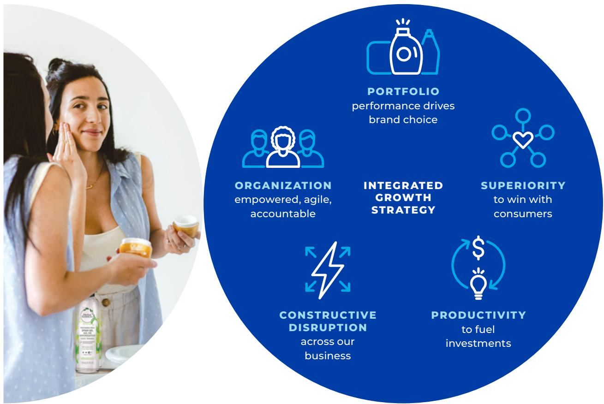
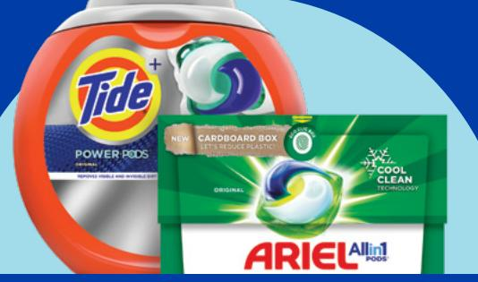
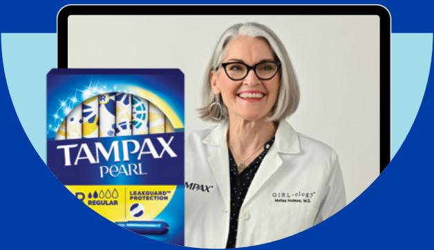
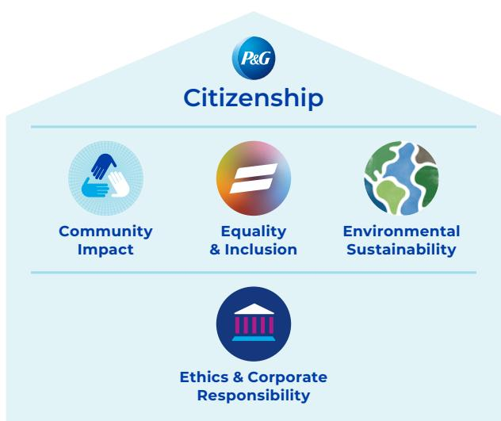
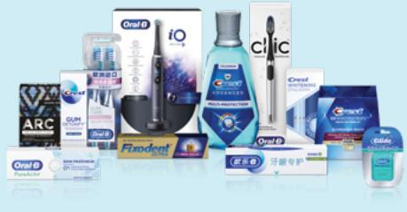
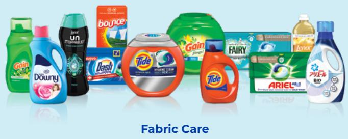

### Full Page Description (Page 1)

**Source:** `assets/_page_1_Asset_1.jpg`

**Generated:** 2026-05-28 18:11:37

---

The image is a pie chart that visually represents the distribution of a certain metric across different regions. The chart is divided into segments, each representing a different region and its corresponding percentage of the total. The regions and their percentages are as follows: North America (49%), Europe (21%), Greater China (10%), Asia Pacific (8%), Latin America (6%), and India, Middle East & Africa (IMEA) (6%). The chart effectively shows that North America has the largest share, followed by Europe, with the remaining regions having smaller shares.

### Full Page Description (Page 1)

**Source:** `assets/_page_1_Asset_0.jpg`

**Generated:** 2026-05-28 18:11:44

---

The image contains a pie chart with five segments, each representing a different category and its corresponding percentage of a total. The categories and their percentages are as follows: Fabric & Home Care (35%), Baby, Feminine & Family Care (25%), Beauty (18%), Health Care (14%), and Grooming (8%). The chart visually represents the distribution of these categories, with the largest segment being Fabric & Home Care at 35% and the smallest being Grooming at 8%.

> **AI Description:**
> **Source:** `assets/_page_1_Figure_0.jpg`
> 
> **Generated:** 2026-05-28 18:08:11
> 
> ---
> 
> The image contains a collection of various household and personal care products. It features brands such as Bounty, Charmin, Pampers, Tide, Oral-B, Downy, Gillette, and others. The products are arranged in a circular pattern against a light blue background. The image includes a variety of items like paper towels, toilet paper, diapers, laundry detergent, and personal care products, showcasing a range of household and personal care items.

## FINANCIAL HIGHLIGHTS (UNAUDITED)

VARIOUS STATEMENTS IN THIS ANNUAL REPORT, including estimates, projections, objectives and expected results, are “forward-looking statements” within the meaning of the Private Securities Litigation Reform Act of 1995, Section 27A of the Securities Act of 1933 and Section 21E of the Securities Exchange Act of 1934 and are generally identified by the words “believe,” “expect,” “anticipate,” “intend,” “opportunity,” “plan,” “project,” “will,” “should,” “could,” “would,” “likely” and similar expressions. Forward-looking statements are based on current assumptions that are subject to risks and uncertainties that may cause actual results to differ materially from the forward-looking statements, including the risks and uncertainties discussed in Item 1A – Risk Factors of the Form 10-K included in this Annual Report. Such forward-looking statements speak only as of the date they are made, and we undertake no obligation to update or revise publicly any forward-looking statements, except as required by law.

Brand names referenced in this Annual Report are trademarks of The Procter & Gamble Company or one of its subsidiaries. All other brand names are trademarks of their respective owners.

## Dear Shareowners,

Fiscal 2022 was another very strong year as the execution of our integrated strategies continued to yield strong sales, earnings and cash results in an incredibly difficult operating environment.

Your Company delivered broad-based and strong top-line growth across our categories and regions, earnings growth in the face of significant cost headwinds, and continued strong cash return to you, P&G’s shareowners.

For the fiscal year, organic sales grew 7%, core earnings per share grew 3%, currency-neutral core earnings per share were up 5%, and adjusted free cash flow productivity was 93%.

Organic sales growth of 7% continues our strong topline momentum, which is up 13% on a two-year stack (across fiscal years 2021 and 2022) and up 19% on a three-year stack (across fiscal years 2020, 2021 and 2022).

Growth this fiscal year was broad-based across business units, with all 10 of our categories growing organic sales. Personal Health Care grew 20%. Fabric Care and Feminine Care grew double digits. Baby Care was up high single digits. Oral Care and Grooming were up mid-single digits. Hair Care, Home Care, Skin & Personal Care and Family Care each grew low single digits.

Focus markets grew 5% and Enterprise markets were up 10%.

We delivered strong results in our largest and most profitable market, the United States, with organic sales growing 8%.

E-commerce sales increased 11%, representing 14% of total Company sales.

Global aggregate market share increased 50 basis points, and 38 of our top 50 category/country

Organic Sales Growth
Core EPS Growth
Adjusted Free Cash Flow Productivity

> **AI Description:**
> **Source:** `assets/_page_2_Figure_1.jpg`
> 
> **Generated:** 2026-05-28 18:15:29
> 
> ---
> 
> The image contains a photograph of a person wearing a dark blue suit and a red and white striped tie. The background is a light blue circle with a white border. The person appears to be in a professional setting, possibly for a business or formal portrait.

JON R. MOELLER Chairman of the Board, President and Chief Executive Officer

combinations held or grew share for the year. Importantly, this share growth is broad based. Nine of 10 product categories grew share globally over the past year.

Our bottom-line results include over \$3 billion of earnings headwinds from commodities, freight and foreign exchange. Despite this, we delivered core EPS growth within our initial guidance range for the year.

We returned nearly \$19 billion of value to shareowners through \$8.8 billion in dividends and \$10 billion in share repurchase. In April, we announced a 5% increase in our dividend. This is the 66th consecutive annual dividend increase, and the 132nd consecutive year in which P&G has paid a dividend. Only seven U.S. publicly traded companies have paid a dividend in more consecutive years than P&G, and only three are recognized to have increased their dividend in more consecutive years than P&G.

In summary, we met or exceeded each of our going-in target ranges for the fiscal year — organic sales growth, core EPS growth, free cash flow productivity and cash returned to shareowners. This is strong performance in very difficult operating conditions.

## Integrated Strategic Choices

P&G employees have delivered great results over the past four years in a very challenging macro environment against very capable competition. In those four years, P&G people have added more than \$13 billion in annual sales and roughly \$5 billion in after-tax profit — executing our integrated strategies with excellence.

The progress we have made, and our collective commitment to our strategies, give me confidence we can manage through the challenges we will continue to face. Still, we are clear-eyed about the trials ahead. The operational, cost and currency challenges we dealt with over the last two years will continue in fiscal year 2023, and we begin the new fiscal year with consumers facing inflation levels not seen in the last 40 years.

The best response to the uncertainties and challenges — double down on the integrated set of strategies that are delivering very strong results.

We are focused on delighting and serving consumers, customers, society and shareowners through five strategic and integrated choices: a portfolio of dailyuse products in categories where performance drives brand choice; superiority across product, package, brand communication, retail execution and value; productivity in everything we do; constructive disruption across the value chain; and an agile, accountable and empowered organization.

These are not independent strategic choices. They reinforce and build on each other, and when executed well, they lead to balanced top- and bottom-line growth and value creation. There is still meaningful opportunity for improvement and leverage in every facet of this strategy, and we continue to work to strengthen our execution of these choices.

## A Portfolio of Superior, Daily-Use Products

P&G has a focused portfolio of daily-use products — many providing cleaning, health and hygiene benefits — in 10 categories where performance drives brand choice: Fabric Care, Home Care, Baby Care, Feminine Care, Family Care, Hair Care, Skin & Personal Care, Oral Care, Personal Health Care and Grooming.

We know how to win in these categories — by delivering irresistibly superior propositions to our consumers and retail partners across product performance, packaging, brand communication, retail execution and value. Continued investment in these five vectors of superiority is critical to drive sustainable business growth. Even when our costs are rising sharply, we will not diverge from this strategy, especially when consumers are ever more focused on the performance and value of the brands they choose.

## Superiority to Win with Consumers

We continue to raise the bar on all aspects of superiority — product, package, brand communication, retail execution and value — in all price tiers where we compete.

> **AI Description:**
> **Source:** `assets/_page_3_Figure_0.jpg`
> 
> **Generated:** 2026-05-28 18:16:31
> 
> ---
> 
> The image contains a combination of a photograph and an infographic. The photograph shows two women in a bathroom, one applying cream to her face, with various personal care products visible on the counter. The infographic, set against a blue background, is a circular diagram with six sections, each containing a label and a corresponding icon. The sections are labeled as follows: "Portfolio" (performance drives brand choice), "Organization" (empowered, agile, accountable), "Integrated Growth Strategy," "Superiority" (to win with consumers), "Constructive Disruption" (across our business), and "Productivity" (to fuel investments). The infographic uses icons such as bottles, people, a heart, a lightning bolt, and a lightbulb to visually represent each section's concept.

We are leveraging this superiority to grow markets, and P&G’s share in them, as a way to sustainably build the business. Creating new business is powerful with our retail partners as we work to jointly create value.

Superiority is especially critical in an inflationary environment. As consumers face increased pressure on nearly every aspect of their household budgets, we invest to deliver truly superior value through a combination of price and product performance to earn their loyalty every day. We are committed to keep investing to strengthen the superiority of our brands across innovation, supply chains and brand equity to deliver superior value for consumers.

## Ongoing Productivity

The strategic need for investment to strengthen the long-term health and competitiveness of our brands, the short-term need to manage through significant cost increases, and the ongoing need to drive balanced top- and bottom-line growth, including margin expansion, underscore the importance of productivity.

We have developed a strong productivity muscle over the last decade as we delivered two \$10 billion savings programs. Productivity is part of our DNA now, which will help us address some of the challenges we face. We remain fully committed to cost and cash productivity in all facets of our business. No area of cost is left untouched.

For example, as COVID-19 supply chain challenges ease and we reach a better balance of supply and demand, we will have an increased opportunity to implement cost savings projects in our manufacturing operations. As we leverage digital tools and automation, there will be more opportunities to focus employees on the higher-order work of serving consumers. And, as we continue to integrate data and analytics and artificial intelligence, brand teams will be working to make our marketing investments even more efficient and effective to deliver improved demand creation at equal or lower cost.

Each business is driving productivity up and down their income statement and across their balance sheet, and we remain fully committed to productivity as a core driver of balanced top- and bottom-line growth and strong cash generation. We cannot let up here. Productivity will remain a significant part of our work, especially now.

## Measures of Superiority

## PRODUCT

Products so good, consumers recognize the difference. Superior products raise expectations for performance in the category.

> **AI Description:**
> **Source:** `assets/_page_4_Figure_0.jpg`
> 
> **Generated:** 2026-05-28 18:15:55
> 
> ---
> 
> The image contains a simple illustration of a blue detergent bottle with a white handle and a white cap. The bottle is depicted in a flat, two-dimensional style against a solid blue background. There are no charts, graphs, or other visual elements present in the image. The image is purely illustrative and does not contain any text or additional annotations.

## PACKAGING

Packaging that attracts consumers, conveys brand equity, helps consumers select the best product for their needs, and delights consumers during use.

> **AI Description:**
> **Source:** `assets/_page_4_Figure_1.jpg`
> 
> **Generated:** 2026-05-28 18:16:34
> 
> ---
> 
> The image depicts a simple line drawing of a spray bottle against a blue background. The spray bottle is outlined in blue and appears to be in the process of releasing a mist, indicated by small dots emanating from the nozzle. There are no labels or text annotations present in the image.

## BRAND COMMUNICATION

Product and packaging benefits communicated with exceptional advertising that makes you think, talk, laugh, cry, smile, act and buy — and that drives category and brand growth.

> **AI Description:**
> **Source:** `assets/_page_4_Figure_2.jpg`
> 
> **Generated:** 2026-05-28 18:15:51
> 
> ---
> 
> The image contains a simple icon of a computer monitor with a Wi-Fi signal icon displayed on the screen. The monitor is depicted in a light blue color, and the Wi-Fi signal icon is white with a central dot and radiating lines, indicating wireless connectivity. The icon suggests a connection to wireless technology, possibly for internet or data transmission.

## RETAIL EXECUTION

In-store: with the right store coverage, product forms, sizes, price points, shelving and merchandising. Online: with the right content, assortment, ratings, reviews, search and subscription offerings.

> **AI Description:**
> **Source:** `assets/_page_4_Figure_3.jpg`
> 
> **Generated:** 2026-05-28 18:15:47
> 
> ---
> 
> The image contains a simple icon of a shopping cart within a blue rectangular box. The cart is white with a handle and wheels, and the box has a small blue dot near the bottom right corner. The icon is likely used to represent a shopping or e-commerce context.

## CONSUMER & CUSTOMER VALUE

For consumers: all these elements presented in a clear and shoppable way at a compelling price. For customers: margin, penny profit, trip generation, basket size, and category growth.

> **AI Description:**
> **Source:** `assets/_page_4_Figure_4.jpg`
> 
> **Generated:** 2026-05-28 18:15:12
> 
> ---
> 
> The image contains a simple icon of a person with a heart symbol next to a bottle. The person is represented by a blue outline, and the heart and bottle are white. The image is likely used to represent health, hydration, or personal care.

## PRODUCT

An upgraded formula and unique packaging made Dawn EZ-Squeeze in the U.S. and Fairy Max Power in Europe standout products in fiscal 2022. The inverted bottle, no-flip cap and self-sealing valve allow for easy one-handed use of every drop of soap.

These products contributed to mid-single digit hand dish global category growth and enabled additional distribution and shelf space across multiple markets and retailers. During fiscal 2022, they contributed to Dawn’s mid-single digit organic sales growth and grew the brand’s global value share by nearly one point.

FROMTHE   
WORLD'S   
#1SELLING   
NERVECARE   
COMPANY

> **AI Description:**
> **Source:** `assets/_page_5_Figure_1.jpg`
> 
> **Generated:** 2026-05-28 18:15:23
> 
> ---
> 
> The image contains a simple icon of a shopping cart, which is typically associated with e-commerce or online shopping. The icon is a flat design with a blue background and white shopping cart symbol. There are no charts, graphs, or other visual elements present in the image.

## RETAIL EXECUTION

Nervive is a nerve care product launched in North America in fiscal 2022, helping to establish the nerve care category in that region after many successful years in Europe with Neurobion, a brand acquired with Merck in 2018.

Eye-level brand blocks on-shelf and displays at top retailers grew sales by more than 40% where executed, and strong online content and search strategy supported e-commerce growth. As a result, Nervive contributed to Personal Health Care organic sales growth of 20% in fiscal 2022.

## PACKAGING

We have now introduced a plastic-free package for many Gillette and Venus products in every P&G region globally. It delights consumers as it is easier to open, read and select at shelf, and fully recyclable. We estimate this superior package could save the plastic equivalent of 85 million water bottles per year when fully launched.\*

In North America, one of the first regions where we launched, this innovation contributed to high single digit organic sales growth for P&G’s Grooming category in fiscal 2022, and globally helped to grow Grooming’s value share by over one point.

\*Based on FY20 sales

> **AI Description:**
> **Source:** `assets/_page_5_Figure_2.jpg`
> 
> **Generated:** 2026-05-28 18:15:09
> 
> ---
> 
> The image contains two product advertisements for Gillette razors. The left side shows the Gillette ProGlide razor with a blue and black handle, featuring icons indicating its five-blade design and comfort glide technology. The right side displays the Gillette Venus razor with a pink and silver handle, highlighting its five-blade design, ComfortGlide technology, and Superberry scent. Both advertisements include branding and product features in a visually appealing manner.

> **AI Description:**
> **Source:** `assets/_page_5_Figure_3.jpg`
> 
> **Generated:** 2026-05-28 18:15:18
> 
> ---
> 
> The image contains a photograph of two laundry detergent pods. The left side shows a Tide Power Pods container, while the right side displays an Ariel All-in-1 Pods box. Both products are labeled with their respective brand names and product types. The Ariel box also highlights "Cool Clean Technology" and mentions a cardboard box packaging feature. The image is designed to showcase the products and their packaging options.

> **AI Description:**
> **Source:** `assets/_page_5_Figure_4.jpg`
> 
> **Generated:** 2026-05-28 18:15:44
> 
> ---
> 
> The image contains a simple icon of a person with a heart symbol near the chest. The icon is white on a blue circular background. This type of icon is commonly used to represent a user profile or a health-related icon, such as a health record or a health status indicator.

CONSUMER & CUSTOMER VALUE

Tide and Ariel offer a superior value equation. For consumers, our enhanced formula enables superior cleaning performance in cold water, creating energy savings and avoiding rewashing which may be necessary with less effective detergents. By reducing the energy required to heat water in the laundry process and improving garment life spans, consumers also see sustainability benefits.

For customers, innovations like Tide Power PODS help drive category growth. In fiscal 2022, unit dose detergent grew organic sales in the low teens globally, with growth in every region, contributing to P&G’s double digit growth in the Fabric Care category.

# BRAND COMMUNICATION

A witty ‘edu-tainment’ campaign with celebrities and influencers reached millions of consumers across a range of digital and broadcast platforms. The campaign delivered a humorous approach to tampon and period education appealing to Gen Z and Millennial audiences.

This campaign contributed to double digit organic sales growth for global Feminine Care in fiscal 2022, with value share up over one point.

> **AI Description:**
> **Source:** `assets/_page_6_Figure_0.jpg`
> 
> **Generated:** 2026-05-28 18:08:18
> 
> ---
> 
> The image contains a photograph of a person wearing a lab coat with the word "Gynecology" and a name tag. To the left of the photograph is a product image of Tampax Pearl tampons, featuring the brand name, product type (Regular), and a graphic indicating "LeakGuard Protection." The image also includes a blue shield-like shape surrounding the photograph and product image.

Read more about superiority at pg.com/ annualreport2022

> **AI Description:**
> **Source:** `assets/_page_6_Figure_2.jpg`
> 
> **Generated:** 2026-05-28 18:07:43
> 
> ---
> 
> The image contains a photograph of a person holding a toothbrush. The background is a solid blue color with circular light blue lines. The person is smiling and appears to be demonstrating or showcasing the toothbrush. The toothbrush is pink with a blue and white bristle head. The person is wearing a sleeveless white top.

## A Constructive Disruption Mindset

Success in our highly competitive industry also requires agility that comes with a mindset of constructive disruption — a willingness to change, adapt and create new trends and technologies that will shape our industry for the future. A mindset of constructive disruption is even more important in this challenging environment.

A good example of constructive disruption in a category is Dawn Powerwash Dish Spray, which addresses the changing habit of washing dishes as you go instead of waiting until the end of a meal. The product enables direct application of activated suds to dishes to speed up the entire process, saving people not only time but also water.

Another example is how we continue to reinvent brand building, including how we reach consumers more effectively and efficiently. Pampers, our largest and most global brand, is relatively unique in that its primary audience is narrow: parents of children at diapering age. To reach these parents more precisely, Pampers created the Pampers Rewards app so parents can receive helpful information, tips, deals and rewards. With this app, Pampers was able to build smart audiences to reach parents at different stages — like newborns, crawling and potty training — with more precise advertising specifically designed for each media platform, increasing the brand’s reach, effectiveness and efficiency, while driving cost savings.

Success in our highly competitive industry requires the agility that comes with a mindset of constructive disruption —

> **AI Description:**
> **Source:** `assets/_page_6_Figure_3.jpg`
> 
> **Generated:** 2026-05-28 18:07:27
> 
> ---
> 
> The image contains a simple icon of a light bulb with two arrows forming a circular arrow around it. The light bulb is blue, and the arrows are also blue, indicating a cycle or loop. This icon is commonly used to represent ideas, innovation, or a continuous process.

> **AI Description:**
> **Source:** `assets/_page_6_Figure_4.jpg`
> 
> **Generated:** 2026-05-28 18:08:43
> 
> ---
> 
> The image contains a simple diagram with a central play button icon surrounded by eight smaller icons arranged in a circular pattern. The central icon is blue with a white play symbol, suggesting a media player or video control interface. The surrounding icons are also blue with white borders, possibly representing additional functions or options related to the central play button.

Lean Innovation
Brand Building

> **AI Description:**
> **Source:** `assets/_page_6_Figure_5.jpg`
> 
> **Generated:** 2026-05-28 18:08:32
> 
> ---
> 
> The image contains a simple line drawing of a truck with a trailer. The truck is depicted in a side view, and the trailer appears to be carrying a load, indicated by a series of rectangular shapes at the top of the trailer. The drawing is minimalistic, using only lines and basic shapes without any additional text or annotations. The image likely represents a concept related to transportation or logistics.

Supply Chain

> **AI Description:**
> **Source:** `assets/_page_6_Figure_6.jpg`
> 
> **Generated:** 2026-05-28 18:08:49
> 
> ---
> 
> The image contains a simple diagram with a central circular shape and four outward-pointing arrows, each connected to a smaller circular shape. The arrows and smaller circles are connected by lines, suggesting a network or system structure. The design is abstract and does not include any text or labels.

Digitization & Data Analytics

## An Empowered, Agile and Accountable Organization

We strive for an empowered, agile and accountable organization with little overlap or redundancy — flowing to new demands and seamlessly supporting each other, through a culture of equality and inclusion, to deliver against our priorities around the world.

P&G is organized around five industry-based sector business units (SBUs). These five sectors manage our 10 product categories, with full sales, profit, cash and value creation responsibility for our largest and most profitable markets — called Focus Markets — accounting for about 80% of Company sales and about 90% of after-tax profit.

Enterprise Markets, which represent the rest of the world, are a separate unit with sales, profit and value creation responsibility. Over the last several years, we have been growing both top and bottom line in nearly all of these markets, which are important to the future of P&G.

The best proof that this organization design is working is the growth of our largest and most profitable market, North America, whose growth has accelerated since we put this design in place. Organic sales in North America have increased from an average of +2% the three years prior to the design change to +8% in the three years since.

This structure, and its resulting organizational speed and focus, has also allowed us to manage through the challenges and headwinds we are experiencing.

> **AI Description:**
> **Source:** `assets/_page_7_Figure_0.jpg`
> 
> **Generated:** 2026-05-28 18:09:28
> 
> ---
> 
> The image is a diagram of a star-shaped network. It consists of five nodes connected in a circular pattern, with each node linked to its adjacent nodes. The connections are represented by dashed lines, indicating a possible or conditional relationship between the nodes. The diagram suggests a network or system where each node is connected to its neighbors, forming a closed loop.

Operating through five industrybased Sector Business Units

> **AI Description:**
> **Source:** `assets/_page_7_Figure_1.jpg`
> 
> **Generated:** 2026-05-28 18:08:53
> 
> ---
> 
> The image is a simple diagram consisting of a central circle with four smaller circles arranged around it. Each smaller circle is connected to the central circle by a blue arrow pointing upwards. The diagram appears to represent a network or system where the central entity is connected to four other entities, possibly indicating a hierarchical or interconnected structure. The arrows suggest a flow or relationship between the central entity and the surrounding entities.

Providing greater clarity on responsibilities and reporting lines

> **AI Description:**
> **Source:** `assets/_page_7_Figure_2.jpg`
> 
> **Generated:** 2026-05-28 18:08:35
> 
> ---
> 
> The image contains a simple icon representing three people. It is a flat, two-dimensional graphic with a gradient blue color scheme. The icon is likely used to symbolize a group or team. There are no labels or text annotations present in the image.

Strengthening leadership accountability

> **AI Description:**
> **Source:** `assets/_page_7_Figure_3.jpg`
> 
> **Generated:** 2026-05-28 18:08:39
> 
> ---
> 
> The image contains a simple diagram of two hands holding a small plant. The hands are depicted in a light blue color, and the plant is also in the same color, suggesting a theme of nurturing or growth. There are no labels or text annotations within the image. The diagram is likely symbolic, representing care, protection, or the nurturing of new life or ideas.

Enabling P&G people to accelerate growth and value creation

We continue to believe that this structure — with the SBUs squarely concentrated on Focus Markets and managing Enterprise Markets as a separate operating unit — is the best way to navigate successfully through the increasingly dynamic world in which we live.

## Strengthening Our Strategy

One of the most important things about our strategy — portfolio, superiority, productivity, constructive disruption, and an empowered, agile and accountable organization — is that it is inherently dynamic, not static. It requires being responsive to changing consumer needs and habits. It demands we serve evolving customer needs in rapidly transforming channels.

Going forward, we have identified four areas to be even more deliberate and intentional about pursuing to further strengthen the execution of our strategy.

The first is Supply. We are improving our supply chain capacity, agility, cost efficiency and resilience for a new reality and a new age. The capability investments we made prior to COVID-19 to improve our manufacturing and distribution networks in the U.S. and Europe helped us to manage through the last few years with relatively few prolonged issues. We are already making the next round of investments needed to ensure we have multiple qualified suppliers for key inputs, sufficient manufacturing capacity to satisfy growing demand and flexibility to meet the changing needs of all types of retailers.

The second area is Environmental Sustainability. We are integrating sustainability into our product, packaging and supply chain innovation work to develop irresistibly superior offerings for consumers that are better for the environment. For example, our new cardboard packaging on Gillette razors reduces plastic packaging and offers a noticeably superior experience for consumers at the first and second moments of truth. Another example is our new fully recyclable paper packaging on our premium Always Cotton Protection pads recently launched in Germany. One more example is cold-water washing with Tide and Ariel. When people turn their wash cycles to cold, they can save up to 90% of the energy used on every load of laundry, while saving money. They also get greater satisfaction because their colors look brighter, and their clothes look newer longer. Better for the consumer, better for our planet.

Third, we are increasing our Digital Acumen to drive consumer and customer preference, reduce cost and enable rapid and efficient decision making. Increased digitization of our manufacturing lines, more use of artificial intelligence and more use of blockchain technology are not ends unto themselves. They are tools we can use to delight consumers and customers.

Fourth, a Superior Employee Value Equation for all gender identities, races, ethnicities, sexual orientations, ages, and abilities — for all roles — to ensure we continue to attract, retain and develop the best talent. By definition, this must include equality. To deliver a superior employee value equation, there must be something in it for everyone.

These are not new or separate strategies. They are necessary elements of focus in continuing to build superiority, in reducing cost to enable investment and value creation, and in strengthening our organization. They are part of the constructive disruption we must continue to lead.

## Meeting Consumer, Customer, Employee, Societal and Investor Needs

In the ever more complex world we live in, it is not just top and bottom line that must be delivered and balanced. We must endeavor to deliver against the needs of an increasing number of constituents. This is especially true in our efforts in Environmental, Social and Governance (ESG), where consumer, customer, employee, society and shareowner expectations are growing.

> **AI Description:**
> **Source:** `assets/_page_8_Figure_1.jpg`
> 
> **Generated:** 2026-05-28 18:14:41
> 
> ---
> 
> The image contains a simple illustration of two hands holding a plant with a heart above it. The hands are depicted in a stylized manner, with the plant having two leaves and a small heart shape at the top. The background is a solid light blue color. This image conveys a message of growth, care, and nurturing, possibly symbolizing environmental or health-related themes.

At P&G, we aim to be a force for growth and a force for good.

> **AI Description:**
> **Source:** `assets/_page_8_Figure_2.jpg`
> 
> **Generated:** 2026-05-28 18:15:03
> 
> ---
> 
> The image is an infographic combining text with visual elements. It presents a conceptual diagram representing P&G's Citizenship framework. The diagram is structured as a house with the following components:
> 
> 1. **Community Impact**: Represented by a hand holding a heart, symbolizing care and support for communities.
> 2. **Equality & Inclusion**: Indicated by a colorful globe with a stylized equal sign, emphasizing fairness and diversity.
> 3. **Environmental Sustainability**: Shown with a globe divided into land and water, highlighting the importance of environmental conservation.
> 4. **Ethics & Corporate Responsibility**: Depicted by a building with a roof, symbolizing the foundation of ethical business practices and corporate accountability.
> 
> The infographic uses icons and simple shapes to visually represent each aspect of P&G's Citizenship framework, making the information more engaging and easier to understand.

For more about our work in all these areas, visit our ESG for Investors website at pginvestor.com/esg and read our latest Citizenship report at pg.com/citizenship.

As I shared earlier, our consumers increasingly rely on us to deliver superior solutions that are sustainable. Our world requires that we do our part in this regard. This challenge is also an opportunity to extend our margin of superiority, further grow categories, and create more value, all while improving our own environmental impact, enabling consumers to reduce their footprint, and helping society solve some of the most pressing global challenges.

> **AI Description:**
> **Source:** `assets/_page_8_Figure_3.jpg`
> 
> **Generated:** 2026-05-28 18:14:50
> 
> ---
> 
> The image is a photograph showing a group of four people outdoors in a park-like setting with trees and yellow foliage in the background. One person is holding a shovel and appears to be planting a tree, while the others are observing and interacting with the activity. The individuals are dressed in casual clothing suitable for outdoor activities. The scene conveys a sense of community and environmental engagement.

Our Community Impact work helps improve lives for people in difficult times by providing clean water and donations of product, time and money to those affected by natural disasters and crises around the world. It is also part of what employees are proud of and value in P&G. The ability to do good for the communities we live and work in also helps us attract and retain the best talent.

We know we increase our chances of winning when we have an equal, diverse and inclusive culture that gives life to the best thoughts and ideas — a culture where everyone can succeed and is able to be their best. Externally, we support equality and inclusion efforts with our business partners and in the communities where we live and work because it is not only the right thing to do, but it also can improve income and wealth equity for more people, creating more purchasing power, which drives market growth.

Our foundation is our Purpose, Values and Principles, which set a high standard for each P&G person. High standards are good. They require that we hold ourselves and each other accountable for results and, equally important, for how we achieve those results. Last year, we added an ESG factor to our annual incentive compensation program for our senior executives as a demonstration of our commitment to near-term progress toward our long-term ESG goals.

Serving and balancing the needs of consumers, customers, employees, society and shareowners will not be easy, but it is necessary — and those that do it best, as I expect we will, should thrive.

> **AI Description:**
> **Source:** `assets/_page_9_Figure_0.jpg`
> 
> **Generated:** 2026-05-28 18:14:31
> 
> ---
> 
> The image contains a photograph of a person holding a shopping bag, with various household and personal care products displayed in the foreground. The products include Charmin Ultra Soft toilet paper, Head & Shoulders 2-in-1 shampoo and conditioner, Native body wash, and Tide Power PODS laundry detergent. The image also includes text indicating the number of rolls of toilet paper (12=72) and the brand names of the products. The overall scene suggests a shopping or laundry-related context.

> **AI Description:**
> **Source:** `assets/_page_9_Figure_1.jpg`
> 
> **Generated:** 2026-05-28 18:13:44
> 
> ---
> 
> The image is a photograph featuring a young child in the foreground, smiling and crawling on the floor. The child is wearing a yellow outfit with sun patterns and yellow socks. In the background, slightly out of focus, is an adult smiling. The image also includes a purple banner with the text "Luvs" and a small graphic of a baby. The overall scene appears to be a playful and happy moment, possibly in a home or daycare setting.

## Looking Forward

The integrated strategies we have outlined here were delivering strong results before the pandemic. They served us well during the more recent volatile times. They remain the right strategic choices to drive balanced growth and value creation. We endeavor to step forward into the challenges we face, not back, growing through near-term challenges, while serving consumers and communities. We are doing this in our interest, in society’s interest and in the interest of our long-term shareowners.

Confidence in our future success is rooted in my confidence in P&G people. Every day, P&G people demonstrate their commitment to our Purpose, Values and Principles, their high motivation to win, their personal accountability to winning results, and their strong focus on sustained excellence in everything they do — serving consumers, serving customers and delivering for shareowners.

JON R. MOELLER

Chairman of the Board, President and Chief Executive Officer

# UNITED STATES SECURITIES AND EXCHANGE COMMISSION Washington, D.C. 20549

Form 10-K

(Mark one)

# [x] ANNUAL REPORT PURSUANT TO SECTION 13 OR 15(d) OF THE SECURITIES EXCHANGE ACT OF 1934 For the Fiscal Year Ended June 30, 2022

OR

[ ] TRANSITION REPORT PURSUANT TO SECTION 13 OR 15(d) OF THE SECURITIES EXCHANGE ACT OF 1934 For the transition period from to Commission File No. 1-434

THE PROCTER & GAMBLE COMPANY

One Procter & Gamble Plaza, Cincinnati, Ohio 45202

State of Incorporation: Ohio

Indicate by check mark if the registrant is a well-known seasoned issuer, as defined in Rule 405 of the Securities Act. Yes  No 

Indicate by check mark if the registrant is not required to file reports pursuant to Section 13 or 15(d) of the Act. Yes  No 

Indicate by check mark whether the registrant (1) has filed all reports required to be filed by Section 13 or 15(d) of the Securities Exchange Act of 1934 during the preceding 12 months (or for such shorter period that the registrant was required to file such reports), and (2) has been subject to such filing requirements for the past 90 days. Yes  No 

Indicate by check mark whether the registrant has submitted electronically every Interactive Data File required to be submitted pursuant to Rule 405 of Regulation S-T (§232.405 of this chapter) during the preceding 12 months (or for such shorter period that the registrant was required to submit and post such files). Yes  No 

Indicate by check mark whether the registrant is a large accelerated filer, an accelerated filer, a non-accelerated filer, smaller reporting company, or an emerging growth company. See the definitions of "large accelerated filed," "accelerated filer," "smaller reporting company," and "emerging growth company" in Rule 12b-2 of the Exchange Act.

Large accelerated filer 

Accelerated filer

Non-accelerated filer

Smaller reporting company

Emerging growth company 

If an emerging growth company, indicate by check mark if the registrant has elected not to use the extended transition period for complying with any new or revised financial accounting standards provided pursuant to Section 13(a) of the Exchange Act. 

Indicate by check mark whether the registrant is a shell company (as defined in Rule 12b-2 of the Exchange Act). Yes  No 

Indicate by check mark whether the registrant has filed a report on and attestation to its management’s assessment of the effectiveness of its internal control over financial reporting under Section 404(b) of the Sarbanes-Oxley Act (15 U.S.C. 7262(b)) by the registered public accounting firm that prepared or issued its audit report. Yes  No 

The aggregate market value of the voting stock held by non-affiliates amounted to \$392 billion on December 31, 2021.

There were 2,389,553,883 shares of Common Stock outstanding as of July 31, 2022.

Documents Incorporated by Reference

Portions of the Proxy Statement for the 2022 Annual Meeting of Shareholders, which will be filed within one hundred and twenty days of the fiscal year ended June 30, 2022 (2022 Proxy Statement), are incorporated by reference into Part III of this report to the extent described herein.

FORM 10-K TABLE OF CONTENTS Page   
PART I Item 1. Business   
Item 1A. Risk Factors 3   
Item 1B. Unresolved Staff Comments 9   
Item 2. Properties 9   
Item 3. Legal Proceedings 9   
Item 4. Mine Safety Disclosure 9   
Information about our Executive Officers 10   
PART II Item 5. Market for Registrant's Common Equity, Related Stockholder Matters and Issuer Purchases of 11   
Equity Securities   
Item 6. Intentionally Omitted 12   
Item 7. Management's Discussion and Analysis of Financial Condition and Results of Operations 13   
Item 7A. Quantitative and Qualitative Disclosures about Market Risk 32   
Item 8. Financial Statements and Supplementary Data 33   
Management's Report and Reports of Independent Registered Public Accounting Firm 33   
Consolidated Statements of Earnings 37   
Consolidated Statements of Comprehensive Income 38   
Consolidated Balance Sheets 39   
Consolidated Statements of Shareholders' Equity 40   
Consolidated Statements of Cash Flows 41   
Notes to Consolidated Financial Statements 42   
Note 1: Summary of Significant Accounting Policies 42   
Note 2: Segment Information 44   
Note 3: Supplemental Financial Information 46   
Note 4: Goodwill and Intangible Assets 47   
Note 5: Income Taxes 48   
Note 6: Earnings Per Share 50   
Note 7: Stock-based Compensation 50   
Note 8: Postretirement Benefits and Employee Stock Ownership Plan 51   
Note 9: Risk Management Activities and Fair Value Measurements 57   
Note 10: Short-term and Long-term Debt 60   
Note 11: Accumulated Other Comprehensive Income/(Loss) 61   
Note 12: Leases 62   
Note 13: Commitments and Contingencies 63   
Item 9. Changes in and Disagreements with Accountants on Accounting and Financial Disclosure 63   
Item 9A. Controls and Procedures 63   
Item 9B. Other Information 63   
Item 9C. Disclosure Regarding Foreign Jurisdictions that Prevent Inspections 63   
PART III Item 10. Directors, Executive Officers and Corporate Governance 64   
Item 11. Executive Compensation 64   
Item 12. Security Ownership of Certain Beneficial Owners and Management and Related Stockholder 64   
Item 13. MattersCertain Relationships and Related Transactions and Director Independence 64   
Item 14. Principal Accountant Fees and Services 64   
PART IV Item 15. Exhibits and Financial Statement Schedules 65   
Item 16. Form 10-K Summary 67   
Signatures 68   
Exhibit Index 69

## PART I

## Item 1. Business.

The Procter & Gamble Company (the Company) is focused on providing branded products of superior quality and value to improve the lives of the world's consumers, now and for generations to come. The Company was incorporated in Ohio in 1905, having first been established as a New Jersey corporation in 1890, and was built from a business founded in Cincinnati in 1837 by William Procter and James Gamble. Today, our products are sold in approximately 180 countries and territories.

Additional information required by this item is incorporated herein by reference to Management's Discussion and Analysis (MD&A); and Notes 1 and 2 to our Consolidated Financial Statements. Unless the context indicates otherwise, the terms the "Company," "P&G," "we," "our" or "us" as used herein refer to The Procter & Gamble Company (the registrant) and its subsidiaries.

Throughout this Form 10-K, we incorporate by reference information from other documents filed with the Securities and Exchange Commission (SEC).

The Company's Annual Report on Form 10-K, quarterly reports on Form 10-Q and current reports on Form 8-K, and amendments thereto, are filed electronically with the SEC. The SEC maintains an internet site that contains these reports at: www.sec.gov. Reports can also be accessed through links from our website at: www.pginvestor.com. P&G includes the website link solely as a textual reference. The information contained on our website is not incorporated by reference into this report.

Copies of these reports are also available, without charge, by contacting EQ Shareowner Services, 1100 Centre Pointe Curve, Suite 101, Mendota, MN 55120-4100.

## Financial Information about Segments

Information about our reportable segments can be found in the MD&A and Note 2 to our Consolidated Financial Statements.

## Narrative Description of Business

Business Model. Our business model relies on the continued growth and success of existing brands and products, as well as the creation of new innovative products and brands. The markets and industry segments in which we offer our products are highly competitive. Our products are sold in approximately 180 countries and territories through numerous channels as well as direct-to-consumer. Our growth strategy is to deliver meaningful and noticeable superiority across five key vectors of our consumer proposition - product performance, packaging, brand communication, retail execution and consumer and customer value. We use our research and development (R&D) and consumer insights to provide superior products and packaging. We utilize our marketing and online presence to deliver superior brand messaging to our consumers. We work collaboratively with our customers to deliver superior retail execution, both in-store and online. In conjunction with the above vectors, we provide superior value to consumers and our retail customers in each price tier in which we compete. Productivity improvement is also critical to delivering our objectives of balanced top and bottom-line growth and value creation.

Key Product Categories. Information on key product categories can be found in the MD&A and Note 2 to our Consolidated Financial Statements.

Key Customers. Our customers include mass merchandisers, e-commerce (including social commerce) channels, grocery stores, membership club stores, drug stores, department stores, distributors, wholesalers, specialty beauty stores (including airport duty-free stores), highfrequency stores, pharmacies, electronics stores and professional channels. We also sell direct to consumers. Sales to Walmart Inc. and its affiliates represent approximately 15% of our total sales in 2022, 2021 and 2020. No other customer represents more than 10% of our total sales. Our top ten customers accounted for approximately 39% of our total sales in 2022, 39% in 2021 and 38% in 2020.

Sources and Availability of Materials. Almost all of the raw and packaging materials used by the Company are purchased from third parties, some of whom are singlesource suppliers. We produce certain raw materials, primarily chemicals, for further use in the manufacturing process. In addition, fuel, natural gas and derivative products are important commodities consumed in our manufacturing processes and in the transportation of input materials and finished products. The prices we pay for materials and other commodities are subject to fluctuation. When prices for these items change, we may or may not pass the change to our customers. The Company purchases a substantial variety of other raw and packaging materials, none of which are material to our business taken as a whole.

Trademarks and Patents. We own or have licenses under patents and registered trademarks, which are used in connection with our activity in all businesses. Some of these patents or licenses cover significant product formulation and processes used to manufacture our products. The trademarks are important to the overall marketing and branding of our products. All major trademarks in each business are registered. In part, our success can be attributed to the existence and continued protection of these trademarks, patents and licenses.

Competitive Condition. The markets in which our products are sold are highly competitive. Our products compete against similar products of many large and small companies, including well-known global competitors. In many of the markets and industry segments in which we sell our products, we compete against other branded products as well as retailers' private-label brands. We are well positioned in the industry segments and markets in which we operate, often holding a leadership or significant market share position. We support our products with advertising, promotions and other marketing vehicles to build awareness and trial of our brands and products in conjunction with our sales force. We believe this combination provides the most efficient method of marketing for these types of products. Product quality, performance, value and packaging are also important differentiating factors.

Government Regulation. Our Company is subject to a wide variety of laws and regulations across the countries in which we do business. In the United States, many of our products and manufacturing operations are subject to one or more federal or state regulatory agencies, including the U.S. Food and Drug Administration (FDA), the Environmental Protection Agency (EPA), the Occupational Safety and Health Administration (OSHA), the Federal Trade Commission (FTC) and the Consumer Product Safety Commission (CPSC). We are also subject to anti-corruption laws and regulations, such as the U.S. Foreign Corrupt Practices Act, and antitrust and competition laws and regulations that govern our dealings with suppliers, customers, competitors and government officials.

In addition, many foreign jurisdictions in which we do business have regulations and regulatory bodies that govern similar aspects of our operations and products, in some cases to an even more significant degree. We are also subject to expanding laws and regulations related to environmental protection and other sustainability-related matters, nonfinancial reporting and diligence, labor and employment, trade, taxation and data privacy and protection, including the European Union’s General Data Protection Regulation (GDPR) and similar regulations in states within the United States and in countries around the world. For additional information on the potential impacts of global legal and regulatory requirements on our business, see “Item 1A. Risk Factors” herein.

The Company has in place compliance programs and internal and external experts to help guide our business in complying with these and other existing laws and regulations that apply to us around the globe; and we have made, and plan to continue making, necessary expenditures for compliance with these laws and regulations. We also expect that our many suppliers, consultants and other third parties working on our behalf share our commitment to compliance, and we have policies and procedures in place to manage these relationships, though they inherently involve a lesser degree of control over operations and governance. We do not expect that the Company’s expenditures for compliance with current government regulations, including current environmental regulations, will have a material effect on our total capital expenditures, earnings or competitive position in fiscal year 2023 as compared to prior periods.

Human Capital. Our employees are a key source of competitive advantage. Their actions, guided by our Purpose, Values and Principles (PVPs), are critical to the long-term success of our business. We aim to retain our talented employees by offering competitive compensation and benefits, strong career development and a respectful and inclusive culture that provides equal opportunity for all.

Our Board of Directors, through the Compensation and Leadership Development Committee (C&LD Committee), provides oversight of the Company’s policies and strategies relating to talent including diversity, equality and inclusion as well as the Company’s compensation principles and practices. The C&LD Committee also evaluates and approves the Company’s compensation plans, policies and programs applicable to our senior executives.

## Employees

As of June 30, 2022, the Company had approximately 106,000 employees, an increase of five percent versus the prior year due primarily to business growth. The total number of employees is an estimate of total Company employees excluding interns, co-ops, contractors and employees of joint ventures. 49% of our employees are in manufacturing roles and 26% of our employees are located in the United States. 41% of our global employees are women. As of June 30, 2022, 28% of our U.S. employees identify as multicultural.

## Training and Development

We focus on attracting, developing and retaining skilled and diverse talent, both from universities and the broader market. We recruit from among the best universities across markets in which we compete and are generally able to select from the top talent. We focus on developing our employees by providing a variety of job experiences, training programs and skill development opportunities. Given our developfrom-within model for staffing most of our senior leadership positions, it is particularly important for us to ensure holistic growth and full engagement of our employees.

## Diversity, Equality and Inclusion

As a consumer products company, we believe that it is important for our workforce to reflect the diversity of our consumers worldwide. We also seek to foster an inclusive work environment where each individual can bring their authentic self, which helps drive innovation and enables us to better serve our consumers. We aspire to achieve equal gender representation globally and at key management and leadership levels. Within the U.S. workforce, our aspiration is to achieve 40% multicultural representation overall as well as at management and leadership levels.

## Compensation and Benefits

Our compensation plans are based on the principles of paying for performance, paying competitively versus peer companies that we compete with for talent and in the marketplace and focusing on long-term success through a combination of short-term and long-term incentive programs. We also offer competitive benefit programs, including retirement plans and health insurance in line with local country practices with flexibility to accommodate the needs of a diverse workforce.

Sustainability. Environmental sustainability is a key focus area and integrated into P&G’s business strategies. The Company has declared its focus on developing irresistibly superior products and packages that are sustainable. The Company announced an ambition to reduce greenhouse gas emissions, purchase renewable electricity for our operations, reduce our use of virgin petroleum-based plastic in our packaging, increase the recyclability or reusability of our packaging and increase responsible sourcing of key forestbased commodities such as wood pulp and palm oil.

Additional detailed information on our sustainability efforts including our TCFD (Task Force on Climate-Related Financial Disclosures), SASB (Sustainability Accounting Standards Board) and CDP (Carbon Disclosure Project) reports can be found on our website at https://pginvestor.com/esg. References to our sustainability reports and website are for informational purposes only and neither the sustainability reports nor the other information on our website is incorporated by reference into this Annual Report on Form 10-K.

## Item 1A. Risk Factors.

We discuss our expectations regarding future performance, events and outcomes, such as our business outlook and objectives in this Form 10-K, as well as in our quarterly and annual reports, current reports on Form 8-K, press releases and other written and oral communications. All statements, except for historical and present factual information, are “forward-looking statements” and are based on financial data and business plans available only as of the time the statements are made, which may become outdated or incomplete. We assume no obligation to update any forward-looking statements as a result of new information, future events or other factors, except to the extent required by law. Forward-looking statements are inherently uncertain, and investors must recognize that events could significantly differ from our expectations.

The following discussion of “risk factors” identifies significant factors that may adversely affect our business, operations, financial position or future financial performance. This information should be read in conjunction with Management's Discussion and Analysis and the Consolidated Financial Statements and related Notes incorporated in this report. The following discussion of risks is not all inclusive but is designed to highlight what we believe are important factors to consider when evaluating our expectations. These and other factors could cause our future results to differ from those in the forward-looking statements and from historical trends, perhaps materially.

## MACROECONOMIC CONDITIONS AND RELATED FINANCIAL RISKS

Our business is subject to numerous risks as a result of having significant operations and sales in international markets, including foreign currency fluctuations, currency exchange or pricing controls and localized volatility.

We are a global company, with operations in approximately 70 countries and products sold in approximately 180 countries and territories around the world. We hold assets, incur liabilities, generate sales and pay expenses in a variety of currencies other than the U.S. dollar, and our operations outside the U.S. generate more than fifty percent of our annual net sales. Fluctuations in exchange rates for foreign currencies have and could continue to reduce the U.S. dollar value of sales, earnings and cash flows we receive from non-U.S. markets, increase our supply costs (as measured in U.S. dollars) in those markets, negatively impact our competitiveness in those markets or otherwise adversely impact our business results or financial condition. Further, we have a significant amount of foreign currency debt and derivatives as part of our capital markets activities. The maturity cash outflows of these instruments could be adversely impacted by significant appreciation of foreign currency exchange rates (particularly the Euro), which could adversely impact our overall cash flows. Moreover, discriminatory or conflicting fiscal or trade policies in different countries, including changes to tariffs and existing trade policies and agreements, could adversely affect our results. See also the Results of Operations and Cash Flow, Financial Condition and Liquidity sections of the MD&A and the Consolidated Financial Statements and related Notes.

We also have businesses and maintain local currency cash balances in a number of countries with currency exchange, import authorization, pricing or other controls or restrictions, such as Nigeria, Turkey, Argentina and Egypt. Our results of operations, financial condition and cash flows could be adversely impacted if we are unable to successfully manage such controls and restrictions, continue existing business operations and repatriate earnings from overseas, or if new or increased tariffs, quotas, exchange or price controls, trade barriers or similar restrictions are imposed on our business.

Additionally, our business, operations or employees have been and could continue to be adversely affected (including by the need to de-consolidate or even exit certain businesses in particular countries) by political volatility, labor market disruptions or other crises or vulnerabilities in individual countries or regions, including political instability or upheaval or acts of war (such as the Russia-Ukraine War) and the related government and other entity responses, broad economic instability or sovereign risk related to a default by or deterioration in the creditworthiness of local governments, particularly in emerging markets.

Uncertain economic or social conditions may adversely impact demand for our products or cause our customers and other business partners to suffer financial hardship, which could adversely impact our business.

Our business could be negatively impacted by reduced demand for our products related to one or more significant local, regional or global economic or social disruptions. These disruptions have included and may in the future include: a slow-down, recession or inflationary pressures in the general economy; reduced market growth rates; tighter credit markets for our suppliers, vendors or customers; a significant shift in government policies; significant social unrest; the deterioration of economic relations between countries or regions, including potential negative consumer sentiment toward non-local products or sources; or the inability to conduct day-to-day transactions through our financial intermediaries to pay funds to or collect funds from our customers, vendors and suppliers. Additionally, these and other economic conditions may cause our suppliers, distributors, contractors or other third-party partners to suffer financial or operational difficulties that they cannot overcome, resulting in their inability to provide us with the materials and services we need, in which case our business and results of operations could be adversely affected.

Customers may also suffer financial hardships due to economic conditions such that their accounts become uncollectible or are subject to longer collection cycles. In addition, if we are unable to generate sufficient sales, income and cash flow, it could affect the Company’s ability to achieve expected share repurchase and dividend payments.

## Disruptions in credit markets or to our banking partners or changes to our credit ratings may reduce our access to credit or overall liquidity.

A disruption in the credit markets or a downgrade of our current credit rating could increase our future borrowing costs and impair our ability to access capital and credit markets on terms commercially acceptable to us, which could adversely affect our liquidity and capital resources or significantly increase our cost of capital. In addition, we rely on top-tier banking partners in key markets around the world, who themselves face economic, societal, political and other risks, for access to credit and to facilitate collection, payment and supply chain finance programs. A disruption to one or more of these top-tier partners could impact our ability to draw on existing credit facilities or otherwise adversely affect our cash flows or the cash flows of our customers and vendors.

## Changing political conditions could adversely impact our business and financial results.

Changes in the political conditions in markets in which we manufacture, sell or distribute our products may be difficult to predict and may adversely affect our business and financial results. Results of elections, referendums, sanctions or other political processes in certain markets in which our products are manufactured, sold or distributed could create uncertainty regarding how existing governmental policies, laws and regulations may change, including with respect to sanctions, taxes, tariffs, import and export controls and the general movement of goods, services, capital and people between countries and other matters. The potential implications of such uncertainty, which include, among others, exchange rate fluctuations, new or increased tariffs, trade barriers and market contraction, could adversely affect the Company’s results of operations and cash flows.

## The war between Russia and Ukraine has adversely impacted and could continue to adversely impact our business and financial results.

The war between Russia and Ukraine has negatively impacted, and the situation it generates may continue to negatively impact, our operations. Beginning in March 2022, the Company reduced its product portfolio, discontinued new capital investments and suspended media, advertising and promotional activity in Russia. Future impacts to the Company are difficult to predict due to the high level of uncertainty as to how the overall situation will evolve. Within Ukraine, there is a possibility of physical damage and destruction of our two manufacturing facilities, our distribution centers or those of our customers. We may not be able to operate our manufacturing sites and source raw materials from our suppliers or ship finished products to our customers. Within Russia, we may reduce further or discontinue our operations due to sanctions and export controls and counter-sanctions, monetary, currency or payment controls, restrictions on access to financial institutions, supply and transportation challenges or other circumstances and considerations. Ultimately, these could result in loss of assets or impairments of our manufacturing plants and fixed assets or write-downs of other operating assets and working capital.

The war between Russia and Ukraine could also amplify or affect the other risk factors set forth in this Part I, Item 1A, including, but not limited to, foreign exchange volatility, disruptions to the financial and credit markets, energy supply and supply chain disruptions, increased risks of an information security or operational technology incident, cost fluctuations and commodity cost increases and increased costs to ensure compliance with global and local laws and regulations. The occurrence of any of these risks, combined with the increased impact from the war between Russia and Ukraine, could adversely impact our business and financial results.

More broadly, there could be additional negative impacts to our net sales, earnings and cash flows should the situation worsen, including, among other potential impacts, economic recessions in certain neighboring countries or globally due to inflationary pressures, energy and supply chain cost increases or the geographic proximity of the war relative to the rest of Europe.

## BUSINESS OPERATIONS RISKS

## Our business results depend on our ability to manage disruptions in our global supply chain.

Our ability to meet our customers’ needs and achieve cost targets depends on our ability to maintain key manufacturing and supply arrangements, including execution of supply chain optimizations and certain sole supplier or sole manufacturing plant arrangements. The loss or disruption of such manufacturing and supply arrangements, including for issues such as labor disputes or controversies, loss or impairment of key manufacturing sites, discontinuity or disruptions in our internal information and data systems or those of our suppliers, inability to procure sufficient raw or input materials (including water, recycled materials and materials that meet our labor standards), significant changes in trade policy, natural disasters, increasing severity or frequency of extreme weather events due to climate change or otherwise, acts of war or terrorism, disease outbreaks or other external factors over which we have no control, have at times interrupted and could, in the future, interrupt product supply and, if not effectively managed and remedied, could have an adverse impact on our business, financial condition, results of operations or cash flows.

## Our businesses face cost fluctuations and pressures that could affect our business results.

Our costs are subject to fluctuations, particularly due to changes in the prices of commodities (including certain petroleum-derived materials like resins and paper-based materials like pulp) and raw and packaging materials and the costs of labor, transportation (including trucks and containers), energy, pension and healthcare. Inflation pressures could also result in increases in these input costs. Therefore, our business results depend, in part, on our continued ability to manage these fluctuations through pricing actions, cost saving projects and sourcing decisions, while maintaining and improving margins and market share. Failure to manage these fluctuations could adversely impact our results of operations or cash flows.

## The ability to achieve our business objectives depends on how well we can compete with our local and global competitors in new and existing markets and channels.

The consumer products industry is highly competitive. Across all of our categories, we compete against a wide variety of global and local competitors. As a result, we experience ongoing competitive pressures in the environments in which we operate, which may result in challenges in maintaining sales and profit margins. To address these challenges, we must be able to successfully respond to competitive factors and emerging retail trends, including pricing, promotional incentives, product delivery windows and trade terms. In addition, evolving sales channels and business models may affect customer and consumer preferences as well as market dynamics, which, for example, may be seen in the growing consumer preference for shopping online, ease of competitive entry into certain categories and growth in hard discounter channels. Failure to successfully respond to competitive factors and emerging retail trends and effectively compete in growing sales channels and business models, particularly ecommerce and mobile or social commerce applications, could negatively impact our results of operations or cash flows.

## A significant change in customer relationships or in customer demand for our products could have a significant impact on our business.

We sell most of our products via retail customers, which include mass merchandisers, e-commerce (including social commerce) channels, grocery stores, membership club stores, drug stores, department stores, distributors, wholesalers, specialty beauty stores (including airport dutyfree stores), high-frequency stores, pharmacies, electronics stores and professional channels. Our success depends on our ability to successfully manage relationships with our retail trade customers, which includes our ability to offer trade terms that are mutually acceptable and are aligned with our pricing and profitability targets. Continued concentration among our retail customers could create significant cost and margin pressure on our business, and our business performance could suffer if we cannot reach agreement with a key customer on trade terms and principles. Our business could also be negatively impacted if a key customer were to significantly reduce the inventory level of or shelf space allocated to our products as a result of increased offerings of other branded manufacturers, private label brands and generic non-branded products or for other reasons, significantly tighten product delivery windows or experience a significant business disruption.

## If the reputation of the Company or one or more of our brands erodes significantly, it could have a material impact on our financial results.

The Company's reputation, and the reputation of our brands, form the foundation of our relationships with key stakeholders and other constituencies, including consumers, customers and suppliers. The quality and safety of our products are critical to our business. Many of our brands have worldwide recognition and our financial success directly depends on the success of our brands. The success of our brands can suffer if our marketing plans or product initiatives do not have the desired impact on a brand's image or its ability to attract consumers. Our results of operations or cash flows could also be negatively impacted if the Company or one of our brands suffers substantial harm to its reputation due to a significant product recall, product-related litigation, defects or impurities in our products, product misuse, changing consumer perceptions of certain ingredients, negative perceptions of packaging (such as plastic and other petroleum- based materials), lack of recyclability or other environmental impacts, concerns about actual or alleged labor or equality and inclusion practices, privacy lapses or data breaches, allegations of product tampering or the distribution and sale of counterfeit products. Additionally, negative or inaccurate postings or comments on social media or networking websites about the Company or one of its brands could generate adverse publicity that could damage the reputation of our brands or the Company. If we are unable to effectively manage real or perceived issues, including concerns about safety, quality, ingredients, efficacy, environmental or social impacts or similar matters, sentiments toward the Company or our products could be negatively impacted, and our results of operations or cash flows could suffer. Our Company also devotes time and resources to citizenship efforts that are consistent with our corporate values and are designed to strengthen our business and protect and preserve our reputation, including programs driving ethics and corporate responsibility, strong communities, equality and inclusion and environmental sustainability. While the Company has many programs and initiatives to further these goals, our ability to achieve these goals is impacted in part by the actions and efforts of third parties including local and other governmental authorities, suppliers, vendors and customers. If these programs are not executed as planned or suffer negative publicity, the Company's reputation and results of operations or cash flows could be adversely impacted.

## We rely on third parties in many aspects of our business, which creates additional risk.

Due to the scale and scope of our business, we must rely on relationships with third parties, including our suppliers, contract manufacturers, distributors, contractors, commercial banks, joint venture partners and external business partners, for certain functions. If we are unable to effectively manage our third-party relationships and the agreements under which our third-party partners operate, our results of operations and cash flows could be adversely impacted. Further, failure of these third parties to meet their obligations to the Company or substantial disruptions in the relationships between the

Company and these third parties could adversely impact our operations and financial results. Additionally, while we have policies and procedures for managing these relationships, they inherently involve a lesser degree of control over business operations, governance and compliance, thereby potentially increasing our financial, legal, reputational and operational risk.

A significant information security or operational technology incident, including a cybersecurity breach, or the failure of one or more key information or operations technology systems, networks, hardware, processes and/or associated sites owned or operated by the Company or one of its service providers could have a material adverse impact on our business or reputation.

We rely extensively on information and operational technology (IT/OT) systems, networks and services, including internet and intranet sites, data hosting and processing facilities and technologies, physical security systems and other hardware, software and technical applications and platforms, many of which are managed, hosted, provided and/or used by third parties or their vendors, to assist in conducting our business. The various uses of these IT/OT systems, networks and services include, but are not limited to:

ordering and managing materials from suppliers;

converting materials to finished products;

shipping products to customers;

marketing and selling products to consumers;

collecting, transferring, storing and/or processing customer, consumer, employee, vendor, investor and other stakeholder information and personal data, including such data from persons covered by an expanding landscape of privacy and data regulations, such as citizens of the European Union who are covered by the General Data Protection Regulation (GDPR), residents of California covered by the California Consumer Privacy Act (CCPA), citizens of China covered by the Personal Information Protection Law (PIPL) and citizens of Brazil covered by the General Personal Data Protection Law (LGPD);

summarizing and reporting results of operations, including financial reporting;

managing our banking and other cash liquidity systems and platforms;

hosting, processing and sharing, as appropriate, confidential and proprietary research, business plans and financial information;

collaborating via an online and efficient means of global business communications;

complying with regulatory, legal and tax requirements;

providing data security; and

handling other processes necessary to manage our business.

Numerous and evolving information security threats, including advanced persistent cybersecurity threats, pose a risk to the security of our services, systems, networks and supply chain, as well as to the confidentiality, availability and integrity of our data and of our critical business operations. In addition, because the techniques, tools and tactics used in cyber-attacks frequently change and may be difficult to detect for periods of time, we may face difficulties in anticipating and implementing adequate preventative measures or fully mitigating harms after such an attack.

Our IT/OT databases and systems and our third-party providers’ databases and systems have been, and will likely continue to be, subject to advanced computer viruses or other malicious codes, ransomware, unauthorized access attempts, denial of service attacks, phishing, social engineering, hacking and other cyber-attacks. Such attacks may originate from outside parties, hackers, criminal organizations or other threat actors, including nation states. In addition, insider actors-malicious or otherwise-could cause technical disruptions and/or confidential data leakage. We cannot guarantee that our security efforts or the security efforts of our third-party providers will prevent material breaches, operational incidents or other breakdowns to our or our third-party providers’ IT/OT databases or systems.

A breach of our data security systems or failure of our IT/OT databases and systems may have a material adverse impact on our business operations and financial results. If the IT/OT systems, networks or service providers we rely upon fail to function properly or cause operational outages or aberrations, or if we or one of our third-party providers suffer significant unavailability of key operations, or inadvertent disclosure of, lack of integrity of, or loss of our sensitive business or stakeholder information, due to any number of causes, including catastrophic events, natural disasters, power outages, computer and telecommunications failures, improper data handling, viruses, phishing attempts, cyber-attacks, malware and ransomware attacks, security breaches, security incidents or employee error or malfeasance, and our business continuity plans do not effectively address these failures on a timely basis, we may suffer interruptions in our ability to manage operations and be exposed to reputational, competitive, operational, financial and business harm as well as litigation and regulatory action. If our critical IT systems or back-up systems or those of our third-party vendors are damaged or cease to function properly, we may have to make a significant investment to repair or replace them.

In addition, if a ransomware attack or other cybersecurity incident occurs, either internally or at our third-party technology service providers, we could be prevented from accessing our data or systems, which may cause interruptions or delays in our business operations, cause us to incur remediation costs, subject us to demands to pay a ransom or damage our reputation. In addition, such events could result in unauthorized disclosure of confidential information, and we may suffer financial and reputational damage because of lost or misappropriated confidential information belonging to us or to our partners, our employees, customers and suppliers. Additionally, we could be exposed to potential liability, litigation, governmental inquiries, investigations or regulatory enforcement actions; and we could be subject to payment of fines or other penalties, legal claims by our suppliers, customers or employees and significant remediation costs.

Periodically, we also upgrade our IT/OT systems or adopt new technologies. If such a new system or technology does not function properly or otherwise exposes us to increased cybersecurity breaches and failures, it could affect our ability to order materials, make and ship orders and process payments in addition to other operational and information integrity and loss issues. The costs and operational consequences of responding to the above items and implementing remediation measures could be significant and could adversely impact our results of operations and cash flows.

We must successfully manage the demand, supply and operational challenges associated with the effects of a disease outbreak, including epidemics, pandemics or similar widespread public health concerns.

Our business may be negatively impacted by the fear of exposure to or actual effects of a disease outbreak, epidemic, pandemic or similar widespread public health concern, such as travel restrictions or recommendations or mandates from governmental authorities as a result of the COVID-19 virus, the threat of the virus or the emergence of any variants. These impacts include, but are not limited to:

Significant reductions in demand or significant volatility in demand for one or more of our products, which may be caused by, among other things: the temporary inability of consumers to purchase our products due to illness, quarantine or other travel restrictions or financial hardship, shifts in demand away from one or more of our more discretionary or higher priced products to lower priced products, or stockpiling or similar pantryloading activity. If prolonged, such impacts can further increase the difficulty of business or operations planning and may adversely impact our results of operations and cash flows;

Inability to meet our customers’ needs and achieve cost targets due to disruptions in our manufacturing and supply arrangements caused by constrained workforce capacity or the loss or disruption of other essential manufacturing and supply elements such as raw materials or other finished product components, transportation, or other manufacturing and distribution capability;

Failure of third parties on which we rely, including our suppliers, contract manufacturers, distributors, contractors, commercial banks, joint venture partners and external business partners, to meet their obligations to the Company, or significant disruptions in their ability to do so, which may be caused by their own financial or operational difficulties and may adversely impact our operations;

Periods of disruption that limit the ability to access the financial markets or which increase the cost of liquidity; or

Significant changes in the political conditions in markets in which we manufacture, sell or distribute our products, including quarantines, import/export restrictions, price controls, or governmental or regulatory actions, closures or other restrictions that limit or close our operating and manufacturing facilities, restrict our employees’ ability to travel or perform necessary business functions, or otherwise prevent our third-party partners, suppliers or customers from sufficiently staffing operations, including operations necessary for the production, distribution, sale and support of our products, which could adversely impact our results of operations and cash flows.

Despite our efforts to manage and remedy these impacts to the Company, their ultimate impact also depends on factors beyond our knowledge or control, including the duration and severity of any such outbreak as well as third-party actions taken to contain its spread and mitigate its public health effects. In the case of COVID-19, the emergence of variants may continue to occur across regions and countries where we operate, leading to varied government responses and the potential for decreased vaccine effectiveness, resulting in further volatility and disparity in our results and operations across geographies.

## BUSINESS STRATEGY & ORGANIZATIONAL RISKS

Our ability to meet our growth targets depends on successful product, marketing and operations innovation and successful responses to competitive innovation, evolving digital marketing and selling platforms and changing consumer habits.

We are a consumer products company that relies on continued global demand for our brands and products. Achieving our business results depends, in part, on successfully developing, introducing and marketing new products and on making significant improvements to our equipment and manufacturing processes. The success of such innovation depends on our ability to correctly anticipate customer and consumer acceptance and trends, to obtain, maintain and enforce necessary intellectual property protections and to avoid infringing upon the intellectual property rights of others and to continue to deliver efficient and effective marketing across evolving media and mobile platforms with dynamic and increasingly more restrictive privacy requirements. We must also successfully respond to technological advances made by, and intellectual property rights granted to, competitors, customers and vendors. Failure to continually innovate, improve and respond to competitive moves, platform evolution and changing consumer habits could compromise our competitive position and adversely impact our financial condition, results of operations or cash flows.

We must successfully manage ongoing acquisition, joint venture and divestiture activities.

As a company that manages a portfolio of consumer brands, our ongoing business model includes a certain level of acquisition, joint venture and divestiture activities. We must be able to successfully manage the impacts of these activities, while at the same time delivering against our business objectives. Specifically, our financial results have been, and in the future could be, adversely impacted by the dilutive impacts from the loss of earnings associated with divested brands or dissolution of joint ventures. Our results of operations and cash flows have been, and in the future could also be, impacted by acquisitions or joint venture activities, if: 1) changes in the cash flows or other marketbased assumptions cause the value of acquired assets to fall below book value, or 2) we are not able to deliver the expected cost and growth synergies associated with such acquisitions and joint ventures, including as a result of integration and collaboration challenges, which could also result in an impairment of goodwill and intangible assets.

## Our business results depend on our ability to successfully manage productivity improvements and ongoing organizational change, including attracting and retaining key talent as part of our overall succession planning.

Our financial projections assume certain ongoing productivity improvements and cost savings, including staffing adjustments and employee departures. Failure to deliver these planned productivity improvements and cost savings, while continuing to invest in business growth, could adversely impact our results of operations and cash flows. Additionally, successfully executing organizational change, management transitions at leadership levels of the Company and motivation and retention of key employees, is critical to our business success. Factors that may affect our ability to attract and retain sufficient numbers of qualified employees include employee morale, our reputation, competition from other employers and availability of qualified individuals. Our success depends on identifying, developing and retaining key employees to provide uninterrupted leadership and direction for our business. This includes developing and retaining organizational capabilities in key growth markets where the depth of skilled or experienced employees may be limited and competition for these resources is intense as well as continuing the development and execution of robust leadership succession plans.

## LEGAL & REGULATORY RISKS

We must successfully manage compliance with current and expanding laws and regulations, as well as manage new and pending legal and regulatory matters in the U.S. and abroad.

Our business is subject to a wide variety of laws and regulations across the countries in which we do business, including those laws and regulations involving intellectual property, product liability, product composition or formulation, packaging content or corporate responsibility after consumer purchase, marketing, antitrust and competition, privacy, data protection, environmental (including increasing focus on the climate, water and waste impacts of consumer packaged goods companies' operations and products), employment, healthcare, anti-bribery, anticorruption, trade (including tariffs, sanctions and export controls), tax, accounting and financial reporting or other matters. In addition, increasing governmental and societal attention to environmental, social and governance (ESG) matters, including expanding mandatory and voluntary reporting, diligence and disclosure on topics such as climate change, waste production, water usage, human capital, labor and risk oversight, could expand the nature, scope and complexity of matters that we are required to control, assess and report. These and other rapidly changing laws, regulations, policies and related interpretations as well as increased enforcement actions by various governmental and regulatory agencies, create challenges for the Company, including our compliance and ethics programs, may alter the environment in which we do business and may increase the ongoing costs of compliance, which could adversely impact our results of operations and cash flows. If we are unable to continue to meet these challenges and comply with all laws, regulations, policies and related interpretations, it could negatively impact our reputation and our business results. Additionally, we are currently, and in the future may be, subject to a number of inquiries, investigations, claims, proceedings and requests for information from governmental agencies or private parties, the adverse outcomes of which could harm our business. Failure to successfully manage these new or pending regulatory and legal matters and resolve such matters without significant liability or damage to our reputation may materially adversely impact our financial condition, results of operations and cash flows. Furthermore, if new or pending legal or regulatory matters result in fines or costs in excess of the amounts accrued to date, that may also materially impact our results of operations and financial position.

## Changes in applicable tax laws and regulations and resolutions of tax disputes could negatively affect our financial results.

The Company is subject to taxation in the U.S. and numerous foreign jurisdictions. Changes in the various tax laws can and do occur. For example, in December 2017, the U.S. government enacted comprehensive tax legislation commonly referred to as the Tax Cuts and Jobs Act (the U.S. Tax Act). The changes included in the U.S. Tax Act were broad and complex. Under the current U.S. presidential administration, comprehensive federal income tax reform has been proposed, including an increase in the U.S. Federal corporate income tax rate, elimination of certain investment incentives and a more than doubling of U.S. residual taxation of non-U.S. earnings. While these proposals are controversial, likely to change during the legislative process and may prove difficult to enact as proposed in the current closely divided U.S. Congress, their impact could nonetheless be significant.

Additionally, longstanding international tax norms that determine each country’s jurisdiction to tax cross-border international trade are subject to potential evolution. An outgrowth of the original Base Erosion and Profit Shifting (BEPS) project is a project undertaken by the approximately

140 member countries of the expanded Organisation for Economic Co-operation and Development (OECD) Inclusive Framework focused on "Addressing the Challenges of the Digitalization of the Economy." The breadth of this project extends beyond pure digital businesses and, as proposed, would likely impact a large portion of multinational businesses by potentially redefining jurisdictional taxation rights in market countries and establishing a global minimum tax. Recent pronouncements related to this project suggest an implementation of the proposed 15% global minimum tax in the near to mid-term. Continued negotiations on important details of this project are ongoing, and ultimate enactment and timing in the EU, US and other jurisdictions remains uncertain.

While it is too early to assess the overall impact of these potential changes, as these and other tax laws and related regulations are revised, enacted and implemented, our financial condition, results of operations and cash flows could be materially impacted.

Furthermore, we are subject to regular review and audit by both foreign and domestic tax authorities. While we believe our tax positions will be sustained, the final outcome of tax audits and related litigation, including maintaining our intended tax treatment of divestiture transactions such as the fiscal 2017 Beauty Brands transaction with Coty, may differ materially from the tax amounts recorded in our Consolidated Financial Statements, which could adversely impact our results of operations and cash flows.

## Item 1B. Unresolved Staff Comments.

## None.

Item 2. Properties.

In the U.S., we own and operate 23 manufacturing sites located in 17 different states. In addition, we own and operate 81 manufacturing sites in 35 other countries. Many of the domestic and international sites manufacture products for multiple businesses. Beauty products are manufactured at 22 of these locations; Grooming products at 17; Health Care products at 20; Fabric & Home Care products at 38; and Baby, Feminine & Family Care products at 37. We own our Corporate headquarters in Cincinnati, Ohio. We own or lease our principal regional general offices in Switzerland, Panama, Singapore, China and Dubai. We own or lease our principal regional shared service centers in Costa Rica, the United Kingdom and the Philippines. Management believes that the Company's sites are adequate to support the business and that the properties and equipment have been well maintained.

## Item 3. Legal Proceedings.

The Company is subject, from time to time, to certain legal proceedings and claims arising out of our business, which cover a wide range of matters, including antitrust and trade regulation, product liability, advertising, contracts, environmental issues, patent and trademark matters, labor and employment matters and tax. In addition, SEC regulations require that we disclose certain environmental proceedings arising under Federal, State or local law when a governmental authority is a party and such proceeding involves potential monetary sanctions that the Company reasonably believes will exceed a certain threshold (\$1 million or more). There are no relevant matters to disclose under this Item for this period. See Note 13 to our Consolidated Financial Statements for information on certain legal proceedings for which there are contingencies.

This item should be read in conjunction with the Company's Risk Factors in Part I, Item 1A for additional information.

Item 4. Mine Safety Disclosure.

Not applicable.

## INFORMATION ABOUT OUR EXECUTIVE OFFICERS

The names, ages and positions held by the Executive Officers of the Company on August 5, 2022, are:

All the Executive Officers named above have been employed by the Company for more than the past five years.
(1) Mr. Moeller previously served as President and Chief Executive Officer (2021 - 2022), Vice Chairman, Chief Operating Officer and Chief Financial Officer (2019 - 2021), Vice Chairman and Chief Financial Officer (2017 - 2019) and as Chief Financial Officer (2009 - 2017).
(2) Mr. Jejurikar previously served as Chief Executive Officer - Fabric and Home Care (2019 - 2021), President - Global Fabric, Home Care and P&G Professional (2018 - 2019), and President - Global Fabric Care and Brand-Building Officer Global Fabric & Home Care (2015 - 2018).
(3) Mr. Schulten previously served as Senior Vice President - Baby Care, North America (2018 - 2021) and Senior Vice President - Finance & Accounting, Global Baby, Feminine and Family Care (2014 - 2018).
(4) Mr. Coombe previously served as President - Europe Selling & Market Operations (2014 - 2018).
(5) Ms. Davis previously served as President - Feminine Care (2019 - 2022), President - Global Feminine Care (2018 - 2019), and Vice President - Feminine Care, North America and Brand Franchise Leader, Tampax (2016 - 2018).
(6) Ms. Francisco previously served as Chief Executive Officer - Baby and Feminine Care (2019 - 2021), President - Global Baby Care and Baby & Feminine Care Sector (2018 - 2019), and President - Global Feminine Care (2015 - 2018).
(7) Ms. Keith previously served as Chief Executive Officer - Beauty (2017 - 2022).
(8) Mr. Raman previously served as President–Home Care and P&G Professional (2020 - 2021), President - Fabric Care, North America and P&G Professional (2019 - 2020), and Vice President - Fabric Care, North America (2015 - 2019).
(9) Mr. Aguilar previously served as Senior Vice President - Research & Development, Corporate Function Research & Development (2020), Senior Vice President - Research & Development, Corporate Function Research & Development and Global Fabric Care (2019), and Senior Vice President - Research & Development Global Fabric Care; and Sector Leader, Research & Development Global Fabric and Home Care (2014 - 2019).
(10) Ms. Grabowski previously served as Senior Vice President - Human Resources, North America Selling and Market Operations (2015 - 2018).
(11) Ms. Whaley previously served as Senior Vice President and General Counsel - North America, Practice Groups and Sector Business Units (2019 - 2022), and Vice President and General Counsel - North America, Global Go-To-Market and Practice Groups, and Global Business Units (2016 - 2019).

### Full Page Description (Page 22)

**Source:** `assets/_page_22_Asset_0.jpg`

**Generated:** 2026-05-28 18:09:24

---

The image is a line graph titled "Fiscal Year Dividends per Share (in dollars, split-adjusted)." The x-axis represents years from 1956 to 2022, and the y-axis represents dividends per share in dollars, ranging from 0.00 to 3.60. The graph shows a steady increase in dividends per share over time, with a significant upward trend starting around 2002. The dividend per share reaches $3.52 by 2022. The graph is split-adjusted, meaning it accounts for stock splits, which is indicated by the title.

Item 5. Market for Registrant's Common Equity, Related Stockholder Matters and Issuer Purchases of Equity Securities. ISSUER PURCHASES OF EQUITY SECURITIES

(1) All transactions are reported on a trade date basis and were made in the open market with large financial institutions. This table excludes shares withheld from employees to satisfy minimum tax withholding requirements on option exercises and other equity-based transactions. The Company administers cashless exercises through an independent third party and does not repurchase stock in connection with cashless exercises.

(2) Average price paid per share for open market transactions excludes commission.

(3) On April 20, 2022, the Company stated that in fiscal year 2022 the Company expected to reduce outstanding shares through direct share repurchases at a value of approximately \$10 billion, notwithstanding any purchases under the Company's compensation and benefit plans. The share repurchases were authorized pursuant to a resolution issued by the Company's Board of Directors and were financed through a combination of operating cash flows and issuance of debt. The total value of the shares purchased under the share repurchase plan was \$10 billion. The share repurchase plan ended on June 30, 2022.

Additional information required by this item can be found in Part III, Item 12 of this Form 10-K.

## SHAREHOLDER RETURN PERFORMANCE GRAPHS

## Market and Dividend Information

P&G has been paying a dividend for 132 consecutive years since its incorporation in 1890 and has increased its dividend for 66 consecutive years since 1956. Over the past ten years, the dividend has increased at an annual compound average rate of 5%. Nevertheless, as in the past, further dividends will be considered after reviewing dividend yields, profitability and cash flow expectations and financing needs and will be declared at the discretion of the Company's Board of Directors.

### Full Page Description (Page 23)

**Source:** `assets/_page_23_Asset_0.jpg`

**Generated:** 2026-05-28 18:14:18

---

The image is a line graph comparing the five-year cumulative total shareholder return for P&G, the S&P 500 Index, and the S&P 500 Consumer Staples Index from 2017 to 2022. The graph shows that P&G's return has consistently outperformed both the S&P 500 Index and the S&P 500 Consumer Staples Index throughout the period. The S&P 500 Index and the S&P 500 Consumer Staples Index show a more moderate increase, with the Consumer Staples Index showing a slight dip in 2021 before recovering. The graph highlights the relative performance of these indices over the five-year period.

## Common Stock Information

P&G trades on the New York Stock Exchange under the stock symbol PG. As of June 30, 2022, there were approximately 5 million common stock shareowners, including shareowners of record, participants in P&G stock ownership plans and beneficial owners with accounts at banks and brokerage firms.

## Shareholder Return

The following graph compares the cumulative total return of P&G’s common stock for the five-year period ended June 30, 2022, against the cumulative total return of the S&P 500 Stock Index (broad market comparison) and the S&P 500 Consumer Staples Index (line of business comparison). The graph and table assume \$100 was invested on June 30, 2017, and that all dividends were reinvested.

Cumulative Value of \$100 Investment, through June 30

## Item 6. Intentionally Omitted.

## Forward-Looking Statements

Certain statements in this report, other than purely historical information, including estimates, projections, statements relating to our business plans, objectives and expected operating results, and the assumptions upon which those statements are based, are “forward-looking statements” within the meaning of the Private Securities Litigation Reform Act of 1995, Section 27A of the Securities Act of 1933 and Section 21E of the Securities Exchange Act of 1934. Forward-looking statements may appear throughout this report, including without limitation, the following sections: “Management's Discussion and Analysis,” “Risk Factors” and "Notes 4, 8 and 13 to the Consolidated Financial Statements." These forward-looking statements generally are identified by the words “believe,” “project,” “expect,” “anticipate,” “estimate,” “intend,” “strategy,” “future,” “opportunity,” “plan,” “may,” “should,” “will,” “would,” “will be,” “will continue,” “will likely result” and similar expressions. Forward-looking statements are based on current expectations and assumptions, which are subject to risks and uncertainties that may cause results to differ materially from those expressed or implied in the forwardlooking statements. We undertake no obligation to update or revise publicly any forward-looking statements, whether because of new information, future events or otherwise, except to the extent required by law.

Risks and uncertainties to which our forward-looking statements are subject include, without limitation: (1) the ability to successfully manage global financial risks, including foreign currency fluctuations, currency exchange or pricing controls and localized volatility; (2) the ability to successfully manage local, regional or global economic volatility, including reduced market growth rates, and to generate sufficient income and cash flow to allow the Company to effect the expected share repurchases and dividend payments; (3) the ability to manage disruptions in credit markets or to our banking partners or changes to our credit rating; (4) the ability to maintain key manufacturing and supply arrangements (including execution of supply chain optimizations and sole supplier and sole manufacturing plant arrangements) and to manage disruption of business due to various factors, including ones outside of our control, such as natural disasters, acts of war (including the Russia-Ukraine War) or terrorism or disease outbreaks; (5) the ability to successfully manage cost fluctuations and pressures, including prices of commodities and raw materials and costs of labor, transportation, energy, pension and healthcare; (6) the ability to stay on the leading edge of innovation, obtain necessary intellectual property protections and successfully respond to changing consumer habits, evolving digital marketing and selling platform requirements and technological advances attained by, and patents granted to, competitors; (7) the ability to compete with our local and global competitors in new and existing sales channels, including by successfully responding to competitive factors such as prices, promotional incentives and trade terms for products; (8) the ability to manage and maintain key customer relationships; (9) the ability to protect our reputation and brand equity by successfully managing real or perceived issues, including concerns about safety, quality, ingredients, efficacy, packaging content, supply chain practices or similar matters that may arise; (10) the ability to successfully manage the financial, legal, reputational and operational risk associated with third-party relationships, such as our suppliers, contract manufacturers, distributors, contractors and external business partners; (11) the ability to rely on and maintain key company and third-party information and operational technology systems, networks and services and maintain the security and functionality of such systems, networks and services and the data contained therein; (12) the ability to successfully manage uncertainties related to changing political conditions and potential implications such as exchange rate fluctuations and market contraction; (13) the ability to successfully manage current and expanding regulatory and legal requirements and matters (including, without limitation, those laws and regulations involving product liability, product and packaging composition, intellectual property, labor and employment, antitrust, privacy and data protection, tax, the environment, due diligence, risk oversight, accounting and financial reporting) and to resolve new and pending matters within current estimates; (14) the ability to manage changes in applicable tax laws and regulations; (15) the ability to successfully manage our ongoing acquisition, divestiture and joint venture activities, in each case to achieve the Company’s overall business strategy and financial objectives, without impacting the delivery of base business objectives; (16) the ability to successfully achieve productivity improvements and cost savings and manage ongoing organizational changes while successfully identifying, developing and retaining key employees, including in key growth markets where the availability of skilled or experienced employees may be limited; (17) the ability to successfully manage the demand, supply and operational challenges, as well as governmental responses or mandates, associated with a disease outbreak, including epidemics, pandemics or similar widespread public health concerns (including COVID-19); (18) the ability to manage the uncertainties, sanctions and economic effects from the war between Russia and Ukraine; and (19) the ability to successfully achieve our ambition of reducing our greenhouse gas emissions and delivering progress towards our environmental sustainability priorities. A detailed discussion of risks and uncertainties that could cause actual results and events to differ materially from those projected herein is included in the section titled "Economic Conditions and Uncertainties" and the section titled "Risk Factors" (Part I, Item 1A) of this Form 10-K.

## Purpose, Approach and Non-GAAP Measures

The purpose of Management's Discussion and Analysis (MD&A) is to provide an understanding of Procter & Gamble's financial condition, results of operations and cash flows by focusing on changes in certain key measures from year to year. The MD&A is provided as a supplement to, and should be read in conjunction with, our Consolidated Financial Statements and accompanying Notes. The MD&A is organized in the following sections:

Overview

Summary of 2022 Results

Economic Conditions and Uncertainties

Results of Operations

Segment Results

Cash Flow, Financial Condition and Liquidity

Significant Accounting Policies and Estimates

Other Information

Throughout the MD&A we refer to measures used by management to evaluate performance, including unit volume growth, net sales, net earnings, diluted net earnings per share and operating cash flow. We also refer to a number of financial measures that are not defined under accounting principles generally accepted in the United States of America (U.S. GAAP), consisting of organic sales growth, core earnings per share (Core EPS), adjusted free cash flow and adjusted free cash flow productivity. Organic sales growth is net sales growth excluding the impacts of acquisitions, divestitures and foreign exchange from year-over-year comparisons. Core EPS is diluted net earnings per share from continuing operations excluding certain items that are not judged to be part of the Company's sustainable results or trends. Adjusted free cash flow is operating cash flow less capital spending and transitional tax payments related to the U.S. Tax Act. Adjusted free cash flow productivity is the ratio of adjusted free cash flow to net earnings excluding certain one-time items. We believe these measures provide our investors with additional information about our underlying results and trends as well as insight to some of the metrics used to evaluate management. The explanation at the end of the MD&A provides more details on the use and the derivation of these measures as well as reconciliations to the most directly comparable U.S. GAAP measures.

Management also uses certain market share and market consumption estimates to evaluate performance relative to competition despite some limitations on the availability and comparability of share and consumption information. References to market share and consumption in the MD&A are based on a combination of vendor-purchased traditional brick-and-mortar and online data in key markets as well as internal estimates. All market share references represent the percentage of sales of our products in dollar terms on a constant currency basis relative to all product sales in the category. The Company measures quarter and fiscal year-todate market shares through the most recent period for which market share data is available, which typically reflects a lag time of one or two months as compared to the end of the reporting period. Management also uses unit volume growth to evaluate and explain drivers of changes in net sales. Organic volume growth reflects year-over-year changes in unit volume excluding the impacts of acquisitions, divestitures and certain one-time items, if applicable, and is used to explain changes in organic sales.

## OVERVIEW

Procter & Gamble is a global leader in the fast-moving consumer goods industry, focused on providing branded consumer packaged goods of superior quality and value to our consumers around the world. Our products are sold in approximately 180 countries and territories primarily through mass merchandisers, e-commerce (including social commerce) channels, grocery stores, membership club stores, drug stores, department stores, distributors, wholesalers, specialty beauty stores (including airport duty-free stores), high-frequency stores, pharmacies, electronics stores and professional channels. We also sell direct to individual consumers. We have on-the-ground operations in approximately 70 countries.

Our market environment is highly competitive with global, regional and local competitors. In many of the markets and industry segments in which we sell our products, we compete against other branded products, as well as retailers' private-label brands. Additionally, many of the product segments in which we compete are differentiated by price tiers (referred to as superpremium, premium, mid-tier and value-tier products). We believe we are well positioned in the industry segments and markets in which we operate, often holding a leadership or significant market share position.

## Organizational Structure

Our organizational structure is comprised of Sector Business Units (SBUs), Enterprise Markets (EMs), Corporate Functions (CF) and Global Business Services (GBS).

## Sector Business Units

The Company's ten product categories are organized into five SBUs and five reportable segments (under U.S. GAAP): Beauty; Grooming; Health Care; Fabric & Home Care; and Baby, Feminine & Family Care. The SBUs are responsible for global brand strategy, new product upgrades and innovation, marketing plans and supply chain. They have direct profit responsibility for markets representing the large majority of the Company's sales and earnings (referred to as Focus Markets) and are also responsible for innovation plans, supply plans and operating frameworks to drive growth and value creation in the remaining markets (referred to as Enterprise Markets). Throughout the MD&A, we reference business results by region, which are comprised of North America, Europe, Greater China, Latin America, Asia Pacific and India, Middle East and Africa (IMEA).

The following provides additional detail on our reportable segments and the ten product categories and brand composition within each segment.

(1) Percent of Net sales and Net earnings for the year ended June 30, 2022 (excluding results held in Corporate).
(2) The Grooming product category is comprised of the Shave Care and Appliances operating segments.

## Organization Design:

## Sector Business Units

Beauty: We are a global market leader amongst the beauty categories in which we compete, including hair care and skin and personal care. We are a global market leader in the retail hair care market with more than 20% global market share primarily behind our Pantene and Head & Shoulders brands. In skin and personal care, we offer a wide variety of products, ranging from deodorants to personal cleansing to skin care, such as our Olay brand, which is one of the top facial skin care brands in the world with approximately 6% global market share.

Grooming: We compete in shave care and appliances. In shave care, we are the global market leader in the blades and razors market. Our global blades and razors market share is more than 60%, primarily behind our Gillette and Venus brands. Our appliances, such as electric shavers and epilators, are sold primarily under the Braun brand in a number of markets around the world where we compete against both global and regional competitors. We hold over 25% of the male electric shavers market and over 65% of the female epilators market.

Health Care: We compete in oral care and personal health care. In oral care, there are several global competitors in the market and we have the number two market share position with nearly 20% global market share behind our Crest and Oral-B brands. In personal health care, we are a global market leader among the categories in which we compete, including respiratory treatments, digestive wellness, vitamins and analgesics behind our Vicks, Metamucil, Pepto-Bismol and Neurobion brands.

Fabric & Home Care: This segment is comprised of a variety of fabric care products, including laundry detergents, additives and fabric enhancers; and home care products, including dishwashing liquids and detergents, surface cleaners and air fresheners. In fabric care, we generally have the number one or number two market share position in the markets in which we compete and are the global market leader with over 35% global market share, primarily behind our Tide, Ariel and Downy brands. Our global home care market share is nearly 25% across the categories in which we compete, primarily behind our Cascade, Dawn, Febreze and Swiffer brands.

Baby, Feminine & Family Care: In baby care, we are a global market leader and compete mainly in taped diapers, pants and baby wipes with more than 20% global market share. We have the number one or number two market share position in most of the key markets in which we compete, primarily behind Pampers, the Company's largest brand, with annual net sales of over \$7 billion. We are a global market leader in the feminine care category with over 20% global market share, primarily behind our Always and Tampax brands. We also compete in the adult incontinence category in certain markets behind Always Discreet, with over 10% market share in the key markets in which we compete. Our family care business is predominantly a North American business comprised primarily of the Bounty paper towel and

Charmin toilet paper brands. North America market shares are over 40% for Bounty and over 25% for Charmin.

## Enterprise Markets

Enterprise Markets are responsible for sales and profit delivery in specific countries, supported by SBU-agreed innovation and supply chain plans, along with scaled services like planning, distribution and customer management.

## Corporate Functions

Corporate Functions provides company-level strategy and portfolio analysis, corporate accounting, treasury, tax, external relations, governance, human resources, information technology and legal services.

## Global Business Services

Global Business Services provides scaled services in technology, process and data tools to enable the SBUs, the EMs and CF to better serve consumers and customers. The GBS organization is responsible for providing world-class services and solutions that drive value for P&G.

## Strategic Focus

Procter & Gamble aspires to serve the world’s consumers better than our best competitors in every category and in every country in which we compete and, as a result, deliver total shareholder return in the top one-third of our peer group. Delivering and sustaining leadership levels of shareholder value creation requires balanced top- and bottom-line growth and strong cash generation.

The Company competes in daily-use product categories where performance plays a significant role in the consumer's choice of brands, and therefore, play to P&G's strengths. Our focused portfolio of businesses consists of ten product categories where P&G has leading market positions, strong brands and consumer-meaningful product technologies.

Within these categories, our strategic choices are focused on delighting and winning with consumers. Our consumers are at the center of everything we do. We win with consumers by delivering irresistible superiority across five key vectors - product performance, packaging, brand communication, retail execution and value. Winning with consumers around the world and against our best competitors requires superior innovation. Innovation has always been, and continues to be, P&G’s lifeblood. Superior products delivered with superior execution drive market growth, value creation for retailers and build share growth for P&G.

Ongoing productivity improvement is crucial to delivering our balanced top- and bottom-line growth, cash generation and value creation objectives. Productivity improvement enables investments to strengthen the superiority of our brands via product and packaging innovation, more efficient and effective supply chains, equity and awareness-building brand advertising and other programs and expansion of sales coverage and R&D programs. Productivity improvements also enable us to mitigate challenging cost environments (including periods of increasing commodity and negative foreign exchange impacts). Our objective is to drive productivity improvements across all elements of the statement of earnings and balance sheet, including cost of goods sold, marketing and promotional spending, overhead costs and capital spending.

We act with agility and are constructively disrupting our highly competitive industry and the way we do business, including how we innovate, communicate and leverage new technologies, to create more value.

We are improving operational effectiveness and organizational culture through enhanced clarity of roles and responsibilities, accountability and incentive compensation programs.

Additionally, within these strategies of superiority, productivity, constructive disruption and organization, we have declared four focus areas to strengthen our performance going forward. These are 1) leveraging environmental sustainability as an additional driver of superior performing products and packaging innovations, 2) increasing digital acumen to drive consumer and customer preference, reduce cost and enable rapid and efficient decision making, 3) developing next-level supply chain capabilities to enable flexibility, agility, resilience and a new level of productivity adapting to a new reality and 4) delivering employee value equation for all gender identities, races, ethnicities, sexual orientations, ages and abilities for all roles to ensure we continue to attract, retain and develop the best talent.

We believe these strategies are right for the long-term health of the Company and our objective of delivering total shareholder return in the top one-third of our peer group.

The Company expects the delivery of the following longterm growth algorithm will result in total shareholder returns in the top third of the competitive, fast-moving consumer goods peer group:

Organic sales growth above market growth rates in the categories and geographies in which we compete;

Core earnings per share (EPS) growth of mid-to-high single digits; and

Adjusted free cash flow productivity of 90% or greater.

During periods of significant macroeconomic pressures, we intend to maintain a disciplined approach to investing in our business, which may cause short-term results to deviate from the long-term growth algorithm.

## SUMMARY OF 2022 RESULTS

Net sales increased 5% to \$80.2 billion on a 2% increase in unit volume. Unfavorable foreign exchange had a negative 2% impact on net sales. Net sales growth was driven by a high single digit increase in Health Care, mid-single digit increases in Fabric & Home Care and Baby, Feminine & Family Care and low single digit increases in Beauty and Grooming. Excluding the impact of acquisitions and divestitures and foreign exchange, Organic sales increased 7% on a 2% increase in organic volume. Organic sales increased double digits in Health Care, increased high single digits in Fabric & Home Care, increased mid-single digits in Baby, Feminine & Family Care and in Grooming and increased low single digits in Beauty.

Operating income decreased \$0.2 billion, or 1% versus year ago to \$17.8 billion, as the increase in net sales was more than offset by a decrease in operating margin.

Net earnings increased \$0.4 billion or 3% versus year ago to \$14.8 billion, due to a prior year loss on early debt extinguishment, lower taxes and interest expense in the current year. Foreign exchange impacts negatively affected net earnings by approximately \$274 million.

Net earnings attributable to Procter & Gamble were \$14.7 billion, an increase of \$0.4 billion or 3% versus the prior year primarily due to the increase in net earnings.

Diluted net earnings per share (EPS) increased 6% to \$5.81 due to the increase in net earnings, a reduction in shares outstanding and due to the prior year loss on early debt extinguishment. Net earnings per share increased 3% versus the prior year core net earnings per share due to the increase in net earnings and a reduction in shares outstanding.

Cash flow from operating activities was \$16.7 billion.

◦ Adjusted free cash flow, which is operating cash flow less capital expenditures and certain other impacts, was \$13.8 billion.

◦ Adjusted free cash flow productivity, which is the ratio of adjusted free cash flow to net earnings, was 93%.

## ECONOMIC CONDITIONS AND UNCERTAINTIES

We discuss expectations regarding future performance, events and outcomes, such as our business outlook and objectives, in annual and quarterly reports, press releases and other written and oral communications. All such statements, except for historical and present factual information, are "forward-looking statements" and are based on financial data and our business plans available only as of the time the statements are made, which may become out-of-date or incomplete. We assume no obligation to update any forward-looking statements as a result of new information, future events or other factors, except as required by law. Forward-looking statements are inherently uncertain and investors must recognize that events could be significantly different from our expectations. For more information on risk factors that could impact our results, please refer to “Risk Factors” in Part I, Item 1A of this Form 10-K.

Global Economic Conditions. Our products are sold in numerous countries across North America, Europe, Latin America, Asia and Africa, with more than half our sales generated outside the United States. As such, we are exposed to and impacted by global macroeconomic factors, U.S. and foreign government policies and foreign exchange fluctuations. Global economic conditions continue to be volatile due to the COVID-19 pandemic, resulting in market size contractions in certain countries due to economic slowdowns and government restrictions on movement. Other macroeconomic factors also remain dynamic, and any causes of market size contraction, such as greater political unrest or instability in the Middle East, Central and Eastern Europe (including the ongoing Russia-Ukraine War), certain Latin American markets, the Hong Kong market in Greater China and the Korean peninsula could reduce our sales or erode our operating margin and consequently reduce our net earnings and cash flows.

Changes in Costs. Our costs are subject to fluctuations, particularly due to changes in commodity prices, transportation costs, other broader inflationary impacts and our own productivity efforts. We have significant exposures to certain commodities, in particular certain oil-derived materials like resins and paper-based materials like pulp. Volatility in the market price of these commodity input materials has a direct impact on our costs. Disruptions in our manufacturing, supply and distribution operations, including energy shortages, port congestions, labor constraints and freight container and truck shortages have impacted our costs and could do so in the future. If we are unable to manage these impacts through pricing actions, cost savings projects and sourcing decisions, as well as through consistent productivity improvements, it may adversely impact our gross margin, operating margin, net earnings and cash flows. Net sales could also be adversely impacted following pricing actions if there is a negative impact on the consumption of our products. We strive to implement, achieve and sustain cost improvement plans, including supply chain optimization and general overhead and workforce optimization. If we are not successful in executing and sustaining these changes, there could be a negative impact on our gross margin, operating margin, net earnings and cash flows.

Foreign Exchange. We have both translation and transaction exposure to the fluctuation of exchange rates. Translation exposures relate to exchange rate impacts of measuring income statements of foreign subsidiaries that do not use the U.S. dollar as their functional currency. Transaction exposures relate to 1) the impact from input costs that are denominated in a currency other than the local reporting currency and 2) the revaluation of transactionrelated working capital balances denominated in currencies other than the functional currency. In the past three years, a number of foreign currencies have weakened versus the U.S. dollar, leading to lower sales and earnings from these foreign exchange impacts. Certain countries that recently had and are currently experiencing significant exchange rate fluctuations include Argentina, Turkey, Brazil and Russia. These fluctuations have significantly impacted our historical net sales, costs and net earnings and could do so in the future. Increased pricing in response to certain fluctuations in foreign currency exchange rates may offset portions of the currency impacts but could also have a negative impact on the consumption of our products, which would negatively affect our net sales, gross margin, operating margin, net earnings and cash flows.

Government Policies. Our net earnings and cash flows could be affected by changes in U.S. or foreign government legislative, regulatory or enforcement policies. For example, our net earnings and cash flows could be affected by any future legislative or regulatory changes in U.S. or non-U.S. tax policy, or any significant change in global tax policy adopted under the current work being led by the OECD for the G20 focused on "Addressing the Challenges of the Digitalization of the Economy." The breadth of the OECD project extends beyond pure digital businesses, and if agreed and enacted by most countries, is likely to impact most large multinational businesses by both redefining jurisdictional taxation rights and broadly establishing a 15% minimum tax on their foreign operations. Our net sales, gross margin, operating margin, net earnings and cash flows may also be impacted by changes in U.S. and foreign government policies related to environmental and climate change matters. Additionally, we attempt to carefully manage our debt, currency and other exposures in certain countries with currency exchange, import authorization and pricing controls, such as Nigeria, Turkey, Argentina and Egypt. Further, our net sales, gross margin, operating margin, net earnings and cash flows could be affected by changes to international trade agreements in North America and elsewhere. Changes in government policies in these areas might cause an increase or decrease in our net sales, gross margin, operating margin, net earnings and cash flows.

COVID-19 Pandemic. Because we sell products that are essential to the daily lives of consumers, the pandemic has not had a materially negative impact to our consolidated net sales, net earnings and cash flows.

However, the continued evolution of the pandemic may result in economic recessions or a slowdown of economic growth in certain countries or regions. It could also lead to volatility in consumer access to our products (due to governmental actions or key material, transportation and labor shortages impacting our ability to produce and ship products) or could impact consumers’ movements and access to our products. There could also be reduced demand due to consumption decreases and consumer pantry destocking (particularly, in home cleaning, health and hygiene products) as economic activity resumes following slowdowns or relaxation of governmental restrictions. Net, the uncertainty in the timing and extent of demand volatility, the relaxation and reimplementation of movement restrictions, the timing and impact of potential consumer pantry destocking, the future economic trends due to a resurgence of positive cases and governmental actions in response to the pandemic may result in heightened volatility and negative impacts to net sales, net earnings and cash flows during and subsequent to the pandemic.

While we have been able to broadly maintain our operations, we experienced some disruption in our supply chain in certain markets due primarily to the restriction of employee movements, key material and labor shortages and transportation constraints. We intend to continue to work with our suppliers and government authorities to implement employee safety measures to minimize disruption to the manufacturing and distribution of our products. The continued evolution of the pandemic and uncertainty with regards to the disruptions caused either by resurgence of positive cases or governmental actions in response to the pandemic could result in an unforeseen disruption to our supply chain and impact our operations (for example, the closure of a key manufacturing or distribution facility or the inability of a key material or transportation supplier to source and transport materials).

The pandemic has not had a material negative impact on the Company’s liquidity position. We continue to generate operating cash flows to meet our short-term liquidity needs and continue to maintain access to capital markets enabled by our strong short- and long-term credit ratings.

Russia-Ukraine War. The war between Russia and Ukraine has negatively impacted our operations in both countries. Our Ukraine business includes two manufacturing sites. We have approximately 500 employees including both manufacturing and non-manufacturing personnel. Our operations in Ukraine accounted for less than 1% of consolidated net sales and net earnings in fiscal 2022. Additionally, net assets of our Ukraine subsidiary, along with Ukraine related assets held by other subsidiaries, account for less than 1% of net assets as of June 30, 2022.

Our Russia business includes two manufacturing sites with a net book value of approximately \$350 million as of June 30, 2022. We have approximately 2,400 employees, including both manufacturing and non-manufacturing personnel. In fiscal 2022, our operations in Russia accounted for less than 2% of consolidated net sales and less than 1% of net earnings. Additionally, net assets of our Russia subsidiaries, along with Russia related assets held by other subsidiaries, account for less than 2% of net assets as of June 30, 2022. Beginning in March 2022, the Company has reduced its product portfolio, discontinued new capital investments and suspended media, advertising and promotional activity in Russia.

Future impacts to the Company are difficult to predict due to the high level of uncertainty as to how the war will evolve, what its duration will be and its ultimate resolution. Within Ukraine, there is a possibility of physical damage and destruction of our two manufacturing facilities. We may not be able to operate our manufacturing sites and source raw materials from our suppliers or ship finished products to our customers. Ultimately, these could result in impairments of our manufacturing plants and fixed assets or write-downs of other operating assets and working capital.

Within Russia, we may not be able to continue our reduced operations at current levels due to sanctions and countersanctions, monetary, currency or payment controls, restrictions on access to financial institutions and supply and transportation challenges. Our suppliers, distributors and retail customers are also impacted by the war and their ability to successfully maintain their operations could also impact our operations or negatively impact the sales of our products.

More broadly, there could be additional negative impacts to our net sales, earnings and cash flows should the situation escalate beyond its current scope, including, among other potential impacts, economic recessions in certain neighboring countries or globally due to inflationary pressures and supply chain cost increases or the geographic proximity of the war relative to the rest of Europe.

For additional information on risk factors that could impact our results, please refer to “Risk Factors” in Part I, Item 1A of this Form 10-K.

## RESULTS OF OPERATIONS

The key metrics included in the discussion of our consolidated results of operations include net sales, gross margin, selling, general and administrative costs (SG&A), operating margin, other non-operating items, income taxes and net earnings. The primary factors driving year-over-year changes in net sales include overall market growth in the categories in which we compete, product initiatives, competitive activities (the level of initiatives, pricing and other activities by competitors), marketing spending, retail executions (both in-store and online) and acquisition and divestiture activity, all of which drive changes in our underlying unit volume, as well as our pricing actions (which can also impact volume), changes in product and geographic mix and foreign exchange impacts on sales outside the U.S.

For most of our categories, our cost of products sold and SG&A are variable in nature to some extent. Accordingly, our discussion of these operating costs focuses primarily on relative margins rather than the absolute year-over-year changes in total costs. The primary drivers of changes in gross margin are input costs (energy and other commodities), pricing impacts, geographic mix (for example, gross margins in North America are generally higher than the Company average for similar products), product mix (for example, the Beauty segment has higher gross margins than the Company average), foreign exchange rate fluctuations (in situations where certain input costs may be tied to a different functional currency than the underlying sales), the impacts of manufacturing savings projects and reinvestments (for example, product or package improvements) and, to a lesser extent, scale impacts (for costs that are fixed or less variable in nature). The primary components of SG&A are marketing-related costs and non-manufacturing overhead costs. Marketing-related costs are primarily variable in nature, although we may achieve some level of scale benefit over time due to overall growth and other marketing efficiencies. While overhead costs are variable to some extent, we generally experience more scale-related impacts for these costs due to our ability to leverage our organization and systems' infrastructures to support business growth. The main drivers of changes in SG&A as a percentage of net sales are overhead and marketing cost savings, reinvestments (for example, increased advertising), inflation, foreign exchange fluctuations and scale impacts.

For a detailed discussion of the fiscal 2021 year-over-year changes, please refer to the MD&A in Part II, Item 7 of the Company's Form 10-K for the fiscal year ended June 30, 2021.

## Net Sales

Net sales increased 5% to \$80.2 billion in fiscal 2022 on a 2% increase in unit volume versus the prior year. Unfavorable foreign exchange decreased net sales by 2%. Favorable pricing had a 4% positive impact on net sales. Mix increased net sales by 1% due to positive geographic mix from the disproportionate growth of the North America region and positive category mix from the disproportionate growth of the Personal Health Care category, both of which have higher than Company-average selling prices. This was partially offset by the disproportionate growth of the Fabric Care business, which has lower than Company-average selling prices. Excluding the net impacts of foreign exchange and acquisitions and divestitures, organic sales grew 7% on a 2% increase in organic volume. Net sales increased high single digits in Health Care, increased midsingle digits in Fabric & Home Care and in Baby, Feminine & Family Care and increased low single digits in Beauty and Grooming.

On a regional basis, volume increased mid-single digits in North America and Latin America, increased low single digits in Asia Pacific and IMEA. Volume in Europe was unchanged and decreased mid-single digits in Greater China.

## Operating Costs

Gross margin decreased 380 basis points to 47.4% of net sales in fiscal 2022. The decrease in gross margin was due to:

390 basis points of increased commodity costs,

a 130 basis-point decline from unfavorable mix, due primarily to negative product mix resulting from the launch and growth of premium-priced products that are profit-accretive but have lower than Company-average gross margin, and

40 basis points of net manufacturing cost increases, as 60 basis points of increased transportation costs and 20 basis points of product and packaging investments were partially offset by 40 basis points of productivity savings net of inflation and other cost increases.

These impacts were partially offset by a 180 basis-point increase due to higher pricing.

Total SG&A decreased 4% to \$20.2 billion, due to decreased overhead costs, marketing spending and other operating costs. SG&A as a percentage of net sales decreased 240 basis points to 25.2% primarily due to the positive scale impacts of the net sales increase and, to a lesser extent, a decrease in overhead costs and marketing spending.

Marketing spending as a percentage of net sales decreased 120 basis points due primarily to the positive scale impacts of the net sales increase and, to a lesser extent, due to increased media and production cost savings and decreased media spending.

Overhead costs as a percentage of net sales decreased 110 basis points due to the positive scale impacts of the net sales increase and productivity savings.

Other net operating expenses as a percentage of net sales decreased approximately 10 basis points due primarily to gains from the divestiture of a minor business and sale of real estate, partially offset by increased foreign exchange transactional charges.

Productivity-driven cost savings delivered 70 basis points of benefit to SG&A as a percentage of net sales.

Operating margin decreased 140 basis points to 22.2% due to the decrease in gross margin partially offset by the decrease in SG&A as a percentage of net sales as discussed above.

## Non-Operating Items

Interest expense was \$439 million in fiscal 2022, a decrease of \$63 million versus the prior year driven primarily by lower average interest rates on fixed rate debt.

Interest income was \$51 million in fiscal 2022, an increase of \$6 million versus the prior year.

Other non-operating income increased \$484 million to \$570 million, due primarily to a prior year loss on earlydebt extinguishment and a current year increase in net non-operating benefits on post-retirement benefit plans, partially offset by unrealized gains on equity investments in the prior year and unrealized losses on equity investments in the current year.

## Income Taxes

The effective tax rate decreased 70 basis points to 17.8% in 2022 due to:

a 45 basis-point decrease from higher excess tax benefits of share-based compensation (a 200 basis-point benefit in the current year versus a 155 basis-point benefit in the prior year),

a 30 basis-point decrease from discrete impacts related to uncertain tax positions (35 basis-point favorable impact in the current year versus a 5 basis-point favorable impact in the prior year), and

a 15 basis-point decrease from higher current year deductions for foreign-derived intangible income versus prior year.

These decreases were partially offset by a 20 basis-point increase due to unfavorable geographic mix impacts of current year earnings.

## Net Earnings

Operating income decreased 1% or \$0.2 billion, to \$17.8 billion as the increase in net sales was more than fully offset by the decrease in operating margin, both of which are discussed above.

Earnings before income taxes increased 2%, or \$0.4 billion, to \$18.0 billion, as the decrease in operating income was more than fully offset by a prior year loss on early-debt extinguishment and lower interest expense. Net earnings increased 3%, or \$0.4 billion, to \$14.8 billion due to the increase in earnings before income taxes and the decrease in the effective income tax rate discussed above. Foreign exchange impacts reduced net earnings by approximately \$274 million in fiscal 2022 due to a weakening of certain currencies against the U.S. dollar. This impact includes both transactional charges and translational impacts from converting earnings from foreign subsidiaries to U.S. dollars. Net earnings attributable to Procter & Gamble increased \$0.4 billion, or 3%, to \$14.7 billion.

Diluted net EPS increased \$0.31, or 6%, to \$5.81 due primarily to the increase in net earnings and, to a lesser extent, a reduction in shares outstanding. Net earnings per share increased 3% versus the prior year core EPS due to the prior year loss on early debt extinguishment.

## SEGMENT RESULTS

Segment results reflect information on the same basis we use for internal management reporting and performance evaluation. The results of these reportable segments do not include certain non-business unit specific costs which are reported in our Corporate segment and are included as part of our Corporate segment discussion. Additionally, we apply blended statutory tax rates in the segments. Eliminations to adjust segment results to arrive at our consolidated effective tax rate are included in Corporate. See Note 2 to the Consolidated Financial Statements for additional information on items included in the Corporate segment.

Net Sales Change Drivers 2022 vs. 2021 (1)

(1) Net sales percentage changes are approximations based on quantitative formulas that are consistently applied.
(2) Other includes the sales mix impact from acquisitions and divestitures and rounding impacts necessary to reconcile volume to net sales.

## BEAUTY

Beauty net sales increased 2% to \$14.7 billion in fiscal 2022 on unit volume that was unchanged. Higher pricing increased net sales by 3%. Foreign exchange had no impact on net sales. Unfavorable mix decreased net sales by 1% due to the disproportionate decline of SK-II, which has higher than segment-average selling prices. Organic sales also increased 2%. Global market share of the Beauty segment increased 0.1 points.

Hair Care net sales increased low single digits. A negative impact of a low single digit decrease in volume was more than offset by increased pricing and favorable mix (due to a higher proportion of premium products, which have higher than category-average selling prices). Organic sales also increased low single digits. Volume decreased mid-single digits in Greater China (due to pandemic-related lockdowns and market slowdown in traditional retailers where our shares are disproportionately higher versus social commerce) and IMEA (due to competitive activity) and decreased low single digits in Europe (as a result of portfolio reduction in Russia and higher pricing in certain markets) and Asia Pacific (due to competitive activity). This was offset by a low single digit volume increase in North America (due to acquisitions). Excluding the impacts of acquisitions, volume was unchanged in North America. Global market share of the hair care category decreased less than a point.

Skin and Personal Care net sales increased low single digits. Positive impacts of a low single digit increase in volume and increased pricing were partially offset by negative category mix due to the decline of SK-II brand (which has higher than category-average selling prices). Organic sales increased low single digits. Volume increased mid-teens in Latin America (due to innovation) and increased mid-single digits in North America (due to innovation in personal care and acquisitions) and in Greater China (due to innovation and market growth). Global market share of the skin and personal care category increased half a point.

Net earnings decreased 2% to \$3.2 billion in fiscal 2022 as the increase in net sales was more than offset by a 90 basispoint decrease in net earnings margin. Net earnings margin decreased due primarily to a reduction in gross margin, partially offset by a reduction in SG&A as a percentage of sales. The gross margin reduction was driven by increased commodity and transportation costs and negative product mix caused by the decline of SK-II (which has higher than segment-average gross margins), partially offset by increased pricing. SG&A as a percentage of net sales decreased as the positive scale benefit of the net sales increase and increased cost savings in marketing spending were partially offset by an increase in overhead costs.

## GROOMING

Grooming net sales increased 2% to \$6.6 billion in fiscal 2022 on unit volume that was unchanged. Higher pricing increased net sales by 5%. Unfavorable foreign exchange decreased net sales by 3%. Mix had a neutral impact to net sales. Organic sales increased 5%. Global market share of the Grooming segment increased 1.2 points.

Shave Care net sales increased mid-single digits. Positive impacts of a low single digit volume increase and increased pricing were partially offset by unfavorable foreign exchange. Organic sales increased high single digits. Volume increased low single digits in North America (due to innovation), Europe (due to innovation and market growth versus the prior year that was negatively impacted by the pandemic), IMEA (due to market growth) and Latin America (due to innovation). This was partially offset by a high teens decline in Greater China (due to pandemic-related shutdowns and market slowdown in traditional retailers where our shares are disproportionately higher versus social commerce retailers). Global market share of the shave care category increased nearly half a point.

Appliances net sales decreased mid-single digits. Negative impacts of a high single digit decline in volume and unfavorable foreign exchange were partially offset by increased pricing (net of increased trade spending) and positive mix (due to a higher proportion of premium shavers and epilators, which have higher than category-average selling prices). Organic sales decreased low single digits. Volume declined double digits in Europe, mid-single digits in North America and low single digits in Asia Pacific, all due to market declines versus the prior year that benefited from pandemic-related consumption increases. Excluding the impact of a divestiture, volume declined high single digits in Europe. Global market share of the appliances category increased less than a point.

Net earnings increased 4% to \$1.5 billion in fiscal 2022 due to the increase in net sales and a 40 basis-point increase in net earnings margin. The net earnings margin increased due to a reduction in SG&A as a percentage of net sales, partially offset by a decrease in gross margin and a higher effective tax rate. The gross margin decrease was driven by negative product mix (due to the launch and growth of premiumpriced, profit-accretive products that have lower than segment-average gross margins) and increased commodity and transportation costs, partially offset by increased pricing and manufacturing cost savings. SG&A as a percentage of net sales decreased due primarily to the positive scale impacts of the net sales increase. The higher effective tax rate was driven by disproportionate growth in North America, which has higher than segment-average tax rates.

## HEALTH CARE

Health Care net sales increased 9% to \$10.8 billion in fiscal 2022 on a 4% increase in unit volume. Unfavorable foreign exchange impacts decreased net sales by 1%. Favorable mix increased net sales by 3% due to the disproportionate growth in North America and the Personal Health Care category, both of which have higher than segment-average selling prices. Higher pricing increased net sales by 3%. Organic sales increased 10%. Global market share of the Health Care segment decreased 0.2 points.

Oral Care net sales increased low single digits. A negative impact of a low single digit volume decrease and unfavorable foreign exchange were more than fully offset by the positive impacts from favorable mix (due to growth in North America and a higher proportion of premium tier products, both of which have higher than category-average selling prices) and increased pricing. Organic sales increased mid-single digits. Volume decreased low teens in Greater China (due to slowdown of the power brush market and pandemic-related lockdowns) and mid-single digits in Europe (as a result of supply constraints primarily due to the global chip shortage). This was partially offset by a double digit increase in Asia Pacific (due to distribution gains and market growth), a mid-single digit increase in IMEA (due to market growth and innovation) and low single digit increases in North America and Latin America (both due to market growth and innovation). Global market share of the oral care category increased half a point.

Personal Health Care net sales increased high-teens. This was due primarily to a low teens increase in volume, increased pricing, increased trade spend efficiencies and positive mix (due to the disproportionate growth in North America and respiratory products, both of which have higher than category-average selling prices), partially offset by unfavorable foreign exchange impacts. Organic sales increased about 20%. Volume increased high teens in North America, increased high single digits in Europe (both due to stronger respiratory seasons and innovation) and increased mid-single digits in IMEA (due to innovation, increased marketing spending and distribution gains). Global market share of the personal health care category increased less than half a point.

Net earnings increased 8% to \$2.0 billion in fiscal 2022 due primarily to the increase in net sales. Net earnings margin decreased slightly as a decrease in gross margin and a higher effective tax rate were mostly offset by a decrease in SG&A as a percentage of net sales. The decrease in gross margin was driven primarily by increased commodity and transportation costs and other cost increases associated with the global chip shortage, partially offset by increased pricing. SG&A as a percentage of net sales decreased due to the positive scale impacts of the net sales increase and overhead productivity, partially offset by an increase in media spending. The higher effective tax rate was driven by disproportionate growth in North America, which has higher than segment-average tax rates.

## FABRIC & HOME CARE

Fabric & Home Care net sales increased 6% to \$27.6 billion in fiscal 2022 on a 3% increase in unit volume. Unfavorable foreign exchange decreased net sales by 2%. Higher pricing increased net sales by 5%. Mix had a neutral impact to net sales. Organic sales increased 8%. Global market share of the Fabric & Home Care segment increased 1.5 points.

Fabric Care net sales increased high single digits. The positive impacts of a mid-single digit increase in volume, increased pricing, increased trade spend efficiencies and positive mix (due to the disproportionate growth in North America and growth of fabric enhancers and premium forms, all of which have higher than category-average selling prices) were partially offset by unfavorable foreign exchange. Organic sales increased double digits. Volume increased high single digits in North America and increased low single digits in Asia Pacific, both due to market growth and innovation. Global market share of the fabric care category increased more than a point.

Home Care net sales were unchanged. Negative impacts of a low single digit decrease in volume, increased trade spending and unfavorable foreign exchange were offset by increased pricing. Organic sales increased low single digits. Volume decreased 20% in IMEA (due to market contraction and competitive activity) and decreased low single digits in North America (due to market contraction versus a prior year that benefited from pandemic-related consumption increases). Global market share of the home care category increased more than a point.

Net earnings decreased 5% to \$4.4 billion in fiscal 2022 as the increase in net sales was more than offset by a 190 basispoint reduction in net earnings margin. Net earnings margin decreased due primarily to a reduction in gross margin, partially offset by a reduction in SG&A as a percentage of net sales. The gross margin decrease was primarily driven by an increase in commodity and transportation costs, and unfavorable mix caused by the growth of premium-priced, profit-accretive products that have lower than segmentaverage gross margins, partially offset by increased pricing. SG&A as a percentage of net sales declined due to the positive scale benefits of the net sales increase and a reduction in marketing spending.

## BABY, FEMININE & FAMILY CARE

Baby, Feminine & Family Care net sales increased 5% to \$19.7 billion in fiscal 2022 on a 1% increase in unit volume. Higher pricing increased net sales by 4%. Favorable mix increased net sales by 1% due to the disproportionate growth in North America and growth of premium tier products, both of which have higher than segment-average selling prices. Unfavorable foreign exchange decreased net sales by 1%. Organic sales increased 6%. Global market share of the Baby, Feminine & Family Care segment increased 0.8 points.

Baby Care net sales increased mid-single digits on unit volume that was unchanged. Positive impacts of increased pricing and favorable mix (due to a higher proportion of sales in North America and the growth of premium pants and taped diaper products, all of which have higher than category-average selling prices) were partially offset by unfavorable foreign exchange. Organic sales increased high single digits. Volume increased high single digits in Latin America (due to innovation) and increased low single digits in North America (due to market growth and better on-shelf availability versus competitors), Europe (due to market growth) and IMEA (due to market growth versus a prior year impacted by pandemic-related contraction). This increase was fully offset by a mid-teens decline in Greater China (due to competitive activity) and a midsingle digit decline in Asia Pacific (due to market decline). Global market share of the baby care category increased nearly half a point.

Feminine Care net sales increased high single digits. Positive impacts of a low single digit increase in volume, increased pricing and positive mix (due to a higher proportion of sales in North America and the growth of premium products, including adult incontinence, both of which have higher than categoryaverage selling prices) were partially offset by unfavorable foreign exchange. Organic sales increased double digits. The volume increase was driven by a high single digit increase in North America (due to innovation, distribution gains and market growth) partially offset by a low single digit decrease in IMEA (due to market decline). Market share of the feminine care category increased more than a point.

Net sales in Family Care, which is predominantly a North American business, increased low single digits. Positive impacts of a low single digit increase in volume (due to increased promotional activity and innovation) and increased pricing were partially offset by increased promotional spending (versus the prior year with low promotional activity due to the pandemic) and unfavorable mix (due to disproportionate growth in the club channel, which have lower than category-average selling prices). Organic sales also increased low single digits. North America's share of the family care category increased nearly a point.

Net earnings in fiscal 2022 decreased 10% to \$3.3 billion as the increase in net sales was more than offset by a 280 basispoint decrease in net earnings margin. Net earnings margin decreased primarily due to a decrease in gross margin, partially offset by lower SG&A as a percentage of net sales. Gross margin decreased primarily due to an increase in commodity and transportation costs partially offset by increased pricing. SG&A as a percentage of net sales decreased due to the positive scale benefits of the net sales increase and reductions in both marketing and overhead costs.

## CORPORATE

Corporate includes certain operating and non-operating activities not allocated to specific business segments. These include but are not limited to incidental businesses managed at the corporate level, gains and losses related to certain divested brands or businesses, impacts from various financing and investing activities and other impacts related to employee benefits, asset impairments and restructuring activities including manufacturing and workforce optimization. Corporate also includes reconciling items to adjust the accounting policies used within the reportable segments to U.S. GAAP. The most notable ongoing reconciling item is income taxes, which adjusts the blended statutory rates that are reflected in the reportable segments to the overall Company effective tax rate.

Corporate net sales increased 69% to \$744 million in fiscal 2022 due to an increase in the net sales of the incidental businesses managed at the corporate level. Corporate net earnings improved by \$872 million to \$485 million in fiscal 2022 due primarily to the prior year loss on the early debt extinguishment, a current year gain on the divestiture of a minor business, net sales growth, current year tax benefits (primarily higher excess tax benefits of share-based compensation) and lower restructuring charges, partially offset by increased commodity costs tied to the aforementioned incidental businesses.

## Restructuring Program to Deliver Productivity and Cost Savings

The Company has historically had an ongoing restructuring program with annual spending in the range of \$250 to \$500 million. Savings generated from the Company's restructuring program are difficult to estimate, given the nature of the activities, the timing of the execution and the degree of reinvestment. In fiscal 2022, the Company incurred before tax restructuring costs within the range of our historical annual ongoing level of \$250 to \$500 million.

Restructuring accruals of \$147 million as of June 30, 2022, are classified as current liabilities. Approximately 65% of the restructuring charges incurred in fiscal 2022 either have been or will be settled with cash. Consistent with our historical policies for ongoing restructuring-type activities, the resulting charges are funded by and included within Corporate for segment reporting.

In addition to our restructuring programs, we have additional ongoing savings efforts in our supply chain, marketing and overhead areas that yield additional benefits to our operating margins.

## CASH FLOW, FINANCIAL CONDITION AND LIQUIDITY

We believe our financial condition continues to be of high quality, as evidenced by our ability to generate substantial cash from operations and to readily access capital markets at competitive rates.

Operating cash flow provides the primary source of cash to fund operating needs and capital expenditures. Excess operating cash is used first to fund shareholder dividends. Other discretionary uses include share repurchases and acquisitions to complement our portfolio of businesses, brands and geographies. As necessary, we may supplement operating cash flow with debt to fund these activities. The overall cash position of the Company reflects our strong business results and a global cash management strategy that takes into account liquidity management, economic factors and tax considerations.

## Cash Flow Analysis

## Operating Cash Flow

Operating cash flow was \$16.7 billion in 2022, a 9% decrease versus the prior year. Net earnings, adjusted for non-cash items (depreciation and amortization, share-based compensation, deferred income taxes and gain on sale of assets) generated approximately \$17.6 billion of operating cash flow. Working capital and other impacts used \$918 million of operating cash flow as summarized below.

An increase in accounts receivable used \$694 million of cash primarily due to sales growth. The number of days sales outstanding increased approximately 1 day versus prior year.

Higher inventory used \$1.2 billion of cash, due to business growth and increased safety stock levels to strengthen supply chain sufficiency amidst business growth and commodity cost increases. Inventory days on hand increased approximately 1 day primarily due to these same factors.

Accounts payable, accrued and other liabilities generated \$1.4 billion of cash. Accounts payable increased in line with the increase in inventory and, to a lesser extent, the impact of extended payment terms with suppliers (see Extended Payment Terms and Supply Chain Financing below); partially offset by lower marketing spending. Days payable outstanding increased approximately 1 day versus prior year due to these same factors.

Other net operating assets and liabilities used \$406 million of cash primarily driven by the current portion of transitional tax payments due related to the U.S. Tax Act and pension related contributions, partially offset by other impacts.

Adjusted Free Cash Flow. We view adjusted free cash flow as an important non-GAAP measure because it is a factor impacting the amount of cash available for dividends, share repurchases, acquisitions and other discretionary investments. It is defined as operating cash flow less capital expenditures and excluding payments for the transitional tax resulting from the U.S. Tax Act. Adjusted free cash flow is one of the measures used to evaluate senior management and determine their at-risk compensation.

Adjusted free cash flow was \$13.8 billion in 2022, a decrease of 13% versus the prior year. The decrease was primarily driven by the decrease in operating cash flows as discussed above. Adjusted free cash flow productivity, defined as the ratio of adjusted free cash flow to net earnings was 93% in 2022.

Extended Payment Terms and Supply Chain Financing. Beginning in fiscal 2014, in response to evolving market practices, the Company began a program to negotiate extended payment terms with its suppliers. At the same time, the Company initiated a Supply Chain Finance program (the "SCF") with a number of global financial institutions (the "SCF Banks"). Under the SCF, qualifying suppliers may elect to sell their receivables from the Company to a SCF Bank. These participating suppliers negotiate their receivables sales arrangements directly with the respective SCF Bank. While the Company is not party to those agreements, the SCF Banks allow the participating suppliers to utilize the Company’s creditworthiness in establishing credit spreads and associated costs. This generally provides the suppliers with more favorable terms than they would be able to secure on their own. The Company has no economic interest in a supplier’s decision to sell a receivable. Once a qualifying supplier elects to participate in the SCF and reaches an agreement with an SCF Bank, they elect which individual Company invoices they sell to the SCF bank. However, all the Company’s payments to participating suppliers are paid to the SCF Bank on the invoice due date, regardless of whether the individual invoice is sold by the supplier to the SCF Bank. The SCF Bank pays the supplier on the invoice due date for any invoices that were not previously sold to the SCF Bank under the SCF.

The terms of the Company’s payment obligation are not impacted by a supplier’s participation in the SCF. Our payment terms with our suppliers for similar services and materials within individual markets are consistent between suppliers that elect to participate in the SCF and those that do not participate. Accordingly, our average days outstanding are not significantly impacted by the portion of suppliers or related input costs that are included in the SCF. In addition, the SCF is available to both material suppliers, where the underlying costs are largely included in Cost of goods sold, and to service suppliers, where the underlying costs are largely included in SG&A. As of June 30, 2022, approximately 3% of our global suppliers have elected to participate in the SCF. Payments to those suppliers during fiscal year 2022 total approximately \$15 billion, which equals approximately 25% of our total Cost of goods sold and SG&A for the year. For participating suppliers, we believe substantially all of their receivables with the Company are sold to the SCF Banks. Accordingly, we would expect that at each balance sheet date, a similar proportion of amounts originally due to suppliers would instead be payable to SCF Banks. All outstanding amounts related to suppliers participating in the SCF are recorded within Accounts payable in our Consolidated Balance Sheets, and the associated payments are included in operating activities within our Consolidated Statements of Cash Flows. As of June 30, 2022 and 2021, the amount due to suppliers participating in the SCF and included in Accounts payable were approximately \$6 billion and \$5 billion, respectively.

Although difficult to project due to market and other dynamics, we anticipate incremental cash flow benefits from the extended payment terms with suppliers could increase at a slower rate in fiscal 2023. Future changes in our suppliers’ financing policies or economic developments, such as changes in interest rates, general market liquidity or the Company’s credit-worthiness relative to participating suppliers, could impact suppliers’ participation in the SCF and/or our ability to negotiate extended payment terms with our suppliers. However, any such impacts are difficult to predict.

## Investing Cash Flow

Net investing activities used \$4.4 billion of cash in 2022, primarily due to capital spending and acquisitions. Net investing activities used \$2.8 billion in cash in 2021, mainly due to capital spending.

Capital Spending. Capital expenditures, primarily to support capacity expansion, innovation and cost efficiencies, were \$3.2 billion in 2022 and \$2.8 billion in 2021. Capital spending as a percentage of net sales increased 20 basis points to 3.9% in 2022.

Acquisitions. Acquisition activity used cash of \$1.4 billion in 2022, primarily related to Beauty acquisitions of Farmacy Beauty, Ouai and TULA. Acquisition activity used \$34 million in 2021, primarily related to a minor Health Care acquisition.

Proceeds from Divestitures and Other Asset Sales. Proceeds from asset sales were \$110 million in 2022 and \$42 million in 2021, primarily from fixed asset sales and minor brand divestitures.

Investment Securities. Investments provided net cash of \$3 million in 2022 primarily from the sale of other investments and used cash of \$55 million in 2021 primarily from the purchase of investment securities.

## Financing Cash Flow

Net financing activities consumed \$14.9 billion of cash in 2022, mainly due to treasury stock purchases and dividends to shareholders, partially offset by a net debt increase and the impact of proceeds received from stock option exercises. Net financing activities consumed \$21.5 billion in cash in 2021, mainly due to treasury stock purchases, dividends to shareholders and a net debt reduction, partially offset by the impact of stock options.

Dividend Payments. Our first discretionary use of cash is dividend payments. Dividends per common share increased 9% to \$3.5227 per share in 2022. Total dividend payments to common and preferred shareholders were \$8.8 billion in 2022 and \$8.3 billion in 2021. In April 2022, the Board of Directors declared a 5% increase in our quarterly dividend from \$0.8698 to \$0.9133 per share on Common Stock and Series A and B Employee Stock Ownership Plan (ESOP) Convertible Class A Preferred Stock. This is the 66th consecutive year that our dividend has increased. We have paid a dividend for 132 consecutive years, every year since our incorporation in 1890.

Long-Term and Short-Term Debt. We maintain debt levels we consider appropriate after evaluating a number of factors, including cash flow expectations, cash requirements for ongoing operations, investment and financing plans (including acquisitions and share repurchase activities) and the overall cost of capital. Total debt was \$31.5 billion as of June 30, 2022, and \$32.0 billion as of June 30, 2021. We generated \$1.9 billion from net debt increases, primarily due to issuance of bonds. In 2021, we used \$3.9 billion for net debt reductions, including \$512 million for early debt extinguishment costs related to the early retirement of \$2.3 billion of debt.

Treasury Purchases. Total share repurchases were \$10.0 billion in 2022 and \$11.0 billion in 2021.

Impact of Stock Options and Other. The exercise of stock options and other financing activities generated \$2.0 billion and \$1.6 billion of cash in 2022 and 2021, respectively.

## Liquidity

At June 30, 2022, our current liabilities exceeded current assets by \$11.4 billion, largely due to short-term borrowings under our commercial paper program. We anticipate being able to support our short-term liquidity and operating needs largely through cash generated from operations. The Company regularly assesses its cash needs and the available sources to fund these needs. As of June 30, 2022, the Company had \$5.8 billion of cash and cash equivalents related to foreign subsidiaries, primarily in various Western European and Asian countries. We did not have material cash and cash equivalents related to any country subject to exchange controls that significantly restrict our ability to access or repatriate the funds. Under current law, we do not expect restrictions or taxes on repatriation of cash held outside of the U.S. to have a material effect on our overall liquidity, financial condition or the results of operations for the foreseeable future.

We utilize short- and long-term debt to fund discretionary items, such as acquisitions and share repurchases. We have strong short- and long-term debt ratings, which have enabled, and should continue to enable, us to refinance our debt as it becomes due at favorable rates in commercial paper and bond markets. In addition, we have agreements with a diverse group of financial institutions that, if needed, should provide sufficient funding to meet short-term financing requirements.

On June 30, 2022, our short-term credit ratings were P-1 (Moody's) and A-1+ (Standard & Poor's), while our longterm credit ratings were Aa3 (Moody's) and AA-(Standard & Poor's), all with a stable outlook.

We maintain bank credit facilities to support our ongoing commercial paper program. The current facility is an \$8.0 billion facility split between a \$3.2 billion five-year facility and a \$4.8 billion 364-day facility, which expire in November 2026 and November 2022, respectively. Both facilities can be extended for certain periods of time as specified in the terms of the credit agreement. These facilities are currently undrawn and we anticipate that they will remain undrawn. These credit facilities do not have cross-default or ratings triggers, nor do they have material adverse events clauses, except at the time of signing. In addition to these credit facilities, we have an automatically effective registration statement on Form S-3 filed with the SEC that is available for registered offerings of short- or long-term debt securities. For additional details on debt, see Note 10 to the Consolidated Financial Statements.

## Guarantees and Other Off-Balance Sheet Arrangements

We do not have guarantees or other off-balance sheet financing arrangements, including variable interest entities, which we believe could have a material impact on our financial condition or liquidity.

## Contractual Commitments

The following table provides information on the amount and payable date of our contractual commitments as of June 30, 2022.

(1) Represents the U.S. federal tax liability associated with the repatriation provisions of the U.S. Tax Act.
(2) Represents future pension payments to comply with local funding requirements. These future pension payments assume the Company continues to meet its future statutory funding requirements. Considering the current economic environment in which the Company operates, the Company believes its cash flows are adequate to meet the future statutory funding requirements. The projected payments beyond fiscal year 2025 are not currently determinable.

(3) Primarily reflects future contractual payments under various take-or-pay arrangements entered into as part of the normal course of business. Commitments made under take-or-pay obligations represent minimum commitments with suppliers and are in line with expected usage. This includes service contracts for information technology, human resources management and facilities management activities that have been outsourced. While the amounts listed represent contractual obligations, we do not believe it is likely that the full contractual amount would be paid if the underlying contracts were canceled prior to maturity. In such cases, we generally are able to negotiate new contracts or cancellation penalties, resulting in a reduced payment. The amounts do not include other contractual purchase obligations that are not take-or-pay arrangements. Such contractual purchase obligations are primarily purchase orders at fair value that are part of normal operations and are reflected in historical operating cash flow trends. We do not believe such purchase obligations will adversely affect our liquidity position.

## SIGNIFICANT ACCOUNTING POLICIES AND ESTIMATES

In preparing our financial statements in accordance with U.S. GAAP, there are certain accounting policies that may require a choice between acceptable accounting methods or may require substantial judgment or estimation in their application. These include revenue recognition, income taxes, certain employee benefits and goodwill and intangible assets. We believe these accounting policies, and others set forth in Note 1 to the Consolidated Financial Statements, should be reviewed as they are integral to understanding the results of operations and financial condition of the Company.

The Company has discussed the selection of significant accounting policies and the effect of estimates with the Audit Committee of the Company's Board of Directors.

## Revenue Recognition

Our revenue is primarily generated from the sale of finished product to customers. Those sales predominantly contain a single performance obligation and revenue is recognized at a single point in time when ownership, risks and rewards transfer, which can be on the date of shipment or the date of receipt by the customer. Trade promotions, consisting primarily of customer pricing allowances, in-store merchandising funds, advertising and other promotional activities and consumer coupons, are offered through various programs to customers and consumers. Sales are recorded net of trade promotion spending, which is recognized as incurred at the time of the sale. Amounts accrued for trade promotions at the end of a period require estimation, based on contractual terms, sales volumes and historical utilization and redemption rates. The actual amounts paid may be different from such estimates. These differences, which have historically not been significant, are recognized as a change in management estimate in a subsequent period.

## Income Taxes

Our annual tax rate is determined based on our income, statutory tax rates and the tax impacts of items treated differently for tax purposes than for financial reporting purposes. Also inherent in determining our annual tax rate are judgements and assumptions regarding the recoverability of certain deferred tax balances, primarily net operating loss and other carryforwards, and our ability to uphold certain tax positions.

Realization of net operating losses and other carryforwards is dependent upon generating sufficient taxable income in the appropriate jurisdiction prior to the expiration of the carryforward periods, which involves business plans, planning opportunities and expectations about future outcomes. Although realization is not assured, management believes it is more likely than not that our deferred tax assets, net of valuation allowances, will be realized.

We operate in multiple jurisdictions with complex tax policy and regulatory environments. In certain of these jurisdictions, we may take tax positions that management believes are supportable but are potentially subject to successful challenge by the applicable taxing authority. These interpretational differences with the respective governmental taxing authorities can be impacted by the local economic and fiscal environment.

A core operating principle is that our tax structure is based on our business operating model, such that profits are earned in line with the business substance and functions of the various legal entities in the jurisdictions where those functions are performed. However, because of the complexity of transfer pricing concepts, we may have income tax uncertainty related to the determination of intercompany transfer prices for our various cross-border transactions. We have obtained and continue to prioritize the strategy of seeking advance rulings with tax authorities to reduce this uncertainty. We estimate that our current portfolio of advance rulings reduces this uncertainty with respect to over 70% of our global earnings. We evaluate our tax positions and establish liabilities in accordance with the applicable accounting guidance on uncertainty in income taxes. We review these tax uncertainties considering changing facts and circumstances, such as the progress of tax audits, and adjust them accordingly. We have several audits in process in various jurisdictions. Although the resolution of these tax positions is uncertain, based on currently available information, we believe that the ultimate outcomes will not have a material adverse effect on our financial position, results of operations or cash flows.

Because there are several estimates and assumptions inherent in calculating the various components of our tax provision, certain future events such as changes in tax legislation, geographic mix of earnings, completion of tax audits or earnings repatriation plans could have an impact on those estimates and our effective tax rate. See Note 5 to the Consolidated Financial Statements for additional details on the Company's income taxes.

## Employee Benefits

We sponsor various postretirement benefits throughout the world. These include pension plans, both defined contribution plans and defined benefit plans, and other postretirement benefit (OPRB) plans, consisting primarily of health care and life insurance for retirees. For accounting purposes, the defined benefit pension and OPRB plans require assumptions to estimate the net projected and accumulated benefit obligations, including the following variables: discount rate; expected salary increases; certain employee-related factors, such as turnover, retirement age and mortality; expected return on assets; and health care cost trend rates. These and other assumptions affect the annual expense and net obligations recognized for the underlying plans. Our assumptions reflect our historical experiences and management's best judgment regarding future expectations. As permitted by U.S. GAAP, the net amount by which actual results differ from our assumptions is deferred. If this net deferred amount exceeds 10% of the greater of plan assets or liabilities, a portion of the deferred amount is included in expense for the following year. The cost or benefit of plan changes, such as increasing or decreasing benefits for prior employee service (prior service cost), is deferred and included in expense on a straight-line basis over the average remaining service period of the employees expected to receive benefits.

The expected return on plan assets assumption impacts our defined benefit expense since many of our defined benefit pension plans and our primary OPRB plan are partially funded. The process for setting the expected rates of return is described in Note 8 to the Consolidated Financial Statements. For 2022, the average return on assets assumptions for pension plan assets and OPRB assets was 5.5% and 8.4%, respectively. A change in the rate of return of 100 basis points for both pension and OPRB assets would impact annual after-tax benefit/expense by approximately \$125 million.

Since pension and OPRB liabilities are measured on a discounted basis, the discount rate impacts our plan obligations and expenses. Discount rates used for our U.S. defined benefit pension and OPRB plans are based on a yield curve constructed from a portfolio of high quality bonds for which the timing and amount of cash outflows approximate the estimated payouts of the plan. For our international plans, the discount rates are set by benchmarking against investment grade corporate bonds rated AA or better. The average discount rate on the defined benefit pension plans of 3.7% represents a weighted average of local rates in countries where such plans exist. A 100 basis point change in the discount rate would impact annual after-tax benefit expense by approximately \$135 million. The average discount rate on the OPRB plan of 5.0% reflects the higher interest rates generally applicable in the U.S., which is where most of the plan participants receive benefits. A 100 basis point change in the discount rate would impact annual aftertax OPRB expense by approximately \$10 million. See Note 8 to the Consolidated Financial Statements for additional details on our defined benefit pension and OPRB plans.

## Goodwill and Intangible Assets

Significant judgment is required to estimate the fair value of our goodwill reporting units and intangible assets. Accordingly, we typically obtain the assistance of third-party valuation specialists for significant goodwill reporting units and intangible assets. The fair value estimates are based on available historical information and on future expectations. We typically estimate the fair value of these assets using the income method, which is based on the present value of estimated future cash flows attributable to the respective assets. The valuations used to establish and to test goodwill and intangible assets for impairment are dependent on a number of significant estimates and assumptions, including macroeconomic conditions, overall category growth rates, competitive activities, cost containment and margin progression, Company business plans and the discount rate applied to cash flows.

Indefinite-lived intangible assets and goodwill are not amortized, but are tested at least annually for impairment. Our ongoing annual impairment testing for goodwill and indefinite-lived intangible assets occurs during the 3 months ended December 31. Assumptions used in our impairment evaluations, such as forecasted growth rates and cost of capital, are consistent with internal projections and operating plans. We believe these estimates and assumptions are reasonable and comparable to those that would be used by other marketplace participants. Unanticipated market or macroeconomic events and circumstances may occur, which could affect the accuracy or validity of the estimates and assumptions. For example, future changes in the judgments, assumptions and estimates that are used in our impairment testing for goodwill and indefinite-lived intangible assets, including discount and tax rates or future cash flow projections, could result in significantly different estimates of the fair values. In addition, changes to or a failure to achieve business plans or deterioration of macroeconomic conditions could result in reduced cash flows or higher discount rates, leading to a lower valuation that would trigger an impairment of the goodwill and intangible assets of these businesses.

We test individual indefinite-lived intangible assets by comparing the book value of each asset to the estimated fair value. Our impairment testing for goodwill is performed separately from our impairment testing of indefinite-lived intangible assets. If the fair value of the reporting unit or indefinite-lived intangible is less than its carrying value, that difference represents an impairment.

Determining the useful life of an intangible asset also requires judgment. Certain brand intangible assets are expected to have indefinite lives based on their history and our plans to continue to support and build the acquired brands. Other acquired intangible assets (e.g., certain brands, all customer relationships, patents and technologies) are expected to have determinable useful lives. Our assessment as to brands that have an indefinite life and those that have a determinable life is based on a number of factors including competitive environment, market share, brand history, underlying product life cycles, operating plans and the macroeconomic environment of the countries in which the brands are sold. Determinable-lived intangible assets are amortized to expense over their estimated lives. An impairment assessment for determinable-lived intangibles is only required when an event or change in circumstances indicates that the carrying amount of the asset may not be recoverable.

Most of our goodwill reporting units are comprised of a combination of legacy and acquired businesses and as a result have fair value cushions that, at a minimum, exceed three times their underlying carrying values. Certain of our goodwill reporting units, in particular Shave Care and Appliances, are comprised entirely of acquired businesses and as a result have fair value cushions that are not as high as our legacy businesses. The Appliances reporting unit has a fair value that significantly exceeds the underlying carrying value.

Based on our annual impairment testing during the three months ended December 31, 2021, the Shave Care reporting unit's fair value exceeded its carrying value by more than 30% and the Gillette indefinite-lived intangible asset's fair value exceeded its carrying value by approximately 5%.

The most significant assumptions utilized in the determination of the estimated fair values of the Shave Care reporting unit and the Gillette indefinite-lived intangible asset are the net sales and earnings growth rates (including residual growth rates) and discount rate. The residual growth rate represents the expected rate at which the reporting unit and Gillette brand are expected to grow beyond the shorter-term business planning period. The residual growth rate utilized in our fair value estimates is consistent with the reporting unit and brand operating plans and approximates expected long-term category market growth rates. The residual growth rate is dependent on overall market growth rates, the competitive environment, inflation, relative currency exchange rates and business activities that impact market share. As a result, the residual growth rate could be adversely impacted by a sustained deceleration in category growth, grooming habit changes, devaluation of currencies against the U.S. dollar or an increased competitive environment. The discount rate, which is consistent with a weighted average cost of capital that is likely to be expected by a market participant, is based upon industry required rates of return, including consideration of both debt and equity components of the capital structure. Our discount rate may be impacted by adverse changes in the macroeconomic environment, volatility in the equity and debt markets or other country specific factors, such as further devaluation of currencies against the U.S. dollar. Spot rates as of the fair value measurement date are utilized in our fair value estimates for cash flows outside the U.S. Another key assumption in our fair value determination of the Gillette indefinite-lived intangible asset is the royalty rate, which is driven by historical and estimated future profitability of the underlying Gillette business. The royalty rate may be impacted by significant adverse changes in long-term operating margins.

While management can and has implemented strategies to address these events in the past, changes in operating plans or adverse changes in the business or in the macroeconomic environment in the future could reduce the underlying cash flows used to estimate fair values and could result in a decline in fair value that would trigger future impairment charges of the Shave Care reporting unit's goodwill and indefinite-lived intangible assets.

The duration and severity of the pandemic and the Russia-Ukraine War could result in a slow-down or a recession or drive inflationary pressures or foreign currency devaluations in the general economy. These could trigger additional future impairment charges for the Shave Care reporting unit goodwill and the Gillette indefinite-lived intangible asset. While we have concluded that a triggering event did not occur during the quarter ended June 30, 2022, the Gillette indefinite-lived intangible asset is most susceptible to future impairment risk. Our assessment of the Gillette intangible asset assumes the net sales growth rates will continue to recover from the impact of the pandemic. There continues to be a high level of uncertainty relating to geopolitical and macroeconomic factors as a result of the Russia-Ukraine War and the COVID-19 pandemic. Accordingly, there continues to be risk related to this key assumption. The continued evolution of the pandemic and the Russia-Ukraine War could impact the assumptions utilized in the determination of the estimated fair values of Shave Care reporting unit and the Gillette indefinite-lived intangible asset that are significant enough to trigger an impairment. Net sales and earnings growth rates could be negatively impacted by more prolonged reductions or changes in demand for our shave care products, which may be caused by, among other things: the temporary inability of consumers to purchase our products due to illness, quarantine or other travel restrictions, financial hardship, changes in the use and frequency of grooming products or by shifts in demand away from one or more of our higher priced products to lower priced products or by disruption in the supply chain or operations due to the evolving Russia-Ukraine War. In addition, relative global and country/regional macroeconomic factors including the Russia-Ukraine War could result in additional and prolonged devaluation of other countries’ currencies relative to the U.S. dollar. Finally, the discount rate utilized in our valuation model could be impacted by changes in the underlying interest rates and risk premiums included in the determination of the cost of capital. As of June 30, 2022, the carrying values of the Shave Care goodwill and the Gillette indefinite-lived intangible asset were \$12.3 billion and \$14.1 billion, respectively.

We performed a sensitivity analysis for the Shave Care reporting unit and the Gillette indefinite-lived intangible asset during our annual impairment testing, utilizing reasonably possible changes in the assumptions for the shorter-term and residual growth rates, the discount rate and the royalty rate to demonstrate the potential impacts to the estimated fair values. The table below provides, in isolation, the estimated fair value impacts related to a 25 basis point increase in the discount rate, a 25 basis point decrease in our shorter-term and residual growth rates, or a 50 basis point decrease in our royalty rate, some of which would result in an impairment of the Gillette indefinite-lived intangible asset.

Approximate Percent Change in Estimated

In light of the Russia-Ukraine War, we performed an additional sensitivity analysis for the Shave Care reporting unit and the Gillette indefinite-lived intangible asset for a range of outcomes, including reduced future cash flows and no future cash flows in Ukraine and Russia. Under these scenarios, the Shave Care reporting unit fair value continued to exceed its carrying value by approximately 30% and the Gillette indefinite-lived intangible asset’s fair value exceeded or approximated its carrying value. However, if the impact of the war were to extend beyond its current scope, there could be a triggering event for the Gillette indefinite-lived intangible asset that may cause us to perform an additional impairment assessment for that asset in a future period that may result in an impairment charge.

See Note 4 to the Consolidated Financial Statements for additional discussion on goodwill and intangible asset impairment testing results.

## New Accounting Pronouncements

Refer to Note 1 to the Consolidated Financial Statements for recently adopted accounting pronouncements and recently issued accounting pronouncements not yet adopted as of June 30, 2022.

## OTHER INFORMATION

## Hedging and Derivative Financial Instruments

As a multinational company with diverse product offerings, we are exposed to market risks, such as changes in interest rates, currency exchange rates and commodity prices. We evaluate exposures on a centralized basis to take advantage of natural exposure correlation and netting. We leverage the Company's diversified portfolio of exposures as a natural hedge and prioritize operational hedging activities over financial market instruments. To the extent we choose to further manage volatility within our financing operations, as discussed below, we enter into various financial transactions which we account for using the applicable accounting guidance for derivative instruments and hedging activities. These financial transactions are governed by our policies covering acceptable counterparty exposure, instrument types and other hedging practices. See Note 9 to the Consolidated Financial Statements for a discussion of our accounting policies for derivative instruments.

Derivative positions are monitored using techniques including market valuation, sensitivity analysis and value-atrisk modeling. The tests for interest rate, currency rate and commodity derivative positions discussed below are based on the RiskManager™ value-at-risk model using a one-year horizon and a 95% confidence level. The model incorporates the impact of correlation (the degree to which exposures move together over time) and diversification (from holding multiple currency, commodity and interest rate instruments) and assumes that financial returns are normally distributed. Estimates of volatility and correlations of market factors are drawn from the RiskMetrics™ dataset as of June 30, 2022. In cases where data is unavailable in RiskMetrics™, a reasonable proxy is included.

Our market risk exposures relative to interest rates, currency rates and commodity prices, as discussed below, have not changed materially versus the previous reporting period. In addition, we are not aware of any facts or circumstances that would significantly impact such exposures in the near term.

Interest Rate Exposure on Financial Instruments. Interest rate swaps are used to hedge exposures to interest rate movement on underlying debt obligations. Certain interest rate swaps denominated in foreign currencies are designated to hedge exposures to currency exchange rate movements on our investments in foreign operations. These currency interest rate swaps are designated as hedges of the Company's foreign net investments.

Based on our interest rate exposure as of and during the year ended June 30, 2022, including derivative and other instruments sensitive to interest rates, we believe a near-term change in interest rates, at a 95% confidence level based on historical interest rate movements, would not materially affect our financial statements.

Currency Rate Exposure on Financial Instruments. Because we manufacture and sell products and finance operations in a number of countries throughout the world, we are exposed to the impact on revenue and expenses of movements in currency exchange rates. Corporate policy prescribes the range of allowable hedging activity. To manage the exchange rate risk associated with the financing of our operations, we primarily use forward contracts and currency swaps with maturities of less than 18 months.

Based on our currency rate exposure on derivative and other instruments as of and during the year ended June 30, 2022, we believe, at a 95% confidence level based on historical currency rate movements, the impact on such instruments of a near-term change in currency rates would not materially affect our financial statements.

Commodity Price Exposure on Financial Instruments. We use raw materials that are subject to price volatility caused by weather, supply conditions, political and economic variables and other unpredictable factors. We may use futures, options and swap contracts to manage the volatility related to the above exposures.

As of and during the years ended June 30, 2022, and June 30, 2021, we did not have any financial commodity hedging activity.

## Measures Not Defined By U.S. GAAP

In accordance with the SEC's Regulation S-K Item 10(e), the following provides definitions of the non-GAAP measures and the reconciliation to the most closely related GAAP measure. We believe that these measures provide useful perspective of underlying business trends (i.e., trends excluding non-recurring or unusual items) and results and provide a supplemental measure of year-on-year results. The non-GAAP measures described below are used by management in making operating decisions, allocating financial resources and for business strategy purposes. These measures may be useful to investors as they provide supplemental information about business performance and provide investors a view of our business results through the eyes of management. These measures are also used to evaluate senior management and are a factor in determining their at-risk compensation. These non-GAAP measures are not intended to be considered by the user in place of the related GAAP measures, but rather as supplemental information to our business results. These non-GAAP measures may not be the same as similar measures used by other companies due to possible differences in method and in the items or events being adjusted. These measures include:

Organic Sales Growth. Organic sales growth is a non-GAAP measure of sales growth excluding the impacts of acquisitions, divestitures and foreign exchange from yearover-year comparisons. We believe this measure provides investors with a supplemental understanding of underlying sales trends by providing sales growth on a consistent basis. This measure is used in assessing achievement of management goals for at-risk compensation.

The following tables provide a numerical reconciliation of organic sales growth to reported net sales growth:

(1) Acquisition & Divestiture Impact/Other includes the volume and mix impact of acquisitions and divestitures and rounding impacts necessary to reconcile net sales to organic sales.

Adjusted Free Cash Flow. Adjusted free cash flow is defined as operating cash flow less capital spending and transitional tax payments resulting from the U.S. Tax Act beginning in 2019. Adjusted free cash flow represents the cash that the Company is able to generate after taking into account planned maintenance and asset expansion. We view adjusted free cash flow as an important measure because it is one factor used in determining the amount of cash available for dividends, share repurchases, acquisitions and other discretionary investments.

The following table provides a numerical reconciliation of adjusted free cash flow (\$ millions):

(1) Adjustments to Operating Cash Flow include transitional tax payments resulting from the U.S. Tax Act of \$225 in 2022 and 2021.

Adjusted Free Cash Flow Productivity. Adjusted free cash flow productivity is defined as the ratio of adjusted free cash flow to net earnings excluding the charges for early debt extinguishment (which are not considered part of our ongoing operations). We view adjusted free cash flow productivity as a useful measure to help investors understand P&G’s ability to generate cash. Adjusted free cash flow productivity is used by management in making operating decisions, in allocating financial resources and for budget planning purposes. This measure is used in assessing the achievement of management goals for at-risk compensation.

The Company's long-term target is to generate annual adjusted free cash flow productivity at or above 90 percent. The following table provides a numerical reconciliation of adjusted free cash flow productivity (\$ millions):

Core EPS. Core EPS is a measure of the Company's diluted net earnings per share from continuing operations adjusted as indicated. Management views this non-GAAP measure as a useful supplemental measure of Company performance over time. Core EPS is also used in assessing the achievement of management goals for at-risk compensation. The table below provides a reconciliation of diluted net earnings per share to Core EPS, including the following reconciling items:

Charges for early debt extinguishment: During fiscal year 2021 the Company recorded after tax charges of \$427 million (\$512 million before tax), due to the early extinguishment of certain long-term debt. These charges represent the difference between the reacquisition price and the par value of the debt extinguished.

We do not view the above items to be indicative of underlying business results and its exclusion from Core earnings measures provides a more comparable measure of year-on-year results. This item is also excluded when evaluating senior management in determining their at-risk compensation.

THE PROCTER & GAMBLE COMPANY AND SUBSIDIARIES
(Amounts in Millions Except Per Share Amounts)
Reconciliation of Non-GAAP Measures

(1) Diluted net earnings per share are calculated on Net earnings attributable to Procter & Gamble.

## CHANGE IN CURRENT YEAR REPORTED (GAAP) VERSUS NON-GAAP (CORE)(1)

CORE EPS

3 %

(1) Change versus year ago is calculated based on As Reported (GAAP) values for the twelve months ended June 30, 2022, versus the Non-GAAP (Core) values for the twelve months ended June 30, 2021.

## Item 7A. Quantitative and Qualitative Disclosures About Market Risk.

The information required by this item is incorporated by reference to the section entitled Other Information under Management's Disclosure and Analysis and Note 9 to the Consolidated Financial Statements.

Item 8. Financial Statements and Supplementary Data.

## MANAGEMENT'S REPORT ON INTERNAL CONTROL OVER FINANCIAL REPORTING

Management is responsible for establishing and maintaining adequate internal control over financial reporting of The Procter & Gamble Company (as defined in Rule 13a-15(f) under the Securities Exchange Act of 1934, as amended). Our internal control over financial reporting is designed to provide reasonable assurance regarding the reliability of financial reporting and the preparation of financial statements for external purposes in accordance with generally accepted accounting principles in the United States of America.

Strong internal controls is an objective that is reinforced through our Worldwide Business Conduct Manual, which sets forth our commitment to conduct business with integrity, and within both the letter and the spirit of the law. Our people are deeply committed to our Purpose, Values and Principles, which unite us in doing what’s right. Our system of internal controls includes written policies and procedures, segregation of duties and the careful selection and development of employees. Additional key elements of our internal control structure include our Global Leadership Council, which is actively involved in oversight of the business strategies, initiatives, results and controls, our Disclosure Committee, which is responsible for evaluating disclosure implications of significant business activities and events, our Board of Directors, which provides strong and effective corporate governance, and our Audit Committee, which reviews significant accounting policies, financial reporting and internal control matters.

Global Internal Audit performs audits of internal controls over financial reporting as well as broader financial, operational and compliance audits around the world, provides training and continually improves our internal control processes. The Company’s internal control over financial reporting also includes a robust Control Self-Assessment Program that is conducted annually on critical financial reporting areas of the Company. Management takes the appropriate action to correct any identified control deficiencies.

Because of its inherent limitations, any system of internal control over financial reporting, no matter how well designed, may not prevent or detect misstatements due to the possibility that a control can be circumvented or overridden or that misstatements due to error or fraud may occur that are not detected. Also, because of changes in conditions, internal control effectiveness may vary over time.

Management assessed the effectiveness of the Company's internal control over financial reporting as of June 30, 2022, using criteria established in Internal Control - Integrated Framework (2013) issued by the Committee of Sponsoring Organizations of the Treadway Commission (COSO) and concluded that the Company maintained effective internal control over financial reporting as of June 30, 2022, based on these criteria.

Deloitte & Touche LLP, an independent registered public accounting firm, has audited the effectiveness of the Company's internal control over financial reporting as of June 30, 2022, as stated in their report which is included herein.

/s/ Jon R. Moeller

(Jon R. Moeller)

Chairman of the Board, President and Chief Executive Officer

/s/ Andre Schulten

(Andre Schulten)

Chief Financial Officer

August 5, 2022

## REPORT OF INDEPENDENT REGISTERED PUBLIC ACCOUNTING FIRM

## To the shareholders and the Board of Directors of The Procter & Gamble Company

## Opinion on the Financial Statements

We have audited the accompanying Consolidated Balance Sheets of The Procter & Gamble Company and subsidiaries (the "Company") as of June 30, 2022 and 2021, the related Consolidated Statements of Earnings, Comprehensive Income, Shareholders’ Equity and Cash Flows, for each of the three years in the period ended June 30, 2022, and the related notes (collectively referred to as the "financial statements"). In our opinion, the financial statements present fairly, in all material respects, the financial position of the Company as of June 30, 2022 and 2021, and the results of its operations and its cash flows for each of the three years in the period ended June 30, 2022, in conformity with accounting principles generally accepted in the United States of America.

We have also audited, in accordance with the standards of the Public Company Accounting Oversight Board (United States) (PCAOB), the Company's internal control over financial reporting as of June 30, 2022, based on criteria established in Internal Control — Integrated Framework (2013) issued by the Committee of Sponsoring Organizations of the Treadway Commission and our report dated August 5, 2022, expressed an unqualified opinion on the Company's internal control over financial reporting.

## Basis for Opinion

These financial statements are the responsibility of the Company's management. Our responsibility is to express an opinion on the Company's financial statements based on our audits. We are a public accounting firm registered with the PCAOB and are required to be independent with respect to the Company in accordance with the U.S. federal securities laws and the applicable rules and regulations of the Securities and Exchange Commission and the PCAOB.

We conducted our audits in accordance with the standards of the PCAOB. Those standards require that we plan and perform the audit to obtain reasonable assurance about whether the financial statements are free of material misstatement, whether due to error or fraud. Our audits included performing procedures to assess the risks of material misstatement of the financial statements, whether due to error or fraud, and performing procedures that respond to those risks. Such procedures included examining, on a test basis, evidence regarding the amounts and disclosures in the financial statements. Our audits also included evaluating the accounting principles used and significant estimates made by management, as well as evaluating the overall presentation of the financial statements. We believe that our audits provide a reasonable basis for our opinion.

## Critical Audit Matter

The critical audit matter communicated below is a matter arising from the current-period audit of the financial statements that was communicated or required to be communicated to the audit committee and that (1) relates to accounts or disclosures that are material to the financial statements and (2) involved our especially challenging, subjective, or complex judgments. The communication of critical audit matters does not alter in any way our opinion on the financial statements, taken as a whole, and we are not, by communicating the critical audit matter below, providing a separate opinion on the critical audit matter or on the accounts or disclosures to which it relates.

## Intangible Assets — Gillette Indefinite Lived Intangible Asset — Refer to Notes 1 and 4 to the financial statements

## Critical Audit Matter Description

The Company’s evaluation of indefinite lived intangible assets for impairment involves the comparison of the fair value of each indefinite lived intangible asset to its carrying value. The Company estimates fair value using the income method, which is based on the present value of estimated future cash flows attributable to the respective assets. This requires management to make significant estimates and assumptions related to forecasts of future net sales and earnings, including growth rates beyond a 10-year time period, royalty rates, and discount rate. Changes in the assumptions could have a significant impact on either the fair value, the amount of any impairment charge, or both. The Company performed their annual impairment assessment of the Gillette brand indefinite lived intangible asset (the “Gillette brand”) as of December 31, 2021. Because the estimated fair value exceeds the carrying value, no impairment was recorded. As of June 30, 2022, the carrying value of Gillette indefinite lived intangible asset was \$14.1 billion.

We identified the Company’s impairment evaluation of the Gillette indefinite lived intangible asset as a critical audit matter because of the significant judgments made by management to estimate the fair value of the indefinite lived intangible asset. A high degree of auditor judgment and an increased extent of effort was required when performing audit procedures to evaluate the reasonableness of management’s estimates and assumptions related to the forecasts of future net sales and earnings as well as the selection of royalty rates and discount rate, including the need to involve our fair value specialists.

## How the Critical Audit Matter Was Addressed in the Audit

Our audit procedures related to forecasts of future net sales and earnings and the selection of the royalty rates and discount rate for the Gillette indefinite lived intangible asset included the following, among others:

• We tested the effectiveness of controls over indefinite lived intangible assets, including those over the determination of fair value, such as controls related to management’s development of forecasts of future net sales and earnings, and the selection of royalty rates and discount rate.

• We evaluated management’s ability to accurately forecast net sales and earnings by comparing actual results to management’s historical forecasts.

• We evaluated the reasonableness of management’s forecast of net sales and earnings by comparing the forecasts to:

Historical net sales and earnings.

Underlying analysis detailing business strategies and growth plans including consideration of the effects related to the COVID-19 pandemic.

Internal communications to management and the Board of Directors.

Forecasted information included in Company press releases as well as in analyst and industry reports for the Company and certain of its peer companies.

• With the assistance of our fair value specialists, we evaluated the net sales and earnings growth rates, royalty rates, and discount rate by:

Testing the source information underlying the determination of net sales and earnings growth rates, royalty rates, and discount rate and the mathematical accuracy of the calculations.

Developing a range of independent estimates for the discount rate and comparing the discount rate selected by management to that range.

/s/ Deloitte & Touche LLP

Cincinnati, Ohio

August 5, 2022

We have served as the Company’s auditor since 1890.

## REPORT OF INDEPENDENT REGISTERED PUBLIC ACCOUNTING FIRM

To the shareholders and the Board of Directors of The Procter & Gamble Company

## Opinion on Internal Control over Financial Reporting

We have audited the internal control over financial reporting of The Procter & Gamble Company and subsidiaries (the "Company") as of June 30, 2022, based on criteria established in Internal Control — Integrated Framework (2013) issued by the Committee of Sponsoring Organizations of the Treadway Commission (COSO). In our opinion, the Company maintained, in all material respects, effective internal control over financial reporting as of June 30, 2022, based on criteria established in Internal Control — Integrated Framework (2013) issued by COSO.

We have also audited, in accordance with the standards of the Public Company Accounting Oversight Board (United States) (PCAOB), the consolidated financial statements as of and for the year ended June 30, 2022, of the Company and our report dated August 5, 2022, expressed an unqualified opinion on those financial statements.

## Basis for Opinion

The Company's management is responsible for maintaining effective internal control over financial reporting and for its assessment of the effectiveness of internal control over financial reporting, included in the accompanying Management’s Report on Internal Control over Financial Reporting. Our responsibility is to express an opinion on the Company’s internal control over financial reporting based on our audit. We are a public accounting firm registered with the PCAOB and are required to be independent with respect to the Company in accordance with the U.S. federal securities laws and the applicable rules and regulations of the Securities and Exchange Commission and the PCAOB.

We conducted our audit in accordance with the standards of the PCAOB. Those standards require that we plan and perform the audit to obtain reasonable assurance about whether effective internal control over financial reporting was maintained in all material respects. Our audit included obtaining an understanding of internal control over financial reporting, assessing the risk that a material weakness exists, testing and evaluating the design and operating effectiveness of internal control based on the assessed risk, and performing such other procedures as we considered necessary in the circumstances. We believe that our audit provides a reasonable basis for our opinion.

## Definition and Limitations of Internal Control over Financial Reporting

A company’s internal control over financial reporting is a process designed to provide reasonable assurance regarding the reliability of financial reporting and the preparation of financial statements for external purposes in accordance with generally accepted accounting principles. A company’s internal control over financial reporting includes those policies and procedures that (1) pertain to the maintenance of records that, in reasonable detail, accurately and fairly reflect the transactions and dispositions of the assets of the company; (2) provide reasonable assurance that transactions are recorded as necessary to permit preparation of financial statements in accordance with generally accepted accounting principles, and that receipts and expenditures of the company are being made only in accordance with authorizations of management and directors of the company; and (3) provide reasonable assurance regarding prevention or timely detection of unauthorized acquisition, use, or disposition of the company’s assets that could have a material effect on the financial statements.

Because of its inherent limitations, internal control over financial reporting may not prevent or detect misstatements. Also, projections of any evaluation of effectiveness to future periods are subject to the risk that controls may become inadequate because of changes in conditions, or that the degree of compliance with the policies or procedures may deteriorate.

/s/ Deloitte & Touche LLP

Cincinnati, Ohio

August 5, 2022

Consolidated Statements of Earnings

Consolidated Statements of Comprehensive Income

Consolidated Balance Sheets

## Consolidated Statements of Shareholders' Equity

## Consolidated Statements of Cash Flows

(1) Includes early extinguishment of debt costs of \$512 in 2021.

## Notes to Consolidated Financial Statements

## NOTE 1

## SUMMARY OF SIGNIFICANT ACCOUNTING POLICIES

## Nature of Operations

The Procter & Gamble Company's (the "Company," "Procter & Gamble," "we" or "us") business is focused on providing branded consumer packaged goods of superior quality and value. Our products are sold in approximately 180 countries and territories primarily through mass merchandisers, ecommerce (including social commerce) channels, grocery stores, membership club stores, drug stores, department stores, distributors, wholesalers, specialty beauty stores (including airport duty-free stores), high-frequency stores, pharmacies, electronics stores and professional channels. We also sell direct to consumers. We have on-the-ground operations in approximately 70 countries.

## Basis of Presentation

The Consolidated Financial Statements include the Company and its controlled subsidiaries. Intercompany transactions are eliminated.

Because of a lack of control over Venezuelan subsidiaries caused by a number of currency and other operating controls and restrictions, our Venezuelan subsidiaries are not consolidated for any year presented. We account for those subsidiaries at cost, less impairments, plus or minus observable price changes.

Beginning in fiscal year 2022, the Company began to present increases and reductions in short-term debt with maturities of more than three months separately within the Consolidated Statements of Cash Flows. The presentation for the twelve months ended June 30, 2021, and June 30, 2020, have been revised to align with the current period presentation. This change had no impact on total financing activities, and we have concluded the change is not material.

## Use of Estimates

Preparation of financial statements in conformity with accounting principles generally accepted in the United States of America (U.S. GAAP) requires management to make estimates and assumptions that affect the amounts reported in the Consolidated Financial Statements and accompanying disclosures. These estimates are based on management's best knowledge of current events and actions the Company may undertake in the future. Estimates are used in accounting for, among other items, consumer and trade promotion accruals, restructuring reserves, pensions, postretirement benefits, stock options, valuation of acquired intangible assets, useful lives for depreciation and amortization of long-lived assets, future cash flows associated with impairment testing for goodwill, indefinitelived intangible assets and other long-lived assets, deferred tax assets and liabilities, uncertain income tax positions and contingencies. Actual results may ultimately differ from estimates, although management does not generally believe such differences would materially affect the financial statements in any individual year. However, regarding ongoing impairment testing of goodwill and indefinite-lived intangible assets, significant deterioration in future cash flow projections or other assumptions used in estimating fair values versus those anticipated at the time of the initial valuations, could result in impairment charges that materially affect the financial statements in a given year.

## Revenue Recognition

Our revenue is primarily generated from the sale of finished product to customers. Those sales predominantly contain a single performance obligation and revenue is recognized at a single point in time when ownership, risks and rewards transfer, which can be on the date of shipment or the date of receipt by the customer. A provision for payment discounts and product return allowances is recorded as a reduction of sales in the same period the revenue is recognized. The revenue recorded is presented net of sales and other taxes we collect on behalf of governmental authorities. The revenue includes shipping and handling costs, which generally are included in the list price to the customer.

Trade promotions, consisting primarily of customer pricing allowances, merchandising funds and consumer coupons, are offered through various programs to customers and consumers. Sales are recorded net of trade promotion spending, which is recognized as incurred at the time of the sale. Most of these arrangements have terms of approximately one year. Accruals for expected payouts under these programs are included as accrued marketing and promotion in the Accrued and other liabilities line item in the Consolidated Balance Sheets.

## Cost of Products Sold

Cost of products sold is primarily comprised of direct materials and supplies consumed in the manufacturing of product, as well as manufacturing labor, depreciation expense and direct overhead expenses necessary to acquire and convert the purchased materials and supplies into finished products. Cost of products sold also includes the cost to distribute products to customers, inbound freight costs, internal transfer costs, warehousing costs and other shipping and handling activity.

## Selling, General and Administrative Expense

Selling, general and administrative expense (SG&A) is primarily comprised of marketing expenses, selling expenses, research and development costs, administrative and other indirect overhead costs, depreciation and amortization expense on non-manufacturing assets and other miscellaneous operating items. Research and development costs are charged to expense as incurred and were \$2.0 billion in 2022, \$1.9 billion in 2021 and \$1.8 billion in 2020. Advertising costs, charged to expense as incurred, include worldwide television, print, radio, internet and in-store advertising expenses and were \$7.9 billion in 2022, \$8.2 billion in 2021 and \$7.3 billion in 2020. Non-advertising related components of the Company's total marketing spending reported in SG&A include costs associated with consumer promotions, product sampling and sales aids.

## Other Non-Operating Income, Net

Other non-operating income, net primarily includes net acquisition and divestiture gains, net non-service impacts related to postretirement benefit plans, investment income and other non-operating items.

## Currency Translation

Financial statements of operating subsidiaries outside the U.S. generally are measured using the local currency as the functional currency. Adjustments to translate those statements into U.S. dollars are recorded in Other comprehensive income (OCI). For subsidiaries operating in highly inflationary economies, the U.S. dollar is the functional currency. Re-measurement adjustments for financial statements in highly inflationary economies and other transactional exchange gains and losses are reflected in earnings.

## Cash Flow Presentation

The Consolidated Statements of Cash Flows are prepared using the indirect method, which reconciles net earnings to cash flows from operating activities. Cash flows from foreign currency transactions and operations are translated at monthly exchange rates for each period. Cash flows from hedging activities are included in the same category as the items being hedged. Cash flows from derivative instruments designated as net investment hedges are classified as financing activities. Realized gains and losses from nonqualifying derivative instruments used to hedge currency exposures resulting from intercompany financing transactions are also classified as financing activities. Cash flows from other derivative instruments used to manage interest rates, commodity or other currency exposures are classified as operating activities. Cash payments related to income taxes are classified as operating activities.

## Investments

The Company holds minor equity investments in certain companies over which we exert significant influence, but do not control the financial and operating decisions. These are accounted for as equity method investments. Other equity investments that are not controlled, and over which we do not have the ability to exercise significant influence, and for which there is a readily determinable market value, are recorded at fair value, with gains and losses recorded through net earnings. Equity investments without readily determinable fair values are measured at cost, less impairments, plus or minus observable price changes. Equity investments are included as Other noncurrent assets in the Consolidated Balance Sheets.

The Company also holds highly-liquid investments, primarily money market funds and time deposits. Such investments are considered cash equivalents and are included within Cash and cash equivalents in the Consolidated Balance Sheets.

## Inventory Valuation

Inventories are valued at the lower of cost or net realizable value. Product-related inventories are maintained on the

first-in, first-out method. The cost of spare part inventories is maintained using the average-cost method.

## Property, Plant and Equipment

Property, plant and equipment is recorded at cost reduced by accumulated depreciation. Depreciation expense is recognized over the assets' estimated useful lives using the straight-line method. Machinery and equipment includes office furniture and fixtures (15-year life), computer equipment and capitalized software (3- to 5-year lives) and manufacturing equipment (3- to 20-year lives). Buildings are depreciated over an estimated useful life of 40 years. Estimated useful lives are periodically reviewed and, when appropriate, changes are made prospectively. When certain events or changes in operating conditions occur, asset lives may be adjusted and an impairment assessment may be performed on the recoverability of the carrying amounts.

## Goodwill and Other Intangible Assets

Goodwill and indefinite-lived intangible assets are not amortized but are evaluated for impairment annually or more often if indicators of a potential impairment are present. Our annual impairment testing of goodwill is performed separately from our impairment testing of indefinite-lived intangible assets.

We have acquired brands that have been determined to have indefinite lives. We evaluate several factors to determine whether an indefinite life is appropriate, including the competitive environment, market share, brand history, underlying product life cycles, operating plans and the macroeconomic environment of the countries in which the brands are sold. In addition, when certain events or changes in operating conditions occur, an additional impairment assessment is performed and indefinite-lived assets may be adjusted to a determinable life.

The cost of intangible assets with determinable useful lives is amortized to reflect the pattern of economic benefits consumed, either on a straight-line or accelerated basis over the estimated periods benefited. Patents, technology and other intangible assets with contractual terms are generally amortized over their respective legal or contractual lives. Customer relationships, brands and other non-contractual intangible assets with determinable lives are amortized over periods generally ranging from 5 to 30 years. When certain events or changes in operating conditions occur, an impairment assessment is performed and remaining lives of intangible assets with determinable lives may be adjusted.

For additional details on goodwill and intangible assets see Note 4.

## Fair Values of Financial Instruments

Certain financial instruments are required to be recorded at fair value. Changes in assumptions or estimation methods could affect the fair value estimates; however, we do not believe any such changes would have a material impact on our financial condition, results of operations or cash flows. Other financial instruments, including cash equivalents, certain investments and certain short-term debt, are recorded at cost, which approximates fair value. The fair values of long-term debt and financial instruments are disclosed in Note 9.

## New Accounting Pronouncements and Policies

In March 2020, the Financial Accounting Standards Board (FASB) issued Accounting Standards Update (ASU) 2020- 04, "Reference Rate Reform (Topic 848): Facilitation of the Effects of Reference Rate Reform on Financial Reporting." In January 2021, the FASB issued ASU 2021-01, "Reference Rate Reform (Topic 848): Scope." The amendments were effective upon issuance and provide optional expedients and exceptions for applying generally accepted accounting principles (GAAP) to contracts, hedging relationships and other transactions affected by reference rate reform if certain criteria are met. We have completed our evaluation of significant contracts. Most contracts reviewed will mature prior to the termination of LIBOR or will be modified to apply a new reference rate, primarily the Secured Overnight Financing Rate (SOFR) where applicable. As a result, the guidance has not had, and is not expected to have, a material impact on the Company's Consolidated Financial Statements.

In November 2021, the FASB issued ASU 2021-10, "Government Assistance (Topic 832): Disclosures by Business Entities about Government Assistance". This guidance requires annual disclosures for transactions with a government authority that are accounted for by applying a grant or contribution model. These amendments are effective for annual periods beginning after December 15, 2021, with early adoption permitted. We plan to adopt the standard for the fiscal year ending June 30, 2023. We are currently assessing the impact of this guidance and do not expect a material impact at this time.

No other new accounting pronouncements issued or effective during the fiscal year or in future years had, or are expected to have, a material impact on our Consolidated Financial Statements.

## NOTE 2

## SEGMENT INFORMATION

Under U.S. GAAP, our operating segments are aggregated into five reportable segments: 1) Beauty, 2) Grooming, 3) Health Care, 4) Fabric & Home Care and 5) Baby, Feminine & Family Care. Our five reportable segments are comprised of:

Beauty: Hair Care (Conditioner, Shampoo, Styling Aids, Treatments); Skin and Personal Care (Antiperspirant and Deodorant, Personal Cleansing, Skin Care);

Grooming: Shave Care (Female Blades & Razors, Male Blades & Razors, Pre- and Post-Shave Products, Other Shave Care); Appliances

Health Care: Oral Care (Toothbrushes, Toothpaste, Other Oral Care); Personal Health Care (Gastrointestinal, Rapid Diagnostics, Respiratory, Vitamins/Minerals/Supplements, Pain Relief, Other Personal Health Care);

Fabric & Home Care: Fabric Care (Fabric Enhancers, Laundry Additives, Laundry Detergents); Home Care (Air Care, Dish Care, P&G Professional, Surface Care); and

Baby, Feminine & Family Care: Baby Care (Baby Wipes, Taped Diapers and Pants); Feminine Care (Adult Incontinence, Feminine Care); Family Care (Paper Towels, Tissues, Toilet Paper).

While none of our reportable segments are highly seasonal, components within certain reportable segments, such as Appliances (Grooming) and Personal Health Care (Health), are seasonal.

The accounting policies of the segments are generally the same as those described in Note 1. Differences between these policies and U.S. GAAP primarily reflect income taxes, which are reflected in the segments using applicable blended statutory rates. Adjustments to arrive at our effective tax rate are included in Corporate. In addition, capital expenditures in the segments are on an accrual basis consistent with the balance sheet. Adjustments to move from an accrual to cash basis, for purposes of the cash flow statement, are reflected in Corporate.

Corporate includes certain operating and non-operating activities that are not reflected in the operating results used internally to measure and evaluate the businesses, as well as items to adjust management reporting principles to U.S. GAAP. Operating activities in Corporate include the results of incidental businesses managed at the corporate level. Operating elements also include certain employee benefit costs, the costs of certain restructuring-type activities to maintain a competitive cost structure, including manufacturing and workforce optimization, asset impairment charges and other general Corporate items. The nonoperating elements in Corporate primarily include interest expense, certain pension and other postretirement benefit costs, certain acquisition and divestiture gains, interest and investing income and other financing costs.

Total assets for the reportable segments include those assets managed by the reportable segment, primarily inventory, fixed assets and intangible assets. Other assets, primarily cash, accounts receivable, investment securities and goodwill, are included in Corporate.

Our operating segments are comprised of similar product categories. Operating segments that individually accounted for 5% or more of consolidated net sales are as follows:

% of Net sales by operating segment (1)

(1) % of Net sales by operating segment excludes sales recorded in Corporate.

Net sales and long-lived assets in the United States and internationally were as follows (in billions):

(1) Long-lived assets consists of property, plant and equipment. No country, other than the United States, exceeds 10% of the Company's consolidated net sales or long-lived assets.

Our largest customer, Walmart Inc. and its affiliates, accounted for consolidated net sales of approximately 15% in 2022, 2021 and 2020. No other customer represents more than 10% of our consolidated net sales.

## NOTE 3

## SUPPLEMENTAL FINANCIAL INFORMATION

The components of property, plant and equipment were as follows:

Selected components of current and noncurrent liabilities were as follows:

## RESTRUCTURING PROGRAM

The Company has historically incurred an ongoing annual level of restructuring-type activities to maintain a competitive cost structure, including manufacturing and workforce optimization. Before tax costs incurred under ongoing programs have generally ranged from \$250 to \$500 annually.

Restructuring costs incurred consist primarily of costs to separate employees, asset-related costs to exit facilities and other costs. Employee separation costs relate to severance packages that are primarily voluntary and the amounts calculated are based on salary levels and past service periods. Severance costs related to voluntary separations are generally charged to earnings when the employee accepts the offer. Asset-related costs consist of both asset write-downs and accelerated depreciation. Asset write-downs relate to the establishment of a new fair value basis for assets held-forsale or for disposal. These assets are written down to the lower of their current carrying basis or amounts expected to be realized upon disposal, less minor disposal costs. Charges for accelerated depreciation relate to long-lived assets that will be taken out of service prior to the end of their normal service period. These assets relate primarily to manufacturing consolidations and technology standardizations. The asset-related charges will not have a significant impact on future depreciation charges. Other restructuring-type charges primarily include asset removal and termination of contracts related to supply chain and overhead optimization. The Company incurred total restructuring charges of \$253 and \$330 for the years ended June 30, 2022 and 2021. Of the charges incurred for fiscal year 2022, \$67 were recorded in SG&A, \$182 in Costs of products sold and \$4 in Other non-operating income, net. Of the charges incurred in fiscal year 2021, \$176 were recorded in SG&A, \$134 in Costs of products sold and \$20 in Other non-operating income, net. The following table presents restructuring activity for the years ended June 30, 2022 and 2021:

Consistent with our historical policies for ongoing restructuring-type activities, the restructuring charges are funded by and included within Corporate for both management and segment reporting. Accordingly, all of the charges are included within the Corporate reportable segment.

However, for information purposes, the following table summarizes the total restructuring costs related to our reportable segments:

(1) Corporate includes costs related to allocated overheads, including charges related to our Enterprise Markets, Global Business Services and Corporate Functions activities.

(2) Fiscal 2020 includes incremental restructuring charges above ongoing programs and tied to a multi-year productivity and cost savings plan (announced in 2017) to further reduce costs in the areas of supply chain, certain marketing activities and overhead expense.

NOTE 4

GOODWILL AND INTANGIBLE ASSETS

The change in the net carrying amount of goodwill by reportable segment was as follows:

(1) Grooming goodwill balance is net of \$7.9 billion accumulated impairment losses.

Goodwill and indefinite-lived intangibles are tested for impairment at least annually by comparing the estimated fair values of our reporting units and underlying indefinite-lived intangible assets to their respective carrying values. We typically use an income method to estimate the fair value of these assets, which is based on forecasts of the expected future cash flows attributable to the respective assets. Significant estimates and assumptions inherent in the valuations reflect a consideration of other marketplace participants and include the amount and timing of future cash flows (including expected growth rates and profitability). Significant judgement by management is required to estimate the impact of macroeconomic and other factors on future cash flows, including those related to the COVID-19 pandemic and the Russia-Ukraine War. Estimates utilized in the projected cash flows include consideration of macroeconomic conditions, overall category growth rates, competitive activities, cost containment and margin expansion, Company business plans, the underlying product or technology life cycles, economic barriers to entry, a brand's relative market position and the discount rate applied to the cash flows. Unanticipated market or macroeconomic events and circumstances may occur, which could affect the accuracy or validity of the estimates and assumptions.

We believe the estimates and assumptions utilized in our impairment testing are reasonable and are comparable to those that would be used by other marketplace participants. However, actual events and results could differ substantially from those used in our valuations. To the extent such factors result in a failure to achieve the level of projected cash flows initially used to estimate fair value for purposes of establishing or subsequently impairing the carrying amount of goodwill and related intangible assets, we may need to record additional non-cash impairment charges in the future.

Goodwill decreased during fiscal 2022 due to currency translation across all reportable segments, partially offset by three acquisitions (Farmacy Beauty, Ouai and TULA) in the Beauty reportable segment.

Goodwill increased during fiscal 2021 driven by a minor brand acquisition in the Health Care reportable segment and currency translation across all reportable segments. Identifiable intangible assets were comprised of:

Estimated amortization expense over the next five fiscal years is as follows:

## NOTE 5

## INCOME TAXES

Income taxes are recognized for the amount of taxes payable for the current year and for the impact of deferred tax assets and liabilities, which represent future tax consequences of events that have been recognized differently in the financial statements than for tax purposes. Deferred tax assets and liabilities are established using the enacted statutory tax rates and are adjusted for any changes in such rates in the period of change.

We have elected to account for the tax effects of Global Intangible Low-Taxed Income (GILTI) as a current period expense when incurred.

Income taxes consisted of the following:

DEFERRED TAX EXPENSE/(BENEFIT)

Country mix impacts of foreign operations includes the effects of foreign subsidiaries' earnings taxed at rates other than the U.S. statutory rate, the U.S. tax impacts of non-U.S. earnings repatriation and any net impacts of intercompany transactions. Changes in uncertain tax positions represent changes in our net liability related to prior year tax positions. Excess tax benefits from the exercise of stock options reflect the excess of actual tax benefits received on employee exercises of stock options and other share-based payments (which generally equals the income taxable to the employee) over the amount of tax benefits that were calculated and recognized based on the grant date fair values of such instruments.

Tax costs charged to shareholders' equity totaled \$1,538 for the year ended June 30, 2022. This primarily relates to the tax effects of certain adjustments to pension obligations recorded in shareholders' equity and the tax effects of net investment hedges. Tax costs charged to shareholders' equity totaled \$215 for the year ended June 30, 2021. This primarily relates to the tax effects of certain adjustments to pension obligations recorded in shareholders' equity, partially offset by the tax effects of net investment hedges.

Prior to the passage of the U.S. Tax Act, the Company asserted that substantially all of the undistributed earnings of its foreign subsidiaries were considered indefinitely invested and, accordingly, no deferred taxes were provided. Pursuant to the provisions of the U.S. Tax Act, these earnings were subjected to a one-time transition tax. This charge included taxes for all U.S. income taxes and for the related foreign withholding taxes for the portion of those earnings which are no longer considered indefinitely invested. We have not provided deferred taxes on approximately \$22 billion of earnings that are considered indefinitely invested.

A reconciliation of the beginning and ending liability for uncertain tax positions is as follows:

Included in the total liability for uncertain tax positions at June 30, 2022, is \$363 that, depending on the ultimate resolution, could impact the effective tax rate in future periods.

The Company is present in approximately 70 countries and over 150 taxable jurisdictions and, at any point in time, has 40-50 jurisdictional audits underway at various stages of completion. We evaluate our tax positions and establish liabilities for uncertain tax positions that may be challenged by local authorities and may not be fully sustained, despite our belief that the underlying tax positions are fully supportable. Uncertain tax positions are reviewed on an ongoing basis and are adjusted in light of changing facts and circumstances, including progress of tax audits, developments in case law and the closing of statutes of limitation. Such adjustments are reflected in the tax provision as appropriate. We have tax years open ranging from 2010 and forward. We are generally not able to reliably estimate the ultimate settlement amounts until the close of the audit. Based on information currently available, we anticipate that over the next 12-month period, audit activity could be completed related to uncertain tax positions in multiple jurisdictions for which we have accrued existing liabilities of approximately \$12, including interest and penalties.

We recognize the additional accrual of any possible related interest and penalties relating to the underlying uncertain tax position in income tax expense. As of June 30, 2022, 2021 and 2020, we had accrued interest of \$179, \$166 and \$141 and accrued penalties of \$12, \$10 and \$17, respectively, which are not included in the above table. During the fiscal years ended June 30, 2022, 2021 and 2020, we recognized \$21, \$38 and \$39 in interest expense and \$2, \$6 and \$1 in penalties expense, respectively.

Deferred income tax assets and liabilities were comprised of the following:

Net operating loss carryforwards were \$2.5 billion at June 30, 2022, and \$3.0 billion at June 30, 2021. If unused, approximately \$300 will expire between 2022 and 2041. The remainder, totaling \$2.2 billion at June 30, 2022, may be carried forward indefinitely.

## NOTE 6

## EARNINGS PER SHARE

Basic net earnings per common share are calculated by dividing Net earnings attributable to Procter & Gamble less preferred dividends by the weighted average number of common shares outstanding during the year. Diluted net earnings per common share are calculated by dividing Net earnings attributable to Procter & Gamble by the diluted weighted average number of common shares outstanding during the year. The diluted shares include the dilutive effect of stock options and other stockbased awards based on the treasury stock method (see Note 7) and the assumed conversion of preferred stock (see Note 8).

Net earnings per share were calculated as follows:

(1) Excludes 11 million, 9 million and 6 million in 2022, 2021 and 2020, respectively, of weighted average stock options outstanding because the exercise price of these options was greater than the average market value of the Company's stock or their effect was antidilutive.
(2) An overview of preferred shares can be found in Note 8.
(3) Net earnings per share are calculated on Net earnings attributable to Procter & Gamble.

## NOTE 7

## STOCK-BASED COMPENSATION

The Company has two primary stock-based compensation programs under which we annually grant stock option, restricted stock unit (RSU) and performance stock unit (PSU) awards to key managers and directors.

In our main long-term incentive program, key managers can elect to receive options or RSUs. All options vest after three years and have a 10-year life. Exercise prices on options are set equal to the market price of the underlying shares on the date of the grant. RSUs vest and settle in shares of common stock three years from the grant date.

Senior-level executives participate in an additional long-term incentive program that awards PSUs, which are paid in shares after the end of a three-year performance period subject to pre-established performance goals. The program includes a Relative Total Shareholder Return (R-TSR) modifier under which the number of shares ultimately granted is also impacted by the Company's actual shareholder return relative to our consumer products competitive peer set.

In addition to these long-term incentive programs, we award RSUs to the Company's non-employee directors and make other minor stock option and RSU grants to employees for which the terms are not substantially different from our longterm incentive awards.

A total of 150 million shares of common stock were newly authorized for issuance under the stock-based compensation plan approved by shareholders in 2019. A total of 119 million shares remain available for grant under the 2019 plan.

The Company recognizes stock-based compensation expense based on the fair value of the awards at the date of grant. The fair value is amortized on a straight-line basis over the requisite service period. Awards to employees eligible for retirement prior to the award becoming fully vested are recognized as compensation expense from the grant date through the date the employee first becomes eligible to retire and/or is no longer required to provide services to earn the award. Stock-based compensation expense is included as part of Cost of products sold and SG&A in the Consolidated Statement of Earnings and includes an estimate of forfeitures, which is based on historical data. Total expense and related tax benefit were as follows:

We utilize an industry standard lattice-based valuation model to calculate the fair value for stock options granted. Assumptions utilized in the model, which are evaluated and revised to reflect market conditions and experience, were as follows:

Lattice-based option valuation models incorporate ranges of assumptions for inputs and those ranges are disclosed in the preceding table. Expected volatilities are based on a combination of historical volatility of our stock and implied volatilities of call options on our stock. We use historical data to estimate option exercise and employee termination patterns within the valuation model. The expected life of options granted is derived from the output of the option valuation model and represents the average period of time that options granted are expected to be outstanding. The interest rate for periods within the contractual life of the options is based on the U.S. Treasury yield curve in effect at the time of grant.

A summary of options outstanding under the plans as of June 30, 2022, and activity during the year then ended is presented below:

The following table provides additional information on stock options:

At June 30, 2022, \$166 of compensation cost had not yet been recognized related to stock option grants. That cost is expected to be recognized over a remaining weighted average period of 1.5 years.

A summary of non-vested RSUs and PSUs outstanding under the plans as of June 30, 2022, and activity during the year then ended is presented below:

At June 30, 2022, \$216 of compensation cost had not yet been recognized related to RSUs and PSUs. That cost is expected to be recognized over a remaining weighted average period of 1.6 years. The total grant date fair value of shares vested was \$248, \$266 and \$264 in 2022, 2021 and 2020, respectively.

The Company settles equity issuances with treasury shares. We have no specific policy to repurchase common shares to mitigate the dilutive impact of options, RSUs and PSUs. However, we have historically made adequate discretionary purchases, based on cash availability, market trends and other factors, to offset the impacts of such activity.

## NOTE 8

## POSTRETIREMENT BENEFITS AND EMPLOYEE STOCK OWNERSHIP PLAN

We offer various postretirement benefits to our employees.

## Defined Contribution Retirement Plans

We have defined contribution plans, which cover the majority of our U.S. employees, as well as employees in certain other countries. These plans are fully funded. We generally make contributions to participants' accounts based on individual base salaries and years of service. Total global defined contribution expense was \$366, \$340 and \$317 in 2022, 2021 and 2020, respectively.

The primary U.S. defined contribution plan (the U.S. DC plan) comprises the majority of the expense for the Company's defined contribution plans. For the U.S. DC plan, the contribution rate is set annually. Total contributions for this plan approximated 14% of total participants' annual wages and salaries in 2022, 2021 and 2020.

We maintain The Procter & Gamble Profit Sharing Trust (Trust) and Employee Stock Ownership Plan (ESOP) to provide a portion of the funding for the U.S. DC plan and other retiree benefits (described below). Operating details of the ESOP are provided at the end of this Note. The fair value of the ESOP Series A shares allocated to participants reduces our cash contribution required to fund the U.S. DC plan.

## Defined Benefit Retirement Plans and Other Retiree Benefits

We offer defined benefit retirement pension plans to certain employees. These benefits relate primarily to plans outside the U.S. and, to a lesser extent, plans assumed in previous acquisitions covering U.S. employees.

We also provide certain other retiree benefits, primarily health care benefits for the majority of our U.S. employees who become eligible for these benefits when they meet minimum age and service requirements. The plans require cost sharing with retirees and pay a stated percentage of expenses, reduced by deductibles and other coverages. These benefits are funded by ESOP Series B shares and certain other assets contributed by the Company.

Obligation and Funded Status. The following provides a reconciliation of benefit obligations, plan assets and funded status of these defined benefit plans:

(1) Primarily non-U.S.-based defined benefit retirement plans.
(2) Primarily U.S.-based other postretirement benefit plans.
(3) For the pension benefit plans, the benefit obligation is the projected benefit obligation. For other retiree benefit plans, the benefit obligation is the accumulated postretirement benefit obligation.
(4) Represents the net impact of ESOP debt service requirements, which is netted against plan assets for other retiree benefits.
(5) Primarily relates to adjustments in the self-insured U.S. retiree health care program to utilize fully-insured Medicare Advantage Programs beginning in January 2022.

The actuarial gain for pension plans in 2022 was primarily related to increases in discount rates. The actuarial gain for other retiree benefits in 2022 was primarily related to increases in discount rates, partially offset by unfavorable medical claim experience. The actuarial gain for pension plans in 2021 was primarily related to increases in discount rates, partially offset by unfavorable actuarial assumptions, including inflation assumptions. The actuarial gain for other retiree benefits in 2021 was primarily related to favorable medical cost trends.

The underfunding of pension benefits is primarily a function of the different funding incentives that exist outside of the U.S. In certain countries, there are no legal requirements or financial incentives provided to companies to pre-fund pension obligations prior to their due date. In these instances, benefit payments are typically paid directly from the Company's cash as they become due.

The accumulated benefit obligation for all defined benefit pension plans, which differs from the projected obligation in that it excludes the assumption of future salary increases, was \$11.9 billion and \$17.3 billion as of June 30, 2022 and 2021, respectively. Information related to the funded status of selected pension and other retiree benefits at June 30 is as follows:

Net Periodic Benefit Cost. Components of the net periodic benefit cost were as follows:

The service cost component of the net periodic benefit cost is included in the Consolidated Statements of Earnings in Cost of products sold and SG&A. All other components are included in the Consolidated Statements of Earnings in Other nonoperating income/(expense), net, unless otherwise noted.

Assumptions. We determine our actuarial assumptions on an annual basis. These assumptions are weighted to reflect each country that may have an impact on the cost of providing retirement benefits. The weighted average assumptions used to determine benefit obligations recorded on the Consolidated Balance Sheets as of June 30, 2022 and 2021, were as follows: (1)

(1) Determined as of end of fiscal year.

The weighted average assumptions used to determine net benefit cost recorded on the Consolidated Statement of Earnings for the years ended June 30 were as follows: (1)

(1) Determined as of beginning of fiscal year.

For plans that make up the majority of our obligation, the Company calculates the benefit obligation and the related impacts on service and interest costs using specific spot rates along the corporate bond yield curve. For the remaining plans, the Company determines these amounts utilizing a single weighted average discount rate derived from the corporate bond yield curve used to measure the plan obligations.

Several factors are considered in developing the estimate for the long-term expected rate of return on plan assets. For the defined benefit retirement plans, these factors include historical rates of return of broad equity and bond indices and projected long-term rates of return obtained from pension investment consultants. The expected long-term rates of return for plan assets are 8 - 9% for equities and 3 - 5% for bonds. For other retiree benefit plans, the expected long-term rate of return reflects that the assets are comprised primarily of Company stock. The expected rate of return on Company stock is based on the long-term projected return of 8.5% and reflects the historical pattern of returns.

Plan Assets. Our investment objective for defined benefit retirement plan assets is to meet the plans' benefit obligations and to improve plan self-sufficiency for future benefit obligations. The investment strategies focus on asset class diversification, liquidity to meet benefit payments and an appropriate balance of long-term investment return and risk. Target ranges for asset allocations are determined by assessing different investment risks and matching the actuarial projections of the plans' future liabilities and benefit payments with current as well as expected long-term rates of return on the assets, taking into account investment return volatility and correlations across asset classes. Plan assets are diversified across several investment managers and are generally invested in liquid funds that are selected to track broad market equity and bond indices. Investment risk is carefully controlled with plan assets rebalanced to target allocations on a periodic basis and with continual monitoring of investment managers' performance relative to the investment guidelines established with each investment manager.

Our target asset allocation for the year ended June 30, 2022, and actual asset allocation by asset category as of June 30, 2022 and 2021, were as follows:

Target Asset Allocation
Actual Asset Allocation at June 30

The following table sets forth the fair value of the Company's plan assets as of June 30, 2022 and 2021, segregated by level within the fair value hierarchy (refer to Note 9 for further discussion on the fair value hierarchy and fair value principles). Investments valued using net asset value as a practical expedient are not valued using the fair value hierarchy, but rather valued using the net asset value reported by the managers of the funds and as supported by the unit prices of actual purchase and sale transactions.

(1) Company preferred stock is valued based on the value of Company common stock and is presented net of ESOP debt discussed below.
(2) Fixed income securities, classified as Level 2, are estimated by using pricing models or quoted prices of securities with similar characteristics.
(3) Fair values of insurance contracts are valued based on either their cash equivalent value or models that project future cash flows and discount the future amounts to a present value using market-based observable inputs, including credit risk and interest rate curves. The activity for Level 3 assets is not significant for all years presented.
(4) Investments valued using net asset value as a practical expedient are primarily equity and fixed income collective funds.

Cash Flows. Management's best estimate of cash requirements and discretionary contributions for the defined benefit retirement plans and other retiree benefit plans for the year ending June 30, 2023, is \$244 and \$47, respectively. Expected contributions are dependent on many variables, including the variability of the market value of the plan assets as compared to the benefit obligation and other market or regulatory conditions. In addition, we take into consideration our business investment opportunities and resulting cash requirements. Accordingly, actual funding may differ significantly from current estimates.

Total benefit payments expected to be paid to participants, which include payments funded from the Company's assets and payments from the plans are as follows:

## Employee Stock Ownership Plan

We maintain the ESOP to provide funding for certain employee benefits discussed in the preceding paragraphs.

The ESOP borrowed \$1.0 billion in 1989 and the proceeds were used to purchase Series A ESOP Convertible Class A Preferred Stock to fund a portion of the U.S. DC plan. Principal and interest requirements of the borrowing were paid by the Trust from dividends on the preferred shares and from advances provided by the Company. The original borrowing of \$1.0 billion has been repaid in full, and advances from the Company of \$15 remain outstanding at June 30, 2022. Each share is convertible at the option of the holder into one share of the Company's common stock. The dividend for the current year was equal to the common stock dividend of \$3.52 per share. The liquidation value is \$6.82 per share.

In 1991, the ESOP borrowed an additional \$1.0 billion. The proceeds were used to purchase Series B ESOP Convertible Class A Preferred Stock to fund a portion of retiree health care benefits. These shares, net of the ESOP's debt, are considered plan assets of the other retiree benefits plan discussed above. The original borrowings of \$1.0 billion were repaid in 2021. Debt service requirements were funded by preferred stock dividends, cash contributions and advances provided by the Company, of which \$901 are outstanding at June 30, 2022. Each share is convertible at the option of the holder into one share of the Company's common stock. The dividend for the current year was equal to the common stock dividend of \$3.52 per share. The liquidation value is \$12.96 per share.

Our ESOP accounting practices are consistent with current ESOP accounting guidance, including the permissible continuation of certain provisions from prior accounting guidance. ESOP debt, which was guaranteed by the Company, was recorded as debt with an offset to the Reserve for ESOP debt retirement, which is presented within Shareholders' equity. Advances to the ESOP by the Company are recorded as an increase in the Reserve for ESOP debt retirement. Interest incurred on the ESOP debt was recorded as Interest expense. Dividends on all preferred shares are charged to Retained earnings.

The series A and B preferred shares of the ESOP are allocated to employees based on debt service requirements. The number of preferred shares outstanding at June 30 was as follows:

For purposes of calculating diluted net earnings per common share, the preferred shares held by the ESOP are considered converted from inception.

## NOTE 9

## RISK MANAGEMENT ACTIVITIES AND FAIR VALUE MEASUREMENTS

As a multinational company with diverse product offerings, we are exposed to market risks, such as changes in interest rates, currency exchange rates and commodity prices. We evaluate exposures on a centralized basis to take advantage of natural exposure correlation and netting. To the extent we choose to manage volatility associated with the net exposures, we enter into various financial transactions that we account for using the applicable accounting guidance for derivative instruments and hedging activities. These financial transactions are governed by our policies covering acceptable counterparty exposure, instrument types and other hedging practices.

If the Company elects to do so and if the instrument meets certain specified accounting criteria, management designates derivative instruments as cash flow hedges, fair value hedges or net investment hedges. We record derivative instruments at fair value and the accounting for changes in the fair value depends on the intended use of the derivative, the resulting designation and the effectiveness of the instrument in offsetting the risk exposure it is designed to hedge. We generally have a high degree of effectiveness between the exposure being hedged and the hedging instrument.

## Credit Risk Management

We have counterparty credit guidelines and normally enter into transactions with investment grade financial institutions, to the extent commercially viable. Counterparty exposures are monitored daily and downgrades in counterparty credit ratings are reviewed on a timely basis. We have not incurred, and do not expect to incur, material credit losses on our risk management or other financial instruments.

Substantially all of the Company's financial instruments used in hedging transactions are governed by industry standard netting and collateral agreements with counterparties. If the Company's credit rating were to fall below the levels stipulated in the agreements, the counterparties could demand either collateralization or termination of the arrangements. The aggregate fair value of the instruments covered by these contractual features that are in a net liability position as of June 30, 2022, was not material. The Company has not been required to post collateral as a result of these contractual features.

## Interest Rate Risk Management

Our policy is to manage interest cost using a mixture of fixed-rate and variable-rate debt. To manage this risk in a cost-efficient manner, we enter into interest rate swaps whereby we agree to exchange with the counterparty, at specified intervals, the difference between fixed and variable interest amounts calculated by reference to a notional amount.

We designate certain interest rate swaps on fixed rate debt that meet specific accounting criteria as fair value hedges. For fair value hedges, the changes in the fair value of both the hedging instruments and the underlying debt obligations are immediately recognized in earnings.

## Foreign Currency Risk Management

We manufacture and sell our products and finance our operations in a number of countries throughout the world. As a result, we are exposed to movements in foreign currency exchange rates. We leverage the Company’s diversified portfolio of exposures as a natural hedge. In certain cases, we enter into non-qualifying foreign currency contracts to hedge certain balance sheet items subject to revaluation. The change in fair value of these instruments and the underlying exposure are both immediately recognized in earnings.

To manage exchange rate risk related to our intercompany financing, we primarily use forward contracts and currency swaps. The change in fair value of these non-qualifying instruments is immediately recognized in earnings, substantially offsetting the foreign currency mark-to-market impact of the related exposure.

## Net Investment Hedging

We hedge certain net investment positions in foreign subsidiaries. To accomplish this, we either borrow directly in foreign currencies and designate all or a portion of the foreign currency debt as a hedge of the applicable net investment position or we enter into foreign currency swaps that are designated as hedges of net investments. Changes in the fair value of these instruments are recognized in the Foreign Currency Translation component of OCI and offset the change in the value of the net investment being hedged. The time value component of the net investment hedge currency swaps is excluded from the assessment of hedge effectiveness. Changes in the fair value of the swap, including changes in the fair value of the excluded time value component, are recognized in OCI and offset the value of the underlying net assets. The time value component is subsequently reported in income on a systematic basis.

## Commodity Risk Management

Certain raw materials used in our products or production processes are subject to price volatility caused by weather, supply conditions, political and economic variables and other unpredictable factors. As of and during the years ended June 30, 2022 and 2021, we did not have any material financial commodity hedging activity.

## Insurance

We self-insure for most insurable risks. However, we purchase insurance for Directors and Officers Liability and

certain other coverage where it is required by law or by contract.

## Fair Value Hierarchy

Accounting guidance on fair value measurements for certain financial assets and liabilities requires that financial assets and liabilities carried at fair value be classified and disclosed in one of the following categories:

Level 1: Quoted market prices in active markets for identical assets or liabilities.

Level 2: Observable market-based inputs or unobservable inputs that are corroborated by market data.

Level 3: Unobservable inputs reflecting the reporting entity's own assumptions or external inputs from inactive markets.

When applying fair value principles in the valuation of assets and liabilities, we are required to maximize the use of quoted market prices and minimize the use of unobservable inputs. The Company has not changed its valuation techniques used in measuring the fair value of any financial assets or liabilities during the year.

When active market quotes are not available for financial assets and liabilities, we use industry standard valuation models. Where applicable, these models project future cash flows and discount the future amounts to a present value using market-based observable inputs including credit risk, interest rate curves and forward and spot prices for currencies. In circumstances where market-based observable inputs are not available, management judgment is used to develop assumptions to estimate fair value.

## Assets and Liabilities Measured at Fair Value

Cash equivalents were \$6.0 billion and \$9.1 billion as of June 30, 2022 and 2021, respectively, and are classified as Level 1 within the fair value hierarchy. Other investments had a fair value of \$140 and \$192 as of June 30, 2022 and 2021, respectively, including equity securities of \$113 and \$163 as of June 30, 2022 and 2021, respectively, and are presented in Other noncurrent assets. Investments are measured at fair value and primarily classified as Level 1 and Level 2 within the fair value hierarchy. Level 1 are based on quoted market prices in active markets for identical assets, and Level 2 are based on quoted market prices for similar investments. There are no material investment balances classified as Level 3 within the fair value hierarchy or using net asset value as a practical expedient. Unrealized gains/(losses) on equity securities were \$(45) and \$69 for the fiscal years ended June 30, 2022 and 2021, respectively, and are recognized in the Consolidated Statements of Earnings in Other nonoperating income, net.

The fair value of long-term debt was \$25.7 billion and \$28.8 billion as of June 30, 2022 and 2021, respectively. This includes the current portion of long-term debt instruments (\$3.6 billion as of June 30, 2022 and 2021). Certain long-term debt (debt designated as a fair value hedge) is recorded at fair value. All other long-term debt is recorded at amortized cost, but is measured at fair value for disclosure purposes. We consider our debt to be Level 2 in the fair value hierarchy. Fair values are generally estimated based on quoted market prices for identical or similar instruments.

## Disclosures about Financial Instruments

The notional amounts and fair values of financial instruments used in hedging transactions as of June 30, 2022 and 2021, are as follows:

All derivative assets are presented in Prepaid expenses and other current assets or Other noncurrent assets. All derivative liabilities are presented in Accrued and other liabilities or Other noncurrent liabilities.

The fair value of the interest rate derivative asset/liability directly offsets the cumulative amount of the fair value hedging adjustment included in the carrying amount of the underlying debt obligation. The carrying amount of the underlying debt obligation, which includes the unamortized discount or premium and the fair value adjustment, was \$4.7 billion and \$7.5 billion as of June 30, 2022 and 2021, respectively. In addition to the foreign currency derivative contracts designated as net investment hedges, certain of our foreign currency denominated debt instruments are designated as net investment hedges. The carrying value of those debt instruments designated as net investment hedges, which includes the adjustment for the foreign currency transaction gain or loss on those instruments, was \$11.2 billion and \$12.0 billion as of June 30, 2022 and 2021, respectively. The decrease in the notional balance of interest rate contracts was primarily due to the maturity of interest rate swaps that were associated with multiple bonds maturing in the period.

All of the Company's derivative assets and liabilities are measured at fair value that is derived from observable market data, including interest rate yield curves and foreign exchange rates, and are classified as Level 2 within the fair value hierarchy. There was no significant activity within the Level 3 assets and liabilities during the periods presented. There were no significant assets or liabilities that were re-measured at fair value on a non-recurring basis during the years ended June 30, 2022 and 2021.

Before tax gains/(losses) on our financial instruments in hedging relationships are categorized as follows:

(1) For the derivatives in net investment hedging relationships, the amount of gain excluded from effectiveness testing, which was recognized in earnings, was \$73 and \$60 for the fiscal years ended June 30, 2022 and 2021, respectively.

(2) In addition to the foreign currency derivative contracts designated as net investment hedges, certain of our foreign currency denominated debt instruments are designated as net investment hedges. The amount of gain/(loss) recognized in AOCI for such instruments was \$1,639 and \$(918), for the fiscal years ended June 30, 2022 and 2021, respectively.

The gain/(loss) on the derivatives in fair value hedging relationships is fully offset by the mark-to-market impact of the related exposure. These are both recognized in the Consolidated Statement of Earnings in Interest Expense. The gain/(loss) on derivatives not designated as hedging instruments is substantially offset by the currency mark-tomarket of the related exposure. These are both recognized in the Consolidated Statements of Earnings in SG&A.

## NOTE 10

## SHORT-TERM AND LONG-TERM DEBT

(1) Short-term weighted average interest rates include the effects of interest rate swaps discussed in Note 9.

(1) Long-term weighted average interest rates include the effects of interest rate swaps discussed in Note 9.

Long-term debt maturities during the next five fiscal years are as follows:

## NOTE 11

## ACCUMULATED OTHER COMPREHENSIVE INCOME/(LOSS)

The table below presents the changes in Accumulated other comprehensive income/(loss) attributable to Procter & Gamble (AOCI), including the reclassifications out of AOCI by component:

Changes in Accumulated Other Comprehensive Income/(Loss) by Component

(1) Net of tax (benefit)/expense of \$5, \$345 and \$(266) for gains/losses on investment securities, postretirement benefit plans and foreign currency translation, respectively, for the period ended June 30, 2021. Income tax effects within foreign currency translation include impacts from items such as net investment hedge transactions. Foreign cumulative translation is not adjusted for income taxes related to permanent investments in international subsidiaries.

(2) Net of tax (benefit)/expense of \$0, \$100 and \$0 for gains/losses on investment securities, postretirement benefit plans and foreign currency translation, respectively, for the period ended June 30, 2021.

(3) Net of tax (benefit)/expense of \$1, \$953 and \$515 for gains/losses on investment securities, postretirement benefit plans and foreign currency translation, respectively, for the period ended June 30, 2022. Income tax effects within foreign currency translation include impacts from items such as net investment hedge transactions. Foreign cumulative translation is not adjusted for income taxes related to permanent investments in international subsidiaries.

(4) Net of tax (benefit)/expense of \$0, \$69 and \$0 for gains/losses on investment securities, postretirement benefit plans and foreign currency translation, respectively, for the period ended June 30, 2022.

The below provides additional details on amounts reclassified from AOCI into the Consolidated Statement of Earnings:

Investment securities: amounts reclassified from AOCI into Other non-operating income, net.

Postretirement benefit plans: amounts reclassified from AOCI into Other non-operating income, net and included in the computation of net periodic postretirement costs (see Note 8).

## NOTE 12

## LEASES

The Company determines whether a contract contains a lease at the inception of a contract by determining if the contract conveys the right to control the use of identified property, plant or equipment for a period of time in exchange for consideration. We lease certain real estate, machinery, equipment, vehicles and office equipment for varying periods. Many of these leases include an option to either renew or terminate the lease. For purposes of calculating lease liabilities, these options are included within the lease term when it has become reasonably certain that the Company will exercise such options. The incremental borrowing rate utilized to calculate our lease liabilities is based on the information available at commencement date, as most of the leases do not provide an implicit borrowing rate. Our operating lease agreements do not contain any material guarantees or restrictive covenants. The Company does not have any material finance leases or sublease activities. Short-term leases, defined as leases with initial terms of 12 months or less, are not reflected on the Consolidated Balance Sheets. Lease expense for such shortterm leases is not material. The most significant assets in our leasing portfolio relate to real estate and vehicles. For purposes of calculating lease liabilities for such leases, we have combined lease and non-lease components.

The components of the Company’s total operating lease cost for the years ended June 30, 2022, 2021 and 2020, were as follows:

(1) Includes primarily costs for utilities, common area maintenance, property taxes and other operating costs associated with operating leases that are not included in the lease liability and are recognized in the period in which they are incurred.

Supplemental balance sheet and other information related to leases is as follows:

At June 30, 2022, future payments of operating lease liabilities were as follows:

Total cash paid for amounts included in the measurement of lease liabilities was \$228 and \$253 for the years ended June 30, 2022, and June 30, 2021, respectively.

The right-of-use assets obtained in exchange for lease liabilities were \$217 and \$163 for the years ended June 30, 2022, and June 30, 2021, respectively.

## NOTE 13

## COMMITMENTS AND CONTINGENCIES

## Guarantees

In conjunction with certain transactions, primarily divestitures, we may provide routine indemnifications (e.g., indemnification for representations and warranties and retention of previously existing environmental, tax and employee liabilities) for which terms range in duration and, in some circumstances, are not explicitly defined. The maximum obligation under some indemnifications is also not explicitly stated and, as a result, the overall amount of these obligations cannot be reasonably estimated. Other than obligations recorded as liabilities at the time of divestiture, we have not made significant payments for these indemnifications. We believe that if we were to incur a loss on any of these matters, the loss would not have a material effect on our financial position, results of operations or cash flows.

In certain situations, we guarantee loans for suppliers and customers. The total amount of guarantees issued under such arrangements is not material.

## Off-Balance Sheet Arrangements

We do not have off-balance sheet financing arrangements, including variable interest entities, that have a material impact on our financial statements.

## Purchase Commitments

We have purchase commitments for materials, supplies, services and property, plant and equipment as part of the normal course of business. Commitments made under takeor-pay obligations are as follows:

Such amounts represent minimum commitments under takeor-pay agreements with suppliers and are in line with expected usage. These amounts include purchase commitments related to service contracts for information technology, human resources management and facilities management activities that have been outsourced to thirdparty suppliers. Due to the proprietary nature of many of our materials and processes, certain supply contracts contain penalty provisions for early termination. We do not expect to incur penalty payments under these provisions that would materially affect our financial position, results of operations or cash flows.

## Litigation

We are subject, from time to time, to certain legal proceedings and claims arising out of our business, which cover a wide range of matters, including antitrust and trade regulation, product liability, advertising, contracts, environmental, patent and trademark matters, labor and employment matters and tax.

While considerable uncertainty exists, in the opinion of management and our counsel, the ultimate resolution of the various lawsuits and claims will not materially affect our financial position, results of operations or cash flows.

We are also subject to contingencies pursuant to environmental laws and regulations that in the future may require us to take action to correct the effects on the environment of prior manufacturing and waste disposal practices. Based on currently available information, we do not believe the ultimate resolution of environmental remediation will materially affect our financial position, results of operations or cash flows.

Item 9. Changes in and Disagreements with Accountants on Accounting and Financial Disclosure.

Not applicable.

Item 9A. Controls and Procedures.

Evaluation of Disclosure Controls and Procedures.

The Company's Chairman of the Board, President and Chief Executive Officer, Jon R. Moeller, and the Company's Chief Financial Officer, Andre Schulten, performed an evaluation of the Company's disclosure controls and procedures (as defined in Rules 13a-15(e) and 15d-15(e) of the Securities Exchange Act of 1934 (Exchange Act)) as of the end of the period covered by this Annual Report on Form 10-K.

Messrs. Moeller and Schulten have concluded that the Company's disclosure controls and procedures were effective to ensure that information required to be disclosed in reports we file or submit under the Exchange Act is (1) recorded, processed, summarized and reported within the time periods specified in Securities and Exchange Commission rules and forms, and (2) accumulated and communicated to our management, including Messrs. Moeller and Schulten, to allow their timely decisions regarding required disclosure.

## Changes in Internal Control over Financial Reporting.

There were no changes in our internal control over financial reporting that occurred during the Company's fourth fiscal quarter that have materially affected, or are reasonably likely to materially affect, the Company's internal control over financial reporting.

Item 9B. Other Information.

Not applicable.

Item 9C. Disclosure Regarding Foreign Jurisdictions that Prevent Inspections.

Not applicable.

## PART III

Item 10. Directors, Executive Officers and Corporate Governance.

The Board of Directors has determined that the following members of the Audit Committee are independent and are Audit Committee financial experts as defined by SEC rules: Ms. Patricia A. Woertz (Chair) and Ms. Christine M. McCarthy.

The information required by this item is incorporated by reference to the following sections of the 2022 Proxy Statement filed pursuant to Regulation 14A, which will be filed no later than 120 days after June 30, 2022: the section entitled Election of Directors; the subsection of the Corporate Governance section entitled Board Meetings and Committees of the Board; the subsection of the Corporate Governance section entitled Code of Ethics; and the subsection of the Other Matters section entitled Shareholder Recommendations or Nominations of Director Candidates.

Pursuant to the Instruction to Item 401 of Regulation S-K, Executive Officers of the Registrant are reported in Part I of this report.

Item 11. Executive Compensation.

The information required by this item is incorporated by reference to the following sections of the 2022 Proxy Statement filed pursuant to Regulation 14A, which will be filed no later than 120 days after June 30, 2022: the subsections of the Corporate Governance section entitled Board Meetings and Committees of the Board, Compensation Committee Interlocks and Insider Participation, and The Board's Oversight of Risk - Compensation-Related Risk; and the portion beginning with the section entitled Director Compensation up to but not including the section entitled Security Ownership of Management and Certain Beneficial Owners.

Item 12. Security Ownership of Certain Beneficial Owners and Management and Related Stockholder Matters.
The following table gives information about the Company's common stock that may be issued upon the exercise of options, warrants and rights under all of the Company's equity compensation plans as of June 30, 2022. The table includes the following plans: The Procter & Gamble 1992 Stock Plan; The Procter & Gamble 2001 Stock and Incentive Compensation Plan; The Procter & Gamble 2003 Non-Employee Directors' Stock Plan; The Procter & Gamble 2009 Stock and Incentive Compensation Plan; The Procter & Gamble 2014 Stock and Incentive Compensation Plan; and The Procter & Gamble 2019 Stock and Incentive Compensation Plan.

(1) Of the plans listed above, only The Procter & Gamble 2019 Stock and Incentive Compensation Plan (the “2019 Plan”) allows for future grants of securities. The maximum number of shares that may be granted under this plan is 187 million shares. Stock options and stock appreciation rights are counted on a one-for-one basis while full value awards (such as RSUs and PSUs) are counted as five shares for each share awarded. Total shares available for future issuance under this plan is 119 million.

(2) Weighted average exercise price of outstanding options only.

Additional information required by this item is incorporated by reference to the following section of the 2022 Proxy Statement filed pursuant to Regulation 14A, which will be filed no later than 120 days after June 30, 2022: the subsection of the Beneficial Ownership section entitled Security Ownership of Management and Certain Beneficial Owners.

Item 13. Certain Relationships and Related Transactions and Director Independence.

The information required by this item is incorporated by reference to the following sections of the 2022 Proxy Statement filed pursuant to Regulation 14A, which will be filed no later than 120 days after June 30, 2022: the subsections of the Corporate Governance section entitled Director Independence and Review and Approval of Transactions with Related Persons.

Item 14. Principal Accountant Fees and Services.

The information required by this item is incorporated by reference to the following section of the 2022 Proxy Statement filed pursuant to Regulation 14A, which will be filed no later than 120 days after June 30, 2022: Report of the Audit Committee, which ends with the subsection entitled Services Provided by Deloitte.

## PART IV

## Item 15. Exhibits and Financial Statement Schedules.

## 1. Financial Statements:

The following Consolidated Financial Statements of The Procter & Gamble Company and subsidiaries, management's report and the reports of the independent registered public accounting firm are incorporated by reference in Part II, Item 8 of this Form 10-K.

Management's Report on Internal Control over Financial Reporting

• Report of Independent Registered Public Accounting Firm on Internal Control over Financial Reporting (PCAOB Firm ID is 34)

• Report of Independent Registered Public Accounting Firm on Consolidated Financial Statements

Consolidated Statements of Earnings - for years ended June 30, 2022, 2021 and 2020

• Consolidated Statements of Comprehensive Income - for years ended June 30, 2022, 2021 and 2020

Consolidated Balance Sheets - as of June 30, 2022 and 2021

• Consolidated Statements of Shareholders' Equity - for years ended June 30, 2022, 2021 and 2020

Consolidated Statements of Cash Flows - for years ended June 30, 2022, 2021 and 2020

Notes to Consolidated Financial Statements

2. Financial Statement Schedules:

These schedules are omitted because of the absence of the conditions under which they are required or because the information is set forth in the Consolidated Financial Statements or Notes thereto.

## EXHIBITS

Exhibit (3-1) - Amended Articles of Incorporation (as amended by shareholders at the annual meeting on October 11, 2011 and consolidated by the Board of Directors on April 8, 2016) (Incorporated by reference to Exhibit (3-1) of the Company's Annual Report on Form 10-K for the year ended June 30, 2016).

(3-2) - Regulations (as approved by the Board of Directors on April 8, 2016, pursuant to authority granted by shareholders at the annual meeting on October 13, 2009) (Incorporated by reference to Exhibit (3-2) of the Company's Annual Report on Form 10-K for the year ended June 30, 2016).

Exhibit (4-1) - Indenture, dated as of September 3, 2009, between the Company and Deutsche Bank Trust Company Americas, as Trustee (Incorporated by reference to Exhibit (4-1) of the Company's Annual Report on Form 10-K for the year ended June 30, 2015).

(4-2) - The Company agrees to furnish to the Securities and Exchange Commission, upon request, a copy of any other instrument defining the rights of holders of the Company’s long-term debt.

(4-3) - Description of the Company’s Common Stock (Incorporated by reference to Exhibit (4-3) of the Company’s Annual report on Form 10-K for the year ended June 30, 2019).

(4-4) - Description of the Company’s 0.625% Notes due 2024, 1.200% Notes due 2028, and 1.875% Notes due 2038 (Incorporated by reference to Exhibit (4-4) of the Company’s Annual report on Form 10-K for the year ended June 30, 2019).

(4-5) - Description of the Company’s 4.875% EUR notes due May 2027, 6.250% GBP notes due January 2030, and 5.250% GBP notes due January 2033 (Incorporated by reference to Exhibit (4-5) of the Company’s Annual report on Form 10- K for the year ended June 30, 2021).

(4-6) - Description of the Company’s 0.500% Notes due 2024 and 1.250% Notes due 2029 (Incorporated by reference to Exhibit (4-6) of the Company’s Annual report on Form 10-K for the year ended June 30, 2019).

(4-7) - Description of the Company’s 1.375% Notes due 2025 and 1.800% Notes due 2029 (Incorporated by reference to Exhibit (4-7) of the Company’s Annual report on Form 10-K for the year ended June 30, 2019).

(4-8) - Description of the Company’s 1.125% Notes due 2023 (Incorporated by reference to Exhibit (4-8) of the Company’s Annual report on Form 10-K for the year ended June 30, 2019).

(4-9) - Description of the Company’s 2.000% Notes due 2022 (Incorporated by reference to Exhibit (4-11) of the Company’s Annual report on Form 10-K for the year ended June 30, 2019).

(4-10) - Description of the Company's 0.350% EUR Notes due 2030 and 0.900% EUR Notes due 2041. +

(4-11) - Description of the Company's 0.110% Yen Notes due 2026 and 0.230% Yen Notes due 2031. +

Exhibit (10-1) - The Procter & Gamble 2001 Stock and Incentive Compensation Plan (as amended), which was originally adopted by shareholders at the annual meeting on October 9, 2001 (Incorporated by reference to Exhibit (10-1) of the Company’s Annual Report on Form 10-K for the year ended June 30, 2018).\*

- (10-2) - The Procter & Gamble 2001 Stock and Incentive Compensation Plan related correspondence and terms and conditions (Incorporated by reference to Exhibit (10-1) of the Company's Form 10-Q for the quarter ended December 31, 2013).\*
- (10-3) - The Procter & Gamble 1992 Stock Plan (as amended December 11, 2001), which was originally adopted by the shareholders at the annual meeting on October 12, 1992 (Incorporated by reference to Exhibit (10-2) of the Company’s Annual Report on Form 10-K for the year ended June 30, 2018).\*
- (10-4) - The Procter & Gamble Executive Group Life Insurance Policy (Incorporated by reference to Exhibit (10-3) of the Company’s Annual Report on Form 10-K for the year ended June 30, 2018).\*
- (10-5) - Summary of the Company’s Retirement Plan Restoration Program (Incorporated by reference to Exhibit (10-5) of the Company's Form 10-Q for the quarter ended December 31, 2019).\*
- (10-6) - Retirement Plan Restoration Program related correspondence and terms and conditions (Incorporated by reference to Exhibit (10-8) of the Company's Form 10-Q for the quarter ended September 30, 2015).\*
- (10-7) - Summary of the Company’s Long-Term Incentive Program (Incorporated by reference to Exhibit (10-3) of the Company's Form 10-Q for the quarter ended September 30, 2020).\*
- (10-8) - Long-Term Incentive Program related correspondence and terms and conditions (Incorporated by reference to Exhibit (10-3) of the Company's Form 10-Q for the quarter ended September 30, 2021).\*
- (10-9) - The Procter & Gamble Company Executive Deferred Compensation Plan (Incorporated by reference to Exhibit (10-2) of the Company's Form 10-Q for the quarter ended March 31, 2020).\*
- (10-10) - Summary of the Company's Short Term Achievement Reward Program.\* +
- (10-11) - Short Term Achievement Reward Program – related correspondence and terms and conditions (Incorporated by reference to Exhibit (10-2) of the Company's Form 10-Q for the quarter ended September 30, 2021).\*
- (10-12) - Company's Form of Separation Agreement & Release.\* +
- (10-13) - Company's Form of Separation Letter and Release.\* +
- (10-14) - Summary of personal benefits available to certain officers and non-employee directors (Incorporated by reference to Exhibit (10-5) of the Company's Form 10-Q for the quarter ended September 30, 2021).\*
- (10-15) - The Gillette Company Deferred Compensation Plan (Incorporated by reference to Exhibit (10-18) of the Company’s Annual Report on Form 10-K for the year ended June 30, 2017).\*
- (10-16) - Senior Executive Recoupment Policy (Incorporated by reference to Exhibit (10-19) of the Company’s Annual Report on Form 10-K for the year ended June 30, 2018).\*
- (10-17) - The Gillette Company Deferred Compensation Plan (for salary deferrals prior to January 1, 2005) as amended through August 21, 2006 (Incorporated by reference to Exhibit (10-20) of the Company's Annual Report on Form 10-K for the year ended June 30, 2017).\*
- (10-18) - The Procter & Gamble 2009 Stock and Incentive Compensation Plan, which was originally adopted by shareholders at the annual meeting on October 13, 2009 (Incorporated by reference to Exhibit (10-21) of the Company's Annual Report on Form 10-K for the year ended June 30, 2017).\*
- (10-19) - Regulations of the Compensation and Leadership Development Committee for The Procter & Gamble 2009 Stock and Incentive Compensation Plan, The Procter & Gamble 2001 Stock and Incentive Compensation Plan, The Procter & Gamble 1992 Stock Plan, The Procter & Gamble 1992 Stock Plan (Belgium Version), The Gillette Company 2004 Long-Term Incentive Plan and the Gillette Company 1971 Stock Option Plan (Incorporated by reference to Exhibit (10-21) of the 10.Vfen 20 010)\*
- (10-20) - The Procter & Gamble 2009 Stock and Incentive Compensation Plan - Additional terms and conditions and related correspondence (Incorporated by reference to Exhibit (10-2) of the Company Form 10-Q for the quarter ended December 31, 2013).\*
- (10-21) - The Procter & Gamble Performance Stock Program Summary (Incorporated by reference to Exhibit (10-5) of the Company's Form 10-Q for the quarter ended September 30, 2020).\*
- (10-22) - Performance Stock Program related correspondence and terms and conditions (Incorporated by reference to Exhibit (10-4) of the Company’s Form 10-Q for the quarter ended September 30, 2021).\*
- (10-23) - The Procter & Gamble 2013 Non-Employee Directors' Stock Plan (Incorporated by reference to Exhibit (10-3) of the Company's Form 10-Q for the quarter ended December 31, 2013). \*
- (10-24) - The Procter & Gamble 2014 Stock and Incentive Compensation Plan, which was originally adopted by shareholders at the annual meeting on October 14, 2014 (Incorporated by reference to Exhibit (10-25) of the Company's Annual Report on Form 10-K for the year ended June 30, 2016).\*
- (10-25) - Regulations of the Compensation and Leadership Development Committee for The Procter & Gamble 2019 Stock and Incentive Compensation Plan and The Procter & Gamble 2014 Stock and Incentive Compensation Plan (Incorporated by reference to Exhibit (10-1) of the Company's Form 10-Q for the quarter ended December 31, 2019).\*

(10-26) - The Procter & Gamble 2014 Stock and Incentive Compensation Plan - Additional terms and conditions (Incorporated by reference to Exhibit (10-26) of the Company's Annual Report on Form 10-K for the year ended June 30, 2017).\*

(10-27) - The Procter & Gamble 2019 Stock and Incentive Compensation Plan, which was originally adopted by shareholders at the annual meeting on October 8, 2019 (Incorporated by reference to Exhibit (10-1) of the Company’s Current Report on Form 8-K filed October 11, 2019).\*

(10-28) - The Procter & Gamble 2019 Stock and Incentive Compensation Plan - Additional terms and conditions (Incorporated by reference to Exhibit (10-28) of the Company's Annual Report on Form 10-K for the year ended June 30, 2021).\*

Exhibit (21) - Subsidiaries of the Registrant. +

Exhibit (23) - Consent of Independent Registered Public Accounting Firm. +

Exhibit (31) - Rule 13a-14(a)/15d-14(a) Certifications. +

Exhibit (32) - Section 1350 Certifications. +

Exhibit (99-1) - Summary of Directors and Officers Insurance Program. +

101.INS (1) Inline XBRL Instance Document

101.SCH (1) Inline XBRL Taxonomy Extension Schema Document

101.CAL (1) Inline XBRL Taxonomy Extension Calculation Linkbase Document

101.DEF (1) Inline XBRL Taxonomy Definition Linkbase Document

101.LAB (1) Inline XBRL Taxonomy Extension Label Linkbase Document

101.PRE (1) Inline XBRL Taxonomy Extension Presentation Linkbase Document

104 Cover Page Interactive Data File (formatted in Inline XBRL and contained in Exhibit 101)

(1) Pursuant to Rule 406T of Regulation S-T, these interactive data files are deemed not filed or part of a registration statement or prospectus for purposes of Sections 11 or 12 of the Securities Act of 1933 or Section 18 of the Securities Exchange Act of 1934 and otherwise are not subject to liability.

\* Compensatory plan or arrangement.

\+ Filed herewith.

Item 16. Form 10-K Summary.

Not applicable.

## SIGNATURES

Pursuant to the requirements of Section 13 or 15(d) of the Securities Exchange Act of 1934, the registrant has duly caused this report to be signed on its behalf by the undersigned, thereunto duly authorized in the city of Cincinnati, State of Ohio.

THE PROCTER & GAMBLE COMPANY

## By /s/ JON R. MOELLER

(Jon R. Moeller)   
Chairman of the Board, President and Chief Executive Officer   
August 05, 2022

Pursuant to the requirements of the Securities Exchange Act of 1934, this report has been signed below by the following persons in the capacities and on the dates indicated.

## EXHIBIT INDEX

(1) Pursuant to Rule 406T of Regulation S-T, these interactive data files are deemed not filed or part of a registration statement or prospectus for purposes of Sections 11 or 12 of the Securities Act of 1933 or Section 18 of the Securities Exchange Act of 1934 and otherwise are not subject to liability.

\+ Filed herewith.

[THIS PAGE INTENTIONALLY LEFT BLANK]

# Company and Shareholder Information

## P&G’s Purpose

We will provide branded products and services of superior quality and value that improve the lives of the world’s consumers, now and for generations to come. As a result, consumers will reward us with leadership sales, profit and value creation, allowing our people, our shareholders and the communities in which we live and work to prosper. To learn more, please visit pg.com.

## Brands

P&G products have made a name for themselves by combining “what’s needed” with “what’s possible” — making laundry rooms, living rooms, bedrooms, kitchens, nurseries, and bathrooms a little more enjoyable since 1837. For information on our portfolio of brands and our latest innovations, please visit pg.com/brands.

## Citizenship

We are committed to doing what’s right and being a good corporate citizen. Our Citizenship efforts are focused on Community Impact, Equality & Inclusion and Environmental Sustainability, with a foundation of Ethics & Corporate Responsibility guiding everything we do.

## P&G Online

pg.com

> **AI Description:**
> **Source:** `assets/_page_84_Figure_1.jpg`
> 
> **Generated:** 2026-05-28 18:11:54
> 
> ---
> 
> The image contains a simple icon of a Wi-Fi symbol, which is a universal visual representation of wireless internet connectivity. It is a circular shape with four curved lines extending from the center, forming a pattern that resembles a flower or a starburst. This icon is commonly used to indicate the availability of a wireless network.

news.pg.com

twitter.com/proctergamble

linkedin.com/company/ procter-and-gamble

youtube.com/proctergamble

• Minimum initial investment — \$250

## Stock Symbol

instagram.com/proctergamble

PG

## Shareowner Services

EQ Shareowner Services serves as transfer and dividend paying agent for P&G Common Stock and Administrator of the Procter & Gamble Direct Stock Purchase Plan. Registered shareholders and Plan participants needing account assistance with share transfers, plan purchases/sales, lost stock certificates, etc., should contact EQ Shareowner Services at:

Website shareowneronline.com Email shareowneronline.com   
Click Email under the   
Contact Us section.   
Phone Mon–Fri, 7 a.m.–7 p.m., CST 1-800-742-6253 or 1-651-450-4064

## P&G Direct Stock Purchase Plan

The Procter & Gamble Direct Stock Purchase Plan (DSPP) is a direct stock purchase and dividend reinvestment plan. The DSPP is open to current P&G shareholders as well as new investors and is designed to encourage long-term investment in P&G by providing a convenient and economical way to purchase P&G stock and reinvest dividends. Highlights of the plan include:

• Twice-weekly purchases

• 24/7 online account access

• Optional cash investment — minimum \$50

• Administered by EQ Shareowner Services

For complete information on the DSPP, please read the Plan Prospectus. The Prospectus and online Plan Application are available at shareowneronline.com or by contacting EQ Shareowner Services.

## Transfer Agent

EQ Shareowner Services 1110 Centre Pointe Curve, Suite 101 Mendota Heights, MN 55120-4100

## Registrar

EQ Shareowner Services P.O. Box 64874 St. Paul, MN 55164-0874

## Exchange Listings

New York Stock Exchange

## Corporate Headquarters

The Procter & Gamble Company 1 P&G Plaza Cincinnati, OH 45202-3315

## Annual Meeting

The next annual meeting of shareholders will be held on Tuesday, October 11, 2022. A full transcript of the meeting will be available from P&G’s Assistant Secretary, who can be reached at 1 P&G Plaza, Cincinnati, OH 45202-3315.

## Form 10-K

Shareholders may obtain a copy of P&G’s 2022 report to the Securities and Exchange Commission on Form 10-K at no charge by going to pginvestor.com or by sending a written request to EQ Shareowner Services, P.O. Box 64874, St. Paul, MN 55164-0874.

The most recent certifications by our Chief Executive and Chief Financial Officers pursuant to Section 302 of the Sarbanes-Oxley Act of 2002 are filed as exhibits to our Form 10-K for the fiscal year ended June 30, 2022. We have also filed with the New York Stock Exchange the most recent Annual CEO certification as required by Section 303A.12(a) of the New York Stock Exchange Listed Company Manual.

# Measures Not Defined by U.S. GAAP

In accordance with the SEC’s Regulation G, the following provides definitions of the non-GAAP measures used in Procter & Gamble’s 2022 Annual Report and the reconciliation to the most closely related GAAP measure. We believe that these measures provide useful perspective on underlying business trends (i.e., trends excluding non-recurring or unusual items) and results and provide a supplemental measure of year-on-year results. The non-GAAP measures described below are used by management in making operating decisions, allocating financial resources and for business strategy purposes. These measures may be useful to investors as they provide supplemental information about business performance and provide investors a view of our business results through the eyes of management. Of these, certain measures are also used to evaluate senior management and are a factor in determining their at-risk compensation. These non-GAAP measures are not intended to be considered by the user in place of the related GAAP measure, but rather as supplemental information to our business results. These non-GAAP measures may not be the same as similar measures used by other companies due to possible differences in method and in the items or events being adjusted.

Organic sales growth\* Organic sales growth is a non-GAAP measure of sales growth excluding the impacts of acquisitions, divestitures and foreign exchange from yearover-year comparisons. We believe this measure provides investors with a supplemental understanding of underlying sales trends by providing sales growth on a consistent basis.

The following tables provide a numerical reconciliation of organic sales growth to reported net sales growth:

(1) Acquisitions & Divestitures Impact/Other includes the impacts of volume and mix due to acquisitions and divestitures and rounding impacts necessary to reconcile net sales to organic sales.

## Adjusted free cash flow and Adjusted free cash

flow productivity\* Adjusted free cash flow is defined as operating cash flow less capital spending and adjustments for items as indicated. We view adjusted free cash flow as an important measure because it is one factor used in determining the amount of cash available for dividends, share repurchases, acquisitions and other discretionary investments. Adjusted free cash flow productivity is defined as the ratio of adjusted free cash flow to net earnings. We view adjusted free cash flow productivity as a useful measure to help investors understand P&G’s ability to generate cash.

(2) Adjustments relate to tax payments for the transitional tax resulting from the U.S. Tax Act.

Core EPS\* Core EPS is a measure of the Company’s diluted net earnings per share from continuing operations adjusted as indicated here. Management views this non-GAAP measure as a useful supplemental measure of Company performance over time. The table below provides a reconciliation of diluted net earnings per share to Core EPS, including the following reconciling items.

Charges for early debt extinguishment: During fiscal 2021 and 2018, the Company recorded after-tax charges due to the early extinguishment of certain long-term debt. These charges represent the difference between the reacquisition price and the par value of the debt extinguished.

Incremental Restructuring: The Company has historically had an ongoing level of restructuring activities. Such activities have resulted in ongoing annual restructuring related charges of approximately \$250–\$500 million before tax. Beginning in 2012, the Company had a strategic productivity and cost savings initiative that resulted in incremental restructuring charges through fiscal 2020. The adjustment to Core earnings includes only the restructuring costs above the normal recurring level of restructuring costs. In fiscal 2021, the Company incurred restructuring costs within our historical ongoing level.

Gain on Dissolution of the PGT Healthcare Partnership: The Company dissolved our PGT Healthcare partnership, a venture between the Company and Teva Pharmaceuticals Industries, Ltd (Teva) in the OTC consumer healthcare business, during the year ended June 30, 2019. The transaction was accounted for as a sale of the Teva portion of the PGT business; the Company recognized an after-tax gain on the dissolution.

Shave Care Impairment: In the fourth quarter of fiscal 2019, the company recognized a one-time, non-cash, after-tax charge of \$8.0 billion (\$8.3 billion before tax) to adjust the carrying values of the Shave Care reporting unit. This was comprised of a before- and after-tax impairment charge of \$6.8 billion related to goodwill and an after-tax impairment charge of \$1.2 billion (\$1.6 billion before tax) to reduce the carrying value of the Gillette indefinite-lived intangible assets.

Anti-Dilutive Impacts: The Shave Care impairment charges caused certain equity instruments that are normally dilutive (and hence normally assumed converted or exercised for the purposes of determining diluted net earnings per share) to be anti-dilutive. Accordingly, for U.S. GAAP diluted earnings per share, these instruments were not assumed to be concerted or exercised. Specifically, in the fourth quarter and total fiscal 2019, the weighted average outstanding preferred shares were not included in the diluted weighted average common shares outstanding. Additionally, in the fourth quarter of fiscal 2019, none of our outstanding share-based equity awards were included in the diluted weighted average common shares outstanding. As a result of the non-GAAP Shave Care impairment adjustment, these instruments are dilutive for non-GAAP earnings per share.

Transitional Impacts of the U.S. Tax Act: As discussed in Note 5 to the Consolidated Financial Statements in the Form 10-K included in this Annual Report, the U.S. government enacted comprehensive tax legislation commonly referred to as the Tax Cuts and Jobs Act (the “U.S. Tax Act”) in December 2017. This resulted in a net charge for the fiscal year 2018. The adjustment to core earnings only includes this transitional impact. It does not include the ongoing impacts of the lower U.S. statutory rate on pre-tax earnings.

We do not view these items to be part of our sustainable results and their exclusion from Core earnings per share provides a more comparable measure of year-on-year results.

## Board of Directors

## B. Marc Allen

Chief Strategy Officer and Senior Vice President of Strategy and Corporate Development at The Boeing Company (aerospace, commercial jetliners, and military defense systems). Director since 2021. Age 49.

## Angela F. Braly

Former Chair of the Board, President and Chief Executive Officer of WellPoint, Inc. (healthcare insurance), now known as Elevance Health. Director since 2009. Also a Director of Brookfield Asset Management and ExxonMobil Corporation. Age 61.

## Amy L. Chang

Former Executive Vice President and Executive Advisor at Cisco Systems, Inc. (networking). Founder and former Chief Executive Officer of Accompany, Inc. (relationship intelligence). Director since 2017. Also a Director of The Walt Disney Company and Marqeta. Age 45.

## Joseph Jimenez

Co-Founder and Managing Director of Aditum Bio (biotech venture fund). Former Chief Executive Officer of Novartis AG (global healthcare). Director since 2018. Also a Director of General Motors, Graphite Bio, and Century Therapeutics. Age 62. Lead Independent Director.

## Christopher Kempczinski

President and Chief Executive Officer of McDonald’s Corporation (restaurant operator and franchisor). Director since 2021. Also a Director of McDonald’s Corporation. Age 53.

## The Board of Directors Has Four Committees:

• Audit

• Compensation & Leadership Development

• Governance & Public Responsibility

• Innovation & Technology

## Debra L. Lee

Chair of Leading Women Defined Foundation (nonprofit education and advocacy organization). Former Chairman and Chief Executive Officer of BET Networks (media and entertainment). Director since 2020. Also a Director of Marriott International, Inc., Burberry Group plc, and Warner Bros. Discovery. Age 68.

## Terry J. Lundgren

Former Operating Partner of Long-Term Private Capital (a BlackRock private equity fund). Former Executive Chairman of the Board and Chairman and Chief Executive Officer of Macy’s, Inc. (national retailer). Director since 2013. Age 70.

## Christine M. McCarthy

Senior Executive Vice President and Chief Financial Officer of The Walt Disney Company (global entertainment). Director since 2019. Age 67.

## Jon R. Moeller

Chairman of the Board, President and Chief Executive Officer of the Company. Director since 2021. Age 58.

## Patricia A. Woertz

Former Chairman of the Board, President and Chief Executive Officer of Archer Daniels Midland Company (agricultural origination and processing). Director since 2008. Age 69.

## Company Leadership

## Jon R. Moeller

Chairman of the Board, President and Chief Executive Officer

## Shailesh G. Jejurikar

Chief Operating Officer

## Gary Coombe

Chief Executive Officer – Grooming

## Jennifer Davis

Chief Executive Officer – Health Care

## Hesham Tohamy

President – Feminine Care

## Victor Aguilar

Chief Research, Development and Innovation Officer

## Juliana Azevedo

President – Latin America

## Laura Becker

President – Global Business Services

## Eric Breissinger

President – Family Care

## Vittorio Cretella

Chief Information Officer

## Philip J. Duncan

Chief Design Officer

## Paul Gama

President – Personal Health Care

## Tracey Grabowski

Chief Human Resources Officer

## Ma. Fatima D. Francisco

Chief Executive Officer – Baby, Feminine and Family Care Executive Sponsor – Gender Equality

## R. Alexandra Keith

Chief Executive Officer – Beauty Executive Sponsor – Corporate Sustainability

## Virginie Helias

Chief Sustainability Officer

## Damon Jones

Chief Communications Officer

## Deborah P. Majoras

President and Advisor to the Chief Executive Officer Retiring September 16, 2022

## Shelly McNamara

Chief Equality & Inclusion Officer

## Julio Nemeth

Chief Product Supply Officer

## Ken Patel

Chief Ethics & Compliance Officer and Chief Patent Counsel

## Guy Persaud

President – New Business

## Matthew S. Price

President – Home Care and P&G Professional

## Sundar G. Raman

Chief Executive Officer – Fabric & Home Care

## Andre Schulten

Chief Financial Officer

## Marc S. Pritchard

Chief Brand Officer

## Mindy Sherwood

President – Global Walmart and Chief Sales Officer

## Kirti Singh

Chief Analytics and Insights Officer

## Markus Strobel

President – Skin & Personal Care

## Magesvaran Suranjan

President – Asia Pacific, Middle East and Africa

## Loïc Tassel

President – Europe

## Monica Turner

President – North America

## Susan Street Whaley

Chief Legal Officer and Secretary

## Jasmine Xu

President – Greater China

## Recognitions and Awards

P&G’s dedication to superiority allows us to serve the world’s consumers better and create shareholder value in the process. These recognitions demonstrate our impact as a force for growth and a force for good.

> **AI Description:**
> **Source:** `assets/_page_89_Figure_0.jpg`
> 
> **Generated:** 2026-05-28 18:08:23
> 
> ---
> 
> The image contains a simple icon of a light bulb with radiating dots around it. The light bulb is white and centered within a gray circle. The dots suggest a burst of ideas or inspiration emanating from the bulb. This icon is commonly used to represent concepts such as creativity, innovation, or brainstorming.

Brands & Innovation

> **AI Description:**
> **Source:** `assets/_page_89_Figure_1.jpg`
> 
> **Generated:** 2026-05-28 18:07:53
> 
> ---
> 
> The image is a simple diagram featuring two hands, one larger and one smaller, positioned as if they are about to touch or interact. The larger hand is on the left, and the smaller hand is on the right. The background is a circular pattern with radiating lines, giving the impression of a sunburst or a target. The hands are depicted in a stylized manner, with the larger hand appearing to be a darker shade of gray and the smaller hand a lighter shade. The image does not contain any text or additional labels.

Community Impact

Equality & Inclusion

> **AI Description:**
> **Source:** `assets/_page_89_Figure_3.jpg`
> 
> **Generated:** 2026-05-28 18:07:47
> 
> ---
> 
> The image is a simple grayscale illustration of a globe. It depicts the continents of Africa and Europe, with the rest of the world partially visible. The continents are outlined in white against a dark gray background, creating a contrast that highlights the landmasses. There are no additional labels, text, or annotations within the image. The globe is centered and evenly divided, giving it a symmetrical appearance.

Environmental Sustainability

> **AI Description:**
> **Source:** `assets/_page_89_Figure_4.jpg`
> 
> **Generated:** 2026-05-28 18:08:27
> 
> ---
> 
> The image contains a simple icon of a classical building, likely representing a government or institutional structure. The icon is a minimalist representation with a gray circle background and a white building with columns. There are no charts, graphs, or other visual elements present. The icon is likely used to symbolize a government building, a courthouse, or a similar institution.

Ethics & Corporate Responsibility

3BL Media 100 Best Corporate Citizens of 2022

北CNBC

Barron’s Most Sustainable Companies 2022

Member of   
Dow Jones   
Sustainability Indices   
Powered by the S&PGlobal CSA

7 years in a row

Fast Company 2021 Best Workplaces For Innovators

Forbes 2022 America’s Best Employers For Diversity

Forbes 2022 World’s Most Innovative Companies

Fortune 2022 Most Admired Companies List

> **AI Description:**
> **Source:** `assets/_page_89_Figure_9.jpg`
> 
> **Generated:** 2026-05-28 18:15:40
> 
> ---
> 
> The image contains a combination of text and product images. The text includes the logo and tagline of IRI, a company focused on delivering growth. The visual elements include various household cleaning products such as Tide detergent, Joy dish soap, and other cleaning supplies. The products are arranged in a row, suggesting a display of different items in the IRI product line.

2021 IRI New Products Pacesetter Report: 9 of the Top 25 non-food launches

## P&G’s Portfolio

## Ten Categories Organized in Five Operating Sectors

P&G has a focused portfolio of dailyuse products in categories where performance plays a significant role in brand choice. Our focus is on delivering superior products with the best performance, in every price tier in which we compete.

Personal Health Care

## HEALTH CARE

> **AI Description:**
> **Source:** `assets/_page_90_Figure_1.jpg`
> 
> **Generated:** 2026-05-28 18:10:54
> 
> ---
> 
> The image contains a collection of dental hygiene products, including toothbrushes, toothpaste, mouthwash, and other oral care items. The products are arranged in a visually appealing manner, showcasing various brands and types of dental care products. The image includes text labels for each product, providing brand names and product descriptions. The overall layout suggests a promotional or display setting for dental care products.

Oral Care

## FABRIC AND HOME CARE

> **AI Description:**
> **Source:** `assets/_page_90_Figure_2.jpg`
> 
> **Generated:** 2026-05-28 18:11:09
> 
> ---
> 
> The image contains a collection of fabric care products, including various brands such as Tide, Downy, Ariel, and others. The products are arranged in a visually appealing manner, with the brand names and product types clearly labeled. The image is designed to showcase the range of fabric care products available, emphasizing the diversity of brands and types of products in the category. The text "Fabric Care" is prominently displayed at the bottom of the image, indicating the theme of the image.

> **AI Description:**
> **Source:** `assets/_page_90_Figure_3.jpg`
> 
> **Generated:** 2026-05-28 18:11:01
> 
> ---
> 
> The image contains a collection of various cleaning products arranged in a visually appealing manner. The products include brands such as Swiffer, Fairy, Dawn, Cascade, and Mr. Clean. The image showcases a variety of cleaning items such as dish soap, laundry detergent, and cleaning sprays. The arrangement highlights the diversity of cleaning solutions available, emphasizing their different uses and purposes.

Home Care

> **AI Description:**
> **Source:** `assets/_page_90_Figure_4.jpg`
> 
> **Generated:** 2026-05-28 18:13:32
> 
> ---
> 
> The image contains a collection of various personal care and beauty products. The products include items such as deodorants, soaps, and skincare products from brands like Olay, SK-II, and Ivory. The image showcases a variety of packaging designs, colors, and sizes, indicating a range of products from different brands. The products are arranged in a way that highlights their diversity and the range of personal care items available.

BEAUTY
Skin & Personal Care

> **AI Description:**
> **Source:** `assets/_page_90_Figure_5.jpg`
> 
> **Generated:** 2026-05-28 18:13:26
> 
> ---
> 
> The image contains a collection of various hair care products. The products are arranged in a row, showcasing different brands and types of hair care items such as shampoos, conditioners, and treatments. The labels on the products include brand names and product descriptions, such as "Head & Shoulders 2-in-1" and "Pantene Pro-V Curly Hair." The image is a photograph of the products, providing a clear view of their packaging and branding.

Hair Care
GROOMING

> **AI Description:**
> **Source:** `assets/_page_90_Figure_6.jpg`
> 
> **Generated:** 2026-05-28 18:11:29
> 
> ---
> 
> The image contains a collection of various shaving and grooming products. It includes brands such as Gillette and Braun, featuring razors, shaving kits, and other grooming tools. The products are displayed in their packaging, showcasing different designs and colors, which helps in distinguishing the various items. The image is designed to present a range of shaving options, likely for comparison or to highlight the variety available in the market.

Grooming

## BABY, FEMININE AND FAMILY CARE

> **AI Description:**
> **Source:** `assets/_page_90_Figure_7.jpg`
> 
> **Generated:** 2026-05-28 18:11:50
> 
> ---
> 
> The image contains a variety of Pampers baby products, including diapers, wipes, and training pants. The products are arranged in a visually appealing manner, with different sizes and types of packaging. The image includes the brand name "Pampers" prominently displayed on multiple products, along with the specific product names and sizes. The packaging features images of babies and characters, such as My Little Pony, to appeal to parents.

Baby Care

> **AI Description:**
> **Source:** `assets/_page_90_Figure_8.jpg`
> 
> **Generated:** 2026-05-28 18:13:50
> 
> ---
> 
> The image contains a collection of various feminine hygiene products. It includes Tampax Pearl tampons, Always pads, Always Discreet incontinence pads, and Whisper pads. The products are displayed in their packaging, showcasing different brands and types of feminine hygiene products. The image is designed to highlight the variety of options available for women's hygiene needs.

Feminine Care

Family Care

> **AI Description:**
> **Source:** `assets/_page_91_Figure_0.jpg`
> 
> **Generated:** 2026-05-28 18:13:17
> 
> ---
> 
> The image contains two photographs. The top photograph shows two individuals in a kitchen setting, one washing their hands with soap and water, and the other holding a cleaning cloth. The bottom photograph depicts a man changing a baby's diaper on a changing station. The changing station has a box of Pampers Cruisers 360 diapers placed on it. The images appear to be part of a promotional or instructional material, possibly related to household cleaning and baby care.

> **AI Description:**
> **Source:** `assets/_page_91_Figure_1.jpg`
> 
> **Generated:** 2026-05-28 18:11:23
> 
> ---
> 
> The image is a photograph of a person brushing their teeth in a bathroom. The individual is wearing a gray hoodie over a light gray t-shirt and is holding an electric toothbrush. The countertop in front of them has various items, including a red toothpaste tube, a small potted cactus, and a smartphone. The background shows a door and a portion of a mirror. The image appears to be part of a larger graphic or advertisement, as indicated by the blue circular border surrounding it.

P&G

Explore the digital version of the 2022 P&G Annual Report at pg.com/annualreport2022

© 2022 Procter & Gamble • 00387137