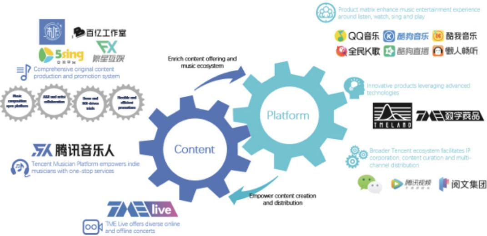
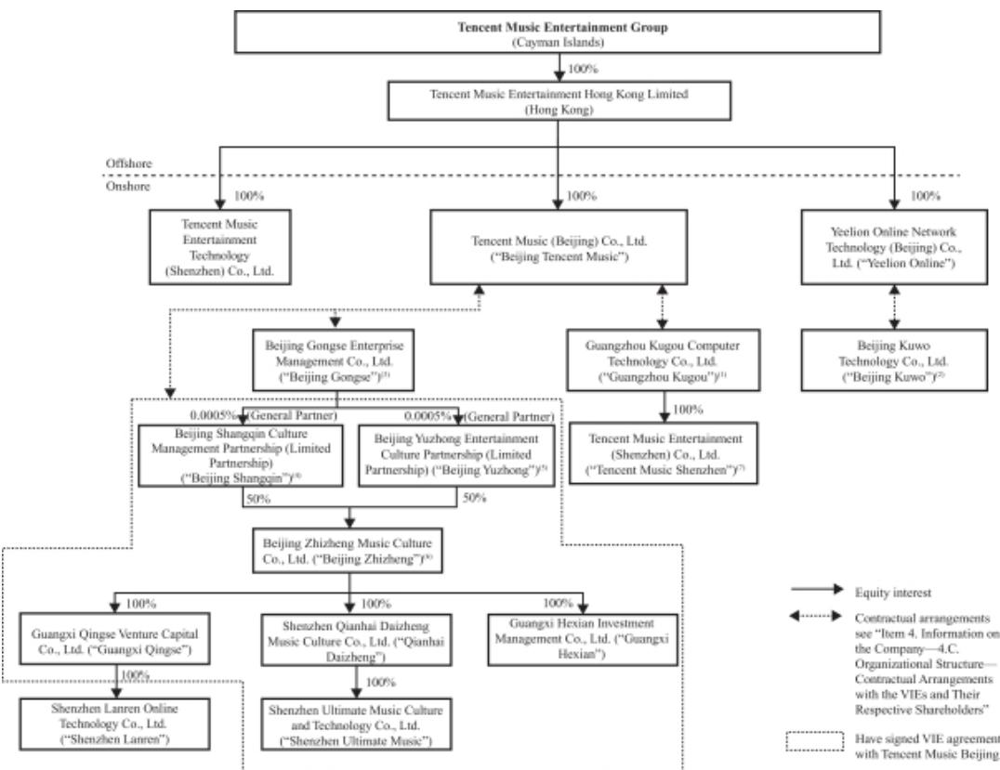

# UNITED STATES SECURITIES AND EXCHANGE COMMISSION Washington, D.C. 20549

FORM 20-F

(Mark One)  
☐ REGISTRATION STATEMENT PURSUANT TO SECTION 12(B) OR 12(G) OF THE SECURITIES EXCHANGE ACT OF 1934OR

☒ ANNUAL REPORT PURSUANT TO SECTION 13 OR 15(D) OF THE SECURITIES EXCHANGE ACT OF 1934 For the fiscal year ended December 31, 2021.

☐ TRANSITION REPORT PURSUANT TO SECTION 13 OR 15(D) OF THE SECURITIES EXCHANGE ACT OF 1934 For the transition period from to OR

☐ SHELL COMPANY REPORT PURSUANT TO SECTION 13 OR 15(D) OF THE SECURITIES EXCHANGE ACT OF 1934 Date of event requiring this shell company report Commission file number: 001-38751

# Tencent Music Entertainment Group (Exact name of Registrant as specified in its charter)

N/A (Translation of Registrant’s name into English) Cayman Islands (Jurisdiction of incorporation or organization) Unit 3, Building D, Kexing Science Park, Kejizhongsan Avenue, Hi-Tech Park, Nanshan District, Shenzhen, 518057, the People’s Republic of China (Address of principal executive offices) Ms. Min Hu, Chief Financial Officer Unit 3, Building D, Kexing Science Park, Kejizhongsan Avenue, Hi-Tech Park, Nanshan District, Shenzhen, 518057, the People’s Republic of China Tel: +86-755-8601 3388 E-mail: ir@tencentmusic.com phone, E-mail and/or Facsimile number and Address of Company Contact 4 12(b)ef th

Title of each class American depositary shares, each ADS represents two Class A ordinary shares, par value US\$0.000083 per share\*

Trading Symbol(s) TME

Name of each exchange on which registered The New York Stock Exchange

\* Not for trading, but only in connection with the listing on the New York Stock Exchange of American depositary shares. Securities registered or to be registered pursuant to Section 12(g) of the Act:

None (Title of Class)

Securities for which there is a reporting obligation pursuant to Section 15(d) of the Act:

None (Title of Class)

Indicate the number of outstanding shares of each of the issuer’s classes of capital or common stock as of the close of the period covered by the annual report.   
3,390,154,264 ordinary shares, comprised of 1,675,015,086 Class A ordinary shares, par value US\$0.000083 per share, and 1,715,139,178 Class B ordinary shares, par value US\$0.000083 per share, as of December 31, 2021.

Indicate by check mark if the registrant is a well-known seasoned issuer, as defined in Rule 405 of the Securities Act. Yes ☒ No ☐

If this report is an annual or transition report, indicate by check mark if the registrant is not required to file reports pursuant to Section 13 or 15(d) of the Securities Exchange Act of 1934. Yes ☐ No ☒

Note – Checking the box above will not relieve any registrant required to file reports pursuant to Section 13 or 15(d) of the Securities Exchange Act of 1934 from their obligations under those Sections.

Indicate by check mark whether the registrant (1) has filed all reports required to be filed by Section 13 or 15(d) of the Securities Exchange Act of 1934 during the preceding 12 months (or for such shorter period that the registrant was required to file such reports), and (2) has been subject to such filing requirements for the past 90 days. Yes ☒ No ☐

Indicate by check mark whether the registrant has submitted electronically every Interactive Data File required to be submitted pursuant to Rule 405 of Regulation S-T (§232.405 of this chapter) during the preceding 12 months (or for such shorter period that the registrant was required to submit such files). Yes ☒ No ☐

Indicate by check mark whether the registrant is a large accelerated filer, an accelerated filer, a non-accelerated filer, or an emerging growth company. See definition of “large accelerated filer,” “accelerated filer,” and “emerging growth company” in Rule 12b-2 of the Exchange Act.

Large accelerated filer ☒

Accelerated filer ☐

Non-accelerated filer ☐

Emerging growth company ☐

If an emerging growth company that prepares its financial statements in accordance with U.S. GAAP, indicate by check mark if the registrant has elected not to use the extended transition period for complying with any new or revised financial accounting standards † provided pursuant to Section 13(a) of the Exchange Act. ☐

† The term “new or revised financial accounting standard” refers to any update issued by the Financial Accounting Standards Board to its Accounting Standards Codification after April 5, 2012.

Indicate by check mark whether the registrant has filed a report on and attestation to its management’s assessment of the effectiveness of its internal control over financial reporting under Section 404(b) of the Sarbanes-Oxley Act (15 U.S.C. 7262(b)) by the registered public accounting firm that prepared or issued its audit report. ☒

Other ☐

If “Other” has been checked in response to the previous question, indicate by check mark which financial statement item the registrant has elected to follow. ☐ Item 17 ☐ Item 18

If this is an annual report, indicate by check mark whether the registrant is a shell company (as defined in Rule 12b-2 of the Exchange Act). Yes ☐ No ☒

Indicate by check mark whether the registrant has filed all documents and reports required to be filed by Sections 12, 13 or 15(d) of the Securities Exchange Act of 1934 subsequent to the distribution of securities under a plan confirmed by a court. Yes ☐ No ☐

(APPLICABLE ONLY TO ISSUERS INVOLVED IN BANKRUPTCY PROCEEDINGS DURING THE PAST FIVE YEARS)

## TABLE OF CONTENTS

Page   
INTRODUCTION i   
FORWARD-LOOKING INFORMATION iv   
PART I 1   
ITEM 1. IDENTITY OF DIRECTORS, SENIOR MANAGEMENT AND ADVISERS 1   
ITEM 2. OFFER STATISTICS AND EXPECTED TIMETABLE 1   
ITEM 3. KEY INFORMATION 1   
ITEM 4. INFORMATION ON THE COMPANY 58   
ITEM 4A. UNRESOLVED STAFF COMMENTS 118   
ITEM 5. OPERATING AND FINANCIAL REVIEW AND PROSPECTS 118   
ITEM 6. DIRECTORS, SENIOR MANAGEMENT AND EMPLOYEES 139   
ITEM 7. MAJOR SHAREHOLDERS AND RELATED PARTY TRANSACTIONS 153   
ITEM 8. FINANCIAL INFORMATION 156   
ITEM 9. THE OFFER AND LISTING 158   
ITEM 10. ADDITIONAL INFORMATION 159   
ITEM 11. QUANTITATIVE AND QUALITATIVE DISCLOSURES ABOUT MARKET RISK 169   
ITEM 12. DESCRIPTION OF SECURITIES OTHER THAN EQUITY SECURITIES 170   
PART II 172   
ITEM 13. ITEM DEFAULTS, DIVIDEND ARREARAGES AND DELINQUENCIES 172   
ITEM 14. MATERIAL MODIFICATIONS TO THE RIGHTS OF SECURITY HOLDERS AND USE OF PROCEEDS 172   
ITEM 15. CONTROLS AND PROCEDURES 172   
ITEM 16.A. AUDIT COMMITTEE FINANCIAL EXPERT 173   
ITEM 16.B. CODE OF ETHICS 173   
ITEM 16.C. PRINCIPAL ACCOUNTANT FEES AND SERVICES 174   
ITEM 16.D. EXEMPTIONS FROM THE LISTING STANDARDS FOR AUDIT COMMITTEE 174   
ITEM 16.E. PURCHASES OF EQUITY SECURITIES BY THE ISSUER AND AFFILIATED PURCHASERS 175   
ITEM 16.F. CHANGE IN REGISTRANT’S CERTIFYING ACCOUNTANT 175   
ITEM 16.G. CORPORATE GOVERNANCE 175   
ITEM 16.H. MINE SAFETY DISCLOSURE 175   
PART III 176   
ITEM 17. FINANCIAL STATEMENTS 176   
ITEM 18. FINANCIAL STATEMENTS 176   
ITEM 19. EXHIBITS 176   
INDEX TO CONSOLIDATED FINANCIAL STATEMENTS F-1

## INTRODUCTION

Except where the context otherwise indicates and for the purpose of this annual report only:

“ADSs” refers to the American depositary shares, each representing two Class A ordinary shares;

“AI” refers to artificial intelligence;

“Beijing Gongse” refers to Beijing Gongse Enterprise Management Co., Ltd., one of the VIEs;

“Beijing Shangqin” refers to Beijing Shangqin Culture Management Partnership (Limited Partnership), one of the VIEs;

“Beijing Yuzhong” refers to Beijing Yuzhong Entertainment Culture Partnership (Limited Partnership), one of the VIEs;

“Beijing Zhizheng” refers to Beijing Zhizheng Music Culture Co., Ltd., one of the VIEs;

“Beijing Kuwo” refers to Beijing Kuwo Technology Co., Ltd., one of the VIEs;

“CAC” refers to the Cyberspace Administration of China;

“China” or “PRC” refers to the People’s Republic of China, excluding, for the purpose of this annual report only, Taiwan, Hong Kong and Macau;

“CMC” refers to China Music Corporation;

“Guangxi Hexian” refers to Guangxi Hexian Investment Management Co., Ltd., one of the VIEs;

“Guangxi Qingse” refers to Guangxi Qingse Venture Capital Co., Ltd., one of the VIEs;

“Guangzhou Kugou” refers to Guangzhou Kugou Computer Technology Co., Ltd., one of the VIEs;

“Group” refers to our company, its subsidiaries, its controlled structured entities (“Variable interest entities”, or “VIEs”) and their subsidiaries;

“HK\$” or “Hong Kong dollars” refers to the legal currency of the Hong Kong SAR;

“IFRS” refers to International Financial Reporting Standards as issued by the International Accounting Standards Board;

“MCSC” refers to the Music Copyright Society of China;

“monthly ARPPU” of each of our online music services and social entertainment services for any given period refers to the monthly average of (i) the revenues of the respective services for that period divided by (ii) the number of paying users of the respective services for that period. The monthly ARPPU of social entertainment services is calculated based on revenues from social entertainment and others, including advertising services provided on our social entertainment platforms;

“ordinary shares” refers to our ordinary shares of par value US\$0.000083 per share;

“paying ratio” for a given period is measured by the number of paying users as a percentage of the mobile MAUs for that period;

“paying users” for our online music services (i) for any given quarter refers to the average of the number of users whose subscription packages remain active as of the last day of each month of that quarter; and (ii) for any given year refers to the average of the total number of paying users of the four quarters in that year. The number of paying users for our online music services for any given period excludes the number of users who only purchase digital music singles and albums during such period because these purchasing patterns tend to reflect specific releases, which may fluctuate from period to period;

## Table of Contents

“paying users” for our social entertainment services (i) for any given quarter refers to the average of the number of paying users for each month in that quarter; (ii) for any given year refers to the average of the total number of paying users of the four quarters in that year. The number of paying users of our social entertainment services for a given month refers to the number of users who contribute revenues to our social entertainment services (primarily through purchases of virtual gifts or premium memberships) during that month;

“publishing rights” refers to the copyrights of music and non-music works for the purpose of this annual report;

“Qianhai Daizheng” refers to Shenzhen Qianhai Daizheng Music Culture Co., Ltd., one of the VIEs;

“RMB” or “Renminbi” refers to the legal currency of the People’s Republic of China;

“Shenzhen Lanren” refers to Shenzhen Lanren Online Technology Co, Ltd., which we acquired in March 2021;

“Shenzhen Ultimate Music” refers to Shenzhen Ultimate Music Culture and Technology Co., Ltd., one of the VIEs;

“Spotify” refers to Spotify Technology S.A., one of our principal shareholders;

“Tencent” refers to Tencent Holdings Limited, our controlling shareholder;

“US\$,” “dollars” or “U.S. dollars” refers to the legal currency of the United States;

“we,” “us,” “our company” and “our” refer to Tencent Music Entertainment Group (or, where the context requires, its predecessor), its subsidiaries and, in the context of describing our operations and consolidated financial information, its VIEs;

with respect to MAU data used in this annual report:

“mobile MAUs” or “PC MAUs” for a given month (i) with respect to each of our products (except WeSing) is measured as the number of unique mobile or PC devices, as the case may be, through which such product is accessed at least once in that month; and (ii) with respect to WeSing, is measured as the number of user accounts through which WeSing is accessed at least once in that month;

“mobile MAUs” for a given period refers to the monthly average of the sum of the mobile MAUs for that period;

“online music mobile MAUs” for a given month refers to the sum of mobile MAUs of our music products, namely QQ Music, Kugou Music and Kuwo Music, for that month; duplicate access of different services by the same device is not eliminated from the calculation;

“social entertainment mobile MAUs” for a given month refers to the sum of mobile MAUs that have accessed the social entertainment services offered by (i) WeSing; (ii) Kugou’s Live Streaming services; (iii) Kuwo’s Live Streaming services; (iv) Kugou Changchang; and (v) QQ Music’s Live Streaming services; duplicate access of different services by the same user account or device is not eliminated from the calculation;

“social entertainment mobile MAUs” for a given period refers to the monthly average of the sum of the social entertainment mobile MAUs for that period; and

our MAUs are calculated using internal company data, treating each distinguishable user account or device as a separate MAU even though some users may access our services using more than one user account or device and multiple users may access our services using the same user account or device.

This annual report on Form 20-F includes our audited balance sheets as of December 31, 2020 and 2021 and our audited consolidated income statements, statements of comprehensive income, statements of changes in equity and statements of cash flows for the years ended December 31, 2019, 2020 and 2021.

Substantially all of our operations are conducted in China and all of our revenues is denominated in Renminbi. Our reporting currency is the Renminbi. This annual report on Form 20-F also contains translations of certain foreign currency amounts into U.S. dollars for the convenience of the reader. Unless otherwise stated, all translations from Renminbi to U.S. dollars were made at RMB6.3726 to US\$1.00, the noon buying rate on December 31, 2021 set forth in the H.10 statistical release of the U.S. Federal Reserve Board. In addition, unless otherwise noted, all translations from Hong Kong dollars to U.S. dollars and from U.S. dollars to Hong Kong dollars in this annual report were made at a rate of HK\$7.7996 to US\$1.00, the exchange rate set forth in the H.10 statistical release of the Federal Reserve Board on December 31, 2021. We make no representation that the Renminbi or U.S. dollar amounts referred to in this annual report could have been or could be converted into U.S. dollars or Renminbi, as the case may be, at any particular rate or at all. The PRC government imposes control over its foreign currency reserves in part through direct regulation of the conversion of Renminbi into foreign exchange and through restrictions on foreign trade.

We completed an initial public offering of our ADSs on December 14, 2018. The ADSs, each representing two Class A ordinary shares, are traded on the New York Stock Exchange under the symbol “TME.”

# FORWARD-LOOKING INFORMATION

This annual report contains forward-looking statements that involve risks and uncertainties. All statements other than statements of historical facts are forward-looking statements. These statements involve known and unknown risks, uncertainties and other factors that may cause our actual results, performance or achievements to be materially different from those expressed or implied by the forward-looking statements.

You can identify these forward-looking statements by words or phrases such as “may,” “will,” “expect,” “anticipate,” “aim,” “estimate,” “intend,” “plan,” “believe,” “likely to” or other similar expressions. We have based these forward-looking statements largely on our current expectations and projections about future events and financial trends that we believe may affect our financial condition, results of operations, business strategies and financial needs. These forward-looking statements include, but are not limited to, statements about:

our growth strategies;

our future business development, financial condition and results of operations;

our ability to retain, grow and engage our user base and expand our music and audio entertainment content offering;

our ability to retain and grow our paying users and drive their spending on our services;

expected changes in our revenues, content-related costs and operating margins;

our ability to retain key personnel and attract new talent;

competition landscape in China’s online music and audio entertainment industry;

general economic, political, demographic and business conditions in China and globally; and

the regulatory environment in which we operate.

We would like to caution you not to place undue reliance on these forward-looking statements and you should read these statements in conjunction with the risk factors disclosed in “Item 3. Key Information—3.D. Risk Factors.” Other sections of this annual report include additional factors which could adversely impact our business and financial performance. Moreover, we operate in an evolving environment. New risk factors and uncertainties emerge from time to time and it is not possible for our management to predict all risk factors and uncertainties, nor can we assess the impact of all factors on our business or the extent to which any factor, or combination of factors, may cause actual results to differ materially from those contained in any forward-looking statements. We qualify all of our forward-looking statements by these cautionary statements. We do not undertake any obligation to update or revise the forward-looking statements except as required under applicable law. You should read this annual report and the documents that we reference in this annual report completely and with the understanding that our actual future results may be materially different from what we expect.

You should not rely upon forward-looking statements as predictions of future events. We undertake no obligation to update or revise any forwardlooking statements, whether as a result of new information, future events or otherwise.

## PART I

## ITEM 1. IDENTITY OF DIRECTORS, SENIOR MANAGEMENT AND ADVISERS Not applicable.

ITEM 2. OFFER STATISTICS AND EXPECTED TIMETABLE

Not applicable.

## ITEM 3. KEY INFORMATION

3.A. Reserved

3.B. Capitalization and Indebtedness

Not applicable.

3.C. Reason for the Offer and Use of Proceeds

Not applicable.

## 3.D. Risk Factors

Tencent Music Entertainment Group is a Cayman Islands holding company. It does not engage in operations itself but rather conducts its operations through its PRC subsidiaries and consolidated variable interest entities, or the VIEs. However, we and our direct and indirect subsidiaries do not, and it is virtually impossible for them to, have any equity interests in the VIEs in practice as current PRC laws and regulations restrict foreign investment in companies that engage in value-added telecommunication services and online cultural services. As a result, we depend on certain contractual arrangements with the VIEs to operate a significant portion of our business. This structure allows us to exercise effective control over the VIEs, and is designed to replicate substantially the same economic benefits as would be provided by direct ownership. The VIEs are owned by certain nominee shareholders, not us. Investors of our ADSs are purchasing equity securities of a Cayman Islands holding company rather than equity securities issued by our subsidiaries and the VIEs. Investors who are non-PRC residents may never directly hold equity interests in the VIEs under current PRC laws and regulations. As used in this annual report, “we,” “us,” “our company,” “our,” or “TME” refers to Tencent Music Entertainment Group and its subsidiaries, and, in the context of describing our consolidated financial information, business operations and operating data, our consolidated VIEs.

Our corporate structure involves unique risks to investors in the ADSs. In 2019, 2020 and 2021, the amount of revenues generated by the VIEs accounted for 99.8%, 99.8% and 99.1%, respectively, of our total net revenues. As of December 31, 2020 and 2021, total assets of the VIEs, excluding amounts due from other companies in the Group, equaled to 26.5% and 26.9% of our consolidated total assets as of the same dates, respectively. Our contractual arrangements with the VIEs have not been tested in court. If the PRC government deems that our contractual arrangements with the VIEs do not comply with PRC regulatory restrictions on foreign investment in the relevant industries, or if these regulations or the interpretation of existing regulations change in the future, we could be subject to material penalties or be forced to relinquish our interests in those operations or otherwise significantly change our corporate structure. We and our investors face significant uncertainty about potential future actions by the PRC government that could affect the legality and enforceability of the contractual arrangements with the VIEs and, consequently, significantly affect our ability to consolidate the financial results of the VIEs and the financial performance of our company as a whole. Our ADSs may decline in value or become worthless if we are unable to effectively enforce our contractual control rights over the assets and operations of the VIEs that conduct a significant portion of our business in China. See “Item 3. Key Information—3.D. Risk Factors—Risks Related to Our Corporate Structure” for detailed discussion.

We face various legal and operational risks and uncertainties as a company based in and primarily operating in China. The PRC government has significant authority to exert influence on the ability of a China-based company, like us, to conduct its business, accept foreign investments or be listed on a U.S. stock exchange. For example, we face risks associated with regulatory approvals of offshore offerings, anti-monopoly regulatory actions, cybersecurity and data privacy, as well as the lack of inspection from the U.S. Public Company Accounting Oversight Board, or PCAOB, on our auditor. The PRC government may also intervene with or influence our operations as the government deems appropriate to further regulatory, political and societal goals. The PRC government has recently published new policies that significantly affected our industry and we cannot rule out the possibility that it will in the future further release regulations or policies regarding our industry that could adversely affect our business, financial condition and results of operations. Any such action, once taken by the PRC government, could cause the value of such securities to significantly decline or in extreme cases, become worthless.

Below please find a summary of the principal risks and uncertainties we face, organized under relevant headings. In particular, as we are a Chinabased company incorporated in the Cayman Islands, you should pay special attention to subsections headed “Item 3. Key Information—3.D. Risk Factors—Risks Related to Doing Business in China” and “Item 3. Key Information—3.D. Risk Factors—Risks Related to Our Corporate Structure.”

## Risks Related to Our Business and Industry

If we fail to anticipate user preferences to provide online music and/or long-form audio entertainment content catering to user demands, our ability to attract and retain users may be materially and adversely affected.

We depend upon third-party licenses for the content of our content offerings, and any adverse changes to or loss of, our relationships with these content providers may materially and adversely affect our business, operating results, and financial condition.

We may not have obtained complete licenses for certain copyrights with respect to a portion of the content offered on our platform.

We allow user-generated content to be uploaded on our platform. If users have not obtained all necessary copyright licenses in connection with such uploaded content, we may be subject to potential disputes and liabilities.

Assertions or allegations that we have infringed or violated intellectual property rights, even not true, could harm our business and reputation.

Our license agreements are complex, impose numerous obligations upon us and may make it difficult to operate our business. Any breach or adverse change to the terms of such agreements could adversely affect our business, operating results and financial condition.

Minimum guarantees required under certain of our license agreements for music and long-form audio content may limit our operating flexibility and may materially and adversely affect our business, financial condition and results of operations.

If we are unable to obtain accurate and comprehensive information necessary to identify the copyright ownership of the content offered on our platform, our ability to obtain necessary or commercially viable licenses from the copyright owners may be adversely affected, which may result in us having to remove content from our platform, and may subject us to potential copyright infringement claims and difficulties in controlling content-related costs.

If music copyright owners withdraw all or a portion of their music works from the MCSC to the extent the MCSC had not obtained authorization to license from the relevant copyright owners, we may

## Table of Contents

have to enter into direct licensing agreements with these copyright owners, which may be time-consuming and costly, and we may not be able to reach an agreement with some copyright owners, or may have to pay higher rates than we currently pay.

Uncertainties surrounding our monetization efforts may cause us to lose users and materially and adversely affect our business, financial condition and results of operations.

Complying with evolving laws and regulations regarding cybersecurity, information security, privacy and data protection and other related laws and requirements may be expensive and force us to make adverse changes to our business. Many of these laws and regulations are subject to changes and uncertain interpretations, and any failure or perceived failure to comply with these laws and regulations could result in negative publicity, legal proceedings, suspension or disruption of operations, increased cost of operations, or otherwise harm our business.

## Risks Related to Our Relationship with Tencent

If we are no longer able to benefit from our business cooperation with Tencent, our business may be adversely affected.

Any negative development in Tencent’s market position, brand recognition or financial condition may materially and adversely affect our user base, marketing efforts and the strength of our brand.

Tencent, our controlling shareholder, has had and will continue to have effective control over the outcome of shareholder actions in our company. The interests of Tencent may not be aligned with the interests of our other shareholders and holders of the ADSs.

We may have conflicts of interest with Tencent and, because of Tencent’s controlling ownership interest in our company, we may not be able to resolve such conflicts on terms favorable to us.

## Risks Related to Our Corporate Structure

There are substantial uncertainties regarding the interpretation and application of current and future PRC laws, regulations, and rules relating to the agreements that establish the VIE structure for our operations in China, including potential future actions by the PRC government, which could affect the enforceability of our contractual arrangements with the VIEs and, consequently, significantly affect the financial condition and results of operations performance of TME. If the PRC government finds such agreements non-compliant with relevant PRC laws, regulations, and rules, or if these laws, regulations, and rules or the interpretation thereof change in the future, we could be subject to severe penalties or be forced to relinquish our interests in the VIEs.

Any failure by the VIEs or their shareholders to perform their obligations under our contractual arrangements with them would have a material adverse effect on our business.

The approval, filing or other requirements of the China Securities Regulatory Commission or other PRC government authorities may be required under PRC law in connection with our issuance of securities overseas.

Substantial uncertainties exist with respect to the interpretation and implementation of the Foreign Investment Law of the PRC and how it may impact the viability of our current corporate structure, corporate governance and business operations.

We rely on contractual arrangements with the VIEs and their respective shareholders for a large portion of our business operations, which may not be as effective as direct ownership in providing operational control.

## Table of Contents

## Risks Related to Doing Business in China

A severe or prolonged downturn in the PRC or global economy could materially and adversely affect our business and our financial condition.

Uncertainties with respect to the PRC legal system, including those regarding the enforcement of laws, and sudden or unexpected changes in policies, laws and regulations in China, could materially and adversely affect us.

The custodians or authorized users of our controlling non-tangible assets, including chops and seals, may fail to fulfill their responsibilities, or misappropriate or misuse these assets.

Our operations depend on the performance of the internet infrastructure and telecommunications networks in China, which are in large part operated and maintained by state-owned operators.

The PCAOB is currently unable to inspect our auditor in relation to their audit work performed for our financial statements and the inability of the PCAOB to conduct inspections over our auditor deprives our investors with the benefits of such inspections.

Our ADSs may be delisted and our ADSs and shares prohibited from trading in the over-the-counter market under the Holding Foreign Companies Accountable Act, or the HFCAA, if the PCAOB is unable to inspect or fully investigate auditors located in China. On December 16, 2021, PCAOB issued the HFCAA Determination Report, according to which our auditor is subject to the determinations that the PCAOB is unable to inspect or investigate completely. Under the current law, delisting and prohibition from over-the-counter trading in the U.S. could take place in 2024. If this happens there is no certainty that we will be able to list our ADSs or shares on a non-U.S. exchange or that a market for our shares will develop outside of the U.S. The delisting of our ADSs, or the threat of their being delisted, may materially and adversely affect the value of your investment.

The potential enactment of the Accelerating Holding Foreign Companies Accountable Act would decrease the number of non-inspection years from three years to two, thus reducing the time period before our ADSs may be prohibited from over-the-counter trading or delisted. If this bill were enacted, our ADSs could be delisted from the exchange and prohibited from over-the-counter trading in the U.S. in 2023.

## Risks Related to the ADSs or our Ordinary Shares

The trading price of the ADSs is likely to be volatile, which could result in substantial losses to investors.

If securities or industry analysts do not publish favorable research, or if they adversely change their recommendations regarding the ADSs, the market price for the ADSs and trading volume could decline.

The sale or availability for sale of substantial amounts of the ADSs could adversely affect their market price.

The dual-class structure of our ordinary shares may adversely affect the trading market for our ADSs.

## Risks Related to Our Business and Industry

If we fail to anticipate user preferences to provide online music and/or long-form audio entertainment content catering to user demands, our ability to attract and retain users may be materially and adversely affected.

Our ability to attract and retain our users, drive user engagement and deliver a superior online music and long-form audio entertainment experience depends largely on our ability to continue to offer attractive content,

including songs, playlists, video, long-form audio, lyrics, live streaming of performances and karaoke-related content. Content that was once popular with our users may become less attractive if user preferences evolve. The success of our business relies on our ability to anticipate changes in user preferences and industry dynamics, and respond to such changes in a timely, appropriate and cost-effective manner. If we fail to cater to the tastes and preferences of our users, or fail to deliver superior user experiences, we may suffer from reduced user traffic and engagement, and our business, financial condition and results of operations may be materially and adversely affected.

We strive to generate creative ideas for content acquisition and to source high-quality content, including both popular, mainstream content and long-tail content. Sourcing attractive content may be challenging, expensive and time-consuming. We have invested and intend to continue to invest substantial resources in content acquisition and production. However, we may not be able to successfully source attractive content or to recover our content acquisition and production investments. Any deterioration in our content quality, failure to anticipate user preferences, inability to acquire attractive content, or any negative feedback of users to our existing content offerings may materially and adversely affect our business, financial condition and operating results.

We depend upon third-party licenses for the content of our content offerings, and any adverse changes to or loss of, our relationships with these content providers may materially and adversely affect our business, operating results, and financial condition.

Significant portions of our music and long-form audio offerings are licensed from our content partners, including leading publishers and labels in China and internationally with whom we have entered into distribution and licensing agreements. There is no assurance that the licenses currently available to us will continue to be available in the future at royalty rates and on terms that are favorable, commercially reasonable or at all.

The royalty rates and other terms of these licenses may change as a result of various reasons beyond our control, such as changes in our bargaining power, changes in the industry, or changes in the law or regulatory environment. If our content partners are no longer willing or able to license content to us on terms acceptable to us, the breadth or quality of our content offerings may be adversely affected or our content acquisition costs may increase. Likewise, increases in royalty rates or changes to other terms of our licenses may materially and adversely affect the breadth and quality of our content offerings and may, in turn, materially and adversely affect our business, financial condition and results of operations.

There also is no guarantee that we have all of the licenses for the content available on our platform, as we need to obtain licenses from many copyright owners, some of whom are unknown, and there are complex legal issues such as open questions of law as to when and whether particular licenses are needed. Additionally, there is a risk that copyright owners (particularly aspiring artists), their agents, or legislative or regulatory bodies may require or attempt to require us to enter into additional license agreements with, and pay royalties to, newly defined groups of copyright owners, some of which may be difficult or impossible to identify.

Even when we are able to enter into license agreements with content partners, we cannot guarantee that such agreements will continue to be renewed indefinitely. It is also possible that such agreements will never be renewed at all. The non-renewal or termination of one or more of our license agreements, the renewal of license agreements on less favorable terms, any deterioration in our relationships with content providers or the entry of license agreements between our content providers and any of our competitors could have a material adverse effect on our business, financial condition and results of operations.

We may not have obtained complete licenses for certain copyrights with respect to a portion of the content offered on our platform.

Under PRC law, to secure the rights to provide music or long-form audio content on the internet or for our users to download or stream music or long-form audio from our platform, or to provide other related online

music or long-form audio services, we must obtain licenses from the appropriate copyright owners for one or more of the economic rights, including the content publishing and recording rights, among others. See “Item 4. Information on the Company—4.B. Business Overview—Regulations—Regulations on Intellectual Property Rights—Copyright.”

We may not have complete licenses for the copyrights underlying a portion of the content offered on our platform, and therefore we may be subject to assertions by third parties of infringement or other violations by us of their copyright in connection with such content. As of December 31, 2021, we offered over 90 million music tracks on our platform. We have sought, and will continue to seek, licenses to the remaining tracks to the extent we identify the relevant copyright owners and enter into agreements with them.

In addition, with respect to the musical compositions and lyrics we license from certain content partners, there is no guarantee that such content partners have the rights to license the copyright underlying all music content covered by our agreements. With respect to any musical compositions and lyrics that the MCSC, a collective copyright organization, was not authorized to sublicense to us, the MCSC undertook to resolve such disputes and compensate the relevant copyright owners from infringement claims made by third-party rights owners against us for using their content on our platform if the infringement happened within the validity period of the contract entered into between the MCSC and us. Despite such undertakings by the MCSC, there is no guarantee that we will not be subject to potential copyright infringement claims by third parties in relation to content licensed from the MCSC.

We allow user-generated content to be uploaded on our platform. If users have not obtained all necessary copyright licenses in connection with such uploaded content, we may be subject to potential disputes and liabilities.

We allow users to upload user-generated content on our platform, which exposes us to potential disputes and liabilities in connection with thirdparty copyright. When users register on our platform, they agree to our standard agreement, under which they agree not to disseminate any content infringing on third-party copyright.

However, we have historically allowed users to upload content anonymously, and our platform has over the years accumulated user-generated content for which users or performers may not have obtained proper and complete copyright licenses. Given the large volume of such user-generated content available on our platform, it is challenging for us to accurately identify and verify the individual users or performers that uploaded such content, the copyright status of such content, and the appropriate copyright owners from whom copyright licenses should be obtained.

Under PRC laws and regulations, online service providers, which provide storage space for users to upload works or links to other services or content, may be held liable for copyright infringement under various circumstances, including situations where the online service provider knows or should reasonably have known that the relevant content uploaded or linked to on its platform infringes upon the copyright of others and the online service provider profits from such infringing activities. For example, online service providers are subject to liability if they fail to take necessary measures, such as deletion, blocking or disconnection, after being duly notified by the legal right holders.

As an online service provider, we have adopted measures to reduce the likelihood of using, developing or making available any content without the proper licenses or necessary consents. Such measures include (i) requiring users to acknowledge and agree that they will not upload or perform content which may infringe upon others’ copyright; (ii) putting in place procedures to block users on our blacklists from uploading content; and (iii) implementing “notice and take-down” policies to be eligible for the safe harbor exemption for user-generated content. However, these measures may not be effective in preventing the unauthorized posting and use of third parties’ copyrighted content or the infringement of other third-party intellectual property rights. Specifically, it is possible that such acknowledgments and agreements by users may not be enforceable against

third parties who file claims against us. Furthermore, a plaintiff may not be able to locate users who generate content that infringes on the plaintiff’s copyright and may choose to sue us instead. In addition, individual users who upload infringing content on our platform may not have sufficient resources to fully indemnify us, if at all, for any such claims. Also, such measures may fail or be considered insufficient by courts or other relevant governmental authorities. If we are not eligible for the safe harbor exemption, we may be subject to joint infringement liability with the users, and we may have to change our policies or adopt new measures to become eligible and retain eligibility for the safe harbor exemption, which could be expensive and reduce the attractiveness of our platform to users.

Assertions or allegations that we have infringed or violated intellectual property rights, even not true, could harm our business and reputation.

Third parties, including artists, copyright owners and other online music, long-form audio and other platforms, have asserted, and may in the future assert, that we have infringed, misappropriated or otherwise violated their copyright or other intellectual property rights. As we face increasing competition in China and globally, the possibility of intellectual property rights claims against us grows.

We have adopted robust screening processes to filter out or disable access to potentially infringing content. We have also adopted procedures to enable copyright owners to provide us with notice and evidence of alleged infringement, and are generally willing to enter into license agreements to compensate copyright owners for works distributed on our platform. However, given the volume of content available on our platform, it is not possible to identify and promptly remove all alleged infringing content that may exist. Third parties may take action against us if they believe that certain content available on our platform violates their copyright or other intellectual property rights. Moreover, while we use location-based controls and technology to prevent all or a portion of our services and content from being accessed outside of the PRC as required by certain licensing agreements with our content partners, these controls and technology may be breached and the content available on our platform may be accessed from geographic locations where such access is restricted, in which case we may be subject to potential liabilities, regardless of whether there is any fault and/or negligence involved on our part.

We have been involved in litigation based on allegations of infringement of third-party copyright due to the content available on our platform. We may be involved in similar litigation and disputes or subject to allegations of infringement, misappropriation or other violations of intellectual property rights in China, as well as globally as we seek to expand our international footprint. If we are forced to defend against any infringement or misappropriation claims, whether they are with or without merit, are settled out of court, or are determined in our favor, we may be required to expend significant time and financial resources to defend such claims. Furthermore, an adverse outcome of a dispute may damage our reputation, force us to adjust our business practices, or require us to pay significant damages, cease providing content that we were previously providing, enter into potentially unfavorable license agreements in order to obtain the right to use necessary content or technologies, and/or take other actions that may have a material adverse effect on our business, operating results and financial condition.

We also distribute some of our licensed content to other platforms. Our agreements with such third-party platforms typically require them to comply with the terms of the license and applicable copyright laws and regulations. However, there is no guarantee that the third-party platforms that we distribute our licensed content to will comply with the terms of our license arrangements or all applicable copyright laws and regulations. In the event of any breach or violation by such platforms, we may be held liable to the copyright owners for damages and be subject to legal proceedings as a result, in which case our business, financial condition and results of operations may be materially and adversely affected.

In addition, music, long-form audio, internet, technology and media companies like us are frequently subject to litigation based on allegations of infringement, misappropriation, or other violations of intellectual property rights. Other companies in these industries may have larger intellectual property portfolios than we do, which

could make us a target for litigation as we may not be able to assert counterclaims against parties that sue us for intellectual property infringement. Furthermore, from time to time, we may introduce new products and services, which could increase our exposure to intellectual property claims. It is difficult to predict whether assertions of third-party intellectual property rights or any infringement or misappropriation claims arising from such assertions will substantially harm our business, financial condition and results of operations.

Our license agreements are complex, impose numerous obligations upon us and may make it difficult to operate our business. Any breach or adverse change to the terms of such agreements could adversely affect our business, operating results and financial condition.

Many of our license agreements are complex and impose numerous obligations on us, including obligations to:

calculate and make payments based on complex royalty structures that involve a number of variables, including the revenue generated and size of user base, which requires tracking usage of content on our platform that may have inaccurate or incomplete metadata necessary for such calculation;

make minimum guaranteed payments;

use reasonable efforts to achieve certain paying user conversion targets;

adopt and implement effective anti-piracy and geo-blocking measures;

monitor performance by third parties to whom we distribute our licensed content of their obligations with respect to content distribution and copyright protections; and

comply with certain security and technical specifications.

Many of our license agreements grant the licensors the right to audit our compliance with the terms and conditions of such agreements. If we materially breach such obligation or any other obligations set forth in any of our license agreements, we could be subject to monetary penalties and our rights under such license agreements could be terminated, which could have a material adverse effect on our business, financial condition and results of operations.

Minimum guarantees required under certain of our license agreements for music and long-form audio content may limit our operating flexibility and may materially and adversely affect our business, financial condition and results of operations.

Certain of our license agreements for music and long-form audio content require that we make minimum guarantee payments to copyright owners, that may be tied to our number of users or the amount of content used or distributed on our platform. Accordingly, our ability to achieve and sustain profitability and operating leverage in part depends on our ability to increase our revenue through increased sales of our music and long-form audio services to our users in order to maintain a healthy gross margin. The duration of our license agreements that contain minimum guarantees is typically between one to three years, but our paying users may cancel their subscriptions at any time. To the extent we continue to make minimum guarantee payments to copyright owners, if our paying user growth do not meet our expectations or our sales or revenue do not grow as fast as expected or even decline during the term of our license agreements, our results of operations and financial conditions may be materially and adversely affected. To the extent our revenues do not meet our expectations, our business, financial condition and results of operations also could be adversely affected as a result of such minimum guarantees. In addition, the fixed cost nature of these minimum guarantees may limit our flexibility in planning for, or reacting to, changes in our business and the markets in which we operate.

We rely on estimates of the market share of licensable content controlled by each content partner, as well as our own user growth and forecasted revenue, to forecast whether such minimum guarantees could be recouped against our actual content acquisition costs incurred over the duration of the license agreement. To the extent that our actual revenue and/or market share underperform relative to our expectations, leading to content acquisition costs that do not exceed such minimum guarantees, our margins may be materially and adversely affected.

If we are unable to obtain accurate and comprehensive information necessary to identify the copyright ownership of the content offered on our platform, our ability to obtain necessary or commercially viable licenses from the copyright owners may be adversely affected, which may result in us having to remove content from our platform, and may subject us to potential copyright infringement claims and difficulties in controlling content-related costs.

Comprehensive and accurate copyright owner information for their publishing rights and recording rights underlying our music and long-form audio content is sometimes unavailable to us or difficult or, in some cases, impossible for us to obtain for various reasons beyond our control. For example, such information may be withheld by the owners or administrators of such rights, especially with regards to user-generated content or content provided by aspiring artists. If we are unable to identify comprehensive and accurate copyright owner information for the music or long-form audio content offered on our platform, such as identifying which composers, publishers or collective copyright organizations own, administer, license or sublicense music or long-form audio works, or if we are unable to determine which music or long-form audio works correspond to specific recordings, it may be difficult for us to (i) identify the appropriate copyright owners to whom to pay royalties or from whom to obtain a license or (ii) ascertain whether the scope of a license we have obtained covers specific music or long-form audio works. This also may make it difficult to comply with the obligations of any agreements with those rights holders.

If we do not obtain necessary and commercially viable licenses from copyright owners, whether due to the inability to identify or verify the appropriate copyright owners or for any other reason, we may be found to have infringed on the copyright of others, potentially resulting in claims for monetary damages, government fines and penalties, or a reduction of content available to users on our platform, which would adversely affect our ability to retain and expand our user base, attract paying users for our paid music and long-form audio services and generate revenue from our content library. Any such inability may also involve us in expensive and protracted copyright disputes.

If music copyright owners withdraw all or a portion of their music works from the MCSC to the extent the MCSC had not obtained authorization to license from the relevant copyright owners, we may have to enter into direct licensing agreements with these copyright owners, which may be time-consuming and costly, and we may not be able to reach an agreement with some copyright owners, or may have to pay higher rates than we currently pay.

Based on the framework agreement we previously entered into with the MCSC, we obtained licenses from the MCSC with respect to musical composition and lyrics for a substantial portion of our music content library. We cannot guarantee that composers and lyricists in China will not withdraw all or part of their music works from the MCSC. To the extent that the MCSC had not obtained authorization to license from the relevant copyright owners, including circumstances where the copyright owners choose not to be represented by the MCSC, our ability to secure favorable licensing arrangements could be negatively affected, our content licensing cost may increase, and we may be subject to liabilities for copyright infringement. If we are unable to reach an agreement with respect to the content of any music copyright owners who withdraw all or a portion of their music works from the MCSC, or if we have to enter into direct licensing agreements with such music copyright owners at rates higher than those set by the MCSC for the use of music works, our ability to offer music content may be limited or our service costs may significantly increase, which could materially and adversely affect our business, financial condition and results of operations.

Uncertainties surrounding our monetization efforts may cause us to lose users and materially and adversely affect our business, financial condition and results of operations.

We have devoted substantial efforts to monetize our content and user base by increasing our number of paying users and cultivating our users’ willingness to pay for content. We currently generate our revenues from (i) online music services, and (ii) social entertainment services and others. At the strategic level, we plan to

continue to optimize our existing monetization strategies and explore new monetization opportunities. However, if these efforts fail to achieve our anticipated results, we may not be able to increase or even maintain our revenue growth. For example, we generated most of the revenue for our live streaming services from the sale of virtual gifts. Users of our live streaming services get free access to the live music performance or other types of music content with the option to purchase virtual gifts to send to performers and other users. User demand for live streaming services may decrease substantially or we may fail to anticipate and serve user demands effectively. Furthermore, the PRC regulatory authorities’ recent heightened scrutiny and regulation of live streaming businesses may also have a negative impact on our monetization opportunities. See “ – Our business operations may be adversely affected by the PRC government’s heightened oversight and scrutiny on live streaming platforms and performers.” In addition, we introduced the pay-for-streaming model for our online music services in the first quarter of 2019 and have been increasing the number of songs that fall into the pay-for-streaming scope. See “Item 4. Information on the Company—4.B. Business Overview—How We Generate Revenues—Online Music Services – Paid Music and Audio Content” for more information of the pay-for-streaming model. While we believe the adoption of pay-for-streaming has driven the number of paying users, paying ratio and paying user retention of our online music services, we cannot guarantee that its early popularity will continue, or that our attempts to explore new monetization models or enhance our paying user conversion will be successful.

In order to increase the number of our paying users and cultivate our users’ willingness to pay for content, we will need to address a number of challenges, including:

providing consistently high-quality and user-friendly experience, particularly with the development of our pay-for-streaming model for our online music services;

continuing to curate a catalog of engaging content;

continuing to introduce new, appealing products, services and content that users are willing to pay for;

continuing to innovate and stay ahead of our competitors;

continuing to maintain and enhance the copyright protection environment; and

maintaining and building our relationships with our content providers and other industry partners.

If we fail to address any of these challenges, especially if we fail to offer high-quality content and superior user experience to meet user preferences and demands, we may not be successful in increasing the number of our paying users and cultivating our users’ willingness to pay for content, which could have a material adverse impact on our business, financial condition and results of operations.

Our business depends on our strong brands, and any failure to maintain, protect and enhance our brands could hurt our ability to retain or expand our user base and advertising customers.

We rely on our strong brands, principally QQ Music, Kugou, Kuwo, WeSing and Lazy Audio, to maintain our market leadership. Maintaining and enhancing our brands depends largely on our ability to continue to deliver comprehensive, high-quality content and service offerings to our users, which may not always be successful. Maintaining and enhancing our brands also depends largely on our ability to remain a leader in China’s online music and audio entertainment market, which could be difficult and expensive. If we do not successfully maintain our strong brands, our reputation and business prospect could be harmed.

Our brands may be impaired by a number of factors, including any failure to keep pace with technological advances, slower load times for our services, a decline in the quality or breadth of our content offerings, any failure to protect our intellectual property rights, or alleged violations of law and regulations or public policy. Additionally, if our content partners fail to maintain high standards, our brands could be adversely affected.

If we fail to keep up with industry trends or technological developments, our business, results of operations and financial condition may be materially and adversely affected.

The online music and audio entertainment market is rapidly evolving and subject to continuous technological changes. Our success will depend on our ability to keep up with the changes in technology and user behavior resulting from new developments and innovations. For example, as we provide our product and service offerings across a variety of mobile systems and devices, we are dependent on the interoperability of our services with popular mobile devices and mobile operating systems that we do not control, such as Android and iOS. If any changes in such mobile operating systems or devices degrade the functionality of our services or give preferential treatment to competitive services, the usage of our services could be adversely affected.

Technological innovations may also require substantial capital expenditures in product development as well as in modification of products, services or infrastructure. We cannot assure you that we can obtain financing to cover such expenditure. See “—We require a significant amount of capital to fund our content acquisitions, user acquisitions and technology investments. If we cannot obtain sufficient capital, our business, financial condition and prospects may be materially and adversely affected.” If we fail to adapt our products and services to such changes in an effective and timely manner, we may suffer from decreased user traffic and user base, which, in turn, could materially and adversely affect our business, financial condition and results of operations.

China’s internet, music entertainment and long-form audio industries are highly regulated. Our failure to obtain and maintain requisite licenses or permits or to respond to any changes in government policies, laws or regulations may materially and adversely impact our business, financial condition and results of operation.

The PRC government regulates the internet industry extensively, including foreign ownership of companies in the internet industry and the licensing requirements pertaining to them. A number of regulatory authorities, such as the Ministry of Commerce, or the MOFCOM, the Ministry of Culture and Tourism, the National Copyright Administration, the Ministry of Industry and Information Technology, the National Radio and Television Administration and the CAC regulate different aspects of the internet industry. In addition to complying with the laws and regulations promulgated and enforced by Chinese governmental authorities, operators in the internet industry may also need to rely heavily on Chinese governmental authorities’ policies and guidelines. Such laws, regulations, policies and guidelines cover many aspects of the telecommunications, internet information services, copyright, internet culture, internet publishing industries and online audio-visual products services, including entry into such industries, scope of permitted business activities, licenses and permits for various business activities and foreign investments into such industries. Operators are required to obtain various government approvals, licenses and permits in connection with their provision of internet information services, internet culture services, internet publication services, online audio-visual products and other related value-added telecommunications services. If we fail to obtain and maintain approvals, licenses or permits required for our business, we could be subject to liabilities, penalties and operational disruption and our business could be materially and adversely affected. In addition, if we fail to follow applicable laws, regulations, policies and guidelines, or applicable laws, regulations, policies and guidelines are tightened by any regulatory authorities, or if there are new laws, regulations, policies or guidelines introduced to impose additional government approvals, licenses, permits and requirements, our business may be disrupted and our results of operations may suffer.

Tencent Music Entertainment (Shenzhen) Co., Ltd., or Tencent Music Shenzhen, a wholly owned subsidiary of Guangzhou Kugou Computer Technology Co., Ltd., or Guangzhou Kugou, operates our online music services, QQ Music, and online karaoke business, WeSing. Tencent Music Shenzhen also intends to apply for Value-added Telecommunications Business Operation License, or the ICP License and an Online Publishing Service Permit for releasing music works for the first time via the internet. As of the date of this annual report, Tencent Music Shenzhen has not been subject to any legal or regulatory penalties in the past for the lack of any of these licenses. However, we cannot assure you that it can successfully obtain these licenses in a timely manner, or at all.

In addition, as Tencent Music Shenzhen operates QQ Music and WeSing, an Audio and Video Service Permission, or AVSP, may be required. Tencent Music Shenzhen currently operates these two platforms as sub-domains of www.qq.com of Shenzhen Tencent Computer System Co., Ltd., which holds a valid AVSP for the www.qq.com domain and is controlled by our parent, Tencent. As of the date of this annual report, Tencent Music Shenzhen has not been subject to any legal or regulatory penalties for failure to obtain such licenses. In the event Tencent Music Shenzhen is required to obtain an AVSP under its own name for operating our QQ Music and WeSing platforms, Tencent Music Shenzhen may not be eligible for an AVSP, because the current PRC laws and regulations require an applicant for the AVSP to be a wholly state-owned or state-controlled entity.

In addition, Beijing Kuwo’s and Guangzhou Kugou’s application for the change of shareholders information of AVSP was approved by National Radio and Television Administration on March 9, 2022 and March 17, 2022, respectively. Beijing Kuwo’s application for the renewal of its AVSP has been approved by National Radio and Television Administration, and as of the date of this annual report, Guangzhou Kugou has submitted an application to renew its AVSP and such application is being processed by the relevant authorities. Guangzhou Kugou had expanded the permitted scope of business under its AVSP to cover its provision of certain types of audio and video programs through mobile network to users’ mobile devices. Each of Guangzhou Kugou and Beijing Kuwo plans to apply for an Online Publishing Service Permit for their release of original music works via the internet. As of the date of this annual report, neither Guangzhou Kugou nor Beijing Kuwo has been subject to any legal or regulatory penalties for the lack of the Online Publishing Service Permit. There is, however, no assurance that such applications will eventually be approved in a timely manner, or at all. Besides, while Shenzhen Lanren has been listed as the pilot institution of online audio and video industry in Guangdong by Radio and Television Administration of Guangdong Province on September 1, 2020, it has not obtained AVSP for releasing audio works. Additionally, Shenzhen Lanren has not obtained Online Publishing Service Permit for releasing audio works. As of the date of this annual report, Shenzhen Lanren has not been subject to any legal or regulatory penalties for the lack of the AVSP or Online Publishing Service Permit. If any of Tencent Music Shenzhen, Guangzhou Kugou, Beijing Kuwo, Shenzhen Lanren or any of our other subsidiaries or the VIEs or the VIE’s subsidiaries is found to be in violation of PRC laws and regulations regarding licenses and permits, we could be subject to legal and regulatory penalties and our business operations may not be able to continue operating in the same manner or at all, and our business, financial condition and results of operations could be materially and adversely affected.

PRC laws and regulations are evolving, and there are uncertainties relating to the regulation of different aspects of the internet, music entertainment and long-form audio industries, including but not limited to exclusive licensing and sublicensing arrangements. Pursuant to an article posted on National Copyright Administration’s official website, in September 2017, the National Copyright Administration held meetings with a number of music industry players, including us, where it encouraged the relevant industry players to “avoid acquiring exclusive music copyright” and indicated that they should also not engage in activities involving “collective management of music copyright.” Furthermore, the National Copyright Administration held meetings with a number of music industry players on January 6, 2022 to emphasize that relevant industry players shall not execute exclusive music copyright agreement except under certain circumstances and shall develop internal copyright management system. On July 24, 2021, the State Administration for Market Regulation, or SAMR, issued an Administrative Penalty Decision to Tencent regarding its acquisition of CMC in 2016. Pursuant to the decision, we shall implement a rectification plan to, among other things, terminate exclusive music copyright licensing arrangements within 30 days from the date of the decision. To comply with such decision, Tencent and we have terminated the exclusivity with upstream copyright holders subject to certain limited exceptions specified in the decision as of the date of this annual report. While we are pursuing nonexclusive collaborations with upstream copyright holders, there can be no assurance that all the licenses once exclusively available to us will remain available at royalty rates and on terms that are commercially reasonable or at all. In addition, the termination of exclusive copyright licensing arrangements may potentially lower the competition barriers in a way that benefits some of our competitors. See “—We depend upon third-party licenses for the content of our content offerings, and any

adverse changes to or loss of, our relationships with these content providers may materially and adversely affect our business, operating results, and financial condition.” Any such adverse regulatory development or enforcement in China may have a material and adverse impact on our business, financial condition and results of operations. To the extent our historical or current licensing arrangements are found objectionable by the regulatory authorities, we may be subject to legal and regulatory penalties and/or have to revisit and modify such arrangements in a way that may cause substantial costs, and our ability to offer music content and our competitive advantages may be harmed. Such events may have a material and adverse impact on business, financial condition and results of operations.

## We operate in a relatively new and evolving market.

Many elements of our business are unique, evolving and relatively unproven. Our business and prospects primarily depend on the continuing development and growth of the online music and audio entertainment industry, the live streaming industry as well as the long-form audio industry in China, which are affected by numerous factors. For example, content quality, user experience, technological innovations, development of internet and internet-based services, regulatory environment and macroeconomic environment are important factors that affect our business and prospects. The markets for our products and services are relatively new and rapidly developing and are subject to significant challenges. In addition, our continued growth depends, in part, on our ability to respond to constant changes in the internet industry, including rapid technological evolution, continued shifts in customer demands, frequent introductions of new products and services and constant emergence of new industry standards and practices. Developing and integrating new content, products, services or infrastructure could be expensive and time-consuming, and these efforts may not yield the benefits we expect to achieve. We cannot assure you that we will succeed in any of these aspects or that the industries in which we operate will continue to grow as rapidly as in the past. If online music, live streaming or long-form audio as forms of entertainment lose their popularity due to changing social trends and user preferences, or if such industries in China fail to grow as quickly as expected, our business, financial condition and results of operation may be materially and adversely affected.

## We operate in a competitive industry. If we are unable to compete successfully, we may lose market share to our competitors.

We operate in a competitive industry. We face competition for users and their time and spending primarily from the online music services provided by other online music services providers in China. We also face competition from online offerings of other forms of content, including longform audio, karaoke services, live streaming, radio services, literature, games and video provided by other social entertainment services providers. In particular, we are increasingly facing noticeable competition from offerings of other emerging forms of content which have been growing in popularity rapidly in recent years, such as live streaming and user-generated short videos.

We compete with our competitors based on a number of factors, such as the diversity and quality of content, product features, social interaction features, quality of user experience, brand awareness and reputation, and our ability to continuously attract, incentivize and retain live streaming performers and their agencies. Some of our competitors may be able to respond more quickly to technological innovations or changes in user demands and preferences, acquire more attractive and diverse content, and act more effectively in the development, promotion and sale of products than we can. Also, they may enter into more favorable relationships with content providers and provide their users with content that competes with our offerings. If any of our competitors achieves greater market acceptance or is able to provide more attractive content offerings than we do, our user traffic and market share may decrease, which may result in a loss of users and a material and adverse effect on our business, financial condition and results of operations.

We may fail to attract and retain talented and popular live streaming performers, karaoke singers and other key opinion leaders to maintain the attractiveness and level of engagement of our social entertainment services.

The engagement levels of our user base as well as the quality of our social entertainment content offered on our platform are closely linked to the popularity and performance of our live streaming performers, karaoke singers and other key opinion leaders.

With respect to our live streaming services, we rely on live streaming performers to attract user traffic and drive user engagement and enter into cooperation agreements with them and/or their agencies. There can be no assurance that these live streaming performers will not breach these cooperation agreements by, for example, performing on online platforms competing with us, or that we will be able to renew such agreements upon expiration on terms acceptable to us, or at all. If any of these circumstances were to occur, our live streaming services may be negatively affected.

In addition to our most popular live streaming performers, we must continue to attract and retain talented and popular karaoke singers and other key opinion leaders in order to maintain and increase our social entertainment content offerings and ensure the sustainable growth of our online music user community. We must identify and acquire potential popular karaoke singers and other key opinion leaders and provide them with sufficient resources. However, we cannot assure you that we can continue to maintain the same level of attractiveness to such popular karaoke singers and other key opinion leaders.

If we can no longer maintain our relationships with our live streaming performers, karaoke singers and other key opinion leaders or their appeal decreases, the popularity of our platform may decline and the number of our users may decrease, which could materially and adversely affect our business, financial condition and results of operations.

We cooperate with various talent agencies to manage and recruit our live streaming performers and any adverse change in our relationships could materially and adversely impact our business.

We cooperate with talent agencies to manage, organize and recruit live streaming performers on our platform. As we are an open platform that welcomes all live streaming performers to register on our websites, cooperation with talent agencies substantially increases our operation efficiency in terms of discovering, supporting and managing live streaming performers in a more organized and structured manner, and turning amateur live streaming performers to full-time ones.

We share a portion of the revenues generated from the sales of virtual gifts attributed to the performers’ live streams with live streaming performers and the talent agencies who manage these performers. If we cannot balance the interests between us, live streaming performers and the talent agencies and offer a revenue-sharing mechanism that is attractive to live streaming performers and talent agencies, we may not be able to retain their services. If other platforms offer better revenue sharing incentives to talent agencies, such talent agencies may choose to devote more of their resources to live streaming performers who stream on such other platforms, or encourage their live streaming performers to spend more time performing on such other platforms, all of which could materially and adversely affect our business, financial condition and results of operations.

Our brand image and business may be adversely impacted by misconduct by our live streaming performers and users and their misuse of our platform.

We do not have full control over how users use or behave on our platform, whether through live streaming, commenting or other forms of sharing or communication. We face the risk that our platform may be misused or abused by live streaming performers or users. We have a robust internal control system in place to review and monitor live streams and other forms of social interactions among our users and will shut down streams that are illegal or inappropriate. However, we may not be able to identify all such streams and content, or prevent all such content from being posted.

Moreover, we have limited control over the real-time behavior of our live streaming performers and users. To the extent such behavior is associated with our platform, our ability to protect our brand image and reputation may be limited. Our business and public perception of our brand may be materially and adversely affected by the misuse of our platform. In addition, in response to allegations of illegal or inappropriate activities conducted through our platform or any negative media coverage about us, PRC government authorities may intervene and hold us liable for non-compliance with PRC laws and regulations concerning the dissemination of information on the internet and subject us to administrative penalties, including confiscation of income and fines or other sanctions, such as requiring us to restrict or discontinue certain features and services. As a result, our business, financial condition and results of operation may be materially and adversely affected.

We face the risk that live streaming performers that perform on our platform may infringe upon third parties’ intellectual property rights.

Live streaming performers across our platforms are prohibited from disseminating content infringing on others’ intellectual property rights. We delete content we deem unauthorized and block the account of the performers. However, we cannot guarantee that all content generated by our live streaming performers or users is legal and non-infringing, and we cannot guarantee that the online performance and/or other use of music works by the live streaming performers are authorized by the corresponding intellectual property rights owners.

As the application of existing laws and regulations to specific aspects of online music business remains relatively unclear and is still evolving, it is difficult to predict whether we will be subject to joint infringement liability if our live streaming performers or users infringe on third parties’ intellectual property rights. Furthermore, if we are determined to be jointly liable either by new regulations or court judgments, we may have to change our policies and it may materially and adversely impact on our business, financial condition and results of operation.

Our business operations may be adversely affected by the PRC government’s heightened oversight and scrutiny on live streaming platforms and performers.

Regulatory authorities in China have been heightening its oversight on live streaming businesses. In November 2020, the National Radio and Television Administration promulgated the Circular on Strengthening the Administration of Live Streaming Web Shows and Live Streaming E-commerce, or the Circular 78, which sets forth requirements for certain live streaming businesses with respect to real-name registration, limits on users’ spending on virtual gifting, restrictions on minors from virtual gifting, live streaming review personnel requirements and content tagging requirements, among other things. In February 2021, the CAC, together with six other authorities, jointly issued the Guidance Opinions on the Strengthening the Regulation and Management Work of Internet Streaming, or the Circular 3, which requires internet streaming platforms to set up appropriate caps on the maximum purchase price for each piece of virtual gifts and maximum value of virtual gifts that the users give to the performers each time. A portion of our revenue is from virtual gift payments from our users to performers, so any limitation imposed by PRC authorities on the sale, exchange or circulation of virtual gifts in the future may reduce the virtual gift payments and therefore may adversely affect the engagement of our live-streaming performers, which may result in a loss of users and a material and adverse effect on our business, financial condition and results of operation.

In addition, the Law of the PRC on the Protection of Minors (2020 Revision) took effect on June 1, 2021, which provides that, among others, live streaming service providers are prohibited from providing minors under age 16 with online live streaming publisher account registration services, and that they must obtain the consent from the minors’ parents or guardians and verify the identity of the minors before allowing minors aged between 16 and 18 to register a live streaming publisher account. Furthermore, in December 2021, certain live streaming e-commerce influencers in China on other platforms were fined by the State Taxation Administration for tax evasion, which demonstrated the PRC tax authorities’ enhanced efforts to strengthen tax administration in live streaming businesses. On March 25, 2022, CAC, the State Taxation Administration and SAMR issued Opinions

on Further Regulating the For-Profit Activities in Online Live Streaming to Promote a Healthy Development of the Industry, which provides that, among others, live streaming platforms shall report to tax authorities information including but not limited to live streaming publishers’ identity, information of the live streaming account and bank account which receives profits, types of revenue and profits earning information. Intensified regulation with respect to live streaming businesses in China may constrain our business operations and profitability, which in turn may adversely affect our results of operations and financial condition.

## Failure to protect our intellectual property could substantially harm our business, operating results and financial condition.

We rely upon a combination of trade secrets, confidentiality policies, nondisclosure and other contractual arrangements and patent, copyright, software copyright, trademark, and other intellectual property laws to protect our intellectual property rights. Despite our efforts to protect our intellectual property rights, the steps we take in this regard might not be adequate to prevent or deter infringement or other misappropriation of our intellectual property by competitors, former employees or other third parties.

We have filed, and may in the future file, patent applications on certain of our innovations. It is possible, however, that these innovations may not be patentable. In addition, given the cost, efforts and risks associated with patent application, we may choose not to seek patent protection for some innovations. Furthermore, our patent applications may not lead to granted patents, the scope of the protection gained may be insufficient or an issued patent may be deemed invalid or unenforceable. We also cannot guarantee that any of our present or future patents or other intellectual property rights will not lapse or be invalidated, circumvented, challenged, or abandoned.

Litigation or proceedings before governmental authorities, administrative and judicial bodies may be necessary in the future to enforce our intellectual property rights and to determine the validity and scope of our rights. Our efforts to protect our intellectual property in such litigation and proceedings may be ineffective and could result in substantial costs and diversion of resources and management time, each of which could substantially harm our operating results.

While we typically require our employees, consultants and contractors who may be involved in the development of intellectual property to execute agreements assigning such intellectual property to us, we may be unsuccessful in executing or enforcing such agreements with each party that develops intellectual property that we regard as our own. In addition, such agreements may be breached. We may be forced to bring claims against the breaching third parties, or defend claims that they may bring against us related to the ownership of such intellectual property.

## The content available on our platform may be found objectionable by the PRC government, which may subject us to penalties and other regulatory or administrative actions.

As an internet content provider, we are subject to PRC regulations governing internet access and the distribution of music, music videos, longform audio and other forms of content over the internet. See “—Regulations.” These regulations prohibit internet content providers and internet publishers from posting on the internet any content that, among other things, violates PRC laws and regulations, impairs the national dignity of China or the public interest, or is obscene, superstitious, frightening, gruesome, offensive, fraudulent or defamatory. In particular, the Chinese government has been tightening regulatory oversight over content offered by online and mobile live streaming and video services that are deemed to be “vulgar.” Failure to comply with these requirements may result in monetary penalties, revocation of licenses to provide internet content or other licenses, suspension of the concerned platforms and reputational harm. In addition, these laws and regulations are subject to interpretation by the PRC government, and it may not be possible to determine in all cases the types of content that could cause us to be held liable for offering content that is found objectionable by the PRC government.

Internet content providers may be held liable for content displayed on or linked to their online platforms that is subject to certain restrictions. We allow our users to upload user-generated content, such as music, videos, audio, comments, reviews and other forms of content. We also make it possible for selected professional producers to make their content available to users through our official music accounts and allow them a high level of control of the content offered through our music accounts. While we have in place internal rules and procedures to monitor user-generated content on our platform, due to the massive amount of such content, we may not be able to identify, in a timely manner or at all, the content that is illegal or inappropriate or that may otherwise be found objectionable by the PRC government. Additionally, we may not be able to keep our rules and procedures abreast of changes in the PRC government’s requirements for content display. Failure to identify and prevent illegal or inappropriate content from being displayed on our platform may result in legal and administrative liability, government sanctions, fines, loss of licenses and/or permits, or reputational harm. If the PRC regulatory authorities find any content displayed on our platform objectionable, they may require us to limit or eliminate the dissemination of such content on our platform. In the past, we have from time to time received phone calls and written notices from the relevant PRC regulatory authorities requesting us to delete or restrict certain content that the government deemed inappropriate or sensitive. Although we have not been materially penalized for our content so far, in the event that the PRC regulatory authorities find any content on our platform objectionable and impose penalties on us or take other actions against us in the future, our business, financial condition and results of operations may be materially and adversely affected.

Pending or future litigation or governmental proceedings could have a material and adverse impact on our reputation, business, financial condition and results of operations.

From time to time, we have been, and may in the future be, subject to lawsuits brought by our competitors, individuals, or other entities against us, as well as governmental investigations or proceedings, in matters primarily relating to intellectual property rights, antitrust, and competition claims concerning our content acquisition and distribution. We cannot predict the outcomes of such lawsuits or governmental actions, which may not be successful or favorable to us. Lawsuits or governmental investigations or actions against us, our shareholders, directors, officers or employees may also generate negative publicity that significantly harms our reputation, which may adversely affect our user base and relationships with our content partners. In addition to the related cost, managing and defending litigation and governmental proceedings can significantly divert our management’s attention from operating our business. We may also need to pay damages or settle lawsuits or governmental proceedings with a substantial amount of cash, or be required by the relevant governmental authorities to make substantive changes to our existing business model. As of December 31, 2021, there were 456 lawsuits pending in connection with alleged copyright infringement on our platform against us or our affiliates with an aggregate amount of damages sought of approximately RMB57.34 million (US\$9 million). While we do not believe that any such proceedings are likely to have a material adverse effect on us, if there were adverse determinations in legal proceedings against us, we could be required to pay substantial monetary damages or adjust our business practices, which could have an adverse effect on our reputation, business, financial condition and results of operations.

We and certain of our directors and officers have been named as defendants in several shareholder class action lawsuits, which could have a material adverse impact on our business, financial condition, results of operation, cash flows and reputation.

We will have to defend against the putative class actions described in “Item 8. Financial Information—8.A. Consolidated Statements and Other Financial Information—Litigation,” including any appeals of such lawsuits should our initial defense be unsuccessful. We are currently unable to estimate the potential loss, if any, associated with the resolution of such lawsuits, if they proceed. We anticipate that we will continue to be a target for lawsuits in the future, including putative class action lawsuits brought by shareholders. There can be no assurance that we will be able to prevail in our defense or reverse any unfavorable judgment on appeal, and we may decide to settle lawsuits on unfavorable terms. Any adverse outcome of these cases, including any plaintiffs’ appeal of the judgment in these cases, could result in payments of substantial monetary damages or fines, or

changes to our business practices, and thus have a material adverse effect on our business, financial condition, results of operation, cash flows and reputation. In addition, there can be no assurance that our insurance carriers will cover all or part of the defense costs, or any liabilities that may arise from these matters. The litigation process may utilize a significant portion of our cash resources and divert management’s attention from the day-to-day operations of our company, all of which could harm our business. We also may be subject to claims for indemnification related to these matters, and we cannot predict the impact that indemnification claims may have on our business or financial results.

We, certain of our consolidated entities in the PRC and Mr. Guomin Xie, our former co-president and director, were named as respondents in an arbitration proceeding in the PRC.

On December 6, 2018, we became aware of an arbitration (the “Arbitration”) filed by an individual named Mr. Hanwei Guo (the “Claimant”) before the China International Economic and Trade Arbitration Commission, or CIETAC. The Arbitration named Mr. Guomin Xie, who previously served as our Co-President and a director, CMC, and certain affiliates of CMC as respondents (collectively, the “Respondents”). In 2012, Mr. Xie co-founded CMC and the Claimant became an investor in CMC’s business by acquiring substantial stakes in entities including CMC, Ocean Interactive (Beijing) Technology Co., Ltd. (“Ocean Technology”) and Ocean Interactive (Beijing) Culture Co., Ltd. (“Ocean Culture”). CMC was acquired by Tencent in 2016 and subsequently was renamed Tencent Music Entertainment Group. As a result of the merger of CMC’s operations and Tencent’s former music businesses in 2016, Ocean Culture and Ocean Technology also became our PRC consolidated entities.

The Claimant alleged that Mr. Xie defrauded and threatened him into signing a series of agreements in late 2013 to relinquish his substantial investment interests in multiple entities, including CMC, Ocean Culture and Ocean Technology (together, the “Ocean Music Entities”), and transferring his equity interests in the Ocean Music Entities to Mr. Xie, CMC and certain other Respondents at below-market value. The Claimant seeks an award from CIETAC ruling, among other things, that (i) such agreements, pursuant to which the Claimant allegedly transferred his interests in the Ocean Music Entities to Mr. Xie, CMC and other Respondents, be declared invalid; (ii) Mr. Xie, CMC and other applicable Respondents return to the Claimant all of his initial equity interests in the Ocean Music Entities; and (iii) Mr. Xie pays damages in the amount of RMB100 million (US\$15.7 million). In March 2021, the Claimant amended his claims so that, among other things, to the extent that the Claimant’s equity interests in the Ocean Music Entities cannot be returned to the Claimant as a result of the merger of CMC’s operations and Tencent’s former music businesses, each of Mr. Xie and we shall pay the Claimant damages in an amount equal to the fair market value of 4% of our share capital as of the date of enforcement of the final arbitration decision, minus the amount the Claimant has already received, plus accrued interests. In April 2021, CIETAC entered an award for the Arbitration. The award dismissed substantially all of the Claimant’s claims, including those against CMC, except that Mr. Xie shall pay damages in an amount of RMB661 million (US\$103.7 million) to the Claimant. Mr. Xie subsequently applied in court to set aside the CIETAC’s award, and the court case has been filed. As of the date of this annual report, no court hearing had been held in relation to this case. There can be no assurance that the final award for the Arbitration will be so recognized by the court. If CIETAC’s award were to be set aside, the court may enter into a judgement that orders us to pay damages or is otherwise not favorable to us, which may negatively impact our business, reputation and results of operations.

Our strategic focus on rapid innovation and long-term user engagement over short-term financial results may generate results of operation that do not align with investors’ expectations. If that happens, our stock price may be negatively affected.

Our business is growing and becoming more complex, and our success depends on our ability to quickly develop and launch new and innovative products and services. This business strategy could result in unintended outcomes or decisions that are poorly received by our users or partners. Our culture also prioritizes our long-term

user engagement over short-term financial condition or results of operations. We frequently make decisions that may reduce our short-term revenue or profitability if we believe that the decisions will improve user experience and long-term financial performance, as well as our continuous investment in content production and innovation. For example, we are seeking to build long-term partnerships with our content partners, including partnerships in the pan-entertainment sector with other companies within the Tencent ecosystem, and will continue to invest substantially in producing in-house or in collaboration with content partners popular, trend-setting content catering to evolving user demands. Furthermore, as our brand awareness increases, we may continue to expand into new markets and geographic locations. These decisions may not produce the long-term benefits that we expect, in which case our user growth and engagement, our relationships with our partners, and our business, financial condition and results of operation could be materially and adversely affected.

Privacy concerns or security breaches relating to our platform could result in economic loss, damage our reputation, deter users from using our products, and expose us to legal penalties and liability.

We collect, process, and store significant amounts of data concerning our users, business partners and employees, including personal and transaction data involving our users, only to a minimum extent necessary to enable our business operations and services, and as permitted by applicable laws and regulations. While we have taken reasonable steps to protect such data, there is no guarantee that such steps will be successful. Techniques used to gain unauthorized access to data and systems, disable or degrade service, or sabotage systems, are constantly evolving, and we may be unable to anticipate, deter, or prevent such techniques or otherwise implement adequate preventative measures to avoid unauthorized access to such data or our systems.

Like all internet services, our service may be vulnerable to software bugs, computer viruses, internet worms, break-ins, phishing attacks, attempts to overload servers with denial-of-service, and similar attacks and disruptions from the unauthorized use of our and third-party computer systems, any of which could lead to system interruptions, delays, or shutdowns and cause the loss of critical data or the unauthorized access to our data or our users’ data. Computer malware, viruses, and computer hacking and phishing attacks have become more prevalent in our industry, have occurred on our systems in the past, and we experience cyber-attacks of varying degrees on a regular basis, including hacking or attempted hacking into our user accounts and redirecting our user traffic to other internet platforms. Any functions that we use to facilitate interactivity with other internet platforms have the potential to increase the scope of access that hackers may have to our user accounts. Though it is difficult to determine what, if any, harm may directly result from any specific interruption or attack, our failure to maintain performance, reliability, security and availability of our products and technical infrastructure to the satisfaction of our users may harm our reputation and ability to retain existing users and attract new users. Although we have in place systems and processes that are designed to protect our data and our users’ data, prevent data loss, disable undesirable accounts and activities on our platform, and prevent or detect security breaches, we cannot assure you that such measures will provide absolute security. We may incur significant costs in protecting against cyber-attacks, and if an actual or perceived breach of security occurs to our systems or a third party’s systems, we could be required to expend significant resources to mitigate the breach of security and to address matters related to any such breach, including notifying users or regulators.

Complying with evolving laws and regulations regarding cybersecurity, information security, privacy and data protection and other related laws and requirements may be expensive and force us to make adverse changes to our business. Many of these laws and regulations are subject to changes and uncertain interpretations, and any failure or perceived failure to comply with these laws and regulations could result in negative publicity, legal proceedings, suspension or disruption of operations, increased cost of operations, or otherwise harm our business.

We are subject to a variety of laws and other obligations relating to the security and privacy of data, including restrictions on the collection, use and storage of personal information and requirements to take steps to prevent personal data from being divulged, stolen, or tampered with.

The PRC Cyber Security Law, which took effective in June 2017, created China’s first national-level data protection regime for “network operators,” which may include all organizations in China that provide services over the Internet or other information network. Specifically, the Cyber Security Law provides that China adopts a multi-level protection scheme, under which network operators are required to perform obligations of security protection to ensure that the network is free from interference, disruption or unauthorized access, and prevent network data from being disclosed, stolen or tampered.

In addition, the PRC Data Security Law was promulgated by the Standing Committee of the National People’s Congress on June 10, 2021 and took effect on September 1, 2021. The Data Security Law establishes a tiered system for data protection in terms of their importance. Data categorized as “important data”, which will be determined by governmental authorities in the form of catalogs, are required to be treated with higher level of protection. Specifically, the Data Security Law provides that operators processing “important data” are required to appoint a “data security officer” and a “management department” to take charge of data security. In addition, such operator is required to evaluate the risk of its data activities periodically and file assessment reports with relevant regulatory authorities.

Numerous regulations, guidelines and other measures have been or are expected to be adopted under the umbrella of, or in addition to, the Cyber Security Law and Data Security Law. For example, Regulations on the Security Protection of Critical Information Infrastructure, or the CII Protection Regulations, was promulgated by the State Council of the PRC on July 30, 2021 and became effective on September 1, 2021. According to the CII Protection Regulations, critical information infrastructure, or the CII, refers to any important network facilities or information systems of the important industry or field such as public communication and information service, energy, transportation, water conservancy, finance, public services, e-government affairs and national defense science, which may endanger national security, people’s livelihood and public interest in the case of damage, function loss or data leakage. Regulators supervising specific industries are required to formulate detailed guidance to recognize the CII in the respective sectors, and a critical information infrastructure operator, or a CIIO, must take the responsibility to protect the CII’s security by performing certain prescribed obligations. For example, CIIOs are required to conduct network security test and risk assessment, report the assessment results to relevant regulatory authorities, and timely rectify the issues identified at least once a year.

The Personal Information Protection Law, which was promulgated by the Standing Committee of the National People’s Congress on August 20, 2021 and took effect on November 1, 2021, integrates the various rules with respect to personal information rights and privacy protection and applies to the processing of personal information within mainland China as well as certain personal information processing activities outside mainland China, including those for the provision of products and services to natural persons within China or for the analysis and assessment of acts of natural persons within China.

Additionally, in December 2021, the CAC and several other administrations jointly promulgated the amended Cybersecurity Review Measures, or the Cybersecurity Review Measures, which took effect on February 15, 2022, and superseded and replaced the cybersecurity review measures that became effective since June 2020. Pursuant to the Cybersecurity Review Measures, where the relevant activity affects or may affect national security, a CIIO that purchases network products and services, or an internet platform operator that conducts data processing activities, shall be subject to the cybersecurity review. The Cybersecurity Review Measures also expands the cybersecurity review to internet platform operators in possession of personal information of over one million users if such operators intend to list their securities in a foreign country. The Cybersecurity Review Measures elaborate the factors to be considered when assessing the national security, including but not limited to the risks of core data, important data or a large amount of personal information being stolen, leaked, destroyed, and illegally used or illegally exited the country, risks of critical information infrastructure, core data, important data or a large amount of personal information data being affected, controlled and maliciously used by foreign governments after a listing, and risks associated with Internet information security. See “—Risks Related to Doing Business in China— The approval, filing or other requirements of the China Securities Regulatory Commission or other PRC government authorities may be required under PRC law

in connection with our issuance of securities overseas.” Additionally, relevant governmental authorities in the PRC may initiate cybersecurity review if they determine an operator’s network products or services or data processing activities affect or may affect national security.

Furthermore, on November 14, 2021, Measures on Network Data Security Management (Draft for Comment), or the Draft Measures on Network Data, was proposed by the CAC for public comments until December 13, 2021. The Draft Measures on Network Data requires data processors to apply for cybersecurity review in accordance with the relevant laws and regulations for carrying out activities including but not limited to: (i) a merger, reorganization, or division to be conducted by an Internet platform operator who has amassed a substantial amount of data resources that concern national security, economic development or the public interest, which will or may impact national security; (ii) an overseas initial public offering to be conducted by a data processor processing the personal information of more than one million individuals; (iii) an overseas initial public offering in Hong Kong to be conducted by a data processor, which will or may impact national security; and (iv) other data processing activities that will or may have an impact national security. Any failure to comply with such requirements may subject us to, among others, suspension of services, fines, revoking relevant business permits or business licenses and penalties. The Draft Measures on Network Data was released for public comment only, there remains substantial uncertainty, including but not limited to its final content, adoption timeline, effective date or relevant implementation rules.

Since these laws and regulations in China are relatively new, uncertainties still exist in relation to their interpretation and implementation. Any change in laws and regulations relating to privacy, data protection and information security and any enhanced and scrutinized governmental enforcement action of such laws and regulations could greatly increase our cost in providing our products and services, limit their use or adoption or require certain changes to be made to our operations. We cannot assure you that we will be compliant with these new laws and regulations described above in all respects, and we may be ordered to rectify and terminate any actions that are deemed illegal by the government authorities and become subject to fines and other government sanctions, which may materially and adversely affect our business, financial condition, and results of operations. For example, in November 2021, we received a notice from the Ministry of Industry and Information Technology requiring us to rectify our collection and usage of personal information on QQ Music and WeSing Lite, a simplified version of WeSing available only on Android devices, in accordance with the applicable laws and regulations, without imposing any penalty on us. As of the date of this annual report, we have made rectification measures on these two applications to the satisfaction of the relevant regulatory authorities.

In addition, if and to the extent our operations are extended into Europe, we may be required to notify European Data Protection Authorities within strict time periods about any personal data breaches, unless the personal data breach is unlikely to result in a risk to the rights and freedoms of affected individuals. We may also be required to notify affected individuals of the personal data breach where there is a high risk to their rights and freedoms. If we suffer a personal data breach, or otherwise violate the General Data Protection Regulation, we could be fined up to EUR 20 million or 4% of worldwide annual turnover of the preceding financial year, whichever is greater. Furthermore, any data breach by service providers that are acting as data processors (i.e., processing personal data on our behalf) could also mean that we are subject to these fines and are required to comply with the notification obligations described above. Complying with the General Data Protection Regulation and other applicable regulatory requirements may cause us to incur substantial expenses or require us to alter or change our practices in a manner that could harm our business.

Regulatory requirements regarding the protection of data are constantly evolving and can be subject to differing interpretations or significant changes, making the extent of our responsibilities in that regard uncertain. While in the U.S., the state of California enacted the California Consumer Privacy Act, which became effect on January 1, 2020 and imposes heightened obligations with respect to data privacy, including the ability for individuals in California to object to the sale of their personal data in certain instances. If other states in the United States adopt similar laws, or if a comprehensive federal data privacy law is enacted, we may be required

to expend considerable resources to meet the applicable requirements to the extent our operations are expanded into the United States.

Any failure, or perceived failure, by us, or by our third-party partners, to maintain the security of our user data or to comply with applicable privacy or data security laws, regulations, policies, contractual provisions, industry standards, and other requirements, may result in civil or regulatory liability, including governmental or data protection authority enforcement actions and investigations, fines, penalties, enforcement orders requiring us to cease operating in a certain way, litigation, or adverse publicity, and may require us to expend significant resources in responding to and defending allegations and claims. Moreover, claims or allegations that we have failed to adequately protect our users’ data, or otherwise violated applicable privacy and data security laws, regulations, policies, contractual provisions, industry standards, or other requirements, may result in damage to our reputation and a loss of confidence in us by our users or our partners, potentially causing us to lose users, advertisers, content providers, other business partners and revenues, which could have a material adverse effect on our business, financial condition and results of operations and could cause our stock price to drop significantly.

## Our business expansion subjects us to increased business, legal, financial, reputational, and competitive risks.

As part of our growth strategy, we have continued to expand our offerings and explore new, innovative ways to attract and engage with users. For example, we have in recent years expanded our non-music content offerings. We have also organized a variety of offline-merge-online events, such as the live performances under TME Live, to reach broader potential audiences. Our business expansion involves numerous risks and challenges, including increased capital requirements, new competitors, and the need to develop new strategic relationships. The implementation of our expansion strategy may require additional changes to our existing business model and cost structure, modifications to our infrastructure, and exposure to new regulatory, legal and reputational risks, including infringement liability, any of which may require additional expertise that we currently may not have. There is no guarantee that we will be able to generate sufficient revenue from these new strategic ambitions to offset the associated costs and expenses. If we fail to successfully monetize and generate revenues from new businesses, or if we fail to effectively manage the numerous risks and challenges associated with such expansion, our business, operating results, and financial condition could be adversely affected.

We depend on our senior management and highly skilled personnel. If we are unable to attract, retain and motivate a sufficient number of them, our ability to grow our business could be harmed.

We believe that our future success depends significantly on our continuing ability to attract, develop, motivate and retain our senior management and a sufficient number of experienced and skilled employees. Qualified individuals are in high demand, particularly in the internet content and entertainment industries, and we may have to incur significant costs to attract and retain them. Additionally, we use share-based awards to attract talented employees, and if the ADSs decline in value, we may have difficulties recruiting and retaining qualified employees.

In particular, we cannot ensure that we will be able to retain the services of our senior management and key executive officers. The loss of any key management or executive could be highly disruptive and adversely affect our business operations and future growth. Moreover, if any of these individuals joins a competitor or forms a competing business, we may lose crucial business secrets, technological know-how and other valuable resources. Although our senior management and executive officers have non-compete agreements with us, we cannot assure you that they will comply with such agreements or that we will be able to effectively enforce such agreements.

Compliance with the laws or regulations governing virtual currency may result in us having to obtain additional approvals or licenses or change our current business model.

The Circular on Strengthening the Administration of Online Game Virtual Currency, or the Virtual Currency Circular, jointly issued by the Ministry of Culture and the MOFCOM in 2009, broadly defined virtual

currency as a type of virtual exchange instrument issued by internet game operation enterprises, purchased directly or indirectly by the game users by exchanging legal currency at a certain exchange rate, saved outside the game programs, stored in servers provided by the internet game operation enterprises in electronic record format and represented by specific numeric units. Virtual currency is used to exchange internet game services provided by the issuing enterprise for a designated extent and time, and is represented by several forms, such as online prepaid game cards, prepaid amounts or internet game points, and does not include game props obtained from playing online games. In addition, the Virtual Currency Circular defines “issuing enterprise” and “transaction enterprise” and stipulates that a single enterprise may not operate both types of business. Online game operators are further prohibited from distributing virtual gifts or virtual currencies to users paying cash or virtual currency through random selection methods such as lotteries, gambling or prize drawing. See “—Regulations—Regulations on Virtual Currency.”

Although we issue virtual currencies to users for cash, as advised by our PRC legal advisor, our service does not constitute virtual currency transaction services because users cannot transfer or trade these currencies among themselves. However, given the uncertainties of the interpretation and enforcement of the virtual currency related laws, regulations and policies, we cannot assure you that internet platforms, including us, will not be subject to liabilities due to the activities of third parties, including our users. On May 14, 2019, the Ministry of Culture and Tourism issued the Notice on Adjustment of Approval Scope of the Internet Culture Operation License and Further Regulation on Approval, pursuant to which Ministry of Culture and Tourism no longer assumes the responsibility for the administration of online games industry. As of the date of this annual report, no PRC laws and regulations have been officially promulgated regarding whether the responsibility of Ministry of Culture and Tourism for supervising the online games and virtual currency will be undertaken by another government agency, so it is still unclear as to whether such supervision responsibility will be re-designated to another government agency or whether such government agency taking on the responsibility will require similar or new supervision requirements for the issuance of virtual currencies. If there is similar or new supervision requirements for the issuance of virtual currencies or the sale, exchange or circulation of virtual gifts in the future, there is no assurance that we can meet all such supervision requirements in a timely or costeffective manner. We cannot assure you that the PRC regulatory authorities will not take stricter actions against all internet platforms conducting business operations involving virtual currencies, including us, or will not take a view contrary to ours or consider any other aspects of our business operations involving virtual currencies as virtual currency transactions or otherwise subject such transactions to the PRC regulatory regime on online games. If the PRC regulatory authorities deem any transfer or exchange on our platform to be a virtual currency transaction, or if our platform is deemed to be engaged in illegal or inappropriate activities relating to third parties’ misuse, we may be deemed to be engaging in the issuance of virtual currency and providing transaction platform services that enable the trading of such virtual currency. Simultaneously engaging in both of these activities is prohibited under PRC law. We may be required to cease either our virtual currency issuance activities or such deemed “transaction service” activities and may be subject to certain penalties, including mandatory corrective measures and fines. The occurrence of any of the foregoing could have a material adverse effect on our business, financial condition and results of operations.

We require a significant amount of capital to fund our content acquisitions, user acquisitions and technology investments. If we cannot obtain sufficient capital, our business, financial condition and prospects may be materially and adversely affected.

Operating our online platforms requires significant, continuous investment in acquiring content, users and technology. Acquiring licenses to music, long-form audio and other types of digital content can be costly. Historically, we have financed our operations primarily with operating cash flows, securities offerings and shareholder contributions. As part of our growth strategies, we expect to continue to require substantial capital in the future to cover, among other things, the costs to license content and innovate our technologies, which requires us to obtain additional equity or debt financing. Our ability to obtain additional financing in the future is subject to uncertainties, including those relating to:

our future business development, financial condition and results of operations;

## Table of Contents

general market conditions for financing activities;

macro-economic and other conditions in China and elsewhere; and

our relationship with Tencent, our controlling shareholder.

Although we strive to diversify our sources of capital, we cannot assure you that such efforts will be successful. If we cannot obtain sufficient capital, we may not be able to implement our growth strategies, and our business, financial condition and prospects may be materially and adversely affected.

If we fail to attract more advertisers to our platform or if advertisers are less willing to advertise with us, our business, financial condition and results of operation may be adversely affected.

Our advertising revenues depend on the overall growth of the online advertising industry in China and advertisers’ continued willingness to deploy online advertising as part of the advertised spend. In addition, advertisers may choose more established Chinese internet portals or search engines over our platform. If the online advertising market does not continue to grow, or if we are unable to capture and retain a sufficient share of that market, our ability to grow our advertising revenues may be materially and adversely affected. Furthermore, our key and long-term priority of optimizing user experience and satisfaction may limit our ability to significantly grow our advertising revenues. To the extent our philosophy of prioritizing user experience negatively impacts our relationships with advertisers, or does not deliver the long-term benefits that we expect, the success of our business, financial condition and results of operations could be materially and adversely affected.

We cannot assure you that we will be able to attract or retain direct advertisers or advertising agencies. If we fail to retain and enhance our business relationships with these advertisers or third-party advertising agencies, we may suffer from a loss of advertisers and our business and results of operations may be materially and adversely affected. If we fail to retain existing advertisers and advertising agencies or attract new direct advertisers and advertising agencies or any of our current advertising methods or promotion activities becomes less effective, our business, financial condition and results of operations may be materially and adversely affected.

Our operating metrics are subject to inherent challenges in measurement, and real or perceived inaccuracies in those metrics may harm our reputation and our business.

We regularly review MAUs, number of paying users, ARPPU and other key metrics to evaluate growth trends, measure our performance and make strategic decisions. These metrics are calculated using our internal data and have not been validated by an independent third party. While these numbers are based on what we believe to be reasonable estimates of our user base for the applicable period of measurement, there are inherent challenges in measuring how our services are used across large populations in China. For example, individuals who have multiple accounts and devices registered with our platform could result in an overstatement of the number of our users. We are also subject to the risk associated with artificial manipulation of data, such as stream counts on our platform. Any errors or inaccuracies in these metrics could result in less informed business decisions and operational inefficiencies. For example, if our user base is overstated by MAU and other user engagement metrics we track, we may fail to make the right strategic choices needed to expand our user base and achieve our growth strategies.

## We are subject to payment processing risk.

Our users pay for our membership services, content offered on our platforms, virtual gifts and any other music and long-form audio-related services or merchandises offered by us through a variety of online payment solutions. We rely on third parties to process such payments. Acceptance and processing of these payment methods are subject to certain rules and regulations and require payment of interchange and other fees. To the extent there are increases in payment processing fees, material changes in the payment network, such as delays in

receiving payments from processors and/or changes in the rules or regulations concerning payment processing, our ability to provide superior use experience, including convenient payment options, may be undermined, and our revenue, operating expenses and results of operation could be adversely impacted.

Our ability to expand our user base depends in part on users being able to access our services, which may be affected by third-party interference beyond our control.

Access to our services may be affected by restrictions on the ability of our users to access websites, mobile apps and client-based desktop applications via the internet. Corporations, professional organizations and governmental agencies could block access to the internet or our online platforms as a competitive strategy or for other reasons, such as security or confidentiality concerns, or political, regulatory or compliance reasons. In any of these occurrences, users may not be able to access our services, and user engagement and monetization of our services may be adversely affected.

Additionally, we offer our mobile apps via smartphone and tablet apps stores operated by third parties. Some of these third parties are now, and others may in the future become, competitors of ours, and could stop allowing or supporting access to our mobile apps through app stores, increase access costs or change the terms of access in a way that makes our apps less desirable or harder to access. Furthermore, since the mobile devices that provide users with access to our services are not manufactured and sold by us, we cannot guarantee that such devices will perform reliably, and any faulty connection between these devices and our services may result in user dissatisfaction toward us. As a result, our brand and reputation, business, financial condition and results of operations may be materially and adversely affected.

## Negative media coverage could adversely affect our business.

Negative publicity about us or our business, shareholders, affiliates, directors, officers or other employees, as well as the industry in which we operate, can harm our operations. Such negative publicity could be related to a variety of matters, including:

alleged misconduct or other improper activities committed by our shareholders, affiliates, directors, officers and other employees;

false or malicious allegations or rumors about us or our shareholders, affiliates, directors, officers and other employees;

user complaints about the quality of our products and services;

copyright infringements involving us and content offered on our platform;

security breaches of confidential user information; and

governmental and regulatory investigations or penalties resulting from failure of us or our related parties to comply with applicable laws and regulations.

In addition to traditional media, there has been increasing use of social media platforms and similar devices in China, including instant messaging applications, such as Weixin/WeChat, social media websites and other forms of internet-based communications that provide individuals with access to a broad audience of users and other interested persons. The availability of information on instant messaging applications and social media platforms is virtually immediate and as such, does not afford us an opportunity for redress or correction. The opportunity for dissemination of information, including inaccurate information, is seemingly limitless and readily available. Information concerning our company, shareholders, directors, officers and employees may be posted on such platforms at any time. The risks associated with any such negative publicity or incorrect information cannot be completely eliminated or mitigated and may materially harm our reputation, business, financial condition and results of operations.

Future strategic transactions or acquisitions may have a material and adverse effect on our business, financial condition and results of operations.

To the extent permitted by applicable laws and regulations, we may enter into strategic transactions, including joint ventures or equity investments, with various third parties to further our business purpose from time to time. These transactions could subject us to a number of risks, including risks associated with sharing proprietary information, non-performance by third parties and increased expenses in establishing new strategic alliances, any of which may materially and adversely affect our business. We may have limited ability to monitor or control the actions of these third parties and, to the extent any of these strategic third parties suffer negative publicity or harm to their reputation from events relating to their business, we may also suffer negative publicity or harm to our reputation by virtue of our association with any such third parties.

In addition, when appropriate opportunities arise, we may acquire additional assets, products, technologies or businesses that are complementary to our existing business. In addition to possible shareholders’ approval, we may also have to obtain approvals and licenses from relevant government authorities for the acquisitions and to comply with any applicable laws and regulations in different jurisdictions, which could result in increased delay and costs, and may derail our business strategy if we fail to do so. Furthermore, past and future acquisitions and the subsequent integration of new assets and businesses require significant attention from our management and could result in a diversion of resources from our existing business, which in turn could have an adverse effect on our business operations. Acquired assets or businesses may not generate the financial results we expect. Acquisitions could result in the use of substantial amounts of cash, potentially dilutive issuances of equity securities, the occurrence of significant goodwill impairment charges, amortization expenses for other intangible assets and exposure to potential unknown liabilities of the acquired business. Moreover, the costs of identifying and consummating acquisitions may be significant. Furthermore, our equity investees may generate significant losses, a portion of which will be shared by us in accordance with IFRS. Any such negative developments could have a material adverse effect on our business, financial condition and results of operations.

## Advertisements shown on our platform may subject us to penalties and other administrative actions.

Under PRC advertising laws and regulations, we are obligated to monitor the advertising content shown on our platform to ensure that such content is true and accurate, the format of the advertisements and the way they are presented are in full compliance with applicable laws and regulations. See “—Regulation—Regulations on Online Advertising Services.” Violation of these laws and regulations may subject us to penalties, including fines, confiscation of our advertising income, orders to cease dissemination of the advertisements and orders to publish an announcement correcting the misleading information. Compliance with the applicable laws and regulations regarding the format of the advertisements and the way they are presented may also adversely affect our advertising revenues. Moreover, a majority of the advertisements shown on our platform are provided to us by third parties. While we have implemented a combination of automated monitoring and manual review to ensure that the advertisements shown on our platform are in compliance with applicable laws and regulations, we cannot assure you that all the content contained in such advertisements is true and accurate as required by the advertising laws and regulations, especially given the uncertainty in the application of such laws and regulations. In addition, advertisers may, through illegal technology, evade our content monitoring procedures to show advertisements on our platform that do not comply with applicable laws and regulations. The inability of our systems and procedures to adequately and timely discover such evasions may subject us to regulatory penalties or administrative sanctions.

Programming errors could adversely affect our user experience and market acceptance of our content, which may materially and adversely affect our business and results of operations.

Our platform or content on our platform may contain programming errors that adversely affect our user experience and market acceptance of our content. We have from time to time received user feedback pertaining to programming errors. While we generally have been able to resolve such errors in a timely manner, we cannot

assure you that we will be able to detect and resolve all these programming errors effectively. Programming errors or defects may adversely affect user experience, cause users to refrain from subscribing for our services, or cause our advertising customers to reduce their use of our services, any of which could materially and adversely affect our business and results of operations.

## We have granted, and may continue to grant, share incentives, which may result in increased share-based compensation expenses.

We have adopted various equity incentive plans, including a share incentive plan adopted in 2014 and a share option plan and a restricted share award plan adopted in 2017. We account for compensation costs for all share-based awards using a fair-value based method and recognize expenses in our consolidated statements of comprehensive income in accordance with IFRS. Under such plans, we are authorized to grant options, stock appreciation rights, restricted shares, restricted stock units and other types of awards as the administrator of such plans may decide. The maximum aggregate number of shares that we are authorized to issue pursuant to the equity awards granted under such plans is 416,066,274 shares as of the date of this annual report. As of April 19, 2022, 47,394,718 restricted shares and the options to purchase a total of 42,022,128 Class A ordinary shares have been granted and are outstanding, under such plans. In 2019, 2020 and 2021, we recorded RMB519 million, RMB569 million and RMB752 million (US\$118 million), respectively, in share-based compensation expenses. We believe the granting of share-based awards is of significant importance to our ability to attract and retain key personnel and employees, and we will continue to grant share-based awards in the future. As a result, our expenses associated with share-based compensation may increase, which may have an adverse effect on our results of operations.

If we fail to maintain an effective system of internal control over financial reporting, we may be unable to accurately report our financial results or prevent fraud, and investor confidence in our company and the market price of our ADSs may be adversely affected.

The SEC, as required by Section 404 of the Sarbanes-Oxley Act of 2002, or the Sarbanes-Oxley Act, adopted rules requiring most public companies to include a management report on such company’s internal control over financial reporting in its annual report, which contains the management’s assessment of the effectiveness of the company’s internal control over financial reporting. In addition, when a company meets the SEC’s criteria, an independent registered public accounting firm must report on the effectiveness of the company’s internal control over financial reporting.

Our management and independent registered public accounting firm have concluded that our internal control over financial reporting as of December 31, 2021 was effective. However, we cannot assure you that in the future our management or our independent registered public accounting firm will not identify material weaknesses during the Section 404 of the Sarbanes-Oxley Act audit process. In addition, because of the inherent limitations of internal control over financial reporting, including the possibility of collusion or improper management override of controls, material misstatements due to error or fraud may not be prevented or detected on a timely basis. If we fail to achieve and maintain an effective internal control environment, we could suffer material misstatements in our financial statements and fail to meet our reporting obligations, which would likely cause investors to lose confidence in our reported financial information. This could in turn limit our access to capital markets, harm our results of operations, and lead to a decline in the trading price of the ADSs. Additionally, ineffective internal control over financial reporting could expose us to increased risk of fraud or misuse of corporate assets and subject us to potential delisting from the stock exchange on which we list, regulatory investigations and civil or criminal sanctions. Furthermore, we have incurred and expect to continue to incur considerable costs and to use significant management time and the other resources in an effort to comply with Section 404 and other requirements of the Sarbanes-Oxley Act which can significantly divert our management’s attention from operating our business.

Increasing focus with respect to environmental, social and governance matters may impose additional costs on us or expose us to additional risks. Failure to comply with the laws and regulations on environmental, social and governance matters may subject us to penalties and adversely affect our business, financial condition and results of operations.

The PRC government and public advocacy groups have been increasingly focused on environment, social and governance, or ESG, issues in recent years, making our business more sensitive to ESG issues and changes in governmental policies and laws and regulations associated with environment protection and other ESG-related matters. Investor advocacy groups, certain institutional investors, investment funds, and other influential investors are also increasingly focused on ESG practices and in recent years have placed increasing importance on the implications and social cost of their investments. Regardless of the industry, increased focus from investors and the PRC government on ESG and similar matters may hinder access to capital, as investors may decide to reallocate capital or to not commit capital as a result of their assessment of a company’s ESG practices. Any ESG concern or issue could increase our regulatory compliance costs. If we do not adapt to or comply with the evolving expectations and standards on ESG matters from investors and the PRC government or are perceived to have not responded appropriately to the growing concern for ESG issues, regardless of whether there is a legal requirement to do so, we may suffer from reputational damage and the business, financial condition, and the price of our ADSs could be materially and adversely effected.

## Risks Related to Our Relationship with Tencent

## If we are no longer able to benefit from our business cooperation with Tencent, our business may be adversely affected.

Our ultimate controlling shareholder and a strategic partner, Tencent, is one of the largest internet companies in the world. Our business has benefited significantly from Tencent’s brand name and strong market position in China. In addition, we have benefited from distributing our content through Tencent’s extensive social network, which provides Tencent’s large number of users with access to our content. We also cooperate with Tencent in a number of other areas, such as user traffic acquisition, advertising, technology and IT infrastructure. We cannot assure you that we will continue to benefit from our cooperation with Tencent and its subsidiaries in the future. To the extent we cannot maintain our cooperative relationships with Tencent on terms favorable to us or at all, we will need to source other business partners to provide services such as distribution channels, promotion services, as well as IT and payment services, and we may lose access to key strategic assets, which could result in material and adverse effects on our business and results of operations.

## Any negative development in Tencent’s market position, brand recognition or financial condition may materially and adversely affect our user base, marketing efforts and the strength of our brand.

We have benefited significantly and expect to continue to benefit significantly from Tencent’s strong brand recognition, broad user base, and its content ecosystem, which enhances our reputation and credibility. If Tencent loses its market position, the effectiveness of our marketing efforts through our association with Tencent may be materially and adversely affected. In addition, any negative publicity associated with Tencent or any negative development with respect to Tencent’s market position, financial condition, or compliance with legal or regulatory requirements in China, will likely have an adverse impact on our user traffic and engagement as well as our reputation and brand.

Tencent, our controlling shareholder, has had and will continue to have effective control over the outcome of shareholder actions in our company. The interests of Tencent may not be aligned with the interests of our other shareholders and holders of the ADSs.

As of April 19, 2022, Tencent beneficially owns 9.6% of our outstanding Class A ordinary shares and 95.7% of our outstanding Class B ordinary shares, representing in the aggregate 90.4% of our total voting power (calculating using the beneficial ownership information in the Amendment No. 2 to Schedule 13G filed by

Tencent with the SEC on February 10, 2022). Tencent’s voting power gives it the power to control certain actions that require shareholder approval under Cayman Islands law, our memorandum and articles of association and New York Stock Exchange requirements, including approval of mergers and other business combinations, changes to our memorandum and articles of association, the number of shares available for issuance under any share incentive plans, and the issuance of significant amounts of our ordinary shares in private placements.

Tencent’s voting control may cause transactions to occur that might not be beneficial to you as a holder of the ADSs and may prevent transactions that would be beneficial to you. For example, Tencent’s voting control may prevent a transaction involving a change of control in us, including transactions in which you as a holder of the ADSs might otherwise receive a premium for the ADSs over the then-current market price. In addition, Tencent is not prohibited from selling the controlling interest in us to a third party and may do so without your approval and without providing for a purchase of your ADSs. If Tencent is acquired, otherwise undergoes a change of control or is subject to a corporate restructuring, an acquirer, successor or other third party may be entitled to exercise the voting control and contractual rights of Tencent, and may do so in a manner that could vary significantly from that of Tencent.

We may have conflicts of interest with Tencent and, because of Tencent’s controlling ownership interest in our company, we may not be able to resolve such conflicts on terms favorable to us.

Conflict of interest may arise between Tencent and us in a number of areas relating to our ongoing relationships. Potential conflicts of interest that we have identified mainly include the following:

Agreements with Tencent. We entered into a master business cooperation agreement in July 2018. Tencent may use its control over us to prevent us from bringing a legal claim against it in the event of a contractual breach by Tencent, notwithstanding our contractual rights under the master business cooperation agreement and any other agreement we may enter into with Tencent from time to time.

Allocation of business opportunities. There may arise business opportunities in the future that both we and Tencent are interested in and which may complement each of our respective businesses. Tencent holds a large number of business interests, some of which may directly or indirectly compete with us. For example, Tencent currently owns equity stakes in certain music streaming businesses operating outside of the PRC. Tencent may decide to take up such opportunities itself, which would prevent us from taking advantage of those opportunities.

Employee recruiting and retention. We may compete with Tencent in the hiring of employees, especially computer programmers, engineers, sales and other employees with experience or an interest in the internet industry.

Sale of shares in our company. Tencent may decide to sell all or a portion of the shares that it holds in our company to a third party, including to one of our competitors, thereby giving that third party substantial influence over our business and our affairs. Such a sale could be contrary to the interests of our employees or our other shareholders or holders of the ADSs.

Developing business relationships with Tencent’s competitors. We may be limited in our ability to do business with Tencent’s competitors, which may limit our ability to serve the best interests of our company and our other shareholders or holders of the ADSs.

Our directors may have conflicts of interest. Certain of our directors are also employees of Tencent. These relationships could create, or appear to create, conflicts of interest when these persons are faced with decisions with potentially different implications for Tencent and us.

Our financial contribution to Tencent was not material during the periods presented in this annual report, and Tencent may from time to time make strategic decisions that it believes are in the best interests of its business as a whole, which may be different from the decisions that we would have made on our own. Tencent’s decisions with respect to us or our business may favor Tencent and therefore the Tencent shareholders, which may not necessarily be aligned with our interests and the interests of our other shareholders. Moreover, Tencent

may make decisions, or suffer adverse trends, that may disrupt or discontinue our collaborations with Tencent or our access to Tencent’s user base. Although we are now a stand-alone public company and we have an audit committee, consisting of independent non-executive directors, to review and approve all proposed related party transactions, we may not be able to resolve all potential conflicts of interest, and even if we do so, the resolution may be less favorable to us than if we were dealing with a non-controlling shareholder.

## Risks Related to Our Corporate Structure

There are substantial uncertainties regarding the interpretation and application of current and future PRC laws, regulations, and rules relating to the agreements that establish the VIE structure for our operations in China, including potential future actions by the PRC government, which could affect the enforceability of our contractual arrangements with the VIEs and, consequently, significantly affect the financial condition and results of operations performance of TME. If the PRC government finds such agreements non-compliant with relevant PRC laws, regulations, and rules, or if these laws, regulations, and rules or the interpretation thereof change in the future, we could be subject to severe penalties or be forced to relinquish our interests in the VIEs.

Foreign investment in the value-added telecommunication services industry and online cultural service industry in China is extensively regulated and subject to numerous restrictions. Pursuant to the list of special management measures for the market entry of foreign investment, or the Negative List, published by the National Development and Reform Commission and the Ministry of Commerce on December 27, 2021 and effective on January 1, 2022 with a few exceptions, foreign investors are not allowed to own more than 50% of the equity interests in a value-added telecommunication service provider and any such foreign investor must have experience in providing value-added telecommunications services overseas and maintain a good track record. On March 29, 2022, the Decision of the State Council on Revising and Repealing Certain Administrative Regulations, which will take effect on May 1, 2022, was promulgated to amend certain provisions of regulations including the Provisions on the Administration of Foreign-Invested Telecommunications Enterprises (2016 Revision), the requirement for major foreign investor to demonstrate a good track record and experience in operating value-added telecommunications businesses is deleted. In addition, foreign investors are prohibited from investing in companies engaged in online publishing businesses, internet audio-visual programs businesses, internet culture businesses (except for music), and radio and television program production businesses. See “—Regulations—Regulations on Foreign Investment—Special Administrative Measures for Entrance of Foreign Investment (Negative List) (2021 Version).”

We are a Cayman Islands company and our wholly-owned PRC subsidiaries are currently considered foreign-invested enterprise. Accordingly, our PRC subsidiaries are not eligible to provide value-added telecommunication services and online cultural services in China. To ensure strict compliance with the PRC laws and regulations, we conduct such business activities through our consolidated VIEs and their respective subsidiaries in the PRC. Our wholly owned subsidiaries in China have entered into a series of contractual arrangements with the VIEs and their shareholders, which enable us to (i) exercise effective control over the VIEs, (ii) receive substantially all of the economic benefits of the VIEs, and (iii) have an exclusive option to purchase all or part of the equity interests and assets in the VIEs when and to the extent permitted by PRC law. As a result of these contractual arrangements, we have control over and are the primary beneficiary of the VIEs and hence consolidate their financial results under IFRS. See “Item 4. Information on the Company—4.C. Organizational Structure—Contractual Arrangements with the VIEs and Their Respective Shareholders” for further details.

If the PRC government finds that our contractual arrangements do not comply with its restrictions on foreign investment in the value-added telecommunication services and online cultural services, or if the PRC government otherwise finds that we, the VIEs or any of their respective subsidiaries are in violation of PRC laws or regulations or lack the necessary permits or licenses to operate our business, the relevant PRC regulatory authorities, including the MIIT and SAMR, would have broad discretion in dealing with such violations or failures, including, without limitation:

revoking the business licenses and/or operating licenses of such entities;

discontinuing or placing restrictions or onerous conditions on our operation through any transactions between our PRC subsidiaries and the VIEs;

imposing fines, confiscating the income from our PRC subsidiaries or the VIEs, or imposing other requirements with which we or the VIEs may not be able to comply; or

requiring us to restructure our ownership structure or operations, including terminating the contractual arrangements with the VIEs and deregistering the equity pledges of the VIEs, which in turn would affect our ability to consolidate, derive economic interests from, or exert effective control over the VIEs.

restricting or prohibiting our use of the proceeds of financing activities to finance our business and operations in China.

Any of these actions could cause significant disruptions to our business operations and severely damage our reputation, which would in turn materially and adversely affect our business, financial condition and results of operations. In addition, new PRC laws, regulations, and rules may be introduced to impose additional requirements, posing additional challenges to our corporate structure and contractual arrangements. If any of these occurrences results in our inability to direct the activities of the VIEs or our failure to receive the economic benefits from the VIEs and/or our inability to claim our contractual control rights over the assets of the VIEs that conduct substantially all of our operations in China, we may not be able to consolidate the entity in our consolidated financial statements in accordance with IFRS which could materially and adversely affect our financial condition and results of operations and cause our ADSs to significantly decline in value or become worthless.

Any failure by the VIEs or their shareholders to perform their obligations under our contractual arrangements with them would have a material adverse effect on our business.

Since PRC laws prohibit or restrict foreign equity ownership in certain kinds of business in China, we have relied and expect to continue to rely on the contractual arrangements with the VIEs and their shareholders to operate our business in China.

However, these contractual arrangements may not be as effective as direct ownership in providing us with control over our affiliated entities. Any of our affiliated entities, including the VIEs and its shareholders, could breach their contractual arrangements with us by, among other things, failing to conduct their operations in an acceptable manner or taking other actions that are detrimental to our interests. In the event that the shareholders of the VIEs breach the terms of these contractual arrangements and voluntarily liquidate the VIEs, or the VIEs declares bankruptcy and all or part of its assets become subject to liens or rights of third-party creditors, or are otherwise disposed of without our consent, we may be unable to conduct some or all of our business operations or otherwise benefit from the assets held by our affiliated entities, which could have a material adverse effect on our business, financial condition and results of operations.

Most of the nominee shareholders of the VIEs are also beneficial owners of the Company. The enforceability of the contractual agreements between us, the VIEs and their shareholders depends to a large extent upon whether the VIEs and their shareholders will fulfill these contractual agreements. Their interests in enforcing these contractual agreements may not align with our interests or the interests of our shareholders. If their interest diverges from that of our company and other shareholders, it may potentially increase the risk that they could seek to act contrary to these contractual arrangements. If the VIEs or their shareholders fail to perform their respective obligations under the contractual arrangements, we may have to incur substantial costs and expend additional resources to enforce such arrangements. We may also have to rely on legal remedies under

PRC law, including seeking specific performance or injunctive relief, and contractual remedies, which we cannot assure you will be sufficient or effective under PRC law. Our contractual arrangements are governed by PRC law and provide for the resolution of disputes through arbitration in China. Accordingly, these agreements would be interpreted in accordance with PRC law and any disputes would be resolved in accordance with PRC legal procedures. The legal system in the PRC is not as developed as in some other jurisdictions, such as the United States. As a result, uncertainties in the PRC legal system could limit our ability to enforce these contractual arrangements. Meanwhile, there are very few precedents and little formal guidance as to how contractual arrangements in the context of a consolidated variable interest entity should be interpreted or enforced under PRC law.

There remain significant uncertainties regarding the ultimate outcome of such adjudication should legal action become necessary. In the event that we are unable to enforce these contractual arrangements, or if we suffer significant delay or other obstacles in the process of enforcing these contractual arrangements, we may not be able to exert effective control over our affiliated entities, and our ability to conduct our business may be negatively affected.

The approval, filing or other requirements of the China Securities Regulatory Commission or other PRC government authorities may be required under PRC law in connection with our issuance of securities overseas.

The Regulations on Mergers and Acquisitions of Domestic Enterprises by Foreign Investors, or the M&A Rules, purport to require offshore special purpose vehicles that are controlled by PRC companies or individuals and that have been formed for the purpose of seeking a public listing on an overseas stock exchange through acquisitions of PRC domestic companies or assets to obtain China Securities Regulatory Commission, or the CSRC approval prior to publicly listing their securities on an overseas stock exchange. The interpretation and application of the regulations remain unclear. If CSRC approval under the M&A Rules is required, it is uncertain whether it would be possible for us to obtain the approval, and any failure to obtain or delay in obtaining CSRC approval for our future issuance of securities overseas would subject us to sanctions imposed by the CSRC and other PRC regulatory agencies.

Furthermore, the recently issued Opinions on Strictly Cracking Down on Illegal Securities Activities emphasized the need to strengthen the administration over “illegal securities activities” and the supervision on overseas listings by China-based companies, and proposed to take effective measures, such as promoting the construction of relevant regulatory systems to deal with the risks and incidents faced by China- based overseas-listed companies, although such opinions did not specify the definition of “illegal securities activities.” On December 24, 2021, the CSRC published the draft Administrative Provisions of the State Council on the Overseas Issuance and Listing of Securities by Domestic Companies (Draft for Comments), or the Draft Overseas Listing Regulations, and the draft Measures for the Overseas Issuance and Listing of Securities Record-filings by Domestic Companies (Draft for Comments), the Draft Overseas Listing Measures, for public comments. These draft regulations stipulate that PRC domestic companies that seek to offer and list securities in overseas markets directly or indirectly shall complete the filing procedures with and report relevant information to the CSRC. Pursuant to these drafts, if the issuer meets the following conditions, its offering and listing will be deemed as an “indirect overseas offering and listing by a PRC domestic company” and is therefore subject to the filing requirement: (i) the revenues, profits, total assets or net assets of the Chinese operating entities in the most recent financial year accounts for more than 50% of the corresponding data in the issuer’s audited consolidated financial statements for the same period; (ii) the majority of senior management in charge of business operation are Chinese citizens or have domicile in PRC, and its principal place of business is located in PRC or main business activities are conducted in PRC. In addition, these drafts prescribe that the domestic enterprises should submit filing documents to CSRC within three business days after the submission of the application for overseas initial public offering, and after completing the filing procedures for an overseas initial public offering and listing, for the purposes of implementing and strengthening the CSRC’s supervision, the issuer will need to comply with continuous filing and reporting requirements after such offering and listing, among others, including

the following: (i) reporting material events which arose prior to such offering and listing, (ii) filing for follow-on offerings after the initial offering and listing, (iii) filing for transactions in which the issuer issues securities for acquiring assets, and (iv) reporting material events after the initial offering and listing. In a Q&A released on its official website, the respondent CSRC official indicated that the CSRC will start applying the filing requirements to new offerings and listings. New initial public offerings and refinancing by existing overseas listed Chinese companies will be required to go through the filing process. As for the other filings for the existing companies, the regulator will grant adequate transition period to complete their filing procedures. On April 2, 2022, the CSRC published the Provisions on Strengthening the Management of Confidentiality and Archives Related to the draft Overseas Issuance of Securities and Overseas Listing by Domestic Companies (Draft for Public Comments), or the Draft Confidentiality and Archives Management Provisions relating to Overseas Listing, for public comments. In the overseas listing activities of domestic companies, domestic companies, as well as securities companies and securities service institutions providing relevant securities services hereof, should establish a sound system of confidentiality and archival work, shall not disclose state secrets, or harm the state and public interests. Where a domestic company provides or publicly discloses to the relevant securities companies, securities service institutions, overseas regulatory authorities and other entities and individuals, or provides or publicly discloses through its overseas listing entity, any document or material involving any state secret or any work secret of organs and organizations, it shall report to the competent authority for approval in accordance with the law, and submit to the secrecy administration department for filing. Domestic companies shall not provide accounting records to an overseas accounting firm that has not performed the corresponding procedures. Securities companies and securities service organizations shall comply with the confidentiality and archive management requirements, and keep the documents and materials properly. Securities companies and securities service institutions that provide domestic enterprises with relevant securities services for overseas issuance and listing of securities shall keep such archives they compile within the territory of the PRC and shall not transfer such archives to overseas institutions or individuals, by any means such as carriage, shipment or information technology, without the approval of the relevant competent authorities. If the archives or duplicates of such archives are of important value to the state and society and needed to be taken abroad, approval shall be obtained in accordance with relevant provisions.

However, the Draft Overseas Listing Regulations, the Draft Overseas Listing Measures and the Draft Confidentiality and Archives Management Provisions relating to Overseas Listing were released for public comment only, there remains substantial uncertainty, including but not limited to its final content, adoption timeline, effective date or relevant implementation rules. As of the date of this annual report, we cannot predict the impact of these regulations on our ability to maintain the listing status of our ADSs or carry out future offerings of securities overseas.

In addition, on December 28, 2021, the CAC and several other regulatory authorities in China jointly promulgated the Cybersecurity Review Measures, which came into effect on February 15, 2022. Pursuant to the Cybersecurity Review Measures, (i) where the relevant activity affects or may affect national security, a CIIO that purchases network products and services, or an internet platform operator that conducts data process activities, shall be subject to the cybersecurity review, (ii) an application for cybersecurity review shall be made by an issuer who is an internet platform operator holding personal information of more than one million users before such issuer applies to list its securities on a foreign stock exchange, and (iii) relevant governmental authorities in the PRC may initiate cybersecurity review if they determine an operator’s network products or services or data processing activities affect or may affect national security. As the Cybersecurity Review Measures was newly issued, there remain uncertainties as to how it would be interpreted and enforced, and to what extent it may affect us.

If the CSRC or other relevant PRC regulatory agencies subsequently determine that prior approval is required for any of our future offerings of securities overseas or to maintain the listing status of our ADSs, we cannot guarantee that we will be able to obtain such approval in a timely manner, or at all. The CSRC or other PRC regulatory agencies also may take actions requiring us, or making it advisable for us, not to proceed with such offering or maintain the listing status of our ADSs. If we proceed with any of such offering or maintain the

listing status of our ADSs without obtaining these regulatory agencies’ approval to the extent it is required, or if we are unable to comply with any new approval requirements which might be adopted for offerings that we have completed prior to the publication of the above- referenced opinions, we may face regulatory actions or other sanctions from these regulatory agencies. These regulatory agencies may impose fines and penalties on our operations in China, limit our ability to pay dividends outside of China, limit our operating privileges in China, delay or restrict the repatriation of the proceeds from offering of securities overseas into China or take other actions that could have a material adverse effect on our business, financial condition, results of operations and prospects, as well as the trading price of the ADSs.

Furthermore, if there are any other approvals, filings and/or other administration procedures to be obtained from or completed with the CSRC or other PRC regulatory agencies as required by any new laws and regulations for any of our future proposed offering of securities overseas or the listing of the ADSs, we cannot assure you that we can obtain the required approval or complete the required filings or other regulatory procedures in a timely manner, or at all. Any failure to obtain the relevant approvals or complete the filings and other relevant regulatory procedures may subject us to regulatory actions or other sanctions from the CSRC or other PRC regulatory agencies, which may have a material adverse effect on our business, financial condition or results of operations.

Substantial uncertainties exist with respect to the interpretation and implementation of the Foreign Investment Law of the PRC and how it may impact the viability of our current corporate structure, corporate governance and business operations.

On March 15, 2019, the National People’s Congress adopted the Foreign Investment Law of the PRC, which became effective on January 1, 2020 and replaced three existing laws regulating foreign investment in China, namely, the Wholly Foreign-Invested Enterprise Law of the PRC, the Sino-Foreign Cooperative Joint Venture Enterprise Law of the PRC and the Sino-Foreign Equity Joint Venture Enterprise Law of the PRC, together with their implementation rules and ancillary regulations. The Foreign Investment Law of the PRC embodies an expected PRC regulatory trend to rationalize its foreign investment regulatory regime in line with prevailing international practice and the legislative efforts to unify the corporate legal requirements for both foreign and domestic investments. However, since it is relatively new, uncertainties still exist in relation to its interpretation and implementation. For example, the Foreign Investment Law of the PRC adds a catch-all clause to the definition of “foreign investment” so that foreign investment, by its definition, includes “investments made by foreign investors in China through other means defined by other laws or administrative regulations or provisions promulgated by the State Council” without further elaboration on the meaning of “other means.” The Implementing Regulation of the Foreign Investment Law Regulations, or the FIL Interpretations, adopted by the State Council on December 12, 2019 also did not provide further clarification for such “other means.” In accordance with the FIL Interpretations, where a party concerned claims an investment agreement to be invalid on the basis that it is for investment in prohibited industries under the negative list or it is for investment in restricted industries under the negative list and violates the restrictions set out therein, the courts should support such claim. It leaves leeway for future legislations to be promulgated by competent PRC legislative institutions to provide for contractual arrangements as a form of foreign investment. The most recently updated negative list, issued on December 27, 2021 and became effective on January 1, 2022, stipulates that any PRC domestic enterprise engaging in prohibited industries under the negative list shall obtain the consent of the relevant competent PRC authorities for overseas listing, and the foreign investors shall not participate in the operation and management of such enterprise, and the shareholding percentage of the foreign investors in such enterprise shall be subject to the relevant administrative provisions of the PRC domestic securities investment by foreign investors. Such negative list does not further elaborate whether existing overseas listed enterprise will be subject to such requirements. The staff of the National Development and Reform Commission, or the NDRC, addressed in an interview on December 27, 2021 that certain existing overseas listed enterprises whose foreign investors’ shareholding percentage exceed the aforementioned threshold are not required to make adjustment or deduction. It is unclear, however, whether the aforesaid provisions in the most recently updated negative list will apply to the companies that conduct their business operations in the PRC through contractual arrangements. It also

remains uncertain whether our corporate structure will be seen as violating current foreign investment rules as we leverage contractual arrangements to operate certain businesses in which foreign investors are prohibited from or restricted in investing. Furthermore, if future legislations prescribed by the State Council mandate further actions to be taken by companies with respect to existing contractual arrangements, we may face substantial uncertainties as to whether we can complete such actions in a timely manner, or at all. If we fail to take appropriate and timely measures to comply with any of these or similar regulatory compliance requirements, our current corporate structure, corporate governance and business operations could be materially and adversely affected.

We rely on contractual arrangements with the VIEs and their respective shareholders for a large portion of our business operations, which may not be as effective as direct ownership in providing operational control.

We have relied and expect to continue to rely on contractual arrangements with the VIEs and their respective shareholders, as well as certain of the VIEs’ subsidiaries to operate our business in China. These contractual arrangements may not be as effective as direct ownership in providing us with control over the VIEs. For example, the VIEs and their respective shareholders could breach their contractual arrangements with us by, among other things, failing to conduct their operations in an acceptable manner or taking other actions that are detrimental to our interests. The revenues contributed by the VIEs and their subsidiaries constituted substantially all of our revenues in 2019, 2020 and 2021.

If we had direct ownership of the VIEs, we would be able to exercise our rights as a shareholder to effect changes in the board of directors of the VIEs, which in turn could implement changes, subject to any applicable fiduciary obligations, at the management and operational level. However, under the current contractual arrangements, we rely on the performance by the VIEs and their respective shareholders of their respective obligations under the contracts to exercise control over the VIEs. The shareholders of the VIEs may not act in the best interests of our company or may not perform their obligations under these contracts. Such risks exist throughout the period in which we intend to operate certain portion of our business through the contractual arrangements with the VIEs and their respective shareholders. If any dispute relating to these contracts remains unresolved, we will have to enforce our rights under these contracts through the operations of PRC law and arbitration, litigation or other legal proceedings and therefore will be subject to uncertainties in the PRC legal system. See “—Any failure by the VIEs or their shareholders to perform their obligations under our contractual arrangements with them would have a material adverse effect on our business.” Therefore, our contractual arrangements with the VIEs and their respective shareholders may not be as effective in controlling our business operations as direct ownership.

All the agreements under our contractual arrangements are governed by PRC law and provide for the resolution of disputes through arbitration in China. Accordingly, these contracts would be interpreted in accordance with PRC law, and any disputes would be resolved in accordance with PRC legal procedures.

All the agreements under our contractual arrangements are governed by PRC law and provide for the resolution of disputes through arbitration in China. Accordingly, these contracts would be interpreted in accordance with PRC law and any disputes would be resolved in accordance with PRC legal procedures. The legal system in the PRC is not as developed as in some other jurisdictions, such as the United States. As a result, uncertainties in the PRC legal system could limit our ability to enforce these contractual arrangements. Meanwhile, there are very few precedents and little formal guidance as to how contractual arrangements in the context of a VIE should be interpreted or enforced under PRC law. There remain significant uncertainties regarding the ultimate outcome of such arbitration should legal action become necessary. In addition, under PRC law, rulings by arbitrators are final, parties cannot appeal the arbitration results in courts, and if the losing parties fail to carry out the arbitration awards within a prescribed time limit, the prevailing parties may only enforce the arbitration awards in PRC courts through arbitration award recognition proceedings, which would require additional expenses and delay. In the event we are unable to enforce these contractual arrangements, or if we suffer significant delay or other obstacles in the process of enforcing these contractual arrangements, we may not be able to exert effective control over the VIEs, and our ability to conduct our business may be negatively

affected. See “—Risks Related to Doing Business in China—Uncertainties with respect to the PRC legal system, including those regarding the enforcement of laws, and sudden or unexpected changes in policies, laws and regulations in China, could materially and adversely affect us.”

Contractual arrangements in relation to the VIEs may be subject to scrutiny by the PRC tax authorities and they may determine that we or the VIEs owe additional taxes, which could negatively affect our financial condition and the value of your investment.

Under applicable PRC laws and regulations, arrangements and transactions among related parties may be subject to audit or challenge by the PRC tax authorities within ten years after the taxable year when the transactions are conducted. We could face material and adverse tax consequences if the PRC tax authorities determine that the contractual arrangements between us and the VIEs were not entered into on an arm’s-length basis in such a way as to result in an impermissible reduction in taxes under applicable PRC laws, rules and regulations, and adjust the income of the VIEs in the form of a transfer pricing adjustment. A transfer pricing adjustment could, among other things, result in a reduction of expense deductions recorded by the VIEs for PRC tax purposes, which could in turn increase its tax liabilities without reducing our PRC subsidiary’s tax expenses. In addition, the PRC tax authorities may impose late payment fees and other penalties on the VIEs for the adjusted but unpaid taxes according to the applicable regulations. Our financial position could be materially and adversely affected if the VIEs’ tax liabilities increase or if it is required to pay late payment fees and other penalties.

The shareholders of the VIEs may have actual or potential conflicts of interest with us, which may materially and adversely affect our business and financial condition.

The shareholders of the VIEs may have actual or potential conflicts of interest with us. These shareholders may breach, or cause the VIEs to breach, or refuse to renew, the existing contractual arrangements we have with them and the VIEs, which would have a material and adverse effect on our ability to effectively control the VIEs and receive economic benefits from them. For example, the shareholders may be able to cause our agreements with the VIEs to be performed in a manner adverse to us by, among other things, failing to remit payments due under the contractual arrangements to us on a timely basis. We cannot assure you that when conflicts of interest arise any or all of these shareholders will act in the best interests of our company or such conflicts will be resolved in our favor. Currently, we do not have any arrangements to address potential conflicts of interest between these shareholders and our company. If we cannot resolve any conflict of interest or dispute between us and these shareholders, we would have to rely on legal proceedings, which could result in disruption of our business and subject us to substantial uncertainty as to the outcome of any such legal proceedings.

## We may lose the ability to use, or otherwise benefit from, the licenses, permits and assets held by the VIEs.

As part of our contractual arrangements with the VIEs, the VIEs hold certain assets, licenses and permits that are material to our business operations, including the ICP License, the Audio and Video Service Permission and the Online Culture Operating Permit. The contractual arrangements contain terms that specifically obligate the VIEs’ shareholders to ensure the valid existence of the VIEs and restrict the disposal of material assets of the VIEs. However, in the event the VIEs’ shareholders breach the terms of these contractual arrangements and voluntarily liquidate any of the VIEs, or any of the VIEs declares bankruptcy and all or part of its assets become subject to liens or rights of third-party creditors, or are otherwise disposed of or encumbered without our consent, we may be unable to conduct some or all of our business operations or otherwise benefit from the assets held by the VIEs, which could have a material adverse effect on our business, financial condition and results of operations. Furthermore, under the contractual arrangements, the VIEs may not, in any manner, sell, transfer, mortgage or dispose of their material assets or legal or beneficial interests in the business without our prior consent. If any of the VIEs undergoes a voluntary or involuntary liquidation proceeding, its shareholders or unrelated third-party creditors may claim rights to some or all of the assets of the VIEs, thereby hindering our ability to operate our business as well as constrain our growth.

## Risks Related to Doing Business in China

A severe or prolonged downturn in the PRC or global economy could materially and adversely affect our business and our financial condition.

The global macro-economic environment is facing challenges. There is considerable uncertainty over the monetary and fiscal policies adopted by the central banks and financial authorities of some of the world’s leading economies, including the United States and China, and their near- or long-term impacts of the Chinese and global economies. There have been concerns over unrest and terrorist threats in the Middle East, Europe and Africa and over the conflicts involving Ukraine, Syria and North Korea. Recently, the Russia-Ukraine conflict has caused, and continues to intensify, significant geopolitical tensions in Europe and across the world. The subsequent economic and trade sanctions imposed by the North Atlantic Treaty Organization and the European Union countries, the United States and certain other countries against Russia and Belarus are expected to have significant impact on the economic conditions of the targeted countries and markets. There have also been concerns on the relationship among China and other Asian countries, which may result in or intensify potential conflicts in relation to territorial disputes, and the trade disputes between the United States and China. Additionally, our business, financial condition and results of operations may be negatively influenced to the extent that COVID-19 continues to affect the Chinese economy, and continues to remain as a worldwide health crisis that results in a global economic downturn. See “—We face risks related to accidents, disasters and public health challenges in China and globally.” It is unclear whether these challenges and uncertainties will be contained or resolved, and what effects they may have on the global political and economic conditions in the long term.

Economic conditions in China are sensitive to global economic conditions, changes in domestic economic and political policies and the expected or perceived overall economic growth rate in China. While the economy in China has grown significantly over the past decades, growth has been uneven, both geographically and among various sectors of the economy, and the rate of growth has been slowing in recent years. Although the growth of China’s economy remained relatively stable, there is a possibility that China’s economic growth may materially decline in the near future. Any severe or prolonged slowdown in the global or PRC economy may materially and adversely affect our business, results of operations and financial condition.

Uncertainties with respect to the PRC legal system, including those regarding the enforcement of laws, and sudden or unexpected changes in policies, laws and regulations in China, could materially and adversely affect us.

The PRC legal system is a civil law system based on written statutes. Unlike the common law system, prior court decisions under the civil law system may be cited for reference but have limited precedential value.

In 1979, the PRC government began to promulgate a comprehensive system of laws and regulations governing economic matters in general. The overall effect of legislation over the past three decades has significantly enhanced the protections afforded to various forms of foreign investments in China. However, China has not developed a fully integrated legal system, and recently enacted laws and regulations may not sufficiently cover all aspects of economic activities in China. In particular, the PRC legal system is based on written statutes and prior court decisions have limited value as precedents. Our PRC subsidiaries, the VIEs and their subsidiaries are subject to laws and regulations applicable to foreign-invested enterprises as well as various Chinese laws and regulations generally applicable to companies incorporated in China. Since these laws and regulations are relatively new and the PRC legal system continues to rapidly evolve, the interpretations of many laws, regulations and rules may not be uniform and enforcement of these laws, regulations and rules involves uncertainties. These uncertainties may affect our judgment on the relevance of legal requirements and our ability to enforce our contractual rights or tort claims. In addition, the regulatory uncertainties may be exploited through unmerited or frivolous legal actions or threats in attempts to extract payments or benefits from us. Furthermore, the PRC legal system is based in part on government policies and internal rules, some of which are not published on a timely basis or at all and may have a retroactive effect. As a result, we may not be aware of our violation of

any of these policies and rules until sometime after the violation. In addition, any administrative and court proceedings in China may be protracted, resulting in substantial costs and diversion of resources and management attention.

The PRC government has significant oversight and discretion over the conduct of our business and may intervene with or influence our operations as the government deems appropriate to further regulatory, political and societal goals. The PRC government has recently published new policies that affected our industry and our business, and we cannot rule out the possibility that it will in the future further release regulations or policies regarding our industry that could further adversely affect our business, financial condition and results of operations. Furthermore, the PRC government has also recently published new regulations and guidance to exert more oversight and control over securities offerings and other capital markets activities that are conducted overseas and foreign investment in China-based companies like us. Any such action, once taken by the PRC government, could significantly limit or completely hinder our ability to offer or continue to offer securities to investors and cause the value of such securities to significantly decline or in extreme cases, become worthless. We cannot assure you that we will be able to comply with these new laws and regulations in all respects, and we may be ordered to rectify, suspend or terminate any actions or services that are deemed illegal by the regulatory authorities and become subject to material penalties, which may materially harm our business, financial condition, results of operations and prospects.

In addition, PRC laws and regulations relating to the provision of online music and audio content are developing and evolving. Although we have taken measures to comply with the laws and regulations that are applicable to our business operations and avoid conducting any non-compliant activities under the applicable laws and regulations, the PRC governmental authorities may promulgate new laws and regulations regulating the provision of online music and audio content in the future. We cannot assure you that our practice would not be deemed to violate any new PRC laws or regulations relating to provision of online music and audio content. Moreover, developments in the market for online music and audio content may lead to changes in PRC laws, regulations and policies or in the interpretation and application of existing laws, regulations and policies that may limit or restrict online music and audio entertainment platforms like us, which could materially and adversely affect our business and operations.

The custodians or authorized users of our controlling non-tangible assets, including chops and seals, may fail to fulfill their responsibilities, or misappropriate or misuse these assets.

Under PRC law, legal documents for corporate transactions, including agreements and contracts are executed using the chop or seal of the signing entity or with the signature of a legal representative whose designation is registered and filed with relevant PRC market regulation administrative authorities.

In order to secure the use of our chops and seals, we have established internal control procedures and rules for using these chops and seals. In any event that the chops and seals are intended to be used, the responsible personnel will submit the application through our office automation system and the application will be verified and approved by authorized employees in accordance with our internal control procedures and rules. In addition, in order to maintain the physical security of our chops, we generally have them stored in secured locations accessible only to authorized employees. Although we monitor such authorized employees, the procedures may not be sufficient to prevent all instances of abuse or negligence. There is a risk that our employees could abuse their authority, for example, by entering into a contract not approved by us or seeking to gain control of one of our subsidiaries or consolidated VIEs. If any employee obtains, misuses or misappropriates our chops and seals or other controlling non-tangible assets for whatever reason, we could experience disruption to our normal business operations. We may have to take corporate or legal action, which could involve significant time and resources to resolve and divert management from our operations.

Our operations depend on the performance of the internet infrastructure and telecommunications networks in China, which are in large part operated and maintained by state-owned operators.

The successful operation of our business depends on the performance of the internet infrastructure and telecommunications networks in China. Almost all access to the internet is maintained through state-owned telecommunications operators under the administrative control and regulatory supervision of the Ministry of Industry and Information Technology. We have limited access to alternative networks or services in the event of disruptions, failures or other problems with China’s internet infrastructure or the telecommunications networks provided by telecommunications service providers. Internet traffic in China has experienced significant growth during the past few years. Effective bandwidth and server storage at internet data centers in large cities such as Beijing are scarce. Our platform regularly serves a large number of users. With the expansion of our business, we may be required to upgrade our technology and infrastructure to keep up with the increasing traffic on our platform. We cannot assure you that the internet infrastructure and telecommunications networks in China will be able to support the demands associated with the continued growth in internet usage. If we were unable to increase our online content and service delivering capacity accordingly, we may not be able to continuously grow our internet traffic and the adoption of our products and services may be hindered, which could adversely impact our business and our share price.

In addition, we generally have no control over the costs of the services provided by telecommunications service providers. If the prices we pay for telecommunications and internet services rise significantly, our results of operations may be materially and adversely affected. If internet access fees or other charges to internet users increase, our user traffic may decline and our business may be harmed.

Changes in China’s economic, political and social conditions as well as government policies could have a material adverse effect on our business and prospect.

Substantially all of our operations are located in China. Accordingly, our business, prospect, financial condition and results of operations may be influenced to a significant degree by political, economic and social conditions in China generally, and by continued economic growth in China as a whole. The Chinese economy differs from the economies of most developed countries in many respects, including the amount of government involvement, level of development, growth rate, control of foreign exchange and allocation of resources. Although the Chinese government has implemented measures emphasizing the utilization of market forces for economic reform, the reduction of state ownership of productive assets and the establishment of improved corporate governance in business enterprises, a substantial portion of productive assets in China is still owned by the government. In addition, the Chinese government continues to play a significant role in regulating industry development by imposing industrial policies. The Chinese government also exercises significant control over China’s economic growth through allocating resources, controlling payment of foreign currency-denominated obligations, setting monetary policy and providing preferential treatment to particular industries or companies.

While the Chinese economy has experienced significant growth over the past decades, growth has been uneven, both geographically and among various sectors of the economy. Any adverse changes in economic conditions in China, in the policies of the Chinese government or in the laws and regulations in China could have a material adverse effect on the overall economic growth of China. Such developments could adversely affect our business and operating results, lead to a reduction in demand for our services and adversely affect our competitive position. The Chinese government has implemented various measures to encourage economic growth and guide the allocation of resources. Some of these measures may benefit the overall Chinese economy, but may have a negative effect on us. For example, our financial condition and results of operations may be adversely affected by government control over capital investments or changes in tax regulations. In addition, in the past the Chinese government has implemented certain measures, including interest rate adjustment, to control the pace of economic growth. These measures may cause decreased economic activity in China. Any prolonged slowdown in the Chinese economy may reduce the demand for our services and materially and adversely affect our business and operating results.

## We face risks related to accidents, disasters and public health challenges in China and globally.

Accidents, disasters and public health challenges in China and globally could impact our business and results of operations. These types of events could negatively impact user activity and our local operations, if any, in the affected regions, or, depending upon the severity, across China or globally, which could adversely impact our business and results of operations. For example, the outbreak of coronavirus, or COVID-19, had caused us to take specific precautionary measures intended to minimize the risks of COVID-19 to our employees, users, artists and business partners, including temporarily requiring our employees to work remotely and canceling or postponing sponsored offline events and activities, thus compromising our efficiency and productivity during such periods, and requiring us to incur additional costs, slow down our branding and marketing efforts, and resulting in short-term fluctuations in our results of operations. While the foregoing restrictions and measures have been eased and our business operations have been recovered, our results of operations may be adversely affected to the extent that COVID-19 continues to affect the Chinese economy in general. Additionally, as COVID-19 has evolved into a worldwide health crisis that has adversely affected the economies and financial markets of countries other than China, it may potentially result in an economic downturn that could affect demand for our users, business partners and services and therefore materially adversely affect our business, financial condition and results of operations.

Regulation and censorship of information disseminated over the internet in China may adversely affect our business and reputation and subject us to liability for information displayed on our website.

The PRC government has adopted regulations governing internet access and the distribution of news and other information over the internet. Under these regulations, internet content providers and internet publishers are prohibited from posting or displaying over the internet content that, among other things, violates PRC laws and regulations, impairs the national dignity of China, or is reactionary, obscene, superstitious, fraudulent or defamatory. Failure to comply with these requirements may result in the revocation of licenses to provide internet content and other licenses, and the closure of the concerned websites. The website operator may also be held liable for such censored information displayed on or linked to the websites. If our website is found to be in violation of any such requirements, we may be penalized by relevant authorities, and our operations or reputation could be adversely affected.

We may rely on dividends and other distributions on equity paid by our PRC subsidiaries to fund any cash and financing requirements we may have, and any limitation on the ability of our PRC subsidiaries to make payments to us and any tax we are required to pay could have a material and adverse effect on our ability to conduct our business.

We are a Cayman Islands holding company and, other than external financing, we rely principally on dividends and other distributions on equity from our PRC subsidiaries for our cash requirements, including the funds necessary to pay dividends and other cash distributions to our shareholders and for services of any debt we may incur. Our PRC subsidiaries’ ability to distribute dividends is based upon their distributable earnings. Current PRC regulations permit our PRC subsidiaries to pay dividends to their respective shareholders only out of their accumulated profits, if any, determined in accordance with PRC accounting standards and regulations. In addition, each of our PRC subsidiaries, the VIEs and their subsidiaries are required to set aside at least 10% of their after-tax profits each year, if any, to fund a statutory reserve until such reserve reaches 50% of their registered capital. These reserves are not distributable as cash dividends. If our PRC subsidiaries incur debt on their own behalf in the future, the instruments governing the debt may restrict their ability to pay dividends or make other payments to us. Any limitation on the ability of our PRC subsidiaries to distribute dividends or other payments to their respective shareholders could materially and adversely limit our ability to grow, make investments or acquisitions that could be beneficial to our businesses, pay dividends or otherwise fund and conduct our business.

In addition, the Enterprise Income Tax Law and its implementation rules provide that a withholding tax rate of up to 10% will be applicable to dividends payable by Chinese companies to non-PRC resident enterprises

unless otherwise exempted or reduced according to treaties or arrangements between the PRC central government and governments of other countries or regions where the non-PRC resident enterprises are incorporated.

In response to the persistent capital outflow and the RMB’s depreciation against the U.S. dollar in the fourth quarter of 2016, the People’s Bank of China and the State Administration of Foreign Exchange, or SAFE, have implemented a series of capital control measures in the subsequent months, including stricter vetting procedures for China-based companies to remit foreign currency for overseas acquisitions, dividend payments and shareholder loan repayments. For instance, the People’s Bank of China issued the Circular on Further Clarification of Relevant Matters Relating to Offshore RMB Loans Provided by Domestic Enterprises, or PBOC Circular 306, on November 26, 2016, which provides that offshore RMB loans provided by a domestic enterprise to offshore enterprises with which it has an equity relationship shall not exceed 30% of the domestic enterprise’s most recent audited owner’s equity. PBOC Circular 306 may constrain our PRC subsidiaries’ ability to provide offshore loans to us. The PRC government may continue to strengthen its capital controls and our PRC subsidiaries’ dividends and other distributions may be subjected to tighter scrutiny in the future. Any limitation on the ability of our PRC subsidiaries to pay dividends or make other distributions to us could materially and adversely limit our ability to grow, make investments or acquisitions that could be beneficial to our business, pay dividends, or otherwise fund and conduct our business.

Under the Enterprise Income Tax Law of the PRC and related regulations, dividends, interests, rent or royalties payable by a foreign-invested enterprise, such as our PRC subsidiaries, to any of its foreign non-resident enterprise investors, and proceeds from any such foreign enterprise investor’s disposition of assets (after deducting the net value of such assets) are subject to a 10% withholding tax, unless the foreign enterprise investor’s jurisdiction of incorporation has a tax treaty with China that provides for a reduced rate of withholding tax.

PRC regulation of loans to and direct investment in PRC entities by offshore holding companies and governmental control of currency conversion may delay or prevent us from using the proceeds of our financing activities to make loans to or make additional capital contributions to our PRC subsidiaries, which could materially and adversely affect our liquidity and our ability to fund and expand our business.

Any transfer of funds by us to our PRC subsidiaries, either as a shareholder loan or as an increase in registered capital, are subject to PRC regulations. Capital contributions to our PRC subsidiaries are subject to the approval of or filing with the MOFCOM in its local branches and registration with a local bank authorized by SAFE. Any foreign loan procured by our PRC subsidiaries is required to be registered or filed with SAFE or its local branches or satisfy relevant requirements as provided in SAFE Circular 28. Any medium or long-term loan to be provided by us to the VIEs must be registered with the National Development and Reform Commission and SAFE or its local branches. We may not be able to obtain these government approvals or complete such registrations on a timely basis, if at all, with respect to future capital contributions or foreign loans by us to our PRC subsidiaries. If we fail to receive such approvals or complete such registration or filing, our ability to use the proceeds of our financing activities and to capitalize our PRC operations may be negatively affected, which could adversely affect our liquidity and our ability to fund and expand our business. There is, in effect, no statutory limit on the amount of capital contribution that we can make to our PRC subsidiaries, provided that the PRC subsidiaries complete the relevant filing and registration procedures. With respect to loans to the PRC subsidiaries by us, (i) if the relevant PRC subsidiaries adopt the traditional foreign exchange administration mechanism, or the Current Foreign Debt Mechanism, the outstanding amount of the loans shall not exceed the difference between the total investment and the registered capital of the PRC subsidiaries; and (ii) if the relevant PRC subsidiaries adopt the Notice No. 9 Foreign Debt Mechanism, the outstanding amount of the loans shall not exceed 200% of the net asset of the relevant PRC subsidiary.

In addition, on October 23, 2019, SAFE promulgated the Circular on Further Promoting the Facilitation of Cross-Border Trade and Investment, or SAFE Circular 28, pursuant to which, our PRC subsidiaries established in

the pilot regions, which refers to the Guangdong-Hong Kong-Macao Greater Bay Area and Hainan province, are not required to register each of their foreign debts with SAFE or its local branches but to complete foreign debts registration with SAFE or its local branches in the amount of 200% of the net asset of the relevant PRC subsidiary. Upon such registrations, our relevant PRC subsidiaries will be allowed to procure foreign loans within the registered amount and complete the formalities for inward and outward remittance of funds, purchase and settlement of foreign currency directly with a bank, and are required to make declaration of international balance of payments pursuant to applicable regulations. However, since it is relatively new, uncertainties still exist in relation to its interpretation and implementation.

According to the PBOC Notice No. 9, after a transition period of one year since the promulgation of PBOC Notice No. 9, the People’s Bank of China and SAFE will determine the cross-border financing administration mechanism for the foreign-invested enterprises after evaluating the overall implementation of PBOC Notice No. 9. As of the date of this annual report, neither the People’s Bank of China nor SAFE has promulgated and made public any further rules, regulations, notices or circulars in this regard. It is uncertain which mechanism will be adopted by the People’s Bank of China and SAFE in the future and what statutory limits will be imposed on us when providing loans to our PRC subsidiaries. Currently, our PRC subsidiaries have the flexibility to choose between the Current Foreign Debt Mechanism and the Notice No. 9 Foreign Debt Mechanism. However, if a more stringent foreign debt mechanism becomes mandatory, our ability to provide loans to our PRC subsidiaries or the VIEs may be significantly limited, which may adversely affect our business, financial condition and results of operations. Despite neither the Foreign Investment Law nor its Implementing Regulation prescribes whether the certain concept “total investment amount” with respect to foreign-invested enterprises will still be applicable, no PRC laws and regulations have been officially promulgated to abolish the Current Foreign Debt Mechanism.

The Circular on Reforming the Administration of Foreign Exchange Settlement of Capital of Foreign- Invested Enterprises, or SAFE Circular 19, effective as of June 1, 2015, as amended by Circular of the State Administration of Foreign Exchange on Reforming and Regulating Policies on the Control over Foreign Exchange Settlement under the Capital Account, or SAFE Circular 16, effective on June 9, 2016, allows FIEs to settle their foreign exchange capital at their discretion, but continues to prohibit FIEs from using the Renminbi fund converted from their foreign exchange capitals for expenditure beyond their business scopes, and also prohibit FIEs from using such Renminbi fund to provide loans to persons other than affiliates unless otherwise permitted under its business scope. As a result, we are required to apply Renminbi funds converted from the net proceeds we received from our financing activities within the business scopes of our PRC subsidiaries. SAFE Circular 19 and SAFE Circular 16 may significantly limit our ability to use Renminbi converted from the net proceeds of our financing activities to fund the establishment of new entities in China by the VIEs or their respective subsidiaries, to invest in or acquire any other PRC companies through our PRC subsidiaries, or to establish new consolidated VIEs in China, which may adversely affect our business, financial condition and results of operations. Even though SAFE Circular 28 allows all FIEs (including those without an investment business scope) to utilize and convert their foreign exchange capital for making equity investment in China if certain requirements prescribed therein are satisfied, since it is relatively new, uncertainties still exist in relation to its interpretation and implementation.

## Fluctuations in exchange rates could have a material and adverse effect on our results of operations and the value of your investment.

The value of the Renminbi against the U.S. dollar and other currencies may fluctuate and is affected by, among other things, changes in political and economic conditions in China and by China’s foreign exchange policies. On July 21, 2005, the PRC government changed its decade-old policy of pegging the value of the Renminbi to the U.S. dollar, and the Renminbi appreciated more than 20% against the U.S. dollar over the following three years. Between July 2008 and June 2010, this appreciation halted and the exchange rate between the Renminbi and the U.S. dollar remained within a narrow band. Since June 2010, the Renminbi has fluctuated against the U.S. dollar, at times significantly and unpredictably. On November 30, 2015, the Executive Board of

the International Monetary Fund (IMF) completed the regular five-year review of the basket of currencies that make up the Special Drawing Right, or the SDR, and decided that with effect from October 1, 2016, Renminbi is determined to be a freely usable currency and will be included in the SDR basket as a fifth currency, along with the U.S. dollar, the Euro, the Japanese yen and the British pound. In the fourth quarter of 2016, the Renminbi has depreciated significantly in the backdrop of a surging U.S. dollar and persistent capital outflows of China. With the development of the foreign exchange market and progress towards interest rate liberalization and Renminbi internationalization, the PRC government may in the future announce further changes to the exchange rate system and we cannot assure you that the Renminbi will not appreciate or depreciate significantly in value against the U.S. dollar in the future. It is difficult to predict how market forces or PRC or U.S. government policy may impact the exchange rate between the Renminbi and the U.S. dollar in the future.

Significant revaluation of the Renminbi may have a material and adverse effect on your investment. For example, to the extent that we need to convert U.S. dollars we receive from our financing activities into Renminbi for our operations, appreciation of the Renminbi against the U.S. dollar would have an adverse effect on the Renminbi amount we would receive from the conversion. Conversely, if we decide to convert our Renminbi into U.S. dollars for the purpose of making payments for dividends on our ordinary shares or ADSs or for other business purposes, appreciation of the U.S. dollar against the Renminbi would have a negative effect on the U.S. dollar amount available to us.

Very limited hedging options are available in China to reduce our exposure to exchange rate fluctuations. To date, we have not entered into any hedging transactions in an effort to reduce our exposure to foreign currency exchange risk. While we may decide to enter into hedging transactions in the future, the availability and effectiveness of these hedges may be limited and we may not be able to adequately hedge our exposure or at all. In addition, our currency exchange losses may be magnified by PRC exchange control regulations that restrict our ability to convert Renminbi into foreign currency.

## Foreign exchange controls may limit our ability to utilize our revenues effectively and affect the value of your investment.

The PRC government imposes foreign exchange controls on the convertibility of the Renminbi, in certain cases, the remittance of currency out of China. We receive substantially all of our revenues in Renminbi. Under our current corporate structure, our Cayman Islands holding company primarily relies on dividend payments from our PRC subsidiaries to fund any cash and financing requirements we may have. Under existing PRC foreign exchange regulations, payments of current account items, including profit distributions, interest payments and trade and service-related foreign exchange transactions, can be made in foreign currencies without prior approval of SAFE by complying with certain procedural requirements. Specifically, under the existing exchange restrictions, without prior approval of SAFE, cash generated from the operations of our PRC subsidiaries in China may be used to pay dividends to our company. However, approval from or registration with appropriate government authorities is required where Renminbi is to be converted into foreign currency and remitted out of China to pay capital expenses such as the repayment of loans denominated in foreign currencies. As a result, we need to obtain SAFE approval or registration to use cash generated from the operations of our PRC subsidiaries and VIE to pay off their respective debt in a currency other than Renminbi owed to entities outside China, or to make other capital expenditure payments outside China in a currency other than Renminbi. The PRC government may at its discretion restrict access to foreign currencies for current account transactions in the future. If the foreign exchange control system prevents us from obtaining sufficient foreign currencies to satisfy our foreign currency demands, we may not be able to pay dividends in foreign currencies to our shareholders and holders of the ADSs.

The M&A Rules and certain other PRC regulations establish complex procedures for some acquisitions of Chinese companies by foreign investors, which could make it more difficult for us to pursue growth through acquisitions in China.

The Rules on Mergers and Acquisitions of Domestic Enterprises by Foreign Investors, or the M&A Rules, adopted by six PRC regulatory agencies in 2006 and amended in 2009, and some other regulations and rules concerning mergers and acquisitions established additional procedures and requirements that could make merger and acquisition activities by foreign investors more time-consuming and complex, including requirements in some instances that the anti-monopoly law enforcement agency be notified in advance of any change-of-control transaction in which a foreign investor takes control of a PRC domestic enterprise.

The Anti-Monopoly Law of the PRC requires that the anti-monopoly law enforcement agency be notified in advance of any transaction where the parties’ turnover in the China market and/or global market exceed certain thresholds and the buyer would obtain control of, or decisive influence over, the target as a result of the business combination. As further clarified by the Provisions of the State Council on the Threshold of Filings for Undertaking Concentrations issued by the State Council in 2008 and amended in September 2018, such thresholds include: (i) the total global turnover of all operators participating in the transaction exceeds RMB10 billion in the preceding fiscal year and at least two of these operators each had a turnover of more than RMB400 million within China in the preceding fiscal year, or (ii) the total turnover within China of all the operators participating in the transaction exceeded RMB2 billion in the preceding fiscal year, and at least two of these operators each had a turnover of more than RMB400 million within China in the preceding fiscal year. There are numerous factors the anti-monopoly law enforcement agency considers in determining “control” or “decisive influence,” and, depending on certain criteria, the anti-monopoly law enforcement agency may conduct anti-monopoly review of transactions in respect of which it was notified. On October 23, 2021, the Standing Committee of the National People’s Congress issued a new Draft Amendment to the Anti-Monopoly Law (Revised Draft for Comment), or the Revised Draft Amendment, to seek public comments, which stipulates that where a concentration of undertakings does not meet the threshold for declaration set by the State Council, but there is evidence that the concentration of undertakings has or may have the effect of excluding or limiting competition, the law enforcement agencies shall conduct an investigation pursuant to the law.

In particular, the PRC anti-monopoly enforcement agencies have in recent years strengthened enforcement under the PRC Anti-monopoly Law. In March 2018, the SAMR was formed as a new governmental agency to take over, among other things, the anti-monopoly enforcement functions from the relevant departments under the MOFCOM, the National Development and Reform Commission, or the NDRC and the State Administration for Industry and Commerce, or the SAIC, respectively. Since its inception, the SAMR has continued to strengthen anti-monopoly enforcement. On December 28, 2018, the SAMR issued the Notice on Anti-monopoly Enforcement Authorization which grants authorities to its province-level branches to conduct anti-monopoly enforcement within their respective jurisdictions. On September 11, 2020, the SAMR issued the Anti-monopoly Compliance Guideline for Operators, which requires, under the PRC Anti-monopoly Law, operators to establish anti-monopoly compliance management systems to prevent anti-monopoly compliance risks. In February 2021, the SAMR promulgated the Guidelines to Anti-Monopoly in the Field of Internet Platforms, or the Anti-Monopoly Guidelines for Internet Platforms, aiming to improve anti-monopoly administration on online platforms. The Anti-Monopoly Guidelines for Internet Platforms will operate as a compliance guidance under the existing PRC anti-monopoly laws and regulations for platform economy operators. However, considering the substantial uncertainty over the interpretation and implementation of the Anti-Monopoly Guidelines for Internet Platforms, we may face challenges in addressing its requirements and making necessary changes to our policies and practices, and may incur significant costs and expenses in an effort to do so. Any failure or perceived failure by us to comply with the Anti-Monopoly Guidelines for Internet Platforms and other anti-monopoly laws and regulations may result in governmental investigations or enforcement actions, litigation or claims against us and could have an adverse effect on our business, financial condition and results of operations. On December 18, 2021, the National Anti-monopoly Bureau was officially established to formulate anti-monopoly institutional measures and guidelines, implement anti-monopoly law enforcement, undertake the guidance for enterprises’ anti-monopoly action responding abroad and so on.

In July 2021, the SAMR issued an Administrative Penalty Decision to Tencent regarding its acquisition of CMC in 2016. Pursuant to the decision, we shall implement a rectification plan to, among other things, terminate exclusive music copyright licensing arrangements within 30 days from the date of the decision. We shall also discontinue any arrangement where we offer high advance licensing payment to and seek preferential licensing terms from copyright owners without reasonable grounds. Tencent and we have terminated all existing exclusive music copyright licensing arrangements with the relevant upstream copyright holders subject to certain limited exceptions specified in the decision as of the date of this annual report, and we will pursue nonexclusive collaborations with upstream copyright holders. In light of the uncertainties relating to the interpretation, implementation and enforcement of the Anti-Monopoly Law of the PRC, we cannot assure you that the anti-monopoly law enforcement agency will not deem any other past and future acquisitions or investments involving us to have triggered filing requirement for anti-trust review. If we are found to have violated the Anti-Monopoly Law of the PRC for failing to file the notification of concentration and request for review or otherwise, we or our parent could be subject to a fine of up to RMB500,000, and the parts of the transaction causing the prohibited concentration could be ordered to be unwound, which may materially and adversely affect our business, financial condition and results of operations. And if the Revised Draft Amendment was enacted as published, the State Council anti-monopoly enforcement agency may order the operators to stop the implementation of the concentration, to dispose of shares, assets, and the business within a period of time, or take other necessary measures to restore the state before the concentration, and impose on it a fine of not more than ten percent of its last year’s sales revenue, if the concentration of undertakings has or may have an effect of excluding or limiting competition; if the concentration does not have the effect of excluding or limiting competition, a fine up to RMB 5,000,000 may be imposed on operators..

In addition, the Circular of the General Office of the State Council on the Establishment of Security Review System for the Merger and Acquisition of Domestic Enterprises by Foreign Investors that became effective in March 2011, and the Rules on Implementation of Security Review System for the Merger and Acquisition of Domestic Enterprises by Foreign Investors issued by the MOFCOM that became effective in September 2011 specify that mergers and acquisitions by foreign investors that raise “national defense and security” concerns and mergers and acquisitions through which foreign investors may acquire de facto control over domestic enterprises that raise “national security” concerns are subject to strict review by the MOFCOM, and the rules prohibit any activities attempting to bypass a security review, including by structuring the transaction through a proxy or contractual control arrangement. In the future, we may grow our business by acquiring complementary businesses. Complying with the requirements of the above-mentioned regulations and other relevant rules to complete such transactions could be time-consuming, and any required approval processes, including obtaining approval from the SAMR, the MOFCOM or its local counterparts may delay or inhibit our ability to complete such transactions, which could affect our ability to expand our business or maintain our market share.

PRC regulations relating to the establishment of offshore special purpose companies by PRC residents may subject our PRC resident beneficial owners or our PRC subsidiaries to liability or penalties, limit our ability to inject capital into our PRC subsidiaries, limit our PRC subsidiaries’ ability to increase their registered capital or distribute profits to us, or may otherwise adversely affect us.

SAFE promulgated the Circular on Issues Concerning the Foreign Exchange Administration over the Overseas Investment and Financing and Round-trip Investment by Domestic Residents via Special Purpose Vehicles, or SAFE Circular 37, in July 2014. SAFE Circular 37 requires PRC residents or entities to register with SAFE or its local branches in connection with their establishment or control of an offshore entity established for the purpose of overseas investment or financing with such PRC residents or entities’ legally owned assets or equity interests in domestic enterprises or offshore assets or interests. In addition, such PRC residents or entities must update their SAFE registrations when the offshore special purpose vehicle undergoes material events relating to any change of basic information (including change of such PRC citizens or residents, name and operation term), increases or decreases in investment amount, transfers or exchanges of shares, or mergers or divisions. According to the Circular of Further Simplifying and Improving the Policies of Foreign Exchange Administration Applicable to Direct Investment released in February 2015 by SAFE, local banks will examine

and handle foreign exchange registration for overseas direct investment, including the initial foreign exchange registration and amendment registration, under SAFE Circular 37 from June 2015. See “—Regulations—Regulations on Foreign Exchange Registration of Offshore Investment by PRC Residents.”

If our shareholders who are PRC residents or entities do not complete their registration with the local SAFE branches, our PRC subsidiaries may be prohibited from distributing their profits and proceeds from any reduction in capital, share transfer or liquidation to us, and we may be restricted in our ability to contribute additional capital to our PRC subsidiaries. Moreover, failure to comply with SAFE registration requirements described above could result in liability under PRC laws for evasion of applicable foreign exchange restrictions.

We have notified all PRC residents or entities who directly or indirectly hold shares in our Cayman Islands holding company and who are known to us as being PRC residents to complete the foreign exchange registrations. However, we may not be informed of the identities of all the PRC residents or entities holding direct or indirect interest in our company, nor can we compel our beneficial owners to comply with SAFE registration requirements. As a result, we cannot assure you that all of our shareholders or beneficial owners who are PRC residents or entities have complied with, and will in the future make, obtain or update any applicable registrations or approvals required by SAFE regulations. Failure by such shareholders or beneficial owners to comply with SAFE regulations, or failure by us to amend the foreign exchange registrations of our PRC subsidiaries, could subject us to fines or legal sanctions, restrict our overseas or cross-border investment activities, limit our PRC subsidiaries’ ability to make distributions or pay dividends to us or affect our ownership structure, which could adversely affect our business and prospects.

Furthermore, as these foreign exchange regulations are still relatively new and their interpretation and implementation have been constantly evolving, it is unclear how these regulations, and any future regulation concerning offshore or cross-border transactions, will be interpreted, amended and implemented by the relevant government authorities. For example, we may be subject to a more stringent review and approval process with respect to our foreign exchange activities, such as remittance of dividends and foreign currency denominated borrowings, which may adversely affect our financial condition and results of operations. In addition, if we decide to acquire a PRC domestic company, we cannot assure you that we or the owners of such company, as the case may be, will be able to obtain the necessary approvals or complete the necessary filings and registrations required by the foreign exchange regulations. This may restrict our ability to implement our acquisition strategy and could adversely affect our business and prospects.

Any failure to comply with PRC regulations regarding the registration requirements for employee stock incentive plans may subject the PRC plan participants or us to fines and other legal or administrative sanctions.

Pursuant to SAFE Circular 37, PRC residents who participate in share incentive plans in overseas non-publicly-listed companies may submit applications to SAFE or its local branches for the foreign exchange registration with respect to offshore special purpose companies. In the meantime, our directors, executive officers and other employees who are PRC citizens or who are non-PRC residents residing in the PRC for a continuous period of not less than one year, subject to limited exceptions, and who have been granted share-based awards by us, may follow the Circular of SAFE on Issues Concerning the Administration of Foreign Exchange Used for Domestic Individuals’ Participation in Equity Incentive Plan of Overseas Listed Companies, promulgated by SAFE in 2012. Pursuant to the circular, PRC citizens and non-PRC citizens who reside in China for a continuous period of not less than one year who participate in any stock incentive plan of an overseas publicly listed company, subject to a few exceptions, are required to register with SAFE through a domestic qualified agent, which could be the PRC subsidiaries of such overseas listed company, and complete certain other procedures. In addition, an overseas entrusted institution must be retained to handle matters in connection with the exercise or sale of stock options and the purchase or sale of shares and interests. We, our directors, our executive officers and other employees who are PRC citizens or who reside in the PRC for a continuous period of not less than one year and who have been granted share-based awards are subject to these regulations. Failure to complete SAFE

registration requirements may subject them to fines, and legal sanctions and may also limit our ability to contribute additional capital into our PRC subsidiaries and limit our PRC subsidiaries’ ability to distribute dividends to us. We also face regulatory uncertainties that could restrict our ability to adopt additional incentive plans for our directors, executive officers and employees under PRC law. See “—Regulations on Foreign Exchange Registration of Offshore Investment by PRC Residents—Employee Stock Incentive Plan.”

The State Administration of Taxation has issued certain circulars concerning employee share options and restricted shares. Under these circulars, our employees working in China who exercise share options or are granted restricted shares will be subject to PRC individual income tax. Our PRC subsidiaries have obligations to file documents related to employee share options or restricted shares with relevant tax authorities and to withhold individual income taxes of those employees who exercise their share options. If our employees fail to pay or we fail to withhold their income taxes according to relevant laws and regulations, we may face sanctions imposed by the tax authorities or other PRC governmental authorities. See “— Regulations on Foreign Exchange Registration of Offshore Investment by PRC Residents—Employee Stock Incentive Plan.”

Our business may be negatively affected by the potential obligations to make additional social insurance and housing fund contributions.

We are required by PRC laws and regulations to pay various statutory employee benefits, including pensions, housing fund, medical insurance, work-related injury insurance, unemployment insurance and maternity insurance to designated government agencies for the benefit of our employees. The relevant government agencies may examine whether an employer has made adequate payments of the requisite statutory employee benefits, and employers who fail to make adequate payments may be subject to late payment fees, fines and/or other penalties. Certain of our PRC subsidiaries have historically failed to promptly make social insurance and housing fund contributions in full for their employees. In addition, certain of our PRC subsidiaries engage third-party human resources agencies to make social insurance and housing fund contributions for some of their employees, and there is no assurance that such third-party agencies will make such contributions in full in a timely manner, or at all. If the relevant PRC authorities determine that we shall make supplemental social insurance and housing fund contributions or that we are subject to fines and legal sanctions in relation to our failure to make social insurance and housing fund contributions in full for our employees, our business, financial condition and results of operations may be adversely affected.

We may be classified as a “PRC resident enterprise” for PRC enterprise income tax purposes, which could result in unfavorable tax consequences to us and our non-PRC shareholders and ADS holders and have a material adverse effect on our results of operations and the value of your investment.

Under the Enterprise Income Tax Law of the PRC and its implementation rules, an enterprise established outside of the PRC with a “de facto management body” within the PRC is considered a “resident enterprise” and will be subject to PRC enterprise income tax on its global income at the rate of 25%. The implementation rules define the term “de facto management body” as the body that exercises full and substantial control over and overall management of the business, personnel, accounts and properties of an enterprise. In April 2009, the State Administration of Taxation issued a circular, known as SAT Circular 82, which provides certain specific criteria for determining whether the “de facto management body” of a PRC-controlled enterprise that is incorporated offshore is located in China. Although this circular only applies to offshore enterprises controlled by PRC enterprises or PRC enterprise groups, not those controlled by PRC individuals or foreigners like us, the criteria set forth in the circular may reflect the State Administration of Taxation’s general position on how the “de facto management body” test should be applied in determining the tax resident status of all offshore enterprises. According to SAT Circular 82, an offshore incorporated enterprise controlled by a PRC enterprise or a PRC enterprise group will be regarded as a PRC tax resident by virtue of having its “de facto management body” in China and will be subject to PRC enterprise income tax on its global income only if all of the following conditions are met: (i) the primary location of the day-to-day operational management is in the PRC; (ii) decisions relating to the enterprise’s financial and human resource matters are made or are subject to approval by organizations or personnel in the PRC; (iii) the enterprise’s primary assets, accounting books and records,

company seals, and board and shareholder resolutions, are located or maintained in the PRC; and (iv) at least 50% of voting board members or senior executives habitually reside in the PRC.

We believe none of our entities outside of China is a PRC resident enterprise for PRC tax purposes. However, the tax resident status of an enterprise is subject to determination by the PRC tax authorities and uncertainties remain with respect to the interpretation of the term “de facto management body.” As a majority of our management members are based in China, it remains unclear how the tax residency rule will apply to our case. If the PRC tax authorities determine that our company or any of our subsidiaries outside of China is a PRC resident enterprise for enterprise income tax purposes, we may be subject to PRC enterprise income on our worldwide income at the rate of 25%, which could materially reduce our net income. In addition, we will also be subject to PRC enterprise income tax reporting obligations. Furthermore, we may be required to withhold a 10% withholding tax from dividends we pay to our shareholders that are non-resident enterprises, including the holders of the ADSs. In addition, non-resident enterprise shareholders (including the ADS holders) may be subject to PRC tax at a rate of 10% on gains realized on the sale or other disposition of ADSs or ordinary shares, if such income is treated as sourced from within the PRC. Furthermore, if we are deemed a PRC resident enterprise, dividends paid to our non-PRC individual shareholders (including the ADS holders) and any gain realized on the transfer of ADSs or ordinary shares by such shareholders may be subject to PRC tax at a rate of 20% (which, in the case of dividends, may be withheld at source by us), if such gains are deemed to be from PRC sources. These rates may be reduced by an applicable tax treaty, but it is unclear whether non-PRC shareholders of our company would be able to claim the benefits of any tax treaties between their country of tax residence and the PRC in the event that we are treated as a PRC resident enterprise. Any such tax may reduce the returns on your investment in the ADSs or ordinary shares.

## We face uncertainty with respect to indirect transfers of equity interests in PRC resident enterprises by their non-PRC holding companies.

On February 3, 2015, the State Administration of Taxation issued the Circular on Issues of Enterprise Income Tax on Indirect Transfers of Assets by Non-PRC Resident Enterprises, or SAT Circular 7. SAT Circular 7 extends its tax jurisdiction to transactions involving the transfer of taxable assets through offshore transfer of a foreign intermediate holding company. In addition, SAT Circular 7 has introduced safe harbors for internal group restructurings and the purchase and sale of equity through a public securities market. SAT Circular 7 also brings challenges to both foreign transferor and transferee (or other person who is obligated to pay for the transfer) of taxable assets.

On October 17, 2017, the State Administration of Taxation issued the Circular on Issues of Withholding of Income Tax of Non-resident Enterprises at Source, or SAT Circular 37, which came into effect on December 1, 2017. SAT Circular 37 further clarifies the practice and procedure of the withholding of non-resident enterprise income tax.

Where a non-resident enterprise transfers taxable assets indirectly by disposing of the equity interests of an overseas holding company, which is known as an indirect transfer, the non-resident enterprise as either transferor or transferee, or the PRC entity that directly owns the taxable assets, may report such indirect transfer to the relevant tax authority. Using a “substance over form” principle, the PRC tax authority may disregard the existence of the overseas holding company if it lacks a reasonable commercial purpose and was established for the purpose of reducing, avoiding or deferring PRC tax. As a result, gains derived from such indirect transfer may be subject to PRC enterprise income tax, and the transferee or other person who is obligated to pay for the transfer is obligated to withhold the applicable taxes, currently at a rate of 10% for the transfer of equity interests in a PRC resident enterprise. Both the transferor and the transferee may be subject to penalties under PRC tax laws if the transferee fails to withhold the taxes and the transferor fails to pay the taxes.

We face uncertainties as to the reporting and other implications of certain past and future transactions where PRC taxable assets are involved, such as offshore restructuring, sale of the shares in our offshore subsidiaries and

investments. Our company may be subject to filing obligations or taxed if our company is transferor in such transactions, and may be subject to withholding obligations if our company is transferee in such transactions, under SAT Circular 7 or SAT Circular 37. For transfer of shares in our company by investors who are non-PRC resident enterprises, our PRC subsidiaries may be requested to assist in the filing under SAT Circular 7 or SAT Circular 37. As a result, we may be required to expend valuable resources to comply with SAT Circular 7 or SAT Circular 37 or to request the relevant transferors from whom we purchase taxable assets to comply with these circulars, or to establish that our company should not be taxed under these circulars, which may have a material adverse effect on our financial condition and results of operations.

The PCAOB is currently unable to inspect our auditor in relation to their audit work performed for our financial statements and the inability of the PCAOB to conduct inspections over our auditor deprives our investors with the benefits of such inspections.

Our auditor, the independent registered public accounting firm that issues the financial statements included elsewhere in this annual report, as an auditor of companies that are traded publicly in the United States and a firm registered with the Public Company Accounting Oversight Board (United States), or the PCAOB, is subject to laws in the United States pursuant to which the PCAOB conducts regular inspections to assess its compliance with the applicable professional standards. Since our auditor is located in China, a jurisdiction where the PCAOB has been unable to conduct inspections without the approval of the Chinese authorities, our auditor is not currently inspected by the PCAOB.

This lack of the PCAOB inspections in China prevents the PCAOB from fully evaluating audits and quality control procedures of our independent registered public accounting firm. As a result, we and investors in our ADSs or ordinary shares are deprived of the benefits of such PCAOB inspections. The inability of the PCAOB to conduct inspections of auditors in China makes it more difficult to evaluate the effectiveness of our independent registered public accounting firm’s audit procedures or quality control procedures as compared to auditors outside of China that are subject to the PCAOB inspections, which could cause investors and potential investors in our stock to lose confidence in our audit procedures and reported financial information and the quality of our financial statements.

Our ADSs may be delisted and our ADSs and shares prohibited from trading in the over-the-counter market under the Holding Foreign Companies Accountable Act, or the HFCAA, if the PCAOB is unable to inspect or fully investigate auditors located in China. On December 16, 2021, PCAOB issued the HFCAA Determination Report, according to which our auditor is subject to the determinations that the PCAOB is unable to inspect or investigate completely. Under the current law, delisting and prohibition from over-the-counter trading in the U.S. could take place in 2024. If this happens there is no certainty that we will be able to list our ADSs or shares on a non-U.S. exchange or that a market for our shares will develop outside of the U.S. The delisting of our ADSs, or the threat of their being delisted, may materially and adversely affect the value of your investment.

As part of a continued regulatory focus in the United States on access to audit and other information currently protected by national law, in particular China’s, the Holding Foreign Companies Accountable Act, or the HFCAA has been signed into law on December 18, 2020. The HFCAA states if the SEC determines that we have filed audit reports issued by a registered public accounting firm that has not been subject to inspection for the PCAOB for three consecutive years beginning in 2021, the SEC shall prohibit our shares or ADSs from being traded on a national securities exchange or in the over-the-counter trading market in the U.S. Accordingly, under the current law this could happen in 2024.

On December 2, 2021, the SEC adopted final amendments to its rules implementing the HFCAA (the “Final Amendments”). The Final Amendments include requirements to disclose information, including the auditor name and location, the percentage of shares of the issuer owned by governmental entities, whether governmental entities in the applicable foreign jurisdiction with respect to the auditor has a controlling financial interest with

respect to the issuer, the name of each official of the Chinese Communist Party who is a member of the board of the issuer, and whether the articles of incorporation of the issuer contains any charter of the Chinese Communist Party. The Final Amendments also establish procedures the SEC will follow in identifying issuers and prohibiting trading by certain issuers under the HFCAA.

On December 16, 2021, PCAOB issued the HFCAA Determination Report, according to which our auditor is subject to the determinations that the PCAOB is unable to inspect or investigate completely. In March 2022, the SEC issued its first “Conclusive list of issuers identified under the HFCAA” indicating that those companies are now formally subject to the delisting provisions if they remain on the list for three consecutive years. We anticipate that we will be added to the list shortly after the filing of this annual report on Form 20-F.

The HFCAA or other efforts to increase U.S. regulatory access to audit information could cause investor uncertainty for affected issuers, including us, and the market price of the ADSs could be adversely affected. Additionally, whether the PCAOB will be able to conduct inspections of our auditor before the issuance of our financial statements on Form 20-F for the year ended December 31, 2023, which is due by April 30, 2024, or at all, is subject to substantial uncertainty and depends on a number of factors out of our and our auditor’s control. If our auditor is unable to be inspected we are unable to meet the PCAOB inspection requirement in time, we could be delisted from the New York Stock Exchange and our ADSs will not be permitted for trading “over-the-counter” either. Such a delisting would substantially impair your ability to sell or purchase our ADSs when you wish to do so, and the risk and uncertainty associated with delisting would have a negative impact on the price of our ADSs. Also, such a delisting would significantly affect our ability to raise capital on terms acceptable to us, or at all, which would have a material adverse impact on our business, financial condition, and prospects.

If our ADSs are delisted from the U.S. Exchange and are prohibited from trading in the over-the-counter market in the U.S. there is no certainty that we will be able to list on a non-U.S. exchange or that a market for our shares will develop outside of the U.S.

The potential enactment of the Accelerating Holding Foreign Companies Accountable Act would decrease the number of non-inspection years from three years to two, thus reducing the time period before our ADSs may be prohibited from over-the-counter trading or delisted. If this bill were enacted, our ADSs could be delisted from the exchange and prohibited from over-the-counter trading in the U.S. in 2023.

On June 22, 2021, the U.S. Senate passed a bill known as the Accelerating Holding Foreign Companies Accountable Act, to amend Section 104(i) of the Sarbanes-Oxley Act of 2002 (15 U.S.C. 7214(i)) to prohibit securities of any registrant from being listed on any of the U.S. securities exchanges or traded over-the-counter if the auditor of the registrant’s financial statements is not subject to PCAOB inspection for two consecutive years, instead of three consecutive years as currently enacted in the HFCAA.

On February 4, 2022, the U.S. House of Representatives passed the America Competes Act of 2022, which includes the exact same amendments as the Accelerating Holding Foreign Companies Accountable Act passed by the Senate. The America Competes Act, however, includes a broader range of legislation not related to the HFCAA in response to the U.S. Innovation and Competition Act passed by the Senate in 2021. The U.S. House of Representatives and U.S. Senate will need to agree on amendments to these respective bills to align the legislation and pass their amended bills before the U.S. President can sign into law. It is unclear when the U.S. Senate and U.S. House of Representatives will resolve the differences in the U.S. Innovation and Competition Act and the America Competes Act of 2022 bills currently passed, or when the U.S. President will sign on the bill to make the amendment into law, or at all.

If the Accelerating Holding Foreign Companies Accountable Act becomes the law, it will reduce the time period before our ADSs could be delisted from the exchange and prohibited from over-the-counter trading in the U.S. from 2024 to 2023.

Proceedings instituted by the SEC against the Big Four PRC-based accounting firms, including our independent registered public accounting firm, could result in financial statements being determined to not be in compliance with the requirements of the Exchange Act.

In December 2012, the SEC instituted administrative proceedings against the Big Four PRC-based accounting firms, including our independent registered public accounting firm, alleging that these firms had violated U.S. securities laws and the SEC’s rules and regulations thereunder by failing to provide to the SEC the firms’ audit work papers with respect to certain PRC-based companies that are publicly traded in the United States.

On January 22, 2014, the administrative law judge presiding over the matter rendered an initial decision that each of the firms had violated the SEC’s rules of practice by failing to produce audit papers and other documents to the SEC. The initial decision censured each of the firms and barred them from practicing before the SEC for a period of six months.

On February 6, 2015, the four China-based accounting firms each agreed to a censure and to pay a fine to the SEC to settle the dispute and avoid suspension of their ability to practice before the SEC and audit U.S.-listed companies. The settlement required the firms to follow detailed procedures and to seek to provide the SEC with access to Chinese firms’ audit documents via the CSRC. Under the terms of the settlement, the underlying proceeding against the four China-based accounting firms was deemed dismissed with prejudice four years after entry of the settlement. The four-year mark occurred on February 6, 2019. While we cannot predict if the SEC will further challenge the four China-based accounting firms’ compliance with U.S. law in connection with U.S. regulatory requests for audit work papers or if the results of such a challenge would result in the SEC imposing penalties such as suspensions, if the accounting firms are subject to additional remedial measures, our ability to file our financial statements in compliance with SEC requirements could be impacted. A determination that we have not timely filed financial statements in compliance with the SEC requirements could ultimately lead to the delisting of our ADSs from the NYSE or the termination of the registration of our ordinary shares under the Securities Exchange Act of 1934, or both, which would substantially reduce or effectively terminate the trading of our ADSs in the United States.

## Risks Related to the ADSs or our Ordinary Shares

## The trading price of the ADSs is likely to be volatile, which could result in substantial losses to investors.

The trading price of the ADSs is likely to be volatile and could fluctuate widely due to multiple factors, some of which are beyond our control. This may happen because of broad market and industry factors, including the performance and fluctuation of the market prices of other companies with business operations located mainly in China that have listed their securities in the United States. In addition to market and industry factors, the price and trading volume for the ADSs may be highly volatile for factors, including the following:

variations in our revenues, operating costs and expenses, earnings and cash flow;

our controlling shareholder’s business performance and the trading price of its stock;

announcements of new investments, acquisitions, strategic partnerships or joint ventures by us or our competitors;

announcements of new products and services by us or our competitors;

changes in financial estimates by securities analysts;

detrimental adverse publicity about us, our shareholders, affiliates, directors, officers or employees, our content offerings, our business model, our services or our industry;

announcements of new regulations, rules or policies relevant for our business;

additions or departures of key personnel;

release of lock-up or other transfer restrictions on our outstanding equity securities or sales of additional equity securities; and

potential litigation or regulatory investigations.

Any of these factors may result in large and sudden changes in the volume and price at which the ADSs will trade.

In the past, shareholders of public companies have often brought securities class action suits against those companies following periods of instability in the market price of their securities. Any class action suit involving us could divert a significant amount of our management’s attention and other resources from our business and operations and require us to incur significant expenses to defend the suit, which could harm our results of operations. Any such class action suit, whether or not successful, could harm our reputation and restrict our ability to raise capital in the future. In addition, if a claim is successfully made against us, we may be required to pay significant damages, which could have a material adverse effect on our financial condition and results of operations.

If securities or industry analysts do not publish favorable research, or if they adversely change their recommendations regarding the ADSs, the market price for the ADSs and trading volume could decline.

The trading market for the ADSs will be influenced by research or reports that industry or securities analysts publish about our business. If one or more analysts who cover us downgrade the ADSs, the market price for the ADSs would likely decline. If one or more of these analysts cease to cover us or fail to regularly publish reports on us, we could lose visibility in the financial markets, which in turn could cause the market price or trading volume for the ADSs to decline.

## The sale or availability for sale of substantial amounts of the ADSs could adversely affect their market price.

Sales of substantial amounts of the ADSs in the public market, or the perception that these sales could occur, could adversely affect the market price of the ADSs and could materially impair our ability to raise capital through equity offerings in the future. As of April 19, 2022, we had 1,675,015,086 Class A ordinary shares and 1,715,139,178 Class B ordinary shares issued and outstanding. The ADSs representing our Class A ordinary shares are freely transferable by persons other than our “affiliates” without restriction or further registration under the Securities Act. The remaining ordinary shares outstanding will be available for sale, subject to volume and other restrictions as applicable under Rules 144 and 701 under the Securities Act.

Certain holders of our ordinary shares have the right to cause us to register under the Securities Act the sale of their shares. Registration of these shares under the Securities Act would result in ADSs representing these shares becoming freely tradable without restriction under the Securities Act immediately upon the effectiveness of the registration. Sales of these registered shares in the form of ADSs in the public market could cause the price of the ADSs to decline. Additionally, to the extent any lock-up restrictions are imposed on our ADSs or ordinary shares and such securities are released before the expiration of the lock-up period and sold into the market, the market price of the ADSs could decline.

## Techniques employed by short sellers may drive down the market price of the ADSs.

Short selling is the practice of selling securities that the seller does not own but rather has borrowed from a third party with the intention of buying identical securities back at a later date to return to the lender. The short seller hopes to profit from a decline in the value of the securities between the sale of the borrowed securities and the purchase of the replacement shares, as the short seller expects to pay less in that purchase than it received in the sale. As it is in the short seller’s interest for the price of the security to decline, many short sellers publish, or

arrange for the publication of, negative opinions and allegations regarding the relevant issuer and its business prospects in order to create negative market momentum and generate profits for themselves after selling a security short. These short attacks have, in the past, led to selling of shares in the market. If we were to become the subject of any unfavorable allegations, whether such allegations are proven to be true or untrue, we could have to expend a significant amount of resources to investigate such allegations and/or defend ourselves. While we would strongly defend against any such short seller attacks, we may be constrained in the manner in which we can proceed against the relevant short seller by principles of freedom of speech, applicable state law or issues of commercial confidentiality.

Because we do not expect to pay dividends in the foreseeable future, you must rely on a price appreciation of the ADSs for a return on your investment.

We currently intend to retain most, if not all, of our available funds and any future earnings to fund the development and growth of our business. As a result, we do not expect to pay any cash dividends in the foreseeable future. Therefore, you should not rely on an investment in the ADSs as a source for any future dividend income.

Our board of directors has complete discretion as to whether to distribute dividends, subject to certain requirements of Cayman Islands law. Under Cayman Islands law, a Cayman Islands company may pay a dividend out of either profit or share premium account, provided that in no circumstances may a dividend be paid if this would result in the company being unable to pay its debts as they fall due in the ordinary course of business. Even if our board of directors decides to declare and pay dividends, the timing, amount and form of future dividends, if any, will depend on our future results of operations and cash flow, our capital requirements and surplus, the amount of distributions, if any, received by us from our subsidiaries, our financial condition, contractual restrictions and other factors deemed relevant by our board of directors. Accordingly, the return on your investment in the ADSs will likely depend entirely upon any future price appreciation of the ADSs. There is no guarantee that the ADSs will appreciate in value or even maintain the price at which you purchased the ADSs. You may not realize a return on your investment in the ADSs and you may even lose your entire investment in the ADSs.

Our memorandum and articles of association contain anti-takeover provisions that could have a material adverse effect on the rights of holders of our ordinary shares and the ADSs.

Our memorandum and articles of association contain provisions to limit the ability of others to acquire control of our company or cause us to engage in change-of-control transactions. These provisions could have the effect of depriving our shareholders of an opportunity to sell their shares at a premium over prevailing market prices by discouraging third parties from seeking to obtain control of our company in a tender offer or similar transaction. Our board of directors has the authority, without further action by our shareholders, to issue preferred shares in one or more series and to fix their designations, powers, preferences, privileges, and relative participating, optional or special rights and the qualifications, limitations or restrictions, including dividend rights, conversion rights, voting rights, terms of redemption and liquidation preferences, any or all of which may be greater than the rights associated with our ordinary shares, in the form of ADSs or otherwise. Preferred shares could be issued quickly with terms calculated to delay or prevent a change in control of our company or make removal of management more difficult. If our board of directors decides to issue preferred shares, the price of the ADSs representing our ordinary shares may fall and the voting and other rights of the holders of our ordinary shares and the ADSs may be materially and adversely affected.

You may face difficulties in protecting your interests, and your ability to protect your rights through U.S. courts may be limited, because we are incorporated under Cayman Islands law.

We are an exempted company incorporated under the laws of the Cayman Islands. Our corporate affairs are governed by our memorandum and articles of association, the Companies Act (As Revised) of the Cayman

Islands and the common law of the Cayman Islands. The rights of shareholders to take action against our directors, actions by our minority shareholders and the fiduciary duties of our directors to us under Cayman Islands law are to a large extent governed by the common law of the Cayman Islands. The common law of the Cayman Islands is derived in part from comparatively limited judicial precedent in the Cayman Islands as well as from the common law of England, the decisions of whose courts are of persuasive authority, but are not binding, on a court in the Cayman Islands. The rights of our shareholders and the fiduciary duties of our directors under Cayman Islands law are not as clearly established as they would be under statutes or judicial precedent in some jurisdictions in the United States. In particular, the Cayman Islands have a less developed body of securities laws than the United States. Some U.S. states, such as Delaware, have more fully developed and judicially interpreted bodies of corporate law than the Cayman Islands. In addition, Cayman Islands companies may not have standing to initiate a shareholder derivative action in a federal court of the United States.

Shareholders of Cayman Islands exempted companies like us have no general rights under Cayman Islands law to inspect corporate records (other than the memorandum and articles of association and any special resolutions passed by such companies, and the registers of mortgages and charges of such companies) or to obtain copies of lists of shareholders of these companies. Our directors have discretion under our articles of association to determine whether or not, and under what conditions, our corporate records may be inspected by our shareholders, but are not obliged to make them available to our shareholders. This may make it more difficult for you to obtain the information needed to establish any facts necessary for a shareholder motion or to solicit proxies from other shareholders in connection with a proxy contest.

As a result of all of the above, our public shareholders may have more difficulty in protecting their interests in the face of actions taken by our management, members of the board of directors or controlling shareholders than they would as public shareholders of a company incorporated in the United States.

## Certain judgments obtained against us by our shareholders may not be enforceable.

We are a Cayman Islands company and substantially all of our current operations are conducted in China. In addition, most of our current directors and officers are nationals and residents of countries other than the United States. As a result, it may be difficult or impossible for you to bring an action against us or against these individuals in the United States in the event that you believe that your rights have been infringed under the U.S. federal securities laws or otherwise. Even if you are successful in bringing an action of this kind, the laws of the Cayman Islands and of China may render you unable to enforce a judgment against our assets or the assets of our directors and officers. Moreover, our PRC counsel has advised us that the PRC does not have treaties with the United States or many other countries providing for the reciprocal recognition and enforcement of judgement of courts.

ADSs holders may not be entitled to a jury trial with respect to claims arising under the deposit agreement, which could result in less favorable outcomes to the plaintiff(s) in any such action.

The deposit agreement governing the ADSs representing our Class A ordinary shares provides that, to the fullest extent permitted by law, ADS holders waive the right to a jury trial for any claim they may have against us or the depositary arising out of or relating to our shares, the ADSs or the deposit agreement, including any claim under the U.S. federal securities laws.

If we or the depositary were to oppose a jury trial based on this waiver, the court would have to determine whether the waiver was enforceable based on the facts and circumstances of the case in accordance with applicable state and federal law. To our knowledge, the enforceability of a contractual pre-dispute jury trial waiver in connection with claims arising under the federal securities laws has not been finally adjudicated by the United States Supreme Court. However, we believe that a contractual pre-dispute jury trial waiver provision is generally enforceable, including under the laws of the State of New York, which govern the deposit agreement, or by a federal or state court in the City of New York, which has non-exclusive jurisdiction over matters arising

under the deposit agreement. In determining whether to enforce a contractual pre-dispute jury trial waiver, courts will generally consider whether a party knowingly, intelligently and voluntarily waived the right to a jury trial. We believe that this would be the case with respect to the deposit agreement and the ADSs. It is advisable that you consult legal counsel regarding the jury waiver provision before investing in the ADSs.

If you or any other holders or beneficial owners of ADSs bring a claim against us or the depositary in connection with matters arising under the deposit agreement or the ADSs, including claims under federal securities laws, you or such other holder or beneficial owner may not be entitled to a jury trial with respect to such claims, which may have the effect of limiting and discouraging lawsuits against us or the depositary. If a lawsuit is brought against us or the depositary under the deposit agreement, it may be heard only by a judge or justice of the applicable trial court, which would be conducted according to different civil procedures and may result in different outcomes than a trial by jury would have, including outcomes that could be less favorable to the plaintiff(s) in any such action.

Nevertheless, if this jury trial waiver is not permitted by applicable law, an action could proceed under the terms of the deposit agreement with a jury trial. No condition, stipulation or provision of the deposit agreement or the ADSs serves as a waiver by any holder or beneficial owner of ADSs or by us or the depositary of compliance with any substantive provision of the U.S. federal securities laws and the rules and regulations promulgated thereunder.

The voting rights of holders of ADSs are limited by the terms of the deposit agreement, and you may not be able to exercise your right to direct the voting of the Class A ordinary shares underlying the ADSs.

Holders of ADSs do not have the same rights as our registered shareholders. As a holder of the ADSs, you will not have any direct right to attend general meetings of our shareholders or to cast any votes at such meetings. You will only be able to exercise the voting rights which attach to the Class A ordinary shares underlying the ADSs indirectly by giving voting instructions to the depositary in accordance with the provisions of the deposit agreement. If we ask for your instructions, then upon receipt of your voting instructions, the depositary will try to vote the underlying Class A ordinary shares in accordance with these instructions. If we do not instruct the depositary to ask for your instructions, the depositary may still vote in accordance with instructions you give, but it is not required to do so. You will not be able to directly exercise any right to vote with respect to the underlying Class A ordinary shares unless you withdraw the shares and become the registered holder of such shares prior to the record date for the general meeting. When a general meeting is convened, you may not receive sufficient advance notice of the meeting to enable you to withdraw the Class A ordinary shares underlying the ADSs and become the registered holder of such shares prior to the record date for the general meeting to allow you to attend the general meeting and to vote directly with respect to any specific matter or resolution to be considered and voted upon at the general meeting. In addition, under our memorandum and articles of association, for the purposes of determining those shareholders who are entitled to attend and vote at any general meeting, our directors may close our register of members and/or fix in advance a record date for such meeting, and such closure of our register of members or the setting of such a record date may prevent you from withdrawing the Class A ordinary shares underlying the ADSs and becoming the registered holder of such shares prior to the record date, so that you would not be able to attend the general meeting or to vote directly. Where any matter is to be put to a vote at a general meeting, upon our instruction, the depositary will notify you of the upcoming vote and to deliver our voting materials to you. We cannot assure you that you will receive the voting material in time to ensure you can direct the depositary to vote your shares. In addition, the depositary and its agents are not responsible for failing to carry out voting instructions or for their manner of carrying out your voting instructions. This means that you may not be able to exercise your right to direct how the shares underlying the ADSs are voted and you may have no legal remedy if the shares underlying the ADSs are not voted as you requested.

Under our dual-class share structure with different voting rights, holders of Class B ordinary shares have complete control of the outcome of matters put to a vote of shareholders, which will limit your ability to influence corporate matters and could discourage others from pursuing any change of control transactions that holders of our Class A ordinary shares and the ADSs may view as beneficial.

We have adopted a dual-class share structure. Our ordinary shares consist of Class A ordinary shares and Class B ordinary shares. In respect of matters requiring the votes of shareholders, each Class A ordinary share is entitled to one vote, and each Class B ordinary share is entitled to 15 votes. Each Class B ordinary share is convertible into one Class A ordinary share at any time by the holder thereof, while Class A ordinary shares are not convertible into Class B ordinary shares under any circumstances. Upon (i) any sale, transfer, assignment or disposition of any Class B ordinary shares by a holder thereof to any person or entity which is not an affiliate of such holder, or (ii) a change of beneficial ownership of any Class B ordinary shares as a result of which any person who is not an affiliate of registered holders of such Class B ordinary shares becomes a beneficial owner of such Class B ordinary shares, each of such Class B ordinary shares will be automatically and immediately converted into one Class A ordinary share. There is no limit on the circumstances where holders of Class B ordinary shares may transfer or otherwise dispose of their Class B ordinary shares. As of April 19, 2022, the holders of our Class B ordinary shares beneficially own 93.9% of the aggregate voting power of our ordinary shares. As a result of this dual-class share structure, the holders of our Class B ordinary shares will have complete control over the outcome of matters put to a vote of shareholders and have significant influence over our business, including decisions regarding mergers, consolidations, liquidations and the sale of all or substantially all of our assets, election of directors and other significant corporate actions. The holders of Class B ordinary shares may take actions that are not in the best interest of us or our other shareholders or holders of the ADSs. It may discourage, delay or prevent a change in control of our company, which could have the effect of depriving our other shareholders of the opportunity to receive a premium for their shares as part of a sale of our company and may reduce the price of the ADSs. This concentrated control will limit your ability to influence corporate matters and could discourage others from pursuing any potential merger, takeover or other change of control transactions that holders of Class A ordinary shares and ADSs may view as beneficial.

## The dual-class structure of our ordinary shares may adversely affect the trading market for our ADSs.

Certain shareholder advisory firms have announced changes to their eligibility criteria for inclusion of shares of public companies on certain indices, including the S&P 500, to exclude companies with multiple classes of shares and companies whose public shareholders hold no more than 5% of total voting power from being added to such indices. In addition, several shareholder advisory firms have announced their opposition to the use of multiple class structures. As a result, the dual-class structure of our ordinary shares may prevent the inclusion of our ADSs representing Class A ordinary shares in such indices and may cause shareholder advisory firms to publish negative commentary about our corporate governance practices or otherwise seek to cause us to change our capital structure. Any such exclusion from indices could result in a less active trading market for our ADSs. Any actions or publications by shareholder advisory firms critical of our corporate governance practices or capital structure could also adversely affect the value of our ADSs.

## You may experience dilution of your holdings due to the inability to participate in rights offerings.

We may, from time to time, distribute rights to our shareholders, including rights to acquire securities. Under the deposit agreement, the depositary will not distribute rights to holders of ADSs unless the distribution and sale of rights and the securities to which these rights relate are either exempt from registration under the Securities Act with respect to all holders of ADSs, or are registered under the provisions of the Securities Act. The depositary may, but is not required to, attempt to sell these undistributed rights to third parties, and may allow the rights to lapse. We may be unable to establish an exemption from registration under the Securities Act, and we are under no obligation to file a registration statement with respect to these rights or underlying securities or to endeavor to have a registration statement declared effective. Accordingly, holders of ADSs may be unable to participate in our rights offerings and may experience dilution of their holdings as a result.

As a company incorporated in the Cayman Islands, we are permitted to adopt certain home country practices in relation to corporate governance matters that differ significantly from the New York Stock Exchange corporate governance listing standards. These practices may afford less protection to shareholders than they would enjoy if we complied fully with the New York Stock Exchange corporate governance listing standards.

As a company listed on the New York Stock Exchange, we are subject to New York Stock Exchange corporate governance listing standards. However, New York Stock Exchange rules permit a foreign private issuer like us to follow the corporate governance practices of its home country. Certain corporate governance practices in the Cayman Islands, which is our home country, may differ significantly from the New York Stock Exchange corporate governance listing standards. We have followed and intend to follow Cayman Islands corporate governance practices in lieu of the corporate governance requirements of the New York Stock Exchange that listed companies must have: (i) a majority of independent directors; (ii) the establishment of a nominating/corporate governance committee composed entirely of independent directors; (iii) a compensation committee composed entirely of independent directors, and (iv) an audit committee composed of at least three members. As a result of our reliance on the “foreign private issuer” exemptions, our shareholders may be afforded less protection than they otherwise would enjoy under New York Stock Exchange corporate governance listing standards applicable to U.S. domestic issuers.

We are a foreign private issuer within the meaning of the rules under the Exchange Act, and as such we are exempt from certain reporting requirements applicable to U.S. domestic public companies.

Because we qualify as a foreign private issuer under the Exchange Act, we are exempt from certain provisions of the securities rules and regulations in the United States that are applicable to U.S. domestic issuers, including:

the rules under the Exchange Act requiring the filing with the SEC of quarterly reports on Form 10-Q or current reports on Form 8-K;

the sections of the Exchange Act regulating the solicitation of proxies, consents or authorizations in respect of a security registered under the Exchange Act;

the sections of the Exchange Act requiring insiders to file public reports of their stock ownership and trading activities and liability for insiders who profit from trades made in a short period of time; and

the rules under Regulation FD governing selective disclosure rules of material nonpublic information.

We will be required to file an annual report on Form 20-F within four months of the end of each fiscal year. In addition, we intend to publish our results on a quarterly basis as press releases, distributed pursuant to the rules of the New York Stock Exchange. Press releases relating to financial results and material events will also be furnished to the SEC on Form 6-K. However, the information we are required to file with or furnish to the SEC will be less extensive and less timely compared to that required to be filed with the SEC by U.S. domestic issuers. As a result, you may not be afforded the same protections or information that would be made available to you were you investing in a U.S. domestic issuer.

We are a “controlled company” within the meaning of the rules of the New York Stock Exchange and, as a result, can rely on exemptions from certain corporate governance requirements that provide protection to shareholders of other companies.

We are a “controlled company” as defined under the rules of the New York Stock Exchange since Tencent beneficially owns more than 50% of our total voting power. For so long as we remain a controlled company under this definition, we are permitted to elect to rely on certain exemptions from corporate governance rules, including:

an exemption from the rule that the compensation of our chief executive officer must be determined or recommended solely by independent directors; and

an exemption from the rule that our director nominees must be selected or recommended solely by independent directors.

As a result, you will not have the same protection afforded to shareholders of companies that are subject to these corporate governance requirements.

There can be no assurance that we will not be a passive foreign investment company, or PFIC, for any taxable year, which could result in adverse U.S. federal income tax consequences to U.S. investors in the ADSs or Class A ordinary shares.

In general, a non-U.S. corporation is a PFIC for any taxable year in which (i) 75% or more of its gross income consists of passive income; or (ii) 50% or more of the average quarterly value of its assets consists of assets that produce, or are held for the production of, passive income. For purposes of the above calculations, a non-U.S. corporation that owns, directly or indirectly, at least 25% by value of the shares of another corporation is treated as if it held its proportionate share of the assets of the other corporation and received directly its proportionate share of the income of the other corporation. Cash is a passive asset for these purposes. Based on the composition of our income and assets and the value of our assets, including goodwill, which is based on the price of the ADSs, we believe that we were not a PFIC for our 2021 taxable year. However, it is not entirely clear how the contractual arrangements between our wholly-owned subsidiaries, the VIEs and the shareholders of the VIEs will be treated for purposes of the PFIC rules. Because the treatment of the contractual arrangements is not entirely clear, because we hold a substantial amount of cash, and because our PFIC status for any taxable year will depend on the composition of our income and assets and the value of our assets from time to time (which may be determined, in part, by reference to the market price of the ADSs, which could be volatile), there can be no assurance that we will not be a PFIC for any taxable year. If we were a PFIC for any taxable year during which a U.S. taxpayer holds ADSs or Class A ordinary shares, certain adverse U.S. federal income tax consequences could apply to such U.S. taxpayer. See “Item 10. Additional Information—10.E. Taxation—U.S. Federal Income Taxation—Passive Foreign Investment Company Rules.”

## ITEM 4. INFORMATION ON THE COMPANY

## 4.A. History and Development of the Company

Launch of QQ Music, Kugou, Kuwo, WeSing and Lazy Audio

QQ Music: In 2003, QQ, the social network operated by Tencent, launched its online music services. In 2005, QQ Music commenced operations.

Kugou: In 2004, Kugou Music was launched. In February 2006, Guangzhou Kugou Computer Technology Co., Ltd., or Guangzhou Kugou, was incorporated in China and commenced the operations of Kugou Music. In September 2012, Guangzhou Kugou commenced offering its live streaming services through Fanxing Live, which was rebranded to Kugou Live in December 2016.

Kuwo: In December 2005, Beijing Kuwo Technology Co., Ltd., or Beijing Kuwo, was incorporated in China and commenced its operations of Kuwo Music. Beijing Kuwo and its then shareholders subsequently entered into a series of contractual arrangements with Yeelion Online Network Technology (Beijing) Co., Ltd., or Yeelion Online, through which Yeelion Online acquired effective control over Beijing Kuwo. In March 2013, Beijing Kuwo launched Kuwo Live to offer live streaming services.

WeSing: In September 2014, WeSing commenced offering its online karaoke services.

Lazy Audio: We launched Kuwo Changting, our long-form audio app, in April 2020. In April 2021, we integrated Kuwo Changting with Lazy Audio, a well-established audio platform in China operated

by Shenzhen Lanren which we acquired in March 2021, and re-imaged the brand Lazy Audio (formerly branded as Lanren Changting during the relevant periods).

## CMC’s Acquisition of Guangzhou Kugou and Beijing Kuwo

In June 2012, China Music Corporation, or CMC, was incorporated in the Cayman Islands. Between December 2013 and April 2014, through a series of transactions, CMC obtained effective control over, and became the primary beneficiary of, each of Guangzhou Kugou and Beijing Kuwo through which it operated substantially all of its online music entertainment services in the PRC.

## Combination of Tencent’s Online Music Business with CMC

Prior to July 2016, Tencent held an approximately 15.8% equity interests in CMC. In July 2016, Tencent acquired control of CMC through a series of transactions, pursuant to which Tencent injected substantially all of its online music business in the PRC (which primarily included QQ Music and WeSing) into CMC in consideration of certain number of shares issued by CMC. Upon the completion of such transactions, Tencent owned an approximately 61.6% equity interests in CMC, and CMC became a consolidated subsidiary of Tencent. In December 2016, CMC was renamed “Tencent Music Entertainment Group,” or TME. Ocean Music Hong Kong Limited was renamed “Tencent Music Entertainment Hong Kong Limited,” or TME Hong Kong; and Ocean Interactive (Beijing) Information Technology Co., Ltd. was renamed “Tencent Music (Beijing) Co., Ltd.,” or Beijing Tencent Music.

## Initial Public Offering

In December 2018, we completed an initial public offering in which we and certain selling shareholders offered and sold an aggregate of 164,000,000 Class A ordinary shares in the form of ADSs. On December 12, 2018, the ADSs began trading on the New York Stock Exchange under the symbol “TME.” We have used all net proceeds from our IPO in the manners set forth in our IPO prospectus, including content acquisition, strategic investments, and other operating and investment purposes.

## Issuance of Senior Unsecured Notes

In September 2020, we completed the public offering of US\$800 million aggregate principal amount of senior unsecured notes consisting of US\$300 million of 1.375% notes due 2025 and US\$500 million of 2.000% notes due 2030. The notes have been registered under the U.S. Securities Act of 1933, as amended, and are listed on the Hong Kong Stock Exchange. We received net proceeds from the offering of approximately US\$792.4 million, after deducting underwriting discounts and commissions and estimated offering expenses. We have used and intend to continue to use the net proceeds from such offering for general corporate purposes.

## Transaction with UMG

In March 2020, through one of our wholly-owned subsidiaries we joined a consortium led by Tencent to acquire a 10% equity stake in Universal Music Group, or UMG, from its parent company, Vivendi S.A., at an enterprise value of EUR30 billion. We invested a 10% equity interest in the consortium. The foregoing transaction is referred to in this annual report as the Initial UMG Transaction and was closed in March 2020. The consortium also has the option to purchase an additional 10% equity stake in UMG at the same enterprise value as in the Initial UMG Transaction pursuant to the terms of the transaction documents. In December 2020, the consortium in the Initial UMG Transaction exercised its call option to acquire an additional 10% equity interest in UMG from Vivendi S.A. at the same enterprise value of EUR30 billion as in the Initial UMG Transaction. This transaction is referred to in this annual report as the Second UMG Transaction. In January 2021, we completed the Second UMG Transaction.

## Acquisition of Shenzhen Lanren

In January 2021, we entered into a definitive agreement to acquire 100% equity interest of Shenzhen Lanren, which operates Lazy Audio, a wellestablished audio platform in China, for a total consideration of RMB2.7 billion, primarily payable in cash, plus certain post-acquisition awards to Shenzhen Lanren’s management team. Founded in 2012, Shenzhen Lanren provides entertainment in the forms of audiobooks, Chinese comedy, podcasts and other radio shows to customers via its comprehensive audio platform Lazy Audio. It monetizes via different channels, including pay per title, subscription payment for content, and advertising. Lazy Audio has developed into a thriving community with strong user interactions and engagement, providing superior content and services to audio users across China. Our acquisition of Shenzhen Lanren was completed in March 2021. In April 2021, we integrated Kuwo Changting with Lazy Audio and re-imaged the brand Lazy Audio (formerly branded as Lanren Changting during the relevant periods).

## Corporate Information

Our corporate headquarters is located at Unit 3, Building D, Kexing Science Park, Kejizhongsan Avenue, Hi-Tech Park, Nanshan District, Shenzhen, 518057, the People’s Republic of China. Our telephone number at this address is +86-755-8601-3388. Our registered office in the Cayman Islands is located at the office of Maples Corporate Services Limited, PO Box 309, Ugland House, Grand Cayman, KY1-1104, Cayman Islands.

We are subject to the periodic reporting and other informational requirements of the Exchange Act as applicable to foreign private issuers. Under the Exchange Act, we are required to file reports and other information with the SEC. Specifically, we are required to file annually a Form 20-F within four months after the end of each fiscal year. Copies of reports and other information, when so filed with the SEC, can be inspected and copied at the public reference facilities maintained by the SEC at 100 F Street, N.E., Room 1580, Washington, D.C. 20549. You can request copies of these documents, upon payment of a duplicating fee, by writing to the SEC. The public may obtain information regarding the Washington, D.C. Public Reference Room by calling the Commission at 1-800-SEC-0330. The SEC also maintains a website at www.sec.gov that contains reports, proxy and information statements, and other information regarding registrants that make electronic filings with the SEC using its EDGAR system. Such information can also be found on the Company’s investor relations website at https://ir.tencentmusic.com.

## Recent Regulatory Development

## Cybersecurity Review Measures

On December 28, 2021, the CAC and several other regulatory authorities in China jointly promulgated the Cybersecurity Review Measures, which came into effect on February 15, 2022. Pursuant to the Cybersecurity Review Measures, (i) where the relevant activity affects or may affect national security, a CIIO that purchases network products and services, or an internet platform operator that conducts data process activities, shall be subject to the cybersecurity review, (ii) an application for cybersecurity review shall be made by an issuer who is an internet platform operator holding personal information of more than one million users before such issuer applies to list its securities on a foreign stock exchange, and (iii) relevant governmental authorities in the PRC may initiate cybersecurity review if they determine an operator’s network products or services or data processing activities affect or may affect national security.

As of the date of this annual report, uncertainties still exist in relation to the interpretation and implementation of the Cybersecurity Review Measures. We cannot rule out the possibility that we, or certain of our customers or suppliers, may be deemed as a CIIO. If we are deemed as a CIIO, our purchase of network products or services, if deemed to be affecting or may affect national security, will need to be subject to cybersecurity review, before we can enter into agreements with relevant customers or suppliers, and before the conclusion of such procedure, these customers will not be allowed to use our products or services, and we are not allowed to purchase products or services from our suppliers. For details of the associated risks, see “Item 3. Key

Information—3.D. Risk Factors—Risks Related to Our Business and Industry—Complying with evolving laws and regulations regarding cybersecurity, information security, privacy and data protection and other related laws and requirements may be expensive and force us to make adverse changes to our business. Many of these laws and regulations are subject to changes and uncertain interpretations, and any failure or perceived failure to comply with these laws and regulations could result in negative publicity, legal proceedings, suspension or disruption of operations, increased cost of operations, or otherwise harm our business.”

As of the date of this annual report, we have not been involved in any investigations or become subject to a cybersecurity review initiated by the CAC based on the Cybersecurity Review Measures, and we have not received any inquiry, notice, warning, sanctions in such respect or any regulatory objections to our listing status from the CAC.

## Potential CSRC Approval and Filing Required for the Listing of Our ADSs

On July 6, 2021, certain PRC regulatory authorities issued Opinions on Strictly Cracking Down on Illegal Securities Activities. These opinions call for strengthened regulation over illegal securities activities and supervision on overseas listings by China-based companies and propose to take effective measures, such as promoting the development of relevant regulatory systems to deal with the risks and incidents faced by China-based overseas-listed companies. As of the date of this annual report, no official guidance and related implementation rules have been issued in relation to these recently issued opinions and the interpretation and implementation of these opinions remain unclear at this stage.

On December 24, 2021, the CSRC published the draft Administrative Provisions of the State Council on the Overseas Issuance and Listing of Securities by Domestic Companies (Draft for Comments), or the Administrative Provisions, and the draft Measures for the Overseas Issuance and Listing of Securities Record-filings by Domestic Companies (Draft for Comments) for public comments. These draft regulations stipulate that PRC domestic companies that seek to offer and list securities in overseas markets directly or indirectly shall complete the filing procedures with and report relevant information to the CSRC. Pursuant to these drafts, if the issuer meets the following conditions, its offering and listing will be deemed as an “indirect overseas offering and listing by a PRC domestic company” and is therefore subject to the filing requirement: (i) the revenues, profits, total assets or net assets of the Chinese operating entities in the most recent financial year accounts for more than 50% of the corresponding data in the issuer’s audited consolidated financial statements for the same period; (ii) the majority of senior management in charge of business operation are Chinese citizens or have domicile in PRC, and its principal place of business is located in PRC or main business activities are conducted in PRC. The domestic enterprises should submit filing documents to CSRC within three business days after the submission of the application for overseas initial public offering, and after completing the filing procedures for an overseas initial public offering and listing, for the purposes of implementing and strengthening the CSRC’s supervision, the issuer will need to comply with continuous filing and reporting requirements after such offering and listing, among others, including the following: (i) reporting material events which arose prior to such offering and listing, (ii) filing for follow-on offerings after the initial offering and listing, (iii) filing for transactions in which the issuer issues securities for acquiring assets, and (iv) reporting material events after the initial offering and listing. However, the Draft Overseas Listing Regulations and the Draft Overseas Listing Measures were released for public comment only, there remains substantial uncertainty, including but not limited to its final content, adoption timeline, effective date or relevant implementation rules. As of the date of this annual report, we cannot predict the impact of these regulations on our ability to maintain the listing status of our ADSs or carry out future offerings of securities overseas.

We cannot assure you that we will not be required to obtain the approval of or complete the filing with the CSRC or other regulatory authorities to maintain the listing status of our ADSs on the NYSE or to conduct offerings of securities in the future. For details of the associated risks, see “Item 3. Key Information—3.D. Risk Factors—Risks Related to Our Corporate Structure—The approval, filing or other requirements of the China

Securities Regulatory Commission or other PRC government authorities may be required under PRC law in connection with our issuance of securities overseas.” We have been closely monitoring regulatory developments in China regarding any necessary approvals from the CSRC, the CAC, or other PRC regulatory authorities required for overseas listings. As of the date of this annual report, we have not received any inquiry, notice, warning, sanctions or regulatory objection from the CSRC.

## Implication of the Holding Foreign Companies Accountable Act

The Holding Foreign Companies Accountable Act, or the HFCAA, was enacted on December 18, 2020. The HFCAA states if the SEC determines that we have filed audit reports issued by a registered public accounting firm that has not been subject to inspection by the PCAOB for three consecutive years beginning in 2021, the SEC shall prohibit our shares or ADSs from being traded on a national securities exchange or in the over-the-counter trading market in the United States. On December 16, 2021, PCAOB issued the HFCAA Determination Report, according to which our auditor is subject to the determinations. Our auditor, the independent registered public accounting firm that issues the audit report included elsewhere in this annual report, as an auditor of companies that are traded publicly in the United States and a firm registered with the PCAOB, is subject to laws in the United States pursuant to which the PCAOB conducts regular inspections to assess its compliance with the applicable professional standards. Since our auditor is located in China, a jurisdiction where the PCAOB has been unable to conduct inspections without the approval of the PRC authorities, our auditor is currently not inspected by the PCAOB. Final rules implementing the submission and disclosure requirements in the HFCAA were adopted by the SEC on December 2, 2021 and generally became effective on January 10, 2022. The delisting of the ADSs, or the threat of their being delisted, may materially and adversely affect the value of your investment. The PCAOB is currently unable to inspect our auditor in relation to their audit work performed for our financial statements and inability of the PCAOB to conduct inspections over our auditor deprives our investors with the benefits of such inspections. For the details of the risks associated with the enactment of the HFCAA, see “Item 3. Key Information—3.D. Risk Factors—Risks Related to Doing Business in China—The PCAOB is currently unable to inspect our auditor in relation to their audit work performed for our financial statements and the inability of the PCAOB to conduct inspections over our auditor deprives our investors with the benefits of such inspections”, “Item 3. Key Information—3.D. Risk Factors—Risks Related to Doing Business in China—Our ADSs may be delisted and our ADSs and shares prohibited from trading in the over-the-counter market under the Holding Foreign Companies Accountable Act, or the HFCAA, if the PCAOB is unable to inspect or fully investigate auditors located in China. On December 16, 2021, PCAOB issued the HFCAA Determination Report, according to which our auditor is subject to the determinations that the PCAOB is unable to inspect or investigate completely. Under the current law, delisting and prohibition from over-the-counter trading in the U.S. could take place in 2024. If this happens there is no certainty that we will be able to list our ADSs or shares on a non-U.S. exchange or that a market for our shares will develop outside of the U.S. The delisting of our ADSs, or the threat of their being delisted, may materially and adversely affect the value of your investment”, and “Item 3. Key Information—3.D. Risk Factors—Risks Related to Doing Business in China—The potential enactment of the Accelerating Holding Foreign Companies Accountable Act would decrease the number of non-inspection years from three years to two, thus reducing the time period before our ADSs may be prohibited from over-the-counter trading or delisted. If this bill were enacted, our ADSs could be delisted from the exchange and prohibited from over-the-counter trading in the U.S. in 2023.”

## Contractual Arrangements and Corporate Structure

We are a Cayman Islands company and currently conduct substantially all of our business operations in the PRC through our subsidiaries incorporated in the PRC, and the VIEs. Our PRC subsidiaries control the VIEs in the PRC through a series of contractual arrangements. We conduct a significant portion of our businesses in China through the VIEs. It is the VIEs that hold our key operating licenses, provide services to our customers, and enter into contracts with our suppliers. We operate our businesses this way because PRC laws and regulations restrict foreign investment in companies that engage in value-added telecommunication services and online cultural services. These contractual arrangements entered into with the VIEs allow us to (i) exercise

effective control over the VIEs, (ii) receive substantially all of the economic benefits of the VIEs, and (iii) have an exclusive option to purchase all or part of the equity interests in the VIEs when and to the extent permitted by PRC law. These contractual arrangements include the operating agreement, equity pledge agreement, exclusive purchase option agreement, shareholder voting right trust agreement, loan agreement, and cooperation agreement, as the case may be. As a result of these contractual arrangements, we exert effective control over, and are considered the primary beneficiary of, the VIEs and consolidate their operating results in our financial statements under IFRS.

The VIEs are owned by certain nominee shareholders and we do not have any equity interests in the VIEs. As a result, control through these contractual arrangements may be less effective than direct ownership, and we could face heightened risks and costs in enforcing these contractual arrangements, because there are substantial uncertainties regarding the interpretation and application of current and future PRC laws, regulations, and rules relating to the legality and enforceability of these contractual arrangements. If the PRC government finds such agreements to be illegal, we could be subject to severe penalties or be forced to relinquish our interests in the VIEs.

## Transfer of Funds and Other Assets

Under relevant PRC laws and regulations, we are permitted to remit funds to the VIEs through loans rather than capital contributions. The VIEs fund their operations primarily using cash generated from operating and financing activities.

As of December 31, 2021, Tencent Music Entertainment Group had made cumulative capital contributions of US\$947 million to our PRC subsidiaries through intermediate holding company and were accounted as long-term investments of Tencent Music Entertainment Group. These funds have been used by our PRC subsidiaries for their operations. As of December 31, 2021, the loan balance owed by VIE from WOFE was RMB98 million. Our PRC subsidiaries maintained certain personnel for content production, sales and marketing, research and development, and general and administrative functions to support the operations of the VIEs. In 2019, 2020 and 2021, the VIEs transferred RMB11,769 million, RMB15,372 million and RMB17,743 million (US\$2,784 million), respectively, to our PRC subsidiaries as payment of services fees (“Service Charges”). In 2019, 2020 and 2021, the intercompany fund transfers from WOFEs to VIEs amounted to RMB53 million, RMB717 million and RMB3,524 million (US\$553 million), respectively for treasury management purpose.

As advised by our PRC legal advisor, for any amounts owed by the VIEs to our PRC subsidiaries under the VIE agreements, unless otherwise required by PRC tax authorities, we are able to settle such amounts without limitations under the current effective PRC laws and regulations, provided that the VIEs have sufficient funds to do so. Tencent Music Entertainment Group has not previously declared or paid any cash dividend or dividend in kind, and has no plan to declare or pay any dividends in the near future on our shares or the ADSs representing our ordinary shares. We currently intend that such profits will be permanently reinvested by such subsidiaries and VIEs for their PRC operations. As of December 31, 2021, the total amount of undistributed profits from the PRC subsidiaries and VIEs for which no withholding tax had been accrued was RMB19,107 million (US\$2,998 million), and the unrecognized tax liabilities were RMB1,911 million (US\$300 million). See “Item 8. Financial Information—8.A. Consolidated Statements and Other Financial Information—Dividend Policy.”

## Table of Contents

For the purpose of illustration, the below table reflects the hypothetical taxes that might be required to be paid within China, assuming that: (i) we have taxable earnings, and (ii) we determine to pay a dividend in the future:

\* The PRC Enterprise Income Tax Law imposes a withholding income tax of 10% on dividends distributed by a foreign invested enterprise, or FIE, to its immediate holding company outside of China. A lower withholding income tax rate of 5% is applied if the FIE’s immediate holding company is registered in Hong Kong or other jurisdictions that have a tax treaty arrangement with China, subject to a qualification review at the time of the distribution. For purposes of this hypothetical example, the table above assumes a maximum tax scenario under which the full withholding tax would be applied.

The table above has been prepared under the assumption that all profits of the VIEs will be distributed as fees to our PRC subsidiaries under tax neutral contractual arrangements. If in the future, the accumulated earnings of the VIEs exceed the fees paid to our PRC subsidiaries, or if the current and contemplated fee structure between the intercompany entities is determined to be non-substantive and disallowed by Chinese tax authorities, we have other tax-planning strategies that can be deployed on a tax neutral basis.

Should all tax planning strategies fail, the VIEs could, as a matter of last resort, make a non-deductible transfer to our PRC subsidiaries for the amounts of the stranded cash in the VIEs. This would result in the double taxation of earnings: one at the VIE level (for non-deductible expenses) and one at the PRC subsidiary level (for presumptive earnings on the transfer). Such a transfer and the related tax burdens would reduce our after-tax income to approximately 50.6% of the pre-tax income. Our management is of the view that the likelihood that this scenario would happen is remote.

## Condensed Consolidating Schedule

The following tables present the summary statements of operations for our Company’s VIEs and other entities for the periods presented.

For the Year Ended December 31, 2019

For the Year Ended December 31, 2020

For the Year Ended December 31, 2021

The following tables present the summary balance sheet data for the VIEs and other entities as of the dates presented.

The following tables present the summary cash flow data for the VIEs and other entities for the periods presented.

For the Year Ended December 31, 2019

For the Year Ended December 31, 2020

For the Year Ended December 31, 2021

## For the eliminating adjustments:

a) Represents the elimination of Service Charges between the VIEs and our PRC subsidiaries.

b) Represents the elimination of the investments in the VIEs and our PRC subsidiaries.

c) Represents the elimination of intercompany balance between Tencent Music Entertainment Group, the VIEs, and our subsidiaries.

d) Represents the Services Charges between Tencent Music Entertainment Group, the VIEs and our PRC subsidiaries, which were eliminated at the consolidation level. The intercompany revenues and costs in relation to the Service Charges to the VIEs by our PRC subsidiaries amounted to RMB7,895 million, RMB9,497 million and RMB13,039 million (US\$2,046 million), for the year ended December 31, 2019, 2020 and 2021, respectively.

e) The cash flows which have occurred between Tencent Music Entertainment Group, the VIEs and our PRC subsidiaries represents the intercompany services fees which were eliminated at the consolidation level. In 2019, 2020 and 2021, the VIEs transferred RMB11,769 million, RMB15,372 million and RMB17,743 million (US\$2,784 million), respectively, to our PRC subsidiaries as Service Charge, which were eliminated at the consolidated level.

f) Represents the elimination of intercompany fund transfers between Tencent Music Entertainment Group, the VIEs and our PRC subsidiaries. The intercompany fund transfers from WOFEs to the VIEs, which were eliminated at consolidated level, amounted to RMB53 million, RMB717 millions and RMB3,524 million (US\$553 million), for the year ended December 31, 2019, 2020 and 2021, respectively.

## Restrictions on Foreign Exchange and the Ability to Transfer Cash between Entities, Across Borders and to U.S. Investors

In the future, if and when we become profitable, Tencent Music Entertainment Group’s ability to pay dividends, if any, to its shareholders and ADS holders and to service any debt it may incur will depend upon dividends paid by our PRC subsidiaries. Under PRC laws and regulations, our PRC subsidiaries are subject to certain restrictions with respect to paying dividends or otherwise transferring any of their net assets offshore to Tencent Music Entertainment Group. In particular, under the current effective PRC laws and regulations, dividends may be paid only out of distributable profits. Distributable profits are the net profit as determined under PRC GAAP, less any recovery of accumulated losses and appropriations to statutory and other reserves required to be made. Each of our PRC subsidiaries is required to set aside at least 10% of its after-tax profits each year, after making up previous years’ accumulated losses, if any, to fund certain statutory reserve funds, until the aggregate amount of such a fund reaches 50% of its registered capital. As a result, our PRC subsidiaries may not have sufficient distributable profits to pay dividends to us in the near future.

Furthermore, if certain procedural requirements are satisfied, the payment of current account items, including profit distributions and trade and service related foreign exchange transactions, can be made in foreign currencies without prior approval from State Administration of Foreign Exchange (the “SAFE”) or its local branches. However, where RMB is to be converted into foreign currency and remitted out of China to pay capital expenses, such as the repayment of loans denominated in foreign currencies, approval from or registration with competent government authorities or its authorized banks is required. The PRC government may take measures at its discretion from time to time to restrict access to foreign currencies for current account or capital account transactions. If the foreign exchange control system prevents us from obtaining sufficient foreign currencies to satisfy our foreign currency demands, we may not be able to pay dividends in foreign currencies to our offshore intermediary holding companies or ultimate parent company, and therefore, our shareholders or investors in our ADSs. Further, we cannot assure you that new regulations or policies will not be promulgated in the future, which may further restrict the remittance of RMB into or out of the PRC. We cannot assure you, in light of the restrictions in place, or any amendment to be made from time to time, that our current or future PRC subsidiaries will be able to satisfy their respective payment obligations that are denominated in foreign currencies, including the remittance of dividends outside of the PRC. If any of our subsidiaries incurs debt on its own behalf in the

future, the instruments governing such debt may restrict its ability to pay dividends to Tencent Music Entertainment Group. In addition, our PRC subsidiaries are required to make appropriations to certain statutory reserve funds, which are not distributable as cash dividends except in the event of a solvent liquidation of the companies.

For PRC and United States federal income tax consideration of an investment in the ADSs, see “Item 10. Additional Information—10.E. Taxation.”

## 4.B. Business Overview

## Our Mission

Our mission is to use technology to elevate the role of music in people’s lives, by enabling them to create, enjoy, share and interact with music.

## Overview

Music is a universal passion. No matter who we are, or where we come from, we all have our favorite songs, albums or artists. We love music because it can inspire, uplift, motivate and enrich our lives. Music reaches us in deeply personal ways and connects us with each other through engaging, social and fun experiences.

With over 1.4 billion people, China has a massive audience with a growing demand for music entertainment. Until recently, the music industry in China was relatively underdeveloped and highly fragmented largely due to deficiencies in copyright protection. Piracy was rampant. People didn’t see the value of paying for music. Spending on music entertainment in China has been relatively low.

We are pioneering the way people enjoy online music and music-centric social entertainment services. We have demonstrated that users will pay for personalized, engaging and interactive music experiences. Just as we value our users, we also respect those who create music. This is why we champion copyright protection—because unless content creators are rewarded for their creative work, there won’t be a sustainable music entertainment industry in the long run. Our scale, technology and commitment to copyright protection make us a partner of choice for artists and content owners.

Additionally, we are expanding our long-form audio content offerings to bring a more diverse entertainment experience to our users, making our platform an all-in-one music and audio entertainment destination.

## Our Platform

We are the largest online music entertainment platform in China, operating the four out of the top five music mobile apps in terms of mobile MAUs in 2021. We also provide a variety of long-form audio content to meet users’ demand for a diverse online entertainment experience. Our platform comprises online music, online karaoke and music-centric live streaming products as well as long-form audio and online concerts, all supported by our content offerings, technology and data.

Our platform is an all-in-one music and audio entertainment destination that allows users to seamlessly engage with music and audio content in many ways, including discovering, listening, singing, watching, performing and socializing, as illustrated in the diagram below. On our platform, social interactions such as sharing, liking, commenting, following and virtual gifting, are deeply integrated in our products and highly complementary to the core music and audio experience, thereby enhancing our user experience, engagement and retention. As a result, we have built our platform into not just a content streaming platform, but a broad community for users to discover, listen, sing, watch, perform and socialize. We have also focused on driving our

“dual engine content-and-platform” strategy to deliver high quality products and services to users and foster innovation.

> **AI Description:**
> **Source:** `assets/_page_76_Figure_0.jpg`
> 
> **Generated:** 2026-05-29 04:14:27
> 
> ---
> 
> The image is an infographic combining text with visual elements. It illustrates a platform-centric approach to music entertainment, focusing on content creation and distribution. The central theme is the "Platform" with two main gears labeled "Content" and "Empower content creation and distribution." Surrounding the central gears are various logos and text descriptions representing different aspects of the platform, such as "Comprehensive original content production and promotion system," "Tencent Musician Platform empowers indie musicians with one-stop services," and "TME live offers diverse online and offline concerts." The infographic also highlights the integration of various Tencent services and products, emphasizing the enhancement of the music entertainment experience through a product matrix.

We offer a comprehensive suite of music entertainment products, leveraging the companionship that music embodies to invite users to discover, listen, sing, watch, perform and socialize.

Our online music services, QQ Music, Kugou Music and Kuwo Music, enable users to discover and listen to music in personalized ways. We provide a broad range of features for music discovery, including music search and recommendations, music ranking charts, playlists, official music accounts and digital releases. We also offer comprehensive music-related video content including music videos, live performances and short videos.

Our online karaoke social community, primarily WeSing, enables users to have fun by singing and interacting with friends, with most activities taking place between users already connected on Weixin/WeChat or QQ. Each day, millions of users come to our platform to share what they have sung and to discover their friends’ performances. They can also sing duets with celebrities or other users, have a karaoke party in our virtual singing rooms, challenge each other in online sing-offs and request songs for artists or other users to sing live. WeSing continued to be the largest online karaoke social community in China in terms of mobile MAUs in 2021 where it allows users to share their singing performances with friends.

Our music-centric live streaming services, primarily “Live Streaming” tab on QQ Music, Kugou Music, Kuwo Music, WeSing, Kugou Live and Kuwo Live, provide an interactive online stage for performers and users to showcase their talent and engage with those who are interested in their performance and content curation.

## We offer a vibrant and fast-growing music platform with the following elements:

Users. We have a massive user base covering the largest music lover base in China with a full spectrum of user demographics. In 2021, we amassed 622 million online music mobile MAUs and 203 million social entertainment mobile MAUs. We also had 68.6 million online music services paying users with a paying ratio of 11.0%.

Products. We develop and operate a portfolio of products that are engaging, social and fun. Our products allow users to discover and listen to music, sing and perform, as well as watch music videos and live music performances in a seamless and immersive way. With different music entertainment

services fully integrated into one platform, users don’t just listen to music on our platform—after listening to a song, they may be inspired to sing that song and share the performance with friends or want to watch a live performance of the same song by a popular live streaming performer.

Content. We have China’s largest music content library. We offer music content in recorded and live, audio and video formats of music videos, concerts and music shows, as well as an increasing range of other formats including short videos, variety shows, original soundtracks for games, films and TV shows, podcasts and audiobooks. In addition, hundreds of millions of users have shared their singing, short videos, live streaming of music performances, comments and music-related articles on our platform. Our content library also hosts a wide range of long-form audio content, including audiobooks, podcast and talk shows.

As part of our efforts to explore new opportunities to better serve our users, TME Live was launched in 2020 to integrate offline concert with online live-streaming experience. In 2021, we successfully hosted 56 live performances of different styles and genres, featuring a wide range of talented musicians from both home and abroad. In addition, we launched China’s first virtual music carnival, TMELAND, in the fourth quarter of 2021, and hosted its first online music festival on the New Year’s Eve in a 130,000-square kilometer virtual setting. With personalized 3D avatars, users across our different platforms can socialize with each other in a variety of digital scenarios such as virtual live streaming and virtual concerts, immersing themselves in a music entertainment experience that merges the real and virtual worlds.

Data and technology. The scale and engagement of our user base generate extensive data which enables us to develop innovative products that best cater to user preferences by utilizing deep learning and data mining and enhance user experience. We have also developed technology that can monitor and protect copyrighted music, which empowers our artists and content partners to promote their music and protect their creative work.

Monetization. We have innovative and multi-faceted monetization models that mainly include subscriptions, sales of digital music, virtual gifts, premium memberships and advertising. They are seamlessly integrated with our products and services in a way that enhances user experience. We also monetize our business through various advertising offerings on our platforms. Our strong monetization capability supports our long-term investments in content, technology and products. It also allows us to attract more content creators and transform China’s music entertainment industry.

Significant collaboration with Tencent. We benefit from our relationships with Tencent and its massive user base, representing China’s largest online social community. The integration between Tencent’s products and our platform enables us to deliver a superior user experience and increase user engagement. For example, the music module embedded in the QQ mobile app allows QQ users to seamlessly access QQ Music. WeSing users can enjoy the recorded performances of their QQ friends and interact with them on our platform. We also benefit from the opportunities to collaborate with other platforms in Tencent’s content ecosystem. In 2021, we have deepened our collaboration with Weixin Video Accounts, which has enriched the music video content on both TME platforms and Weixin Video Accounts. Leveraging Weixin’s large user base, we are able to expand our promotional capability and enhance private domain traffic and interactions to increase room for monetization in the future. Specifically, QQ Music joined force with Weixin Video Accounts for the first time and presented Elegant Summer Live, an online event featuring well-known musicians and bands. We are also supporting the one-click video publishing feature from QQ Music, Kugou Music, Kuwo Music and WeSing to Weixin Video Accounts when our users first join Weixin Video Accounts, making it easier for musicians to reach a broader audience. In addition, QQ Music and WeSing also launched a new feature which allows users to update their Weixin status with the songs they’re listening to or singing, making sharing more dynamic and fun. The latest version of Weixin also allows users to send songs from the TME music library directly to friends on Weixin. Moreover, in 2021, we collaborated with 46 IPs in the Tencent pan-entertainment ecosystem across gaming, animation, literature, variety shows,

film & television and more, to produce and release 117 original songs. For more information about our collaboration with Tencent in content development and promotion, see “—Our Content Strategies—Partnering with Music Labels and Leading Industry Players.”

We have achieved growth and profitability at scale. From 2019 to 2021, our revenue increased from RMB25,434 million to RMB29,153 million, and further to RMB31,244 million (US\$4,903 million). In 2019, 2020 and 2021, we reported profit for the year of RMB3,977 million, RMB4,176 million and RMB3,215 million (US\$505 million), respectively, and recorded adjusted profit for the year of RMB4,903 million, RMB4,971 million and RMB4,332 million (US\$680 million), respectively. See “Item 5. Operating and Financial Review and Prospects—5.A. Operating Results—Non-IFRS Financial Measure.”

## Our Brands and Products

We have four major product brands—QQ Music, Kugou, Kuwo and WeSing—through which we provide online music and music-centric social entertainment services to address the diverse music entertainment needs of music audiences in China. We also offer Lazy Audio, our dedicated long-form audio app as an effective complement to our music product and content portfolio.

Our products provide users with access to a comprehensive suite of service offerings, allowing them to listen, sing, watch and share music in a number of different ways and in a variety of settings. These services are fully integrated into our platform to give users a comprehensive online entertainment experience. Users can access these products through both mobile and PC as well as through in-car and smart, in-home entertainment systems.

Social interactions are deeply integrated in our products and highly complementary to the core music experience. Moreover, they help enhance our user experience, engagement and retention. As a result, we are able to encourage music listeners to become singers and performers, and vice versa. As an illustration, a user who listens to a song on QQ Music frequently sings the same song on WeSing and shares the performance with friends on Weixin/WeChat or QQ, which in turn attracts their friends to download the WeSing app.

The following table summarizes the key attributes of our major product brands.

From a content library perspective, QQ Music, Kugou Music and Kuwo Music are substantially integrated as they share access to all the tracks that we license from music labels. While QQ Music, Kugou Music and Kuwo Music are focused on different user segments with a low user overlap among themselves, we have a higher degree of user overlap between our online music services and social entertainment services as a result of the complementary nature of our products that attracts users from our online music services to our social entertainment services. We also adopt a holistic approach to operating our online music services and social entertainment services.

We have devoted substantial resources in building a vibrant ecosystem where users across our applications and content offerings can come together and celebrate their versatile entertainment experience on TME’s platform. For example, we have introduced our cross-platform, live streaming events to improve user engagement. In June 2021, Kugou Live and WeSing jointly hosted their first cross-platform competition, giving live stream performers broader exposure to both platforms and an effective way to tap into a new audience base, successfully increasing the vibrancy of both platforms. In September 2021, Kugou Live, QQ Music and WeSing jointly held another cross-platform competition, which set up an even larger stage for live stream performers to showcase their talents to a wider audience while improving user engagement on each single platform. In addition, by hosting Tencent Music Live Ceremony Live Streaming Gala in January 2022, we invited talented live stream

performers from different TME’s platforms including WeSing, QQ Music, Kugou Music and Kugou Live to perform with celebrities.

## Unique Online Music Entertainment Experience

Our music entertainment services span a number of use cases, such as listening to music and audio content at home or in a vehicle and interacting with friends through karaoke and live streaming. They are highly complementary to one another in terms of user experience and engagement. We cater to the varying needs of users through our flagship products. The following are screenshots of each of our major mobile apps.

## Online Music Services

We deliver our online music services primarily through QQ Music, Kugou Music and Kuwo Music, each of which has attracted a large and avid user base.

Users may use basic features on QQ Music, including streaming, without logging in. To purchase subscription packages and enjoy additional features, such as creating personal playlists, users need to log into QQ Music, which requires a Weixin/WeChat or QQ account. Users may register with and access our online music services on Kugou Music and Kuwo Music using their mobile phone numbers, or through their Weixin/WeChat or QQ accounts.

We make listening to music simple and fun through discovery and personalization:

## Listening experience.

Personal homepage. Users have their own personal homepages where they can manage their playlists and access recently downloaded and/or streamed music content. It also provides various functions, such as following artists, purchasing subscription packages, tracking activity data and changing app themes.

Experience-enhancing music player. We offer various functions to enhance user experience, such as sound quality optimization, shuffle play, day/night modes and music caching. We have also developed hundreds of audio settings that fit different songs, environments, moods and output devices. Our cloud-based services enable users to synchronize their playlists on different devices. We also offer automatic music score generation functions, which generate professional-quality sheet music scores at users’ fingertips. For those users who prefer a simpler music listening experience, we offer QQ Music Lite which comes with a core set of music streaming functions with a minimalistic user-friendly user-interface design.

Music discovery. Users can discover music through a comprehensive range of features and services we offer:

Search. Users can discover content through our powerful search engine. They can search music content across playlists, music charts, artists and genres. We also offer a song recognition tool which enables users to recognize the songs embedded in short videos within seconds.

Smart recommendations. Using our algorithm and multi-dimensional data insights and metadata on our users’ music tastes, we recommend music to users as part of their search as well as through daily songs, new songs, music radios and users’ favorite songs based on what they listen to. We have been improving the efficiency in content curation and accuracy of smart recommendation by utilizing deep learning and data mining, which has resulted in a substantial increase in average daily streams and user engagements for both its online music and social entertainment services. Users can also customize their recommendation sources. As we expand our content library, we continue to improve our knowledge about music and our users’ preferences by refining our music metadata tagging. This allows us to further enhance our music discovery and recommendation capabilities.

Music charts. Built upon our commitment to promoting healthy and sustainable industry development, we have compiled a variety of music charts across different genres and languages that are widely recognized by music lovers, artists and labels.

Playlists. We offer playlists covering a wide variety of genres, themes, languages and moods. We are also adapting to the preferences of younger music users by adding genres such as urban, electronic dance music (EDM), animation, comic and gaming, as well as Chinese ancient style. Our playlist offerings include curated playlists created by our music editorial team, machine-generated playlists supported by our AI capabilities, and user-generated playlists. We also encourage users to create their own playlists to share, thereby further amplifying their exposure within our online music community. Our interactive playlists can be jointly built and edited by multiple users, allowing users to break through the barriers of time and place while dynamically integrating listening with social interaction.

Official music accounts. Users can subscribe to their favorite official music accounts operated by both established and aspiring artists, columnists and other music industry key opinion leaders. Through their official music accounts, owners can upload and share songs, videos, literature, photos and other music-related content.

Original music. We offer a full suite of services to nurture and promote up-and-coming, aspiring artists. We offer “Tencent Musician Platform,” previously known as “Tencent Musician Program,” an open platform for artists to upload and manage their soundtracks, with user data analysis and actionable intelligence on music trends. See “—Our Content—Our Content Strategies—Cultivating Aspiring Artists” for more information.

Social experience. Our platform delivers a superior and unique social music experience. Users can share their songs or playlists via Weixin/WeChat or QQ and other major social platforms. While listening to a song, users can interact with others listening to the same song by posting and exchanging comments. They can also create their own lyrics posters and share them with friends. Additionally, we provide users with various exciting ways to interact with their favorite artists, particularly in connection with releases of their digital singles and albums. As we aspire to connect people through music, our social and community-building efforts also focus on interactions among not only friends and families but also strangers with a shared passion for music. For example, we offer Putong Community, an innovative feature we introduced in QQ Music, to enable music lovers with common interests to socialize, interact and support their favorite artists. We have also launched Putong Planet, which allows users to swipe through visualized user profiles and interact with those who are listening to the same song. Besides, our Leap of Heart function enables one user to listen to songs another user is

listening to with a simple, one-click following. Furthermore, we have upgraded the synchronized listening feature in QQ Music to encourage interactions among friends. These efforts all enable users to stay connected with their friends and even strangers through music, to discover music that is trending around them and to share music with those they care about. This in turn allows us to gain useful insight to improve music discovery and recommendations for our users.

## Music-centric Social Entertainment Services

We offer users simple and entertaining ways to sing, watch and socialize on our platform, whether it is with a friend, a group of friends, or other users on our platform. Our music-centric social entertainment services include online karaoke social community and live streaming of music performances.

## Online Karaoke Social Community

Karaoke singing is a popular way of enjoying music in China, whether at a weekend party, a family event or a simple social gathering.

This is why we introduced our online karaoke social community in 2014—to make it easier for users to sing and have fun with friends. Our online karaoke social community is a platform for users who want a simple stage to share their love of music and singing, or a springboard to launch their careers as the stars of tomorrow.

We deliver online karaoke services primarily through WeSing, China’s largest online karaoke social community in terms of mobile MAUs in 2021, as well as the “Sing” function on Kugou Music. We currently offer millions of karaoke songs covering a broad range of genres, and we continue to review and update our karaoke song library to keep it fresh, current and popular. Over these years, we have continued to establish WeSing as a social entertainment platform with singing at its core. Our focus is to engage users by demonstrating the power of singing in socializing, celebrating and supporting our community in a meaningful way, and creating tools that deliver a more personalized and enjoyable user experience. We currently require users to register with and access services and functions on WeSing using their Weixin/WeChat or QQ accounts, as WeSing is primarily used by users to socialize with their friends on Weixin/WeChat or QQ through music. Such linkage between WeSing and Weixin/WeChat or QQ has in turn also enriched Tencent’s content ecosystem by providing Weixin/WeChat or QQ users with convenient access to our content. In 2019, we introduced the WeSing Lite app with streamlined functionality designed to attract users in China’s lower tier cities who have phones with lower storage capacity or slower internet connections, as well as first-time users who may appreciate a simpler interface. In 2021, we launched our Elder Care mode, which is designed to address seniors’ unique needs with larger fonts, more streamlined user interface design and more relevant content.

Users can sing along from our vast library of karaoke songs and share their performances, either in audio or video formats, with friends, mostly with users already connected on Weixin/WeChat or QQ. Karaoke songs recorded by users significantly augment our user-generated music content library. WeSing has functions and features designed to drive user engagement, social interaction and entertainment, including:

Singing features. Users can record their karaoke songs in audio and video formats. They can not only sing alone, but also sing duets with celebrities or other users and then make a complete song to share with their friends. Users also receive a system-generated assessment of their performance which helps them continue improving their singing. In addition, users may edit recordings of karaoke songs with a large selection of special audio and visual effects, or record songs at offline mini-KTV booths and share their performances online. To make the singing functions more accessible to mass users and improve recording performance and online singing experience, we have continuously upgraded the audio and video recording tools, including multi-genre remix, auto-tune and quick sing, making it more simple and fun for users to create and publish recordings. In addition, we have also improved the chorus functionality to allow even the shyest user to join a chorus while retaining their anonymity by not displaying their face.

Virtual karaoke rooms. Users can create virtual karaoke rooms and invite their friends or others to join an online karaoke party anytime and anywhere. In a singing room, users can sing and interact with each other by voice and text chatting, sending virtual gifts, rating each other’s performance and holding sing-offs for most likes and gifts. Our Friend Karaoke Room also enables families and friends to sing, chat, play and socialize, bringing the offline karaoke experience online for our users to enjoy real-time interactions and facilitates tighter social connections. We have also upgraded WeSing’s online karaoke room to offer a broader suite of online singing experience, including different party sizes ranging from solo and duet to small and large groups, as well as catering to different needs, such as singing-on-demand, sing along on demand, singing practice, intra-room PK and cross-room activities. We have also launched a virtual live streaming room feature to provide an all-new interactive experience to users, targeting real-time virtual social networking as a new growth engine for user engagement.

Online singing groups. Users can discover and join a larger online singing group of people sharing common music interests. Online singing groups provide users with a great way to create online music communities, meet new like-minded friends, improve their singing performances and have fun socializing online. We also introduced an online service model featuring on-demand vocal accompaniment, which effectively mobilizes karaoke influencers on the platform with potential commercialization opportunities to reward their singing talent.

Live performance. Users can stream their singing performance through interactive live streaming sessions where users can interact with others by chatting, rating each other’s performance and giving virtual gifts.

Value-added services. While users may access our basic karaoke functions free of charge, they can also purchase virtual gifts to send to their favorite singers and subscribe for premium memberships that come with value-added functions, such as higher soundtrack resolution, additional app themes and access to singing tutorial programs.

Multi-media content enrichment. We use full-screen videos for our UI design on the recommendation page to make content browsing more immersive and engaging. We also enhanced the content recommendation algorithm for greater content exposure and interaction experience. In turn, such technology improvements have incentivized users to publish more contents, generating a virtuous cycle for users to create, publish and share contents on the platform.

Content creation. We have worked to popularize the music creation process within WeSing, encouraging more WeSing users to become content creators. To this end, we have launched multiple features including Large Group Chorus, Acapella Chorus and Multivariant Adaptation. We also provide users with a virtual stage background and avatar for video recording, as well as the option to create a personalized short video by simply recording their voices with a semi-finished video supplied by WeSing.

## Live Streaming of Music Performances

Live music performances provide a different user experience than recorded content. They can be extremely exciting, exhilarating and engaging. Through technology, online live streaming has become a preferred entertainment alternative with huge and rapidly growing market potential to cater to millions of China’s music lovers. This motivated us to provide a forum for performers to express themselves, share their creative work and for audiences to enjoy a completely different, interactive, music entertainment experience.

We offer live streaming of music performances primarily through the “Live Streaming” tab on QQ Music, Kugou Music, Kuwo Music, WeSing, Kugou Live and Kuwo Live. Professional artists and other performers alike can stream their singing and other performance to a vast online audience, fostering a vibrant online social music entertainment community.

We offer users the option to register with and access our live streaming services using their Weixin/WeChat or QQ accounts. Alternatively, users may also register with and access our live streaming services using their mobile phone numbers, without Weixin/WeChat or QQ accounts.

Our live streaming content features a broad range of performance categories such as singing, instrument playing and DJ performances by both professional artists and other performers.

Our live streaming platforms cultivate an engaging and interactive environment for both the live streaming performers and the audience to create, discover, socialize and have fun together, mainly featuring the following:

Music-centric content. Most of our live streaming users also use our online music or online karaoke services. Our data analytics and AI technology enable us to provide recommendations of relevant live streaming content based on what our users are listening to or singing on our platform. For example, when a live streaming performer on Kugou Live performs a song, a message bubble pops up instantaneously on Kugou Music notifying users listing to the same song. This allows users to seamlessly access this performer’s live streaming sessions on Kugou Live.

Social functions. Our social functions make everyone a part of the show. Performers and users interact in various formats, such as voice and text chatting, video chatting, rating a performer’s performance and sending virtual gifts. We also rank popularity of performers by value of virtual gifts. This validates and rewards good performances and lets the user base know what others enjoy, driving user engagement and loyalty. At any time during a live streaming session, users may choose to follow a performer to receive notifications of future performances.

Sing-offs. Live streaming performers can engage in a variety of real time singing and performance contests against each other to boost their popularity and rankings. Users can vote for and send virtual gifts to their favorite performers.

Song requests. Users can request to have a favorite song performed in exchange for a virtual gift.

Music events and talent shows. To further diversify our live streaming content offerings, we offer live stream concerts performed by professional artists as well as music events, music variety shows and fan meetings on our live streaming platforms to allow our users to support and interact with their favorite artists through various ways including online audience voting.

New forms of interaction. We bolster social and young attributes on WeSing by adding new forms of content such as mini live-streaming reality shows and new features such as universal duet that encourage users to interact. Virtual idols are another area where reality is increasingly merged with fantasy. Shanbao, our self-created Chinese Ancient Style virtual idol, was successfully adopted in a wide range of cross-field use cases recently, including collaborations with popular games, emoji and soundmoji packages, conference hosting, offline performances and more, showcasing the viability of virtual IP monetization.

We encourage our live streaming performers to sing and engage in other music performance on our platform. Our live streaming platform becomes a large stage for performers to cultivate their fan base and easily access attractive revenue opportunities, enabling them to develop their artist image and pursue their goals of becoming popular artists.

Live streaming performers include aspiring performers and ordinary people who want to share their music. We also have professional artists perform on our platform to further diversify our content offering and drive user retention.

We seek to establish and maintain stable, mutually beneficial relationships with live streaming performers. In particular, as part of our content strategies, we nurture promising live streaming performers and help them grow their fan base and make a living from their performances. We provide them with performance training and

promotion support to increase their exposure. Our platform further provides a unique way for live streaming performers to interactively engage with their audiences and reach a larger potential audience base and to raise their profile in the industry.

For those live streaming performers who become popular, we can assist them to release new singles and albums, enriching our comprehensive music content offerings and attracting more traffic to both of our music and live streaming services, thus increasing the user engagement and loyalty on our platform.

Live streaming performers are required to enter into a cooperation agreement with us. Such agreements generally contain provisions that require the performer to live stream on our platform with typically a one-to-three-year term. We have a revenue sharing model in which the performers (and their talent agency, if applicable) share with us a percentage of the virtual gift sales generated from their live streams.

## Our Long-form Audio Offerings

We have built large, diverse long-form audio content offerings covering a broad range of selected genres and segments such as audiobooks, podcasts, cross talks and talk shows. In April 2020, we successfully launched Kuwo Changting, our dedicated long-form audio mobile app, and have been quickly rolling out audio channels and content offerings within QQ Music and Kugou Music. As part of our long-form audio content strategy, in March 2021, we completed the acquisition of 100% equity interest of Shenzhen Lanren, which operates Lazy Audio, a well-established audio platform in China. In April 2021, we integrated Kuwo Changting with Lazy Audio, and re-imaged the brand Lazy Audio (formerly branded as Lanren Changting during the relevant periods). Lazy Audio is designed to cater to avid audio users by providing an immersive and interactive audio experience through comics, surround sound and bullet chats. Since 2021, we have substantially enriched our licensed titles and accelerated our pace in adding podcasts for content diversification. For example, as NBA China’s official strategic partner, we have cultivated an NBA podcast ecosystem, attracting a broad range of sports fans looking for new and creative ways to enjoy sports content. Our heroic fantasy radio drama, Sword Snow Stride, has also become a selfproduced content blockbuster.

As we grow our long-form audio offerings, we have adopted a two-pronged product strategy designed to unlock significant value from both music and standalone long-form audio applications. This approach allows us to leverage our massive existing music user base to drive penetration of our longform audio content offerings.

## Other Music Services

We offer other services to drive user traffic, deepen user engagement and increase monetization. Such services primarily include (i) sales of musicrelated merchandise, including Kugou headset, smart speakers, WeSing karaoke microphones and Hi-Fi systems, (ii) services that help smart device and automobile makers build and operate their branded music services on their devices and vehicles, and (iii) online music event ticketing services.

In order to provide users a consistent and cohesive listening experience, we started to forge Internet of Things (IoT) partnerships with leading manufacturers of cars, smart speakers and smart watches in 2019, which will provide further channels for user acquisition. As a new music content consumption channel, IoT enhances our ability to effectively roll out and promote new music content to a wider audience in a broader set of use cases in users’ daily lives, making our services more accessible and more convenient to our users. We also expanded our coverage of a broader set of music usage scenarios, integrating with smart speakers, in-car audio systems and TV and making inroad in the public performance market. In addition, Kugou Music, by pioneering in embedding MVs in music streaming pages, creates video-based music products, further catering to the needs of users for consuming music videos and bringing in a more immersive audio-visual experience.

## Our Content

We are dedicated to building the most comprehensive and up-to-date library covering our users’ favorite music and audio content across both genres and formats.

## Our Diverse Music and Long-Form Audio Content Library

We offer a diverse range of professional as well as user-generated recorded and live music content and long-form audio content across various formats. This content generally spans five different types:

Songs. Largest music library in China:

Features songs performed by both established and aspiring artists in China and around the world.

Underpinned by a comprehensive original content production system leverages our deep understanding of music as well as internal and external resources to systematically create, evaluate and promote music.

Represents a variety of themes such as latest top hits, internet hits, time favorites and movie soundtracks.

Covers a broad range of music genres, including pop, rock, indie, hip hop, R&B, classical, jazz and electronic music in various languages including Mandarin, Cantonese, English, Korean and Japanese.

Categorized by listening habits, settings and moods, such as workout, travel, study and work, relaxation and many more.

Adapts to the preferences of younger music users by covering a wide range of genres such as urban, EDM, animation, comic and gaming, as well as Chinese ancient style.

Live streaming of music performances. Professional artists along with aspiring and other performers stream music and other performances in real-time to our online audiences. These live streams allow users to experience and enjoy live music performances and interact with the performers in a variety of ways. Additionally, we offer live streaming of more professionally organized online concerts and music events for more established artists.

Recorded video and audio. Various recorded music-oriented video content, such as full-length music videos, short videos, both professionally generated and user generated, behind-the-scenes footage, artist interviews, music-focused variety shows and music awards shows, as well as audio books, podcasts and talk shows covering a diverse set of topics on children, education, history, and humanity, among other things.

Karaoke songs. Millions of online karaoke songs and the related user comments, which further expand the breadth of our music content offering, enhancing our user experience and engagement.

Reviews and articles. We supplement our music content offerings through an enormous library of reviews and articles about music, artists and music lovers, written or curated by our in-house editorial team. We place links in the articles to the featured music to provide users with even more choices of content.

## Our Content Strategies

Partnering with Music Labels and Leading Industry Players

Currently, we focus on licensing top hits and premium content from major domestic and international music labels for a broad audience base. All the tracks that we license from music labels are generally available to users across our online music apps and, to the extent permitted by the terms of our licensing agreements with the

licensors, our social entertainment products, except under certain circumstances where the artists or rights owners require us to publish their content under specific subscription packages or in a specific format. See “—Content Sourcing Arrangements.”

Given the reach of our platform and our ability to help users discover music, we have become one of the most preferred and effective ways for music labels and artists to gain exposure to and gauge the popularity of their music with their audience base. Over the years, we have developed longterm relationships with a broad range of music labels including major domestic and international labels that provide us valuable opportunities to collaborate on new album releases, music events and other initiatives. We also collaborate with established artists and major music labels to promote and release digital albums for our massive user base.

Additionally, we are continually diversifying across content type, genres and format on our platform. For example, Kugou has made Chinese Ancient Style a birthplace for hit songs through “Neo Ancient Vibe,” by organizing singing competitions and music galas, launching music charts, and other online and offline activities in 2021. Hip-hop has also become a value driver for our platform in 2021 and we have built a reputation among users and in the industry as the go-to destination to discover hip-hop music. Our QQ Music’s Rappers Alliance brand is built upon deep collaborations with hip-hop celebrities and record labels, which we augment with music contests, national live tours and other events.

While broadening our offering of copyrighted music, we have also been working closely with our upstream value chain, artists and other partners to create and produce more differentiated content. For example, in 2021, we partnered with prominent artists such as G.E.M., Jackson Yee and Angela Zhang, and co-produced dozens of chart-topping songs across gaming, film, literature and comic categories. We have produced the chart-topping theme song The Peerless King by artist G.E.M. for the popular game Honour of Kings. The song was released for the game’s 2021 annual competitions and the World Champion Cup, and has been well received by both music and game lovers.

We also seek to deepen our partnerships with the broader Tencent ecosystem to create new music entertainment experiences and content. For example, in 2021, we deepened collaboration with Weixin Video Accounts in order to enrich the music video content on both our platforms and Weixin Video Accounts and leverage Weixin to expand our promotional capability. We have also worked extensively with Tencent Video to enhance content distribution. Tencent Video users can now seamlessly discover and enjoy original soundtracks and other music related to the video content they are watching. Additionally, users can now update their Weixin status when they sing or finish a recording on WeSing, sharing the experience with their Weixin friends.

## Cultivating Aspiring Artists

We are not just a platform for established artists but also one for discovering and cultivating rising music talent. We provide opportunities for newer generations of aspiring artists to fulfill their singing ambitions by supporting them in areas such as marketing, promotion, monetization and career training. We are proud to have helped promote the singing careers of many new music stars who got their start on our platform. We also work closely together with music labels to identify and cultivate aspiring artists from the large base of content creators on our platform.

We identify aspiring artists through a number of different ways on our platform. On our online karaoke and live streaming platforms, we allow aspiring artists to create a personalized artist profile, reach the broadest audience in China, access attractive monetization opportunities and produce and promote their digital albums.

Cultivating original works and enriching the indie musician ecosystem through our Tencent Musician Platform is another key source of our content differentiation. Tencent Musician Platform is our online service for selected aspiring artists to upload original music content to our platform that can be streamed and downloaded and demonstrates our strong capability in incubating talented musicians and bringing their original works to

hundreds of millions of music lovers in China. We empower our indie musicians with useful tools and collaborative opportunities to realize their full potential, and create, grow, engage and monetize their art and audience base. We do this in part by providing them access to valuable resources, from song production and domestic and overseas promotion, all the way to artist and repertoire development, incentive plans, performance resources, copyright protection and career training. We have also developed a proprietary process of matching repertoire with suitable singers and producers for promotion on multiple TME and external platforms. For example, with the release of QQ Music’s 2021 year-end music review, Fu Yi’s song “Time Never Forgets,” for which we managed the entire production, release and promotion process, achieved over 20 million first-day streams, setting a streaming debut record within the indie musician category. In 2021, we also introduced a feature that allows artists to easily publish video content simultaneously across various TME and Tencent platforms, such as Weixin Video Accounts, QQ Music, Kugou Music, Kuwo Music and WeSing, making it easier for musicians to reach a broader audience.

Tencent Musician Platform has also established the sustainable and diverse monetization models for musicians and the industry. In 2021, we launched an upgraded 100 Million Yuan Incentive Plan, which incentivizes eligible musicians to collaborate with us in music creation, as well as provide comprehensive incentive mechanisms to help high-quality content and artists gain exposure across our platforms.

Our ongoing support to indie musicians has resulted in a growing number of indie musicians on our platform. By the end of the fourth quarter of 2021, the number of indie musicians on the Tencent Musician Platform reached 300,000.

## Fostering User Content Creation

To further extend the breadth of our content offerings, we allow users to upload content in the forms of karaoke songs, live streaming performance, short-and long-form videos and other formats of music-related content. This user-generated music content engages users further and enhances their experience, both as content creators and as the audience.

We promote user-generated content in similar manners as with our licensed content. We leverage our data analytics and AI technologies to recommend content generated by karaoke singers and live streaming performers to our users to help increase their exposure. We further use our proprietary music audio recognition system to identify qualified user-generated original soundtracks and make them easily accessible on our platform.

Furthermore, we added additional video and long-form audio formats to our content offering and continued to launch social media initiatives and additional lite versions of our apps to attract a broader group of users. We also developed innovative ways for users to enjoy personalization by consistently improving our music content tagging process and analyzing our platform’s data repository to better fulfill users’ music tastes and preferences. We believe that all of these initiatives are strategic, long-term investments that will improve our user experience, attract more customers, and increase monetization capabilities going forward.

## Enhancing Our In-House Content Development Capability

We continue to invest substantially in content production to meet user demands for diverse forms of music entertainment. We have established a comprehensive set of original content production capabilities that leverage our deep understanding of music as well as internal and external resources to systematically create, evaluate and promote music and have produced highly popular, trend-setting original music-centric content, which serves as a great compliment to our licensed content and attracts more users to our platform. For example, we developed and implemented a host of tools and technologies, leading to notable hits such as “Lonely City,” which took the No. 1 spot in the charts within the Chinese Ancient Style category upon release.

## Other Content Initiatives

We leverage TME Live to create new online-merge-offline music scenarios and drive our in-house content development and promotion. TME Live held 56 diverse live performances throughout 2021, including the 2021

Tomorrowland. TME Live’s series of mind-blowing electronic music performances sponsored by e-commerce, automotive and other advertisers, helped brand owners dynamically resonate with users and maximize their brands’ emotional impact, while simultaneously fostering new business models. TME Live collaborated with the Tencent Musician Platform to showcase live performances in key cities via the 2021 Force Stage Plan, offering talented musicians the chance to participate in nationwide tours to reach a broader audience both online and offline.

In the fourth quarter of 2021, we launched China’s first virtual music carnival, TMELAND, and hosted its first online music festival on the New Year’s Eve in a 130,000-square kilometer virtual setting. Participants flocked to the event to party virtually with their friends and world-renowned DJs such as Vicetone, Luminn and DEXTER KING in the form of brand-new 3D avatars. With personalized 3D avatars, users across our different platforms such as QQ Music, Kugou Music and Kuwo Music can socialize with each other in a variety of digital scenarios such as virtual live streaming and virtual concerts, immersing themselves in a music entertainment experience that merges the real and virtual worlds.

## How We Generate Revenues

We generate revenues primarily from online music services and social entertainment services and others.

## Online Music Services

Our revenues generated from online music services were RMB7,152 million, RMB9,349 million and RMB11,467 million (US\$1,799 million), accounting for 28.1%, 32.1% and 36.7% of our revenues in 2019, 2020 and 2021, respectively.

## Paid Music and Audio Content

Currently, we offer users subscription packages across our QQ Music, Kugou Music and Kuwo Music products to access our content. Our basic subscription packages are priced at RMB8 per month for a fixed amount of downloads per month of our music content offerings and access to certain paid-for-streaming content. Users may also subscribe for our premium memberships at a price ranging from RMB15 to RMB18 per month to access a different combination of add-on features and privileges including additional personalized app themes, more audio settings that enhance listening experiences, video downloading, unlimited playlist storage and faster streaming and download speed. We also offer discounts on the subscription packages, as well as certain privileges and benefits that are only available to paying users, to encourage user spending and paying user conversion and retention on our platform.

In the first quarter of 2019, we launched the pay-for-streaming model where selected songs are made available only for streaming (as opposed to streaming and downloading) by paying users during the term of the subscription. We believe the adoption of the pay-for-streaming model has since driven the number of paying users, paying ratio and paying user retention of our online music services. We will continue to gradually increase the percentage of music content behind the paywall as we nurture users’ willingness to pay for premium music content.

In addition to monthly subscription, we also allow users to stream and/or download singles and albums on a paid on-demand basis. Songs were first released on our platforms are available for streaming and/or downloading within a given “promotion” period after the release only by the users who have purchased those songs, and the songs will be made available under the pay-for-streaming model when the promotion period expires under this model.

## Table of Contents

Furthermore, we also offer users subscription packages to access our audio content at Lazy Audio. Paying users on our Lazy Audio platform are granted free, unlimited access to certain popular and carefully curated audio content during the subscription period. We also offer our paying users a variety of other privileges and benefits, including priority access to certain audio content and discounts on audiobooks.

## Advertising

We offer various advertising services across our platform. Our advertising offerings mainly include full-screen display ads that automatically appear when a user opens our mobile apps and industry standard banner ads of various sizes and placements on the interfaces of our platform.

## Content Sublicensing

We distribute certain of our licensed content to other online music platforms in accordance with the terms of the relevant license and distribution agreements. To preserve more flexibility to respond to market changes, we distribute such music content to other online music platforms at a fixed rate typically for a term of one year, renewable by mutual agreement of both parties.

## Social Entertainment Services and Others

Our revenues generated from social entertainment services and others were RMB18,282 million, RMB19,804 million and RMB19,777 million (US\$3,103 million), accounting for 71.9%, 67.9% and 63.3% of our revenues in 2019, 2020 and 2021, respectively.

Users are attracted to our online karaoke and live streaming platforms primarily by engaging music performances from our online karaoke singers and live streaming performers. We generate revenues from online karaoke and live streaming services primarily from sales of virtual gifts, including consumable, time-based and durable virtual items. Consumable virtual items are mainly used as gifts sent to online karaoke singers and live streaming performers as they perform by the audiences as a way for them to show support and appreciation for the performance. During the live streams, special visual items, such as diamond rings or cars, will be displayed on the screen when these gifts are sent to the singers or performers. Users may also send virtual gifts to online karaoke performers if he or she likes the recordings uploaded by the performers. We also offer users the option to purchase virtual items which provide them with certain privileges or recognized status over a period of time, such as badges displayed for a certain period of time on the users’ profile pages. While purchasing and using these virtual gifts is not a prerequisite for using the features in our products, it provides a way for users to participate in online karaoke and live streaming, which drives user engagement and loyalty. We believe we are still at an early stage of monetization with significant potential for future growth.

In addition to virtual gift sales, we also generate revenue from online karaoke and live streaming services by selling premium memberships. For online karaoke, they include higher soundtrack resolution and access to video clips of vocal tutorials. For live streaming, these privileges include enhanced status and visibility when users interact with live streaming performers and other users. In addition, selected live streaming performers can produce and sell their own digital albums through our platform if they share a portion of their revenues with us. Revenues generated on our platform are shared with our karaoke singers and live streaming performers or their agents, typically based on a percentage of the revenue generated from the sales of virtual gifts attributable to their performance. Furthermore, similar to the advertisements displayed on our online music apps, we offer various advertising services across our online karaoke platform.

Moreover, we generate revenues from sales of music-related merchandise, including Kugou headsets, smart speakers, WeSing karaoke microphones and Hi-Fi systems.

## Branding, Marketing and Sales

The focus of our marketing efforts is to further strengthen our brands, including QQ Music, Kugou, Kuwo, WeSing, and Lazy Audio, and to expand our entertainment ecosystem to connect more users, artists and content providers. We aim to deliver best-in-class entertainment content and services in order to garner strong word-of-mouth referrals and enhance our brand recognition.

We primarily rely on word-of-mouth referrals and benefit from our strong brands to attract users to our platform. We also engage in diverse marketing activities both online and offline to enhance brand awareness. Specifically, our marketing campaigns increase platform traffic through search engine marketing and social media. Moreover, we host or participate in various forms of music-related events and activities to further boost our brand recognition, such as cooperation with established artists, singing competitions, TV and internet music talent shows, music festivals, campus campaigns, artist tours and fan events, to enhance our brand recognition. We also work to deepen our presence into schools and college campuses through online and offline activities such as on-campus competitions and graduation ceremonies.

We continue to implement new technologies, introduce new features and tools, as well as improve user experience in order to encourage users to access our platform more frequently and for longer periods of time, and ultimately to increase their spending on our platform. We also use direct marketing tools deployed through our platform interfaces to convert our users into paying users.

## Content Sourcing Arrangements

Content is the foundation of our platform. We license from, and pay royalties to, the following major rights holders to obtain the vast majority of the music content offered on our platform.

## Music labels and music copyright owners

We have strong partnerships with a wide range of music labels and other copyright owners. As of December 31, 2021, we licensed musical recording rights and/or music publishing rights underlying music content mainly on terms ranging from one to three years from domestic and international music labels, including through distribution and licensing agreements with leading international and Chinese music labels.

We pay for music labels for licensed music content based on licensing fee and revenue-sharing incentive royalties. Under such fee arrangements, the amounts of licensing fees and incentive royalties depend on factors including the type of content, the popularity of the performers, as well as our relationships with the licensors. Payments under the licenses are generally made in installments throughout the duration of the licenses.

We have arrangements with other online music platforms in China to cross-license our respective licensable or sub-licensable rights in musical works. We believe these arrangements benefit not only particular market players like us, but also the industry at large by increasing cooperation in copyright protection and allowing users to access more songs across different platforms.

Individual artists. We also enter into licenses with individual artists or their agencies to bring a broader and more diverse content offering on our platform. See “—Our Content—Our Content Strategies—Cultivating Aspiring Artists” for more information about Tencent Musician Platform, an online service designed to nurture aspiring individual artists.

User-generated content. User-generated content from live streaming performers (and their agencies, if applicable) is covered by revenuesharing arrangements. Live streaming performers (and their agencies, if applicable) own the intellectual property rights of the live streaming content they create, and we are permitted to use such content on our platforms pursuant to our arrangements with these performers and/or their agencies. In addition, users uploading user-generated content on our platform

typically agree to grant us the associated copyright of such content. For additional details concerning our copyright protection with respect to user-generated content, see “—Copyright Protection” and “Item 3. Key Information—3.D. Risk Factors—Risks Related to Our Business and Industry—We allow user-generated content to be uploaded on our platform; if users have not obtained all necessary copyright licenses in connection with such uploaded content, we may be subject to potential disputes and liabilities.”

MCSC. We had a framework agreement with the MCSC, a music collective copyright organization in China, for an initial term of two years which automatically renews for one year upon the expiration of the initial term. The framework agreement expired on December 31, 2020, and we are negotiating with the MCSC regarding the renewal of the agreement and the related content sourcing arrangement.

## Copyright Protection

We are committed to copyright protection and we strive to continue playing a leadership role in improving China’s music and audio copyright environment.

We take various measures to ensure content offered on our platform does not infringe upon copyrights of third parties. Once it is licensed, we closely monitor copyrighted content on our platform for compliance with the scope of the licenses and therefore to attempt to detect and remediate infringement of third-party copyrights on our platform in a timely manner. We also seek additional contractual protection from the agreements between us and the content creators or licensors. For example, we typically require the licensors to represent in the licensing agreement that they have the legitimate right to license the content and require them to indemnify us for losses arising from any claims of infringement or violation of laws and regulations. With respect to user-generated content, we also rely on the safe harbor provision for online storage service providers under PRC copyright laws and regulations, and have adopted measures intended to minimize the likelihood that we may be held liable for copyright infringement as a result of distributing user-generated content on our platform. Such measures include (i) requiring users to acknowledge and agree that they will not upload or perform content which may infringe intellectual property rights, (ii) restricting users on our blacklists from uploading content, and (iii) implementing “notice and take-down” policies to be eligible for the safe harbor exemption for user-generated content.

We also actively enforce our rights against third-party platforms that infringe upon our content rights, using a combination of human and machine monitoring to detect unauthorized use of copyrighted content on other platforms. More specifically:

Monitoring. Leveraging our advanced audio and video fingerprinting technology and massive data base, we are able to continually screen and identify infringing content displayed on third-party platforms in China.

Enforcement of our rights. When our system identifies an infringing use of our content on a third-party platform, our system automatically generates an alert email to our legal and copyright protection department, which promptly serves a takedown notice to the infringing platforms requesting that the infringing content be removed. Following the takedown notice, our legal and copyright protection department will review the relevant evidence and initiate the removal procedures to ensure timely removal of infringing content, and they may also file complaints with the National Copyright Administration or initiate legal proceedings.

Follow-up. Once a takedown notice is served or a legal proceeding initiated, our copyright system starts to track the relevant platforms to check if the infringing content has been timely removed.

## Content Monitoring

We are committed to complying with the applicable laws and regulations regarding the provision of content through the internet. We leverage our technology to implement procedures to monitor and remove inappropriate

or illegal content from our platform. Text, images and videos are screened by our content monitoring team, aided by systems that periodically filter our platform. For example, our video recognition technology enables us to effectively monitor live streaming for content violations and copyright protection purposes. We have also developed an effective copyright infringement monitoring system that is able to detect potential copyright infringement by other platforms or our users. We have also adopted various public reporting channels to identify and remove illegal or improper content. Our legal team may also take further actions to hold the content creators accountable for any illegal or inappropriate content.

We are focused on the monitoring and screening of user-generated content. We require live streaming performers and users to register on a realname basis to upload content to our platform and require them to agree not to distribute content in violation of any third-party rights or any applicable laws or regulations. In particular, we monitor the live streaming sessions and online karaoke performances delivered on our platform using a combination of human and machine screening.

Due to the massive amount of content displayed on our platform, we may not always be able to promptly identify the content that is illegal, improper or may otherwise be found objectionable by the PRC government. See “Item 3. Key Information—3.D. Risk Factors—Risks Related to Our Business and Industry—The content available on our platform may be found objectionable by the PRC government, which may subject us to penalties and other regulatory or administrative actions.”

## Other Intellectual Property

In addition to copyrights of our content, other intellectual property is also critical to our business. We rely on a combination of patent, copyright, trademark and trade secret laws in China and other jurisdictions, as well as confidentiality procedures and contractual provisions, to protect our intellectual property rights. As of December 31, 2021, we have applied for the registration of 3,950 patents, among which 2,196 patents have been granted by the National Intellectual Property Administration and overseas. One of our patents has been recognized with the Nineteenth China Patent Award and one of our patents has been recognized with the Twenty-second China Design Award by the National Intellectual Property Administration. In addition, one of our patents has been recognized with the Eighth Guangdong Patent Silver Award by the People’s Government of Guangdong Province. As of the same date, we have applied for 4,823 trademarks, among which 3,189 had been registered with the Trademark Office of the National Intellectual Property Administration and overseas. We had also registered 542 software copyright with the Copyright Protection Center of the PRC. Our “酷狗” (Kugou) trademark has been recognized as a well-known trademark by the Beijing Higher People’s Court.

Despite our efforts to protect ourselves from infringement or misappropriation of our intellectual property rights, unauthorized parties may attempt to copy or otherwise obtain and use our intellectual property in violation of our rights. In the event of a successful claim of infringement against us, or our failure or inability to develop non-infringing intellectual property or license the infringed or similar intellectual property on a timely basis, our business could be harmed. See “Item 3. Key Information—3.D. Risk Factors—Risks Related to Our Business and Industry—Failure to protect our intellectual property could substantially harm our business, operating results and financial condition.”

## Technology and Data Capabilities

## Technology

We focus on continually improving our technology to deliver superior user experience and enhance our operating efficiency. Over the years, we have been innovating and improving our technologies to help users discover and enjoy content and help artists find their target audience and realize greater value.

We have a large dataset and we devote substantial resources to analyzing data in order to obtain useful insights into our users’ music entertainment and social behaviors. We believe our technology will allow us to

better understand and respond to user preferences, deliver a superior user experience, and further differentiate our services from our competitors.

Search and discovery engines. We provide users with a quality and fun music entertainment experience by leveraging our powerful music search and discovery engines. Our advanced algorithms improve the accuracy and relevance of our search results. In addition, we have developed various user functions including machine-generated playlists and intelligent recommendations of related music content to deliver a quality and fun music discovery experience. We have been continually improving our efficiency in content curation and accuracy of smart recommendation by utilizing deep learning and data mining, which has resulted in a substantial increase in average daily streams and user engagements for our services. On our music application recommendation pages, we added live streaming feeds, long-form audio and content in other formats, providing more choices to satisfy the entertainment consumption demand of our users. This self-reinforcing and virtual process has led to a sequential increase in the proportion of streaming volume driven by recommendation. In the worldrenowned MIREX global song recognition technology competition in 2020, Kugou Music was the winner in the Audio Fingerprinting category, and QQ Music’s predictive model, or PDM, broke multiple world records in the area of Patterns for Prediction.

User-experience enhancements. We offer a variety of sounds effects to enhance our users’ listening experience. Our award-winning proprietary audio settings, such as QQ Music Super Sound, Kugou Viper Sound and WeSing Super Voice audio settings, not only bring superior sound quality and a best-in-class listening experience to users, but also foster a large, growing online community for them to share user feedback about our sounds effects. In addition, we provide various special visual effects and camera filters to users recording videos on our platform. Our proprietary “pairing” algorithm identifies live streaming performers of similar genres or styles inviting them to form a duet or join a sing-off, which increases user engagement on our platform. Our technology makes our products a part of everyday life, such as our QQ Music Running Station that recommends music to match a jogger’s running tempo. In 2021, for WeSing, we adopted cuttingedge technology to include an immersive chorus accompaniment sound effect, to mimic a large-scale graduation ceremony, as well as a multi-dimensional scoring system to sharpen our recording tools. These improvements have led to a more enjoyable user experience while recording songs, which in turn spurs increased engagement among users. Additionally, as part of our overall videolization initiatives, we have built and continue to optimize our shared middleware and architecture, which is crucial to further enhance video content offering across our platforms.

Innovative use cases of cutting-edge technologies. In order to bring users a more immersive, vivid, and smooth listening experience, we have deployed the industry’s first vocal-emotion-enabled AI reading technology to produce audiobooks, contributing to 30 titles based on well-known literature content such as Battle Through the Heavens. Additionally, we endeavor to use the state-of-the-art virtual reality technology to offer a brand-new, immersive music entertainment experience. In the fourth quarter of 2021, we launched China’s first virtual music carnival, TMELAND, and hosted its first online music festival on the New Year’s Eve in a 130,000-square kilometer virtual setting. At TMELAND, users across our different platforms such as QQ Music, Kugou Music and Kuwo Music can use their personalized 3D avatars to socialize with each other in a variety of digital scenarios such as virtual live streaming and virtual concerts, immersing themselves in a music entertainment experience that merges the real and virtual worlds.

## User Data Security and Privacy

We believe data security is critical to our business operation because data is the foundation of our competitive advantages. We have internal rules and policy to govern how we may use and share personal information, as well as protocols, technologies and systems in place to ensure that such information will not be accessed or disclosed improperly. Users must acknowledge the terms and conditions of the user agreement before

using our products, under which they consent to our collection, use and disclosure of their data in compliance with applicable laws and regulations.

From an internal policy perspective, we limit access to our servers that store our user and internal data on a “need-to-know” basis. We also adopt a data encryption system intended to ensure the secured storage and transmission of data, and prevent any unauthorized member of the public or third parties from accessing or using our data in any unauthorized manner. Furthermore, we implement comprehensive data masking of user data for the purpose of fending off potential hacking or security attacks.

## Permissions Required from the PRC Authorities for Our Operations

We conduct our business primarily through our subsidiaries and the VIEs in China. Our operations in China are governed by PRC laws and regulations. As of the date of this annual report, except as disclosed in this annual report, our PRC subsidiaries and the VIEs have obtained the requisite licenses and permits from the PRC government authorities that are material for the business operations of our subsidiaries and the VIEs in China, including, among others, the Value-Added Telecommunication Business Operating License, Audio and Video Service Permission, Online Culture Operating Permit, License for Production and Operation of Radio and TV Programs and Commercial Performance License. Given the uncertainties of interpretation and implementation of relevant laws and regulations and the enforcement practice by relevant government authorities, we may be required to obtain additional licenses, permits, filings or approvals for the functions and services of our platform in the future. For more detailed information, see “Item 3. Key Information—3.D. Risk Factors—Risks Related to Our Business and Industry—China’s internet, music entertainment and long-form audio industries are highly regulated. Our failure to obtain and maintain requisite licenses or permits or to respond to any changes in government policies, laws or regulations may materially and adversely impact our business, financial condition and results of operation.”

Furthermore, under current PRC laws, regulations and regulatory rules, we, our PRC subsidiaries and the VIEs may be required to obtain permissions from the China Securities Regulatory Commission, or the CSRC, and may be required to go through cybersecurity review by the Cyberspace Administration of China, or the CAC, in connection with any future offering and listing in an overseas market. As of the date of this annual report, we have not been subject to any cybersecurity review made by the CAC. If we fail to obtain the relevant approval or complete other review or filing procedures for any future offshore offering or listing, we may face sanctions by the CSRC or other PRC regulatory authorities, which may include fines and penalties on our operations in China, limitations on our operating privileges in China, restrictions on or prohibition of the payments or remittance of dividends by our subsidiaries in China, restrictions on or delays to our future financing transactions offshore, or other actions that could have a material and adverse effect on our business, financial condition, results of operations, reputation and prospects, as well as the trading price of our ADSs.

The PRC government has recently indicated an intent to exert more oversight and control over offerings that are conducted overseas and/or foreign investment in China-based issuers. For more detailed information, see “Item 3. Key Information—3.D. Risk Factors—Risks Related to Our Corporate Structure—The approval, filing or other requirements of the China Securities Regulatory Commission or other PRC government authorities may be required under PRC law in connection with our issuance of securities overseas.”

## Competition

We face competition for users and their time and attention from other online music providers in China. We also face competition from online offerings of other forms of content, including long-and short-form videos, karaoke services, live streaming, radio services, literature, and games provided by other online service providers. We compete to attract, engage and retain users based on a number of factors, such as the diversity of content, product features, social interaction features, quality of user experience, brand awareness and reputation. Some of our competitors may have greater financial, marketing or technology resources than we do, which could enable

them to respond more quickly to technological innovations or changes in user demands and preferences, license more attractive content, and devote greater resources towards the development, promotion and sale of products than we can. For a discussion of risks relating to competition, see “Item 3. Key Information—3.D. Risk Factors—Risks Related to Our Business and Industry—We operate in a competitive industry. If we are unable to compete successfully, we may lose market share to our competitors.”

## Insurance

We do not maintain any liability insurance or property insurance policies covering our equipment and facilities for injuries, death or losses due to fire, earthquake, flood or any other disaster. Consistent with customary industry practice in China, we do not maintain business interruption insurance, nor do we maintain key-man life insurance.

## Regulations

We are subject to a variety of PRC laws, rules and regulations across a number of aspects of our business. The following is a summary of the principal PRC laws and regulations relating to our business and operations within the territory of the PRC.

## Regulations on Foreign Investment

The Foreign Investment Law of the PRC adopted by the National People’s Congress on March 15, 2019 and its Implementing Regulation adopted by the State Council on December 12, 2019 became effective on January 1, 2020. Pursuant to the Foreign Investment Law of the PRC, China will grant national treatment to foreign invested entities, except for those foreign invested entities that operate in industries that fall within “restricted” or “prohibited” categories as prescribed in the “negative list” to be released or approved by the State Council.

The MOFCOM and the NDRC jointly promulgated the Special Administrative Measures for Entrance of Foreign Investment (Negative List) (2021 Version), or the Negative List, on December 27, 2021, which became effective on January 1, 2022. The Negative List stipulates that any PRC domestic enterprise engaging in prohibited industries under the negative list shall obtain the consent of the relevant competent PRC authorities for overseas listing, and the foreign investors shall not participate in the operation and management of such enterprise, and the shareholding percentage of the foreign investors in such enterprise shall be subject to the relevant administrative provisions of the PRC domestic securities investment by foreign investors. Such negative list does not further elaborate whether existing overseas listed enterprise will be subject to such requirements. The staff of the NDRC addressed in an interview on December 27, 2021 that certain existing overseas listed enterprises whose foreign investors’ shareholding percentage exceed the aforementioned threshold are not required to make adjustment or deduction.

In December 2020, the NDRC and MOFCOM promulgated the Measures for the Security Review of Foreign Investment, which came into effect on January 18, 2021. The NDRC and the MOFCOM establish a working mechanism office in charge of the security review of foreign investment. Such measures define foreign investment as direct or indirect investment by foreign investors in the PRC, including (i) investment in new onshore projects or establishment of wholly foreign owned onshore companies or joint ventures with foreign investors; (ii) acquiring equity or asset of onshore companies by merger and acquisition; and (iii) onshore investment by and through any other means. Foreign investment in certain key areas with national security concerns, such as important cultural products and services, important information technology and internet products and services, key technologies and others which results in the acquisition of de facto control of invested companies, shall be filed with a specifically established office before such investment is carried out. What may constitute “onshore investment by and through any other means” or “de facto control” is not clearly defined under such measures, and could be broadly interpreted. It is likely that control through contractual arrangement be regarded as de facto control based on provisions applied to security review of foreign investment. Failure to

make such filing may subject such foreign investor to rectification within a prescribed period, and the foreign investors will be negatively recorded in the relevant national credit information system, which would then subject such investors to joint punishment as provided by relevant rules. If such investor fails to or refuses to undertake such rectification, it would be ordered to dispose of the equity or asset and to take any other necessary measures so as to return to the status quo and to erase the impact to national security.

We are a Cayman Islands company and our businesses by nature in China are mainly value-added telecommunication services and online culture services, which are restricted or prohibited for foreign investors by the Negative List. We conduct business operations that are restricted or prohibited for foreign investment through our variable interest entities, or VIEs.

## Regulations on Value-Added Telecommunication Services and Internet Content Services

## Licenses for Value-Added Telecommunications Services

The Telecommunications Regulations of the PRC (2016 Revision), or the Telecom Regulations, promulgated on September 25, 2000 by the State Council and most recently amended on February 6, 2016, provide a regulatory framework for telecommunications services providers in the PRC. As required by the Telecom Regulations, a commercial telecommunications service provider in the PRC shall obtain an operating license from the Ministry of Industry and Information Technology, or the MIIT, or its counterparts at provincial level prior to its commencement of operations.

The Telecom Regulations categorize all telecommunication businesses in the PRC as either basic or value-added. The Catalog of Telecommunications Business, or the Telecom Catalog, which was issued as an attachment to the Telecom Regulations and most recently updated on June 6, 2019, further categorizes value-added telecommunication services into two classes: class I value-added telecommunication services and class II value-added telecommunication services. Information services provided via cable networks, mobile networks, or internet fall within class II value-added telecommunications services.

Pursuant to the Measures on Telecommunications Business Operating Licenses (2017 Revision), or the Telecom License Measures, promulgated by the MIIT on March 1, 2009 and last amended on July 3, 2017, any approved telecommunications services provider shall conduct its business in accordance with the specifications in its license for value-added telecommunications services, or VATS License. The Telecom License Measures further prescribes types of requisite licenses for VATS Licenses together with qualifications and procedures for obtaining such VATS Licenses.

Pursuant to the Administrative Measures on Internet Information Services (2011 Revision), promulgated on September 25, 2000 and amended on January 8, 2011 by the State Council, commercial internet information services providers, which means providers of information or services to internet users with charge, shall obtain a VATS License with the business scope of internet information services, namely the Internet Content Provider License or the ICP License, from competent government authorities before providing any commercial internet content services within the PRC.

Based on the Notice regarding the Strengthening of Ongoing and Post Administration of Foreign Investment Telecommunication Enterprises issued by the MIIT in October 2020, the MIIT will not issue Examination Letter for Foreign Investment in Telecommunication Business. Foreigninvested enterprises would need to submit relevant foreign investment materials to MIIT for the establishment or change of telecommunication operating permits.

We engage in business activities that are value-added telecommunications services as defined in the Telecom Regulations and the Telecom Catalog. To comply with the relevant laws and regulations, each of Shenzhen Lanren, Guangzhou Kugou and Beijing Kuwo holds a valid ICP License, and Tencent Music Shenzhen

intends to apply for the ICP License. See “Item 3. Key Information—3.D. Risk Factors—Risks Related to Our Business and Industry—China’s internet, music entertainment and long-form audio industries are highly regulated. Our failure to obtain and maintain requisite licenses or permits or to respond to any changes in government policies, laws or regulations may materially and adversely impact our business, financial condition and results of operation.”

## Restrictions on Foreign Direct Investment in Value-Added Telecommunications Services

Foreign direct investment in telecommunications companies in China is governed by the Provisions on the Administration of Foreign-Invested Telecommunications Enterprises (2016 Revision), which was promulgated on December 11, 2001 and amended on September 10, 2008 and February 6, 2016 by the State Council. The regulations require that foreign-invested value-added telecommunications enterprises in China to be established as Sinoforeign equity joint ventures and, with a few exceptions, the foreign investors may acquire up to 50% of the equity interests in such joint ventures. In addition, the major foreign investor, as defined therein, is required to demonstrate a good track record and experience in operating value-added telecommunications businesses. Moreover, foreign investors that meet these requirements must obtain approvals from the MIIT and the MOFCOM, or their authorized local counterparts, which retain considerable discretion in granting approvals. On March 29, 2022, the Decision of the State Council on Revising and Repealing Certain Administrative Regulations, which will take effect on May 1, 2022, was promulgated to amend certain provisions of regulations including the Provisions on the Administration of Foreign-Invested Telecommunications Enterprises (2016 Revision), the requirement for major foreign investor to demonstrate a good track record and experience in operating value-added telecommunications businesses is deleted.

On July 13, 2006, the Ministry of Information Industry (currently known as the MIIT), or the MII, released the Circular on Strengthening the Administration of Foreign Investment in the Operation of Value-added Telecommunications Business, or the MII Circular. The MII Circular prohibits domestic telecommunications enterprises from leasing, transferring or selling telecommunications business operation licenses to foreign investors in any form, or providing any resources, sites or facilities to any foreign investor for their illegal operation of telecommunication business in China. Furthermore, under the MII Circular, the internet domain names and registered trademarks used by a foreign-invested value-added telecommunications services operator shall be legally owned by that operator (or its shareholders). If a license holder fails to comply with the requirements in the MII Circular and cure such non-compliance, the MII or its local counterparts have the discretion to take measures against such license holders, including revoking their VATS Licenses.

## Regulations on Transmitting Audio-Visual Programs through the Internet

On December 20, 2007, the MII and the State Administration of Press, Publication, Radio, Film and Television, or the SAPPRFT, jointly issued the Administrative Provisions on the Internet Audio-Video Program Service, or the Audio-Video Program Provisions, which came into effect on January 31, 2008 and was amended on August 28, 2015. The Audio-Video Program Provisions defines “internet audio-video program services” as producing, editing and integrating audio-video programs, supplying audio-video programs to the public via the internet, and providing audio-video programs uploading and transmission services to a third party. Entities providing internet audio-video programs services must obtain an Audio and Video Service Permission, or AVSP. Applicants for the AVSP shall be state-owned or state-controlled entities unless an AVSP has been obtained prior to the effectiveness of the Audio-Video Program Provisions in accordance with the then-in-effect laws and regulations. In addition, foreign-invested enterprises are not allowed to engage in the above-mentioned services. According to the Audio-Video Program Provisions and other relevant laws and regulations, audio-video programs provided by the entities supplying internet audio-video program services shall not contain any illegal content or other content prohibited by the laws and regulations, such as any content against the basic principles in the PRC Constitution, any content that jeopardizes the sovereignty of the country or national security, and any content that disturbs social order or undermine social stability. A full copy of any audio-video program that has already been broadcasted shall be retained for at least 60 days. Movies, television programs and other media

contents used as internet audio-video programs shall comply with applicable administrative regulations on programs transmitting through radio, movie and television channels. Entities providing services related to internet audio-video programs shall immediately remove the audio-video programs violating laws and regulations, keep relevant records, report to relevant authorities, and implement other regulatory requirements.

The Categories of the Internet Audio-Video Program Services, or the Audio-Video Program Categories, promulgated by SAPPRFT on March 10, 2017, classifies internet audio-video programs into four categories: (I) Category I internet audio-video program service, which is carried out with a form of radio station or television station; (II) Category II internet audio-video program service, including (a) re-broadcasting service of current political news audio-video programs; (b) hosting, interviewing, reporting, and commenting service of arts, entertainment, technology, finance and economics, sports, education, and other specialized audio-video programs; (c) producing (interviewing not included) and broadcasting service of arts, entertainment, technology, finance and economics, sports, education, and other specialized audio-video programs; (d) producing and broadcasting service of internet films/dramas; (e) aggregating and broadcasting service of films, television dramas and cartoons; (f) aggregating and broadcasting service of arts, entertainment, technology, finance and economics, sports, education and other specialized audio-video programs; and (g) live audio-video broadcasting service of cultural activities of common social organizations, sport events or other organization activities; and (III) Category III internet audio-video program service, including (a) aggregating service of online audio-video content, and (b) re-broadcasting service of the audio-video programs uploaded by internet users; and (IV) Category IV internet audio-video program service, including (a) re-broadcasting of the radio or television program channels; and (b) re-broadcasting of internet audio-video program channels.

On May 27, 2016, the SAPPRFT issued the Circular on Relevant Issues Concerning Implementing the Approval Granting for Mobile Internet Audio-Video Program Services, or the Mobile Audio-Video Program Circular. The Mobile Audio-Video Program Circular provides that the mobile internet audio-video program services shall be deemed a type of internet audio-video program services. Entities approved to provide mobile internet audio-video program services may use mobile WAP websites or mobile applications to provide audio-video program services, but the types of the programs operated by such entities shall be within the permitted scope as provided in their AVSPs and the said mobile applications shall be filed with the SAPPRFT.

On November 4, 2016, the CAC issued the Administrative Regulations on Online Live Streaming Services, or the Online Live Streaming Regulations, which came into effect on December 1, 2016. According to the Online Live Streaming Regulations, when providing internet news information services, both online live streaming service providers and online live streaming publishers must obtain the relevant licenses for providing internet news information service and may only carry out internet news information services within the scope of their AVSPs. All online live streaming service providers (whether or not providing internet news information) must take certain actions to operate their services, including establishing platforms for monitoring live streaming content.

On November 18, 2019, the CAC, the Ministry of Culture and Tourism and the National Radio and Television Administration jointly issued the Administrative Provisions on Internet Audio-Video Information Services, or the Internet Audio-Video Information Services Provisions, which became effective on January 1, 2020. The Internet Audio-Video Information Services Provisions defines the “Internet audio-video information services” as providing audio and video information production, uploading and transmission to the public via Internet platforms such as websites and applications. Entities providing Internet audio-video information services must obtain relevant licenses subject to applicable PRC laws and regulations and are required to authenticate users’ identities based on their organizational codes, PRC ID numbers, or mobile phone numbers etc.

Beijing Kuwo’s application for the renewal of its AVSP has been approved by National Radio and Television Administration, and Guangzhou Kugou has submitted the application to renew the AVSP and such application is being processed by the relevant authorities. Besides, Guangzhou Kugou had expanded the business scope of its AVSP to cover the provisions of certain types of mobile internet audio and video program services.

Tencent Music Shenzhen and Shenzhen Lanren may be required to obtain an AVSP. See “Item 3. Key Information—3.D. Risk Factors—Risks Related to Our Business and Industry—China’s internet, music entertainment and long-form audio industries are highly regulated. Our failure to obtain and maintain requisite licenses or permits or to respond to any changes in government policies, laws or regulations may materially and adversely impact our business, financial condition and results of operation.”

## Regulations on Online Music

On November 20, 2006, the Ministry of Culture issued the Several Opinions of the Ministry of Culture on the Development and Administration of Online Music, or the Online Music Opinions, which became effective on the same date. The Online Music Opinions provide that, among other things, an internet music service provider must obtain an Online Culture Operating Permit. On October 23, 2015, the Ministry of Culture promulgated the Circular on Further Strengthening and Improving the Content Administration of Online Music, effective as of January 1, 2016, which provides that internet culture operating entities shall report to a nationwide administrative platform the details of its self-monitoring activities on a quarterly basis.

In 2010 and 2011, the Ministry of Culture greatly intensified its regulations on online music products by issuing a series of circulars regarding online music industry, such as the Circular on Regulating the Market Order of Online Music Products and Renovating Illegal Conducts of Online Music Websites and the Circular on Investigating Illegal Online Music Websites in 2010. In addition, the Ministry of Culture issued the Circular on Clearing Illegal Online Music Products, which clarified that entities engaging in any of the following conducts will be subject to relevant penalties or sanctions imposed by the Ministry of Culture: (i) providing online music products or relevant services without obtaining corresponding qualifications; (ii) importing online music products that have not been reviewed by the Ministry of Culture; or (iii) providing domestically developed online music products that have not been filed with the Ministry of Culture.

On July 8, 2015, the National Copyright Administration issued the Circular regarding Ceasing Transmitting Unauthorized Music Products by Online Music Service Providers, which requires that (i) all unauthorized music products on the platforms of online music services providers shall be removed prior to July 31, 2015, and (ii) the National Copyright Administration investigate and punish the online music services providers who continue to transmit unauthorized music products following July 31, 2015.

## Regulations on Production and Operation of Radio and Television Programs

On July 19, 2004, the SAPPRFT promulgated the Regulations on the Administration of Production and Operation of Radio and Television Programs, or the Radio and TV Programs Regulations, which came into effect on August 20, 2004 and was amended on August 28, 2015 and October 29, 2020, respectively. Pursuant to the Radio and TV Programs Regulations, entities engaging in the production of radio and television programs must obtain a License for Production and Operation of Radio and TV Programs from the SAPPRFT or its counterparts at the provincial level. Holders of such licenses must conduct their business operations strictly in compliance within the approved scope as provided in the licenses.

Each of Shenzhen Lanren, Guangzhou Kugou and Beijing Kuwo holds a valid License for Production and Operation of Radio and TV Programs as required by the Radio and TV Programs Regulations.

## Regulations on Online Publication

Publishing activities in China are mainly supervised and regulated by the SAPPRFT. On February 4, 2016, the SAPPRFT and the MIIT jointly promulgated the Regulations on the Administration of Online Publishing Services, or the Online Publishing Regulations, which came into effect on March 10, 2016. The Online Publishing Regulations define “online publications” as digital works that are edited, produced, or processed to be published and provided to the public through the internet, including (a) original digital works, such as pictures,

maps, games and comics; (b) digital works with content that is consistent with the type of content that, prior to being released online, typically was published in offline media such as books, newspapers, periodicals, audiovisual products and electronic publications; (c) digital works in the form of online databases compiled by selecting, arranging and compiling other types of digital works; and (d) other types of digital works identified by the SAPPRFT. In addition, foreign-invested enterprises are not allowed to engage in the foregoing services. Under the Online Publishing Regulations, internet operators distributing online publications via internet are required to obtain an Online Publishing Service Permit from the SAPPRFT.

Each of Guangzhou Kugou, Beijing Kuwo and Tencent Music Shenzhen plans to apply for the Online Publishing Service Permit.

## Regulations on Internet Culture Activities

Pursuant to the Interim Administrative Provisions on Internet Culture, or the Internet Culture Provisions, promulgated by the Ministry of Culture on February 17, 2011 and amended on December 15, 2017, internet culture activities include: (i) production, reproduction, import, release or broadcasting of internet culture products (such as online music, online game, online performance and cultural products by certain technical means and copied to the internet for spreading); (ii) distribution or publication of cultural products on internet; and (iii) exhibitions, competitions and other similar activities concerning internet culture products. The Internet Culture Provisions further classifies internet cultural activities into commercial internet cultural activities and non-commercial internet cultural activities. Entities engaging in commercial internet cultural activities must apply to the relevant authorities for an Online Culture Operating Permit, while non-commercial cultural entities are only required to report to related culture administration authorities within 60 days of the establishment of such entity. If any entity engages in commercial internet culture activities without approval, the cultural administration authorities or other relevant government may order such entity to cease to operate internet culture activities as well as levying penalties including administrative warning and fines up to RMB30,000. In addition, foreign-invested enterprises are not allowed to engage in the abovementioned services except online music. Currently, each of Guangzhou Kugou, Beijing Kuwo, Tencent Music Shenzhen and Shenzhen Lanren holds a valid Online Culture Operating Permit.

## Regulations on Virtual Currency

On January 25, 2007, the Ministry of Public Security, the Ministry of Culture, the MIIT and the GAPP jointly issued a circular regarding online gambling which has implications on the issuance and use of virtual currency. To curtail online games that involve online gambling while addressing concerns that virtual currency might be used for money laundering or illicit trade, the circular (a) prohibits online game operators from charging commissions in the form of virtual currency in connection with winning or losing of games; (b) requires online game operators to impose limits on use of virtual currency in guessing and betting games; (c) bans the conversion of virtual currency into real currency or property; and (d) prohibits services that enable game players to transfer virtual currency to other players. To comply with the relevant section of the circular that bans the conversion of virtual currency into real currency or property, in relation to online music and entertainment, our virtual currency currently can only be used by users to exchange into virtual items to be used to show support for performers or gain access to privileges and special features in the channels which are services in nature instead of “real currency or property.” Once the virtual currency is exchanged by users for virtual items or the relevant privileged services, the conversion transaction is completed and we immediately cancel the virtual item in our internal system.

In February 2007, fourteen PRC regulatory authorities jointly issued a circular to further strengthen the oversight of internet cafes and online games. In accordance with the circular, the People’s Bank of China has the authority to regulate virtual currency, including: (a) setting limits on the aggregate amount of virtual currency that can be issued by online game operators and the amount of virtual currency that can be purchased by an individual; (b) stipulating that virtual currency issued by online game operators can only be used for purchasing

virtual products and services within the online games and not for purchasing tangible or physical products; (c) requiring that the price for redemption of virtual currency shall not exceed the respective original purchase price; and (d) banning the trading of virtual currency.

On June 4, 2009, the Ministry of Culture and the MOFCOM jointly issued the Circular on Strengthening the Administration of Online Game Virtual Currency, or the Virtual Currency Circular. The Virtual Currency Circular requires businesses that (a) issue online game virtual currency (in the form of prepaid cards or pre-payment or prepaid card points), or (b) offer online game virtual currency trading services, to apply for approval from the Ministry of Culture through its provincial branches. Businesses that issue virtual currency for online games are prohibited from offering services of trading virtual currency, or vice versa. Any company that fails to file the necessary application for approval of the Ministry of Culture will be subject to sanctions, including but not limited to mandatory corrective actions and fines.

Under the Virtual Currency Circular, online games virtual currency trading service provider refers to business that provides platform services related to trading virtual game of online games among game users. The Virtual Currency Circular further requires an online game virtual currency trading service provider to comply with relevant e-commerce regulations issued by the MOFCOM. According to the Guiding Opinions on Online Trading (Interim) issued by the MOFCOM on March 6, 2007, online platform services are trading services provided to online buyers and sellers through a computer information system operated by the service provider. The Virtual Currency Circular regulates, among others, the amount of virtual currency a business can issue, the retention period of user records, the function of virtual currency and the return of unused virtual currency upon the termination of online services. Online game operators are prohibited from distributing virtual items or virtual currencies to players through random selection methods such as lotteries and gambling, and the player directly pays cash or virtual currency. Game operators are prohibited from issuing virtual currency to game players in any way other than legal tender purchases. Any business that provides online game virtual currency trading services is required to adopt technical measures to restrict the transfer of online game virtual currency among accounts of different game players. On May 14, 2019, the Ministry of Culture and Tourism announced that it would no longer assume the responsibility for overseeing online games industry.

In November 2020, the National Radio and Television Administration issued the Notice on Strengthening the Management of Network Liveperformance Streaming and E-Commerce Streaming, which requires a live-performance streaming platform to adopt and practically implement the realname registration system for the performers and the viewers who purchase virtual gifts for the performers by taking measures including real-name verification, face recognition and human review. Viewers who fail to pass the real-name registration shall not be allowed to purchase virtual gifts. Liveperformance streaming platforms shall block any mechanism that allows minors to purchase any virtual gifts for the performers. A platform shall set limits on the maximum amount for purchasing virtual gifts for each time, each day and each month. In addition, the live-performance streaming platform shall not adopt operation strategies that encourage viewers to purchase virtual gifts irrationally.

Each of Guangzhou Kugou and Beijing Kuwo holds a valid Online Culture Operating Permit covering the issuance of virtual currency. We issue different virtual currencies and prepaid tokens to users on our platform for them to purchase various virtual gifts to be used in live streaming or online game platforms; however, our service does not constitute virtual currency trading services because users may not transfer or trade virtual currency among themselves.

## Regulations on Commercial Performances

The Administrative Regulations on Commercial Performances (2020 Revision) was promulgated by the State Council and put into effect on November 29, 2020. According to these regulations, to legally engage in commercial performances, a culture and arts performance group shall have full-time performers and equipment in line with its performing business, and file an application with the culture administrative department of the people’s government at the county level for approval. To legally engage in commercial performances, a

performance brokerage agency shall have three or more full-time performance brokers and funds for the relevant business, and file an application with the culture administrative department of the people’s government of a province, autonomous region or municipality directly under central government. The culture administrative department shall make a decision within 20 days from the receipt of the application whether to approve the application, and upon approval, will issue a performance permit. Anyone or any entity engaging in commercial performance activities without approval may be imposed a penalty, in addition to being ordered to cease its actions. Such penalty may include confiscation of his or its performance equipment and illegal proceeds, and a fine of 8 to 10 times of the illegal proceeds. Where there are no illegal proceeds or the illegal proceeds are less than RMB10,000, a fine of RMB50,000 to RMB100,000 will be imposed. The Draft Amendment to the Implementing Rules for Administrative Regulations on Commercial Performances, or the Draft Amendment to the Implementing Rules, was published for comments by the Ministry of Culture and Tourism on November 18, 2021, which further stipulates that where a foreign-invested performance brokerage institution applies for engaging in commercial performance activities, Draft Amendment to the Implementing Rules is applicable as reference. In addition, the Measures for the Administration of Performance Brokers was promulgated by the Ministry of Culture and Tourism on December 13, 2021 and became effective on March 1, 2022, pursuant to which performance broker shall pass the performance broker exam and acquire a performance broker certificate before engaging in the performance business. Currently, each of Guangzhou Kugou, Beijing Kuwo and Tencent Music Shenzhen holds a valid Commercial Performance License.

## Regulations on Online Advertising Services

On April 24, 2015, the Standing Committee of the National People’s Congress enacted the revised Advertising Law of the PRC, or the Advertising Law, effective on September 1, 2015 which was further amended on October 26, 2018. The Advertising Law increases the potential legal liability of advertising services providers and strengthens regulations of false advertising. The Advertising Law sets forth certain content requirements for advertisements including, among other things, prohibitions on false or misleading content, superlative wording, socially destabilizing content or content involving obscenities, superstition, violence, discrimination or infringement of the public interest.

On July 4, 2016, the State Administration for Industry and Commerce (currently known as the State Administration for Market Regulations) issued the Interim Measures on the Administration of Online Advertising, or the SAIC Interim Measures, which came into effect on September 1, 2016. The Advertising Law and the SAIC Interim Measures require that online advertisements may not affect users’ normal use of internet and internet pop-up ads must display a “close” sign prominently and ensure one-key closing of the pop-up windows. The SAIC Interim Measures provide that all online advertisements must be marked “advertisement” so that consumers can distinguish them from non-advertisement information. Moreover, the SAIC Interim Measures require that, among other things, sponsored search advertisements shall be prominently distinguished from normal research results and it is forbidden to send advertisements or advertisement links by email without the recipient’s permission or induce internet users to click on an advertisement in a deceptive manner.

On November 26, 2021, the Administrative Measures for Internet Advertising (Draft for Comment) was published by the SAMR for public comments, which requires that Internet advertising operators and publishers shall establish and improve the management systems regarding acceptance, registration, review and filing of the Internet advertising businesses according to the relevant regulations and shall examine, verify and register the identity information of advertisers such as their names, addresses and valid contact details, set up registration files and check and update them on a regular basis. Relevant files shall be kept for not less than three years from the date of termination of the advertisement release. Advertisement reviewers familiar with advertising laws and regulations are required, and if possible, a special department shall be established to be responsible for the review of Internet advertisements. The Administrative Measures for Internet Advertising (Draft for Comment) was released for public comment only, there remains substantial uncertainty, including but not limited to its final content, adoption timeline, effective date or relevant implementation rules.

## Regulations on Internet Security

On December 28, 2000, the Standing Committee of the National People’s Congress enacted the Decision on the Protection of Internet Security, as amended on August 27, 2009, which provides that the following activities conducted through the internet are subject to criminal liabilities: (a) gaining improper entry into any of the computer information networks relating to state affairs, national defensive affairs, or cutting-edge science and technology; (b) spreading rumor, slander or other harmful information via the internet for the purpose of inciting subversion of the state political power; (c) stealing or divulging state secrets, intelligence or military secrets via internet; (d) spreading false or inappropriate commercial information; or (e) infringing on the intellectual property. The Ministry of Public Security issued the Administrative Measures on Security Protection for International Connections to Computer Information Networks on December 16, 1997 and amended it on January 8, 2011, which prohibits using internet to leak state secrets or to spread socially destabilizing content.

On December 13, 2005, the Ministry of Public Security issued the Provisions on the Technical Measures for the Protection of the Security of the internet, which requires that internet services providers shall have the function of backing up the records for at least 60 days. Also, internet services providers shall (a) set up technical measures to record and keep the information as registered by users; (b) record and keep the corresponding relation between the internet web addresses and internet web addresses as applied by users; (c) record and follow up the net operation and have the functions of security auditing.

On January 21, 2010, the MIIT promulgated the Administrative Measures for Communications Network Security Protection, which requires that all communication network operators including telecommunications services providers and internet domain name service providers divide their own communication networks into units. The unit category shall be classified in accordance with degree of damage to national security, economic operation, social order and public interest. In addition, the communication network operators must file the division and ratings of their communication network with MIIT or its local counterparts. If a communication network operator violates these measures, the MIIT or its local counterparts may order rectification or impose a fine up to RMB30,000 in case such violation is not duly rectified.

## Regulations on Privacy Protection

On December 29, 2011, the MIIT promulgated the Several Provisions on Regulation of Order of Internet Information Service Market, which prohibit internet information service providers from collecting personal information of any user without prior consent. Internet information service providers shall explicitly inform the users of the means of collecting and processing personal information, the scope of contents, and purposes. In addition, internet information service providers shall properly keep the personal information of users, if the preserved personal information of users is divulged or may possibly be divulged, internet information service providers shall immediately take remedial measures and report any material leak to the tele-communications regulatory authority.

On December 28, 2012, the Decision on Strengthening Network Information Protection promulgated by the Standing Committee of the National People’s Congress emphasizes the need to protect electronic information that contains individual identification information and other private data. The decision requires internet service providers to establish and publish policies regarding the collection and use of electronic personal information and to take necessary measures to ensure the security of the information and to prevent leakage, damage or loss.

In July 2013, the MIIT promulgated the Regulations on Protection of Personal Information of Telecommunications and Internet Users, or the Regulations on Network Information Protection, effective on September 1, 2013, to enhance and enforce legal protection over user information security and privacy on the internet. The Regulations on Network Information Protection require internet operators to take various measures to ensure the privacy and confidentiality of users’ information.

Pursuant to the Ninth Amendment to the Criminal Law of the PRC issued by the Standing Committee of the National People’s Congress on August 29, 2015, effective on November 1, 2015, any internet service provider

that fails to fulfill the obligations related to internet information security as required by applicable laws and refuses to take corrective measures, will be subject to criminal liability for (i) any large-scale dissemination of illegal information; (ii) any severe effect due to the leakage of users’ personal information; (iii) any serious loss of evidence of criminal activities; or (iv) other severe situations, and any individual or entity that (a) sells or provides personal information to others unlawfully or (b) steals or illegally obtains any personal information will be subject to criminal liability in severe situations.

On November 7, 2016, the Standing Committee of the National People’s Congress promulgated the Cybersecurity Law of the PRC, or the Cybersecurity Law, which came into effect on June 1, 2017. Pursuant to the Cybersecurity Law, network operators shall follow their cybersecurity obligations according to the requirements of the classified protection system for cybersecurity, including: (a) formulating internal security management systems and operating instructions, determining the persons responsible for cybersecurity, and implementing the responsibility for cybersecurity protection; (b) taking technological measures to prevent computer viruses, network attacks, network intrusions and other actions endangering cybersecurity; (c) taking technological measures to monitor and record the network operation status and cybersecurity incidents; (d) taking measures such as data classification, and back-up and encryption of important data; and (e) other obligations stipulated by laws and administrative regulations. In addition, network operators shall follow the principles of legitimacy to collect and use personal information and disclose their rules of data collection and use, clearly express the purposes, means and scope of collecting and using the information, and obtain the consent of the persons whose data is gathered.

On January 23, 2019, the Office of the Central Cyberspace Affairs Commission and other three authorities jointly issued the Circular on the Special Campaign of Correcting Unlawful Collection and Usage of Personal Information via Apps. Pursuant to this 2019 circular, (i) app operators are prohibited from collecting any personal information irrelevant to the services provided by such operator; (ii) information collection and usage policy should be presented in a simple and clear way, and such policy should be consented by the users voluntarily; (iii) authorization from users should not be obtained by coercing users with default or bundling clauses or making consent a condition of a service. App operators violating such rules can be ordered by authorities to correct its incompliance within a given period of time, be reported in public; or even quit its operation or cancel its business license or operational permits. Furthermore, the Provisions on the Cyber Protection of Children’s Personal Information issued by the Office of the Central Cyberspace Affairs Commission came into effect on October 1, 2019, which requires, among others, that network operators who collect, store, use, transfer and disclose personal information of children under the age of 14 establish special rules and user agreements for the protection of children’s personal information, inform the children’s guardians in a noticeable and clear manner, and shall obtain the consent of the children’s guardians. Furthermore, the authorities issuing the circular has pledged to initiate a campaign to correct unlawful collection and usage of personal information via apps from January 2019 through December 2019.

On May 28, 2020, the National People’s Congress adopted the PRC Civil Code, which came into effect on January 1, 2021. Pursuant to the PRC Civil Code, the personal information of a natural person shall be protected by the law. Any organization or individual shall legally obtain such personal information of others when necessary and ensure the safety of such information, and shall not illegally collect, use, process or transmit personal information of others, or illegally purchase or sell, provide or make public personal information of others.

On August 20, 2021, the Standing Committee of the National People’s Congress promulgated the Personal Information Protection Law of the PRC, or the Personal Information Protection Law, which took effect on 1 November 2021. As the first systematic and comprehensive law specifically for the protection of personal information in the PRC, the Personal Information Protection Law provides, among others, that (i) an individual’s consent shall be obtained to use sensitive personal information, (ii) personal information operators using sensitive personal information shall notify individuals of the necessity of such use and impact on the individual’s rights, and (iii) where it is necessary for personal information to be provided by a personal information processor

to a recipient outside the territory of the PRC due to any business need or any other need, a security assessment organized by the national cyberspace authority shall be passed.

## Regulations on Infringement upon Intellectual Property Rights via Internet

The PRC Civil Code, which was adopted by the National People’s Congress on May 28, 2020 and became effective on January 1, 2021, provides that (i) an online service provider should be held liable for its own tortious acts in providing online services; (ii) where an internet user engages in tortious conduct through internet services, the obligee shall have the right to notify the internet service provider that it should take necessary action such as by deleting content, screening, breaking links, etc. After receiving the notice, the network service provider shall promptly forward the notice to the relevant network user and take necessary measures in light of the preliminary evidence of infringement and the type of service; if the internet service provider fails to take necessary action after being notified, it shall be jointly and severally liable with the internet user with regard to the additional injury or damage suffered and (iii) where an internet service provider knows or should have known that an internet user is infringing upon other people’s civil rights and interests through its internet service but fails to take necessary action, it shall be jointly and severally liable with the internet user.

## Regulations on Intellectual Property Rights

## Copyright

China has enacted various laws and regulations relating to the protection of copyright. China is also a signatory to some major international conventions on protection of copyright and became a member of the Berne Convention for the Protection of Literary and Artistic Works, the Universal Copyright Convention in October 1992, and the Agreement on Trade-Related Aspects of Intellectual Property Rights upon its accession to the World Trade Organization in December 2001.

The Copyright Law of the PRC, adopted in 1990 and revised in 2001, 2010 and 2020 respectively, or the Copyright Law, and its implementing regulations adopted in 2002 and amended in 2011 and 2013, provide that Chinese citizens, legal persons, or other organizations will, whether published or not, enjoy copyright in their works, which include music works. Copyright will generally be conferred upon the authors, or in case of works made for hire, upon the employer of the author. Copyright holders enjoy personal and economic rights. The personal rights of a copyright holder include rights to publish works, right to be named as the author of works, right to amend the works and right to keep the works intact; while economic rights of a copyright holder include, but not limited to, reproduction right, distribution right, performance right, information network dissemination right, etc. In addition, the rights of performers with respect to their performance, rights of publishers with respect to their design of publications, rights of producers with respect to their video or audio productions, and rights of broadcasting or TV stations with respect to their broadcasting or TV programs are classified as copyright-related interest and protected by the Copyright Law. For a piece of music works, it may involve the copyright of lyricist and of composers, which are collectively referred to as the “music publishing rights” elsewhere in this annual report, and the copyright-related interests of recording producers and of performers, which can be collectively referred to as the “musical recording rights” elsewhere in this annual report.

The copyright holders may license others to exercise, or assign all or part of their economic rights attaching to their works. The license can be made on an exclusive or non-exclusive basis. With a few exceptions, an exclusive license or an assignment of copyright should be evidenced in a written contract.

Pursuant to the Copyright Law and its implementing regulations, copyright infringers are subject to various civil liabilities, such as stopping infringing activities, issuing apologies to the copyright owners and compensating the copyright owners for damages resulting from such infringement. The damages should be calculated based on actual loss or income made by an infringer.

The Provisional Measures on Voluntary Registration of Works, promulgated by the National Copyright Administration on December 31, 1994 and effective on January 1, 1995, provides for a voluntary registration system as administered by the National Copyright Administration and its local counterparts.

The Computer Software Copyright Registration Measures, or the Software Copyright Measures, promulgated by the State Council on February 20, 2002, regulates registrations of software copyright, exclusive licensing contracts for software copyright and assignment agreements. The National Copyright Administration administers software copyright registration, and the Copyright Protection Center of China is designated as the software registration authority. The Copyright Protection Center of China shall grant registration certificates to the Computer Software Copyright applicants which meet the requirements of both the Software Copyright Measures and the Computer Software Protection Regulations (2013 Revision).

The Measures for Administrative Protection of Copyright Related to Internet, which were jointly promulgated by the National Copyright Administration and the MIIT on April 29, 2005 and became effective on May 30, 2005, provide that upon receipt of an infringement notice from a legitimate copyright holder, an internet content service provider must take remedial actions immediately by removing or disabling access to the infringing content. If an internet content service provider knowingly transmits infringing content or fails to take remedial actions after receipt of a notice of infringement that harms public interest, the internet content service provider could be subject to administrative penalties, including an order to cease infringing activities, confiscation by the authorities of all income derived from the infringement activities, or payment of fines.

On May 18, 2006, the State Council promulgated the Regulations on the Protection of the Right to Network Dissemination of Information, as amended in 2013. Under these regulations, an owner of the network dissemination rights with respect to written works or audio or video recordings who believes that information storage, search or link services provided by an internet service provider infringe his or her rights may require that the internet service provider delete, or disconnect the links to, such works or recordings.

## National Copyright Administration

The Copyright Law provides that holders of copyright or copyright-related rights may authorize a collective copyright management organization to exercise their copyright or copyright-related rights. Upon authorization, the collective copyright administration organization is entitled to exercise the copyright or copyright-related rights in its own name for the holders of copyright or copyright-related rights, and participate as a party in court or arbitration proceedings concerning the copyright or copyright-related rights. On December 7, 2013, the State Council promulgated the Regulations on Collective Administration of Copyright, or the Collective Administration Regulations (2013 Revision). The Collective Administration Regulations clarified that the collective copyright management organization is allowed to (i) enter into license agreement with users of copyright or copyright-related rights, (ii) charge royalty from users, (iii) pay royalty to holders of copyright or copyright-related rights, and (iv) participate in court or arbitration proceedings concerning the copyright or copyright-related rights. Pursuant to the Collective Administration Regulations, performance right, filming right, broadcasting right, rental right, information network dissemination right, reproduction right and other rights stipulated by the Copyright Law which are hard to be exercised effectively by the right holders may be collectively administrated by a collective copyright administration organization. Foreigners and stateless persons may, through an overseas collective copyright management organization having a mutual representation contract with the collective copyright management organization in China, authorize the collective copyright management organization in China to manage copyright or copyright-related rights in China. The aforesaid mutual representation contract means a contract under which the collective copyright management organization in China and its overseas peers authorize each other to conduct collective copyright administration within their respective home countries or regions. In 1992, the National Copyright Administration and Chinese Musicians Association jointly established the Music Copyright Society of China.

The Collective Administration Regulations also prescribes that unauthorized establishments of collective administrations or branches and unauthorized collective copyrights administration activities shall be banned by

the copyrights administration department or the civil administration department of the State Council in accordance with their respective scope of functions and relevant illegal gains shall be confiscated, meanwhile if it constitutes a crime, criminal responsibility shall be investigated according to law.

## Trademark

According to the Trademark Law of the PRC, adopted in 1982 and latest amended in 2019, as well as the Implementation Regulation of the Trademark Law of the PRC adopted by the State Council in 2002 and subsequently amended in 2014, registered trademarks are granted a term of ten years which may be renewed for consecutive ten-year periods upon request by the trademark owner. Trademark license agreements must be filed with the Trademark Office for record. Conducts that shall constitute an infringement of the exclusive right to use a registered trademark include but not limited to: using a trademark that is identical with or similar to a registered trademark on the same or similar goods without the permission of the trademark registrant, selling goods that violate the exclusive right to use a registered trademark, etc. Pursuant to the Trademark Law of the PRC, in the event of any of the foregoing acts, the infringing party will be ordered to stop the infringement immediately and may be fined; the counterfeit goods will be confiscated. The infringing party may also be held liable for the right holder’s damages, which will be equal to gains obtained by the infringing party or the losses suffered by the right holder as a result of the infringement, including reasonable expenses incurred by the right holder for stopping the infringement.

## Patent

In China, the Patent Administrative Department of the State Council is responsible for administering patents, uniformly receiving, examining and approving patent applications. In 1984, the National People’s Congress adopted the Patent Law of the PRC, which was subsequently amended in 1992, 2000, 2008 and 2020, respectively. In addition, the State Council promulgated the Implementing Rules of the Patent Law in 2001, as amended in 2002 and 2010 respectively, pursuant to which a patentable invention and utility model must meet three conditions: novelty, inventiveness and practical applicability, and designs must be obviously different from current designs or combinations thereof. Patents cannot be granted for scientific discoveries, rules and methods for intellectual activities, methods used to diagnose or treat diseases, animal and plant breeds or substances obtained by means of nuclear transformation. A patent is valid for a term of twenty years with respect to an invention and a term of ten years with respect to a utility model or design, starting from the application date. Except under certain circumstances specifically provided by law, any third party user must obtain consent or a proper license from the patent owner to use the patent, or else the use will constitute an infringement of the rights of the patent holder.

## Domain Names

In China, the administration of PRC internet domain names are mainly regulated by the MIIT, under supervision of the China Internet Network Information Center, or CNNIC. On August 24, 2017, the MIIT promulgated the Measures on Administration of Internet Domain Names, which became effective as of November 1, 2017 and replaced the Measures on Administration of Domain Names for the Chinese Internet issued by the MIIT on November 5, 2004, which adopt “first to file” rule to allocate domain names to applicants, and provide that the MIIT shall supervise the domain names services nationwide and publicize PRC’s domain name system. On May 28, 2012, the CNNIC issued a circular, which was amended on June 18, 2019, to authorize a domain name dispute resolution institution acknowledged by the CNNIC to decide relevant disputes. On January 1, 2018, the Circular of the Ministry of Industry and Information Technology on Regulating the Use of Domain Names in Providing Internet-based Information Services issued by the MIIT became effective, which stipulated that an internet access service provider shall, pursuant to requirements stated in the Anti-Terrorism Law of the PRC and the Cybersecurity Law of the PRC, verify the identities of internet-based information service providers, and the internet access service providers shall not provide access services for those who fail to provide their real identity information.

## Regulations on Taxation

## Enterprise Income Tax

On March 16, 2007, the Standing Committee of the National People’s Congress promulgated the Enterprise Income Tax Law of the PRC which were amended on February 24, 2017 and December 29, 2018; and on December 6, 2007, the State Council enacted the Implementation Regulations for the Enterprise Income Tax Law of the PRC, which was amended on April 23, 2019, or collectively, the PRC EIT Law. Under the PRC EIT Law, both resident enterprises and non-resident enterprises are subject to tax in the PRC. Resident enterprises are defined as enterprises that are established in China in accordance with PRC laws, or that are established in accordance with the laws of foreign countries but are actually or in effect controlled from within the PRC. Non-resident enterprises are defined as enterprises that are organized under the laws of foreign countries and whose actual management is conducted outside the PRC, but have established institutions or premises in the PRC, or have no such established institutions or premises but have income generated from inside the PRC. Under the PRC EIT Law and relevant implementing regulations, a uniform enterprise income tax rate of 25% is applied. However, if non-resident enterprises have not formed permanent establishments or premises in the PRC, or if they have formed permanent establishment or premises in the PRC but there is no actual relationship between the relevant income derived in the PRC and the established institutions or premises set up by them, enterprise income tax is set at the rate of 10% with respect to their income sourced from inside the PRC.

Pursuant to the PRC EIT Law, the EIT tax rate of a high and new technology enterprise, or HNTE, is 15%. According to the Administrative Measures for the Recognition of HNTEs, effective on January 1, 2008 and amended on January 29, 2016, for each entity accredited as HNTE, its HNTE status is valid for three years if it meets the qualifications for HNTE on a continuing basis during such period. Each of Guangzhou Kugou, Beijing Kuwo and Guangzhou Fanxing Entertainment Information Technology Co., Ltd. has been recognized as a HNTE. Pursuant to the PRC EIT Law, an entity qualified as software enterprise or SE is entitled to an exemption from income taxation for the first two years, counting from the first year the entity makes a profit, and a reduction of half EIT tax rate for the next three years. Each of Yeelion Online, Tencent Music Entertainment Technology (Shenzhen) Co., Ltd., or TME Tech Shenzhen, Yeelion Online Network Technology (Tianjin) Co., Ltd and Guangzhou Shiyinlian Software Technology Co., Ltd has been assessed and qualified as an SE. In 2020, Yeelin Online and TME Tech Shenzhen were further qualified as key software enterprise or KSE and were entitled to a preferential tax rate of 10% for the year ended December 31, 2019.

TME Tech Shenzhen, was established in Qianhai, Bonded Zone of Shenzhen in 2017 and was entitled to a preferential tax rate of 15% as it met the requirements set out by local tax authorities, and accordingly income tax for TME Tech Shenzhen was provided and paid at the preferential tax rate of 15% for the year ended December 31, 2017. However, TME Tech Shenzhen was further assessed and approved by the relevant government authorities as an SE in 2018 and entitled to the relevant tax holiday which became applicable since the year ended December 31, 2017. Refund for the income tax paid for 2017 was received and recognized in 2018. After the tax holiday, TME Tech Shenzhen was entitled to a reduced tax rate of 12.5% for the year ended December 31, 2019, 2020 and 2021.

Furthermore, the Group also has certain subsidiaries subject to other preferential tax treatment for certain reduced tax rates ranging from 2.5% to 9%.

## Value-added Tax

The Provisional Regulations on Value-added Tax of the PRC were promulgated by the State Council on December 13, 1993 and came into effect on January 1, 1994 which were subsequently amended on November 10, 2008 and came into effect on January 1, 2009, and were further amended on February 6, 2016 and November 19, 2017. The Detailed Rules for the Implementation of Provisional Regulations on Value-added Tax of the PRC were promulgated by the Ministry of Finance on December 25, 1993 and subsequently amended on December 15, 2008 and October 28, 2011, or collectively, VAT Law. On November 19, 2017, the State Council

promulgated the Order on Abolishing the Provisional Regulations of the PRC on Business Tax and Amending the Provisional Regulations on Valueadded Tax of the PRC, or Order 691. According to the VAT Law and Order 691, all enterprises and individuals engaged in the sale of goods, the provision of processing, repair and replacement services, sales of services, intangible assets, real property and the importation of goods within the territory of the PRC are the taxpayers of VAT. The VAT rates generally applicable are simplified as 17%, 11% and 6%, and the VAT rate applicable to the small-scale taxpayers is 3%.

On April 4, 2018, the Ministry of Finance and the State Administration of Taxation jointly issued a circular to cut down the VAT rate for sale of goods from 17% to 16%. On March 20, 2019, the Ministry of Finance, the State Administration of Taxation and the General Administration of Customs further adjusted the tax rate for sale of goods from 16% to 13%, effective from April 1, 2019.

As of the date of this annual report, our PRC subsidiaries and the VIEs are generally subject to VAT rates of 3%, 6% or 13% (which was 16% prior to April 1, 2019).

## Dividend Withholding Tax

The PRC EIT Law provides that since January 1, 2008, an enterprise income tax rate of 10% will normally be applicable to dividends declared to non-PRC resident investors which do not have an establishment or place of business in the PRC, or which have such establishment or place of business but the relevant income is not effectively connected with the establishment or place of business, to the extent such dividends are derived from sources within the PRC.

Pursuant to the Arrangement Between the Mainland of China and the Hong Kong Special Administrative Region for the Avoidance of Double Taxation and the Prevention of Fiscal Evasion with Respect to Taxes on Incomes, or the Double Tax Avoidance Arrangement and other applicable PRC laws, if a Hong Kong resident enterprise is determined by the competent PRC tax authority to have satisfied the relevant conditions and requirements under such Double Tax Avoidance Arrangement and other applicable laws, the 10% withholding tax on the dividends the Hong Kong resident enterprise receives from a PRC resident enterprise may be reduced to 5%. However, based on the Circular on Certain Issues with Respect to the Enforcement of Dividend Provisions in Tax Treaties, or the SAT Circular 81, issued on February 20, 2009 by the State Administration of Taxation if the relevant PRC tax authorities determine, in their discretion, that a company benefits from such reduced income tax rate due to a structure or arrangement that is primarily tax-driven, such PRC tax authorities may adjust the preferential tax treatment. According to the Circular on Several Issues regarding the “Beneficial Owner” in Tax Treaties, which was issued on February 3, 2018 by the SAT, effective as of April 1, 2018, when determining the applicant’s status of the “beneficial owner” regarding tax treatments in connection with dividends, interests or royalties in the tax treaties, several factors, including without limitation, whether the applicant is obligated to pay more than 50% of its income in twelve months to residents in third country or region, whether the business operated by the applicant constitutes actual business activities, and whether the counterparty country or region to the tax treaties does not levy any tax or grant tax exemption on relevant incomes or levy tax at an extremely low rate, will be taken into account, and it will be analyzed according to the actual circumstances of the specific cases. This circular further provides that applicants who intend to prove his or her status of the “beneficial owner” shall submit the relevant documents to the relevant tax bureau according to the Announcement on Issuing the Measures for the Administration of Non-Resident Taxpayers’ Enjoyment of the Treatment under Tax Agreements.

## Tax on Indirect Transfers

On February 3, 2015, the SAT issued the Circular on Issues of Enterprise Income Tax on Indirect Transfers of Assets by Non-PRC Resident Enterprises, or SAT Circular 7. Pursuant to SAT Circular 7, an “indirect transfer” of assets, including equity interests in a PRC resident enterprise, by non-PRC resident enterprises, may be recharacterized and treated as a direct transfer of PRC taxable assets, if such arrangement does not have a

reasonable commercial purpose and was established for the purpose of avoiding payment of PRC enterprise income tax. As a result, gains derived from such indirect transfer may be subject to PRC enterprise income tax. When determining whether there is a “reasonable commercial purpose” of the transaction arrangement, features to be taken into consideration include, inter alia, whether the main value of the equity interest of the relevant offshore enterprise derives directly or indirectly from PRC taxable assets; whether the assets of the relevant offshore enterprise mainly consist of direct or indirect investment in China or if its income is mainly derived from China; and whether the offshore enterprise and its subsidiaries directly or indirectly holding PRC taxable assets have real commercial nature which is evidenced by their actual function and risk exposure. According to SAT Circular 7, where the payor fails to withhold any or sufficient tax, the transferor shall declare and pay such tax to the tax authority by itself within the statutory time limit. Late payment of applicable tax will subject the transferor to default interest. SAT Circular 7 does not apply to transactions of sale of shares by investors through a public stock exchange where such shares were acquired on a public stock exchange. On October 17, 2017, the SAT issued the Circular on Issues of Withholding of Income Tax of Non-resident Enterprises at Source, or SAT Circular 37, which further elaborates the relevant implemental rules regarding the calculation, reporting and payment obligations of the withholding tax by the non-resident enterprises. Nonetheless, there remain uncertainties as to the interpretation and application of SAT Circular 7. SAT Circular 7 may be determined by the tax authorities to be applicable to our offshore transactions or sale of our shares or those of our offshore subsidiaries where non-resident enterprises, being the transferors, were involved.

## Regulations on Foreign Exchange Registration of Offshore Investment by PRC Residents

## General Rules

The core regulations governing foreign currency exchange in China are the Foreign Exchange Administration Regulations of the PRC, promulgated by the State Council in 1996 and most recently amended in August 2008, or the Foreign Exchange Regulations. Under the Foreign Exchange Regulations, payments of current account items, such as profit distributions and trade and service-related foreign exchange transactions, can be made in foreign currencies without prior approval from SAFE by complying with certain procedural requirements. By contrast, the conversion of Renminbi into other currencies and remittance of the converted foreign currency outside the PRC to pay capital expenses such as the repayment of foreign currency-denominated loans or foreign currency is to be remitted into China under the capital account or foreign currency such as a capital increase or foreign currency loans to our PRC subsidiaries, prior approval from or registration with appropriate government authorities is required.

Pursuant to the Circular of Further Improving and Adjusting Foreign Exchange Administration Policies on Foreign Direct Investment, or SAFE Circular 59 promulgated by SAFE on November 19, 2012, which became effective on December 17, 2012, and were further amended on May 4, 2015, October 10, 2018 and December 30, 2019, the opening of various special purpose foreign exchange accounts, such as pre-establishment expenses accounts, foreign exchange capital accounts and guarantee accounts, the reinvestment of Renminbi proceeds by foreign investors in the PRC, and remittance of foreign exchange profits and dividends by a foreign invested enterprise to its foreign shareholders no longer require the approval or verification of SAFE, and multiple capital accounts for the same entity may be opened in different provinces, which was not possible previously.

In February 2015, SAFE promulgated the Circular of Further Simplifying and Improving the Policies of Foreign Exchange Administration Applicable to Direct Investment, or SAFE Circular 13, which became effective on June 1, 2015. SAFE Circular 13 cancels the administrative approval requirements of foreign exchange registration of foreign direct investment and overseas direct investment, and simplifies the procedure of foreign exchange-related registration, and foreign exchange registrations of foreign direct investment and overseas direct investment will be handled by the banks designated by the foreign exchange authority instead of SAFE and its branches.

The Circular on the Reforming the Administration of Foreign Exchange Settlement of Capital of Foreign-invested Enterprises, or SAFE Circular 19 which was issued by SAFE on March 30, 2015 and effective from

June 1, 2015, allows foreign-invested enterprises, within the scope of business, to settle their foreign exchange capital on a discretionary basis according to the actual needs of their business operation and provides the procedures for foreign-invested enterprises to use Renminbi converted from foreign currency-denominated capital for equity investment.

In January 2017, SAFE promulgated the Circular on Further Improving Reform of Foreign Exchange Administration and Optimizing Genuineness and Compliance Verification, or SAFE Circular 3, which stipulates several capital control measures with respect to the outbound remittance of profit from domestic entities to offshore entities, including (i) under the principle of genuine transaction, banks shall check board resolutions regarding profit distribution, the original version of tax filing records and audited financial statements; and (ii) domestic entities shall hold income to account for previous years’ losses before remitting the profits. Further, according to SAFE Circular 3, domestic entities shall make detailed explanations of the sources of capital and utilization arrangements, and provide board resolutions, contracts and other proof when completing the registration procedures in connection with an outbound investment.

## Offshore Investment

The Circular of SAFE on Issues Concerning the Foreign Exchange Administration over the Overseas Investment and Financing and Round-trip Investment by Domestic Residents via Special Purpose Vehicles, or SAFE Circular 37, which became effective on July 4, 2014, regulates foreign exchange matters in relation to the use of special purpose vehicles, or SPVs, by PRC residents or entities to seek offshore investment and financing or conduct round trip investment in China. Under the Circular 37, an SPV refers to offshore enterprises directly established or indirectly controlled by PRC residents for the purpose of seeking offshore equity financing or making offshore investment, using legitimate domestic or offshore assets or interests, while “round trip investment” refers to the direct investment in China by PRC residents or entities through SPVs, namely, establishing foreign-invested enterprises to obtain the ownership, control rights and management rights. SAFE Circular 37 requires that, before making contribution into an SPV, PRC residents or entities are required to register with the local SAFE branch.

Pursuant to SAFE Circular 13, PRC residents or entities can register with qualified banks instead of SAFE or its local branch in connection with their establishment of an SPV.

An amendment to registration or subsequent filing with qualified banks by such PRC resident is also required if there is a material change with respect to the capital of the offshore company, such as any change of basic information (including change of such PRC residents, change of name and operation term of the SPV), increases or decreases in investment amount, transfers or exchanges of shares, or mergers or divisions. Failure to comply with the registration procedures set forth in SAFE Circular 37 and SAFE Circular 13, misrepresent on or failure to disclose controllers of foreigninvested enterprise that is established through round-trip investment, may result in bans on the foreign exchange activities of the relevant onshore company, including the payment of dividends and other distributions to its offshore parent or affiliates, and may also subject relevant PRC residents to penalties under the Foreign Exchange Administration Regulations of the PRC.

## Employee Stock Incentive Plan

SAFE issued the Circular of SAFE on Issues Concerning the Administration of Foreign Exchange Used for Domestic Individuals’ Participation in Equity Incentive Plans of Overseas Listed Companies, or SAFE Circular 7 in 2012. Pursuant to SAFE Circular 7, employees, directors, supervisors, and other senior officers who participate in any equity incentive plan of publicly-listed overseas companies and who are PRC citizens or non-PRC citizens residing in China for a consecutive period of no less than one year, subject to a few exceptions, are required to register with SAFE or its local branches through a domestic qualified agent, which could be a PRC subsidiary of such overseas listed companies, and complete other procedures with respect to the equity incentive plan. In addition, the PRC agent is required to amend SAFE registration with respect to the equity

incentive plan if there is any material change to the equity incentive plan, the PRC agent or other material changes. The PRC agent must, on behalf of these individuals who have the right to exercise the employee share options, apply to SAFE or its local branches for an annual quota for the payment of foreign currencies in connection with these individuals’ exercise of the employee share options. Such individuals’ foreign exchange income received from the sale of stocks and dividends distributed by the overseas listed company and any other income shall be fully remitted into a collective foreign currency account in China opened and managed by the PRC subsidiaries of the overseas listed company or the PRC agent before distribution to such individuals.

We and our executive officers and other employees who are PRC citizens or non-PRC citizens residing in China for a consecutive period of not less than one year and have been granted awards are subject to these regulations. Failure of our PRC option holders or restricted shareholders to complete their SAFE registrations may subject us and these employees to fines and other legal sanctions.

In addition, the State Administration of Taxation has issued certain notices concerning employee share options and restricted shares. Under these notices, employees working in China who exercise share options or are granted restricted shares will be subject to PRC individual income tax. Our PRC subsidiaries are required to file documents related to employee share options or restricted shares with relevant tax authorities and to withhold individual income taxes of employees who exercise their share options or purchase restricted shares. If the employees fail to pay or the PRC subsidiaries fail to withhold their income taxes in accordance with relevant laws and regulations, the PRC subsidiaries may face sanctions imposed by the tax authorities or other PRC governmental authorities.

## Loans by Foreign Companies to their PRC Subsidiaries

Loans made by foreign investors as shareholders in foreign invested enterprises established in China are considered to be foreign debts and are mainly regulated by the Regulation of the People’s Republic of China on Foreign Exchange Administration, the Interim Provisions on the Management of Foreign Debts, the Statistical Monitoring of Foreign Debts Tentative Provisions, and the Administrative Measures for Registration of Foreign Debts. Pursuant to these regulations and rules, a shareholder loan in the form of foreign debt made to a PRC entity does not require the prior approval of SAFE, but such foreign debt must be registered with and recorded by SAFE or its local branches within 15 business days after such foreign debt contract has been entered into. Under these regulations and rules, the balance of the foreign debts of a foreign invested enterprise shall not exceed the difference between the total investment and the registered capital of the foreign invested enterprise, or Total Investment and Registered Capital Balance.

The Notice of the People’s Bank of China on Matters concerning the Macro-Prudential Management of Full-Covered Cross-Border Financing, or PBOC Notice No. 9, issued by the PBOC on January 12, 2017, provides that within a transition period of one year from January 12, 2017, the foreign invested enterprises may adopt the currently valid foreign debt management mechanism, or Current Foreign Debt Mechanism, or the mechanism as provided in PBOC Notice No. 9, or Notice No. 9 Foreign Debt Mechanism, at their own discretion. PBOC Notice No. 9 provides that enterprises may conduct independent cross-border financing in RMB or foreign currencies as required. According to the PBOC Notice No.9, the outstanding crossborder financing of an enterprise (the outstanding balance drawn, here and below) shall be calculated using a risk-weighted approach, or Risk-Weighted Approach, and shall not exceed the specified upper limit, namely: risk-weighted outstanding cross-border financing = the upper limit of risk-weighted outstanding cross-border financing. The upper limit of risk-weighted outstanding cross-border financing of an enterprise = its net assets × the leverage rate of cross-border financing × the macro-prudential adjustment parameter, among which the leverage rate of cross-border financing of an enterprise shall be 2 and the macro-prudential adjustment parameter shall be 1. Therefore, as of the date hereof, the upper limit of risk-weighted outstanding crossborder financing of a PRC enterprise is 200% of its net assets, or Net Asset Limits. Enterprises shall file with SAFE in its capital item information system after entering into a cross-border financing agreement, but no later than three business days before making a withdrawal.

In addition to the foregoing, pursuant to SAFE Circular 28, our PRC subsidiaries established in the pilot regions, which refers to Guangdong-Hong Kong-Macao Greater Bay Area and Hainan province, are not required to register each of their foreign debts with SAFE or its local branches but to complete foreign debts registration with SAFE or its local branches in the amount of 200% of the net asset of the relevant PRC subsidiary. Upon such registrations, our relevant PRC subsidiaries will be allowed to procure foreign loan within the registered amount and complete the formalities for inward and outward remittance of funds, purchase and settlement of foreign currency directly with a bank, and are required to make declaration of international balance of payments pursuant to applicable regulations. However, since it is relatively new, uncertainties still exist in relation to its interpretation and implementation.

Based on the foregoing, if we provide funding to our wholly foreign owned subsidiaries through shareholder loans, the balance of such loans shall not exceed the Total Investment and Registered Capital Balance and we will need to register such loans with SAFE or its local branches in the event that the Current Foreign Debt Mechanism applies, or the balance of such loans shall be subject to the Risk-Weighted Approach and the Net Asset Limits and we will need to file the loans with SAFE in its information system in the event that the Notice No. 9 Mechanism applies. Under the PBOC Notice No. 9, after a transition period of one year from January 11, 2017, the PBOC and SAFE will determine the cross-border financing administration mechanism for the foreign-invested enterprises after evaluating the overall implementation of PBOC Notice No. 9. As of the date hereof, neither the PBOC nor SAFE has promulgated and made public any further rules, regulations, notices or circulars in this regard. It is uncertain which mechanism will be adopted by the PBOC and SAFE in the future and what statutory limits will be imposed on us when providing loans to our PRC subsidiaries. Despite neither the Foreign Investment Law nor its Implementing Regulation prescribes whether the certain concept “total investment amount” with respect to foreign-invested enterprises will still be applicable, no PRC laws and regulations have been officially promulgated to abolish the Current Foreign Debt Mechanism.

## Regulations on Employment and Social Welfare

## Employment

The Labor Law of the PRC which was promulgated by the Standing Committee of the National People’s Congress on July 5, 1994, effective since January 1, 1995, and were further amended on August 27, 2009 and December 29, 2018, the Labor Contract Law of the PRC which was promulgated by the Standing Committee of the National People’s Congress on June 29, 2007 and amended on December 28, 2012, and the Implementing Regulations of the Labor Contract Law of the PRC which was promulgated by the State Council on September 18, 2008, are the principal regulations that govern employment and labor matters in the PRC. Under the above regulations, labor relationships between employers and employees must be executed in written form, and wages shall not be lower than local standards on minimum wages and shall be paid to employees timely. In addition, employers must establish a system for labor safety and sanitation, strictly abide by state standards and provide relevant training to its employees. Employers are also prohibited from forcing employees to work above certain time limit and employers shall pay employees for overtime work in accordance to national regulations.

## Social Insurance and Housing Fund

According to the Social Insurance Law of the PRC promulgated by the National People’s Congress of the PRC on October 28, 2010, effective since July 1, 2011 and amended on December 29, 2018, together with other relevant laws and regulations, the PRC establishes a social insurance system including basic pension insurance, basic medical insurance, occupational injury insurance, unemployment insurance and maternity insurance. Any employer shall register with the local social insurance agency within 30 days after its establishment and shall register for the employee with the local social insurance agency within 30 days after the date of hiring. An employer shall declare and make social insurance contributions in full and on time. The occupational injury insurance and maternity insurance shall only be paid by employers while the contributions of basic pension insurance, medical insurance and unemployment insurance shall be paid by both employers and employees.

According to the Regulation on the Administration of Housing Fund promulgated by the State Council on April 3, 1999 and amended in 2002 and 2019 respectively, employers are required to register at the designated administrative centers, open bank accounts for depositing employees’ housing fund and make housing fund contributions for employees in the PRC. Employer who fails to make housing fund contributions may be ordered to rectify the noncompliance and pay the required contributions within a stipulated deadline.

## Regulations on Anti-Monopoly

The Anti-Monopoly Law of the PRC promulgated by the Standing Committee of the National People’s Congress, or the Anti-Monopoly Law, which became effective on August 1, 2008, prohibits undertakings from monopolistic conducts such as:

Entering into monopolistic agreements, which means agreements or concerted practices to eliminate or restrict competition. For example, agreements for fixing or altering prices of goods, limiting the output or sales volume of goods, fixing the price of goods for resale to third parties, among others, unless such agreements satisfy the specific exemptions prescribed therein, such as improving technologies or increasing the efficiency and competitiveness of small and medium-sized undertakings. Sanctions against such violations include an order to cease the relevant activities, and confiscation of illegal gains and fines (from 1% to 10% of sales revenue in the preceding year, or a fine up to RMB500,000 if the intended monopolistic agreement has not been performed);

Abuse of dominant market position. For example, selling goods at unfairly high prices or purchasing goods at unfairly low prices, selling goods at prices below cost or refusing to trade with a trading party without any justifiable cause. Sanctions for such violations include an order to cease the relevant activities, confiscation of the illegal gains and fines (from 1% to 10% of sales revenue in the preceding year); and

Concentration of undertakings which has or may have an effect of eliminating or restricting competition. Pursuant to the Anti-Monopoly Law and the Guiding Opinions of the Anti-monopoly Bureau of the State Administration for Market Regulation on the Declaration of Concentration of Business Operators (2018 Revision) require that the anti-monopoly agency (i.e., the State Administration for Market Regulation) shall be notified in advance of any concentration of undertaking if certain filing thresholds (i.e., during the previous fiscal year, (i) the total global turnover of all operators participating in the transaction exceeded RMB10 billion in the preceding fiscal year and at least two of these operators each had a turnover of more than RMB400 million within China in the preceding fiscal year, or (ii) the total turnover within China of all the operators participating in the concentration exceeded RMB2 billion in the preceding fiscal year, and at least two of these operators each had a turnover of more than RMB400 million within China in the preceding fiscal year) are triggered, and no concentration shall be implemented until the anti-monopoly enforcement agency clears the anti-monopoly filing.

In March 2018, the SAMR was formed as a new governmental agency to take over, among other things, the anti-monopoly enforcement functions from the relevant departments under the MOFCOM, the NDRC and the SAIC, respectively. Since its inception, the SAMR has continued to strengthen its anti-monopoly enforcement. The SAMR issued the Notice on Anti-monopoly Enforcement Authorization on December 28, 2018, which grants authorizations to the SAMR’s province-level branches for anti-monopoly enforcement within their respective jurisdictions, and issued the Antimonopoly Compliance Guideline for Operators on September 11, 2020, which applies to operators under the Anti-Monopoly Law for establishing an anti-monopoly compliance management system and preventing anti-monopoly compliance risks. On December 18, 2021, the National Anti-monopoly Bureau was officially established to formulate anti-monopoly institutional measures and guidelines, implement anti-monopoly law enforcement, undertake the guidance for enterprises’ anti-monopoly action responding abroad and so on.

On June 26, 2019, the SAMR issued the Interim Provisions on the Prohibitions of Acts of Abuse of Dominant Market Positions, which took effect on September 1, 2019 to further prevent and prohibit the abuse of dominant market positions. On February 7, 2021, the Anti-Monopoly Bureau of the State Council officially promulgated the Guidelines to Anti-Monopoly in the Field of Internet Platforms, or the Anti-Monopoly Guidelines for Internet Platforms. Pursuant to an official interpretation from the Anti-monopoly Bureau of the State Council, the Anti-Monopoly Guidelines for Internet Platforms mainly covers five aspects, including general provisions, monopoly agreements, abusing market dominance, concentration of undertakings, and abusing of administrative powers eliminating or restricting competition. The Anti-Monopoly Guidelines for Internet Platforms prohibits certain monopolistic acts of internet platforms so as to protect market competition and safeguard interests of users and undertakings participating in the internet platform economy, including without limitation, prohibiting platforms with dominant position from abusing their market dominance (such as discriminating customers in terms of pricing and other transactional conditions using big data and analytics, coercing counterparties into exclusivity arrangements, using technology means to block competitors’ interface, favorable positioning in search results of goods displays, using bundle services to sell services or products, compulsory collection of users’ unnecessary data). In addition, the Anti-Monopoly Guidelines for Internet Platforms also reinforces antitrust merger review for internet platform related transactions to safeguard market competition.

On October 23, 2021, the Standing Committee of the National People’s Congress issued a new Draft Amendment to the Anti-Monopoly Law (Revised Draft for Comment), or the Revised Draft Amendment, to seek public comments. Among others, the Revised Draft Amendment provides that the State Council anti-monopoly enforcement agency may order the operators to stop the implementation of the concentration, to dispose of shares, assets, and the business within a period of time, or take other necessary measures to restore the state before the concentration, and impose on it a fine of not more than ten percent of its last year’s sales revenue, if the concentration of undertakings has or may have an effect of excluding or limiting competition; if the concentration does not have the effect of excluding or limiting competition, a fine up to RMB 5,000,000 may be imposed on operators. The Revised Draft Amendment was released for public comment only, there remains substantial uncertainty, including but not limited to its final content, adoption timeline, effective date or relevant implementation rules.

On July 24, 2021, the State Administration for Market Regulation, or SAMR, issued an Administrative Penalty Decision to Tencent regarding its acquisition of CMC in 2016. Pursuant to the decision, we shall implement a rectification plan to, among other things, terminate exclusive music copyright licensing arrangements within 30 days from the date of the decision. We shall also discontinue any arrangement where we offer high advance licensing payment to and seek preferential licensing terms from copyright owners without reasonable grounds. To comply with such Administrative Penalty Decision, Tencent and we have terminated all existing exclusive music copyright licensing arrangements with the relevant upstream copyright holders subject to certain limited exceptions specified in the decision as of the date of this annual report, and we will pursue nonexclusive collaborations with upstream copyright holders.

## Regulations on M&A and Overseas Listings

In 2006, six PRC regulatory agencies, including the CSRC, jointly adopted the M&A Rules, amended in 2009. The M&A Rules purport, among other things, to require an offshore special purpose vehicle controlled by PRC companies or individuals and formed for overseas listing purposes through acquisitions of PRC domestic interest held by such PRC companies or individuals, to obtain the approval from the CSRC prior to publicly listing their securities on an overseas stock exchange. In 2006, the CSRC published a notice on its official website specifying documents and materials required to be submitted to it by the offshore special purpose vehicle seeking CSRC approval of its overseas listing. While the application of the M&A Rules remains unclear, our PRC counsel, Han Kun Law Offices, has advised us that based on its understanding of current PRC laws, rules and regulations and the M&A Rules, prior approval from the CSRC is not required under the M&A Rules for the listing and trading of the ADSs given that (i) our PRC subsidiaries were directly established by us as wholly

foreign-owned enterprises and we have not acquired any equity interest or assets of a PRC domestic company owned by PRC companies or individuals as defined under the M&A Rules that are our beneficial owners after the effective date of the M&A Rules, and (ii) no provision in the M&A Rules clearly classifies the contractual arrangements as a type of transaction subject to the M&A Rules.

However, our PRC counsel has further advised us that uncertainties still exist as to how the M&A Rules will be interpreted and implemented and its opinions summarized above are subject to any new laws, rules and regulations or detailed implementations and interpretations in any form relating to the M&A Rules. If the CSRC or other PRC regulatory agencies subsequently determine that prior CSRC approval was required, we may face regulatory actions or other sanctions from the CSRC or other PRC regulatory agencies.

The M&A Rules also establish procedures and requirements that could make some acquisitions of PRC companies by foreign investors more time-consuming and complex, including requirements in some instances that the anti-monopoly law enforcement agency be notified in advance of any change-of-control transaction in which a foreign investor takes control of a PRC domestic enterprise. In addition, the Rules on Implementation of Security Review System for the Merger and Acquisition of Domestic Enterprises by Foreign Investors issued by the MOFCOM in 2011 specify that mergers and acquisitions by foreign investors that raise “national defense and security” concerns and mergers and acquisitions through which foreign investors may acquire de facto control over domestic enterprises that raise “national security” concerns are subject to strict review by the MOFCOM, and prohibit any activities attempting to bypass such security review, including by structuring the transaction through a proxy or contractual control arrangement. See “Item 3. Key Information—3.D. Risk Factors—Risks Related to Doing Business in China—The M&A Rules and certain other PRC regulations establish complex procedures for some acquisitions of Chinese companies by foreign investors, which could make it more difficult for us to pursue growth through acquisitions in China.”

On December 24, 2021, the CSRC published the Draft Overseas Listing Regulations and the Draft Overseas Listing Measures for public comments. These drafts stipulate that PRC domestic companies that seek to offer and list securities in overseas markets directly or indirectly shall complete the filing procedures with and report relevant information to the CSRC. Pursuant to these drafts, if the issuer meets the following conditions, its offering and listing will be deemed as an “indirect overseas offering and listing by a PRC domestic company” and is therefore subject to the filing requirement: (i) the revenues, profits, total assets or net assets of the Chinese operating entities in the most recent financial year accounts for more than 50% of the corresponding data in the issuer’s audited consolidated financial statements for the same period; (ii) the majority of senior management in charge of business operation are Chinese citizens or have domicile in PRC, and its principal place of business is located in PRC or main business activities are conducted in PRC. The domestic enterprises should submit filing documents to CSRC within three business days after the submission of the application for overseas initial public offering, and after completing the filing procedures for an overseas initial public offering and listing, for the purposes of implementing and strengthening the CSRC’s supervision, the issuer will need to comply with continuous filing and reporting requirements after such offering and listing, among others, including the following: (i) reporting material events which arose prior to such offering and listing, (ii) filing for follow-on offerings after the initial offering and listing, (iii) filing for transactions in which the issuer issues securities for acquiring assets, and (iv) reporting material events after the initial offering and listing. In a Q&A released on its official website, the respondent CSRC official indicated that the CSRC will start applying the filing requirements to new offerings and listings. New initial public offerings and refinancing by existing overseas listed Chinese companies will be required to go through the filing process. As for the other filings for the existing companies, the regulator will grant adequate transition period to complete their filing procedures. On April 2, 2022, the CSRC published the Provisions on Strengthening the Management of Confidentiality and Archives Related to the draft Overseas Issuance of Securities and Overseas Listing by Domestic Companies (Draft for Public Comments), or the Draft Confidentiality and Archives Management Provisions relating to Overseas Listing, for public comments. In the overseas listing activities of Domestic Companies, Domestic Companies, as well as securities companies and securities service institutions providing relevant securities services hereof, should establish a sound system of confidentiality and archival work, shall not disclose state secrets, or harm the state

and public interests. Where a Domestic Company provides or publicly discloses to the relevant securities companies, securities service institutions, overseas regulatory authorities and other entities and individuals, or provides or publicly discloses through its overseas listing entity, any document or material involving any state secret or any work secret of organs and organizations, it shall report to the competent authority for approval in accordance with the law, and submit to the secrecy administration department for filing. Domestic Companies shall not provide accounting records to an overseas accounting firm that has not performed the corresponding procedures. Securities companies and securities service organizations shall comply with the confidentiality and archive management requirements, and keep the documents and materials properly. Securities companies and securities service institutions that provide domestic enterprises with relevant securities services for overseas issuance and listing of securities shall keep such archives they compile within the territory of the PRC and shall not transfer such archives to overseas institutions or individuals, by any means such as carriage, shipment or information technology, without the approval of the relevant competent authorities. If the archives or duplicates of such archives are of important value to the state and society and needed to be taken abroad, approval shall be obtained in accordance with relevant provisions. However, the Draft Overseas Listing Regulations, the Draft Overseas Listing Measures and the Draft Confidentiality and Archives Management Provisions relating to Overseas Listing were released for public comment only, there remains substantial uncertainty, including but not limited to its final content, adoption timeline, effective date or relevant implementation rules. As of the date of this annual report, we cannot predict the impact of these regulations on maintain the listing status of our ADSs and/or other securities, or any of our future offerings of securities overseas.

## 4.C. Organizational Structure

The following diagram illustrates our corporate structure as of the date of this annual report, including our significant subsidiaries and VIEs.

> **AI Description:**
> **Source:** `assets/_page_119_Figure_0.jpg`
> 
> **Generated:** 2026-05-29 04:15:01
> 
> ---
> 
> The image is a detailed organizational chart for Tencent Music Entertainment Group. It illustrates the corporate structure, including various subsidiaries and their relationships. The chart is divided into sections representing different entities, such as Tencent Music Entertainment Group (Cayman Islands), Tencent Music Entertainment Hong Kong Limited, Tencent Music Entertainment Technology (Shenzhen) Co., Ltd., Tencent Music (Beijing) Co., Ltd., and Yeelion Online Network Technology (Beijing) Co., Ltd. Arrows indicate equity interests and contractual arrangements, with some entities marked as having signed VIE agreements with Tencent Music Beijing. The chart provides a clear visual representation of the company's hierarchical and contractual relationships.

## Notes:

(1) Shareholders of Guangzhou Kugou and their respective shareholdings and relationship with our company are as follows: (i) Linzhi Lichuang Information Technology Co., Ltd. (54.87%), an entity controlled by Tencent; (ii) Ms. Meiqi Wang (9.99%), spouse of our former Co-President and director, Mr. Guomin Xie; (iii) Mr. Zhongwei Qiu (9.99%), a nominee shareholder designated by affiliates of PAG Capital Limited, a minority shareholder of our company; (iv) Shenzhen Litong Industry Investment Fund Co., Ltd. (6.77%), an entity controlled by Tencent; (v) Mr. Zhenyu Xie (6.59%), our President, Chief Technology Officer and director; (vi) Mr. Liang Tang (2.73%), our director; (vii) certain individuals and entities, including Zhuhai Hengqin Red Land Red Sea Venture Capital Co., Ltd. (2.94%), Mr. Jianming Dong (1.48%), Ms. Huan Hu (1.18%), Ms. Yaping Gao (1.10%), Hangzhou Yong Xuan Yong Ming Equity Investment Partnership (Limited Partnership) (0.74%) and Mr. Hanjie Xu (0.55%), as nominee shareholders designated by certain minority shareholders of our company; and (viii) Guangzhou Lekong Investment Partnership (Limited Partnership) (1.08%), an employee equity incentive platform of Guangzhou Kugou, with Mr. Zhenyu Xie being its general partner. Guangzhou Kugou operates Kugou Music and Kugou Live.

(2) Shareholders of Beijing Kuwo and their respective shareholdings and relationship with our company are as follows: (i) Linzhi Lichuang Information Technology Co., Ltd. (61.64%), an entity controlled by Tencent; (ii) Ms. Meiqi Wang (23.02%), spouse of our former Co-President and director, Mr. Guomin

Xie; and (iii) Mr. Lixue Shi (15.34%), our Group Vice President. Beijing Kuwo operates Kuwo Music and Kuwo Live.

(3) Shareholders of Beijing Gongse and their respective shareholdings and relationship with our company are as follows: (i) Mr. Qihu Yang (20%), our General Counsel; (ii) Mr. Dejun Gu (20%), the head of our human resources department; and (iii) Ms. Xing Chen (20%), Ms. Yueting Luo (20%) and Mr. Yunheng Liang (20%), all of whom are employees of our company.

(4) Partners of Beijing Shangqin are Beijing Gongse (0.0005%) (the general partner), Mr. Qihu Yang (19.9999%), Mr. Dejun Gu (19.9999%), Ms. Xing Chen (19.9999%), Ms. Yueting Luo (19.9999%) and Mr. Yunheng Liang (19.9999 %).

(6) Shareholders of Beijing Zhizheng are Beijing Shangqin (50%) and Beijing Yuzhong (50%).

(7) Tencent Music Shenzhen operates QQ Music and WeSing.

## Contractual Arrangements with the VIEs and Their Respective Shareholders

Currently, substantially all of our users and business operations are located in the PRC and we do not have plans for any significant overseas expansion in the foreseeable future, as our primary focus is the PRC online music and audio entertainment market, which we believe possesses tremendous growth potential and attractive monetization opportunities.

Current PRC laws and regulations impose certain restrictions or prohibitions on foreign ownership of companies that engage in value-added telecommunication services, online culture services, internet audio-video program services and certain other businesses. The Special Administrative Measures for Entrance of Foreign Investment (Negative List) (2021 Version) provides that foreign investors are generally not allowed to own more than 50% of the equity interests in a value-added telecommunication service provider other than providers of e-commerce, domestic multiparty communication, store-and-forward or call center service, and the Provisions on the Administration of Foreign-Invested Telecommunications Enterprises (2016 Revision) require that the major foreign investor in a value-added telecommunication service provider in China must have experience in providing value-added telecommunications services overseas and maintain a good track record. On March 29, 2022, the Decision of the State Council on Revising and Repealing Certain Administrative Regulations, which will take effect on May 1, 2022, was promulgated to amend certain provisions of regulations including the Provisions on the Administration of Foreign-Invested Telecommunications Enterprises (2016 Revision), the requirement for major foreign investor to demonstrate a good track record and experience in operating value-added telecommunications businesses is deleted. In addition, foreign investors are prohibited from investing in companies engaged in certain online and culture related businesses. See “Item 4. Information of the Company —4.B. Business Overview—Regulations—Regulations on Foreign Investment.” We are a company incorporated in the Cayman Islands. Our PRC subsidiaries, including Beijing Tencent Music and Yeelion Online, among others, are considered foreign-invested enterprises. To comply with the foregoing PRC laws and regulations, we primarily conduct our business in China through the VIEs and their respective subsidiaries in the PRC, based on a series of contractual arrangements. As a result of these contractual arrangements, we exert effective control over the VIEs and consolidate their operating results in our consolidated financial statements under IFRS. These contractual arrangements may not be as effective as direct ownership in providing us with control over the VIEs. If the VIEs or their respective shareholders fail to perform their respective obligations under the contractual arrangements, we could be limited in our ability to enforce the contractual arrangements that give us effective control over our business operations in the PRC and may have to incur substantial costs and expend additional resources to enforce such arrangements. We may also have to rely on legal remedies under PRC law, including seeking specific performance or injunctive relief, and claiming damages, which we cannot assure will be effective under PRC law. For details of these and other risks associated with our VIE structure, see “Item 3. Key Information—3.D. Risk Factors—Risks Related to Our Corporate Structure.”

The following is a summary of the contractual arrangements by and among Yeelion Online, Beijing Kuwo and the shareholders of Beijing Kuwo. The contractual arrangements by and among us (through our wholly-owned PRC subsidiaries) and each of the VIEs as well as their respective shareholders, are substantially similar to the corresponding contractual arrangements discussed below, unless otherwise indicated. In addition, the spouses of certain shareholders of VIEs have also signed spousal consents, the key terms of which are summarized below.

In the opinion of Han Kun Law Offices, our PRC counsel:

the ownership structures of the VIEs and our wholly-owned PRC subsidiaries as of the date of this annual report do not contravene any PRC laws or regulations currently in effect; and

the contractual arrangements among our wholly-owned PRC subsidiaries, the VIEs and their respective shareholders governed by PRC laws as of the date of this annual report are valid and binding upon each party to such arrangements and enforceable against each party thereto in accordance with their terms and applicable PRC laws and regulations currently in effect.

There are substantial uncertainties regarding the interpretation and application of current or future PRC laws and regulations. We have been further advised by our PRC legal counsel that if the PRC government finds that the agreements that establish the structure for operating our value-added telecommunication services, online cultural services, internet audio-video program services and certain other businesses and related business do not comply with PRC government restrictions on foreign investment in such businesses, we could be subject to severe penalties including being prohibited from continuing operations. For a description of the risks related to these contractual arrangements and our corporate structure, please see “Item 3. Key Information—3.D. Risk Factors—Risks Related to Our Corporate Structure.”

## Equity Interests Pledge Agreement

Pursuant to the equity interests pledge agreement dated October 1, 2019 by and among Yeelion Online, Beijing Kuwo and the shareholders of Beijing Kuwo, the shareholders of Beijing Kuwo pledged all of their equity interests in Beijing Kuwo to Yeelion Online, to guarantee Beijing Kuwo’s and its shareholders’ performance of their obligations under, where applicable, the exclusive option agreement, exclusive technical service agreement, voting trust agreement and loan agreement. If Beijing Kuwo or any of its shareholders breach their contractual obligations under these agreements, Yeelion Online will be entitled to certain rights, including but not limited to the rights to auction or sell the pledged equity interests. Without the prior written consent of Yeelion Online, the shareholders of Beijing Kuwo shall not transfer the pledged equity interests, create or permit to be created any new pledge or any other security interest on the pledged equity interests.

The partners of Beijing Shangqin entered into a series of Share of Property Pledge Agreements with Beijing Tencent Music and Beijing Shangqin, pursuant to which the partners of Beijing Shangqin pledged all of their share of property held in Beijing Shangqin to Beijing Tencent Music. Similarly, the partners of Beijing Yuzhong entered into a series of Share of Property Pledge Agreements with Beijing Tencent Music and Beijing Yuzhong, pursuant to which the partners of Beijing Yuzhong pledged all of their share of property held in Beijing Yuzhong to Beijing Tencent Music.

## Exclusive Option Agreement

Pursuant to the exclusive option agreement dated October 1, 2019 by and among Yeelion Online, Beijing Kuwo and the shareholders of Beijing Kuwo, the shareholders of Beijing Kuwo irrevocably granted Yeelion Online or its designated person, an exclusive option to purchase at its discretion, all or part of the equity interests held by the shareholders of Beijing Kuwo at the price agreed by the parties to the extent permitted by PRC law. Without the prior written consent of Yeelion Online, the shareholders of Beijing Kuwo shall not transfer or otherwise dispose of, or create any encumbrances or third party interests upon their equity interests in Beijing

Kuwo. In addition, Beijing Kuwo irrevocably granted Yeelion Online or its designated party an exclusive option to purchase at its discretion, all or part of the assets held or entitled to be used by Beijing Kuwo, to the extent permitted under PRC law.

## Exclusive Technical Service Agreement or Business Cooperation Agreement

Pursuant to the exclusive technical service agreement dated July 12, 2016 by and between Yeelion Online and Beijing Kuwo, Yeelion Online or its designated person has the sole and exclusive right to provide specified business support, technical service and consulting service to Beijing Kuwo. Beijing Kuwo agrees to accept such services and, without the prior written consent of Yeelion Online, may not accept the same or similar services provided by any third party during the term of the agreement. Beijing Kuwo agrees to pay to Yeelion Online specified service fees, which represents 90% of the annual net operating income of Beijing Kuwo together with other service fees charged for other ad hoc services provided.

Under the exclusive business cooperation agreement between Beijing Gongse, Beijing Shangqin, Beijing Yuzhong, Beijing Zhizheng, Guangxi Hexian (previously known as Xizang Qiming), Shenzhen Ultimate Music, Guangxi Qingse, or Qianhai Daizheng and our respective and our applicable subsidiary, there is no specific number or percentage of service fees that our subsidiary is entitled to charge for the services provided to each such VIE. Instead, the services fee can be agreed by Beijing Gongse, Beijing Shangqin, Beijing Yuzhong, Beijing Zhizheng, Guangxi Hexian (previously known as Xizang Qiming), Shenzhen Ultimate Music, Guangxi Qingse, or Qianhai Daizheng and our respective applicable subsidiary by taking into account the complexity of services provided, the time consumed and seniority of staff involved and other factors.

## Loan Agreement

Pursuant to the loan agreement dated July 12, 2016 by and among Yeelion Online, Mr. Guomin Xie and Mr. Lixue Shi, Yeelion Online provided loans to Mr. Xie and Mr. Shi solely for the purpose of acquiring equity interests of Beijing Kuwo. Yeelion Online has the sole discretion to determine the method of repayment, including requiring Mr. Xie and Mr. Shi to transfer their equity interests in Beijing Kuwo to Yeelion Online or its designated person.

## Debt Assignment and Offset Agreement

Pursuant to the debt assignment and offset agreement dated August 20, 2019 by and among Mr. Guomin Xie, Ms. Meiqi Wang and Yeelion Online, Mr. Guomin Xie (as the assignor) transferred, and Ms. Meiqi Wang (as the assignee) agreed to undertake, the Assignor’s obligations to repay the loan (and its interest) under the Loan Agreement. As consideration for the Assignee to undertake the Assignor’s obligations to repay the loan (and its interest) under the Loan Agreement, the transfer consideration equal to the amount of outstanding loan under the Loan Agreement in the share transfer agreement with respect to equity interest of Beijing Kuwo between the Assignor and the Assignee shall be regarded as has been paid by the Assignee to the Assignor.

There is no such debt assignment and offset agreement between Beijing Gongse, Beijing Shangqin, Beijing Yuzhong, Beijing Zhizheng, Guangxi Qingse, Qianhai Daizheng or Shenzhen Ultimate Music’s subsidiaries and their respective shareholders.

## Voting Trust Agreement or Power of Attorney

Pursuant to the voting trust agreement dated October 1, 2019 by and among Yeelion Online, Beijing Kuwo and the shareholders of Beijing Kuwo, the shareholders of Beijing Kuwo each irrevocably granted Yeelion Online or any person designated by Yeelion Online as their attorney-in-fact to vote on their behalf on all matters of Beijing Kuwo by issuing a voting proxy.

## Spousal Consents

The spouses of certain individual shareholders of the VIEs have each signed a spousal consent letter. Under the spousal consent letter, the signing spouse unconditionally and irrevocably approved the execution by his or her spouse of the above-mentioned equity interests pledge agreement, exclusive option agreement and voting proxy, as applicable, and that his or her spouse may perform, amend or terminate such agreements without his or her consent. Moreover, the spouse confirmed he or she has no rights, and will not assert in the future any right, over the equity interests in the applicable VIEs held by his or her spouse. In addition, in the event that the spouse obtains any equity interest in the applicable VIEs held by his or her spouse for any reason, he or she agrees to be bound by and sign any legal documents substantially similar to the contractual arrangements entered into by his or her spouse, as may be amended from time to time.

## 4.D. Property, Plant and Equipment

Our principal executive offices are located in Shenzhen, China. We also have offices in Beijing, Guangzhou and some other cities in China with an aggregate of approximately 82,406 square meters. These facilities are currently accommodating our management headquarters, most of our product development, content acquisition and management, sales and marketing, as well as general and administrative activities. Our main IT infrastructure includes internet data centers (IDC) and content delivery networks (CDN).

We lease all of the facilities that we currently occupy. We believe that the facilities that we currently lease are adequate to meet our needs for the foreseeable future.

## ITEM 4A. UNRESOLVED STAFF COMMENTS

None.

## ITEM 5. OPERATING AND FINANCIAL REVIEW AND PROSPECTS

You should read the following discussion together with our consolidated financial statements and the related notes included elsewhere in this annual report. This discussion contains forward-looking statements that involve risks and uncertainties. Our actual results and timing of events could differ materially from those anticipated in these forward-looking statements as a result of various factors, including those set forth under “Item 3. Key Information—3.D. Risk Factors” and elsewhere in this annual report.

## 5.A. Operating Results

## General Factors Affecting Our Results of Operations

Our business and results of operations are affected by a number of general factors affecting China’s online music and audio entertainment industry, which include:

our growth strategies;

our future business development, financial condition and results of operations;

our ability to retain, grow and engage our user base and expand our content and experience offering;

expected changes in our revenues, content-related costs and operating margins;

the evolving regulatory environment;

our ability to retain key personnel and attract new talent;

competition in China’s online music and audio entertainment industry;

general economic, political, demographic and business conditions in China and globally; and

changes in global economy including any adverse impacts of the COVID-19 outbreak.

Unfavorable changes in any of these general conditions could negatively affect demand for our services and materially and adversely affect our results of operations.

## Specific Factors Affecting Our Results of Operations

## Our ability to maintain and grow our user base and further increase their engagement level

We generate revenues primarily through the sales of memberships and virtual gifts. Therefore, our ability to generate revenues is affected by the number of our users and the levels of their engagement. Our ability to continue to grow our user base and increase user engagement is driven by various factors, including our ability to increase the breadth and attractiveness of our content offerings; provide smart content recommendations; deliver differentiated user experiences; encourage users to use multiple services across our platform; improve the social interaction features of our platform; and enhance our brand reputation.

We adopt a holistic approach to operating our online music services and social entertainment services to foster the collaboration between them. We leverage our strong product functions and content recommendation and technology capabilities to further enhance product integration between these two services. For example, users can directly access the singing page of a song on our social entertainment apps from the listening page of the song on our online music apps. We also provide real-time recommendations of live streaming content based on what music our users are listening to on our online music apps.

The following table sets forth details of our mobile MAUs for the years indicated. These figures have not been adjusted to eliminate duplicate access of different products and services by the same user during any given period.

From 2019 to 2021, we experienced a decrease in our online music mobile MAUs, due to churn of our casual users served by other pan-entertainment platforms. However, leveraging our high-quality content offering and services provided, we believe we will continue to benefit from our expanded sales channels and increased paying user loyalty. Additionally, as we continue to maintain our large online music mobile MAUs, we will keep focusing on driving the paying ratios and monetization efficiencies of our online music services.

For our social entertainment business, we also experienced a decrease in our social entertainment mobile MAUs from 2020 to 2021 due to macro headwinds, competition from pan-entertainment platforms and regulatory impact. To drive user engagement in the long term, we are working on further differentiation through continued product innovations and building more verticals in social entertainment.

Certain factors may cause the actual results to be materially different from our expectations. See “Item 3. Key Information—3.D. Risk Factors—If we fail to anticipate user preferences to provide online music and/or long-form audio entertainment content catering to user demands, our ability to attract and retain users may be materially and adversely affected.”

## Our ability to increase paying ratio and strengthen our monetization capability

Our results of operations depend largely on our ability to convert our vast user base into paying users.

The table below sets forth the number of paying users, paying ratio and monthly ARPPU for our online music services and social entertainment services for the periods indicated. These figures have not been adjusted to eliminate duplicate access of different products and services by the same user during any given period.

Notes:

(1) For definitions, see “Introduction.”

(2) The revenues used to calculate the monthly ARPPU of online music services include revenues from subscriptions only. The revenues from subscriptions for the periods indicated were RMB3,563 million, RMB5,560 million, and RMB7,333 million (US\$1,151 million) respectively.

(3) The revenues used to calculate the monthly ARPPU of social entertainment services include revenues from social entertainment and others, including advertising services provided on our social entertainment platforms.

Historically, while paying users for online music services and paying ratio for both our online music services and social entertainment services have generally been increasing, the smaller number of mobile MAUs and paying users for our social entertainment services have generated the majority of our revenues for two reasons. First, users in China historically had a relatively lower willingness to pay for music as compared with more developed markets, and therefore we, in the past, have mainly focused on providing attractive music content and functionalities for our online music services, with a view towards cultivating users’ habits and willingness to pay in the long term. Second, while our online music services users typically only pay once a month for a subscription package, our social entertainment services provide more opportunities for user interactions and thus lead to more paid consumption scenarios that allow users to pay (e.g., through purchasing and sending virtual gifts), and our social entertainment services provided more diversified monetization opportunities through advertising. In the foreseeable future, we will continue to drive the paying user conversion and revenues of our online music services while maintaining the competitiveness of our social entertainment services as a major contributor to the overall monetization of our platform.

Our ability to continue to monetize our user base is affected by a number of factors, such as our ability to enhance user engagement, our ability to cultivate users’ willingness to pay for online music services and social entertainment services, as well as our ability to integrate more monetization models including, for example, the pay-for-streaming model and advertising services, into the overall user experience on our platform. See “Item 4. Information on the Company—4.B. Business Overview—How We Generate Revenues—Online Music Services” for more information of the pay-for-streaming model. Monetization of our user base is also affected by our ability to optimize our pricing strategy and fee models. We also seek to explore new monetization opportunities by leveraging our comprehensive content offerings, vast user base and strong relationships with music labels and other content providers. Our ability to monetize may also be affected by macroeconomic factors affecting China’s economy in general and its online music and audio entertainment industry in particular. See “Item 3. Key

Information—3.D. Risk Factors—Risks Related to Doing Business in China—We face risks related to accidents, disasters and public health challenges in China and globally.”

## Our ability to continue to deliver diverse, attractive and relevant content offerings

We believe that users are attracted to our platform and choose to pay for our services primarily because of the diverse and attractive content we offer. Accordingly, we have focused our content strategies on offering a wide range of content catering to users’ tastes and preferences, as well as improving our platform, including our curation and recommendation capabilities.

We currently have the largest library of music content in China across a wide range of content formats, including songs, karaoke songs, live streaming of music performances, recorded video and audio content, as well as reviews and articles. Our continued success largely depends on our ability to stay abreast of users’ evolving needs and preferences and dynamics in the entertainment industry. We seek to identify trend-setting and potentially viral content, which in turn allows us to offer more comprehensive content.

We plan to continue to enrich our content portfolio. For example, in order to further diversify our content offerings and to capture potential opportunities in niche music markets, we intend to acquire more long-tail content, particularly those that belong to niche genres.

## Our ability to enhance returns on our spending on content

Our ability to enhance returns on our spending on content depends on our ability to identify new content and effectively monetize our content while maintaining our commitment to copyright protection.

Our service costs mainly include content-related cost, which mainly comprise: (i) royalties paid to music labels and other content partners for content used to support both our online music services and social entertainment services; and (ii) revenues shared with performers and/or their talent agencies and other content providers which are primarily associated with our social entertainment services. Service costs have historically accounted for the majority of our cost of revenues as we have made substantial investments in building and enriching our portfolio of licensed content and attracting performers to perform on our platform.

Our results of operations and our ability to sustain profitability may also be affected by our obligations to make payments for royalties to the licensors under our license agreements. See “Item 4. Information on the Company—4.B. Business Overview—Content Sourcing Arrangements” for more information about the pricing structure of our licensed content.

We are committed to protecting music copyright, and our leading role in China’s music copyright protection efforts has made us a partner of choice for major domestic and international music labels and other content partners. This has helped us maintain long-term collaborative relationships with our content partners, which, in turn, enables us to source content on commercially reasonable terms.

We believe that our collaborative relationships with content partners and our diversified monetization models enable us to maintain and enhance returns on content spending without compromising our commitment to copyright protection.

## Key Components of Results of Operations

## Revenues

We derive our revenues from (i) online music services; and (ii) social entertainment services and others.

The following table sets forth a breakdown of our revenues, in absolute amounts and as percentages of total revenues, for the periods indicated.

Online music services. We generate revenues from our online music services primarily from subscriptions, namely from paid music and audio through sale of subscription packages for a fixed monthly fee. In 2019, 2020 and 2021, revenue from music subscriptions was RMB3,563 million, RMB5,560 million and RMB7,333 million (US\$1,151 million), respectively. In addition, we also generate revenues from: (i) offering display and performance-based advertising solutions on our platform with pricing arrangements based on various factors, including the form and size of the advertisements, level of sponsorship and popularity of the content; (ii) sublicensing music content licensed from content providers to other online music platforms and other third parties; (iii) selling digital music singles and albums to users on our platform; and (iv) providing various other music and longform audio-related services, such as providing integrated and technology-driven music solutions to smart device and automobile manufacturers.

Social entertainment services and others. We generate our social entertainment and other services revenues through live streaming, online karaoke, sales of music-related merchandise and certain other services. We generate revenues from live streaming and online karaoke services primarily through sales of virtual gifts. Generally, a portion of the revenues is shared with the content creators, including live streaming performers and their agents, based on an agreed-upon percentage. We also generate a small portion of the revenues from offering display and performance-based advertising solutions on our platform and selling premium memberships to our users. We expect that the growth in our revenue from social entertainment services and others will moderate, and such revenue may be subject to downward pressure in the foreseeable future, due to a combination of multiple factors. These factors include increasing competition, the changing macro environment, and the evolving regulatory landscape, including the heightened regulatory oversight over live streaming platforms and performers. See “Item 3. Key Information—3.D. Risk Factors— Our business operations may be adversely affected by the PRC government’s heightened oversight and scrutiny on live streaming platforms and performers.” We are working to increase our competitiveness through ongoing product innovations and by building additional verticals in social entertainment such as audio live streaming, international expansion and virtual interactive product offerings.

In addition, we generate a small portion of revenues through the sales of music-related merchandise, including headsets, smart speakers and other hardware products. See “Item 4. Information on the Company—4.B. Business Overview—Other Music Services.”

Our chief operating decision maker has determined that we have only one reportable segment.

## Cost of revenues

The following table sets forth the components of our cost of revenues, in absolute amounts and as percentages of total cost of revenues, for the periods indicated.

Our cost of revenues primarily includes service costs, which mainly comprise (i) content costs, which primarily consist of royalties paid to music labels and other content partners and our in-house production costs. Such costs are used to support both our online music services and social entertainment services; (ii) fees paid to content creators pursuant to revenue sharing arrangements associated with our online social entertainment services, including live streaming performers, their agencies and other users who perform on our platform; and (iii) content delivery costs relating primarily to server, cloud services and bandwidth costs paid to telecommunications carriers and other related service providers which are used to support both our online music services and social entertainment services.

Other cost of revenues includes employee benefits expenses, advertising agency fees and others. Employee benefit expenses consist primarily of the salaries and other benefits paid to our employees supporting the operations of our platform. Advertising agency fees consist primarily of commissions paid to advertising agencies. Others mainly include fees paid to online payment gateways and costs associated with sales of music-related merchandise.

Our music content is critical to expanding our product offerings, attracting users and driving monetization for our online music services over time. Music content also drives the growth of our social entertainment services. For example, users may engage in online karaoke singing of a track that they discover through listening to music via our online music services. As such, we believe music content helps drive user engagement and monetization opportunities for our social entertainment services.

We expect that our cost of revenues including, in particular, our service costs, will fluctuate in absolute amount in the foreseeable future as it is affected by various factors as discussed above.

## Operating expenses

The following table sets forth a breakdown of our operating expenses, in absolute amounts and as percentages of total operating expenses, for the periods indicated.

For the Year Ended December 31,

Note:

(1) Includes R&D expenses of RMB1,159 million, RMB1,667 million and RMB2,339 million (US\$367 million) in 2019, 2020 and 2021, respectively.

Selling and marketing expenses. Our selling and marketing expenses consist primarily of (i) branding and user acquisition costs; (ii) salaries and other benefits paid to our sales and marketing personnel; and (iii) amortization of intangible assets resulting from acquisitions. We will continue to manage selling and marketing expenses as we keep on managing external promotion channels’ efficiency and better utilizing internal traffic to attract users and promote our brand.

General and administrative expenses. Our general and administrative expenses consist primarily of (i) R&D expenses, including salaries and other benefits paid to our R&D personnel; (ii) salaries and other benefits paid to our general and administrative personnel; (iii) fees and expenses associated with the legal, accounting and other professional services; and (iv) amortization of intangible assets resulting from acquisitions. We will continue to manage our general and administrative expenses as we continue to improve our operating efficiencies while continuously investing in research and development to expand our competitive advantages in product and technology innovations.

## Other (losses)/gains, net

Our other (losses)/gains primarily include tax rebates, gains and losses from investments and fair value change, and government grants. We recorded other gains of RMB78 million in 2019, other gains of RMB362 million in 2020 and other gains of RMB553 million (US\$87 million) in 2021.

## Taxation

We had income tax expense of RMB563 million, RMB456 million and RMB417 million (US\$65 million) in 2019, 2020 and 2021 respectively. We are subject to various rates of income tax under different jurisdictions. The following summarizes major factors affecting our applicable tax rates in the Cayman Islands, Hong Kong and the PRC.

## Cayman Islands

We are incorporated in the Cayman Islands. Under the current laws of the Cayman Islands, we are not subject to tax on income or capital gains in the Cayman Islands. Additionally, upon payment of dividends by us to our shareholders, no Cayman Islands withholding tax will be imposed.

## Hong Kong

Our subsidiaries in Hong Kong, including Tencent Music Entertainment Hong Kong Limited, our wholly-owned subsidiary, are subject to Hong Kong profits tax on their taxable income generated from the operations in Hong Kong at a uniform tax rate of 16.5%. Under the current tax laws of Hong Kong, our subsidiaries in Hong Kong are exempted from income tax on their foreign-derived income and there is no withholding tax in Hong Kong on remittance of dividends. Dividends from Tencent Music Entertainment Hong Kong Limited is not subject to Hong Kong profits tax.

## PRC

Under the Corporate Income Tax (“CIT”) Law in the PRC, foreign invested enterprises and domestic enterprises are subject to a unified CIT rate of 25%, except for available preferential tax treatments, including tax concession for enterprise approved as “High and New Technology Enterprise” (“HNTE”) “Software Enterprise”

(“SE”) and “Key Software Enterprise” (“KSE”), and enterprise established in certain special economic development zones. Qualified HNTE is eligible for a preferential tax rate of 15%, qualified SE is entitled to an exemption from income tax for the first two years, commencing from the end of the first profitable year, and a reduction of half tax rate for the following three years and qualified KSE is eligible for a preferential tax rate of 10%.

Our subsidiaries and consolidated VIEs in China are companies incorporated under PRC law and, as such, are subject to PRC enterprise income tax on their taxable income in accordance with the relevant PRC income tax laws. Pursuant to the PRC CIT Law, which became effective on January 1, 2008, a uniform 25% enterprise income tax rate is generally applicable to both foreign-invested enterprises and domestic enterprises, except where a special preferential rate applies. The enterprise income tax is calculated based on the entity’s global income as determined under PRC tax laws and accounting standards.

Beijing Kuwo and a subsidiary of the Group, Guangzhou Fanxing Entertainment Information Technology Co., Ltd. (“Fanxing”), have been recognized as HNTE by relevant government authorities and were entitled to preferential tax rate of 15% for the years ended December 31, 2019, 2020 and 2021. Guangzhou Kugou has also been recognized as HNTE by the relevant government authorities and was entitled to a preferential tax rate of 15% for the years ended December 31, 2019 and 2020. For the year ended December 31, 2021, Guangzhou Kugou was under the unified CIT rate of 25%. Yeelion Online and TME Tech Shenzhen were qualified as SE and have entitled to tax holidays starting from the year ended December 31, 2017 (i.e., their first profitable year in 2017). TME Tech Shenzhen and Yeelion Online were further qualified as KSE and have entitled to a preferential tax rate of 10% for the year ended December 31, 2019. For the year ended December 31, 2020 and 2021, TME Tech Shenzhen and Yeelion Online were entitled to a reduced tax rate of 12.5%. Yeelion Online Network Technology (Tianjin) Co., Ltd. and Guangzhou Shiyinlian Software Technology Co., Ltd. were qualified as SE and have been entitled to tax holidays starting from the years ended December 31, 2019 (i.e., their first profitable year in 2019), and they were entitled to a reduced tax rate of 12.5% starting from the year ended December 31, 2021.

Furthermore, the Group also has certain subsidiaries subject to other preferential tax treatment for certain reduced tax rates ranging from 2.5% to 9%.

As a Cayman Islands holding company, we may receive dividends from our PRC subsidiaries through Tencent Music Entertainment Hong Kong Limited. The PRC EIT Law and its implementing rules provide that dividends paid by a PRC entity to a non-resident enterprise for income tax purposes is subject to PRC withholding tax at a rate of 10%, subject to reduction by an applicable tax treaty with China. Pursuant to the Arrangement between Mainland China and the Hong Kong Special Administrative Region for the Avoidance of Double Taxation and the Prevention of Fiscal Evasion with respect to Taxes on Income, the withholding tax rate in respect to the payment of dividends by a PRC enterprise to a Hong Kong enterprise may be reduced to 5% from a standard rate of 10% if the Hong Kong enterprise directly holds at least 25% of the PRC enterprise. Pursuant to the Circular on Certain Issues with Respect to the Enforcement of Dividend Provisions in Tax Treaties, or SAT Circular 81, a Hong Kong resident enterprise must meet the following conditions, among others, in order to apply the reduced withholding tax rate: (i) it must be a company; (ii) it must directly own the required percentage of equity interests and voting rights in the PRC resident enterprise; and (iii) it must have directly owned such required percentage in the PRC resident enterprise throughout the 12 months prior to receiving the dividends. In August 2015, the State Administration of Taxation promulgated the Administrative Measures for Non-resident Taxpayers to Enjoy Treatment under Tax Treaties, or SAT Circular 60, which became effective on November 1, 2015. SAT Circular 60 provides that non-resident enterprises are not required to obtain pre-approval from the relevant tax authority in order to enjoy the reduced withholding tax. Instead, non-resident enterprises and their withholding agents may, by self-assessment and on confirmation that the prescribed criteria to enjoy the tax treaty benefits are met, directly apply the reduced withholding tax rate, and file necessary forms and supporting documents when performing tax filings, which will be subject to post-tax filing examinations by the relevant tax authorities. Accordingly, Tencent Music Entertainment Hong Kong Limited may be able to

## Table of Contents

benefit from the 5% withholding tax rate for the dividends it receives from its PRC subsidiaries, if it satisfies the conditions prescribed under SAT Circular 81 and other relevant tax rules and regulations. However, according to SAT Circular 81 and SAT Circular 60, if the relevant tax authorities consider the transactions or arrangements we have are for the primary purpose of enjoying a favorable tax treatment, the relevant tax authorities may adjust the favorable withholding tax in the future.

If our holding company in the Cayman Islands or any of our subsidiaries outside of China were deemed to be a “resident enterprise” under the PRC EIT Law, it would be subject to enterprise income tax on its worldwide income at a rate of 25%. See “Item 3. Key Information—3.D. Risk Factors —Risks Related to Doing Business in China—We may be classified as a ‘PRC resident enterprise’ for PRC enterprise income tax purposes, which could result in unfavorable tax consequences to us and our non-PRC shareholders and ADS holders and have a material adverse effect on our results of operations and the value of your investment.”

## Results of Operations

The following table summarizes our consolidated results of operations and as percentages of total revenues for the periods presented.

For the Year Ended December 31,

## Note:

(1) Share-based compensation expenses were allocated as follows:

(2) Finance cost mainly comprises of interest on notes we issued and lease liabilities.

## Year Ended December 31, 2021 Compared to Year Ended December 31, 2020

## Revenues

Our revenues increased by 7.2% from RMB29,153 million in 2020 to RMB31,244 million (US\$4,903 million) in 2021.

## Online music services

Our revenues generated from online music services increased by 22.7% from RMB9,349 million in 2020 to RMB11,467 million (US\$1,799 million) in 2021, mainly driven by strong growth in music subscription revenues, supplemented by growth in advertising revenues and long form audio, despite a decrease in sales of digital albums and sublicensing revenues.

Our revenues generated from music subscriptions increased by 31.9% from RMB5,560 million in 2020 to RMB7,333 million (US\$1,151 million) in 2021, which was mainly attributable to the increase in the number of paying users by 38.9%, as we benefitted from expanded sales channels and paying user loyalty due to the range of high-quality content and services we provide, partially offset by a decrease in ARPPU from RMB9.4 in year 2020 to RMB8.9 this year. The decrease in ARPPU was mainly due to additional promotions in the second half of 2021.

## Social entertainment services and others

Our revenues generated from social entertainment services and others slightly decreased by 0.1% from RMB19,804 million in 2020 to RMB19,777 million (US\$3,103 million) in 2021. On a year-over-year basis, ARPPU increased by 13.4% in year 2021 while paying users decreased by 12.0%. The decrease in revenue and paying users was mainly due to the impact from increasing competition and changing macro environment.

## Cost of revenues

Our cost of revenues increased by 10.0% from RMB19,851 million in 2020 to RMB21,840 million (US\$3,427 million) in 2021, primarily driven by increases in service costs by 8.7% from RMB17,478 million in 2020 to RMB18,992 million (US\$2,980 million) in 2021. The increase in service costs was primarily due to the increased investments in new products, original content production and content costs, such as Tencent Musician Platform and long form audio, to strengthen our platform’s competitiveness, partially offset by the decrease in revenue sharing fees related to live streaming services.

Other cost of revenues increased by 20.0% from RMB2,373 million in 2020 to RMB2,848 million (US\$447 million) in 2021, which was primarily attributable to higher agency fees and payment channel fees.

## Gross profit

As a result of the foregoing, our gross profit increased by 1.1% from RMB9,302 million in 2020 to RMB9,404 million (US\$1,476 million) in 2021. Our gross margin decreased from 31.9% in 2020 to 30.1% in 2021. This decrease in gross margin was primarily due to shifts in the revenues mix where revenue from online music accounts for a higher percentage of revenue but typically has a lower gross margin. Such decrease was also attributable to the increased investments in new product and content offering and content costs such as long-form audio.

## Operating expenses

Our operating expenses increased by 19.9% from RMB5,576 million in 2020 to RMB6,687 million (US\$1,049 million) in 2021.

## Selling and marketing expenses

Our selling and marketing expenses increased by 8.2% from RMB2,475 million in 2020 to RMB2,678 million (US\$420 million) in 2021, which was primarily due to increased spending to promote existing products and brands to strengthen our competitiveness.

## General and administrative expenses

Our general and administrative expenses increased by 29.3% from RMB3,101 million in 2020 to RMB4,009 million (US\$629 million) in 2021 primarily due to increased investment in research and development to expand our competitive advantages in product and technology innovations, as well as post-acquisition awards, share-based compensation expenses and amortization of intangible assets arising from the acquisition of Shenzhen Lanren.

## Interest income

Our interest income was RMB530 million (US\$83 million) in 2021, as compared to RMB622 million in 2020. The decrease was primarily due to decreased balances of our cash and cash equivalents and term deposits and decrease in interest rate.

## Other (losses)/gains, net

Our other gains, net, were RMB553 million (US\$87 million) in 2021, as compared to other gains, net, of RMB362 million in 2020. The increase was mainly attributable to tax rebate received during the year and fair value change of investments.

## Operating Profits

As a result of the foregoing, our operating profit for the period decreased by 19.3% to RMB3,800 million (US\$596 million) in 2021 from RMB4,710 million in 2020. Operating margin decreased to 12.2% in 2021 from 16.2% in 2020.

## Finance cost

Our finance cost was RMB121 million (US\$19 million) in 2021, as compared to RMB97 million in 2020. The increase was primarily due to interest expenses related to the notes issued in September 2020.

## Income tax expense

We had an income tax expense of RMB417 million (US\$65 million) and RMB456 million in 2021 and 2020, respectively. Our effective tax rate was 11.5% in 2021, as compared to 9.8% in 2020. The lower effective tax rate in 2020 was because some of our entities were qualified for certain tax benefits in 2020.

## Profit for the period

As a result of the foregoing, our profit for the period decreased from RMB4,176 million in 2020 to RMB3,215 million (US\$505 million) in 2021.

## Year Ended December 31, 2020 Compared to Year Ended December 31, 2019

For a detailed description of the comparison of our operating results for the year ended December 31, 2020 to the year ended December 31, 2019, see “Item 5.A. Operating Results—Results of Operations—Year Ended December 31, 2020 Compared to Year Ended December 31, 2019” of our annual report on Form 20-F for the fiscal year ended December 31, 2020 filed with the Securities and Exchange Commission on April 9, 2021.

## Non-IFRS Financial Measure

We use adjusted profit for the year, which is a non-IFRS financial measure, in evaluating our operating results and for financial and operational decision-making purposes. We believe that adjusted profit for the year

helps identify underlying trends in our business that could otherwise be distorted by the effect of certain expenses that we include in our profit for the year. We believe that adjusted profit for the year provides useful information about our results of operations, enhances the overall understanding of our past performance and future prospects and allows for greater visibility with respect to key metrics used by our management in its financial and operational decision-making.

Adjusted profit for the year should not be considered in isolation or construed as an alternative to operating profit, profit for the year or any other measure of performance or as an indicator of our operating performance. Investors are encouraged to review adjusted profit for the year and the reconciliation to its most directly comparable IFRS measure. Adjusted profit for the year presented here may not be comparable to similarly titled measures presented by other companies. Other companies may calculate similarly titled measures differently, limiting their usefulness as comparative measures to our data. We encourage investors and others to review our financial information in its entirety and not rely on a single financial measure.

Adjusted profit for the year represents profit for the year excluding amortization of intangible and other assets arising from acquisitions, sharebased compensation, (gains)/losses from investments, fair value change on puttable shares, and income tax effects. The table below sets forth a reconciliation of our profit for the year to adjusted profit for the years indicated.

For the Year Ended December 31,

Notes:

(1) Represents the amortization of identifiable assets, including intangible assets and prepayments for music content, resulting from acquisitions.

(2) Including the net losses/(gains) on deemed disposals/disposals of investments, fair value changes arising from investments, impairment provision of investments and other expenses in relation to equity transactions of investments.

(3) Represents the fair value changes on the put liability of certain shares issued in 2018.

(4) Represents the income tax effects of non-IFRS adjustments.

(5) Each ADS represents two of our Class A ordinary shares.

## Recent Accounting Pronouncements

For detailed discussion on recent accounting pronouncements, see Note 2.2 to the consolidated financial statements of Tencent Music Entertainment Group included elsewhere in this annual report.

## 5.B. Liquidity and Capital Resources

## Cash Flows and Working Capital

Our principal sources of liquidity have been cash generated from operating activities and funds raised from financing activities. As of December 31, 2021, we had RMB6,591 million (US\$1,034 million) in cash and cash equivalents. Our cash and cash equivalents consist primarily of bank deposits and highly liquid investments, which have original maturities of three months or less when purchased. We believe that our current cash and anticipated cash flow from operations will be sufficient to meet our anticipated cash needs, including our cash needs for working capital and capital expenditures, for at least the next 12 months.

On December 17, 2019, we announced a share repurchase program under which we may repurchase up to US\$400 million of our Class A ordinary shares in the form of ADSs pursuant to relevant SEC rules during a twelve-month period commencing on December 15, 2019 (the “2019 Share Repurchase Program”). On March 28, 2021, we announced another share repurchase program under which we may repurchase up to US\$1 billion of our Class A ordinary shares in the form of ADSs pursuant to the relevant SEC rules (the “2021 Share Repurchase Program”). The first half of the 2021 Share Repurchase Program has completed during a twelve-month period commencing on March 29, 2021, while the second half is approved to perform during a twelve-month period commencing on December 15, 2021. We currently plan to fund repurchases from our existing cash balance. Up to the date of this annual report, we have repurchased ADSs from the open market for an aggregate amount of approximately US\$19 million in cash pursuant to the 2019 Share Repurchase Program, and approximately US\$553 million in cash pursuant to the 2021 Share Repurchase Program during the year ended December 31, 2021.

We intend to finance our future working capital requirements and capital expenditures from cash generated from operating activities and funds raised from financing activities, including the net proceeds from our notes offering. We may, however, require additional cash due to changing business conditions or other future developments, including any investments or acquisitions we may decide to pursue. If our existing cash is insufficient to meet our requirements, we may seek to issue debt or equity securities or obtain additional credit facilities. Financing may be unavailable in the amounts we need or on terms acceptable to us, if at all. Issuance of additional equity securities, including convertible debt securities, would dilute our earnings per share. The incurrence of debt would divert cash for working capital and capital expenditures to service debt obligations and could result in operating and financial covenants that restrict our operations and our ability to pay dividends to our shareholders. If we are unable to obtain additional equity or debt financing as required, our business operations and prospects may suffer.

As a holding company with no material operations of our own, we conduct our operations primarily through our PRC subsidiaries and our consolidated VIEs in China. We are permitted under PRC laws and regulations to

provide funding to our PRC subsidiaries in China through capital contributions or loans, subject to the approval of government authorities and limits on the amount of capital contributions and loans. In addition, our subsidiaries in China may provide Renminbi funding to our consolidated VIEs only through entrusted loans. See “Item. 3. Key Information—3.D. Risk Factors—Risks Related to Doing Business in China—PRC regulation of loans to and direct investment in PRC entities by offshore holding companies and governmental control of currency conversion may delay or prevent us from using the proceeds of our financing activities to make loans to or make additional capital contributions to our PRC subsidiaries, which could materially and adversely affect our liquidity and our ability to fund and expand our business” and “Item 14. Material Modifications to the Rights of Security Holders and Use of Proceeds.” The ability of our subsidiaries in China to make dividends or other cash payments to us is subject to various restrictions under PRC laws and regulations. See “Item. 3. Key Information—3.D. Risk Factors—Risks Related to Doing Business in China—We may rely on dividends and other distributions on equity paid by our PRC subsidiaries to fund any cash and financing requirements we may have, and any limitation on the ability of our PRC subsidiaries to make payments to us and any tax we are required to pay could have a material and adverse effect on our ability to conduct our business” and “Item. 3. Key Information—3.D. Risk Factors—Risks Related to Doing Business in China—We may be classified as a ‘PRC resident enterprise’ for PRC enterprise income tax purposes, which could result in unfavorable tax consequences to us and our non-PRC shareholders and ADS holders and have a material adverse effect on our results of operations and the value of your investment.”

The following table presents our selected consolidated cash flow data for the periods indicated.

## Operating activities

Net cash generated from operating activities was RMB5,239 million (US\$822 million) in 2021. The difference between our profit before income tax of RMB3,632 million (US\$570 million) and the net cash generated from operating activities was mainly due to (i) depreciation and amortization of RMB1,001 million (US\$157 million); (ii) the increase in accounts payable and other liabilities of RMB940 million (US\$148 million); (iii) non-cash share-based compensation expense of RMB647 million(US\$102 million) and (iv) decrease in other operating assets of RMB408 million (US\$64 million); partially offset by (i) the increase in accounts receivable of RMB769 million (US\$121 million); and (ii) the income tax paid of RMB589 million(US\$92 million). The increase in accounts payable and other liabilities mainly resulted from the increased payable for operational expenses. The increase in accounts receivable was primarily due to the slower collection in the fourth quarter 2021, and the majority of our accounts receivable as of December 31, 2021 were settled in January 2022.

Net cash generated from operating activities was RMB4,885 million in 2020. The difference between our profit before income tax of RMB4,632 million and the net cash generated from operating activities was mainly due to (i) the increase in accounts payable and other liabilities of RMB902 million; (ii) depreciation and

amortization of RMB824 million; and (iii) non-cash share-based compensation expense of RMB569 million; partially offset by (i) the increase in other operating assets of RMB887 million; (ii) the income tax paid of RMB637 million and (iii) the increase in accounts receivable of RMB520 million.

Net cash generated from operating activities was RMB6,200 million in 2019. The difference between our profit before income tax of RMB4,540 million and the net cash generated from operating activities was mainly due to (i) the increase in other operating liabilities of RMB1,164 million largely due to our overall business growth; (ii) the increase in accounts payable of RMB717 million; and (iii) depreciation and amortization of RMB583 million, partially offset by (i) the increase in accounts receivables of RMB733 million; and (ii) interest income of RMB615 million.

## Investing activities

Net cash used in investing activities was RMB5,999 million (US\$941 million) in 2021, which was primarily attributable to (i) placement of term deposits with initial terms of over three months of RMB15,153 million (US\$2,378 million); (ii) payments for business combination of RMB2,078 million (US\$326 million); (iii) purchase of land use right of RMB1,504 million (US\$236 million) (iv) payment for equity investments of RMB1,480 million (US\$232 million); (v) purchase of intangible assets of RMB1,095 million (US\$172 million), and (vi) net placement of short-term investments of RMB877 million (US\$138 million) ;partially offset by (i) receipt from maturity of term deposits with initial terms of over three months of RMB15,892 million (US\$2,494 million); (ii) proceeds from disposal of FVOCI/FVPL of RMB363 million (US\$57 million).

Net cash used in investing activities was RMB14,206 million in 2020, which was primarily attributable to (i) placement of term deposits with initial terms of over three months of RMB30,643 million; (ii) payments for investment in UMG and other equity investments of RMB2,002 million, (iii) purchase of financial assets of RMB919 million, (iv) payment for business combination of RMB540 million, (v) purchase of intangible assets of RMB393 million; and (iii) our purchases of property, plant and equipment of RMB108 million, partially offset by receipt from maturity of term deposits with initial terms of over three months of RMB20,332 million.

Net cash used in investing activities was RMB8,102 million in 2019, which was primarily attributable to (i) placement of term deposits with initial terms of over three months of RMB12,050 million; (ii) purchase of intangible assets of RMB191 million; and (iii) our purchases of property, plant and equipment of RMB95 million, partially offset by receipt from maturity of term deposits with initial terms of over three months of RMB4,550 million.

## Financing activities

Net cash used in financing activities in 2021 was RMB3,710 million (US\$582 million), which was mainly due to (i) payment for repurchase of ordinary shares of RMB3,479 million (US\$546 million); (ii) payment for lease liabilities of RMB130 million (US\$20 million); and (iii) share withheld for share award schemes of RMB105 million (US\$16 million) .

Net cash generated from financing activities in 2020 was RMB5,292 million, which was mainly due to (i) proceeds received from the notes offering of RMB5,400 million, and (ii) proceeds from exercise of share options of RMB163 million, partially offset by the (i) payment for repurchase of ordinary shares of RMB134 million; (ii) payment for lease liabilities of RMB84 million; and (iii) share withheld for share award schemes of RMB46 million.

Net cash used in financing activities in 2019 was RMB31 million, which was mainly due to (i) payment for acquisition of non-controlling interests in non-wholly-owned subsidiaries of RMB79 million; (ii) payment for lease liabilities of RMB63 million; and (iii) share withheld for share award schemes of RMB31 million, partially offset by the proceeds from exercise of share options of RMB127 million.

## Material Cash Requirements

Our material cash requirements as of December 31, 2021 and any subsequent interim period primarily include our capital expenditures, contractual obligations and commitments, share repurchase and long-term debt obligation under our 2025 Notes and 2030 Notes. 2025 Notes represents future maximum commitment relating to the principal amount and interests in connection with the issuance of US\$300 million in aggregate principal amount of senior notes bearing an annual interest rate of 1.375% which will mature on September 3, 2025. 2030 Notes represents future maximum commitment relating to the principal amount and interests in connection with the issuance of US\$500 million in aggregate principal amount of senior notes bearing an annual interest rate of 2.000%, which will mature on September 3, 2030.

We intend to fund our existing and future material cash requirements with our existing cash balance and cash generated from operating activities. We will continue to make cash commitments, including capital expenditures, to support the growth of our business.

## Capital Expenditures

Our capital expenditures are incurred primarily in connection with purchases of property, plant and equipment, land use rights and intangible assets. Our capital expenditures were RMB286 million, RMB501 million and RMB2,758 million (US\$433 million), in 2019, 2020 and 2021, respectively. We intend to fund our future capital expenditures with our existing cash balance and cash generated from operating activities. We will continue to make capital expenditures to meet the expected growth of our business.

## Contractual Obligations and Commitments

The following table sets forth our contractual obligations and commitments as of December 31, 2021.

(1) Represents our future minimum commitments under non-cancelable operating arrangements, which are mainly related to rental of bandwidth.

(2) Represents the minimum royalty payments associated with license agreements to which we are subject.

(3) Represents commitments to acquire the equity interests in certain entities.

## Share Repurchase

Our share repurchase may be made from time to time through open market transactions at prevailing market prices, in privately negotiated transactions, in block trades and/or through other legally permissible means, depending on the market conditions. We repurchased ADSs from the open markets at an aggregate consideration of approximately nil, US\$19 million and US\$553 million under the share repurchase program in 2019, 2020 and 2021. We intend to fund our future share repurchase with our existing cash balance. We will continue to make share repurchase depends on the market conditions.

## Long-term Debt Obligations

It represents future maximum commitment relating to the principal amount and interests in connection with the issuance of US\$300 million of 1.375% notes due 2025 and US\$500 million of 2.000% notes due 2030.

See “Item 5. Operating and Financial Review and Prospects—5.A. Operating Results—Specific Factors Affecting our Results of Operations—Our ability to enhance returns on our spending on content” for a discussion of the future trend of our content royalties.

## Off-Balance Sheet Arrangements

We have not entered into any financial guarantees or other commitments to guarantee the payment obligations of any third parties. We have not entered into any derivative contracts that are indexed to our shares and classified as shareholder’s equity or that are not reflected in our consolidated financial statements and the notes thereto. Furthermore, we do not have any retained or contingent interest in assets transferred to an unconsolidated entity that serves as credit, liquidity or market risk support to such entity. We do not have any variable interest in any unconsolidated entity that provides financing, liquidity, market risk or credit support to us or engages in leasing, hedging or product development services with us. We did not have any off-balance sheet arrangements as of December 31, 2021.

## Holding Company Structure

Tencent Music Entertainment Group is a holding company with no material operations of its own. We conduct our operations primarily through our PRC subsidiaries and our consolidated VIEs. As a result, our ability to pay dividends depends upon dividends paid by our subsidiaries which, in turn, depends on the payment of the service fees and royalty payments to our PRC subsidiaries by our consolidated VIEs in the PRC pursuant to certain contractual arrangements. See “Item 4. Information on the Company—4.C. Organizational Structure—Contractual Arrangements with the VIEs and Their Respective Shareholders.” In 2019, 2020 and 2021, the amount of Service Charges paid to our PRC subsidiaries from the VIEs was RMB11,769 million, RMB15,372 million and RMB17,743 million (US\$2,784 million), respectively. We expect that the amounts of such service fees and royalty payments will increase in the foreseeable future as our business continues to grow. If our subsidiaries or any newly formed subsidiaries incur debt on their own behalf in the future, the instruments governing their debt may restrict their ability to pay dividends to us.

In addition, our subsidiaries in China are permitted to pay dividends to us only out of their retained earnings, if any, as determined in accordance with the Accounting Standards for Business Enterprise as promulgated by the Ministry of Finance, or PRC GAAP. In accordance with PRC company laws, our PRC subsidiaries and consolidated VIEs in China must make appropriations from their after-tax profit to non-distributable reserve funds including (i) statutory surplus fund and (ii) discretionary surplus fund. The appropriation to the statutory surplus fund must be at least 10% of the after-tax profits calculated in accordance with PRC GAAP. Appropriation is not required if the statutory surplus fund has reached 50% of the registered capital of our PRC subsidiaries and consolidated VIEs. Appropriation to discretionary surplus fund is made at the discretion of our PRC subsidiaries and consolidated VIEs.

As an offshore holding company, we are permitted under PRC laws and regulations to provide funding from the proceeds of our offshore fund raising activities to our PRC subsidiaries only through loans or capital contributions, and to the VIEs only through loans, in each case subject to the satisfaction of the applicable government registration and approval requirements. See “Item 3. Key Information—3.D. Risk Factors—Risks Related to Doing Business in China—PRC regulation of loans to and direct investment in PRC entities by offshore holding companies and governmental control of currency conversion may delay or prevent us from using the proceeds of our financing activities to make loans to or make additional capital contributions to our PRC subsidiaries, which could materially and adversely affect our liquidity and our ability to fund and expand

our business.” As a result, there is uncertainty with respect to our ability to provide prompt financial support to our PRC subsidiaries and consolidated VIEs when needed. Notwithstanding the foregoing, our PRC subsidiaries may use their own retained earnings (rather than Renminbi converted from foreign currency denominated capital) to provide financial support to the VIEs either through entrustment loans from our PRC subsidiaries to our consolidated VIEs or direct loans to such VIEs’ nominee shareholders, which would be contributed to the consolidated variable entity as capital injections. Such direct loans to the nominee shareholders would be eliminated in our consolidated financial statements against the VIE’s share capital. In 2021, our wholly-owned PRC subsidiaries only generated a minimal portion of our total revenues because substantially all of our businesses are subject to foreign investment restrictions under PRC law and therefore can only be conducted through our consolidated VIEs. In contrast, most of our assets are held by our offshore incorporated entities and wholly-owned PRC subsidiaries, mostly in the forms of goodwill and cash that do not generate revenues.

For more information about the financial contribution of the VIEs to the Group, see “Item 4. Information on the Company—Transfer of Funds and Other Assets”, “—Condensed Consolidating Schedule.”

## 5.C. Research and Development, Patents and Licenses, etc.

We have focused on and will continue to invest in our technology system, which supports all key aspects of our online platform and is designed to optimize for scalability and flexibility.

Our R&D expenses were RMB1,159 million, RMB1,667 million and RMB2,339 million (US\$367 million) in 2019, 2020 and 2021, respectively.

## 5.D. Trend Information

Other than as disclosed elsewhere in this annual report, we are not aware of any trends, uncertainties, demands, commitments or events for the year ended December 31, 2021 that are reasonably likely to have a material and adverse effect on our net revenues, income, profitability, liquidity or capital resources, or that would cause the disclosed financial information to be not necessarily indicative of future results of operations or financial condition.

## 5.E. Critical Accounting Estimates

We prepare our consolidated financial statements in accordance with IFRS as issued by the IASB. Preparing these financial statements in conformity with IFRS as issued by the IASB requires us to exercise estimates that affect the reported amounts of assets, liabilities and disclosures of contingent assets and liabilities at the balance sheet dates, as well as the reported amounts of revenues and expenses during the reporting periods. To the extent that there are material differences between these estimates and actual results, our financial condition or results of operations would be affected. We base our estimates on our own historical experience and other assumptions that we believe are reasonable after taking account of our circumstances and expectations for the future based on available information. We evaluate these estimates on an ongoing basis.

We consider an accounting estimate to be critical if: (i) the accounting estimate requires us to make assumptions about matters that were highly uncertain at the time the accounting estimate was made, and (ii) changes in the estimate that are reasonably likely to occur from period to period or use of different estimates that we reasonably could have used in the current period, would have a material impact on our financial condition or results of operations. There are other items within our financial statements that require estimation but are not deemed critical, as defined above. Changes in estimates used in these and other items could have a material impact on our financial statements. For a detailed discussion of our significant accounting policies and related judgments, see “Notes to Consolidated Financial Statements – Note 4 Critical Accounting Estimates and Judgments”.

The critical accounting estimates that we believe to have the most significant impact on our consolidated financial statements are described below.

## The estimates of the lifespans of durable virtual gifts

Users purchase certain durable virtual gifts on our online karaoke and live streaming platforms and the relevant revenue is recognized based on the estimated lifespans of the virtual gifts. The estimated lifespans are determined by us based on the expected service period derived from historical data of user relationship period.

Significant judgements are required in determining the expected user relationship periods, including but not limited to historical users’ activities patterns and churn out rate. We have adopted a policy of assessing the estimated lifespans of virtual gifts on a regular basis whenever there is any indication of change in the expected user relationship periods.

Any change in the estimates may result in the revenue being recognized on a different basis from that in prior periods.

## Recoverability of non-financial assets

We test annually whether goodwill has suffered any impairment. Goodwill and other non-financial assets, mainly including property, plant and equipment, right-of-use assets, intangible assets, as well as investments accounted for using equity method are reviewed for impairment whenever events or changes in circumstances indicate that the carrying amount may not be recoverable. The recoverable amounts have been determined based on value-in-use calculations or fair value less costs to sell. These calculations require the use of judgments and estimates.

Our judgment is required in the area of asset impairment particularly in assessing: (i) whether an event has occurred that may indicate that the related asset values may not be recoverable; (ii) whether the carrying value of an asset can be supported by the recoverable amount, being the higher of fair value less costs to sell and net present value of future cash flows which are estimated based upon the continued use of the asset in the business; (iii) the selection of the most appropriate valuation technique, e.g. the market approach, the income approach, as well as a combination of approaches, including the adjusted net asset method; and (iv) the appropriate key assumptions to be applied in preparing cash flow projections including whether these cash flow projections are discounted using an appropriate rate. Changing the assumptions selected by us in assessing impairment, including the revenue growth and margin, terminal growth rates and pre-tax discount rates assumptions in the cash flow projections, could materially affect the net present value used in the impairment test and as a result affect our financial condition and results of operations. If there is a significant adverse change in the projected performance and resulting future cash flow projections, it may be necessary to take an impairment charge to income statement.

## Income taxes

We are subject to income taxes in numerous jurisdictions. Significant judgement is required in determining the worldwide provision for income taxes. Where the final tax outcome of these matters is different from the amounts that were initially recorded, such differences will impact current income tax and deferred income tax in the period in which such determination is made.

## Share-based compensation expenses and valuation of our ordinary shares

## Share-based compensation relating to TME Incentive Plans

We maintain three share-based compensation plans, namely, the 2014 Share Incentive Plan (the “2014 Share Incentive Plan”) that was adopted in 2014 and the 2017 Option Plan and 2017 Restricted Share Scheme that were

adopted in 2017 (together with the 2014 Share Incentive Plan, the “TME Incentive Plans”). The share-based equity awards granted under the TME Incentive Plans are measured at fair value and recognized as an expense, net of estimated forfeitures, over the vesting period, which is the period over which all of the specified vesting conditions are to be satisfied, and credited to equity. Forfeitures are estimated at the time of grant and revised in the subsequent periods if actual forfeitures differ from those estimates.

## 2014 Share Incentive Plan

The 2014 Share Incentive Plan was approved by the then board of directors of our company in October 2014 prior to Tencent’s acquisition of CMC. As of April 19, 2022, according to the 2014 Share Incentive Plan, 101,785,456 ordinary shares have been reserved to be issued to qualified employees, directors, non-employee directors and consultants as determined by the board of directors of our company. The options granted pursuant to the 2014 Share Incentive Plan will be exercisable only if the option holder continues employment or provides services through each vesting date. The maximum term of any issued stock option is ten years from the grant date.

## 2017 Option Plan and 2017 Restricted Share Scheme

Binomial model is used to measure the fair value of equity awards granted pursuant to the 2017 Option Plan and 2017 Restricted Share Scheme. The determination of the fair value is affected by the share price as well as assumptions regarding a number of complex and subjective variables, including the expected share price volatility, expected forfeiture rate, risk-free interest rates, contract life and expected dividends.

Assumptions used in such determination of fair value are presented below.

Subsequent to our initial public offering in December 2018, the market price of our publicly traded ADSs is used as an indicator of fair value of our ordinary shares for purposes of recording share-based compensation in connection with the equity awards granted pursuant to the 2017 Option Plan and the 2017 Restricted Share Scheme.

## Share-based compensation relating to Tencent Incentive Plans

Prior to July 2016, certain of the employees associated with Tencent’s online music business in the PRC were granted equity awards pursuant to certain share-based compensation plans of Tencent (collectively, the “Tencent Incentive Plans”). In July 2016, after Tencent acquired the control of CMC, Tencent’s online music business in the PRC, together with the associated employees, was transferred to us and, accordingly, the share-based compensation expense arising from such grants was allocated to us and recognized as share-based compensation expense in our consolidated financial statements. Equity awards granted to our employees pursuant to the Tencent Incentive Plans are measured at the grant date based on the fair value of equity instruments and are recognized as an expense over the vesting period, which is the period over which all of the specified vesting conditions are to be satisfied, and credited to “contribution from shareholder” under equity.

For share options granted to our employees under the Tencent Incentive Plans, the total amount to be expensed is determined by reference to the fair value of the share options granted by using the binomial model.

The determination of the fair value of share options is affected by the share price as well as assumptions regarding a number of complex and subjective variables, including the expected share price volatility, expected forfeiture rate, risk-free interest rates, contract life and expected dividends. These assumptions involve inherent uncertainty. Had different assumptions and estimates been used, the resulting fair value of the share options and the resulting share-based compensation expenses could have been different.

## ITEM 6. DIRECTORS, SENIOR MANAGEMENT AND EMPLOYEES

## 6.A. Directors and Senior Management

The following table sets forth information regarding our directors and executive officers as of April 19, 2022.

Cussion Kar Shun Pang has been appointed as our Executive Chairman since April 2021. He has been a member of our board of directors since May 2014 and served as our CEO from July 2016 to April 2021. He is responsible for our overall strategy and management and serving as the head of content ecosystem business. Mr. Pang joined Tencent in 2008 and was appointed as vice president of Tencent in 2013. He has extensive experience across multiple businesses within Tencent including online games, e-commerce and social networking. Prior to joining Tencent, Mr. Pang worked for a number of publicly listed companies in telecommunications, internet and media industries, such as PCCW (HKEX: 0008). Since his first Internet project in 1996, Mr. Pang has experienced the various development stages of the Internet industry. Mr. Pang received a bachelor’s degree in mathematics (honors), business administration and information systems from University of Waterloo, Canada.

Zhu Liang has been our chief executive officer and a member of our board of directors since April 2021, and oversees our QQ Music, Kugou Music, Kuwo Music, WeSing and long-form audio business. Prior to this appointment, Mr. Liang joined Tencent (HKEX: 0700) in 2003 and served as vice president of Tencent since 2016. Prior to that role, Mr. Liang was the general manager of QQ Music from 2014 to 2016. Prior to joining Tencent, Mr. Liang worked for Huawei Technology Co., Ltd. Mr. Liang received a doctor’s degree in signal and information processing from Tianjin University in 2003.

Zhenyu Xie currently serves as our President and Chief Technology Officer and has been a member of our board of directors since April 2014 and currently oversees our Kugou business. Mr. Xie founded Kugou Music in 2004 and has been committed to Internet technology innovation and the development of the digital music industry for more than a decade. Before founding Kugou Music, he founded SoGua in 2001, which was the first digital music search engine in China. Mr. Xie also served as a senior technical engineer from 1998 to 2001 at China Merchants Bank Co., Ltd. and graduated from Sun-Yat Sen University in 1997 with a bachelor’s degree in computer science.

Martin Lau has served as a member of our board of directors since July 2016. Mr. Lau joined Tencent in 2005 and currently serves as an executive director and the president of Tencent. Prior to joining Tencent, Mr. Lau worked as an executive director at Goldman Sachs (Asia) L.L.C.’s investment banking division and the Chief Operating Officer of its Telecom, Media and Technology Group. Prior to that, Mr. Lau worked at McKinsey & Company, Inc. as a management consultant. Mr. Lau was appointed as a non-executive director of Kingsoft Corporation Limited (HKEX:3888) and Meituan (HKEX: 3690). Mr. Lau was also appointed as a director of Vipshop Holdings Limited (NYSE: VIPS). Mr. Lau received a bachelor’s degree in Electrical Engineering from University of Michigan, a master’s degree in Electrical Engineering from Stanford University and an MBA degree from Kellogg Graduate School of Management, Northwestern University.

James Gordon Mitchell has served as a member of our board of directors since December 2018. Mr. Mitchell serves as a senior executive vice president and chief strategy officer of Tencent, where he has worked since July 2011. Mr. Mitchell also serves as the chairman and non-executive director of the board of China Literature Limited (HKEX: 0772) since June 2017. He is a director of certain other listed companies, including Frontier Developments Plc (AIM: FDEV), NIO Inc. (NYSE: NIO, HKEX: 09866) and Universal Music Group (EURONEXT: UMG), and of various unlisted companies. Prior to joining Tencent, Mr. Mitchell was a managing director at Goldman Sachs. He received a Bachelor of Arts degree from Oxford University and holds a Chartered Financial Analyst Certification.

Brent Richard Irvin has served as a member of our board of directors since July 2016. Mr. Irvin joined Tencent in January 2010 and currently serves as a vice president and the general counsel of Tencent. He is also the Head of Tencent America, responsible for the operation of the Tencent’s U.S. offices. Mr. Irvin also serves as a director of the Tencent Research Institute, and as a member of Stanford Law School’s board of visitors. Mr. Irvin is also a non-executive director of Tongcheng-Elong Holdings Limited (HKEX: 0780) since March 2018. Prior to that, Mr. Irvin worked as a corporate lawyer in Silicon Valley from 2003 to 2009, first at Shearman & Sterling and later at Wilson Sonsini Goodrich & Rosati. He also holds directorships in various unlisted companies. Mr. Irvin received a bachelor’s degree in history from Carleton College in 1994, a master’s degree in Asian Studies from Yale University in 1995, and a juris doctorate degree from Stanford Law School in 2003.

Liang Tang has served as a member of our board of directors since April 2014. Mr. Tang currently serves as the chairman and general manager of China Investment Financial Holdings Fund Management Company Limited since April 2015, independent non-executive director of CMGE Technology Group Limited (HKEX: 0302) since September 2019, executive director and chairman of Starlight Culture Entertainment Group Limited (HKEX: 1159) since September 2020, and outside director and supervisor of Actoz Soft Co., Ltd (stock code: 052790.KQ) since March 2021. Mr. Tang is also the chairman of China HeFei FoF, the chairman of China Film CIFH Cinema M&A Fund co-founded with China Film Co. Ltd., the chairman of Asia Culture and Entertainment Group, the chairman of Zhongke Zhiyun Technology Co., Ltd., the director of CAS Health Industry (Beijing) Co., Ltd., the director of New Journey Hospital Group Ltd, the non-executive Director of We Doctor Holdings Limited, and the director of Dragonstone Capital Management Limited and CICFH International Consulting Limited. Mr. Tang had previously worked as a corporate lawyer at Wilson Sonsini Goodrich & Rosati, headquartered in Silicon Valley. Mr. Tang has established a number of industrial funds, and led investments in internet, entertainment, AI, new energy and environmental protection sectors. Mr. Tang received a bachelor’s degree in law from Peking University, a master’s degree in law from Yale University and Stanford University.

Edith Manling Ngan has served as a member of our board of directors since December 2018. Ms. Ngan currently serves as independent non-executive director of the board and Audit Committee Chair for Blue Moon Group Holdings Limited (HKEX: 06993) since December 2020. She is also a member of the Hong Kong SAR Government Standing Commission on Disciplined Service Salaries and Conditions of Service and sits on various investment committees of government funds. Prior to her retirement in 2017 as regional managing director, East Asia of the Royal Institute of Chartered Surveyors (RICS), a global leading professional body for qualifications and standards in land, property, infrastructure and construction, she was chief executive from 2012 to 2016 of the

Hong Kong Securities and Investment Institute, which sets and administers the licensing examinations for the Hong Kong Securities and Futures Commission. Between 1996 and 2010, Ms. Ngan had worked for ABN AMRO Fund Services (Asia) Ltd, Principal International (Asia) Ltd. and Invesco Asia Limited in regional management roles before she moved to non-profits and served as an executive director of Asia Society Hong Kong Center. Ms. Ngan received her bachelor’s degree in industrial engineering and engineering management from Stanford University and is a fellow of the Institute of Chartered Accountants in England and Wales (ICAEW), the Hong Kong Institute of Certified Public Accountants (HKICPA) and the Hong Kong Institute of Directors (HKIoD).

Adrian Yau Kee Mak has served as a member of our board of directors since October 2020. Mr. Mak was previously the chief financial officer and the company secretary of Television Broadcasts Limited (HKEX: 00511) from 2004 till his retirement in December 2021. Mr. Mak served as the chief financial officer of Global Digital Creations Holdings Limited (HKEX: 08271) from 2002 to 2004 and the chief financial officer of CyberCity Holdings Limited from 2000 to 2002. He was an associate director of Corporate Finance Division of the Securities and Futures Commission in Hong Kong from 1992 to 2000, and a deputy manager of audit of KPMG from 1983 to 1992. Mr. Mak qualified as a Chartered Accountant with KPMG in the UK. Mr. Mak received his bachelor’s degree with honors in chemical engineering from the University of Birmingham in 1983. He is a fellow of the Institute of Chartered Accountants in England and Wales (FCA), the Hong Kong Institute of Certified Public Accountants (FCPA), and the Hong Kong Investor Relations Association.

Min Hu currently serves as our Chief Financial Officer, in charge of our finance and corporate IT functions. Ms. Hu served various controller roles in Tencent’s business groups, including the Interactive Entertainment Group, the Mobile Internet Group, the Social Network Group and the Technology and Engineering Group from 2007 to 2016. Prior to joining Tencent, Ms. Hu served as the director of internal audit department at Huawei. Ms. Hu has more than 20 years of comprehensive experience in finance, such as financial management, capital operation, operation management, mergers and acquisitions, internal control and internal audit. Ms. Hu is a member of Chartered Institute of Management Accountants (CIMA), CPA Australia, China Institute of Certified Public Accountants (CICPA), and a Certified Internal Auditor (CIA). Ms. Hu received a bachelor’s degree in Industrial Foreign Trade from Xi’an Jiaotong University in China and a master’s degree in system engineering from Beijing Jiaotong University in China.

Cheuk Tung Tony Yip currently serves as our Chief Strategy Officer and oversees Ultimate Music, a business unit that provides online music services to smart devices and automobile manufacturers, as well as our overall strategic development, M&A, investments, investor relations, and capital markets activities. Prior to joining us, Mr. Yip was vice president of Baidu, Inc. (NASDAQ: BIDU; HKEX: 9888) since September 2015, where he served as the chief financial officer of Baidu’s search business group and Baidu’s head of investments, mergers and acquisitions. Mr. Yip served on the board of directors of Ctrip.com International, Ltd. (NASDAQ: CTRP; HKEX: 9961) from October 2015 to November 2017. Prior to that, Mr. Yip worked at Goldman Sachs from 2007 and served as a managing director in technology, media and telecom investment banking. Mr. Yip has over 16 years of experience originating, structuring and executing corporate transactions including initial public offerings, mergers and acquisitions, divestitures, corporate restructurings, and equity and debt financings. Mr. Yip obtained his bachelor of commerce degree in finance and accounting from University of Queensland in Australia.

Linlin Chen is one of the founding members of Kugou and is currently overseeing our Kugou business. Ms. Chen has extensive management experience in product operations, marketing and corporate governance. Ms. Chen holds an EMBA degree from Sun-Yat Sen University.

Lixue Shi currently serves as our Group Vice President and currently oversees our Kuwo business. Prior to joining TME in November 2012, Mr. Shi served as the assistant general manager of the Online Media Group at Tencent from 2008 to 2012. In addition, Mr. Shi served as the general manager of Business Objects North China and sales head at SAS Institute China Inc. from 2004 to 2007. Mr. Shi was a senior customer representative and a

regional sales manager of IBM China Company Limited from 1998 to 2004. Mr. Shi graduated from Tsinghua University in 1998 with a bachelor’s degree in mechanical engineering.

Tsai Chun Pan is currently responsible for the overall strategies and daily management of our copyright initiatives. Prior to joining us as a Group Vice President, Mr. Pan worked as the head of entertainment services for Nokia Greater China from 2005 to 2013, and in 2014, he established Ultimate Music, which was acquired by TME in 2017. Mr. Pan graduated from the School of Oriental and African Studies, University of London, with a bachelor’s degree in Japanese studies in 1999 and obtained a master’s degree in marketing management from Cranfield University in the UK in 2000.

## 6.B. Compensation

## Compensation

In 2021, we paid an aggregate cash compensation of approximately RMB69.8 million (US\$10.9 million) to our directors and executive officers. We have not set aside or accrued any amount to provide pension, retirement or other similar benefits to our directors and executive officers. Our PRC subsidiaries and consolidated VIEs are required by law to make contributions equal to certain percentages of each employee’s salary for his or her pension insurance, medical insurance, unemployment insurance and other statutory benefits and a housing provident fund. Our board of directors may determine compensation to be paid to the directors and the executive officers. The compensation committee will assist the directors in reviewing and approving the compensation structure for the directors and the executive officers.

## Employment Agreements and Indemnification Agreements

We have entered into employment agreements with each of our executive officers. Each of our executive officers is employed for a specified time period, which can be renewed upon both parties’ agreement before the end of the current employment term. We may terminate an executive officer’s employment for cause at any time without advance notice in certain events. We may terminate an executive officer’s employment by giving a prior written notice or by paying certain compensation. An executive officer may terminate his or her employment at any time by giving prior written notice.

Each executive officer has agreed to hold, unless expressly consented to by us, at all times during and after the termination of his or her employment agreement, in strict confidence and not to use, any of our confidential information or the confidential information of our customers and suppliers. In addition, each executive officer has agreed to be bound by certain noncompetition and nonsolicitation restrictions during the term of his or her employment and for two years following the last date of employment.

We have also entered into indemnification agreements with each of our directors and executive officers. Under these agreements, we agree to indemnify our directors and executive officers against certain liabilities and expenses incurred by such persons in connection with claims made by reason of their being a director or officer of our company.

## Share Incentive Plans

## 2014 Share Incentive Plan

Prior to Tencent’s acquisition of CMC, CMC adopted an employee share incentive plan on October 22, 2014, or the 2014 Share Incentive Plan. The purpose of the 2014 Share Incentive Plan is to promote the long-term success of the company and the creation of shareholder value by offering employees, officers, directors and consultants the opportunity to share in such long-term success by acquiring a proprietary interest in the company. Tencent’s acquisition of CMC in July 2016 constituted a “change of control” for the purpose of the 2014 Share Incentive Plan in which case, pursuant to the 2014 Share Incentive Plan, all the outstanding awards granted

thereunder shall be subject to applicable agreement of merger or reorganization. Pursuant to the share subscription agreement entered into by and between CMC and Min River on July 6, 2016 in connection with Tencent’s acquisition of CMC, all the outstanding awards granted under the 2014 Share Incentive Plan shall remain and continue to be subject to the original vesting schedules under such awards and shall not be accelerated.

Under the 2014 Share Incentive Plan, the maximum aggregate number of ordinary shares we are authorized to issue pursuant to all awards is 101,785,456 ordinary shares. As of April 19, 2022, options to purchase a total of 1,733,442 ordinary shares are outstanding under the 2014 Share Incentive Plan.

The following paragraphs summarize the terms of the 2014 Share Incentive Plan.

Types of Awards. The 2014 Share Incentive Plan permits the awards of options (including incentive share options and non-statutory share options), share appreciation rights, share grants and restricted share units, or RSUs.

Plan Administration. The 2014 Share Incentive Plan shall be administered by our board or a committee appointed by the board. Members of any such committee shall serve for such period of time as the board may determine and shall be subject to removal by the board at any time. The board may also at any time terminate the functions of the committee and reassume all powers and authority previously delegated to the committee. With respect to the awards granted to non-employee directors, the board shall administer the 2014 Share Incentive Plan.

Eligibility. Our employees, directors, non-employee directors and consultants are eligible to participate in the 2014 Share Incentive Plan.

Award Agreement. Each award under the 2014 Share Incentive Plan shall be evidenced and governed exclusively by an award agreement executed by the company and the grantees, including any amendments thereto. The provisions of the various award agreements entered into under the 2014 Share Incentive Plan need not be identical.

Conditions of Award. The plan administrator of the 2014 Share Incentive Plan shall determine the provisions, terms and conditions of each award, including, but not limited to, the award vesting schedule, number of options or shares to be granted, exercise price and form of payment upon settlement of the award.

Acceleration of Awards upon Change in Control. The plan administrator may determine, at the time of grant or thereafter, that an award shall become vested and exercisable, in full or in part, in the event that a change in control of the company occurs.

Protection against Dilution. In the event of a subdivision of the outstanding shares of our company, a declaration of a dividend payable in our shares, a declaration of a dividend payable in a form other than shares in an amount that has a material effect on the price of our shares, a combination or consolidation of our outstanding shares (by reclassification or otherwise) into a lesser number of shares, a recapitalization, a spin-off or a similar occurrence, the plan administrator shall make appropriate adjustments to protect the participants from dilution.

Transfer Restrictions. Except as otherwise provided in the applicable award agreement and then only to the extent such transfer is otherwise permitted by applicable laws, no awards or interest therein shall be transferred, assigned, pledged or hypothecated by the participant during his or her lifetime, whether by operation of law or otherwise, or be made subject to execution, attachment or similar process, other than by will or by the laws of descent and distribution.

Amendment, Suspension or Termination of the 2014 Share Incentive Plan. The 2014 Share Incentive Plan shall terminate on October 22, 2024 provided that our board may amend or terminate the 2014 Share Incentive

Plan at any time and for any reason. Any such termination of the 2014 Share Incentive Plan, or any amendment thereof, shall not impair any award previously granted under the 2014 Share Incentive Plan. An amendment of the 2014 Share Incentive Plan shall be subject to the approval of our shareholders only to the extent such approval is required by applicable laws, regulations or rules.

## 2017 Option Plan

We adopted an employee share incentive plan, or the 2017 Option Plan, on April 15, 2017. The purpose of the 2017 Option Plan is to motivate and reward our employees and other individuals who are expected to contribute significantly to our success to perform at the highest level and to further the best interests of the company and our shareholders.

The maximum aggregate number of ordinary shares authorized to issue pursuant to equity awards granted under the 2017 Share Option Plan is 97,951,238 ordinary shares. As of April 19, 2022, options to purchase a total of 40,288,686 ordinary shares are outstanding under the 2017 Option Plan, and 9,586,586 of such options had vested and become exercisable. In April 2022, our board of directors authorized the reservation of an additional 20,933,591 Class A ordinary shares for future issuances under equity awards granted under the 2017 Share Option Plan, which has been approved by the board of directors of Tencent. The reservation of additional shares will become effective conditional upon the requisite approval by the shareholders of Tencent.

The following paragraphs summarize the terms of the 2017 Option Plan.

Types of Awards. The 2017 Option Plan permits the awards of options.

Plan Administration. The 2017 Option Plan shall be administrated by the board or the compensation committee of the board, or such other committee as may be designated by the board.

Eligibility. Any employee or any other individual who provides services to us or our affiliates as determined by the plan administrator and holders of options and other types of awards granted by a company acquired by us or with which we combine shall be eligible to be selected to receive an award under the 2017 Option Plan, to the extent an offer of an award or a receipt of such award is permitted by applicable law, stock market or exchange rules and regulations or accounting or tax rules and regulations.

Award Agreement. Each award under the 2017 Option Plan shall be evidenced and governed exclusively by an award agreement executed by the company and the participants, including any amendments thereto. The provisions of the various award agreements entered into under the 2017 Option Plan need not be identical.

Conditions of Award. The administrator of the 2017 Option Plan shall determine the provisions, terms and conditions of each award, including, but not limited to, the types of awards, award vesting schedule, number of shares to be covered by the awards, exercise price, noncompetition requirements and term of each award.

Acceleration of Awards upon Change in Control. The plan administrator may cause an award to be canceled in consideration of the full acceleration of such award or the grant of a substitute award, in the event that a change in control of our company occurs.

Protection against Dilution. In the event of any division or other distribution (whether in the form of cash, shares or other securities), recapitalization, stock split, reverse stock split, reorganization, merger, consolidation, split-up, spin-off, combination, repurchase or exchange of shares or other securities of the company, issuance of warrants or other rights to purchase shares or other securities of the company, or other similar corporate transaction or event affecting the shares, or of changes in applicable laws, regulations or accounting principles, the plan distributor may make appropriate equitable adjustments to the outstanding awards as well as number and types of shares available for future awards to prevent dilution or enlargement of the benefits or potential benefits intended to be made available under the 2017 Option Plan.

Transfer Restrictions. Except as may be permitted by the plan administrator or as specifically provided in an award agreement, no award and no right under any award shall be assignable, alienable, saleable or transferable by a grantee other than by will or by designating a beneficiary following procedures approved or accepted by the plan administrator.

Amendment, Suspension or Termination of the 2017 Option Plan. Except to the extent prohibited by applicable law and unless otherwise expressly provided in an award agreement or in the 2017 Option Plan, the plan administrator may amend, alter, suspend, discontinue or terminate the Plan or any portion thereof at any time; provided, however, that no such amendment, alteration, suspension, discontinuation or termination shall be made without (i) shareholder approval if such approval is required by applicable law or the rules of the stock exchange, if any, on which the Shares are principally quoted or trade; or (ii) the consent of the affected grantee, if such action would materially and adversely affect the rights of such grantee under any outstanding Award.

## 2017 Restricted Share Scheme

We adopted a restricted share award scheme, or the 2017 Restricted Share Scheme, on May 17, 2017, which was amended on May 15, 2018. The purpose of the 2017 Restricted Share Scheme is to attract, motivate and reward suitable personnel with a view to achieving the objectives of increasing the value of the company and aligning the interests of the selected personnel directly to the shareholders of the company through ownership of equity interests. As of April 19, 2022, a total of 47,394,718 restricted shares are outstanding under the 2017 Restricted Share Scheme. In April 2022, our board of directors authorized the reservation of an additional 104,627,958 Class A ordinary shares for future issuances under equity awards granted under the 2017 Restricted Share Scheme, which has been approved by the board of directors of Tencent and become effective as of the date of this annual report. The maximum aggregate number of ordinary shares we are authorized to issue pursuant to equity awards granted under the 2017 Restricted Share Scheme is 216,329,580 ordinary shares as of the date of this annual report.

The following paragraphs summarize the terms of the 2017 Restricted Share Scheme.

Types of Awards. The 2017 Restricted Share Scheme permits the awards of restricted shares.

Scheme Administration. The 2017 Restricted Share Scheme shall be administrated by the board and the management committee established by the board. The board and the management committee may appoint an independent trustee to assist in the administration of the 2017 Restricted Share Scheme.

Eligibility. Any employee (whether full time or part time), executives or officers, directors (including executive, non-executive and independent non-executive directors), consultants, advisers or agents of any member of our group or any entity in which any member of our group holds an equity interest, have contributed or will contribute to the growth and development of our group or any of our invested entity, to the extent an offer of an award or a receipt of such award is permitted by applicable law, stock market or exchange rules and regulations or accounting or tax rules and regulations.

Grant Letter. Each award under the 2017 Restricted Share Scheme shall be evidenced by a written grant letter issued by the scheme administrator. The grantees are required to confirm their acceptance of the award by returning to the scheme administrator a notice of acceptance duly executed by them within 28 days after the date of grant.

Conditions of Award. The administrator of the 2017 Restricted Share Scheme shall determine the provisions, terms and conditions of each award, including, but not limited to, vesting schedule, number of restricted shares to be granted, exercise price and term of each award.

Protection against Dilution. In the event of any division or other distribution (whether in the form of cash, shares or other securities), recapitalization, stock split, reverse stock split, reorganization, merger, consolidation,

split-up, spin-off, combination, repurchase or exchange of shares or other securities of the company, issuance of warrants or other rights to purchase shares or other securities of the company, or other similar corporate transaction or event affecting the shares, or of changes in applicable laws, regulations or accounting principles, the plan distributor may make appropriate equitable adjustments to the outstanding or vested awards, as well as number and types of shares available for future awards, to prevent dilution or enlargement of the benefits or potential benefits intended to be made available under the 2017 Restricted Share Scheme.

Transfer Restrictions. Any award is personal to the grantee to whom it is made and is not assignable and no grantee may in any way sell, transfer, charge, mortgage, encumber or create any interest in favor of any other person over or in relation to the restricted shares referable to him pursuant to such award under the 2017 Restricted Share Scheme.

Amendment of the 2017 Restricted Share Scheme. The 2017 Restricted Share Scheme may be amended in any respect by a resolution of the plan administrator provided that no such amendment may operate to affect adversely any subsisting rights of any grantees under the Scheme unless (i) the written consent of the relevant grantees is obtained; or (ii) the sanction of a special resolution is passed at a meeting of the grantees.

Term and Termination of the 2017 Restricted Share Scheme. The 2017 Restricted Share Scheme shall remain valid and effective unless and until being terminated on the earlier of: (i) the 10th anniversary date of the date it was adopted; or (ii) such date of early termination as determined by the scheme administrator provided that such termination does not affect any subsisting rights of any grantees.

## Table of Contents

The following table summarizes, as of April 19, 2022, the number of Class A ordinary shares under outstanding options, restricted shares and other equity awards that we granted to our directors and executive officers.

Notes:
\* Less than 1% of our total outstanding shares.
As of April 19, 2022, our employees other than members of our senior management as a group held options to purchase 21,047,308 ordinary shares, with exercise prices ranging from US\$0.000076 per share to US\$9.525 per share.

For discussions of our accounting policies and estimates for awards granted pursuant to the 2014 Share Incentive Plan, 2017 Option Plan and the 2017 Restricted Share Scheme, see “Item 5. Operating and Financial

Review and Prospects—5.E. Critical Accounting Estimates— Share-based compensation relating to TME Incentive Plans.”

## 6.C. Board Practices

## Board of Directors

Our board of directors consists of nine directors, including three independent directors, namely Mr. Liang Tang, Ms. Edith Manling Ngan and Mr. Adrian Yau Kee Mak. A director is not required to hold any shares in our company to qualify to serve as a director. The Corporate Governance Rules of the NYSE generally require that a majority of an issuer’s board of directors must consist of independent directors. However, the Corporate Governance Rules of the NYSE permit foreign private issuers like us to follow “home country practice” in certain corporate governance matters. We rely on this “home country practice” exception and do not have a majority of independent directors serving on our board of directors.

A director who is in any way, whether directly or indirectly, interested in a contract or proposed contract with our company is required to declare the nature of his or her interest at a meeting of our directors. A general notice given to the directors by any director to the effect that he or she is a member, shareholder, director, partner, officer or employee of any specified company or firm and is to be regarded as interested in any contract or transaction with that company or firm shall be deemed a sufficient declaration of interest for the purposes of voting on a resolution in respect to a contract or transaction in which he or she has an interest, and after such general notice it shall not be necessary to give special notice relating to any particular transaction. A director may vote in respect of any contract or proposed contract or arrangement notwithstanding that he or she may be interested therein and, if he or she does so, his or her vote shall be counted and he or she may be counted in the quorum at any meeting of the directors at which any such contract or proposed contract or arrangement is considered, subject to any separate requirement for audit committee approval under applicable law or the Corporate Governance Rules of NYSE. Our board of directors may exercise all of the powers of our company to borrow money, to mortgage or charge its undertaking, property and uncalled capital, or any part thereof, and to issue debentures, debenture stock or other securities whenever money is borrowed or as security for any debt, liability or obligation of our company or of any third party. None of our directors has a service contract with us that provides for benefits upon termination of service as a director.

Certain of our directors are also employees of Tencent. See “Item 3. Key Information—3.D. Risk Factors—Risks Related to Our Relationship with Tencent—We may have conflicts of interest with Tencent and, because of Tencent’s controlling ownership interest in our company, we may not be able to resolve such conflicts on terms favorable to us.”

## Board Committees of the Board of Directors

We have established an audit committee and a compensation committee under our board of directors. We have adopted a charter for each committee. Each committee’s members and functions are described below.

Audit Committee. Our audit committee consists of Ms. Edith Manling Ngan and Mr. Adrian Yau Kee Mak, and two nonvoting observers, John Lo and Matthew Cheng, and is chaired by Mr. Adrian Yau Kee Mak. We have determined that each of Ms. Edith Manling Ngan and Mr. Adrian Yau Kee Mak satisfies the requirements of Section 303A of the Corporate Governance Rules of the NYSE and meets the independence standards under Rule 10A-3 under the Securities Exchange Act of 1934, as amended. We have determined that each of Ms. Edith Manling Ngan and Mr. Adrian Yau Kee Mak qualifies as an “audit committee financial expert.” The audit committee oversees our accounting and financial reporting processes, the audits of the financial statements and the related party transactions of our company. The audit committee is responsible for, among other things:

reviewing and recommending to our board for approval, the appointment, reappointment or removal of the independent auditor, after considering its annual performance evaluation of the independent auditor;

## Table of Contents

approving the remuneration and terms of engagement of the independent auditor and pre-approving all auditing and non-auditing services permitted to be performed by our independent auditors;

obtaining a written report from our independent auditor describing matters relating to its independence and quality control procedures;

reviewing with the independent registered public accounting firm any audit problems or difficulties and any significant disagreements with the management;

discussing with our independent auditor, among other things, the audits of the financial statements, including whether any material information should be disclosed, and issues regarding accounting and auditing principles and practices;

reviewing and approving all proposed related party transactions, including those to be entered into with Tencent entities, subject to further approvals by our board pursuant to the terms of the committee charter;

reviewing and recommending the financial statements for inclusion within our quarterly and interim earnings releases and to our board for inclusion in our annual reports;

discussing the annual audited financial statements with management and the independent registered public accounting firm;

reviewing the adequacy and effectiveness of our accounting and internal control policies and procedures and any special steps taken to monitor and control major financial risk exposures;

reviewing and reassessing the adequacy of the committee charter;

at least annually, approving annual audit plans, and undertaking an annual performance evaluation of the internal audit function;

overseeing and evaluating procedures for the handling of complaints and whistleblowing;

meeting separately and periodically with management, the internal auditors (or other personnel responsible for the internal audit function) and the independent registered public accounting firm;

monitoring compliance with our code of business conduct and ethics, including reviewing the adequacy and effectiveness of our procedures to ensure proper compliance and reporting on such compliance to our board of directors; and

reporting regularly to the board of directors.

Compensation Committee. Our compensation committee consists of Mr. James Gordon Mitchell and Mr. Liang Tang and is chaired by Mr. James Gordon Mitchell. We have determined that Mr. Liang Tang satisfies the “independence” requirements of Section 303A of the Corporate Governance Rules of the NYSE. The compensation committee assists the board in reviewing and approving the compensation structure, including all forms of compensation, relating to our directors and executive officers. The compensation committee is responsible for, among other things:

overseeing the development and implementation of management succession planning in consultation with our chief executive officer;

at least annually, reviewing and approving, or recommending to the board for its approval, the compensation for our executive officers;

at least annually, reviewing periodically and approving our company’s executive compensation and benefits policies, including any incentive compensation or equity plans, programs or other similar arrangements;

at least annually, leading our board of directors in a self-evaluation to determine whether it and its committees are functioning effectively;

## Table of Contents

at least annually, reviewing and reassessing the adequacy of the committee charter;

selecting a compensation consultant, legal counsel or other adviser only after taking into consideration all factors relevant to that person’s independence from management; and

reporting regularly to the board of directors.

We will rely on the “foreign private issuer” exemption and will not have a standing nominating and corporate governance committee, though we intend to form a corporate governance and nominating committee as and when required to do so by law or NYSE rules. As there is no standing nominating and corporate governance committee, we do not have a nominating and corporate governance committee charter in place.

## Duties of Directors

Under Cayman Islands law, our directors owe fiduciary duties to our company, including a duty of loyalty, a duty to act honestly and a duty to act in what they consider in good faith to be in our best interests. Our directors must also exercise their powers only for a proper purpose. Our directors also owe to our company a duty to exercise the skill they actually possess and such care and diligence that a reasonable prudent person would exercise in comparable circumstances. It was previously considered that a director need not exhibit in the performance of his duties a greater degree of skill than may reasonably be expected from a person of his knowledge and experience. However, English and Commonwealth courts have moved towards an objective standard with regard to the required skill and care and these authorities are likely to be followed in the Cayman Islands. In fulfilling their duty of care to us, our directors must ensure compliance with our memorandum and articles of association, as amended and restated from time to time, and the class rights vested thereunder in the holders of the shares. Our company has the right to seek damages if a duty owed by our directors is breached. In limited exceptional circumstances, a shareholder may have the right to seek damages in our name if a duty owed by our directors is breached. In accordance with our sixth amended and restated memorandum and articles of association, the functions and powers of our board of directors include, among others, (i) convening shareholders’ annual general meetings and reporting its work to shareholders at such meetings, (ii) declaring dividends, (iii) appointing officers and determining their terms of offices and responsibilities and (iv) approving the transfer of shares of our company, including the registering of such shares in our register of members.

## Terms of Directors and Officers

Our officers are elected by and serve at the discretion of the board. Our directors are appointed by ordinary resolution of our shareholders. The board may also, by the affirmative vote of a simple majority of the remaining directors present and voting at a board meeting, appoint any person as a director, to fill a casual vacancy on the board or as an addition to the existing board. Each director is not subject to a term of office and holds office until such time as his successor takes office or until the earlier of his death, resignation or removal from office by ordinary resolution or the affirmative vote of a simple majority of the other directors present and voting at a board meeting. A director will be removed from office automatically if, among other things, the director (i) becomes bankrupt or makes any arrangement or composition with his creditors; (ii) dies or is found by our company to be of unsound mind; (iii) resigns by notice in writing to our company; (iv) is prohibited by law or the Corporate Governance Rules of NYSE from being a director; or (v) is removed from office pursuant to any other provisions of our sixth amended and restated memorandum and articles of association.

## 6.D. Employees

Our employees are caring, talented, creative and open. Our employees love music and developing technology to allow people to interact with music in innovative ways. We believe that creativity and innovation is core to our corporate culture, which allows us to attract highly talented professionals.

## Table of Contents

We had 3,610, 4,769 and 5,966 full-time employees as of December 31, 2019, 2020 and 2021, respectively. Substantially all of our employees are based in China. The following table sets forth the number of our full-time employees as of December 31, 2021.

We enter into employment contracts with our full-time employees which contain standard confidentiality and non-compete provisions. In addition to salaries and benefits, we provide performance-based bonuses for our full-time employees and commission-based compensation for our sales and marketing force.

Under PRC law, we participate in various employee social security plans that are organized by municipal and provincial governments for our PRC-based full-time employees, including pension, unemployment insurance, work-related injury insurance, medical insurance and housing insurance. We are required under PRC law to make contributions from time to time to employee benefit plans for our PRC-based full-time employees at specified percentages of the salaries, bonuses and certain allowances of such employees, up to a maximum amount specified by the local governments in China.

We believe that we maintain a good working relationship with our employees, and we have not experienced any material labor disputes in the past. None of our employees is represented by labor unions.

## 6.E. Share Ownership

The following table sets forth information with respect to the beneficial ownership of our ordinary shares, as of April 19, 2022, by:

each of our directors and executive officers;

all of our directors and executive officers as a group; and

each person known to us to own beneficially more than 5% of our ordinary shares.

We have adopted a dual-class ordinary share structure. The calculations in the table below are based on 3,390,154,264 outstanding ordinary shares (consisting of 1,675,015,086 Class A ordinary shares and 1,715,139,178 Class B ordinary shares) as of April 19, 2022.

Beneficial ownership is determined in accordance with the rules and regulations of the SEC. In computing the number of shares beneficially owned by a person and the percentage ownership of that person, we have included shares that the person has the right to acquire within 60 days of the date of this annual report, including through the exercise of any option, warrant, or other right or the conversion of any other security. These shares, however, are not included in the computation of the percentage ownership of any other person.

Ordinary Shares Beneficially Owned as of April 19, 2022

\* Less than 1% of our total outstanding shares.

Yau Kee Mak is Rm C, 9/F,1 Homantin Hill, 1 Homantin Hill Road, Kowloon, Hong Kong. Ms. Linlin Chen is the spouse of Mr. Zhenyu Xie. (1) The number of ordinary shares beneficially owned represents the sum of (i) 1,640,456,882 Class B ordinary shares held by Min River Investment Limited, a company incorporated in the British Virgin Islands, which is beneficially owned and controlled by Tencent; (ii) 141,415,349 Class A ordinary shares, or 50% of the 282,830,698 Class A ordinary shares held of record by Spotify AB; the voting power of such 141,415,349 Class A ordinary shares held of record by Spotify AB is vested with Tencent pursuant to the Spotify Investor Agreement and the Tencent Voting Undertaking, therefore Tencent is deemed to beneficially own such ordinary shares (pursuant to the Spotify Investor Agreement, Spotify has given Tencent a sole and exclusive right to vote our securities beneficially owned by Spotify and its affiliates, while pursuant to the Tencent Voting Undertaking, Tencent is obligated to vote 50% of the securities subject to the foregoing proxy from Spotify in proportion to votes cast for and against by non-Spotify shareholders); and (iii) an aggregate of 20,082,508 Class A ordinary shares held of record by certain minority shareholders of our company; the voting power of these ordinary shares is vested with Tencent and therefore Tencent may be deemed to beneficially own these Class A ordinary shares. Tencent disclaims pecuniary ownership for the foregoing securities subject to the Tencent Voting Undertaking and the foregoing 20,082,508 ordinary shares held by record by the minority shareholders. The foregoing beneficial ownership information of Tencent is based on the Amendment No. 2 to Schedule 13G filed by Tencent with the SEC on February 10, 2022. Tencent is deemed to have economic interest in the foregoing 1,640,456,882 Class B ordinary shares held of record by Min River Investment Limited, representing approximately 48.4% of the total outstanding ordinary shares of our company as of April 19, 2022. The registered address of Min River Investment Limited is P.O. Box 957, Offshore Incorporation Centre, Road Town, Tortola, British Virgin Islands.

(2) The number of Class A ordinary shares beneficially owned represents 282,830,698 Class A ordinary shares held by Spotify AB, a company incorporated in Sweden, which is beneficially owned and controlled by Spotify Technology S.A. (NYSE: SPOT). See Note (2) above for a description of the voting proxy granted by Spotify AB with respect to such ordinary shares. The registered address of Spotify AB is Birger Jarlsgatan 61, 11356 Stockholm, Sweden.

As of April 19, 2022, 1,367,701,994 of our Class A outstanding ordinary shares were held by one record holder in the United States, which is the depositary of our ADS program, representing 40.3% of our total issued and outstanding ordinary shares as of such date. We are not aware of any arrangement that may, at a subsequent date, result in a change of control of our company.

## ITEM 7. MAJOR SHAREHOLDERS AND RELATED PARTY TRANSACTIONS

## 7.A. Major Shareholders

Please refer to “Item 6. Directors, Senior Management and Employees—6.E. Share Ownership.”

## 7.B. Related Party Transactions

## Transactions with Tencent

## Tencent Business Cooperation

We had a master business cooperation agreement with Tencent beginning in July 2016 when Tencent acquired CMC that expired on July 12, 2018. We then entered into a new master business cooperation agreement with Tencent, which became effective upon execution.

## Co-investment in Spotify

In December 2017, (i) we issued 282,830,698 ordinary shares to Spotify AB (a wholly owned subsidiary of Spotify Technology S.A., or Spotify), and (ii) Spotify, in exchange, issued 8,552,440 ordinary shares (after giving effect to a 40-to-one share split of Spotify’s ordinary shares) to TME Hong Kong. In connection with its acquisition of our ordinary shares, Spotify agreed not to transfer our ordinary shares for a period of three years from December 15, 2017, subject to limited exceptions described elsewhere in this annual report. We held an approximately 2.5% equity interest in Spotify immediately following our investment in Spotify.

In connection with our investment in Spotify, on December 15, 2017, an investor agreement was entered into by and among Spotify, TME, TME Hong Kong, Tencent and a wholly owned subsidiary of Tencent (together with TME, TME Hong Kong and Tencent, the “Tencent Investors”) and certain Spotify parties, pursuant to which Spotify’s co-founder has the sole and exclusive right to vote, in his sole and absolute discretion, any of Spotify’s securities beneficially owned by the Tencent Investors or their controlled affiliates.

## Co-investment in Universal Music Group

In March 2020, through one of our wholly owned subsidiaries, we joined a consortium led by Tencent to acquire a 10% equity stake in Universal Music Group, or UMG, from its parent company, Vivendi S.A., at an enterprise value of EUR30 billion. We invested a 10% equity interest in the consortium. The foregoing transaction is referred to in this annual report as the Initial UMG Transaction and was closed in March 2020. The consortium also has the option to purchase an additional 10% equity stake in UMG at the same enterprise value as in the Initial UMG Transaction pursuant to the terms of the transaction documents. In December 2020, the consortium in the Initial UMG Transaction exercised its call option to acquire an additional 10% equity interest in UMG from Vivendi S.A. at the same enterprise value of EUR30 billion as in the Initial UMG Transaction. This transaction is referred to in this annual report as the Second UMG Transaction. In January 2021, we closed the Second UMG Transaction.

## Strategic Partnership with China Literature

In March 2020, we signed a five-year strategic partnership with China Literature, which is a subsidiary of our parent company Tencent. Through this partnership arrangement, we are granted a global license to produce derivative content in the form of audiobooks of online literary works for which China Literature has the rights or the license to adapt, and the rights to sublicense, as well as the ability to distribute, existing audiobooks in China Literature’s portfolio.

## Acquisition of Shenzhen Lanren

In January 2021, we, through one of our PRC entities, entered into a definitive agreement to acquire 100% equity interest in Shenzhen Lanren, which operates Lazy Audio, a well-established audio platform in China, for a total consideration of RMB2.7 billion, primarily payable in cash, plus certain post-acquisition equity-settled awards to Shenzhen Lanren’s management team. The then shareholders of Shenzhen Lanren include China Literature, which is a subsidiary of our parent company Tencent, Shenzhen Lanren’s management team and other financial investors. Our acquisition of Shenzhen Lanren was completed in March 2021.

## Contractual Arrangements

See “Item 4. Information on the Company—4.C. Organizational Structure” for a description of the contractual arrangements between our PRC subsidiaries, the VIEs and their respective shareholders.

## Employment Agreements and Indemnification Agreements

See “Item 6. Directors, Senior Management and Employees—6.B. Compensation—Employment Agreements and Indemnification Agreements.”

## Share Incentives

See “Item 6. Directors, Senior Management and Employees—6.B. Compensation—Share Incentive Plan.”

## Other Related Party Transactions

In the ordinary course of business, from time to time, we carry out transactions and enter into arrangements with related parties, none of which is considered to be material.

## Table of Contents

The table below sets forth the major related parties and their relationships with us as of December 31, 2021.

The table below sets forth our significant related party transactions for the periods indicated.

(1) Primarily include revenue from content sublicensing, online advertising and subscriptions provided to Tencent Group pursuant to the Business Cooperation Agreement.

(2) Primarily include expenses associated with cloud services and certain administrative functions provided to us by Tencent Group.

(3) Primarily include advertising fees paid to Tencent Group for our advertising services sold through Tencent Group.

(4) Primarily include content royalty we paid to Tencent Group and music labels who are our associates or the associates of Tencent Group. In March 2020, we signed a five-year strategic partnership with China Literature, a subsidiary of Tencent, with an aggregate minimum guarantee of RMB250 million, and any excess portion will be shared based on a predetermined percentage. The present value of the minimum guarantee of RMB227 million was recognized as intangible assets in March 2020. Amortization expense for the year ended December 31, 2020 and 2021 was included in the content royalties to Tencent Group presented above.

The table below sets forth the balances with our related parties as of the dates indicated.

Outstanding balances are unsecured and are payable on demand.

The table below sets forth our key management personnel compensations for the periods indicated.

## 7.C. Interests of Experts and Counsel

Not applicable.

## ITEM 8. FINANCIAL INFORMATION

## 8.A. Consolidated Statements and Other Financial Information

We have appended consolidated financial statements filed as part of this annual report.

## Litigation

We have been and may become a party to various legal or administrative proceedings arising in the ordinary course of our business, including matters relating to copyright infringement, commercial disputes and competition. As of December 31, 2021, there were 456 lawsuits pending in connection with alleged copyright infringement on our platform against us or our affiliates with an aggregate amount of damages sought of approximately RMB57.3 million (US\$9 million). We are currently not a party to, and we are not aware of any threat of, any such legal or administrative proceedings that, in the opinion of our management, are likely to have any material and adverse effect on our business, financial condition, cash flow or results of operations. See also “Item 3. Key Information—3.D. Risk Factors—Risks Related to Our Business and Industry—Pending or future litigation or governmental proceedings could have a material and adverse impact on our reputation, business, financial condition and results of operations.”

On December 6, 2018, we became aware of an arbitration (the “Arbitration”) filed by an individual named Mr. Hanwei Guo (the “Claimant”) before the China International Economic and Trade Arbitration Commission, or CIETAC. The Arbitration named Mr. Guomin Xie, who previously served as our Co-President and a director, CMC, and certain affiliates of CMC as respondents. In addition, on December 5, 2018, the Claimant filed an Application and Petition for an Order to Take Discovery for Use in a Foreign Proceeding Pursuant to 28 U.S.C. § 1782 (the “Discovery Petition”) in the U.S. District Court of the Southern District of New York (the “District Court”), whereby he seeks permission to serve subpoenas for production of documents on Deutsche Bank Securities Inc., J.P. Morgan Securities LLC, Merrill Lynch, Pierce, Fenner & Smith Incorporated, and Morgan Stanley & Co. LLC, each of which is an underwriter in our initial public offering, for use in the Arbitration. We and the underwriters opposed the Claimant’s Discovery Petition by filing Oppositions in the District Court on December 21, 2018. On February 25, 2019, the Discovery Petition was denied by the District Court. On March 27, 2019, the Claimant filed a notice of appeal with the United States Court of Appeals for the Second Circuit regarding the denial of the Discovery Petition. On July 8, 2020, the U.S. Court of Appeals for the Second Circuit affirmed the district court’s denial of the Claimant’s petition. In April 2021, CIETAC entered an award for the Arbitration. The award dismissed substantially all of the Claimant’s claims, including those against CMC, except that Mr. Xie shall pay damages in an amount of RMB661 million (US\$96.5 million) to the Claimant. Mr. Xie subsequently applied in court to set aside the CIETAC’s award, and the court case has been filed. As of the date of this annual report, no court hearing had been held in relation to this case. See also “Item 3. Key Information—3.D. Risk Factors—Risks Related to Our Business and Industry—We, certain of our consolidated entities in the PRC and Mr. Guomin Xie, our former Co-President and director, have been named as respondents in an arbitration proceeding in the PRC. ”

From time to time, we may be involved in legal proceedings in the ordinary course of our business. In September 2019 and October 2019, respectively, the Company and certain of its current and former directors and officers were named as defendants in two putative securities class actions filed in the U.S. District Court for the Eastern District of New York (the “Federal Court Action”) and the Supreme Court of the State of New York, County of New York (the “State Court Action”). Amended complaints in both actions were filed in February 2020, at which time Tencent, based on its status as our controlling shareholder, was named as a defendant in the Federal Court Action, and the Company’s underwriters in its initial public offering were added as defendants in both actions. Both actions, purportedly brought on behalf of a class of persons who allegedly suffered damages as a result of their trading in the ADSs, allege that our Registration Statement dated December 12, 2018 and our annual report dated April 19, 2019 on Form 20-F contained material misstatements and omissions in violation of the U.S. federal securities laws. On April 14, 2020, the Company served a motion to dismiss the Federal Court Action, which was fully briefed and submitted to the court on May 15, 2020. On May 8, 2020, the Company filed a motion to dismiss, or in the alternative, stay, the State Court Action. By order dated August 21, 2020, the State Court Action was stayed in all respects, pending resolution of the motion to dismiss the Federal Court Action. On March 31, 2021, the Company’s motion to dismiss the Federal Court Action was granted by the U.S. District Court for the Eastern District of New York. On April 29, 2021, the plaintiffs in the Federal Court Action filed a motion for leave to file a second amended complaint, which was granted on December 27, 2021. A second amended complaint was filed in the Federal Court Action on January 10, 2022. On February 18, 2022, the Company served a motion to dismiss the second amended complaint filed in the Federal Court Action, which was fully brief and submitted to the court on March 11, 2022. These actions remain in their preliminary stages. We are currently unable to estimate the potential loss, if any, associated with the resolution of such lawsuits, if they proceed. We intend to defend the actions vigorously. For risks and uncertainties relating to the pending cases against us, please see “Item 3. Key Information—3.D. Risk Factors—Risks Related to Our Business—We and certain of our directors and officers have been named as defendants in several shareholder class action lawsuits, which could have a material adverse impact on our business, financial condition, results of operation, cash flows and reputation.”

## Dividend Policy

We currently have no plan to declare or pay any dividends in the near future on our shares or ADSs, as we currently intend to retain most, if not all, of our available funds and any future earnings to operate and expand our business.

In December 2017, our board of directors resolved to distribute 255,185,879 ordinary shares as a fully paid share dividend to all of our shareholders on a pro rata basis. After giving effect to the waiver from Spotify and Tencent to receive such share dividend, we distributed to our then existing shareholders (other than Min River Investment Limited and Spotify AB) a share dividend of a total of 88,726,036 of our ordinary shares. Subsequently, in consideration for the above-mentioned waiver from Tencent, a certain number of the ordinary shares of Spotify that we acquired in the foregoing transactions were transferred to a wholly owned subsidiary of Tencent for a nominal consideration of US\$1, which was accounted for as a distribution to Tencent and recognized in equity.

We are a holding company incorporated in the Cayman Islands. We rely principally on dividends from our PRC subsidiaries for our cash requirements, including any payment of dividends to our shareholders. PRC regulations may restrict the ability of our PRC subsidiaries to pay dividends to us. See “Item 3. Key Information—3.D. Risk Factors—Risks Related to Doing Business in China—Foreign exchange control may limit our ability to utilize our revenues effectively and affect the value of your investment.”

Our board of directors has discretion as to whether to distribute dividends, subject to certain requirements of Cayman Islands law. Under Cayman Islands law, a Cayman Islands company may pay a dividend out of either profit or share premium account, provided that in no circumstances may a dividend be paid if this would result in the company being unable to pay its debts as they fall due in the ordinary course of business. Even if our board of directors decides to pay dividends, the form, frequency and amount will depend upon our future operations and earnings, capital requirements and surplus, general financial condition, contractual restrictions and other factors that the board of directors may deem relevant. If we pay any dividends on our ordinary shares, we will pay those dividends which are payable in respect of the Class A ordinary shares underlying the ADSs to the depositary, as the registered holder of such Class A ordinary shares, and the depositary then will pay such amounts to the ADS holders in proportion to the Class A ordinary shares underlying the ADSs held by such ADS holders, subject to the terms of the deposit agreement, including the fees and expenses payable thereunder.

## 8.B. Significant Changes

Except as otherwise disclosed in this report, we have not experienced any significant changes since the date of the annual financial statements included herein.

## ITEM 9. THE OFFER AND LISTING

## 9.A. Offering and Listing Details

Our ADSs have been listed on the New York Stock Exchange since December 12, 2018 under the symbol “TME.” Each ADS represents two ordinary shares, par value US\$0.000083 per share.

## 9.B. Plan of Distribution

Not applicable.

## 9.C. Markets

The ADSs representing our Class A ordinary shares have been listed on the New York Stock Exchange since December 12, 2018 under the symbol “TME.”

## Table of Contents

## 9.D. Selling Shareholders

Not applicable.

## 9.E. Dilution

Not applicable.

## 9.F. Expenses of the Issue

Not applicable.

## ITEM 10. ADDITIONAL INFORMATION

## 10.A. Share Capital

Not applicable.

## 10.B. Memorandum and Articles of Association

We are a Cayman Islands company and our affairs are governed by our sixth amended and restated memorandum and articles of association, as amended from time to time and the Companies Act (As Revised) of the Cayman Islands, which we refer to as the “Companies Act” below, and the common law of the Cayman Islands.

We incorporate by reference into this annual report our sixth amended and restated memorandum and articles of association, the form of which was filed as Exhibit 3.2 to our registration statement on Form F-1 (File Number 333-22656) filed with the Securities and Exchange Commission on October 2, 2018. Our shareholders adopted our sixth amended and restated memorandum and articles of association by a special resolution on September 4, 2018, which became effective immediately prior to completion of our initial public offering of ADSs representing our Class A ordinary shares.

The following are summaries of material provisions of our sixth amended and restated memorandum and articles of association and the Companies Act as they relate to the material terms of our ordinary shares.

## Registered Office and Objects

Our registered office in the Cayman Islands is at the offices of Maples Corporate Services Limited, PO Box 309, Ugland House, Grand Cayman, KY1-1104.

According to Clause 3 of our sixth amended and restated memorandum and articles of association, the objects for which we are established are unrestricted and we have full power and authority to carry out any object not prohibited by the Companies Act or any other law of the Cayman Islands.

## Board of Directors

See “Item 6. Directors, Senior Management and Employees.”

## Ordinary Shares

General. Our ordinary shares are divided into Class A ordinary shares and Class B ordinary shares. Holders of our Class A ordinary shares and Class B ordinary shares will have the same rights except for voting and conversion rights. All of our issued and outstanding ordinary shares are fully paid and non-assessable. Our

ordinary shares are issued in registered form and are issued when registered in our register of members. We may not issue share to bearer. Our shareholders who are nonresidents of the Cayman Islands may freely hold and transfer their ordinary shares.

Dividends. The holders of our ordinary shares are entitled to such dividends as may be declared by our board of directors subject to our sixth amended and restated memorandum and articles of association and the Companies Act. Our sixth amended and restated memorandum and articles of association provides that dividends may be declared and paid out of our profits, realized or unrealized, or from any reserve set aside from profits which our board of directors determine is no longer needed. Dividends may also be declared and paid out of share premium account or any other fund or account which can be authorized for this purpose in accordance with the Companies Act. No dividend may be declared and paid unless our board of directors determine that, immediately after the payment, we will be able to pay our debts as they become due in the ordinary course of business and we have funds lawfully available for such purpose.

Conversion. Class B ordinary shares may be converted into the same number of Class A ordinary shares by the holders thereof at any time, while Class A ordinary shares cannot be converted into Class B ordinary shares under any circumstances. Upon (i) any sale, transfer, assignment or disposition of any Class B ordinary shares by a holder thereof to a person or an entity which is not an affiliate of such holder, or (ii) a change of beneficial ownership of any Class B ordinary shares as a result of which any person who is not an affiliate of registered holders of such Class B ordinary shares becomes a beneficial owner of such Class B ordinary shares, each of such Class B ordinary shares will be automatically and immediately converted into one Class A ordinary share. There is no limit on the circumstances where holders of Class B ordinary shares may transfer or otherwise dispose of their Class B ordinary shares.

Voting Rights. Holders of Class A ordinary shares and Class B ordinary shares shall, at all times, vote together as one class on all matters submitted to a vote by the members at any such general meeting. Each Class A ordinary share shall be entitled to one vote on all matters subject to a vote at general meetings of the shareholders, and each Class B ordinary share shall be entitled to 15 votes on all matters subject to a vote at general meetings of the shareholders.

A quorum required for a meeting of shareholders consists of one or more shareholders holding a majority of all votes attaching to the issued and outstanding shares entitled to vote at general meetings present in person or by proxy or, if a corporation or other non-natural person, by its duly authorized representative. As a Cayman Islands exempted company, we are not obliged by the Companies Act to call shareholders’ annual general meetings. Our sixth amended and restated memorandum and articles of association provides that we may (but are not obliged to) in each year hold a general meeting as our annual general meeting in which case we will specify the meeting as such in the notices calling it, and the annual general meeting will be held at such time and place as may be determined by our board of directors. We, however, will hold an annual shareholders’ meeting for each fiscal year as required by the Listing Rules of the NYSE. Each general meeting, other than an annual general meeting, shall be an extraordinary general meeting. Shareholders’ annual general meetings and any other general meetings of our shareholders may be called by a majority of our board of directors or our chairman of the board or upon a requisition of shareholders holding at the date of deposit of the requisition not less than one-third of the votes attaching to the issued and outstanding shares entitled to vote at general meetings, in which case our board of directors are obliged to call such meeting and to put the resolutions so requisitioned to a vote at such meeting; however, our sixth amended and restated memorandum and articles of association does not provide our shareholders with any right to put any proposals before annual general meetings or extraordinary general meetings not called by such shareholders. Advance notice of at least seven days is required for the convening of our annual general meeting and other general meetings unless such notice is waived in accordance with our articles of association.

An ordinary resolution to be passed at a meeting by the shareholders requires the affirmative vote of a simple majority of the votes attaching to the ordinary shares cast by those shareholders entitled to vote who are

present in person or by proxy at a general meeting, while a special resolution also requires the affirmative vote of no less than two-thirds of the votes attaching to the ordinary shares cast by those shareholders entitled to vote who are present in person or by proxy at a general meeting. A special resolution will be required for important matters such as a change of name or making changes to our sixth amended and restated memorandum and articles of association.

Transfer of Ordinary Shares. Subject to the restrictions in our sixth amended and restated memorandum and articles of association as set out below, any of our shareholders may transfer all or any of its, his or her ordinary shares by an instrument of transfer in the usual or common form or any other form approved by our board of directors.

Our board of directors may, in its absolute discretion, decline to register any transfer of any ordinary share which is not fully paid up or on which we have a lien. Our board of directors may also decline to register any transfer of any ordinary share unless:

the instrument of transfer is lodged with us, accompanied by the certificate for the ordinary shares to which it relates and such other evidence as our board of directors may reasonably require to show the right of the transferor to make the transfer;

the instrument of transfer is in respect of only one class of shares;

the instrument of transfer is properly stamped, if required;

in the case of a transfer to joint holders, the number of joint holders to whom the ordinary share is to be transferred does not exceed four;

the shares are free from any lien in favor of our company; and

a fee of such maximum sum as the NYSE may determine to be payable or such lesser sum as our board of directors may from time to time require is paid to us in respect thereof.

If our board of directors refuses to register a transfer it shall, within two months after the date on which the instrument of transfer was lodged, send to each of the transferor and the transferee notice of such refusal.

The registration of transfers may, after compliance with any notice required of the NYSE, be suspended and the register closed at such times and for such periods as our board of directors may from time to time determine; provided, however, that the registration of transfers shall not be suspended nor the register closed for more than 30 calendar days in any year.

Liquidation. On a return of capital on winding up or otherwise (other than on conversion, redemption or purchase of ordinary shares), if the assets available for distribution among our shareholders shall be more than sufficient to repay the whole of the share capital at the commencement of the winding up, the surplus shall be distributed among our shareholders in proportion to the par value of the shares held by them at the commencement of the winding up, subject to a deduction from those shares in respect of which there are monies due, of all monies payable to our company for unpaid calls or otherwise. If our assets available for distribution are insufficient to repay all of the paid-up capital, the assets will be distributed so that the losses are borne by our shareholders in proportion to the par value of the shares held by them. Any distribution of assets or capital to a holder of ordinary shares will be the same in any liquidation event.

Calls on Ordinary Shares and Forfeiture of Ordinary Shares. Our board of directors may from time to time make calls upon shareholders for any amounts unpaid on their ordinary shares in a notice served to such shareholders at least 14 calendar days prior to the specified time of payment. The ordinary shares that have been called upon and remain unpaid are subject to forfeiture.

Redemption, Repurchase and Surrender of Ordinary Shares. We may issue shares on terms that such shares are subject to redemption, at our option or at the option of the holders thereof, on such terms and in such

manner as may be determined, before the issuance of such shares, by our board of directors. We may also repurchase any of our shares provided that the manner and terms of such purchase have been approved by our board of directors, or are otherwise authorized by our sixth amended and restated memorandum and articles of association. Under the Companies Act, the redemption or repurchase of any share may be paid out of our profits or out of the proceeds of a fresh issuance of shares made for the purpose of such redemption or repurchase, or out of capital (including share premium account and capital redemption reserve) if we can, immediately following such payment, pay our debts as they fall due in the ordinary course of business. In addition, under the Companies Law, no such share may be redeemed or repurchased (i) unless it is fully paid up, (ii) if such redemption or repurchase would result in there being no shares outstanding or (iii) if we have commenced liquidation. In addition, we may accept the surrender of any fully paid up share for no consideration.

Variations of Rights of Shares. If at any time our share capital is divided into different classes or series of shares, the rights attached to any class or series of shares (unless otherwise provided by the terms of issuance of the shares of that class or series), whether or not our company is being wound-up, may be varied with the consent in writing of the holders of not less than two-thirds of the issued shares of that class or series or with the sanction of a resolution passed at a separate meeting of the holders of the shares of the class or series by two-thirds of the votes cast at such a meeting. The rights conferred upon the holders of the shares of any class issued shall not, unless otherwise expressly provided by the terms of issuance of the shares of that class, be deemed to be varied by the creation or issuance of further shares ranking pari passu with such existing class of shares.

Inspection of Books and Records. Holders of our ordinary shares have no general right under Cayman Islands law to inspect or obtain copies of our list of shareholders or our corporate records (other than our memorandum and articles of association and any special resolutions passed by our shareholders, and the register of mortgages and charges of our company).

Issuance of Additional Shares. Our sixth amended and restated memorandum and articles of association authorizes our board of directors to issue additional ordinary shares, to the extent authorized but unissued, from time to time as our board of directors shall determine.

Our sixth amended and restated memorandum and articles of association also authorizes our board of directors to establish from time to time one or more series of preferred shares and to determine, with respect to any series of preferred shares, the terms and rights of that series, including:

the designation of the series;

the number of shares of the series;

the dividend rights, dividend rates, conversion rights and voting rights; and

the rights and terms of redemption and liquidation preferences.

Our board of directors may issue preferred shares without action by our shareholders to the extent authorized but unissued. Issuance of these shares may dilute the voting power of holders of ordinary shares.

Anti-Takeover Provisions. Some provisions of our sixth amended and restated memorandum and articles of association may discourage, delay or prevent a change of control of our company or management that shareholders may consider favorable, including provisions that authorize our board of directors to issue preferred shares in one or more series and to designate the price, rights, preferences, privileges and restrictions of such preferred shares without any further vote or action by our shareholders.

However, under Cayman Islands law, our directors may only exercise the rights and powers granted to them under our sixth amended and restated memorandum and articles of association for a proper purpose and for what they believe in good faith to be in the best interests of our company.

Exempted Company. We are an exempted company with limited liability under the Companies Act. The Companies Act distinguishes between ordinary resident companies and exempted companies. Any company that is registered in the Cayman Islands but conducts business mainly outside of the Cayman Islands may apply to be registered as an exempted company. The requirements for an exempted company are essentially the same as for an ordinary resident company except that an exempted company:

does not have to file an annual return of its shareholders with the Registrar of Companies;

is not required to open its register of members for inspection;

does not have to hold an annual general meeting;

may issue negotiable or bearer shares or shares with no par value;

may obtain an undertaking against the imposition of any future taxation (such undertakings are usually given for 20 years in the first instance);

may register by way of continuation in another jurisdiction and be deregistered in the Cayman Islands;

may register as a limited duration company; and

may register as a segregated portfolio company.

“Limited liability” means that the liability of each shareholder is limited to the amount unpaid by the shareholder on that shareholder’s shares of the company (except in exceptional circumstances, such as involving fraud, the establishment of an agency relationship or an illegal or improper purpose or other circumstances in which a court may be prepared to pierce or lift the corporate veil).

## 10.C. Material Contracts

We have not entered into any material contracts other than in the ordinary course of business and other than those described in this annual report.

## 10.D. Exchange Controls

The Cayman Islands currently has no exchange control regulations or currency restrictions.

## 10.E. Taxation

The following discussion of Cayman Islands, PRC and United States federal income tax consequences of an investment in the ADSs or Class A ordinary shares is based upon laws and relevant interpretations thereof in effect as of the date of this annual report, all of which are subject to change. This discussion does not deal with all possible tax consequences relating to an investment in the ADSs or Class A ordinary shares, such as the tax consequences under state, local and other tax laws. To the extent that the discussion relates to matters of Cayman Islands tax law, it represents the opinion of Maples and Calder (Hong Kong) LLP, our Cayman Islands counsel. To the extent that the discussion relates to matters of PRC tax law, it represents the opinion of Han Kun Law Offices, our PRC legal counsel.

## Cayman Islands Taxation

The Cayman Islands currently levies no taxes on individuals or corporations based upon profits, income, gains or appreciation, and there is no taxation in the nature of inheritance tax or estate duty. There are no other taxes likely to be material to us or holders of the ADSs or Class A ordinary shares levied by the government of the Cayman Islands, except for stamp duties which may be applicable on instruments executed in, or after execution brought within the jurisdiction of, the Cayman Islands. The Cayman Islands is not party to any double tax treaties that are applicable to any payments made to or by our company. There are no exchange control regulations or currency restrictions in the Cayman Islands.

Payments of dividends and capital in respect of the ADSs or Class A ordinary shares will not be subject to taxation in the Cayman Islands and no withholding will be required on the payment of a dividend or capital to any holder of the ADSs or Class A ordinary shares, nor will gains derived from the disposal of the ADSs or Class A ordinary shares be subject to Cayman Islands income or corporation tax.

## People’s Republic of China Taxation

Under the PRC EIT Law, which became effective on January 1, 2008, and was further amended on February 24, 2017 and December 29, 2018, an enterprise established outside the PRC with “de facto management bodies” within the PRC is considered a “resident enterprise” for PRC enterprise income tax purposes and is generally subject to a uniform 25% enterprise income tax rate on its worldwide income. Under the implementation rules to the PRC EIT Law, a “de facto management body” is defined as a body that has material and overall management and control over the manufacturing and business operations, personnel and human resources, finances and properties of an enterprise.

In addition, the SAT Circular 82 issued by the SAT in April 2009 specifies that certain offshore incorporated enterprises controlled by PRC enterprises or PRC enterprise groups will be classified as PRC resident enterprises if the following are located or resided in the PRC: (a) senior management personnel and departments that are responsible for daily production, operation and management; (b) financial and personnel decisionmaking bodies; (c) key properties, accounting books, company seal, minutes of board meetings and shareholders’ meetings; and (d) half or more of the senior management or directors having voting rights. Our company is incorporated outside the PRC. As a holding company, its key assets are its ownership interests in its subsidiaries, and its key assets are located, and its records (including the resolutions of its board of directors and the resolutions of its shareholders) are maintained, outside the PRC. As such, we do not believe that our company meets all of the conditions above or is a PRC resident enterprise for PRC tax purposes. For the same reasons, we believe that our other entities outside of China are not PRC resident enterprises either. However, the tax resident status of an enterprise is subject to determination by the PRC tax authorities and uncertainties remain with respect to the interpretation of the term “de facto management body.” There can be no assurance that the PRC government will ultimately take a view that is consistent with us. If the PRC tax authorities determine that our Cayman Islands holding company is a PRC resident enterprise for PRC enterprise income tax purposes, a number of unfavorable PRC tax consequences could follow. For example, a 10% withholding tax would be imposed on dividends we pay to our non-PRC enterprise shareholders (including the ADS holders). In addition, nonresident enterprise shareholders (including the ADS holders) may be subject to PRC tax on gains realized on the sale or other disposition of ADSs or Class A ordinary shares, if such income is treated as sourced from within the PRC. Furthermore, if we are deemed a PRC resident enterprise, dividends paid to our non-PRC individual shareholders (including the ADS holders) and any gain realized on the transfer of ADSs or Class A ordinary shares by such shareholders may be subject to PRC tax at a rate of 20% (which, in the case of dividends, may be withheld at source by us). These rates may be reduced by an applicable tax treaty, but it is unclear whether non-PRC shareholders of our company would be able to claim the benefits of any tax treaties between their country of tax residence and the PRC in the event that we are treated as a PRC resident enterprise. See “Item 3. Key Information—3.D. Risk Factors—Risks Related to Doing Business in China— We may be classified as a ‘PRC resident enterprise’ for PRC enterprise income tax purposes, which could result in unfavorable tax consequences to us and our non-PRC shareholders and ADS holders and have a material adverse effect on our results of operations and the value of your investment.”

## U.S. Federal Income Taxation

The following are material U.S. federal income tax consequences to the U.S. Holders described below of owning and disposing of the ADSs or Class A ordinary shares, but this discussion does not purport to be a comprehensive description of all of the tax considerations that may be relevant to a particular person’s decision to hold the ADSs or Class A ordinary shares.

This discussion applies only to a U.S. Holder that holds the ADSs or Class A ordinary shares as capital assets for U.S. federal income tax purposes. In addition, it does not describe all of the tax consequences that may be relevant in light of a U.S. Holder’s particular circumstances, including the alternative minimum tax, the Medicare contribution tax on net investment income and tax consequences applicable to U.S. Holders subject to special rules, such as:

certain financial institutions;

dealers or traders in securities that use a mark-to-market method of tax accounting;

persons holding ADSs or Class A ordinary shares as part of a straddle, conversion transaction, integrated transaction or similar transaction;

persons whose functional currency for U.S. federal income tax purposes is not the U.S. dollar;

entities classified as partnerships for U.S. federal income tax purposes and their partners;

tax-exempt entities, including “individual retirement accounts” or “Roth IRAs”;

persons that own or are deemed to own ADSs or Class A ordinary shares representing 10% or more of our voting power or value;

persons who acquire our ADSs or Class A ordinary shares pursuant to the exercise of an employee stock option or otherwise as compensation; or

persons holding ADSs or Class A ordinary shares in connection with a trade or business outside the United States.

If a partnership (or other entity that is classified as a partnership for U.S. federal income tax purposes) owns ADSs or Class A ordinary shares, the U.S. federal income tax treatment of a partner will generally depend on the status of the partner and the activities of the partnership. Partnerships owning ADSs or Class A ordinary shares and their partners should consult their tax advisers as to the particular U.S. federal income tax consequences of owning and disposing of ADSs or Class A ordinary shares.

This discussion is based on the Internal Revenue Code of 1986, as amended (the “Code”), administrative pronouncements, judicial decisions, final, temporary and proposed Treasury regulations, and the income tax treaty between the United States and the PRC, or the Treaty, all as of the date hereof, any of which is subject to change, possibly with retroactive effect.

As used herein, a “U.S. Holder” is a beneficial owner of the ADSs or Class A ordinary shares that is, for federal income tax purposes:

a citizen or individual resident of the United States;

a corporation, or other entity taxable as a corporation, created or organized in or under the laws of the United States, any state therein or the District of Columbia; or

an estate or trust the income of which is subject to U.S. federal income taxation regardless of its source.

Treasury regulations that apply to taxable years beginning on or after December 28, 2021 (the “Foreign Tax Credit Regulations”) may in some circumstances prohibit a U.S. person from claiming a foreign tax credit with respect to certain non-U.S. taxes that are not creditable under applicable income tax treaties. Accordingly, U.S. investors that are not eligible for Treaty benefits should consult their tax advisers regarding the creditability or deductibility of any PRC taxes imposed on dividends on, or dispositions of, the ADSs or Class A ordinary shares. This discussion does not apply to investors in this special situation.

In general, a U.S. Holder who owns American depositary shares will be treated as the owner of the underlying shares represented by those ADSs for U.S. federal income tax purposes. Accordingly, no gain or loss will be recognized if a U.S. Holder exchanges ADSs for the underlying Class A ordinary shares represented by those ADSs.

U.S. Holders should consult their tax advisers concerning the U.S. federal, state, local and non-U.S. tax consequences of owning and disposing of ADSs or Class A ordinary shares in their particular circumstances.

Except as described below under “—Passive Foreign Investment Company Rules,” this discussion assumes that we are not, and will not become, a passive foreign investment company (a “PFIC”) for any taxable year.

## Taxation of Distributions

Distributions paid on the ADSs or Class A ordinary shares, other than certain pro rata distributions of ADSs or Class A ordinary shares, will be treated as dividends to the extent paid out of our current or accumulated earnings and profits, as determined under U.S. federal income tax principles. Because we do not maintain calculations of our earnings and profits under U.S. federal income tax principles, it is expected that distributions generally will be reported to U.S. Holders as dividends. Dividends will not be eligible for the dividends-received deduction generally available to U.S. corporations under the Code. Subject to applicable limitations, dividends paid to certain non-corporate U.S. Holders may be taxable at favorable rates. Non-corporate U.S. Holders should consult their tax advisers regarding the availability of these favorable rates in their particular circumstances.

Dividends will be included in a U.S. Holder’s income on the date of the U.S. Holder’s, or in the case of ADSs, the depositary’s, receipt. The amount of any dividend income paid in foreign currency will be the U.S. dollar amount calculated by reference to the spot rate in effect on the date of receipt, regardless of whether the payment is in fact converted into U.S. dollars on such date. If the dividend is converted into U.S. dollars on the date of receipt, a U.S. Holder generally should not be required to recognize foreign currency gain or loss in respect of the amount received. A U.S. Holder may have foreign currency gain or loss if the dividend is converted into U.S. dollars after the date of receipt.

Dividends will be treated as foreign-source income for foreign tax credit purposes. As described in “—People’s Republic of China Taxation,” dividends paid by us may be subject to PRC withholding tax. For U.S. federal income tax purposes, the amount of the dividend income will include any amounts withheld in respect of PRC withholding tax. Subject to applicable limitations, which vary depending upon the U.S. Holder’s circumstances, PRC taxes withheld from dividend payments (at a rate not exceeding the applicable rate provided in the Treaty in the case of a U.S. Holder that is eligible for the benefits of the Treaty) generally will be creditable against a U.S. Holder’s U.S. federal income tax liability. The rules governing foreign tax credits are complex and U.S. Holders should consult their tax advisers regarding the creditability of foreign tax credits in their particular circumstances. In lieu of claiming a credit, a U.S. Holder may elect to deduct such PRC taxes in computing its taxable income, subject to applicable limitations. An election to deduct creditable foreign taxes instead of claiming foreign tax credits must apply to all such creditable foreign taxes paid or accrued in the taxable year.

## Sale or Other Taxable Disposition of ADSs or Class A Ordinary Shares

A U.S. Holder will generally recognize capital gain or loss on a sale or other taxable disposition of ADSs or Class A ordinary shares in an amount equal to the difference between the amount realized on the sale or disposition and the U.S. Holder’s tax basis in the ADSs or Class A ordinary shares disposed of, in each case as determined in U.S. dollars. The gain or loss will be long-term capital gain or loss if, at the time of the sale or disposition, the U.S. Holder has owned the ADSs or Class A ordinary shares for more than one year. Long-term capital gains recognized by non-corporate U.S. Holders may be subject to tax rates that are lower than those applicable to ordinary income. The deductibility of capital losses is subject to limitations.

As described in “—People’s Republic of China Taxation,” gains on the sale of ADSs or Class A ordinary shares may be subject to PRC taxes. A U.S. Holder is entitled to use foreign tax credits to offset only the portion of its U.S. federal income tax liability that is attributable to foreign-source income. Because under the Code capital gains of U.S. persons are generally treated as U.S.-source income, this limitation may preclude a U.S.

Holder from claiming a credit for all or a portion of any PRC taxes imposed on any such gains. However, a U.S. Holder may be able to elect to treat the gain as foreign-source income under the Treaty and claim foreign tax credit in respect of any PRC tax on dispositions. The Foreign Tax Credit Regulations generally preclude a U.S. Holder from claiming a foreign tax credit with respect to PRC income taxes on gains from dispositions of ADSs or Class A ordinary shares if the U.S. Holder does not elect to apply the benefits of the Treaty. However, in that case it is possible that any PRC taxes on disposition gains may either be deductible or reduce the amount realized on the disposition. The rules governing foreign tax credits and deductibility of foreign taxes are complex. U.S. Holders should consult their tax advisers regarding the consequences of the imposition of any PRC tax on disposition gains, including the Treaty’s resourcing rule, any reporting requirements with respect to a Treaty-based return position and the creditability or deductibility of the PRC tax in their particular circumstances (including any applicable limitations).

## Passive Foreign Investment Company Rules

In general, a non-U.S. corporation is a PFIC for any taxable year in which (i) 75% or more of its gross income consists of passive income or (ii) 50% or more of the average quarterly value of its assets consists of assets that produce, or are held for the production of, passive income. For purposes of the above calculations, a non-U.S. corporation that owns, directly or indirectly, at least 25% by value of the shares of another corporation is treated as if it held its proportionate share of the assets of the other corporation and received directly its proportionate share of the income of the other corporation. Passive income generally includes dividends, interest, rents, royalties and certain gains. Cash is a passive asset for these purposes.

Based on the composition of our income and assets and the value of our assets, including goodwill, which is based on the price of the ADSs, we believe that we were not a PFIC for our 2021 taxable year. However, it is not entirely clear how the contractual arrangements between us and the VIEs will be treated for purposes of the PFIC rules, and we may be or become a PFIC if the VIEs are not treated as owned by us for these purposes. Because the treatment of our contractual arrangements with the VIEs is not entirely clear, because we hold a substantial amount of cash, and because our PFIC status for any taxable year will depend on the composition of our income and assets and the value of our assets from time to time (which may be determined, in part, by reference to the market price of the ADSs, which could be volatile), there can be no assurance that we will not be a PFIC for any taxable year.

If we were a PFIC for any taxable year and any of our subsidiaries, VIEs or other companies in which we own or are treated as owning equity interests were also a PFIC (any such entity, a “Lower-tier PFIC”), U.S. Holders would be deemed to own a proportionate amount (by value) of the shares of each Lower-tier PFIC and would be subject to U.S. federal income tax according to the rules described in the subsequent paragraph on (i) certain distributions by a Lower-tier PFIC and (ii) dispositions of shares of Lower-tier PFICs, in each case as if the U.S. Holders held such shares directly, even though the U.S. Holders did not receive the proceeds of those distributions or dispositions.

In general, if we were a PFIC for any taxable year during which a U.S. Holder holds ADSs or Class A ordinary shares, gain recognized by such U.S. Holder on a sale or other disposition (including certain pledges) of its ADSs or Class A ordinary shares would be allocated ratably over that U.S. Holder’s holding period. The amounts allocated to the taxable year of the sale or disposition and to any year before we became a PFIC would be taxed as ordinary income. The amount allocated to each other taxable year would be subject to tax at the highest rate in effect for individuals or corporations, as appropriate, for that taxable year, and an interest charge would be imposed on the resulting tax liability for each such year. Furthermore, to the extent that distributions received by a U.S. Holder in any year on its ADSs or Class A ordinary shares exceed 125% of the average of the annual distributions on the ADSs or Class A ordinary shares received during the preceding three years or the U.S. Holder’s holding period, whichever is shorter, such distributions would be subject to taxation in the same manner. In addition, if we were a PFIC (or with respect to a particular U.S. Holder were treated as a PFIC) for a taxable year in which we paid a dividend or for the prior taxable year, the favorable tax rates described above with respect to dividends paid to certain non-corporate U.S. Holders would not apply.

Alternatively, if we were a PFIC and if the ADSs were “regularly traded” on a “qualified exchange,” a U.S. Holder could make a mark-to-market election that would result in tax treatment different from the general tax treatment for PFICs described in the preceding paragraph. The ADSs would be treated as “regularly traded” for any calendar year in which more than a de minimis quantity of the ADSs were traded on a qualified exchange on at least 15 days during each calendar quarter. The New York Stock Exchange, where the ADSs are listed, is a qualified exchange for this purpose. If a U.S. Holder makes the mark-to-market election, the U.S. Holder generally will recognize as ordinary income any excess of the fair market value of the ADSs at the end of each taxable year over their adjusted tax basis, and will recognize an ordinary loss in respect of any excess of the adjusted tax basis of the ADSs over their fair market value at the end of the taxable year (but only to the extent of the net amount of income previously included as a result of the mark-to-market election). If a U.S. Holder makes the election, the U.S. Holder’s tax basis in the ADSs will be adjusted to reflect the income or loss amounts recognized. Any gain recognized on the sale or other disposition of ADSs in a year in which we are a PFIC will be treated as ordinary income and any loss will be treated as an ordinary loss (but only to the extent of the net amount of income previously included as a result of the mark-to-market election, with any excess treated as capital loss). If a U.S. Holder makes the mark-to-market election, distributions paid on ADSs will be treated as discussed under “—Taxation of Distributions” above. U.S. Holders will not be able to make a mark-to-market election with respect to our Class A ordinary shares, or with respect to any shares of a Lower-tier PFIC, because such shares will not trade on any stock exchange.

We do not intend to provide information necessary for U.S. Holders to make qualified electing fund elections, which if available could materially affect the tax consequences of the ownership and disposition of ADSs.

If we are a PFIC for any taxable year during which a U.S. Holder owns ADSs or Class A ordinary shares, we will generally continue to be treated as a PFIC with respect to the U.S. Holder for all succeeding years during which the U.S. Holder owns the ADSs or Class A ordinary shares, even if we cease to meet the threshold requirements for PFIC status.

If we were a PFIC for any taxable year during which a U.S. Holder owned any ADSs or Class A ordinary shares, the U.S. Holder would generally be required to file annual reports with the Internal Revenue Service. U.S. Holders should consult their tax advisers regarding the determination of whether we are a PFIC for any taxable year and the potential application of the PFIC rules to their ownership of ADSs or Class A ordinary shares.

## Information Reporting and Backup Withholding

Payments of dividends and sales proceeds that are made within the United States or through certain U.S.-related financial intermediaries may be subject to information reporting and backup withholding, unless (i) the U.S. Holder is a corporation or other “exempt recipient” or (ii) in the case of backup withholding, the U.S. Holder provides a correct taxpayer identification number and certifies that it is not subject to backup withholding. The amount of any backup withholding from a payment to a U.S. Holder will be allowed as a credit against the U.S. Holder’s U.S. federal income tax liability and may entitle it to a refund, provided that the required information is timely furnished to the Internal Revenue Service.

## 10.F. Dividends and Paying Agents

Not applicable.

## 10.G. Statement by Experts

Not applicable.

## 10.H.Documents on Display

We previously filed with the SEC a registration statement on Form F-1 (File Number 333-227656), as amended to register our Class A ordinary shares in relation to our initial public offering. We also filed with the SEC a related registration statement on Form F-6 (File Number 333-228610) to register the ADSs representing our Class A ordinary shares.

We are subject to the periodic reporting and other informational requirements of the Exchange Act as applicable to foreign private issuers. Under the Exchange Act, we are required to file reports and other information with the SEC. Specifically, we are required to file annually a Form 20-F within four months after the end of each fiscal year. Copies of reports and other information, when so filed with the SEC, can be inspected and copied at the public reference facilities maintained by the SEC at 100 F Street, N.E., Room 1580, Washington, D.C. 20549. You can request copies of these documents, upon payment of a duplicating fee, by writing to the SEC. The public may obtain information regarding the Washington, D.C. Public Reference Room by calling the Commission at 1-800-SEC-0330. The SEC also maintains a website at www.sec.gov that contains reports, proxy and information statements, and other information regarding registrants that make electronic filings with the SEC using its EDGAR system. As a foreign private issuer, we are exempt from the rules of the Exchange Act prescribing the furnishing and content of quarterly reports and proxy statements, and our executive officers, directors and principal shareholders are exempt from the reporting and short-swing profit recovery provisions contained in Section 16 of the Exchange Act. In addition, we are not required under the Exchange Act to file periodic reports and financial statements with the SEC as frequently or as promptly as U.S. companies whose securities are registered under the Exchange Act.

We will furnish The Bank of New York Mellon, the depositary of the ADSs, with our annual reports, which will include a review of operations and annual audited consolidated financial statements prepared in conformity with IFRS, and all notices of shareholders’ meetings and other reports and communications that are made generally available to our shareholders. The depositary will make such notices, reports and communications available to holders of ADSs and, upon our request, will mail to all record holders of ADSs the information contained in any notice of a shareholders’ meeting received by the depositary from us.

## ITEM 11. QUANTITATIVE AND QUALITATIVE DISCLOSURES ABOUT MARKET RISK

## Interest rate risk

Other than term deposits with initial terms of over three months and cash and cash equivalents, we have no other significant interest-bearing assets. Our exposure to changes in interest rates is attributable to our notes payable issued during the year ended December 31, 2021, which carried at fixed rates and do not expose us to cash flow interest-rate risk. Accordingly, we do not anticipate any significant impact on our financial performance resulting from changes in interest rates.

## Foreign exchange risk

Substantially all of our revenues are denominated in Renminbi. The Renminbi is not freely convertible into foreign currencies for capital account transactions. The value of the Renminbi against the U.S. dollar and other currencies is affected by changes in China’s political and economic conditions and by China’s foreign exchange policies, among other things. In July 2005, the PRC government changed its decades-old policy of pegging the value of the Renminbi to the U.S. dollar, and the Renminbi appreciated more than 20% against the U.S. dollar over the following three years. Between July 2008 and June 2010, this appreciation subsided and the exchange rate between the Renminbi and the U.S. dollar remained within a narrow band. Since June 2010, the Renminbi has fluctuated against the U.S. dollar, at times significantly and unpredictably. While depreciating approximately by 5% in 2018, the Renminbi in 2019 depreciated approximately by 1% against the U.S. dollar, and appreciated approximately by 6% against the U.S. dollar in 2020 and appreciated approximately by 2% against U.S. dollar in 2021. In addition, since October 1, 2016, the RMB has joined the International Monetary Fund’s basket of

currencies that make up the Special Drawing Right, along with the U.S. dollar, the Euro, the Japanese yen and the British pound. With the development of the foreign exchange market and progress towards interest rate liberalization and Renminbi internationalization, the PRC government may in the future announce further changes to the exchange rate system and there is no guarantee that the RMB will not appreciate or depreciate significantly in value against the U.S. dollar in the future. It is difficult to predict how market forces or PRC or U.S. government policy may impact the exchange rate between the Renminbi and the U.S. dollar in the future.

To date, we have not entered into any hedging transactions in an effort to reduce our exposure to foreign currency exchange risk. To the extent that we need to convert U.S. dollars into Renminbi for our operations, appreciation of Renminbi against the U.S. dollar would reduce the Renminbi amount we receive from the conversion. Conversely, if we decide to convert Renminbi into U.S. dollars for the purpose of making payments for dividends on our ordinary shares or ADSs, servicing our outstanding debt, or for other business purposes, appreciation of the U.S. dollar against the Renminbi would reduce the U.S. dollar amounts available to us.

We have performed sensitivity analysis based on the net exposure to each of the exposure arising from U.S. dollar and RMB at end of each reporting period. As of December 31, 2021, the impact on the post-tax profit of the Group arising from a reasonable change in the foreign exchange rates of U.S. dollar and RMB is immaterial and therefore no quantitative impact of the sensitivity analysis is presented for foreign exchange risk.

## Inflation risk

Since our inception, inflation in China has not materially impacted our results of operations. According to the National Bureau of Statistics of China, the year-over-year percent changes in the consumer price index for December 2019, 2020 and 2021 were increases of 4.5%, 0.2% and 1.5%, respectively. Although we have not in the past been materially affected by inflation since our inception, we can provide no assurance that we will not be affected in the future by higher rates of inflation in China.

## ITEM 12. DESCRIPTION OF SECURITIES OTHER THAN EQUITY SECURITIES

## 12.A. Debt Securities

Not applicable.

## 12.B. Warrants and Rights

Not applicable.

## 12.C. Other Securities

Not applicable.

## 12.D. American Depositary Shares

Persons depositing or withdrawing shares or ADS holders must pay: • US\$5.00 (or less) per 100 ADSs (or portion of 100 ADSs)

• US\$.05 (or less) per ADS

For:

Issuance of ADSs, including issuances resulting from a distribution of shares or rights or other property Cancellation of ADSs for the purpose of withdrawal, including if the deposit agreement terminates

• Any cash distribution to ADS holders

## Table of Contents

The depositary collects its fees for delivery and surrender of ADSs directly from investors depositing shares or surrendering ADSs for the purpose of withdrawal or from intermediaries acting for them. The depositary collects fees for making distributions to investors by deducting those fees from the amounts distributed or by selling a portion of distributable property to pay the fees. The depositary may collect its annual fee for depositary services by deduction from cash distributions or by directly billing investors or by charging the book-entry system accounts of participants acting for them. The depositary may collect any of its fees by deduction from any cash distribution payable (or by selling a portion of securities or other property distributable) to ADS holders that are obligated to pay those fees. The depositary may generally refuse to provide fee-attracting services until its fees for those services are paid.

From time to time, the depositary may make payments to us to reimburse us for costs and expenses generally arising out of establishment and maintenance of the ADS program, waive fees and expenses for services provided to us by the depositary or share revenue from the fees collected from ADS holders. In performing its duties under the deposit agreement, the depositary may use brokers, dealers, foreign currency dealers or other service providers that are owned by or affiliated with the depositary and that may earn or share fees, spreads or commissions.

The depositary may convert currency itself or through any of its affiliates and, in those cases, acts as principal for its own account and not as agent, advisor, broker or fiduciary on behalf of any other person and earns revenue, including, without limitation, transaction spreads, that it will retain for its own account. The revenue is based on, among other things, the difference between the exchange rate assigned to the currency conversion made under the deposit agreement and the rate that the depositary or its affiliate receives when buying or selling foreign currency for its own account. The depositary makes no representation that the exchange rate used or obtained in any currency conversion under the deposit agreement will be the most favorable rate that could be obtained at the time or that the method by which that rate will be determined will be the most favorable to ADS holders, subject to the depositary’s obligations under the deposit agreement. The methodology used to determine exchange rates used in currency conversions is available upon request.

## PART II

## ITEM 13. ITEM DEFAULTS, DIVIDEND ARREARAGES AND DELINQUENCIES

None.

## ITEM 14. MATERIAL MODIFICATIONS TO THE RIGHTS OF SECURITY HOLDERS AND USE OF PROCEEDS

See “Item 10. Additional Information” for a description of the rights of shareholders, which remain unchanged.

The following “Use of Proceeds” information relates to the registration statement on Form F-1 (File No. 333-227656), as amended, including the annual report contained therein, which registered 164,000,000 Class A ordinary shares represented by 82,000,000 ADSs and was declared effective by the SEC on December 11, 2018, for our initial public offering, which closed in December 2018. Morgan Stanley & Co. LLC, Goldman Sachs (Asia) L.L.C., J.P.Morgan Securities LLC, Deutsche Bank Securities Inc. and Merrill Lynch, Pierce, Fenner & Smith Incorporated were the representatives of the underwriters. We received net proceeds of approximately US\$509 million in the aggregate from the initial public offering after deducting underwriting discounts and commissions and estimated offering expenses payable by us, and received additional net proceeds of US\$1.8 million from the concurrent private placement to Tencent to effect its Assured Entitlement Distribution.

For the period from December 11, 2018, the date that the registration statement on Form F-1 was declared effective by the SEC, to December 31, 2021, the total expenses incurred for our company’s account in connection with our initial public offering was approximately US\$45.6 million, which included US\$42.6 million in underwriting discounts and commissions for the initial public offering and approximately US\$3.0 million in other costs and expenses for our initial public offering. None of the transaction expenses included payments to directors or officers of our company or their associates, persons owning 10% or more of our equity securities or our affiliates. None of the net proceeds from the initial public offering were paid, directly or indirectly, to any of our directors or officers or their associates, persons owning 10% or more of our equity securities or our affiliates.

For the period from December 11, 2018, the date that the registration statement on Form F-1 was declared effective by the SEC, to the date of this annual report, we have used all net proceeds from our IPO in the manners set forth in our IPO prospectus, including for content acquisition, strategic investments and for other operating and investment purposes.

## ITEM 15. CONTROLS AND PROCEDURES

## Disclosure Controls and Procedures

Our management, with the participation of our chief executive officer and chief financial officer, has performed an evaluation of the effectiveness of our disclosure controls and procedures (as defined in Rule 13a-15(e) under the Exchange Act) as of the end of the period covered by this report, as required by Rule 13a-15(b) under the Exchange Act.

Based upon that evaluation, our management has concluded that, as of December 31, 2021, our disclosure controls and procedures were effective in ensuring that the information required to be disclosed by us in the reports that we file or submit under the Exchange Act was recorded, processed, summarized and reported, within the time periods specified in the SEC’s rules and forms, and that the information required to be disclosed by us in the reports that we file or submit under the Exchange Act is accumulated and communicated to our management, including our chief executive officer and chief financial officer, to allow timely decisions regarding required disclosure.

## Management’s Annual Report on Internal Control over Financial Reporting

Our management is responsible for establishing and maintaining adequate internal control over financial reporting as defined in Rules 13a-15(f) and 15d-15(f) under the Exchange Act. As required by Rule 13a-15(c) of the Exchange Act, our management conducted an evaluation of our company’s internal control over financial reporting as of December 31, 2021 based on the framework in Internal Control—Integrated Framework (2013) issued by the Committee of Sponsoring Organizations of the Treadway Commission. Based on this evaluation, our management concluded that our internal control over financial reporting was effective as of December 31, 2021.

Because of its inherent limitations, internal control over financial reporting may not prevent or detect misstatements. Also, projections of any evaluation of effectiveness of our internal control over financial reporting to future periods are subject to the risks that controls may become inadequate because of changes in conditions, or that the degree of compliance with the policies or procedures may deteriorate.

## Attestation Report of the Registered Public Accounting Firm

Our independent registered public accounting firm, PricewaterhouseCoopers Zhong Tian LLP, has audited the effectiveness of our internal control over financial reporting as of December 31, 2021, as stated in its report, which appears on page F-2 of this annual report.

## Changes in Internal Control over Financial Reporting

There were no changes in our internal control over financial reporting (as defined in Rules 13a-15(f) and 15d-15(f) under the Exchange Act) during the period covered by this annual report on Form 20-F that have materially affected, or that are reasonably likely to materially affect, our internal control over financial reporting.

## ITEM 16.A. Audit Committee Financial Expert

Our board of directors has determined that each of Mr. Adrian Yau Kee Mak, an independent director and the chairperson of our audit committee, and Ms. Edith Manling Ngan, an independent director of our audit committee, qualifies as an “audit committee financial expert” within the meaning of the SEC rules and possesses financial sophistication within the meaning of the Listing Rules of the New York Stock Exchange. Mr. Adrian Yau Kee Mak and Ms. Edith Manling Ngan satisfy the “independence” requirements of Rule 10A-3 under the Securities Exchange Act of 1934, as amended, and Section 303A of the Corporate Governance Rules of the NYSE.

## ITEM 16.B. Code of Ethics

Our board of directors has adopted a code of business conduct and ethics that applies to all of our directors, officers and employees, including certain provisions that specifically apply to our principal executive officer, principal financial officer, principal accounting officer or controller and any other persons who perform similar functions for us. We have filed our code of business conduct and ethics as Exhibit 99.1 of our registration statement on Form F-1 (file No. 333-227656) filed with the SEC on October 2, 2018 and posted a copy of our code of business conduct and ethics on our website at https://ir.tencentmusic.com. We hereby undertake to provide to any person without charge, a copy of our code of business conduct and ethics within ten working days after we receive such person’s written request.

## ITEM 16.C. Principal Accountant Fees and Services

## Auditor Fees

The following table sets forth the aggregate fees by categories specified below in connection with certain professional services rendered by PricewaterhouseCoopers Zhong Tian LLP, our independent registered public accounting firm, for the periods indicated.

Notes:

(1) Audit Fees. Audit fees mean the aggregate fees billed for professional services rendered by our principal auditors for the audit or review of our annual or quarterly financial statements.

(2) Audit-related Fees. Audit-related fees mean the aggregate fees billed for professional services rendered by our principal auditors for the assurance and related services in connection with our offering of senior unsecured notes in September 2020, which were not included under Audit Fees above.

(3) Other Fees. Other fees mean fees billed for services rendered by our principal auditors other than services reported under “Audit Fees,” “Audit-Related Fees” and “Tax Fees.”

The policy of our audit committee is to pre-approve all audit and non-audit services provided by PricewaterhouseCoopers Zhong Tian LLP, our independent registered public accounting firm, including audit services and audit-related services as described above, other than those for de minimis services which are approved by the audit committee prior to the completion of the audit.

## ITEM 16.D. Exemptions from the Listing Standards for Audit Committee

Not applicable.

## ITEM 16.E. Purchases of Equity Securities by the Issuer and Affiliated Purchasers

In March 2021, our board of directors authorized a share repurchase program, under which we may repurchase up to US\$1 billion of our Class A ordinary shares in the form of ADSs during a twelve-month period commencing on March 29, 2021, while the second half is approved to perform during a twelve-month period commencing on December 15, 2021. As of April 19, 2022, we had repurchased a total of approximately 73 million ADSs under this share repurchase program. The table below is a summary of the shares repurchased by us from March 29, 2021 to April 19, 2022. All shares were repurchased in the open market pursuant to such share repurchase program.

## ITEM 16.F. Change in Registrant’s Certifying Accountant

Not applicable.

## ITEM 16.G. Corporate Governance

As a company listed on the New York Stock Exchange, we are subject to the New York Stock Exchange corporate governance listing standards. However, NYSE rules permit a foreign private issuer like us to follow the corporate governance practices of its home country. Certain corporate governance practices in the Cayman Islands, which is our home country, may differ significantly from the NYSE corporate governance listing standards. We currently follow and intend to continue to follow Cayman Islands corporate governance practices in lieu of the corporate governance requirements of the New York Stock Exchange that listed companies must have: (i) a majority of independent directors; and (ii) a compensation committee composed entirely of independent directors. To the extent we choose to follow home country practice in the future, our shareholders may be afforded less protection than they otherwise would enjoy under New York Stock Exchange corporate governance listing standards applicable to U.S. domestic issuers. See “Item 3. Key Information—3.D. Risk Factors—Risks Relating to Our Ordinary Shares and ADSs—As a company incorporated in the Cayman Islands, we are permitted to adopt certain home country practices in relation to corporate governance matters that differ significantly from the New York Stock Exchange corporate governance listing standards. These practices may afford less protection to shareholders than they would enjoy if we complied fully with the New York Stock Exchange corporate governance listing standards.”

## ITEM 16.H. Mine Safety Disclosure

Not applicable.

## PART III

## ITEM 17. FINANCIAL STATEMENTS

We have elected to provide financial statements pursuant to Item 18.

## ITEM 18. FINANCIAL STATEMENTS

The consolidated financial statements of Tencent Music Entertainment Group are included at the end of this annual report.

## ITEM 19. EXHIBITS

\*\* Furnished herewith
\* Filed herewith
† Portions of this exhibit have been omitted in reliance of the revised Item 601 of Regulation S-K.

## SIGNATURES

The registrant hereby certifies that it meets all of the requirements for filing its annual report on Form 20-F and that it has duly caused and authorized the undersigned to sign this annual report on its behalf.

Tencent Music Entertainment Group

By: /s/ Zhu Liang

Title: Chief Executive Officer

Date: April 26, 2022

Page   
Report of Independent Registered Public Accounting Firm (PCAOB ID 1424) F-2   
Consolidated Income Statements for the years ended December 31, 2019, 2020 and 2021 F-5   
Consolidated Statements of Comprehensive Income for the years ended December 31, 2019, 2020 and 2021 F-6   
Consolidated Balance Sheets as at December 31, 2020 and 2021 F-7   
Consolidated Statements of Changes in Equity for the years ended December 31, 2019, 2020 and 2021 F-8   
Consolidated Statements of Cash Flows for the years ended December 31, 2019, 2020 and 2021 F-11   
Notes to the Consolidated Financial Statements F-12

# Report of Independent Registered Public Accounting Firm

To the Board of Directors and Shareholders of Tencent Music Entertainment Group

## Opinions on the Financial Statements and Internal Control over Financial Reporting

We have audited the accompanying consolidated balance sheets of Tencent Music Entertainment Group and its subsidiaries (the “Company”) as of December 31, 2021 and 2020, and the related consolidated income statements, and statements of comprehensive income, of changes in equity and of cash flows for each of the three years in the period ended December 31, 2021, including the related notes (collectively referred to as the “consolidated financial statements”). We also have audited the Company’s internal control over financial reporting as of December 31, 2021, based on criteria established in Internal Control—Integrated Framework (2013) issued by the Committee of Sponsoring Organizations of the Treadway Commission (COSO).

In our opinion, the consolidated financial statements referred to above present fairly, in all material respects, the financial position of the Company as of December 31, 2021 and 2020, and the results of its operations and its cash flows for each of the three years in the period ended December 31, 2021 in conformity with International Financial Reporting Standards as issued by the International Accounting Standards Board. Also in our opinion, the Company maintained, in all material respects, effective internal control over financial reporting as of December 31, 2021, based on criteria established in Internal Control—Integrated Framework (2013) issued by the COSO.

## Basis for Opinions

The Company’s management is responsible for these consolidated financial statements, for maintaining effective internal control over financial reporting, and for its assessment of the effectiveness of internal control over financial reporting, included in Management’s Annual Report on Internal Control over Financial Reporting appearing under Item 15. Our responsibility is to express opinions on the Company’s consolidated financial statements and on the Company’s internal control over financial reporting based on our audits. We are a public accounting firm registered with the Public Company Accounting Oversight Board (United States) (PCAOB) and are required to be independent with respect to the Company in accordance with the U.S. federal securities laws and the applicable rules and regulations of the Securities and Exchange Commission and the PCAOB.

We conducted our audits in accordance with the standards of the PCAOB. Those standards require that we plan and perform the audits to obtain reasonable assurance about whether the consolidated financial statements are free of material misstatement, whether due to error or fraud, and whether effective internal control over financial reporting was maintained in all material respects.

Our audits of the consolidated financial statements included performing procedures to assess the risks of material misstatement of the consolidated financial statements, whether due to error or fraud, and performing procedures that respond to those risks. Such procedures included examining, on a test basis, evidence regarding the amounts and disclosures in the consolidated financial statements. Our audits also included evaluating the accounting principles used and significant estimates made by management, as well as evaluating the overall presentation of the consolidated financial statements. Our audit of internal control over financial reporting included obtaining an understanding of internal control over financial reporting, assessing the risk that a material weakness exists, and testing and evaluating the design and operating effectiveness of internal control based on the assessed risk. Our audits also included performing such other procedures as we considered necessary in the circumstances. We believe that our audits provide a reasonable basis for our opinions.

## Definition and Limitations of Internal Control over Financial Reporting

A company’s internal control over financial reporting is a process designed to provide reasonable assurance regarding the reliability of financial reporting and the preparation of financial statements for external purposes in

accordance with generally accepted accounting principles. A company’s internal control over financial reporting includes those policies and procedures that (i) pertain to the maintenance of records that, in reasonable detail, accurately and fairly reflect the transactions and dispositions of the assets of the company; (ii) provide reasonable assurance that transactions are recorded as necessary to permit preparation of financial statements in accordance with generally accepted accounting principles, and that receipts and expenditures of the company are being made only in accordance with authorizations of management and directors of the company; and (iii) provide reasonable assurance regarding prevention or timely detection of unauthorized acquisition, use, or disposition of the company’s assets that could have a material effect on the financial statements.

Because of its inherent limitations, internal control over financial reporting may not prevent or detect misstatements. Also, projections of any evaluation of effectiveness to future periods are subject to the risk that controls may become inadequate because of changes in conditions, or that the degree of compliance with the policies or procedures may deteriorate.

## Critical Audit Matters

The critical audit matters communicated below are matters arising from the current period audit of the consolidated financial statements that were communicated or required to be communicated to the audit committee and that (i) relate to accounts or disclosures that are material to the consolidated financial statements and (ii) involved our especially challenging, subjective, or complex judgments. The communication of critical audit matters does not alter in any way our opinion on the consolidated financial statements, taken as a whole, and we are not, by communicating the critical audit matters below, providing separate opinions on the critical audit matters or on the accounts or disclosures to which they relate.

## Revenue recognition from social entertainment services in relation to sales of durable virtual gifts

As described in Notes 2.24(b) and 4(b) to the consolidated financial statements, revenue from social entertainment services and others, in the amount of RMB19,777 million, for the year ended December 31, 2021 includes revenue derived from the sales of durable virtual gifts on the Company’s online karaoke and live streaming platforms. Management recognizes the revenue for sales of durable virtual gifts over their estimated lifespans of no longer than six months, which are determined by the management based on the expected service periods derived from past experiences, given there is an implicit obligation of the Company to maintain the virtual gifts operated on its platforms. The expected service periods of the virtual gifts is determined by management based on historical data of the Company’s customers’ user relationship periods. Significant judgments were required in determining those expected periods including, but not limited to users’ historical activities patterns and churn rates. Management assesses the estimated lifespans of the virtual gifts whenever there is any indication of changes in the expected user relationship periods.

The principal considerations for our determination that performing procedures relating to revenue recognition of social entertainment services and others in relation to sales of durable virtual gifts is a critical audit matter are the significant judgment made by management in determining the expected service periods. This in turn led to a high degree of audit judgment and effort in evaluating the assumptions used by management.

Addressing the matter involved performing procedures and evaluating audit evidence in connection with forming our overall opinion on the consolidated financial statements. These procedures included understanding and testing the effectiveness of controls relating to the determination of the expected user relationship periods for revenue recognition from social entertainment services in relation to sales of durable virtual gifts; and information systems’ general and automated controls over the Company’s online platforms. These procedures also included, among others, (i) evaluating management’s judgment of key assumptions adopted in determining the estimated lifespans of the durable virtual gifts by comparing assumptions to actual historical results; (ii) testing the data integrity of historical users’ activities patterns and calculation of the churn rates; and (iii) evaluating the consideration made by management with regard to the continuing relevance of historical data of the Company’s customers’ user relationship periods.

## Table of Contents

## Impairment assessments of goodwill

As described in Notes 2.9 and 16 to the consolidated financial statements, the Company’s consolidated goodwill balance was RMB19,121 million as of December 31, 2021. Management conducts an annual goodwill impairment test or when there are indications the carrying value may be impaired. For purposes of impairment testing, management allocates its goodwill to the relevant cash-generating units (“CGUs”) or group of CGUs, and compares the recoverable amounts of these CGUs or group of CGUs to their respective carrying amounts. Management determined the recoverable amounts of these CGUs or group of CGUs based on the higher of (i) their respective value in use (“VIU”) and (ii) their fair value less costs of disposal. VIU is calculated based on discounted cash flows expected to be derived from the respective CGUs or group of CGUs. Management’s cash flow projections included significant judgments and assumptions made relating to revenue growth, margin, terminal growth rate and pre-tax discount rates.

The principal considerations for our determination that performing procedures relating to impairment assessments of goodwill is a critical audit matter are the significant judgments made by management when determining the recoverable amount of the related CGU. This in turn led to a high degree of auditor judgment and effort in performing procedures and in evaluating management’s significant assumptions, including revenue growth, margin, terminal growth rate and pre-tax discount rates. In addition, the audit effort also involved the use of professionals with specialized skills and knowledge to assist in performing these procedures and evaluating the audit evidence obtained.

Addressing the matter involved performing procedures and evaluating audit evidence in connection with forming our overall opinion on the consolidated financial statements. These procedures included testing the effectiveness of controls relating to management’s goodwill impairment assessment, including controls over the determination of the recoverable amounts of the Company’s CGUs. These procedures also included, among others, (i) evaluating the appropriateness of the discounted cash flow model; (ii) testing the completeness, accuracy, and relevance of underlying data used in the model; and (iii) evaluating the reasonableness of the significant assumptions used in management’s cash flow forecast related to revenue growth, margin and terminal growth rate by considering the current and past performance of the CGU, or group of CGUs and consistency with relevant industry forecasts and market developments. Professionals with specialized skill and knowledge were used to assist in evaluating the appropriateness of the cash flow model and certain significant assumptions, including pre-tax discount rates.

/s/ PricewaterhouseCoopers Zhong Tian LLP

Shenzhen, the People’s Republic of China

April 26, 2022

We have served as the Company’s auditor since 2018.

## TENCENT MUSIC ENTERTAINMENT GROUP CONSOLIDATED INCOME STATEMENTS

The accompanying notes are an integral part of these consolidated financial statements.

## TENCENT MUSIC ENTERTAINMENT GROUP

The accompanying notes are an integral part of these consolidated financial statements.

## TENCENT MUSIC ENTERTAINMENT GROUP CONSOLIDATED BALANCE SHEETS

The accompanying notes are an integral part of these consolidated financial statements

## TENCENT MUSIC ENTERTAINMENT GROUP CONSOLIDATED STATEMENTS OF CHANGES IN EQUITY

## TENCENT MUSIC ENTERTAINMENT GROUP CONSOLIDATED STATEMENTS OF CHANGES IN EQUITY (CONTINUED)

## TENCENT MUSIC ENTERTAINMENT GROUP CONSOLIDATED STATEMENTS OF CHANGES IN EQUITY (CONTINUED)

Attributable to equity holders of the Company

The accompanying notes are an integral part of these consolidated financial statements.

## TENCENT MUSIC ENTERTAINMENT GROUP CONSOLIDATED STATEMENTS OF CASH FLOWS

The accompanying notes are an integral part of these consolidated financial statements.

# TENCENT MUSIC ENTERTAINMENT GROUP NOTES TO THE CONSOLIDATED FINANCIAL STATEMENTS

## 1 General information, organization and basis of preparation

## 1.1 General information

Tencent Music Entertainment Group (the “Company” or “TME”), formerly known as China Music Corporation (“CMC”), was incorporated under the laws of the Cayman Islands on June 6, 2012 as an exempted company with limited liability under the Companies Law (2010 Revision) of the Cayman Islands. Our registered office in the Cayman Islands is located at the office of Maples Corporate Services Limited, PO Box 309, Ugland House, Grand Cayman, KY1-1104, Cayman Islands. The Company is controlled by Tencent Holdings Limited (“Tencent”), a company incorporated in the Cayman Islands with limited liability and the shares of Tencent are listed on the Main Board of The Stock Exchange of Hong Kong Limited. The Company’s American Depositary Shares (“ADSs”) have been listed on the New York Stock Exchange since December 12, 2018. Each ADS of the Company represents two ordinary shares.

The Company, its subsidiaries, its controlled structured entities (“Variable interest entities”, or “VIE”) and their subsidiaries (“Subsidiaries of VIEs”) are collectively referred to as the “Group”. The Group is principally engaged in operating online music entertainment platforms to provide music streaming, online karaoke and live streaming services in the People’s Republic of China (“PRC”). The Company does not conduct any substantive operations of its own but conducts its primary business operations through its wholly-owned subsidiaries, VIEs and subsidiaries of VIEs in the PRC.

In July 2016, Tencent acquired control of the Company through a series of transactions, pursuant to which Tencent injected substantially all of its online music business in the mainland China (“Tencent Music Business”) into the Company in exchange for certain number of shares issued by the Company (“Merger”). Upon the completion of such transactions, the Company became a subsidiary of Tencent and was renamed to its current name in December 2016. The Merger was accounted for as a reverse acquisition under which Tencent Music Business is regarded as the acquirer, and accordingly these consolidated financial statements have been presented as a continuation of the financial statements of Tencent Music Business.

## 1.2 Organization and principal activities

The PRC laws and regulations prohibit or restrict foreign ownership of companies that provide Internet-based business, which include activities and services provided by the Group. The Group operates its business operations in the PRC through a series of contractual arrangements (“Structure Contracts”) entered into among the Company, its wholly-owned subsidiaries (“WOFEs”), VIEs that legally owned by individuals (“Nominee Shareholders”) authorized by the Group (collectively, “Contractual Arrangements”) and the Nominee Shareholders. The Structure Contracts including Exclusive Technology Services Agreement, Exclusive Business Cooperation Agreement, Loan Agreement, Exclusive Purchase Option Agreement, Equity Interest Pledge Agreement, and Powers of Attorney Agreement.

Under the Contractual Arrangements, the Company has the power to control the management, and financial and operating policies of the VIEs, has exposure or rights to variable returns from its involvement with the VIEs, and has the ability to use its power over the VIEs to affect the amount of the returns. As a result, all these VIEs are accounted for as consolidated structured entities of the Company and their financial statements have been consolidated by the Company.

The Structured Contracts had been in place throughout the years presented, and, there was no change to the principal terms of the Structured Contracts. The principal terms of the Structured Contracts are further described below:

## (i) Voting Trust Agreement

Pursuant to the Voting Trust Agreement, the shareholders of the VIEs each irrevocably granted the WOFEs or any individual designated by the WOFEs in writing as their attorney-in-fact to vote, the

# TENCENT MUSIC ENTERTAINMENT GROUP NOTES TO THE CONSOLIDATED FINANCIAL STATEMENTS

## 1 General information, organization and basis of preparation (Continued)

## 1.2 Organization and principal activities (Continued)

rights to vote on their behalf on all matters of the VIEs requiring shareholder approval under the PRC laws and regulations and the VIEs’ articles of association. The term of this agreement will remain effective as long as the shareholders continue to hold equity interests in the VIEs.

## (ii) Exclusive Technical Service Agreement

Pursuant to the exclusive technical service agreement between the WOFEs and the VIEs, the WOFEs or their designated party has the exclusive right to provide business support, technical services and consulting services in return for a service fee, which represents 90% of net operating income of the VIEs together with other service fees charged for other ad hoc services provided. The WOFEs have the discretion to change the charge rate. During the term of the agreement, without the WOFEs’ prior written consent, the VIEs shall not engage any third party for rendering any of such services defined under this agreement.

## (iii) Loan agreement

Under the loan agreement between the WOFEs and the shareholders of the VIEs, the WOFEs provided interest-free loans to the shareholders of the VIEs solely for the subscription of newly registered capital of the VIEs. The WOFEs have the sole discretion to determine the way of repayment, including requiring the shareholders to transfer their equity shares in the VIEs to the WOFEs according to the terms indicated in the Exclusive Share Purchase Option as mentioned below.

## (iv) Exclusive option agreement

Pursuant to the exclusive purchase option agreement amongst the WOFEs, the VIEs and their shareholders, the shareholders of the VIEs granted the WOFEs or their designated party, an exclusive irrevocable option to purchase, all or part of the equity interests held by its shareholders, when and to the extent permitted under PRC law, at a price equal to the proportional amount of registered capital of the VIEs. Without the consent of the WOFEs or their designated party, the shareholders of the VIEs may not transfer, donate, pledge, or otherwise dispose of their equity shareholdings in any way. The exclusive purchase option agreement remains effective until the options are exercised.

## (v) Equity interest pledge agreement

Pursuant to the equity interest pledge agreement enacted amongst the WOFEs, the VIEs and their shareholders, the shareholders of the VIEs pledge all of their equity interests in the VIEs to the WOFEs, to guarantee the VIEs and their shareholders’ performance of their obligations under exclusive purchase option agreement, exclusive business cooperation agreement, loan agreement, and powers of attorney. If the VIEs and/or any of their shareholders breach their contractual obligations under this agreement, the WOFEs, as pledgee, will be entitled to certain rights, including the right to sell the pledged equity interests. Without the WOFEs’ prior written consent, shareholders of the VIEs shall not transfer or assign the pledged equity interests, or create or allow any encumbrance that would prejudice the WOFEs’ interests.

During the term of this agreement, the WOFEs are entitled to receive all of the dividends and profits paid on the pledged equity interests. The equity interest pledge will be effective upon the completion of the registration of the pledge with the local branch of the State Administration for Industry and Commerce (“SAIC”), and will remain effective until the VIEs and its shareholders discharge all their obligations under the Contractual Arrangements.

## TENCENT MUSIC ENTERTAINMENT GROUP NOTES TO THE CONSOLIDATED FINANCIAL STATEMENTS

## 1 General information, organization and basis of preparation (Continued)

## 1.2 Organization and principal activities (Continued)

As at December 31, 2021, the Company’s significant subsidiaries, VIEs, and subsidiaries of VIEs were as follows:

## \* Representing the entities acquired by the Group on July 12, 2016.

Apart from the significant subsidiaries, VIEs and subsidiaries of VIEs listed above, there are certain non-wholly owned subsidiaries of the Group, of which management of the Group considered that these non-wholly owned subsidiaries are not significant to the Group, accordingly, no summarized financial information of these non-wholly owned subsidiaries is presented separately.

# TENCENT MUSIC ENTERTAINMENT GROUP NOTES TO THE CONSOLIDATED FINANCIAL STATEMENTS

## 1 General information, organization and basis of preparation (Continued)

## 1.2 Organization and principal activities (Continued)

## Risks in relation to the VIEs

In the opinion of the Company’s management, the contractual arrangements discussed above have resulted in the Company, and the WOFE having the power to direct activities that most significantly impact the VIEs, including appointing key management, setting up operating policies, exerting financial controls and transferring profit or assets out of the VIEs at its discretion. The Company has the power to direct activities of the VIEs and can have assets transferred out of the VIEs under its control. Therefore, the Company considers that there is no asset in any of the VIEs that can be used only to settle obligations of the VIEs, except for registered capital, capital reserve and PRC statutory reserves of the VIEs totaling RMB4,185 million and RMB4,069 million as at December 31, 2020 and 2021, respectively.

Currently there is no contractual arrangement that could require the Company to provide additional financial support to the VIEs. As the Company is conducting its Internet-related business mainly through the VIEs, the Company may provide such support on a discretional basis in the future, which could expose the Company to a loss. As the VIEs organized in the PRC were established as limited liability companies under PRC law, their creditors do not have recourse to the general credit of the WOFE for the liabilities of the VIEs, and the WOFE does not have the obligation to assume the liabilities of these VIEs.

The Company determines that the Contractual Arrangements are in compliance with PRC law and are legally enforceable. However, uncertainties in the PRC legal system could limit the Group’s ability to enforce the Contractual Arrangements.

On January 19, 2015, the Ministry of Commerce of the PRC (“MOFCOM”), released for public comment a proposed PRC law, the Draft FIE Law, that appears to include Consolidated VIEs within the scope of entities that could be considered as foreign invested enterprises, or FIEs, that would be subject to restrictions under existing PRC law on foreign investment in certain categories of industry. Specifically, the Draft FIE Law introduces the concept of “actual control” for determining whether an entity is considered to be an FIE. In addition to control through direct or indirect ownership or equity, the Draft FIE Law includes control through contractual arrangements within the definition of “actual control”. The Draft FIE Law includes provisions that would exempt from the definition of foreign invested enterprises entities where the ultimate controlling shareholders are either entities organized under PRC law or individuals who are PRC citizens. The Draft FIE Law is silent as to what type of enforcement action might be taken against existing entities that operate in restricted or prohibited industries and are not controlled by entities organized under PRC law or individuals who are PRC citizens. If the restrictions and prohibitions on foreign invested enterprises included in the Draft FIE Law are enacted and enforced in their current form, the Company’s ability to use the Contractual Arrangements and the Company’s ability to conduct business through them could be severely limited.

The Company’s ability to control VIEs also depends on rights provided to the WOFE, under the powers of attorney agreement, to vote on all matters requiring shareholder approval. As noted above, the Company believes these powers of attorney agreements are legally enforceable, but they may not be as effective as direct equity ownership. In addition, if the corporate structure of the Group or the contractual arrangements between the or the WOFE, the VIEs and their respective shareholders were found to be in violation of any existing PRC laws and regulations, the relevant PRC regulatory authorities could:

revoke the Group’s business and operating licenses;

require the Group to discontinue or restrict its operations;

restrict the Group’s right to collect revenues;

## TENCENT MUSIC ENTERTAINMENT GROUP

## 1 General information, organization and basis of preparation (Continued)

1.2 Organization and principal activities (Continued)

block the Group’s websites;

require the Group to restructure the operations, re-apply for the necessary licenses or relocate its businesses, staff and assets;

impose additional conditions or requirements with which the Group may not be able to comply; or

take other regulatory or enforcement actions against the Group that could be harmful to the Group’s business.

The following are major financial statements amounts and balances of the Group’s VIEs and subsidiaries of VIEs as at December 31, 2020 and 2021 and for the years ended December 31, 2019, 2020 and 2021 on a combined basis.

\* Amounts previously reported for 2019 and 2020 have been revised and the impact of the revisions of intercompany fund transfers from operating to financing activities, which were eliminated in consolidation of the Company. The amounts of cash flow activities of the Group’s VIEs for the year ended December 31, 2019 and 2020 have been revised to reflect adjustments with decrease of RMB81 million and RMB768 million, respectively, in cash provided by operating activities, increase of RMB81 million and RMB768 million, respectively, in cash provided by financing activities. There is no impact on the previous reported consolidated financial positions and results of operations or cash flows.

The above combined financial statements amounts and balances have included intercompany transactions which have been eliminated in the Company’s consolidated financial statements.

As at December 31, 2020 and 2021, the total assets of Group’s VIEs mainly consisted of cash and cash equivalents, accounts receivable, prepayments, deposits and other current assets, intangible assets, and land use right, as applicable.

# TENCENT MUSIC ENTERTAINMENT GROUP NOTES TO THE CONSOLIDATED FINANCIAL STATEMENTS

## 1 General information, organization and basis of preparation (Continued)

## 1.2 Organization and principal activities (Continued)

As at December 31, 2020 and 2021, the total liabilities of VIEs mainly consisted of accounts payable, accrued expenses and other current liabilities.

The recognized revenue-producing assets held by the Group’s VIEs include intangible assets acquired through business combination, prepaid content royalties and domain names and servers. The balances of these assets as at December 31, 2020 and 2021 were included in the line of “Total non-current assets” in the table above.

The unrecognized revenue-producing assets held by the Group’s VIEs mainly consist of internally generated intellectual property, licenses, and trademarks that the Group relies on to operate its businesses.

## 2 Summary of significant accounting policies

The principal accounting policies applied in the preparation of these consolidated financial statements are set out below. These policies have been consistently applied to all the years presented, unless otherwise stated.

## 2.1 Basis of preparation

The consolidated financial statements of the Group have been prepared in accordance with the International Financial Reporting Standards (“IFRSs”) as issued by International Accounting Standards Board (“IASB”). The consolidated financial statements have been prepared under the historical cost convention, as modified by the revaluation of other investments, financial assets at fair value through other comprehensive income, short-term investments, other financial liabilities which are carried at fair value.

The preparation of financial statements in conformity with IFRSs requires the use of certain critical accounting estimates. It also requires management to exercise its judgement in the process of applying the Group’s accounting policies. The areas involving a higher degree of judgement or complexity, or areas where assumptions and estimates are significant to the consolidated financial statements are disclosed in Note 4.

## 2.2 New and amendments to the accounting standards adopted and recent accounting pronouncements

## (a) Amendments to the accounting standards adopted

The following standards and amendments have been adopted by the Group for the first time for the financial year beginning on January 1, 2021:

Amendments to IFRS 9, IAS 39, IFRS 7, IFRS4 and IFRS 16 Interest Rate Benchmark Reform – Phase 2

The adoption of these new and amended standards does not have material impact on the consolidated financial statements of the Group.

## 2 Summary of significant accounting policies (Continued)

## 2.2 New and amendments to the accounting standards adopted and recent accounting pronouncements (Continued)

## (b) Recent accounting pronouncements

The following new standards and amendments to standards have not come into effect for the financial year beginning January 1, 2021, and have not been early adopted by the Group in preparing these consolidated financial statements. None of these new standards and amendments to standards is expected to have a significant effect on the consolidated financial statements of the Group.

The Group considers the lease as a single transaction in which the assets and liabilities are integrally linked. There is no net temporary difference at inception. Subsequently, when differences on settlement of the liabilities and the amortisation of right-of-use assets arise, there will be a net temporary difference on which deferred tax is recognized. Upon the effective date of amendments to IAS 12 on 1 January 2023, the Group will need to recognize a deferred tax asset and a deferred tax liability for the temporary differences arising on a lease on initial recognition.

## 2.3 Principles of consolidation and equity accounting

## (a) Subsidiaries

Subsidiaries are all entities (including VIEs as stated in Note 1.2 above) over which the Group has control. The Group controls an entity when the Group is exposed to, or has rights to, variable returns from its involvement with the entity and has the ability to affect those returns through its power to direct the activities of the entity. Subsidiaries are fully consolidated from the date on which control is transferred to the Group. They are deconsolidated from the date that control ceases.

Intercompany transactions, balances and unrealized gains on transactions between group companies are eliminated. Unrealised losses are also eliminated unless the transaction provides evidence of an impairment of the transferred asset. Accounting policies of subsidiaries have been changed where necessary to ensure consistency with the policies adopted by the Group.

# TENCENT MUSIC ENTERTAINMENT GROUP NOTES TO THE CONSOLIDATED FINANCIAL STATEMENTS

## 2 Summary of significant accounting policies (Continued)

## 2.3 Principles of consolidation and equity accounting (Continued)

## (a) Subsidiaries (Continued)

Non-controlling interests in the results and equity of subsidiaries are shown separately in the consolidated income statement, statement of comprehensive income, statement of changes in equity and balance sheet, respectively.

## (b) Associates

Associates are all entities over which the Group has significant influence but not control or joint control, generally but not necessarily accompanying a shareholding of between 20% and 50% of the voting rights. Investments in associates are accounted for using the equity method of accounting (see (d) below), after initially being recognized at cost. Interests in associates are accounted for using the equity method of accounting (see (d) below), after initially being recognized at cost in the consolidated balance sheet.

## (c) Joint ventures

Investments in joint arrangements are classified as either joint operations or joint ventures depending on the contractual rights and obligations of each investor. The Group has assessed the nature of its joint arrangements and determined them to be joint ventures. Interests in joint ventures are accounted for using the equity method (see (d) below), after initially being recognized at cost in the consolidated balance sheet.

## (d) Equity accounting

Under the equity method of accounting, the investments are initially recognized at cost and adjusted thereafter to recognize the Group’s share of the post-acquisition profits or losses of the investee in profit or loss, and the Group’s share of movements in other comprehensive income of the investee in other comprehensive income. Dividends received or receivable from associates and joint ventures are recognized as a reduction in the carrying amount of the investment.

When the Group’s share of losses in an equity-accounted investment equals or exceeds its interest in the entity, including any other unsecured long-term receivables, the Group does not recognize further losses, unless it has incurred obligations or made payments on behalf of the other entity.

Unrealised gains on transactions between the Group and its associates and joint ventures are eliminated to the extent of the Group’s interest in these entities. Unrealized losses are also eliminated unless the transaction provides evidence of an impairment of the asset transferred. Accounting policies of equity accounted investees have been changed where necessary to ensure consistency with the policies adopted by the Group.

The carrying amount of equity-accounted investments is tested for impairment in accordance with the policy described in Note 2.11 whenever there is an indication that the carrying amount may be impaired in accordance with Note 2.12 (b).

## 2.4 Business combinations

The acquisition method of accounting is used to account for all business combinations except for the business combinations under common control as stated below, regardless of whether equity instruments or other assets are acquired. The consideration transferred for the acquisition of a subsidiary comprises the:

fair values of the assets transferred

## TENCENT MUSIC ENTERTAINMENT GROUP NOTES TO THE CONSOLIDATED FINANCIAL STATEMENTS

## 2 Summary of significant accounting policies (Continued)

## 2.4 Business combinations (Continued)

liabilities incurred to the former owners of the acquired business

equity interests issued by the Group

fair value of any asset or liability resulting from a contingent consideration arrangement, and

fair value of any pre-existing equity interest in the subsidiary.

Identifiable assets acquired and liabilities and contingent liabilities assumed in a business combination are, with limited exceptions, measured initially at their fair values at the acquisition date. The Group recognizes any non-controlling interest in the acquired entity on an acquisition-by-acquisition basis either at fair value or at the non-controlling interest’s proportionate share of the acquired entity’s net identifiable assets.

Acquisition-related costs are expensed as incurred.

The excess of the:

consideration transferred,

amount of any non-controlling interest in the acquired entity, and

acquisition-date fair value of any previous equity interest in the acquired entity

over the fair value of the net identifiable assets acquired is recorded as goodwill.

If the business combination is achieved in stages, the acquisition date carrying value of the acquirer’s previously held equity interest in the acquiree is remeasured to fair value at the acquisition date. Any gains or losses arising from such remeasurement are recognized in profit or loss.

## Business combination under common control

The Group accounts for the business combination between entities under common control using the predecessor accounting. For predecessor accounting:

Assets and liabilities of the acquired entity are stated at predecessor carrying values. Fair value measurement is not required.

No new goodwill arises in predecessor accounting.

Any difference between the consideration given and the aggregate carrying value of the assets and liabilities of the acquired entity at the date of the transaction is included in equity in retained earnings or in a separate reserve.

The Group does not restate any assets and liabilities of the acquired entity. The assets and liabilities of the acquired entity are consolidated using the predecessor’s amounts from the controlling party’s perspective. No new goodwill is recorded. Any difference between the cost of investment and the carrying value of the net assets is recorded in equity as merger reserve.

The Group elects to incorporate the acquired entity’s results only from the date on which the business combination between entities under common control occurred. Consequently, the consolidated financial statements do not reflect the results of the acquired entity for the period before the transaction occurred. The corresponding amount for the previous year is also not restated.

## 2.5 Segment reporting

Operating segments are reported in a manner consistent with the internal reporting provided to the chief operating decision makers, who are responsible for allocating resources and assessing performance of the

# TENCENT MUSIC ENTERTAINMENT GROUP NOTES TO THE CONSOLIDATED FINANCIAL STATEMENTS

## 2 Summary of significant accounting policies (Continued)

## 2.5 Segment reporting (Continued)

operating segments and making strategic decisions. The Group’s chief operating decision makers have been identified as executive directors of the Company, who review the consolidated results of operations when making decisions about allocating resources and assessing performance of the Group as a whole.

For the purpose of internal reporting and management’s operation review, the chief operating decision-makers and management personnel do not segregate the Group’s business by product or service lines. Hence, the Group has only one operating segment. In addition, the Group does not distinguish between markets or segments for the purpose of internal reporting. As the Group’s assets and liabilities are substantially located in the PRC, substantially all revenues are earned and substantially all expenses are incurred in the PRC, no geographical segments are presented.

## 2.6 Foreign currency translation

## (a) Functional and presentation currency

Items included in the financial statements of each of the Group’s entities are measured using the currency of the primary economic environment in which the entity operates (the “functional currency”). The functional currency of the Company is United States Dollars (“US\$”). As the major operations of the Group are within the PRC, the Group presents its consolidated financial statements in Renminbi (“RMB”), unless otherwise stated.

## (b) Transactions and balances

Foreign currency transactions are translated into the functional currency using the exchange rates at the dates of the transactions. Foreign exchange gains and losses resulting from the settlement of such transactions and from the translation of monetary assets and liabilities denominated in foreign currencies at year end exchange rates are generally recognized in the income statement.

Foreign exchange gains and losses that relate to borrowings are presented in the income statement, within finance cost. All other foreign exchange gains and losses are presented in the income statement on a net basis within finance cost.

## (c) Group companies

The results and financial position of foreign operations (none of which has the currency of a hyperinflationary economy) that have a functional currency different from the presentation currency are translated into the presentation currency as follows:

assets and liabilities for each balance sheet presented are translated at the closing rate at the date of that balance sheet

income and expenses for each income statement and statement of comprehensive income are translated at average exchange rates (unless this is not a reasonable approximation of the cumulative effect of the rates prevailing on the transaction dates, in which case income and expenses are translated at the dates of the transactions), and

• all resulting exchange differences are recognized in other comprehensive income.

On consolidation, exchange differences arising from the translation of any net investment in foreign entities are recognized in other comprehensive income. When a foreign operation is sold or any borrowings forming part of the net investment are repaid, the associated exchange differences are reclassified to profit or loss, as part of the gains or losses on sale.

## TENCENT MUSIC ENTERTAINMENT GROUP NOTES TO THE CONSOLIDATED FINANCIAL STATEMENTS

## 2 Summary of significant accounting policies (Continued)

2.6 Foreign currency translation (Continued)

(c) Group companies (Continued)

Goodwill and fair value adjustments arising on the acquisition of a foreign operation are treated as assets and liabilities of the foreign operation and translated at the closing rate. Currency translation differences arising are recognized in other comprehensive income.

## 2.7 Property, plant and equipment

Property, plant and equipment are stated at historical cost less accumulated depreciation. Historical cost includes expenditure that is directly attributable to the acquisition of the items.

Subsequent costs are included in the asset’s carrying amount or recognized as a separate asset, as appropriate, only when it is probable that future economic benefits associated with the item will flow to the Group and the cost of the item can be measured reliably. The carrying amount of any component accounted for as a separate asset is derecognized when replaced. All other repairs and maintenance are charged to profit or loss during the reporting period in which they are incurred.

Depreciation is calculated using the straight-line method to allocate their cost or revalued amounts, net of their residual values, over their estimated useful lives or, in the case of leasehold improvements and certain leased plant and equipment, the shorter lease term as follows:

The assets’ residual values and useful lives are reviewed, and adjusted if appropriate, at the end of each reporting period.

Construction in progress represents buildings under construction and pending installation and is stated at cost less accumulated impairment losses, if any. Cost includes amortization of land use right and the costs of construction of buildings. No provision for depreciation is made on construction in progress until such time as the relevant assets are completed and ready for intended use. Construction in progress is transferred to property, plant and equipment when completed and ready for use.

An asset’s carrying amount is written down immediately to its recoverable amount if the asset’s carrying amount is greater than its estimated recoverable amount (Note 2.11).

Gains and losses on disposals are determined by comparing the proceeds with the carrying amount and are recognized in the income statement.

## 2.8 Land use right

Land use right is up-front payment to acquire long-term interests in land. The payment is stated at cost and charged to the consolidated income statement on a straight-line basis over the remaining period of the lease.

## 2.9 Goodwill

Goodwill is not amortized but it is tested for impairment annually, or more frequently if events or changes in circumstances indicate that it might be impaired, and is carried at cost less accumulated impairment losses. Gains and losses on the disposal of an entity include the carrying amount of goodwill relating to the entity sold.

# TENCENT MUSIC ENTERTAINMENT GROUP NOTES TO THE CONSOLIDATED FINANCIAL STATEMENTS

## 2 Summary of significant accounting policies (Continued)

## 2.9 Goodwill (Continued)

Goodwill is allocated to CGUs for the purpose of impairment testing. The allocation is made to those CGUs or groups of CGUs that are expected to benefit from the business combination in which the goodwill arose. The units or groups of units are identified at the lowest level at which goodwill is monitored for internal management purposes, below the operating segment.

## 2.10 Other intangible assets

## (a) Domain name, trademark and Internet audio/video program transmission license

Separately acquired domain name, trademark and Internet audio/video program transmission license are shown at historical cost. These assets acquired in a business combination are recognized at fair value at the acquisition date. Domain name, trademark and Internet audio/video program transmission license have a finite useful life and are carried at cost less accumulated amortization. Amortization is calculated using the straight-line method to allocate the cost of these assets and over their respective useful live of no more than 12 years. The useful lives of these assets are the periods over which they are expected to be available for use by the Group, and the management of the Group also take into account of past experience when estimating the useful lives.

## (b) Separately acquired and internal developed contents and copyrights

Separately acquired contents and copyrights are shown at historical cost. The Group also produces or/and contracts with external parties to produce contents to exhibit on its platforms. Produced contents includes direct production costs, production overheads and acquisition costs. The Group recognizes internal developed contents as intangible assets only when the following criteria are met: the technical feasibility of completing the intangible asset exists, there is an intent to complete and an ability to use or sell the intangible asset, the intangible asset will generate probable future economic benefits, there are adequate resources available to complete the development and to use or sell the intangible asset, and there is the ability to reliably measure the expenditure attributable to the intangible asset during its development. Capitalized in-house produced contents are amortized on a straight-line basis over the estimated useful lives of 1 to 5 years.

## (c) Other intangible assets acquired in a business combination

Other intangible assets acquired in a business combination are recognized initially at fair value at the acquisition date and subsequently carried at the amount initially recognized less accumulated amortization and impairment loss, if any. Amortization is calculated using the straight-line method to allocate the costs of acquired intangible assets over the following estimated useful lives:

## 2.11 Impairment of non-financial assets

Goodwill and intangible assets that have an indefinite useful life are not subject to amortization and are tested annually for impairment, or more frequently if events or changes in circumstances indicate that they

# TENCENT MUSIC ENTERTAINMENT GROUP NOTES TO THE CONSOLIDATED FINANCIAL STATEMENTS

## 2 Summary of significant accounting policies (Continued)

## 2.11 Impairment of non-financial assets (Continued)

might be impaired. Other assets are tested for impairment whenever events or changes in circumstances indicate that the carrying amount may not be recoverable. Impairment review on the goodwill of the Group is conducted by the management as at December 31 according to IAS 36 “Impairment of assets”. An impairment loss is recognized for the amount by which the asset’s carrying amount exceeds its recoverable amount. The recoverable amount is the higher of an asset’s fair value less costs of disposal and value in use. For the purpose of assessing impairment, assets are grouped at the lowest levels for which there are separately identifiable cash inflows which are largely independent of the cash inflows from other assets or groups of assets (cash-generating units). Non-financial assets other than goodwill that suffered an impairment are reviewed for possible reversal of the impairment at the end of each reporting period.

## 2.12 Investments and other financial assets

## (a) Classification and measurement

The Group classifies its financial assets in the following measurement categories:

those to be measured subsequently at fair value (either through other comprehensive income, or through profit or loss), and

• those to be measured at amortized cost.

The classification depends on the entity’s business model for managing the financial assets and the contractual terms of the cash flows.

For assets measured at fair value, gains and losses will either be recorded in profit or loss or other comprehensive income. For investments in equity instruments that are not held for trading, this will depend on whether the Group has made an irrevocable election at the time of initial recognition to account for the equity investment at fair value through other comprehensive income.

The Group reclassifies debt investments only when its business model for managing those assets changes.

Purchases and sales of financial assets are recognized on trade-date, the date on which the Group commits to purchase or sell the assets. Financial assets are derecognized when the rights to receive cash flows from the financial assets have expired or have been transferred and the Group has transferred substantially all the risks and rewards of ownership.

At initial recognition, the Group measures a financial asset at its fair value plus, in the case of a financial asset not at fair value through profit or loss, transaction costs that are directly attributable to the acquisition of the financial asset. Transaction costs of financial assets carried at fair value through profit or loss are expensed in profit or loss.

Financial assets with embedded derivatives are considered in their entirety when determining whether their cash flows are solely payments of principal and interest.

## Debt instruments

Initial recognition and subsequent measurement of debt instruments depend on the Group’s business model for managing the asset and the contractual cash flow characteristics of the asset. There are three categories into which the Group classifies its debt instruments:

Amortized cost: Financial assets that are held for collection of contractual cash flows where those cash flows represent solely payments of principal and interest are classified as and measured at

# TENCENT MUSIC ENTERTAINMENT GROUP NOTES TO THE CONSOLIDATED FINANCIAL STATEMENTS

## 2 Summary of significant accounting policies (Continued)

## 2.12 Investments and other financial assets (Continued)

## (a) Classification and measurement (Continued)

amortized cost. A gain or loss on a debt investment measured at amortized cost which is not part of a hedging relationship is recognized in profit or loss when the asset is derecognized or impaired. Interest income from these financial assets is recognized using the effective interest rate method.

Fair value through other comprehensive income: Financial assets that are held for collection of contractual cash flows and for selling the financial assets, where the assets’ cash flows represent solely payments of principal and interest, are classified as and measured at fair value through other comprehensive income. Movements in the carrying amount of these financial assets are taken through other comprehensive income, except for the recognition of impairment losses or reversals, interest income and foreign exchange gains and losses which are recognized in profit or loss. When the financial asset is derecognized, the cumulative gain or loss previously recognized in other comprehensive income is reclassified from equity to profit or loss and recognized in “other gains/(losses), net” in the consolidated income statement. Interest income from these financial assets is recognized using the effective interest rate method. Foreign exchange gains and losses and impairment losses or reversals are presented in “other gains/(losses), net”.

Fair value through profit or loss: Financial assets that do not meet the criteria for amortized cost or fair value through other comprehensive income are classified as and measured at fair value through profit or loss. A gain or loss on a debt investment measured at fair value through profit or loss which is not part of a hedging relationship is recognized in profit or loss and presented in “other gains/(losses), net” for the period in which it arises.

## Equity instruments

The Group subsequently measures all equity investments at fair value. Where the Group’s management has elected to present fair value gains and losses on equity investments in other comprehensive income, there is no subsequent reclassification of fair value gains and losses to profit or loss following the derecognition of the investment. Dividends from such investments continue to be recognized in profit or loss as other income when the Group’s right to receive payments is established.

Changes in the fair value of financial assets at fair value through profit or loss are recognized in “other gains/(losses), net” in the statement of profit or loss as applicable. Impairment losses (and reversal of impairment losses) on equity investments measured at fair value through other comprehensive income are not reported separately from other changes in fair value.

## (b) Impairment

The Group assesses on a forward looking basis the expected credit losses associated with its debt instruments carried at amortized cost and fair value through other comprehensive income. The impairment methodology applied depends on whether there has been a significant increase in credit risk.

For accounts receivable and contract assets, the Group applies the simplified approach permitted by IFRS 9, which requires expected lifetime losses to be recognized since initial recognition.

Impairment on deposits and other receivables is measured as either 12-month expected credit losses or lifetime expected credit losses, depending on whether there has been a significant increase in credit risk

## 2 Summary of significant accounting policies (Continued)

## 2.12 Investments and other financial assets (Continued)

## (b) Impairment (Continued)

since initial recognition. If a significant increase in credit risk of a deposit or receivable has occurred since initial recognition, the impairment is measured as lifetime expected credit losses.

## (c) Offsetting

Financial assets and liabilities are offset and the net amount reported in the balance sheet where the Company currently has a legally enforceable right to offset the recognized amounts, and there is an intention to settle on a net basis or realize the asset and settle the liability simultaneously. The Company has also entered into arrangements that do not meet the criteria for offsetting but still allow for the related amounts to be set off in certain circumstances, such as bankruptcy or the termination of a contract.

## 2.13 Inventories

Inventories, mainly consisting of merchandise for sale, are primarily accounted for using the weighted average method and are stated at the lower of cost and net realizable value.

## 2.14 Accounts receivable

Accounts receivable are amounts due from customers for goods sold or services performed in the ordinary course of business. Accounts receivable are generally due for settlement within 30 to 90 days and therefore are all classified as current.

## 2.15 Short-term investments

Short-term investments are investments issued by commercial banks in the PRC with a variable return and accounted for as financial assets at fair value through profit and loss (see Note 2.12 above). Since these investments’ maturity dates are within one year, they are classified as current assets.

## 2.16 Cash and cash equivalents

For the purpose of presentation in the statement of cash flows, cash and cash equivalents includes cash on hand, deposits held at call with financial institutions, and other short-term deposits with original maturities of three months or less.

## 2.17 Share capital

## Ordinary shares are classified as equity.

Incremental costs directly attributable to the issue of new shares or options are shown in equity as a deduction, net of tax, from the proceeds.

Where any Group company purchases the Company’s equity instruments, the consideration paid, including any directly attributable incremental costs, is deducted from equity attributable to the Company’s equity holders as treasury shares until the shares are cancelled or reissued. Where such shares are subsequently reissued, any consideration received (net of any directly attributable incremental transaction costs) is included in equity attributable to the Company’s equity holders.

NOTES TO THE CONSOLIDATED FINANCIAL STATEMENTS

## 2 Summary of significant accounting policies (Continued)

## 2.18 Accounts and other payables

These amounts represent liabilities for goods and services provided to the Group prior to the end of financial year which are unpaid. The amounts are unsecured and are usually paid within 1 year of recognition. Accounts and other payables are presented as current liabilities unless payment is not due within 12 months after the reporting period.

## 2.19 Borrowings (including notes payable)

Borrowings (including notes payable) issued by the Group are recognized initially at fair value, net of transaction costs incurred. They are subsequently carried at amortized cost. Any difference between proceeds (net of transaction costs) and the redemption value is recognized in the consolidated income statement over their terms using the effective interest method.

Fees paid on the establishment of loan facilities are recognized as transaction costs of the loan facilities to the extent that it is probable that some or all of the facility will be drawn down. In this case, the fee is deferred until the draw-down occurs. To the extent there is no evidence that it is probable that some or all of the facility will be drawn down, the fee is capitalised as a prepayment for liquidity services and amortized over the term of the facility to which it relates. Notes payable are classified as current liabilities unless the Group has an unconditional right to defer settlement of the liability for at least 12 months after the end of the reporting period.

General and specific finance costs directly attributable to the acquisition and construction of qualifying assets, which are assets that necessarily take a substantial period of time to get ready for their intended use or sale, are added to the cost of those assets, until such time as the assets are substantially ready for their intended use or sale. During the year ended December 31, 2021, finance cost capitalised was nil.

## 2.20 Current and deferred income tax

The income tax expense or credit for the period is the tax payable on the current period’s taxable income based on the applicable income tax rate for each jurisdiction adjusted by changes in deferred tax assets and liabilities attributable to temporary differences and to unused tax losses.

## (a) Current income tax

The current income tax charge is calculated on the basis of the tax laws enacted or substantively enacted at the end of the reporting period in the countries where the company’s subsidiaries and associates operate and generate taxable income. Management periodically evaluates positions taken in tax returns with respect to situations in which applicable tax regulation is subject to interpretation. It establishes provisions where appropriate on the basis of amounts expected to be paid to the tax authorities.

## (b) Deferred income tax

Deferred income tax is provided in full, using the liability method, on temporary differences arising between the tax bases of assets and liabilities and their carrying amounts in the consolidated financial statements. However, deferred tax liabilities are not recognized if they arise from the initial recognition of goodwill. Deferred income tax is also not accounted for if it arises from initial recognition of an asset or liability in a transaction other than a business combination that at the time of the transaction affects neither accounting nor taxable profit or loss and does not give rise to equal taxable and

# TENCENT MUSIC ENTERTAINMENT GROUP NOTES TO THE CONSOLIDATED FINANCIAL STATEMENTS

## 2 Summary of significant accounting policies (Continued)

## 2.20 Current and deferred income tax (Continued)

## (b) Deferred income tax (Continued)

deductible temporary differences. Deferred income tax is determined using tax rates (and laws) that have been enacted or substantially enacted by the end of the reporting period and are expected to apply when the related deferred income tax asset is realized or the deferred income tax liability is settled.

Deferred tax assets are recognized only if it is probable that future taxable amounts will be available to utilize those temporary differences and losses.

Deferred tax liabilities and assets are not recognized for temporary differences between the carrying amount and tax bases of investments in foreign operations where the company is able to control the timing of the reversal of the temporary differences and it is probable that the differences will not reverse in the foreseeable future.

## (c) Offsetting

Deferred tax assets and liabilities are offset when there is a legally enforceable right to offset current tax assets and liabilities and when the deferred tax balances relate to the same taxation authority. Current tax assets and tax liabilities are offset where the entity has a legally enforceable right to offset and intends either to settle on a net basis, or to realize the asset and settle the liability simultaneously.

## (d) Uncertain tax positions

In determining the amount of current and deferred income tax, the Group takes into account the impact of uncertain tax positions and whether additional taxes, interest or penalties may be due. This assessment relies on estimates and assumptions and may involve a series of judgments about future events. New information may become available that causes the Group to change its judgment regarding the adequacy of existing tax liabilities. Such changes to tax liabilities will impact tax expense in the period that such a determination is made.

## 2.21 Employee benefits

## (a) Employee leave entitlements

Employee entitlements to annual leave are recognized when they accrue to employees. A provision is made for the estimated liability for annual leave as a result of services rendered by employees up to the end of the reporting period. Employee entitlements to sick and maternity leave are not recognized until the time of leave.

## (b) Pension obligations

The Group participates in various defined contribution retirement benefit plans which are available to all relevant employees. These plans are generally funded through payments to schemes established by governments or trustee-administered funds. A defined contribution plan is a pension plan under which the Group pays contributions on a mandatory, contractual or voluntary basis into a separate fund. The Group has no legal or constructive obligations to pay further contributions if the fund does not hold sufficient assets to pay all employees the benefits relating to employee services in the current and prior periods. The Group’s contributions to the defined contribution plans are expensed as incurred and not reduced by contributions forfeited by those employees who leave the plan prior to vesting fully in the contributions.

# TENCENT MUSIC ENTERTAINMENT GROUP NOTES TO THE CONSOLIDATED FINANCIAL STATEMENTS

## 2 Summary of significant accounting policies (Continued)

## 2.22 Share-based payments

The Group operates a number of equity-settled share-based compensation plan (including share option schemes and share award schemes), under which the Group receives services from employees as consideration for equity instruments (including stock options and restricted shares units (“RSUs”)) of the Group. In addition, the controlling shareholder, Tencent, also operates certain share-based compensation plans (mainly share option schemes and share award schemes) which may cover the employees of the Group. Share awards granted to the employees of the Group are measured at the grant date based on the fair value of equity instruments and are recognized as an expense over the vesting period, which is the period over which all of the specified vesting conditions are to be satisfied, and credited to equity as “share-based compensation reserve” if it is related to equity instruments of the Company or as “contribution from ultimate holding company” if it is related to equity instruments of Tencent.

For grant of share options, the total amount to be expensed is determined by reference to the fair value of the options granted by using Binomial model (the “Binomial Model”). The determination of the fair value is affected by the share price as well as assumptions regarding a number of complex and subjective variables, including the expected share price volatility, expected forfeiture rate, risk-free interest rates, contract life and expected dividends. For grant of award shares, the total amount to be expensed is determined by reference to the fair value of the Company or market price of Tencent’s shares at the grant date.

Forfeitures are estimated at the time of grant and revised in the subsequent periods if actual forfeitures differ from those estimates.

If a share-based arrangement involving a compound financial instrument issued by the Group, which includes a debt component (i.e. the counterparty’s right to demand payment in cash) and an equity component (i.e. the counterparty’s right to demand settlement in equity instruments rather than in cash), to any party other than employees, the Group measure the equity component of the compound financial instrument as the difference between the fair value of the goods or services received and the fair value of the debt component, at the date when the goods or services are received. If a compound financial instrument issued by the Group to the employees, the Group first measure the fair value of the debt component, and then measure the fair value of the equity component—taking into account that the counterparty must forfeit the right to receive cash in order to receive the equity instrument. The fair value of the compound financial instrument is the sum of the fair values of the two components. The debt component will be accounted for as a cash-settled share-based payment transaction; and the equity component will be accounted for as an equity-settled share-based payment.

## 2.23 Provisions

Provisions for legal claims and service warranties are recognized when the Group has a present legal or constructive obligation as a result of past events, it is probable that an outflow of resources will be required to settle the obligation and the amount can be reliably estimated. Provisions are not recognized for future operating losses.

Where there are a number of similar obligations, the likelihood that an outflow will be required in settlement is determined by considering the class of obligations as a whole. A provision is recognized even if the likelihood of an outflow with respect to any one item included in the same class of obligations may be small.

Provisions are measured at the present value of management’s best estimate of the expenditure required to settle the present obligation at the end of the reporting period. The discount rate used to determine the present value is a pre-tax rate that reflects current market assessments of the time value of money and the risks specific to the liability. The increase in the provision due to the passage of time is recognized as interest expense.

## TENCENT MUSIC ENTERTAINMENT GROUP NOTES TO THE CONSOLIDATED FINANCIAL STATEMENTS

## 2 Summary of significant accounting policies (Continued)

## 2.24 Revenue recognition

The Group generates revenues primarily from provision of music entertainment services, such as paid music, virtual gifts sales and content sublicensing, and online advertising. Revenue is recognized when or as the control of the services or goods is transferred to the customer. Depending on the terms of the contract and the laws that are applied to the contract, control of the services and goods may be transferred over time or at a point in time.

## (a) Revenue from online music services

Online music services revenues primarily include revenues from subscriptions, sale of digital music singles and albums, content sublicensing and online advertising on the Group’s online music platforms.

The Group provides to users certain subscription packages which entitle paying subscribers a fixed amount of non-accumulating downloads per month and unlimited “ad-free” streaming of the Group’s full music content offerings with certain privilege features on its music platforms. The subscription fee for these packages is time-based and is collected upfront from subscribers. The terms of time-based subscriptions range from one month to twelve months. The receipt of subscription fee is initially recorded as deferred revenue. The Group satisfies its various performance obligations by providing services throughout the subscription period and revenue is recognized over time accordingly.

The Group also provides its users to purchase early release access to certain new digital music singles and albums. These singles and albums can be downloaded and streamed only through the Group’s platform. Such music singles and albums will be made available to all users to access after the initial launch period which is generally 3 months. The Group considers that it provides the early access to the newly launched singles and albums within its platform as opposed to providing functional intellectual property to the users. As a result, the performance obligation of providing early access is satisfied, and revenue is recognized over time accordingly.

The above services can be paid directly by users by way of online payment channels or through various third party platforms. The Group records revenue on gross basis according to the criteria stated in (c) below and recognizes service fees levied by online payment channels or third party platforms (“Channel Fees”) as the cost of revenues in the same period as the related revenue is recognized.

The Group sublicenses certain of the Group’s music contents to other music platforms for a fixed period of time, typically one year, that falls within the original license period of the underlying contents. The Group is obliged to replicate the licensed content library for any subsequent changes in the contents, including any new contents or removal of existing contents, updated by the contents partners any time during the sublicensing period. As a result, the Group determines sublicensing of contents as a single performance obligation. Revenues from sublicensing the contents is recognized over the sublicensing period. The Group only recognizes revenue when it is highly probable that this will not result in a significant reversal of revenue when any uncertainty is resolved. The Group does not adjust the promised amount of consideration for the effects of any significant financing component as the sublicensing period is typically one year.

Advertising revenue is primarily generated through display ads on the Group’s platforms. Advertising contracts are signed to establish the fixed prices and advertising services to be provided based on cost per display (“CPD”) or cost per mille (“CPM”) arrangements. When the collectability is reasonably assured, advertising revenues from the CPD arrangements that are display ads for an agreed period of time, are recognized ratably over the contract period of display based on a time-based measure of

## TENCENT MUSIC ENTERTAINMENT GROUP NOTES TO THE CONSOLIDATED FINANCIAL STATEMENTS

## 2 Summary of significant accounting policies (Continued)

## 2.24 Revenue recognition (Continued)

## (a) Revenue from online music services (Continued)

progress as the performance obligation is expended evenly over the period, while revenue from the CPM arrangements are recognized based on the number of times that the advertisement has been displayed. The Group allocates revenue to each performance obligation on a relative stand-alone selling price basis which is determined with reference to the prices charged to customers.

The Group also entered into contracts with third-party advertising agencies or entities controlled by Tencent, which represent the Group in negotiation and contracting with advertisers. The Group shares with these advertising agencies a portion of the revenues the Group derives from the advertisers. Revenues are recognized on a gross or net basis based on an assessment made according to the criteria stated in (c) below. If revenue for advertising derived through these advertising agencies are recorded at the gross amount, the portion remitted to advertising agencies, including any cash incentive in the form of commissions, is recorded as cost of revenues. If revenue for advertising derived through these advertising agencies are recorded at the net amount, the related cash incentives, in the form of commissions paid/payable to any advertising agencies based on volume and performance, are accounted for as a reduction of revenue, based on expected performance.

## (b) Revenue from social entertainment services and others

The Group offers virtual gifts to users for free or sell virtual gifts to users on the Group’s online karaoke and live streaming platforms. The virtual gifts are sold to users at different specified prices as pre-determined by the Group. The utilization of each virtual gift sold to users is considered as the performance obligation and the Group allocates revenue to each performance obligation on a relative stand-alone selling price basis, which are determined based on the prices charged to customers.

Virtual gifts are categorized as consumable, time-based and durable. Consumable items are consumed upon purchase and use while timebased items could be used for a fixed period. The Group does not have further obligations to the user after the virtual gifts are consumed immediately or after the stated period for time-based items. The revenue for the sale of consumable virtual gifts on the online karaoke and online broadcasting platforms is recognized immediately when a virtual item is consumed or, in the case of a time-based virtual item, recognized ratably over the useful life of the items, which generally does not exceed one year. The Group recognizes the revenue for sale of durable virtual gifts over their estimated lifespans of no longer than six months, which are determined by the management based on the expected service period derived from past experiences, given there is an implicit obligation of the Group to maintain the virtual gifts operated on its platforms.

The Group may share with performers a portion of the revenues derived from the sales of the virtual gifts on the online karaoke and live streaming platforms. Revenues for the sales of virtual gifts are recorded at the gross amount, with the portion remitted to performers recorded as cost of revenues, as the Group considers itself the primary obligor in the sales of virtual gifts with the Group possesses the latitude in establishing prices; and the rights to determine the specifications or change the virtual gifts.

# TENCENT MUSIC ENTERTAINMENT GROUP NOTES TO THE CONSOLIDATED FINANCIAL STATEMENTS

## 2 Summary of significant accounting policies (Continued)

## 2.24 Revenue recognition (Continued)

## (b) Revenue from social entertainment services and others (Continued)

The Group also generates revenue from online karaoke and live streaming services by selling premium memberships that provide paying users with certain privileges. The fees for these packages are time-based ranging from one month to twelve months and are collected up-front from the respective subscribers. The receipt of the subscription fees is initially recorded as deferred revenue. The Group satisfies its performance obligation by providing services over the subscription period and revenue is recognized ratably over the subscription period.

The Group also generates advertising revenue from its social entertainment platforms and the policies for recognized advertising revenue is described in Note 2.24(a) above.

## (c) Principal and agent consideration

The Group reports the revenue on a gross or net basis depending on whether the Group is acting as a principal or an agent in a transaction. The determination of whether to report the revenues of the Group on a gross or net basis is based on an evaluation made of various factors, including but not limited to whether the Group (i) is the primary obligor in the arrangement; (ii) has latitude in establishing the selling price; (iii) changes the product or performs part of the service; (iv) has involvement in the determination of product and service specifications.

The Group does not disclose the information about the remaining performance obligations as the performance obligations of the Group have an expected duration of one year or less.

## (d) Contract liabilities and contract costs

A contract liability is the Group’s obligation to transfer goods or services to a customer for which the Group has received a consideration (or an amount of consideration is due) from the customer.

Contract costs includes incremental costs of obtaining a contract and costs to fulfil a contract. The contract costs are amortised using a method which is consistent with the pattern of recognition of the respective revenues. The Group has applied the practical expedient to recognize the contract cost relating to obtain a contract as an expense when incurred, if otherwise the amortization period is one year or less.

## 2.25 Interest income

Interest income is calculated by applying the effective interest rate to the gross carrying amount of a financial asset except for financial assets that subsequently become credit-impaired. For credit-impaired financial assets the effective interest rate is applied to the net carrying amount of the financial asset (after deduction of the loss allowance).

## 2.26 Cost of revenues

Cost of revenues mainly consists of service costs, advertising agency fees, channel fees, amortization of intangible assets, salaries and benefits for its operations personnel (including related share-based compensation) and others.

## TENCENT MUSIC ENTERTAINMENT GROUP NOTES TO THE CONSOLIDATED FINANCIAL STATEMENTS

## 2 Summary of significant accounting policies (Continued)

## 2.26 Cost of revenues (Continued)

Service costs include royalty payments to music content providers and revenue sharing with performers on the online karaoke and live streaming platforms. Payment arrangements with music content providers are mainly calculated under pre-determined revenue sharing ratios which are determined based on the actual usage of the contents. Certain arrangements require the Group to pay non-recoupable royalty in advance. The Group expenses the non-recoupable royalty on a straight-line basis over the relevant contractual periods and accrues additional royalty costs when revenue sharing during a contractual period is expected to exceed the non-recoupable royalty amounts.

## 2.27 Selling and marketing expenses

Selling and marketing expenses mainly consist of advertising expenses for branding and acquiring user traffic for the Group’s online music show platforms, salaries and commissions for our sales and marketing personnel (including related share-based compensation) and intangible assets amortization. Advertising costs are included in “Selling and marketing” and are expensed when the service is received.

## 2.28 General and administrative expenses

General and administrative expenses mainly consist of salaries and benefits for management and administrative personnel and research and development personnel (including related share-based compensation), rental and depreciation expenses related to facilities and equipment used by our research and development team, professional service expense, amortization of intangible assets and other general corporate expenses. The Group recognizes research and development related costs as expenses when incurred, as the amount of costs qualifying for capitalization has been immaterial.

## 2.29 Government grants

Grants from the government are recognized at their fair value where there is a reasonable assurance that the grant will be received and the Group will comply with all attached conditions.

## 2.30 Leases

Leases are recognized as a right-of-use asset and a corresponding liability at the date at which the leased asset is available for use by the Group. Contracts may contain both lease and non-lease components. The Group allocates the consideration in the contract to the lease and non-lease components based on their relative stand-alone prices. Assets and liabilities arising from a lease are initially measured on a present value basis. Lease liabilities include the net present value of the following lease payments:

fixed payments (including in-substance fixed payments), less any lease incentives receivable

variable lease payments that are based on an index or a rate, initially measured using the index or rate as at the commencement date

amounts expected to be payable by the Group under residual value guarantees

the exercise price of a purchase option if the Group is reasonably certain to exercise that option, and

payments of penalties for terminating the lease, if the lease term reflects the Group exercising that option.

# TENCENT MUSIC ENTERTAINMENT GROUP NOTES TO THE CONSOLIDATED FINANCIAL STATEMENTS

## 2 Summary of significant accounting policies (Continued)

## 2.30 Leases (Continued)

Lease payments to be made under reasonably certain extension options are also included in the measurement of the liability.

The lease payments are discounted using the interest rate implicit in the lease. If that rate cannot be readily determined, which is generally the case for leases in the Group, the lessee’s incremental borrowing rate is used, being the rate that the individual lessee would have to pay to borrow the funds necessary to obtain an asset of similar value to the right-of-use asset in a similar economic environment with similar terms, security and conditions.

To determine the incremental borrowing rate, the group:

where possible, uses recent third-party financing received by the individual lessee as a starting point, adjusted to reflect changes in financing conditions since third party financing was received

uses a build-up approach that starts with a risk-free interest rate adjusted for credit risk for leases held by the Group, which does not have recent third party financing, and

makes adjustments specific to the lease, e.g. term, country, currency and security.

The Group is exposed to potential future increases in variable lease payments based on an index or rate, which are not included in the lease liability until they take effect. When adjustments to lease payments based on an index or rate take effect, the lease liability is reassessed and adjusted against the right-of-use asset.

Lease payments are allocated between principal and finance costs. The finance cost is charged to income statement over the lease period so as to produce a constant periodic rate of interest on the remaining balance of the liability for each period.

Right-of-use assets are measured at cost comprising the following:

the amount of the initial measurement of lease liability

any lease payments made at or before the commencement date less any lease incentives received

any initial direct costs, and

restoration costs.

Right-of-use assets are generally depreciated over the shorter of the asset’s useful life and the lease term on a straight-line basis. If the Group is reasonably certain to exercise a purchase option, the right-of-use asset is depreciated over the underlying asset’s useful life. The lease terms of building and others are generally less than six years and less than two years, respectively.

Payments associated with short-term leases of equipment and vehicles and all leases of low-value assets are recognized on a straight-line basis as an expense in profit or loss. Short-term leases are leases with a lease term of 12 months or less. Low-value assets comprise IT equipment and small items of office furniture.

## 2.31 Dividends distribution

Dividend distribution to the Company’s shareholders is recognized as a liability in the consolidated financial statements in the period in which the dividends are approved by the Company’s shareholders or directors, where appropriate.

## 2 Summary of significant accounting policies (Continued)

## 2.31 Dividends distribution (Continued)

Distribution of non-cash assets to the Company’s shareholders is recognized and measured at the fair value of the non-cash assets to be distributed. Any difference between the fair value and the carrying amount of the non-cash assets to be distributed is recognized in the income statement.

## 3 Financial risk management

## 3.1 Financial risk factors

The Group’s activities expose it to a variety of financial risks: market risk (including foreign exchange risk, price risk and interest rate risk), credit risk and liquidity risk. The Group’s overall risk management strategy seeks to minimize the potential adverse effects on the financial performance of the Group. Risk management is carried out by the senior management of the Group.

## (a) Market risk

## (i) Foreign exchange risk

The Group is exposed to foreign exchange risk arising from various currency exposures, primarily with respect to RMB and US\$. Foreign exchange risk arises when future commercial transactions or recognized assets and liabilities are denominated in a currency that is not the respective functional currency of the Group’s subsidiaries. The functional currency of the Company and majority of its overseas subsidiaries is US\$ whereas the functional currency of the subsidiaries which operate in the PRC is RMB. The Group currently does not hedge transactions undertaken in foreign currencies but manages its foreign exchange risk by performing regular reviews of the Group’s net foreign exchange exposures.

As of December 31, 2021, the Group’s monetary assets that exposed to foreign exchange risk arising from US\$ and RMB amounted to RMB54 million (2020: RMB2 million) and RMB27 million (2020: RMB6 million), respectively, and the Group’s monetary liabilities that exposed to foreign exchange risk arising from US\$ and RMB amounted to RMB1 million (2020: RMB1 million) and RMB33 million (2020: RMB22 million), respectively.

The Group performed sensitivity analysis based on the net exposure to each of the exposure arising from US\$ and RMB at end of each reporting period. As of December 31, 2021, the impact on the post-tax profit of the Group arising from a reasonable change in the foreign exchange rates of US\$ and RMB is immaterial and therefore no quantitative impact of the sensitivity analysis is presented for foreign exchange risk.

## (ii) Price risk

The Group is exposed to price risk because of investments held by the Group, which were classified as financial assets at fair value through other comprehensive income and other investments for 2020 and 2021. The Group is not exposed to commodity price risk.

The sensitivity analysis is determined based on the exposure to equity price risk of financial assets at fair value through other comprehensive income and other investments at the end of each reporting period. If equity prices of the respective instruments held by the Group had been 5% higher/lower, the other comprehensive income would have been approximately RMB489 million and RMB365 million

3 Financial risk management (Continued)

3.1 Financial risk factors (Continued)

## (a) Market risk (Continued)

(ii) Price risk (Continued)

higher/lower, for the years ended December 31, 2020 and 2021, respectively, and profit for the year would have been approximately RMB19 million and RMB12 million higher/lower, for the years ended December 31, 2020 and 2021, respectively.

## (iii) Interest rate risk

Other than term deposits with initial terms of over three months and cash and cash equivalents, the Group has no other significant interestbearing assets.

The Group’s exposure to changes in interest rates is attributable to its notes payable issued during the year ended December 31, 2021 (Note 25), which carried at fixed rates and does not expose the Group to cash flow interest-rate risk. Accordingly, the directors of the Company do not anticipate there is any significant impact on the Group’s financial performance resulted from the changes in interest rates.

## (b) Credit risk

The Group is exposed to credit risk in relation to its cash and cash deposits (including term deposits) placed with banks and financial institutions, short-term investments, as well as accounts and other receivables. The carrying amount of each class of these financial assets represents the Group’s maximum exposure to credit risk in relation to the corresponding class of financial assets.

The Group has policies in place to ensure that credit terms are granted to counterparties, including customers for contents sublicensing, advertising agencies, third parties platforms as well as entities under Tencent, with an appropriate credit history and the Group also performs periodic credit evaluations of these counterparties. Management does not expect any material loss arising from non-performance by these counterparties.

Customers for contents sublicensing and the third parties platforms are reputable corporations with sound financial position. The credit quality of the advertising agencies are assessed on a regular basis based on historical settlement records and past experience.

In addition, deposits are only placed with reputable domestic or international financial institutions. There has been no recent history of default in relation to these financial institutions.

Top five customers, which accounted for 11% of gross accounts receivable, representing 3%, 3%, 2%, 2% and 1% of the gross accounts receivable respectively as at December 31, 2021. Nevertheless, no single external customer contributed to more than 10% of the revenue of the Group for the year ended December 31, 2021.

The Group applies the simplified approach permitted by IFRS 9, which requires expected lifetime losses to be recognized from initial recognition of the assets. The provision matrix is determined based on historical observed default rates over the expected life of the receivables with similar credit risk characteristics and is adjusted for forward-looking estimates. The historical observed default rates are updated based on the payment profiles of receivable over a period of 12 months, and changes in the forward-looking estimates are analyzed at year end. For the years ended December 31, 2020 and 2021, loss allowance made against the gross amounts of accounts receivable were not significant, accordingly, the provision matrix is not presented.

As at December 31, 2021, the carrying amounts of accounts receivable approximated their fair values.

# TENCENT MUSIC ENTERTAINMENT GROUP NOTES TO THE CONSOLIDATED FINANCIAL STATEMENTS

## 3 Financial risk management (Continued)

## 3.1 Financial risk factors (Continued)

## (c) Liquidity risk

The Group aims to maintain sufficient cash and cash equivalents and short-term investments to meet financial obligations when due. Management monitors rolling forecasts of the Group’s liquidity requirements on the basis of expected cash flows and considering the maturities of financial assets and financial liabilities.

As at December 31, 2020 and 2021, the Group’s major external borrowings represented the senior unsecured notes issued in September 2020, details of which are disclosed in Note 25. The contractual undiscounted cash flows of the Group’s notes payable and related interest expenses in the next twelve months, more than 1 year but within 5 years and over 5 years as at December 31, 2021 are RMB90 million (FY20: RMB92 million), RMB2,247 million (FY20: RMB2,326 million) and RMB3,443 million (FY20: RMB3,589 million) respectively.

Apart from the above, majority of its financial liabilities comprised lease liabilities, accounts payable, and other payables and accruals. Except for the other payables and accruals are due for settlement contractually within 12 months, the contractual undiscounted cash flows of the Group’s lease liabilities payable in the next twelve months, more than 1 year but within 5 years and over 5 years as at December 31, 2021 are RMB108 million (FY20: RMB116 million), RMB209 million (FY20: RMB248 million) and RMB17 million (FY20: Nil) respectively. The contractual undiscounted cash flows of the Group’s accounts payable in the next twelve months and more than 1 year but within 5 years as at December 31, 2021 are RMB4,331 million (FY20: RMB3,567 million) and RMB100 million (FY20: RMB150 million) respectively.

## 3.2 Capital risk management

The Group’s objectives on managing capital are to safeguard the Group’s ability to continue as a going concern and support the sustainable growth of the Group in order to provide returns for shareholders and benefits for other stakeholders and to maintain an optimal capital structure to enhance shareholders’ value in the long term.

In order to maintain or adjust the capital structure, the Group may adjust the amount of dividends paid to shareholders, return capital to shareholders, issue new shares or sell assets to reduce debt.

As at December 31, 2020 and 2021, the directors of the Company consider the risk of the Group’s capital structure is remote as the Group has a net cash position.

## 3.3 Fair value estimation

The table below analyzes the Group’s financial instruments carried at fair value as at December 31, 2020 and 2021 by level of the inputs to valuation techniques used to measure fair value. Such inputs are categorized into three levels within a fair value hierarchy as follows:

Quoted prices (unadjusted) in active markets for identical assets or liabilities (level 1);

Inputs other than quoted prices included within level 1 that are observable for the asset or liability, either directly (that is, as prices) or indirectly (that is, derived from prices) (level 2); and

Inputs for the asset or liability that are not based on observable market data (that is, unobservable inputs) (level 3).

# TENCENT MUSIC ENTERTAINMENT GROUP NOTES TO THE CONSOLIDATED FINANCIAL STATEMENTS

## 3 Financial risk management (Continued)

## 3.3 Fair value estimation (Continued)

As at December 31, 2020 and 2021, the Group’s financial instruments carried at fair values comprised financial assets at fair value through other comprehensive income (Note 18(a)) stated in the consolidated balance sheets were measured at level 1 hierarchy, while other investments (Note 18(b)) and short-term investments (Note 18(c)) at level 3 fair value hierarchy.

The fair value of financial instruments traded in active markets is determined with reference to quoted market prices at the end of the reporting period. A market is regarded as active if quoted prices are readily and regularly available from an exchange, dealer, broker, industry group, pricing service, or regulatory agency, and those prices represent actual and regularly occurring market transactions on an arm’s length basis. These instruments are included in level 1.

The fair value of financial instruments that are not traded in an active market is determined by using valuation techniques. These valuation techniques maximize the use of observable market data where it is available and rely as little as possible on entity specific estimates. If all significant inputs required for evaluating the fair value of a financial instrument are observable, the instrument is included in level 2. If one or more of the significant inputs are not based on observable market data, the instrument is included in level 3.

The Group has a team of personnel who performs valuation on these level 3 instruments for financial reporting purposes. The team adopts various valuation techniques to determine the fair value of the Group’s level 3 instruments. External valuation experts may also be involved and consulted when it is necessary.

The components of the level 3 instruments mainly include short-term investments and investments in unlisted companies classified as other investment. As these instruments are not traded in an active market, their fair values have been determined using various applicable valuation techniques, including discounted cash flows approach and comparable transactions approach, etc. For the short-term investments, the significant unobservable inputs of expected rate of return ranging from 1.65% to 5.59%. The higher the expected rate of return, the higher the fair value.

During the years ended December 31, 2020 and 2021, there was no transfer between level 1, 2 and 3 for recurring fair value measurements. Movement of the financial assets at fair value that using level 3 measurements, represented other investments (Note 18(b)) and short-term investments (Note 18(c)). Movement of the financial liabilities at fair value using level 3 measurements, solely represented contingent considerations resulted from business combination is analyzed as below:

## 4 Critical accounting estimates and judgments

The preparation of financial statements requires the use of accounting estimates which, by definition, will seldom equal the actual results.   
Management also needs to exercise judgement in applying the Group’s accounting policies.

## TENCENT MUSIC ENTERTAINMENT GROUP NOTES TO THE CONSOLIDATED FINANCIAL STATEMENTS

## 4 Critical accounting estimates and judgments (Continued)

Estimates and judgements are continually evaluated. They are based on historical experience and other factors, including expectations of future events that may have a financial impact on the entity and that are believed to be reasonable under the circumstances.

## (a) Consolidation of VIEs

As disclosed in Note 1.2, the Group exercises control over the VIEs and has the right to recognize and receive substantially all the economic benefits through the Contractual Arrangements. The Group considers that it controls the VIEs notwithstanding the fact that it does not hold direct equity interests in the VIEs, as it has power over the financial and operating policies of the VIEs and receive substantially all the economic benefits from the business activities of the VIEs through the Contractual Arrangements. Accordingly, all these VIEs are accounted for as controlled structured entities and their financial statements have also been consolidated by the Company.

## (b) The estimates of the lifespans of durable virtual gifts

Users purchase certain durable virtual gifts on the Group’s online karaoke and live streaming platforms and the relevant revenue is recognized based on the estimated lifespans of the virtual gifts. The estimated lifespans are determined by the management based on the expected service period derived from historical data of user relationship period.

Significant judgements are required in determining the expected user relationship periods, including but not limited to historical users’ activities patterns and churn out rate. The Group has adopted a policy of assessing the estimated lifespans of virtual gifts on a regular basis whenever there is any indication of change in the expected user relationship periods.

Any change in the estimates may result in the revenue being recognized on a different basis from that in prior periods.

## (c) Recoverability of non-financial assets

The Group tests annually whether goodwill has suffered any impairment. Goodwill and other non-financial assets, mainly including property, plant and equipment, right-of-use assets, intangible assets, as well as investments accounted for using equity method are reviewed for impairment whenever events or changes in circumstances indicate that the carrying amount may not be recoverable. The recoverable amounts have been determined based on value-in-use calculations or fair value less costs to sell. These calculations require the use of judgments and estimates.

Management judgment is required in the area of asset impairment particularly in assessing: (i) whether an event has occurred that may indicate that the related asset values may not be recoverable; (ii) whether the carrying value of an asset can be supported by the recoverable amount, being the higher of fair value less costs to sell and net present value of future cash flows which are estimated based upon the continued use of the asset in the business; (iii) the selection of the most appropriate valuation technique, e.g. the market approach, the income approach, as well as a combination of approaches, including the adjusted net asset method; and (iv) the appropriate key assumptions to be applied in preparing cash flow projections including whether these cash flow projections are discounted using an appropriate rate. Changing the assumptions selected by management in assessing impairment, including the revenue growth and margin, terminal growth rates and pre-tax discount rates assumptions adopted in the cash flow projections, could materially affect the net present value used in the

## TENCENT MUSIC ENTERTAINMENT GROUP

NOTES TO THE CONSOLIDATED FINANCIAL STATEMENTS

## 4 Critical accounting estimates and judgments (Continued)

## (c) Recoverability of non-financial assets (Continued)

impairment test and as a result affect the Group’s financial condition and results of operations. If there is a significant adverse change in the projected performance and resulting future cash flow projections, it may be necessary to take an impairment charge to income statement.

## (d) Share-based compensation arrangements

The Group measures the cost of equity-settled transactions with employees and non-employees by making reference to the fair value of the equity instruments at the date at which they are granted. The fair value is estimated using a model which requires the determination of the appropriate inputs. The Group has to estimate the expected yearly percentage of grantees that will stay within the Group at the end of the respective vesting periods of the options and awarded shares (the “Expected Retention Rate”) in order to determine the amount of sharebased compensation expenses to be charged to the consolidated income statement. The assumptions and models used for estimating the fair value of share-based payment transactions are disclosed in Note 24.

## (e) Income taxes

The Group is subject to income taxes in numerous jurisdictions. Significant judgement is required in determining the worldwide provision for income taxes. Where the final tax outcome of these matters is different from the amounts that were initially recorded, such differences will impact current income tax and deferred income tax in the period in which such determination is made.

## (f) Scope of consolidation

Consolidation is required only if control exists. The Group controls an investee when it has all the following: (i) power over the investee; (ii) exposure, or rights, to variable returns from its involvement with the investee; and (iii) the ability to use its power over the investee to affect the amount of the Group’s returns. Power results from rights that can be straightforward through voting rights or complicated in contractual arrangements. Variable returns normally encompass financial benefits and risks, but in certain cases, they also include operational values specific to the Group. These three factors cannot be considered in isolation by the Group in its assessment of control over an investee. Where the factors of control are not apparent, significant judgement is applied in the assessment, which is based on an overall analysis performed on all of the relevant facts and circumstances.

The Group is required to reassess whether it controls the investee if facts and circumstances indicate a change to one or more of the three factors of control.

## 5 Revenue

During the years ended December 31, 2019, 2020 and 2021, revenue contributed by music subscription packages amounted to RMB3,563 million, RMB5,560 million and RMB7,333 million, respectively.

As at December 2020 and 2021, incremental contract costs related to contracts with customers are not material to the Group. Details of contract liabilities were disclosed in Note 27.

## 6 Interest Income

Interest income mainly represents interest income from bank deposits, including bank balance and term deposits.

## TENCENT MUSIC ENTERTAINMENT GROUP NOTES TO THE CONSOLIDATED FINANCIAL STATEMENTS

## 7 Other gains, net

Note: There are no unfulfilled conditions or contingencies related to these subsidies.

## 8 Expense by nature

Notes:

(i) Service costs mainly comprised licensing costs, revenue sharing fees paid to content creators and content delivery costs that primarily consisted of server, cloud services and bandwidth costs.

(ii) During the years ended December 31, 2019, 2020 and 2021, the Group incurred expenses for the purpose of research and development of approximately RMB1,159 million, RMB1,667 million and RMB2,339 million, which comprised employee benefits expenses of RMB1,012 million, RMB1,488 million and RMB2,050 million, respectively. No significant development expenses had been capitalized for the years ended December 31, 2019, 2020 and 2021.

(iii) Employee benefits expenses

Majority of the Group’s contributions to pension plans are related to the local employees in the PRC. All local employees of the subsidiaries in the PRC participate in employee social security plans established in the PRC, which cover pension, medical and other welfare benefits. The plans are organized and administered by the governmental authorities. Other than the contributions made to these social security plans, the Group has no other material commitments owing to the employees. According to the relevant

## TENCENT MUSIC ENTERTAINMENT GROUP

NOTES TO THE CONSOLIDATED FINANCIAL STATEMENTS

## 8 Expense by nature (Continued)

regulations, the portion of premium and welfare benefit contributions that should be borne by the companies within the Group as required by the above social security plans are principally determined based on percentages of the basic salaries of employees, subject to certain ceilings and caps imposed. These contributions are paid to the respective labor and social welfare authorities and are expensed as incurred.

## 9 Finance costs

## 10 Taxation

## (a) Income tax expense

Income tax expense is recognized based on management’s best knowledge of the income tax rates expected for the financial year.

## (i) Cayman Islands

Under the current laws of the Cayman Islands, the Company is not subject to tax on income or capital gains. Additionally, upon payment of dividends by the Company to its shareholders, no Cayman Islands withholding tax will be imposed.

## (ii) Hong Kong

Under the current tax laws of Hong Kong, TME Hong Kong is subject to Hong Kong profits tax at 16.5% on its taxable income generated from the operations in Hong Kong. Dividends from TME Hong Kong is not subject to Hong Kong profits tax.

## (iii) PRC

Under the Corporate Income Tax (“CIT”) Law in the PRC, foreign invested enterprises and domestic enterprises are subject to a unified CIT rate of 25%, except for available preferential tax treatments, including tax concession for enterprise approved as “High and New Technology Enterprise” (“HNTE”) “Software Enterprise” (“SE”) and “Key Software Enterprise” (“KSE”), and enterprise established in certain special economic development zones. Qualified HNTE is eligible for a preferential tax rate of 15%, Qualified SE is entitled to an exemption from income tax for the first two years, commencing from the first profitable year, and a reduction of half tax rate for the next three years and Qualified KSE is eligible for a preferential tax rate of 10%.

Beijing Kuwo and a subsidiary of the Group, Guangzhou Fanxing Entertainment Information Technology Co., Ltd. (“Fanxing”), have been recognized as HNTE by relevant government authorities and were entitled a to preferential tax rate of 15% for the years ended December 31, 2019, 2020 and 2021. Guangzhou Kugou has also been recognized as HNTE by the relevant government authorities and was entitled to a preferential tax rate of 15% for the years ended December 31, 2019 and 2020. For

# TENCENT MUSIC ENTERTAINMENT GROUP NOTES TO THE CONSOLIDATED FINANCIAL STATEMENTS

10 Taxation (Continued)

## (a) Income tax expense (Continued)

the year ended December 31, 2021, Guangzhou Kugou was under the unified CIT rate of 25%. Yeelion Online and TME Tech Shenzhen were qualified as SE and have entitled to tax holidays starting from the year ended December 31, 2017 (i.e. their first profitable year in 2017). Yeelion Online and TME Tech Shenzhen were further qualified as KSE and entitled to a preferential tax rate of 10% for the year ended December 31, 2019. For the years ended December 31, 2020 and 2021, Yeelion Online and TME Tech Shenzhen were entitled to a reduced tax rate of 12.5%. Yeelion Online Network Technology (Tianjin) Co., Ltd. (“Yeelion Online Tianjin”) and Guangzhou Shiyinlian Software Technology Co., Ltd. (‘‘Shiyinlian”) were qualified as SE and have been entitled to tax holidays starting from the years ended December 31, 2019 (i.e. their first profitable year in 2019), and they were entitled to a reduced tax rate of 12.5% starting from the year ended December 31, 2021.

Furthermore, the Group also has certain subsidiaries subject to other preferential tax treatment for certain reduced tax rates ranging from 2.5% to 9%.

The income tax expense of the Group is analyzed as follows:

The taxation on the Group’s profit before income tax differs from the theoretical amount that would arise using the tax rate of 25% for the years ended December 31, 2019, 2020 and 2021, being the tax rate of the major subsidiaries of the Group before enjoying preferential tax treatments, as follows:

## TENCENT MUSIC ENTERTAINMENT GROUP

NOTES TO THE CONSOLIDATED FINANCIAL STATEMENTS

## 10 Taxation (Continued)

## (a) Income tax expense (Continued)

The aggregate amount and per share effect of the tax holiday are as follows:

The Group’s profit before tax consists of:

## (b) Deferred income tax

## TENCENT MUSIC ENTERTAINMENT GROUP NOTES TO THE CONSOLIDATED FINANCIAL STATEMENTS

## 10 Taxation (Continued)

## (b) Deferred income tax (Continued)

The recovery of deferred income tax:

The movements of deferred income tax assets were as follows:

The Group only recognizes deferred income tax assets for cumulative tax losses if it is probable that future taxable amounts will be available to utilize those tax losses. Management will continue to assess the recognition of deferred income tax assets in future reporting periods. As at December 31, 2020 and 2021, the Group did not recognize deferred income tax assets of RMB96 million and RMB130 million respectively in respect of cumulative tax losses amounting to, RMB664 million and RMB674 million respectively. These tax losses will expire from 2022 to 2026.

The movements of deferred income tax liabilities were as follows:

NOTES TO THE CONSOLIDATED FINANCIAL STATEMENTS

11 Earnings per share

(a) Basic earnings per share

Basic earnings per share (“EPS”) is calculated by dividing the profit attributable to equity holders of the Company by the weighted average number of ordinary shares outstanding during the year.

## (b) Diluted earnings per share

For the calculation of diluted earnings per share, weighted average number of ordinary shares outstanding is adjusted by the effect of dilutive securities, including share-based awards in respect of share options and restricted share units (“RSU”) as well as puttable shares, under the treasury stock method (collectively forming the denominator for computing the diluted earnings per share). Potentially dilutive securities, including share options, RSU and puttable shares, have been excluded from the computation of weighted average number of ordinary shares for the purpose of diluted earnings per share if their inclusion is anti-dilutive. No adjustments is made to earnings (numerator).

The following table sets forth the computation of basic and diluted earnings per share:

Note: One ADS represented two Class A ordinary shares of the Company.

For the years ended December 31, 2019, 2020 and 2021, certain share options, certain RSU and puttable shares that were anti-dilutive and being excluded from the calculation of diluted earnings per share were immaterial on a weighted average basis.

## TENCENT MUSIC ENTERTAINMENT GROUP NOTES TO THE CONSOLIDATED FINANCIAL STATEMENTS

## 12 Property, plant and equipment

During the years ended December 31, 2019, 2020 and 2021, depreciation was charged to the consolidated income statements as follows:

## TENCENT MUSIC ENTERTAINMENT GROUP NOTES TO THE CONSOLIDATED FINANCIAL STATEMENTS

## 13 Land use right

The land use right mainly represents prepaid operating lease payments in respect of land in the Mainland of China with remaining lease period of 40 years.

## 14 Right-of-use assets

The carrying amounts of right-of-use assets are as below:

During the years ended December 31, 2020 and 2021, interest expense of RMB9 million and RMB15 million arising from lease liabilities was included in finance costs. Expense related to short-term leases of RMB238 million and RMB26 million were included in cost of revenues and expenses during the year ended December 31, 2020, and expense related to short-term leases of RMB295 million and RMB36 million were included in cost of revenues and expenses during the year ended December 31, 2021.

The total cash outflow in financing activities for leases in 2020 was RMB84 million, including principal elements of lease payments of approximately RMB78 million and related interest paid of approximately RMB6 million, respectively. The total cash outflow in financing activities for leases in 2021 was RMB130 million, including principal elements of lease payments of approximately RMB116 million and related interest paid of approximately RMB14 million, respectively.

The Group considered the lease as a single transaction in which the asset and liability are integrally linked and no net temporary difference at inception. As at December 31, 2020 and 2021, net temporary difference arose on settlement of the liability and the amortization of the leased asset on which deferred tax was immaterial.

During the years ended December 31, 2020 and 2021, the leases of low value items were immaterial and there were no lease with variable lease payment.

## TENCENT MUSIC ENTERTAINMENT GROUP NOTES TO THE CONSOLIDATED FINANCIAL STATEMENTS

## 15 Intangible assets

## TENCENT MUSIC ENTERTAINMENT GROUP NOTES TO THE CONSOLIDATED FINANCIAL STATEMENTS

## 15 Intangible assets (Continued)

During the years ended December 31, 2019, 2020 and 2021, amortization was charged to the consolidated income statements as follows:

## 16 Goodwill

For the purpose of goodwill impairment tests, goodwill was allocated to the group of CGUs that below the level of operating segment of the Group. Goodwill of approximately RMB17.8 billion, mainly arose from the Merger in 2016 (Note 1.1) and the acquired long-form audio company (Note 28(a)) was allocated to the related online music and social entertainment operations acquired and certain other business acquired. The Group carries out its impairment testing on goodwill by comparing the recoverable amounts of CGUs or groups of CGUs to their carrying amounts. The recoverable amount of a CGU (or groups of CGUs) is the higher of its fair value less costs of disposal and its value in use.

For online music and social entertainment operations as stated above, value in use using discounted cash flows was calculated based on five-year financial projections with a annual revenue growth of not more than 5% plus a terminal value related to cash flows beyond the projection period extrapolated at an estimated terminal growth rate of not more than 3% (2020: not more than 3%). Pre-tax discount rate of 14.0% (2020: 13.0%) was applied, which reflected assessment of time value and specific risks relating to the industries that the Group operates in. For the other business, value in use using discounted cash flows was calculated, generally, based on five-year financial projections with an average compound annual revenue growth of not more than 26% plus an estimated terminal growth rate of not more than 3% (2020: not more than 3%). Pre-tax discount rates of 16.0% (2020: ranging from 15.0% to 17.5%) were applied, which reflected assessment of time value and specific risks relating to the industries that the Group operates in.

Management leveraged their experiences in the industries and provided forecast based on past performance and their anticipation of future business and market developments.

Management has not identified reasonably possible change in key assumptions that could cause carrying amounts of the above CGUs (or groups of CGUs) to exceed the recoverable amounts as material headroom resulted from the impairment reviews over their respective carrying amounts. No impairment is recognized for the years ended December 31, 2020 and 2021.

## TENCENT MUSIC ENTERTAINMENT GROUP NOTES TO THE CONSOLIDATED FINANCIAL STATEMENTS

## 17 Investments accounted for using equity method

Movement of investments in associates and joint ventures is analyzed as follows:

Notes:

(i) In January 2021, the Group completed the additional investment in certain equity interests in a consortium, Concerto Partners LLC (“Concerto”), which is led by Tencent to acquire an additional 10% equity stake in Universal Music Group (“UMG”), for an investment consideration of EUR161 million (equivalent to approximately RMB1,270 million). According to the shareholders agreement of Concerto, the Group is able to participate in certain key decision making process of Concerto and therefore, this investment is accounted for as investment in an associate.

(ii) Both external and internal sources of information of associates are considered in assessing whether there is any indication that the investments maybe impaired, including but not limited to their financial positions, business performances and market capitalization. During the year ended December 31, 2020, the impairment losses recognized mainly resulted from revisions of financial business outlook of the associates and changes in the market environment of the underlying businesses. During the year ended December 31, 2021, no impairment loss was recognized.

There are no material contingent liabilities relating to the Group’s interests in the investments accounted for using equity method.

NOTES TO THE CONSOLIDATED FINANCIAL STATEMENTS

## 18 Financial assets at fair value

## (a) Financial assets at fair value through other comprehensive income

As at December 31, 2020 and 2021, the Group’s financial assets at fair value through other comprehensive income mainly represented its equity investment in Spotify Technology S.A. (“Spotify”) which has been listed on the New York Stock Exchange since April 2018, and Warner Music Group Corp (“WMG”), which has been listed on the NASDAQ Exchange since June 2020.

Movement of financial assets at fair value through other comprehensive income is analyzed as follows:

## (b) Other investments

Other investments represent financial assets at fair value through profit or loss. Movement of other investments is analyzed as follows:

# TENCENT MUSIC ENTERTAINMENT GROUP NOTES TO THE CONSOLIDATED FINANCIAL STATEMENTS

## 18 Financial assets at fair value (Continued)

## (c) Short-term investments

Short-term investments represent investments issued by commercial banks in the PRC with a variable return and accounted for as financial assets at fair value through profit or loss. Movement of short-term investments is analyzed as follows:

## 19 Prepayments, deposits and other assets

## 20 Accounts receivable

## TENCENT MUSIC ENTERTAINMENT GROUP NOTES TO THE CONSOLIDATED FINANCIAL STATEMENTS

## 20 Accounts receivable (Continued)

The loss allowances for accounts receivable as at December 31, 2020 and 2021 reconciled to the opening loss allowances as follows:

## 21 Term deposits and cash and cash equivalents

## (a) Term deposits

As at December 31, 2020 and 2021, the Group’s term deposits were denominated in RMB and US\$.

As at December 31, 2020 and 2021, the carrying amounts of the term deposits with initial terms of over three months approximated their fair values.

## (b) Cash and cash equivalents

## TENCENT MUSIC ENTERTAINMENT GROUP NOTES TO THE CONSOLIDATED FINANCIAL STATEMENTS

## 22 Share capital

As at December 31, 2020 and 2021, analysis of the Company’s issued shares is as follows:

# TENCENT MUSIC ENTERTAINMENT GROUP NOTES TO THE CONSOLIDATED FINANCIAL STATEMENTS

## 22 Share capital (Continued)

\* All issued shares are fully paid as at December 31, 2020 and 2021.

(i) On February 20, 2019, the Company completed a private placement, where the Company sold to Tencent 280,512 Class A ordinary shares with an aggregate value of US\$1.8 million at the offering price per share in our initial public offering for distribution to its eligible shareholders as required by the relevant listing rules of the Hong Kong Stock Exchange.

(ii) During the years ended December 31, 2019, 2020 and 2021, the Share Scheme Trust withheld 617,634, 1,046,852 and 1,878,732 Class A ordinary shares of the Company for an amount of approximately RMB31 million, RMB47 million and RMB105 million which had been deducted from the equity.

(iii) As at December 31, 2019, 2020 and 2021, 31,310,524, 35,763,090 and 16,297,722 Class A ordinary shares are held in the Share Scheme Trust for the purpose of granting awarded shares to the participants under the Share Award Schemes.

## (iv) Repurchase of shares

In December 2019, the board of directors of the Company authorized a share repurchase program under which the Company may repurchase up to US\$400 million of its Class A ordinary shares in the form of ADSs during a twelve-month period commencing on December 15, 2019.

During the year ended December 31, 2020, the Company repurchased 1,936,742 ADSs from the open market, at an aggregate consideration of approximately US\$19 million in cash under this share repurchase program. The Company accounts for the repurchased ordinary shares as treasury stock under the cost method, and records it as a component of the shareholders’ equity.

In March 2021, the board of directors of the Company authorized a share repurchase program under which the Company may repurchase up to US\$1 billion of its Class A ordinary shares in the form of ADSs, the first half has completed during a twelve-month period commencing on March 29, 2021 while the second half is approved to perform during a twelve-month period commencing on December 15, 2021.

During the year ended December 31, 2021, the Company repurchased 49,046,329 ADSs from the open market, at an aggregate consideration of approximately US\$553 million in cash under this share repurchase program. The Company accounts for the repurchased ordinary shares as treasury stock under the cost method, and records it as a component of the shareholders’ equity.

## 23 Other reserves

## TENCENT MUSIC ENTERTAINMENT GROUP NOTES TO THE CONSOLIDATED FINANCIAL STATEMENTS

## 23 Other reserves (Continued)

## TENCENT MUSIC ENTERTAINMENT GROUP NOTES TO THE CONSOLIDATED FINANCIAL STATEMENTS

## 23 Other reserves (Continued)

## 24 Share based compensation

## (a) Share-based compensation plans of the Company

The Group has adopted three share-based compensation plans, namely, the 2014 Share Incentive Plan, the 2017 Restricted Share Scheme and the 2017 Option Plan.

## (i) 2014 Share Incentive Plan

2014 Share Incentive Plan was approved by the then board of directors of the Company in October 2014 prior to the Merger. According to the 2014 Share Incentive Plan, 96,704,847 ordinary shares have been reserved to be issued to any qualified employees, directors, nonemployee directors, and consultants as determined by the board of directors of the Company. The options will be exercisable only if option holder continues employment or provides services through each vesting date. The maximum term of any issued stock option is ten years from the grant date.

Some granted options follow the first category vesting schedule, one-fourth (1/4) of which shall vest and become exercisable upon the first anniversary of the date of grant and one-eighth (1/8) of which shall vest and become exercisable on each half of a year anniversary thereafter. Some granted options follow the second category vesting schedule, one-fourth (1/4) of which shall vest upon the first

anniversary of the grant date and one-sixteenth (1/16) of which shall vest on each three months thereafter. Under the second category vesting schedule, in the event of the Company’s completion of an IPO or termination of the option holder’s employment agreement by the Company without cause, the vesting schedule shall be accelerated by a one year period (which means that the whole vesting schedule shall be shortened from four years to three years). For the third category vesting schedule, all

NOTES TO THE CONSOLIDATED FINANCIAL STATEMENTS

24 Share based compensation (Continued)

(a) Share-based compensation plans of the Company (Continued)

(i) 2014 Share Incentive Plan (Continued)

options shall vest upon the first anniversary of the grant date, and in the event of the Company’s completion of an IPO.

The option holders may elect at any time to exercise any part or all of the vested options before the expiry date.

The weighted average price of the shares at the time these options were exercised was US\$7.46 per share (equivalent to approximately RMB47.54), US\$6.76 per share (equivalent to approximately RMB43.08) and US\$9.90 per share (equivalent to approximately RMB63.07) during the years ended December 31, 2019, 2020 and 2021.

# TENCENT MUSIC ENTERTAINMENT GROUP NOTES TO THE CONSOLIDATED FINANCIAL STATEMENTS

## 24 Share based compensation (Continued)

## (a) Share-based compensation plans of the Company (Continued)

## (i) 2014 Share Incentive Plan (Continued)

Share options outstanding at the end of the year have the following expiry date and exercise prices:

## (ii) 2017 Restricted Share Scheme and 2017 Option Plan

Followed the completion of the Merger, the Company has reserved certain ordinary shares to be issued to any qualified employees of Tencent Music Business transferred to the Group.

Pursuant to the RSUs agreements under the 2017 Restricted Share Scheme, subject to grantee’s continued services to the Group through the applicable vesting date, some RSUs follow the first category of vesting schedule, one-fourth (1/4) of which shall vest eighteen months after grant date, and one-fourth (1/4) every year after. Some granted RSUs shall follow the second vesting schedule, half (1/2) shall vest six months after grant date, and the other half shall vest six months thereafter. Other granted RSUs shall follow the third vesting schedule, which were divided into range of half, one to third and one to fourth tranches on an equal basis as at their grant dates, and the tranches will become exercisable in each subsequent year.

Movements in the number of RSUs for the years ended December 31, 2019, 2020 and 2021 are as follows:

## 24 Share based compensation (Continued)

## (a) Share-based compensation plans of the Company (Continued)

(ii) 2017 Restricted Share Scheme and 2017 Option Plan (Continued)

The fair value of the restricted shares was calculated based on the fair value of ordinary shares of the Company. The weighted average fair value of restricted shares granted during the years ended December 31, 2019, 2020 and 2021 was US\$7.07 per share (equivalent to approximately RMB45.05 per share), US\$6.68 per share (equivalent to approximately RMB42.57 per share) and US\$5.82 per share (equivalent to approximately RMB37.06 per share), respectively.

Share options granted are generally subject to a four batches vesting schedule as determined by the board of directors upon the grant. One-fourth (1/4) of which shall vest nine months or eighteen months after grant date, respectively, as provided in the grant agreement, and one-fourth (1/4) of which vest upon every year thereafter.

The weighted average price of the shares at the time these options were exercised was US\$6.79 per share (equivalent to approximately RMB43.27), US\$7.66 per share (equivalent to approximately

## (a) Share-based compensation plans of the Company (Continued)

(ii) 2017 Restricted Share Scheme and 2017 Option Plan (Continued)

RMB48.81) and US\$9.52 per share (equivalent to approximately RMB60.68) during the years ended December 31, 2019, 2020 and 2021, respectively.

The fair value of share options were valued using the Binomial option-pricing model.

Assumptions used in the Binomial option-pricing model are presented below:

Share options outstanding at the end of the year have the following expiry date and exercise prices:

## (b) Share-based compensation plans of Tencent

Tencent operates a number of share-based compensation plans (including share option scheme and share award scheme) and granted certain share options and shares awards to the employees of the Group prior to the Merger in July 2016 or any employees of Tencent Group transferred to the Group. No new grant to the employees of the Group by Tencent during the years ended December 31, 2019, 2020 and 2021.

Share options granted are generally subject to a four-year or five-year vesting schedule as determined by the board of directors of Tencent. Under the four-year vesting schedule, share options in general vest one-fourth

# TENCENT MUSIC ENTERTAINMENT GROUP NOTES TO THE CONSOLIDATED FINANCIAL STATEMENTS

## 24 Share based compensation (Continued)

## (b) Share-based compensation plans of Tencent (Continued)

(1/4) upon the first anniversary of the grant date, and one-fourth (1/4) every year after. Under the five-year vesting schedule, depending on the nature and purpose of the grant, share options in general vest one-fifth (1/5) upon the first or second anniversary of the grant date, respectively, as provided in the grant agreement, and one-fifth (1/5) every year after.

RSUs are subject to a three-year or four-year vesting schedule, and each year after the grant date, one-third (1/3) or one-fourth (1/4) shall vest accordingly. No outstanding share options or RSUs will be exercisable or subject to vesting after the expiry of a maximum of seven years from the date of grant.

For the share options of Tecent relevant to the Group, as at December 31, 2021, the average exercise price was HK\$209.78 (December 31, 2020: HK\$226.30) and a weighted average grant date fair value was HK\$64.83 (December 31, 2020: HK\$69.29). The fair values of employee stock options were valued using the Binomial option-pricing model.

For the awarded shares, as at December 31, 2021, the fair value of the awarded shares was calculated based on the market price of the Tencent’s shares at the respective grant date.

## (c) Expected retention rate of grantees

The Group has to estimate the expected yearly percentage of grantees that will stay within the Group at the end of the vesting periods of the options and awarded shares (the “Expected Retention Rate”) in order to determine the amount of share-based compensation expenses charged to the consolidated income statement. As at December 31, 2020 and 2021, the Expected Retention Rate of the Group was assessed to be 87%-95%.

## 25 Notes payable

In September 2020, the Company issued two tranches of senior unsecured notes with an aggregate principal amount of US\$800 million as set out below.

Notes payable issued by the Company were recognized initially at fair value and subsequently carried at amortized cost.

## TENCENT MUSIC ENTERTAINMENT GROUP

NOTES TO THE CONSOLIDATED FINANCIAL STATEMENTS

## 25 Notes payable (Continued)

As at December 31, 2020 and 2021, the carrying amounts of notes payable approximated their fair values and all the notes payable are included in non-current liabilities. Interest is payable semi-annually in arrears on and of each year, beginning in March 2021.

## 26 Other payables and other liabilities

## Notes:

(i) Accrued expenses mainly comprise payroll and welfare, advertising and marketing, short-term lease rental and other operating expenses.

## (ii) Puttable ordinary shares

From January to March 2018, the Company allotted and issued 24,757,517 ordinary shares of the Company to certain investors for an aggregate consideration of US\$123 million (equivalents to approximately RMB803 million). The consideration comprised cash proceeds of US\$67 million (equivalents to approximately RMB437 million) and business cooperation arrangements, in form of contents cooperation, valued at approximately US\$56 million (equivalents to approximately RMB365 million).

These shares rank pari passu in all respects with the shares in issue except that there is lock up period of 3 years on these shares and the holders have the right to sell their shares to the Company during the lock up period at a pre-determined price (“Put Right”). This arrangement is accounted for as compound instrument under share-based compensation arrangement with a debt component, representing the holders’ right to demand payment by exercising the Put Right, which is accounted for as cash-settled share-based compensation and the residual is an equity component accounted for as equity-settled shared-based compensation.

Upon the issuance, the present value of the estimated outflows of cash in relation to the Put Right of approximately US\$67 million (equivalent to approximately RMB437 million) was recognized as a

## TENCENT MUSIC ENTERTAINMENT GROUP NOTES TO THE CONSOLIDATED FINANCIAL STATEMENTS

## 26 Other payables and other liabilities (Continued)

liability and subsequently measured at fair value. The residual balance of approximately US\$56 million (equivalent to approximately RMB365 million) is accounted for as an equity-settled share-based compensation and recognized in equity. In January 2021, the Put Right expired and a carrying amount of RMB535 million of the relevant liability was derecognized and reclassified to equity accordingly (Note 22).

## 27 Deferred revenue

Deferred revenue mainly represents contract liabilities in relation to the service fees prepaid by customers for time-based virtual gifts, membership subscriptions, content sublicensing and digital music albums or single songs, for which the related services had not been rendered as at December 31, 2020 and 2021.

Revenue recognized for the years ended December 31, 2019, 2020 and 2021 related to carried-forward contract liabilities amounted to RMB1,431 million, RMB1,694 million and RMB1,608 million, respectively.

The transaction price allocated to the performance obligations that are unsatisfied, or partially unsatisfied, has not been disclosed, as substantially all of the Group’s contracts have a duration of one year or less.

## 28 Business Combinations

## (a) Acquisition of a long-form audio company

In March 2021, the Company acquired 100% of the equity interest of a long-form audio company. The total consideration of the acquisition comprised: (i) an aggregate amount of RMB2,231 million to be settled unconditionally in cash, and (ii) cash of RMB252 million and the Company’s RSUs of RMB216 million to be settled in several tranches in subsequent years, subject to fulfillment of certain conditions related to certain employee’s continuing employment post acquisition (“Contingent Consideration”). The Contingent Consideration is accounted for as postacquisition employment compensation expenses.

The acquisition is expected to help accelerate the growth of the Group’s long-form audio business. Goodwill arising from the acquisition was attributable to an increased share of the long-form audio market of China. The goodwill recognized was not deductible for income tax purpose.

## TENCENT MUSIC ENTERTAINMENT GROUP

NOTES TO THE CONSOLIDATED FINANCIAL STATEMENTS

## 28 Business Combinations (Continued)

## (a) Acquisition of a long-form audio company (Continued)

The following table summarizes the amount of identifiable assets acquired and liabilities assumed at the acquisition date.

The revenue and the results contributed by the acquiree to the Group subsequent to the acquisition were insignificant. The Group’s revenue and results for the year would not be materially different should the acquisition had occurred on January 1, 2021.

Transaction costs were not significant and were charged to general and administrative expenses in the consolidated income statement during the year ended December 31, 2021.

## (b) Other business combination

During the year ended 31 December 2021, the Group made an step-up acquisition from an existing associate to a subsidiary for consideration of RMB32 million. The revenue and the results contributed by the acquired subsidiary subsequent to the acquisition was insignificant to the Group. The Group’s revenue and results for the year would not be materially different should these acquisitions had occurred on 1 January 2021.

## TENCENT MUSIC ENTERTAINMENT GROUP NOTES TO THE CONSOLIDATED FINANCIAL STATEMENTS

## 29 Cash flow information

## (a) Cash generated from operations

## (b) Non-cash investing and financing activities

## (c) Net cash reconciliation

The net cash reconciliation related to financing activities mainly comprised cash and cash equivalents, lease liabilities and notes payable which have been disclosed in the consolidated statements of cash flows, Note 14 and Note 25, respectively.

## TENCENT MUSIC ENTERTAINMENT GROUP NOTES TO THE CONSOLIDATED FINANCIAL STATEMENTS

## 30 Financial instruments by category

The Group holds the following financial instruments:

Note: Other payables and other liabilities exclude prepayment received from customers and others, staff costs, welfare accruals, other tax liabilities, government grant and deferred income.

# TENCENT MUSIC ENTERTAINMENT GROUP

## 31 Commitments

## (a) Operating commitments

The following table summarizes future minimum commitments of the Group under non-cancelable operating arrangements, which are mainly related to rental of bandwidth:

## (b) Contents royalty

The Group is subject to the following minimum royalty payments associated with its license agreements:

## (c) Investment commitments

As at December 31, 2020 and 2021, the Group had commitments of approximately RMB1,700 million and RMB513 million to invest in equity interest of certain entities.

## 32 Related party transactions

The table below sets forth the major related parties and their relationships with the Group as at December 31, 2021:

Name of related parties

Relationship with the Group

China Literature Limited (“China Literature”)

Tencent’s subsidiary

# TENCENT MUSIC ENTERTAINMENT GROUP NOTES TO THE CONSOLIDATED FINANCIAL STATEMENTS

## 32 Related party transactions (Continued)

## (a) Transactions

For the years ended December 31, 2019, 2020 and 2021, significant related party transactions were as follows:

## Notes:

(i) Including revenue from content sublicensing, online advertising and subscriptions provided to Tencent Group pursuant to the Business Cooperation Agreement.

(ii) In March 2020 the Group signed a five-year strategic partnership with China Literature, a subsidiary of Tencent. Through this partnership arrangement, the Group was granted a global license to produce derivative contents in the form of audiobooks of online literary works for which China Literature has the rights to or the license to adapt, and the rights to sublicense; as well as to allow the Group to distribute existing audiobooks in China Literature’s portfolio.

The aggregate total minimum guarantee profit sharing payable to China Literature for the five-year period was in the amount of RMB250 million, any excess portion will be shared based on a pre-determined percentage. The present value of the minimum guarantee of RMB227 million was recognized as intangible assets in March 2020. Amortization expense for the year ended December 31, 2020 and 2021 was included in the content royalties to Tencent Group presented above.

These related party transactions were conducted at prices and terms as agreed by the respective parties involved.

## TENCENT MUSIC ENTERTAINMENT GROUP NOTES TO THE CONSOLIDATED FINANCIAL STATEMENTS

## 32 Related party transactions (Continued)

(b) Balances with related parties

Outstanding balances are unsecured and are repayable on demand.

Note: The balance is mainly arising from user payments collected through various payment channels of Tencent Group pursuant to the Business Cooperation Agreement signed upon the Merger.

## (c) Key management personnel compensation

## 33 Contingent liabilities

The Group is involved in a number of claims pending with various courts, or otherwise unresolved as at December 31, 2021. These claims are mainly related to alleged copyright infringement with an aggregate amount of damages sought of approximately RMB57 million. Adverse results in these claims may include awards of damages and may also result in, or even compel a change in the Company’s business practices, which could impact the Company’s future financial results.

In addition, in September 2019 and October 2019, respectively, the Company, certain of its current and former directors and officers, and Tencent bearing the status as the Company’s controlling shareholder, were named as defendants in two putative securities class actions filed in the U.S. District Court for the Eastern District of New York and the Supreme Court of the State of New York, County of New York. Both actions, purportedly brought on behalf of a class of persons who allegedly suffered damages as a result of their trading in the ADSs, allege that the Company’s public filings contained material misstatements and omissions in violation of the U.S. federal securities laws. These actions remain in their preliminary stages. Additional complaints related to these claims may be filed in the coming months. With the legal advice, the Company believes these cases are without merit and intends to defend actions vigorously.

The Company is unable to estimate the reasonably possible loss or a range of reasonably possible losses for proceedings in the early stages or where there is a lack of clear or consistent interpretation of laws specific

# TENCENT MUSIC ENTERTAINMENT GROUP NOTES TO THE CONSOLIDATED FINANCIAL STATEMENTS

## 33 Contingent liabilities (Continued)

to the industry-specific complaints among different jurisdictions. Although the results of unsettled litigations and claims cannot be predicted with certainty, the Company does not believe that, as at December 31, 2021, there was at least a reasonable possibility that the Company may have incurred a material loss, or a material loss in excess of the accrued expenses, with respect to such loss contingencies. The Group had made certain accruals in “Accounts payable” in the consolidated balance sheet as at December 31, 2021 and recognized related costs as expenses for the year ended December 31, 2021. The losses accrued include judgments handed down by the court and out-of-court settlements after December 31, 2021, but related to cases arising on or before December 31, 2021. The Company is in the process of appealing in certain cases. However, the ultimate timing and outcome of pending litigation is inherently uncertain. Therefore, although management considers the likelihood of a material loss for all pending claims, both asserted and unasserted, to be remote, if one or more of these legal matters were resolved against the Company in the same reporting period for amounts in excess of management’s expectations, the Company’s consolidated financial statements of a particular reporting period could be materially adversely affected.

## 34 Events occurring after the reporting period

## (a) Acquisition of land use right

In March 2022, the Group acquired land use right in Shenzhen with consideration of RMB1.05 billion. The first half of the consideration of RMB526 million has been paid in March 2022.

## (b) Acquisition of M&E Mobile Limited

In March 2022, the Group entered into definitive agreement with M&E Mobile Limited, a company operates karaoke platform “Pokekara” in Japan, to acquire additional 25% of its equity interest with the consideration of approximately US\$39 million. The acquisition was completed in April 2022, and M&E Mobile Limited became a non-wholly owned subsidiary of the Group.

## 35 Approval of these consolidated financial statements

These consolidated financial statements were approved for issue by the board of directors of the Company on April 26, 2022.

THE SYMBOL “[ ]” DENOTES PLACES WHERE CERTAIN IDENTIFIED INFORMATION HAS BEEN EXCLUDED FROM THE EXHIBIT BECAUSE IT IS BOTH (i) NOT MATERIAL, AND (ii) IS THE TYPE THAT THE REGISTRANT TREATS AS PRIVATE OR CONFIDENTIAL

## Debt Assignment and Offset Agreement

This Debt Assignment and Offset Agreement (the “Agreement”) is entered into on August 20, 2019 in Beijing, by and among Xie Guomin (Passport No.: [ ]) (the “Transferor”), and Wang Meiqi (PRC Identification number: [ ]) (the “Transferee”), and Yeelion Online Network Technology (Beijing) Co., Ltd. (the “WFOE”).

Whereas, Xie Guomin and Wang Meiqi entered into a share transfer Agreement on August 20, 2019 (the “Share Transfer Agreement”), pursuant to which the Transferor shall transfer 23.02% equity interests held by him of Beijing Kuwo Technology Co., Ltd. (the “VIE Company”) (the “Target Equity”, which equals to RMB 6,000,000 of the registered capital of the VIE Company) to the Transferee. Pursuant to the Share Transfer Agreement, the consideration of the Target Equity is RMB 6,000,000 (the “Transfer Price”).

Whereas, the Transferor and Shi Lixue entered into a Loan Agreement with the WFOE on July 12, 2016 ( the “Loan Agreement”), pursuant to which the WFOE lent RMB 6,000,000 (the “Loan”) to the Transferor.

## In view of above, the parties agree as follows:

1. The Transferor agrees to transfer its obligation to pay the Loan (including relevant interests) to the Transferee and the Transferee agrees to inherit the obligation to pay the Loan (including relevant interests). As the consideration that the Transferee agrees to inherit the obligation to pay the Loan (including relevant interests), the portion of the Transfer Price equal to the Loan (including relevant interests) that the Transferee shall pay to the Transferor, shall be deemed paid. When this Agreement comes into effect, the Transferee shall replace the Transferor and become the borrower under the Loan Agreement and the Transferee shall pay the Loan (including relevant interests) pursuant to the Loan Agreement and fulfill other obligations thereunder.

2. The WFOE, as the creditor of the Loan, agrees the assignment of the debt under Article 1 hereof.

3. This agreement shall come into force automatically upon the effective date of the Share Transfer Agreement.

Xie Guomin Signed: /s/ Xie Guomin

Wang Meiqi Signed: /s/ Wang Meiqi

Yeelion Online Network Technology (Beijing) Co., Ltd.

/s/ Seal of Yeelion Online Network Technology (Beijing) Co., Ltd.

THE SYMBOL “[ ]” DENOTES PLACES WHERE CERTAIN IDENTIFIED INFORMATION HAS BEEN EXCLUDED FROM THE EXHIBIT BECAUSE IT IS BOTH (i) NOT MATERIAL, AND (ii) IS THE TYPE THAT THE REGISTRANT TREATS AS PRIVATE OR CONFIDENTIAL

## Equity Interest Pledge Agreement

This Equity Interest Pledge Agreement (the “Agreement”) is entered into by and among the following Parties on Nov. 19, 2021 in Shenzhen, People’s Republic of China (the “PRC”):

Party A: Tencent Music (Beijing) Co., Ltd. (the “Pledgee”), a wholly foreign-owned enterprise incorporated and existing under the laws of the PRC, with its registered address at Room 303, 3rd Floor of 101, -2nd to 8th Floor, No. 7 Building, East Tianchen Road, Chaoyang District, Beijing;

Party B: Shenzhen Qianhai Daizheng Music Culture Co., Ltd. (the “Pledgor”), a limited liability company incorporated and existing under the laws of the PRC, with its registered address at Shenzhen Qianhai Commerce Secretariat Co., Ltd., Qianhai Complex A201, Qianwan Road 1, Qianhai Shenzhen-Hong Kong Cooperation Zone, Shenzhen; and

Party C: Shenzhen Ultimate Music Culture and Technology Co., Ltd., a limited liability company incorporated and existing under the laws of the PRC, with its registered address at Room 201E, BAK Technology Building, No. 9 Keyan Road, Maling Community, Yuehai Street, Nanshan District, Shenzhen..

In this Agreement, each of the Pledgee, the Pledgor and Party C shall be referred to as a “Party” respectively or as the “Parties” collectively.

## Whereas:

1. As of the date of this Agreement, the Pledgor, Shenzhen Qianhai Daizheng Music Culture Co., Ltd., a limited liability company incorporated and existing under the laws of the PRC, holds 100% of the equity interests of Party C, representing RMB 39,487,074 in the registered capital thereof. Party C is a limited liability company registered in Shenzhen, China, and is engaged in the business of “general business activities: music software, computer software and hardware, computer network information system technology development; domestic trade; ticketing agency; e-commerce; advertising business (except for those prohibited by laws, administrative regulations, and decisions of the State Council, and restricted activities can only be engaged in after obtaining license therefor); licensed business activities: telecommunications business operations, commercial Internet information services”. Party C hereby acknowledges the rights and obligations of the Pledgor and the Pledgee under this Agreement and intends to provide any necessary assistance in registering the Pledge.

2. The Pledgee is a wholly foreign-owned enterprise registered in China. The Pledgee and Party C which is wholly owned by the Pledgor have executed an Exclusive Business Cooperation Agreement in Shenzhen (as defined below). The Pledgee, the Pledgor and Party C have executed an Exclusive Option Agreement (as defined below). The Pledgee and the Pledgor have executed a Loan Agreement (as defined below). The Pledgor has executed a Power of Attorney in favor of the Pledgee (as defined below).

3. To ensure that Party C and the Pledgor fully perform their obligations under the Exclusive Business Cooperation Agreement, the Exclusive Option Agreement, the Loan Agreement and the Power of Attorney, the Pledgor pledgees to the Pledgee all the equity interests they hold in Party C as security for the performance of Party C’s and the Pledgor’s obligations under the Exclusive Business Cooperation Agreement, the Exclusive Option Agreement, the Loan Agreement and the Power of Attorney.

To perform the terms of the Transaction Documents, the Parties have mutually agreed to execute this Agreement upon the following terms.

## 1. Definitions

Unless otherwise provided in this Agreement, the terms below shall have the following meanings:

1.1. Pledge: means the security interest granted by the Pledgor to the Pledgee pursuant to Section 2 of this Agreement, i.e., the right of the Pledgee to be compensated on a preferential basis with any proceeds received from conversion, auction or sale of the Pledged Equity Interest.

1.2. Pledged Equity Interest: means 100% of the equity interests in Party C collectively held by the Pledgor now, representing RMB 39,487,074 of Party C’s registered capital, and all the future equity rights and interests in Party C held by the Pledgor.

1.3. Term of Pledge: from Nov. 19, 2021 to December 31, 2041.

1.4. Transaction Documents: means the Exclusive Business Cooperation Agreement entered into by and between Party C and the Pledgee on Nov. 19, 2021 in Shenzhen (the “Exclusive Business Cooperation Agreement”); the Exclusive Option Agreement entered into by and among the Pledgor, Party C and the Pledgee on Nov. 19, 2021 in Shenzhen (the “Exclusive Option Agreement”); the Loan Agreement entered into by and between the Pledgee and Pledgor on Nov. 19, 2021 (the “Loan Agreement”); the Power of Attorney executed by the Pledgor on Nov. 19, 2021 in Shenzhen with respect to the shareholder’s right to Party C (the “Power of Attorney”), and any amendments, revisions and/or restatements to the aforesaid documents.

1.5. Contractual Obligations: means all the obligations of the Pledgor under the Exclusive Option Agreement, the Power of Attorney and this Agreement, and all the obligations of Party C under the Exclusive Business Cooperation Agreement, the Exclusive Option Agreement, the Loan Agreement and this Agreement.

1.6. Secured Indebtedness: means all direct, indirect, consequential losses and losses of anticipated profits suffered by the Pledgee as a result of any Event of Default of the Pledgor and/or Party C, of which the basis for the amount of such losses includes without limitation reasonable business plans and profit forecasts of the Pledgee, the service fees that Party C is obliged to pay under Exclusive Business Cooperation Agreement, as well as all expenses as incurred by the Pledgee in connection with its enforcement for the performance of Contractual Obligations against the Pledgor and/or Party C.

1.7. Event of Default: means any circumstances as set forth in Section 7 of this Agreement.

1.8. Notice of Default: means the notice issued by the Pledgee in accordance with this Agreement declaring an Event of Default.

## 2. The Pledge

2.1. The Pledgor hereby agrees to pledge to the Pledgee the Pledged Equity Interest in accordance with this Agreement as security for the performance of the Contractual Obligations and the repayment of the Secured Indebtedness. Party C hereby agrees for the Pledgor to pledge the Pledged Equity Interest to the Pledgee in accordance with this Agreement.

2.2. During the Term of Pledge, the Pledgee is entitled to receive any dividends or distributions in respect of the Pledged Equity Interest. With the prior written consent of the Pledgee, the Pledgor may collect such dividends or distributions in respect of the Pledged Equity Interest. Any dividends or distributions received by the Pledgee in respect of the Pledged Equity Interest after deduction of income tax paid by the Pledgor shall, upon the Pledgee’s request, (1) be deposited into a bank account designated by the Pledgee, be placed under the custody of the Pledgee, be used as security for the Contractual Obligations and be first applied towards full satisfaction of the Secured Indebtedness; or (2) to the extent permitted by the PRC laws, be unconditionally donated to the Pledgee or any person designated by the Pledgee.

2.3. With the prior written consent of the Pledgee, the Pledgor may subscribe for increased capital in Party C. Any increase in the capital contributed by the Pledgor to the registered capital of Party C as a result of any capital increase shall also be deemed as the Pledged Equity Interest.

2.4. In the event that Party C is to be dissolved or liquidated as required by any mandatory rules of the PRC laws, upon the lawful completion of such dissolution or liquidation procedure, any proceeds distributed by Party C to the Pledgor shall, upon the Pledgee’s request, (1) be deposited into a bank account designated by the Pledgee, be placed under the custody of the Pledgee, and be used as security for the Contractual Obligations and be first applied towards full satisfaction of the Secured Indebtedness; or (2) to the extent permitted by the PRC laws, be unconditionally donated to the Pledgee or any person designated by the Pledgee.

## 3. Term of Pledge

The Pledge shall become effective on such date when the pledge of the Pledged Equity Interest contemplated herein has been registered with the relevant administration for market regulation. The Pledge shall be continuously valid until full performance of the Contractual Obligations and full satisfaction of the Secured Indebtedness. The Pledgor and Party C shall, (1) register the Pledge in the shareholders’ register of Party C within 3 business days following the execution of this Agreement, and (2) submit an application to the relevant administration for market regulation for the registration of the Pledge contemplated herein within 30 business days following the execution of this Agreement. The Parties covenant that for the purpose of registration of the Pledged Equity Interest, the Parties and other shareholders of Party C shall submit to the administration for market regulation this Agreement or an equity interest pledge agreement in the form required by the administration for market regulation of where Party C locates, which shall truly reflect the information of the Pledge hereunder (the “AIC Pledge Agreement”). For matters not specified in the AIC Pledge Agreement, the parties shall be bound by the provisions of this Agreement. The Pledgor and Party C shall submit all necessary documents and complete all necessary procedures, as required by the PRC laws and regulations and the relevant administration for market regulation, to ensure that the Pledge shall be registered as soon as possible after filing.

3.2. For the avoidance of doubt, if any contractual obligations have not been fulfilled or any guaranteed debts have not been paid on the expiration date of the term of pledge registered by the administration for market regulation, the term of pledge under this agreement shall be automatically extended for 20 years. The Pledgor and Party C shall apply for the registration of pledge rights to the corresponding administration for market regulation in a timely manner.

3.3. During the Term of Pledge, in the event the Pledgor and/or Party C fail to fulfill the Contractual Obligations or pay the Secured Indebtedness, the Pledgee shall be entitled to, but not be obliged to, exercise the Pledge in accordance with this Agreement.

## 4. Custody for Certificates of the Pledge

4.1. During the Term of Pledge, the Pledgor shall deliver to the Pledgee within one (1) week following the execution of this Agreement the certificate of capital contributions to Party C and the register of shareholders which records the Pledge. The Pledgee will place such documents in custody throughout the entire Term of Pledge specified in this Agreement.

## 5. Representations and Warranties of the Pledgor and Party C

The Pledgor and Party C hereby severally and jointly represent and warrant to the Pledgee as of the date hereof as follows:

5.1. The Pledgor is the legal and beneficial owner of the Pledged Equity Interest.

5.2. The Pledgee is entitled to dispose of and transfer the Pledged Equity Interest in accordance with this Agreement.

5.3. Except for the Pledge, the Pledgor has not created any other pledges or other security interest on the Pledged Equity Interest.

5.4. The Pledgor and Party C have obtained all necessary approvals and consents from government authorities and third parties (if any) in connection with the execution, delivery and performance of this Agreement.

5.5. The execution, delivery and performance of this Agreement do not (i) result in any violation of any relevant PRC laws; (ii) result in any conflict with the articles of association or other constitutional documents of Party C; (iii) result in any breach of any agreement to which it is a party or by which it is bound, or constitute any default under any agreement to which it is a party or by which it is bound; (iv) result in any breach of any permit or license issued or granted to it and/or any condition of the validity thereof; or (v) result in the revocation or suspension of, or imposition of conditions on, any permit or license issued to it.

6. Undertakings by the Pledgor and Party C

6.1. During the Term of Pledge, the Pledgor and Party C severally undertake to the Pledgee that:

6.1.1. Without the prior written consent of the Pledgee, the Pledgor shall not transfer the Pledged Equity Interest, create or permit to be created any security interest or other encumbrances on the Pledged Equity Interest, except for the performance of the Transaction Documents.

6.1.2. The Pledgor and Party C shall comply with the provisions of all the laws and regulations relating to the pledge of rights, and shall, within five (5) days upon receipt of any notice, order or recommendation issued or promulgated by the relevant competent authorities regarding the Pledge, present such notice, order or recommendation to the Pledgee, and concurrently comply with such notice, order or recommendation, or object thereto upon the reasonable request or consent of the Pledgee.

6.1.3. The Pledgor and Party C shall promptly notify the Pledgee of any event or notice received by the Pledgor that may have an impact on the Pledged Equity Interest or any portion thereof, and that may change any undertakings and obligations of the Pledgor hereunder or may have an impact on the fulfillment of any obligations by the Pledgor hereunder.

6.1.4. Party C shall complete its business term extension registration formalities three (3) months prior to the expiry of its business term such that the validity of this Agreement shall be maintained.

6.2. The Pledgor agrees that the rights granted to the Pledgee in respect of the Pledge hereunder shall not be interrupted or harmed by any legal procedure initiated by the Pledgor, any successors of the Pledgor or its entrusting party or any other persons.

6.3. The Pledgor undertakes to the Pledgee that in order to protect or perfect the security for the Contractual Obligations and the Secured Indebtedness under this Agreement, the Pledgor shall execute in good faith and cause other parties who have interests in the Pledge to execute all the certificates of rights, agreements, and/or perform and procure other parties who have interests in the Pledge to perform acts as required by the Pledgee, facilitate the exercise of the Pledgee’s rights granted hereunder and enter into all relevant documents regarding ownership of the Pledged Equity Interest with the Pledgee or any person (individuals or legal persons) designated by the Pledgee, as well as provide the Pledgee with all notices, orders and decisions regarding the Pledge as required by the Pledgee within a reasonable period of time.

6.4. The Pledgor hereby undertakes to the Pledgee to comply with and perform all the undertakings, representations and warranties and terms hereunder. In the event that the Pledgor fails to perform or fail to fully perform such undertakings, representations and warranties and terms hereunder, the Pledgor shall indemnify the Pledgee against all the losses resulting therefrom.

## 7. Event of Default

7.1. Each of the following circumstances shall constitute an Event of Default:

7.1.1. The Pledgor breaches any of its obligations under the Transaction Documents and/or this Agreement.

7.1.2. Party C breaches any of its obligations under the Transaction Documents and/or this Agreement.

7.2. Should there arise any event set forth in Section 7.1 or any circumstance that may result in the foregoing events, the Pledgor and Party C shall immediately notify the Pledgee in writing.

7.3. Unless an Event of Default set forth in this Section 7.1 has been remedied at the request of the Pledgee within twenty (20) days upon receipt of the notice of the Pledgee to the Pledgor and/or Party C requesting the rectification of such Event of Default, the Pledgee may issue a Notice of Default to the Pledgor in writing at any time thereafter, requesting the exercise of the Pledge in accordance with Section 8 hereof.

## 8. Exercise of the Pledge

8.1. The Pledgee shall issue a Notice of Default to the Pledgor for the exercise of the Pledge.

8.2. Subject to the provisions of Section 7.3, the Pledgee may exercise its right to dispose of the Pledge at any time after the issuance of the Notice of Default in accordance with Section 8.1. Upon the Pledgee’s exercise of its right to dispose of the Pledge, the Pledgor shall no longer own any right and interest in respect of the Pledged Equity Interest.

8.3. Upon the issuance of the Notice of Default in accordance with Section 8.1, the Pledgee is entitled to exercise all the remedies, rights and powers available to it under the PRC laws, the Transaction Documents and this Agreement, including without limitation to converse, auction or sell the Pledged Equity Interests for prior satisfaction of indebtedness. The Pledgee shall not be held liable for any losses arising from its reasonable exercise of such rights and powers.

8.4. The proceeds received by the Pledgee as a result of the exercise of the Pledge shall be first applied towards payment of the taxes and expenses payable in connection with the disposal of the Pledged Equity Interest and the performance of the Contractual Obligations and the repayment of the Secured Indebtedness to the Pledgee. Any remaining balance after the deduction of the foregoing payments, if any, shall be returned to the Pledgor or any other person who is entitled to such balance under applicable laws and regulations, or be deposited with the notary public at the place where the Pledgee is located, any costs incurred arising out of such deposit shall be borne by the Pledgor; and to the extent permitted by the PRC laws, the Pledgor shall unconditionally donate such balance to the Pledgee or any person designated by the Pledgee.

8.5. The Pledgee shall be entitled to elect to exercise, simultaneously or successively, any of its breach of contract remedies; the Pledgee shall not be required to first exercise other breach of contract remedies prior to exercising its right to converse, auction or sell the Pledged Equity Interest hereunder.

8.6. The Pledgee shall be entitled to designate in writing its legal counsel or other agents to exercise on its behalf the Pledge, and neither the Pledgor nor Party C shall object thereto.

8.7. When the Pledgee disposes of the Pledge in accordance with this Agreement, the Pledgor and Party C shall provide necessary assistance to the Pledgee for its exercise of the Pledge.

## 9. Default Liabilities

9.1. In the event that the Pledgor or Party C materially breaches any provision under this Agreement, the Pledgee is entitled to terminate this Agreement and/or claim damages from the Pledgor or Party C; this Section 9 shall not preclude any other rights entitled to the Pledgee as provided under this Agreement.

9.2. The Pledgor or Party C may not terminate or cancel this Agreement in any event unless otherwise provided under the laws.

## 10. Assignment

10.1. The Pledgor and Party C shall not donate, transfer or dispose of their rights and obligations under this Agreement without prior written consent of the Pledgee.

10.2. This Agreement shall be binding upon the Pledgor and its successors and any permitted assignees, and effective upon the Pledgee and each of its successors and assignees.

10.3. The Pledgee may assign any or all of its rights and obligations under the Transaction Documents and this Agreement to any person designated by it at any time. In this case, the assignee shall enjoy and assume the rights and obligations of the Pledgee under the Transaction Documents and this Agreement as if the assignee were a party hereto or thereto, as applicable.

10.4. In the event of a change of Pledgee due to assignment, the Pledgor shall, at the request of the Pledgee, execute a new pledge agreement with the new pledgee with the same terms and conditions as this Agreement, and register such new pledge with the relevant administration for market regulation.

10.5. The Pledgor and Party C shall strictly comply with the provisions of this Agreement and other relevant agreements to which any Party is a party, including the Transaction Documents, and perform the obligations thereunder, and refrain from any action/omission that may affect the effectiveness and enforceability thereof. Unless with the written instructions of the Pledgee, the Pledgor shall not exercise their remaining rights in respect of the Pledged Equity Interest.

## 11. Termination

11.1. Upon the full and complete performance by the Pledgor and Party C of all of their Contractual Obligations and full satisfaction of the Secured Indebtedness, the Pledgee shall, upon the Pledgor’s request, release the Pledge of the Pledged Equity Interest hereunder and cooperate with the Pledgor in relation to both the deregistration of the Pledge of the Pledged Equity Interest in the shareholders’ register of Party C and the deregistration of the Pledge of the Pledged Equity Interest with the relevant administration for market regulation.

11.2. The provisions under Section 9, Section 13, Section 14 and this Section 11.2 shall survive the termination of this Agreement.

## 12. Costs and Other Expenses

All costs and actual expenses arising in connection with this Agreement, including without limitation the legal fees, processing fees, stamp duty, any other taxes and expenses, shall be borne by Party C.

## 13. Confidentiality

The Parties acknowledge and confirm that the terms of this Agreement and any oral or written information exchanged among the Parties in connection with the preparation and performance of this Agreement are regarded as confidential information. Each Party shall keep all such confidential information confidential, and shall not, without prior written consent of the other Party, disclose any confidential information to any third parties, except for information: (a) that is or will be available to the public (other than through the unauthorized disclosure to the public by the Party receiving confidential information); (b) that is required to be disclosed pursuant to the applicable laws or regulations, rules of any stock exchange, or orders of the court or other government authorities; or (c) that is disclosed by any Party to its shareholders, directors, employees, legal counsels or financial advisors regarding the transaction

contemplated hereunder, provided that such shareholders, directors, employees, legal counsels or financial advisors shall be bound by the confidentiality obligations similar to the terms set forth in this Section. Disclosure of any confidential information by the shareholders, directors, employees or entities engaged by any Party shall be deemed as disclosure of such confidential information by such Party, which Party shall be held liable for breach of contract.

## 14. Governing Law and Disputes Resolution

14.1. The execution, effectiveness, interpretation, performance, amendment and termination of this Agreement and the resolution of any disputes hereunder shall be governed by the laws of the PRC.

14.2. Any disputes arising in connection with the implementation and performance of this Agreement shall be settled through friendly consultations among the Parties, and where such disputes are still unsolved within thirty (30) days upon issuance of the written notice by one Party to the other Parties for consultations, such disputes shall be submitted by either Party to the South China International Economic and Trade Arbitration Commission for arbitration in accordance with its arbitration rules. The arbitration shall take place in Shenzhen. The arbitration award shall be final and binding upon all the Parties.

14.3. The Parties agree that the arbitral tribunal or the arbitrator shall have the right to award any remedies in accordance with the terms hereunder and applicable PRC laws, including without limitation temporary and permanent injunctive remedies (as required by the business operation of Party C or compulsory transfer of the assets), the specific performance of the Contractual Obligations, the remedies in respect of Party C’s equity interests or real estates, and the liquidation orders against Party C.

14.4. To the extent permitted by PRC laws, pending the formation of an arbitral tribunal or under the appropriate circumstances, the Parties are entitled to resort to a court of competent jurisdiction for temporary injunctive remedies or other temporary remedies to support the arbitration. In this regard, the Parties reached a consensus that to the extent as permitted by applicable laws, the courts in Hong Kong, the Cayman Islands, the PRC and the place where Party C’s major assets are located shall be deemed to have jurisdiction.

14.5. Upon the occurrence of any disputes arising from the interpretation and performance of this Agreement or during the pending arbitration of any disputes, except for the matters under dispute, the Parties to this Agreement shall continue to exercise their respective rights and perform their respective obligations hereunder.

## 15. Notices

## 16. Severability

In the event that one or several of the provisions of this Agreement are found to be invalid, illegal or unenforceable in any aspect in accordance with any laws or regulations, the validity, legality or enforceability of the remaining provisions of this Agreement shall not be affected or compromised in any respect. The Parties shall strive in good faith to replace such invalid, illegal or unenforceable provisions with effective provisions that accomplish to the greatest extent permitted by law and the intentions of the Parties, and the economic effect of such effective provisions shall be as close as possible to the economic effect of those invalid, illegal or unenforceable provisions.

## 17. Effectiveness

17.1. This Agreement comes into effect upon duly execution by all the Parties.

17.2. Any amendments, changes and supplements to this Agreement shall be in writing and shall become effective upon signing or stamping by the Parties and completion of the governmental registration procedures (if applicable) in accordance with the regulations.

## 18. Language and Counterparts

This Agreement is written in Chinese in four (4) originals, with each of the Pledgee, the Pledgor and Party C holding one original, and the other one original will be submitted for registration.

IN WITNESS HEREOF, the Parties have caused this Equity Interest Pledge Agreement to be executed by their respective authorized representative on the date first above written.

Party A: Tencent Music (Beijing) Co., Ltd. Signature: /s/ Yang Qihu   
Name: Yang Qihu   
Title: Legal Representative

Party B: Shenzhen Qianhai Daizheng Music Culture Co., Ltd.

Signature: /s/ Tian Chun

Name: Tian Chun

Title: Legal Representative

Party C: Shenzhen Ultimate Music Culture and Technology Co., Ltd.

Signature: /s/ Ding Gang

Name: Ding Gang

Title: Legal Representative

Signature Page of Equity Interest Pledge Agreement among Tencent Music (Beijing) Co., Ltd., Shenzhen Qianhai Daizheng Music Culture Co., Ltd. and Shenzhen Ultimate Music Culture and Technology Co., Ltd.

THE SYMBOL “[ ]” DENOTES PLACES WHERE CERTAIN IDENTIFIED INFORMATION HAS BEEN EXCLUDED FROM THE EXHIBIT BECAUSE IT IS BOTH (i) NOT MATERIAL, AND (ii) IS THE TYPE THAT THE REGISTRANT TREATS AS PRIVATE OR CONFIDENTIAL

## Exclusive Option Agreement

This Exclusive Option Agreement (this “Agreement”) is executed by and among the following Parties as of Nov. 19, 2021 in Shenzhen, the People’s Republic of China (“China” or the “PRC”):

Party A: Tencent Music (Beijing) Co., Ltd., a wholly foreign-owned enterprise, organized and existing under the laws of the PRC, with its address at Room 303, 3rd Floor of 101, -2nd to 8th Floor, No. 7 Building, East Tianchen Road, Chaoyang District, Beijing;

Party B: Shenzhen Qianhai Daizheng Music Culture Co., Ltd., a limited liability company, organized and existing under the laws of the PRC, with its address at Shenzhen Qianhai Commerce Secretariat Co., Ltd., Qianhai Complex A201, Qianwan Road 1, Qianhai Shenzhen-Hong Kong Cooperation Zone, Shenzhen; and

Party C: Shenzhen Ultimate Music Culture and Technology Co., Ltd., a limited liability company, organized and existing under the laws of the PRC, with its address at Room 201E, BAK Technology Building, No. 9 Keyan Road, Maling Community, Yuehai Street, Nanshan District, Shenzhen.

In this Agreement, Party A, Party B, and Party C shall each be referred to as a “Party” respectively, and shall be collectively referred to as the “Parties”.

## Whereas:

1. Party B, Shenzhen Qianhai Daizheng Music Culture Co., Ltd., is the shareholder of Party C, holding 100 % of the equity interests of Party C which represents RMB 39,487,074 in the registered capital of Party C.

2. Party B intends to irrevocably grant Party A an exclusive option to purchase the entire equity interest in Party C without prejudice of PRC laws, and Party A intends to accept such equity interest purchase option (defined as below).

3. Party C intends to irrevocably grant Party A an exclusive option to purchase its entire assets without prejudice to PRC laws, and Party A intends to accept such asset purchase option (defined as below).

After mutual discussions and negotiations, the Parties have now reached the following agreement:

1. Sale and Purchase of Equity Interest and Assets

1.1 Option Granted

Whereas Party A paid Party B RMB 10 as consideration, and Party B confirmed the receipt and the sufficiency of such consideration, Party B hereby irrevocably grants Party A an irrevocable and exclusive right to purchase, or designate one or more persons (each, a “Designee”) to purchase the equity interests in Party C then held by Party B once or at multiple times at any time in part or in whole at Party A’s sole and absolute discretion to the extent permitted by PRC laws and at the price described in Section 1.3 herein (“Equity Interest Purchase Option”). Except for Party A and the Designee(s), no other person shall be entitled to the Equity Interest Purchase Option or other rights with respect to the equity interests of Party B. Party C hereby agrees to the grant by Party B of the Equity Interest Purchase Option to Party A. The term “person” as used herein shall refer to individuals, corporations, partnerships, partners, enterprises, trusts, or non-corporate organizations.

1.1.2 Party C hereby exclusively, irrevocably and unconditionally grants Party A an irrevocable and exclusive right to require Party C to transfer part or all of company assets (the assets may be transferred in whole or in part at Party A’s sole discretion and commercial consideration, “Purchased Asset ”) to Party A or its Designee to the extent permitted by PRC laws and under the terms and conditions herein (“Asset Purchase Option”). Except for Party A and the Designee(s), no other person shall be entitled to the Asset Purchase Option or any other right with respect to Party C’s assets. Party A agrees to accept such Asset Purchase Option.

1.1.3 Party B hereby agrees that Party C grants such Asset Purchase Option to Party A in accordance with Section 1.1.2 above and other terms herein, and the Purchased Asset may be transferred to Party A or Designee(s) by Party A when the Asset Purchase Option is exercised.

## Steps for Exercise

1.2.1 The exercise of the Equity Interest Purchase Option and the Asset Purchase Option by Party A shall be subject to the provisions of the laws and regulations of China.

1.2.2 When Party A exercises the Equity Interest Purchase Option, a written notice shall be issued to Party B (the “Equity Interest Purchase Option Notice”), specifying:(a) Party A’s or the Designee’s decision to exercise the Equity Interest Purchase Option; (b) the portion of equity interests to be purchased by Party A or the Designee from Party B (the “Optioned Interests”); and (c) the date for purchasing the Optioned Interests or the date for the transfer of the Optioned Interests.

1.2.3 When Party A exercises the Asset Purchase Option, a written notice shall be issued to Party B (the “Asset Purchase Option Notice”), specifying:(a) Party A’s or the Designee’s decision to exercise the Asset Purchase Option; (b) the list of assets to be purchased by Party A or the Designee from Party B (the “Optioned Asset”); and (c) the date for purchasing the Optioned Asset or the date for the transfer of the Optioned Asset.

## 1.3 Purchase Price

1.3.1 The purchase price (“Benchmark Purchase Price”) of all equity interests shall be RMB 10. If PRC law requires a minimum price higher than the Benchmark Purchase Price when Party A exercises the Equity Interest Purchase Option, the minimum price regulated by PRC law shall be the purchase price (collectively, the “Equity Interest Purchase Price”).

1.3.2 Party B undertakes that it shall transfer the full amount of Equity Interest Purchase Price obtained by Party B to Party A’s designated bank account.

1.3.3 In terms of Asset Purchase Option, Party A or its Designee shall pay RMB 1 as the purchase price for each exercise of the Asset Purchase Option. If PRC law requires a minimum price higher than the aforementioned net book value of the assets, the minimum price regulated by PRC law shall be the purchase price (collectively, the “Asset Purchase Price”).

1.3.4 Party C undertakes that it shall transfer the full amount of Asset Interest Purchase Price obtained by Party C to Party A’s designated bank account.

## 1.4 Transfer of Optioned Interests

For each exercise of the Equity Interest Purchase Option:

1.4.1 Party B shall cause Party C to promptly convene a shareholders’ meeting, at which a resolution shall be adopted approving Party B’s transfer of the Optioned Interests to Party A and/or the Designee(s).

1.4.2 Party B shall obtain written statements from the other shareholders (if any) of Party C giving consent to the transfer of the equity interest to Party A and/or the Designee(s) and waiving any right of first refusal related thereto.

1.4.3 Party B shall execute an equity interest transfer contract with respect to each transfer with Party A and/or each Designee (whichever is applicable), in accordance with the provisions of this Agreement and the Equity Interest Purchase Option Notice regarding the Optioned Interests.

The relevant Parties shall execute all other necessary contracts, agreements, or documents, obtain all necessary government licenses and permits, and take all necessary actions to transfer the valid ownership of the Optioned Interests to Party A and/or the Designee(s), unencumbered by any security interests, and cause Party A and/or the Designee(s) to become the registered owner(s) of the Optioned Interests. For the purpose of this Section and this Agreement, “security interests” shall include securities, mortgages, third party’s rights or interests, any stock options, acquisition right, right of first refusal, right to offset, ownership retention, or other security arrangements, but shall be deemed to exclude any security interest created by this Agreement, Party B’s Equity Interest Pledge Agreement, and Party B’s Power of Attorney. “Party B’s Equity Interest Pledge Agreement” as used in this Agreement shall refer to the Equity Interest Pledge Agreement executed by and among Party A, Party B and Party C on the date hereof and any modifications, amendments, and restatements thereto. “Party B’s Power of Attorney” as used in this Agreement shall refer to the Power of Attorney executed by Party B on the date hereof granting Party A with a power of attorney and any modifications, amendments, and restatements thereto.

## 1.5 Transfer of Purchased Assets

For each exercise of the Asset Purchase Option:

1.5.1 Party C shall obtain all necessary internal authorizations in accordance with Party B’s then effective articles of association.

1.5.2 Party C shall enter into an asset transfer contract with respect to each transfer with Party A and/or each Designee (whichever is applicable), in accordance with the provisions of this Agreement and the Asset Purchase Option Notice regarding the Purchased Assets.

1.5.3 The relevant Parties shall execute all other necessary contracts, agreements, or documents, obtain all necessary government licenses and permits, and take all necessary actions to transfer the valid ownership of the Purchased Assets to Party A and/or the Designee(s), unencumbered by any security interests.

## 2. Covenants

## 2.1 Covenants regarding Party C

Party B (as shareholder of Party C) and Party C hereby covenant on the following:

2.1.1 Without the prior written consent of Party A, they shall not in any manner supplement, change, or amend the articles of association of Party C, increase or decrease its registered capital, or change its structure of registered capital in other manners.

- 2.1.2 They shall maintain Party C’s corporate existence in accordance with good financial and business standards and practices, as well as obtain and maintain all necessary government licenses and permits by prudently and effectively operating its business and handling its affairs.
- 2.1.3 Without the prior written consent of Party A, they shall not at any time following the date hereof, sell, transfer, mortgage, or dispose of in any manner any material assets of Party C or legal or beneficial interest in the material business or revenues of Party C of more than RMB 100,000, or allow the encumbrance thereon of any security interests.
- 2.1.4 Without the prior written consent of Party A, they shall not incur, inherit, guarantee, or suffer the existence of any debt, except for (i) payables incurred in the ordinary course of business other than through loans; and (ii) debts disclosed to Party A which Party A’s written consent has been obtained.
- 2.1.5 They shall always operate all of Party C’s businesses within the normal business scope to maintain the asset value of Party C and refrain from any action/omission that may affect Party C’s operating status and asset value.
- 2.1.6 Without the prior written consent of Party A, they shall not cause Party C to execute any material contract, except the contracts in the ordinary course of business (for the purpose of this subsection, a contract with a price exceeding RMB 100,000 shall be deemed a material contract).
- 2.1.7 Without the prior written consent of Party A, they shall not cause Party C to provide any person with a loan or credit.
- 2.1.8 They shall provide Party A with information on Party C’s business operations and financial condition upon Party A’s request.
- 2.1.9 If requested by Party A, they shall procure and maintain insurance in respect of Party C’s assets and business from an insurance carrier acceptable to Party A, at an amount and type of coverage typical for companies that operate similar businesses and own similar assets in the same area.
- 2.1.10 Without the prior written consent of Party A, they shall not cause or permit Party C to merge, consolidate with, acquire, or invest in any person.
- 2.1.11 They shall immediately notify Party A of the occurrence or possible occurrence of any litigation, arbitration, or administrative proceedings relating to Party C’s assets, business, or revenue.

2.1.12 To maintain the ownership by Party C of all of its assets, they shall execute all necessary or appropriate documents, take all necessary or appropriate actions, file all necessary or appropriate complaints, and raise necessary or appropriate defenses against all claims.

2.1.13 Without the prior written consent of Party A, they shall ensure that Party C shall not in any manner distribute dividends to its shareholders, provided that upon Party A’s written request, Party C shall immediately distribute all distributable profits to its shareholders.

2.1.14 At the request of Party A, they shall appoint any person designated by Party A as the director or executive director of Party C.

2.1.15 Without Party A’s prior written consent, they shall not engage in any business in competition with Party A or its affiliates.

2.1.16 Unless otherwise required by PRC law, Party C shall not be dissolved or liquidated without prior written consent by Party A.

## 2.2 Covenants of Party B

## Party B hereby covenants to the following:

2.2.1 Without the prior written consent of Party A, at any time from the date of execution of this Agreement, Party B shall not sell, transfer, mortgage, or dispose of in any other manner any legal or beneficial interest in the equity interests in Party C held by Party B, or allow the encumbrance thereon, except for the interest placed in accordance with Party B’s Equity Interest Pledge Agreement and Party B’s Power of Attorney.

2.2.2 Party B shall cause the shareholders’ meeting and/or the directors (or the executive director) of Party C not to approve any sale, transfer, mortgage, or disposition in any other manner of any legal or beneficial interest in the equity interests in Party C held by Party B, or allow the encumbrance thereon of any other security interest without the prior written consent of Party A, except for the interest placed in accordance with Party B’s Equity Interest Pledge Agreement and Party B’s Power of Attorney.

2.2.3 Without the prior written consent of Party A, Party B shall cause the shareholders’ meeting or the directors (or the executive director) of Party C not to approve the merger or consolidation with any person, or the acquisition of or investment in any person, of Party C.

2.2.4 Party B shall immediately notify Party A of the occurrence or possible occurrence of any litigation, arbitration, or administrative proceedings relating to the equity interests in Party C held by Party B.

2.2.5 Party B shall cause the shareholders’ meeting or the directors (or the executive director) of Party C to vote their approval of the transfer of the Optioned Interests as set forth in this Agreement and to take any and all other actions that may be requested by Party A.

2.2.6 To the extent necessary to maintain Party B’s ownership in Party C, Party B shall execute all necessary or appropriate documents, take all necessary or appropriate actions, file all necessary or appropriate complaints, and raise necessary or appropriate defenses against all claims.

2.2.7 Party B shall appoint any designee of Party A as the director or the executive director of Party C, at the request of Party A.

2.2.8 Party B hereby waives its right of first refusal with respect to the transfer of equity interest by any other shareholder of Party C to Party A (if any), and gives consent to the execution by each other shareholder of Party C with Party A and Party C the exclusive option agreement, the equity interest pledge agreement and the power of attorney similar to this Agreement, Party B’s Equity Interest Pledge Agreement and Party B’s Power of Attorney, and accepts not to take any actions in conflict with such documents executed by the other shareholders.

2.2.9 Party B shall promptly donate any profits, interests, dividends, or proceeds of liquidation to Party A or any other person designated by Party A to the extent permitted under the applicable PRC laws. And

2.2.10 Party B shall strictly abide by the provisions of this Agreement and other contracts jointly or separately executed by and among Party B, Party C, and Party A, perform the obligations hereunder and thereunder, and refrain from any action/omission that may affect the effectiveness and enforceability thereof. To the extent that Party B has any remaining rights with respect to the equity interests subject to this Agreement hereunder or under Party B’s Equity Interest Pledge Agreement or under Party B’s Power of Attorney, Party B shall not exercise such rights excluding in such manner in accordance with the written instructions of Party A.

## 3. Representations and Warranties

Party B and Party C hereby represent and warrant to Party A, jointly and severally, as of the date of this Agreement and each date of transfer, that:

3.1 They have the power, capacity, and authority to execute and deliver this Agreement and any equity interest transfer contracts to which they are parties concerning each transfer of the Optioned Interests as described thereunder (each, a “Transfer Contract”), and to perform their obligations under this Agreement and any Transfer Contract. Party B and Party C agree

to enter into Transfer Contracts substantially consistent with the terms of this Agreement upon Party A’s exercise of the Equity Interest Purchase Option. This Agreement and the Transfer Contracts to which they are parties constitute or will constitute their legal, valid, and binding obligations, and shall be enforceable against them in accordance with the provisions thereof.

3.2 Party B and Party C have obtained any and all approvals and consents from the relevant government authorities and third parties (if required) for the execution, delivery, and performance of this Agreement.

3.3 The execution and delivery of this Agreement or any Transfer Contract and the obligations under this Agreement or any Transfer Contracts shall not: (i) cause any violations of any applicable PRC laws; (ii) be inconsistent with the articles of association, bylaws, or other organizational documents of Party C; (iii) cause the violation of any contracts or instruments to which they are a party or which are binding on them, or constitute any breach under any contracts or instruments to which they are a party or which are binding on them; (iv) cause any violation of any condition for the grant and/or continued effectiveness of any licenses or permits issued to either of them; or (v) cause the suspension or revocation of or imposition of additional conditions to any licenses or permits issued to either of them.

3.4 Party B has a good and merchantable title to the equity interests held by Party B in Party C. Except for Party B’s Equity Interest Pledge Agreement and Party B’s Power of Attorney, Party B has not placed any security interest on such equity interests.

3.5 Party C has a good and merchantable title to all of its assets, and has not placed any security interest on the aforementioned assets.

3.6 Party C does not have any outstanding debts, except for (i) debt incurred within its normal business scope; and (ii) debts disclosed to Party A for which Party A’s written consent has been obtained.

3.7 Party C has complied with all laws and regulations of China applicable to asset acquisitions. And

3.8 There is no pending or threatened litigation, arbitration, or administrative proceedings relating to the equity interests in Party C, assets of Party C, or Party C itself.

## 4. Effective Date and Term

This Agreement shall become effective upon execution by the Parties, and remain in effect until all equity interests held by Party B in Party C have been transferred or assigned to Party A and/or any other person designated by Party A in accordance with this Agreement.

## 5. Governing Law and Disputes Resolution

## 5.1 Governing Law

The execution, effectiveness, interpretation, performance, amendment, and termination of this Agreement as well as any dispute resolution hereunder shall be governed by the laws of the PRC.

## 5.2 Methods of Disputes Resolution

In the event of any dispute arising with respect to the construction and performance of this Agreement, the Parties shall first attempt to resolve the dispute through friendly negotiations. In the event that the Parties fail to reach an agreement on the dispute within 30 days after either Party’s written request to the other Parties for dispute resolution through negotiations, either Party may submit the relevant dispute to the South China International Economic and Trade Arbitration Commission for arbitration, in accordance with its arbitration rules. The arbitration shall be conducted in Shenzhen, and the arbitration award shall be final and binding to all Parties.

Each Party agrees that the arbitral tribunal or arbitrator shall have the right to grant any remedies, including preliminary and permanent injunctive relief in accordance with the provisions of this Agreement and applicable PRC laws (such as injunction against carrying out business activities, or mandating the transfer of assets), specific performance of contractual obligations, remedies concerning the equity interest or land assets of Party C and awards directing Party C to conduct liquidation.

To the extent permitted by PRC laws, when awaiting the formation of the arbitration tribunal or otherwise under appropriate conditions, either Party may seek preliminary injunctive relief or other interlocutory remedies from a court with competent jurisdiction to facilitate the arbitration. Without violating the applicable governing laws, the Parties agree that the courts of Hong Kong SAR, Cayman Islands, China and the place where the main assets of Party C are located shall all be deemed to have competent jurisdiction.

Upon the occurrence of any disputes arising from the interpretation and performance of this Agreement or during the pending arbitration of any dispute, except for the matters under dispute, the Parties shall continue to exercise their respective rights under this Agreement and perform their respective obligations under this Agreement.

## 6. Taxes and Fees

Each Party shall pay any and all transfer and registration taxes, expenses, and fees incurred thereby or levied thereon in accordance with the laws of the PRC in connection with the preparation and execution of this Agreement and the Transfer Contracts, as well as the consummation of the transactions contemplated under this Agreement and the Transfer Contracts.

## 7. Notices

7.1 All notices and other communications required or permitted to be given pursuant to this Agreement shall be delivered personally or sent by registered mail, prepaid postage, commercial courier services, or facsimile transmission to the address of such Party set forth below. A confirmation copy of each notice shall also be sent by email. The dates on which notices shall be deemed to have been effectively given shall be determined as follows:

7.1.1 Notices given by personal delivery, courier services, registered mail, or prepaid postage shall be deemed effectively given on the date of receipt or refusal at the address specified for such notices.

7.1.2 Notices given by facsimile transmission shall be deemed effectively given on the date of successful transmission (as evidenced by an automatically generated confirmation of the transmission).

7.2 For the purpose of notices, the addresses of the Parties are as follows:

Party A: Tencent Music (Beijing) Co., Ltd.

Address: 5th Floor, South District, China National Convention Center, No. 7 Tianchen East Road, Chaoyang District, Beijing Attn: TME Legal Management Department—Investment and M&A

Email: [ ]

Party B: Shenzhen Qianhai Daizheng Music Culture Co., Ltd.

Address: 5th Floor, South District, China National Convention Center, No. 7 Tianchen East Road, Chaoyang District, Beijing Attn: TME Legal Management Department—Investment and M&A

Email: [ ]

Party C: Shenzhen Ultimate Music Culture and Technology Co., Ltd.

Address: 5th Floor, South District, China National Convention Center, No. 7 Tianchen East Road, Chaoyang District, Beijing Attn: TME Legal Management Department—Investment and M&A

Email: [ ]

7.3 Any Party may at any time change its address for notices by having a notice delivered to the other Parties in accordance with the terms hereof.

## 8. Confidentiality

The Parties acknowledge that the existence and the terms of this Agreement, and any oral or written information exchanged between the Parties in connection with the preparation and performance of this Agreement are regarded as confidential information. Each Party shall maintain the confidentiality of all such confidential

information, and without obtaining the written consent of other Parties, it shall not disclose any relevant confidential information to any third parties, except for the information that: (a) is or will be featured in the public domain (other than through the receiving Party’s unauthorized disclosure); (b) is under the obligation to be disclosed pursuant to the applicable laws or regulations, rules of any stock exchange, or orders of the court or other government authorities; or (c) is required to be disclosed by any Party to its shareholders, directors, employees, legal counsels, or financial advisors regarding the transaction contemplated hereunder, provided that such shareholders, directors, employees, legal counsels, or financial advisors shall be bound by the confidential obligations similar to those set forth in this Section. Disclosure of any confidential information by the shareholders, director, employees of, or agencies engaged by any Party shall be deemed disclosure of such confidential information by such Party and that Party shall be held liable for breach of this Agreement.

## 9. Further Warranties

The Parties agree to promptly execute the documents that are reasonably required for or are conducive to the implementation of the provisions and purposes of this Agreement and to take further actions that are reasonably required for or are conducive to the implementation of the provisions and purposes of this Agreement.

## 10. Breach of Agreement

10.1 If Party B or Party C conducts any material breach of any term of this Agreement, Party A shall have right to terminate this Agreement and/or require Party B or Party C to compensate all damages This Section 10 shall not prejudice any other rights of Party A herein.

10.2 Party B or Party C shall not have any right to terminate this Agreement in any event unless otherwise required by the applicable laws.

## 11. Force Majeure Event

11.1 “Force Majeure Event” means any event that is beyond one Party’s scope of reasonable control, and is unavoidable under the affected Party’s reasonable care, including but not limited to, natural disasters, wars, riots, etc. However, lack of credit, funding or financing may not be considered as beyond one Party’s reasonable control. When the implementation of this Agreement is delayed or hindered due to any Force Majeure Event, the affected Party shall not bear any liability for such delayed and hindered performance under this Agreement. The Party affected by Force Majeure Event seeking to waive any liability under this Agreement shall notify the other Party as soon as possible of the exemption and the steps to be taken to complete the performance.

11.2 The Party affected by Force Majeure Event shall not bear any liability under this Agreement. The Party seeking to waive liability can only be exempted when he affected Party has made reasonable and feasible efforts to perform this Agreement and such exemption shall be limited to such delayed and hindered performance. Once the reasons for such exemption are corrected and remedied, the Parties agree to use their best efforts to perform this Agreement.

## 12. Miscellaneous

## 12.1 Amendments, changes, and supplements

Any amendments, changes, and supplements to this Agreement shall require the execution of a written agreement by all of the Parties.

## 12.2 Entire agreement

Except for the amendments, supplements, or changes in writing executed after the execution of this Agreement, this Agreement shall constitute the entire agreement reached by and among the Parties hereto with respect to the subject matter hereof, and shall supersede all prior oral and written consultations, representations, and contracts reached with respect to the subject matter of this Agreement.

## 12.3 Headings

The headings of this Agreement are for convenience only, and shall not be used to interpret, explain, or otherwise affect the meanings of the provisions of this Agreement.

## 12.4 Language

This Agreement is written in Chinese in three (3) originals, with each Party having one copy.

## 12.5 Severability

In the event that one or several of the provisions of this Agreement are found to be invalid, illegal, or unenforceable in any aspect in accordance with any laws or regulations, the validity, legality, or enforceability of the remaining provisions of this Agreement shall not be affected or compromised in any respect. The Parties shall strive in good faith to replace such invalid, illegal, or unenforceable provisions with effective provisions that accomplish to the greatest extent permitted by the relevant laws and the intentions of the Parties, and the economic effect of such effective provisions shall be as close as possible to the economic effect of those invalid, illegal, or unenforceable provisions.

## 12.6 Successors

This Agreement shall be binding on and shall inure to the interest of the respective successors of the Parties and the permitted assigns of such Parties.

## 12.7 Survival

12.7.1 Any obligations that occur or are due as a result of this Agreement upon the expiration or early termination of this Agreement shall survive the expiration or early termination thereof.

12.7.2 The provisions of Sections 5, 8, 10 and this Section 12.7 shall survive the termination of this Agreement.

## 12.8 Waivers

Any Party may waive the terms and conditions of this Agreement, provided that such waiver must be provided in writing and shall require the signatures of the Parties. No waiver by any Party in certain circumstances with respect to a breach by other Parties shall be deemed as a waiver by such Party with respect to any similar breach in other circumstances.

[The remainder of this page is intentionally left blank]

IN WITNESS WHEREOF, the authorized representatives of the Parties have executed this Exclusive Option Agreement as of the date first above written.

Party A: Tencent Music (Beijing) Co., Ltd. /s/ Tencent Music (Beijing) Co., Ltd. [Company Chop is affixed]

Party B: Shenzhen Qianhai Daizheng Music Culture Co., Ltd. /s/ Shenzhen Qianhai Daizheng Music Culture Co., Ltd. [Company Chop is affixed]

Party C: Shenzhen Ultimate Music Culture and Technology Co., Ltd. /s/ Shenzhen Ultimate Music Culture and Technology Co., Ltd. [Company Chop is affixed]

Signature Page of Exclusive Option Agreement among Tencent Music (Beijing) Co., Ltd., Shenzhen Qianhai Daizheng Music Culture Co., Ltd. and Shenzhen Ultimate Music Culture and Technology Co., Ltd.

THE SYMBOL “[ ]” DENOTES PLACES WHERE CERTAIN IDENTIFIED INFORMATION HAS BEEN EXCLUDED FROM THE EXHIBIT BECAUSE IT IS BOTH (i) NOT MATERIAL, AND (ii) IS THE TYPE THAT THE REGISTRANT TREATS AS PRIVATE OR CONFIDENTIAL

## Exclusive Business Cooperation Agreement

This Exclusive Business Cooperation Agreement (this “Agreement”) is entered into by and between the following parties on Nov. 19, 2021 in Shenzhen, the People’s Republic of China (“China” or the “PRC”).

Party A: Tencent Music (Beijing) Co., Ltd., a wholly foreign-owned enterprise, organized and existing under the laws of the PRC, with its address at Room 303, 3rd Floor of 101, -2nd to 8th Floor, No.7 Building, East Tianchen Road, Chaoyang District, Beijing;

Party B: Shenzhen Ultimate Music Culture and Technology Co., Ltd., a limited liability company, organized and existing under the laws of the PRC, with its address at Room 201E, BAK Technology Building, No. 9 Keyan Road, Maling Community, Yuehai Street, Nanshan District, Shenzhen.

Each of Party A and Party B shall be hereinafter referred to as a “Party” respectively, and as the “Parties” collectively.

## Whereas,

1. Party A is a wholly foreign owned enterprise established in China, which has necessary resources to provide computer software technology development, technical training, copyright agency services and organization of cultural and artistic exchange activities;

2. Party B is a company established in China with exclusively domestic capital and is permitted to engage in “general business activities: music software, computer software and hardware, computer network information system technology development; domestic trade; ticketing agency; e-commerce; advertising business (except for those prohibited by laws, administrative regulations, and decisions of the State Council, and restricted activities can only be engaged in after obtaining license therefor); licensed business activities: telecommunications business operations, commercial Internet information services”. The businesses conducted by Party B currently and any time during the term of this Agreement are collectively referred to as the “Main Business”;

3. Party A is willing to provide Party B with information consulting services and other services in relation to the Main Business during the term of this Agreement, utilizing its advantages in human resources and information. Party B is willing to accept such services provided by Party A or Party A’s designee(s), each on the terms set forth herein.

Now, therefore, through mutual discussion, the Parties have reached the following agreements:

## 1. Services Provided by Party A

1.1 Party B hereby appoints Party A as Party B’s exclusive services provider to provide Party B with comprehensive information consulting services and other services during the term of this Agreement, in accordance with the terms and conditions of this Agreement, including but not limited to the follows:

(1) Licensing Party B to use any software (if any) legally owned by Party A and providing software maintenance and updating services for Party B;

(2) Technical support and training for employees of Party B;

(3) Providing services in related to consultancy, collection and research of project investment for Party B (excluding market research business that wholly foreign-owned enterprises are prohibited from conducting under PRC laws);

(4) Providing consultation services in economic information, business information, technology information, and business management consultation for Party B;

(5) Providing marketing and promotion and corporate image planning services for Party B;

(6) Leasing of equipment or properties; and

(7) Other services requested by Party B from time to time to the extent permitted under PRC law.

1.2 Party B agrees to accept such services provided by Party A. Party B further agrees that unless with Party A’s prior written consent, during the term of this Agreement, Party B shall not directly or indirectly accept the same or any similar services provided by any third party and shall not establish similar corporation relationship with any third party regarding the matters contemplated by this Agreement. Party A may designate other parties, who may enter into certain agreements described in Section 1.3 with Party B, to provide Party B with relevant services as set forth in this Agreement.

## 1.3 Ways of Service Provision

1.3.1 Party A and Party B agree that during the term of this Agreement, as applicable, Party B may enter into further service agreements with Party A or any other party designated by Party A, which shall provide the specific contents, manner, personnel, and fees for the specific services.

1.3.2 To fulfill this Agreement, Party A and Party B agree that during the term of this Agreement, as applicable, Party B may, at any time, enter into equipment or property lease agreement with Party A or any other party designated by Party A, which shall permit Party B to use Party A’s relevant equipment or property based on the needs of the business of Party B.

1.3.3 Party B hereby grants to Party A an irrevocable and exclusive option to purchase from Party B, to the extent permitted under PRC laws and at Party A’s sole discretion, any or all of the assets and business of Party B, at the minimum purchase price permitted by PRC laws. The Parties shall then enter into a separate assets or business transfer agreement, specifying the terms and conditions of the transfer of the assets.

## 2. Service Fees and Payment

2.1 The fees payable by Party B to Party A during the term of this Agreement shall be calculated as follows:

2.1.1 Party B shall pay service fee to Party A monthly. The service fee for each month shall consist of management fee and services provision fee, which shall be determined by the Parties through negotiation in consideration of:

(1) complexity and difficulty of the services provided by Party A;

(2) title of and time consumed by employees of Party A providing the services;

(3) contents and business value of the services provided by Party A;

(4) market price of the same type of services;

(5) operation conditions of the Party B.

2.1.2 If Party A transfers technology to Party B or develops software or other technology as entrusted by Party B or leases equipment or properties to Party B, the technology transfer price, development fees or rental fees shall be determined by the Parties based on the actual situations.

## 3. Intellectual Property Rights and Confidentiality Clauses

3.1 Party A shall have exclusive and proprietary ownership, rights and interests in any and all intellectual properties arising out of or created during the performance of this Agreement, including but not limited to copyrights, patents, patent applications, software, technical secrets, trade secrets and others. Party B shall execute all appropriate documents, take all appropriate actions, submit all filings and/or applications, render all appropriate assistance and otherwise conduct whatever is necessary as deemed by Party A at its sole discretion for the purposes of vesting any ownership, right or interest of any such intellectual property rights in Party A, and/or perfecting the protections for any such intellectual property rights in Party A.

3.2 The Parties acknowledge that the existence and the terms of this Agreement and any oral or written information exchanged between the Parties in connection with the preparation and performance of this Agreement are regarded as confidential information. Each Party shall maintain confidentiality of all such confidential information, and without obtaining the written consent of the other Party, it shall not disclose any relevant confidential information to any third party, except for the information that: (a) is or will be in the public domain (other than through the receiving Party’s unauthorized disclosure); (b) is under the obligation to be disclosed pursuant to the applicable laws or regulations, rules of any stock exchange, or orders of the court or other government authorities; or (c) is required to be disclosed by any Party to its shareholders, directors, employees, legal counsels or financial advisors regarding the transaction contemplated hereunder, provided that such shareholders, directors, employees, legal counsels or financial advisors shall be bound by the confidentiality obligations similar to those set forth in this Section. Disclosure of any confidential information by the shareholders, director, employees of or agencies engaged by any Party shall be deemed disclosure of such confidential information by such Party and such Party shall be held liable for breach of this Agreement.

## 4. Representations and Warranties

4.1 Party A hereby represents, warrants and covenants as follows:

4.1.1 Party A is a wholly foreign owned enterprise legally established and validly existing in accordance with the laws of the PRC. Party A or the service providers designated by Party A will obtain all government permits and licenses for providing the service under this Agreement before providing such services.

4.1.2 Party A has taken all necessary corporate actions, obtained all necessary authorizations as well as all consents and approvals from third parties and government authorities (if required) for the execution, delivery and performance of this Agreement. Party A’s execution, delivery and performance of this Agreement do not violate any explicit requirements under any law or regulation.

4.1.3 This Agreement constitutes Party A’s legal, valid and binding obligations, and shall be enforceable against it in accordance with its terms.

4.2 Party B hereby represents, warrants and covenants as follows:

4.2.1 Party B is a company legally established and validly existing in accordance with the laws of the PRC and has obtained and will maintain all permits and licenses for engaging in the Main Business.

4.2.2 Party B has taken all necessary corporate actions, obtained all necessary authorizations as well as all consents and approvals from third parties and government agencies (if required) for the execution, delivery and performance of this Agreement. Party B’s execution, delivery and performance of this Agreement do not violate any explicit requirements under any law or regulation.

4.2.3 This Agreement constitutes Party B’s legal, valid and binding obligations, and shall be enforceable against it in accordance with its terms.

## 5. Term of Agreement

5.1 This Agreement shall become effective upon execution by the Parties. Unless terminated in accordance with the provisions of this Agreement or terminated in writing by Party A, this Agreement shall remain effective.

5.2 During the term of this Agreement, each Party shall renew its operation term in a timely manner prior to the expiration thereof so as to enable this Agreement to remain effective. This Agreement shall be terminated upon the expiration of the operation term of a Party if the application for renewal of its operation term is not approved by relevant government authorities.

5.3 The rights and obligations of the Parties under Sections 3, 6, 7 and this Section 5.3 shall survive the termination of this Agreement.

## 6. Governing Law and Disputes Resolution

6.1 The execution, effectiveness, construction, performance, amendment and termination of this Agreement and the resolution of disputes hereunder shall be governed by the laws of the PRC .

6.2 In the event of any dispute with respect to the construction and performance of this Agreement, the Parties shall first resolve the dispute through friendly negotiations. In the event the Parties fail to reach an agreement on the dispute within 30 days after either Party’s written request to the other Party for resolution of the dispute through negotiations, either Party may submit the relevant dispute to South China International Economic and Trade Arbitration Commission for arbitration, in accordance with its arbitration rules. The arbitration shall be conducted in Shenzhen, and the arbitration award shall be final and binding to all Parties. Each Party has the right to apply for enforcement of an arbitral award to a court of competent jurisdiction (including a Chinese court).

6.3 The Parties agree that the arbitration tribunal or the arbitrator may grant any remedies in accordance with the provisions of this Agreement and applicable PRC laws, including preliminary and permanent injunctive relief (such as injunction against carrying out business activities, or mandating the transfer of assets), specific performance of contractual obligations, remedies concerning the equity interest or land assets of Party B and awards directing Party B to conduct liquidation.

6.4 To the extent permitted by PRC laws, when awaiting the formation of the arbitration tribunal or otherwise under appropriate conditions, either Party may seek preliminary injunctive relief or other interlocutory remedies from a court with competent jurisdiction to facilitate the arbitration. Without violating the applicable governing laws, the Parties agree that the courts of Hong Kong, Cayman Islands, China and the place where the main assets of Party Aare located shall all be deemed to have competent jurisdiction.

6.5 Upon the occurrence of any disputes arising from the construction and performance of this Agreement or during the pending arbitration of any dispute, except for the matters under dispute, the Parties shall continue to exercise their respective rights under this Agreement and perform their respective obligations under this Agreement.

## 7. Breach of Agreement and Indemnification

7.1 If Party B conducts any material breach of any term of this Agreement, Party A shall have right to terminate this Agreement and/or require Party B to indemnify all damages. This Section 7.1 shall not prejudice any other rights of Party A herein.

7.2 Unless otherwise required by applicable laws, Party B shall not have any right to terminate this Agreement in any event.

7.3 Party B shall indemnify and hold harmless Party A from any losses, injuries, obligations or expenses caused by any lawsuit, claims or other demands against Party A arising from or caused by the services provided by Party A to Party B pursuant this Agreement, except where such losses, injuries, obligations or expenses arise from the gross negligence or willful misconduct of Party A.

## 8. Force Majeure

8.1 In the case of any force majeure events (“Force Majeure”) such as earthquake, typhoon, flood, fire, flu, war, strikes or any other events that cannot be predicted and are unpreventable and unavoidable by the affected Party, which directly causes the failure of either Party to perform or completely perform this Agreement, then the Party affected by such Force Majeure shall not take any responsibility for such failure, however it shall give the other Party written notices without any delay, and shall provide details of such event within 15 days after sending out such notice, explaining the reasons for such failure of, partial or delay of performance.

8.2 If such Party claiming Force Majeure fails to notify the other Party and furnish it with proof pursuant to the above provision, such Party shall not be excused from the non-performance of its obligations hereunder. The Party so affected by the event of Force Majeure shall use reasonable efforts to minimize the consequences of such Force Majeure and to promptly resume performance hereunder whenever the causes of such excuse are cured. Should the Party so affected by the event of Force Majeure fail to resume performance hereunder when the causes of such excuse are cured, such Party shall be liable to the other Party.

8.3 In the event of Force Majeure, the Parties shall immediately consult with each other to find an equitable solution and shall use all reasonable efforts to reduce the consequences of such Force Majeure.

## 9. Notices

9.1 All notices and other communications required or permitted to be given pursuant to this Agreement shall be delivered personally or sent by registered mail, postage prepaid, by a commercial courier service or by facsimile transmission to the address of such Party set forth below. A confirmation copy of each notice shall also be sent by email. The dates on which notices shall be deemed to have been effectively given shall be determined as follows:

9.1.1 Notices given by personal delivery, by courier service or by registered mail, postage prepaid, shall be deemed effectively given on the date of receipt or refusal at the address specified for notices.

9.1.2 Notices given by facsimile transmission shall be deemed effectively given on the date of successful transmission (as evidenced by an automatically generated confirmation of transmission).

9.2 For the purpose of notices, the addresses of the Parties are as follows:

Party A: Tencent Music (Beijing) Co., Ltd.   
Address: 5th Floor, South District, Office Building, China National Convention Center, No. 7 Tianchen East Road, Chaoyang District, Beijing   
Attn: TME Legal Management Department – Investment and M&A   
Email: [ ]

9.3 Any Party may at any time change its address for notices by delivering notice to the other Party in accordance with the terms hereof.

## 10. Assignment

10.1 Without Party A’s prior written consent, Party B shall not assign its rights and obligations under this Agreement to any third party.

10.2 Party B agrees that Party A may assign its obligations and rights under this Agreement to any third party and in case of such assignment, Party A is only required to give written notice to Party B and does not need any consent from Party B for such assignment.

## 11. Taxes and Fees

All taxes and fees incurred by each Party as a result of the execution and performance of this Agreement shall be borne by each Party respectively.

## 12. Severability

In the event that one or several of the provisions of this Agreement are found to be invalid, illegal or unenforceable in any aspect in accordance with any laws or regulations, the validity, legality or enforceability of the remaining provisions of this Agreement shall not be affected or compromised in any aspect. The Parties shall negotiate in good faith to replace such invalid, illegal or unenforceable provisions with effective provisions that accomplish to the greatest extent permitted by law and the intentions of the Parties, and the economic effect of such effective provisions shall be as close as possible to the economic effect of those invalid, illegal or unenforceable provisions.

## 13. Amendments and Supplements

Any amendments and supplements to this Agreement shall be in writing. The amendment agreements and supplementary agreements that have been signed by the Parties and relate to this Agreement shall be an integral part of this Agreement and shall have the same legal validity as this Agreement.

## 14. Language and Counterparts

This Agreement is written in Chinese in two (2) originals, with each Party having one copy.

IN WITNESS WHEREOF, the Parties have executed this Exclusive Business Cooperation Agreement by affixing their company chops as of the date first above written.

Party A: Tencent Music (Beijing) Co., Ltd. /s/ Tencent Music (Beijing) Co., Ltd. [Company Chop is affixed]

Party B: Shenzhen Ultimate Music Culture and Technology Co., Ltd. /s/ Shenzhen Ultimate Music Culture and Technology Co., Ltd. [Company Chop is affixed]

THE SYMBOL “[ ]” DENOTES PLACES WHERE CERTAIN IDENTIFIED INFORMATION HAS BEEN EXCLUDED FROM THE EXHIBIT BECAUSE IT IS BOTH (i) NOT MATERIAL, AND (ii) IS THE TYPE THAT THE REGISTRANT TREATS AS PRIVATE OR CONFIDENTIAL

## Loan Agreement

This Loan Agreement (the “Agreement”) is entered into by and between the following Parties on Nov. 19, 2021 in Shenzhen, People’s Republic of China (the “PRC”):

(1) Tencent Music (Beijing) Co., Ltd. (the “Lender”), a wholly foreign-owned enterprise incorporated and existing under the laws of the PRC, with its registered address at Room 303, 3rd Floor of 101, -2nd to 8th Floor, No. 7 Building, East Tianchen Road, Chaoyang District, Beijing;

(2) Shenzhen Qianhai Daizheng Music Culture Co., Ltd. (the “Borrower”), a limited liability company incorporated and existing under the laws of the PRC, with its registered address at Shenzhen Qianhai Commerce Secretariat Co., Ltd., Qianhai Complex A201, Qianwan Road 1, Qianhai Shenzhen-Hong Kong Cooperation Zone, Shenzhen.

The Lender and the Borrower shall hereinafter be referred to as a “Party” respectively and as the “Parties” collectively.

## Whereas:

1. As of the date of this Agreement, the Borrower holds 100% equity interests in Shenzhen Ultimate Music Culture and Technology Co., Ltd. (the “Borrower’s Company”). All the existing and future equity rights and interests the Borrower holds in the Borrower’s Company are referred to as the “Borrower’s Equity Interest”;

2. The Lender agrees to provide a loan to the Borrower for the purposes as specified in this Agreement.

Upon friendly negotiation, the Parties have reached the following agreements for their mutual compliance:

## 1 Loan

1.1 The Lender agrees to provide a loan in the amount of RMB 104,715,356 (or other amount agreed by the Parties) to the Borrower in accordance with the terms hereof (the “Loan”). During the term of this Agreement, the Lender shall provide to the Borrower the respective amounts within one (1) month upon receipt of the notice by the Borrower requesting the provision of all or part of the Loan. The Loan shall be a long-term loan. During the term of the Loan, if any of the following events occurs, the Lender shall repay the Loan immediately in advance:

1.1.1 30 days after the Borrower’s receipt of the written notice by the Lender requesting the repayment of the Loan;

1.1.2 the Borrower is liquidated, de-registered, revoked of business license or becomes a person without capacity or with limited capacity for civil acts;

1.1.3 the Borrower is no longer the shareholder of the Borrower’s Company or its affiliates regardless of the reasons thereof;

1.1.4 the Borrower or its legal representative or officer commits a crime or is involved in a crime;

1.1.5 according to the applicable PRC laws, the foreigners may invest in the existing major business of the Borrower’s Company in a manner of controlling or wholly owned shareholding and the relevant authorities in PRC begin to approve such business, and the Lender decides to exercise its right of exclusive option in accordance with the Exclusive Option Agreement (together with its amendments from time to time, the “Exclusive Option Agreement”) to which it is a party.

1.2 The Loan by the Lender under this Agreement only applies to the Borrower itself, not its successors or assignees.

1.3 The Borrower agrees to accept the aforesaid loan provided by the Lender, and hereby agrees and warrants to use the Loan to pay for its investment or increase in the registered capital of the Borrower’s Company or the working capital of the Borrower’s Company. Unless with prior written consent of the Lender, the Borrower will not use the Loan for any other purpose.

1.4 The Lender and the Borrower hereby agree and confirm that the Borrower may repay the loan only by the following methods as required by the Lender: according to the Lender’s right to purchase the Borrower’s Equity Interest under the Exclusive Option Agreement, transfer the Borrower’s Equity Interest to the Lender or any person (legal person or individual) as designated by the Lender, and use any proceeds obtained through the transfer of the Borrower’s Equity Interest (to the extent as permitted) to repay the Loan in accordance with this Agreement to the Lender in the method as designated by the Lender.

1.5 The Lender and the Borrower hereby agree and confirm that, to the extent as permitted by the applicable laws, the Lender shall be entitled to, but not be obliged to, purchase or designate any person (legal person or individual) to purchase all or part of the Borrower’s Equity Interest at any time, at a price as specified in the Exclusive Option Agreement.

.6 The Borrower also warranties to execute an irrevocable power of attorney (together with its amendments from time to time, the “Power of Attorney”), which authorizes the Lender or a legal person or an individual as designated by the Lender to exercise all its rights as a shareholder in the Borrower’s Company.

1.7 The Loan under this Agreement will be deemed as an interest-free loan if the price to transfer the Borrower’s Equity Interest from the Borrower to the Lender or any person as designated by the Lender is equal to or less than the amount of the Loan under this Agreement. However, if such transfer price exceeds the amount of the Loan under this Agreement, the exceeding amount will be deemed as the interest upon the Loan under this Agreement and repaid to the Lender from the Borrower.

## Representations and Warranties

2.1 The Lender represents and warrants to the Borrower that from the date of this Agreement until termination hereof:

2.1.1 it is a company duly incorporated and validly existing under the PRC laws;

2.1.2 it has the power to execute and perform this Agreement. Its execution and performance of this Agreement are in compliance with its business scope, articles of association or other organizational documents, and it has received all approvals and authorities necessary and appropriate to execute and perform this Agreement; and

2.1.3 this Agreement, once executed, becomes legal, valid and enforceable obligations upon the Lender.

2.2 The Borrower represents and warrants that from the date of this Agreement until termination hereof:

2.2.1 the Borrower has the power to execute and perform this Agreement, and has received all approvals and authorities necessary and appropriate to execute and perform this Agreement;

2.2.2 this Agreement, once executed, becomes legal, valid and enforceable obligations upon the Borrower; and

2.2.3 there is no existing or potential dispute, suit, arbitration, administrative proceeding or any other legal proceeding in which the Borrower is involved.

## Covenants from the Borrower

3.1 The Borrower covenants in its capacity as the shareholder of the Borrower’s Company that during the term of this Agreement it will procure the Borrower’s Company:

3.1.1 to strictly comply with the provisions of the Exclusive Option Agreement and the exclusive business cooperation agreement (together with its amendments from time to time, the “Exclusive Business Cooperation Agreement”) to which it is a party, and to refrain from any action/omission that may affect the effectiveness and enforceability thereof;

3.1.2 to execute any contract or agreement regarding the business cooperation with the Lender (or any party as designated by the Lender) upon the request of the Lender (or any party as designated by the Lender), and to ensure the strict performance of such contract agreement;

3.1.3 to provide to the Lender any and all information regarding its operations and financial conditions upon the request of the Lender;

3.1.4 to immediately notify the Lender of any actual or potential litigation, arbitration or administrative proceeding regarding its assets, business and income;

3.1.5 to appoint any person as nominated by the Lender to be director of the Borrower’s Company upon the request of the Lender.

## 3.2 The Borrower covenants during the term of this Agreement:

3.2.1 to procure, at its best efforts, the Borrower’s Company to conduct its major business, manage operation of subsidiary companies. The specific business scope shall be subject to the business license and the agreement between the Borrower and the Lender;

3.2.2 to strictly comply with the provisions of this Agreement, the Power of Attorney, the Equity Interest Pledge Agreement (together with its amendments from time to time, the “Equity Interest Pledge Agreement”) and the Exclusive Option Agreement to which it as a party, perform the obligations thereunder, and to refrain from any action/omission that may affect the effectiveness and enforceability thereof;

- 3.2.3 except as provided under the Equity Interest Pledge Agreement, not to sell, transfer, pledge or otherwise dispose any legal or beneficial interest of the Borrower’s Equity Interest, or allow creation of any other security interests thereupon;
- 3.2.4 to procure the shareholders’ meeting and/or the board of directors (or executive director) of the Borrower’s Company not to approve any sale, transfer, pledge or otherwise disposal of any legal or beneficial interest of the Borrower’s Equity Interest or the assets of the Borrower’s Company, or creation of any other security interests thereupon without prior written consent from the Lender, except to the Lender or its designated person;
- 3.2.5 to procure the shareholders’ meeting and/or the board of directors (or executive director) of the Borrower’s Company not to approve its merger or association with, or acquisition of or investment in any person without prior written consent from the Lender;
- 3.2.6 to immediately notify the Lender of any actual or potential litigation, arbitration or administrative proceeding regarding the Borrower’s Equity Interest;
- 3.2.7 to execute any document, conduct any action, and make any claim or defense, necessary or appropriate to maintain its ownership of the Borrower’s Equity Interest;
- 3.2.8 not to make any act and/or omission which may affect any asset, business or liability of the Borrower’s Company without prior written consent from the Lender;
- 3.2.9 to appoint any person as nominated by the Lender to the board of the Borrower’s Company upon the request of the Lender;
- 3.2.10 to the extent as permitted under the PRC laws and upon the request of the Lender at any time, to transfer unconditionally and immediately the Borrower’s Equity Interest to the Lender or any person as designated by it, and procure any other shareholder of the Borrower’s Company to waive the right of first refusal regarding such transfer of equity interest under this Section;

3.2.11 to the extent permitted under the PRC laws and upon the request of the Lender at any time, to procure any other shareholder of the Borrower’s Company to transfer unconditionally and immediately all the equity interests owned by such shareholder to the Lender or any person as designated by it, and the Borrower hereby waives its right of first refusal regarding such transfer of equity interest under this Section;

3.2.12 if the Lender purchases the Borrower’s Equity Interest from the Borrower pursuant to the Exclusive Option Agreement, to use the consideration of such purchase to repay the Loan to the Lender on priority; and

3.2.13 not to supplement, revise or amend its articles of association in any way, increase or decrease its registered capital, or change its shareholding structure in any way without prior written consent from the Lender.

## Default Liabilities

4.1 In the event that the Borrower materially breaches any provision under this Agreement, the Lender is entitled to terminate this Agreement and claim damages from the Borrower; this Section 4.1 shall not preclude any other rights entitled to the Lender as provided under this Agreement.

4.2 The Borrower may not terminate or cancel this Agreement in any event unless otherwise provided under the laws.

4.3 If the Borrower fails to repay the Loan pursuant to the terms under this Agreement, it will be liable for a penalty interest accrued upon the amount due and payable at a daily interest rate of 1%oo until the Loan as well as any penalty interest and any other amount accrued thereupon are fully repaid by the Borrower.

## Notices

5.1 All notices and other communications required or permitted to be given pursuant to this Agreement shall be delivered personally or sent by registered mail, postage prepaid, by a commercial courier service or by facsimile transmission to the designated address of such party as listed below. A confirmation copy of each notice shall also be sent by E-mail. The dates on which notices shall be deemed to have been effectively delivered shall be determined as follows:

5.1.1 Notices given by personal delivery, by courier service or by registered mail, postage prepaid, shall be deemed effectively delivered upon the delivery.

5.1.2 Notices given by facsimile transmission shall be deemed effectively delivered on the date of successful transmission (as evidenced by an automatically generated confirmation of transmission).

5.2 For the purpose of notification, the addresses of the Parties are as follows:

The Lender: Tencent Music (Beijing) Co., Ltd.

Address: 5th Floor, South District, National Convention Center, No. 7 Tianchen East Road, Chaoyang District, Beijing

Attention: TME Legal Management Department - Investment and M&A

Email: [ ]

The Borrower: Shenzhen Qianhai Daizheng Music Culture Co., Ltd. The Borrower: Shenzhen Qianhai Daizheng Music Culture Co., Ltd.

Address: 5th Floor, South District, National Convention Center, No. 7 Tianchen East Road, Chaoyang District, Beijing   
Attention: TME Legal Management Department - Investment and M&A   
Email: [ ]

5.3 Each Party may at any time change its address for notices by delivering a notice to the other Party in accordance with this Section.

## Confidentiality

The Parties acknowledge and confirm that the terms of this Agreement and any oral or written information exchanged among the Parties in connection with the preparation and performance of this Agreement are regarded as confidential information. Each Party shall keep all such confidential information confidential, and shall not, without prior written consent of the other Party, disclose any confidential information to any third parties, except for information: (a) that is or will be available to the public (other than through the unauthorized disclosure to the public by the Party receiving confidential information); (b) that is required to be disclosed pursuant to the applicable laws or regulations, rules of any stock exchange, or orders of the court or other government authorities; or (c) that is disclosed by any Party to its shareholders, directors, employees, legal counsels or financial advisors regarding the transaction contemplated hereunder, provided that such shareholders, directors, employees, legal counsels or financial advisors shall be bound by the confidentiality obligations similar to the terms set forth in this Section. Disclosure of any confidential information by the shareholders, directors, employees or entities engaged by any Party shall be deemed as disclosure of such confidential information by such Party, which Party shall be held liable for breach of contract.

## Governing Law and Disputes Resolution

7.1 The execution, effectiveness, interpretation, performance, amendment and termination of this Agreement and the resolution of any disputes hereunder shall be governed by the PRC laws.

7.2 Any disputes arising in connection with the implementation and performance of this Agreement shall be settled through friendly consultations among the Parties, and where such disputes are still unsolved within thirty (30) days upon issuance of the written notice by one Party to the other Party for consultations, such disputes shall be submitted by either Party to the South China International Economic and Trade Arbitration Commission for arbitration in accordance with its then effective arbitration rules. The arbitration shall take place in Shenzhen. The arbitration award shall be final and binding upon all the Parties.

7.3 Upon the occurrence of any disputes arising from the interpretation and performance of this Agreement or during the pending arbitration of any disputes, except for the matters under dispute, the Parties to this Agreement shall continue to exercise their respective rights and perform their respective obligations hereunder.

## Miscellaneous

8.1 This Agreement shall be effective as of the date of its execution and expire until the Parties have performed their respective obligations under this Agreement.

8.2 This Agreement is written in Chinese in two (2) originals, with each of the Lender and the Borrower holding one original.

8.3 The Parties may amend and supplement this Agreement in writing. Any amendment and/or supplement to this Agreement by the Parties is an integral part of and has the same effect with this Agreement.

8.4 In the event that one or several of the provisions of this Agreement are found to be invalid, illegal or unenforceable in any aspect in accordance with any laws or regulations, the validity, legality or enforceability of the remaining provisions of this Agreement shall not be affected or compromised in any respect. The Parties shall strive in good faith to replace such invalid, illegal or unenforceable provisions with effective provisions that accomplish to the greatest extent permitted by law and the intentions of the Parties, and the economic effect of such effective provisions shall be as close as possible to the economic effect of those invalid, illegal or unenforceable provisions.

8.5 The attachment to this Agreement (if any) is an integral part of and has the same effect with this Agreement.

8.6 Any obligation that occurs or becomes due under this Agreement prior to the expiry of this Agreement or early termination shall survive the expiration or early termination of this Agreement. The provisions under Section 4, Section 6, Section 7 and this Section 8.6 shall survive the termination of this Agreement.

[The remainder of this page is intentionally left blank]

IN WITNESS HEREOF, the Parties have caused this Loan Agreement to be executed by their respective authorized representative on the date first above written.

The Lender: Tencent Music (Beijing) Co., Ltd. /s/ Tencent Music (Beijing) Co., Ltd. [Company Chop is affixed]

The Borrower: Shenzhen Qianhai Daizheng Music Culture Co., Ltd. /s/ Shenzhen Qianhai Daizheng Music Culture Co., Ltd. [Company Chop is affixed]

Signature Page of Loan Agreement regarding Shenzhen Ultimate Music Culture and Technology Co., Ltd. between Tencent Music (Beijing) Co., Ltd. and Shenzhen Qianhai Daizheng Music Culture Co., Ltd.

# Power of Attorney Re Shareholder’s Rights of Shenzhen Ultimate Music Culture and Technology Co., Ltd.

Shenzhen Qianhai Daizheng Music Culture Co., Ltd. (the “Company”), with the uniform social credit code No. 91440300MA5GDLLP7X, holding 100% of the equity interest in Shenzhen Ultimate Music Culture and Technology Co., Ltd. (“Shenzhen Ultimate Music”) as of the date of this Power of Attorney (representing RMB 39,487,074 registered capital of Shenzhen Ultimate Music), hereby irrevocably authorizes Tencent Music (Beijing) Co., Ltd. (the “WFOE”) to exercise the following rights with respect to the existing and future equity interests held by the Company in Shenzhen Ultimate Music (the “Owned Equity Interest”) during the effective term of this Power of Attorney:

Authorizing WFOE as the sole and exclusive proxy of the Company, to exercise, including without limitation, the following rights on the Company’s behalf with full authority with respect to the Owned Equity Interest: (1) to attend the shareholders’ meetings of Shenzhen Ultimate Music, if applicable; (2) to exercise all shareholder’s rights and shareholder’s voting rights which the Company is entitled with under the laws and the articles of association of Shenzhen Ultimate Music, including without limitation, rights to sell, transfer, pledge or otherwise dispose of all or any part of the Owned Equity Interest; and (3) as the Company’s authorized representative, to appoint and elect the legal representative, directors, supervisors, managers and other senior management of Shenzhen Ultimate Music.

WFOE shall be authorized to execute, on the Company’s behalf, any and all agreements to which the company shall be a party as specified in the Exclusive Option Agreement entered into as of Nov. 19, 2021 by and among the Company, WFOE and Shenzhen Ultimate Music, the Equity Interest Pledge Agreement entered into as of Nov. 19, 2021 by and among the Company, WFOE and Shenzhen Ultimate Music, and the Loan Agreement entered into as of Nov. 19, 2021 by and between the Company and WFOE with respect to Shenzhen Ultimate Music (together with any amendments, revisions or restatements, the “Transaction Documents”), and duly perform the Transaction Documents. The authority granted under this Power of Attorney shall not be limited by the exercise of such right in any way.

Any act conducted or any documents executed by WFOE with respect to the Owned Equity Interest shall be deemed conducted or executed by the Company which the Company shall acknowledge.

WFOE shall be entitled to assign the authority to any other individual or entity for conducting the abovementioned matters without the necessity to inform the Company or obtain the Company’s prior consent. WFOE shall appoint a Chinese citizen to exercise the abovementioned rights as required by the PRC laws (if any).

As long as the Company is a shareholder of Shenzhen Ultimate Music, this Power of Attorney shall be irrevocable and remain valid and effective from the date of this Power of Attorney.

During the effective term of this Power of Attorney, the Company hereby waives all rights in connection with the Owned Equity Interest that have been granted to WFOE under this Power of Attorney, and will refrain from exercising such rights on its own.

[The remainder of this page is intentionally left blank]

Shenzhen Qianhai Daizheng Music Culture Co., Ltd.   
/s/ Shenzhen Qianhai Daizheng Music Culture Co., Ltd. [Company Chop is affixed] Nov. 19, 2021

Accepted by: Tencent Music (Beijing) Co., Ltd. /s/ Tencent Music (Beijing) Co., Ltd. [Company Chop is affixed]

Acknowledged by:   
Shenzhen Ultimate Music Culture and Technology Co., Ltd. /s/ Shenzhen Ultimate Music Culture and Technology Co., Ltd. [Company Chop is affixed]

Signature Page of Power of Attorney Re Shareholder’s Rights of Shenzhen Ultimate Music Culture and Technology Co., Ltd between Tencent Music (Beijing) Co., Ltd. and Shenzhen Qianhai Daizheng Music Culture Co., Ltd.

THE SYMBOL “[ ]” DENOTES PLACES WHERE CERTAIN IDENTIFIED INFORMATION HAS BEEN EXCLUDED FROM THE EXHIBIT BECAUSE IT IS BOTH (i) NOT MATERIAL, AND (ii) IS THE TYPE THAT THE REGISTRANT TREATS AS PRIVATE OR CONFIDENTIAL

## Exclusive Option Agreement

This Exclusive Option Agreement (this “Agreement”) is executed by and among the following Parties as of Nov. 25, 2021 in Beijing, the People’s Republic of China (“China” or the “PRC”):

Party A: Tencent Music (Beijing) Co., Ltd., a wholly foreign-owned enterprise, organized and existing under the laws of the PRC, with its address at Room 303, 3rd Floor of 101, -2nd to 8th Floor, No.7 Building, East Tianchen Road, Chaoyang District, Beijing;

Party B: Luo Yueting, a Chinese Citizen with Identification No.: [ ]; and

Party C: Beijing Gongse Enterprise Management Co., Ltd., a limited liability company, organized and existing under the laws of the PRC, with its address at Room 0142, 4th Floor, Block A, Building 24, No. 68 Beiqing Road, Haidian District, Beijing.

In this Agreement, Party A, Party B, and Party C shall each be referred to as a “Party” respectively, and shall be collectively referred to as the “Parties”.

## Whereas:

1. Party B is a shareholder of Party C and as of the date hereof holds 20% of the equity interests of Party C, representing RMB 100,000 in the registered capital of Party C.

2. Party B intends to irrevocably grant Party A an exclusive option to purchase the entire equity interest in Party C without prejudice of PRC laws, and Party A intends to accept such equity interest purchase option (defined as below).

3. Party C intends to irrevocably grant Party A an exclusive option to purchase its entire assets without prejudice to PRC laws, and Party A intends to accept such asset purchase option (defined as below).

After mutual discussions and negotiations, the Parties have now reached the following agreement:

## 1. Sale and Purchase of Equity Interest and Assets

1.1 Option Granted

1.1.1 Whereas Party A paid Party B RMB 10 as consideration, and Party B confirmed the receipt and the sufficiency of such consideration, Party B hereby irrevocably grants Party A an irrevocable and exclusive right to purchase, or designate one or more persons (each, a “Designee”) to purchase the equity interests in Party C then held by Party B once or at multiple times at any time in part or in whole

at Party A’s sole and absolute discretion to the extent permitted by PRC laws and at the price described in Section 1.3 herein (“Equity Interest Purchase Option”). Except for Party A and the Designee(s), no other person shall be entitled to the Equity Interest Purchase Option or other rights with respect to the equity interests of Party B. Party C hereby agrees to the grant by Party B of the Equity Interest Purchase Option to Party A. The term “person” as used herein shall refer to individuals, corporations, partnerships, partners, enterprises, trusts, or non-corporate organizations.

1.1.2 Party C hereby exclusively, irrevocably and unconditionally grants Party A an irrevocable and exclusive right to require Party C to transfer part or all of company assets (the assets may be transferred in whole or in part at Party A’s sole discretion and commercial consideration, “Purchased Asset”) to Party A or its Designee to the extent permitted by PRC laws and under the terms and conditions herein (“Asset Purchase Option”). Except for Party A and the Designee(s), no other person shall be entitled to the Asset Purchase Option or any other right with respect to Party C’s assets. Party A agrees to accept such Asset Purchase Option.

1.1.3 Party B hereby agrees that Party C grants such Asset Purchase Option to Party A in accordance with Section 1.1.2 above and other terms herein, and the Purchased Asset may be transferred to Party A or Designee(s) by Party A when the Asset Purchase Option is exercised.

## 1.2 Steps for Exercise

1.2.1 The exercise of the Equity Interest Purchase Option and the Asset Purchase Option by Party A shall be subject to the provisions of the laws and regulations of China.

1.2.2 When Party A exercises the Equity Interest Purchase Option, a written notice shall be issued to Party B (the “Equity Interest Purchase Option Notice”), specifying: (a) Party A’s or the Designee’s decision to exercise the Equity Interest Purchase Option; (b) the portion of equity interests to be purchased by Party A or the Designee from Party B (the “Optioned Interests”); and (c) the date for purchasing the Optioned Interests or the date for the transfer of the Optioned Interests.

1.2.3 When Party A exercises the Asset Purchase Option, a written notice shall be issued to Party B (the “Asset Purchase Option Notice”), specifying:(a) Party A’s or the Designee’s decision to exercise the Asset Purchase Option; (b) the list of assets to be purchased by Party A or the Designee from Party B (the “Optioned Asset”); and (c) the date for purchasing the Optioned Asset or the date for the transfer of the Optioned Asset.

## 1.3 Purchase Price

1.3.1 The purchase price (“Benchmark Purchase Price”) of all equity interests shall be RMB 10. If PRC law requires a minimum price higher than the Benchmark Purchase Price when Party A exercises the Equity Interest Purchase Option, the minimum price regulated by PRC law shall be the purchase price (collectively, the “Equity Interest Purchase Price”).

1.3.2 Party B undertakes that it shall transfer the full amount of Equity Interest Purchase Price obtained by Party B to Party A’s designated bank account.

1.3.3 In terms of Asset Purchase Option, Party A or its Designee shall pay RMB 1 as the purchase price for each exercise of the Asset Purchase Option. If PRC law requires a minimum price higher than the aforementioned net book value of the assets, the minimum price regulated by PRC law shall be the purchase price (collectively, the “Asset Purchase Price”).

1.3.4 Party C undertakes that it shall transfer the full amount of Asset Interest Purchase Price obtained by Party C to Party A’s designated bank account.

## 1.4 Transfer of Optioned Interests

For each exercise of the Equity Interest Purchase Option:

1.4.1 Party B shall cause Party C to promptly convene a shareholders’ meeting, at which a resolution shall be adopted approving Party B’s transfer of the Optioned Interests to Party A and/or the Designee(s).

1.4.2 Party B shall obtain written statements from the other shareholders (if any) of Party C giving consent to the transfer of the Optioned Interests to Party A and/or the Designee(s) and waiving any right of first refusal related thereto.

1.4.3 Party B shall execute an equity interest transfer contract with respect to each transfer with Party A and/or each Designee (whichever is applicable), in accordance with the provisions of this Agreement and the Equity Interest Purchase Option Notice regarding the Optioned Interests.

1.4.4 The relevant Parties shall execute all other necessary contracts, agreements, or documents, obtain all necessary government licenses and permits, and take all necessary actions to transfer the valid ownership of the Optioned Interests to Party A and/or the Designee(s), unencumbered by any security interests, and cause Party A and/or the Designee(s) to become the registered owner(s) of the Optioned Interests. For the purpose of this Section and this

Agreement, “security interests” shall include securities, mortgages, third party’s rights or interests, any stock options, acquisition right, right of first refusal, right to offset, ownership retention, or other security arrangements, but shall be deemed to exclude any security interest created by this Agreement, Party B’s Equity Interest Pledge Agreement, and Party B’s Power of Attorney. “Party B’s Equity Interest Pledge Agreement” as used in this Agreement shall refer to the Equity Interest Pledge Agreement executed by and among Party A, Party B and Party C on the date hereof and any modifications, amendments, and restatements thereto. “Party B’s Power of Attorney” as used in this Agreement shall refer to the Power of Attorney executed by Party B on the date hereof granting Party A with a power of attorney and any modifications, amendments, and restatements thereto.

## 1.5 Transfer of Purchased Assets

For each exercise of the Asset Purchase Option:

1.5.1 Party C shall obtain all necessary internal authorizations in accordance with Party B’s then effective articles of association.

1.5.2 Party C shall enter into an asset transfer contract with respect to each transfer with Party A and/or each Designee (whichever is applicable), in accordance with the provisions of this Agreement and the Asset Purchase Option Notice regarding the Purchased Assets.

1.5.3 The relevant Parties shall execute all other necessary contracts, agreements, or documents, obtain all necessary government licenses and permits, and take all necessary actions to transfer the valid ownership of the Purchased Assets to Party A and/or the Designee(s), unencumbered by any security interests.

## 2. Covenants

## 2.1 Covenants regarding Party C

Party B (as shareholder of Party C) and Party C hereby covenant on the following:

2.1.1 Without the prior written consent of Party A, they shall not in any manner supplement, change, or amend the articles of association of Party C, increase or decrease its registered capital, or change its structure of registered capital in other manners.

2.1.2 They shall maintain Party C’s corporate existence in accordance with good financial and business standards and practices, as well as obtain and maintain all necessary government licenses and permits by prudently and effectively operating its business and handling its affairs.

- 2.1.3 Without the prior written consent of Party A, they shall not at any time following the date hereof, sell, transfer, mortgage, or dispose of in any manner any material assets of Party C or legal or beneficial interest in the material business or revenues of Party C of more than RMB 100,000, or allow the encumbrance thereon of any security interests.
- 2.1.4 Without the prior written consent of Party A, they shall not incur, inherit, guarantee, or suffer the existence of any debt, except for (i) payables incurred in the ordinary course of business other than through loans; and (ii) debts disclosed to Party A which Party A’s written consent has been obtained.
- 2.1.5 They shall always operate all of Party C’s businesses within the normal business scope to maintain the asset value of Party C and refrain from any action/omission that may affect Party C’s operating status and asset value.
- 2.1.6 Without the prior written consent of Party A, they shall not cause Party C to execute any material contract, except the contracts in the ordinary course of business (for the purpose of this subsection, a contract with a price exceeding RMB 100,000 shall be deemed a material contract).
- 2.1.7 Without the prior written consent of Party A, they shall not cause Party C to provide any person with a loan or credit.
- 2.1.8 They shall provide Party A with information on Party C’s business operations and financial condition upon Party A’s request.
- 2.1.9 If requested by Party A, they shall procure and maintain insurance in respect of Party C’s assets and business from an insurance carrier acceptable to Party A, at an amount and type of coverage typical for companies that operate similar businesses and own similar assets in the same area.
- 2.1.10 Without the prior written consent of Party A, they shall not cause or permit Party C to merge, consolidate with, acquire, or invest in any person.
- 2.1.11 They shall immediately notify Party A of the occurrence or possible occurrence of any litigation, arbitration, or administrative proceedings relating to Party C’s assets, business, or revenue.
- 2.1.12 To maintain the ownership by Party C of all of its assets, they shall execute all necessary or appropriate documents, take all necessary or appropriate actions, file all necessary or appropriate complaints, and raise necessary or appropriate defenses against all claims.

2.1.13 Without the prior written consent of Party A, Party C shall not in any manner distribute dividends to its shareholders, provided that upon Party A’s written request, Party C shall immediately distribute all distributable profits to its shareholders.

2.1.14 At the request of Party A, they shall appoint any person designated by Party A as the director or executive director of Party C.

2.1.15 Without Party A’s prior written consent, they shall not engage in any business in competition with Party A or its affiliates.

2.1.16 Unless otherwise required by PRC law, Party C shall not be dissolved or liquidated without prior written consent by Party A. Covenants of Party B

Party B hereby covenants to the following:

2.2.1 Without the prior written consent of Party A, at any time from the date of execution of this Agreement, Party B shall not sell, transfer, mortgage, or dispose of in any other manner any legal or beneficial interest in the equity interests in Party C held by Party B, or allow the encumbrance thereon, except for the interest placed in accordance with Party B’s Equity Interest Pledge Agreement and Party B’s Power of Attorney.

2.2.2 Party B shall cause the shareholders’ meeting and/or the directors (or the executive director) of Party C not to approve any sale, transfer, mortgage, or disposition in any other manner of any legal or beneficial interest in the equity interests in Party C held by Party B, or allow the encumbrance thereon of any other security interest without the prior written consent of Party A, except for the interest placed in accordance with Party B’s Equity Interest Pledge Agreement and Party B’s Power of Attorney.

2.2.3 Without the prior written consent of Party A, Party B shall cause the shareholders’ meeting or the directors (or the executive director) of Party C not to approve the merger or consolidation with any person, or the acquisition of or investment in any person.

2.2.4 Party B shall immediately notify Party A of the occurrence or possible occurrence of any litigation, arbitration, or administrative proceedings relating to the equity interests in Party C held by Party B.

2.2.5 Party B shall cause the shareholders’ meeting or the directors (or the executive director) of Party C to vote their approval of the transfer of the Optioned Interests as set forth in this Agreement and to take any and all other actions that may be requested by Party A.

2.2.6 To the extent necessary to maintain Party B’s ownership in Party C, Party B shall execute all necessary or appropriate documents, take all necessary or appropriate actions, file all necessary or appropriate complaints, and raise necessary or appropriate defenses against all claims.

2.2.7 Party B shall appoint any designee of Party A as the director or the executive director of Party C, at the request of Party A.

2.2.8 Party B hereby waives its right of first refusal with respect to the transfer of equity interest by any other shareholder of Party C to Party A (if any), and gives consent to the execution by each other shareholder of Party C with Party A and Party C the exclusive option agreement, the equity interest pledge agreement and the power of attorney similar to this Agreement, Party B’s Equity Interest Pledge Agreement and Party B’s Power of Attorney, and accepts not to take any actions in conflict with such documents executed by the other shareholders.

2.2.9 Party B shall promptly donate any profits, interests, dividends, or proceeds of liquidation to Party A or any other person designated by Party A to the extent permitted under the applicable PRC laws. And

2.2.10 Party B shall strictly abide by the provisions of this Agreement and other contracts jointly or separately executed by and among Party B, Party C, and Party A, perform the obligations hereunder and thereunder, and refrain from any action/omission that may affect the effectiveness and enforceability thereof. To the extent that Party B has any remaining rights with respect to the equity interests subject to this Agreement hereunder or under Party B’s Equity Interest Pledge Agreement or under Party B’s Power of Attorney, Party B shall not exercise such rights excluding in such manner in accordance with the written instructions of Party A.

## 3. Representations and Warranties

Party B and Party C hereby represent and warrant to Party A, jointly and severally, as of the date of this Agreement and each date of transfer, that:

3.1 They have the power, capacity, and authority to execute and deliver this Agreement and any equity interest transfer contracts to which they are parties concerning each transfer of the Optioned Interests as described thereunder (each, a “Transfer Contract”), and to perform their obligations under this Agreement and any Transfer Contract. Party B and Party C agree to enter into Transfer Contracts substantially consistent with the terms of this Agreement upon Party A’s exercise of the Equity Interest Purchase Option. This Agreement and the Transfer Contracts to which they are parties constitute or will constitute their legal, valid, and binding obligations, and shall be enforceable against them in accordance with the provisions thereof.

3.2 Party B and Party C have obtained any and all approvals and consents from the relevant government authorities and third parties (if required) for the execution, delivery, and performance of this Agreement.

3.3 The execution and delivery of this Agreement or any Transfer Contract and the obligations under this Agreement or any Transfer Contracts shall not: (i) cause any violations of any applicable PRC laws; (ii) be inconsistent with the articles of association, bylaws, or other organizational documents of Party C; (iii) cause the violation of any contracts or instruments to which they are a party or which are binding on them, or constitute any breach under any contracts or instruments to which they are a party or which are binding on them; (iv) cause any violation of any condition for the grant and/or continued effectiveness of any licenses or permits issued to either of them; or (v) cause the suspension or revocation of or imposition of additional conditions to any licenses or permits issued to either of them.

3.4 Party B has a good and merchantable title to the equity interests held by Party B in Party C. Except for Party B’s Equity Interest Pledge Agreement and Party B’s Power of Attorney, Party B has not placed any security interest on such equity interests.

3.5 Party C has a good and merchantable title to all of its assets, and has not placed any security interest on the aforementioned assets.

3.6 Party C does not have any outstanding debts, except for (i) debt incurred within its normal business scope; and (ii) debts disclosed to Party A for which Party A’s written consent has been obtained.

3.7 Party C has complied with all laws and regulations of China applicable to asset acquisitions. And

3.8 There is no pending or threatened litigation, arbitration, or administrative proceedings relating to the equity interests in Party C, assets of Party C, or Party C itself.

## 4. Effective Date and Term

This Agreement shall become effective upon execution by the Parties, and remain in effect until all equity interests held by Party B in Party C have been transferred or assigned to Party A and/or any other person designated by Party A in accordance with this Agreement.

## 5. Governing Law and Disputes Resolution

## 5.1 Governing Law

The execution, effectiveness, interpretation, performance, amendment, and termination of this Agreement as well as any dispute resolution hereunder shall be governed by the laws of the PRC.

## 5.2 Methods of Disputes Resolution

In the event of any dispute arising with respect to the construction and performance of this Agreement, the Parties shall first attempt to resolve the dispute through friendly negotiations. In the event that the Parties fail to reach an agreement on the dispute within 30 days after either Party’s written request to the other Parties for dispute resolution through negotiations, either Party may submit the relevant dispute to the China International Economic and Trade Arbitration Commission for arbitration, in accordance with its arbitration rules. The arbitration shall be conducted in Beijing, and the arbitration award shall be final and binding to all Parties.

Each Party agrees that the arbitral tribunal or arbitrator shall have the right to grant any remedies in accordance with the provisions of this Agreement and applicable PRC laws, including preliminary and permanent injunctive relief (such as injunction against carrying out business activities, or mandating the transfer of assets), specific performance of contractual obligations, remedies concerning the equity interest or land assets of Party C and awards directing Party C to conduct liquidation.

To the extent permitted by PRC laws, when awaiting the formation of the arbitration tribunal or otherwise under appropriate conditions, either Party may seek preliminary injunctive relief or other interlocutory remedies from a court with competent jurisdiction to facilitate the arbitration. Without violating the applicable governing laws, the Parties agree that the courts of Hong Kong SAR, Cayman Islands, China and the place where the main assets of Party C are located shall all be deemed to have competent jurisdiction.

Upon the occurrence of any disputes arising from the interpretation and performance of this Agreement or during the pending arbitration of any dispute, except for the matters under dispute, the Parties shall continue to exercise their respective rights under this Agreement and perform their respective obligations under this Agreement.

## 6. Taxes and Fees

Each Party shall pay any and all transfer and registration taxes, expenses, and fees incurred thereby or levied thereon in accordance with the laws of the PRC in connection with the preparation and execution of this Agreement and the Transfer Contracts, as well as the consummation of the transactions contemplated under this Agreement and the Transfer Contracts.

## 7. Notices

7.1 All notices and other communications required or permitted to be given pursuant to this Agreement shall be delivered personally or sent by registered mail, prepaid postage, commercial courier services, or facsimile transmission to the address of such Party set forth below. A confirmation copy of each notice shall also be sent by email. The dates on which notices shall be deemed to have been effectively given shall be determined as follows:

7.1.1 Notices given by personal delivery, courier services, registered mail, or prepaid postage shall be deemed effectively given on the date of receipt or refusal at the address specified for such notices.

7.1.2 Notices given by facsimile transmission shall be deemed effectively given on the date of successful transmission (as evidenced by an automatically generated confirmation of the transmission).

7.2 For the purpose of notices, the addresses of the Parties are as follows:

Party A: Tencent Music (Beijing) Co., Ltd.

Address: 5th Floor, South District, Office Building, China National Convention Center, No. 7 Tianchen East Road, Chaoyang District, Beijing

Attn: TME Legal Management Department - Investment and M&A

Email: [ ]

Party B:

Name: Luo Yueting

Address: 5th Floor, South District, Office Building, China National Convention Center, No. 7 Tianchen East Road, Chaoyang District, Beijing

Email: [ ]

Party C: Beijing Gongse Enterprise Management Co., Ltd.

Address: 5th Floor, South District, Office Building, China National Convention Center, No. 7 Tianchen East Road, Chaoyang District, Beijing

Attn: TME Legal Management Department—Investment and M&A

Email: [ ]

7.3 Any Party may at any time change its address for notices by having a notice delivered to the other Parties in accordance with the terms hereof.

## 8. Confidentiality

The Parties acknowledge that the existence and the terms of this Agreement, and any oral or written information exchanged between the Parties in connection with the preparation and performance of this Agreement are regarded as confidential information. Each Party shall maintain the confidentiality of all such confidential information, and without obtaining the written consent of other Parties, it shall

not disclose any relevant confidential information to any third parties, except for the information that: (a) is or will be featured in the public domain (other than through the receiving Party’s unauthorized disclosure); (b) is under the obligation to be disclosed pursuant to the applicable laws or regulations, rules of any stock exchange, or orders of the court or other government authorities; or (c) is required to be disclosed by any Party to its shareholders, directors, employees, legal counsels, or financial advisors regarding the transaction contemplated hereunder, provided that such shareholders, directors, employees, legal counsels, or financial advisors shall be bound by the confidential obligations similar to those set forth in this Section. Disclosure of any confidential information by the shareholders, director, employees of, or agencies engaged by any Party shall be deemed disclosure of such confidential information by such Party and that Party shall be held liable for breach of this Agreement.

## 9. Further Warranties

The Parties agree to promptly execute the documents that are reasonably required for or are conducive to the implementation of the provisions and purposes of this Agreement and to take further actions that are reasonably required for or are conducive to the implementation of the provisions and purposes of this Agreement.

## 10. Breach of Agreement

10.1 If Party B or Party C conducts any material breach of any term of this Agreement, Party A shall have right to terminate this Agreement and/or require Party B or Party C to compensate all damages This Section 10 shall not prejudice any other rights of Party A herein.

10.2 Party B or Party C shall not have any right to terminate this Agreement in any event unless otherwise required by the applicable laws.

## 11. Force Majeure Event

11.1 “Force Majeure Event” means any event that is beyond one Party’s scope of reasonable control, and is unavoidable under the affected Party’s reasonable care, including but not limited to, natural disasters, wars, riots, etc. However, lack of credit, funding or financing may not be considered as beyond one Party’s reasonable control. When the implementation of this Agreement is delayed or hindered due to any Force Majeure Event, the affected Party shall not bear any liability for such delayed and hindered performance under this Agreement. The Party affected by Force Majeure Event seeking to waive any liability under this Agreement shall notify the other Party as soon as possible of the exemption and the steps to be taken to complete the performance.

11.2 The Party affected by Force Majeure Event shall not bear any liability under this Agreement. The Party seeking to waive liability can only be exempted when he affected Party has made reasonable and feasible efforts to perform this Agreement and such exemption shall be limited to such delayed and hindered performance. Once the reasons for such exemption are corrected and remedied, the Parties agree to use their best efforts to perform this Agreement.

## 12. Miscellaneous

## 12.1 Amendments, changes, and supplements

Any amendments, changes, and supplements to this Agreement shall require the execution of a written agreement by all of the Parties.

## 12.2 Entire agreement

Except for the amendments, supplements, or changes in writing executed after the execution of this Agreement, this Agreement shall constitute the entire agreement reached by and among the Parties hereto with respect to the subject matter hereof, and shall supersede all prior oral and written consultations, representations, and contracts reached with respect to the subject matter of this Agreement.

## 12.3 Headings

The headings of this Agreement are for convenience only, and shall not be used to interpret, explain, or otherwise affect the meanings of the provisions of this Agreement.

## 12.4 Language

This Agreement is written in Chinese in three (3) originals, with each Party having one copy.

## 12.5 Severability

In the event that one or several of the provisions of this Agreement are found to be invalid, illegal, or unenforceable in any aspect in accordance with any laws or regulations, the validity, legality, or enforceability of the remaining provisions of this Agreement shall not be affected or compromised in any respect. The Parties shall strive in good faith to replace such invalid, illegal, or unenforceable provisions with effective provisions that accomplish to the greatest extent permitted by the relevant laws and the intentions of the Parties, and the economic effect of such effective provisions shall be as close as possible to the economic effect of those invalid, illegal, or unenforceable provisions.

## 12.6 Successors

This Agreement shall be binding on and shall inure to the interest of the respective successors of the Parties and the permitted assigns of such Parties.

## 12.7 Survival

12.7.1 Any obligations that occur or are due as a result of this Agreement upon the expiration or early termination of this Agreement shall survive the expiration or early termination thereof.

12.7.2 The provisions of Sections 5, 8, 10 and this Section 12.7 shall survive the termination of this Agreement.

## 12.8 Waivers

Any Party may waive the terms and conditions of this Agreement, provided that such waiver must be provided in writing and shall require the signatures of the Parties. No waiver by any Party in certain circumstances with respect to a breach by other Parties shall be deemed as a waiver by such Party with respect to any similar breach in other circumstances.

[The remainder of this page is intentionally left blank]

IN WITNESS WHEREOF, the authorized representatives of the Parties have executed this Exclusive Option Agreement as of the date first above written.

Party A: Tencent Music (Beijing) Co., Ltd. /s/ Tencent Music (Beijing) Co., Ltd. [Company Chop is affixed]

Party B: Luo Yueting By: /s/ Luo Yueting

Party C: Beijing Gongse Enterprise Management Co., Ltd. /s/ Beijing Gongse Enterprise Management Co., Ltd. [Company Chop is affixed]

Signature Page of Exclusive Option Agreement between Tencent Music (Beijing) Co., Ltd. and Luo Yueting and Beijing Gongse Enterprise Management Co., Ltd.

THE SYMBOL “[ ]” DENOTES PLACES WHERE CERTAIN IDENTIFIED INFORMATION HAS BEEN EXCLUDED FROM THE EXHIBIT BECAUSE IT IS BOTH (i) NOT MATERIAL, AND (ii) IS THE TYPE THAT THE REGISTRANT TREATS AS PRIVATE OR CONFIDENTIAL

## Equity Interest Pledge Agreement

This Equity Interest Pledge Agreement (the “Agreement”) is entered into by and among the following Parties on Nov. 25, 2021 in Beijing, People’s Republic of China (the “PRC”):

Party A: Tencent Music (Beijing) Co., Ltd. (the “Pledgee”), a wholly foreign-owned enterprise incorporated and existing under the laws of the PRC, with its registered address at Room 303, 3rd Floor of 101, -2nd to 8th Floor, No.7 Building, East Tianchen Road, Chaoyang District, Beijing;

Party B: Luo Yueting (the “Pledgor”), a Chinese citizen with Chinese Identification No. [ ]; and

Party C: Beijing Gongse Enterprise Management Co., Ltd., a limited liability company incorporated and existing under the laws of the PRC, with its registered address at Room 0142, 4th Floor, Block A, Building 24, No. 68 Beiqing Road, Haidian District, Beijing

In this Agreement, each of the Pledgee, the Pledgor and Party C shall be referred to as a “Party” respectively or as the “Parties” collectively.

## Whereas:

1. The Pledgor Luo Yueting is a Chinese citizen. As of the date of this Agreement, the registered capital of Party C is RMB 500,000, and Luo Yueting holds 20% of the equity interests of Party C, representing RMB 100,000 in the registered capital thereof. Party C is a limited liability company registered in Beijing, China, and is engaged in the business of “business management; business management consulting; business planning; market research; copyright transfer, copyright agency; design, production, agency and release of advertisements; technology development, services, consultancy and transfer. (Market players shall, according to the law, independently select business projects and carry out business activities;

projects subject to approval in accordance with laws must be licensed before operating; shall not carry out business activities involving projects prohibited or restricted by the industrial policies of the State or Beijing Municipality.)”. Party C hereby acknowledges the rights and obligations of the Pledgor and the Pledgee under this Agreement and intends to provide any necessary assistance in registering the Pledge.

2. The Pledgee is a wholly foreign-owned enterprise registered in China. The Pledgee and Party C have executed an Exclusive Business Cooperation Agreement in Beijing (as defined below). The Pledgee, the Pledgor and Party C have executed an Exclusive Option Agreement (as defined below). The Pledgee and the Pledgor have executed a Loan Agreement (as defined below). The Pledgor has executed a Power of Attorney in favor of the Pledgee (as defined below).

3. To ensure that Party C and the Pledgor fully perform its or her obligations under the Exclusive Business Cooperation Agreement, the Exclusive Option Agreement, the Loan Agreement and the Power of Attorney, the Pledgor pledges to the Pledgee all the equity interests she holds in Party C as security for the performance of Party C’s and the Pledgor’s obligations under the Exclusive Business Cooperation Agreement, the Exclusive Option Agreement, the Loan Agreement and the Power of Attorney.

To perform the terms of the Transaction Documents, the Parties have mutually agreed to execute this Agreement upon the following terms.

## 1. Definitions

Unless otherwise provided in this Agreement, the terms below shall have the following meanings:

1.1. Pledge: means the security interest granted by the Pledgor to the Pledgee pursuant to Section 2 of this Agreement, i.e., the right of the Pledgee to be compensated on a preferential basis with any proceeds received from conversion, auction or sale of the Pledged Equity Interest.

1.2. Pledged Equity Interest: means 20% of the equity interests in Party C held by the Pledgor now, representing RMB 100,000 of Party C’s registered capital, and all the future equity rights and interests in Party C held by the Pledgor.

1.3. Term of Pledge: means the term set forth in Section 3.1 of this Agreement.

1.4. Transaction Documents: means the Exclusive Business Cooperation Agreement entered into by and between Party C and the Pledgee on June 22, 2020 in Beijing (the “Exclusive Business Cooperation Agreement”); the Exclusive Option Agreement entered into by and among the Pledgor, Party C and the Pledgee on the date hereof in Beijing (the “Exclusive Option Agreement”); the Loan Agreement entered into by and between the Pledgee and Pledgor on the date hereof in Beijing (the “Loan Agreement”); the Power of Attorney executed by the Pledgor on the date hereof in Beijing (the “Power of Attorney”), and any amendments, revisions and/or restatements to the aforesaid documents.

1.5. Contractual Obligations: means all the obligations of the Pledgor under the Exclusive Option Agreement, the Power of Attorney and this Agreement, and all the obligations of Party C under the Exclusive Business Cooperation Agreement, the Exclusive Option Agreement, the Loan Agreement and this Agreement.

1.6. Secured Indebtedness: means all direct, indirect, consequential losses and losses of anticipated profits suffered by the Pledgee as a result of any Event of Default of the Pledgor and/or Party C, of which the basis for the amount of such losses includes without limitation reasonable business plans and profit forecasts of the Pledgee, the service fees that Party C is obliged to pay under Exclusive Business Cooperation Agreement, as well as all expenses as incurred by the Pledgee in connection with its enforcement for the performance of Contractual Obligations against the Pledgor and/or Party C.

1.7. Event of Default: means any circumstances as set forth in Section 7 of this Agreement.

1.8. Notice of Default: means the notice issued by the Pledgee in accordance with this Agreement declaring an Event of Default.

## 2. The Pledge

2.1. The Pledgor hereby agrees to pledge to the Pledgee the Pledged Equity Interest in accordance with this Agreement as security for the performance of the Contractual Obligations and the repayment of the Secured Indebtedness. Party C hereby agrees for the Pledgor to pledge the Pledged Equity Interest to the Pledgee in accordance with this Agreement.

2.2. During the Term of Pledge, the Pledgee is entitled to receive any dividends or distributions in respect of the Pledged Equity Interest. With the prior written consent of the Pledgee, the Pledgor may collect such dividends or distributions in respect of the Pledged Equity Interest. Any dividends or distributions received by the Pledgee in respect of the Pledged Equity Interest after deduction of income tax paid by Pledgor shall, upon the Pledgee’s request, (1) be deposited into a bank account designated by the Pledgee, be placed under the custody of the Pledgee, be used as security for the Contractual Obligations and be first applied towards full satisfaction of the Secured Indebtedness; or (2) to the extent permitted by the PRC laws, be unconditionally donated to the Pledgee or any person designated by the Pledgee.

2.3. With the prior written consent of the Pledgee, the Pledgor may subscribe for increased capital in Party C. Any increase in the capital contributed by the Pledgor to the registered capital of Party C as a result of any capital increase shall also be deemed as the Pledged Equity Interest.

2.4. In the event that Party C is to be dissolved or liquidated as required by any mandatory rules of the PRC laws, upon the lawful completion of such dissolution or liquidation procedure, any proceeds distributed by Party C to the Pledgor shall, upon the Pledgee’s request, (1) be deposited into a bank account designated by the Pledgee, be placed under the custody of the Pledgee, and be used as security for the Contractual Obligations and be first applied towards full satisfaction of the Secured Indebtedness; or (2) to the extent permitted by the PRC laws, be unconditionally donated to the Pledgee or any person designated by the Pledgee.

## 3. Term of Pledge

3.1. The Pledge shall become effective on such date when the pledge of the Pledged Equity Interest contemplated herein has been registered with the relevant administration for industry and commerce. The Pledge shall be continuously valid until full performance of the Contractual Obligations and full satisfaction of the Secured Indebtedness. The Pledgor and Party C shall, (1) register the Pledge in the shareholders’ register of Party C within 3 business days following the execution of this Agreement, and (2) submit an application to the relevant administration for industry and commerce for the registration of the Pledge contemplated herein within 30 business days following the execution of this Agreement. The Parties covenant that for the purpose of registration of the Pledged Equity Interest, the Parties and other shareholders of Party C shall submit to the administration for industry and commerce this Agreement or an equity interest pledge agreement in the form required by the administration for industry and commerce of where Party C locates, which shall truly reflect the information of the Pledge hereunder (the “AIC Pledge Agreement”). For matters not specified in the AIC Pledge Agreement, the parties shall be bound by the provisions of this Agreement. The Pledgor and Party C shall submit all necessary documents and complete all necessary procedures, as required by the PRC laws and regulations and the relevant administration for industry and commerce, to ensure that the Pledge shall be registered as soon as possible after filing.

3.2. During the Term of Pledge, in the event the Pledgor and/or Party C fail to fulfill the Contractual Obligations or pay the Secured Indebtedness, the Pledgee shall be entitled to, but not be obliged to, exercise the Pledge in accordance with this Agreement.

## 4. Custody for Certificates of the Pledge

4.1. During the Term of Pledge, the Pledgor shall deliver to the Pledgee within one (1) week following the execution of this Agreement the certificate of capital contributions to Party C and the register of shareholders which records the Pledge.

The Pledgee will place such documents in custody throughout the entire Term of Pledge specified in this Agreement.

5. Representations and Warranties of the Pledgor and Party C

The Pledgor and Party C hereby severally and jointly represent and warrant to the Pledgee as of the date hereof as follows:

5.1. The Pledgor is the legal and beneficial owner of the Pledged Equity Interest.

5.2. The Pledgee is entitled to dispose of and transfer the Pledged Equity Interest in accordance with this Agreement.

5.3. Except for the Pledge, the Pledgor has not created any other pledges or other security interest on the Pledged Equity Interest.

5.4. The Pledgor and Party C have obtained all necessary approvals and consents from government authorities and third parties (if any) in connection with the execution, delivery and performance of this Agreement.

5.5. The execution, delivery and performance of this Agreement do not (i) result in any violation of any relevant PRC laws; (ii) result in any conflict with the articles of association or other constitutional documents of Party C; (iii) result in any breach of any agreement to which it is a party or by which it is bound, or constitute any default under any agreement to which it is a party or by which it is bound; (iv) result in any breach of any permit or license issued or granted to it and/or any condition of the validity thereof; or (v) result in the revocation or suspension of, or imposition of conditions on, any permit or license issued to it.

6. Undertakings by the Pledgor and Party C

6.1. During the Term of Pledge, the Pledgor and Party C severally undertake to the Pledgee that:

- 6.1.1. Without the prior written consent of the Pledgee, the Pledgor shall not transfer the Pledged Equity Interest, create or permit to be created any security interest or other encumbrances on the Pledged Equity Interest, except for the performance of the Transaction Documents.
- 6.1.2. The Pledgor and Party C shall comply with the provisions of all the laws and regulations relating to the pledge of rights, and shall, within five (5) days upon receipt of any notice, order or recommendation issued or promulgated by the relevant competent authorities regarding the Pledge, present such notice, order or recommendation to the Pledgee, and concurrently comply with such notice, order or recommendation, or object thereto upon the reasonable request or consent of the Pledgee.
- 6.1.3. The Pledgor and Party C shall promptly notify the Pledgee of any event or notice received by the Pledgor that may have an impact on the Pledged Equity Interest or any portion thereof, and that may change any undertakings and obligations of the Pledgor hereunder or may have an impact on the fulfillment of any obligations by the Pledgor hereunder.
- 6.1.4. Party C shall complete its business term extension registration formalities three (3) months prior to the expiry of its business term such that the validity of this Agreement shall be maintained.
- 6.2. The Pledgor agrees that the rights granted to the Pledgee in respect of the Pledge hereunder shall not be interrupted or harmed by any legal procedure initiated by the Pledgor, any successors of the Pledgor or her entrusting party or any other persons.
- 6.3. The Pledgor undertakes to the Pledgee that in order to protect or perfect the security for the Contractual Obligations and the Secured Indebtedness under this Agreement, the Pledgor shall execute in good faith and cause other parties who have interests in the Pledge to execute all the certificates of rights, agreements,

and/or perform and procure other parties who have interests in the Pledge to perform acts as required by the Pledgee, facilitate the exercise of the Pledgee’s rights granted hereunder and enter into all relevant documents regarding ownership of the Pledged Equity Interest with the Pledgee or any person (individuals or legal persons) designated by the Pledgee, as well as provide the Pledgee with all notices, orders and decisions regarding the Pledge as required by the Pledgee within a reasonable period of time.

6.4. The Pledgor hereby undertakes to the Pledgee to comply with and perform all the undertakings, representations and warranties and terms hereunder. In the event that the Pledgor fails to perform or fails to fully perform such undertakings, representations and warranties and terms hereunder, the Pledgor shall indemnify the Pledgee against all the losses resulting therefrom.

## 7. Event of Default

7.1. Each of the following circumstances shall constitute an Event of Default:

7.1.1. The Pledgor breaches any of her obligations under the Transaction Documents and/or this Agreement.

7.1.2. Party C breaches any of its obligations under the Transaction Documents and/or this Agreement.

7.2. Should there arise any event set forth in Section 7.1 or any circumstance that may result in the foregoing events, the Pledgor and Party C shall immediately notify the Pledgee in writing.

7.3. Unless an Event of Default set forth in this Section 7.1 has been remedied at the request of the Pledgee within twenty (20) days upon receipt of the notice of the Pledgee to the Pledgor and/or Party C requesting the rectification of such Event of Default, the Pledgee may issue a Notice of Default to the Pledgor in writing at any time thereafter, requesting the exercise of the Pledge in accordance with Section 8 hereof.

## 8. Exercise of the Pledge

8.1. The Pledgee shall issue a Notice of Default to the Pledgor for the exercise of the Pledge.

8.2. Subject to the provisions of Section 7.3, the Pledgee may exercise its right to dispose of the Pledge at any time after the issuance of the Notice of Default in accordance with Section 8.1. Upon the Pledgee’s exercise of its right to dispose of the Pledge, the Pledgor shall no longer own any right and interest in respect of the Pledged Equity Interest.

8.3. Upon the issuance of the Notice of Default in accordance with Section 8.1, the Pledgee is entitled to exercise all the remedies, rights and powers available to it under the PRC laws, the Transaction Documents and this Agreement, including without limitation to converse, auction or sell the Pledged Equity Interest for prior satisfaction of indebtedness. The Pledgee shall not be held liable for any losses arising from its reasonable exercise of such rights and powers.

8.4. The proceeds received by the Pledgee as a result of the exercise of the Pledge shall be first applied towards payment of the taxes and expenses payable in connection with the disposal of the Pledged Equity Interest and the performance of the Contractual Obligations and the repayment of the Secured Indebtedness to the Pledgee. Any remaining balance after the deduction of the foregoing payments, if any, shall be returned to the Pledgor or any other person who is entitled to such balance under applicable laws and regulations, or be deposited with the notary public at the place where the Pledgee is located, any costs incurred arising out of such deposit shall be borne by the Pledgor; and to the extent permitted by the PRC laws, the Pledgor shall unconditionally donate such balance to the Pledgee or any person designated by the Pledgee.

8.5. The Pledgee shall be entitled to elect to exercise, simultaneously or successively, any of its breach of contract remedies; the Pledgee shall not be required to first exercise other breach of contract remedies prior to exercising its right to converse, auction or sell the Pledged Equity Interest hereunder.

8.6. The Pledgee shall be entitled to designate in writing its legal counsel or other agents to exercise on its behalf the Pledge, and neither the Pledgor nor Party C shall object thereto.

8.7. When the Pledgee disposes of the Pledge in accordance with this Agreement, the Pledgor and Party C shall provide necessary assistance to the Pledgee for its exercise of the Pledge.

## 9. Default Liabilities

9.1. In the event that the Pledgor or Party C materially breaches any provision under this Agreement, the Pledgee is entitled to terminate this Agreement and/or claim damages from the Pledgor or Party C; this Section 9 shall not preclude any other rights entitled to the Pledgee as provided under this Agreement.

9.2. The Pledgor or Party C may not terminate or cancel this Agreement in any event unless otherwise provided under the laws.

## 10. Assignment

10.1. The Pledgor and Party C shall not donate, transfer or dispose of their rights and obligations under this Agreement without prior written consent of the Pledgee.

10.2. This Agreement shall be binding upon the Pledgor and her successors and any permitted assignees, and effective upon the Pledgee and each of its successors and assignees.

10.3. The Pledgee may assign any or all of its rights and obligations under the Transaction Documents and this Agreement to any person designated by it at any time. In this case, the assignee shall enjoy and assume the rights and obligations of the Pledgee under the Transaction Documents and this Agreement as if the assignee were a party hereto or thereto, as applicable.

10.4. In the event of a change of Pledgee due to assignment, the Pledgor shall, at the request of the Pledgee, execute a new pledge agreement with the new pledgee with the same terms and conditions as this Agreement, and register such new pledge with the relevant administration for industry and commerce.

10.5. The Pledgor and Party C shall strictly comply with the provisions of this Agreement and other relevant agreements to which any Party is a party, including the Transaction Documents, and perform the obligations thereunder, and refrain from any action/omission that may affect the effectiveness and enforceability thereof. Unless with the written instructions of the Pledgee, the Pledgor shall not exercise her remaining rights in respect of the Pledged Equity Interest.

## 11. Termination

11.1. Upon the full and complete performance by the Pledgor and Party C of all of their Contractual Obligations and full satisfaction of the Secured Indebtedness, the Pledgee shall, upon the Pledgor’s request, release the Pledge of the Pledged Equity Interest hereunder and cooperate with the Pledgor in relation to both the deregistration of the Pledge of the Pledged Equity Interest in the shareholders’ register of Party C and the deregistration of the Pledge of the Pledged Equity Interest with the relevant administration for industry and commerce.

11.2. The provisions under Section 9, Section 13, Section 14 and this Section 11.2 shall survive the termination of this Agreement.

## 12. Costs and Other Expenses

All costs and actual expenses arising in connection with this Agreement, including without limitation the legal fees, processing fees, stamp duty, any other taxes and expenses, shall be borne by Party C.

## 13. Confidentiality

The Parties acknowledge and confirm that the terms of this Agreement and any oral or written information exchanged among the Parties in connection with the preparation and performance of this Agreement are regarded as confidential information. Each Party shall keep all such confidential information confidential, and shall not, without prior written consent of the other Party, disclose any confidential information to any third parties, except for information: (a) that is or will be available to the public (other than through the unauthorized disclosure to the public by the Party receiving confidential information); (b) that is required to be disclosed pursuant to the applicable laws or regulations, rules of any stock exchange, or orders of the court or other government authorities; or (c) that is disclosed by any Party to its shareholders, directors, employees, legal counsels or financial advisors regarding the transaction contemplated hereunder, provided that such shareholders, directors, employees, legal counsels or financial advisors shall be bound by the confidentiality obligations similar to the terms set forth in this Section. Disclosure of any confidential information by the shareholders, directors, employees or entities engaged by any Party shall be deemed as disclosure of such confidential information by such Party, which Party shall be held liable for breach of contract.

## 14. Governing Law and Disputes Resolution

14.1. The execution, effectiveness, interpretation, performance, amendment and termination of this Agreement and the resolution of any disputes hereunder shall be governed by the laws of the PRC.

14.2. Any disputes arising in connection with the implementation and performance of this Agreement shall be settled through friendly consultations among the Parties, and where such disputes are still unsolved within thirty (30) days upon issuance of the written notice by one Party to the other Parties for consultations, such disputes shall be submitted by either Party to the China International Economic and Trade Arbitration Commission for arbitration in accordance with its arbitration rules. The arbitration shall take place in Beijing. The arbitration award shall be final and binding upon all the Parties.

14.3. The Parties agree that the arbitral tribunal or the arbitrator shall have the right to award any remedies in accordance with the terms hereunder and applicable PRC laws, including without limitation temporary and permanent injunctive remedies (as required by the business operation of Party C or compulsory transfer of the assets), the specific performance of the Contractual Obligations, the remedies in respect of Party C’s equity interests or real estates, and the liquidation orders against Party C.

14.4. To the extent permitted by PRC laws, pending the formation of an arbitral tribunal or under the appropriate circumstances, the Parties are entitled to resort to a court of competent jurisdiction for temporary injunctive remedies or other temporary remedies to support the arbitration. In this regard, the Parties reached a consensus that to the extent as permitted by applicable laws, the courts in Hong Kong, the Cayman Islands, the PRC and the place where Party C’s major assets are located shall be deemed to have jurisdiction.

14.5. Upon the occurrence of any disputes arising from the interpretation and performance of this Agreement or during the pending arbitration of any disputes, except for the matters under dispute, the Parties to this Agreement shall continue to exercise their respective rights and perform their respective obligations hereunder.

## 15. Notices

15.1. All notices and other communications required or permitted to be given pursuant to this Agreement shall be delivered personally or sent by registered mail, postage prepaid, by a commercial courier service or by facsimile transmission to the designated address of such party as listed below. A confirmation copy of each notice shall also be sent by E-mail. The dates on which notices shall be deemed to have been effectively delivered shall be determined as follows:

15.2. Notices given by personal delivery, by courier service or by registered mail, postage prepaid, shall be deemed effectively delivered on the date of receipt or refusal at the address specified for notices.

15.3. Notices given by facsimile transmission shall be deemed effectively delivered on the date of successful transmission (as evidenced by an automatically generated confirmation of transmission).

Party C: Beijing Gongse Enterprise Management Co., Ltd.   
Address: 5th Floor, South District, Office Building, China National Convention Center, No. 7 Tianchen East Road, Chaoyang District, Beijing Attention: TME Legal Management Department—Investment and M&A   
E-mail: [ ]

15.5. Each Party may at any time change its address for notices by delivering a notice to the other Parties in accordance with this Section.   
16. Severability

In the event that one or several of the provisions of this Agreement are found to be invalid, illegal or unenforceable in any aspect in accordance with any laws or regulations, the validity, legality or enforceability of the remaining provisions of this Agreement shall not be affected or compromised in any respect. The Parties shall strive in good faith to replace such invalid, illegal or unenforceable provisions with effective provisions that accomplish to the greatest extent permitted by law and the intentions of the Parties, and the economic effect of such effective provisions shall be as close as possible to the economic effect of those invalid, illegal or unenforceable provisions.

## 17. Effectiveness

17.1. This Agreement comes into effect upon duly execution by all the Parties.

17.2. Any amendments, changes and supplements to this Agreement shall be in writing and shall become effective upon signing or stamping by the Parties and completion of the governmental registration procedures (if applicable) in accordance with the regulations.

## 18. Language and Counterparts

This Agreement is written in Chinese in four (4) originals, with each of the Pledgee, the Pledgor and Party C holding one original, and the other one original will be submitted for registration.

IN WITNESS HEREOF, the Parties have caused this Equity Interest Pledge Agreement to be executed by their respective authorized representative on the date first above written.

Party A: Tencent Music (Beijing) Co., Ltd.

/s/ Tencent Music (Beijing) Co., Ltd.

[Company Chop is affixed]

Party B: Luo Yueting

By: /s/ Luo Yueting

Party C: Beijing Gongse Enterprise Management Co., Ltd.

/s/ Beijing Gongse Enterprise Management Co., Ltd.

[Company Chop is affixed]

Signature Page of Equity Interest Pledge Agreement between Tencent Music (Beijing) Co., Ltd. and Luo Yueting and Beijing Gongse Enterprise Management Co., Ltd.

THE SYMBOL “[ ]” DENOTES PLACES WHERE CERTAIN IDENTIFIED INFORMATION HAS BEEN EXCLUDED FROM THE EXHIBIT BECAUSE IT IS BOTH (i) NOT MATERIAL, AND (ii) IS THE TYPE THAT THE REGISTRANT TREATS AS PRIVATE OR CONFIDENTIAL

## Loan Agreement

This Loan Agreement (the “Agreement”) is entered into by and between the following Parties on Nov. 25, 2021 in Beijing, People’s Republic of China (the “PRC”):

(1) Tencent Music (Beijing) Co., Ltd. (the “Lender”), a wholly foreign-owned enterprise incorporated and existing under the laws of the PRC, with its registered address at Room 303, 3rd Floor of 101, -2nd to 8th Floor, No.7 Building, East Tianchen Road, Chaoyang District, Beijing;

(2) Luo Yueting (the “Borrower”), a Chinese citizen with Identification No. [ ].

The Lender and the Borrower shall hereinafter be referred to as a “Party” respectively and as the “Parties” collectively.

## Whereas:

1. As of the date of this Agreement, the Borrower holds 20% equity interests in Beijing Gongse Enterprise Management Co., Ltd. (“Beijing Gongse”). All the existing and future equity rights and interests the Borrower holds in Beijing Gongse are referred to as the “Borrower’s Equity Interest”;

2. The Lender agrees to provide a loan in the amount of RMB 100,000 to the Borrower for the purposes as specified in this Agreement.

Upon friendly negotiation, the Parties have reached the following agreements for their mutual compliance:

## 1 Loan

1.1 The Lender agrees to provide a loan in the amount of RMB 100,000 to the Borrower in accordance with the terms hereof (the “Loan”). During the term of this Agreement, the Lender shall provide to the Borrower the respective amounts within one (1) month upon receipt of the notice by the Borrower requesting the provision of all or part of the Loan. The Loan shall be a long-term loan. During the term of the Loan, if any of the following events occurs, the Lender shall repay the Loan immediately in advance:

1.1.1 30 days after the Borrower’s receipt of the written notice by the Lender requesting the repayment of the Loan;

1.1.2 the Borrower dies or becomes a person without capacity or with limited capacity for civil acts;

1.1.3 the Borrower is no longer the shareholder of Beijing Gongse or its affiliates, or resigns from the Lender, Beijing Gongse or its affiliates, regardless of the reasons thereof;

1.1.4 the Borrower commits a crime or is involved in a crime;

1.1.5 according to the applicable PRC laws, the foreigners may invest in the existing major business of Beijing Gongse in a manner of controlling or wholly owned shareholding and the relevant authorities in PRC begin to approve such business, and the Lender decides to exercise its right of exclusive option in accordance with the Exclusive Option Agreement (together with its amendments from time to time, the “Exclusive Option Agreement”) to which it is a party.

1.2 The Loan by the Lender under this Agreement only applies to the Borrower herself, not her successors or assignees.

1.3 The Borrower agrees to accept the aforesaid loan provided by the Lender, and hereby agrees and warranties to use the Loan to pay for her investment or increase in the registered capital of Beijing Gongse or the working capital of Beijing Gongse. Unless with prior written consent of the Lender, the Borrower will not use the Loan for any other purpose.

1.4 The Lender and the Borrower hereby agree and confirm that the Borrower may repay the loan only by the following methods as required by the Lender: according to the Lender’s right to purchase the Borrower’s Equity Interest under the Exclusive Option Agreement, transfer the Borrower’s Equity Interest to the Lender or any person (legal person or individual) as designated by the Lender, and use any proceeds obtained through the transfer of the Borrower’s Equity Interest (to the extent as permitted) to repay the Loan in accordance with this Agreement to the Lender in the method as designated by the Lender.

1.5 The Lender and the Borrower hereby agree and confirm that, to the extent as permitted by the applicable laws, the Lender shall be entitled to, but not be obliged to, purchase or designate any person (legal person or individual) to purchase all or part of the Borrower’s Equity Interest at any time, at a price as specified in the Exclusive Option Agreement.

1.6 The Borrower also warranties to execute an irrevocable power of attorney (together with its amendments from time to time, the “Power of Attorney”), which authorizes the Lender or a legal person or an individual as designated by the Lender to exercise all her rights as a shareholder in Beijing Gongse.

1.7 The Loan under this Agreement will be deemed as an interest-free loan if the price to transfer the Borrower’s Equity Interest from the Borrower to the Lender or any person as designated by the Lender is equal to or less than the amount of the Loan under this Agreement. However, if such transfer price exceeds the amount of the Loan under this Agreement, the exceeding amount will be deemed as the interest upon the Loan under this Agreement and repaid to the Lender from the Borrower.

## 2 Representations and Warranties

2.1 The Lender represents and warrants to the Borrower that from the date of this Agreement until termination hereof:

2.1.1 it is a company duly incorporated and validly existing under the PRC laws;

2.1.2 it has the power to execute and perform this Agreement. Its execution and performance of this Agreement are in compliance with its business scope, articles of association or other organizational documents, and it has received all approvals and authorities necessary and appropriate to execute and perform this Agreement; and

2.1.3 this Agreement, once executed, becomes legal, valid and enforceable obligations upon the Lender.

2.2 The Borrower represents and warrants that from the date of this Agreement until termination hereof:

2.2.1 the Borrower has the power to execute and perform this Agreement, and has received all approvals and authorities necessary and appropriate to execute and perform this Agreement;

2.2.2 this Agreement, once executed, becomes legal, valid and enforceable obligations upon the Borrower; and

2.2.3 there is no existing or potential dispute, suit, arbitration, administrative proceeding or any other legal proceeding in which the Borrower is involved.

## 3 Covenants from the Borrower

3.1 The Borrower covenants in her capacity as the shareholder of Beijing Gongse that during the term of this Agreement she will procure Beijing Gongse:

3.1.1 to strictly comply with the provisions of the Exclusive Option Agreement and the exclusive business cooperation agreement (together with its amendments from time to time, the “Exclusive Business Cooperation Agreement”) to which Beijing Gongse is a party, and to refrain from any action/omission that may affect the effectiveness and enforceability thereof;

3.1.2 to execute any contract or agreement regarding the business cooperation with the Lender (or any party as designated by the Lender) upon the request of the Lender (or any party as designated by the Lender), and to ensure the strict performance of such contract agreement;

3.1.3 to provide to the Lender any and all information regarding its operations and financial conditions upon the request of the Lender;

3.1.4 to immediately notify the Lender of any actual or potential litigation, arbitration or administrative proceeding regarding its assets, business and income;

3.1.5 to appoint any person as nominated by the Lender to be director of Beijing Gongse upon the request of the Lender.

3.2 The Borrower covenants during the term of this Agreement:

3.2.1 to procure, at her best efforts, Beijing Gongse to conduct its major business, manage operation of subsidiary companies. The specific business scope shall be subject to the business license and the agreement between the Borrower and the Lender;

- 3.2.2 to strictly comply with the provisions of this Agreement, the Power of Attorney, the Equity Interest Pledge Agreement (together with its amendments from time to time, the “Equity Interest Pledge Agreement”) and the Exclusive Option Agreement to which she is a party, perform the obligations thereunder, and to refrain from any action/omission that may affect the effectiveness and enforceability thereof;
- 3.2.3 except as provided under the Equity Interest Pledge Agreement, not to sell, transfer, pledge or otherwise dispose any legal or beneficial interest of the Borrower’s Equity Interest, or allow creation of any other security interests thereupon;
- 3.2.4 to procure the shareholders and/or the board of directors (or executive director) of Beijing Gongse not to approve any sale, transfer, pledge or otherwise disposal of any legal or beneficial interest of the Borrower’s Equity Interest or Beijing Gongse’s assets, or creation of any other security interests thereupon without prior written consent from the Lender, except to the Lender or its designated person;
- 3.2.5 to procure the shareholders and/or the board of the directors (or executive director) of Beijing Gongse not to approve its merger or association with, or acquisition of or investment in any person without prior written consent from the Lender;
- 3.2.6 to immediately notify the Lender of any actual or potential litigation, arbitration or administrative proceeding regarding the Borrower’s Equity Interest;
- 3.2.7 to execute any document, conduct any action, and make any claim or defense, necessary or appropriate to maintain her ownership of the Borrower’s Equity Interest;

- 3.2.8 not to make any act and/or omission which may affect any asset, business or liability of Beijing Gongse without prior written consent from the Lender;
- 3.2.9 to appoint any person as nominated by the Lender to the board of Beijing Gongse upon the request of the Lender;
- 3.2.10 to the extent as permitted under the PRC laws and upon the request of the Lender at any time, to transfer unconditionally and immediately the Borrower’s Equity Interest to the Lender or any person as designated by it, and procure any other shareholder of Beijing Gongse to waive the right of first refusal regarding such transfer of equity interest under this Section;
- 3.2.11 to the extent permitted under the PRC laws and upon the request of the Lender at any time, to procure any other shareholder of Beijing Gongse to transfer unconditionally and immediately all the equity interests owned by such shareholder to the Lender or any person as designated by it, and the Borrower hereby waives her right of first refusal regarding such transfer of equity interest under this Section;
- 3.2.12 if the Lender purchases the Borrower’s Equity Interest from the Borrower pursuant to the Exclusive Option Agreement, to use the consideration of such purchase to repay the Loan to the Lender on priority; and
- 3.2.13 not to supplement, revise or amend its articles of association in any way, increase or decrease its registered capital, or change its shareholding structure in any way without prior written consent from the Lender.

## 4 Default Liabilities

4.1 In the event that the Borrower materially breaches any provision under this Agreement, the Lender is entitled to terminate this Agreement and claim damages from the Borrower; this Section 4.1 shall not preclude any other rights entitled to the Lender as provided under this Agreement.

4.2 The Borrower may not terminate or cancel this Agreement in any event unless otherwise provided under the laws.

4.3 If the Borrower fails to repay the Loan pursuant to the terms under this Agreement, she will be liable for a penalty interest accrued upon the amount due and payable at a daily interest rate of 1%oo until the Loan as well as any penalty interest and any other amount accrued thereupon are fully repaid by the Borrower.

## 5 Notices

5.1 All notices and other communications required or permitted to be given pursuant to this Agreement shall be delivered personally or sent by registered mail, postage prepaid, or by a commercial courier service to the designated address of such party as listed below. A confirmation copy of each notice shall also be sent by E-mail. The dates on which notices shall be deemed to have been effectively delivered shall be determined as follows:

5.1.1 Notices given by personal delivery, by courier service or by registered mail, postage prepaid, shall be deemed effectively delivered upon the delivery.

5.2 For the purpose of notification, the addresses of the Parties are as follows:

The Lender: Tencent Music (Beijing) Co., Ltd.

Address: 5th Floor, South District, National Convention Center, No. 7, Tianchen East Road, Chaoyang District, Beijing

Attention: TME Legal Management Department—Investment and M&A

Email: [ ]

The Borrower: Luo Yueting

Address: 5th Floor, South District, National Convention Center, No. 7, Tianchen East Road, Chaoyang District, Beijing

Email: [ ]

5.3 Each Party may at any time change its address for notices by delivering a notice to the other Party in accordance with this Section.

## 6 Confidentiality

The Parties acknowledge and confirm that the terms of this Agreement and any oral or written information exchanged among the Parties in connection with the preparation and performance of this Agreement are regarded as confidential information. Each Party shall keep all such confidential information confidential, and shall not, without prior written consent of the other Party, disclose any confidential information to any third parties, except for information: (a) that is or will be available to the public (other than through the unauthorized disclosure to the public by the Party receiving confidential information); (b) that is required to be disclosed pursuant to the applicable laws or regulations, rules of any stock exchange, or orders of the court or other government authorities; or (c) that is disclosed by any Party to its shareholders, directors, employees, legal counsels or financial advisors regarding the transaction contemplated hereunder, provided that such shareholders, directors, employees, legal counsels or financial advisors shall be bound by the confidentiality obligations similar to the terms set forth in this Section. Disclosure of any confidential information by the shareholders, directors, employees or entities engaged by any Party shall be deemed as disclosure of such confidential information by such Party, which Party shall be held liable for breach of contract.

## 7 Governing Law and Disputes Resolution

7.1 The execution, effectiveness, interpretation, performance, amendment and termination of this Agreement and the resolution of any disputes hereunder shall be governed by the PRC laws.

7.2 Any disputes arising in connection with the implementation and performance of this Agreement shall be settled through friendly consultations among the Parties, and where such disputes are still unsolved within thirty (30) days upon issuance of the written notice by one Party to the other Party for consultations, such disputes shall be submitted by either Party to the China International Economic and Trade Arbitration Commission for arbitration in accordance with its then effective arbitration rules. The arbitration shall take place in Beijing. The arbitration award shall be final and binding upon all the Parties.

7.3 Upon the occurrence of any disputes arising from the interpretation and performance of this Agreement or during the pending arbitration of any disputes, except for the matters under dispute, the Parties to this Agreement shall continue to exercise their respective rights and perform their respective obligations hereunder.

## 8 Miscellaneous

8.1 This Agreement shall be effective as of the date of its execution and expire until the Parties have performed their respective obligations under this Agreement.

8.2 This Agreement is written in Chinese in two (2) originals, with each of the Lender and the Borrower holding one original.

8.3 The Parties may amend and supplement this Agreement in writing. Any amendment and/or supplement to this Agreement by the Parties is an integral part of and has the same effect with this Agreement.

8.4 In the event that one or several of the provisions of this Agreement are found to be invalid, illegal or unenforceable in any aspect in accordance with any laws or regulations, the validity, legality or enforceability of the remaining provisions of this Agreement shall not be affected or compromised in any respect. The Parties shall strive in good faith to replace such invalid, illegal or unenforceable provisions with effective provisions that accomplish to the greatest extent permitted by law and the intentions of the Parties, and the economic effect of such effective provisions shall be as close as possible to the economic effect of those invalid, illegal or unenforceable provisions.

8.5 The attachment to this Agreement (if any) is an integral part of and has the same effect with this Agreement.

8.6 Any obligation that occurs or becomes due under this Agreement prior to the expiry of this Agreement or early termination shall survive the expiration or early termination of this Agreement. The provisions under Section 4, Section 6, Section 7 and this Section 8.6 shall survive the termination of this Agreement.

[The remainder of this page is intentionally left blank]

IN WITNESS HEREOF, the Parties have caused this Loan Agreement to be executed by their respective authorized representative on the date first above written.

The Lender: Tencent Music (Beijing) Co., Ltd.

/s/ Tencent Music (Beijing) Co., Ltd. [Company Chop is affixed]

The Borrower: Luo Yueting Signature: /s/ Luo Yueting

Signature Page of Loan Agreement between Tencent Music (Beijing) Co., Ltd. and Luo Yueting with respect to Beijing Gongse Enterprise Management Co., Ltd.

THE SYMBOL “[ ]” DENOTES PLACES WHERE CERTAIN IDENTIFIED INFORMATION HAS BEEN EXCLUDED FROM THE EXHIBIT BECAUSE IT IS BOTH (i) NOT MATERIAL, AND (ii) IS THE TYPE THAT THE REGISTRANT TREATS AS PRIVATE OR CONFIDENTIAL

## Power of Attorney Re Shareholder’s Rights of

## Beijing Gongse Enterprise Management Co., Ltd.

I, Luo Yueting, a Chinese citizen with the Chinese Identification No. [ ], holding 20% of the equity interest in Beijing Gongse Enterprise Management Co., Ltd. (the “Target”) as of the date of this Power of Attorney (representing RMB 100,000 registered capital of the Target), hereby irrevocably authorize Tencent Music (Beijing) Co., Ltd. (the “WFOE”) to exercise the following rights with respect to the existing and future equity interests held by myself in the Target (the “Owned Equity Interest”) during the effective term of this Power of Attorney:

Authorizing WFOE as my sole and exclusive proxy, to exercise, including without limitation, the following rights on my behalf with full authority with respect to the Owned Equity Interest: 1) to attend the shareholders’ meetings of the Target; 2) to exercise all shareholder’s rights and shareholder’s voting rights which I am entitled with under the laws and the articles of association of the Target, including without limitation, rights to sell, transfer, pledge or otherwise dispose of all or any part of the Owned Equity Interest; and 3) as my authorized representative, to appoint and elect the legal representative, directors, supervisors, managers and other senior management of the Target.

WFOE shall be authorized to execute, on my behalf, any and all agreements to which I shall be a party as specified in the Exclusive Option Agreement entered into as of the date hereof by and among me, WFOE and the Target, the Equity Interest Pledge Agreement entered into as of the date hereof by and among me, WFOE and the Target, and the Loan Agreement entered into as of the date hereof by and between me and WFOE (together with any amendments, revisions or restatements, the “Transaction Documents”), and duly perform the Transaction Documents. The authority granted under this Power of Attorney shall not be limited by the exercise of such right in any way.

Any act conducted or any documents executed by WFOE with respect to the Owned Equity Interest shall be deemed conducted or executed by myself which I shall acknowledge.

WFOE shall be entitled to assign the authority to any other individual or entity for conducting the abovementioned matters without the necessity to inform me or obtain my prior consent. WFOE shall appoint a Chinese citizen to exercise the abovementioned rights as required by the PRC laws (if any).

As long as I am a shareholder of the Target, this Power of Attorney shall be irrevocable and remain valid and effective from the date of this Power of Attorney.

During the effective term of this Power of Attorney, I hereby waive all rights in connection with the Owned Equity Interest that have been granted to WFOE under this Power of Attorney, and will refrain from exercising such rights on my own.

[The remainder of this page is intentionally left blank]

Signature: /s/ Luo Yueting

Name: Luo Yueting

Nov. 25, 2021

Accepted by:

Tencent Music (Beijing) Co., Ltd.

/s/ Tencent Music (Beijing) Co., Ltd. [Company Chop is affixed]

Acknowledged by:

Beijing Gongse Enterprise Management Co., Ltd.

/s/ Beijing Gongse Enterprise Management Co., Ltd. [Company Chop is affixed]

Signature Page of Power of Attorney Re Shareholder’s Rights of Beijing Gongse Enterprise Management Co., Ltd.

between Tencent Music (Beijing) Co., Ltd. and Luo Yueting

THE SYMBOL “[ ]” DENOTES PLACES WHERE CERTAIN IDENTIFIED INFORMATION HAS BEEN EXCLUDED FROM THE EXHIBIT BECAUSE IT IS BOTH (i) NOT MATERIAL, AND (ii) IS THE TYPE THAT THE REGISTRANT TREATS AS PRIVATE OR CONFIDENTIAL

## Exclusive Option Agreement

This Exclusive Option Agreement (this “Agreement”) is executed by and among the following Parties as of Nov. 29, 2021 in Beijing, the People’s Republic of China (“China” or the “PRC”):

Party A: Tencent Music (Beijing) Co., Ltd., a wholly foreign-owned enterprise, organized and existing under the laws of the PRC, with its address at Room 303, 3rd Floor of 101, -2nd to 8th Floor, No.7 Building, East Tianchen Road, Chaoyang District, Beijing;

Party B: Luo Yueting, a Chinese Citizen with Identification No.: [ ]; and

Party C: Beijing Shangqin Culture Management Partnership (Limited Partnership), a limited partnership, organized and existing under the laws of the PRC, with its address at Room 0081, 4th Floor, Block A, Building 24, No. 68 Beiqing Road, Haidian District, Beijing.

In this Agreement, Party A, Party B, and Party C shall each be referred to as a “Party” respectively, and shall be collectively referred to as the “Parties”.

## Whereas:

1. Party B is a limited partner of Party C and as of the date hereof holds 19.9999% of the partnership interest of Party C, representing RMB 199,999 in the contribution amount of Party C.

2. Party B intends to irrevocably grant Party A an exclusive option to purchase the entire partnership interest in Party C without prejudice of PRC laws, and Party A intends to accept such partnership interest purchase option (defined as below).

3. Party C intends to irrevocably grant Party A an exclusive option to purchase its entire assets without prejudice to PRC laws, and Party A intends to accept such asset purchase option (defined as below).

After mutual discussions and negotiations, the Parties have now reached the following agreement:

## 1. Sale and Purchase of Partnership Interest and Assets

1.1 Option Granted

1.1.1 Whereas Party A paid Party B RMB 10 as consideration, and Party B confirmed the receipt and the sufficiency of such consideration, Party B hereby irrevocably grants Party A an irrevocable and exclusive right to purchase, or designate one or more persons (each, a “Designee”) to purchase the partnership interest in Party C then held by Party B once or at multiple times at any time in part or in

whole at Party A’s sole and absolute discretion to the extent permitted by PRC laws and at the price described in Section 1.3 herein (“Partnership Interest Purchase Option”). Except for Party A and the Designee(s), no other person shall be entitled to the Partnership Interest Purchase Option or other rights with respect to the partnership interest of Party B. Party C hereby agrees to the grant by Party B of the Partnership Interest Purchase Option to Party A. The term “person” as used herein shall refer to individuals, corporations, partnerships, partners, enterprises, trusts, or non-corporate organizations.

1.1.2 Party C hereby exclusively, irrevocably and unconditionally grants Party A an irrevocable and exclusive right to require Party C to transfer part or all of partnership assets (the assets may be transferred in whole or in part at Party A’s sole discretion and commercial consideration, “Purchased Asset”) to Party A or its Designee to the extent permitted by PRC laws and under the terms and conditions herein (“Asset Purchase Option”). Except for Party A and the Designee(s), no other person shall be entitled to the Asset Purchase Option or any other right with respect to Party C’s assets. Party A agrees to accept such Asset Purchase Option.

1.1.3 Party B hereby agrees that Party C grants such Asset Purchase Option to Party A in accordance with Section 1.1.2 above and other terms herein, and the Purchased Asset may be transferred to Party A or Designee(s) by Party A when the Asset Purchase Option is exercised.

## Steps for Exercise

1.2.1 The exercise of the Partnership Interest Purchase Option and the Asset Purchase Option by Party A shall be subject to the provisions of the laws and regulations of China.

1.2.2 When Party A exercises the Partnership Interest Purchase Option, a written notice shall be issued to Party B (the “Partnership Interest Purchase Option Notice”), specifying: (a) Party A’s or the Designee’s decision to exercise the Partnership Interest Purchase Option; (b) the portion of the partnership interest to be purchased by Party A or the Designee from Party B (the “Optioned Interest”); and (c) the date for purchasing the Optioned Interest or the date for the transfer of the Optioned Interest.

1.2.3 When Party A exercises the Asset Purchase Option, a written notice shall be issued to Party B (the “Asset Purchase Option Notice”), specifying:(a) Party A’s or the Designee’s decision to exercise the Asset Purchase Option; (b) the list of assets to be purchased by Party A or the Designee from Party B (the “Optioned Asset”); and (c) the date for purchasing the Optioned Asset or the date for the transfer of the Optioned Asset.

## 1.3 Purchase Price

1.3.1 The purchase price (“Benchmark Purchase Price”) of all partnership interest shall be RMB 10. If PRC law requires a minimum price higher than the Benchmark Purchase Price when Party A exercises the Partnership Interest Purchase Option, the minimum price regulated by PRC law shall be the purchase price (collectively, the “Partnership Interest Purchase Price”).

1.3.2 Party B undertakes that it shall transfer the full amount of Partnership Interest Purchase Price obtained by Party B to Party A’s designated bank account.

1.3.3 In terms of Asset Purchase Option, Party A or its Designee shall pay RMB 1 as the purchase price for each exercise of the Asset Purchase Option. If PRC law requires a minimum price higher than the aforementioned net book value of the assets, the minimum price regulated by PRC law shall be the purchase price (collectively, the “Asset Purchase Price”).

1.3.4 Party C undertakes that it shall transfer the full amount of Asset Interest Purchase Price obtained by Party C to Party A’s designated bank account.

## 1.4 Transfer of Optioned Interest

For each exercise of the Partnership Interest Purchase Option:

1.4.1 Party B shall cause Party C to promptly convene a partners’ meeting, at which a resolution shall be adopted approving Party B’s transfer of the Optioned Interest to Party A and/or the Designee(s).

1.4.2 Party B shall obtain written statements from the other partners (if any) of Party C giving consent to the transfer of the Optioned Interest to Party A and/or the Designee(s) and waiving any right of first refusal related thereto.

1.4.3 Party B shall execute an equity interest transfer contract with respect to each transfer with Party A and/or each Designee (whichever is applicable), in accordance with the provisions of this Agreement and the Partnership Interest Purchase Option Notice regarding the Optioned Interest.

1.4.4 The relevant Parties shall execute all other necessary contracts, agreements, or documents, obtain all necessary government licenses and permits, and take all necessary actions to transfer the valid ownership of the Optioned Interest to Party A and/or the Designee(s), unencumbered by any security interests, and cause Party A and/or the Designee(s) to become the registered owner(s) of

the Optioned Interest. For the purpose of this Section and this Agreement, “security interests” shall include securities, mortgages, third party’s rights or interests, any stock options, acquisition right, right of first refusal, right to offset, ownership retention, or other security arrangements, but shall be deemed to exclude any security interest created by this Agreement, Party B’s Partnership Interest Pledge Agreement, and Party B’s Power of Attorney. “Party B’s Partnership Interest Pledge Agreement” as used in this Agreement shall refer to the Partnership Interest Pledge Agreement executed by and among Party A, Party B and Party C on the date hereof and any modifications, amendments, and restatements thereto. “Party B’s Power of Attorney” as used in this Agreement shall refer to the Power of Attorney executed by Party B on the date hereof granting Party A with a power of attorney and any modifications, amendments, and restatements thereto.

## 1.5 Transfer of Purchased Assets

For each exercise of the Asset Purchase Option:

1.5.1 Party C shall obtain all necessary internal authorizations in accordance with then effective partnership agreement and all supplements thereto.

1.5.2 Party C shall enter into an asset transfer contract with respect to each transfer with Party A and/or each Designee (whichever is applicable), in accordance with the provisions of this Agreement and the Asset Purchase Option Notice regarding the Purchased Assets.

1.5.3 The relevant Parties shall execute all other necessary contracts, agreements, or documents, obtain all necessary government licenses and permits, and take all necessary actions to transfer the valid ownership of the Purchased Assets to Party A and/or the Designee(s), unencumbered by any security interests.

## 2. Covenants

## 2.1 Covenants regarding Party C

Party B (as partner of Party C) and Party C hereby jointly and severally covenant on the following:

2.1.1 Without the prior written consent of Party A, they shall not in any manner supplement, change, or amend the partnership agreement and other constitutional documents of Party C, increase or decrease its contribution amount, or change its structure of contribution amount in other manners.

- 2.1.2 They shall maintain Party C’s due existence in accordance with good financial and business standards and practices, as well as obtain and maintain all necessary government licenses and permits by prudently and effectively operating its business and handling its affairs.
- 2.1.3 Without the prior written consent of Party A, they shall not at any time following the date hereof, sell, transfer, mortgage, or dispose of in any manner any material assets of Party C or legal or beneficial interest in the material business or revenues of Party C of more than RMB 100,000, or allow the encumbrance thereon of any security interests.
- 2.1.4 Without the prior written consent of Party A, they shall not incur, inherit, guarantee, or suffer the existence of any debt of Party C, except for (i) payables incurred in the ordinary course of business other than through loans; and (ii) debts disclosed to Party A which Party A’s written consent has been obtained.
- 2.1.5 They shall always operate all of Party C’s businesses within the normal business scope to maintain the asset value of Party C and refrain from any action/omission that may affect Party C’s operating status and asset value.
- 2.1.6 Without the prior written consent of Party A, they shall not cause Party C to execute any material contract, except the contracts in the ordinary course of business (for the purpose of this subsection, a contract with a price exceeding RMB 100,000 shall be deemed a material contract).
- 2.1.7 Without the prior written consent of Party A, they shall not cause Party C to provide any person with a loan or credit.
- 2.1.8 They shall provide Party A with information on Party C’s business operations and financial condition upon Party A’s request.
- 2.1.9 If requested by Party A, they shall procure and maintain insurance in respect of Party C’s assets and business from an insurance carrier acceptable to Party A, at an amount and type of coverage typical for companies that operate similar businesses and own similar assets in the same area.
- 2.1.10 Without the prior written consent of Party A, they shall not cause or permit Party C to merge, consolidate with, acquire, or invest in any person.
- 2.1.11 They shall immediately notify Party A of the occurrence or possible occurrence of any litigation, arbitration, or administrative proceedings relating to Party C’s assets, business, or revenue.

2.1.12 To maintain the ownership by Party C of all of its assets, they shall execute all necessary or appropriate documents, take all necessary or appropriate actions, file all necessary or appropriate complaints, and raise necessary or appropriate defenses against all claims.

2.1.13 Without the prior written consent of Party A, Party C shall not in any manner distribute profits to its partners, provided that upon Party A’s written request, Party C shall immediately distribute all distributable profits to its partners.

2.1.14 At the request of Party A, they shall appoint any person designated by Party A as the appointed representative of managing partner or other person authorized to conduct partnership affairs, of Party C.

2.1.15 Without Party A’s prior written consent, they shall not engage in any business in competition with Party A or its affiliates.

2.1.16 Unless otherwise required by PRC law, Party C shall not be dissolved or liquidated without prior written consent by Party A.

## 2.2 Covenants of Party B

## Party B hereby covenants to the following:

2.2.1 Without the prior written consent of Party A, at any time from the date of execution of this Agreement, Party B shall not sell, transfer, mortgage, or dispose of in any other manner any legal or beneficial interest in the partnership interest in Party C held by Party B, or allow the encumbrance thereon, except for the interest placed in accordance with Party B’s Partnership Interest Pledge Agreement and Party B’s Power of Attorney.

2.2.2 Party B shall cause all the partners and the appointed representative of managing partner of Party C not to approve or implement any sale, transfer, mortgage, or disposition in any other manner of any legal or beneficial interest in the partnership interest in Party C held by Party B, or allow the encumbrance thereon of any other security interest without the prior written consent of Party A, except for the interest placed in accordance with Party B’s Partnership Interest Pledge Agreement and Party B’s Power of Attorney.

2.2.3 Without the prior written consent of Party A, Party B shall cause all the partners and the appointed representative of managing partner of Party C not to approve or implement the merger or consolidation with any person, or the acquisition of or investment in any person.

2.2.4 Party B shall immediately notify Party A of the occurrence or possible occurrence of any litigation, arbitration, or administrative proceedings relating to the partnership interest in Party C held by Party B.

2.2.5 Party B shall cause all the partners of Party C to vote their approval of the transfer of the Optioned Interest as set forth in this Agreement and to take any and all other actions that may be requested by Party A.

2.2.6 To the extent necessary to maintain Party B’s ownership of the partnership interest in Party C, Party B shall execute all necessary or appropriate documents, take all necessary or appropriate actions, file all necessary or appropriate complaints, and raise necessary or appropriate defenses against all claims.

2.2.7 Party B shall appoint any designee of Party A as the appointed representative of managing partner or other person authorized to conduct partnership affairs of Party C, at the request of Party A.

2.2.8 Party B hereby waives its right of first refusal with respect to the transfer of partnership interest by any other partner of Party C to Party A (if any), and gives consent to the execution by each other partner of Party C with Party A and Party C the exclusive option agreement, the partnership interest pledge agreement and the power of attorney similar to this Agreement, Party B’s Partnership Interest Pledge Agreement and Party B’s Power of Attorney, and accepts not to take any actions in conflict with such documents executed by the other partners.

2.2.9 Party B shall promptly donate any profits, dividends, or proceeds of liquidation to Party A or any other person designated by Party A to the extent permitted under the applicable PRC laws. And

2.2.10 Party B shall strictly abide by the provisions of this Agreement and other contracts jointly or separately executed by and among Party B, Party C, and Party A, perform the obligations hereunder and thereunder, and refrain from any action/omission that may affect the effectiveness and enforceability thereof. To the extent that Party B has any remaining rights with respect to the partnership interest subject to this Agreement hereunder or under Party B’s Partnership Interest Pledge Agreement or under Party B’s Power of Attorney, Party B shall not exercise such rights excluding in such manner in accordance with the written instructions of Party A.

## 3. Representations and Warranties

Party B and Party C hereby represent and warrant to Party A, jointly and severally, as of the date of this Agreement and each date of transfer, that:

3.1 They have the power, capacity, and authority to execute and deliver this Agreement and any partnership interest transfer contracts to which they are parties concerning each transfer of the Optioned Interest as described thereunder (each, a “Transfer Contract”), and to perform their obligations under this Agreement and any Transfer Contract. Party B and Party C agree to enter into Transfer Contracts substantially consistent with the terms of this Agreement upon Party A’s exercise of the Partnership Interest Purchase Option. This Agreement and the Transfer Contracts to which they are parties constitute or will constitute their legal, valid, and binding obligations, and shall be enforceable against them in accordance with the provisions thereof.

3.2 Party B and Party C have obtained any and all approvals and consents from the relevant government authorities and third parties (if required) for the execution, delivery, and performance of this Agreement.

3.3 The execution and delivery of this Agreement or any Transfer Contract and the obligations under this Agreement or any Transfer Contracts shall not: (i) cause any violations of any applicable PRC laws; (ii) be inconsistent with the partnership agreement or other organizational documents of Party C; (iii) cause the violation of any contracts or instruments to which they are a party or which are binding on them, or constitute any breach under any contracts or instruments to which they are a party or which are binding on them; (iv) cause any violation of any condition for the grant and/or continued effectiveness of any licenses or permits issued to either of them; or (v) cause the suspension or revocation of or imposition of additional conditions to any licenses or permits issued to either of them.

3.4 Party B has a good and merchantable title to the partnership interest held by Party B in Party C. Except for Party B’s Partnership Interest Pledge Agreement and Party B’s Power of Attorney, Party B has not placed any security interest on such partnership interest.

3.5 Party C has a good and merchantable title to all of its assets, and has not placed any security interest on the aforementioned assets.

3.6 Party C does not have any outstanding debts, except for (i) debt incurred within its normal business scope; and (ii) debts disclosed to Party A for which Party A’s written consent has been obtained.

3.7 Party C has complied with all laws and regulations of China applicable to asset acquisitions. And

3.8 There is no pending or threatened litigation, arbitration, or administrative proceedings relating to the partnership interest in Party C, assets of Party C, or Party C itself.

## 4. Effective Date and Term

This Agreement shall become effective upon execution by the Parties, and remain in effect until all partnership interest held by Party B in Party C have been transferred or assigned to Party A and/or any other person designated by Party A in accordance with this Agreement.

## 5. Governing Law and Disputes Resolution

## 5.1 Governing Law

The execution, effectiveness, interpretation, performance, amendment, and termination of this Agreement as well as any dispute resolution hereunder shall be governed by the laws of the PRC.

## 5.2 Methods of Disputes Resolution

In the event of any dispute arising with respect to the construction and performance of this Agreement, the Parties shall first attempt to resolve the dispute through friendly negotiations. In the event that the Parties fail to reach an agreement on the dispute within 30 days after either Party’s written request to the other Parties for dispute resolution through negotiations, either Party may submit the relevant dispute to the China International Economic and Trade Arbitration Commission for arbitration, in accordance with its arbitration rules. The arbitration shall be conducted in Beijing, and the arbitration award shall be final and binding to all Parties.

Each Party agrees that the arbitral tribunal or arbitrator shall have the right to grant any remedies, including preliminary and permanent injunctive relief in accordance with the provisions of this Agreement and applicable PRC laws (such as injunction against carrying out business activities, or mandating the transfer of assets), specific performance of contractual obligations, remedies concerning the partnership interest or land assets of Party C and awards directing Party C to conduct liquidation.

To the extent permitted by PRC laws, when awaiting the formation of the arbitration tribunal or otherwise under appropriate conditions, either Party may seek preliminary injunctive relief or other interlocutory remedies from a court with competent jurisdiction to facilitate the arbitration. Without violating the applicable governing laws, the Parties agree that the courts of Hong Kong SAR, Cayman Islands, China and the place where the main assets of Party C are located shall all be deemed to have competent jurisdiction.

Upon the occurrence of any disputes arising from the interpretation and performance of this Agreement or during the pending arbitration of any dispute, except for the matters under dispute, the Parties shall continue to exercise their respective rights under this Agreement and perform their respective obligations under this Agreement.

## 6. Taxes and Fees

Each Party shall pay any and all transfer and registration taxes, expenses, and fees incurred thereby or levied thereon in accordance with the laws of the PRC in connection with the preparation and execution of this Agreement and the Transfer Contracts, as well as the consummation of the transactions contemplated under this Agreement and the Transfer Contracts.

## 7. Notices

7.1 All notices and other communications required or permitted to be given pursuant to this Agreement shall be delivered personally or sent by registered mail, prepaid postage, commercial courier services, or facsimile transmission to the address of such Party set forth below. A confirmation copy of each notice shall also be sent by email. The dates on which notices shall be deemed to have been effectively given shall be determined as follows:

7.1.1 Notices given by personal delivery, courier services, registered mail, or prepaid postage shall be deemed effectively given on the date of receipt or refusal at the address specified for such notices.

7.1.2 Notices given by facsimile transmission shall be deemed effectively given on the date of successful transmission (as evidenced by an automatically generated confirmation of the transmission).

7.2 For the purpose of notices, the addresses of the Parties are as follows:

## Party A: Tencent Music (Beijing) Co., Ltd.

Address: 5th Floor, South District, Office Building, China National Convention Center, No. 7 Tianchen East Road, Chaoyang District, Beijing

Attn: TME Legal Management Department—Investment and M&A

Email: [ ]

## Party B:Luo Yueting

Email: [ ]

## Party C: Beijing Shangqin Culture Management Partnership (Limited Partnership)

Address: 5th Floor, South District, Office Building, China National Convention Center, No. 7 Tianchen East Road, Chaoyang District, Beijing

Attn: TME Legal Management Department—Investment and M&A

Email: [ ]

7.3 Any Party may at any time change its address for notices by having a notice delivered to the other Parties in accordance with the terms hereof.

## 8. Confidentiality

The Parties acknowledge that the existence and the terms of this Agreement, and any oral or written information exchanged between the Parties in connection with the preparation and performance of this Agreement are regarded as confidential information. Each Party shall maintain the confidentiality of all such confidential information, and without obtaining the written consent of other Parties, it shall not disclose any relevant confidential information to any third parties, except for

the information that: (a) is or will be featured in the public domain (other than through the receiving Party’s unauthorized disclosure); (b) is under the obligation to be disclosed pursuant to the applicable laws or regulations, rules of any stock exchange, or orders of the court or other government authorities; or (c) is required to be disclosed by any Party to its shareholders, partners, appointed representatives of partners, directors, employees, legal counsels, or financial advisors regarding the transaction contemplated hereunder, provided that such shareholders, partners, appointed representatives of partners, directors, employees, legal counsels, or financial advisors shall be bound by the confidential obligations similar to those set forth in this Section. Disclosure of any confidential information by the shareholders, partners, appointed representatives of partners, directors, employees of, or agencies engaged by any Party shall be deemed disclosure of such confidential information by such Party and that Party shall be held liable for breach of this Agreement.

## 9. Further Warranties

The Parties agree to promptly execute the documents that are reasonably required for or are conducive to the implementation of the provisions and purposes of this Agreement and to take further actions that are reasonably required for or are conducive to the implementation of the provisions and purposes of this Agreement.

## 10. Breach of Agreement

10.1 If Party B or Party C conducts any material breach of any term of this Agreement, Party A shall have right to terminate this Agreement and/or require Party B or Party C to compensate all damages This Section 10 shall not prejudice any other rights of Party A herein.

10.2 Party B or Party C shall not have any right to terminate this Agreement in any event unless otherwise required by the applicable laws.

## 11. Force Majeure Event

11.1 “Force Majeure Event” means any event that is beyond one Party’s scope of reasonable control, and is unavoidable under the affected Party’s reasonable care, including but not limited to, natural disasters, wars, riots, etc. However, lack of credit, funding or financing may not be considered as beyond one Party’s reasonable control. When the implementation of this Agreement is delayed or hindered due to any Force Majeure Event, the affected Party shall not bear any liability for such delayed and hindered performance under this Agreement. The Party affected by Force Majeure Event seeking to waive any liability under this Agreement shall notify the other Party as soon as possible of the exemption and the steps to be taken to complete the performance.

11.2 The Party affected by Force Majeure Event shall not bear any liability under this Agreement. The Party seeking to waive liability can only be exempted when he affected Party has made reasonable and feasible efforts to perform this Agreement and such exemption shall be limited to such delayed and hindered performance. Once the reasons for such exemption are corrected and remedied, the Parties agree to use their best efforts to perform this Agreement.

## 12. Miscellaneous

## 12.1 Amendments, changes, and supplements

Any amendments, changes, and supplements to this Agreement shall require the execution of a written agreement by all of the Parties.

## 12.2 Entire agreement

Except for the amendments, supplements, or changes in writing executed after the execution of this Agreement, this Agreement shall constitute the entire agreement reached by and among the Parties hereto with respect to the subject matter hereof, and shall supersede all prior oral and written consultations, representations, and contracts reached with respect to the subject matter of this Agreement.

## 12.3 Headings

The headings of this Agreement are for convenience only, and shall not be used to interpret, explain, or otherwise affect the meanings of the provisions of this Agreement.

## 12.4 Language

This Agreement is written in Chinese in three (3) originals, with each Party having one copy.

## 12.5 Severability

In the event that one or several of the provisions of this Agreement are found to be invalid, illegal, or unenforceable in any aspect in accordance with any laws or regulations, the validity, legality, or enforceability of the remaining provisions of this Agreement shall not be affected or compromised in any respect. The Parties shall strive in good faith to replace such invalid, illegal, or unenforceable provisions with effective provisions that accomplish to the greatest extent permitted by the relevant laws and the intentions of the Parties, and the economic effect of such effective provisions shall be as close as possible to the economic effect of those invalid, illegal, or unenforceable provisions.

## 12.6 Successors

This Agreement shall be binding on and shall inure to the interest of the respective successors of the Parties and the permitted assigns of such Parties.

## 12.7 Survival

12.7.1 Any obligations that occur or are due as a result of this Agreement upon the expiration or early termination of this Agreement shall survive the expiration or early termination thereof.

12.7.2 The provisions of Sections 5, 8, 10 and this Section 12.7 shall survive the termination of this Agreement.

## 12.8 Waivers

Any Party may waive the terms and conditions of this Agreement, provided that such waiver must be provided in writing and shall require the signatures of the Parties. No waiver by any Party in certain circumstances with respect to a breach by other Parties shall be deemed as a waiver by such Party with respect to any similar breach in other circumstances.

[The remainder of this page is intentionally left blank]

IN WITNESS WHEREOF, the authorized representatives of the Parties have executed this Exclusive Option Agreement as of the date first above written.

Party A: Tencent Music (Beijing) Co., Ltd.

/s/ Tencent Music (Beijing) Co., Ltd.

[Company Chop is affixed]

Party B: Luo Yueting

By: /s/ Luo Yueting

## Party C: Beijing Shangqin Culture Management Partnership (Limited Partnership)

/s/ Beijing Shangqin Culture Management Partnership (Limited Partnership)

[Company Chop is affixed]

Signature Page of Exclusive Option Agreement between Tencent Music (Beijing) Co., Ltd. and Luo Yueting and Beijing Shangqin Culture Management Partnership (Limited Partnership)

THE SYMBOL “[ ]” DENOTES PLACES WHERE CERTAIN IDENTIFIED INFORMATION HAS BEEN EXCLUDED FROM THE EXHIBIT BECAUSE IT IS BOTH (i) NOT MATERIAL, AND (ii) IS THE TYPE THAT THE REGISTRANT TREATS AS PRIVATE OR CONFIDENTIAL

## Partnership Interest Pledge Agreement

This Partnership Interest Pledge Agreement (the “Agreement”) is entered into by and among the following Parties on Nov. 29, 2021 in Beijing, People’s Republic of China (the “PRC”):

Party A: Tencent Music (Beijing) Co., Ltd. (the “Pledgee”), a wholly foreign-owned enterprise incorporated and existing under the laws of the PRC, with its registered address at Room 303, 3rd Floor of 101, -2nd to 8th Floor, No.7 Building, East Tianchen Road, Chaoyang District, Beijing;

Party B: Luo Yueting (the “Pledgor”), a Chinese citizen with Chinese Identification No. [ ]; and

Party C: Beijing Shangqin Culture Management Partnership (Limited Partnership), a limited partnership organized and existing under the laws of the PRC, with its registered address at Room 0081, 4th Floor, Block A, Building 24, No. 68 Beiqing Road, Haidian District, Beijing

In this Agreement, each of the Pledgee, the Pledgor and Party C shall be referred to as a “Party” respectively or as the “Parties” collectively.

## Whereas:

1. The Pledgor Luo Yueting is a Chinese citizen. As of the date of this Agreement, Luo Yueting, a limited partner, holds 19.9999% of the partnership interest of Party C, representing RMB 199,999 in the contribution amount thereof. Party C is a limited partnership registered in Beijing, China, and is engaged in the business of “organization of cultural and artistic exchange activities (excluding commercial performances); business management; business management consulting; business planning; market research; copyright transfer, copyright agency; design, production, agency and release of advertisements; technology development, services, consultancy and transfer. (Market players shall, according to the law,

independently select business projects and carry out business activities; projects subject to approval in accordance with laws must be licensed before operating; shall not carry out business activities involving projects prohibited or restricted by the industrial policies of the State or Beijing Municipality.)”. Party C hereby acknowledges the rights and obligations of the Pledgor and the Pledgee under this Agreement and intends to provide any necessary assistance in registering the Pledge to the extent permitted by the policies of the competent registration authority.

2. The Pledgee is a wholly foreign-owned enterprise registered in China. The Pledgee and Party C have executed an Exclusive Business Cooperation Agreement in Beijing (as defined below). The Pledgee, the Pledgor and Party C have executed an Exclusive Option Agreement (as defined below). The Pledgee and the Pledgor have executed a Loan Agreement (as defined below). The Pledgor has executed a Power of Attorney in favor of the Pledgee (as defined below).

3. To ensure that Party C and the Pledgor fully perform its or her obligations under the Exclusive Business Cooperation Agreement, the Exclusive Option Agreement, the Loan Agreement and the Power of Attorney, the Pledgor pledges to the Pledgee all the partnership interest she holds in Party C as security for the performance of Party C’s and the Pledgor’s obligations under the Exclusive Business Cooperation Agreement, the Exclusive Option Agreement, the Loan Agreement and the Power of Attorney.

To perform the terms of the Transaction Documents, the Parties have mutually agreed to execute this Agreement upon the following terms.

## 1. Definitions

Unless otherwise provided in this Agreement, the terms below shall have the following meanings:

1.1. Pledge: means the security interest granted by the Pledgor to the Pledgee pursuant to Section 2 of this Agreement, i.e., the right of the Pledgee to be compensated on a preferential basis with any proceeds received from conversion, auction or sale of the Pledged Partnership Interest.

1.2. Pledged Partnership Interest: means 19.9999% of the partnership interest in Party C held by the Pledgor now, representing RMB 199,999 of Party C’s contribution amount, and all the future partnership interest in Party C held by the Pledgor.

1.3. Term of Pledge: means the term set forth in Section 3.1 of this Agreement.

1.4. Transaction Documents: means the Exclusive Business Cooperation Agreement entered into by and between Party C and the Pledgee on July 14, 2020 in Beijing (the “Exclusive Business Cooperation Agreement”); the Exclusive Option Agreement entered into by and among the Pledgor, Party C and the Pledgee on the date hereof in Beijing (the “Exclusive Option Agreement”); the Loan Agreement entered into by and between the Pledgee and Pledgor on the date hereof in Beijing (the “Loan Agreement”); the Power of Attorney executed by the Pledgor on the date hereof in Beijing (the “Power of Attorney”), and any amendments, revisions and/or restatements to the aforesaid documents.

1.5. Contractual Obligations: means all the obligations of the Pledgor under the Exclusive Option Agreement, the Power of Attorney and this Agreement, and all the obligations of Party C under the Exclusive Business Cooperation Agreement, the Exclusive Option Agreement, the Loan Agreement and this Agreement.

1.6. Secured Indebtedness: means all direct, indirect, consequential losses and losses of anticipated profits suffered by the Pledgee as a result of any Event of Default of the Pledgor and/or Party C, of which the basis for the amount of such losses includes without limitation reasonable business plans and profit forecasts of the Pledgee, the service fees that Party C is obliged to pay under Exclusive Business Cooperation Agreement, as well as all expenses as incurred by the Pledgee in connection with its enforcement for the performance of Contractual Obligations against the Pledgor and/or Party C.

1.7. Event of Default: means any circumstances as set forth in Section 7 of this Agreement.

1.8. Notice of Default: means the notice issued by the Pledgee in accordance with this Agreement declaring an Event of Default.

## 2. The Pledge

2.1. The Pledgor hereby agrees to pledge to the Pledgee the Pledged Partnership Interest in accordance with this Agreement as security for the performance of the Contractual Obligations and the repayment of the Secured Indebtedness. Party C hereby agrees for the Pledgor to pledge the Pledged Partnership Interest to the Pledgee in accordance with this Agreement.

2.2. During the Term of Pledge, the Pledgee is entitled to receive any dividends or profit distributions in respect of the Pledged Partnership Interest. With the prior written consent of the Pledgee, the Pledgor may collect such dividends or profit distributions in respect of the Pledged Partnership Interest. Any dividends or profit distributions received by the Pledgee in respect of the Pledged Partnership Interest after deduction of income tax paid by Pledgor shall, upon the Pledgee’s request, (1) be deposited into a bank account designated by the Pledgee, be placed under the custody of the Pledgee, be used as security for the Contractual Obligations and be first applied towards full satisfaction of the Secured Indebtedness; or (2) to the extent permitted by the PRC laws, be unconditionally donated to the Pledgee or any person designated by the Pledgee.

2.3. With the prior written consent of the Pledgee, the Pledgor may subscribe for increased capital in Party C. Any increase in the capital contributed by the Pledgor to the registered capital of Party C as a result of any capital increase shall also be deemed as the Pledged Partnership Interest.

2.4. In the event that Party C is to be dissolved or liquidated as required by any mandatory rules of the PRC laws, upon the lawful completion of such dissolution or liquidation procedure, any proceeds distributed by Party C to the Pledgor shall, upon the Pledgee’s request, (1) be deposited into a bank account designated by the Pledgee, be placed under the custody of the Pledgee, and be used as security for the Contractual Obligations and be first applied towards full satisfaction of the Secured Indebtedness; or (2) to the extent permitted by the PRC laws, be unconditionally donated to the Pledgee or any person designated by the Pledgee.

## 3. Term of Pledge

3.1. The Pledge shall become effective on such date when this Agreement is executed and takes effect. The Pledge shall be continuously valid until full performance of the Contractual Obligations and full satisfaction of the Secured Indebtedness. The Pledgor and Party C shall, (1) register the Pledge in the partners’ register of Party C within 3 business days following the execution of this Agreement, and (2) submit an application to the relevant pledge registration administration for the registration of the Pledge contemplated herein within the reasonable period requested by the Pledgee. The Parties covenant that for the purpose of registration of the Pledged Partnership Interest, the Parties and other partners of Party C shall submit to the pledge registration administration this Agreement or a partnership interest pledge agreement in the form required by the pledge registration administration at the place where Party C locates, which shall truly reflect the information of the Pledge hereunder (the “Pledge Agreement for Registration”). For matters not specified in the Pledge Agreement for Registration, the parties shall be bound by the provisions of this Agreement. The Pledgor and Party C shall submit all necessary documents and complete all necessary procedures, as required by the PRC laws and regulations and the relevant pledge registration administration, to ensure that the Pledge shall be registered as soon as possible after filing.

3.2. During the Term of Pledge, in the event the Pledgor and/or Party C fail to fulfill the Contractual Obligations or pay the Secured Indebtedness, the Pledgee shall be entitled to, but not be obliged to, exercise the Pledge in accordance with this Agreement.

## 4. Custody for Certificates of the Pledge

4.1. During the Term of Pledge, the Pledgor shall deliver to the Pledgee within one (1) week following the execution of this Agreement the certificate of capital contributions to Party C and the register of partners which records the Pledge. The Pledgee will place such documents in custody throughout the entire Term of Pledge specified in this Agreement.

## 5. Representations and Warranties of the Pledgor and Party C

The Pledgor and Party C hereby severally and jointly represent and warrant to the Pledgee as of the date hereof as follows:

5.1. The Pledgor is the legal and beneficial owner of the Pledged Partnership Interest.

5.2. The Pledgee is entitled to dispose of and transfer the Pledged Partnership Interest in accordance with this Agreement.

5.3. Except for the Pledge, the Pledgor has not created any other pledges or other security interest on the Pledged Partnership Interest.

5.4. The Pledgor and Party C have obtained all necessary approvals and consents from government authorities and third parties (if any) in connection with the execution, delivery and performance of this Agreement.

5.5. The execution, delivery and performance of this Agreement do not (i) result in any violation of any relevant PRC laws; (ii) result in any conflict with the articles of association or other constitutional documents of Party C; (iii) result in any breach of any agreement to which it is a party or by which it is bound, or constitute any default under any agreement to which it is a party or by which it is bound; (iv) result in any breach of any permit or license issued or granted to it and/or any condition of the validity thereof; or (v) result in the revocation or suspension of, or imposition of conditions on, any permit or license issued to it.

## 6. Undertakings by the Pledgor and Party C

6.1. During the Term of Pledge, the Pledgor and Party C severally undertake to the Pledgee that:

6.1.1. Without the prior written consent of the Pledgee, the Pledgor shall not transfer the Pledged Partnership Interest, create or permit to be created any security interest or other encumbrances on the Pledged Partnership Interest, except for the performance of the Transaction Documents.

6.1.2. The Pledgor and Party C shall comply with the provisions of all the laws and regulations relating to the pledge of rights, and shall, within five (5) days upon receipt of any notice, order or recommendation issued or promulgated by the relevant competent authorities regarding the Pledge, present such notice, order or recommendation to the Pledgee, and concurrently comply with such notice, order or recommendation, or object thereto upon the reasonable request or consent of the Pledgee.

6.1.3. The Pledgor and Party C shall promptly notify the Pledgee of any event or notice received by the Pledgor that may have an impact on the Pledged Partnership Interest or any portion thereof, and that may change any undertakings and obligations of the Pledgor hereunder or may have an impact on the fulfillment of any obligations by the Pledgor hereunder.

6.1.4. Party C shall complete its business term extension registration formalities three (3) months prior to the expiry of its business term such that the validity of this Agreement shall be maintained.

6.2. The Pledgor agrees that the rights granted to the Pledgee in respect of the Pledge hereunder shall not be interrupted or harmed by any legal procedure initiated by the Pledgor, any successors of the Pledgor or her entrusting party or any other persons.

6.3. The Pledgor undertakes to the Pledgee that in order to protect or perfect the security for the Contractual Obligations and the Secured Indebtedness under this Agreement, the Pledgor shall execute in good faith and cause other parties who have interests in the Pledge to execute all the certificates of rights, agreements, and/or perform and procure other parties who have interests in the Pledge to perform acts as required by the Pledgee, facilitate the exercise of the Pledgee’s rights granted hereunder and enter into all relevant documents regarding ownership of the Pledged Partnership Interest with the Pledgee or any person (individuals or legal persons) designated by the Pledgee, as well as provide the Pledgee with all notices, orders and decisions regarding the Pledge as required by the Pledgee within a reasonable period of time.

6.4. The Pledgor hereby undertakes to the Pledgee to comply with and perform all the undertakings, representations and warranties and terms hereunder. In the event that the Pledgor fails to perform or fails to fully perform such undertakings, representations and warranties and terms hereunder, the Pledgor shall indemnify the Pledgee against all the losses resulting therefrom.

## 7. Event of Default

7.1. Each of the following circumstances shall constitute an Event of Default:

7.1.1. The Pledgor breaches any of her obligations under the Transaction Documents and/or this Agreement.

7.1.2. Party C breaches any of its obligations under the Transaction Documents and/or this Agreement.

7.2. Should there arise any event set forth in Section 7.1 or any circumstance that may result in the foregoing events, the Pledgor and Party C shall immediately notify the Pledgee in writing.

7.3. Unless an Event of Default set forth in this Section 7.1 has been remedied at the request of the Pledgee within twenty (20) days upon receipt of the notice of the Pledgee to the Pledgor and/or Party C requesting the rectification of such Event of Default, the Pledgee may issue a Notice of Default to the Pledgor in writing at any time thereafter, requesting the exercise of the Pledge in accordance with Section 8 hereof.

## 8. Exercise of the Pledge

8.1. The Pledgee shall issue a Notice of Default to the Pledgor for the exercise of the Pledge.

8.2. Subject to the provisions of Section 7.3, the Pledgee may exercise its right to dispose of the Pledge at any time after the issuance of the Notice of Default in accordance with Section 8.1. Upon the Pledgee’s exercise of its right to dispose of the Pledge, the Pledgor shall no longer own any right and interest in respect of the Pledged Partnership Interest.

8.3. Upon the issuance of the Notice of Default in accordance with Section 8.1, the Pledgee is entitled to exercise all the remedies, rights and powers available to it under the PRC laws, the Transaction Documents and this Agreement, including without limitation to converse, auction or sell the Pledged Partnership Interest for prior satisfaction of indebtedness. The Pledgee shall not be held liable for any losses arising from its reasonable exercise of such rights and powers.

8.4. The proceeds received by the Pledgee as a result of the exercise of the Pledge shall be first applied towards payment of the taxes and expenses payable in connection with the disposal of the Pledged Partnership Interest and the performance of the Contractual Obligations and the repayment of the Secured Indebtedness to the Pledgee. Any remaining balance after the deduction of the foregoing payments, if any, shall be returned to the Pledgor or any other person who is entitled to such balance under applicable laws and regulations, or be deposited with the notary public at the place where the Pledgee is located, any costs incurred arising out of such deposit shall be borne by the Pledgor; and to the extent permitted by the PRC laws, the Pledgor shall unconditionally donate such balance to the Pledgee or any person designated by the Pledgee.

8.5. The Pledgee shall be entitled to elect to exercise, simultaneously or successively, any of its breach of contract remedies; the Pledgee shall not be required to first exercise other breach of contract remedies prior to exercising its right to converse, auction or sell the Pledged Partnership Interest hereunder.

8.6. The Pledgee shall be entitled to designate in writing its legal counsel or other agents to exercise on its behalf the Pledge, and neither the Pledgor nor Party C shall object thereto.

8.7. When the Pledgee disposes of the Pledge in accordance with this Agreement, the Pledgor and Party C shall provide necessary assistance to the Pledgee for its exercise of the Pledge.

## 9. Default Liabilities

9.1. In the event that the Pledgor or Party C materially breaches any provision under this Agreement, the Pledgee is entitled to terminate this Agreement and/or claim damages from the Pledgor or Party C; this Section 9 shall not preclude any other rights entitled to the Pledgee as provided under this Agreement.

9.2. The Pledgor or Party C may not terminate or cancel this Agreement in any event unless otherwise provided under the laws.

## 10. Assignment

10.1. The Pledgor and Party C shall not donate, transfer or dispose of their rights and obligations under this Agreement without prior written consent of the Pledgee.

10.2. This Agreement shall be binding upon the Pledgor and her successors and any permitted assignees, and effective upon the Pledgee and each of its successors and assignees.

10.3. The Pledgee may assign any or all of its rights and obligations under the Transaction Documents and this Agreement to any person designated by it at any time. In this case, the assignee shall enjoy and assume the rights and obligations of the Pledgee under the Transaction Documents and this Agreement as if the assignee were a party hereto or thereto, as applicable.

10.4. In the event of a change of Pledgee due to assignment, the Pledgor shall, at the request of the Pledgee, execute a new pledge agreement with the new pledgee with the same terms and conditions as this Agreement, and register such new pledge with the relevant pledge registration administration.

10.5. The Pledgor and Party C shall strictly comply with the provisions of this Agreement and other relevant agreements to which any Party is a party, including the Transaction Documents, and perform the obligations thereunder, and refrain from any action/omission that may affect the effectiveness and enforceability thereof. Unless with the written instructions of the Pledgee, the Pledgor shall not exercise her remaining rights in respect of the Pledged Partnership Interest.

## 11. Termination

11.1. Upon the full and complete performance by the Pledgor and Party C of all of their Contractual Obligations and full satisfaction of the Secured Indebtedness, the Pledgee shall, upon the Pledgor’s request, release the Pledge of the Pledged Partnership Interest hereunder and cooperate with the Pledgor in relation to both the deregistration of the Pledge of the Pledged Partnership Interest in the partners’ register of Party C and the deregistration of the Pledge of the Pledged Partnership Interest with the relevant pledge registration administration.

11.2. The provisions under Section 9, Section 13, Section 14 and this Section 11.2 shall survive the termination of this Agreement.

## 12. Costs and Other Expenses

All costs and actual expenses arising in connection with this Agreement, including without limitation the legal fees, processing fees, stamp duty, any other taxes and expenses, shall be borne by Party C.

## 13. Confidentiality

The Parties acknowledge and confirm that the terms of this Agreement and any oral or written information exchanged among the Parties in connection with the preparation and performance of this Agreement are regarded as confidential information. Each Party shall keep all such confidential information confidential, and shall not, without prior written consent of the other Party, disclose any confidential information to any third parties, except for information: (a) that is or will be available to the public (other than through the unauthorized disclosure to the public by the Party receiving confidential information); (b) that is required to be disclosed pursuant to the applicable laws or regulations, rules of any stock exchange, or orders of the court or other government authorities; or (c) that is disclosed by any Party to its shareholders, partners and their appointed representatives, directors, employees, legal counsels or financial advisors regarding the transaction contemplated hereunder, provided that such shareholders, partners and their representatives of partners, directors, employees, legal counsels or financial advisors shall be bound by the confidentiality obligations similar to the terms set forth in this Section. Disclosure of any confidential information by the shareholders, partners and their representatives of partners, directors, employees or entities engaged by any Party shall be deemed as disclosure of such confidential information by such Party, which Party shall be held liable for breach of contract.

## 14. Governing Law and Disputes Resolution

14.1. The execution, effectiveness, interpretation, performance, amendment and termination of this Agreement and the resolution of any disputes hereunder shall be governed by the laws of the PRC.

14.2. Any disputes arising in connection with the implementation and performance of this Agreement shall be settled through friendly consultations among the Parties, and where such disputes are still unsolved within thirty (30) days upon issuance of the written notice by one Party to the other Parties for consultations, such disputes shall be submitted by either Party to the China International Economic and Trade Arbitration Commission for arbitration in accordance with its arbitration rules. The arbitration shall take place in Beijing. The arbitration award shall be final and binding upon all the Parties.

14.3. The Parties agree that the arbitral tribunal or the arbitrator shall have the right to award any remedies in accordance with the terms hereunder and applicable PRC laws, including without limitation temporary and permanent injunctive remedies (as required by the business operation of Party C or compulsory transfer of the assets), the specific performance of the Contractual Obligations, the remedies in respect of Party C’s partnership interest or real estates, and the liquidation orders against Party C.

14.4. To the extent permitted by PRC laws, pending the formation of an arbitral tribunal or under the appropriate circumstances, the Parties are entitled to resort to a court of competent jurisdiction for temporary injunctive remedies or other temporary remedies to support the arbitration. In this regard, the Parties reached a consensus that to the extent as permitted by applicable laws, the courts in Hong Kong, the Cayman Islands, the PRC and the place where Party C’s major assets are located shall be deemed to have jurisdiction.

14.5. Upon the occurrence of any disputes arising from the interpretation and performance of this Agreement or during the pending arbitration of any disputes, except for the matters under dispute, the Parties to this Agreement shall continue to exercise their respective rights and perform their respective obligations hereunder.

## 15. Notices

15.1. All notices and other communications required or permitted to be given pursuant to this Agreement shall be delivered personally or sent by registered mail, postage prepaid, by a commercial courier service or by facsimile transmission to the designated address of such party as listed below. A confirmation copy of each notice shall also be sent by E-mail. The dates on which notices shall be deemed to have been effectively delivered shall be determined as follows:

15.2. Notices given by personal delivery, by courier service or by registered mail, postage prepaid, shall be deemed effectively delivered on the date of receipt or refusal at the address specified for notices.

15.3. Notices given by facsimile transmission shall be deemed effectively delivered on the date of successful transmission (as evidenced by an automatically generated confirmation of transmission).

15.4. For the purpose of notification, the addresses of the Parties are as follows:

Address: 5th Floor, C7, South District, Office Building, China National Convention Center, No. 7 Tianchen East Road, Chaoyang District, Beijing

E-mail: [ ]

15.5. Each Party may at any time change its address for notices by delivering a notice to the other Parties in accordance with this Section.

## 16. Severability

In the event that one or several of the provisions of this Agreement are found to be invalid, illegal or unenforceable in any aspect in accordance with any laws or regulations, the validity, legality or enforceability of the remaining provisions of this Agreement shall not be affected or compromised in any respect. The Parties shall strive in good faith to replace such invalid, illegal or unenforceable provisions with effective provisions that accomplish to the greatest extent permitted by law and the intentions of the Parties, and the economic effect of such effective provisions shall be as close as possible to the economic effect of those invalid, illegal or unenforceable provisions.

## 17. Effectiveness

17.1. This Agreement comes into effect upon duly execution by all the Parties.

17.2. Any amendments, changes and supplements to this Agreement shall be in writing and shall become effective upon signing or stamping by the Parties and completion of the governmental registration procedures (if applicable) in accordance with the regulations.

## 18. Language and Counterparts

This Agreement is written in Chinese in four (4) originals, with each of the Pledgee, the Pledgor and Party C holding one original, and the other one original will be submitted for registration.

IN WITNESS HEREOF, the Parties have caused this Partnership Interest Pledge Agreement to be executed by their respective authorized representative on the date first above written.

Party A: Tencent Music (Beijing) Co., Ltd.

/s/ Tencent Music (Beijing) Co., Ltd.

[Company Chop is affixed]

Party B: Luo Yueting

By: /s/ Luo Yueting

Party C: Beijing Shangqin Culture Management Partnership (Limited Partnership)

/s/ Beijing Shangqin Culture Management Partnership (Limited Partnership)

[Company Chop is affixed]

Signature Page of Partnership Interest Pledge Agreement between Tencent Music (Beijing) Co., Ltd. and

Luo Yueting and Beijing Shangqin Culture Management Partnership (Limited Partnership)

THE SYMBOL “[ ]” DENOTES PLACES WHERE CERTAIN IDENTIFIED INFORMATION HAS BEEN EXCLUDED FROM THE EXHIBIT BECAUSE IT IS BOTH (i) NOT MATERIAL, AND (ii) IS THE TYPE THAT THE REGISTRANT TREATS AS PRIVATE OR CONFIDENTIAL

## Loan Agreement

This Loan Agreement (the “Agreement”) is entered into by and between the following Parties on Nov. 29, 2021 in Beijing, People’s Republic of China (the “PRC”):

(1) Tencent Music (Beijing) Co., Ltd. (the “Lender”), a wholly foreign-owned enterprise incorporated and existing under the laws of the PRC, with its registered address at Room 303, 3rd Floor of 101, -2nd to 8th Floor, No.7 Building, East Tianchen Road, Chaoyang District, Beijing;

(2) Luo Yueting (the “Borrower”), a Chinese citizen with Identification No. [ ].

The Lender and the Borrower shall hereinafter be referred to as a “Party” respectively and as the “Parties” collectively.

## Whereas:

1. As of the date of this Agreement, the Borrower, a limited partner, holds 19.9999% partnership property shares in Beijing Shangqin Culture Management Partnership (Limited Partnership) (the “Target”). All the existing and future partnership property shares the Borrower holds in the Target are referred to as the “Borrower’s Partnership Interest”;

2. The Lender agrees to provide a loan in the amount of RMB 199,999 to the Borrower for the purposes as specified in this Agreement.

Upon friendly negotiation, the Parties have reached the following agreements for their mutual compliance:

1 Loan

The Lender agrees to provide a loan in the amount of RMB 199,999 to the Borrower in accordance with the terms hereof (the “Loan”). During the term of this Agreement, the Lender shall provide to the Borrower the respective amounts within one (1) month upon receipt of the notice by the Borrower requesting the provision of all or part of the Loan. The Loan shall be a long-term loan. During the term of the Loan, if any of the following events occurs, the Lender shall repay the Loan immediately in advance:

1.1.1 30 days after the Borrower’s receipt of the written notice by the Lender requesting the repayment of the Loan;

1.1.2 the Borrower dies or becomes a person without capacity or with limited capacity for civil acts;

1.1.3 the Borrower is no longer the partner/shareholder of the Target or its affiliates, or resigns from the Lender, the Target or its affiliates, regardless of the reasons thereof;

1.1.4 the Borrower commits a crime or is involved in a crime;

1.1.5 according to the applicable PRC laws, the foreigners may invest in the existing major business of the Target in a manner of controlling or wholly owned shareholding and the relevant authorities in PRC begin to approve such business, and the Lender decides to exercise its right of exclusive option in accordance with the Exclusive Option Agreement (together with its amendments from time to time, the “Exclusive Option Agreement”) to which it is a party.

1.2 The Loan by the Lender under this Agreement only applies to the Borrower herself, not her successors or assignees.

1.3 The Borrower agrees to accept the aforesaid loan provided by the Lender, and hereby agrees and warranties to use the Loan to pay for her investment or increase in the contribution amount of the Target or the working capital of the Target. Unless with prior written consent of the Lender, the Borrower will not use the Loan for any other purpose.

1.4 The Lender and the Borrower hereby agree and confirm that the Borrower may repay the loan only by the following methods as required by the Lender: according to the Lender’s right to purchase the Borrower’s Partnership Interest under the Exclusive Option Agreement, transfer the Borrower’s Partnership Interest to the Lender or any person (legal person or individual) as designated by the Lender, and use any proceeds obtained through the transfer of the Borrower’s Partnership Interest (to the extent as permitted) to repay the Loan in accordance with this Agreement to the Lender in the method as designated by the Lender.

1.5 The Lender and the Borrower hereby agree and confirm that, to the extent as permitted by the applicable laws, the Lender shall be entitled to, but not be obliged to, purchase or designate any person (legal person or individual) to purchase all or part of the Borrower’s Partnership Interest at any time, at a price as specified in the Exclusive Option Agreement.

1.6 The Borrower also warranties to execute an irrevocable power of attorney (together with its amendments from time to time, the “Power of Attorney”), which authorizes the Lender or a legal person or an individual as designated by the Lender to exercise all her rights as a partner in the Target.

1.7 The Loan under this Agreement will be deemed as an interest-free loan if the price to transfer the Borrower’s Partnership Interest from the Borrower to the Lender or any person as designated by the Lender is equal to or less than the amount of the Loan under this Agreement. However, if such transfer price exceeds the amount of the Loan under this Agreement, the exceeding amount will be deemed as the interest upon the Loan under this Agreement and repaid to the Lender from the Borrower.

## 2 Representations and Warranties

2.1 The Lender represents and warrants to the Borrower that from the date of this Agreement until termination hereof:

2.1.1 it is a company duly incorporated and validly existing under the PRC laws;

2.1.2 it has the power to execute and perform this Agreement. Its execution and performance of this Agreement are in compliance with its business scope, articles of association or other organizational documents, and it has received all approvals and authorities necessary and appropriate to execute and perform this Agreement; and

2.1.3 this Agreement, once executed, becomes legal, valid and enforceable obligations upon the Lender.

2.2 The Borrower represents and warrants that from the date of this Agreement until termination hereof:

2.2.1 the Borrower has the power to execute and perform this Agreement, and has received all approvals and authorities necessary and appropriate to execute and perform this Agreement;

2.2.2 this Agreement, once executed, becomes legal, valid and enforceable obligations upon the Borrower; and

2.2.3 there is no existing or potential dispute, suit, arbitration, administrative proceeding or any other legal proceeding in which the Borrower is involved.

## 3 Covenants from the Borrower

3.1 The Borrower covenants in her capacity as the partner of the Target that during the term of this Agreement she will procure the Target:

3.1.1 to strictly comply with the provisions of the Exclusive Option Agreement and the exclusive business cooperation agreement (together with its amendments from time to time, the “Exclusive Business Cooperation Agreement”) to which the Target is a party, and to refrain from any action/omission that may affect the effectiveness and enforceability thereof;

3.1.2 to execute any contract or agreement regarding the business cooperation with the Lender (or any party as designated by the Lender) upon the request of the Lender (or any party as designated by the Lender), and to ensure the strict performance of such contract agreement;

3.1.3 to provide to the Lender any and all information regarding its operations and financial conditions upon the request of the Lender;

3.1.4 to immediately notify the Lender of any actual or potential litigation, arbitration or administrative proceeding regarding its assets, business and income;

3.1.5 to appoint any person as nominated by the Lender to be managing partner of the Target and its appointed representative or other person authorized to conduct partnership affairs upon the request of the Lender.

## 3.2 The Borrower covenants during the term of this Agreement:

3.2.1 to procure, at her best efforts, the Target to conduct its major business, manage operation of subsidiary companies. The specific business scope shall be subject to the business license and the agreement between the Borrower, the Target and the Lender;

- 3.2.2 to strictly comply with the provisions of this Agreement, the Power of Attorney, the Partnership Interest Pledge Agreement (together with its amendments from time to time, the “Partnership Interest Pledge Agreement”) and the Exclusive Option Agreement to which she is a party, perform the obligations thereunder, and to refrain from any action/omission that may affect the effectiveness and enforceability thereof;
- 3.2.3 except as provided under the Partnership Interest Pledge Agreement, not to sell, transfer, pledge or otherwise dispose any legal or beneficial interest of the Borrower’s Partnership Interest, or allow creation of any other security interests thereupon;
- 3.2.4 to procure all the partners of the Target and their appointed representatives not to approve any sale, transfer, pledge or otherwise disposal of any legal or beneficial interest of the Borrower’s Partnership Interest or the Target’s assets, or creation of any other security interests thereupon without prior written consent from the Lender, except to the Lender or its designated person;
- 3.2.5 to procure all the partners of the Target not to approve its merger or association with, or acquisition of or investment in any person without prior written consent from the Lender;
- 3.2.6 to immediately notify the Lender of any actual or potential litigation, arbitration or administrative proceeding regarding the Borrower’s Partnership Interest;
- 3.2.7 to execute any document, conduct any action, and make any claim or defense, necessary or appropriate to maintain her ownership of the Borrower’s Partnership Interest;
- 3.2.8 not to make any act and/or omission which may affect any asset, business or liability of the Target without prior written consent from the Lender;

3.2.9 to appoint any person as nominated by the Lender to the board of the Target upon the request of the Lender;

3.2.10 to the extent as permitted under the PRC laws and upon the request of the Lender at any time, to transfer unconditionally and immediately the Borrower’s Partnership Interest to the Lender or any person as designated by it, and procure any other partner of the Target to waive the right of first refusal regarding such transfer of partnership interest under this Section;

3.2.11 to the extent permitted under the PRC laws and upon the request of the Lender at any time, to procure any other partner of the Target to transfer unconditionally and immediately all the partnership interest owned by such partner to the Lender or any person as designated by it, and the Borrower hereby waives her right of first refusal regarding such transfer of partnership interest under this Section;

3.2.12 if the Lender purchases the Borrower’s Partnership Interest from the Borrower pursuant to the Exclusive Option Agreement, to use the consideration of such purchase to repay the Loan to the Lender on priority; and

3.2.13 not to supplement, revise or amend its articles of association in any way, increase or decrease its contribution amount, or change its contribution structure in any way without prior written consent from the Lender.

## 4 Default Liabilities

4.1 In the event that the Borrower materially breaches any provision under this Agreement, the Lender is entitled to terminate this Agreement and claim damages from the Borrower; this Section 4.1 shall not preclude any other rights entitled to the Lender as provided under this Agreement.

4.2 The Borrower may not terminate or cancel this Agreement in any event unless otherwise provided under the laws.

4.3 If the Borrower fails to repay the Loan pursuant to the terms under this Agreement, she will be liable for a penalty interest accrued upon the amount due and payable at a daily interest rate of 1%oo until the Loan as well as any penalty interest and any other amount accrued thereupon are fully repaid by the Borrower.

## 5 Notices

All notices and other communications required or permitted to be given pursuant to this Agreement shall be delivered personally or sent by registered mail, postage prepaid, or by a commercial courier service, or by facsimile transmission to the designated address of such party as listed below. A confirmation copy of each notice shall also be sent by E-mail. The dates on which notices shall be deemed to have been effectively delivered shall be determined as follows:

5.1.1 Notices given by personal delivery, by courier service or by registered mail, postage prepaid, shall be deemed effectively delivered upon the delivery.

5.1.2 Notices given by facsimile transmission shall be deemed effectively delivered on the date of successful transmission (as evidenced by an automatically generated confirmation of transmission).

5.2 For the purpose of notification, the addresses of the Parties are as follows:

The Lender: Tencent Music (Beijing) Co., Ltd.

Address: 5th Floor, South District, National Convention Center, No. 7,

Tianchen East Road, Chaoyang District, Beijing

Attention: TME Legal Management Department—Investment and M&A

Email: [ ]

The Borrower: Luo Yueting

Address: 5th Floor, South District, National Convention Center, No. 7, Tianchen East Road, Chaoyang District, Beijing

Email: [ ]

5.3 Each Party may at any time change its address for notices by delivering a notice to the other Party in accordance with this Section.

## 6 Confidentiality

The Parties acknowledge and confirm that the terms of this Agreement and any oral or written information exchanged among the Parties in connection with the preparation and performance of this Agreement are regarded as confidential information. Each Party shall keep all such confidential information confidential, and shall not, without prior written consent of the other Party, disclose any confidential information to any third parties, except for information: (a) that is or will be available to the public (other than through the unauthorized disclosure to the public by the Party receiving confidential information); (b) that is required to be disclosed pursuant to the applicable laws or regulations, rules of any stock exchange, or orders of the court or other government authorities; or (c) that is disclosed by any Party to its shareholders, partners and their appointed representatives, directors, employees, legal counsels or financial advisors regarding the transaction contemplated hereunder, provided that such shareholders, partners and their appointed representatives, directors, employees, legal counsels or financial advisors shall be bound by the confidentiality obligations similar to the

terms set forth in this Section. Disclosure of any confidential information by the shareholders, partners and their appointed representatives, directors, employees or entities engaged by any Party shall be deemed as disclosure of such confidential information by such Party, which Party shall be held liable for breach of contract.

## 7 Governing Law and Disputes Resolution

7.1 The execution, effectiveness, interpretation, performance, amendment and termination of this Agreement and the resolution of any disputes hereunder shall be governed by the PRC laws.

7.2 Any disputes arising in connection with the implementation and performance of this Agreement shall be settled through friendly consultations among the Parties, and where such disputes are still unsolved within thirty (30) days upon issuance of the written notice by one Party to the other Party for consultations, such disputes shall be submitted by either Party to the China International Economic and Trade Arbitration Commission for arbitration in accordance with its then effective arbitration rules. The arbitration shall take place in Beijing. The arbitration award shall be final and binding upon all the Parties.

7.3 Upon the occurrence of any disputes arising from the interpretation and performance of this Agreement or during the pending arbitration of any disputes, except for the matters under dispute, the Parties to this Agreement shall continue to exercise their respective rights and perform their respective obligations hereunder.

## 8 Miscellaneous

8.1 This Agreement shall be effective as of the date of its execution and expire until the Parties have performed their respective obligations under this Agreement.

8.2 This Agreement is written in Chinese in two (2) originals, with each of the Lender and the Borrower holding one original.

8.3 The Parties may amend and supplement this Agreement in writing. Any amendment and/or supplement to this Agreement by the Parties is an integral part of and has the same effect with this Agreement.

8.4 In the event that one or several of the provisions of this Agreement are found to be invalid, illegal or unenforceable in any aspect in accordance with any laws or regulations, the validity, legality or enforceability of the remaining provisions of this Agreement shall not be affected or compromised in any respect. The Parties shall strive in good faith to replace such invalid, illegal or unenforceable provisions with effective provisions that accomplish to the greatest extent permitted by law and the intentions of the Parties, and the economic effect of such effective provisions shall be as close as possible to the economic effect of those invalid, illegal or unenforceable provisions.

8.5 The attachment to this Agreement (if any) is an integral part of and has the same effect with this Agreement.

8.6 Any obligation that occurs or becomes due under this Agreement prior to the expiry of this Agreement or early termination shall survive the expiration or early termination of this Agreement. The provisions under Section 4, Section 6, Section 7 and this Section 8.6 shall survive the termination of this Agreement.

[The remainder of this page is intentionally left blank]

IN WITNESS HEREOF, the Parties have caused this Loan Agreement to be executed by their respective authorized representative on the date first above written.

The Lender: Tencent Music (Beijing) Co., Ltd.

/s/ Tencent Music (Beijing) Co., Ltd. [Company Chop is affixed]

The Borrower: Luo Yueting

Signature: /s/ Luo Yueting

THE SYMBOL “[ ]” DENOTES PLACES WHERE CERTAIN IDENTIFIED INFORMATION HAS BEEN EXCLUDED FROM THE EXHIBIT BECAUSE IT IS BOTH (i) NOT MATERIAL, AND (ii) IS THE TYPE THAT THE REGISTRANT TREATS AS PRIVATE OR CONFIDENTIAL

## Power of Attorney Re Shareholder’s Rights of

## Beijing Shangqin Culture Management Partnership (Limited Partnership)

I, Luo Yueting, a Chinese citizen with the Chinese Identification No. [ ], holding 19.9999% of the partnership interest in Beijing Shangqin Culture Management Partnership (Limited Partnership) (the “Target”) as of the date of this Power of Attorney (representing RMB 199,999 contribution amount of the Target), hereby irrevocably authorize Tencent Music (Beijing) Co., Ltd. (the “WFOE”) to exercise the following rights with respect to the existing and future partnership interest held by myself in the Target (the “Owned Partnership Interest”) during the effective term of this Power of Attorney:

Authorizing WFOE as my sole and exclusive proxy, to exercise, including without limitation, the following rights on my behalf with full authority with respect to the Owned Partnership Interest: 1) to attend and vote on the partners’ meetings of the Target; 2) to exercise all partner’s rights and partner’s voting rights which I am entitled with under the laws and the partnership agreement of the Target and supplements thereto, including without limitation, rights to sell, transfer, pledge or otherwise dispose of all or any part of the Owned Partnership Interest; 3) as the partnership manager agreed in the partnership agreement, to conduct and manage the partnership affairs, and 4) as my authorized representative, to appoint and elect the managing partner of the Target and its appointed representative, and other person authorized to conduct the partnership affairs.

WFOE shall be authorized to execute, amend and perform, on my behalf, any and all agreements to which I shall be a party as specified in (1) the Exclusive Option Agreement entered into as of the date hereof by and among me, WFOE and the Target, (2) the Partnership Interest Pledge Agreement entered into as of the date hereof by and among me, WFOE and the Target, (3) the Loan Agreement entered into as of the date hereof by and between me and WFOE, and (4) the Partnership Agreement and the Supplementary Agreement to Partnership Agreement by and among me and other partners of the Target (together with any amendments, revisions or restatements, the “Transaction Documents”), and duly perform the Transaction Documents. The authority granted under this Power of Attorney shall not be limited by the exercise of such right in any way.

Any act conducted or any documents executed by WFOE with respect to the Owned Partnership Interest shall be deemed conducted or executed by myself which I shall acknowledge.

WFOE shall be entitled to assign the authority to any other individual or entity for conducting the abovementioned matters without the necessity to inform me or obtain my prior consent. WFOE shall appoint a Chinese citizen to exercise the abovementioned rights as required by the PRC laws (if any).

As long as I am a partner of the Target, this Power of Attorney shall be irrevocable and remain valid and effective from the date of this Power of Attorney.

During the effective term of this Power of Attorney, I hereby waive all rights in connection with the Owned Partnership Interest that have been granted to WFOE under this Power of Attorney, and will refrain from exercising such rights on my own.

[The remainder of this page is intentionally left blank]

This Page is the signature page to the Power of Attorney.

Signature: /s/ Luo Yueting

Name: Luo Yueting

Nov. 29, 2021

Accepted by:

Tencent Music (Beijing) Co., Ltd.

/s/ Tencent Music (Beijing) Co., Ltd. [Company Chop is affixed]

Acknowledged by:

Beijing Shangqin Culture Management Partnership (Limited Partnership)

/s/ Beijing Shangqin Culture Management Partnership (Limited Partnership) [Company Chop is affixed]

Signature Page of Power of Attorney Re Partner’s Rights of Beijing Shangqin Culture Management Partnership (Limited Partnership)

between Tencent Music (Beijing) Co., Ltd. and Luo Yueting

THE SYMBOL “[ ]” DENOTES PLACES WHERE CERTAIN IDENTIFIED INFORMATION HAS BEEN EXCLUDED FROM THE EXHIBIT BECAUSE IT IS BOTH (i) NOT MATERIAL, AND (ii) IS THE TYPE THAT THE REGISTRANT TREATS AS PRIVATE OR CONFIDENTIAL

## Exclusive Option Agreement

This Exclusive Option Agreement (this “Agreement”) is executed by and among the following Parties as of Nov. 29, 2021 in Beijing, the People’s Republic of China (“China” or the “PRC”):

Party A: Tencent Music (Beijing) Co., Ltd., a wholly foreign-owned enterprise, organized and existing under the laws of the PRC, with its address at Room 303, 3rd Floor of 101, -2nd to 8th Floor, No.7 Building, East Tianchen Road, Chaoyang District, Beijing;

Party B: Luo Yueting, a Chinese Citizen with Identification No.: [ ]; and

Party C: Beijing Yuzhong Entertainment Culture Partnership (Limited Partnership), a limited partnership, organized and existing under the laws of the PRC, with its address at Room 0124, 4th Floor, Block A, Building 24, No. 68 Beiqing Road, Haidian District, Beijing.

In this Agreement, Party A, Party B, and Party C shall each be referred to as a “Party” respectively, and shall be collectively referred to as the “Parties”.

## Whereas:

1. Party B is a limited partner of Party C and as of the date hereof holds 19.9999% of the partnership interest of Party C, representing RMB 199,999 in the contribution amount of Party C.

2. Party B intends to irrevocably grant Party A an exclusive option to purchase the entire partnership interest in Party C without prejudice of PRC laws, and Party A intends to accept such partnership interest purchase option (defined as below).

3. Party C intends to irrevocably grant Party A an exclusive option to purchase its entire assets without prejudice to PRC laws, and Party A intends to accept such asset purchase option (defined as below).

After mutual discussions and negotiations, the Parties have now reached the following agreement:

## 1. Sale and Purchase of Partnership Interest and Assets

## 1.1 Option Granted

1.1.1 Whereas Party A paid Party B RMB 10 as consideration, and Party B confirmed the receipt and the sufficiency of such consideration, Party B hereby irrevocably grants Party A an irrevocable and exclusive right to purchase, or designate one or more persons (each, a “Designee”) to purchase the partnership interest in Party C then held by Party B once or at multiple times at any time in part or in

whole at Party A’s sole and absolute discretion to the extent permitted by PRC laws and at the price described in Section 1.3 herein (“Partnership Interest Purchase Option”). Except for Party A and the Designee(s), no other person shall be entitled to the Partnership Interest Purchase Option or other rights with respect to the partnership interest of Party B. Party C hereby agrees to the grant by Party B of the Partnership Interest Purchase Option to Party A. The term “person” as used herein shall refer to individuals, corporations, partnerships, partners, enterprises, trusts, or non-corporate organizations.

1.1.2 Party C hereby exclusively, irrevocably and unconditionally grants Party A an irrevocable and exclusive right to require Party C to transfer part or all of partnership assets (the assets may be transferred in whole or in part at Party A’s sole discretion and commercial consideration, “Purchased Asset”) to Party A or its Designee to the extent permitted by PRC laws and under the terms and conditions herein (“Asset Purchase Option”). Except for Party A and the Designee(s), no other person shall be entitled to the Asset Purchase Option or any other right with respect to Party C’s assets. Party A agrees to accept such Asset Purchase Option.

1.1.3 Party B hereby agrees that Party C grants such Asset Purchase Option to Party A in accordance with Section 1.1.2 above and other terms herein, and the Purchased Asset may be transferred to Party A or Designee(s) by Party A when the Asset Purchase Option is exercised.

## Steps for Exercise

1.2.1 The exercise of the Partnership Interest Purchase Option and the Asset Purchase Option by Party A shall be subject to the provisions of the laws and regulations of China.

1.2.2 When Party A exercises the Partnership Interest Purchase Option, a written notice shall be issued to Party B (the “Partnership Interest Purchase Option Notice”), specifying: (a) Party A’s or the Designee’s decision to exercise the Partnership Interest Purchase Option; (b) the portion of the partnership interest to be purchased by Party A or the Designee from Party B (the “Optioned Interest”); and (c) the date for purchasing the Optioned Interest or the date for the transfer of the Optioned Interest.

1.2.3 When Party A exercises the Asset Purchase Option, a written notice shall be issued to Party B (the “Asset Purchase Option Notice”), specifying:(a) Party A’s or the Designee’s decision to exercise the Asset Purchase Option; (b) the list of assets to be purchased by Party A or the Designee from Party B (the “Optioned Asset”); and (c) the date for purchasing the Optioned Asset or the date for the transfer of the Optioned Asset.

## 1.3 Purchase Price

1.3.1 The purchase price (“Benchmark Purchase Price”) of all partnership interest shall be RMB 10. If PRC law requires a minimum price higher than the Benchmark Purchase Price when Party A exercises the Partnership Interest Purchase Option, the minimum price regulated by PRC law shall be the purchase price (collectively, the “Partnership Interest Purchase Price”).

1.3.2 Party B undertakes that it shall transfer the full amount of Partnership Interest Purchase Price obtained by Party B to Party A’s designated bank account.

1.3.3 In terms of Asset Purchase Option, Party A or its Designee shall pay RMB 1 as the purchase price for each exercise of the Asset Purchase Option. If PRC law requires a minimum price higher than the aforementioned net book value of the assets, the minimum price regulated by PRC law shall be the purchase price (collectively, the “Asset Purchase Price”).

1.3.4 Party C undertakes that it shall transfer the full amount of Asset Interest Purchase Price obtained by Party C to Party A’s designated bank account.

## 1.4 Transfer of Optioned Interest

For each exercise of the Partnership Interest Purchase Option:

1.4.1 Party B shall cause Party C to promptly convene a partners’ meeting, at which a resolution shall be adopted approving Party B’s transfer of the Optioned Interest to Party A and/or the Designee(s).

1.4.2 Party B shall obtain written statements from the other partners (if any) of Party C giving consent to the transfer of the Optioned Interest to Party A and/or the Designee(s) and waiving any right of first refusal related thereto.

1.4.3 Party B shall execute an equity interest transfer contract with respect to each transfer with Party A and/or each Designee (whichever is applicable), in accordance with the provisions of this Agreement and the Partnership Interest Purchase Option Notice regarding the Optioned Interest.

1.4.4 The relevant Parties shall execute all other necessary contracts, agreements, or documents, obtain all necessary government licenses and permits, and take all necessary actions to transfer the valid ownership of the Optioned Interest to Party A and/or the Designee(s), unencumbered by any security interests, and cause Party A and/or the Designee(s) to become the registered owner(s) of

the Optioned Interest. For the purpose of this Section and this Agreement, “security interests” shall include securities, mortgages, third party’s rights or interests, any stock options, acquisition right, right of first refusal, right to offset, ownership retention, or other security arrangements, but shall be deemed to exclude any security interest created by this Agreement, Party B’s Partnership Interest Pledge Agreement, and Party B’s Power of Attorney. “Party B’s Partnership Interest Pledge Agreement” as used in this Agreement shall refer to the Partnership Interest Pledge Agreement executed by and among Party A, Party B and Party C on the date hereof and any modifications, amendments, and restatements thereto. “Party B’s Power of Attorney” as used in this Agreement shall refer to the Power of Attorney executed by Party B on the date hereof granting Party A with a power of attorney and any modifications, amendments, and restatements thereto.

## 1.5 Transfer of Purchased Assets

For each exercise of the Asset Purchase Option:

1.5.1 Party C shall obtain all necessary internal authorizations in accordance with then effective partnership agreement and all supplements thereto.

1.5.2 Party C shall enter into an asset transfer contract with respect to each transfer with Party A and/or each Designee (whichever is applicable), in accordance with the provisions of this Agreement and the Asset Purchase Option Notice regarding the Purchased Assets.

1.5.3 The relevant Parties shall execute all other necessary contracts, agreements, or documents, obtain all necessary government licenses and permits, and take all necessary actions to transfer the valid ownership of the Purchased Assets to Party A and/or the Designee(s), unencumbered by any security interests.

## 2. Covenants

## 2.1 Covenants regarding Party C

Party B (as partner of Party C) and Party C hereby jointly and severally covenant on the following:

2.1.1 Without the prior written consent of Party A, they shall not in any manner supplement, change, or amend the partnership agreement and other constitutional documents of Party C, increase or decrease its contribution amount, or change its structure of contribution amount in other manners.

- 2.1.2 They shall maintain Party C’s due existence in accordance with good financial and business standards and practices, as well as obtain and maintain all necessary government licenses and permits by prudently and effectively operating its business and handling its affairs.
- 2.1.3 Without the prior written consent of Party A, they shall not at any time following the date hereof, sell, transfer, mortgage, or dispose of in any manner any material assets of Party C or legal or beneficial interest in the material business or revenues of Party C of more than RMB 100,000, or allow the encumbrance thereon of any security interests.
- 2.1.4 Without the prior written consent of Party A, they shall not incur, inherit, guarantee, or suffer the existence of any debt of Party C, except for (i) payables incurred in the ordinary course of business other than through loans; and (ii) debts disclosed to Party A which Party A’s written consent has been obtained.
- 2.1.5 They shall always operate all of Party C’s businesses within the normal business scope to maintain the asset value of Party C and refrain from any action/omission that may affect Party C’s operating status and asset value.
- 2.1.6 Without the prior written consent of Party A, they shall not cause Party C to execute any material contract, except the contracts in the ordinary course of business (for the purpose of this subsection, a contract with a price exceeding RMB 100,000 shall be deemed a material contract).
- 2.1.7 Without the prior written consent of Party A, they shall not cause Party C to provide any person with a loan or credit.
- 2.1.8 They shall provide Party A with information on Party C’s business operations and financial condition upon Party A’s request.
- 2.1.9 If requested by Party A, they shall procure and maintain insurance in respect of Party C’s assets and business from an insurance carrier acceptable to Party A, at an amount and type of coverage typical for companies that operate similar businesses and own similar assets in the same area.
- 2.1.10 Without the prior written consent of Party A, they shall not cause or permit Party C to merge, consolidate with, acquire, or invest in any person.
- 2.1.11 They shall immediately notify Party A of the occurrence or possible occurrence of any litigation, arbitration, or administrative proceedings relating to Party C’s assets, business, or revenue.

2.1.12 To maintain the ownership by Party C of all of its assets, they shall execute all necessary or appropriate documents, take all necessary or appropriate actions, file all necessary or appropriate complaints, and raise necessary or appropriate defenses against all claims.

2.1.13 Without the prior written consent of Party A, Party C shall not in any manner distribute profits to its partners, provided that upon Party A’s written request, Party C shall immediately distribute all distributable profits to its partners.

2.1.14 At the request of Party A, they shall appoint any person designated by Party A as the appointed representative of managing partner or other person authorized to conduct partnership affairs, of Party C.

2.1.15 Without Party A’s prior written consent, they shall not engage in any business in competition with Party A or its affiliates.

2.1.16 Unless otherwise required by PRC law, Party C shall not be dissolved or liquidated without prior written consent by Party A.

## 2.2 Covenants of Party B

## Party B hereby covenants to the following:

2.2.1 Without the prior written consent of Party A, at any time from the date of execution of this Agreement, Party B shall not sell, transfer, mortgage, or dispose of in any other manner any legal or beneficial interest in the partnership interest in Party C held by Party B, or allow the encumbrance thereon, except for the interest placed in accordance with Party B’s Partnership Interest Pledge Agreement and Party B’s Power of Attorney.

2.2.2 Party B shall cause all the partners and the appointed representative of managing partner of Party C not to approve or implement any sale, transfer, mortgage, or disposition in any other manner of any legal or beneficial interest in the partnership interest in Party C held by Party B, or allow the encumbrance thereon of any other security interest without the prior written consent of Party A, except for the interest placed in accordance with Party B’s Partnership Interest Pledge Agreement and Party B’s Power of Attorney.

2.2.3 Without the prior written consent of Party A, Party B shall cause all the partners and the appointed representative of managing partner of Party C not to approve or implement the merger or consolidation with any person, or the acquisition of or investment in any person.

2.2.4 Party B shall immediately notify Party A of the occurrence or possible occurrence of any litigation, arbitration, or administrative proceedings relating to the partnership interest in Party C held by Party B.

2.2.5 Party B shall cause all the partners of Party C to vote their approval of the transfer of the Optioned Interest as set forth in this Agreement and to take any and all other actions that may be requested by Party A.

2.2.6 To the extent necessary to maintain Party B’s ownership of the partnership interest in Party C, Party B shall execute all necessary or appropriate documents, take all necessary or appropriate actions, file all necessary or appropriate complaints, and raise necessary or appropriate defenses against all claims.

2.2.7 Party B shall appoint any designee of Party A as the appointed representative of managing partner or other person authorized to conduct partnership affairs of Party C, at the request of Party A.

2.2.8 Party B hereby waives its right of first refusal with respect to the transfer of partnership interest by any other partner of Party C to Party A (if any), and gives consent to the execution by each other partner of Party C with Party A and Party C the exclusive option agreement, the partnership interest pledge agreement and the power of attorney similar to this Agreement, Party B’s Partnership Interest Pledge Agreement and Party B’s Power of Attorney, and accepts not to take any actions in conflict with such documents executed by the other partners.

2.2.9 Party B shall promptly donate any profits, dividends, or proceeds of liquidation to Party A or any other person designated by Party A to the extent permitted under the applicable PRC laws. And

2.2.10 Party B shall strictly abide by the provisions of this Agreement and other contracts jointly or separately executed by and among Party B, Party C, and Party A, perform the obligations hereunder and thereunder, and refrain from any action/omission that may affect the effectiveness and enforceability thereof. To the extent that Party B has any remaining rights with respect to the partnership interest subject to this Agreement hereunder or under Party B’s Partnership Interest Pledge Agreement or under Party B’s Power of Attorney, Party B shall not exercise such rights excluding in such manner in accordance with the written instructions of Party A.

## 3. Representations and Warranties

Party B and Party C hereby represent and warrant to Party A, jointly and severally, as of the date of this Agreement and each date of transfer, that:

3.1 They have the power, capacity, and authority to execute and deliver this Agreement and any partnership interest transfer contracts to which they are parties concerning each transfer of the Optioned Interest as described thereunder (each, a “Transfer Contract”), and to perform their obligations

under this Agreement and any Transfer Contract. Party B and Party C agree to enter into Transfer Contracts substantially consistent with the terms of this Agreement upon Party A’s exercise of the Partnership Interest Purchase Option. This Agreement and the Transfer Contracts to which they are parties constitute or will constitute their legal, valid, and binding obligations, and shall be enforceable against them in accordance with the provisions thereof.

3.2 Party B and Party C have obtained any and all approvals and consents from the relevant government authorities and third parties (if required) for the execution, delivery, and performance of this Agreement.

3.3 The execution and delivery of this Agreement or any Transfer Contract and the obligations under this Agreement or any Transfer Contracts shall not: (i) cause any violations of any applicable PRC laws; (ii) be inconsistent with the partnership agreement or other organizational documents of Party C; (iii) cause the violation of any contracts or instruments to which they are a party or which are binding on them, or constitute any breach under any contracts or instruments to which they are a party or which are binding on them; (iv) cause any violation of any condition for the grant and/or continued effectiveness of any licenses or permits issued to either of them; or (v) cause the suspension or revocation of or imposition of additional conditions to any licenses or permits issued to either of them.

3.4 Party B has a good and merchantable title to the partnership interest held by Party B in Party C. Except for Party B’s Partnership Interest Pledge Agreement and Party B’s Power of Attorney, Party B has not placed any security interest on such partnership interest.

3.5 Party C has a good and merchantable title to all of its assets, and has not placed any security interest on the aforementioned assets.

3.6 Party C does not have any outstanding debts, except for (i) debt incurred within its normal business scope; and (ii) debts disclosed to Party A for which Party A’s written consent has been obtained.

3.7 Party C has complied with all laws and regulations of China applicable to asset acquisitions. And

3.8 There is no pending or threatened litigation, arbitration, or administrative proceedings relating to the partnership interest in Party C, assets of Party C, or Party C itself.

## 4. Effective Date and Term

This Agreement shall become effective upon execution by the Parties, and remain in effect until all partnership interest held by Party B in Party C have been transferred or assigned to Party A and/or any other person designated by Party A in accordance with this Agreement.

## 5. Governing Law and Disputes Resolution

## 5.1 Governing Law

The execution, effectiveness, interpretation, performance, amendment, and termination of this Agreement as well as any dispute resolution hereunder shall be governed by the laws of the PRC.

## 5.2 Methods of Disputes Resolution

In the event of any dispute arising with respect to the construction and performance of this Agreement, the Parties shall first attempt to resolve the dispute through friendly negotiations. In the event that the Parties fail to reach an agreement on the dispute within 30 days after either Party’s written request to the other Parties for dispute resolution through negotiations, either Party may submit the relevant dispute to the China International Economic and Trade Arbitration Commission for arbitration, in accordance with its arbitration rules. The arbitration shall be conducted in Beijing, and the arbitration award shall be final and binding to all Parties.

Each Party agrees that the arbitral tribunal or arbitrator shall have the right to grant any remedies, including preliminary and permanent injunctive relief in accordance with the provisions of this Agreement and applicable PRC laws (such as injunction against carrying out business activities, or mandating the transfer of assets), specific performance of contractual obligations, remedies concerning the partnership interest or land assets of Party C and awards directing Party C to conduct liquidation.

To the extent permitted by PRC laws, when awaiting the formation of the arbitration tribunal or otherwise under appropriate conditions, either Party may seek preliminary injunctive relief or other interlocutory remedies from a court with competent jurisdiction to facilitate the arbitration. Without violating the applicable governing laws, the Parties agree that the courts of Hong Kong SAR, Cayman Islands, China and the place where the main assets of Party C are located shall all be deemed to have competent jurisdiction.

Upon the occurrence of any disputes arising from the interpretation and performance of this Agreement or during the pending arbitration of any dispute, except for the matters under dispute, the Parties shall continue to exercise their respective rights under this Agreement and perform their respective obligations under this Agreement.

## 6. Taxes and Fees

Each Party shall pay any and all transfer and registration taxes, expenses, and fees incurred thereby or levied thereon in accordance with the laws of the PRC in connection with the preparation and execution of this Agreement and the Transfer Contracts, as well as the consummation of the transactions contemplated under this Agreement and the Transfer Contracts.

## 7. Notices

7.1 All notices and other communications required or permitted to be given pursuant to this Agreement shall be delivered personally or sent by registered mail, prepaid postage, commercial courier services, or facsimile transmission to the address of such Party set forth below. A confirmation copy of each notice shall also be sent by email. The dates on which notices shall be deemed to have been effectively given shall be determined as follows:

7.1.1 Notices given by personal delivery, courier services, registered mail, or prepaid postage shall be deemed effectively given on the date of receipt or refusal at the address specified for such notices.

7.1.2 Notices given by facsimile transmission shall be deemed effectively given on the date of successful transmission (as evidenced by an automatically generated confirmation of the transmission).

For the purpose of notices, the addresses of the Parties are as follows:

Party A: Tencent Music (Beijing) Co., Ltd.

Address: 5th Floor, South District, Office Building, China National Convention Center, No. 7 Tianchen East Road, Chaoyang District, Beijing

Attn: TME Legal Management Department—Investment and M&A

Email: [ ]

Party B: Luo Yueting

Email: [ ]

Party C: Beijing Yuzhong Entertainment Culture Partnership (Limited Partnership)

Address: 5th Floor, South District, Office Building, China National Convention Center, No. 7 Tianchen East Road, Chaoyang District, Beijing

Attn: TME Legal Management Department—Investment and M&A

Email: [ ]

7.3 Any Party may at any time change its address for notices by having a notice delivered to the other Parties in accordance with the terms hereof.

## 8. Confidentiality

The Parties acknowledge that the existence and the terms of this Agreement, and any oral or written information exchanged between the Parties in connection with the preparation and performance of this Agreement are regarded as confidential information. Each Party shall maintain the confidentiality of all such confidential information, and without obtaining the written consent of other Parties, it shall not disclose any relevant confidential information to any third parties, except for

the information that: (a) is or will be featured in the public domain (other than through the receiving Party’s unauthorized disclosure); (b) is under the obligation to be disclosed pursuant to the applicable laws or regulations, rules of any stock exchange, or orders of the court or other government authorities; or (c) is required to be disclosed by any Party to its shareholders, partners, appointed representatives of partners, directors, employees, legal counsels, or financial advisors regarding the transaction contemplated hereunder, provided that such shareholders, partners, appointed representatives of partners, directors, employees, legal counsels, or financial advisors shall be bound by the confidential obligations similar to those set forth in this Section. Disclosure of any confidential information by the shareholders, partners, appointed representatives of partners, directors, employees of, or agencies engaged by any Party shall be deemed disclosure of such confidential information by such Party and that Party shall be held liable for breach of this Agreement.

## 9. Further Warranties

The Parties agree to promptly execute the documents that are reasonably required for or are conducive to the implementation of the provisions and purposes of this Agreement and to take further actions that are reasonably required for or are conducive to the implementation of the provisions and purposes of this Agreement.

## 10. Breach of Agreement

10.1 If Party B or Party C conducts any material breach of any term of this Agreement, Party A shall have right to terminate this Agreement and/or require Party B or Party C to compensate all damages This Section 10 shall not prejudice any other rights of Party A herein.

10.2 Party B or Party C shall not have any right to terminate this Agreement in any event unless otherwise required by the applicable laws.

## 11. Force Majeure Event

11.1 “Force Majeure Event” means any event that is beyond one Party’s scope of reasonable control, and is unavoidable under the affected Party’s reasonable care, including but not limited to, natural disasters, wars, riots, etc. However, lack of credit, funding or financing may not be considered as beyond one Party’s reasonable control. When the implementation of this Agreement is delayed or hindered due to any Force Majeure Event, the affected Party shall not bear any liability for such delayed and hindered performance under this Agreement. The Party affected by Force Majeure Event seeking to waive any liability under this Agreement shall notify the other Party as soon as possible of the exemption and the steps to be taken to complete the performance.

11.2 The Party affected by Force Majeure Event shall not bear any liability under this Agreement. The Party seeking to waive liability can only be exempted when he affected Party has made reasonable and feasible efforts

to perform this Agreement and such exemption shall be limited to such delayed and hindered performance. Once the reasons for such exemption are corrected and remedied, the Parties agree to use their best efforts to perform this Agreement.

## 12. Miscellaneous

## 12.1 Amendments, changes, and supplements

Any amendments, changes, and supplements to this Agreement shall require the execution of a written agreement by all of the Parties.

## 12.2 Entire agreement

Except for the amendments, supplements, or changes in writing executed after the execution of this Agreement, this Agreement shall constitute the entire agreement reached by and among the Parties hereto with respect to the subject matter hereof, and shall supersede all prior oral and written consultations, representations, and contracts reached with respect to the subject matter of this Agreement.

## 12.3 Headings

The headings of this Agreement are for convenience only, and shall not be used to interpret, explain, or otherwise affect the meanings of the provisions of this Agreement.

## 12.4 Language

This Agreement is written in Chinese in three (3) originals, with each Party having one copy.

## 12.5 Severability

In the event that one or several of the provisions of this Agreement are found to be invalid, illegal, or unenforceable in any aspect in accordance with any laws or regulations, the validity, legality, or enforceability of the remaining provisions of this Agreement shall not be affected or compromised in any respect. The Parties shall strive in good faith to replace such invalid, illegal, or unenforceable provisions with effective provisions that accomplish to the greatest extent permitted by the relevant laws and the intentions of the Parties, and the economic effect of such effective provisions shall be as close as possible to the economic effect of those invalid, illegal, or unenforceable provisions.

## 12.6 Successors

This Agreement shall be binding on and shall inure to the interest of the respective successors of the Parties and the permitted assigns of such Parties.

## 12.7 Survival

12.7.1 Any obligations that occur or are due as a result of this Agreement upon the expiration or early termination of this Agreement shall survive the expiration or early termination thereof.

12.7.2 The provisions of Sections 5, 8, 10 and this Section 12.7 shall survive the termination of this Agreement.

## 12.8 Waivers

Any Party may waive the terms and conditions of this Agreement, provided that such waiver must be provided in writing and shall require the signatures of the Parties. No waiver by any Party in certain circumstances with respect to a breach by other Parties shall be deemed as a waiver by such Party with respect to any similar breach in other circumstances.

[The remainder of this page is intentionally left blank]

IN WITNESS WHEREOF, the authorized representatives of the Parties have executed this Exclusive Option Agreement as of the date first above written.

Party A: Tencent Music (Beijing) Co., Ltd.

/s/ Tencent Music (Beijing) Co., Ltd.

[Company Chop is affixed]

Party B: Luo Yueting

By: /s/ Luo Yueting

Party C: Beijing Yuzhong Entertainment Culture Partnership (Limited Partnership)

/s/ Beijing Yuzhong Entertainment Culture Partnership (Limited Partnership)

[Company Chop is affixed]

Signature Page of Exclusive Option Agreement between Tencent Music (Beijing) Co., Ltd. and Luo Yueting and Beijing Yuzhong Entertainment Culture Partnership (Limited Partnership)

THE SYMBOL “[ ]” DENOTES PLACES WHERE CERTAIN IDENTIFIED INFORMATION HAS BEEN EXCLUDED FROM THE EXHIBIT BECAUSE IT IS BOTH (i) NOT MATERIAL, AND (ii) IS THE TYPE THAT THE REGISTRANT TREATS AS PRIVATE OR CONFIDENTIAL

## Partnership Interest Pledge Agreement

This Partnership Interest Pledge Agreement (the “Agreement”) is entered into by and among the following Parties on Nov. 29, 2021 in Beijing, People’s Republic of China (the “PRC”):

Party A: Tencent Music (Beijing) Co., Ltd. (the “Pledgee”), a wholly foreign-owned enterprise incorporated and existing under the laws of the PRC, with its registered address at Room 303, 3rd Floor of 101, -2nd to 8th Floor, No.7 Building, East Tianchen Road, Chaoyang District, Beijing;

Party B: Luo Yueting (the “Pledgor”), a Chinese citizen with Chinese Identification No. [ ]; and

Party C: Beijing Yuzhong Entertainment Culture Partnership (Limited Partnership), a limited partnership organized and existing under the laws of the PRC, with its registered address at Room 0124, 4th Floor, Block A, Building 24, No. 68 Beiqing Road, Haidian District, Beijing

In this Agreement, each of the Pledgee, the Pledgor and Party C shall be referred to as a “Party” respectively or as the “Parties” collectively.

## Whereas:

1. The Pledgor Luo Yueting is a Chinese citizen. As of the date of this Agreement, Luo Yueting, a limited partner, holds 19.9999% of the partnership interest of Party C, representing RMB 199,999 in the contribution amount thereof. Party C is a limited partnership registered in Beijing, China, and is engaged in the business of “organization of cultural and artistic exchange activities (excluding commercial performances); business management; business management consulting; business planning; market research; copyright transfer, copyright agency; design, production, agency and release of advertisements; technology development, services, consultancy and transfer. (Market players shall, according to the law,

independently select business projects and carry out business activities; projects subject to approval in accordance with laws must be licensed before operating; shall not carry out business activities involving projects prohibited or restricted by the industrial policies of the State or Beijing Municipality.)”. Party C hereby acknowledges the rights and obligations of the Pledgor and the Pledgee under this Agreement and intends to provide any necessary assistance in registering the Pledge to the extent permitted by the policies of the competent registration authority.

2. The Pledgee is a wholly foreign-owned enterprise registered in China. The Pledgee and Party C have executed an Exclusive Business Cooperation Agreement in Beijing (as defined below). The Pledgee, the Pledgor and Party C have executed an Exclusive Option Agreement (as defined below). The Pledgee and the Pledgor have executed a Loan Agreement (as defined below). The Pledgor has executed a Power of Attorney in favor of the Pledgee (as defined below).

3. To ensure that Party C and the Pledgor fully perform its or her obligations under the Exclusive Business Cooperation Agreement, the Exclusive Option Agreement, the Loan Agreement and the Power of Attorney, the Pledgor pledges to the Pledgee all the partnership interest she holds in Party C as security for the performance of Party C’s and the Pledgor’s obligations under the Exclusive Business Cooperation Agreement, the Exclusive Option Agreement, the Loan Agreement and the Power of Attorney.

To perform the terms of the Transaction Documents, the Parties have mutually agreed to execute this Agreement upon the following terms.

## 1. Definitions

Unless otherwise provided in this Agreement, the terms below shall have the following meanings:

1.1. Pledge: means the security interest granted by the Pledgor to the Pledgee pursuant to Section 2 of this Agreement, i.e., the right of the Pledgee to be compensated on a preferential basis with any proceeds received from conversion, auction or sale of the Pledged Partnership Interest.

1.2. Pledged Partnership Interest: means 19.9999% of the partnership interest in Party C held by the Pledgor now, representing RMB 199,999 of Party C’s contribution amount, and all the future partnership interest in Party C held by the Pledgor.

1.3. Term of Pledge: means the term set forth in Section 3.1 of this Agreement.

1.4. Transaction Documents: means the Exclusive Business Cooperation Agreement entered into by and between Party C and the Pledgee on July 14, 2020 in Beijing (the “Exclusive Business Cooperation Agreement”); the Exclusive Option Agreement entered into by and among the Pledgor, Party C and the Pledgee on the date hereof in Beijing (the “Exclusive Option Agreement”); the Loan Agreement entered into by and between the Pledgee and Pledgor on the date hereof in Beijing (the “Loan Agreement”); the Power of Attorney executed by the Pledgor on the date hereof in Beijing (the “Power of Attorney”), and any amendments, revisions and/or restatements to the aforesaid documents.

1.5. Contractual Obligations: means all the obligations of the Pledgor under the Exclusive Option Agreement, the Power of Attorney and this Agreement, and all the obligations of Party C under the Exclusive Business Cooperation Agreement, the Exclusive Option Agreement, the Loan Agreement and this Agreement.

1.6. Secured Indebtedness: means all direct, indirect, consequential losses and losses of anticipated profits suffered by the Pledgee as a result of any Event of Default of the Pledgor and/or Party C, of which the basis for the amount of such losses includes without limitation reasonable business plans and profit forecasts of the Pledgee, the service fees that Party C is obliged to pay under Exclusive Business Cooperation Agreement, as well as all expenses as incurred by the Pledgee in connection with its enforcement for the performance of Contractual Obligations against the Pledgor and/or Party C.

1.7. Event of Default: means any circumstances as set forth in Section 7 of this Agreement.

1.8. Notice of Default: means the notice issued by the Pledgee in accordance with this Agreement declaring an Event of Default.

## 2. The Pledge

2.1. The Pledgor hereby agrees to pledge to the Pledgee the Pledged Partnership Interest in accordance with this Agreement as security for the performance of the Contractual Obligations and the repayment of the Secured Indebtedness. Party C hereby agrees for the Pledgor to pledge the Pledged Partnership Interest to the Pledgee in accordance with this Agreement.

2.2. During the Term of Pledge, the Pledgee is entitled to receive any dividends or profit distributions in respect of the Pledged Partnership Interest. With the prior written consent of the Pledgee, the Pledgor may collect such dividends or profit distributions in respect of the Pledged Partnership Interest. Any dividends or profit distributions received by the Pledgee in respect of the Pledged Partnership Interest after deduction of income tax paid by Pledgor shall, upon the Pledgee’s request, (1) be deposited into a bank account designated by the Pledgee, be placed under the custody of the Pledgee, be used as security for the Contractual Obligations and be first applied towards full satisfaction of the Secured Indebtedness; or (2) to the extent permitted by the PRC laws, be unconditionally donated to the Pledgee or any person designated by the Pledgee.

2.3. With the prior written consent of the Pledgee, the Pledgor may subscribe for increased capital in Party C. Any increase in the capital contributed by the Pledgor to the registered capital of Party C as a result of any capital increase shall also be deemed as the Pledged Partnership Interest.

2.4. In the event that Party C is to be dissolved or liquidated as required by any mandatory rules of the PRC laws, upon the lawful completion of such dissolution or liquidation procedure, any proceeds distributed by Party C to the Pledgor shall, upon the Pledgee’s request, (1) be deposited into a bank account designated by the Pledgee, be placed under the custody of the Pledgee, and be used as security for the Contractual Obligations and be first applied towards full satisfaction of the Secured Indebtedness; or (2) to the extent permitted by the PRC laws, be unconditionally donated to the Pledgee or any person designated by the Pledgee.

## 3. Term of Pledge

3.1. The Pledge shall become effective on such date when this Agreement is executed and takes effect. The Pledge shall be continuously valid until full performance of the Contractual Obligations and full satisfaction of the Secured Indebtedness. The Pledgor and Party C shall, (1) register the Pledge in the partners’ register of Party C within 3 business days following the execution of this Agreement, and (2) submit an application to the relevant pledge registration administration for the registration of the Pledge contemplated herein within the reasonable period requested by the Pledgee. The Parties covenant that for the purpose of registration of the Pledged Partnership Interest, the Parties and other partners of Party C shall submit to the pledge registration administration this Agreement or a partnership interest pledge agreement in the form required by the pledge registration administration at the place where Party C locates, which shall truly reflect the information of the Pledge hereunder (the “Pledge Agreement for Registration”). For matters not specified in the Pledge Agreement for Registration, the parties shall be bound by the provisions of this Agreement. The Pledgor and Party C shall submit all necessary documents and complete all necessary procedures, as required by the PRC laws and regulations and the relevant pledge registration administration, to ensure that the Pledge shall be registered as soon as possible after filing.

3.2. During the Term of Pledge, in the event the Pledgor and/or Party C fail to fulfill the Contractual Obligations or pay the Secured Indebtedness, the Pledgee shall be entitled to, but not be obliged to, exercise the Pledge in accordance with this Agreement.

## 4. Custody for Certificates of the Pledge

4.1. During the Term of Pledge, the Pledgor shall deliver to the Pledgee within one (1) week following the execution of this Agreement the certificate of capital contributions to Party C and the register of partners which records the Pledge. The Pledgee will place such documents in custody throughout the entire Term of Pledge specified in this Agreement.

## 5. Representations and Warranties of the Pledgor and Party C

The Pledgor and Party C hereby severally and jointly represent and warrant to the Pledgee as of the date hereof as follows:

5.1. The Pledgor is the legal and beneficial owner of the Pledged Partnership Interest.

5.2. The Pledgee is entitled to dispose of and transfer the Pledged Partnership Interest in accordance with this Agreement.

5.3. Except for the Pledge, the Pledgor has not created any other pledges or other security interest on the Pledged Partnership Interest.

5.4. The Pledgor and Party C have obtained all necessary approvals and consents from government authorities and third parties (if any) in connection with the execution, delivery and performance of this Agreement.

5.5. The execution, delivery and performance of this Agreement do not (i) result in any violation of any relevant PRC laws; (ii) result in any conflict with the articles of association or other constitutional documents of Party C; (iii) result in any breach of any agreement to which it is a party or by which it is bound, or constitute any default under any agreement to which it is a party or by which it is bound; (iv) result in any breach of any permit or license issued or granted to it and/or any condition of the validity thereof; or (v) result in the revocation or suspension of, or imposition of conditions on, any permit or license issued to it.

## 6. Undertakings by the Pledgor and Party C

6.1. During the Term of Pledge, the Pledgor and Party C severally undertake to the Pledgee that:

6.1.1. Without the prior written consent of the Pledgee, the Pledgor shall not transfer the Pledged Partnership Interest, create or permit to be created any security interest or other encumbrances on the Pledged Partnership Interest, except for the performance of the Transaction Documents.

6.1.2. The Pledgor and Party C shall comply with the provisions of all the laws and regulations relating to the pledge of rights, and shall, within five (5) days upon receipt of any notice, order or recommendation issued or promulgated by the relevant competent authorities regarding the Pledge, present such notice, order or recommendation to the Pledgee, and concurrently comply with such notice, order or recommendation, or object thereto upon the reasonable request or consent of the Pledgee.

6.1.3. The Pledgor and Party C shall promptly notify the Pledgee of any event or notice received by the Pledgor that may have an impact on the Pledged Partnership Interest or any portion thereof, and that may change any undertakings and obligations of the Pledgor hereunder or may have an impact on the fulfillment of any obligations by the Pledgor hereunder.

6.1.4. Party C shall complete its business term extension registration formalities three (3) months prior to the expiry of its business term such that the validity of this Agreement shall be maintained.

6.2. The Pledgor agrees that the rights granted to the Pledgee in respect of the Pledge hereunder shall not be interrupted or harmed by any legal procedure initiated by the Pledgor, any successors of the Pledgor or her entrusting party or any other persons.

6.3. The Pledgor undertakes to the Pledgee that in order to protect or perfect the security for the Contractual Obligations and the Secured Indebtedness under this Agreement, the Pledgor shall execute in good faith and cause other parties who have interests in the Pledge to execute all the certificates of rights, agreements, and/or perform and procure other parties who have interests in the Pledge to perform acts as required by the Pledgee, facilitate the exercise of the Pledgee’s rights granted hereunder and enter into all relevant documents regarding ownership of the Pledged Partnership Interest with the Pledgee or any person (individuals or legal persons) designated by the Pledgee, as well as provide the Pledgee with all notices, orders and decisions regarding the Pledge as required by the Pledgee within a reasonable period of time.

6.4. The Pledgor hereby undertakes to the Pledgee to comply with and perform all the undertakings, representations and warranties and terms hereunder. In the event that the Pledgor fails to perform or fails to fully perform such undertakings, representations and warranties and terms hereunder, the Pledgor shall indemnify the Pledgee against all the losses resulting therefrom.

## 7. Event of Default

7.1. Each of the following circumstances shall constitute an Event of Default:

7.1.1. The Pledgor breaches any of her obligations under the Transaction Documents and/or this Agreement.

7.1.2. Party C breaches any of its obligations under the Transaction Documents and/or this Agreement.

7.2. Should there arise any event set forth in Section 7.1 or any circumstance that may result in the foregoing events, the Pledgor and Party C shall immediately notify the Pledgee in writing.

7.3. Unless an Event of Default set forth in this Section 7.1 has been remedied at the request of the Pledgee within twenty (20) days upon receipt of the notice of the Pledgee to the Pledgor and/or Party C requesting the rectification of such Event of Default, the Pledgee may issue a Notice of Default to the Pledgor in writing at any time thereafter, requesting the exercise of the Pledge in accordance with Section 8 hereof.

8. Exercise of the Pledge

8.1. The Pledgee shall issue a Notice of Default to the Pledgor for the exercise of the Pledge.

8.2. Subject to the provisions of Section 7.3, the Pledgee may exercise its right to dispose of the Pledge at any time after the issuance of the Notice of Default in accordance with Section 8.1. Upon the Pledgee’s exercise of its right to dispose of the Pledge, the Pledgor shall no longer own any right and interest in respect of the Pledged Partnership Interest.

8.3. Upon the issuance of the Notice of Default in accordance with Section 8.1, the Pledgee is entitled to exercise all the remedies, rights and powers available to it under the PRC laws, the Transaction Documents and this Agreement, including without limitation to converse, auction or sell the Pledged Partnership Interest for prior satisfaction of indebtedness. The Pledgee shall not be held liable for any losses arising from its reasonable exercise of such rights and powers.

8.4. The proceeds received by the Pledgee as a result of the exercise of the Pledge shall be first applied towards payment of the taxes and expenses payable in connection with the disposal of the Pledged Partnership Interest and the performance of the Contractual Obligations and the repayment of the Secured Indebtedness to the Pledgee. Any remaining balance after the deduction of the foregoing payments, if any, shall be returned to the Pledgor or any other person who is entitled to such balance under applicable laws and regulations, or be deposited with the notary public at the place where the Pledgee is located, any costs incurred arising out of such deposit shall be borne by the Pledgor; and to the extent permitted by the PRC laws, the Pledgor shall unconditionally donate such balance to the Pledgee or any person designated by the Pledgee.

8.5. The Pledgee shall be entitled to elect to exercise, simultaneously or successively, any of its breach of contract remedies; the Pledgee shall not be required to first exercise other breach of contract remedies prior to exercising its right to converse, auction or sell the Pledged Partnership Interest hereunder.

8.6. The Pledgee shall be entitled to designate in writing its legal counsel or other agents to exercise on its behalf the Pledge, and neither the Pledgor nor Party C shall object thereto.

8.7. When the Pledgee disposes of the Pledge in accordance with this Agreement, the Pledgor and Party C shall provide necessary assistance to the Pledgee for its exercise of the Pledge.

## 9. Default Liabilities

9.1. In the event that the Pledgor or Party C materially breaches any provision under this Agreement, the Pledgee is entitled to terminate this Agreement and/or claim damages from the Pledgor or Party C; this Section 9 shall not preclude any other rights entitled to the Pledgee as provided under this Agreement.

9.2. The Pledgor or Party C may not terminate or cancel this Agreement in any event unless otherwise provided under the laws.

## 10. Assignment

10.1. The Pledgor and Party C shall not donate, transfer or dispose of their rights and obligations under this Agreement without prior written consent of the Pledgee.

10.2. This Agreement shall be binding upon the Pledgor and her successors and any permitted assignees, and effective upon the Pledgee and each of its successors and assignees.

10.3. The Pledgee may assign any or all of its rights and obligations under the Transaction Documents and this Agreement to any person designated by it at any time. In this case, the assignee shall enjoy and assume the rights and obligations of the Pledgee under the Transaction Documents and this Agreement as if the assignee were a party hereto or thereto, as applicable.

10.4. In the event of a change of Pledgee due to assignment, the Pledgor shall, at the request of the Pledgee, execute a new pledge agreement with the new pledgee with the same terms and conditions as this Agreement, and register such new pledge with the relevant pledge registration administration.

10.5. The Pledgor and Party C shall strictly comply with the provisions of this Agreement and other relevant agreements to which any Party is a party, including the Transaction Documents, and perform the obligations thereunder, and refrain from any action/omission that may affect the effectiveness and enforceability thereof. Unless with the written instructions of the Pledgee, the Pledgor shall not exercise her remaining rights in respect of the Pledged Partnership Interest.

## 11. Termination

11.1. Upon the full and complete performance by the Pledgor and Party C of all of their Contractual Obligations and full satisfaction of the Secured Indebtedness, the Pledgee shall, upon the Pledgor’s request, release the Pledge of the Pledged Partnership Interest hereunder and cooperate with the Pledgor in relation to both the deregistration of the Pledge of the Pledged Partnership Interest in the partners’ register of Party C and the deregistration of the Pledge of the Pledged Partnership Interest with the relevant pledge registration administration.

11.2. The provisions under Section 9, Section 13, Section 14 and this Section 11.2 shall survive the termination of this Agreement.

## 12. Costs and Other Expenses

All costs and actual expenses arising in connection with this Agreement, including without limitation the legal fees, processing fees, stamp duty, any other taxes and expenses, shall be borne by Party C.

## 13. Confidentiality

The Parties acknowledge and confirm that the terms of this Agreement and any oral or written information exchanged among the Parties in connection with the preparation and performance of this Agreement are regarded as confidential information. Each Party shall keep all such confidential information confidential, and shall not, without prior written consent of the other Party, disclose any confidential information to any third parties, except for information: (a) that is or will be available to the public (other than through the unauthorized disclosure to the public by the Party receiving confidential information); (b) that is required to be disclosed pursuant to the applicable laws or regulations, rules of any stock exchange, or orders of the court or other government authorities; or (c) that is disclosed by any Party to its shareholders, partners and their appointed representatives, directors, employees, legal counsels or financial advisors regarding the transaction contemplated hereunder, provided that such shareholders, partners and their representatives of partners, directors, employees, legal counsels or financial advisors shall be bound by the confidentiality obligations similar to the terms set forth in this Section. Disclosure of any confidential information by the shareholders, partners and their representatives of partners, directors, employees or entities engaged by any Party shall be deemed as disclosure of such confidential information by such Party, which Party shall be held liable for breach of contract.

## 14. Governing Law and Disputes Resolution

14.1. The execution, effectiveness, interpretation, performance, amendment and termination of this Agreement and the resolution of any disputes hereunder shall be governed by the laws of the PRC.

14.2. Any disputes arising in connection with the implementation and performance of this Agreement shall be settled through friendly consultations among the Parties, and where such disputes are still unsolved within thirty (30) days upon issuance of the written notice by one Party to the other Parties for consultations, such disputes shall be submitted by either Party to the China International Economic and Trade Arbitration Commission for arbitration in accordance with its arbitration rules. The arbitration shall take place in Beijing. The arbitration award shall be final and binding upon all the Parties.

14.3. The Parties agree that the arbitral tribunal or the arbitrator shall have the right to award any remedies in accordance with the terms hereunder and applicable PRC laws, including without limitation temporary and permanent injunctive remedies (as required by the business operation of Party C or compulsory transfer of the assets), the specific performance of the Contractual Obligations, the remedies in respect of Party C’s partnership interest or real estates, and the liquidation orders against Party C.

14.4. To the extent permitted by PRC laws, pending the formation of an arbitral tribunal or under the appropriate circumstances, the Parties are entitled to resort to a court of competent jurisdiction for temporary injunctive remedies or other temporary remedies to support the arbitration. In this regard, the Parties reached a consensus that to the extent as permitted by applicable laws, the courts in Hong Kong, the Cayman Islands, the PRC and the place where Party C’s major assets are located shall be deemed to have jurisdiction.

14.5. Upon the occurrence of any disputes arising from the interpretation and performance of this Agreement or during the pending arbitration of any disputes, except for the matters under dispute, the Parties to this Agreement shall continue to exercise their respective rights and perform their respective obligations hereunder.

## 15. Notices

15.1. All notices and other communications required or permitted to be given pursuant to this Agreement shall be delivered personally or sent by registered mail, postage prepaid, by a commercial courier service or by facsimile transmission to the designated address of such party as listed below. A confirmation copy of each notice shall also be sent by E-mail. The dates on which notices shall be deemed to have been effectively delivered shall be determined as follows:

15.2. Notices given by personal delivery, by courier service or by registered mail, postage prepaid, shall be deemed effectively delivered on the date of receipt or refusal at the address specified for notices.

15.3. Notices given by facsimile transmission shall be deemed effectively delivered on the date of successful transmission (as evidenced by an automatically generated confirmation of transmission).

15.4. For the purpose of notification, the addresses of the Parties are as follows:

Party A: Tencent Music (Beijing) Co., Ltd.

Address: 5th Floor, C7, South District, Office Building, China National Convention Center, No. 7 Tianchen East Road, Chaoyang District, Beijing

Attention: TME Legal Management Department-Investment and M&A

E-mail: [ ]

Party B: Luo Yueting

Address: 5th Floor, South District, Office Building, China National Convention Center, No. 7 Tianchen East Road, Chaoyang District, Beijing E-mail: [ ]

Party C: Beijing Yuzhong Entertainment Culture Partnership (Limited Partnership)

Address: 5th Floor, South District, Office Building, China National Convention Center, No. 7 Tianchen East Road, Chaoyang District, Beijing

Attention: TME Legal Management Department - Investment and M&A

E-mail: [ ]

15.5. Each Party may at any time change its address for notices by delivering a notice to the other Parties in accordance with this Section.

## 16. Severability

In the event that one or several of the provisions of this Agreement are found to be invalid, illegal or unenforceable in any aspect in accordance with any laws or regulations, the validity, legality or enforceability of the remaining provisions of this Agreement shall not be affected or compromised in any respect. The Parties shall strive in good faith to replace such invalid, illegal or unenforceable provisions with effective provisions that accomplish to the greatest extent permitted by law and the intentions of the Parties, and the economic effect of such effective provisions shall be as close as possible to the economic effect of those invalid, illegal or unenforceable provisions.

## 17. Effectiveness

17.1. This Agreement comes into effect upon duly execution by all the Parties.

17.2. Any amendments, changes and supplements to this Agreement shall be in writing and shall become effective upon signing or stamping by the Parties and completion of the governmental registration procedures (if applicable) in accordance with the regulations.

## 18. Language and Counterparts

This Agreement is written in Chinese in four (4) originals, with each of the Pledgee, the Pledgor and Party C holding one original, and the other one original will be submitted for registration.

IN WITNESS HEREOF, the Parties have caused this Partnership Interest Pledge Agreement to be executed by their respective authorized representative on the date first above written.

Party A: Tencent Music (Beijing) Co., Ltd.

/s/ Tencent Music (Beijing) Co., Ltd. [Company Chop is affixed]

Party B: Luo Yueting

By: /s/ Luo Yueting

Party C: Beijing Yuzhong Entertainment Culture Partnership (Limited Partnership)

/s/ Beijing Yuzhong Entertainment Culture Partnership (Limited Partnership) [Company Chop is affixed]

Signature Page of Partnership Interest Pledge Agreement between Tencent Music (Beijing) Co., Ltd. and Luo Yueting and Beijing Yuzhong Entertainment Culture Partnership (Limited Partnership)

THE SYMBOL “[ ]” DENOTES PLACES WHERE CERTAIN IDENTIFIED INFORMATION HAS BEEN EXCLUDED FROM THE EXHIBIT BECAUSE IT IS BOTH (i) NOT MATERIAL, AND (ii) IS THE TYPE THAT THE REGISTRANT TREATS AS PRIVATE OR CONFIDENTIAL

## Loan Agreement

This Loan Agreement (the “Agreement”) is entered into by and between the following Parties on Nov. 29, 2021 in Beijing, People’s Republic of China (the “PRC”):

(1) Tencent Music (Beijing) Co., Ltd. (the “Lender”), a wholly foreign-owned enterprise incorporated and existing under the laws of the PRC, with its registered address at Room 303, 3rd Floor of 101, -2nd to 8th Floor, No.7 Building, East Tianchen Road, Chaoyang District, Beijing;

(2) Luo Yueting (the “Borrower”), a Chinese citizen with Identification No. [ ].

The Lender and the Borrower shall hereinafter be referred to as a “Party” respectively and as the “Parties” collectively.

## Whereas:

1. As of the date of this Agreement, the Borrower, a limited partner, holds 19.9999% partnership property shares in Beijing Yuzhong Entertainment Culture Partnership (Limited Partnership) (the “Target”). All the existing and future partnership property shares the Borrower holds in the Target are referred to as the “Borrower’s Partnership Interest”;

2. The Lender agrees to provide a loan in the amount of RMB 199,999 to the Borrower for the purposes as specified in this Agreement.

Upon friendly negotiation, the Parties have reached the following agreements for their mutual compliance:

The Lender agrees to provide a loan in the amount of RMB 199,999 to the Borrower in accordance with the terms hereof (the “Loan”). During the term of this Agreement, the Lender shall provide to the Borrower the respective amounts within one (1) month upon receipt of the notice by the Borrower requesting the provision of all or part of the Loan. The Loan shall be a long-term loan. During the term of the Loan, if any of the following events occurs, the Lender shall repay the Loan immediately in advance:

1.1.1 30 days after the Borrower’s receipt of the written notice by the Lender requesting the repayment of the Loan;

1.1.2 the Borrower dies or becomes a person without capacity or with limited capacity for civil acts;

1.1.3 the Borrower is no longer the partner/shareholder of the Target or its affiliates, or resigns from the Lender, the Target or its affiliates, regardless of the reasons thereof;

1.1.4 the Borrower commits a crime or is involved in a crime;

1.1.5 according to the applicable PRC laws, the foreigners may invest in the existing major business of the Target in a manner of controlling or wholly owned shareholding and the relevant authorities in PRC begin to approve such business, and the Lender decides to exercise its right of exclusive option in accordance with the Exclusive Option Agreement (together with its amendments from time to time, the “Exclusive Option Agreement”) to which it is a party.

1.2 The Loan by the Lender under this Agreement only applies to the Borrower herself, not her successors or assignees.

The Borrower agrees to accept the aforesaid loan provided by the Lender, and hereby agrees and warranties to use the Loan to pay for her investment or increase in the contribution amount of the Target or the working capital of the Target. Unless with prior written consent of the Lender, the Borrower will not use the Loan for any other purpose.

1.4 The Lender and the Borrower hereby agree and confirm that the Borrower may repay the loan only by the following methods as required by the Lender: according to the Lender’s right to purchase the Borrower’s Partnership Interest under the Exclusive Option Agreement, transfer the Borrower’s Partnership Interest to the Lender or any person (legal person or individual) as designated by the Lender, and use any proceeds obtained through the transfer of the Borrower’s Partnership Interest (to the extent as permitted) to repay the Loan in accordance with this Agreement to the Lender in the method as designated by the Lender.

1.5 The Lender and the Borrower hereby agree and confirm that, to the extent as permitted by the applicable laws, the Lender shall be entitled to, but not be obliged to, purchase or designate any person (legal person or individual) to purchase all or part of the Borrower’s Partnership Interest at any time, at a price as specified in the Exclusive Option Agreement.

1.6 The Borrower also warranties to execute an irrevocable power of attorney (together with its amendments from time to time, the “Power of Attorney”), which authorizes the Lender or a legal person or an individual as designated by the Lender to exercise all her rights as a partner in the Target.

1.7 The Loan under this Agreement will be deemed as an interest-free loan if the price to transfer the Borrower’s Partnership Interest from the Borrower to the Lender or any person as designated by the Lender is equal to or less than the amount of the Loan under this Agreement. However, if such transfer price exceeds the amount of the Loan under this Agreement, the exceeding amount will be deemed as the interest upon the Loan under this Agreement and repaid to the Lender from the Borrower.

## Representations and Warranties

2.1 The Lender represents and warrants to the Borrower that from the date of this Agreement until termination hereof:

2.1.1 it is a company duly incorporated and validly existing under the PRC laws;

2.1.2 it has the power to execute and perform this Agreement. Its execution and performance of this Agreement are in compliance with its business scope, articles of association or other organizational documents, and it has received all approvals and authorities necessary and appropriate to execute and perform this Agreement; and

2.1.3 this Agreement, once executed, becomes legal, valid and enforceable obligations upon the Lender.

The Borrower represents and warrants that from the date of this Agreement until termination hereof:

2.2.1 the Borrower has the power to execute and perform this Agreement, and has received all approvals and authorities necessary and appropriate to execute and perform this Agreement;

2.2.2 this Agreement, once executed, becomes legal, valid and enforceable obligations upon the Borrower; and

2.2.3 there is no existing or potential dispute, suit, arbitration, administrative proceeding or any other legal proceeding in which the Borrower is involved.

## Covenants from the Borrower

3.1 The Borrower covenants in her capacity as the partner of the Target that during the term of this Agreement she will procure the Target:

3.1.1 to strictly comply with the provisions of the Exclusive Option Agreement and the exclusive business cooperation agreement (together with its amendments from time to time, the “Exclusive Business Cooperation Agreement”) to which the Target is a party, and to refrain from any action/omission that may affect the effectiveness and enforceability thereof;

3.1.2 to execute any contract or agreement regarding the business cooperation with the Lender (or any party as designated by the Lender) upon the request of the Lender (or any party as designated by the Lender), and to ensure the strict performance of such contract agreement;

3.1.3 to provide to the Lender any and all information regarding its operations and financial conditions upon the request of the Lender;

3.1.4 to immediately notify the Lender of any actual or potential litigation, arbitration or administrative proceeding regarding its assets, business and income;

3.1.5 to appoint any person as nominated by the Lender to be managing partner of the Target and its appointed representative or other person authorized to conduct partnership affairs upon the request of the Lender.

## 3.2 The Borrower covenants during the term of this Agreement:

3.2.1 to procure, at her best efforts, the Target to conduct its major business, manage operation of subsidiary companies. The specific business scope shall be subject to the business license and the agreement between the Borrower, the Target and the Lender;

- 3.2.2 to strictly comply with the provisions of this Agreement, the Power of Attorney, the Partnership Interest Pledge Agreement (together with its amendments from time to time, the “Partnership Interest Pledge Agreement”) and the Exclusive Option Agreement to which she is a party, perform the obligations thereunder, and to refrain from any action/omission that may affect the effectiveness and enforceability thereof;
- 3.2.3 except as provided under the Partnership Interest Pledge Agreement, not to sell, transfer, pledge or otherwise dispose any legal or beneficial interest of the Borrower’s Partnership Interest, or allow creation of any other security interests thereupon;
- 3.2.4 to procure all the partners of the Target and their appointed representatives not to approve any sale, transfer, pledge or otherwise disposal of any legal or beneficial interest of the Borrower’s Partnership Interest or the Target’s assets, or creation of any other security interests thereupon without prior written consent from the Lender, except to the Lender or its designated person;
- 3.2.5 to procure all the partners of the Target not to approve its merger or association with, or acquisition of or investment in any person without prior written consent from the Lender;
- 3.2.6 to immediately notify the Lender of any actual or potential litigation, arbitration or administrative proceeding regarding the Borrower’s Partnership Interest;
- 3.2.7 to execute any document, conduct any action, and make any claim or defense, necessary or appropriate to maintain her ownership of the Borrower’s Partnership Interest;
- 3.2.8 not to make any act and/or omission which may affect any asset, business or liability of the Target without prior written consent from the Lender;

3.2.9 to appoint any person as nominated by the Lender to the board of the Target upon the request of the Lender;

3.2.10 to the extent as permitted under the PRC laws and upon the request of the Lender at any time, to transfer unconditionally and immediately the Borrower’s Partnership Interest to the Lender or any person as designated by it, and procure any other partner of the Target to waive the right of first refusal regarding such transfer of partnership interest under this Section;

3.2.11 to the extent permitted under the PRC laws and upon the request of the Lender at any time, to procure any other partner of the Target to transfer unconditionally and immediately all the partnership interest owned by such partner to the Lender or any person as designated by it, and the Borrower hereby waives her right of first refusal regarding such transfer of partnership interest under this Section;

3.2.12 if the Lender purchases the Borrower’s Partnership Interest from the Borrower pursuant to the Exclusive Option Agreement, to use the consideration of such purchase to repay the Loan to the Lender on priority; and

3.2.13 not to supplement, revise or amend its articles of association in any way, increase or decrease its contribution amount, or change its contribution structure in any way without prior written consent from the Lender.

## 4 Default Liabilities

4.1 In the event that the Borrower materially breaches any provision under this Agreement, the Lender is entitled to terminate this Agreement and claim damages from the Borrower; this Section 4.1 shall not preclude any other rights entitled to the Lender as provided under this Agreement.

4.2 The Borrower may not terminate or cancel this Agreement in any event unless otherwise provided under the laws.

4.3 If the Borrower fails to repay the Loan pursuant to the terms under this Agreement, she will be liable for a penalty interest accrued upon the amount due and payable at a daily interest rate of 1%oo until the Loan as well as any penalty interest and any other amount accrued thereupon are fully repaid by the Borrower.

## 5 Notices

5.1 All notices and other communications required or permitted to be given pursuant to this Agreement shall be delivered personally or sent by registered mail, postage prepaid, or by a commercial courier service, or by facsimile transmission to the designated address of such party as listed below. A confirmation copy of each notice shall also be sent by E-mail. The dates on which notices shall be deemed to have been effectively delivered shall be determined as follows:

5.1.1 Notices given by personal delivery, by courier service or by registered mail, postage prepaid, shall be deemed effectively delivered upon the delivery.

5.1.2 Notices given by facsimile transmission shall be deemed effectively delivered on the date of successful transmission (as evidenced by an automatically generated confirmation of transmission).

5.2 For the purpose of notification, the addresses of the Parties are as follows:

The Lender: Tencent Music (Beijing) Co., Ltd.

Address: 5th Floor, South District, National Convention Center, No. 7, Tianchen East Road, Chaoyang District, Beijing

Attention: TME Legal Management Department—Investment and M&A

Email: [ ]

The Borrower: Luo Yueting

Address: 5th Floor, South District, National Convention Center, No. 7, Tianchen East Road, Chaoyang District, Beijing Email: [ ]

5.3 Each Party may at any time change its address for notices by delivering a notice to the other Party in accordance with this Section.

## Confidentiality

The Parties acknowledge and confirm that the terms of this Agreement and any oral or written information exchanged among the Parties in connection with the preparation and performance of this Agreement are regarded as confidential information. Each Party shall keep all such confidential information confidential, and shall not, without prior written consent of the other Party, disclose any confidential information to any third parties, except for information: (a) that is or will be available to the public (other than through the unauthorized disclosure to the public by the Party receiving confidential information); (b) that is required to be disclosed pursuant to the applicable laws or regulations, rules of any stock exchange, or orders of the court or other government authorities; or (c) that is disclosed by any Party to its shareholders, partners and their appointed representatives, directors, employees, legal counsels or financial advisors regarding the transaction contemplated hereunder, provided that such shareholders, partners and their appointed representatives, directors, employees, legal counsels or financial advisors shall be bound by the confidentiality obligations similar to the terms set forth in this Section. Disclosure of any confidential information by the shareholders, partners and their appointed representatives, directors, employees or entities engaged by any Party shall be deemed as disclosure of such confidential information by such Party, which Party shall be held liable for breach of contract.

## Governing Law and Disputes Resolution

7.1 The execution, effectiveness, interpretation, performance, amendment and termination of this Agreement and the resolution of any disputes hereunder shall be governed by the PRC laws.

7.2 Any disputes arising in connection with the implementation and performance of this Agreement shall be settled through friendly consultations among the Parties, and where such disputes are still unsolved within thirty (30) days upon issuance of the written notice by one Party to the other Party for consultations, such disputes shall be submitted by either Party to the China International Economic and Trade Arbitration Commission for arbitration in accordance with its then effective arbitration rules. The arbitration shall take place in Beijing. The arbitration award shall be final and binding upon all the Parties.

7.3 Upon the occurrence of any disputes arising from the interpretation and performance of this Agreement or during the pending arbitration of any disputes, except for the matters under dispute, the Parties to this Agreement shall continue to exercise their respective rights and perform their respective obligations hereunder.

## Miscellaneous

8.1 This Agreement shall be effective as of the date of its execution and expire until the Parties have performed their respective obligations under this Agreement.

8.2 This Agreement is written in Chinese in two (2) originals, with each of the Lender and the Borrower holding one original.

8.3 The Parties may amend and supplement this Agreement in writing. Any amendment and/or supplement to this Agreement by the Parties is an integral part of and has the same effect with this Agreement.

8.4 In the event that one or several of the provisions of this Agreement are found to be invalid, illegal or unenforceable in any aspect in accordance with any laws or regulations, the validity, legality or enforceability of the remaining provisions of this Agreement shall not be affected or compromised in any respect. The Parties shall strive in good faith to replace such invalid, illegal or unenforceable provisions with effective provisions that accomplish to the greatest extent permitted by law and the intentions of the Parties, and the economic effect of such effective provisions shall be as close as possible to the economic effect of those invalid, illegal or unenforceable provisions.

8.5 The attachment to this Agreement (if any) is an integral part of and has the same effect with this Agreement.

8.6 Any obligation that occurs or becomes due under this Agreement prior to the expiry of this Agreement or early termination shall survive the expiration or early termination of this Agreement. The provisions under Section 4, Section 6, Section 7 and this Section 8.6 shall survive the termination of this Agreement.

[The remainder of this page is intentionally left blank]

IN WITNESS HEREOF, the Parties have caused this Loan Agreement to be executed by their respective authorized representative on the date first above written.

The Lender: Tencent Music (Beijing) Co., Ltd.

/s/ Tencent Music (Beijing) Co., Ltd. [Company Chop is affixed]

The Borrower: Luo Yueting

Signature: /s/ Luo Yueting

Signature Page of Loan Agreement between Tencent Music (Beijing) Co., Ltd. and Luo Yueting with respect to Beijing Yuzhong Entertainment Culture Partnership (Limited Partnership)

THE SYMBOL “[ ]” DENOTES PLACES WHERE CERTAIN IDENTIFIED INFORMATION HAS BEEN EXCLUDED FROM THE EXHIBIT BECAUSE IT IS BOTH (i) NOT MATERIAL, AND (ii) IS THE TYPE THAT THE REGISTRANT TREATS AS PRIVATE OR CONFIDENTIAL

## Power of Attorney Re Shareholder’s Rights of

## Beijing Yuzhong Entertainment Culture Partnership (Limited Partnership)

I, Luo Yueting, a Chinese citizen with the Chinese Identification No. [ ], holding 19.9999% of the partnership interest in Beijing Yuzhong Entertainment Culture Partnership (Limited Partnership) (the “Target”) as of the date of this Power of Attorney (representing RMB 199,999 contribution amount of the Target), hereby irrevocably authorize Tencent Music (Beijing) Co., Ltd. (the “WFOE”) to exercise the following rights with respect to the existing and future partnership interest held by myself in the Target (the “Owned Partnership Interest”) during the effective term of this Power of Attorney:

Authorizing WFOE as my sole and exclusive proxy, to exercise, including without limitation, the following rights on my behalf with full authority with respect to the Owned Partnership Interest: 1) to attend and vote on the partners’ meetings of the Target; 2) to exercise all partner’s rights and partner’s voting rights which I am entitled with under the laws and the partnership agreement of the Target and supplements thereto, including without limitation, rights to sell, transfer, pledge or otherwise dispose of all or any part of the Owned Partnership Interest; 3) as the partnership manager agreed in the partnership agreement, to conduct and manage the partnership affairs, and 4) as my authorized representative, to appoint and elect the managing partner of the Target and its appointed representative, and other person authorized to conduct the partnership affairs.

WFOE shall be authorized to execute, amend and perform, on my behalf, any and all agreements to which I shall be a party as specified in (1) the Exclusive Option Agreement entered into as of the date hereof by and among me, WFOE and the Target, (2) the Partnership Interest Pledge Agreement entered into as of the date hereof by and among me, WFOE and the Target, (3) the Loan Agreement entered into as of the date hereof by and between me and WFOE, and (4) the Partnership Agreement and the Supplementary Agreement to Partnership Agreement by and among me and other partners of the Target (together with any amendments, revisions or restatements, the “Transaction Documents”), and duly perform the Transaction Documents. The authority granted under this Power of Attorney shall not be limited by the exercise of such right in any way.

Any act conducted or any documents executed by WFOE with respect to the Owned Partnership Interest shall be deemed conducted or executed by myself which I shall acknowledge.

WFOE shall be entitled to assign the authority to any other individual or entity for conducting the abovementioned matters without the necessity to inform me or obtain my prior consent. WFOE shall appoint a Chinese citizen to exercise the abovementioned rights as required by the PRC laws (if any).

As long as I am a partner of the Target, this Power of Attorney shall be irrevocable and remain valid and effective from the date of this Power of Attorney.

During the effective term of this Power of Attorney, I hereby waive all rights in connection with the Owned Partnership Interest that have been granted to WFOE under this Power of Attorney, and will refrain from exercising such rights on my own.

[The remainder of this page is intentionally left blank]

This Page is the signature page to the Power of Attorney.

Signature: /s/ Luo Yueting

Name: Luo Yueting

Nov. 29, 2021

Accepted by:

Tencent Music (Beijing) Co., Ltd.

/s/ Tencent Music (Beijing) Co., Ltd. [Company Chop is affixed]

Acknowledged by:

Beijing Yuzhong Entertainment Culture Partnership (Limited Partnership)

/s/ Beijing Yuzhong Entertainment Culture Partnership (Limited Partnership) [Company Chop is affixed]

Signature Page of Power of Attorney Re Partner’s Rights of Beijing Yuzhong Entertainment Culture Partnership (Limited Partnership) between Tencent Music (Beijing) Co., Ltd. and Luo Yueting

THE SYMBOL “[ ]” DENOTES PLACES WHERE CERTAIN IDENTIFIED INFORMATION HAS BEEN EXCLUDED FROM THE EXHIBIT BECAUSE IT IS BOTH (i) NOT MATERIAL, AND (ii) IS THE TYPE THAT THE REGISTRANT TREATS AS PRIVATE OR CONFIDENTIAL

## Exclusive Business Cooperation Agreement

This Exclusive Business Cooperation Agreement (this “Agreement”) is entered into by and between the following parties on September 8, 2020 in Beijing, the People’s Republic of China (“China” or the “PRC”).

Party A: Tencent Music (Beijing) Co., Ltd., a wholly foreign-owned enterprise, organized and existing under the laws of the PRC, with its address at Room 303, 3rd Floor of 101, -2nd to 8th Floor, No.7 Building, East Tianchen Road, Chaoyang District, Beijing;

Party B: Guangxi Qingse Venture Capital Co., Ltd., a limited liability company, organized and existing under the laws of the PRC, with its address at Room A73, 3rd Floor, Building 1, Innovation and Entrepreneurship Base, Beihai Industrial Park, No.23, Jilin Road, Industrial Park, Beihai, Guangxi.

Each of Party A and Party B shall be hereinafter referred to as a “Party” respectively, and as the “Parties” collectively.

## Whereas,

1. Party A is a wholly foreign owned enterprise established in China, which has necessary resources to provide computer software technology development, technical training, copyright agency services and organization of cultural and artistic exchange activities;

2. Party B is a company established in China with exclusively domestic capital and is permitted to engage in “general activities: venture capital investment (operating activities, except those subject to approval under laws, may be carried out independently upon obtaining the business license according to laws.)”. The businesses conducted by Party B currently and any time during the term of this Agreement are collectively referred to as the “Main Business”;

3. Party A is willing to provide Party B with information consulting services and other services in relation to the Main Business during the term of this Agreement, utilizing its advantages in human resources and information. Party B is willing to accept such services provided by Party A or Party A’s designee(s), each on the terms set forth herein.

Now, therefore, through mutual discussion, the Parties have reached the following agreements:

## 1. Services Provided by Party A

1.1 Party B hereby appoints Party A as Party B’s exclusive services provider to provide Party B with comprehensive information consulting services and other services during the term of this Agreement, in accordance with the terms and conditions of this Agreement, including but not limited to the follows:

(1) Licensing Party B to use any software (if any) legally owned by Party A and providing software maintenance and updating services for Party B;

(2) Technical support and training for employees of Party B;

(3) Providing services in related to consultancy, collection and research of project investment for Party B (excluding market research business that wholly foreign-owned enterprises are prohibited from conducting under PRC laws);

(4) Providing consultation services in economic information, business information, technology information, and business management consultation for Party B;

(5) Providing marketing and promotion and corporate image planning services for Party B;

(6) Leasing of equipment or properties; and

(7) Other services requested by Party B from time to time to the extent permitted under PRC law.

1.2 Party B agrees to accept such services provided by Party A. Party B further agrees that unless with Party A’s prior written consent, during the term of this Agreement, Party B shall not directly or indirectly accept the same or any similar services provided by any third party and shall not establish similar corporation relationship with any third party regarding the matters contemplated by this Agreement. Party A may designate other parties, who may enter into certain agreements described in Section 1.3 with Party B, to provide Party B with relevant services as set forth in this Agreement.

## 1.3 Ways of Service Provision

1.3.1 Party A and Party B agree that during the term of this Agreement, as applicable, Party B may enter into further service agreements with Party A or any other party designated by Party A, which shall provide the specific contents, manner, personnel, and fees for the specific services.

1.3.2 To fulfill this Agreement, Party A and Party B agree that during the term of this Agreement, as applicable, Party B may, at any time, enter into equipment or property lease agreement with Party A or any other party designated by Party A, which shall permit Party B to use Party A’s relevant equipment or property based on the needs of the business of Party B.

1.3.3 Party B hereby grants to Party A an irrevocable and exclusive option to purchase from Party B, to the extent permitted under PRC laws and at Party A’s sole discretion, any or all of the assets and business of Party B, at the minimum purchase price permitted by PRC laws. The Parties shall then enter into a separate assets or business transfer agreement, specifying the terms and conditions of the transfer of the assets.

## 2. Service Fees and Payment

2.1 The fees payable by Party B to Party A during the term of this Agreement shall be calculated as follows:

2.1.1 Party B shall pay service fee to Party A monthly. The service fee for each month shall consist of management fee and services provision fee, which shall be determined by the Parties through negotiation in consideration of:

(1) complexity and difficulty of the services provided by Party A;

(2) title of and time consumed by employees of Party A providing the services;

(3) contents and business value of the services provided by Party A;

(4) market price of the same type of services;

(5) operation conditions of the Party B.

2.1.2 If Party A transfers technology to Party B or develops software or other technology as entrusted by Party B or leases equipment or properties to Party B, the technology transfer price, development fees or rental fees shall be determined by the Parties based on the actual situations.

## 3. Intellectual Property Rights and Confidentiality Clauses

3.1 Party A shall have exclusive and proprietary ownership, rights and interests in any and all intellectual properties arising out of or created during the performance of this Agreement, including but not limited to copyrights, patents, patent applications, software, technical secrets, trade secrets and others. Party B shall execute all appropriate documents, take all appropriate actions, submit all filings and/or applications, render all appropriate assistance and otherwise conduct whatever is necessary as deemed by Party A at its sole discretion for the purposes of vesting any ownership, right or interest of any such intellectual property rights in Party A, and/or perfecting the protections for any such intellectual property rights in Party A.

3.2 The Parties acknowledge that the existence and the terms of this Agreement and any oral or written information exchanged between the Parties in connection with the preparation and performance of this Agreement are regarded as confidential information. Each Party shall maintain confidentiality of all such confidential information, and without obtaining the written consent of the other Party, it shall not disclose any relevant confidential information to any third party, except for the information that: (a) is or will be in the public domain (other than through the receiving Party’s unauthorized disclosure); (b) is under the obligation to be disclosed pursuant to the applicable laws or regulations, rules of any stock exchange, or orders of the court or other government authorities; or (c) is required to be disclosed by any Party to its shareholders, directors, employees, legal counsels or financial advisors regarding the transaction contemplated hereunder, provided that such shareholders, directors, employees, legal counsels or financial advisors shall be bound by the confidentiality obligations similar to those set forth in this Section. Disclosure of any confidential information by the shareholders, director, employees of or agencies engaged by any Party shall be deemed disclosure of such confidential information by such Party and such Party shall be held liable for breach of this Agreement.

## 4. Representations and Warranties

4.1 Party A hereby represents, warrants and covenants as follows:

4.1.1 Party A is a wholly foreign owned enterprise legally established and validly existing in accordance with the laws of the PRC. Party A or the service providers designated by Party A will obtain all government permits and licenses for providing the service under this Agreement before providing such services.

4.1.2 Party A has taken all necessary corporate actions, obtained all necessary authorizations as well as all consents and approvals from third parties and government authorities (if required) for the execution, delivery and performance of this Agreement. Party A’s execution, delivery and performance of this Agreement do not violate any explicit requirements under any law or regulation.

4.1.3 This Agreement constitutes Party A’s legal, valid and binding obligations, and shall be enforceable against it in accordance with its terms.

Party B hereby represents, warrants and covenants as follows:

4.2.1 Party B is a company legally established and validly existing in accordance with the laws of the PRC and has obtained and will maintain all permits and licenses for engaging in the Main Business.

4.2.2 Party B has taken all necessary corporate actions, obtained all necessary authorizations as well as all consents and approvals from third parties and government agencies (if required) for the execution, delivery and performance of this Agreement. Party B’s execution, delivery and performance of this Agreement do not violate any explicit requirements under any law or regulation.

4.2.3 This Agreement constitutes Party B’s legal, valid and binding obligations, and shall be enforceable against it in accordance with its terms.

## 5. Term of Agreement

5.1 This Agreement shall become effective upon execution by the Parties. Unless terminated in accordance with the provisions of this Agreement or terminated in writing by Party A, this Agreement shall remain effective.

5.2 During the term of this Agreement, each Party shall renew its operation term in a timely manner prior to the expiration thereof so as to enable this Agreement to remain effective. This Agreement shall be terminated upon the expiration of the operation term of a Party if the application for renewal of its operation term is not approved by relevant government authorities.

5.3 The rights and obligations of the Parties under Sections 3, 6, 7 and this Section 5.3 shall survive the termination of this Agreement.

## 6. Governing Law and Disputes Resolution

6.1 The execution, effectiveness, construction, performance, amendment and termination of this Agreement and the resolution of disputes hereunder shall be governed by the laws of the PRC .

6.2 In the event of any dispute with respect to the construction and performance of this Agreement, the Parties shall first resolve the dispute through friendly negotiations. In the event the Parties fail to reach an agreement on the dispute within 30 days after either Party’s written request to the other Party for resolution of the dispute through negotiations, either Party may submit the relevant dispute to China International Economic and Trade Arbitration Commission for arbitration, in accordance with its arbitration rules. The arbitration shall be conducted in Beijing, and the arbitration award shall be final and binding to all Parties. Each Party has the right to apply for enforcement of an arbitral award to a court of competent jurisdiction (including a Chinese court).

6.3 The Parties agree that the arbitration tribunal or the arbitrator may grant any remedies in accordance with the provisions of this Agreement and applicable PRC laws, including preliminary and permanent injunctive relief (such as injunction against carrying out business activities, or mandating the transfer of assets), specific performance of contractual obligations, remedies concerning the equity interest or land assets of Party B and awards directing Party B to conduct liquidation.

6.4 To the extent permitted by PRC laws, when awaiting the formation of the arbitration tribunal or otherwise under appropriate conditions, either Party may seek preliminary injunctive relief or other interlocutory remedies from a court with competent jurisdiction to facilitate the arbitration. Without violating the applicable governing laws, the Parties agree that the courts of Hong Kong, Cayman Islands, China and the place where the main assets of Party Aare located shall all be deemed to have competent jurisdiction.

6.5 Upon the occurrence of any disputes arising from the construction and performance of this Agreement or during the pending arbitration of any dispute, except for the matters under dispute, the Parties shall continue to exercise their respective rights under this Agreement and perform their respective obligations under this Agreement.

## 7. Breach of Agreement and Indemnification

7.1 If Party B conducts any material breach of any term of this Agreement, Party A shall have right to terminate this Agreement and/or require Party B to indemnify all damages. This Section 7.1 shall not prejudice any other rights of Party A herein.

7.2 Unless otherwise required by applicable laws, Party B shall not have any right to terminate this Agreement in any event.

7.3 Party B shall indemnify and hold harmless Party A from any losses, injuries, obligations or expenses caused by any lawsuit, claims or other demands against Party A arising from or caused by the services provided by Party A to Party B pursuant this Agreement, except where such losses, injuries, obligations or expenses arise from the gross negligence or willful misconduct of Party A.

## 8. Force Majeure

In the case of any force majeure events (“Force Majeure”) such as earthquake, typhoon, flood, fire, flu, war, strikes or any other events that cannot be predicted and are unpreventable and unavoidable by the affected Party, which directly causes the failure of either Party to perform or completely perform this Agreement, then the Party affected by such Force Majeure shall not take any responsibility for such failure, however it shall give the other Party written notices without any delay, and shall provide details of such event within 15 days after sending out such notice, explaining the reasons for such failure of, partial or delay of performance.

8.2 If such Party claiming Force Majeure fails to notify the other Party and furnish it with proof pursuant to the above provision, such Party shall not be excused from the non-performance of its obligations hereunder. The Party so affected by the event of Force Majeure shall use reasonable efforts to minimize the consequences of such Force Majeure and to promptly resume performance hereunder whenever the causes of such excuse are cured. Should the Party so affected by the event of Force Majeure fail to resume performance hereunder when the causes of such excuse are cured, such Party shall be liable to the other Party.

8.3 In the event of Force Majeure, the Parties shall immediately consult with each other to find an equitable solution and shall use all reasonable efforts to reduce the consequences of such Force Majeure.

## 9. Notices

All notices and other communications required or permitted to be given pursuant to this Agreement shall be delivered personally or sent by registered mail, postage prepaid, by a commercial courier service or by facsimile transmission to the address of such Party set forth below. A confirmation copy of each notice shall also be sent by email. The dates on which notices shall be deemed to have been effectively given shall be determined as follows:

9.1.1 Notices given by personal delivery, by courier service or by registered mail, postage prepaid, shall be deemed effectively given on the date of receipt or refusal at the address specified for notices.

9.1.2 Notices given by facsimile transmission shall be deemed effectively given on the date of successful transmission (as evidenced by an automatically generated confirmation of transmission).

9.2 For the purpose of notices, the addresses of the Parties are as follows:

Party A: Tencent Music (Beijing) Co., Ltd.

Address: 5th Floor, South District, Office Building, China National Convention Center, No. 7 Tianchen East Road, Chaoyang District, Beijing

Attn: TME Legal Management Department – Investment and M&A

Email: [ ]

Party B: Guangxi Qingse Venture Capital Co., Ltd.

Address: 5th Floor, South District, Office Building, China National Convention Center, No. 7 Tianchen East Road, Chaoyang District, Beijing

Attn: TME Legal Management Department – Investment and M&A

Email: [ ]

9.3 Any Party may at any time change its address for notices by delivering notice to the other Party in accordance with the terms hereof.

## 10. Assignment

10.1 Without Party A’s prior written consent, Party B shall not assign its rights and obligations under this Agreement to any third party.

10.2 Party B agrees that Party A may assign its obligations and rights under this Agreement to any third party and in case of such assignment, Party A is only required to give written notice to Party B and does not need any consent from Party B for such assignment.

## 11. Taxes and Fees

All taxes and fees incurred by each Party as a result of the execution and performance of this Agreement shall be borne by each Party respectively.

## 12. Severability

In the event that one or several of the provisions of this Agreement are found to be invalid, illegal or unenforceable in any aspect in accordance with any laws or regulations, the validity, legality or enforceability of the remaining provisions of this Agreement shall not be affected or compromised in any aspect. The Parties shall negotiate in good faith to replace such invalid, illegal or unenforceable provisions with effective provisions that accomplish to the greatest extent permitted by law and the intentions of the Parties, and the economic effect of such effective provisions shall be as close as possible to the economic effect of those invalid, illegal or unenforceable provisions.

## 13. Amendments and Supplements

Any amendments and supplements to this Agreement shall be in writing. The amendment agreements and supplementary agreements that have been signed by the Parties and relate to this Agreement shall be an integral part of this Agreement and shall have the same legal validity as this Agreement.

## 14. Language and Counterparts

This Agreement is written in Chinese in two (2) originals, with each Party having one copy.

[The remainder of this page is intentionally left blank]

IN WITNESS WHEREOF, the Parties have executed this Exclusive Business Cooperation Agreement by affixing their company chops as of the date first above written.

Party A: Tencent Music (Beijing) Co., Ltd. /s/ Tencent Music (Beijing) Co., Ltd. [Company Chop is affixed]

Party B: Guangxi Qingse Venture Capital Co., Ltd.

/s/ Guangxi Qingse Venture Capital Co., Ltd. [Company Chop is affixed]

THE SYMBOL “[ ]” DENOTES PLACES WHERE CERTAIN IDENTIFIED INFORMATION HAS BEEN EXCLUDED FROM THE EXHIBIT BECAUSE IT IS BOTH (i) NOT MATERIAL, AND (ii) IS THE TYPE THAT THE REGISTRANT TREATS AS PRIVATE OR CONFIDENTIAL

## Exclusive Option Agreement

This Exclusive Option Agreement (this “Agreement”) is executed by and among the following Parties as of September 8, 2020 in Beijing, the People’s Republic of China (“China” or the “PRC”):

Party A: Tencent Music (Beijing) Co., Ltd., a wholly foreign-owned enterprise, organized and existing under the laws of the PRC, with its address at Room 303, 3rd Floor of 101, -2nd to 8th Floor, No.7 Building, East Tianchen Road, Chaoyang District, Beijing;

Party B: Beijing Zhizheng Music Culture Co., Ltd., a limited liability company, organized and existing under the laws of the PRC, with its address at Room 0118, 4th Floor, Block A, Building 24, No. 68 Beiqing Road, Haidian District, Beijing; and

Party C: Guangxi Qingse Venture Capital Co., Ltd., a limited liability company, organized and existing under the laws of the PRC, with its address at Room A73, 3rd Floor, Building 1, Innovation and Entrepreneurship Base, Beihai Industrial Park, No.23, Jilin Road, Industrial Park, Beihai, Guangxi.

In this Agreement, Party A, Party B, and Party C shall each be referred to as a “Party” respectively, and shall be collectively referred to as the “Parties”.

## Whereas:

- 1. Party B, Beijing Zhizheng Music Culture Co., Ltd., holds 100% of the equity interests of Party C, representing RMB 30,000,000 in the registered capital of Party C.
- 2. Party B intends to irrevocably grant Party A an exclusive option to purchase the entire equity interest in Party C without prejudice of PRC laws, and Party A intends to accept such equity interest purchase option (defined as below).

3. Party C intends to irrevocably grant Party A an exclusive option to purchase its entire assets without prejudice to PRC laws, and Party A intends to accept such asset purchase option (defined as below).

After mutual discussions and negotiations, the Parties have now reached the following agreement:

1. Sale and Purchase of Equity Interest and Assets

1.1 Option Granted

1.1.1 Whereas Party A paid Party B RMB 10 as consideration, and Party B confirmed the receipt and the sufficiency of such consideration, Party B hereby irrevocably grants Party A an irrevocable and exclusive right to purchase, or designate one or more persons (each, a “Designee”) to purchase the equity interests in Party C then held by Party B once or at multiple times at any time in part or in whole at Party A’s sole and absolute discretion to the extent permitted by PRC laws and at the price described in Section 1.3 herein (“Equity Interest Purchase Option”). Except for Party A and the Designee(s), no other person shall be entitled to the Equity Interest Purchase Option or other rights with respect to the equity interests of Party B. Party C hereby agrees to the grant by Party B of the Equity Interest Purchase Option to Party A. The term “person” as used herein shall refer to individuals, corporations, partnerships, partners, enterprises, trusts, or non-corporate organizations.

1.1.2 Party C hereby exclusively, irrevocably and unconditionally grants Party A an irrevocable and exclusive right to require Party C to transfer part or all of company assets (the assets may be transferred in whole or in part at Party A’s sole discretion and commercial consideration, “Purchased Asset”) to Party A or its Designee to the extent permitted by PRC laws and under the terms and conditions herein (“Asset Purchase Option”). Except for Party A and the Designee(s), no other person shall be entitled to the Asset Purchase Option or any other right with respect to Party C’s assets. Party A agrees to accept such Asset Purchase Option.

1.1.3 Party B hereby agrees that Party C grants such Asset Purchase Option to Party A in accordance with Section 1.1.2 above and other terms herein, and the Purchased Asset may be transferred to Party A or Designee(s) by Party A when the Asset Purchase Option is exercised.

## 1.2 Steps for Exercise

1.2.1 The exercise of the Equity Interest Purchase Option and the Asset Purchase Option by Party A shall be subject to the provisions of the laws and regulations of China.

1.2.2 When Party A exercises the Equity Interest Purchase Option, a written notice shall be issued to Party B (the “Equity Interest Purchase Option Notice”), specifying:(a) Party A’s or the Designee’s decision to exercise the Equity Interest Purchase Option; (b) the portion of equity interests to be purchased by Party A or the Designee from Party B (the “Optioned Interests”); and (c) the date for purchasing the Optioned Interests or the date for the transfer of the Optioned Interests.

1.2.3 When Party A exercises the Asset Purchase Option, a written notice shall be issued to Party B (the “Asset Purchase Option Notice”), specifying:(a) Party A’s or the Designee’s decision to exercise the Asset Purchase Option; (b) the list of assets to be purchased by Party A or the Designee from Party B (the “Optioned Asset”); and (c) the date for purchasing the Optioned Asset or the date for the transfer of the Optioned Asset.

## 1.3 Purchase Price

1.3.1 The purchase price (“Benchmark Purchase Price”) of all equity interests shall be RMB 10. If PRC law requires a minimum price higher than the Benchmark Purchase Price when Party A exercises the Equity Interest Purchase Option, the minimum price regulated by PRC law shall be the purchase price (collectively, the “Equity Interest Purchase Price”).

1.3.2 Party B undertakes that it shall transfer the full amount of Equity Interest Purchase Price obtained by Party B to Party A’s designated bank account.

1.3.3 In terms of Asset Purchase Option, Party A or its Designee shall pay RMB 1 as the purchase price for each exercise of the Asset Purchase Option. If PRC law requires a minimum price higher than the aforementioned net book value of the assets, the minimum price regulated by PRC law shall be the purchase price (collectively, the “Asset Purchase Price”).

1.3.4 Party C undertakes that it shall transfer the full amount of Asset Interest Purchase Price obtained by Party C to Party A’s designated bank account.

## 1.4 Transfer of Optioned Interests

For each exercise of the Equity Interest Purchase Option:

1.4.1 Party B shall cause Party C to promptly convene a shareholders’ meeting, at which a resolution shall be adopted approving Party B’s transfer of the Optioned Interests to Party A and/or the Designee(s).

1.4.2 Party B shall obtain written statements from the other shareholders (if any) of Party C giving consent to the transfer of the equity interest to Party A and/or the Designee(s) and waiving any right of first refusal related thereto.

1.4.3 Party B shall execute an equity interest transfer contract with respect to each transfer with Party A and/or each Designee (whichever is applicable), in accordance with the provisions of this Agreement and the Equity Interest Purchase Option Notice regarding the Optioned Interests.

1.4.4 The relevant Parties shall execute all other necessary contracts, agreements, or documents, obtain all necessary government licenses and permits, and take all necessary actions to transfer the valid ownership of the Optioned Interests to Party A and/or the Designee(s), unencumbered by any security interests, and cause Party A and/or the Designee(s) to become the registered owner(s) of the Optioned Interests. For the purpose of this Section and this Agreement, “security interests” shall include securities, mortgages, third party’s rights or interests, any stock options, acquisition right, right of first refusal, right to offset, ownership retention, or other security arrangements, but shall be deemed to exclude any security interest created by this Agreement, Party B’s Equity Interest Pledge Agreement, and Party B’s Power of Attorney. “Party B’s Equity Interest Pledge Agreement” as used in this Agreement shall refer to the Equity Interest Pledge Agreement executed by and among Party A, Party B and Party C on the date hereof and any modifications, amendments, and restatements thereto. “Party B’s Power of Attorney” as used in this Agreement shall refer to the Power of Attorney executed by Party B on the date hereof granting Party A with a power of attorney and any modifications, amendments, and restatements thereto.

## 1.5 Transfer of Purchased Assets

For each exercise of the Asset Purchase Option:

1.5.1 Party C shall obtain all necessary internal authorizations in accordance with Party B’s then effective articles of association.

1.5.2 Party C shall enter into an asset transfer contract with respect to each transfer with Party A and/or each Designee (whichever is applicable), in accordance with the provisions of this Agreement and the Asset Purchase Option Notice regarding the Purchased Assets.

1.5.3 The relevant Parties shall execute all other necessary contracts, agreements, or documents, obtain all necessary government licenses and permits, and take all necessary actions to transfer the valid ownership of the Purchased Assets to Party A and/or the Designee(s), unencumbered by any security interests.

## 2. Covenants

## 2.1 Covenants regarding Party C

Party B (as shareholder of Party C) and Party C hereby covenant on the following:

2.1.1 Without the prior written consent of Party A, they shall not in any manner supplement, change, or amend the articles of association of Party C, increase or decrease its registered capital, or change its structure of registered capital in other manners.

- 2.1.2 They shall maintain Party C’s corporate existence in accordance with good financial and business standards and practices, as well as obtain and maintain all necessary government licenses and permits by prudently and effectively operating its business and handling its affairs.
- 2.1.3 Without the prior written consent of Party A, they shall not at any time following the date hereof, sell, transfer, mortgage, or dispose of in any manner any material assets of Party C or legal or beneficial interest in the material business or revenues of Party C of more than RMB 100,000, or allow the encumbrance thereon of any security interests.
- 2.1.4 Without the prior written consent of Party A, they shall not incur, inherit, guarantee, or suffer the existence of any debt, except for (i) payables incurred in the ordinary course of business other than through loans; and (ii) debts disclosed to Party A which Party A’s written consent has been obtained.
- 2.1.5 They shall always operate all of Party C’s businesses within the normal business scope to maintain the asset value of Party C and refrain from any action/omission that may affect Party C’s operating status and asset value.
- 2.1.6 Without the prior written consent of Party A, they shall not cause Party C to execute any material contract, except the contracts in the ordinary course of business (for the purpose of this subsection, a contract with a price exceeding RMB 100,000 shall be deemed a material contract).
- 2.1.7 Without the prior written consent of Party A, they shall not cause Party C to provide any person with a loan or credit.
- 2.1.8 They shall provide Party A with information on Party C’s business operations and financial condition upon Party A’s request.
- 2.1.9 If requested by Party A, they shall procure and maintain insurance in respect of Party C’s assets and business from an insurance carrier acceptable to Party A, at an amount and type of coverage typical for companies that operate similar businesses and own similar assets in the same area.
- 2.1.10 Without the prior written consent of Party A, they shall not cause or permit Party C to merge, consolidate with, acquire, or invest in any person.
- 2.1.11 They shall immediately notify Party A of the occurrence or possible occurrence of any litigation, arbitration, or administrative proceedings relating to Party C’s assets, business, or revenue.

2.1.12 To maintain the ownership by Party C of all of its assets, they shall execute all necessary or appropriate documents, take all necessary or appropriate actions, file all necessary or appropriate complaints, and raise necessary or appropriate defenses against all claims.

2.1.13 Without the prior written consent of Party A, they shall ensure that Party C shall not in any manner distribute dividends to its shareholders, provided that upon Party A’s written request, Party C shall immediately distribute all distributable profits to its shareholders.

2.1.14 At the request of Party A, they shall appoint any person designated by Party A as the director or executive director of Party C.

2.1.15 Without Party A’s prior written consent, they shall not engage in any business in competition with Party A or its affiliates.

2.1.16 Unless otherwise required by PRC law, Party C shall not be dissolved or liquidated without prior written consent by Party A.

## 2.2 Covenants of Party B

## Party B hereby covenants to the following:

2.2.1 Without the prior written consent of Party A, at any time from the date of execution of this Agreement, Party B shall not sell, transfer, mortgage, or dispose of in any other manner any legal or beneficial interest in the equity interests in Party C held by Party B, or allow the encumbrance thereon, except for the interest placed in accordance with Party B’s Equity Interest Pledge Agreement and Party B’s Power of Attorney.

2.2.2 Party B shall cause the shareholders’ meeting and/or the directors (or the executive director) of Party C not to approve any sale, transfer, mortgage, or disposition in any other manner of any legal or beneficial interest in the equity interests in Party C held by Party B, or allow the encumbrance thereon of any other security interest without the prior written consent of Party A, except for the interest placed in accordance with Party B’s Equity Interest Pledge Agreement and Party B’s Power of Attorney.

2.2.3 Without the prior written consent of Party A, Party B shall cause the shareholders’ meeting or the directors (or the executive director) of Party C not to approve the merger or consolidation with any person, or the acquisition of or investment in any person.

2.2.4 Party B shall immediately notify Party A of the occurrence or possible occurrence of any litigation, arbitration, or administrative proceedings relating to the equity interests in Party C held by Party B.

2.2.5 Party B shall cause the shareholders’ meeting or the directors (or the executive director) of Party C to vote their approval of the transfer of the Optioned Interests as set forth in this Agreement and to take any and all other actions that may be requested by Party A.

2.2.6 To the extent necessary to maintain Party B’s ownership in Party C, Party B shall execute all necessary or appropriate documents, take all necessary or appropriate actions, file all necessary or appropriate complaints, and raise necessary or appropriate defenses against all claims.

2.2.7 Party B shall appoint any designee of Party A as the director or the executive director of Party C, at the request of Party A.

2.2.8 Party B hereby waives its right of first refusal with respect to the transfer of equity interest by any other shareholder of Party C to Party A (if any), and gives consent to the execution by each other shareholder of Party C with Party A and Party C the exclusive option agreement, the equity interest pledge agreement and the power of attorney similar to this Agreement, Party B’s Equity Interest Pledge Agreement and Party B’s Power of Attorney, and accepts not to take any actions in conflict with such documents executed by the other shareholders.

2.2.9 Party B shall promptly donate any profits, interests, dividends, or proceeds of liquidation to Party A or any other person designated by Party A to the extent permitted under the applicable PRC laws. And

2.2.10 Party B shall strictly abide by the provisions of this Agreement and other contracts executed by and among Party B, Party C, and Party A, perform the obligations hereunder and thereunder, and refrain from any action/omission that may affect the effectiveness and enforceability thereof. To the extent that Party B has any remaining rights with respect to the equity interests subject to this Agreement hereunder or under Party B’s Equity Interest Pledge Agreement or under Party B’s Power of Attorney, Party B shall not exercise such rights excluding in such manner in accordance with the written instructions of Party A.

## 3. Representations and Warranties

Party B and Party C hereby represent and warrant to Party A, jointly and severally, as of the date of this Agreement and each date of transfer, that:

3.1 They have the power, capacity, and authority to execute and deliver this Agreement and any equity interest transfer contracts to which they are parties concerning each transfer of the Optioned Interests as described thereunder (each, a “Transfer Contract”), and to perform their obligations under this Agreement and any Transfer Contract. Party B and Party C agree

to enter into Transfer Contracts substantially consistent with the terms of this Agreement upon Party A’s exercise of the Equity Interest Purchase Option. This Agreement and the Transfer Contracts to which they are parties constitute or will constitute their legal, valid, and binding obligations, and shall be enforceable against them in accordance with the provisions thereof.

3.2 Party B and Party C have obtained any and all approvals and consents from the relevant government authorities and third parties (if required) for the execution, delivery, and performance of this Agreement.

3.3 The execution and delivery of this Agreement or any Transfer Contract and the obligations under this Agreement or any Transfer Contracts shall not: (i) cause any violations of any applicable PRC laws; (ii) be inconsistent with the articles of association, bylaws, or other organizational documents of Party C; (iii) cause the violation of any contracts or instruments to which they are a party or which are binding on them, or constitute any breach under any contracts or instruments to which they are a party or which are binding on them; (iv) cause any violation of any condition for the grant and/or continued effectiveness of any licenses or permits issued to either of them; or (v) cause the suspension or revocation of or imposition of additional conditions to any licenses or permits issued to either of them.

3.4 Party B has a good and merchantable title to the equity interests held by Party B in Party C. Except for Party B’s Equity Interest Pledge Agreement and Party B’s Power of Attorney, Party B has not placed any security interest on such equity interests.

3.5 Party C has a good and merchantable title to all of its assets, and has not placed any security interest on the aforementioned assets.

3.6 Party C does not have any outstanding debts, except for (i) debt incurred within its normal business scope; and (ii) debts disclosed to Party A for which Party A’s written consent has been obtained.

3.7 Party C has complied with all laws and regulations of China applicable to asset acquisitions. And

3.8 There is no pending or threatened litigation, arbitration, or administrative proceedings relating to the equity interests in Party C, assets of Party C, or Party C itself.

## 4. Effective Date and Term

This Agreement shall become effective upon execution by the Parties, and remain in effect until all equity interests held by Party B in Party C have been transferred or assigned to Party A and/or any other person designated by Party A in accordance with this Agreement.

## 5. Governing Law and Disputes Resolution

## 5.1 Governing Law

The execution, effectiveness, interpretation, performance, amendment, and termination of this Agreement as well as any dispute resolution hereunder shall be governed by the laws of the PRC.

## 5.2 Methods of Disputes Resolution

In the event of any dispute arising with respect to the construction and performance of this Agreement, the Parties shall first attempt to resolve the dispute through friendly negotiations. In the event that the Parties fail to reach an agreement on the dispute within 30 days after either Party’s written request to the other Parties for dispute resolution through negotiations, either Party may submit the relevant dispute to the China International Economic and Trade Arbitration Commission for arbitration, in accordance with its arbitration rules. The arbitration shall be conducted in Beijing, and the arbitration award shall be final and binding to all Parties.

Each Party agrees that the arbitral tribunal or arbitrator shall have the right to grant any remedies in accordance with the provisions of this Agreement and applicable PRC laws, including preliminary and permanent injunctive relief (such as injunction against carrying out business activities, or mandating the transfer of assets), specific performance of contractual obligations, remedies concerning the equity interest or land assets of Party C and awards directing Party C to conduct liquidation.

To the extent permitted by PRC laws, when awaiting the formation of the arbitration tribunal or otherwise under appropriate conditions, either Party may seek preliminary injunctive relief or other interlocutory remedies from a court with competent jurisdiction to facilitate the arbitration. Without violating the applicable governing laws, the Parties agree that the courts of Hong Kong SAR, Cayman Islands, China and the place where the main assets of Party C are located shall all be deemed to have competent jurisdiction.

Upon the occurrence of any disputes arising from the interpretation and performance of this Agreement or during the pending arbitration of any dispute, except for the matters under dispute, the Parties shall continue to exercise their respective rights under this Agreement and perform their respective obligations under this Agreement.

## 6. Taxes and Fees

Each Party shall pay any and all transfer and registration taxes, expenses, and fees incurred thereby or levied thereon in accordance with the laws of the PRC in connection with the preparation and execution of this Agreement and the Transfer Contracts, as well as the consummation of the transactions contemplated under this Agreement and the Transfer Contracts.

## 7. Notices

7.1 All notices and other communications required or permitted to be given pursuant to this Agreement shall be delivered personally or sent by registered mail, prepaid postage, commercial courier services, or facsimile transmission to the address of such Party set forth below. A confirmation copy of each notice shall also be sent by email. The dates on which notices shall be deemed to have been effectively given shall be determined as follows:

7.1.1 Notices given by personal delivery, courier services, registered mail, or prepaid postage shall be deemed effectively given on the date of receipt or refusal at the address specified for such notices.

7.1.2 Notices given by facsimile transmission shall be deemed effectively given on the date of successful transmission (as evidenced by an automatically generated confirmation of the transmission).

For the purpose of notices, the addresses of the Parties are as follows:

Party A: Tencent Music (Beijng) Co., Ltd.

Address: 5th Floor, C7, South District, Office Building, China National Convention Center, No. 7 Tianchen East Road, Chaoyang District, Beijing

Attn: TME Legal Management Department - Investment and M&A

Email: [ ]

Party B: Beijing Zhizheng Music Culture Co., Ltd.

Address: 5th Floor, South District, Office Building, China National Convention Center, No. 7 Tianchen East Road, Chaoyang District, Beijing

Attn: TME Legal Management Department - Investment and M&A

Email: [ ]

Party C: Guangxi Qingse Venture Capital Co., Ltd.

Address: 5th Floor, C7, South District, Office Building, China National Convention Center, No. 7 Tianchen East Road, Chaoyang District, Beijing

Attn: TME Legal Management Department—Investment and M&A

Email: [ ]

7.3 Any Party may at any time change its address for notices by having a notice delivered to the other Parties in accordance with the terms hereof.

## 8. Confidentiality

The Parties acknowledge that the existence and the terms of this Agreement, and any oral or written information exchanged between the Parties in connection with the preparation and performance of this Agreement are regarded as confidential information. Each Party shall maintain the confidentiality of all such confidential information, and without obtaining the written consent of other Parties, it shall not disclose any relevant confidential information to any third parties, except for the information that: (a) is or will be featured in the public domain (other than through the receiving Party’s unauthorized disclosure); (b) is under the obligation to be disclosed pursuant to the applicable laws or regulations, rules of any stock exchange, or orders of the court or other government authorities; or (c) is required to be disclosed by any Party to its shareholders, directors, employees, legal counsels, or financial advisors regarding the transaction contemplated hereunder, provided that such shareholders, directors, employees, legal counsels, or financial advisors shall be bound by the confidential obligations similar to those set forth in this Section. Disclosure of any confidential information by the shareholders, director, employees of, or agencies engaged by any Party shall be deemed disclosure of such confidential information by such Party and that Party shall be held liable for breach of this Agreement.

## 9. Further Warranties

The Parties agree to promptly execute the documents that are reasonably required for or are conducive to the implementation of the provisions and purposes of this Agreement and to take further actions that are reasonably required for or are conducive to the implementation of the provisions and purposes of this Agreement.

## 10. Breach of Agreement

10.1 If Party B or Party C conducts any material breach of any term of this Agreement, Party A shall have right to terminate this Agreement and/or require Party B or Party C to compensate all damages This Section 10 shall not prejudice any other rights of Party A herein.

10.2 Party B or Party C shall not have any right to terminate this Agreement in any event unless otherwise required by the applicable laws.

## 11. Force Majeure Event

11.1 “Force Majeure Event” means any event that is beyond one Party’s scope of reasonable control, and is unavoidable under the affected Party’s reasonable care, including but not limited to, natural disasters, wars, riots, etc. However, lack of credit, funding or financing may not be considered as beyond one Party’s reasonable control. When the implementation of this Agreement is delayed or hindered due to any Force Majeure Event, the affected Party shall not bear any liability for such delayed and hindered performance under this Agreement. The Party affected by Force Majeure Event seeking to waive any liability under this Agreement shall notify the other Party as soon as possible of the exemption and the steps to be taken to complete the performance.

11.2 The Party affected by Force Majeure Event shall not bear any liability under this Agreement. The Party seeking to waive liability can only be exempted when he affected Party has made reasonable and feasible efforts to perform this Agreement and such exemption shall be limited to such delayed and hindered performance. Once the reasons for such exemption are corrected and remedied, the Parties agree to use their best efforts to perform this Agreement.

## 12. Miscellaneous

12.1 Amendments, changes, and supplements

Any amendments, changes, and supplements to this Agreement shall require the execution of a written agreement by all of the Parties.

## 12.2 Entire agreement

Except for the amendments, supplements, or changes in writing executed after the execution of this Agreement, this Agreement shall constitute the entire agreement reached by and among the Parties hereto with respect to the subject matter hereof, and shall supersede all prior oral and written consultations, representations, and contracts reached with respect to the subject matter of this Agreement.

## 12.3 Headings

The headings of this Agreement are for convenience only, and shall not be used to interpret, explain, or otherwise affect the meanings of the provisions of this Agreement.

## 12.4 Language

This Agreement is written in Chinese in three (3) originals, with each Party having one copy.

## 12.5 Severability

In the event that one or several of the provisions of this Agreement are found to be invalid, illegal, or unenforceable in any aspect in accordance with any laws or regulations, the validity, legality, or enforceability of the remaining provisions of this Agreement shall not be affected or compromised in any respect. The Parties shall strive in good faith to replace such invalid, illegal, or unenforceable provisions with effective provisions that accomplish to the greatest extent permitted by the relevant laws and the intentions of the Parties, and the economic effect of such effective provisions shall be as close as possible to the economic effect of those invalid, illegal, or unenforceable provisions.

## 12.6 Successors

This Agreement shall be binding on and shall inure to the interest of the respective successors of the Parties and the permitted assigns of such Parties.

## 12.7 Survival

12.7.1 Any obligations that occur or are due as a result of this Agreement upon the expiration or early termination of this Agreement shall survive the expiration or early termination thereof.

12.7.2 The provisions of Sections 5, 8, 10 and this Section 12.7 shall survive the termination of this Agreement.

## 12.8 Waivers

Any Party may waive the terms and conditions of this Agreement, provided that such waiver must be provided in writing and shall require the signatures of the Parties. No waiver by any Party in certain circumstances with respect to a breach by other Parties shall be deemed as a waiver by such Party with respect to any similar breach in other circumstances.

[The remainder of this page is intentionally left blank]

IN WITNESS WHEREOF, the Parties have executed this Exclusive Option Agreement by affixing their company chops as of the date first above written.

Party A: Tencent Music (Beijing) Co., Ltd. /s/ Tencent Music (Beijing) Co., Ltd. [Company Chop is affixed]

Party B: Beijing Zhizheng Music Culture Co., Ltd. /s/ Beijing Zhizheng Music Culture Co., Ltd. [Partnership Chop is affixed]

Party C: Guangxi Qingse Venture Capital Co., Ltd. /s/ Guangxi Qingse Venture Capital Co., Ltd. [Company Chop is affixed]

Signature Page of Exclusive Option Agreement among Tencent Music (Beijing) Co., Ltd. and Beijing Zhizheng Music Culture Co., Ltd. and Guangxi Qingse Venture Capital Co., Ltd.

THE SYMBOL “[ ]” DENOTES PLACES WHERE CERTAIN IDENTIFIED INFORMATION HAS BEEN EXCLUDED FROM THE EXHIBIT BECAUSE IT IS BOTH (i) NOT MATERIAL, AND (ii) IS THE TYPE THAT THE REGISTRANT TREATS AS PRIVATE OR CONFIDENTIAL

## Equity Interest Pledge Agreement

This Equity Interest Pledge Agreement (the “Agreement”) is entered into by and among the following Parties on September 8, 2020 in Beijing, People’s Republic of China (the “PRC”):

Party A: Tencent Music (Beijing) Co., Ltd. (the “Pledgee”), a wholly foreign-owned enterprise incorporated and existing under the laws of the PRC, with its registered address at Room 303, 3rd Floor of 101, -2nd to 8th Floor, No.7 Building, East Tianchen Road, Chaoyang District, Beijing;

Party B: Beijing Zhizheng Music Culture Co., Ltd. (the “Pledgor”), a limited liability company incorporated and existing under the laws of the PRC, with its registered address at Room 0118, 4th Floor, Block A, Building 24, No. 68 Beiqing Road, Haidian District, Beijing; and

Party C: Guangxi Qingse Venture Capital Co., Ltd., a limited liability company, organized and existing under the laws of the PRC, with its address at Room A73, 3rd Floor, Building 1, Innovation and Entrepreneurship Base, Beihai Industrial Park, No.23, Jilin Road, Industrial Park, Beihai, Guangxi.

In this Agreement, each of the Pledgee, the Pledgor and Party C shall be referred to as a “Party” respectively or as the “Parties” collectively.

## Whereas:

1. As of the date hereof, the Pledgor, Beijing Zhizheng Music Culture Co., Ltd., holds 100% of the equity interests of Party C, representing RMB 30,000,000 in the registered capital of Party C. Party C is a limited liability company registered in Beijing, China, and is engaged in “general activities: venture capital investment (operating activities, except those subject to approval under laws, may be carried out independently upon obtaining the business license according to laws.)”. Party C hereby acknowledges the rights and obligations of the Pledgor and the Pledgee under this Agreement and intends to provide any necessary assistance in registering the Pledge.

2. The Pledgee is a wholly foreign-owned enterprise registered in China. The Pledgee and Party C have executed an Exclusive Business Cooperation Agreement in Beijing (as defined below). The Pledgee, the Pledgor and Party C have executed an Exclusive Option Agreement (as defined below). The Pledgee and the Pledgor have executed a Loan Agreement (as defined below). The Pledgor has executed a Power of Attorney in favor of the Pledgee (as defined below).

3. To ensure that Party C and the Pledgor fully perform their obligations under the Exclusive Business Cooperation Agreement, the Exclusive Option Agreement, the Loan Agreement and the Power of Attorney, the Pledgor pledges to the Pledgee all the equity interests they hold in Party C as security for the performance of Party C’s and the Pledgor’s obligations under the Exclusive Business Cooperation Agreement, the Exclusive Option Agreement, the Loan Agreement and the Power of Attorney.

To perform the terms of the Transaction Documents, the Parties have mutually agreed to execute this Agreement upon the following terms.

## 1. Definitions

Unless otherwise provided in this Agreement, the terms below shall have the following meanings:

1.1. Pledge: means the security interest granted by the Pledgor to the Pledgee pursuant to Section 2 of this Agreement, i.e., the right of the Pledgee to be compensated on a preferential basis with any proceeds received from conversion, auction or sale of the Pledged Equity Interest.

1.2. Pledged Equity Interest: means 100% of the equity interests in Party C held by the Pledgor now, representing RMB 30,000,000 of Party C’s registered capital, and all the future equity rights and interests in Party C held by the Pledgor.

1.3. Term of Pledge: means the term set forth in Section 3.1 of this Agreement.

1.4. Transaction Documents: means the Exclusive Business Cooperation Agreement entered into by and between Party C and the Pledgee on September 8, 2020 in Beijing (the “Exclusive Business Cooperation Agreement”); the Exclusive Option Agreement entered into by and among the Pledgor, Party C and the Pledgee on September 8, 2020 in Beijing (the “Exclusive Option Agreement”); the Loan Agreements entered into by and between the Pledgee and Pledgor on September 8, 2020 (the “Loan Agreement”); the Power of Attorney with respect to the shareholder’s right to Party C executed by the Pledgor on September 8, 2020 in Beijing (the “Power of Attorney”), and any amendments, revisions and/or restatements to the aforesaid documents.

1.5. Contractual Obligations: means all the obligations of the Pledgor under the Exclusive Option Agreement, the Power of Attorney and this Agreement, and all the obligations of Party C under the Exclusive Business Cooperation Agreement, the Exclusive Option Agreement, the Loan Agreement and this Agreement.

1.6. Secured Indebtedness: means all direct, indirect, consequential losses and losses of anticipated profits suffered by the Pledgee as a result of any Event of Default of the Pledgor and/or Party C, of which the basis for the amount of such losses includes without limitation reasonable business plans and profit forecasts of the Pledgee, the service fees that Party C is obliged to pay under Exclusive Business Cooperation Agreement, as well as all expenses as incurred by the Pledgee in connection with its enforcement for the performance of Contractual Obligations against the Pledgor and/or Party C.

1.7. Event of Default: means any circumstances as set forth in Section 7 of this Agreement.

1.8. Notice of Default: means the notice issued by the Pledgee in accordance with this Agreement declaring an Event of Default.

## 2. The Pledge

2.1. The Pledgor hereby agrees to pledge to the Pledgee the Pledged Equity Interest in accordance with this Agreement as security for the performance of the Contractual Obligations and the repayment of the Secured Indebtedness. Party C hereby agrees for the Pledgor to pledge the Pledged Equity Interest to the Pledgee in accordance with this Agreement.

2.2. During the Term of Pledge, the Pledgee is entitled to receive any dividends or distributions in respect of the Pledged Equity Interest. With the prior written consent of the Pledgee, the Pledgor may collect such dividends or distributions in respect of the Pledged Equity Interest. Any dividends or distributions received by the Pledgee in respect of the Pledged Equity Interest after deduction of income tax paid by Pledgor shall, upon the Pledgee’s request, (1) be deposited into a bank account designated by the Pledgee, be placed under the custody of the Pledgee, be used as security for the Contractual Obligations and be first applied towards full satisfaction of the Secured Indebtedness; or (2) to the extent permitted by the PRC laws, be unconditionally donated to the Pledgee or any person designated by the Pledgee.

2.3. With the prior written consent of the Pledgee, the Pledgor may subscribe for increased capital in Party C. Any increase in the capital contributed by the Pledgor to the registered capital of Party C as a result of any capital increase shall also be deemed as the Pledged Equity Interest.

2.4. In the event that Party C is to be dissolved or liquidated as required by any mandatory rules of the PRC laws, upon the lawful completion of such dissolution or liquidation procedure, any proceeds distributed by Party C to the Pledgor shall, upon the Pledgee’s request, (1) be deposited into a bank account designated by the Pledgee, be placed under the custody of the Pledgee, and be used as security for the Contractual Obligations and be first applied towards full satisfaction of the Secured Indebtedness; or (2) to the extent permitted by the PRC laws, be unconditionally donated to the Pledgee or any person designated by the Pledgee.

## 3. Term of Pledge

3.1. The Pledge shall become effective on such date when the pledge of the Pledged Equity Interest contemplated herein has been registered with the relevant administration for industry and commerce. The Pledge shall be continuously valid until full performance of the Contractual Obligations and full satisfaction of the Secured Indebtedness. The Pledgor and Party C shall, (1) register the Pledge in the shareholders’ register of Party C within 3 business days following the execution of this Agreement, and (2) submit an application to the relevant administration for industry and commerce for the registration of the Pledge contemplated herein within 30 business days following the execution of this Agreement. The Parties covenant that for the purpose of registration of the Pledged Equity Interest, the Parties and other shareholders of Party C shall submit to the administration for industry and commerce this Agreement or an equity interest pledge agreement in the form required by the administration for industry and commerce of where Party C locates, which shall truly reflect the information of the Pledge hereunder (the “AIC Pledge Agreement”). For matters not specified in the AIC Pledge Agreement, the parties shall be bound by the provisions of this Agreement. The Pledgor and Party C shall submit all necessary documents and complete all necessary procedures, as required by the PRC laws and regulations and the relevant administration for industry and commerce, to ensure that the Pledge shall be registered as soon as possible after filing.

3.2. During the Term of Pledge, in the event the Pledgor and/or Party C fail to fulfill the Contractual Obligations or pay the Secured Indebtedness, the Pledgee shall be entitled to, but not be obliged to, exercise the Pledge in accordance with this Agreement.

## 4. Custody for Certificates of the Pledge

4.1. During the Term of Pledge, the Pledgor shall deliver to the Pledgee within one (1) week following the execution of this Agreement the certificate of capital contributions to Party C and the register of shareholders which records the Pledge. The Pledgee will place such documents in custody throughout the entire Term of Pledge specified in this Agreement.

5. Representations and Warranties of the Pledgor and Party C

The Pledgor and Party C hereby severally and jointly represent and warrant to the Pledgee as of the date hereof as follows:

5.1. The Pledgor is the legal and beneficial owner of the Pledged Equity Interest.

5.2. The Pledgee is entitled to dispose of and transfer the Pledged Equity Interest in accordance with this Agreement.

5.3. Except for the Pledge, the Pledgor has not created any other pledges or other security interest on the Pledged Equity Interest.

5.4. The Pledgor and Party C have obtained all necessary approvals and consents from government authorities and third parties (if any) in connection with the execution, delivery and performance of this Agreement.

5.5. The execution, delivery and performance of this Agreement do not (i) result in any violation of any relevant PRC laws; (ii) result in any conflict with the articles of association or other constitutional documents of Party C; (iii) result in any breach of any agreement to which it is a party or by which it is bound, or constitute any default under any agreement to which it is a party or by which it is bound; (iv) result in any breach of any permit or license issued or granted to it and/or any condition of the validity thereof; or (v) result in the revocation or suspension of, or imposition of conditions on, any permit or license issued to it.

## 6. Undertakings by the Pledgor and Party C

6.1. During the Term of Pledge, the Pledgor and Party C severally undertake to the Pledgee that:

6.1.1. Without the prior written consent of the Pledgee, the Pledgor shall not transfer the Pledged Equity Interest, create or permit to be created any security interest or other encumbrances on the Pledged Equity Interest, except for the performance of the Transaction Documents.

6.1.2. The Pledgor and Party C shall comply with the provisions of all the laws and regulations relating to the pledge of rights, and shall, within five (5) days upon receipt of any notice, order or recommendation issued or promulgated by the relevant competent authorities regarding the Pledge, present such notice, order or recommendation to the Pledgee, and concurrently comply with such notice, order or recommendation, or object thereto upon the reasonable request or consent of the Pledgee.

6.1.3. The Pledgor and Party C shall promptly notify the Pledgee of any event or notice received by the Pledgor that may have an impact on the Pledged Equity Interest or any portion thereof, and that may change any undertakings and obligations of the Pledgor hereunder or may have an impact on the fulfillment of any obligations by the Pledgor hereunder.

6.1.4. Party C shall complete its business term extension registration formalities three (3) months prior to the expiry of its business term such that the validity of this Agreement shall be maintained.

6.2. The Pledgor agrees that the rights granted to the Pledgee in respect of the Pledge hereunder shall not be interrupted or harmed by any legal procedure initiated by the Pledgor, any successors of the Pledgor or their entrusting party or any other persons.

6.3. The Pledgor undertakes to the Pledgee that in order to protect or perfect the security for the Contractual Obligations and the Secured Indebtedness under this Agreement, the Pledgor shall execute in good faith and cause other parties who have interests in the Pledge to execute all the certificates of rights, agreements, and/or perform and procure other parties who have interests in the Pledge to perform acts as required by the Pledgee, facilitate the exercise of the Pledgee’s rights granted hereunder and enter into all relevant documents regarding ownership of the Pledged Equity Interest with the Pledgee or any person (individuals or legal persons) designated by the Pledgee, as well as provide the Pledgee with all notices, orders and decisions regarding the Pledge as required by the Pledgee within a reasonable period of time.

6.4. The Pledgor hereby undertakes to the Pledgee to comply with and perform all the undertakings, representations and warranties and terms hereunder. In the event that the Pledgor fails to perform or fail to fully perform such undertakings, representations and warranties and terms hereunder, the Pledgor shall indemnify the Pledgee against all the losses resulting therefrom.

## 7. Event of Default

7.1. Each of the following circumstances shall constitute an Event of Default:

7.1.1. The Pledgor breaches any of its obligations under the Transaction Documents and/or this Agreement.

7.1.2. Party C breaches any of its obligations under the Transaction Documents and/or this Agreement.

7.2. Should there arise any event set forth in Section 7.1 or any circumstance that may result in the foregoing events, the Pledgor and Party C shall immediately notify the Pledgee in writing.

7.3. Unless an Event of Default set forth in this Section 7.1 has been remedied at the request of the Pledgee within twenty (20) days upon receipt of the notice of the Pledgee to the Pledgor and/or Party C requesting the rectification of such Event of Default, the Pledgee may issue a Notice of Default to the Pledgor in writing at any time thereafter, requesting the exercise of the Pledge in accordance with Section 8 hereof.

## 8. Exercise of the Pledge

8.1. The Pledgee shall issue a Notice of Default to the Pledgor for the exercise of the Pledge.

8.2. Subject to the provisions of Section 7.3, the Pledgee may exercise its right to dispose of the Pledge at any time after the issuance of the Notice of Default in accordance with Section 8.1. Upon the Pledgee’s exercise of its right to dispose of the Pledge, the Pledgor shall no longer own any right and interest in respect of the Pledged Equity Interest.

8.3. Upon the issuance of the Notice of Default in accordance with Section 8.1, the Pledgee is entitled to exercise all the remedies, rights and powers available to it under the PRC laws, the Transaction Documents and this Agreement, including without limitation to converse, auction or sell the Pledged Equity Interests for prior satisfaction of indebtedness. The Pledgee shall not be held liable for any losses arising from its reasonable exercise of such rights and powers.

8.4. The proceeds received by the Pledgee as a result of the exercise of the Pledge shall be first applied towards payment of the taxes and expenses payable in connection with the disposal of the Pledged Equity Interest and the performance of the Contractual Obligations and the repayment of the Secured Indebtedness to the Pledgee. Any remaining balance after the deduction of the foregoing payments, if any, shall be returned to the Pledgor or any other person who is entitled to such balance under applicable laws and regulations, or be deposited with the notary public at the place where the Pledgee is located, any costs incurred arising out of such deposit shall be borne by the Pledgor; and to the extent permitted by the PRC laws, the Pledgor shall unconditionally donate such balance to the Pledgee or any person designated by the Pledgee.

8.5. The Pledgee shall be entitled to elect to exercise, simultaneously or successively, any of its breach of contract remedies; the Pledgee shall not be required to first exercise other breach of contract remedies prior to exercising its right to converse, auction or sell the Pledged Equity Interest hereunder.

8.6. The Pledgee shall be entitled to designate in writing its legal counsel or other agents to exercise on its behalf the Pledge, and neither the Pledgor nor Party C shall object thereto.

8.7. When the Pledgee disposes of the Pledge in accordance with this Agreement, the Pledgor and Party C shall provide necessary assistance to the Pledgee for its exercise of the Pledge.

## 9. Default Liabilities

9.1. In the event that the Pledgor or Party C materially breaches any provision under this Agreement, the Pledgee is entitled to terminate this Agreement and/or claim damages from the Pledgor or Party C; this Section 9 shall not preclude any other rights entitled to the Pledgee as provided under this Agreement.

9.2. The Pledgor or Party C may not terminate or cancel this Agreement in any event unless otherwise provided under the laws.

## 10. Assignment

10.1. The Pledgor and Party C shall not donate, transfer or dispose of their rights and obligations under this Agreement without prior written consent of the Pledgee.

10.2. This Agreement shall be binding upon the Pledgor and its successors and any permitted assignees, and effective upon the Pledgee and each of its successors and assignees.

10.3. The Pledgee may assign any or all of its rights and obligations under the Transaction Documents and this Agreement to any person designated by it at any time. In this case, the assignee shall enjoy and assume the rights and obligations of the Pledgee under the Transaction Documents and this Agreement as if the assignee were a party hereto or thereto, as applicable.

10.4. In the event of a change of Pledgee due to assignment, the Pledgor shall, at the request of the Pledgee, execute a new pledge agreement with the new pledgee with the same terms and conditions as this Agreement, and register such new pledge with the relevant administration for industry and commerce.

10.5. The Pledgor and Party C shall strictly comply with the provisions of this Agreement and other relevant agreements to which any Party is a party, including the Transaction Documents, and perform the obligations thereunder, and refrain from any action/omission that may affect the effectiveness and enforceability thereof. Unless with the written instructions of the Pledgee, the Pledgor shall not exercise their remaining rights in respect of the Pledged Equity Interest.

## 11. Termination

11.1. Upon the full and complete performance by the Pledgor and Party C of all of their Contractual Obligations and full satisfaction of the Secured Indebtedness, the Pledgee shall, upon the Pledgor’s request, release the Pledge of the Pledged Equity Interest hereunder and cooperate with the Pledgor in relation to both the deregistration of the Pledge of the Pledged Equity Interest in the shareholders’ register of Party C and the deregistration of the Pledge of the Pledged Equity Interest with the relevant administration for industry and commerce.

11.2. The provisions under Section 9, Section 13, Section 14 and this Section 11.2 shall survive the termination of this Agreement.

## 12. Costs and Other Expenses

All costs and actual expenses arising in connection with this Agreement, including without limitation the legal fees, processing fees, stamp duty, any other taxes and expenses, shall be borne by Party C.

## 13. Confidentiality

The Parties acknowledge and confirm that the terms of this Agreement and any oral or written information exchanged among the Parties in connection with the preparation and performance of this Agreement are regarded as confidential information. Each Party shall keep all such confidential information confidential, and shall not, without prior written consent of the other Party, disclose any confidential information to any third parties, except for information: (a) that is or will be available to the public (other than through the unauthorized disclosure to the public by the Party receiving confidential information); (b) that is required to be disclosed pursuant to the applicable laws or regulations, rules of any stock exchange, or orders of the court or other government authorities; or (c) that is disclosed by any Party to its shareholders, directors, employees, legal counsels or financial advisors regarding the transaction contemplated hereunder, provided that such shareholders, directors, employees, legal counsels or financial advisors shall be bound by the confidentiality obligations similar to the terms set forth in this Section. Disclosure of any confidential information by the shareholders, directors, employees or entities engaged by any Party shall be deemed as disclosure of such confidential information by such Party, which Party shall be held liable for breach of contract.

## 14. Governing Law and Disputes Resolution

14.1. The execution, effectiveness, interpretation, performance, amendment and termination of this Agreement and the resolution of any disputes hereunder shall be governed by the laws of the PRC.

14.2. Any disputes arising in connection with the implementation and performance of this Agreement shall be settled through friendly consultations among the Parties, and where such disputes are still unsolved within thirty (30) days upon issuance of the written notice by one Party to the other Parties for consultations, such disputes shall be submitted by either Party to the China International Economic and Trade Arbitration Commission for arbitration in accordance with its arbitration rules. The arbitration shall take place in Beijing. The arbitration award shall be final and binding upon all the Parties.

14.3. The Parties agree that the arbitral tribunal or the arbitrator shall have the right to award any remedies in accordance with the terms hereunder and applicable PRC laws, including without limitation temporary and permanent injunctive remedies (as required by the business operation of Party C or compulsory transfer of the assets), the specific performance of the Contractual Obligations, the remedies in respect of Party C’s equity interests or real estates, and the liquidation orders against Party C.

14.4. To the extent permitted by PRC laws, pending the formation of an arbitral tribunal or under the appropriate circumstances, the Parties are entitled to resort to a court of competent jurisdiction for temporary injunctive remedies or other temporary remedies to support the arbitration. In this regard, the Parties reached a consensus that to the extent as permitted by applicable laws, the courts in Hong Kong, the Cayman Islands, the PRC and the place where Party C’s major assets are located shall be deemed to have jurisdiction.

14.5. Upon the occurrence of any disputes arising from the interpretation and performance of this Agreement or during the pending arbitration of any disputes, except for the matters under dispute, the Parties to this Agreement shall continue to exercise their respective rights and perform their respective obligations hereunder.

## 15. Notices

15.1. All notices and other communications required or permitted to be given pursuant to this Agreement shall be delivered personally or sent by registered mail, postage prepaid, by a commercial courier service or by facsimile transmission to the designated address of such party as listed below. A confirmation copy of each notice shall also be sent by E-mail. The dates on which notices shall be deemed to have been effectively delivered shall be determined as follows:

15.2. Notices given by personal delivery, by courier service or by registered mail, postage prepaid, shall be deemed effectively delivered on the date of receipt or refusal at the address specified for notices.

15.3. Notices given by facsimile transmission shall be deemed effectively delivered on the date of successful transmission (as evidenced by an automatically generated confirmation of transmission).

15.4. For the purpose of notification, the addresses of the Parties are as follows: Party A: Tencent Music (Beijing) Co., Ltd. Address: 5th Floor, South District, Office Building, China National Convention Center, No. 7 Tianchen East Road, Chaoyang District, Beijing Attention: TME Legal Management Department-Investment and M&A E-mail: [ ] Party B: Beijing Zhizheng Music Culture Co., Ltd. Address: 5th Floor, South District, Office Building, China National Convention Center, No. 7 Tianchen East Road, Chaoyang District, Beijing Attention: TME Legal Management Department - Investment and M&A E-mail: [ ] Party C: Guangxi Qingse Venture Capital Co., Ltd. Address: 5th Floor, South District, Office Building, China National Convention Center, No. 7 Tianchen East Road, Chaoyang District, Beijing Attention: TME Legal Management Department - Investment and M&A E-mail: [ ]   
15.5. Each Party may at any time change its address for notices by delivering a notice to the other Parties in accordance with this Section.

## 16. Severability

In the event that one or several of the provisions of this Agreement are found to be invalid, illegal or unenforceable in any aspect in accordance with any laws or regulations, the validity, legality or enforceability of the remaining provisions of this Agreement shall not be affected or compromised in any respect. The Parties shall strive in good faith to replace such invalid, illegal or unenforceable provisions with effective provisions that accomplish to the greatest extent permitted by law and the intentions of the Parties, and the economic effect of such effective provisions shall be as close as possible to the economic effect of those invalid, illegal or unenforceable provisions.

## 17. Effectiveness

17.1. This Agreement comes into effect upon duly execution by all the Parties.

17.2. Any amendments, changes and supplements to this Agreement shall be in writing and shall become effective upon signing or stamping by the Parties and completion of the governmental registration procedures (if applicable) in accordance with the regulations.

## 18. Language and Counterparts

This Agreement is written in Chinese in four (4) originals, with each of the Pledgee, the Pledgor and Party C holding one original, and the other one original will be submitted for registration.

IN WITNESS HEREOF, the Parties have executed this Equity Interest Pledge Agreement by affixing their company chops on the date first above written.

## Party A: Tencent Music (Beijing) Co., Ltd.

/s/ Tencent Music (Beijing) Co., Ltd.

[Company Chop is affixed]

Party B: Beijing Zhizheng Music Culture Co., Ltd.

/s/ Beijing Zhizheng Music Culture Co., Ltd.

[Partnership Chop is affixed]

Party C: Guangxi Qingse Venture Capital Co., Ltd.

/s/ Guangxi Qingse Venture Capital Co., Ltd.

[Company Chop is affixed]

Signature Page of Equity Interest Pledge Agreement among Tencent Music (Beijing) Co., Ltd. and Beijing Zhizheng Music Culture Co., Ltd. and Guangxi Qingse Venture Capital Co., Ltd.

THE SYMBOL “[ ]” DENOTES PLACES WHERE CERTAIN IDENTIFIED INFORMATION HAS BEEN EXCLUDED FROM THE EXHIBIT BECAUSE IT IS BOTH (i) NOT MATERIAL, AND (ii) IS THE TYPE THAT THE REGISTRANT TREATS AS PRIVATE OR CONFIDENTIAL

## Loan Agreement

This Loan Agreement (the “Agreement”) is entered into by and between the following Parties on September 8, 2020 in Beijing, People’s Republic of China (the “PRC”):

(1) Tencent Music (Beijing) Co., Ltd. (the “Lender”), a wholly foreign-owned enterprise incorporated and existing under the laws of the PRC, with its registered address at Room 303, 3rd Floor of 101, -2nd to 8th Floor, No.7 Building, East Tianchen Road, Chaoyang District, Beijing;

(2) Beijing Zhizheng Music Culture Co., Ltd. (the “Borrower”), a limited liability company, organized and existing under the laws of the PRC, with its address at Room 0118, 4/F, Block A, Building 24, No. 68 Beiqing Road, Haidian District, Beijing.

The Lender and the Borrower shall hereinafter be referred to as a “Party” respectively and as the “Parties” collectively.

## Whereas:

1. As of the date of this Agreement, the Borrower holds 50% equity interests in Guangxi Qingse Venture Capital Co., Ltd. (the “Borrower’s Company”). All the existing and future equity rights and interests the Borrower holds in the Borrower’s Company are referred to as the “Borrower’s Equity Interest”;

2. The Lender agrees to provide a loan in the amount of RMB 30,000,000 to the Borrower for the purposes as specified in this Agreement.

Upon friendly negotiation, the Parties have reached the following agreements for their mutual compliance:

## Loan

The Lender agrees to provide a loan in the amount of RMB 30,000,000 to the Borrower in accordance with the terms hereof (the “Loan”). During the term of this Agreement, the Lender shall provide to the Borrower the respective amounts within one (1) month upon receipt of the notice by the Borrower requesting the provision of all or part of the Loan. The Loan shall be a long-term loan. During the term of the Loan, if any of the following events occurs, the Lender shall repay the Loan immediately in advance:

1.1.1 30 days after the Borrower’s receipt of the written notice by the Lender requesting the repayment of the Loan;

1.1.2 the Borrower dies or becomes a person without capacity or with limited capacity for civil acts;

1.1.3 the Borrower is no longer the shareholder of the Borrower’s Company or its affiliates, regardless of the reasons thereof;

1.1.4 the Borrower or its shareholders, directors, supervisors and senior management commits a crime or is involved in a crime;

1.1.5 according to the applicable PRC laws, the foreigners may invest in the existing major business of the Borrower’s Company in a manner of controlling or wholly owned shareholding and the relevant authorities in PRC begin to approve such business, and the Lender decides to exercise its right of exclusive option in accordance with the Exclusive Option Agreement (together with its amendments from time to time, the “Exclusive Option Agreement”) to which it is a party.

The Loan by the Lender under this Agreement only applies to the Borrower itself, not its successors or assignees.

1.3 The Borrower agrees to accept the aforesaid loan provided by the Lender, and hereby agrees and warranties to use the Loan to pay for its investment or increase in the registered capital of the Borrower’s Company or the working capital of the Borrower’s Company. Unless with prior written consent of the Lender, the Borrower will not use the Loan for any other purpose.

1.4 The Lender and the Borrower hereby agree and confirm that the Borrower may repay the loan only by the following methods as required by the Lender: according to the Lender’s right to purchase the Borrower’s Equity Interest under the Exclusive Option Agreement, transfer all the Borrower’s Equity Interest to the Lender or any person (legal person or individual) as designated by the Lender, and use any proceeds obtained through the transfer of the Borrower’s Equity Interest (to the extent as permitted) to repay the Loan in accordance with this Agreement to the Lender in the method as designated by the Lender.

1.5 The Lender and the Borrower hereby agree and confirm that, to the extent as permitted by the applicable laws, the Lender shall be entitled to, but not be obliged to, purchase or designate any person (legal person or individual) to purchase all or part of the Borrower’s Equity Interest at any time, at a price as specified in the Exclusive Option Agreement.

1.6 The Borrower also warranties to execute an irrevocable power of attorney (together with its amendments from time to time, the “Power of Attorney”), which authorizes the Lender or a legal person or an individual as designated by the Lender to exercise all its rights as a shareholder in the Borrower’s Company.

1.7 The Loan under this Agreement will be deemed as an interest-free loan if the price to transfer the Borrower’s Equity Interest from the Borrower to the Lender or any person as designated by the Lender is equal to or less than the amount of the Loan under this Agreement. However, if such transfer price exceeds the amount of the Loan under this Agreement, the exceeding amount will be deemed as the interest upon the Loan under this Agreement and repaid to the Lender from the Borrower.

## Representations and Warranties

2.1 The Lender represents and warrants to the Borrower that from the date of this Agreement until termination hereof:

2.1.1 it is a company duly incorporated and validly existing under the PRC laws;

2.1.2 it has the power to execute and perform this Agreement. Its execution and performance of this Agreement are in compliance with its business scope, articles of association or other organizational documents, and it has received all approvals and authorities necessary and appropriate to execute and perform this Agreement; and

2.1.3 this Agreement, once executed, becomes legal, valid and enforceable obligations upon the Lender.

The Borrower represents and warrants that from the date of this Agreement until termination hereof:

2.2.1 the Borrower has the power to execute and perform this Agreement, and has received all approvals and authorities necessary and appropriate to execute and perform this Agreement;

2.2.2 this Agreement, once executed, becomes legal, valid and enforceable obligations upon the Borrower; and

2.2.3 there is no existing or potential dispute, suit, arbitration, administrative proceeding or any other legal proceeding in which the Borrower is involved.

## Covenants from the Borrower

3.1 The Borrower covenants in its capacity as the shareholder of the Borrower’s Company that during the term of this Agreement it will procure the Borrower’s Company:

3.1.1 to strictly comply with the provisions of the Exclusive Option Agreement and the exclusive business cooperation agreement (together with its amendments from time to time, the “Exclusive Business Cooperation Agreement”) to which Borrower’s Company is a party, and to refrain from any action/omission that may affect the effectiveness and enforceability thereof;

3.1.2 to execute any contract or agreement regarding the business cooperation with the Lender (or any party as designated by the Lender) upon the request of the Lender (or any party as designated by the Lender), and to ensure the strict performance of such contract agreement;

3.1.3 to provide to the Lender any and all information regarding its operations and financial conditions upon the request of the Lender;

3.1.4 to immediately notify the Lender of any actual or potential litigation, arbitration or administrative proceeding regarding its assets, business and income;

3.1.5 to appoint any person as nominated by the Lender to be director of the Borrower’s Company upon the request of the Lender.

3.2 The Borrower covenants during the term of this Agreement:

3.2.1 to procure, at his best efforts, the Borrower’s Company to conduct its major business, manage operation of subsidiary companies. The specific business scope shall be subject to the business license and the agreement between the Borrower and the Lender;

- 3.2.2 to strictly comply with the provisions of this Agreement, the Power of Attorney, the Equity Interest Pledge Agreement (together with its amendments from time to time, the “Equity Interest Pledge Agreement”) and the Exclusive Option Agreement to which he as a party, perform the obligations thereunder, and to refrain from any action/omission that may affect the effectiveness and enforceability thereof;
- 3.2.3 except as provided under the Equity Interest Pledge Agreement, not to sell, transfer, pledge or otherwise dispose any legal or beneficial interest of the Borrower’s Equity Interest, or allow creation of any other security interests thereupon;
- 3.2.4 to procure the shareholders and/or the board of directors (or executive director) of the Borrower’s Company not to approve any sale, transfer, pledge or otherwise disposal of any legal or beneficial interest of the Borrower’s Equity Interest or the assets of the Borrower’s Company, or creation of any other security interests thereupon without prior written consent from the Lender, except to the Lender or its designated person;
- 3.2.5 to procure the shareholders and/or the board of directors (or executive director) of the Borrower’s Company not to approve its merger or association with, or acquisition of or investment in any person without prior written consent from the Lender;
- 3.2.6 to immediately notify the Lender of any actual or potential litigation, arbitration or administrative proceeding regarding the Borrower’s Equity Interest;
- 3.2.7 to execute any document, conduct any action, and make any claim or defense, necessary or appropriate to maintain its ownership of the Borrower’s Equity Interest;

3.2.8 not to make any act and/or omission which may affect any asset, business or liability of the Borrower’s Company without prior written consent from the Lender;

3.2.9 to appoint any person as nominated by the Lender to the board of the Borrower’s Company upon the request of the Lender;

3.2.10 to the extent as permitted under the PRC laws and upon the request of the Lender at any time, to transfer unconditionally and immediately the Borrower’s Equity Interest to the Lender or any person as designated by it, and procure any other shareholder of the Borrower’s Company to waive the right of first refusal regarding such transfer of equity interest under this Section;

3.2.11 to the extent permitted under the PRC laws and upon the request of the Lender at any time, to procure any other shareholder of the Borrower’s Company to transfer unconditionally and immediately all the equity interests owned by such shareholder in the Borrower’s Company to the Lender or any person as designated by it, and the Borrower hereby waives its right of first refusal regarding such transfer of equity interest under this Section;

3.2.12 if the Lender purchases the Borrower’s Equity Interest from the Borrower pursuant to the Exclusive Option Agreement, to use the consideration of such purchase to repay the Loan to the Lender on priority; and

3.2.13 not to supplement, revise or amend its articles of association in any way, increase or decrease its registered capital, or change its shareholding structure in any way without prior written consent from the Lender.

## Default Liabilities

4.1 In the event that the Borrower materially breaches any provision under this Agreement, the Lender is entitled to terminate this Agreement and claim damages from the Borrower; this Section 4.1 shall not preclude any other rights entitled to the Lender as provided under this Agreement.

4.2 The Borrower may not terminate or cancel this Agreement in any event unless otherwise provided under the laws.

4.3 If the Borrower fails to repay the Loan pursuant to the terms under this Agreement, he will be liable for a penalty interest accrued upon the amount due and payable at a daily interest rate of $1 \text{‰}$ until the Loan as well as any penalty interest and any other amount accrued thereupon are fully repaid by the Borrower.

## 5 Notices

5.1 All notices and other communications required or permitted to be given pursuant to this Agreement shall be delivered personally or sent by registered mail, postage prepaid, by a commercial courier service or by facsimile transmission to the designated address of such party as listed below. A confirmation copy of each notice shall also be sent by E-mail. The dates on which notices shall be deemed to have been effectively delivered shall be determined as follows:

5.1.1 Notices given by personal delivery, by courier service or by registered mail, postage prepaid, shall be deemed effectively delivered upon the delivery.

5.1.2 Notices given by facsimile transmission shall be deemed effectively delivered on the date of successful transmission (as evidenced by an automatically generated confirmation of transmission).

5.2 For the purpose of notification, the addresses of the Parties are as follows:

The Lender: Tencent Music (Beijing) Co., Ltd.

Address: 5th Floor, South District, National Convention Center, No. 7, Tianchen East Road, Chaoyang District, Beijing

Attention: TME Legal Management Department—Investment and M&A

Email: [ ]

The Borrower: Beijing Zhizheng Music Culture Co., Ltd.

Address: 5th Floor, South District, National Convention Center, No. 7, Tianchen East Road, Chaoyang District, Beijing

Attention: TME Legal Management Department—Investment and M&A

Email: [ ]

5.3 Each Party may at any time change its address for notices by delivering a notice to the other Party in accordance with this Section.

## 6 Confidentiality

The Parties acknowledge and confirm that the terms of this Agreement and any oral or written information exchanged among the Parties in connection with the preparation and performance of this Agreement are regarded as confidential information. Each Party shall keep all such confidential information confidential, and shall not, without prior written consent of the other Party, disclose any confidential information to any third parties, except for information: (a) that is or will be available to the public (other than through the unauthorized disclosure to the public by the Party receiving confidential information); (b) that is required to be disclosed pursuant to the applicable laws or regulations, rules of any stock exchange, or orders of the court or other government authorities; or (c) that is disclosed by any Party to its shareholders, directors, employees, legal counsels or financial advisors regarding the transaction contemplated hereunder, provided that

such shareholders, directors, employees, legal counsels or financial advisors shall be bound by the confidentiality obligations similar to the terms set forth in this Section. Disclosure of any confidential information by the shareholders, directors, employees or entities engaged by any Party shall be deemed as disclosure of such confidential information by such Party, which Party shall be held liable for breach of contract.

## Governing Law and Disputes Resolution

7.1 The execution, effectiveness, interpretation, performance, amendment and termination of this Agreement and the resolution of any disputes hereunder shall be governed by the PRC laws.

7.2 Any disputes arising in connection with the implementation and performance of this Agreement shall be settled through friendly consultations among the Parties, and where such disputes are still unsolved within thirty (30) days upon issuance of the written notice by one Party to the other Party for consultations, such disputes shall be submitted by either Party to the China International Economic and Trade Arbitration Commission for arbitration in accordance with its then effective arbitration rules. The arbitration shall take place in Beijing. The arbitration award shall be final and binding upon all the Parties.

7.3 Upon the occurrence of any disputes arising from the interpretation and performance of this Agreement or during the pending arbitration of any disputes, except for the matters under dispute, the Parties to this Agreement shall continue to exercise their respective rights and perform their respective obligations hereunder.

## Miscellaneous

8.1 This Agreement shall be effective as of the date of its execution and expire until the Parties have performed their respective obligations under this Agreement.

8.2 This Agreement is written in Chinese in two (2) originals, with each of the Lender and the Borrower holding one original.

8.3 The Parties may amend and supplement this Agreement in writing. Any amendment and/or supplement to this Agreement by the Parties is an integral part of and has the same effect with this Agreement.

8.4 In the event that one or several of the provisions of this Agreement are found to be invalid, illegal or unenforceable in any aspect in accordance with any laws or regulations, the validity, legality or enforceability of the remaining provisions of this Agreement shall not be affected or compromised in any respect. The Parties shall strive in good faith to replace such invalid, illegal or unenforceable provisions with effective provisions that accomplish to the greatest extent permitted by law and the intentions of the Parties, and the economic effect of such effective provisions shall be as close as possible to the economic effect of those invalid, illegal or unenforceable provisions.

8.5 The attachment to this Agreement (if any) is an integral part of and has the same effect with this Agreement.

8.6 Any obligation that occurs or becomes due under this Agreement prior to the expiry of this Agreement or early termination shall survive the expiration or early termination of this Agreement. The provisions under Section 4, Section 6, Section 7 and this Section 8.6 shall survive the termination of this Agreement.

[The remainder of this page is intentionally left blank]

IN WITNESS HEREOF, the Parties have executed this Loan Agreement by affixing their company chops on the date first above written.

The Lender: Tencent Music (Beijing) Co., Ltd.

/s/ Tencent Music (Beijing) Co., Ltd. [Company Chop is affixed]

The Borrower: Beijing Zhizheng Music Culture Co., Ltd.

/s/ Beijing Zhizheng Music Culture Co., Ltd.

[Partnership Chop is affixed]

Signature Page of Loan Agreement between Tencent Music (Beijing) Co., Ltd. and Beijing Zhizheng Music Culture Co., Ltd. with respect to Guangxi Qingse Venture Capital Co., Ltd.

# Power of Attorney Re Shareholder’s Rights of

## Guangxi Qingse Venture Capital Co., Ltd.

Beijing Zhizheng Music Culture Co., Ltd. (the “Company”), with Unified Social Credit Code: 91110108MA01TUGH9H, holding 100% of the equity interest in Guangxi Qingse Venture Capital Co., Ltd. (“Guangxi Qingse”) as of the date of this Power of Attorney (representing RMB 30,000,000 registered capital of Guangxi Qingse), hereby irrevocably authorizes Tencent Music (Beijing) Co., Ltd. (the “WFOE”) to exercise the following rights with respect to the existing and future equity interests held by the Company itself in Beijing Zhizheng (the “Owned Equity Interest”) during the effective term of this Power of Attorney:

Authorizing WFOE as the sole and exclusive proxy of the Company, to exercise, including without limitation, the following rights on the Company’s behalf with full authority with respect to the Owned Equity Interest: 1) to attend the shareholders’ meetings of Guangxi Qingse, if any; 2) to exercise all shareholder’s rights and shareholder’s voting rights which the Company is entitled with under the laws and the articles of association of Guangxi Qingse, including without limitation, rights to sell, transfer, pledge or otherwise dispose of all or any part of the Owned Equity Interest; and 3) as the Company’s authorized representative, to appoint and elect the legal representative, directors, supervisors, general managers and other senior management of Guangxi Qingse.

WFOE shall be authorized to execute, on the Company’s behalf, any and all agreements to which the Company shall be a party as specified in the Exclusive Option Agreement entered into as of September 8, 2020 by and among the Company, WFOE and Guangxi Qingse, the Equity Interest Pledge Agreement entered into as of September 8, 2020 by and among the Company, WFOE and Guangxi Qingse, and the Loan Agreement entered into as of September 8, 2020 by and between the Company and WFOE with respect to Guangxi Qingse (together with any amendments, revisions or restatements, the “Transaction Documents”), and duly perform the Transaction Documents. The authority granted under this Power of Attorney shall not be limited by the exercise of such right in any way.

Any act conducted or any documents executed by WFOE with respect to the Owned Equity Interest shall be deemed conducted or executed by the Company itself which the Company shall acknowledge.

WFOE shall be entitled to assign the authority to any other individual or entity for conducting the abovementioned matters without the necessity to inform the Company or obtain the Company’s prior consent. WFOE shall appoint a Chinese citizen to exercise the abovementioned rights as required by the PRC laws (if any).

As long as the Company is a shareholder of Guangxi Qingse, this Power of Attorney shall be irrevocable and remain valid and effective from the date of this Power of Attorney.

During the effective term of this Power of Attorney, the Company hereby waives all rights in connection with the Owned Equity Interest that have been granted to WFOE under this Power of Attorney, and will refrain from exercising such rights on its own.

[The remainder of this page is intentionally left blank]

This Page is the signature page to the Power of Attorney.

Beijing Zhizheng Music Culture Co., Ltd.

/s/ Beijing Zhizheng Music Culture Co., Ltd. [Partnership Chop is affixed]

September 8, 2020

Accepted by:

Tencent Music (Beijing) Co., Ltd.

/s/ Tencent Music (Beijing) Co., Ltd. [Company Chop is affixed]

Acknowledged by:

Guangxi Qingse Venture Capital Co., Ltd.

/s/ Guangxi Qingse Venture Capital Co., Ltd. [Company Chop is affixed]

Signature Page of Power of Attorney Re Shareholder’s Rights of Guangxi Qingse Venture Capital Co., Ltd. between Tencent Music (Beijing) Co., Ltd. and Beijing Zhizheng Music Culture Co., Ltd.

THE SYMBOL “[ ]” DENOTES PLACES WHERE CERTAIN IDENTIFIED INFORMATION HAS BEEN EXCLUDED FROM THE EXHIBIT BECAUSE IT IS BOTH (i) NOT MATERIAL, AND (ii) IS THE TYPE THAT THE REGISTRANT TREATS AS PRIVATE OR CONFIDENTIAL

## Exclusive Business Cooperation Agreement

This Exclusive Business Cooperation Agreement (this “Agreement”) is entered into by and between the following parties on September 25, 2020 in Beijing, the People’s Republic of China (“China” or the “PRC”).

Party A: Tencent Music (Beijing) Co., Ltd., a wholly foreign-owned enterprise, organized and existing under the laws of the PRC, with its address at Room 303, 3rd Floor of 101, -2nd to 8th Floor, No.7 Building, East Tianchen Road, Chaoyang District, Beijing;

Party B: Shenzhen Qianhai Daizheng Music Culture Co., Ltd., a limited liability company, organized and existing under the laws of the PRC, with its address at Shenzhen Qianhai Commerce Secretariat Co., Ltd., Qianhai Complex A201, Qianwan Road 1, Qianhai Shenzhen-Hong Kong Cooperation Zone, Shenzhen.

Each of Party A and Party B shall be hereinafter referred to as a “Party” respectively, and as the “Parties” collectively.

## Whereas,

1. Party A is a wholly foreign owned enterprise established in China, which has necessary resources to provide computer software technology development, technical training, copyright agency services and organization of cultural and artistic exchange activities;

2. Party B is a company established in China with exclusively domestic capital and is permitted to engage in “organization of cultural and artistic exchange activities; corporate management; corporate management consulting; consulting and planning services; market research (excluding foreign-related investigation); intellectual property services; copyright agency; advertising design & agency; advertising production; advertising release (excluding broadcasting stations, television stations, newspapers and publications); technical service, technical development, technical consultation, technical exchange, technical transfer, technical promotion (operating activities, except those subject to approval under laws, may be carried out independently upon obtaining the business license according to laws.)”. The businesses conducted by Party B currently and any time during the term of this Agreement are collectively referred to as the “Main Business”;

3. Party A is willing to provide Party B with information consulting services and other services in relation to the Main Business during the term of this Agreement, utilizing its advantages in human resources and information. Party B is willing to accept such services provided by Party A or Party A’s designee(s), each on the terms set forth herein.

Now, therefore, through mutual discussion, the Parties have reached the following agreements:

## 1. Services Provided by Party A

1.1 Party B hereby appoints Party A as Party B’s exclusive services provider to provide Party B with comprehensive information consulting services and other services during the term of this Agreement, in accordance with the terms and conditions of this Agreement, including but not limited to the follows:

(1) Licensing Party B to use any software (if any) legally owned by Party A and providing software maintenance and updating services for Party B;

(2) Technical support and training for employees of Party B;

(3) Providing services in related to consultancy, collection and research of project investment for Party B (excluding market research business that wholly foreign-owned enterprises are prohibited from conducting under PRC laws);

(4) Providing consultation services in economic information, business information, technology information, and business management consultation for Party B;

(5) Providing marketing and promotion and corporate image planning services for Party B;

(6) Leasing of equipment or properties; and

(7) Other services requested by Party B from time to time to the extent permitted under PRC law.

Party B agrees to accept such services provided by Party A. Party B further agrees that unless with Party A’s prior written consent, during the term of this Agreement, Party B shall not directly or indirectly accept the same or any similar services provided by any third party and shall not establish similar corporation relationship with any third party regarding the matters contemplated by this Agreement. Party A may designate other parties, who may enter into certain agreements described in Section 1.3 with Party B, to provide Party B with relevant services as set forth in this Agreement.

## 1.3 Ways of Service Provision

1.3.1 Party A and Party B agree that during the term of this Agreement, as applicable, Party B may enter into further service agreements with Party A or any other party designated by Party A, which shall provide the specific contents, manner, personnel, and fees for the specific services.

1.3.2 To fulfill this Agreement, Party A and Party B agree that during the term of this Agreement, as applicable, Party B may, at any time, enter into equipment or property lease agreement with Party A or any other party designated by Party A, which shall permit Party B to use Party A’s relevant equipment or property based on the needs of the business of Party B.

1.3.3 Party B hereby grants to Party A an irrevocable and exclusive option to purchase from Party B, to the extent permitted under PRC laws and at Party A’s sole discretion, any or all of the assets and business of Party B, at the minimum purchase price permitted by PRC laws. The Parties shall then enter into a separate assets or business transfer agreement, specifying the terms and conditions of the transfer of the assets.

## 2. Service Fees and Payment

2.1 The fees payable by Party B to Party A during the term of this Agreement shall be calculated as follows:

2.1.1 Party B shall pay service fee to Party A monthly. The service fee for each month shall consist of management fee and services provision fee, which shall be determined by the Parties through negotiation in consideration of:

(1) complexity and difficulty of the services provided by Party A;

(2) title of and time consumed by employees of Party A providing the services;

(3) contents and business value of the services provided by Party A;

(4) market price of the same type of services;

(5) operation conditions of the Party B.

2.1.2 If Party A transfers technology to Party B or develops software or other technology as entrusted by Party B or leases equipment or properties to Party B, the technology transfer price, development fees or rental fees shall be determined by the Parties based on the actual situations.

## 3. Intellectual Property Rights and Confidentiality Clauses

3.1 Party A shall have exclusive and proprietary ownership, rights and interests in any and all intellectual properties arising out of or created during the performance of this Agreement, including but not limited to copyrights, patents, patent applications, software, technical secrets, trade secrets and others. Party B shall execute all appropriate documents, take all appropriate actions, submit all filings and/or applications, render all appropriate assistance and otherwise conduct whatever is necessary as deemed by Party A at its sole discretion for the purposes of vesting any ownership, right or interest of any such intellectual property rights in Party A, and/or perfecting the protections for any such intellectual property rights in Party A.

3.2 The Parties acknowledge that the existence and the terms of this Agreement and any oral or written information exchanged between the Parties in connection with the preparation and performance of this Agreement are regarded as confidential information. Each Party shall maintain confidentiality of all such confidential information, and without obtaining the written consent of the other Party, it shall not disclose any relevant confidential information to any third party, except for the information that: (a) is or will be in the public domain (other than through the receiving Party’s unauthorized disclosure); (b) is under the obligation to be disclosed pursuant to the applicable laws or regulations, rules of any stock exchange, or orders of the court or other government authorities; or (c) is required to be disclosed by any Party to its shareholders, directors, employees, legal counsels or financial advisors regarding the transaction contemplated hereunder, provided that such shareholders, directors, employees, legal counsels or financial advisors shall be bound by the confidentiality obligations similar to those set forth in this Section. Disclosure of any confidential information by the shareholders, director, employees of or agencies engaged by any Party shall be deemed disclosure of such confidential information by such Party and such Party shall be held liable for breach of this Agreement.

## 4. Representations and Warranties

4.1 Party A hereby represents, warrants and covenants as follows:

4.1.1 Party A is a wholly foreign owned enterprise legally established and validly existing in accordance with the laws of the PRC. Party A or the service providers designated by Party A will obtain all government permits and licenses for providing the service under this Agreement before providing such services.

4.1.2 Party A has taken all necessary corporate actions, obtained all necessary authorizations as well as all consents and approvals from third parties and government authorities (if required) for the execution, delivery and performance of this Agreement. Party A’s execution, delivery and performance of this Agreement do not violate any explicit requirements under any law or regulation.

4.1.3 This Agreement constitutes Party A’s legal, valid and binding obligations, and shall be enforceable against it in accordance with its terms.

4.2 Party B hereby represents, warrants and covenants as follows:

4.2.1 Party B is a company legally established and validly existing in accordance with the laws of the PRC and has obtained and will maintain all permits and licenses for engaging in the Main Business.

4.2.2 Party B has taken all necessary corporate actions, obtained all necessary authorizations as well as all consents and approvals from third parties and government agencies (if required) for the execution, delivery and performance of this Agreement. Party B’s execution, delivery and performance of this Agreement do not violate any explicit requirements under any law or regulation.

4.2.3 This Agreement constitutes Party B’s legal, valid and binding obligations, and shall be enforceable against it in accordance with its terms.

## 5. Term of Agreement

5.1 This Agreement shall become effective upon execution by the Parties. Unless terminated in accordance with the provisions of this Agreement or terminated in writing by Party A, this Agreement shall remain effective.

5.2 During the term of this Agreement, each Party shall renew its operation term in a timely manner prior to the expiration thereof so as to enable this Agreement to remain effective. This Agreement shall be terminated upon the expiration of the operation term of a Party if the application for renewal of its operation term is not approved by relevant government authorities.

5.3 The rights and obligations of the Parties under Sections 3, 6, 7 and this Section 5.3 shall survive the termination of this Agreement.

## Governing Law and Disputes Resolution

6.1 The execution, effectiveness, construction, performance, amendment and termination of this Agreement and the resolution of disputes hereunder shall be governed by the laws of the PRC .

6.2 In the event of any dispute with respect to the construction and performance of this Agreement, the Parties shall first resolve the dispute through friendly negotiations. In the event the Parties fail to reach an agreement on the dispute within 30 days after either Party’s written request to the other Party for resolution of the dispute through negotiations, either Party may submit the relevant dispute to China International Economic and Trade Arbitration Commission for arbitration, in accordance with its arbitration rules. The arbitration shall be conducted in Beijing, and the arbitration award shall be final and binding to all Parties. Each Party has the right to apply for enforcement of an arbitral award to a court of competent jurisdiction (including a Chinese court).

6.3 The Parties agree that the arbitration tribunal or the arbitrator may grant any remedies in accordance with the provisions of this Agreement and applicable PRC laws, including preliminary and permanent injunctive relief (such as injunction against carrying out business activities, or mandating the transfer of assets), specific performance of contractual obligations, remedies concerning the equity interest or land assets of Party B and awards directing Party B to conduct liquidation.

6.4 To the extent permitted by PRC laws, when awaiting the formation of the arbitration tribunal or otherwise under appropriate conditions, either Party may seek preliminary injunctive relief or other interlocutory remedies from a court with competent jurisdiction to facilitate the arbitration. Without violating the applicable governing laws, the Parties agree that the courts of Hong Kong, Cayman Islands, China and the place where the main assets of Party Aare located shall all be deemed to have competent jurisdiction.

6.5 Upon the occurrence of any disputes arising from the construction and performance of this Agreement or during the pending arbitration of any dispute, except for the matters under dispute, the Parties shall continue to exercise their respective rights under this Agreement and perform their respective obligations under this Agreement.

## 7. Breach of Agreement and Indemnification

7.1 If Party B conducts any material breach of any term of this Agreement, Party A shall have right to terminate this Agreement and/or require Party B to indemnify all damages. This Section 7.1 shall not prejudice any other rights of Party A herein.

7.2 Unless otherwise required by applicable laws, Party B shall not have any right to terminate this Agreement in any event.

7.3 Party B shall indemnify and hold harmless Party A from any losses, injuries, obligations or expenses caused by any lawsuit, claims or other demands against Party A arising from or caused by the services provided by Party A to Party B pursuant this Agreement, except where such losses, injuries, obligations or expenses arise from the gross negligence or willful misconduct of Party A.

## 8. Force Majeure

.1 In the case of any force majeure events (“Force Majeure”) such as earthquake, typhoon, flood, fire, flu, war, strikes or any other events that cannot be predicted and are unpreventable and unavoidable by the affected Party, which directly causes the failure of either Party to perform or completely perform this Agreement, then the Party affected by such Force Majeure shall not take any responsibility for such failure, however it shall give the other Party written notices without any delay, and shall provide details of such event within 15 days after sending out such notice, explaining the reasons for such failure of, partial or delay of performance.

If such Party claiming Force Majeure fails to notify the other Party and furnish it with proof pursuant to the above provision, such Party shall not be excused from the non-performance of its obligations hereunder. The Party so affected by the event of Force Majeure shall use reasonable efforts to minimize the consequences of such Force Majeure and to promptly resume performance hereunder whenever the causes of such excuse are cured. Should the Party so affected by the event of Force Majeure fail to resume performance hereunder when the causes of such excuse are cured, such Party shall be liable to the other Party.

In the event of Force Majeure, the Parties shall immediately consult with each other to find an equitable solution and shall use all reasonable efforts to reduce the consequences of such Force Majeure.

## 9. Notices

9.1 All notices and other communications required or permitted to be given pursuant to this Agreement shall be delivered personally or sent by registered mail, postage prepaid, by a commercial courier service or by facsimile transmission to the address of such Party set forth below. A confirmation copy of each notice shall also be sent by email. The dates on which notices shall be deemed to have been effectively given shall be determined as follows:

9.1.1 Notices given by personal delivery, by courier service or by registered mail, postage prepaid, shall be deemed effectively given on the date of receipt or refusal at the address specified for notices.

9.1.2 Notices given by facsimile transmission shall be deemed effectively given on the date of successful transmission (as evidenced by an automatically generated confirmation of transmission).

For the purpose of notices, the addresses of the Parties are as follows:

Party A: Tencent Music (Beijing) Co., Ltd.

Address: 5th Floor, South District, Office Building, China National Convention Center, No. 7 Tianchen East Road, Chaoyang District, Beijing

Attn: TME Legal Management Department – Investment and M&A

Email: [ ]

Party B: Shenzhen Qianhai Daizheng Music Culture Co., Ltd.

Address: 5th Floor, South District, Office Building, China National Convention Center, No. 7 Tianchen East Road, Chaoyang District, Beijing

Attn: TME Legal Management Department – Investment and M&A

Email: [ ]

9.3 Any Party may at any time change its address for notices by delivering notice to the other Party in accordance with the terms hereof.

## 10. Assignment

10.1 Without Party A’s prior written consent, Party B shall not assign its rights and obligations under this Agreement to any third party.

10.2 Party B agrees that Party A may assign its obligations and rights under this Agreement to any third party and in case of such assignment, Party A is only required to give written notice to Party B and does not need any consent from Party B for such assignment.

## 11. Taxes and Fees

All taxes and fees incurred by each Party as a result of the execution and performance of this Agreement shall be borne by each Party respectively.

## 12. Severability

In the event that one or several of the provisions of this Agreement are found to be invalid, illegal or unenforceable in any aspect in accordance with any laws or regulations, the validity, legality or enforceability of the remaining provisions of this Agreement shall not be affected or compromised in any aspect. The Parties shall negotiate in good faith to replace such invalid, illegal or unenforceable provisions with effective provisions that accomplish to the greatest extent permitted by law and the intentions of the Parties, and the economic effect of such effective provisions shall be as close as possible to the economic effect of those invalid, illegal or unenforceable provisions.

## 13. Amendments and Supplements

Any amendments and supplements to this Agreement shall be in writing. The amendment agreements and supplementary agreements that have been signed by the Parties and relate to this Agreement shall be an integral part of this Agreement and shall have the same legal validity as this Agreement.

## 14. Language and Counterparts

This Agreement is written in Chinese in two (2) originals, with each Party having one copy.

[The remainder of this page is intentionally left blank]

IN WITNESS WHEREOF, the Parties have caused their authorized representatives to execute this Exclusive Business Cooperation Agreement as of the date first above written.

Party A: Tencent Music (Beijing) Co., Ltd.

Signature: /s/ Yang Qihu Name: Yang Qihu Title: Legal Representative

Party B: Shenzhen Qianhai Daizheng Music Culture Co., Ltd.

Signature: /s/ Tian Chun Name: Tian Chun Title: Legal Representative

Signature Page of Exclusive Business Cooperation Agreement between Tencent Music (Beijing) Co., Ltd. and Shenzhen Qianhai Daizheng Music Culture Co., Ltd.

THE SYMBOL “[ ]” DENOTES PLACES WHERE CERTAIN IDENTIFIED INFORMATION HAS BEEN EXCLUDED FROM THE EXHIBIT BECAUSE IT IS BOTH (i) NOT MATERIAL, AND (ii) IS THE TYPE THAT THE REGISTRANT TREATS AS PRIVATE OR CONFIDENTIAL

## Exclusive Option Agreement

This Exclusive Option Agreement (this “Agreement”) is executed by and among the following Parties as of September 25, 2020 in Beijing, the People’s Republic of China (“China” or the “PRC”):

Party A: Tencent Music (Beijing) Co., Ltd., a wholly foreign-owned enterprise, organized and existing under the laws of the PRC, with its address at Room 303, 3rd Floor of 101, -2nd to 8th Floor, No.7 Building, East Tianchen Road, Chaoyang District, Beijing;

Party B: Beijing Zhizheng Music Culture Co., Ltd., a limited liability company, organized and existing under the laws of the PRC, with its address at Room 0118, 4th Floor, Block A, Building 24, No. 68 Beiqing Road, Haidian District, Beijing; and

Party C: Shenzhen Qianhai Daizheng Music Culture Co., Ltd., a limited liability company, organized and existing under the laws of the PRC, with its address at Shenzhen Qianhai Commerce Secretariat Co., Ltd., Qianhai Complex A201, Qianwan Road 1, Qianhai Shenzhen-Hong Kong Cooperation Zone, Shenzhen.

In this Agreement, Party A, Party B, and Party C shall each be referred to as a “Party” respectively, and shall be collectively referred to as the “Parties”.

## Whereas:

1. Party B, Beijing Zhizheng Music Culture Co., Ltd., holds 100% of the equity interests of Party C, representing RMB 10,000,000 in the registered capital of Party C.

2. Party B intends to irrevocably grant Party A an exclusive option to purchase the entire equity interest in Party C without prejudice of PRC laws, and Party A intends to accept such equity interest purchase option (defined as below).

3. Party C intends to irrevocably grant Party A an exclusive option to purchase its entire assets without prejudice to PRC laws, and Party A intends to accept such asset purchase option (defined as below).

After mutual discussions and negotiations, the Parties have now reached the following agreement:

1. Sale and Purchase of Equity Interest and Assets

1.1 Option Granted

1.1.1 Whereas Party A paid Party B RMB 10 as consideration, and Party B confirmed the receipt and the sufficiency of such consideration, Party B hereby irrevocably grants Party A an irrevocable and exclusive right to purchase, or designate one or more persons (each, a “Designee”) to purchase the equity interests in Party C then held by Party B once or at multiple times at any time in part or in whole at Party A’s sole and absolute discretion to the extent permitted by PRC laws and at the price described in Section 1.3 herein (“Equity Interest Purchase Option”). Except for Party A and the Designee(s), no other person shall be entitled to the Equity Interest Purchase Option or other rights with respect to the equity interests of Party B. Party C hereby agrees to the grant by Party B of the Equity Interest Purchase Option to Party A. The term “person” as used herein shall refer to individuals, corporations, partnerships, partners, enterprises, trusts, or non-corporate organizations.

1.1.2 Party C hereby exclusively, irrevocably and unconditionally grants Party A an irrevocable and exclusive right to require Party C to transfer part or all of company assets (the assets may be transferred in whole or in part at Party A’s sole discretion and commercial consideration, “Purchased Asset”) to Party A or its Designee to the extent permitted by PRC laws and under the terms and conditions herein (“Asset Purchase Option”). Except for Party A and the Designee(s), no other person shall be entitled to the Asset Purchase Option or any other right with respect to Party C’s assets. Party A agrees to accept such Asset Purchase Option.

1.1.3 Party B hereby agrees that Party C grants such Asset Purchase Option to Party A in accordance with Section 1.1.2 above and other terms herein, and the Purchased Asset may be transferred to Party A or Designee(s) by Party A when the Asset Purchase Option is exercised.

## 1.2 Steps for Exercise

1.2.1 The exercise of the Equity Interest Purchase Option and the Asset Purchase Option by Party A shall be subject to the provisions of the laws and regulations of China.

1.2.2 When Party A exercises the Equity Interest Purchase Option, a written notice shall be issued to Party B (the “Equity Interest Purchase Option Notice”), specifying:(a) Party A’s or the Designee’s decision to exercise the Equity Interest Purchase Option; (b) the portion of equity interests to be purchased by Party A or the Designee from Party B (the “Optioned Interests”); and (c) the date for purchasing the Optioned Interests or the date for the transfer of the Optioned Interests.

1.2.3 When Party A exercises the Asset Purchase Option, a written notice shall be issued to Party B (the “Asset Purchase Option Notice”), specifying:(a) Party A’s or the Designee’s decision to exercise the Asset Purchase Option; (b) the list of assets to be purchased by Party A or the Designee from Party B (the “Optioned Asset”); and (c) the date for purchasing the Optioned Asset or the date for the transfer of the Optioned Asset.

## 1.3 Purchase Price

1.3.1 The purchase price (“Benchmark Purchase Price”) of all equity interests shall be RMB 10. If PRC law requires a minimum price higher than the Benchmark Purchase Price when Party A exercises the Equity Interest Purchase Option, the minimum price regulated by PRC law shall be the purchase price (collectively, the “Equity Interest Purchase Price”).

1.3.2 Party B undertakes that it shall transfer the full amount of Equity Interest Purchase Price obtained by Party B to Party A’s designated bank account.

1.3.3 In terms of Asset Purchase Option, Party A or its Designee shall pay RMB 1 as the purchase price for each exercise of the Asset Purchase Option. If PRC law requires a minimum price higher than the aforementioned net book value of the assets, the minimum price regulated by PRC law shall be the purchase price (collectively, the “Asset Purchase Price”).

1.3.4 Party C undertakes that it shall transfer the full amount of Asset Interest Purchase Price obtained by Party C to Party A’s designated bank account.

## 1.4 Transfer of Optioned Interests

For each exercise of the Equity Interest Purchase Option:

1.4.1 Party B shall cause Party C to promptly convene a shareholders’ meeting, at which a resolution shall be adopted approving Party B’s transfer of the Optioned Interests to Party A and/or the Designee(s).

1.4.2 Party B shall obtain written statements from the other shareholders (if any) of Party C giving consent to the transfer of the equity interest to Party A and/or the Designee(s) and waiving any right of first refusal related thereto.

1.4.3 Party B shall execute an equity interest transfer contract with respect to each transfer with Party A and/or each Designee (whichever is applicable), in accordance with the provisions of this Agreement and the Equity Interest Purchase Option Notice regarding the Optioned Interests.

1.4.4 The relevant Parties shall execute all other necessary contracts, agreements, or documents, obtain all necessary government licenses and permits, and take all necessary actions to transfer the valid ownership of the Optioned Interests to Party A and/or the Designee(s), unencumbered by any security interests, and cause Party A and/or the Designee(s) to become the registered owner(s) of the Optioned Interests. For the purpose of this Section and this Agreement, “security interests” shall include securities, mortgages, third party’s rights or interests, any stock options, acquisition right, right of first refusal, right to offset, ownership retention, or other security arrangements, but shall be deemed to exclude any security interest created by this Agreement, Party B’s Equity Interest Pledge Agreement, and Party B’s Power of Attorney. “Party B’s Equity Interest Pledge Agreement” as used in this Agreement shall refer to the Equity Interest Pledge Agreement executed by and among Party A, Party B and Party C on the date hereof and any modifications, amendments, and restatements thereto. “Party B’s Power of Attorney” as used in this Agreement shall refer to the Power of Attorney executed by Party B on the date hereof granting Party A with a power of attorney and any modifications, amendments, and restatements thereto.

## 1.5 Transfer of Purchased Assets

For each exercise of the Asset Purchase Option:

1.5.1 Party C shall obtain all necessary internal authorizations in accordance with Party B’s then effective articles of association.

1.5.2 Party C shall enter into an asset transfer contract with respect to each transfer with Party A and/or each Designee (whichever is applicable), in accordance with the provisions of this Agreement and the Asset Purchase Option Notice regarding the Purchased Assets.

1.5.3 The relevant Parties shall execute all other necessary contracts, agreements, or documents, obtain all necessary government licenses and permits, and take all necessary actions to transfer the valid ownership of the Purchased Assets to Party A and/or the Designee(s), unencumbered by any security interests.

## 2. Covenants

## 2.1 Covenants regarding Party C

Party B (as shareholder of Party C) and Party C hereby covenant on the following:

2.1.1 Without the prior written consent of Party A, they shall not in any manner supplement, change, or amend the articles of association of Party C, increase or decrease its registered capital, or change its structure of registered capital in other manners.

- 2.1.2 They shall maintain Party C’s corporate existence in accordance with good financial and business standards and practices, as well as obtain and maintain all necessary government licenses and permits by prudently and effectively operating its business and handling its affairs.
- 2.1.3 Without the prior written consent of Party A, they shall not at any time following the date hereof, sell, transfer, mortgage, or dispose of in any manner any material assets of Party C or legal or beneficial interest in the material business or revenues of Party C of more than RMB 100,000, or allow the encumbrance thereon of any security interests.
- 2.1.4 Without the prior written consent of Party A, they shall not incur, inherit, guarantee, or suffer the existence of any debt, except for (i) payables incurred in the ordinary course of business other than through loans; and (ii) debts disclosed to Party A which Party A’s written consent has been obtained.
- 2.1.5 They shall always operate all of Party C’s businesses within the normal business scope to maintain the asset value of Party C and refrain from any action/omission that may affect Party C’s operating status and asset value.
- 2.1.6 Without the prior written consent of Party A, they shall not cause Party C to execute any material contract, except the contracts in the ordinary course of business (for the purpose of this subsection, a contract with a price exceeding RMB 100,000 shall be deemed a material contract).
- 2.1.7 Without the prior written consent of Party A, they shall not cause Party C to provide any person with a loan or credit.
- 2.1.8 They shall provide Party A with information on Party C’s business operations and financial condition upon Party A’s request.
- 2.1.9 If requested by Party A, they shall procure and maintain insurance in respect of Party C’s assets and business from an insurance carrier acceptable to Party A, at an amount and type of coverage typical for companies that operate similar businesses and own similar assets in the same area.
- 2.1.10 Without the prior written consent of Party A, they shall not cause or permit Party C to merge, consolidate with, acquire, or invest in any person.
- 2.1.11 They shall immediately notify Party A of the occurrence or possible occurrence of any litigation, arbitration, or administrative proceedings relating to Party C’s assets, business, or revenue.

2.1.12 To maintain the ownership by Party C of all of its assets, they shall execute all necessary or appropriate documents, take all necessary or appropriate actions, file all necessary or appropriate complaints, and raise necessary or appropriate defenses against all claims.

2.1.13 Without the prior written consent of Party A, they shall ensure that Party C shall not in any manner distribute dividends to its shareholders, provided that upon Party A’s written request, Party C shall immediately distribute all distributable profits to its shareholders.

2.1.14 At the request of Party A, they shall appoint any person designated by Party A as the director or executive director of Party C.

2.1.15 Without Party A’s prior written consent, they shall not engage in any business in competition with Party A or its affiliates.

2.1.16 Unless otherwise required by PRC law, Party C shall not be dissolved or liquidated without prior written consent by Party A.

## 2.2 Covenants of Party B

## Party B hereby covenants to the following:

2.2.1 Without the prior written consent of Party A, at any time from the date of execution of this Agreement, Party B shall not sell, transfer, mortgage, or dispose of in any other manner any legal or beneficial interest in the equity interests in Party C held by Party B, or allow the encumbrance thereon, except for the interest placed in accordance with Party B’s Equity Interest Pledge Agreement and Party B’s Power of Attorney.

2.2.2 Party B shall cause the shareholders’ meeting and/or the directors (or the executive director) of Party C not to approve any sale, transfer, mortgage, or disposition in any other manner of any legal or beneficial interest in the equity interests in Party C held by Party B, or allow the encumbrance thereon of any other security interest without the prior written consent of Party A, except for the interest placed in accordance with Party B’s Equity Interest Pledge Agreement and Party B’s Power of Attorney.

2.2.3 Without the prior written consent of Party A, Party B shall cause the shareholders’ meeting or the directors (or the executive director) of Party C not to approve the merger or consolidation with any person, or the acquisition of or investment in any person.

2.2.4 Party B shall immediately notify Party A of the occurrence or possible occurrence of any litigation, arbitration, or administrative proceedings relating to the equity interests in Party C held by Party B.

2.2.5 Party B shall cause the shareholders’ meeting or the directors (or the executive director) of Party C to vote their approval of the transfer of the Optioned Interests as set forth in this Agreement and to take any and all other actions that may be requested by Party A.

2.2.6 To the extent necessary to maintain Party B’s ownership in Party C, Party B shall execute all necessary or appropriate documents, take all necessary or appropriate actions, file all necessary or appropriate complaints, and raise necessary or appropriate defenses against all claims.

2.2.7 Party B shall appoint any designee of Party A as the director or the executive director of Party C, at the request of Party A.

2.2.8 Party B hereby waives its right of first refusal with respect to the transfer of equity interest by any other shareholder of Party C to Party A (if any), and gives consent to the execution by each other shareholder of Party C with Party A and Party C the exclusive option agreement, the equity interest pledge agreement and the power of attorney similar to this Agreement, Party B’s Equity Interest Pledge Agreement and Party B’s Power of Attorney, and accepts not to take any actions in conflict with such documents executed by the other shareholders.

2.2.9 Party B shall promptly donate any profits, interests, dividends, or proceeds of liquidation to Party A or any other person designated by Party A to the extent permitted under the applicable PRC laws. And

2.2.10 Party B shall strictly abide by the provisions of this Agreement and other contracts executed by and among Party B, Party C, and Party A, perform the obligations hereunder and thereunder, and refrain from any action/omission that may affect the effectiveness and enforceability thereof. To the extent that Party B has any remaining rights with respect to the equity interests subject to this Agreement hereunder or under Party B’s Equity Interest Pledge Agreement or under Party B’s Power of Attorney, Party B shall not exercise such rights excluding in such manner in accordance with the written instructions of Party A.

## 3. Representations and Warranties

Party B and Party C hereby represent and warrant to Party A, jointly and severally, as of the date of this Agreement and each date of transfer, that:

3.1 They have the power, capacity, and authority to execute and deliver this Agreement and any equity interest transfer contracts to which they are parties concerning each transfer of the Optioned Interests as described thereunder (each, a “Transfer Contract”), and to perform their obligations under this Agreement and any Transfer Contract. Party B and Party C agree

to enter into Transfer Contracts substantially consistent with the terms of this Agreement upon Party A’s exercise of the Equity Interest Purchase Option. This Agreement and the Transfer Contracts to which they are parties constitute or will constitute their legal, valid, and binding obligations, and shall be enforceable against them in accordance with the provisions thereof.

3.2 Party B and Party C have obtained any and all approvals and consents from the relevant government authorities and third parties (if required) for the execution, delivery, and performance of this Agreement.

3.3 The execution and delivery of this Agreement or any Transfer Contract and the obligations under this Agreement or any Transfer Contracts shall not: (i) cause any violations of any applicable PRC laws; (ii) be inconsistent with the articles of association, bylaws, or other organizational documents of Party C; (iii) cause the violation of any contracts or instruments to which they are a party or which are binding on them, or constitute any breach under any contracts or instruments to which they are a party or which are binding on them; (iv) cause any violation of any condition for the grant and/or continued effectiveness of any licenses or permits issued to either of them; or (v) cause the suspension or revocation of or imposition of additional conditions to any licenses or permits issued to either of them.

3.4 Party B has a good and merchantable title to the equity interests held by Party B in Party C. Except for Party B’s Equity Interest Pledge Agreement and Party B’s Power of Attorney, Party B has not placed any security interest on such equity interests.

3.5 Party C has a good and merchantable title to all of its assets, and has not placed any security interest on the aforementioned assets.

3.6 Party C does not have any outstanding debts, except for (i) debt incurred within its normal business scope; and (ii) debts disclosed to Party A for which Party A’s written consent has been obtained.

3.7 Party C has complied with all laws and regulations of China applicable to asset acquisitions. And

3.8 There is no pending or threatened litigation, arbitration, or administrative proceedings relating to the equity interests in Party C, assets of Party C, or Party C itself.

## 4. Effective Date and Term

This Agreement shall become effective upon execution by the Parties, and remain in effect until all equity interests held by Party B in Party C have been transferred or assigned to Party A and/or any other person designated by Party A in accordance with this Agreement.

## 5. Governing Law and Disputes Resolution

## 5.1 Governing Law

The execution, effectiveness, interpretation, performance, amendment, and termination of this Agreement as well as any dispute resolution hereunder shall be governed by the laws of the PRC.

## 5.2 Methods of Disputes Resolution

In the event of any dispute arising with respect to the construction and performance of this Agreement, the Parties shall first attempt to resolve the dispute through friendly negotiations. In the event that the Parties fail to reach an agreement on the dispute within 30 days after either Party’s written request to the other Parties for dispute resolution through negotiations, either Party may submit the relevant dispute to the China International Economic and Trade Arbitration Commission for arbitration, in accordance with its arbitration rules. The arbitration shall be conducted in Beijing, and the arbitration award shall be final and binding to all Parties.

Each Party agrees that the arbitral tribunal or arbitrator shall have the right to grant any remedies in accordance with the provisions of this Agreement and applicable PRC laws, including preliminary and permanent injunctive relief (such as injunction against carrying out business activities, or mandating the transfer of assets), specific performance of contractual obligations, remedies concerning the equity interest or land assets of Party C and awards directing Party C to conduct liquidation.

To the extent permitted by PRC laws, when awaiting the formation of the arbitration tribunal or otherwise under appropriate conditions, either Party may seek preliminary injunctive relief or other interlocutory remedies from a court with competent jurisdiction to facilitate the arbitration. Without violating the applicable governing laws, the Parties agree that the courts of Hong Kong SAR, Cayman Islands, China and the place where the main assets of Party C are located shall all be deemed to have competent jurisdiction.

Upon the occurrence of any disputes arising from the interpretation and performance of this Agreement or during the pending arbitration of any dispute, except for the matters under dispute, the Parties shall continue to exercise their respective rights under this Agreement and perform their respective obligations under this Agreement.

## 6. Taxes and Fees

Each Party shall pay any and all transfer and registration taxes, expenses, and fees incurred thereby or levied thereon in accordance with the laws of the PRC in connection with the preparation and execution of this Agreement and the Transfer Contracts, as well as the consummation of the transactions contemplated under this Agreement and the Transfer Contracts.

## 7. Notices

All notices and other communications required or permitted to be given pursuant to this Agreement shall be delivered personally or sent by registered mail, prepaid postage, commercial courier services, or facsimile transmission to the address of such Party set forth below. A confirmation copy of each notice shall also be sent by email. The dates on which notices shall be deemed to have been effectively given shall be determined as follows:

7.1.1 Notices given by personal delivery, courier services, registered mail, or prepaid postage shall be deemed effectively given on the date of receipt or refusal at the address specified for such notices.

7.1.2 Notices given by facsimile transmission shall be deemed effectively given on the date of successful transmission (as evidenced by an automatically generated confirmation of the transmission).

For the purpose of notices, the addresses of the Parties are as follows:

Party A: Tencent Music (Beijng) Co., Ltd.

Address: 5th Floor, C7, South District, Office Building, China National Convention Center, No. 7 Tianchen East Road, Chaoyang District, Beijing

Attn: TME Legal Management Department - Investment and M&A

Email: [ ]

Party B: Beijing Zhizheng Music Culture Co., Ltd.

Address: 5th Floor, South District, Office Building, China National Convention Center, No. 7 Tianchen East Road, Chaoyang District, Beijing

Attn: TME Legal Management Department - Investment and M&A

Email: [ ]

Party C: Shenzhen Qianhai Daizheng Music Culture Co., Ltd.

Address: 5th Floor, C7, South District, Office Building, China National Convention Center, No. 7 Tianchen East Road, Chaoyang District, Beijing

Attn: TME Legal Management Department - Investment and M&A

Email: [ ]

Any Party may at any time change its address for notices by having a notice delivered to the other Parties in accordance with the terms hereof.

## 8. Confidentiality

The Parties acknowledge that the existence and the terms of this Agreement, and any oral or written information exchanged between the Parties in connection with the preparation and performance of this Agreement are regarded as confidential information. Each Party shall maintain the confidentiality of all such confidential information, and without obtaining the written consent of other Parties, it shall not disclose any relevant confidential information to any third parties, except for the information that: (a) is or will be featured in the public domain (other than through the receiving Party’s unauthorized disclosure); (b) is under the obligation to be disclosed pursuant to the applicable laws or regulations, rules of any stock exchange, or orders of the court or other government authorities; or (c) is required to be disclosed by any Party to its shareholders, directors, employees, legal counsels, or financial advisors regarding the transaction contemplated hereunder, provided that such shareholders, directors, employees, legal counsels, or financial advisors shall be bound by the confidential obligations similar to those set forth in this Section. Disclosure of any confidential information by the shareholders, director, employees of, or agencies engaged by any Party shall be deemed disclosure of such confidential information by such Party and that Party shall be held liable for breach of this Agreement.

## 9. Further Warranties

The Parties agree to promptly execute the documents that are reasonably required for or are conducive to the implementation of the provisions and purposes of this Agreement and to take further actions that are reasonably required for or are conducive to the implementation of the provisions and purposes of this Agreement.

## 10. Breach of Agreement

10.1 If Party B or Party C conducts any material breach of any term of this Agreement, Party A shall have right to terminate this Agreement and/or require Party B or Party C to compensate all damages This Section 10 shall not prejudice any other rights of Party A herein.

10.2 Party B or Party C shall not have any right to terminate this Agreement in any event unless otherwise required by the applicable laws.

## 11. Force Majeure Event

11.1 “Force Majeure Event” means any event that is beyond one Party’s scope of reasonable control, and is unavoidable under the affected Party’s reasonable care, including but not limited to, natural disasters, wars, riots, etc. However, lack of credit, funding or financing may not be considered as beyond one Party’s reasonable control. When the implementation of this Agreement is delayed or hindered due to any Force Majeure Event, the affected Party shall not bear any liability for such delayed and hindered performance under this Agreement. The Party affected by Force Majeure Event seeking to waive any liability under this Agreement shall notify the other Party as soon as possible of the exemption and the steps to be taken to complete the performance.

11.2 The Party affected by Force Majeure Event shall not bear any liability under this Agreement. The Party seeking to waive liability can only be exempted when he affected Party has made reasonable and feasible efforts to perform this Agreement and such exemption shall be limited to such delayed and hindered performance. Once the reasons for such exemption are corrected and remedied, the Parties agree to use their best efforts to perform this Agreement.

## 12. Miscellaneous

12.1 Amendments, changes, and supplements

Any amendments, changes, and supplements to this Agreement shall require the execution of a written agreement by all of the Parties.

## 12.2 Entire agreement

Except for the amendments, supplements, or changes in writing executed after the execution of this Agreement, this Agreement shall constitute the entire agreement reached by and among the Parties hereto with respect to the subject matter hereof, and shall supersede all prior oral and written consultations, representations, and contracts reached with respect to the subject matter of this Agreement.

## 12.3 Headings

The headings of this Agreement are for convenience only, and shall not be used to interpret, explain, or otherwise affect the meanings of the provisions of this Agreement.

## 12.4 Language

This Agreement is written in Chinese in three (3) originals, with each Party having one copy.

## 12.5 Severability

In the event that one or several of the provisions of this Agreement are found to be invalid, illegal, or unenforceable in any aspect in accordance with any laws or regulations, the validity, legality, or enforceability of the remaining provisions of this Agreement shall not be affected or compromised in any respect. The Parties shall strive in good faith to replace such invalid, illegal, or unenforceable provisions with effective provisions that accomplish to the greatest extent permitted by the relevant laws and the intentions of the Parties, and the economic effect of such effective provisions shall be as close as possible to the economic effect of those invalid, illegal, or unenforceable provisions.

## 12.6 Successors

This Agreement shall be binding on and shall inure to the interest of the respective successors of the Parties and the permitted assigns of such Parties.

## 12.7 Survival

12.7.1 Any obligations that occur or are due as a result of this Agreement upon the expiration or early termination of this Agreement shall survive the expiration or early termination thereof.

12.7.2 The provisions of Sections 5, 8, 10 and this Section 12.7 shall survive the termination of this Agreement.

## 12.8 Waivers

Any Party may waive the terms and conditions of this Agreement, provided that such waiver must be provided in writing and shall require the signatures of the Parties. No waiver by any Party in certain circumstances with respect to a breach by other Parties shall be deemed as a waiver by such Party with respect to any similar breach in other circumstances.

[The remainder of this page is intentionally left blank]

IN WITNESS WHEREOF, the Parties have caused their authorized representatives to execute this Exclusive Option Agreement as of the date first above written.

Party A: Tencent Music (Beijing) Co., Ltd.

Signature: /s/ Yang Qihu Name: Yang Qihu Title: Legal Representative

Party B: Beijing Zhizheng Music Culture Co., Ltd.

Signature: /s/ Chen Xing Name: Chen Xing Title: Legal Representative

Party C: Shenzhen Qianhai Daizheng Music Culture Co., Ltd.

Signature: /s/ Tian Chun Name: Tian Chun Title: Legal Representative

Signature Page of Exclusive Option Agreement among Tencent Music (Beijing) Co., Ltd. and Beijing Zhizheng Music Culture Co., Ltd. and Shenzhen Qianhai Daizheng Music Culture Co., Ltd.

THE SYMBOL “[ ]” DENOTES PLACES WHERE CERTAIN IDENTIFIED INFORMATION HAS BEEN EXCLUDED FROM THE EXHIBIT BECAUSE IT IS BOTH (i) NOT MATERIAL, AND (ii) IS THE TYPE THAT THE REGISTRANT TREATS AS PRIVATE OR CONFIDENTIAL

# Equity Interest Pledge Agreement

This Equity Interest Pledge Agreement (the “Agreement”) is entered into by and among the following Parties on September 25, 2020 in Beijing, People’s Republic of China (the “PRC”):

Party A: Tencent Music (Beijing) Co., Ltd. (the “Pledgee”), a wholly foreign-owned enterprise incorporated and existing under the laws of the PRC, with its registered address at Room 303, 3rd Floor of 101, -2nd to 8th Floor, No.7 Building, East Tianchen Road, Chaoyang District, Beijing;

Party B: Beijing Zhizheng Music Culture Co., Ltd. (the “Pledgor”), a limited liability company incorporated and existing under the laws of the PRC, with its registered address at Room 0118, 4th Floor, Block A, Building 24, No. 68 Beiqing Road, Haidian District, Beijing; and

Party C: Shenzhen Qianhai Daizheng Music Culture Co., Ltd., a limited liability company, organized and existing under the laws of the PRC, with its address at Shenzhen Qianhai Commerce Secretariat Co., Ltd., Qianhai Complex A201, Qianwan Road 1, Qianhai Shenzhen-Hong Kong Cooperation Zone, Shenzhen.

In this Agreement, each of the Pledgee, the Pledgor and Party C shall be referred to as a “Party” respectively or as the “Parties” collectively.

## Whereas:

1. As of the date hereof, the Pledgor, Beijing Zhizheng Music Culture Co., Ltd., holds 100% of the equity interests of Party C, representing RMB 10,000,000 in the registered capital of Party C. Party C is a limited liability company registered in Beijing, China, and is engaged in “organization of cultural and artistic exchange activities; corporate management; corporate management consulting; consulting and planning services; market research (excluding foreign-related investigation); intellectual property services; copyright agency; advertising design & agency; advertising production; advertising release (excluding broadcasting stations, television stations, newspapers and publications); technical service, technical development, technical consultation, technical exchange, technical transfer, technical promotion (operating activities, except those subject to approval under laws, may be carried out independently upon obtaining the business license according to laws.)”. Party C hereby acknowledges the rights and obligations of the Pledgor and the Pledgee under this Agreement and intends to provide any necessary assistance in registering the Pledge.

2. The Pledgee is a wholly foreign-owned enterprise registered in China. The Pledgee and Party C have executed an Exclusive Business Cooperation Agreement in Beijing (as defined below). The Pledgee, the Pledgor and Party C have executed an Exclusive Option Agreement (as defined below). The Pledgee and the Pledgor have executed a Loan Agreement (as defined below). The Pledgor has executed a Power of Attorney in favor of the Pledgee (as defined below).

3. To ensure that Party C and the Pledgor fully perform their obligations under the Exclusive Business Cooperation Agreement, the Exclusive Option Agreement, the Loan Agreement and the Power of Attorney, the Pledgor pledges to the Pledgee all the equity interests they hold in Party C as security for the performance of Party C’s and the Pledgor’s obligations under the Exclusive Business Cooperation Agreement, the Exclusive Option Agreement, the Loan Agreement and the Power of Attorney.

To perform the terms of the Transaction Documents, the Parties have mutually agreed to execute this Agreement upon the following terms.

## 1. Definitions

Unless otherwise provided in this Agreement, the terms below shall have the following meanings:

1.1. Pledge: means the security interest granted by the Pledgor to the Pledgee pursuant to Section 2 of this Agreement, i.e., the right of the Pledgee to be compensated on a preferential basis with any proceeds received from conversion, auction or sale of the Pledged Equity Interest.

1.2. Pledged Equity Interest: means 100% of the equity interests in Party C held by the Pledgor now, representing RMB 10,000,000 of Party C’s registered capital, and all the future equity rights and interests in Party C held by the Pledgor.

1.3. Term of Pledge: means the term set forth in Section 3.1 of this Agreement.

1.4. Transaction Documents: means the Exclusive Business Cooperation Agreement entered into by and between Party C and the Pledgee on September 25, 2020 in Beijing (the “Exclusive Business Cooperation Agreement”); the Exclusive Option Agreement entered into by and among the Pledgor, Party C and the Pledgee on September 25, 2020 in Beijing (the “Exclusive Option Agreement”); the Loan Agreements entered into by and between the Pledgee and Pledgor on September 25, 2020 (the “Loan Agreement”); the Power of Attorney with respect to the shareholder’s right to Party C executed by the Pledgor on September 25, 2020 in Beijing (the “Power of Attorney”), and any amendments, revisions and/or restatements to the aforesaid documents.

1.5. Contractual Obligations: means all the obligations of the Pledgor under the Exclusive Option Agreement, the Power of Attorney and this Agreement, and all the obligations of Party C under the Exclusive Business Cooperation Agreement, the Exclusive Option Agreement, the Loan Agreement and this Agreement.

1.6. Secured Indebtedness: means all direct, indirect, consequential losses and losses of anticipated profits suffered by the Pledgee as a result of any Event of Default of the Pledgor and/or Party C, of which the basis for the amount of such losses includes without limitation reasonable business plans and profit forecasts of the Pledgee, the service fees that Party C is obliged to pay under Exclusive Business Cooperation Agreement, as well as all expenses as incurred by the Pledgee in connection with its enforcement for the performance of Contractual Obligations against the Pledgor and/or Party C.

1.7. Event of Default: means any circumstances as set forth in Section 7 of this Agreement.

1.8. Notice of Default: means the notice issued by the Pledgee in accordance with this Agreement declaring an Event of Default.

2. The Pledge

2.1. The Pledgor hereby agrees to pledge to the Pledgee the Pledged Equity Interest in accordance with this Agreement as security for the performance of the Contractual Obligations and the repayment of the Secured Indebtedness. Party C hereby agrees for the Pledgor to pledge the Pledged Equity Interest to the Pledgee in accordance with this Agreement.

2.2. During the Term of Pledge, the Pledgee is entitled to receive any dividends or distributions in respect of the Pledged Equity Interest. With the prior written consent of the Pledgee, the Pledgor may collect such dividends or distributions in respect of the Pledged Equity Interest. Any dividends or distributions received by the Pledgee in respect of the Pledged Equity Interest after deduction of income tax paid by Pledgor shall, upon the Pledgee’s request, (1) be deposited into a bank account designated by the Pledgee, be placed under the custody of the Pledgee, be used as security for the Contractual Obligations and be first applied towards full satisfaction of the Secured Indebtedness; or (2) to the extent permitted by the PRC laws, be unconditionally donated to the Pledgee or any person designated by the Pledgee.

2.3. With the prior written consent of the Pledgee, the Pledgor may subscribe for increased capital in Party C. Any increase in the capital contributed by the Pledgor to the registered capital of Party C as a result of any capital increase shall also be deemed as the Pledged Equity Interest.

2.4. In the event that Party C is to be dissolved or liquidated as required by any mandatory rules of the PRC laws, upon the lawful completion of such dissolution or liquidation procedure, any proceeds distributed by Party C to the Pledgor shall, upon the Pledgee’s request, (1) be deposited into a bank account designated by the Pledgee, be placed under the custody of the Pledgee, and be used as security for the Contractual Obligations and be first applied towards full satisfaction of the Secured Indebtedness; or (2) to the extent permitted by the PRC laws, be unconditionally donated to the Pledgee or any person designated by the Pledgee.

## 3. Term of Pledge

3.1. The Pledge shall become effective on such date when the pledge of the Pledged Equity Interest contemplated herein has been registered with the relevant administration for industry and commerce. The Pledge shall be continuously valid until full performance of the Contractual Obligations and full satisfaction of the Secured Indebtedness. The Pledgor and Party C shall, (1) register the Pledge in the shareholders’ register of Party C within 3 business days following the execution of this Agreement, and (2) submit an application to the relevant administration for industry and commerce for the registration of the Pledge contemplated herein within 30 business days following the execution of this Agreement. The Parties covenant that for the purpose of registration of the Pledged Equity Interest, the Parties and other shareholders of Party C shall submit to the administration for industry and commerce this Agreement or an equity interest pledge agreement in the form required by the administration for industry and commerce of where Party C locates, which shall truly reflect the information of the Pledge hereunder (the “AIC Pledge Agreement”). For matters not specified in the AIC Pledge Agreement, the parties shall be bound by the provisions of this Agreement. The Pledgor and Party C shall submit all necessary documents and complete all necessary procedures, as required by the PRC laws and regulations and the relevant administration for industry and commerce, to ensure that the Pledge shall be registered as soon as possible after filing.

3.2. During the Term of Pledge, in the event the Pledgor and/or Party C fail to fulfill the Contractual Obligations or pay the Secured Indebtedness, the Pledgee shall be entitled to, but not be obliged to, exercise the Pledge in accordance with this Agreement.

## 4. Custody for Certificates of the Pledge

4.1. During the Term of Pledge, the Pledgor shall deliver to the Pledgee within one (1) week following the execution of this Agreement the certificate of capital contributions to Party C and the register of shareholders which records the Pledge. The Pledgee will place such documents in custody throughout the entire Term of Pledge specified in this Agreement.

## 5. Representations and Warranties of the Pledgor and Party C

The Pledgor and Party C hereby severally and jointly represent and warrant to the Pledgee as of the date hereof as follows:

5.1. The Pledgor is the legal and beneficial owner of the Pledged Equity Interest.

5.2. The Pledgee is entitled to dispose of and transfer the Pledged Equity Interest in accordance with this Agreement.

5.3. Except for the Pledge, the Pledgor has not created any other pledges or other security interest on the Pledged Equity Interest.

5.4. The Pledgor and Party C have obtained all necessary approvals and consents from government authorities and third parties (if any) in connection with the execution, delivery and performance of this Agreement.

5.5. The execution, delivery and performance of this Agreement do not (i) result in any violation of any relevant PRC laws; (ii) result in any conflict with the articles of association or other constitutional documents of Party C; (iii) result in any breach of any agreement to which it is a party or by which it is bound, or constitute any default under any agreement to which it is a party or by which it is bound; (iv) result in any breach of any permit or license issued or granted to it and/or any condition of the validity thereof; or (v) result in the revocation or suspension of, or imposition of conditions on, any permit or license issued to it.

## 6. Undertakings by the Pledgor and Party C

6.1. During the Term of Pledge, the Pledgor and Party C severally undertake to the Pledgee that:

6.1.1. Without the prior written consent of the Pledgee, the Pledgor shall not transfer the Pledged Equity Interest, create or permit to be created any security interest or other encumbrances on the Pledged Equity Interest, except for the performance of the Transaction Documents.

6.1.2. The Pledgor and Party C shall comply with the provisions of all the laws and regulations relating to the pledge of rights, and shall, within five (5) days upon receipt of any notice, order or recommendation issued or promulgated by the relevant competent authorities regarding the Pledge, present such notice, order or recommendation to the Pledgee, and concurrently comply with such notice, order or recommendation, or object thereto upon the reasonable request or consent of the Pledgee.

6.1.3. The Pledgor and Party C shall promptly notify the Pledgee of any event or notice received by the Pledgor that may have an impact on the Pledged Equity Interest or any portion thereof, and that may change any undertakings and obligations of the Pledgor hereunder or may have an impact on the fulfillment of any obligations by the Pledgor hereunder.

6.1.4. Party C shall complete its business term extension registration formalities three (3) months prior to the expiry of its business term such that the validity of this Agreement shall be maintained.

6.2. The Pledgor agrees that the rights granted to the Pledgee in respect of the Pledge hereunder shall not be interrupted or harmed by any legal procedure initiated by the Pledgor, any successors of the Pledgor or their entrusting party or any other persons.

6.3. The Pledgor undertakes to the Pledgee that in order to protect or perfect the security for the Contractual Obligations and the Secured Indebtedness under this Agreement, the Pledgor shall execute in good faith and cause other parties who have interests in the Pledge to execute all the certificates of rights, agreements, and/or perform and procure other parties who have interests in the Pledge to perform acts as required by the Pledgee, facilitate the exercise of the Pledgee’s rights granted hereunder and enter into all relevant documents regarding ownership of the Pledged Equity Interest with the Pledgee or any person (individuals or legal persons) designated by the Pledgee, as well as provide the Pledgee with all notices, orders and decisions regarding the Pledge as required by the Pledgee within a reasonable period of time.

6.4. The Pledgor hereby undertakes to the Pledgee to comply with and perform all the undertakings, representations and warranties and terms hereunder. In the event that the Pledgor fails to perform or fail to fully perform such undertakings, representations and warranties and terms hereunder, the Pledgor shall indemnify the Pledgee against all the losses resulting therefrom.

7. Event of Default

7.1. Each of the following circumstances shall constitute an Event of Default:

7.1.1. The Pledgor breaches any of its obligations under the Transaction Documents and/or this Agreement.

7.1.2. Party C breaches any of its obligations under the Transaction Documents and/or this Agreement.

7.2. Should there arise any event set forth in Section 7.1 or any circumstance that may result in the foregoing events, the Pledgor and Party C shall immediately notify the Pledgee in writing.

7.3. Unless an Event of Default set forth in this Section 7.1 has been remedied at the request of the Pledgee within twenty (20) days upon receipt of the notice of the Pledgee to the Pledgor and/or Party C requesting the rectification of such Event of Default, the Pledgee may issue a Notice of Default to the Pledgor in writing at any time thereafter, requesting the exercise of the Pledge in accordance with Section 8 hereof.

8. Exercise of the Pledge

8.1. The Pledgee shall issue a Notice of Default to the Pledgor for the exercise of the Pledge.

8.2. Subject to the provisions of Section 7.3, the Pledgee may exercise its right to dispose of the Pledge at any time after the issuance of the Notice of Default in accordance with Section 8.1. Upon the Pledgee’s exercise of its right to dispose of the Pledge, the Pledgor shall no longer own any right and interest in respect of the Pledged Equity Interest.

8.3. Upon the issuance of the Notice of Default in accordance with Section 8.1, the Pledgee is entitled to exercise all the remedies, rights and powers available to it under the PRC laws, the Transaction Documents and this Agreement, including without limitation to converse, auction or sell the Pledged Equity Interests for prior satisfaction of indebtedness. The Pledgee shall not be held liable for any losses arising from its reasonable exercise of such rights and powers.

8.4. The proceeds received by the Pledgee as a result of the exercise of the Pledge shall be first applied towards payment of the taxes and expenses payable in connection with the disposal of the Pledged Equity Interest and the performance of the Contractual Obligations and the repayment of the Secured Indebtedness to the Pledgee. Any remaining balance after the deduction of the foregoing payments, if any, shall be returned to the Pledgor or any other person who is entitled to such balance under applicable laws and regulations, or be deposited with the notary public at the place where the Pledgee is located, any costs incurred arising out of such deposit shall be borne by the Pledgor; and to the extent permitted by the PRC laws, the Pledgor shall unconditionally donate such balance to the Pledgee or any person designated by the Pledgee.

8.5. The Pledgee shall be entitled to elect to exercise, simultaneously or successively, any of its breach of contract remedies; the Pledgee shall not be required to first exercise other breach of contract remedies prior to exercising its right to converse, auction or sell the Pledged Equity Interest hereunder.

8.6. The Pledgee shall be entitled to designate in writing its legal counsel or other agents to exercise on its behalf the Pledge, and neither the Pledgor nor Party C shall object thereto.

8.7. When the Pledgee disposes of the Pledge in accordance with this Agreement, the Pledgor and Party C shall provide necessary assistance to the Pledgee for its exercise of the Pledge.

## 9. Default Liabilities

9.1. In the event that the Pledgor or Party C materially breaches any provision under this Agreement, the Pledgee is entitled to terminate this Agreement and/or claim damages from the Pledgor or Party C; this Section 9 shall not preclude any other rights entitled to the Pledgee as provided under this Agreement.

9.2. The Pledgor or Party C may not terminate or cancel this Agreement in any event unless otherwise provided under the laws.

## 10. Assignment

10.1. The Pledgor and Party C shall not donate, transfer or dispose of their rights and obligations under this Agreement without prior written consent of the Pledgee.

10.2. This Agreement shall be binding upon the Pledgor and its successors and any permitted assignees, and effective upon the Pledgee and each of its successors and assignees.

10.3. The Pledgee may assign any or all of its rights and obligations under the Transaction Documents and this Agreement to any person designated by it at any time. In this case, the assignee shall enjoy and assume the rights and obligations of the Pledgee under the Transaction Documents and this Agreement as if the assignee were a party hereto or thereto, as applicable.

10.4. In the event of a change of Pledgee due to assignment, the Pledgor shall, at the request of the Pledgee, execute a new pledge agreement with the new pledgee with the same terms and conditions as this Agreement, and register such new pledge with the relevant administration for industry and commerce.

10.5. The Pledgor and Party C shall strictly comply with the provisions of this Agreement and other relevant agreements to which any Party is a party, including the Transaction Documents, and perform the obligations thereunder, and refrain from any action/omission that may affect the effectiveness and enforceability thereof. Unless with the written instructions of the Pledgee, the Pledgor shall not exercise their remaining rights in respect of the Pledged Equity Interest.

## 11. Termination

11.1. Upon the full and complete performance by the Pledgor and Party C of all of their Contractual Obligations and full satisfaction of the Secured Indebtedness, the Pledgee shall, upon the Pledgor’s request, release the Pledge of the Pledged Equity Interest hereunder and cooperate with the Pledgor in relation to both the deregistration of the Pledge of the Pledged Equity Interest in the shareholders’ register of Party C and the deregistration of the Pledge of the Pledged Equity Interest with the relevant administration for industry and commerce.

11.2. The provisions under Section 9, Section 13, Section 14 and this Section 11.2 shall survive the termination of this Agreement.

## 12. Costs and Other Expenses

All costs and actual expenses arising in connection with this Agreement, including without limitation the legal fees, processing fees, stamp duty, any other taxes and expenses, shall be borne by Party C.

## 13. Confidentiality

The Parties acknowledge and confirm that the terms of this Agreement and any oral or written information exchanged among the Parties in connection with the preparation and performance of this Agreement are regarded as confidential information. Each Party shall keep all such confidential information confidential, and shall not, without prior written consent of the other Party, disclose any confidential information to any third parties, except for information: (a) that is or will be available to the public (other than through the unauthorized disclosure to the public by the Party receiving confidential information); (b) that is required to be disclosed pursuant to the applicable laws or regulations, rules of any stock exchange, or orders of the court or other government authorities; or (c) that is disclosed by any Party to its shareholders, directors, employees, legal counsels or financial advisors regarding the transaction contemplated hereunder, provided that such shareholders, directors, employees, legal counsels or financial advisors shall be bound by the confidentiality obligations similar to the terms set forth in this Section. Disclosure of any confidential information by the shareholders, directors, employees or entities engaged by any Party shall be deemed as disclosure of such confidential information by such Party, which Party shall be held liable for breach of contract.

## 14. Governing Law and Disputes Resolution

14.1. The execution, effectiveness, interpretation, performance, amendment and termination of this Agreement and the resolution of any disputes hereunder shall be governed by the laws of the PRC.

14.2. Any disputes arising in connection with the implementation and performance of this Agreement shall be settled through friendly consultations among the Parties, and where such disputes are still unsolved within thirty (30) days upon issuance of the written notice by one Party to the other Parties for consultations, such disputes shall be submitted by either Party to the China International Economic and Trade Arbitration Commission for arbitration in accordance with its arbitration rules. The arbitration shall take place in Beijing. The arbitration award shall be final and binding upon all the Parties.

14.3. The Parties agree that the arbitral tribunal or the arbitrator shall have the right to award any remedies in accordance with the terms hereunder and applicable PRC laws, including without limitation temporary and permanent injunctive remedies (as required by the business operation of Party C or compulsory transfer of the assets), the specific performance of the Contractual Obligations, the remedies in respect of Party C’s equity interests or real estates, and the liquidation orders against Party C.

14.4. To the extent permitted by PRC laws, pending the formation of an arbitral tribunal or under the appropriate circumstances, the Parties are entitled to resort to a court of competent jurisdiction for temporary injunctive remedies or other temporary remedies to support the arbitration. In this regard, the Parties reached a consensus that to the extent as permitted by applicable laws, the courts in Hong Kong, the Cayman Islands, the PRC and the place where Party C’s major assets are located shall be deemed to have jurisdiction.

14.5. Upon the occurrence of any disputes arising from the interpretation and performance of this Agreement or during the pending arbitration of any disputes, except for the matters under dispute, the Parties to this Agreement shall continue to exercise their respective rights and perform their respective obligations hereunder.

## 15. Notices

15.1. All notices and other communications required or permitted to be given pursuant to this Agreement shall be delivered personally or sent by registered mail, postage prepaid, by a commercial courier service or by facsimile transmission to the designated address of such party as listed below. A confirmation copy of each notice shall also be sent by E-mail. The dates on which notices shall be deemed to have been effectively delivered shall be determined as follows:

15.2. Notices given by personal delivery, by courier service or by registered mail, postage prepaid, shall be deemed effectively delivered on the date of receipt or refusal at the address specified for notices.

15.3. Notices given by facsimile transmission shall be deemed effectively delivered on the date of successful transmission (as evidenced by an automatically generated confirmation of transmission).

15.4. For the purpose of notification, the addresses of the Parties are as follows:

Party A: Tencent Music (Beijing) Co., Ltd.

Address: 5th Floor, South District, Office Building, China National Convention Center, No. 7 Tianchen East Road, Chaoyang District, Beijing Attention: TME Legal Management Department-Investment and M&A

E-mail: [ ]

Party B: Beijing Zhizheng Music Culture Co., Ltd.

Address: 5th Floor, South District, Office Building, China National Convention Center, No. 7 Tianchen East Road, Chaoyang District, Beijing Attention: TME Legal Management Department—Investment and M&A

E-mail: [ ]

Party C: Shenzhen Qianhai Daizheng Music Culture Co., Ltd.

Address: 5th Floor, South District, Office Building, China National Convention Center, No. 7 Tianchen East Road, Chaoyang District, Beijing Attention: TME Legal Management Department—Investment and M&A

E-mail: [ ]

15.5. Each Party may at any time change its address for notices by delivering a notice to the other Parties in accordance with this Section.

## 16. Severability

In the event that one or several of the provisions of this Agreement are found to be invalid, illegal or unenforceable in any aspect in accordance with any laws or regulations, the validity, legality or enforceability of the remaining provisions of this Agreement shall not be affected or compromised in any respect. The Parties shall strive in good faith to replace such invalid, illegal or unenforceable provisions with effective provisions that accomplish to the greatest extent permitted by law and the intentions of the Parties, and the economic effect of such effective provisions shall be as close as possible to the economic effect of those invalid, illegal or unenforceable provisions.

## 17. Effectiveness

17.1. This Agreement comes into effect upon duly execution by all the Parties.

17.2. Any amendments, changes and supplements to this Agreement shall be in writing and shall become effective upon signing or stamping by the Parties and completion of the governmental registration procedures (if applicable) in accordance with the regulations.

## 18. Language and Counterparts

This Agreement is written in Chinese in four (4) originals, with each of the Pledgee, the Pledgor and Party C holding one original, and the other one original will be submitted for registration.

IN WITNESS HEREOF, the Parties have caused their authorized representatives to execute this Equity Interest Pledge Agreement on the date first above written.

Party A: Tencent Music (Beijing) Co., Ltd.

Signature: /s/ Yang Qihu Name: Yang Qihu Title: Legal Representative

Party B: Beijing Zhizheng Music Culture Co., Ltd.

Signature: /s/ Chen Xing Name: Chen Xing Title: Legal Representative

Party C: Shenzhen Qianhai Daizheng Music Culture Co., Ltd.

Signature: /s/ Tian Chun Name: Tian Chun Title: Legal Representative

Signature Page of Equity Interest Pledge Agreement among Tencent Music (Beijing) Co., Ltd. and Beijing Zhizheng Music Culture Co., Ltd. and Shenzhen Qianhai Daizheng Music Culture Co., Ltd.

THE SYMBOL “[ ]” DENOTES PLACES WHERE CERTAIN IDENTIFIED INFORMATION HAS BEEN EXCLUDED FROM THE EXHIBIT BECAUSE IT IS BOTH (i) NOT MATERIAL, AND (ii) IS THE TYPE THAT THE REGISTRANT TREATS AS PRIVATE OR CONFIDENTIAL

## Loan Agreement

This Loan Agreement (the “Agreement”) is entered into by and between the following Parties on September 25, 2020 in Beijing, People’s Republic of China (the “PRC”):

(1) Tencent Music (Beijing) Co., Ltd. (the “Lender”), a wholly foreign-owned enterprise incorporated and existing under the laws of the PRC, with its registered address at Room 303, 3rd Floor of 101, -2nd to 8th Floor, No.7 Building, East Tianchen Road, Chaoyang District, Beijing;

(2) Beijing Zhizheng Music Culture Co., Ltd. (the “Borrower”), a limited liability company, organized and existing under the laws of the PRC, with its address at Room 0118, 4/F, Block A, Building 24, No. 68 Beiqing Road, Haidian District, Beijing.

The Lender and the Borrower shall hereinafter be referred to as a “Party” respectively and as the “Parties” collectively.

## Whereas:

1. As of the date of this Agreement, the Borrower holds 50% equity interests in Shenzhen Qianhai Daizheng Music Culture Co., Ltd. (the “Borrower’s Company”). All the existing and future equity rights and interests the Borrower holds in the Borrower’s Company are referred to as the “Borrower’s Equity Interest”;

2. The Lender agrees to provide a loan in the amount of RMB 10,000,000 to the Borrower for the purposes as specified in this Agreement.

Upon friendly negotiation, the Parties have reached the following agreements for their mutual compliance:

## 1 Loan

1.1 The Lender agrees to provide a loan in the amount of RMB 10,000,000 to the Borrower in accordance with the terms hereof (the “Loan”). During the term of this Agreement, the Lender shall provide to the Borrower the respective amounts within one (1) month upon receipt of the notice by the Borrower requesting the provision of all or part of the Loan. The Loan shall be a long-term loan. During the term of the Loan, if any of the following events occurs, the Lender shall repay the Loan immediately in advance:

1.1.1 30 days after the Borrower’s receipt of the written notice by the Lender requesting the repayment of the Loan;

1.1.2 the Borrower dies or becomes a person without capacity or with limited capacity for civil acts;

1.1.3 the Borrower is no longer the shareholder of the Borrower’s Company or its affiliates, regardless of the reasons thereof;

1.1.4 the Borrower or its shareholders, directors, supervisors and senior management commits a crime or is involved in a crime;

1.1.5 according to the applicable PRC laws, the foreigners may invest in the existing major business of the Borrower’s Company in a manner of controlling or wholly owned shareholding and the relevant authorities in PRC begin to approve such business, and the Lender decides to exercise its right of exclusive option in accordance with the Exclusive Option Agreement (together with its amendments from time to time, the “Exclusive Option Agreement”) to which it is a party.

The Loan by the Lender under this Agreement only applies to the Borrower itself, not its shareholders, equity owners, officers, successors or assignees.

The Borrower agrees to accept the aforesaid loan provided by the Lender, and hereby agrees and warranties to use the Loan to pay for its investment or increase in the registered capital of the Borrower’s Company or the working capital of the Borrower’s Company. Unless with prior written consent of the Lender, the Borrower will not use the Loan for any other purpose.

The Lender and the Borrower hereby agree and confirm that the Borrower may repay the loan only by the following methods as required by the Lender: according to the Lender’s right to purchase the Borrower’s Equity Interest under the Exclusive Option Agreement, transfer all the Borrower’s Equity Interest to the Lender or any person (legal person or individual) as designated by the Lender, and use any proceeds obtained through the transfer of the Borrower’s Equity Interest (to the extent as permitted) to repay the Loan in accordance with this Agreement to the Lender in the method as designated by the Lender.

1.5 The Lender and the Borrower hereby agree and confirm that, to the extent as permitted by the applicable laws, the Lender shall be entitled to, but not be obliged to, purchase or designate any person (legal person or individual) to purchase all or part of the Borrower’s Equity Interest at any time, at a price as specified in the Exclusive Option Agreement.

1.6 The Borrower also warranties to execute an irrevocable power of attorney (together with its amendments from time to time, the “Power of Attorney”), which authorizes the Lender or a legal person or an individual as designated by the Lender to exercise all its rights as a shareholder in the Borrower’s Company.

1.7 The Loan under this Agreement will be deemed as an interest-free loan if the price to transfer the Borrower’s Equity Interest from the Borrower to the Lender or any person as designated by the Lender is equal to or less than the amount of the Loan under this Agreement. However, if such transfer price exceeds the amount of the Loan under this Agreement, the exceeding amount will be deemed as the interest upon the Loan under this Agreement and repaid to the Lender from the Borrower.

## 2 Representations and Warranties

2.1 The Lender represents and warrants to the Borrower that from the date of this Agreement until termination hereof:

2.1.1 it is a company duly incorporated and validly existing under the PRC laws;

2.1.2 it has the power to execute and perform this Agreement. Its execution and performance of this Agreement are in compliance with its business scope, articles of association or other organizational documents, and it has received all approvals and authorities necessary and appropriate to execute and perform this Agreement; and

2.1.3 this Agreement, once executed, becomes legal, valid and enforceable obligations upon the Lender.

2.2 The Borrower represents and warrants that from the date of this Agreement until termination hereof:

2.2.1 the Borrower has the power to execute and perform this Agreement, and has received all approvals and authorities necessary and appropriate to execute and perform this Agreement;

2.2.2 this Agreement, once executed, becomes legal, valid and enforceable obligations upon the Borrower; and

2.2.3 there is no existing or potential dispute, suit, arbitration, administrative proceeding or any other legal proceeding in which the Borrower is involved.

## Covenants from the Borrower

3.1 The Borrower covenants in its capacity as the shareholder of the Borrower’s Company that during the term of this Agreement it will procure the Borrower’s Company:

3.1.1 to strictly comply with the provisions of the Exclusive Option Agreement and the exclusive business cooperation agreement (together with its amendments from time to time, the “Exclusive Business Cooperation Agreement”) to which Borrower’s Company is a party, and to refrain from any action/omission that may affect the effectiveness and enforceability thereof;

3.1.2 to execute any contract or agreement regarding the business cooperation with the Lender (or any party as designated by the Lender) upon the request of the Lender (or any party as designated by the Lender), and to ensure the strict performance of such contract agreement;

3.1.3 to provide to the Lender any and all information regarding its operations and financial conditions upon the request of the Lender;

3.1.4 to immediately notify the Lender of any actual or potential litigation, arbitration or administrative proceeding regarding its assets, business and income;

3.1.5 to appoint any person as nominated by the Lender to be director of the Borrower’s Company upon the request of the Lender.

## 3.2 The Borrower covenants during the term of this Agreement:

3.2.1 to procure, at his best efforts, the Borrower’s Company to conduct its major business, manage operation of subsidiary companies. The specific business scope shall be subject to the business license and the agreement between the Borrower and the Lender;

3.2.2 to strictly comply with the provisions of this Agreement, the Power of Attorney, the Equity Interest Pledge Agreement (together with its amendments from time to time, the “Equity Interest Pledge Agreement”) and the Exclusive Option Agreement to which he as a party, perform the obligations thereunder, and to refrain from any action/omission that may affect the effectiveness and enforceability thereof;

- 3.2.3 except as provided under the Equity Interest Pledge Agreement, not to sell, transfer, pledge or otherwise dispose any legal or beneficial interest of the Borrower’s Equity Interest, or allow creation of any other security interests thereupon;
- 3.2.4 to procure the shareholders and/or the board of directors (or executive director) of the Borrower’s Company not to approve any sale, transfer, pledge or otherwise disposal of any legal or beneficial interest of the Borrower’s Equity Interest or the assets of the Borrower’s Company, or creation of any other security interests thereupon without prior written consent from the Lender, except to the Lender or its designated person;
- 3.2.5 to procure the shareholders and/or the board of directors (or executive director) of the Borrower’s Company not to approve its merger or association with, or acquisition of or investment in any person without prior written consent from the Lender;
- 3.2.6 to immediately notify the Lender of any actual or potential litigation, arbitration or administrative proceeding regarding the Borrower’s Equity Interest;
- 3.2.7 to execute any document, conduct any action, and make any claim or defense, necessary or appropriate to maintain its ownership of the Borrower’s Equity Interest;
- 3.2.8 not to make any act and/or omission which may affect any asset, business or liability of the Borrower’s Company without prior written consent from the Lender;
- 3.2.9 to appoint any person as nominated by the Lender to the board of the Borrower’s Company upon the request of the Lender;
- 3.2.10 to the extent as permitted under the PRC laws and upon the request of the Lender at any time, to transfer unconditionally and immediately the Borrower’s Equity Interest to the Lender or any person as designated by it, and procure any other shareholder of the Borrower’s Company to waive the right of first refusal regarding such transfer of equity interest under this Section;
- 3.2.11 to the extent permitted under the PRC laws and upon the request of the Lender at any time, to procure any other shareholder of the Borrower’s Company to transfer unconditionally and immediately all the equity interests owned by such shareholder in the Borrower’s Company to the Lender or any person as designated by it, and the Borrower hereby waives its right of first refusal regarding such transfer of equity interest under this Section;

3.2.12 if the Lender purchases the Borrower’s Equity Interest from the Borrower pursuant to the Exclusive Option Agreement, to use the consideration of such purchase to repay the Loan to the Lender on priority; and

3.2.13 not to supplement, revise or amend its articles of association in any way, increase or decrease its registered capital, or change its shareholding structure in any way without prior written consent from the Lender.

## 4 Default Liabilities

4.1 In the event that the Borrower materially breaches any provision under this Agreement, the Lender is entitled to terminate this Agreement and claim damages from the Borrower; this Section 4.1 shall not preclude any other rights entitled to the Lender as provided under this Agreement.

4.2 The Borrower may not terminate or cancel this Agreement in any event unless otherwise provided under the laws.

4.3 If the Borrower fails to repay the Loan pursuant to the terms under this Agreement, he will be liable for a penalty interest accrued upon the amount due and payable at a daily interest rate of $1 \text{‰}$ until the Loan as well as any penalty interest and any other amount accrued thereupon are fully repaid by the Borrower.

## 5 Notices

5.1 All notices and other communications required or permitted to be given pursuant to this Agreement shall be delivered personally or sent by registered mail, postage prepaid, by a commercial courier service or by facsimile transmission to the designated address of such party as listed below. A confirmation copy of each notice shall also be sent by E-mail. The dates on which notices shall be deemed to have been effectively delivered shall be determined as follows:

5.1.1 Notices given by personal delivery, by courier service or by registered mail, postage prepaid, shall be deemed effectively delivered upon the delivery.

5.1.2 Notices given by facsimile transmission shall be deemed effectively delivered on the date of successful transmission (as evidenced by an automatically generated confirmation of transmission).

5.2 For the purpose of notification, the addresses of the Parties are as follows:

The Lender: Tencent Music (Beijing) Co., Ltd.

Address: 5th Floor, South District, National Convention Center, No. 7, Tianchen East Road, Chaoyang District, Beijing Attention: TME Legal Management Department—Investment and M&A

Email: [ ]

The Borrower: Beijing Zhizheng Music Culture Co., Ltd.   
Address: 5th Floor, South District, National Convention Center, No. 7, Tianchen East Road, Chaoyang District, Beijing Attention: TME Legal Management Department—Investment and M&A   
Email: [ ]

5.3 Each Party may at any time change its address for notices by delivering a notice to the other Party in accordance with this Section.

## 6 Confidentiality

The Parties acknowledge and confirm that the terms of this Agreement and any oral or written information exchanged among the Parties in connection with the preparation and performance of this Agreement are regarded as confidential information. Each Party shall keep all such confidential information confidential, and shall not, without prior written consent of the other Party, disclose any confidential information to any third parties, except for information: (a) that is or will be available to the public (other than through the unauthorized disclosure to the public by the Party receiving confidential information); (b) that is required to be disclosed pursuant to the applicable laws or regulations, rules of any stock exchange, or orders of the court or other government authorities; or (c) that is disclosed by any Party to its shareholders, directors, employees, legal counsels or financial advisors regarding the transaction contemplated hereunder, provided that such shareholders, directors, employees, legal counsels or financial advisors shall be bound by the confidentiality obligations similar to the terms set forth in this Section. Disclosure of any confidential information by the shareholders, directors, employees or entities engaged by any Party shall be deemed as disclosure of such confidential information by such Party, which Party shall be held liable for breach of contract.

## Governing Law and Disputes Resolution

7.1 The execution, effectiveness, interpretation, performance, amendment and termination of this Agreement and the resolution of any disputes hereunder shall be governed by the PRC laws.

7.2 Any disputes arising in connection with the implementation and performance of this Agreement shall be settled through friendly consultations among the Parties, and where such disputes are still unsolved within thirty (30) days upon issuance of the written notice by one Party to the other Party for consultations, such disputes shall be submitted by either Party to the China International Economic and Trade Arbitration Commission for arbitration in accordance with its then effective arbitration rules. The arbitration shall take place in Beijing. The arbitration award shall be final and binding upon all the Parties.

7.3 Upon the occurrence of any disputes arising from the interpretation and performance of this Agreement or during the pending arbitration of any disputes, except for the matters under dispute, the Parties to this Agreement shall continue to exercise their respective rights and perform their respective obligations hereunder.

## Miscellaneous

8.1 This Agreement shall be effective as of the date of its execution and expire until the Parties have performed their respective obligations under this Agreement.

8.2 This Agreement is written in Chinese in two (2) originals, with each of the Lender and the Borrower holding one original.

8.3 The Parties may amend and supplement this Agreement in writing. Any amendment and/or supplement to this Agreement by the Parties is an integral part of and has the same effect with this Agreement.

8.4 In the event that one or several of the provisions of this Agreement are found to be invalid, illegal or unenforceable in any aspect in accordance with any laws or regulations, the validity, legality or enforceability of the remaining provisions of this Agreement shall not be affected or compromised in any respect. The Parties shall strive in good faith to replace such invalid, illegal or unenforceable provisions with effective provisions that accomplish to the greatest extent permitted by law and the intentions of the Parties, and the economic effect of such effective provisions shall be as close as possible to the economic effect of those invalid, illegal or unenforceable provisions.

8.5 The attachment to this Agreement (if any) is an integral part of and has the same effect with this Agreement.

Any obligation that occurs or becomes due under this Agreement prior to the expiry of this Agreement or early termination shall survive the expiration or early termination of this Agreement. The provisions under Section 4, Section 6, Section 7 and this Section 8.6 shall survive the termination of this Agreement.

[The remainder of this page is intentionally left blank]

IN WITNESS HEREOF, the Parties have caused their authorized representatives to execute this Loan Agreement on the date first above written.

The Lender: Tencent Music (Beijing) Co., Ltd.

Signature: /s/ Yang Qihu Name: Yang Qihu Title: Legal Representative

The Borrower: Beijing Zhizheng Music Culture Co., Ltd.

Signature: /s/ Chen Xing Name: Chen Xing Title: Legal Representative

Signature Page of Loan Agreement between Tencent Music (Beijing) Co., Ltd. and Beijing Zhizheng Music Culture Co., Ltd. with respect to Shenzhen Qianhai Daizheng Music Culture Co., Ltd.

# Power of Attorney Re Shareholder’s Rights of Shenzhen Qianhai Daizheng Music Culture Co., Ltd.

Beijing Zhizheng Music Culture Co., Ltd. (the “Company”), with Unified Social Credit Code: 91110108MA01TUGH9H, holding 100% of the equity interest in Shenzhen Qianhai Daizheng Music Culture Co., Ltd. (“Qianhai Daizheng”) as of the date of this Power of Attorney (representing RMB 10,000,000 registered capital of Qianhai Daizheng), hereby irrevocably authorizes Tencent Music (Beijing) Co., Ltd. (the “WFOE”) to exercise the following rights with respect to the existing and future equity interests held by the Company itself in Beijing Zhizheng (the “Owned Equity Interest”) during the effective term of this Power of Attorney:

Authorizing WFOE as the sole and exclusive proxy of the Company, to exercise, including without limitation, the following rights on the Company’s behalf with full authority with respect to the Owned Equity Interest: 1) to attend the shareholders’ meetings of Qianhai Daizheng, if any; 2) to exercise all shareholder’s rights and shareholder’s voting rights which the Company is entitled with under the laws and the articles of association of Qianhai Daizheng, including without limitation, rights to sell, transfer, pledge or otherwise dispose of all or any part of the Owned Equity Interest; and 3) as the Company’s authorized representative, to appoint and elect the legal representative, directors, supervisors, general managers and other senior management of Qianhai Daizheng.

WFOE shall be authorized to execute, on the Company’s behalf, any and all agreements to which the Company shall be a party as specified in the Exclusive Option Agreement entered into as of September 25, 2020 by and among the Company, WFOE and Qianhai Daizheng, the Equity Interest Pledge Agreement entered into as of September 25, 2020 by and among the Company, WFOE and Qianhai Daizheng, and the Loan Agreement entered into as of September 25, 2020 by and between the Company and WFOE with respect to Qianhai Daizheng (together with any amendments, revisions or restatements, the “Transaction Documents”), and duly perform the Transaction Documents. The authority granted under this Power of Attorney shall not be limited by the exercise of such right in any way.

Any act conducted or any documents executed by WFOE with respect to the Owned Equity Interest shall be deemed conducted or executed by the Company itself which the Company shall acknowledge.

WFOE shall be entitled to assign the authority to any other individual or entity for conducting the abovementioned matters without the necessity to inform the Company or obtain the Company’s prior consent. WFOE shall appoint a Chinese citizen to exercise the abovementioned rights as required by the PRC laws (if any).

As long as the Company is a shareholder of Qianhai Daizheng, this Power of Attorney shall be irrevocable and remain valid and effective from the date of this Power of Attorney.

During the effective term of this Power of Attorney, the Company hereby waives all rights in connection with the Owned Equity Interest that have been granted to WFOE under this Power of Attorney, and will refrain from exercising such rights on its own.

[The remainder of this page is intentionally left blank]

This Page is the signature page to the Power of Attorney.

Beijing Zhizheng Music Culture Co., Ltd.

Signature: /s/ Chen Xing

Name: Chen Xing

Title: Legal Representative

September 25, 2020

Accepted by: Tencent Music (Beijing) Co., Ltd.

Signature: /s/ Yang Qihu

Name: Yang Qihu

Title: Legal Representative

Acknowledged by:

Shenzhen Qianhai Daizheng Music Culture Co., Ltd.

Signature: /s/ Tian Chun

Name: Tian Chun

Title: Legal Representative

Signature Page of Power of Attorney Re Shareholder’s Rights of Shenzhen Qianhai Daizheng Music Culture Co., Ltd.

List of Significant Subsidiaries and VIEs

# Certification by the Principal Executive Officer Pursuant to Section 302 of the Sarbanes-Oxley Act of 2002

I, Zhu Liang, certify that:

1. I have reviewed this annual report on Form 20-F of Tencent Music Entertainment Group (the “Company”);

2. Based on my knowledge, this report does not contain any untrue statement of a material fact or omit to state a material fact necessary to make the statements made, in light of the circumstances under which such statements were made, not misleading with respect to the period covered by this report;

3. Based on my knowledge, the financial statements, and other financial information included in this report, fairly present in all material respects the financial condition, results of operations and cash flows of the Company as of, and for, the periods presented in this report;

4. The Company’s other certifying officer and I are responsible for establishing and maintaining disclosure controls and procedures (as defined in Exchange Act Rules 13a-15(e) and 15d-15(e)) and internal control over financial reporting (as defined in Exchange Act Rules 13a-15(f) and 15d-15(f)) for the Company and have:

(a) Designed such disclosure controls and procedures, or caused such disclosure controls and procedures to be designed under our supervision, to ensure that material information relating to the Company, including its consolidated subsidiaries, is made known to us by others within those entities, particularly during the period in which this report is being prepared;

(b) Designed such internal control over financial reporting, or caused such internal control over financial reporting to be designed under our supervision, to provide reasonable assurance regarding the reliability of financial reporting and the preparation of financial statements for external purposes in accordance with generally accepted accounting principles;

(c) Evaluated the effectiveness of the Company’s disclosure controls and procedures and presented in this report our conclusions about the effectiveness of the disclosure controls and procedures, as of the end of the period covered by this report based on such evaluation; and

(d) Disclosed in this report any change in the Company’s internal control over financial reporting that occurred during the period covered by the annual report that has materially affected, or is reasonably likely to materially affect, the company’s internal control over financial reporting; and

5. The Company’s other certifying officer and I have disclosed, based on our most recent evaluation of internal control over financial reporting, to the Company’s auditors and the audit committee of the Company’s board of directors:

(a) All significant deficiencies and material weaknesses in the design or operation of internal control over financial reporting which are reasonably likely to adversely affect the company’s ability to record, process, summarize and report financial information; and

(b) Any fraud, whether or not material, that involves management or other employees who have a significant role in the Company’s internal control over financial reporting.

Date: April 26, 2022

By: /s/ Zhu Liang

Name: Zhu Liang

Title: Chief Executive Officer

# Certification by the Principal Financial Officer Pursuant to Section 302 of the Sarbanes-Oxley Act of 2002

I, Min Hu, certify that:

1. I have reviewed this annual report on Form 20-F of Tencent Music Entertainment Group (the “Company”);

2. Based on my knowledge, this report does not contain any untrue statement of a material fact or omit to state a material fact necessary to make the statements made, in light of the circumstances under which such statements were made, not misleading with respect to the period covered by this report;

3. Based on my knowledge, the financial statements, and other financial information included in this report, fairly present in all material respects the financial condition, results of operations and cash flows of the Company as of, and for, the periods presented in this report;

4. The Company’s other certifying officer and I are responsible for establishing and maintaining disclosure controls and procedures (as defined in Exchange Act Rules 13a-15(e) and 15d-15(e)) and internal control over financial reporting (as defined in Exchange Act Rules 13a-15(f) and 15d-15(f)) for the Company and have:

(a) Designed such disclosure controls and procedures, or caused such disclosure controls and procedures to be designed under our supervision, to ensure that material information relating to the Company, including its consolidated subsidiaries, is made known to us by others within those entities, particularly during the period in which this report is being prepared;

(b) Designed such internal control over financial reporting, or caused such internal control over financial reporting to be designed under our supervision, to provide reasonable assurance regarding the reliability of financial reporting and the preparation of financial statements for external purposes in accordance with generally accepted accounting principles;

(c) Evaluated the effectiveness of the Company’s disclosure controls and procedures and presented in this report our conclusions about the effectiveness of the disclosure controls and procedures, as of the end of the period covered by this report based on such evaluation; and

(d) Disclosed in this report any change in the Company’s internal control over financial reporting that occurred during the period covered by the annual report that has materially affected, or is reasonably likely to materially affect, the company’s internal control over financial reporting; and

5. The Company’s other certifying officer and I have disclosed, based on our most recent evaluation of internal control over financial reporting, to the Company’s auditors and the audit committee of the Company’s board of directors:

(a) All significant deficiencies and material weaknesses in the design or operation of internal control over financial reporting which are reasonably likely to adversely affect the company’s ability to record, process, summarize and report financial information; and

(b) Any fraud, whether or not material, that involves management or other employees who have a significant role in the Company’s internal control over financial reporting.

Date: April 26, 2022

By: /s/ Min Hu

Name: Min Hu

Title: Chief Financial Officer

# Certification by the Principal Executive Officer Pursuant to Section 906 of the Sarbanes-Oxley Act of 2002

In connection with the annual report of Tencent Music Entertainment Group (the “Company”) on Form 20-F for the year ended December 31, 2021 as filed with the Securities and Exchange Commission on the date hereof (the “Report”), I, Zhu Liang, Chief Executive Officer of the Company, certify, pursuant to 18 U.S.C. Section 1350, as adopted pursuant to Section 906 of the Sarbanes-Oxley Act of 2002, that to my knowledge:

(1) The Report fully complies with the requirements of Section 13(a) or 15(d) of the Securities Exchange Act of 1934; and

(2) The information contained in the Report fairly presents, in all material respects, the financial condition and results of operations of the Company.

Date: April 26, 2022

By: /s/ Zhu Liang

Name: Zhu Liang

Title: Chief Executive Officer

# Certification by the Principal Financial Officer Pursuant to Section 906 of the Sarbanes-Oxley Act of 2002

In connection with the annual report of Tencent Music Entertainment Group (the “Company”) on Form 20-F for the year ended December 31, 2021 as filed with the Securities and Exchange Commission on the date hereof (the “Report”), I, Min Hu, Chief Financial Officer of the Company, certify, pursuant to 18 U.S.C. Section 1350, as adopted pursuant to Section 906 of the Sarbanes-Oxley Act of 2002, that to my knowledge:

(1) The Report fully complies with the requirements of Section 13(a) or 15(d) of the Securities Exchange Act of 1934; and

(2) The information contained in the Report fairly presents, in all material respects, the financial condition and results of operations of the Company.

Date: April 26, 2022

By: /s/ Min Hu

Name: Min Hu

Title: Chief Financial Officer

Date: April 26, 2022

## Tencent Music Entertainment Group

Unit 3, Building D, Kexing Science Park, Kejizhongsan Avenue, Hi-Tech Park, Nanshan District, Shenzhen, 518057, the People’s Republic of China

Dear Sirs/Madams,

We hereby consent to the reference to our firm in Tencent Music Entertainment Group’s annual report on Form 20-F for the fiscal year ended December 31, 2021 (the “Annual Report”), which will be filed by Tencent Music Entertainment Group in April 2022 with the Securities and Exchange Commission pursuant to Section 13(a) or 15(d) of the Securities Exchange Act of 1934, and further consent to the incorporation by reference of the summaries of our opinions that appear in the annual report on Form 20-F into the Registration Statement (No. 333-230930) on Form S-8. We also consent to the filing with the Securities and Exchange Commission of this consent letter as an exhibit to the Annual Report.

In giving such consent, we do not thereby admit that we come within the category of persons whose consent is required under Section 7 of the Securities Act of 1933, or under the Securities Exchange Act of 1934, in each case, as amended, or the regulations promulgated thereunder.

Yours Sincerely,

HAN KUN LAW OFFICES

/s/ Han Kun Law Offices

Tencent Music Entertainment Group   
腾讯音乐娱乐集团   
17/F, Malata Building   
Keijizhongyi Road   
Midwest District of Hi-tech Park   
Nanshan District   
Shenzhen 518057   
People’s Republic of China

## 26 April 2022

Dear Sir or Madam

## Tencent Music Entertainment Group

We have acted as legal advisers as to the laws of the Cayman Islands to Tencent Music Entertainment Group, an exempted limited liability company incorporated in the Cayman Islands (the “Company”), in connection with the filing by the Company with the United States Securities and Exchange Commission (the “SEC”) of an annual report on Form 20-F for the year ended 31 December 2021 (the “Annual Report”).

We hereby consent to the reference to our firm under the heading “Item 10. Additional Information—E. Taxation—Cayman Islands Taxation” in the Annual Report, and we further consent to the incorporation by reference of the summary of our opinions under these headings into the Company’s registration statement on Form S-8 (File No. 333-230930) that was filed on 18 April 2019, pertaining to the Company’s 2014 Share Incentive Plan, the 2017 Option Plan and the 2017 Restricted Share Scheme.

We consent to the filing with the SEC of this consent letter as an exhibit to the Annual Report. In giving such consent, we do not thereby admit that we come within the category of persons whose consent is required under Section 7 of the Securities Act of 1933, or under the Securities Exchange Act of 1934, in each case, as amended, or the regulations promulgated thereunder.

## Yours faithfully

Maples and Calder (Hong Kong) LLP /s/ Maples and Calder (Hong Kong) LLP

We hereby consent to the incorporation by reference in the Registration Statement on Form S-8 (No.333-230930) of Tencent Music Entertainment Group of our report dated April 26, 2022 relating to the financial statements and the effectiveness of internal control over financial reporting, which appears in this Form 20-F.

PricewaterhouseCoopers Zhong Tian LLP Shenzhen, the People’s Republic of China April 26, 2022

/s/ PricewaterhouseCoopers Zhong Tian LLP