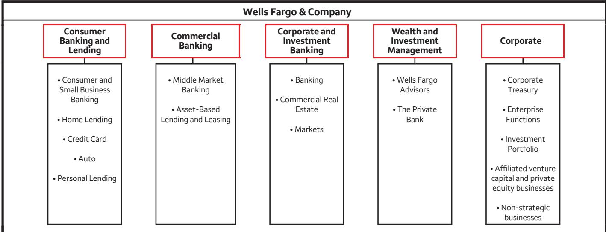
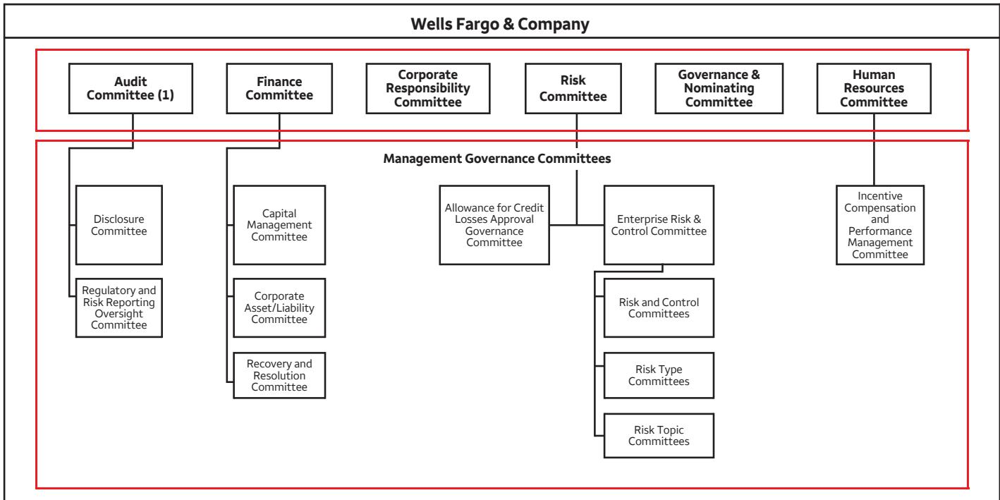

# WELLS FARGO

> **AI Description:**
> **Source:** `assets/_page_1_Figure_0.jpg`
> 
> **Generated:** 2026-05-29 15:54:50
> 
> ---
> 
> The image contains a simple diagram with two intersecting lines. One line is vertical and yellow, while the other is horizontal and gray. The intersection of these lines forms a cross shape. There are no labels or text annotations present in the image.

## Contents

Letter from CEO II   
Our Performance XV   
Operating Committee XVI   
Board of Directors XVII   
2021 Financial Report 1   
Stock Performance 203   
About Wells Fargo 204

## A letter from

Charles W. Scharf CEO and President Wells Fargo & Company

As I write this letter refecting on 2021, it is difcult to describe what we have all been through and the extent to which COVID-19 has impacted the world. Over 400 million people have been infected with the virus, almost 6 million people have died, and so many others have been impacted in diferent ways. At the same time, we are learning to coexist with COVID-19. We now have multiple vaccines and a clearer understanding of how to protect ourselves from infection.

Wells Fargo has used its strength to provide support through this crisis to our employees, customers, and communities, and we will continue to do so. We recognize that the pandemic has left many people in need, and that those needs haven’t gone away. As a company, we will continue to provide support to a diverse set of stakeholders over the long term.

Alongside these eforts, the work we have been doing to transform Wells Fargo has made us an even stronger company than we were a year ago. It has put us in a position to support a broad set of stakeholders, and it has positively impacted our results. While we still have much more to do, our foundation is stronger, our business is more focused, we are driving cultural change, the talent and management process changes we have made are making a positive impact, and our fnancial performance is stronger.

## Financial performance

The work we have been doing to improve our financial profile is beginning to impact our results. In 2021, Wells Fargo generated \$21.5 billion in net income, or \$4.95 per common share. This included a \$5.7 billion reduction in the allowance for credit losses which improved earnings by \$1.05 per common share.

Our revenue increased 6% from the previous year, with lower net interest income more than ofset by growth in noninterest income. We benefted from strong gains in our afliated venture capital and private equity businesses and gains from the sales of our student lending, asset management, and corporate trust businesses, which we do not expect to repeat in 2022. But we also had broad-based revenue growth across our businesses, including in Home Lending, Consumer & Small Business Banking, credit cards, Auto lending, Commercial Real Estate, investment banking, and Wealth & Investment Management.

Expenses declined 7% from a year ago, refecting lower operating losses and progress on our efciency initiatives – and this is while we added to our investments to strengthen our risk and control infrastructure and made other investments to build out new products and capabilities for our customers.

Credit quality improved signifcantly as we saw strong economic growth and our customers had high levels of liquidity. Our net charge-of rate declined from 35 basis points in 2020 to 18 basis points in 2021, and, as noted above, our allowance for credit losses declined by \$5.7 billion.

Loans outstanding increased 1% from a year ago. Loans declined in the frst half of the year but grew 5% in the second half, with growth in both our consumer and commercial portfolios. Average deposits in 2021 grew \$61.8 billion, or 4%, from a year ago as declines in commercial deposits, driven by our actions to remain under the asset cap, were more than ofset by growth in consumer deposits.

We also returned a significant amount of capital to our shareholders, \$16.9 billion in total. We increased our quarterly common stock dividend from \$0.10 per share to \$0.20 per share in the third quarter and then to \$0.25 in the first quarter of 2022. In total, we returned \$2.4 billion through common stock dividends in 2021 and repurchased \$14.5 billion of common stock, predominantly in the second half of 2021, after the return to the stress capital bufer framework.

Our return on equity was 12.0% and our return on tangible common equity (ROTCE) was 14.3%, which is close to our stated goal of about 15% over time¹. Excluding the reduction in the allowance for credit losses in 2021, ROTCE would have been 11.2%². In addition, we had several other items which benefted our results, such as very strong equity gains, extremely low charge-of rates, and the gains on sales of certain businesses, and some which reduced our results, such as a fne we received from the Ofce of the Comptroller of the Currency (OCC) in September 2021, which I write more about below.

Overall, our analysis shows that we had more benefts than reductions last year, and our ROTCE on a run rate basis was still below our goal of 10%. We said at the beginning of 2021 that we see a clear path to achieving a sustainable 10% ROTCE, and we believe we will achieve that, subject to the same assumptions we’ve discussed in the past, on a run rate basis at some point in 2022. We have also said that after achieving this, we will target approximately 15% sustainable ROTCE. We continue to believe that our franchise is capable of producing signifcantly higher returns, and we remain focused on achieving them while continuing to invest in our infrastructure and in our capabilities to serve our customers.

## The strong economy continues to positively impact our customers and our results

Consumers’ fnancial position remained strong throughout the pandemic. While median deposit balances declined during the second half of 2021, after Economic Impact Payments ended, consumers continued to have more liquidity than prior to the pandemic, with median balances at the end of the year 26% higher than pre-pandemic levels.

Consumer credit card spend continued to be strong, with general purpose credit card spending up 27% in 2021 compared with 2020 and up 17% from pre-COVID 2019 levels. The spending categories most impacted by COVID in 2020 – travel, fuel, and entertainment – all rebounded by more than 50% in 2021. Across all sectors, travel was the only one that was still down from 2019 levels; however, travel spending improved throughout 2021 and nearly doubled from 2020 levels.

Consumer debit card spend also continued to be strong, with spending up 20% compared with 2020 and up 28% from 2019 levels. All spending categories increased in 2021, except for a modest decline in food and drug. Discretionary spending on retail goods continued to be strong relative to both 2020 and 2019 as customer liquidity levels remained high.

While loan demand was weak early in the year, loans grew 5% in the second half with growth in both our consumer and commercial portfolios. We saw strong growth in auto and also had strong loan growth in Corporate & Investment Banking, with loans up 16% from a year ago.

## We have made significant progress over the past two years

I’ve been at the company for a little over two years and believe we are a very different company today than when I arrived. Though we have much more to do, overall, I feel great about what we’ve accomplished in an incredibly difcult operating environment.

I think about our areas of progress along several dimensions:

• Risk, control, and regulatory

• Talent and leadership

• Financial and strategic progress

• ESG and company reputation

• Customer centricity

## Risk, control, and regulatory

We began a process two years ago to change the culture and priorities of the company. The most signifcant part of this was prioritizing the development and implementation of an appropriate risk and control framework across the company. Our approach to managing this is entirely diferent than when I arrived, and I believe we are making signifcant progress. We are laser-focused on meeting our own expectations and those of our regulators. We work to have clear plans in place and clear owners for each regulatory deliverable we have. We have detailed reporting on how we’re progressing on those plans. We review this reporting weekly at the Operating Committee. Our executives are expected to be actively engaged in the details and are accountable for getting the work done properly and timely.

Our ability to identify risk and control issues has also improved from two years ago.

We have reached numerous regulatory milestones over the past year. These include:

• The OCC’s January 2021 termination of a 2015 consent order related to the company’s Bank Secrecy Act/Anti-Money Laundering (BSA/AML) compliance program

• The September 2021 expiration of a Consumer Financial Protection Bureau (CFPB) consent order issued in 2016 regarding the bank’s retail sales practices

• The OCC’s January 2022 termination of a consent order issued in June 2015 regarding add-on products that the company sold to retail banking customers before 2015

Despite reaching these milestones, we still have much more work to do. We need to implement the many plans we have developed, some of which contain several years’ worth of work, and also demonstrate their sustainability. We have multiple checkpoints along the way before we turn the completed work over to our regulators for their review. All of this takes time. An additional complexity is the number of issues and consent orders we are working through simultaneously, which translates into both a high volume of work and a high amount of interdependencies across multiple streams of work. We strive to complete the work accurately and timely, and while we continue to improve our execution, we don’t always meet all of our goals.

The reality is that while I feel good about our progress since I joined the company, many of the consent orders that remain open have been outstanding for too long. Wells Fargo has been too slow in building and implementing appropriate risk and control frameworks, and the company has been too slow in addressing legacy issues. As a result, in September 2021, the OCC assessed a fne and imposed a new consent order related to loss mitigation activities in our Home Lending business and insufcient progress in addressing requirements under a consent order the agency issued to us in 2018.

Until our broad book of risk, control and regulatory work is complete, we remain at risk for setbacks. Having said that, I remain confdent in our ability to continue to close our remaining gaps over the next several years. We are committed to completing the work, and I believe that the quality of the talent we now have and the processes we now have in place will enable us to get the work done.

## Talent and leadership

We have a new management team running Wells Fargo. Since I joined Wells Fargo in 2019, 11 of 16 Operating Committee members are new to the company. Additionally, well over half of the senior most people at our company, meaning those who are one level below the Operating Committee, are new to their roles, and a signifcant proportion of them were hired from outside the company. This is a dramatic change in our leadership and to the group of people responsible for driving the cultural and process changes required for our transformation. We have recruited highly qualifed people with experience in their areas of expertise and have promoted talented leaders within Wells Fargo.

We’ve also signifcantly changed how we run the company. We have regular detailed business reviews, we prioritize resources across the entire company, and we ensure that we diferentiate the performance of our people, rewarding strong performers and coaching those who need to improve. We expect people to prioritize what’s right for our customers, we value execution, and we embrace direct conversations that push us to improve. We celebrate our success but focus on what we can do to improve.

## Financial and strategic progress

After a strategic review in 2020 that resulted in the sale or reductions of several of our businesses, we are making progress increasing the earnings power of the company and have begun to invest in a more holistic and aggressive way to drive stronger organic growth in all of our businesses. We are just now beginning to bring to market diferentiated products and services. The number of signifcant opportunities ahead is exciting, but we are only at the beginning of building the culture necessary to transform how we compete in today’s world.

I can’t say it enough – job one has been and will continue to be building and implementing an appropriate risk and control infrastructure across the company, embedding changes in our culture, and doing the work with urgency. But we are also investing in our strategic positioning.

Though our market shares remain strong, we have been slow in improving and expanding our capabilities to compete with the best banks and non-banks across all of our businesses. This is changing. All of our lines of business have signifcant opportunities to meaningfully grow, and we are investing in long-term plans to move our franchise forward. There is more competition than ever before, but I continue to feel great about our competitive position and energized about the opportunities in front of us.

## Consumer digital

An example is our consumer mobile platform. In the fourth quarter of 2021, we announced a rebuilt mobile banking experience for Consumer & Small Business customers, and we began rolling it out in the frst quarter of 2022. It has a new, modern look and feel and a simpler user experience that will help our customers more easily accomplish their banking needs. Though digital adoption has been

increasing – in the fourth quarter our customers logged in 1.6 billion times using a mobile device, up 7% year over year, and teller transactions remained more than 30% lower than prepandemic levels – we believe that an improved platform can drive signifcantly higher digital adoption from our customers.

We also announced that later this year we will be adding an all-new virtual assistant – named “Fargo” – to our mobile app. Customers will be able to get answers to their everyday banking questions and ask Fargo to complete a task for them. Fargo will also provide personalized insights and recommendations to help customers better manage their fnances.

We also introduced the frst phase of the redesign of our public website early this year.

In addition, we are beginning to become more active in creating new digital solutions on the wholesale side of our business. For example, we announced that we are collaborating with HSBC to optimize the settlement of foreign exchange transactions through a blockchainbased solution, which will reduce settlement risks and associated costs.

## Cards and payments

We are approaching payments and credit cards very diferently. We believe credit cards will remain important as both a credit and payment vehicle and are investing in our capabilities. We are also doing additional work around non-card payments and believe we must succeed here to be a key fnancial services provider.

Two years ago, our credit card products and capabilities were not as competitive as necessary. In 2021, we launched two new credit card products, including Active CashSM, which has been referred to as the best cash back card in the marketplace, and ReflectSM, which rewards customers for on-time payments.

We improved the core credit card experience, including investing in advertising, simplifying our digital application, and enhancing our underwriting and customer service. These eforts have driven an increase in digital card activation and enrollment in paperless statements and alerts. We are opening approximately twice as many accounts as we were before launching these products, and importantly, we are not competing on credit. In fact, the credit quality of applications and accounts we are now booking is consistently stronger than what we were booking prior to launch.

Away from card, we are investing in digital payments across the platform, enhancing our capabilities, increasing limits, and broadly reducing the friction in moving money. As evidence, Zelle momentum continued to accelerate in 2021, with Zelle transactions up 56% year over year, and Zelle dollar volume up 66%. In the fourth quarter alone, Zelle dollar volume increased 12% from the prior quarter.

Consumer Banking and Lending and Wealth & Investment Management We have one of the strongest consumer franchises in the largest consumer fnancial services market in the world. The strength of the franchise is still incredible when you consider the stresses that the past several years have placed on the industry and our company.

## Consumer Banking and Lending

We serve approximately 64 million consumer banking and lending customers, and our bank branch footprint remains a competitive advantage. We have nearly 4,800 retail bank branches, with a presence in 25 of the largest 30 markets in the U.S.³ A Wells Fargo branch or ATM is within 2 miles of over half of U.S. Census households and small businesses in our footprint. In parallel, as consumers increasingly shift their banking transactions to digital

channels, in 2021 we had 33 million digital active customers, up 3% from 2020, and we had 27.3 million mobile active users, up 5% from 2020.

Full year 2021 average deposits in Consumer Banking and Lending totaled \$834.7 billion, up from \$722.1 billion a year earlier. For full year 2021, we had \$471.5 billion in debit card purchase volume, up 20% from \$391.9 billion in 2020, and 9.8 billion debit card purchase transactions, up 12% from 8.8 billion in 2020.

In our Home Lending businesses, we had \$205 billion in total originations in 2021, down from \$222.7 billion in 2020, driven by an increase in rates and a drop in application volume. Credit card point-of-sale volume was \$102.5 billion in 2021, up 26% from \$81.6 billion in 2020, in part driven by the launch of our new credit card products. We originated \$33.9 billion in auto loans in 2021, up 49% from \$22.8 billion in 2020. While auto loan originations have benefted from enhancements we’re making to our capabilities, we continue to be cautious about the increase in vehicle prices over the last year or so and have maintained our underwriting standards.

Wealth & Investment   
Management (WIM)   
Our WIM business has over   
12,300 advisors who serve 2.8 million clients. At the end of 2021, total client assets reached a record \$2.2 trillion, up 9% from \$2.0 trillion in 2020,   
primarily due to higher market   
valuations. We have worked over the past year to simplify our go-to-market

strategy within WIM and are investing in our independent and digital channels to complement our existing capabilities. Those eforts will continue into 2022.

Taking a step back and looking broadly across our consumer businesses, we have been focused for several years in consumer banking and lending on remediating sales practices issues. This has been a must. But we have been slow to develop new products, segment our customer base, and develop tailored oferings for each. We still have great opportunity to drive digital adoption to further our eforts to become more efcient and target diferent customers. And we have signifcant opportunities to integrate our consumer businesses across our wealth, consumer lending, and payments oferings.

Our belief is that we have the key ingredients to compete and be the primary provider for fnancial services for the consumer. Being the primary provider for payments is critical for the mass consumer base, and our deposit, lending and investment products round out our oferings. For the more afuent, our wealth and lending capabilities are critical, and deposits and payments round out those offerings. How we deliver these capabilities is critical – in our branches, on our mobile app, on our native browser, via telephone, and in person. Our capabilities have to be diferentiated by customer segment.

We have the resources to take this integrated approach, and to build the best consumer platform – but to do this we need to work across our individual consumer businesses, which we have not always done historically.

The boundaries between our lines of business are necessary to bring relevant expertise to bear, but these boundaries are artifcial and cannot stand in the way of making us approach the customer holistically. Like most banks, we have historically delivered our products and services based on how we were organized – not how the customer has wanted to work with us. This is changing and will allow us to compete diferently than we have in the past.

## Commercial Banking and Corporate & Investment Banking (CIB)

We manage Commercial Banking and Corporate & Investment Banking as separate lines of business, but they ofer many of the same products and should share capabilities with common platforms. Here too we are looking past artifcial boundaries. We are combining Treasury Services platforms, and we are working with commercial clients to ofer CIB products such as foreign exchange, interest rate swaps, access to public markets, and M&A advisory services.

We have great market positions in both lines of business and have meaningful opportunities to grow.

In Commercial Banking, we serve three core segments: emerging middle-market, middle market and mid-corporate companies. We have over 5,000 bankers and a presence in 49 of the largest 50 markets in the country⁴. Commercial Banking total loans were \$190.3 billion at the end of 2021. Deposit growth in Commercial Banking was strong, with average deposits of \$197.3 billion in 2021, up 10% from \$178.9 billion in the prior year.

CIB has been a core part of the company for many years. We have been, and will remain, disciplined in where we compete, and we continue to grow our business not by changing our risk profle, but by leveraging our core relationships and delivering the entire enterprise to these clients. In 2021, this approach led to growth in banking revenue, up 4% year over year (YoY) to \$5.1 billion, primarily driven by higher advisory and debt origination fees, as well as higher loan balances. Broadly speaking, we continue to be focused on leveraging our balance sheet commitments to drive relationships, diversifying our business mix in Capital Markets, and continuing to grow our Commercial Real Estate (CRE) business. Our CRE business is the largest commercial real estate lender in the U.S., and its 2021 revenue was up 10% YoY, to nearly \$4 billion.

As we look to grow our business across both Commercial Banking and CIB, we are focused on digital, including building out our digital platforms on both the front and back ends. This extends beyond combining our two Treasury Services platforms. It includes a payments modernization program for fnancial institution clients, as well as Integrated Receivables, which we launched last year to simplify payment and remittance data capture, re-association and invoice matching. We are also focused on increasing investment banking revenue from Middle Market clients.

## Technology

At the heart of our ability to compete over the long term will be a diferent approach to technology.   
We think about this along two dimensions.

First is creating a platform-based, API-driven architecture that enables similar banking services to be used across diferent products. Instead of building large applications as we have in the past, this API-driven architecture relies on a nimble set of smaller applications that provide common features and customer data across products and services. It’s a “once built, many times consumed” approach. This won’t happen all at once, but we have a clear path ahead. Over time, our presence will evolve to this model, improving customer experience and allowing us to get new products and services to market more quickly.

As a foundation to this, our Digital Infrastructure Strategy, which we announced in 2021, articulates our approach to moving toward cloud-enabled applications, initially using both public and private cloud solutions and also migrating to a set of modern data centers that will host our private cloud platforms.

Second is a technology-frst approach to our businesses. This is a material change from our approach today. We compete with fntech companies where engineers who understand products also design solutions for customers. Wells Fargo, like many other banks, often develops a solution and then asks engineers to build it. We are moving toward an agile approach to development to bring our teams much closer and speed up timelines to get to market.

All of this is good progress, but it’s not enough. As I’ve said before, we need to move from an approach where technology aids our business to where technology drives our business. This is a tough journey, but without it, we signifcantly reduce our chances of success.

## ESG and company reputation

We believe that for us to be successful as a company, we must consider a broad set of stakeholders in our decisions and actions, beyond shareholders. This is not in lieu of shareholders – in fact we believe it will enhance our returns to shareholders over time. Our history has shown this to be true. Consumers and businesses want to do business with a company that has a strong reputation. A strong reputation is achieved not just from strong fnancial performance, but from actively supporting employees, customers, and communities – especially those most in need.

We have supported our employees consistently through the pandemic, which I wrote about at some length in my letter to you last year. In November 2021, we announced that as part of our commitment to providing comprehensive benefts and competitive pay to our employees, we would provide supplemental pay from October 2021 to the end of January 2022 to eligible branch employees in active status, in recognition of their contributions during the pandemic. We also announced an increase in U.S. minimum hourly pay levels to a range of \$18-22, based on role, location, and market conditions. Over a five-year time period, from 2017-2021, we increased average wages for U.S. hourly employees by nearly 25%. Over the same time period, we increased our investment in U.S. employee benefts by over 20%.

We have also undertaken significant eforts to support consumers and small businesses since the beginning of the pandemic. We supported the Paycheck Protection Program (PPP) by funding roughly 280,000 loans totaling approximately \$14 billion, working with clients of all sizes to provide fexibility and assistance where needed. In addition, we extended forbearance options for over 1 million mortgage customers since the start of the COVID-19 pandemic.

After the CARES Act was signed into law, the government paid fees to those who administered PPP loans. Our belief was that these funds were best used to help small businesses stay open and support employment during the pandemic – not to support our bank. COVID-19 caused a crisis in our communities, not a financial crisis, and we were happy to use our resources to support PPP without fee compensation in 2020. In July 2020, we announced Open for Business, a \$420 million fund we created with the gross processing fees we would have earned from processing PPP loans we funded in 2020. We created Open for Business to give back to communities, particularly small businesses, with a focus on those in underserved areas. Wells Fargo has worked with Community Development Financial Institutions (CDFIs) and local nonprofts across the nation to distribute funding, and to ensure funding occurs at a highly local level. While our work on PPP focused on smaller small businesses most in need, we needed partners to access the broadest set of small businesses in need to facilitate our Open for Business program.

We fulflled our Open for Business commitment in 2021, donating \$420 million to organizations that support small businesses during both 2020 and 2021. Our total philanthropic giving in 2021, including both Open for Business dollars and Wells Fargo Foundation giving, was \$615 million.

Climate change is one of the most urgent environmental and social issues of our time, and we have a role to play working with our clients to transform their businesses to carbonfriendly models. Last year we announced our goal to achieve net-zero greenhouse gas emissions, including fnanced emissions, by 2050. We also increased our sustainable fnance commitment to \$500 billion between 2021 and 2030. In May 2021, we issued our frst sustainability bond, raising \$1 billion in capital to support housing afordability, socioeconomic advancement and empowerment, and renewable energy. We expect to announce our first interim fnanced emissions targets for the oil and gas, and power sectors later this year.

This work is bigger than any one company, and we will work across companies and industries as we progress. In the fourth quarter of 2021, we joined the Net-Zero Banking Alliance, an industry-led leadership group designed to foster collaboration and support banks in aligning their fnancing with the goal of achieving net-zero greenhouse gas emissions.

Finally, we recognize that afordable housing continues to be one of the top needs in our country. As a company, we use our resources to support afordable, multifamily housing in the U.S., in addition to acting as an active lender for affordable rental housing developments. We remain committed to supporting our customers with homeownership. In 2021, we helped over 585,000 homeowners with new low-rate loans to either purchase a home or refinance an existing mortgage. We also closed \$2.2 billion in new commitments for afordable housing under the governmentsponsored enterprise (GSE) and Federal Housing Administration (FHA) programs. As part of our NeighborhoodLIFT program, we committed to invest \$5 million to help more than 300 lowand moderate-income residents in Houston with home down payment assistance.

## Customer centricity

We believe that we must be customercentric in how we approach our products and services. Our work to advance our digital and mobile presence, to take an agile approach to product development, and to rethink our technology infrastructure are examples of how we’re working to improve the customer experience.

Being customer-centric is not only about customer experience, though. It’s more fundamentally about how we price and deliver for our customers and meet their fnancial needs.

In January 2022, we announced new eforts that will roll out over the course of the year to help our consumer customers avoid overdraft fees and cover short-term cash needs. We are eliminating transfer fees for customers enrolled in Overdraft Protection, eliminating non-sufcient funds fees, giving early access to direct deposit by providing customers access to funds up to two days before a customer’s scheduled deposit, and adding a 24-hour grace period for customers who overdraw their account to cover the balance before incurring an overdraft fee. In addition, this year we will introduce a new short-term credit product for customers to meet personal fnancial needs.

These changes build on services that Wells Fargo had introduced previously. Clear Access Banking, which we introduced in September 2020, is a consumer bank account that charges no overdraft fees. It now has over 1.1 million outstanding customer accounts. Overdraft Rewind, which was introduced in 2017, automatically reverses overdraft fees when a covering direct deposit is received by the next morning. The service will be replaced with the 24-hour grace period I mentioned above. Wells Fargo also sends more than 1.3 million balance alerts every day to help customers avoid overdrafts.

Putting all of our changes in perspective, these fees are down signifcantly since the fnancial crisis. We have alternatives for both customers that do not want overdraft protection and those that do. This is a competitive marketplace, and we continue to review our capabilities and pricing with the goal of providing value to our customers. Our Office of Consumer Practices, an internal, consumer-focused advisory group that we launched in January 2021, is involved in this work, and plays an important role in helping ensure our products, services, and business practices are fair and transparent.

## Competition and what it means for us

Our competition is stronger than ever. We compete against some outstanding banks of all sizes. We compete with younger non-banks that have specialized in one part of our business, many of which have moved on to compete more broadly. We also compete with non-banks that have signifcant market capitalizations, and big tech continues to expand its reach into the fnancial services proft pool.

So why do I feel so excited to be at Wells Fargo? Simply put, our capabilities allow us to serve consumers and companies with better products at a better value than most anyone else.

But we won’t win by running the company as we have for the past few decades. If we don’t change how we approach our customers, our company will go through a process of slow and steady decline. Others have approached the customer diferently and are competing more efectively. For too long, Wells Fargo has:

1. Allowed others to build their businesses of of years and years of our investments. These include companies that have built payments technology and services using bank-developed and supported ACH, credit cards, and debit cards.

2. Developed products that are designed around how we are organized, not how the customer wants to be served by us. For instance, our deposit, lending, investment, and payments products have not historically been on an integrated platform.

3. Not created user interfaces that are competitive with the best experiences in the marketplace.

In addition, there is a perception that banks do not innovate so regulation should allow these smaller technology focused companies to compete without being subject to the same oversight as regulated banks.

While others have done well, I still believe that the game is ours to lose. Our customer relationships are extremely valuable, and we remain in a great position to continue to be their primary fnancial services provider, but we must approach their needs diferently. We’ve begun to do that, and I’ve referenced some of these changes earlier in this letter. But there’s more to do.

## As we look forward

Our game plan remains the same: build a strong risk and control infrastructure appropriate for a company of our size and complexity, run a disciplined business with talented people who remain excited by what Wells Fargo does for its employees, customers and communities, invest for the long term but continue to improve our fnancial performance each year, and realign our business with a technology-frst and true customer-centric viewpoint.

We are unwavering in our commitment to build a strong risk and control foundation. We are committed to invest what’s necessary and continue to do this work with the sense of urgency necessary for our most important priority. But we also remain cognizant that we still have a multiyear effort to satisfy our regulatory requirements – with setbacks likely to continue along the way – and will continue our work to put exposures related to our historical practices behind us.

We will continue to embrace our responsibility to our employees, customers and communities.

I commented earlier that we believe we will achieve a sustainable 10% ROTCE – subject to the same assumptions we’ve discussed in the past – on a run rate basis at some point this year, and that once we’ve achieved this goal, we will discuss our plan to continue to increase returns. But at a high level, we continue to believe we can further improve our returns through a combination of factors including: a modest increase in interest rates or a further steepening of the curve, ongoing progress on incremental efficiency initiatives, a small impact from returns on growth-related investments

in our businesses, continued execution on our risk, regulatory and control priorities, and moderate balance-sheet growth once the asset cap is lifted. It’s important to note that we currently have the ability to grow loans, even under the asset cap, though our ability to add deposits is limited.

The changes we’ve made to the company and continued strong economic growth prospects make us feel good about how we are positioned entering 2022, and even better about our longer-term prospects. Although there remain signifcant geopolitical and economic risks in the short- and midterm, we will continue to move forward with a goal to rebuild Wells Fargo to be amongst the best and most respected fnancial institutions in the country.

I want to conclude by thanking everyone at Wells Fargo who continued to serve our customers, each other, and our communities through another challenging year. I appreciate their hard work and their resiliency while we made progress on making Wells Fargo better. I look forward to all that we will accomplish in the year ahead.

I remain incredibly optimistic about our future.

Charles W. Scharf

CEO and President

Wells Fargo & Company

March 1, 2022

Our Performance

1 Pre-tax pre-provision profit (PTPP) is total revenue less noninterest expense. Management believes that PTPP is a useful financial measure because it enables investors and others to assess the Company’s ability to generate capital to cover credit losses through a credit cycle.
2 Book value per common share is common stockholders’ equity divided by common shares outstanding. Tangible book value per common share is tangible common equity divided by common shares outstanding.
3 Tangible common equity, tangible book value per common share, and return on average tangible common equity are non-GAAP financial measures. For additional information, including a corresponding reconciliation to GAAP financial measures, see the “Financial Review – Capital Management – Tangible Common Equity” section in this Report.
4 Represents Wells Fargo net income divided by average assets.
5 Represents Wells Fargo net income applicable to common stock divided by average common stockholders’ equity.
6 The efficiency ratio is noninterest expense divided by total revenue (net interest income and noninterest income).
7 Represents our Common Equity Tier 1 (CET1) ratio calculated under the Standardized Approach, which is our binding CET1 ratio. For additional information, see the “Financial Review – Capital Management” section and Note 28 (Regulatory Capital Requirements and Other Restrictions) to Financial Statements in this Report.

William M. Daley Vice Chairman of Public Affairs

## Derek A. Flowers

Senior EVP, Chief Risk Officer

## Kyle G. Hranicky

Senior EVP, CEO of Commercial Banking

## Bei Ling

Senior EVP, Head of Human Resources

## Mary T. Mack

Senior EVP, CEO of Consumer & Small Business Banking

## Lester J. Owens

Senior EVP, Head of Operations

## Ellen R. Patterson

Senior EVP, General Counsel

## Scott E. Powell

Senior EVP, Chief Operating Officer

## Michael P. Santomassimo

Senior EVP, Chief Financial Officer

## Kleber R. Santos

Senior EVP, Head of Diverse Segments, Representation & Inclusion

## Charles W. Scharf

Chief Executive Officer and President

## Barry Sommers

Senior EVP, CEO of Wealth & Investment Management

## Saul Van Beurden

Senior EVP, Head of Technology

## Michael S. Weinbach

Senior EVP, CEO of Consumer Lending

## Jonathan G. Weiss

Senior EVP, CEO of Corporate & Investment Banking

## Ather Williams III

Senior EVP, Head of Strategy, Digital Platform, and Innovation

## Steven D. Black

Chairman, Wells Fargo & Company

## Mark A. Chancy

Retired Vice Chairman and Co-Chief Operating Officer, SunTrust Banks, Inc.

## Celeste A. Clark

Principal, Abraham Clark Consulting, LLC, and Retired Senior Vice President, Global Public Policy and External Relations and Chief Sustainability Officer, Kellogg Company

## Theodore F. Craver, Jr.

Retired Chairman, President and CEO, Edison International

## Wayne M. Hewett

Senior Advisor, Permira, and Chairman, DiversiTech Corporation

## Maria R. Morris

Retired Executive Vice President and Head of Global Employee Benefits business, MetLife, Inc.

## Richard B. Payne, Jr.

Retired Vice Chairman, Wholesale Banking, U.S. Bancorp

## Juan A. Pujadas

Retired Principal, PricewaterhouseCoopers LLP, and former Vice Chairman, Global Advisory Services, PwC International

## Ronald L. Sargent

Retired Chairman and CEO, Staples, Inc.

## Charles W. Scharf

Chief Executive Officer and President, Wells Fargo & Company

## Suzanne M. Vautrinot

President, Kilovolt Consulting, Inc. and Major General and Commander, United States Air Force (retired)

## W E L L S FA RG O & C OM PA N Y 2 0 21 F I N A N C I A L R E P O R T

## Financial Review

Overview 116 4   
Earnings Performance 131 5   
Balance Sheet Analysis 133 6   
Off-Balance Sheet Arrangements 135 7   
Risk Management 136 8   
Capital Management 141 9   
Regulatory Matters 143 10   
Critical Accounting Policies 144 11   
Current Accounting Developments 145 12   
Forward-Looking Statements 147 13   
Risk Factors 150 14   
153 15   
Controls and Procedures 156 16   
Disclosure Controls and Procedures 164 17   
Internal Control Over Financial Reporting 174 18   
Management’s Report on Internal Control over 176 19   
Financial Reporting   
Report of Independent Registered Public 178 20   
Accounting Firm (KPMG LLP, Charlotte, NC,   
Auditor Firm ID: 185) 180 21   
Financial Statements 185 22   
Consolidated Statement of Income 186 23   
Consolidated Statement of Comprehensive 188 24   
Income   
Consolidated Balance Sheet 189 25   
Consolidated Statement of Changes in Equity 191 26   
Consolidated Statement of Cash Flows 193 27   
195 28

## Notes to Financial Statements

95 1 Summary of Significant Accounting Policies 197   
109 2 Trading Activities 200   
110 3 Available-for-Sale and Held-to-Maturity Debt Securities 202   
Loans and Related Allowance for Credit Losses   
Leasing Activity   
Equity Securities   
Premises, Equipment and Other Assets   
Securitizations and Variable Interest Entities   
Mortgage Banking Activities   
Intangible Assets   
Deposits   
Long-Term Debt   
Guarantees and Other Commitments   
Pledged Assets and Collateral   
Legal Actions   
Derivatives   
Fair Values of Assets and Liabilities   
Preferred Stock   
Common Stock and Stock Plans   
Revenue from Contracts with Customers   
Employee Benefits and Other Expenses   
Restructuring Charges   
Income Taxes   
Earnings and Dividends Per Common Share   
Other Comprehensive Income   
Operating Segments   
Parent-Only Financial Statements   
Regulatory Capital Requirements and Other Restriction

Report of Independent Registered Public Accounting Firm   
Quarterly Financial Data

Glossary of Acronyms

This Annual Report, including the Financial Review and the Financial Statements and related Notes, contains forward-looking statements, which may include forecasts of our financial results and condition, expectations for our operations and business, and our assumptions for those forecasts and expectations. Do not unduly rely on forward-looking statements. Actual results may differ materially from our forward-looking statements due to several factors. Factors that could cause our actual results to differ materially from our forward-looking statements are described in this Report, including in the “Forward-Looking Statements” section, and in the “Risk Factors” and “Regulation and Supervision” sections of our Annual Report on Form 10-K for the year ended December 31, 2021 (2021 Form 10-K).

When we refer to “Wells Fargo,” “the Company,” “we,” “our,” or “us” in this Report, we mean Wells Fargo & Company and Subsidiaries (consolidated). When we refer to the “Parent,” we mean Wells Fargo & Company. See the Glossary of Acronyms for definitions of terms used throughout this Report.

## Financial Review

## Overview

Wells Fargo & Company is a leading financial services company that has approximately \$1.9 trillion in assets, proudly serves one in three U.S. households and more than 10% of small businesses in the U.S., and is the leading middle market banking provider in the U.S. We provide a diversified set of banking, investment and mortgage products and services, as well as consumer and commercial finance, through our four reportable operating segments: Consumer Banking and Lending, Commercial Banking, Corporate and Investment Banking, and Wealth and Investment Management. Wells Fargo ranked No. 37 on Fortune’s 2021 rankings of America’s largest corporations. We ranked fourth in assets and third in the market value of our common stock among all U.S. banks at December 31, 2021.

Wells Fargo’s top priority remains building a risk and control infrastructure appropriate for its size and complexity. The Company is subject to a number of consent orders and other regulatory actions, which may require the Company, among other things, to undertake certain changes to its business, operations, products and services, and risk management practices. Addressing these regulatory actions is expected to take multiple years, and we are likely to experience issues or delays along the way in satisfying their requirements. Issues or delays with one regulatory action could affect our progress on others, and failure to satisfy the requirements of a regulatory action on a timely basis could result in additional penalties, enforcement actions, and other negative consequences, which could be significant. While we still have significant work to do, the Company is committed to devoting the resources necessary to operate with strong business practices and controls, maintain the highest level of integrity, and have an appropriate culture in place.

## Federal Reserve Board Consent Order Regarding Governance Oversight and Compliance and Operational Risk Management

On February 2, 2018, the Company entered into a consent order with the Board of Governors of the Federal Reserve System (FRB). As required by the consent order, the Company’s Board of Directors (Board) submitted to the FRB a plan to further enhance the Board’s governance and oversight of the Company, and the Company submitted to the FRB a plan to further improve the Company’s compliance and operational risk management program. The Company continues to engage with the FRB as the Company works to address the consent order provisions. The consent order also requires the Company, following the FRB’s acceptance and approval of the plans and the Company’s adoption and implementation of the plans, to complete an initial third-party review of the enhancements and improvements provided for in the plans. Until this third-party review is complete and the plans are approved and implemented to the satisfaction of the FRB, the Company’s total consolidated assets as defined under the consent order will be limited to the level as of December 31, 2017. Compliance with this asset cap is measured on a two-quarter daily average basis to allow for management of temporary fluctuations. Due to the COVID-19 pandemic, on April 8, 2020, the FRB amended the consent order to allow the Company to exclude from the asset cap any on-balance sheet exposure resulting from loans made by the Company in connection with the Small Business Administration’s Paycheck Protection Program and the FRB’s Main Street Lending Program. As required under the amendment to the consent order, to the extent the Company chooses to exclude these exposures from the asset cap, certain fees and other economic benefits received by the Company from loans made in connection with these programs shall be transferred to the U.S. Treasury or to nonprofit organizations approved by the FRB that support small businesses. As of December 31, 2021, the Company had not excluded these exposures from the asset cap. After removal of the asset cap, a second third-party review must also be conducted to assess the efficacy and sustainability of the enhancements and improvements.

## Consent Orders with the Consumer Financial Protection Bureau and Office of the Comptroller of the Currency Regarding Compliance Risk Management Program, Automobile Collateral Protection Insurance Policies, and Mortgage Interest Rate Lock Extensions

On April 20, 2018, the Company entered into consent orders with the Consumer Financial Protection Bureau (CFPB) and the Office of the Comptroller of the Currency (OCC) to pay an aggregate of \$1 billion in civil money penalties to resolve matters regarding the Company’s compliance risk management program and past practices involving certain automobile collateral protection insurance (CPI) policies and certain mortgage interest rate lock extensions. As required by the consent orders, the Company submitted to the CFPB and OCC an enterprise-wide compliance risk management plan and a plan to enhance the Company’s internal audit program with respect to federal consumer financial law and the terms of the consent orders. In addition, as required by the consent orders, the Company submitted for non-objection plans to remediate customers affected by the automobile collateral protection insurance and mortgage interest rate lock matters, as well as a plan for the management of remediation activities conducted by the Company. The Company continues to work to address the provisions of the consent orders. The Company has not yet satisfied certain aspects of the consent orders, and as a result, we believe regulators may impose additional penalties or take other enforcement actions. On September 9, 2021, the OCC assessed a \$250 million civil money penalty against the Company related to insufficient progress in addressing requirements under the OCC’s April 2018 consent order and loss mitigation activities in the Company’s Home Lending business.

## Consent Order with the OCC Regarding Loss Mitigation Activities

On September 9, 2021, the Company entered into a consent order with the OCC requiring the Company to improve the execution, risk management, and oversight of loss mitigation activities in its Home Lending business. In addition, the consent order restricts the Company from acquiring certain third-party residential mortgage servicing and limits transfers of certain mortgage loans requiring customer remediation out of the Company’s mortgage servicing portfolio until remediation is provided.

## Retail Sales Practices Matters and Other Customer Remediation Activities

In September 2016, we announced settlements with the CFPB, the OCC, and the Office of the Los Angeles City Attorney, and entered into related consent orders with the CFPB and the OCC, in connection with allegations that some of our retail customers received products and services they did not request. As a result, it remains a priority to rebuild trust through a comprehensive action plan that includes making things right for our customers, employees, and other stakeholders, and building a better Company for the future. On September 8, 2021, the CFPB consent order regarding retail sales practices expired.

Our priority of rebuilding trust has also included an effort to identify other areas or instances where customers may have experienced financial harm, provide remediation as appropriate, and implement additional operational and control procedures. We are working with our regulatory agencies in this effort. We have previously disclosed key areas of focus as part of our rebuilding trust efforts and are in the process of providing remediation for those matters. We have accrued for the probable and estimable remediation costs related to our rebuilding trust efforts, which amounts may change based on additional facts and information, as well as ongoing reviews and communications with our regulators. As our ongoing reviews continue and as we continue to strengthen our risk and control infrastructure, we have identified and may in the future identify additional items or areas of potential concern. To the extent issues are identified, we will continue to assess any customer harm and provide remediation as appropriate.

For additional information regarding retail sales practices matters and other customer remediation activities, including related legal and regulatory risk, see the “Risk Factors” section and Note 15 (Legal Actions) to Financial Statements in this Report.

## Recent Developments

## COVID-19 Pandemic

In response to the COVID-19 pandemic, we have been working diligently to protect employee safety while continuing to carry out Wells Fargo’s role as a provider of essential services to the public. We have taken comprehensive steps to help customers, employees and communities.

We have strong levels of capital and liquidity, and we remain focused on delivering for our customers and communities to get through these unprecedented times.

PAYCHECK PROTECTION PROGRAM The Coronavirus Aid, Relief, and Economic Security Act (CARES Act) created funding for the Small Business Administration’s (SBA) loan program providing forgiveness of up to the full principal amount of qualifying loans guaranteed under a program called the Paycheck Protection Program (PPP). We funded approximately \$14.0 billion in loans under the PPP. At December 31, 2021, we had \$2.4 billion of PPP loans outstanding. We voluntarily committed to donate all of the gross processing fees received from PPP loans funded in 2020. In 2021, we fulfilled this approximately \$420 million commitment.

## LIBOR Transition

The London Interbank Offered Rate (LIBOR) is a widely referenced benchmark rate that seeks to estimate the cost at which banks can borrow on an unsecured basis from other banks. On March 5, 2021, the United Kingdom’s Financial Conduct Authority and ICE Benchmark Administration, the administrator of LIBOR, announced that certain settings of LIBOR would no longer be published on a representative basis after December 31, 2021, and the most commonly used U.S. dollar (USD) LIBOR settings would no longer be published on a representative basis after June 30, 2023. Central banks in various jurisdictions convened committees to identify replacement rates to facilitate the transition away from LIBOR. The committee convened by the Federal Reserve in the United States, the Alternative Reference Rates Committee (ARRC), recommended the Secured Overnight Financing Rate (SOFR) as the replacement rate for USD LIBOR. Additionally, the Federal Reserve, the OCC and the Federal Deposit Insurance Corporation (FDIC) have issued guidance strongly encouraging banking organizations to cease using USD LIBOR as a reference rate in new contracts.

In preparation for the cessation of the various LIBOR settings, we have undertaken a variety of activities. Among other things, we proactively implemented internal “stop-sell” dates to discontinue offering products referencing LIBOR except pursuant to limited exceptions consistent with regulatory guidance. At the same time, we expanded our suite of product offerings that are indexed to alternative reference rates.

We also continue to transition our legacy LIBOR contracts to alternative reference rates. We transitioned substantially all of our legacy contracts with LIBOR settings impacted by the December 31, 2021, cessation date to alternative reference rates, and we will continue to address contracts with LIBOR settings that are impacted by the June 30, 2023, cessation date.

For USD LIBOR contracts that mature before June 30, 2023, those contracts that are renewed or replaced will be indexed to alternative reference rates.

At December 31, 2021, the notional amount of our derivatives indexed to USD LIBOR, including bilateral contracts that mature after June 30, 2023, and centrallycleared contracts that mature either before or after June 30, 2023, was over \$6 trillion. We expect substantially all of these contracts to transition to SOFR either prior to or immediately after June 30, 2023, in accordance with existing fallback provisions.

At December 31, 2021, we had over \$350 billion of USD LIBOR commercial credit facilities that mature after June 30, 2023. These contracts generally do not contain appropriate fallback provisions. We are proactively engaging with our clients and contract parties to amend these contracts to replace LIBOR with an alternative reference rate or to include appropriate fallback provisions, if necessary.

At December 31, 2021, we had approximately \$30 billion of USD LIBOR consumer loans and lines secured by residential real estate that mature after June 30, 2023. We expect

## Overview (continued)

these contracts to transition to alternative reference rates in accordance with existing fallback provisions.

At December 31, 2021, we had approximately \$45 billion of debt securities indexed to USD LIBOR that mature after June 30, 2023. Substantially all of these debt securities contain fallback provisions and are expected to transition to an alternative reference rate immediately after June 30, 2023.

Additionally, we continue to monitor legislative developments that would provide a statutory framework to replace LIBOR with a benchmark rate based on SOFR in contracts that do not have fallback provisions or that have fallback provisions resulting in a replacement rate based on LIBOR.

For information regarding the risks and potential impact of LIBOR or any other referenced financial metric being significantly changed, replaced, or discontinued, see the “Risk Factors” section in this Report.

## Capital Matters

Effective October 1, 2021, through September 30, 2022, the Company’s stress capital buffer used to determine our minimum risk-based capital requirements under the Standardized Approach became 3.10%. Beginning January 1, 2022, our global systemically important bank (G-SIB) capital surcharge decreased by 50 basis points from 2.00% to 1.50%.

Effective January 1, 2022, we are required to use the Standardized Approach for Counterparty Credit Risk (SA-CCR) for calculating exposure amounts for credit risk-weighted assets (RWAs) on derivative contracts. The adoption of SA-CCR resulted in an increase of less than 1.00% in total RWAs under the Standardized Approach (which was our binding approach at December 31, 2021) and a decrease of less than 0.50% in total leverage exposure at January 1, 2022.

On January 25, 2022, the Board approved an increase to the Company’s first quarter 2022 common stock dividend to \$0.25 per share. For additional information about capital planning, see the “Capital Management – Capital Planning and Stress Testing” section in this Report.

## Business Divestitures

On November 1, 2021, we closed our previously announced agreement to sell our Corporate Trust Services business and our previously announced agreement to sell Wells Fargo Asset Management (WFAM). We recorded net gains of \$674 million and \$269 million, respectively, from these sales, which are subject to certain post-closing adjustments and earn-out provisions.

## Financial Performance

In 2021, we generated \$21.5 billion of net income and diluted earnings per common share (EPS) of \$4.95, compared with \$3.4 billion of net income and EPS of \$0.43 in 2020. Financial performance for 2021, compared with 2020, included the following:

total revenue increased due to higher net gains from equity securities, mortgage banking income, and investment advisory and other asset-based fee income, partially offset by lower net interest income;

provision for credit losses decreased reflecting continued improvements in the economic environment, which led to lower charge-offs and better portfolio credit quality;

noninterest expense decreased due to lower operating losses, restructuring charges, and professional and outside services expense, partially offset by higher incentive and revenue-related compensation in personnel expense;

average loans decreased due to paydowns exceeding originations in our residential mortgage loan portfolio, weak demand for commercial loans, and the reclassification of student loans (included in other consumer loans) to loans held for sale (LHFS); and

average deposits increased driven by growth in the Consumer Banking and Lending, Commercial Banking, and Wealth and Investment Management (WIM) operating segments due to higher levels of liquidity and savings for consumer and commercial customers reflecting government stimulus programs and continued economic uncertainty associated with the COVID-19 pandemic, as well as the impact of payment deferral programs on consumer customers, partially offset by actions taken to manage under the asset cap which reduced deposits in the Corporate and Investment Banking operating segment and Corporate.

In second quarter 2021, we retroactively changed the accounting for certain tax-advantaged investments. These changes had a nominal impact on net income and retained earnings on an annual basis and did not impact historical trends or business drivers. Prior period financial statement line items have been revised to conform with the current period presentation. Prior period risk-based capital and certain other regulatory related metrics were not revised. For additional information, including the financial statement line items impacted by these changes, see Note 1 (Summary of Significant Accounting Policies) to Financial Statements in this Report.

## Capital and Liquidity

We maintained a strong capital position in 2021, with total equity of \$190.1 billion at December 31, 2021, compared with \$185.7 billion at December 31, 2020. Our liquidity and regulatory capital ratios remained strong at December 31, 2021, including:

our Common Equity Tier 1 (CET1) ratio was 11.35% under the Standardized Approach (our binding ratio), which continued to exceed both the regulatory requirement of 9.60% and our current internal target;

our eligible external total loss absorbing capacity (TLAC) as a percentage of total risk-weighted assets was 23.03%, compared with the regulatory requirement of 21.50%; and

our liquidity coverage ratio (LCR) was 118%, which continued to exceed the regulatory minimum of 100%.

See the “Capital Management” and the “Risk Management – Asset/Liability Management – Liquidity Risk and Funding” sections in this Report for additional information regarding our capital and liquidity, including the calculation of our regulatory capital and liquidity amounts.

## Credit Quality

Credit quality reflected the improving economic environment.

The allowance for credit losses (ACL) for loans of \$13.8 billion at December 31, 2021, decreased \$5.9 billion from December 31, 2020.

Our provision for credit losses for loans was \$(4.2) billion in 2021, down from \$14.0 billion in 2020. The decrease in the ACL for loans and the provision for credit losses in 2021, compared with 2020, reflected continued improvements in the economic environment, which led to lower charge-offs and better portfolio credit quality.

The allowance coverage for total loans was 1.54% at December 31, 2021, compared with 2.22% at December 31, 2020.

Commercial portfolio net loan charge-offs were \$295 million, or 6 basis points of average commercial loans, in 2021, compared with net loan charge-offs of \$1.6 billion, or 31 basis points, in 2020, due to lower losses and higher recoveries in our commercial and industrial portfolio primarily driven by the oil, gas and pipelines industry, and in the real estate mortgage portfolio.

Consumer portfolio net loan charge-offs were \$1.3 billion, or 33 basis points of average consumer loans, in 2021, compared with net loan charge-offs of \$1.7 billion, or 39 basis points, in 2020, predominantly driven by lower losses in our credit card portfolio as a result of government stimulus programs instituted in response to the COVID-19 pandemic, improvements in the economic environment and better portfolio credit quality, partially offset by \$152 million of residential mortgage loan charge-offs as a result of a change in practice to fully charge-off certain delinquent legacy residential mortgage loans.

Nonperforming assets (NPAs) of \$7.3 billion at December 31, 2021, decreased \$1.6 billion, or 18%, from December 31, 2020, predominantly driven by decreases in our commercial and industrial portfolio as a result of paydowns in the oil, gas, and pipelines industry, partially offset by increases in our residential mortgage – first lien portfolio from certain borrowers exiting COVID-19 related accommodation programs. NPAs represented 0.82% of total loans at December 31, 2021.

Table 1 presents a three-year summary of selected financial data and Table 2 presents selected ratios and per common share data.

Table 1: Summary of Selected Financial Data

NM – Not meaningful

Table 2: Ratios and Per Common Share Data

(1) Represents Wells Fargo net income divided by average assets.
(2) Represents Wells Fargo net income applicable to common stock divided by average common stockholders’ equity.
(3) Tangible common equity is a non-GAAP financial measure and represents total equity less preferred equity, noncontrolling interests, goodwill, certain identifiable intangible assets (other than mortgage servicing rights) and goodwill and other intangibles on nonmarketable equity securities, net of applicable deferred taxes. The methodology of determining tangible common equity may differ among companies. Management believes that return on average tangible common equity, which utilizes tangible common equity, is a useful financial measure because it enables management, investors, and others to assess the Company’s use of equity. For additional information, including a corresponding reconciliation to generally accepted accounting principles (GAAP) financial measures, see the “Capital Management – Tangible Common Equity” section in this Report.
(4) The efficiency ratio is noninterest expense divided by total revenue (net interest income and noninterest income).
(5) See the “Capital Management” section and Note 28 (Regulatory Capital Requirements and Other Restrictions) to Financial Statements in this Report for additional information.
(6) The information presented reflects fully phased-in CET1, tier 1 capital, and RWAs, but reflects total capital in accordance with transition requirements. For additional information, see the “Capital
Management” section and Note 28 (Regulatory Capital Requirements and Other Restrictions) to Financial Statements in this Report.
(7) Represents TLAC divided by the greater of RWAs determined under the Standardized and Advanced Approaches, which is our binding TLAC ratio.
(8) Represents high-quality liquid assets divided by projected net cash outflows, as each is defined under the LCR rule.
(9) Dividend payout ratio is dividends declared per common share as a percentage of diluted earnings per common share.
(10) Book value per common share is common stockholders’ equity divided by common shares outstanding.

## Earnings Performance

Wells Fargo net income for 2021 was \$21.5 billion (\$4.95 diluted EPS), compared with \$3.4 billion (\$0.43 diluted EPS) for 2020. Net income increased in 2021, compared with 2020, due to a \$18.3 billion decrease in provision for credit losses, a \$8.4 billion increase in noninterest income, and a \$3.8 billion decrease in noninterest expense, partially offset by a \$6.7 billion increase in income tax expense, a \$4.2 billion decrease in net interest income, and a \$1.4 billion increase in net income from noncontrolling interests.

For a discussion of our 2020 financial results, compared with 2019, see the “Earnings Performance” section of our Annual Report on Form 10-K for the year ended December 31, 2020.

## Net Interest Income

Net interest income is the interest earned on debt securities, loans (including yield-related loan fees) and other interestearning assets minus the interest paid on deposits, short-term borrowings and long-term debt. The net interest margin is the average yield on earning assets minus the average interest rate paid for deposits and our other sources of funding.

Net interest income and the net interest margin in any one period can be significantly affected by a variety of factors including the mix and overall size of our earning assets portfolio and the cost of funding those assets. In addition, variable sources of interest income, such as loan fees, periodic dividends, and collection of interest on nonaccrual loans, can fluctuate from period to period.

Net interest income and net interest margin decreased in 2021, compared with 2020, due to the impact of lower interest rates, lower loan balances reflecting soft demand, elevated prepayments and refinancing activity, the sale of our student loan portfolio in the first half of 2021, unfavorable hedge ineffectiveness accounting results, and higher securities premium amortization, partially offset by lower costs and balances of interest-bearing deposits and long-term debt. Net interest income in 2021 included interest income from PPP loans of \$518 million. Additionally, in 2021, we had interest income associated with loans we purchased from Government National Mortgage Association (GNMA) loan securitization pools of \$1.1 billion. For additional information about loans purchased from GNMA loan securitization pools, see the “Risk Management – Credit Risk Management – Mortgage Banking Activities” section in this Report.

Table 3 presents the individual components of net interest income and the net interest margin. Net interest income and net interest margin are presented on a taxable-equivalent basis in Table 3 to consistently reflect income from taxable and taxexempt loans and debt and equity securities based on a 21% federal statutory tax rate for the periods ended December 31, 2021, 2020 and 2019.

## Table 3: Average Balances, Yields and Rates Paid (Taxable-Equivalent Basis) (1)

(2) Nonaccrual loans and any related income are included in their respective loan categories.
(1) The average balance amounts represent amortized costs. The interest rates are based on interest income or expense amounts for the period and are annualized. Interest rates and amounts include the effects of hedge and risk management activities associated with the respective asset and liability categories.
(3) Includes taxable-equivalent adjustments of \$427 million, \$494 million and \$624 million for the years ended December 31, 2021, 2020 and 2019, respectively, predominantly related to tax-exempt income on certain loans and securities.

Table 4 allocates the changes in net interest income on a taxable-equivalent basis to changes in either average balances or average rates for both interest-earning assets and interestbearing liabilities. Because of the numerous simultaneous volume and rate changes during any period, it is not possible to precisely allocate such changes between volume and rate. For this table, changes that are not solely due to either volume or rate are allocated to these categories on a pro-rata basis based on the absolute value of the change due to average volume and average rate.

Table 4: Analysis of Changes in Net Interest Income

Table 5: Noninterest Income

NM – Not meaningful

## Full year 2021 vs. full year 2020

## Deposit-related fees increased driven by:

higher consumer transaction volumes as 2020 included reduced volumes due to the economic slowdown associated with the COVID-19 pandemic;

lower fee waivers and reversals as 2020 included elevated fee waivers due to our actions to support customers during the COVID-19 pandemic; and

higher treasury management fees on commercial accounts driven by an increase in transaction service volumes and repricing, as well as a lower earnings credit rate due to the lower interest rate environment.

In January 2022, we announced enhancements and changes to help our consumer customers avoid overdraft-related fees. We expect this will lower certain deposit-related fees starting in 2022.

Lending-related fees increased reflecting higher loan commitment fees.

## Investment advisory and other asset-based fees increased reflecting:

higher market valuations on WIM advisory assets; partially offset by:

lower asset-based fees due to the sale of WFAM on November 1, 2021.

For additional information on certain client investment assets, see the “Earnings Performance – Operating Segment Results – Wealth and Investment Management – WIM Advisory Assets” and “Earnings Performance – Operating Segment Results – Corporate – Wells Fargo Asset Management (WFAM) Assets Under Management” sections in this Report.

Commission and brokerage services fees decreased driven by lower transactional revenue.

Investment banking fees increased driven by higher debt underwriting fees, including loan syndication fees, as well as higher advisory fees and equity underwriting fees.

## Card fees increased reflecting:

higher interchange fees driven by increased purchase and transaction volumes;

partially offset by:

higher rewards, including promotional offers on our new Active CashSM card.

## Net servicing income increased reflecting:

negative mortgage servicing right (MSR) valuation adjustments in 2020 for higher expected servicing costs and higher prepayment estimates due to improved economic conditions in 2021;

partially offset by:

lower servicing fees due to a lower balance of loans serviced for others.

## Net gains on mortgage loan originations/sales increased driven by:

higher gains in 2021 related to the resecuritization of loans we purchased from GNMA loan securitization pools in 2020;

losses in 2020 driven by the impact of interest rate volatility on hedging activities associated with our residential mortgage loans held for sale portfolio and pipeline, as well as valuation losses on certain residential and commercial loans held for sale due to the impact of the COVID-19 pandemic on market conditions; and

a shift in production to more retail loans, which have a higher production margin compared with correspondent loans.

For additional information on servicing income and net gains on mortgage loan originations/sales, see Note 9 (Mortgage Banking Activities) to Financial Statements in this Report.

## Net gains from trading activities decreased reflecting:

lower volumes of interest rate products;

lower client trading activity for equity products due to market volatility in 2020; and

lower client trading activity for credit products, reflecting greater market liquidity in 2020 from government actions taken in response to the COVID-19 pandemic;

## partially offset by:

higher client trading activity for asset-backed finance products.

## Net gains on debt securities decreased due to:

lower gains on sales of agency mortgage-backed securities (MBS) and municipal bonds;

## partially offset by:

higher gains on sales of corporate and other debt securities.

## Net gains from equity securities increased driven by:

higher unrealized gains on nonmarketable equity securities from our affiliated venture capital and private equity businesses;

higher realized gains on the sales of equity securities; and

lower impairment of equity securities due to improved market conditions in 2021.

Lease income decreased driven by a \$268 million impairment of certain rail cars in our rail car leasing business used for the transportation of coal products.

Other income increased due to gains in 2021 of:

\$674 million on the sale of our Corporate Trust Services business;

\$355 million on the sale of our student loan portfolio; and

\$269 million on the sale of WFAM;

## partially offset by:

lower gains on the sales of certain residential mortgage loans which were reclassified to held for sale;

higher valuation losses related to the retained litigation risk, including the timing and amount of final settlement, associated with shares of Visa Class B common stock that we previously sold. For additional information, see the “Risk Management – Asset/Liability Management – Market Risk – Equity Securities” section in this Report; and

lower income from our investments accounted for under the equity method.

Table 6: Noninterest Expense

NM – Not meaningful
(1) Represents expenses for assets we lease to customers.

## Full Year 2021 vs. full year 2020

Personnel expense increased driven by:

higher revenue-related compensation expense;

higher incentive compensation expense;

higher market valuations on stock-based compensation; and

higher deferred compensation expense;

partially offset by:

lower salaries as a result of reduced headcount.

In second quarter 2020, we entered into arrangements to transition our economic hedges of the deferred compensation plan liabilities from equity securities to derivative instruments. As a result of this transition, changes in fair value of derivatives used to economically hedge the deferred compensation plan are reported in personnel expense rather than in net gains (losses) from equity securities within noninterest income. For additional information on the derivatives used in the economic hedges, see Note 16 (Derivatives) to Financial Statements in this Report.

Technology, telecommunications and equipment expense increased due to higher expense for technology contracts and the reversal of a software licensing liability accrual in 2020.

Occupancy expense decreased driven by:

lower cleaning fees, supplies, and equipment expenses as 2020 included higher expenses due to the COVID-19 pandemic; and

lower rent expense.

Operating losses decreased driven by lower expense for customer remediation accruals and litigation accruals, partially offset by a \$250 million civil money penalty associated with the September 2021 OCC enforcement action.

Professional and outside services expense decreased driven by efficiency initiatives to reduce our spending on consultants and contractors.

Leases expense decreased driven by lower depreciation expense from the reduction in the size of our operating lease asset portfolio.

Restructuring charges decreased due to lower personnel costs related to our efficiency initiatives that began in third quarter 2020. For additional information on restructuring charges, see Note 22 (Restructuring Charges) to Financial Statements in this Report.

Other expenses increased driven by a write-down of goodwill in 2021 related to the sale of our student loan portfolio.

## Income Tax Expense

Income tax expense was \$5.6 billion in 2021, compared with an income tax benefit of \$1.2 billion in 2020, driven by higher pretax income. The effective income tax rate was 20.6% for 2021, compared with (52.1)% for 2020. The effective income tax rate for 2021 reflected the impact of higher pre-tax income while the effective income tax rate for 2020 reflected both the impact of income tax benefits (including tax credits) on lower pre-tax income and income tax benefits related to the resolution and reevaluation of prior period matters with U.S. federal and state tax authorities. The income tax expense (benefit) and our effective income tax rate for both years reflected the impact of changes in accounting policy for certain tax-advantaged investments adopted in second quarter 2021. For additional information on income taxes, see Note 23 (Income Taxes) to Financial Statements in this Report.

## Operating Segment Results

Our management reporting is organized into four reportable operating segments: Consumer Banking and Lending; Commercial Banking; Corporate and Investment Banking; and Wealth and Investment Management. All other business activities that are not included in the reportable operating segments have been included in Corporate. For additional information, see Table 7. We define our reportable operating segments by type of product and customer segment, and their results are based on our management reporting process. The management reporting process measures the performance of the reportable operating segments based on the Company’s management structure, and the results are regularly reviewed by our Chief Executive Officer and Operating Committee. The management reporting process is based on U.S. GAAP and includes specific adjustments, such as funds transfer pricing for asset/liability management, shared revenues and expenses, and taxable-equivalent adjustments to consistently reflect income from taxable and tax-exempt sources, which allows management to assess performance consistently across the operating segments.

In February 2021, we announced an agreement to sell WFAM, and in first quarter 2021, we moved the business from the Wealth and Investment Management operating segment to Corporate. In March 2021, we announced an agreement to sell our Corporate Trust Services business and, in second quarter 2021, we moved the business from the Commercial Banking operating segment to Corporate. Prior period balances have been revised to conform with the current period presentation. These changes did not impact the previously reported consolidated financial results of the Company. On November 1, 2021, we closed the sales of our Corporate Trust Services business and WFAM.

In second quarter 2021, we elected to change our accounting method for low-income housing tax credit (LIHTC) investments and elected to change the presentation of investment tax credits related to solar energy investments. These accounting policy changes had a nominal impact on reportable operating segment results. Prior period financial statement line items for the Company, as well as for the reportable operating segments, have been revised to conform with the current period presentation. Our LIHTC investments are included in the Corporate and Investment Banking operating segment and our solar energy investments are included in the Commercial Banking operating segment. For additional information, see the “Overview – Recent Developments” section and Note 1 (Summary of Significant Accounting Policies) to Financial Statements in this Report.

Funds Transfer Pricing Corporate treasury manages a funds transfer pricing methodology that considers interest rate risk, liquidity risk, and other product characteristics. Operating segments pay a funding charge for their assets and receive a funding credit for their deposits, both of which are included in net interest income. The net impact of the funding charges or credits is recognized in corporate treasury.

Revenue and Expense Sharing When lines of business jointly serve customers, the line of business that is responsible for providing the product or service recognizes revenue or expense with a referral fee paid or an allocation of cost to the other line of business based on established internal revenue-sharing agreements.

When a line of business uses a service provided by another line of business or enterprise function (included in Corporate), expense is generally allocated based on the cost and use of the service provided.

Taxable-Equivalent Adjustments Taxable-equivalent adjustments related to tax-exempt income on certain loans and debt securities are included in net interest income, while taxableequivalent adjustments related to income tax credits for lowincome housing and renewable energy investments are included in noninterest income, in each case with corresponding impacts to income tax expense (benefit). Adjustments are included in Corporate, Commercial Banking, and Corporate and Investment Banking and are eliminated to reconcile to the Company’s consolidated financial results.

Allocated Capital Reportable operating segments are allocated capital under a risk-sensitive framework that is primarily based on aspects of our regulatory capital requirements, and the assumptions and methodologies used to allocate capital are periodically assessed and revised. Management believes that return on allocated capital is a useful financial measure because it enables management, investors, and others to assess a reportable operating segment’s use of capital.

Selected Metrics We present certain financial and nonfinancial metrics that management uses when evaluating reportable operating segment results. Management believes that these metrics are useful to investors and others to assess the performance, customer growth, and trends of reportable operating segments or lines of business.

Table 7: Management Reporting Structure

> **AI Description:**
> **Source:** `assets/_page_32_Figure_0.jpg`
> 
> **Generated:** 2026-05-29 15:56:09
> 
> ---
> 
> The image is a diagram representing the organizational structure of Wells Fargo & Company. It is a flowchart-style diagram with five main sections, each labeled and containing subcategories. The sections are:
> 
> 1. Consumer Banking and Lending, which includes Consumer and Small Business Banking, Home Lending, Credit Card, Auto, and Personal Lending.
> 2. Commercial Banking, which includes Middle Market Banking and Asset-Based Lending and Leasing.
> 3. Corporate and Investment Banking, which includes Banking, Commercial Real Estate, and Markets.
> 4. Wealth and Investment Management, which includes Wells Fargo Advisors and The Private Bank.
> 5. Corporate, which includes Corporate Treasury, Enterprise Functions, Investment Portfolio, Affiliated venture capital and private equity businesses, and Non-strategic businesses.
> 
> The diagram uses red boxes to highlight the main sections and black text to describe the subcategories within each main section.

## Earnings Performance (continued)

Table 8 and the following discussion present our results by reportable operating segment. For additional information, see Note 26 (Operating Segments) to Financial Statements in this Report.

Table 8: Operating Segment Results – Highlights

Consumer Banking and Lending offers diversified financial products and services for consumers and small businesses with annual sales generally up to \$5 million. These financial products and services include checking and savings accounts, credit and debit cards, as well as home, auto, personal, and small business lending. Table 8a and Table 8b provide additional information for Consumer Banking and Lending.

Table 8a: Consumer Banking and Lending – Income Statement and Selected Metrics

(continued on following page)

## Earnings Performance (continued)

(continued from previous page)

NM – Not meaningful
(1) Return on allocated capital is segment net income (loss) applicable to common stock divided by segment average allocated capital. Segment net income (loss) applicable to common stock is segment net income (loss) less allocated preferred stock dividends.
(2) Efficiency ratio is segment noninterest expense divided by segment total revenue (net interest income and noninterest income).
(3) Digital and mobile active customers is the number of consumer and small business customers who have logged on via a digital or mobile device, respectively, in the prior 90 days. Digital active customers includes both online and mobile customers.
(4) Deposit spread is (i) the internal funds transfer pricing credit on segment deposits minus interest paid to customers for segment deposits, divided by (ii) average segment deposits.
(5) Debit card purchase volume and transactions reflect combined activity for both consumer and business debit card purchases.
(6) Excludes residential mortgage loans subserviced for others.
(7) Excludes residential mortgage loans insured by the Federal Housing Administration (FHA) or guaranteed by the Department of Veterans Affairs (VA) and loans held for sale. (8) Excludes nonaccrual loans.
(9) Beginning in second quarter 2020, customer payment deferral activities instituted in response to the COVID-19 pandemic may have delayed the recognition of delinquencies for those customers who would have otherwise moved into past due or nonaccrual status.
(10) Excludes certain private label new account openings.

## Full year 2021 vs. full year 2020

## Revenue increased driven by:

higher mortgage banking noninterest income due to higher gains in 2021 related to the resecuritization of loans we purchased from GNMA loan securitization pools in 2020, losses in 2020 driven by the impact of interest rate volatility on hedging activities and valuation losses due to the impact of the COVID-19 pandemic on market conditions, and a shift in production to more retail loans, which have a higher production margin compared with correspondent loans;

higher card fees reflecting higher interchange fees driven by increased purchase and transaction volumes, partially offset by higher rewards, including promotional offers on our new Active CashSM card; and

higher deposit-related fees driven by higher consumer transaction volumes as 2020 included reduced volumes due to the economic slowdown associated with the COVID-19 pandemic;

partially offset by:

lower net interest income reflecting a lower deposit spread and lower loan balances, partially offset by higher deposit balances; and

lower other income driven by lower gains on the sales of certain residential mortgage loans which were reclassified to held for sale.

## Provision for credit losses decreased driven by an improved economic environment.

## Noninterest expense decreased driven by:

lower operating losses due to lower expense for customer remediation accruals and litigation accruals;

lower personnel expense reflecting additional payments made in 2020 to certain customer-facing and support employees and for back-up child care services, as well as lower branch staffing expense in 2021 related to efficiency initiatives in Consumer and Small Business Banking, partially offset by higher revenue-related compensation in Home Lending;

lower advertising and promotion expense; and

lower occupancy expense related to lower cleaning fees, supplies, and equipment expenses as 2020 included higher expenses due to the COVID-19 pandemic;

Table 8b: Consumer Banking and Lending – Balance Sheet

partially offset by:

higher charitable donations expense driven by the donation of PPP processing fees; and

higher Federal Deposit Insurance Corporation (FDIC) deposit assessment expense driven by both a higher assessment rate and a higher deposit assessment base.

## Full year 2021 vs. full year 2020

Total loans (average and period-end) decreased as paydowns exceeded originations. Home Lending loan balances were also impacted by actions taken in 2020 to temporarily curtail certain non-conforming residential mortgage originations and suspend home equity originations. Small Business period-end loan balances were also impacted by a decline in PPP loans.

Total deposits (average and period-end) increased driven by higher levels of liquidity and savings for consumer customers reflecting government stimulus programs and payment deferral programs, as well as continued economic uncertainty associated with the COVID-19 pandemic.

## Earnings Performance (continued)

Commercial Banking provides financial solutions to private, family owned and certain public companies. Products and services include banking and credit products across multiple

Table 8c: Commercial Banking – Income Statement and Selected Metrics

industry sectors and municipalities, secured lending and lease products, and treasury management. Table 8c and Table 8d provide additional information for Commercial Banking.

NM – Not meaningful

## Full year 2021 vs. full year 2020

Revenue decreased driven by:

lower net interest income reflecting lower loan balances driven by weak demand and the lower interest rate environment, partially offset by higher income from higher deposit balances;

partially offset by:

higher other noninterest income due to higher realized and unrealized gains on the sales of equity securities and higher income from renewable energy investments; and

higher deposit-related fees due to higher treasury management fees driven by an increase in transaction volumes and repricing.

Provision for credit losses decreased driven by an improved economic environment.

## Noninterest expense decreased driven by:

lower spending related to efficiency initiatives, including lower personnel expense from reduced headcount;

lower lease expense driven by lower depreciation expense from a reduction in the size of our operating lease asset portfolio; and

lower professional and outside services expense reflecting decreased project-related expense.

Table 8d: Commercial Banking – Balance Sheet

## Full year 2021 vs. full year 2020

Total loans (average) decreased driven by lower loan demand, including lower line utilization, and higher paydowns reflecting continued high levels of client liquidity and strength in the capital markets, partially offset by modest loan growth in late 2021 driven by higher line utilization, as well as customer growth.

Total deposits (average and period-end) increased due to higher levels of liquidity and lower investment spending reflecting government stimulus programs and continued economic uncertainty associated with the COVID-19 pandemic.

## Earnings Performance (continued)

Corporate and Investment Banking delivers a suite of capital markets, banking, and financial products and services to corporate, commercial real estate, government and institutional clients globally. Products and services include corporate banking, investment banking, treasury management, commercial real

estate lending and servicing, equity and fixed income solutions, as well as sales, trading, and research capabilities. Table 8e and Table 8f provide additional information for Corporate and Investment Banking.

Table 8e: Corporate and Investment Banking – Income Statement and Selected Metrics

NM – Not meaningful

## Full year 2021 vs. full year 2020

## Revenue decreased driven by:

lower net gains from trading activities driven by lower volumes of interest rate products, lower client trading activity for equity products due to market volatility in 2020, and lower client trading activity for credit products reflecting greater market liquidity in 2020 from government actions taken in response to the COVID-19 pandemic, partially offset by higher client trading activity for assetbacked finance products;

partially offset by:

higher investment banking fees due to higher debt underwriting fees, including loan syndication fees, as well as higher advisory fees and equity underwriting fees;

higher other noninterest income driven by higher commercial mortgage banking income due to higher servicing income and gains on the sales of mortgage loans, as well as higher income from low-income housing investments; and

higher lending-related fees reflecting increased loan commitment fees.

Provision for credit losses decreased driven by an improved economic environment.

Noninterest expense decreased driven by:

lower operating losses due to lower expense for litigation accruals;

lower expenses from operations and enterprise functions; and

Table 8f: Corporate and Investment Banking – Balance Sheet lower professional and outside services expense driven by efficiency initiatives to reduce our spending on consultants and contractors;

partially offset by:

higher personnel expense driven by higher incentive compensation expense.

## Full year 2021 vs. full year 2020

Total assets (period-end) increased reflecting higher loan balances driven by customer usage of lines of credit due to increased corporate spending.

Total deposits (average and period-end) decreased reflecting continued actions to manage under the asset cap.

## Earnings Performance (continued)

Wealth and Investment Management provides personalized wealth management, brokerage, financial planning, lending, private banking, trust and fiduciary products and services to affluent, high-net worth and ultra-high-net worth clients. We operate through financial advisors in our brokerage and wealth offices, consumer bank branches, independent offices, and digitally through WellsTrade® and Intuitive Investor®. Table 8g and Table 8h provide additional information for Wealth and Investment Management.

Table 8g: Wealth and Investment Management

NM – Not meaningful
(1) Represents annualized segment total revenue divided by average total financial and wealth advisors for the period.

## Full year 2021 vs. full year 2020

Revenue increased driven by:

higher investment advisory and other asset-based fees due to higher market valuations on WIM advisory assets; and

higher gains on deferred compensation plan investments, which are included in other noninterest income (largely offset by personnel expense);

partially offset by:

lower net interest income reflecting the lower interest rate environment, partially offset by higher deposit and loan balances.

Provision for credit losses decreased driven by an improved economic environment.

Noninterest expense increased due to:

higher personnel expense driven by higher revenue-related compensation expense and higher deferred compensation expense; and

the reversal of a software licensing liability accrual in 2020; partially offset by:

lower professional and outside services expense driven by efficiency initiatives to reduce our spending on consultants and contractors.

Total loans (average and period-end) increased due to higher securities-based loan balances.

Total deposits (average and period-end) increased primarily due to growth in customer balances in both The Private Bank and Wells Fargo Advisors.

WIM Advisory Assets In addition to transactional accounts, WIM offers advisory account relationships to brokerage customers. Fees from advisory accounts are based on a percentage of the market value of the assets as of the beginning of the quarter, which vary across the account types based on the distinct services provided, and are affected by investment performance as well as asset inflows and outflows. Advisory accounts include assets that are financial advisor-directed and separately managed by third-party managers, as well as certain client-directed brokerage assets where we earn a fee for advisory and other services, but do not have investment discretion.

## Table 8h: WIM Advisory Assets

WIM also manages personal trust and other assets for high net worth clients, with fee income earned based on a percentage of the market value of these assets. Table 8h presents advisory assets activity by WIM line of business for the years ended December 31, 2021, 2020 and 2019. Management believes that advisory assets is a useful metric because it allows management, investors, and others to assess how changes in asset amounts may impact the generation of certain asset-based fees.

For the years ended December 31, 2021, 2020 and 2019, the average fee rate by account type ranged from 50 to 120 basis points.

(1) Inflows include new advisory account assets, contributions, dividends and interest.
(2) Outflows include closed advisory account assets, withdrawals and client management fees.
(3) Market impact reflects gains and losses on portfolio investments.
(4) Investment advice and other services are provided to client, but decisions are made by the client and the fees earned are based on a percentage of the advisory account assets, not the number and size of transactions executed by the client.
(5) Professionally managed portfolios with fees earned based on respective strategies and as a percentage of certain client assets.
(6) Professional advisory portfolios managed by WFAM or third-party asset managers. Fees are earned based on a percentage of certain client assets.
(7) Program with portfolios constructed of load-waived, no-load and institutional share class mutual funds. Fees are earned based on a percentage of certain client assets.
(8) Discretionary and non-discretionary portfolios held in personal trusts, investment agency, or custody accounts with fees earned based on a percentage of client assets.

## Earnings Performance (continued)

Corporate includes corporate treasury and enterprise functions, net of allocations (including funds transfer pricing, capital, liquidity and certain expenses), in support of the reportable operating segments, as well as our investment portfolio and affiliated venture capital and private equity businesses. In addition, Corporate includes all restructuring charges related to our efficiency initiatives. See Note 22 (Restructuring Charges) to

Table 8i: Corporate – Income Statement and Selected Metrics

Financial Statements in this Report for additional information on restructuring charges. Corporate also includes certain lines of business that management has determined are no longer consistent with the long-term strategic goals of the Company, as well as results for previously divested businesses. Table 8i, Table 8j, and Table 8k provide additional information for Corporate.

NM – Not meaningful
(1) Reflects results attributable to noncontrolling interests predominantly associated with the Company’s consolidated venture capital investments. (2) Beginning in first quarter 2021, employees who were notified of displacement remained as headcount in their respective operating segment rather than included in Corporate.

## Full year 2021 vs. full year 2020

Revenue increased driven by:

higher unrealized gains on nonmarketable equity securities from our affiliated venture capital and private equity businesses, higher realized gains on the sales of equity securities, as well as lower impairment of equity securities due to improved market conditions in 2021; and

gains on the sales of our Corporate Trust Services business, our student loan portfolio, and WFAM;

partially offset by:

lower net interest income reflecting the lower interest rate environment, unfavorable hedge ineffectiveness accounting results, and lower loan balances;

lower gains on debt securities from sales of agency MBS and municipal bonds, partially offset by higher gains on sales of corporate and other debt securities;

lower asset-based fees due to the sale of WFAM on November 1, 2021;

lower lease income driven by a \$268 million impairment of certain rail cars in our rail car leasing business used for the transportation of coal products; and

higher valuation losses related to the retained litigation risk, including the timing and amount of final settlement, associated with shares of Visa Class B common stock that we previously sold.

Provision for credit losses increased due to a reduction in the allowance for credit losses in 2020 as a result of the reclassification of our student loan portfolio to loans held for sale, partially offset by an improved economic environment.

Noninterest expense decreased due to:

lower restructuring charges; and

lower expenses related to divested businesses;

partially offset by:

higher incentive compensation expense, including the impact of higher market valuations on stock-based compensation;

higher deferred compensation expense; and

a write-down of goodwill in 2021 related to the sale of our student loan portfolio.

Corporate includes our rail car leasing business, which had long-lived operating lease assets (as a lessor) of \$5.1 billion, which was net of \$2.1 billion of accumulated depreciation, as of December 31, 2021. The average age of our rail cars is 22 years and the rail cars are typically leased under short-term leases of 3 to 5 years. Our three largest concentrations, which represented 55% of our rail car fleet as of December 31, 2021, were rail cars used for the transportation of agricultural grain, coal, and cement/sand products.

In 2021, we observed that a decline in the market led to continued weakening demand for certain rail cars used for the transportation of coal products. We expect that both utilization and rental rates for these leased rail cars may remain low in future periods and, therefore, we recognized an impairment charge related to these leased rail cars of \$268 million in fourth quarter 2021 as an offset to our lease income, which is included in noninterest income. We believe no other classes of rail cars were impaired as of December 31, 2021. Additional impairment may result in the future based on changing economic and market conditions affecting the long-term demand and utility of specific types of rail cars. Our assumptions for impairment are sensitive to estimated utilization and rental rates, as well as the estimated economic life of the leased asset. For additional information on the accounting for impairment of operating lease assets, see Note 1 (Summary of Significant Accounting Policies) and Note 5 (Leasing Activity) to Financial Statements in this Report.

In addition, Corporate includes assets under management (AUM) and assets under administration (AUA) for Institutional

Retirement and Trust (IRT) client assets of \$19 billion and \$582 billion, respectively, at December 31, 2021, which we continue to administer at the direction of the buyer pursuant to a transition services agreement. The transition services agreement terminates in June 2022.

Table 8j: Corporate – Balance Sheet

## Full year 2021 vs. full year 2020

## Total assets (average) increased due to:

an increase in cash, cash equivalents, and restricted cash managed by corporate treasury as a result of an increase in deposits from the reportable operating segments; and

an increase in held-to-maturity debt securities related to portfolio rebalancing to manage liquidity and interest rate risk;

## partially offset by:

a decline in available-for-sale debt securities related to portfolio rebalancing to manage liquidity and interest rate risk; and

a decline in loans due to the sale of our student loan portfolio.

Total assets (period-end) decreased modestly reflecting the timing of cash deployment by our investment portfolio near the end of 2021, partially offset by an increase in equity securities related to our affiliated venture capital business.

Total deposits (average and period-end) decreased reflecting actions taken to manage under the asset cap.

## Earnings Performance (continued)

## Wells Fargo Asset Management (WFAM) Assets Under

Management On November 1, 2021 we closed our previously announced agreement to sell WFAM. Prior to the sale, we earned investment advisory and other asset-based fees from managing and administering assets through WFAM, which offered Wells Fargo proprietary mutual funds and managed institutional separate accounts. Generally, we earned fees from AUM where we had discretionary management authority over the investments and generated fees as a percentage of the market value of the AUM. WFAM assets under management consisted of equity, alternative, balanced, fixed income, money market, and stable value, and included client assets that were managed or sub-advised on behalf of other Wells Fargo lines of business. Table 8k presents WFAM AUM activity for the years ended December 31, 2021, 2020 and 2019. Management believes that AUM is a useful metric because it allows management, investors, and others to assess how changes in asset amounts may impact the generation of certain asset-based fees.

Table 8k: WFAM Assets Under Management

(1) Inflows include new managed account assets, contributions, dividends and interest.

At December 31, 2021, our assets totaled \$1.95 trillion, down \$4.8 billion from December 31, 2020.

The following discussion provides additional information about the major components of our consolidated balance sheet. See the “Capital Management” section in this Report for information on changes in our equity.

## Available-for-Sale and Held-to-Maturity Debt Securities

Table 9: Available-for-Sale and Held-to-Maturity Debt Securities

(1) Represents amortized cost of the securities, net of the allowance for credit losses of \$8 million and \$28 million related to available-for-sale debt securities and \$96 million and \$41 million related to held-to-maturity debt securities at December 31, 2021 and 2020, respectively.
(2) Available-for-sale debt securities are carried on the consolidated balance sheet at fair value.
(3) Held-to-maturity debt securities are carried on the consolidated balance sheet at amortized cost, net of the allowance for credit losses.

Table 9 presents a summary of our portfolio of investments in available-for-sale (AFS) and held-to-maturity (HTM) debt securities. The size and composition of our AFS and HTM debt securities is dependent upon the Company’s liquidity and interest rate risk management objectives. The AFS debt securities portfolio can be used to meet funding needs that arise in the normal course of business or due to market stress. Changes in our interest rate risk profile may occur due to changes in overall economic or market conditions, which could influence loan origination demand, prepayment rates, or deposit balances and mix. In response, the AFS debt securities portfolio can be rebalanced to meet the Company’s interest rate risk management objectives. In addition to meeting liquidity and interest rate risk management objectives, the AFS and HTM debt securities portfolios may provide yield enhancement over other short-term assets. See the “Risk Management – Asset/Liability Management” section in this Report for additional information on liquidity and interest rate risk.

The AFS debt securities portfolio predominantly consists of liquid, high-quality U.S. Treasury and federal agency debt, and agency MBS. The portfolio also includes securities issued by U.S. states and political subdivisions and highly rated collateralized loan obligations (CLOs).

The HTM debt securities portfolio predominantly consists of liquid, high-quality U.S. Treasury and federal agency debt, and agency MBS. The portfolio also includes securities issued by U.S. states and political subdivisions and highly rated CLOs. Our intent is to hold these securities to maturity and collect the contractual cash flows. Debt securities are classified as HTM through purchases or through transfers from the AFS debt securities portfolio.

The amortized cost, net of the allowance for credit losses, of AFS and HTM debt securities increased from December 31, 2020. We continued to purchase AFS and HTM debt securities, including HTM debt securities through securitizations of LHFS, which more than offset portfolio runoff and AFS debt security sales. In addition, we transferred \$56.0 billion of AFS debt securities to HTM debt securities in 2021 due to actions taken to reposition the overall portfolio for capital management purposes.

The total net unrealized gains on AFS and HTM debt securities decreased from December 31, 2020, driven by higher interest rates.

At December 31, 2021, 98% of the combined AFS and HTM debt securities portfolio was rated AA- or above. Ratings are based on external ratings where available and, where not available, based on internal credit grades. See Note 3 (Availablefor-Sale and Held-to-Maturity Debt Securities) to Financial Statements in this Report for additional information on AFS and HTM debt securities, including a summary of debt securities by security type.

## Balance Sheet Analysis (continued)

## Loan Portfolios

Table 10 provides a summary of total outstanding loans by portfolio segment. Commercial loans increased from December 31, 2020, predominantly due to an increase in the commercial and industrial loan portfolio, driven by higher loan demand resulting in increased originations and loan draws, partially offset by paydowns and PPP loan forgiveness. Consumer loans decreased from December 31, 2020, predominantly driven by a decrease in the residential mortgage – first lien portfolio due to loan paydowns reflecting the low interest rate environment and the transfer of \$17.8 billion of first lien mortgage loans to loans held for sale (LHFS) substantially all of which related to the sales of loans purchased from GNMA loan securitization pools in prior periods, partially offset by originations of \$72.6 billion.

Table 10: Loan Portfolios

Average loan balances and a comparative detail of average loan balances is included in Table 3 under “Earnings Performance – Net Interest Income” earlier in this Report. Additional information on total loans outstanding by portfolio segment and class of financing receivable is included in the “Risk Management – Credit Risk Management” section in this Report. Period-end balances and other loan related information are in Note 4 (Loans and Related Allowance for Credit Losses) to Financial Statements in this Report.

Table 11 shows contractual maturities by class of loan and the distribution by changes in interest rates for loans with a contractual maturity greater than one year. Nonaccrual loans and loans with indeterminate maturities have been classified as maturing within one year.

Table 11: Loan Maturities

## Deposits

Deposits increased from December 31, 2020, reflecting:

higher levels of liquidity and savings for consumer customers reflecting government stimulus programs and payment deferral programs, as well as continued economic uncertainty associated with the COVID-19 pandemic;

partially offset by:

actions taken to manage under the asset cap resulting in declines in time deposits, such as brokered certificates of

deposit (CDs), and interest-bearing deposits in non-U.S.   
offices.

Table 12 provides additional information regarding deposits. Information regarding the impact of deposits on net interest income and a comparison of average deposit balances is provided in the “Earnings Performance – Net Interest Income” section and Table 3 earlier in this Report.

Table 12: Deposits

As of December 31, 2021 and 2020, total deposits that exceed FDIC insurance limits, or are otherwise uninsured, were estimated to be \$590 billion and \$560 billion, respectively. Estimated uninsured domestic deposits reflect amounts disclosed in the U.S. regulatory reports of our subsidiary banks, with adjustments for amounts related to consolidated

subsidiaries. All non-U.S. deposits are treated for these purposes as uninsured.

Table 13 presents the contractual maturities of estimated time deposits that exceed FDIC insurance limits, or are otherwise uninsured. All non-U.S. time deposits are uninsured.

Table 13: Uninsured Time Deposits by Maturity

In the ordinary course of business, we engage in financial transactions that are not recorded on the consolidated balance sheet, or may be recorded on the consolidated balance sheet in amounts that are different from the full contract or notional amount of the transaction. Our off-balance sheet arrangements include commitments to lend and purchase debt and equity securities, transactions with unconsolidated entities, guarantees, derivatives, and other commitments. These transactions are designed to (1) meet the financial needs of customers, (2) manage our credit, market or liquidity risks, and/or (3) diversify our funding sources.

## Commitments to Lend

We enter into commitments to lend to customers, which are usually at a stated interest rate, if funded, and for specific purposes and time periods. When we enter into commitments, we are exposed to credit risk. The maximum credit risk for these commitments will generally be lower than the contractual amount because a significant portion of these commitments are not funded. For additional information, see Note 4 (Loans and Related Allowance for Credit Losses) to Financial Statements in this Report.

## Transactions with Unconsolidated Entities

In the normal course of business, we enter into various types of on- and off-balance sheet transactions with special purpose entities (SPEs), which are corporations, trusts, limited liability companies or partnerships that are established for a limited purpose. Generally, SPEs are formed in connection with securitization transactions and are considered variable interest entities (VIEs). For additional information, see Note 8 (Securitizations and Variable Interest Entities) to Financial Statements in this Report.

## Guarantees and Other Arrangements

Guarantees are contracts that contingently require us to make payments to a guaranteed party based on an event or a change in an underlying asset, liability, rate or index. Guarantees are generally in the form of standby and direct pay letters of credit, written options, recourse obligations, exchange and clearing house guarantees, indemnifications, and other types of similar arrangements. For additional information, see Note 13 (Guarantees and Other Commitments) to Financial Statements in this Report.

## Commitments to Purchase Debt and Equity Securities

We enter into commitments to purchase securities under resale agreements. We also may enter into commitments to purchase debt and equity securities to provide capital for customers’ funding, liquidity or other future needs. For additional information, see Note 13 (Guarantees and Other Commitments) to Financial Statements in this Report.

## Derivatives

We use derivatives to manage exposure to market risk, including interest rate risk, credit risk and foreign currency risk, and to assist customers with their risk management objectives. Derivatives are recorded on the consolidated balance sheet at fair value, and volume can be measured in terms of the notional amount, which is generally not exchanged, but is used only as the basis on which interest and other payments are determined. The notional amount is not recorded on the consolidated balance sheet and is not, when viewed in isolation, a meaningful measure of the risk profile of the instruments. For additional information, see Note 16 (Derivatives) to Financial Statements in this Report.

## Risk Management

Wells Fargo manages a variety of risks that can significantly affect our financial performance and our ability to meet the expectations of our customers, shareholders, regulators and other stakeholders.

Risk is Part of our Business Model. Risk is the possibility of an event occurring that could adversely affect the Company’s ability to achieve its strategic or business objectives. The Company routinely takes risks to achieve its business goals and to serve its customers. These risks include financial risks, such as interest rate, credit, liquidity, and market risks, and non-financial risks, such as operational risk, which includes compliance and model risks, and strategic and reputation risks.

Risk Profile. The Company’s risk profile is an assessment of the aggregate risks associated with the Company’s exposures and business activities after taking into consideration risk management effectiveness. The Company monitors its risk profile, and the Board reviews risk profile reports and analysis.

Risk Capacity. Risk capacity is the maximum level of risk that the Company could assume given its current level of resources before triggering regulatory and other constraints on its capital and liquidity needs.

Risk Appetite. Risk appetite is the amount of risk, within its risk capacity, the Company is comfortable taking given its current level of resources. Risk appetite is articulated in our Statement of Risk Appetite, which establishes acceptable risks and at what level and includes risk appetite principles. The Company’s Statement of Risk Appetite is defined by senior management, approved at least annually by the Board, and helps guide the Company’s business and risk leaders. The Company continuously monitors its risk appetite, and the Board reviews reports which include risk appetite information and analysis.

Risk and Strategy. The Chief Executive Officer (CEO) drives the Company’s strategic planning process, which identifies the Company’s most significant opportunities and challenges, develops options to address them, and evaluates the risks and trade-offs of each. The Company’s risk profile, risk capacity, risk appetite, and risk management effectiveness are considered in the strategic planning process, which is closely linked with the Company’s capital planning process. The Company’s Independent Risk Management (IRM) organization participates in strategic planning, providing challenge to and independent assessment of the risks associated with strategic initiatives. IRM also independently assesses and challenges the impact of the strategic plan on risk capacity, risk appetite, and risk management effectiveness at the principal lines of business, enterprise functions, and aggregate Company level. After review, the strategic plan is presented to the Board each year with IRM’s evaluation.

Risk and Climate Change. The Company is committed to helping mitigate the impacts of climate change related to its activities and to partner with key stakeholders, including communities and customers, to do the same. The Company expects that climate change will increasingly impact the risk types it manages, and the Company will continue to integrate climate considerations into its risk management framework as its understanding of climate change and risks driven by it evolve.

Risk is Managed by Everyone. Every employee, in the course of their daily activities, creates risk and is responsible for managing risk. Every employee has a role to play in risk management, including establishing and maintaining the Company’s control environment. Every employee must comply with applicable laws, regulations, and Company policies.

Risk and Culture. Senior management sets the tone at the top by supporting a strong culture, defined by the Company’s expectations, that guides how employees conduct themselves and make decisions. The Board holds senior management accountable for establishing and maintaining this culture and for effectively managing risk. Senior management expects employees to speak up when they see something that could cause harm to the Company’s customers, communities, employees, shareholders, or reputation. Because risk management is everyone’s responsibility, all employees are empowered to and expected to challenge risk decisions when appropriate and to escalate their concerns when they have not been addressed. The Company’s performance management and incentive compensation programs are designed to establish a balanced framework for risk and reward under core principles that employees are expected to know and practice. The Board, through its Human Resources Committee, plays an important role in overseeing and providing credible challenge to the Company’s performance management and incentive compensation programs. Effective risk management is a central component of employee performance evaluations.

management framework sets forth the Company’s core principles for managing and governing its risk. It is approved by the Board’s Risk Committee and reviewed and updated annually. Many other documents and policies flow from its core principles.

Wells Fargo’s top priority is to strengthen our company by building an appropriate risk and control infrastructure. We continue to enhance our risk management programs, including our operational and compliance risk management as required by the FRB’s February 2, 2018, and the CFPB/OCC’s April 20, 2018, consent orders.

## Risk Governance

Role of the Board. The Board oversees the Company’s business, including its risk management. It assesses senior management’s performance and holds senior management accountable for maintaining and adhering to an effective risk management program.

Board Committee Structure. The Board carries out its risk oversight responsibilities directly and through its committees. The Risk Committee reviews and approves the Company’s risk management framework and oversees management’s implementation of the framework, including how the Company manages and governs risk. The Risk Committee also oversees the Company’s adherence to its risk appetite. In addition, the Risk Committee supports the stature, authority and independence of IRM and oversees and receives reports on its operation. The Chief Risk Officer (CRO) reports functionally to the Risk Committee and administratively to the CEO.

Management Committee Structure. The Company has established management committees, including those focused on risk, that support management in carrying out its governance and risk management responsibilities. One type of management committee is a governance committee, which is a decisionmaking body that operates for a particular purpose and may report to a Board committee.

Each management governance committee, in accordance with its charter, is expected to discuss, document, and make decisions regarding high priority and significant risks, emerging risks, risk acceptances, and risks and issues escalated to it; review and monitor progress related to critical and high-risk issues and remediation efforts, including lessons learned; and report key challenges, decisions, escalations, other actions, and open issues as appropriate.

Table 14 presents, as of December 31, 2021, the structure of the Company’s Board committees and management governance committees reporting to a Board committee, including relevant reporting and escalation paths.

Table 14: Board and Management-level Governance Committee Structure
(1) The Audit Committee additionally oversees the internal audit function; external auditor independence, activities, and performance; and the disclosure framework for financial, regulatory and risk reports prepared for the Board, management, and bank regulatory agencies; and assists the Board in its oversight of the Company’s compliance with legal and regulatory requirements.

> **AI Description:**
> **Source:** `assets/_page_51_Figure_0.jpg`
> 
> **Generated:** 2026-05-29 15:55:45
> 
> ---
> 
> The image is a diagram illustrating the governance structure of Wells Fargo & Company. It features a hierarchical layout with various committees grouped under the main categories of "Audit Committee," "Finance Committee," "Corporate Responsibility Committee," "Risk Committee," "Governance & Nominating Committee," and "Human Resources Committee." Each committee is further divided into sub-committees, such as the "Disclosure Committee," "Capital Management Committee," and "Incentive Compensation and Performance Management Committee." The diagram is organized in a way that highlights the interconnectedness of these committees and their roles within the company's governance framework.

Management Governance Committees Reporting to the Risk Committee of the Board. The Enterprise Risk & Control Committee (ERCC) is a decision-making and escalation body that governs the management of all risk types. The ERCC receives information about risk and control issues, addresses escalated risks and issues, and actively oversees risk controls. The ERCC also makes decisions related to significant risks and changes to the Company’s risk appetite. The Risk Committee receives regular updates from the ERCC chairs and senior management regarding current and emerging risks and senior management’s assessment of the effectiveness of the Company’s risk management program.

The ERCC is co-chaired by the CEO and CRO, and its membership is comprised of principal line of business and certain enterprise function heads. The Chief Auditor or a designee attends all meetings of the ERCC. The ERCC has a direct escalation path to the Risk Committee. The ERCC also escalates certain human capital risks and issues to the Human Resources Committee. In addition, the CRO may escalate anything directly to the Board. Risks and issues are escalated to the ERCC in accordance with the Company’s escalation management policy.

Each principal line of business and enterprise function has a risk and control committee, which is a management governance committee with a mandate that aligns with the ERCC but with its scope limited to the respective principal line of business or enterprise function. These committees focus on and consider

risks that the respective principal line of business or enterprise function generate and manage, and the controls the principal line of business or enterprise function are expected to have in place.

As a complement to these risk and control committees, management governance committees dedicated to specific risk types and risk topics also report to the ERCC to enable more comprehensive governance of risks.

## Risk Operating Model – Roles and Responsibilities

The Company has three lines of defense for managing risk: the Front Line, Independent Risk Management, and Internal Audit.

Front Line The Front Line, which comprises principal line of business and certain enterprise function activities, is the first line of defense. The Front Line is responsible for understanding the risks generated by its activities, applying adequate controls, and managing risk in the course of its business activities. The Front Line identifies, measures and assesses, controls, monitors, and reports on risk generated by or associated with its business activities and balances risk and reward in decision making while operating within the Company’s risk appetite.

Independent Risk Management IRM is the second line of defense. It establishes and maintains the Company’s risk management program and provides oversight, including challenge to and independent assessment of, the Front Line’s execution of its risk management responsibilities.

Internal Audit Internal Audit is the third line of defense. It is responsible for acting as an independent assurance function and validates that the risk management program is adequately designed and functioning effectively.

## Risk Type Classifications

The Company uses common classifications, hierarchies, and ratings to enable consistency across risk management programs and aggregation of information. Risk type classifications permit the Company to identify and prioritize its risk exposures, including emerging risk exposures.

## Operational Risk Management

Operational risk, which in addition to those discussed in this section, includes compliance risk and model risk, is the risk resulting from inadequate or failed internal processes, people and systems, or from external events.

The Board’s Risk Committee has primary oversight responsibility for all aspects of operational risk, including significant supporting programs and/or policies regarding the Company’s business resiliency and disaster recovery, data management, information security, technology, and third-party risk management. As part of its oversight responsibilities, the Board’s Risk Committee reviews and approves significant operational risk policies and oversees the Company’s operational risk management program.

At the management level, Operational Risk Management, which is part of IRM, has oversight responsibility for operational risk. Operational Risk Management reports to the CRO and provides periodic reports related to operational risk to the Board’s Risk Committee. Operational Risk Management’s oversight responsibilities include change management risk, human capital risk, technology risk, third-party risk, information management risk, information security risk, data management risk, and fraud risk.

Information security is a significant operational risk for financial institutions such as Wells Fargo and includes the risk arising from unauthorized access, use, disclosure, disruption, modification, or destruction of information or information systems. The Board is actively engaged in the oversight of the Company’s information security risk management and cyber defense programs. The Board’s Risk Committee has primary oversight responsibility for information security risk and approves the Company’s information security program, which includes the information security policy and the cyber defense program. A Technology Subcommittee of the Risk Committee assists the Risk Committee in providing oversight of technology, information security, and cybersecurity risks as well as data management risk. The Technology Subcommittee reviews and recommends to the Risk Committee for approval any significant programs and/or policies supporting information security risk (including cybersecurity risk), technology risk, and data management risk.

Wells Fargo and other financial institutions, as well as their third- party service providers, continue to be the target of various evolving and adaptive cyber attacks, including malware, ransomware, other malicious software intended to exploit hardware or software vulnerabilities, phishing, credential validation, and distributed denial-of-service, in an effort to disrupt the operations of financial institutions, test their cybersecurity capabilities, commit fraud, or obtain confidential, proprietary or other information. Cyber attacks have also focused on targeting online applications and services, such as online banking, as well as cloud-based and other products and services provided by third parties, and have targeted the

infrastructure of the internet causing the widespread unavailability of websites and degrading website performance. As a result, information security and the continued development and enhancement of our controls, processes and systems designed to protect our networks, computers, software and data from attack, damage or unauthorized access remain a priority for Wells Fargo. Wells Fargo is also proactively involved in industry cybersecurity efforts and working with other parties, including our third-party service providers and governmental agencies, to continue to enhance defenses and improve resiliency to cybersecurity and other information security threats. See the “Risk Factors” section in this Report for additional information regarding the risks associated with a failure or breach of our operational or security systems or infrastructure, including as a result of cyber attacks.

## Compliance Risk Management

Compliance risk (a type of operational risk) is the risk resulting from the failure to comply with laws (legislation, regulations and rules) and regulatory guidance, and the failure to appropriately address associated impact, including to customers. Compliance risk encompasses violations of applicable internal policies, program requirements, procedures, and standards related to ethical principles applicable to the banking industry.

The Board’s Risk Committee has primary oversight responsibility for all aspects of compliance risk, including financial crimes risk. As part of its oversight responsibilities, the Board’s Risk Committee reviews and approves significant supporting compliance risk and financial crimes risk policies and programs and oversees the Company’s compliance risk management and financial crimes risk management programs.

Conduct risk, a sub-category of compliance risk, is the risk of inappropriate, unethical, or unlawful behavior on the part of employees or individuals acting on behalf of the Company, caused by deliberate or unintentional actions or business practices. In connection with its oversight of conduct risk, the Board oversees the alignment of employee conduct to the Company’s risk appetite (which the Board approves annually). The Board’s Risk Committee has primary oversight responsibility for conduct risk and risk management components of the Company’s culture, while the responsibilities of the Board’s Human Resources Committee include oversight of the Company’s culture, Code of Ethics and Business Conduct, human capital management (including talent management and succession planning), performance management program, and incentive compensation risk management program.

At the management level, the Compliance function, which is part of IRM, monitors the implementation of the Company’s compliance and conduct risk programs. Financial Crimes Risk Management, which is part of the Compliance function, oversees and monitors financial crimes risk. The Compliance function reports to the CRO and provides periodic reports related to compliance risk to the Board’s Risk Committee.

## Model Risk Management

Model risk (a type of operational risk) is the risk arising from the potential for adverse consequences from decisions made based on model output that may be incorrect or used inappropriately.

The Board’s Risk Committee has primary oversight responsibility for model risk. As part of its oversight responsibilities, the Board’s Risk Committee oversees the Company’s model risk management policy, model governance, model performance, model issue remediation status, and adherence to model risk appetite metrics.

## Risk Management (continued)

At the management level, the Model Risk function, which is part of IRM, has oversight responsibility for model risk and is responsible for governance, validation and monitoring of model risk across the Company. The Model Risk function reports to the CRO and provides periodic reports related to model risk to the Board’s Risk Committee.

## Strategic Risk Management

Strategic risk is the risk to earnings, capital, or liquidity arising from adverse business decisions, improper implementation of strategic initiatives, or inadequate responses to changes in the external operating environment.

The Board has primary oversight responsibility for strategic planning and oversees management’s development and implementation of and approves the Company’s strategic plan, and considers whether it is aligned with the Company’s risk appetite and risk management effectiveness. Management develops, executes and recommends significant strategic corporate transactions and the Board evaluates management’s proposals, including their impact on the Company’s risk profile and financial position. The Board’s Risk Committee has primary oversight responsibility for the Company’s strategic risk and the adequacy of the Company’s strategic risk management program, including associated risk management practices, processes and controls. The Board’s Risk Committee also receives updates from management regarding new business initiatives activity and risks related to new or changing products, as appropriate.

At the management level, the Strategic Risk Oversight function, which is part of IRM, has oversight responsibility for strategic risk. The Strategic Risk Oversight function reports into the CRO and supports periodic reports related to strategic risk provided to the Board’s Risk Committee.

## Reputation Risk Management

Reputation risk is the risk arising from the potential that negative stakeholder opinion or negative publicity regarding the Company’s business practices, whether true or not, will adversely impact current or projected financial conditions and resilience, cause a decline in the customer base, or result in costly litigation. Stakeholders include employees, customers, communities, shareholders, regulators, elected officials, advocacy groups, and media organizations.

The Board’s Risk Committee has primary oversight responsibility for reputation risk, while each Board committee has reputation risk oversight responsibilities related to their primary oversight responsibilities. As part of its oversight responsibilities, the Board’s Risk Committee receives reports from management that help it monitor how effectively the Company is managing reputation risk. As part of its oversight responsibilities for social and public responsibility matters, the Board’s Corporate Responsibility Committee receives reports from management relating to stakeholder perceptions of the Company.

At the management level, the Reputation Risk Oversight function, which is part of IRM, has oversight responsibility for reputation risk. The Reputation Risk Oversight function reports into the CRO and supports periodic reports related to reputation risk provided to the Board’s Risk Committee.

## Credit Risk Management

We define credit risk as the risk of loss associated with a borrower or counterparty default (failure to meet obligations in accordance with agreed upon terms). Credit risk exists with many of the Company’s assets and exposures such as loans, debt securities, and certain derivatives.

The Board’s Risk Committee has primary oversight responsibility for credit risk. A Credit Subcommittee of the Risk Committee assists the Risk Committee in providing oversight of credit risk. At the management level, Credit Risk, which is part of IRM, has oversight responsibility for credit risk. Credit Risk reports to the CRO and supports periodic reports related to credit risk provided to the Board’s Risk Committee or its Credit Subcommittee.

Loan Portfolio Our loan portfolios represent the largest component of assets on our consolidated balance sheet for which we have credit risk. Table 15 presents our total loans outstanding by portfolio segment and class of financing receivable.

Table 15: Total Loans Outstanding by Portfolio Segment and Class of Financing Receivable

We manage our credit risk by establishing what we believe are sound credit policies for underwriting new business, while monitoring and reviewing the performance of our existing loan portfolios. We employ various credit risk management and monitoring activities to mitigate risks associated with multiple risk factors affecting loans we hold including:

Loan concentrations and related credit quality;

• Counterparty credit risk;

Economic and market conditions;

Legislative or regulatory mandates;

Changes in interest rates;

Merger and acquisition activities; and

Reputation risk.

In addition, the Company will continue to integrate climate considerations into its credit risk management activities.

Our credit risk management oversight process is governed centrally, but provides for direct management and accountability by our lines of business. Our overall credit process includes comprehensive credit policies, disciplined credit underwriting, frequent and detailed risk measurement and modeling, extensive credit training programs, and a continual loan review and audit process.

A key to our credit risk management is adherence to a wellcontrolled underwriting process, which we believe is appropriate for the needs of our customers as well as investors who purchase the loans or securities collateralized by the loans.

Credit Quality Overview Credit quality in 2021 reflected continued improvement in the economic environment. In particular:

Nonaccrual loans were \$7.2 billion at December 31, 2021, down from \$8.7 billion at December 31, 2020. Commercial nonaccrual loans decreased to \$2.4 billion at December 31, 2021, compared with \$4.8 billion at December 31, 2020, and consumer nonaccrual loans increased to \$4.8 billion at December 31, 2021, compared with \$3.9 billion at December 31, 2020. Nonaccrual loans represented 0.81% of total loans at December 31, 2021, compared with 0.98% at December 31, 2020.

Net loan charge-offs as a percentage of our average commercial and consumer loan portfolios were 0.06% and 0.33%, respectively, in 2021, compared with 0.31% and 0.39%, respectively, in 2020.

Loans that are not government insured/guaranteed and 90 days or more past due and still accruing were \$235 million and \$424 million in our commercial and consumer portfolios, respectively, at December 31, 2021, compared with \$78 million and \$612 million at December 31, 2020.

Our provision for credit losses for loans was \$(4.2) billion in 2021, compared with \$14.0 billion in 2020.

The ACL for loans decreased to \$13.8 billion, or 1.54% of total loans, at December 31, 2021, compared with \$19.7 billion, or 2.22%, at December 31, 2020.

Additional information on our loan portfolios and our credit quality trends follows.

COVID-Related Lending Accommodations During 2021, we provided customers with residential mortgage loan payment deferrals of up to 18 months in response to the COVID-19 pandemic. At December 31, 2021, approximately \$1.1 billion of unpaid principal balance related to residential mortgage loans, excluding those insured by the Federal Housing Administration (FHA) or guaranteed by the Department of Veterans Affairs (VA), remained in a deferral period.

Based on guidance in the CARES Act and the Interagency Statement on Loan Modifications and Reporting for Financial Institutions Working with Customers Affected by the Coronavirus (Revised) issued by federal banking regulators in April 2020 (the Interagency Statement), both of which we elected to apply, loan modifications related to COVID-19 and that meet certain other criteria are exempt from troubled debt restructuring (TDR) classification. The TDR relief provided by the CARES Act guidance is no longer available after January 1, 2022; however, certain COVID-related lending accommodations may continue to be eligible for TDR relief under the Interagency Statement. At December 31, 2021, the majority of residential mortgage loans that were in a deferral period, excluding those that were government insured/guaranteed, met the criteria for TDR relief and were therefore not classified as TDRs.

Customers who were current prior to entering the deferral period and confirmed their ability to return to their contractual loan payments upon exiting the deferral period will remain on accrual status. Customers who are unable to resume making their contractual loan payments upon exiting the deferral period are generally placed on nonaccrual status until they perform for a period of time. Such customers may require further assistance after exiting from these deferral programs and may receive or be eligible to receive modifications, or may be charged-off in accordance with our policies. For additional information about our COVID-related modifications, see Note 1 (Summary of

Significant Accounting Policies) to Financial Statements in this Report.

Significant Loan Portfolio Reviews  Measuring and monitoring our credit risk is an ongoing process that tracks delinquencies, collateral values, Fair Isaac Corporation (FICO) scores, economic trends by geographic areas, loan-level risk grading for certain portfolios (typically commercial) and other indications of credit risk. Our credit risk monitoring process is designed to enable early identification of developing risk and to support our determination of an appropriate allowance for credit losses. The following discussion provides additional characteristics and analysis of our significant portfolios. See Note 4 (Loans and Related Allowance for Credit Losses) to Financial Statements in this Report for more analysis and credit metric information for each of the following portfolios.

COMMERCIAL AND INDUSTRIAL LOANS AND LEASE FINANCING For purposes of portfolio risk management, we aggregate commercial and industrial loans and lease financing according to market segmentation and standard industry codes. We generally subject commercial and industrial loans and lease financing to individual risk assessment using our internal borrower and collateral quality ratings. Our ratings are aligned to regulatory definitions of pass and criticized categories with criticized segmented among special mention, substandard, doubtful and loss categories.

We had \$13.0 billion of the commercial and industrial loans and lease financing portfolio internally classified as criticized in accordance with regulatory guidance at December 31, 2021, compared with \$19.3 billion at December 31, 2020. The change was driven by decreases in the oil, gas and pipelines, retail, transportation services, and entertainment and recreation industries, as these industries continue to recover from the effects of the COVID-19 pandemic.

The majority of our commercial and industrial loans and lease financing portfolio is secured by short-term assets, such as accounts receivable, inventory and debt securities, as well as long-lived assets, such as equipment and other business assets. Generally, the primary source of repayment for this portfolio is the operating cash flows of customers, with the collateral securing this portfolio representing a secondary source of repayment.

The portfolio increased at December 31, 2021, compared with December 31, 2020, driven by higher loan demand resulting in increased originations and loan draws, partially offset by paydowns and PPP loan forgiveness. Table 16 provides our commercial and industrial loans and lease financing by industry. The industry categories are based on the North American Industry Classification System.

## Risk Management – Credit Risk Management (continued)

Table 16: Commercial and Industrial Loans and Lease Financing by Industry

\* Less than 1%.
(1) Total commitments consist of loans outstanding plus unfunded credit commitments, excluding issued letters of credit.
(2) No other single industry had total loans in excess of \$3.1 billion and \$3.8 billion at December 31, 2021 and 2020, respectively.

Loans to financials except banks, our largest industry concentration, is predominantly comprised of loans to investment firms, financial vehicles, nonbank creditors, rental and leasing companies, securities firms, and investment banks. We had \$93.6 billion and \$80.0 billion of loans originated by our Asset Backed Finance (ABF) and Financial Institution Group (FIG) lines of business at December 31, 2021 and 2020, respectively. These loans include: (i) loans to customers related to their subscription or capital calls, (ii) loans to nonbank lenders collateralized by commercial loans, and (iii) loans to originators or servicers of financial assets collateralized by residential real estate or other consumer loans such as credit cards, auto loans and leases, student loans and other financial assets eligible for the securitization market. These ABF and FIG loans are limited to a percentage of the value of the underlying financial assets considering underlying credit risk, asset duration, and ongoing performance. These ABF and FIG loans may also have other features to manage credit risk such as cross-collateralization, credit enhancements, and contractual re-margining of collateral supporting the loans. In addition, loans to financials except banks included collateralized loan obligations (CLOs) in loan form, all of which were rated AA or above, of \$8.1 billion and \$7.9 billion at December 31, 2021 and 2020, respectively.

Oil, gas and pipelines loans included \$5.8 billion and \$7.5 billion of senior secured loans outstanding at December 31, 2021 and 2020, respectively. Oil, gas and pipelines nonaccrual loans decreased at December 31, 2021, compared with December 31, 2020, driven by loan paydowns.

We continue to perform enhanced credit monitoring for certain industries that we consider to be directly and most adversely affected by the COVID-19 pandemic.

Our commercial and industrial loans and lease financing portfolio also includes non-U.S. loans of \$78.0 billion and \$63.8 billion at December 31, 2021 and 2020, respectively.

Significant industry concentrations of non-U.S. loans at December 31, 2021 and 2020, respectively, included:

\$46.7 billion and \$36.2 billion in the financials except banks category;

\$15.9 billion and \$12.8 billion in the banks category; and

\$1.7 billion and \$1.6 billion in the oil, gas and pipelines category.

Risk mitigation actions, including the restructuring of repayment terms, securing collateral or guarantees, and entering into extensions, are based on a re-underwriting of the loan and our assessment of the borrower’s ability to perform under the agreed-upon terms. Extension terms generally range from six to thirty-six months and may require that the borrower provide additional economic support in the form of partial repayment, or additional collateral or guarantees. In cases where the value of collateral or financial condition of the borrower is insufficient to repay our loan, we may rely upon the support of an outside repayment guarantee in providing the extension.

Our ability to seek performance under a guarantee is directly related to the guarantor’s creditworthiness, capacity and willingness to perform, which is evaluated on an annual basis, or more frequently as warranted. Our evaluation is based on the most current financial information available and is focused on various key financial metrics, including net worth, leverage, and current and future liquidity. We consider the guarantor’s reputation, creditworthiness, and willingness to work with us based on our analysis, as well as other lenders’ experience with the guarantor. Our assessment of the guarantor’s credit strength is reflected in our loan risk ratings for such loans. The loan risk rating and accruing status are important factors in our allowance for credit losses methodology.

In considering the accrual status of the loan, we evaluate the collateral and future cash flows, as well as the anticipated support of any repayment guarantor. In many cases, the strength of the guarantor provides sufficient assurance that full repayment of the loan is expected. When full and timely collection of the loan becomes uncertain, including the performance of the guarantor, we place the loan on nonaccrual status. As appropriate, we also charge the loan down in accordance with our charge-off policies, generally to the net realizable value of the collateral securing the loan, if any.

COMMERCIAL REAL ESTATE (CRE)  We generally subject CRE loans to individual risk assessment using our internal borrower and collateral quality ratings. We had \$13.1 billion of CRE mortgage loans classified as criticized at December 31, 2021, compared with \$12.0 billion at December 31, 2020, and \$1.7 billion of CRE construction loans classified as criticized at December 31, 2021, compared with \$1.6 billion at December 31, 2020. The increase in criticized CRE mortgage and construction loans was driven by the hotel/motel, apartment, and institutional property types and reflected the economic impact of the COVID-19 pandemic. Due to uncertainty in the recovery from the economic impacts of the COVID-19 pandemic, the credit quality of certain property types within our CRE loan portfolio, such as retail, hotel/motel, office buildings, and shopping centers, could continue to be adversely affected.

The total CRE loan portfolio increased \$4.3 billion from December 31, 2020, driven by an increase in CRE mortgage loans predominantly related to apartments, 1-4 family structure, hotel/motel, and industrial property types, partially offset by a decrease in CRE construction loans. The CRE loan portfolio included \$8.7 billion of non-U.S. CRE loans at December 31, 2021. The portfolio is diversified both geographically and by property type. The largest geographic concentrations of CRE loans are in California, New York, Texas, and Florida, which combined represented 48% of the total CRE portfolio. The largest property type concentrations are office buildings at 25% and apartments at 22% of the portfolio.

Table 17 summarizes CRE loans by state and property type with the related nonaccrual totals at December 31, 2021.

Table 17: CRE Loans by State and Property Type

Less than 1%.
(1) Includes 40 states; no state in Other had loans in excess of \$3.6 billion.

NON-U.S. LOANS Our classification of non-U.S. loans is based on whether the borrower’s primary address is outside of the United States. At December 31, 2021, non-U.S. loans totaled \$86.9 billion, representing approximately 10% of our total consolidated loans outstanding, compared with \$72.9 billion, or approximately 8% of our total consolidated loans outstanding, at December 31, 2020. Non-U.S. loans were approximately 4% of our total consolidated assets at both December 31, 2021, and December 31, 2020.

COUNTRY RISK EXPOSURE Our country risk monitoring process incorporates centralized monitoring of economic, political, social, legal, and transfer risks in countries where we do or plan to do business, along with frequent dialogue with our customers,

## Risk Management – Credit Risk Management (continued)

counterparties and regulatory agencies. We establish exposure limits for each country through a centralized oversight process based on customer needs, and through consideration of the relevant and distinct risk of each country. We monitor exposures closely and adjust our country limits in response to changing conditions. We evaluate our individual country risk exposure based on our assessment of the borrower’s ability to repay, which gives consideration for allowable transfers of risk, such as guarantees and collateral, and may be different from the reporting based on the borrower’s primary address.

Our largest single country exposure outside the U.S. at December 31, 2021, was the United Kingdom, which totaled \$36.0 billion, or approximately 2% of our total assets, and included \$7.9 billion of sovereign claims. Our United Kingdom sovereign claims arise from deposits we have placed with the Bank of England pursuant to regulatory requirements in support of our London branch.

Table 18 provides information regarding our top 20 exposures by country (excluding the U.S.), based on our assessment of risk, which gives consideration to the country of any guarantors and/or underlying collateral. With respect to Table 18:

Lending and deposits exposure includes outstanding loans, unfunded credit commitments, and deposits with non-U.S. banks. These balances are presented prior to the deduction of allowance for credit losses or collateral received under the terms of the credit agreements, if any.

Securities exposure represents debt and equity securities of non-U.S. issuers. Long and short positions are netted, and net short positions are reflected as negative exposure.

Derivatives and other exposure represents foreign exchange contracts, derivative contracts, securities resale agreements, and securities lending agreements.

Table 18: Select Country Exposures

(1) Total non-sovereign exposure comprised \$47.7 billion exposure to financial institutions and \$47.4 billion to non-financial corporations at December 31, 2021.

RESIDENTIAL MORTGAGE LOANS Our residential mortgage loan portfolio is comprised of 1-4 family first and junior lien mortgage loans. Residential mortgage – first lien loans comprised 94% of the total residential mortgage loan portfolio at December 31, 2021, compared with 92% at December 31, 2020.

The residential mortgage loan portfolio includes some loans with adjustable-rate features and some with an interest-only feature as part of the loan terms. Interest-only loans were approximately 3% of total loans at both December 31, 2021, and December 31, 2020. We believe our origination process appropriately addresses our adjustable-rate mortgage (ARM) reset risk across our residential mortgage loans and our ACL for loans considers this risk. We do not offer option ARM products, nor do we offer variable-rate mortgage products with fixed payment amounts, commonly referred to within the financial services industry as negative amortizing mortgage loans.

The residential mortgage – junior lien portfolio consists of residential mortgage lines of credit and loans that are subordinate in rights to an existing lien on the same property. These lines and loans may have draw periods, interest-only

payments, balloon payments, adjustable rates and similar features. Junior lien loan products are primarily amortizing payment loans with fixed interest rates and repayment periods between five to 30 years. We continuously monitor the credit performance of our residential mortgage – junior lien portfolio for trends and factors that influence the frequency and severity of losses, such as junior lien performance when the first lien loan is delinquent.

Our residential mortgage lines of credit (both first and junior lien) generally have draw periods of 10, 15 or 20 years with variable interest rate and payment options available during the draw period of (1) interest-only or (2) 1.5% of outstanding principal balance plus accrued interest. As of December 31, 2021, lines of credit in a draw period primarily used the interest-only option. The lines that enter their amortization period may experience higher delinquencies and higher loss rates than the ones in their draw or term period. We have considered this increased risk in our ACL estimate.

During the draw period, the borrower has the option of converting all or a portion of the line from a variable interest rate to a fixed rate with terms including interest-only payments for a fixed period between three to seven years or a fully amortizing payment with a fixed period between five to 30 years. At the end of the draw period, a line of credit generally converts to an amortizing payment schedule with repayment terms of up to 30 years based on the balance at time of conversion. Certain lines and loans have been structured with a balloon payment, which requires full repayment of the outstanding balance at the end of the term period. The conversion of lines or loans to fully amortizing or balloon payoff may result in a significant payment increase, which can affect some borrowers’ ability to repay the outstanding balance.

In anticipation of our residential mortgage line of credit borrowers reaching the end of their contractual commitment, we have created a program to inform, educate and help these borrowers transition from interest-only to fully-amortizing payments or full repayment. We monitor the performance of the borrowers moving through the program in an effort to refine our ongoing program strategy.

We monitor changes in real estate values and underlying economic or market conditions for all geographic areas of our residential mortgage portfolio as part of our credit risk management process. Our periodic review of this portfolio includes original appraisals adjusted for the change in Home Price Index (HPI) or estimates from automated valuation models (AVMs) to support property values. AVMs are computer-based tools used to estimate the market value of homes. AVMs are a lower-cost alternative to appraisals and support valuations of large numbers of properties in a short period of time using market comparables and price trends for local market areas. The primary risk associated with the use of AVMs is that the value of an individual property may vary significantly from the average for the market area. We have processes to periodically validate AVMs and specific risk management guidelines addressing the circumstances when AVMs may be used. Additional information about appraisals, AVMs, and our policy for their use can be found in Note 4 (Loans and Related Allowance for Credit Losses) to Financial Statements in this Report.

Part of our credit monitoring includes tracking delinquency, current FICO scores and loan/combined loan to collateral values (LTV/CLTV) on the entire residential mortgage loan portfolio. CLTV represents the ratio of the total loan balance of first and junior lien mortgages (including unused line amounts for credit line products) to property collateral value. Excluding government insured/guaranteed loans, these credit risk indicators on the residential mortgage portfolio were:

Loans 30 days or more delinquent at December 31, 2021, totaled \$3.3 billion, or 1% of residential mortgage loans, compared with \$4.7 billion, or 2%, at December 31, 2020;

Lines of credit in their draw period that were 30 days or more past due were \$293 million, or 2% of such lines, at December 31, 2021, and \$381 million, or 2%, at December 31, 2020, compared with amortizing lines of credit that were 30 days or more past due of \$395 million, or 7% of such lines, at December 31, 2021, and \$378 million, or 5%, at December 31, 2020;

Loans with FICO scores lower than 640 totaled \$3.8 billion, or 1% of residential mortgage loans, at December 31, 2021, compared with \$5.6 billion, or 2%, at December 31, 2020; and

Loans with a LTV/CLTV greater than 100% totaled \$465 million at December 31, 2021, or less than 1% of residential mortgage loans, compared with \$1.6 billion, or 1%, at December 31, 2020.

With respect to residential mortgage – junior lien loans that had a CLTV greater than 100%:

Such loans totaled 1% of the junior lien portfolio at December 31, 2021, compared with 3% at December 31, 2020; and

3% were 30 days or more delinquent at both December 31,   
2021, and December 31, 2020.

Customer payment deferral activities instituted in response to the COVID-19 pandemic could continue to delay the recognition of delinquencies. For additional information regarding credit quality indicators, see Note 4 (Loans and Related Allowance for Credit Losses) to Financial Statements in this Report.

We continue to modify residential mortgage loans to assist homeowners and other borrowers experiencing financial difficulties. Under these programs, we may provide concessions such as interest rate reductions, forbearance of principal, and in some cases, principal forgiveness. These programs generally include trial payment periods of three to four months, and after successful completion and compliance with terms during this period, the loan is permanently modified. Loans included under these programs are accounted for as TDRs at the start of the trial period or at the time of permanent modification, if no trial period is used. For additional information on customer accommodations, including loan modifications, in response to the COVID-19 pandemic, see the “Risk Management – Credit Risk Management – COVID-Related Lending Accommodations” section in this Report.

Residential Mortgage – First Lien Portfolio Our residential mortgage – first lien portfolio decreased \$34.4 billion from December 31, 2020, driven by loan paydowns reflecting the low interest rate environment and the transfer of \$17.8 billion of first lien mortgage loans to loans held for sale (LHFS) substantially all of which related to the sales of loans purchased from GNMA loan securitization pools in prior periods, partially offset by originations of \$72.6 billion.

Table 19 shows certain delinquency and loss information for the residential mortgage – first lien portfolio and lists the top five states by outstanding balance.

## Risk Management – Credit Risk Management (continued)

Table 19: Residential Mortgage – First Lien Portfolio Performance

(1) The net loan charge-off rate for the year ended December 31, 2021, includes \$120 million of loan charge-offs related to a change in practice to fully charge-off certain delinquent legacy residential mortgage loans.
(2) Our residential mortgage loans to borrowers in California are located predominantly within the larger metropolitan areas, with no single California metropolitan area consisting of more than 4% of total loans.
(3) Consists of 45 states; no state in Other had loans in excess of \$7.2 billion and \$7.8 billion at December 31, 2021, and December 31, 2020, respectively.
(4) Represents loans, substantially all of which were repurchased from GNMA loan securitization pools, where the repayment of the loans is predominantly insured by the Federal Housing Administration (FHA) or guaranteed by the Department of Veterans Affairs (VA). For additional information on GNMA loan securitization pools, see the “Risk Management – Credit Risk Management – Mortgage Banking Activities” section in this Report.

Residential Mortgage – Junior Lien Portfolio Our residential mortgage – junior lien portfolio decreased \$6.7 billion from December 31, 2020, driven by loan paydowns.

Table 20 shows certain delinquency and loss information for the residential mortgage – junior lien portfolio and lists the top five states by outstanding balance.

Table 20: Residential Mortgage – Junior Lien Portfolio Performance

(1) The net loan charge-off rate for the year ended December 31, 2021, includes \$32 million of loan charge-offs related to a change in practice to fully charge-off certain delinquent legacy residential mortgage loans.
(2) Consists of 45 states; no state in Other had loans in excess of \$1.0 billion and \$1.3 billion at December 31, 2021, and December 31, 2020, respectively.

The outstanding balance of residential mortgage lines of credit was \$22.8 billion at December 31, 2021. The unfunded credit commitments for these lines of credit totaled \$45.6 billion at December 31, 2021.

On a monthly basis, we monitor the payment characteristics of borrowers in our residential mortgage – first and junior lien lines of credit portfolios. In December 2021, excluding borrowers with COVID-related loan modification payment deferrals:

Approximately 45% of these borrowers paid only the minimum amount due and approximately 50% paid more than the minimum amount due. The rest were either delinquent or paid less than the minimum amount due.

For the borrowers with an interest-only payment feature, approximately 29% paid only the minimum amount due and approximately 66% paid more than the minimum amount due.

CREDIT CARD, AUTO AND OTHER CONSUMER LOANS Table 21 shows the outstanding balance of our credit card, auto and other consumer loan portfolios. For information regarding credit quality indicators for these portfolios, see Note 4 (Loans and

Related Allowance for Credit Losses) to Financial Statements in this Report.

Table 21: Credit Card, Auto, and Other Consumer Loans

Credit Card  Our credit card portfolio totaled \$38.5 billion at December 31, 2021, compared with \$36.7 billion at December 31, 2020, due to strong purchase volume and the launch of new products.

Auto  Our auto portfolio totaled \$56.7 billion at December 31, 2021, compared with \$48.2 billion at December 31, 2020. The increase in the outstanding balance at December 31, 2021,

compared with December 31, 2020, was driven by strong consumer demand for automobiles.

Other Consumer Other consumer loans, which primarily include securities-based loans as well as personal lines and loans, totaled \$28.3 billion at December 31, 2021, compared with \$24.4 billion at December 31, 2020, driven by an increase in margin loans.

NONPERFORMING ASSETS (NONACCRUAL LOANS AND FORECLOSED ASSETS) We generally place loans on nonaccrual status when:

the full and timely collection of interest or principal becomes uncertain (generally based on an assessment of the borrower’s financial condition and the adequacy of collateral, if any), such as in bankruptcy or other circumstances;

they are 90 days (120 days with respect to residential mortgage loans) past due for interest or principal, unless the loan is both well-secured and in the process of collection or the loan is in an active payment deferral as a result of the COVID-19 pandemic;

part of the principal balance has been charged off; or for junior lien mortgages, we have evidence that the related first lien mortgage may be 120 days past due or in the process of foreclosure regardless of the junior lien delinquency status.

Certain nonaccrual loans may be returned to accrual status after they perform for a period of time. Consumer credit card loans are not placed on nonaccrual status, but are generally fully charged off when the loan reaches 180 days past due.

Customer payment deferral activities instituted in response to the COVID-19 pandemic could continue to delay the recognition of nonaccrual loans for those customers who would have otherwise moved into nonaccrual status. For additional information on customer accommodations, including loan modifications, in response to the COVID-19 pandemic, see the “Risk Management – Credit Risk Management – COVID-Related Lending Accommodations” section in this Report.

Table 22 summarizes nonperforming assets (NPAs) at December 31, 2021 and 2020.

Table 22: Nonperforming Assets (Nonaccrual Loans and Foreclosed Assets)

(1) Residential mortgage loans predominantly insured by the FHA or guaranteed by the VA are not placed on nonaccrual status because they are insured or guaranteed. (2) Consistent with regulatory reporting requirements, foreclosed real estate resulting from government insured/guaranteed loans are classified as nonperforming. Both principal and interest related to these foreclosed real estate assets are collectible because the loans were predominantly insured by the FHA or guaranteed by the VA. Receivables related to the foreclosure of certain government guaranteed real estate mortgage loans are excluded from this table and included in Accounts Receivable in Other Assets. For additional information on the classification of certain governmentguaranteed mortgage loans upon foreclosure, see Note 1 (Summary of Significant Accounting Policies) to Financial Statements in this Report.

Commercial nonaccrual loans decreased \$2.4 billion from December 31, 2020, primarily due to a decline in commercial and industrial nonaccrual loans, as a result of paydowns in the oil, gas, and pipelines industry. For additional information on commercial nonaccrual loans, see the “Risk Management – Credit Risk Management – Commercial and Industrial Loans and Lease Financing” and “Risk Management – Credit Risk Management – Commercial Real Estate” sections in this Report.

Consumer nonaccrual loans increased \$887 million from December 31, 2020, predominantly driven by an increase in residential mortgage – first lien nonaccrual loans as certain customers exited from accommodation programs provided in response to the COVID-19 pandemic. Customers requiring further payment assistance after exiting from these programs may have their loans modified or may be eligible to receive modifications.

## Risk Management – Credit Risk Management (continued)

Table 23 provides an analysis of the changes in nonaccrual loans. Typically, changes to nonaccrual loans period-over-period represent inflows for loans that are placed on nonaccrual status in accordance with our policies, offset by reductions for loans that are paid down, charged off, sold, foreclosed, or are no longer classified as nonaccrual as a result of continued performance and an improvement in the borrower’s financial condition and loan repayment capabilities.

Table 23: Analysis of Changes in Nonaccrual Loans

(1) Charge-offs for the year ended December 31, 2021, includes \$152 million of loan charge-offs related to a change in practice to fully charge-off certain delinquent legacy residential mortgage loans.

We believe exposure to loss on nonaccrual loans is mitigated by the following factors at December 31, 2021:

95% of total commercial nonaccrual loans are secured.

84% of commercial nonaccrual loans were current on interest and 81% of commercial nonaccrual loans were current on both principal and interest, but were on nonaccrual status because the full or timely collection of interest or principal had become uncertain.

99% of total consumer nonaccrual loans are secured, of which 95% are secured by real estate and 96% have a combined LTV (CLTV) ratio of 80% or less.

of the \$907 million of consumer loans in bankruptcy or discharged in bankruptcy, and classified as nonaccrual, \$675 million were current.

the remaining risk of loss of all nonaccrual loans has been considered in developing our allowance for loan losses.

If interest due on all nonaccrual loans (including loans that were, but are no longer on nonaccrual status at year end) had been accrued under the original terms, approximately \$335 million of interest would have been recorded as income on these loans, compared with \$309 million actually recorded as interest income in 2021, versus \$329 million and \$303 million, respectively, in 2020.

Table 24 provides a summary of foreclosed assets and an analysis of changes in foreclosed assets.

Table 24: Foreclosed Assets

(1) Foreclosed government insured/guaranteed loans are temporarily transferred to and held by us as servicer, until reimbursement is received from FHA or VA.
(2) Includes loans moved into foreclosed assets from nonaccrual status and repossessed autos.

As part of our actions to support customers during the COVID-19 pandemic, we temporarily suspended certain mortgage foreclosure activities through December 31, 2021, which has affected the amount of our foreclosed assets. Beginning January 1, 2022, we resumed these mortgage foreclosure activities. For additional information on loans in process of foreclosure, see Note 4 (Loans and Related Allowance for Credit Losses) to Financial Statements in this Report.

## Risk Management – Credit Risk Management (continued)

TROUBLED DEBT RESTRUCTURINGS (TDRs) Table 25 provides information regarding the recorded investment of loans modified in TDRs. TDRs decreased from December 31, 2020, predominantly related to commercial and industrial loans and residential mortgage – first lien loans. The decrease in commercial and industrial loans was primarily due to paydowns in the oil, gas, and pipelines industry. The decrease in residential mortgage – first lien loans was due to paydowns and transfers to LHFS, which related to sales of repurchased loans from GNMA loan securitization pools.

The amount of our TDRs at December 31, 2021, would have otherwise been higher without the TDR relief provided by the

CARES Act and Interagency Statement. Customers who are unable to resume making their contractual loan payments upon exiting from these deferral programs may require further assistance and may receive or be eligible to receive modifications, which may be classified as TDRs. For additional information on the CARES Act and the Interagency Statement, see the “Risk Management – Credit Risk Management – Credit Quality Overview – COVID-Related Lending Accommodations” section in this Report.

Table 25: TDR Balances

In those situations where principal is forgiven, the entire amount of such forgiveness is immediately charged off. When we delay the timing on the repayment of a portion of principal (principal forbearance), we charge off the amount of forbearance if that amount is not considered fully collectible. The allowance for loan losses for TDRs was \$211 million and \$565 million at December 31, 2021 and 2020, respectively.

Our nonaccrual policies are generally the same for all loan types when a restructuring is involved. We may re-underwrite loans at the time of restructuring to determine whether there is sufficient evidence of sustained repayment capacity based on the borrower’s documented income, debt to income ratios, and other factors. Loans that are not reunderwritten or loans that lack sufficient evidence of sustained repayment capacity at the time of modification are charged down to the fair value of the collateral, if applicable. For an accruing loan that has been modified, if the borrower has demonstrated performance under the previous terms and the underwriting process shows the capacity to continue to perform under the restructured terms, the loan will generally remain in accruing status. Otherwise, the loan will be placed in nonaccrual status and may be returned to accruing status when the borrower demonstrates a sustained period of performance, generally six consecutive months of payments, or equivalent, inclusive of consecutive payments made prior to modification. Loans will also be placed on nonaccrual status, and a corresponding charge-off is recorded to the loan balance, when we believe that principal and interest contractually due under the modified agreement will not be collectible. See Note 4 (Loans and Related Allowance for Credit Losses) to Financial Statements in this Report for additional information regarding TDRs.

Table 26 provides an analysis of the changes in TDRs. Loans modified more than once as a TDR are reported as inflows only in the period they are first modified. In addition to foreclosures, sales and transfers to held for sale, we may remove loans from TDR classification, but only if they have been refinanced or restructured at market terms and qualify as a new loan.

Table 26: Analysis of Changes in TDRs

## Risk Management – Credit Risk Management (continued)

NET CHARGE-OFFS Table 27 presents net loan charge-offs.

Table 27: Net Loan Charge-offs

(1) Quarterly net charge-offs as a percentage of average respective loans are annualized.

The decrease in commercial net loan charge-offs in 2021, compared with the prior year, was due to lower losses and higher recoveries in the commercial and industrial portfolio primarily driven by the oil, gas, and pipeline industry, and in the real estate mortgage portfolio.

The decrease in consumer net loan charge-offs in 2021, compared with the prior year, was driven by lower losses in the credit card portfolio reflecting the impact of government stimulus programs instituted in response to the COVID-19 pandemic, improvements in the economic environment and better portfolio credit quality, partially offset by \$152 million of residential mortgage loan charge-offs related to a change in practice to fully charge-off certain delinquent legacy residential mortgage loans.

The COVID-19 pandemic may continue to impact the credit quality of our loan portfolio. Although the potential impacts were considered in our allowance for credit losses for loans, payment deferral activities instituted in response to the COVID-19 pandemic could continue to delay the recognition of loan chargeoffs. For additional information on customer accommodations in response to the COVID-19 pandemic, see the “Risk Management – Credit Risk Management – COVID-Related Lending Accommodations” section in this Report.

ALLOWANCE FOR CREDIT LOSSES We maintain an allowance for credit losses (ACL) for loans, which is management’s estimate of the expected life-time credit losses in the loan portfolio and unfunded credit commitments, at the balance sheet date, excluding loans and unfunded credit commitments carried at fair value or held for sale. Additionally, we maintain an ACL for debt securities classified as either AFS or HTM, other financial assets measured at amortized cost, net investments in leases, and other off-balance sheet credit exposures.

We apply a disciplined process and methodology to establish our ACL each quarter. The process for establishing the ACL for loans takes into consideration many factors, including historical and forecasted loss trends, loan-level credit quality ratings and loan grade-specific characteristics. The process involves subjective and complex judgments. In addition, we review a variety of credit metrics and trends. These credit metrics and trends, however, do not solely determine the amount of the allowance as we use several analytical tools. For additional information on our ACL, see the “Critical Accounting Policies –

Allowance for Credit Losses” section and Note 1 (Summary of Significant Accounting Policies) to Financial Statements in this Report. For additional information on our ACL for loans, see Note 4 (Loans and Related Allowance for Credit Losses) to Financial Statements in this Report, and for additional

Table 28: Allocation of the ACL for Loans information on our ACL for debt securities, see Note 3 (Availablefor-Sale and Held-to-Maturity Debt Securities) to Financial Statements in this Report.

Table 28 presents the allocation of the ACL for loans by loan portfolio segment and class at December 31, 2021 and 2020.

The ratios for the allowance for loan losses and the ACL for loans presented in Table 28 may fluctuate from period to period due to such factors as the mix of loan types in the portfolio, borrower credit strength, and the value and marketability of collateral.

The ACL for loans decreased \$5.9 billion, or 30%, from December 31, 2020, reflecting better portfolio credit quality and continued improvements in current and forecasted economic conditions. Total provision for credit losses for loans was \$(4.2) billion in 2021, compared with \$14.0 billion in 2020, reflecting continued improvements in the economic environment, which led to lower charge-offs and better portfolio credit quality. The detail of the changes in the ACL for loans by portfolio segment (including charge-offs and recoveries by loan class) is included in Note 4 (Loans and Related Allowance for Credit Losses) to Financial Statements in this Report.

We consider multiple economic scenarios to develop our estimate of the ACL for loans, which generally include a base scenario, along with an optimistic (upside) and one or more pessimistic (downside) scenarios. In our estimate of the ACL for loans at December 31, 2021, we weighted the base scenario and the downside scenarios to reflect our expectations for overall limited economic improvement balanced against the potential for higher inflation, supply chain constraints, and a continuation of the COVID-19 pandemic, including the possibility of additional variants. The base scenario assumed strong economic conditions in the near term with a return to normalized levels in 2023. The downside scenarios assumed economic contractions due to the

COVID-19 pandemic, including government restrictions and other economic disruptions.

Additionally, we consider qualitative factors that represent risks inherent in our processes and assumptions such as economic environmental factors, modeling assumptions and performance, and other subjective factors, including industry trends and emerging risk assessments. We also considered the significant uncertainty related to the duration and severity of the economic impacts from the COVID-19 pandemic and the incremental risks to our loan portfolio.

## Risk Management – Credit Risk Management (continued)

The forecasted key economic variables used in our estimate of the ACL for loans at December 31 and September 30, 2021, are presented in Table 29.

Table 29: Forecasted Key Economic Variables

(1) Quarterly average.
(2) Percent change from the preceding period, seasonally adjusted annualized rate.
(3) Percent change year over year of national average; outlook differs by geography and property type.

Future amounts of the ACL for loans will be based on a variety of factors, including loan balance changes, portfolio credit quality and mix changes, and changes in general economic conditions and expectations (including for unemployment and GDP), among other factors. There remains uncertainty related to the length and severity of the economic impact of the COVID-19 pandemic, including the possibility of additional variants, and the impact of other factors that may influence the level of expected losses and associated amounts of the ACL. The COVID-19 pandemic could continue to impact the recognition of credit losses in our loan portfolios and may result in increases or decreases in our ACL.

We believe the ACL for loans of \$13.8 billion at December 31, 2021, was appropriate to cover expected credit losses, including unfunded credit commitments, at that date. The entire allowance is available to absorb credit losses from the total loan portfolio. The ACL for loans is subject to change and reflects existing factors as of the date of determination, including economic or market conditions and ongoing internal and external examination processes. Due to the sensitivity of the ACL for loans to changes in the economic and business environment, it is possible that we will incur incremental credit losses not anticipated as of the balance sheet date. Our process for determining the ACL is discussed in the “Critical Accounting Policies – Allowance for Credit Losses” section and Note 1 (Summary of Significant Accounting Policies) to Financial Statements in this Report.

MORTGAGE BANKING ACTIVITIES We sell residential and commercial mortgage loans to various parties, including (1) government-sponsored entities (GSEs) Federal Home Loan Mortgage Corporation (FHLMC) and Federal National Mortgage Association (FNMA) who include the mortgage loans in GSEguaranteed mortgage securitizations, (2) SPEs that issue private label MBS, and (3) other financial institutions that purchase mortgage loans for investment or private label securitization. In addition, we pool FHA-insured and VA-guaranteed residential mortgage loans that are then used to back securities guaranteed by the Government National Mortgage Association (GNMA). We may be required to repurchase these mortgage loans, indemnify the securitization trust, investor or insurer, or reimburse the securitization trust, investor or insurer for credit losses incurred on loans (collectively, repurchase) in the event of a breach of contractual representations or warranties that is not remedied within a period (usually 90 days or less) after we receive notice of the breach.

In connection with our sales and securitization of residential mortgage loans to various parties, we have established a mortgage repurchase liability, initially at fair value, related to various representations and warranties that reflect management’s estimate of losses for loans for which we could have a repurchase obligation, whether or not we currently service those loans, based on a combination of factors. See Note 8 (Securitizations and Variable Interest Entities) to Financial Statements in this Report for additional information about our liability for mortgage loan repurchase losses.

We provide recourse to GSEs for commercial mortgage loans sold under various programs and arrangements. The terms of these programs require that we incur a pro-rata share of actual losses in the event of borrower default. See Note 13 (Guarantees and Other Commitments) to Financial Statements in this Report for additional information about our exposure to loss related to these programs.

In addition to servicing loans in our portfolio, we act as servicer and/or master servicer of residential and commercial mortgage loans included in GSE-guaranteed mortgage securitizations, GNMA-guaranteed mortgage securitizations of FHA-insured/VA-guaranteed mortgages and private label mortgage securitizations, as well as for unsecuritized loans owned by institutional investors.

The loans we service were originated by us or by other mortgage loan originators. As servicer, our primary duties are typically to (1) collect payments due from borrowers, (2) advance certain delinquent payments of principal and interest on the mortgage loans, (3) maintain and administer any hazard, title or primary mortgage insurance policies relating to the mortgage loans, (4) maintain any required escrow accounts for payment of taxes and insurance and administer escrow payments, and (5) foreclose on defaulted mortgage loans or, to the extent consistent with the related servicing agreement, consider alternatives to foreclosure, such as loan modifications or short sales, and for certain investors, manage the foreclosed property through liquidation. As master servicer, our primary duties are typically to (1) supervise, monitor and oversee the servicing of the mortgage loans by the servicer, and (2) advance delinquent amounts required by non-affiliated servicers who fail to perform their advancing obligations. The amount and timing of reimbursement for advances of delinquent payments vary by investor and the applicable servicing agreements. See Note 9 (Mortgage Banking Activities) to Financial Statements in this Report for additional information about residential and commercial servicing rights, servicer advances and servicing fees.

In accordance with applicable servicing guidelines, delinquency status continues to advance for loans with COVIDrelated payment deferrals, which has resulted in an increase in delinquent loans serviced for others and a corresponding increase in loans eligible for repurchase from GNMA loan securitization pools. Upon transfer as servicer, we retain the option to repurchase loans from GNMA loan securitization pools, which becomes exercisable when three scheduled loan payments remain unpaid by the borrower. We generally repurchase these loans for cash and as a result, our total consolidated assets do not change. As a result of the COVID-19 pandemic, our repurchases of these loans were elevated in 2020, but returned to more

normalized levels in 2021. These repurchased loan balances were \$17.3 billion and \$34.8 billion at December 31, 2021 and 2020, respectively, which included \$12.9 billion and \$29.9 billion, respectively, in our held for investment loan portfolio, with the remainder in loans held for sale.

Repurchased loans that regain current status or are otherwise modified in accordance with applicable servicing guidelines may be included in future GNMA loan securitization pools. However, in accordance with guidance issued by GNMA, certain loans repurchased after June 30, 2020, are ineligible for inclusion in future GNMA loan securitization pools until the borrower has timely made six consecutive payments. This requirement may delay our ability to resell loans into the securitization market. See Note 8 (Securitizations and Variable Interest Entities) to Financial Statements in this Report for additional information about our involvement with mortgage loan securitizations.

Each agreement under which we act as servicer or master servicer generally specifies a standard of responsibility for actions we take in such capacity. We are required to indemnify the securitization trustee against any failure by us, as servicer or master servicer, to perform our servicing obligations. In addition, if we commit a breach of our obligations as servicer or master servicer, we may be subject to termination if the breach is not cured within a specified period. The standards governing servicing in GSE-guaranteed securitizations, and the possible remedies for violations of such standards, vary, and those standards and remedies are determined by servicing guides maintained by the GSEs, contracts between the GSEs and individual servicers and topical guides published by the GSEs from time to time. Such remedies could include indemnification or repurchase of an affected mortgage loan. In addition, in connection with our servicing activities, we could become subject to consent orders and settlement agreements with federal and state regulators for alleged servicing issues and practices. In general, these can require us to provide customers with loan modification relief, refinancing relief, and foreclosure prevention and assistance, and can result in business restrictions or the imposition of certain monetary penalties on us. For example, on September 9, 2021, the Company entered into a consent order with the OCC requiring the Company to improve the execution, risk management, and oversight of loss mitigation activities in its Home Lending business. For additional information on the OCC consent order, see the “Overview” section in this Report.

## Asset/Liability Management

Asset/liability management involves evaluating, monitoring and managing interest rate risk, market risk, liquidity and funding. Primary oversight of interest rate risk and market risk resides with the Finance Committee of the Board, which oversees the administration and effectiveness of financial risk management policies and processes used to assess and manage these risks. Primary oversight of liquidity and funding resides with the Risk Committee of the Board.

At the management level, the Corporate Asset/Liability Committee (Corporate ALCO), which consists of management from finance, risk and business groups, oversees these risks and supports periodic reports provided to the Board’s Finance Committee and Risk Committee as appropriate. As discussed in more detail for market risk activities below, we employ separate management level oversight specific to market risk.

INTEREST RATE RISK Interest rate risk is created in our role as a financial intermediary for customers based on investments such as loans and other extensions of credit and debt securities.

Interest rate risk can have a significant impact to our earnings. We are subject to interest rate risk because:

assets and liabilities may mature or reprice at different times. If assets reprice faster than liabilities and interest rates are generally rising, earnings will initially increase;

assets and liabilities may reprice at the same time but by different amounts;

short-term and long-term market interest rates may change by different amounts. For example, the shape of the yield curve may affect yield for new loans and funding costs differently;

the remaining maturity for various assets or liabilities may shorten or lengthen as interest rates change. For example, if long-term mortgage interest rates increase sharply, MBS held in the debt securities portfolio may pay down at a slower rate than anticipated, which could impact portfolio income; or

interest rates may have a direct or indirect effect on loan demand, collateral values, credit losses, mortgage origination volume, and the fair value of MSRs and other financial instruments.

We assess interest rate risk by comparing outcomes under various net interest income simulations using many interest rate scenarios that differ in the direction of interest rate changes, the degree of change over time, the speed of change and the projected shape of the yield curve. These simulations require assumptions regarding drivers of earnings and balance sheet composition such as loan originations, prepayment rates on loans and debt securities, deposit flows and mix, as well as pricing strategies.

Our most recent simulations, as presented in Table 30, estimate net interest income sensitivity over the next 12 months using instantaneous movements across the yield curve with both lower and higher interest rates relative to our base scenario. Steeper and flatter scenarios measure non-parallel changes in the yield curve, with long-term interest rates defined as all tenors three years and longer (e.g., 10-year U.S. Treasury securities) and short-term interest rates defined as all tenors less than three years. Where applicable, U.S. dollar interest rates are floored at 0.00%. The following describes the simulation assumptions for the scenarios presented in Table 30:

Simulations are dynamic and reflect anticipated changes to our assets and liabilities.

Other macroeconomic variables that could be correlated with the changes in interest rates are held constant.

Mortgage prepayment and origination assumptions vary across scenarios and reflect only the impact of the higher or lower interest rates.

Our base scenario deposit forecast incorporates mix changes consistent with the base interest rate trajectory. Deposit mix is modeled to be the same as in the base scenario across the alternative scenarios. In higher interest rate scenarios, customer deposit activity that shifts balances into higheryielding products could impact expected net interest income.

Deposit rates paid may change with market interest rate changes. Our interest rate sensitivity of deposits, referred to as deposit betas, is modeled using the historical behavior of our deposits portfolio. The actual deposit rates paid may differ from the assumed deposit rates paid in these scenarios due to lags in repricing and other factors.

We hold the size of the projected debt and equity securities portfolios constant across scenarios.

Table 30: Net Interest Income Sensitivity

The interest rate sensitivity included in Table 30 indicates that we would expect to benefit from higher interest rates as our assets would reprice faster and to a greater degree than our liabilities, while in the case of lower interest rates, our assets would reprice downward and to a greater degree than our liabilities resulting in lower net interest income. For the simulations with downward shifts in interest rates, the 0.00% interest rate floor limits the amount of the decline in net interest income. We may have a larger decline in net interest income when interest rates increase for the base scenario relative to the interest rate floor.

The sensitivity results above do not capture noninterest income or expense impacts. Our interest rate sensitive noninterest income and expense are predominantly driven by mortgage banking activities, and may move in the opposite direction of our net interest income. Mortgage originations generally decline in response to higher interest rates and generally increase in response to lower interest rates, particularly refinancing activity. Mortgage banking results are also impacted by the valuation of MSRs and related hedge positions. See the “Risk Management – Asset/Liability Management – Mortgage Banking Interest Rate and Market Risk” section in this Report for additional information.

Interest rate sensitive noninterest income also results from changes in earnings credit for noninterest-bearing deposits that reduce treasury management deposit service fees. Additionally, our trading assets are (before the effects of certain economic hedges) generally less sensitive to changes in interest rates than the related funding liabilities. As a result, net interest income from the trading portfolio contracts and expands as interest rates rise and fall, respectively. The impact to net interest income does not include the fair value changes of trading securities, which, along with the effects of related economic hedges, are recorded in noninterest income. For additional information on our trading assets and liabilities, see Note 2 (Trading Activities) to Financial Statements in this Report.

We use the debt securities portfolio and exchange-traded and over-the-counter (OTC) interest rate derivatives to manage our interest rate exposures. See Note 1 (Summary of Significant Accounting Policies), and Note 3 (Available-for-Sale and Held-to-Maturity Debt Securities) to Financial Statements in this Report for additional information on the use of the debt securities portfolios. The notional or contractual amount, credit risk amount and fair value of the derivatives used to hedge our interest rate risk exposures as of December 31, 2021 and 2020, are presented in Note 16 (Derivatives) to Financial Statements in this Report. We use derivatives for asset/liability management in two main ways:

to convert the cash flows from selected asset and/or liability instruments/portfolios including investments, commercial loans and long-term debt, from fixed-rate payments to floating-rate payments, or vice versa; and

to economically hedge our mortgage origination pipeline, funded mortgage loans, and MSRs.

MORTGAGE BANKING INTEREST RATE AND MARKET RISK  We originate, fund and service mortgage loans, which subjects us to various risks, including credit, liquidity and interest rate risks. Based on market conditions and other factors, we reduce credit and liquidity risks by selling or securitizing mortgage loans. We determine whether mortgage loans will be held for investment or held for sale at the time of commitment, but may change our intent to hold loans for investment or sale as part of our corporate asset/liability management activities. We may also retain securities in our investment portfolio at the time we securitize mortgage loans.

We typically originate agency residential mortgage loans as held for sale and certain prime non-agency residential mortgage loans as held for investment. Occasionally, we designate some of our agency residential mortgage loans as held for investment and non-agency residential mortgage loan originations as held for sale in support of future issuances of private label residential mortgage-backed securities (RMBS). We issued \$2.2 billion and \$2.6 billion of RMBS in 2021 and 2020, respectively.

Interest rate and market risk can be substantial in our mortgage businesses. Changes in interest rates may impact origination and servicing fees, the fair value of our residential MSRs, LHFS, and derivative loan commitments (interest rate “locks”) extended to mortgage applicants, as well as the associated income or loss in mortgage banking noninterest income, including the gains or losses related to economic hedges of MSRs and LHFS. Given the time it takes for customer behavior to fully react to interest rate changes, as well as the time required for processing a new application, providing the commitment, and securitizing and selling the loan, interest rate changes will generally affect our mortgage banking noninterest income on a lagging basis. The amount and timing of the impact will depend on the magnitude, speed and duration of the changes in interest rates.

The valuation of our residential MSRs can be highly subjective and involve complex judgments by management about matters that are inherently unpredictable. See the “Critical Accounting Policies – Valuation of Residential Mortgage Servicing Rights” section in this Report for additional information. Changes in interest rates influence a variety of significant assumptions included in the periodic valuation of residential MSRs, including prepayment rates, expected returns and potential risks on the servicing asset portfolio, costs to service, the value of escrow balances and other servicing valuation elements. For additional information on mortgage banking, including key economic assumptions and the sensitivity of the fair value of MSRs, see Note 9 (Mortgage Banking Activities) and Note 17 (Fair Values of Assets and Liabilities) to Financial Statements in this Report.

An increase in interest rates generally reduces the propensity for refinancing, extends the expected duration of the servicing portfolio and, therefore, increases the estimated fair value of the MSRs. However, an increase in interest rates can also reduce mortgage loan demand, which reduces noninterest income from origination activities. A decline in interest rates would generally have an opposite impact.

To reduce our exposure to changes in interest rates, our residential MSRs are economically hedged with a combination of derivative instruments, including interest rate swaps, Eurodollar futures, highly liquid mortgage forward contracts and interest rate options. MSR hedging results include a combination of directional gain or loss due to market changes as well as any carry income related to mortgage forward contracts. Carry income represents accretion from the forward delivery price to the spot price including both the yield earned on the reference securities and the market implied cost of financing during the period. A steep yield curve generally produces higher carry income while a flat or inverted yield curve can result in lower or potentially negative carry income.

The size of the hedge and the particular combination of hedging instruments at any point in time is designed to reduce the volatility of our earnings over various time frames within a range of mortgage interest rates. Because market factors, the composition of the mortgage servicing portfolio and the relationship between the origination and servicing sides of our mortgage businesses change continually, the types of instruments used in our hedging are reviewed daily and rebalanced based on our evaluation of current market factors and the interest rate risk inherent in our portfolio.

Hedging the various sources of interest rate risk in mortgage banking is a complex process that requires sophisticated modeling and constant monitoring. There are several potential risks to earnings from mortgage banking related to origination volumes and mix, valuation of MSRs and associated hedging results, the relationship and degree of volatility between shortterm and long-term interest rates, and changes in servicing and foreclosures costs. While we attempt to balance our mortgage banking interest rate and market risks, the financial instruments we use may not perfectly correlate with the values and income being hedged.

MARKET RISK Market risk is the risk of possible economic loss from adverse changes in market risk factors such as interest rates, credit spreads, foreign exchange rates, equity and commodity prices, and the risk of possible loss due to counterparty exposure. This applies to implied volatility risk, basis risk, and market liquidity risk. It also includes price risk in the trading book, mortgage servicing rights and the hedge effectiveness risk associated with the mortgage book, and impairment of private equity investments.

The Board’s Finance Committee has primary oversight responsibility for market risk and oversees the Company’s market risk exposure and market risk management strategies. In addition, the Board’s Risk Committee has certain oversight responsibilities with respect to market risk, including adjusting the Company’s market risk appetite with input from the Finance Committee. The Finance Committee also reports key market risk matters to the Risk Committee.

At the management level, the Market and Counterparty Risk Management function, which is part of IRM, has oversight responsibility for market risk. The Market and Counterparty Risk Management function reports into the CRO and provides periodic reports related to market risk to the Board’s Finance Committee.

MARKET RISK – TRADING ACTIVITIES We engage in trading activities to accommodate the investment and risk management activities of our customers and to execute economic hedging to manage certain balance sheet risks. These trading activities predominantly occur within our CIB businesses and to a lesser extent other businesses of the Company. Debt securities held for trading, equity securities held for trading, trading loans and trading derivatives are financial instruments used in our trading activities, and all are carried at fair value. Income earned on the financial instruments used in our trading activities include net interest income, changes in fair value and realized gains and losses. Net interest income earned from our trading activities is reflected in the interest income and interest expense components of our consolidated statement of income. Changes in fair value of the financial instruments used in our trading activities are reflected in net gains from trading activities. For additional information on the financial instruments used in our trading activities and the income from these trading activities, see Note 2 (Trading Activities) to Financial Statements in this Report.

Value-at-risk (VaR) is a statistical risk measure used to estimate the potential loss from adverse moves in the financial markets. The Company uses VaR metrics complemented with sensitivity analysis and stress testing in measuring and monitoring market risk. These market risk measures are monitored at both the business unit level and at aggregated levels on a daily basis. Our corporate market risk management function aggregates and monitors all exposures to ensure risk measures are within our established risk appetite. Changes to the market risk profile are analyzed and reported on a daily basis. The Company monitors various market risk exposure measures from a variety of perspectives, including line of business, product, risk type, and legal entity.

Trading VaR is the measure used to provide insight into the market risk exhibited by the Company’s trading positions. The Company calculates Trading VaR for risk management purposes to establish line of business and Company-wide risk limits. Trading VaR is calculated based on all trading positions on our consolidated balance sheet.

Table 31 shows the Company’s Trading General VaR by risk category. Our Trading General VaR uses a historical simulation model which assumes that historical changes in market values are representative of the potential future outcomes and measures the expected earnings loss of the Company over a 1-day time interval at a 99% confidence level. Our historical simulation model is based on equally weighted data from a 12-month historical look-back period. We believe using a 12-month look-back period helps ensure the Company’s VaR is responsive to current market conditions. The 99% confidence level equates to an expectation that the Company would incur single-day trading losses in excess of the VaR estimate on average once every 100 trading days.

Average Company Trading General VaR was \$49 million for the year ended December 31, 2021, compared with \$123 million for the year ended December 31, 2020. The decrease in average Company Trading General VaR for the year ended December 31, 2021, was driven by market volatility due to the COVID-19 pandemic, in particular changes in interest rate curves and a significant widening of credit spreads exiting the 12-month historical look-back window used to calculate VaR.

Table 31: Trading 1-Day 99% General VaR by Risk Category

(1) The period-end VaR was less than the sum of the VaR components described above, which is due to portfolio diversification. The diversification effect arises because the risks are not perfectly correlated causing a portfolio of positions to usually be less risky than the sum of the risks of the positions alone. The diversification benefit is not meaningful for low and high metrics since they may occur on different days.

Sensitivity Analysis Given the inherent limitations of the VaR models, the Company uses other measures, including sensitivity analysis, to measure and monitor risk. Sensitivity analysis is the measure of exposure to a single risk factor, such as a 0.01% increase in interest rates or a 1% increase in equity prices. We conduct and monitor sensitivity on interest rates, credit spreads, volatility, equity, commodity, and foreign exchange exposure. Sensitivity analysis complements VaR as it provides an indication of risk relative to each factor irrespective of historical market moves.

Stress Testing While VaR captures the risk of loss due to adverse changes in markets using recent historical market data, stress testing is designed to capture the Company’s exposure to extreme but low probability market movements. Stress scenarios estimate the risk of losses based on management’s assumptions of abnormal but severe market movements such as severe credit spread widening or a large decline in equity prices. These scenarios assume that the market moves happen instantaneously and no repositioning or hedging activity takes place to mitigate losses as events unfold (a conservative approach since experience demonstrates otherwise).

An inventory of scenarios is maintained representing both historical and hypothetical stress events that affect a broad range of market risk factors with varying degrees of correlation and differing time horizons. Hypothetical scenarios assess the impact of large movements in financial variables on portfolio values. Typical examples include a 1% (100 basis point) increase across the yield curve or a 10% decline in equity market indexes. Historical scenarios utilize an event-driven approach: the stress scenarios are based on plausible but rare events, and the analysis addresses how these events might affect the risk factors relevant to a portfolio.

The Company’s stress testing framework is also used in calculating results in support of the Federal Reserve Board’s Comprehensive Capital Analysis and Review (CCAR) and internal stress tests. Stress scenarios are regularly reviewed and updated to address potential market events or concerns. For more detail on the CCAR process, see the “Capital Management” section in this Report.

MARKET RISK – EQUITY SECURITIES We are directly and indirectly affected by changes in the equity markets. We make and manage direct investments in start-up businesses, emerging growth companies, management buy-outs, acquisitions and corporate recapitalizations. We also invest in non-affiliated funds that make similar private equity investments. These private equity

investments are made within capital allocations approved by management and the Board. The Board’s policy is to review business developments, key risks and historical returns for the private equity investment portfolio at least annually. Management reviews these investments at least quarterly to assess them for impairment and observable price changes. For nonmarketable equity securities, the analysis is based on facts and circumstances of each individual investment and the expectations for that investment’s cash flows, capital needs, the viability of its business model, our exit strategy, and observable price changes that are similar to the investments held. Investments in nonmarketable equity securities include private equity investments accounted for under the equity method, fair value through net income, and the measurement alternative.

In conjunction with the March 2008 initial public offering (IPO) of Visa, Inc. (Visa), we received approximately 20.7 million shares of Visa Class B common stock, the class which was apportioned to member banks of Visa at the time of the IPO. To manage our exposure to Visa and realize the value of the appreciated Visa shares, we incrementally sold these shares through a series of sales, thereby eliminating this position as of September 30, 2015. As part of these sales, we agreed to compensate the buyer for any additional contributions to a litigation settlement fund for the litigation matters associated with the Class B shares we sold. Our exposure to this retained litigation risk has been updated quarterly and is reflected on our consolidated balance sheet. For additional information about the associated litigation matters, see the “Interchange Litigation” section in Note 15 (Legal Actions) to Financial Statements in this Report.

As part of our business to support our customers, we trade public equities, listed/OTC equity derivatives and convertible bonds. We have parameters that govern these activities. We also have marketable equity securities that include investments relating to our venture capital activities. We manage these marketable equity securities within capital risk limits approved by management and the Board and monitored by Corporate ALCO and the Market Risk Committee. The fair value changes in these marketable equity securities are recognized in net income. For additional information, see Note 6 (Equity Securities) to Financial Statements in this Report.

Changes in equity market prices may also indirectly affect our net income by (1) the value of third-party assets under management and, hence, fee income, (2) borrowers whose ability to repay principal and/or interest may be affected by the stock market, or (3) brokerage activity, related commission income and other business activities. Each business line monitors and manages these indirect risks.

LIQUIDITY RISK AND FUNDING In the ordinary course of business, we enter into contractual obligations that may require future cash payments, including funding for customer loan requests, customer deposit maturities and withdrawals, debt service, leases for premises and equipment, and other cash commitments. The objective of effective liquidity management is to ensure that we can meet our contractual obligations and other cash commitments efficiently under both normal operating conditions and under periods of Wells Fargo-specific and/or market stress. For additional information on these obligations, see the following sections and Notes to Financial Statements in this Report:

“Commitments to Lend” section within Loans and Related Allowance for Credit Losses (Note 4)

• Leasing Activity (Note 5)

Deposits (Note 11)

Long-Term Debt (Note 12)

Guarantees and Other Commitments (Note 13)

Employee Benefits and Other Expenses (Note 21)

Income Taxes (Note 23)

To help achieve this objective, the Board establishes liquidity guidelines that require sufficient asset-based liquidity to cover potential funding requirements and to avoid over-dependence on volatile, less reliable funding markets. These guidelines are monitored on a monthly basis by the Corporate ALCO and on a quarterly basis by the Board. These guidelines are established and monitored for both the consolidated company and for the Parent on a stand-alone basis to ensure that the Parent is a source of strength for its regulated, deposit-taking banking subsidiaries. The Parent acts as a source of funding for the Company through the issuance of long-term debt and equity, and WFC Holdings, LLC, an intermediate holding company and subsidiary of the Parent (the “IHC”), provides funding support for the ongoing operational requirements of the Parent and certain of its direct and indirect subsidiaries. For additional information on the IHC, see the “Regulatory Matters – ‘Living Will’ Requirements and Related Matters” section in this Report.

Liquidity Stress Tests Liquidity stress tests are performed to help ensure that the Company has sufficient liquidity to meet contractual and contingent outflows modeled under a variety of stress scenarios. Our scenarios utilize market-wide as well as corporate-specific events, including a range of stress conditions and time horizons. Stress testing results facilitate evaluation of the Company’s projected liquidity position during stress and inform future needs in the Company’s funding plan.

Contingency Funding Plan Our contingency funding plan (CFP), which is approved by Corporate ALCO and the Board’s Risk Committee, sets out the Company’s strategies and action plans to address potential liquidity needs during market-wide or idiosyncratic liquidity events. The CFP establishes measures for monitoring emerging liquidity events and describes the processes for communicating and managing stress events should they occur. The CFP also identifies alternate funding and liquidity strategies available to the Company in a period of stress.

Liquidity Standards We are subject to a rule issued by the FRB, OCC and FDIC that establishes a quantitative minimum liquidity requirement consistent with the LCR established by the Basel Committee on Banking Supervision (BCBS). The rule requires a covered banking organization to hold high-quality liquid assets (HQLA) in an amount equal to or greater than its projected net cash outflows during a 30-day stress period. Our HQLA under the rule predominantly consists of central bank deposits, government debt securities, and mortgage-backed securities of federal agencies. The LCR applies to the Company on a consolidated basis and to our insured depository institutions (IDIs) with total assets of \$10 billion or more. In addition, rules issued by the FRB impose enhanced liquidity risk management standards on large bank holding companies (BHCs), such as Wells Fargo.

The FRB, OCC and FDIC have also issued a rule implementing a stable funding requirement, known as the net stable funding ratio (NSFR), which requires a covered banking organization, such as Wells Fargo, to maintain a minimum amount of stable funding, including common equity, long-term debt and most types of deposits, in relation to its assets, derivative exposures and commitments over a one-year horizon period. The NSFR applies to the Company on a consolidated basis and to our IDIs with total assets of \$10 billion or more. As of December 31, 2021, we were compliant with the NSFR requirement.

Liquidity Coverage Ratio As of December 31, 2021, the consolidated Company, Wells Fargo Bank, N.A., and Wells Fargo National Bank West exceeded the minimum LCR requirement of 100%, which is calculated as HQLA divided by projected net cash outflows, as each is defined under the LCR rule. Table 32 presents the Company’s quarterly average values for the daily-calculated LCR and its components calculated pursuant to the LCR rule requirements.

Table 32: Liquidity Coverage Ratio

(1) Excludes excess HQLA at certain subsidiaries that is not transferable to other Wells Fargo entities.
(2) Net of applicable haircuts required under the LCR rule.

## Risk Management – Asset/Liability Management (continued)

Liquidity Sources We maintain liquidity in the form of cash, cash equivalents and unencumbered high-quality, liquid debt securities. These assets make up our primary sources of liquidity. Our primary sources of liquidity are substantially the same in composition as HQLA under the LCR rule; however, our primary sources of liquidity will generally exceed HQLA calculated under the LCR rule due to the applicable haircuts to HQLA and the exclusion of excess HQLA at our subsidiary IDIs required under the LCR rule. Our primary sources of liquidity are presented in Table 33 at fair value, which also includes encumbered securities that are not included as available HQLA in the calculation of the LCR.

Table 33: Primary Sources of Liquidity

Our cash is predominantly on deposit with the Federal Reserve. Debt securities included as part of our primary sources of liquidity are comprised of U.S. Treasury and federal agency debt, and MBS issued by federal agencies within our debt securities portfolio. We believe these debt securities provide quick sources of liquidity through sales or by pledging to obtain financing, regardless of market conditions. Some of these debt securities are within our HTM portfolio and, as such, are not intended for sale but may be pledged to obtain financing.

In addition to our primary sources of liquidity shown in Table 33, liquidity is also available through the sale or financing of other debt securities including trading and/or AFS debt securities, as well as through the sale, securitization or financing of loans, to the extent such debt securities and loans are not encumbered. As of December 31, 2021, we also maintained approximately \$208.2 billion of available borrowing capacity at various Federal Home Loan Banks and the Federal Reserve Discount Window.

Deposits have historically provided a sizable source of relatively low-cost funds. Deposits were 166% and 158% of total loans at December 31, 2021 and 2020, respectively. Additional funding is provided by long-term debt and short-term borrowings. Table 34 presents a summary of our short-term borrowings, which generally mature in less than 30 days. We pledge certain financial instruments that we own to collateralize repurchase agreements and other securities financings. For additional information, see the “Pledged Assets” section of Note 14 (Pledged Assets and Collateral) to Financial Statements in this Report.

Table 34: Short-Term Borrowings

We access domestic and international capital markets for long-term funding (generally greater than one year) through issuances of registered debt securities, private placements and asset-backed secured funding. We issue long-term debt in a variety of maturities and currencies to achieve cost-efficient funding and to maintain an appropriate maturity profile. Proceeds from securities issued were used for general corporate purposes, and, unless otherwise specified in the applicable prospectus or prospectus supplement, we expect the proceeds from securities issued in the future will be used for the same purposes. Depending on market conditions and our liquidity position, we may redeem or repurchase, and subsequently retire, our outstanding debt securities in privately negotiated or open market transactions, by tender offer, or otherwise. Table 35 presents a summary of our long-term debt. For additional information, including contractual maturities of our long-term debt, see Note 12 (Long-Term Debt) to Financial Statements in this Report.

Table 35: Long-Term Debt

Credit Ratings Investors in the long-term capital markets, as well as other market participants, generally will consider, among other factors, a company’s debt rating in making investment decisions. Rating agencies base their ratings on many quantitative and qualitative factors, including capital adequacy, liquidity, asset quality, business mix, the level and quality of earnings, and rating agency assumptions regarding the probability and extent of federal financial assistance or support for certain large financial institutions. Adverse changes in these factors could result in a reduction of our credit rating; however, our debt securities do not contain credit rating covenants.

There were no actions undertaken by the rating agencies with regard to our credit ratings during fourth quarter 2021. On

February 16, 2022, Moody's Investors Service (Moody’s) affirmed the Company’s ratings and changed the rating outlook to stable from negative.

See the “Risk Factors” section in this Report for additional information regarding our credit ratings and the potential impact a credit rating downgrade would have on our liquidity and operations, as well as Note 16 (Derivatives) to Financial Statements in this Report for information regarding additional collateral and funding obligations required for certain derivative instruments in the event our credit ratings were to fall below investment grade.

The credit ratings of the Parent and Wells Fargo Bank, N.A., as of December 31, 2021, are presented in Table 36.

Table 36: Credit Ratings as of December 31, 2021

FEDERAL HOME LOAN BANK MEMBERSHIP The Federal Home Loan Banks (the FHLBs) are a group of cooperatives that lending institutions use to finance housing and economic development in local communities. We are a member of the FHLBs based in Dallas, Des Moines and San Francisco. FHLB members are required to maintain a minimum investment in capital stock of the applicable FHLB. The board of directors of each FHLB can increase the minimum investment requirements in the event it has concluded that additional capital is required to allow it to meet its own regulatory capital requirements. Any increase in the minimum investment requirements outside of specified ranges requires the approval of the Federal Housing Finance Agency. Because the extent of any obligation to increase our investment in any of the FHLBs depends entirely upon the occurrence of a future event, the amount of any future investment in the capital stock of the FHLBs is not determinable.

### Full Page Description (Page 75)

**Source:** `assets/_page_75_Asset_0.jpg`

**Generated:** 2026-05-29 15:54:59

---

The image is a chart titled "Standardized Approach" that presents capital ratios for a financial institution. It includes three main categories: Common Equity Tier 1 (CET1) ratio, Tier 1 capital ratio, and Total capital ratio. Each category is broken down into three segments representing the minimum requirement, stress capital buffer, and G-SIB capital surcharge. The percentages for each segment are clearly labeled, showing the minimum requirement, stress capital buffer, and G-SIB capital surcharge for each ratio. The chart visually represents the regulatory capital requirements for a standardized approach in banking.

### Full Page Description (Page 75)

**Source:** `assets/_page_75_Asset_1.jpg`

**Generated:** 2026-05-29 15:55:14

---

The image is a bar chart titled "Advanced Approach." It presents the Common Equity Tier 1 (CET1) ratio, Tier 1 capital ratio, and Total capital ratio for a financial institution. The chart includes three categories: Minimum requirement, Capital conservation buffer, and G-SIB capital surcharge. The percentages for each category are as follows:

- Common Equity Tier 1 (CET1) ratio: Minimum requirement is 4.50%, Capital conservation buffer is 2.50%, and G-SIB capital surcharge is 2.00%, resulting in a total of 9.00%.
- Tier 1 capital ratio: Minimum requirement is 6.00%, Capital conservation buffer is 2.50%, and G-SIB capital surcharge is 2.00%, resulting in a total of 10.50%.
- Total capital ratio: Minimum requirement is 8.00%, Capital conservation buffer is 2.50%, and G-SIB capital surcharge is 2.00%, resulting in a total of 12.50%.

The chart uses different shades of gray to represent each category, with the darkest gray for the minimum requirement and the lightest gray for the G-SIB capital surcharge.

We have an active program for managing capital through a comprehensive process for assessing the Company’s overall capital adequacy. Our objective is to maintain capital at an amount commensurate with our risk profile and risk tolerance objectives, and to meet both regulatory and market expectations. We primarily fund our capital needs through the retention of earnings net of both dividends and share repurchases, as well as through the issuance of preferred stock and long- and short-term debt. Retained earnings at December 31, 2021, increased \$17.6 billion from December 31, 2020, predominantly as a result of \$21.5 billion of Wells Fargo net income, partially offset by \$3.7 billion of common and preferred stock dividends. During 2021, we issued \$2.1 billion of common stock, substantially all of which was issued in connection with employee compensation and benefits. In 2021, we repurchased 306 million shares of common stock at a cost of \$14.5 billion. For additional information about capital planning, see the “Capital Planning and Stress Testing” section below.

In 2021, we issued \$5.8 billion of preferred stock and redeemed \$6.7 billion of preferred stock. For additional information, see Note 18 (Preferred Stock) to Financial Statements in this Report.

## Regulatory Capital Requirements

The Company and each of our IDIs are subject to various regulatory capital adequacy requirements administered by the FRB and the OCC. Risk-based capital rules establish risk-adjusted ratios relating regulatory capital to different categories of assets and off-balance sheet exposures as discussed below.

RISK-BASED CAPITAL AND RISK-WEIGHTED ASSETS The Company is subject to rules issued by federal banking regulators to implement Basel III capital requirements for U.S. banking organizations. The rules contain two frameworks for calculating capital requirements, a Standardized Approach and an Advanced Approach applicable to certain institutions, including Wells Fargo, and we must calculate our risk-based capital ratios under both approaches. The Company is required to satisfy the risk-based capital ratio requirements to avoid restrictions on capital distributions and discretionary bonus payments. Table 37 and Table 38 present the risk-based capital requirements applicable to the Company on a fully phased-in basis under the Standardized Approach and Advanced Approach, respectively, as of December 31, 2021.

In addition to the risk-based capital requirements described in Table 37 and Table 38, if the FRB determines that a period of excessive credit growth is contributing to an increase in systemic risk, a countercyclical buffer of up to 2.50% could be added to the risk-based capital ratio requirements under federal banking regulations. The FRB did not include a countercyclical buffer in the risk-based capital ratio requirements at December 31, 2021.

The capital conservation buffer is applicable to certain institutions, including Wells Fargo, under the Advanced Approach and is intended to absorb losses during times of economic or financial stress.

The stress capital buffer is calculated based on the decrease in a BHC’s risk-based capital ratios under the severely adverse scenario in the FRB’s annual supervisory stress test and related Comprehensive Capital Analysis and Review (CCAR), plus four quarters of planned common stock dividends. Because the stress capital buffer is calculated annually based on data that can differ over time, our stress capital buffer, and thus our risk-based capital ratio requirements under the Standardized Approach, are subject to change in future periods. Our stress capital buffer for the period October 1, 2021, through September 30, 2022, is 3.10%.

As a G-SIB, we are also subject to the FRB’s rule implementing an additional capital surcharge of between 1.00-4.50% on the risk-based capital ratio requirements of G-SIBs. Under the rule, we must annually calculate our surcharge under two methods and use the higher of the two surcharges. The first method (method one) considers our size, interconnectedness, cross-jurisdictional activity, substitutability, and complexity, consistent with the methodology developed by the BCBS and the Financial Stability Board (FSB). The second method (method two) uses similar inputs, but replaces substitutability with use of shortterm wholesale funding and will generally result in higher surcharges than under method one. Because the G-SIB capital surcharge is calculated annually based on data that can differ over time, the amount of the surcharge is subject to change in future years. Our G-SIB capital surcharge decreased by 50 basis points to 1.50% beginning in first quarter 2022.

Under the risk-based capital rules, on-balance sheet assets and credit equivalent amounts of derivatives and off-balance sheet items are assigned to one of several broad risk categories according to the obligor, or, if relevant, the guarantor or the nature of any collateral. The aggregate dollar amount in each risk category is then multiplied by the risk weight associated with that category. The resulting weighted values from each of the risk categories are aggregated for determining total riskweighted assets (RWAs).

Effective January 1, 2022, we are required by federal banking regulators to use the Standardized Approach for Counterparty Credit Risk (SA-CCR) for calculating exposure amounts for credit RWAs on derivative contracts. SA-CCR replaced the current exposure method for calculating these exposure amounts for purposes of our risk-based capital ratios and our supplementary leverage ratio. The adoption of SA-CCR resulted in an increase of less than 1.00% in total RWAs under the Standardized Approach (which was our binding approach at December 31, 2021) and a decrease of less than 0.50% in total leverage exposure at January 1, 2022.

The Basel III capital requirements for calculating CET1 and tier 1 capital, along with RWAs, are fully phased-in. However, the requirements for determining tier 2 and total capital remained in accordance with transition requirements at December 31, 2021, but became fully phased-in beginning January 1, 2022.

The tables that follow provide information about our riskbased capital and related ratios as calculated under Basel III capital rules. Although we report certain capital amounts and ratios in accordance with transition requirements for bank regulatory reporting purposes, we manage our capital on a fully phased-in basis. For information about our capital requirements calculated in accordance with transition requirements, see Note 28 (Regulatory Capital Requirements and Other Restrictions) to Financial Statements in this Report.

Table 39 summarizes our CET1, tier 1 capital, total capital, RWAs and capital ratios on a fully phased-in basis at December 31, 2021 and 2020. Fully phased-in total capital amounts and ratios are considered non-GAAP financial measures that are used by management, bank regulatory agencies, investors and analysts to assess and monitor the Company’s capital position. See Table 40 for information regarding the calculation and components of our CET1, tier 1 capital, total capital and RWAs, as well as a corresponding reconciliation to GAAP financial measures for our fully phased-in total capital amounts.

Table 39: Capital Components and Ratios (Fully Phased-In)

Table 40 provides information regarding the calculation and composition of our risk-based capital under the Standardized and Advanced Approaches at December 31, 2021 and 2020.

Table 40: Risk-Based Capital Calculation and Components

Table 41 presents the changes in CET1 for the year ended December 31, 2021.

Table 41: Analysis of Changes in Common Equity Tier 1

(1) Determined by applying the combined federal statutory rate and composite state income tax rates to the difference between book and tax basis of the respective goodwill and intangible assets at period end.
(2) At December 31, 2021, the impact of the CECL transition provision issued by federal banking regulators on our regulatory capital was an increase in capital of \$241 million, reflecting a \$991 million (post-tax) increase in capital recognized upon our initial adoption of CECL, offset by 25% of the \$4.9 billion increase in our ACL under CECL from January 1, 2020, through December 31, 2021.

Table 42 presents net changes in the components of RWAs under the Standardized and Advanced Approaches for the year ended December 31, 2021.

Table 42: Analysis of Changes in RWAs

### Full Page Description (Page 79)

**Source:** `assets/_page_79_Asset_0.jpg`

**Generated:** 2026-05-29 15:53:50

---

The image contains a bar chart with two horizontal bars representing different leverage ratios. The chart includes two categories: "Supplementary leverage ratio" and "Tier 1 leverage ratio." Each bar is divided into two segments: the darker gray represents the "Minimum requirement," and the lighter gray represents the "Supplementary leverage buffer." The values for the supplementary leverage ratio are 3.00% and 2.00%, totaling 5.00%. The Tier 1 leverage ratio is 4.00%. The chart visually compares the leverage ratios against their respective minimum requirements and supplementary buffers.

## Capital Management (continued)

TANGIBLE COMMON EQUITY We also evaluate our business based on certain ratios that utilize tangible common equity. Tangible common equity is a non-GAAP financial measure and represents total equity less preferred equity, noncontrolling interests, goodwill, certain identifiable intangible assets (other than MSRs) and goodwill and other intangibles on nonmarketable equity securities, net of applicable deferred taxes. The ratios are (i) tangible book value per common share, which represents tangible common equity divided by common shares outstanding; and (ii) return on average tangible common equity (ROTCE),

Table 43: Tangible Common Equity which represents our annualized earnings as a percentage of tangible common equity. The methodology of determining tangible common equity may differ among companies. Management believes that tangible book value per common share and return on average tangible common equity, which utilize tangible common equity, are useful financial measures because they enable management, investors, and others to assess the Company’s use of equity.

Table 43 provides a reconciliation of these non-GAAP financial measures to GAAP financial measures.

(1) Determined by applying the combined federal statutory rate and composite state income tax rates to the difference between book and tax basis of the respective goodwill and intangible assets at period end.

LEVERAGE REQUIREMENTS As a BHC, we are required to maintain a supplementary leverage ratio (SLR) to avoid restrictions on capital distributions and discretionary bonus payments and maintain a minimum tier 1 leverage ratio. Table 44 presents the leverage requirements applicable to the Company as of December 31, 2021.

In addition, our IDIs are required to maintain an SLR of at least 6.00% to be considered well capitalized under applicable regulatory capital adequacy rules and maintain a minimum tier 1 leverage ratio of 4.00%.

The FRB and OCC have proposed amendments to the SLR rules (Proposed SLR rules) that would replace the 2.00% supplementary leverage buffer with a buffer equal to one-half of our G-SIB capital surcharge. The Proposed SLR rules would similarly tailor the current 6.00% SLR requirement for our IDIs.

At December 31, 2021, the Company’s SLR was 6.89%, and each of our IDIs exceeded their applicable SLR requirements. Table 45 presents information regarding the calculation and components of the Company’s SLR and tier 1 leverage ratio.

Table 45: Leverage Ratios for the Company

(1) Adjustment represents derivatives and collateral netting exposures as defined for supplementary leverage ratio determination purposes.
(2) Adjustment represents counterparty credit risk for repo-style transactions where Wells Fargo & Company is the principal counterparty facing the client.
(3) Adjustment represents credit equivalent amounts of other off-balance sheet exposures not already included as derivatives and repo-style transactions exposures.
(4) The tier 1 leverage ratio consists of tier 1 capital divided by total average assets, excluding goodwill and certain other items as determined under the rule.

TOTAL LOSS ABSORBING CAPACITY As a G-SIB, we are required to have a minimum amount of equity and unsecured long-term debt for purposes of resolvability and resiliency, often referred to as Total Loss Absorbing Capacity (TLAC). U.S. G-SIBs are required to have a minimum amount of TLAC (consisting of CET1 capital and additional tier 1 capital issued directly by the top-tier or covered BHC plus eligible external long-term debt) to avoid restrictions on capital distributions and discretionary bonus payments, as well as a minimum amount of eligible unsecured long-term debt. The components used to calculate our minimum TLAC and eligible unsecured long-term debt requirements as of December 31, 2021, are presented in Table 46.

Table 46: Components Used to Calculate TLAC and Eligible Unsecured Long-Term Debt Requirements
Minimum amount of eligible unsecured long-term debt

Under the Proposed SLR rules, the 2.00% external TLAC leverage buffer would be replaced with a buffer equal to one-half of our applicable G-SIB capital surcharge, and the leverage component for calculating the minimum amount of eligible unsecured long-term debt would be modified from 4.50% of total leverage exposure to 2.50% of total leverage exposure plus one-half of our applicable G-SIB capital surcharge.

Table 47 provides our TLAC and eligible unsecured longterm debt and related ratios as of December 31, 2021, and December 31, 2020.

Table 47: TLAC and Eligible Unsecured Long-Term Debt

(1) TLAC ratios are calculated using the CECL transition provision issued by federal banking regulators.
(2) Represents the minimum required to avoid restrictions on capital distributions and discretionary bonus payments.
(3) Our minimum TLAC and eligible unsecured long-term debt requirements are calculated based on the greater of RWAs determined under the Standardized and Advanced Approaches.
(4) Total leverage exposure at December 31, 2020, reflected an interim final rule issued by the FRB that temporarily allowed a bank holding company to exclude on-balance sheet amounts of U.S. Treasury securities and deposits at Federal Reserve Banks from the calculation of its total leverage exposure.

OTHER REGULATORY CAPITAL AND LIQUIDITY MATTERS For information regarding the U.S. implementation of the Basel III LCR and NSFR, see the “Risk Management – Asset/ Liability Management – Liquidity Risk and Funding – Liquidity Standards” section in this Report.

## Capital Planning and Stress Testing

Our planned long-term capital structure is designed to meet regulatory and market expectations. We believe that our longterm targeted capital structure enables us to invest in and grow our business, satisfy our customers’ financial needs in varying environments, access markets, and maintain flexibility to return capital to our shareholders. Our long-term targeted capital structure also considers capital levels sufficient to exceed capital requirements including the G-SIB capital surcharge. Accordingly, we currently target a long-term CET1 capital ratio that is 100 basis points above our regulatory requirement plus an incremental buffer of 25 to 50 basis points. Our capital targets are subject to change based on various factors, including changes to the regulatory requirements for our capital ratios, planned capital actions, changes in our risk profile and other factors.

The FRB capital plan rule establishes capital planning and other requirements that govern capital distributions, including dividends and share repurchases, by certain BHCs, including Wells Fargo. The FRB assesses, among other things, the overall financial condition, risk profile, and capital adequacy of BHCs when evaluating their capital plans.

Federal banking regulators also require large BHCs and banks to conduct their own stress tests to evaluate whether the

## Capital Management (continued)

institution has sufficient capital to continue to operate during periods of adverse economic and financial conditions.

## Securities Repurchases

From time to time the Board authorizes the Company to repurchase shares of our common stock. Although we announce when the Board authorizes share repurchases, we typically do not give any public notice before we repurchase our shares. Various factors determine the amount of our share repurchases, including our capital requirements, the number of shares we expect to issue for employee benefit plans and acquisitions, market conditions (including the trading price of our stock), and

## Regulatory Matters

The U.S. financial services industry is subject to significant regulation and regulatory oversight initiatives. This regulation and oversight may continue to impact how U.S. financial services companies conduct business and may continue to result in increased regulatory compliance costs. The following highlights the more significant regulations and regulatory oversight initiatives that have affected or may affect our business. For additional information about the regulatory matters discussed below and other regulations and regulatory oversight matters, see Part I, Item 1 “Regulation and Supervision” of our 2021 Form 10-K, and the “Overview,” “Capital Management,” “Forward-Looking Statements” and “Risk Factors” sections and Note 28 (Regulatory Capital Requirements and Other Restrictions) to Financial Statements in this Report.

## Dodd-Frank Act

The Dodd-Frank Act is the most significant financial reform legislation since the 1930s. The following provides additional information on the Dodd-Frank Act, including certain of its rulemaking initiatives.

Enhanced supervision and regulation of systemically important firms. The Dodd-Frank Act grants broad authority to federal banking regulators to establish enhanced supervisory and regulatory requirements for systemically important firms. The FRB has finalized a number of regulations implementing enhanced prudential requirements for large bank holding companies (BHCs) like Wells Fargo regarding risk-based capital and leverage, risk and liquidity management, single counterparty credit limits, and imposing debt-to-equity limits on any BHC that regulators determine poses a grave threat to the financial stability of the United States. The FRB and OCC have also finalized rules implementing stress testing requirements for large BHCs and national banks. In addition, the FRB has proposed a rule to establish remediation requirements for large BHCs experiencing financial distress. Furthermore, in order to promote a BHC’s safety and soundness and the financial and operational resilience of its operations, the FRB has finalized guidance regarding effective boards of directors of large BHCs and has proposed related guidance identifying core principles for effective senior management. The OCC, under separate authority, has finalized guidelines establishing heightened governance and risk management standards for large national banks such as Wells Fargo Bank, N.A. The OCC guidelines require covered banks to establish and adhere to a written risk governance framework to manage and control their risk-taking activities. The guidelines also formalize roles and responsibilities for risk management practices within covered banks and create certain risk oversight

regulatory and legal considerations, including under the FRB’s capital plan rule. Due to the various factors that may impact the amount of our share repurchases and the fact that we tend to be in the market regularly to satisfy repurchase considerations under our capital plan, our share repurchases occur at various price levels. We may suspend share repurchase activity at any time.

At December 31, 2021, we had remaining Board authority to repurchase approximately 361 million shares, subject to regulatory and legal conditions. For additional information about share repurchases during fourth quarter 2021, see Part II, Item 5 in our 2021 Form 10-K.

responsibilities for their boards of directors. In addition to the authorization of enhanced supervisory and regulatory requirements for systemically important firms, the Dodd-Frank Act also established the Financial Stability Oversight Council and the Office of Financial Research, which may recommend new systemic risk management requirements and require new reporting of systemic risks.

Regulation of consumer financial products. The Dodd-Frank Act established the Consumer Financial Protection Bureau (CFPB) to ensure that consumers receive clear and accurate disclosures regarding financial products and are protected from unfair, deceptive or abusive practices. The CFPB has issued a number of rules impacting consumer financial products, including rules regarding the origination, servicing, notification, disclosure and other requirements with respect to residential mortgage lending, as well as rules impacting prepaid cards, credit cards, and other financial products and banking-related activities. In addition to these rulemaking activities, the CFPB is continuing its ongoing supervisory examination activities of the financial services industry with respect to a number of consumer businesses and products, including mortgage lending and servicing, fair lending requirements, and auto finance.

Regulation of swaps and other derivatives activities. The Dodd-Frank Act established a comprehensive framework for regulating over-the-counter derivatives, and, pursuant to authority granted by the Dodd-Frank Act, the Commodity Futures Trading Commission (CFTC) and the Securities and Exchange Commission (SEC) have adopted comprehensive sets of rules regulating swaps and security-based swaps, respectively, and the OCC and other federal regulatory agencies have adopted margin requirements for uncleared swaps and security-based swaps. As a provisionallyregistered swap dealer and a conditionally-registered security-based swap dealer, Wells Fargo Bank, N.A., is subject to these rules. These rules, as well as others adopted or under consideration by regulators in the United States and other jurisdictions, may negatively impact customer demand for over-the-counter derivatives, impact our ability to offer customers new derivatives or amendments to existing derivatives, and may increase our costs for engaging in swaps, security-based swaps, and other derivatives activities.

## Regulatory Capital, Leverage, and Liquidity Requirements

The Company and each of our IDIs are subject to various regulatory capital adequacy requirements administered by the FRB and the OCC. For example, the Company is subject to rules issued by federal banking regulators to implement Basel III riskbased capital requirements for U.S. banking organizations. The Company and its IDIs are also required to maintain specified leverage and supplementary leverage ratios. In addition, the Company is required to have a minimum amount of total loss absorbing capacity for purposes of resolvability and resiliency. Federal banking regulators have also issued final rules requiring a liquidity coverage ratio and a net stable funding ratio. For additional information on the final risk-based capital, leverage and liquidity rules, and additional capital requirements applicable to us, see the “Capital Management” and “Risk Management – Asset/Liability Management – Liquidity Risk and Funding – Liquidity Standards” sections in this Report.

## “Living Will” Requirements and Related Matters

Rules adopted by the FRB and the FDIC under the Dodd-Frank Act require large financial institutions, including Wells Fargo, to prepare and periodically submit resolution plans, also known as “living wills,” that would facilitate their rapid and orderly resolution in the event of material financial distress or failure. Under the rules, rapid and orderly resolution means a reorganization or liquidation of the covered company under the U.S. Bankruptcy Code that can be accomplished in a reasonable period of time and in a manner that substantially mitigates the risk that failure would have serious adverse effects on the financial stability of the United States. In addition to the Company’s resolution plan, our national bank subsidiary, Wells Fargo Bank, N.A. (the “Bank”), is also required to prepare and periodically submit a resolution plan. If the FRB and/or FDIC determine that our resolution plan has deficiencies, they may impose more stringent capital, leverage or liquidity requirements on us or restrict our growth, activities or operations until we adequately remedy the deficiencies. If the FRB and/or FDIC ultimately determine that we have been unable to remedy any deficiencies, they could require us to divest certain assets or operations. On June 29, 2021, we submitted our most recent resolution plan to the FRB and FDIC.

If Wells Fargo were to fail, it may be resolved in a bankruptcy proceeding or, if certain conditions are met, under the resolution regime created by the Dodd-Frank Act known as the “orderly liquidation authority.” The orderly liquidation authority allows for the appointment of the FDIC as receiver for a systemically important financial institution that is in default or in danger of default if, among other things, the resolution of the institution under the U.S. Bankruptcy Code would have serious adverse effects on financial stability in the United States. If the FDIC is appointed as receiver for Wells Fargo & Company (the “Parent”), then the orderly liquidation authority, rather than the U.S. Bankruptcy Code, would determine the powers of the receiver and the rights and obligations of our security holders. The FDIC’s orderly liquidation authority requires that security holders of a company in receivership bear all losses before U.S. taxpayers are exposed to any losses. There are substantial differences in the rights of creditors between the orderly liquidation authority and the U.S. Bankruptcy Code, including the right of the FDIC to disregard the strict priority of creditor claims under the U.S. Bankruptcy Code in certain circumstances and the use of an administrative claims procedure instead of a judicial procedure to determine creditors’ claims.

The strategy described in our most recent resolution plan is a single point of entry strategy, in which the Parent would be the only material legal entity to enter resolution proceedings. However, the strategy described in our resolution plan is not binding in the event of an actual resolution of Wells Fargo, whether conducted under the U.S. Bankruptcy Code or by the FDIC under the orderly liquidation authority. The FDIC has

announced that a single point of entry strategy may be a desirable strategy under its implementation of the orderly liquidation authority, but not all aspects of how the FDIC might exercise this authority are known and additional rulemaking is possible.

To facilitate the orderly resolution of systemically important financial institutions in case of material distress or failure, federal banking regulations require that institutions, such as Wells Fargo, maintain a minimum amount of equity and unsecured debt to absorb losses and recapitalize operating subsidiaries. Federal banking regulators have also required measures to facilitate the continued operation of operating subsidiaries notwithstanding the failure of their parent companies, such as limitations on parent guarantees, and have issued guidance encouraging institutions to take legally binding measures to provide capital and liquidity resources to certain subsidiaries to facilitate an orderly resolution. In response to the regulators’ guidance and to facilitate the orderly resolution of the Company, on June 28, 2017, the Parent entered into a support agreement, as amended and restated on June 26, 2019 (the “Support Agreement”), with WFC Holdings, LLC, an intermediate holding company and subsidiary of the Parent (the “IHC”), the Bank, Wells Fargo Securities, LLC (“WFS”), Wells Fargo Clearing Services, LLC (“WFCS”), and certain other subsidiaries of the Parent designated from time to time as material entities for resolution planning purposes (the “Covered Entities”) or identified from time to time as related support entities in our resolution plan (the “Related Support Entities”). Pursuant to the Support Agreement, the Parent transferred a significant amount of its assets, including the majority of its cash, deposits, liquid securities and intercompany loans (but excluding its equity interests in its subsidiaries and certain other assets), to the IHC and will continue to transfer those types of assets to the IHC from time to time. In the event of our material financial distress or failure, the IHC will be obligated to use the transferred assets to provide capital and/or liquidity to the Bank, WFS, WFCS, and the Covered Entities pursuant to the Support Agreement. Under the Support Agreement, the IHC will also provide funding and liquidity to the Parent through subordinated notes and a committed line of credit, which, together with the issuance of dividends, is expected to provide the Parent, during business as usual operating conditions, with the same access to cash necessary to service its debts, pay dividends, repurchase its shares, and perform its other obligations as it would have had if it had not entered into these arrangements and transferred any assets. If certain liquidity and/ or capital metrics fall below defined triggers, or if the Parent’s board of directors authorizes it to file a case under the U.S. Bankruptcy Code, the subordinated notes would be forgiven, the committed line of credit would terminate, and the IHC’s ability to pay dividends to the Parent would be restricted, any of which could materially and adversely impact the Parent’s liquidity and its ability to satisfy its debts and other obligations, and could result in the commencement of bankruptcy proceedings by the Parent at an earlier time than might have otherwise occurred if the Support Agreement were not implemented. The respective obligations under the Support Agreement of the Parent, the IHC, the Bank, and the Related Support Entities are secured pursuant to a related security agreement.

In addition to our resolution plans, we must also prepare and periodically submit to the FRB a recovery plan that identifies a range of options that we may consider during times of idiosyncratic or systemic economic stress to remedy any financial weaknesses and restore market confidence without extraordinary government support. Recovery options include the possible sale, transfer or disposal of assets, securities, loan

## Regulatory Matters (continued)

portfolios or businesses. The Bank must also prepare and periodically submit to the OCC a recovery plan that sets forth the Bank’s plan to remain a going concern when the Bank is experiencing considerable financial or operational stress, but has not yet deteriorated to the point where liquidation or resolution is imminent. If either the FRB or the OCC determines that our recovery plan is deficient, they may impose fines, restrictions on our business or ultimately require us to divest assets.

## Other Regulatory Related Matters

Regulatory actions. The Company is subject to a number of consent orders and other regulatory actions, which may require the Company, among other things, to undertake certain changes to its business, operations, products and services, and risk management practices, and include the following:

。 Consent Orders Discussed in the “Overview” Section in this Report. For a discussion of certain consent orders applicable to the Company, see the “Overview” section in this Report.

OCC approval of director and senior executive officer appointments and certain post-termination payments. Under the April 2018 consent order with the OCC, Wells Fargo Bank, N.A., remains subject to requirements that were originally imposed in November 2016 to provide prior written notice to, and obtain nonobjection from, the OCC with respect to changes in directors and senior executive officers, and remains subject to certain regulatory limitations on posttermination payments to certain individuals and employees.

Regulatory Developments Related to COVID-19. In response to the COVID-19 pandemic and related events, federal banking regulators undertook a number of measures to help stabilize the banking sector, support the broader economy, and facilitate the ability of banking organizations like Wells Fargo to continue lending to consumers and businesses. For example, in order to facilitate the Coronavirus Aid, Relief and Economic Security Act (CARES Act), federal banking regulators issued rules designed to encourage financial institutions to participate in stimulus measures, such as the Small Business Administration’s Paycheck Protection Program. Similarly, the FRB launched a number of lending facilities designed to enhance liquidity and the functioning of markets, including facilities covering money market mutual funds and term asset-backed securities loans. Certain of these measures, including the acceptance of applications under the Paycheck Protection Program and the extension of credit under certain FRB lending facilities, ended in 2021. Federal banking regulators also issued rules amending the regulatory capital and TLAC rules and other prudential regulations to temporarily ease certain restrictions on banking organizations and encourage the use of certain FRB-established facilities in order to further promote lending to consumers and businesses.

In addition, the OCC and the FRB issued guidelines for banks and BHCs related to working with customers affected by the COVID-19 pandemic, including guidance with respect to waiving fees, offering repayment accommodations, and providing payment deferrals. Any current or future rules, regulations, and guidance related to the COVID-19 pandemic and its impacts could require us to change certain of our business practices, reduce our revenue and earnings, impose additional costs on us, or otherwise adversely affect our business operations and/or competitive position.

Regulatory Developments in Response to Climate Change. Federal and state governments and government agencies have demonstrated increased attention to the impacts and potential risks associated with climate change. For example, federal banking regulators are reviewing the implications of climate change on the financial stability of the United States and the identification and management by BHCs of climaterelated financial risks. The approaches taken by various governments and government agencies can vary significantly, evolve over time, and sometimes conflict. Any current or future rules, regulations, and guidance related to climate change and its impacts could require us to change certain of our business practices, reduce our revenue and earnings, impose additional costs on us, or otherwise adversely affect our business operations and/or competitive position.

Our significant accounting policies (see Note 1 (Summary of Significant Accounting Policies) to Financial Statements in this Report) are fundamental to understanding our results of operations and financial condition because they require that we use estimates and assumptions that may affect the value of our assets or liabilities and financial results. Six of these policies are critical because they require management to make difficult, subjective and complex judgments about matters that are inherently uncertain and because it is likely that materially different amounts would be reported under different conditions or using different assumptions. These policies govern:

the allowance for credit losses;

the valuation of residential MSRs;

the fair value of financial instruments;

• income taxes;

liability for contingent litigation losses; and

goodwill impairment.

Management has discussed these critical accounting policies and the related estimates and judgments with the Board’s Audit Committee.

## Allowance for Credit Losses

We maintain an ACL for loans, which is management’s estimate of the expected credit losses in the loan portfolio and unfunded credit commitments, at the balance sheet date, excluding loans and unfunded credit commitments carried at fair value or held for sale. Additionally, we maintain an ACL for debt securities classified as either HTM or AFS, other financial assets measured at amortized cost, net investments in leases, and other offbalance sheet credit exposures. For additional information, see Note 1 (Summary of Significant Accounting Policies) to Financial Statements in this Report.

For loans and HTM debt securities, the ACL is measured based on the remaining contractual term of the financial asset (including off-balance sheet credit exposures) adjusted, as appropriate, for prepayments and permitted extension options using historical experience, current conditions, and forecasted information. For AFS debt securities, the ACL is measured using a discounted cash flow approach and is limited to the difference between the fair value of the security and its amortized cost.

Changes in the ACL and, therefore, in the related provision for credit losses can materially affect net income. In applying the judgment and review required to determine the ACL, management considerations include the evaluation of past events, historical experience, changes in economic forecasts and conditions, customer behavior, collateral values, the length of the initial loss forecast period, and other influences. From time to time, changes in economic factors or assumptions, business strategy, products or product mix, or debt security investment strategy, may result in a corresponding increase or decrease in our ACL. While our methodology attributes portions of the ACL to specific financial asset classes (loan and debt security portfolios) or loan portfolio segments (commercial and consumer), the entire ACL is available to absorb credit losses of the Company.

Judgment is specifically applied in:

Economic assumptions and the length of the initial loss forecast period. We forecast a wide range of economic variables to estimate expected credit losses. Our key economic variables include gross domestic product (GDP), unemployment rate, and collateral asset prices. While many of these economic

variables are evaluated at the macro-economy level, some economic variables are forecasted at more granular levels, for example, using the metro statistical area (MSA) level for unemployment rates, home prices and commercial real estate prices. Quarterly, we assess the length of the initial loss forecast period and have currently set the period to two years. For the initial loss forecast period, we forecast multiple economic scenarios that generally include a base scenario with an optimistic (upside) and one or more pessimistic (downside) scenarios. Management exercises judgment when assigning weight to the economic scenarios that are used to estimate future credit losses.

Reversion to historical loss expectations. Our long-term average loss expectations are estimated by reverting to the long-term average, on a linear basis, for each of the forecasted economic variables. These long-term averages are based on observations over multiple economic cycles. The reversion period, which may be up to two years, is assessed on a quarterly basis.

Credit risk ratings applied to individual commercial loans, unfunded credit commitments, and debt securities. Individually assessed credit risk ratings are considered key credit variables in our modeled approaches to help assess probability of default and loss given default. Borrower quality ratings are aligned to the borrower’s financial strength and contribute to forecasted probability of default curves. Collateral quality ratings combined with forecasted collateral prices (as applicable) contribute to the forecasted severity of loss in the event of default. These credit risk ratings are reviewed by experienced senior credit officers and subjected to reviews by an internal team of credit risk specialists.

Usage of credit loss estimation models. We use internally developed models that incorporate credit attributes and economic variables to generate estimates of credit losses. Management uses a combination of judgment and quantitative analytics in the determination of segmentation, modeling approach, and variables that are leveraged in the models. These models are validated in accordance with the Company’s policies by an internal model validation group. We routinely assess our model performance and apply adjustments when necessary to improve the accuracy of loss estimation. We also assess our models for limitations against the company-wide risk inventory to help ensure that we appropriately capture known and emerging risks in our estimate of expected credit losses and apply overlays as needed.

Valuation of collateral. The current fair value of collateral is utilized to assess the expected credit losses when a financial asset is considered to be collateral dependent. We apply judgment when valuing the collateral either through appraisals, evaluation of the cash flows of the property, or other quantitative techniques. Decreases in collateral valuations support incremental charge-downs and increases in collateral valuation are included in the ACL as a negative allowance when the financial asset has been previously written-down below current recovery value.

Contractual term considerations. The remaining contractual term of a loan is adjusted for expected prepayments and certain expected extensions, renewals, or modifications. We extend the contractual term when we are not able to unconditionally cancel contractual renewals or extension

## Critical Accounting Policies (continued)

options. We also incorporate any scenarios where we reasonably expect to provide an extension through a TDR. Credit card loans have indeterminate maturities, which requires that we determine a contractual life by estimating the application of future payments to the outstanding loan amount.

Qualitative factors which may not be adequately captured in the loss models. These amounts represent management’s judgment of risks inherent in the processes and assumptions used in establishing the ACL. We also consider economic environmental factors, modeling assumptions and performance, process risk, and other subjective factors, including industry trends and emerging risk assessments.

Sensitivity The ACL for loans is sensitive to changes in key assumptions which requires significant judgment to be used by management. Future amounts of the ACL for loans will be based on a variety of factors, including loan balance changes, portfolio credit quality, and general economic conditions. General economic conditions are forecasted using economic variables, which could have varying impacts on different financial assets or portfolios. Additionally, throughout numerous credit cycles, there are observed changes in economic variables such as the unemployment rate, GDP and real estate prices which may not move in a correlated manner as variables may move in opposite directions or differ across portfolios or geography.

Our sensitivity analysis does not represent management’s view of expected credit losses at the balance sheet date. We applied 100% weight to the downside scenario in our sensitivity analysis to reflect the potential for further economic deterioration from a COVID-19 resurgence. The outcome of the scenario was influenced by the duration, severity, and timing of changes in economic variables within the scenario. The sensitivity analysis resulted in a hypothetical increase in the ACL for loans of approximately \$4.4 billion at December 31, 2021. The hypothetical increase in our ACL for loans does not incorporate the impact of management judgment for qualitative factors applied in the current ACL for loans, which may have a positive or negative effect on the results. It is possible that others performing similar sensitivity analyses could reach different conclusions or results.

The sensitivity analysis excludes the ACL for debt securities and other financial assets given its size relative to the overall ACL. Management believes that the estimate for the ACL for loans was appropriate at the balance sheet date.

## Valuation of Residential Mortgage Servicing Rights (MSRs)

MSRs are assets that represent the rights to service mortgage loans for others. We recognize MSRs when we retain servicing rights in connection with the sale or securitization of loans we originate (asset transfers), or purchase servicing rights from third parties. We also have acquired MSRs in the past under coissuer agreements that provide for us to service loans that were originated and securitized by third-party correspondents.

We carry our MSRs related to residential mortgage loans at fair value. Periodic changes in our residential MSRs and the economic hedges used to hedge our residential MSRs are reflected in earnings.

We use a model to estimate the fair value of our residential MSRs. The model is validated in accordance with Company policies by an internal model validation group. The model calculates the present value of estimated future net servicing income and incorporates inputs and assumptions that market participants use in estimating fair value. Certain significant inputs and assumptions generally are not observable in the market and require judgment to determine. If observable market indications do become available, these are factored into the estimates as appropriate:

The mortgage loan prepayment rate used to estimate future net servicing income. The prepayment rate is the annual rate at which borrowers are forecasted to repay their mortgage loan principal; this rate also includes estimated borrower defaults. We use models to estimate prepayment rate and borrower defaults which are influenced by changes in mortgage interest rates and borrower behavior.

The discount rate used to present value estimated future net servicing income. The discount rate is the required rate of return investors in the market would expect for an asset with similar risk. To determine the discount rate, we consider the risk premium for uncertainties in the cash flow estimates such as from servicing operations (e.g., possible changes in future servicing costs, ancillary income and earnings on escrow accounts).

The expected cost to service loans used to estimate future net servicing income. The cost to service loans includes estimates for unreimbursed expenses, such as delinquency and foreclosure costs, which considers the number of defaulted loans as well as the incremental cost to service loans in default and foreclosure. We use a market participant's view for our estimated cost to service and our actual costs may vary from that estimate.

Both prepayment rate and discount rate assumptions can, and generally will, change quarterly as market conditions and mortgage interest rates change. For example, an increase in either the prepayment rate or discount rate assumption results in a decrease in the fair value of the MSRs, while a decrease in either assumption would result in an increase in the fair value of the MSRs. In recent years, there have been significant marketdriven fluctuations in loan prepayment rate and the discount rate. These fluctuations can be rapid and may be significant in the future. Additionally, future regulatory or investor changes in servicing standards, as well as changes in individual state foreclosure legislation or changes in market participant information regarding servicing cost assumptions, may have an impact on our servicing cost assumption and our MSR valuation in future periods. We periodically benchmark our MSR fair value estimate to independent appraisals.

For a description of our valuation and sensitivity of MSRs, see Note 1 (Summary of Significant Accounting Policies), Note 8 (Securitizations and Variable Interest Entities), Note 9 (Mortgage Banking Activities) and Note 17 (Fair Values of Assets and Liabilities) to Financial Statements in this Report.

## Fair Value of Financial Instruments

Fair value represents the price that would be received to sell a financial asset or paid to transfer a financial liability in an orderly transaction between market participants at the measurement date.

We use fair value measurements to record fair value adjustments to certain financial instruments and to fulfill fair value disclosure requirements. For example, assets and liabilities held for trading purposes, marketable equity securities, AFS debt securities, derivatives and a majority of our LHFS are carried at fair value each period. Other financial instruments, such as certain LHFS, a majority of nonmarketable equity securities, and loans held for investment, are not carried at fair value each period but may require nonrecurring fair value adjustments due to application of lower-of-cost-or-market

accounting, measurement alternative accounting or writedowns of individual assets. We also disclose our estimate of fair value for financial instruments not recorded at fair value, such as loans held for investment or issuances of long-term debt.

The accounting requirements for fair value measurements include a three-level hierarchy for disclosure of assets and liabilities recorded at fair value. The classification of assets and liabilities within the hierarchy is based on whether the inputs to the valuation methodology used for measurement are observable or unobservable. Observable inputs reflect marketderived or market-based information obtained from independent sources, while unobservable inputs reflect our estimates about market data.

When developing fair value measurements, we maximize the use of observable inputs and minimize the use of unobservable inputs. When available, we use quoted prices in active markets to measure fair value. If quoted prices in active markets are not available, fair value measurement is based upon models that generally use market-based or independently sourced market parameters, including interest rate yield curves, prepayment rates, option volatilities and currency rates. However, when observable market data is limited or not available, fair value estimates are typically determined using internal models based on unobservable inputs. Internal models used to determine fair value are validated in accordance with Company policies by an internal model validation group. Additionally, we use third-party pricing services to obtain fair values, which are used to either record the price of an instrument or to corroborate internal prices. Third-party price validation procedures are performed over the reasonableness of the fair value measurements.

When using internal models based on unobservable inputs, management judgment is necessary as we make judgments about significant assumptions that market participants would use to estimate fair value. Determination of these assumptions includes consideration of many factors, including market conditions and liquidity levels. Changes in the market conditions, such as reduced liquidity in the capital markets or changes in secondary market activities, may reduce the availability and reliability of quoted prices or observable data used to determine fair value. In such cases, it may be appropriate to adjust available quoted prices or observable market data. For example, we may adjust a price received from a third-party pricing service using internal models based on discounted cash flows when the impact of illiquid markets has not already been incorporated in the fair value measurement. Additionally, for certain residential LHFS and certain debt and equity securities where the significant inputs have become unobservable due to illiquid markets and a thirdparty pricing service is not used, our discounted cash flow model uses a discount rate that reflects what we believe a market participant would require in light of the illiquid market.

We continually assess the level and volume of market activity in our debt and equity security classes in determining adjustments, if any, to quoted prices. Given market conditions can change over time, our determination of which securities markets are considered active or inactive can change. If we determine a market to be inactive, the degree to which quoted prices require adjustment, can also change.

Significant judgment is also applied in the determination of whether certain assets measured at fair value are classified as Level 2 or Level 3 of the fair value hierarchy. When making this judgment, we consider available information, including observable market data, indications of market liquidity and orderliness, and our understanding of the valuation techniques and significant inputs used to estimate fair value. The classification as Level 2 or Level 3 is based upon the specific facts and circumstances of each instrument or instrument category and judgments are made regarding the significance of unobservable inputs to each instrument’s fair value measurement in its entirety. If unobservable inputs are considered significant to the fair value measurement, the instrument is classified as Level 3.

Table 48 presents our (1) assets and liabilities recorded at fair value on a recurring basis and (2) Level 3 assets and liabilities recorded at fair value on a recurring basis, both presented as a percentage of our total assets and total liabilities.

Table 48: Fair Value Level 3 Summary

\* Less than 1%.
(1) Before derivative netting adjustments.

See Note 17 (Fair Values of Assets and Liabilities) to Financial Statements in this Report for a complete discussion on our fair value of financial instruments, our related measurement techniques and the impact to our financial statements.

## Income Taxes

We file income tax returns in the jurisdictions in which we operate and evaluate income tax expense in two components: current and deferred income tax expense. Current income tax expense represents our estimated taxes to be paid or refunded for the current period and includes income tax expense related to uncertain tax positions. Uncertain tax positions that meet the more likely than not recognition threshold are measured to determine the amount of benefit to recognize. An uncertain tax position is measured at the largest amount of benefit that management believes has a greater than 50% likelihood of realization upon settlement. Tax benefits not meeting our realization criteria represent unrecognized tax benefits.

Deferred income taxes are based on the balance sheet method and deferred income tax expense results from changes in deferred tax assets and liabilities between periods. Under the balance sheet method, the net deferred tax asset or liability is based on the tax effects of the differences between the book and tax basis of assets and liabilities, and recognizes enacted changes in tax rates and laws in the period in which they occur. Deferred tax assets are recognized subject to management’s judgment that realization is more likely than not. A valuation allowance reduces deferred tax assets to the realizable amount.

The income tax laws of the jurisdictions in which we operate are complex and subject to different interpretations by management and the relevant government taxing authorities. In establishing a provision for income tax expense, we must make judgments about the application of these inherently complex tax laws. We must also make estimates about when in the future certain items will affect taxable income in the various tax jurisdictions. Our interpretations may be subjected to review during examination by taxing authorities and disputes may arise over the respective tax positions. We attempt to resolve these

## Critical Accounting Policies (continued)

disputes during the tax examination and audit process and ultimately through the court systems when applicable.

We monitor relevant tax authorities and revise our estimate of accrued income taxes due to changes in income tax laws and their interpretation by the courts and regulatory authorities on a quarterly basis. Revisions of our estimate of accrued income taxes also may result from our own income tax planning and from the resolution of income tax controversies. Such revisions in our estimates may be material to our operating results for any given quarter.

See Note 23 (Income Taxes) to Financial Statements in this Report for a further description of our provision for income taxes and related income tax assets and liabilities.

## Liability for Contingent Litigation Losses

The Company is involved in a number of judicial, regulatory, governmental, arbitration and other proceedings or investigations concerning matters arising from the conduct of its business activities, and many of those proceedings and investigations expose the Company to potential financial loss or other adverse consequences. We establish accruals for legal actions when potential losses associated with the actions become probable and the costs can be reasonably estimated. For such accruals, we record the amount we consider to be the best estimate within a range of potential losses that are both probable and estimable; however, if we cannot determine a best estimate, then we record the low end of the range of those potential losses. The actual costs of resolving legal actions may be substantially higher or lower than the amounts accrued for those actions.

We apply judgment when establishing an accrual for potential losses associated with legal actions and in establishing the range of reasonably possible losses in excess of the accrual. Our judgment in establishing accruals and the range of reasonably possible losses in excess of the Company’s accrual for probable and estimable losses is influenced by our understanding of information currently available related to the legal evaluation and potential outcome of actions, including input and advice on these matters from our internal counsel, external counsel and senior management. These matters may be in various stages of investigation, discovery or proceedings. They may also involve a wide variety of claims across our businesses, legal entities and jurisdictions. The eventual outcome may be a scenario that was not considered or was considered remote in anticipated occurrence. Accordingly, our estimate of potential losses will change over time and the actual losses may vary significantly.

The outcomes of legal actions are unpredictable and subject to significant uncertainties, and it is inherently difficult to determine whether any loss is probable or even possible. It is also inherently difficult to estimate the amount of any loss and there may be matters for which a loss is probable or reasonably possible but not currently estimable. Accordingly, actual losses may be in excess of the established accrual or the range of reasonably possible loss.

See Note 15 (Legal Actions) to Financial Statements in this Report for additional information.

## Goodwill Impairment

We test goodwill for impairment annually in the fourth quarter or more frequently as macroeconomic and other business factors warrant. These factors may include trends in short-term or longterm interest rates, negative trends from reduced revenue generating activities or increased costs, adverse actions by

regulators, or company specific factors such as a decline in market capitalization.

We identify reporting units to be assessed for goodwill impairment at the reportable operating segment level or one level below. We calculate reporting unit carrying amounts as allocated capital plus assigned goodwill and other intangible assets. We allocate capital to the reporting units under a risksensitive framework driven by our regulatory capital requirements. We estimate fair value of the reporting units based on a balanced weighting of fair values estimated using both an income approach and a market approach and are intended to reflect Company performance and expectations as well as external market conditions. The methodologies for calculating carrying amounts and estimating fair values are periodically assessed by senior management and revised as necessary.

The income approach is a discounted cash flow (DCF) analysis, which estimates the present value of future cash flows associated with each reporting unit. A DCF analysis requires significant judgment to model financial forecasts for our lines of business. Significant assumptions include future expectations of economic conditions and balance sheet changes, and assumptions related to future business activities. The forecasts are reviewed by senior management. For periods after our financial forecasts, we incorporate a terminal value estimate based on an assumed long-term growth rate. We discount these forecasted cash flows using a rate derived from the capital asset pricing model which produces an estimated cost of equity specific to that reporting unit, which reflects risks and uncertainties in the financial markets and in our internally generated business projections.

The market approach utilizes observable market data from comparable publicly traded companies, such as price-to-earnings or price-to-tangible book value ratios, to estimate a reporting unit’s fair value. The results of the market approach include a control premium to represent our expectation of a hypothetical acquisition of the reporting unit. Management uses judgment in the selection of comparable companies and includes those with the most similar business activities.

The aggregate fair value of our reporting units exceeded our market capitalization for our fourth quarter 2021 assessment. Factors that we considered in our assessment and contributed to this difference included: (i) an overall premium that would be paid to gain control of the operating and financial decisions of the Company, (ii) synergies that we believe may not be reflected in the price of the Company’s common stock, (iii) a higher degree of complexity and execution risk at the Company level, compared with the individual reporting unit level, and (iv) risks or benefits at the Company level that may not be reflected in the fair value of the individual reporting units.

Based on our fourth quarter 2021 assessment, there was no impairment of goodwill at December 31, 2021. The fair value of each reporting unit exceeded its carrying amount by a substantial amount.

Declines in our ability to generate revenue, significant increases in credit losses or other expenses, or adverse actions from regulators are factors that could result in material goodwill impairment in a future period.

For additional information on goodwill and our reportable operating segments, see Note 1 (Summary of Significant Accounting Policies), Note 10 (Intangible Assets), and Note 26 (Operating Segments) to Financial Statements in this Report.

Table 49 provides the significant accounting updates applicable to us that have been issued by the Financial Accounting Standards Board (FASB) but are not yet effective.

Table 49: Current Accounting Developments – Issued Standards

## Other Accounting Developments

The following Updates are applicable to us but are not expected to have a material impact on our consolidated financial statements:

ASU 2020-06 – Debt – Debt with Conversion and Other Options (Subtopic 470-20) and Derivatives and Hedging – Contracts in Entity’s Own Equity (Subtopic 815-40): Accounting for Convertible Instruments and Contracts in an Entity’s Own Equity

ASU 2021-05 – Leases (Topic 842): Lessors – Certain Leases with Variable Lease Payments

ASU 2021-08 – Business Combinations (Topic 805): Accounting for Contract Assets and Contract Liabilities from Contracts with Customers

ASU 2021-10 – Government Assistance (Topic 832): Disclosures by Business Entities About Government Assistance

This document contains forward-looking statements. In addition, we may make forward-looking statements in our other documents filed or furnished with the Securities and Exchange Commission, and our management may make forward-looking statements orally to analysts, investors, representatives of the media and others. Forward-looking statements can be identified by words such as “anticipates,” “intends,” “plans,” “seeks,” “believes,” “estimates,” “expects,” “target,” “projects,” “outlook,” “forecast,” “will,” “may,” “could,” “should,” “can” and similar references to future periods. In particular, forward-looking statements include, but are not limited to, statements we make about: (i) the future operating or financial performance of the Company, including our outlook for future growth; (ii) our noninterest expense and efficiency ratio; (iii) future credit quality and performance, including our expectations regarding future loan losses, our allowance for credit losses, and the economic scenarios considered to develop the allowance; (iv) our expectations regarding net interest income and net interest margin; (v) loan growth or the reduction or mitigation of risk in our loan portfolios; (vi) future capital or liquidity levels, ratios or targets; (vii) the performance of our mortgage business and any related exposures; (viii) the expected outcome and impact of legal, regulatory and legislative developments, as well as our expectations regarding compliance therewith; (ix) future common stock dividends, common share repurchases and other uses of capital; (x) our targeted range for return on assets, return on equity, and return on tangible common equity; (xi) expectations regarding our effective income tax rate; (xii) the outcome of contingencies, such as legal proceedings; (xiii) environmental, social and governance related goals or commitments; and (xiv) the Company’s plans, objectives and strategies.

Forward-looking statements are not based on historical facts but instead represent our current expectations and assumptions regarding our business, the economy and other future conditions. Because forward-looking statements relate to the future, they are subject to inherent uncertainties, risks and changes in circumstances that are difficult to predict. Our actual results may differ materially from those contemplated by the forward-looking statements. We caution you, therefore, against relying on any of these forward-looking statements. They are neither statements of historical fact nor guarantees or assurances of future performance. While there is no assurance that any list of risks and uncertainties or risk factors is complete, important factors that could cause actual results to differ materially from those in the forward-looking statements include the following, without limitation:

current and future economic and market conditions, including the effects of declines in housing prices, high unemployment rates, U.S. fiscal debt, budget and tax matters, geopolitical matters, and any slowdown in global economic growth;

the effect of the COVID-19 pandemic, including on our credit quality and business operations, as well as its impact on general economic and financial market conditions;

our capital and liquidity requirements (including under regulatory capital standards, such as the Basel III capital standards) and our ability to generate capital internally or raise capital on favorable terms;

current, pending or future legislation or regulation that could have a negative effect on our revenue and businesses, including rules and regulations relating to bank products and financial services;

developments in our mortgage banking business, including the extent of the success of our mortgage loan modification efforts, the amount of mortgage loan repurchase demands that we receive, any negative effects relating to our mortgage servicing, loan modification or foreclosure practices, and the effects of regulatory or judicial requirements or guidance impacting our mortgage banking business and any changes in industry standards;

our ability to realize any efficiency ratio or expense target as part of our expense management initiatives, including as a result of business and economic cyclicality, seasonality, changes in our business composition and operating environment, growth in our businesses and/or acquisitions, and unexpected expenses relating to, among other things, litigation and regulatory matters;

the effect of the current interest rate environment or changes in interest rates or in the level or composition of our assets or liabilities on our net interest income, net interest margin and our mortgage originations, mortgage servicing rights and mortgage loans held for sale;

significant turbulence or a disruption in the capital or financial markets, which could result in, among other things, reduced investor demand for mortgage loans, a reduction in the availability of funding or increased funding costs, and declines in asset values and/or recognition of impairments of securities held in our debt securities and equity securities portfolios;

the effect of a fall in stock market prices on our investment banking business and our fee income from our brokerage and wealth management businesses;

negative effects from the retail banking sales practices matter and from other instances where customers may have experienced financial harm, including on our legal, operational and compliance costs, our ability to engage in certain business activities or offer certain products or services, our ability to keep and attract customers, our ability to attract and retain qualified employees, and our reputation;

resolution of regulatory matters, litigation, or other legal actions, which may result in, among other things, additional costs, fines, penalties, restrictions on our business activities, reputational harm, or other adverse consequences;

a failure in or breach of our operational or security systems or infrastructure, or those of our third-party vendors or other service providers, including as a result of cyber attacks;

the effect of changes in the level of checking or savings account deposits on our funding costs and net interest margin;

fiscal and monetary policies of the Federal Reserve Board;

changes to U.S. tax guidance and regulations, as well as the effect of discrete items on our effective income tax rate;

our ability to develop and execute effective business plans and strategies; and

the other risk factors and uncertainties described under “Risk Factors” in this Report.

In addition to the above factors, we also caution that the amount and timing of any future common stock dividends or repurchases will depend on the earnings, cash requirements and financial condition of the Company, market conditions, capital requirements (including under Basel capital standards), common stock issuance requirements, applicable law and regulations (including federal securities laws and federal banking regulations), and other factors deemed relevant by the Company’s Board of Directors, and may be subject to regulatory approval or conditions.

For additional information about factors that could cause actual results to differ materially from our expectations, refer to our reports filed with the Securities and Exchange Commission, including the discussion under “Risk Factors” in this Report, as filed with the Securities and Exchange Commission and available on its website at www.sec.gov.1

Any forward-looking statement made by us speaks only as of the date on which it is made. Factors or events that could cause our actual results to differ may emerge from time to time, and it is not possible for us to predict all of them. We undertake no obligation to publicly update any forward-looking statement, whether as a result of new information, future developments or otherwise, except as may be required by law.

Forward-looking Non-GAAP Financial Measures. From time to time management may discuss forward-looking non-GAAP financial measures, such as forward-looking estimates or targets for return on average tangible common equity. We are unable to provide a reconciliation of forward-looking non-GAAP financial measures to their most directly comparable GAAP financial measures because we are unable to provide, without unreasonable effort, a meaningful or accurate calculation or estimation of amounts that would be necessary for the reconciliation due to the complexity and inherent difficulty in forecasting and quantifying future amounts or when they may occur. Such unavailable information could be significant to future results.

An investment in the Company involves risk, including the possibility that the value of the investment could fall substantially and that dividends or other distributions on the investment could be reduced or eliminated. We discuss below risk factors that could adversely affect our financial results and condition, and the value of, and return on, an investment in the Company.

## ECONOMIC, FINANCIAL MARKETS, INTEREST RATES, AND LIQUIDITY RISKS

Our financial results have been, and will continue to be, materially affected by general economic conditions, and a deterioration in economic conditions or in the financial markets may materially adversely affect our lending and other businesses and our financial results and condition.  We generate revenue from the interest and fees we charge on the loans and other products and services we sell, and a substantial amount of our revenue and earnings comes from the net interest income and fee income that we earn from our consumer and commercial lending and banking businesses, including our mortgage banking business. These businesses have been, and will continue to be, materially affected by the state of the U.S. economy, particularly unemployment levels and home prices. The negative effects and continued uncertainty stemming from U.S. fiscal, monetary and political matters, including concerns about deficit and debt levels, inflation, taxes and U.S. debt ratings, have impacted and may continue to impact the global economy. Moreover, geopolitical matters, including international political unrest or disturbances, the United Kingdom’s exit from the European Union, as well as continued concerns over commodity prices, restrictions on international trade and corresponding retaliatory measures, and global economic difficulties, may impact the stability of financial markets and the global economy. Any impacts to the global economy could have a similar impact to the U.S. economy. A prolonged period of slow growth in the global economy or any deterioration in general economic conditions and/or the financial markets resulting from the above matters or any other events or factors that may disrupt or weaken the U.S. or global economy, could materially adversely affect our financial results and condition.

A weakening in business or economic conditions, including higher unemployment levels or declines in home prices, as well as higher interest rates, can also adversely affect our borrowers’ ability to repay their loans, which can negatively impact our credit performance. If unemployment levels worsen or if home prices fall we would expect to incur elevated charge-offs and provision expense from increases in our allowance for credit losses. These conditions may adversely affect not only consumer loan performance but also commercial and CRE loans, especially for those business borrowers that rely on the health of industries that may experience deteriorating economic conditions. The ability of these and other borrowers to repay their loans may deteriorate, causing us, as one of the largest commercial and CRE lenders in the U.S., to incur significantly higher credit losses. In addition, weak or deteriorating economic conditions make it more challenging for us to increase our consumer and commercial loan portfolios by making loans to creditworthy borrowers at attractive yields. Furthermore, weak economic conditions, as well as competition and/or increases in interest rates, could soften demand for our loans resulting in our retaining a much higher amount of lower yielding liquid assets on our consolidated balance sheet. If economic conditions do not continue to improve or if the economy worsens and unemployment rises, which also would likely result in a decrease in consumer and business confidence and spending, the demand for our credit products, including our mortgages, may fall, reducing our interest and noninterest income and our earnings.

A deterioration in business and economic conditions, which may erode consumer and investor confidence levels, and/or increased volatility of financial markets, also could adversely affect financial results for our fee-based businesses, including our investment advisory, securities brokerage, wealth management, markets and investment banking businesses. For example, because investment advisory fees are often based on the value of assets under management, a fall in the market prices of those assets could reduce our fee income. Changes in stock market prices could affect the trading activity of investors, reducing commissions and other fees we earn from our brokerage business. In addition, adverse market conditions may negatively affect the performance of products we have provided to customers, which may expose us to legal actions or additional costs. Poor economic conditions and volatile or unstable financial markets also can negatively affect our debt and equity underwriting and advisory businesses, as well as our trading activities and venture capital businesses. Any deterioration in global financial markets and economies, including as a result of any international political unrest or disturbances, may adversely affect the revenues and earnings of our international operations, particularly our global financial institution and correspondent banking services.

For additional information, see the “Risk Management – Asset/Liability Management” and “– Credit Risk Management” sections in this Report.

The COVID-19 pandemic has adversely impacted our business and financial results, and the ultimate impact will depend on future developments, which are highly uncertain and cannot be predicted, including the scope and duration of the pandemic and actions taken by governmental authorities in response to the pandemic. The COVID-19 pandemic has negatively impacted the global economy, disrupted global supply chains, affected equity market valuations, created significant volatility and disruption in financial markets, and increased unemployment levels. In addition, the pandemic resulted in restrictions and closures for many businesses, as well as the institution of social distancing, masking, and sheltering in place requirements in many states and communities. These impacts have varied over time, with changes often occurring suddenly. As a result of the pandemic, the demand for our products and services may continue to be significantly impacted, which could adversely affect our revenue, particularly if we are unable to satisfy changes in customer needs and preferences. Furthermore, the pandemic could continue to result in the recognition of credit losses in our loan portfolios and increases in our allowance for credit losses, particularly for industries most directly and adversely affected by the pandemic, such as travel and entertainment, and/or if businesses remain closed or fail, the impact on the global economy worsens, or more customers draw on their lines of credit or seek additional loans to help finance their businesses. In addition, our business operations may be further disrupted if significant portions of our workforce are unable to work effectively, including because of illness, quarantines, government actions, or other restrictions in connection with the pandemic.

Moreover, the pandemic has created additional operational and compliance risks, including the need to quickly implement and execute new programs and procedures for the products and services we offer our customers, provide enhanced safety measures for our employees and customers, comply with rapidly changing regulatory requirements, address any increased risk of fraudulent activity, and protect the integrity and functionality of our systems, networks and operations while a larger number of our employees and those of our third-party service providers work remotely. The pandemic could also result in or contribute to additional downgrades to our credit ratings or credit outlook. In response to the pandemic, we previously suspended certain mortgage foreclosure activities and provided fee waivers, payment deferrals, and other expanded assistance for certain consumer and commercial lending customers, and future governmental actions may again require these and other types of customer-related responses. Our participation in governmental measures taken to address the economic impact from the COVID-19 pandemic could result in reputational harm, as well as continue to result in litigation and government investigations and proceedings. In addition, we reduced our common stock dividend and temporarily suspended share repurchases, and we could take, or be required to take, other capital actions in the future. The COVID-19 pandemic may also have the effect of increasing the likelihood and/or magnitude of the other risks described herein, including credit, market and operational related risks, particularly if the pandemic continues to adversely affect the global economy. The extent to which the COVID-19 pandemic impacts our business, results of operations, and financial condition, as well as our regulatory capital and liquidity ratios, will depend on future developments, which are highly uncertain and cannot be predicted, including the scope and duration of the pandemic, the effectiveness, availability and use of vaccines, the emergence and impact of COVID-19 variants, and actions taken by governmental authorities and other third parties in response to the pandemic.

Changes in interest rates and financial market values could reduce our net interest income and earnings, as well as our other comprehensive income, including as a result of recognizing losses on the debt and equity securities that we hold in our portfolio or trade for our customers. Changes in either our net interest margin or the amount or mix of earning assets we hold, including as a result of the asset cap under the February 2018 consent order with the FRB, could affect our net interest income and our earnings. Changes in interest rates can affect our net interest margin. Although the yield we earn on our assets and our funding costs tend to move in the same direction in response to changes in interest rates, one can rise or fall faster than the other, causing our net interest margin to expand or contract. If our funding costs rise faster than the yield we earn on our assets or if the yield we earn on our assets falls faster than our funding costs, our net interest margin could contract.

The amount and type of earning assets we hold can affect our yield and net interest income. We hold earning assets in the form of loans and debt and equity securities, among other assets. As noted above, if the economy worsens we may see lower demand for loans by creditworthy customers, reducing our yield and net interest income. In addition, our net interest income and net interest margin can be negatively affected by a prolonged low interest rate environment as it may result in us holding lower yielding loans and securities on our consolidated balance sheet, particularly if we are unable to replace the maturing higher yielding assets with similar higher yielding assets. Increases in interest rates, however, may negatively affect loan demand and could result in higher credit losses as borrowers may have more difficulty making higher interest payments. As described below, changes in interest rates also affect our mortgage business, including the value of our MSRs.

Changes in the slope of the “yield curve” – or the spread between short-term and long-term interest rates – could also reduce our net interest income and net interest margin. Normally, the yield curve is upward sloping, meaning short-term rates are lower than long-term rates. When the yield curve flattens, or even inverts, our net interest income and net interest margin could decrease if the cost of our short-term funding increases relative to the yield we can earn on our long-term assets. Moreover, a negative interest rate environment, in which interest rates drop below zero, could reduce our net interest income and net interest margin due to a likely decline in the interest we could earn on loans and other earning assets, while also likely requiring us to pay to maintain our deposits with the FRB.

We assess our interest rate risk by estimating the effect on our earnings under various scenarios that differ based on assumptions about the direction, magnitude and speed of interest rate changes and the slope of the yield curve. We may hedge some of that interest rate risk with interest rate derivatives. We also rely on the “natural hedge” that our mortgage loan originations and servicing rights can provide as their revenue impact tends to move in opposite directions based on changes in interest rates.

We generally do not hedge all of our interest rate risk. There is always the risk that changes in interest rates, credit spreads or option volatility could reduce our net interest income and earnings, as well as our other comprehensive income, in material amounts, especially if actual conditions turn out to be materially different than what we assumed. For example, if interest rates rise or fall faster than we assumed or the slope of the yield curve changes, we may incur significant losses on debt securities we hold as investments. To reduce our interest rate risk, we may rebalance our portfolios of debt securities, equity securities and loans, refinance our debt and take other strategic actions. We may incur losses when we take such actions. In addition, changes in interest rates can result in increased basis risk, which could limit the effectiveness of our hedging activities.

Because of changing economic and market conditions, as well as credit ratings, affecting issuers and the performance of any underlying collateral, we may be required to recognize otherthan-temporary impairment (OTTI) in future periods on the securities we hold. Furthermore, the value of the debt securities we hold can fluctuate due to changes in interest rates, issuer creditworthiness, and other factors. Our net income also is exposed to changes in interest rates, credit spreads, foreign exchange rates, and equity and commodity prices in connection with our trading activities, which are conducted primarily to accommodate the investment and risk management activities of our customers, as well as when we execute economic hedging to manage certain balance sheet risks. Trading debt securities and equity securities held for trading are carried at fair value with realized and unrealized gains and losses recorded in noninterest income. As part of our business to support our customers, we trade public debt and equity securities that are subject to market fluctuations with gains and losses recognized in net income. In addition, although high market volatility can increase our exposure to trading-related losses, periods of low volatility may have an adverse effect on our businesses as a result of reduced customer activity levels. Although we have processes in place to measure and monitor the risks associated with our trading activities, including stress testing and hedging strategies, there

## Risk Factors (continued)

can be no assurance that our processes and strategies will be effective in avoiding losses that could have a material adverse effect on our financial results.

The value of our marketable and nonmarketable equity securities can fluctuate from quarter to quarter. Marketable equity securities are carried at fair value with unrealized gains and losses reflected in earnings. Nonmarketable equity securities are carried under the cost method, equity method, or measurement alternative, while others are carried at fair value with unrealized gains and losses reflected in earnings. Earnings from our equity securities portfolio may be volatile and hard to predict, and may have a significant effect on our earnings from period to period. When, and if, we recognize gains may depend on a number of factors, including general economic and market conditions, the prospects of the companies in which we invest, when a company goes public, the size of our position relative to the public float, and whether we are subject to any resale restrictions.

Nonmarketable equity securities include our private equity and venture capital investments that could result in significant OTTI losses for those investments carried under the measurement alternative or equity method. If we determine there is OTTI for an investment, we write-down the carrying value of the investment, resulting in a charge to earnings, which could be significant.

For additional information, see the “Risk Management – Asset/Liability Management – Interest Rate Risk”, “– Mortgage Banking Interest Rate and Market Risk”, “– Market Risk – Trading Activities”, and “– Market Risk – Equity Securities” and the “Balance Sheet Analysis – Available-for-Sale and Held-to-Maturity Debt Securities” sections in this Report and Note 2 (Trading Activities), Note 3 (Available-for-Sale and Held-to-Maturity Debt Securities) and Note 6 (Equity Securities) to Financial Statements in this Report.

The transition away from the London Interbank Offered Rate (LIBOR) may adversely affect our business, results of operations, and financial condition. The administrator of LIBOR ceased publication of LIBOR settings on a representative basis on December 31, 2021, with the exception of the most commonly used U.S. dollar (USD) LIBOR settings, which will no longer be published on a representative basis after June 30, 2023. Additionally, federal banking regulators have issued guidance strongly encouraging banking organizations to cease using USD LIBOR in new contracts. We have a significant number of assets and liabilities, such as commercial loans, adjustable-rate mortgage loans, derivatives, debt securities, and long-term debt, referenced to LIBOR and other interbank offered rates. When any such benchmark rate or other referenced financial metric is significantly changed, replaced or discontinued, or ceases to be recognized as an acceptable market benchmark rate or financial metric, there may be uncertainty or differences in the calculation of the applicable interest rate or payment amount depending on the terms of the governing instrument.

This could impact the financial performance of previously booked transactions, result in losses on financial instruments we hold, require different hedging strategies or result in ineffective or increased basis risk on existing hedges, impact the overall interest rate environment and the availability or cost of floatingrate funding, affect our capital and liquidity planning and management, or have other adverse financial consequences. There can be no assurance that any new benchmark rate or other financial metric will be an adequate alternative to LIBOR or produce the economic equivalent of LIBOR. In addition, the transition away from LIBOR will continue to require changes to existing transaction data, products, systems, models, operations, and pricing processes, as well as the modification or renegotiation of a substantial volume of existing transactions that reference USD LIBOR. It may also continue to result in significant operational, systems, or other practical challenges, increased compliance and operational costs, and heightened expectations and scrutiny from regulators, and could result in litigation, reputational harm, or other adverse consequences. There can be no assurance that statutory or contractual “fallback” provisions will be effective or that we or other contracting parties will be able to modify or renegotiate existing transactions before the discontinuation of LIBOR. Furthermore, the transition away from widely used benchmark rates like LIBOR could result in customers or other market participants challenging the determination of their interest payments, disputing the interpretation or implementation of fallback provisions and other transition related changes, or entering into fewer transactions or postponing their financing needs, which could reduce our revenue and adversely affect our business. Moreover, to the extent borrowers with loans referenced to LIBOR, such as adjustable-rate mortgage loans, experience higher interest payments as a result of the transition to a new benchmark rate, our customers’ ability to repay their loans may be adversely affected, which can negatively impact our credit performance.

For additional information on the discontinuation of LIBOR and the steps we are taking to address and mitigate the risks we have identified, see the “Overview – Recent Developments – LIBOR Transition” section in this Report.

Effective liquidity management is essential for the operation of our business, and our financial results and condition could be materially adversely affected if we do not effectively manage our liquidity. We primarily rely on customer deposits to be a low-cost and stable source of funding for the loans we make and the operation of our business. In addition to customer deposits, our sources of liquidity include certain debt and equity securities, our ability to sell or securitize loans in secondary markets and to pledge loans to access secured borrowing facilities through the FHLB and the FRB, and our ability to raise funds in domestic and international money through capital markets.

Our liquidity and our ability to fund and run our business could be materially adversely affected by a variety of conditions and factors, including financial and credit market disruption and volatility or a lack of market or customer confidence in financial markets in general similar to what occurred during the financial crisis in 2008 and early 2009, which may result in a loss of customer deposits or outflows of cash or collateral and/or our inability to access capital markets on favorable terms. Market disruption and volatility could impact our credit spreads, which are the amount in excess of the interest rate of U.S. Treasury securities, or other benchmark securities, of the same maturity that we need to pay to our funding providers. Increases in interest rates and our credit spreads could significantly increase our funding costs. Other conditions and factors that could materially adversely affect our liquidity and funding include a lack of market or customer confidence in the Company or negative news about the Company or the financial services industry generally which also may result in a loss of deposits and/or negatively affect our ability to access the capital markets; our inability to sell or securitize loans or other assets; disruptions or volatility in the repurchase market which also may increase our short-term funding costs; regulatory requirements or restrictions; unexpectedly high or accelerated customer draws on lines of credit; and, as described below, reductions in one or more of our credit ratings. Many of the above conditions and factors may be caused by events over which we have little or no control. There can be no assurance that significant disruption and volatility in the financial markets will not occur in the future. For example, concerns over geopolitical issues, commodity and currency prices, as well as global economic conditions, may cause financial market volatility.

In addition, concerns regarding U.S. government debt levels and any associated downgrade of U.S. government debt ratings may cause uncertainty and volatility as well. A downgrade of the sovereign debt ratings of the U.S. government or the debt ratings of related institutions, agencies or instrumentalities, as well as other fiscal or political events could, in addition to causing economic and financial market disruptions, materially adversely affect the market value of the U.S. government securities that we hold, the availability of those securities as collateral for borrowing, and our ability to access capital markets on favorable terms, as well as have other material adverse effects on the operation of our business and our financial results and condition.

As noted above, we rely heavily on customer deposits for our funding and liquidity. We compete with banks and other financial services companies for deposits. If our competitors raise the rates they pay on deposits our funding costs may increase, either because we raise our rates to avoid losing deposits or because we lose deposits and must rely on more expensive sources of funding. Checking and savings account balances and other forms of customer deposits may decrease when customers perceive alternative investments, such as the stock market, as providing a better risk/return tradeoff. When customers move money out of bank deposits and into other investments, we may lose a relatively low-cost source of funds, increasing our funding costs and negatively affecting our liquidity. In addition, actions taken to manage under the asset cap may continue to impact our ability to retain deposits.

If we are unable to continue to fund our assets through customer deposits or access capital markets on favorable terms or if we suffer an increase in our borrowing costs or otherwise fail to manage our liquidity effectively (including on an intra-day or intra-affiliate basis), our liquidity, net interest margin, financial results and condition may be materially adversely affected. As we did during the financial crisis, we may also need, or be required by our regulators, to raise additional capital through the issuance of common stock, which could dilute the ownership of existing stockholders, or reduce or even eliminate our common stock dividend to preserve capital or to raise additional capital.

For additional information, see the “Risk Management – Asset/Liability Management” section in this Report.

Adverse changes in our credit ratings could have a material adverse effect on our liquidity, cash flows, financial results and condition. Our borrowing costs and ability to obtain funding are influenced by our credit ratings. Reductions in one or more of our credit ratings could adversely affect our ability to borrow funds and raise the costs of our borrowings substantially and could cause creditors and business counterparties to raise collateral requirements or take other actions that could adversely affect our ability to raise funding. Credit ratings and credit ratings agencies’ outlooks are based on the ratings agencies’ analysis of many quantitative and qualitative factors, such as our capital adequacy, liquidity, asset quality, business mix, the level and quality of our earnings, rating agency assumptions regarding the probability and extent of federal financial assistance or support, and other rating agency specific criteria. In addition to credit ratings, our borrowing costs are affected by various other external factors, including market volatility and concerns or perceptions about the financial services industry generally. There can be no assurance that we will maintain our credit ratings and outlooks and that credit ratings downgrades in the future would not materially affect our ability to borrow funds and borrowing costs. Downgrades in our credit ratings also may trigger additional collateral or funding obligations which, depending on the severity of the downgrade, could have a material adverse effect on our liquidity, including as a result of credit-related contingent features in certain of our derivative contracts.

For information on our credit ratings, see the “Risk Management – Asset/Liability Management – Liquidity Risk and Funding – Credit Ratings” section and for information regarding additional collateral and funding obligations required of certain derivative instruments in the event our credit ratings were to fall below investment grade, see Note 16 (Derivatives) to Financial Statements in this Report.

We rely on dividends from our subsidiaries for liquidity, and federal and state law, as well as certain contractual arrangements, can limit those dividends. Wells Fargo & Company, the parent holding company (the “Parent”), is a separate and distinct legal entity from its subsidiaries. It receives substantially all of its funding and liquidity from dividends and other distributions from its subsidiaries. We generally use these dividends and distributions, among other things, to pay dividends on our common and preferred stock and interest and principal on our debt. Federal and state laws limit the amount of dividends and distributions that our bank and some of our nonbank subsidiaries, including our broker-dealer subsidiaries, may pay to the Parent. In addition, under a Support Agreement dated June 28, 2017, as amended and restated on June 26, 2019, among the Parent, WFC Holdings, LLC, an intermediate holding company and subsidiary of the Parent (the “IHC”), Wells Fargo Bank, N.A. (the “Bank”), Wells Fargo Securities, LLC, Wells Fargo Clearing Services, LLC, and certain other subsidiaries of the Parent designated from time to time as material entities for resolution planning purposes or identified from time to time as related support entities in our resolution plan, the IHC may be restricted from making dividend payments to the Parent if certain liquidity and/or capital metrics fall below defined triggers or if the Parent’s board of directors authorizes it to file a case under the U.S. Bankruptcy Code. Also, our right to participate in a distribution of assets upon a subsidiary’s liquidation or reorganization is subject to the prior claims of the subsidiary’s creditors.

For additional information, see the “Regulation and Supervision – Dividend Restrictions” and “– Holding Company Structure” sections in our 2021 Form 10-K and to Note 28 (Regulatory Capital Requirements and Other Restrictions) to Financial Statements in this Report.

## REGULATORY RISKS

Current and future legislation and/or regulation could require us to change certain of our business practices, reduce our revenue and earnings, impose additional costs on us or otherwise adversely affect our business operations and/or competitive position. Our parent company, our subsidiary banks and many of our nonbank subsidiaries such as those related to our brokerage business, are subject to significant and extensive regulation under state and federal laws in the U.S., as well as the applicable laws of the various jurisdictions outside of the U.S. where they conduct business. These regulations generally protect depositors, federal deposit insurance funds, consumers, investors, employees, or the banking and financial system as a whole, not necessarily our security holders.

## Risk Factors (continued)

Economic, market and political conditions during the past few years have led to a significant amount of legislation and regulation in the U.S. and abroad affecting the financial services industry, as well as heightened expectations and scrutiny of financial services companies from banking regulators. These laws and regulations may continue to affect the manner in which we do business and the products and services that we provide, affect or restrict our ability to compete in our current businesses or our ability to enter into or acquire new businesses, reduce or limit our revenue, affect our compliance and risk management activities, increase our capital requirements, impose additional fees, assessments or taxes on us, intensify the regulatory supervision of us and the financial services industry, and adversely affect our business operations or have other negative consequences. Our businesses and revenues in non-U.S. jurisdictions are also subject to risks from political, economic and social developments in those jurisdictions, including sanctions or business restrictions, asset freezes or confiscation, unfavorable political or diplomatic developments, or financial or social instability. In addition, greater government oversight and scrutiny of Wells Fargo, as well as financial services companies generally, has increased our operational and compliance costs as we must continue to devote substantial resources to enhancing our procedures and controls and meeting heightened regulatory standards and expectations. Any failure to meet regulatory requirements, standards or expectations, either in the U.S. or in non-U.S. jurisdictions, could continue to result in significant fees, penalties, restrictions on our ability to engage in certain business activities, or other adverse consequences.

Our consumer businesses, including our mortgage, auto, credit card and other consumer lending and non-lending businesses, are subject to numerous and, in many cases, highly complex consumer protection laws and regulations, as well as enhanced regulatory scrutiny and more and expanded regulatory examinations and/or investigations. In particular, the CFPB’s rules may continue to increase our compliance costs and require changes in our business practices, which could limit or negatively affect the products and services that we offer our customers. If we fail to meet enhanced regulatory requirements and expectations with respect to our consumer businesses, we may be subject to increased costs, fines, penalties, restrictions on our business activities including the products and services we can provide, and/or harm to our reputation.

In addition, the Dodd-Frank Act established a comprehensive framework for regulating over-the-counter derivatives, and the CFTC, SEC, and other federal regulatory agencies have adopted rules regulating swaps, security-based swaps, and derivatives activities. These rules may continue to negatively impact customer demand for over-the-counter derivatives, impact our ability to offer customers new derivatives or amendments to existing derivatives, and increase our costs for engaging in swaps, security-based swaps, and other derivatives activities.

We are also subject to various rules and regulations related to the prevention of financial crimes and combating terrorism, including the U.S. Patriot Act of 2001. These rules and regulations require us to, among other things, implement policies and procedures related to anti-money laundering, anti-bribery and corruption, fraud, compliance, suspicious activities, currency transaction reporting and due diligence on customers. Although we have policies and procedures designed to comply with these rules and regulations, to the extent they are not fully effective or do not meet heightened regulatory standards or expectations, we may be subject to fines, penalties, restrictions on certain activities, reputational harm, or other adverse consequences.

Our businesses are also subject to laws and regulations enacted by U.S. and non-U.S. regulators and governmental authorities relating to the privacy of the information of customers, employees and others. These laws and regulations, among other things, increase our compliance obligations; have a significant impact on our businesses’ collection, processing, sharing, use, and retention of personal data and reporting of data breaches; and provide for significantly increased penalties for non-compliance.

In addition, we are subject to a number of consent orders and other regulatory actions, including a February 2018 consent order with the FRB regarding the Board’s governance and oversight of the Company, and the Company’s compliance and operational risk management program. This consent order limits the Company’s total consolidated assets as defined under the consent order to the level as of December 31, 2017, until certain conditions are met. This limitation could continue to adversely affect our results of operations or financial condition. We are also subject to April 2018 consent orders with the CFPB and OCC regarding the Company’s compliance risk management program and past practices involving certain automobile collateral protection insurance policies and certain mortgage interest rate lock extensions. Similarly, we are subject to a September 2021 consent order with the OCC regarding loss mitigation activities in the Company’s Home Lending business.

Under the April 2018 consent order with the OCC, the Bank remains subject to requirements that were originally imposed in November 2016 to provide prior written notice to, and obtain non-objection from, the OCC with respect to changes in directors and senior executive officers, and remains subject to certain regulatory limitations on post-termination payments to certain individuals and employees.

The Company may be subject to further actions, including the imposition of additional consent orders, regulatory agreements or civil money penalties, by federal regulators regarding similar or other issues. Furthermore, issues or delays in satisfying the requirements of a regulatory action could affect our progress on others, and failure to satisfy the requirements of a regulatory action on a timely basis could result in additional penalties, enforcement actions, and other negative consequences, which could be significant. For example, in September 2021, the OCC assessed a \$250 million civil money penalty against the Company related to insufficient progress in addressing requirements under the OCC’s April 2018 consent order and loss mitigation activities in the Company’s Home Lending business. Compliance with the February 2018 FRB consent order, the April 2018 CFPB and OCC consent orders, the September 2021 OCC consent order, and any other consent orders or regulatory actions, as well as the implementation of their requirements, may continue to increase the Company’s costs, require the Company to reallocate resources away from growing its existing businesses, subject the Company to business restrictions, negatively impact the Company’s capital and liquidity, and require the Company to undergo significant changes to its business, operations, products and services, and risk management practices. For additional information on the Company’s consent orders, see the “Overview” section in this Report.

Other future regulatory initiatives that could significantly affect our business include proposals to reform the housing finance market in the United States. These proposals, among other things, consider ending the conservatorships of the GSEs and reducing or eliminating over time the role of the GSEs in buying mortgage loans or guaranteeing mortgage-backed securities (MBS), as well as the implementation of reforms

relating to borrowers, lenders, and investors in the mortgage market. The extent and timing of any regulatory reform or the adoption of any legislation regarding the GSEs and/or the home mortgage market, as well as any effect on the Company’s business and financial results, are uncertain.

Any other future legislation and/or regulation, if adopted, also could significantly change our regulatory environment and increase our cost of doing business, limit the activities we may pursue or affect the competitive balance among banks, savings associations, credit unions, and other financial services companies, and have a material adverse effect on our financial results and condition.

For additional information on the significant regulations and regulatory oversight initiatives that have affected or may affect our business, see the “Regulatory Matters” section in this Report and the “Regulation and Supervision” section in our 2021 Form 10-K.

We could be subject to more stringent capital, leverage or liquidity requirements or restrictions on our growth, activities or operations if regulators determine that our resolution or recovery plan is deficient. Pursuant to rules adopted by the FRB and the FDIC, Wells Fargo prepares and periodically submits resolution plans, also known as “living wills,” designed to facilitate our rapid and orderly resolution in the event of material financial distress or failure. There can be no assurance that the FRB or FDIC will respond favorably to the Company’s resolution plans. If the FRB and/or FDIC determine that a resolution plan has deficiencies, they may impose more stringent capital, leverage or liquidity requirements on us or restrict our growth, activities or operations until we adequately remedy the deficiencies. If the FRB and/or FDIC ultimately determine that we have been unable to remedy any deficiencies, they could require us to divest certain assets or operations.

In addition to our resolution plans, we must also prepare and periodically submit to the FRB a recovery plan that identifies a range of options that we may consider during times of idiosyncratic or systemic economic stress to remedy any financial weaknesses and restore market confidence without extraordinary government support. The Bank must also prepare and periodically submit to the OCC a recovery plan. If either the FRB or the OCC determines that our recovery plan is deficient, they may impose fines, restrictions on our business or ultimately require us to divest assets.

Our security holders may suffer losses in a resolution of Wells Fargo even if creditors of our subsidiaries are paid in full. If Wells Fargo were to fail, it may be resolved in a bankruptcy proceeding or, if certain conditions are met, under the resolution regime created by the Dodd-Frank Act known as the “orderly liquidation authority,” which allows for the appointment of the FDIC as receiver. The FDIC’s orderly liquidation authority requires that security holders of a company in receivership bear all losses before U.S. taxpayers are exposed to any losses. There are substantial differences in the rights of creditors between the orderly liquidation authority and the U.S. Bankruptcy Code, including the right of the FDIC to disregard the strict priority of creditor claims under the U.S. Bankruptcy Code in certain circumstances and the use of an administrative claims procedure instead of a judicial procedure to determine creditors’ claims.

The strategy described in our most recent resolution plan is a single point of entry strategy, in which the Parent would be the only material legal entity to enter resolution proceedings. However, the strategy described in our resolution plan is not binding in the event of an actual resolution of Wells Fargo.

To facilitate the orderly resolution of the Company, we entered into the Support Agreement, pursuant to which the Parent transferred a significant amount of its assets to the IHC and will continue to transfer assets to the IHC from time to time. In the event of our material financial distress or failure, the IHC will be obligated to use the transferred assets to provide capital and/or liquidity to the Bank and certain other direct and indirect subsidiaries of the Parent. Under the Support Agreement, the IHC will provide funding and liquidity to the Parent through subordinated notes and a committed line of credit. If certain liquidity and/or capital metrics fall below defined triggers, or if the Parent’s board of directors authorizes it to file a case under the U.S. Bankruptcy Code, the subordinated notes would be forgiven, the committed line of credit would terminate, and the IHC’s ability to pay dividends to the Parent would be restricted, any of which could materially and adversely impact the Parent’s liquidity and its ability to satisfy its debts and other obligations, and could result in the commencement of bankruptcy proceedings by the Parent at an earlier time than might have otherwise occurred if the Support Agreement were not implemented.

Any resolution of the Company will likely impose losses on shareholders, unsecured debt holders and other creditors of the Parent, while the Parent’s subsidiaries may continue to operate. Creditors of some or all of our subsidiaries may receive significant or full recoveries on their claims, while the Parent’s security holders could face significant or complete losses. This outcome may arise whether the Company is resolved under the U.S. Bankruptcy Code or by the FDIC under the orderly liquidation authority, and whether the resolution is conducted using a single point of entry strategy or using a multiple point of entry strategy, in which the Parent and one or more of its subsidiaries would each undergo separate resolution proceedings. Furthermore, in a single point of entry or multiple point of entry strategy, losses at some or all of our subsidiaries could be transferred to the Parent and borne by the Parent’s security holders. Moreover, if either resolution strategy proved to be unsuccessful, our security holders could face greater losses than if the strategy had not been implemented.

For additional information, see the “Regulatory Matters – ‘Living Will’ Requirements and Related Matters” section in this Report.

Bank regulations and rules may require higher capital and liquidity levels, limiting our ability to pay common stock dividends, repurchase our common stock, invest in our business, or provide loans or other products and services to our customers.  The Company and each of our insured depository institutions are subject to various regulatory capital adequacy requirements administered by federal banking regulators. In particular, the Company is subject to rules issued by federal banking regulators to implement Basel III risk-based capital requirements for U.S. banking organizations. These capital rules, among other things, establish required minimum ratios relating capital to different categories of assets and exposures. Federal banking regulators have also finalized rules to impose a leverage ratio and a supplementary leverage ratio on large BHCs like Wells Fargo and our insured depository institutions. The FRB has also finalized rules to address the amount of equity and unsecured long-term debt a U.S. G-SIB must hold to improve its resolvability and resiliency, often referred to as total loss absorbing capacity (TLAC). Similarly, federal banking regulators have issued final rules that implement a liquidity coverage ratio and a net stable funding ratio.

## Risk Factors (continued)

In addition, as part of its obligation to impose enhanced capital and risk-management standards on large financial firms pursuant to the Dodd-Frank Act, the FRB has issued a capital plan rule that establishes capital planning and other requirements that govern capital distributions, including dividends and share repurchases, by certain BHCs, including Wells Fargo. The FRB has also finalized a number of regulations implementing enhanced prudential requirements for large BHCs like Wells Fargo regarding risk-based capital and leverage, risk and liquidity management, single counterparty credit limits, and imposing debt-to-equity limits on any BHC that regulators determine poses a grave threat to the financial stability of the United States. The FRB and OCC have also finalized rules implementing stress testing requirements for large BHCs and national banks. In addition, the FRB has proposed a rule to establish remediation requirements for large BHCs experiencing financial distress and has proposed additional requirements regarding effective risk management practices at large BHCs, including its expectations for boards of directors and senior management. The OCC, under separate authority, has also established heightened governance and risk management standards for large national banks, such as the Bank.

The Basel standards and federal regulatory capital, leverage, liquidity, TLAC, capital planning, and other requirements may limit or otherwise restrict how we utilize our capital, including common stock dividends and stock repurchases, and may require us to increase our capital and/or liquidity. Any requirement that we increase our regulatory capital, regulatory capital ratios or liquidity, including due to changes in regulatory requirements, such as to the Basel standards, or as a result of business growth, acquisitions or a change in our risk profile, could require us to liquidate assets or otherwise change our business, product offerings and/or investment plans, which may negatively affect our financial results. Although not currently anticipated, proposed capital requirements and/or our regulators may require us to raise additional capital in the future. Issuing additional common stock may dilute the ownership of existing stockholders. In addition, federal banking regulations may continue to increase our compliance costs as well as limit our ability to invest in our business or provide loans or other products and services to our customers.

For additional information, see the “Capital Management,” “Risk Management – Asset/Liability Management – Liquidity Risk and Funding – Liquidity Standards,” and “Regulatory Matters” sections in this Report and the “Regulation and Supervision” section in our 2021 Form 10-K.

FRB policies, including policies on interest rates, can significantly affect business and economic conditions and our financial results and condition.  The FRB regulates the supply of money in the United States. Its policies determine in large part our cost of funds for lending and investing and the return we earn on those loans and investments, both of which affect our net interest income and net interest margin. The FRB’s interest rate policies also can materially affect the value of financial instruments we hold, such as debt securities and MSRs. In addition, its policies can affect our borrowers, potentially increasing the risk that they may fail to repay their loans. Changes in FRB policies, including its target range for the federal funds rate or actions taken to increase or decrease the size of its balance sheet, are beyond our control and can be hard to predict. As noted above, a declining or low interest rate environment and a flattening yield curve which may result from the FRB’s actions could negatively affect our net interest income and net interest margin, as it may result in us holding lower yielding loans and debt securities on our consolidated balance sheet.

## CREDIT RISKS

Increased credit risk, including as a result of a deterioration in economic conditions or changes in market conditions, could require us to increase our provision for credit losses and allowance for credit losses and could have a material adverse effect on our results of operations and financial condition. When we loan money or commit to loan money we incur credit risk, or the risk of losses if our borrowers do not repay their loans. As one of the largest lenders in the U.S., the credit performance of our loan portfolios significantly affects our financial results and condition. As noted above, if the current economic environment were to deteriorate, more of our customers may have difficulty in repaying their loans or other obligations which could result in a higher level of credit losses and provision for credit losses. We reserve for credit losses by establishing an allowance through a charge to earnings. The amount of this allowance is based on our assessment of credit losses inherent in our loan portfolio (including unfunded credit commitments). The process for determining the amount of the allowance is critical to our financial results and condition. It requires difficult, subjective and complex judgments about the future, including forecasts of economic or market conditions that might impair the ability of our borrowers to repay their loans. We might increase the allowance because of changing economic conditions, including falling home prices, higher unemployment or inflation, significant loan growth, changes in consumer behavior or other market conditions that adversely affect borrowers, or other factors. Additionally, the regulatory environment or external factors, such as natural disasters, disease pandemics, political or social matters, or trade policies, also can influence recognition of credit losses in our loan portfolios and impact our allowance for credit losses.

Future allowance levels may increase or decrease based on a variety of factors, including loan balance changes, portfolio credit quality and mix changes, and changes in general economic conditions. While we believe that our allowance for credit losses was appropriate at December 31, 2021, there is no assurance that it will be sufficient to cover future credit losses, especially if housing and employment conditions worsen. In the event of significant deterioration in economic conditions or if we experience significant loan growth, we may be required to build reserves in future periods, which would reduce our earnings.

For additional information, see the “Risk Management – Credit Risk Management” and “Critical Accounting Policies – Allowance for Credit Losses” sections in this Report.

We may have more credit risk and higher credit losses to the extent our loans are concentrated by loan type, industry segment, borrower type, or location of the borrower or collateral. Our credit risk and credit losses can increase if our loans are concentrated to borrowers engaged in the same or similar activities or to borrowers who individually or as a group may be uniquely or disproportionately affected by economic or market conditions. Similarly, challenging economic or market conditions, or trade policies, affecting a particular industry or geography may also impact related or dependent industries or the ability of borrowers living in such affected areas or working in such industries to meet their financial obligations. We experienced the effect of concentration risk in 2009 and 2010 when we incurred greater than expected losses in our residential real estate loan portfolio due to a housing slowdown and greater than expected deterioration in residential real estate values in many markets, including the Central Valley California market and several Southern California metropolitan statistical areas. As California is our largest banking state in terms of loans and deposits, deterioration in real estate values and underlying economic conditions in those markets or elsewhere in California could result in materially higher credit losses. In addition, changes in consumer behavior or other market conditions may adversely affect borrowers in certain industries or sectors, which may increase our credit risk and reduce the demand by these borrowers for our products and services. Moreover, deterioration in macro-economic conditions generally across the country could result in materially higher credit losses, including for our residential real estate loan portfolio, which includes nonconforming mortgage loans we retain on our balance sheet. We may experience higher delinquencies and higher loss rates as our consumer real estate secured lines of credit reach their contractual end of draw period and begin to amortize.

We are currently one of the largest CRE lenders in the U.S. A deterioration in economic conditions that negatively affects the business performance of our CRE borrowers, including increases in interest rates, declines in commercial property values, and/or changes in consumer behavior or other market conditions, such as a continued decrease in the demand for office space, could result in materially higher credit losses and have a material adverse effect on our financial results and condition.

Challenges and/or changes in non-U.S. economic conditions may increase our non-U.S. credit risk. Economic difficulties in non-U.S. jurisdictions could also indirectly have a material adverse effect on our credit performance and results of operations and financial condition to the extent they negatively affect the U.S. economy and/or our borrowers who have non-U.S. operations.

Due to regulatory requirements, we must clear certain derivative transactions through central counterparty clearinghouses (CCPs), which results in credit exposure to these CCPs. Similarly, because we are a member of various CCPs, we may be required to pay a portion of any losses incurred by the CCP in the event that one or more members of the CCP defaults on its obligations. In addition, we are exposed to the risk of nonperformance by our clients for which we clear transactions through CCPs to the extent such non-performance is not sufficiently covered by available collateral.

For additional information regarding credit risk, see the “Risk Management – Credit Risk Management” section and Note 4 (Loans and Related Allowance for Credit Losses) to Financial Statements in this Report.

## OPERATIONAL, STRATEGIC AND LEGAL RISKS

A failure in or breach of our operational or security systems, controls or infrastructure, or those of our third-party vendors and other service providers, could disrupt our businesses, damage our reputation, increase our costs and cause losses. As a large financial institution that serves customers through numerous physical locations, ATMs, the internet, mobile banking and other distribution channels across the U.S. and internationally, we depend on our ability to process, record and monitor a large number of customer transactions on a continuous basis. As our customer base and locations have expanded throughout the U.S. and internationally, as we have increasingly used the internet and mobile banking to provide products and services to our customers, as customer, public, legislative and regulatory expectations regarding operational and information security have increased, and as cyber and other

information security attacks have become more prevalent and complex, our operational systems, controls and infrastructure must continue to be safeguarded and monitored for potential failures, disruptions and breakdowns. Our business, financial, accounting, data processing systems or other operating systems and facilities may stop operating properly, become insufficient based on our evolving business needs, or become disabled or damaged as a result of a number of factors including events that are wholly or partially beyond our control. For example, there have been and could in the future be sudden increases in customer transaction volume; electrical or telecommunications outages; degradation or loss of internet, website or mobile banking availability; natural disasters such as earthquakes, tornados, and hurricanes; disease pandemics; events arising from local or larger scale political or social matters, including terrorist acts; and, as described below, cyber attacks or other information security breaches. Furthermore, enhancements and upgrades to our infrastructure or operating systems may be time-consuming, entail significant costs, and create risks associated with implementing new systems and integrating them with existing ones. Due to the complexity and interconnectedness of our systems, the process of enhancing our infrastructure and operating systems, including their security measures and controls, can itself create a risk of system disruptions and security issues. Similarly, we may not be able to timely recover critical business processes or operations that have been disrupted, which may further increase any associated costs and consequences of such disruptions. Although we have business continuity plans and other safeguards in place to help provide operational resiliency, our business operations may be adversely affected by significant and widespread disruption to our physical infrastructure or operating systems that support our businesses and customers. For example, on February 7, 2019, we experienced system issues caused by an automatic power shutdown at one of our main data center facilities. Although applications and related workloads were systematically re-routed to back-up data centers throughout the day, certain of our services, including our online and mobile banking systems, certain mortgage origination systems, and certain ATM functions, experienced disruptions that delayed service to our customers.

As a result of financial institutions and technology systems becoming more interconnected and complex, any operational incident at a third party may increase the risk of loss or material impact to us or the financial industry as a whole. Furthermore, third parties on which we rely, including those that facilitate our business activities or to which we outsource operations, such as exchanges, clearing houses, financial intermediaries or vendors that provide services or security solutions for our operations, could continue to be sources of operational risk to us, including from information breaches or loss, breakdowns, disruptions or failures of their own systems or infrastructure, or any deficiencies in the performance of their responsibilities. We are also exposed to the risk that a disruption or other operational incident at a common service provider to those third parties could impede their ability to provide services or perform their responsibilities for us. In addition, we must meet regulatory requirements and expectations regarding our use of third-party service providers, and any failure by our third-party service providers to meet their obligations to us or to comply with applicable laws, rules, regulations, or Wells Fargo policies could result in fines, penalties, restrictions on our business, or other negative consequences.

Disruptions or failures in the physical infrastructure, controls or operating systems that support our businesses and customers, failures of the third parties on which we rely to

## Risk Factors (continued)

adequately or appropriately provide their services or perform their responsibilities, or our failure to effectively manage or oversee our third-party relationships, could result in business disruptions, loss of revenue or customers, legal or regulatory proceedings, compliance and other costs, violations of applicable privacy and other laws, reputational damage, or other adverse consequences, any of which could materially adversely affect our results of operations or financial condition.

A cyber attack or other information security breach could have a material adverse effect on our results of operations or financial condition. Information security risks for large financial institutions such as Wells Fargo have generally increased in recent years in part because of the proliferation of new technologies, the use of the internet, mobile devices, and cloud technologies to conduct financial transactions, and the increased sophistication and activities of organized crime, hackers, terrorists, activists, and other external parties, including foreign state-sponsored parties. Those parties also may continue to attempt to misrepresent personal or financial information to commit fraud, obtain loans or other financial products from us, or attempt to fraudulently induce employees, customers, or other users of our systems to disclose confidential information in order to gain access to our data or that of our customers. As noted above, our operations rely on the secure processing, transmission and storage of confidential information in our computer systems and networks. Our banking, brokerage, investment advisory, and capital markets businesses rely on our digital technologies, computer and email systems, software, hardware, and networks to conduct their operations. In addition, to access our products and services, our customers may use personal smartphones, tablets, and other mobile devices that are beyond our control systems. Our technologies, systems, software, networks, and our customers’ devices are likely to continue to be the target of cyber attacks or other information security breaches, which could materially adversely affect us, including as a result of fraudulent activity, the unauthorized release, gathering, monitoring, misuse, loss or destruction of Wells Fargo’s or our customers’ confidential, proprietary and other information, or the disruption of Wells Fargo’s or our customers’ or other third parties’ business operations. For example, various retailers have reported they were victims of cyber attacks in which large amounts of their customers’ data, including debit and credit card information, was obtained. In these situations, we generally incur costs to replace compromised cards and address fraudulent transaction activity affecting our customers. We are also exposed to the risk that an employee or other person acting on behalf of the Company fails to comply with applicable policies and procedures and inappropriately circumvents controls for personal gain or other improper purposes.

Due to the increasing interconnectedness and complexity of financial institutions and technology systems, an information security incident at a third party may increase the risk of loss or material impact to us or the financial industry as a whole. In addition, third parties on which we rely, including those that facilitate our business activities or to which we outsource operations, such as internet, mobile technology, hardware, software, and cloud service providers, could continue to be sources of information security risk to us. If those third parties fail to adequately or appropriately safeguard their technologies, systems, networks, hardware, and software, we may suffer material harm, including business disruptions, losses or remediation costs, reputational damage, legal or regulatory proceedings, or other adverse consequences.

Our risk and exposure to cyber attacks or other information security breaches remains heightened because of, among other things, the persistent and evolving nature of these threats, the prominent size and scale of Wells Fargo and its role in the financial services industry, our plans to continue to implement our digital and mobile banking channel strategies and develop additional remote connectivity solutions to serve our customers when and how they want to be served, our geographic footprint and international presence, the outsourcing of some of our business operations, and the current global economic and political environment. For example, Wells Fargo and other financial institutions, as well as their third-party service providers, continue to be the target of various evolving and adaptive cyber attacks, including malware, ransomware, other malicious software intended to exploit hardware or software vulnerabilities, phishing, credential validation, and distributed denial-of-service, in an effort to disrupt the operations of financial institutions, test their cybersecurity capabilities, commit fraud, or obtain confidential, proprietary or other information. Cyber attacks have also focused on targeting online applications and services, such as online banking, as well as cloud-based and other products and services provided by third parties, and have targeted the infrastructure of the internet, causing the widespread unavailability of websites and degrading website performance. As a result, information security and the continued development and enhancement of our controls, processes and systems designed to protect our networks, computers, software and data from attack, damage or unauthorized access remain a priority for Wells Fargo. We are also proactively involved in industry cybersecurity efforts and working with other parties, including our third-party service providers and governmental agencies, to continue to enhance defenses and improve resiliency to cybersecurity and other information security threats. As these threats continue to evolve, we expect to continue to be required to expend significant resources to develop and enhance our protective measures or to investigate and remediate any information security vulnerabilities or incidents. Because the investigation of any information security breach is inherently unpredictable and would require time to complete, we may not be able to immediately address the consequences of a breach, which may further increase any associated costs and consequences. Moreover, to the extent our insurance covers aspects of information security risk, such insurance may not be sufficient to cover all losses associated with an information security breach.

Cyber attacks or other information security breaches affecting us or third parties on which we rely, including those that facilitate our business activities or to which we outsource operations, or security breaches of the networks, systems or devices that our customers use to access our products and services, could result in business disruptions, loss of revenue or customers, legal or regulatory proceedings, compliance, remediation and other costs, violations of applicable privacy and other laws, reputational damage, or other adverse consequences, any of which could materially adversely affect our results of operations or financial condition.

Our framework for managing risks may not be fully effective in mitigating risk and loss to us. Our risk management framework seeks to mitigate risk and loss to us. We have established processes and procedures intended to identify, measure, monitor, report and analyze the types of risk to which we are subject, including liquidity risk, credit risk, market risk, interest rate risk, operational risk, legal and compliance risk, and reputational risk, among others. However, as with any risk

management framework, there are inherent limitations to our risk management strategies as there may exist, or develop in the future, risks that we have not appropriately anticipated, identified or managed. Our risk management framework is also dependent on ensuring that effective operational controls and a sound culture exist throughout the Company. The inability to develop effective operational controls or to foster the appropriate culture in each of our lines of business, including the inability to align performance management and compensation to achieve the desired culture, could adversely impact the effectiveness of our risk management framework. Similarly, if we are unable to effectively manage our business or operations, we may be exposed to increased risks or unexpected losses. We process a large number of transactions each day and are exposed to risks if we do not accurately or completely execute a process or transaction, whether due to human error or otherwise, or if an employee fails to comply with applicable policies and procedures, inappropriately circumvents controls, or engages in other misconduct. In certain instances, we rely on models to measure, monitor and predict risks, such as market, interest rate and credit risks, as well as to help inform business decisions; however, there is no assurance that these models will appropriately or sufficiently capture all relevant risks or accurately predict future events or exposures. Furthermore, certain of our models are subject to regulatory review and approval, and any failure to meet regulatory standards or expectations could result in fines, penalties, restrictions on our ability to engage in certain business activities, or other adverse consequences, and any required modifications or changes to these models can impact our capital ratios and requirements and result in increased operational and compliance costs. In addition, we rely on data to aggregate and assess our various risk exposures and business activities, and any issues with the quality or effectiveness of our data, including our aggregation, management, and validation procedures, could result in ineffective risk management practices, business decisions or customer service, inefficient use of resources, or inaccurate regulatory or other risk reporting. We also use artificial intelligence to help further inform or automate our business decisions and risk management practices, but there is no assurance that artificial intelligence will appropriately or sufficiently replicate certain outcomes or accurately predict future events or exposures. Previous financial and credit crises and resulting regulatory reforms highlighted both the importance and some of the limitations of managing unanticipated risks, and our regulators remain focused on ensuring that financial institutions, and Wells Fargo in particular, build and maintain robust risk management policies and practices. If our risk management framework proves ineffective, we could suffer unexpected losses which could materially adversely affect our results of operations or financial condition.

We may be exposed to additional legal or regulatory proceedings, costs, and other adverse consequences related to retail sales practices and other instances where customers may have experienced financial harm. Various government entities and offices have undertaken formal or informal inquiries or investigations arising out of certain retail sales practices of the Company that were the subject of settlements with the CFPB, the OCC, and the Office of the Los Angeles City Attorney announced by the Company on September 8, 2016, and various non-governmental parties filed lawsuits against us seeking damages or other remedies related to these retail sales practices. The Company has entered into various settlements to resolve these investigations and proceedings, as a result of which we have incurred monetary penalties, costs, and business

restrictions. If we are unable to meet any ongoing obligations under these settlements, we may incur additional monetary or other penalties or be required to make admissions of wrongdoing and comply with other conditions, which can lead to restrictions on our ability to engage in certain business activities or offer certain products or services, limitations on our ability to access capital markets, limitations on capital distributions, the loss of customers, and/or other adverse consequences. Any inability to meet our ongoing obligations under these settlements, depending on the sanctions and remedy sought and granted, could materially adversely affect our results of operations and financial condition. Furthermore, negative publicity or public opinion resulting from these matters may increase the risk of reputational harm to our business, which can impact our ability to keep and attract customers, affect our ability to attract and retain qualified employees, result in the loss of revenue, or have other material adverse effects on our results of operations and financial condition.

Furthermore, we have and may in the future identify other areas or instances where customers may have experienced financial harm, including as a result of our continuing efforts to rebuild trust and to strengthen our risk and control infrastructure. For example, we have identified certain issues related to past practices involving certain automobile collateral protection insurance policies and certain issues related to the unused portion of guaranteed automobile protection waiver or insurance agreements. The identification of such other areas or instances where customers may have experienced financial harm could lead to, and in some cases has already resulted in, additional remediation costs, loss of revenue or customers, legal or regulatory proceedings, compliance and other costs, reputational damage, or other adverse consequences.

For additional information, see the “Overview – Retail Sales Practices Matters and Other Customer Remediation Activities” section and Note 15 (Legal Actions) to Financial Statements in this Report.

We may incur fines, penalties and other negative consequences from regulatory violations or from any failure to meet regulatory standards or expectations.  We maintain systems and procedures designed to ensure that we comply with applicable laws and regulations. However, we are subject to heightened compliance and regulatory oversight and expectations, particularly due to the evolving and increasingly complex regulatory landscape we operate in. We are also subject to consent orders and other regulatory actions that subject us to various conditions and restrictions. In addition, a single event or issue may give rise to numerous and overlapping investigations and proceedings, either by multiple federal and state agencies in the U.S. or by multiple regulators and other governmental entities in different jurisdictions. Similarly, regulators may be more likely to pursue investigations or proceedings against us to the extent that we are or have previously been subject to other regulatory actions. Also, the laws and regulations in jurisdictions in which we operate may be different or even conflict with each other, such as differences between U.S. federal and state law or differences between U.S. and non-U.S. laws as to the products and services we may offer or other business activities we may engage in, which can lead to compliance difficulties or issues. Furthermore, many legal and regulatory regimes require us to report transactions and other information to regulators and other governmental authorities, self-regulatory organizations, exchanges, clearing houses and customers. We may be subject to fines, penalties, restrictions on our business, or other negative consequences if we do not timely, completely, or accurately

## Risk Factors (continued)

provide regulatory reports, customer notices or disclosures. Moreover, some legal/regulatory frameworks provide for the imposition of fines or penalties for noncompliance even though the noncompliance was inadvertent or unintentional and even though there were systems and procedures in place at the time designed to ensure compliance. For example, we are subject to regulations issued by the Office of Foreign Assets Control (OFAC) that prohibit financial institutions from participating in the transfer of property belonging to the governments of certain non-U.S. countries and designated nationals of those countries. OFAC may impose penalties or restrictions on certain activities for inadvertent or unintentional violations even if reasonable processes are in place to prevent the violations. Any violation of these or other applicable laws or regulatory requirements, even if inadvertent or unintentional, or any failure to meet regulatory standards or expectations, including any failure to satisfy the conditions of any consent orders or other regulatory actions, could result in significant fees, penalties, restrictions on our ability to engage in certain business activities, reputational harm, loss of customers or other negative consequences.

Reputational harm, including as a result of our actual or alleged conduct or public opinion of the financial services industry generally, could adversely affect our business, results of operations, and financial condition. Reputation risk, or the risk to our business, earnings and capital from negative public opinion, is inherent in our business and has increased substantially because of our size and profile in the financial services industry and sales practices related matters and other instances where customers may have experienced financial harm. Negative public opinion about the financial services industry generally or Wells Fargo specifically could adversely affect our reputation and our ability to keep and attract customers. Negative public opinion could result from our actual or alleged conduct in any number of activities, including sales practices; mortgage, auto or other consumer lending practices; loan origination or servicing activities; mortgage foreclosure actions; management of client accounts or investments; lending, investing or other business relationships; identification and management of potential conflicts of interest from transactions, obligations and interests with and among our customers; environmental, social and governance practices; regulatory compliance; risk management; incentive compensation practices; and disclosure, sharing or inadequate protection or improper use of customer information, and from actions taken by government regulators and community or other organizations in response to that conduct. Although we have policies and procedures in place intended to detect and prevent conduct by employees and thirdparty service providers that could potentially harm customers or our reputation, there is no assurance that such policies and procedures will be fully effective in preventing such conduct. Furthermore, our actual or perceived failure to address or prevent any such conduct or otherwise to effectively manage our business or operations could result in significant reputational harm. In addition, because we conduct most of our businesses under the “Wells Fargo” brand, negative public opinion about one business also could affect our other businesses. Moreover, actions by the financial services industry generally or by certain members or individuals in the industry also can adversely affect our reputation. The proliferation of social media websites utilized by Wells Fargo and other third parties, as well as the personal use of social media by our employees and others, including personal blogs and social network profiles, also may increase the risk that negative, inappropriate or unauthorized information may be posted or released publicly that could harm our reputation or

have other negative consequences, including as a result of our employees interacting with our customers in an unauthorized manner in various social media outlets.

Wells Fargo and other financial institutions have been targeted from time to time by protests and demonstrations, which have included disrupting the operation of our retail banking locations, and have been subject to negative public commentary, including with respect to the fees charged for various products and services. Wells Fargo and other financial institutions have also been subject to negative publicity as a result of providing financial services to or making investments in industries or organizations subject to stakeholder concerns. There can be no assurance that continued protests or negative public opinion of the Company specifically or large financial institutions generally will not harm our reputation and adversely affect our business, results of operations, and financial condition.

If we are unable to develop and execute effective business plans or strategies or manage change effectively, our competitive standing and results of operations could suffer. In order to advance our business goals, we may undertake business plans or strategies related to, among other things, our organizational structure, our compliance and risk management framework, our expenses and efficiency, the types of products and services we offer, the types of businesses we engage in, the geographies in which we operate, the manner in which we serve our clients and customers, the third parties with which we do business, and the methods and distribution channels by which we offer our products and services. Accomplishing these business plans or strategies may be complex, time intensive, require significant financial, technological, management and other resources, may divert management attention and resources away from other areas of the Company, and may impact our expenses and ability to generate revenue. There is no guarantee that any business plans or strategies, including our current efficiency initiatives, will ultimately be successful. To the extent we are unable to develop or execute effective business plans or strategies or manage change effectively, our competitive position, reputation, prospects for growth, and results of operations may be adversely affected.

In addition, from time to time, we may decide to divest certain businesses or assets. Difficulties in executing a divestiture may cause us not to realize any expected cost savings or other benefits from the divestiture, or may result in higher than expected losses of employees or harm our ability to retain customers. The divestiture or winding down of certain businesses or assets may also result in the impairment of goodwill or other long-lived assets related to those businesses or assets.

Similarly, we may explore opportunities to expand our products, services, and assets through strategic acquisitions of companies or businesses in the financial services industry. We generally must receive federal regulatory approvals before we can acquire a bank, bank holding company, or certain other financial services businesses. We cannot be certain when or if, or on what terms and conditions, any required regulatory approvals will be granted. We might be required to sell banks, branches and/or business units or assets or issue additional equity as a condition to receiving regulatory approval for an acquisition. When we do announce an acquisition, our stock price may fall depending on the size of the acquisition, the type of business to be acquired, the purchase price, and the potential dilution to existing stockholders or our earnings per share if we issue common stock in connection with the acquisition. Furthermore, difficulty in integrating an acquired company or business may cause us not to realize expected revenue increases, cost savings, increases in geographic or product presence, and other projected benefits from the acquisition. The integration could result in higher than expected deposit attrition, loss of key employees, an increase in our compliance costs or risk profile, disruption of our business or the acquired business, or otherwise harm our ability to retain customers and employees or achieve the anticipated benefits of the acquisition. Time and resources spent on integration may also impair our ability to grow our existing businesses. Many of the foregoing risks may be increased if the acquired company or business operates internationally or in a geographic location where we do not already have significant business operations and/or employees.

Our operations and business could be adversely affected by the impacts of climate change. The physical effects of climate change, including the increased prevalence and severity of extreme weather events and natural disasters, such as hurricanes, droughts, and wildfires, could damage or interfere with our operations or those of our third-party service providers, which could disrupt our business, increase our costs, or cause losses. Climate change related impacts could also negatively affect the financial condition of our customers, increase the credit risk associated with those customers, or result in the deterioration of the value of the collateral we hold. In addition, changes in consumer behavior or other market conditions on account of climate considerations or due to the transition to a low carbon economy may adversely affect customers in certain industries or sectors, which may increase our credit risk and reduce the demand by these customers for our products and services. Furthermore, the transition to a low carbon economy could affect our business practices or result in additional costs or other adverse consequences to our business operations. Legislation and/or regulation in connection with climate change, as well as stakeholder perceptions regarding climate change, could also require us to change certain of our business and/or risk management practices, impose additional costs on us, or otherwise adversely affect our business. Moreover, our reputation may be damaged as a result of our response to climate change or our strategy for the transition to a low carbon economy, including if we are unable to achieve our objectives or if our response is perceived to be ineffective or insufficient. For additional information on regulatory developments in response to climate change, see the “Regulatory Matters” section in this Report.

We are exposed to potential financial loss or other adverse consequences from legal actions. Wells Fargo and some of its subsidiaries are involved in judicial, regulatory, governmental, arbitration, and other proceedings or investigations concerning matters arising from the conduct of our business activities, and many of those proceedings and investigations expose Wells Fargo to potential financial loss or other adverse consequences. There can be no assurance as to the ultimate outcome of any of these legal actions. We establish accruals for legal actions when potential losses associated with the actions become probable and the costs can be reasonably estimated. We may still incur costs for a legal action even if we have not established an accrual. In addition, the actual cost of resolving a legal action may be substantially higher than any amounts accrued for that action. The ultimate resolution of a pending legal proceeding or investigation, depending on the remedy sought and granted, could materially adversely affect our results of operations and financial condition.

As noted above, we are subject to heightened regulatory oversight and scrutiny, which may lead to regulatory

investigations, proceedings or enforcement actions. In addition to imposing potentially significant monetary penalties, business restrictions, and other sanctions, regulatory authorities may require criminal pleas or other admissions of wrongdoing and compliance with other conditions in connection with settling such matters, which can lead to reputational harm, loss of customers, restrictions on the ability to access capital markets, limitations on capital distributions, the inability to engage in certain business activities or offer certain products or services, and/or other direct and indirect adverse effects.

For additional information, see Note 15 (Legal Actions) to Financial Statements in this Report.

## MORTGAGE BUSINESS RISKS

Our mortgage banking revenue can be volatile from quarter to quarter, including from the impact of changes in interest rates, and we rely on the GSEs to purchase our conforming loans to reduce our credit risk and provide liquidity to fund new mortgage loans. We are one of the largest mortgage originators and residential mortgage servicers in the U.S., and we earn revenue from fees we receive for originating mortgage loans and for servicing mortgage loans. Changes in interest rates can affect prepayment assumptions and thus the fair value of our MSRs. When interest rates fall, borrowers are usually more likely to prepay their mortgage loans by refinancing them at a lower rate. As the likelihood of prepayment increases, the fair value of our MSRs can decrease. Changes in interest rates can also negatively affect the fair value of certain residential mortgage loans within LHFS and other interests we hold related to residential loan sales and securitizations. For example, similar to other interestbearing securities, if market interest rates increase relative to the yield on these residential mortgage LHFS and other interests, their fair value may fall.

When rates rise, the demand for mortgage loans usually tends to fall, reducing the revenue we receive from loan originations. Under the same conditions, revenue from our MSRs can increase through increases in fair value. When rates fall, mortgage originations usually tend to increase and the value of our MSRs usually tends to decline, also with some offsetting revenue effect. Even though they can act as a “natural hedge,” the hedge is not perfect, either in amount or timing. For example, the negative effect on revenue from a decrease in the fair value of residential MSRs is generally immediate, but any offsetting revenue benefit from more originations and the MSRs relating to the new loans would generally accrue over time. It is also possible that, because of economic conditions and/or a weak or deteriorating housing market, even if interest rates were to fall or remain low, mortgage originations may also fall or any increase in mortgage originations may not be enough to offset the decrease in the MSRs value caused by the lower rates.

We typically use derivatives and other instruments to hedge our mortgage banking interest rate risk. We may not hedge all of our risk, and we may not be successful in hedging any of the risk. Hedging is not a perfect science, and we could incur significant losses from our hedging activities.

We rely on the GSEs to guarantee or purchase mortgage loans that meet their conforming loan requirements and on government insuring agencies, such as the Federal Housing Administration (FHA) and the Department of Veterans Affairs (VA), to insure or guarantee loans that meet their policy requirements. In order to meet customer needs, we also originate loans that do not conform to either the GSEs or government insuring agency standards, which are referred to as “nonconforming” loans. We generally retain these

## Risk Factors (continued)

nonconforming loans on our balance sheet. When we retain a loan on our balance sheet not only do we keep the credit risk of the loan but we also do not receive any sale proceeds that could be used to generate new loans. If we were unable or unwilling to retain nonconforming loans on our balance sheet, whether due to regulatory, business or other reasons, our ability to originate new nonconforming loans may be reduced, thereby reducing the interest income we could earn from these loans. Similarly, if the GSEs or government insuring agencies were to limit or reduce their purchases, insuring or guaranteeing of loans, our ability to fund, and thus originate new mortgage loans, could also be reduced. We cannot assure that the GSEs or government insuring agencies will not materially limit their purchases, insuring or guaranteeing of conforming loans or change their criteria for what constitutes a conforming loan (e.g., maximum loan amount or borrower eligibility). As noted above, there are various proposals to reform the housing finance market in the U.S., including the role of the GSEs in the housing finance market. The impact of any such regulatory reform regarding the housing finance market and the GSEs, as well as any effect on the Company’s business and financial results, are uncertain.

For additional information, see the “Risk Management – Asset/Liability Management – Mortgage Banking Interest Rate and Market Risk,” “Critical Accounting Policies – Valuation of Residential Mortgage Servicing Rights (MSRs)” and “Critical Accounting Policies – Fair Value of Financial Instruments” sections in this Report.

We may suffer losses, penalties, or other adverse consequences if we fail to satisfy our obligations with respect to the residential mortgage loans we originate or service. In order to reduce credit risk and obtain additional funding, from time to time we may securitize or sell mortgage loans that we originate. We may be required to repurchase mortgage loans or indemnify or reimburse the securitization trust, investor or insurer for credit losses incurred on loans in the event of a breach of contractual representations or warranties in the agreements under which we sell mortgage loans that we originate or in the insurance or guaranty agreements that we enter into with the FHA and VA. We establish a mortgage repurchase liability that reflects management’s estimate of losses for loans for which we have a repurchase obligation. Because the level of mortgage loan repurchase losses depends upon economic factors, investor demand strategies and other external conditions that may change over the life of the underlying loans, the level of the liability for mortgage loan repurchase losses is difficult to estimate, requires considerable management judgment, and is subject to change. If economic conditions or the housing market worsen, we could have increased repurchase obligations and increased loss severity on repurchases, requiring significant additions to the repurchase liability.

Additionally, for residential mortgage loans that we originate, we could become subject to monetary damages and other civil penalties, including the loss of certain contractual payments or the inability to exercise certain remedies under the loans such as foreclosure proceedings, if it is alleged or determined that the loans were not originated in accordance with applicable laws or regulations.

Furthermore, if we fail to satisfy our servicing obligations for the mortgage loans we service, we may face a number of consequences, including termination as servicer or master servicer, requirements to indemnify the securitization trustee against losses from any failure by us to perform our servicing obligations, and/or contractual obligations to repurchase a

mortgage loan or reimburse investors for credit losses, any of which could significantly reduce our net servicing income.

We may also incur costs, liabilities to borrowers, title insurers and/or securitization investors, legal proceedings, or other adverse consequences if we fail to meet our servicing obligations, including with respect to mortgage foreclosure actions or if we experience delays in the foreclosure process. Our net servicing income and the fair value of our MSRs may be negatively affected to the extent our servicing costs increase because of higher foreclosure or other servicing related costs. In addition, we may continue to be subject to fines, business restrictions, and other sanctions imposed by federal or state regulators as a result of actual or perceived deficiencies in our mortgage servicing practices, including with respect to our foreclosure practices, our loss mitigation activities such as loan modifications or forbearances, or our servicing of flood zone properties. Any of these actions may harm our reputation, negatively affect our residential mortgage origination or servicing business, or result in material fines, penalties, equitable remedies, or other enforcement actions.

For additional information, see the “Overview,” “Risk Management – Credit Risk Management – Mortgage Banking Activities,” and “Critical Accounting Policies – Valuation of Residential Mortgage Servicing Rights” sections and Note 14 (Pledged Assets and Collateral) and Note 15 (Legal Actions) to Financial Statements in this Report.

## COMPETITIVE RISKS

We face significant and increasing competition in the rapidly evolving financial services industry. We compete with other financial institutions in a highly competitive industry that is undergoing significant changes as a result of financial regulatory reform, technological advances, increased public scrutiny, and current economic conditions. Our success depends on, among other things, our ability to develop and maintain deep and enduring relationships with our customers based on the quality of our customer service, the wide variety of products and services that we can offer our customers and the ability of those products and services to satisfy our customers’ needs and preferences, the pricing of our products and services, the extensive distribution channels available for our customers, our innovation, and our reputation. Continued or increased competition in any one or all of these areas may negatively affect our customer relationships, market share and results of operations and/or cause us to increase our capital investment in our businesses in order to remain competitive. In addition, our ability to reposition or reprice our products and services from time to time may be limited and could be influenced significantly by the current economic, regulatory and political environment for large financial institutions as well as by the actions of our competitors. Furthermore, any changes in the types of products and services that we offer our customers and/or the pricing for those products and services could result in a loss of customer relationships and market share and could materially adversely affect our results of operations.

Continued technological advances and the growth of e-commerce have made it possible for non-depository institutions to offer products and services that traditionally were banking products, and for financial institutions and other companies to provide electronic and internet-based financial solutions, including electronic securities trading, lending and payment solutions. In addition, technological advances, including digital currencies and alternative payment methods, may diminish the importance of depository institutions and other

financial intermediaries in the transfer of funds between parties. We may not respond effectively to these and other competitive threats from existing and new competitors and may be forced to sell products at lower prices, increase our investment in our business to modify or adapt our existing products and services, and/or develop new products and services to respond to our customers’ needs and preferences. To the extent we are not successful in developing and introducing new products and services or responding or adapting to the competitive landscape or to changes in customer preferences, we may lose customer relationships and our revenue growth and results of operations may be materially adversely affected.

Our ability to attract and retain qualified employees is critical to the success of our business and failure to do so could adversely affect our business performance, competitive position and future prospects. The success of Wells Fargo is heavily dependent on the talents and efforts of our employees, including our senior leaders, and in many areas of our business, including commercial banking, brokerage, investment advisory, capital markets, risk management and technology, the competition for highly qualified personnel is intense. We also seek to retain a pipeline of employees to provide continuity of succession for our senior leadership positions. In order to attract and retain highly qualified employees, we must provide competitive compensation, benefits and work arrangements, effectively manage employee performance and development, and foster a diverse and inclusive environment. As a large financial institution and additionally to the extent we remain subject to consent orders we may be subject to limitations on compensation by our regulators that may adversely affect our ability to attract and retain these qualified employees, especially if some of our competitors may not be subject to these same compensation limitations. If we are unable to continue to attract and retain qualified employees, including successors for senior leadership positions, our business performance, competitive position and future prospects may be adversely affected.

## FINANCIAL REPORTING RISKS

Changes in accounting policies or accounting standards, and changes in how accounting standards are interpreted or applied, could materially affect how we report our financial results and condition. Our accounting policies are fundamental to determining and understanding our financial results and condition. As described below, some of these policies require use of estimates and assumptions that may affect the value of our assets or liabilities and financial results. Any changes in our accounting policies could materially affect our financial statements.

From time to time the FASB and the SEC change the financial accounting and reporting standards that govern the preparation of our external financial statements. In addition, accounting standard setters and those who interpret the accounting standards (such as the FASB, SEC, banking regulators and our outside auditors) may change or even reverse their previous interpretations or positions on how these standards should be applied. Changes in financial accounting and reporting standards and changes in current interpretations may be beyond our control, can be hard to predict and could materially affect how we report our financial results and condition. We may be required to apply a new or revised standard retroactively or apply an existing standard differently, also retroactively, in each case potentially resulting in our restating prior period financial statements in material amounts.

For additional information, see the “Current Accounting Developments” section in this Report.

Our financial statements are based in part on assumptions and estimates which, if wrong, could cause unexpected losses in the future, and our financial statements depend on our internal controls over financial reporting.  Pursuant to U.S. GAAP, we are required to use certain assumptions and estimates in preparing our financial statements, including in determining credit loss reserves, reserves related to litigation, and the fair value of certain assets and liabilities, among other items. Several of our accounting policies are critical because they require management to make difficult, subjective and complex judgments about matters that are inherently uncertain and because it is likely that materially different amounts would be reported under different conditions or using different assumptions. For a description of these policies, see the “Critical Accounting Policies” section in this Report. If assumptions or estimates underlying our financial statements are incorrect, we may experience material losses.

Certain of our financial instruments, including derivative assets and liabilities, debt securities, certain loans, MSRs, private equity investments, structured notes and certain repurchase and resale agreements, among other items, require a determination of their fair value in order to prepare our financial statements. Where quoted market prices are not available, we may make fair value determinations based on internally developed models or other means which ultimately rely to some degree on management judgment, and there is no assurance that our models will capture or appropriately reflect all relevant inputs required to accurately determine fair value. Some of these and other assets and liabilities may have no direct observable price levels, making their valuation particularly subjective, being based on significant estimation and judgment. In addition, sudden illiquidity in markets or declines in prices of certain loans and securities may make it more difficult to value certain balance sheet items, which may lead to the possibility that such valuations will be subject to further change or adjustment and could lead to declines in our earnings.

The Sarbanes-Oxley Act of 2002 (Sarbanes-Oxley) requires our management to evaluate the Company’s disclosure controls and procedures and its internal control over financial reporting and requires our auditors to issue a report on our internal control over financial reporting. We are required to disclose, in our annual report on Form 10-K, the existence of any “material weaknesses” in our internal controls. We cannot assure that we will not identify one or more material weaknesses as of the end of any given quarter or year, nor can we predict the effect on our stock price of disclosure of a material weakness. In addition, our customers may rely on the effectiveness of our internal controls as a service provider, and any deficiency in those controls could affect our customers and damage our reputation or business. Sarbanes-Oxley also limits the types of non-audit services our outside auditors may provide to us in order to preserve their independence from us. If our auditors were found not to be “independent” of us under SEC rules, we could be required to engage new auditors and re-file financial statements and audit reports with the SEC. We could be out of compliance with SEC rules until new financial statements and audit reports were filed, limiting our ability to raise capital and resulting in other adverse consequences.

## Risk Factors (continued)

Any factor described in this Report or in any of our other SEC filings could by itself, or together with other factors, adversely affect our financial results and condition. Refer to our quarterly reports on Form 10-Q filed with the SEC in 2022 for material changes to the above discussion of risk factors. There are factors not discussed above or elsewhere in this Report that could adversely affect our financial results and condition.

## Controls and Procedures

## Disclosure Controls and Procedures

The Company’s management evaluated the effectiveness, as of December 31, 2021, of the Company’s disclosure controls and procedures. The Company’s chief executive officer and chief financial officer participated in the evaluation. Based on this evaluation, the Company’s chief executive officer and chief financial officer concluded that the Company’s disclosure controls and procedures were effective as of December 31, 2021.

## Internal Control Over Financial Reporting

Internal control over financial reporting is defined in Rule 13a-15(f) promulgated under the Securities Exchange Act of 1934 as a process designed by, or under the supervision of, the Company’s principal executive and principal financial officers and effected by the Company’s Board, management and other personnel, to provide reasonable assurance regarding the reliability of financial reporting and the preparation of financial statements for external purposes in accordance with U.S. generally accepted accounting principles (GAAP) and includes those policies and procedures that:

pertain to the maintenance of records that in reasonable detail accurately and fairly reflect the transactions and dispositions of assets of the Company;

provide reasonable assurance that transactions are recorded as necessary to permit preparation of financial statements in accordance with GAAP, and that receipts and expenditures of the Company are being made only in accordance with authorizations of management and directors of the Company; and

provide reasonable assurance regarding prevention or timely detection of unauthorized acquisition, use or disposition of the Company’s assets that could have a material effect on the financial statements.

Because of its inherent limitations, internal control over financial reporting may not prevent or detect misstatements. Projections of any evaluation of effectiveness to future periods are subject to the risk that controls may become inadequate because of changes in conditions, or that the degree of compliance with the policies or procedures may deteriorate. No change occurred during fourth quarter 2021 that has materially affected, or is reasonably likely to materially affect, the Company’s internal control over financial reporting. Management’s report on internal control over financial reporting is set forth below and should be read with these limitations in mind.

## Management’s Report on Internal Control Over Financial Reporting

The Company’s management is responsible for establishing and maintaining adequate internal control over financial reporting for the Company. Management assessed the effectiveness of the Company’s internal control over financial reporting as of December 31, 2021, using the criteria set forth by the Committee of Sponsoring Organizations of the Treadway Commission (COSO) in Internal Control – Integrated Framework (2013). Based on this assessment, management concluded that as of December 31, 2021, the Company’s internal control over financial reporting was effective.

KPMG LLP, the independent registered public accounting firm that audited the Company’s financial statements included in this Annual Report, issued an audit report on the Company’s internal control over financial reporting. KPMG’s audit report appears on the following page.

# Report of Independent Registered Public Accounting Firm

To the Stockholders and Board of Directors Wells Fargo & Company:

## Opinion on Internal Control Over Financial Reporting

We have audited Wells Fargo & Company and subsidiaries’ (the Company) internal control over financial reporting as of December 31, 2021, based on criteria established in Internal Control – Integrated Framework (2013) issued by the Committee of Sponsoring Organizations of the Treadway Commission. In our opinion, the Company maintained, in all material respects, effective internal control over financial reporting as of December 31, 2021, based on criteria established in Internal Control – Integrated Framework (2013) issued by the Committee of Sponsoring Organizations of the Treadway Commission.

We also have audited, in accordance with the standards of the Public Company Accounting Oversight Board (United States) (PCAOB), the consolidated balance sheets of the Company as of December 31, 2021 and 2020, the related consolidated statements of income, comprehensive income, changes in equity, and cash flows for each of the years in the three-year period ended December 31, 2021, and the related notes (collectively, the consolidated financial statements), and our report dated February 22, 2022 expressed an unqualified opinion on those consolidated financial statements.

## Basis for Opinion

The Company’s management is responsible for maintaining effective internal control over financial reporting and for its assessment of the effectiveness of internal control over financial reporting, included in the accompanying Management’s Report on Internal Control over Financial Reporting. Our responsibility is to express an opinion on the Company’s internal control over financial reporting based on our audit. We are a public accounting firm registered with the PCAOB and are required to be independent with respect to the Company in accordance with the U.S. federal securities laws and the applicable rules and regulations of the Securities and Exchange Commission and the PCAOB.

We conducted our audit in accordance with the standards of the PCAOB. Those standards require that we plan and perform the audit to obtain reasonable assurance about whether effective internal control over financial reporting was maintained in all material respects. Our audit of internal control over financial reporting included obtaining an understanding of internal control over financial reporting, assessing the risk that a material weakness exists, and testing and evaluating the design and operating effectiveness of internal control based on the assessed risk. Our audit also included performing such other procedures as we considered necessary in the circumstances. We believe that our audit provides a reasonable basis for our opinion.

## Definition and Limitations of Internal Control Over Financial Reporting

A company’s internal control over financial reporting is a process designed to provide reasonable assurance regarding the reliability of financial reporting and the preparation of financial statements for external purposes in accordance with generally accepted accounting principles. A company’s internal control over financial reporting includes those policies and procedures that (1) pertain to the maintenance of records that, in reasonable detail, accurately and fairly reflect the transactions and dispositions of the assets of the company; (2) provide reasonable assurance that transactions are recorded as necessary to permit preparation of financial statements in accordance with generally accepted accounting principles, and that receipts and expenditures of the company are being made only in accordance with authorizations of management and directors of the company; and (3) provide reasonable assurance regarding prevention or timely detection of unauthorized acquisition, use, or disposition of the company’s assets that could have a material effect on the financial statements.

Because of its inherent limitations, internal control over financial reporting may not prevent or detect misstatements. Also, projections of any evaluation of effectiveness to future periods are subject to the risk that controls may become inadequate because of changes in conditions, or that the degree of compliance with the policies or procedures may deteriorate.

Charlotte, North Carolina

February 22, 2022

## Financial Statements

## Wells Fargo & Company and Subsidiaries Consolidated Statement of Income

(1) In second quarter 2021, we elected to change our accounting method for low-income housing tax credit investments and elected to change the presentation of investment tax credits related to solar energy investments. Prior period balances have been revised to conform with the current period presentation. For additional information, see Note 1 (Summary of Significant Accounting Policies). (2) In first quarter 2021, trust and investment management fees and asset-based brokerage fees were combined into a single line item for investment advisory and other asset-based fees, and brokerage commissions and other brokerage services fees were combined into a single line item for commissions and brokerage services fees. Prior period balances have been revised to conform with the current period presentation.

The accompanying notes are an integral part of these statements.

Wells Fargo & Company and Subsidiaries Consolidated Statement of Comprehensive Income

(1) In second quarter 2021, we elected to change our accounting method for low-income housing tax credit investments and elected to change the presentation of investment tax credits related to solar energy investments. Prior period balances have been revised to conform with the current period presentation. For additional information, see Note 1 (Summary of Significant Accounting Policies).

The accompanying notes are an integral part of these statements.

Wells Fargo & Company and Subsidiaries Consolidated Balance Sheet

(1) Our consolidated assets at December 31, 2021 and 2020, included the following assets of certain variable interest entities (VIEs) that can only be used to settle the liabilities of those VIEs: Debt securities, \$71 million and \$967 million; Loans, \$4.5 billion and \$10.9 billion; All other assets, \$234 million and \$310 million; and Total assets, \$4.8 billion and \$12.1 billion, respectively. (2) Our consolidated liabilities at December 31, 2021 and 2020, include the following VIE liabilities for which the VIE creditors do not have recourse to Wells Fargo: Long-term debt, \$149 million and \$203 million; All other liabilities, \$259 million and \$900 million; and Total liabilities, \$408 million and \$1.1 billion, respectively.

The accompanying notes are an integral part of these statements.

Wells Fargo & Company and Subsidiaries Consolidated Statement of Changes in Equity

(1) Effective January 1, 2019, we adopted Accounting Standards Update (ASU) 2016-02 – Leases (Topic 842) and subsequent related Updates, ASU 2017-08 – Receivables – Nonrefundable Fees and Other Costs (Subtopic 310-20): Premium Amortization on Purchased Callable Debt Securities.
(2) In second quarter 2021, we elected to change our accounting method for low-income housing tax credit investments and elected to change the presentation of investment tax credits related to solar energy investments. Prior period balances have been revised to conform with the current period presentation. For additional information, see Note 1 (Summary of Significant Accounting Policies). (3) Represents the impact of the partial redemption of preferred stock, Series K, in third quarter 2019.
(5) Represents the impact of the redemption of the remaining preferred stock, Series K, in first quarter 2020, and Series T and Series V in fourth quarter 2020.

The accompanying notes are an integral part of these statements.

Wells Fargo & Company and Subsidiaries Consolidated Statement of Changes in Equity

(1) In second quarter 2021, we elected to change our accounting method for low-income housing tax credit investments and elected to change the presentation of investment tax credits related to solar energy investments. Prior period balances have been revised to conform with the current period presentation. For additional information, see Note 1 (Summary of Significant Accounting Policies). (2) Represents the impact of the redemption of Preferred Stock, Series I, Series P and Series W, in first quarter 2021; Preferred Stock, Series N, in second quarter 2021; and Preferred Stock, Series O and Series X, in third quarter 2021. For additional information, see Note 16 (Preferred Stock).

The accompanying notes are an integral part of these statements.

Wells Fargo & Company and Subsidiaries Consolidated Statement of Cash Flows

(1) In second quarter 2021, we elected to change our accounting method for low-income housing tax credit investments and elected to change the presentation of investment tax credits related to solar energy investments. Prior period balances have been revised to conform with the current period presentation. For additional information, see Note 1 (Summary of Significant Accounting Policies). (2) Prior period balances have been revised to conform with the current period presentation.
The accompanying notes are an integral part of these statements. See Note 1 (Summary of Significant Accounting Policies) for noncash activities.

# Notes to Financial Statements

-See the Glossary of Acronyms at the end of this Report for terms used throughout the Financial Statements and related Notes.

## Note 1: Summary of Significant Accounting Policies

Wells Fargo & Company is a diversified financial services company. We provide banking, investment and mortgage products and services, as well as consumer and commercial finance, through banking locations and offices, the internet and other distribution channels to individuals, businesses and institutions in all 50 states, the District of Columbia, and in countries outside the U.S. When we refer to “Wells Fargo,” “the Company,” “we,” “our” or “us,” we mean Wells Fargo & Company and Subsidiaries (consolidated). Wells Fargo & Company (the Parent) is a financial holding company and a bank holding company. We also hold a majority interest in a real estate investment trust, which has publicly traded preferred stock outstanding.

Our accounting and reporting policies conform with U.S. generally accepted accounting principles (GAAP) and practices in the financial services industry. To prepare the financial statements in conformity with GAAP, management must make estimates based on assumptions about future economic and market conditions (for example, unemployment, market liquidity, real estate prices, etc.) that affect the reported amounts of assets and liabilities at the date of the financial statements, income and expenses during the reporting period and the related disclosures. Although our estimates contemplate current conditions and how we expect them to change in the future, it is reasonably possible that actual conditions could be worse than anticipated in those estimates, which could materially affect our results of operations and financial condition. Management has made significant estimates in several areas, including:

allowance for credit losses (Note 4 (Loans and Related Allowance for Credit Losses));

valuations of residential mortgage servicing rights (MSRs) (Note 8 (Securitizations and Variable Interest Entities) and Note 9 (Mortgage Banking Activities));

valuations of financial instruments (Note 17 (Fair Values of Assets and Liabilities));

liabilities for contingent litigation losses (Note 15 (Legal Actions));

income taxes; and

goodwill impairment (Note 10 (Intangible Assets)).

Actual results could differ from those estimates.

## Change in Accounting Policies

In second quarter 2021, we elected to change our accounting method for low-income housing tax credit (LIHTC) investments from the equity method of accounting to the proportional amortization method. Under the proportional amortization method, the investments are carried at amortized cost and amortized in proportion to the tax credits received. The amortization of the investments and the related tax impacts are recognized in income tax expense. Previously, we recognized the amortization of the investments in other noninterest income and the related tax impacts were recognized in income tax expense. We determined that the proportional amortization method is preferable because it better aligns the financial statement presentation with the economic impact of these investments, which generate tax credits over the lives of the investments. Adoption of the proportional amortization method was applied retrospectively, to the earliest period presented, which resulted in a cumulative-effect adjustment to reduce retained earnings by \$448 million as of January 1, 2019.

In second quarter 2021, we also elected to change the presentation of investment tax credits related to solar energy investments, which are accounted for under the deferral method. We reclassified the investment tax credits on our consolidated balance sheet from accrued expenses and other liabilities to a reduction of the carrying value of the investment balances. We also reclassified the investment tax credits, which are recognized over time, from income tax expense to interest income for solar energy leases or noninterest income for solar energy equity investments. We determined that this presentation is preferable because it better reflects the financial statement presentation of the investment tax credits as an integral component of the investments. The change in accounting policy was adopted retrospectively to January 1, 2019.

Table 1.1 presents the impact of the accounting policy changes for LIHTC investments and solar energy investments to our consolidated statements of income and consolidated balance sheet. There was no material impact to the consolidated statement of cash flows.

## Note 1: Summary of Significant Accounting Policies (continued)

Table 1.1: Impact of the Accounting Policy Changes for LIHTC Investments and Solar Energy Investments

## Accounting Standards Adopted in 2021

In 2021, we adopted the following new accounting guidance: Accounting Standards Update (ASU or Update) 2021-01 – Reference Rate Reform (Topic 848): Scope

ASU 2020-08 – Codification Improvements to Subtopic 310-20, Receivables – Nonrefundable Fees and Other Costs

ASU 2020-01 – Investments – Equity Securities (Topic 321), Investments – Equity Method and Joint Ventures (Topic 323), and Derivatives and Hedging (Topic 815): Clarifying the Interactions between Topic 321, Topic 323, and Topic 815 (a consensus of the Financial Accounting Standards Board (FASB) Emerging Issues Task Force)

ASU 2019-12 – Income Taxes (Topic 740): Simplifying the Accounting for Income Taxes

ASU 2021-01 clarifies the scope of Topic 848 to include derivatives affected by changes in interest rates for margining, discounting, or contract price alignment as part of the marketwide transition to new reference rates (commonly referred to as the “discounting transition”), even if such reference rates do not reference the London Interbank Offered Rate or another rate that is expected to be discontinued as a result of reference rate reform. The Update also clarifies other aspects of the relief provided in Accounting Standards Codification (ASC) 848. We adopted this Update in first quarter 2021 on a prospective basis, and the guidance will be followed until the Update terminates on December 31, 2022. The Update did not have a material impact on our consolidated financial statements.

ASU 2020-08 clarifies the accounting for purchased callable debt securities carried at a premium and was issued to correct an unintended application of ASU 2017-08 – Receivables— Nonrefundable Fees and Other Costs (Subtopic 310-20): Premium Amortization on Purchased Callable Debt Securities, which requires amortization of such premiums to the earliest call date, but was not clear for the method to be used for instruments with multiple call dates. The Update now specifies that such premiums are amortized to the next call date and requires reassessment throughout the life of the instruments with multiple call dates. We adopted this Update in first quarter 2021. The Update did not have a material impact on our consolidated financial statements.

ASU 2020-01 clarifies the accounting for equity securities upon transition between the measurement alternative and equity method. The Update also clarifies for forward contracts and options to purchase equity securities an entity need not consider whether upon settlement of the forward contract or option if the equity securities would be accounted for by the equity method or the fair value option. We adopted this Update in first quarter 2021. The Update did not have a material impact on our consolidated financial statements.

ASU 2019-12 provides narrow scope simplifications and improvements to the general principles in ASC Topic 740 – Income Taxes related to intraperiod tax allocation, basis differences when there are changes in ownership of foreign investments and interim periods income tax accounting for year to date losses that exceed anticipated annual losses. We adopted this Update in first quarter 2021. The Update did not have a material impact on our consolidated financial statements.

Table 1.2 summarizes financial assets and liabilities by form and measurement accounting model.

Table 1.2: Accounting Model for Financial Assets and Financial Liabilities

(2) FV-OCI represents the fair value through other comprehensive income accounting model.
(1) FV-NI represents the fair value through net income accounting model.
(3) LOCOM represents the lower of cost or fair value accounting model.
(4) Other assets are generally measured at amortized cost, except for bank-owned life insurance which is measured at cash surrender value.
(5) Accrued expenses and other liabilities are generally measured at amortized cost, except for short-sale trading liabilities which are measured at FV-NI.

## Consolidation

Our consolidated financial statements include the accounts of the Parent and our subsidiaries in which we have a controlling financial interest. When our consolidated subsidiaries follow specialized industry accounting, that accounting is retained in consolidation.

We are also a variable interest holder in certain entities in which equity investors do not have the characteristics of a controlling financial interest or where the entity does not have enough equity at risk to finance its activities without additional subordinated financial support from other parties (collectively referred to as variable interest entities (VIEs)). Our variable interest arises from contractual, ownership or other monetary interests in the entity, which change with fluctuations in the fair value of the entity’s net assets. We consolidate a VIE if we are the primary beneficiary, which is when we have both the power to direct the activities that most significantly impact the VIE and a variable interest that could potentially be significant to the VIE. To determine whether or not a variable interest we hold could potentially be significant to the VIE, we consider both qualitative and quantitative factors regarding the nature, size and form of our involvement with the VIE. We assess whether or not we are the primary beneficiary of a VIE on an ongoing basis.

Significant intercompany accounts and transactions are eliminated in consolidation. When we have significant influence over operating and financing decisions for a company but do not own a majority of the voting equity interests, we account for the investment using the equity method of accounting, which requires us to recognize our proportionate share of the company’s earnings. If we do not have significant influence, we account for the equity security under the fair value method, cost method or measurement alternative.

Noncontrolling interests represent the portion of net income and equity attributable to third-party owners of consolidated subsidiaries that are not wholly-owned by Wells Fargo. Substantially all of our noncontrolling interests relate to our affiliated venture capital and private equity businesses.

## Cash, Cash Equivalents, and Restricted Cash

Cash, cash equivalents and restricted cash include cash on hand, cash items in transit, and amounts due from or held with other depository institutions. See Note 28 (Regulatory Capital Requirements and Other Restrictions) for additional information on the restrictions on cash and cash equivalents.

## Trading Activities

We engage in trading activities to accommodate the investment and risk management activities of our customers. These activities predominantly occur in our Corporate and Investment

## Note 1: Summary of Significant Accounting Policies (continued)

Banking reportable operating segment. Trading assets and liabilities include debt securities, equity securities, loans held for sale, derivatives and short sales, which are reported within our consolidated balance sheet based on the accounting classification of the instrument. In addition, debt securities that are held for investment purposes that we have elected to account for under the fair value method, are classified as trading.

Our trading assets and liabilities are carried on our consolidated balance sheet at fair value with changes in fair value recognized in net gains on trading and securities within noninterest income. Interest income and interest expense are recognized in net interest income.

Customer accommodation trading activities include our actions as an intermediary to buy and sell financial instruments and market-making activities. We also take positions to manage our exposure to customer accommodation activities. We hold financial instruments for trading in long positions, as well as short positions, to facilitate our trading activities. As an intermediary, we interact with market buyers and sellers to facilitate the purchase and sale of financial instruments to meet the anticipated or current needs of our customers. For example, we may purchase or sell a derivative to a customer who wants to manage interest rate risk exposure. We typically enter into an offsetting derivative or security position to manage our exposure to the customer transaction. We earn income based on the transaction price difference between the customer transaction and the offsetting position, which is reflected in earnings where the fair value changes and related interest income and expense of the positions are recorded.

Our market-making activities include taking long and short trading positions to facilitate customer order flow. These activities are typically executed on a short-term basis. As a market-maker we earn income due to: (1) the difference between the price paid or received for the purchase and sale of the security (bid-ask spread), (2) the net interest income of the positions, and (3) the changes in fair value of the trading positions held on our consolidated balance sheet. Additionally, we may enter into separate derivative or security positions to manage our exposure related to our long and short trading positions taken in our market-making activities. Income earned on these market-making activities are reflected in earnings where the fair value changes and related interest income and expense of the positions are recorded.

## Debt Securities

Our investments in debt securities that are not held for trading purposes are classified as either debt securities available-for-sale (AFS) or held-to-maturity (HTM).

Investments in debt securities for which the Company does not have the positive intent and ability to hold to maturity are classified as AFS. AFS debt securities are measured at fair value, with unrealized gains and losses reported in cumulative other comprehensive income (OCI). The amount reported in OCI is net of the allowance for credit losses (ACL) and applicable income taxes. Investments in debt securities for which the Company has the positive intent and ability to hold to maturity are classified as HTM. HTM debt securities are measured at amortized cost, net of ACL.

INTEREST INCOME AND GAIN/LOSS RECOGNITION Unamortized premiums and discounts are recognized in interest income over the contractual life of the security using the effective interest method, except for purchased callable debt securities carried at a premium. For purchased callable debt securities carried at a premium, the premium is amortized into interest income to the next call date using the effective interest method. As principal repayments are received on securities (e.g., mortgage-backed securities (MBS)), a proportionate amount of the related premium or discount is recognized in income so that the effective interest rate on the remaining portion of the security continues unchanged.

We recognize realized gains and losses on the sale of debt securities in net gains on trading and securities within noninterest income using the specific identification method.

IMPAIRMENT AND CREDIT LOSSES Unrealized losses on AFS debt securities are driven by a number of factors, including changes in interest rates and credit spreads which impact most types of debt securities, and prepayment rates which impact MBS and collateralized loan obligations (CLO). Additional considerations for certain types of AFS debt securities include:

Debt securities of U.S. Treasury and federal agencies, including federal agency MBS, are not impacted by credit movements given the explicit or implicit guarantees provided by the U.S. government.

Debt securities of U.S. states and political subdivisions are most impacted by changes in the relationship between municipal and term funding credit curves rather than by changes in the credit quality of the underlying securities.

Structured securities, such as MBS and CLO, are also impacted by changes in projected collateral losses of assets underlying the security.

For AFS debt securities where fair value is less than amortized cost basis, we recognize impairment in earnings if we have the intent to sell the security or if it is more likely than not that we will be required to sell the security before recovery of its amortized cost basis. Impairment is recognized in net gains on trading and securities within noninterest income equal to the difference between the amortized cost basis, net of ACL, and the fair value of the AFS debt security. Following the recognition of this impairment, the AFS debt security’s new amortized cost basis is fair value.

For AFS debt securities where fair value is less than amortized cost basis where we did not recognize impairment in earnings, we record an ACL as of the balance sheet date to the extent unrealized loss is due to credit losses. See the “Allowance for Credit Losses” section in this Note for our accounting policies relating to the ACL for debt securities, which also includes debt securities classified as HTM.

TRANSFERS BETWEEN CATEGORIES OF DEBT SECURITIES Upon transfer of a debt security from the AFS to HTM classification, the amortized cost is reset to fair value adjusted for any ACL previously recorded under the AFS debt security model. Unrealized gains or losses at the transfer date continue to be reported in cumulative OCI. The cumulative OCI balance is amortized into earnings over the same period as the unamortized premiums and discounts using the effective interest method. Any ACL previously recorded under the AFS debt security model is reversed and an ACL under the HTM debt security model is reestablished. The reversal and re-establishment of the ACL are recorded in provision for credit losses.

NONACCRUAL AND PAST DUE, AND CHARGE-OFF POLICIES We generally place debt securities on nonaccrual status using factors similar to those described for loans. When we place a debt security on nonaccrual status, we reverse the accrued unpaid interest receivable against interest income and suspend the amortization of premiums and accretion of discounts. If the

ultimate collectability of the principal is in doubt on a nonaccrual debt security, any cash collected is first applied to reduce the security’s amortized cost basis to zero, followed by recovery of amounts previously charged off, and subsequently to interest income. Generally, we return a debt security to accrual status when all delinquent interest and principal become current under the contractual terms of the security and collectability of remaining principal and interest is no longer doubtful.

Our debt securities are considered past due when contractually required principal or interest payments have not been made on the due dates.

Our charge-off policy for debt securities are similar to those described for loans. Subsequent to charge-off, the debt security will be designated as nonaccrual and follow the process described above for any cash received.

## Securities Purchased and Sold Agreements

Securities purchased under resale agreements and securities sold under repurchase agreements are accounted for as collateralized financing transactions and are recorded at the acquisition or sale price plus accrued interest. We monitor the fair value of securities purchased and sold as well as the collateral pledged and received. Additional collateral is pledged or returned to maintain the appropriate collateral position for the transactions. These financing transactions do not create material credit risk given the collateral provided and the related monitoring process. We include securities sold under repurchase agreements in shortterm borrowings on our consolidated balance sheet. At December 31, 2021 and 2020, short-term borrowings were primarily comprised of securities sold under repurchase agreements.

## Loans Held for Sale

Loans held for sale (LHFS) generally includes commercial and residential mortgage loans originated or purchased for sale in the securitization or whole loan market. We have elected the fair value option for a majority of residential LHFS (see Note 17 (Fair Values of Assets and Liabilities)). The remaining residential LHFS are held at the lower of cost or fair value (LOCOM) and are measured on a pool level basis.

Commercial LHFS are generally held at LOCOM and are measured on an individual loan basis. We have elected the fair value option for certain commercial loans included in LHFS that are used in market-making activities for our trading business.

Gains and losses on residential and commercial mortgage LHFS are generally recorded in mortgage banking noninterest income. Gains and losses on trading LHFS are recognized in net gains from trading activities. Gains and losses on other LHFS are recognized in other noninterest income. Direct loan origination costs and fees for LHFS under the fair value option are recognized in earnings at origination. For LHFS recorded at LOCOM, direct loan origination costs and fees are deferred at origination and are recognized in earnings at time of sale. Interest income on LHFS is calculated based upon the note rate of the loan and is recorded in interest income.

When a determination is made at the time of commitment to originate loans as held for investment, it is our intent to hold these loans to maturity or for the foreseeable future, subject to periodic review under our management evaluation processes, including corporate asset/liability management. If subsequent changes occur, including changes in interest rates, our business strategy, or other market conditions, we may change our intent to hold these loans. When management makes this determination, we immediately transfer these loans to the LHFS portfolio at LOCOM.

## Loans

Loans are reported at their outstanding principal balances net of any unearned income, cumulative charge-offs, unamortized deferred fees and costs on originated loans and unamortized premiums or discounts on purchased loans.

Unearned income, deferred fees and costs, and discounts and premiums are amortized to interest income over the contractual life of the loan using the effective interest method. Loan commitment fees collected at closing are deferred and amortized to noninterest income on a straight-line basis over the commitment period if loan funding is unlikely. Upon funding, deferred loan commitment fees are amortized to interest income over the contractual life of the loan.

Loans also include financing leases where we are the lessor. See the “Leasing Activity” section in this Note for our accounting policy for leases.

NONACCRUAL AND PAST DUE LOANS We generally place loans on nonaccrual status when:

the full and timely collection of interest or principal becomes uncertain (generally based on an assessment of the borrower’s financial condition and the adequacy of collateral, if any), such as in bankruptcy or other circumstances;

they are 90 days (120 days with respect to residential mortgage loans) past due for interest or principal, unless the loan is both well-secured and in the process of collection or the loan is in an active payment deferral as a result of the COVID-19 pandemic;

part of the principal balance has been charged off; or

for junior lien mortgage loans, we have evidence that the related first lien mortgage may be 120 days past due or in the process of foreclosure regardless of the junior lien delinquency status.

Credit card loans are not placed on nonaccrual status, but are generally fully charged off when the loan reaches 180 days past due.

When we place a loan on nonaccrual status, we reverse the accrued unpaid interest receivable against interest income and suspend amortization of any net deferred fees. If the ultimate collectability of the recorded loan balance is in doubt on a nonaccrual loan, the cost recovery method is used and cash collected is applied to first reduce the carrying value of the loan to zero and then as a recovery of prior charge-offs. Otherwise, interest income may be recognized to the extent cash is received. Generally, we return a loan to accrual status when all delinquent interest and principal become current under the terms of the loan agreement and collectability of remaining principal and interest is no longer doubtful.

We may re-underwrite modified loans at the time of a restructuring to determine if there is sufficient evidence of sustained repayment capacity based on the borrower’s financial strength, including documented income, debt to income ratios and other factors. If the borrower has demonstrated performance under the previous terms and the underwriting process shows the capacity to continue to perform under the restructured terms, the loan will generally remain in accruing status. When a loan classified as a troubled debt restructuring (TDR) performs in accordance with its modified terms, the loan either continues to accrue interest (for performing loans) or will return to accrual status after the borrower demonstrates a sustained period of performance (generally six consecutive months of payments, or equivalent, inclusive of consecutive payments made prior to the modification). Loans will be placed on nonaccrual status and a corresponding charge-off is recorded

## Note 1: Summary of Significant Accounting Policies (continued)

if the re-underwriting did not include an evaluation of the borrower's ability to repay or we believe it is probable that principal and interest contractually due under the modified terms of the agreement will not be collectible.

Our loans are considered past due when contractually required principal or interest payments have not been made on the due dates.

LOAN CHARGE-OFF POLICIES For commercial loans, we generally fully charge off or charge down to net realizable value (fair value of collateral, less estimated costs to sell) for loans secured by collateral when:

management judges the loan to be uncollectible;

repayment is deemed to be protracted beyond reasonable time frames;

the loan has been classified as a loss by either our internal loan review process or our banking regulatory agencies;

the customer has filed bankruptcy and the loss becomes evident owing to a lack of assets;

the loan is 180 days past due unless both well-secured and in the process of collection; or

the loan is probable of foreclosure, and we have received an appraisal of less than the recorded loan balance.

For consumer loans, we fully charge off or charge down to net realizable value when deemed uncollectible due to bankruptcy or other factors, or no later than reaching a defined number of days past due, as follows:

Residential mortgage loans – We generally charge down to net realizable value when the loan is 180 days past due and fully charge-off when the loan exceeds extended delinquency dates.

Auto loans – We generally fully charge off when the loan is 120 days past due.

Credit card loans – We generally fully charge off when the loan is 180 days past due.

Unsecured loans – We generally fully charge off when the loan is 120 days past due.

Unsecured lines – We generally fully charge off when the loan is 180 days past due.

Other secured loans – We generally fully or partially charge down to net realizable value when the loan is 120 days past due.

TROUBLED DEBT RESTRUCTURINGS In situations where, for economic or legal reasons related to a borrower’s financial difficulties, we grant a concession for other than an insignificant period of time to the borrower that we would not otherwise consider, the related loan is classified as a troubled debt restructuring (TDR). These modified terms may include interest rate reductions, principal forgiveness, term extensions, payment forbearance and other actions intended to minimize our economic loss and to avoid foreclosure or repossession of the collateral, if applicable. For modifications where we forgive principal, the entire amount of such principal forgiveness is immediately charged off. If the underwriting for a TDR modification did not include an evaluation of the borrower's ability to repay, the loan is deemed collateral dependent. Other than resolutions such as foreclosures, sales and transfers to heldfor-sale, we may remove loans held for investment from TDR classification, but only if they have been refinanced or restructured at market terms and qualify as a new loan.

TROUBLED DEBT RESTRUCTURINGS AND OTHER RELIEF RELATED TO COVID-19 The Coronavirus, Aid, Relief, and Economic Security

Act (the CARES Act) and the Interagency Statement on Loan Modifications and Reporting for Financial Institutions Working with Customers Affected by the Coronavirus (Revised) issued by federal regulators in April 2020 (the Interagency Statement) provide optional, temporary relief from accounting for certain loan modifications as TDRs. Based on guidance in the CARES Act and Interagency Statement, modifications related to the adverse effects of Coronavirus Disease 2019 (COVID-19) that meet certain criteria are exempt from TDR classification. Additionally, we elected to apply the lease modification relief provided by the FASB for leases accounted for under ASC 842, Leases, that were modified due to COVID-19 and met certain criteria so as to not require a new lease classification test upon modification. During 2021, we continued to apply the TDR relief provided by the CARES Act and Interagency Statement for eligible COVIDrelated residential mortgage loan modifications. The TDR relief provided by the CARES Act guidance is no longer available after January 1, 2022; however, certain COVID-related lending accommodations may continue to be eligible for TDR relief under the Interagency Statement.

For COVID-related modifications in the form of payment deferrals or payment forbearance, delinquency status will not advance and loans that were accruing at the time the relief is provided will generally not be placed on nonaccrual status during the deferral period. Interest accrued during payment deferrals or payment forbearance may be included in the principal balance of the loans and charge-offs will generally be based on delinquency status after the loan exits the deferral or forbearance period.

FORECLOSED ASSETS Foreclosed assets obtained through our lending activities primarily include real estate. Generally, loans have been written down to their net realizable value prior to foreclosure. Any further reduction to their net realizable value is recorded with a charge to the ACL at foreclosure. We allow up to 90 days after foreclosure to finalize determination of net realizable value. Thereafter, changes in net realizable value are recorded to noninterest expense. The net realizable value of these assets is reviewed and updated periodically depending on the type of property. Certain government-guaranteed mortgage loans upon foreclosure are included in accounts receivable, not foreclosed assets. These receivables were loans insured by the Federal Housing Administration (FHA) or guaranteed by the Department of Veterans Affairs (VA) and are measured based on the balance expected to be recovered from the FHA or VA.

## Allowance for Credit Losses

The ACL is management’s estimate of the current expected lifetime credit losses in the loan portfolio and unfunded credit commitments, at the balance sheet date, excluding loans and unfunded credit commitments carried at fair value or held for sale. Additionally, we maintain an ACL for AFS and HTM debt securities, other financing receivables measured at amortized cost, and other off-balance sheet credit exposures. While we attribute portions of the allowance to specific financial asset classes (loan and debt security portfolios), loan portfolio segments (commercial and consumer) or major security type, the entire ACL is available to absorb credit losses of the Company.

Our ACL process involves procedures to appropriately consider the unique risk characteristics of our financial asset classes, portfolio segments, and major security types. For each loan portfolio segment and each major HTM debt security type, losses are estimated collectively for groups of loans or securities with similar risk characteristics. For loans and securities that do not share similar risk characteristics with other financial assets, the losses are estimated individually, which generally includes our nonperforming large commercial loans and non-accruing HTM debt securities. For AFS debt securities, losses are estimated at the individual security level.

Our ACL amounts are influenced by a variety of factors, including changes in loan and debt security volumes, portfolio credit quality, and general economic conditions. General economic conditions are forecasted using economic variables which will create volatility as those variables change over time. See Table 1.3 for key economic variables used for our loan portfolios.

Table 1.3: Key Economic Variables

Our approach for estimating expected life-time credit losses for loans and debt securities includes the following key components:

An initial loss forecast period of two years for all portfolio segments and classes of financing receivables and offbalance-sheet credit exposures. This period reflects management’s expectation of losses based on forwardlooking economic scenarios over that time. We forecast multiple economic scenarios that generally include a base scenario with an optimistic (upside) and one or more pessimistic (downside) scenarios, which are weighted by management to estimate future credit losses.

Long-term average loss expectations estimated by reverting to the long-term average, on a linear basis, for each of the economic variables forecasted during the initial loss forecast period. These long-term averages are based on observations over multiple economic cycles. The reversion period, which may be up to two years, is assessed on a quarterly basis.

The remaining contractual term of a loan is adjusted for expected prepayments and certain expected extensions, renewals, or modifications. We extend the contractual term when we are not able to unconditionally cancel contractual renewals or extension options. We also incorporate any scenarios where we reasonably expect to provide an extension through a TDR. Credit card loans have indeterminate maturities, which requires that we determine a contractual life by estimating the application of future payments to the outstanding loan amount.

Utilization of discounted cash flow (DCF) methods to measure credit impairment for loans modified in a troubled debt restructuring, unless they are collateral dependent and measured at the fair value of the collateral. The DCF methods obtain estimated life-time credit losses using the initial and historical mean loss forecast periods described above.

For AFS debt securities and certain beneficial interests classified as HTM, we utilize DCF methods to measure the ACL, which incorporate expected credit losses using the conceptual components described above. For most HTM debt securities, the ACL is measured using an expected loss model, similar to the methodology used for loans.

The ACL for financial assets held at amortized cost is a valuation account that is deducted from, or added to, the amortized cost basis of the financial assets to present the net amount expected to be collected. When credit expectations change, the valuation account is adjusted with changes reported in provision for credit losses. If amounts previously charged off are subsequently expected to be collected, we may recognize a negative allowance, which is limited to the amount that was

previously charged off. For financial assets with an ACL estimated using DCF methods, changes in the ACL due to the passage of time are recorded in interest income. The ACL for AFS debt securities reflects the amount of unrealized loss related to expected credit losses, limited by the amount that fair value is less than the amortized cost basis (fair value floor) and cannot have an associated negative allowance.

For certain financial assets, such as residential real estate loans guaranteed by the Government National Mortgage Association (GNMA), an agency of the federal government, U. S. Treasury and Agency mortgage-backed debt securities and certain sovereign debt securities, the Company has not recognized an ACL as our expectation of nonpayment of the amortized cost basis, based on historical losses, adjusted for current and forecasted conditions, is zero.

A financial asset is collateral-dependent when the borrower is experiencing financial difficulty and repayment is expected to be provided substantially through the sale or operation of the collateral. When a collateral-dependent financial asset is probable of foreclosure, we will measure the ACL based on the fair value of the collateral. If we intend to sell the underlying collateral, we will measure the ACL based on the collateral’s net realizable value (fair value of collateral, less estimated costs to sell). In most situations, based on our charge-off policies, we will immediately write-down the financial asset to the fair value of the collateral or net realizable value. For consumer loans, collateral-dependent financial assets may have collateral in the form of residential real estate, autos or other personal assets. For commercial loans, collateral-dependent financial assets may have collateral in the form of commercial real estate or other business assets.

We do not generally record an ACL for accrued interest receivables because uncollectible accrued interest is reversed through interest income in a timely manner in line with our nonaccrual and past due policies for loans and debt securities. For consumer credit card and certain consumer lines of credit, we include an ACL for accrued interest and fees since these loans are neither placed on nonaccrual status nor written off until the loan is 180 days past due. Accrued interest receivables are included in other assets, except for certain revolving loans, such as credit card loans.

## COMMERCIAL LOAN PORTFOLIO SEGMENT ACL METHODOLOGY

Generally, commercial loans, which include net investments in lease financing, are assessed for estimated losses by grading each loan using various risk factors as identified through periodic reviews. Our estimation approach for the commercial portfolio reflects the estimated probability of default in accordance with the borrower’s financial strength and the severity of loss in the event of default, considering the quality of any underlying

## Note 1: Summary of Significant Accounting Policies (continued)

collateral. Probability of default, loss severity at the time of default, and exposure at default are statistically derived through historical observations of default and losses after default within each credit risk rating. These estimates are adjusted as appropriate for risks identified from current and forecasted economic conditions and credit quality trends. Unfunded credit commitments are evaluated based on a conversion factor to derive a funded loan equivalent amount. The estimated probability of default and loss severity at the time of default are applied to the funded loan equivalent amount to estimate losses for unfunded credit commitments.

CONSUMER LOAN PORTFOLIO SEGMENT ACL METHODOLOGY For consumer loans, we determine the allowance using a pooled approach based on the individual risk characteristics of the loans within those pools. Quantitative modeling methodologies that estimate probability of default, loss severity at the time of default and exposure at default are typically leveraged to estimate expected loss. These methodologies pool loans, generally by product types with similar risk characteristics, such as residential real estate mortgages, auto loans and credit cards. As appropriate and to achieve greater accuracy, we may further stratify selected portfolios by sub-product, risk pool, loss type, geographic location and other predictive characteristics. We use attributes such as delinquency status, Fair Isaac Corporation (FICO) scores, and loan-to-value ratios (where applicable) in the development of our consumer loan models, in addition to home price trends, unemployment trends, and other economic variables that may influence the frequency and severity of losses in the consumer portfolio.

OTHER QUALITATIVE FACTORS The ACL includes amounts for qualitative factors which may not be adequately reflected in our loss models. These amounts represent management’s judgment of risks in the processes and assumptions used in establishing the ACL. Generally, these amounts are established at a granular level below our loan portfolio segments. We also consider economic environmental factors, modeling assumptions and performance, process risk, and other subjective factors, including industry trends and emerging risk assessments.

OFF-BALANCE SHEET CREDIT EXPOSURES Our off-balance sheet credit exposures include unfunded loan commitments (generally in the form of revolving lines of credit), financial guarantees not accounted for as insurance contracts or derivatives, including standby letters of credit, and other similar instruments. For offbalance sheet credit exposures, we recognize an ACL associated with the unfunded amounts. We do not recognize an ACL for commitments that are unconditionally cancelable at our discretion. Additionally, we recognize an ACL for financial guarantees that create off-balance sheet credit exposure, such as loans sold with credit recourse and factoring guarantees. ACL for off-balance sheet credit exposures are reported as a liability in accrued expenses and other liabilities on our consolidated balance sheet.

OTHER FINANCIAL ASSETS Other financial assets are evaluated for expected credit losses. These other financial assets include accounts receivable for fees, receivables from governmentsponsored entities, such as Federal National Mortgage Association (FNMA) and Federal Home Loan Mortgage Corporation (FHLMC), and GNMA, and other accounts receivables from high-credit quality counterparties, such as central clearing counterparties. Many of these financial assets are generally not expected to have an ACL as there is a zero loss

expectation (for example, government guarantee) or no historical credit losses. Some financial assets, such as loans to employees, maintain an ACL that is presented on a net basis with the related amortized cost amounts in other assets on our consolidated balance sheet. Given the nature of these financial assets, provision for credit losses is not recognized separately from the regular income or expense associated with these financial assets.

Securities purchased under resale agreements are generally over-collateralized by securities or cash and are generally shortterm in nature. We have elected the practical expedient for these financial assets given collateral maintenance provisions. These provisions require that we monitor the collateral value and customers are required to replenish collateral, if needed. Accordingly, we generally do not maintain an ACL for these financial assets.

## Purchased Credit Deteriorated Financial Assets

Financial assets acquired that are of poor credit quality and with more than an insignificant evidence of credit deterioration since their origination or issuance are purchased credit deteriorated (PCD) assets. PCD assets include HTM and AFS debt securities and loans. PCD assets are recorded at their purchase price plus an ACL estimated at the time of acquisition. Under this approach, there is no provision for credit losses recognized at acquisition; rather, there is a gross-up of the purchase price of the financial asset for the estimate of expected credit losses and a corresponding ACL recorded. Changes in estimates of expected credit losses after acquisition are recognized as provision for credit losses in subsequent periods. In general, interest income recognition for PCD financial assets is consistent with interest income recognition for the similar non-PCD financial asset.

## Leasing Activity

AS LESSOR We lease equipment to our customers under financing or operating leases. Financing leases are presented in loans and are recorded at the discounted amounts of lease payments receivable plus the estimated residual value of the leased asset. Leveraged leases, which are a form of financing leases, are reduced by related non-recourse debt from thirdparty investors. Lease payments receivable reflect contractual lease payments adjusted for renewal or termination options that we believe the customer is reasonably certain to exercise. The residual value reflects our best estimate of the expected sales price for the equipment at lease termination based on sales history adjusted for recent trends in the expected exit markets. Many of our leases allow the customer to extend the lease at prevailing market terms or purchase the asset for fair value at lease termination.

Our allowance for loan losses for financing leases considers both the collectability of the lease payments receivable as well as the estimated residual value of the leased asset. We typically purchase residual value insurance on our financing leases so that our risk of loss at lease termination will be less than 10% of the initial value of the lease. In addition, we have several channels for re-leasing or marketing those assets.

In connection with a lease, we may finance the customer’s purchase of other products or services from the equipment vendor and allocate the contract consideration between the use of the asset and the purchase of those products or services based on information obtained from the vendor. Amounts allocated to financing of vendor products or services are reported in loans as commercial and industrial loans, rather than as lease financing.

Our primary income from financing leases is interest income recognized using the effective interest method. Variable lease

revenues, such as reimbursement for property taxes associated with the leased asset, are included in lease income within noninterest income.

Operating lease assets are presented in other assets, net of accumulated depreciation. Periodic depreciation expense is recorded on a straight-line basis to the estimated residual value over the estimated useful life of the leased asset. On a periodic basis, operating lease assets are reviewed for impairment and an impairment loss is recognized if the carrying amount of operating lease assets exceeds fair value and is not recoverable. The carrying amount of leased assets is deemed not recoverable if it exceeds the sum of the undiscounted cash flows expected to result from the lease payments and the estimated residual value upon the eventual disposition of the equipment. Depreciation expense for operating lease assets is included in other noninterest expense. Impairment charges for operating lease assets are included in other noninterest income.

Operating lease rental income for leased assets is recognized in lease income within noninterest income on a straight-line basis over the lease term. Variable revenues on operating leases include reimbursements of costs, including property taxes, which fluctuate over time, as well as rental revenue based on usage. For leases of railcars, revenue for maintenance services provided under the lease is recognized in lease income.

We elected to exclude from revenues and expenses any sales tax incurred on lease payments which are reimbursed by the lessee. Substantially all of our leased assets are protected against casualty loss through third-party insurance.

AS LESSEE We enter into lease agreements to obtain the right to use assets for our business operations, substantially all of which are real estate. Lease liabilities and right-of-use (ROU) assets are recognized when we enter into operating or financing leases and represent our obligations and rights to use these assets over the period of the leases and may be re-measured for certain modifications, resolution of certain contingencies involving variable consideration, or our exercise of options (renewal, extension, or termination) under the lease.

Operating lease liabilities include fixed and in-substance fixed payments for the contractual duration of the lease, adjusted for renewals or terminations which were considered probable of exercise when measured. The lease payments are discounted using a rate determined when the lease is recognized. As we typically do not know the discount rate implicit in the lease, we estimate a discount rate that we believe approximates a collateralized borrowing rate for the estimated duration of the lease. The discount rate is updated when re-measurement events occur. The related operating lease ROU assets may differ from operating lease liabilities due to initial direct costs, deferred or prepaid lease payments and lease incentives.

We present operating lease liabilities in accrued expenses and other liabilities and the related operating lease ROU assets in other assets. The amortization of operating lease ROU assets and the accretion of operating lease liabilities are reported together as fixed lease expense and are included in occupancy expense within noninterest expense. The fixed lease expense is recognized on a straight-line basis over the life of the lease.

Some of our operating leases include variable lease payments which are periodic adjustments of our payments for the use of the asset based on changes in factors such as consumer price indices, fair market value rents, tax rates imposed by taxing authorities, or lessor cost of insurance. To the extent not included in operating lease liabilities and operating lease ROU assets, these variable lease payments are recognized as incurred in net occupancy expense within noninterest expense.

For substantially all of our leased assets, we account for consideration paid under the contract for maintenance or other services as lease payments. In addition, for certain asset classes, we have elected to exclude leases with original terms of less than one year from the operating lease ROU assets and lease liabilities. The related short-term lease expense is included in net occupancy expense.

Finance lease liabilities are presented in long-term debt and the associated finance ROU assets are presented in premises and equipment.

## Securitizations and Beneficial Interests

Securitizations are transactions in which financial assets are sold to a Special Purpose Entity (SPE), which then issues beneficial interests collateralized by the transferred financial assets. Beneficial interests are generally issued in the form of senior and subordinated interests, and in some cases, we may obtain beneficial interests issued by the SPE. Additionally, from time to time, we may re-securitize certain financial assets in a new securitization transaction. See Note 8 (Securitizations and Variable Interest Entities) for additional information about our involvement with SPEs.

The assets and liabilities transferred to a SPE are excluded from our consolidated balance sheet if the transfer qualifies as a sale and we are not required to consolidate the SPE.

For transfers of financial assets recorded as sales, we recognize and initially measure at fair value all assets obtained (including beneficial interests or mortgage servicing rights) and all liabilities incurred. We record a gain or loss in noninterest income for the difference between assets obtained (net of liabilities incurred) and the carrying amount of the assets sold. Beneficial interests obtained from, and liabilities incurred in, securitizations with off-balance sheet entities may include debt and equity securities, loans, MSRs, derivative assets and liabilities, other assets, and other obligations such as liabilities for mortgage repurchase losses or long-term debt and are accounted for as described within this Note.

## Mortgage Servicing Rights

We recognize MSRs resulting from a sale or securitization of loans that we originate (asset transfers) or through a direct purchase of such rights. We initially record all of our MSRs at fair value. Subsequently, residential loan MSRs are carried at fair value. Commercial MSRs are subsequently measured at LOCOM. The valuation and sensitivity of MSRs is discussed further in Note 8 (Securitizations and Variable Interest Entities), Note 9 (Mortgage Banking Activities) and Note 17 (Fair Values of Assets and Liabilities).

For MSRs carried at fair value, changes in fair value are reported in mortgage banking noninterest income in the period in which the change occurs. MSRs subsequently measured at LOCOM are amortized in proportion to, and over the period of, estimated net servicing income. The amortization of MSRs is reported in mortgage banking noninterest income, analyzed monthly and adjusted to reflect changes in prepayment rates, as well as other factors.

MSRs accounted for at LOCOM are periodically evaluated for impairment based on the fair value of those assets. For purposes of impairment evaluation and measurement, we stratify MSRs based on the predominant risk characteristics of the underlying loans, including investor and product type. If, by individual stratum, the carrying amount of these MSRs exceeds fair value, a valuation allowance is established. The valuation allowance is adjusted as the fair value changes.

## Note 1: Summary of Significant Accounting Policies (continued)

## Premises and Equipment

Premises and equipment are carried at cost less accumulated depreciation and amortization. We use the straight-line method of depreciation and amortization. Estimated useful lives range up to 40 years for buildings, up to 10 years for furniture and equipment, and the shorter of the estimated useful life (up to 8 years) or the lease term for leasehold improvements.

## Goodwill and Identifiable Intangible Assets

Goodwill is recorded for business combinations when the purchase price is higher than the fair value of the acquired net assets, including identifiable intangible assets.

We assess goodwill for impairment at a reporting unit level on an annual basis or more frequently in certain circumstances. We have determined that our reporting units are at the reportable operating segment level or one level below. We identify the reporting units based on how the segments and reporting units are managed, taking into consideration the economic characteristics, nature of the products and services, and customers of the segments and reporting units. We allocate goodwill to applicable reporting units based on their relative fair value at the time we acquire a business and when we have a significant business reorganization. If we sell a business, a portion of goodwill is included with the carrying amount of the divested business.

We have the option of performing a qualitative assessment of goodwill. We may also elect to bypass the qualitative test and proceed directly to a quantitative test. If we perform a qualitative assessment of goodwill to test for impairment and conclude it is more likely than not that a reporting unit’s fair value is greater than its carrying amount, quantitative tests are not required. However, if we determine it is more likely than not that a reporting unit’s fair value is less than its carrying amount, we complete a quantitative assessment to determine if there is goodwill impairment. We apply various quantitative valuation methodologies, including discounted cash flow and earnings multiple approaches, to determine the estimated fair value, which is compared with the carrying value of each reporting unit. A goodwill impairment loss is recognized if the fair value is less than the carrying amount, including goodwill. The goodwill impairment loss is limited to the amount of goodwill allocated to the reporting unit. We recognize impairment losses as a charge to other noninterest expense and a reduction to the carrying value of goodwill. Subsequent reversals of goodwill impairment are prohibited.

We amortize customer relationship intangible assets on an accelerated basis over useful lives not exceeding 10 years. We review intangible assets for impairment whenever events or changes in circumstances indicate that their carrying amounts may not be recoverable. Impairment is indicated if the sum of undiscounted estimated future net cash flows is less than the carrying value of the asset. Impairment is permanently recognized by writing down the asset to the extent that the carrying value exceeds the estimated fair value.

## Derivatives and Hedging Activities

DERIVATIVES We recognize all derivatives on our consolidated balance sheet at fair value. On the date we enter into a derivative contract, we categorize the derivative as either an accounting hedge, economic hedge or part of our customer accommodation trading and other portfolio.

Accounting hedges are either fair value or cash flow hedges. Fair value hedges represent the hedge of the fair value of a recognized asset or liability or an unrecognized firm commitment, including hedges of foreign currency exposure.

Cash flow hedges represent the hedge of a forecasted transaction or the variability of cash flows to be paid or received related to a recognized asset or liability.

Economic hedges and customer accommodation trading and other derivatives do not qualify for, or we have elected not to apply, hedge accounting. Economic hedges are derivatives we use to manage interest rate, foreign currency and certain other risks associated with our non-trading activities. Customer accommodation trading and other derivatives primarily represents derivatives related to our trading business activities. We report changes in the fair values of these derivatives in noninterest income.

FAIR VALUE HEDGES We record changes in the fair value of the derivative in income, except for certain derivatives in which a portion is recorded to OCI. We record basis adjustments to the amortized cost of the hedged asset or liability due to the changes in fair value related to the hedged risk with the offset recorded in earnings. We present derivative gains or losses in the same income statement category as the hedged asset or liability, as follows:

For fair value hedges of interest rate risk, amounts are reflected in net interest income;

For hedges of foreign currency risk, amounts representing the fair value changes less the accrual for periodic cash flow settlements are reflected in noninterest income. The periodic cash flow settlements are reflected in net interest income;

For hedges of both interest rate risk and foreign currency risk, amounts representing the fair value change less the accrual for periodic cash flow settlements is attributed to both net interest income and noninterest income. The periodic cash flow settlements are reflected in net interest income.

The entire derivative gain or loss is included in the assessment of hedge effectiveness for all fair value hedge relationships, except for hedges of foreign-currency denominated AFS debt securities and long-term debt liabilities hedged with cross-currency swaps. The change in fair value of these swaps attributable to cross-currency basis spread changes is excluded from the assessment of hedge effectiveness. The initial fair value of the excluded component is amortized to net interest income and the difference between changes in fair value of the excluded component and the amount recorded in earnings is recorded in OCI.

CASH FLOW HEDGES We record changes in the fair value of the derivative in OCI. We subsequently reclassify gains and losses from these changes in fair value from OCI to earnings in the same period(s) that the hedged transaction affects earnings and in the same income statement category as the hedged item. For cash flow hedges of interest rate risk associated with floating-rate commercial loans and long-term debt and for cash flow hedges of foreign currency risk associated with fixed-rate long-term debt, these amounts are reflected in net interest income. The entire gain or loss on these derivatives is included in the assessment of hedge effectiveness.

## DOCUMENTATION AND EFFECTIVENESS ASSESSMENT FOR

ACCOUNTING HEDGES For fair value and cash flow hedges qualifying for hedge accounting, we formally document at inception the relationship between hedging instruments and hedged items, our risk management objective, strategy and our evaluation of effectiveness for our hedge transactions. This

process includes linking all derivatives designated as fair value or cash flow hedges to specific assets and liabilities on our consolidated balance sheet or to specific forecasted transactions. We assess hedge effectiveness using regression analysis, both at inception of the hedging relationship and on an ongoing basis. For fair value hedges, the regression analysis involves regressing the periodic change in fair value of the hedging instrument against the periodic changes in fair value of the asset or liability being hedged due to changes in the hedged risk(s). For cash flow hedges, the regression analysis involves regressing the periodic changes in fair value of the hedging instrument against the periodic changes in fair value of a hypothetical derivative. The hypothetical derivative has terms that identically match and offset the cash flows of the forecasted transaction being hedged due to changes in the hedged risk(s). The initial assessment for fair value and cash flow hedges includes an evaluation of the quantitative measures of the regression results used to validate the conclusion of high effectiveness. Periodically, as required, we also formally assess whether the derivative we designated in each hedging relationship is expected to be and has been highly effective in offsetting changes in fair values or cash flows of the hedged item using the regression analysis method.

DISCONTINUING HEDGE ACCOUNTING We discontinue hedge accounting prospectively when (1) a derivative is no longer highly effective in offsetting changes in the fair value or cash flows of a hedged item, (2) a derivative expires or is sold, terminated or exercised, (3) we elect to discontinue the designation of a derivative as a hedge, or (4) in a cash flow hedge, a derivative is de-designated because it is no longer probable that a forecasted transaction will occur.

When we discontinue fair value hedge accounting, we no longer adjust the previously hedged asset or liability for changes in fair value. The remaining cumulative adjustments to the hedged item and accumulated amounts reported in OCI are accounted for in the same manner as other components of the carrying amount of the asset or liability. For example, for financial debt instruments such as AFS debt securities, loans or long-term debt, these amounts are amortized into net interest income over the remaining life of the asset or liability similar to other amortized cost basis adjustments. If the hedged item is derecognized, the accumulated amounts reported in OCI are immediately reclassified to net interest income. If the derivative continues to be held after fair value hedge accounting ceases, we carry the derivative on the consolidated balance sheet at its fair value with changes in fair value included in noninterest income.

When we discontinue cash flow hedge accounting and it is probable that the forecasted transaction will occur, the accumulated amount reported in OCI at the de-designation date continues to be reported in OCI until the forecasted transaction affects earnings at which point the related OCI amount is reclassified to net interest income. If cash flow hedge accounting is discontinued and it is probable the forecasted transaction will no longer occur, the accumulated gains and losses reported in OCI at the de-designation date is immediately reclassified to noninterest income. If the derivative continues to be held after cash flow hedge accounting ceases, we carry the derivative on our consolidated balance sheet at its fair value with changes in fair value included in noninterest income.

EMBEDDED DERIVATIVES We may purchase or originate financial instruments that contain an embedded derivative. At inception of the financial instrument, we assess (1) if the economic characteristics of the embedded derivative are not clearly and closely related to the economic characteristics of the host

contract, (2) if the financial instrument that embodies both the embedded derivative and the host contract is not measured at fair value with changes in fair value reported in earnings, and (3) if a separate instrument with the same terms as the embedded instrument would meet the definition of a derivative. If the embedded derivative meets all of these conditions, we separate it from the hybrid contract by recording the bifurcated derivative at fair value and the remaining host contract at the difference between the basis of the hybrid instrument and the fair value of the bifurcated derivative. The bifurcated derivative is carried at fair value with changes recorded in noninterest income and reported within our consolidated balance sheet as a derivative asset or liability. The accounting for the remaining host contract is the same as other assets and liabilities of a similar type and reported within our consolidated balance sheet based upon the accounting classification of the instrument.

COUNTERPARTY CREDIT RISK AND NETTING By using derivatives, we are exposed to counterparty credit risk, which is the risk that counterparties to the derivative contracts do not perform as expected. If a counterparty fails to perform, our counterparty credit risk is equal to the amount reported as a derivative asset on our consolidated balance sheet. The amounts reported as a derivative asset are derivative contracts in a gain position, and to the extent subject to legally enforceable master netting arrangements, net of derivatives in a loss position with the same counterparty and cash collateral received. We minimize counterparty credit risk through credit approvals, limits, monitoring procedures, executing master netting arrangements and obtaining collateral, where appropriate. Counterparty credit risk related to derivatives is considered in determining fair value and our assessment of hedge effectiveness. To the extent derivatives subject to master netting arrangements meet the applicable requirements, including determining the legal enforceability of the arrangement, it is our policy to present derivative balances and related cash collateral amounts net on our consolidated balance sheet. We incorporate adjustments to reflect counterparty credit risk (credit valuation adjustments (CVA)) in determining the fair value of our derivatives. CVA, which considers the effects of enforceable master netting agreements and collateral arrangements, reflects market-based views of the credit quality of each counterparty. We estimate CVA based on observed credit spreads in the credit default swap market and indices indicative of the credit quality of the counterparties to our derivatives.

Cash collateral exchanged related to our interest rate derivatives, and certain commodity and equity derivatives, with centrally cleared counterparties is recorded as a reduction of the derivative fair value asset and liability balances, as opposed to separate non-derivative receivables or payables. This cash collateral, also referred to as variation margin, is exchanged based upon derivative fair value changes, typically on a one-day lag. For additional information on our derivatives and hedging activities, see Note 16 (Derivatives).

## Equity Securities

Equity securities exclude investments that represent a controlling interest in the investee. Marketable equity securities have readily determinable fair values and include, but are not limited to securities used in our trading activities. Marketable equity securities are recorded at fair value with realized and unrealized gains and losses recognized in net gains on trading and securities in noninterest income. Dividend income from marketable equity securities is recognized in interest income.

## Note 1: Summary of Significant Accounting Policies (continued)

Nonmarketable equity securities do not have readily determinable fair values. These securities are accounted for under one of the following accounting methods:

Fair value through net income: This method is an election. The securities are recorded at fair value with unrealized gains or losses reflected in noninterest income;

Equity method: This method is applied when we have the ability to exert significant influence over the investee. The securities are recorded at cost and adjusted for our share of the investee’s earnings or losses, less any dividends received and/or impairments. Equity method adjustments for our share of the investee’s earnings or losses are recognized in other noninterest income and dividends are recognized as a reduction of the investment carrying value;

Proportional amortization method: This method is applied to certain low-income housing tax credit (LIHTC) investments. The investments are carried at amortized cost and amortized in proportion to the tax credits received. The amortization of the investments and the related tax impacts are recognized in income tax expense;

Cost method: This method is required for specific securities, such as Federal Reserve Bank stock and Federal Home Loan Bank stock. These securities are held at amortized cost less any impairments;

Measurement alternative: This method is followed by all remaining nonmarketable equity securities. These securities are initially recorded at cost and are remeasured to fair value as of the date of an orderly observable transaction of the same or similar security of the same issuer. These securities are also adjusted for impairments.

All realized and unrealized gains and losses, including impairment losses, from nonmarketable equity securities are recognized in net gains on trading and securities in noninterest income. Dividend income from all nonmarketable equity securities, other than equity method securities, is recognized in interest income.

Our review for impairment for nonmarketable equity securities not carried at fair value includes an analysis of the facts and circumstances of each security, the intent or requirement to sell the security, the expectations of cash flows, capital needs and the viability of its business model. When the fair value of an equity method or cost method investment is less than its carrying value, we write-down the asset to fair value when we consider declines in value to be other than temporary. When the fair value of an investment accounted for using the measurement alternative is less than its carrying value, we writedown the asset to fair value, without the consideration of recovery.

## Pension Accounting

We sponsor a frozen noncontributory qualified defined benefit retirement plan, the Wells Fargo & Company Cash Balance Plan (Cash Balance Plan), which covers eligible employees of Wells Fargo. We also sponsor nonqualified defined benefit plans that provide supplemental defined benefit pension benefits to certain eligible employees. We account for our defined benefit pension plans using an actuarial model. Principal assumptions used in determining the net periodic pension cost and the pension obligation include the discount rate, the expected longterm rate of return on plan assets and projected mortality rates.

A single weighted-average discount rate is used to estimate the present value of our future pension benefit obligations. We determine the discount rate using a yield curve derived from a broad-based population of high-quality corporate bonds with

maturity dates that closely match the estimated timing of the expected benefit payments.

On December 31, 2021, we changed the method used to estimate the interest cost component of pension expense for our principal defined benefit and postretirement plans to the full yield curve approach. The full yield curve approach aligns specific spot rates along the yield curve to the projected benefit payment cash flows. This change does not affect the measurement of our pension obligation as the change in interest cost is offset in the actuarial gain (loss). We accounted for this change prospectively as a change in estimate to our pension expense. Previously, we estimated the interest cost component utilizing a single weighted-average discount rate. We made this change to improve the correlation between the yield curve and the projected benefit payment cash flows.

Our determination of the reasonableness of our expected long-term rate of return on plan assets is highly quantitative by nature. We evaluate the current asset allocations and expected returns under two sets of conditions: (1) projected returns using several forward-looking capital market assumptions, and (2) historical returns for the main asset classes, which allows us to capture multiple economic cycles. We place greater emphasis on the forward-looking return and risk assumptions than on historical results. We use the resulting projections to derive a baseline expected rate of return and risk level for the Cash Balance Plan’s prescribed asset mix.

Mortality rate assumptions are based on mortality tables published by the Society of Actuaries adjusted to reflect our specific experience.

At year end, we re-measure our defined benefit plan liabilities and related plan assets and recognize any resulting actuarial gain or loss in OCI. We generally amortize net actuarial gain or loss in excess of a 5% corridor from accumulated OCI into net periodic pension cost over the estimated average remaining participation period, which at December 31, 2021, is 19 years. See Note 21 (Employee Benefits and Other Expenses) for additional information on our pension accounting.

## Income Taxes

We file income tax returns in the jurisdictions in which we operate and evaluate income tax expense in two components: current and deferred income tax expense. Current income tax expense represents our estimated taxes to be paid or refunded for the current period and includes income tax expense related to uncertain tax positions. Uncertain tax positions that meet the more likely than not recognition threshold are measured to determine the amount of benefit to recognize. An uncertain tax position is measured at the largest amount of benefit that management believes has a greater than 50% likelihood of realization upon settlement. Tax benefits not meeting our realization criteria represent unrecognized tax benefits.

Deferred income taxes are based on the balance sheet method and deferred income tax expense results from changes in deferred tax assets and liabilities between periods. Under the balance sheet method, the net deferred tax asset or liability is based on the tax effects of the differences between the book and tax basis of assets and liabilities, and enacted changes in tax rates and laws are recognized in the period in which they occur. Deferred tax assets are recognized subject to management’s judgment that realization is more likely than not. A valuation allowance reduces deferred tax assets to the realizable amount.

See Note 23 (Income Taxes) to Financial Statements in this Report for a further description of our provision for income taxes and related income tax assets and liabilities.

## Stock-Based Compensation

We have stock-based employee compensation plans as more fully discussed in Note 19 (Common Stock and Stock Plans). Our Long-Term Incentive Compensation Plan provides awards for employee services in the form of incentive and nonqualified stock options, stock appreciation rights, restricted shares, restricted share rights (RSRs), performance share awards (PSAs) and stock awards without restrictions. Stock options have not been issued in the last three years and no stock options were outstanding at December 31, 2021 and 2020.

Stock-based awards are measured at fair value on the grant date. The cost is recognized in personnel expense, net of actual forfeitures, in our consolidated statement of income normally over the vesting period of the award; awards with graded vesting are expensed on a straight-line method. Awards to employees who are retirement eligible at the grant date are subject to immediate expensing upon grant. Awards to employees who become retirement eligible before the final vesting date are expensed between the grant date and the date the employee becomes retirement eligible. Except for retirement and other limited circumstances, RSRs are canceled when employment ends.

PSAs and certain RSRs granted in 2019 and 2020 included discretionary conditions that can result in forfeiture and are measured at fair value initially and subsequently until the discretionary conditions end. For these awards, the associated compensation expense fluctuates with changes in our stock price. Awards granted in 2021 no longer included these discretionary conditions and are not adjusted for subsequent changes in stock price. For PSAs, compensation expense also fluctuates based on the estimated outcome of meeting the performance conditions. The total expense that will be recognized on these awards is finalized upon the completion of the performance period (the determination of which awards will vest is a combination of performance conditions and discretion).

## Earnings Per Common Share

We compute earnings per common share by dividing net income applicable to common stock (net income less dividends on preferred stock and the excess of consideration transferred over carrying value of preferred stock redeemed, if any) by the average number of common shares outstanding during the period. We compute diluted earnings per common share using net income applicable to common stock and adding the effect of common stock equivalents (e.g., restricted share rights) that are dilutive to the average number of common shares outstanding during the period.

## Fair Value of Assets and Liabilities

Fair value represents the price that would be received to sell an asset or paid to transfer a liability in an orderly transaction between market participants at the measurement date. Fair value is based on an exit price notion that maximizes the use of observable inputs and minimizes the use of unobservable inputs.

We measure our assets and liabilities at fair value when we are required to record them at fair value, when we have elected the fair value option, and to fulfill fair value disclosure requirements. Assets and liabilities are recorded at fair value on a recurring or nonrecurring basis. Assets and liabilities that are recorded at fair value on a recurring basis require a fair value measurement at each reporting period. Assets and liabilities that are recorded at fair value on a nonrecurring basis are adjusted to fair value only as required through the application of an accounting method such as LOCOM, the measurement alternative, or write-downs of individual assets.

We classify our assets and liabilities measured at fair value based upon a three-level hierarchy that assigns the highest priority to unadjusted quoted prices in active markets and the lowest priority to unobservable inputs. The three levels are as follows:

Level 1 – Valuation is based upon quoted prices for identical instruments traded in active markets.

Level 2 – Valuation is based upon quoted prices for similar instruments in active markets, quoted prices for identical or similar instruments in markets that are not active, and model-based valuation techniques for which all significant assumptions are observable in the market.

Level 3 – Valuation is generated from techniques that use significant assumptions that are not observable in the market. These unobservable assumptions reflect our estimates of assumptions that market participants would use in pricing the asset or liability. Valuation techniques include use of discounted cash flow models, market comparable pricing, option pricing models, and similar techniques.

We monitor the availability of observable market data to assess the appropriate classification of financial instruments within the fair value hierarchy and transfers between Level 1, Level 2, and Level 3 accordingly. Observable market data includes but is not limited to quoted prices and market transactions. Changes in economic conditions or market liquidity generally will drive changes in availability of observable market data. Changes in availability of observable market data, which also may result in changing the valuation technique used, are generally the cause of transfers between Level 1, Level 2, and Level 3. The amounts reported as transfers represent the fair value as of the beginning of the quarter in which the transfer occurred.

See Note 17 (Fair Values of Assets and Liabilities) for a more detailed discussion of the valuation methodologies that we apply to our assets and liabilities.

## Note 1: Summary of Significant Accounting Policies (continued)

## Supplemental Cash Flow Information

Significant noncash activities are presented in Table 1.4.

Table 1.4: Supplemental Cash Flow Information

(1) Predominantly represents agency mortgage-backed securities purchased upon settlement of the sale and securitization of our conforming residential mortgage loans. See Note 8 (Securitizations and Variable Interest Entities) for additional information.
(2) Includes amounts attributable to new leases and changes from modified leases. The year ended December 31, 2019, balance also includes \$4.9 billion from adoption of ASU 2016-02 – Leases (Topic 842).

## Subsequent Events

We have evaluated the effects of events that have occurred subsequent to December 31, 2021, and there have been no material events that would require recognition in our 2021 consolidated financial statements or disclosure in the Notes to the consolidated financial statements.

Table 2.1 presents a summary of our trading assets and liabilities measured at fair value through earnings.

Table 2.1: Trading Assets and Liabilities

(1) Represents balance sheet netting for trading derivative asset and liability balances, and trading portfolio level counterparty valuation adjustments.

Table 2.2 provides a summary of the net interest income earned from trading securities, and net gains and losses due to the realized and unrealized gains and losses from trading activities.

Net interest income also includes dividend income on trading securities and dividend expense on trading securities we have sold, but not yet purchased.

Table 2.2: Net Interest Income and Net Gains (Losses) on Trading Activities

(1) Represents realized gains (losses) from our trading activities and unrealized gains (losses) due to changes in fair value of our trading positions.
(2) Excludes economic hedging of mortgage banking and asset/liability management activities, for which hedge results (realized and unrealized) are reported with the respective hedged activities.

Table 3.1 provides the amortized cost, net of the allowance for credit losses (ACL) for debt securities, and fair value by major categories of available-for-sale (AFS) debt securities, which are carried at fair value, and held-to-maturity (HTM) debt securities, which are carried at amortized cost, net of the ACL. The net unrealized gains (losses) for AFS debt securities are reported as a component of cumulative other comprehensive income (OCI), net of the ACL and applicable income taxes. Information on debt securities held for trading is included in Note 2 (Trading Activities).

Outstanding balances exclude accrued interest receivable on AFS and HTM debt securities, which are included in other assets. See Note 7 (Premises, Equipment and Other Assets) for additional information on accrued interest receivable. Amounts considered to be uncollectible are reversed through interest income. The interest income reversed for the years ended 2021 and 2020 was insignificant.

Table 3.1: Available-for-Sale and Held-to-Maturity Debt Securities Outstanding

(1) Represents amortized cost of the securities, net of the ACL of \$8 million and \$28 million related to AFS debt securities and \$96 million and \$41 million related to HTM debt securities at December 31, 2021 and 2020, respectively.

Table 3.2 details the breakout of purchases of and transfers to HTM debt securities by major category of security.

Table 3.2: Held-to-Maturity Debt Securities Purchases and Transfers

(1) Inclusive of securities purchased but not yet settled and noncash purchases from securitization of loans held for sale (LHFS).

Table 3.3 shows the composition of interest income, provision for credit losses, and gross realized gains and losses from sales and impairment write-downs included in earnings related to AFS and HTM debt securities (pre-tax).

Table 3.3: Income Statement Impacts for Available-for-Sale and Held-to-Maturity Debt Securities

(1) Excludes interest income from trading debt securities, which is disclosed in Note 2 (Trading Activities).
(2) Prior to our adoption of CECL on January 1, 2020, the provision for credit losses from debt securities was not applicable and is therefore presented as \$0 for 2019.
(3) Realized gains and losses relate to AFS debt securities. There were no realized gains or losses from HTM debt securities in all periods presented.

## Credit Quality

We monitor credit quality of debt securities by evaluating various attributes and utilize such information in our evaluation of the appropriateness of the ACL for debt securities. The credit quality indicators that we most closely monitor include credit ratings and delinquency status and are based on information as of our financial statement date.

CREDIT RATINGS Credit ratings express opinions about the credit quality of a debt security. We determine the credit rating of a security according to the lowest credit rating made available by national recognized statistical rating organizations (NRSROs). Debt securities rated investment grade, that is those with ratings similar to BBB-/Baa3 or above, as defined by NRSROs, are generally considered by the rating agencies and market

participants to be low credit risk. Conversely, debt securities rated below investment grade, labeled as “speculative grade” by the rating agencies, are considered to be distinctively higher credit risk than investment grade debt securities. For debt securities not rated by NRSROs, we determine an internal credit grade of the debt securities (used for credit risk management purposes) equivalent to the credit ratings assigned by major credit agencies. Substantially all of our debt securities were rated by NRSROs at December 31, 2021, and December 31, 2020.

Table 3.4 shows the percentage of fair value of AFS debt securities and amortized cost of HTM debt securities determined to be rated investment grade, inclusive of securities rated based on internal credit grades.

## Note 3: Available-for-Sale and Held-to-Maturity Debt Securities (continued)

Table 3.4: Investment Grade Debt Securities

(1) 98% and 92% were rated AA- and above at December 31, 2021 and 2020, respectively.
(2) Includes federal agency mortgage-backed securities.
(3) 100% and 98% were rated AA- and above at December 31, 2021 and 2020, respectively.
(4) Includes non-U.S. government, non-agency mortgage-backed, and all other debt securities.

DELINQUENCY STATUS AND NONACCRUAL DEBT SECURITIES Debt security issuers that are delinquent in payment of amounts due under contractual debt agreements have a higher probability of recognition of credit losses. As such, as part of our monitoring of the credit quality of the debt security portfolio, we consider whether debt securities we own are past due in payment of principal or interest payments and whether any securities have been placed into nonaccrual status.

Debt securities that are past due and still accruing were insignificant at both December 31, 2021 and 2020. The carrying value of debt securities in nonaccrual status was insignificant at both December 31, 2021 and 2020. Charge-offs on debt securities were insignificant for the years ended December 31, 2021 and 2020.

Purchased debt securities with credit deterioration (PCD) are not considered to be in nonaccrual status, as payments from issuers of these securities remain current. PCD securities were insignificant for the years ended December 31, 2021 and 2020.

Unrealized Losses of Available-for-Sale Debt Securities Table 3.5 shows the gross unrealized losses and fair value of AFS debt securities by length of time those individual securities in each category have been in a continuous loss position. Debt securities on which we have recorded credit impairment are

categorized as being “less than 12 months” or “12 months or more” in a continuous loss position based on the point in time that the fair value declined to below the amortized cost basis, net of allowance for credit losses.

Table 3.5: Gross Unrealized Losses and Fair Value – Available-for-Sale Debt Securities

We have assessed each debt security with gross unrealized losses included in the previous table for credit impairment. As part of that assessment we evaluated and concluded that we do not intend to sell any of the debt securities, and that it is more likely than not that we will not be required to sell, prior to recovery of the amortized cost basis. We evaluate, where necessary, whether credit impairment exists by comparing the present value of the expected cash flows to the debt securities’ amortized cost basis. Credit impairment is recorded as an ACL for debt securities.

For descriptions of the factors we consider when analyzing debt securities for impairment as well as methodology and significant inputs used to measure credit losses, see Note 1 (Summary of Significant Accounting Policies) in this Report.

## Note 3: Available-for-Sale and Held-to-Maturity Debt Securities (continued)

## Contractual Maturities

Table 3.6 and Table 3.7 show the remaining contractual maturities, amortized cost, net of the ACL, fair value and weighted average effective yields of AFS and HTM debt securities, respectively. The remaining contractual principal

Table 3.6: Contractual Maturities – Available-for-Sale Debt Securities maturities for mortgage-backed securities (MBS) do not consider prepayments. Remaining expected maturities will differ from contractual maturities because borrowers may have the right to prepay obligations before the underlying mortgages mature.

(1) Weighted average yields displayed by maturity bucket are weighted based on amortized cost without effect for any related hedging derivatives and are shown pre-tax.

Table 3.7: Contractual Maturities – Held-to-Maturity Debt Securities

(1) Weighted average yields displayed by maturity bucket are weighted based on amortized cost and are shown pre-tax.

Table 4.1 presents total loans outstanding by portfolio segment and class of financing receivable. Outstanding balances include unearned income, net deferred loan fees or costs, and unamortized discounts and premiums. These amounts were less than 1% of our total loans outstanding at December 31, 2021, and December 31, 2020.

Outstanding balances exclude accrued interest receivable on loans, except for certain revolving loans, such as credit card loans.

See Note 7 (Premises, Equipment and Other Assets) for additional information on accrued interest receivable. Amounts considered to be uncollectible are reversed through interest income. During 2021, we reversed accrued interest receivable of \$44 million for our commercial portfolio segment and \$175 million for our consumer portfolio segment, compared with \$43 million and \$195 million, respectively, for 2020.

Table 4.1: Loans Outstanding

Our non-U.S. loans are reported by respective class of financing receivable in the table above. Substantially all of our non-U.S. loan portfolio is commercial loans. Table 4.2 presents total non-U.S. commercial loans outstanding by class of financing receivable.

Table 4.2: Non-U.S. Commercial Loans Outstanding

## Loan Concentrations

Loan concentrations may exist when there are amounts loaned to borrowers engaged in similar activities or similar types of loans extended to a diverse group of borrowers that would cause them to be similarly impacted by economic or other conditions. Commercial and industrial loans and lease financing to borrowers in the financial institutions except banks industry represented 16% and 13% of total loans at December 31, 2021 and 2020, respectively. At December 31, 2021 and 2020, we did not have concentrations representing 10% or more of our total loan portfolio in the commercial real estate (CRE) portfolios (real estate mortgage and real estate construction) by state or property type. Residential mortgage loans to borrowers in the state of California represented 12% of total loans at both December 31, 2021 and 2020. These California loans are

generally diversified among the larger metropolitan areas in California, with no single area consisting of more than 4% of total loans at both December 31, 2021 and 2020. We continuously monitor changes in real estate values and underlying economic or market conditions for all geographic areas of our residential mortgage portfolio as part of our credit risk management process.

Some of our residential mortgage loans include an interestonly feature as part of the loan terms. These interest-only loans were approximately 3% of total loans at both December 31, 2021 and 2020. Substantially all of these interest-only loans at origination were considered to be prime or near prime. We do not offer option adjustable-rate mortgage (ARM) products, nor do we offer variable-rate mortgage products with fixed payment

amounts, commonly referred to within the financial services industry as negative amortizing mortgage loans.

## Loan Purchases, Sales, and Transfers

Table 4.3 presents the proceeds paid or received for purchases and sales of loans and transfers from loans held for investment to mortgages/loans held for sale. The table excludes loans for which we have elected the fair value option and government insured/guaranteed residential mortgage – first lien loans because their loan activity normally does not impact the ACL.

Table 4.3: Loan Purchases, Sales, and Transfers

## Commitments to Lend

A commitment to lend is a legally binding agreement to lend to a customer, usually at a stated interest rate, if funded, and for specific purposes and time periods. We generally require a fee to extend such commitments. Certain commitments are subject to loan agreements with covenants regarding the financial performance of the customer or borrowing base formulas on an ongoing basis that must be met before we are required to fund the commitment. We may reduce or cancel consumer commitments, including home equity lines and credit card lines, in accordance with the contracts and applicable law. For unconditionally cancelable commitments at our discretion, we do not recognize an ACL.

We may, as a representative for other lenders, advance funds or provide for the issuance of letters of credit under syndicated loan or letter of credit agreements. Any advances are generally repaid in less than a week and would normally require default of both the customer and another lender to expose us to loss. The unfunded amount of these temporary advance arrangements totaled approximately \$90.2 billion at December 31, 2021.

We issue commercial letters of credit to assist customers in purchasing goods or services, typically for international trade. At December 31, 2021, and December 31, 2020, we had \$1.5 billion and \$1.3 billion, respectively, of outstanding issued commercial letters of credit. We also originate multipurpose lending commitments under which borrowers have the option to draw on the facility for different purposes in one of several forms, including a standby letter of credit. See Note 13 (Guarantees and Other Commitments) for additional information on standby letters of credit.

When we enter into commitments, we are exposed to credit risk. The maximum credit risk for these commitments will generally be lower than the contractual amount because a significant portion of these commitments are not funded. We manage the potential risk in commitments to lend by limiting the total amount of commitments, both by individual customer and in total, by monitoring the size and maturity structure of these commitments and by applying the same credit standards for these commitments as for all of our credit activities.

For loans and commitments to lend, we generally require collateral or a guarantee. We may require various types of collateral, including commercial and consumer real estate, autos, other short-term liquid assets such as accounts receivable or inventory and long-lived assets, such as equipment and other business assets. Collateral requirements for each loan or commitment may vary based on the loan product and our assessment of a customer’s credit risk according to the specific credit underwriting, including credit terms and structure.

The contractual amount of our unfunded credit commitments, including unissued standby and commercial letters of credit, is summarized by portfolio segment and class of financing receivable in Table 4.4. The table excludes the issued standby and commercial letters of credit and temporary advance arrangements described above.

Table 4.4: Unfunded Credit Commitments

## Note 4: Loans and Related Allowance for Credit Losses (continued)

## Allowance for Credit Losses

Table 4.5 presents the allowance for credit losses (ACL) for loans, which consists of the allowance for loan losses and the allowance for unfunded credit commitments. The ACL for loans decreased

\$5.9 billion from December 31, 2020, reflecting better portfolio credit quality and continued improvements in current and forecasted economic conditions.

Table 4.5: Allowance for Credit Losses for Loans

(1) Represents the overall decrease in our ACL for loans as a result of our adoption of CECL on January 1, 2020.
(2) Represents the allowance estimated for purchased credit-impaired (PCI) loans that automatically became PCD loans with the adoption of CECL. For additional information, see Note 1 (Summary of Significant Accounting Policies) in this Report.
(3) Loans with an allowance measured by discounting expected cash flows using the loan’s effective interest rate over the remaining life of the loan recognize changes in allowance attributable to the passage of time as interest income.

Table 4.6 summarizes the activity in the ACL by our commercial and consumer portfolio segments.

Table 4.6: Allowance for Credit Losses for Loans Activity by Portfolio Segment

## Note 4: Loans and Related Allowance for Credit Losses (continued)

## Credit Quality

We monitor credit quality by evaluating various attributes and utilize such information in our evaluation of the appropriateness of the ACL for loans. The following sections provide the credit quality indicators we most closely monitor. The credit quality indicators are generally based on information as of our financial statement date.

COMMERCIAL CREDIT QUALITY INDICATORS We manage a consistent process for assessing commercial loan credit quality. Commercial loans are generally subject to individual risk assessment using our internal borrower and collateral quality

Table 4.7: Commercial Loan Categories by Risk Categories and Vintage ratings, which is our primary credit quality indicator. Our ratings are aligned to regulatory definitions of pass and criticized categories with the criticized segmented among special mention, substandard, doubtful and loss categories.

Table 4.7 provides the outstanding balances of our commercial loan portfolio by risk category and credit quality information by origination year for term loans. Revolving loans may convert to term loans as a result of a contractual provision in the original loan agreement or if modified in a troubled debt restructuring (TDR). At December 31, 2021, we had \$485.4 billion and \$27.8 billion of pass and criticized commercial loans, respectively.

Table 4.8 provides past due information for commercial loans, which we monitor as part of our credit risk management practices; however, delinquency is not a primary credit quality indicator for commercial loans. Payment deferral activities

instituted in response to the COVID-19 pandemic could continue to delay the recognition of delinquencies for customers who otherwise would have moved into past due status.

Table 4.8: Commercial Loan Categories by Delinquency Status

CONSUMER CREDIT QUALITY INDICATORS We have various classes of consumer loans that present unique credit risks. Loan delinquency, FICO credit scores and loan-to-value (LTV) for residential mortgage loans are the primary credit quality indicators that we monitor and utilize in our evaluation of the appropriateness of the ACL for the consumer loan portfolio segment.

Many of our loss estimation techniques used for the ACL for loans rely on delinquency-based models; therefore, delinquency is an important indicator of credit quality in the establishment of our ACL for consumer loans.

Table 4.9 provides the outstanding balances of our consumer loan portfolio by delinquency status. Credit quality information is provided with the year of origination for term loans. Revolving loans may convert to term loans as a result of a contractual provision in the original loan agreement or if modified in a TDR. The revolving loans converted to term loans in the credit card loan category represent credit card loans with modified terms that require payment over a specific term.

Payment deferral activities instituted in response to the COVID-19 pandemic could continue to delay the recognition of delinquencies for customers who otherwise would have moved into past due status.

## Note 4: Loans and Related Allowance for Credit Losses (continued)

Table 4.9: Consumer Loan Categories by Delinquency Status and Vintage

(continued on following page)

(1) Represents loans whose repayments are predominantly insured by the Federal Housing Administration (FHA) or guaranteed by the Department of Veterans Affairs (VA). Loans insured/guaranteed by the FHA/VA and 90+ DPD totaled \$5.7 billion and \$11.1 billion at December 31, 2021, and December 31, 2020, respectively.

Of the \$2.7 billion of consumer loans not government insured/guaranteed that are 90 days or more past due at December 31, 2021, \$424 million was accruing, compared with

\$2.7 billion past due and \$612 million accruing at December 31, 2020.

## Note 4: Loans and Related Allowance for Credit Losses (continued)

We obtain Fair Isaac Corporation (FICO) scores at loan origination and the scores are generally updated at least quarterly, except in limited circumstances, including compliance with the Fair Credit Reporting Act (FCRA). FICO scores are not available for certain loan types or may not be required if we deem it unnecessary due to strong collateral and other borrower attributes. Substantially all loans not requiring a FICO score are securities-based loans originated by our retail brokerage business.

Table 4.10 provides the outstanding balances of our consumer loan portfolio by FICO score. Substantially all of the scored consumer portfolio has an updated FICO score of 680 or above.

Table 4.10: Consumer Loan Categories by FICO and Vintage

(continued on following page)

(1) Represents loans whose repayments are predominantly insured by the FHA or guaranteed by the VA.

LTV refers to the ratio comparing the loan’s unpaid principal balance to the property’s collateral value. Combined LTV (CLTV) refers to the combination of first lien mortgage and junior lien mortgage (including unused line amounts for credit line products) ratios. We obtain LTVs and CLTVs using a cascade approach which first uses values provided by automated valuation models (AVMs) for the property. If an AVM is not

available, then the value is estimated using the original appraised value adjusted by the change in Home Price Index (HPI) for the property location. If an HPI is not available, the original appraised value is used. The HPI value is normally the only method considered for high value properties, generally with an original value of \$1 million or more, as the AVM values have proven less accurate for these properties. Generally, we obtain available LTVs

## Note 4: Loans and Related Allowance for Credit Losses (continued)

and CLTVs on a quarterly basis. Certain loans do not have an LTV or CLTV due to a lack of industry data availability and portfolios acquired from or serviced by other institutions.

Table 4.11 shows the most updated LTV and CLTV distribution of the residential mortgage – first lien and residential mortgage – junior lien loan portfolios.

Table 4.11: Consumer Loan Categories by LTV/CLTV and Vintage

(1) Reflects total loan balances with LTV/CLTV amounts in excess of 100%. In the event of default, the loss content would generally be limited to only the amount in excess of 100% LTV/CLTV. (2) Represents loans whose repayments are predominantly insured by the FHA or guaranteed by the VA.

NONACCRUAL LOANS Table 4.12 provides loans on nonaccrual status. In connection with our adoption of CECL, nonaccrual loans may have an ACL or a negative allowance for credit losses from expected recoveries of amounts previously written off. Payment

Table 4.12: Nonaccrual Loans

deferral activities instituted in response to the COVID-19 pandemic could continue to delay the recognition of delinquencies for customers who otherwise would have moved into nonaccrual status.

(1) Nonaccrual loans may not have an allowance for credit losses if the loss expectations are zero given solid collateral value.

LOANS IN PROCESS OF FORECLOSURE Our recorded investment in consumer mortgage loans collateralized by residential real estate property that are in process of foreclosure was \$694 million and \$2.1 billion at December 31, 2021, and December 31, 2020, respectively, which included \$583 million and \$1.7 billion, respectively, of loans that are government insured/guaranteed. Under the Consumer Financial Protection Bureau guidelines, we do not commence the foreclosure process on residential mortgage loans until after the loan is 120 days delinquent. Foreclosure procedures and timelines vary depending on whether the property address resides in a judicial or non-judicial state. Judicial states require the foreclosure to be processed through the state’s courts while non-judicial states are processed without court intervention. Foreclosure timelines vary according to state law. In connection with our actions to support customers during the COVID-19 pandemic, we have suspended certain mortgage foreclosure activities.

## Note 4: Loans and Related Allowance for Credit Losses (continued)

LOANS 90 DAYS OR MORE PAST DUE AND STILL ACCRUING  Certain loans 90 days or more past due are still accruing, because they are (1) well-secured and in the process of collection or (2) residential mortgage or consumer loans exempt under regulatory rules from being classified as nonaccrual until later delinquency, usually 120 days past due.

Table 4.13 shows loans 90 days or more past due and still accruing by class for loans not government insured/guaranteed.

Table 4.13: Loans 90 Days or More Past Due and Still Accruing

(1) Represents loans whose repayments are Predominantly insured by the FHA or guaranteed by the VA.

TROUBLED DEBT RESTRUCTURINGS (TDRs)  When, for economic or legal reasons related to a borrower’s financial difficulties, we grant a concession for other than an insignificant period of time to a borrower that we would not otherwise consider, the related loan is classified as a TDR, the balance of which totaled \$10.2 billion and \$14.5 billion at December 31, 2021 and 2020, respectively. We do not consider loan resolutions such as foreclosure or short sale to be a TDR. In addition, COVID-related modifications are generally not classified as TDRs due to the relief under the CARES Act and the Interagency Statement. For additional information on the TDR relief, see Note 1 (Summary of Significant Accounting Policies) in this Report.

We may require some consumer borrowers experiencing financial difficulty to make trial payments generally for a period of three to four months, according to the terms of a planned permanent modification, to determine if they can perform according to those terms. These arrangements represent trial modifications, which we classify and account for as TDRs. While loans are in trial payment programs, their original terms are not considered modified and they continue to advance through delinquency status and accrue interest according to their original terms.

Commitments to lend additional funds on loans whose terms have been modified in a TDR amounted to \$431 million and \$489 million at December 31, 2021, and December 31, 2020, respectively.

Table 4.14 summarizes our TDR modifications for the periods presented by primary modification type and includes the financial effects of these modifications. For those loans that modify more than once, the table reflects each modification that occurred during the period. Loans that both modify and are paid off or written-off within the period, as well as changes in recorded investment during the period for loans modified in prior periods, are not included in the table.

Table 4.14: TDR Modifications

(1) Amounts represent the recorded investment in loans after recognizing the effects of the TDR, if any. TDRs may have multiple types of concessions, but are presented only once in the first modification type based on the order presented in the table above. The reported amounts include loans remodified of \$737 million, \$1.5 billion and \$1.1 billion, for the years ended December 31, 2021, 2020 and 2019, respectively.
(2) Other concessions include loans with payment (principal and/or interest) deferral, loans discharged in bankruptcy, loan renewals, term extensions and other interest and noninterest adjustments, but exclude modifications that also forgive principal and/or reduce the contractual interest rate. The reported amounts include COVID-related payment deferrals that are new TDRs and exclude COVIDrelated payment deferrals previously reported as TDRs given limited current financial effects other than payment deferral.

## Note 4: Loans and Related Allowance for Credit Losses (continued)

Table 4.15 summarizes permanent modification TDRs that have defaulted in the current period within 12 months of their permanent modification date. We are reporting these defaulted

TDRs based on a payment default definition of 90 days past due for the commercial portfolio segment and 60 days past due for the consumer portfolio segment.

Table 4.15: Defaulted TDRs

The information below provides a summary of our leasing activities as a lessor and lessee.

## As a Lessor

Table 5.1 presents the composition of our leasing revenue and Table 5.2 provides the components of our investment in lease financing. Noninterest income on leases, included in Table 5.1 is included in other noninterest income on our consolidated statement of income. Lease expense, included in other noninterest expense on our consolidated statement of income, was \$867 million, \$1.0 billion, and \$1.2 billion for the years ended December 31, 2021, 2020 and 2019, respectively.

In 2021, we observed that a decline in the market led to continued weakening demand for certain rail cars used for the transportation of coal products. We expect that both utilization and rental rates for these leased rail cars may remain low in future periods and, therefore, we recognized an impairment charge related to these leased rail cars of \$268 million in fourth quarter 2021 in other noninterest income. The current fair value of the leased assets was determined based upon third-party market appraisals. We believe no other classes of rail cars were impaired as of December 31, 2021. Additional impairment may result in the future based on changing economic and market conditions affecting the long-term demand and utility of specific types of rail cars. Our rail car leasing business is in Corporate for our operating segment disclosures. For additional information on the accounting for impairment of operating lease assets, see Note 1 (Summary of Significant Accounting Policies).

Table 5.1: Leasing Revenue

(1) In second quarter 2021, we elected to change the presentation of investment tax credits related to solar energy investments. Prior period balances have been revised to conform with the current period presentation. For additional information, see Note 1 (Summary of Significant Accounting Policies).
(2) Includes net gains (losses) on disposition of assets leased under operating leases or lease financings, and impairment charges.

Table 5.2: Investment in Lease Financing

Our net investment in financing and sales-type leases included \$1.0 billion and \$1.7 billion of leveraged leases at December 31, 2021 and 2020, respectively.

As shown in Table 7.2, included in Note 7 (Premises, Equipment and Other Assets), we had \$6.2 billion and \$7.4 billion in operating lease assets at December 31, 2021 and 2020, respectively, which was net of \$3.1 billion of accumulated depreciation for both periods. Depreciation expense for the operating lease assets was \$604 million, \$755 million and \$848 million in 2021, 2020 and 2019, respectively.

Table 5.3 presents future lease payments owed by our lessees.

Table 5.3: Maturities of Lease Receivables

## As a Lessee

Substantially all of our leases are operating leases. Table 5.4 presents balances for our operating leases.

Table 5.4: Operating Lease Right-of-Use (ROU) Assets and Lease Liabilities

Table 5.5 provides the composition of our lease costs, which are predominantly included in net occupancy expense.

Table 5.5: Lease Costs

(1) Predominantly includes gains recognized from sale leaseback transactions and sublease rental income.

## Note 5: Leasing Activity (continued)

Table 5.6 provides the future lease payments under operating leases as well as information on the remaining average lease term and discount rate as of December 31, 2021.

Table 5.6: Lease Payments on Operating Leases

Our operating leases predominantly expire within the next 15 years, with the longest lease expiring in 2105. We do not include renewal or termination options in the establishment of the lease term when we are not reasonably certain that we will exercise them. As of December 31, 2021, we had additional operating leases commitments of \$39 million, predominantly for real estate, which leases had not yet commenced. These leases are expected to commence during 2022 and have lease terms of 1 year to 11 years.

Table 6.1 provides a summary of our equity securities by business purpose and accounting method.

Table 6.1: Equity Securities

(2) Substantially all of these securities are economically hedged with equity derivatives.
(3) Represents nonmarketable equity securities accounted for under the measurement alternative, which were predominantly securities associated with our affiliated venture capital business.
(4) Substantially all relates to investments in Federal Reserve Bank stock at both December 31, 2021, and December 31, 2020.

## Realized Gains and Losses Not Held for Trading

Table 6.2 provides a summary of the net gains and losses from equity securities not held for trading, which excludes equity method adjustments for our share of the investee’s earnings or

losses that are recognized in other noninterest income. Gains and losses for securities held for trading are reported in net gains on trading and securities.

Table 6.2: Net Gains (Losses) from Equity Securities Not Held for Trading

(1) Includes impairment write-downs, net unrealized gains, and net realized gains on sale related to private equity and venture capital investments in consolidated portfolio companies, which are not reported in equity securities on our consolidated balance sheet.

## Measurement Alternative

Table 6.3 provides additional information about the impairment write-downs and observable price changes from nonmarketable equity securities accounted for under the measurement alternative. Gains and losses related to these adjustments are also included in Table 6.2.

Table 6.3: Net Gains (Losses) from Measurement Alternative Equity Securities

Table 6.4 presents cumulative carrying value adjustments to nonmarketable equity securities accounted for under the measurement alternative that were still held at the end of each reporting period presented.

Table 6.4: Measurement Alternative Cumulative Gains (Losses)

## Low-Income Housing Tax Credit Investments

We invest in affordable housing projects that qualify for the lowincome housing tax credit (LIHTC), which are designed to promote private development of low-income housing. These investments typically generate a return through the realization of tax credits and other tax benefits. Table 6.5 summarizes the amortization of the investments and the related tax credits and other tax benefits that are recognized in income tax expense/ (benefit) on our consolidated statement of income. We are

periodically required to provide additional financial support during the investment period. A liability is recognized for unfunded commitments that are both legally binding and probable of funding. These commitments are predominantly funded within three years of initial investment. Our liability for these unfunded commitments was \$4.9 billion at December 31, 2021, and \$4.2 billion at December 31, 2020. This liability for unfunded commitments is included in long-term debt on our consolidated balance sheet.

Table 6.5: LIHTC Investments (1)

(1) In second quarter 2021, we elected to change our accounting method for low-income housing tax credit investments. Prior period balances have been revised to conform with the current period presentation. For additional information, see Note 1 (Summary of Significant Accounting Policies).

Table 7.1 presents the components of premises and equipment.

Table 7.1: Premises and Equipment

Depreciation and amortization expense for premises and equipment was \$1.4 billion in 2021, 2020 and 2019.

Dispositions of premises and equipment resulted in net gains of \$74 million, \$71 million and \$82 million in 2021, 2020 and 2019, respectively, included in other noninterest expense.

Table 7.2 presents the components of other assets.

Table 7.2: Other Assets

(1) Primarily includes derivatives clearinghouse receivables, trade date receivables, and servicer advances.
(2) Primarily includes income tax receivables, prepaid expenses, and private equity and venture capital investments in consolidated portfolio companies.

## Involvement with Variable Interest Entities (VIEs)

In the normal course of business, we enter into various types of on- and off-balance sheet transactions with special purpose entities (SPEs), which are corporations, trusts, limited liability companies or partnerships that are established for a limited purpose. SPEs are often formed in connection with securitization transactions whereby financial assets are transferred to an SPE. SPEs formed in connection with securitization transactions are generally considered variable interest entities (VIEs). The VIE may alter the risk profile of the asset by entering into derivative transactions or obtaining credit support, and issues various forms of interests in those assets to investors. When we transfer financial assets from our consolidated balance sheet to a VIE in connection with a securitization, we typically receive cash and sometimes other interests in the VIE as proceeds for the assets we transfer. In certain transactions with VIEs, we may retain the right to service the transferred assets and repurchase the transferred assets if the outstanding balance of the assets falls below the level at which the cost to service the assets exceed the benefits. In addition, we may purchase the right to service loans transferred to a VIE by a third party.

In connection with our securitization or other VIE activities, we have various forms of ongoing involvement with VIEs, which may include:

underwriting securities issued by VIEs and subsequently making markets in those securities;

providing credit enhancement on securities issued by VIEs through the use of letters of credit or financial guarantees;

entering into other derivative contracts with VIEs;

holding senior or subordinated interests in VIEs;

acting as servicer or investment manager for VIEs;

providing administrative or trustee services to VIEs; and

providing seller financing to VIEs.

## Loan Sales and Securitization Activity

We periodically transfer consumer and commercial loans and other types of financial assets in securitization and whole loan sale transactions.

MORTGAGE LOANS SOLD TO U.S. GOVERNMENT SPONSORED ENTITIES AND TRANSACTIONS WITH GINNIE MAE In the normal course of business we sell originated and purchased residential and commercial mortgage loans to government-sponsored entities (GSEs). These loans are generally transferred into securitizations sponsored by the GSEs, which provide certain credit guarantees to investors and servicers. We also transfer mortgage loans into securitizations pursuant to Government National Mortgage Association (GNMA) guidelines which are insured by the Federal Housing Administration (FHA) or guaranteed by the Department of Veterans Affairs (VA). Mortgage loans eligible for securitization with the GSEs or GNMA are considered conforming loans. The GSEs or GNMA design the structure of these securitizations, sponsor the involved VIEs, and have power over the activities most significant to the VIE.

We account for loans transferred in conforming mortgage loan securitization transactions as sales and do not consolidate the VIEs as we are not the primary beneficiary. In exchange for the transfer of loans, we typically receive securities issued by the VIEs which we sell to third parties for cash or hold for investment purposes as HTM or AFS securities. We also retain servicing rights on the transferred loans. As a servicer, we retain the option to repurchase loans from GNMA loan securitization pools, which becomes exercisable when three scheduled loan payments remain unpaid by the borrower. During the years ended December 31, 2021, 2020 and 2019, we repurchased loans of \$4.6 billion, \$30.3 billion, and \$6.3 billion, respectively, which predominantly represented repurchases of government insured loans. We recorded assets and related liabilities of \$107 million and \$176 million at December 31, 2021 and 2020, respectively, where we did not exercise our option to repurchase eligible loans.

Upon transfers of loans, we also provide indemnification for losses incurred due to material breaches of contractual representations and warranties, as well as other recourse arrangements. At December 31, 2021 and 2020, our liability for these repurchase and recourse arrangements was \$173 million and \$221 million, respectively, and the maximum exposure to loss was \$13.3 billion and \$13.7 billion, respectively.

Off-balance sheet mortgage loans sold or securitized presented in Table 8.3 are predominantly loans securitized by the GSEs and GNMA. See Note 9 (Mortgage Banking Activities) for additional information about residential and commercial servicing rights, advances and servicing fees. Substantially all residential servicing activity is related to assets transferred to GSE and GNMA securitizations.

NONCONFORMING MORTGAGE LOAN SECURITIZATIONS In the normal course of business, we sell nonconforming residential and commercial mortgage loans in securitization transactions that we design and sponsor. Nonconforming mortgage loan securitizations do not involve a government credit guarantee, and accordingly, beneficial interest holders are subject to credit risk of the underlying assets held by the securitization VIE. We typically originate the transferred loans, account for the transfers as sales and do not consolidate the VIE. We also typically retain the right to service the loans and may hold other beneficial interests issued by the VIEs, such as debt securities held for investment purposes. Our servicing role related to nonconforming commercial mortgage loan securitizations is limited to primary or master servicer and the most significant decisions impacting the performance of the VIE are generally made by the special servicer or the controlling class security holder. For our residential nonconforming mortgage loan securitizations accounted for as sales, we either do not hold variable interests that we consider potentially significant or are not the primary servicer for a majority of the VIE assets.

WHOLE LOAN SALE TRANSACTIONS We also sell whole loans to VIEs where we have continuing involvement in the form of financing. We account for these transfers as sales, and do not consolidate the VIEs as we do not have the power to direct the most significant activities of the VIEs.

Table 8.1 presents information about transfers of assets during the period for which we recorded the transfers as sales and have continuing involvement with the transferred assets. In connection with these transfers, we received proceeds and recorded servicing assets, securities, and loans. Each of these interests are initially measured at fair value. Servicing rights are classified as Level 3 measurements, and generally securities are classified as Level 2. Substantially all transfers were related to residential mortgage securitizations with the GSEs or GNMA and resulted in no gain or loss because the loans are already measured at fair value on a recurring basis. Additionally, we may transfer certain government insured loans that we previously

repurchased. These loans are carried at the lower of cost or market, and we recognize gains on such transfers when the market value is greater than the carrying value of the loan when it is sold.

Table 8.1: Transfers with Continuing Involvement

(1) Represents cash proceeds and the fair value of non-cash beneficial interests recognized at securitization settlement.
(2) Represents assets or liabilities recognized at securitization settlement date related to our continuing involvement in the transferred assets.
(3) Represents debt securities obtained at securitization settlement held for investment purposes that are classified as available-for-sale or held-to-maturity, which predominantly relate to agency securities. Excludes trading debt securities held temporarily for market-marking purposes, which are sold to third parties at or shortly after securitization settlement, of \$40.7 billion, \$37.6 billion, and \$41.9 billion, during the years ended December 31, 2021, 2020 and 2019, respectively.

In the normal course of business we purchase certain non-agency securities at initial securitization or subsequently in the secondary market, which we hold for investment. We also provide seller financing in the form of loans. During the years ended December 31, 2021, 2020 and 2019, we received cash flows of \$686 million, \$198 million, and \$275 million, respectively, related to principal and interest payments on these securities and loans, which exclude cash flows related to trading activities and to the sale of our student loan portfolio.

Table 8.2 presents the key weighted-average assumptions we used to initially measure residential MSRs recognized during the periods presented.

Table 8.2: Residential Mortgage Servicing Rights

(1) Includes a blend of prepayment speeds and expected defaults. Prepayment speeds are influenced by mortgage interest rates as well as our estimation of drivers of borrower behavior.

See Note 17 (Fair Values of Assets and Liabilities) and Note 9 (Mortgage Banking Activities) for additional information on key economic assumptions for residential MSRs.

SALE OF STUDENT LOAN PORTFOLIO In the year ended December 31, 2021, we sold \$9.5 billion of student loans, servicing-released. For the same period, we received \$9.9 billion in proceeds from the sales and recognized \$355 million of gains, which are included in other noninterest income on our consolidated statement of income. In connection with the sales, we provided \$3.8 billion of collateralized loan financing to a thirdparty sponsored VIE, and received cash flows of \$3.8 billion which fully repaid these loans. We do not consolidate the VIE as we do not have power over the significant activities of the entity.

RESECURITIZATION ACTIVITIES We enter into resecuritization transactions as part of our trading activities to accommodate the investment and risk management activities of our customers. In resecuritization transactions, we transfer trading debt securities to VIEs in exchange for new beneficial interests that are sold to third parties at or shortly after securitization settlement. This activity is performed for customers seeking a specific return or risk profile. Substantially all of our transactions involve the resecuritization of conforming mortgage-backed securities issued by the GSEs or GNMA. We do not consolidate the resecuritization VIEs as we share in the decision-making power with third parties and do not hold significant economic interests in the VIEs other than for market-making activities. We transferred \$39.6 billion, \$77.2 billion, and \$27.9 billion of securities to re-securitization VIEs during the years ended December 31, 2021, 2020 and 2019, respectively. These amounts are not included in Table 8.1. Related total VIE assets were \$117.7 billion and \$130.4 billion at December 31, 2021 and 2020, respectively. As of December 31, 2021 and 2020 we held \$817 million and \$1.5 billion of securities, respectively, including \$607 million and \$1.1 billion related to resecuritizations transacted during the years ended December 31, 2021 and 2020, respectively.

## Note 8: Securitizations and Variable Interest Entities (continued)

## Loans Serviced for Others

Table 8.3 presents information about loans that we sold or securitized in which we have ongoing involvement as servicer. These are primarily residential mortgage loans sold to the GSEs or GNMA. Delinquent loans include loans 90 days or more past due and loans in bankruptcy, regardless of delinquency status.

Table 8.3: Loans Serviced for Others

For loans sold or securitized where servicing is our only form of continuing involvement, we generally experience a loss only if we were required to repurchase a delinquent loan or foreclosed asset due to a breach in representations and warranties associated with our loan sale or servicing contracts.

(1) Includes \$403 million and \$394 million of commercial foreclosed assets and \$129 million and \$204 million of residential foreclosed assets at December 31, 2021 and 2020, respectively.
(2) Net charge-offs exclude loans sold to FNMA, FHLMC and GNMA as we do not service or manage the underlying real estate upon foreclosure and, as such, do not have access to net charge-off information.
(3) At December 31, 2021 and 2020, the table includes total loans of \$736.8 billion and \$864.8 billion, delinquent loans of \$10.2 billion and \$28.5 billion, and foreclosed assets of \$100 million and \$152 million, respectively, for FNMA, FHLMC and GNMA.

## Transactions with Unconsolidated VIEs

MORTGAGE LOAN SECURITIZATIONS Table 8.4 includes nonconforming mortgage loan securitizations where we originate and transfer the loans to the unconsolidated securitization VIEs that we sponsor. For additional information about these VIEs, see the “Loan Sales and Securitization Activity” section within this Note. Nonconforming mortgage loan securitizations also include commercial mortgage loan securitizations sponsored by third parties where we did not originate or transfer the loans but serve as master servicer and invest in securities that could be potentially significant to the VIE.

Conforming loan securitization and resecuritization transactions involving the GSEs and GNMA are excluded from Table 8.4 because we are not the sponsor or we do not have power over the activities most significant to the VIEs. Additionally, due to the nature of the guarantees provided by the GSEs and the FHA and VA, our credit risk associated with these VIEs is limited. For additional information about conforming mortgage loan securitizations and resecuritizations, see the “Loan Sales and Securitization Activity” and “Resecuritization Activities” sections within this Note.

TAX CREDIT STRUCTURES We co-sponsor and make investments in affordable housing projects that are designed to generate a return primarily through the realization of federal tax credits. The projects are typically managed by project sponsors who have the power over the VIE’s assets. In some instances, our investments in these structures may require that we fund future capital commitments at the discretion of the project sponsors.

COMMERCIAL REAL ESTATE LOANS We may transfer purchased industrial development bonds and GSE credit enhancements to VIEs in exchange for beneficial interests. We may also acquire such beneficial interests in transactions where we do not act as a transferor. We own all of the beneficial interests and may also service the underlying mortgages that serve as collateral to the bonds. Prior to first quarter 2021, we consolidated certain VIEs as we controlled the key decisions. During first quarter 2021, we amended those structures such that we no longer control the key decisions of the VIEs. The GSEs have the power to direct the servicing and workout activities of the VIE in the event of a default. As a result, we deconsolidated the VIEs during first quarter 2021, and recognized the beneficial interests at fair value on our consolidated balance sheet.

OTHER VIE STRUCTURES We engage in various forms of structured finance arrangements with other VIEs, including collateralized debt obligations, asset-backed finance structures and other securitizations collateralized by asset classes other than mortgages. Collateral may include rental properties, assetbacked securities, student loans and mortgage loans. We may participate in structuring or marketing the arrangements, as well as provide financing, service one or more of the underlying assets, or enter into derivatives with the VIEs. We may also receive fees for those services. We are not the primary beneficiary of these structures because we do not have power to direct the most significant activities of the VIEs.

Table 8.4 provides a summary of our exposure to the unconsolidated VIEs described above, which includes investments in securities, loans, guarantees, liquidity agreements, commitments and certain derivatives. We exclude certain transactions with unconsolidated VIEs when our continuing involvement is temporary or administrative in nature or insignificant in size.

In Table 8.4, “Total VIE assets” represents the remaining principal balance of assets held by unconsolidated VIEs using the most current information available. “Carrying value” is the amount in our consolidated balance sheet related to our involvement with the unconsolidated VIEs. “Maximum exposure to loss” is determined as the carrying value of our investment in the VIEs excluding the unconditional repurchase options that have not been exercised, plus the remaining undrawn liquidity and lending commitments, the notional amount of net written derivative contracts, and generally the notional amount of, or stressed loss estimate for, other commitments and guarantees.

Debt, guarantees and other commitments include amounts related to loans sold that we may be required to repurchase, or otherwise indemnify or reimburse the investor or insurer for losses incurred, due to material breach of contractual representations and warranties as well as other retained recourse arrangements. The maximum exposure to loss for material breach of contractual representations and warranties represents a stressed case estimate we utilize for determining stressed case regulatory capital needs and is considered to be a remote scenario.

“Maximum exposure to loss” represents estimated loss that would be incurred under severe, hypothetical circumstances, for which we believe the possibility is extremely remote, such as where the value of our interests and any associated collateral declines to zero, without any consideration of recovery or offset from any economic hedges. Accordingly, this disclosure is not an indication of expected loss.

Table 8.4: Unconsolidated VIEs

(1) Includes \$352 million and \$310 million of securities classified as trading at December 31, 2021 and 2020, respectively.
(2) All other assets includes mortgage servicing rights, derivative assets, and other assets (predominantly servicing advances).

## Note 8: Securitizations and Variable Interest Entities (continued)

## Consolidated VIEs

We consolidate VIEs where we are the primary beneficiary. We are the primary beneficiary of the following structure types:

COMMERCIAL AND INDUSTRIAL LOANS AND LEASES We securitize dealer floor plan loans and leases in a revolving master trust entity and hold the subordinated notes and residual equity interests. As servicer and residual interest holder, we control the key decisions of the trust and consolidate the entity. The total VIE assets held by the master trust represent a majority of the total VIE assets presented for this category in Table 8.5. In a separate transaction structure, we also provide the majority of debt and equity financing to an SPE that engages in lending and leasing to specific vendors and service the underlying collateral.

OTHER VIE STRUCTURES Other VIEs are primarily related to municipal tender option bond (MTOB) transactions and nonconforming mortgage loan securitizations that we sponsor. MTOBs are vehicles to finance the purchase of municipal bonds through the issuance of short-term debt to investors. Our

involvement with MTOBs includes serving as the residual interest holder, which provides control over the key decisions of the VIE, as well as the remarketing agent or liquidity provider related to the debt issued to investors. We also securitize nonconforming mortgage loans, in which our involvement includes servicer of the underlying assets and holder of subordinate or senior securities issued by the VIE.

Table 8.5 presents a summary of financial assets and liabilities of our consolidated VIEs. The carrying value represents assets and liabilities recorded on our consolidated balance sheet. Carrying values of assets are presented using GAAP measurement methods, which may include fair value, credit impairment or other adjustments, and therefore in some instances will differ from “Total VIE assets.”

On our consolidated balance sheet, we separately disclose (1) the consolidated assets of certain VIEs that can only be used to settle the liabilities of those VIEs, and (2) the consolidated liabilities of certain VIEs for which the VIE creditors do not have recourse to Wells Fargo.

Table 8.5: Transactions with Consolidated VIEs

(1) Includes \$269 million of securities classified as trading at December 31, 2020. There were no securities classified as trading at December 31, 2021.
(2) All other assets includes cash and due from banks, Interest-earning deposits with banks, derivative assets, equity securities, and other assets.
(3) All other liabilities includes short-term borrowings, derivative liabilities, and accrued expenses and other liabilities.
(4) For structure description, see the “Transactions with Unconsolidated VIEs” section within this Note. These consolidated VIEs were deconsolidated in first quarter 2021.

## Other Transactions

In addition to the transactions included in the previous tables, we have used wholly-owned trust preferred security VIEs to issue debt securities or preferred equity exclusively to third-party investors. As the sole assets of the VIEs are receivables from us, we do not consolidate the VIEs even though we own all of the voting equity shares of the VIEs, have fully guaranteed the obligations of the VIEs, and may have the right to redeem the third-party securities under certain circumstances. See Note 12 (Long-Term Debt) and Note 18 (Preferred Stock) for additional information about trust preferred securities.

Certain money market funds are also excluded from the previous tables because they are exempt from the consolidation analysis. We voluntarily waived a portion of our management fees for these money market funds to maintain a minimum level of daily net investment income. The amount of fees waived was insignificant in the years ending December 31, 2021, 2020 and 2019.

## Note 9: Mortgage Banking Activities

Mortgage banking activities consist of residential and commercial mortgage originations, sales and servicing.

We apply the amortization method to commercial MSRs and apply the fair value method to residential MSRs. The amortized cost of commercial MSRs was \$1.3 billion for both periods, with an estimated fair value of \$1.5 billion and \$1.4 billion at December 31, 2021 and 2020, respectively. Table 9.1 presents the changes in MSRs measured using the fair value method.

Table 9.1: Analysis of Changes in Fair Value MSRs

(1) Includes impacts associated with exercising cleanup calls on securitizations and our right to repurchase delinquent loans from GNMA loan securitization pools. MSRs may increase upon repurchase due to servicing liabilities associated with these delinquent GNMA loans.
(2) Includes sales and transfers of MSRs, which can result in an increase in MSRs if related to portfolios with servicing liabilities.
(3) Includes prepayment rate changes as well as other valuation changes due to changes in mortgage interest rates.
(4) Includes costs to service and unreimbursed foreclosure costs.
(5) Represents other changes in valuation model inputs or assumptions including prepayment rate estimation changes that are independent of mortgage interest rate changes.
(6) Represents the reduction in the MSR fair value for the cash flows expected to be collected during the period, net of income accreted due to the passage of time.

Table 9.2 provides key economic assumptions and sensitivity of the current fair value of residential MSRs to immediate adverse changes in those assumptions. Amounts for residential MSRs include purchased servicing rights as well as servicing

rights resulting from the transfer of loans. See Note 17 (Fair Values of Assets and Liabilities) for additional information on key economic assumptions for residential MSRs.

Table 9.2: Economic Assumptions and Sensitivity of Residential MSRs

(1) Includes a blend of prepayment speeds and expected defaults. Prepayment speeds are influenced by mortgage interest rates as well as our estimation of drivers of borrower behavior.

The sensitivities in the preceding table are hypothetical and caution should be exercised when relying on this data. Changes in value based on variations in assumptions generally cannot be extrapolated because the relationship of the change in the assumption to the change in value may not be linear. Also, the effect of a variation in a particular assumption on the value of the other interests held is calculated independently without changing any other assumptions. In reality, changes in one factor may result in changes in others, which might magnify or counteract the sensitivities.

## Note 9: Mortgage Banking Activities  (continued)

We present the components of our managed servicing portfolio in Table 9.3 at unpaid principal balance for loans serviced and subserviced for others and at book value for owned loans serviced.

Table 9.3: Managed Servicing Portfolio

At December 31, 2021, and December 31, 2020, we had servicer advances, net of an allowance for uncollectible amounts, of \$3.2 billion and \$3.4 billion, respectively. As the servicer of loans for others, we advance certain payments of principal, interest, taxes, insurance, and default-related expenses which are generally reimbursed within a short timeframe from cash flows from the trust, GSEs, insurer or borrower. The credit risk related to these advances is limited since the reimbursement is generally senior to cash payments to investors. We also advance payments of taxes and insurance for our owned loans which are collectible from the borrower. We maintain an allowance for uncollectible amounts for advances on loans serviced for others that may not be reimbursed if the payments were not made in accordance with applicable servicing agreements or if the insurance or servicing agreements contain limitations on reimbursements. Servicing advances on owned loans are charged-off when deemed uncollectible.

Table 9.4 presents the components of mortgage banking noninterest income.

Table 9.4: Mortgage Banking Noninterest Income

(1) Includes costs associated with foreclosures, unreimbursed interest advances to investors, and other interest costs.
(2) Includes a \$41 million reversal of impairment recorded in 2021 on the commercial amortized MSRs. Also, includes a \$37 million impairment recorded in 2020 on the commercial amortized MSRs.
(3) Represents the reduction in the MSR fair value for the cash flows expected to be collected during the period, net of income accreted due to the passage of time.
(4) Refer to the analysis of changes in fair value MSRs presented in Table 9.1 in this Note for more detail.
(5) See Note 16 (Derivatives) for additional discussion and detail on economic hedges.

Table 10.1 presents the gross carrying value of intangible assets and accumulated amortization.

Table 10.1: Intangible Assets

(1) Balances are excluded commencing in the period following full amortization.
(2) Includes a \$4 million and \$37 million valuation allowance recorded for amortized MSRs at December 31, 2021, and December 31, 2020, respectively. See Note 9 (Mortgage Banking Activities) for additional information on MSRs.

Table 10.2 provides the current year and estimated future amortization expense for amortized intangible assets. We based our projections of amortization expense shown below on existing asset balances at December 31, 2021. Future amortization expense may vary from these projections.

Table 10.2: Amortization Expense for Intangible Assets

In 2021, we announced agreements to sell Wells Fargo Asset Management (WFAM) and our Corporate Trust Services business and transferred the associated goodwill from the Wealth and Investment Management operating segment and the Commercial Banking operating segment, respectively, to Corporate. In fourth quarter 2021, we completed the sales of WFAM and our Corporate Trust Services business. We recorded net gains of \$674 million and \$269 million, respectively, in noninterest income from these sales, which are subject to certain post-closing adjustments and earn-out provisions. Also in 2021, we removed goodwill in connection with our sales of our student loan portfolio and our Canadian equipment finance business.

Table 10.3 shows the allocation of goodwill to our reportable operating segments.

Table 10.3: Goodwill

Table 11.1 presents a summary of the time certificates of deposit (CDs) and other time deposits issued by domestic and non-U.S. offices in denominations in excess of \$250,000.

Table 11.1: Time Deposits

The contractual maturities of time deposits are presented in Table 11.2.

Table 11.2: Contractual Maturities of Time Deposits

Demand deposit overdrafts of \$153 million and \$326 million were included as loan balances at December 31, 2021 and 2020, respectively.

We issue long-term debt denominated in multiple currencies, primarily in U.S. dollars. Our issuances have both fixed and floating interest rates. As a part of our overall interest rate risk management strategy, we often use derivatives to manage our exposure to interest rate risk. We also use derivatives to manage our exposure to foreign currency risk. As a result, substantially all of the long-term debt presented below is hedged in a fair value or cash flow hedge relationship.

Table 12.1: Long-Term Debt

Table 12.1 presents a summary of our long-term debt carrying values, reflecting unamortized debt discounts and premiums, and hedge basis adjustments, where applicable. See Note 16 (Derivatives) for additional information on qualifying hedge contracts. The interest rates displayed represent the range of contractual rates in effect at December 31, 2021. These interest rates do not include the effects of any associated derivatives designated in a hedge accounting relationship.

(continued on following page)

## Note 12: Long-Term Debt (continued)

(continued from previous page)

(1) Included in the table are certain structured notes that have coupon or repayment terms linked to the performance of debt or equity securities, an embedded equity, commodity, or currency index, or basket of indices accounted for separately from the note as a free-standing derivative, and the maturity may be accelerated based on the value of a referenced index or security. For additional information on embedded derivatives, see the “Derivatives Not Designated as Hedging Instruments” section in Note 16 (Derivatives). In addition, a major portion consists of zero coupon notes where interest is paid as part of the final redemption amount.

(2) Includes fixed-rate subordinated notes issued by the Parent at a discount of \$123 million and \$126 million in 2021 and 2020, respectively, and debt issuance costs of \$2 million in both 2021 and 2020, to effect a modification of Wells Fargo Bank, N.A., notes. These subordinated notes are carried at their par amount on the consolidated balance sheet of the Parent presented in Note 27 (Parent-Only Financial Statements). In addition, Parent long-term debt presented in Note 27 also includes affiliate related issuance costs of \$329 million and \$384 million in 2021 and 2020, respectively.

(3) Includes \$388 million and \$704 million of junior subordinated debentures held by unconsolidated wholly-owned trust preferred security VIEs at December 31, 2021 and 2020, respectively. In both 2021 and 2020, we liquidated certain of our trust preferred security VIEs. As part of these liquidations, junior subordinated debentures that were held by the trusts with a total carrying value of \$332 million and \$1.4 billion, respectively, were distributed to third-party investors. See Note 8 (Securitizations and Variable Interest Entities) for additional information about trust preferred security VIEs.

(4) Primarily relates to unfunded commitments for LIHTC investments. For additional information, see Note 6 (Equity Securities).

The aggregate carrying value of long-term debt that matures (based on contractual payment dates) as of December 31, 2021, in each of the following five years and thereafter is presented in Table 12.2.

Table 12.2: Maturity of Long-Term Debt

As part of our long-term and short-term borrowing arrangements, we are subject to various financial and operational covenants. Some of the agreements under which debt has been issued have provisions that may limit the merger or sale of certain subsidiary banks and the issuance of capital stock or convertible securities by certain subsidiary banks. At December 31, 2021, we were in compliance with all the covenants.

## Note 13: Guarantees and Other Commitments

Guarantees are contracts that contingently require us to make payments to a guaranteed party based on an event or a change in an underlying asset, liability, rate or index. Guarantees are generally in the form of standby and direct pay letters of credit,

Table 13.1: Guarantees – Carrying Value and Maximum Exposure to Loss written options, recourse obligations, and other types of similar arrangements. Table 13.1 shows carrying value, maximum exposure to loss on our guarantees and the related noninvestment grade amounts.

(1) Written options, which are in the form of derivatives, are also included in the derivative disclosures in Note 16 (Derivatives). Carrying value net asset position is a result of certain deferred premium option trades.
(2) Represents recourse provided, predominantly to the GSEs, on loans sold under various programs and arrangements.
(3) Includes indemnifications provided to certain third-party clearing agents. Estimated maximum exposure to loss was \$216 million and \$1.4 billion with related collateral of \$2.3 billion and \$1.2 billion as of December 31, 2021 and 2020, respectively.

“Maximum exposure to loss” and “Non-investment grade” are required disclosures under GAAP. Maximum exposure to loss represents the estimated loss that would be incurred under an assumed hypothetical circumstance, despite what we believe is a remote possibility, where the value of our interests and any associated collateral declines to zero. Maximum exposure to loss estimates in Table 13.1 do not reflect economic hedges or collateral we could use to offset or recover losses we may incur under our guarantee agreements. Accordingly, this required disclosure is not an indication of expected loss. We believe the carrying value is more representative of our exposure to loss than maximum exposure to loss. The carrying value represents the fair value of the guarantee, if any, and also includes an ACL for guarantees, if applicable. In determining the ACL for guarantees, we consider the credit risk of the related contingent obligation.

Non-investment grade represents those guarantees on which we have a higher risk of performance under the terms of the guarantee. If the underlying assets under the guarantee are non-investment grade (that is, an external rating that is below investment grade or an internal credit default grade that is equivalent to a below investment grade external rating), we consider the risk of performance to be high. Internal credit default grades are determined based upon the same credit policies that we use to evaluate the risk of payment or performance when making loans and other extensions of credit. Credit quality indicators we usually consider in evaluating risk of payments or performance are described in Note 4 (Loans and Related Allowance for Credit Losses).

STANDBY LETTERS OF CREDIT We issue standby letters of credit, which include performance and financial guarantees, for customers in connection with contracts between our customers and third parties. We also originate multipurpose lending commitments under which borrowers have the option to draw on the facility in one of several forms, including as a standby letter of credit. Standby letters of credit are conditional lending commitments where we are obligated to make payment to a third party on behalf of a customer if the customer fails to meet their contractual obligations. Total maximum exposure to loss includes the portion of multipurpose lending facilities for which we have issued standby letters of credit under the commitments.

DIRECT PAY LETTERS OF CREDIT We issue direct pay letters of credit to serve as credit enhancements for certain bond issuances. Beneficiaries (bond trustees) may draw upon these instruments to make scheduled principal and interest payments, redeem all outstanding bonds because a default event has occurred, or for other reasons as permitted by the agreement.

## Note 13: Guarantees and Other Commitments (continued)

WRITTEN OPTIONS We enter into certain derivative contracts that have the characteristics of a guarantee. These contracts include written put options that give the counterparty the right to sell to us an underlying instrument held by the counterparty at a specified price by a specified date. They also include certain written options that require us to make a payment for increases in fair value of assets held by the counterparty. These written option contracts generally permit or require net settlement. While these derivative transactions expose us to risk if the option is exercised, we manage this risk by entering into offsetting trades or by taking short positions in the underlying instrument. We offset market risk related to options written to customers with cash securities or other offsetting derivative transactions. Additionally, for certain of these contracts, we require the counterparty to pledge the underlying instrument as collateral for the transaction. Our ultimate obligation under written options is based on future market conditions and is only quantifiable at settlement. See Note 16 (Derivatives) for additional information regarding written derivative contracts.

LOANS AND LHFS SOLD WITH RECOURSE In certain sales and securitizations of loans, including mortgage loans, we provide recourse to the buyer whereby we are required to indemnify the buyer for any loss on the loan up to par value plus accrued interest. We provide recourse, predominantly to GSEs, on loans sold under various programs and arrangements. Substantially all of these programs and arrangements require that we share in the loans’ credit exposure for their remaining life by providing recourse to the GSE, up to 33.33% of actual losses incurred on a pro-rata basis in the event of borrower default. Under the remaining recourse programs and arrangements, if certain events occur within a specified period of time from transfer date, we have to provide limited recourse to the buyer to indemnify them for losses incurred for the remaining life of the loans. The maximum exposure to loss reported in Table 13.1 represents the outstanding principal balance of the loans sold or securitized that are subject to recourse provisions or the maximum losses per the contractual agreements. However, we believe the likelihood of loss of the entire balance due to these recourse agreements is remote, and amounts paid can be recovered in whole or in part from the sale of collateral. We also provide representation and warranty guarantees on loans sold under the various recourse programs and arrangements. Our loss exposure relative to these guarantees is separately considered and provided for, as necessary, in determination of our liability for loan repurchases due to breaches of representation and warranties.

EXCHANGE AND CLEARING HOUSE GUARANTEES We are members of several securities and derivatives exchanges and clearing houses, both in the U.S. and in countries outside the U.S., that we use to clear our trades and those of our customers. It is common that all members in these organizations are required to collectively guarantee the performance of other members and of the organization. Our obligations under the guarantees are generally a pro-rata share based on either a fixed amount or a multiple of the guarantee fund we are required to maintain with these organizations. Some membership rules require members to assume a pro-rata share of losses resulting from another member’s default or from non-member default losses after applying the guarantee fund. We have not recorded a liability for these arrangements as of the dates presented in Table 13.1 because we believe the likelihood of loss is remote.

OTHER GUARANTEES AND INDEMNIFICATIONS We have contingent performance arrangements related to various customer relationships and lease transactions. We are required to pay the counterparties to these agreements if third parties default on certain obligations.

Under certain factoring arrangements, we may be required to purchase trade receivables from third parties, if receivable debtors default on their payment obligations.

We use certain third-party clearing agents to clear and settle transactions on behalf of some of our institutional brokerage customers. We indemnify the clearing agents against loss that could occur for non-performance by our customers on transactions that are not sufficiently collateralized. Transactions subject to the indemnifications may include customer obligations related to the settlement of margin accounts and short positions, such as written call options and securities borrowing transactions.

We enter into other types of indemnification agreements in the ordinary course of business under which we agree to indemnify third parties against any damages, losses and expenses incurred in connection with legal and other proceedings arising from relationships or transactions with us. These relationships or transactions include those arising from service as a director or officer of the Company, underwriting agreements relating to our securities, acquisition agreements and various other business transactions or arrangements. Because the extent of our obligations under these agreements depends entirely upon the occurrence of future events, we are unable to determine our potential future liability under these agreements. We do, however, record a liability for residential mortgage loans that we expect to repurchase pursuant to various representations and warranties.

MERCHANT PROCESSING SERVICES We provide debit and credit card transaction processing services through payment networks directly for merchants and as a sponsor for merchant processing servicers, including our joint venture with a third party that is accounted for as an equity method investment. In our role as the merchant acquiring bank, we have a potential obligation in connection with payment and delivery disputes between the merchant and the cardholder that are resolved in favor of the cardholder. If we are unable to collect the amounts from the merchant, we incur a loss for the refund to the cardholder. We are secondarily obligated to make a refund for transactions involving sponsored merchant processing servicers. We generally have a low likelihood of loss in connection with our merchant processing services because most products and services are delivered when purchased and amounts are generally refunded when items are returned to the merchant. In addition, we may reduce our risk in connection with these transactions by withholding future payments and requiring cash or other collateral. In 2021, we processed card network transaction volume of \$1.7 trillion as a merchant acquiring bank, and related losses, including those from our joint venture entity, were immaterial.

GUARANTEES OF SUBSIDIARIES In the normal course of business, the Parent may provide counterparties with guarantees related to its subsidiaries’ obligations. These obligations are included in the Company’s consolidated balance sheet or are reflected as off-balance sheet commitments, and therefore, the Parent has not recognized a separate liability for these guarantees.

The Parent fully and unconditionally guarantees the payment of principal, interest, and any other amounts that may be due on securities that its 100% owned finance subsidiary, Wells Fargo Finance LLC, may issue. These securities are not guaranteed by any other subsidiary of the Parent. The guaranteed liabilities were \$1.2 billion and \$2.3 billion at December 31, 2021 and 2020, respectively. These guarantees rank on parity with all of the Parent’s other unsecured and unsubordinated indebtedness. The assets of the Parent consist primarily of equity in its subsidiaries, and the Parent is a separate and distinct legal entity from its subsidiaries. As a result, the Parent’s ability to address claims of holders of these debt securities against the Parent under the guarantee depends on the Parent’s receipt of dividends, loan payments and other funds from its subsidiaries. If any of the Parent’s subsidiaries becomes insolvent, the direct creditors of that subsidiary will have a prior claim on that subsidiary’s assets. The rights of the Parent and the rights of the Parent’s creditors will be subject to that prior claim unless the Parent is also a direct creditor of that subsidiary. For additional information regarding other restrictions on the Parent’s ability to receive dividends, loan payments and other funds from its subsidiaries, see Note 28 (Regulatory Capital Requirements and Other Restrictions).

OTHER COMMITMENTS To meet the financing needs of our customers, we may enter into commitments to purchase debt and equity securities to provide capital for their funding, liquidity or other future needs. As of both December 31, 2021 and 2020, we had commitments to purchase debt securities of \$18 million and commitments to purchase equity securities of \$2.4 billion and \$3.2 billion, respectively.

As part of maintaining our memberships in certain clearing organizations, we are required to stand ready to provide liquidity to sustain market clearing activity in the event unforeseen events occur or are deemed likely to occur. Certain of these obligations are guarantees of other members’ performance and accordingly are included in Table 13.1 in Other guarantees and indemnifications.

Also, we have commitments to purchase loans and securities under resale agreements from certain counterparties, including central clearing organizations. The amount of our unfunded contractual commitments was \$11.0 billion and \$12.0 billion as of December 31, 2021 and 2020, respectively.

Given the nature of these commitments, they are excluded from Table 4.4 (Unfunded Credit Commitments) in Note 4 (Loans and Related Allowance for Credit Losses).

## Pledged Assets

Table 14.1 provides the carrying amount of on-balance sheet pledged assets and the fair value of other pledged collateral. Other pledged collateral is collateral we have received from third parties, have the right to repledge and is not recognized on our consolidated balance sheet.

TRADING RELATED ACTIVITY Our trading businesses may pledge debt and equity securities in connection with securities sold under agreements to repurchase (repurchase agreements) and securities lending arrangements. The collateral that we pledge related to our trading activities may include our own collateral as well as collateral that we have received from third parties and have the right to repledge. All of the collateral we pledge related to trading activity is eligible to be repledged or sold by the secured party.

NON-TRADING RELATED ACTIVITY As part of our liquidity management strategy, we may pledge loans, debt securities, and other financial assets to secure trust and public deposits, borrowings and letters of credit from the Federal Home Loan Bank (FHLB) and the Board of Governors of the Federal Reserve System (FRB) and for other purposes as required or permitted by law or insurance statutory requirements. Substantially all of the non-trading activity pledged collateral is not eligible to be repledged or sold by the secured party.

VIE RELATED We pledge assets in connection with various types of transactions entered into with VIEs. These pledged assets can only be used to settle the liabilities of those entities.

We also have loans recorded on our consolidated balance sheet which represent certain delinquent loans that are eligible for repurchase from GNMA loan securitizations. See Note 8 (Securitizations and Variable Interest Entities) for additional information on consolidated VIE assets.

Table 14.1: Pledged Assets

## Securities Financing Activities

We enter into resale and repurchase agreements and securities borrowing and lending agreements (collectively, “securities financing activities”) typically to finance trading positions (including securities and derivatives), acquire securities to cover short trading positions, accommodate customers’ financing needs, and settle other securities obligations. These activities are conducted through our broker-dealer subsidiaries and, to a lesser extent, through other bank entities. Our securities financing activities primarily involve high-quality, liquid securities such as U.S. Treasury securities and government agency securities and, to a lesser extent, less liquid securities, including equity securities, corporate bonds and asset-backed securities. We account for these transactions as collateralized financings in which we typically receive or pledge securities as collateral. We believe these financing transactions generally do not have material credit risk given the collateral provided and the related monitoring processes.

OFFSETTING OF SECURITIES FINANCING ACTIVITIES Table 14.2 presents resale and repurchase agreements subject to master repurchase agreements (MRA) and securities borrowing and lending agreements subject to master securities lending agreements (MSLA). Collateralized financings, and those with a single counterparty, are presented net on our consolidated balance sheet, provided certain criteria are met that permit balance sheet netting. The majority of transactions subject to these agreements do not meet those criteria and thus are not eligible for balance sheet netting.

Collateral we pledged consists of non-cash instruments, such as securities or loans, and is not netted on the consolidated balance sheet against the related liability. Collateral we received includes securities or loans and is not recognized on our consolidated balance sheet. Collateral pledged or received may be increased or decreased over time to maintain certain contractual thresholds, as the assets underlying each arrangement fluctuate in value. Generally, these agreements require collateral to exceed the asset or liability recognized on the balance sheet. The following table includes the amount of collateral pledged or received related to exposures subject to enforceable MRAs or MSLAs. While these agreements are typically over-collateralized, U.S. GAAP requires disclosure in this table to limit the reported amount of such collateral to the

amount of the related recognized asset or liability for each counterparty.

In addition to the amounts included in Table 14.2, we also have balance sheet netting related to derivatives that is disclosed in Note 16 (Derivatives).

Table 14.2: Offsetting – Securities Financing Activities

(1) Represents recognized amount of resale and repurchase agreements with counterparties subject to enforceable MRAs that have been offset in the consolidated balance sheet.
(2) Includes \$66.2 billion and \$65.6 billion classified on our consolidated balance sheet in federal funds sold and securities purchased under resale agreements at December 31, 2021, and December 31, 2020, respectively. Also includes securities purchased under long-term resale agreements (generally one year or more) classified in loans, which totaled \$22.9 billion and \$15.3 billion, at December 31, 2021, and December 31, 2020, respectively.
(3) Represents the fair value of collateral we have received under enforceable MRAs or MSLAs, limited in the table above to the amount of the recognized asset due from each counterparty. At December 31, 2021, and December 31, 2020, we have received total collateral with a fair value of \$124.4 billion and \$108.5 billion, respectively, all of which we have the right to sell or repledge. These amounts include securities we have sold or repledged to others with a fair value of \$28.8 billion and \$36.1 billion at December 31, 2021, and December 31, 2020, respectively.
(4) Represents the amount of our exposure (assets) or obligation (liabilities) that is not collateralized and/or is not subject to an enforceable MRA or MSLA.
(5) Amount is classified in short-term borrowings on our consolidated balance sheet.
(6) Represents the fair value of collateral we have pledged, related to enforceable MRAs or MSLAs, limited in the table above to the amount of the recognized liability owed to each counterparty. At December 31, 2021, and December 31, 2020, we have pledged total collateral with a fair value of \$35.9 billion and \$59.2 billion, respectively, substantially all of which may be sold or repledged by the counterparty.

## REPURCHASE AND SECURITIES LENDING AGREEMENTS Securities

sold under repurchase agreements and securities lending arrangements are effectively short-term collateralized borrowings. In these transactions, we receive cash in exchange for transferring securities as collateral and recognize an obligation to reacquire the securities for cash at the transaction’s maturity. These types of transactions create risks, including (1) the counterparty may fail to return the securities at maturity, (2) the fair value of the securities transferred may decline below the amount of our obligation to reacquire the securities, and therefore create an obligation for us to pledge additional amounts, and (3) the counterparty may accelerate the maturity on demand, requiring us to reacquire the security prior to contractual maturity. We attempt to mitigate these risks in various ways. Our collateral primarily consists of highly liquid securities. In addition, we underwrite and monitor the financial strength of our counterparties, monitor the fair value of collateral pledged relative to contractually required repurchase amounts, and monitor that our collateral is properly returned through the clearing and settlement process in advance of our cash repayment. Table 14.3 provides the gross amounts recognized on the consolidated balance sheet (before the effects of offsetting) of our liabilities for repurchase and securities lending agreements disaggregated by underlying collateral type.

## Note 14: Pledged Assets and Collateral (continued)

Table 14.3: Gross Obligations by Underlying Collateral Type

(1) Equity securities are generally exchange traded and represent collateral received from third parties that has been repledged. We received the collateral through either margin lending agreements or contemporaneous securities borrowing transactions with other counterparties.

Table 14.4 provides the contractual maturities of our gross obligations under repurchase and securities lending agreements.

Table 14.4: Contractual Maturities of Gross Obligations

Wells Fargo and certain of our subsidiaries are involved in a number of judicial, regulatory, governmental, arbitration, and other proceedings or investigations concerning matters arising from the conduct of our business activities, and many of those proceedings and investigations expose Wells Fargo to potential financial loss or other adverse consequences. These proceedings and investigations include actions brought against Wells Fargo and/or our subsidiaries with respect to corporate-related matters and transactions in which Wells Fargo and/or our subsidiaries were involved. In addition, Wells Fargo and our subsidiaries may be requested to provide information to or otherwise cooperate with government authorities in the conduct of investigations of other persons or industry groups.

We establish accruals for legal actions when potential losses associated with the actions become probable and the costs can be reasonably estimated. For such accruals, we record the amount we consider to be the best estimate within a range of potential losses that are both probable and estimable; however, if we cannot determine a best estimate, then we record the low end of the range of those potential losses. There can be no assurance as to the ultimate outcome of legal actions, including the matters described below, and the actual costs of resolving legal actions may be substantially higher or lower than the amounts accrued for those actions.

ATM ACCESS FEE LITIGATION In October 2011, plaintiffs filed a putative class action, Mackmin, et al. v. Visa, Inc. et al., against Wells Fargo & Company, Wells Fargo Bank, N.A., Visa, MasterCard, and several other banks in the United States District Court for the District of Columbia. Plaintiffs allege that the Visa and MasterCard requirement that if an ATM operator charges an access fee on Visa and MasterCard transactions, then that fee cannot be greater than the access fee charged for transactions on other networks, violates antitrust rules. Plaintiffs seek treble damages, restitution, injunctive relief, and attorneys’ fees where available under federal and state law. Two other antitrust cases that make similar allegations were filed in the same court, but these cases did not name Wells Fargo as a defendant. On February 13, 2013, the district court granted defendants’ motions to dismiss the three actions. Plaintiffs appealed the dismissals and, on August 4, 2015, the United States Court of Appeals for the District of Columbia Circuit vacated the district court’s decisions and remanded the three cases to the district court for further proceedings. On June 28, 2016, the United States Supreme Court granted defendants’ petitions for writ of certiorari to review the decisions of the United States Court of Appeals for the District of Columbia. On November 17, 2016, the United States Supreme Court dismissed the petitions as improvidently granted, and the three cases returned to the district court for further proceedings. In November 2021, the district court granted preliminary approval of an agreement pursuant to which the Company will pay \$20.8 million in order to resolve the cases.

AUTOMOBILE LENDING MATTERS On April 20, 2018, the Company entered into consent orders with the Office of the Comptroller of the Currency (OCC) and the Consumer Financial Protection Bureau (CFPB) to resolve, among other things, investigations by the agencies into the Company’s compliance risk management program and its past practices involving certain automobile collateral protection insurance (CPI) policies and certain mortgage interest rate lock extensions. The consent orders

require remediation to customers and the payment of a total of \$1.0 billion in civil money penalties to the agencies. In July 2017, the Company announced a plan to remediate customers who may have been financially harmed due to issues related to automobile CPI policies purchased through a third-party vendor on their behalf. Multiple putative class actions alleging, among other things, unfair and deceptive practices relating to these CPI policies, were filed against the Company and consolidated into one multi-district litigation in the United States District Court for the Central District of California. As previously disclosed, the Company entered into a settlement to resolve the multi-district litigation. Shareholders also filed a putative securities fraud class action against the Company and its executive officers alleging material misstatements and omissions of CPI-related information in the Company’s public disclosures. In January 2020, the court dismissed this action as to all defendants except the Company and a former executive officer and limited the action to two alleged misstatements. In addition, the Company is subject to a class action in the United States District Court for the Central District of California alleging that customers are entitled to refunds related to the unused portion of guaranteed automobile protection (GAP) waiver or insurance agreements between the customer and dealer and, by assignment, the lender. In November 2021, the court granted final approval of an agreement pursuant to which the Company agreed to pay \$45 million and make certain changes to its GAP refund practices in order to settle the action. Allegations related to the CPI and GAP programs were among the subjects of a shareholder derivative lawsuit in the United States District Court for the Northern District of California, which has been dismissed. In addition, federal and state government agencies, including the CFPB, have undertaken formal or informal inquiries, investigations, or examinations regarding these and other issues related to the origination, servicing, and collection of consumer auto loans, including related insurance products. As previously disclosed, the Company entered into an agreement to resolve investigations by state attorneys general.

COMMERCIAL LENDING SHAREHOLDER LITIGATION In October and November 2020, plaintiffs filed two putative securities fraud class actions, which were consolidated into one lawsuit pending in the United States District Court for the Northern District of California alleging that the Company and certain of its current and former officers made false and misleading statements or omissions regarding, among other things, the Company’s commercial lending underwriting practices, the credit quality of its commercial credit portfolios, and the value of its commercial loans, collateralized loan obligations and commercial mortgagebacked securities.

COMPANY 401(K) PLAN REGULATORY INVESTIGATIONS Federal government agencies, including the United States Department of Labor, are reviewing certain transactions associated with the Employee Stock Ownership Plan feature of the Company’s 401(k) plan, including the manner in which the 401(k) plan purchased certain securities used in connection with the Company’s contributions to the 401(k) plan.

CONSENT ORDER DISCLOSURE LITIGATION Wells Fargo shareholders have brought a putative securities fraud class action in the United States District Court for the Southern District of New York alleging that the Company and certain of its current and former executive officers and directors made false or

## Note 15: Legal Actions (continued)

misleading statements regarding the Company’s efforts to comply with the February 2018 consent order with the Federal Reserve Board and the April 2018 consent orders with the CFPB and OCC. Allegations related to the Company’s efforts to comply with these three consent orders were also among the subjects of a shareholder derivative lawsuit filed in the United States District Court for the Northern District of California. On February 4, 2022, the district court granted the Company's motion to dismiss the shareholder derivative lawsuit.

INVESTIGATIONS The CFPB is conducting an investigation into whether customers were unduly harmed by the Company’s historical practices associated with the freezing (and, in many cases, closing) of consumer deposit accounts after the Company detected suspected fraudulent activity (by third parties or account holders) that affected those accounts. The CFPB is also investigating certain of the Company’s past disclosures to customers regarding the minimum qualifying debit card usage required for customers to receive a waiver of monthly service fees on certain consumer deposit accounts.

INTERCHANGE LITIGATION Plaintiffs representing a class of merchants have filed putative class actions, and individual merchants have filed individual actions, against Wells Fargo Bank, N.A., Wells Fargo & Company, Wachovia Bank, N.A., and Wachovia Corporation regarding the interchange fees associated with Visa and MasterCard payment card transactions. Visa, MasterCard, and several other banks and bank holding companies are also named as defendants in these actions. These actions have been consolidated in the United States District Court for the Eastern District of New York. The amended and consolidated complaint asserts claims against defendants based on alleged violations of federal and state antitrust laws and seeks damages, as well as injunctive relief. Plaintiff merchants allege that Visa, MasterCard, and payment card issuing banks unlawfully colluded to set interchange rates. Plaintiffs also allege that enforcement of certain Visa and MasterCard rules and alleged tying and bundling of services offered to merchants are anticompetitive. Wells Fargo and Wachovia, along with other defendants and entities, are parties to Loss and Judgment Sharing Agreements, which provide that they, along with other entities, will share, based on a formula, in any losses from the Interchange Litigation. On July 13, 2012, Visa, MasterCard, and the financial institution defendants, including Wells Fargo, signed a memorandum of understanding with plaintiff merchants to resolve the consolidated class action and reached a separate settlement in principle of the consolidated individual actions. The settlement payments to be made by all defendants in the consolidated class and individual actions totaled approximately \$6.6 billion before reductions applicable to certain merchants opting out of the settlement. The class settlement also provided for the distribution to class merchants of 10 basis points of default interchange across all credit rate categories for a period of eight consecutive months. The district court granted final approval of the settlement, which was appealed to the United States Court of Appeals for the Second Circuit by settlement objector merchants. Other merchants opted out of the settlement and are pursuing several individual actions. On June 30, 2016, the Second Circuit vacated the settlement agreement and reversed and remanded the consolidated action to the United States District Court for the Eastern District of New York for further proceedings. On November 23, 2016, prior class counsel filed a petition to the United States Supreme Court, seeking review of the reversal of the settlement by the Second

Circuit, and the Supreme Court denied the petition on March 27, 2017. On November 30, 2016, the district court appointed lead class counsel for a damages class and an equitable relief class. The parties have entered into a settlement agreement to resolve the money damages class claims pursuant to which defendants will pay a total of approximately \$6.2 billion, which includes approximately \$5.3 billion of funds remaining from the 2012 settlement and \$900 million in additional funding. The Company’s allocated responsibility for the additional funding is approximately \$94.5 million. The court granted final approval of the settlement on December 13, 2019, which was appealed to the United States Court of Appeals for the Second Circuit by settlement objector merchants. On September 27, 2021, the district court granted the plaintiffs’ motion for class certification in the equitable relief case. Several of the opt-out and direct action litigations have been settled while others remain pending.

MORTGAGE LENDING MATTERS Plaintiffs representing a class of mortgage borrowers have filed separate putative class actions, Hernandez v. Wells Fargo, et al., Coordes v. Wells Fargo, et al., Ryder v. Wells Fargo, Liguori v. Wells Fargo, and Dore v. Wells Fargo, against Wells Fargo Bank, N.A., in the United States District Court for the Northern District of California, the United States District Court for the District of Washington, the United States District Court for the Southern District of Ohio, the United States District Court for the Southern District of New York, and the United States District Court for the Western District of Pennsylvania, respectively. Plaintiffs allege that Wells Fargo improperly denied mortgage loan modifications or repayment plans to customers in the foreclosure process due to the overstatement of foreclosure attorneys’ fees that were included for purposes of determining whether a customer in the foreclosure process qualified for a mortgage loan modification or repayment plan. In March 2020, the Company entered into an agreement pursuant to which the Company paid \$18.5 million to resolve the claims of the initial certified class in the Hernandez case, which was approved by the district court in October 2020. The Hernandez settlement was subsequently reopened to include additional borrowers who the Company determined should have been included in the settlement class because the Company identified a population of additional borrowers during the relevant class period whose loans had not previously been reviewed for inclusion in the original population of impacted customers. In June 2021, the Company entered into an agreement pursuant to which the Company will pay an additional approximately \$22 million to resolve the Hernandez case, which was approved by the district court in January 2022. In July 2021, the Company entered into an agreement in the Ryder case pursuant to which the Company will pay \$12 million to cover other impacted borrowers who were not included in the Hernandez case, which was approved by the district court in January 2022. The Dore, Coordes, and Liguori cases have been voluntarily dismissed. In addition, federal and state government agencies, including the CFPB, have undertaken formal or informal inquiries or investigations regarding these and other mortgage servicing matters. On September 9, 2021, the OCC assessed a \$250 million civil money penalty against the Company regarding loss mitigation activities in the Company’s Home Lending business and insufficient progress in addressing requirements under the OCC’s April 2018 consent order. In addition, on September 9, 2021, the Company entered into a consent order with the OCC requiring the Company to improve the execution, risk management, and oversight of loss mitigation activities in its Home Lending business.

NOMURA/NATIXIS MORTGAGE-RELATED LITIGATION In August 2014 and August 2015, Nomura Credit & Capital Inc. (Nomura) and Natixis Real Estate Holdings, LLC (Natixis) filed a total of seven third-party complaints against Wells Fargo Bank, N.A., in New York state court. In the underlying first-party actions, Nomura and Natixis have been sued for alleged breaches of representations and warranties made in connection with residential mortgage-backed securities sponsored by them. In the third-party actions, Nomura and Natixis allege that Wells Fargo, as master servicer, primary servicer or securities administrator, failed to notify Nomura and Natixis of their own breaches, failed to properly oversee the primary servicers, and failed to adhere to accepted servicing practices. Natixis additionally alleges that Wells Fargo failed to perform default oversight duties. Wells Fargo has asserted counterclaims alleging that Nomura and Natixis failed to provide Wells Fargo notice of their representation and warranty breaches.

OFAC RELATED INVESTIGATION The Company has self-identified an issue whereby certain foreign banks utilized a Wells Fargo software-based solution to conduct import/export trade-related financing transactions with countries and entities prohibited by the Office of Foreign Assets Control (OFAC) of the United States Department of the Treasury. We do not believe any funds related to these transactions flowed through accounts at Wells Fargo as a result of the aforementioned conduct. The Company has made voluntary self-disclosures to OFAC and is cooperating with an inquiry from the United States Department of Justice (Department of Justice).

RETAIL SALES PRACTICES MATTERS Federal and state government agencies, including the Department of Justice and the United States Securities and Exchange Commission (SEC), have undertaken formal or informal inquiries or investigations arising out of certain retail sales practices of the Company that were the subject of settlements with the CFPB, the OCC, and the Office of the Los Angeles City Attorney announced by the Company on September 8, 2016. On February 21, 2020, the Company entered into an agreement with the Department of Justice to resolve the Department of Justice’s criminal investigation into the Company’s retail sales practices, as well as a separate agreement to resolve the Department of Justice’s civil investigation. As part of the Department of Justice criminal settlement, no charges will be filed against the Company provided the Company abides by all the terms of the agreement. The Department of Justice criminal settlement also includes the Company’s agreement that the facts set forth in the settlement document constitute sufficient facts for the finding of criminal violations of statutes regarding bank records and personal information. On February 21, 2020, the Company also entered into an order to resolve the SEC’s investigation arising out of the Company’s retail sales practices. The SEC order contains a finding, to which the Company consented, that the facts set forth include violations of Section 10(b) of the Securities Exchange Act of 1934 and Rule 10b-5 thereunder. As part of the resolution of the Department of Justice and SEC investigations, the Company made payments totaling \$3.0 billion. The Company has also entered into agreements to resolve other government agency investigations, including investigations by the state attorneys general. In addition, a number of lawsuits were filed by non-governmental parties seeking damages or other remedies related to these retail sales practices. As previously disclosed, the Company entered into various settlements to resolve these lawsuits.

RMBS TRUSTEE LITIGATION In December 2014, Phoenix Light SF Limited and certain related entities and the National Credit Union Administration (NCUA) filed complaints in the United States District Court for the Southern District of New York against Wells Fargo Bank, N.A., alleging claims against the Company in its capacity as trustee for a number of residential mortgage-backed securities (RMBS) trusts. Complaints raising similar allegations have been filed by Commerzbank AG in the Southern District of New York and by IKB International and IKB Deutsche Industriebank in New York state court. In each case, the plaintiffs allege that Wells Fargo Bank, N.A., as trustee, caused losses to investors, and plaintiffs assert causes of action based upon, among other things, the trustee’s alleged failure to notify and enforce repurchase obligations of mortgage loan sellers for purported breaches of representations and warranties, notify investors of alleged events of default, and abide by appropriate standards of care following alleged events of default. The Company previously settled two class actions with similar allegations that were filed in November 2014 and December 2016 by institutional investors in the Southern District of New York and New York state court, respectively. In addition, Park Royal I LLC and Park Royal II LLC have filed complaints that were consolidated in New York state court alleging Wells Fargo Bank, N.A., as trustee, failed to take appropriate actions upon learning of defective mortgage loan documentation. In March 2021, the Company entered into an agreement to resolve the case filed by the NCUA.

SEMINOLE TRIBE TRUSTEE LITIGATION The Seminole Tribe of Florida filed a complaint in Florida state court alleging that Wells Fargo, as trustee, charged excess fees in connection with the administration of a minor’s trust and failed to invest the assets of the trust prudently. The complaint was later amended to include three individual current and former beneficiaries as plaintiffs and to remove the Tribe as a party to the case. In December 2016, the Company filed a motion to dismiss the amended complaint on the grounds that the Tribe is a necessary party and that the individual beneficiaries lack standing to bring claims. The motion was denied in June 2018. The case is pending trial.

OUTLOOK As described above, the Company establishes accruals for legal actions when potential losses associated with the actions become probable and the costs can be reasonably estimated. The high end of the range of reasonably possible potential losses in excess of the Company’s accrual for probable and estimable losses was approximately \$2.9 billion as of December 31, 2021. The outcomes of legal actions are unpredictable and subject to significant uncertainties, and it is inherently difficult to determine whether any loss is probable or even possible. It is also inherently difficult to estimate the amount of any loss and there may be matters for which a loss is probable or reasonably possible but not currently estimable. Accordingly, actual losses may be in excess of the established accrual or the range of reasonably possible loss. Based on information currently available, advice of counsel, available insurance coverage, and established reserves, Wells Fargo believes that the eventual outcome of the actions against Wells Fargo and/or its subsidiaries will not, individually or in the aggregate, have a material adverse effect on Wells Fargo’s consolidated financial condition. However, it is possible that the ultimate resolution of a matter, if unfavorable, may be material to Wells Fargo’s results of operations for any particular period.

We use derivatives to manage exposure to market risk, including interest rate risk, credit risk and foreign currency risk, and to assist customers with their risk management objectives. We designate certain derivatives as hedging instruments in qualifying hedge accounting relationships (fair value or cash flow hedges). Our remaining derivatives consist of economic hedges that do not qualify for hedge accounting and derivatives held for customer accommodation trading or other purposes.

## Risk Management Derivatives

Our asset/liability management approach to interest rate, foreign currency and certain other risks includes the use of derivatives, which are typically designated as fair value or cash flow hedges, or economic hedges. We use derivatives to help minimize significant, unplanned fluctuations in earnings, fair values of assets and liabilities, and cash flows caused by interest rate, foreign currency and other market risk volatility. This approach involves modifying the repricing characteristics of certain assets and liabilities so that changes in interest rates, foreign currency and other exposures, which may cause the hedged assets and liabilities to gain or lose fair value, do not have a significant adverse effect on the net interest margin, cash flows and earnings. In a fair value or economic hedge, the effect of change in fair value will generally be offset by the unrealized gain or loss on the derivatives linked to the hedged assets and liabilities. In a cash flow hedge, where we manage the variability of cash payments due to interest rate or foreign currency fluctuations by the effective use of derivatives linked to hedged assets and liabilities, the hedged asset or liability is not adjusted and the unrealized gain or loss on the derivative is recorded in other comprehensive income.

## Customer Accommodation Trading

We also use various derivatives, including interest rate, commodity, equity, credit and foreign exchange contracts, as an accommodation to our customers as part of our trading businesses. These derivative transactions, which involve engaging in market-making activities or acting as an intermediary, are conducted in an effort to help customers manage their market risks. We usually offset our exposure from such derivatives by entering into other financial contracts, such as separate derivative or security transactions. These customer accommodations and any offsetting derivatives are treated as customer accommodation trading and other derivatives in our disclosures. Additionally, embedded derivatives that are required to be accounted for separately from their host contracts are included in the customer accommodation trading and other derivatives disclosures, as applicable.

We mention derivative instruments within several other Notes in this Report. For additional information on Derivatives, refer to the following areas:

Note 1: Summary of Significant Accounting Policies

Note 2: Trading Activities

Note 6: Equity Securities

• Note 8: Securitizations and Variable Interest Entities

Note 9: Mortgage Banking Activities

Note 12: Long-Term Debt

Note 13: Guarantees and Other Commitments

Note 14: Pledged Assets and Collateral

Note 17: Fair Values of Assets and Liabilities

Note 25: Other Comprehensive Income

Note 27: Parent-Only Financial Statements

Table 16.1 presents the total notional or contractual amounts and fair values for our derivatives. Derivative transactions can be measured in terms of the notional amount, but this amount is not recorded on our consolidated balance sheet and is not, when viewed in isolation, a meaningful measure of the risk profile of the instruments. The notional amount is generally not exchanged, but is used only as the basis on which interest and other payments are determined.

Table 16.1: Notional or Contractual Amounts and Fair Values of Derivatives

Table 16.2 provides information on the fair values of derivative assets and liabilities subject to enforceable master netting arrangements, the balance sheet netting adjustments and the resulting net fair value amount recorded on our consolidated balance sheet, as well as the non-cash collateral associated with such arrangements. We execute substantially all of our derivative transactions under master netting arrangements and reflect all derivative balances and related cash collateral subject to enforceable master netting arrangements on a net basis within our consolidated balance sheet. We determine the balance sheet netting adjustments based on the terms specified within each master netting arrangement, which are

determined at the counterparty level. We do not net non-cash collateral that we receive and pledge on our consolidated balance sheet. For disclosure purposes, we present “Total Derivatives, net” which represents the aggregate of our net exposure to each counterparty after considering the balance sheet and disclosureonly netting adjustments. We manage derivative exposure by monitoring the credit risk associated with each counterparty using counterparty-specific credit risk limits, using master netting arrangements and obtaining collateral. In addition to the netting amounts included in the table, we also have balance sheet netting related to resale and repurchase agreements that are disclosed within Note 14 (Pledged Assets and Collateral).

## Note 16: Derivatives (continued)

Table 16.2: Fair Values of Derivative Assets and Liabilities

(1) Represents amounts with counterparties subject to enforceable master netting arrangements that have been offset in our consolidated balance sheet, including portfolio level counterparty valuation adjustments related to customer accommodation and other trading derivatives. Counterparty valuation adjustments related to derivative assets were \$284 million and \$399 million and debit valuation adjustments related to derivative liabilities were \$158 million and \$201 million as of December 31, 2021, and December 31, 2020, respectively, and were primarily related to interest rate contracts.
(2) Prior period balances have been conformed to current period presentation.

## Fair Value and Cash Flow Hedges

For fair value hedges, we use interest rate swaps to convert certain of our fixed-rate long-term debt and time certificates of deposit to floating rates to hedge our exposure to interest rate risk. We also enter into cross-currency swaps, cross-currency interest rate swaps and forward contracts to hedge our exposure to foreign currency risk and interest rate risk associated with the issuance of non-U.S. dollar denominated long-term debt. In addition, we use interest rate swaps, cross-currency swaps, cross-currency interest rate swaps and forward contracts to hedge against changes in fair value of certain investments in available-for-sale debt securities due to changes in interest rates, foreign currency rates, or both. For certain fair value hedges of foreign currency risk, changes in fair value of cross-currency swaps attributable to changes in cross-currency basis spreads are excluded from the assessment of hedge effectiveness and recorded in other comprehensive income. See Note 25 (Other Comprehensive Income) for the amounts recognized in other comprehensive income.

For cash flow hedges, we use interest rate swaps to hedge the variability in interest payments received on certain floatingrate commercial loans, and paid on certain floating-rate debt due to changes in the contractually specified interest rate. We also use cross-currency swaps to hedge variability in interest payments on fixed-rate foreign currency-denominated longterm debt due to changes in foreign exchange rates.

We estimate \$32 million pre-tax of deferred net losses related to cash flow hedges in OCI at December 31, 2021, will be reclassified into net interest income during the next twelve months. The deferred losses expected to be reclassified into net interest income are primarily related to discontinued hedges of floating rate loans. For cash flow hedges as of December 31, 2021, we are hedging our foreign currency exposure to the variability of future cash flows for all forecasted transactions for a maximum of 9 years. For additional information on our accounting hedges, see Note 1 (Summary of Significant Accounting Policies).

Table 16.3 and Table 16.4 show the net gains (losses) related to derivatives in fair value and cash flow hedging relationships, respectively.

Table 16.3: Gains (Losses) Recognized on Fair Value Hedging Relationships

## Note 16: Derivatives (continued)

Table 16.4: Gains (Losses) Recognized on Cash Flow Hedging Relationships

Table 16.5 shows the carrying amount and associated cumulative basis adjustment related to the application of hedge accounting that is included in the carrying amount of hedged assets and liabilities in fair value hedging relationships.

Table 16.5: Hedged Items in Fair Value Hedging Relationship

(1) Does not include the carrying amount of hedged items where only foreign currency risk is the designated hedged risk. The carrying amount excluded for debt securities is \$873 million and for longterm debt is \$(2.7) billion as of December 31, 2021, and \$17.6 billion for debt securities and \$(4.7) billion for long-term debt as of December 31, 2020.
(2) Represents the full carrying amount of the hedged asset or liability item as of the balance sheet date, except for circumstances in which only a portion of the asset or liability was designated as the hedged item in which case only the portion designated is presented.
(3) The balance includes \$136 million and \$188 million of debt securities and long-term debt cumulative basis adjustments as of December 31, 2021, respectively, and \$205 million and \$130 million of debt securities and long-term debt cumulative basis adjustments as of December 31, 2020, respectively, on terminated hedges whereby the hedged items have subsequently been re-designated into existing hedges.
(4) Carrying amount represents the amortized cost.

## Derivatives Not Designated as Hedging Instruments

Derivatives not designated as hedging instruments include economic hedges and derivatives entered into for customer accommodation trading purposes.

We use economic hedge derivatives to manage our exposure to interest rate risk, equity price risk, foreign currency risk, and credit risk. We also use economic hedge derivatives to mitigate the periodic earnings volatility caused by mismatches between the changes in fair value of the hedged item and hedging instrument recognized on our fair value accounting hedges. In second quarter 2020, we entered into arrangements to transition the economic hedges of our deferred compensation plan liabilities from equity securities to derivative instruments. Changes in the fair values of derivatives used to economically hedge the deferred compensation plan are reported in personnel expense.

## Mortgage Banking Activities

We use economic hedge derivatives in our mortgage banking business to hedge the risk of changes in the fair value of (1) certain residential MSRs measured at fair value, (2) residential mortgage LHFS, (3) derivative loan commitments, and (4) other interests held. The types of derivatives used include swaps, swaptions, constant maturity mortgages, forwards, Eurodollar and Treasury futures and options contracts. Loan commitments for mortgage loans that we intend to sell are considered derivatives. Residential MSRs, derivative loan commitments, certain residential mortgage LHFS, and our economic hedge derivatives are carried at fair value with changes in fair value included in mortgage banking noninterest income. See Note 9 (Mortgage Banking Activities) for additional information on this economic hedging activity and mortgage banking income.

## Customer Accommodation Trading and Other

For customer accommodation trading purposes, we use swaps, futures, forwards, spots and options to assist our customers in managing their own risks, including interest rate, commodity, equity, foreign exchange, and credit contracts. These derivatives are not linked to specific assets and liabilities on the consolidated balance sheet or to forecasted transactions in an accounting hedge relationship and, therefore, do not qualify for hedge accounting. We also enter into derivatives for risk management that do not otherwise qualify for hedge accounting. They are carried at fair value with changes in fair value recorded in noninterest income.

Customer accommodation trading and other derivatives also include embedded derivatives that are required to be accounted for separately from their host contract. We periodically issue hybrid long-term notes and CDs where the performance of the hybrid instrument note is linked to an equity, commodity or currency index, or basket of such indices. These notes contain explicit terms that affect some or all of the cash flows or the value of the note in a manner similar to a derivative instrument and therefore are considered to contain an “embedded” derivative instrument. The indices on which the performance of the hybrid instrument is calculated are not clearly and closely related to the host debt instrument. The “embedded” derivative is separated from the host contract and accounted for as a derivative. Additionally, we may invest in hybrid instruments that contain embedded derivatives, such as credit derivatives, that are not clearly and closely related to the host contract. In such instances, we either elect fair value option for the hybrid instrument or separate the embedded derivative from the host contract and account for the host contract and derivative separately.

Table 16.6 shows the net gains (losses), recognized by income statement lines, related to derivatives not designated as hedging instruments.

Table 16.6: Gains (Losses) on Derivatives Not Designated as Hedging Instruments

(1) Mortgage banking amounts for the years ended 2021, 2020 and 2019 are comprised of gains (losses) of \$(1.2) billion, \$4.6 billion and \$2.3 billion related to derivatives used as economic hedges of MSRs measured at fair value offset by gains (losses) of \$1.2 billion, \$(1.8) billion and \$(141) million related to derivatives used as economic hedges of mortgage loans held for sale and derivative loan commitments.

## Credit Derivatives

Credit derivative contracts are arrangements whose value is derived from the transfer of credit risk of a reference asset or entity from one party (the purchaser of credit protection) to another party (the seller of credit protection). We use credit derivatives to assist customers with their risk management objectives predominantly by purchasing and selling credit protection on corporate debt obligations through the use of credit default swaps or through risk participation swaps to help manage counterparty exposure. We would be required to perform under the credit derivatives we sold in the event of default by the referenced obligors. Events of default include events such as bankruptcy, capital restructuring or lack of principal and/or interest payment.

Table 16.7 provides details of sold credit derivatives.

Table 16.7: Sold Credit Derivatives

(1) Prior period balances have been conformed to current period presentation.

Protection sold represents the estimated maximum exposure to loss that would be incurred, if upon an event of default, the value of our interests and any associated collateral declined to zero, and does not take into consideration any of recovery value from the referenced obligation or offset from collateral held or any economic hedges.

The amounts under non-investment grade represent the notional amounts of those credit derivatives on which we have a higher risk of being required to perform under the terms of the credit derivative and are a function of the underlying assets.

We consider the credit risk to be low if the underlying assets under the credit derivative have an external rating that is investment grade. If an external rating was not available, we classified the credit derivative as non-investment grade.

Our maximum exposure to sold credit derivatives is managed through posted collateral and purchased credit derivatives with identical or similar reference positions in order to achieve our desired credit risk profile. The credit risk management is designed to provide an ability to recover a significant portion of any amounts that would be paid under sold credit derivatives.

## Credit-Risk Contingent Features

Certain of our derivative contracts contain provisions whereby if the credit rating of our debt were to be downgraded by certain major credit rating agencies, the counterparty could demand additional collateral or require termination or replacement of derivative instruments in a net liability position. Table 16.8 illustrates our exposure to OTC bilateral derivative contracts with credit-risk contingent features, collateral we have posted, and the additional collateral we would be required to post if the credit rating of our debt was downgraded below investment grade.

Table 16.8: Credit-Risk Contingent Features

(1) Any credit rating below investment grade requires us to post the maximum amount of collateral.

We use fair value measurements to record fair value adjustments to certain assets and liabilities and to fulfill fair value disclosure requirements. Assets and liabilities recorded at fair value on a recurring basis, such as derivatives, residential MSRs, and trading or AFS debt securities, are presented in Table 17.1 in this Note. Additionally, from time to time, we record fair value adjustments on a nonrecurring basis. These nonrecurring adjustments typically involve application of lower of cost or fair value (LOCOM) accounting, write-downs of individual assets or application of the measurement alternative for nonmarketable equity securities. Assets recorded at fair value on a nonrecurring basis are presented in Table 17.4 in this Note. We provide in Table 17.8 estimates of fair value for financial instruments that are not recorded at fair value, such as loans and debt liabilities carried at amortized cost.

FAIR VALUE HIERARCHY We classify our assets and liabilities recorded at fair value as either Level 1, 2, or 3 in the fair value hierarchy. The highest priority (Level 1) is assigned to valuations based on unadjusted quoted prices in active markets and the lowest priority (Level 3) is assigned to valuations based on significant unobservable inputs. See Note 1 (Summary of Significant Accounting Policies) in this Report for a detailed description of the fair value hierarchy.

In the determination of the classification of financial instruments in Level 2 or Level 3 of the fair value hierarchy, we consider all available information, including observable market data, indications of market liquidity and orderliness, and our understanding of the valuation techniques and significant inputs used. This determination is ultimately based upon the specific facts and circumstances of each instrument or instrument category and judgments are made regarding the significance of the unobservable inputs to the instruments’ fair value measurement in its entirety. If unobservable inputs are considered significant, the instrument is classified as Level 3.

We do not classify nonmarketable equity securities in the fair value hierarchy if we use the non-published net asset value (NAV) per share (or its equivalent) as a practical expedient to measure fair value. Marketable equity securities with published NAVs are classified in the fair value hierarchy.

## Assets

TRADING DEBT SECURITIES Trading debt securities are recorded at fair value on a recurring basis. These securities are valued using internal trader prices that are subject to price verification procedures, which includes comparing against multiple independent pricing sources, including prices obtained from third-party pricing services. These services compile prices from various sources and may apply matrix pricing for similar securities when no price is observable. We review pricing methodologies provided by pricing services to determine if observable market information is being used versus unobservable inputs. When evaluating the appropriateness of an internal trader price, compared with pricing service prices, considerations include the range and quality of pricing service prices in addition to observable trade data. Pricing service prices are used to ensure the reasonableness of a trader price; however, valuing financial instruments involves judgments acquired from knowledge of a particular market. If a trader asserts that a third-party pricing service price is not reflective of fair value, justification for using the trader price, including recent sales activity where possible, must be provided to and approved by the appropriate levels of management. Substantially all of our trading debt securities are recorded using internal trader prices.

AVAILABLE-FOR-SALE DEBT SECURITIES AFS debt securities are recorded at fair value on a recurring basis. Fair value measurement for AFS debt securities is based upon various sources of market pricing. Where available, we use quoted prices in active markets. When instruments are traded in secondary markets and quoted prices in active markets do not exist for such securities, we use prices obtained from third-party pricing services and, to a lesser extent, may use prices obtained from independent broker-dealers (brokers), collectively vendor prices. Substantially all of our AFS debt securities are recorded using vendor prices. See the “Level 3 Asset and Liability Valuation Processes – Vendor Developed Valuations” section in this Note for additional discussion of our processes when using vendor prices to record fair value of AFS debt securities, which includes those classified as Level 2 or Level 3 within the fair value hierarchy.

When vendor prices are deemed inappropriate, they may be adjusted based on other market data or internal models. We also use internal models when no vendor prices are available. Internal models use discounted cash flow techniques or market comparable pricing techniques.

LOANS HELD FOR SALE (LHFS) LHFS generally includes commercial and residential mortgage loans originated for sale in the securitization or whole loan market. A majority of residential LHFS and our portfolio of commercial LHFS in our trading business are recorded at fair value on a recurring basis. The remaining LHFS are held at LOCOM which may be written down to fair value on a nonrecurring basis. Fair value for LHFS that are not part of our trading business is based on quoted market prices, where available, or the prices for other mortgage whole loans with similar characteristics. We may use securitization prices that are adjusted for typical securitization activities including servicing value, portfolio composition, market conditions and liquidity. Fair value for LHFS in our trading business is based on pending transactions when available. Where market pricing data or pending transactions are not available, we use a discounted cash flow model to estimate fair value.

LOANS Although loans are recorded at amortized cost, we record nonrecurring fair value adjustments to reflect write-downs that are based on the observable market price of the loan or current appraised value of the collateral less costs to sell.

MORTGAGE SERVICING RIGHTS (MSRs) Residential MSRs are carried at fair value on a recurring basis. Commercial MSRs are carried at LOCOM and may be written down to fair value on a nonrecurring basis. MSRs do not trade in an active market with readily observable prices. We determine the fair value of MSRs using a valuation model that estimates the present value of expected future net servicing income. The model incorporates assumptions that market participants use in estimating future net servicing income cash flows, including estimates of prepayment rates (including housing price volatility for residential MSRs), discount rates, default rates, cost to service (including delinquency and foreclosure costs), escrow account earnings, contractual servicing fee income, ancillary income and late fees.

DERIVATIVES Derivatives are recorded at fair value on a recurring basis. The fair value of exchange-traded derivatives, which include certain equity option contracts, are primarily measured using available quoted market prices. The fair value of nonexchange-traded derivatives, which predominantly relate to derivatives traded in over-the-counter (OTC) markets, are measured using internal valuation techniques, as quoted market prices are not always readily available. Valuation techniques and inputs to internal models depend on the type of derivative and nature of the underlying rate, price or index upon which the value of the derivative is based. Key inputs can include yield curves, credit curves, foreign exchange rates, prepayment rates, volatility measurements and correlation of certain of these inputs.

EQUITY SECURITIES Marketable equity securities and certain nonmarketable equity securities that we have elected to account for at fair value are recorded at fair value on a recurring basis. Our remaining nonmarketable equity securities are accounted for using the equity method, cost method or measurement alternative and can be subject to nonrecurring fair value adjustments to record impairment. Additionally, the carrying value of equity securities accounted for under the measurement alternative is also remeasured to fair value upon the occurrence of orderly observable transactions of the same or similar securities of the same issuer.

We use quoted prices to determine the fair value of marketable equity securities, as the securities are publicly traded. Quoted prices are typically not available for nonmarketable equity securities. We therefore use other methods, generally market comparable pricing techniques, to determine fair value for such securities. We use all available information in making this determination, which includes observable transaction prices for the same or similar security, prices from third-party pricing services, broker quotes, trading multiples of comparable public companies, and discounted cash flow models. Where appropriate, we make adjustments to observed market data to reflect the comparative differences between the market data and the attributes of our equity security, such as differences with public companies and other investment-specific considerations like liquidity, marketability or differences in terms of the instruments.

OTHER ASSETS Although other assets are generally recorded at amortized cost, we record nonrecurring fair value adjustments to reflect impairments or the impact of certain lease modifications. Other assets subject to nonrecurring fair value measurements include operating lease ROU assets and foreclosed assets. Fair value is generally based upon independent market prices or appraised values less costs to sell, or the use of a discounted cash flow model.

## Liabilities

SHORT-SALE TRADING LIABILITIES Short-sale trading liabilities in our trading business are recorded at fair value on a recurring basis and are measured using quoted prices in active markets, where available. When quoted prices for the same instruments are not available or markets are not active, fair values are estimated using recent trades of similar securities.

## Level 3 Asset and Liability Valuation Processes

We generally determine fair value of our Level 3 assets and liabilities by using internal models and, to a lesser extent, prices obtained from vendors. Our valuation processes vary depending on which approach is utilized.

INTERNAL MODEL VALUATIONS Certain Level 3 fair value estimates are based on internal models, such as discounted cash flow or market comparable pricing techniques. Some of the inputs used in these valuations are unobservable. Unobservable inputs are generally derived from or can be correlated to historic performance of similar portfolios or previous market trades in similar instruments where particular unobservable inputs may be implied. We attempt to correlate each unobservable input to historical experience and other third-party data where available.

Internal models are subject to review prescribed within our model risk management policies and procedures, which include model validation. Model validation helps ensure our models are appropriate for their intended use and appropriate controls exist to help mitigate risk of invalid valuations. Model validation assesses the adequacy and appropriateness of our models, including reviewing its key components, such as inputs, processing components, logic or theory, output results and supporting model documentation. Validation also includes ensuring significant unobservable model inputs are appropriate given observable market transactions or other market data within the same or similar asset classes.

We also have ongoing monitoring procedures in place for our Level 3 assets and liabilities that use internal valuation models. These procedures, which are designed to provide reasonable assurance that models continue to perform as expected, include:

ongoing analysis and benchmarking to market transactions and other independent market data (including pricing vendors, if available);

back-testing of modeled fair values to actual realized transactions; and

review of modeled valuation results against expectations, including review of significant or unusual fluctuations in value.

We update model inputs and methodologies periodically to reflect these monitoring procedures. Additionally, existing models are subject to periodic reviews and we perform full model revalidations as necessary.

Internal valuation models are subject to ongoing review by the appropriate principal line of business or enterprise function and monitoring oversight by Independent Risk Management. Independent Risk Management, through its Model Risk function, provides independent oversight of model risk management, and its responsibilities include governance, validation, periodic review, and monitoring of model risk across the Company and providing periodic reports to management and the Board’s Risk Committee.

VENDOR-DEVELOPED VALUATIONS We routinely obtain pricing from third-party vendors to value our assets or liabilities. In certain limited circumstances, this includes assets and liabilities that we classify as Level 3. We have processes in place to approve and periodically review third-party vendors to ensure information obtained and valuation techniques used are appropriate. This review may consist of, among other things, obtaining and evaluating control reports issued and pricing methodology materials distributed. We monitor and review vendor prices on an ongoing basis to ensure the fair values are reasonable and in line with market experience in similar asset classes. While the inputs used to determine fair value are not provided by the pricing vendors, and therefore unavailable for our review, we perform one or more of the following procedures to validate the pricing information and determine appropriate classification within the fair value hierarchy:

comparison to other pricing vendors (if available);

## Note 17: Fair Values of Assets and Liabilities (continued)

variance analysis of prices;

corroboration of pricing by reference to other independent market data, such as market transactions and relevant benchmark indices;

review of pricing by Company personnel familiar with market liquidity and other market-related conditions; and

investigation of prices on a specific instrument-byinstrument basis.

Table 17.1: Fair Value on a Recurring Basis

## Assets and Liabilities Recorded at Fair Value on a Recurring Basis

Table 17.1 presents the balances of assets and liabilities recorded at fair value on a recurring basis.

(1) Excludes \$81 million and \$154 million of nonmarketable equity securities as of December 31, 2021, and December 31, 2020, respectively, that are measured at fair value using non-published NAV per share (or its equivalent) as a practical expedient that are not classified in the fair value hierarchy.

Table 17.2: Changes in Level 3 Fair Value Assets and Liabilities on a Recurring Basis

(1) Includes net gains (losses) included in both net income and other comprehensive income. All amounts represent net gains (losses) included in net income except for \$41 million, \$0 million, and \$(40) million included in other comprehensive income from AFS debt securities for the years ended December 31, 2021, 2020 and 2019, respectively.
(2) Includes originations of mortgage servicing rights and loans held for sale.
(3) All assets and liabilities transferred into Level 3 were previously classified within Level 2.
(4) All assets and liabilities transferred out of Level 3 are classified as Level 2, except for \$1.8 billion of AFS debt securities that were transferred to HTM debt securities during fourth quarter 2021 and \$153 million of AFS debt securities that were transferred to loans during third quarter 2019.
(5) Includes net unrealized gains (losses) related to assets and liabilities held at period end included in both net income and other comprehensive income. All amounts represent net unrealized gains (losses) included in net income except for \$(1) million and \$57 million included in other comprehensive income from AFS debt securities for the years ended December 31, 2021 and 2020, respectively.
(6) Included in net gains on trading and securities in the consolidated statement of income.
(7) Included in mortgage banking income in the consolidated statement of income.
(8) For additional information on the changes in mortgage servicing rights, see Note 9 (Mortgage Banking Activities).
(9) Included in mortgage banking income, net gains on trading and securities, and other noninterest income in the consolidated statement of income.

## Note 17: Fair Values of Assets and Liabilities (continued)

Table 17.3 provides quantitative information about the valuation techniques and significant unobservable inputs used in the valuation of our Level 3 assets and liabilities measured at fair value on a recurring basis.

The significant unobservable inputs for Level 3 assets inherent in the fair values obtained from third-party vendors are not included in the table, as the specific inputs applied are not provided by the vendor (see discussion in the “Level 3 Asset and Liability Valuation Processes” section within this Note regarding vendor-developed valuations).

Weighted averages of inputs are calculated using outstanding unpaid principal balance for cash instruments, such as loans and securities, and notional amounts for derivative instruments.

Table 17.3: Valuation Techniques – Recurring Basis

(1) The high end of the range of inputs is for servicing modified loans. For non-modified loans the range is \$54 - \$199 at December 31, 2021, and \$63 - \$252 at December 31, 2020. (2) Includes a blend of prepayment speeds and expected defaults. Prepayment speeds are influenced by mortgage interest rates as well as our estimation of drivers of borrower behavior. (3) Consists of total Level 3 assets of \$19.6 billion and \$21.9 billion and total Level 3 liabilities of \$2.6 billion and \$2.0 billion, before netting of derivative balances, at December 31, 2021 and 2020, respectively.

The internal valuation techniques used for our Level 3 assets and liabilities, as presented in Table 17.3, are described as follows:

Discounted cash flow – Discounted cash flow valuation techniques generally consist of developing an estimate of future cash flows that are expected to occur over the life of an instrument and then discounting those cash flows at a rate of return that results in the fair value amount.

Market comparable pricing – Market comparable pricing valuation techniques are used to determine the fair value of certain instruments by incorporating known inputs, such as recent transaction prices, pending transactions, financial metrics of comparable companies, or prices of other similar investments that require significant adjustment to reflect differences in instrument characteristics.

Option model – Option model valuation techniques are generally used for instruments in which the holder has a contingent right or obligation based on the occurrence of a future event, such as the price of a referenced asset going above or below a predetermined strike price. Option models estimate the likelihood of the specified event occurring by incorporating assumptions such as volatility estimates, price of the underlying instrument and expected rate of return.

The unobservable inputs presented in the previous tables are those we consider significant to the fair value of the Level 3 asset or liability. We consider unobservable inputs to be significant if by their exclusion the fair value of the Level 3 asset or liability would be impacted by a predetermined percentage change. We also consider qualitative factors, such as nature of the instrument, type of valuation technique used, and the significance of the unobservable inputs relative to other inputs used within the valuation. Following is a description of the significant unobservable inputs provided in the table.

Comparability adjustment – is an adjustment made to observed market data, such as a transaction price to reflect dissimilarities in underlying collateral, issuer, rating, or other factors used within a market valuation approach, expressed as a percentage of an observed price.

Conversion Factor – is the risk-adjusted rate in which a particular instrument may be exchanged for another instrument upon settlement, expressed as a percentage change from a specified rate.

Correlation factor – is the likelihood of one instrument changing in price relative to another based on an established relationship expressed as a percentage of relative change in price over a period over time.

Cost to service – is the expected cost per loan of servicing a portfolio of loans, which includes estimates for unreimbursed expenses (including delinquency and foreclosure costs) that may occur as a result of servicing such loan portfolios.

Default rate – is an estimate of the likelihood of not collecting contractual amounts owed expressed as a constant default rate (CDR).

Discount rate – is a rate of return used to calculate the present value of the future expected cash flow to arrive at the fair value of an instrument. The discount rate consists of a benchmark rate component and a risk premium component. The benchmark rate component, for example, OIS, London Interbank Offered Rate (LIBOR) or U.S. Treasury rates, is generally observable within the market and is necessary to appropriately reflect the time value of money. The risk premium component reflects the amount of compensation market participants require due to the uncertainty inherent in the instruments’ cash flows resulting from risks such as credit and liquidity.

Fall-out factor – is the expected percentage of loans associated with our interest rate lock commitment portfolio that are likely of not funding.

Initial-value servicing – is the estimated value of the underlying loan, including the value attributable to the embedded servicing right, expressed in basis points of outstanding unpaid principal balance.

Loss severity – is the estimated percentage of contractual cash flows lost in the event of a default.

Multiples – are financial ratios of comparable public companies, such as ratios of enterprise value or market value of equity to earnings before interest, depreciation, and amortization (EBITDA), revenue, net income or book value, adjusted to reflect dissimilarities in operational, financial, or marketability to the comparable public company used in a market valuation approach.

Prepayment rate – is the estimated rate at which forecasted prepayments of principal of the related loan or debt instrument are expected to occur, expressed as a constant prepayment rate (CPR).

Volatility factor – is the extent of change in price an item is estimated to fluctuate over a specified period of time expressed as a percentage of relative change in price over a period over time.

Weighted average life – is the weighted average number of years an investment is expected to remain outstanding based on its expected cash flows reflecting the estimated date the issuer will call or extend the maturity of the instrument or otherwise reflecting an estimate of the timing of an instrument’s cash flows whose timing is not contractually fixed.

## Interrelationships and Uncertainty of Inputs Used in Recurring Level 3 Fair Value Measurements

Usage of the valuation techniques presented in Table 17.3 requires determination of relevant inputs and assumptions, some of which represent significant unobservable inputs. Accordingly, changes in these unobservable inputs may have a significant impact on fair value.

Certain of these unobservable inputs will (in isolation) have a directionally consistent impact on the fair value of the instrument for a given change in that input. Alternatively, the fair value of the instrument may move in an opposite direction for a given change in another input. Where multiple inputs are used within the valuation technique of an asset or liability, a change in one input in a certain direction may be offset by an opposite change in another input having a potentially muted impact to the overall fair value of that particular instrument. Additionally, a change in one unobservable input may result in a change to another unobservable input (that is, changes in certain inputs are interrelated to one another), which may counteract or magnify the fair value impact.

DEBT SECURITIES AND LOANS HELD FOR SALE  The internal models used to determine fair value for these Level 3 instruments use certain significant unobservable inputs within a discounted cash flow or market comparable pricing valuation technique. Such inputs include discount rate, prepayment rate, default rate, loss severity, multiples, and comparability adjustment.

These Level 3 assets would decrease (increase) in value based upon an increase (decrease) in discount rate, default rate or loss severity inputs and would generally decrease (increase) in

## Note 17: Fair Values of Assets and Liabilities (continued)

value based upon an increase (decrease) in prepayment rate. Conversely, these Level 3 assets would increase (decrease) in value based upon an increase (decrease) in multiples. The comparability adjustment input may have a positive or negative impact on fair value depending on the change in fair value of the item the comparability adjustment references.

Generally, a change in the assumption used for the default rate is accompanied by a directionally similar change in the risk premium component of the discount rate (specifically, the portion related to credit risk) and a directionally opposite change in the assumption used for prepayment rates. Unobservable inputs for comparability adjustment, multiples, and loss severity do not increase or decrease based on movements in the other significant unobservable inputs for these Level 3 assets.

MORTGAGE SERVICING RIGHTS The discounted cash flow models used to determine fair value of Level 3 MSRs utilize certain significant unobservable inputs including prepayment rate, discount rate and costs to service. An increase in any of these unobservable inputs will reduce the fair value of the MSRs and alternatively, a decrease in any one of these inputs would result in the MSRs increasing in value. Generally, a decrease in discount rates increases the value of MSRs, unless accompanied by a related update to our prepayment rates. The cost to service assumption generally does not increase or decrease based on movements in the discount rate or the prepayment rate. The sensitivity of our residential MSRs is discussed further in Note 9 (Mortgage Banking Activities).

DERIVATIVE INSTRUMENTS Level 3 derivative instruments are valued using market comparable pricing, option pricing and discounted cash flow valuation techniques which use certain unobservable inputs to determine fair value. Such inputs consist of prepayment rate, default rate, loss severity, initial-value servicing, fall-out factor, volatility factor, weighted average life, conversion factor, and correlation factor.

Level 3 derivative assets (liabilities) where we are long the underlying would decrease (increase) in value upon an increase (decrease) in default rate, fall-out factor, conversion factor, or loss severity inputs. Conversely, Level 3 derivative assets (liabilities) would generally increase (decrease) in value upon an increase (decrease) in prepayment rate, initial-value servicing, weighted average life or volatility factor inputs. The inverse of the above relationships would occur for instruments when we are short the underlying. The correlation factor input may have a positive or negative impact on the fair value of derivative instruments depending on the change in fair value of the item the correlation factor references.

Generally, for derivative instruments for which we are subject to changes in the value of the underlying referenced instrument, a change in the assumption used for default rate is accompanied by directionally similar change in the risk premium component of the discount rate (specifically, the portion related to credit risk) and a directionally opposite change in the assumption used for prepayment rates. Unobservable inputs for loss severity, initial-value servicing, fall-out factor, volatility factor, weighted average life, conversion factor, and correlation factor do not increase or decrease based on movements in other significant unobservable inputs for these Level 3 instruments.

NONMARKETABLE EQUITY SECURITIES Level 3 nonmarketable equity securities are valued using a market comparable pricing valuation technique, with a comparability adjustment as the single significant unobservable input. The comparability adjustment input may have a positive or negative impact on fair value depending on the change in fair value of the item the comparability adjustment references.

## Assets and Liabilities Recorded at Fair Value on a Nonrecurring Basis

We may be required, from time to time, to measure certain assets at fair value on a nonrecurring basis in accordance with GAAP. These adjustments to fair value usually result from application of LOCOM accounting, write-downs of individual assets, or application of the measurement alternative for nonmarketable equity securities.

Table 17.4 provides the fair value hierarchy and fair value at the date of the nonrecurring fair value adjustment for all assets that were still held as of December 31, 2021 and 2020, and for which a nonrecurring fair value adjustment was recorded during the years then ended.

Table 17.4: Fair Value on a Nonrecurring Basis

(1) Predominantly consists of commercial mortgages and residential mortgage – first lien loans.

Table 17.5 presents the gains (losses) on certain assets held at the end of the reporting periods presented for which a nonrecurring fair value adjustment was recognized in earnings during the respective periods.

Table 17.5: Gains (Losses) on Assets with Nonrecurring Fair Value Adjustment

(1) Includes impairment of nonmarketable equity securities and observable price changes related to nonmarketable equity securities accounted for under the measurement alternative.
(2) Includes the full impairment of certain capitalized software projects.
(3) Includes impairment of operating lease ROU assets, valuation losses on foreclosed real estate and other collateral owned, and impairment of private equity and venture capital investments in consolidated portfolio companies.

Table 17.6 provides quantitative information about the valuation techniques and significant unobservable inputs used in the valuation of our Level 3 assets that are measured at fair value on a nonrecurring basis and determined using an internal model. The table is limited to financial instruments that had nonrecurring fair value adjustments during the periods presented. Weighted averages of inputs are calculated using outstanding unpaid principal balance for cash instruments, such as loans, and carrying value prior to the nonrecurring fair value measurement for nonmarketable equity securities.

Table 17.6: Valuation Techniques – Nonrecurring Basis

(1) Refer to the narrative following Table 17.3 for a definition of the valuation technique(s) and significant unobservable inputs used in the valuation of loans held for sale, mortgage servicing rights, certain nonmarketable equity securities, and other assets.
(3) Applies only to non-government insured/guaranteed loans.
(2) Consists of approximately \$1.2 billion and \$2.6 billion of government insured/guaranteed loans purchased from GNMA-guaranteed mortgage securitizations at December 31, 2021, and December 31, 2020, respectively, and approximately \$200 million and \$300 million of other mortgage loans that are not government insured/guaranteed at December 31, 2021, and December 31, 2020, respectively.
(4) Includes the impact on prepayment rate of expected defaults for government insured/guaranteed loans, which impact the frequency and timing of early resolution of loans.
(5) Includes \$417 million of private equity and venture capital investments in consolidated portfolio companies classified in other assets on the consolidated balance sheet at December 31, 2020.

## Note 17: Fair Values of Assets and Liabilities (continued)

We typically use a market approach to estimate the fair value of our nonmarketable private equity and venture capital investments in portfolio companies. The market approach bases the fair value measurement on market data (for example, use of market comparable pricing techniques) that are used to derive the enterprise value of the portfolio company. Market comparable pricing techniques may include utilization of multiples and recent or anticipated transactions (for example, a financing round, merger, acquisition or bankruptcy) involving the subject portfolio company, or participants in its industry or related industries. Based upon these recent or anticipated transactions, current market conditions and other factors specific to the issuer, we make adjustments to estimate the enterprise value of the portfolio company. As a result of the recent market environment, we also utilized other valuation techniques. These techniques included the use of company risk factors in the estimation of the fair value of certain nonmarketable equity securities. The company risk factors are based upon entity-specific considerations including the debt and liquidity profile, projected cash flow or funding issues as well as other factors that may affect the company’s outlook.

## Fair Value Option

The fair value option is an irrevocable election, generally only permitted upon initial recognition of financial assets or liabilities, to measure eligible financial instruments at fair value with changes in fair value reflected in earnings. We may elect the fair value option to align the measurement model with how the financial assets or liabilities are managed or to reduce complexity or accounting asymmetry. Following is a discussion of the portfolios for which we elected the fair value option.

LOANS HELD FOR SALE (LHFS) LHFS measured at fair value include residential mortgage loan originations for which an active secondary market and readily available market prices exist to reliably support our valuations. Loan origination fees on these loans are recorded when earned, and related direct loan origination costs are recognized when incurred. We believe fair value measurement for LHFS reduces certain timing differences and better matches changes in the value of these assets with changes in the value of derivatives used as economic hedges for these assets.

Additionally we purchase loans for market-making purposes to support the buying and selling demands of our customers in our trading business. These loans are generally held for a short period of time and managed within parameters of internally approved market risk limits. Fair value measurement best aligns with our risk management practices. Fair value for these loans is generally determined using readily available market data based on recent transaction prices for similar loans.

Table 17.7 reflects differences between the fair value carrying amount of the assets for which we have elected the fair value option and the contractual aggregate unpaid principal amount at maturity. Nonaccrual loans and loans 90 days or more past due and still accruing included in LHFS for which we have elected the fair value option were insignificant at December 31, 2021 and 2020.

Table 17.7: Fair Value Option

The changes in fair value related to initial measurement and subsequent changes in fair value included in earnings for LHFS accounted for under the fair value option were \$2.0 billion, \$2.7 billion and \$1.1 billion for the years ended December 31, 2021, 2020 and 2019, respectively. Substantially all of these amounts were included in the mortgage banking noninterest income line of the consolidated statement of income. For performing loans, instrument-specific credit risk gains or losses were derived principally by determining the change in fair value of the loans due to changes in the observable or implied credit spread. Credit spread is the market yield on the loans less the relevant risk-free benchmark interest rate. For nonperforming loans, we attribute all changes in fair value to instrument-specific credit risk. Gains and losses attributable to instrument-specific credit risk related to assets accounted for under the fair value option for the years ended December 31, 2021, 2020 and 2019 were insignificant.

## Disclosures about Fair Value of Financial Instruments

Table 17.8 presents a summary of fair value estimates for financial instruments that are not carried at fair value on a recurring basis. Some financial instruments are excluded from the scope of this table, such as certain insurance contracts, certain nonmarketable equity securities, and leases. This table also excludes assets and liabilities that are not financial instruments such as the value of the long-term relationships with our deposit, credit card and trust customers, MSRs, premises and equipment, goodwill and deferred taxes.

Loan commitments, standby letters of credit and commercial and similar letters of credit are not included in Table 17.8. A reasonable estimate of the fair value of these instruments is the carrying value of deferred fees plus the allowance for unfunded credit commitments, which totaled \$1.4 billion at both December 31, 2021 and 2020.

The total of the fair value calculations presented does not represent, and should not be construed to represent, the underlying fair value of the Company.

Table 17.8: Fair Value Estimates for Financial Instruments

(1) Amounts consist of financial instruments for which carrying value approximates fair value.
(2) Excludes lease financing with a carrying amount of \$14.5 billion and \$15.4 billion at December 31, 2021 and 2020, respectively.
(3) Excludes deposit liabilities with no defined or contractual maturity of \$1.5 trillion and \$1.4 trillion at December 31, 2021 and 2020, respectively.
(4) Excludes obligations under finance leases of \$26 million and \$28 million at December 31, 2021 and 2020, respectively.

We are authorized to issue 20 million shares of preferred stock and 4 million shares of preference stock, both without par value. Preferred shares outstanding rank senior to common shares both as to dividends and liquidation preference but have no general voting rights. We have not issued any preference shares under this authorization. If issued, preference shares would be limited to one vote per share. Table 18.1 summarizes information about our preferred stock including the Employee Stock Ownership Plan (ESOP) Cumulative Convertible Preferred Stock.

In January 2021, we issued \$3.5 billion of our Preferred Stock, Series BB, and in February 2021, we issued \$1.05 billion of our Preferred Stock, Series CC. In March 2021, we redeemed our Preferred Stock, Series I, Series P and Series W, and partially redeemed our Preferred Stock, Series N, for an aggregate cost of \$4.5 billion. In June 2021, we redeemed the remaining outstanding shares of our Preferred Stock, Series N, for a cost of \$350 million. In July 2021, we issued \$1.25 billion of our Preferred Stock, Series DD. In September 2021, we redeemed our Preferred Stock, Series O and Series X, for an aggregate cost of \$1.8 billion.

Table 18.1: Preferred Stock

(1) This issuance has a floating interest rate that is the greater of three-month London Interbank Offered Rate (LIBOR) plus 0.93% and 5.56975%. In first quarter 2021, Preferred Stock, Series I, was redeemed. Prior to redemption, Preferred Stock, Series I, was related to trust preferred securities. See Note 8 (Securitizations and Variable Interest Entities) for additional information. (2) Preferred Stock, Series L, may be converted at any time, at the option of the holder, into 6.3814 shares of our common stock, plus cash in lieu of fractional shares, subject to anti-dilution adjustments.

ESOP CUMULATIVE CONVERTIBLE PREFERRED STOCK All shares of our ESOP Cumulative Convertible Preferred Stock (ESOP Preferred Stock) were issued to a trustee acting on behalf of the Wells Fargo & Company 401(k) Plan (the 401(k) Plan). Dividends on the ESOP Preferred Stock are cumulative from the date of initial issuance and are payable quarterly at annual rates based upon the year of issuance. Each share of ESOP Preferred Stock released from the unallocated reserve of the 401(k) Plan is converted into shares of our common stock based on the stated value of the ESOP Preferred Stock and the then current market price of our common stock. The ESOP Preferred Stock is also convertible at the option of the holder at any time, unless previously redeemed. We have the option to redeem the ESOP Preferred Stock at any time, in whole or in part, at a redemption price per share equal to the higher of (a) \$1,000 per share plus accrued and unpaid dividends or (b) the fair market value, as defined in the Certificates of Designation for the ESOP Preferred Stock.

Table 18.2: ESOP Preferred Stock

## Common Stock

Table 19.1 presents our reserved, issued and authorized shares of common stock at December 31, 2021.

Table 19.1: Common Stock Shares

(1) Includes employee restricted share rights, performance share awards, 401(k), and deferred compensation plans.

We have a general policy on repurchasing shares to meet common stock issuance requirements for our benefit plans, share awards, conversion of our convertible securities, acquisitions and other corporate purposes. Various factors determine the amount and timing of our share repurchases, including our capital requirements, the number of shares we expect to issue for acquisitions and employee benefit plans, market conditions (including the trading price of our stock), and regulatory and legal considerations. These factors can change at any time, and there can be no assurance as to the number of shares we will repurchase or when we will repurchase them.

## Dividend Reinvestment and Common Stock Purchase Plans

Participants in our dividend reinvestment and common stock direct purchase plans may purchase shares of our common stock at fair market value by reinvesting dividends and/or making optional cash payments under the plan’s terms.

## Employee Stock Plans

We offer stock-based employee compensation plans as described below. For additional information on our accounting for stock-based compensation plans, see Note 1 (Summary of Significant Accounting Policies).

LONG-TERM INCENTIVE COMPENSATION PLANS We have granted restricted share rights (RSRs) and performance share awards (PSAs) as our primary long-term incentive awards using our Long-Term Incentive Compensation Plan (LTICP).

Holders of RSRs and PSAs may be entitled to receive additional RSRs and PSAs (dividend equivalents) or cash payments equal to the cash dividends that would have been paid had the RSRs or PSAs been issued and outstanding shares of common stock. RSRs and PSAs granted as dividend equivalents are subject to the same vesting schedule and conditions as the underlying award.

Table 19.2 summarizes the major components of stock incentive compensation expense and the related recognized tax benefit.

Table 19.2: Stock Incentive Compensation Expense

(1) Compensation expense fluctuates with the estimated outcome of satisfying performance conditions and, for certain awards, changes in our stock price.

The total number of shares of common stock available for grant under the plans at December 31, 2021, was 147 million.

## Restricted Share Rights

Holders of RSRs are entitled to the related shares of common stock at no cost generally vesting over three to five years after the RSRs are granted. A summary of the status of our RSRs at December 31, 2021, and changes during 2021 is presented in Table 19.3.

Table 19.3: Restricted Share Rights

The weighted-average grant date fair value of RSRs granted during 2020 and 2019 was \$42.53 and \$49.32, respectively.

At December 31, 2021, there was \$879 million of total unrecognized compensation cost related to nonvested RSRs. The cost is expected to be recognized over a weighted-average period of 2.4 years. The total fair value of RSRs that vested during 2021, 2020 and 2019 was \$902 million, \$981 million and \$773 million, respectively.

## Performance Share Awards

Holders of PSAs are entitled to the related shares of common stock at no cost subject to the Company’s achievement of specified performance criteria over a three-year period. PSAs are granted at a target number based on the Company’s performance. The number of awards that vest can be adjusted downward to zero and upward to a maximum of either 125% or 150% of target. The awards vest in the quarter after the end of the performance period. For PSAs whose performance period ended December 31, 2021, the determination of the number of performance shares that will vest will occur in first quarter of 2022 after review of the Company’s performance by the Human Resources Committee of the Board.

A summary of the status of our PSAs at December 31, 2021, and changes during 2021 is in Table 19.4, based on the performance adjustments recognized as of December 2021.

Table 19.4: Performance Share Awards

(1) Reflects approval date fair value for grants subject to variable accounting.

The weighted-average grant date fair value of performance awards granted during 2020 and 2019 was \$40.39 and \$49.26, respectively.

At December 31, 2021, there was \$29 million of total unrecognized compensation cost related to nonvested performance awards. The cost is expected to be recognized over a weighted-average period of 1.9 years. The total fair value of PSAs that vested during 2021, 2020 and 2019 was \$31 million, \$35 million and \$82 million, respectively.

## Stock Options

Stock options have not been issued in the last three years and no stock options were outstanding at December 31, 2021 and 2020.

## Director Awards

We granted common stock awards under the LTICP to nonemployee directors elected or re-elected at the annual meeting of stockholders and prorated awards to directors who join the Board at any other time. Stock awards vest immediately.

## Employee Stock Ownership Plan

The Wells Fargo & Company 401(k) Plan (401(k) Plan) is a defined contribution plan with an Employee Stock Ownership Plan (ESOP) feature. The ESOP feature enables the 401(k) Plan to borrow money to purchase our preferred or common stock. From 1994 through 2018, with the exception of 2009, we loaned money to the 401(k) Plan to purchase shares of our ESOP preferred stock. As our employer contributions are made to the 401(k) Plan and are used to make ESOP loan payments, a portion of the ESOP preferred stock in the 401(k) Plan is released and converted into our common stock shares, which are allocated to the 401(k) Plan participants and invested in the Wells Fargo ESOP Fund within the 401(k) Plan. Dividends on the common stock shares allocated as a result of the release and conversion of the ESOP preferred stock reduce retained earnings, and the shares are considered outstanding for computing earnings per share. Dividends on the unallocated ESOP preferred stock do not reduce retained earnings, and the shares are not considered to be common stock equivalents for computing earnings per share.

Table 19.5 presents the information related to the Wells Fargo ESOP Fund and the dividends paid to the 401 (K) Plan.

Table 19.5: Wells Fargo ESOP Fund

Our revenue includes net interest income on financial instruments and noninterest income. Table 20.1 presents our revenue by operating segment. For additional description of our operating segments, including additional financial information and the underlying management accounting process, see Note 26 (Operating Segments).

Table 20.1: Revenue by Operating Segment

(2) These revenues are related to financial assets and liabilities, including loans, leases, securities and derivatives, with additional details included in other footnotes to our financial statements.
(3) We earned trailing commissions of \$1.2 billion, \$1.1 billion, and \$1.2 billion for the years ended December 31, 2021, 2020 and 2019, respectively.
(4) The cost of credit card rewards and rebates of \$1.6 billion, \$1.3 billion and \$1.5 billion for the years ended December 31, 2021, 2020 and 2019, respectively, are presented net against the related revenues.

We provide services to customers which have related performance obligations that we complete to recognize revenue. Our revenues are generally recognized either immediately upon the completion of our service or over time as we perform services. Any services performed over time generally require that we render services each period and therefore we measure our progress in completing these services based upon the passage of time.

DEPOSIT-RELATED FEES are earned in connection with depository accounts for commercial and consumer customers and include fees for account charges, overdraft services, cash network fees, wire transfer and other remittance fees, and safe deposit box fees. Account charges include fees for periodic account maintenance activities and event-driven services such as stop payment fees. Our obligation for event-driven services is satisfied at the time of the event when the service is delivered, while our obligation for maintenance services is satisfied over the course of each month. Our obligation for overdraft services is satisfied at the time of the overdraft. Cash network fees are earned for processing ATM transactions, and our obligation is completed upon settlement of ATM transactions. Wire transfer and other remittance fees consist of fees earned for providing funds transfer services and issuing cashier’s checks and money orders. Our obligation is satisfied at the time of the performance of the funds transfer service or upon issuance of the cashier’s check or money order. Safe deposit box fees are generally recognized over time as we provide the services.

INVESTMENT ADVISORY AND OTHER ASSET-BASED FEES are earned for providing brokerage advisory, asset management and trust services.

Fees from advisory account relationships with brokerage customers are charged based on a percentage of the market value of the client’s assets. Services and obligations related to providing investment advice, active management of client assets, and assistance with selecting and engaging a third-party advisory manager are generally satisfied over a month or quarter. Trailing commissions are earned for selling shares to investors and our obligation is satisfied at the time shares are sold. However, these fees are received and recognized over time during the period the customer owns the shares and we remain the broker of record. The amount of trailing commissions is variable based on the length of time the customer holds the shares and on changes in the value of the underlying assets.

Asset management services include managing and administering assets, including mutual funds, and institutional separate accounts. Fees for these services are generally determined based on a tiered scale relative to the market value of assets under management (AUM). In addition to AUM, we have client assets under administration (AUA) that earn various administrative fees which are generally based on the extent of the services provided to administer the account. Services with AUM and AUA-based fees are generally satisfied over time.

Trust services include acting as a trustee or agent for personal trust and agency assets. Obligations for trust services are generally satisfied over time; however, obligations for activities that are transitional in nature are satisfied at the time of the transaction.

COMMISSIONS AND BROKERAGE SERVICES FEES are earned for providing brokerage services.

Commissions from transactional accounts with brokerage customers are earned for executing transactions at the client’s direction. Our obligation is generally satisfied upon the execution of the transaction and the fees are based on the size and number of transactions executed.

Fees earned from other brokerage services include securities clearance, omnibus and networking fees received from mutual fund companies in return for providing record keeping and other administrative services, and annual account maintenance fees charged to customers. Our obligation is satisfied at the time we provide the service which is generally at the time of the transaction.

INVESTMENT BANKING FEES are earned for underwriting debt and equity securities, arranging syndicated loan transactions and performing other advisory services. Our obligation for these services is generally satisfied at closing of the transaction.

CARD FEES include credit and debit card interchange and network revenues and various card-related fees. Credit and debit card interchange and network revenues are earned on credit and debit card transactions conducted through payment networks such as Visa, MasterCard, and American Express. Our obligation is satisfied concurrently with the delivery of services on a daily basis. Other card fees represent late fees, cash advance fees, balance transfer fees, and annual fees.

## Pension and Postretirement Plans

We sponsor a frozen noncontributory qualified defined benefit retirement plan, the Wells Fargo & Company Cash Balance Plan (Cash Balance Plan), which covers eligible employees of Wells Fargo. The Cash Balance Plan was frozen on July 1, 2009, and no new benefits accrue after that date.

Prior to July 1, 2009, eligible employees’ Cash Balance Plan accounts were allocated a compensation credit based on a percentage of their certified compensation; the freeze discontinued the allocation of compensation credits after June 30, 2009. Investment credits continue to be allocated to participants’ accounts based on their accumulated balances.

We did not make a contribution to our Cash Balance Plan in 2021. We do not expect that we will be required to make a contribution to the Cash Balance Plan in 2022. For the nonqualified pension plans and postretirement benefit plans, there is no minimum required contribution beyond the amount needed to fund benefit payments.

We recognize settlement losses for our Cash Balance Plan based on an assessment of whether lump sum benefit payments will, in aggregate for the year, exceed the sum of its annual service and interest cost (threshold). Settlement losses of \$133 million and \$121 million were recognized during 2021 and 2020, respectively, representing the pro rata portion of the net loss in cumulative other comprehensive income based on the percentage reduction in the Cash Balance Plan’s projected benefit obligation attributable to 2021 and 2020 lump sum payments (included in the “Benefits paid” line in Table 21.1). Settlement losses were not recognized in 2019 as lump sum payments did not exceed the 2019 threshold.

Our nonqualified defined benefit plans are unfunded and provide supplemental defined benefit pension benefits to certain eligible employees. The benefits under these plans were frozen in prior years.

We provide health care and life insurance benefits for certain retired employees, and we reserve the right to amend, modify or terminate any of the benefits at any time.

The information set forth in the following tables is based on current actuarial reports using the measurement date of December 31 for our pension and postretirement benefit plans.

Table 21.1 presents the changes in the benefit obligation and the fair value of plan assets, the funded status, and the amounts recognized on the consolidated balance sheet. Changes in the benefit obligation for the qualified plans were driven by the amounts of benefits paid and changes in the actuarial loss (gain) amounts, which primarily reflected changes in the discount rates at December 31, 2021 and 2020, respectively.

Table 21.1: Changes in Benefit Obligation and Fair Value of Plan Assets

Table 21.2 provides information for pension and postretirement plans with benefit obligations in excess of plan assets.

Table 21.2: Plans with Benefit Obligations in Excess of Plan Assets

Table 21.3 presents the components of net periodic benefit cost and other comprehensive income (OCI). Service cost is reported in personnel expense and all other components of net periodic benefit cost are reported in other noninterest expense on the consolidated statement of income.

Table 21.3: Net Periodic Benefit Cost and Other Comprehensive Income

Table 21.4 provides the amounts recognized in cumulative OCI (pre-tax).

Table 21.4: Benefits Recognized in Cumulative OCI

## Note 21: Employee Benefits and Other Expenses (continued)

## Plan Assumptions

For additional information on our pension accounting assumptions, see Note 1 (Summary of Significant Accounting Policies). Table 21.5 presents the weighted-average assumptions used to estimate the projected benefit obligation.

Table 21.5: Weighted-Average Assumptions Used to Estimate Projected Benefit Obligation

Table 21.6 presents the weighted-average assumptions used to determine the net periodic benefit cost, including the impact of interim re-measurements as applicable.

Table 21.6: Weighted-Average Assumptions Used to Determine Net Periodic Benefit Cost

To account for postretirement health care plans, we used health care cost trend rates to recognize the effect of expected changes in future health care costs due to medical inflation, utilization changes, new technology, regulatory requirements and Medicare cost shifting. In determining the end of year benefit obligation, we assumed an average annual increase of approximately 7.50% for health care costs in 2022. This rate is assumed to trend down 0.30%-0.40% per year until the trend rate reaches an ultimate rate of 4.50% in 2030. The 2021 periodic benefit cost was determined using an initial annual trend rate of 7.80%. This rate was assumed to decrease 0.30%-0.40% per year until the trend rate reached an ultimate rate of 4.50% in 2030.

## Investment Strategy and Asset Allocation

We seek to achieve the expected long-term rate of return with a prudent level of risk, given the benefit obligations of the pension plans and their funded status. Our overall investment strategy is designed to provide our Cash Balance Plan with a moderate amount of long-term growth opportunities while ensuring that risk is mitigated through diversification across numerous asset classes and various investment strategies, coupled with an investment strategy for the fixed income assets that is generally designed to approximate the interest rate sensitivity of the Cash Balance Plan’s benefit obligations. The Cash Balance Plan currently has a target asset allocation mix comprised of the following ranges: 75%-85% fixed income, 10%-20% equities, and 0%-10% in real estate, private equity and other investments. The Employee Benefit Review Committee (EBRC), which includes several members of senior management, formally reviews the investment risk and performance of our Cash Balance Plan on a quarterly basis. Annual Plan liability analysis and periodic asset/ liability evaluations are also conducted.

Other benefit plan assets include (1) assets held in a 401(h) trust, which are invested with a target mix of 50%-60% equities and 40%-50% fixed income, and (2) assets held in the Retiree Medical Plan Voluntary Employees’ Beneficiary Association (VEBA) trust, which are predominantly invested in fixed income securities and cash. Members of the EBRC formally review the investment risk and performance of these assets on a quarterly basis.

## Projected Benefit Payments

Future benefits that we expect to pay under the pension and other benefit plans are presented in Table 21.7.

Table 21.7: Projected Benefit Payments

## Fair Value of Plan Assets

Table 21.8 presents the classification of the fair value of the pension plan and other benefit plan assets in the fair value hierarchy. See Note 17 (Fair Values of Assets and Liabilities) for a description of the fair value hierarchy.

Table 21.8: Pension and Other Benefit Plan Assets

(1) This category includes a diversified mix of assets, which are being managed in accordance with a duration target of approximately 11 years and 12 years for December 31, 2021 and 2020 , respectively, and an emphasis on corporate credit bonds combined with investments in U.S. Treasury securities and other U.S. agency and non-agency bonds.
(2) This category includes assets that are intermediate duration, investment grade bonds held in investment strategies benchmarked to the Bloomberg U.S. Aggregate Bond Index or comparable index, including U.S. Treasury securities, agency and non-agency asset-backed bonds and corporate bonds.
(3) This category covers a broad range of investment styles, including active, enhanced index and passive approaches, as well as style characteristics of value, core and growth emphasized strategies. Assets in this category are currently diversified across eight unique investment strategies with no single investment manager strategy representing more than 2.0% of total plan assets in both years. (4) This category consists of four and five unique investment strategies for December 31, 2021 and 2020, respectively, providing exposure to broadly diversified, global equity investments with no single strategy representing more than 1.0% and 1.5% of total Plan assets for December 31, 2021 and 2020, respectively.
(5) This category includes assets diversified across five unique investment strategies providing exposure to companies in developed market, non-U.S. countries with no single strategy representing more than 1.5% of total plan assets in both years.
(6) Consists of certain investments that are measured at fair value using NAV per share (or its equivalent) as a practical expedient and are excluded from the fair value hierarchy.

## Note 21: Employee Benefits and Other Expenses (continued)

Table 21.9 presents the changes in Level 3 pension plan and other benefit plan assets measured at fair value.

Table 21.9: Fair Value Level 3 Pension and Other Benefit Plan Assets

(1) Represents unrealized and realized gains (losses).

VALUATION METHODOLOGIES Following is a description of the valuation methodologies used for assets measured at fair value.

Cash and Cash Equivalents – includes investments in collective investment funds valued at fair value based upon the fund’s NAV per share held at year-end. The NAV per share is quoted on a private market that is not active; however, the NAV per share is based on underlying investments traded on an active market. This group of assets also includes investments in registered investment companies valued at the NAV per share held at year-end and in interest-bearing bank accounts.

Long Duration, Intermediate (Core), High-Yield, and International Fixed Income – includes investments traded on the secondary markets; prices are measured by using quoted market prices for similar securities, pricing models, and discounted cash flow analyses using significant inputs observable in the market where available, or a combination of multiple valuation techniques. This group of assets also includes highly liquid government securities such as U.S. Treasuries, limited partnerships valued at the NAV and collective investment funds described above.

Domestic, Global, International and Emerging Market Stocks – investments in exchange-traded equity securities are valued at quoted market values. This group of assets also includes investments in registered investment companies and collective investment funds described above.

Real Estate – includes investments in real estate, which are valued at fair value based on an income capitalization valuation approach. Market values are estimates, and the actual market price of the real estate can only be determined by negotiation between independent third parties in sales transactions. This group of assets also includes investments in exchange-traded equity securities and collective investment funds described above.

Hedge Funds / Absolute Return – includes investments in registered investment companies, collective investment funds, and limited partnerships, as described above.

Other – insurance contracts that are stated at cash surrender value. This group of assets also includes investments in registered investment companies and collective investment funds described above.

The methods described above may produce a fair value calculation that may not be indicative of net realizable value or reflective of future fair values. While we believe our valuation methods are appropriate and consistent with other market participants, the use of different methodologies or assumptions to determine the fair value of certain financial instruments could result in a different fair value measurement at the reporting date.

## Defined Contribution Retirement Plans

We sponsor a qualified defined contribution retirement plan, the Wells Fargo & Company 401(k) Plan (401(k) Plan). Under the 401(k) Plan, after 1 month of service, eligible employees may contribute up to 50% of their certified compensation, subject to statutory limits.

Effective January 2021, we implemented the following changes to the 401(k) Plan employer contributions: (1) with some exceptions, employees with one year of service must be employed in a benefit-eligible position on December 15; (2) added a new non-discretionary base contribution of 1% of certified compensation for employees with annual compensation of less than \$75,000; (3) replaced the discretionary profit sharing contribution with a discretionary contribution for eligible employees with annual compensation of less than \$150,000; and (4) revised the matching contribution vesting and timing. Eligible employees are 100% vested in their base and discretionary contributions after three years of service. A three-year service vesting requirement for matching contributions applies to employees hired after December 31, 2020. Base and matching contributions are made annually at year-end, and the discretionary contribution, if awarded, is made no later than the due date for the Company’s federal income tax return (including extensions) for the plan year. Additionally, we added installment payment options to the existing lump sum and partial lump sum distribution options and added optional advisory services.

Prior to January 2021, eligible employees who completed one year of service were eligible to receive the matching contributions quarterly, which are dollar for dollar up to 6% of certified compensation, and a discretionary profit sharing contribution up to 4% of certified compensation, if awarded, paid following the plan year. Matching contributions were 100% vested, and the discretionary profit sharing contributions required three years of vesting service (no change).

Total defined contribution retirement plan expenses were \$1.1 billion in each of 2021, 2020 and 2019.

## Other Expenses

Regulatory Charges and Assessments expense, which is included in other noninterest expense, was \$842 million, \$834 million, and \$723 million in 2021, 2020 and 2019, respectively, and primarily consisted of Federal Deposit Insurance Corporation (FDIC) deposit assessment expense.

## Note 22: Restructuring Charges

The Company began pursuing various initiatives to reduce expenses and create a more efficient and streamlined organization in third quarter 2020. Actions from these initiatives may include (i) reorganizing and simplifying business processes and structures to improve internal operations and the customer experience, (ii) reducing headcount, (iii) optimizing third-party spending, including for our technology infrastructure, and (iv) rationalizing our branch and administrative locations, which may include consolidations and closures.

Restructuring charges are recorded as a component of noninterest expense on our consolidated statement of income. Changes in estimates represent reductions of noninterest expense based on refinements to previously estimated amounts, which reflect recent trends such as higher voluntary employee attrition, as well as changes in business activities.

The following costs associated with these initiatives are included in restructuring charges.

Personnel costs – Severance costs associated with headcount reductions with payments made over time in accordance with our severance plan, as well as payments for other employee benefit costs such as incentive compensation.

Facility closure costs – Write-downs and acceleration of depreciation and amortization of owned or leased assets for branch and administrative locations, as well as related decommissioning costs.

Other – Impairment of other assets and costs associated with our technology infrastructure.

Table 22.1 provides details on our restructuring charges.

Table 22.1: Accruals for Restructuring Charges

Table 23.1 presents the components of income tax expense (benefit).

Table 23.1: Income Tax Expense (Benefit) (1)

(1) In second quarter 2021, we elected to change our accounting method for low-income housing tax credit investments and elected to change the presentation of investment tax credits related to solar energy investments. Prior period balances have been revised to conform with the current period presentation. For additional information, see Note 1 (Summary of Significant Accounting Policies).

Table 23.2 reconciles the statutory federal income tax rate to the effective income tax rate. Our effective tax rate is calculated by dividing income tax expense (benefit) by income before income tax expense (benefit) less the net income from noncontrolling interests.

Table 23.2: Effective Income Tax Expense (Benefit) and Rate (1)

(1) In second quarter 2021, we elected to change our accounting method for low-income housing tax credit investments and elected to change the presentation of investment tax credits related to solar energy investments. Prior period balances have been revised to conform with the current period presentation. For additional information, see Note 1 (Summary of Significant Accounting Policies). (2) IncudesUHTC tof.taxof\$12billion\$11billionand\$96lmillionin20212020and2019re bectively

The tax effects of our temporary differences that gave rise to significant portions of our deferred tax assets and liabilities are presented in Table 23.3.

Table 23.3: Net Deferred Taxes (1)

(1) Prior period balances have been revised to conform with the current period presentation. (2) We revised prior period balances to separate deferred tax assets and liabilities that were previously reported on a net basis. This change had no impact on the net deferred tax liability that was previously reported.
(3) In second quarter 2021, we elected to change our accounting method for low-income housing tax credit investments and elected to change the presentation of investment tax credits related to solar energy investments. For additional information, see Note 1 (Summary of Significant Accounting Policies). As a result of these changes, the net deferred tax liability decreased by \$68 million at December 31, 2020.
(4) The net deferred tax liability is included in accrued expenses and other liabilities.

Deferred taxes related to net unrealized gains (losses) on debt securities, net unrealized gains (losses) on derivatives, foreign currency translation, and employee benefit plan adjustments are recorded in cumulative OCI. See Note 25 (Other Comprehensive Income) for additional information.

We have determined that a valuation allowance is required for 2021 in the amount of \$267 million, attributable to deferred tax assets in various state and non-U.S. jurisdictions where we believe it is more likely than not that these deferred tax assets will not be realized due to lack of sources of taxable income, limitations on carry back of losses or credits and the inability to implement tax planning to realize these deferred tax assets. We have concluded that it is more likely than not that the remaining deferred tax assets will be realized based on our history of earnings, sources of taxable income in carry back periods, and our ability to implement tax planning strategies.

At December 31, 2021, we had net operating loss and tax credit carry forwards with related deferred tax assets of \$382 million. If these carry forwards are not utilized, they will mostly expire in varying amounts through December 31, 2041.

We do not intend to distribute earnings of certain non-U.S. subsidiaries in a taxable manner, and therefore intend to limit distributions to non-U.S. earnings previously taxed in the U.S., that would qualify for the 100% dividends received deduction, and that would not result in any significant state or non-U.S. taxes. All other undistributed non-U.S. earnings will continue to be permanently reinvested outside the U.S. and the related tax liability on these earnings is insignificant.

Table 23.4 presents the change in unrecognized tax benefits.

Table 23.4: Change in Unrecognized Tax Benefits

Of the \$5.2 billion of unrecognized tax benefits at December 31, 2021, approximately \$3.7 billion would, if recognized, affect the effective tax rate. The remaining \$1.5 billion of unrecognized tax benefits relates to income tax positions on temporary differences.

We account for interest and penalties related to unrecognized tax benefits as a component of income tax expense. As of December 31, 2021 and 2020, we have accrued approximately \$914 million and \$951 million, respectively, for interest and penalties, net of tax. In 2021 and 2020, we recognized income tax expense (benefit), net of tax, of \$(33) million and \$10 million, respectively, related to interest and penalties.

We are subject to U.S. federal income tax as well as income tax in numerous state and non-U.S. jurisdictions. We are routinely examined by tax authorities in these various jurisdictions. With few exceptions, Wells Fargo and its subsidiaries are not subject to federal, state, local and non-U.S. income tax examinations for taxable years prior to 2011. It is reasonably possible that one or more of the examinations or appeals may be resolved within the next twelve months resulting in a decrease of up to \$1.5 billion of our gross unrecognized tax benefits. Table 23.5 summarizes our major tax jurisdiction examination status as of December 31, 2021.

Table 23.5: Tax Examination Status

Table 24.1 shows earnings per common share and diluted earnings per common share and reconciles the numerator and denominator of both earnings per common share calculations.

See the Consolidated Statement of Changes in Equity and Note 19 (Common Stock and Stock Plans) for information about stock and options activity.

Table 24.1: Earnings Per Common Share Calculations

(1) In second quarter 2021, we elected to change our accounting method for low-income housing tax credit investments and elected to change the presentation of investment tax credits related to solar energy investments. Prior period balances have been revised to conform with the current period presentation. For additional information, see Note 1 (Summary of Significant Accounting Policies). (2) The years ended December 31, 2021, 2020 and 2019, balance includes \$87 million, \$301 million and \$220 million, respectively, from the elimination of discounts or issuance costs associated with redemptions of preferred stock.
(3) Calculated using the treasury stock method.

Table 24.2 presents the outstanding securities that were anti-dilutive and therefore not included in the calculation of diluted earnings per common share.

Table 24.2: Outstanding Anti-Dilutive Securities

(1) Calculated using the if-converted method.
(2) Calculated using the treasury stock method.

Table 24.3 presents dividends declared per common share.

Table 24.3: Dividends Declared Per Common Share

Table 25.1 provides the components of other comprehensive income (OCI), reclassifications to net income by income statement line item, and the related tax effects.

Table 25.1: Summary of Other Comprehensive Income

(1) Represents net unrealized gains and losses amortized over the remaining lives of securities that were transferred from the available-for-sale portfolio to the held-to-maturity portfolio.

## Note 25: Other Comprehensive Income (continued)

Table 25.2 provides the cumulative OCI balance activity on an after-tax basis.

Table 25.2: Cumulative OCI Balances

Our management reporting is organized into four reportable operating segments: Consumer Banking and Lending; Commercial Banking; Corporate and Investment Banking; and Wealth and Investment Management. All other business activities that are not included in the reportable operating segments have been included in Corporate. We define our reportable operating segments by type of product and customer segment, and their results are based on our management reporting process. The management reporting process measures the performance of the reportable operating segments based on the Company’s management structure, and the results are regularly reviewed by our Chief Executive Officer and Operating Committee. The management reporting process is based on U.S. GAAP and includes specific adjustments, such as funds transfer pricing for asset/liability management, shared revenues and expenses, and taxable-equivalent adjustments to consistently reflect income from taxable and tax-exempt sources, which allows management to assess performance consistently across the operating segments.

In February 2021, we announced an agreement to sell Wells Fargo Asset Management (WFAM), and in first quarter 2021, we moved the business from the Wealth and Investment Management operating segment to Corporate. In March 2021, we announced an agreement to sell our Corporate Trust Services business and, in second quarter 2021, we moved the business from the Commercial Banking operating segment to Corporate. Prior period balances have been revised to conform with the current period presentation. These changes did not impact the previously reported consolidated financial results of the Company. On November 1, 2021, we closed the sales of our Corporate Trust Services business and WFAM.

In second quarter 2021, we elected to change our accounting method for low-income housing tax credit (LIHTC) investments and elected to change the presentation of investment tax credits related to solar energy investments. These accounting policy changes had a nominal impact on reportable operating segment results. Prior period financial statement line items for the Company, as well as for the reportable operating segments, have been revised to conform with the current period presentation. Our LIHTC investments are included in the Corporate and Investment Banking operating segment and our solar energy investments are included in the Commercial Banking operating segment. For additional information, see Note 1 (Summary of Significant Accounting Policies).

Consumer Banking and Lending offers diversified financial products and services for consumers and small businesses with annual sales generally up to \$5 million. These financial products and services include checking and savings accounts, credit and debit cards, as well as home, auto, personal, and small business lending.

Commercial Banking provides financial solutions to private, family owned and certain public companies. Products and services include banking and credit products across multiple industry sectors and municipalities, secured lending and lease products, and treasury management.

Corporate and Investment Banking delivers a suite of capital markets, banking, and financial products and services to corporate, commercial real estate, government and institutional clients globally. Products and services include corporate banking, investment banking, treasury management, commercial real estate lending and servicing, equity and fixed income solutions, as well as sales, trading, and research capabilities.

Wealth and Investment Management provides personalized wealth management, brokerage, financial planning, lending, private banking, trust and fiduciary products and services to affluent, high-net worth and ultra-high-net worth clients. We operate through financial advisors in our brokerage and wealth offices, consumer bank branches, independent offices, and digitally through WellsTrade® and Intuitive Investor®.

Corporate includes corporate treasury and enterprise functions, net of allocations (including funds transfer pricing, capital, liquidity and certain expenses), in support of the reportable operating segments, as well as our investment portfolio and affiliated venture capital and private equity businesses. In addition, Corporate includes all restructuring charges related to our efficiency initiatives. See Note 22 (Restructuring Charges) for additional information on restructuring charges. Corporate also includes certain lines of business that management has determined are no longer consistent with the long-term strategic goals of the Company, as well as results for previously divested businesses.

## Basis of Presentation

FUNDS TRANSFER PRICING Corporate treasury manages a funds transfer pricing methodology that considers interest rate risk, liquidity risk, and other product characteristics. Operating segments pay a funding charge for their assets and receive a funding credit for their deposits, both of which are included in net interest income. The net impact of the funding charges or credits is recognized in corporate treasury.

REVENUE AND EXPENSE SHARING When lines of business jointly serve customers, the line of business that is responsible for providing the product or service recognizes revenue or expense with a referral fee paid or an allocation of cost to the other line of business based on established internal revenue-sharing agreements.

When a line of business uses a service provided by another line of business or enterprise function (included in Corporate), expense is generally allocated based on the cost and use of the service provided.

TAXABLE-EQUIVALENT ADJUSTMENTS Taxable-equivalent adjustments related to tax-exempt income on certain loans and debt securities are included in net interest income, while taxableequivalent adjustments related to income tax credits for lowincome housing and renewable energy investments are included in noninterest income, in each case with corresponding impacts to income tax expense (benefit). Adjustments are included in Corporate, Commercial Banking, and Corporate and Investment Banking and are eliminated to reconcile to the Company’s consolidated financial results.

## Note 26: Operating Segments (continued)

Table 26.1 presents our results by operating segment.

Table 26.1: Operating Segments

(1) Taxable-equivalent adjustments related to tax-exempt income on certain loans and debt securities are included in net interest income, while taxable-equivalent adjustments related to income tax credits for low-income housing and renewable energy investments are included in noninterest income, in each case with corresponding impacts to income tax expense (benefit). Adjustments are included in Corporate, Commercial Banking, and Corporate and Investment Banking and are eliminated to reconcile to the Company’s consolidated financial results. (2) Net interest income is interest earned on assets minus the interest paid on liabilities to fund those assets. Segment interest earned includes actual interest income on segment assets as well as a funding credit for their deposits. Segment interest paid on liabilities includes actual interest expense on segment liabilities as well as a funding charge for their assets.

## Note 27: Parent-Only Financial Statements

The following tables present Parent-only condensed financial statements.

Table 27.1: Parent-Only Statement of Income

(1) Includes dividends paid from indirect bank subsidiaries of \$15.2 billion, \$1.8 billion and \$21.8 billion in 2021, 2020 and 2019, respectively.
(2) In second quarter 2021, we elected to change our accounting method for low-income housing tax credit investments and elected to change the presentation of investment tax credits related to solar energy investments. Prior period balances have been revised to conform with the current period presentation. For additional information, see Note 1 (Summary of Significant Accounting Policies).

Table 27.2: Parent-Only Statement of Comprehensive Income

(1) In second quarter 2021, we elected to change our accounting method for low-income housing tax credit investments and elected to change the presentation of investment tax credits related to solar energy investments. Prior period balances have been revised to conform with the current period presentation. For additional information, see Note 1 (Summary of Significant Accounting Policies).

## Note 27: Parent-Only Financial Statements (continued)

Table 27.3: Parent-Only Balance Sheet

(1) In second quarter 2021, we elected to change our accounting method for low-income housing tax credit investments and elected to change the presentation of investment tax credits related to solar energy investments. Prior period balances have been revised to conform with the current period presentation. For additional information, see Note 1 (Summary of Significant Accounting Policies). (2) The years ended December 31, 2021 and 2020, include indirect ownership of bank subsidiaries with equity of \$173.7 billion and \$173.3 billion, respectively.

Table 27.4: Parent-Only Statement of Cash Flows

(1) Prior period balances have been revised to conform with the current period presentation.

## Regulatory Capital Requirements

The Company and each of its subsidiary banks are subject to regulatory capital adequacy requirements promulgated by federal banking regulators. The FRB establishes capital requirements for the consolidated financial holding company, and the OCC has similar requirements for the Company’s national banks, including Wells Fargo Bank, N.A. (the Bank).

Table 28.1 presents regulatory capital information for Wells Fargo & Company and the Bank in accordance with Basel III capital requirements. We must calculate our risk-based capital ratios under both the Standardized and Advanced Approaches. The Standardized Approach applies assigned risk weights to broad risk categories, while the calculation of risk-weighted assets (RWAs) under the Advanced Approach differs by requiring applicable banks to utilize a risk-sensitive methodology, which relies upon the use of internal credit models, and includes an operational risk component. The Basel III capital requirements for calculating Common Equity Tier 1 (CET1) and tier 1 capital, along with RWAs, are fully phased-in. However, the requirements for determining tier 2 and total capital remained in accordance with transition requirements at December 31, 2021, but became fully phased-in beginning January 1, 2022. Accordingly, the information presented below reflects fully phased-in CET1 capital, tier 1 capital, and RWAs, but reflects total capital still in accordance with transition requirements.

At December 31, 2021, the Bank and our other insured depository institutions were considered well-capitalized under the requirements of the Federal Deposit Insurance Act.

Table 28.1: Regulatory Capital Information (1)

Denotes the binding ratio under the Standardized and Advanced Approaches at December 31, 2021.
(1) At December 31, 2021, the impact of the CECL transition provision issued by federal banking regulators on the regulatory capital of the Company was an increase in capital of \$241 million, reflecting a \$991 million (post-tax) increase in capital recognized upon our initial adoption of CECL, offset by 25% of the \$4.9 billion increase in our ACL under CECL from January 1, 2020, through December 31, 2021. The impact of the CECL transition provision on the regulatory capital of the Bank at December 31, 2021, was an increase in capital of \$463 million.
(2) The SLR consists of tier 1 capital divided by total leverage exposure. Total leverage exposure consists of total average assets, less goodwill and other permitted tier 1 capital deductions (net of deferred tax liabilities), plus certain off-balance sheet exposures.
(3) The tier 1 leverage ratio consists of tier 1 capital divided by total average assets, excluding goodwill and certain other items as determined under the rule.

At December 31, 2021, under transition requirements, the CET1, tier 1 and total capital ratio requirements for the Company included a global systemically important bank (G-SIB) surcharge of 2.00%. The G-SIB surcharge is not applicable to the Bank. In addition, the CET1, tier 1 and total capital ratio requirements for the Company included a stress capital buffer of 3.10% under the Standardized Approach and a capital conservation buffer of 2.50% under the Advanced Approach. The capital ratio requirements for the Bank included a capital conservation buffer of 2.50% under both the Standardized and Advanced Approaches. The Company is required to maintain these riskbased capital ratios and to maintain an SLR of at least 5.00% (composed of a 3.00% minimum requirement plus a supplementary leverage buffer of 2.00%) to avoid restrictions on capital distributions and discretionary bonus payments. The Bank is required to maintain an SLR of at least 6.00% to be considered well-capitalized under applicable regulatory capital adequacy rules.

## Capital Planning Requirements

The FRB’s capital plan rule establishes capital planning and other requirements that govern capital distributions, including dividends and share repurchases, by certain large bank holding companies (BHCs), including Wells Fargo. The FRB conducts an annual Comprehensive Capital Analysis and Review exercise and has also published guidance regarding its supervisory expectations for capital planning, including capital policies regarding the process relating to common stock dividend and repurchase decisions in the FRB’s SR Letter 15-18. The Parent’s ability to make certain capital distributions is subject to the

## Note 28: Regulatory Capital Requirements and Other Restrictions (continued)

requirements of the capital plan rule and is also subject to the Parent meeting or exceeding certain regulatory capital minimums.

## Loan and Dividend Restrictions

Federal law restricts the amount and the terms of both credit and non-credit transactions between a bank and its nonbank affiliates. These covered transactions may not exceed 10% of the bank’s capital and surplus (which for this purpose represents tier 1 and tier 2 capital, as calculated under the riskbased capital rules, plus the balance of the ACL excluded from tier 2 capital) with any single nonbank affiliate and 20% of the bank’s capital and surplus with all its nonbank affiliates. Covered transactions that are extensions of credit may require collateral to be pledged to provide added security to the bank.

Additionally, federal laws and regulations limit the dividends that a national bank may pay. Dividends that may be paid by a national bank without the express approval of the Office of the Comptroller of the Currency (OCC) are generally limited to that bank’s retained net income for the preceding two calendar years plus net income up to the date of any dividend declaration in the current calendar year. Retained net income, as defined by the OCC, consists of net income less dividends declared during the period. Our national bank subsidiaries could have declared additional dividends of \$5.1 billion at December 31, 2021, without obtaining prior regulatory approval. We have elected to retain higher capital at our national bank subsidiaries to meet internal capital policy minimums and regulatory requirements.

Our nonbank subsidiaries are also limited by certain federal and state statutory provisions and regulations covering the amount of dividends that may be paid in any given year. In addition, under a Support Agreement dated June 28, 2017, as amended and restated on June 26, 2019, among Wells Fargo & Company, the parent holding company (the “Parent”), WFC Holdings, LLC, an intermediate holding company and subsidiary of the Parent (the “IHC”), Wells Fargo Bank, N.A., Wells Fargo Securities, LLC, Wells Fargo Clearing Services, LLC, and certain other subsidiaries of the Parent designated from time to time as material entities for resolution planning purposes or identified from time to time as related support entities in our resolution plan, the IHC may be restricted from making dividend payments to the Parent if certain liquidity and/or capital metrics fall below defined triggers or if the Parent’s board of directors authorizes it to file a case under the U.S. Bankruptcy Code. Based on retained earnings at December 31, 2021, our nonbank subsidiaries could have declared additional dividends of \$28.3 billion at December 31, 2021, without obtaining prior regulatory approval.

## Cash Restrictions

Cash and cash equivalents may be restricted as to usage or withdrawal. Table 28.2 provides a summary of restrictions on cash and cash equivalents.

Table 28.2: Nature of Restrictions on Cash and Cash Equivalents

# Report of Independent Registered Public Accounting Firm

To the Stockholders and Board of Directors Wells Fargo & Company:

Opinion on the Consolidated Financial Statements

We have audited the accompanying consolidated balance sheets of Wells Fargo & Company and subsidiaries (the Company) as of December 31, 2021 and 2020, the related consolidated statements of income, comprehensive income, changes in equity, and cash flows for each of the years in the three-year period ended December 31, 2021, and the related notes (collectively, the consolidated financial statements). In our opinion, the consolidated financial statements present fairly, in all material respects, the financial position of the Company as of December 31, 2021 and 2020, and the results of its operations and its cash flows for each of the years in the three-year period ended December 31, 2021, in conformity with U.S. generally accepted accounting principles.

We also have audited, in accordance with the standards of the Public Company Accounting Oversight Board (United States) (PCAOB), the Company’s internal control over financial reporting as of December 31, 2021, based on criteria established in Internal Control – Integrated Framework (2013) issued by the Committee of Sponsoring Organizations of the Treadway Commission, and our report dated February 22, 2022 expressed an unqualified opinion on the effectiveness of the Company’s internal control over financial reporting.

## Change in Accounting Principle

As discussed in Note 1 to the consolidated financial statements, the Company has changed its method of accounting for the recognition and measurement of credit losses as of January 1, 2020 due to the adoption of ASU 2016-13, Financial Instruments - Credit Losses (Topic 326): Measurement of Credit Losses on Financial Instruments (CECL).

## Basis for Opinion

These consolidated financial statements are the responsibility of the Company’s management. Our responsibility is to express an opinion on these consolidated financial statements based on our audits. We are a public accounting firm registered with the PCAOB and are required to be independent with respect to the Company in accordance with the U.S. federal securities laws and the applicable rules and regulations of the Securities and Exchange Commission and the PCAOB.

We conducted our audits in accordance with the standards of the PCAOB. Those standards require that we plan and perform the audit to obtain reasonable assurance about whether the consolidated financial statements are free of material misstatement, whether due to error or fraud. Our audits included performing procedures to assess the risks of material misstatement of the consolidated financial statements, whether due to error or fraud, and performing procedures that respond to those risks. Such procedures included examining, on a test basis, evidence regarding the amounts and disclosures in the consolidated financial statements. Our audits also included evaluating the accounting principles used and significant estimates made by management, as well as evaluating the overall presentation of the consolidated financial statements. We believe that our audits provide a reasonable basis for our opinion.

## Critical Audit Matters

The critical audit matters communicated below are matters arising from the current period audit of the consolidated financial statements that were communicated or required to be communicated to the audit committee and that: (1) relate to accounts or disclosures that are material to the consolidated financial statements and (2) involved our especially challenging, subjective, or complex judgments. The communication of critical audit matters does not alter in any way our opinion on the consolidated financial statements, taken as a whole, and we are not, by communicating the critical audit matters below, providing separate opinions on the critical audit matters or on the accounts or disclosures to which they relate.

## Assessment of the allowance for credit losses for loans (ACL)

As discussed in Notes 1 and 4 to the consolidated financial statements, the Company’s ACL as of December 31, 2021 was \$13.8 billion. The ACL includes the measurement of expected credit losses on a collective basis for those loans that share similar risk characteristics utilizing multiple credit loss models. The Company estimated the ACL for commercial loans by applying probability of default and severity of loss estimates to an expected exposure at default. The probability of default and severity of loss estimates are statistically derived through historical observation of default and losses after default for each credit risk rating. The Company estimated the ACL for consumer loans utilizing credit loss models which forecast expected credit losses in the portfolio based on historical experience of delinquency and default rates and loss severity. The Company’s credit loss models utilize economic variables, including economic assumptions forecast over a reasonable and supportable forecast period. The Company forecasts multiple economic scenarios and applies weighting to the scenarios that are used to measure expected credit losses. After the reasonable and supportable forecast period, the Company reverts over the reversion period to its historical loss rates, evaluated through historical observations of default and losses after default. A portion of the ACL is comprised of adjustments for qualitative factors which may not be adequately captured in the loss models.

We identified the assessment of the ACL as a critical audit matter. A high degree of audit effort, including specialized skills and knowledge, and subjective and complex auditor judgment was involved in the assessment of the ACL. Specifically, the assessment encompassed the evaluation of the ACL methodology for collectively evaluated loans, including the methods and models used to estimate (1) probability of default and severity of loss estimates, significant economic assumptions, the reasonable and supportable forecast period, the historical observation period, and credit risk ratings for commercial loans, and (2) the adjustments for qualitative factors that may not be captured in the loss models. The assessment also included an evaluation of the conceptual soundness and performance of certain credit loss models. In addition, auditor judgment was required to evaluate the sufficiency of audit evidence obtained.

The following are the primary procedures we performed to address this critical audit matter. We evaluated the design and tested the operating effectiveness of certain internal controls related to the measurement of the ACL estimate, including controls over the:

development of certain credit loss models

continued use and appropriateness of changes made to certain credit loss and economic forecasting models

performance monitoring of certain credit loss and economic forecasting models

identification and determination of the significant assumptions used in certain credit loss and economic forecasting models

development of the qualitative factors, including significant assumptions used in the measurement of certain qualitative factors

analysis of the ACL results, trends, and ratios.

We evaluated the Company’s process to develop the estimate by testing certain sources of data, factors, and assumptions that the Company used, and considered the relevance and reliability of such data, factors, and assumptions. In addition, we involved credit risk professionals with specialized skills and knowledge, who assisted in:

evaluating the Company’s ACL methodology for compliance with U.S. generally accepted accounting principles

evaluating judgments made by the Company relative to the development, assessment and performance testing of certain credit loss models by comparing them to relevant Company-specific metrics and trends and the applicable industry and regulatory practices

assessing the conceptual soundness of the credit loss models, including the selection of certain assumptions, by inspecting the model documentation to determine whether the models are suitable for their intended use

evaluating the methodology used to develop the forecasted economic scenarios, the selection of underlying assumptions and the weighting of scenarios by comparing it to the Company’s business environment

assessing the forecasted economic scenarios through comparison to publicly available forecasts

testing the historical observation period and reasonable and supportable forecast periods to evaluate the length of each period

testing individual credit risk ratings for a selection of commercial loans by evaluating the financial performance of the borrower, sources of repayment, and any relevant guarantees or underlying collateral

evaluating the methodology and assumptions used to develop certain qualitative factors and the effect of those factors on the ACL compared with relevant credit risk factors and consistency with credit trends and identified limitations of the underlying quantitative models.

We also assessed the sufficiency of the audit evidence obtained related to the ACL estimates by evaluating the:

cumulative results of the audit procedures

qualitative aspects of the Company’s accounting practices

potential bias in the accounting estimates.

## Assessment of the residential mortgage servicing rights (MSRs)

As discussed in Notes 1, 8, 9 and 17 to the consolidated financial statements, the Company’s residential MSR asset as of December 31, 2021 was \$6.9 billion on an underlying loan servicing portfolio of \$718 billion. The Company recognizes MSRs when it retains servicing rights in connection with the sale or securitization of loans it originated or purchases servicing rights from third parties and has elected to carry its residential MSRs at fair value with periodic changes reflected in earnings. The Company uses a valuation model for determining fair value that calculates the present value of estimated future net servicing income cash flows, which incorporates assumptions that market participants use in estimating future net servicing income cash flows. These assumptions include estimates of prepayment rates (including estimated borrower defaults), discount rates, cost to service (including delinquency and foreclosure costs), escrow account earnings, contractual servicing fee income, ancillary income and late fees. The estimated fair value of MSRs is periodically benchmarked to independent appraisals.

We identified the assessment of the valuation of residential MSRs as a critical audit matter. A high degree of audit effort, including specialized skills and knowledge, and subjective and complex auditor judgment was involved in the assessment of the MSRs. Specifically, there was a high degree of subjectivity used to evaluate the following assumptions because they are unobservable and the sensitivity of changes to those assumptions had a significant effect on the valuation (1) prepayment rates, (2) discount rates, and (3) cost to service. There was also a high degree of subjectivity and potential for management bias related to updates made to significant assumptions due to changes in market conditions, mortgage interest rates, or servicing standards.

The following are the primary procedures we performed to address this critical audit matter. We evaluated the design and tested the operating effectiveness of certain internal controls related to the critical audit matter. This included controls related to the:

assessment of the valuation model

evaluation of the significant assumptions (prepayment rates, discount rates, and cost to service) used in determining the MSR fair value

comparison of the MSR fair value to independent appraisals.

We evaluated the Company’s process to develop the MSR fair value by testing certain sources of data and assumptions that the Company used and considered the relevance and reliability of such data and assumptions. In addition, we involved valuation professionals with specialized skills and knowledge, who assisted in:

evaluating the design of the valuation model used to estimate the MSR fair value in accordance with relevant U.S. generally accepted accounting principles

evaluating significant assumptions based on an analysis of backtesting results and a comparison of significant assumptions to available data for comparable entities and independent appraisals

assessing significant assumption updates made during the year by considering backtesting results, external market events, independent appraisals, and other circumstances that a market participant would have expected to be incorporated in the valuation that were not incorporated.

We have served as the Company’s auditor since 1931.

Charlotte, North Carolina

February 22, 2022

## Quarterly Financial Data

Average Balances, Yields and Rates Paid (Taxable-Equivalent basis) – Quarterly (1) – (Unaudited)

(2) Nonaccrual loans and related income are included in their respective loan categories.
(1) The average balance amounts represent amortized costs. The interest rates are based on interest income or expense amounts for the period and are annualized. Interest rates and amounts include the effects of hedge and risk management activities associated with the respective asset and liability categories.
(3) Includes taxable-equivalent adjustments of \$106 million and \$120 million for the quarters ended December 31, 2021 and 2020, respectively, predominantly related to tax-exempt income on certain loans and securities. The federal statutory tax rate was 21% for the periods ended December 31, 2021 and 2020.

### Full Page Description (Page 222)

**Source:** `assets/_page_222_Asset_0.jpg`

**Generated:** 2026-05-29 15:56:27

---

The image is a line graph showing the performance of Wells Fargo (WFC), the S&P 500, and the KBW Nasdaq Bank Index from 2016 to 2021. The graph includes a dotted line for the S&P 500, a dashed line for the KBW Nasdaq Bank Index, and a solid line for Wells Fargo. The x-axis represents the years, and the y-axis represents the stock price or index value. The graph also includes a table at the bottom with the 5-year Compound Annual Growth Rate (CAGR) for each entity, showing Wells Fargo had a CAGR of 0%, the S&P 500 had an 18% CAGR, and the KBW Nasdaq Bank Index had an 11% CAGR.

## Stock Performance

This graph compares the cumulative total stockholder return and total compound annual growth rate (CAGR) for our common stock (NYSE: WFC) for the five-year period ended December 31, 2021, with the cumulative total stockholder return for the same period for the Keefe, Bruyette and Woods (KBW) Total Return Bank Index (KBW Nasdaq Bank Index (BKX)) and the S&P 500 Index.

The cumulative total stockholder return (including reinvested dividends) in the graph assumes the investment of \$100 in Wells Fargo’s common stock, the KBW Nasdaq Bank Index, and the S&P 500 Index.

## About Wells Fargo

Wells Fargo & Company (NYSE: WFC) is a leading financial services company that has approximately \$1.9 trillion in assets, proudly serves one in three U.S. households and more than 10% of small businesses in the U.S., and is the leading middle market banking provider in the U.S. We provide a diversified set of banking, investment and mortgage products and services, as well as consumer and commercial finance, through our four reportable operating segments: Consumer Banking and Lending, Commercial Banking, Corporate and Investment Banking, and Wealth and Investment Management. Wells Fargo ranked No. 37 on Fortune’s 2021 rankings of America’s largest corporations. In the communities we serve, the company focuses its social impact on building a sustainable, inclusive future for all by supporting housing affordability, small business growth, financial health, and a low-carbon economy.

## COMMON STOCK

Wells Fargo & Company is listed and trades on the New York Stock Exchange: WFC. At February 11, 2022, there were 250,783 holders of record of the Company’s common stock and the closing price reported on the New York Stock Exchange for the common stock was \$58.31 per share.

3,885,801,497 common shares outstanding (12/31/21)

## STOCK PURCHASE AND

## DIVIDEND REINVESTMENT

You can buy Wells Fargo stock directly from Wells Fargo, even if you’re not a Wells Fargo shareholder, through optional cash payments or automatic monthly deductions from a bank account. You can also have your dividends reinvested automatically. It’s a convenient, economical way to increase your Wells Fargo investment.

Call 1-877-840-0492 for an enrollment kit, which includes a plan prospectus.

## FORM 10-K

We will send Wells Fargo’s 2021 Annual Report on Form 10-K (including the financial statements filed with the Securities and Exchange Commission) free to any shareholder who asks for a copy in writing.

Shareholders also can ask for copies of any exhibit to the Form 10-K. We will charge a fee to cover expenses to prepare and send any exhibits.

Please send requests to: Corporate Secretary, Wells Fargo & Company, MAC J0193-610, 30 Hudson Yards, 61st Floor, New York, NY 10001-2170

## SEC FILINGS

Our annual reports on Form 10-K, quarterly reports on Form 10-Q, current reports on Form 8-K, and amendments to those reports are available free of charge on our website (www.wellsfargo.com) as soon as practical after they are electronically filed with or furnished to the SEC. Those reports and amendments are also available free of charge on the SEC’s website at www.sec.gov¹.

## FORWARD-LOOKING STATEMENTS

This Annual Report contains forward-looking statements about our future financial performance and business. Because forward-looking statements are based on our current expectations and assumptions regarding the future, they are subject to inherent risks and uncertainties. Do not unduly rely on forwardlooking statements, as actual results could differ materially from expectations. Forward-looking statements speak only as of the date made, and we do not undertake to update them to reflect changes or events that occur after that date. For information about factors that could cause actual results to differ materially from our expectations, refer to the discussion under “Forward-Looking Statements” and “Risk Factors” in the Financial Review portion of this Annual Report.

## INDEPENDENT REGISTERED PUBLIC ACCOUNTING FIRM

KPMG LLP

Charlotte, NC 1-704-335-5300

INVESTOR RELATIONS

1-415-371-2921 investorrelations@wellsfargo.com

## SHAREOWNER SERVICES AND TRANSFER AGENT

EQ Shareowner Services

P.O. Box 64874

St. Paul, Minnesota

55164-0874

1-877-840-0492

www.shareowneronline.com¹

## ANNUAL SHAREHOLDERS’ MEETING

10:00 a.m. Eastern Daylight Time Tuesday, April 26, 2022

See Wells Fargo’s 2022 Proxy Statement for more information about the annual shareholders’ meeting.

1. We do not control this website. Wells Fargo has provided this link for your convenience, but does not endorse and is not responsible for the content, links, privacy policy, or security policy of this website.

WELLS FARGO & COMPANY 420 MONTGOMERY STREET | SAN FRANCISCO, CA | 94104 1˜866˜878˜5865 | WELLSFARGO.COM