

## CO N T E N T S

II To our shareholders

IV Positioning for a lower-carbon energy future

VI Energy for a growing population Scalable technology solutions

VIII Providing energy and products for modern life

IX Progressing advantaged investments

X Creating value through our integrated businesses

XII Upstream

XIV Downstream

XV Chemical

XVI Board of Directors

1 Form 10-K

124 Stock performance graphs

125 Frequently used terms

126 Footnotes

127 Investor information

## ABOUT THE COVER

Delivery of two modules to the Corpus Christi Chemical Project site in 2020. Each module weighed more than 17 million pounds, reached the height of a 17-story building, and was transported more than 5 miles over land.

Cautionary Statement • Statements of future events or conditions in this report are forward-looking statements. Actual future results, including financial and operating performance; demand growth and mix; planned capital and cash operating expense reductions and efficiency improvements, and ability to meet or exceed announced reduction objectives; future reductions in emissions intensity and resulting reductions in absolute emissions; carbon capture results; resource recoveries; production rates; project plans, timing, costs, and capacities; drilling programs and improvements; and product sales and mix differ materially due to a number of factors including global or regional changes in oil, gas, or petrochemicals prices or other market or economic conditions affecting the oil, gas, and petrochemical industries; the severity, length and ultimate impact of COVID-19 on people and economies and the timing and pace of regional and global economic recovery; the ability to realize efficiencies within and across our business lines and to maintain cost reductions while protecting our competitive positioning; the impact of company actions to protect the health and safety of employees, vendors, customers, and communities; reservoir performance; the outcome and timing of exploration and development projects; timely completion of construction projects; war and other security disturbances, including shipping blockades or harassment; political factors including changes in local, national, or international policies affecting our business; changes in law or government regulation or policies, including trade sanctions, taxes, environmental regulations and policies to address climate change risks, the granting of necessary licenses and permits, and government actions to address the COVID-19 pandemic; the outcome of commercial negotiations; actions of competitors and commercial counterparties; actions of consumers including changes in demand preferences; the outcome of research efforts and the ability to bring new technology to commercial scale on a cost-competitive basis; the development and competitiveness of alternative energy and emission reduction technologies; unforeseen technical or operating difficulties; and other factors discussed here and in Item 1A. Risk Factors of our most recent Form 10-K. All forward-looking statements are based on management’s knowledge and reasonable expectations at the time of this report and we assume no duty to update these statements as of any future date.

As used in this publication, the term “industry” refers to publicly traded international energy companies. The term “project” can refer to a variety of different activities and does not necessarily have the same meaning as in any government payment transparency reports. Unless otherwise specified, data shown is for 2020. Prior years’ data have been reclassified in certain cases to conform to the 2020 presentation basis. Unless otherwise stated, production rates, project capacities, and acreage values are gross. References to “emissions” refer to energy-related emissions.

To the people on the front lines – the first responders, health care workers, employees and essential businesses – who are courageously helping all of us during the coronavirus pandemic.

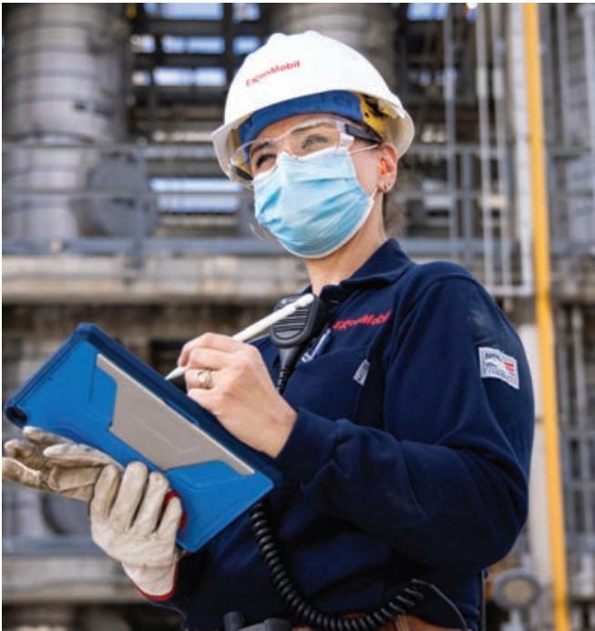

> **AI Description:**
> **Source:** `assets/_page_2_Figure_0.jpg`
> 
> **Generated:** 2026-05-29 20:47:27
> 
> ---
> 
> The image contains a photograph of a person wearing a hard hat, safety glasses, and a face mask, indicating a work environment that requires safety measures. The individual is dressed in a uniform with the logo "ExxonMobil" on it, suggesting they are an employee of ExxonMobil. They are holding a clipboard and appear to be taking notes or reviewing information, possibly related to their work duties. The background shows industrial equipment, further emphasizing the setting as a workplace, likely in the energy or manufacturing sector.

As a company with employees worldwide, we have a deep appreciation for what is needed to mobilize and assist people on a global scale. We have worked together to endure unprecedented challenges this year, and we will continue to provide the critical products and reliable energy that support our heroes on the front lines and our communities around the world. We are grateful to all who stepped up to help. THANK YOU

> **AI Description:**
> **Source:** `assets/_page_3_Figure_0.jpg`
> 
> **Generated:** 2026-05-29 20:49:25
> 
> ---
> 
> The image contains a photograph of a man in formal attire, including a suit, tie, and glasses. He is standing in front of a stone structure with columns, suggesting a formal or official setting. The man appears to be middle-aged with short, light-colored hair. There are no charts, graphs, or other visual elements present in the image.

## The past year was like no other in recent memory.

The global pandemic took a tragic toll on people and communities, while severely impacting businesses, big and small. Yet, as is often the case, hardships bring out the best in people, as exemplified by the thousands of frontline workers, first responders and medical professionals who are battling the virus.

An exceptional commitment was also displayed by thousands of ExxonMobil employees around the world who responded to the pandemic by serving their communities. I’m proud of the way they stepped up and made contributions to those in need of our products, from hand sanitizer and specialty products for protective equipment to fuel for first responders. Through extraordinary efforts, we kept operations running 24/7 while achieving strong safety and reliability performance.

The impact of the pandemic on our business was severe. As economies shut down, energy consumption collapsed. For the first time in memory, all of our businesses faced simultaneous lows.

## We adjusted our capital investment plans,

reducing spending last year by more than 30 percent, and developed future plans more flexible to market conditions and focused on priority areas that will

deliver the strongest returns. These include our high-performance chemical projects, refinery upgrades and, in the Upstream, our advantaged assets in Guyana, the Permian Basin, and Brazil.

Our recent reorganizations along value chains enabled us to reduce operating costs and improve efficiencies to better position ourselves for the future. Structural changes during the year resulted in reduced cash operating expenses of \$3 billion. These savings grow to \$6 billion a year by 2023 compared to 2019.1

We also continued to make strong progress on our plans to mitigate climate risk and position the company for success in a lower-carbon energy future. We met emission-reduction goals for methane and flaring and established new plans that are projected to be consistent with the goals of the Paris Agreement.2 Our forward plans are expected to reduce absolute Upstream greenhouse gas emissions by an estimated 30 percent by 2025 compared to 2016, and by the end of the decade, deliver industry-leading greenhouse gas performance and align our Upstream operations with the World Bank’s initiative to eliminate routine flaring.3

Other notable milestones in 2020 include:

• Our active Board refreshment program continued with two new directors added by the end of January 2021, which brings to six the number of independent directors added since 2015. In recent years the company has pursued additional board expertise in climate science, asset and risk management, and relevant industry experience. The average tenure for our directors is about six years, compared to an average of about eight years for companies in the S&P 500.

• In Guyana, Liza Phase 2 and Payara developments progressed, and we continued exploration success with three new discoveries, increasing the recoverable resource estimate on the Stabroek Block to nearly 9 billion oil-equivalent barrels.

• The Chemical business set a new record for polyethylene sales, reflecting demand growth for performance packaging and strong operating performance.

## “We look forward to playing an important role in the recovery and beyond – by providing energy and products that are critical to economic growth while minimizing environmental impacts. We support society’s aspiration of net-zero emissions by 2050 and its ambition to achieve a lower-carbon energy future.”

• We maintained our position as a global leader in carbon capture and storage (CCS), increasing captured carbon dioxide (CO2) to more than 120 million tonnes. This is well over twice the closest competitor and larger than the next five competitors combined.4

More recently, we announced the creation of a new business – ExxonMobil Low Carbon Solutions – to commercialize our extensive low-carbon technology portfolio and help society achieve the climate goals outlined in the Paris Agreement. This new business builds on the work of our Carbon Capture and Storage Venture established in 2018.

The business will initially concentrate on CCS, advancing plans for over 20 opportunities around the world to enable large-scale emission reductions. It will also leverage ExxonMobil’s significant experience in hydrogen production and add other technology focus areas, such as advanced biofuels, as they mature to commercialization.

Our research and development program is continuing to pursue breakthrough technologies to address emissions in the economy’s highest-emitting sectors: power generation, industrial, and commercial transportation. We plan to invest \$3 billion in lower-emission energy solutions through 2025.5

Over the past two decades, we have invested more than \$10 billion to research, develop, and deploy loweremission energy solutions, resulting in highly efficient operations that have eliminated or avoided approximately 480 million tonnes of greenhouse gas emissions as of year-end 2019 – equivalent to the average annual energy demand of more than 55 million U.S. homes.6

New technologies will be critically important in the future as the global economy and energy use recover. The market fundamentals underpinning our business remain strong – growing populations and improved living standards will require more energy. The respected International Energy Agency projects that oil and gas will comprise 46 percent of the global energy mix in 2040 under their Paris Agreement-aligned Sustainable Development Scenario.7

We look forward to playing an important role in the recovery and beyond – by providing energy and products that are critical to economic growth while minimizing environmental impacts. We support society’s aspiration of net-zero emissions by 2050 and its ambition to achieve a lower-carbon energy future.

The events of the past year were among the most difficult we’ve ever experienced, yet our employees rose to the challenge. This gives all of us at ExxonMobil tremendous confidence in our plans, our people, and our future.

Thank you for investing in ExxonMobil.

Darren Woods

Chairman and CEO

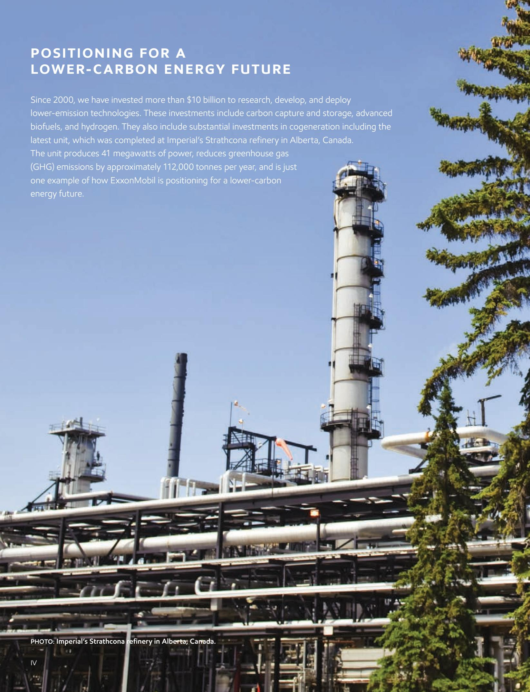

> **AI Description:**
> **Source:** `assets/_page_5_Figure_0.jpg`
> 
> **Generated:** 2026-05-29 20:48:50
> 
> ---
> 
> The image contains a photograph of the Imperial's Strathcona refinery in Alberta, Canada. The photo shows industrial infrastructure, including tall towers and extensive piping systems, set against a clear blue sky and some greenery. The text overlay provides information about ExxonMobil's investments in lower-emission technologies, including carbon capture and storage, advanced biofuels, and hydrogen. It highlights a cogeneration unit at the refinery that produces 41 megawatts of power and reduces greenhouse gas emissions by approximately 112,000 tonnes per year. The image serves as a visual representation of ExxonMobil's efforts towards a lower-carbon energy future.

> **AI Description:**
> **Source:** `assets/_page_6_Figure_0.jpg`
> 
> **Generated:** 2026-05-29 20:41:31
> 
> ---
> 
> The image contains a photograph of an industrial facility with visible piping and structures. The foreground is dominated by the branches of a coniferous tree, partially obscuring the view of the industrial area. The sky is clear and blue, indicating a sunny day. The industrial area includes large cylindrical tanks and what appears to be a control tower or observation platform. The overall scene suggests a blend of natural and industrial environments.

We play an important role in meeting society’s need for energy and at the same time are committed to supporting efforts to mitigate the risks of climate change. This is reflected in the four pillars of our climate strategy.

> **AI Description:**
> **Source:** `assets/_page_6_Figure_1.jpg`
> 
> **Generated:** 2026-05-29 20:41:33
> 
> ---
> 
> The image contains a simple white icon of a factory within a blue circle. The icon represents a factory or industrial facility. There are no charts, graphs, or additional text annotations present in the image.

MITIGATING EMISSIONS INCOMPANY OPERATIONS

> **AI Description:**
> **Source:** `assets/_page_6_Figure_2.jpg`
> 
> **Generated:** 2026-05-29 20:40:12
> 
> ---
> 
> The image contains a simple icon of two interlocking gears within a circular border. This icon is commonly used to represent mechanical processes, settings, or configurations. It does not contain any text or additional visual elements beyond the two gears and the circular border. The icon is likely used to symbolize settings, adjustments, or configurations in a technical or mechanical context.

PROVIDING PRODUCTS TO HELP CUSTOMERS REDUCE THEIR EMISSIONS

> **AI Description:**
> **Source:** `assets/_page_6_Figure_3.jpg`
> 
> **Generated:** 2026-05-29 20:38:31
> 
> ---
> 
> The image contains a simple icon of a light bulb within a circle. The light bulb is depicted with a classic design, featuring a filament and a glowing top, symbolizing an idea or inspiration. There are no additional labels, text, or other visual elements present in the image. The icon is monochromatic, using white on a blue background.

DEVELOPING AND DEPLOYING SCALABLE TECHNOLOGY SOLUTIONS

> **AI Description:**
> **Source:** `assets/_page_6_Figure_4.jpg`
> 
> **Generated:** 2026-05-29 20:42:04
> 
> ---
> 
> The image contains a simple icon of a cloud with a wind symbol emanating from it. The icon is white on a blue circular background. This icon typically represents weather conditions, specifically indicating cloudy weather with wind.

PROACTIVELY ENGAGING ONCLIMATE-RELATED POLICY

We seek to be an industry leader in greenhouse gas performance by 2030 with emission reduction plans projected to be consistent with goals of the Paris Agreement.

T H E 2 0 2 5 P L A N

15-20% REDUCTION IN GREENHOUSEGAS INTENSITY OF OUR UPSTREAM OPERATIONS

S U P P O R T E D B Y 40-50% REDUCTION IN METHANE INTENSITY

35-45% REDUCTION IN FLARING INTENSITY E X P E C T E D T O D E L I V E R

AN ABSOLUTE REDUCTION OF \~30 PERCENT IN GREENHOUSE GAS \~30% OF\~30 PERCENT IN GREENHOUSE GAS EMISSIONS IN OUR UPSTREAM BUSINESS

Upstream operations also plan to align with the World Bank’s initiative to eliminate routine flaring by 2030.

Emission reduction plans cover Scope 1 and Scope 2 emissions from assets operated by the company versus 2016 levels.

# ENERGY FOR A GROWING POPULATION

Affordable, reliable energy is essential to facilitate improvements in quality of life, including longer life expectancy, higher education, and increased gross national income per capita, regardless of location.

Today, half of the world’s population has a life expectancy of 12 years less than those living in the United States, and receives a third less education.8 Close to 1 billion people still live without electricity.7 This has enormous implications for the future of energy and the products that make modern life possible.

Global demand for energy will increase as the world’s population grows by an expected 1.6 billion people in the next two decades to more than 9 billion; the middle class will expand to more than 5 billion people by 2030, with almost 90 percent of the next 1 billion entrants into the middle class living in Asia.9, 10

S C AL AB LE TE C H N O LO GY S O LUTI O N S

GLOBAL LEADER IN CCS EXXONMOBIL IS THE FIRST COMPANY IN THE WORLD TO CAPTURE MORE THAN 120 MILLION TONNES OF CO24

EXXONMOBIL’S EFFORTS ACCOUNT FOR APPROXIMATELY 40% 40 PERCENT OF ALL THE ANTHROPOGENIC CO2 THAT HAS BEEN CAPTURED SINCE 19704

OUR ANNUAL CARBON CAPTURE CAPACITY IS \~9 MILLION TONNES OR THE EMISSIONS FROM APPROXIMATELY 2 MILLION CARS PER YEAR 11

> **AI Description:**
> **Source:** `assets/_page_7_Figure_1.jpg`
> 
> **Generated:** 2026-05-29 20:42:32
> 
> ---
> 
> The image is a photograph showing a man sitting at a desk with a laptop, a notebook, and a pen. He appears to be working or studying while holding a young child on his lap. The setting seems to be a home office or study area, with a lamp and a window in the background. The man is wearing a dark blue sweater over a gray shirt, and the child is dressed in a gray outfit. The image conveys a scene of multitasking and family life.

Carbon capture and storage (CCS) is the process in which carbon dioxide (CO2), that would have otherwise been emitted into the atmosphere, is captured and injected into deep underground geologic formations for safe, secure storage. It is recognized as one of the most important low-carbon technologies required to achieve society’s net-zero goals at the lowest costs and is one of the only technologies that could enable some industrial sectors to decarbonize. ExxonMobil is the global leader in carbon capture and has more than 30 years of experience developing and deploying CCS technologies. We also have an equity share of about one-fifth of the world’s CO2 capture capacity and are evaluating multiple opportunities to expand capacity. Furthermore, we are working on negative emissions technologies, like direct air capture, which uses advanced materials to capture CO2 from the atmosphere.

\~480 MILLION TONNES OF GREENHOUSE GAS EMISSIONS ELIMINATED OR AVOIDED SINCE 2000 THROUGH ENERGY EFFICIENCY AND MITIGATION OF EMISSIONS11

CO2 ➠

Impacts from the COVID-19 pandemic have been significant, affecting not only lives but also the global economy and energy demand. As the global response to the pandemic continues and vaccines are administered and economies begin to recover, the fundamental drivers for energy demand are expected to return.

Under most third-party scenarios that meet the objectives of the Paris Agreement, oil and natural gas will continue to play a significant role for decades in meeting increasing energy demand of a growing and more prosperous world population. ExxonMobil expects to play an important part in meeting society’s need for energy and is committed to supporting efforts to mitigate the risks of climate change.

Commercially viable technology advances are required to achieve the goals of the Paris Agreement. ExxonMobil’s sustained investment in research and development is focused on society’s highest-emitting sectors of industrial, power generation, and commercial transportation, which together

## ENERGY-EFFICIENT MANUFACTURING

Demand for industrial products is expected to continue to grow as the global economy recovers and standards of living rise in the developing world. To meet this demand, manufacturing solutions that are more energy- and greenhouse gas-efficient than those currently available will be required. Since 2000, ExxonMobil has reduced and avoided more than 320 million tonnes of emissions through energy efficiency and cogeneration projects and continues to target research in equipment design, advanced separations, catalysis, and process configurations as part of efforts to develop energy-efficient manufacturing. 11

## ADVANCED BIOFUELS

Heavy-duty transportation requires fuels with high energy density that liquid hydrocarbons provide. Biofuels, such as those derived from algae, have the potential to be a scalable solution and deliver the required energy density in a liquid form that could reduce greenhouse gas emissions by more than 50 percent compared to today’s heavy-duty transportation fuels.11 We continue to progress and invest in research to transform algae and cellulosic biomass into liquid fuels (biofuels) for the transportation sector.

## 770 MILLION PEOPLE WITHOUT ACCESS TO ELECTRICITY

account for 80 percent of global energy-related CO2 emissions, and for which the current solution set is insufficient.9

To address these gaps in available technologies, we are working to develop breakthrough solutions in a number of areas – including carbon capture, biofuels, hydrogen, and energy-efficient process technology – and recently created a new business to commercialize our extensive low-carbon technology portfolio.

Providing affordable and reliable energy while managing emissions requires a long-term perspective, competency in fundamental science and engineering, and significant investment. ExxonMobil has a history of more than 135 years as an energy innovator and is committed to doing its part to help society address this critical challenge.

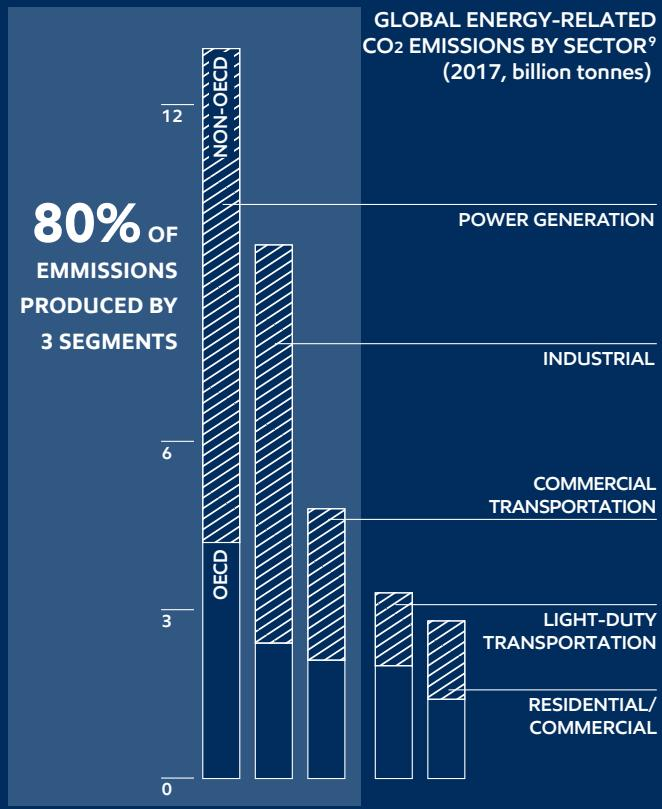

> **AI Description:**
> **Source:** `assets/_page_8_Figure_0.jpg`
> 
> **Generated:** 2026-05-29 20:45:22
> 
> ---
> 
> The image is an infographic combining text with a bar chart. It presents data on global energy-related CO2 emissions by sector in 2017, measured in billion tonnes. The chart categorizes emissions into five sectors: Power Generation, Industrial, Commercial Transportation, Light-Duty Transportation, and Residential/Commercial. The text highlights that 80% of emissions are produced by three segments: Non-OECD, OECD, and Industrial. The Non-OECD sector has the highest emissions, followed by the OECD and Industrial sectors. The chart visually represents the magnitude of emissions for each sector, with the Non-OECD sector having the tallest bar, indicating the largest emissions.

## PROVIDING ENERGY AND PRODUCTS FOR MODERN LIFE

ExxonMobil safely provides the energy and products that advance modern life, exploring for and producing oil and gas; refining the fuels and lubricants that enable transportation by land, sea, and air; and manufacturing the chemical building blocks for many products essential to life today.

EXPLORATION: ExxonMobil searches the globe for low-cost hydrocarbon supplies that can help the world responsibly meet increasing energy needs. ExxonMobil maintains one of the most active exploration programs in the industry, with particular focus on the deepwater portfolio.

PRODUCTION: ExxonMobil develops and produces oil and natural gas around the world, and has deepwater, unconventional, liquefied natural gas (LNG), heavy oil, and conventional operations. We use innovation and industry-leading technology to safely and responsibly produce hydrocarbons to meet global energy demand.

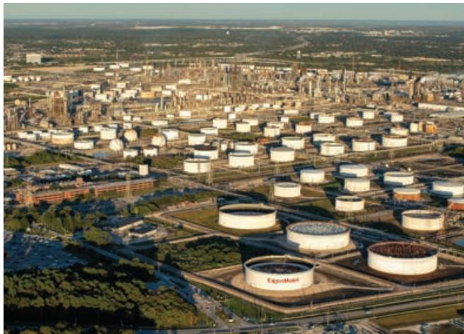

> **AI Description:**
> **Source:** `assets/_page_9_Figure_0.jpg`
> 
> **Generated:** 2026-05-29 20:45:01
> 
> ---
> 
> The image is a photograph of an industrial facility, likely an oil refinery or chemical plant. It shows numerous cylindrical storage tanks, some labeled with "ExxonMobil," indicating the company's presence. The facility is surrounded by greenery and other industrial structures, with roads and buildings visible in the background. The image provides a broad overview of the industrial complex and its layout.

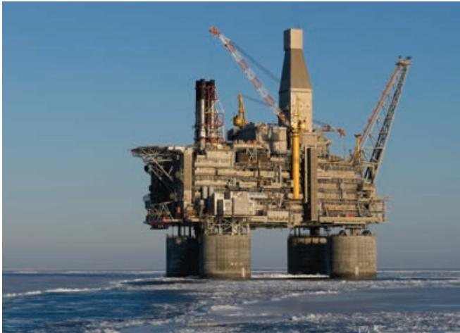

> **AI Description:**
> **Source:** `assets/_page_9_Figure_1.jpg`
> 
> **Generated:** 2026-05-29 20:44:53
> 
> ---
> 
> The image is a photograph of an offshore oil rig situated in a body of water. The rig is a complex structure with multiple levels, cranes, and mechanical components. It appears to be designed for drilling and extracting oil or gas from the seabed. The rig is surrounded by water, and the sky is clear, indicating a sunny day. The image provides a clear view of the rig's structure and its placement in the water, which is typical for offshore oil and gas operations.

REFINING: ExxonMobil is one of the world’s largest manufacturers and marketers of fuels and lubricants, selling about 5 million barrels per day of petroleum products, through a global network of more than 20,000 retail stations and commercial channels.

CHEMICAL: ExxonMobil leverages proprietary, industry-leading technology to produce high-value performance products. They are differentiated due to their enhanced properties and the significant value they bring to our customers and end-users.

## COMPETITIVE ADVANTAGES

Combined with a best-in-class portfolio and financial capacity, ExxonMobil’s competitive advantages position the company to resiliently respond to market conditions and deliver superior growth and value.

> **AI Description:**
> **Source:** `assets/_page_9_Figure_2.jpg`
> 
> **Generated:** 2026-05-29 20:45:05
> 
> ---
> 
> The image contains a simple diagram of a network or system. It features a central circle with smaller circles connected to it by lines, suggesting a network structure or a system with multiple components. The design is minimalistic and uses only lines and circles, with no text or additional labels. The image appears to represent a basic network or system architecture.

## TECHNOLOGY

We are a proven technology leader and our partnerships and investments in fundamental science and research lead to lower operating and project costs and development of higher-value products to meet society’s evolving needs.

## SCALE

The scale of our global business facilitates broad deployment of expertise, cost efficiencies, and operational learnings, while also enabling preferred partnership opportunities.

PERMIAN Started up Delaware central processing and export facility and the long haul pipeline connecting Permian to the Houston area

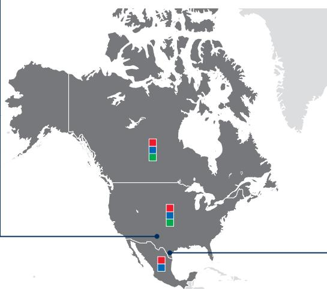

> **AI Description:**
> **Source:** `assets/_page_10_Figure_0.jpg`
> 
> **Generated:** 2026-05-29 20:49:01
> 
> ---
> 
> The image is a map of North America with a simplified outline. It includes three colored squares (red, green, and blue) placed at different locations on the map. The squares are not labeled, and there are no additional annotations or text providing context for their significance. The map appears to be a basic geographical representation without any specific data visualization or additional visual elements beyond the colored squares.

## GUYANA

Progressing phased development projects, including funding of a third project, Payara, in parallel to the exploration program

BUSINESS LINES Upstream Downstream Chemical

## CORPUS CHRISTI CHEMICAL PROJECT

Progressed construction, including module installation, to provide additional chemical performance product capacity

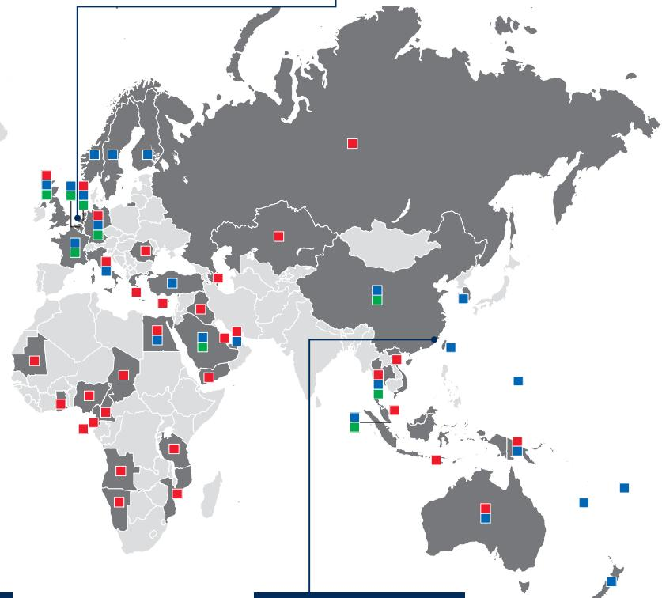

> **AI Description:**
> **Source:** `assets/_page_10_Figure_2.jpg`
> 
> **Generated:** 2026-05-29 20:49:43
> 
> ---
> 
> The image is a world map with various countries marked by colored squares. The map includes Europe, Africa, Asia, and parts of North America and Australia. The squares are colored in red, blue, and green, with some countries having multiple colored squares. The red squares are concentrated in Europe, particularly in the northern and western regions. The blue squares are more spread out, with a higher concentration in the Middle East and parts of Asia. The green squares are less numerous and are primarily located in Africa and parts of Asia. The map does not contain any text annotations or labels.

## BRAZIL

Advanced Bacalhau development and continued active exploration

## ROTTERDAM

projects that could position our Rotterdam refinery for future CCS investments

Countries with ExxonMobil operations

## CHINA FUCHUANG JV

Implemented a digital automotive environment expanding and highgrading the existing network of Mobil 1 Car Care outlets

INES42 MILLION PROJECT WORK HOURS MANAGED BY OUR GLOBAL PROJECTS ORGANIZATION IN 2020

> **AI Description:**
> **Source:** `assets/_page_10_Figure_3.jpg`
> 
> **Generated:** 2026-05-29 20:49:09
> 
> ---
> 
> The image contains a simple icon of a broken chain link within a circle. The icon is white on a blue background. It symbolizes a connection that has been severed or is not functioning. This type of icon is commonly used to represent a broken link or a disconnection in a network or system.

## INTEGRATION

Integration across global value chains enables us to capture incremental value for our products through extensive operational and product flexibility, security of feed supply, and cost ER Dw benefits, including sharing of support W template organizations and facility infrastructure.:  white templ

> **AI Description:**
> **Source:** `assets/_page_10_Figure_4.jpg`
> 
> **Generated:** 2026-05-29 20:48:53
> 
> ---
> 
> The image contains a simple diagram with a white circle on a blue background. Inside the circle, there are three white gears arranged in a triangular formation. The gears appear to be interconnected, suggesting a concept related to mechanics or systems. There are no labels or text annotations within the image.

## FUNCTIONAL EXCELLENCE

A successful history of operating complex global businesses has resulted in the development of deep knowledge in critical disciplines and industry-leading execution O drive the black and  is then used as a capabilities. lor chart. Bars an

> **AI Description:**
> **Source:** `assets/_page_10_Figure_5.jpg`
> 
> **Generated:** 2026-05-29 20:47:03
> 
> ---
> 
> The image is a simple icon depicting a group of people, likely representing a team or community. The icon consists of a circular shape with four human figures inside, suggesting unity or collaboration. There are no labels or text annotations within the image.

## PEOPLE

A world-class workforce is our most important competitive advantage. Our employees bring expertise across a wide range of disciplines, and we deploy those capabilities to create value across our global portfolio.

# CREATING VALUE THROUGHOUR INTEGRATED BUSINESSES

The Corpus Christi Chemical Project is an example of an advantaged investment executed by ExxonMobil’s unique Global Projects organization, which has combined innovative modular design from the upstream with industry-leading chemical design technology to deliver the project at below 75 percent of average industry cost.12 When operational, it will integrate feed from the Permian Basin development with a global distribution of chemical products to help meet growing demand. Deployment of new, innovative technologies maximizes returns and reduces emissions.

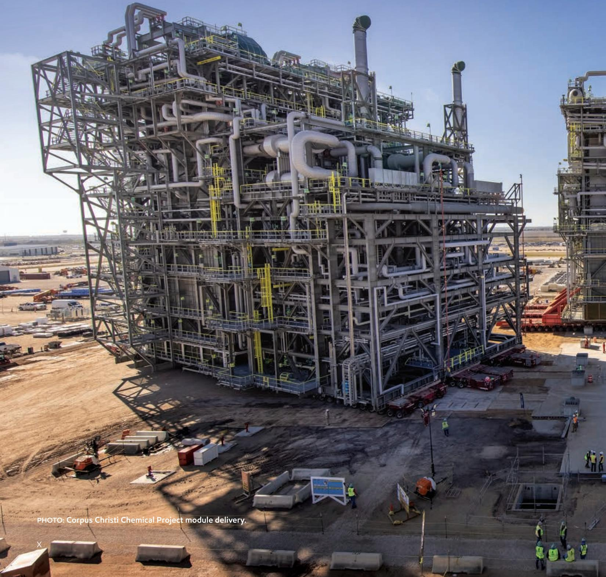

> **AI Description:**
> **Source:** `assets/_page_11_Figure_0.jpg`
> 
> **Generated:** 2026-05-29 20:46:58
> 
> ---
> 
> The image is a photograph of a large industrial structure, specifically the Corpus Christi Chemical Project module delivery. The structure is a complex assembly of metal frameworks, pipes, and platforms, indicative of a chemical processing facility. The image shows the module in an outdoor setting with construction equipment and workers visible around it, suggesting ongoing assembly or installation. The text at the bottom of the image provides context for the image, identifying it as part of a chemical project.

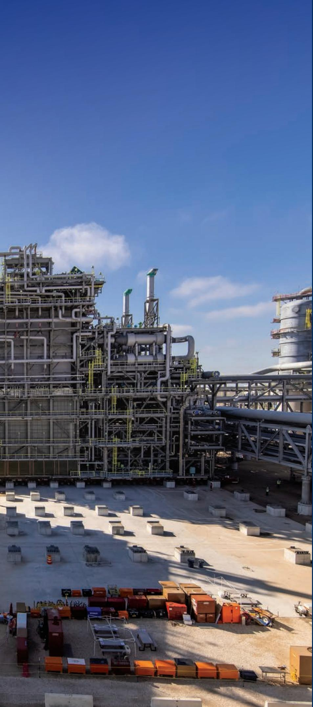

> **AI Description:**
> **Source:** `assets/_page_12_Figure_0.jpg`
> 
> **Generated:** 2026-05-29 20:40:00
> 
> ---
> 
> The image shows a large industrial facility with extensive piping and structural frameworks. The facility appears to be part of a chemical or petrochemical plant, given the complex network of pipes and the large cylindrical structures. The foreground includes a collection of shipping containers and equipment, suggesting ongoing construction or maintenance work. The sky is clear with a few scattered clouds, indicating a sunny day. The overall scene conveys a sense of industrial activity and infrastructure development.

## 2020 HIGHLIGHTS

SAFETY PERFORMANCE (lost-time incidents per 200,000 work hours) 13

U.S. petroleum industry benchmark

ExxonMobil workforce

2011 12 13 14 15 16 17 18 19 2020

BEST-EVER SAFETY PERFORMANCE

CAPITAL INVESTMENTS (Capex, billion dollars)

\$31 billion

\$21 billion

MORE THAN 30-PERCENT DECREASE WITH DEFERRAL COSTS OFFSET BY SAVINGS

CASH OPERATING COSTS14(billion dollars)

\$49 billion

\$42 billion

MORE THAN 15-PERCENT REDUCTION IN COSTS

\~370 KOEBD

NET PERMIAN PRODUCTION EXCEEDING PLANS DESPITE CURTAILMENTS

3 DISCOVERIES

CONTRIBUTING TO ALMOST 9 BOEB OF GROSS RECOVERABLE RESOURCES IN GUYANA

>9 MILLION TONNES OF RECORD POLYETHYLENE SALES

KOEBD: Thousands of oil-equivalent barrels per day BOEB: Billions of oil-equivalent barrels

# UPSTREAM

ExxonMobil produces about 4 million oil-equivalent barrels of net oil and natural gas per day. We are active in 40 countries, and participate in all aspects of the upstream global value chain, including exploration, development, production, and marketing. Our Upstream is organized into five value-chains: deepwater, unconventional, LNG, heavy oil, and conventional. Our industry-leading, low cost-of-supply developments in deepwater, unconventional Permian, and LNG underpin the growing value of our portfolio.

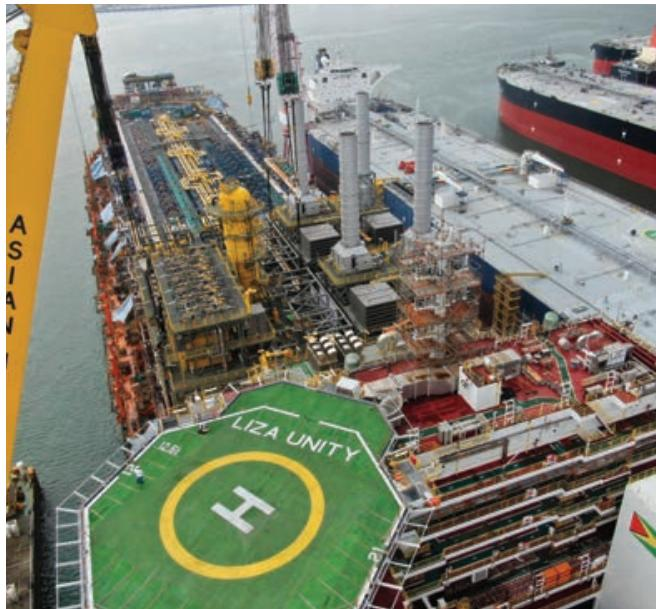

> **AI Description:**
> **Source:** `assets/_page_13_Figure_0.jpg`
> 
> **Generated:** 2026-05-29 20:42:00
> 
> ---
> 
> The image is a photograph of an offshore oil and gas platform named "Liza Unity." The platform is equipped with various structures and equipment, including large cylindrical tanks, pipes, and machinery. The helipad on the platform is marked with a yellow circle and the letter "H." In the background, there are other ships and structures, indicating the platform is located near a port or industrial area. The image provides a detailed view of the platform's layout and components, which are essential for understanding its function and design in the oil and gas industry.

UP CLOSE: GUYANA

ExxonMobil is supporting local communities and helping to develop the local oil and natural gas industry in Guyana. More than 2,000 Guyanese are now supporting project activities and, along with our primary contractors, we have spent more than \$300 million with 700 local companies since 2015.

> **AI Description:**
> **Source:** `assets/_page_13_Figure_1.jpg`
> 
> **Generated:** 2026-05-29 20:41:49
> 
> ---
> 
> The image is a photograph showing two individuals, an adult and a child, engaged in reading a book together. The adult is wearing a red polo shirt with the text "EgonMobil" on it. The child is wearing a white shirt with the word "Dove" partially visible. The setting appears to be indoors, possibly in a classroom or library, with wooden furniture in the background. The interaction suggests a learning or teaching moment.

## DEEPWATER

In Guyana, our exploration success continued in 2020 with three additional discoveries, bringing the total to 18 at year end and increased the estimated gross recoverable resource to almost 9 billion oil-equivalent barrels. In partnership with the government of Guyana, we are efficiently developing these resources while maintaining active exploration to test multiple prospects.

The Liza Phase 1 development started production in December 2019, less than five years after initial discovery, in approximately half the time of the industry average for projects of this size. The Liza Phase 2 development is on schedule for start-up in 2022. The third development, Payara, has progressed through final investment decision following government issuance of the production license. These three developments, combined with two additional floating production, storage, and offloading (FPSO) vessels, are expected to produce more than 750,000 barrels of oil per day by 2026.

In Brazil, our acreage position is among the largest of any company, with 2.6 million net acres. We operate more than 60 percent of our 28-block portfolio and expect to begin operated exploration drilling in 2021. Development work is ongoing in the Bacalhau field in the prolific pre-salt Santos Basin. Our interests are 40 percent in each of the blocks where the field is located.

## PERMIAN

Leveraging our large contiguous acreage position and unique development plan, we continue to increase resource recovery and production in the Permian Basin while also significantly reducing development and operating costs. We produced an average of approximately 370,000 net oil-equivalent barrels per day in 2020, a 35-percent year-on-year production increase despite challenging market conditions. Our estimated net recoverable resource exceeds 10 billion oil-equivalent barrels and, by applying our leading technology, we are positioned to significantly increase production, unit profitability, and overall cash flow.15

We have invested in infrastructure from New Mexico to the U.S. Gulf Coast to provide logistics flexibility and maximize the integrated value of our Permian development. In 2020, we started operations at a central processing and export facility in the Delaware Basin. Integration, including transportation and downstream investments, enables us to maximize our value-chain contributions from resource development through to fuels, lubricants, and chemicals production.

## LNG

ExxonMobil is an industry leader in liquefied natural gas and participates in the production of 86 million tonnes per year, almost 25 percent of global LNG demand. This leading position comes from decades of innovative technical application and superior project management capabilities. World-class resources and strong project performance will enable continued addition of low cost-of-supply LNG

> **AI Description:**
> **Source:** `assets/_page_14_Figure_1.jpg`
> 
> **Generated:** 2026-05-29 20:41:40
> 
> ---
> 
> The image contains three circular icons on a blue background. Each icon represents a different type of technology or system. The first icon shows a tower emitting a beam of light, likely representing a radar or communication tower. The second icon depicts a circular object with a central hub and radiating lines, possibly symbolizing a satellite dish or a radar system. The third icon illustrates a satellite with solar panels and a communication dish, indicating a communication satellite. These icons are likely used to represent different types of communication or surveillance technologies.

UP CLOSE: EMISSIONS REDUCTIONS

To further reduce methane emissions, we commenced field trials of eight emerging methane detection technologies, including satellite and aerial surveillance monitoring, at nearly 1,000 sites in Texas and New Mexico.

2020 UPSTREAM PRODUCTION BY VALUE CHAIN

DEEPWATER 11%

LNG 22%

HEAVY OIL 11%

UNCONVENTIONAL 25%

CONVENTIONAL 31%

production in the coming decade. Key projects include the Golden Pass export facility on the U.S. Gulf Coast and future developments in Papua New Guinea and Mozambique.

We conduct conventional oil and natural gas operations in 17 countries. In our mature conventional operations, we are focused on maximizing cash flow generation by lowering costs and optimizing recovery efficiency. In Canada, through our majority-owned affiliate Imperial Oil Limited (IOL), we have a significant low-decline heavy-oil portfolio and continue to reduce cost and improve reliability to maximize long-term value.

## DOWNSTREAM

ExxonMobil is one of the world’s largest manufacturers and marketers of fuels and lubricants, and sells about 5 million barrels per day of petroleum products. The commercial success of well-known brands and high-quality products is underpinned by our strong customer focus and supply reliability. Mobil 1 synthetic lubricant is the worldwide leader in synthetic motor oils and is the best-selling U.S. retail motor oil.16, 17

## FUELS

The integrated fuels value chain includes crude acquisition, manufacturing, distribution, and sales of fuels products through retail, commercial, and supply channels.

As one of the world’s largest refiners, we have nearly 5 million barrels per day of distillation capacity at 21 refineries. An integrated, global manufacturing and logistics footprint enables reliable supply of high-quality, high-value products.

## UP CLOSE: DIGITAL CUSTOMER EXPERIENCE

Customers can now pay from the comfort of their car through the ExxonMobil Rewards+ app, Alexa-enabled device or pay at the pump with Google Pay or Apple Pay. These new customer experiences are just the latest in a rich history of innovation at the pump.

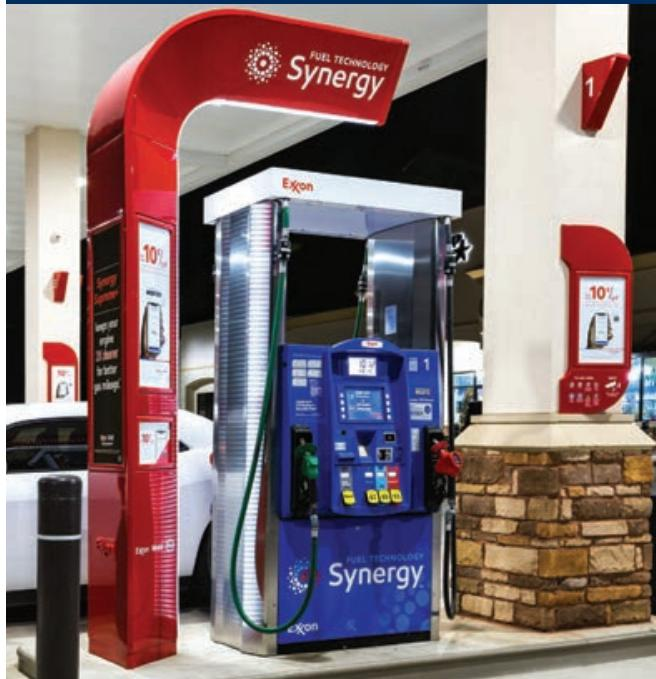

> **AI Description:**
> **Source:** `assets/_page_15_Figure_0.jpg`
> 
> **Generated:** 2026-05-29 20:38:41
> 
> ---
> 
> The image contains a photograph of a fuel pump at an Exxon gas station. The pump is branded with "Synergy" and "Fuel Technology Synergy" on the blue panel. The pump is connected to a hose, and there are red and white signage structures surrounding it. The pump displays various buttons and a screen, indicating it is an automated fuel dispenser. The image captures the pump in a nighttime setting, with a car partially visible in the background.

> **AI Description:**
> **Source:** `assets/_page_15_Figure_1.jpg`
> 
> **Generated:** 2026-05-29 20:40:08
> 
> ---
> 
> The image contains a series of five identical bottles of Mobil 1 motor oil. The bottles are arranged in a row, and each bottle prominently displays the Mobil 1 logo and the words "Extended Performance." The design of the bottles is consistent, featuring a silver color with a black label. The text on the label includes phrases like "Keep your engine running smooth," "Extended Performance," and "Protects four-stroke, five-stroke, and diesel engines." The image is focused on showcasing the product and its branding, with no additional visual elements or charts.

## LUBRICANTS

The lubricants value chain includes the development, production, and sale of basestocks and finished lubricant products. We are integrated across the entire lubricants value chain, with six basestock refineries and 21 finished lubricant blending facilities. Leading brands and proprietary technology support the wide-ranging offer of products and services we provide to customers.

Expanding basestocks • As the world’s largest Group I and Group II basestocks producer, we bring some of the most efficient production capacity to the base oils marketplace, helping to enable reliable supply and consistent quality. We develop basestock products leveraging leading-edge technology and ongoing investment in research and development.

Growing synthetic lubricants • ExxonMobil is the market leader in high-value synthetic lubricants. Growth in synthetics to meet global consumer demand for higherperformance products remains a strategic priority, with a strong focus on growing markets. The start-up of a digital automotive maintenance environment in the China FuChuang Joint Venture will integrate suppliers and customers of Mobil branded lubricants. It will expand and highgrade the existing network of Mobil 1 Car Care outlets and other vehicle maintenance products and services.

## INTEGRATED PANDEMIC RESPONSE

At the onset of the pandemic, the need for hand sanitizer, medical gowns, and masks was an essential societal challenge. We responded by re-optimizing units that typically produce gasoline, to increase production of the key feedstock for our chemical plants, critical to the manufacturing of these finished products.

## UP CLOSE: SUPERIOR PERFORMANCE PRODUCTS

> **AI Description:**
> **Source:** `assets/_page_16_Figure_0.jpg`
> 
> **Generated:** 2026-05-29 20:45:38
> 
> ---
> 
> The image is a photograph of a surgical procedure. It shows three medical professionals in surgical attire, including masks and gowns, working on a patient. The setting appears to be a sterile operating room environment. The individuals are focused on the patient, suggesting a moment of concentration and care during the surgery.

POLYPROPYLENE: More than 10-percent increase in production of specialized products that improve hygiene barriers in medical gowns and masks

POLYETHYLENE: Increased demand for barrier films and food and goods packaging supported record sales

ExxonMobil is among the largest chemical producers in the world with annual sales of over 25 million tonnes. We are the number one or two producer for more than 80 percent of our chemical product portfolio,19 achieved through operational excellence, cost discipline, a balanced product portfolio, proprietary technology, and industry-leading integration with our Downstream and Upstream operations.

Worldwide demand for chemicals is expected to rise by approximately 40 percent by 2030,20 underpinned by global population growth, an expanding middle class, and improved living standards.These factors, together with a recognition of the lower greenhouse gas emissions from plastics versus alternatives, correspond to an increase in demand for everyday products.21 We are investing in new capacity to meet that demand.

## BASIC CHEMICALS

Basic chemicals are the building blocks for many of the products essential to modern life. Olefins are the feed to produce polyethylene, polypropylene, and other polymers.

> **AI Description:**
> **Source:** `assets/_page_16_Figure_2.jpg`
> 
> **Generated:** 2026-05-29 20:47:10
> 
> ---
> 
> The image contains a photograph of a person wearing a face mask, safety goggles, and purple gloves, holding a clear plastic bottle with a label. The setting appears to be a laboratory or research environment, as indicated by the background which includes laboratory equipment and shelves. The person is examining the bottle, suggesting a scientific or experimental context.

Aromatics and glycols are vital for a wide range of consumer and industrial products, including polyester resins, fibers for clothing, and insulation.

Integration, advanced optimization tools, and

> **AI Description:**
> **Source:** `assets/_page_16_Figure_3.jpg`
> 
> **Generated:** 2026-05-29 20:47:15
> 
> ---
> 
> The image contains a photograph of three phone cases with QR codes and text printed on them. The cases are red, white, and green, and the text includes phrases like "Follow me" and "Like me." The cases appear to be designed for a social media or marketing campaign, as indicated by the QR codes and the text encouraging interaction. The image is a simple product display with no additional charts, graphs, or diagrams.

VISTAMAXX POLYMERS: Record sales driven by enhanced softness in medical fabrics and enabling recyclability without degrading performance18

flexible processes enable us to respond to dynamic market conditions, rapidly transitioning our chemical operations across an unparalleled range of feedstocks, from light gases to crude oil. This capability, in addition to reliable operations, helped us achieve an olefins production record in 2020, providing advantaged, secure feedstock for our performance and commodity products.

## PERFORMANCE PRODUCTS

Our performance products are used in a wide range of consumer applications, including food packaging, vehicles, and diapers. They enable tougher and lighter products that use less material, save energy, and reduce cost and waste. The enhanced properties of our performance products, and the significant value they bring to customers and end-users, differentiate them from commodity products. Leveraging our technology leadership and extensive customer collaboration, performance product sales grew by nearly 5 percent in 2020, despite lower global GDP.

## UP CLOSE: SUSTAINABILITY

> **AI Description:**
> **Source:** `assets/_page_16_Figure_4.jpg`
> 
> **Generated:** 2026-05-29 20:49:16
> 
> ---
> 
> The image contains a recycling symbol, which is a well-known international symbol for waste recycling. It consists of three arrows forming a triangle, with each arrow pointing to the next, indicating the process of recycling materials. This symbol is universally recognized and used to indicate that a product or packaging can be recycled.

Plastics provide sustainability benefits and play an important role in helping society mitigate greenhouse gas emissions. We are investing in advantaged technology to recycle plastic waste at our integrated sites. We are also a founding member of the Alliance to End Plastic Waste, an organization focused on developing safe, scalable, and economically viable solutions to help end plastic waste in the environment.

## BOARD OF DIRECTORS

Kenneth C. Frazier (Lead Director)   
Chairman of the Board and   
Chief Executive Officer,   
Merck & Company (pharmaceuticals)   
Director since 2009   
Susan K. Avery   
President Emerita, Woods Hole   
Oceanographic Institution (nonprofit   
ocean research, exploration, and   
education)   
Director since 2017   
Angela F. Braly   
Former Chairman of the Board,   
President, and Chief Executive Officer,   
WellPoint, Inc. (health care)   
Director since 2016 Ursula M. Burns   
Former Chairman of the Board and Chief Executive Officer, VEON Ltd. (telecommunication services)   
Director since 2012   
Joseph L. Hooley   
Former Chairman of the Board,   
President, and Chief Executive Officer,   
State Street Corporation   
(financial services)   
Director since 2020   
Steven A. Kandarian   
Former Chairman of the Board,   
President, and Chief Executive Officer,   
MetLife Inc. (insurance)   
Director since 2018 Douglas R. Oberhelman   
Former Chairman of the Board and Chief Executive Officer, Caterpillar Inc. (heavy equipment)   
Director since 2015   
Samuel J. Palmisano   
Former Chairman of the Board, President,   
and Chief Executive Officer, International   
Business Machines Corporation   
(computer hardware, software,   
business consulting, and IT services)   
Director since 2006   
William C. Weldon   
Former Chairman of the Board   
and Chief Executive Officer,   
Johnson & Johnson (pharmaceuticals)   
Director since 2013

Darren W. Woods Chairman of the Board and Chief Executive Officer Director since 2016

6 YEARS AVERAGE TENURE OF NON-EMPLOYEE DIRECTORS, ABOUT 2 YEARS LOWER THAN THE S&P 500 AVERAGE22

6 NON-EMPLOYEE DIRECTORS ADDED WITHIN THE LAST 6 YEARS23

## STANDING COMMITTEES OF THE BOARD

Audit Committee U.M. Burns (Chair), J.L. Hooley, D.R. Oberhelman, W.C. Weldon

Board Affairs Committee K.C. Frazier (Chair), S.K. Avery, S.J. Palmisano

Compensation Committee S.J. Palmisano (Chair), A.F. Braly, K.C. Frazier, S.A. Kandarian

Finance Committee   
D.W. Woods (Chair), U.M. Burns, J.L. Hooley, D.R. Oberhelman,   
W.C. Weldon

Public Issues and Contributions Committee A.F. Braly (Chair), S.K. Avery, S.A. Kandarian

Executive Committee   
D.W. Woods (Chair), U.M. Burns, K.C. Frazier, S.J. Palmisano,   
W.C. Weldon

# UNITED STATES SECURITIES AND EXCHANGE COMMISSION WASHINGTON, D.C. 20549

# FORM 10-K ☑ ANNUAL REPORT PURSUANT TO SECTION 13 OR 15(d) OF THE SECURITIES EXCHANGE ACT OF 1934 For the fiscal year ended December 31, 2020 or ☐ TRANSITION REPORT PURSUANT TO SECTION 13 OR 15(d) OF THE SECURITIES EXCHANGE ACT OF 1934 For the transition period from to Commission File Number 1-2256 Exxon Mobil Corporation

(Exact name of registrant as specified in its charter)

New Jersey (State or other jurisdiction of incorporation or organization)

13-5409005   
(I.R.S. Employer   
Identification Number)

5959 Las Colinas Boulevard, Irving, Texas 75039-2298 (Address of principal executive offices) (Zip Code) (972) 940-6000 (Registrant’s telephone number, including area code)

Securities registered pursuant to Section 12(b) of the Act:

Indicate by check mark if the registrant is a well-known seasoned issuer, as defined in Rule 405 of the Securities Act. Yes ☑ No ☐

Indicate by check mark if the registrant is not required to file reports pursuant to Section 13 or Section 15(d) of the Act. Yes ☐ No ☑

Indicate by check mark whether the registrant (1) has filed all reports required to be filed by Section 13 or 15(d) of the Securities Exchange Act of 1934 during the preceding 12 months (or for such shorter period that the registrant was required to file such reports), and (2) has been subject to such filing requirements for the past 90 days. Yes ☑ No ☐

Indicate by check mark whether the registrant has submitted electronically every Interactive Data File required to be submitted and posted pursuant to Rule 405 of Regulation S-T (§ 232.405 of this chapter) during the preceding 12 months (or for such shorter period that the registrant was required to submit and post such files). Yes R	No ☐

Indicate by check mark whether the registrant is a large accelerated filer, an accelerated filer, a non-accelerated filer, a smaller reporting company, or an emerging growth company. See the definitions of “large accelerated filer,” “accelerated filer,” “smaller reporting company,” and “emerging growth company” in Rule 12b-2 of the Exchange Act.

Large accelerated filer ☑ Accelerated filer ☐

Emerging growth company

If an emerging growth company, indicate by check mark if the registrant has elected not to use the extended transition period for complying with any new or revised financial accounting standards provided pursuant to Section 13(a) of the Exchange Act. ☐

Indicate by check mark whether the registrant has filed a report on and attestation to its management's assessment of the effectiveness of its internal control over financial reporting under Section 404(b) of the Sarbanes-Oxley Act (15 U.S.C. 7262(b)) by the registered public accounting firm that prepared or issued its audit report. ☑

Indicate by check mark whether the registrant is a shell company (as defined by Rule 12b-2 of the Act). Yes ☐ No ☑

The aggregate market value of the voting stock held by non-affiliates of the registrant on June 30, 2020, the last business day of the registrant’s most recently completed second fiscal quarter, based on the closing price on that date of \$44.72 on the New York Stock Exchange composite tape, was in excess of \$189 billion.

Class

Common stock, without par value

Outstanding as of January 31, 2021

4,233,483,160

# EXXON MOBIL CORPORATION FORM 10-K FOR THE FISCAL YEAR ENDED DECEMBER 31, 2020

## TABLE OF CONTENTS

## PART I

Item 1. Business 1   
Item 1A. Risk Factors 2   
Item 1B. Unresolved Staff Comments 5   
Item 2. Properties 6   
Item 3. Legal Proceedings 27   
Item 4. Mine Safety Disclosures 27   
Information about our Executive Officers 28

## PART II

Item 5. Market for Registrant’s Common Equity, Related Stockholder Matters and Issuer Purchases of Equity Securities 30   
Item 7. Management’s Discussion and Analysis of Financial Condition and Results of Operations 30   
Item 7A. Quantitative and Qualitative Disclosures About Market Risk 30   
Item 8. Financial Statements and Supplementary Data 31   
Item 9. Changes in and Disagreements With Accountants on Accounting and Financial Disclosure 31   
Item 9A. Controls and Procedures 31   
Item 9B. Other Information 31

## PART III

Item 10. Directors, Executive Officers and Corporate Governance 32   
Item 11. Executive Compensation 32   
Item 12. Security Ownership of Certain Beneficial Owners and Management and Related Stockholder Matters 32   
Item 13. Certain Relationships and Related Transactions, and Director Independence 33   
Item 14. Principal Accounting Fees and Services 33

## PART IV

Item 15. Exhibits, Financial Statement Schedules 33   
Item 16. Form 10-K Summary 33   
Financial Section 34   
Index to Exhibits 124   
Signatures 125   
Exhibits 31 and 32 — Certifications

## PART I

## ITEM 1. BUSINESS

Exxon Mobil Corporation was incorporated in the State of New Jersey in 1882. Divisions and affiliated companies of ExxonMobil operate or market products in the United States and most other countries of the world. Their principal business involves exploration for, and production of, crude oil and natural gas and manufacture, trade, transport and sale of crude oil, natural gas, petroleum products, petrochemicals and a wide variety of specialty products. Affiliates of ExxonMobil conduct extensive research programs in support of these businesses.

Exxon Mobil Corporation has several divisions and hundreds of affiliates, many with names that include ExxonMobil, Exxon, Esso, Mobil or XTO. For convenience and simplicity, in this report the terms ExxonMobil, Exxon, Esso, Mobil and XTO, as well as terms like Corporation, Company, our, we and its, are sometimes used as abbreviated references to specific affiliates or groups of affiliates. The precise meaning depends on the context in question.

The energy and petrochemical industries are highly competitive, both within the industries and also with other industries in supplying the energy, fuel and chemical needs of industrial and individual consumers. The Corporation competes with other firms in the sale or purchase of needed goods and services in many national and international markets and employs all methods of competition which are lawful and appropriate for such purposes.

Operating data and industry segment information for the Corporation are contained in the Financial Section of this report under the following: “Note 18: Disclosures about Segments and Related Information” and “Operating Information”. Information on oil and gas reserves is contained in the “Oil and Gas Reserves” part of the “Supplemental Information on Oil and Gas Exploration and Production Activities” portion of the Financial Section of this report.

ExxonMobil has a long-standing commitment to the development of proprietary technology. We have a wide array of research programs designed to meet the needs identified in each of our business segments. ExxonMobil held nearly 9 thousand active patents worldwide at the end of 2020. For technology licensed to third parties, revenues totaled approximately \$130 million in 2020. Although technology is an important contributor to the overall operations and results of our Company, the profitability of each business segment is not dependent on any individual patent, trade secret, trademark, license, franchise or concession.

ExxonMobil operates in a highly complex, competitive and changing global energy business environment where decisions and risks play out over time horizons that are often decades in length. This long-term orientation underpins the Corporation's philosophy on talent development.

Talent development begins with recruiting exceptional candidates and continues with individually planned experiences and training designed to facilitate broad development and a deep understanding of our business across the business cycle. Our career-oriented approach to talent development results in strong retention and an average length of service of 30 years for our career employees. Compensation, benefits and workplace programs support the Corporation's talent management approach, and are designed to attract and retain employees for a career through compensation that is market competitive, long-term oriented, and highly differentiated by individual performance.

Sixty percent of our global employee workforce is from outside the U.S., and over the past decade 39 percent of our global hires for management, professional and technical positions were female and 31 percent of our U.S. hires for management, professional and technical positions were minorities. With over 160 nationalities represented in the Company, we encourage and respect diversity of thought, ideas and perspective from our workforce. We consider and monitor diversity through all stages of employment, including recruitment, training and development of our employees. We also work closely with the communities where we operate to identify and invest in initiatives that help support local needs, including local talent and skill development.

The number of regular employees was 72 thousand, 75 thousand, and 71 thousand at years ended 2020, 2019, and 2018, respectively. Regular employees are defined as active executive, management, professional, technical and wage employees who work full time or part time for the Corporation and are covered by the Corporation’s benefit plans and programs.

As discussed in item 1A. Risk Factors in this report, compliance with existing and potential future government regulations, including taxes, environmental regulations, and other government regulations and policies that directly or indirectly affect the production and sale of our products, may have material effects on the capital expenditures, earnings, and competitive position of ExxonMobil. With respect to the environment, throughout ExxonMobil’s businesses, new and ongoing measures are taken to prevent and minimize the impact of our operations on air, water and ground, including, but not limited to, compliance with environmental regulations. These include a significant investment in refining infrastructure and technology to manufacture clean fuels, as well as projects to monitor and reduce nitrogen oxide, sulfur oxide and greenhouse gas emissions, and expenditures for asset retirement obligations. Using definitions and guidelines established by the American Petroleum Institute, ExxonMobil’s 2020 worldwide environmental expenditures for all such preventative and remediation steps, including ExxonMobil’s share of equity company expenditures, were \$4.5 billion, of which \$3.4 billion were included in expenses with the remainder in capital expenditures. The total cost for such activities is expected to increase to approximately \$4.9 billion in 2021 and 2022. Capital expenditures are expected to account for approximately 25 percent of the total.

Information concerning the source and availability of raw materials used in the Corporation’s business, the extent of seasonality in the business, the possibility of renegotiation of profits or termination of contracts at the election of governments and risks attendant to foreign operations may be found in “Item 1A. Risk Factors” and “Item 2. Properties” in this report.

ExxonMobil maintains a website at exxonmobil.com. Our annual report on Form 10-K, quarterly reports on Form 10-Q, current reports on Form 8-K and any amendments to those reports filed or furnished pursuant to Section 13(a) of the Securities Exchange Act of 1934 are made available through our website as soon as reasonably practical after we electronically file or furnish the reports to the Securities and Exchange Commission (SEC). Also available on the Corporation’s website are the Company’s Corporate Governance Guidelines, Code of Ethics and Business Conduct, and additional policies as well as the charters of the audit, compensation, and other committees of the Board of Directors. Information on our website is not incorporated into this report.

The SEC maintains an internet site (http://www.sec.gov) that contains reports, proxy and information statements, and other information regarding issuers that file electronically with the SEC.

## ITEM 1A. RISK FACTORS

ExxonMobil’s financial and operating results are subject to a variety of risks inherent in the global oil, gas, and petrochemical businesses. Many of these risk factors are not within the Company’s control and could adversely affect our business, our financial and operating results, or our financial condition. These risk factors include:

## Supply and Demand

The oil, gas, and petrochemical businesses are fundamentally commodity businesses. This means ExxonMobil’s operations and earnings may be significantly affected by changes in oil, gas, and petrochemical prices and by changes in margins on refined products. Oil, gas, petrochemical, and product prices and margins in turn depend on local, regional, and global events or conditions that affect supply and demand for the relevant commodity. Any material decline in oil or natural gas prices could have a material adverse effect on certain of the Company’s operations, especially in the Upstream segment, financial condition, and proved reserves. On the other hand, a material increase in oil or natural gas prices could have a material adverse effect on certain of the Company’s operations, especially in the Downstream and Chemical segments.

Economic conditions. The demand for energy and petrochemicals is generally linked closely with broad-based economic activities and levels of prosperity. The occurrence of recessions or other periods of low or negative economic growth will typically have a direct adverse impact on our results. Other factors that affect general economic conditions in the world or in a major region, such as changes in population growth rates, periods of civil unrest, government austerity programs, trade tariffs, security or public health issues and responses, or currency exchange rate fluctuations, can also impact the demand for energy and petrochemicals. Sovereign debt downgrades, defaults, inability to access debt markets due to credit or legal constraints, liquidity crises, the breakup or restructuring of fiscal, monetary, or political systems such as the European Union, and other events or conditions that impair the functioning of financial markets and institutions also pose risks to ExxonMobil, including risks to the safety of our financial assets and to the ability of our partners and customers to fulfill their commitments to ExxonMobil. Demand reduction due to the COVID-19 pandemic as well as accompanying conditions of oversupply have led to a significant decrease in commodity prices and margins. Future business results, including cash flows and financing needs, will be affected by the extent and duration of these conditions and the effectiveness of responsive actions that the Corporation and others take, including actions to reduce capital and operating expenses, and actions taken by governments and others to address the COVID-19 pandemic including the ongoing development and distribution of COVID-19 vaccines, and the impact of the pandemic on national and global economies and markets.

Other demand-related factors. Other factors that may affect the demand for oil, gas, and petrochemicals, and therefore impact our results, include technological improvements in energy efficiency; seasonal weather patterns; increased competitiveness of, or government policy support for, alternative energy sources; changes in technology that alter fuel choices, such as technological advances in energy storage that make wind and solar more competitive for power generation; changes in consumer preferences for our products, including consumer demand for alternative fueled or electric transportation or alternatives to plastic products; and broadbased changes in personal income levels.

Other supply-related factors. Commodity prices and margins also vary depending on a number of factors affecting supply. For example, increased supply from the development of new oil and gas supply sources and technologies to enhance recovery from existing sources tend to reduce commodity prices to the extent such supply increases are not offset by commensurate growth in demand. Similarly, increases in industry refining or petrochemical manufacturing capacity relative to demand tend to reduce margins on the affected products. World oil, gas, and petrochemical supply levels can also be affected by factors that reduce available supplies, such as adherence by countries to OPEC production quotas and other agreements among sovereigns, government policies that restrict oil and gas production or increase associated costs, and the occurrence of wars, hostile actions, natural disasters, disruptions in competitors’ operations, logistics constraints or unexpected unavailability of distribution channels that may disrupt supplies. Technological change can also alter the relative costs for competitors to find, produce, and refine oil and gas and to manufacture petrochemicals.

Other market factors. ExxonMobil’s business results are also exposed to potential negative impacts due to changes in interest rates, inflation, currency exchange rates, and other local or regional market conditions.

## Government and Political Factors

ExxonMobil’s results can be adversely affected by political or regulatory developments affecting our operations.

Access limitations. A number of countries limit access to their oil and gas resources, including by restricting leasing or permitting activities, or may place resources off-limits from development altogether. Restrictions on production of oil and gas could increase to the extent governments view such measures as a viable approach for pursuing national and global energy and climate policies. Restrictions on foreign investment in the oil and gas sector tend to increase in times of high commodity prices, when national governments may have less need of outside sources of private capital. Many countries also restrict the import or export of certain products based on point of origin.

Restrictions on doing business. ExxonMobil is subject to laws and sanctions imposed by the United States or by other jurisdictions where we do business that may prohibit ExxonMobil or certain of its affiliates from doing business in certain countries, or restricting the kind of business that may be conducted. Such restrictions may provide a competitive advantage to competitors who may not be subject to comparable restrictions.

Lack of legal certainty. Some countries in which we do business lack well-developed legal systems, or have not yet adopted, or may be unable to maintain, clear regulatory frameworks for oil and gas development. Lack of legal certainty exposes our operations to increased risk of adverse or unpredictable actions by government officials, and also makes it more difficult for us to enforce our contracts. In some cases these risks can be partially offset by agreements to arbitrate disputes in an international forum, but the adequacy of this remedy may still depend on the local legal system to enforce an award.

Regulatory and litigation risks. Even in countries with well-developed legal systems where ExxonMobil does business, we remain exposed to changes in law or interpretation of settled law (including changes that result from international treaties and accords) that could adversely affect our results, such as:

increases in taxes, duties, or government royalty rates (including retroactive claims);

price controls;

changes in environmental regulations or other laws that increase our cost of compliance or reduce or delay available business opportunities (including changes in laws affecting offshore drilling operations, water use, methane emissions, hydraulic fracturing or use of plastics);

actions by regulators or other political actors to delay or deny necessary licenses and permits or restrict the transportation of our products;

adoption of regulations mandating efficiency standards, the use of alternative fuels or uncompetitive fuel components;

adoption of government payment transparency regulations that could require us to disclose competitively sensitive commercial information, or that could cause us to violate the non-disclosure laws of other countries; and

government actions to cancel contracts, re-denominate the official currency, renounce or default on obligations, renegotiate terms unilaterally, or expropriate assets.

Legal remedies available to compensate us for expropriation or other takings may be inadequate.

We also may be adversely affected by the outcome of litigation, especially in countries such as the United States in which very large and unpredictable punitive damage awards may occur; by government enforcement proceedings alleging non-compliance with applicable laws or regulations; or by state and local government actors as well as private plaintiffs acting in parallel that attempt to use the legal system to promote public policy agendas, gain political notoriety, or obtain monetary awards from the Company.

Security concerns. Successful operation of particular facilities or projects may be disrupted by civil unrest, acts of sabotage or terrorism, cybersecurity attacks, and other local security concerns. Such concerns may require us to incur greater costs for security or to shut down operations for a period of time.

Climate change and greenhouse gas restrictions. Driven by concern over the risks of climate change, a number of countries have adopted, or are considering the adoption of, regulatory frameworks to reduce greenhouse gas emissions or production and use of oil and gas. These include adoption of cap and trade regimes, carbon taxes, trade tariffs, minimum renewable usage requirements, restrictive permitting, increased efficiency standards, and incentives or mandates for renewable energy. Political and other actors and their agents also increasingly seek to advance climate change objectives indirectly, such as by seeking to reduce the availability of or increase the cost for, financing and investment in the oil and gas sector and taking actions intended to promote changes in business strategy for oil and gas companies. Depending on how policies are formulated and applied, they could have the potential to negatively affect investment returns, make our products more expensive or less competitive, lengthen project implementation times, and reduce demand for hydrocarbons, as well as shift hydrocarbon demand toward relatively lower-carbon sources such as natural gas. Current and pending greenhouse gas regulations or policies may also increase our compliance costs, such as for monitoring or sequestering emissions.

Alternative energy. Many governments are providing tax advantages and other subsidies to support transitioning to alternative energy sources or are mandating the use of specific fuels or technologies. Governments and others are also promoting research into new technologies to reduce the cost and increase the scalability of alternative energy sources. We are conducting our own research both inhouse and by working with more than 80 leading universities around the world, including the Massachusetts Institute of Technology, Princeton University, The University of Texas, and Stanford University in the U.S., and in Singapore with Nanyang Technological Institute and the National University. Our research projects focus on developing advanced biofuels and hydrogen, carbon capture and storage, breakthrough energy efficiency processes, advanced energy-saving materials, and other technologies in collaboration with our partners including Synthetic Genomics, FuelCell Energy and Global Thermostat. Our future results may depend in part on the success of our research efforts and on our ability to adapt and apply the strengths of our current business model to providing the energy products of the future in a cost-competitive manner. See “Operational and Other Factors” below.

## Operational and Other Factors

In addition to external economic and political factors, our future business results also depend on our ability to manage successfully those factors that are at least in part within our control. The extent to which we manage these factors will impact our performance relative to competition. For projects in which we are not the operator, we depend on the management effectiveness of one or more coventurers whom we do not control.

Exploration and development program. Our ability to maintain and grow our oil and gas production depends on the success of our exploration and development efforts. Among other factors, we must continuously improve our ability to identify the most promising resource prospects and apply our project management expertise to bring discovered resources on line as scheduled and within budget.

Project and portfolio management. The long-term success of ExxonMobil’s Upstream, Downstream, and Chemical businesses depends on complex, long-term, capital intensive projects. These projects in turn require a high degree of project management expertise to maximize efficiency. Specific factors that can affect the performance of major projects include our ability to: negotiate successfully with joint venturers, partners, governments, suppliers, customers, or others; model and optimize reservoir performance; develop markets for project outputs, whether through long-term contracts or the development of effective spot markets; manage changes in operating conditions and costs, including costs of third party equipment or services such as drilling rigs and shipping; prevent, to the extent possible, and respond effectively to unforeseen technical difficulties that could delay project startup or cause unscheduled project downtime; and influence the performance of project operators where ExxonMobil does not perform that role. In addition to the effective management of individual projects, ExxonMobil’s success, including our ability to mitigate risk and provide attractive returns to shareholders, depends on our ability to successfully manage our overall portfolio, including diversification among types and locations of our projects and strategies to divest assets. We may not be able to divest assets at a price or on the timeline we contemplate in our strategies. Additionally, we may retain certain liabilities following a divestment and could be held liable for past use or for different liabilities than anticipated.

The term “project” as used in this report can refer to a variety of different activities and does not necessarily have the same meaning as in any government payment transparency reports.

Operational efficiency. An important component of ExxonMobil’s competitive performance, especially given the commodity-based nature of many of our businesses, is our ability to operate efficiently, including our ability to manage expenses and improve production yields on an ongoing basis. This requires continuous management focus, including technology improvements, cost control, productivity enhancements, regular reappraisal of our asset portfolio, and the recruitment, development, and retention of high caliber employees.

Research and development and technological change. To maintain our competitive position, especially in light of the technological nature of our businesses and the need for continuous efficiency improvement, ExxonMobil’s research and development organizations must be successful and able to adapt to a changing market and policy environment, including developing technologies to help reduce greenhouse gas emissions. To remain competitive we must also continuously adapt and capture the benefits of new and emerging technologies, including successfully applying advances in the ability to process very large amounts of data to our businesses.

Safety, business controls, and environmental risk management. Our results depend on management’s ability to minimize the inherent risks of oil, gas, and petrochemical operations, to control effectively our business activities, and to minimize the potential for human error. We apply rigorous management systems and continuous focus on workplace safety and avoiding spills or other adverse environmental events. For example, we work to minimize spills through a combined program of effective operations integrity management, ongoing upgrades, key equipment replacements, and comprehensive inspection and surveillance. Similarly, we are implementing cost-effective new technologies and adopting new operating practices to reduce air emissions, not only in response to government requirements but also to address community priorities. We also maintain a disciplined framework of internal controls and apply a controls management system for monitoring compliance with this framework. Substantial liabilities and other adverse impacts could result if our management systems and controls do not function as intended.

Cybersecurity. ExxonMobil is regularly subject to attempted cybersecurity disruptions from a variety of threat actors including statesponsored actors. ExxonMobil’s defensive preparedness includes multi-layered technological capabilities for prevention and detection of cybersecurity disruptions; non-technological measures such as threat information sharing with governmental and industry groups; internal training and awareness campaigns including routine testing of employee awareness and an emphasis on resiliency including business response and recovery. If the measures we are taking to protect against cybersecurity disruptions prove to be insufficient or if our proprietary data is otherwise not protected, ExxonMobil as well as our customers, employees, or third parties could be adversely affected. Cybersecurity disruptions could cause physical harm to people or the environment; damage or destroy assets; compromise business systems; result in proprietary information being altered, lost, or stolen; result in employee, customer, or third-party information being compromised; or otherwise disrupt our business operations. We could incur significant costs to remedy the effects of a major cybersecurity disruption in addition to costs in connection with resulting regulatory actions, litigation or reputational harm.

Preparedness. Our operations may be disrupted by severe weather events, natural disasters, human error, and similar events. For example, hurricanes may damage our offshore production facilities or coastal refining and petrochemical plants in vulnerable areas. Our facilities are designed, constructed, and operated to withstand a variety of extreme climatic and other conditions, with safety factors built in to cover a number of engineering uncertainties, including those associated with wave, wind, and current intensity, marine ice flow patterns, permafrost stability, storm surge magnitude, temperature extremes, extreme rainfall events, and earthquakes. Our consideration of changing weather conditions and inclusion of safety factors in design covers the engineering uncertainties that climate change and other events may potentially introduce. Our ability to mitigate the adverse impacts of these events depends in part upon the effectiveness of our robust facility engineering as well as our rigorous disaster preparedness and response, and business continuity planning.

Insurance limitations. The ability of the Corporation to insure against many of the risks it faces as described in this Item 1A is limited by the capacity of the applicable insurance markets, which may not be sufficient.

Competition. As noted in Item 1 above, the energy and petrochemical industries are highly competitive. We face competition not only from other private firms, but also from state-owned companies that are increasingly competing for opportunities outside of their home countries and as partners with other private firms. In some cases, these state-owned companies may pursue opportunities in furtherance of strategic objectives of their government owners, with less focus on financial returns than companies owned by private shareholders, such as ExxonMobil. Technology and expertise provided by industry service companies may also enhance the competitiveness of firms that may not have the internal resources and capabilities of ExxonMobil or reduce the need for resourceowning countries to partner with private-sector oil and gas companies in order to monetize national resources.

Reputation. Our reputation is an important corporate asset. An operating incident, significant cybersecurity disruption, change in consumer views concerning our products, or other adverse event such as those described in this Item 1A may have a negative impact on our reputation, which in turn could make it more difficult for us to compete successfully for new opportunities, obtain necessary regulatory approvals, obtain financing, or could reduce consumer demand for our branded products. ExxonMobil’s reputation may also be harmed by events which negatively affect the image of our industry as a whole.

Projections, estimates, and descriptions of ExxonMobil’s plans and objectives included or incorporated in Items 1, 1A, 2, 7 and 7A of this report are forward-looking statements. Actual future results, including project completion dates, production rates, capital expenditures, costs, and business plans could differ materially due to, among other things, the factors discussed above and elsewhere in this report.

## ITEM 1B. UNRESOLVED STAFF COMMENTS

None.

## ITEM 2. PROPERTIES

Information with regard to oil and gas producing activities follows:

## 1. Disclosure of Reserves

## A. Summary of Oil and Gas Reserves at Year-End 2020

The table below summarizes the oil-equivalent proved reserves in each geographic area and by product type for consolidated subsidiaries and equity companies. Natural gas is converted to an oil-equivalent basis at six billion cubic feet per one million barrels. The Corporation has reported proved reserves on the basis of the average of the first-day-of-the-month price for each month during the last 12-month period. Primarily as a result of very low prices during 2020 and the effects of reductions in capital expenditures, under the SEC definition of proved reserves, certain quantities of crude oil, bitumen, and natural gas that qualified as proved reserves in prior years did not qualify as proved reserves at year-end 2020. Otherwise, no major discovery or other favorable or adverse event has occurred since December 31, 2020, that would cause a significant change in the estimated proved reserves as of that date.

(1) Other Americas includes proved developed reserves of 119 million barrels of crude oil and 138 billion cubic feet of natural gas, as well as proved undeveloped reserves of 179 million barrels of crude oil and 77 billion cubic feet of natural gas.

In the preceding reserves information, consolidated subsidiary and equity company reserves are reported separately. However, the Corporation operates its business with the same view of equity company reserves as it has for reserves from consolidated subsidiaries.

The Corporation anticipates several projects will come online over the next few years providing additional production capacity. However, actual volumes will vary from year to year due to the timing of individual project start-ups; operational outages; reservoir performance; performance of enhanced oil recovery projects; regulatory changes; the impact of fiscal and commercial terms; asset sales; weather events; price effects on production sharing contracts; changes in the amount and timing of capital investments that may vary depending on the oil and gas price environment; and other factors described in Item 1A. Risk Factors.

The estimation of proved reserves, which is based on the requirement of reasonable certainty, is an ongoing process based on rigorous technical evaluations, commercial and market assessments and detailed analysis of well and reservoir information such as flow rates and reservoir pressures. Furthermore, the Corporation only records proved reserves for projects which have received significant funding commitments by management toward the development of the reserves. Although the Corporation is reasonably certain that proved reserves will be produced, the timing and amount recovered can be affected by a number of factors including completion of development projects, reservoir performance, regulatory approvals, government policies, consumer preferences, and significant changes in crude oil and natural gas price levels. In addition, proved reserves could be affected by an extended period of low prices which could reduce the level of the Corporation’s capital spending and also impact our partners’ capacity to fund their share of joint projects.

During the first and second quarters of 2020, the balance of supply and demand for petroleum and petrochemical products experienced two significant disruptive effects. On the demand side, the COVID-19 pandemic spread rapidly through most areas of the world resulting in substantial reductions in consumer and business activity and significantly reduced demand for crude oil, natural gas, and petroleum products. This reduction in demand coincided with announcements of increased production in certain key oil-producing countries which led to increases in inventory levels and sharp declines in prices for crude oil, natural gas, and petroleum products. Market conditions continued to reflect considerable uncertainty throughout 2020.

As noted above, certain quantities of crude oil, bitumen, and natural gas that qualified as proved reserves in prior years did not qualify as proved reserves at year-end 2020. Amounts no longer qualifying as proved reserves include 3.1 billion barrels of bitumen at Kearl, 0.6 billion barrels of bitumen at Cold Lake, and 0.5 billion oil-equivalent barrels in the United States. The Corporation's near-term reduction in capital expenditures resulted in a net reduction to estimates of proved reserves of approximately 1.5 billion oil-equivalent barrels, mainly related to unconventional drilling in the United States. Among the factors that could result in portions of these amounts being recognized again as proved reserves at some point in the future are a recovery in the SEC price basis, cost reductions, operating efficiencies, and increases in planned capital spending.

## B. Technologies Used in Establishing Proved Reserves Additions in 2020

Additions to ExxonMobil’s proved reserves in 2020 were based on estimates generated through the integration of available and appropriate geological, engineering and production data, utilizing well-established technologies that have been demonstrated in the field to yield repeatable and consistent results.

Data used in these integrated assessments included information obtained directly from the subsurface via wellbores, such as well logs, reservoir core samples, fluid samples, static and dynamic pressure information, production test data, and surveillance and performance information. The data utilized also included subsurface information obtained through indirect measurements including high-quality 3- D and 4-D seismic data, calibrated with available well control information. The tools used to interpret the data included proprietary seismic processing software, proprietary reservoir modeling and simulation software, and commercially available data analysis packages.

In some circumstances, where appropriate analog reservoirs were available, reservoir parameters from these analogs were used to increase the quality of and confidence in the reserves estimates.

## C. Qualifications of Reserves Technical Oversight Group and Internal Controls over Proved Reserves

ExxonMobil has a dedicated Global Reserves and Resources group that provides technical oversight and is separate from the operating organization. Primary responsibilities of this group include oversight of the reserves estimation process for compliance with Securities and Exchange Commission (SEC) rules and regulations, review of annual changes in reserves estimates, and the reporting of ExxonMobil’s proved reserves. This group also maintains the official company reserves estimates for ExxonMobil’s proved reserves of crude oil, natural gas liquids, bitumen, synthetic oil, and natural gas. In addition, the group provides training to personnel involved in the reserves estimation and reporting process within ExxonMobil and its affiliates. The Manager of the Global Reserves and Resources group has more than 30 years of experience in reservoir engineering and reserves assessment, has a degree in Engineering and currently serves on the Oil and Gas Reserves Committee of the Society of Petroleum Engineers (SPE). The group is staffed with individuals that have an average of more than 15 years of technical experience in the petroleum industry, including expertise in the classification and categorization of reserves under SEC guidelines. This group includes individuals who hold degrees in either Engineering or Geology.

The Global Reserves and Resources group maintains a central database containing the official company reserves estimates. Appropriate controls, including limitations on database access and update capabilities, are in place to ensure data integrity within this central database. An annual review of the system’s controls is performed by internal audit. Key components of the reserves estimation process include technical evaluations, commercial and market assessments, analysis of well and field performance, and long-standing approval guidelines. No changes may be made to the reserves estimates in the central database, including additions of any new initial reserves estimates or subsequent revisions, unless these changes have been thoroughly reviewed and evaluated by duly authorized geoscience and engineering professionals within the operating organization. In addition, changes to reserves estimates that exceed certain thresholds require further review and approval by the appropriate level of management within the operating organization before the changes may be made in the central database. Endorsement by the Global Reserves and Resources group for all proved reserves changes is a mandatory component of this review process. After all changes are made, reviews are held with senior management for final endorsement.

## 2. Proved Undeveloped Reserves

At year-end 2020, approximately 5.0 billion oil-equivalent barrels (GOEB) of ExxonMobil’s proved reserves were classified as proved undeveloped. This represents 33 percent of the 15.2 GOEB reported in proved reserves. This compares to the 7.7 GOEB of proved undeveloped reserves reported at the end of 2019. During the year, ExxonMobil conducted development activities that resulted in the transfer of approximately 0.9 GOEB from proved undeveloped to proved developed reserves by year end. The largest transfers were related to development activities in the United States, Qatar, the United Arab Emirates, and Guyana. During 2020, extensions, primarily in the United States and Canada, resulted in an addition of approximately 0.5 GOEB of proved undeveloped reserves. Also, as a result of very low prices during 2020 and the effects of reductions in capital expenditures, the Corporation reclassified approximately 2.3 GOEB of proved undeveloped reserves which no longer met the SEC definition of proved reserves, primarily in the United States and Canada.

Overall, investments of \$10.7 billion were made by the Corporation during 2020 to progress the development of reported proved undeveloped reserves, including \$10.4 billion for oil and gas producing activities, along with additional investments for other non-oil and gas producing activities such as the construction of support infrastructure and other related facilities. These investments represented 74 percent of the \$14.4 billion in total reported Upstream capital and exploration expenditures.

One of ExxonMobil’s requirements for reporting proved reserves is that management has made significant funding commitments toward the development of the reserves. ExxonMobil has a disciplined investment strategy and many major fields require long leadtime in order to be developed. Development projects typically take several years from the time of recording proved undeveloped reserves to the start of production and can exceed five years for large and complex projects. Proved undeveloped reserves in Australia, Kazakhstan, the United States, and the United Arab Emirates have remained undeveloped for five years or more primarily due to constraints on the capacity of infrastructure, as well as the time required to complete development for very large projects. The Corporation is reasonably certain that these proved reserves will be produced; however, the timing and amount recovered can be affected by a number of factors including completion of development projects, reservoir performance, regulatory approvals, government policies, consumer preferences, the pace of co-venturer/government funding, changes in the amount and timing of capital investments, and significant changes in crude oil and natural gas price levels. Of the proved undeveloped reserves that have been reported for five or more years, over 80 percent are contained in the aforementioned countries. In Australia, proved undeveloped reserves are associated with future compression for the Gorgon Jansz LNG project. In Kazakhstan, the proved undeveloped reserves are related to the remainder of the Tengizchevroil joint venture development that includes a production license in the Tengiz - Korolev field complex. The Tengizchevroil joint venture is producing, and proved undeveloped reserves will continue to move to proved developed as approved development phases progress. In the United Arab Emirates, proved undeveloped reserves are associated with an approved development plan and continued drilling investment for the producing Upper Zakum field.

## 3. Oil and Gas Production, Production Prices and Production Costs

## A. Oil and Gas Production

The table below summarizes production by final product sold and by geographic area for the last three years.

## B. Production Prices and Production Costs

The table below summarizes average production prices and average production costs by geographic area and by product type for the last three years.

Average production prices have been calculated by using sales quantities from the Corporation’s own production as the divisor. Average production costs have been computed by using net production quantities for the divisor. The volumes of crude oil and natural gas liquids (NGL) production used for this computation are shown in the oil and gas production table in section 3.A. The volumes of natural gas used in the calculation are the production volumes of natural gas available for sale and are also shown in section 3.A. The natural gas available for sale volumes are different from those shown in the reserves table in the “Oil and Gas Reserves” part of the “Supplemental Information on Oil and Gas Exploration and Production Activities” portion of the Financial Section of this report due to volumes consumed or flared. Natural gas is converted to an oil-equivalent basis at six million cubic feet per one thousand barrels.

## 4. Drilling and Other Exploratory and Development Activities

## B. Exploratory and Development Activities Regarding Oil and Gas Resources Extracted by Mining Technologies

Syncrude Operations. Syncrude is a joint venture established to recover shallow deposits of oil sands using open-pit mining methods to extract the crude bitumen, and then upgrade it to produce a high-quality, light (32 degrees API), sweet, synthetic crude oil. Imperial Oil Limited is the owner of a 25 percent interest in the joint venture. Exxon Mobil Corporation has a 69.6 percent interest in Imperial Oil Limited. In 2020, the company’s share of net production of synthetic crude oil was about 68 thousand barrels per day and share of net acreage was about 55 thousand acres in the Athabasca oil sands deposit.

Kearl Operations. Kearl is a joint venture established to recover shallow deposits of oil sands using open-pit mining methods to extract the crude bitumen. Imperial Oil Limited holds a 70.96 percent interest in the joint venture and ExxonMobil Canada Properties holds the other 29.04 percent. Exxon Mobil Corporation has a 69.6 percent interest in Imperial Oil Limited and a 100 percent interest in ExxonMobil Canada Properties. Kearl is comprised of six oil sands leases covering about 49 thousand acres in the Athabasca oil sands deposit.

Kearl is located approximately 40 miles north of Fort McMurray, Alberta, Canada. Bitumen is extracted from oil sands and processed through bitumen extraction and froth treatment trains. The product, a blend of bitumen and diluent, is shipped to our refineries and to other third parties. Diluent is natural gas condensate or other light hydrocarbons added to the crude bitumen to facilitate transportation by pipeline and rail. During 2020, average net production at Kearl was about 219 thousand barrels per day.

Primarily as a result of very low prices during 2020, under the SEC definition of proved reserves, the entire 3.1 billion barrels of bitumen at Kearl did not qualify as proved reserves at year-end 2020. Among the factors that could result in portions of these amounts being recognized again as proved reserves at some point in the future are a recovery in the SEC price basis, cost reductions, and/or operating efficiencies.

## 5. Present Activities

## A. Wells Drilling

## B. Review of Principal Ongoing Activities

## UNITED STATES

ExxonMobil’s year-end 2020 acreage holdings totaled 11.2 million net acres, of which 0.4 million net acres were offshore. ExxonMobil was active in areas onshore and offshore in the lower 48 states and in Alaska. Development activities continued on the Golden Pass liquefied natural gas export project.

During the year, 478.9 net exploration and development wells were completed in the inland lower 48 states. Development activities focused on liquids-rich opportunities in the onshore U.S., primarily in the Permian Basin of West Texas and New Mexico.

ExxonMobil’s net acreage in the Gulf of Mexico at year-end 2020 was 0.3 million acres. A total of 0.9 net development wells were completed during the year.

Participation in Alaska production and development continued with a total of 2.7 net development wells completed.

## CANADA / OTHER AMERICAS

## Canada

Oil and Gas Operations: ExxonMobil’s year-end 2020 acreage holdings totaled 7.4 million net acres, of which 4.6 million net acres were offshore. A total of 6.1 net exploration and development wells were completed during the year.

In Situ Bitumen Operations: ExxonMobil’s year-end 2020 in situ bitumen acreage holdings totaled 0.6 million net onshore acres. A total of 28 net development wells at Cold Lake were completed during the year.

## Argentina

ExxonMobil’s net acreage totaled 2.9 million acres, of which 2.6 million net acres were offshore at year-end 2020. During the year, a total of 1.8 net development wells were completed.

## Guyana

ExxonMobil’s net acreage totaled 4.6 million offshore acres at year-end 2020. During the year, 2.4 net exploration and development wells were completed. Development activities continued on the Liza Phase 2 project, and the Payara project was funded in 2020.

## EUROPE

## Germany

ExxonMobil’s net acreage totaled 1.7 million onshore acres at year-end 2020. During the year, 0.8 net exploration and development wells were completed.

## Netherlands

ExxonMobil’s net interest in licenses totaled approximately 1.4 million acres, of which 1.0 million acres were onshore at year-end 2020. During the year, a total of 1.3 net exploration and development wells were completed. In 2020, the Dutch Government further reduced Groningen gas extraction and maintained its plan to terminate Groningen production in 2022.

## United Kingdom

ExxonMobil’s net interest in licenses totaled approximately 0.3 million offshore acres at year-end 2020. During the year, a total of 1.9 net development wells were completed. Development activities continued on the Penguins Redevelopment project.

## AFRICA

## Angola

ExxonMobil’s net acreage totaled approximately 3.0 million acres, of which 2.9 million net acres were offshore at year-end 2020. During the year, a total of 0.3 net development wells were completed. In 2020, ExxonMobil acquired approximately 2.7 million net acres in three offshore blocks located in the Namibe basin.

## Chad

ExxonMobil’s net acreage holdings totaled 46 thousand onshore acres at year-end 2020.

## Equatorial Guinea

ExxonMobil’s net acreage totaled 0.5 million offshore acres at year-end 2020. During the year, a total of 0.8 net development well was completed.

## Mozambique

ExxonMobil’s net acreage totaled approximately 1.8 million offshore acres at year-end 2020. Development activities continued on the Coral South Floating LNG project during the year.

## Nigeria

ExxonMobil’s net acreage totaled 0.9 million offshore acres at year-end 2020. During the year, a total of 1.8 net exploration and development wells were completed.

## ASIA

## Azerbaijan

ExxonMobil's net acreage totaled 7 thousand offshore acres at year-end 2020. During the year, a total of 0.7 net development wells were completed.

## Indonesia

ExxonMobil’s net acreage totaled 0.1 million onshore acres at year-end 2020.

## Iraq

ExxonMobil’s net acreage totaled 0.1 million onshore acres at year-end 2020. During the year, a total of 8.2 net development wells were completed at the West Qurna Phase I oil field. Oil field rehabilitation activities continued during 2020 and across the life of this project will include drilling of new wells, working over of existing wells, and optimization, debottlenecking and expansion of facilities. In the Kurdistan Region of Iraq, ExxonMobil has continued exploration activities.

## Kazakhstan

ExxonMobil’s net acreage totaled 0.3 million acres, of which 0.2 million net acres were offshore at year-end 2020. During the year, a total of 4.5 net development wells were completed. Development activities continued on the Tengiz Expansion project.

## Malaysia

ExxonMobil’s interests in production sharing contracts covered 0.2 million net acres offshore at year-end 2020. During the year, a total of 2.0 net development wells were completed. In 2020, ExxonMobil relinquished approximately 2.3 million net acres in three Sabah offshore blocks.

## Qatar

Through our joint ventures with Qatar Petroleum, ExxonMobil’s net acreage totaled 65 thousand acres offshore at year-end 2020. ExxonMobil participated in 62.2 million tonnes per year gross liquefied natural gas capacity and 3.4 billion cubic feet per day of flowing gas capacity at year-end. During the year, a total of 0.3 net development well was completed. The Barzan project started up in 2020.

## Russia

ExxonMobil’s net acreage holdings in Sakhalin totaled 85 thousand offshore acres at year-end 2020. During the year, a total of 2.7 net exploration and development wells were completed.

## Thailand

ExxonMobil’s net onshore acreage in Thailand concessions totaled 16 thousand acres at year-end 2020. During the year, a total of 0.5 net exploration and development wells were completed.

## United Arab Emirates

ExxonMobil’s net acreage in the Abu Dhabi offshore Upper Zakum oil concession was 81 thousand acres at year-end 2020. During the year, a total of 1.7 net development wells were completed. The Upper Zakum 750 project started up in 2020 while commissioning continued on the final systems. Development activities continued on the Upper Zakum 1 MBD project.

## AUSTRALIA / OCEANIA

## Australia

ExxonMobil’s net acreage totaled 1.8 million acres offshore and 10 thousand acres onshore at year-end 2020. During the year, a total of 3.8 net development wells were completed. Development activities continued on the West Barracouta project during the year.

The co-venturer-operated Gorgon Jansz liquefied natural gas (LNG) development consists of a subsea infrastructure for offshore production and transportation of the gas, a 15.6 million tonnes per year LNG facility and a 280 million cubic feet per day domestic gas plant located on Barrow Island, Western Australia. Development activities continued on the Gorgon Stage 2 project during the year.

## Papua New Guinea

ExxonMobil’s net acreage totaled 5.5 million acres, of which 3.3 million net acres were offshore at year-end 2020. During the year, a total of 0.8 net exploration and development wells were completed. In 2020, ExxonMobil relinquished approximately 1.4 million net onshore acres. The Papua New Guinea (PNG) liquefied natural gas integrated development includes gas production and processing facilities in the southern PNG Highlands, onshore and offshore pipelines, and a 6.9 million tonnes per year liquefied natural gas facility near Port Moresby.

## WORLDWIDE EXPLORATION

At year-end 2020, exploration activities were under way in several areas in which ExxonMobil has no established production operations and thus are not included above. A total of 29.8 million net acres were held at year-end 2020 and 0.7 net exploration wells were completed during the year in these countries.

## 6. Delivery Commitments

ExxonMobil sells crude oil and natural gas from its producing operations under a variety of contractual obligations, some of which may specify the delivery of a fixed and determinable quantity for periods longer than one year. ExxonMobil also enters into natural gas sales contracts where the source of the natural gas used to fulfill the contract can be a combination of our own production and the spot market. Worldwide, we are contractually committed to deliver approximately 31 million barrels of oil and 2,600 billion cubic feet of natural gas for the period from 2021 through 2023. We expect to fulfill the majority of these delivery commitments with production from our proved developed reserves. Any remaining commitments will be fulfilled with production from our proved undeveloped reserves and purchases on the open market as necessary.

## 7. Oil and Gas Properties, Wells, Operations and Acreage

## A. Gross and Net Productive Wells

There were 25,595 gross and 22,239 net operated wells at year-end 2020 and 27,532 gross and 23,857 net operated wells at year-end 2019. The number of wells with multiple completions was 1,067 gross in 2020 and 1,023 gross in 2019.

## B. Gross and Net Developed Acreage

(1) Includes developed acreage in Other Americas of 490 gross and 311 net thousands of acres for 2020 and 472 gross and 295 net thousands of acres for 2019.

Separate acreage data for oil and gas are not maintained because, in many instances, both are produced from the same acreage.

## C. Gross and Net Undeveloped Acreage

(1) Includes undeveloped acreage in Other Americas of 26,084 gross and 12,471 net thousands of acres for 2020 and 25,327 gross and 12,065 net thousands of acres for 2019.

ExxonMobil’s investment in developed and undeveloped acreage is comprised of numerous concessions, blocks, and leases. The terms and conditions under which the Corporation maintains exploration and/or production rights to the acreage are property-specific, contractually defined, and vary significantly from property to property. Work programs are designed to ensure that the exploration potential of any property is fully evaluated before expiration. In some instances, the Corporation may elect to relinquish acreage in advance of the contractual expiration date if the evaluation process is complete and there is not a business basis for extension. In cases where additional time may be required to fully evaluate acreage, the Corporation has generally been successful in obtaining extensions. The scheduled expiration of leases and concessions for undeveloped acreage over the next three years is not expected to have a material adverse impact on the Corporation.

## D. Summary of Acreage Terms

## UNITED STATES

Oil and gas exploration and production rights are acquired from mineral interest owners through a lease. Mineral interest owners include the Federal and State governments, as well as private mineral interest owners. Leases typically have an exploration period ranging from one to ten years, and a production period that normally remains in effect until production ceases. Under certain circumstances, a lease may be held beyond its exploration term even if production has not commenced. In some instances regarding private property, a “fee interest” is acquired where the underlying mineral interests are owned outright.

## CANADA / OTHER AMERICAS

## Canada

Exploration licenses or leases in onshore areas are acquired for varying periods of time with renewals or extensions possible. These licenses or leases entitle the holder to continue existing licenses or leases upon completing specified work. In general, these license and lease agreements are held as long as there is proven production capability on the licenses and leases. Exploration licenses in offshore eastern Canada and the Beaufort Sea are held by work commitments of various amounts and rentals. They are valid for a term of nine years. Offshore production licenses are valid for 25 years, with rights of extension for continued production. Significant discovery licenses in the offshore, relating to currently undeveloped discoveries, do not have a definite term.

## Argentina

The Federal Hydrocarbon Law was amended in 2014. Pursuant to the amended law, the production term for an onshore unconventional concession is 35 years, and 25 years for a conventional concession, with unlimited 10-year extensions possible, once a field has been developed. In 2019, the government granted three offshore exploration licenses, with terms of eight years, divided into two exploration periods of four years, with an optional extension of five years for each license. Two onshore exploration concessions were initially granted prior to the amendment and are governed under Provincial Law with expiration terms through 2024.

## Guyana

The Petroleum (Exploration and Production) Act authorizes the government of Guyana to grant petroleum prospecting and production licenses and to enter into petroleum agreements for the exploration and production of hydrocarbons. Petroleum agreements provide for an exploration period of up to 10 years and a production period of 20 years, with a 10-year extension.

## EUROPE

## Germany

Exploration concessions are granted for an initial maximum period of five years, with an unlimited number of extensions up to three years each. Extensions are subject to specific minimum work commitments. Production licenses are normally granted for 20 to 25 years with multiple possible extensions subject to production on the license.

## Netherlands

Under the Mining Law, effective January 1, 2003, exploration and production licenses for both onshore and offshore areas are issued for a period as explicitly defined in the license. The term is based on the period of time necessary to perform the activities for which the license is issued. License conditions are stipulated in the license and are based on the Mining Law.

Production rights granted prior to January 1, 2003, remain subject to their existing terms, and differ slightly for onshore and offshore areas. Onshore production licenses issued prior to 1988 were indefinite; from 1988 they were issued for a period as explicitly defined in the license, ranging from 35 to 45 years. Offshore production licenses issued before 1976 were issued for a fixed period of 40 years; from 1976 they were again issued for a period as explicitly defined in the license, ranging from 15 to 40 years.

## United Kingdom

Acreage terms are fixed by the government and are periodically changed. For example, many of the early licenses issued under the first four licensing rounds provided an initial term of six years with relinquishment of at least one-half of the original area at the end of the initial term, subject to extension for a further 40 years. At the end of any such 40-year term, licenses may continue in producing areas until cessation of production; or licenses may continue in development areas for periods agreed on a case-by-case basis until they become producing areas; or licenses terminate in all other areas. The majority of traditional licenses currently issued have an initial exploration term of four years with a second term extension of four years, and a final production term of 18 years, with a mandatory relinquishment of 50 percent of the acreage after the initial term and of all acreage that is not covered by a development plan at the end of the second term.

Terms for exploration acreage in technically challenged areas are governed by frontier production licenses, generally covering a larger initial area than traditional licenses, with an initial exploration term of six or nine years with a second term extension of six years, and a final production term of 18 years, with relinquishment of 75 percent of the original area after three years and 50 percent of the remaining acreage after the next three years. Innovate licenses issued replace traditional and frontier licenses and offer greater flexibility with respect to periods and work program commitments.

## AFRICA

## Angola

Exploration and production activities are governed by either production sharing agreements or other contracts with initial exploration terms ranging from three to four years with options to extend from one to five years. The production periods range from 20 to 30 years, and the agreements generally provide for negotiated extensions.

## Chad

Exploration permits are issued for a period of five years, and are renewable for one or two further five-year periods. The terms and conditions of the permits, including relinquishment obligations, are specified in a negotiated convention. The production term is 30 years and in 2017 was extended by 20 years to 2050.

## Equatorial Guinea

Exploration, development and production activities are governed by production sharing contracts (PSCs) negotiated with the State Ministry of Mines and Hydrocarbons. A new PSC was ratified in 2018; the initial exploration period is five years for oil and gas, with multi-year extensions available at the discretion of the Ministry and limited relinquishments in the absence of commercial discoveries. The production period for crude oil ranges from 25 to 30 years, while the production period for natural gas ranges from 25 to 50 years.

## Mozambique

Exploration and production activities are generally governed by concession contracts with the Government of the Republic of Mozambique, represented by the Ministry of Mineral Resources and Energy. An interest in Area 4 offshore Mozambique was acquired in 2017. Terms for Area 4 are governed by the Exploration and Production Concession Contract (EPCC) for Area 4 Offshore of the Rovuma Block. The EPCC expires 30 years after an approved plan of development becomes effective for a given discovery area.

In 2018, an interest was acquired in offshore blocks, A5-B, Z5-C and Z5-D. Terms for the three blocks are governed by their respective EPCCs, which have an initial exploration phase that expires in 2022 with the possibility of two additional exploration phases expiring in 2024 and 2026. The EPCCs provide a development and production period that expires 30 years after the approval of a plan of development.

## Nigeria

Exploration and production activities in the deepwater offshore areas are typically governed by production sharing contracts (PSCs) with the national oil company, the Nigerian National Petroleum Corporation (NNPC). NNPC typically holds the underlying Oil Prospecting License (OPL) and any resulting Oil Mining Lease (OML). The terms of the PSCs are generally 30 years, including a 10- year exploration period (an initial exploration phase that can be divided into multiple optional periods) covered by an OPL. Upon commercial discovery, an OPL may be converted to an OML. Partial relinquishment is required under the PSC at the end of the 10- year exploration period, and OMLs have a 20-year production period that may be extended.

Some exploration activities are carried out in deepwater by joint ventures with local companies holding interests in an OPL. OPLs in deepwater offshore areas are valid for 10 years, while in all other areas the licenses are for five years. Demonstrating a commercial discovery is the basis for conversion of an OPL to an OML.

OMLs granted prior to the 1969 Petroleum Act (i.e., under the Mineral Oils Act 1914, repealed by the 1969 Petroleum Act) were for 30 years onshore and 40 years in offshore areas and have been renewed, effective December 1, 2008, for a further period of 20 years, with a further renewal option of 20 years. Operations under these pre-1969 OMLs are conducted under a joint venture agreement with NNPC rather than a PSC. Commercial terms applicable to the existing joint venture oil production are defined by the Petroleum Profits Tax Act.

OMLs granted under the 1969 Petroleum Act, which include all deepwater OMLs, have a maximum term of 20 years without distinction for onshore or offshore location and are renewable, upon 12-months written notice, for another period of 20 years. OMLs not held by NNPC are also subject to a mandatory 50-percent relinquishment after the first 10 years of their duration.

## ASIA

## Azerbaijan

The production sharing agreement (PSA) for the development of the Azeri-Chirag-Gunashli field was established for an initial period of 30 years starting from the PSA execution date in 1994. The PSA was amended in September 2017 to extend the term by 25 years to 2049.

Other exploration and production activities are governed by PSAs negotiated with the national oil company of Azerbaijan. The exploration period typically consists of three or four years with the possibility of a one to three-year extension. The production period, which includes development, is for 25 years or 35 years with the possibility of one or two five-year extensions.

## Indonesia

Exploration and production activities in Indonesia are generally governed by cooperation contracts, usually in the form of a production sharing contract (PSC), negotiated with BPMIGAS, a government agency established in 2002 to manage upstream oil and gas activities. In 2012, Indonesia’s Constitutional Court ruled certain articles of law relating to BPMIGAS to be unconstitutional, but stated that all existing PSCs signed with BPMIGAS should remain in force until their expiry, and the functions and duties previously performed by BPMIGAS are to be carried out by the relevant Ministry of the Government of Indonesia until the promulgation of a new oil and gas law. By presidential decree, SKKMIGAS became the interim successor to BPMIGAS. The current PSCs have an exploration period of six years, which can be extended up to 10 years, and an exploitation period of 20 years. PSCs generally require the contractor to relinquish 10 to 20 percent of the contract area after three years and generally allow the contractor to retain no more than 50 to 80 percent of the original contract area after six years, depending on the acreage and terms.

## Iraq

Development and production activities in the state-owned oil and gas fields are governed by contracts with regional oil companies of the Iraqi Ministry of Oil. An ExxonMobil affiliate entered into a contract with Basra Oil Company of the Iraqi Ministry of Oil for the rights to participate in the development and production activities of the West Qurna Phase I oil and gas field effective March 1, 2010. The term of the contract is 20 years with the right to extend for five years. The contract provides for cost recovery plus per-barrel fees for incremental production above specified levels.

Exploration and production activities in the Kurdistan Region of Iraq are governed by production sharing contracts (PSCs) negotiated with the regional government of Kurdistan in 2011. The exploration term is for five years, with extensions available as provided by the PSCs and at the discretion of the regional government of Kurdistan. Current PSCs remain in effect by agreement of the regional government to allow additional time for exploration or evaluation of commerciality. The production period is 20 years with the right to extend for five years.

## Kazakhstan

Onshore exploration and production activities are governed by the production license, exploration license, and joint venture agreements negotiated with the Republic of Kazakhstan. Existing production operations have a 40-year production period that commenced in 1993.

Offshore exploration and production activities are governed by a production sharing agreement negotiated with the Republic of Kazakhstan. The exploration period is six years followed by separate appraisal periods for each discovery. The production period for each discovery, which includes development, is 20 years from the date of declaration of commerciality with the possibility of two 10- year extensions.

## Malaysia

Production activities are governed by production sharing contracts (PSCs) negotiated with the national oil company. The PSCs have production terms of 25 years. Extensions are generally subject to the national oil company’s prior written approval.

## Qatar

The State of Qatar grants gas production development project rights to develop and supply gas from the offshore North Field to permit the economic development and production of gas reserves sufficient to satisfy the gas and LNG sales obligations of these projects.

## Russia

Terms for ExxonMobil’s Sakhalin acreage are fixed by the current production sharing agreement between the Russian government and the Sakhalin-1 consortium, of which ExxonMobil is the operator.

## Thailand

The Petroleum Act of 1971 allows production under ExxonMobil’s concessions for 30 years with a 10-year extension at terms generally prevalent at the time. The term of one of the two concessions expires in 2021.

## United Arab Emirates

An interest in the development and production activities of the offshore Upper Zakum field was acquired in 2006. In 2017, the governing agreements were extended to 2051.

## AUSTRALIA / OCEANIA

## Australia

Exploration and production activities conducted offshore in Commonwealth waters are governed by Federal legislation. Exploration permits are granted for an initial term of six years with two possible five-year renewal periods. Retention leases may be granted for resources that are not commercially viable at the time of application, but are expected to become commercially viable within 15 years. These are granted for periods of five years and renewals may be requested. Prior to July 1998, production licenses were granted initially for 21 years, with a further renewal of 21 years and thereafter indefinitely, i.e., for the life of the field. Effective from July 1998, new production licenses are granted indefinitely. In each case, a production license may be terminated if no production operations have been carried on for five years.

## Papua New Guinea

Exploration and production activities are governed by the Oil and Gas Act. Petroleum prospecting licenses are granted for an initial term of six years with a five-year extension possible (an additional extension of three years is possible in certain circumstances). Generally, a 50-percent relinquishment of the license area is required at the end of the initial six-year term, if extended. Petroleum development licenses are granted for an initial 25-year period. An extension of up to 20 years may be granted at the Minister’s discretion. Petroleum retention licenses may be granted for gas resources that are not commercially viable at the time of application, but may become commercially viable within the maximum possible retention time of 15 years. Petroleum retention licenses are granted for five-year terms, and may be extended, at the Minister’s discretion, twice for the maximum retention time of 15 years. Extensions of petroleum retention licenses may be for periods of less than one year, renewable annually, if the Minister considers at the time of extension that the resources could become commercially viable in less than five years.

## Information with regard to the Downstream segment follows:

ExxonMobil’s Downstream segment manufactures, trades and sells petroleum products. The refining and supply operations encompass a global network of manufacturing plants, transportation systems, and distribution centers that provide a range of fuels, lubricants and other products and feedstocks to our customers around the world.

Refining Capacity At Year-End 2020 (1)

(1) Capacity data is based on 100 percent of rated refinery process unit stream-day capacities under normal operating conditions, less the impact of shutdowns for regular repair and maintenance activities, averaged over an extended period of time. The listing excludes refining capacity for a minor interest held through equity securities in New Zealand, and the Laffan Refinery in Qatar for which results are reported in the Upstream segment.

(2) Thousands of barrels per day (KBD). ExxonMobil share reflects 100 percent of atmospheric distillation capacity in operations of ExxonMobil and majority-owned subsidiaries. For companies owned 50 percent or less, ExxonMobil share is the greater of ExxonMobil’s interest or that portion of distillation capacity normally available to ExxonMobil.

(3) The Corporation expects to convert the Altona refinery into a terminal in 2021.

The marketing operations sell products and services throughout the world through our Exxon, Esso and Mobil brands.

Retail Sites At Year-End 2020

## Information with regard to the Chemical segment follows:

ExxonMobil’s Chemical segment manufactures and sells petrochemicals. The Chemical business supplies olefins, polyolefins, aromatics, and a wide variety of other petrochemicals.

Chemical Complex Capacity At Year-End 2020 (1)

(1) Capacity reflects 100 percent for operations of ExxonMobil and majority-owned subsidiaries. For companies owned 50 percent or less, capacity is ExxonMobil’s interest.

## ITEM 3. LEGAL PROCEEDINGS

ExxonMobil has elected to use a \$1 million threshold for disclosing environmental proceedings.

Refer to the relevant portions of “Note 16: Litigation and Other Contingencies” of the Financial Section of this report for additional information on legal proceedings.

## ITEM 4. MINE SAFETY DISCLOSURES

Not applicable.

## PART II

## ITEM 5. MARKET FOR REGISTRANT'S COMMON EQUITY, RELATED STOCKHOLDER MATTERSAND ISSUER PURCHASES OF EQUITY SECURITIES

The principal market where ExxonMobil common stock (XOM) is traded is the New York Stock Exchange, although the stock is traded on other exchanges in and outside the United States.

There were 343,633 registered shareholders of ExxonMobil common stock at December 31, 2020. At January 31, 2021, the registered shareholders of ExxonMobil common stock numbered 341,925.

On January 27, 2021, the Corporation declared an \$0.87 dividend per common share, payable March 10, 2021.

Reference is made to Item 12 in Part III of this report.

Issuer Purchases of Equity Securities for Quarter Ended December 31, 2020

During the fourth quarter, the Corporation did not purchase any shares of its common stock for the treasury, and did not issue or sell any unregistered equity securities.

Note 1 - In its earnings release dated February 2, 2021, the Corporation stated that it had suspended its first quarter 2021 anti-dilutive share repurchase program due to market uncertainty and intends to resume this program in the future as market conditions improve.

## ITEM 7. MANAGEMENT'S DISCUSSION AND ANALYSIS OF FINANCIAL CONDITION AND RESULTSOF OPERATIONS

Reference is made to the section entitled “Management’s Discussion and Analysis of Financial Condition and Results of Operations” in the Financial Section of this report.

## ITEM 7A. QUANTITATIVE AND QUALITATIVE DISCLOSURES ABOUT MARKET RISK

Reference is made to the section entitled “Market Risks, Inflation and Other Uncertainties”, excluding the part entitled “Inflation and Other Uncertainties”, in the Financial Section of this report. All statements, other than historical information incorporated in this Item 7A, are forward-looking statements. The actual impact of future market changes could differ materially due to, among other things, factors discussed in this report.

## ITEM 8. FINANCIAL STATEMENTS AND SUPPLEMENTARY DATA

Reference is made to the following in the Financial Section of this report:

Consolidated financial statements, together with the report thereon of PricewaterhouseCoopers LLP dated February 24, 2021, beginning with the section entitled “Report of Independent Registered Public Accounting Firm” and continuing through “Note 20: Restructuring Activities”;

“Supplemental Information on Oil and Gas Exploration and Production Activities” (unaudited); and

“Frequently Used Terms” (unaudited).

Financial Statement Schedules have been omitted because they are not applicable or the required information is shown in the consolidated financial statements or notes thereto.

## ITEM 9. CHANGES IN AND DISAGREEMENTS WITH ACCOUNTANTS ON ACCOUNTING AND FINANCIAL DISCLOSURE

None.

## ITEM 9A. CONTROLS AND PROCEDURES

## Management’s Evaluation of Disclosure Controls and Procedures

As indicated in the certifications in Exhibit 31 of this report, the Corporation’s Chief Executive Officer, Principal Financial Officer and Principal Accounting Officer have evaluated the Corporation’s disclosure controls and procedures as of December 31, 2020. Based on that evaluation, these officers have concluded that the Corporation’s disclosure controls and procedures are effective in ensuring that information required to be disclosed by the Corporation in the reports that it files or submits under the Securities Exchange Act of 1934, as amended, is accumulated and communicated to them in a manner that allows for timely decisions regarding required disclosures and are effective in ensuring that such information is recorded, processed, summarized and reported within the time periods specified in the Securities and Exchange Commission’s rules and forms.

## Management’s Report on Internal Control Over Financial Reporting

Management, including the Corporation’s Chief Executive Officer, Principal Financial Officer and Principal Accounting Officer, is responsible for establishing and maintaining adequate internal control over the Corporation’s financial reporting. Management conducted an evaluation of the effectiveness of internal control over financial reporting based on criteria established in Internal Control - Integrated Framework (2013) issued by the Committee of Sponsoring Organizations of the Treadway Commission. Based on this evaluation, management concluded that Exxon Mobil Corporation’s internal control over financial reporting was effective as of December 31, 2020.

PricewaterhouseCoopers LLP, an independent registered public accounting firm, audited the effectiveness of the Corporation’s internal control over financial reporting as of December 31, 2020, as stated in their report included in the Financial Section of this report.

## Changes in Internal Control Over Financial Reporting

There were no changes during the Corporation’s last fiscal quarter that materially affected, or are reasonably likely to materially affect, the Corporation’s internal control over financial reporting.

## ITEM 9B. OTHER INFORMATION

None.

## PART III

## ITEM 10. DIRECTORS, EXECUTIVE OFFICERS AND CORPORATE GOVERNANCE

Reference is made to the section of this report titled “Information about our Executive Officers”.

Incorporated by reference to the following from the registrant’s definitive proxy statement for the 2021 annual meeting of shareholders (the “2021 Proxy Statement”):

The section entitled “Election of Directors”;

The portion entitled “Delinquent Section 16(a) Reports” of the section entitled “Director and Executive Officer Stock Ownership”;

The portions entitled “Director Qualifications”, “Director Nomination Process and Board Succession”, and “Code of Ethics and Business Conduct” of the section entitled “Corporate Governance”; and

The “Audit Committee” portion, “Director Independence” portion, and the membership table of the portions entitled “Board Meetings and Annual Meeting Attendance” and “Board Committees” of the section entitled “Corporate Governance”.

## ITEM 11. EXECUTIVE COMPENSATION

Incorporated by reference to the sections entitled “Director Compensation”, “Compensation Committee Report”, “Compensation Discussion and Analysis”, “Executive Compensation Tables”, and “Pay Ratio” of the registrant’s 2021 Proxy Statement.

## ITEM 12. SECURITY OWNERSHIP OF CERTAIN BENEFICIAL OWNERS AND MANAGEMENT ANDRELATED STOCKHOLDER MATTERS

The information required under Item 403 of Regulation S-K is incorporated by reference to the sections “Director and Executive Officer Stock Ownership” and “Certain Beneficial Owners” of the registrant’s 2021 Proxy Statement.

Equity Compensation Plan Information

(1) The number of restricted stock units to be settled in shares.

(2) Available shares can be granted in the form of restricted stock or other stock-based awards. Includes 70,523,392 shares available for award under the 2003 Incentive Program and 421,200 shares available for award under the 2004 Non-Employee Director Restricted Stock Plan.

(3) Under the 2004 Non-Employee Director Restricted Stock Plan approved by shareholders in May 2004, and the related standing resolution adopted by the Board, each non-employee director automatically receives 8,000 shares of restricted stock when first elected to the Board and, if the director remains in office, an additional 2,500 restricted shares each following year. While on the Board, each non-employee director receives the same cash dividends on restricted shares as a holder of regular common stock, but the director is not allowed to sell the shares. The restricted shares may be forfeited if the director leaves the Board early.

## ITEM 13. CERTAIN RELATIONSHIPS AND RELATED TRANSACTIONS, AND DIRECTOR INDEPENDENCE

Incorporated by reference to the portion entitled “Related Person Transactions and Procedures” of the section entitled “Director and Executive Officer Stock Ownership”; and the portion entitled “Director Independence” of the section entitled “Corporate Governance” of the registrant’s 2021 Proxy Statement.

## ITEM 14. PRINCIPAL ACCOUNTING FEES AND SERVICES

Incorporated by reference to the portion entitled “Audit Committee” of the section entitled “Corporate Governance” and the section entitled “Ratification of Independent Auditors” of the registrant’s 2021 Proxy Statement.

## PART IV

## ITEM 15. EXHIBITS, FINANCIAL STATEMENT SCHEDULES

(a) (1) and (2) Financial Statements:

See Table of Contents of the Financial Section of this report.

## (b) (3) Exhibits:

See Index to Exhibits of this report.

## ITEM 16. FORM 10-K SUMMARY

None.

## FINANCIAL SECTION

## TABLE OF CONTENTS

Business Profile 35   
Financial Information 36   
Frequently Used Terms 37   
Management’s Discussion and Analysis of Financial Condition and Results of Operations   
Functional Earnings 39   
Forward-Looking Statements 39   
Overview 39   
Business Environment and Risk Assessment 40   
Review of 2020 and 2019 Results 44   
Liquidity and Capital Resources 48   
Capital and Exploration Expenditures 52   
Taxes 53   
Environmental Matters 54   
Market Risks, Inflation and Other Uncertainties 54   
Restructuring Activities 55   
Critical Accounting Estimates 56   
Management’s Report on Internal Control Over Financial Reporting 61   
Report of Independent Registered Public Accounting Firm 62   
Consolidated Financial Statements   
Statement of Income 65   
Statement of Comprehensive Income 66   
Balance Sheet 67   
Statement of Cash Flows 68   
Statement of Changes in Equity 69   
Notes to Consolidated Financial Statements   
1. Summary of Accounting Policies 70   
2. Accounting Changes 74   
3. Miscellaneous Financial Information 75   
4. Other Comprehensive Income Information 76   
5. Cash Flow Information 77   
6. Additional Working Capital Information 77   
7. Equity Company Information 78   
8. Investments, Advances and Long-Term Receivables 80   
9. Property, Plant and Equipment and Asset Retirement Obligations 80   
10. Accounting for Suspended Exploratory Well Costs 82   
11. Leases 84   
12. Earnings Per Share 87   
13. Financial Instruments and Derivatives 88   
14. Long-Term Debt 89   
15. Incentive Program 91   
16. Litigation and Other Contingencies 92   
17. Pension and Other Postretirement Benefits 94   
18. Disclosures about Segments and Related Information 100   
19. Income and Other Taxes 103   
20. Restructuring Activities 107   
Supplemental Information on Oil and Gas Exploration and Production Activities 108   
Operating Information 123

## BUSINESS PROFILE

See Frequently Used Terms for a definition and calculation of capital employed and return on average capital employed.

(1) Natural gas is converted to an oil-equivalent basis at six million cubic feet per one thousand barrels.
(2) Petroleum product and chemical prime product sales data reported net of purchases/sales contracts with the same counterparty.
(3) Prime product sales are total product sales including ExxonMobil’s share of equity company volumes and finished-product transfers to the Downstream.

## FINANCIAL INFORMATION

(1) Debt net of cash.

(2) Regular employees are defined as active executive, management, professional, technical and wage employees who work full time or part time for the Corporation and are covered by the Corporation’s benefit plans and programs.

## FREQUENTLY USED TERMS

Listed below are definitions of several of ExxonMobil’s key business and financial performance measures. These definitions are provided to facilitate understanding of the terms and their calculation.

## Cash Flow From Operations and Asset Sales

Cash flow from operations and asset sales is the sum of the net cash provided by operating activities and proceeds associated with sales of subsidiaries, property, plant and equipment, and sales and returns of investments from the Consolidated Statement of Cash Flows. This cash flow reflects the total sources of cash from both operating the Corporation’s assets and from the divesting of assets. The Corporation employs a long-standing and regular disciplined review process to ensure that assets are contributing to the Corporation’s strategic objectives. Assets are divested when they are no longer meeting these objectives or are worth considerably more to others. Because of the regular nature of this activity, we believe it is useful for investors to consider proceeds associated with asset sales together with cash provided by operating activities when evaluating cash available for investment in the business and financing activities, including shareholder distributions.

## Capital Employed

Capital employed is a measure of net investment. When viewed from the perspective of how the capital is used by the businesses, it includes ExxonMobil’s net share of property, plant and equipment and other assets less liabilities, excluding both short-term and longterm debt. When viewed from the perspective of the sources of capital employed in total for the Corporation, it includes ExxonMobil’s share of total debt and equity. Both of these views include ExxonMobil’s share of amounts applicable to equity companies, which the Corporation believes should be included to provide a more comprehensive measure of capital employed.

## FREQUENTLY USED TERMS

## Return on Average Capital Employed

Return on average capital employed (ROCE) is a performance measure ratio. From the perspective of the business segments, ROCE is annual business segment earnings divided by average business segment capital employed (average of beginning and end-of-year amounts). These segment earnings include ExxonMobil’s share of segment earnings of equity companies, consistent with our capital employed definition, and exclude the cost of financing. The Corporation’s total ROCE is net income attributable to ExxonMobil excluding the after-tax cost of financing, divided by total corporate average capital employed. The Corporation has consistently applied its ROCE definition for many years and views it as the best measure of historical capital productivity in our capital-intensive, long-term industry. Additional measures, which are more cash flow based, are used to make investment decisions.

## MANAGEMENT’S DISCUSSION AND ANALYSIS OF FINANCIAL CONDITION AND RESULTS OF OPERATIONS

References in this discussion to total corporate earnings (loss) mean net income (loss) attributable to ExxonMobil (U.S. GAAP) from the consolidated income statement. Unless otherwise indicated, references to earnings (loss), Upstream, Downstream, Chemical and Corporate and financing segment earnings (loss), and earnings (loss) per share are ExxonMobil’s share after excluding amounts attributable to noncontrolling interests.

## FORWARD-LOOKING STATEMENTS

Outlooks, projections, goals, targets, descriptions of strategic plans and objectives, and other statements of future events or conditions in this release are forward-looking statements. Actual future results, including energy demand growth and mix; financial and operating performance; volume growth; project plans, timing, costs, and capacities; capital expenditures including environmental expenditures; cost reductions; emission intensity reductions; the impact of new technologies; capital expenditures and mix; investment returns; accounting and financial reporting effects resulting from market developments and ExxonMobil’s responsive actions, including potential impairment charges; the benefits of business integration; future debt levels and ability to reduce debt; the outcome of litigation and tax contingencies; and the impact of the COVID-19 pandemic on results, could differ materially due to a number of factors. These include global or regional changes in the supply and demand for oil, natural gas, petrochemicals, and feedstocks and other market conditions that impact prices and differentials; the impact of company actions to protect the health and safety of employees, vendors, customers, and communities; actions of competitors and commercial counterparties; the ability to access shortand long-term debt markets on a timely and affordable basis; the severity, length and ultimate impact of COVID-19 and government responses on people and economies; reservoir performance; the outcome of exploration projects and timely completion of development and construction projects; changes in law, taxes, or regulation including environmental regulations, and timely granting of governmental permits; war, trade agreements and patterns, shipping blockades or harassment, and other political or security disturbances; opportunities for and regulatory approval of potential investments or divestments; the actions of competitors; the capture of efficiencies within and between business lines and the ability to maintain near-term cost reductions as ongoing efficiencies while maintaining future competitive positioning; unforeseen technical or operating difficulties; the development and competitiveness of alternative energy and emission reduction technologies; the results of research programs; the ability to bring new technologies to commercial scale on a cost-competitive basis; general economic conditions including the occurrence and duration of economic recessions; and other factors discussed under Item 1A. Risk Factors.

## OVERVIEW

The following discussion and analysis of ExxonMobil’s financial results, as well as the accompanying financial statements and related notes to consolidated financial statements to which they refer, are the responsibility of the management of Exxon Mobil Corporation. The Corporation’s accounting and financial reporting fairly reflect its integrated business model involving exploration for, and production of, crude oil and natural gas and manufacture, trade, transport and sale of crude oil, natural gas, petroleum products, petrochemicals and a wide variety of specialty products.

ExxonMobil, with its resource base, financial strength, disciplined investment approach and technology portfolio, is well-positioned to participate in substantial investments to develop new energy supplies. The company’s integrated business model, with significant investments in Upstream, Downstream and Chemical segments, generally reduces the Corporation’s risk from changes in commodity prices. While commodity prices depend on supply and demand and may be volatile on a short-term basis, ExxonMobil’s investment decisions are grounded on fundamentals reflected in our long-term business outlook, and use a disciplined approach in selecting and pursuing the most attractive investment opportunities.

## MANAGEMENT’S DISCUSSION AND ANALYSIS OF FINANCIAL CONDITION AND RESULTS OF OPERATIONS

The corporate plan is a fundamental annual management process that is the basis for setting operating and capital objectives in addition to providing the economic assumptions used for investment evaluation purposes. Volume projections are based on individual field production profiles, which are also updated at least annually. Price ranges for crude oil, natural gas, refined products, and chemical products are based on corporate plan assumptions developed annually by major region and are utilized for investment evaluation purposes. Major investment opportunities are evaluated over a range of potential market conditions. Once major investments are made, a reappraisal process is completed to ensure relevant lessons are learned and improvements are incorporated into future projects.

## BUSINESS ENVIRONMENT AND RISK ASSESSMENT

## Long-Term Business Outlook

Given the uncertainty around the near-term impacts of COVID-19 on economic growth, energy demand and energy supply, and lack of precedent, the Company is considering a range of recovery pathways to guide near-term plans. These pathways expect that energy demand will grow beyond 2019 levels as early as 2022 reflecting the phase out of COVID-19 impacts and re-establishment of longterm supply/demand fundamentals. The Corporation’s Outlook for Energy combined with the near-term pathways are used to help inform our long-term business strategies and investment plans.

By 2040, the world’s population is projected at around 9.1 billion people, or about 1.6 billion more than in 2018. Coincident with this population increase, the Corporation expects worldwide economic growth to average close to 2.5 percent per year, with economic output growing by around 75 percent by 2040. As economies and populations grow, and as living standards improve for billions of people, the need for energy is expected to continue to rise. Even with significant efficiency gains, global energy demand is projected to rise by more than 10 percent from 2018 to 2040. This increase in energy demand is expected to be driven by developing countries (i.e., those that are not member nations of the Organisation for Economic Co-operation and Development (OECD)).

As expanding prosperity helps drive global energy demand higher, increasing use of energy efficient technologies and practices as well as lower-emission products will continue to help significantly reduce energy consumption and emissions per unit of economic output over time. Substantial efficiency gains are likely in all key aspects of the world’s economy through 2040, affecting energy requirements for power generation, transportation, industrial applications, and residential and commercial needs.

Global electricity demand is expected to increase approximately 50 percent from 2018 to 2040, with developing countries likely to account for about 85 percent of the increase. Consistent with this projection, power generation is expected to remain the largest and fastest growing major segment of global primary energy demand, supported by a wide variety of energy sources. The share of coal fired generation is likely to decline substantially and approach 20 percent of the world’s electricity in 2040, versus nearly 40 percent in 2018, in part as a result of policies to improve air quality as well as reduce greenhouse gas emissions to address the risks related to climate change. From 2018 to 2040, the amount of electricity supplied using natural gas, nuclear power, and renewables is likely to nearly double, accounting for the entire growth in electricity supplies and offsetting the reduction of coal. Electricity from wind and solar is likely to increase about 400 percent, helping total renewables (including other sources, e.g. hydropower) to account for about 80 percent of the increase in electricity supplies worldwide through 2040. Total renewables will likely reach about 50 percent of global electricity supplies by 2040. Natural gas and nuclear are also expected to increase shares over the period to 2040, reaching more than 25 percent and about 10 percent of global electricity supplies respectively by 2040. Supplies of electricity by energy type will reflect significant differences across regions reflecting a wide range of factors including the cost and availability of various energy supplies and policy developments.

Energy for transportation – including cars, trucks, ships, trains and airplanes – is expected to increase by about 20 percent from 2018 to 2040. Transportation energy demand is likely to account for over 60 percent of the growth in liquid fuels demand worldwide over this period. Light-duty vehicle demand for liquid fuels is projected to peak prior to 2025 and then decline to levels seen in the early-2010s by 2040 as the impact of better fuel economy and significant growth in electric cars, led by China, Europe, and the United States, work to offset growth in the worldwide car fleet of about 60 percent. By 2040, light-duty vehicles are expected to account for about 20 percent of global liquid fuels demand. During the same time period, nearly all the world’s commercial transportation fleets are likely to continue to run on liquid fuels, which are widely available and offer practical advantages in providing a large quantity of energy in small volumes.

Liquid fuels provide the largest share of global energy supplies today reflecting broad-based availability, affordability, ease of transportation, and fitness as a practical solution to meet a wide variety of needs. By 2040, global demand for liquid fuels is projected to grow to approximately 110 million barrels of oil equivalent per day, an increase of about 9 percent from 2018. The non-OECD share of global liquid fuels demand is expected to increase to about 65 percent by 2040, as liquid fuels demand in the OECD is likely to decline by close to 15 percent. Much of the global liquid fuels demand today is met by crude production from traditional conventional sources; these supplies will remain important, and significant development activity is expected to offset much of the natural declines from these fields. At the same time, a variety of emerging supply sources – including tight oil, deepwater, oil sands, natural gas liquids and biofuels – are expected to grow to help meet rising demand. The world’s resource base is sufficient to meet projected demand through 2040 as technology advances continue to expand the availability of economic and lower carbon supply options. However, timely investments will remain critical to meeting global needs with reliable and affordable supplies.

## MANAGEMENT’S DISCUSSION AND ANALYSIS OF FINANCIAL CONDITION AND RESULTS OF OPERATIONS

Natural gas is a lower-emission, versatile and practical fuel for a wide variety of applications, and it is expected to grow the most of any primary energy type from 2018 to 2040, meeting about 50 percent of global energy demand growth. Global natural gas demand is expected to rise about 25 percent from 2018 to 2040, with about half of that increase coming from the Asia Pacific region. Significant growth in supplies of unconventional gas – the natural gas found in shale and other tight rock formations – will help meet these needs. In total, about 55 percent of the growth in natural gas supplies is expected to be from unconventional sources. At the same time, conventionally-produced natural gas is likely to remain the cornerstone of global supply, meeting more than two thirds of worldwide demand in 2040. Liquefied natural gas (LNG) trade will expand significantly, meeting about 40 percent of the increase in global demand growth, with much of this supply expected to help meet rising demand in Asia Pacific.

The world’s energy mix is highly diverse and will remain so through 2040. Oil is expected to remain the largest source of energy with its share remaining close to 30 percent in 2040. Coal is currently the second largest source of energy, but it is likely to lose that position to natural gas in the next few years. The share of natural gas is expected to reach more than 25 percent by 2040, while the share of coal falls to about two thirds of the natural gas share. Nuclear power is projected to grow significantly, as many nations are likely to expand nuclear capacity to address rising electricity needs as well as energy security and environmental issues. Total renewable energy is likely to exceed 15 percent of global energy by 2040, with biomass, hydro and geothermal contributing a combined share of more than 10 percent. Total energy supplied from wind, solar and biofuels is expected to increase rapidly, growing over 350 percent from 2018 to 2040, when they will likely be just over 6 percent of the world energy mix.

The Corporation anticipates that the world’s available oil and gas resource base will grow not only from new discoveries, but also from increases in previously discovered fields. Technology will underpin these increases. The investments to develop and supply resources to meet global demand through 2040 will be significant – even if demand remains flat. This reflects a fundamental aspect of the oil and natural gas business as the International Energy Agency (IEA) describes in its World Energy Outlook 2020. According to the IEA’s Stated Energy Policies Scenario, the investment required to meet oil and natural gas supply requirements worldwide over the period 2019-2040 will be about \$17 trillion (measured in 2019 dollars). In the IEA’s Sustainable Development Scenario, which is in line with the objectives of the Paris Agreement on climate change, the investment need would still accumulate to \$12 trillion.

International accords and underlying regional and national regulations covering greenhouse gas emissions continue to evolve with uncertain timing and outcome, making it difficult to predict their business impact. For many years, the Corporation has taken into account policies established to reduce energy-related greenhouse gas emissions in its long-term Outlook for Energy. The climate accord reached at the Conference of the Parties (COP 21) in Paris set many new goals, and many related policies are still emerging. Our Outlook reflects an environment with increasingly stringent climate policies and is consistent with the aggregation of Nationally Determined Contributions (NDCs), which were submitted by signatories to the United Nations Framework Convention on Climate Change (UNFCCC) 2015 Paris Agreement. Our Outlook seeks to identify potential impacts of climate related policies, which often target specific sectors. It estimates potential impacts of these policies on consumer energy demand by using various assumptions and tools – including, depending on the sector, application of a proxy cost of carbon or assessment of targeted policies (e.g. automotive fuel economy standards). For purposes of the Outlook, a proxy cost on energy-related CO2 emissions is assumed to reach about \$80 per tonne in 2040 in OECD nations. China and other leading non-OECD nations are expected to trail OECD policy initiatives. Nevertheless, as people and nations look for ways to reduce risks of global climate change, they will continue to need practical solutions that do not jeopardize the affordability or reliability of the energy they need. The Corporation continues to monitor the updates to the NDCs that nations are expected to provide in preparation for COP 26 in Glasgow in November 2021 as well as other policy developments in light of net zero ambitions recently formulated by some nations.

The information provided in the Long-Term Business Outlook includes ExxonMobil’s internal estimates and projections based upon internal data and analyses as well as publicly available information from external sources including the International Energy Agency.

## Positioning for a Lower-Carbon Energy Future

Practical solutions to the world’s energy and climate challenges will benefit from market competition in addition to well-informed, well-designed, and transparent policy approaches that carefully weigh costs and benefits. Such policies are likely to help manage the risks of climate change while also enabling societies to pursue other high priority goals around the world – including clean air and water, access to reliable and affordable energy, and economic progress for all people. ExxonMobil encourages sound policy solutions that reduce climate-related risks across the economy at the lowest societal cost. All practical and economically-viable energy sources will need to be pursued to continue meeting global energy demand, recognizing the scale and variety of worldwide energy needs as well as the importance of expanding access to modern energy to promote better standards of living for billions of people.

ExxonMobil is committed to advancing sustainable, effective solutions that address both the world’s growing demand for energy and the risks of climate change. The Company’s plans aim for industry-leading greenhouse gas performance across its businesses by 2030. These plans include a reduction of the intensity of operated upstream greenhouse gas emissions by 15 to 20 percent in 2025, compared to 2016 levels, which will be supported by a 40 to 50 percent decrease in methane intensity and a 35 to 45 percent decrease in flaring intensity across the Corporation’s global operations. The 2025 emission reduction plans are expected to result in a reduction of absolute emissions by approximately 30 percent for the Company’s current Upstream business by 2025 when compared to 2016 levels. The emission plans cover Scope 1 and Scope 2 emissions from assets operated by the Corporation.

## MANAGEMENT’S DISCUSSION AND ANALYSIS OF FINANCIAL CONDITION AND RESULTS OF OPERATIONS

Commercially viable technology advances will be needed to achieve the Paris Agreement objectives at the lowest societal cost. While many potential pathways exist, ExxonMobil cannot predict how these objectives will become achievable given the range of uncertainties. ExxonMobil is working to develop breakthrough solutions in areas such as carbon capture, biofuels, hydrogen, and energy-efficiency process technology that can help achieve the Paris Agreement objectives. In early 2021 ExxonMobil announced the creation of a new business, ExxonMobil Low Carbon Solutions, to commercialize low-carbon technologies. The business will initially focus on carbon capture and storage (CCS), one of the critical technologies required to achieve the climate objectives outlined in the Paris Agreement. In addition to CCS, the business will also leverage ExxonMobil’s significant experience in the production of hydrogen which, when coupled with CCS, is likely to play a critical role in a lower-carbon energy system. Other technology focus areas will be added in the future as they mature to commercialization.

## Upstream

ExxonMobil continues to sustain a diverse growth portfolio of exploration and development opportunities, which enables the Corporation to be selective, maximizing shareholder value and mitigating political and technical risks. ExxonMobil’s fundamental strategies guide our global Upstream business, including capturing material and accretive opportunities to continually high-grade the resource portfolio, selectively developing attractive oil and natural gas resources, developing and applying high-impact technologies, and pursuing productivity and efficiency gains. These strategies are underpinned by a relentless focus on operational excellence, development of our employees, and investment in the communities within which we operate.

As future development projects and drilling activities bring new production online, the Corporation expects a shift in the geographic mix and in the type of opportunities from which volumes are produced. Based on current investment plans, the proportion of oilequivalent production from the Americas is generally expected to increase over the next several years. Further, the proportion of our global production from unconventional and deepwater resources, as well as LNG currently contributes nearly half of global production, and is generally expected to grow in the next few years.

The Corporation anticipates several projects will come online over the next few years providing additional production capacity. However, actual volumes will vary from year to year due to the timing of individual project start-ups; operational outages; reservoir performance; performance of enhanced oil recovery projects; regulatory changes; the impact of fiscal and commercial terms; asset sales; weather events; price effects on production sharing contracts; changes in the amount and timing of capital investments that may vary depending on the oil and gas price environment; and other factors described in Item 1A. Risk Factors.

The markets for crude oil and natural gas have a history of significant price volatility. Market demand and prices experienced sharp decline in the first half of 2020 largely driven by the COVID-19 pandemic. Following this decline, prices increased in the second half of the year as supply and demand began to rebalance. ExxonMobil believes prices over the long term will continue to be driven by market supply and demand, with the demand side largely being a function of general economic activities, levels of prosperity, technology advances, consumer preference and government policies. On the supply side, prices may be significantly impacted by political events, the actions of OPEC and other large government resource owners, and other factors. To manage the risks associated with price, ExxonMobil evaluates annual plans and major investments across a range of price scenarios.

In 2020, the Upstream business produced 3.8 million oil-equivalent barrels per day and matched best-ever reliability performance with continued focus on delivering best in class operations in all aspects of the business while prioritizing cash flow generation and return on investment. Government-mandated and economic curtailments negatively impacted 2020 production by approximately 0.2 million oil-equivalent barrels per day. Significant progress was made on key new developments in Guyana and in the Permian basin during 2020. In Guyana, exploration success continued with three additional discoveries increasing the estimated recoverable resource to nearly 9 billion oil-equivalent barrels on the Stabroek block. In the Permian, despite economic curtailments and reduced capital investment, production volumes averaged 367 thousand oil-equivalent barrels per day in 2020, a 35 percent year-on-year production increase which exceeded expectations, while development and operating costs were significantly reduced. Also in the Permian, we started up the Delaware basin central processing and stabilization facility which enhances the company’s integration advantages by collecting and processing oil and natural gas for delivery to Gulf Coast markets.

## Downstream

ExxonMobil’s Downstream is a large, diversified business with global logistics, trading, refining, and marketing. The Corporation has a well-established presence in the Americas, Europe, and growing Asia Pacific region.

Downstream strategies competitively position the business across a range of market conditions. These strategies focus on providing quality, differentiated, and valued products and services to customers, targeting best in class operations performance, capitalizing on integration across all ExxonMobil businesses, maximizing value from advantaged technology, and selectively investing for resilient, advantaged returns.

ExxonMobil’s operating results, as noted in Item 2. Properties, reflect 21 refineries, located in 14 countries, with distillation capacity of 4.8 million barrels per day (MBD) and lubricant base stock manufacturing capacity of 129 thousand barrels per day. ExxonMobil’s fuels and lubes value chains have significant global reach, with multiple channels to market serving a diverse customer base. Our portfolio of world-renowned brands includes Exxon, Mobil, Esso, Synergy, and Mobil 1.

## MANAGEMENT’S DISCUSSION AND ANALYSIS OF FINANCIAL CONDITION AND RESULTS OF OPERATIONS

Fuels demand in 2020 was significantly impacted by the COVID-19 pandemic. During the second quarter downturn, global demand for gasoline, diesel, and jet fuel declined about 23 percent versus 2019. While demand partially recovered in the second half of the year, fourth quarter total products demand remained 10 percent below 2019 levels. This unprecedented demand impact adversely affected refining margins resulting in historically low market conditions, with announced refinery closures four times higher than 10- year historical levels. In the near-term, refining margins will continue to be impacted by COVID-19 demand recovery. Finished lubricant demand was also impacted by COVID-19, with ExxonMobil’s estimate of industry demand down 5 to 10 percent versus 2019.

Refining margins are largely driven by differences in commodity prices and are a function of the difference between what a refinery pays for its raw materials and the market prices for the range of products produced. Crude oil and many products are widely traded with published prices, including those quoted on multiple exchanges around the world (e.g., New York Mercantile Exchange and Intercontinental Exchange). Prices for these commodities are determined by the global marketplace and are influenced by many factors, including global and regional supply/demand balances, inventory levels, industry refinery operations, import/export balances, currency fluctuations, seasonal demand, weather, and political climate.

ExxonMobil’s long-term outlook is that industry refining margins will remain volatile subject to shifting consumer demand as well as capacity changes from refinery additions and closures. ExxonMobil’s significant integration both within the Downstream value chains including lubricants, logistics, trading, refining, and marketing, as well as with Upstream and Chemical, improves our ability to generate shareholder value in different market conditions.

As described in Item 1A. Risk Factors, proposed carbon policy and other climate related regulations in many countries, as well as the continued growth in biofuels mandates, could have negative impacts on the Downstream business.

ExxonMobil continually evaluates the Downstream portfolio during all phases of the business cycle, which has resulted in numerous asset divestments over the past decade to strengthen overall profitability and resiliency. When investing in the Downstream, ExxonMobil remains focused on select and resilient projects across a broad range of market conditions. In 2020, the Strathcona Cogeneration project started up to improve refinery energy efficiency and reduce greenhouse gas emissions. In addition, the main segment of the Wink to Webster pipeline system, operated by ExxonMobil Pipeline Company, started transporting Permian crude from Midland to Houston. Finally, deferral costs associated with pacing previously announced Downstream projects will be offset with efficiencies captured during the market downturn.

ExxonMobil continues to grow fuels product sales in new markets near major production assets with continued progress in the Mexico and Indonesia market entries. The lubricants business continues to grow, leveraging world class brands and integration with industry leading basestock refining capability. Through the Mobil branded properties, such as Mobil 1, ExxonMobil is the worldwide leader in synthetic motor oils.

## Chemical

ExxonMobil is a major manufacturer and marketer of petrochemicals, including a wide variety of performance products that sustainably support improved living standards around the globe. ExxonMobil sustains its competitive advantage through continued operational excellence, investment and cost discipline, a balanced portfolio of products, and unparalleled integration with Downstream and Upstream operations, all underpinned by proprietary technology.

In 2020, many markets were heavily impacted by COVID-19, however demand for chemical products remained resilient in several key segments including food packaging, hygiene and medical. Overall Chemical margins improved compared to 2019 due to lower feedstock costs, continued strong packaging demand, and industry supply disruptions through the second half of 2020. We were uniquely positioned to capture value from the market volatility in 2020 due to our integration, enabling nimble feed and product optimization. This, in addition to our outstanding safety and reliability performance and structural cost improvement, delivered industry leading earnings.

Over the long term, demand for chemical products is forecast to outpace growth in global GDP and energy demand. ExxonMobil estimates that worldwide demand for chemicals will rise by over 40 percent by 2030, driven by continued global population growth and an expanding middle class. ExxonMobil’s integration with refining, together with our high-value performance products and unique project execution capability, enhances our ability to generate industry-leading returns on investments across a range of market environments. In 2020, construction progressed on our joint venture ethane cracker and associated units near Corpus Christi, Texas. The project is below budget and expected to start up ahead of schedule in the fourth quarter of 2021. We made the decision to slow the pace of other U.S. Gulf Coast growth projects, capturing current market efficiencies to offset deferral costs. In addition, we continued to progress plans for a world-scale steam cracker and performance derivative units in Guangdong Province, China.

## MANAGEMENT’S DISCUSSION AND ANALYSIS OF FINANCIAL CONDITION AND RESULTS OF OPERATIONS

## REVIEW OF 2020 AND 2019 RESULTS

During the first and second quarters of 2020, the balance of supply and demand for petroleum and petrochemical products experienced two significant disruptive effects. On the demand side, the COVID-19 pandemic spread rapidly through most areas of the world resulting in substantial reductions in consumer and business activity and significantly reduced demand for crude oil, natural gas, and petroleum products. This reduction in demand coincided with announcements of increased production in certain key oil-producing countries which led to increases in inventory levels and sharp declines in prices for crude oil, natural gas, and petroleum products.

Market conditions continued to reflect considerable uncertainty throughout 2020 as consumer and business activity exhibited some degree of recovery, but remained lower when compared to prior periods as a result of the pandemic. Despite actions taken by key oilproducing countries to reduce oversupply, the unfavorable economic impacts are likely to persist to some extent well into 2021.

## 2020

Upstream results were a loss of \$20,030 million, down \$34,472 million from 2019.

Lower realizations reduced earnings by \$11.2 billion.

• Unfavorable volume and mix effects decreased earnings by \$300 million.

All other items decreased earnings by \$23 billion, as impairments of \$19.4 billion and the absence of the \$3.7 billion gain from the 2019 Norway non-operated divestment were partly offset by lower expenses of \$1 billion.

• U.S. Upstream results were a loss of \$19,385 million and included asset impairments of \$17.1 billion.

Non-U.S. Upstream results were a loss of \$645 million, including asset impairments of \$2.3 billion and the absence of the \$3.7 billion gain from the Norway non-operated divestment.

• On an oil-equivalent basis, production of 3.8 million barrels per day was down 5 percent compared to 2019.

Liquids production of 2.3 million barrels per day decreased 37,000 barrels per day reflecting the impacts of government mandates, divestments, and lower demand, partly offset by growth and lower downtime.

Natural gas production of 8.5 billion cubic feet per day decreased 923 million cubic feet per day from 2019, reflecting divestments, lower demand, and higher downtime, partly offset by growth.

## 2019

Upstream earnings were \$14,442 million, up \$363 million from 2018.

Lower realizations reduced earnings by \$2.7 billion.

Favorable volume and mix effects increased earnings by \$860 million.

All other items increased earnings by \$2.2 billion, as a \$3.7 billion gain from the Norway non-operated divestment was partly offset by higher expenses of \$1.1 billion.

U.S. Upstream earnings were \$536 million and included asset impairments of \$146 million.

Non-U.S. Upstream earnings were \$13,906 million, including the \$3.7 billion gain from the Norway non-operated divestment.

• On an oil-equivalent basis, production of 4.0 million barrels per day was up 3 percent compared to 2018.

• Liquids production of 2.4 million barrels per day increased 120,000 barrels per day reflecting growth and higher entitlements.

Natural gas production of 9.4 billion cubic feet per day decreased 11 million cubic feet per day from 2018, with the impact from divestments and higher downtime offset by growth and higher entitlements.

## MANAGEMENT’S DISCUSSION AND ANALYSIS OF FINANCIAL CONDITION AND RESULTS OF OPERATIONS

## Upstream Additional Information

(1) Natural gas is converted to an oil-equivalent basis at six million cubic feet per one thousand barrels.

Listed below are descriptions of ExxonMobil’s volumes reconciliation factors which are provided to facilitate understanding of the terms.

Entitlements - Net Interest are changes to ExxonMobil’s share of production volumes caused by non-operational changes to volumedetermining factors. These factors consist of net interest changes specified in Production Sharing Contracts (PSCs) which typically occur when cumulative investment returns or production volumes achieve defined thresholds, changes in equity upon achieving payout in partner investment carry situations, equity redeterminations as specified in venture agreements, or as a result of the termination or expiry of a concession. Once a net interest change has occurred, it typically will not be reversed by subsequent events, such as lower crude oil prices.

Entitlements - Price, Spend and Other are changes to ExxonMobil’s share of production volumes resulting from temporary changes to non-operational volume-determining factors. These factors include changes in oil and gas prices or spending levels from one period to another. According to the terms of contractual arrangements or government royalty regimes, price or spending variability can increase or decrease royalty burdens and/or volumes attributable to ExxonMobil. For example, at higher prices, fewer barrels are required for ExxonMobil to recover its costs. These effects generally vary from period to period with field spending patterns or market prices for oil and natural gas. Such factors can also include other temporary changes in net interest as dictated by specific provisions in production agreements.

Government Mandates are changes to ExxonMobil's sustainable production levels due to temporary non-operational production limits imposed by governments, generally upon a sector, type or method of production.

Divestments are reductions in ExxonMobil’s production arising from commercial arrangements to fully or partially reduce equity in a field or asset in exchange for financial or other economic consideration.

Growth and Other factors comprise all other operational and non-operational factors not covered by the above definitions that may affect volumes attributable to ExxonMobil. Such factors include, but are not limited to, production enhancements from project and work program activities, acquisitions including additions from asset exchanges, downtime, market demand, natural field decline, and any fiscal or commercial terms that do not affect entitlements.

## MANAGEMENT’S DISCUSSION AND ANALYSIS OF FINANCIAL CONDITION AND RESULTS OF OPERATIONS

## Downstream

## 2020

Downstream results of a \$1,077 million loss decreased \$3,400 million from 2019.

Margins decreased earnings by \$3.8 billion including the impact of weaker industry refining conditions.

Volume and mix effects increased earnings by \$370 million as manufacturing/yield improvement impacts were partly offset by weaker demand.

All other items increased earnings by \$50 million, as lower expenses of \$1.3 billion were offset by impairments of \$620 million, unfavorable LIFO inventory impacts of \$410 million, and unfavorable tax items of \$240 million.

U.S. Downstream results were a loss of \$852 million, compared to earnings of \$1,717 million in the prior year.

Non-U.S. Downstream results were a loss of \$225 million, compared to earnings of \$606 million in the prior year.

Petroleum product sales of 4.9 million barrels per day were 557,000 barrels per day lower than 2019.

## 2019

Downstream earnings of \$2,323 million decreased \$3,687 million from 2018.

• Margins decreased earnings by \$3 billion including the impact of lower North American crude differentials.

Volume and mix effects lowered earnings by \$50 million as project contributions and portfolio improvement were more than offset by increased downtime/maintenance and unfavorable yield/sales mix.

All other items decreased earnings by \$660 million, mainly driven by the absence of prior year divestment gains and higher expenses reflecting increased maintenance and project startups, partly offset by favorable foreign exchange impacts and LIFO inventory gains.

U.S. Downstream earnings were \$1,717 million, compared to \$2,962 million in the prior year.

Non-U.S. Downstream earnings were \$606 million, compared to \$3,048 million in the prior year.

Petroleum product sales of 5.5 million barrels per day were 60,000 barrels per day lower than 2018.

## MANAGEMENT’S DISCUSSION AND ANALYSIS OF FINANCIAL CONDITION AND RESULTS OF OPERATIONS

## Chemical

## 2020

Chemical earnings of \$1,963 million increased \$1,371 million from 2019.

Stronger margins increased earnings by \$930 million.

Volume and mix effects decreased earnings by \$150 million.

• All other items increased earnings by \$590 million as lower expenses of \$710 million were partly offset by unfavorable onetime items, mainly impairments.

• U.S. Chemical earnings were \$1,277 million in 2020, compared with \$206 million in the prior year.

Non-U.S. Chemical earnings were \$686 million, compared with \$386 million in the prior year.

Prime product sales of 25.4 million metric tons were down 1.1 million metric tons from 2019.

## 2019

Chemical earnings of \$592 million decreased \$2,759 million from 2018.

Weaker margins decreased earnings by \$1.8 billion.

Volume and mix effects were essentially flat, as lower sales volumes were offset by new asset contributions.

All other items decreased earnings by \$940 million, primarily due to higher expenses associated with new assets, business growth, and maintenance activity, the absence of a favorable tax item in the prior year, and unfavorable foreign exchange impacts.

• U.S. Chemical earnings were \$206 million in 2019, compared with \$1,642 million in the prior year.

Non-U.S. Chemical earnings were \$386 million, compared with \$1,709 million in the prior year.

Prime product sales of 26.5 million metric tons were down 0.4 million metric tons from 2018.

## Corporate and Financing

## 2020

Corporate and financing expenses were \$3,296 million in 2020 compared to \$3,017 million in 2019, with the increase mainly due to higher financing costs and employee severance costs, partly offset by lower corporate costs.

## 2019

Corporate and financing expenses were \$3,017 million in 2019 compared to \$2,600 million in 2018, with the increase mainly due to unfavorable tax impacts and higher financing costs.

## MANAGEMENT’S DISCUSSION AND ANALYSIS OF FINANCIAL CONDITION AND RESULTS OF OPERATIONS

## LIQUIDITY AND CAPITAL RESOURCES

Total cash and cash equivalents were \$4.4 billion at the end of 2020, up \$1.3 billion from the prior year. The major sources of funds in 2020 were the adjustment for the noncash provision of \$46.0 billion for depreciation and depletion, a net debt increase of \$20.1 billion, proceeds from asset sales of \$1.0 billion, and other investing activities of \$2.7 billion. The major uses of funds included a net loss including noncontrolling interests of \$23.3 billion, spending for additions to property, plant and equipment of \$17.3 billion, dividends to shareholders of \$14.9 billion, and additional investments and advances of \$4.9 billion.

Total cash and cash equivalents were \$3.1 billion at the end of 2019, up \$47 million from the prior year. The major sources of funds in 2019 were net income including noncontrolling interests of \$14.8 billion, the adjustment for the noncash provision of \$19.0 billion for depreciation and depletion, a net debt increase of \$8.7 billion, and proceeds from asset sales of \$3.7 billion. The major uses of funds included spending for additions to property, plant and equipment of \$24.4 billion, dividends to shareholders of \$14.7 billion, and additional investments and advances of \$3.9 billion.

The Corporation has access to significant capacity of long-term and short-term liquidity. Commercial paper continues to provide shortterm liquidity, and is reflected in “Notes and loans payable” on the Consolidated Balance Sheet with changes in outstanding commercial paper between periods included in the Consolidated Statement of Cash Flows. The Corporation took steps to strengthen its liquidity in 2020, including issuing \$23.2 billion of long-term debt and implementing significant capital and operating cost reductions. The Corporation ended the year with \$68 billion in gross debt and intends to reduce debt over time. On December 31, 2020, the Corporation had unused short-term committed lines of credit of \$11.3 billion and no unused long-term lines of credit.

To support cash flows in future periods the Corporation will need to continually find or acquire and develop new fields, and continue to develop and apply new technologies and recovery processes to existing fields, in order to maintain or increase production. After a period of production at plateau rates, it is the nature of oil and gas fields eventually to produce at declining rates for the remainder of their economic life. Decline rates can vary widely by individual field due to a number of factors, including, but not limited to, the type of reservoir, fluid properties, recovery mechanisms, work activity, and age of the field. In particular, the Corporation’s key tight-oil plays have higher initial decline rates which tend to moderate over time. Furthermore, the Corporation’s net interest in production for individual fields can vary with price and the impact of fiscal and commercial terms.

The Corporation has long been successful at mitigating the effects of natural field decline through disciplined investments in quality opportunities and project execution. The Corporation anticipates several projects will come online over the next few years providing additional production capacity. However, actual volumes will vary from year to year due to the timing of individual project start-ups; operational outages; reservoir performance; performance of enhanced oil recovery projects; regulatory changes; the impact of fiscal and commercial terms; asset sales; weather events; price effects on production sharing contracts; and changes in the amount and timing of investments that may vary depending on the oil and gas price environment. The Corporation’s cash flows are also highly dependent on crude oil and natural gas prices. Please refer to Item 1A. Risk Factors for a more complete discussion of risks.

The Corporation’s financial strength enables it to make large, long-term capital expenditures. Capital and exploration expenditures in 2020 were \$21.4 billion, reflecting the Corporation’s continued active investment program. The Corporation is prioritizing opportunities to hold 2021 capital spending in a range of \$16 billion to \$19 billion.

## MANAGEMENT’S DISCUSSION AND ANALYSIS OF FINANCIAL CONDITION AND RESULTS OF OPERATIONS

Actual spending could vary depending on the progress of individual projects and property acquisitions. The Corporation has a large and diverse portfolio of development projects and exploration opportunities, which helps mitigate the overall political and technical risks of the Corporation’s Upstream segment and associated cash flow. Further, due to its financial strength and diverse portfolio of opportunities, the risk associated with failure or delay of any single project would not have a significant impact on the Corporation’s liquidity or ability to generate sufficient cash flows for operations and its fixed commitments.

The Corporation, as part of its ongoing asset management program, continues to evaluate its mix of assets for potential upgrade. Because of the ongoing nature of this program, dispositions will continue to be made from time to time which will result in either gains or losses. In light of the current low commodity price environment, and depending on the extent and pace of recovery, the Corporation's planned divestment program could be adversely affected by fewer financially suitable buyers. This could result in a slowing of the pace of divestments, certain assets being sold at a price below current book value, or impairment charges if the likelihood of divesting certain assets increases. Additionally, the Corporation continues to evaluate opportunities to enhance its business portfolio through acquisitions of assets or companies, and enters into such transactions from time to time. Key criteria for evaluating acquisitions include potential for future growth and attractive current valuations. Acquisitions may be made with cash, shares of the Corporation’s common stock, or both.

ExxonMobil closely monitors the potential impacts of Brexit and Interbank Offered Rate (IBOR) reforms, including LIBOR, under a number of scenarios and has taken steps to mitigate their potential impact. Accordingly, ExxonMobil does not believe these events represent a material risk to the Corporation’s consolidated results of operations or financial condition.

## Cash Flow from Operating Activities

## 2020

Cash provided by operating activities totaled \$14.7 billion in 2020, \$15.0 billion lower than 2019. Net income (loss) including noncontrolling interests was a loss of \$23.3 billion, a decrease of \$38.0 billion. The noncash provision for depreciation and depletion was \$46.0 billion, up \$27.0 billion from the prior year, mainly due to asset impairments. The noncash provision for deferred income tax benefits was \$8.9 billion and also included impacts from asset impairments. The adjustment for the net loss on asset sales was \$4 million, a decrease of \$1.7 billion. The adjustment for dividends received less than equity in current earnings of equity companies was an increase of \$1.0 billion, compared to a reduction of \$0.9 billion in 2019. Changes in operational working capital, excluding cash and debt, decreased cash in 2020 by \$1.7 billion.

## 2019

Cash provided by operating activities totaled \$29.7 billion in 2019, \$6.3 billion lower than 2018. The major source of funds was net income including noncontrolling interests of \$14.8 billion, a decrease of \$6.6 billion. The noncash provision for depreciation and depletion was \$19.0 billion, up \$0.3 billion from the prior year. The adjustment for the net gain on asset sales was \$1.7 billion, a decrease of \$0.3 billion. The adjustment for dividends received less than equity in current earnings of equity companies was a reduction of \$0.9 billion, compared to a reduction of \$1.7 billion in 2018. Changes in operational working capital, excluding cash and debt, increased cash in 2019 by \$0.9 billion.

## Cash Flow from Investing Activities

## 2020

Cash used in investing activities netted to \$18.5 billion in 2020, \$4.6 billion lower than 2019. Spending for property, plant and equipment of \$17.3 billion decreased \$7.1 billion from 2019. Proceeds associated with sales of subsidiaries, property, plant and equipment, and sales and returns of investments of \$1.0 billion compared to \$3.7 billion in 2019. Additional investments and advances were \$1.0 billion higher in 2020, while proceeds from other investing activities including collection of advances increased by \$1.2 billion.

## 2019

Cash used in investing activities netted to \$23.1 billion in 2019, \$6.6 billion higher than 2018. Spending for property, plant and equipment of \$24.4 billion increased \$4.8 billion from 2018. Proceeds associated with sales of subsidiaries, property, plant and equipment, and sales and returns of investments of \$3.7 billion compared to \$4.1 billion in 2018. Additional investments and advances were \$1.9 billion higher in 2019, while proceeds from other investing activities including collection of advances increased by \$0.5 billion.

# MANAGEMENT’S DISCUSSION AND ANALYSIS OF FINANCIAL CONDITION AND RESULTS OF OPERATIONS

## Cash Flow from Financing Activities

## 2020

Cash flow from financing activities was \$5.3 billion in 2020, \$11.9 billion higher than 2019. Dividend payments on common shares increased to \$3.48 per share from \$3.43 per share and totaled \$14.9 billion. During 2020, the Corporation issued \$23.2 billion of longterm debt. Total debt increased \$20.7 billion to \$67.6 billion at year-end.

ExxonMobil share of equity decreased \$34.5 billion to \$157.2 billion. The reduction to equity for losses was \$22.4 billion and the reduction for distributions to ExxonMobil shareholders was \$14.9 billion, all in the form of dividends. Foreign exchange translation effects of \$1.8 billion for the weaker U.S. dollar and a \$1.0 billion change in the funded status of the postretirement benefits reserves increased equity.

During 2020, Exxon Mobil Corporation acquired 8 million shares of its common stock for the treasury. Purchases were made to offset shares or units settled in shares issued in conjunction with the company’s benefit plans and programs. Shares outstanding decreased from 4,234 million to 4,233 million at the end of 2020.

## 2019

Cash used in financing activities was \$6.6 billion in 2019, \$12.8 billion lower than 2018. Dividend payments on common shares increased to \$3.43 per share from \$3.23 per share and totaled \$14.7 billion. During the third quarter of 2019, the Corporation issued \$7.0 billion of long-term debt. Total debt increased \$9.1 billion to \$46.9 billion at year-end.

ExxonMobil share of equity decreased \$0.1 billion to \$191.7 billion. The addition to equity for earnings was \$14.3 billion. This was offset by reductions for distributions to ExxonMobil shareholders of \$14.7 billion, all in the form of dividends. Foreign exchange translation effects of \$1.4 billion for the weaker U.S. currency increased equity, while a \$1.4 billion change in the funded status of the postretirement benefits reserves reduced equity.

During 2019, Exxon Mobil Corporation acquired 8 million shares of its common stock for the treasury. Purchases were made to offset shares or units settled in shares issued in conjunction with the company’s benefit plans and programs. Shares outstanding decreased from 4,237 million to 4,234 million at the end of 2019.

## MANAGEMENT’S DISCUSSION AND ANALYSIS OF FINANCIAL CONDITION AND RESULTS OF OPERATIONS

## Commitments

Set forth below is information about the outstanding commitments of the Corporation’s consolidated subsidiaries at December 31, 2020. The table combines data from the Consolidated Balance Sheet and from individual notes to the Consolidated Financial Statements.

This table excludes commodity purchase obligations (volumetric commitments but no fixed or minimum price) which are resold shortly after purchase, either in an active, highly liquid market or under long-term, unconditional sales contracts with similar pricing terms. Examples include long-term, noncancelable LNG and natural gas purchase commitments and commitments to purchase refinery products at market prices. Inclusion of such commitments would not be meaningful in assessing liquidity and cash flow, because these purchases will be offset in the same periods by cash received from the related sales transactions. The table also excludes unrecognized tax benefits totaling \$8.8 billion as of December 31, 2020, because the Corporation is unable to make reasonably reliable estimates of the timing of cash settlements with the respective taxing authorities. Further details on the unrecognized tax benefits can be found in “Note 19: Income and Other Taxes”.

Notes:

(1) The amount due in 2021 is included in Notes and loans payable of \$20,458 million. The amounts due 2022 and beyond are included in Long-term debt of \$47,182 million.

(2) Asset retirement obligations are primarily upstream asset removal costs at the end of field life.

(3) The amount by which the benefit obligations exceeded the fair value of fund assets for U.S. and non-U.S. pension and other postretirement plans at year-end. The payments by period include expected contributions to funded pension plans in 2021 and estimated benefit payments for unfunded plans in all years.

(4) Commitments for operating and finance leases cover drilling equipment, tankers and other assets.

(5) Take-or-pay obligations are noncancelable, long-term commitments for goods and services. Unconditional purchase obligations are those long-term commitments that are noncancelable or cancelable only under certain conditions, and that third parties have used to secure financing for the facilities that will provide the contracted goods or services. The obligations mainly pertain to pipeline, manufacturing supply and terminal agreements.

(6) Firm capital commitments represent legally binding payment obligations to third parties where agreements specifying all significant terms have been executed for the construction and purchase of fixed assets and other permanent investments. In certain cases where the Corporation executes contracts requiring commitments to a work scope, those commitments have been included to the extent that the amounts and timing of payments can be reliably estimated. Firm capital commitments, shown on an undiscounted basis, totaled \$12.8 billion, including \$5.3 billion in the U.S.

Firm capital commitments for the non-U.S. Upstream of \$5.9 billion were primarily associated with projects in Guyana, Angola, Malaysia, United Kingdom, Canada, Australia, Brazil and United Arab Emirates. The Corporation expects to fund the majority of these commitments with internally generated funds, supplemented by short-term and long-term debt as required.

## MANAGEMENT’S DISCUSSION AND ANALYSIS OF FINANCIAL CONDITION AND RESULTS OF OPERATIONS

## Guarantees

The Corporation and certain of its consolidated subsidiaries were contingently liable at December 31, 2020, for guarantees relating to notes, loans and performance under contracts (Note 16). Where guarantees for environmental remediation and other similar matters do not include a stated cap, the amounts reflect management’s estimate of the maximum potential exposure. These guarantees are not reasonably likely to have a material effect on the Corporation’s financial condition, changes in financial condition, revenues or expenses, results of operations, liquidity, capital expenditures or capital resources.

## Financial Strength

On December 31, 2020, the Corporation had total unused short-term committed lines of credit of \$11.3 billion (Note 6) and no unused long-term lines of credit (Note 14). The table below shows the Corporation’s consolidated debt to capital ratios.

Management views the Corporation’s financial strength to be a competitive advantage of strategic importance. The Corporation’s financial position gives it the opportunity to access the world’s capital markets in the full range of market conditions, and enables the Corporation to take on large, long-term capital commitments in the pursuit of maximizing shareholder value.

Industry conditions in 2020 led to lower realized prices for the Corporation’s products which resulted in substantially lower earnings and operating cash flow in comparison to 2019. The Corporation took steps to strengthen its liquidity in 2020, including issuing \$23 billion of long-term debt and implementing significant capital and operating cost reductions. The Corporation ended the year with \$68 billion in gross debt and intends to reduce debt over time.

## Litigation and Other Contingencies

As discussed in Note 16, a variety of claims have been made against ExxonMobil and certain of its consolidated subsidiaries in a number of pending lawsuits. Based on a consideration of all relevant facts and circumstances, the Corporation does not believe the ultimate outcome of any currently pending lawsuit against ExxonMobil will have a material adverse effect upon the Corporation’s operations, financial condition, or financial statements taken as a whole. There are no events or uncertainties beyond those already included in reported financial information that would indicate a material change in future operating results or financial condition. Refer to Note 16 for additional information on legal proceedings and other contingencies.

## CAPITAL AND EXPLORATION EXPENDITURES

Capital and exploration expenditures (Capex) represents the combined total of additions at cost to property, plant and equipment, and exploration expenses on a before-tax basis from the Consolidated Statement of Income. ExxonMobil’s Capex includes its share of similar costs for equity companies. Capex excludes assets acquired in nonmonetary exchanges, the value of ExxonMobil shares used to acquire assets, and depreciation on the cost of exploration support equipment and facilities recorded to property, plant and equipment when acquired. While ExxonMobil’s management is responsible for all investments and elements of net income, particular focus is placed on managing the controllable aspects of this group of expenditures.

(1) Exploration expenses included.

## MANAGEMENT’S DISCUSSION AND ANALYSIS OF FINANCIAL CONDITION AND RESULTS OF OPERATIONS

Capex in 2020 was \$21.4 billion, as the Corporation continued to pursue opportunities to find and produce new supplies of oil and natural gas to meet global demand for energy. The Corporation is prioritizing opportunities to hold 2021 capital spending in a range of \$16 billion to \$19 billion. Actual spending could vary depending on the progress of individual projects and property acquisitions.

Upstream spending of \$14.4 billion in 2020 was down 39 percent from 2019 in response to market conditions. Investments in 2020 included the U.S. Permian Basin and key development projects in Guyana. Development projects typically take several years from the time of recording proved undeveloped reserves to the start of production and can exceed five years for large and complex projects. The percentage of proved developed reserves was 67 percent of total proved reserves at year-end 2020, and has been over 60 percent for the last ten years.

Capital investments in the Downstream totaled \$4.2 billion in 2020, a decrease of \$0.2 billion from 2019, reflecting lower global project spending. Chemical capital expenditures of \$2.7 billion, decreased \$0.5 billion, representing reduced spend on growth projects.

## TAXES

## 2020

Total taxes on the Corporation’s income statement were \$22.8 billion in 2020, a decrease of \$15.7 billion from 2019. Income tax expense, both current and deferred, was a benefit of \$5.6 billion compared to \$5.3 billion expense in 2019. The relative benefit is driven by asset impairments recorded in 2020. The effective tax rate, which is calculated based on consolidated company income taxes and ExxonMobil’s share of equity company income taxes, was 17 percent compared to 34 percent in the prior year due primarily to a change in mix of results in jurisdictions with varying tax rates. Total other taxes and duties of \$28.4 billion in 2020 decreased \$4.8 billion.

## 2019

Total taxes on the Corporation’s income statement were \$38.5 billion in 2019, a decrease of \$6.3 billion from 2018. Income tax expense, both current and deferred, was \$5.3 billion compared to \$9.5 billion in 2018. The effective tax rate, which is calculated based on consolidated company income taxes and ExxonMobil’s share of equity company income taxes, was 34 percent compared to 37 percent in the prior year due primarily to the impact of the divestment of non-operated upstream assets in Norway. Total other taxes and duties of \$33.2 billion in 2019 decreased \$2.0 billion.

## MANAGEMENT’S DISCUSSION AND ANALYSIS OF FINANCIAL CONDITION AND RESULTS OF OPERATIONS

## ENVIRONMENTAL MATTERS

## Environmental Expenditures

Throughout ExxonMobil’s businesses, new and ongoing measures are taken to prevent and minimize the impact of our operations on air, water and ground. These include a significant investment in refining infrastructure and technology to manufacture clean fuels, as well as projects to monitor and reduce nitrogen oxide, sulfur oxide and greenhouse gas emissions, and expenditures for asset retirement obligations. Using definitions and guidelines established by the American Petroleum Institute, ExxonMobil’s 2020 worldwide environmental expenditures for all such preventative and remediation steps, including ExxonMobil’s share of equity company expenditures, were \$4.5 billion, of which \$3.4 billion were included in expenses with the remainder in capital expenditures. The total cost for such activities is expected to increase to approximately \$4.9 billion in 2021 and 2022. Capital expenditures are expected to account for approximately 25 percent of the total.

## Environmental Liabilities

The Corporation accrues environmental liabilities when it is probable that obligations have been incurred and the amounts can be reasonably estimated. This policy applies to assets or businesses currently owned or previously disposed. ExxonMobil has accrued liabilities for probable environmental remediation obligations at various sites, including multiparty sites where the U.S. Environmental Protection Agency has identified ExxonMobil as one of the potentially responsible parties. The involvement of other financially responsible companies at these multiparty sites could mitigate ExxonMobil’s actual joint and several liability exposure. At present, no individual site is expected to have losses material to ExxonMobil’s operations or financial condition. Consolidated company provisions made in 2020 for environmental liabilities were \$263 million (\$290 million in 2019) and the balance sheet reflects liabilities of \$902 million as of December 31, 2020, and \$835 million as of December 31, 2019.

## MARKET RISKS, INFLATION AND OTHER UNCERTAINTIES

Crude oil, natural gas, petroleum product and chemical prices have fluctuated in response to changing market forces. The impacts of these price fluctuations on earnings from Upstream, Downstream and Chemical operations have varied. In the Upstream, a \$1 per barrel change in the weighted-average realized price of oil would have approximately a \$475 million annual after-tax effect on Upstream consolidated plus equity company earnings, excluding the impact of derivatives. Similarly, a \$0.10 per thousand cubic feet change in the worldwide average gas realization would have approximately a \$165 million annual after-tax effect on Upstream consolidated plus equity company earnings, excluding the impact of derivatives. For any given period, the extent of actual benefit or detriment will be dependent on the price movements of individual types of crude oil, results of trading activities, taxes and other government take impacts, price adjustment lags in long-term gas contracts, and crude and gas production volumes. Accordingly, changes in benchmark prices for crude oil and natural gas only provide broad indicators of changes in the earnings experienced in any particular period.

In the very competitive downstream and chemical environments, earnings are primarily determined by margin capture rather than absolute price levels of products sold. Refining margins are a function of the difference between what a refiner pays for its raw materials (primarily crude oil) and the market prices for the range of products produced. These prices in turn depend on global and regional supply/demand balances, inventory levels, refinery operations, import/export balances and weather.

## MANAGEMENT’S DISCUSSION AND ANALYSIS OF FINANCIAL CONDITION AND RESULTS OF OPERATIONS

The global energy markets can give rise to extended periods in which market conditions are adverse to one or more of the Corporation’s businesses. Such conditions, along with the capital-intensive nature of the industry and very long lead times associated with many of our projects, underscore the importance of maintaining a strong financial position. Management views the Corporation’s financial strength as a competitive advantage.

In general, segment results are not dependent on the ability to sell and/or purchase products to/from other segments. Instead, where such sales take place, they are the result of efficiencies and competitive advantages of integrated refinery/chemical complexes. Additionally, intersegment sales are at market-based prices. The products bought and sold between segments can also be acquired in worldwide markets that have substantial liquidity, capacity, and transportation capabilities. Refer to Note 18 for additional information on intersegment revenue.

Although price levels of crude oil and natural gas may rise or fall significantly over the short to medium term due to global economic conditions, political events, decisions by OPEC and other major government resource owners and other factors, industry economics over the long term will continue to be driven by market supply and demand. Accordingly, the Corporation evaluates the viability of its major investments over a range of prices.

The Corporation has an active asset management program in which underperforming assets are either improved to acceptable levels or considered for divestment. The asset management program includes a disciplined, regular review to ensure that assets are contributing to the Corporation’s strategic objectives.

## Risk Management

The Corporation’s size, strong capital structure, geographic diversity and the complementary nature of the Upstream, Downstream and Chemical businesses reduce the Corporation’s enterprise-wide risk from changes in commodity prices, currency rates and interest rates. In addition, the Corporation uses commodity-based contracts, including derivatives, to manage commodity price risk and for trading purposes. The Corporation’s commodity derivatives are not accounted for under hedge accounting. At times, the Corporation also enters into currency and interest rate derivatives, none of which are material to the Corporation’s financial position as of December 31, 2020 and 2019, or results of operations for the years ended 2020, 2019 and 2018. Credit risk associated with the Corporation’s derivative position is mitigated by several factors, including the use of derivative clearing exchanges and the quality of and financial limits placed on derivative counterparties. No material market or credit risks to the Corporation’s financial position, results of operations or liquidity exist as a result of the derivatives described in Note 13. The Corporation maintains a system of controls that includes the authorization, reporting and monitoring of derivative activity.

The Corporation is exposed to changes in interest rates, primarily on its short-term debt and the portion of long-term debt that carries floating interest rates. The impact of a 100-basis-point change in interest rates affecting the Corporation’s debt would not be material to earnings or cash flow. The Corporation has access to significant capacity of long-term and short-term liquidity. Internally generated funds are generally expected to cover financial requirements, supplemented by long-term and short-term debt as required. Commercial paper is used to balance short-term liquidity requirements. Some joint-venture partners are dependent on the credit markets, and their funding ability may impact the development pace of joint-venture projects.

The Corporation conducts business in many foreign currencies and is subject to exchange rate risk on cash flows related to sales, expenses, financing and investment transactions. Fluctuations in exchange rates are often offsetting and the impacts on ExxonMobil’s geographically and functionally diverse operations are varied. The Corporation makes limited use of currency exchange contracts to mitigate the impact of changes in currency values, and exposures related to the Corporation’s use of these contracts are not material.

## Inflation and Other Uncertainties

The general rate of inflation in many major countries of operation has remained moderate over the past few years, and the associated impact on non-energy costs has generally been mitigated by cost reductions from efficiency and productivity improvements. Prices for services and materials continue to evolve in response to constant changes in commodity markets and industry activities, impacting operating and capital costs. However, the global COVID-19 pandemic since early 2020 has brought unprecedented uncertainties to near-term economic outlooks. The Corporation continues to monitor market trends and works to minimize costs in all commodity price environments through its economies of scale in global procurement and its efficient project management practices.

## RESTRUCTURING ACTIVITIES

During 2020, ExxonMobil conducted an extensive global review of staffing levels and subsequently commenced targeted workforce reductions within a number of countries to improve efficiency and reduce costs. The programs, which are expected to be substantially complete by the end of 2021, include both voluntary and involuntary employee separations and reductions in contractors.

In 2020 the Corporation recorded before-tax charges of \$450 million (\$349 million after tax), consisting primarily of employee separation costs, associated with announced workforce reduction programs in Europe, North America, and Australia. These costs are captured in “Selling, general and administrative expenses” on the Statement of Income and reported in the Corporate and financing segment. Before-tax cash outflows in 2020 associated with these activities were \$47 million. The Corporation estimates additional charges of up to \$200 million in 2021 related to planned workforce reduction programs with cash outflows ranging between \$400 million and \$600 million. Before-tax workforce reduction savings, including employees and contractors, are estimated to range between \$1 billion and \$2 billion per year after program completion when compared to 2019 levels.

## MANAGEMENT’S DISCUSSION AND ANALYSIS OF FINANCIAL CONDITION AND RESULTS OF OPERATIONS

## CRITICAL ACCOUNTING ESTIMATES

The Corporation’s accounting and financial reporting fairly reflect its integrated business model involving exploration for, and production of, crude oil and natural gas and manufacture, trade, transport and sale of crude oil, natural gas, petroleum products, petrochemicals and a wide variety of specialty products. The preparation of financial statements in conformity with U.S. Generally Accepted Accounting Principles (GAAP) requires management to make estimates and judgments that affect the reported amounts of assets, liabilities, revenues and expenses and the disclosure of contingent assets and liabilities. The Corporation’s accounting policies are summarized in Note 1.

## Oil and Natural Gas Reserves

The estimation of proved oil and natural gas reserve volumes is an ongoing process based on rigorous technical evaluations, commercial and market assessments and detailed analysis of well information such as flow rates and reservoir pressure declines, development and production costs, among other factors. The estimation of proved reserves is controlled by the Corporation through long-standing approval guidelines. Reserve changes are made within a well-established, disciplined process driven by senior level geoscience and engineering professionals, assisted by the Global Reserves and Resources Group which has significant technical experience, culminating in reviews with and approval by senior management. Notably, the Corporation does not use specific quantitative reserve targets to determine compensation. Key features of the reserve estimation process are covered in Disclosure of Reserves in Item 2.

Oil and natural gas reserves include both proved and unproved reserves.

Proved oil and natural gas reserves are determined in accordance with Securities and Exchange Commission (SEC) requirements. Proved reserves are those quantities of oil and natural gas which, by analysis of geoscience and engineering data, can be estimated with reasonable certainty to be economically producible under existing economic and operating conditions and government regulations. Proved reserves are determined using the average of first-of-month oil and natural gas prices during the reporting year.

Proved reserves can be further subdivided into developed and undeveloped reserves. Proved developed reserves include amounts which are expected to be recovered through existing wells with existing equipment and operating methods. Proved undeveloped reserves include amounts expected to be recovered from new wells on undrilled proved acreage or from existing wells where a relatively major expenditure is required for completion. Proved undeveloped reserves are recognized only if a development plan has been adopted indicating that the reserves are scheduled to be drilled within five years, unless specific circumstances support a longer period of time.

The percentage of proved developed reserves was 67 percent of total proved reserves at year-end 2020 (including both consolidated and equity company reserves), an increase from 66 percent in 2019, and has been over 60 percent for the last ten years. Although the Corporation is reasonably certain that proved reserves will be produced, the timing and amount recovered can be affected by a number of factors including completion of development projects, reservoir performance, regulatory approvals, government policy, consumer preferences and significant changes in oil and natural gas price levels.

Unproved reserves are quantities of oil and natural gas with less than reasonable certainty of recoverability and include probable reserves. Probable reserves are reserves that, together with proved reserves, are as likely as not to be recovered.

Revisions in previously estimated volumes of proved reserves for existing fields can occur due to the evaluation or re-evaluation of (1) already available geologic, reservoir or production data, (2) new geologic, reservoir or production data or (3) changes in the average of first-of-month oil and natural gas prices and / or costs that are used in the estimation of reserves. Revisions can also result from significant changes in development strategy or production equipment and facility capacity.

## Unit-of-Production Depreciation

Oil and natural gas reserve volumes are used as the basis to calculate unit-of-production depreciation rates for most upstream assets. Depreciation is calculated by taking the ratio of asset cost to total proved reserves or proved developed reserves applied to actual production. The volumes produced and asset cost are known, while proved reserves are based on estimates that are subject to some variability.

## MANAGEMENT’S DISCUSSION AND ANALYSIS OF FINANCIAL CONDITION AND RESULTS OF OPERATIONS

In the event that the unit-of-production method does not result in an equitable allocation of cost over the economic life of an upstream asset, an alternative method is used. The straight-line method may be used in limited situations where the expected life of the asset does not reasonably correlate with that of the underlying reserves. For example, certain assets used in the production of oil and natural gas have a shorter life than the reserves, and as such, the Corporation uses straight-line depreciation to ensure the asset is fully depreciated by the end of its useful life.

To the extent that proved reserves for a property are substantially de-booked and that property continues to produce such that the resulting depreciation charge does not result in an equitable allocation of cost over the expected life, assets will be depreciated using a unit-of-production method based on reserves determined at the most recent SEC price which results in a more meaningful quantity of proved reserves, appropriately adjusted for production and technical changes.

## Impairment

The Corporation tests assets or groups of assets for recoverability on an ongoing basis whenever events or changes in circumstances indicate that the carrying amounts may not be recoverable. Among the events or changes in circumstances which could indicate that the carrying value of an asset or asset group may not be recoverable are the following:

a significant decrease in the market price of a long-lived asset;

a significant adverse change in the extent or manner in which an asset is being used or in its physical condition including a significant decrease in current and projected reserve volumes;

a significant adverse change in legal factors or in the business climate that could affect the value, including an adverse action or assessment by a regulator;

an accumulation of project costs significantly in excess of the amount originally expected;

a current-period operating loss combined with a history and forecast of operating or cash flow losses; and

a current expectation that, more likely than not, a long-lived asset will be sold or otherwise disposed of significantly before the end of its previously estimated useful life.

Asset valuation analyses, profitability reviews and other periodic control processes assist the Corporation in assessing whether events or changes in circumstances indicate the carrying amounts of any of its assets may not be recoverable.

In general, the Corporation does not view temporarily low prices or margins as an indication of impairment. Management believes that prices over the long term must be sufficient to generate investments in energy supply to meet global demand. Although prices will occasionally drop significantly, industry prices over the long term will continue to be driven by market supply and demand fundamentals. On the supply side, industry production from mature fields is declining. This is being offset by investments to generate production from new discoveries, field developments and technology and efficiency advancements. OPEC investment activities and production policies also have an impact on world oil supplies. The demand side is largely a function of general economic activities and levels of prosperity. Because the lifespans of the vast majority of the Corporation’s major assets are measured in decades, the value of these assets is predominantly based on long-term views of future commodity prices and development and production costs. During the lifespan of these major assets, the Corporation expects that oil and gas prices will experience significant volatility, and consequently these assets will experience periods of higher earnings and periods of lower earnings, or even losses.

In assessing whether events or changes in circumstances indicate the carrying value of an asset may not be recoverable, the Corporation considers recent periods of operating losses in the context of its longer-term view of prices. While near-term prices are subject to wide fluctuations, longer-term price views are more stable and meaningful for purposes of assessing future cash flows.

When the industry experiences a prolonged and deep reduction in commodity prices, the market supply and demand conditions may result in changes to the Corporation’s price or margin assumptions it uses for its capital investment decisions. To the extent those changes result in a significant reduction to its oil price, natural gas price or margin ranges, the Corporation may consider that situation, in conjunction with other events or changes in circumstances such as a history of operating losses, an indicator of potential impairment for certain assets.

## MANAGEMENT’S DISCUSSION AND ANALYSIS OF FINANCIAL CONDITION AND RESULTS OF OPERATIONS

In the Upstream, the standardized measure of discounted cash flows included in the Supplemental Information on Oil and Gas Exploration and Production Activities is required to use prices based on the average of first-of-month prices. These prices represent discrete points in time and could be higher or lower than the Corporation’s price assumptions which are used for impairment assessments. The Corporation believes the standardized measure does not provide a reliable estimate of the expected future cash flows to be obtained from the development and production of its oil and gas properties or of the value of its oil and gas reserves and therefore does not consider it relevant in determining whether events or changes in circumstances indicate the need for an impairment assessment.

The Corporation has a robust process to monitor for indicators of potential impairment across its asset groups throughout the year. This process is aligned with the requirements of ASC 360 and ASC 932, and relies in part on the Corporation’s planning and budgeting cycle. If events or changes in circumstances indicate that the carrying value of an asset may not be recoverable, the Corporation estimates the future undiscounted cash flows of the affected properties to judge the recoverability of carrying amounts. In performing this assessment, assets are grouped at the lowest level for which there are identifiable cash flows that are largely independent of the cash flows of other groups of assets. Cash flows used in recoverability assessments are based on the Corporation’s assumptions which are developed in the annual planning and budgeting process, and are consistent with the criteria management uses to evaluate investment opportunities. These evaluations make use of the Corporation’s assumptions of future capital allocations, crude oil and natural gas commodity prices including price differentials, refining and chemical margins, volumes, development and operating costs, and foreign currency exchange rates. Volumes are based on projected field and facility production profiles, throughput, or sales. Management’s estimate of upstream production volumes used for projected cash flows makes use of proved reserve quantities and may include risk-adjusted unproved reserve quantities. Cash flow estimates for impairment testing exclude the effects of derivative instruments.

An asset group is impaired if its estimated undiscounted cash flows are less than the asset’s carrying value. Impairments are measured by the amount by which the carrying value exceeds fair value. The assessment of fair value requires the use of Level 3 inputs and assumptions that are based upon the views of a likely market participant. The principal parameters used to establish fair value include estimates of acreage values and flowing production metrics from comparable market transactions, market-based estimates of historical cash flow multiples, and discounted cash flows. Inputs and assumptions used in discounted cash flow models include estimates of future production volumes, commodity prices which are consistent with the average of third-party industry experts and government agencies, drilling and development costs, and discount rates ranging from 6 percent to 8 percent which are reflective of the characteristics of the asset group.

Unproved properties are assessed periodically to determine whether they have been impaired. Significant unproved properties are assessed for impairment individually, and valuation allowances against the capitalized costs are recorded based on the Corporation's future development plans, the estimated economic chance of success and the length of time that the Corporation expects to hold the properties. Properties that are not individually significant are aggregated by groups and amortized based on development risk and average holding period.

In 2020, the Corporation identified a number of situations where events or changes in circumstances indicated that the carrying value of certain long-lived assets may not be recoverable. Those situations primarily related to the annual review and approval of the Corporation's business and strategic plan. As part of the planning process, the Corporation assessed its full portfolio to prioritize assets with the highest future value potential within its broad range of available opportunities in order to optimize resources within current levels of debt and operating cash flow, as well as identify potential asset divestment candidates. This effort included a re-assessment of dry gas assets, primarily in North America, which previously had been included in the Corporation’s future development plans. Under the plan as approved, the Corporation no longer plans to develop a significant portion of its dry gas portfolio, including a portion of its resources in the Appalachian, Rocky Mountains, Oklahoma, Texas, Louisiana, and Arkansas regions of the U.S. as well as resources in Western Canada and Argentina. The decision not to develop these assets resulted in non-cash, after-tax charges of \$18.4 billion in Upstream to reduce the carrying value of those assets to fair value. Other after-tax impairment charges in 2020 include \$0.5 billion in Upstream and \$0.3 billion in Downstream. As a result of these impairments, the Corporation expects lower 2021 depreciation and depletion charges in Upstream for most of these asset groups. However, largely due to the impact of lower 2020 proved reserves resulting from low prices, higher unit-of-production rates on certain assets in 2021 are expected to offset the effect of lower depreciation and depletion charges related to 2020 impairments. For further discussion on proved reserves, see Summary of Oil and Gas Reserves in the Disclosure of Reserves section in Item 2.

Factors which could put further assets at risk of impairment in the future include reductions in the Corporation’s price outlooks, changes in the allocation of capital, and operating cost increases which exceed the pace of efficiencies or the pace of oil and natural gas price increases. However, due to the inherent difficulty in predicting future commodity prices, and the relationship between industry prices and costs, it is not practicable to reasonably estimate the existence or range of any potential future impairment charges related to the Corporation’s long-lived assets. For discussion of goodwill and equity company impairments, see Note 3 and Note 7 to the financial statements, respectively.

## MANAGEMENT’S DISCUSSION AND ANALYSIS OF FINANCIAL CONDITION AND RESULTS OF OPERATIONS

## Asset Retirement Obligations

The Corporation incurs retirement obligations for certain assets. The fair values of these obligations are recorded as liabilities on a discounted basis, which is typically at the time the assets are installed. In the estimation of fair value, the Corporation uses assumptions and judgments regarding such factors as the existence of a legal obligation for an asset retirement obligation; technical assessments of the assets; estimated amounts and timing of settlements; discount rates; and inflation rates. Asset retirement obligations are disclosed in Note 9 to the financial statements.

## Suspended Exploratory Well Costs

The Corporation continues capitalization of exploratory well costs when the well has found a sufficient quantity of reserves to justify its completion as a producing well and the Corporation is making sufficient progress assessing the reserves and the economic and operating viability of the project. Exploratory well costs not meeting these criteria are charged to expense. The facts and circumstances that support continued capitalization of suspended wells at year-end are disclosed in Note 10 to the financial statements.

## Consolidations

The Consolidated Financial Statements include the accounts of subsidiaries the Corporation controls. They also include the Corporation’s share of the undivided interest in certain upstream assets, liabilities, revenues and expenses. Amounts representing the Corporation’s interest in entities that it does not control, but over which it exercises significant influence, are accounted for using the equity method of accounting.

Investments in companies that are partially owned by the Corporation are integral to the Corporation’s operations. In some cases they serve to balance worldwide risks, and in others they provide the only available means of entry into a particular market or area of interest. The other parties, who also have an equity interest in these companies, are either independent third parties or host governments that share in the business results according to their ownership. The Corporation does not invest in these companies in order to remove liabilities from its balance sheet. In fact, the Corporation has long been on record supporting an alternative accounting method that would require each investor to consolidate its share of all assets and liabilities in these partially-owned companies rather than only its interest in net equity. This method of accounting for investments in partially-owned companies is not permitted by U.S. GAAP except where the investments are in the direct ownership of a share of upstream assets and liabilities. However, for purposes of calculating return on average capital employed, which is not covered by U.S. GAAP standards, the Corporation includes its share of debt of these partially-owned companies in the determination of average capital employed.

## Pension Benefits

The Corporation and its affiliates sponsor about 80 defined benefit (pension) plans in over 40 countries. The Pension and Other Postretirement Benefits footnote (Note 17) provides details on pension obligations, fund assets and pension expense.

Some of these plans (primarily non-U.S.) provide pension benefits that are paid directly by their sponsoring affiliates out of corporate cash flow rather than a separate pension fund because applicable tax rules and regulatory practices do not encourage advance funding. Book reserves are established for these plans. The portion of the pension cost attributable to employee service is expensed as services are rendered. The portion attributable to the increase in pension obligations due to the passage of time is expensed over the term of the obligations, which ends when all benefits are paid. The primary difference in pension expense for unfunded versus funded plans is that pension expense for funded plans also includes a credit for the expected long-term return on fund assets.

For funded plans, including those in the U.S., pension obligations are financed in advance through segregated assets or insurance arrangements. These plans are managed in compliance with the requirements of governmental authorities and meet or exceed required funding levels as measured by relevant actuarial and government standards at the mandated measurement dates. In determining liabilities and required contributions, these standards often require approaches and assumptions that differ from those used for accounting purposes.

The Corporation will continue to make contributions to these funded plans as necessary. All defined-benefit pension obligations, regardless of the funding status of the underlying plans, are fully supported by the financial strength of the Corporation or the respective sponsoring affiliate.

Pension accounting requires explicit assumptions regarding, among others, the long-term expected earnings rate on fund assets, the discount rate for the benefit obligations and the long-term rate for future salary increases. Pension assumptions are reviewed annually by outside actuaries and senior management. These assumptions are adjusted as appropriate to reflect changes in market rates and outlook. The long-term expected earnings rate on U.S. pension plan assets in 2020 was 5.3 percent. The 10-year and 20-year actual returns on U.S. pension plan assets were 9 percent and 7 percent, respectively. The Corporation establishes the long-term expected rate of return by developing a forward-looking, long-term return assumption for each pension fund asset class, taking into account factors such as the expected real return for the specific asset class and inflation. A single, long-term rate of return is then calculated as the weighted average of the target asset allocation percentages and the long-term return assumption for each asset class. A worldwide reduction of 0.5 percent in the long-term rate of return on assets would increase annual pension expense by approximately \$210 million before tax.

## MANAGEMENT’S DISCUSSION AND ANALYSIS OF FINANCIAL CONDITION AND RESULTS OF OPERATIONS

Differences between actual returns on fund assets and the long-term expected return are not recognized in pension expense in the year that the difference occurs. Such differences are deferred, along with other actuarial gains and losses, and are amortized into pension expense over the expected remaining service life of employees.

## Litigation Contingencies

A variety of claims have been made against the Corporation and certain of its consolidated subsidiaries in a number of pending lawsuits. Management has regular litigation reviews, including updates from corporate and outside counsel, to assess the need for accounting recognition or disclosure of these contingencies. The status of significant claims is summarized in Note 16.

The Corporation accrues an undiscounted liability for those contingencies where the incurrence of a loss is probable, and the amount can be reasonably estimated. These accrued liabilities are not reduced by amounts that may be recovered under insurance or claims against third parties, but undiscounted receivables from insurers or other third parties may be accrued separately. The Corporation revises such accruals in light of new information. For contingencies where an unfavorable outcome is reasonably possible and which are significant, the Corporation discloses the nature of the contingency and, where feasible, an estimate of the possible loss. For purposes of our litigation contingency disclosures, “significant” includes material matters as well as other items which management believes should be disclosed.

Management judgment is required related to contingent liabilities and the outcome of litigation because both are difficult to predict. However, the Corporation has been successful in defending litigation in the past. Payments have not had a material adverse effect on operations or financial condition. In the Corporation’s experience, large claims often do not result in large awards. Large awards are often reversed or substantially reduced as a result of appeal or settlement.

## Tax Contingencies

The Corporation is subject to income taxation in many jurisdictions around the world. Significant management judgment is required in the accounting for income tax contingencies and tax disputes because the outcomes are often difficult to predict.

The benefits of uncertain tax positions that the Corporation has taken or expects to take in its income tax returns are recognized in the financial statements if management concludes that it is more likely than not that the position will be sustained with the tax authorities. For a position that is likely to be sustained, the benefit recognized in the financial statements is measured at the largest amount that is greater than 50 percent likely of being realized. A reserve is established for the difference between a position taken or expected to be taken in an income tax return and the amount recognized in the financial statements. The Corporation’s unrecognized tax benefits and a description of open tax years are summarized in Note 19.

## Foreign Currency Translation

The method of translating the foreign currency financial statements of the Corporation’s international subsidiaries into U.S. dollars is prescribed by U.S. GAAP. Under these principles, it is necessary to select the functional currency of these subsidiaries. The functional currency is the currency of the primary economic environment in which the subsidiary operates. Management selects the functional currency after evaluating this economic environment.

Factors considered by management when determining the functional currency for a subsidiary include the currency used for cash flows related to individual assets and liabilities; the responsiveness of sales prices to changes in exchange rates; the history of inflation in the country; whether sales are into local markets or exported; the currency used to acquire raw materials, labor, services and supplies; sources of financing; and significance of intercompany transactions.

## MANAGEMENT’S REPORT ON INTERNAL CONTROL OVER FINANCIAL REPORTING

Management, including the Corporation’s Chief Executive Officer, Principal Financial Officer, and Principal Accounting Officer, is responsible for establishing and maintaining adequate internal control over the Corporation’s financial reporting. Management conducted an evaluation of the effectiveness of internal control over financial reporting based on criteria established in Internal Control – Integrated Framework (2013) issued by the Committee of Sponsoring Organizations of the Treadway Commission. Based on this evaluation, management concluded that Exxon Mobil Corporation’s internal control over financial reporting was effective as of December 31, 2020.

PricewaterhouseCoopers LLP, an independent registered public accounting firm, audited the effectiveness of the Corporation’s internal control over financial reporting as of December 31, 2020, as stated in their report included in the Financial Section of this report.

Darren W. Woods

Andrew P. Swiger

Chief Executive Officer

Senior Vice President

David S. Rosenthal

(Principal Financial Officer)

Vice President and Controller

(Principal Accounting Officer)

To the Board of Directors and Shareholders of Exxon Mobil Corporation

## Opinions on the Financial Statements and Internal Control over Financial Reporting

We have audited the accompanying consolidated balance sheet of Exxon Mobil Corporation and its subsidiaries (the “Corporation”) as of December 31, 2020 and 2019, and the related consolidated statements of income, of comprehensive income, of changes in equity and of cash flows for each of the three years in the period ended December 31, 2020, including the related notes (collectively referred to as the “consolidated financial statements”). We also have audited the Corporation's internal control over financial reporting as of December 31, 2020, based on criteria established in Internal Control - Integrated Framework (2013) issued by the Committee of Sponsoring Organizations of the Treadway Commission (COSO).

In our opinion, the consolidated financial statements referred to above present fairly, in all material respects, the financial position of the Corporation as of December 31, 2020 and 2019, and the results of its operations and its cash flows for each of the three years in the period ended December 31, 2020 in conformity with accounting principles generally accepted in the United States of America. Also in our opinion, the Corporation maintained, in all material respects, effective internal control over financial reporting as of December 31, 2020, based on criteria established in Internal Control - Integrated Framework (2013) issued by the COSO.

## Basis for Opinions

The Corporation's management is responsible for these consolidated financial statements, for maintaining effective internal control over financial reporting, and for its assessment of the effectiveness of internal control over financial reporting, included in the accompanying Management’s Report on Internal Control Over Financial Reporting. Our responsibility is to express opinions on the Corporation’s consolidated financial statements and on the Corporation's internal control over financial reporting based on our audits. We are a public accounting firm registered with the Public Company Accounting Oversight Board (United States) (PCAOB) and are required to be independent with respect to the Corporation in accordance with the U.S. federal securities laws and the applicable rules and regulations of the Securities and Exchange Commission and the PCAOB.

We conducted our audits in accordance with the standards of the PCAOB. Those standards require that we plan and perform the audits to obtain reasonable assurance about whether the consolidated financial statements are free of material misstatement, whether due to error or fraud, and whether effective internal control over financial reporting was maintained in all material respects.

Our audits of the consolidated financial statements included performing procedures to assess the risks of material misstatement of the consolidated financial statements, whether due to error or fraud, and performing procedures that respond to those risks. Such procedures included examining, on a test basis, evidence regarding the amounts and disclosures in the consolidated financial statements. Our audits also included evaluating the accounting principles used and significant estimates made by management, as well as evaluating the overall presentation of the consolidated financial statements. Our audit of internal control over financial reporting included obtaining an understanding of internal control over financial reporting, assessing the risk that a material weakness exists, and testing and evaluating the design and operating effectiveness of internal control based on the assessed risk. Our audits also included performing such other procedures as we considered necessary in the circumstances. We believe that our audits provide a reasonable basis for our opinions.

## REPORT OF INDEPENDENT REGISTERED PUBLIC ACCOUNTING FIRM

## Definition and Limitations of Internal Control over Financial Reporting

A company’s internal control over financial reporting is a process designed to provide reasonable assurance regarding the reliability of financial reporting and the preparation of financial statements for external purposes in accordance with generally accepted accounting principles. A company’s internal control over financial reporting includes those policies and procedures that (i) pertain to the maintenance of records that, in reasonable detail, accurately and fairly reflect the transactions and dispositions of the assets of the company; (ii) provide reasonable assurance that transactions are recorded as necessary to permit preparation of financial statements in accordance with generally accepted accounting principles, and that receipts and expenditures of the company are being made only in accordance with authorizations of management and directors of the company; and (iii) provide reasonable assurance regarding prevention or timely detection of unauthorized acquisition, use, or disposition of the company’s assets that could have a material effect on the financial statements.

Because of its inherent limitations, internal control over financial reporting may not prevent or detect misstatements. Also, projections of any evaluation of effectiveness to future periods are subject to the risk that controls may become inadequate because of changes in conditions, or that the degree of compliance with the policies or procedures may deteriorate.

## Critical Audit Matters

The critical audit matters communicated below are matters arising from the current period audit of the consolidated financial statements that were communicated or required to be communicated to the audit committee and that (i) relate to accounts or disclosures that are material to the consolidated financial statements and (ii) involved our especially challenging, subjective, or complex judgments. The communication of critical audit matters does not alter in any way our opinion on the consolidated financial statements, taken as a whole, and we are not, by communicating the critical audit matters below, providing a separate opinion on the critical audit matters or on the accounts or disclosures to which they relate.

## The Impact of Proved Oil and Natural Gas Reserves on Upstream Property, Plant and Equipment, Net

As described in Notes 1, 9 and 18 to the consolidated financial statements, the Corporation’s consolidated upstream property, plant and equipment (PP&E), net balance was \$167.5 billion as of December 31, 2020, and the related depreciation and depletion expense for the year ended December 31, 2020 was \$41.4 billion. Management uses the successful efforts method to account for its exploration and production activities. Costs incurred to purchase, lease, or otherwise acquire a property (whether unproved or proved) are capitalized when incurred. As disclosed by management, proved oil and natural gas reserve volumes are used as the basis to calculate unit-of-production depreciation rates for most upstream assets. The estimation of proved oil and natural gas reserve volumes is an ongoing process based on technical evaluations, commercial and market assessments, and detailed analysis of well information such as flow rates and reservoir pressure declines, development and production costs, among other factors. As further disclosed by management, reserve changes are made within a well-established, disciplined process driven by senior level geoscience and engineering professionals, assisted by the Global Reserves and Resources Group (together “management’s specialists”).

The principal considerations for our determination that performing procedures relating to the impact of proved oil and natural gas reserves on upstream PP&E, net is a critical audit matter are (i) the significant judgment by management, including the use of management’s specialists, when developing the estimates of proved oil and natural gas reserve volumes, as the reserve volumes are based on engineering assumptions and methods, which in turn led to (ii) a high degree of auditor judgment, subjectivity, and effort in performing procedures and evaluating audit evidence related to the data, methods, and assumptions used by management and its specialists in developing the estimates of oil and natural gas reserve volumes and the assumptions applied to the data related to future development costs and production costs, as applicable.

Addressing the matter involved performing procedures and evaluating audit evidence in connection with forming our overall opinion on the consolidated financial statements. These procedures included testing the effectiveness of controls relating to management's estimates of proved oil and natural gas reserve volumes. The work of management's specialists was used in performing the procedures to evaluate the reasonableness of the proved oil and natural gas reserve volumes. As a basis for using this work, the specialists' qualifications were understood and the Company's relationship with the specialists was assessed. The procedures performed also included evaluation of the methods and assumptions used by the specialists, tests of the data used by the specialists, and an evaluation of the specialists' findings. These procedures also included, among others, testing the completeness and accuracy of the data related to future development costs and production costs. Additionally, these procedures included evaluating whether the assumptions applied to the data related to future development costs and production costs were reasonable considering the past performance of the Company.

## REPORT OF INDEPENDENT REGISTERED PUBLIC ACCOUNTING FIRM

## Impairment Assessment of Certain Upstream Property, Plant and Equipment, Net

As described in Notes 1, 9, and 18 to the consolidated financial statements, the Corporation’s consolidated upstream property, plant and equipment (PP&E), net balance was \$167.5 billion as of December 31, 2020, and related impairment expense for the year ended December 31, 2020 was \$25.3 billion. If events or changes in circumstances indicate that the carrying value of an asset may not be recoverable, management estimates the future undiscounted cash flows of the affected properties to judge the recoverability of carrying amounts. In performing this assessment, assets are grouped at the lowest level for which identifiable cash flows are largely independent of cash flows of other groups of assets. These evaluations make use of management’s assumptions of future capital allocations, crude oil and natural gas commodity prices including price differentials, volumes, development and operating costs, and foreign currency exchange rates. An asset group is impaired if its estimated undiscounted cash flows are less than the asset’s carrying value. Impairments are measured by the amount by which the carrying value exceeds fair value. Management’s estimate of upstream production volumes used for projected cash flows makes use of proved reserve quantities and may include risk-adjusted unproved reserve quantities.

The principal considerations for our determination that performing procedures relating to the impairment assessment of certain upstream PP&E, net is a critical audit matter are (i) the significant judgment by management, including the use of specialists, when developing the estimates of future undiscounted cash flows and (ii) a high degree of auditor judgment, subjectivity, and effort in performing procedures and evaluating management’s significant assumptions related to future crude oil and natural gas commodity prices, production volumes, and development costs, as applicable.

Addressing the matter involved performing procedures and evaluating audit evidence in connection with forming our overall opinion on the consolidated financial statements. These procedures included testing the effectiveness of controls relating to management’s upstream PP&E, net impairment assessment. These procedures also included, among others (i) testing management’s process for assessing the recoverability of carrying amounts of upstream PP&E, net; (ii) evaluating the appropriateness of the undiscounted cash flow models; (iii) testing the completeness and accuracy of underlying data used in the models; and (iv) evaluating the reasonableness of significant assumptions used by management related to future crude oil and natural gas commodity prices, production volumes, and development costs. Evaluating the reasonableness of management’s assumptions related to future crude oil and natural gas commodity prices involved comparing the assumption against observable market data. Evaluating future development costs involved evaluating the reasonableness of the assumptions as compared to the past performance of the Company. The work of management’s specialists was used in performing the procedures to evaluate the reasonableness of the proved oil and natural gas reserve volumes as stated in the Critical Audit Matter titled “Impact of Proved Oil and Natural Gas Reserves on Upstream Property, Plant and Equipment, Net” and the reasonableness of the future production volumes. As a basis for using this work, the specialists’ qualifications were understood and the Company’s relationship with the specialists was assessed. The procedures performed also included evaluation of the methods and assumptions used by the specialists, tests of the data used by the specialists and an evaluation of the specialists’ findings.

/s/ PricewaterhouseCoopers LLP

Dallas, Texas February 24, 2021

We have served as the Corporation’s auditor since 1934.

## CONSOLIDATED STATEMENT OF INCOME

The information in the Notes to Consolidated Financial Statements is an integral part of these statements.

## CONSOLIDATED STATEMENT OF COMPREHENSIVE INCOME

The information in the Notes to Consolidated Financial Statements is an integral part of these statements.

## CONSOLIDATED BALANCE SHEET

The information in the Notes to Consolidated Financial Statements is an integral part of these statements.

CONSOLIDATED STATEMENT OF CASH FLOWS

The information in the Notes to Consolidated Financial Statements is an integral part of these statements.

## CONSOLIDATED STATEMENT OF CHANGES IN EQUITY

ExxonMobil Share of Equity

The information in the Notes to Consolidated Financial Statements is an integral part of these statements.

The accompanying consolidated financial statements and the supporting and supplemental material are the responsibility of the management of Exxon Mobil Corporation.

The Corporation’s principal business involves exploration for, and production of, crude oil and natural gas and manufacture, trade, transport and sale of crude oil, natural gas, petroleum products, petrochemicals and a wide variety of specialty products.

The preparation of financial statements in conformity with U.S. Generally Accepted Accounting Principles (GAAP) requires management to make estimates that affect the reported amounts of assets, liabilities, revenues and expenses and the disclosure of contingent assets and liabilities. Actual results could differ from these estimates. Prior years’ data has been reclassified in certain cases to conform to the 2020 presentation basis.

## 1. Summary of Accounting Policies

## Principles of Consolidation and Accounting for Investments

The Consolidated Financial Statements include the accounts of subsidiaries the Corporation controls. They also include the Corporation’s share of the undivided interest in certain upstream assets, liabilities, revenues and expenses. Amounts representing the Corporation’s interest in entities that it does not control, but over which it exercises significant influence, are included in “Investments, advances and long-term receivables”. The Corporation’s share of the net income of these companies is included in the Consolidated Statement of Income caption “Income from equity affiliates”.

Majority ownership is normally the indicator of control that is the basis on which subsidiaries are consolidated. However, certain factors may indicate that a majority-owned investment is not controlled and therefore should be accounted for using the equity method of accounting. These factors occur where the minority shareholders are granted by law or by contract substantive participating rights. These include the right to approve operating policies, expense budgets, financing and investment plans, and management compensation and succession plans.

Evidence of loss in value that might indicate impairment of investments in companies accounted for on the equity method is assessed to determine if such evidence represents a loss in value that is other than temporary. Examples of key indicators include a history of operating losses, negative earnings and cash flow outlook, significant downward revisions to oil and gas reserves, and the financial condition and prospects for the investee’s business segment or geographic region. If evidence of an other than temporary loss in fair value below carrying amount is determined, an impairment is recognized. In the absence of market prices for the investment, discounted cash flows are used to assess fair value.

Investments in equity securities other than consolidated subsidiaries and equity method investments are measured at fair value with changes in fair value recognized in net income. The Corporation uses the modified approach for equity securities that do not have a readily determinable fair value. This modified approach measures investments at cost minus impairment, if any, plus or minus changes resulting from observable price changes in orderly transactions in a similar investment of the same issuer.

The Corporation’s share of the cumulative foreign exchange translation adjustment for equity method investments is reported in “Accumulated other comprehensive income”.

## Revenue Recognition

The Corporation generally sells crude oil, natural gas and petroleum and chemical products under short-term agreements at prevailing market prices. In some cases (e.g., natural gas), products may be sold under long-term agreements, with periodic price adjustments to reflect market conditions. Revenue is recognized at the amount the Corporation expects to receive when the customer has taken control, which is typically when title transfers and the customer has assumed the risks and rewards of ownership. The prices of certain sales are based on price indices that are sometimes not available until the next period. In such cases, estimated realizations are accrued when the sale is recognized, and are finalized when the price is available. Such adjustments to revenue from performance obligations satisfied in previous periods are not significant. Payment for revenue transactions is typically due within 30 days. Future volume delivery obligations that are unsatisfied at the end of the period are expected to be fulfilled through ordinary production or purchases. These performance obligations are based on market prices at the time of the transaction and are fully constrained due to market price volatility.

Purchases and sales of inventory with the same counterparty that are entered into in contemplation of one another are combined and recorded as exchanges measured at the book value of the item sold.

“Sales and other operating revenue” and “Notes and accounts receivable” primarily arise from contracts with customers. Long-term receivables are primarily from non-customers. Contract assets are mainly from marketing assistance programs and are not significant. Contract liabilities are mainly customer prepayments and accruals of expected volume discounts and are not significant.

## Income and Other Taxes

The Corporation excludes from the Consolidated Statement of Income certain sales and value-added taxes imposed on and concurrent with revenue-producing transactions with customers and collected on behalf of governmental authorities. Similar taxes, for which the Corporation is not considered to be an agent for the government, are reported on a gross basis (included in both “Sales and other operating revenue” and “Other taxes and duties”).

The Corporation accounts for U.S. tax on global intangible low-taxed income as an income tax expense in the period in which it is incurred.

## Derivative Instruments

The Corporation may use derivative instruments for trading purposes and to offset exposures associated with commodity prices, foreign currency exchange rates and interest rates that arise from existing assets, liabilities, firm commitments and forecasted transactions. All derivative instruments, except those designated as normal purchase and normal sale, are recorded at fair value. Derivative assets and liabilities with the same counterparty are netted if the right of offset exists and certain other criteria are met. Collateral payables or receivables are netted against derivative assets and derivative liabilities, respectively.

Recognition and classification of the gain or loss that results from adjusting a derivative to fair value depends on the purpose for the derivative. All gains and losses from derivative instruments for which the Corporation does not apply hedge accounting are immediately recognized in earnings. The Corporation may designate derivatives as fair value or cash flow hedges. For fair value hedges, the gain or loss from derivative instruments and the offsetting gain or loss from the hedged item are recognized in earnings. For cash flow hedges, the gain or loss from the derivative instrument is initially reported as a component of other comprehensive income and subsequently reclassified into earnings in the period that the forecasted transaction affects earnings.

## Fair Value

Fair value is the price that would be received to sell an asset or paid to transfer a liability in an orderly transaction between market participants. Hierarchy Levels 1, 2 and 3 are terms for the priority of inputs to valuation techniques used to measure fair value. Hierarchy Level 1 inputs are quoted prices in active markets for identical assets or liabilities. Hierarchy Level 2 inputs are inputs other than quoted prices included within Level 1 that are directly or indirectly observable for the asset or liability. Hierarchy Level 3 inputs are inputs that are not observable in the market.

## Inventories

Crude oil, products and merchandise inventories are carried at the lower of current market value or cost (generally determined under the last-in, first-out method – LIFO). Inventory costs include expenditures and other charges (including depreciation) directly and indirectly incurred in bringing the inventory to its existing condition and location. Selling expenses and general and administrative expenses are reported as period costs and excluded from inventory cost. Inventories of materials and supplies are valued at cost or less.

## Property, Plant and Equipment

Cost Basis. The Corporation uses the “successful efforts” method to account for its exploration and production activities. Under this method, costs are accumulated on a field-by-field basis. Costs incurred to purchase, lease, or otherwise acquire a property (whether unproved or proved) are capitalized when incurred. Exploratory well costs are carried as an asset when the well has found a sufficient quantity of reserves to justify its completion as a producing well and where the Corporation is making sufficient progress assessing the reserves and the economic and operating viability of the project. Exploratory well costs not meeting these criteria are charged to expense. Other exploratory expenditures, including geophysical costs and annual lease rentals, are expensed as incurred. Development costs, including costs of productive wells and development dry holes, are capitalized.

Depreciation, Depletion and Amortization. Depreciation, depletion and amortization are primarily determined under either the unitof-production method or the straight-line method, which is based on estimated asset service life taking obsolescence into consideration.

Acquisition costs of proved properties are amortized using a unit-of-production method, computed on the basis of total proved oil and natural gas reserve volumes. Capitalized exploratory drilling and development costs associated with productive depletable extractive properties are amortized using the unit-of-production rates based on the amount of proved developed reserves of oil and gas that are estimated to be recoverable from existing facilities using current operating methods. Under the unit-of-production method, oil and natural gas volumes are considered produced once they have been measured through meters at custody transfer or sales transaction points at the outlet valve on the lease or field storage tank. In the event that the unit-of-production method does not result in an equitable allocation of cost over the economic life of an upstream asset, an alternative method is used. The straight-line method is used in limited situations where the expected life of the asset does not reasonably correlate with that of the underlying reserves. For example, certain assets used in the production of oil and natural gas have a shorter life than the reserves, and as such, the Corporation uses straight-line depreciation to ensure the asset is fully depreciated by the end of its useful life.

To the extent that proved reserves for a property are substantially de-booked and that property continues to produce such that the resulting depreciation charge does not result in an equitable allocation of cost over the expected life, assets will be depreciated using a unit-of-production method based on reserves determined at the most recent SEC price which results in a more meaningful quantity of proved reserves, appropriately adjusted for production and technical changes.

Investments in refinery, chemical process, and lubes basestock manufacturing equipment are generally depreciated on a straight-line basis over a 25-year life. Service station buildings and fixed improvements generally are depreciated over a 20-year life. Maintenance and repairs, including planned major maintenance, are expensed as incurred. Major renewals and improvements are capitalized and the assets replaced are retired.

Impairment Assessment. The Corporation tests assets or groups of assets for recoverability on an ongoing basis whenever events or changes in circumstances indicate that the carrying amounts may not be recoverable. Among the events or changes in circumstances which could indicate that the carrying value of an asset or asset group may not be recoverable are the following:

a significant decrease in the market price of a long-lived asset;

a significant adverse change in the extent or manner in which an asset is being used or in its physical condition including a significant decrease in current and projected reserve volumes;

a significant adverse change in legal factors or in the business climate that could affect the value, including an adverse action or assessment by a regulator;

an accumulation of project costs significantly in excess of the amount originally expected;

a current-period operating loss combined with a history and forecast of operating or cash flow losses; and

a current expectation that, more likely than not, a long-lived asset will be sold or otherwise disposed of significantly before the end of its previously estimated useful life.

Asset valuation analysis, profitability reviews and other periodic control processes assist the Corporation in assessing whether events or changes in circumstances indicate the carrying amounts of any of its assets may not be recoverable.

In general, the Corporation does not view temporarily low prices or margins as an indication of impairment. Management believes that prices over the long term must be sufficient to generate investments in energy supply to meet global demand. Although prices will occasionally drop significantly, industry prices over the long term will continue to be driven by market supply and demand fundamentals. On the supply side, industry production from mature fields is declining. This is being offset by investments to generate production from new discoveries, field developments and technology and efficiency advancements. OPEC investment activities and production policies also have an impact on world oil supplies. The demand side is largely a function of general economic activities and levels of prosperity. Because the lifespans of the vast majority of the Corporation’s major assets are measured in decades, the value of these assets is predominantly based on long-term views of future commodity prices and development and production costs. During the lifespan of these major assets, the Corporation expects that oil and gas prices will experience significant volatility, and consequently these assets will experience periods of higher earnings and periods of lower earnings, or even losses.

In assessing whether events or changes in circumstances indicate the carrying value of an asset may not be recoverable, the Corporation considers recent periods of operating losses in the context of its longer-term view of prices. While near-term prices are subject to wide fluctuations, longer-term price views are more stable and meaningful for purposes of assessing future cash flows.

When the industry experiences a prolonged and deep reduction in commodity prices, the market supply and demand conditions may result in changes to the Corporation’s price or margin assumptions it uses for its capital investment decisions. To the extent those changes result in a significant reduction to its oil price, natural gas price or margin ranges, the Corporation may consider that situation, in conjunction with other events or changes in circumstances such as a history of operating losses, an indicator of potential impairment for certain assets.

In the Upstream, the standardized measure of discounted cash flows included in the Supplemental Information on Oil and Gas Exploration and Production Activities is required to use prices based on the average of first-of-month prices. These prices represent discrete points in time and could be higher or lower than the Corporation’s price assumptions which are used for impairment assessments. The Corporation believes the standardized measure does not provide a reliable estimate of the expected future cash flows to be obtained from the development and production of its oil and gas properties or of the value of its oil and gas reserves and therefore does not consider it relevant in determining whether events or changes in circumstances indicate the need for an impairment assessment.

## NOTES TO CONSOLIDATED FINANCIAL STATEMENTS

The Corporation has a robust process to monitor for indicators of potential impairment across its asset groups throughout the year. This process is aligned with the requirements of ASC 360 and ASC 932, and relies in part on the Corporation’s planning and budgeting cycle. If events or changes in circumstances indicate that the carrying value of an asset may not be recoverable, the Corporation estimates the future undiscounted cash flows of the affected properties to judge the recoverability of carrying amounts. In performing this assessment, assets are grouped at the lowest level for which there are identifiable cash flows that are largely independent of the cash flows of other groups of assets. Cash flows used in recoverability assessments are based on the Corporation’s assumptions which are developed in the annual planning and budgeting process, and are consistent with the criteria management uses to evaluate investment opportunities. These evaluations make use of the Corporation’s assumptions of future capital allocations, crude oil and natural gas commodity prices including price differentials, refining and chemical margins, volumes, development and operating costs, and foreign currency exchange rates. Volumes are based on projected field and facility production profiles, throughput, or sales. Management’s estimate of upstream production volumes used for projected cash flows makes use of proved reserve quantities and may include risk-adjusted unproved reserve quantities. Cash flow estimates for impairment testing exclude the effects of derivative instruments.

An asset group is impaired if its estimated undiscounted cash flows are less than the asset’s carrying value. Impairments are measured by the amount by which the carrying value exceeds fair value. Fair value is based on market prices if an active market exists for the asset group, or discounted cash flows using a discount rate commensurate with the risk.

Unproved properties are assessed periodically to determine whether they have been impaired. Significant unproved properties are assessed for impairment individually, and valuation allowances against the capitalized costs are recorded based on the Corporation's future development plans, the estimated economic chance of success and the length of time that the Corporation expects to hold the properties. Properties that are not individually significant are aggregated by groups and amortized based on development risk and average holding period.

Other. Gains on sales of proved and unproved properties are only recognized when there is neither uncertainty about the recovery of costs applicable to any interest retained nor any substantial obligation for future performance by the Corporation. Losses on properties sold are recognized when incurred or when the properties are held for sale and the fair value of the properties is less than the carrying value.

Interest costs incurred to finance expenditures during the construction phase of multiyear projects are capitalized as part of the historical cost of acquiring the constructed assets. The project construction phase commences with the development of the detailed engineering design and ends when the constructed assets are ready for their intended use. Capitalized interest costs are included in property, plant and equipment and are depreciated over the service life of the related assets.

## Environmental Liabilities

Liabilities for environmental costs are recorded when it is probable that obligations have been incurred and the amounts can be reasonably estimated. These liabilities are not reduced by possible recoveries from third parties, and projected cash expenditures are not discounted.

## Foreign Currency Translation

The Corporation selects the functional reporting currency for its international subsidiaries based on the currency of the primary economic environment in which each subsidiary operates.

Downstream and Chemical operations primarily use the local currency. However, the U.S. dollar is used in countries with a history of high inflation (primarily in Latin America) and Singapore, which predominantly sells into the U.S. dollar export market. Upstream operations which are relatively self-contained and integrated within a particular country, such as Canada, the United Kingdom and continental Europe, use the local currency. Some Upstream operations, primarily in Asia and Africa, use the U.S. dollar because they predominantly sell crude and natural gas production into U.S. dollar-denominated markets.

For all operations, gains or losses from remeasuring foreign currency transactions into the functional currency are included in income.

## 2. Accounting Changes

Effective January 1, 2020, the Corporation adopted the Financial Accounting Standards Board’s update, Financial Instruments – Credit Losses (Topic 326), as amended. The standard requires a valuation allowance for credit losses be recognized for certain financial assets that reflects the current expected credit loss over the asset’s contractual life. The valuation allowance considers the risk of loss, even if remote, and considers past events, current conditions and reasonable and supportable forecasts. The standard requires this expected loss methodology for trade receivables, certain other financial assets and off-balance sheet credit exposures. The cumulative effect adjustment related to the adoption of this standard reduced ExxonMobil's share of equity by \$93 million.

The Corporation is exposed to credit losses primarily through sales of petroleum products, crude oil, natural gas liquids and natural gas, as well as loans to equity companies and joint venture receivables. A counterparty’s ability to pay is assessed through a credit review process that considers payment terms, the counterparty’s established credit rating or the Corporation’s assessment of the counterparty’s credit worthiness, contract terms, country of operation, and other risks. The Corporation can require prepayment or collateral to mitigate certain credit risks.

The Corporation groups financial assets into portfolios that share similar risk characteristics for purposes of determining the allowance for credit losses and assesses if a significant change in the risk of credit loss has occurred. Among the quantitative and qualitative factors considered are historical financial data, current conditions, industry and country risk, current credit ratings and the quality of third-party guarantees secured from the counterparty. Financial assets are written off in whole, or in part, when practical recovery efforts have been exhausted and no reasonable expectation of recovery exists. Subsequent recoveries of amounts previously written off are recognized in earnings. The Corporation manages receivable portfolios using past due balances as a key credit quality indicator.

The Corporation recognizes a credit allowance for off-balance sheet credit exposures as a liability on the balance sheet, separate from the allowance for credit losses related to recognized financial assets. Among these exposures are unfunded loans to equity companies and financial guarantees that cannot be cancelled unilaterally by the Corporation.

Allowance for Current Expected Credit Losses

## 3. Miscellaneous Financial Information

Research and development expenses totaled \$1,016 million in 2020, \$1,214 million in 2019, and \$1,116 million in 2018.

Net income included before-tax aggregate foreign exchange transaction losses of \$24 million, \$104 million and \$138 million in 2020, 2019 and 2018, respectively.

In 2020, 2019, and 2018, net income included gains of \$41 million, \$523 million, and \$107 million, respectively, attributable to the combined effects of LIFO inventory accumulations and drawdowns. The aggregate replacement cost of inventories was estimated to exceed their LIFO carrying values by \$5.4 billion and \$9.7 billion at December 31, 2020, and 2019, respectively.

Crude oil, products and merchandise as of year-end 2020 and 2019 consist of the following:

Mainly as a result of declines in prices for crude oil, natural gas and petroleum products in 2020 and a significant decline in its market capitalization at the end of the first quarter, the Corporation recognized before-tax goodwill impairment charges of \$611 million in Upstream, Downstream, and Chemical reporting units. Fair value of the goodwill reporting units primarily reflected market-based estimates of historical EBITDA multiples at the end of the first quarter. Charges related to goodwill impairments are included in “Depreciation and depletion” on the Statement of Income.

## NOTES TO CONSOLIDATED FINANCIAL STATEMENTS

## 4. Other Comprehensive Income Information

(1) Cumulative Foreign Exchange Translation Adjustment includes net investment hedge gain/(loss) of \$(355) million, net of taxes.

## 5. Cash Flow Information

The Consolidated Statement of Cash Flows provides information about changes in cash and cash equivalents. Highly liquid investments with maturities of three months or less when acquired are classified as cash equivalents.

For 2020, the “Depreciation and depletion” and “Deferred income tax charges/(credits)” on the Consolidated Statement of Cash Flows includes impacts from asset impairments, primarily in Upstream.

For 2019, the “Net (gain)/loss on asset sales” on the Consolidated Statement of Cash Flows includes before-tax amounts from the sale of non-operated upstream assets in Norway and upstream asset transactions in the U.S. The Norway assets were sold for \$4.5 billion, resulting in a gain of \$3.7 billion and cash proceeds of \$3.1 billion in 2019. For 2018, the number includes before-tax amounts from the sale of service stations in Germany, the divestment of the Augusta refinery in Italy, and the sale of an undeveloped upstream property in Australia. These net gains are reported in “Other income” on the Consolidated Statement of Income.

In 2020, the “Additions/(reductions) in commercial paper, and debt with three months or less maturity” on the Consolidated Statement of Cash Flows includes a net \$8.4 billion addition of commercial paper with maturity over three months. The gross amount issued was \$35.4 billion, while the gross amount repaid was \$27.0 billion. In 2019, the number includes a net \$4.6 billion addition of commercial paper with maturity over three months. The gross amount issued was \$18.9 billion, while the gross amount repaid was \$14.3 billion. In 2018, the number includes a net \$275 million addition of commercial paper with maturity over three months. The gross amount issued was \$4.0 billion, while the gross amount repaid was \$3.8 billion.

## 6. Additional Working Capital Information

The Corporation has short-term committed lines of credit of \$11.3 billion which were unused as of December 31, 2020. These lines are available for general corporate purposes.
The weighted-average interest rate on short-term borrowings outstanding was 0.2 percent and 1.7 percent at December 31, 2020, and 2019, respectively.

## NOTES TO CONSOLIDATED FINANCIAL STATEMENTS

## 7. Equity Company Information

The summarized financial information below includes amounts related to certain less-than-majority-owned companies and majorityowned subsidiaries where minority shareholders possess the right to participate in significant management decisions (see Note 1). These companies are primarily engaged in oil and gas exploration and production, and natural gas marketing in North America; natural gas exploration, production and distribution in Europe; liquefied natural gas (LNG) operations and transportation of crude oil in Africa; and exploration, production, LNG operations, and the manufacture and sale of petroleum and petrochemical products in Asia and the Middle East. Also included are several refining, petrochemical manufacturing and marketing ventures.

The share of total equity company revenues from sales to ExxonMobil consolidated companies was 11 percent, 13 percent and 14 percent in the years 2020, 2019 and 2018, respectively.

The Corporation’s ownership in these ventures is in the form of shares in corporate joint ventures as well as interests in partnerships. Differences between the company’s carrying value of an equity investment and its underlying equity in the net assets of the affiliate are assigned to the extent practicable to specific assets and liabilities based on the company’s analysis of the factors giving rise to the difference. The amortization of this difference, as appropriate, is included in “Income from equity affiliates” on the Consolidated Statement of Income.

Impairments related to U.S. upstream equity investments of \$600 million are included in “Income from equity affiliates” on the Consolidated Statement of Income.

## NOTES TO CONSOLIDATED FINANCIAL STATEMENTS

A list of significant equity companies as of December 31, 2020, together with the Corporation’s percentage ownership interest, is detailed below:

## NOTES TO CONSOLIDATED FINANCIAL STATEMENTS

## 8. Investments, Advances and Long-Term Receivables

## 9. Property, Plant and Equipment and Asset Retirement Obligations

The Corporation has a robust process to monitor for indicators of potential impairment across its asset groups throughout the year. This process is aligned with the requirements of ASC 360 and ASC 932, and relies in part on the Corporation’s planning and budgeting cycle. In 2020, the Corporation identified a number of situations where events or changes in circumstances indicated that the carrying value of certain long-lived assets may not be recoverable. Those situations primarily related to the annual review and approval of the Corporation's business and strategic plan. As part of the planning process, the Corporation assessed its full portfolio to prioritize assets with the highest future value potential within its broad range of available opportunities in order to optimize resources within current levels of debt and operating cash flow, as well as identify potential asset divestment candidates. This effort included a re-assessment of dry gas assets, primarily in North America, which previously had been included in the Corporation’s future development plans. Under the plan as approved, the Corporation no longer plans to develop a significant portion of its dry gas portfolio, including a portion of its resources in the Appalachian, Rocky Mountains, Oklahoma, Texas, Louisiana, and Arkansas regions of the U.S., as well as resources in Western Canada and Argentina. The decision not to develop these assets resulted in noncash, before-tax charges of \$24.4 billion in Upstream to reduce the carrying value of those assets to fair value. Other before-tax impairment charges in 2020 included \$0.9 billion in Upstream, \$0.5 billion in Downstream, and \$0.1 billion in Chemical. Impairment charges are primarily recognized in the lines “Depreciation and depletion” and “Exploration expenses, including dry holes” on the Consolidated Statement of Income.

The assessment of fair value requires the use of Level 3 inputs and assumptions that are based upon the views of a likely market participant. The principal parameters used to establish fair value include estimates of acreage values and flowing production metrics from comparable market transactions, market-based estimates of historical cash flow multiples, and discounted cash flows. Inputs and assumptions used in discounted cash flow models include estimates of future production volumes, commodity prices which were consistent with the average of third-party industry experts and government agencies, drilling and development costs, and discount rates ranging from 6 percent to 8 percent which are reflective of the characteristics of the asset group.

Factors which could put further assets at risk of impairment in the future include reductions in the Corporation’s price outlooks, changes in the allocation of capital, and operating cost increases which exceed the pace of efficiencies or the pace of oil and natural gas price increases. However, due to the inherent difficulty in predicting future commodity prices, and the relationship between industry prices and costs, it is not practicable to reasonably estimate the existence or range of any potential future impairment charges related to the Corporation’s long-lived assets. In 2019 and 2018, the before-tax impairment charges were \$0.1 billion and \$0.7 billion, respectively.

Accumulated depreciation and depletion totaled \$277,769 million at the end of 2020 and \$233,684 million at the end of 2019. Interest capitalized in 2020, 2019 and 2018 was \$665 million, \$731 million and \$652 million, respectively.

## NOTES TO CONSOLIDATED FINANCIAL STATEMENTS

## Asset Retirement Obligations

The Corporation incurs retirement obligations for certain assets. The fair values of these obligations are recorded as liabilities on a discounted basis, which is typically at the time the assets are installed. In the estimation of fair value, the Corporation uses assumptions and judgments regarding such factors as the existence of a legal obligation for an asset retirement obligation; technical assessments of the assets; estimated amounts and timing of settlements; discount rates; and inflation rates. Asset retirement obligations incurred in the current period were Level 3 fair value measurements. The costs associated with these liabilities are capitalized as part of the related assets and depreciated as the reserves are produced. Over time, the liabilities are accreted for the change in their present value.

Asset retirement obligations for downstream and chemical facilities generally become firm at the time the facilities are permanently shut down and dismantled. These obligations may include the costs of asset disposal and additional soil remediation. However, these sites have indeterminate lives based on plans for continued operations and as such, the fair value of the conditional legal obligations cannot be measured, since it is impossible to estimate the future settlement dates of such obligations.

The following table summarizes the activity in the liability for asset retirement obligations:

The long-term Asset Retirement Obligations were \$10,558 million and \$10,279 million at December 31, 2020, and 2019, respectively, and are included in “Other long-term obligations.”

## NOTES TO CONSOLIDATED FINANCIAL STATEMENTS

## 10. Accounting for Suspended Exploratory Well Costs

The Corporation continues capitalization of exploratory well costs when the well has found a sufficient quantity of reserves to justify its completion as a producing well and the Corporation is making sufficient progress assessing the reserves and the economic and operating viability of the project. The term “project” as used in this report can refer to a variety of different activities and does not necessarily have the same meaning as in any government payment transparency reports.

The following two tables provide details of the changes in the balance of suspended exploratory well costs as well as an aging summary of those costs.

Change in capitalized suspended exploratory well costs:

Period end capitalized suspended exploratory well costs:

Exploration activity often involves drilling multiple wells, over a number of years, to fully evaluate a project. The table below provides a breakdown of the number of projects with only exploratory well costs capitalized for a period of one year or less and those that have had exploratory well costs capitalized for a period greater than one year.

Of the 34 projects that have exploratory well costs capitalized for a period greater than one year as of December 31, 2020, 13 projects have drilling in the preceding year or exploratory activity planned in the next two years, while the remaining 21 projects are those with completed exploratory activity progressing toward development.

## NOTES TO CONSOLIDATED FINANCIAL STATEMENTS

The table below provides additional detail for those 21 projects, which total \$3,181 million.

## 11. Leases

The Corporation and its consolidated affiliates generally purchase the property, plant and equipment used in operations, but there are situations where assets are leased, primarily for drilling equipment, tankers, office buildings, railcars, and other moveable equipment. Right of use assets and lease liabilities are established on the balance sheet for leases with an expected term greater than one year by discounting the amounts fixed in the lease agreement for the duration of the lease which is reasonably certain, considering the probability of exercising any early termination and extension options. The portion of the fixed payment related to service costs for drilling equipment, tankers and finance leases is excluded from the calculation of right of use assets and lease liabilities. Generally, assets are leased only for a portion of their useful lives, and are accounted for as operating leases. In limited situations assets are leased for nearly all of their useful lives, and are accounted for as finance leases.

Variable payments under these lease agreements are not significant. Residual value guarantees, restrictions, or covenants related to leases, and transactions with related parties are also not significant. In general, leases are capitalized using the incremental borrowing rate of the leasing affiliate. The Corporation’s activities as a lessor are not significant.

## NOTES TO CONSOLIDATED FINANCIAL STATEMENTS

## NOTES TO CONSOLIDATED FINANCIAL STATEMENTS

In addition to the lease liabilities in the table immediately above, at December 31, 2020, undiscounted commitments for leases not yet commenced totaled \$445 million for operating leases and \$4,109 million for finance leases. The finance leases relate to floating production storage and offloading vessels, LNG transportation vessels, and a long-term hydrogen purchase agreement. The underlying assets for these finance leases were primarily designed by, and are being constructed by, the lessors.

Disclosures under the previous lease standard (ASC 840)
Net rental cost incurred under both cancelable and noncancelable operating leases was \$2,715 million in 2018.

## NOTES TO CONSOLIDATED FINANCIAL STATEMENTS

## 12. Earnings Per Share

(1) The earnings (loss) per common share and earnings (loss) per common share - assuming dilution are the same in each period shown.

## NOTES TO CONSOLIDATED FINANCIAL STATEMENTS

## 13. Financial Instruments and Derivatives

Financial Instruments. The estimated fair value of financial instruments at December 31, 2020 and December 31, 2019, and the related hierarchy level for the fair value measurement is as follows:

At December 31, 2020

(1) Included in the Balance Sheet lines: Notes and accounts receivable - net and Other assets, including intangibles - net
(2) Included in the Balance Sheet line: Investments, advances and long-term receivables
(3) Included in the Balance Sheet lines: Investments, advances and long term receivables and Other assets, including intangibles - net
(4) Included in the Balance Sheet lines: Accounts payable and accrued liabilities and Other long-term obligations
(5) Excluding finance lease obligations
(6) Advances to/receivables from equity companies and long-term obligations to equity companies are mainly designated as hierarchy level 3 inputs. The fair value is calculated by discounting the remaining obligations by a rate consistent with the credit quality and industry of the company.
(7) Included in the Balance Sheet line: Other long-term obligations. Includes contingent consideration related to a prior year acquisition where fair value is based on expected drilling activities and discount rates.

The increase in the estimated fair value and book value of long-term debt reflects the Corporation’s issuance of \$23 billion of longterm debt during 2020.

At December 31, 2020 and December 31, 2019, the Corporation had \$504 million and \$379 million of collateral under master netting arrangements not offset against the derivatives on the Consolidated Balance Sheet, primarily related to initial margin requirements.

Derivative Instruments. The Corporation’s size, strong capital structure, geographic diversity and the complementary nature of the Upstream, Downstream and Chemical businesses reduce the Corporation’s enterprise-wide risk from changes in commodity prices, currency rates and interest rates. In addition, the Corporation uses commodity-based contracts, including derivatives, to manage commodity price risk and for trading purposes. Commodity contracts held for trading purposes are presented in the Consolidated Statement of Income on a net basis in the line “Sales and other operating revenue”. The Corporation’s commodity derivatives are not accounted for under hedge accounting. At times, the Corporation also enters into currency and interest rate derivatives, none of which are material to the Corporation’s financial position as of December 31, 2020 and 2019, or results of operations for the years ended 2020, 2019 and 2018.

Credit risk associated with the Corporation’s derivative position is mitigated by several factors, including the use of derivative clearing exchanges and the quality of and financial limits placed on derivative counterparties. The Corporation maintains a system of controls that includes the authorization, reporting and monitoring of derivative activity.

The net notional long/(short) position of derivative instruments at December 31, 2020, and December 31, 2019, was as follows:

Realized and unrealized gains/(losses) on derivative instruments that were recognized in the Consolidated Statement of Income are included in the following lines on a before-tax basis:

## 14. Long-Term Debt

At December 31, 2020, long-term debt consisted of \$41,026 million due in U.S. dollars and \$6,156 million representing the U.S. dollar equivalent at year-end exchange rates of amounts payable in foreign currencies. These amounts exclude that portion of longterm debt, totaling \$2,930 million, which matures within one year and is included in current liabilities. The increase in the estimated fair value and book value of long-term debt reflects the Corporation’s issuance of \$23 billion of long-term debt during 2020. The amounts of long-term debt, excluding finance lease obligations, maturing in each of the four years after December 31, 2021, in millions of dollars, are: 2022 – \$3,340; 2023 – \$4,024; 2024 – \$3,968; and 2025 – \$4,672. At December 31, 2020, the Corporation had no unused long-term lines of credit.

The Corporation may use non-derivative financial instruments, such as its foreign currency-denominated debt, as hedges of its net investments in certain foreign subsidiaries. Under this method, the change in the carrying value of the financial instruments due to foreign exchange fluctuations is reported in accumulated other comprehensive income. As of December 31, 2020, the Corporation has designated its \$5.5 billion of Euro-denominated long-term debt and related accrued interest as a net investment hedge of its European business. The net investment hedge is deemed to be perfectly effective.

## NOTES TO CONSOLIDATED FINANCIAL STATEMENTS

Summarized long-term debt at year-end 2020 and 2019 are shown in the table below:

(1) Average effective interest rate for debt and average imputed interest rate for finance leases at December 31, 2020.
(2) Includes premiums of \$148 million in 2020.
(3) Includes premiums of \$87 million in 2020 and \$92 million in 2019.

## NOTES TO CONSOLIDATED FINANCIAL STATEMENTS

## 15. Incentive Program

The 2003 Incentive Program provides for grants of stock options, stock appreciation rights (SARs), restricted stock, and other forms of awards. Awards may be granted to eligible employees of the Corporation and those affiliates at least 50 percent owned. Outstanding awards are subject to certain forfeiture provisions contained in the program or award instrument. Options and SARs may be granted at prices not less than 100 percent of market value on the date of grant and have a maximum life of 10 years. The maximum number of shares of stock that may be issued under the 2003 Incentive Program is 220 million. Awards that are forfeited, expire, or are settled in cash, do not count against this maximum limit. The 2003 Incentive Program does not have a specified term. New awards may be made until the available shares are depleted, unless the Board terminates the plan early. At the end of 2020, remaining shares available for award under the 2003 Incentive Program were 71 million.

Restricted Stock and Restricted Stock Units. Awards totaling 8,681 thousand, 8,936 thousand, and 8,771 thousand of restricted (nonvested) common stock units were granted in 2020, 2019, and 2018, respectively. Compensation expense for these awards is based on the price of the stock at the date of grant and is recognized in income over the requisite service period. Shares for these awards are issued to employees from treasury stock. The units that are settled in cash are recorded as liabilities and their changes in fair value are recognized over the vesting period. During the applicable restricted periods, the shares and units may not be sold or transferred and are subject to forfeiture. The majority of the awards have graded vesting periods, with 50 percent of the shares and units in each award vesting after three years and the remaining 50 percent vesting after seven years. Awards granted to a small number of senior executives have vesting periods of five years for 50 percent of the award and of 10 years for the remaining 50 percent of the award, except that for awards granted prior to 2020 the vesting of the 10-year portion of the award is delayed until retirement if later than 10 years.

The Corporation has purchased shares in the open market and through negotiated transactions to offset shares or units settled in shares issued in conjunction with benefit plans and programs. The Corporation suspended its first quarter 2021 anti-dilutive share repurchase program due to current market uncertainty and intends to resume this program in the future as market conditions improve.

The following tables summarize information about restricted stock and restricted stock units for the year ended December 31, 2020.

As of December 31, 2020, there was \$1,356 million of unrecognized compensation cost related to the nonvested restricted awards. This cost is expected to be recognized over a weighted-average period of 4.2 years. The compensation cost charged against income for the restricted stock and restricted stock units was \$672 million, \$741 million, and \$774 million for 2020, 2019, and 2018, respectively. The income tax benefit recognized in income related to this compensation expense was \$51 million, \$51 million, and \$42 million for the same periods, respectively. The fair value of shares and units vested in 2020, 2019, and 2018 was \$367 million, \$647 million, and \$722 million, respectively. Cash payments of \$34 million, \$56 million, and \$61 million for vested restricted stock units settled in cash were made in 2020, 2019, and 2018, respectively.

## 16. Litigation and Other Contingencies

Litigation. A variety of claims have been made against ExxonMobil and certain of its consolidated subsidiaries in a number of pending lawsuits. Management has regular litigation reviews, including updates from corporate and outside counsel, to assess the need for accounting recognition or disclosure of these contingencies. The Corporation accrues an undiscounted liability for those contingencies where the incurrence of a loss is probable and the amount can be reasonably estimated. If a range of amounts can be reasonably estimated and no amount within the range is a better estimate than any other amount, then the minimum of the range is accrued. The Corporation does not record liabilities when the likelihood that the liability has been incurred is probable but the amount cannot be reasonably estimated or when the liability is believed to be only reasonably possible or remote. For contingencies where an unfavorable outcome is reasonably possible and which are significant, the Corporation discloses the nature of the contingency and, where feasible, an estimate of the possible loss. For purposes of our contingency disclosures, “significant” includes material matters, as well as other matters, which management believes should be disclosed. ExxonMobil will continue to defend itself vigorously in these matters. Based on a consideration of all relevant facts and circumstances, the Corporation does not believe the ultimate outcome of any currently pending lawsuit against ExxonMobil will have a material adverse effect upon the Corporation’s operations, financial condition, or financial statements taken as a whole.

Other Contingencies. The Corporation and certain of its consolidated subsidiaries were contingently liable at December 31, 2020, for guarantees relating to notes, loans and performance under contracts. Where guarantees for environmental remediation and other similar matters do not include a stated cap, the amounts reflect management’s estimate of the maximum potential exposure.

Additionally, the Corporation and its affiliates have numerous long-term sales and purchase commitments in their various business activities, all of which are expected to be fulfilled with no adverse consequences material to the Corporation’s operations or financial condition.

In accordance with a Venezuelan nationalization decree issued in February 2007, a subsidiary of the Venezuelan National Oil Company (PdVSA) assumed the operatorship of the Cerro Negro Heavy Oil Project. The decree also required conversion of the Cerro Negro Project into a “mixed enterprise” and an increase in PdVSA’s or one of its affiliate’s ownership interest in the Project. ExxonMobil refused to accede to the terms proffered by the government, and on June 27, 2007, the government expropriated ExxonMobil’s 41.67 percent interest in the Cerro Negro Project.

ExxonMobil collected awards of \$908 million in an arbitration against PdVSA under the rules of the International Chamber of Commerce in respect of an indemnity related to the Cerro Negro Project and \$260 million in an arbitration for compensation due for the La Ceiba Project and for export curtailments at the Cerro Negro Project under rules of International Centre for Settlement of Investment Disputes (ICSID). An ICSID arbitration award relating to the Cerro Negro Project’s expropriation (\$1.4 billion) was annulled based on a determination that a prior Tribunal failed to adequately explain why the cap on damages in the indemnity owed by PdVSA did not affect or limit the amount owed for the expropriation of the Cerro Negro Project. ExxonMobil filed a new claim seeking to restore the original award of damages for the Cerro Negro Project with ICSID on September 26, 2018.

The net impact of this matter on the Corporation’s consolidated financial results cannot be reasonably estimated. Regardless, the Corporation does not expect the resolution to have a material effect upon the Corporation’s operations or financial condition.

## NOTES TO CONSOLIDATED FINANCIAL STATEMENTS

An affiliate of ExxonMobil is one of the Contractors under a Production Sharing Contract (PSC) with the Nigerian National Petroleum Corporation (NNPC) covering the Erha block located in the offshore waters of Nigeria. ExxonMobil's affiliate is the operator of the block and owns a 56.25 percent interest under the PSC. The Contractors are in dispute with NNPC regarding NNPC's lifting of crude oil in excess of its entitlement under the terms of the PSC. In accordance with the terms of the PSC, the Contractors initiated arbitration in Abuja, Nigeria, under the Nigerian Arbitration and Conciliation Act. On October 24, 2011, a three-member arbitral Tribunal issued an award upholding the Contractors' position in all material respects and awarding damages to the Contractors jointly in an amount of approximately \$1.8 billion plus \$234 million in accrued interest. The Contractors petitioned a Nigerian federal court for enforcement of the award, and NNPC petitioned the same court to have the award set aside. On May 22, 2012, the court set aside the award. The Contractors appealed that judgment to the Court of Appeal, Abuja Judicial Division. On July 22, 2016, the Court of Appeal upheld the decision of the lower court setting aside the award. On October 21, 2016, the Contractors appealed the decision to the Supreme Court of Nigeria. In June 2013, the Contractors filed a lawsuit against NNPC in the Nigerian federal high court in order to preserve their ability to seek enforcement of the PSC in the courts if necessary. Following dismissal by this court, the Contractors appealed to the Nigerian Court of Appeal in June 2016. In October 2014, the Contractors filed suit in the United States District Court for the Southern District of New York (SDNY) to enforce, if necessary, the arbitration award against NNPC assets residing within that jurisdiction. NNPC moved to dismiss the lawsuit. On September 4, 2019, the SDNY dismissed the Contractors’ petition to recognize and enforce the Erha arbitration award. The Contractors filed a notice of appeal in the Second Circuit on October 2, 2019. At this time, the net impact of this matter on the Corporation's consolidated financial results cannot be reasonably estimated. However, regardless of the outcome of enforcement proceedings, the Corporation does not expect the proceedings to have a material effect upon the Corporation's operations or financial condition.

## NOTES TO CONSOLIDATED FINANCIAL STATEMENTS

## 17. Pension and Other Postretirement Benefits

The benefit obligations and plan assets associated with the Corporation’s principal benefit plans are measured on December 31.

(1) Actuarial loss/(gain) primarily reflects changes in discount rates, partially offset by lower long-term rates of compensation.

(2) Benefit payments for funded and unfunded plans.

(3) For 2020 and 2019, other postretirement benefits paid are net of \$16 million and \$20 million of Medicare subsidy receipts, respectively.

For selection of the discount rate for U.S. plans, several sources of information are considered, including interest rate market indicators and the effective discount rate determined by use of a yield curve based on high-quality, noncallable bonds applied to the estimated cash outflows for benefit payments. For major non-U.S. plans, the discount rate is determined by using a spot yield curve of high-quality, local-currency-denominated bonds at an average maturity approximating that of the liabilities.

The measurement of the accumulated postretirement benefit obligation assumes a health care cost trend rate of 4.5 percent in 2022 and subsequent years.

(1) Benefit payments for funded plans.

## NOTES TO CONSOLIDATED FINANCIAL STATEMENTS

The funding levels of all qualified pension plans are in compliance with standards set by applicable law or regulation. As shown in the table below, certain smaller U.S. pension plans and a number of non-U.S. pension plans are not funded because local applicable tax rules and regulatory practices do not encourage funding of these plans. All defined benefit pension obligations, regardless of the funding status of the underlying plans, are fully supported by the financial strength of the Corporation or the respective sponsoring affiliate.

The authoritative guidance for defined benefit pension and other postretirement plans requires an employer to recognize the overfunded or underfunded status of a defined benefit postretirement plan as an asset or liability in its statement of financial position and to recognize changes in that funded status in the year in which the changes occur through other comprehensive income.

(1) Fair value of assets less benefit obligation shown on the preceding page.

## NOTES TO CONSOLIDATED FINANCIAL STATEMENTS

The long-term expected rate of return on funded assets shown below is established for each benefit plan by developing a forwardlooking, long-term return assumption for each asset class, taking into account factors such as the expected real return for the specific asset class and inflation. A single, long-term rate of return is then calculated as the weighted average of the target asset allocation percentages and the long-term return assumption for each asset class.

Costs for defined contribution plans were \$358 million, \$422 million and \$391 million in 2020, 2019 and 2018, respectively.

## NOTES TO CONSOLIDATED FINANCIAL STATEMENTS

A summary of the change in accumulated other comprehensive income is shown in the table below:

The Corporation’s investment strategy for benefit plan assets reflects a long-term view, a careful assessment of the risks inherent in plan assets and liabilities and broad diversification to reduce the risk of the portfolio. The benefit plan assets are primarily invested in passive global equity and local currency fixed income index funds to diversify risk while minimizing costs. The equity funds hold ExxonMobil stock only to the extent necessary to replicate the relevant equity index. The fixed income funds are largely invested in investment grade corporate and government debt securities.

Studies are periodically conducted to establish the preferred target asset allocation percentages. The target asset allocation for the U.S. benefit plans and the major non-U.S. plans is 30 percent equity securities and 70 percent debt securities. The equity for the U.S. and certain non-U.S. plans include a small allocation to private equity partnerships that primarily focus on early-stage venture capital of 4 percent and 2 percent, respectively.

The fair value measurement levels are accounting terms that refer to different methods of valuing assets. The terms do not represent the relative risk or credit quality of an investment.

## NOTES TO CONSOLIDATED FINANCIAL STATEMENTS

The 2020 fair value of the benefit plan assets, including the level within the fair value hierarchy, is shown in the tables below:

(1) For non-U.S. equity securities held in separate accounts, fair value is based on observable quoted prices on active exchanges.
(2) For corporate, government and asset-backed debt securities, fair value is based on observable inputs of comparable market transactions.
(3) For government debt securities that are traded on active exchanges, fair value is based on observable quoted prices.

(4) For cash balances that are subject to withdrawal penalties or other adjustments, the fair value is treated as a Level 2 input.

Other Postretirement

(1) For equity securities held in separate accounts, fair value is based on observable quoted prices on active exchanges.
(2) For corporate, government and asset-backed debt securities, fair value is based on observable inputs of comparable market transactions.

## NOTES TO CONSOLIDATED FINANCIAL STATEMENTS

The 2019 fair value of the benefit plan assets, including the level within the fair value hierarchy, is shown in the tables below:

(1) For non-U.S. equity securities held in separate accounts, fair value is based on observable quoted prices on active exchanges.
(2) For corporate, government and asset-backed debt securities, fair value is based on observable inputs of comparable market transactions.

(3) For government debt securities that are traded on active exchanges, fair value is based on observable quoted prices.

(4) For cash balances that are subject to withdrawal penalties or other adjustments, the fair value is treated as a Level 2 input.

Other Postretirement

(1) For corporate, government and asset-backed debt securities, fair value is based on observable inputs of comparable market transactions.

## NOTES TO CONSOLIDATED FINANCIAL STATEMENTS

A summary of pension plans with an accumulated benefit obligation and projected benefit obligation in excess of plan assets is shown in the table below:

All other postretirement benefit plans are unfunded or underfunded.

## 18. Disclosures about Segments and Related Information

The Upstream, Downstream and Chemical functions best define the operating segments of the business that are reported separately. The factors used to identify these reportable segments are based on the nature of the operations that are undertaken by each segment. The Upstream segment is organized and operates to explore for and produce crude oil and natural gas. The Downstream segment is organized and operates to manufacture and sell petroleum products. The Chemical segment is organized and operates to manufacture and sell petrochemicals. These segments are broadly understood across the petroleum and petrochemical industries.

These functions have been defined as the operating segments of the Corporation because they are the segments (1) that engage in business activities from which revenues are recognized and expenses are incurred; (2) whose operating results are regularly reviewed by the Corporation’s chief operating decision maker to make decisions about resources to be allocated to the segment and to assess its performance; and (3) for which discrete financial information is available.

Earnings after income tax include transfers at estimated market prices.

In the Corporate and financing segment, interest revenue relates to interest earned on cash deposits and marketable securities. Interest expense includes non-debt-related interest expense of \$148 million in 2020, \$105 million in 2019 and \$84 million in 2018.

## NOTES TO CONSOLIDATED FINANCIAL STATEMENTS

## NOTES TO CONSOLIDATED FINANCIAL STATEMENTS

## Geographic

(1) Revenue is determined by primary country of operations. Excludes certain sales and other operating revenues in Non-U.S. operations where attribution to a specific country is not practicable.

## NOTES TO CONSOLIDATED FINANCIAL STATEMENTS

## 19. Income and Other Taxes

The above provisions for deferred income taxes include net benefits of \$25 million in 2020, \$740 million in 2019, and \$289 million in 2018 related to changes in tax laws and rates, and a benefit of \$6.3 billion in 2020 related to asset impairments.

## NOTES TO CONSOLIDATED FINANCIAL STATEMENTS

The reconciliation between income tax expense (credit) and a theoretical U.S. tax computed by applying a rate of 21 percent for 2020, 2019 and 2018 is as follows:

(1) 2020 includes the impact of an increase in valuation allowance of \$647 million in non-U.S. and \$115 million in U.S. state jurisdictions.

## NOTES TO CONSOLIDATED FINANCIAL STATEMENTS

Deferred income taxes reflect the impact of temporary differences between the amount of assets and liabilities recognized for financial reporting purposes and such amounts recognized for tax purposes.

Deferred tax liabilities/(assets) are comprised of the following at December 31:

In 2020, asset valuation allowances of \$2,731 million increased by \$807 million and included net provisions of \$762 million and foreign currency effects of \$41 million.

The Corporation’s undistributed earnings from subsidiary companies outside the United States include amounts that have been retained to fund prior and future capital project expenditures. Deferred income taxes have not been recorded for potential future tax obligations, such as foreign withholding tax and state tax, as these undistributed earnings are expected to be indefinitely reinvested for the foreseeable future. As of December 31, 2020, it is not practicable to estimate the unrecognized deferred tax liability. However, unrecognized deferred taxes on remittance of these funds are not expected to be material.

## NOTES TO CONSOLIDATED FINANCIAL STATEMENTS

Unrecognized Tax Benefits. The Corporation is subject to income taxation in many jurisdictions around the world. Unrecognized tax benefits reflect the difference between positions taken or expected to be taken on income tax returns and the amounts recognized in the financial statements. The following table summarizes the movement in unrecognized tax benefits:

The gross unrecognized tax benefit balances shown above are predominantly related to tax positions that would reduce the Corporation’s effective tax rate if the positions are favorably resolved. Unfavorable resolution of these tax positions generally would not increase the effective tax rate. The 2020, 2019 and 2018 changes in unrecognized tax benefits did not have a material effect on the Corporation’s net income.

Resolution of these tax positions through negotiations with the relevant tax authorities or through litigation will take many years to complete. It is difficult to predict the timing of resolution for tax positions since such timing is not entirely within the control of the Corporation. In the United States, the Corporation has various ongoing U.S. federal income tax positions at issue with the Internal Revenue Service (IRS) for tax years beginning in 2006. The Corporation filed a refund suit for tax years 2006-2009 in U.S. federal district court (District Court) with respect to the positions at issue for those years. These positions are reflected in the unrecognized tax benefits table above. On February 24, 2020, the Corporation received an adverse ruling on this suit. The IRS has asserted penalties associated with several of those positions. The Corporation has not recognized the penalties as an expense because the Corporation does not expect the penalties to be sustained under applicable law. On January 13, 2021, the District Court ruled that no penalties apply to the Corporation's positions in this suit. Proceedings in the District Court are continuing. Unfavorable resolution of all positions at issue with the IRS would not have a material adverse effect on the Corporation’s operations or financial condition.

It is reasonably possible that the total amount of unrecognized tax benefits could increase or decrease by 10 percent in the next 12 months.

The following table summarizes the tax years that remain subject to examination by major tax jurisdiction:

The Corporation classifies interest on income tax-related balances as interest expense or interest income and classifies tax-related penalties as operating expense.
For 2020, the Corporation's net interest expense was a credit of \$6 million on income tax reserves. The Corporation incurred \$0 million and \$3 million in interest expense on income tax reserves in 2019 and 2018, respectively. The related interest payable balances were \$61 million and \$71 million at December 31, 2020, and 2019, respectively.

## NOTES TO CONSOLIDATED FINANCIAL STATEMENTS

## 20. Restructuring Activities

During 2020, ExxonMobil conducted an extensive global review of staffing levels and subsequently commenced targeted workforce reductions within a number of countries to improve efficiency and reduce costs. The programs, which are expected to be substantially completed by the end of 2021, include both voluntary and involuntary employee separations and reductions in contractors.

In 2020 the Corporation recorded before-tax charges of \$450 million, consisting primarily of employee separation costs, associated with announced workforce reduction programs in Europe, North America, and Australia. These costs are captured in “Selling, general and administrative expenses” on the Statement of Income and reported in the Corporate and financing segment. The Corporation estimates additional charges of up to \$200 million in 2021 related to planned workforce reduction programs.

The following table summarizes the reserves and charges related to the workforce reduction programs, which are recorded in “Accounts payable and accrued liabilities.”

## SUPPLEMENTAL INFORMATION ON OIL AND GAS EXPLORATION AND PRODUCTION ACTIVITIES (unaudited)

The results of operations for producing activities shown below do not include earnings from other activities that ExxonMobil includes in the Upstream function, such as oil and gas transportation operations, LNG liquefaction and transportation operations, coal and power operations, technical service agreements, other nonoperating activities and adjustments for noncontrolling interests. These excluded amounts for both consolidated and equity companies totaled \$274 million in 2020, \$3,502 million in 2019 and \$1,484 million in 2018. Oil sands mining operations are included in the results of operations in accordance with Securities and Exchange Commission and Financial Accounting Standards Board rules.

## Oil and Gas Exploration and Production Costs

The amounts shown for net capitalized costs of consolidated subsidiaries are \$13,206 million less at year-end 2020 and \$13,082 million less at year-end 2019 than the amounts reported as investments in property, plant and equipment for the Upstream in Note 9. This is due to the exclusion from capitalized costs of certain transportation and research assets and assets relating to LNG operations. Assets related to oil sands and oil shale mining operations are included in the capitalized costs in accordance with Financial Accounting Standards Board rules.

## Oil and Gas Exploration and Production Costs (continued)

The amounts reported as costs incurred include both capitalized costs and costs charged to expense during the year. Costs incurred also include new asset retirement obligations established in the current year, as well as increases or decreases to the asset retirement obligation resulting from changes in cost estimates or abandonment date. Total consolidated costs incurred in 2020 were \$11,254 million, down \$7,986 million from 2019, due primarily to lower development costs including lower asset retirement obligation cost estimates mainly in Angola. In 2019, costs were \$19,240 million, up \$2,912 million from 2018, due primarily to higher development costs, partially offset by lower acquisition costs of unproved properties. Total equity company costs incurred in 2020 were \$2,012 million, down \$904 million from 2019, due primarily to lower development costs.

## Oil and Gas Reserves

The following information describes changes during the years and balances of proved oil and gas reserves at year-end 2018, 2019 and 2020.

The definitions used are in accordance with the Securities and Exchange Commission’s Rule 4-10 (a) of Regulation S-X.

Proved oil and natural gas reserves are those quantities of oil and natural gas, which, by analysis of geoscience and engineering data, can be estimated with reasonable certainty to be economically producible – from a given date forward, from known reservoirs, and under existing economic conditions, operating methods and government regulations – prior to the time at which contracts providing the right to operate expire, unless evidence indicates that renewal is reasonably certain. In some cases, substantial new investments in additional wells and related facilities will be required to recover these proved reserves.

In accordance with the Securities and Exchange Commission’s (SEC) rules, the Corporation’s year-end reserves volumes as well as the reserves change categories shown in the following tables are required to be calculated on the basis of average prices during the 12- month period prior to the ending date of the period covered by the report, determined as an unweighted arithmetic average of the firstday-of-the-month price for each month within such period. These reserves quantities are also used in calculating unit-of-production depreciation rates and in calculating the standardized measure of discounted net cash flows.

Revisions can include upward or downward changes in previously estimated volumes of proved reserves for existing fields due to the evaluation or re-evaluation of (1) already available geologic, reservoir or production data, (2) new geologic, reservoir or production data or (3) changes in the average of first-of-month oil and natural gas prices and/or costs that are used in the estimation of reserves. Revisions can also result from significant changes in either development strategy or production equipment/facility capacity.

During the first and second quarters of 2020, the balance of supply and demand for petroleum and petrochemical products experienced two significant disruptive effects. On the demand side, the COVID-19 pandemic spread rapidly through most areas of the world resulting in substantial reductions in consumer and business activity and significantly reduced demand for crude oil, natural gas, and petroleum products. This reduction in demand coincided with announcements of increased production in certain key oil-producing countries which led to increases in inventory levels and sharp declines in prices for crude oil, natural gas, and petroleum products. Market conditions continued to reflect considerable uncertainty throughout 2020.

Primarily as a result of very low prices during 2020 and the effects of reductions in capital expenditures, under the SEC definition of proved reserves, certain quantities of crude oil, bitumen, and natural gas that qualified as proved reserves in prior years did not qualify as proved reserves at year-end 2020. Amounts no longer qualifying as proved reserves include 3.1 billion barrels of bitumen at Kearl, 0.6 billion barrels of bitumen at Cold Lake, and 0.5 billion oil-equivalent barrels in the United States. The Corporation's near-term reduction in capital expenditures resulted in a net reduction to estimates of proved reserves of approximately 1.5 billion oil-equivalent barrels, mainly related to unconventional drilling in the United States. Among the factors that could result in portions of these amounts being recognized again as proved reserves at some point in the future are a recovery in the SEC price basis, cost reductions, operating efficiencies, and increases in planned capital spending.

Proved reserves include 100 percent of each majority-owned affiliate’s participation in proved reserves and ExxonMobil’s ownership percentage of the proved reserves of equity companies, but exclude royalties and quantities due others. Natural gas reserves exclude the gaseous equivalent of liquids expected to be removed from the natural gas on leases, at field facilities and at gas processing plants. These liquids are included in net proved reserves of crude oil and natural gas liquids.

In the proved reserves tables, consolidated reserves and equity company reserves are reported separately. However, the Corporation does not view equity company reserves any differently than those from consolidated companies.

Reserves reported under production sharing and other nonconcessionary agreements are based on the economic interest as defined by the specific fiscal terms in the agreement. The production and reserves reported for these types of arrangements typically vary inversely with oil and natural gas price changes. As oil and natural gas prices increase, the cash flow and value received by the company increase; however, the production volumes and reserves required to achieve this value will typically be lower because of the higher prices. When prices decrease, the opposite effect generally occurs. The percentage of total liquids and natural gas proved reserves (consolidated subsidiaries plus equity companies) at year-end 2020 that were associated with production sharing contract arrangements was 15 percent of liquids, 14 percent of natural gas and 15 percent on an oil-equivalent basis (natural gas is converted to an oil-equivalent basis at six billion cubic feet per one million barrels).

Net proved developed reserves are those volumes that are expected to be recovered through existing wells with existing equipment and operating methods or in which the cost of the required equipment is relatively minor compared to the cost of a new well. Net proved undeveloped reserves are those volumes that are expected to be recovered from new wells on undrilled acreage, or from existing wells where a relatively major expenditure is required for recompletion.

Crude oil, natural gas liquids, and natural gas production quantities shown are the net volumes withdrawn from ExxonMobil’s oil and natural gas reserves. The natural gas quantities differ from the quantities of natural gas delivered for sale by the producing function as reported in the Operating Information due to volumes consumed or flared and inventory changes.

Crude Oil, Natural Gas Liquids, Bitumen and Synthetic Oil Proved Reserves

Crude Oil, Natural Gas Liquids, Bitumen and Synthetic Oil Proved Reserves (continued)

(1) See previous pages for natural gas liquids proved reserves attributable to consolidated subsidiaries and equity companies. For additional information on natural gas liquids proved reserves see Item 2. Properties in ExxonMobil’s 2020 Form 10-K.

Natural Gas and Oil-Equivalent Proved Reserves

(1) Natural gas is converted to an oil-equivalent basis at six billion cubic feet per one million barrels.

Natural Gas and Oil-Equivalent Proved Reserves (continued)

(1) Natural gas is converted to an oil-equivalent basis at six billion cubic feet per one million barrels.

Natural Gas and Oil-Equivalent Proved Reserves (continued)

(1) Natural gas is converted to an oil-equivalent basis at six billion cubic feet per one million barrels.

## Standardized Measure of Discounted Future Cash Flows

As required by the Financial Accounting Standards Board, the standardized measure of discounted future net cash flows is computed by applying first-day-of-the-month average prices, year-end costs and legislated tax rates and a discount factor of 10 percent to net proved reserves. The standardized measure includes costs for future dismantlement, abandonment and rehabilitation obligations. The Corporation believes the standardized measure does not provide a reliable estimate of the Corporation’s expected future cash flows to be obtained from the development and production of its oil and gas properties or of the value of its proved oil and gas reserves. The standardized measure is prepared on the basis of certain prescribed assumptions including first-day-of-the-month average prices, which represent discrete points in time and therefore may cause significant variability in cash flows from year to year as prices change.

(1) Includes discounted future net cash flows attributable to noncontrolling interests in ExxonMobil consolidated subsidiaries of \$2,823 million in 2018.

(1) Includes discounted future net cash flows attributable to noncontrolling interests in ExxonMobil consolidated subsidiaries of \$1,064 million in 2019 and \$(150) million in 2020.

Change in Standardized Measure of Discounted Future Net Cash Flows Relating to Proved Oil and Gas Reserves

Change in Standardized Measure of Discounted Future Net Cash Flows Relating to Proved Oil and Gas Reserves

OPERATING INFORMATION (unaudited)

Operating statistics include 100 percent of operations of majority-owned subsidiaries; for other companies, crude production, gas, petroleum product and chemical prime product sales include ExxonMobil’s ownership percentage and refining throughput includes quantities processed for ExxonMobil. Net production excludes royalties and quantities due others when produced, whether payment is made in kind or cash.

(1) Natural gas is converted to an oil-equivalent basis at six million cubic feet per one thousand barrels.

(2) Petroleum product and chemical prime product sales data reported net of purchases/sales contracts with the same counterparty.

### Full Page Description (Page 143)

**Source:** `assets/_page_143_Asset_0.jpg`

**Generated:** 2026-05-29 20:44:43

---

The image is a line graph showing the performance of ExxonMobil, the S&P 500, and an Industry Group over the years from 2015 to 2020. The graph uses a logarithmic scale on the y-axis, ranging from 0 to 250. ExxonMobil's performance is represented by a black line, the S&P 500 by a gray line, and the Industry Group by a darker gray line. The data points for each year are marked with numerical values at the end of each line. Notably, the S&P 500 and the Industry Group both show an upward trend over the years, while ExxonMobil's performance fluctuates and shows a decline towards the end of the period.

### Full Page Description (Page 143)

**Source:** `assets/_page_143_Asset_1.jpg`

**Generated:** 2026-05-29 20:44:16

---

The image is a line graph with three lines representing ExxonMobil, the S&P 500, and an Industry Group over the years from 2010 to 2020. The y-axis is labeled with values ranging from 0 to 400, and the x-axis represents the years from 2010 to 2020. The graph shows the relative performance of ExxonMobil compared to the S&P 500 and the Industry Group. The S&P 500 consistently outperforms both ExxonMobil and the Industry Group throughout the period, with the S&P 500 showing a significant upward trend. ExxonMobil and the Industry Group show more fluctuation but generally lag behind the S&P 500.

Annual total return to ExxonMobil shareholders was -36.0 percent in 2020; the 5-year return through 2020 was -7.7 percent and the 10-year return was -1.9 percent. Total returns mean share price increase plus dividends paid, with dividends reinvested. The graphs below show the relative investment performance of ExxonMobil common stock, the S&P 500, and an industry competitor group over the last five and ten years. The industry competitor group consists of four other international integrated oil companies: BP, Chevron, Royal Dutch Shell, and Total.

## FIVE-YEAR CUMULATIVE TOTAL RETURNS

## TEN-YEAR CUMULATIVE TOTAL RETURNS

Fiscal years ended December 31

## FREQUENTLY USED TERMS

Listed below are definitions of several of ExxonMobil’s key business and financial performance measures and other terms. These definitions are provided to facilitate understanding of the terms and their calculation. In the case of financial measures that we believe constitute “non-GAAP financial measures” under Securities and Exchange Commission Regulation G, we provide a reconciliation to the most comparable Generally Accepted Accounting Principles (GAAP) measure and other information required by that rule.

Capital and exploration expenditures (Capex) • Represents the combined total of additions at cost to property, plant and equipment, and exploration expenses on a before-tax basis from the Consolidated statement of income. ExxonMobil’s Capex includes its share of similar costs for equity companies. Capex excludes assets acquired in nonmonetary exchanges, the value of ExxonMobil shares used to acquire assets, and depreciation on the cost of exploration support equipment and facilities recorded to property, plant and equipment when acquired. While ExxonMobil’s management is responsible for all investments and elements of net income, particular focus is placed on managing the controllable aspects of this group of expenditures.

Cash operating costs and cash operating expenses (cash Opex, structural efficiencies, or structural reductions) • Cash operating costs consist of (1) Production and manufacturing expenses, (2) Selling, general and administrative expenses, and (3) Exploration expenses, including dry holes from ExxonMobil’s Consolidated statement of income. The sums of these income statement lines serve as an indication of cash operating costs and do not reflect the total cash operating costs of the Corporation. Cash operating expenses are a proxy for this measure that include equity company cash expenses and which are stewarded internally to support management’s oversight of spending over time. This measure is useful for investors to understand the Corporation’s efforts to optimize cash through disciplined expense management. For information concerning the calculation and reconciliation of cash operating expenses see the Frequently Used Terms available on the Investors page of our website at www.exxonmobil.com under the heading News & Resources.

Returns, rate of return, IRR • Unless referring specifically to external data, references to returns, rate of return, IRR, and similar terms mean future discounted cash flow returns on future capital investments based on current company estimates. Investment returns exclude prior exploration and acquisition costs.

Heavy oil and oil sands • Heavy oil, for the purpose of this report, includes heavy oil, extra heavy oil, and bitumen, as defined by the World Petroleum Congress in 1987 based on American Petroleum Institute (API) gravity and viscosity at reservoir conditions. Heavy oil has an API gravity between 10 and 22.3 degrees. The API gravity of extra heavy oil and bitumen is less than 10 degrees. Extra heavy oil has a viscosity less than 10,000 centipoise, whereas the viscosity of bitumen is greater than 10,000 centipoise. The term “oil sands” is used to indicate heavy oil (generally bitumen) that is recovered in a mining operation.

Project • The term “project” can refer to a variety of different activities and does not necessarily have the same meaning as in any government payment transparency reports.

Resources, resource base, and recoverable resources • Along with similar terms used in this report, these refer to the total remaining estimated quantities of oil and natural gas that are expected to be ultimately recoverable. ExxonMobil refers to new discoveries and acquisitions of discovered resources as resource additions. The resource base includes quantities of oil and natural gas classified as proved reserves, as well as quantities that are not yet classified as proved reserves, but that are expected to be ultimately recoverable. The term “resource base” or similar terms are not intended to correspond to SEC definitions such as “probable” or “possible” reserves. The term “in-place” refers to those quantities of oil and natural gas estimated to be contained in known accumulations and includes recoverable and unrecoverable amounts.

1. Cash Operating Expenses are a proxy for Cash Operating Costs that include equity company cash expenses.

2. Preliminary analysis assumes performance from OBO assets is similar to 2019.

3. Emission reduction plans announced in December 2020 include a 15 to 20 percent reduction in greenhouse gas intensity of Upstream operations compared to 2016 levels. Plans cover Scope 1 and Scope 2 emissions, and are expected to result in a 30 percent reduction in absolute Upstream greenhouse gas emissions from assets operated by the Company by the end of 2025.

4. CO2 captured since 1970. Global CCS Institute 2020 report and ExxonMobil analysis of 2020 facility data. Further details are available in the ExxonMobil 2021 Energy and Carbon Summary.

5. Represents currently identified future investment opportunities, consistent with past practice, results, and announced plans.

6. Home equivalency calculated with the U.S. EPA GHG Equivalencies Calculator.

7. IEA World Energy Outlook (2020).

8. IEA; and UN human development data (1990-2017).

9. ExxonMobil Outlook for Energy (2019).

10. Homi Kharas, The Brookings Institution, Feb 2017, The Unprecedented Expansion of the Global Middle Class - An Update, p2.

11. ExxonMobil Energy and Carbon Summary (2021).

12. Based on public announcements and ExxonMobil analysis of U.S. projects.

13. Includes lost-time injuries and illnesses.

14. Cash operating costs consist of (1) Production and manufacturing expenses, (2) Selling, general and administrative expenses, and (3) Exploration expenses, including dry holes from ExxonMobil’s consolidated statement of income.

15. Resource value includes Midland, Delaware and minor conventional operations in the Central Basin Platform.

16. Kline & Company (2019).

17. NPD Group (October 2020, year-to-date).

18. Through our collaboration with Meituan Waimai, HeyTea, TRASHAUS and Rhino, Vistamaxx™ performance polymers turned 1,900 discarded milk tea cups into 3,800 phone cases with improved toughness, durability, and comfortable touch.

19. IHS Markit 2020 Capacity Ranking data and ExxonMobil estimates based on available data.

20. IHS Markit Chemical Supply & Demand data for polyethylene, polypropylene, and paraxylene.

21. ExxonMobil Sustainability Report (2021).

22. For 2021 Board nominees as of February 1, 2021. S&P 500 average per 2020 Spencer Stuart Board Index.

23. As of February 1, 2021.

Exxon Mobil Corporation has numerous affiliates, many with names that include ExxonMobil, Exxon, Mobil, Esso, and XTO. For convenience and simplicity, those terms and terms such as Corporation, company, our, we, and its are sometimes used as abbreviated references to specific affiliates or affiliate groups. Abbreviated references describing global or regional operational organizations, and global or regional business lines are also sometimes used for convenience and simplicity. Similarly, ExxonMobil has business relationships with thousands of customers, suppliers, governments, and others. For convenience and simplicity, words such as venture, joint venture, partnership, co-venturer, and partner are used to indicate business and other relationships involving common activities and interests, and those words may not indicate precise legal relationships.

The following are trademarks, service marks, or proprietary process names of Exxon Mobil Corporation or one of its affiliates: Exxon, ExxonMobil, ExxonMobil Low Carbon Solutions, ExxonMobil Rewards+, Mobil, Mobil 1, Mobil 1 Car Care, and Vistamaxx. The following third-party trademarks or service marks referred to in the text of the report are owned by Amazon.com, Inc.: Alexa. The following third-party trademarks or service marks referred to in the text of the report are owned by Apple Inc.: Apple Pay. The following third-party trademarks or service marks referred to in the text of the report are owned by Google LLC: Google Pay.

## INVESTOR INFORMATION

## SHAREHOLDER SERVICES

Shareholder inquiries should be addressed to ExxonMobil Shareholder Services at Computershare Trust Company, N.A., ExxonMobil’s transfer agent:

ExxonMobil Shareholder Services   
c/o Computershare   
P.O. Box 505000   
Louisville, KY 40233

1-800-252-1800 (Within the United States and Canada)

1-781-575-2058 (Outside the United States and Canada)

An automated voice-response system is available 24 hours a day, 7 days a week.

Service representatives are available Monday through Friday 8 a.m. to 8 p.m. Eastern Time.

Registered shareholders can access information about their ExxonMobil stock accounts via the Internet at computershare.com/exxonmobil.

## SHAREHOLDER RELATIONS ADDRESS

Shareholder Relations Exxon Mobil Corporation P.O. Box 140369 Irving, TX 75014-0369

Additional copies may be

obtained by writing or calling:

Phone: 972-940-6000

Fax: 972-940-6748

Email: shareholderrelations@exxonmobil.com

## MARKET INFORMATION

The New York Stock Exchange is the principal exchange on which Exxon Mobil Corporation common stock is traded.

STOCK SYMBOL: XOM

## STOCK PURCHASE AND

Computershare Trust Company, N.A., sponsors a stock purchase and dividend reinvestment plan, the Computershare Investment Plan for Exxon Mobil Corporation Common Stock. For more information and plan materials, go to computershare.com/exxonmobil or call or write ExxonMobil Shareholder Services.

ANNUAL SHAREHOLDER MEETING The 2021 Annual Meeting of Shareholders will be held virtually at 9:30 a.m. Central Time on Wednesday, May 26, 2021.

## Important shareholder information is available at

exxonmobil.com:

• Publications

• Dividend Information

• Speeches

• Stock Quote

• Contact Information

• Investor Presentations

• News Releases

• Corporate Governance

## EXXONMOBIL PUBLICATIONS

ExxonMobil’s Annual Report and other publications are available without charge to shareholders and can be found at exxonmobil.com. Requests for printed copies should be directed to ExxonMobil Shareholder Services.

Outlook for Energy: A Perspective to 2040

Energy & Carbon Summary

Sustainability Report

Exxon Mobil Corporation

Corporate Headquarters

5959 Las Colinas Boulevard

Irving, TX 75039-2298