
# GUIDE TO FIRST-YEAR LIVING

www.nyu.edu/living-on

2022–2023

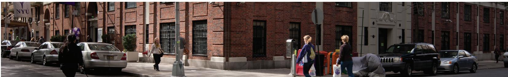

> **AI Description:**
> **Source:** `assets/_page_0_Figure_0.jpg`
> 
> **Generated:** 2026-05-29 20:54:46
> 
> ---
> 
> The image is a photograph of a street scene. It features a brick building with a NYU sign visible on the left side. There are several people walking on the sidewalk, and cars are parked along the street. The image captures a typical urban environment with pedestrians, vehicles, and a mix of architectural styles. The focus is on the street and the people moving along it, with no charts, graphs, or other visual elements present.

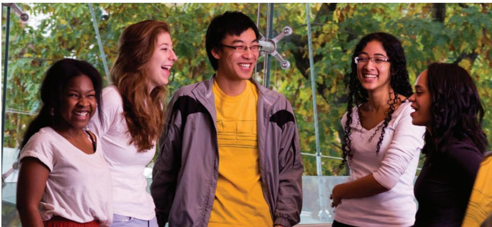

> **AI Description:**
> **Source:** `assets/_page_1_Figure_0.jpg`
> 
> **Generated:** 2026-05-29 20:51:31
> 
> ---
> 
> The image contains a photograph of five individuals standing together outdoors, smiling and engaged in conversation. The background features lush green foliage, suggesting a park or garden setting. The individuals appear to be diverse in terms of ethnicity and attire, with some wearing casual clothing. The overall mood of the image is positive and friendly.

WHAT IS THE FIRST YEAR RESIDENTIAL EXPERIENCE?

At NYU, we believe New York is more than just the city where you live. It is a vital partner in your educational experience. It demands you look closely at the critical issues facing you— not only in your academic work, but in the community and world around you. As a new student living in one of the residence halls, you will be part of the First Year Residential Experience (FYRE).

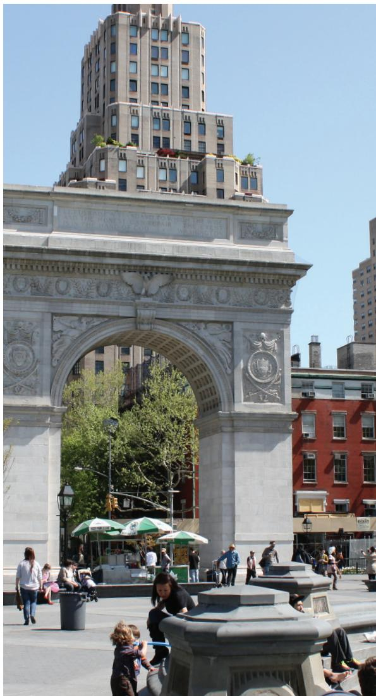

> **AI Description:**
> **Source:** `assets/_page_1_Figure_1.jpg`
> 
> **Generated:** 2026-05-29 20:52:43
> 
> ---
> 
> The image contains a photograph of the Washington Square Arch in New York City. The arch is a prominent historical landmark, and the photograph captures its architectural details, including the inscription at the top and the decorative elements on the columns. The background shows a mix of modern and older buildings, with a clear blue sky above. There are people walking and sitting around the arch, indicating it is a public space. The image also includes a food stand with umbrellas, suggesting it is a lively area.

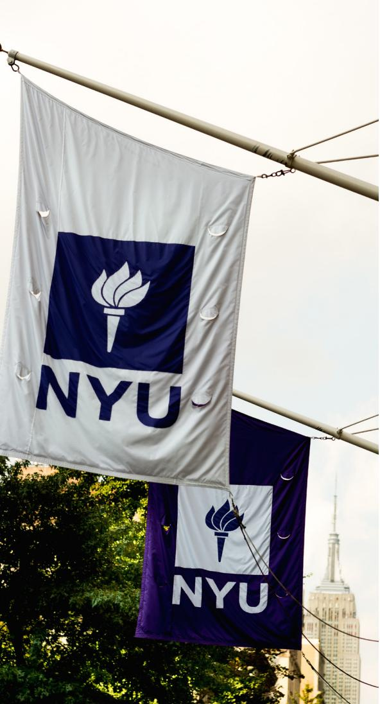

> **AI Description:**
> **Source:** `assets/_page_2_Figure_0.jpg`
> 
> **Generated:** 2026-05-29 21:01:03
> 
> ---
> 
> The image contains two banners with the NYU logo, which features a torch icon on a blue square background. The banners are hanging from a pole, with one in white and the other in purple. The Empire State Building is visible in the background, indicating the location is likely New York City. The banners are likely used for promotional or decorative purposes, emphasizing the affiliation with New York University.

> **AI Description:**
> **Source:** `assets/_page_2_Figure_1.jpg`
> 
> **Generated:** 2026-05-29 21:00:12
> 
> ---
> 
> The image contains a photograph of three individuals sitting together, looking at a laptop screen. The person on the left is smiling and appears to be engaged in the activity on the laptop. The person in the middle is wearing a plaid shirt and a tie, and the person on the right is wearing a light blue shirt with a bow tie. The setting appears to be a casual indoor environment, possibly a living room or a study area, with a patterned couch in the background. The individuals seem to be collaborating or discussing something on the laptop.

FYRE provides opportunities to attend programs and activities designed to help you transition smoothly into your first year of college. Each hall has passionate faculty, professional, and student team members equipped with the knowledge and skills to help you make the most of your first year at NYU. The experiences provided in your residence hall will help you connect to new friends, NYU, and New York City. Each hall has a strong hall government for students so it’s easy to get involved, become a part of NYU’s best traditions, and gain experience as a student leader on campus.

## WHAT ARE EXPLORATIONS COMMUNITIES?

Explorations communities put students into an environment where living and learning is dynamic and constant. Faculty Affiliates and Resident Assistants, together with residents, work to offer programs throughout the year in order to explore the specific themes in the builidng, as well as other themes that emerge of interest to the residents. This expansive programming inside the residence halls responds to the overwhelming desire of our residents to feel fully connected, building an overall sense of belonging in our residence halls.

All themed engagement communities across NYU will have a similar look and feel. Students are assigned across several floors so as to help generate interest across themes in a particular residence hall. And, all students in the residence hall are invited to participate in programs generated by the themed communities. We are looking forward to an engaging year with the deep connections and learning that are hallmarks of our NYU community.

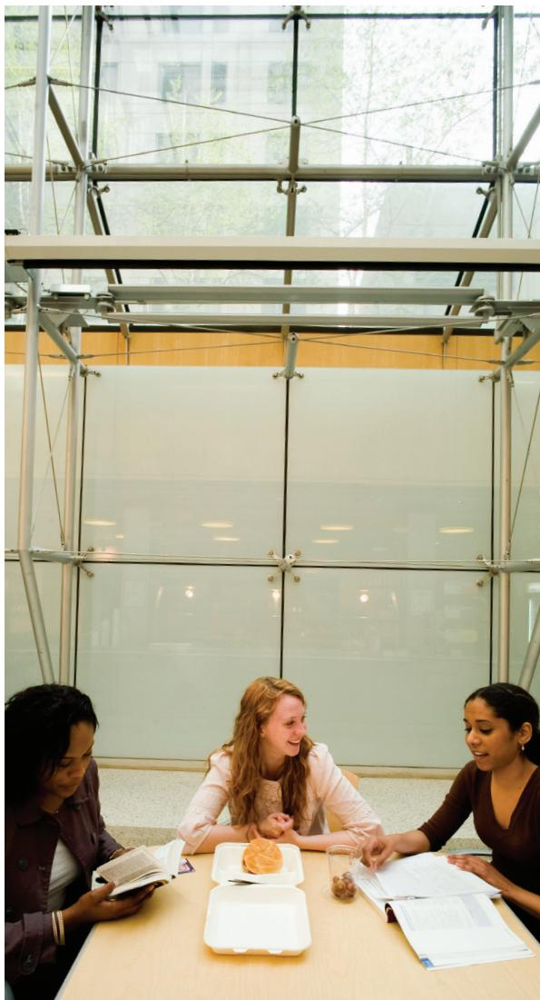

> **AI Description:**
> **Source:** `assets/_page_3_Figure_0.jpg`
> 
> **Generated:** 2026-05-29 21:03:04
> 
> ---
> 
> The image is a photograph of three individuals sitting at a table in what appears to be a modern, glass-walled room. They are engaged in a discussion or study session, with one person holding a book, another with a plate of food, and the third person pointing at a document. The room has a contemporary design with large glass panels and metal framework. The individuals are dressed casually, suggesting a relaxed and informal setting. The table is simple and functional, with no additional decorations or distractions.

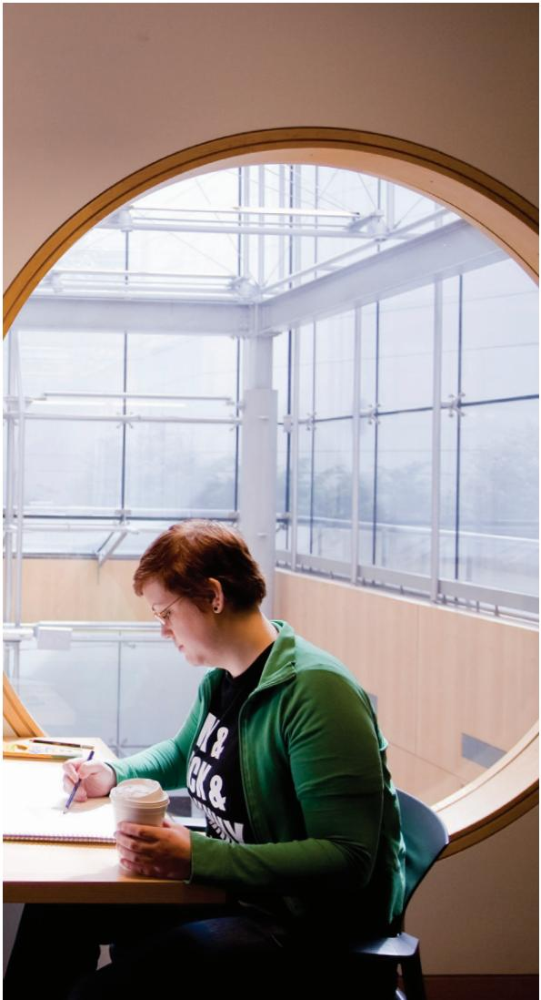

> **AI Description:**
> **Source:** `assets/_page_4_Figure_0.jpg`
> 
> **Generated:** 2026-05-29 21:02:40
> 
> ---
> 
> The image is a photograph of a person sitting at a desk in a well-lit room with large arched windows. The individual is wearing a green jacket over a black shirt with white text and is holding a pen and a coffee cup. The person appears to be engaged in writing or drawing in a notebook. The background shows a modern architectural structure with glass panels and wooden elements. The overall setting suggests a quiet, contemplative environment, possibly a study or work area.

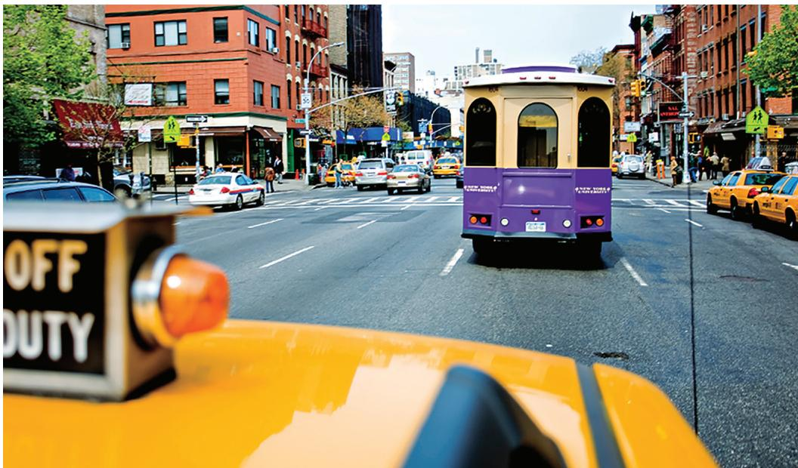

> **AI Description:**
> **Source:** `assets/_page_4_Figure_1.jpg`
> 
> **Generated:** 2026-05-29 21:03:32
> 
> ---
> 
> The image contains a photograph of a street scene in New York City. It features a yellow taxi in the foreground with the words "OFF DUTY" visible on the side. In the background, there is a purple and cream-colored trolley labeled "New York Explorer" driving down the street. The street is lined with buildings, some of which have storefronts and awnings. There are other vehicles, including more yellow taxis, and pedestrians can be seen walking along the sidewalks. The image captures a typical urban street scene with a mix of transportation and city life.

Applying for these communities simply means you will fill out the themed engagement community section of your NYU Housing application. It is well worth the effort!

Each hall has a culture all its own, guided by the faculty, staff, and students living in the building. Explorations communities are available in all of the halls. The next few pages will give you a snapshot of each hall, what Explorations communities it has to offer, and some of its amenities and traditions.

When you apply to NYU Housing you indicate up to four preferences. Usually, we are able to accommodate students’ top choices. It is important to know that if you apply for a Themed Engagement Community, it will be considered your first choice and dictate your NYU Housing assignment. For more information, visit our website or call us at 212-998-4600.

www.nyu.edu/living-on

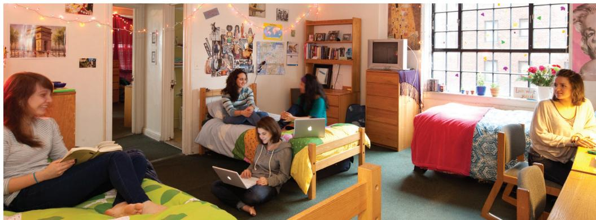

> **AI Description:**
> **Source:** `assets/_page_5_Figure_0.jpg`
> 
> **Generated:** 2026-05-29 21:01:22
> 
> ---
> 
> The image is a photograph of a dorm room with four individuals present. The room is decorated with string lights, posters, and personal items, creating a cozy and lived-in atmosphere. The individuals are engaged in various activities: one is reading a book, another is using a laptop, and the others are conversing. The room features twin beds, a desk, and a television, suggesting a shared living space typical of a college dormitory. The overall scene conveys a sense of community and student life.

## BRITTANY HALL

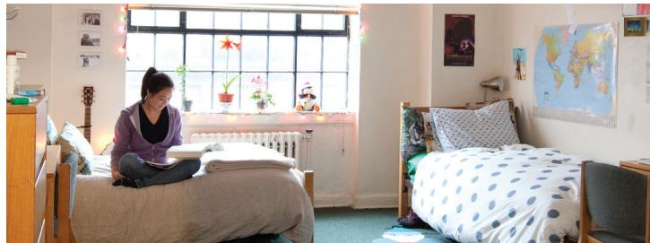

> **AI Description:**
> **Source:** `assets/_page_5_Figure_1.jpg`
> 
> **Generated:** 2026-05-29 20:59:28
> 
> ---
> 
> The image is a photograph of a cozy, well-decorated bedroom. The room features two single beds with patterned bedding, a wooden desk on the left side, and a radiator beneath a large window. The window has several potted plants on the windowsill, adding a touch of greenery. The walls are adorned with various decorations, including a world map, framed pictures, and string lights, creating a personal and inviting atmosphere. A person is sitting on one of the beds, seemingly engaged in an activity, possibly reading or writing. The overall ambiance of the room is warm and lived-in.

## WHAT’S IN BRITTANY?

## FACULTY FELLOWS IN RESIDENCE EXPLORATIONS PENTHOUSE LOUNGE

## LOWER COST OPTIONS AVAILABLE

Brittany Hall is located across from the renowned Grace Church on the corner of Broadway and East 10th Street. This beautiful and historic building has a diverse community of 579 first-year residents with two explorations communities and Faculty Fellows-in-Residence. Each student suite has a small microwave-refrigerator unit provided by the University to be shared by residents within the suite. There are many common areas within the building for residents to utilize including the Rhodes Room, a large lounge and performance space. There is also a dance room, music room, common kitchen, recreation room, and Penthouse Lounge where residents can study while enjoying the views of Greenwich Village.

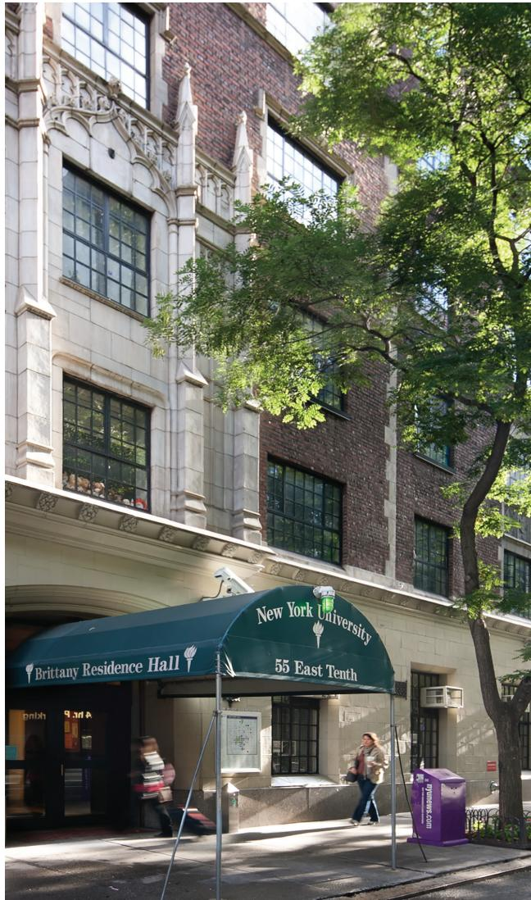

> **AI Description:**
> **Source:** `assets/_page_5_Figure_2.jpg`
> 
> **Generated:** 2026-05-29 20:58:28
> 
> ---
> 
> The image shows the exterior of a building with a green awning that reads "New York University Brittany Residence Hall 55 East Tenth." The building has a classic architectural style with brick and stone elements, large windows, and decorative stonework. There are trees in the foreground, and a person is walking near the entrance. The image includes a purple recycling bin and a signpost with additional information.

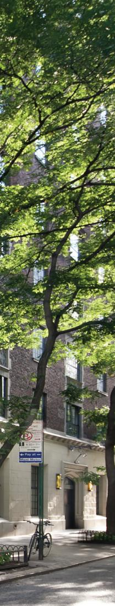

> **AI Description:**
> **Source:** `assets/_page_6_Figure_0.jpg`
> 
> **Generated:** 2026-05-29 20:51:45
> 
> ---
> 
> The image contains a photograph of an urban street scene. It features a tree with green leaves in the foreground, partially obscuring a view of a building with a brick facade and large windows. The building appears to be part of a residential or institutional complex. A street sign is visible on the left side of the image, indicating parking restrictions and directions. The overall scene suggests a quiet, shaded area in a city setting.

## BLACK VIOLETS

The Black Violets community serves to uplift Black-identifying students by creating a safespace within residence halls in order to foster a stronger Black community at NYU. Residents committed to celebrating the diverse facets of Black culture through curated social and cultural programming are welcome to apply. Events will include visits to museums, Black-owned restau - rants, historical landmarks, and culturally related art shows. While this community’s intent is to shine a light on the fruits of the Black diaspora, it will also explore the very real everyday implica - tions of being Black in America with a spotlight on maintaining wellness while being socially aware. Our hope is that this will be a space of celebration and connection for students in search of representation across campus.

## F.A.M.E.

## (FEATURING ALL MUSICAL ENDEAVORS)

Ever wonder what the Eagles meant by in a “New York Minute” or why the Beastie Boys crooned “No Sleep ‘till Brooklyn?” Come and learn about musical movements, examine emerging trends, and share your appreciation of music with others. Whether it’s a classical concert from the NY Philharmonic or seeing The Weeknd at the Barclay’s Center, this community has a place for every kind of music lover. Emphasis will be placed not only on external sources of musical influence but also on student expression through opportunities like playlist making, open mic nights, and songwriting sem - inars. No formal musical training is necessary to participate but you should have an active interest in musical expression and appreciation.

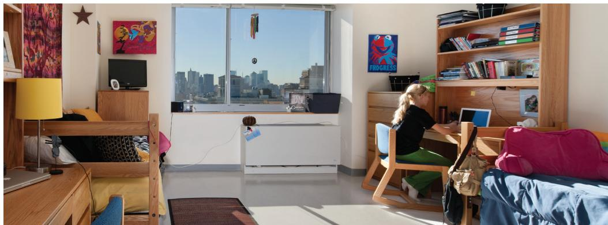

> **AI Description:**
> **Source:** `assets/_page_7_Figure_0.jpg`
> 
> **Generated:** 2026-05-29 20:54:33
> 
> ---
> 
> The image depicts a well-lit, modern bedroom with a large window offering a view of a city skyline. The room contains a bunk bed with a desk underneath, a chair, and a laptop on the desk. There is a bookshelf filled with books and other items, and a desk lamp is visible on the desk. The room has a cozy and organized appearance, with colorful decorations and personal items scattered throughout, suggesting a lived-in and personalized space.

## FOUNDERS HALL

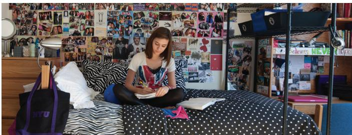

> **AI Description:**
> **Source:** `assets/_page_7_Figure_1.jpg`
> 
> **Generated:** 2026-05-29 20:54:07
> 
> ---
> 
> The image is a photograph of a bedroom. The room features a bed with a black and white polka dot bedspread and a zebra print pillow. A person is sitting on the bed, reading a book. The walls are covered with various posters and photographs, creating a collage effect. There is a desk with a lamp and a bag labeled "NYU" on the left side of the image. The room also contains shelves with books and other items, and a mirror is visible on the left side.

## WHAT’S IN FOUNDERS?

## FACULTY FELLOWS IN RESIDENCE

## EXPLORATIONS

Located in Union Square/East Village, Founders is home to more than 700 first-year students. It was built on the site of the former St. Ann’s church where the historic facade and fence have been preserved as an architectural feature as you enter the building. Founders offers a large outdoor courtyard, a community garden, two TV lounges, one study lounge, and spacious rooms with beautiful views. Additionally, each suite has a small microwave-refrigerator unit provided by the University to be shared by residents within the suite. Founders hosts Faculty Fellows-in-Residence with specializations in sports management and social justice and two Explorations communities focused on sustainability and health & wellness in NYC.

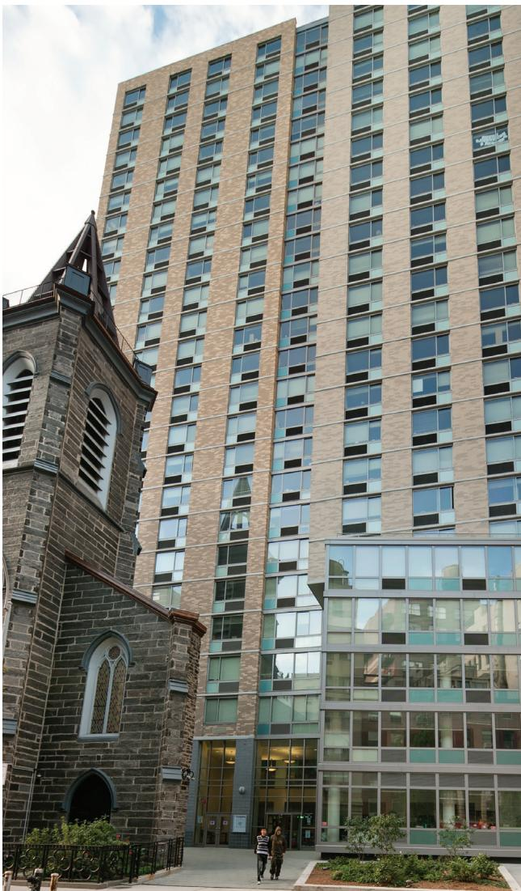

> **AI Description:**
> **Source:** `assets/_page_7_Figure_2.jpg`
> 
> **Generated:** 2026-05-29 20:53:15
> 
> ---
> 
> The image shows a juxtaposition of two distinct architectural styles. On the left is a historic stone church with pointed arches and a steeply pitched roof, suggesting a traditional religious building. On the right is a modern high-rise building with a glass and concrete facade, featuring numerous windows. The contrast highlights the evolution of architectural design over time. The ground floor of the modern building appears to be a mix of glass and metal, possibly housing commercial or office spaces. A small group of people is visible near the entrance of the church, providing a sense of scale to the structures.

> **AI Description:**
> **Source:** `assets/_page_8_Figure_0.jpg`
> 
> **Generated:** 2026-05-29 20:58:09
> 
> ---
> 
> The image contains a presentation slide with the title "MEET THE FACULTY." It features two photographs of individuals, presumably faculty members, with their names and departments listed below each photo: David Hollander (SPS) and Mike Funk (Academic Department, Steinhardt). The slide is part of a larger presentation, as indicated by the audience in the foreground and the speaker addressing them. The slide uses a simple design with a white background, blue accents, and a photograph of a building in the top right corner.

## BIG CITY, SMALL FOOTPRINT

Climate change is the greatest challenge of our time. What can you do to contribute to a healthier, greener, more just world? As a member of this community, you will have the opportunity to learn about and discuss how innovative ideas and impassioned activism lead to sustainable solutions in New York City and beyond. Activities may include environmental stewardship opportunities, guest speakers, plant-forward community dinners, and more. At NYU, there are many ways to learn more about and get involved in supporting sustainability on campus and in NYC; this is just the start. Be part of this community to consider the various ways that you can meet like-minded individuals, and work together to step up, speak up, and act up to build a sustainable future.

## LIVING WELL

The transition to college can always be tough when it comes to personal wellness and maintaining a healthy lifestyle. Luckily, the Living Well community is here to help students stay physically active, stress-free, and healthy and is for anyone who wants to learn how to practice self-care in New York City through programs and activities themed around mindfulness, fitness, nutrition and more. This community is open to everyone, no matter your fitness level or experience with nutrition and health. All you need to have is an interest in self-care. Together we will explore a vast number of ways to stay healthy and well in NYC. Get ready for an exciting year of fitness classes, healthy snack workshops, mindfulness exercises, and fun excursions to trendy wellness spots in the city!

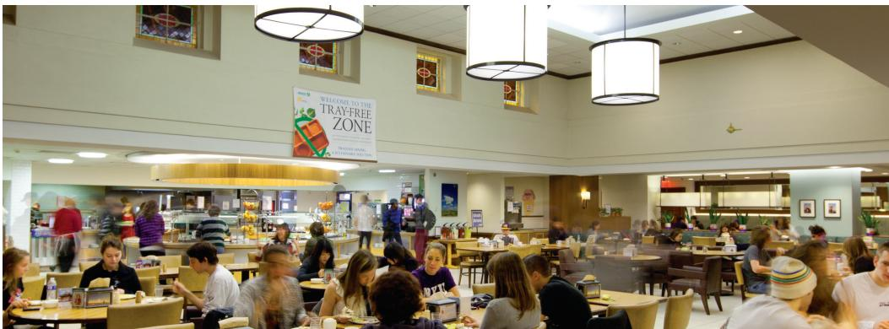

> **AI Description:**
> **Source:** `assets/_page_9_Figure_0.jpg`
> 
> **Generated:** 2026-05-29 20:57:33
> 
> ---
> 
> The image depicts the interior of a cafeteria or dining hall. It shows a spacious area with multiple tables and chairs occupied by students or patrons. The ceiling features large, circular pendant lights. A sign in the background reads "Welcome to the Tray-Free Zone," indicating a policy or initiative in place. The environment appears busy, with people seated at tables and some standing near the food service area. The overall setting suggests a casual dining atmosphere, likely in an educational or institutional setting.

## LIPTON HALL

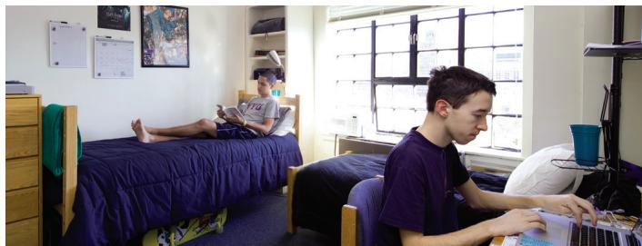

> **AI Description:**
> **Source:** `assets/_page_9_Figure_1.jpg`
> 
> **Generated:** 2026-05-29 20:57:22
> 
> ---
> 
> The image is a photograph of a dorm room. It shows two individuals in the room. One person is lying on a bed with a purple comforter, reading a book. The other person is sitting at a desk, working on a laptop. The room has two beds, a desk, and a window with multiple panes of glass. The walls are painted white, and there are some posters and a calendar hanging on the wall. The room appears to be a typical college dorm room setup.

## WHAT’S IN LIPTON?

## FACULTY FELLOWS IN RESIDENCE

## EXPLORATIONS

## HALAL CERTIFIED DINING HALL

Lipton Hall is a thriving building housing 700 first-year students. Many of the rooms feature unparalleled views of the city and its Washington Square Park location means easy access to classes, subways, and all the Village has to offer. Lipton Hall offers a common room with a community kitchen, dance room, game room, music practice rooms, multiple study lounges, and an excellent dining hall that is halal certified and focuses on locally grown food and a commitment to sustainability. With Faculty Fellows-in-Residence and an array of cultural Explorations communities, this hall is always a highlight for students in their first year.

## LOWER COST OPTIONS AVAILABLE

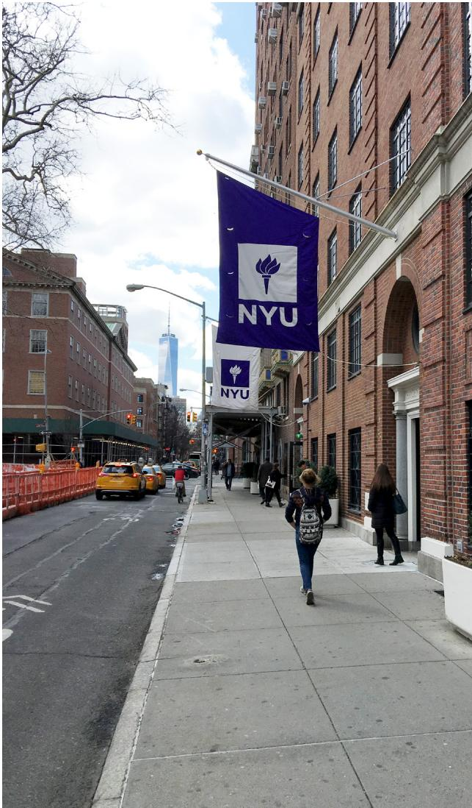

> **AI Description:**
> **Source:** `assets/_page_9_Figure_2.jpg`
> 
> **Generated:** 2026-05-29 20:57:51
> 
> ---
> 
> The image contains a photograph of a street scene. The most prominent visual element is a purple flag with the NYU logo and name, indicating the presence of New York University in the area. The street is lined with brick buildings, and there are pedestrians walking on the sidewalk. In the background, there are traffic lights, a yellow taxi, and a view of the One World Trade Center. The sky is partly cloudy, and there are some bare tree branches visible.

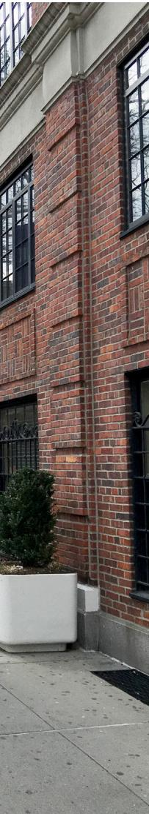

> **AI Description:**
> **Source:** `assets/_page_10_Figure_0.jpg`
> 
> **Generated:** 2026-05-29 21:01:29
> 
> ---
> 
> The image shows a section of a brick building with multiple windows. The bricks are red and arranged in a traditional pattern. There are black-framed windows with some showing reflections of the surrounding environment. A white planter box with a small bush is visible in front of the building, and a portion of a sidewalk is seen at the bottom of the image. The overall scene appears to be an urban or suburban setting.

## VIVIR EN ESPAÑOL (SPANISH INTEREST COMMUNITY)

Vivir en Español is being offered as an exciting partnership between Residential Life & the Department of Spanish and Portuguese Languages and Literatures. This community will give you the opportunity to connect with a group of friends who share a common passion for the languages and cultures of Spain and Latin America and related cultures, all of which have representative communities here in New York City. Open to speakers of all levels of Spanish from beginner to advanced, this community will take advantage of the wide range of Spanish-language activities in the city from cinema, theatre, and concerts to conferences, festivals, and restaurants. From NYU’s own Center for Latin American and Caribbean Studies and its King Juan Carlos I of Spain Center to a number of unique NYC resources such as the Instituto Cervantes, the Hispanic Society of America, the Museo del Barrio, the Nuyorican Poets Cafe, and the Repertorio Español, this floor will take advantage of all NYC has to offer.

## NYU SHOW

As you sit in front of your TV do you ever wonder about the work behind the screen? NYU Show is the perfect community if you are passionate about television and want to learn more about the industry. NYC is home to all different genres of TV from late night talk shows like the Daily Show, Saturday Night Live, and the Tonight Show starring Jimmy Fallon to sitcoms like Unbreakable Kimmy Schmidt and Broad City. With so many possibilities in NYC, you’re bound to discover something new and exciting in the world of TV. This community will explore everything NYC has to offer including talk show tapings, the Museum of the Moving Image, and more. You will also have the chance to shape the NYU community by working with NYU TV to film movie trailers and work on various TV related projects. Join our crew and discover the many channels of New York City!

## L’ETAGE FRANÇAIS (FRENCH INTEREST COMMUNITY)

L’Etage Français gives you the opportunity to live with others who share a common passion for the French language and the vast array of Francophone cultures found worldwide, almost all of which have representative communities here in New York City. This community is open to all levels of French speakers, from beginner to advanced, and it will take advantage of the wide range of French-language activities and events in the city. This includes cinema, theatre, poetry slams, concerts, exhibits, festivals, restaurants, NYU’s own cultural showcase La Maison Française, Brooklyn’s Little Haiti, and more. Some examples of past programs include outings to Les Misérables and An American in Paris on Broadway, the Metropolitan Opera House to see the famous French opera Les Contes d’Hoffman, and dinner at a local crêperie!

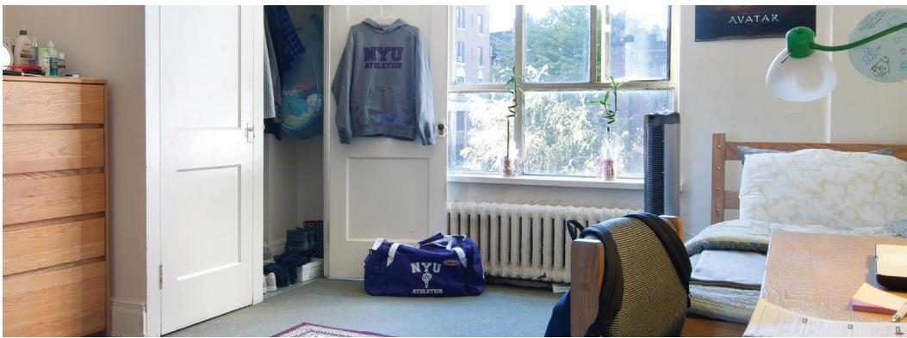

> **AI Description:**
> **Source:** `assets/_page_11_Figure_0.jpg`
> 
> **Generated:** 2026-05-29 20:59:11
> 
> ---
> 
> The image is a photograph of a dorm room. It shows a bed with a pillow and blanket, a desk with a lamp and some papers, a chair, and a window with a radiator below it. A blue duffel bag with "NYU Athletics" written on it is placed on the floor near the door. A gray hoodie with "NYU Athletics" is hanging on the door. The room has a wooden dresser and a small rug on the floor. The window provides a view of trees and buildings outside.

## RUBIN HALL

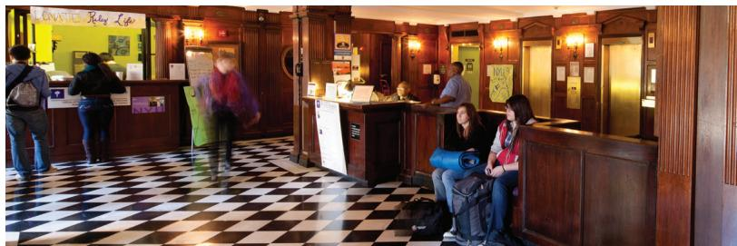

> **AI Description:**
> **Source:** `assets/_page_11_Figure_1.jpg`
> 
> **Generated:** 2026-05-29 20:58:42
> 
> ---
> 
> The image is a photograph of a reception area with a checkered floor. There are several people in the scene, some standing at a counter and others sitting on the floor with backpacks and a blue mat. The walls are wooden with various signs and posters, and there are elevators visible on the right side. The environment appears to be a hostel or similar accommodation.

## WHAT’S IN RUBIN?

## FACULTY FELLOW IN RESIDENCE

## EXPLORATIONS

## LOWER COST OPTIONS AVAILABLE

NON-AIRCONDITIONED

Located at a swanky address on 5th Avenue, Rubin is a bustling community comprised of approximately 680 firstyear students. Rubin has two amazing Explorations communities and a great Faculty Fellow-in-Residence. There are several amenities for residents to take advantage of including: a large air conditioned second floor lounge, a black box theatre, a study lounge, a dance room, a piano room, ping pong, and billiards. We know you will enjoy calling Rubin your home!

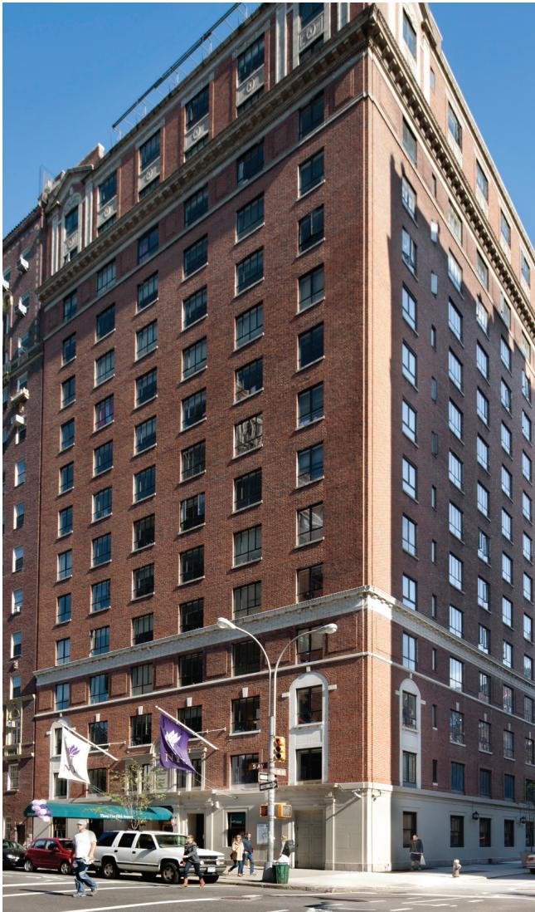

> **AI Description:**
> **Source:** `assets/_page_11_Figure_2.jpg`
> 
> **Generated:** 2026-05-29 21:00:46
> 
> ---
> 
> The image is a photograph of a tall, multi-story brick building with numerous windows. The building appears to be a residential or office structure, given its design and the presence of balconies. The ground floor has a few flags, one of which is purple, and there are some people and vehicles visible on the street in front of the building. The sky is clear and blue, indicating a sunny day.

## INEQUALITY & JUSTICE

“Poverty is not a certain small amount of goods, nor is it just a relation between means and ends; above all, it is a relation between people. Poverty is a social status.” \~Marshall Sahlins.

The USA has one of the most unequal national distributions of wealth in the world. Manhattan has the highest degree of wealth inequality in the US. So, the juxtaposition of extreme wealth and extreme poverty is going to be such a defining feature of your life in NYC that it might start to seem like a normal state of affairs. However, students who join this community choose not to normalize this strange situation, but rather to examine it more closely. Through service-learning, participation in cultural events, and compelling conversations with professionals, activists, and each other, you will create opportunities to learn and to educate. We will think about how the distribution of resources is determined not only by the dynamics of the market, but also by the gendered and racialized status-structures we have inherited. We’ll think about the immediate material consequences of economic inequality on poorer New Yorkers and its longer-term impact on the social cohesion, peace, and health of the entire community. Above all, you’ll think about how things could be different and might be changed.

\*\*As a member of the Inequality & Justice floor, you will have the unique experience of being able to take your first-year Writing the Essay (WTE) course in the Rubin classroom with your Faculty Affiliate who will lead activities outside of the class throughout the city and connect to work in the class. If you are required to take WTE, we will register you for the course and inform you prior to academic registration.

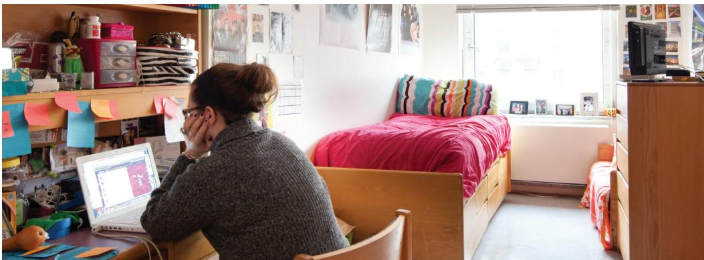

> **AI Description:**
> **Source:** `assets/_page_13_Figure_0.jpg`
> 
> **Generated:** 2026-05-29 20:53:26
> 
> ---
> 
> The image depicts a college dorm room. A person is sitting at a desk, working on a laptop. The room is well-organized with a bed in the background, covered with a red blanket and a colorful striped pillow. The walls are decorated with various posters and pictures, and there is a window with a view of the outside. The desk is cluttered with items such as books, a bird figurine, and other personal belongings. The overall setting suggests a typical college student's living space.

## THIRD NORTH

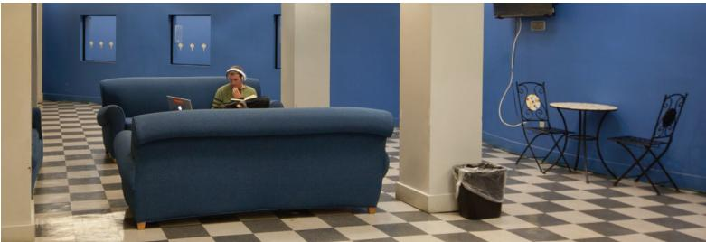

> **AI Description:**
> **Source:** `assets/_page_13_Figure_1.jpg`
> 
> **Generated:** 2026-05-29 20:52:56
> 
> ---
> 
> The image depicts a room with a checkered floor pattern in black and white. The walls are painted blue, and there are two blue sofas. A person is sitting on one of the sofas, reading a book. There is a small table and two chairs in the corner of the room, along with a trash bin and a small electrical device mounted on the wall. The room appears to be a casual reading or relaxation area.

## WHAT’S IN THIRD NORTH?

## FACULTY FELLOWS IN RESIDENCE

## LOWER COST OPTIONS AVAILABLE

## EXPLORATIONS

## DINING HALL

Third North provides a welcoming and inclusive community for over 950 students in apartment style suites with kitchens. There are a wide range of amenities in Third North including a dining hall, a newly renovated basement that includes a mini-theatre, dance studio, music practice rooms, game room, TV lounge, and computer lab, many study lounges throughout the building, and an incredible outdoor courtyard at the center of it all. Third North includes terrific Faculty Fellows-in-Residence and two Explorations communities.

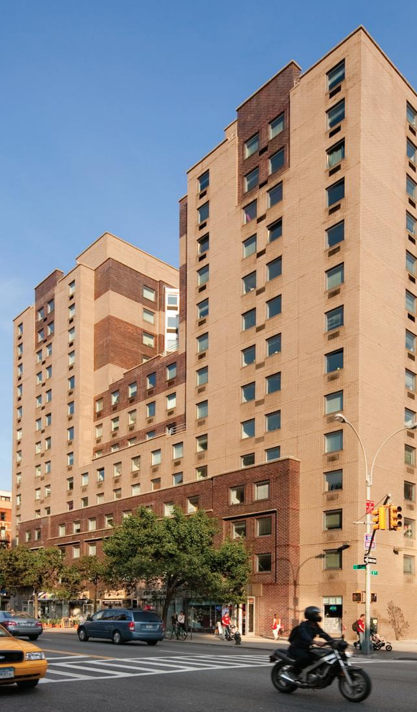

> **AI Description:**
> **Source:** `assets/_page_13_Figure_2.jpg`
> 
> **Generated:** 2026-05-29 20:53:53
> 
> ---
> 
> The image depicts a multi-story residential building with a brick facade. The building has numerous windows, and the architecture suggests it is a residential complex. The street in front of the building is active with vehicles, including a motorcycle and a taxi, and there are pedestrians walking along the sidewalk. The sky is clear and blue, indicating a sunny day. The image captures a typical urban residential scene.

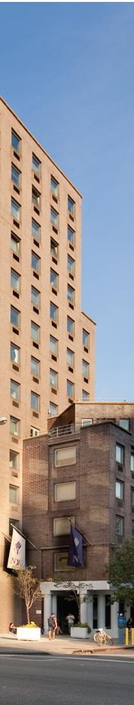

> **AI Description:**
> **Source:** `assets/_page_14_Figure_0.jpg`
> 
> **Generated:** 2026-05-29 20:53:34
> 
> ---
> 
> The image shows a tall, multi-story brick building with a modern architectural style. The building has numerous windows and appears to be residential or office space. At the base of the building, there is a smaller structure with a sign that reads "NYU," indicating it is likely associated with New York University. There are a few people and a bicycle visible near the entrance, suggesting it is a public space. The sky is clear and blue, indicating a sunny day.

## 3N THEATRE ARTS COMPANY (3NTAC)

New York City is home to every kind of theatre you can imagine. Broadway, off-Broadway, experimental theatre, Shakespeare in the Park, and everything in between makes NYC arguably the greatest theatre city in the world. Join this community to meet other theatre lovers, explore the diverse range of theatre opportunities in NYC, and learn about all things theatre related. Activities will include public play readings, field trips to see plays and musicals, meetings with working artists, and more. This community is open to all students regardless of school or major - so join us and become part of the New York theatre scene!

## BIG APPLE, BIG SCREEN

Countless films have been set in New York City whether it’s a classic like The Godfather or the recent Academy Award winner for Best Picture, Birdman. Talented filmmakers like NYU alumni Martin Scorsese and Spike Lee are known for their work filming in the NYC streets. This community seeks to capture this cinematic spirit of NYC by building a community among film lovers through unique film related outings around the city. You will be encouraged to actively learn about, engage in, and discuss cinema. As a member of this community you may visit famous locations in film such as Sleepy Hollow and various cinemas and studios like the Little Airplane animation studio. Other activities include outings to see the newest film releases, documentary screenings, film seminars, and discussions about cinema over food.

Starting college can be scary. You most likely don’t know anyone and everything around you seems so different from what you’re used to. That is why when you first get here, you should get involved on your campus. You shouldn’t be afraid to meet new people. By getting involved (either joining a club, your halls hall council, or other social groups) it forces you to meet and spend time with others from all different backgrounds. You’ll probably even share similar interests, values, and goals with many of the people you come across. This will allow you the opportunity to form friendships and expand your social circle. In this way, you will get closer contact with faculty, members of the community, and fellow students. You’ll also begin to build a connection with your school and the university. So don’t be afraid to branch out of your comfort zone and discover what the University has to offer.

Kimberly Marrera Resident Assistant

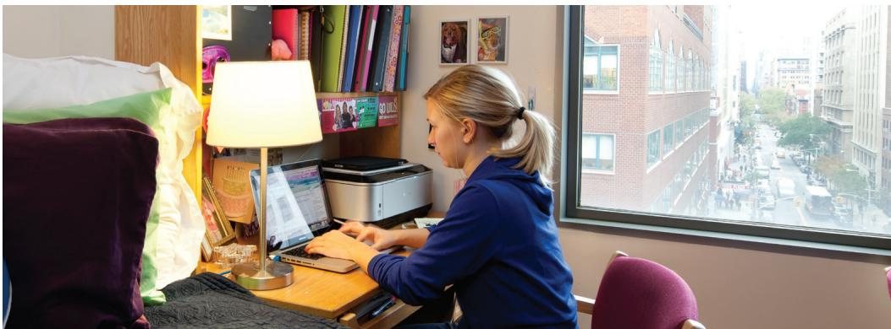

> **AI Description:**
> **Source:** `assets/_page_15_Figure_0.jpg`
> 
> **Generated:** 2026-05-29 20:51:06
> 
> ---
> 
> The image contains a photograph of a person sitting at a desk in a room with a large window overlooking a cityscape. The person is using a laptop and appears to be working. The desk has a lamp, a printer, and some books or folders. The room has a cozy feel with pillows and a blanket visible. The window provides a view of a busy street with buildings and vehicles.

## UNIVERSITY HALL

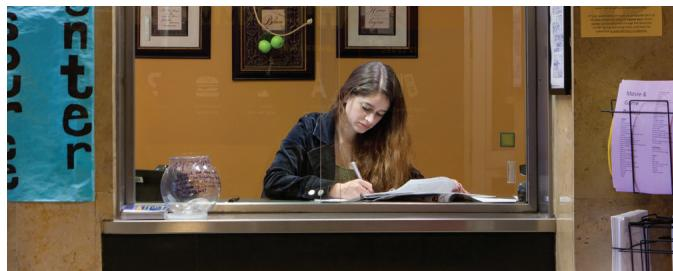

> **AI Description:**
> **Source:** `assets/_page_15_Figure_1.jpg`
> 
> **Generated:** 2026-05-29 20:51:13
> 
> ---
> 
> The image shows a person sitting at a desk, writing in a notebook. The desk has a glass top, and the background features framed pictures and a decorative item with green balls. The setting appears to be an office or study area, as indicated by the "center" sign on the left side of the image. The person is focused on their work, and the environment suggests a quiet, studious atmosphere.

## WHAT’S IN UHALL?

## EXPLORATIONS

## FACULTY FELLOWS IN RESIDENCE

## UHALL COMMONS LOUNGE

## DINING OPTIONS

University Hall (affectionately referred to as UHall) is home to 620 residents living in apartment style suites with kitchens, two Faculty Fellows-in-Residence, and one great Explorations community. The staff and Faculty Fellows are here to create and maintain a vibrant and exciting community. UHall has a large common space, a TV lounge, a music practice room with a piano, and a study lounge available to all of our residents. It’s also home to the Commons Café & Market and a Dunkin Donuts that can all be used with your meal plan. Best of all, we’re located in the very convenient and bustling Union Square neighborhood!

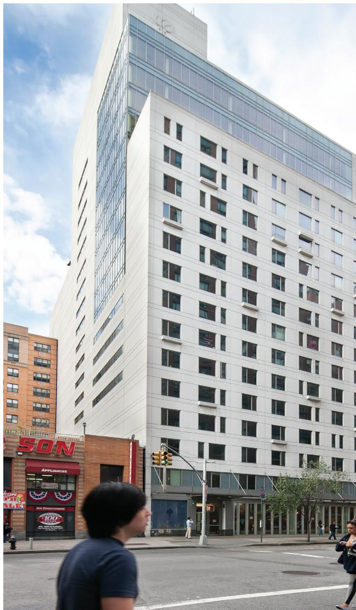

> **AI Description:**
> **Source:** `assets/_page_15_Figure_2.jpg`
> 
> **Generated:** 2026-05-29 20:52:02
> 
> ---
> 
> The image shows a tall, modern building with a white facade and numerous windows. The building appears to be a multi-story structure, possibly an office or residential building, situated in an urban area. At the base of the building, there is a storefront with a sign that reads "SON" and "APPLIANCES," indicating a retail space. The surrounding area includes other buildings, a street with a traffic light, and a few pedestrians. The sky is partly cloudy, suggesting a daytime scene.

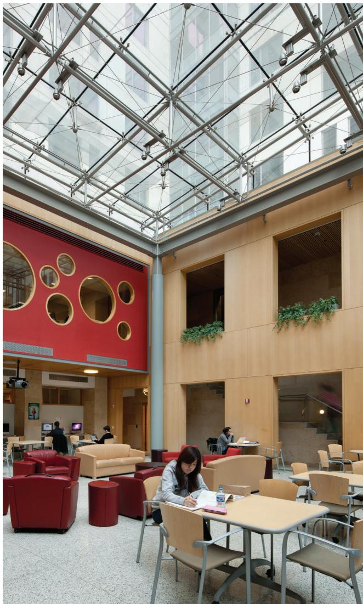

> **AI Description:**
> **Source:** `assets/_page_16_Figure_0.jpg`
> 
> **Generated:** 2026-05-29 20:58:59
> 
> ---
> 
> The image depicts an indoor space with a modern architectural design. The area features a glass ceiling with a network of metal beams, allowing natural light to filter through. The walls are a combination of wood paneling and a red section with circular cutouts. There are several seating areas, including red armchairs and beige sofas, as well as tables with chairs. The space appears to be a communal area, possibly in an educational or office setting, with people engaged in various activities such as studying or working. The overall atmosphere is bright and open, with a mix of natural and artificial lighting.

## GEEKS IN THE CITY

Geeks in the City calls forth those who have what some people call “geek interests” but what we personally think of as “awesome interests.” This community is for people who are passionate about everything from TV shows about Time Lords and Targaryens to books and movies set in sci-fi and fantasy realms to everything that art and entertainment has to offer. NYC is a hub of activity for this subculture. Past adventures include attending midnight screenings and premieres, hosting TV marathons and book clubs, video game nights, Dungeons & Dragons game night, zombie laser tag, trips to comic book stores, and more. Geeks in the City, assemble!

## WEINSTEIN HALL

WHAT’S IN WEINSTEIN?

FACULTY FELLOW IN RESIDENCE

EXPLORATIONS

DINING HALLS

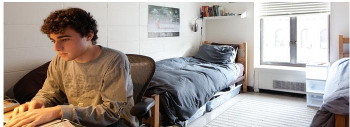

> **AI Description:**
> **Source:** `assets/_page_17_Figure_0.jpg`
> 
> **Generated:** 2026-05-29 21:01:35
> 
> ---
> 
> The image is a photograph of a person sitting at a desk in what appears to be a dorm room. The individual is wearing a gray long-sleeve shirt and is focused on a computer screen. The room contains a bed with a dark blue comforter, a nightstand with books, and a window with blinds partially open. The room has a simple, functional layout typical of a student's living space.

Weinstein was one of the first undergraduate residence halls at NYU. Conveniently located less than a block away from Washington Square Park, the majority of the academic buildings are located in the vicinity. This residence hall has a dynamic and diverse community consisting of 570 first-year students. Weinstein has multiple reservable spaces including a music practice room with a piano, a dance/rehearsal room, multiple classrooms, and study lounges. It also has a large lounge complete with a common kitchen, pool table and flat screen TV. Weinstein is also home to four major dining hall locations including an all-you-care-to-eat dining hall as well as a food court, a grab and go market, and a Kosher cafeteria.

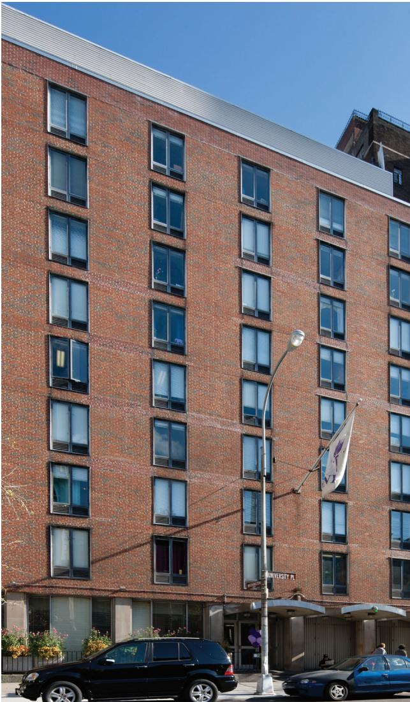

> **AI Description:**
> **Source:** `assets/_page_17_Figure_1.jpg`
> 
> **Generated:** 2026-05-29 21:02:12
> 
> ---
> 
> The image shows a multi-story brick building with numerous windows. The building appears to be residential or office space, as indicated by the uniform window arrangement and the presence of a flagpole with a banner. The banner has a logo and some text, but the specific details are not clear. The building is situated on a street with parked cars visible in the foreground. The sky is clear and blue, suggesting a sunny day. There is a sign visible near the entrance that reads "UNIVERSITY PL," indicating the building's location or name.

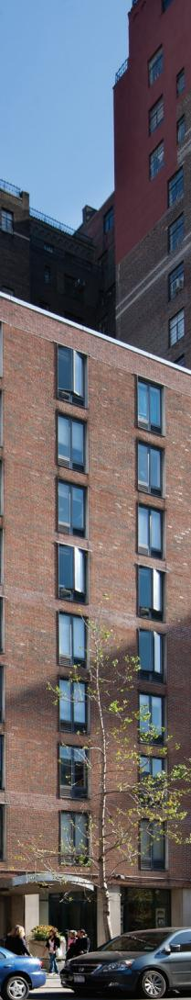

> **AI Description:**
> **Source:** `assets/_page_18_Figure_0.jpg`
> 
> **Generated:** 2026-05-29 20:57:15
> 
> ---
> 
> The image shows a photograph of a multi-story brick building with a row of windows on the facade. The building appears to be part of a residential or commercial complex, as indicated by the presence of balconies and the style of the windows. The surrounding area includes other buildings, a tree, and a parked car, suggesting an urban setting. The sky is clear, indicating a sunny day.

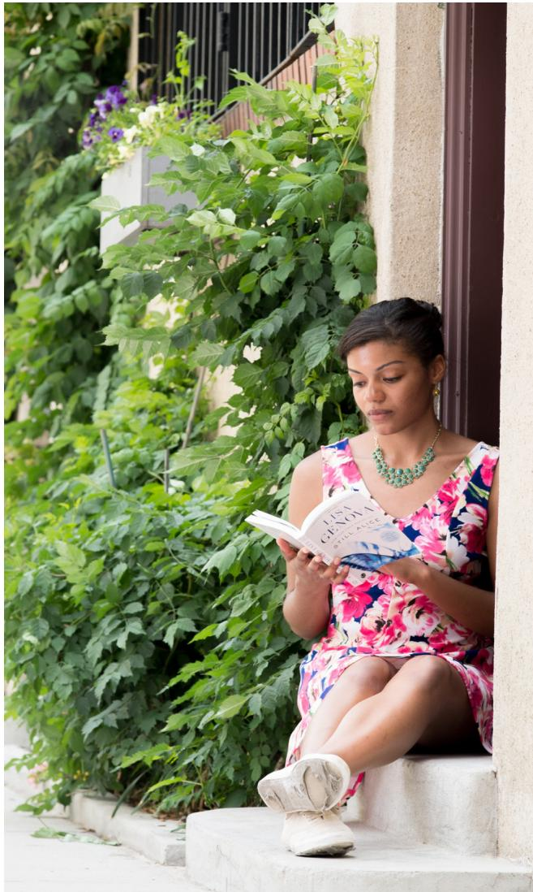

> **AI Description:**
> **Source:** `assets/_page_18_Figure_1.jpg`
> 
> **Generated:** 2026-05-29 20:56:56
> 
> ---
> 
> The image is a photograph of a person sitting on a step outdoors, surrounded by greenery and flowers. The person is wearing a floral dress and white sneakers, and is reading a book titled "Still Alice" by Lisa Genova. The setting appears to be a quiet, peaceful environment, possibly a garden or a quiet corner of a building. The person is focused on the book, suggesting a moment of relaxation or study.

## LAUGHING MATTERS

Get ready to laugh out loud with a group of students who enjoy all things comedy. NYC is brimming with every kind of comedy you can imagine including stand-up, improv, Broadway shows, and more. Countless comedians have graced the NYC comedy scene from NYU alum Aziz Ansari to Tina Fey. You will explore comedy across NYU to learn about the craft and how it plays into the life of an NYU student. There is no better way to learn about comedy than by experiencing it first-hand! Previous events have included Sarah Silverman, Kathy Griffin, Avenue Q, Smart People, and a live taping of The Daily Show. You are not required to be funny, you just need to love to laugh!

## REPRESENT NYC: EXPRESSIONS OF SOCIAL JUSTICE

Representation matters. Art matters. Representation in the arts matter. As a member of this community you will explore how various forms of art and media (theatre, music, film, and dance) represent diverse identities, communities, and experiences. Using New York City as a playground, we will engage with media in its various forms with a focus on how artistic representation can prompt us to become more critical, informed and active citizens of the world. As a member of this community you will be introduced to the vibrant art world of New York City through trips to theater shows, performances, screenings, and museums.

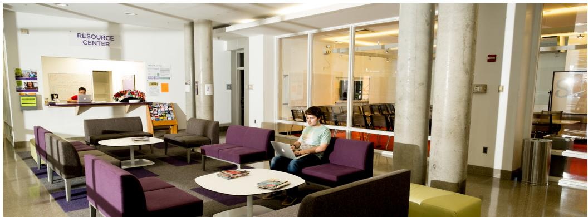

> **AI Description:**
> **Source:** `assets/_page_19_Figure_0.jpg`
> 
> **Generated:** 2026-05-29 20:55:58
> 
> ---
> 
> The image depicts a modern, well-lit interior space, likely a library or community center, with a resource center area. The space features a variety of seating arrangements, including purple and gray couches and armchairs, arranged around small white tables. There is a person sitting on a purple couch in the foreground, using a laptop. In the background, there is a counter labeled "RESOURCE CENTER" with a person standing behind it. The walls are white, and there are large windows allowing natural light to enter the room. The overall atmosphere appears to be calm and conducive to study or work.

## OTHMER & CLARK HALLS

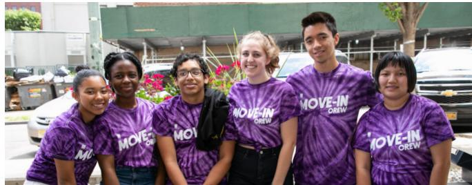

> **AI Description:**
> **Source:** `assets/_page_19_Figure_1.jpg`
> 
> **Generated:** 2026-05-29 20:56:05
> 
> ---
> 
> The image contains a group of six individuals wearing purple shirts with the text "MOVE-IN CREW" printed on them. The individuals are standing outdoors in front of a building with a green wall and some parked cars visible in the background. The setting appears to be a residential or institutional area, possibly related to a move-in event for students or residents. The group is smiling and posing for the photo, suggesting a friendly and collaborative atmosphere.

WHAT’S IN OTHMER AND CLARK?

## FACULTY FELLOW IN RESIDENCE

Located in Brooklyn, Othmer Residence Hall is a 20 story building, housing over 400 Tandon School of Engineering students in 2-bedroom suites and apartments. The building includes student lounges and study rooms on each floor in addtion to a main lounge in the lobby.

## EXPLORATIONS

Located in Brooklyn Heights, Clark Residence Hall houses over 100 NYU Tandon School of Engineering students as well as students from many other colleges. Residents have access to a 8,300-square foot student community center located on the building’s main floor which includes a common kitchen, library, and screening room. Furthermore, residents are eligible for a complimentary membership to the Eastern Athletic Club, located next door.

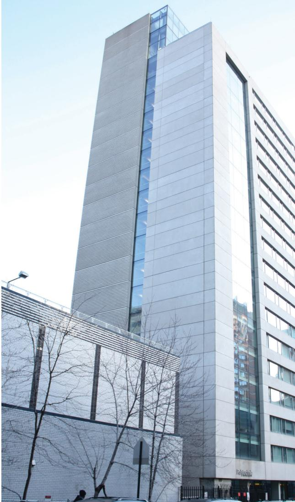

> **AI Description:**
> **Source:** `assets/_page_19_Figure_2.jpg`
> 
> **Generated:** 2026-05-29 20:55:14
> 
> ---
> 
> The image shows a tall, modern building with a sleek design. The building features a combination of glass and metallic panels, with a glass elevator shaft visible at the top. The structure appears to be a commercial or office building, given its height and architectural style. The surrounding area includes some bare trees, indicating it might be winter or early spring. The sky is clear, suggesting a sunny day. There are no visible charts, graphs, or text annotations within the image itself.

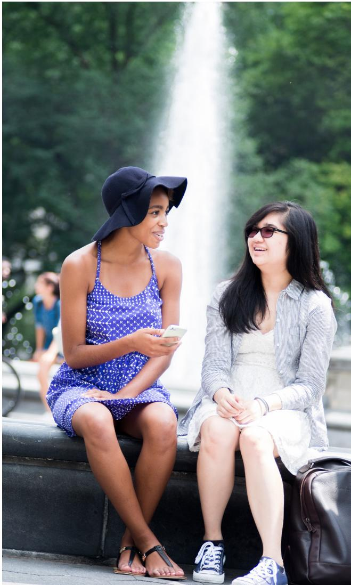

> **AI Description:**
> **Source:** `assets/_page_20_Figure_0.jpg`
> 
> **Generated:** 2026-05-29 21:00:28
> 
> ---
> 
> The image is a photograph showing two individuals sitting on a ledge in front of a fountain. The person on the left is wearing a blue dress with a white pattern and a black sunhat, holding a smartphone. The person on the right is dressed in a light-colored shirt and white shorts, with dark sunglasses. The background features green trees and the water of the fountain, creating a serene outdoor setting. The image captures a casual, relaxed moment between the two individuals.

## WOMEN AT TANDON (OTHMER)

The Women at Tandon Explorations community was created to offer women students a strong support system to reinforce their positive experience as a science, technology, engineering, and math student. The community will foster engagement and relationship building among women in the world of STEM. The community will offer opportunities to network with successful alumnae and senior women at Tandon, participate in social functions, attend events and activities tied to women and STEM, and get involved in community service.

## GLOBAL LABORATORY

Have you ever wondered why something works the way it does? Or maybe you’re just interested in learning about the next BIG thing? Come explore the science of New York City and experience this living laboratory. From museums and exhibitions to the streets themselves, there are countless opportunities to observe science in the city. Past opportunities include the Body Worlds: Pulse Exhibit at Discovery Times Square, documentary screenings, Interstellar in IMAX, the Museum of the City of New York, a talk by Bill Nye, an Eco-Cruise in the New York Harbor, the New York Transit Museum, a STEM career panel, a hiking trip, and more. Come explore the scientific wonderland that is New York City!

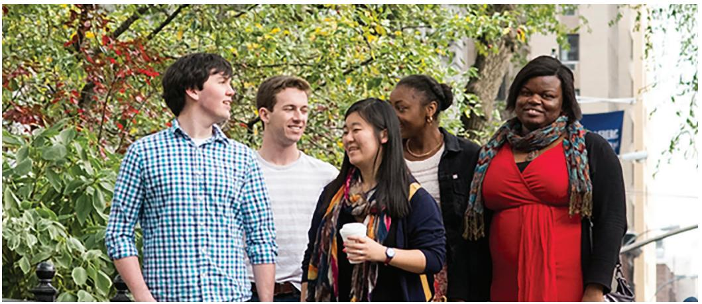

> **AI Description:**
> **Source:** `assets/_page_21_Figure_0.jpg`
> 
> **Generated:** 2026-05-29 21:03:14
> 
> ---
> 
> The image contains a photograph of five individuals walking outdoors. The setting appears to be a park or garden with trees and foliage in the background. The individuals are dressed in casual attire, and one person is holding a white cup. The group seems to be engaged in conversation, suggesting a social or casual gathering. The image captures a moment of interaction and connection among the group.

## WHO’S WHO IN MY RESIDENCE HALL?

Along with other students, your residence hall community is made up of caring staff and faculty that are dedicated to helping you make the most of your first year at NYU!

> **AI Description:**
> **Source:** `assets/_page_21_Figure_1.jpg`
> 
> **Generated:** 2026-05-29 21:02:47
> 
> ---
> 
> The image contains a photograph of cherry blossoms in full bloom. The blossoms are vibrant pink and densely clustered on the branches, which are adorned with green leaves. The background features a white architectural structure with intricate carvings, partially visible on the right side of the image. The overall scene suggests a springtime setting, likely in a park or garden.

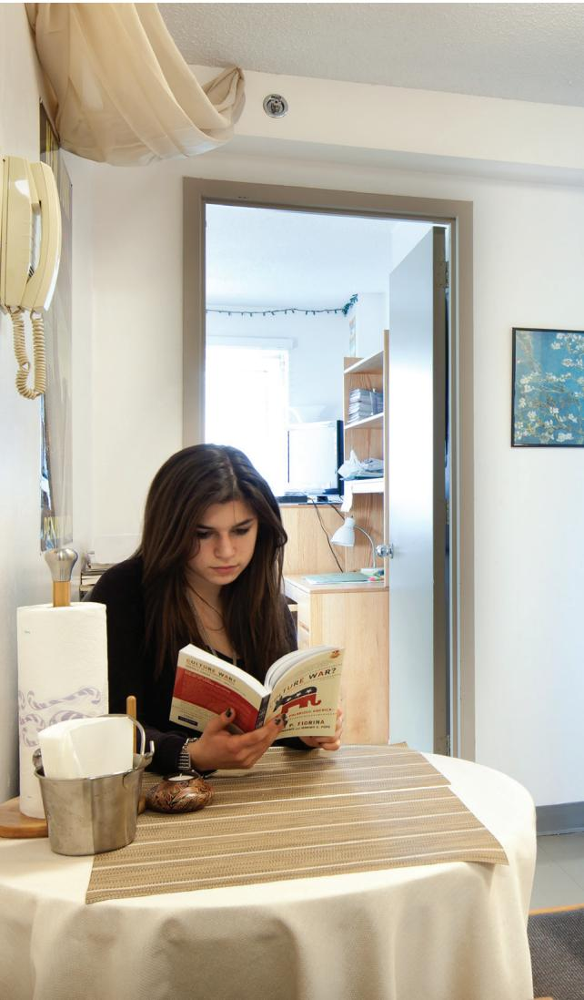

> **AI Description:**
> **Source:** `assets/_page_21_Figure_2.jpg`
> 
> **Generated:** 2026-05-29 21:01:53
> 
> ---
> 
> The image shows a person sitting at a table in a room, reading a book titled "Culture War?" by P. Fiorina. The room has a simple setup with a telephone on the wall, a tissue roll, and a metal container on the table. In the background, there is a doorway leading to another room with shelves and a desk lamp. The room appears to be a dormitory or a small apartment.

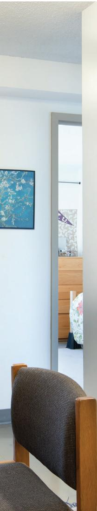

> **AI Description:**
> **Source:** `assets/_page_22_Figure_0.jpg`
> 
> **Generated:** 2026-05-29 20:53:59
> 
> ---
> 
> The image shows a partially open door leading into a bedroom. Inside, a bed with a patterned bedspread is visible, along with a wooden dresser and a wall hanging with a floral design. The room appears to be part of a residential setting, possibly a hotel or apartment. The foreground includes the back of a chair, suggesting the photo was taken from a sitting position.

“ The Resource Center (RC) is a one-stop shop designed to support the needs of our residents. While the RC aims to provide ser - vices like mail & package delivery, assistance with maintenance requests, lock-outs, game or movie rentals, it also serves as a hub for friendship and community. Residents can learn about building-wide programs, enjoy interactive activities, join in Q&As with building team members, learn about resources, and, most of all, make new connections. The various opportunities our RCs have to offer can go a long way in helping our residents begin their college journey.

Jerry Roman Residence Hall Resource Manager Founders Hall

## STAFF MEMBERS IN YOUR RESIDENCE HALL:

## Residence Hall Director (RHD)

Residence Hall Directors are master’s level professionals who specialize in student development and have extensive experience in residential life and housing services. They oversee the Building Leadership Team (BLT) and are responsible for the overall operation of their residence hall.

## Residence Hall Assistant Director (RHAD)

Residence Hall Assistant Directors are bachelor’s or master’s level professionals who specialize in student development and have extensive experience in residential life and housing services. They supervise the Resident Assistant (RA) staff, advise Hall Council, and are responsible for the overall community development in their residence hall.

## Residence Hall Resource Manager (RHRM)

Residence Hall Resource Managers are the professional staff members who oversee the Resource Centers in each residence hall and assist in the overall administration of the building.

## Resident Assistant (RA)

Resident Assistants are junior, senior, and gradu - ate student leaders who are trained to support you through your first year and help you build a strong community on your floor and in your building.

Four years is very long ... or very short, and every year is an amazing experience - especially for the first-year college student. The years will be filled with learning, thinking, growing, interacting, and making lifelong friendships. NYU’s first-year residence halls provide a unique year-long, extra-classroom environment for faculty-resident engagement to start your, and continue our, amazing college experience. ”

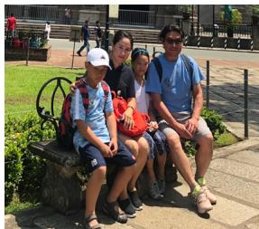

> **AI Description:**
> **Source:** `assets/_page_23_Figure_0.jpg`
> 
> **Generated:** 2026-05-29 20:52:48
> 
> ---
> 
> The image is a photograph of four individuals sitting on a stone bench outdoors. The setting appears to be a public space with greenery and a building in the background. The individuals are casually dressed, with one person wearing a white cap and another carrying a red bag. The image captures a moment of leisure or travel, with the group seemingly enjoying a sunny day together.

Tae Hong Park FFIR in Lipton Hall

Steinhardt, Associate Professor of Music Composition & Technology

## PROFESSORS IN YOUR RESIDENCE HALL:

## Faculty Fellows-in-Residence (FFIR)

The Faculty Fellows are professors at NYU representing a wide range of disciplines who are charged with creating an intellectual tone in the residence halls. The Fellows host events and programs to foster the exchange of ideas and connect your academic and social experience at NYU. Everything from exploring the city through trips to museums, restaurants, shows, and lectures to in house brunches, study breaks, dinner and discussions—the FFIRs are an integral part of your first year in the residence halls.

## Faculty Affiliates (FA)

Each Explorations community is connected to a Faculty Affiliate, a professor at NYU, who is responsible for hosting 1-2 programs per month tied to the theme of their Explorations community. The 40 Faculty Affiliates represent a range of disciplines and colleges at NYU and are a wonderful resource for you as you create your first year experience.

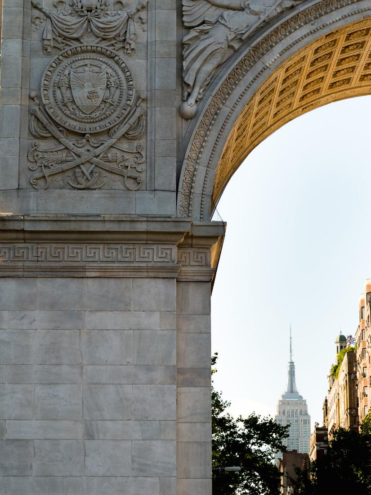

> **AI Description:**
> **Source:** `assets/_page_24_Figure_0.jpg`
> 
> **Generated:** 2026-05-29 20:52:26
> 
> ---
> 
> The image contains a photograph of a large stone archway, likely a historical monument, with intricate carvings and a coat of arms on its facade. The archway frames a view of the Empire State Building in the background, indicating the location is likely New York City. The sky is clear and blue, suggesting a sunny day. The architectural style of the archway suggests it is a significant landmark, possibly commemorating a historical event or figure.

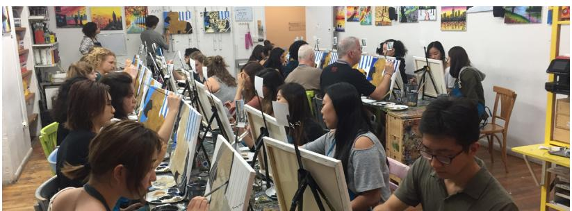

> **AI Description:**
> **Source:** `assets/_page_24_Figure_1.jpg`
> 
> **Generated:** 2026-05-29 20:51:38
> 
> ---
> 
> The image shows a group of people in an art studio, each working on a canvas. They appear to be participating in a painting class or workshop. The studio is well-lit and has various art supplies and paintings displayed on the walls. The participants are focused on their work, with some using brushes and others using pencils. The setting suggests a creative and collaborative environment.

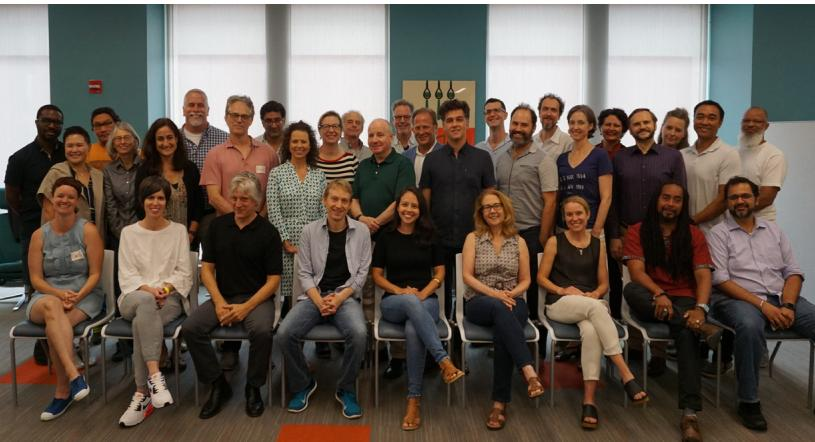

> **AI Description:**
> **Source:** `assets/_page_24_Figure_2.jpg`
> 
> **Generated:** 2026-05-29 20:50:56
> 
> ---
> 
> The image is a photograph of a group of people posing for a group photo. The individuals are seated and standing in a single row, with some individuals in the front row seated on chairs and others standing behind them. The setting appears to be indoors, possibly in an office or conference room, as indicated by the background which includes a wall with a mounted piece of artwork and a door. The group is diverse in terms of age and attire, suggesting a professional or academic setting. There are no charts, graphs, or text annotations present in the image.

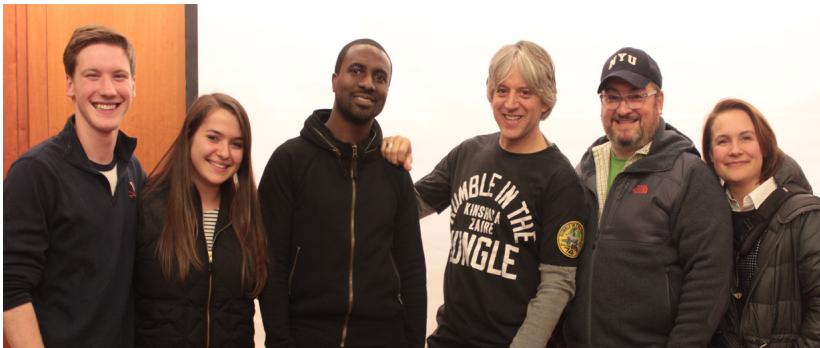

> **AI Description:**
> **Source:** `assets/_page_24_Figure_3.jpg`
> 
> **Generated:** 2026-05-29 20:51:19
> 
> ---
> 
> The image is a photograph of six individuals standing together outdoors. They are dressed in casual winter clothing, with some wearing jackets and sweaters. The background appears to be a cloudy sky, and the group is smiling and posing for the photo. There are no charts, graphs, or other visual elements present in the image.

The first year of college has to be one of the “ most intimidating years! It can be hard at times to find your niche, but know that there are so many resources right at your finger tips especially when you live on campus your first year. From your RAs, hall council, faculty, and professional staff members, each play a key role in helping you make that intimidating transition smoothly. One mistake I made in my first year of college was never asking for help. Just remember that help is always there for you, and will be your best friend when navigating your first year of college!

Blake Viena Residence Hall Assistant Director Brittany Hall

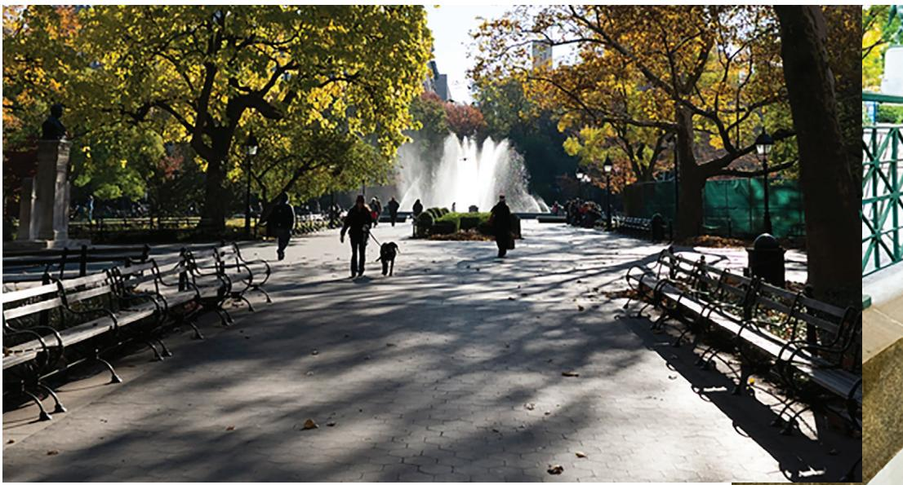

> **AI Description:**
> **Source:** `assets/_page_25_Figure_1.jpg`
> 
> **Generated:** 2026-05-29 20:54:22
> 
> ---
> 
> The image depicts a park scene with a paved pathway lined by benches on both sides. Trees with autumn foliage cast shadows on the path, and a fountain is visible in the background. Several people are walking along the path, and one person is walking a dog. The overall atmosphere suggests a peaceful, sunny day in a park setting.

## GETTING CONNECTED

Our faculty and staff members are excited to welcome you to your new residence hall home in August. Our halls have many opportunities to get connected to other students as well as NYU faculty and staff members. We encourage you to get involved in your residence hall council by running for an elected position or simply engaging in programming, service, and advocacy. NYU’s Inter-Residence Hall Council (IRHC) is another way to get involved in the greater NYU community. IRHC’s three pillars are student advocacy, service, and community events. IRHC hosts many community events including Welcome Week, service weeks, Town Halls, FLURRY ice skating event in Central Park, UltraViolet Live talent competition, and a semi-formal dance at an iconic NYC venue. The National Residence Hall Honorary (NRHH) is another way to get involved on campus. NRHH focuses on recognizing residential students who go above and beyond. Your NYU experience begins the day you move into your residence hall. Take advantage of this great community by getting connected!

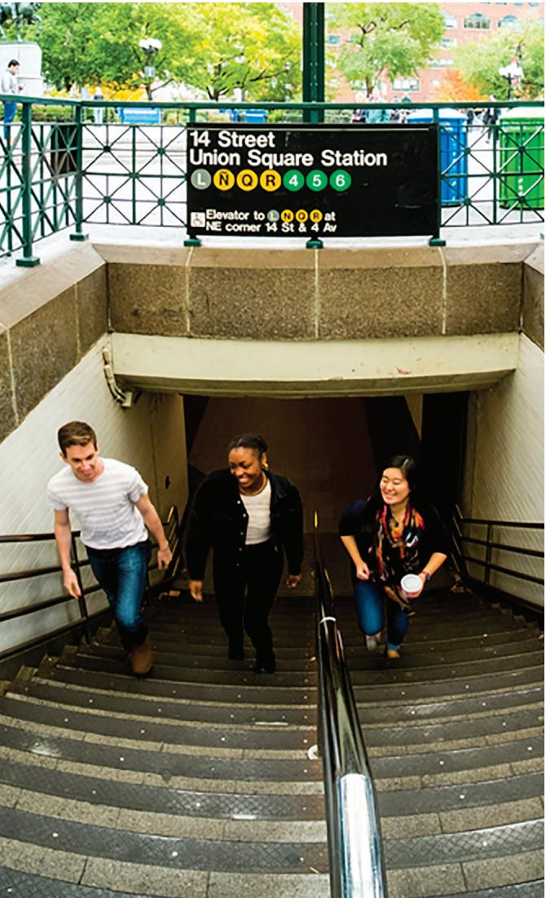

> **AI Description:**
> **Source:** `assets/_page_26_Figure_0.jpg`
> 
> **Generated:** 2026-05-29 21:03:50
> 
> ---
> 
> The image contains a photograph of three individuals descending a set of stairs leading to a subway station entrance. The sign above the entrance reads "14 Street Union Square Station" and indicates that it serves the L, N, Q, R, 4, 5, and 6 subway lines. The sign also mentions an elevator to the N, Q, R, and 4 lines at the northeast corner of 14th Street and 4th Avenue. The setting appears to be an urban environment with greenery visible in the background. The individuals are casually dressed, suggesting a relaxed, everyday scene.

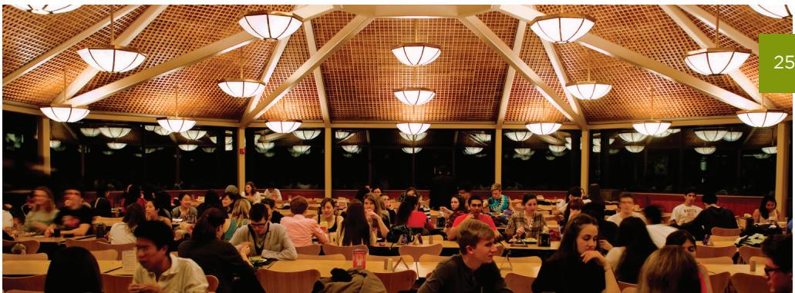

> **AI Description:**
> **Source:** `assets/_page_26_Figure_1.jpg`
> 
> **Generated:** 2026-05-29 21:02:23
> 
> ---
> 
> The image depicts a large, well-lit dining hall with a geometric ceiling structure and numerous hanging lights. The space is filled with people sitting at tables, engaged in eating and conversation. The atmosphere appears casual and social, suggesting a communal dining area, possibly in an educational or institutional setting. The image does not contain any text or labels that provide additional information beyond the visual elements.

APPLYING FOR HOUSING & THEMED ENGAGEMENT COMMUNITIES

Application Steps and Important Dates

It’s easy to apply for Housing! Login to NYUHome and apply online under Housing Forms. Apply and submit your \$1,000 reservation payment before May 1, 2022.

Apply for your preferred themed engagement communities in your housing application.

Receive your themed engagement community placement information by mid-July.

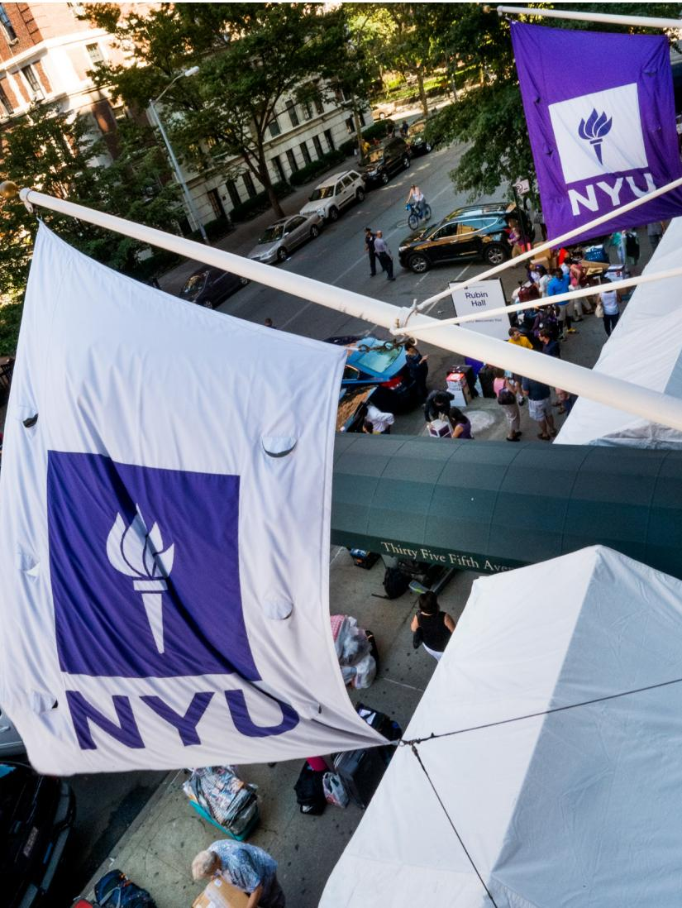

> **AI Description:**
> **Source:** `assets/_page_27_Figure_0.jpg`
> 
> **Generated:** 2026-05-29 20:59:52
> 
> ---
> 
> The image contains a photograph of a street scene with a focus on two large flags. The flags display the logo and name "NYU" (New York University) in purple and white colors. The flags are attached to poles, and the scene below shows a group of people gathered near a building with a sign that reads "Thirty Fifth Ave." The street is lined with parked cars and trees, and there are some pedestrians and bicycles visible. The image captures a lively urban environment with a focus on the NYU branding.

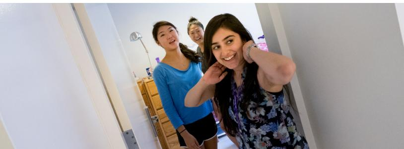

> **AI Description:**
> **Source:** `assets/_page_27_Figure_1.jpg`
> 
> **Generated:** 2026-05-29 21:01:10
> 
> ---
> 
> The image contains a photograph of three individuals indoors. The person in the foreground is smiling and appears to be adjusting their hair with their hand. The other two individuals are standing behind, also smiling. The setting appears to be a room with a door and some furniture visible in the background. The image captures a casual and friendly moment among the individuals.

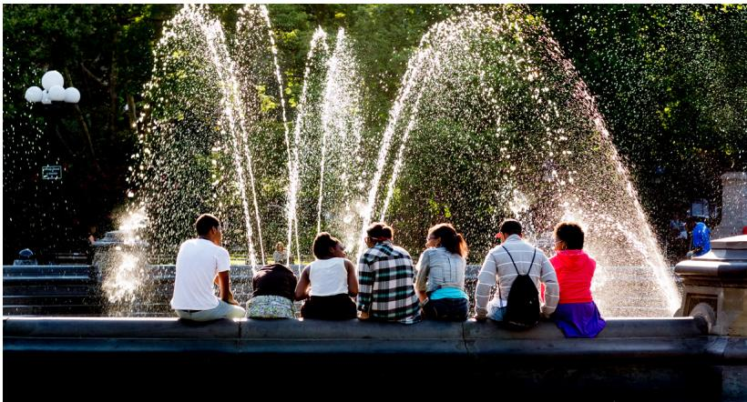

> **AI Description:**
> **Source:** `assets/_page_27_Figure_2.jpg`
> 
> **Generated:** 2026-05-29 20:59:20
> 
> ---
> 
> The image is a photograph of a group of people sitting on a ledge in front of a fountain. The fountain has multiple streams of water shooting upwards, creating a dynamic and visually appealing scene. The people are casually dressed and appear to be enjoying the outdoor setting. The background includes trees and a lamppost, suggesting a park or public space. The lighting indicates it is daytime, with sunlight reflecting off the water and illuminating the scene.

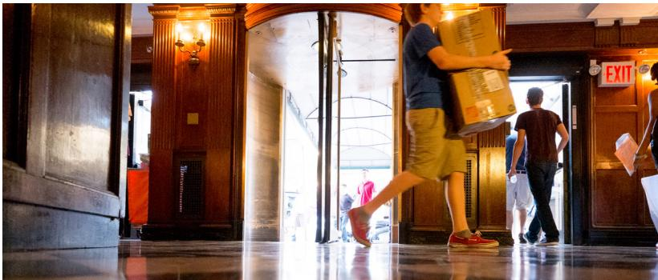

> **AI Description:**
> **Source:** `assets/_page_27_Figure_3.jpg`
> 
> **Generated:** 2026-05-29 20:58:35
> 
> ---
> 
> The image is a photograph showing a group of people in what appears to be an entrance or lobby area of a building. One person is carrying a large cardboard box, and another person is holding a smaller item. The setting includes a polished floor, a revolving door, and a visible exit sign. The lighting suggests it is daytime, and the overall scene conveys a sense of activity or movement.

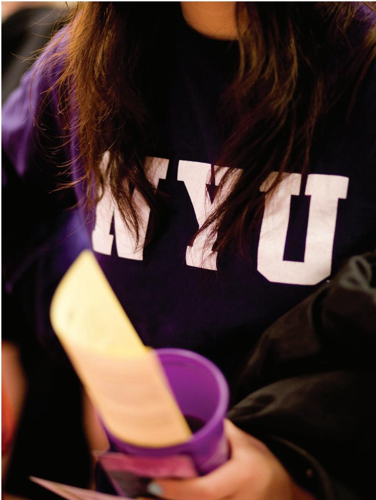

> **AI Description:**
> **Source:** `assets/_page_28_Figure_0.jpg`
> 
> **Generated:** 2026-05-29 20:55:38
> 
> ---
> 
> The image contains a close-up of a person wearing a dark purple shirt with the letters "NYU" in white. The person is holding a purple cup and a yellow object, possibly a phone or a small device. The focus is on the shirt and the cup, with the background blurred, suggesting a casual setting, possibly a campus or a social event.

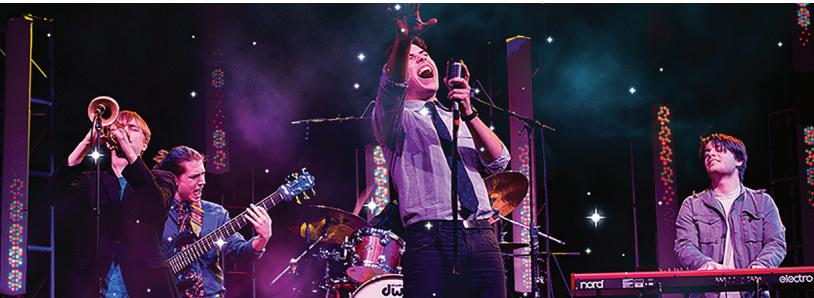

> **AI Description:**
> **Source:** `assets/_page_28_Figure_1.jpg`
> 
> **Generated:** 2026-05-29 20:54:56
> 
> ---
> 
> The image depicts a live performance by a band on stage. The central figure is a male singer passionately singing into a microphone, with his arms raised. To his left, a trumpet player is visible, and to his right, a guitarist is playing. In the background, a drummer is seated behind a drum set, and to the far right, a keyboard player is seated at a keyboard. The stage is illuminated with colorful lights, creating a vibrant and dynamic atmosphere. The image captures the energy and excitement of a live music performance.

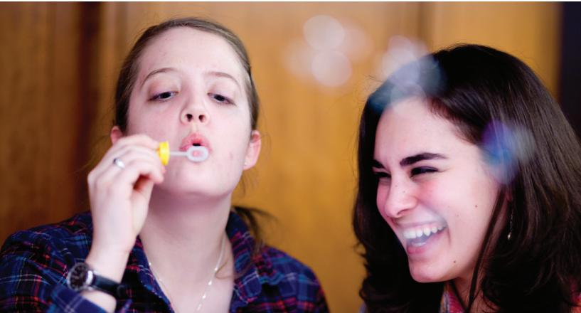

> **AI Description:**
> **Source:** `assets/_page_28_Figure_2.jpg`
> 
> **Generated:** 2026-05-29 20:55:46
> 
> ---
> 
> The image is a photograph of two individuals. One person is blowing bubbles, while the other is smiling and looking at the bubbles. The setting appears to be indoors, with a wooden background. The individuals are casually dressed, and the image conveys a sense of fun and lightheartedness.

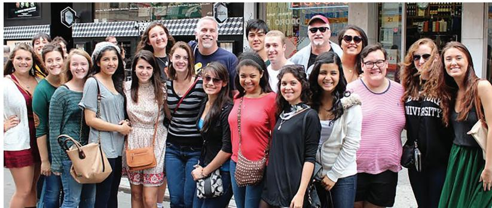

> **AI Description:**
> **Source:** `assets/_page_28_Figure_3.jpg`
> 
> **Generated:** 2026-05-29 20:56:13
> 
> ---
> 
> The image is a photograph of a group of people, likely students and their instructor, posing for a photo in an urban setting. The group appears to be diverse in terms of age and attire, suggesting a casual and friendly atmosphere. The background includes storefronts and a sign that reads "DORO," indicating the location might be a commercial area. The individuals are smiling and seem to be enjoying the moment, which conveys a sense of camaraderie and shared experience.

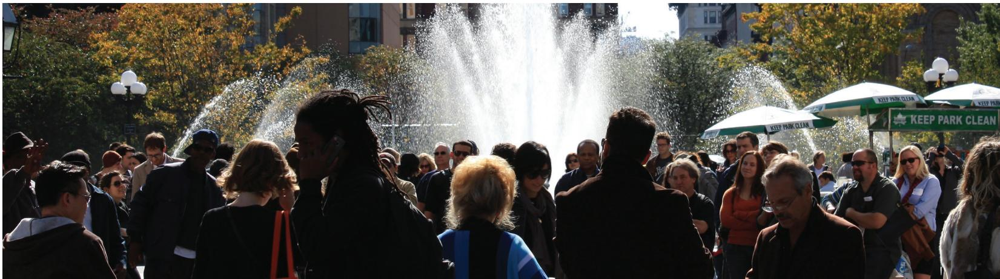

> **AI Description:**
> **Source:** `assets/_page_29_Figure_0.jpg`
> 
> **Generated:** 2026-05-29 20:56:30
> 
> ---
> 
> The image depicts a crowded outdoor scene with a large fountain in the background. The fountain is spraying water high into the air, creating a dynamic visual element. The crowd consists of numerous people of various ages and attire, suggesting a public gathering or event. Some individuals are standing close to the fountain, while others are further back, indicating a mix of interest levels in the activity. There are also some umbrellas with the text "KEEP PARK CLEAN" visible, suggesting the location is a park or public square. The trees in the background have autumn foliage, indicating the season.

Office of Residential Life & Housing Services   
726 Broadway, 7th Floor   
New York, NY 10003   
212.998.4600

www.nyu.edu/living-on

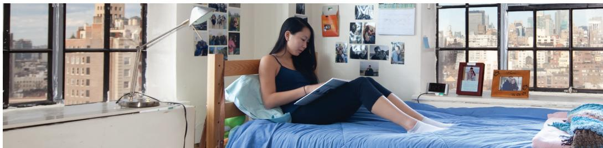

> **AI Description:**
> **Source:** `assets/_page_29_Figure_1.jpg`
> 
> **Generated:** 2026-05-29 20:56:38
> 
> ---
> 
> The image is a photograph of a person sitting on a bed in a room with large windows offering a view of a cityscape. The room is decorated with various personal items, including framed photos, a lamp, and a bed with blue bedding. The person is focused on reading a book. The room appears to be a personal space, possibly a bedroom or dorm room, with a mix of personal and urban elements.

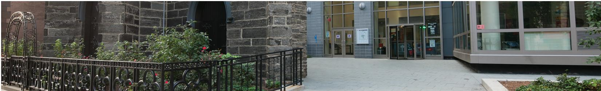

> **AI Description:**
> **Source:** `assets/_page_29_Figure_2.jpg`
> 
> **Generated:** 2026-05-29 20:57:08
> 
> ---
> 
> The image shows a combination of architectural and garden elements. On the left, there is a section of a stone building with a dark arched entrance, partially obscured by a metal railing and some greenery. The railing features decorative scrollwork. To the right, there is a modern building with large glass windows and doors, suggesting an entrance to a facility. The ground is paved with light-colored stones, and there is a small garden area with plants and a planter box. The overall scene appears to be a transition area between historical and contemporary architecture.
