
VMH 2 02 1 ANNUAL REPORT

Passionate about creativity

LVMH Passionate about creativity

## T H E LV M H S P I R I T

Louis Vuitton and Moët Hennessy merged in 1987, creating the LVMH Group. From the outset, Bernard Arnault gave the Group a clear vision: to become the world leader in luxury, with a philosophy summed up in its motto, “Passionate about creativity”. Today, the LVMH Group comprises 75 exceptional Maisons, each of which creates products that embody unique craftsmanship, carefully preserved heritage and resolute modernity. Through their creations, the Maisons are the ambassadors of a refined, contemporary art de vivre. LVMH nurtures a family spirit underpinned by an unwavering long-term corporate vision. The Group’s vocation is to ensure the development of each of its Maisons while respecting their identity and their autonomy, by providing all the resources they need to design, produce and distribute their creations through carefully selected channels. Our Group and Maisons put heart and soul into everything they do. Our core identity is based on the fundamental values that run through our entire Group and are shared by all of us. These values drive our Maisons’ performance and ensure their longevity, while keeping them attuned to the spirit of the times and connected to society. Since its inception, the Group has made sustainable development one of its strategic priorities. Today, this policy provides a powerful response to the issues of corporate ethical responsibility in general, as well as the role a group like LVMH should play within French society and internationally.

Our philosophy: Passionate about creativity

# T H E VA L U E S O F A D E E P LY C O M M I T T E D G R O U P

## Being creative and innovative

Creativity and innovation are part of LVMH’s DNA; throughout the years, they have been the keys to our Maisons’ success and the basis of their solid reputations. These fundamental values of creativity and innovation are pursued in tandem by our Group’s Maisons as they focus on achieving the ideal balance between continually renewing their offer while resolutely looking to the future, always respecting their unique heritage.

## Delivering excellence

Within the Group, quality can never be compromised. Because the Maisons embody everything that is most noble and accomplished in the world of fine craftsmanship, they pay extremely close attention to detail and strive for perfection: from products to services, it is in this quest for excellence that the Group differentiates itself.

## Cultivating an entrepreneurial spirit

The Group’s agile, decentralized structure fosters efficiency and responsiveness. It encourages individuals to take initiative by giving everyone a significant level of responsibility. The entrepreneurial spirit promoted by the Group makes risk-taking easier and encourages perseverance. It requires a pragmatic approach and the ability to motivate staff to achieve ambitious goals.

## Taking action to make a difference

Every action taken by the Group and its employees reflects our commitment to ethics, corporate social responsibility and respect for the environment. They drive our Maisons’ performance and ensure their longevity. Firmly convinced that truly desirable products can only come from sustainable businesses, we are committed to ensuring that our products and the way they are made have a positive impact on our entire ecosystem and the places we operate, and that our Group is actively working to build a better future.

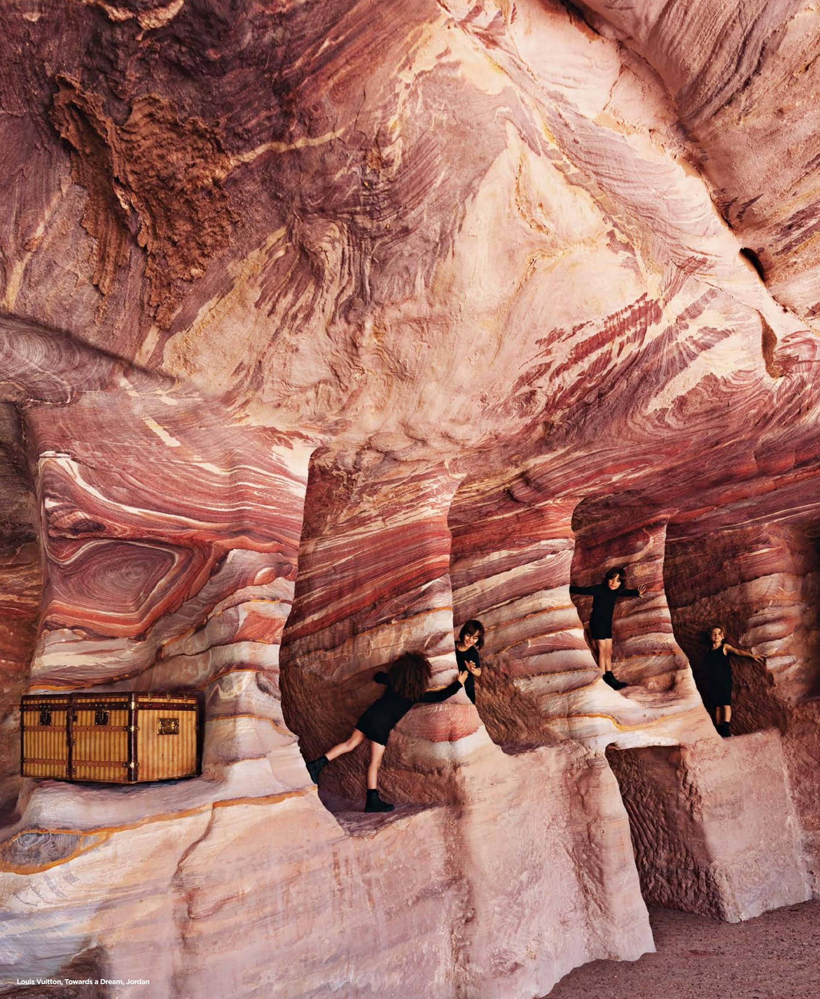

> **AI Description:**
> **Source:** `assets/_page_5_Figure_0.jpg`
> 
> **Generated:** 2026-05-29 23:00:34
> 
> ---
> 
> The image is a photograph featuring a group of individuals in a natural rock formation with intricate, swirling patterns in shades of red and beige. The individuals are dressed in black and are interacting with the rock formations, with one person appearing to climb or reach out towards a large, ornate, wooden chest with brass hardware. The setting appears to be a desert or arid environment, possibly a canyon or cave. The image includes a text annotation at the bottom left corner that reads "Louis Vuitton, Towards a Dream, Jordan," suggesting a connection to a fashion or travel campaign.

## T H E LV M H G ROU P

6 Chairman’s message

12 Interview with the Group Managing Director

14 Robust corporate governance

16 Maisons with a strong identity

17 A diverse range of professions

18 The world’s leading luxury goods group

20 A responsible model dedicated to excellence

22 Exemplary ethics and responsibility

24 Supporting culture, young people and humanitarian projects

28 A firm commitment to support humanitarian and social causes

30 A year of heightened social commitment

34 LIFE 360: Aiming for sustainable excellence

40 LVMH and its Maisons take action

## B U S I N E S S G R O U P I N S I G H T S

44 Wines & Spirits

64 Fashion & Leather Goods

86 Perfumes & Cosmetics

106 Watches & Jewelry

126 Selective Retailing

142 Culture & Lifestyle

## P E R F O R M A N C E M E A S U R E S

154 Stock market performance measures

156 Financial performance measures

158 Non-financial performance measures

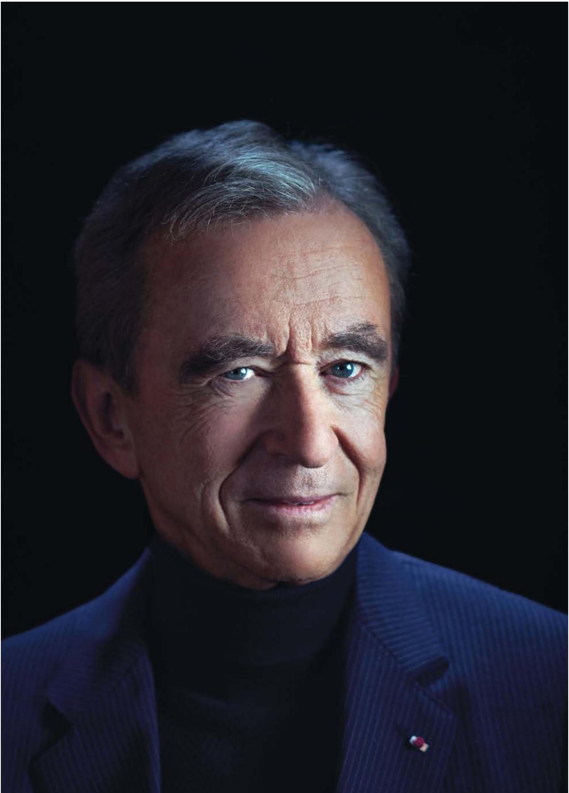

> **AI Description:**
> **Source:** `assets/_page_7_Figure_0.jpg`
> 
> **Generated:** 2026-05-29 21:44:37
> 
> ---
> 
> The image is a portrait photograph of a man. He is wearing a dark blue suit jacket over a black turtleneck sweater. The background is dark, which helps to highlight the subject. The man appears to be middle-aged or older, with short, graying hair. There is a small red pin on the lapel of his jacket. The image is well-lit, focusing on the man's face and upper body.

LVMH navigated the uncertainties of 2021 without ever dev iating f rom its long-term course: excellence, creativity and commitment.

# S T E A D FA S T A N D D E T E R M I N E D

LVMH NAVIGATED THE UNCERTAINTIES OF 2021   
WITHOUT EVER DEVIATING FROM ITS LONG-TERM COURSE: EXCELLENCE, CREATIVITY AND COMMITMENT. OUR MAISONS’ LEADERSHIP HAS EMERGED STRONGER   
FROM THIS CRISIS. LVMH HAS STEPPED UP ITS WORLDWIDE   
SOCIAL AND ENVIRONMENTAL RESPONSIBILITY PROGRAMS AND IS APPROACHING 2022 WITH DETERMINATION.

LVMH achieved a remarkable performance in 2021. In a year that was once again heavily affected by the pandemic, thanks to our teams’ hard work and unflagging enthusiasm – which I wholeheartedly applaud – our Group more than weathered the storm. Our results are excellent: we delivered strong growth that surged even higher in the fourth quarter, and we continued to expand our ever-growing lead. If I may draw a parallel with cycling: the Tour de France is not won on the flats in fine weather, but on the steepest slopes, facing storms and headwinds – that’s when the champions pull ahead.

With their boundless creativity, our Fashion & Leather Goods Maisons – Louis Vuitton and Christian Dior in particular – accomplished the extraordinary feat of gaining market share despite very turbulent conditions. Hennessy successfully overcame major supply shortages to satisfy ever-increasing demand. Parfums Christian Dior continued to shine with the spectacular success of Sauvage, which became the world’s best-selling fragrance in 2021. Having just joined the LVMH family, and under the impetus of its new management team, Tiffany & Co. posted a record year. Our retail activities, which were directly impacted by the lockdowns and forced store closures in 2020, bounced back strongly, particularly at Sephora.

## S H OWC A S I N G O U R TA L E N T

The bedrock of our success is, of course, our Maisons’ talented employees. Whatever the circumstances, our exceptionally adaptable, prolifically creative staff rise to the challenge. All of the Group’s professions are just as focused on tradition as on the future, respecting their heritage of craftsmanship while forging ahead through new designs and new experiences.

Louis Vuitton’s two new Vendôme workshops – the first located in one of the old town’s most beautiful historic buildings, the second at a contemporary site outside the center – work hand in hand and are a symbolic illustration of this duality. That mindset is also reflected in our investments: our Maisons’ workshops are locally rooted and benefit the economies of all the regions of France; our creative directors, like Maria Grazia Chiuri for Dior in Athens and Hedi Slimane for Celine in Nice, design collections and runway shows that inspire and touch the entire planet; our engineers and sales assistants are inventing the digital experiences of the future and new ways of welcoming customers in our stores – which have never been so enterprising. For me, this is the hallmark of our Group and the stamp of fine craftsmanship: at the intersection of art and technology, culture and business, past and future. It’s a delicate balance: a harmonious, unified blend of ideas and dedication that harnesses artistic creativity, finely honed craftsmanship and organizational precision.

It would be unthinkable, at this point, not to mention Virgil Abloh, who passed away so tragically and much too soon in 2021. The entire LVMH family is in mourning. He was a visionary, a beautiful soul and a very wise man. I know that his creative legacy will live on in the memory of our Group, just as departed masters continue to inspire up-and-coming generations of designers.

## B U I L D I N G T H E A R C H I T E C T U R A L M A ST E RWO R K S O F D R E A M S

As you know, our Group has an illustrious history of constructing iconic buildings all over the world, foremost among which is the Fondation Louis Vuitton. One of the key milestones of 2021 was the inauguration of La Samaritaine, the emblematic Paris department store, now restored to its former splendor 15 years after its closure and refurbishment. As soon as it reopened in June, this historic building once again found its place in the hearts of both Parisians and visitors to the City of Light. Since then, several million people have flocked to it, both to shop and to delight in rediscovering this French architectural landmark that LVMH has brought back to life. The Cheval Blanc Paris hotel, with its stunning views of the Seine and unparalleled service – which is without equal anywhere in the world – is also hugely successful. Its three restaurants have rapidly become essential destinations on the Paris fine-dining scene, in particular Plénitude, the gourmet restaurant run by chef Arnaud Donckele. These triumphs reflect LVMH’s goal, which is to look beyond the ups and downs of 2021 at these long-term projects, patiently completed despite being delayed by the pandemic and hailed as a return to happier times as soon as they opened to the public. We live in an often uncertain world and our project schedules can sometimes encounter unforeseen twists and turns, but that only magnifies the feeling of joy when they come to fruition. So come what may, we will never shy away from undertaking ambitious projects and aiming for long-term success.

In this same spirit, Dior’s original store at Paris’ 30 avenue Montaigne reopened at the beginning of 2022 after an extensive revamp. This exceptional location, where the Maison’s legacy and creativity are showcased like never before, has already become a powerful focal point for visitors from all over the world.

## U N F L AG G I N G CO M M I T M E N T T O T H E P L A N E T A N D Y O U N G P E O P L E

We focus on the long term and our commitments reflect this approach. Indeed, our quest for excellence and performance would not be complete without the unstinting and ever-growing daily efforts to make our corporate social responsibility a tangible reality. Preserving the environment, especially, is a priority: nature is the very substance of our products, and protecting it is essential to our Maisons’ long-term future.

The bedrock of our success is, of course, our Maisons’ talented employees. Whatever the circumstances, our exceptionally adaptable, prol if ic al ly c reative s taf f rise to the challenge.

From our vantage point, with our values and resources, we have a role to play in making the world a better place.

2021 saw an array of remarkable achievements in this area. Moët & Chandon is now driving the necessary transition to sustainable winegrowing across the Champagne region, while Château Cheval Blanc is the world’s first grand cru to introduce agroecology – it has planted 4,000 trees in its vineyards and stimulates life on its unique terroir. Our Maisons are also making rapid progress towards a circular economy: Louis Vuitton’s Upcycling collection is made entirely from recycled materials, Loewe’s Surplus Project bags designed by Jonathan W. Anderson are made with leather offcuts, and Zenith has partnered with Nona Source to transform excess fabrics into watch straps.

We involve our suppliers closely in this approach with an increasingly comprehensive traceability system. Fendi now provides a full list of its Tier 1 suppliers. Guerlain shares the same commitment to transparency with its Bee Respect platform, which publicly discloses the origin and lifecycle of its products’ ingredients and packaging materials. LIFE 360, our ambitious Group-wide environmental program, coordinates and fleshes out our Maisons’ initiatives to preserve biodiversity and rapidly reduce CO₂ emissions.

Lastly, our focus on natural resources is matched only by the attention we devote to preserving our intangible heritage: the professions and expertise we pass on to future generations. Over the next few months, we plan to hire about 25,000 people under 30. We will also put a lot of effort into training these new recruits, particularly through our Institut des Métiers d’Excellence (IME), which now has all the trappings of a full-fledged international university for craft professions and customer experience – it is present in six countries and offers 35 highly demanding programs. IME has trained 1,500 talented students since its launch, many of whom are now working with the Group’s Maisons.

## CO N F I D E N T, P R U D E N T, C A R I N G

With the pandemic yet to be fully resolved, 2022 has started with another crisis. We are closely following the dramatic events unfolding in Ukraine. It's very hard to predict how the geopolitical situation will evolve over the coming weeks and its precise impact on the global economy. In the short term, our people and operations are prepared and ready to face any emergency, just as we were at the height of the pandemic. In the longer term, we will continue to move forward with resolve and determination.

From our vantage point, with our values and resources, we have a role to play in making the world a better place. Our passion for excellence, our creativity and our commitment go a long way towards achieving this goal. So do our sense of community, which is closely linked to our Group’s family values; and our dynamic entrepreneurial spirit, which has permeated the Group since its inception. In 2021, we celebrated the 200th anniversary of Louis Vuitton’s birth and it is worth remembering his life journey, leaving the Jura Mountains for Paris to found what would become the world’s foremost luxury brand. In his story, I see a parable of the unstoppable power of entrepreneurship. I hope his example will continue to guide us and enable us to view the future with hope. For LVMH, this is still just the beginning.

Bernard Arnault Chairman and Chief Executive Officer

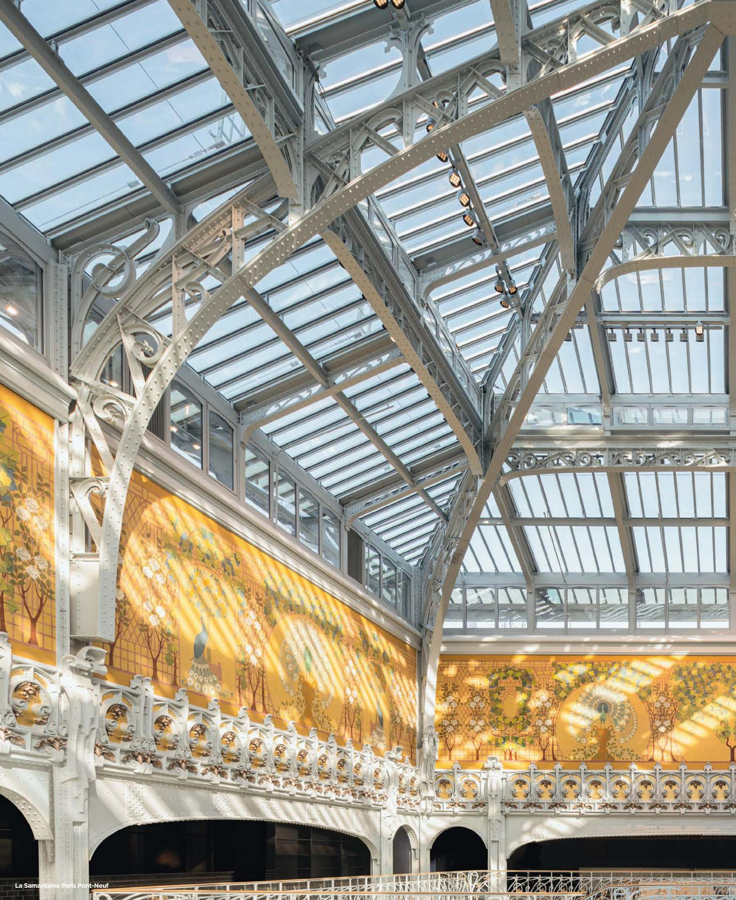

> **AI Description:**
> **Source:** `assets/_page_11_Figure_0.jpg`
> 
> **Generated:** 2026-05-29 22:53:36
> 
> ---
> 
> The image depicts the interior of a grand, ornate building with a high, arched glass ceiling supported by intricate metal framework. The walls are adorned with vibrant, colorful murals featuring floral and nature-inspired designs. The architecture showcases a blend of decorative and structural elements, with detailed metalwork and a bright, airy atmosphere. The image highlights the architectural beauty and artistic detail of the space.

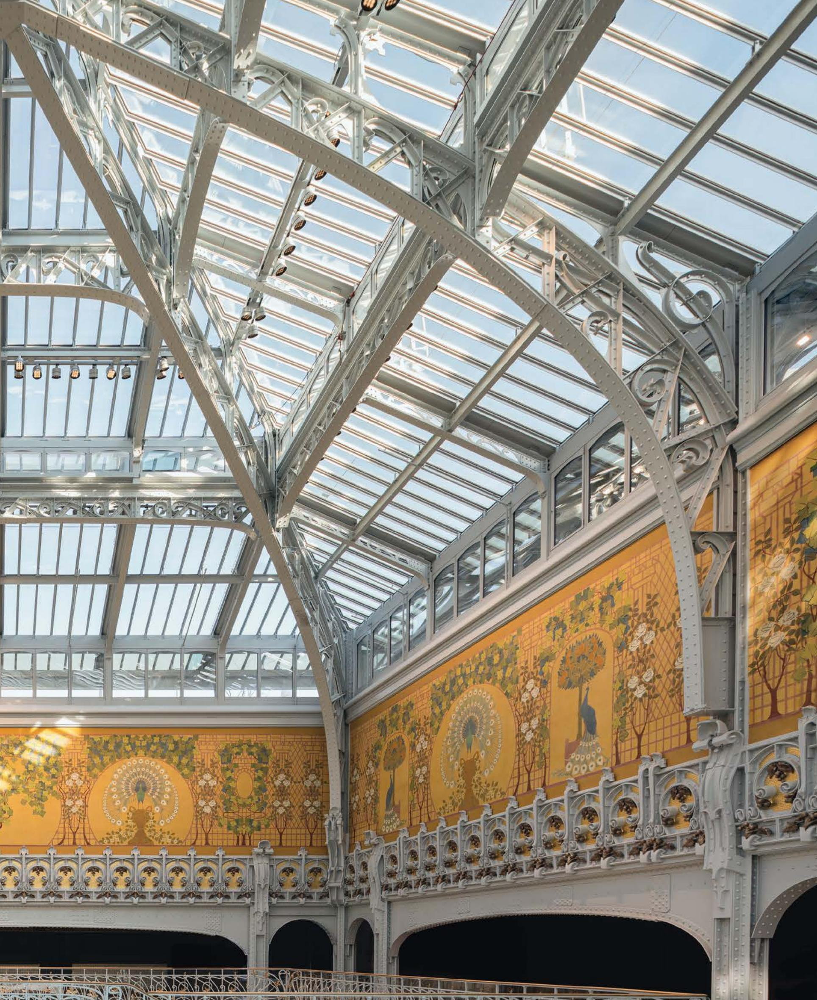

> **AI Description:**
> **Source:** `assets/_page_12_Figure_0.jpg`
> 
> **Generated:** 2026-05-29 21:24:37
> 
> ---
> 
> The image depicts an interior view of a building with a large glass and metal roof structure. The roof is supported by intricate metal beams and features a series of skylights allowing natural light to enter. The walls are adorned with vibrant, ornate murals in a yellow background, featuring detailed illustrations of peacocks and floral patterns. The architectural style appears to be Art Nouveau, characterized by the flowing lines and organic forms in the metalwork and murals. The overall design combines functional elements with decorative art, creating a visually striking space.

# C O N F I D E N C E , V I G I L A N C E A N D E N G A G E M E N T

Antonio Belloni, Group Managing Director

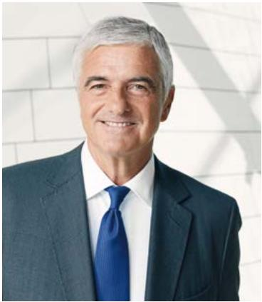

> **AI Description:**
> **Source:** `assets/_page_13_Figure_0.jpg`
> 
> **Generated:** 2026-05-29 21:38:26
> 
> ---
> 
> The image contains a photograph of a person dressed in a dark suit, white shirt, and blue tie. The background is a simple, light-colored, tiled wall. The person is smiling and appears to be in a professional setting. There are no charts, graphs, or other visual elements present in the image.

LVMH achieved a record-breaking performance in 2021: how do you explain such a success despite ongoing disruptions related to the public health situation?

Our performance was driven by a combination of factors, both external and internal. First, our customers’ mindset: after living through two years of the pandemic, they want to rediscover the joy of shopping, enjoy memorable experiences and reconnect. There’s also a clear desire to focus on fundamentals – tried-and-true essentials with solid value and quality you can count on. We saw the same thing happen during the crises in 2001 and 2008, which ultimately made our Group stronger: our brands are, by nature, positioned to reap the benefits.

But that only explains part of our success: the other part comes from our long-term focus on our fundamental strategic priorities. Patiently working to craft our Maisons’ brand image and build their appeal. Maintaining ongoing dialogue and feedback to allow our decentralized organization to swiftly adapt to any situation. Investing in our capacity to innovate and create unprecedented experiences, in particular to prepare for our customers’ return to our stores while maintaining our momentum in online sales. Keeping our eye firmly on the future so our Maisons win over a younger clientele, while maintaining their timeless craftsmanship.

I have been deeply impressed by how hard our teams have worked, and deeply grateful for their steadfast commitment in these trying times, despite multiple constraints and highly unpredictable circumstances: more than ever before, their agility and creativity have made all the difference.

As the world is starting to see signs of a possible end to the pandemic, what are the most fundamental trends that the LVMH Group and its Maisons will face?

Several lasting trends will continue to influence our business activities. The first is an increase in local demand. With tourist travel only slowly recovering, customers are tending to make more of their purchases in their own countries, so our sales associates are working to build closer, more lasting customer relationships in each local market. It’s a virtuous circle. While our Maisons and products will keep taking a global approach, we will also keep paying attention to the different customer bases and cultural specificities of each region.

> **AI Description:**
> **Source:** `assets/_page_14_Figure_0.jpg`
> 
> **Generated:** 2026-05-29 21:38:44
> 
> ---
> 
> The image is a photograph of a person jumping off a boat into the water at sunset. The silhouette of the person is captured mid-air, with the sun setting in the background, casting a warm glow over the horizon. The boat is partially visible on the left side of the image, and the water reflects the colors of the sky. The overall scene conveys a sense of freedom and adventure.

Louis Vuitton, Towards a Dream, Greece.

Another key trend that’s here to stay is digital, which is how most of our customers stay informed, share and shop. That’s not about to change, even with the return of the in-store experience. To leverage this trend, our brands must be able to cohesively express their unique values and their creative identity across a range of customer touchpoints, both physical and digital.

Another increasingly important focus is the role of good corporate citizenship. In a complex, fragmented world, our responsibility has never been greater. And the same can be said of our power to make a difference: by making our manufacturing processes more and more sustainable, rising to meet younger generations’ aspirations for finding meaning in their work, and reducing inequality and prejudice that belong in the past.

Lastly, our organization must be open to change in order to adapt to fundamental shifts in the world around us and prepare for the future. That means bringing in new skills, empowering local teams, breaking down silos, flexibly navigating in-person and virtual interactions, and more. Not to mention the key priority of passing on our Maisons’ creative legacy and excellent craftsmanship to the next generation. Through initiatives like the Institut des Métiers d’Excellence and Artisans 4.0, we’re doing more than just preserving our exceptional skills: we’re readying them for the future.

## What’s the Group’s mindset going into 2022?

Confident and determined, because we know we can count on our people. Our energy remains focused on the appeal of all of our Maisons, with many highlights ahead, including inspiring innovations at Louis Vuitton and the reopening of Christian Dior’s historic flagship at 30 avenue Montaigne in Paris and Tiffany’s on Fifth Avenue in New York.

We will of course remain vigilant. Given the current geopolitical crisis and ongoing pandemic-related disruptions, we will maintain our flexible, rigorous management approach. One of our priorities will be relaunching our activities most exposed to the travel industry, which will only see a very gradual recovery: our customers are eager to get back out and explore the world, but substantial restrictions remain in place.

One thing is certain: we’re going to engage more closely than ever before with our partners to support them and work side by side. From our own workshops to our suppliers, our exceptional craftspeople and the world’s most innovative startups, we are part of a vast ecosystem, and this interconnectedness and dialogue are key to sparking new ideas and enhancing quality and efficiency. That’s what our Maisons’ success – and our Group’s performance – will always be built on.

# R O B U S T C O R P O R A T E G OV E R NA N C E

THE RIGHTS OF LVMH SHAREHOLDERS ARE PROTECTEDBY LAW AND THE PRINCIPLES OF CORPORATE GOVERNANCEWHICH GOVERN THE WAY THE GROUP OPERATES.

Objectives set in line with the social and environmental issues facing the Group’s business

LVMH’s Board of Directors is the strategic body of the Company that is primarily responsible for driving longterm value creation and protecting its corporate interests, focusing in particular on the social and environmental issues facing its business.

## Role of the Board of Directors in the Company’s strategy

The Board of Directors’ principal assignments are to approve the Company’s and the Group’s broad strategic direction and supervise its implementation, as well as verifying the fair and accurate presentation of information about the Company and the Group. It is also tasked with protecting the Group’s corporate assets and ensuring that core business risks are accounted for in its management. The Board also ensures that procedures to prevent corruption and influence-peddling are implemented by the Group and its main partners, and monitors the impact of the Group’s non-discrimination and diversity policy, notably with regard to gender equality within the governing bodies. Lastly, it acts as guarantor of the rights of all of its shareholders and ensures that they fulfill all of their duties.

## Board of Directors’ work in 2021

In fiscal year 2021, the Board approved the annual and interim parent company and consolidated financial statements, monitored quarterly business activity and heard the reports presented by the Chairmen of its three Committees. It gave its opinion on the Group’s strategic direction, its budget, compensation of company officers, the implementation of bonus share plans, and the implementation of the share buyback program. In accordance with the provisions of the AFEP-MEDEF code, the Board of Directors reviewed its own composition, organization and modus operandi. It also (i) approved the targets of the LIFE 360 program adopted by the Group; (ii) made amendments to the Charter of the Board of Directors and the Rules of Procedure of the Nominations & Compensation Committee; (iii) appointed a new member to the Performance Audit Committee and the Nominations & Compensation Committee; and (iv) amidst the public health crisis arising from the Covid-19 pandemic, decided to hold the Shareholders’ Meeting of April 15, 2021 in closed session. Lastly, as provided by law, following the arrival of the first Director representing the employees appointed by LVMH’s Group Works Council, the Board of Directors welcomed a second such Director, appointed by the SE Works Council.

## EXECUTIVE COMMITTEE

Bernard Arnault Chairman and Chief Executive Officer

Antonio Belloni Group Managing Director

Delphine Arnault Louis Vuitton Products
Nicolas Bazire Development & Acquisitions

Stéphane Bianchi Watches & Jewelry

Michael Burke Louis Vuitton & Tiffany

Andrea Guerra LVMH Hospitality Excellence

Jean-Jacques Guiony Finance
Pietro Beccari Christian Dior Couture

Chantal Gaemperle Human Resources & Synergies
Philippe Schaus Wines & Spirits

Sidney Toledano Fashion Group

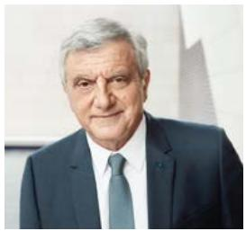

> **AI Description:**
> **Source:** `assets/_page_16_Figure_12.jpg`
> 
> **Generated:** 2026-05-29 21:41:09
> 
> ---
> 
> The image contains a photograph of a man wearing a suit and tie. The background appears to be a professional setting, possibly an office or corporate environment. The man is positioned centrally in the frame, and the image is well-lit, suggesting a formal or professional context. There are no charts, graphs, or other visual elements present in the image.

Christopher de Lapuente Selective Retailing & Beauty

Jean-Baptiste Voisin Strategy

## BOARD OF DIRECTORS

Bernard Arnault Chairman and Chief Executive Officer

Antonio Belloni Group Managing Director

Antoine Arnault

Delphine Arnault (4)

Dominique Aumont Director representing the employees

Nicolas Bazire

Marie-Véronique Belloeil-Melkin Director representing the employees

Sophie Chassat(1)(3)

Charles de Croisset (1) (2) (3) Lead Director

Diego Della Valle

Clara Gaymard (1) (2)(5)

Marie-Josée Kravis (1) (3)(6)

Marie-Laure Sauty de Chalon (1) (2)(4)

Yves-Thibault de Silguy (1) (2) (3) (4)

Natacha Valla(1) Hubert Védrine (1) (4)

Advisory Board members

Yann Arthus-Bertrand Lord Powell of Bayswater

General Secretary Marc-Antoine Jamet

Statutory Auditors

Ernst & Young Audit(7) represented by Gilles Cohen

Mazars(7)   
represented by Isabelle Sapet   
and Loïc Wallaert (1) Independent Director.   
(2) Member of the Performance Audit Committee.   
(3) Member of the Nominations & Compensation Committee. (4) Member of the Ethics & Sustainable Development Committee. (5) Clara Gaymard was appointed as Chairman of the Performance Audit Committee, effective at the close of the Shareholders’ Meeting of April 21, 2022, with Yves-Thibault de Silguy remaining a member of the committee.

(6) Marie-Josée Kravis was appointed as Chairman of the Nominations & Compensation Committee, effective at the close of the Shareholders’ Meeting of April 21, 2022, with Charles de Croisset remaining a member of the committee.

(7) A resolution will be presented at the Shareholders’ Meeting of April 21, 2022 to reappoint Mazars as Principal Statutory Auditor, and to appoint Deloitte as Principal Statutory Auditor to replace Ernst & Young Audit.

## M A I S O N S W I T H A S T R O N G I D E N T I T Y

LVMH COMPRISES 75 PRESTIGIOUS MAISONS ORGANIZED INTO SIX BUSINESS GROUPS. EACH MAISON STEADFASTLY PRESERVES AND PERFECTS A LONG TRADITION OF EXPERTISE AND OFFERS EXCEPTIONAL PRODUCTS.

14TH CENTURY 1365 LE CLOS DES LAMBRAYS 16TH CENTURY 1593 CHÂTEAU D’YQUEM 18TH CENTURY 1729 RUINART 1743 MOËT & CHANDON 1765 HENNESS 1780 CHAUMET 19TH CENTURY1803 VEUVE CLICQUOT OFFICINE UNIVERSELLE BULY 1815 ARDBEG 1817 COVA 1828 GUERLAIN 1832 CHÂTEAU CHEVAL BLANC 1837 TIFFANY & CO. 1843 KRUG 1843 GLENMORANGIE 1846 LOEWE 1849 ROYAL VAN LENT 1852 LE BON MARCHÉ 1854 LOUIS VUITTON 1858 MERCIER 1860 TAG HEUER 1860 JARDIN D’ACCLIMATATION 1865 ZENITH 1870 LA SAMARITAINE 1884 BULGARI 1895 BERLUTI 1898 RIMOWA 20TH CENTURY 1908 LES ECHOS 1914 PATOU 1916 ACQUA DI PARMA 1923 LA GRANDE ÉPICERIE DE PARIS 1924 LORO PIANA 1925 FENDI 1936 DOM PÉRIGNON 1936 FRED 1944 LE PARISIEN-AUJOURD’HUI EN FRANCE 1945 CELINE 1946 CHRISTIAN DIOR COUTURE 1947 PARFUMS CHRISTIAN DIOR 1947 EMILIO PUCCI 1952 GIVENCHY 1952 CONNAISSANCE DES ARTS 1955 CHÂTEAU GALOUPET 1957 PARFUMS GIVENCHY 1957 REPOSSI 1958 STARBOARD CRUISE SERVICES 1959 CHANDON 1960 DFS 1969 SEPHORA 1970 KENZO 1970 CAPE MENTELLE 1972 PERFUMES LOEWE 1974 INVESTIR-LE JOURNAL DES FINANCES 1975 OLE HENRIKSEN 1976 BELMOND 1976 BENEFIT COSMETICS 1977 NEWTON 1980 HUBLOT 1983 RADIO CLASSIQUE 1984 MARC JACOBS 1984 MAKE UP FOR EVER 1985 CLOUDY BAY 1988 KENZO PARFUMS 1991 FRESH 1992 COLGIN CELLARS 1993 BELVEDERE 1996 TERRAZAS DE LOS ANDES 1998 BODEGA NUMANTHIA 1999 CHEVAL DES ANDES 21ST CENTURY 2006 MAISONS CHEVAL BLANC 2006 CHÂTEAU D’ESCLANS 2008 KVD VEGAN BEAUTY 2009 MAISON FRANCIS KURKDJIAN 2010 WOODINVILLE 2013 MARC JACOBS BEAUTY 2013 AO YUN 2016 CHA LING 2017 FENTY BEAUTY BY RIHANNA 2017 VOLCÁN DE MI TIERRA 2020 EMINENTE

# A D I V E R S E R A N G E O F P R O F E S S I O N S

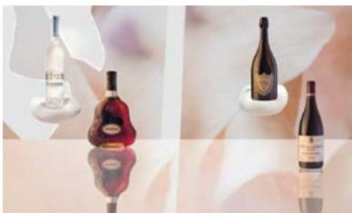

> **AI Description:**
> **Source:** `assets/_page_18_Figure_0.jpg`
> 
> **Generated:** 2026-05-29 22:18:25
> 
> ---
> 
> The image contains a collage of three distinct photographs of wine bottles. The bottles are placed on white circular stands against a soft, blurred background with pastel tones. The bottles vary in shape and color, suggesting different types of wine. The image is visually appealing and likely intended to showcase the elegance and variety of the wines.

## WINES & SPIRITS

Moët & Chandon, Dom Pérignon, Krug, Veuve Clicquot, Ruinart, Hennessy, Château d’Yquem, Clos des Lambrays… the origins of all these world-famous estates are inextricably linked to the appellations and terroirs of the world’s most prestigious wines and spirits. Whether they are in Champagne, Bordeaux, or other famed wine regions, these Maisons, many of which date back more than a century, all share a powerful culture of excellence.

## FASHION & LEATHER GOODS

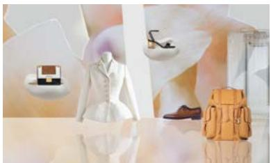

> **AI Description:**
> **Source:** `assets/_page_18_Figure_1.jpg`
> 
> **Generated:** 2026-05-29 22:16:45
> 
> ---
> 
> The image contains a collage of fashion-related items. It includes a white dress, a pair of high-heeled shoes, a brown leather bag, and a small square item that appears to be a compact or a small box. The items are arranged on a reflective surface, and the background features abstract, blurred shapes in soft pastel colors. The overall aesthetic suggests a focus on luxury and elegance in fashion.

The LVMH Watches & Jewelry Maisons are some of the most emblematic brands in the industry. They operate in jewelry and watches with Tiffany, the prestigious American jewelry house acquired in 2021, Bulgari, Chaumet, Fred, TAG Heuer, Hublot and Zenith. These Maisons are guided by a daily quest for excellence, creativity and innovation.

The Fashion & Leather Goods business group comprises Louis Vuitton, Christian Dior Couture, Celine, Loewe, Kenzo, Givenchy, Fendi, Emilio Pucci, Marc Jacobs, Berluti, Loro Piana, RIMOWA and Patou. While respecting the identity and autonomous management of these brands, LVMH supports their growth by providing them with shared resources.

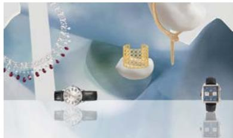

> **AI Description:**
> **Source:** `assets/_page_18_Figure_2.jpg`
> 
> **Generated:** 2026-05-29 22:05:05
> 
> ---
> 
> The image contains a collection of luxury items, including a necklace with diamonds and rubies, a watch, a ring, and a wristwatch. The items are displayed against a backdrop of a stylized landscape with mountains and a globe, suggesting themes of travel, elegance, and high-end fashion. The overall composition emphasizes the opulence and exclusivity of the products.

## WATCHES & JEWELRY

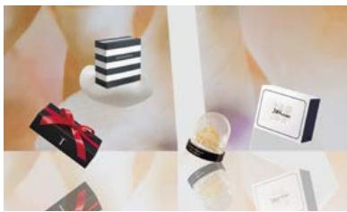

> **AI Description:**
> **Source:** `assets/_page_18_Figure_3.jpg`
> 
> **Generated:** 2026-05-29 22:12:11
> 
> ---
> 
> The image contains a collage of various product packaging and branding elements. The key features include:
> 
> 1. A black and white striped box with a red ribbon, suggesting a gift or luxury item.
> 2. A small, clear container with a white label, possibly a sample or a small product.
> 3. A rectangular box with a white label that reads "J'Adore," which is likely a perfume or fragrance product.
> 4. Another black and white striped box with a red ribbon, similar to the first item, reinforcing the theme of luxury or gift packaging.
> 
> The overall image appears to be showcasing different packaging designs for luxury or high-end products.

## SELECTIVE RETAILING

LVMH is a key player in the perfume, makeup and skincare sector, with a portfolio of world-famous French brands: Christian Dior, Guerlain, Givenchy and Kenzo. The Group also owns other beauty brands: Benefit, Fresh, Acqua di Parma, Perfumes Loewe, Make Up For Ever, Maison Francis Kurkdjian, Fenty Beauty by Rihanna, KVD Vegan Beauty and Officine Universelle Buly.

## PER FUMES & COSMETICS

The Selective Retailing business group comprises Sephora, the world’s leading selective beauty retailer; Le Bon Marché, a Paris department store with a unique atmosphere; and travel retailers DFS and Starboard Cruise Services, who cater specifically to international travelers.

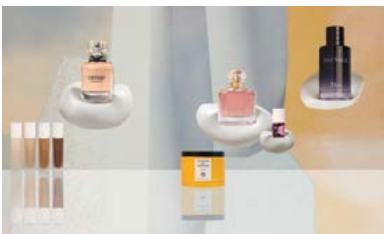

> **AI Description:**
> **Source:** `assets/_page_18_Figure_4.jpg`
> 
> **Generated:** 2026-05-29 21:47:20
> 
> ---
> 
> The image contains a collection of perfume bottles and related items. The bottles are displayed on white stands against a neutral background. The bottles vary in size and color, with some being larger and others smaller, and some having a pink hue while others are darker. There are also small tubes and a box with text and logos, likely indicating the brand and product details. The overall presentation is clean and focused on showcasing the perfume products.

## OTHER ACTIVITIES

Other activities include Groupe Les Echos, which comprises leading French business and cultural news publications; Royal Van Lent, the builder of high-end yachts marketed under the brand name Feadship; Cheval Blanc and Belmond, which are developing a collection of exceptional hotels.

# T H E W O R L D ’ S L E A D I N G LU X U RY G O ODS G ROU P

A UNIQUE OPERATING MODELBUILT ON SIX PILLARS

## 1

## Decentralized organization

Our structure and operating principles ensure that our Maisons are both autonomous and responsive. This allows us to be extremely close to our customers, to ensure that rapid, effective and appropriate decisions can be made. This approach also sustains the motivation of our employees, encouraging them to show true entrepreneurial spirit.

## 4

## Organic growth

The LVMH Group places priority on organic growth and commits significant resources to develop its Maisons, as well as to encourage and protect creativity. Our employees are key to this approach, making it essential to support their career growth and encourage them to excel.

## 2

## Ver tical integration

Vertical integration fosters excellence both upstream and downstream, allowing control over every link in the value chain – from sourcing and production facilities to selective retailing – which in turn means that the image of our Maisons is carefully controlled.

## 5

## Creating synergies

Sharing of resources on a Group scale creates intelligent synergies while respecting the individual identities and autonomy of our Maisons. The combined strength of the LVMH Group is leveraged to benefit each of its Maisons.

## 3

## Sustaining savoir-faire

Our Maisons pursue a long-term vision. To preserve their distinctive identities and excellence, LVMH and its Maisons have developed a range of initiatives to pass down skills and expertise, and promote craft trades and design professions among younger generations.

## 6

## Balance across business segments and geographies

Our Group has the resources to sustain regular growth thanks to the balance across its business activities and a well-distributed geographic footprint. This balance means that we are well-positioned to withstand the impact of shifting economic factors.

### Full Page Description (Page 20)

**Source:** `assets/_page_20_Asset_0.jpg`

**Generated:** 2026-05-29 23:06:23

---

The image is a pie chart that visually represents the distribution of market shares across different regions. The chart is divided into segments, each labeled with a region and its corresponding percentage of the total market share. The key regions and their percentages are:

- United States: 26%
- Asia (excluding Japan): 35%
- Japan: 7%
- Europe (excluding France): 15%
- France: 6%
- Other markets: 11%

The chart effectively illustrates the dominance of the United States in the market, followed by Asia, with other regions holding smaller shares. The use of different colors for each segment helps to distinguish between the regions at a glance.

### Full Page Description (Page 20)

**Source:** `assets/_page_20_Asset_1.jpg`

**Generated:** 2026-05-29 23:11:05

---

The image is a pie chart that visually represents the distribution of various sectors within a business or industry. The chart is divided into five segments, each labeled with a sector and its corresponding percentage of the total. The sectors and their percentages are as follows: "Selective Retailing and Other activities" at 19%, "Watches & Jewelry" at 14%, "Perfumes & Cosmetics" at 10%, "Wines & Spirits" at 9%, and "Fashion & Leather Goods" at 48%. The chart uses different shades of blue to distinguish between the sectors, making it easy to differentiate and understand the relative proportions of each segment.

80 countries

7 5 Maisons

179 nationalities

1 1 0 production sites in France

175, 647 employees

5,556 stores

575 nonprofits, foundations and initiatives supported through the involvement of nearly 30,000 employees

657,000 hectares of fauna and flora habitat regenerated or protected

€6 4 . 2 bn

Revenue +44% versus 2020 +20% versus 2019 €1 7. 2 bn

Profit from   
recurring operations   
+107% versus 2020   
+49% versus 2019

€1 2 bn

Net profit   
Group share   
+156% versus 2020   
+68% versus 2019

UNITED STATES Revenue: €16,591m 1,014 stores 34,930 employees

FRANCE   
Revenue: €4,111m   
522 stores   
33,887 employees

EUROPE (excl. France) Revenue: €9,860m 1,203 stores 39,343 employees

OTHER MARKETS Revenue: €6,904m 594 stores 15,769 employees

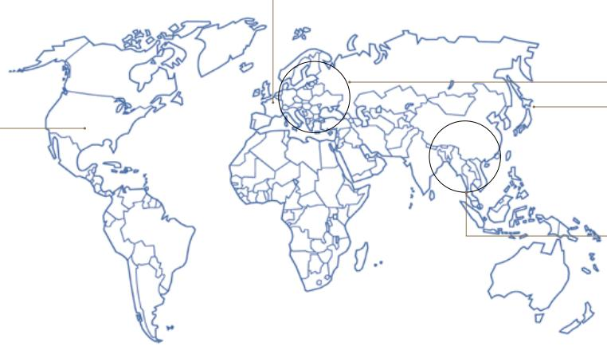

> **AI Description:**
> **Source:** `assets/_page_20_Figure_0.jpg`
> 
> **Generated:** 2026-05-29 22:54:23
> 
> ---
> 
> The image is a world map with two highlighted regions. The highlighted regions are located in Europe and South Asia, with a closer inset view of South Asia. The map is a simple outline with country borders, and there are no labels or annotations providing specific information about the highlighted areas. The focus appears to be on these two regions, possibly for educational or geographical purposes.

JAPAN Revenue: €4,384m 477 stores 8,013 employees

ASIA (excl. Japan) Revenue: €22,365m 1,746 stores 43,705 employees

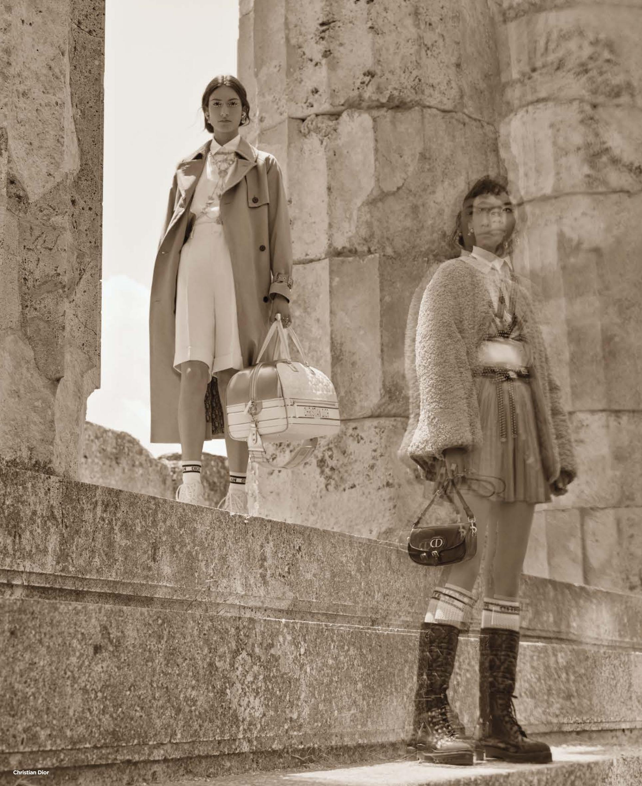

> **AI Description:**
> **Source:** `assets/_page_21_Figure_0.jpg`
> 
> **Generated:** 2026-05-29 23:08:30
> 
> ---
> 
> The image is a sepia-toned photograph featuring two individuals standing on stone steps in front of a stone wall. The person on the left is wearing a light-colored trench coat over a white dress and holding a white handbag. The person on the right is dressed in a textured coat, a white shirt, and a skirt, accessorized with a belt and a small handbag. Both individuals are wearing knee-high socks and boots. The setting appears to be an ancient or historical site, given the stone architecture. The image is branded with "Christian Dior" in the bottom left corner, indicating it is likely a fashion advertisement or editorial.

# A R E S P O N S I B L E M O D E L D E D I C AT E D T O E XC E L L E N C E

FORGED OVER GENERATIONS BY ALLIANCES BETWEEN MAISONS – WEAVING TOGETHER THEIR TRADITIONS OF EXCELLENCE   
AND CREATIVE PASSION – LVMH HAS BUILT ITS LEADING POSITION ON A UNIQUE PORTFOLIO OF ICONIC BRANDS.

These Maisons draw their energy from their exceptional heritage, innovative mindset and receptive outlook. The Group supports their development in a spirit of entrepreneurship, long-term vision and respect for the source of their strength and stature.

As ambassadors of an authentic art de vivre, it is our responsibility to set the right example in every aspect of our business, from product design to the experience that customers have throughout their relationships with the Group’s brands; from investment choices to social and environmental initiatives. Because what we do requires a diverse range of talent, we are committed to training teams that embody excellence. Because passing on skills is an integral part of our culture, we want to use that opportunity to promote social inclusion and employment. Because our crafts make the most of nature at its purest and most beautiful, we see preserving the environment as a strategic imperative.

The values and actions encompassed by our sustainable development attitude emerge from a tradition that dates back to the origins of our Maisons and forms an integral part of our heritage. Our long-term success depends not only on the Group’s solid business model and profitable growth strategy, but also on our unwavering commitment to creativity, excellence, and our environmental impact and corporate citizenship.

## Business performance

Combining profitable growth and sustainability with commitments to creativity and excellence. Applying our creative passion to the art de vivre to which our customers aspire. Strengthening our position as a global leader, and being the benchmark for managing and developing high-quality brands.

## Nurturing talent

Encouraging all our employees to reach their full career potential and achieve their aspirations. Developing diversity and the wealth of human resources at our companies in all the countries where we operate, and encouraging initiatives in these areas. Contributing to the knowledge and preservation of our crafts outside the Group in addition to our own expertise as artisans and designers.

## Environment

Working together to preserve the planet’s resources, to design and develop products that are compatible with environmental concerns, reporting on our policies and projects and the progress achieved in meeting our objectives. Contributing to environmental protection above and beyond factors directly related to our operations by entering into active partnerships with cooperating businesses, local authorities and nonprofits.

## Partnerships and support

Maintaining and strengthening responsible relationships with our partners, suppliers and subcontractors. Implementing a patronage program for the widest possible public benefit which reflects and transmits our fundamental values. Providing active support for major causes, humanitarian projects and public health programs, and developing initiatives in support of art and young people.

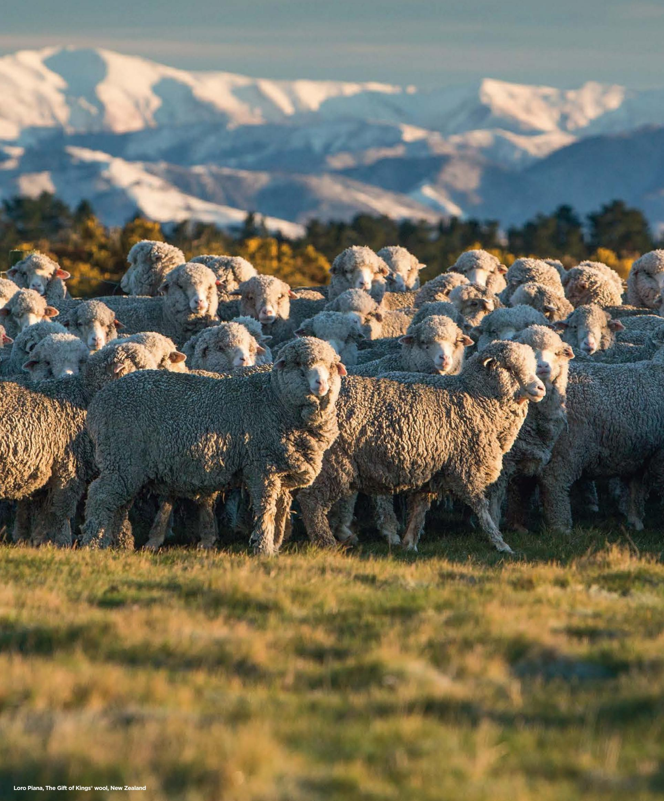

> **AI Description:**
> **Source:** `assets/_page_23_Figure_0.jpg`
> 
> **Generated:** 2026-05-29 21:34:53
> 
> ---
> 
> The image is a photograph of a flock of sheep standing in a grassy field. The sheep are densely packed together, facing towards the camera. In the background, there are snow-capped mountains under a clear sky, suggesting a serene and natural setting. The lighting indicates that the photo was taken during the golden hour, casting a warm glow on the sheep and the landscape. The text at the bottom of the image mentions "Loro Piana, The Gift of Kings' wool, New Zealand," indicating the origin and context of the sheep.

# E X E M P L A RY E T H I C S A N D R E S P O N S I B I L I T Y

THE GROUP HAS ESTABLISHED RULES OF CONDUCT AND PRINCIPLES FOR ACTION REGARDING ETHICS AND ENVIRONMENTAL, WORKFORCE-RELATED AND SOCIAL RESPONSIBILITY TO GUIDE THE BEHAVIOR OF ALL OUR EMPLOYEES, SUPPLIERS AND OTHER STAKEHOLDERS.

## Codes of ethics and their application

LVMH’s wide-ranging commitments to our employees and stakeholders are reflected in the Group’s longstanding support for benchmark initiatives such as the United Nations Global Compact, and in the adoption of internal charters and codes of conduct which serve as guidelines for all of our Maisons. These include the LVMH Code of Conduct, the Supplier Code of Conduct, the Environmental Charter and, more recently, the Animal-Based Raw Materials Sourcing Charter.

The Group has a dedicated governance structure that ensures its values and codes of ethics are applied at the operating level. This structure includes the Ethics & Sustainable Development Committee, which operates within the Board of Directors. The Committee receives regular reports from the Group’s Ethics & Compliance Department which, with its network of over 80 officers, develops and implements the compliance program across all the Maisons.

The Group puts these commitments and values into practice across all its business lines, paying close attention to areas such as promoting employee inclusion and well-being; developing and passing on expertise and key skills; protecting personal data; reducing the Group’s impact on ecosystems and natural resources; implementing compliance systems; and establishing and maintaining responsible supply chains.

In 2021, the Group extended access to LVMH Alert Line – our online whistleblowing platform – to all our external stakeholders. This platform was already open to employees, who can use it to report in good faith any violations of laws, rules or in-house codes of conduct securely and confidentially.

## Fair and responsible relations with our partners

Supporting our partners is a key strategic priority for LVMH, as we aim to build long-term relationships underpinned by our shared quest for excellence and the ambition to establish a set of common ethical principles, guidelines and practices. The Group is developing a comprehensive policy with the aim of ensuring that our partners and suppliers adopt best environmental, social and societal practices, while enhancing awareness and providing information about issues specific to their own activities. LVMH and its Maisons take a collaborative approach, offering support through audits and, where necessary, action plans. Over 1,500 audits were conducted in 2021. Despite the exceptional public health situation that began in early 2020, LVMH was able to maintain a significant level of on-site supplier audits. The Group’s responsible sourcing policy also includes supplier support and training. For example, LVMH is a signatory of the Utthan pact, an initiative that brings together several luxury brands that contract out embroidery work. This program aims to empower artisans in Mumbai’s hand embroidery cluster, where many of the embroiderers partnering with the Maisons are based. The initiative also includes a training program for embroiderers. In addition, several of the Group's Maisons worked together to organize online training for managers of supplier sites in Italy and China. Given the results of the risk analysis and of certain audits, these training courses focused on human rights, health and safety, the environment and fighting corruption.

# FONDATIONLOUISVUITTON

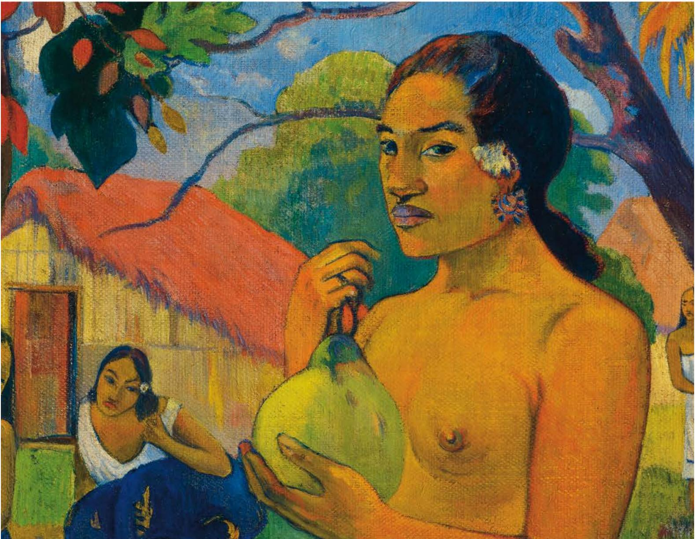

> **AI Description:**
> **Source:** `assets/_page_25_Figure_0.jpg`
> 
> **Generated:** 2026-05-29 21:43:20
> 
> ---
> 
> The image is a painting featuring a nude woman holding a green fruit in her hands. The background includes a thatched-roof hut with a red roof, surrounded by lush greenery and trees. Another woman is seated in the foreground, wearing a white top and blue skirt. The painting is characterized by vibrant colors and a style that suggests it is from the Post-Impressionist period, with a focus on bold brushstrokes and expressive use of color. The overall composition and color palette evoke a sense of tropical and natural beauty.

PaulGauguin Eu hare ioe（Ou vas tu?） L Femme ufru,dail

# COLLECTION MOROZOV

ICONESDEL'ARTMODERNE

Manet,Monet,Renoir,Cézanne,Gauguin,VanGogh,Bonnard,Matisse,Picasso...

FondationLouisVuitton

enpartenariatavecMuseedel'Ermitage，MuseedesBeaux-artsPouchkine，GalerieTretiakov 22septembre 2o21> 22février2022

reservezsur:fondationlousvuitton.fretfnac.com|8av.duMahatmaGandhiBoisdeBoulogne,Paris#fondationlouisvuiton

# S U P P O R T I N G C U LT U R E , YOU N G P E O P L E A N D H U M A N I TA R I A N P R O J E C T S

LVMH HAS BEEN PURSUING GROUNDBREAKING CORPORATE PHILANTHROPY INITIATIVES  
FOR OVER 25 YEARS. THROUGH ITS SUPPORT FOR COMMUNITY-ORIENTED INITIATIVES,THE GROUP EXPRESSES ITS CREATIVE AND HUMANITARIAN VALUES AND STRIVESTO PROMOTE CULTURAL HERITAGE, ART, FASHION AND ARTS EDUCATION FOR ALL.

Culture, heritage and contemporary creative arts

In 2021, LVMH continued to back the effort to save Notre-Dame de Paris Cathedral, whose restoration will take several more years. Just one day after the terrible fire that ravaged the monument in the spring of 2019, LVMH, led by its Chairman, Bernard Arnault, made a €100 million donation (along with an additional €100 million from his family group) to ensure that Notre-Dame’s long restoration process is followed through to completion. In support of the arts, LVMH signed on to sponsor a new production of Tennessee Williams’ The Glass Menagerie at the Théâ- tre de l’Odéon, directed by Ivo van Hove. With its performances interrupted by the pandemic lockdown, this play was presented again in 2021, once again thanks to the support of LVMH. LVMH has been a loyal patron of the Nuit Blanche night-time arts festival for nearly fifteen years, and once again in 2021 provided support alongside the City of Paris to the French and international arts scene, giving center stage to contemporary artists at an event open to all in the heart of Paris. LVMH also continued its support for the Giacometti Institute in Paris, helping it develop its scientific and cultural program.

Due to the Covid-19 pandemic, the final event for the eighth edition of the LVMH Prize for Young Fashion Designers was held without an in-person audience. Out of nine finalists, the LVMH Prize was awarded to Nensi Dojaka, a 27-year-old Albanian designer based in London who founded the eponymous women’s ready-to-wear fashion brand. She won a 300,000 euro award and a year of mentoring within the LVMH Group. The panel of judges also decided to award the Karl Lagerfeld Prize to three designers: Colm Dillane, the 29-year-old American founder of Brooklyn-based brand KidSuper; Lukhanyo Mdingi, a 29-year-old South African designer based in Cape Town;

and Rui Zhou, a 26-year-old Chinese designer who founded Shanghai-based brand Rui.

## Arts education initiatives

Once again this year, LVMH’s patronage of programs for young people focused on music. In particular, LVMH renewed its support for Orchestre à l’École, a nonprofit that enables hundreds of children all over France to start playing a musical instrument. The Group also continued its actions to promote access for young people to performances at the Opéra Comique in Paris. LVMH also once again loaned out the Stradivariuses in its collection.

## Backing medical research and certain social causes

The Group supported numerous institutions well known for their work with children, the elderly and people with disabilities, and for their efforts to combat major causes of suffering and exclusion. In particular, LVMH provided major support to the Fondation des Hôpitaux de Paris-Hôpitaux de France and the Association Le Pont Neuf in France; Save the Children Japan; and the Robin Hood Foundation in New York, which works to support initiatives for children. It also supported the Fondation Claude Pompidou, which provides support in France for seniors and people with disabilities; Association Fraternité Universelle, which works in Haiti to improve access to health care and education alongside actions in favor of agricultural development, especially in the Central Plateau; and the Curie Institute in its research and work to fight childhood cancer. The Group is also a longstanding supporter of a number of scientific teams and foundations engaged in cutting edge public health research.

The Fondation Louis Vuitton, which opened in 2014, is now recognized as a leading institution on the global arts scene, achieving remarkable success among both art and culture connoisseurs as well as a wide French and international audience.

In 2020, following the success of the Charlotte Perriand: Inventing a New World exhibition,which welcomed a total of 476.ooo visitors,the Cindy Sherman at the Fondationexhibition, whose opening was postponed due to the pandemic, finally opened its doors to the public on September 23, 2020. This exceptional retrospective, featuring more than 170 works by Cindy Sherman, spanned her entire career as one of the greatest photographers of our time, with a special focus on works from the past decade, some of which were exhibited for the first time ever. As soon as the Fondation reopened, visitors flocked to admire this universally acclaimed artist’s insightful, sensitive exploration of the notions of identity and image until the public health crisis worsened and the Fondation closed for a second time on October 29, 2020.

Throughout 2021, the pandemic upended the activities of cultural institutions. The Fondation Louis Vuitton demonstrated agility in continuing to pursue its core missions: supporting artists and building a dialogue between key figures in modern art, leading lights of the international contemporary art scene and a wide audience, especially young people.

The Morozov Collection: Icons of Modern Art,an exhibition initially due to be held in October 2020, ultimately opened on September 22, 2021, and by February 2022 had already drawn more than 1 million visitors. This highly anticipated exhibition, which has received unanimous praise from the art world, features masterpieces from the collection of European and Russian modern art assembled by the Muscovite brothers Mikhail Abramovich Morozov (1870-1903) and Ivan Abramovich Morozov (1871-1921). Presented for the first time outside Russia, The Morozov Collection echoes the 2016 Shchukin exhibition, which marked an unprecedented new era in the partnership between the Fondation Louis Vuitton and major Russian museums.

A final highlight was the Fondation Louis Vuitton’s continuation of its international Hors-Les-Murs (“Beyond the Walls”) program this year, with a number of exhibitions held at its Espace Louis Vuitton locations in Tokyo, Munich, Venice, Beijing, Seoul and Osaka.

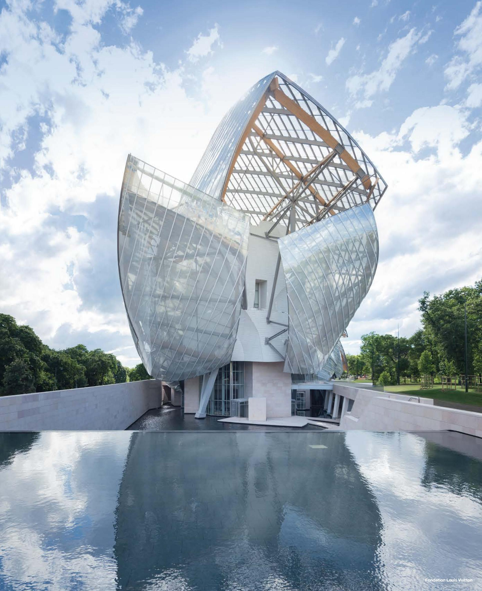

> **AI Description:**
> **Source:** `assets/_page_28_Figure_0.jpg`
> 
> **Generated:** 2026-05-29 21:56:27
> 
> ---
> 
> The image is a photograph of the Fondation Louis Vuitton, a modern architectural structure. The building features a unique design with large, overlapping glass panels that create a dynamic, abstract appearance. The structure is elevated on a platform with a reflective pool in front, enhancing its futuristic aesthetic. The sky in the background is partly cloudy, adding to the overall serene and modern atmosphere of the scene.

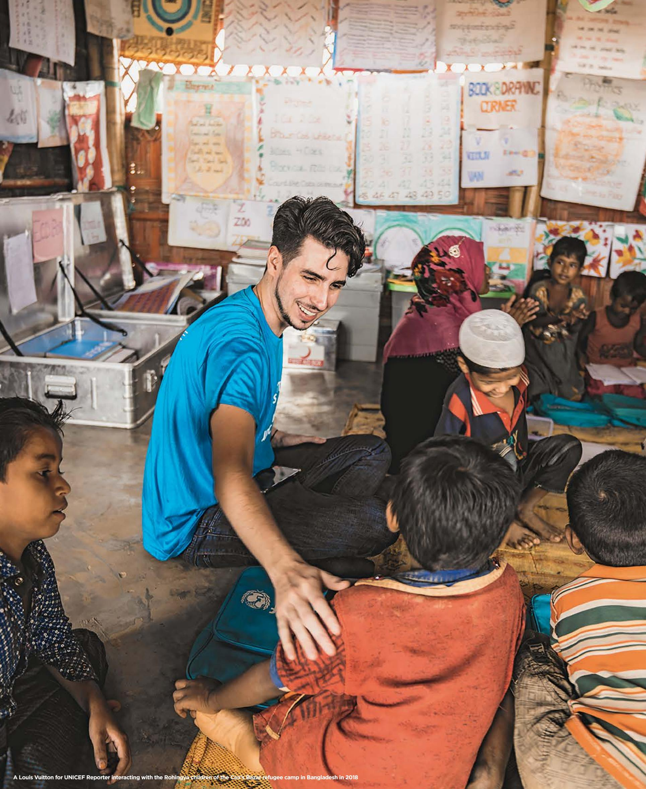

> **AI Description:**
> **Source:** `assets/_page_29_Figure_0.jpg`
> 
> **Generated:** 2026-05-29 22:06:46
> 
> ---
> 
> The image is a photograph showing a man interacting with a group of children in a classroom setting. The man is wearing a blue shirt and is seated on the floor, smiling and engaging with the children. The children are seated on the floor as well, facing the man. The background is filled with colorful posters and educational materials, indicating an educational environment. The text at the bottom of the image provides context, stating that this is a Louis Vuitton for UNICEF Reporter interacting with the Rohingya children of the Cox's Bazar refugee camp in Bangladesh in 2018.

# A F I R M C OM M I T M E N T T O S U PP ORT H U M A N I TA R I A N A N D S O C I A L C AU S E S

AT LVMH, WE ENDEAVOR TO STAY ATTUNED TO THE PEOPLE AND THE WORLDAROUND US IN ORDER TO EXPAND OUR POSITIVE SOCIAL IMPACT AND EXPRESS OUR SUPPORTFOR THOSE IN NEED. IN THIS WAY, THE GROUP IS ABLE TO LEVERAGE ITS SUCCESSAND EXCELLENCE TO DRIVE SHARED GROWTH, PROMOTE SOCIAL INTEGRATION AND CREATE JOBS,APPLYING ITS RESOURCES AND SKILLS TO INITIATIVES THAT SERVE THE GREATER GOOD.

## Supporting job creation, entrepreneurship and regional development

LVMH helps drive economic growth and social development around the world, in all the Group’s operating regions, both directly at its own sites and indirectly at its partners’ locations. It has launched a raft of initiatives and pays taxes in the countries and regions where it carries out its activities.

The LVMH Group is a longstanding supporter of entrepreneurship. In early 2018, to help connect open innovation and business development with new ways of learning, the Group launched La Maison des Startups in France. This startup accelerator for the luxury industry is housed at Station F, the world’s largest startup campus. In the United States, Sephora joined the Fifteen Percent Pledge, an initiative that asks businesses to dedicate 15% of their shelf space to Black-owned brands, a target which was met starting in 2021.

## Facilitating access to employment and social inclusion for people who have been marginalized on the job market

As a major employer in many labor markets, LVMH pays close attention to each region’s specific employment situation. To promote social inclusion and employment for people who have been marginalized on the job market, the Group and its Maisons have forged partnerships with nonprofits and NGOs including Nos Quartiers ont des Talents in France, United Way of NYC in the United States and Daughters of Tomorrow in Asia.

## Facilitating employment for people with disabilities

LVMH also takes action to promote inclusion and access to employment for people with disabilities. The Group works with organizations that specialize in training young people with disabilities and fostering social integration and access to employment. In France, it is a co-founder of ARPEJEH, a nonprofit organization that brings together around a hundred companies to guide young people with disabilities in their careers. In the United States, it supports Runway of Dreams, which works to promote employment in the fashion world for people with disabilities.

## Promoting access to education for young people and helping those in need

LVMH aims to put the renowned excellence of its Maisons – the very foundation of their success – to work in support of equal opportunity and wider access to education for young people. The Maisons have developed numerous partnerships with schools located near their sites and further afield. LVMH encourages access to higher education for all students – whatever their social origins, family situation or ethnic background – through its multiple partnerships with schools.

LVMH and its Maisons are committed to helping disadvantaged communities in the regions where they operate. Their contribution may take the form of employee involvement, product donations or financial support. UNICEF and Save the Children are among the international nonprofits supported by the Group’s Maisons. LVMH also supports efforts to combat sickle cell anemia through its partnerships with the Robert-Debré Hospital in Paris and the American Red Cross.

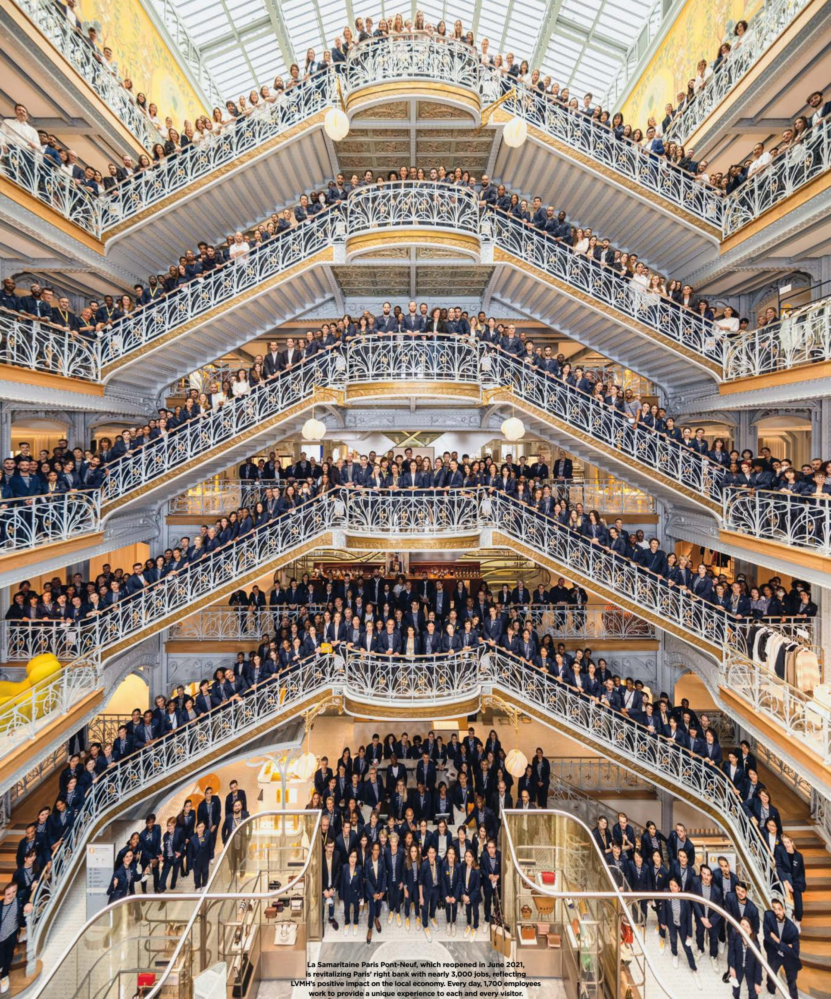

> **AI Description:**
> **Source:** `assets/_page_31_Figure_0.jpg`
> 
> **Generated:** 2026-05-29 21:31:02
> 
> ---
> 
> The image is a photograph of a large group of people, likely employees, standing on multiple levels of a grand, ornate building. The structure features intricate ironwork railings and a central staircase. The people are dressed in matching uniforms, suggesting they are part of a corporate team. The text at the bottom of the image provides context about the location, La Samaritaine Paris Pont-Neuf, which reopened in June 2021, and mentions the number of jobs and employees involved. The image effectively combines a visual representation of the building's grandeur with a textual description of its significance.

# A Y E A R O F H E I G H T E N E D S O C I A L C O M M I T M E N T

IN 2021, A YEAR IN WHICH CIRCUMSTANCES REMAINED COMPLEX, LVMH AND ITS EMPLOYEES WERE HIGHLY RESILIENT AND CREATIVE, EMBODYING THE CORE VALUES THAT HAVE BEEN – AND WILL REMAIN – OUR BEST ALLY TO CONTINUE CRAFTING THE FUTURE.

Throughout the crises we have weathered, our Group’s powerful brands and talented staff have always enabled us to stand out and increase our market share. Our employees are highly committed to the Group, and listening to them and providing them with a safe, stimulating work environment is a top priority. We see this mutual commitment as a virtuous circle that reflects and reinforces our team spirit and sense of community. Just as we feel that, as leaders in our industry, it is only natural for us to reach out to those whose lives may, at times, have been rocked by adversity. With current economic conditions proving especially challenging for young people, LVMH has boosted its human resources initiatives aimed at this group, particularly with regard to training, access to employment and social responsibility.

## Supporting our employees

In 2021, LVMH launched a powerful initiative to support its employees: the LVMH Heart Fund. This fund – the only one of its kind in the world – offers financial, social and psychological support to all Group employees, wherever they are located, to help them get through the most difficult periods of their personal lives. This initiative addresses both the expectations voiced by employees in response to the Pulse Survey carried out within the Group in 2020, and the need to be there for and support our employees facing challenging circumstances amid an unprecedented economic and social context. In the seven months since its launch, the LVMH Heart Fund has already received 1,300 applications from 40 countries.

The well-being of our employees remained front and center, with the signing of LVMH’s Health and Safety Charter by all Executive Committee members and Maison Presidents. This charter bolsters the Group’s approach to occupational health and safety through 2024 and aims to develop a self-reinforcing “zero accident” culture.

For many years, LVMH has also worked to ensure that all of its employees are given equal opportunity throughout their careers, without discriminating based on their ethnicity, gender expression or identity, religion, sexual orientation, disability or any other aspect of diversity. We are deeply committed to diversity, which is one of the key drivers of the Group’s performance. That’s why, in 2018, the Group implemented the Inclusion Index, a tool aimed at promoting diversity and inclusion initiatives within companies. These included initiatives run under the EllesVMH program, which is aimed at boosting career development for women, who currently hold 64% of executive and manager positions and 44% of top management positions.

## Promoting our expertise

In 2021, LVMH also stepped up its efforts to preserve its métiers d’excellence (professions of excellence), as the wealth of expertise they represent is vital to its Maisons’ long-term future and success. The Group boasts more than 280 professions of excellence in the fields of design, craftsmanship and the customer experience, making LVMH the company with the largest variety of these professions in the world, all of which are essential components of humanity’s intangible cultural heritage. These professions are carried out by more than 80,000 people within LVMH. In 2021, the entire LVMH Executive Committee and the Presidents of the Group’s Maisons signed the WE for ME (Worldwide Engagements for Métiers d’Excellence) agreement, aimed at recognizing this community of talented craftspeople, whose work often takes place behind the scenes, far from the spotlight. To highlight their skills and attract new talent, LVMH has launched a range of initiatives to raise awareness of these noble professions among younger generations. Through its “Excellent!” program, the Group holds job discovery workshops for middle school students in France. LVMH’s Village des

Métiers d’Excellence, an annual vocational training fair allowing students to learn about apprenticeships in these professions, offered more than 400 work-linked training positions with 39 Group Maisons and 21 partner schools and universities. LVMH’s Institut des Métiers d’Excellence (IME) confirmed its extraordinary growth trajectory, welcoming its largest class of students since it was established, with 339 new apprentices in six countries (France, Switzerland, Italy, Spain, Japan and Germany). Since 2014, more than 1,400 apprentices have been trained in 27 professions by the IME.

## Supporting younger generations and people undergoing retraining alike

Crafting the future means lending support to younger generations as they face challenging economic conditions. LVMH has boosted its initiatives and programs aimed at this group, announcing in particular that it would be hiring 25,000 people under 30 around the world by the end of 2022. In parallel, the Group has continued to provide practical guidance to young people as they build their career plans. One prominent example of this commitment is INSIDE LVMH, which offers students from all over the world a platform aimed at expanding their knowledge of the luxury industry and providing additional training to help them prepare for their careers. It features 50 hours of original content presented by luxury industry experts, along with a 30-hour certification program with exclusive content. More than 43,000 young people have already registered on the platform, half of whom took part in the certification program. LVMH continues to have a very strong appeal among young people. For the 16th consecutive year, the Group topped the Universum ranking of preferred employers among business school students in France. The Group is also very highly rated – and on the rise – in international rankings.

LVMH is also taking action to improve access to employment for adults over the age of 25 through the LIVE (L’Institut des Vocations pour l’Emploi) training program.

Launched in September 2019 by Brigitte Macron and LVMH, LIVE now has three locations: Clichy-sous-Bois, Valence (in the southeast of France) and Roubaix, on the Jean Arnault Campus, which was inaugurated in 2021. More than 200 people have already taken advantage of the support offered by this program to develop their career plans, and over 75% of them have successfully found a job, begun training or started a business following their experience at LIVE. The start of the 2021 academic year in September saw the arrival of 180 new learners at the three LIVE campuses for a six-month program.

## Building our future together

The success of our Maisons is built on our longstanding belief that our people make all the difference. Recent graduates, employees, managers and senior executives: they are all our greatest assets – our lifeblood.

In a world in constant flux, where many jobs have drastically transformed from how they were several years ago, with some new roles not even existing before, being able to identify, attract and retain top talent within LVMH is key. The Group’s new “Craft the Future” employer brand reflects this ambition, with thousands of in-house ambassadors trained and a new social media campaign unveiled this past December.

As a rapidly growing group, we also see being able to share information in real time and strengthening LVMH’s corporate culture as key priorities. That’s why the LVMH Group has launched a new global intranet called Voices, aimed at all 175,000 of our employees around the world. It serves as a single platform for all the Group’s communication needs, and also allows information to be reported and fed back by its different Maisons, regions and professions.

Together we will craft the future of LVMH: a future that is inextricably linked to the world in which we live and operate; a world that is more respectful of nature and of those who live in it. This is our roadmap for the year ahead and beyond.

### Full Page Description (Page 34)

**Source:** `assets/_page_34_Asset_1.jpg`

**Generated:** 2026-05-29 22:01:24

---

The image contains a pie chart with a circular design divided into segments, each representing a different category of retail activities. The categories and their corresponding percentages are as follows: Selective Retailing (28%), Watches & Jewelry (14%), Perfumes & Cosmetics (16%), Fashion & Leather Goods (33%), Wines & Spirits (4%), and Other activities (5%). The chart visually represents the distribution of retail activities, with Fashion & Leather Goods having the largest share at 33%, followed by Selective Retailing at 28%.

### Full Page Description (Page 34)

**Source:** `assets/_page_34_Asset_3.jpg`

**Generated:** 2026-05-29 21:49:05

---

The image contains a horizontal bar chart with two sets of bars for each category, representing percentages. The categories are "Wines & Spirits," "Fashion & Leather Goods," "Perfumes & Cosmetics," "Watches & Jewelry," "Selective Retailing," and "Other activities." The chart compares two groups, likely representing different data points or conditions, as indicated by the two distinct patterns within each bar. The percentages for each category are displayed above the bars, with the brown pattern representing 17%, 33%, 18%, 35%, 17%, and 61% for the respective categories, and the blue pattern representing 39%, 67%, 82%, 65%, 83%, and 39% for the same categories.

### Full Page Description (Page 34)

**Source:** `assets/_page_34_Asset_2.jpg`

**Generated:** 2026-05-29 21:51:06

---

The image is a circular chart, commonly known as a doughnut chart, which visually represents data distribution across different age groups. The chart is divided into segments, each representing a different age bracket and its corresponding percentage of the total. The key information presented includes:

- The age group "Under 25" accounts for 9%.
- The age group "25-34" accounts for 39%.
- The age group "35-44" accounts for 28%.
- The age group "45-54" accounts for 16%.
- The age group "55+" accounts for 8%.

The chart uses different shades of blue and brown to differentiate between the age groups, making it easy to distinguish between them. The percentages are clearly labeled next to each segment, providing a quick and clear understanding of the distribution of the data across the age groups.

## Indicators

a s o f D e c e m b e r 3 1 , 2 0 2 1

37 Average age

175, 647 employees worldwide

7 1% women

45,076 j o in er s (1)

EMPLOYEES BY REGION (as %)

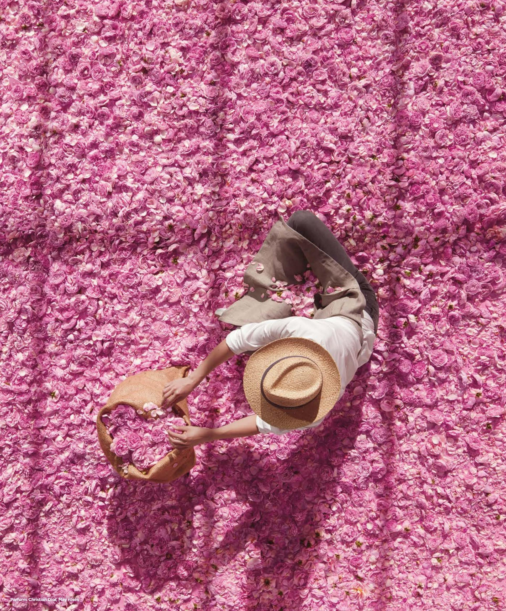

> **AI Description:**
> **Source:** `assets/_page_35_Figure_0.jpg`
> 
> **Generated:** 2026-05-29 22:56:20
> 
> ---
> 
> The image is a photograph of a person lying on a bed of pink roses. The person is wearing a straw hat and holding a basket filled with rose petals. The image is overlaid with text at the bottom that reads "Parfums Christian Dior, May roses." The overall scene conveys a sense of tranquility and beauty, with the vibrant pink color dominating the image.

# L I F E 3 6 0 : A I M I N G F O R S U S TA I N A B L E E XC E L L E N C E

IN 2021, LVMH LAUNCHED A NEW ENVIRONMENTAL ROADMAP TO GUIDE   
OUR ACTIONS FOR THE NEXT TEN YEARS. LIFE 360 IS AN ACTION PLAN THAT RALLIES OUR MAISONS’ CREATIVITY AND INSPIRATION TO DESIGN PRODUCTS THAT   
EMBODY EXCELLENCE IN THEIR DESIGN AND SUSTAINABILITY ALIKE: PRODUCTS WITH A POWERFUL APPEAL YET A MINIMAL IMPACT ON NATURE AND THE CLIMATE.

“2021 must be the year to reconcile humanity with nature,” declared António Guterres, Secretary-General of the UN, in January during the opening ceremony of the One Planet Summit for biodiversity. A few months later, at the Group’s Shareholders’ Meeting on April 15, 2021, LVMH presented LIFE 360, its new environmental strategy, which sets targets for 2023, 2026 and 2030, with the objective of forging a new alliance between luxury craftsmanship and nature. With four strategic action plans structured around biodiversity, circular design, traceability and climate, LIFE 360 is rolled out at each individual Maison and promotes continuous improvement in the Group’s environmental performance.

## Transforming our relationship with nature

In 2021, LVMH and Usbek & Rica launched a series of interviews on nature and living beings with prominent figures from the scientific community and civil society to answer questions such as, “Are humans (really) animals like any other?” These discussions helped raise awareness of the crucial role of nature, on which all the Group’s businesses undeniably depend: there can be no champagne without grapes, no perfume without plants, no evening gowns without silkworm farms. To reduce its impact on nature, LVMH has chosen to have its plant and animal supply chains certified to the highest standards for protecting biodiversity and animal welfare, and has prohibited the sourcing of raw materials in areas with a high risk of deforestation and desertification. LVMH is also taking action to restore biodiversity, with the ambitious target of restoring 5 million hectares of flora and fauna habitat by 2030. To give back what it borrows from nature, the Group has implemented regenerative farming practices with the assistance of a network of experts including Biosphères, reNature, Earthworm, Pour une Agriculture du Vivant and Savory Institute, for grapes, cotton, wool, leather, palm, beets and the iconic ingredients used by the Perfumes and Cosmetics Maisons. The Group’s partnership with UNESCO as part of its Man and the Biosphere program has enabled it to support the sustainable use of biodiversity with local populations in Bolivia, Ecuador, Brazil and Peru. Meanwhile, Moët Hennessy has launched reforestation programs in Kenya, China, the United States and South Africa with its partner Reforest’Action, while LVMH Italia has partnered with the ForestaMi project, which aims to plant 3 million trees in the Milan metropolitan area by 2030. This extensive LIFE 360 Biodiversity program was presented by Antoine Arnault, the Group’s head of Image and Environment, at the CEO Summit that opened the IUCN World Conservation Congress held in Marseille in September 2021.

## Enhancing the appeal of the circular economy

LIFE 360 aims to make preserving natural resources a central focus of product design. This is the goal of the Circular Design action plan, under which the Group aims to apply a sustainable design approach to all of its products by 2030. In 2021, Louis Vuitton expanded its range of sustainably designed products, now branded with the LV upcycling logo (combining Louis Vuitton’s initials with the upcycling symbol), while Loewe offered a bag made entirely of leather offcuts. LVMH’s 75 Maisons offer a vast range of opportunities to explore potential new Groupwide circular design practices. For example, at Berluti, leather offcuts are reclaimed by artist Jorge Penadés and incorporated into furniture for Belmond hotels and stores. In 2021, Nona Source – a resale platform for the Maisons’ unused fabrics – resonated with a wide audience of in-house and outside buyers as soon as it was launched. Product durability – a core component of LVMH’s business model – was extended by offering new services inspired by the Watches & Jewelry business group, which, in addition to repairing products, offers them a second life by bestowing them with a new appearance. More than ever in 2021, innovation played a key role in optimizing the Group’s environmental impact: LVMH and Central Saint Martins signed a new partnership to create a research platform focused on regenerative luxury; Fendi, in partnership with CSM and Imperial College London, explored the possibility of transforming lab-made keratin into fibers, then bio-based fur. Packaging followed a similar sustainable design trajectory, with the aim of eliminating the use of plastic derived from fossil fuels by 2026. The use of Eastman molecular plastics recycling technologies is one way of achieving this goal, as Parfums Christian Dior did for the packaging of Dior Addict Lip Maximizer, released in summer 2021.

## Collaborating for excellence in traceability

The aim of LIFE 360 is to ensure full traceability across all the Group’s strategic supply chains, for each step from field to final product, with the goal of covering all sourcing channels with a dedicated traceability system by 2030. To achieve this goal, LVMH has developed new solutions tailored to each sourcing channel’s specific features, and together with Prada Group and Cartier (a subsidiary of Richemont) announced the launch of the Aura Blockchain Consortium: a unique, global blockchain solution, open to all luxury brands worldwide to address shared challenges in responsible sourcing. LVMH has also chosen to participate in certification systems that ensure that ethical, environmental and social standards are met at each step of a material’s processing, including GOTS (Global Organic Textile Standard) and RWS (Responsible Wool Standard) for cotton and merino wool, and RJC CoC (Responsible Jewellery Council Chain-of-Custody) certification for precious metals such as gold. Rigorous traceability is also key to being able to collect reliable data, accurately measure a product’s environmental performance and share this information with customers, especially as the Group has set a target of ensuring each product is covered by an information system by 2030. Putting this idea into practice by making all its supplier data available online, Fendi achieved a very significant increase in its ranking in the Fashion Transparency Index in 2021. LVMH is also actively involved in initiatives currently underway in France and Europe aimed at introducing labeling that shows the environmental performance of fashion products, and has joined forces with cosmetics stakeholders to develop a rating system for the environmental impact of beauty products.

## Taking action for the climate

At the end of 2021, LVMH’s new carbon trajectory was validated by SBTi (the Science Based Targets initiative). It is based on the following targets: reducing greenhouse gas emissions from energy consumption at its sites and stores by 50% by 2026 (baseline: 2019); and reducing Scope 3 emissions (raw materials, purchases, transport, waste, product use and end of life) by 55% per unit of added value by 2030 (baseline: 2019). The Group has identified a number of key vectors to achieving these targets, which are covered by specific action plans rolled out at all of its Maisons, including having all sites and stores use only renewable or low-carbon energy by 2026, shifting toward shipping more freight by sea and by road, and launching a green e-commerce program and a materials innovation policy focused on Scope 3 emissions. In 2021, the climate roadmaps for the Group’s Maisons were reflected in new policies on logistics, supply chains and packaging. Starting in 2023, Hennessy will transport four million bottles between France and the United States via sailing cargo ships through a partnership with Neoline, a maritime transport company; the Fashion and Leather Goods Maisons (Berluti, Christian Dior Couture, Fendi, Kenzo and Louis Vuitton) are focusing on certified or recycled materials with a reduced carbon impact, while Guerlain, Parfums Christian Dior and Givenchy offer refillable or significantly lighter packaging: for example, refills for Christian Dior’s fragrance Sauvage use less glass, reducing the related greenhouse gas emissions by 56%. In fall 2021, LVMH and SAVE Energies (France’s secondlargest buyer of biomethane) entered into a three-year partnership to replace the Group’s fossil fuel consumption in France with green gas, allowing 14,000 metric tons of CO₂ equivalent emissions to be avoided each year starting in 2023. At COP26, LVMH had the opportunity to present and share news of these achievements, along with the roll-out of regenerative farming practices, which, by improving soil quality, also help maximize its carbon capture potential.

## The LIFE 360 program

> **AI Description:**
> **Source:** `assets/_page_38_Figure_0.jpg`
> 
> **Generated:** 2026-05-29 22:36:33
> 
> ---
> 
> The image contains a simple illustration of an hourglass. The hourglass is divided into two sections: the upper section is orange, and the lower section is teal. The hourglass is a common symbol used to represent time passing or the passage of time. There are no labels or text annotations present in the image.

## CIRCULAR DESIGN

2023 New circular design services (repairs, upcycling, etc.)

2026 Packaging: zero fossil-based virgin plastic

2030 100% of new products covered by a sustainable design approach

## 2021 RESULTS

8 , 6 3 2  metric tons Fossil-based virgin plastic in customer packaging (target: 0 metric tons by 2026)

41% Recycled raw materials in glass and plastic packaging

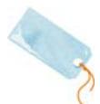

> **AI Description:**
> **Source:** `assets/_page_38_Figure_1.jpg`
> 
> **Generated:** 2026-05-29 22:45:34
> 
> ---
> 
> The image shows a small, light blue tag with a string attached to it. The tag appears to be made of a thin, flexible material, possibly plastic or paper. The string is orange and tied at the top of the tag. There are no visible texts or additional markings on the tag. The tag's purpose is not immediately clear from the image alone.

## TRACEABILITY/TRANSPARENCY

2030 100% of strategic supply chains covered by a dedicated traceability system

## 2021 RESULTS

62% Quantity of wool (merino and cashmere) traceable back to its country of origin

## CLIMATE

2026   
50% reduction   
in energy-related GHG emissions   
(baseline: 2019)   
100% renewable or low-carbon   
energy in-store and on-site   
2030   
55% reduction and/or avoidance   
of Scope 3 GHG emissions   
(raw materials and transport)   
per unit of added value

## 2021 RESULTS

–6% Energy-related CO₂ emissions (Scopes 1 & 2 – baseline: 2019)

39% Proportion of renewable energy in the Group’s energy mix

2026   
100% of strategic raw materials   
certified to preserve ecosystems and water resources

2030 5 million hectares of flora and fauna habitat regenerated and/or restored

## 2021 RESULTS

657,000 hectares preserved or restored in 2021

61% certified cotton

99.9% of diamonds certified RJC COP

## 92%

of grapes from LVMH vineyards have secured sustainable winegrowing certification

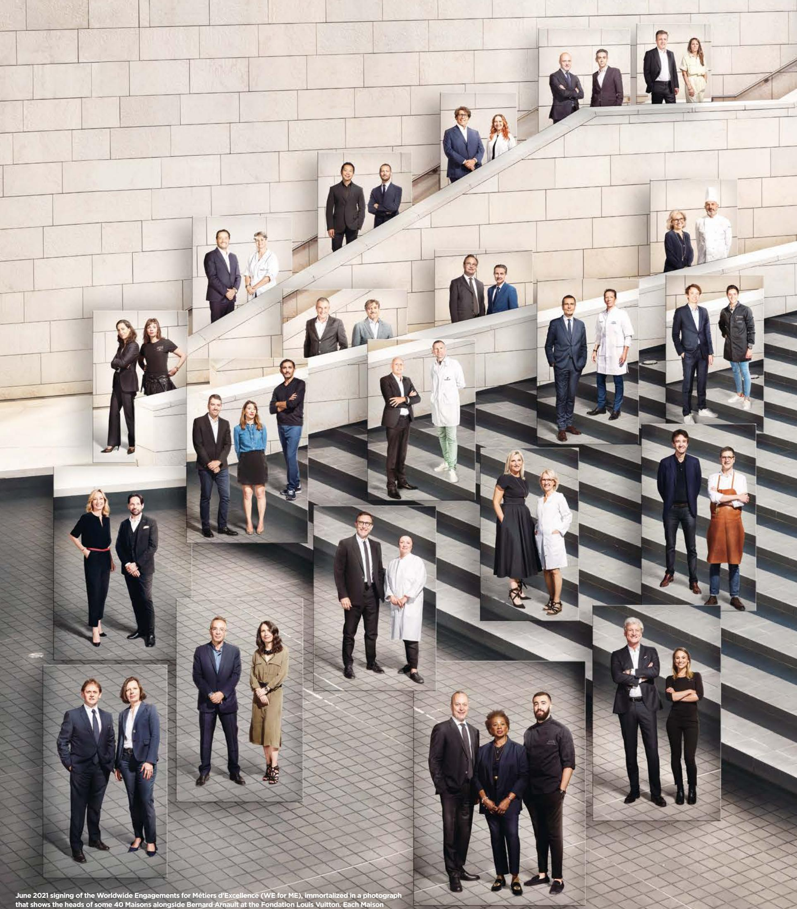

> **AI Description:**
> **Source:** `assets/_page_39_Figure_0.jpg`
> 
> **Generated:** 2026-05-29 22:29:24
> 
> ---
> 
> The image contains a photograph of a group of individuals arranged in a stair-like formation. Each person is positioned within a transparent frame, and the frames are aligned to create a visual representation of a staircase. The individuals appear to be professionals, possibly from various industries, as suggested by their attire and the context provided in the caption. The caption at the bottom of the image describes the event and the significance of the photograph, indicating it was taken in June 2021 at the Fondation Louis Vuitton, where the Worldwide Engagements for Métiers d'Excellence (WE for ME) was signed. The image effectively combines a visual arrangement of people with textual information to convey a specific event and its importance.

June 2021 signing of the Worldwide Engagements for Métiers d'Excellence (WE for ME), immortalized in a photograph that shows the heads of some 40 Maisons alongside Bernard Arnault at the Fondation Louis Vuitton. Each Maison was represented by a pairing consisting of its President and a virtuoso of one of its trades.

# L V M H A N D I T S M A I S O N S TA K E AC T I O N

LVMH AND ITS MAISONS HAVE COMMITTED RESOURCES AND SKILLS TO A GROWING RANGE OF INITIATIVES IN SUPPORT OF GOOD CAUSES.

## LVMH Métiers d’Excellence

With 280 trades represented within the Group, LVMH's Métiers d'Excellence (professions of excellence) are the cornerstone of our Maisons' success and longevity. In June 2021, all 75 of LVMH’s Maisons signed the Worldwide Engagements for Métiers d’Excellence (WE for ME) agreement, reflecting the Group’s determination to support and champion the unique craftsmanship, design and sales expertise that underpin its longterm success. The occasion brought together the heads of some 40 Maisons alongside Bernard Arnault, Chairman and Chief Executive Officer of LVMH, at the Fondation Louis Vuitton. Each Maison was represented by a pairing consisting of its President and a virtuoso of one of the Maison’s flagship trades. The LVMH Métiers d’Excellence initiative also raised its profile in Paris and Florence with its “SHOW ME” event featuring the Maisons’ virtuosos and apprentices from the Institut des Métiers d’Excellence. Japan also welcomed its first class of LVMH Institut des Métiers d’Excellence students.

## INSIDE LVMH

INSIDE LVMH is a practical example of LVMH’s efforts to reach out to younger generations. The platform offers students from all over the world high-quality content to expand their knowledge of the luxury industry, as well as additional training to help them prepare for their careers with a 30-hour certification course featuring exclusive content.

## LIVE

Following the 2019 opening of the first LIVE (L’Institut des Vocations pour l’Emploi) campus, another two LIVE centers were launched in 2021: one in Valence (southeastern France) and one in Roubaix (northern France). LIVE, set up by Brigitte Macron and the LVMH Group, is aimed at adults over the age of 25 who have been marginalized on the job market and want to build a career plan to find work.

## Prix des Artisanes

LVMH and the magazines Elle, Elle à Table and Elle Décoration joined forces to hold the Prix des Artisanes awards, which recognize the expertise of highly talented women working in the arts, in fashion, design, food and wine, and French heritage protection sectors. Four women were recognized: Janaïna Milheiro (Fashion), Manon Bouvier (Design), Isabelle Roché (French Heritage Protection) and Elise Bougy (Food and Wine). LVMH's support for the Prix des Artisanes awards echoes its commitments to passing on expertise and to women entrepreneurs.

## LVMH Innovation Award

At the 2021 VivaTech trade fair, under the “Where Tech Meets Luxury” banner, LVMH presented the latest innovations by 15 of its Maisons and the solutions submitted by the 28 finalist startups in the running for the LVMH Innovation Award, whose theme this year was “The Future of Customer Experience is Here”. The panel of judges picked Bambuser, a startup specialized in live video shopping, as the winner.

## LVMH’S first social and environmental responsibility report

For the first time, LVMH published a single consolidated report presenting all its social and environmental responsibility commitments and setting out the actions taken by the Group and its Maisons in pursuit of responsible growth.

## LVMH and UNESCO

LVMH, a partner of the UNESCO MAB (Man and the Biosphere) program, reiterated its commitment to biodiversity at the IUCN World Conservation Congress held from September 3 to 11, 2021 in Marseille. Within a shared space at the

Congress, UNESCO, LVMH and its Maisons presented their vision and specific actions taken to promote biodiversity.

## Nos Quartiers ont des Talents

The Group is stepping up its longstanding partnership with the Nos Quartiers ont des Talents nonprofit, under which young graduates from underprivileged backgrounds are mentored by a Group employee. Since 2007, more than 700 young people have found jobs through this initiative.

## Combating sickle cell anemia

LVMH has been committed for over ten years to fighting sickle cell anemia, and continued its support of this cause in 2021. In addition to its partnership with the Robert-Debré Hospital in Paris, it also established a partnership with the American Red Cross in 2020. LVMH shows its support through donations and by raising awareness among its employees. In 2021, LVMH North America organized a webinar on inequalities related to healthcare access with a focus on sickle cell anemia.

## UNICEF

In 2016, Louis Vuitton entered into a major international partnership with the United Nations International Children’s Emergency Fund (UNICEF). Since its launch, Louis Vuitton has raised a total of \$16 million to help vulnerable children facing emergencies. Since 2021, nearly 300 employees in France have chosen to donate to this cause. Rimowa also launched a unique collection, “Vol. 1”, the proceeds of which will be donated in full to UNICEF via the COVAX Facility to finance Covid-19 vaccines for the poorest countries.

## Employment for people with disabilities

In 2017, Sephora implemented a program in the United States to hire people with disabilities at its five logistics facilities.. In 2021, 246 new employees were hired, bringing the proportion of people with disabilities to 9% of the workforce at Sephora’s distribution centers in the United States. The goal is for employees with disabilities to make up 30% of the workforce by 2025.

## Save the Children

In 2009, Bulgari decided to get involved with Save the Children. Through its custom-designed jewelry collection, the Maison has donated over \$100 million, helping more than two million children and securing their access to high-quality education. The expert craftsmanship embodied by the two Italian houses Acqua di Parma and Emilio Pucci inspired an exceptional collection named Holiday Season to support Save the Children’s Riscriviamo il Futuro (“Let’s Rewrite the Future”) project.

## The Marcus Graham Project

In the United States, Hennessy teamed up with the Marcus Graham Project to launch the Never Stop, Never Settle Society, a growth accelerator designed to support African-American entrepreneurs. In 2021, 20 such entrepreneurs received financial support, were mentored by the Maison’s employees, managers and directors and benefited from media coverage for their projects.

## Daughters of Tomorrow

In Asia, Louis Vuitton and Parfums Christian Dior supported underprivileged women looking for work through their partnership with Daughters of Tomorrow.

## Charlize Theron Africa Outreach Project

In South Africa, Christian Dior Couture supported the Charlize Theron Africa Outreach Project (CTAOP) Youth Leaders Scholarship (YLS) program. The young women supported by this program are recognized for their commitment to and work with local communities. The Maison has committed to cover four years’ of scholarship costs for YL scholars starting their studies in 2021.

## United Way of NYC

In the United States, TAG Heuer continued to work with United Way of New York City, a nonprofit that provides academic support to disadvantaged students. Thanks to this partnership and the auctioning off of the Monaco Pièce d’Art watch to raise money for the nonprofit, a new library was opened in 2021 at the Mill Brook Community Center in the Bronx.

## Lower Eastside Girls Club

Tiffany & Co. initiated a partnership with the Lower Eastside Girls Club, a New York nonprofit that provides a safe space where girls can take part in a variety of educational programs. A total of 30 employees took part in a six-month mentoring program for female high school and college students.

## LVMH

## B U S I N E S S GROU P I N S I G H T S

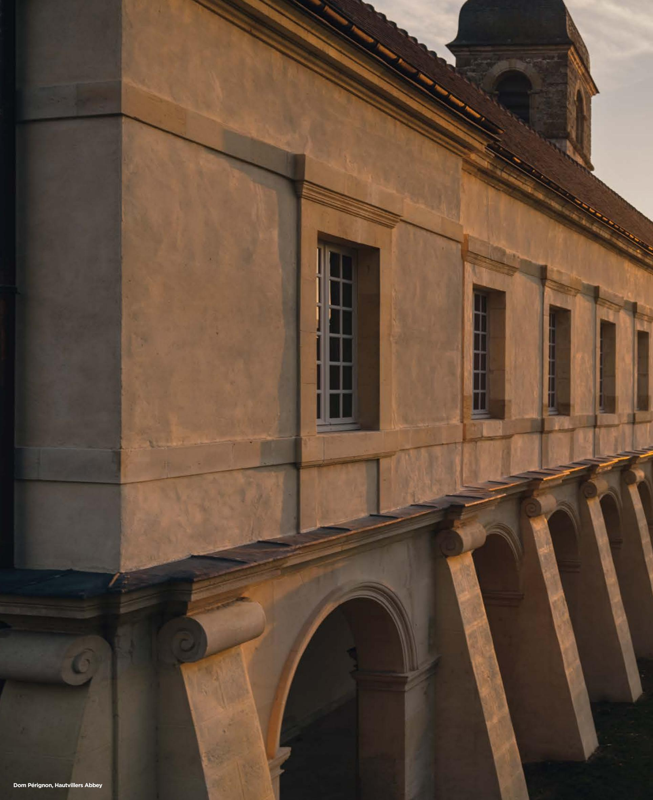

> **AI Description:**
> **Source:** `assets/_page_45_Figure_0.jpg`
> 
> **Generated:** 2026-05-29 23:01:54
> 
> ---
> 
> The image is a photograph of a section of a historic building, likely part of the Hautvillers Abbey. The structure features a series of evenly spaced windows with white frames and a tiled roof. Below the windows, there is a series of arches supported by columns, suggesting an arcade or walkway. The architecture appears to be classical, with a focus on symmetry and proportion. The image is taken during what appears to be the golden hour, as the lighting is warm and the shadows are long, highlighting the textures and details of the building's facade. The text "Dom Pérignon, Hautvillers Abbey" is visible at the bottom of the image, indicating the location and possibly the subject of the photograph.

## Wines & Spi r it s

2021

# A VA LU E- E N H A N C I N G S T R AT EG Y F O R L A S T I N G S U C C E S S

LVMH owes its global leadership in premium wines and spirits to a unique group of exceptional Maisons based in Champagne, Bordeaux, Burgundy and other highly renowned wine-growing regions. Inspired by their visionary founders and drawing on their strong heritage – which for some goes back hundreds of years – they all share the key values of excellence and creativity, combining tradition with innovation.

## Well-balanced, worldwide presence

In the current context, Moët Hennessy continues to pursue a value-enhancing strategy focused on the highest-quality products. The balanced geographic expansion of its portfolio of brands continues thanks to a powerful and agile global distribution network present in over 160 countries.

## Responsible procurement policy

To support future growth and maintain the very high quality that has made its Maisons a success, the Wines & Spirits business group pursues a dynamic, responsible procurement policy. All the vineyards owned by LVMH have had sustainable winegrowing certification since 2017, and the Maisons forge partnerships with winegrowers by helping their independent grape suppliers comply with these certifications. Significant work is also being done in the area of packaging. The Maisons are devoting equal effort to actively developing their production capacities, as seen in the responsible, innovative and efficient Pont Neuf bottling and logistics facility inaugurated by Hennessy in 2017, which reflects the Maison’s long-term vision.

## 2022 Outlook

While ensuring that it remains alert and responsive amid the prevailing volatility and tight supply environment, the Wines & Spirits business group remains resolutely optimistic about the medium-term development prospects of its Maisons. Moët Hennessy will continue to strengthen its portfolio and accelerate the transformation and selectivity of its distribution, while remaining close to consumers by offering them an ever-expanding and innovative range of experiences. Excellence, authenticity and sustainability remain key, backed by the launch of bold and inspiring innovations and collaborations. More aware than ever of the value of their heritage, many of which date back several centuries, all the Maisons are deeply committed to acting sustainably, protecting the environment, improving soil regeneration with more biodiversity and significantly reducing their carbon footprint.

### Full Page Description (Page 48)

**Source:** `assets/_page_48_Asset_1.jpg`

**Generated:** 2026-05-29 22:19:55

---

The image is a bar chart showing data for the years 2019, 2020, and 2021. The bars are color-coded and labeled with numerical values. The gray bar for 2019 has a value of 5,576, the brown bar for 2020 has a value of 4,755, and the blue bar for 2021 has a value of 5,974. The chart appears to represent some form of quantitative data, possibly related to population, sales, or another metric, with a slight increase from 2019 to 2021.

### Full Page Description (Page 48)

**Source:** `assets/_page_48_Asset_0.jpg`

**Generated:** 2026-05-29 22:16:39

---

The image is a pie chart with percentages representing market shares for different regions. The chart is divided into five segments, each labeled with a region and its corresponding percentage of the total market share. The regions and their percentages are as follows: United States (38%), Europe (excluding France) (18%), France (6%), Asia (excluding Japan) (21%), and Other markets (12%). The chart visually represents the distribution of market share among these regions.

### Full Page Description (Page 48)

**Source:** `assets/_page_48_Asset_3.jpg`

**Generated:** 2026-05-29 22:04:12

---

The image contains a bar chart with three vertical bars, each representing a year from 2019 to 2021. The bars are color-coded and have numerical values at the top: 98.7 for 2019, 94.6 for 2020, and 102.6 for 2021. The bars have a chevron pattern. The chart shows a slight decrease in the value from 2019 to 2020 and a subsequent increase in 2021.

## 2021 at a glance

## SUSTAINED DEMAND IN THE UNITED STATES, A RECOVERY IN EUROPE ANDA STRONG REBOUND IN CHINA IN A CONTEXT OF TIGHT SUPPLY CONSTRAINTS

2021 REVENUE BY REGION (as %)

## Major strategic priorities

Pursue valueenhancing strategy

Develop production capacities to ensure sustainable growth

Further improve efficiency of distribution in key markets

Accelerate efforts to protect the environment, in particular in supply chains and packaging

Champagne Dom Perignon Vintage 2003 Plenitude2

# H IG H L IG H T S

The Wines & Spirits business group turned in a record year and reaffirmed its position as leader in luxury wines and spirits. The industry’s strong recovery – despite the pressure it placed on naturally limited supplies – favored the continuation of the value-enhancing strategy. 2021 was also a year marked by the ambition to get closer to consumers by developing unique sales experiences, in particular through travel, at department stores and within the Maisons themselves, as illustrated by the many initiatives launched and underway. They reaffirmed their social and environmental commitment through the “Living Soils – Living Together” program. This was underscored by the opening of the Robert-Jean de Vogüé research center in France’s Champagne region, which will support the Maisons in their transition to more sustainable practices and their adaptation to climate change.

Champagne volumes were up 27% with respect to 2020 and 3% compared with 2019, with particularly strong growth in Europe and the United States. Moët & Chandon achieved good growth in all regions, particularly in the United States and in Europe, where it beat its record sales volumes of 2018 worldwide. At the end of the year, the “Effervescence” program brought together friends of the Maison, which has been an icon of celebration and history’s most memorable events since 1743. Dom Pérignon’s sales were boosted by the launch of three vintages: Vintage 2012, Rosé Vintage 2008 and Vintage 2003 Plénitude 2. The year also saw a high-profile collaboration with world-famous star Lady Gaga. Veuve Clicquot achieved a record performance, backed by the opening of the Comète site, its new production center. The Maison expressed its bold values through its collaborations and ramped up

its efforts to promote women’s entrepreneurship with several international initiatives under its Bold program. Ruinart recorded very strong growth in all its markets and reaffirmed its commitment to the environment with the rollout of its sustainably designed case and its agroforestry winegrowing pilot project. Krug’s remarkable results confirmed the success of its value-enhancing strategy, exemplified by the launch of Krug Grande Cuvée 169e Édition and Rosé 25e Édition. LVMH acquired a 50% stake in the share capital of Armand de Brignac. Jointly owned with Shawn “Jay-Z” Carter, the brand continued its growth and confirmed its super-luxury positioning. The Estates & Wines Maisons showed strong momentum. A new range of Terrazas de los Andes wines was launched in China and met with great

success. The year also saw the release of the excellent 2021 vintage of Cloudy Bay Sauvignon Blanc and a performance by Ao Yun that exceeded expectations, confirming the potential of Yunnan province wines. Château Galoupet, acquired in 2019, continued its transition to organic winegrowing. Château d’Esclans’ range of rosé wines accelerated its development following the takeover of its distribution by the Moët Hennessy network.

Chandon benefited from a comprehensive redesign of its image, communications and packaging. Its momentum was boosted by the success of Chandon Garden Spritz, launched in Europe, the United States and Australia.

For the third year in a row, Hennessy was the leading international premium spirits brand, achieving

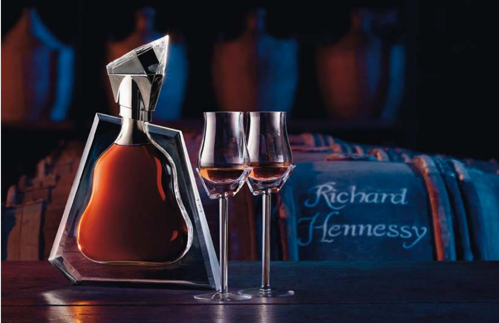

> **AI Description:**
> **Source:** `assets/_page_51_Figure_0.jpg`
> 
> **Generated:** 2026-05-29 22:49:27
> 
> ---
> 
> The image contains a photograph of a luxury bottle of Hennessy cognac, specifically the Richard Hennessy edition, alongside two glasses filled with the cognac. The bottle has a distinctive, modern design with a geometric shape and a silver cap. In the background, there is a wooden barrel with the text "Richard Hennessy" inscribed on it, suggesting the brand and type of cognac. The setting appears to be a dimly lit bar or cellar, with blurred figures in the background, adding to the ambiance.

Hennessy

Dom Pérignon

OUR MAISONS TAKE ACTION
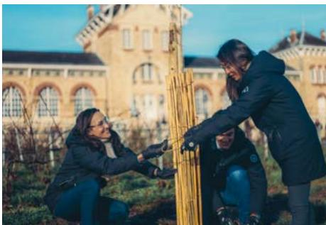

> **AI Description:**
> **Source:** `assets/_page_52_Figure_0.jpg`
> 
> **Generated:** 2026-05-29 21:24:45
> 
> ---
> 
> The image contains a photograph of three individuals outdoors, working together to assemble a wooden structure. They are dressed in winter clothing, suggesting the photo was taken in a cold season. The background features a large building with arched windows, possibly a historical or institutional structure. The individuals appear focused on their task, indicating a collaborative effort. The photo captures a moment of teamwork and activity in an urban or campus setting.

## Moët Hennessy promotes agroforestry

As part of its Living Soils program, Moët Hennessy began to implement regenerative farming practices across all its vineyards. This involved specific measures to protect biodiversity and soil, such as discontinuing the use of herbicides and planting trees at its vineyards. Moët Hennessy also partnered with Reforest’Action. Planting hedges and individual trees creates pockets of biodiversity, which attract birds and insects and fight certain diseases naturally. Ruinart has already restored 40 hectares and planted over 10,000 trees in the Champagne-Ardenne region alone. In the Cognac region, Hennessy planted over 15,000 trees from 30 different species, spanning more than 4 km of hedges. The Maison set a target of replanting more than 1,000 km of hedges by 2030. Moët Hennessy also committed to preserving wooded areas in danger across the globe, including in Kenya, South Africa and China. This will cover 50,000 hectares by 2030.

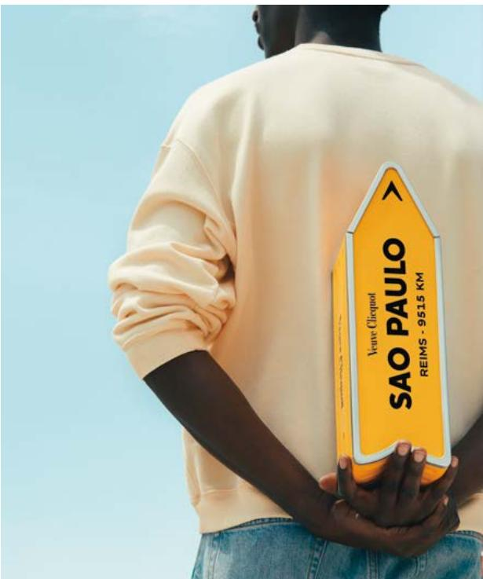

> **AI Description:**
> **Source:** `assets/_page_52_Figure_1.jpg`
> 
> **Generated:** 2026-05-29 21:22:02
> 
> ---
> 
> The image contains a photograph of a person wearing a beige sweatshirt with a large yellow arrow sign on the back. The sign reads "SAO PAULO" and includes additional text indicating "Reims - 9515 KM." The person is also wearing blue jeans. The image combines text with a visual element (the arrow sign) to convey a message about travel distance.

Veuve Clicquot

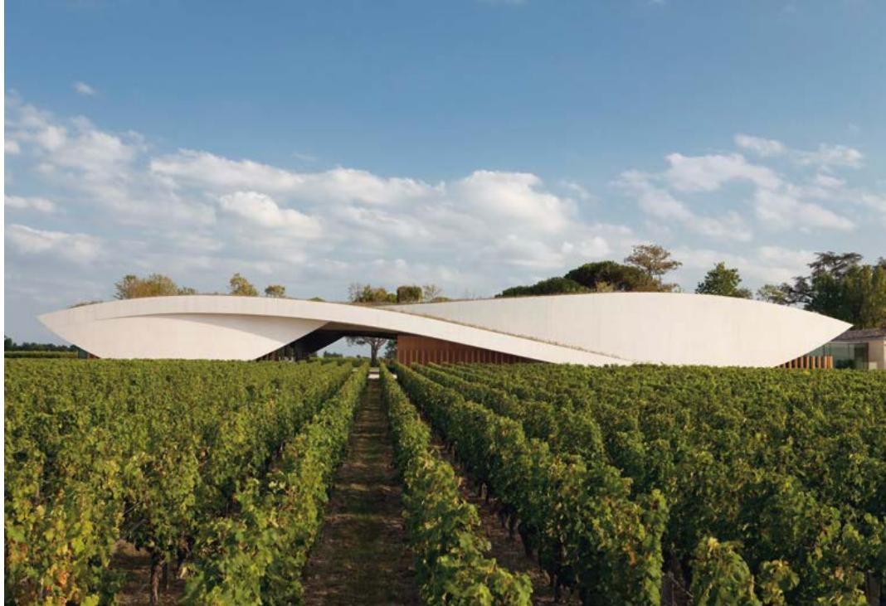

> **AI Description:**
> **Source:** `assets/_page_52_Figure_2.jpg`
> 
> **Generated:** 2026-05-29 21:27:16
> 
> ---
> 
> The image shows a modern, architectural structure situated within a vineyard. The building has a unique, elongated, and curved design, with a flat roof that appears to be integrated into the landscape. The structure is surrounded by rows of grapevines, indicating that it is likely a winery or a similar agricultural facility. The sky is clear with some scattered clouds, suggesting a sunny day. The overall scene conveys a sense of harmony between modern architecture and natural surroundings.

Cheval Blanc

an exceptional performance thanks to the strength of its brand in the United States, continued recovery in China and acceleration in Europe and Africa. In a tight supply environment, its volumes were up 9% with respect to 2020 and 4% compared with 2019. In keeping with its pioneering spirit, the Maison established an exceptional global partnership with the NBA. It expanded its production capacity and invested in a dedicated store network on the island of Hainan in China. Hennessy also stepped up its commitment to its key priorities of protecting living soils, reforestation and reducing its carbon footprint by 50% by 2030.

The unprecedented performance of Glenmorangie and Ardbeg whiskies was in line with their ambitious innovation and growth plans. Both brands took home prestigious awards, including “Master Distiller of the Year” for the fifth time.

Belvedere reaffirmed its commitment to crafting natural spirits rich in character with the launch of Belvedere Organic Infusions, its first certified organic product line. Emerging, exceptional spirits brands Woodinville,

Volcán De Mi Tierra and Cuban rum Eminente experienced strong growth thanks to the expansion of their distribution and production capacities. Moët Hennessy expanded its online sales presence with the launch of Clos19 in France, the OurCellar site in the United States and the joint acquisition with the Campari Group of the Italian company Tannico, which also owns VentealaPropriete.com in France.

Krug
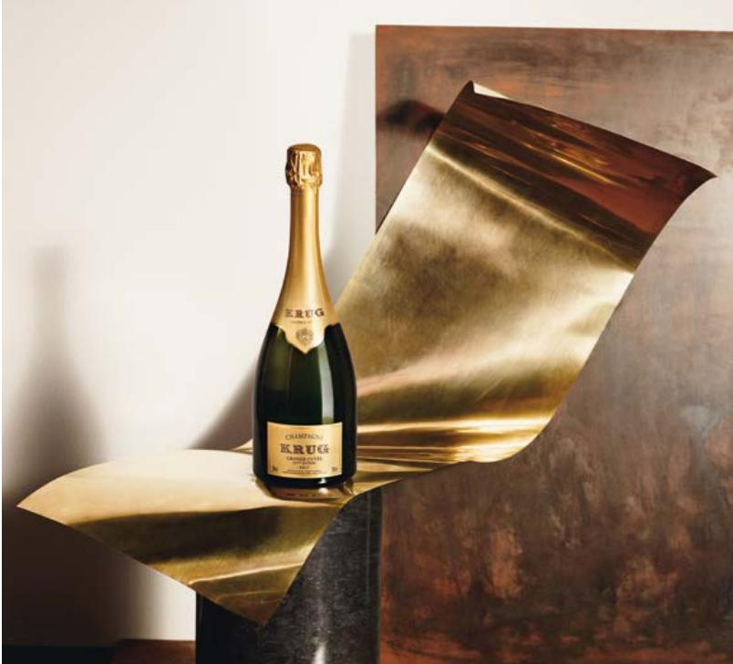

> **AI Description:**
> **Source:** `assets/_page_53_Figure_0.jpg`
> 
> **Generated:** 2026-05-29 21:37:55
> 
> ---
> 
> The image contains a photograph of a Krug champagne bottle placed on a reflective, metallic surface. The bottle is positioned in the foreground, with the brand name and logo clearly visible on the label. The background features an abstract, textured wall with a metallic sheen, adding a luxurious and modern aesthetic to the scene. The reflective surface beneath the bottle enhances the visual appeal by creating a mirror-like effect, emphasizing the bottle's elegance and the brand's premium positioning.

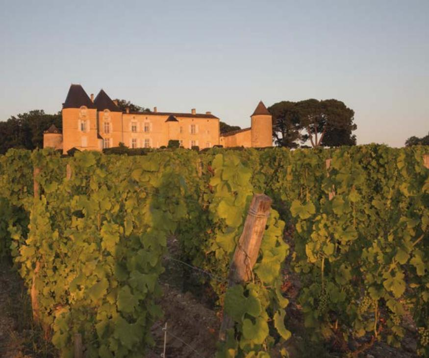

> **AI Description:**
> **Source:** `assets/_page_53_Figure_1.jpg`
> 
> **Generated:** 2026-05-29 21:38:11
> 
> ---
> 
> The image contains a photograph of a vineyard with rows of grapevines in the foreground. In the background, there is a large, historic-looking building that appears to be a château or manor house, surrounded by trees. The lighting suggests it is either sunrise or sunset, casting a warm glow over the scene. The image captures the serene and picturesque setting of a winery or vineyard estate.

Château d’Yquem

OUR MAISONS TAKE ACTION
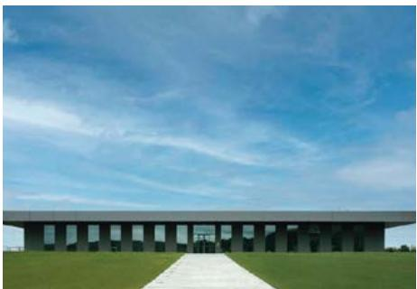

> **AI Description:**
> **Source:** `assets/_page_54_Figure_0.jpg`
> 
> **Generated:** 2026-05-29 21:36:20
> 
> ---
> 
> The image shows a modern architectural structure with a flat roof and a series of evenly spaced rectangular windows. The building is situated on a grassy area with a clear pathway leading up to it. The sky above is partly cloudy with a mix of blue and white clouds, indicating a bright day. The overall design suggests a contemporary and possibly institutional or commercial building.

## Moët Hennessy inaugurates a new research center devoted to innovation

LVMH’s premium champagnes, spirits and wines division Moët Hennessy inaugurated the Robert-Jean de Vogüé research center devoted to furthering knowledge of winegrowing and evolving its practices. The building, designed by architect Giovanni Pace, is in France’s Champagne region near the state-of-the-art Mont Aigu production facility. Its research will focus on four areas: biotechnology, plant physiology, process engineering and sensory analysis. The Robert-Jean de Vogüé research center will continue the initiatives for sustainable, resilient winegrowing unveiled in 2020 with the “Living Soils – Living Together” program and help the Maisons transform their practices and share their knowledge with each other and with outside organizations.

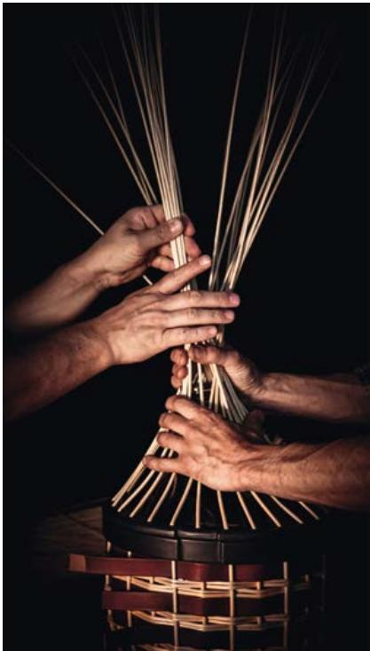

> **AI Description:**
> **Source:** `assets/_page_54_Figure_1.jpg`
> 
> **Generated:** 2026-05-29 21:38:19
> 
> ---
> 
> The image shows a close-up of hands working with thin, light-colored sticks or reeds. The hands are manipulating the sticks, which are bundled together and appear to be part of a crafting or weaving process. The background is dark, which makes the light-colored sticks stand out prominently. The image captures a moment of manual skill and craftsmanship, focusing on the interaction between the hands and the materials.

Hennessy

Ruinart
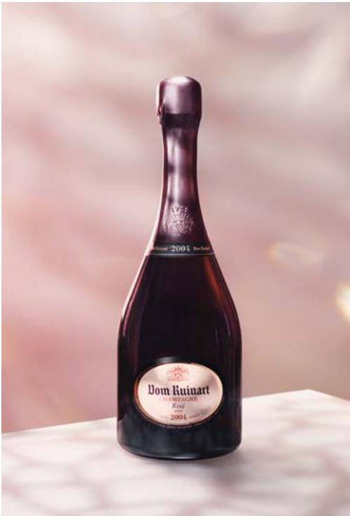

> **AI Description:**
> **Source:** `assets/_page_54_Figure_2.jpg`
> 
> **Generated:** 2026-05-29 21:44:47
> 
> ---
> 
> The image shows a bottle of Dom Ruinart Champagne Rosé 2004. The bottle is dark in color, with a label that prominently displays the brand name and the year of production. The background is a soft, blurred pink, which complements the bottle's color. The bottle is placed on a white surface, possibly a table or countertop. The overall image is clean and focuses on the product, with no additional visual elements or charts.

Eminente
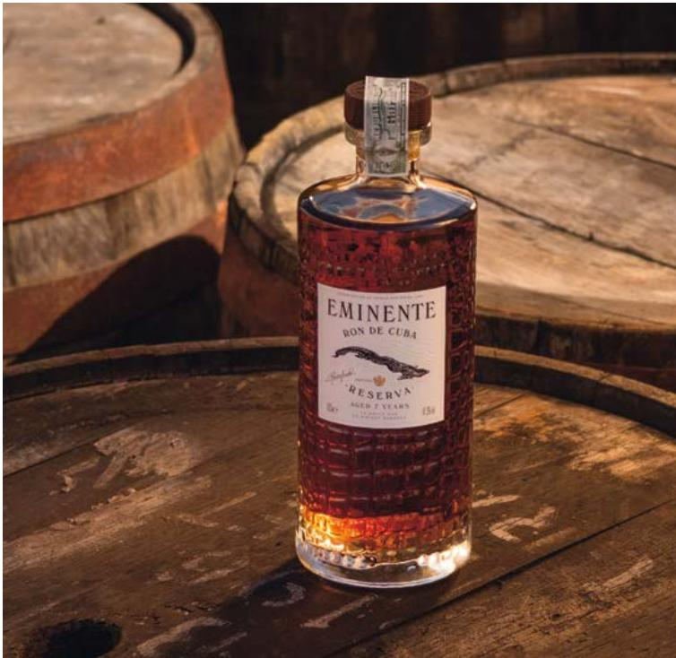

> **AI Description:**
> **Source:** `assets/_page_54_Figure_3.jpg`
> 
> **Generated:** 2026-05-29 21:41:22
> 
> ---
> 
> The image contains a photograph of a bottle of Eminente Ron de Cuba Reserva aged 7 years. The bottle is placed on a wooden barrel, and the label prominently displays the brand name, the type of rum, and the age statement. The background features additional barrels, suggesting a setting related to rum production or aging. The visual elements, such as the wooden barrels and the bottle itself, provide context for the product and its origin.

# 2 0 2 1 S T O R I E S

C H A N D O N

## Ga rden Spr it z: A s u n ny new creation

Chandon crafts exceptional sparkling wines at its six wineries in Argentina, California, Brazil, Australia, China and India. Ever true to the pioneering spirit that has taken it all over the globe since its founding in 1959, the Maison now unveils its latest creation: Chandon Garden Spritz. Sophisticated and authentic, simple and different, it is a sparkling wine with a special touch: a macerated

liqueur made from natural extracts of orange peel, herbs and spices using a skilfully crafted recipe with no artificial flavors or coloring. Its secret? The Valencia oranges, which are selected for their unique balance of acidity and sweetness, grown without pesticides and hand-picked at a family farm in the province of Entre Ríos, Argentina.

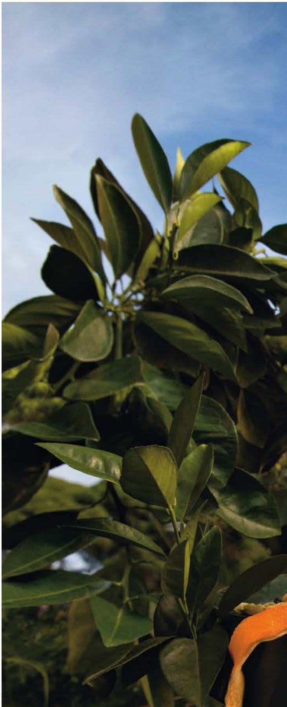

> **AI Description:**
> **Source:** `assets/_page_55_Figure_0.jpg`
> 
> **Generated:** 2026-05-29 21:26:39
> 
> ---
> 
> The image is a photograph of a plant with glossy, dark green leaves. The leaves are broad and have a slightly serrated edge. The background shows a clear blue sky, indicating that the photo was taken outdoors on a sunny day. The plant appears to be healthy and well-maintained. There are no visible fruits or flowers in the image.

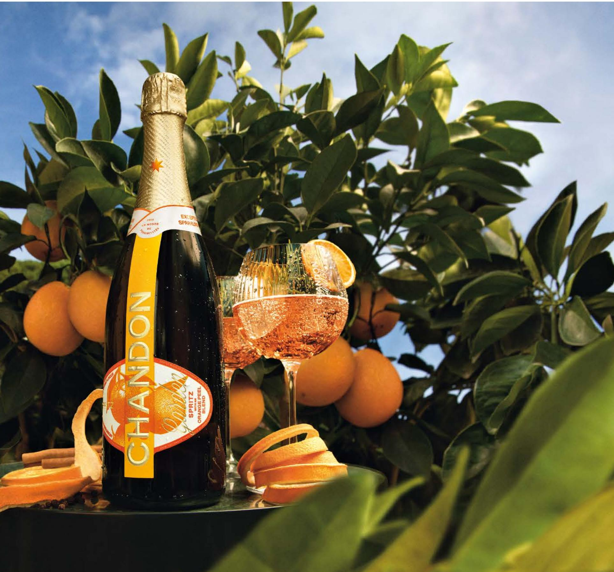

> **AI Description:**
> **Source:** `assets/_page_56_Figure_0.jpg`
> 
> **Generated:** 2026-05-29 22:50:47
> 
> ---
> 
> The image contains a photograph of a bottle of Chandon Spritz with Orange Peel Blend and a glass of the same drink, set against a backdrop of orange trees with ripe oranges. The bottle and glass are placed on a surface with orange peels and cinnamon sticks, emphasizing the orange flavor. The text on the bottle clearly identifies the product and its flavor. The overall scene suggests a fresh and natural setting, likely intended to highlight the product's connection to oranges.

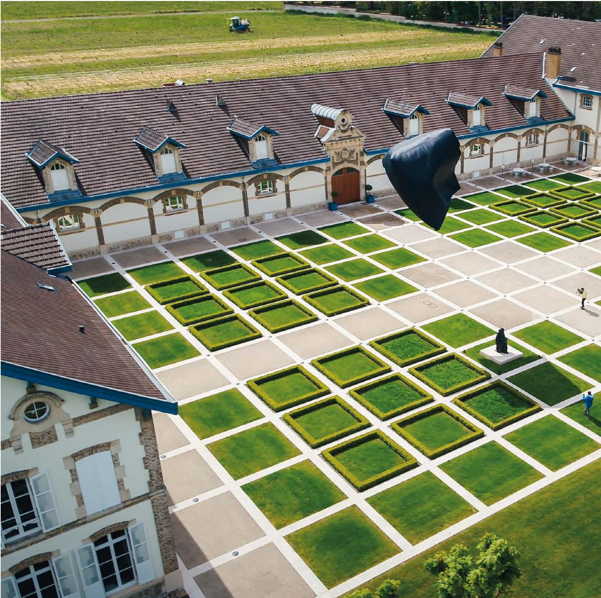

> **AI Description:**
> **Source:** `assets/_page_57_Figure_0.jpg`
> 
> **Generated:** 2026-05-29 23:03:43
> 
> ---
> 
> The image is a photograph of a large, symmetrical garden with neatly trimmed hedges arranged in a grid pattern. The garden is surrounded by a building with a red-tiled roof and white walls, featuring arched windows and a central entrance. A large, dark, irregularly shaped object is floating in the air above the garden, resembling a deflated balloon or a piece of fabric. The background shows a rural landscape with fields and a small vehicle. The overall scene appears to be a combination of a formal garden and an artistic installation.

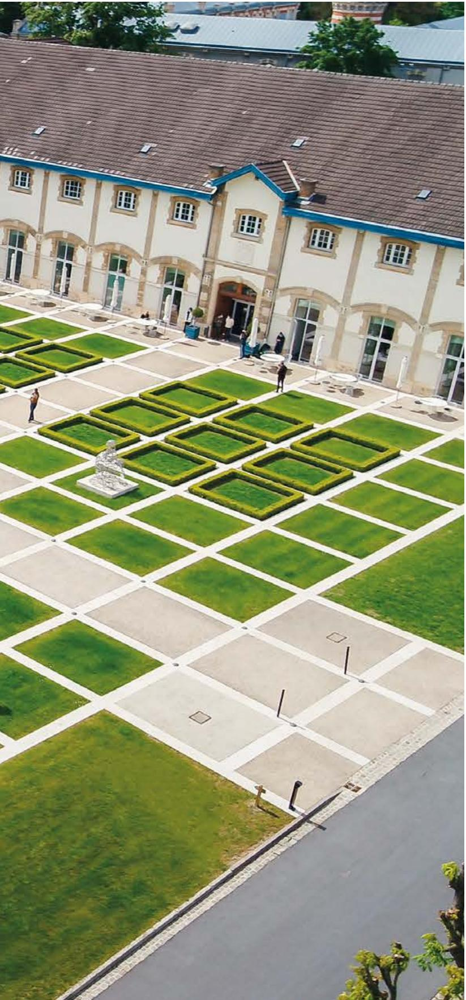

> **AI Description:**
> **Source:** `assets/_page_58_Figure_0.jpg`
> 
> **Generated:** 2026-05-29 22:18:01
> 
> ---
> 
> The image is a photograph of a courtyard with a structured garden layout. The garden features rectangular patches of grass arranged in a grid pattern, with pathways separating the sections. In the center of the courtyard, there is a statue. The building in the background has a traditional architectural style with a tiled roof and arched windows. The scene appears to be taken during the daytime, and a few people are visible near the entrance of the building.

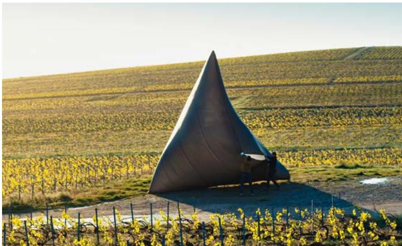

> **AI Description:**
> **Source:** `assets/_page_58_Figure_1.jpg`
> 
> **Generated:** 2026-05-29 22:18:09
> 
> ---
> 
> The image shows a large, metallic, cone-shaped structure situated in a field of yellow flowers. The structure appears to be a sculpture or art installation, with a flat base and a pointed top. The surrounding field is expansive, with rows of yellow flowers stretching into the distance under a clear sky. The ground around the structure is a mix of dirt and patches of grass.

A shared concern for global warming is behind Movement, the permanent installation created for Ruinart by Tomás Saraceno and the artistic community Aerocene. The work sensitively highlights the urgent need to tackle climate change. An increase of only one degree Celsius is enough to lift this blow-up aerosolar sculpture into the air, echoing the disruption caused to the delicate equilibrium of the vine’s life cycle by a one-degree rise

in temperatures in the Champagne region. It floats up and takes flight, drifting and spinning, carried by nature’s rythms as a sensor tracks its invisible trail creating a digital drawing that visitors can watch on-site via an app. Using science, this project combines art with nature to help people understand the forces of nature, and reflects the Maison’s commitment to preserving the environment through sustainable winegrowing.

R U I N A R T

## A r t meet s n at u re in the sk ies above Champagne

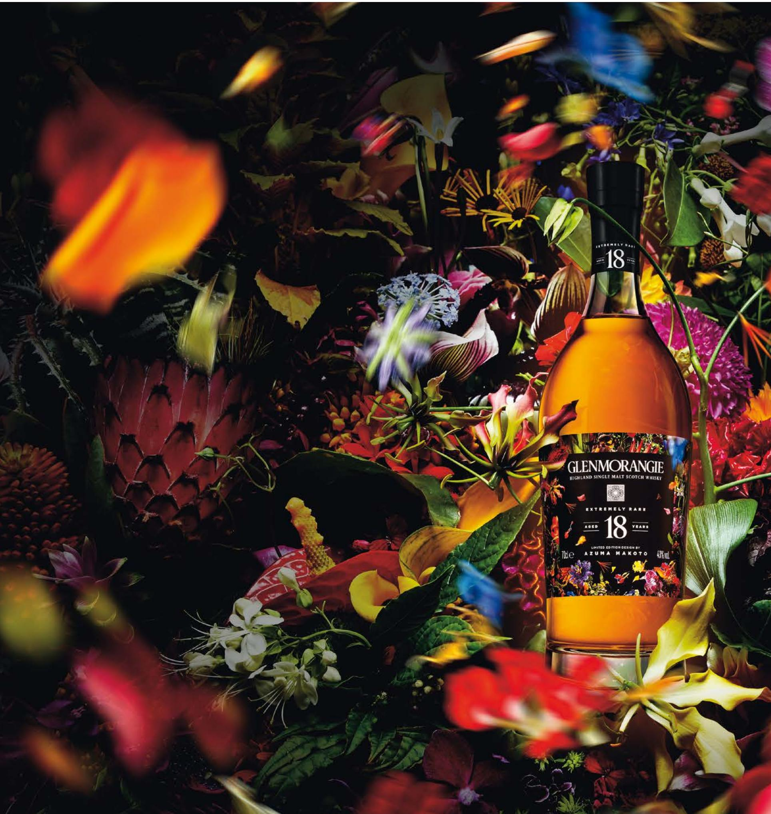

> **AI Description:**
> **Source:** `assets/_page_59_Figure_0.jpg`
> 
> **Generated:** 2026-05-29 22:03:31
> 
> ---
> 
> The image contains a photograph of a Glenmorangie 18-year-old Highland Single Malt Scotch Whisky bottle placed amidst a vibrant and colorful floral arrangement. The bottle is prominently displayed in the center, with the label clearly showing the brand name and age of the whisky. The background is filled with a variety of flowers in different colors and stages of bloom, creating a visually striking and artistic composition. The overall image conveys a sense of luxury and natural beauty, emphasizing the premium nature of the product.

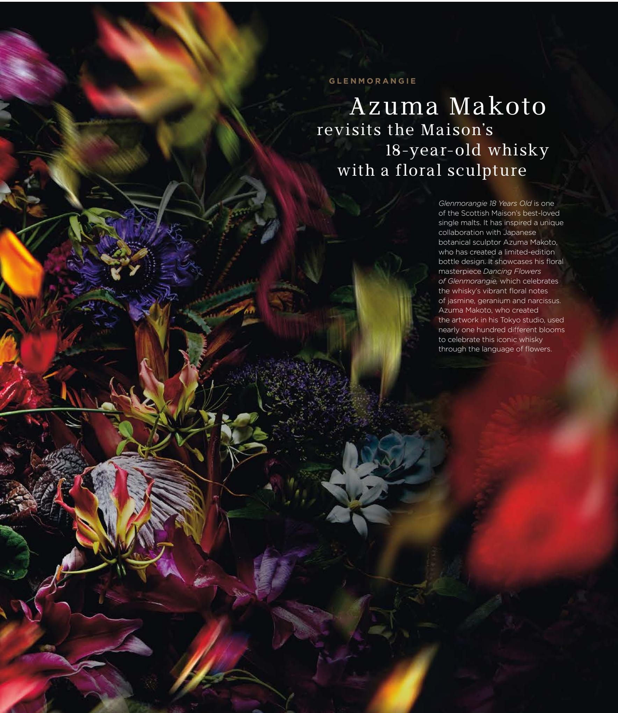

> **AI Description:**
> **Source:** `assets/_page_60_Figure_0.jpg`
> 
> **Generated:** 2026-05-29 22:57:24
> 
> ---
> 
> The image contains a visually rich photograph of a floral arrangement. The flowers are vibrant and diverse, featuring a variety of colors such as purple, red, yellow, and white. The composition is dense and layered, creating a dynamic and textured effect. The photograph is overlaid with text that provides information about Glenmorangie's 18-year-old whisky and its collaboration with Azuma Makoto, a Japanese botanical sculptor. The text describes the limited-edition bottle design inspired by the whisky's floral notes and the artist's use of nearly one hundred different blooms to celebrate the whisky.

H E N N E S S Y

# An exclusive Fr a n k Geh r y design for t he Ma i s on’s “Extra Old” cognac

To mark Hennessy X.O’s 150th anniversary, Frank Gehry reinterpreted its iconic decanter in bronze, crumpled gold and glass. Movement – a key theme in all his buildings, with their creased floors, tilting walls and gravity-defying shapes – again inspired Frank Gehry, who revisited Hennessy X.O with the same vision, dedication and curiosity he applies to his architectural designs. Just as he respects the environment surrounding his buildings, the architect paid tribute to the rituals, the composition, the art of cognac distillation, and the Maison’s longstanding expertise. He drew his inspiration from Hennessy X.O’s rich blend, fertile lands and gnarled vines, and from the reflections of the Charente river that runs through the Hennessy estate. The results are striking. The iconic bottle is enveloped in a crinkled sleeve of bronze dipped in 24-carat gold, and this sculpted decanter is in turn encased in a fractured glass glorifier which evokes the theme of water reflecting light.

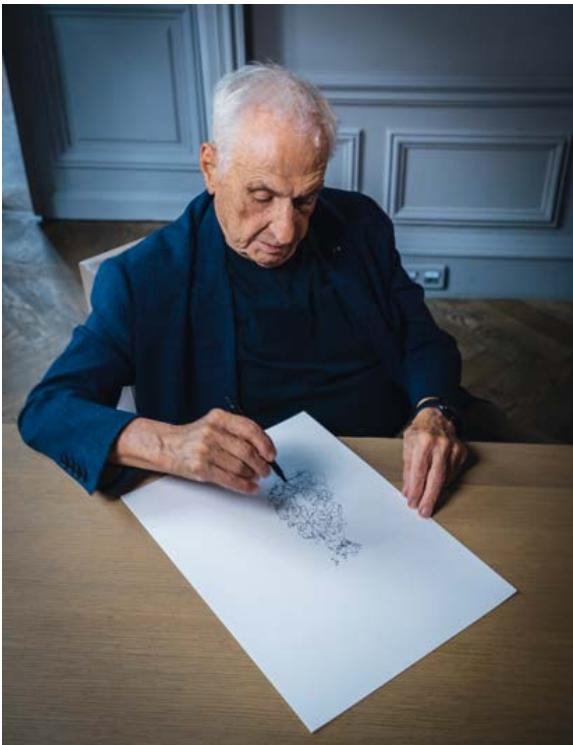

> **AI Description:**
> **Source:** `assets/_page_61_Figure_0.jpg`
> 
> **Generated:** 2026-05-29 23:06:33
> 
> ---
> 
> The image shows a person sitting at a table, drawing on a piece of paper with a pen. The individual appears to be older, with white hair, and is wearing a dark blue jacket. The setting appears to be indoors, with a wooden table and a wall with paneling in the background. The drawing on the paper seems to be abstract or freehand.

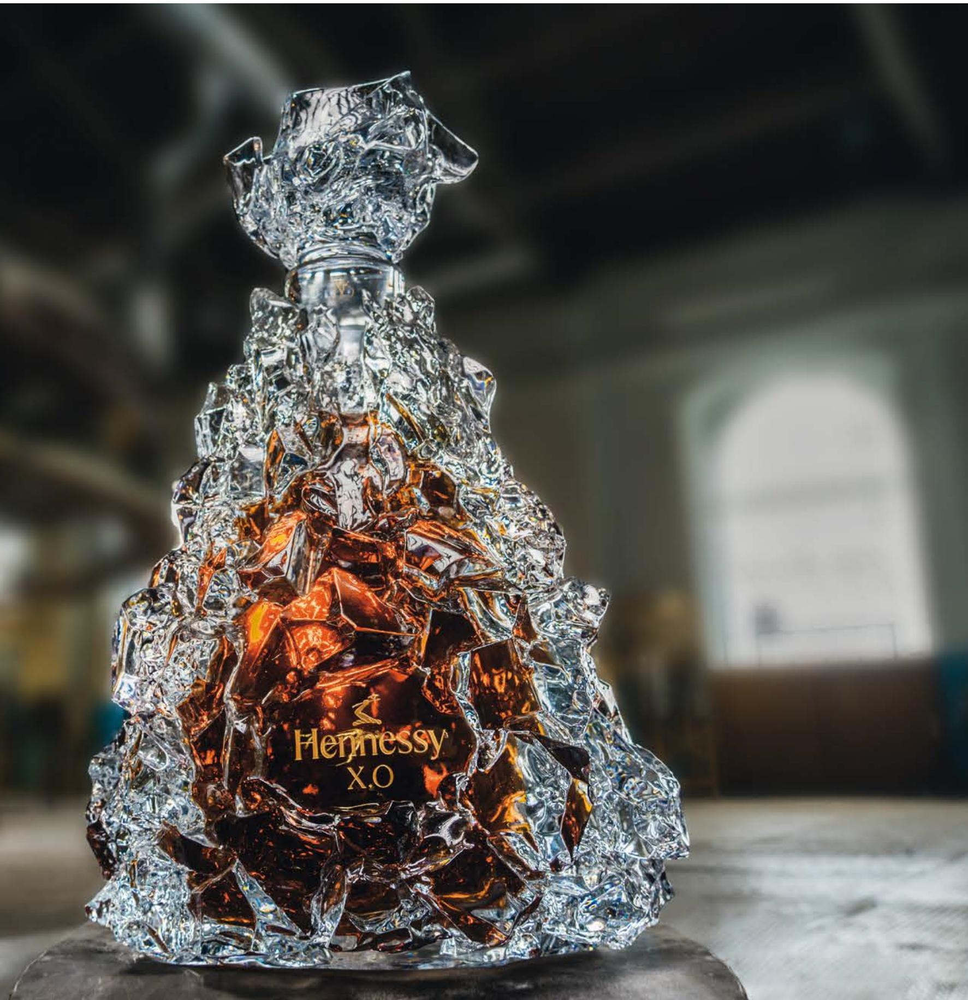

> **AI Description:**
> **Source:** `assets/_page_62_Figure_0.jpg`
> 
> **Generated:** 2026-05-29 21:47:02
> 
> ---
> 
> The image contains a photograph of a Hennessy XO bottle encased in a crystal-like structure. The bottle is prominently displayed in the center, with the Hennessy logo and "X.O." text clearly visible on the label. The crystal structure surrounding the bottle gives it a luxurious and premium appearance, suggesting a high-end product presentation. The background appears to be an industrial or warehouse setting, which contrasts with the elegance of the bottle.

C H ÂT E A U D ’ E S C L A N S

# An exceptional (knoin th Chât w ine estate in the hear t of Provence

Château d’Esclans looks out across the Mediterranean from its exceptional hinterland location between Fréjus and Saint-Tropez. The first traces of the Château’s site date back to the times of the Gauls during which its location served as a lookout point to spot intruders coming by boat into the Gulf of Fréjus. The Château’s cellar structure or foundation wn today as the oldest e region) housed an original eau that was given by the

Count of Provence to Gérard de Villeneuve in 1201. The current Château, inspired by Tuscan villa design, was built during the mid-19th century. The estate is known for its old Grenache vines – some of which are over 90 years old – which produce grapes that concentrate more flavors than younger vines. It is here, in 2006, that the “rebirth of rosé” began, aimed at elevating Provence wines to world-class renown.

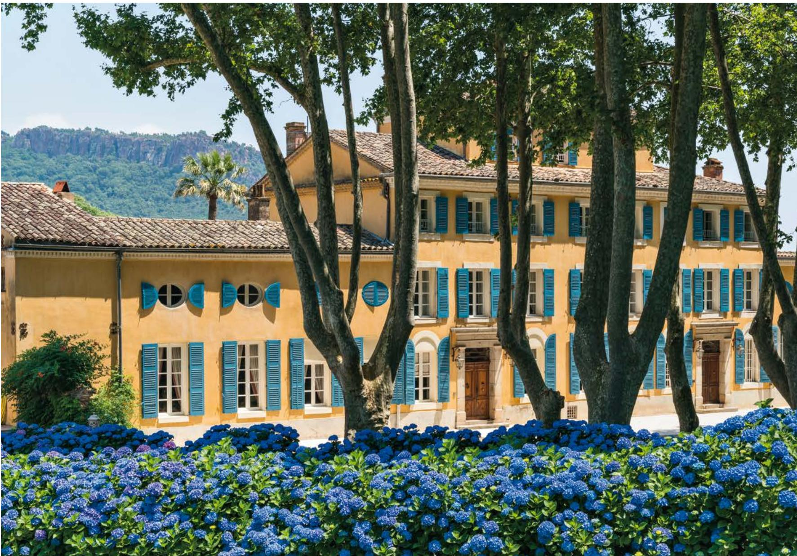

> **AI Description:**
> **Source:** `assets/_page_63_Figure_0.jpg`
> 
> **Generated:** 2026-05-29 21:28:34
> 
> ---
> 
> The image is a photograph of a charming, yellow building with blue shutters, set against a backdrop of lush greenery and distant hills. The building features a tiled roof and multiple windows, some with round shutters, giving it a classic and picturesque appearance. In the foreground, there is a vibrant display of blue hydrangea flowers, adding a pop of color and enhancing the overall aesthetic of the scene. The image captures a serene and idyllic setting, likely in a Mediterranean or European location.

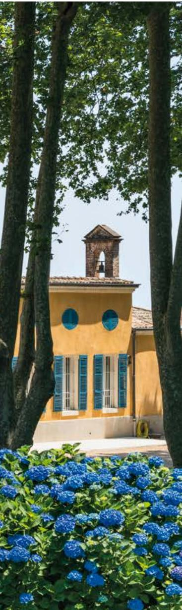

> **AI Description:**
> **Source:** `assets/_page_64_Figure_0.jpg`
> 
> **Generated:** 2026-05-29 21:31:14
> 
> ---
> 
> The image contains a photograph of a small, yellow building with a bell tower, set against a backdrop of tall trees. The building has blue shutters and two circular windows. In the foreground, there is a vibrant display of blue flowers, likely hydrangeas, with green foliage. The scene is bright and sunny, suggesting a pleasant day. The overall composition is serene and picturesque, with the building partially obscured by the trees.

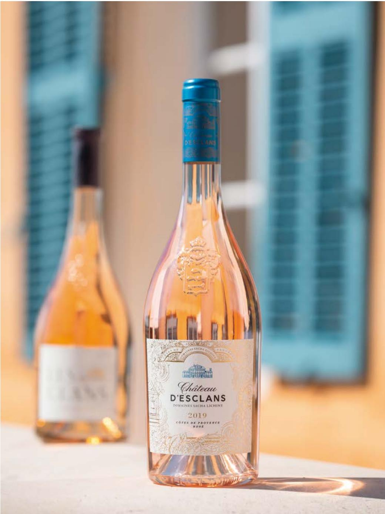

> **AI Description:**
> **Source:** `assets/_page_64_Figure_1.jpg`
> 
> **Generated:** 2026-05-29 21:32:01
> 
> ---
> 
> The image contains a photograph of two bottles of Château d'Esclans rosé wine. The bottle in the foreground is labeled "Château d'Esclans 2019 Côte de Provence Rosé," indicating it is a wine from the 2019 vintage. The background shows another bottle of the same wine, slightly out of focus. The setting appears to be outdoors, with a blurred background that includes what looks like a window with blue shutters. The label on the bottle features an illustration of a château, adding to the aesthetic appeal of the product presentation.

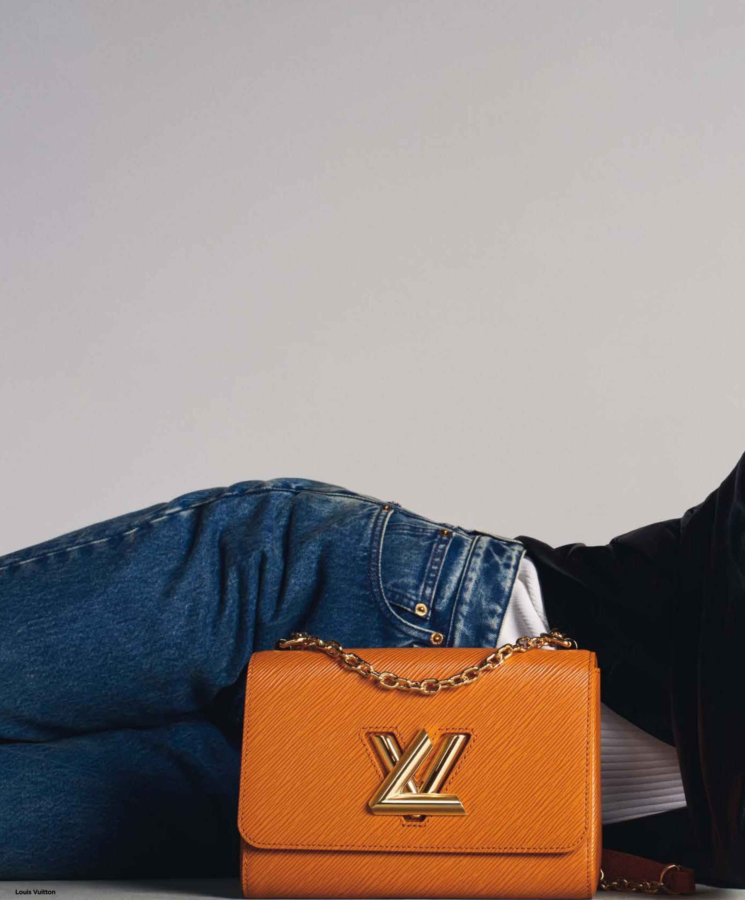

> **AI Description:**
> **Source:** `assets/_page_65_Figure_0.jpg`
> 
> **Generated:** 2026-05-29 21:45:56
> 
> ---
> 
> The image contains a photograph of a Louis Vuitton handbag. The handbag is orange with a gold chain strap and features the iconic LV logo on the front. The background includes a person wearing blue jeans and a dark jacket, with a white shirt partially visible. The image is branded with the Louis Vuitton logo in the bottom left corner.

LVMH

## Fashion & Leather Goods

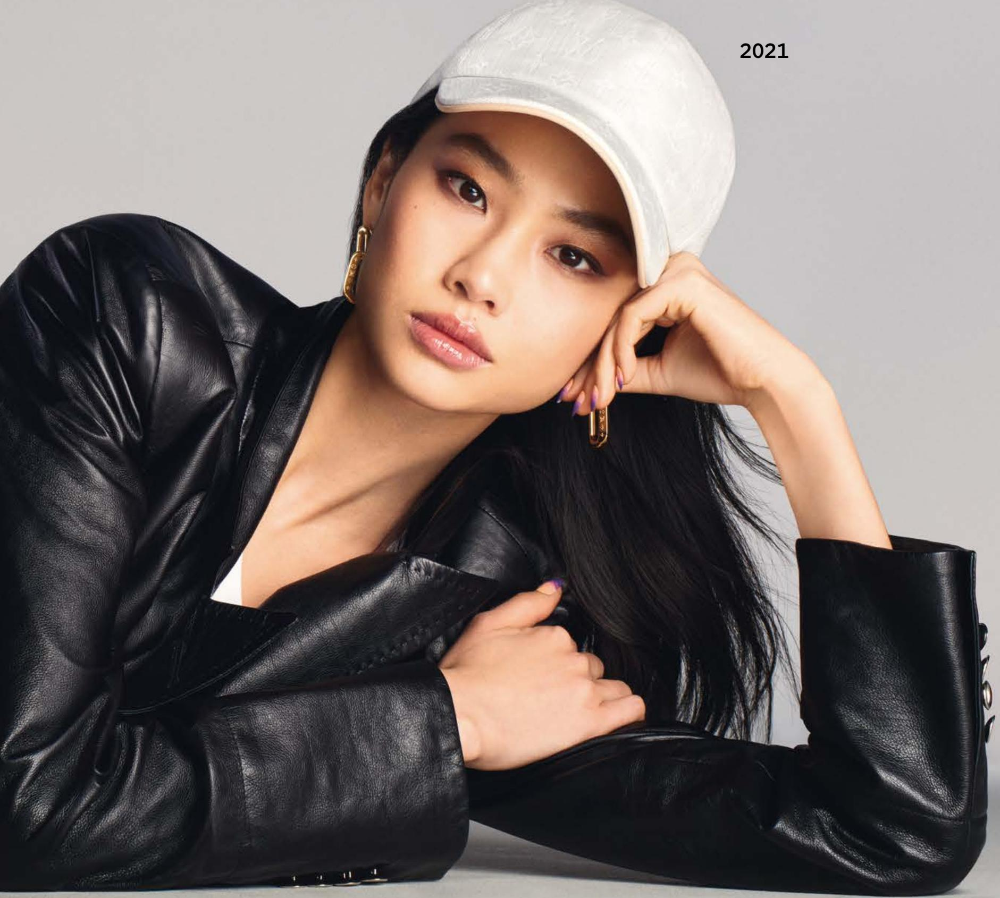

> **AI Description:**
> **Source:** `assets/_page_66_Figure_0.jpg`
> 
> **Generated:** 2026-05-29 23:05:10
> 
> ---
> 
> The image contains a photograph of a person wearing a black leather jacket, a white cap, and gold hoop earrings. The person is posing with one hand on their chin and the other hand holding the jacket. The year "2021" is visible in the top right corner of the image. The photograph appears to be a fashion or portrait-style image.

# A U N I Q U E A S S E M B LY O F C R E AT I V E TA L E N T

Louis Vuitton’s global preeminence, Christian Dior’s exceptional development, the growth of a collection of unique brands whose success is consolidated year after year, and its active support for young designers make LVMH a key player in the fashion and leather goods industry.

## Inspired designers

Working with the best designers, while respecting the spirit of each brand, is one of our strategic priorities. Our creative directors promote the Maisons’ distinctive identities, and are the artisans of their creative excellence.

## Balance between iconic products and innovation

Since 1854, Louis Vuitton’s renown has been built on the flawless execution of its unique trunk-making expertise, its full control over distribution and its exceptional creative imagination: a source of perpetual renewal and innovation. Its product line has continuously expanded for over 150 years with new models – from luggage to handbags and more – and new materials, shapes and colors.

Ever since its first show, dubbed “New Look” by the press, Christian Dior has continued to redefine fashion as it has become an icon of French luxury throughout the world. Monsieur Dior’s unique vision is conveyed today with bold inventiveness throughout the Maison’s entire range. By striking the right balance between new releases and iconic lines, these two Maisons continue to dazzle and surprise their customers, making their boutiques ever more inspiring.

## An engaged industry leader

LVMH has always been committed to supporting young designers and up-and-coming talent. The LVMH Prize for Young Fashion Designers, which recognizes the creative talent of an outstanding designer every year, was created to reaffirm this commitment. As a fashion industry leader, LVMH feels that is our vocation to nurture the most promising creative talent. We also feel it is our responsibility to ensure the well-being of the fashion models who work for our Maisons, which is why we decided to draw up the Charter on Working Relations with Fashion Models and their Well-Being.

## 2022 Outlook

The Fashion & Leather Goods Maisons enter 2022 with confidence. While maintaining the efforts needed to adapt to the economic environment, they can count on their dedicated staff to consolidate their key strengths: exceptional expertise, intensely creative collections and an excellent customer experience. Louis Vuitton will continue its development, focusing on the exceptional creativity that runs through everything it does, and will carry on its tradition of captivating creative collaborations. The Maison will step up its quest for excellence in its physical and digital distribution networks to ensure that the entire customer experience is enchanting, unique and accompanied by the unparalleled quality of service it is known for. Christian Dior will aim to continue its strong growth in all of its markets, with a number of high-profile openings and events. The highlight of 2022 will be the reopening of its historic store at 30 avenue Montaigne in an exceptional new format. Responding to strong demand from its customers, Fendi will open a number of flagship stores in its key markets. Celine’s growth will be spurred by the selective expansion of its store network and the development of its omnichannel strategy to continually improve how it serves its customers. Over the next few months, this unique group of Maisons will continue to advance toward an ever more sustainable and responsible vision of luxury. The ongoing rollout of two innovative circular economy programs will be one of the driving forces behind this objective.

### Full Page Description (Page 68)

**Source:** `assets/_page_68_Asset_3.jpg`

**Generated:** 2026-05-29 22:27:28

---

The image contains a bar chart with three vertical bars, each representing a year from 2019 to 2021. The bars are color-coded and labeled with numerical values: 1,199 for 2019, 827 for 2020, and 1,131 for 2021. The chart appears to be comparing some metric across these years, with a noticeable dip in 2020 and a recovery in 2021. The bars have a zigzag pattern, which is a stylistic choice rather than a functional element.

### Full Page Description (Page 68)

**Source:** `assets/_page_68_Asset_2.jpg`

**Generated:** 2026-05-29 22:27:36

---

The image is a bar chart showing data for the years 2019, 2020, and 2021. The bars are color-coded: gray for 2019, brown for 2020, and blue for 2021. The values for each year are labeled on top of the bars: 7,344 for 2019, 7,188 for 2020, and 12,842 for 2021. The chart indicates a significant increase in the value from 2020 to 2021.

### Full Page Description (Page 68)

**Source:** `assets/_page_68_Asset_1.jpg`

**Generated:** 2026-05-29 22:34:37

---

The image is a bar chart with three vertical bars representing data for the years 2019, 2020, and 2021. The bars are color-coded: gray for 2019, brown for 2020, and blue for 2021. Each bar has a numerical value at the top: 22,237 for 2019, 21,207 for 2020, and 30,896 for 2021. The blue bar for 2021 is the tallest, indicating the highest value among the three years.

### Full Page Description (Page 68)

**Source:** `assets/_page_68_Asset_0.jpg`

**Generated:** 2026-05-29 22:34:29

---

The image is a pie chart that visually represents the distribution of market shares across different regions. The chart is divided into segments, each representing a specific region or category, with the following percentages:

- Asia (excluding Japan): 41%
- Japan: 9%
- United States: 21%
- Europe (excluding France): 16%
- France: 5%
- Other markets: 8%

The chart uses different shades of brown and blue to differentiate between the regions and categories. The largest share is held by Asia, followed by the United States and Europe. France and other markets have the smallest shares.

# 2021 at a glance

EXCEPTIONAL PERFORMANCES OF LOUIS VUITTON,CHRISTIAN DIOR, FENDI, CELINE AND LOEWE

2021 REVENUE BY REGION (as %)

## Major strategic priorities

Continue to develop Louis Vuitton, blending the timeless and the modern, while preserving unmatched quality standards and an exclusive distribution channel, which is unique worldwide

Continue to pursue Dior’s dynamic growth

Build on the success of the other Maisons, in particular Celine, Loewe, Fendi and Loro Piana

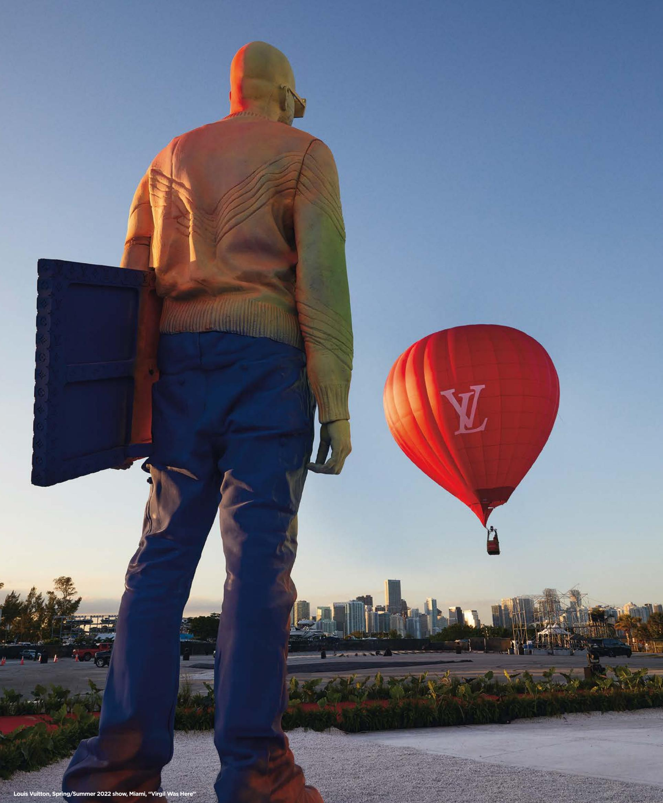

> **AI Description:**
> **Source:** `assets/_page_69_Figure_0.jpg`
> 
> **Generated:** 2026-05-29 22:16:10
> 
> ---
> 
> The image is a photograph featuring a large, colorful sculpture of a person walking away from the viewer, carrying a suitcase. The sculpture is set against a backdrop of a clear sky and a hot air balloon with the "LV" logo, indicating it is associated with Louis Vuitton. The scene is set in Miami, as indicated by the text at the bottom of the image, which mentions the Louis Vuitton Spring/Summer 2022 show and references Virgil Abloh. The overall composition combines art, fashion, and travel, with the hot air balloon adding a sense of movement and luxury.

# H IG H L IG H T S

The strong growth achieved by the Fashion & Leather Goods business group reflected the solid progress made by this unique collection of Maisons and the exceptional performance of Louis Vuitton, Christian Dior, Fendi, Celine and Loewe. Our Maisons were backed by their highly engaged and agile staff, with several key assets – creativity coupled with an unrelenting focus on excellence, and digital tools to stay connected with their customers – playing a major role throughout the global public health crisis.

For Louis Vuitton, the end of the year was saddened by the loss of Virgil Abloh, who had served as Creative Director of Menswear since March 2018. Using his vision and his unique talent to challenge established practice in fashion, he was among those who most brilliantly expressed the creative freedom and timeless modernity of Louis Vuitton. The Maison paid a deeply emotional tribute to him at the runway show in Miami “Virgil Was Here”, on November 30.

Illustrating its creative energy and its pursuit of excellence in craftsmanship, the Maison continued its dialogue with the world of art, reinvented its iconic models and unveiled a number of initiatives in connection with the bicentenary of its founder’s birth. The LV Pont 9 handbag collection welcomed a soft, rounded new version, while the Petite Malle, a symbol of the Maison’s rich heritage, took the spotlight in an array of new formats. By reinterpreting the Maison’s signatures, the new Bravery high jewelry collection also paid tribute to its founder. A collaboration with Fornasetti gave rise to a multifaceted collection of ready-to-wear and

accessories, illustrating the encounter between the Italian art and design studio’s boundless creativity and Nicolas Ghesquière’s contemporary vision. The second half of the year saw the return of in-person fashion shows held with an audience in inspiring locations: the Louvre in Paris, followed by Shanghai for the Women’s Spring/Summer 2022 collection and Seoul for the Fall/Winter 2021 Men’s collection. Louis Vuitton strengthened its ties with the world’s most prestigious sporting events: the trophy cases for the 2023 Rugby World Cup to be held in France, the Monaco Grand Prix Formula 1 race and the Davis Cup tennis tournament were custom-made by the Maison’s craftspeople at its Asnières workshop, while its partnership with the NBA continued. Its range of fragrances was expanded with the Extraits collection, composed of five scents whose bottle was designed by Frank Gehry, and the Spell On You fragrance showcased in a video starring Léa Seydoux. At its stores and through its original, high-quality digital initiatives, the Maison continued to offer its customers a unique experience. The store network was expanded with the inauguration of an emblematic store in Tokyo and the opening at La Samaritaine Pont-Neuf in Paris. Committed to making its products ever more sustainable, particularly by focusing on repairability from the very beginning of the design process, the Maison also stepped up its efforts to reduce their environmental impact throughout their entire life cycle. The LV Pillow leather goods collection and the sustainable Felt Line in Menswear were two illustrations of this approach in 2021. The Vendôme workshop is yet another reflection of Louis Vuitton’s commitment to sustainable, high-quality craftsmanship dedicated to responsible design.

Christian Dior Couture recorded an excellent year, with remarkable growth in all its product categories with local customer bases. The Maison continued to be buoyed by the wealth of inspiration of its designers: Maria Grazia Chiuri for its women’s collections and Kim Jones for Dior Homme. The Women’s Winter 2021 ready-to-wear collection filmed in the Hall of Mirrors at the Palace of Versailles generated millions of views online. The 2022 Cruise show – the first show open to guests after months of pandemic-related restrictions – was held against the spectacular backdrop of the Panathenaic Stadium in Athens. An embroidered silk thread textile installation by artist Eva Jospin served as an exceptional backdrop for the Fall/Winter 2021-2022 Haute Couture show held at the Musée Rodin. The new Dior Caro bag was launched, featuring the Maison’s legendary cannage pattern, while several of its classic models were reimagined into unprecedented dimensions. The new RoseDior high jewelry collection designed by Victoire de Castellane was unveiled, featuring 54 pieces inspired by roses. Capsule collections, including the Dioriviera line in the summer and DiorAlps in the winter, appeared at a series of stores around the world. Colorful window displays and pop-up locations also accompanied the launch of Dior Homme collections designed in collaboration with major artists such as Kenny Scharf

and Peter Doig. The store network continued to expand with a number of high-profile openings around the world. The Christian Dior: Designer of Dreams exhibition made stopovers in Chengdu, at the Brooklyn Museum in New York and in Doha, Qatar. As part of its Women@Dior program, the Maison to hold a virtual conference entitled “Dream for Change”, which was attended by 1,500 young women from 25 countries. Fendi turned in a record year, featuring the success of Kim Jones’ first collections in collaboration with Silvia Venturini Fendi and Delfina Delettrez Fendi as well as strong growth in all its product categories. The Peekaboo and Baguette lines along with the new Fendi First bag drove sales in leather goods. Ready-to-wear and accessories also saw remarkable growth. The capsule collection born out of the Maison’s creative collaboration with the SKIMS brand generated record sales. A number of flagship stores were inaugurated in New York, Shanghai and Sydney. The “hand in hand” project, which showcases Italian craftsmanship, was unveiled to the public at an exhibition held at the Palazzo della Civiltà Italiana, the Maison’s headquarters in Rome. This initiative reflected its desire to support the development of craft trades and promote this tradition of passing on skills and excellence, both in Italy and beyond. It was a record year for Celine, marked by the success of its ready-to-wear lines designed by Hedi Slimane, buoyed by digital fashion shows staged and filmed by Slimane himself. Leather goods benefited from

Fendi
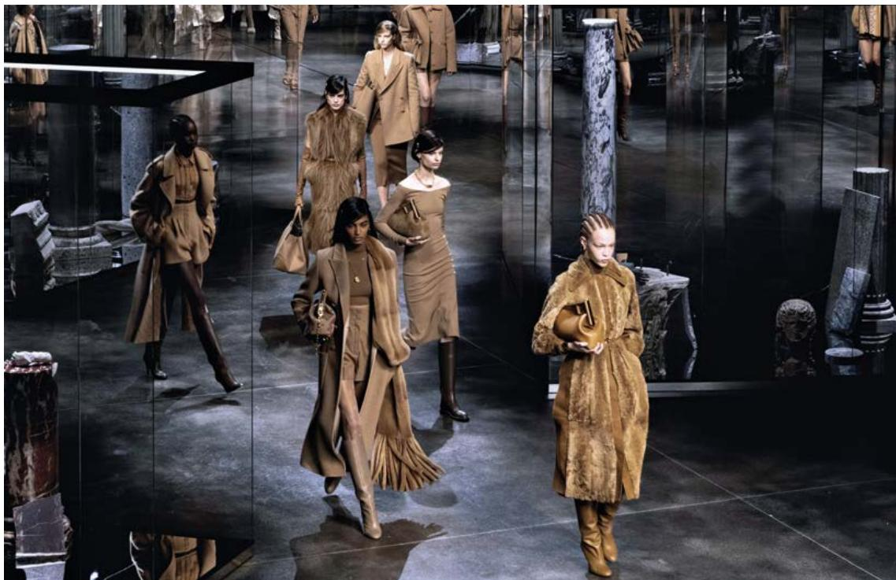

> **AI Description:**
> **Source:** `assets/_page_71_Figure_0.jpg`
> 
> **Generated:** 2026-05-29 21:32:22
> 
> ---
> 
> The image contains a fashion runway scene with models walking down the catwalk. The models are dressed in coordinated outfits featuring earthy tones such as beige and brown, with some wearing fur coats and others in more structured jackets. The runway is set against a dark, reflective background with classical architectural elements like columns and statues, creating a dramatic and sophisticated atmosphere. The models carry handbags, adding to the overall aesthetic of the fashion presentation.

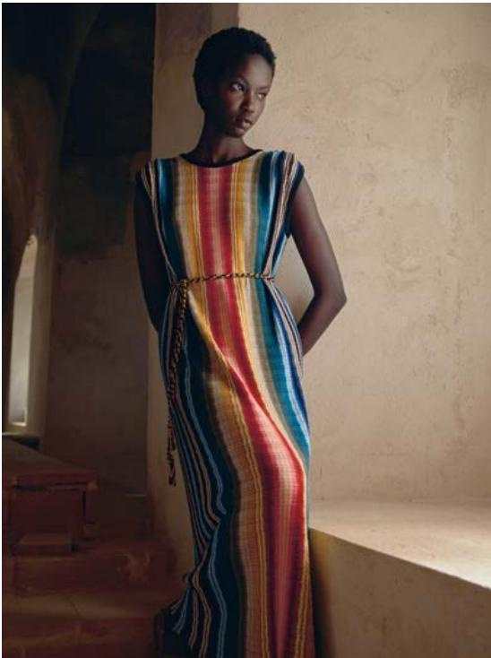

> **AI Description:**
> **Source:** `assets/_page_71_Figure_1.jpg`
> 
> **Generated:** 2026-05-29 21:26:56
> 
> ---
> 
> The image contains a photograph of a person wearing a colorful, striped dress with vertical stripes in various shades of blue, red, yellow, and green. The dress has a sleeveless design and a belt around the waist. The background appears to be an indoor setting with a textured wall and a window allowing natural light to enter. The overall style of the image suggests a fashion or lifestyle context.

Loro Piana

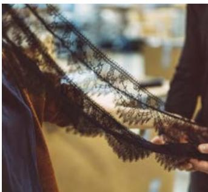

> **AI Description:**
> **Source:** `assets/_page_72_Figure_0.jpg`
> 
> **Generated:** 2026-05-29 22:54:15
> 
> ---
> 
> The image shows a close-up of a person holding a long, dark, lace-like fabric. The fabric appears to be intricately woven with a detailed pattern, possibly decorative or ornamental. The person's hands are visible, gently holding the fabric, and the background is blurred, suggesting an indoor setting with indistinct objects or furniture. The focus is on the texture and pattern of the fabric, which is the central visual element of the image.

OUR MAISONS TAKE ACTION

## Nona Source: The first resale platform for materials from the Group’s Fashion & Leather Goods Maisons

In April 2021, LVMH launched Nona Source, the first online resale platform for  exceptional materials from its Fashion & Leather Goods Maisons. Created by Group employees as part of the DARE (Disrupt, Act, Risk to be an Entrepreneur) intrapreneurship program, Nona Source fits within LVMH’s LIFE 360 environmental strategy by revolutionizing sourcing and promoting circular design. Nona Source’s innovative digital platform offers high-end fabrics and leathers to young designers and brands in Europe at competitive prices to promote creative reuse. All materials are appraised by experts and showcased on the site. The Group’s Maisons take part in this initiative not only as suppliers but also as customers, upcycling materials to give them a new lease on life.

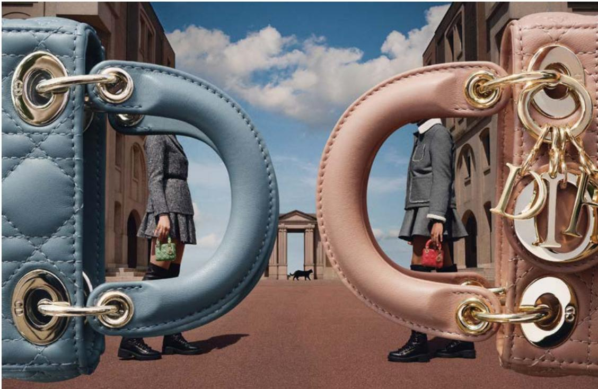

> **AI Description:**
> **Source:** `assets/_page_72_Figure_1.jpg`
> 
> **Generated:** 2026-05-29 22:59:14
> 
> ---
> 
> The image contains a photograph with a creative visual effect. It features two close-up shots of handbag handles, one in blue and the other in pink, with a woman in the background. The handles are positioned in such a way that they frame the woman, creating a circular view of her. The woman is wearing a gray outfit and holding a small bag, and there is a cat walking in the background. The image is likely a promotional or artistic piece, showcasing the handbags and the fashion they complement.

Christian Dior

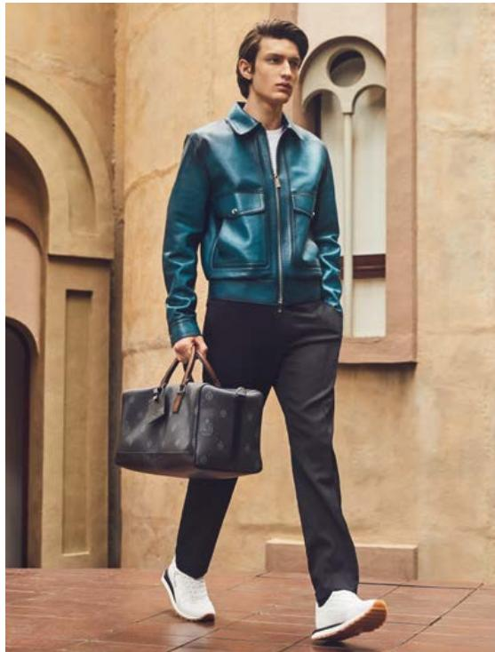

> **AI Description:**
> **Source:** `assets/_page_72_Figure_2.jpg`
> 
> **Generated:** 2026-05-29 22:53:46
> 
> ---
> 
> The image is a photograph of a person walking outdoors. The individual is dressed in a stylish outfit consisting of a teal leather jacket, dark trousers, and white sneakers. They are carrying a black handbag with a monogram pattern. The background features architectural elements with arched doorways and a textured wall, suggesting a historical or urban setting. The overall style of the image conveys a sense of fashion and modernity.

Berluti

growth in the Triomphe and 16 lines. Investments in its omnichannel strategy also played a key role in the Maison’s new gains.

Loro Piana saw solid growth and expanded its customer base. A number of high-profile initiatives contributed to this momentum: the launch of the Sesia bag, made of exceptionally high-quality leather; a collection designed with Japanese artist Hiroshi Fujiwara; and the renewal of the Maison’s partnership with the European Team for the Ryder Cup golf tournament. Reaffirming its longstanding commitment to sustainable development, Loro Piana published its first environmental report to present the initiatives it has taken and share its vision for the future. Loewe also had a record year. Online sales grew significantly. Customers, the media and fashion professionals were all equally impressed with the wealth of inspiration and modernity displayed by Jonathan Anderson’s collections. Alongside the Puzzle bag, the Flamenco line and the new version of the Amazona stood out. The Surplus Project, a Loewe initiative aimed at recycling leather from previous collections to create new designs, was presented at the IUCN World Conservation Congress.

Givenchy reached a key milestone with the arrival in stores of Matthew Williams’ first collection and the launch of the Cut-Out bag and the 4G line. The second half of the year featured two ready-to-wear collaborations, with artists Chito and Josh Smith. 2021 was a year of new energy for Marc Jacobs,

with strong growth in the United States and a highly impressive surge in online sales. With its clearly affirmed style, the Maison was buoyed by the success of the Tote Bag in leather goods, Heaven in ready-to-wear and Jogger in footwear. The brand enjoyed positive responses to its fashion shows and a high level of engagement on social media.

Berluti benefited from the development of a policy to build strong, personalized connections with its customers. Ready-to-wear sales were boosted by the launch of the Essentials collection. The “lifestyle” category saw the enthusiastic reception of its new Home & Office line. With a new color palette available in leather goods and footwear, the Patina Rainbow collection illustrated the Maison’s unique expertise in the art of patina. A number of stores opened in China, and a flagship store was inaugurated in Tokyo’s Ginza district in Japan.

As borders gradually reopened, RIMOWA saw encouraging signs of recovery. Its Never Still soft bags saw promising success. The Personal line was expanded to include models made of aluminum, the Maison’s iconic material. The luggage collection was enriched with the reintroduction of iconic designs, spotlighted through a new campaign and four renowned ambassadors.

Kenzo announced the appointment of Japanese designer Nigo as Creative Director of its collections. Pucci named Camille Miceli as its Creative Director.

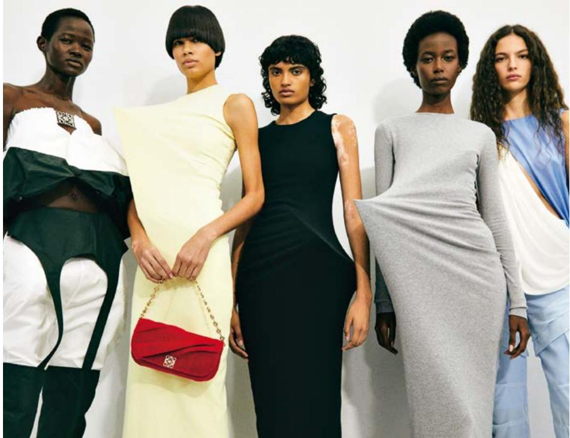

> **AI Description:**
> **Source:** `assets/_page_73_Figure_0.jpg`
> 
> **Generated:** 2026-05-29 23:08:57
> 
> ---
> 
> The image contains a photograph of five individuals standing side by side, each wearing a different outfit. The outfits vary in color and style, ranging from a white and black ensemble with a green accent to a light gray dress, a black dress, a white dress with a blue overlay, and a cream-colored dress with a red handbag. The individuals are positioned against a plain white background, and the image appears to be a fashion-related display or advertisement.

Loewe

Celine
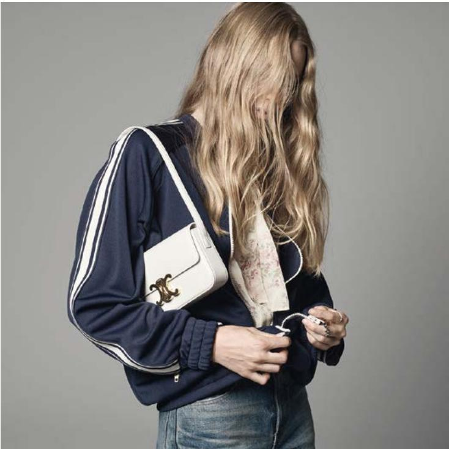

> **AI Description:**
> **Source:** `assets/_page_73_Figure_1.jpg`
> 
> **Generated:** 2026-05-29 23:06:45
> 
> ---
> 
> The image contains a photograph of a person wearing a navy blue jacket with white stripes and a white crossbody bag. The person is also wearing blue jeans and has long, wavy blonde hair. The image appears to be a fashion-related advertisement or product showcase.

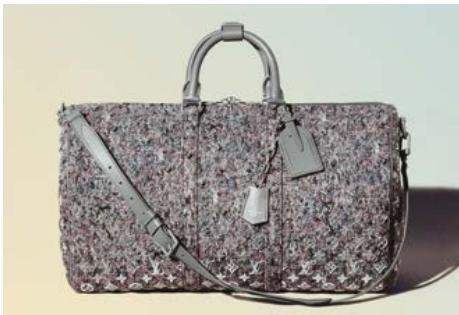

> **AI Description:**
> **Source:** `assets/_page_74_Figure_0.jpg`
> 
> **Generated:** 2026-05-29 23:07:10
> 
> ---
> 
> The image contains a photograph of a patterned fabric bag with a structured design. The bag features a flap closure with a silver-colored buckle and a handle on top. A shoulder strap is attached to the bag, and there are two silver tags hanging from the flap. The fabric has a floral or star-like pattern in muted tones.

OUR MAISONS TAKE ACTION

## Louis Vuitton’s Felt Line fits perfectly into the Maison’s “Our Committed Journey” program

At the Louis Vuitton Men’s Fall/Winter 2021-2022 show, Virgil Abloh unveiled a Keepall bag designed in a jacquard made from recycled materials, with a unique look inspired by moving blankets. Building on this upcycling initiative, the Maison presented the Louis Vuitton Felt collection featuring three bags made from the same sustainable material: 43% certified organic cotton, 20% recycled wool and recycled polyester. The lining is 100% recycled polyester, sourced from deadstock. The bags’ corners and chains are produced using 70% recycled plastic, and the straps and handles are made of LWG (Leather Working Group)-certified leather, attesting to the high environmental standards adhered to in tanning.

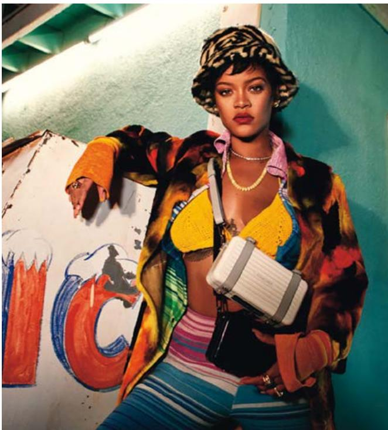

> **AI Description:**
> **Source:** `assets/_page_74_Figure_1.jpg`
> 
> **Generated:** 2026-05-29 23:07:05
> 
> ---
> 
> The image is a photograph featuring a person posing in a vibrant, colorful outfit. The individual is wearing a leopard print bucket hat, a multicolored jacket with a tie-dye pattern, and a striped skirt. They are accessorized with a pearl necklace and a white handbag with a gray strap. The background includes a wall with graffiti art, adding an urban and artistic element to the scene.

RIMOWA

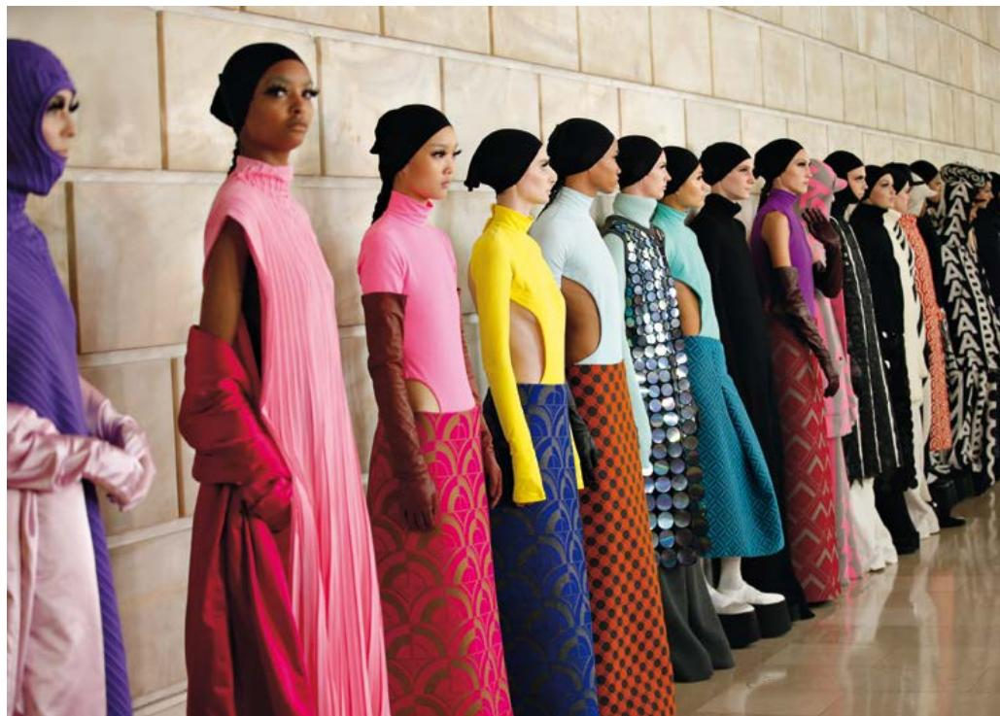

> **AI Description:**
> **Source:** `assets/_page_74_Figure_2.jpg`
> 
> **Generated:** 2026-05-29 23:02:24
> 
> ---
> 
> The image contains a series of models standing in a line, each wearing a unique, colorful outfit. The outfits vary in design, with some featuring bold patterns and others in solid colors. The models are wearing headscarves, and the setting appears to be indoors with a tiled wall in the background. The image is a photograph showcasing fashion, likely from a runway or fashion show.

Marc Jacobs

D I O R

## Dior heritage and American culture r ub shou lders at t he Brooklyn Museum

After its resounding success at the Musée des Arts Décoratifs in Paris, the Christian Dior: Designer of Dreams exhibition travelled to New York’s Brooklyn Museum. A selection of archives and gowns retrace the Maison’s history and close affinity with America. The exhibit opens with a voyage through time and space that reveals the cultural and artistic journey of founder Christian Dior from 30 avenue Montaigne to the heart of cosmopolitan America. Dior’s very first haute couture creations – some of which have never been

seen by the public – are exhibited alongside exceptional Brooklyn Museum pieces, offering visitors a remarkable interplay between Dior’s unique heritage and the New York museum’s rich collections. Visitors can also admire models worn by some of the world’s most celebrated actresses, from Grace Kelly to Jennifer Lawrence. As the ultimate magical touch, the museum’s central atrium evokes an enchanted garden under a star-covered sky, in reference to the couturier’s lucky star.

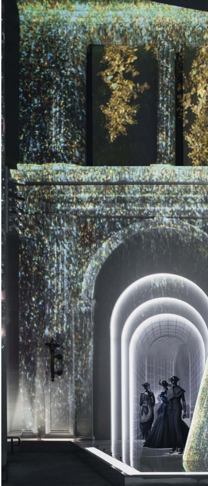

> **AI Description:**
> **Source:** `assets/_page_75_Figure_0.jpg`
> 
> **Generated:** 2026-05-29 22:55:02
> 
> ---
> 
> The image contains a photograph of a fashion display. The setting appears to be an indoor space with a large, arched structure illuminated by white light. The background features a projection of a natural scene with trees and sunlight filtering through the leaves, creating a dynamic and textured effect. In the foreground, mannequins are dressed in elegant, dark-colored outfits, positioned within the archway. The overall composition combines architectural elements with a naturalistic projection, creating a visually striking and sophisticated display.

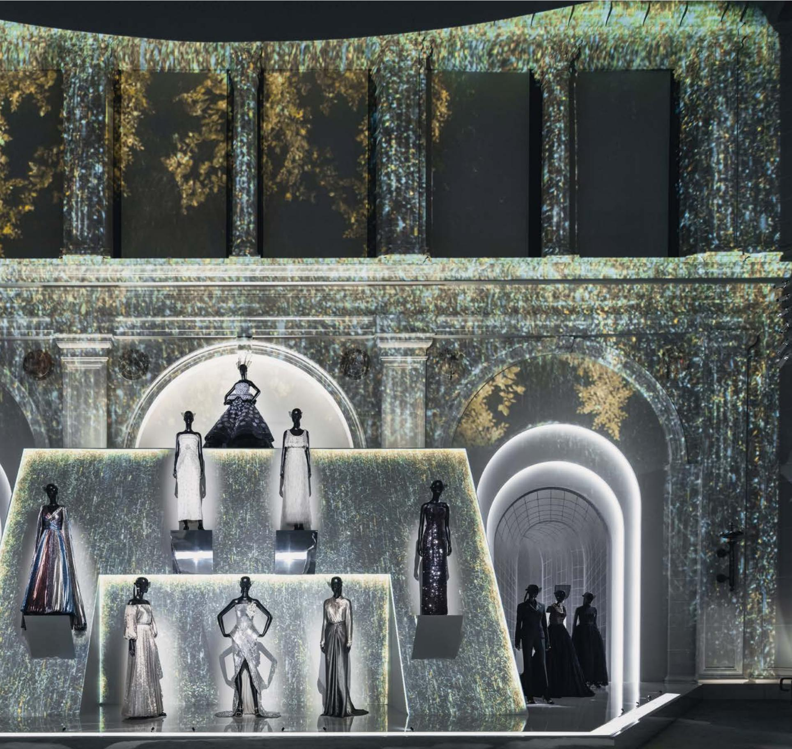

> **AI Description:**
> **Source:** `assets/_page_76_Figure_0.jpg`
> 
> **Generated:** 2026-05-29 21:36:12
> 
> ---
> 
> The image contains a fashion exhibition setup with mannequins displaying various elegant dresses. The background features a projection of a forest scene, creating a serene and natural ambiance. The dresses vary in style and color, ranging from white to black, with some featuring intricate designs and embellishments. The overall setting is sophisticated, blending fashion with a tranquil outdoor theme.

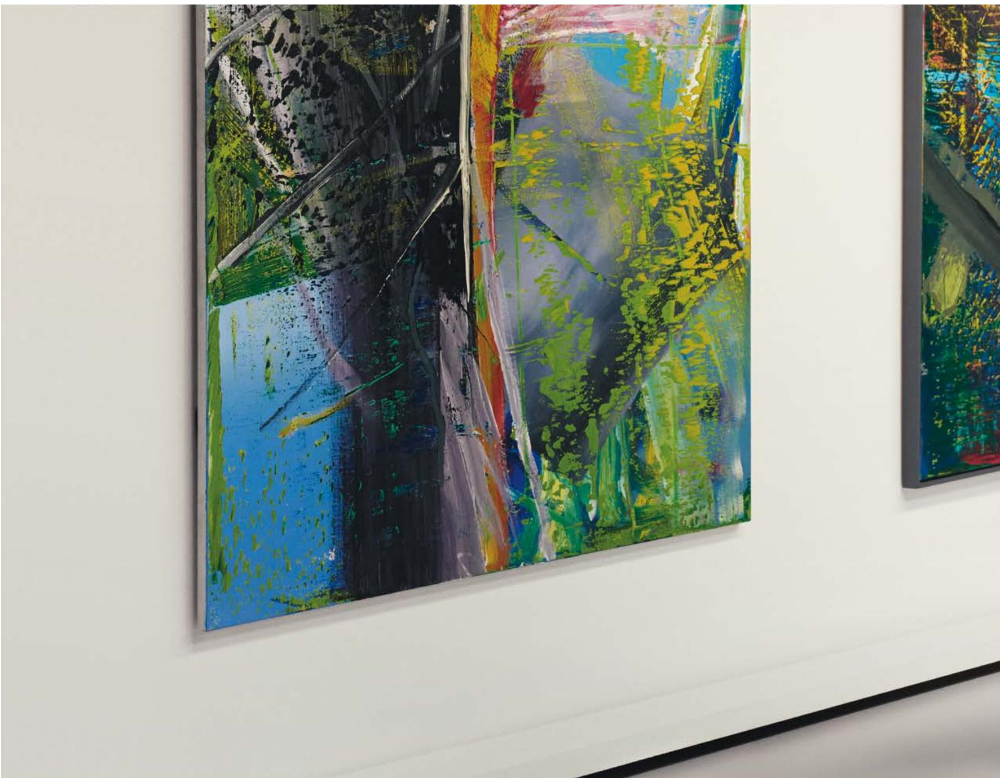

> **AI Description:**
> **Source:** `assets/_page_77_Figure_0.jpg`
> 
> **Generated:** 2026-05-29 21:41:04
> 
> ---
> 
> The image shows a section of an art gallery wall displaying abstract paintings. The paintings feature vibrant colors and dynamic brushstrokes, with a mix of greens, blues, yellows, and blacks. The style is abstract and expressive, with no discernible figures or landscapes. The paintings are framed and hung on a white wall, with a portion of another painting visible on the right side of the frame. The overall composition suggests a modern or contemporary art exhibition.

L O U I S V U I T T O N

The Capucines bag: A s y mb ol of moder n fem in in ity

For over 160 years, heritage, fine craftsmanship and innovation have been Louis Vuitton’s core values and hallmark. This unique approach is behind the Capucines – a timeless, ingenious bag that is instantly recognizable by its minimalist shape and sophisticated attention to detail. Lensed by photographer Steven Meisel, French actress Léa Seydoux is the iconic bag’s current ambassador in a campaign that illustrates the intimate relationship between a woman and her handbag. The Capucines bag – named after Rue Neuve-des-Capucines, where Louis Vuitton opened his first store in 1854 – is a symbol of contemporary femininity, with its equally exacting standards of elegance, functionality and versatility. Thoughtfully and ingeniously designed, this beautiful bag is assembled in over one hundred steps and is a pure product of Louis Vuitton’s traditional expertise. A marvel of technical skill, inventiveness and excellent craftsmanship, the Capucines has the status of a modern classic.

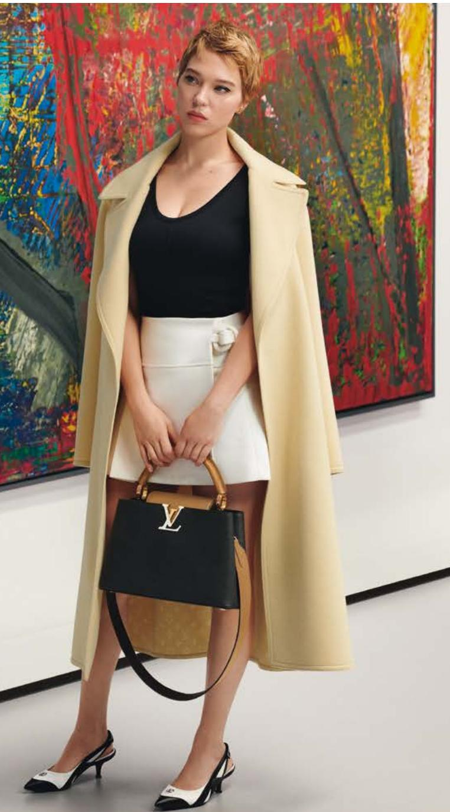

> **AI Description:**
> **Source:** `assets/_page_78_Figure_0.jpg`
> 
> **Generated:** 2026-05-29 22:42:31
> 
> ---
> 
> The image is a photograph of a person standing in front of an abstract painting. The individual is wearing a long, light-colored coat over a black top and a white skirt with a belt. They are holding a black handbag with a gold handle and logo. The person is also wearing black and white high-heeled shoes. The background features a vibrant, abstract painting with red, yellow, blue, and green hues.

Loewe unveiled a new chapter in its collaboration with Studio Ghibli. A year after the Maison’s acclaimed collection celebrating Hayao Miyazaki’s animated film My Neighbor Totoro, Creative Director Jonathan Anderson designed an exclusive capsule to honor Spirited Away, Miyazaki’s 2001 ode to loyalty and friendship. The collection offers a moment of escapism into the film’s fantastical world, with clothes and accessories crafted by Loewe artisans who skillfully combine materials and textures to bring the characters to life.

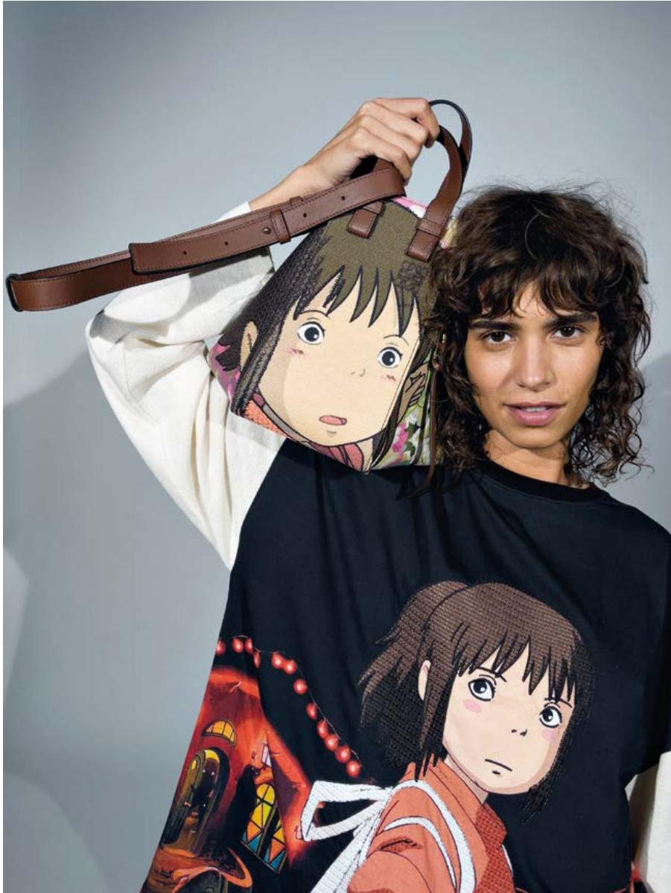

> **AI Description:**
> **Source:** `assets/_page_78_Figure_1.jpg`
> 
> **Generated:** 2026-05-29 22:39:22
> 
> ---
> 
> The image contains a photograph of a person holding a bag with a character design on it. The person is also wearing a black T-shirt with the same character design. The character depicted is from an animated film, featuring a young girl with short hair and a concerned expression. The bag and T-shirt both feature the same character, suggesting a coordinated set of merchandise. The background is plain and does not contain any additional text or graphics.

## Grecian in spirat ion beneath the Parthenon

Dior’s 2022 Cruise collection was inspired by series of photographs of an haute couture range by Monsieur Dior taken near the Parthenon in 1951. Maria Grazia Chiuri took the Maison back to Athena’s city, bringing the ancient Greek goddess back to the future and upending conventions. The Maison’s Artistic Director takes her cue from pioneering Surrealist painter Giorgio de Chirico, whose work is infused with nostalgia for Greece and depicts metaphysical settings frozen in silent contrasts of light and shade. She also explores the universe of cosmopolitan gallery owner Alexandre Lolas, who maintained close ties with Greece and had a home in Athens. Artist Pietro Ruffo reinterprets the silhouettes of ancient Greek wrestlers and a camouflage pattern for a range of sportswear garments. Maria Grazia Chiuri highlights the way multi-faceted representations of beauty have influenced Dior’s interpretations of femininity.

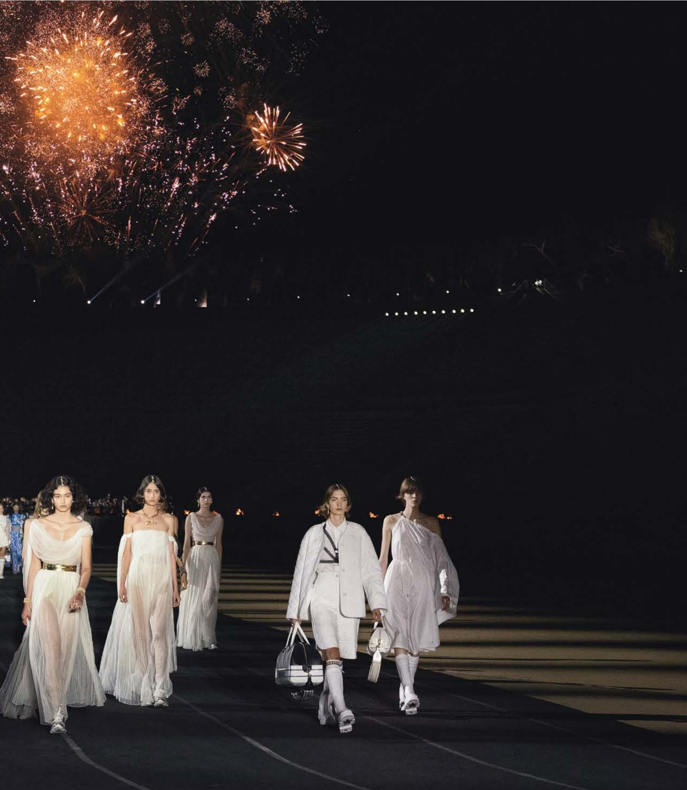

> **AI Description:**
> **Source:** `assets/_page_80_Figure_0.jpg`
> 
> **Generated:** 2026-05-29 22:40:35
> 
> ---
> 
> The image is a photograph of a fashion show taking place at night. Models are walking down a runway, dressed in white and light-colored outfits, carrying handbags. The background features a dark sky with fireworks lighting up the scene, creating a dramatic and festive atmosphere. The runway is illuminated, and the models are positioned in a line, showcasing the clothing. The overall setting suggests a high-end fashion event with a celebratory ambiance.

C E L I N E

# A su n-k issed col lect ion s et ag a i n s t the Baie des Anges

Hedi Slimane chose the Baie des Anges (Bay of the Angels) as the backdrop for his third filmed fashion show and as the theme for Celine’s 2022 Women’s Spring-Summer collection. Capturing the spirit of the Maison, he restyled its hallmark bourgeois dress codes – small checked jackets, roomy blouses, Triomphe leather handbags with golden chains – by adding a sporty, masculine twist with hoodies, parkas, sailor jerseys, boaters and fedoras. Celine’s new High Perfumery ambassador, Lalisa Manoban, along with the Maison’s other brand ambassadors – Kaia Gerber, Diana Silvers and Suzanne Lindon – were in attendance and lent their elegance to the show. Reviving the French Riviera’s golden age, their outfits set off by the radiant sunshine, they catwalked around Nice’s architectural landmarks: down the Promenade des Anglais, past the mythical Hotel Negresco and the Villa Massena and up at the Observatory’s promontory, which boasts the most spectacular views of the city and the Mediterranean.

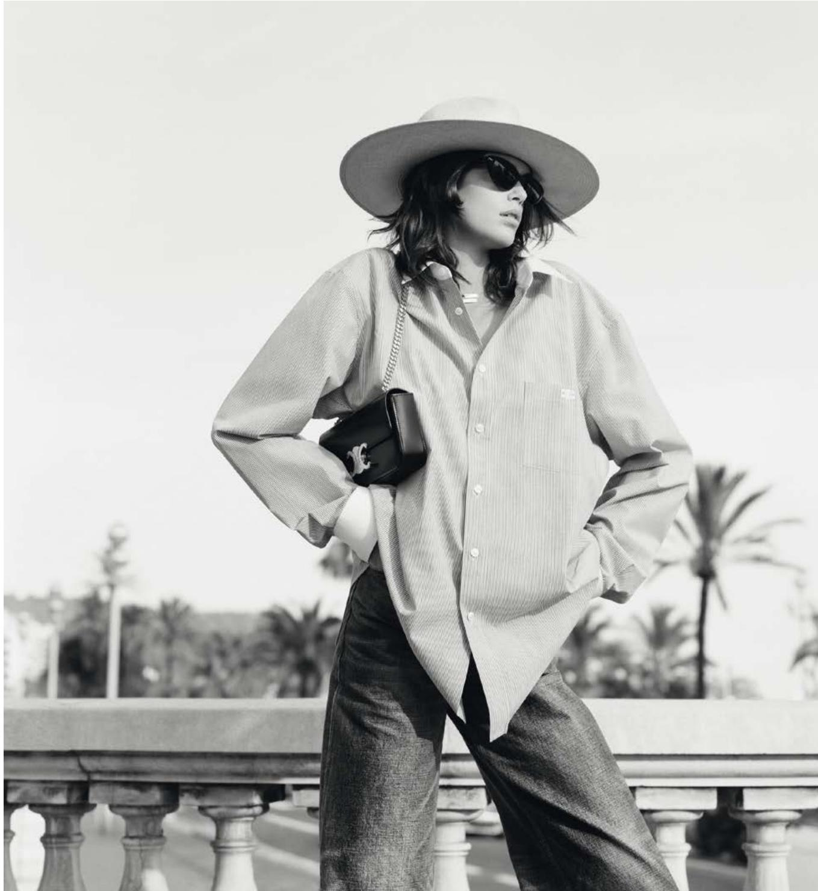

> **AI Description:**
> **Source:** `assets/_page_81_Figure_0.jpg`
> 
> **Generated:** 2026-05-29 22:26:09
> 
> ---
> 
> The image is a black and white photograph featuring a person standing outdoors. The individual is wearing a wide-brimmed hat, sunglasses, a loose-fitting shirt, and high-waisted pants. They are carrying a small handbag with a chain strap. The background includes a railing and palm trees, suggesting a warm, possibly coastal location. The overall style of the image is casual and fashionable.

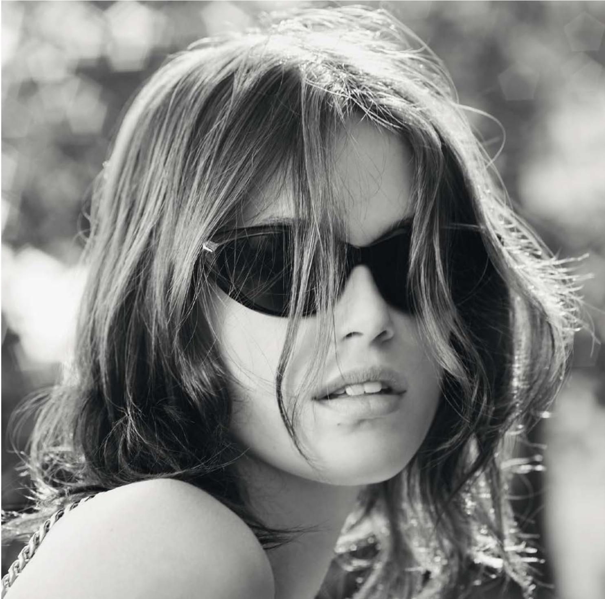

> **AI Description:**
> **Source:** `assets/_page_82_Figure_0.jpg`
> 
> **Generated:** 2026-05-29 21:57:44
> 
> ---
> 
> The image is a black and white photograph of a person with shoulder-length hair and sunglasses. The hair appears slightly tousled, and the person is wearing a chain accessory. The background is blurred, suggesting an outdoor setting with natural light. The overall tone of the image is casual and artistic.

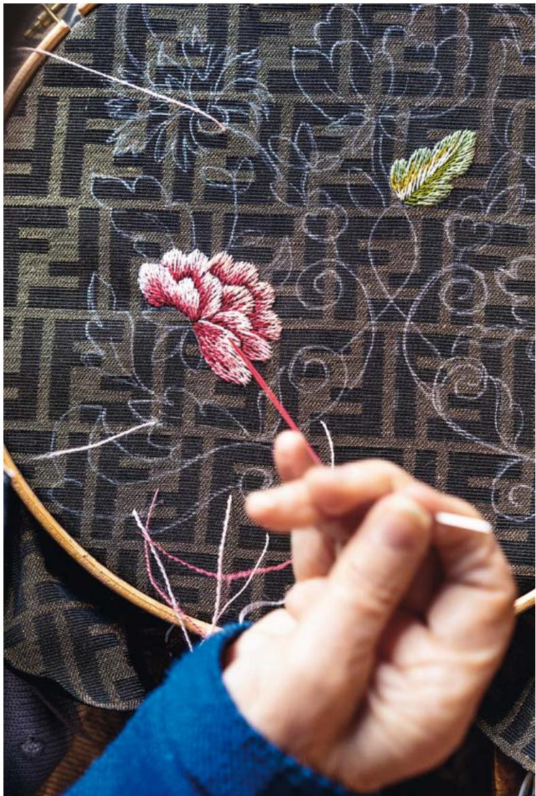

> **AI Description:**
> **Source:** `assets/_page_83_Figure_0.jpg`
> 
> **Generated:** 2026-05-29 22:05:26
> 
> ---
> 
> The image is a photograph of a hand engaged in embroidery work. The hand is holding a needle and thread, working on a dark fabric with intricate white embroidery designs. The fabric features floral patterns, and the person is in the process of stitching a red flower, with additional green leaves already embroidered. The embroidery hoop is visible, holding the fabric taut for precise stitching. The hand appears to belong to an older individual, as indicated by the visible wrinkles and age spots.

F E N D I

# “ hand in hand”: Celebrating excel lence in It a l i a n craftsmanship

Fendi’s hand in hand exhibition held at the Palazzo della Civiltà Italiana, the Maison’s headquarters in Rome, was a sequel to the eponymous project celebrating traditional Italian craftsmanship initiated in 2020. The exhibition spotlighted 20 handmade reinterpretations of Silvia Venturini Fendi’s iconic 1997 Baguette bag, each one a showcase of unique expertise from an Italian region. The initiative is part of a partnership between the Maison and Italian

artisans, who were invited to transform the emblematic Baguette bag into a work of art. Their reinterpretations, which are as varied as they are elaborate, include extravagant stone and metalwork, complex mosaic art, delicate cotton embroidery and flawless leatherwork. As well as producing these one-of-a-kind pieces and forging strong bonds with Italian artisans, the “hand in hand” project helps safeguard their expertise and creativity and share it with the world.

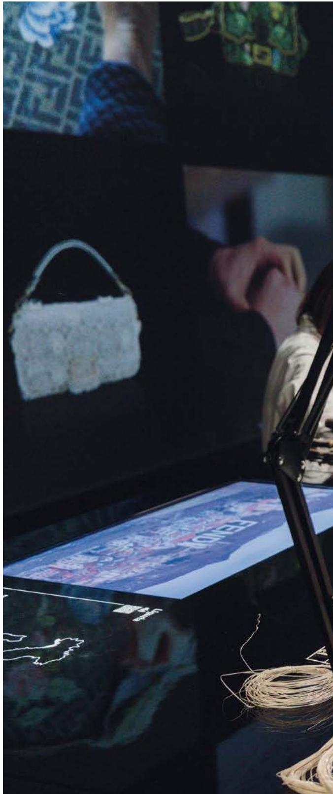

> **AI Description:**
> **Source:** `assets/_page_83_Figure_1.jpg`
> 
> **Generated:** 2026-05-29 22:12:04
> 
> ---
> 
> The image contains a photograph of a person interacting with a digital display. The display shows a colorful, abstract design with various patterns and text. The person is holding a stylus and appears to be drawing or interacting with the display. On the wall behind the display, there is a small, white, textured object that resembles a handbag. The overall setting suggests a digital art or interactive exhibit.

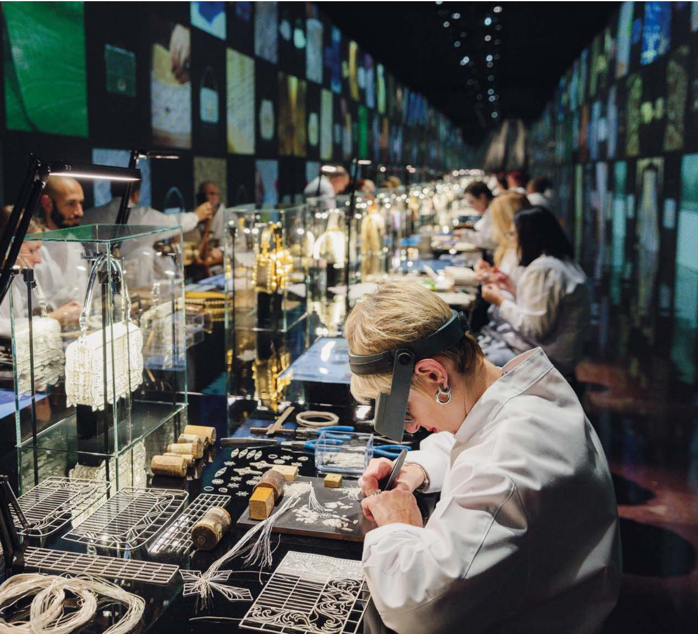

> **AI Description:**
> **Source:** `assets/_page_84_Figure_0.jpg`
> 
> **Generated:** 2026-05-29 22:08:54
> 
> ---
> 
> The image is a photograph showing a group of people working in what appears to be a jewelry or watch manufacturing facility. The individuals are seated at workstations with glass enclosures containing various tools and materials. The person in the foreground is wearing a protective visor and is focused on a task involving intricate work, possibly engraving or assembling small components. The background shows other workers engaged in similar activities, with shelves and displays of finished products in the distance. The setting is well-lit, emphasizing the precision and detail involved in the work.

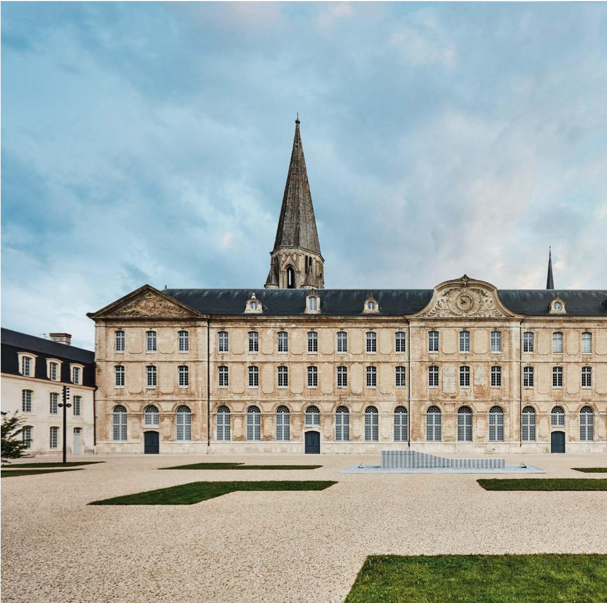

> **AI Description:**
> **Source:** `assets/_page_85_Figure_0.jpg`
> 
> **Generated:** 2026-05-29 21:53:44
> 
> ---
> 
> The image depicts a large, historic building with a prominent central tower and a series of arched windows. The architecture suggests a European style, possibly a former monastery or university. The building is surrounded by a paved area with some greenery, and the sky is partly cloudy. The overall scene conveys a sense of historical significance and architectural beauty.

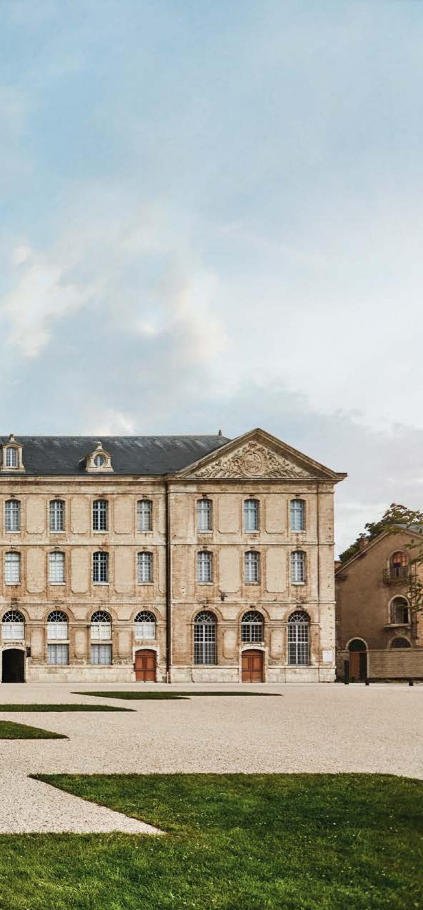

> **AI Description:**
> **Source:** `assets/_page_86_Figure_0.jpg`
> 
> **Generated:** 2026-05-29 22:23:15
> 
> ---
> 
> The image shows a large, historic building with classical architectural features, including symmetrical windows and a central pediment. The building appears to be made of stone and has multiple stories. The foreground includes a neatly maintained lawn and a paved area, suggesting a courtyard or open space in front of the building. The sky is partly cloudy, indicating a daytime scene. The overall impression is one of a serene and well-maintained historical site.

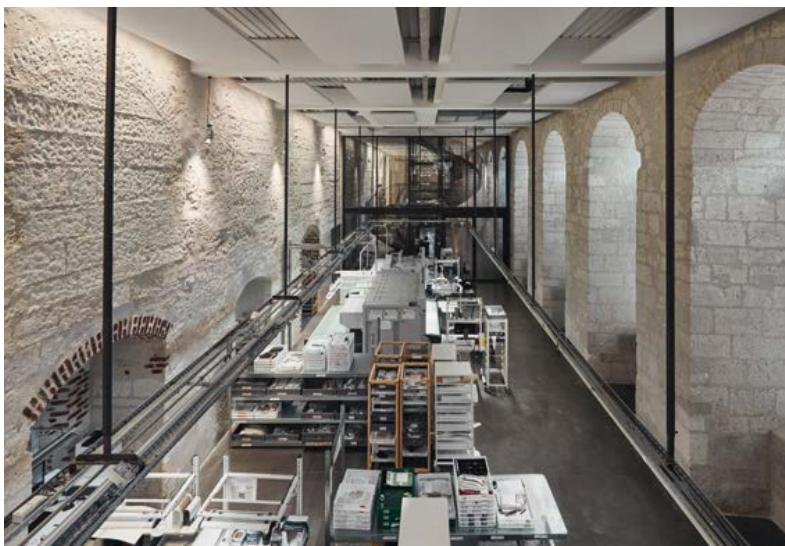

> **AI Description:**
> **Source:** `assets/_page_86_Figure_1.jpg`
> 
> **Generated:** 2026-05-29 22:32:34
> 
> ---
> 
> The image shows the interior of a large industrial or warehouse space. The structure features exposed stone walls and arched openings, suggesting a historical or repurposed building. The floor is divided into sections with various pieces of equipment and storage units, possibly for manufacturing or distribution. There are conveyor belts and shelving units, indicating an automated or semi-automated process. The lighting is bright and even, highlighting the organized layout and the functional nature of the space.

Louis Vuitton’s precious leather handbags are now crafted in a former abbey in north-western France between the regions of Le Perche and La Petite Beauce. The new workshop opens a new chapter in the history of exceptional leather goods. The abbey’s large-scale conversion took three years and was carried out in partnership with the town of Vendôme and

supervised by Les Monuments Historiques, France’s listed buildings authority. The abbey’s old clock – now restored by an artisan from founder Louis Vuitton’s native Jura region – is once again the building’s beating heart. The Maison’s ambitious scheme has restored its original volumes to the building, which will celebrate its millennium in 2031.

L O U I S V U I T T O N

# The Vendôme workshop: A for mer abbey tran sfor med into a showcase for precious leatherwork

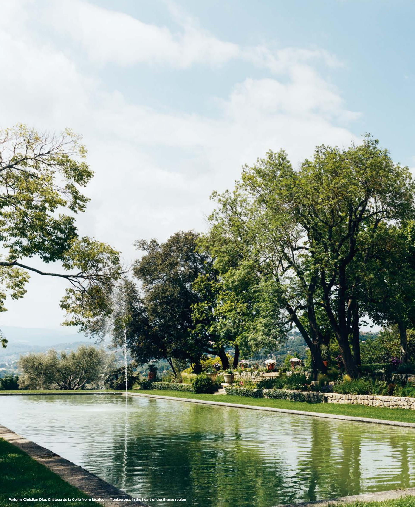

> **AI Description:**
> **Source:** `assets/_page_87_Figure_0.jpg`
> 
> **Generated:** 2026-05-29 22:43:50
> 
> ---
> 
> The image is a photograph of a serene garden scene. It features a tranquil pond with a fountain in the foreground, surrounded by lush greenery and mature trees. In the background, there is a well-maintained garden area with neatly trimmed hedges and potted plants. The sky is partly cloudy, suggesting a pleasant day. The text at the bottom of the image identifies the location as Château de la Colle Noire in Montauroux, France, and mentions its connection to Parfums Christian Dior.

# F O C U S I N G O N Q U A L I T Y A N D C U LT I VAT I N G U N I Q U E N E S S

LVMH is a key player in the perfume, makeup and skincare sector, with a portfolio of world-famous Maisons as well as younger brands with a promising future. The creative momentum of LVMH’s Maisons is driven by growth in its iconic lines as well as bold new products. They are all driven by the same values: the pursuit of excellence, creativity, innovation and appeal.

## Unique creative momentum

With surging demand in Asia and the huge popularity of skincare, the global perfume and cosmetics market is highly competitive, with increasingly compact innovation cycles. In this context, all of LVMH’s Maisons continue to pursue their objective of gaining market share, which depends more than ever before on quality, product performance and a robust innovation policy. In the heart of France’s Cosmetic Valley business cluster, researchers at LVMH’s Hélios R&D facility play a crucial role in helping the Maisons meet these requirements. The Maisons also uphold their commitment to biodiversity and sustainable design.

## Excellence and innovation in retailing

All the brands are accelerating the implementation of their online sales platforms and stepping up their digital content initiatives. Excellence in retailing is key. It requires expertise and attentiveness from beauty consultants, as well as innovation in sales, both in stores and online. Our brands are actively incorporating digital tools to enhance the customer experience and attract new consumers. The Group’s refusal to engage in excessive special offers and parallel sales, although such practices are used by a number of its competitors, helps ensure the powerful appeal of LVMH’s Maisons.

2022 Outlook

LVMH’s Maisons are well positioned to stand out in their competitive environment. While remaining highly vigilant over the months to come, they will boost innovation and continue to invest in their communications, ensuring selectivity in their retail networks and creating compelling digital experiences. Focusing on building its appeal through its image as a major brand rooted in the world of couture, Parfums Christian Dior has set ambitious leadership targets. The Maison will continue to innovate in its icons, especially Sauvage Miss Dior Rouge Dior J’adore and Prestige. Its directly operated stores will continue their expansion, in particular in China. Expanding the share of online sales and digital communications is also a key priority, along with effective supply chain management in a context of heightened volatility.

Guerlain will expand its international presence, paying particular attention to the selectivity of its distribution. Its momentum will be driven by strong growth in skincare combined with its expertise in spa treatments, the development of its fragrance ranges toward Collections, new energy in makeup and an acceleration in digital initiatives. In 2022, the Maison will celebrate the 15th anniversary of its “In the Name of Beauty” sustainability program. Parfums Givenchy will enrich its range of fragrances and continue its expansion into makeup. Acqua di Parma will relaunch its iconic Colonia range. Make Up For Ever will launch a further improved version of its HD Skin flagship line, developed by its community of makeup artists. Benefit will further expand its range of blushes while continuing to innovate in its brow collection. Parfums Kenzo will continue reviving its historic fragrances, drawing on the Maison’s French and Japanese roots. Perfumes Loewe and Maison Francis Kurkdjian will open their first store in China.

### Full Page Description (Page 90)

**Source:** `assets/_page_90_Asset_3.jpg`

**Generated:** 2026-05-29 22:45:56

---

The image contains a bar chart with three vertical bars, each representing a different year: 2019, 2020, and 2021. The bars are color-coded and have numerical values at the top indicating the data for each year. The values are as follows: 378 for 2019, 280 for 2020, and 290 for 2021. The chart appears to be comparing some quantitative data across these three years, with a slight increase from 2019 to 2021.

### Full Page Description (Page 90)

**Source:** `assets/_page_90_Asset_0.jpg`

**Generated:** 2026-05-29 22:36:29

---

The image is a pie chart that visually represents the distribution of a market share across different regions. The key information includes:

- Asia (excluding Japan) accounts for 42% of the market share.
- Europe (excluding France) represents 19%.
- The United States makes up 16%.
- France holds 9%.
- Japan contributes 4%.
- Other markets collectively account for 10%.

The chart uses different shades of brown and blue to differentiate between the regions, with percentages clearly labeled next to each section.

### Full Page Description (Page 90)

**Source:** `assets/_page_90_Asset_1.jpg`

**Generated:** 2026-05-29 22:45:42

---

The image contains a bar chart with three vertical bars, each representing a year from 2019 to 2021. The bars are color-coded and have a patterned fill. The heights of the bars indicate numerical values: 6,835 for 2019, 5,248 for 2020, and 6,608 for 2021. The chart appears to show a fluctuation in values over the three years, with a slight decrease from 2019 to 2020 and a slight increase from 2020 to 2021.

# 2021 at a glance

CONTINUED SELECTIVE DISTRIBUTION, STRONG REBOUND IN PERFUME AND RAPID PROGRESS IN SKINCARE

2021 REVENUE BY REGION (as %)

## Major strategic priorities

Maintain our creativity in terms of innovation and appeal

Focus on developing Parfums Christian Dior in harmony with Couture

Pursue the global expansion of our other brands

Strengthen our commitment to biodiversity and sustainable design

## SAUVAGE

ELIXIR

Dior

# H IG H L IG H T S

Amid a limited recovery in international travel and the gradual reopening of points of sale, LVMH’s major Maisons regained strong momentum, especially in the second half of the year. To preserve their exceptional image – a key element of their lasting appeal – the choice was made to keep their distribution highly selective, limit promotional offers and develop online sales through their own websites. Their performance was buoyed by their vibrant iconic lines, successful innovations and ability to craft high-quality, groundbreaking digital experiences.

Parfums Christian Dior made a strong recovery, particularly in all its local markets – especially Asia, the United States and the Middle East – and consolidated its leading positions in Europe. Its performance in fragrances was driven by the success of its flagship lines: Sauvage, which became global leader in all categories; solid results were also turned in by J’adore, Dior Homme and Miss Dior, which was boosted in September by a revisited scent profile and a new marketing campaign. The Collection Privée range, which distills the Maison’s peerless expertise in high perfumery, was enriched with new scents. Francis

Kurkdjian was appointed as Creative Director of Fragrances, taking over from François Demachy, who had served as Dior’s perfumer since 2006. Skincare was buoyed by the vibrant Prestige, Capture and L’Or de Vie ranges, the culmination of the scientific and sensory expertise of LVMH’s research and innovation center. The Dior Spa that opened at the Cheval Blanc hotel in Paris is the ultimate expression of Dior skincare and its beauty expertise. Makeup was boosted by the rollout of the refillable Rouge Dior lipstick and the launch of its transfer-proof liquid version, Forever Liquid. The acceleration in online sales continued via directly operated sites, spurred by digital campaigns that were among the most innovative run by fragrance and beauty brands. These initiatives complemented the Maison’s store network by attracting a new clientele and showcasing the exceptional products and customer experience it offers. Parfums Christian Dior carried on its tradition of artistic partnerships, including the collaboration with India Mahdavi for J’adore, and exhibitions showcasing its rich heritage and wealth of creativity. The Maison began sharing its values and initiatives

in connection with the mission it has adopted, “Beauty as a legacy”, affirming its commitment to culture, the environment and society, in particular through exceptional corporate philanthropy toward the Palace of Versailles, the Tuileries Gardens and the Beaux-Arts de Paris art school.

Guerlain achieved remarkable growth, particularly in China thanks to its very strong momentum in skincare. Backed by the Maison’s commitment to biodiversity and sustainable innovation, the Abeille Royale and Orchidée Impériale lines continued their exceptional performance. In fragrances, the Aqua Allegoria line and the new high perfumery collection L’Art et la Matière were a global success. In makeup, a new chapter began with the appointment of Violette as Creative Director of Makeup. The exceptional foundation Parure Gold bolstered its positions, particularly in Asia. The Maison continued to invest in its store network, with openings, renovations and pop-up locations expressing and exalting the brand’s unique identity. Guerlain stepped up its initiatives and engagement in connection with its “In the Name of Beauty” sustainability program, in particular alongside UNESCO for programs to protect biodiversity and bees, spearheaded by its brand ambassador Angelina Jolie, as well as the formation of its Sustainable Board, a panel of experts chaired by Yann Arthus-Bertrand. Parfums Givenchy returned to growth and won market share thanks to the success of its L’Interdit fragrance and the promising relaunch of the Irresistible line. In makeup, momentum was driven by its Prisme Libre powder and Le Rouge lipstick. Benefit’s sales were boosted by the launch of its They’re Real! Magnet mascara and the global “Love Your Brows” campaign. The Maison extended its lead in these two categories. As locations reopened, its Brow Bars confirmed their success. Fresh reinforced its standing in ultra-premium skincare, seeing major growth in its Crème Ancienne

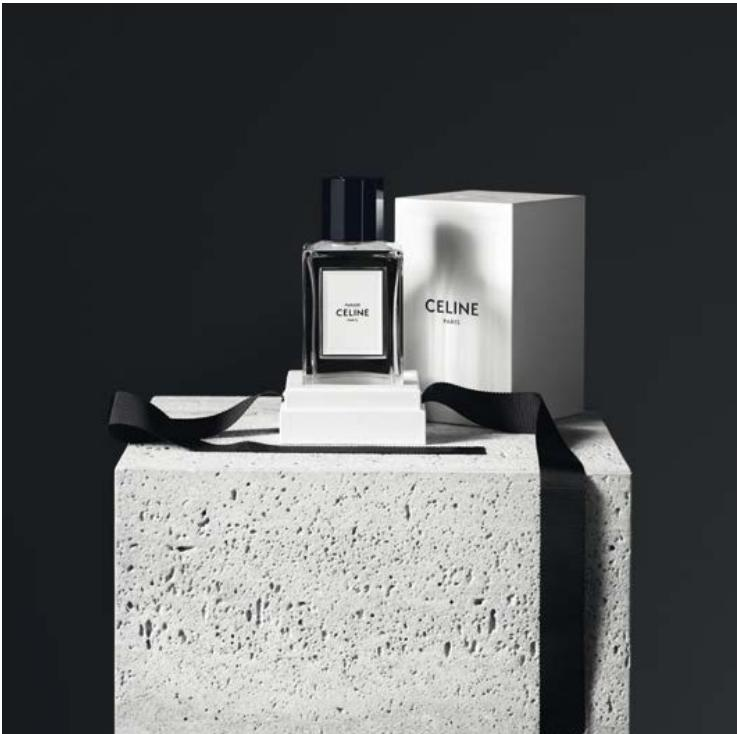

> **AI Description:**
> **Source:** `assets/_page_93_Figure_0.jpg`
> 
> **Generated:** 2026-05-29 22:28:19
> 
> ---
> 
> The image contains a photograph of a perfume bottle and its packaging. The perfume bottle is placed on a white rectangular base with a black ribbon around it. The bottle has a black cap and a label with the text "PARFUM CELINE" and "PARIS" on it. Behind the bottle, there is a white box with the same branding, "CELINE PARIS," printed on it. The background is a dark, solid color, which contrasts with the white and black elements in the foreground. The overall composition suggests a high-end product presentation.

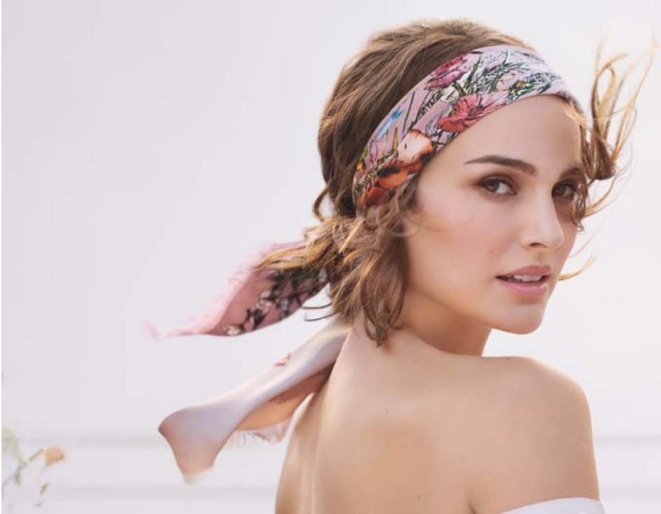

> **AI Description:**
> **Source:** `assets/_page_93_Figure_1.jpg`
> 
> **Generated:** 2026-05-29 22:26:26
> 
> ---
> 
> The image is a photograph of a person wearing a floral headband and a strapless top. The background appears to be a plain, light-colored setting, possibly outdoors. The person's hair is styled in loose waves, and the headband has a vibrant pattern with flowers and leaves. The overall aesthetic suggests a casual, summery vibe.

Parfums Christian Dior

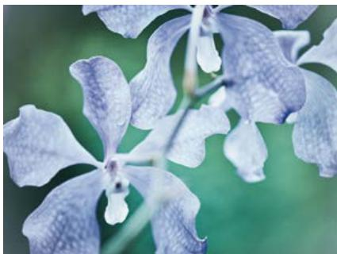

> **AI Description:**
> **Source:** `assets/_page_94_Figure_0.jpg`
> 
> **Generated:** 2026-05-29 22:27:41
> 
> ---
> 
> The image is a photograph of a blue orchid flower. The flower has delicate petals with a subtle gradient from light to darker blue, and it is captured in a close-up view. The background is blurred, emphasizing the flower in the foreground. The petals have a soft, textured appearance, and the flower appears to be in full bloom.

OUR MAISONS TAKE ACTION

## Guerlain’s and Dior’s science-based targets are validated

Guerlain and Parfums Christian Dior had their climate trajectories validated by the Science Based Targets initiative (SBTi), confirming they are in line with what climate science deems necessary to limit global warming to 1.5°C by 2030, along with two other Group Maisons: Hennessy and Louis Vuitton. By 2030, Guerlain has committed to reducing its Scope 1 and 2 greenhouse gas emissions by 47% (baseline: 2019), and to reducing its Scope 3 emissions (related to purchases of goods and services, transport and distribution) by 57% per metric ton of product manufactured. The main actions to be taken to achieve these emissions reduction goals involve reducing energy use, switching to (and generating) renewable energy, opting for sustainable packaging design and using greener modes of transport. Parfums Christian Dior committed to reducing its Scope 1, 2 and 3 emissions by 46.2% by 2030 (baseline: 2019) and identified three primary fields of action: sustainable design, green transportation, and reducing energy consumption and rolling out low-carbon energy at its points of sale.

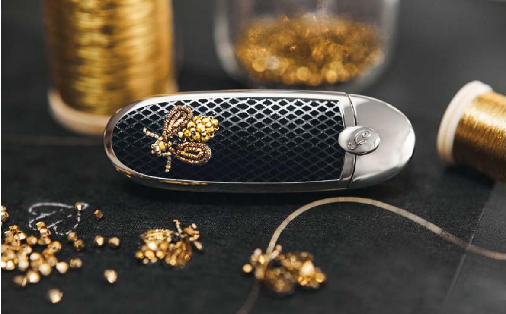

> **AI Description:**
> **Source:** `assets/_page_94_Figure_1.jpg`
> 
> **Generated:** 2026-05-29 22:27:21
> 
> ---
> 
> The image contains a photograph of a decorative object, likely a lighter, with a black textured surface and a metallic cap. The lighter features a golden bee design inlaid with small golden beads. Surrounding the lighter are various golden beads and spools of thread, suggesting a crafting or jewelry-making theme. The background includes a glass jar filled with golden beads, enhancing the luxurious and artisanal feel of the image.

Guerlain

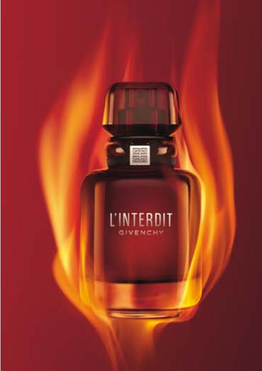

> **AI Description:**
> **Source:** `assets/_page_94_Figure_2.jpg`
> 
> **Generated:** 2026-05-29 22:34:20
> 
> ---
> 
> The image contains a photograph of a perfume bottle with the text "L'INTERDIT" and "GIVENCHY" prominently displayed. The bottle is set against a vibrant red background with a dynamic flame effect surrounding it, creating a sense of intensity and passion. The visual elements suggest a luxurious and bold fragrance brand.

Parfums Givenchy

range, which was expanded with its White Truffle Mask. To celebrate its 30th anniversary, an initiative was launched to support the communities where key ingredients for its products are sourced. Make Up For Ever benefited from the successful launch of Setting Powder, the finest powder on the market, within its iconic Ultra HD range. Fenty Beauty reaffirmed its expertise in foundation with the launch of its Eaze Drop Blurring Skin Tint foundation, an instant bestseller, and the expansion of its range of highlighters. Fenty Skin launched its first instant retexturizing treatment, Pre-Show Glow. Fenty Eau de Parfum, available exclusively online, was a major success. Parfums Kenzo expanded its Flower by Kenzo flagship line with a new eau de toilette version, while its men’s fragrance Kenzo Homme and Kenzoki skincare products were reimagined. Maison Francis Kurkdjian continued its rapid growth trajectory, in particular in the United States. Its “fragrance

wardrobe” continued to enjoy great success, led by its highly popular Baccarat Rouge 540 as well as its À la rose and Gentle Fluidity ranges. The successful launches of the Bergamotto La Spugnatura, Oud & Spice and Lily of the Valley fragrances were among the year’s highlights for Acqua di Parma. The Maison expanded its presence in China and won over customers through an immersive experience during its The Scent of Parma exhibition. Perfumes Loewe saw solid international growth with the repositioning of its fragrances in dialogue with the fashion house and the Home Scents collection crafted by Jonathan Anderson. Ole Henriksen enriched its skincare range with the creation of Dewtopia. KVD Beauty, all of whose products are vegan, capitalized on the success of its Good Apple Foundation Balm. Officine Universelle Buly, a Maison that stands out through its selection of rare, effective and authentic products with impeccable aesthetics, joined LVMH.

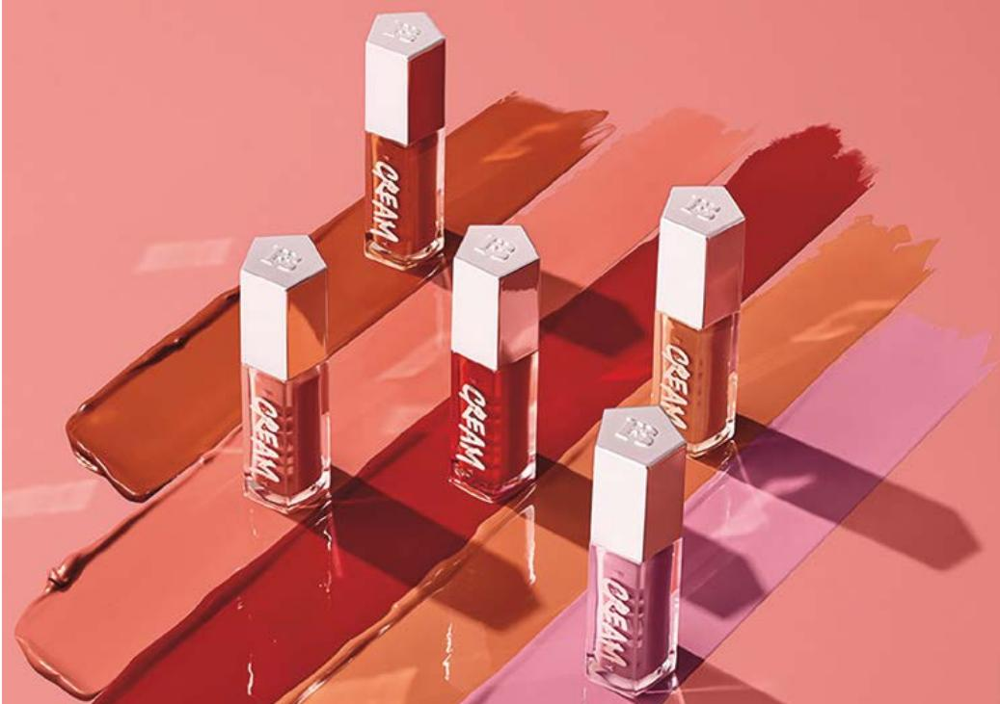

> **AI Description:**
> **Source:** `assets/_page_95_Figure_0.jpg`
> 
> **Generated:** 2026-05-29 22:37:27
> 
> ---
> 
> The image contains a collection of five lip gloss tubes with the word "CREAM" printed on them. The tubes are arranged in a staggered formation on a pink background with streaks of color that resemble paint splatters. The colors of the lip glosses vary, with shades ranging from light pink to a deeper, more vibrant red. The design of the tubes is modern and sleek, with a hexagonal cap and a clear body that allows the color of the gloss to be visible. The overall aesthetic is vibrant and visually appealing, likely intended to showcase the product's range of colors.

Fenty Beauty

Maison Francis Kurkdjian

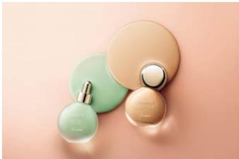

> **AI Description:**
> **Source:** `assets/_page_96_Figure_0.jpg`
> 
> **Generated:** 2026-05-29 22:15:01
> 
> ---
> 
> The image contains a photograph of three cosmetic products arranged on a soft, pastel-colored background. The products include a small bottle with a pump dispenser, a compact powder case, and a round container with a lid. The colors of the products are muted and harmonious, with shades of green, beige, and gold. The overall aesthetic suggests a focus on skincare or makeup products, emphasizing a clean and elegant design.

## OUR MAISONS TAKE ACTION

## LVMH joins Eco-Beauty Score

LVMH joined the Eco-Beauty Score consortium, which aims to establish a shared methodology for measuring the environmental impact of cosmetic products by the end of 2022. The goal is to develop a science-based system to help consumers better understand the environmental impact of cosmetics, from sourcing ingredients to a product’s manufacturing, transport and use, as well as the biodegradability of its formula.

In parallel, LVMH and its Perfumes & Cosmetics Maisons use in-house tools and indicators such as EPI (Environmental Performance Index) scores for product packaging and EFI (Environmental Formulation Index) scores for ingredients. They facilitate and accelerate sustainable design by taking into account factors such as the amount of recycled content in packaging and the proportion of natural ingredients in formulas.

> **AI Description:**
> **Source:** `assets/_page_96_Figure_1.jpg`
> 
> **Generated:** 2026-05-29 22:04:05
> 
> ---
> 
> The image appears to be a close-up photograph of a blue object, possibly a part of a vehicle or machinery, with a blurred background. The object has a smooth, curved surface and a rectangular protrusion. The lighting suggests it is taken outdoors under natural light, with a soft blue hue dominating the image. The focus is on the object, while the background is out of focus, creating a shallow depth of field.

Parfums Kenzo
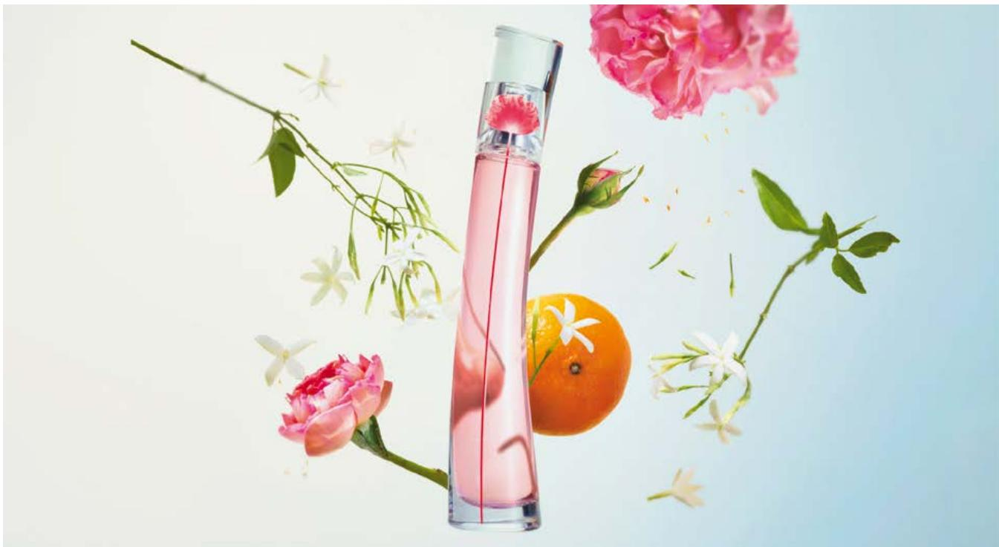

> **AI Description:**
> **Source:** `assets/_page_96_Figure_2.jpg`
> 
> **Generated:** 2026-05-29 22:16:31
> 
> ---
> 
> The image contains a photograph of a perfume bottle with a pink liquid inside. Surrounding the bottle are various flowers, including pink roses and white jasmine blossoms, as well as a sliced orange. The background is a gradient of light colors, giving the image a soft and elegant feel. The overall composition suggests a theme of fragrance and natural beauty.

S T O R I E S

PA R F U M S C H R I S T I A N D I O R

# J’adore x India Mahdavi: Craf tsm an sh ip and moder n it y, or gen iu s i n a b ot t l e

Dior invited India Mahdavi to redesign one of its most emblematic perfume bottles, the iconic J’adore amphora. The renowned architect and designer created an ultra-limited edition of 1,000 unique, numbered pieces. Her soft, full design features an endless, hypnotic warm golden glass spiral that circles up the J’adore bottle’s curves and neck, celebrating the eternal gesture of virtuoso glassmakers. Each piece is an object of desire and technical prowess crafted in Venice by the ancient house of Salviati’s master Murano glass blowers. Divinely modern, India Mahdavi’s bottle is the perfect match for François Demachy’s fragrance J’adore Eau de Parfum Infinissime.

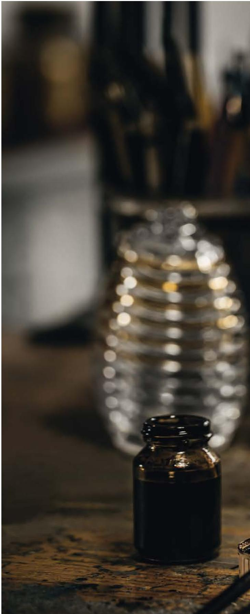

> **AI Description:**
> **Source:** `assets/_page_97_Figure_0.jpg`
> 
> **Generated:** 2026-05-29 21:47:52
> 
> ---
> 
> The image contains a photograph of a small, dark-colored bottle with a cork stopper placed on a wooden surface. In the background, there is a larger, textured glass bottle with a ribbed design, partially out of focus. The setting appears to be indoors, possibly in a kitchen or dining area, given the blurred background elements that suggest a domestic environment. The focus is on the small bottle in the foreground, which is the main subject of the image.

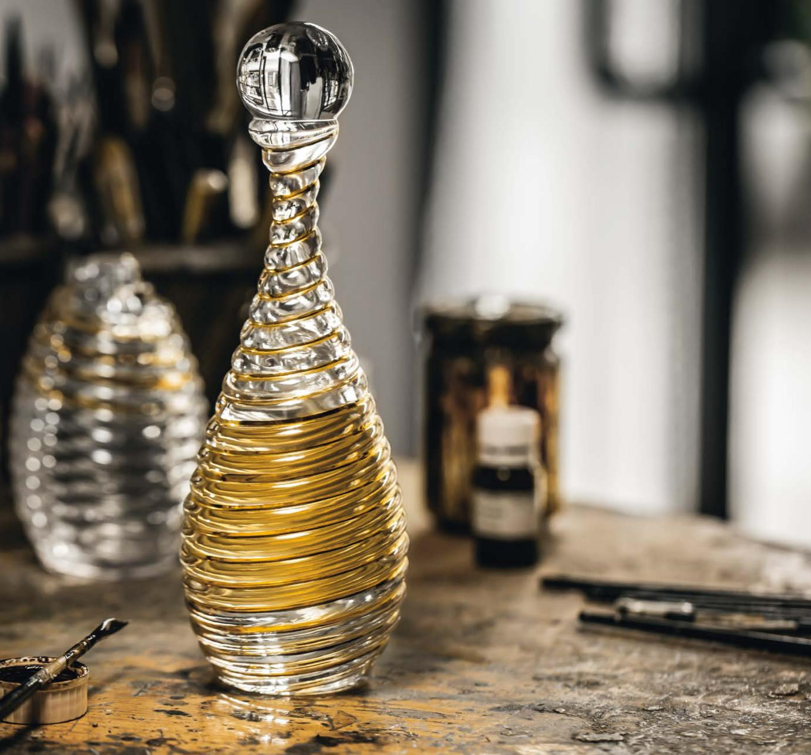

> **AI Description:**
> **Source:** `assets/_page_98_Figure_0.jpg`
> 
> **Generated:** 2026-05-29 22:58:56
> 
> ---
> 
> The image contains a photograph of a decorative glass object with a spiral design and a reflective top. The object is placed on a worn wooden surface, and there are other similar decorative items and tools in the background. The glass object has a shiny, metallic appearance with a gradient of colors, transitioning from a darker shade at the bottom to a lighter, almost transparent top. The background includes blurred elements that suggest a workshop or crafting area, with tools and materials visible.

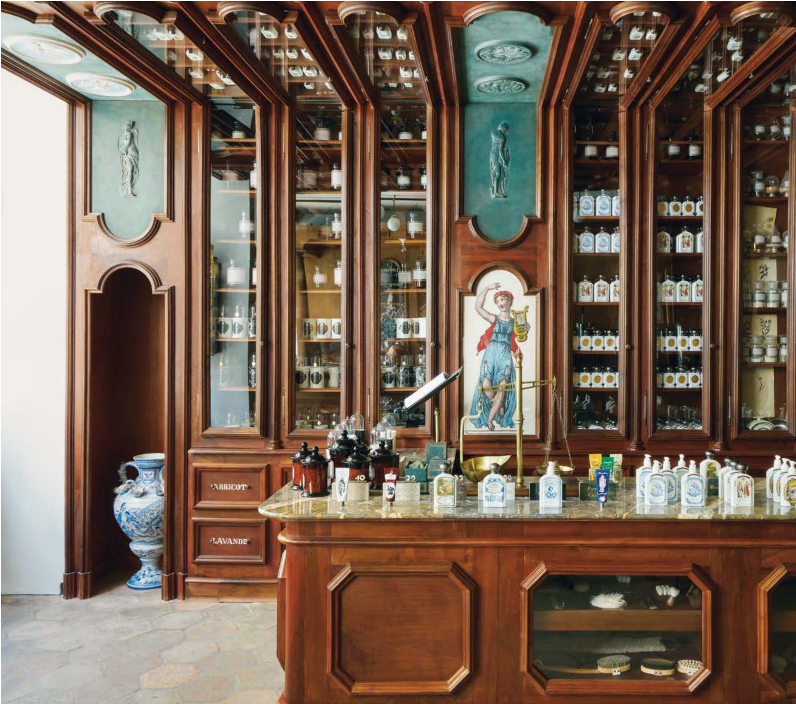

> **AI Description:**
> **Source:** `assets/_page_99_Figure_0.jpg`
> 
> **Generated:** 2026-05-29 23:06:13
> 
> ---
> 
> The image depicts a vintage-style pharmacy or apothecary. The setting features ornate wooden cabinets filled with glass-fronted shelves containing various bottles and jars, likely containing medicinal or cosmetic products. The counter in the foreground displays an assortment of bottles and containers, some labeled with text such as "ABRICOT" and "LAVANDE," suggesting specific ingredients or product lines. The overall aesthetic is rich and detailed, with decorative elements like a painting of a woman holding a lyre and a balance scale, enhancing the historical ambiance. The floor is tiled, and the walls are painted in a teal color with wooden accents, contributing to the traditional and elegant atmosphere of the space.

O F F I C I N E U N I V E R S E L L E B U LY

A new jewel   
i n t h e   
LVMH crow n

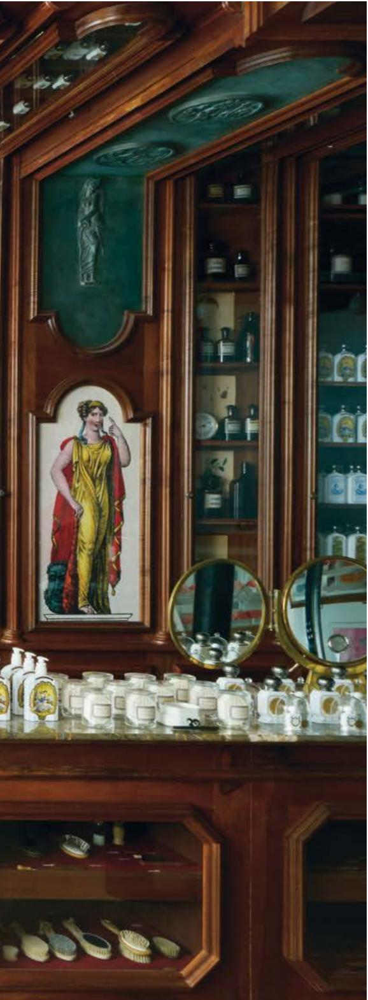

> **AI Description:**
> **Source:** `assets/_page_100_Figure_0.jpg`
> 
> **Generated:** 2026-05-29 22:28:05
> 
> ---
> 
> The image contains a detailed photograph of a vintage-style cabinet, likely from a pharmacy or apothecary. The cabinet is made of polished wood with glass doors and shelves displaying various bottles and jars, possibly containing medications or other pharmaceutical products. On the left side of the cabinet, there is a decorative panel featuring an illustration of a woman in classical attire, adding an ornate and historical aesthetic to the piece. Below the cabinet, on the countertop, there are neatly arranged jars and bottles, some labeled with text, and two small round mirrors are placed on the counter. The overall design and arrangement suggest a well-maintained and historically significant setting.

In 1803, when renowned Paris perfumer Jean-Vincent Bully created his “Vinaigre de Toilette”, he stamped his epoch and went down in the history of beauty care. This beauty treatment – the fruit of his expertise, talent, and love of cosmetics – became a soughtafter remedy for everyone who was anyone in 19th-century Paris, before gaining a following in Europe and beyond. A new chapter in Buly’s story opened in 2014, when the visionary duo formed by Victoire de Taillac and Ramdane Touhami – who both passionately want to transmit the art of French beauty care – decided to open their first Officine, or dispensary, at 6 rue Bonaparte in Paris. In 2021, this Parisian brand joined the LVMH Group and its 75 Maisons. Buly’s refined, high-quality products, its richly detailed visual universe and its singular boutiques are hallmarks of its unique identity, which blends heritage with modernity. This new chapter in its history will enable the brand to continue to grow and remain true to its expertise and personality as part of the world’s leading luxury group.

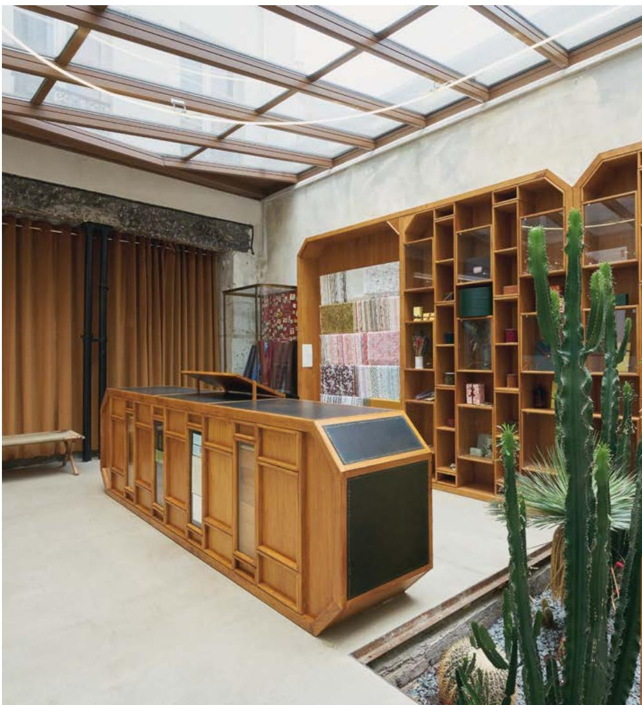

> **AI Description:**
> **Source:** `assets/_page_100_Figure_1.jpg`
> 
> **Generated:** 2026-05-29 22:26:59
> 
> ---
> 
> The image shows an interior space with a modern design. The room features a large wooden counter with a black countertop, which appears to be a reception or service desk. Behind the counter, there is a display case with various fabrics or textiles. To the right, there is a large wooden shelving unit with multiple compartments, some of which are open and others are closed. The shelving unit contains various items, possibly books or decorative objects. The room has a skylight ceiling, allowing natural light to enter, and there are cacti and other plants placed near the shelving unit, adding a touch of greenery to the space. The overall design is clean and organized, with a focus on functionality and aesthetic appeal.

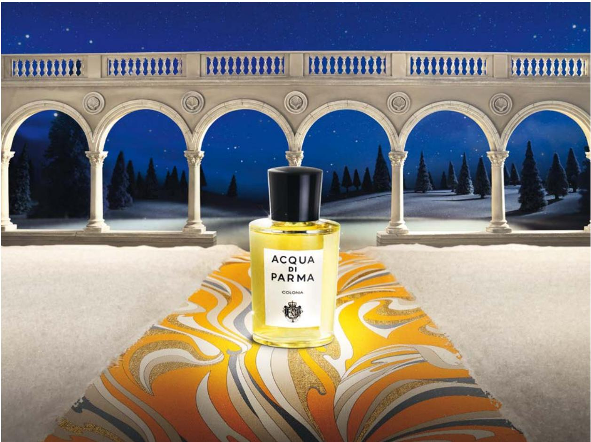

> **AI Description:**
> **Source:** `assets/_page_101_Figure_0.jpg`
> 
> **Generated:** 2026-05-29 22:37:06
> 
> ---
> 
> The image contains a perfume bottle labeled "Acqua di Parma Colonia" placed on a patterned surface. The background features an architectural structure with arches and columns, set against a night sky with stars and silhouettes of trees. The image combines text with a visual representation of a perfume product and a scenic backdrop, suggesting a luxurious and elegant setting.

AC Q UA D I PA R M A

# Em i l io Pucc i suppor ts Save the Children to “ Rew r ite t he Fut u re”

Acqua di Parma’s Holiday Season collection now features a distinctive, sunny design by Emilio Pucci, in a first-time collaboration between the two Italian Maisons. They created this exceptional collection to support the humanitarian aid organization Save the Children and its “Rewrite the Future” campaign, which secures a quality education for children

and young people. The revamped collection’s bottles sport the Vortici print, a harmonious, bright swirl of color inspired by Emilio Pucci’s archives and reinterpreted in Acqua di Parma yellow. This creative charitable initiative sends a message of optimism and confidence to current and future generations from both Maisons.

F R E S H

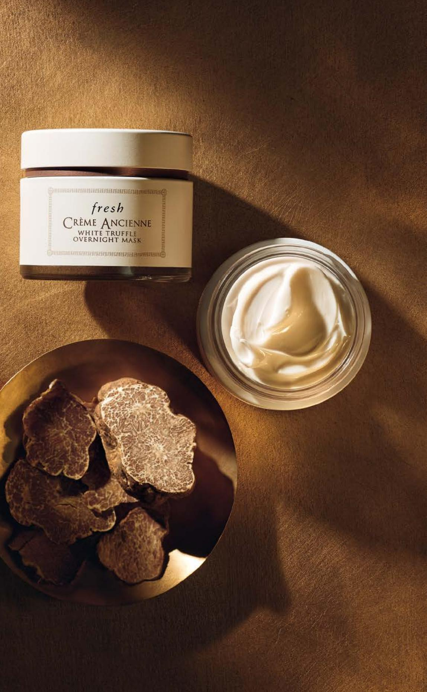

> **AI Description:**
> **Source:** `assets/_page_102_Figure_0.jpg`
> 
> **Generated:** 2026-05-29 22:14:53
> 
> ---
> 
> The image contains a photograph of a skincare product, specifically the "Fresh Crème Ancienne White Truffle Overnight Mask." The image shows the product in its container, with a portion of the cream visible in an open jar. Additionally, there is a small bowl containing what appears to be slices of white truffle, which is likely the ingredient highlighted in the product. The overall composition suggests a luxurious and high-end skincare product, emphasizing the use of white truffle as a key ingredient.

# A 30th anniversary celebrated u nder t he sig n of commitment

Taking care of our planet as we take care of our skin: this is the mission of Forever Fresh, the Maison’s new sustainability program. On the occasion of its 30th anniversary, Fresh set 30 goals to be achieved by its 40th anniversary, in 2031. The program is part of a partnership with the Union for Ethical BioTrade (UEBT) nonprofit, for which Fresh has the honor of being the first LVMH Group Maison to become an official UEBT member. Driven by its ambition to continue creating ever safer, more effective and more sensory products, the Maison focuses its commitments on the planet, people and products. They reflect the brand’s ongoing desire to take responsibility and act to leave future generations a “Forever Fresh” world.

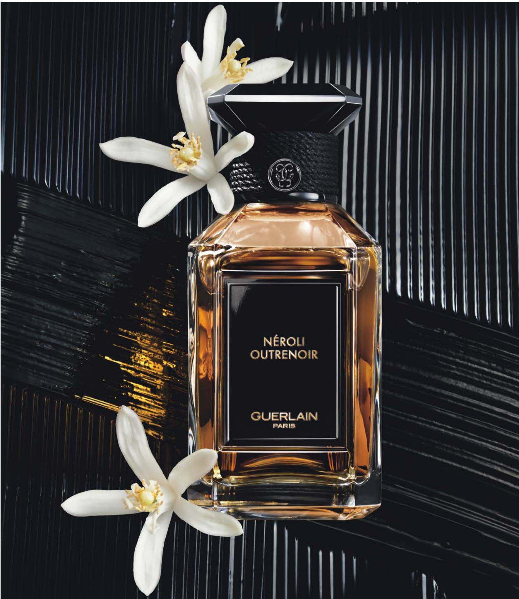

> **AI Description:**
> **Source:** `assets/_page_103_Figure_0.jpg`
> 
> **Generated:** 2026-05-29 21:48:54
> 
> ---
> 
> The image contains a photograph of a perfume bottle labeled "Néroli OutreNoir" by Guerlain Paris. The bottle is square-shaped with a dark cap and a label featuring the brand name and product name in gold lettering. Two white flowers are placed on either side of the bottle, adding a decorative element. The background is a dark, textured surface with vertical lines, creating a sophisticated and elegant atmosphere.

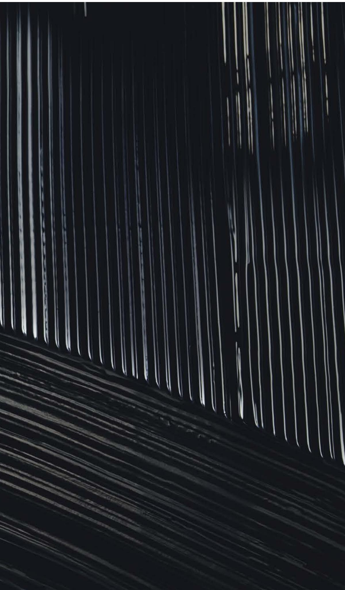

> **AI Description:**
> **Source:** `assets/_page_104_Figure_0.jpg`
> 
> **Generated:** 2026-05-29 21:50:55
> 
> ---
> 
> The image contains a close-up view of a textured surface with vertical lines. The lines appear to be part of a structure, possibly a fence or a wall with a repeating pattern. The lines are evenly spaced and create a rhythmic visual effect. The overall tone of the image is dark, with the lines reflecting light, giving a sense of depth and texture. There are no discernible labels or text annotations in the image.

G U E R L A I N

# El ev at i n g raw mater ials i nto work s of a r t

With its L’Art & La Matière collection, Guerlain offers a truly exceptional olfactory journey. Each fragrant masterpiece is an original creation crafted by Guerlain’s perfumers and inspired by an artistic sensation that left an indelible imprint on their memories. Guided by their creative genius, these artists shape the finest raw materials into bold works of art with talent and passion. The L’Art & La Matière bottle – inspired by Guerlain’s vintage, square-shaped Flacon Carré – takes these creations to new heights. The bottles are exceptional pieces, with a sophisticated, contemporary, unisex design. They are manufactured by Pochet du Courval, the Maison’s historic glassmakers, and can be customized in myriad ways, down to the smallest details, to make them intimately personal items.

PA R F U M S C H R I S T I A N D I O R

L’Or de Vie: The “crème de la crème”

For the past 30 years, Dior Science has incorporated the immense potential of grapevine extracts into its cosmetics line. The Maison draws on the virtues of the exceptional Château d’Yquem terroir – which is owned by the LVMH Group – in the formulation of its L’Or de Vie cream, which was created in 2007. In 2021, this mythical cream was rejuvenated with a new Yquem sap-enriched formula, itself the fruit of nine years of research. As well as its famed grand crus wines, the Bordeaux vineyard is renowned for the Yquem sap, the lifeblood that irrigates the core of the vine. L’Or de Vie’s new formulation captures all the longevity secrets of Yquem sap, and offers the most powerful antioxidant protection in the Dior range.

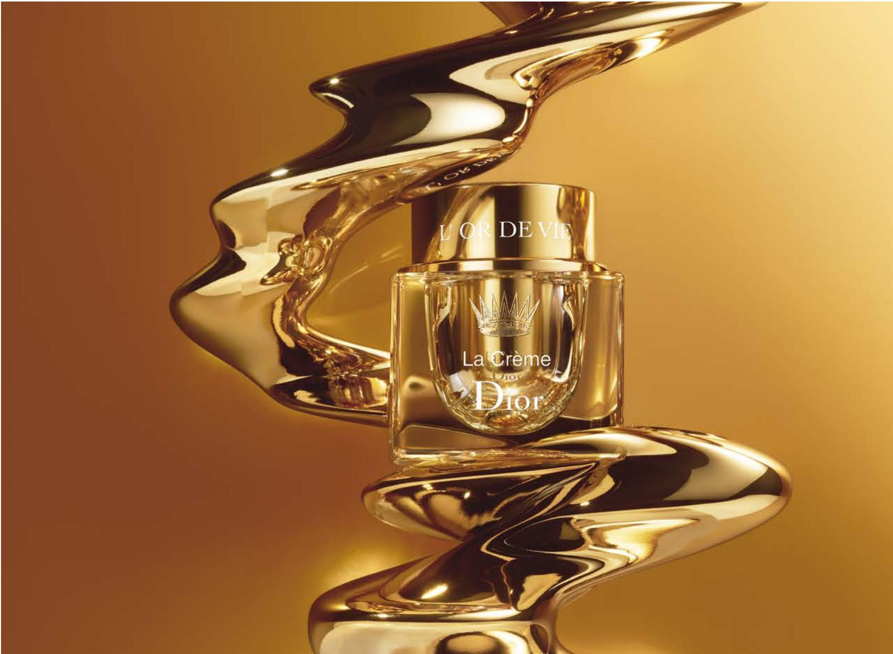

> **AI Description:**
> **Source:** `assets/_page_105_Figure_0.jpg`
> 
> **Generated:** 2026-05-29 22:13:14
> 
> ---
> 
> The image contains a photograph of a luxurious skincare product, "La Crème Dior," with the text "L'OR DE VIE" prominently displayed on the packaging. The product is encased in a clear, elegant container with a gold-colored cap and label. The background features a golden, fluid-like structure that complements the luxurious theme of the product. The overall aesthetic suggests high-end beauty and skincare, emphasizing opulence and premium quality.

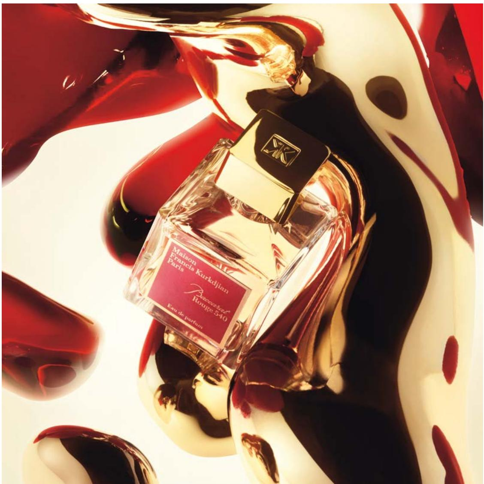

> **AI Description:**
> **Source:** `assets/_page_106_Figure_0.jpg`
> 
> **Generated:** 2026-05-29 22:36:20
> 
> ---
> 
> The image contains a photograph of a perfume bottle with the label "Maison Francis Kurkdjian Baccarat Rouge 540 Eau de Parfum." The bottle is set against a background featuring abstract, flowing red and white shapes, creating a visually striking contrast. The bottle itself is clear with a black cap and a gold-colored neck, reflecting light and adding a luxurious feel to the image. The text on the label is clear and legible, providing the brand name and product details. The overall composition emphasizes the elegance and sophistication of the perfume.

M A I S O N F R A N C I S K U R K D J I A N

# Baccarat Rouge 540: An alchemy of the sen ses

Since its inception in 2009, Maison Francis Kurkdjian has elevated fragrance into an art form through a curated collection of multifaceted scents that convey sensuality and free expression. Like the City of Light itself, the resolutely Parisian Maison blends seductive enchantment with innovation, creativity and exceptional craftsmanship. The 250th anniversary of crystal

manufacturer Baccarat inspired perfumer Francis Kurkdjian to create Baccarat Rouge 540, a highly condensed scent with a graphic olfactory signature. This floral, amber-laden, woody fragrance builds into a poetic alchemy, with breezy jasmine facets and radiant saffron boosting ambergris mineral notes and woody tones of freshly cut cedar.

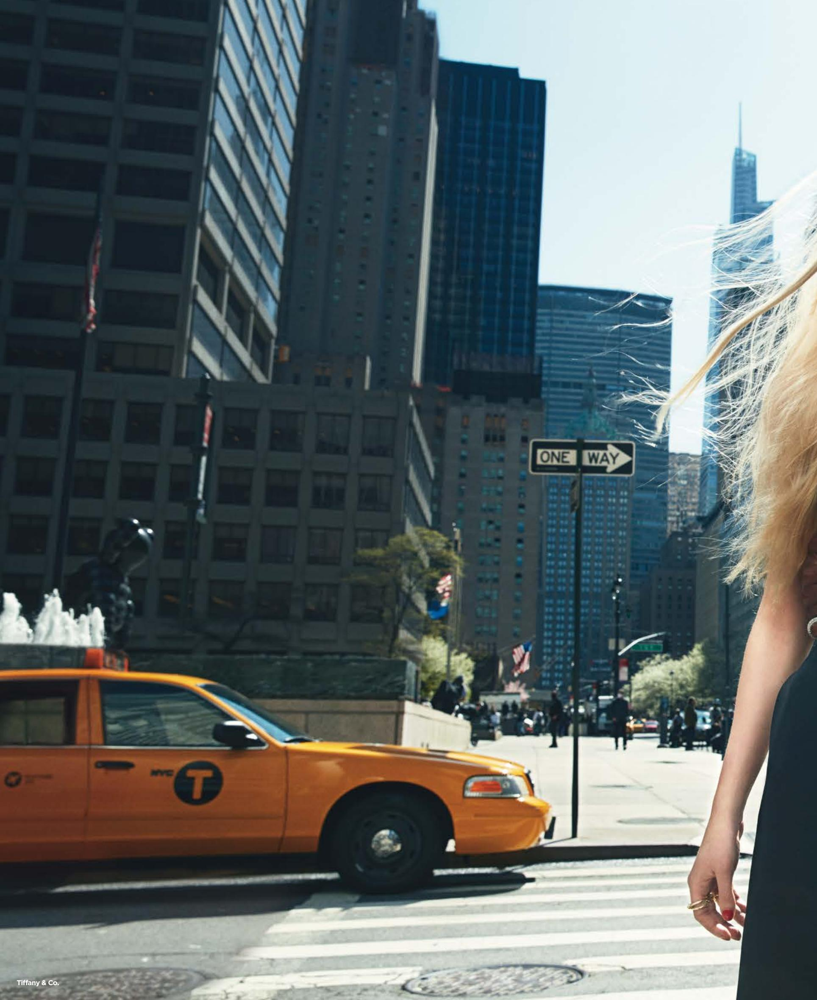

> **AI Description:**
> **Source:** `assets/_page_107_Figure_0.jpg`
> 
> **Generated:** 2026-05-29 22:31:45
> 
> ---
> 
> The image is a photograph of a city street scene. It features a yellow taxi cab with the "NYC T" logo, indicating it is a New York City taxi, driving past a pedestrian crossing. The background includes tall buildings, a "ONE WAY" sign, and a statue. The foreground shows a partial view of a person with blonde hair, wearing a black dress and a ring on their finger. The image captures a typical urban environment with a mix of transportation and architecture.

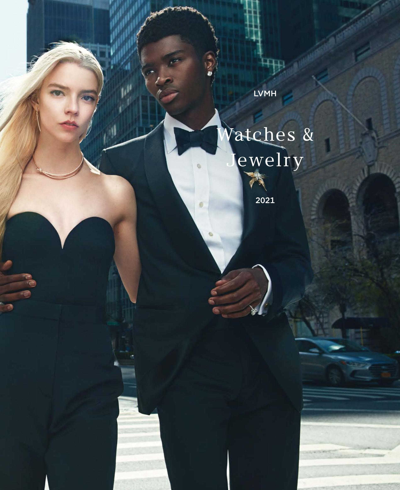

> **AI Description:**
> **Source:** `assets/_page_108_Figure_0.jpg`
> 
> **Generated:** 2026-05-29 21:29:53
> 
> ---
> 
> The image contains a photograph of two individuals, a man and a woman, dressed in formal attire. The man is wearing a black tuxedo with a bow tie and cufflinks, while the woman is in a black strapless dress. They are standing on a city street with buildings in the background. The text "LVMH Watches & Jewelry 2021" is prominently displayed in the upper right corner of the image, indicating the context of the image as a promotional piece for luxury watches and jewelry from the LVMH brand.

# C R E A T I V I T Y A N D I N - D E P T H E X P E R T I S E

The LVMH Watches and Jewelry business group is one of the most dynamic players in its sector. It continues to gain market share with a successful strategy that is driven by jewelry Maisons that carry on exceptional creative legacies and expertise, and by leading watchmaking Maisons that are always on the cutting edge of innovation. 2021 saw the arrival of the prestigious American jewelry house Tiffany & Co., which has substantially bolstered the business group’s standing in a very dynamic, highly promising market segment.

## Creativity, brand awareness and in-depth expertise

The growth of these Maisons is driven by their creativity. They enrich leading product ranges with well-established designs and identities, such as Bulgari’s iconic Serpenti range and TAG Heuer and Hublot’s famous Carrera and Big Bang collections. They continually explore new horizons with innovations combining audacity with excellence, as illustrated by TAG Heuer’s next-generation smartwatch. Harnessing expertise is a key priority, which the Maisons address by optimizing their manufacturing processes, implementing synergies and boosting their production capacity. Developing brand awareness with target audiences and increasing their social media presence are also crucial to gaining new market share.

## Quality and productivity in retailing

Lastly, the business group is focusing on the quality and productivity of its retail networks and on developing its online sales. Multi-brand retailers are selected with great care, making sure the most exacting standards are met. In an equally selective approach, the Maisons also continue to refurbish and open their own directly operated stores in buoyant markets in key cities.

## 2022 Outlook

With the arrival of Tiffany & Co., the Watches and Jewelry business group is now a leading global player. It will continue to drive its development by focusing on creativity, excellent craftsmanship and corporate social responsibility. In the short term, given the current volatility and contrasting levels of recovery in their various markets, the Maisons will continue to manage costs and remain highly selective in their investments. Innovation, the quality-driven development of distribution networks – directly operated stores in particular – and new digital inroads will drive momentum over the months to come. Tiffany & Co. will roll out its Knot collection worldwide following its success in the United States. At the end of 2022, the Maison will reopen its flagship store on Fifth Avenue in New York, and will hold a major exhibition in London. Bulgari will continue to add to its core collections, showcasing its exceptional expertise in high jewelry and highend watchmaking while continuing to develop its digital presence. In preparation for future growth, a project to extend the Valenza watch manufacturing facility will be launched in 2022. Major exhibitions will be held by Bulgari, Chaumet and Fred. TAG Heuer will develop its iconic lines and launch new high-end models inspired by its partnership with Porsche. Hublot will focus on its Big Bang flagship line in particular,and will unveil several original new designs.

### Full Page Description (Page 110)

**Source:** `assets/_page_110_Asset_2.jpg`

**Generated:** 2026-05-29 23:08:39

---

The image contains a bar chart with three vertical bars, each representing a year: 2019, 2020, and 2021. The bars are color-coded and labeled with numerical values: 736 for 2019, 302 for 2020, and 1,679 for 2021. The chart shows a significant increase in the value from 2019 to 2021, with the highest value in 2021. The bars are decorated with a herringbone pattern, and the years are clearly labeled at the bottom of the chart.

### Full Page Description (Page 110)

**Source:** `assets/_page_110_Asset_3.jpg`

**Generated:** 2026-05-29 23:06:54

---

The image is a bar chart with three vertical bars representing the years 2019, 2020, and 2021. Each bar is filled with a distinct pattern and labeled with a number: 296 for 2019, 210 for 2020, and 458 for 2021. The bar for 2021 is significantly taller than the other two, indicating a substantial increase in the measured value from 2019 to 2021. The chart visually represents a clear upward trend in the data over the three-year period.

### Full Page Description (Page 110)

**Source:** `assets/_page_110_Asset_0.jpg`

**Generated:** 2026-05-29 23:02:03

---

The image is a pie chart that visually represents the distribution of a certain metric across different regions. The key information presented includes:

- Japan accounts for 11% of the total.
- The United States contributes 25%.
- Europe (excluding France) makes up 15%.
- France represents 2%.
- Other markets collectively account for 11%.

The chart is divided into segments with distinct patterns and colors, each corresponding to a region and its percentage share. The percentages are clearly labeled next to each segment, providing a clear visual representation of the distribution.

# 2021 at a glance

STRONG REBOUND OF ACTIVITY IN OWN STORES AND SUCCESSFUL INTEGRATION OF TIFFANY & CO.

2021 REVENUE BY REGION (as %)

## Major strategic priorities

↑ Reinforce our Maisons’ desirability thanks to expert craftsmanship and distribution

Maintain Tiffany & Co.’s powerful momentum

Spur continued growth Optimally develop at Bulgari and TAG Heuer manufacturing facilities with innovative products

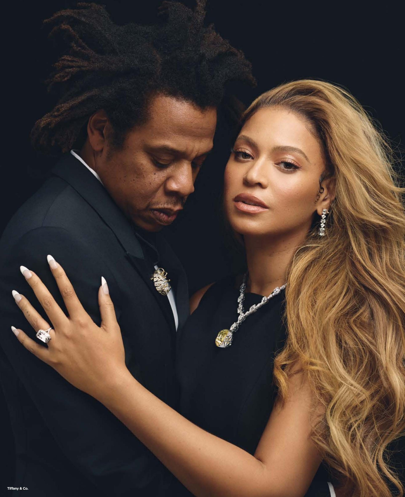

> **AI Description:**
> **Source:** `assets/_page_111_Figure_0.jpg`
> 
> **Generated:** 2026-05-29 21:52:25
> 
> ---
> 
> The image is a photograph featuring two individuals in close proximity, with one person's hand resting on the other's shoulder. Both are dressed in formal attire, with the person on the left wearing a dark suit and the person on the right in a black dress. The person on the right is adorned with jewelry, including a necklace and earrings, and is wearing a ring on their left hand. The background is dark, which highlights the subjects. The image appears to be a promotional or editorial photograph, as indicated by the watermark "Tiffany & Co." in the bottom left corner.

# H IG H L IG H T S

The Watches and Jewelry business group saw organic revenue growth of 40% with respect to 2020, which had been particularly hard hit by the pandemic, and of 7% compared with 2019. Including Tiffany & Co., growth was much stronger, showing the transformative contribution of this iconic brand. The Maisons were buoyed by the gradual recovery in their local markets, primarily China and the United States, and the use of distribution methods well-suited to the public health context: direct sales and digital channels. New watch designs were unveiled in the first half of the year at trade fairs that were held in innovative new formats. Tiffany & Co. achieved a record performance in terms of revenue, profit and cash flow. The Maison raised its global profile through its innovations and high-profile collaborations. For the first time in its history, Tiffany & Co.’s annual Blue Book collection of high jewelry was unveiled in China. A series of events followed in New York, Los Angeles and Dubai, giving customers the opportunity to discover the extraordinary necklace, featuring over 180 carats of diamonds, inspired by the pendant unveiled at the 1939 New York World’s Fair. Following these presentations, high jewelry sales reached an unprecedented level. Rosé, the young singer of South Korean band Blackpink, became the new face of the HardWear collection. This very well-received revival led to a doubling of sales for this core line, which embodies bold femininity. The Knot collection – a limited edition designed in collaboration with artist Daniel Arsham – was another major success, as was the Tiffany x Supreme collaboration. December saw the launch of the highly anticipated limited edition of the watch designed by Patek Philippe and Tiffany & Co. to celebrate 170 years of collaboration between Patek and Tiffany & Co. in the US, with the auction of the first watch of 170 limited editions raising a record level of funds for The Nature Conservancy. Honoring its long tradition of expressions of love and diversity, the Maison launched its “About Love” global campaign starring Beyoncé and Jay-Z. Among the jewelry featured was the legendary Tiffany Diamond, making Beyoncé only the fourth person to wear it since its discovery in 1877. This campaign – one of the year’s most prominent – was a powerful affirmation of the brand’s resolutely modern tone, boosting its appeal and expressing its core values. Three openings –

at Le Bon Marché in Paris, in Barcelona and in Stockholm – marked a new aesthetic for Tiffany & Co.’s stores. Bulgari regained solid momentum, driven by the strong performance of its jewelry and watch lines at its directly operated stores. In jewelry, the recent B.zero1 Rock and Serpenti Viper collections were the main growth drivers. The Maison rolled out its Magnifica high jewelry collection presented in June, while at the end of the year, the launch of the Jannah collection proved extremely promising. In watches, growth was driven by Serpenti Seduttori, Octo Finissimo (which won the Aiguille d’Or grand prize at the Geneva Watchmaking Grand Prix) and Bulgari Aluminium. The Maison’s performance was all the more remarkable given the limited recovery in international travel and its increasingly selective presence at multi-brand stores. Jewelry in particular is now exclusively distributed through its directly operated stores. The Bulgari hotel collection expanded with the addition of a seventh showpiece, the Bulgari Hotel Paris, which opened in December on Avenue George V. TAG Heuer marked the start of a major partnership with Porsche with the launch of the TAG Heuer Carrera Porsche chronograph. The latest edition of the TAG Heuer Carrera 3 Aiguilles featured Ryan Gosling as its brand ambassador, while the Aquaracer line was completely revisited. The Titan and Green Dial limited editions of the Monaco watch were very successful. TAG Heuer successfully launched a Super Mario limited edition of its smartwatch for gaming enthusiasts. Naomi Osaka and Tommy Fleetwood joined the Maison’s team of brand ambassadors as it opened its first store in California and continued to develop its online sales.

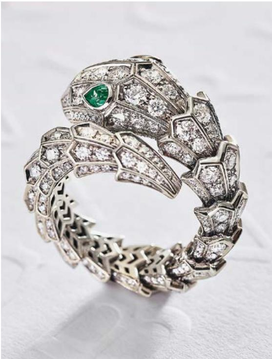

> **AI Description:**
> **Source:** `assets/_page_113_Figure_0.jpg`
> 
> **Generated:** 2026-05-29 22:44:00
> 
> ---
> 
> The image contains a photograph of an ornate, snake-themed jewelry piece. The piece is crafted with a silver or white metal base, adorned with numerous small, sparkling diamonds. The snake's head is prominently featured, with a green gemstone representing the eye. The body of the snake is coiled, with detailed diamond patterns and geometric designs that give it a luxurious and intricate appearance. The craftsmanship suggests high-end jewelry, likely intended for a special occasion or as a statement piece.

Bulgari

Hublot’s growth was driven by strong momentum in China and the United States, particularly at its directly operated stores. Continuing to invest in its retail network, the Maison accentuated

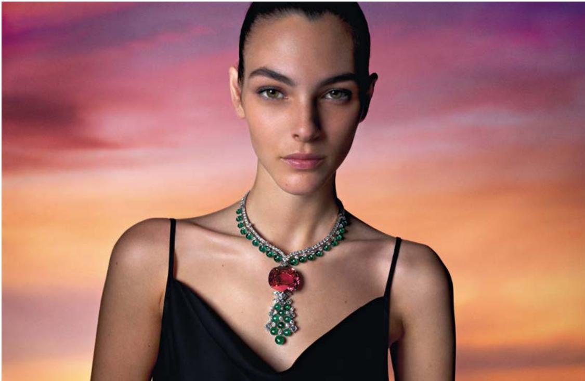

> **AI Description:**
> **Source:** `assets/_page_113_Figure_1.jpg`
> 
> **Generated:** 2026-05-29 22:37:43
> 
> ---
> 
> The image contains a photograph of a person wearing a black dress and a striking necklace with a large red gemstone at the center, surrounded by smaller green gemstones and diamonds. The background features a gradient sky with hues of pink, orange, and purple, suggesting a sunset or sunrise. The image appears to be a fashion or jewelry advertisement, showcasing the necklace as the focal point.

Bulgari

OUR MAISONS TAKE ACTION
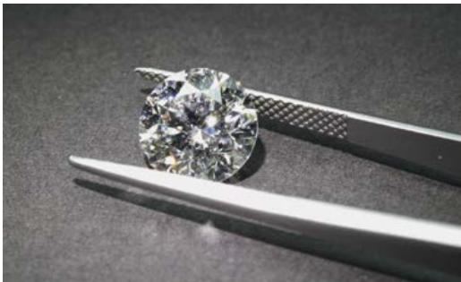

> **AI Description:**
> **Source:** `assets/_page_114_Figure_0.jpg`
> 
> **Generated:** 2026-05-29 22:40:41
> 
> ---
> 
> The image contains a photograph of a diamond being held by a pair of tweezers. The diamond is round and appears to be of high quality, with a clear and reflective surface. The background is dark, which makes the diamond stand out prominently. The tweezers are metallic and have a textured grip for handling small objects. The image is focused on showcasing the diamond, likely for a jewelry or gemstone context.

## Tiffany & Co.’s exemplary supply chains

Tiffany & Co. has worked for many years on making its gemstones and precious metals fully traceable, which helps ensure that environmental and social best practices are followed. Achieving this requires the cooperation of every stakeholder in the value chain, from mines to jewelry workshops. All of the Maison’s rough diamonds are traceable back to the mine. They are mainly sourced from five countries: Botswana, Canada, Namibia, Russia and South Africa. All of the gold, silver and platinum used to manufacture products is also traceable to the mine or the recycler. In 2021, the Maison purchased its first Fairmined-certified gold from mines in Peru. Lastly, for colored gemstones, the Maison published the Colored Gemstone and Pearl Source Warranty Protocol in 2021 to serve as a practical, operational tool shared with suppliers to help them improve traceability as well as their social and environmental practices.

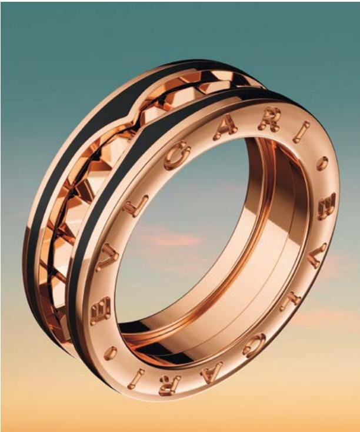

> **AI Description:**
> **Source:** `assets/_page_114_Figure_1.jpg`
> 
> **Generated:** 2026-05-29 22:39:33
> 
> ---
> 
> The image contains a close-up of a gold-colored ring with the word "BVLGARI" engraved on its surface. The ring features a textured design with a series of small, evenly spaced dots along its circumference. The background is a gradient of colors, transitioning from a light teal at the top to a warm orange at the bottom, which complements the ring's metallic sheen. The image is focused on showcasing the ring's design and branding.

Bulgari

Chaumet
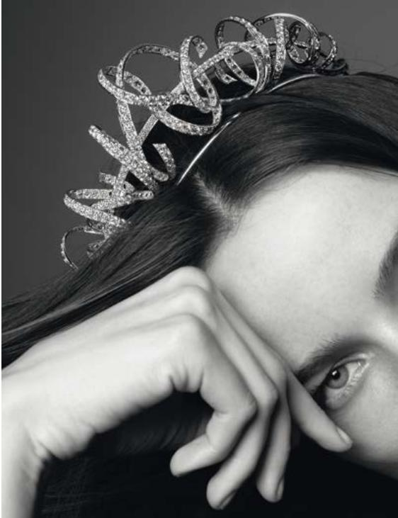

> **AI Description:**
> **Source:** `assets/_page_114_Figure_2.jpg`
> 
> **Generated:** 2026-05-29 22:48:10
> 
> ---
> 
> The image is a black and white photograph featuring a person with long hair wearing an ornate, diamond-encrusted headpiece. The person is partially covering their face with their hand, which is adorned with a ring. The headpiece is the focal point of the image, showcasing intricate design and sparkling diamonds. The overall composition is artistic and elegant, emphasizing the luxurious nature of the headpiece.

112 • 113
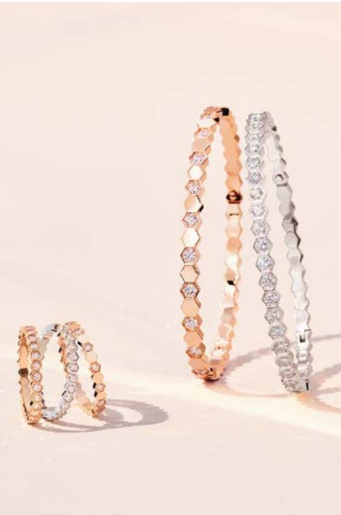

> **AI Description:**
> **Source:** `assets/_page_114_Figure_3.jpg`
> 
> **Generated:** 2026-05-29 22:48:57
> 
> ---
> 
> The image contains a photograph of three rings, each with a hexagonal pattern and small gemstones embedded in the design. The rings are presented in two colors: rose gold and silver. The rings are arranged in a way that showcases their design and the alternating hexagonal and gemstone patterns. The image is likely intended to display the jewelry's aesthetic appeal and craftsmanship.

Chaumet

its selective development and resumed direct control of its distribution in Spain and Portugal. Several new products bolstered the success of its flagship lines, including the Classic Fusion Takashi Murakami, the Big Bang DJ Snake, backed by a global event, and the Big Bang E UEFA Euro 2020 smartwatch. Novak Djokovic joined the Hublot family as a brand ambassador. Zenith benefited from the launch of Chronomaster Sport, which won the Chronograph watch prize at the Geneva Watchmaking Grand Prix, and Defy Extreme. The Maison significantly raised its profile in China with the appointment of singer and actor Xiao Zhan as its new brand ambassador. It developed its network of directly operated stores, including the opening of a store offering unique experiences within its watch manufacturing facility and the expansion of its e-commerce presence.

Hublot
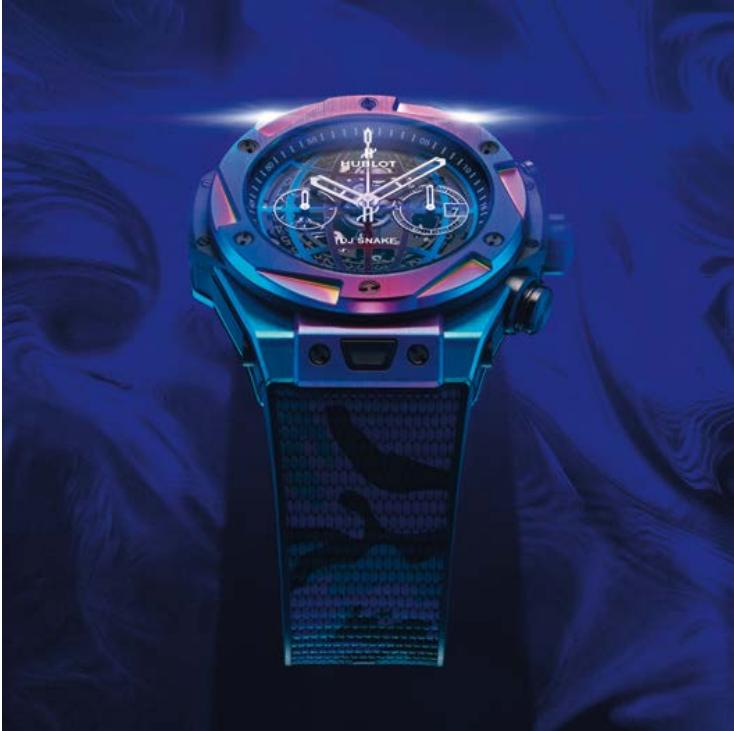

> **AI Description:**
> **Source:** `assets/_page_115_Figure_0.jpg`
> 
> **Generated:** 2026-05-29 22:24:49
> 
> ---
> 
> The image contains a photograph of a luxury wristwatch. The watch has a distinctive design with a multicolored, iridescent bezel and a camouflage-patterned strap. The watch face is black with white and blue accents, and it features multiple subdials and a chronograph function. The brand name "HUBLOT" is prominently displayed at the top of the watch face. The background is a gradient of dark blue shades, which complements the watch's color scheme.

Chaumet saw strong momentum. Highlights of the year included the launch of the Torsade high jewelry collection; the introduction of an exclusive diamond cut, the “Taille Impératrice” (empress cut); the Josephine and Napoleon exhibition at the heart of the Maison’s iconic 12 Vendôme address; two high jewelry events in Beijing and Tokyo; and the reopening of its flagship store on New Bond Street in London. Fred launched the Pretty Woman fine jewelry and high jewelry collection, and created the Winch men’s line to celebrate the 55th anniversary of the Force 10. The Soleil d’Or diamond returned to the Maison’s collection. This remarkable yellow diamond of over 100 carats will be the centerpiece of Fred’s first retrospective exhibition in 2022. It opened its first store in Dubai.

Zenith
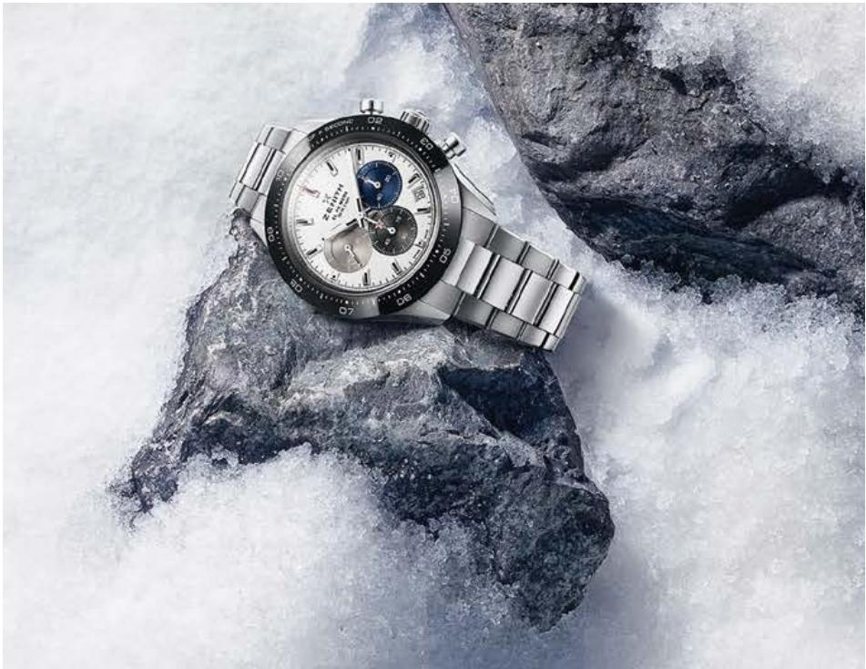

> **AI Description:**
> **Source:** `assets/_page_115_Figure_1.jpg`
> 
> **Generated:** 2026-05-29 22:32:24
> 
> ---
> 
> The image contains a photograph of a wristwatch placed on a snowy surface with a rock. The watch has a silver metal band and a white dial with black markings and a blue sub-dial. The watch appears to be a luxury timepiece, possibly a chronograph model, given its design and features. The background is a natural setting with snow and a dark rock, emphasizing the watch as the focal point.

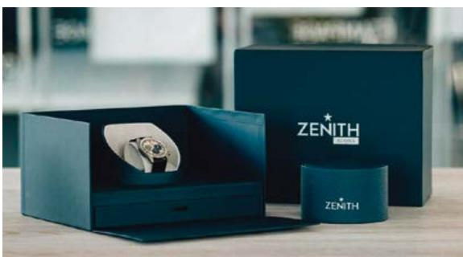

> **AI Description:**
> **Source:** `assets/_page_116_Figure_0.jpg`
> 
> **Generated:** 2026-05-29 21:55:10
> 
> ---
> 
> The image contains a photograph of a Zenith watch and its packaging. The packaging includes a dark blue box with the Zenith logo prominently displayed, and a smaller cylindrical object with the same branding. The watch is partially visible inside an open box, showcasing its design and features. The overall presentation suggests a high-end product, likely a luxury watch, with a focus on elegance and branding.

## OUR MAISONS TAKE ACTION A second life for Zenith vintage timepieces

With Zenith Icons, the Maison gives watch enthusiasts a chance to own a piece of watchmaking history. This collection of vintage watches includes only the brand’s most iconic models, which are authenticated, restored and certified at its Manufacture. When a watch that appears to be in immaculate condition is found, the Manufacture’s Heritage Department inspects it to verify its authenticity, purchases it and restores it in accordance with the highest professional standards. For components that need to be replaced, it uses historic spare parts from its exceptional stock of original supplies. Lastly, a certificate of authenticity of the timepiece is issued, and a single copy is printed. It is filled out by hand by the Heritage Department and signed by the watchmaker in charge of its restoration, ensuring the watch’s traceability for generations to come.

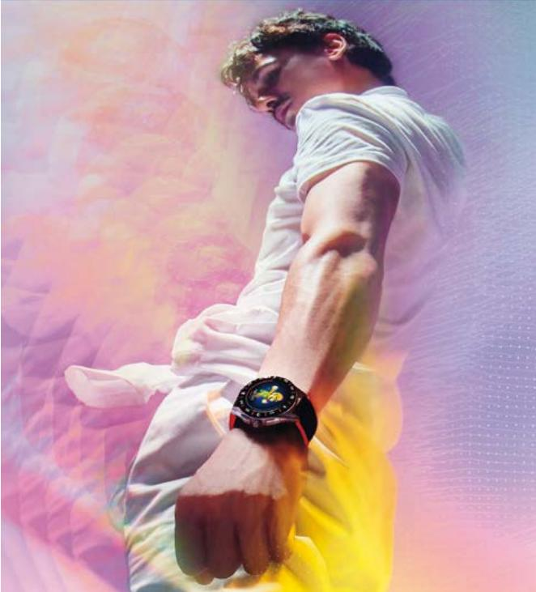

> **AI Description:**
> **Source:** `assets/_page_116_Figure_1.jpg`
> 
> **Generated:** 2026-05-29 21:47:15
> 
> ---
> 
> The image is a photograph of a person wearing a white t-shirt and a wristwatch with a black strap and a colorful face. The background is a gradient of pastel colors, giving the image a vibrant and dynamic feel. The person appears to be in motion, as suggested by the slight blur and the way the shirt is being pulled up. The watch is the focal point of the image, with its design and colors standing out against the softer background.

TAG Heuer

Fred
114 • 115
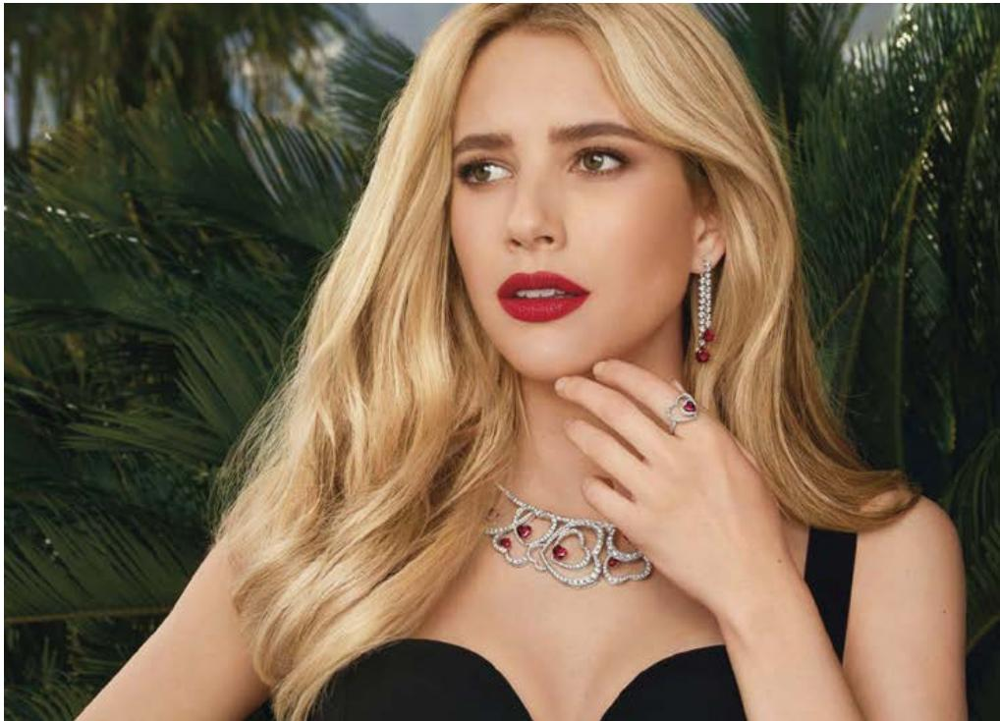

> **AI Description:**
> **Source:** `assets/_page_116_Figure_2.jpg`
> 
> **Generated:** 2026-05-29 21:58:10
> 
> ---
> 
> The image is a photograph featuring a person with long, wavy blonde hair. They are wearing a black top and are adorned with a large, ornate necklace featuring diamonds and rubies, as well as a matching ring and earrings. The background consists of lush green foliage, suggesting a tropical or garden setting. The person is posing with one hand near their neck, showcasing the jewelry.

# S T O R I E S

T I F F A N Y & C O .

“About Love”: A s tor y of longing and reunion

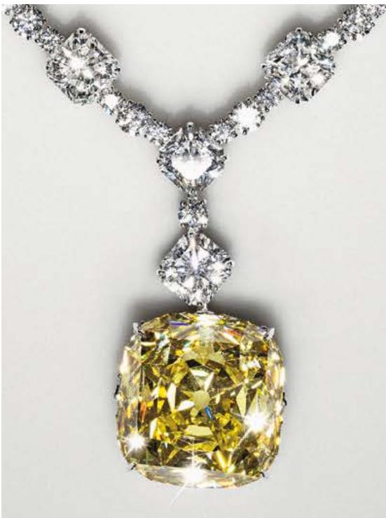

> **AI Description:**
> **Source:** `assets/_page_117_Figure_0.jpg`
> 
> **Generated:** 2026-05-29 22:06:55
> 
> ---
> 
> The image contains a photograph of a luxury diamond necklace. The centerpiece is a large, cushion-cut yellow diamond, surrounded by smaller white diamonds. The necklace features a series of diamond-studded links, creating a sophisticated and elegant design. The yellow diamond is the focal point, with its vibrant color standing out against the white diamonds. The overall aesthetic is luxurious and high-end, likely intended for a special occasion or as a statement piece.

Tiffany & Co. unveiled the film for its “About Love” campaign starring powerhouse couple Beyoncé and Jay-Z. The film is directed by acclaimed filmmaker Emmanuel Adjei, and features a remake of the classic “Moon River” – which was made famous in the 1961 film Breakfast at Tiffany’s – sung by Beyoncé and captured by Jay-Z on a Super 8 camera. Throughout the film, Beyoncé wears several incredible jewelry pieces, including the Tiffany Diamond, an emblem of the brand’s fabulous heritage. Some of the Maison’s other iconic pieces are also featured, like Jean Schlumberger’s legendary Bird on a Rock brooch, which is worn by Jay-Z and reinvented as a pair of cufflinks. The collaboration between the Carters and Tiffany & Co., and their shared vision has resulted in a raw, sensitive film that encapsulates the couple’s immense chemistry. It is a story of longing and reunion, of a bond that transcends time and space.

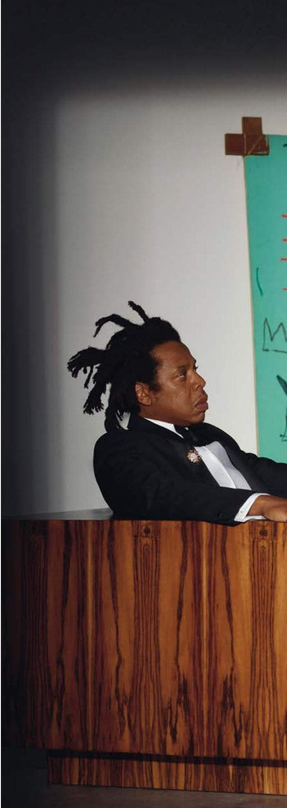

> **AI Description:**
> **Source:** `assets/_page_117_Figure_1.jpg`
> 
> **Generated:** 2026-05-29 22:11:18
> 
> ---
> 
> The image is a photograph of a person with dreadlocks, dressed in formal attire, leaning on a wooden podium. The background includes a white wall with a small wooden cross and a green board with some markings and text. The person appears to be in a formal or professional setting, possibly giving a speech or presentation.

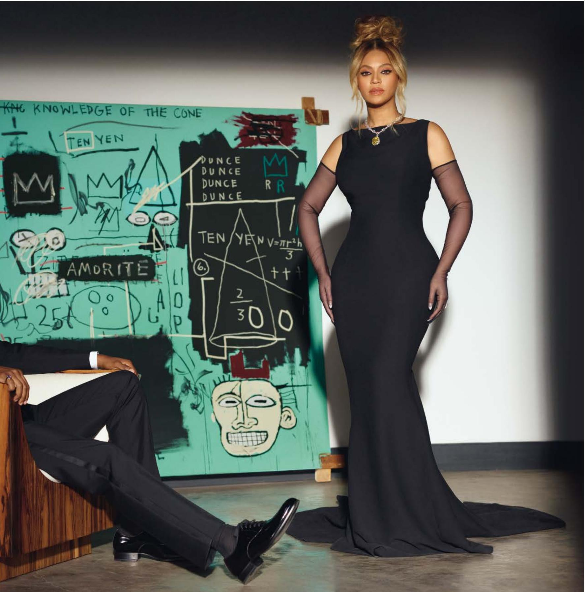

> **AI Description:**
> **Source:** `assets/_page_118_Figure_0.jpg`
> 
> **Generated:** 2026-05-29 23:10:17
> 
> ---
> 
> The image contains a photograph of a person in a black dress standing in front of a colorful, abstract painting. The painting features various symbols, text, and mathematical equations, including terms like "Knowledge of the Cone," "Ten Yen," and "Dunce." The person is wearing a black dress with sheer sleeves and a necklace. The setting appears to be an art gallery or studio, with the painting serving as a backdrop. The overall composition suggests a blend of fashion and art.

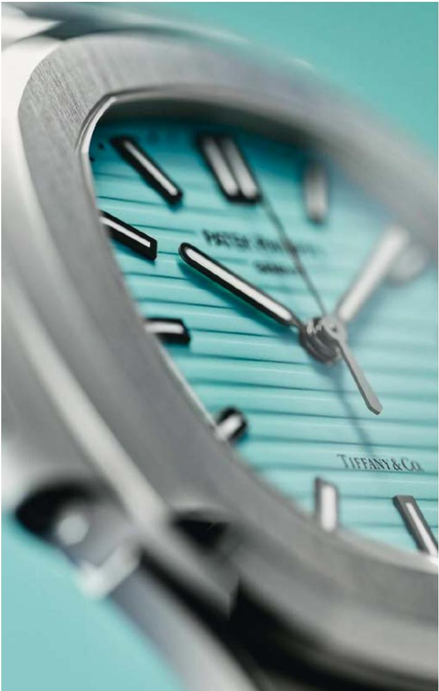

> **AI Description:**
> **Source:** `assets/_page_119_Figure_0.jpg`
> 
> **Generated:** 2026-05-29 22:54:09
> 
> ---
> 
> The image is a close-up photograph of a wristwatch. The watch face is a light teal color with a minimalist design, featuring Roman numerals as hour markers and a silver-tone bezel. The watch hands are also silver, and the brand name "Tiffany & Co." is visible at the bottom of the watch face. The watch appears to be a luxury item, showcasing a sleek and elegant design.

Since their initial agreement in 1851, when Tiffany & Co. became the first official retailer to sell Patek Philippe products in the United States, ties between the two Maisons have gone from strength to strength. In 2021, they celebrated 170 years of partnership with a limited edition of 170 steel Nautilus Ref. 5711/1A-018 wristwatches. The commemorative piece’s dial features the famous Tiffany Blue® and the dual stamps of Tiffany & Co. at 6 o’clock and Patek Philippe at 12 o’clock. The case is water-resistant to 120 meters and fitted with the state-of-the-art self-winding calibre 26-330 S C movement. These 170 exceptional timepieces epitomize the two Maisons’ shared values – a quest for excellence and a passion for craftsmanship. One of the pieces was sold at auction and all the proceeds were donated to global environmental nonprofit, The Nature Conservancy.

T I F F A N Y & C O .

170 exceptional Nautilus watches to celebrate 170 years sh ared with Patek Philippe

C H A U M E T

# An exhibition devoted to t he (ex t r a) ord i n a r y s tor y of Jos eph i ne and Napoleon

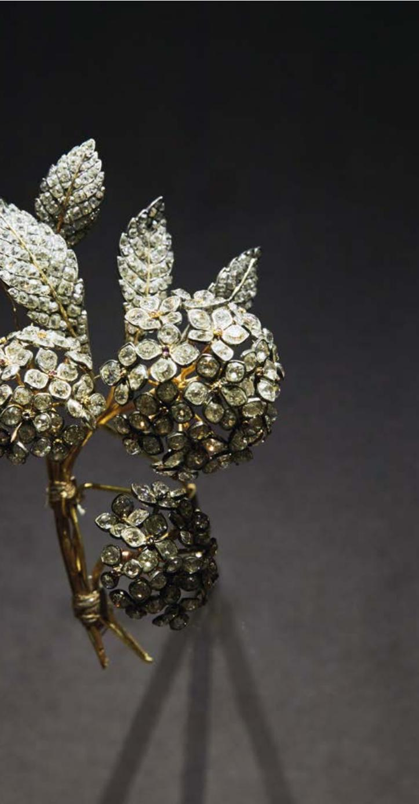

> **AI Description:**
> **Source:** `assets/_page_120_Figure_0.jpg`
> 
> **Generated:** 2026-05-29 21:58:38
> 
> ---
> 
> The image contains a photograph of a decorative jewelry piece. The piece appears to be a floral brooch or pendant, intricately designed with multiple layers of small, sparkling gemstones. The central part of the brooch is composed of densely set gemstones arranged in a spherical pattern, resembling a flower or a cluster of berries. The gemstones are set in a gold or yellow metal frame, with smaller gemstone-encrusted leaves extending from the central cluster. The overall design is ornate and luxurious, suggesting high craftsmanship and value. The background is dark, which accentuates the brilliance and detail of the jewelry piece.

To commemorate the bicentenary of Napoleon’s death, Chaumet retraces the highlights of this legendary emperor and Empress Josephine’s life together. The Maison’s founder was a privileged witness to their romance, and its exhibition Josephine and Napoleon: An (extra)ordinary story, displayed in the “grand salons” of Chaumet’s iconic 12 place Vendôme location, showcases over 150 pieces of jewelry, paintings, works of art, love letters and historic documents. As well as the Maison’s own archive pieces, the exhibition features loans from prestigious public and private collections, such as the Royal House of Denmark’s sovereign collection, and those of the Louvre and the Palace of Fontainebleau’s national museum.

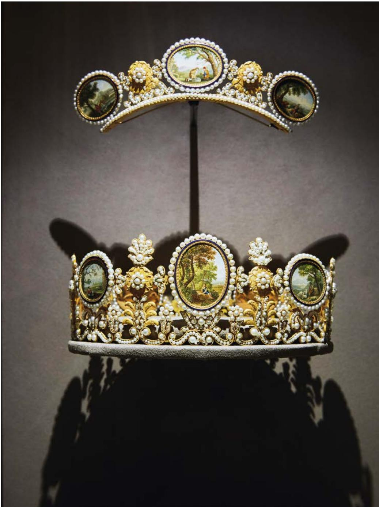

> **AI Description:**
> **Source:** `assets/_page_120_Figure_1.jpg`
> 
> **Generated:** 2026-05-29 22:02:10
> 
> ---
> 
> The image contains a photograph of an ornate tiara. The tiara is adorned with intricate goldwork and features multiple oval-shaped sections, each containing a miniature painting. The paintings depict various scenes, possibly landscapes or historical figures, framed within the gold and embellished with pearls. The tiara is displayed on a stand, and its shadow is visible on the background, suggesting a dark, neutral backdrop. The overall design of the tiara is highly decorative and likely of historical or cultural significance.

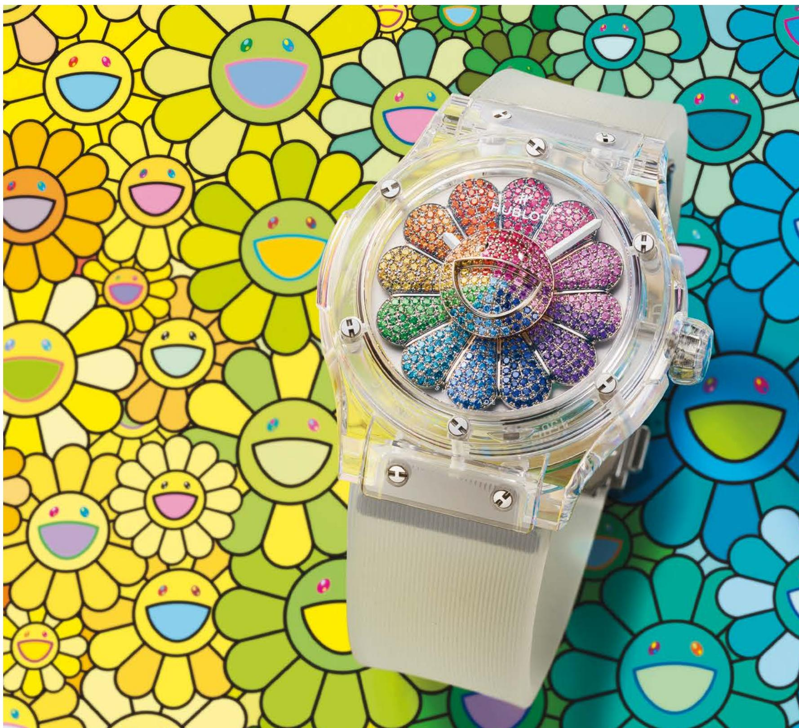

> **AI Description:**
> **Source:** `assets/_page_121_Figure_0.jpg`
> 
> **Generated:** 2026-05-29 22:21:19
> 
> ---
> 
> The image contains a photograph of a luxury wristwatch with a transparent case and a colorful, flower-shaped dial. The watch is set against a vibrant background featuring a repeating pattern of smiling flower motifs in various colors. The watch's design is intricate, with the flower dial composed of multiple layers of gemstones in rainbow colors, creating a striking and eye-catching appearance. The background pattern adds a playful and artistic element to the overall composition.

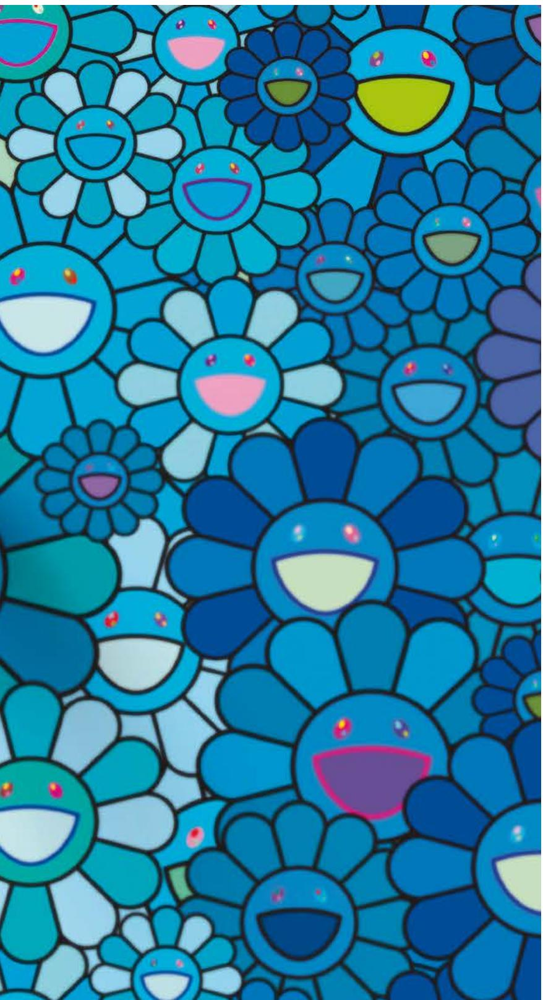

> **AI Description:**
> **Source:** `assets/_page_122_Figure_0.jpg`
> 
> **Generated:** 2026-05-29 22:48:01
> 
> ---
> 
> The image contains a pattern of stylized, smiling flower-like shapes in various shades of blue. Each flower has a simple face with red eyes and a curved mouth, giving them a cheerful and whimsical appearance. The flowers are densely packed, creating a vibrant and repetitive visual effect. The color gradient and uniform design suggest this could be a digital artwork or a pattern used in graphic design or fashion.

Hublot and Takashi Murakami continue their collaboration with the Classic Fusion Takashi Murakami Sapphire Rainbow. This new watch, which again features Murakami’s hallmark smiling flower, is designed to reflect a shift from black to color via transparency. It is available in a limited edition of 100 pieces and has a case cut from sapphire crystal – a technological feat pioneered by Hublot. The flower smiles

mischieviously on a three-dimensional face that emerges from the dial around which a color gradient of 12 petals rotate. By bringing the Japanese artist’s kawaii world into watchmaking, Hublot explores yet another way of expressing its Art of Fusion. Takashi Murakami’s creativity and the Swiss Maison’s expertise combine to engender a unique work of art.

H U B L O T

# Murakami’s kawaii world on a unique timepiece

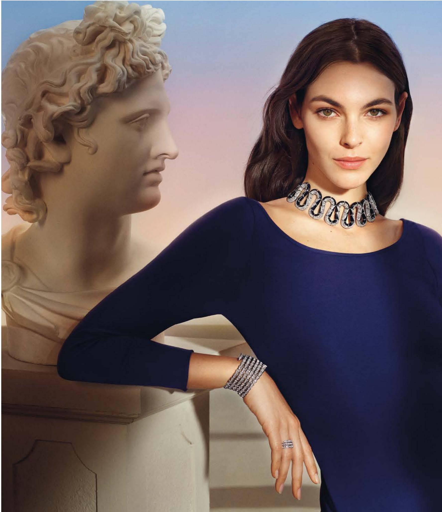

> **AI Description:**
> **Source:** `assets/_page_123_Figure_0.jpg`
> 
> **Generated:** 2026-05-29 22:35:40
> 
> ---
> 
> The image contains a photograph of a woman wearing a blue dress and a statement necklace, bracelet, and ring. She is positioned next to a classical sculpture, which appears to be a bust of a figure with curly hair. The background features a gradient sky transitioning from blue to pink, suggesting either sunrise or sunset. The overall composition combines elements of classical art with modern fashion, creating a contrast between the ancient and the contemporary.

B U L G A R I

# A h i g h j ewe l r y c ol l e c t ion i n spi red by magnificence

Bulgari unveiled Magnifica, its new collection of high jewelry and highend watches. With this collection, which features 350 pieces including 122 brand-new creations, the Rome-based Maison’s expertise has reached new heights, with a hitherto unseen extraordinary combination of exceptional precious stones,

unparalleled craftsmanship and bold design. The versatile, modular pieces are light and supple and designed so that they can be worn in myriad ways – a modern concept in high jewelry. The Magnifica collection epitomizes Bulgari’s hallmark expertise and 137 years of experience working with the world’s rarest and most precious gemstones. The Maison’s expertly skilled craftspeople transform creative ideas into impressive three-dimensional works of art that can take up to 2,500 hours to craft by hand. They cut the gems without any computer assistance, fashioning each component that will form part of a flawless, unique masterpiece. With this collection, Bulgari brings jewelry craftsmanship to magnificent new heights and expresses the full range of its creativity, which is as bold as it is timeless.

T A G H e u e r He cel With Porsche, tw her two icons of design and in nov ation team up

Swiss Maison TAG Heuer and German carmaker Porsche formally sealed their longstanding friendship – having already collaborated on several occasions – with an exceptional link-up inspired by their shared passion for car racing. The brand-new TAG uer Carrera Porsche Chronograph ebrates this friendship between o icons and is a tribute to their itage. Its red, black and grey

colors, font and numerals bring to mind the stylish aesthetics of Porsche cars, while its sporty design is based on the TAG Heuer Carrera chronograph and its distinctive tachymetric scale. Skillfully blending the brand universes of these icons of design and performance, this timepiece reflects the excellence and identities of both names, channeling their legendary essence.

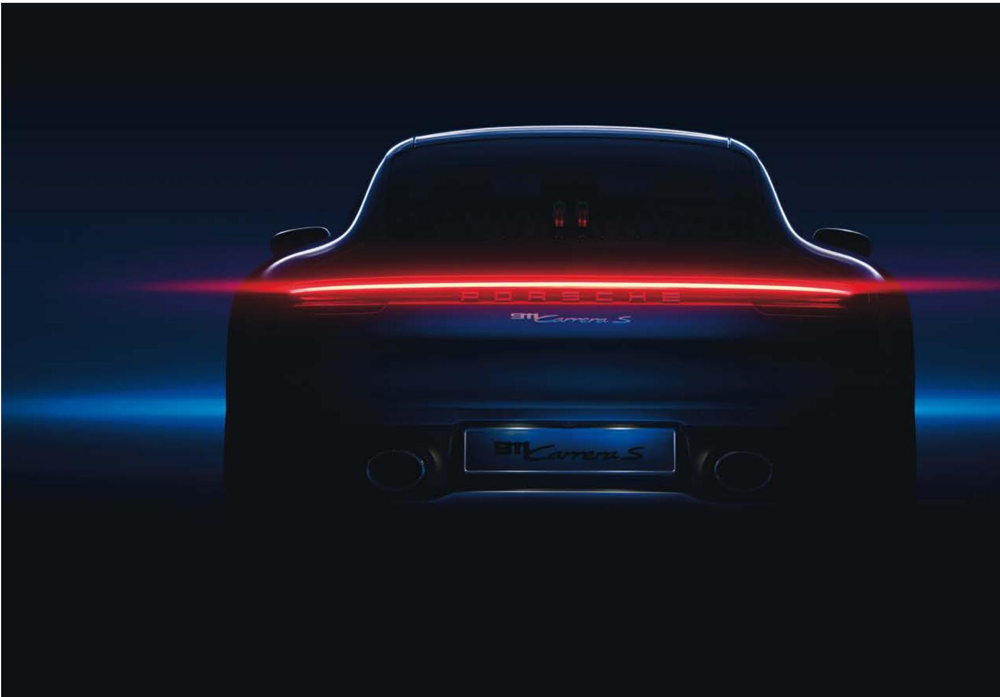

> **AI Description:**
> **Source:** `assets/_page_125_Figure_0.jpg`
> 
> **Generated:** 2026-05-29 22:47:16
> 
> ---
> 
> The image is a photograph of the rear view of a Porsche 911 Carrera S. The key visual elements include the car's taillights, which are illuminated with a red glow, and the model name "911 Carrera S" prominently displayed on the rear. The car is positioned against a dark background, with blue light streaks adding a dynamic effect to the image. The overall design emphasizes the sleek and sporty aesthetic of the vehicle.

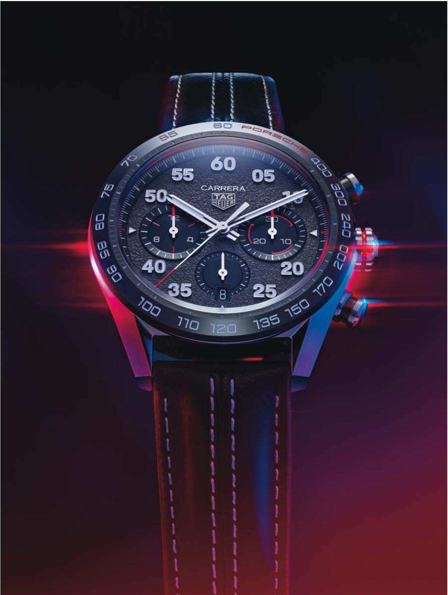

> **AI Description:**
> **Source:** `assets/_page_126_Figure_0.jpg`
> 
> **Generated:** 2026-05-29 22:19:47
> 
> ---
> 
> The image is a photograph of a luxury wristwatch, specifically a TAG Heuer Carrera model. The watch features a black dial with white and red accents, including a tachymeter scale around the bezel. The watch has a black leather strap with white stitching. The background is dark with a gradient of red and blue, giving a dynamic and high-energy feel to the image. The watch is the central focus, with no other objects or text present.

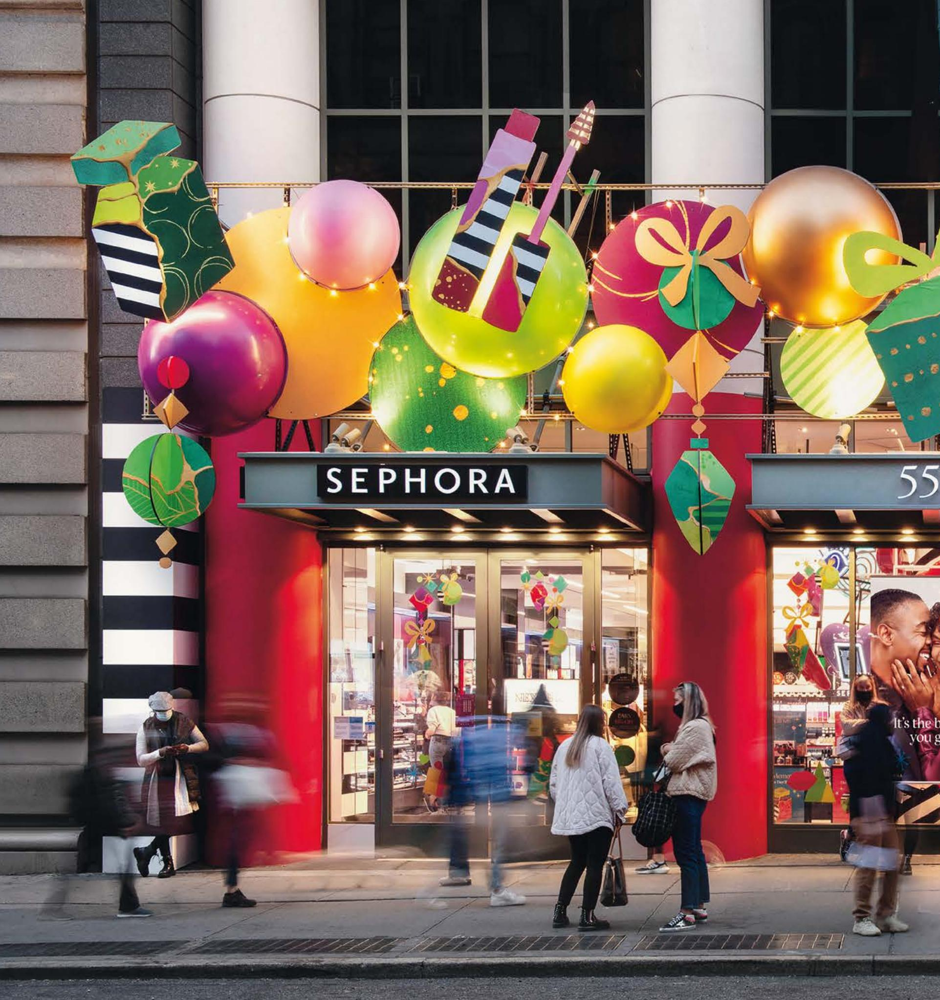

> **AI Description:**
> **Source:** `assets/_page_127_Figure_0.jpg`
> 
> **Generated:** 2026-05-29 22:01:15
> 
> ---
> 
> The image contains a photograph of a Sephora store entrance. The storefront is decorated with colorful balloons and festive ornaments, suggesting a holiday or special event theme. The Sephora logo is prominently displayed above the entrance. The photo captures a group of people walking by, some entering and exiting the store. The overall scene conveys a lively and celebratory atmosphere.

# R E I N V E N T I N G T H E C U S T O M E R E X P E R I E N C E

With locations all around the world, our Selective Retailing Maisons make sure that customers are the number-one priority for their strategies and their staff. Sephora, DFS and Le Bon Marché are all pioneers in their fields and continue to innovate and imagine the shopping experience of the future for their customers.

## An increasingly innovative and personalized experience

For over half a century, Sephora has been revolutionizing the beauty industry, elevating the shopping experience into a moment of pure pleasure and freedom, developing new in-store services and hunting out rare finds to add to its unique range of brands and products. Combining the best of in-store and online shopping, Sephora’s omnichannel beauty experience offers an interactive, personalized, seamless customer journey. Le Bon Marché is a department store like no other: striking architecture enhanced by tasteful updates; an exclusive, elegant selection of products; and an expansive program of exhibitions all make Le Bon Marché truly unique and a treasure trove for both local and international customers. Our 24S digital platform, which was launched in 2017, also reflects this quest for excellence and aims to offer a whole new online shopping experience.

## Staying particularly agile

DFS – which has been pioneering travel retail since the early days of the air travel boom – constantly updates its boutiques and its T Galleria luxury department stores to continually enhance the traveler’s experience. In addition to its major presence in Asia and in the United States, DFS has started to expand its geographic coverage, opening its first European location in Venice in 2016, to be followed by Paris in 2021. DFS will continue its expansion in the Asia-Pacific region, in particular in China on the island of Hainan.

2022 Outlook

In 2022, Sephora will continue to innovate, ramp up its digitalization efforts and develop its omnichannel strategy to gain new market share in key countries, with the priority placed on North America and China. In the United States, the implementation of its partnership with Kohl’s will help amplify its success with an expanded presence and a closer connection to American customers. The Maison will continue investing to sustain its strong momentum in other strategic markets such as the Middle East and Canada, as well as to expand its retail network in major cities and scale up its digital strategy. In 2022, DFS’ priority will be placed on tourism at its key destinations: Hainan, Macao and potentially Hong Kong in the second half of the fiscal year. Partial air traffic recovery forecasts – which are more favorable, with the exception of China – will be closely monitored to ensure that reopenings are in line with local authorities’ requirements and the return of travelers. Highlights planned for 2022 include the second phase of the Mission Hills site opening in Hainan and the inauguration of a T Galleria in Queenstown, New Zealand, while preparing for the 2023 opening of the Brisbane location in Australia. Le Bon Marché will continue to capitalize on its unique profile as a trend-setting department store and cultural venue. In January, the Su exhibition by artist Mehmet Ali Uysal will invite viewers to reflect on climate issues. The beginning of the year will also see the launch of a digital platform for services and experiences, building on Le Bon Marché’s strengths and underscoring its privileged position as an integral part of the Parisian scene.

### Full Page Description (Page 130)

**Source:** `assets/_page_130_Asset_0.jpg`

**Generated:** 2026-05-29 21:21:52

---

The image is a pie chart showing the distribution of a market share across different regions. The chart is divided into five segments, each representing a different region or category, with the following percentages:

- United States: 39%
- Asia (excluding Japan): 24%
- Europe (excluding France): 9%
- France: 12%
- Other markets: 16%

The chart visually represents the relative size of each market segment, with the largest segment being the United States at 39%, and the smallest being Europe (excluding France) at 9%. The chart is labeled with percentages and regions, providing a clear and concise representation of market share distribution.

### Full Page Description (Page 130)

**Source:** `assets/_page_130_Asset_1.jpg`

**Generated:** 2026-05-29 21:26:08

---

The image contains a bar chart with three vertical bars, each representing a year from 2019 to 2021. The bars are color-coded and have numerical values at the top indicating the data for each year. The values are as follows: 14,791 for 2019, 10,155 for 2020, and 11,754 for 2021. The chart appears to be comparing some metric across these three years, with a noticeable decrease from 2019 to 2020 and a subsequent increase in 2021.

### Full Page Description (Page 130)

**Source:** `assets/_page_130_Asset_2.jpg`

**Generated:** 2026-05-29 21:33:34

---

The image is a bar chart with two bars, one for each year from 2019 to 2021. The bar for 2019 is significantly taller than the bar for 2021, indicating a decrease in the measured value. The value for 2019 is 1,395, while the value for 2021 is 534. The bar for 2020 is not shown, and the value for 2021 is marked with a parenthesis and the number 203, which might indicate a different unit or a reference value. The chart uses a patterned fill for the bars, and the years are labeled at the base of each bar.

### Full Page Description (Page 130)

**Source:** `assets/_page_130_Asset_3.jpg`

**Generated:** 2026-05-29 21:26:47

---

The image contains a bar chart with three vertical bars representing data for the years 2019, 2020, and 2021. The bars are shaded in different colors: gray for 2019, brown for 2020, and blue for 2021. Each bar is labeled with a numerical value: 659 for 2019, 410 for 2020, and 370 for 2021. The chart appears to be showing a decline in the value over the three years, with the highest value in 2019 and the lowest in 2021.

# 2021 at a glance

GOOD PERFORMANCE OF SEPHORA, DFS STILL HELD BACK BY LIMITED RECOVERY IN INTERNATIONAL TRAVEL

2021 REVENUE BY REGION (as %)

## Major strategic priorities

Maintain Sephora’s innovative momentum in stores and online

Continue to cultivate a creative, exclusive offering at Le Bon Marché and La Grande Épicerie de Paris

Continue the expansion of DFS and develop digital initiatives to build customer loyalty during their travel experiences

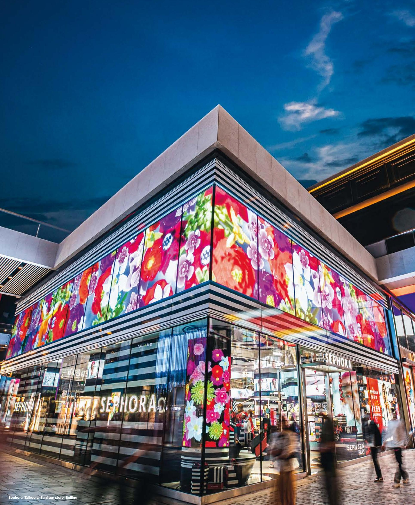

> **AI Description:**
> **Source:** `assets/_page_131_Figure_0.jpg`
> 
> **Generated:** 2026-05-29 22:34:05
> 
> ---
> 
> The image is a photograph of a Sephora store located at Taikoo Li Sanlitun in Beijing. The store's exterior is prominently displayed, featuring large, colorful floral graphics on the facade, which are illuminated at night. The store's name, "SEPHORA," is clearly visible on the glass windows and the exterior wall. The image captures the store's modern and vibrant design, with reflections of the surrounding environment visible on the glass windows. The sky in the background suggests it is either dusk or early evening.

# H IG H L IG H T S

In a business environment disrupted by the consequences of the public health crisis, the Maisons continued to adapt to the situation and enrich their digital content to drive online sales and stay connected with customers. The gradual reopening of stores went smoothly, with the top priority being the health and safety of customers and staff, while constantly striving to offer the best shopping experience across all channels.

Building on its expanded geographic presence and its pursuit of excellence in its omnichannel strategy, Sephora was highly resilient and delivered another strong performance thanks to the upturn in activity at its stores and the continued momentum of its online sales. Despite the pandemic-related closures for part of the year, the expansion of its store network continued, especially in China and the United States, particularly following the large-scale partnership with US distributor Kohl’s. The Maison continued to develop its digital offering with a series of new initiatives, including

a long-term strategic partnership with the Zalando platform for the creation of a “prestige beauty” selection, launched in Germany in the second half of the year; the acquisition of Feelunique, one of the leading players in the online selective beauty segment in the United Kingdom; a series of new transnational e-commerce initiatives to serve various countries in Asia; ramping up its own websites, resulting in record online sales; and developing innovative services to ensure a smooth omnichannel purchasing experience for customers, such as same-day delivery, which has been successfully rolled out in the United States. This strategy helped dynamize its key brands and categories, particularly skincare, fragrances and haircare, while makeup showed encouraging signs of recovery. The Maison continued to serve as an incubator, launching exclusive brands and products, particularly in the area of “green” cosmetics, which resonates strongly with its customers’ aspirations. Sephora stepped up its commitment

to diversity and inclusion by joining the Valuable 500, a global movement to speed the inclusion of people with disabilities in the workplace. The Maison also launched highly innovative campaigns to celebrate black beauty in North America and expanded its selection of brands founded by people of color, in line with the commitment undertaken in 2020. Thanks to its relentless drive for innovation and highly motivated staff, Sephora returned to its pre-pandemic sales levels and was listed in the prestigious Interbrand Best Global Brands 2021 ranking. The public health crisis continued to impact DFS’ business due to the very limited recovery in international travel, travel restrictions in China and quarantine measures implemented in Hong Kong. In response to the Chinese government’s efforts

to transform Hainan into a free trade port by 2025, DFS, in partnership with Shenzhen Duty Free Group, opened its first downtown store in the port city of Haikou. Thanks to growing demand from local customers, the seven T Gallerias in Macao turned in a good performance, while DFS launched its operations in Hainan. The highly anticipated opening of La Samaritaine Paris Pont-Neuf took place in June following an ambitious renovation project and saw a promising number of visitors. After a one-year hiatus, the “Masters of Time” event showcasing a prestigious collection of watches and jewelry returned to Macao for its 12th edition. DFS accelerated its omnichannel transformation through an innovative “Travel E-Tail” program for its customers and brand partners. The Maison continued to focus on employee well-being

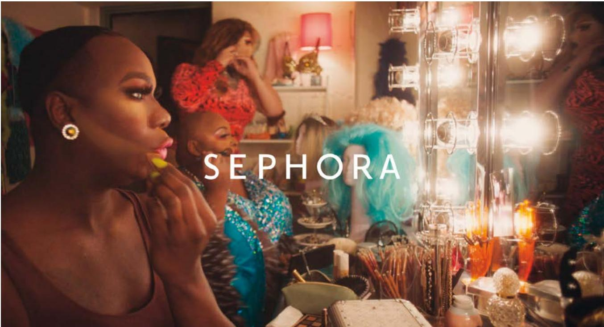

> **AI Description:**
> **Source:** `assets/_page_133_Figure_0.jpg`
> 
> **Generated:** 2026-05-29 22:17:14
> 
> ---
> 
> The image contains a photograph of a group of individuals in what appears to be a dressing room or backstage area. The setting is well-lit with vanity lights, and various makeup items and accessories are visible on the table. The individuals are engaged in grooming activities, with one person applying makeup. The word "SEPHORA" is prominently displayed in the center of the image, suggesting a promotional or brand-related context. The overall scene conveys a sense of preparation and transformation, likely related to a performance or event.

Sephora

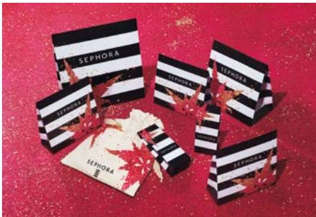

> **AI Description:**
> **Source:** `assets/_page_134_Figure_0.jpg`
> 
> **Generated:** 2026-05-29 22:16:50
> 
> ---
> 
> The image contains a collection of black and white striped boxes with the word "SEPHORA" printed on them. The boxes are arranged on a red background with a subtle glitter effect. The boxes appear to be part of a product packaging or promotional material for Sephora. The design is simple and modern, with a focus on the brand name and the striped pattern.

OUR MAISONS TAKE ACTION

## Sephora’s redesigned Christmas packaging recognized with an R Award in the “Purchasing” category

Following Sephora’s launch of its “Good For” line, which aims to expand the Maison’s selection of natural and sustainably designed products, Sephora made further progress in 2021 by completely redesigning its Christmas packaging, which is often associated with large quantities of waste. The goal was to apply a sustainable design approach aimed at using environmentally friendly raw materials, reducing the volume of packaging and developing reusable packaging, all while maintaining the festive spirit of Christmas. Part of the manufacturing was also relocated to Europe. The redesigned gift boxes were made from FSC-certified recycled paper and plastic-free, helping save 26 metric tons of plastic compared to previous years. They also featured vegetable-based inks and gift pouches made of recycled cotton.

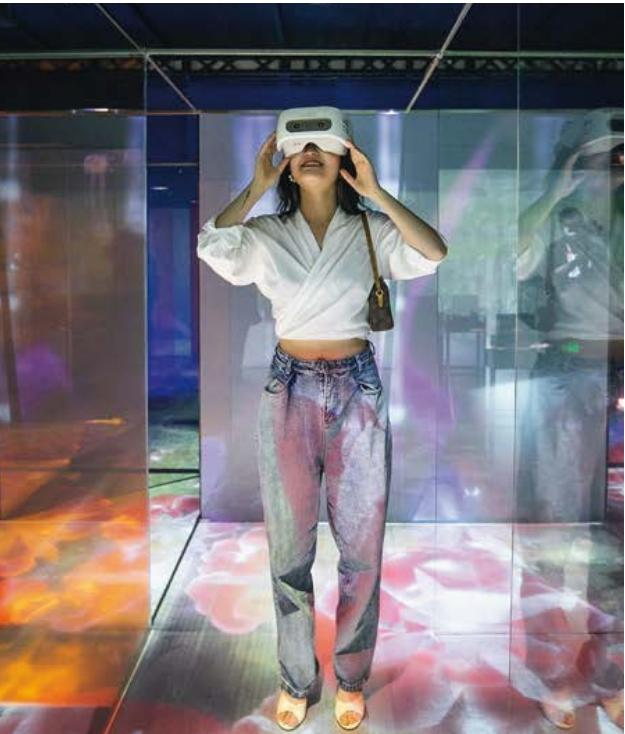

> **AI Description:**
> **Source:** `assets/_page_134_Figure_1.jpg`
> 
> **Generated:** 2026-05-29 22:18:20
> 
> ---
> 
> The image contains a photograph of a person standing in what appears to be an interactive or immersive environment. The individual is wearing a white cropped shirt, high-waisted jeans with a tie-dye pattern, and a white VR headset. The background features a glass wall with colorful, abstract projections, suggesting a virtual reality or augmented reality experience. The person's posture and the VR headset indicate they are actively engaged with the technology.

Sephora

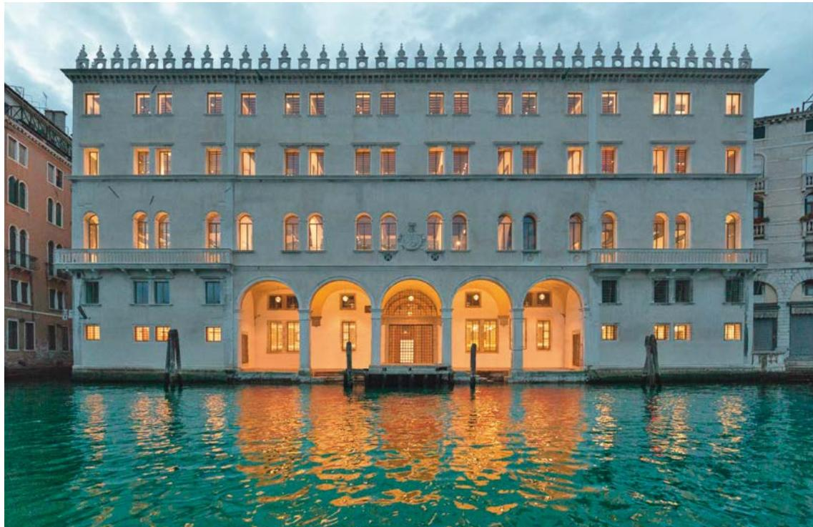

> **AI Description:**
> **Source:** `assets/_page_134_Figure_2.jpg`
> 
> **Generated:** 2026-05-29 22:11:39
> 
> ---
> 
> The image is a photograph of a grand, multi-story building with a classical architectural style, situated by a canal. The building features a series of arched doorways and windows, some of which are illuminated from within, suggesting it is evening. The reflection of the building's lights on the water adds a serene and picturesque quality to the scene. The surrounding environment includes other buildings and a glimpse of the canal, indicating an urban setting, possibly in a historic city.

DFS

by implementing health programs and adapting working hours, and supported its local communities through volunteer activities aimed at helping the most vulnerable individuals and those most affected by the pandemic.

Starboard Cruise Services resumed operations at the end of the year on part of its fleet of vessels with an occupancy of about half their capacity. The Maison focused on the new opportunities offered by the digital channel, and tailoring the products and services it offers to clients of different cruise lines. Le Bon Marché experienced an unusual year marked by a long period of closure from January 31 to May 19, during which digital communication and mail-order sales helped it stay connected with customers. As soon as it reopened, the department store saw

the return in force of its particularly loyal French clientele. The year’s highlights included Prune Nourry’s L’Amazone Érogène exhibition and the Lucky Charms exhibition, featuring works by Thebe Magugu, to support the Dessine l’Espoir (Designing Hope) humanitarian nonprofit. Momentum was spurred by the development of new concepts, such as a holistic beauty initiative with Holidermie, and the opening of new spaces, in particular for Tiffany. Both of La Grande Épicerie de Paris’ sites continued to perform well. The 24S digital platform recorded strong growth, particularly in Asia and North America, driven by the unique character of its selection and its Parisian positioning. The year featured the rollout of the “marketplace” model, a strategic driver for acceleration.

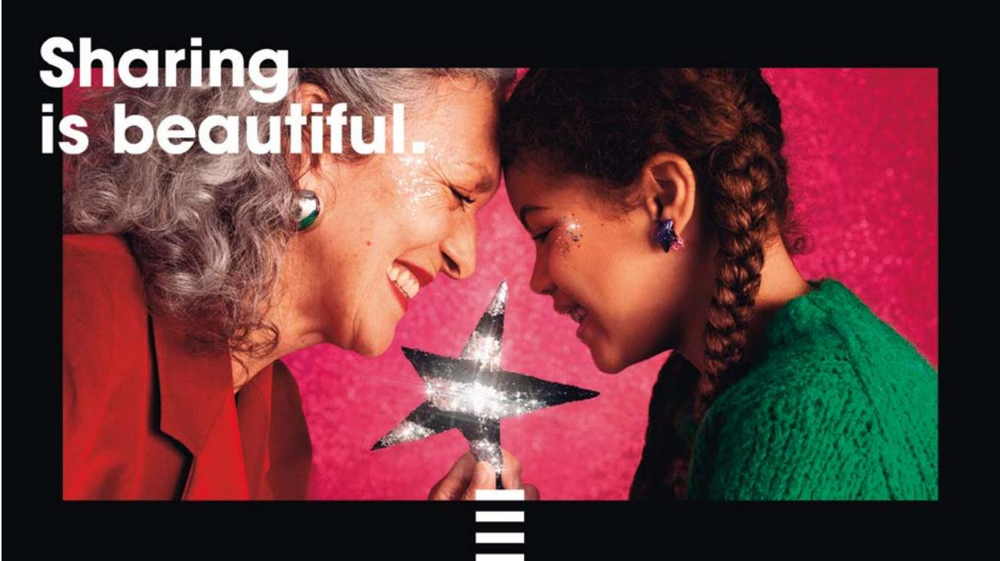

> **AI Description:**
> **Source:** `assets/_page_135_Figure_0.jpg`
> 
> **Generated:** 2026-05-29 22:03:56
> 
> ---
> 
> The image contains a photograph of two individuals, an older woman and a younger girl, sharing a moment of joy. The older woman is wearing a red jacket and has gray hair, while the younger girl is wearing a green sweater and has her hair braided. They are both smiling and looking at each other, with a sparkly star in the center of the image. The text "Sharing is beautiful" is displayed at the top of the image. The overall theme of the image is one of connection and the beauty of sharing.

Sephora

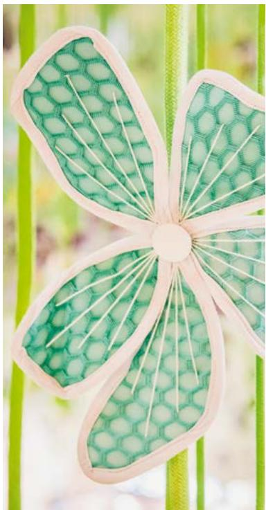

> **AI Description:**
> **Source:** `assets/_page_135_Figure_1.jpg`
> 
> **Generated:** 2026-05-29 21:57:54
> 
> ---
> 
> The image is a close-up photograph of a decorative butterfly. The butterfly has a light pink outline and a teal interior with a honeycomb pattern. The wings are spread out, and the body is a small white circle. The background consists of green stems, suggesting the butterfly is part of a garden or natural setting. The design is intricate and appears to be handcrafted or digitally created with attention to detail.

Le Bon Marché

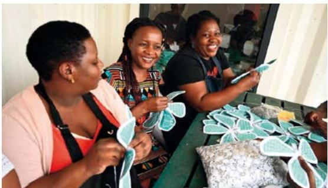

> **AI Description:**
> **Source:** `assets/_page_136_Figure_0.jpg`
> 
> **Generated:** 2026-05-29 22:34:12
> 
> ---
> 
> The image is a photograph showing three women engaged in a craft activity. They are smiling and appear to be working together on decorative items that resemble leaves or petals, possibly made of paper or fabric. The women are wearing aprons, suggesting a workshop or classroom setting. The background includes a table with more of the craft materials and a partially visible wall. The image conveys a sense of collaboration and creativity.

OUR MAISONS TAKE ACTION

## 20,000 hanging flowers by Thebe Magugu for Le Bon Marché Rive Gauche’s Lucky Charms exhibition

The installation created by South African designer Thebe Magugu consists of 20,000 multicolored fabric flower brooches pinned to myriad lianas suspended in the store’s monumental central atrium. The flowers were sewn by some one hundred women in four workshops supported by Dessine L’Espoir (Designing Hope), a humanitarian organization that helps vulnerable populations in several southern African countries, notably in South Africa and Eswatini. The nonprofit has been running HIV awareness campaigns since 2003 and supports people who are HIV-positive with healthcare and food, also providing education and training for the youngest. The flower brooches were sold throughout the event and the proceeds were donated to Dessine l’Espoir.

Le Bon Marché

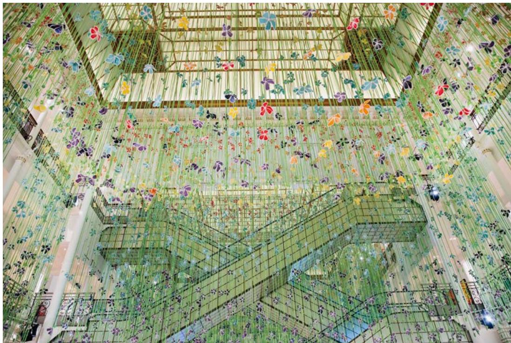

> **AI Description:**
> **Source:** `assets/_page_136_Figure_2.jpg`
> 
> **Generated:** 2026-05-29 22:32:06
> 
> ---
> 
> The image depicts a large indoor space, possibly a atrium or lobby, with a unique and artistic installation. The installation consists of numerous strings or wires suspended from the ceiling, adorned with colorful, floral patterns. These strings create a canopy-like effect, adding a vibrant and dynamic visual element to the space. The structure below appears to be a multi-level walkway or staircase, with a grid-like pattern on the floor and walls. The overall effect is one of whimsy and creativity, transforming the space into an immersive and visually engaging environment.

Le Bon Marché

# S T O R I E S

L A S A M A R I TA I N E

## An outstand ing renovation t h at rev ives t he m ag ic of cent r a l Pa r is

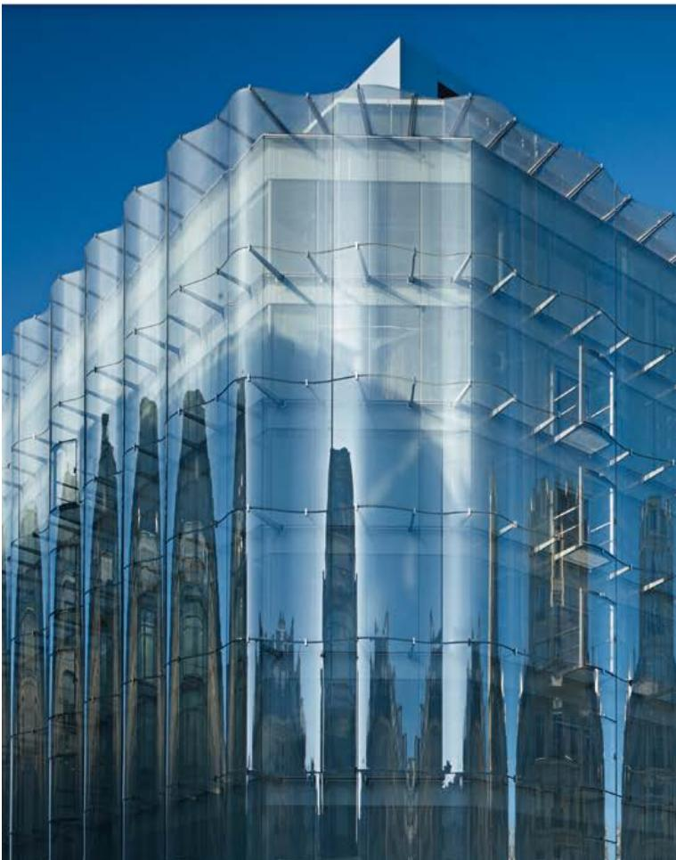

> **AI Description:**
> **Source:** `assets/_page_137_Figure_0.jpg`
> 
> **Generated:** 2026-05-29 22:48:48
> 
> ---
> 
> The image contains a photograph of a modern architectural structure with a reflective glass facade. The building's design features a series of vertical, curved panels that create a dynamic and fluid appearance. The reflection on the glass surface shows the silhouette of a historic building, possibly a cathedral or church, with pointed spires and intricate details. The contrast between the contemporary glass structure and the traditional architecture in its reflection highlights the juxtaposition of old and new in urban design. The clear blue sky in the background adds to the overall aesthetic, emphasizing the clean lines and sleek design of the modern building.

The Samaritaine Paris Pont-Neuf department store reopened in June 2021, after a vast, historically faithful renovation that involved numerous craftspeople including painters, sculptors, gilders, and metalworkers. It is now instantly recognizable by its undulating glass façade designed by 2010 Pritzker Prize-winning Japanese architecture studio Sanaa. Its 1907 Eiffel-designed glass dome, enameled lava Art Nouveau decors, and monumental staircase have all been restored. As well as highlighting the store’s eclectic and rich historical heritage with an innovative architectural feature, the overhaul also saw all the buildings certified to the strictest environmental standards. Designed and operated by DFS, the new Samaritaine department store promises visitors a bold blend of experiences, enchantment, authenticity and modernity. Some 600 brands converge in this exceptional space, which celebrates French elegance and art de vivre.

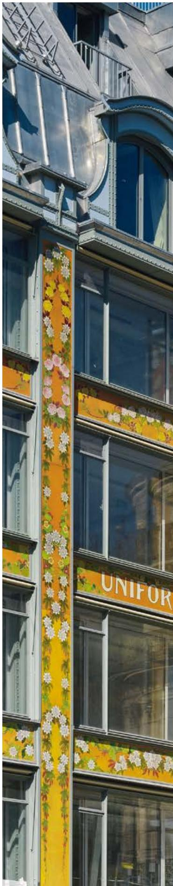

> **AI Description:**
> **Source:** `assets/_page_137_Figure_1.jpg`
> 
> **Generated:** 2026-05-29 22:48:29
> 
> ---
> 
> The image depicts a section of a building facade with a decorative vertical panel featuring a floral pattern. The panel is painted in bright yellow with white and pink flowers, creating a vibrant and eye-catching design. Below the panel, the word "UNIFOR" is prominently displayed in bold, orange letters on a darker background. The surrounding architecture includes large windows and a mix of modern and ornate elements, suggesting a blend of contemporary and historical styles. The overall scene is well-lit, indicating it was taken during the daytime.

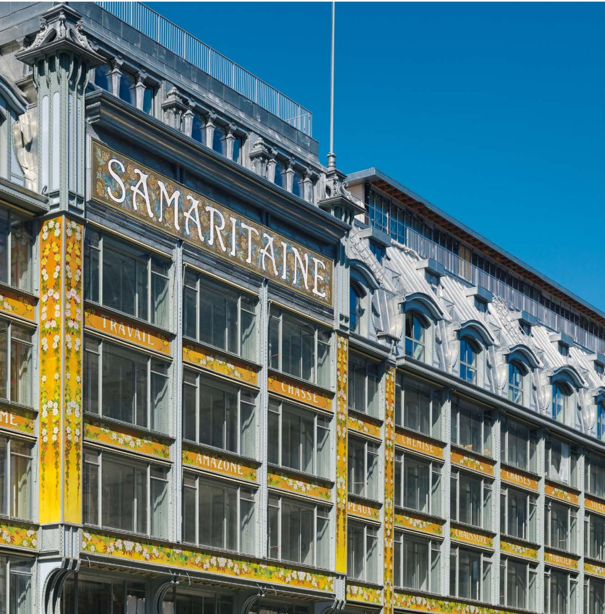

> **AI Description:**
> **Source:** `assets/_page_138_Figure_0.jpg`
> 
> **Generated:** 2026-05-29 21:37:40
> 
> ---
> 
> The image contains a photograph of a building facade with the word "SAMARITAINE" prominently displayed at the top. Below this, there are multiple signs with various French words such as "TRAVAIL," "AMAZONE," "CHAISES," and "MOBILIER," which appear to categorize different sections or departments of the building. The facade features a decorative pattern with white flowers on a yellow background, and the building has a modern architectural style with large windows and metal framework. The sky in the background is clear and blue, indicating a sunny day.

S E P H O R A

“Meeting” beauty icon s i n a v i r t u a l house of beauty

Sephoria, the Maison’s major beauty event, made a high-profile comeback in 2021. Previously held in 2018 and 2019 as a live event in the United States, it returned as a virtual metaverse-like experience called “Sephoria: Virtual House of Beauty”. Attendees were free to explore and try out the iconic products and justlaunched new labels available at Sephora through exclusive content and virtual encounters with brand founders. The experience was based on a 3D, 360° game-like environment with an interactive beauty “house”

featuring several themed rooms that attendees could explore while playing games and joining in activities. The event was free of charge and open to all participants who registered to attend. Attendees could also opt in to purchase Experience Kits – complete with a host of products and surprises – which were dispatched to them by mail. Having made digital and omnichannel a strategic priority, the Maison is now focusing on bringing its highly popular, unique in-store experiences online.

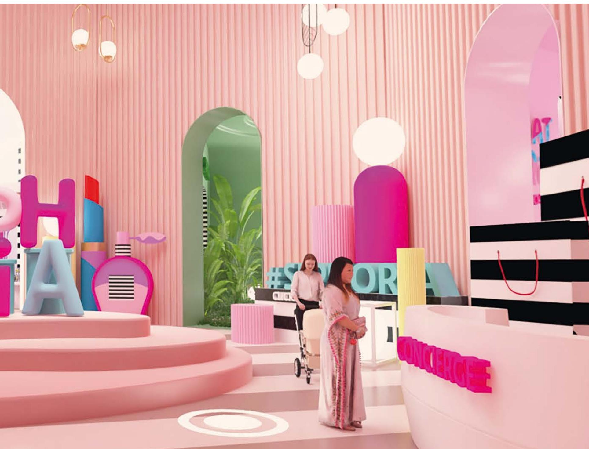

> **AI Description:**
> **Source:** `assets/_page_140_Figure_0.jpg`
> 
> **Generated:** 2026-05-29 22:24:35
> 
> ---
> 
> The image contains a vibrant and colorful interior space with a playful and modern design. The walls are adorned with vertical pink stripes, and the room features large, bold letters spelling out "Sephora" and "Concierge." The space includes a mix of geometric shapes and structures, such as arches and podiums, in various pastel colors. Two individuals are present, one seated at a desk and the other standing, suggesting a customer service or concierge area. The overall aesthetic is bright and inviting, with a focus on a retail or service environment.

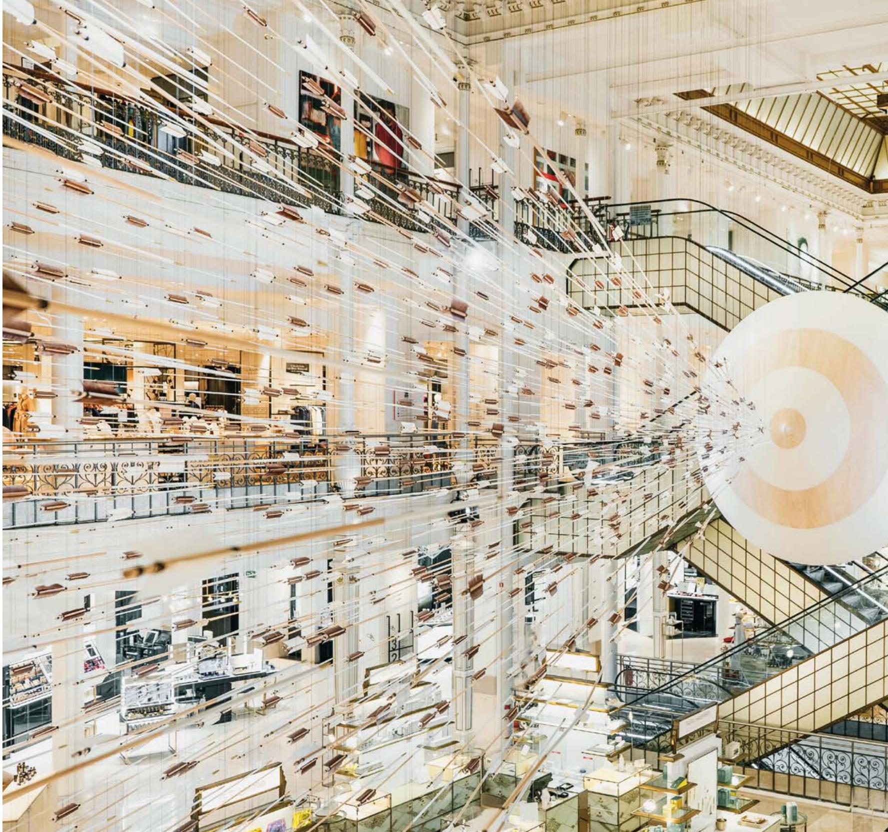

> **AI Description:**
> **Source:** `assets/_page_141_Figure_0.jpg`
> 
> **Generated:** 2026-05-29 22:42:03
> 
> ---
> 
> The image contains a photograph of a multi-level shopping mall with a large, circular, white structure in the foreground. The structure appears to be a decorative installation, possibly made of wood or a similar material, with numerous thin, light-colored beams radiating outward. The background shows multiple levels of the mall, with escalators, railings, and various stores and displays. The image is overlaid with a grid-like pattern, which may be an artistic effect or part of the photo editing process. The overall scene is well-lit, suggesting it was taken during the day.

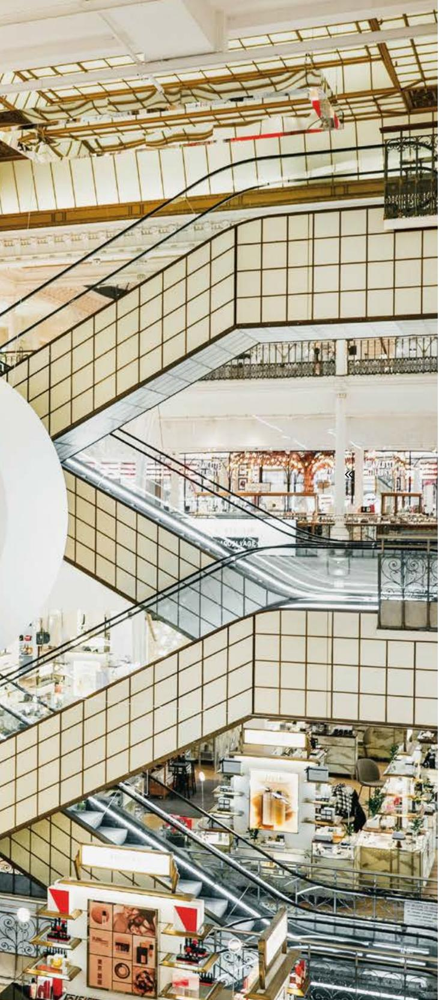

> **AI Description:**
> **Source:** `assets/_page_142_Figure_0.jpg`
> 
> **Generated:** 2026-05-29 22:07:29
> 
> ---
> 
> The image is a photograph of an interior space, likely a shopping mall or department store. It features a multi-level escalator system with a glass and metal railing design. The architecture includes a high ceiling with exposed beams and a grid-like structure. The lower levels of the building are visible, showcasing various retail spaces with displays and products. The overall aesthetic is modern with a blend of industrial and contemporary design elements.

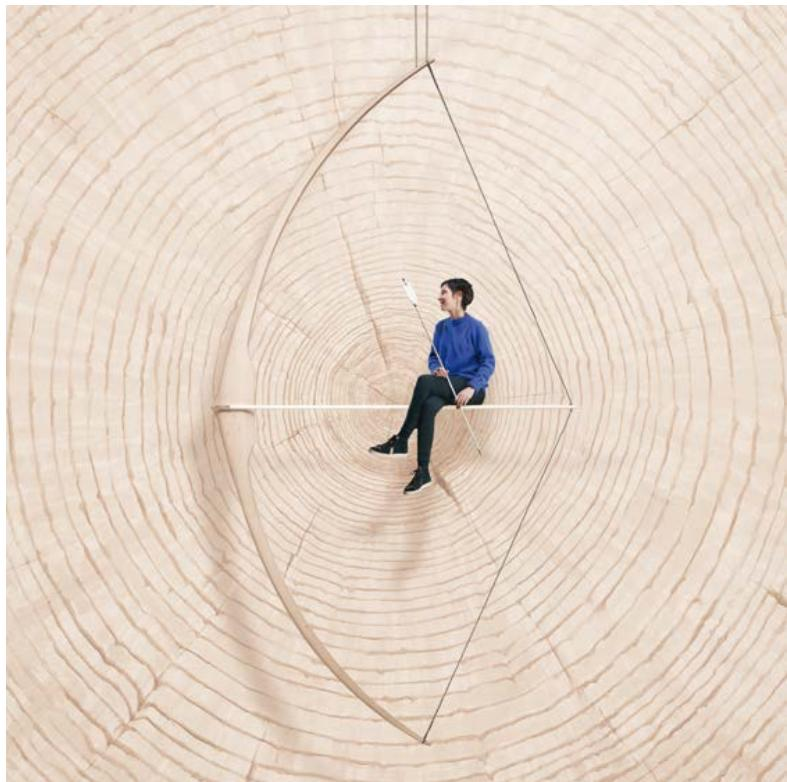

> **AI Description:**
> **Source:** `assets/_page_142_Figure_1.jpg`
> 
> **Generated:** 2026-05-29 22:10:52
> 
> ---
> 
> The image is a photograph of a person sitting on a tightrope that is suspended within a large, circular wooden structure. The wood grain is prominently visible, creating a textured background. The person is holding a stick, possibly for balance or as a prop. The tightrope is taut and appears to be securely anchored. The overall composition gives a sense of balance and precariousness.

L E B O N M A R C H É

# L’Amazone Erogene: A work of ar t by Prune Nourry for t he Lef t B a n k s tore

Le Bon Marché Rive Gauche continues to pledge its support for contemporary artists by giving them carte blanche within its walls. In January 2021, Prune Nourry – a rising star on the international art scene – exhibited L’Amazone Érogène (The Erogenous Amazon) at the department store. Through her art, Prune Nourry explores the concepts of genetics, gender selection, the status of women and our perception of the female body. This installation was inspired by the Amazons, who according to myth cut off their right breasts to become better archers. The artist played with symbols typically associated with these women warriors and created an installation built around three powerful visual elements: a breast-shaped target, a bow and arrows.

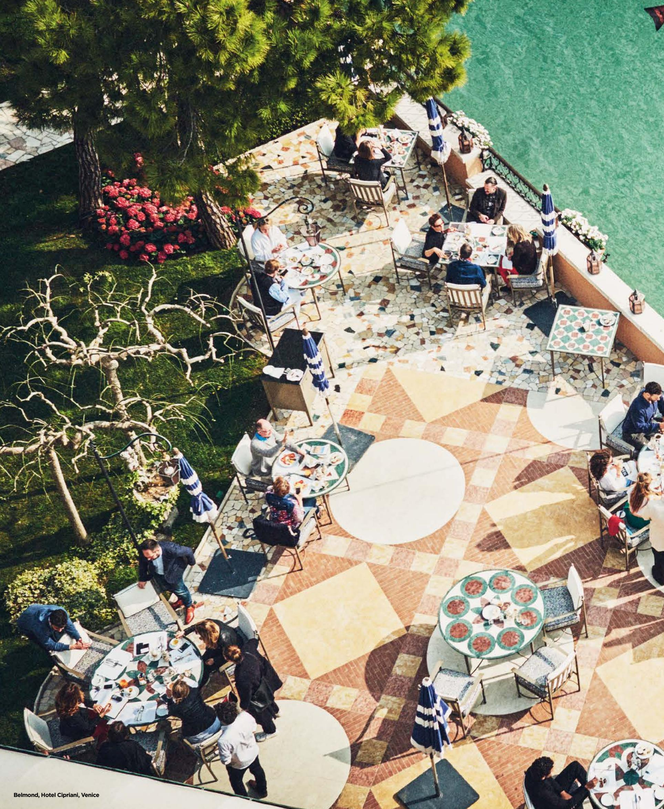

> **AI Description:**
> **Source:** `assets/_page_143_Figure_0.jpg`
> 
> **Generated:** 2026-05-29 21:55:04
> 
> ---
> 
> The image is a photograph of a terrace with people dining at tables. The terrace has a mosaic-tiled floor with geometric patterns in shades of beige, brown, and white. There are several round tables with white tablecloths, and some have blue and white striped umbrellas. The setting is outdoors, with a tree providing shade and a view of a body of water in the background. The image captures a relaxed and social atmosphere, with people engaged in conversation and dining. The text at the bottom of the image identifies the location as Belmond, Hotel Cipriani, Venice.

## LVMH

## Culture & Li fes t yle

2021

LV M H H O T E L M A N AG E M E N T

# Cheval Blanc: A new contemporar y haven i n t he hea r t of Pa r i s

Cheval Blanc has unveiled its first urban home away from home, ideally located in the heart of Paris between the Marais, the Île de la Cité and the Louvre. The hotel – which only has 72 rooms – was purposely designed by architects Peter Marino and Édouard François to offer guests an experience rather than a setting, with every detail chosen to recreate the intimacy of a private home. Vast bay windows offer

stunning views of Paris in every room and each of the four restaurants. Guests can unwind in the peaceful surroundings of the wellness space and Dior Spa Cheval Blanc. Finally, encapsulating the quest for excellence at Cheval Blanc Paris, are Plénitude – its gourmet restaurant run by chef Arnaud Donckele – and the Apartment – its truly exceptional space on the top floor.

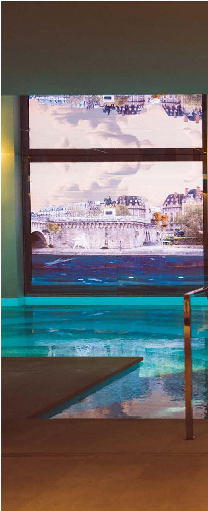

> **AI Description:**
> **Source:** `assets/_page_145_Figure_0.jpg`
> 
> **Generated:** 2026-05-29 22:09:26
> 
> ---
> 
> The image contains a multi-panel display showing a cityscape with a prominent bridge and buildings in the background. The top panel appears to depict a snowy scene, while the bottom panel shows a more vibrant, possibly painted or digitally rendered view of the same cityscape with a bridge and a statue. The bottom panel also includes a reflection of the scene in what looks like a pool of water, creating a visually striking effect. The overall composition suggests an artistic or conceptual representation rather than a straightforward photograph or data visualization.

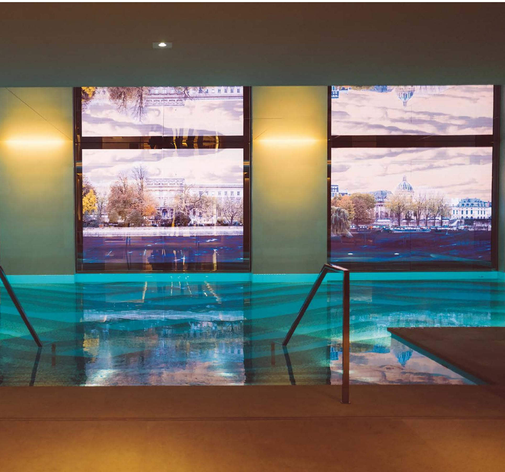

> **AI Description:**
> **Source:** `assets/_page_146_Figure_0.jpg`
> 
> **Generated:** 2026-05-29 22:45:20
> 
> ---
> 
> The image contains a photograph of an indoor setting with a reflective pool in the foreground. The pool reflects the image of a large screen displaying a cityscape with buildings, trees, and a body of water. The screen is divided into sections, with the left and right sections showing different parts of the cityscape, while the center section is blank. The lighting in the room is warm, and the overall ambiance suggests a modern, possibly luxurious interior space.

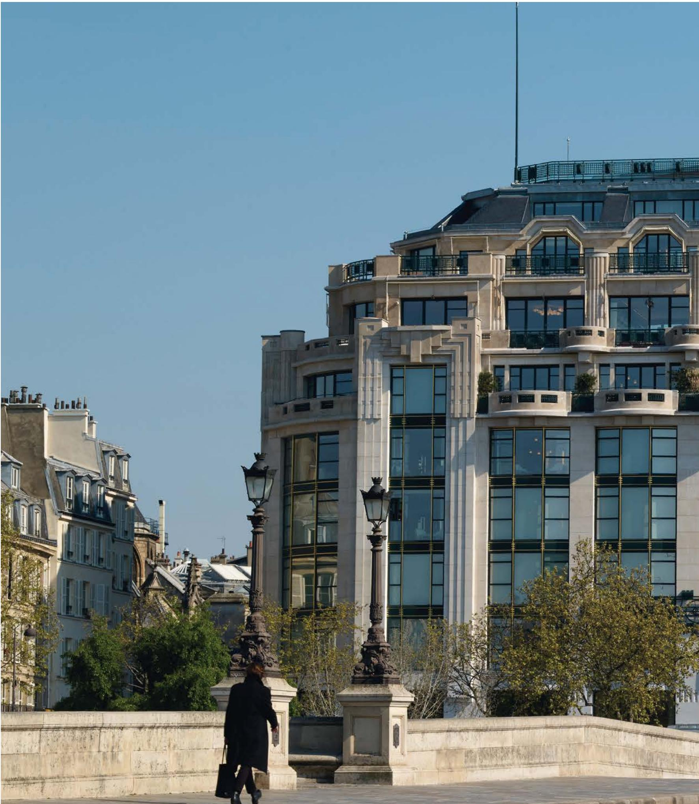

> **AI Description:**
> **Source:** `assets/_page_147_Figure_0.jpg`
> 
> **Generated:** 2026-05-29 22:22:28
> 
> ---
> 
> The image is a photograph of an urban scene. It features a modern building with a mix of glass and stone architecture, situated on a bridge. The building has a curved facade with large windows and decorative elements. In the foreground, there is a person walking away from the camera, and two ornate street lamps are visible. The background includes traditional-style buildings with sloped roofs and chimneys, suggesting a historical part of the city. The sky is clear and blue, indicating a sunny day.

Cheval Blanc Paris

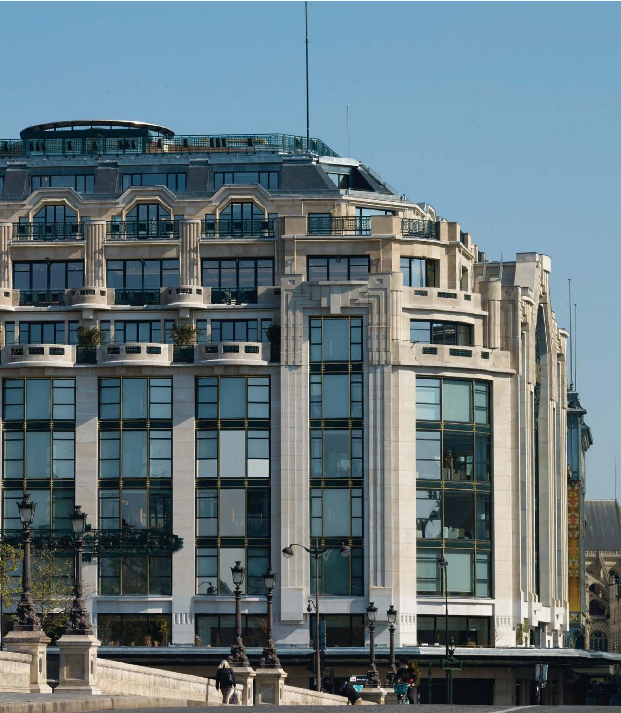

> **AI Description:**
> **Source:** `assets/_page_148_Figure_0.jpg`
> 
> **Generated:** 2026-05-29 21:33:25
> 
> ---
> 
> The image is a photograph of a modern building with a distinctive architectural style. The building features large glass windows with gold accents, creating a striking contrast against the stone facade. The structure has multiple levels, with balconies on the upper floors. The building is situated in an urban environment, as evidenced by the presence of street lamps and a bridge in the foreground. The sky is clear and blue, indicating a sunny day. The overall design of the building suggests it may be a commercial or residential property.

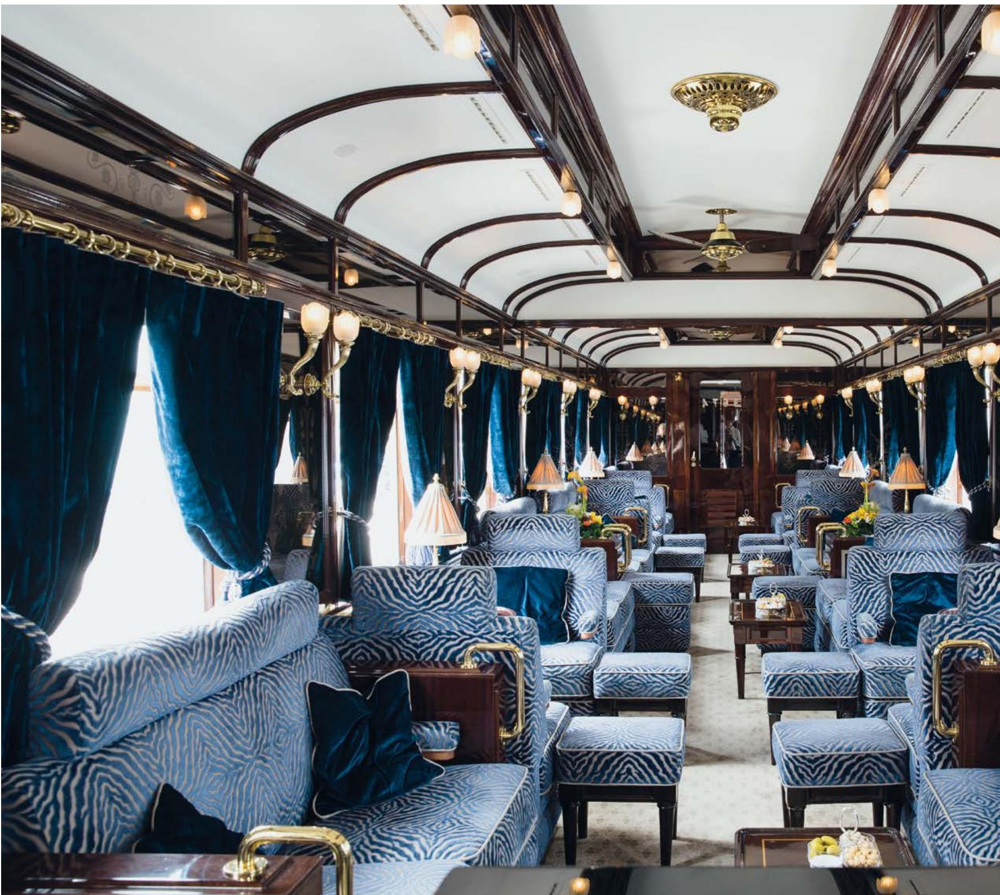

> **AI Description:**
> **Source:** `assets/_page_149_Figure_0.jpg`
> 
> **Generated:** 2026-05-29 21:42:23
> 
> ---
> 
> The image depicts the interior of a luxurious train car. The space is elegantly furnished with plush, zebra-patterned seating in shades of blue and white. The car features dark wood paneling and arched windows with deep blue curtains. Warm lighting is provided by wall-mounted lamps, and small tables with decorative items are placed between the seating areas. The overall design exudes opulence and comfort, suggesting a high-end travel experience.

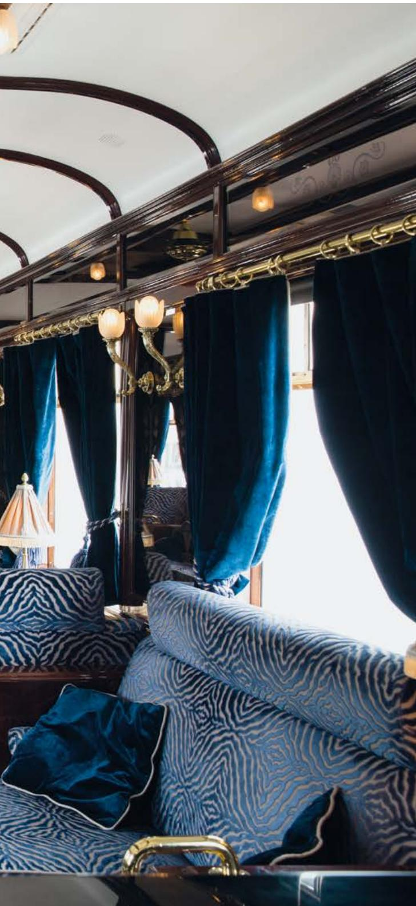

> **AI Description:**
> **Source:** `assets/_page_150_Figure_0.jpg`
> 
> **Generated:** 2026-05-29 22:13:46
> 
> ---
> 
> The image depicts the interior of a luxurious train car, likely from a high-end service such as the Orient Express. The interior is richly decorated with dark blue velvet curtains and matching upholstery on the seats, which feature a zebra print pattern. The car is well-lit by vintage-style wall-mounted lamps, and the overall design exudes elegance and comfort, suggesting a premium travel experience. The wooden paneling and arched windows add to the classic and sophisticated ambiance of the space.

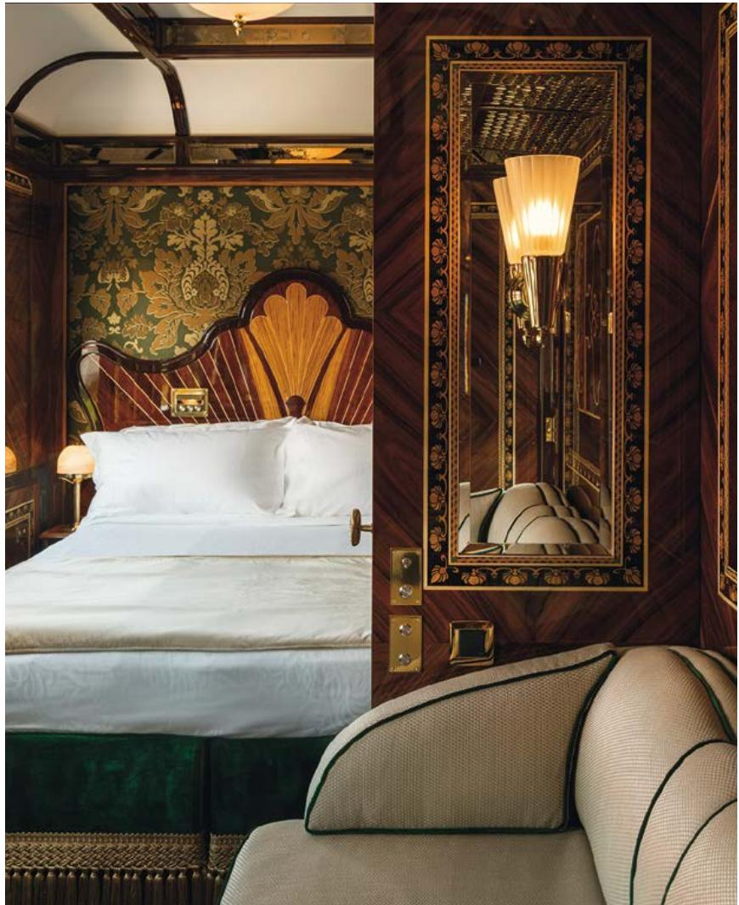

> **AI Description:**
> **Source:** `assets/_page_150_Figure_1.jpg`
> 
> **Generated:** 2026-05-29 22:05:00
> 
> ---
> 
> The image contains a photograph of an elegantly designed room, likely from a luxury hotel or train suite. The room features a large bed with white linens and a wooden headboard adorned with intricate carvings. The walls are decorated with dark green wallpaper featuring gold floral patterns. A large mirror with a decorative frame is mounted on the wall, reflecting part of the room. The furniture includes a plush armchair with a textured fabric and green piping. The overall aesthetic is luxurious and sophisticated, with a focus on rich wood tones and ornate details.

B E L M O N D

# The Venice Si mplon- Or ient-Ex pres s : A legend back on track

Belmond reignites the romance of rail travel and invites guests to embark on a legendary journey as the Venice Simplon-Orient-Express returns to the tracks. With its new Grand Suites and spellbinding new routes criss-crossing through France, Italy, Switzerland, Belgium and the Netherlands, this train whisks travelers to Europe’s most beautiful cities, reinstating the glamourous journeys of the golden age of travel.

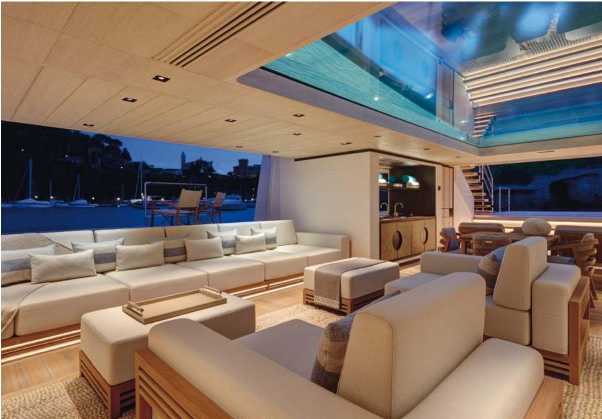

> **AI Description:**
> **Source:** `assets/_page_151_Figure_0.jpg`
> 
> **Generated:** 2026-05-29 21:49:34
> 
> ---
> 
> The image depicts the interior of a luxurious yacht or private residence with a modern and spacious design. The room features a large, open-plan layout with a central seating area consisting of a long sofa and several armchairs arranged around a coffee table. The furniture is upholstered in neutral tones, and the room is well-lit with natural light coming through a large window that offers a view of a marina at dusk. The ceiling has a unique design with a skylight and a modern, textured finish. The overall aesthetic is elegant and sophisticated, with a focus on comfort and relaxation.

R OYA L VA N L E N T

# Uphold ing the pres t ig iou s Dutch m ar itime t r ad it ion

Royal Van Lent creates pure custom superyachts between 60 and 140 meters in length under the Feadship brand. With a heritage dating back to the 1800s, Royal Van Lent has two boutique shipyards in Amsterdam and on nearby Kaag Island. The yard in the Dutch capital was officially opened in 2019 by Queen Máxima and is the most eco-conscious superyacht facility in the world. Generations of dedicated craftsmen ply their trade across all disciplines of boatbuilding. This ultra-high-end industry demands constant innovation and close cooperation with designers as the Royal Van Lent teams showcase their expectational skills and exquisite eye for detail and quality. As the famous motto reminds us: “There are yachts… And there are Feadships.”

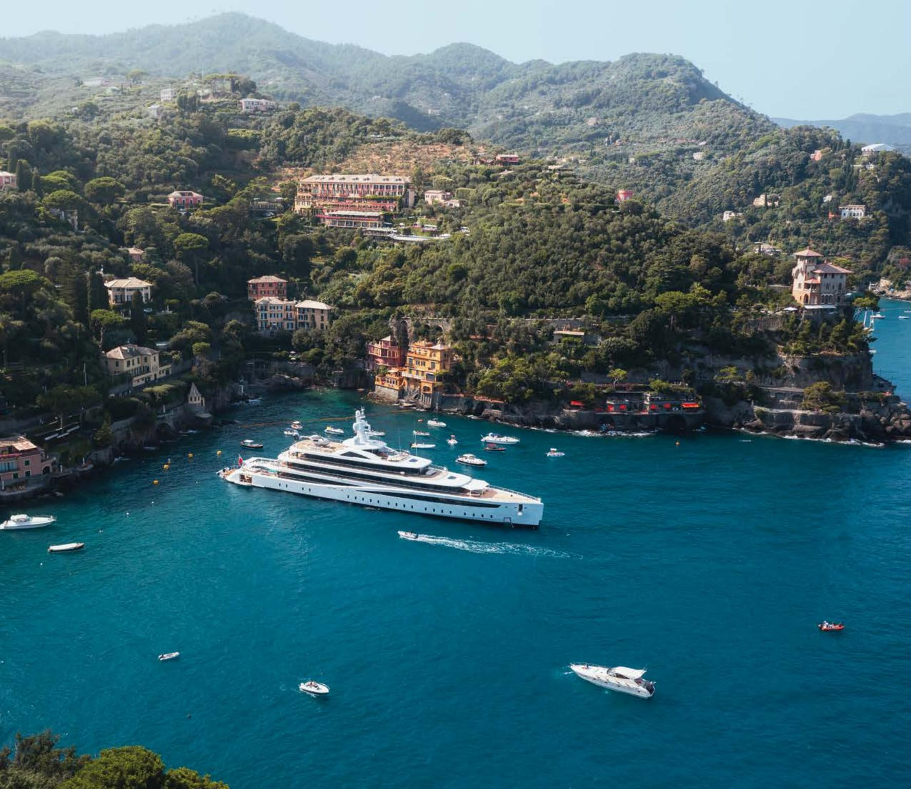

> **AI Description:**
> **Source:** `assets/_page_152_Figure_0.jpg`
> 
> **Generated:** 2026-05-29 22:30:26
> 
> ---
> 
> The image is a photograph of a coastal scene featuring a large luxury yacht docked in a turquoise-blue bay. The bay is surrounded by lush green hills and colorful buildings, some of which appear to be residential or hotel structures. Smaller boats are scattered across the water, and the overall setting suggests a luxurious and serene environment, possibly a popular tourist destination. The image captures the beauty of the coastline and the activity in the bay.

## LVMH

## PE R FOR M A N C E M E A S U R E S

### Full Page Description (Page 155)

**Source:** `assets/_page_155_Asset_0.jpg`

**Generated:** 2026-05-29 21:33:44

---

The image is a pie chart that visually represents the distribution of ownership or investment percentages among different categories. The chart is divided into four segments, each labeled with a category and its corresponding percentage:

1. **Arnault family group**: 47.8%
2. **French institutional investors**: 7.8%
3. **Foreign institutional investors**: 38.7%
4. **Individuals**: 5.5%
5. **Treasury stock**: 0.2%

The Arnault family group holds the largest share at 47.8%, followed by foreign institutional investors at 38.7%. French institutional investors and individuals hold smaller shares at 7.8% and 5.5%, respectively. Treasury stock represents the smallest share at 0.2%. The chart uses different shades of blue and brown to differentiate between the categories.

# U S E F U L I N F O R M A T I O N F O R S H A R E H O L D E R S

## SHAREHOLDERS’ CLUB

The LVMH Shareholders’ Club was set up in 1994 to give individual shareholders who are particularly interested in the life of the Group a better understanding of LVMH, its businesses and its brands. The LVMH Shareholders’ Club can be joined free of charge by any shareholder who owns at least one LVMH share listed on the Paris stock exchange.

## LATEST NEWS ABOUT OUR MAISONS

We send Club members several publications to keep them informed of the latest news about our Maisons, such as the Annual Report, the twice-annual Letter to Shareholders and the annual issue of Apartés, our Club magazine.

## TOURS TO DISCOVER OUR MAISONS

Throughout the year, the LVMH Shareholders’ Club holds exceptional in-person and virtual private tours of a number of its Maisons, such as Louis Vuitton’s workshops in Asnières, the historic La Samaritaine department store by the Pont Neuf in Paris, and Guerlain’s fragrance production facility in Orphin. Club members can also reserve guided tours of unique sites such as Hennessy’s centuries-old cellars in Cognac, Veuve Clicquot’s magnificent crayères in Reims, and Moët & Chandon and Mercier’s champagne cellars in Épernay.

## EXCLUSIVE OFFERS FOR THE GROUP’S PRODUCTS

In addition to special offers on a selection of the Group’s wines and spirits, for delivery in France only, Club members can purchase discounted subscriptions to Group media publications – Les Echos, Investir, Le Parisien and Connaissance des Arts – and order priority-access tickets for the Fondation Louis Vuitton.

## A WEBSITE DEDICATED TO CLUB MEMBERS

The detailed program of the Club’s visits as well as the exclusive offer of wines and spirits, subscriptions to the Group’s newspapers and magazines and tickets to the Fondation Louis Vuitton are available via the Club’s website at www.clublvmh-actionnaires.fr/en. This private online space, dedicated to Club members, can be accessed once they have created their account.

## INFORMATION ABOUT LVMH SHARES

Listed on: Eurolist by Euronext Paris Stock market capitalization: €367 bn as of 12/31/2021 (the largest capitalization on the Paris stock market) Number of shares: 504,757,339 as of 12/31/2021 Member of indices: CAC 40, Dow Jones Euro Stoxx 50, MSCI Europe, FTSE Eurotop 100, Global Dow and FTSE4Good.

## SHAREHOLDER STRUCTURE(1) (November 2021)

## AGENDA

Thursday, January 27, 2022: 2021 annual revenue and results April 2022: 2022 first-quarter revenue Thursday, April 21, 2022: Shareholders’ Meeting Thursday, April 28, 2022: Payment of the final dividend for fiscal year 2021 July 2022: 2022 half-year revenue and results October 2022: 2022 third-quarter revenue

## CONTACTS

Investor and Shareholder Relations Phone: +33 (0)1 44 13 27 27 Shareholders’ Club Phone: +33 (0)1 44 13 21 50

### Full Page Description (Page 156)

**Source:** `assets/_page_156_Asset_0.jpg`

**Generated:** 2026-05-29 22:04:35

---

The image is a line graph with two y-axes and a shared x-axis. The left y-axis represents values in euros, ranging from 200 to 725, while the right y-axis represents values in euros, ranging from 0 to 8,000,000. The x-axis spans from January 2019 to December 2021. The graph shows two lines: a blue line representing data in euros and a brown line representing data in a larger scale of euros. The blue line fluctuates significantly, indicating changes in value over time, while the brown line shows a gradual increase. The gray area at the bottom of the graph represents another dataset, possibly related to the blue line, but it is not labeled and its significance is unclear.

# S T O C K M A R K E T P E R F O R M A N C E M E A S U R E S

Source: Euronext.

(1) To be proposed at the Shareholders’ Meeting on April 21, 2022.

Stock markets hit new records in 2021, driven by factors including global economic growth and financial performance of businesses, despite the ongoing uncertainty surrounding the pandemic. The luxury sector in particular enjoyed ongoing strong demand from the United States and China, and posted solid earnings, with LVMH becoming Europe’s highest-valued company in February 2021.

The end of the year, however, saw renewed volatility, with the return of inflation, uncertainty surrounding the end of central banks’ accommodative monetary policy, and the emergence of the Omicron variant, although this volatility did not impact the annual stock market performances of the main indices, with the CAC 40 surpassing 7,000 points for the first time in November.

The CAC 40 and Euro Stoxx 50 indices finished 2021 up 28.85% and 20.99%, respectively. The LVMH closing share price ended the year up 42.3%, at €727, after having reached a new all-time record high of €741.60 toward the end of the year. LVMH’s market capitalization was €367 billion as of December 31, making it the largest company on the Paris stock exchange.

### Full Page Description (Page 157)

**Source:** `assets/_page_157_Asset_1.jpg`

**Generated:** 2026-05-29 22:55:11

---

The image is a bar chart showing the number of items for the years 2019, 2020, and 2021. The bars are color-coded: gray for 2019, brown for 2020, and blue for 2021. The values for each year are labeled as follows: 4,915 for 2019, 5,003 for 2020, and 5,556 for 2021. The chart indicates a general upward trend in the number of items over the three years, with a slight increase from 2019 to 2020 and a more significant increase from 2020 to 2021.

### Full Page Description (Page 157)

**Source:** `assets/_page_157_Asset_0.jpg`

**Generated:** 2026-05-29 22:57:36

---

The image is a pie chart titled "2021 REVENUE BY REGION (as %)". It visually represents the revenue distribution across different regions for the year 2021. The key information includes:

- The United States accounts for 26% of the revenue.
- Asia (excluding Japan) contributes 35%.
- Japan makes up 7%.
- Europe (excluding France) represents 15%.
- France contributes 6%.
- Other markets account for 11% of the revenue.

The chart uses different shades of color to distinguish between the regions, with each region's percentage labeled next to its corresponding slice.

### Full Page Description (Page 157)

**Source:** `assets/_page_157_Asset_3.jpg`

**Generated:** 2026-05-29 22:52:17

---

The image contains a bar chart with three vertical bars, each representing a year from 2019 to 2021. The bars are color-coded and labeled with numerical values: 11,504 for 2019, 8,305 for 2020, and 17,151 for 2021. The chart shows an increase in the numerical value from 2019 to 2021, with the highest value in 2021. The bars are decorated with a herringbone pattern.

### Full Page Description (Page 157)

**Source:** `assets/_page_157_Asset_2.jpg`

**Generated:** 2026-05-29 22:50:56

---

The image contains a bar chart with three vertical bars, each representing a year from 2019 to 2021. The bars are shaded with different patterns and are labeled with numerical values: 53,670 for 2019, 44,651 for 2020, and 64,215 for 2021. The chart visually represents a comparison of values across these three years, with the bar for 2021 being the tallest, indicating the highest value among the three years.

## F I N A N C I A L P E R F O R M A N C E M E A S U R E S

PROFIT FROM RECURRING OPERATIONS BY BUSINESS GROUP

(1) On a constant consolidation scope and currency basis. For the Group, changes in scope with respect to 2020 had a positive 10% impact, mainly related to the initial consolidation of Tiffany & Co. in the accounts; exchange rate fluctuations had a negative 2% impact.

(1) Non-comparable scope of consolidation.

### Full Page Description (Page 158)

**Source:** `assets/_page_158_Asset_5.jpg`

**Generated:** 2026-05-29 22:45:49

---

The image contains a bar chart with three vertical bars, each representing a year from 2019 to 2021. The bars are color-coded and have a patterned fill. The values for each year are labeled at the top of the bars: 6,206 for 2019, 4,241 for 2020, and 9,607 for 2021. The chart shows an increase in the value from 2019 to 2021, with the highest value in 2021.

### Full Page Description (Page 158)

**Source:** `assets/_page_158_Asset_4.jpg`

**Generated:** 2026-05-29 22:49:09

---

The image contains a bar chart with three vertical bars, each representing a year from 2019 to 2021. The bars are color-coded and have percentages and numerical values associated with them. The percentages are 16% for 2019, 11% for 2020, and 20% for 2021. The numerical values are 38,365 for 2019, 38,829 for 2020, and 48,909 for 2021. The chart shows an increase in the numerical values over the years, with the largest increase occurring between 2020 and 2021.

### Full Page Description (Page 158)

**Source:** `assets/_page_158_Asset_0.jpg`

**Generated:** 2026-05-29 22:21:25

---

The image is a bar chart with three vertical bars, each representing a year from 2019 to 2021. The bars are color-coded and have different patterns. The heights of the bars correspond to numerical values: 7,171 for 2019, 4,702 for 2020, and 12,036 for 2021. The chart shows a significant increase in the value from 2019 to 2021, with the largest value in 2021.

### Full Page Description (Page 158)

**Source:** `assets/_page_158_Asset_3.jpg`

**Generated:** 2026-05-29 22:32:47

---

The image is a bar chart that visually represents the breakdown of assets and liabilities and equity for a financial entity. The chart is divided into two main sections: Assets and Liabilities and Equity. 

- The Assets section is further divided into Non-current assets (73%), Inventories (13%), and Other current assets (14%). The total assets are represented by a blue bar labeled "125".

- The Liabilities and Equity section is divided into Equity (39%), Non-current liabilities (39%), and Current liabilities (22%). The total for this section is also "125".

The chart uses different patterns and colors to distinguish between the different categories, making it easy to compare the proportions of each component within the total. The use of percentages and the total of 125 for both assets and liabilities/equity indicates a balance sheet perspective.

NET PROFIT, GROUP SHARE (EUR millions)

# N O N - F I N A N C I A L P E R F O R M A N C E M E A S U R E S

BREAKDOWN OF EMISSIONS BY BUSINESS GROUP (in metric tons of CO₂ equivalent)

(1) Value and change at constant scope. (2) Change related to business levels.

ENERGY CONSUMPTION BY BUSINESS GROUP(in MWh)

(1) Value and change at constant scope.

WATER CONSUMPTION BY BUSINESS GROUP (process requirements in m3)

(1) Value and change at constant scope.
(2) Change related to measurement adjustments at a site.

WEIGHT OF PACKAGING THAT REACHES CUSTOMERS BY BUSINESS GROUP (in metric tons)

(1) Value and change at constant scope. (2) Change related to the upturn in business.

BREAKDOWN OF THE WORKFORCE BY BUSINESS GROUP (as of December 31, 2021)

(2) Under permanent contracts.
(1) Total permanent and fixed-term headcount.

BREAKDOWN OF THE WORKFORCE BY REGION (as of December 31, 2021)

(1) Total permanent and fixed-term headcount. (2) Under permanent contracts.

BREAKDOWN OF THE WORKFORCE
BY PROFESSIONAL CATEGORY (as of December 31, 2021)

(1) Total permanent and fixed-term headcount. (2) Under permanent contracts.

AVERAGE LENGTH OF SERVICE AND BREAKDOWN BY LENGTH OF SERVICE (as of December 31, 2021)

## Photographs

Cover, p. 4, 13: Louis Vuitton Malletier, Viviane Sassen – p. 6: Jamel Toppin – p. 10, 30: La Samaritaine Canopy   
@WeAreContents – p. 12, 15: Jean-François Robert – p. 17: Laure Sée – p. 20: Dior, Julia Hetta – p. 22, 70: Loro Piana   
– p. 24: Fondation Louis Vuitton – p. 27: Fondation Louis Vuitton, © Gehry Partners, LLP and Frank O. Gehry, © Iwan Baan, 2014   
– p. 28: Louis Vuitton, Arnaud Garni – p. 34, 90, 97: Parfums Christian Dior – p. 38: Fabrice Laroche – p. 44: Dom Pérignon,   
James Bort – p. 48, 50: Dom Pérignon – p. 50, 53, 60, 61: Hennessy – p. 51: Moët & Chandon – Veuve Clicquot   
– Château Cheval Blanc, Gérard Uféras – p. 52: Krug, Zoë Ghertner – Château d’Yquem, Gérard Uféras – p. 53: Moët Hennessy, DR   
– Eminente – p. 53, 56, 57: Ruinart – p. 55: Chandon – p. 58: Glenmorangie – p. 62-63: Château d’Esclans – p. 64: Louis Vuitton   
Malletier, Ethan James Green – p. 68: Louis Vuitton Malletier, Nick Sethi – p. 70, 82, 83: Fendi – p. 71: Nona Source – Dior, Sarah van Rij   
– Berluti, Eduardo Miera – p. 72: Loewe, Molly Lowe – p. 72, 80, 81: Celine, Hedi Slimane – p. 73: Louis Vuitton Malletier,   
François Coquerel – RIMOWA – Marc Jacobs – p. 75: Dior – p. 76: Louis Vuitton Malletier, Steven Meisel – p. 77: Loewe,   
Juergen Teller – p. 78: Dior, Myrto Papadopoulos – p. 84: Louis Vuitton – p. 85: Louis Vuitton Malletier, Piotr Stoklosa – p. 86:   
Parfums Christian Dior, Jérôme Galland – p. 92: Parfums Christian Dior, Will Davidson – Celine – p. 93, 95: Guerlain – p. 93: Guerlain,   
Zoé Fidji – Parfums Givenchy, Guido Mocafico – p. 94: Fenty Beauty – p. 94, 105: Maison Francis Kurkdjian – p. 95: Parfums Kenzo   
– p. 98, 99: Officine Universelle Buly – p. 100: Emilio Pucci x Acqua di Parma – p. 101: Fresh – p. 102: Guerlain, Florian Joye – p. 104:   
Parfums Christian Dior, Charles Helleu – p. 106: Tiffany & Co., Mario Sorrenti – p. 110: Tiffany & Co., Mason Poole – p. 112, 113, 122:   
Bulgari – p. 113, 116: Tiffany & Co. – p. 113: Chaumet, Julien Martinez Leclerc; Florian Joye – p. 114: Hublot, Maxime Guyon – p. 114, 115:   
Zenith – p. 115, 124, 125: TAG Heuer – p. 116: Fred – p. 117: Tiffany & Co., Mason Poole © Estate of Jean-Michel Basquiat.   
Licensed by Artestar, New York – p. 118: Tiffany & Co. x Patek Philippe – p. 119: Chaumet, Julien Falsimagne – p. 120:   
Hublot, TM/KK – p. 126, 130, 132, 133, 134: Sephora – p. 133: DFS – p. 134, 135, 140, 141: Le Bon Marché Rive Gauche – p. 136, 137, 146:   
La Samaritaine Paris Pont-Neuf, Pierre-Olivier Deschamps, Agence VU’ – p. 139: Sephora, Eventique – p. 142, 148, 149:   
Belmond – p. 145: Cheval Blanc Paris – p. 150, 151: Feadship – Other photographs: LVMH and Group Maisons’ libraries.

PLEASE DRINK RESPONSIBLY AND IN MODERATION.

This product is made of material from well-managed FSC® -certified forests and from recycled materials.

LVMH – 22, avenue Montaigne – 75008 Paris – France Phone: +33 (0)1 44 13 22 22 – www.lvmh.com

LVMH