
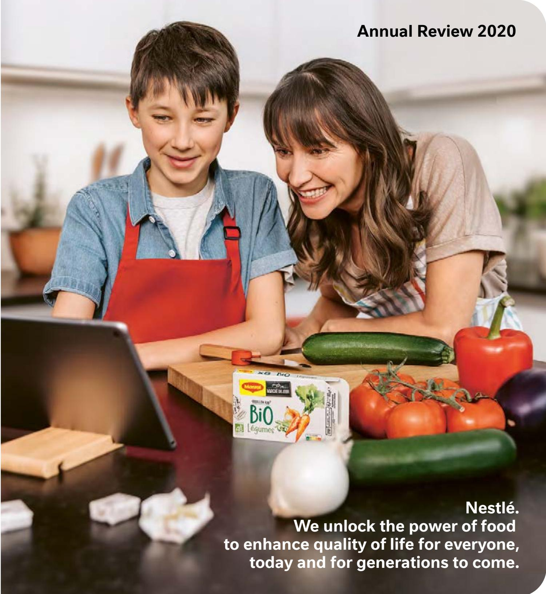

> **AI Description:**
> **Source:** `assets/_page_0_Figure_0.jpg`
> 
> **Generated:** 2026-05-30 00:06:59
> 
> ---
> 
> The image contains a photograph of a woman and a boy in a kitchen setting. The woman is smiling and leaning towards the boy, who is also smiling and looking at a tablet. On the counter, there are various vegetables, including tomatoes, cucumbers, and a red bell pepper, along with a box of organic vegetable broth. The text at the top of the image reads "Annual Review 2020," and at the bottom, it states "Nestlé. We unlock the power of food to enhance quality of life for everyone, today and for generations to come." The image combines a photograph with text to convey a message about Nestlé's commitment to improving lives through food.

# Our purpose

Nestlé. Unlocking the power of food to enhance quality of life for everyone, today and for generations to come.

We constantly aim to push the boundaries of what is possible with foods, beverages and nutritional health solutions to bring more pleasure and enjoyment. To enable better health. To make good nutrition accessible and affordable to everyone. To make preparing foods and beverages increasingly effortless. To protect and enhance our natural resources.

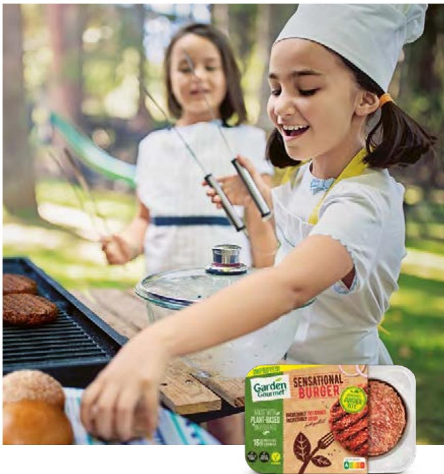

> **AI Description:**
> **Source:** `assets/_page_1_Figure_0.jpg`
> 
> **Generated:** 2026-05-30 00:01:03
> 
> ---
> 
> The image contains a photograph of two children dressed as chefs, grilling burgers outdoors. The child in the foreground is holding a spatula and appears to be cooking a burger patty on a grill. The background shows another child holding a skewer. The image also includes a product packaging image of "Garden Gourmet Sensational Burger," which is plant-based and labeled as "100% Plant-Based" and "Incredibly Delicious." The packaging highlights that the burger is suitable for vegetarians and vegans.

## Front cover

Maggi: Inspiring exploration in the kitchen In a year when people were cooking more at home, Maggi was there to support new and experienced cooks alike.

## Contents

2 Letter to our shareholders   
8 Pursuing our value-creation strategy   
12 Innovating faster to ensure long-term growth   
16 Connecting through digitalization   
20 Speaking through our brands   
36 Creating Shared Value   
46 Financial review   
64 Corporate Governance and Compliance   
71 Shareholder information

## Accompanying reports

Corporate Governance Report 2020   
Compensation Report 2020   
Financial Statements 2020

## Online

You can find more information about the Nestlé Group at www.nestle.com

Find out more about Creating Shared Value at www.nestle.com/csv

# Our performance

Our Nutrition, Health and Wellness strategy is the engine of our value creation.

In an unprecedented environment, we delivered our third consecutive year of improvement in organic sales growth, profitability and capital efficiency. A summary of the 2020 full-year results can be found in the table to the right.

Group sales (in CHF)

84.3 billion

Underlying trading operating profit \* (in CHF) 14.9 bill

Trading operating profit\* (in CHF) 14.2 or

Earnings per share (in CHF)

4.30

Operating cash flow (in

14.4 billion   
45.9% of net financial debt

Proposed dividend (in CHF) 2.75

Organic growth\*

3.6%

Underlying trading operating profit margin\* 17.7%

Trading operating profit ma 16.9%

Earnings per share

Unchanged

Free cash flow\* (in CHF) 10.2

Proposed dividend increase +1.9%

Real internal growth\*

3.2%

Underlying trading operating profit margin\* +20 Basis points Constant currency

Trading operating profit ma +220 Basis points

Constant currency

Underlying earnings per

Constant currency

## Our business

Products that are right for consumers and right for the planet are increasingly desirable and make for good business.

That is why we apply our expertise in Nutrition, Health and Wellness to help people, families and pets live happier, healthier lives. We protect and enhance the environment, and generate significant value for our shareholders and other stakeholders alike.

What we sell (in CHF billion)

Powdered and Liquid Beverages

Milk products and Ice cream
Nutrition and Health Science
Confectionery
Prepared dishes and cooking aids

Water

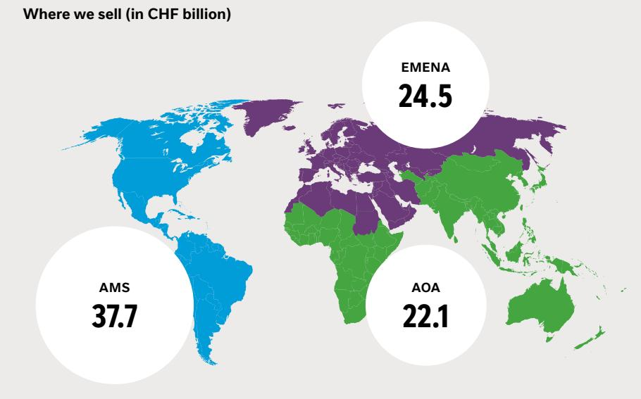

> **AI Description:**
> **Source:** `assets/_page_3_Figure_5.jpg`
> 
> **Generated:** 2026-05-30 00:14:55
> 
> ---
> 
> The image is an infographic combining text with a world map. It presents data on sales in CHF billion across different regions. The map is divided into three regions: Americas (AMS), EMEA (EMENA), and Asia-Oceania (AOA). Each region is color-coded and labeled with its respective sales figure: AMS at 37.7 billion CHF, EMEA at 24.5 billion CHF, and AOA at 22.1 billion CHF. The map visually represents the geographical distribution of sales across these regions.

Number of employees
Number of countries we sell in

273 000

186

Total group salaries and social welfare expenses (in CHF)

14

Corporate taxes paid in 2020   
(in CHF)   
2.6 b

# Our commitments

Our health, social and environmental commitments guide our efforts to be a force for good.

Business benefits and positive societal impact must be mutually reinforcing. This is the core of our Creating Shared Value approach to business. Our company can only be successful in the long term if we create value for all stakeholders.

> **AI Description:**
> **Source:** `assets/_page_4_Figure_0.jpg`
> 
> **Generated:** 2026-05-30 00:21:27
> 
> ---
> 
> The image contains a simple diagram of two figures, one appearing to be an adult and the other a child, with the adult figure placing a hand on the child's shoulder. This visual representation suggests a supportive or protective relationship, possibly indicating care, guidance, or mentorship. The figures are stylized and do not include any text or additional labels.

## For individuals and families

Ove r1210

new products were launched addressing specific nutritional needs and gaps of infants, children, expecting women or new mothers

Over 33

children reached through Nestlé for Healthier Kids

Ove r 196 b illion

servings of micronutrient fortified foods and beverages provided in countries with high vulnerability of deficiencies

2.76b illion

portions of vegetables added to our foods and beverages in 2019

> **AI Description:**
> **Source:** `assets/_page_4_Figure_1.jpg`
> 
> **Generated:** 2026-05-30 00:22:06
> 
> ---
> 
> The image contains a simple diagram with a house and a tree. The house is orange with a red roof, and the tree is green with a red outline. There are no charts, graphs, or other visual elements present. The diagram appears to represent a basic concept, possibly related to home and nature.

## For our communities

235

coffee plantlets distributed (cumulative since 2010) to farmers, against a target of 220 million by 2020

Ove r 8600

job opportunities, traineeships or apprenticeships were offered to people under the age of 30 through our Nestlé needs YOUth initiative

73%

of the volume of our 15 priority categories of raw materials are responsibly sourced

354900

farmers trained through capacity-building programs

## For the planet

36.7%

reduction in greenhouse gas (GHG) emissions per tonne of product since 2010 in our manufacturing operations

368

factories achieved zero waste for disposal

32%

reduction in direct water withdrawal per tonne of product since 2010 in our manufacturing operations

50%

of our electricity comes from renewable sources

# Dear fellow shareholders,

Nestlé is the Good food, Good life company. We believe in the power of food to enhance quality of life. We constantly explore and aim to push the boundaries of what is possible with food, beverage and nutritional health solutions to contribute to a healthier future. We focus on making a difference to the lives of people and pets, on protecting and enhancing the environment, and on generating value for our shareholders and other stakeholders alike.

## Demonstrating dependability and agility

2020 was a challenging year. COVID-19 severely impacted every aspect of our lives and created much uncertainty. At Nestlé, we responded immediately and with clear priorities by putting measures in place to keep our employees safe; by ensuring supply of essential food and beverages to consumers; by caring for our communities and providing financial and in-kind support to our business partners.

While the COVID-19 crisis has caused volatility, we made further progress on our value creation model based on a balanced pursuit of top-line and bottom-line growth with capital efficiency. Highlights include:

Organic growth reached 3.6%, with real internal growth of 3.2% and pricing of 0.4%. Growth was supported by strong momentum in the Americas, Purina PetCare and Nestlé Health Science.

– Foreign exchange reduced sales by 7.9% due to the continued appreciation of the Swiss franc against most currencies. Divestures had a negative impact of 4.6%. As a result, total reported sales decreased by 8.9% to CHF 84.3 billion (2019: CHF 92.6 billion).

Underlying trading operating profit (UTOP) margin reached 17.7%, up 10 basis points on a reported basis and up 20 basis points in constant currency. The trading operating profit (TOP) margin increased by 210 basis points to 16.9% on a reported basis.

– Underlying earnings per share increased by 3.5% in constant currency and decreased by 4.5% on a reported basis to CHF 4.21. Earnings per share stayed unchanged at CHF 4.30 on a reported basis.

Free cash flow reached CHF 10.2 billion, accounting for 12.1% of sales.

Our results demonstrate the consistency and dependability of our company. Our resilience is based on the agility of our business and the strength of our diversified

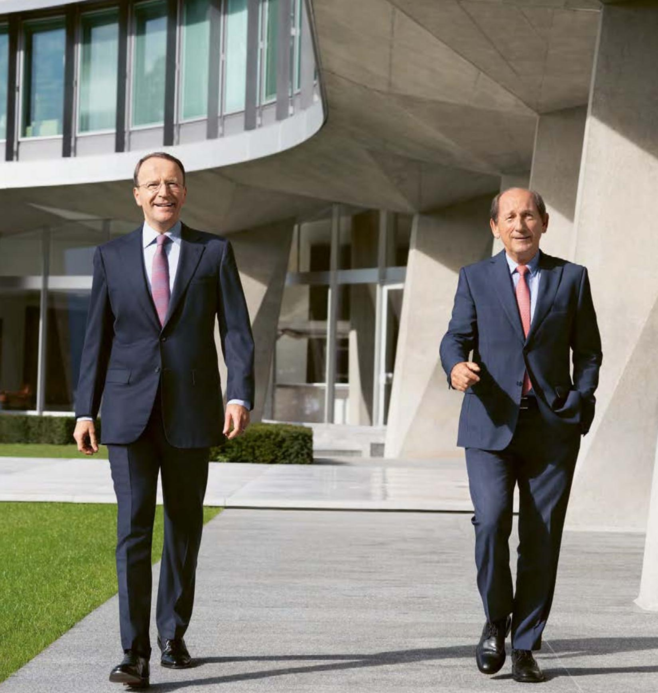

> **AI Description:**
> **Source:** `assets/_page_6_Figure_0.jpg`
> 
> **Generated:** 2026-05-30 00:02:26
> 
> ---
> 
> The image contains a photograph of two individuals walking outdoors in front of a modern building. Both are dressed in formal business attire, consisting of dark suits, light blue shirts, and pink ties. The building behind them has a contemporary design with large glass windows and a curved architectural feature. The setting appears to be a professional or corporate environment, possibly a corporate headquarters or a similar establishment. The individuals are walking side by side, suggesting a collaborative or professional relationship.

Paul Bulcke, Chairman (right), and U. Mark Schneider, Chief Executive Officer (left)

portfolio across geographies, product categories and channels. Our decentralized model enables our local teams to make quick decisions, act autonomously and respond with speed to rapid shifts in consumer needs and customer demands.

## Sharpening our strategic focus

We continued to make significant progress in our portfolio transformation toward attractive, high-growth businesses in 2020.

We took the decision to sharpen our water focus on iconic international, premium mineral and functional brands, while exploring strategic options for parts of the Waters business in North America. We also sold the Yinlu peanut milk and canned rice porridge businesses in China to Food Wise Co., Ltd.

We completed the divestment of our U.S. ice cream business to Froneri and the sale of 60% of our stake in Herta to create a joint venture with Casa Tarradellas.

We continued to build Nestlé Health Science into a nutritional powerhouse through a combination of strong organic growth and targeted acquisitions. Examples include Zenpep, Vital Proteins, IM HealthScience and Aimmune Therapeutics. With Aimmune’s PALFORZIA, we acquired the first and only FDAand European Commission-approved treatment for peanut allergy. We also expanded our presence in direct-to-consumer meal delivery services through the acquisition of Freshly in the United States and a majority stake in Mindful Chef in the United Kingdom.

## Investing for the long term

We continue to invest in research and development (R&D) and in our brands, and we made further investments behind key growth platforms. Purina PetCare unveiled plans to extend its production network in the Americas, Europe, China and Australia. Nespresso announced a CHF 160 million investment in the expansion of its production center in Romont, Switzerland, to meet growing consumer demand worldwide. To accelerate the development of nutritious and environmentallyfriendly plant-based products, we expanded production and R&D facilities, and extended our supply chain partnerships.

## Developing solutions to meet fast-changing consumer needs

Most of the long-term trends we have been working on still apply. Some have accelerated, particularly, e-commerce, digital engagement and demand for nutrition, health and wellness. One major change, brought on by the pandemic, has been the rapid shift toward at-home consumption. With consumer behavior evolving faster than ever, we are adapting to this new reality by strengthening our innovation, leveraging our digital capabilities and executing with speed. For example, we rolled out our Smart Recipe Hub across 48 markets to inspire families with healthy recipes that can be customized using nutritional balance scores and meal planners. As the economic consequences of the pandemic have intensified, we have also revitalized our affordable nutrition offerings, particularly in emerging markets.

“The events of 2020 were unprecedented, and the pandemic is not over. The health crisis had an enormous impact on every aspect of our lives. In a volatile environment, Nestlé employees stepped up to the challenge. Our people brought our purpose and values fully to life.”

## Boosting innovation to drive growth

Our relentless dedication to innovation allows us to deliver on consumer preferences time and time again. We focus on exploring trends, rapidly converting ideas into products and testing their relevance with consumers and customers. We continued to enhance our speed and reduced our average time to market by a further 10% on our top priority projects in 2020.

Our ability to build a pipeline of meaningful innovations fuels our growth. We continually develop and deploy breakthrough technologies to create new growth opportunities. We leverage these technologies across categories, brands and markets to scale growth. In 2020, we increased the number of multi-market launches by 23%.

We continue to evolve our approach to innovation with an emphasis on encouraging entrepreneurialism and fueling creative ecosystems. We further expanded our innovation capabilities in 2020 and opened a new R&D Accelerator focused on plant-based dairy alternatives in Konolfingen, Switzerland.

Pro Plan LiveClear. The introduction of Purina Pro Plan LiveClear came on the back of more than a decade of research and coincided perfectly with the trend for increased pet ownership. Pro Plan LiveClear is the first and only cat food that reduces the allergens in cat hair and dander, improving the quality of life for cats and their owners. In 2020, it was launched in seven countries and has seen very high consumer ratings.

Coffee. Among the numerous innovations in our coffee category, we developed drought- and disease-resistant coffee varieties using our expertise in plant science. We expanded Nescafé Black Roast, our strongest, darkest soluble coffee, building on our expertise in flavor and aroma extraction. And as part of our commitment to minimize waste and maximize reuse, we introduced Nespresso coffee capsules using 80% recycled aluminum. We also continued to create new growth opportunities for the Starbucks brand by expanding its range of products to include seasonal, at-home coffees for the holidays, non-dairy coffee creamers and premium instant coffee. Sales of Starbucks products reached CHF 2.7 billion, generating incremental sales of over CHF 400 million in 2020.

Plant-based. We introduced many new plant-based foods, including sausages, mince and Sensational Vuna, a plant-based alternative to tuna. We continued to upgrade our plant-based offering in terms of taste, texture, flavor and nutrition. We also leveraged our expertise in plant protein to expand our dairy-alternative offerings.

“We are putting our resources and scale to work on being part of the development of the countries and communities where we are present and on tackling issues such as climate change, packaging waste and biodiversity. We believe in being transparent about the challenges we face, the progress we are making and the trade-offs that we have to manage over time. Ultimately, continuing to achieve commercial and financial success is what will allow us to finance this sustainability agenda.”

## Enhancing our digital capabilities

Our ongoing digital transformation was a powerful catalyst for consumer engagement and growth in 2020. Our digital marketing and direct-to-consumer business models enabled us to meet the sudden acceleration in demand for online shopping. E-commerce sales grew by 48.4% to account for 12.8% of total Group sales.

At the same time, our disciplined, forward-looking approach to digitalizing our operations proved vital to increasing agility and flexibility. For example, we accelerated the use of remote assistance and augmented reality technologies across our production and R&D networks. These innovative technologies enabled our experts to support critical activities such as the set-up of new production lines that ensured on-time product launches.

We see enhancing digital capabilities as a key driver of our evolution. Across each of our categories, we are developing digital ecosystems and partnering to unlock new avenues for insight, innovation and sustainable, profitable growth.

## Taking a leadership role in sustainability

Consumers rightfully expect companies, as well as individual brands and products, to act as a force for good in full respect of human rights and the environment. We are putting our resources and scale to work on being part of the development of the countries and communities where we are present and on tackling issues such as climate change, packaging waste and biodiversity. We believe in being transparent about the challenges we face, the progress we are making and the trade-offs that we have to manage over time. Ultimately, continuing to achieve commercial and financial success is what will allow us to finance this sustainability agenda.

In 2020, we made substantial progress. On climate and biodiversity, we laid out a detailed, time-bound climate change roadmap setting out our course to net zero greenhouse gas emissions by 2050. We will transform the way we operate, exploring new business models and addressing the biggest challenges in our food supply chain. That includes advancing regenerative agriculture, scaling up our reforestation program, making our products more sustainable, using more renewable energy and reducing waste.

On packaging, we continued to introduce more recycled and recyclable formats, and we are now increasing our emphasis on the areas of reduce and reuse, particularly in areas where recycling capabilities are not available or foreseeable. We want to scale up the use of reusable and refillable systems to eliminate the need for disposable packaging. We continue to work with many partners, make smart investments and drive new behavior to build up waste management infrastructure globally.

## Enhancing Board oversight of Nestlé’s environmental and social agenda

Our Board of Directors continued to provide valuable guidance on our strategy and our approach to Creating Shared Value. We maintained our practice of adding diverse experience and fresh perspectives through the appointment of a new independent director. In recent years, we have strengthened the digital and food and beverage expertise of our Board in particular.

During the year, the Board reviewed and revised its governance framework to make its risk and environmental, social and governance (ESG) responsibilities more explicit. Additionally, it agreed to expand the mission of its Nomination and Sustainability Committee. It will now review all aspects of Nestlé’s ESG agenda, including overseeing the Group’s efforts on climate change, human rights and people management, including diversity and inclusion.

## Living our purpose

The events of 2020 were unprecedented, and the pandemic is not over. The health crisis had an enormous impact on every aspect of our lives. In a volatile environment, Nestlé employees stepped up to the challenge. Our people brought our purpose and values fully to life. We take this opportunity to thank you, our employees, in particular our frontline workers, for your outstanding commitment and hard work. We thank our consumers and the communities in which we operate for their support. And we thank you, our shareholders, for your confidence in us.

Paul Bulcke Chairman

U. Mark Schneider

Chief Executive Officer

# Pursuing our value-creation strategy

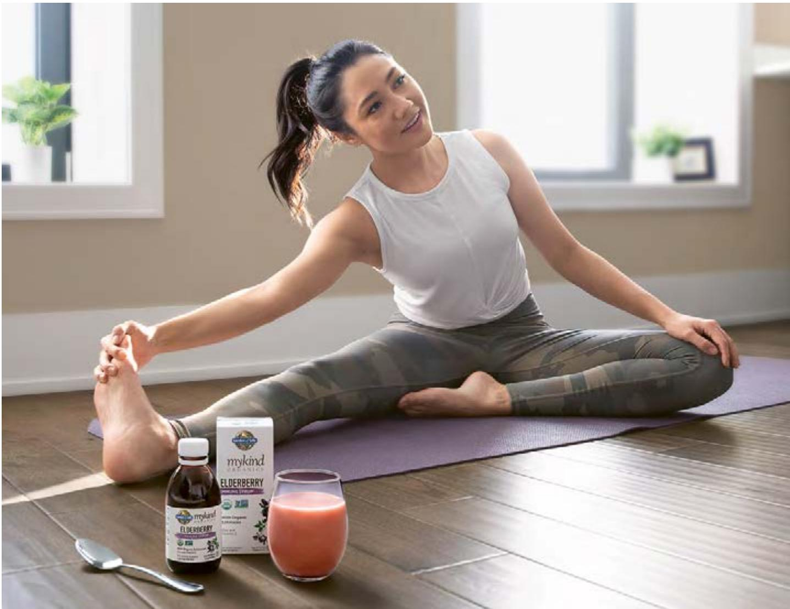

> **AI Description:**
> **Source:** `assets/_page_11_Figure_0.jpg`
> 
> **Generated:** 2026-05-30 00:15:55
> 
> ---
> 
> The image contains a photograph of a person performing a yoga pose on a yoga mat. The individual is wearing a white tank top and camouflage-patterned leggings. In the foreground, there are two bottles and a glass containing a pink liquid, along with a spoon. The bottles are labeled "mykind Organics Elderberry" and appear to be a supplement or juice. The setting is a well-lit room with a window in the background.

Garden of Life: Empowering extraordinary health
Garden of Life is an innovation engine, launching products to empower consumers’ immune and digestive health and improve their overall well-being.

We aim to offer a portfolio of products and services that evolve with consumer demands. We strive to create products that are right for consumers and that contribute to public health and a sound environment. It’s good business. This guides the choices we make today and shapes our portfolio for tomorrow – whether through product evolution, innovation, acquisition or partnership.

## Our strategy: The choices we make

We focus our energy and resources where unlocking the power of food can make the greatest difference to the lives of people and pets, protect and enhance the environment, and generate significant value for our shareholders and other stakeholders alike. This is why we:

– Apply our expertise in nutrition, health and wellness – developed over more than 150 years – to help people, families and pets live happier, healthier lives.

– Meet the needs of the modern consumer with healthy, delicious, convenient products for conscious, time-constrained lifestyles.

– Bring affordable, safe and high-quality nutrition everywhere to everyone, regardless of their income level.

– Bring distinctive, premium innovations to market fueled by creative exploration, consumer insights, pioneering nutrition science and culinary excellence.

– Advance our sustainability agenda to enhance the health of the planet, drive societal progress and support a sustainable food system, particularly in terms of:

\- Packaging and delivering our products in ways that are safe and protect the environment.

\- Offering more plant-based food and beverage options to enable us to be the consumers’ preferred choice as they diversify their diets.

## Our value creation model

Our long-term value creation model is based on the balanced pursuit of resource efficient top- and bottom-line growth as well as improved capital efficiency. We create value by:

– Fueling growth through continuous innovation.

– Improving operational efficiency.

– Allocating our resources and capital with discipline and clear priorities, including through acquisitions and divestitures.

## Ensuring sustained mid single-digit organic sales growth

Our success is built on maintaining a diversified portfolio, both in terms of geography and category. Our ability to adapt to changing environments and to nourish our high-quality global, regional and local brands contribute to long-term financial performance. Our objective is to achieve sustained mid single-digit organic sales growth through a combination of rapid innovation, portfolio management and market share gains.

Investing in high-growth categories and regions with high-growth potential. We compete in attractive and growing categories, and prioritize investments to stay relevant and win in every segment and market in which we operate. To grow, we work by:

– Leveraging digital technologies to enhance our ability to identify emerging consumer needs and business model opportunities.

– Continuously bringing meaningful, differentiated innovation to market fast.

– Collaborating with customers across the retail landscape to adapt our product portfolio and channel strategies.

– Expanding category-focused ecosystems and services that increase consumer engagement and loyalty through personalization.

– Building capacity to meet future demand.

We accelerate growth by investing behind strategic drivers such as:

– High-growth categories of coffee, pet care, nutrition, water and nutritional health science. Together, these represented 63% of sales and grew by 3.8% in 2020.

– High-growth platforms, such as plant-based food and ready-to-drink beverages. In 2020, vegetarian and plant-based food offerings continued to see strong double-digit growth.

– Trusted brands, such as Maggi, Milo and Nido. 34 of our brands generate over CHF 1 billion each in annual sales at retail level.

– Regions with high-growth potential. In 2020, emerging markets represented 41% of sales and grew by 3.4%.

Digital marketing and e-commerce. In 2020, our e-commerce sales represented 12.8% of sales and grew by 48.4%, and digital as a % of total media spend increased to 47%.

– Direct-to-consumer. In 2020, direct-to-consumer businesses represented 8.6% of sales and grew by 12%.

– Premiumization. In 2020, our premium offerings represented 30% of sales and grew by 9.5%.

– Affordable and accessible offerings. Sales of affordable, accessible products, many nutrientfortified, grew by 8.1% and accounted for 18.8% of emerging market sales in 2020.

Fixing underperforming businesses. We take decisive action to restore growth and profitability when businesses underperform. In 2020, we:

– Initiated a turnaround plan for our Wyeth infant nutrition business in China.

– Relaunched our modern, healthy frozen food range, with upgraded offerings for Lean Cuisine and the introduction of new brand, Life Cuisine.

– Took the decision to sharpen our water focus on iconic international, premium mineral and functional brands, while exploring strategic options for parts of the Waters business in North America.

Managing our portfolio. We focus on categories and geographies with attractive dynamics where Nestlé has an ability to win. Since 2017, we have completed or announced more than 75 transactions (acquisitions and divestitures) with annual sales equivalent to around 18% of 2017 Group sales. In 2020, we:

Completed the divestment of the U.S. ice cream business to Froneri and the sale of 60% of our stake in Herta to create a joint venture with Casa Tarradellas.

– Sold the Yinlu peanut milk and canned rice porridge businesses in China.

– Continued to build Nestlé Health Science into a nutritional powerhouse through a combination of strong organic growth and targeted acquisitions. Examples include: Zenpep, Vital Proteins, IM HealthScience and Aimmune Therapeutics.

– Acquired Lily’s Kitchen, a leading producer of premium wet and dry natural foods for dogs and cats.

– Expanded our presence in direct-to-consumer meal delivery services through the acquisition of Freshly in the United States and a majority stake in Mindful Chef in the United Kingdom.

## Generating continued moderate margin improvement

We fuel our growth agenda through disciplined cost management, improving operational efficiency at all levels of the business. In combination with sales growth, this approach enables us to free up resources for re-investment in product innovation, brand building and sustainability initiatives, while creating value for our shareholders.

## Reducing costs and enhancing operational

efficiency. We continued to adapt our organization to be more agile, flexible and digitalized. We made solid progress on our structural savings program across all areas of manufacturing, procurement and administration. By the end of 2020, we achieved CHF 2.8 billion in savings, exceeding our target of CHF 2.0-2.5 billion gross savings for the period from 2016 to 2020. In manufacturing we continued to upgrade our operational footprint. Between 2016 and 2020, we reduced our fixed factory overheads by 6% per annum in Swiss francs. In procurement, increased global buying combined with specification reduction helped us reduce costs and complexity. Global buying through our three purchasing hubs increased from 61% in 2019 to 63% in 2020. In administration, we continued to simplify and standardize processes. The penetration of our shared service centers increased for the fifth consecutive year.

## Allocating capital prudently and improving capital efficiency

Our priorities are to invest in the long-term growth and development of our business, while increasing shareholder returns and creating shared value. We take a disciplined approach to capital allocation, with prudent financial policies designed to strike the right balance between growth, returns and flexible access to financial markets. In combination with our operating performance, this has allowed us to increase our Return on Invested Capital (ROIC) by 240 bps, from 12.3% in 2019 to 14.7% in 2020.

Investing in growth drivers. Investing for the long term takes the form of R&D investment, brand support and capital expenditure to support organic profitable growth. We allocate these resources discerningly, focusing on projects with the highest potential to create economic profit. Working capital maintained its downward trend. Our five-quarter average working capital in % of sales reached 0% at the end of 2020, –60 bps versus 2019, marking nine consecutive years of improvement. This reduction came even as the company increased inventory levels materially to meet elevated demand.

Exercising discipline in portfolio management. We are disciplined when it comes to mergers and acquisitions in order to protect our ROIC. We have clear governance in place, with precise accountability and targets. Prospects must have a good strategic and cultural fit with our organization and offer attractive financial returns. We look for creative ways to approach deals and build partnerships that enhance our optionality.

## Returning cash to shareholders. We have

demonstrated our strong commitment to maintaining a high level of reinvestment into the business, while at the same time continually increasing capital returns to shareholders. We do this by increasing our dividend year after year. Based on our 2020 performance, the Board of Directors has proposed a dividend increase of 5 centimes to CHF 2.75 per share to be paid in April 2021. This will be our 26th consecutive annual dividend increase. As a result of our strong free cash flow generation and business disposals, we continued to return excess cash to shareholders through share buybacks. Share repurchases

amounted to CHF 6.8 billion in 2020, as part of our three-year CHF 20 billion buyback program that started in January 2020. Over the last 15 years, Nestlé has returned CHF 163.7 billion to shareholders, of which CHF 72.5 billion has been in the form of share repurchases. Over the same period, the number of shares outstanding has been reduced by 26.8%.

## Creating Shared Value: The way we operate

We build for the long term, act with focus and combine global resources with local know-how to create value for both society and our shareholders at a meaningful scale. We do so because we believe that business should act as a force for good. We have made bold commitments to achieve net zero greenhouse gas emissions by 2050 and make 100% of our packaging recyclable or reusable by 2025. We will continue to advance our sustainability agenda and create new business opportunities by ensuring Nestlé brands speak to our purpose. To do so we will continue working with our partners to:

Enable people and families to lead healthier, happier lives by continuously improving the nutritional profile of our products.

– Build supply chain resilience by improving livelihoods and being a responsible partner to the communities directly connected to our business activities.

– Steward resources for future generations by enhancing the environmental performance of our operations and scaling up nature-based solutions to regenerate our biosphere.

– Support the development of more circular economy solutions.

To ensure these efforts are self-sustaining, we aim to continue to maximize long-term value creation by achieving sustained mid single-digit organic growth, delivering continued moderate margin improvement and allocating capital prudently.

# Innovating faster to ensure long-term growth

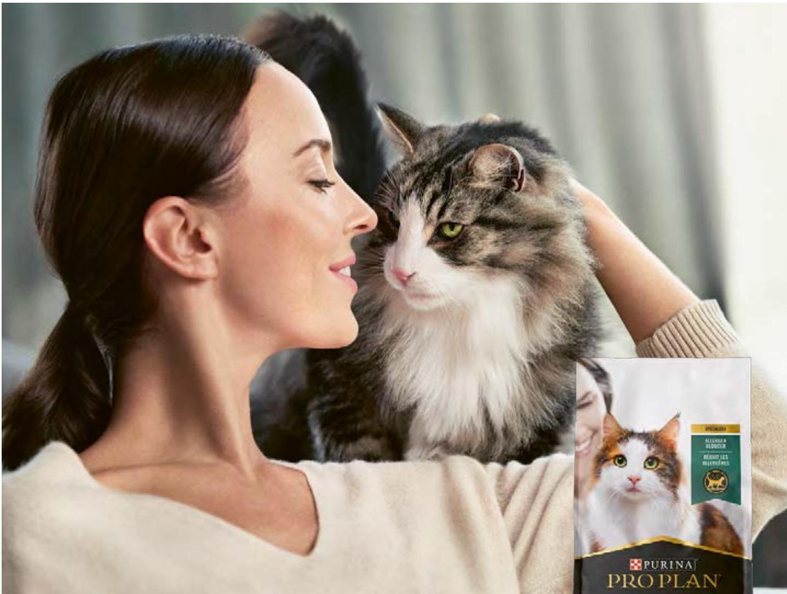

> **AI Description:**
> **Source:** `assets/_page_15_Figure_0.jpg`
> 
> **Generated:** 2026-05-29 23:59:57
> 
> ---
> 
> The image contains a photograph of a woman holding a cat on her shoulder. The cat appears to be a long-haired breed with a mix of gray, white, and black fur. The woman is smiling and looking at the cat affectionately. In the bottom right corner of the image, there is a product image of a bag of Purina Pro Plan cat food, specifically labeled as an "Allergen Blocker" formula. The product image includes a picture of a cat on the bag.

Pro Plan LiveClear: Creating breakthrough products

Purina introduced Pro Plan LiveClear, the first and only cat food that reduces allergens on cat hair. With ground-breaking science, Purina continues to create entirely new growth segments that improve quality of life for cats and their owners.

2020 was again a year of rapidly-changing consumer preferences and advances in technology, intensified by a global pandemic, the resulting economic downturn and increasing environmental concerns. In this context, our ability to develop consumer-centric innovations with speed-to-market enables us to differentiate ourselves and to delight our consumers.

Whether we are talking delicious plant-based foods, innovative coffee products, environmentally-friendly packaging or breakthrough nutritional concepts – we are delivering innovations that fulfill consumer needs and desires.

We are constantly looking for new ways to increase our speed and efficiency to bring products to the market faster. We are focused on consumer trends, while reducing our environmental impact and making good nutrition accessible and affordable to those in need. To complement our internal capabilities, we collaborate with external partners.

## Developing science-based nutritional solutions

Providing nutritional products that support and maintain health requires continuous, rigorous research. We provide science-based solutions in areas such as nutrition, gastrointestinal health, metabolic health, brain health and healthy aging across all stages of life. Our work enables us to meet the unique needs of mothers, infants, children, adults, the elderly as well as pets. We are also exploring personalized nutritional products that focus on individuals as well as groups of people defined by age, gender or specific health conditions. Our research on the gut microbiome helps us to understand its impact on human and pet health, and enables us to find nutritional solutions that can support healthy digestion, an effective immune system and general well-being. And our work in the area of cell function has led to new, innovative products, such as Celltrient, that support healthy aging.

## Acting on sustainability across the value chain

We are embedding sustainability more fundamentally into the way we innovate. We discover and apply science-based solutions in every step of the value

chain and in every phase of a product’s lifecycle – from product recipe, ingredients, sourcing and manufacturing to packaging or packaging-free delivery.

To address the issue of packaging waste, our global R&D network and our Institute of Packaging Sciences are developing refillable or reusable solutions, simplified packaging, high-performance barrier papers, biodegradable or compostable packaging materials, while increasing the use of recycled content in Nestlé’s packaging. We collaborate closely with leading global research institutions, start-ups and suppliers. In 2020, we further expanded our use of recyclable paper packaging and recycled content across our portfolio, and piloted several new refillable and reusable systems.

We invest in plant science to understand the biology of coffee, for example, to develop droughtand disease-resistant varieties. For this, we use traditional propagation methods that are free from genetically modified organisms (GMOs) and local coffee varieties. Through our research, we even rediscovered the first coffee varieties ever cultivated and revived them in our Nespresso special editions.

## Making good nutrition more affordable

Everyone should have access to affordable, safe and high-quality nutrition. Unfortunately, this is a challenge for the millions of people globally who live in poverty, a problem that has been exacerbated by the COVID-19 pandemic. Our work to make nutritious products more affordable and to fortify them with locally-relevant micronutrients is critical. To develop more affordable products, we are innovating by adjusting processes and recipes,

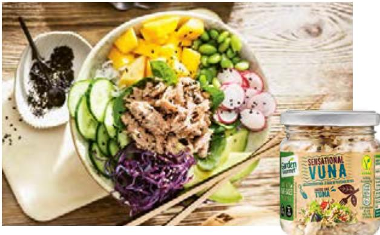

> **AI Description:**
> **Source:** `assets/_page_17_Figure_0.jpg`
> 
> **Generated:** 2026-05-30 00:19:13
> 
> ---
> 
> The image contains a photograph of a poke bowl with various ingredients such as edamame, mango, radish, cucumber, and purple cabbage. The bowl is garnished with sesame seeds and placed on a wooden surface. In the foreground, there is a jar labeled "Sensational Vuna" which appears to be a brand of tuna. The image also includes a small bowl of what looks like a dark sauce or seasoning, possibly for the poke bowl. The overall presentation suggests a healthy and fresh meal option.

## Leveraging our plant-based expertise

Our global R&D plant protein expertise and proprietary technologies enable us to launch plant-based alternatives that are nutritious, great-tasting and environmentally-friendly for people and their pets. This year, we launched the ‘plant-based triple play’ in the U.S. which was developed in only 10 months. This marked the first time that a food and beverage company could develop and produce the essential ingredients for a plant-based alternative to a bacon cheeseburger. Similarly, our plant-based tuna alternative was developed and launched in 9 months. Made from a combination of six plant-based ingredients, it is delicious, nutritious and high in protein. These launches reflect our ability to accelerate project timelines despite the challenging environment during the pandemic.

using local raw materials as well as affordable, high-quality protein sources.

## Bringing breakthrough innovations to market faster

To increase our speed and efficiency to bring products to market faster, we have continued to roll out our acceleration initiatives, increasing the number of fast-track projects and test-and-learns as well as expanding the R&D Accelerator program.

Despite the pandemic, we continued to drive rapid innovation. We adapted quickly to the new situation – for example by connecting with factories and suppliers worldwide through the use of remote assistance and augmented reality. Under challenging circumstances, we were still able to:

– Deliver 23% more global/multi-market launches versus 2019.

– Decrease the time it takes to bring innovations to market by 10% for top priority launches.

– Fund 32 fast-track projects, in which R&D staff can pitch novel ideas that are then evaluated and approved by the R&D leadership team.

## Applying our expertise across categories

Delivering our innovations quickly and scaling them up across brands, categories and geographies, is a key competitive advantage. We take a cross-

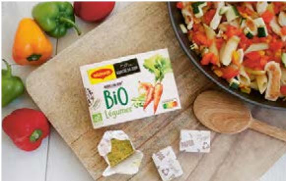

> **AI Description:**
> **Source:** `assets/_page_17_Figure_1.jpg`
> 
> **Generated:** 2026-05-30 00:20:18
> 
> ---
> 
> The image contains a photograph of a food preparation scene. It features a cutting board with a package of Maggi Bio Ligumes (vegetable bouillon cubes) prominently displayed. Surrounding the cutting board are various fresh vegetables, including bell peppers and tomatoes, as well as a wooden spoon and a bowl of cooked pasta with vegetables. The image is designed to showcase the product in a culinary context, emphasizing its use in cooking.

## Scaling up the use of paper packaging

Following on from launches of paper packaging for brands like the Yes! bar and Nesquik in 2019, Nestlé introduced recyclable paper wrappers for Maggi organic bouillon cubes in France in 2020. This made Maggi the first major brand to use such packaging. With its launch, our R&D packaging experts overcame the challenge of creating a foldable, sealable material that was robust enough to provide a sufficient barrier. In the UK, we also launched recyclable paper wrappers for our Smarties sharing block, a popular coated chocolate confectionery product. These steps are part of our commitment to making all of our packaging recyclable or reusable by 2025.

category approach when translating scientific discoveries into innovations and leveraging new technologies. For example, our proprietary technologies in plant proteins have led to the launch of plant-based meat, fish and dairy alternatives across categories, offering consumers a wide range of healthy, more environmentallyfriendly alternatives. Where possible, we leverage synergies between human and pet health for the development of science-based nutrition concepts.

## Connecting with start-ups and students

Our unique open innovation approach combines disruptive ideas with sound R&D expertise and a flexible test-and-learn model. We work with startups, students and other partners, to strengthen entrepreneurship and shape innovation.

Our network of R&D Accelerators brings employees, startups and students together to work on a specific project for six months. They can fully leverage Nestlé’s R&D expertise, shared labs, kitchens and production equipment, helping them to develop and test novel innovations in real market conditions. Our R&D Accelerator in Lausanne, Switzerland, focuses on cross-category innovation, whereas our newly unveiled R&D Accelerator in Konolfingen, Switzerland, concentrates on sustainable dairy products and plant-based

> **AI Description:**
> **Source:** `assets/_page_18_Figure_0.jpg`
> 
> **Generated:** 2026-05-30 00:11:20
> 
> ---
> 
> The image contains a photograph of a smiling woman and a child embracing each other. The woman is holding the child in a warm, affectionate manner. In the bottom right corner, there is a product advertisement for Nestlé Cerevita, featuring an image of the product packaging and highlighting its features as an "Instant Sour Porridge." The image combines a personal, emotional moment with a commercial product advertisement.

Developing affordable, nutritious products In our efforts to expand our range of affordable, nutritious products, particularly for consumers in emerging markets, we launched the Cerevita Instant Sour Porridge for Southeast African consumers. The porridge is made with wholegrain cereals and fortified with key vitamins and minerals, which are typically lacking in local diets. Our scientists at the R&D Center in Abidjan, Côte d’Ivoire, developed and launched the product in under one year. They leveraged our science and technology capabilities to adapt the porridge to local consumer tastes and nutritional needs, while minimizing production costs to ensure affordability.

alternatives to dairy. We also launched Unleashed, an accelerator program for pet care that gives startups access to our pet health and nutrition expertise as well as proof-of-concept funding and access to established commercial networks. We are currently expanding the R&D Accelerator initiative across many categories and geographies including at our R&D centers in India and Côte d’Ivoire.

In addition to our R&D Accelerator, we collaborate with a number of world-class academic institutions and other partners to further the research and innovation in key areas.

## Supporting future innovators

We collaborate with universities and students in many regions of the world. Students can embark on PhD or Master’s internships in our R&D centers globally, enabling them to translate their research into real-life solutions, while developing their practical skills in state-of-the-art facilities. In our R&D facilities in Switzerland, we currently have around 50 students completing internships on various topics. We believe this is how we can foster local innovation and support future innovators. For example, we have an agreement with the University of Ghana to enhance nutrition and sustainability research. We support the European Master in Food Studies program led by Wageningen University

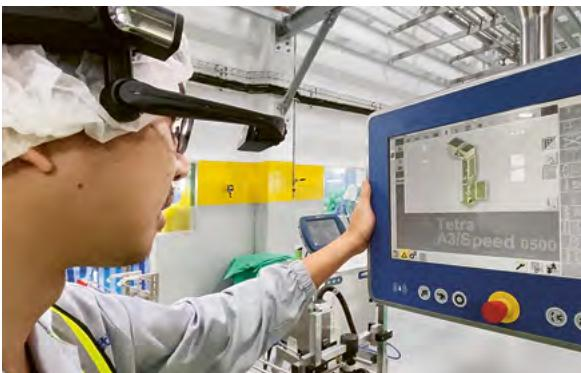

> **AI Description:**
> **Source:** `assets/_page_18_Figure_1.jpg`
> 
> **Generated:** 2026-05-30 00:10:53
> 
> ---
> 
> The image contains a photograph of a person operating a machine in what appears to be a manufacturing or industrial setting. The individual is wearing a white cap and glasses, and is interacting with a control panel labeled "Tetra A3 Speed D500." The control panel displays a graphical interface with various icons and text, suggesting it is used for programming or monitoring the machine's operations. The environment includes industrial equipment and a partially visible yellow sign in the background.

Increasing efficiency with augmented reality With travel largely restricted in 2020, we made use of augmented reality technology to provide support to our factories and production sites, helping us keep our operations running and deliver projects on time. For example, R&D teams in Switzerland helped virtually to bring production lines and technologies online for a dairy ready-to-drink factory in Thailand and for infant cereals in China. Remote assistance is becoming the new norm, as it increases speed and efficiency and reduces travel.

& Research, Netherlands. We are also co-founders of the Future Food Initiative, a joint research program between Swiss universities and industrial partners. The initiative includes a postdoctoral fellowship program for qualified young researchers working on projects targeting future food issues such as nutrition, production, packaging and digital health.

# Connecting through digitalization

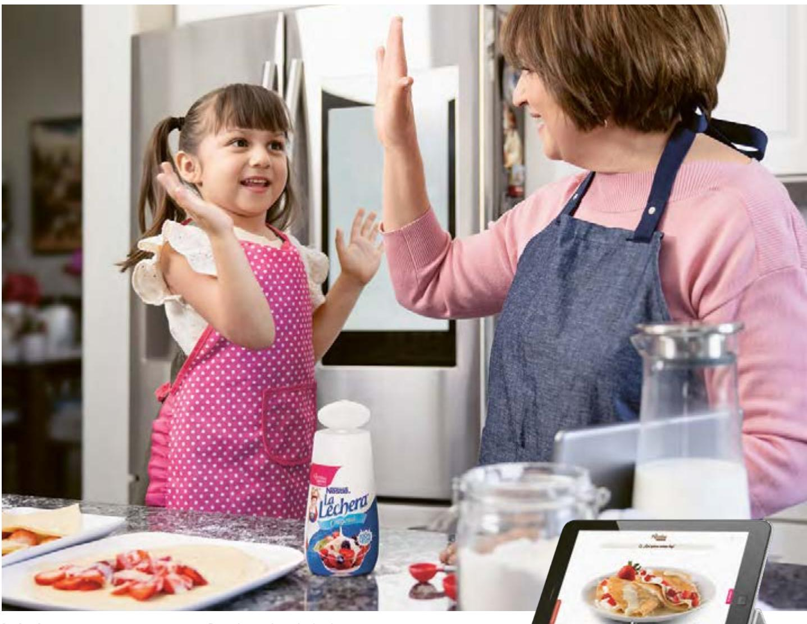

> **AI Description:**
> **Source:** `assets/_page_19_Figure_0.jpg`
> 
> **Generated:** 2026-05-30 00:09:04
> 
> ---
> 
> The image contains a photograph of a kitchen scene. Two individuals, an adult and a child, are wearing aprons and appear to be engaged in a cooking activity. The child is wearing a pink apron with white polka dots, while the adult is wearing a blue apron. They are high-fiving each other, suggesting a positive and collaborative atmosphere. On the counter, there is a bottle of Nestlé La Lechera cream, a tablet displaying a recipe, and ingredients such as strawberries and a jar of sugar. The setting appears to be a home kitchen, and the overall mood is cheerful and family-oriented.

La Lechera: Making sweet moments
Brands, such as La Lechera, leveraged our digital recipe tools and strengths in social media to make baking simpler and more joyful for families everywhere.

Digitalization is a crucial driver of Nestlé’s continued evolution. It covers all aspects of our business and helps create new platforms for growth, enhances agility and generates efficiencies. We are advancing as a digitally-enabled and data-intelligent business.

## Thriving in a connected world

Consumers are more pressed for time, digitallyengaged and health-conscious than ever before. They expect our brands to offer or recommend ‘fit-forme’ solutions that can be accessed on demand and seamlessly integrated into their lives. To succeed in this connected world, we focus our digitalization efforts on:

– Scaling growth in e-commerce.

– Leveraging analytics to better understand, engage and create value with consumers and customers.

– Digitalizing our operations and administration to make us more efficient.

– Raising the digital competencies of our people to make us more agile.

## Scaling growth in e-commerce

In 2020, our e-commerce sales accounted for 12.8% of sales and grew by 48.4%. This strong growth reflects our ability to adapt quickly to rapidly-evolving consumer demands and is based on:

– A deep understanding of which categories, geographies, brands and consumer value propositions fit with e-commerce.

– Experience building responsive, scalable and profitable direct-to-consumer businesses.

– A close relationship with all retailers selling online.

– Ensuring our markets have the freedom to tailor a centrally developed toolkit of digital technologies and practices to their local needs.

E-commerce is part of our omnichannel strategy, combining online and offline, to delight consumers with the best shopping experience however, wherever and whenever they decide to shop. We seek growth across all channels, from partnerships with e-retailers to direct-to-consumer businesses such as Nespresso, Persona and Tails.com.

Enabling digital innovation. We continually learn with consumers, customers and technology partners to develop new areas of opportunity, such as:

– Deploying artificially intelligent chatbots to boost consumer engagement, such as cooking assistants.

– Expanding and personalizing services, such as nutrition advice.

– Making shopping more convenient through voice search and social commerce.

– Partnering with last mile delivery service providers.

– Advancing our sustainability agenda.

## Leveraging analytics

We are partnering with the world’s leading digital innovators to reshape our marketing and commerce practices for the digital world. We are leveraging our scale to generate value and build new capabilities backed by powerful data models and algorithms. Our goal is to empower teams to make smarter, quicker decisions by transforming data into an accessible, reusable asset.

A key focus of these efforts is understanding the return on each marketing and commercial investment. To deliver on this, we are upgrading our end-to-end analytics capabilities to measure the value of each consumer and customer touchpoint and the impact of every campaign. These efforts are helping us to:

– Understand the effectiveness of each brand interaction.

– Generate efficiencies by improving resource allocation.

– Capture insights that can be used to optimize channel strategies in real time.

> **AI Description:**
> **Source:** `assets/_page_21_Figure_0.jpg`
> 
> **Generated:** 2026-05-30 00:21:58
> 
> ---
> 
> The image contains a photograph of three individuals in what appears to be a professional setting, possibly an office or meeting room. Two men and one woman are seated around a table, with one man holding a tablet and pointing at it, while the others are smiling and looking at the tablet. The setting suggests a collaborative or brainstorming session, with the individuals engaged in a discussion or presentation. The image conveys a sense of teamwork and focus on a shared task or project.

## Accelerating our test, learn, share and scale approach

Our internal social networking platforms help us to accelerate our speed of learning by creating global communities. These groups increase market awareness and adoption of new technologies and digital know-how. Using tools such as our start-up flow tracker, they help to raise awareness of best practices by creating visibility on take up and outcomes of new technologies.

– Identify opportunities for innovation and the scaling up of new launches.

– Maximize the value of our strategic direct-toconsumer investments, for example with Freshly.

## Personalizing engagement and experience.

Consumers expect brands to provide solutions based on personal preferences. To connect with them, our brands need to stand out by being relevant, purposeful and distinct. This requires going beyond the product to offer services and experiences that build trust, satisfaction and loyalty. We work with retail partners, influencers and platform providers to deepen our understanding of consumers in each of our categories through data.

Increasingly, our brands employ a data-driven, audience-first approach to tailor messaging to their consumers’ needs, while respecting privacy. In 2020, more than 60% of all digital media campaigns leveraged this strategy of personalization at scale. These campaigns are supported by an expanded network of 30 category and market content studios that efficiently deliver dynamic, high-quality personalized content.

To take engagement to the next level, we have begun the rollout of always-on-analytics to monitor digital campaigns and enable our brands to adapt messaging and design experiences based on real-time signals. These efforts allow us to:

– Identify opportunity areas to optimize our messaging in flight.

– Increase the relevance and value of each interaction.

Inspiring families to expand their cooking repertoire The Smart Recipe Hub has proven a powerful catalyst for identifying consumer food preferences and deepening engagement. For example, our Recetas Nestlé platform in Latin America received more than 185 million visits in 2020. The platform helps families with recipes, advises on cooking techniques and empowers them to tailor meal plans using nutritional advice on our MyMenuIQ tool. We are expanding its functionality through more integration with e-retailers and shoppable recipes.

Enhancing portfolio management and channel mix strategies. We continue to upgrade our ability to capture and convert intelligence on changes in consumer behavior and market trends to support portfolio and channel mix decisions. A key focus of these efforts is our strategic revenue management program, which now covers the majority of our markets. This capability helps us to define go-tomarket strategies and feeds the continuous evolution of brand value propositions, product formats and pricing structures. We are also leveraging artificial intelligence with end-to-end analytics to deepen collaboration with customers, prioritize production and enhance promotion effectiveness. These tools strengthen the ability of local sales teams to:

– Proactively translate our affordable nutrition and premiumization strategies into opportunities for category growth and market share gains.

– Increase the strength and quality of our customer relationships.

## Digitalizing our operations

Across our operational network, we are deploying flexible and scalable digital solutions to enhance our responsiveness. These multi-year initiatives are enabling us to better leverage technologies such as artificial intelligence, predictive analytics and collaborative robotics to support factory automation and end-of-line customization. In 2020, we expanded the scope of these programs to increase the flow, accessibility and utility of real-time data in areas such as procurement and supply chain management.

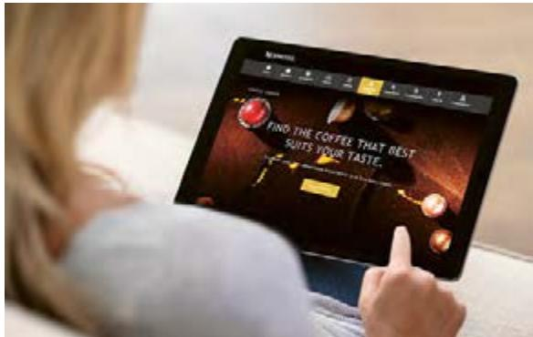

> **AI Description:**
> **Source:** `assets/_page_22_Figure_0.jpg`
> 
> **Generated:** 2026-05-30 00:04:58
> 
> ---
> 
> The image shows a person interacting with a tablet displaying a coffee selection interface. The screen features a coffee-themed background with a red button labeled "Find the coffee that best suits your taste." The interface includes various icons and text elements, suggesting a user-friendly design for selecting coffee preferences. The person's hand is pointing at the screen, indicating active engagement with the application.

Nespresso, an e-commerce model for all seasons Nespresso is a pioneer in direct-to-consumer e-commerce. The business has developed a highly responsive digital ecosystem that supports a full set of services, from subscription and communitybuilding through to AI-supported customer service and advanced fulfillment capabilities. In 2020, the robustness and scalability of this model enabled Nespresso to pivot and accommodate a surge in online purchases.

These efforts support our drive to enhance:

– Consumer and customer-centricity.

– Manufacturing flexibility and agility.

– Transparency and traceability along our supply chains.

We are also stepping up our capacity to capture and share data across our value chains. We work with supply chain partners to pilot solutions that will better balance efficiency and resiliency. For example, in 2020 we increased the scope of our Transport Hub technologies to cover 50% of our global logistics network. In parallel, we extended the scope of our AI-powered network optimization tools to evaluate different product sourcing and delivery scenarios. This has enhanced our ability to respond quickly to changes in demand and to optimize transport and production schedules. These tools enable us to better service our customers and reduce our operational carbon footprint.

Indeed, beyond efficiency and growth, we see digitalization as an enabler of our sustainability agenda. To that end we are stepping up our efforts to build systems and tools that will enable us to more accurately calculate and track progress in areas such as:

– Sustainable packaging.

– Carbon emissions reduction.

– Water management.

For example, we are working with partners such as OpenSC, a pioneer in supply chain transparency backed by the WWF, to build a fit-for-purpose platform of ‘feeding’ technologies to increase raw material traceability. In 2020, this work broke new ground by combining proximity sensors (Internet of Things), remote (satellite) and analytic (image recognition) technologies to track palm oil supply chains in Mexico.

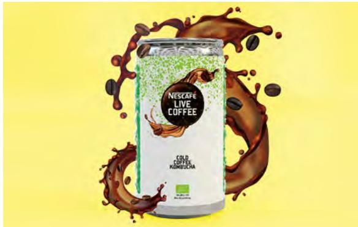

> **AI Description:**
> **Source:** `assets/_page_22_Figure_1.jpg`
> 
> **Generated:** 2026-05-30 00:05:37
> 
> ---
> 
> The image contains a can of Nescafé Live Coffee with a label indicating it is a cold coffee kombucha. The can is set against a yellow background with a dynamic splash of coffee and coffee beans surrounding it, suggesting a refreshing and energetic beverage. The design uses a combination of text and visual elements to convey the product's unique selling points.

Growth-hacking for our accelerator teams Our R&D Accelerator program leverages expertise and capabilities from across Nestlé to facilitate the rapid upscaling of products for test launch in retail environments. Projects from employees, students and start-ups, can move from idea to shop test within six months. During 2020, our expertise in digital insight generation, online consumer panels and direct-toconsumer e-commerce provided a flexible platform to rapidly experiment and refine innovations.

## Raising the digital expertise of our people

We believe that our people should be empowered by technology. To enable our employees to extract the greatest value from Nestlé’s digitalization journey, we have accelerated our efforts to build up their competencies and make them more digital savvy.

Our goal is to equip teams to:

– Be agile with digital technologies and techniques.

– Decide autonomously when, where and how to deploy new capabilities.

We have scaled up our learning platforms and established digital academies. These provide access to relevant, easy-to-consume learning materials that enable employees to acquire applicable digital skills. For example, in 2020, our e-business academy, which focuses on building expertise in search, programmatic media, e-commerce and data analytics, has trained more than 16000 employees and fully certified 2700 of our sales and marketing associates. These academies support continuous digital upskilling and keep our employees in the markets up-to-date with the latest best practices from Nestlé and our technology partners.

# Speaking through our brands

Our brands are our vehicles for creating experiences beyond products. We communicate through them every day and use them to make a real impact on people’s lives and the world around us.

Powdered and Liquid Beverages

> **AI Description:**
> **Source:** `assets/_page_23_Figure_3.jpg`
> 
> **Generated:** 2026-05-30 00:00:41
> 
> ---
> 
> The image contains a logo for Starbucks, featuring a green circular design with a white silhouette of a woman's face and long hair. The woman's hair is adorned with a crown, and the logo includes the Starbucks trademark symbol (TM) in the bottom right corner.

PetCare

Nutrition and Health Science

Prepared dishes and cooking aids

Water

# Powdered and Liquid Beverages

Powdered and Liquid Beverages covers our coffee, cocoa and malt beverage categories. This business features iconic coffee brands, including Nescafé, Nespresso and Starbucks. It also includes Milo, the world’s most popular chocolate malt drink.

## At a glance

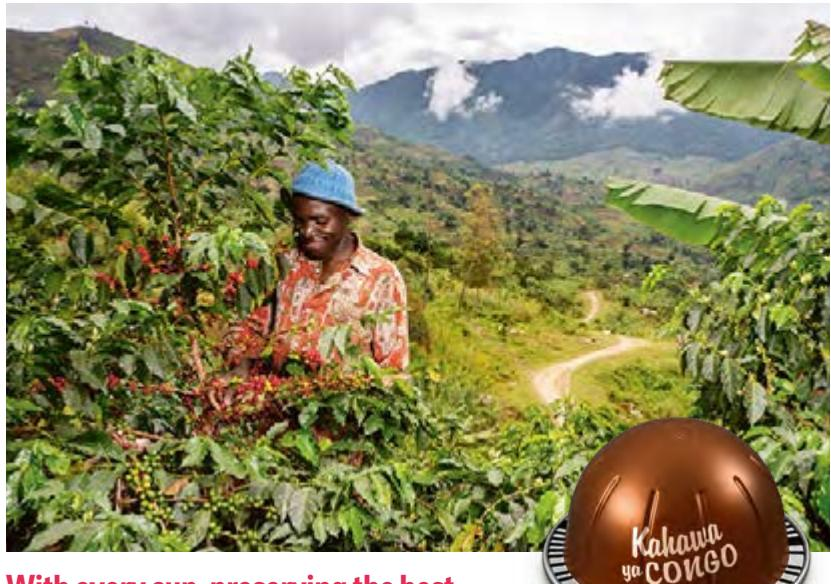

> **AI Description:**
> **Source:** `assets/_page_25_Figure_0.jpg`
> 
> **Generated:** 2026-05-30 00:05:17
> 
> ---
> 
> The image contains a photograph of a person harvesting coffee beans from a plant in a lush, mountainous landscape. The individual is wearing a blue hat and a patterned shirt, and the background features a dirt path winding through the greenery. The text "Kahawa ya Congo" is visible on a gold-colored object in the foreground, which appears to be a coffee cup or container. The text at the bottom of the image reads, "With every cup, preserving the best."

## With every cup, preserving the best of our world

In 2020, Nespresso expanded its Reviving Origins program with the launch of Amaha awe Uganda and also Kahawa ya Congo, the first organic addition to the range. Reflecting Nespresso’s broader mission, these coffees are the product of a business model based on sustainability. By partnering with communities recovering from adversity to preserve some of the world’s rarest coffees, rebuild sustainable livelihoods for farmers and foster regenerative agricultural practices, Nespresso works to generate enduring positive impact.

> **AI Description:**
> **Source:** `assets/_page_25_Figure_1.jpg`
> 
> **Generated:** 2026-05-30 00:05:26
> 
> ---
> 
> The image contains a photograph of a person holding a coffee cup and wearing headphones. In the top left corner, there is a tablet displaying a webpage with a blue background and text. The webpage appears to be related to a coffee shop or a similar service, as indicated by the text "YOU'RE COFFEE COMES WITH RISKS" and a call-to-action button. The webpage also features a circular icon with a coffee cup and a wristwatch, suggesting a connection between time and coffee.

## Creating a coffee community

Nescafé Dolce Gusto (NDG) is a prime example of how our coffee brands have strengthened their digital business models. With its Premio loyalty program reaching one million members, its expansion of direct-to-consumer capacity and its new range of machines, NDG is creating a community of coffee lovers that value quality, sustainable coffee.

## Scaling up our cold brew portfolio

We have expanded our portfolio of cold coffees with Nescafé Dolce Gusto’s New Orleans, the first cold brew portioned coffee. This smooth premium beverage offers coffee lovers a natural burst of uplifting energy that both recreates the coffee@home experience and provides a healthier alternative to carbonated soft drinks.

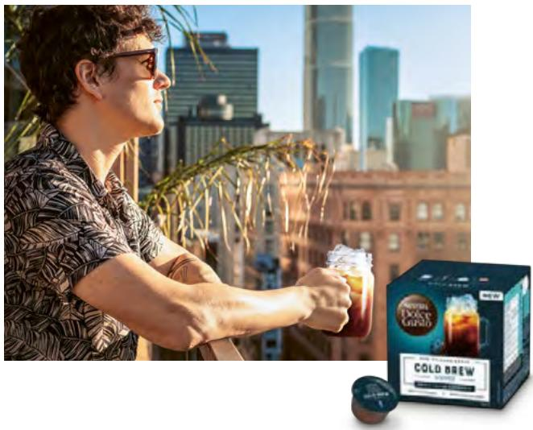

> **AI Description:**
> **Source:** `assets/_page_26_Figure_0.jpg`
> 
> **Generated:** 2026-05-30 00:22:14
> 
> ---
> 
> The image contains a photograph and a product image. The photograph shows a person standing on a rooftop with a cityscape in the background, holding a glass of iced coffee with whipped cream. The product image is of a box of Nescafé Dolce Gusto Cold Brew coffee pods, with a single pod in the foreground. The image conveys a relaxed, urban setting and promotes a cold brew coffee product.

## Continuing the innovation streak

In blending Nestlé’s instant coffee expertise with Starbuck’s unique signature premium taste, our global coffee partnership continues to enter new territories. The range includes medium and dark roasts as well as beverages inspired by signature Starbucks favorites – such as Caffè Mocha or Caramel Latte. These use the same high-quality, 100% arabica beans served in Starbucks coffee houses.

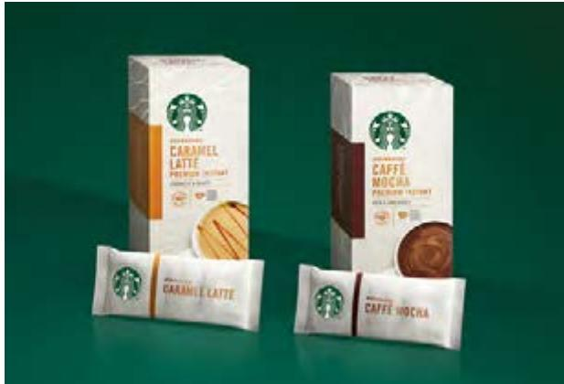

> **AI Description:**
> **Source:** `assets/_page_26_Figure_1.jpg`
> 
> **Generated:** 2026-05-30 00:21:23
> 
> ---
> 
> The image contains two boxes of Starbucks premium instant coffee, one labeled "Caramel Latte" and the other "Caffè Mocha." In front of each box, there are two individual packets of the respective coffee flavors. The boxes and packets feature the Starbucks logo and product names prominently. The image is a product display with a green background, emphasizing the coffee products.

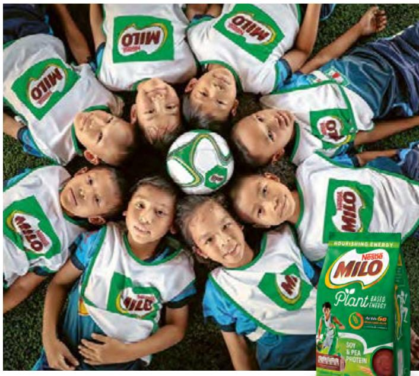

> **AI Description:**
> **Source:** `assets/_page_26_Figure_2.jpg`
> 
> **Generated:** 2026-05-30 00:19:32
> 
> ---
> 
> The image contains a photograph of a group of children wearing Milo-branded shirts, arranged in a circle with a soccer ball at the center. The children appear to be participating in a sports activity, possibly soccer. The image also includes a product packaging of Milo, highlighting its plant-based energy and soy and pea protein content. The overall theme of the image is promoting Milo as a nutritious and energy-rich product, likely targeting children and families.

## Boosting energy with plant-based Milo

The need for plant-based dairy alternatives that taste great and offer nutrition is rising, as more families are following a flexitarian diet that is lighter on meat and dairy products. The new Milo replaces milk powder with ingredients from soy and oats. The core ingredients are the same as original Milo – malt, barley and cocoa.

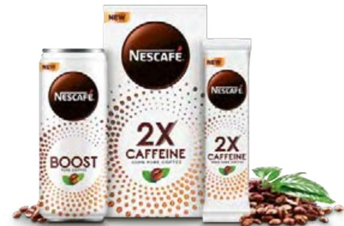

> **AI Description:**
> **Source:** `assets/_page_26_Figure_3.jpg`
> 
> **Generated:** 2026-05-30 00:19:51
> 
> ---
> 
> The image contains a photograph of three Nescafé products: a can, a box, and a packet. The can is labeled "Boost" and features a green leaf symbol, indicating a natural ingredient. The box and packet are labeled "2X Caffeine" with a coffee bean graphic, suggesting a higher caffeine content. The background includes scattered coffee beans and a green leaf, reinforcing the coffee theme. The overall design uses a brown and white color scheme with a dotted pattern.

## Made stronger by nature

Nescafé knows coffee. Made using green coffee extract for an extra hit of caffeine, this new functional offering launches the brand into the world of functional coffees. The product was developed and brought to market in less than a year and comes in convenient ready-to-drink and soluble formats.

Pets and people are better together. This is the guiding belief that motivates Purina to deliver life-changing nutrition to pets and world-class pet care expertise to pet owners and veterinarians every day. With more than 500 scientists, veterinarians and pet care experts globally, Purina is guided by science and driven by passion to enrich the lives of pets and the people who love them. The Purina PetCare portfolio includes leading brands such as Purina ONE, Pro Plan, Friskies and Tidy Cats.

## At a glance

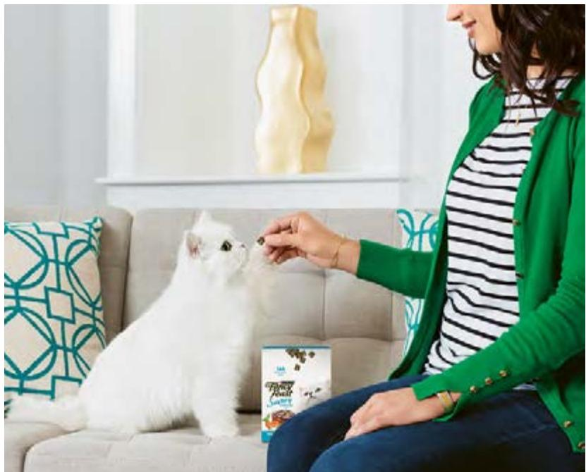

> **AI Description:**
> **Source:** `assets/_page_27_Figure_0.jpg`
> 
> **Generated:** 2026-05-30 00:16:19
> 
> ---
> 
> The image is a photograph showing a person sitting on a couch and feeding a white cat a treat. The person is wearing a green cardigan over a black and white striped shirt. The cat is sitting attentively, looking up at the treat. There is a box of treats on the couch next to the person. The background includes a light-colored wall and a decorative vase on a shelf.

## Disrupting the cat treat segment

Two new cat treat innovations keep Purina on the cutting edge of form and function. Leveraging the traditional chocolate bar design from Nestlé’s confectionery business, Purina’s new Fancy Feast Savory Cravings bars can be broken into smaller bites to extend treat time for cats. And the unique, rolling design of FELIX Play Tubes provides cats with a deliciously playful treating experience.

## Expanding the power of Purina ONE

Purina ONE is now filling the food bowls of dogs and cats across Latin America thanks to market expansion and consumer demand for premium pet food. Each nutritionally complete and balanced Purina ONE formula is created by Purina pet nutritionists using high-quality ingredients to give pets the nutrition they need at every life stage. Ongoing innovation to deliver functional benefits to pets has supported Purina ONE’s success and double-digit growth globally.

## Exquisite meals inspired by nature

As consumers increasingly seek simple, natural ingredients for their own meals, many are looking for the same for their pets. Purina’s new Gourmet Nature’s Creations wet cat food collection is inspired by nature and made with carefully selected, high-quality natural ingredients, such as tuna garnished with tomatoes and rice or chicken garnished with spinach and tomatoes. All recipes are made without artificial colors, preservatives or flavorings.

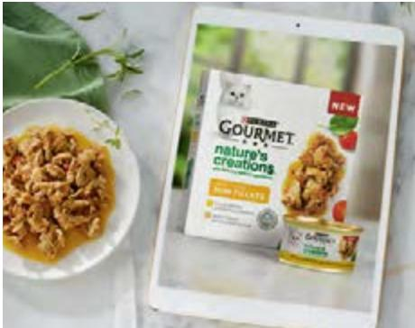

> **AI Description:**
> **Source:** `assets/_page_28_Figure_0.jpg`
> 
> **Generated:** 2026-05-30 00:08:00
> 
> ---
> 
> The image contains a photograph of a tablet displaying a product advertisement for "Nature's Creations" from a brand named "Gourmet." The advertisement features a picture of a can of food and text highlighting the product. To the left of the tablet, there is a plate with a serving of food that appears to be the same as what is advertised in the can. The image includes a visual representation of the product in both its packaged form and its prepared state, providing a clear view of the food item.

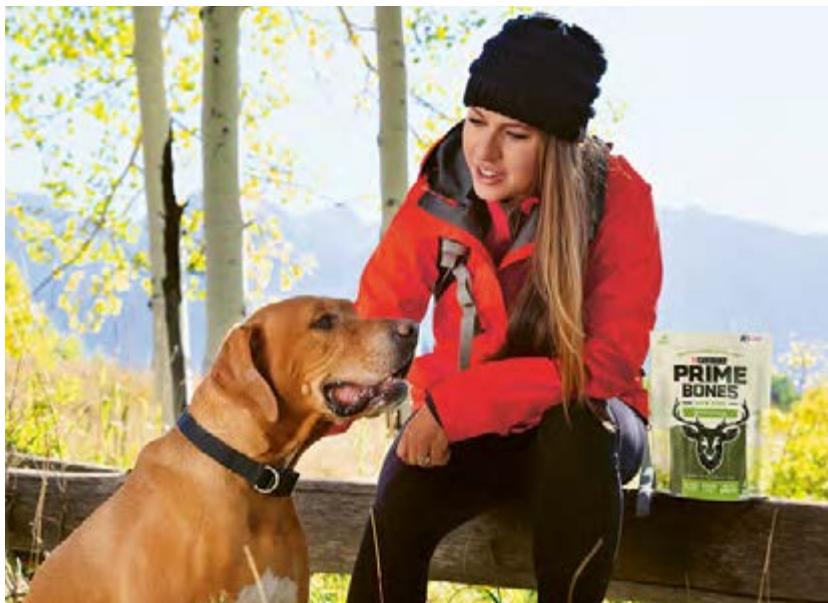

> **AI Description:**
> **Source:** `assets/_page_28_Figure_1.jpg`
> 
> **Generated:** 2026-05-30 00:07:38
> 
> ---
> 
> The image is a photograph featuring a person and a dog in an outdoor setting with autumn foliage and mountains in the background. The person is wearing a red jacket and black pants, and the dog is sitting next to them. The person is holding a package labeled "Prime Bones," which appears to be a product for dogs. The overall scene suggests a connection between the person and their pet, possibly promoting the product in a natural, outdoor environment.

## Giving dogs something new to chew on

New Purina Prime Bones rawhide-free dog chews are a safe, naturallyedible treat to satisfy a dog’s instinctual love of chewing without the hazards of treating with rawhides, real bones and plastics. Available in three flavors, Prime Bones are made with venison, bison or boar to give dogs a taste of adventure.

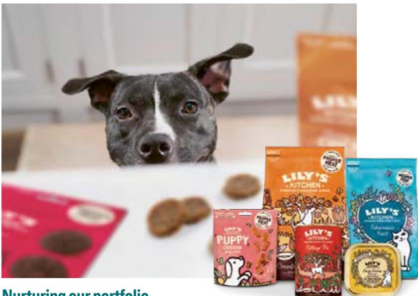

> **AI Description:**
> **Source:** `assets/_page_28_Figure_2.jpg`
> 
> **Generated:** 2026-05-30 00:08:12
> 
> ---
> 
> The image contains a photograph of a dog peeking over a table with various pet food products from "Lily's Kitchen." The products include different types of dog treats and meals, such as "Puppy Chicken," "Bistro Pie," and "Festive Feast." The text "Nurturing our portfolio" is overlaid at the bottom of the image. The image is visually appealing and informative, showcasing the brand's pet food line.

## Nurturing our portfolio

With the acquisition of pet food brand Lily’s Kitchen, Purina is further expanding into the high-growth natural pet food segment. With its powerful brand, strong ethical values and impressive sales growth, Lily’s Kitchen resonates particularly well with younger pet owners.

## Turning up the flavor for a new mealtime experience

Friskies continues its quest to excite cats’ senses with the ultimate combination of taste, texture and temperature in the new Friskies Warm’d & Serv’d wet cat food options. Pet owners simply dip these flavorful, nutritious pouches into warm water to heat up a new, fun mealtime experience for their cats. It’s an innovation you would only expect from Friskies.

## Nutrition and Health Science

Our nutrition business is dedicated to providing high-quality, innovative, science-based nutrition for mothers and infants. The business has built a portfolio that includes billionaire brands such as NAN, illuma, Cerelac and Gerber. Our Nestlé Health Science business also works to empower healthier lives through nutrition. It has an extensive portfolio of science-based medical nutrition and consumer health products that increasingly focus on personalization.

## At a glance

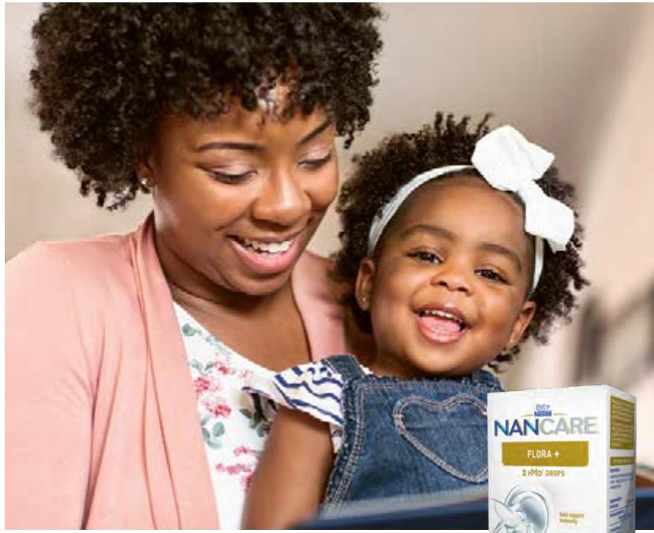

> **AI Description:**
> **Source:** `assets/_page_29_Figure_0.jpg`
> 
> **Generated:** 2026-05-30 00:09:36
> 
> ---
> 
> The image contains a photograph of a smiling woman and a young child, both with curly hair. The woman is wearing a pink cardigan and a floral top, while the child is dressed in a denim outfit with a white headband. In the bottom right corner of the image, there is a product box labeled "NANCARE Flora+" with additional text indicating it is a "2+Moz Drops" product. The image appears to be promoting the NANCARE product, likely related to infant health or nutrition.

NAN’s pediatric supplements range applies Nestlé’s expertise in human milk oligosaccharides and the microbiome to open up a new nutrition segment. The products have been formulated to boost immunity and solve common short-term health issues, offering infants a little extra help to support lifelong health.

## Expanding our HMO platform

## A China-born super premium offering

The newest member of the Wyeth family is the locallymanufactured infant formula, Belsol. The product has been shaped through insights from Alibaba’s T-Mall innovation center and has been tailored to Chinese babies using our joint-research with Peking University. The brand will be exclusively used to support Wyeth’s expansion into tier-three and tier-four cities.

## Improving memory and cognitive function

BrainXpert is a first-of-its-kind ketogenic drink that is clinically proven to improve brain functioning in individuals with mild cognitive impairment, a condition that affects one out of five people over the age of 65. The product is the result of groundbreaking research and reflects our promise to empower healthier lives through nutrition.

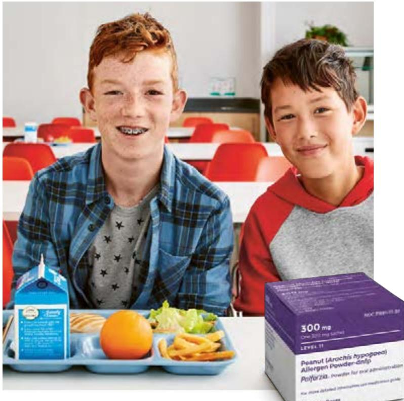

> **AI Description:**
> **Source:** `assets/_page_30_Figure_1.jpg`
> 
> **Generated:** 2026-05-30 00:04:40
> 
> ---
> 
> The image contains a photograph of two young boys sitting at a table in a classroom setting. One boy is wearing a blue plaid shirt over a grey t-shirt, while the other is dressed in a red and grey hoodie. On the table in front of them is a school lunch tray containing a carton of milk, an orange, lettuce, and what appears to be a serving of chips or fries. Additionally, there is a box labeled "300 mg" with text indicating it is a peanut allergen powder product. The setting suggests a school environment, possibly highlighting a discussion about food allergies or school lunch options.

## Expanding our expertise in food allergies

Acquiring Aimmune is part of our mission to enrich lives through nutritional science. PALFORZIA is the first and only FDA- and European Commission-approved treatment to help reduce the frequency and severity of allergic reactions to peanuts in children. Aimmune will help us extend our expertise in the R&D of novel allergy treatment solutions.

## Rewriting the rules of cellular aging

The Celltrient range is formulated with cellular nutrients that help renew and restore the body’s natural processes that support the health of mitochondria, the power plant in cells. The launch is backed by a versatile digital ecosystem that supports consumer and health care professional engagement, education and direct-to-consumer purchase.

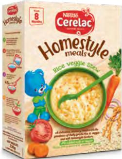

> **AI Description:**
> **Source:** `assets/_page_30_Figure_3.jpg`
> 
> **Generated:** 2026-05-30 00:04:16
> 
> ---
> 
> The image contains a product box for Nestlé Cerelac Homestyle Meals Rice Veggie Stew. The box is designed to be visually appealing, featuring a cartoon bear holding a spoon and a bowl of the product. The bear is surrounded by illustrations of vegetables, such as carrots and tomatoes, emphasizing the vegetable content of the meal. The text on the box indicates that it is suitable for babies from 8 months old and provides a brief description of the product as a rice and vegetable stew. The overall design is colorful and child-friendly, aimed at attracting young children and their parents.

## Nourishing young lives

Infant cereals are an important part of our nutrition portfolio and are vital to supporting young lives from the first spoon to the family table. In 2020, we added Cerelac Homestyle Meals, a variant that introduces savory tastes and new textures, tailored to South East Asian tastes. We also launched Cerelac NutriKoko, made using locally sourced soy and fortified with vitamins and minerals to extend our affordable offering in Africa.

## Prepared dishes and cooking aids

Our prepared dishes and cooking aids category contains a range of daily essentials, from bouillons, soups, ambient and chilled culinary products to frozen food and pizzas. The portfolio includes iconic brands such as Maggi, Stouffer’s and DiGiorno that cater to regional and local tastes and nutritional requirements and beliefs.

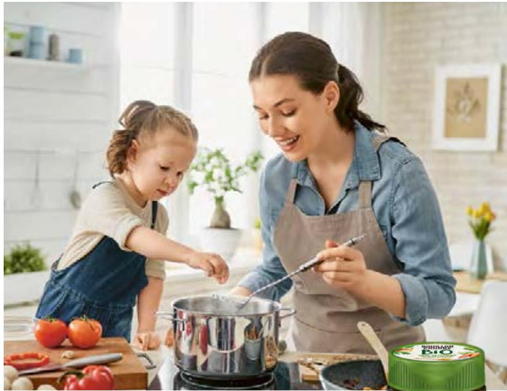

> **AI Description:**
> **Source:** `assets/_page_31_Figure_0.jpg`
> 
> **Generated:** 2026-05-30 00:02:54
> 
> ---
> 
> The image is a photograph showing a woman and a child in a kitchen setting. The woman, wearing a denim shirt and an apron, is stirring something in a large pot on a stove. The child, also wearing an apron, is standing beside her, reaching towards the pot. The kitchen is well-lit with natural light, and there are various kitchen items and ingredients visible, including tomatoes and a cutting board. The overall scene suggests a cooking activity, possibly involving cooking with children.

## Elevating everyday cooking into food harmony

MarketPlace is a premium, all-natural portfolio of cooking aids that builds with Maggi’s new digital ecosystem to inspire at-home cooking creativity. With a focus on making cooking simple, fun and tasty, the range includes Maggi Le Bouillon, a liquid bouillon, and Maggi Bio Légumes, a paper-wrapped seasoning.

## At a glance

## Good for you, good for the planet

Throughout 2020, we expanded our portfolio of plant-based offerings with upgrades to Garden Gourmet’s Sensational Burger and exciting additions such as Sensational Vuna, our plant-based alternative to tuna. Our brands are helping to lead the way in making plant-based foods part of everybody’s everyday life and support our mission to provide consumers with products that are good for them and the planet.

## Repositioning our modern health brands

In 2020, we revamped Lean Cuisine and launched a premium sister brand, Life Cuisine, focused on balance, taste and responding to more personalized definitions of health and wellness. From gluten-free to high protein, the expanded range offers consumers 15 different meal solutions to fit their lifestyle aspiration.

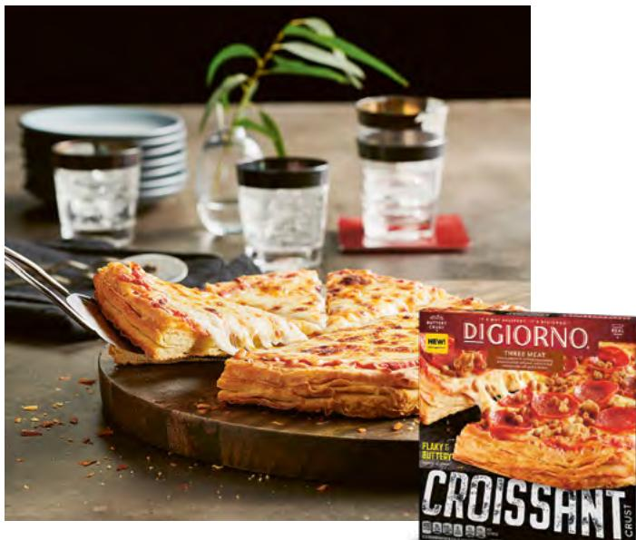

> **AI Description:**
> **Source:** `assets/_page_32_Figure_2.jpg`
> 
> **Generated:** 2026-05-30 00:14:38
> 
> ---
> 
> The image contains a photograph of a sliced pizza with a flaky crust, placed on a wooden board. The pizza appears to be a Digiorno Three Meat Croissant pizza, as indicated by the packaging visible in the bottom right corner of the image. The packaging highlights the pizza's "Flaky & Butter" crust and "NEW!" label. The setting includes a table with a vase of greenery, a stack of plates, and some glasses, suggesting a casual dining environment.

## Disrupting the world of pizza

Our flagship DiGiorno brand continues to disrupt the world of pizza with the addition of the firstof-its-kind croissant crust. It offers families a convenient way to enjoy the comfort of fresh-baked pizza, with a light, flaky, buttery croissant crust.

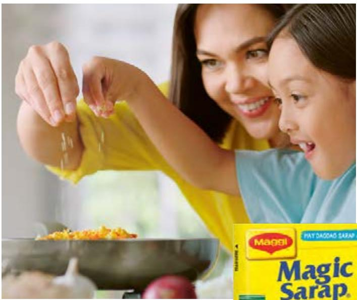

> **AI Description:**
> **Source:** `assets/_page_32_Figure_3.jpg`
> 
> **Generated:** 2026-05-30 00:15:10
> 
> ---
> 
> The image contains a photograph of two individuals engaged in cooking. One person is sprinkling a seasoning from a yellow box labeled "Magic Sarap" onto a dish in a wok. The setting appears to be a kitchen, and the individuals seem to be enjoying the cooking process. The image conveys a sense of family or shared activity in preparing a meal.

## Cooking made so simple

A core mission of our Maggi brand is to be every cook’s partner to fresh. Offering versatility with convenience, our Magic Sarap range delivers an allin-one seasoning that helps take local tastes global and bring excitement to every meal.

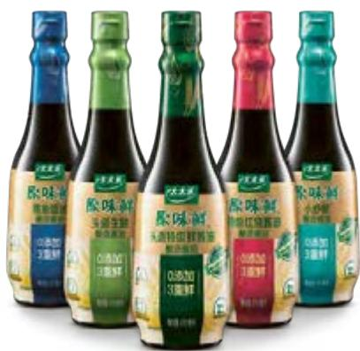

> **AI Description:**
> **Source:** `assets/_page_32_Figure_5.jpg`
> 
> **Generated:** 2026-05-30 00:19:43
> 
> ---
> 
> The image contains a series of five bottles of sauce, each with a distinct color and label. The bottles are arranged in a row, and the labels display Chinese text, likely indicating the type of sauce and its flavor profile. The colors of the bottles are blue, green, green, red, and green, corresponding to the labels. The bottles appear to be of the same size and shape, suggesting they are part of a product line. The image is a photograph, and the text on the labels is the primary visual information beyond the bottles themselves.

## Bringing world flavors home

Our new range of Totole premium cooking sauces enables consumers to re-create authentic restaurant flavors at home. The products are made only from the ‘first pressed sauce’ of naturally fermented soy, corn and wheat – to bring rich, multi-layered ‘Xian’ tastes to everyday dishes.

## Milk products and Ice cream

Our milk products business provides individuals and families with nutritional products essential to healthy diets for all stages of life, from early childhood to old age. The business covers several categories, including ambient dairy, plant-based alternatives and coffee creamers. Our portfolio includes market-leading brands, such as Nido and Coffee mate. In ice cream, we have a wide range of delicious, indulgent products.

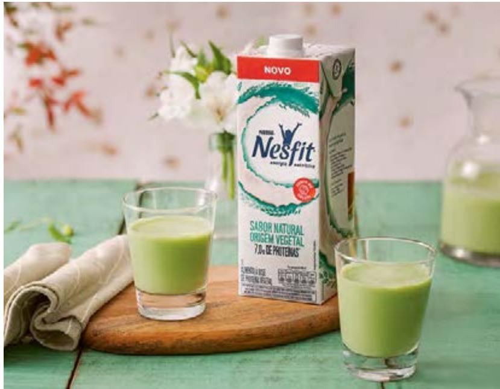

> **AI Description:**
> **Source:** `assets/_page_33_Figure_0.jpg`
> 
> **Generated:** 2026-05-30 00:20:53
> 
> ---
> 
> The image contains a photograph of a carton of Nesfit, a plant-based milk alternative, with two glasses of the product in front of it. The carton is labeled "Novo" (New) and "Sabor Natural Origem Vegetal 7,0% de Proteínas" (Natural Flavor, Plant Origin, 7.0% of Proteins). The background features a blurred floral arrangement and a green tablecloth, adding a natural and fresh aesthetic to the presentation. The glasses are filled with a green liquid, presumably the plant-based milk, and are placed on a wooden cutting board.

Focusing on rapid innovation in plant-based dairy alternatives A growing number of consumers, especially millennials, require an alternative to dairy products due to lactose intolerance, allergy, dietary choices or environmental concerns. Nestlé is responding to this consumer trend by expanding its range of plant-based dairy alternatives. In 2020, the company launched plant-based products across a number of brands, including: Ninho, Nesfit Sabor Natural and a Carnation vegan condensed milk alternative. Nestlé has around 300 R&D employees globally dedicated to the research and development of plant-based products.

## At a glance

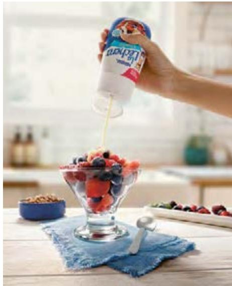

> **AI Description:**
> **Source:** `assets/_page_33_Figure_1.jpg`
> 
> **Generated:** 2026-05-30 00:22:37
> 
> ---
> 
> The image contains a photograph of a person pouring a yellow liquid, likely a syrup or sauce, from a bottle labeled "Maple Syrup" into a glass bowl filled with a colorful assortment of fresh berries. The setting appears to be a kitchen or dining area, with a blue cloth underneath the bowl and a small bowl of nuts and a spoon nearby. The image conveys a casual, home-cooked meal or snack preparation scene.

## Bringing families together through baking

As many consumers returned to baking and cooking at home last year due to the pandemic, evaporated and condensed milks, with brands like Carnation, La Lechera and Moça, saw significant growth. In the Americas, for example, we increased our engagement through digital platforms like Recetas Nestlé and quickly reacted to provide consumers with simpler, more creative recipes with ingredients typically stored in the home. We also added services like video tutorials and home delivery.

## Perking up every cup with a range of crafted plant-based creamers

Our ambition is to be consumers’ go-to-choice for creamers – whatever their preferences are. By blending our plant-based know-how into trusted household brands such as Natural Bliss and Starbucks we are meeting new consumer needs. These new products pair on-brand flavor profiles with a rich and creamy texture that help coffee lovers make every cup their way.

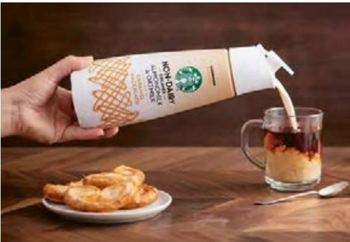

> **AI Description:**
> **Source:** `assets/_page_34_Figure_0.jpg`
> 
> **Generated:** 2026-05-30 00:21:06
> 
> ---
> 
> The image contains a photograph of a hand pouring a non-dairy beverage into a glass mug filled with a dark liquid, likely coffee. The beverage is being poured from a cylindrical container labeled "Non-Dairy." In the foreground, there is a plate of what appears to be pastries. The setting suggests a breakfast or snack scenario. The image includes a clear depiction of the pouring action and the beverage being added to the mug, providing a visual representation of a beverage being consumed.

## Ensuring access to affordable nutrition

Nestlé redoubled its long-standing efforts to provide accessible and affordable nutrition as the pandemic severely impacted incomes and livelihoods. To provide healthier options, we accelerated the launch of a fortified milky vanilla drink under the IDEAL brand at an affordable price. And in both the Philippines and Pakistan, we ensured sufficient supply of healthy milks, BEAR BRAND and BUNYAD, to help fill nutrition gaps and support immunity.

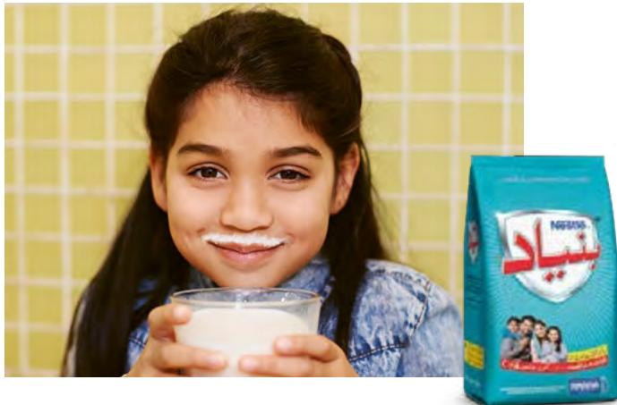

> **AI Description:**
> **Source:** `assets/_page_34_Figure_1.jpg`
> 
> **Generated:** 2026-05-30 00:22:26
> 
> ---
> 
> The image contains a photograph of a young girl holding a glass of milk. She is smiling, and there is a packet of Nescafe instant coffee on the right side of the image. The packet is blue with Arabic text and includes a family portrait. The background is a yellow tiled wall.

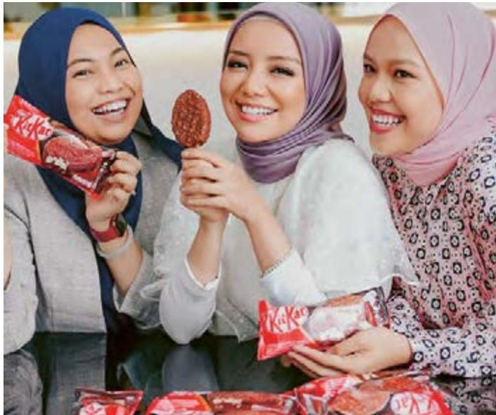

> **AI Description:**
> **Source:** `assets/_page_34_Figure_2.jpg`
> 
> **Generated:** 2026-05-30 00:20:11
> 
> ---
> 
> The image contains a photograph of three individuals sitting together, smiling and holding KitKat chocolate bars. The individuals are wearing hijabs of different colors. The KitKat bars are prominently displayed in their hands, and there are additional KitKat packages on the table in front of them. The image appears to be a promotional or casual photograph, possibly for a social media post or advertisement.

## Making the KitKat ice cream treat more delicious

In the year of its 85th birthday, KitKat completely reformulated and relaunched its ice cream stick with the goal of elevating the KitKat ice cream experience. Introduced initially in Malaysia, the new wafer-flavored ice cream with finely crushed KitKat wafer pieces in the chocolate coating has seen record success. Following its instant popularity, the new KitKat ice cream stick is being rolled out globally.

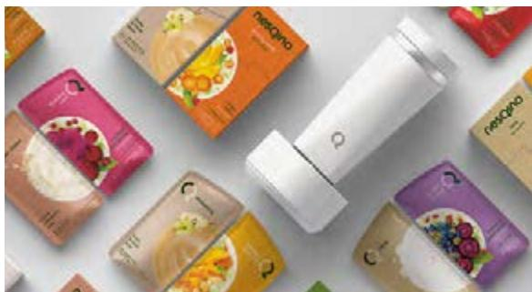

> **AI Description:**
> **Source:** `assets/_page_34_Figure_3.jpg`
> 
> **Generated:** 2026-05-30 00:19:19
> 
> ---
> 
> The image contains a collection of various Nesquik product packaging, showcasing different flavors and varieties. The packaging is arranged in a scattered manner on a light background, highlighting the product's branding and color schemes. The image is visually informative, providing a clear view of the product range and design.

## Innovation that delivers personalized superfood drinks

Consumers increasingly look for personalized solutions. With nesQino, Nestlé has made it possible for people to also personalize healthy superfood drinks according to their needs and preferences. Launched in China and Japan, nesQino combines superfood sachets and one of three base sachets – smoothie, oat shake or milk shake – in a digitally connected Q-cup machine to create healthy drinks. The entire product range is ‘clean label,’ or containing a small number of easyto-understand ingredients. This innovative system was developed in just 18 months and is a red dot design award winner.

## Confectionery

Nestlé’s confectionery products can be enjoyed as part of a well-balanced diet. Our confectionery business includes the iconic KitKat brand and a portfolio of much loved regional and local brands. Within both chocolate and biscuit categories, we aim to surpass consumer expectations with great tasting products. The business continuously innovates to delight consumers, to create premium products, to make those products more nutritious and to become more sustainable.

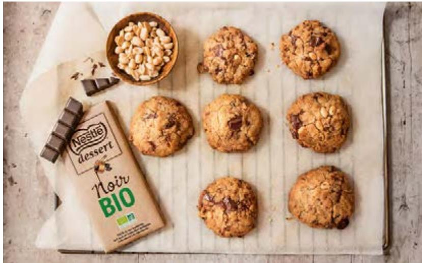

> **AI Description:**
> **Source:** `assets/_page_35_Figure_0.jpg`
> 
> **Generated:** 2026-05-30 00:18:15
> 
> ---
> 
> The image contains a photograph of baked cookies arranged on a baking sheet lined with parchment paper. There is a bowl of what appears to be nuts or seeds, and a bar of chocolate labeled "Nestlé dessert Noir BIO." The cookies are golden-brown with visible chunks of chocolate and nuts. The image also includes a small pile of chocolate bars next to the chocolate bar packaging. The overall composition suggests a homemade or artisanal baking theme.

## Creating special moments at home

With people spending much more time at home last year, there was a resurgence in baking. People were looking for fun activities to do with their children, partners or for their own enjoyment. Nestlé Dessert in France and Nestlé Toll House in the U.S. were there to bring families together and to bring moments of comfort and warmth. The brands coupled their products with digital platforms offering recipes, tips and fun activities for kids. Maintaining this type of virtual engagement with consumers is one way we plan to keep our new and returning bakers in the category.

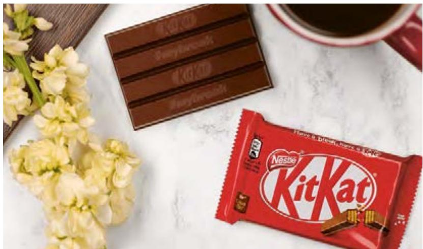

> **AI Description:**
> **Source:** `assets/_page_35_Figure_1.jpg`
> 
> **Generated:** 2026-05-30 00:18:04
> 
> ---
> 
> The image contains a photograph of a KitKat chocolate bar and a KitKat wrapper. The KitKat bar is partially unwrapped, revealing the chocolate and wafer layers. The wrapper is red with the KitKat logo prominently displayed, along with the Nestlé brand name. In the background, there is a white marble surface with a small bouquet of white flowers and a red coffee mug with a white interior. The image is well-lit and focuses on the KitKat product, suggesting a casual and inviting setting.

## At a glance

## Celebrating 85 years of an icon

In the year of its 85th birthday, KitKat became the number one chocolate bar globally for the first time, based on market share in value. This was made possible only by its ability to consistently innovate and expand into new geographies and segments. For example, the KitKat seasonal range was launched globally and included bunny and Santa shapes, with plans to expand this range. KitKat tablets were introduced in some pilot markets and will be rolled out in more markets over the coming years. Several new KitKat chocolatory boutiques, where consumers can create their own customized KitKat flavor, were opened in Canada and Australia as well as five new pop-up stores in Brazil.

## Getting power from plants

YES! snack bars have a new range that contains 10 grams of plant protein from a natural combination of nuts and peas. This latest innovation taps into a consumer trend toward pea protein, as consumers look for different types of plant proteins that are good for them and good for the environment.

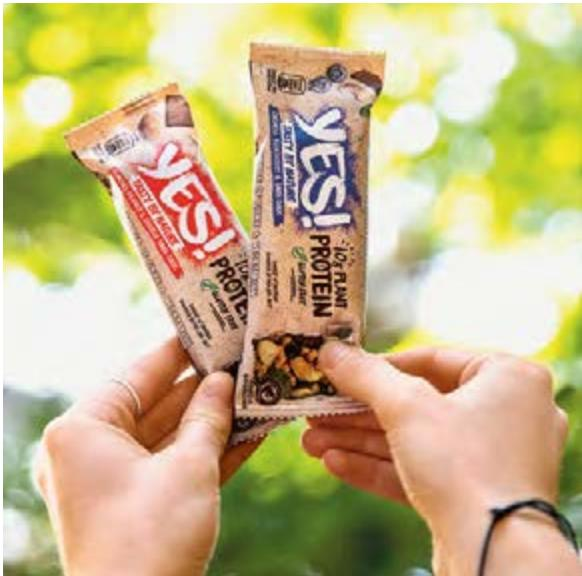

> **AI Description:**
> **Source:** `assets/_page_36_Figure_0.jpg`
> 
> **Generated:** 2026-05-30 00:02:34
> 
> ---
> 
> The image contains two protein bars held by two hands against a blurred green background. The bars are labeled "YES! PROTEIN" and feature images of nuts and other ingredients. The packaging indicates that the bars are plant-based and organic. The image is a photograph with a focus on the product, highlighting its branding and ingredients.

## Continuing the sustainable packaging journey

Nestlé made further progress on its packaging commitments in 2020 and this included the launch of Smarties sharing blocks in recyclable paper wrappers. The bars are wrapped on high-speed machines previously used for plastic or laminate packaging. It is the first time that this material has been used for chocolate bars.

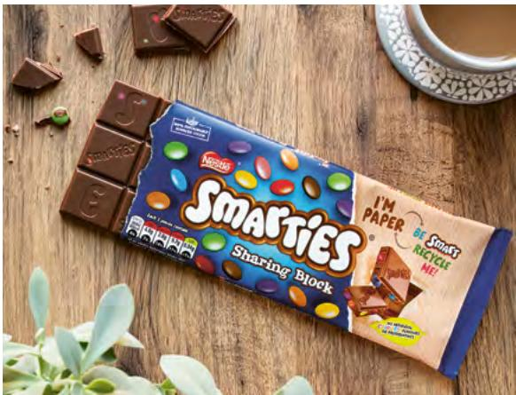

> **AI Description:**
> **Source:** `assets/_page_36_Figure_1.jpg`
> 
> **Generated:** 2026-05-30 00:03:12
> 
> ---
> 
> The image contains a photograph of a Smarties Sharing Block chocolate bar. The packaging is predominantly blue with the Smarties logo and colorful Smarties candies displayed. The text on the packaging indicates that it is a "Sharing Block" and includes the Nestlé logo. The image also shows a small portion of the bar itself, which is dark chocolate with colorful Smarties candies embedded in it. In the background, there are some scattered pieces of chocolate and a small decorative item, possibly a coaster or a small plate, with a cup of tea or coffee. The overall setting suggests a casual, inviting atmosphere.

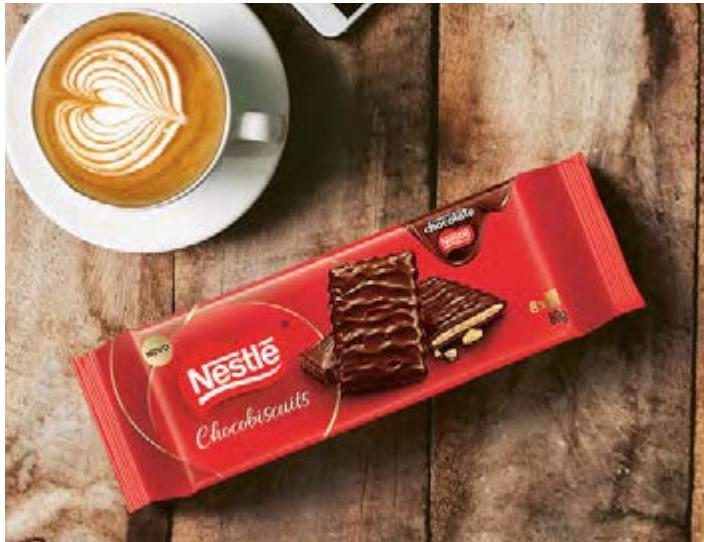

> **AI Description:**
> **Source:** `assets/_page_36_Figure_2.jpg`
> 
> **Generated:** 2026-05-30 00:00:35
> 
> ---
> 
> The image contains a photograph of a Nestlé Chocobiscuits package and a cup of coffee with latte art. The package is red with the Nestlé logo and the product name prominently displayed. The coffee cup is white with a saucer, and the latte art in the coffee appears to be a heart shape. The background is a wooden surface, giving the image a rustic feel. The image is visually appealing and suggests a pairing of the biscuit and coffee.

## Delighting consumers in new ways

Under its Chocobakery strategy, Nestlé Brazil continues to find new ways to provide consumers with occasional and affordable indulgence. In 2020, the first Nestlé Chocobiscuits, with its crunchy, buttery biscuit inside and creamy chocolatey outside, was launched successfully in the market. In addition to this innovation, existing brands, such as Negresco and Bono, were upgraded to give consumers a new eating experience.

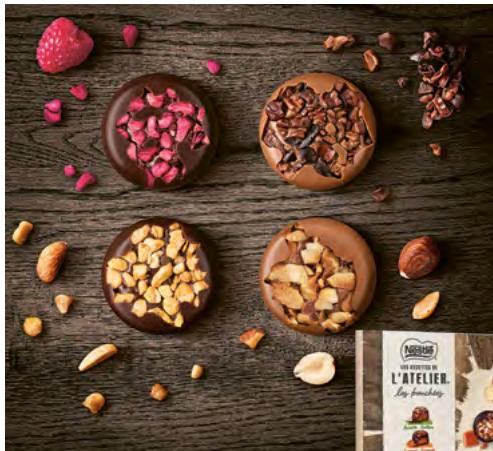

> **AI Description:**
> **Source:** `assets/_page_36_Figure_3.jpg`
> 
> **Generated:** 2026-05-29 23:59:03
> 
> ---
> 
> The image contains a photograph of four chocolate-covered treats, each topped with different ingredients such as rose petals, chocolate chips, peanuts, and chopped almonds. The treats are arranged on a wooden surface, and there are scattered pieces of the same ingredients around them. The bottom right corner features a product label with the text "L'Atelier. Les bonheurs" and an image of a chocolate bar. The image is visually appealing and provides information about the variety of toppings available on these chocolates.

## Delivering premium chocolate in new formats

Following its successful launch for Christmas 2019, Nestlé Les Recettes de l’Atelier ‘Les Bouchées’ continued its strong growth in 2020, doubling its sales versus the previous year. The gift box contains chocolate pralines filled with a variety of smooth fillings and decorated with nuts and fruit, creating both a visual and indulgent delight. We saw strong repeat purchases in France, Spain, Switzerland, Italy and Czech Republic, and carried out a successful market test in Russia.

Our waters business is dedicated to providing healthy hydration, enhancing quality of life and contributing to a healthier future. Its strategic focus is on its iconic international brands – S.Pellegrino, Perrier and Acqua Panna – as well as its leading premium mineral water brands and functional water products. In many emerging markets, Nestlé Pure Life provides packaged water that’s safe, clean and controlled. Sustainability is embedded in innovations across the entire waters value chain.

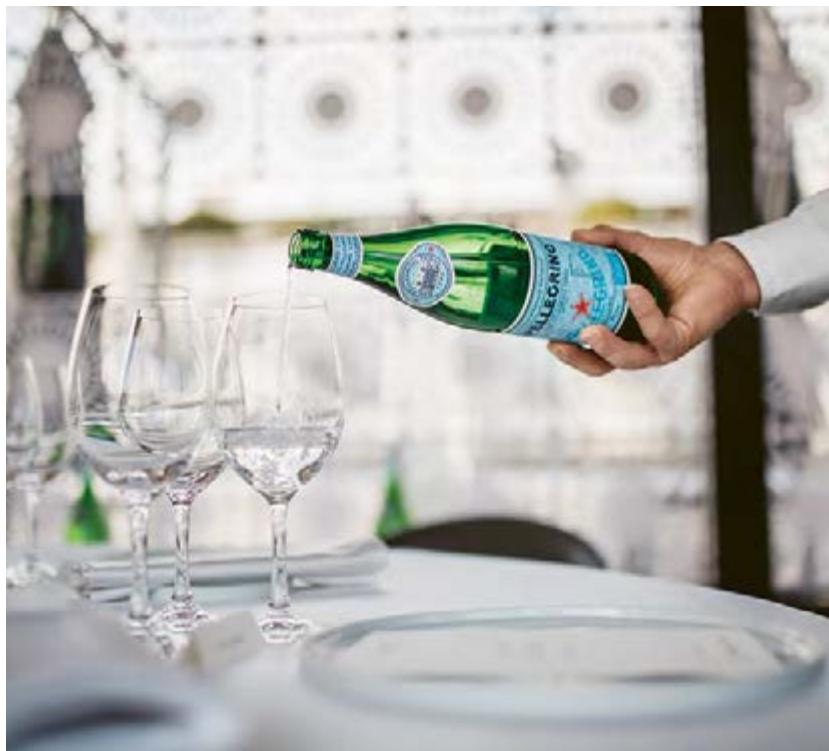

> **AI Description:**
> **Source:** `assets/_page_37_Figure_0.jpg`
> 
> **Generated:** 2026-05-30 00:07:25
> 
> ---
> 
> The image contains a photograph of a hand pouring a clear liquid from a green glass bottle labeled "Pellegrino" into a clear glass. The setting appears to be a dining table with multiple empty glasses and a white plate in the foreground. The background is slightly blurred, showing a white wall with circular patterns. The image conveys a sense of a formal dining or hospitality setting.

## Progressing on our path to net zero

Our waters business provides healthy hydration products all over the world. In 2020, we pledged to make our entire portfolio carbon neutral by 2025. Perrier, S.Pellegrino and Acqua Panna, the most renowned waters brands, will be prioritized first and are expected to achieve carbon neutrality by 2022. To reach our target, we will pursue high-quality offsets in addition to investing in projects that reduce or capture carbon across our portfolio. Other brands like Vittel and Levissima have voluntarily decided to move faster than committed by the Group and also aim to achieve carbon neutrality by 2022.

## At a glance

## A stream of strong innovation

Following the successful 2019 launch of S.Pellegrino Essenza, we continued to entice consumers with new flavors in 2020. For example, in the U.S., we introduced the Blood Orange & Black Raspberry flavor. We also rolled out a bigger size (50 cl) bottle, giving consumers longer-lasting enjoyment, as well as a recyclable (PET) format in some European countries. The combination of the prestigious S.Pellegrino brand and the novelty of flavored sparkling water is enabling the brand’s strong growth.

## Making headway on a waste-free future

As part of our commitment to making our packaging recyclable or reusable and to reducing our use of virgin plastics, Nestlé Waters is now using recycled plastic in its packaging across most of its brands and for many of its products globally. And with the ambition to create a circular economy in which no new material is created, that plastic can of course be recycled again. All Buxton bottles in the UK and Valvert products in Belgium are using 100% recycled plastic in their bottles; multiple Vittel bottle sizes are doing the same.

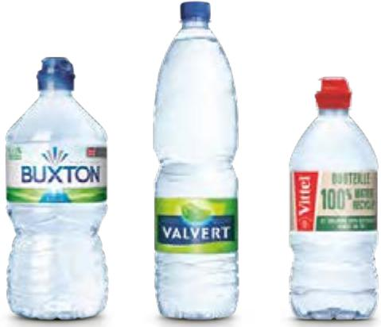

> **AI Description:**
> **Source:** `assets/_page_38_Figure_0.jpg`
> 
> **Generated:** 2026-05-30 00:13:25
> 
> ---
> 
> The image contains three bottles of water with labels displaying brand names and product information. The bottles are of different sizes and have distinct labels with brand names such as "Buxton," "Valvert," and "Vittel." The labels also include additional text, such as "100% Nére Eco" on the "Vittel" bottle, indicating an eco-friendly aspect of the product. The image is a photograph of the bottles, and the visual elements provide a clear view of the products and their branding.

## An iconic collaboration

In keeping with its tradition of partnering with great artists, Perrier announced a collaboration with renowned artist Takashi Murakami to create the new, vibrant Perrier x MURAKAMI collection. Ahead of the 2021 release of the full range in Murakami’s colors and motifs, two premium limited edition Perrier glass bottles featuring his original artworks were launched globally last year. Over Perrier’s history, some of the world’s most influential artists have created trailblazing art for the brand.

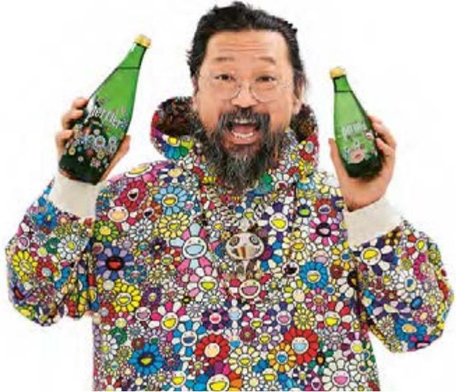

> **AI Description:**
> **Source:** `assets/_page_38_Figure_1.jpg`
> 
> **Generated:** 2026-05-30 00:13:39
> 
> ---
> 
> The image contains a photograph of a person wearing a colorful, patterned jacket with various designs, including flowers and cartoon characters. The person is holding two bottles of Perrier sparkling water, one in each hand. The background is plain white, and the person appears to be smiling. The image is visually engaging and conveys a casual, cheerful atmosphere.

## Bringing the goodness of plants into water

Nestlé Waters’ Buxton brand began a test launch of a plant-infused functional water product in the UK in 2020. PLANT+WATER BY BUXTON is a blend of spring water, plant polyphenols and magnesium, with a mix of fruit and herb flavors. The bottles are fully recyclable.

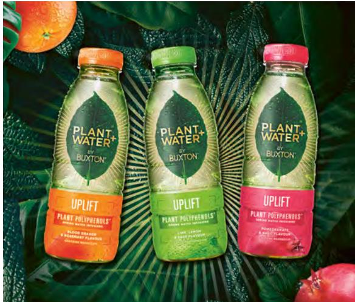

> **AI Description:**
> **Source:** `assets/_page_38_Figure_2.jpg`
> 
> **Generated:** 2026-05-30 00:14:02
> 
> ---
> 
> The image contains a photograph of three bottles of Plant Water+ by Buxton, each with a different flavor and color-coded label. The bottles are arranged in a row against a background of green foliage and a sliced orange. The labels indicate the flavor and the inclusion of plant polyphenols. The flavors are "Uplift" with "Salmon Salmon Rosemary Flavors," "Lime Lemon Sage Flavors," and "Lemon Sage Sage Flavors," respectively. The design includes a leaf motif and the branding is prominently displayed on the bottles.

## Acting for biodiversity

Vittel reaffirmed its commitment to preserving biodiversity in 2020. For nearly 30 years, the team has been working to preserve soil and natural areas to protect water resources in the heart of the Vosges, from where Vittel water is sourced. Today, more than 10000 hectares are under preservation. And now we are going beyond our territory to work on biodiversity in other areas. We will bring new solutions and scale up existing ones in partnership with Ashoka, a non-profit organization. We celebrated this expansion of our efforts with a relaunch of the Vittel brand.

# Creating Shared Value

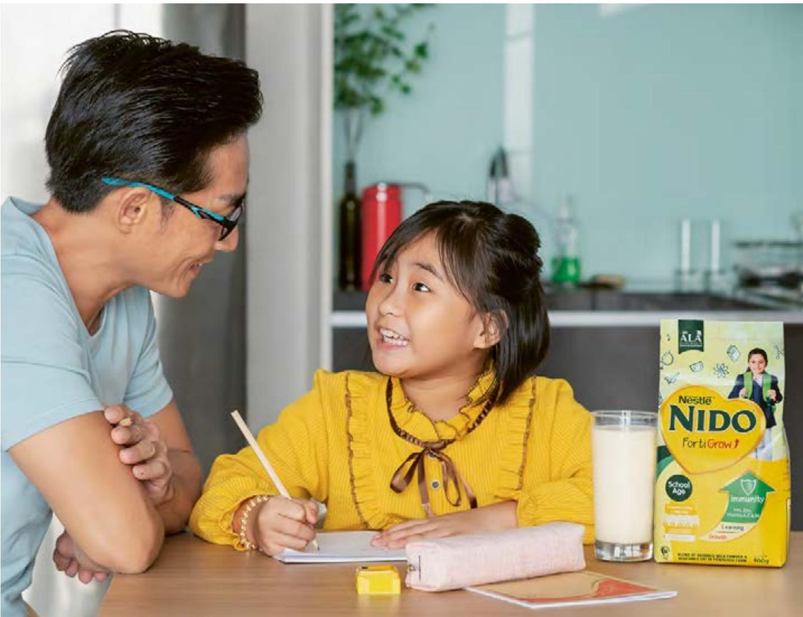

> **AI Description:**
> **Source:** `assets/_page_39_Figure_0.jpg`
> 
> **Generated:** 2026-05-30 00:12:40
> 
> ---
> 
> The image contains a photograph of a man and a young girl sitting at a table. The girl is wearing a yellow sweater and is engaged in writing or drawing with a pencil. The man is leaning towards her, appearing to be in conversation or offering guidance. On the table, there is a glass of milk, a box of Nestlé Nido FortiGrow milk powder, and some stationery items including a pencil case and an eraser. The setting appears to be a home environment, possibly a kitchen or dining area. The image conveys a scene of interaction and learning, with the milk powder box prominently displayed, suggesting its relevance to the context of the image.

NIDO FortiGrow range: Providing nutrition to school-age children
NIDO FortiGrow provides nutrition tailored to the needs of school-age children to support their learning, immunity and growth.

Swiss francs, financial and in-kind COVID-19 related donations across more than 50 countries

–37%

626700

farmers Nestlé engages with through Farmer Connect

Our purpose is to ‘unlock the power of food to enhance quality of life for everyone, today and for generations to come’. This purpose drives us to make a positive impact on the lives of people, pets and the environment now and in the future.

## Why we believe in Creating Shared Value

Creating Shared Value means creating long-term value in a way that also creates value for society and protects the environment. As climate change, a global pandemic and an economic downturn affect people around the world, delivering solutions that meet people’s needs, help address society’s challenges and generate economic value has never been more important.

## Our commitments and their impact

Guided by our purpose, we are pursuing ambitious goals and commitments across areas that align with and support the UN Sustainable Development Goals (SDGs). In particular, we focus our work on promoting healthier lives for adults and children, improving livelihoods in the communities where we are present and protecting and restoring the environment.

Progress against our commitments demonstrates our conviction that business can be a force for good by addressing local and global challenges. Our sustainability activities and reporting are aligned with global frameworks and the Task Force on Climate-related Financial Disclosures (TCFD). More information can be found on our web site www.nestle.com/climate.

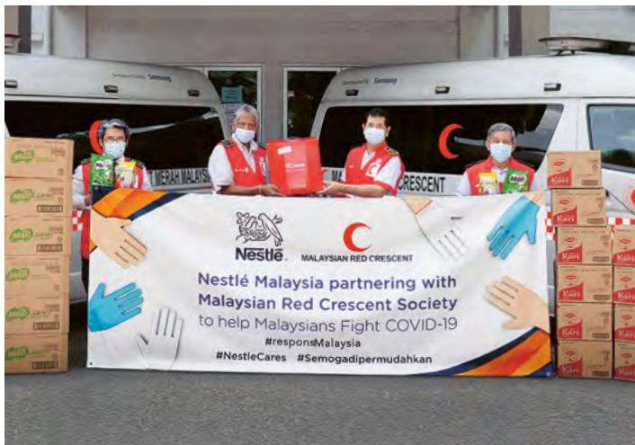

> **AI Description:**
> **Source:** `assets/_page_40_Figure_0.jpg`
> 
> **Generated:** 2026-05-30 00:00:08
> 
> ---
> 
> The image contains a photograph of four individuals wearing red vests and masks, standing behind a banner. The banner displays the logos of Nestlé and the Malaysian Red Crescent Society. The text on the banner reads: "Nestlé Malaysia partnering with Malaysian Red Crescent Society to help Malaysians Fight COVID-19 #responseMalaysia #NestleCares #Semogadiper mudahkan." The individuals are holding boxes of products, and there are stacks of boxes on either side of the banner. The background includes a white van with the Malaysian Red Crescent Society logo. The image conveys a collaborative effort between Nestlé and the Malaysian Red Crescent Society in response to the COVID-19 pandemic.

## Partnering to keep people safe

From the beginning of the COVID-19 crisis, we have worked to keep people and communities healthy and safe, including continuing our support of the International Federation of the Red Cross and Red Crescent Societies (IFRC) with financial, food, water and medical nutrition product donations.

## Further information

# Building on progress

We have made good progress on our 2020 commitments. At the time of the report publication, 28 out of the 36 commitments were fully achieved. We are intensifying our efforts to fully achieve those that are still in progress and where we are very close.

These commitments were an important step in our deep-rooted dedication to environmental and social sustainability; as we enter the next decade, we are setting new ambitions which will drive us to go further and faster. We will continue to advance the health of our planet, drive progress on social issues and support a healthy food system. We have made bold commitments and set out a detailed roadmap to achieve net zero greenhouse gas emissions by 2050. We also have the ambition to make 100% of our packaging recyclable or reusable by 2025.

Further information   
We have achieved so much on our journey, with each year representing a significant step forward. Watch this video to learn more about our key accomplishments. Scan this QR Code or visit www.nestle.com/csv.

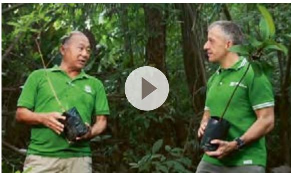

> **AI Description:**
> **Source:** `assets/_page_41_Figure_1.jpg`
> 
> **Generated:** 2026-05-30 00:03:26
> 
> ---
> 
> The image contains a photograph of two individuals standing in a forested area. Both are wearing green polo shirts and holding black cameras. The person on the left appears to be holding a small object in their hands. The background is filled with green foliage, indicating a natural, outdoor setting. The image has a play button overlay in the center, suggesting it is a screenshot from a video.

Status of our commitments

# For individuals and families

Enabling healthier and happier lives

> **AI Description:**
> **Source:** `assets/_page_41_Figure_2.jpg`
> 
> **Generated:** 2026-05-30 00:04:25
> 
> ---
> 
> The image is a simple line drawing. It depicts two human figures, one adult and one child, standing close together. The adult figure is taller and appears to be holding or standing behind the child. The drawing is stylized and does not contain any text or additional labels. The image likely represents a family or a caregiver and child relationship.

## Our 2030 ambition is to help 50 million children lead healthier lives

> **AI Description:**
> **Source:** `assets/_page_41_Figure_3.jpg`
> 
> **Generated:** 2026-05-30 00:07:08
> 
> ---
> 
> The image contains a photograph of a person in a white uniform holding a tablet device. The tablet has a blue screen with some text and icons displayed, but the content on the screen is not clearly legible. The person appears to be presenting or demonstrating the tablet. The background shows a classroom or laboratory setting with desks and chairs.

Offering tastier and healthier choices

Launch more foods   
and beverages   
that are nutritious,   
especially for   
mothers- to-be,   
new mothers,   
infants and children

Further decrease sugars, sodium and saturated fat

Increase vegetables,   
fiber-rich grains,   
pulses, nuts and   
seeds in our foods   
and beverages

Simplify our ingredient lists and remove artificial colors

Address   
undernutrition   
through micronutrient   
fortification

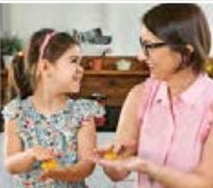

> **AI Description:**
> **Source:** `assets/_page_41_Figure_8.jpg`
> 
> **Generated:** 2026-05-30 00:19:02
> 
> ---
> 
> The image is a photograph of two individuals, likely a child and an adult, in what appears to be a kitchen setting. The child is holding a small object, possibly a toy or a snack, and is looking at the adult with a smile. The adult is also smiling and appears to be engaged in a conversation or interaction with the child. The background includes kitchen elements such as cabinets and a countertop. The image conveys a warm, familial interaction.

Apply and explain nutrition information on packs, at point of sale and online

Inspiring people to lead healthier lives

Offer guidance on portions for our produ

Empower parents, caregivers and teachers to foster healthy behaviors in children

Leverage our marketing efforts to promote healthy cooking, eating and lifestyles

Support breastfeeding and protect it by continuing to implement an industry-leading policy to market breast-milk substitutes responsibly

Inspire people to choose water to lead healthier lives

Partner for promoting healthy food environments

> **AI Description:**
> **Source:** `assets/_page_41_Figure_13.jpg`
> 
> **Generated:** 2026-05-30 00:09:48
> 
> ---
> 
> The image is a photograph of a healthcare professional, likely a pediatrician, examining a baby. The baby is seated on the lap of the healthcare professional, who is holding a stethoscope and appears to be listening to the baby's heartbeat. The background shows a typical pediatrician's office setting with medical charts and equipment. The image conveys a sense of care and medical attention in a clinical environment.

Building, sharing and applying nutrition knowledge

Build and share nutrition knowledge from the first 1000 days through to healthy aging

Build biomedical science leading to health-promoting products, personalized nutrition and digital solutions

SUSTAINABLE DEVELOPMENT GALS

13 CLIMATE ACTION

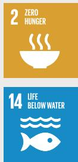

> **AI Description:**
> **Source:** `assets/_page_41_Figure_17.jpg`
> 
> **Generated:** 2026-05-30 00:09:10
> 
> ---
> 
> The image contains two distinct sections, each with a color background, a simple icon, and text. The top section has an orange background with the text "2 Zero Hunger" and an icon of a bowl with steam rising from it. The bottom section has a blue background with the text "14 Life Below Water" and an icon of a fish with wavy lines representing water. The image appears to be related to Sustainable Development Goals (SDGs), specifically SDG 2 (Zero Hunger) and SDG 14 (Life Below Water).

# For our communities

Helping develop thriving, resilient communities

> **AI Description:**
> **Source:** `assets/_page_42_Figure_0.jpg`
> 
> **Generated:** 2026-05-30 00:19:05
> 
> ---
> 
> The image contains a simple line drawing of a house with a chimney and a tree to the right. The background is a solid orange color. The drawing is minimalistic and does not contain any text or additional elements.

# For the planet

Stewarding resources and the environment

> **AI Description:**
> **Source:** `assets/_page_42_Figure_1.jpg`
> 
> **Generated:** 2026-05-30 00:20:21
> 
> ---
> 
> The image contains a simple white icon on a green background. The icon consists of two stylized leaves with a small cloud or mound beneath them. The icon is likely a representation of nature, possibly related to environmental or ecological themes. There are no labels or text annotations within the image.

## Our 2030 ambition is to improve 30 million livelihoods in communities directly connected to our business activities

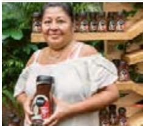

> **AI Description:**
> **Source:** `assets/_page_42_Figure_2.jpg`
> 
> **Generated:** 2026-05-30 00:22:29
> 
> ---
> 
> The image is a photograph of a woman holding a bottle of a beverage. The background shows shelves with more bottles of the same product. The woman appears to be presenting the product, and the setting suggests a retail or production environment. The image conveys a sense of a local or artisanal product being showcased.

Enhancing rural development and livelihoods

Improve farm economics among the farmers who supply us

Improve food availability and dietary diversity among the farmers who supply us

Implement   
responsible sourcing in our supply chain and promote animal welfare

Continuously improve our green coffee supply chain

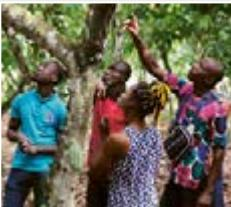

> **AI Description:**
> **Source:** `assets/_page_42_Figure_3.jpg`
> 
> **Generated:** 2026-05-30 00:20:58
> 
> ---
> 
> The image contains a photograph of a group of people in what appears to be a natural setting, possibly a forest or a park. The individuals are interacting with each other, with one person holding up a small object, possibly a piece of fruit or a tool, towards the others. The setting suggests a collaborative or educational activity, possibly related to nature or agriculture. The individuals are dressed in casual clothing, and the environment is lush with greenery.

Roll out the Nestlé Cocoa Plan with cocoa farmers

## Respecting and promoting human rights

Assess and address human rights impacts across our business activities

Improve workers’ livelihoods and protect children in our agricultural supply chain

Enhance a culture of integrity across the organization

Provide effective grievance mechanisms to employees and stakeholders

> **AI Description:**
> **Source:** `assets/_page_42_Figure_4.jpg`
> 
> **Generated:** 2026-05-30 00:18:34
> 
> ---
> 
> The image shows a person sitting in front of a computer screen, participating in a video conference call. The screen displays a group of people, suggesting a virtual meeting or webinar. The setting appears to be an indoor environment, possibly a home or office, with a window and some furniture visible in the background. The person is wearing a pink top and has their hair tied back. The image conveys the concept of remote communication and virtual collaboration.

## Promoting decent employment and diversity

Roll out our Nestlé needs YOUth initiative across a operations

Enhance gender balance in our workforce and empower women across the entire value chain

Advocate for healthy workplaces and healthier employees

## Our 2030 ambition is to strive for zero environmental impact in our operations

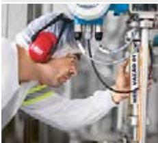

> **AI Description:**
> **Source:** `assets/_page_42_Figure_5.jpg`
> 
> **Generated:** 2026-05-30 00:17:41
> 
> ---
> 
> The image contains a photograph of a person wearing a white lab coat and red ear protection, working with industrial equipment. The person appears to be adjusting or operating a valve or control panel, which is part of a larger piece of machinery. The setting suggests a manufacturing or laboratory environment. The image does not contain any text or additional visual elements beyond the photograph of the individual and the equipment.

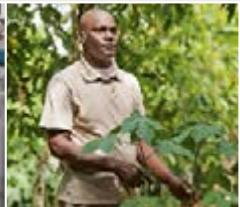

> **AI Description:**
> **Source:** `assets/_page_42_Figure_6.jpg`
> 
> **Generated:** 2026-05-30 00:14:08
> 
> ---
> 
> The image is a photograph of a person standing outdoors in a natural setting, possibly a forest or garden. The individual is holding a small plant or seedling in their hands, and they appear to be examining or presenting it. The background is filled with green foliage, suggesting a lush, natural environment. The person is wearing a light-colored shirt and dark shorts, and their posture indicates they are focused on the plant they are holding. The image conveys a sense of nature, possibly related to agriculture, botany, or environmental conservation.

Caring for water
Acting on climate change

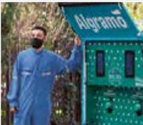

> **AI Description:**
> **Source:** `assets/_page_42_Figure_7.jpg`
> 
> **Generated:** 2026-05-30 00:16:05
> 
> ---
> 
> The image contains a photograph of a person wearing a blue jumpsuit and a black face mask, standing next to a green vending machine labeled "Algramo." The vending machine has a grid of holes on its front panel, suggesting it may be used for dispensing or storing items. The background appears to be an outdoor setting with greenery.

Work to achieve water efficiency and sustainability across all our operations

Safeguarding the environment

Advocate for effective water policies and stewardship

Engage with suppliers, especially those in agriculture

Raise awareness on water conservation and improve access to water and sanitation across our value chain

## Provide climate change leadership

Promote transparency and proactive, long-term engagement in climate policy

Improve the environmental performance of our packaging

Reduce food loss and waste

Provide meaningful and accurate environmental information and dialog

Preserve natural capital

> **AI Description:**
> **Source:** `assets/_page_42_Figure_8.jpg`
> 
> **Generated:** 2026-05-30 00:04:08
> 
> ---
> 
> The image contains a simple line drawing. It features a white line that resembles a heartbeat monitor line, with a heart shape at the end. This symbol is commonly used to represent health, medical monitoring, or vital signs. The image is a single, static visual element with no additional text or data annotations.

3 GOOD HEALTH AND WELL-BEING

4 QUALITY EDUCATION

15 NLAD

> **AI Description:**
> **Source:** `assets/_page_42_Figure_10.jpg`
> 
> **Generated:** 2026-05-30 00:07:45
> 
> ---
> 
> The image contains a simple diagram with a green tree on the left side and a horizontal line at the bottom. Above the tree, there are three small shapes that resemble birds flying. The diagram appears to represent a basic ecological or environmental concept, possibly illustrating the relationship between trees and birds.

5 GENDER EQUALITY

PEACE,JUSTICE ANDSTRONG INSTITUTIONS

17 PARTNERSHIPS FORTHEGOALS

6 CLEANWATER AND SANITATION

> **AI Description:**
> **Source:** `assets/_page_42_Figure_15.jpg`
> 
> **Generated:** 2026-05-30 00:11:02
> 
> ---
> 
> The image contains a simple icon of a sun with a power button overlay. The icon is yellow with a white power button in the center of the sun. There are no charts, graphs, or other visual elements present. The icon likely represents a combination of solar energy and power, possibly symbolizing renewable energy or a power-saving feature related to solar technology.

> **AI Description:**
> **Source:** `assets/_page_42_Figure_16.jpg`
> 
> **Generated:** 2026-05-30 00:09:43
> 
> ---
> 
> The image contains a simple line graph with an upward trend. The graph has two axes: the vertical axis is labeled with a generic term "Y" and the horizontal axis is labeled with a generic term "X". The graph shows a consistent increase from left to right, indicating a positive correlation between the variables represented by "X" and "Y". The color of the line is a solid red, and the graph is set against a white background.

DECENTWORKAND ECONOMICGROWTH

> **AI Description:**
> **Source:** `assets/_page_42_Figure_17.jpg`
> 
> **Generated:** 2026-05-30 00:09:52
> 
> ---
> 
> The image contains a simple diagram with three stacked white cubes on an orange background. The cubes are evenly spaced and aligned vertically, suggesting a concept or structure. There are no labels or text annotations present in the image.

ANDINFRASTRUCTURE

10 REDUCED INEQUALITIES

11 SUSTAIAIEIEES ANDCOMMUNITIES

> **AI Description:**
> **Source:** `assets/_page_42_Figure_19.jpg`
> 
> **Generated:** 2026-05-30 00:11:46
> 
> ---
> 
> The image contains a simple diagram with two buildings of different heights and a smaller house to the left. The buildings are represented by vertical rectangles with varying heights, indicating a possible comparison of sizes or values. The house is a smaller, simpler shape, suggesting it might represent a smaller entity or a different category. The diagram is likely used to illustrate a comparison or hierarchy between the buildings and the house.

# 2020 highlights

When we set our commitments, we knew they were ambitious. Concrete actions and tangible accomplishments underline our progress in each one within the 2020 timeframe.

Our commitments are part of our long-term endeavor to be a force for good. We know that significant global changes depend on collaboration. That is why we build partnerships with governments, non governmental organizations (NGOs) and others to bring about lasting positive impact.

At all levels of our company, people contribute to our sustainability efforts through an increasing number of projects, actions and products. We will accelerate this work going forward.

More stories and achievements can be found on www.nestle.com/csv.

> **AI Description:**
> **Source:** `assets/_page_43_Figure_0.jpg`
> 
> **Generated:** 2026-05-30 00:15:00
> 
> ---
> 
> The image contains a simple diagram of two figures, one adult and one child, standing side by side. The adult figure is taller and appears to be holding the child, suggesting a parent-child relationship. The figures are represented in a minimalist style with no additional details or labels. The image does not contain any text or other visual elements beyond the two figures.

For individuals and families

> **AI Description:**
> **Source:** `assets/_page_43_Figure_1.jpg`
> 
> **Generated:** 2026-05-30 00:14:42
> 
> ---
> 
> The image contains a simple diagram with two main elements: a house and a person. The house is depicted with a roof, walls, and a door, while the person is shown with a head and body. The person appears to be standing in front of the house. The image does not contain any text or additional labels.

For our communities

For the planet

> **AI Description:**
> **Source:** `assets/_page_43_Figure_3.jpg`
> 
> **Generated:** 2026-05-30 00:18:19
> 
> ---
> 
> The image contains a simple diagram of two individuals, one standing behind the other, both wearing chef hats. The figure in the foreground appears to be a child, while the figure in the background is an adult. The image is likely used to represent a concept related to mentorship or guidance in a culinary context.

## Supporting babies with Cow’s Milk Protein Allergy

Breastfeeding is best for babies and we actively promote and support it. There is no debate. When breastfeeding is not possible, we propose high-quality infant nutrition solutions, including formula for babies that are affected by Cow’s Milk Protein Allergy (CMPA). CMPA is one of the most common food allergies in infancy and the symptoms, which can be distressing for parents, include diarrhea, vomiting, eczema or even anaphylaxis.

In 2020, we launched Althéra HMO, a specialty hypoallergenic formula, clinically proven to provide effective symptom relief and support healthy growth and development in babies with CMPA. Babies with CMPA also have an immature immune system which may increase the risk of infections. Althéra HMO is therefore supplemented with Nestlé’s Human Milk Oligosaccharide blend, which reduces the risk of infections by stimulating the immune system.

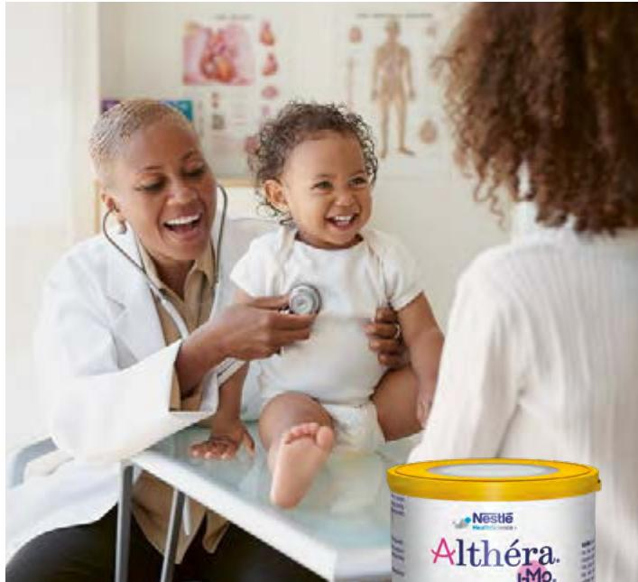

> **AI Description:**
> **Source:** `assets/_page_43_Figure_4.jpg`
> 
> **Generated:** 2026-05-30 00:21:39
> 
> ---
> 
> The image contains a photograph of a medical setting. It shows a healthcare professional examining a young child with a stethoscope. The child is smiling and appears to be in a comfortable and happy state. The healthcare professional is wearing a white lab coat and is seated at a table. In the foreground, there is a container of Althera i-Mo, a product by Nestlé Health Science, which is likely related to the medical examination. The background includes medical charts and diagrams, suggesting a clinical environment.

Providing specialty infant nutrition solutions when breastfeeding is not possible

> **AI Description:**
> **Source:** `assets/_page_44_Figure_0.jpg`
> 
> **Generated:** 2026-05-30 00:15:59
> 
> ---
> 
> The image contains a simple diagram with two main elements: a person standing and a bag with a dollar sign on it. The person appears to be holding or interacting with the bag. The image is likely used to represent the concept of saving money, spending money, or financial transactions. The visual is minimalistic and focuses on the relationship between the person and the bag with a dollar sign, emphasizing the theme of money management or financial actions.

## Fighting micronutrient deficiencies with personalized solutions

Our BEAR BRAND provides affordable nutrition options through fortified food and beverages. Increasing access to nutritional information, BEAR BRAND recently launched a new digital nutrition assessment tool, the Tibay Calculator. It helps parents in the Philippines understand the quality and diversity of their child’s diet. Collaborating with the Food and Nutrition Research Institute, Nestlé Research scientists developed an algorithm to calculate diet diversity scores and identify nutrient gaps in the diets of 6-12 year-olds.

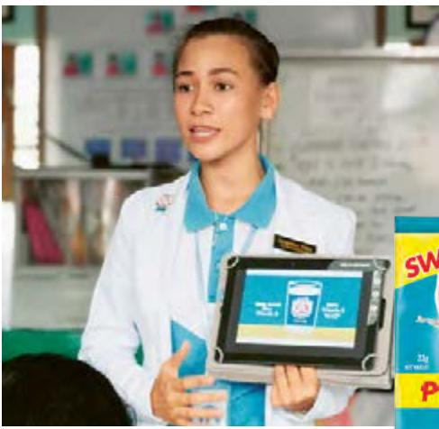

> **AI Description:**
> **Source:** `assets/_page_44_Figure_1.jpg`
> 
> **Generated:** 2026-05-30 00:14:18
> 
> ---
> 
> The image contains a photograph of a person in a classroom setting, holding a tablet with a presentation slide displayed. The slide shows a diagram comparing two items, one labeled "A" and the other "B," with icons representing different aspects of each item. The person appears to be explaining the content of the slide to an audience. The background includes classroom elements such as a whiteboard and desks.

Helping consumers make informed choices about their nutritional intake

> **AI Description:**
> **Source:** `assets/_page_44_Figure_3.jpg`
> 
> **Generated:** 2026-05-30 00:18:25
> 
> ---
> 
> The image contains a simple diagram of two figures, one appearing to be an adult and the other a child, standing close together. The adult figure is slightly taller and has a hand placed on the child's head, suggesting a protective or guiding gesture. The background is plain white, and the figures are outlined in blue. There are no labels or text annotations present in the image.

## Helping families make good food choices

Nutrition education is critical to our ambition to help 50 million children lead healthier lives – a goal supported by our flagship initiative Nestlé for Healthier Kids.

In May 2020, we launched a new Nestlé for Healthier Kids initiative, Cook Together. With nearly 40 Nestlé brands participating globally, Cook Together reached over 225 million parents, encouraging families to spend more time in the kitchen preparing nutritional meals together. In November, a second campaign was launched featuring a cookbook, challenges and prizes.

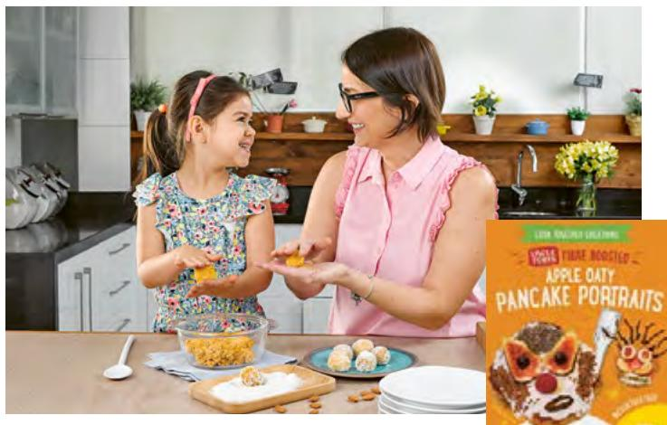

> **AI Description:**
> **Source:** `assets/_page_44_Figure_4.jpg`
> 
> **Generated:** 2026-05-30 00:21:16
> 
> ---
> 
> The image contains a photograph of a woman and a young girl in a kitchen setting. They appear to be engaged in a cooking activity, with ingredients and utensils on the counter. The woman is holding what looks like a piece of food, possibly a pancake, and the girl is holding a similar item. The background shows a kitchen with various kitchenware and plants. In the bottom right corner, there is an image of a book cover titled "Apple Oaty Pancake Portraits," featuring a creative pancake decoration.

Teaching children about the nutritional value of cooking

> **AI Description:**
> **Source:** `assets/_page_44_Figure_5.jpg`
> 
> **Generated:** 2026-05-30 00:22:19
> 
> ---
> 
> The image contains a simple diagram with two main elements: a house and a heart. The house is depicted with a roof and walls, and the heart is located to the right of the house. The background is orange, and there are no additional labels or text annotations within the image. The diagram appears to symbolize a connection or relationship between a home and a heart, possibly representing a family or a home environment.

## Supporting youth – virtually

Unemployment has risen due to the COVID-19 pandemic, with young people being both the hardest hit and yet the most vital for economic recovery. In response, Nestlé expanded its global initiative, Nestlé Needs YOUth, launching a new virtual internship program across several markets.

Through the program, young people can improve their employability by accessing courses, developed in partnership with LinkedIn, Coursera and Miriadax. These courses are designed to support young people moving from higher education to employment. Participants will also receive training from leading global experts.

> **AI Description:**
> **Source:** `assets/_page_44_Figure_6.jpg`
> 
> **Generated:** 2026-05-30 00:20:01
> 
> ---
> 
> The image contains a photograph of a woman sitting at a desk, facing a laptop screen. The laptop screen displays a video call with multiple participants, suggesting a virtual meeting or conference. The woman appears to be engaged in the call, with her back to the camera. The setting is a well-lit room with a window in the background, and there is a small plant on the desk. The image conveys a scene of remote communication or collaborative work.

Expanding Nestlé Needs YOUth online learning to improve employability

We believe that every farmer should have access to a living income. Nestlé’s new Household Income Accelerator Project is helping drive change for cocoa farmers.

Launched in August 2020, the project’s pilot scheme supports 1000 farmers, each of whom is receiving financial incentives for delivering positive social and environmental outcomes through good agricultural practices, planting shade trees and tackling child labor. The project’s progress will be closely monitored, with developments and results publicly reported.

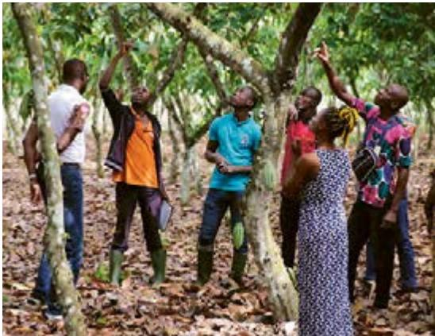

> **AI Description:**
> **Source:** `assets/_page_45_Figure_0.jpg`
> 
> **Generated:** 2026-05-30 00:18:55
> 
> ---
> 
> The image contains a photograph of a group of people standing in a forested area. The individuals appear to be engaged in some form of activity, possibly related to tree inspection or forest management, as they are pointing upwards and looking at something in the trees. The setting is natural, with trees and fallen leaves on the ground, suggesting a focus on environmental or agricultural activities. The people are dressed in casual clothing, indicating a practical, hands-on approach to their task.

Investing in a sustainable future for farming communities

> **AI Description:**
> **Source:** `assets/_page_45_Figure_1.jpg`
> 
> **Generated:** 2026-05-30 00:20:28
> 
> ---
> 
> The image contains a simple diagram with a green background. It features a white silhouette of a plant with two leaves. The plant appears to be a stylized representation of a leafy green plant, possibly symbolizing growth, nature, or environmental themes. There are no text annotations or additional elements in the image.

## Developing plant-based food for the future

Nestlé has a strong portfolio of plant-based options. In August 2020, we expanded into seafood plant-based alternatives. Our plantbased tuna alternative, the newest addition to the Garden Gourmet brand, is helping to reduce overfishing and protect ocean biodiversity. It is made using only six plant-based ingredients, is high in protein and essential amino acids, and is free of artificial colorings or preservatives. We developed the tuna alternative within 9 months through leveraging our deep R&D expertise in protein science and proprietary technologies.

> **AI Description:**
> **Source:** `assets/_page_45_Figure_2.jpg`
> 
> **Generated:** 2026-05-30 00:22:40
> 
> ---
> 
> The image contains a simple icon of a house with a roof and a door, enclosed within a square shape. The house icon is orange, and the square is a darker shade of orange. There is no text or additional visual elements present in the image.

## Recognizing farmers

Behind every cup of Nescafé are thousands of committed coffee growers. We want our consumers to know the faces and names of some of the people who work to make our coffee products possible.

In 2020, we launched a multimedia campaign to acknowledge their incredible work. Through on-pack pictures, posters at point-of-sale, billboards and social media posts, we shared producers’ stories. The campaign, which aimed to build closer connections between coffee consumers and the farmers that help produce Nescafé, achieved more than 9 million impressions in total.

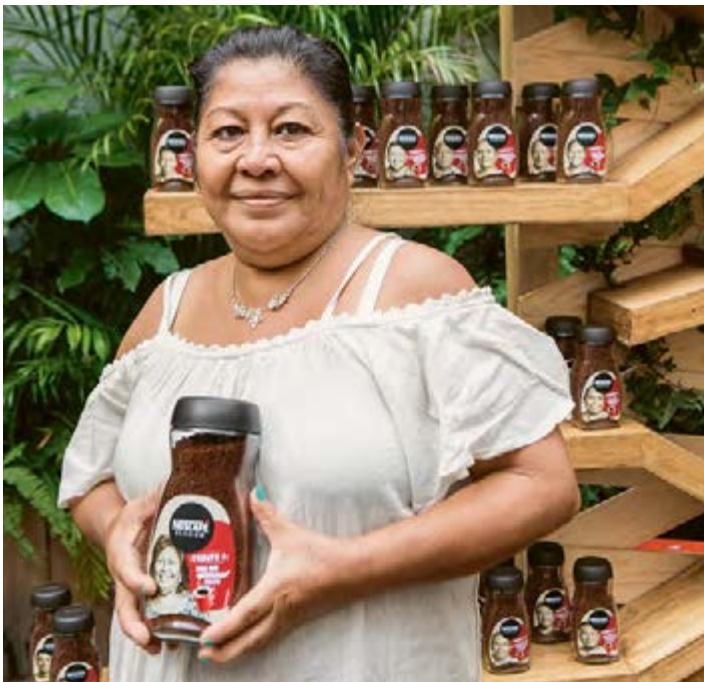

> **AI Description:**
> **Source:** `assets/_page_45_Figure_3.jpg`
> 
> **Generated:** 2026-05-30 00:20:38
> 
> ---
> 
> The image contains a photograph of a woman holding a jar of Nescafé coffee. The background features a wooden shelf displaying multiple jars of Nescafé coffee, with some greenery visible on the left side. The woman is wearing a white off-the-shoulder blouse and a necklace. The image appears to be promoting or showcasing the Nescafé coffee product.

Connecting consumers to coffee growers

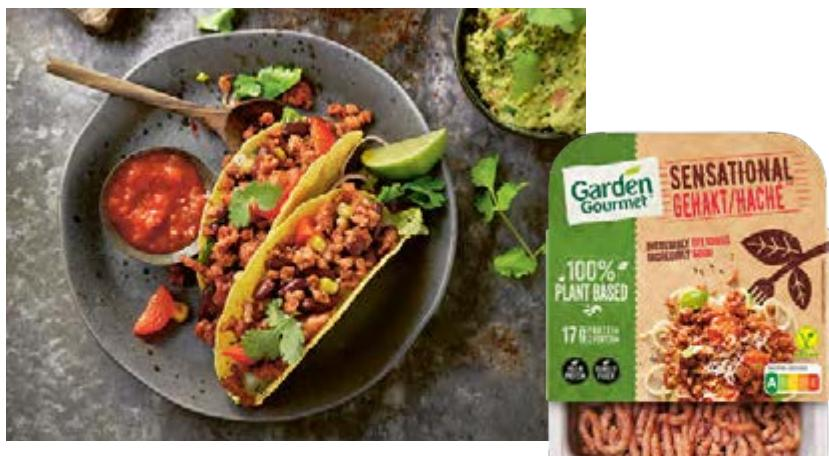

> **AI Description:**
> **Source:** `assets/_page_45_Figure_4.jpg`
> 
> **Generated:** 2026-05-30 00:18:48
> 
> ---
> 
> The image contains a photograph of a meal and a product packaging. The meal includes two tacos filled with a plant-based meat substitute, garnished with cilantro and served with salsa and guacamole. The product packaging is for Garden Gourmet's "Sensational" plant-based meat substitute, highlighting that it is 100% plant-based and contains 17g of protein per serving. The packaging also includes a leaf symbol, indicating it is suitable for vegetarians and vegans.

Offering more plant-based protein options that are better for you and the planet

> **AI Description:**
> **Source:** `assets/_page_46_Figure_0.jpg`
> 
> **Generated:** 2026-05-30 00:04:04
> 
> ---
> 
> The image contains a simple diagram with two green leaf-like shapes at the bottom, forming a stylized representation of a plant or a tree. The background is white, and the leaves are outlined in black. There are no labels or text annotations present in the image.

## Innovating packaging for the future

We are accelerating research and innovation to ensure 100% of our packaging is recyclable or reusable and use of virgin plastics is reduced by one-third by 2025. We are taking a five-pillar approach to target our efforts:

Reducing packaging size and virgin plastic use: We have invested USD 30 million in the Closed Loop Leadership Fund, supporting a shift to food-grade recycled plastics.

– Scaling reusable and refillable systems: We are scaling up reusable and refillable options, working with Loop in France and Algramo in Chile.

Pioneering alternative materials: We are transitioning to paper packaging where viable, such as for Maggi bouillon cube wrappers. Purina PetCare launched industryfirst recyclable flexible plastic packaging for wet pet food.

Shaping a waste-free future: In August 2020, Nestlé Philippines reached plastic neutrality, collecting as much plastic as we produce. We also work with Project STOP to address plastic pollution in Indonesia.

– Driving new behavior: Nestlé is rolling out a sustainable packaging education program for all employees, while our Nescafé Dolce Gusto brand launched a consumer recycling campaign in Germany and Mexico.

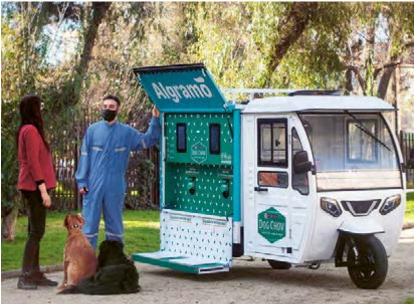

> **AI Description:**
> **Source:** `assets/_page_46_Figure_1.jpg`
> 
> **Generated:** 2026-05-30 00:03:45
> 
> ---
> 
> The image contains a photograph of a three-wheeled vehicle with a green and white color scheme. The vehicle is branded with the name "Algramo" and appears to be a mobile service or delivery unit. The side of the vehicle has a grid-like structure with multiple holes, possibly for displaying or securing items. There is a person in a blue uniform standing next to the vehicle, and a dog is sitting on the ground nearby. The setting appears to be outdoors, with trees and grass visible in the background. The vehicle also has a sign that reads "Dog Chow," suggesting it may be used for pet-related services or deliveries.

Making refill and reuse options easier for our consumers

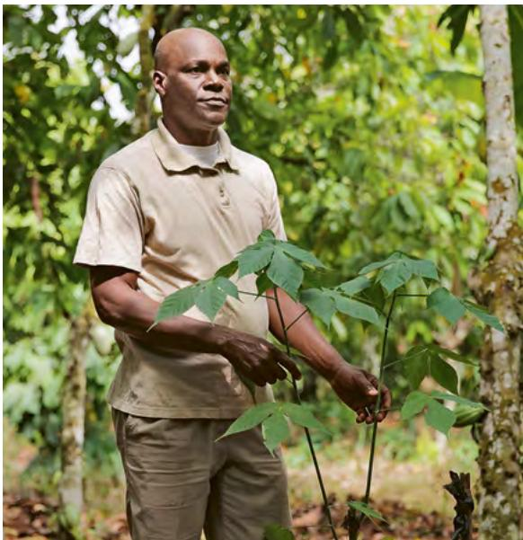

> **AI Description:**
> **Source:** `assets/_page_46_Figure_2.jpg`
> 
> **Generated:** 2026-05-30 00:04:51
> 
> ---
> 
> The image is a photograph of a person standing in a lush, green forested area. The individual is wearing a light-colored polo shirt and pants, and is holding a small plant with several green leaves. The background is filled with dense foliage and trees, suggesting a natural, possibly tropical environment. The person appears to be examining or tending to the plant, possibly indicating a connection to agriculture, forestry, or environmental conservation.

Providing farmers with plantlets to support the environment

## Preserving and restoring forests

Tackling deforestation in our supply chains is vital for addressing climate change. For example, we are working together with the national government and NGO Earthworm Foundation to preserve and reforest the classified Cavally reserve in Côte d’Ivoire, a biodiversity hotspot. Through a CHF 2.5 million investment, as part of the Cocoa and Forests Initiative, the Nestlé Cocoa Plan has mapped suppliers to ensure they are not in protected areas. We are also distributing forest trees to farmers to improve the environment on their farms.

A successful implementation will provide a model to use in the other forests.

# Stakeholder engagement

## Engaging with our stakeholders

Our global stakeholder network includes investors, multilateral organizations, governments, NGOs, civil society organizations (CSOs), academia, local communities, suppliers, consumers, customers and our employees. Although 2020 presented a challenging time for in-person engagement, our dialogs with stakeholders continued.

For example, a virtual workshop in March explored ways to achieve a living income for cocoa farmers, while a webinar during EU Green Week in June, held in partnership with Earthworm Foundation, explored how satellite technology is helping achieve deforestation-free supply chains. We also worked with stakeholders to understand how on-pack communication can help consumers to make informed product choices.

In June, our CEO, Mark Schneider, was a lead speaker at the launch of the ‘Race to Zero’, a UN campaign to encourage companies to pledge to achieve net zero by 2050. During Climate Week in September, our leadership participated in discussions with government, business and civil society leaders on topics related to tackling deforestation and promoting reforestation. In December, we organized two sessions with stakeholders to discuss the Nestlé’s Net Zero Roadmap.

Each year, the Nestlé CSV Council actively guides our approach to Creating Shared Value. The CSV Council is a group of experts from a broad range of fields, from corporate responsibility, strategy and sustainability to nutrition, water and rural development. The group advises Nestlé and assesses our progress, helping deepen our knowledge and understanding of important societal matters. In 2020, the CSV Council met with our CEO and executive board members to discuss items related to sustainability, including Nestlé’s ambition to achieve zero net emissions by 2050.

## Materiality assessment

We know that stakeholder priorities are constantly changing and that we must evolve to ensure we meet expectations. Every two years, we conduct a formal materiality assessment, through which we identify and prioritize the issues that matter most to our business and stakeholders.

In 2020, we took our materiality process further. We fully integrated the assessment with

Nestlé’s Enterprise Risk Management process, to ensure that wider sustainability issues were incorporated into the risks and opportunities under consideration across the company.

The assessment, co-led internally by Public Affairs and Group Risk Management, was undertaken by an independent third party to ensure complete confidentiality and impartiality. Following a research and planning stage, 72 key internal and external stakeholders were interviewed and asked to score issues by importance to them.

Based on the results of the assessment, we will tailor our activities. We will address those issues identified as being most material to our business, developing ambitious goals to advance the health of our planet, drive societal progress and support a sustainable and healthy food system. More information on risks can be found on page 60.

## Our performance in leading indices

> **AI Description:**
> **Source:** `assets/_page_47_Figure_0.jpg`
> 
> **Generated:** 2026-05-30 00:00:16
> 
> ---
> 
> The image contains a green sphere with a pattern of handprints in various colors. The handprints appear to be arranged in a circular pattern around the sphere. The sphere also has a logo or emblem in the center, which includes a stylized design with a yellow and green color scheme. The overall design suggests a theme of unity or community, possibly related to a group or organization.

FTSE4Good

Nestlé maintained its strong standing in the Index with an overall 2020 environmental, social and governance (ESG) rating of 4.9 out of 5. This is significantly higher than the Food Products subsector average.

VE

Nestlé achieved a robust ESG score and obtained a lead ranking in the Food sector in Europe.

MSCI ESG RATINGS

CCCBBBBBBAAAAAA

In 2020, Nestlé was rated AA by the MSCI ESG Research according to its performance on ESG issues.

We continued to be within the leadership band for Climate and Water.

### Full Page Description (Page 48)

**Source:** `assets/_page_48_Asset_0.jpg`

**Generated:** 2026-05-30 00:10:46

---

The image is a quadrant chart that categorizes various topics based on their importance to stakeholders and their significance. The chart is divided into three categories of importance: Major, Significant, and Moderate, and three levels of significance: Moderate, Significant, and Major. Each topic is represented by a color-coded label, with red, green, and blue indicating different categories. The chart includes topics such as Human rights, Responsible sourcing, Climate and decarbonization, Biodiversity, Geo-political and economic context, and others, each placed in the appropriate quadrant based on its importance and significance.

## Nestlé materiality matrix

People

Communities

Planet

Maximizing long-term value

## Financial review

# Key figures (consolidated)

Balance sheet and Cash flow statement

(a) Certain financial performance measures are not defined by IFRS. For further details, see Foreword on page 48.
(b) Income statement figures translated at weighted average annual rate; Balance sheet figures at year-end rate.

# Group overview

## Foreword

The Financial review contains certain financial performance measures, that are not defined by IFRS, that are used by management to assess the financial and operational performance of the Group. They include among others:

– Organic growth, Real internal growth and Pricing;

– Underlying trading operating profit margin and Trading operating profit margin;

– Net financial debt;

– Free cash flow; and

– Underlying earnings per share (EPS) and EPS in constant currency.

Management believes that these non-IFRS financial performance measures provide useful information regarding the Group’s financial and operating performance.

The Alternative Performance Measures document published under www.nestle.com/investors/ publications defines these non-IFRS financial performance measures.

Underlying and Trading operating profit 2019 comparatives of the operative segments have been adjusted following a change of business structure. Effective as from January 1, 2020, Nestlé Waters has been managed as a Regionally Managed Business instead of a Globally Managed Business and consequently reported as part of Zone EMENA, Zone AMS and Zone AOA.

## Introduction

2020 was a year of hardship for so many, yet we are inspired by the way it has brought all of us closer together. We want to thank our employees and our partners – from farmers to retailers – who worked with us to ensure the supply of food and beverages to communities globally.

In this unprecedented environment, we achieved our third consecutive year of improvement in organic growth, profitability and return on invested capital.

The global pandemic did not slow us down. Our nutrition expertise, digital capabilities, decentralized structure and innovation engine allowed us to adapt quickly to changing consumer behaviors and trends. We advanced our portfolio transformation, continued to build Nestlé Health Science into a nutrition powerhouse and expanded our presence in direct-to-consumer businesses.

At the same time, we remained focused on sustainability and set out our path to achieve net zero greenhouse gas emissions by 2050. This journey is expected to support future growth and be earnings neutral – it will generate value for society and our shareholders.

Looking to 2021, we expect continued improvement in organic growth, profitability and capital efficiency in line with our value creation model.

## Group sales

Organic growth reached 3.6% in 2020, the highest level in the last five years. RIG accelerated to 3.2%. Pricing contributed 0.4% and improved during the year, particularly in emerging markets.

Growth was based on strong momentum in the Americas and robust sales development in EMENA. AOA saw positive growth. Organic growth in developed markets was strong at 3.8%. Growth in emerging markets improved during the year and reached 3.4%.

By product category, the largest contributor to growth was Purina PetCare and its premium brands Purina Pro Plan, Purina ONE and Felix. Dairy saw high single-digit growth, based on increased demand for home-baking products and fortified affordable milks. Coffee reported mid single-digit growth, boosted by strong consumer demand for Starbucks products, Nespresso and Nescafé. Sales of Starbucks products reached CHF 2.7 billion, generating incremental sales of over CHF 400 million in 2020. Prepared dishes and cooking aids posted mid single-digit growth, with robust momentum across most categories during lockdowns. Vegetarian and plant-based food offerings continued to see strong doubledigit growth, despite reduced demand in outof-home channels due to the pandemic. Sales in Nestlé Health Science grew at a double-digit rate, reflecting higher demand for products that support health and the immune system. Growth in confectionery was slightly negative, with reduced demand for impulse and gifting products. Water reported a decrease in sales due to its high exposure to out-of-home channels.

Divestitures decreased sales by 4.6%, largely related to the divestment of Nestlé Skin Health, the U.S. ice cream business and the Herta charcuterie business. Foreign exchange reduced sales by 7.9%, reflecting the continued appreciation of the Swiss franc versus most currencies. Total reported sales decreased by 8.9% to CHF 84.3 billion.

## Business impact of COVID-19

The effects of COVID-19 on the Group’s organic growth varied by product category and sales channel:

Product categories: Demand for at-home consumption, trusted brands and products with nutritional benefits was strong. Purina PetCare, dairy, coffee at-home and Nestlé Health Science reported robust growth. Sales in confectionery and water decreased, reflecting their high exposure to out-of-home channels and on-thego consumption.

Sales channels: Retail sales posted high singledigit organic growth, reflecting elevated demand for at-home consumption. Sales in out-of-home channels declined significantly.

E-commerce sales grew by 48.4%, reaching 12.8% of total Group sales. Coffee, Purina PetCare and Nutrition & Health Science were the main growth contributors, with strong momentum in all other categories.

In 2020, COVID-19-related incremental costs were CHF 420 million, including expenses for bonuses paid to frontline workers, employee safety protocols, donations and other staff and customer allowances. Around CHF 260 million of these costs impacted underlying trading operating profit, partially offset by savings such as travel expenses. In addition, the Group absorbed costs of CHF 170 million related to staff and facilities made idle due to lockdown measures. Overall COVID-19- related costs decreased in the second half of the year, as movement restrictions eased.

(a) Not applicable.

### Full Page Description (Page 53)

**Source:** `assets/_page_53_Asset_1.jpg`

**Generated:** 2026-05-30 00:11:37

---

The image contains a bar chart comparing data for the years 2019 and 2020. The chart includes two sets of bars for each year, with the blue bars representing a higher percentage (17.6% and 17.7%) and the gray bars representing a lower percentage (14.8% and 16.9%). The percentages are clearly labeled above each bar, and the years are indicated at the bottom of the chart. The chart appears to be showing a comparison of two different metrics or categories for the two years.

### Full Page Description (Page 53)

**Source:** `assets/_page_53_Asset_2.jpg`

**Generated:** 2026-05-30 00:12:55

---

The image is a bar chart displaying data across four categories: Zone AMS, Zone EMENA, Zone AOA, and Other businesses (a). The percentages for each category are as follows: Zone AMS at 20.5%, Zone EMENA at 18.6%, Zone AOA at 22.2%, and Other businesses (a) at 19.6%. The chart uses different colors to represent each category, with Zone AOA being the highest at 22.2%.

### Full Page Description (Page 53)

**Source:** `assets/_page_53_Asset_3.jpg`

**Generated:** 2026-05-30 00:13:16

---

The image contains a bar chart with four vertical bars, each representing a percentage value. The bars are colored differently: blue, purple, green, and red. The percentages displayed are 19.8%, 17.7%, 21.5%, and 19.2% respectively. The chart appears to be used to compare the values of four different categories or groups. The green bar, representing 21.5%, is the tallest, indicating it has the highest value among the four categories.

## Underlying trading operating profit

Underlying trading operating profit decreased by 8.3% to CHF 14.9 billion. The underlying trading operating profit margin reached 17.7%, an increase of 20 basis points in constant currency and 10 basis points on a reported basis.

Margin expansion was supported by structural cost reductions, portfolio management and slightly lower consumer-facing marketing expenses1 which more than offset commodity inflation and COVID-19-related costs. In the second half of the year, consumer-facing marketing expenses1 returned to a normalized level and increased versus the same period of 2019.

Restructuring expenses and net other trading items decreased by CHF 1916 million to CHF 670 million, reflecting lower asset impairments and COVID-19-related delays to restructuring programs. As a result, trading operating profit increased by 4.1% to CHF 14.2 billion. The trading operating profit margin reached 16.9%, an increase of 220 basis points in constant currency and 210 basis points on a reported basis.

## Net financial expenses and Income tax

Net financial expenses decreased by 14.0% to CHF 874 million, reflecting a reduction in average net debt and a lower cost of debt.

The Group reported tax rate increased by 320 basis points to 24.2%, due to exceptional items in 2019, including the divestiture of Nestlé Skin Health. The underlying tax rate decreased by 50 basis points to 21.1%, mainly due to the evolution of the geographic and business mix.

Underlying trading operating profit and Trading operating profit In millions of CHF In % of sales

### Full Page Description (Page 54)

**Source:** `assets/_page_54_Asset_1.jpg`

**Generated:** 2026-05-30 00:10:11

---

The image contains a bar chart with two vertical bars representing the years 2019 and 2020. Both bars are labeled with the value "4.30". The chart appears to be comparing a metric or value for the two years, but without additional context, it is unclear what the metric represents. The bars are of equal height, suggesting no significant change between the two years.

### Full Page Description (Page 54)

**Source:** `assets/_page_54_Asset_0.jpg`

**Generated:** 2026-05-30 00:11:30

---

The image contains a line graph with two lines representing different data series over time. The x-axis represents months from January to December, and the y-axis is labeled with numerical values ranging from 90.00 to 110.00. The blue line shows a fluctuating trend with peaks and troughs, while the gray line appears to be a smoothed version of the blue line. The graph includes percentage annotations on the right side, indicating changes in the data series, such as -22.5%, -15.0%, -7.5%, and 7.5%. The graph seems to be illustrating a comparison between two financial or economic indicators over a year.

### Full Page Description (Page 54)

**Source:** `assets/_page_54_Asset_3.jpg`

**Generated:** 2026-05-30 00:10:05

---

The image is a bar chart showing the distribution of ownership between institutions and private shareholders from 2004 to 2020. The chart is divided into two segments for each year: a darker blue segment representing institutions and a lighter blue segment representing private shareholders. The percentages for each category are indicated on the right side of the chart. In 2020, institutions held 81% of the ownership, while private shareholders held 19%. The chart visually demonstrates a consistent trend where institutions have maintained a significantly larger share of ownership compared to private shareholders over the years.

### Full Page Description (Page 54)

**Source:** `assets/_page_54_Asset_2.jpg`

**Generated:** 2026-05-30 00:09:23

---

The image is a bar chart comparing two years, 2019 and 2020. The chart shows two vertical bars, each representing a different year. The bar for 2019 is taller than the bar for 2020, indicating a decrease in the measured value. The heights of the bars are labeled with the numbers 15.8 and 14.4, respectively, suggesting the values for 2019 and 2020. The chart does not provide any additional context or labels for the data being represented.

## Net profit and Earnings per share

Net profit decreased by 3.0% to CHF 12.2 billion. The net profit margin increased by 90 basis points to 14.5%, due to one-off items related to gains on disposals, asset impairments, restructuring costs and revaluation of equity investments.

Underlying earnings per share increased by 3.5% in constant currency and decreased by 4.5% on a reported basis to CHF 4.21. Earnings per share was unchanged at CHF 4.30 on a reported basis. Divestitures had a negative impact of 3.5%. Nestlé’s share buyback program contributed 1.4% to the underlying earnings per share increase, net of finance costs.

## Cash flow

Free cash flow decreased from CHF 11.9 billion to CHF 10.2 billion. The reduction was mainly due to the appreciation of the Swiss franc against most currencies and the impact of divestitures. Free cash flow margin decreased by 80 basis points to 12.1%. Free cash flow is expected to remain at around 12% of sales.

Working capital2 decreased by 60 basis points to 0.0% of sales, marking 9 consecutive years of improvement. This reduction came even as the company increased inventory levels materially to meet COVID-19-related demand.

Evolution of the Nestlé S.A. share in 2020 In CHF

### Full Page Description (Page 55)

**Source:** `assets/_page_55_Asset_0.jpg`

**Generated:** 2026-05-30 00:14:27

---

The image is a bar chart showing the dividend per share in CHF from 2016 to 2020. The x-axis represents the years, and the y-axis represents the dividend per share in CHF. The chart displays a steady increase in dividends over the years, with the dividend per share starting at 2.30 CHF in 2016 and reaching 2.75 CHF in 2020. The bars are color-coded, with the most recent year (2020) highlighted in a darker shade.

## Dividend

At the Annual General Meeting on April 15, 2021, the Board of Directors will propose a dividend of CHF 2.75 per share, an increase of 5 centimes. If approved, this will be the company’s 26th consecutive annual dividend increase. The company has maintained or increased its dividend in Swiss francs over the last 61 years. Nestlé is committed to maintaining this long-held practice to increase the dividend in Swiss francs every year.

The last trading day with entitlement to receive the dividend will be April 16, 2021. The net dividend will be payable as from April 21, 2021.

Shareholders entered in the share register with voting rights on April 8, 2021 at 12:00 noon (CEST) will be entitled to exercise their voting rights.

## Share buyback program

During 2020, the Group repurchased CHF 6.8 billion of Nestlé shares as part of the three-year CHF 20 billion share buyback program that began in January 2020.

## Net debt

Net debt increased to CHF 31.3 billion as at December 31, 2020, compared to CHF 27.1 billion at the end of 2019. The increase largely reflected share buybacks of CHF 6.8 billion completed during 2020.

## Return on invested capital (ROIC)

The Group’s ROIC increased by 240 basis points to 14.7%, as a result of disciplined capital allocation and improved operating performance.

## Portfolio management

Nestlé completed acquisitions and divestments with a total value of around CHF 8.4 billion in 2020.

Divestments: In January, Nestlé completed the sale of its U.S. ice cream business for USD 4 billion to Froneri. In June, the Group closed the sale of a 60% stake in its Herta charcuterie business to Casa Tarradellas. On December 31, 2020, Nestlé completed the sale of the Yinlu peanut milk and canned rice porridge businesses in China to Food Wise Co., Ltd.

– Acquisitions: In April, Nestlé completed the acquisition of Lily’s Kitchen, a premium natural pet food business. Nestlé also expanded its presence in direct-to-consumer meal delivery services through the acquisition of Freshly in the United States in November and the purchase of a majority stake in Mindful Chef in the United Kingdom in December.

Nestlé Health Science continues to build its presence and leadership in the field of nutritional science. The Group completed the purchase of the Zenpep business in May, the acquisition of a majority stake in Vital Proteins in July and the purchase of Aimmune Therapeutics in October.

On February 17, 2021, Nestlé announced that it had reached an agreement to sell its regional spring water brands, purified water business and beverage delivery service in the U.S. and Canada to One Rock Capital Partners, in partnership with Metropoulos & Co. for USD 4.3 billion. The transaction is expected to close in spring 2021.

## Outlook

2021 outlook: Continued increase in organic sales growth toward a mid single-digit rate. Underlying trading operating profit margin with continued moderate improvement. Underlying earnings per share in constant currency and capital efficiency expected to increase.

Mid-term outlook: Sustained mid single-digit organic sales growth. Continued moderate underlying trading operating profit margin improvements. Continued prudent capital allocation and capital efficiency improvements.

Sales, employees and factories by geographic area

(a) 8541 employees in Switzerland in 2020.

## Product category and operating segment review

\* 2019 comparatives adjusted, see Foreword on page 48.

# Review of Zones and Other businesses

## Zone Americas (AMS)

– 4.8% organic growth: 4.1% RIG; 0.7% pricing.

– North America saw mid single-digit organic growth, with strong RIG and negative pricing.

– Latin America reached high single-digit organic growth, with positive RIG and pricing.

– The underlying trading operating profit margin increased by 40 basis points to 20.5%.

Organic growth was 4.8%, with robust RIG of 4.1% and pricing of 0.7%. Divestitures reduced sales by 5.0%, largely related to the divestment of the U.S. ice cream business. Foreign exchange had a negative impact of 9.9%, reflecting broad-based currency depreciations against the Swiss franc. Reported sales in Zone AMS decreased by 10.1% to CHF 34.0 billion.

North America posted mid single-digit organic growth, with strong RIG across most product categories. The largest growth contributor was Purina PetCare, which saw strong momentum in e-commerce. Its science-based and premium brands Purina Pro Plan, Purina ONE and Fancy Feast all grew at a double-digit rate. Beverages, including Starbucks products, Coffee mate and Nescafé, posted double-digit growth, supported by a strong innovation pipeline. Frozen food reported high single-digit growth, led by Stouffer’s, DiGiorno and Hot Pockets. Home-baking products, including Toll House and Carnation, saw elevated consumer demand. Gerber baby food posted positive growth, based on strong sales development in e-commerce and for the organic range. Water and Nestlé Professional reported a sales decrease, reflecting reduced demand in out-of-home channels during lockdowns.

Latin America reported high single-digit organic growth, with positive contributions across geographies and most product categories. Brazil posted double-digit growth, with strong broadbased demand, particularly for Ninho, NAN and Nescafé. Growth in Chile reached a double-digit rate, led by dairy, confectionery and ice cream.

## Zone AMS

\* 2019 comparatives adjusted, see Foreword on page 48.

Mexico saw mid single-digit growth, supported by La Lechera and Nescafé. By product category, dairy, Purina PetCare, coffee and culinary all posted double-digit growth. Led by Brazil, confectionery reported positive growth reaching a high singledigit rate in the second half. Sales in Nestlé Professional decreased, with growth turning almost flat in the fourth quarter led by delivery businesses and on-the-go products.

The Zone’s underlying trading operating profit margin increased by 40 basis points. Operating leverage, portfolio management and structural cost reductions more than offset commodity inflation and COVID-19-related costs.

## Zone Europe, Middle East and North Africa (EMENA)

– 2.9% organic growth: 3.3% RIG; –0.4% pricing.

– Western Europe saw low single-digit organic growth with solid RIG, partially offset by negative pricing.

– Central and Eastern Europe reported mid single-digit organic growth, with strong RIG and negative pricing.

– Middle East and North Africa posted low singledigit organic growth, entirely driven by pricing.

– The underlying trading operating profit margin grew by 50 basis points to 18.6%.

Organic growth reached 2.9%, with robust RIG of 3.3% supported by favorable mix. Pricing decreased by 0.4%. Divestitures reduced sales by 2.1%, largely related to the divestment of a 60% stake in the Herta charcuterie business. Foreign exchange negatively impacted sales by 6.6%. Reported sales in Zone EMENA decreased by 5.8% to CHF 20.2 billion.

Zone EMENA recorded its best organic growth in the last five years. Each region saw broad-based positive growth, with strong momentum in Russia, Germany, the United Kingdom and Israel. The Zone continued to see market share gains, led by pet food, portioned and soluble coffee, as well as vegetarian and plant-based food products.

## Zone EMENA

\* 2019 comparatives adjusted, see Foreword on page 48.

By product category, coffee, Purina PetCare and culinary were the largest contributors to growth. Coffee was supported by strong demand for Nescafé and Starbucks products. Purina PetCare reported sustained momentum, supported by premium brands, successful innovation and strong demand in e-commerce and specialist channels. Felix, Purina Pro Plan, Tails.com and the newly acquired Lily’s Kitchen all grew at a strong double-digit rate. Culinary saw elevated consumer demand across all segments, particularly for Maggi and plant-based products. Garden Gourmet reported almost 60% growth, supported by new product launches and continued distribution expansion across its 20 markets. Infant Nutrition posted positive growth, supported by Russia and the Middle East. Growth in confectionery was almost flat, as increased demand for baking products and tablets was offset by sales declines in impulse and gifting products. Water gained market share but recorded negative growth due to a sales decrease in the out-of-home channels. Nestlé Professional saw a significant sales decline.

The Zone’s underlying trading operating profit margin increased by 50 basis points. Lower consumerfacing marketing expenses, structural cost reductions and portfolio management outweighed COVID-19- related costs.

Zone Asia, Oceania and sub-Saharan Africa (AOA)

– 0.5% organic growth: flat RIG; 0.5% pricing.

– China posted a high single-digit decrease in organic growth, with negative RIG and slightly negative pricing.

– South-East Asia saw low single-digit organic growth, with positive RIG and pricing.

– South Asia reported mid single-digit organic growth, with positive RIG and pricing.

– Sub-Saharan Africa recorded double-digit organic growth, led by strong RIG and positive pricing.

– Japan, South Korea and Oceania combined saw almost flat organic growth. Positive RIG was offset by negative pricing.

– The underlying trading operating profit margin decreased by 30 basis points to 22.2%.

## Zone AOA

\* 2019 comparatives adjusted, see Foreword on page 48.

Organic growth was 0.5%, with flat RIG and pricing of 0.5%. Divestitures had a negative impact of 0.1%. Foreign exchange reduced sales by 6.7%. Reported sales in Zone AOA decreased by 6.3% to CHF 20.7 billion.

Zone AOA reported positive organic growth. A sales decline in China was more than offset by mid single-digit organic growth in the other regions.

China posted negative growth due to the timing of Chinese New Year, declines in out-of-home channels and limited consumer stockpiling during lockdowns. Coffee posted high single-digit growth, supported by strong momentum in e-commerce for Nescafé and Starbucks products. Culinary and ice cream delivered mid single-digit growth. Ambient dairy posted positive growth, led by home-baking products and nutritional offerings for adults. Sales in infant formula declined, with improvement in the second half. A positive sales development for NAN was more than offset by negative growth for S-26 and illuma. The roll-out of the locally produced Belsol brand saw good progress. Infant cereals saw double-digit growth. Sales for Purina PetCare grew at a strong doubledigit rate, supported by Purina Pro Plan and the launch of veterinary products. Nestlé Professional reported a sales decrease, with growth improving to almost flat in the fourth quarter.

South-East Asia posted low single-digit growth. Sales in the Philippines and Indonesia grew at a high single-digit rate, led by increased consumer demand for BEAR BRAND and Milo. Other South-East Asian markets were impacted by sales decreases in the out-of-home channels. South Asia continued to perform well, with high single-digit growth in India and a return to positive growth in Pakistan. In India, Maggi, Nescafé and KitKat posted robust growth and e-commerce sales saw sustained momentum. Sales in Sub-Saharan Africa grew at a double-digit rate, reflecting strong sales development across most countries and categories. Oceania posted robust broad-based growth, led by Purina PetCare, coffee and confectionery. Sales in South Korea grew at a strong double-digit rate, driven by coffee. Japan saw a sales decline, with improvement in the second half led by coffee. KitKat sales in Japan were negatively impacted by a reduction of inbound tourists.

By product category, the largest growth contributors were dairy, culinary and coffee. In coffee, there was continued strong demand for Starbucks products. Outside of China, Infant Nutrition saw mid single-digit growth, led by South Asia, Sub-Saharan Africa and Indonesia. Nestlé Professional posted negative growth, with improving sales development in China in the second half.

The Zone’s underlying trading operating profit margin decreased by 30 basis points. Commodity inflation and COVID-19-related costs outweighed lower consumer-facing marketing expenses.

## Other businesses

– 7.9% organic growth: 7.3% RIG; 0.6% pricing.

– Nespresso reported 7.0% organic growth, with strong RIG and positive pricing.

– Nestlé Health Science saw 12.2% organic growth, entirely driven by RIG.

– The underlying trading operating profit margin of Other businesses increased by 90 basis points to 19.6%.

Organic growth of 7.9% was based on strong RIG of 7.3% and pricing of 0.6%. Divestitures reduced sales by 17.6%, due to the divestment of Nestlé Skin Health. Foreign exchange negatively impacted sales by 6.3%. Reported sales in Other businesses decreased by 16.0% to CHF 9.4 billion.

Nespresso sales reached CHF 5.9 billion, with organic growth accelerating to 7.0%, the highest level in the last six years. E-commerce and the Vertuo system saw strong double-digit growth, more than offsetting sales declines in out-ofhome channels. Growth was also supported by innovations such as Reviving Origins, limitededition products and the launch of Nespresso’s first organic coffee. By geography, the Americas and AOA posted double-digit growth. North America continued to see market share gains, with the United States becoming Nespresso’s largest market. In Europe, a sales decrease in the out-of-home channels was partially offset by mid single-digit growth in the at-home business.

Nestlé Health Science sales reached CHF 3.3 billion, with organic growth accelerating to 12.2%. Growth was supported by high demand for products that support health and immunity. In Consumer Care, Garden of Life and Pure Encapsulations were the largest contributors to growth, with continued strong momentum in e-commerce. The recently acquired Vital Proteins, America’s leading collagen products brand, saw strong growth. Healthy-aging products posted double-digit growth, reflecting successful innovations by Boost in North America and Nutren in Brazil. Persona, the subscription-based personalized vitamin business, more than tripled its sales. Medical Nutrition posted high single-digit growth, led by pediatric food allergy and adult medical care products.

The underlying trading operating profit margin of Other businesses increased by 90 basis points, based on operating leverage and structural cost reductions.

Nespresso and Nestlé Health Science will be reported as stand-alone operating segments in Nestlé’s published accounts from 2021 onwards. This change reflects their increased financial contribution and provides greater transparency on their performance.

(a) Mainly Nespresso, Nestlé Health Science and in addition, Nestlé Skin Health in 2019 (until beginning of October 2019).

# Principal risks and uncertainties

The Group adopts a risk profile aligned to our purpose and business strategy. We aim to create long-term value through a balance of sustainable growth and resource efficiency. Our culture and values – rooted in respect for ourselves, others, diversity and the future – guide our decisions and actions. Our Creating Shared Value approach helps to prioritize those areas that maximize value creation for shareholders and cultivate positive societal and environmental impacts.

The Nestlé Group Enterprise Risk Management (ERM) framework is designed to identify, assess and mitigate risks in order to minimize their potential impact and support the achievement of Nestlé’s long-term purpose and business strategy. A top-down assessment is performed at Group level once a year to create a good understanding of the company’s key risks, to allocate ownership to drive specific actions around them and to take any relevant steps to address them. A bottom-up assessment occurs in parallel, resulting in aggregation of the individual market assessments.

Additionally, Nestlé engages with external stakeholders to better understand the issues that are of most concern to them. The materiality matrix (included on page 45) rates the degree of external stakeholder concern and potential business impact. These different risk mappings allow the Group to make sound decisions on the future operations of the company.

Risk assessments are the responsibility of line management and any mitigating actions identified in the assessments are the responsibility of the individual line management. If Group-level intervention is required, responsibility for mitigating actions will generally be determined by the Executive Board. The Group risk assessment is reported annually to the Executive Board, Audit Committee and Board of Directors. Further detail of the ERM processes can be found in the Corporate Governance Report 2020.

As a business leader, we are committed to transparency and action on climate-related risks and opportunities. Climate change has been identified as a principal risk to Nestlé with potential impacts in the short-, medium- and long-term. As such, we have aligned our reporting disclosures with the recommendations of the Taskforce on Climate-related Financial Disclosures (TCFD). Our TCFD-aligned disclosures, including the scenario modelling undertaken in 2020, can be found on www.nestle.com/investors.

In 2020, the COVID-19 pandemic led to profound changes on operating environments across our markets. The exact impacts remain difficult to predict and will depend on the evolution and duration of outbreaks, as well as the policy actions and restrictions taken to mitigate the impacts. The Group assessed the potential impacts of the pandemic across our risk universe and the factors are reported under the relevant risks disclosed here. The Group continues to monitor and respond to these areas of increased risk for any material changes.

The risks listed below are considered the most relevant for our business and performance. Many of the long-term mitigation strategies are expanded on in our Creating Shared Value and Sustainability Report.

## Factories

Asia, Oceania and sub-Saharan Africa (AOA)

## Corporate Governance and Compliance

### Full Page Description (Page 68)

**Source:** `assets/_page_68_Asset_0.jpg`

**Generated:** 2026-05-30 00:13:07

---

The image is a pie chart titled "Share capital distribution by geography." It visually represents the distribution of share capital across different countries. The largest share is held by Switzerland at 34.9%, followed by the United States at 33.5%. Other notable countries include the United Kingdom (6.6%), Germany (4.4%), Japan (2.6%), Canada (2.5%), Luxembourg (2.2%), Belgium (1.7%), Sweden (1.5%), Australia (1.3%), and others (8.8%). The chart uses distinct colors to differentiate between countries, making it easy to compare their respective shares of the total capital.

# Corporate Governance

In 2020, Nestlé remained a dependable company. We responded to COVID-19 based on three clear priorities: Safeguarding people’s health, ensuring business continuity and supporting communities.

Our value creation model continued to balance the pursuit of top-line and bottom-line growth with capital efficiency. We bring relevance to consumers through science- and consumer-driven innovation and develop solutions to meet fast-changing consumer needs.

We refreshed our company purpose statement to reflect our strategy: We unlock the power of food to enhance quality of life for everyone, today and for generations to come.

We continued to engage on environmental, social and governance (ESG) issues which are material to our business and impactful on society. We use our scale, resources and influence to be a force for good, creating shared value through ESG.

We engaged on climate action, aiming to achieve net zero greenhouse gas emissions in our value chain by 2050. We focused on sustainable packaging pursuing our vision that none of our packaging ends up in a landfill or as litter. We managed our human and social capital based on our values of respect, openness and inclusiveness.

Our diverse Board of Directors was engaged to effectively oversee the direction of our company. Since 2015, we have strengthened the Board through ten new independent directors with diverse experience and expertise directly relevant to Nestlé including e.g. additional digital, strategic and food & beverages expertise. We already meet the gender quota which Swiss law requires as from 2026.

We listened to our shareholders through our roadshows, investor meetings and analyst calls. Our Chairman’s Roundtables took place in Singapore, New York, Zurich, Amsterdam, Frankfurt, London and Paris. Through virtual meetings, we continued to listen to all our shareholders and other stakeholders despite the pandemic.

In 2020 our Board of Directors reviewed our Board Regulations and Committee Charters to reflect all aspects of its ESG responsibilities and make our risk management framework more explicit.

Our Chair’s and Corporate Governance Committee regularly reviews aspects of our governance, as well as our asset and liability management. Additionally, it receives regular reports on quality, cyber risk as well as significant legal matters. In 2020 it reviewed our governance structure and internal reporting.

Our Nomination and Sustainability Committee, chaired by our Lead Independent Director, evaluates Board composition, structure and succession planning. It assesses candidates for nomination to the Board. Additionally, it reviews all aspects of our environmental and social sustainability. It oversees our response to climate change, our human rights due diligence program and our human capital management at Board level including our strategies for diversity and inclusion. In 2020 it helped develop our new Commitments framework, which will be rolled out in 2021.

Our Compensation Committee sets our remuneration principles and submits the proposals for remuneration to the Board and the AGM. It ensures the alignment of our values, strategies and performance. Our compensation proposals and our compensation report are submitted to annual votes by our shareholders. In 2020 it helped develop a set of ESG-related KPIs.

Our Audit Committee oversees internal and external audit, financial reporting, internal controls, compliance and risk management. It reviews reports regarding compliance, fraud, enterprise risk management and the Group’s annual risk assessment. Last year, it oversaw the rotation of our external auditors.

We recognize that for our company to be successful over time and create sustainable value for shareholders, we must also create value for society. We see state-of-the-art governance as a driver of long-term value creation and broad-based prosperity.

# Board of Directors of Nestlé S.A.

Board of Directors of Nestlé S.A. at December 31, 2020

Paul Bulcke (1, 2, 4) Chairman U. Mark Schneider (1, 2) Chief Executive Officer

Henri de Castries (1, 2, 4, 5)   
Vice Chairman   
Lead Independent Director   
Former Chairman and CEO, AXA   
Pablo Isla (1, 2, 3)   
Executive Chairman Inditex   
Renato Fassbind (1, 2, 5)   
Vice Chairman, Swiss Re AG   
Ann M. Veneman (1, 4)   
Former Secretary, U.S. Department   
of Agriculture,   
and Executive Director, UNICEF   
Eva Cheng (1, 4, 5)   
Former Chairwoman and CEO,   
Amway China & Southeast Asia   
Patrick Aebischer (1, 3)   
President Emeritus of the   
Swiss Federal Institute of   
Technology Lausanne (EPFL) Ursula M. Burns (1, 3)   
Former Chairwoman and CEO, Xerox Corporation   
Kimberly A. Ross (1, 5)   
Former CFO, Baker Hughes LLC, Avon Products Inc. and   
Royal Ahold N.V.   
Kasper Rorsted (1)   
CEO adidas AG   
Dick Boer (1, 3)   
Former President and CEO,   
Ahold Delhaize N.V.   
Dinesh Paliwal (1, 4)   
Former President and CEO,   
Harman International   
Industries Inc.   
Hanne Jimenez de Mora (1)   
Co-founder and Chairperson, a-connect Group

> **AI Description:**
> **Source:** `assets/_page_70_Figure_0.jpg`
> 
> **Generated:** 2026-05-30 00:05:04
> 
> ---
> 
> The image contains a photograph of a person wearing a suit and tie. The background is plain and light-colored, focusing attention on the individual. The person appears to be middle-aged with short, light-colored hair. There are no charts, graphs, or other visual elements present in the image.

Paul Bulcke

U. Mark Schneider

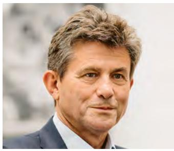

> **AI Description:**
> **Source:** `assets/_page_70_Figure_2.jpg`
> 
> **Generated:** 2026-05-30 00:03:57
> 
> ---
> 
> The image is a photograph of a man with short, light brown hair. He is wearing a dark suit jacket over a light-colored shirt. The background appears to be an outdoor setting with a blurred structure, possibly a building or monument. The man is looking directly at the camera with a neutral expression.

Henri de Castries

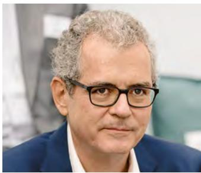

> **AI Description:**
> **Source:** `assets/_page_70_Figure_3.jpg`
> 
> **Generated:** 2026-05-30 00:03:52
> 
> ---
> 
> The image contains a photograph of a person wearing glasses and a suit. The background appears to be an indoor setting, possibly an office or a formal event. The person is looking directly at the camera with a neutral expression. There are no charts, graphs, or other visual elements present in the image.

Pablo Isla

> **AI Description:**
> **Source:** `assets/_page_70_Figure_4.jpg`
> 
> **Generated:** 2026-05-30 00:00:23
> 
> ---
> 
> The image contains a photograph of a man with gray hair, wearing a dark suit jacket and a light blue shirt. The background is plain and light-colored, which suggests a professional or formal setting. The man appears to be speaking or in the middle of a conversation, as his mouth is slightly open and his expression is engaged. There are no charts, graphs, or other visual elements present in the image.

Renato Fassbind

> **AI Description:**
> **Source:** `assets/_page_70_Figure_5.jpg`
> 
> **Generated:** 2026-05-30 00:00:12
> 
> ---
> 
> The image contains a photograph of a smiling individual. The person appears to be middle-aged with short, light brown hair. They are wearing a dark-colored blazer and a light-colored top. The background is blurred, suggesting an indoor setting with neutral tones.

Ann M. Veneman

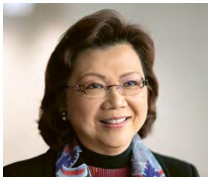

> **AI Description:**
> **Source:** `assets/_page_70_Figure_6.jpg`
> 
> **Generated:** 2026-05-30 00:02:40
> 
> ---
> 
> The image is a photograph of a person wearing glasses, a scarf, and a dark top. The background is a plain, light color, which helps to highlight the subject. The person appears to be smiling and is looking directly at the camera. There are no charts, graphs, or other visual elements present in the image.

Eva Cheng

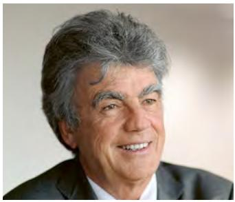

> **AI Description:**
> **Source:** `assets/_page_70_Figure_7.jpg`
> 
> **Generated:** 2026-05-30 00:03:00
> 
> ---
> 
> The image is a photograph of a smiling individual with gray hair. The person is wearing a dark suit jacket and a white shirt. The background is a plain, light color, which helps to focus attention on the subject. There are no charts, graphs, or other visual elements present in the image.

Patrick Aebischer

> **AI Description:**
> **Source:** `assets/_page_70_Figure_8.jpg`
> 
> **Generated:** 2026-05-30 00:22:02
> 
> ---
> 
> The image contains a photograph of a person. The individual appears to be an adult with short, gray hair, wearing a dark-colored jacket. The background is blurred, suggesting an indoor setting, possibly a professional or formal environment. There are no charts, graphs, or other visual elements present in the image.

> **AI Description:**
> **Source:** `assets/_page_70_Figure_9.jpg`
> 
> **Generated:** 2026-05-30 00:21:43
> 
> ---
> 
> The image is a photograph of a person with long hair, wearing glasses and a purple top. The background is plain and light-colored. There are no charts, graphs, or other visual elements present in the image.

Kimberly A. Ross

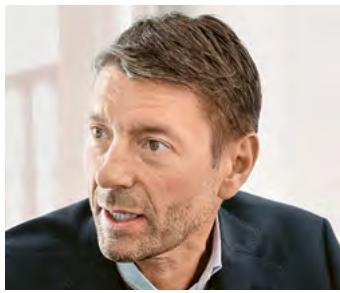

> **AI Description:**
> **Source:** `assets/_page_70_Figure_10.jpg`
> 
> **Generated:** 2026-05-30 00:17:47
> 
> ---
> 
> The image is a photograph of a man with short, neatly styled hair and a beard. He is wearing a dark suit jacket over a light-colored shirt. The background is softly blurred, suggesting an indoor setting with natural light. The man appears to be in a professional or formal environment.

Ursula M. Burns
Kasper Rorsted

Dick Boer

Dinesh Paliwal

> **AI Description:**
> **Source:** `assets/_page_70_Figure_13.jpg`
> 
> **Generated:** 2026-05-30 00:14:11
> 
> ---
> 
> The image contains a photograph of a person. The individual appears to be middle-aged with short, gray hair. They are wearing a dark-colored top and earrings. The background is out of focus, suggesting a professional or formal setting.

Hanne Jimenez de Mora

David P. Frick Secretary to the Board

## Executive Board of Nestlé S.A.

Executive Board of Nestlé S.A. at December 31, 2020

1 U. Mark Schneider Chief Executive Officer

8 Stefan Palzer EVP, Innovation Technology, Research and Development

2 Laurent Freixe EVP, CEO Zone Americas

3 Chris Johnson EVP, CEO Zone Asia, Oceania, sub-Saharan Africa

9 Béatrice Guillaume-Grabisch EVP, Human Resources and Business Services

4 Patrice Bula EVP, Strategic Business Units, Marketing, Sales, Nespresso

10 Leanne Geale EVP, General Counsel, Corporate Governance and Compliance

5 Marco Settembri EVP, CEO Zone Europe, Middle East, North Africa

11 Greg Behar Deputy EVP, CEO, Nestlé Health Science

6 François-Xavier Roger EVP, Chief Financial Officer

7 Magdi Batato EVP, Operations

12 Sanjay Bahadur Deputy EVP, Group Strategy and Business Development

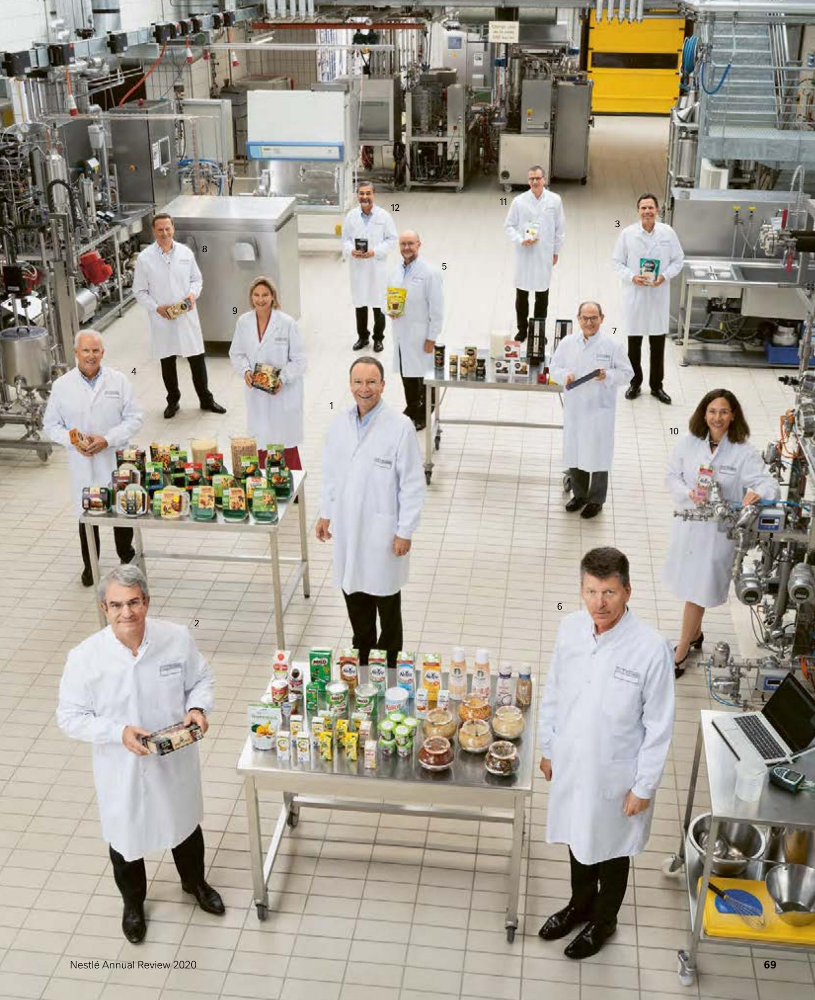

> **AI Description:**
> **Source:** `assets/_page_72_Figure_0.jpg`
> 
> **Generated:** 2026-05-30 00:17:37
> 
> ---
> 
> The image is a photograph of a group of individuals in a laboratory setting. They are wearing white lab coats and are standing around tables displaying various food products, including jars, bottles, and packaged items. The individuals are numbered, suggesting they may be part of a team or have specific roles. The background shows industrial equipment and machinery, indicating a research or development environment. The text at the bottom of the image indicates it is from the Nestlé Annual Review 2020.

## Compliance

Business ethics and compliance are the foundations of how we do business and the conditions for creating shared value. We conduct business in an ethical and principles-based manner even in the absence of applicable regulatory requirements. Our commitments to integrity, fairness and authenticity are enshrined in our Purpose and Values, the Nestlé Narrative, the Corporate Business Principles and our Code of Business Conduct. Our comprehensive Compliance Management System enables our employees and managers to do the right thing for the right reason, while protecting and strengthening Nestlé’s reputation. Compliance supports our advocacy strategy in environmental and social matters.

In 2020, we updated our Corporate Business Principles. While our values and our ethical principles remain the same, our culture and society continue to evolve. The revised principles reflect this evolution and emphasize areas that are even more important to society and our company today. These include our principles on sustainability, human rights, diversity and inclusion, transparency and open communication.

Our Board of Directors and our Executive Board oversee and promote good practices throughout the Company. Line management is supported by our dedicated corporate Compliance function, which provides guidance and functional leadership, as well as by all other functions engaged in our risk- and principles-based Compliance program. Our Group Compliance Committee ensures a continuous evolution of our Integrated Assurance Framework. Market Compliance Officers and Committees ensure a consistent approach across the Group and help identify local Compliance priorities.

This year, we further strengthened the governance for corporate mandatory trainings supported by our iLEARN@NESTLÉ platform. We also upgraded the Compliance requirements in our internal audit manuals, our ‘Know Your Suppliers’ questionnaires and our Enterprise Risk Management assessments.

We continued to implement our IT Roadmap, which enables Compliance through new automated tools for managing our CARE audits, mandatory trainings and conflict of interest declarations.

We monitor Compliance through our corporate functions, our internal audit function and our external auditors. Through our CARE program, which engages independent external auditors, we regularly assess specific aspects of our social Compliance. In 2020, 124 CARE audits were conducted and gaps were addressed.

Our Reporting Systems allowed us to address 2228 concerns from employees and third parties. All complaints are investigated and remedial actions taken. Trend analysis enables us to focus on monitoring key risks, the quality of consequence management decisions and the improvement action plans. In total, 533 cases were substantiated covering issues such as 166 cases of abuse of power and/or mobbing/ bullying, 78 of labor practices, 93 of discrimination and harassment, 61 fraud cases and 10 cases of non-compliance with the WHO Code. 61 sexual harassment complaints were received, 20 of which were substantiated. Due to our consequence management, 181 employees had to leave our Company.

We will continue to evolve our strong Compliance culture to create sustainable value for our shareholders and our other stakeholders. It is a condition for making Nestlé a ‘force for good’.

# Shareholder information

At December 31, 2020, Nestlé S.A. shares are listed on the SIX Swiss Exchange, Zurich (ISIN code: CH0038863350). American Depositary Receipts (ISIN code: US6410694060) representing Nestlé S.A. shares are offered in the USA by Citibank, N.A., New York.

Registered Offices   
Nestlé S.A.   
Avenue Nestlé 55   
CH-1800 Vevey (Switzerland) tel. +41 (0)21 924 21 11

Nestlé S.A. (Share Transfer Office) Zugerstrasse 8 CH-6330 Cham (Switzerland) tel. +41 (0)41 785 20 20

For additional information, contact: Nestlé S.A.   
Investor Relations   
Avenue Nestlé 55   
CH-1800 Vevey (Switzerland)   
tel. +41 (0)21 924 35 09   
e-mail: ir@nestle.com   
As to information concerning the share   
register (registrations, transfers,   
dividends, etc.), please contact:   
Nestlé S.A. (Share Transfer Office)   
Zugerstrasse 8   
CH-6330 Cham (Switzerland)   
tel. +41 (0)41 785 20 20   
fax +41 (0)41 785 20 24   
e-mail: shareregister@nestle.com

The Annual Review is available online as a PDF in English, French and German. The consolidated income statement, balance sheet and cash flow statement are also available as Excel files.

www.nestle.com

April 15, 2021   
154th Annual General Meeting, Nestlé S.A.   
Vevey (Switzerland)

April 16, 2021 Last trading day with entitlement to dividend

April 19, 2021 Ex-dividend date

April 21, 2021 Payment of the dividend

April 22, 2021 2021 three-month sales figures

July 29, 2021 2021 half-year results

October 20, 2021 2021 nine-month sales figures

February 17, 2022 2021 full-year results

April 7, 2022 155th Annual General Meeting © 2021, Nestlé S.A., Cham and Vevey (Switzerland)

The Annual Report contains forwardlooking statements which reflect Management’s current views and estimates. The forward-looking statements involve certain risks and uncertainties that could cause actual results to differ materially from those contained in the forward-looking statements. Potential risks and uncertainties include factors, such as general economic conditions, foreign exchange fluctuations, competitive product and pricing pressures, and regulatory developments.

The Annual Report is published in English, German and French. The English version is binding for the content.

The brands in italics are registered trademarks of the Nestlé Group.

Visual concept and design Société des Produits Nestlé S.A., Corporate Identity & Design, with Gavillet & Cie

Photography   
Gaëtan Bally,   
Mareen Fischinger/Getty Images, Getty Images Custom Content, Nestlé S.A.

Prepress Images3 S.A. (Switzerland)

Production Stämpfli AG (Switzerland)

## Paper

This report is printed on Lessebo Smooth White, a paper produced from well-managed forests and other controlled sources certified by the Forest Stewardship Council (FSC).

myclimate neutral
