<span id="page-0-0"></span>
## PURPOSE-DRIVEN. RESILIENT. ADAPTABLE.

<span id="page-1-0"></span>
## Content

About TCS 01   
Board of Directors 02   
Management Team 03   
Letter fromthe Chairman 05   
Letter from the CEO 07   
Performance Highlights 12   
TCS' Response to Covid-19 13   
The Year Gone By 16   
Thematic Section   
Business Model Transformation: Damen 20   
Operating Model Transformation: M&G 21   
Innovative. Resilient. Adaptable: A Panel Discussion 22   
Customer Experience Transformation: RBC 26   
Q&A with CFO and CHRO 27   
In-Store CX Transformation: Woolworths 30   
Purpose-driven Business Model: Vitality UK 31   
Bridgital Transformation: PM-JAY 32   
Notice 34   
Directors' Report 43   
Management Discussion and Analysis 77   
Corporate Governance Report 132   
Awards and Accolades 162   
Consolidated Financial Statements   
Independent Auditors' Report 165   
Consolidated Balance Sheet 175   
Consolidated Statement of Profit and Loss 177   
Consolidated Statement of Changes in Equity 178   
Consolidated Statement of Cash Flows 181   
Notes forming part of the Consolidated   
Financial Statements 182   
Unconsolidated Financial Statements   
Independent Auditors' Report 244   
Balance Sheet 255   
Statement of Profit and Loss 257   
Statement of Changes in Equity 258   
Statement of Cash Flows 261   
Notes forming part of the Financial Statements 262   
Statement under section 129 of the Companies Act,   
2013 relating to Subsidiary Companies 312   
Glossary 316   
GRI Annexures   
About this Report 328   
Material Topics 329   
GRI Content Index 331


<span id="page-2-0"></span>
## About TCS1

Tata Consultancy Services is an IT services, consulting and business solutions organization that has been partnering with many of the world's largest businesses in their transformation journeys for over 5O years.TCS offers a consulting-led,cognitive powered,integrated portfolio of business,technology and engineering services and solutions.This is delivered through its unique Location Independent Agile delivery model, recognizedas a benchmark of excellence in software development.

A part of the Tata group, India's largest multinational business group,TCS has over 448,ooo of the world's best-trained consultants in 46 countries.The company generated consolidated revenues of US \$22 billion in the fiscal year ended March 31,2O2O,and is listed on the BSE(formerly Bombay Stock Exchange) and the NSE(National Stock Exchange) in India.

TCS' proactive stance on climate change and award-winning work with communities across the world have earned it a place in leading sustainability indices such as the MSCl Global Sustainability Index and the FTSE4Good Emerging Index.For more information,visit us at www.tcs.com

## Theme

Recent events have highlighted the importance of building organizational resilience,agility and adaptability.At the heart of any organization's resilience is its people,supported by enabling processes and technologies.Empowered people, who are driven by a sense of organizational purpose, take ownership for outcomes.They know the right thing to do during a crisis,even when no explicit directions are provided.

TCS'track record of navigating multiple economic cycles and technology changes over the past five decades can be traced to its culture of empowerment and its purpose-driven worldview.The company is best described by this year's theme: Purpose Driven.Resilient.Adaptable.

During these difficult times,TCS is staying close to customers and helping them develop and implement their own purposedriven strategies,and enhance their organizational resilience and adaptability so they can survive future shocks,pivot into new business models or launch new offerings and thrive in the new normal.


## Recent Annual ReportThemes


FY2018 Dawn of Business 4.0

FY 2017 Reimagining the Enterprise
FY 2016 Shaping the Future

FY 2015 Default is Digital

<span id="page-3-0"></span>
## Board of Directors

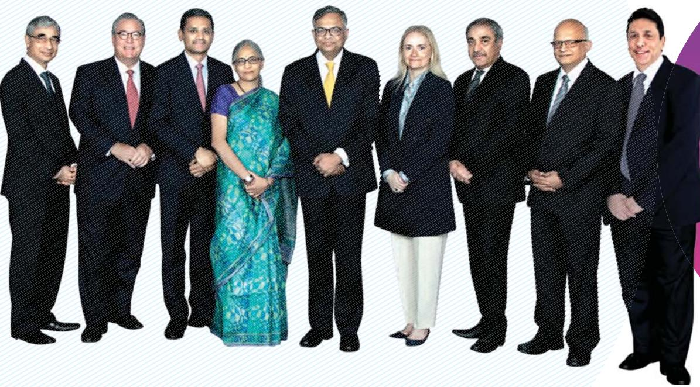

> **AI Description:**
> **Source:** `assets/_page_3_Figure_0.jpg`
> 
> **Generated:** 2026-05-30 09:22:28
> 
> ---
> 
> The image contains a group of nine individuals standing in a line. They are dressed in formal attire, with most wearing suits and ties, and one person wearing a traditional sari. The individuals appear to be posing for a professional photograph. There are no charts, graphs, or other visual elements present in the image.


From left toright

OP Bhatt Independent Director

Don Callahan Independent Director

Rajesh Gopinathan Chief Executive Officer and Managing Director

AarthiSubramanian Director

N Chandrasekaran Chairman

Hanne Birgitte Breinbjerg Sorensen Independent Director

DrPradeepKumarKhosla Independent Director

NGSubramaniam Chief Operating Officer and Executive Director

KekiMMistry Independent Director

<span id="page-4-0"></span>
Management Team

Corporate
Rajesh Gopinathan Chief Executive Officer and Managing Director

Rajashree R Chief Marketing Officer

N G Subramaniam Chief Operating Officer and Executive Director

K Ananth Krishnan Chief Technology Officer

V Ramakrishnan Chief Financial Officer

Madhav Anchan General Counsel Legal & Corporate Affairs

Milind Lakkad Global Head Human Resources

Rajendra Moholkar Company Secretary

<span id="page-5-0"></span>
Surya Kant North America, UK and Europe

Krishnan Ramanujam Business and Technology Services

Kamal Bhadada Communication,Media and Information Services

Debashis Ghosh Life Sciences, Healthcare and Public Services

K Krithivasan Banking, Financial Services and Insurance

Susheel Vasudevan Manufacturing and Utilities

Shankar Narayanan Retail,Travel and Consumer Products
Business Heads

Suresh Muthuswami BFSI Platforms

<span id="page-6-0"></span>

## Dear Stakeholder,

Adversity, theysay, is the true test of character. Your company achieved many admirable wins and milestones through the first 11 months of FY 2O2O. But it was in the final days of the year that the true nature of its purpose-driven worldview truly shone through.Your company prioritized the health and safety of its employees,kept customers'missioncritical systems running under very difficult circumstances and pitched in to help communities across the world battle the pandemic.

When we emerge out of this crisis,the world willbe a very different place.We are witnessing many of those changes already.With cloud and the new class of collaboration tools, people are discovering that theyare able to collaborate with each other just as well working from home,as they did in person in the pre-COVID era.Employers are discovering that the productivity is just as good,if not better, in this new way of working.

In many sectors,digital channels have gone from being secondary, nice-to-have options to become the primary channels,and in some instances, the only channels. Schools,colleges and even courts have shifted to an onlineonly mode.Farmers'cooperatives are taking online orders and directly delivering fresh produce to city-dwellers. This is the transformation that we had spoken of five years go, when we said that Default is Digital, but even lam still amazed by the scale and speed of the change.

<span id="page-7-0"></span>
By staying true to its purpose and its values, and helping its employees,customers and communities use the power of technology to realize their potential, your company is the embodiment of stakeholder capitalism in the true spirit of the Tata ethos. Over the last five decades, your company has shown itself to be very purpose-driven,resilient and adaptable, staying relevant to its customers through multiple economic and technology cycles,and doing good for allits stakeholders. This is the secret behind its longevity and sustainability.

The sharp shift in consumer preferences will force enterprises to significantly accelerate their digital transformation initiatives.They will also invest heavily in building resilience at every level,on the front-end as well as in back-office operations. Having pioneered Location Independent Agilem and the Machine FirstM Delivery Model,both of which are of immense value to organizations looking to build operational resilience and agility,your company is very well positioned to benefit from these trends.

Stepping back from the enterprise level and taking a more global view,Ibelieve that the new world in which digital channels become mainstream, which I described in my book Bridgital Nation,will offer countries like India,a unique opportunity to implement large scale digital interventions that would provide its citizenry easier access to essential services,while creating millions of new jobs. Your company has been at the forefront in enabling several such highimpact initiatives.TCS'Financial Inclusion Network supports over 21O million no-frills accounts set up under the Pradhan Mantri Jan Dhan Yojana.The scheme has created jobs for over 1oo,ooo banking correspondents who go out to remote villages with handheld devices to provide banking services to the unbanked.

There are several other examples: the Passport Seva project which completely reimagined the issuance of passports, the digital transformation of India Post, the platform that supports Ayushman Bharat- the world's largest,fully funded health insurance scheme covering 5oO million of India's poorest,and so on. Each of these initiatives showcases the innovative use of technology to transform citizen services, enhance inclusivity and reduce inequity in society.

By staying true to its purpose and its values,and helping its employees,customers and communities use the power of technology to realize their potential,your company is the embodiment of stakeholder capitalism in the true spirit of the Tata ethos. Over the last five decades,your company has shown itself to be very purpose-driven,resilient and adaptable,staying relevant to its customers through multiple economic and technology cycles,and doing good for allits stakeholders.This is the secret behind its longevity and sustainability.

The next few months willbe diicult, but your company is strong with deep relationships with customers and partners,enviable scale,a diversified business mix,a robust and resilient business model,and strong financials.It is well positioned to weather the storms ahead and take advantage of opportunities that come up during the downturn to acquire new capabilities and gain market share.In the postpandemic world, technology will play an ever larger role in helping enterprises adapt to the new normal and differentiate themselves.Your company is well poised to take the lead in partnering customers to recover and rebound on to their growth and transformation journeys.

On behalf of the Board of Directors of Tata Consultancy Services,l want to thank you for your continued trust, confidence,and support.

Warm regards,

## N Chandrasekaran

Chairman

<span id="page-8-0"></span>

## Dear Stakeholder,

It is a measure of how quickly and profoundly our world has changed,that when we look back at the year gone by, itfeels likea different era altogether.

In FY2O2O,your Company delivered revenue of 156,949 crore,growing 7.2% over the prior year in reported terms, and 7.1% in constant currency terms.

Our operating margin continued to be best in class, at 24.6%.Net profit was 32,340 crore,a net margin of 20.6%. Our cash conversion continues to be very strong, with a cash conversion ratio of 1oo.l% and free cash flow of 29,281 crore.

The Board has recommended a final dividend of 6 for the year,bringing the total dividend for the year to 73 per share. This translates into 31,895 crore returned to shareholders in FY 2020,which is 108.9% of the free cash flow.

We had a very productive year,engaging with customers in their innovation, growth and transformation initiatives, expanding and deepening our relationships,deploying very impactful solutions,and winning some of our largest deals till date.

However, it is our response to the events of the last ten days of the fiscal year that will be our most defining accomplishment of FY 2020.

102-14

<span id="page-9-0"></span>
We believe that by 2025,only 25% of our associates will need to work out of our facilities at any point of time; and every associate will be able to realize their potential without spending more than 25%of their time ina TCS office.

## Responding with Speed and Agility

As the pandemic spread,our priority was to safeguard the health and well-being of our employees while continuing to support our customers'mission critical activities globally.

The lockdowns tested the agility, resilience and adaptability of our delivery model.We responded to the challenge with speed and agility,and have emerged stronger,with our model now proven to be able to adapt to even extreme shocks.Froma highly centralized model,with large campuses accommodating thousands of employees, we were able to switch to an extreme form of distributed

delivery,with 90% of our 448,oo0-strong workforce enabled to work remotely, in a matter of days.

We not just enabled remote access for our associates but also calibrated our project management framework and security posture so that work could be properly allocated, governed,and reported,while maintaining our stringent security controls,and pivoted into a new operating model that we call Secure Borderless WorkspacesTM (SBWST).

Using SBWS,we have been able to continue supporting our customers not only in their mission critical operations but also their transformational projects, just as before, without any slippages.

## A New Location Agnostic Operating Model

The Secure Borderless Workspaces model is an extension of the Open Agile Workspaces framework that powered the innovative Location Independent AgileTM model that we pioneered two years ago.It leverages all our prior investments,and incorporates the learnings and best practices around network management,a standard service delivery environment, cloud-enabled governance processes, heavy use of digital collaboration tools,and an internal Security Operations Center benchmarked to the best in the industry.

Even though these are early days,the outcomes from our new model have been impressive. Our cloud-based project monitoring system has been tracking the progress of over 23,Ooo ongoing projects on a real time basis,

ensuring that our customers continue to experience the same high quality of delivery and certainty of outcomes that they have come to expect of TCS.There are even pockets where we have witnessed improved velocity, throughput, and productivity.

SBWS will continue to be an integral part of our new operating model and represents the future of work. It helps TCSers enjoy a better quality of life,while making TCS'service delivery more resilient as the fully distributed model is better suited for business continuity.

Our customers are comfortable with this model and want us to take more work that others are not able to handle.This has given us the confidence to come out with a bold new Vision 25x25.We believe that by 2025,only 25% of our associates will need to work out of our facilities at any point of time; and every associate will be able to realize their potential without spending more than 25% of their time in a TCS office.

## Purpose-driven, Resilient, Adaptable

We have received over 5Oo emails from customers in recent weeks,appreciating how seamlessly TCS managed the transition to SBWS,and expressing gratitude for how our teams went above and beyond to help keep their missioncritical systems and their business operations running under very difficult circumstances.

Going through some of those notes filled me with immense pride.No training or standard operating process tells our associates that while enabling work-from-home

<span id="page-10-0"></span>
foracustomer organization, they should work extended hours,to step in and complete the work that another vendor was supposed to do,but had not.Or that they should think out of the box and implement innovative solutions to rapidly build new online features that a customer in the retail orpharma sector needed to urgently roll out for their end-customers during the pandemic.

That kind of dedication to doing whatever it takes to help customers achieve their objectives,can only come from deep within,when individuals are driven by a higher sense of purpose that goes beyond the immediate task assigned to them.

For over five decades,TCS has been helping individuals, enterprises,and communities use technology to realize their potential.This organizational purpose has served as a beacon that has guided our customer-centric strategy,our policies and our decision-making over the years.Our greatest accomplishment has been to imbue every TCSer with this same purpose-driven worldview.

This organizational purpose has also shaped the culture of empowerment at TCS.Empowered individuals take ownership of outcomes, beyond just the completion of an assigned task.Empowered, purpose-driven teams can cope even with unexpected events because they know exactly what they need to do,even when no explicit instructions are provided. Such concerted,autonomous behaviors,in aggregate, give the organization the ability to cope with sudden shocks,and impart organizational resilience.

Our purpose has helped us stay relevant to our customers through their evolving needs.TCS has successfully navigated through multiple technology and economic cycles, over the last five decades,pivoting and adapting each time to build new capabilities and even new business models, and offer the services and solutions most relevant to our customers at that point in time. Our responsiveness, agility and adaptability to change have been central to our longevity.

## Commitment and Trust

Our commitment to help our employees realize their potential reflects in the investments we have been making in organic talent development over the years.This has resulted in industry-leading learning outcomes.TCSers collectively logged 37.7 million learning hours in FY 2O20,building expertise in multiple technologies to augment the contextual knowledge they possess of the customer's business and technology landscape.

In this current environment of economic uncertainty and fear, TCSers can focus on their work and rest assured that their organization stands by them.TCS will also be honoring all the job offers made till date,to freshers and experienced professionals.

Our investments,our empathy,and our commitment is what makes our associates feel valued,and which gets reciprocated with unmatched levels of energy and dedication to our organizational purpose. It has also resulted in TCS becoming a gold standard in talent retention.Our attrition

in IT services in FY 202O was 12.1%,the lowest in the industry, globally.

It is no different with our customers.TCS'customer-centricity and commitment to helping customers succeed in their businesses,have helped us establish enduring customer relationships and abiding trust.Our oldest customer

For over five decades,TCS has been helping individuals,enterprises,and communities use technology to realize their potential. This organizational purpose has served as a beacon that has guided our customercentric strategy, our policies and our decision-making over the years. Our greatest accomplishment has been to imbue every TCSer with this same purpose-driven worldview.

<span id="page-11-0"></span>
relationship goes back over four decades.We have stayed close to our customers through good times and bad, helping them navigate challenges and speed bumps,harnessing the power of technology to solve their business problems and enabling competitive differentiation.

Today,we have 49 customers who spend more than \$10O million a year with us.The trust levels are so high, they turn to us to help them realize their growth and transformation objectives.In the case of one UK insurance customer,TCS and the transformational work we are doing for them have figured in the CEO's letter to their shareholders everyyear for the last three years.The strength of these relationships and the trust we enjoy is what gives us the confidence that we will come out of these difficult times stronger together.

The same purpose-driven worldview shapes the community initiatives we take up across the world, for building skills and fostering entrepreneurship to bridge the digital divide, to encourage STEM education and careers,and to enable better healthcare and wellness.

We pick programs that are scalable and which can make a big,measurable impact on the local community.These programs are estimated to have benefited over 840,000 people across the world. Our employees have also been doing their bit for worthy social and environmental causes in their respective communities,collectively contributing over 78O,ooO volunteering hours in FY 2020.

## Looking forward

We are entering the new fiscal year at a time when all major economies have been brought to a standstill.The impact has been very fast and widespread,and the next few months will be very difficult for everyone,individuals and organizations.

On the other hand, the economic downturn is not due to any structural problem in any industry,but due to an externality that has hit the pause button on all economic activity. Whenever that externality is removed,an equally quick recovery should follow.

We are staying close to our customers,aligning ourselves to their evolving priorities,staying lean and nimble,finding newer ways to create value,and launching newer offerings that address current imperatives.

Many of the innovative frameworks and methodologies that we pioneered are of even greater relevance to our customers today.The TCS thought-leading Business 4.OM framework that we launched three years ago to help enterprises leverage digital technologies for their growth and transformation agendas,continues to guide them today. Business levers such as mass personalization, creating exponential value, leveraging ecosystems,and embracing risk coupled with core technologies such as agile,automation, intelligence,and cloud are some of the foundational pillars helping enterprises respond and recover from the crisis.

TCS' customer-centricity and commitment to helping customers succeed in their businesses, has helped us establish enduring customer relationships and abiding trust. Our oldest customer relationship goes back over four decades.We have stayed close to our customers through good times and bad, helping them navigate challenges and speed bumps, harnessing the power of technology to solve their business problems and enabling competitive differentiation.

<span id="page-12-0"></span>
Enterprises are discovering that investing in Al and automation is the best business continuity plan. Our Machine FirstM Delivery Model puts Al and automation at the heart of the enterprise,making technology stacks self-healing,and operations and supply chains more resilient. Consequently,we expect many customers to accelerate their core transformation initiatives,and adoption of digital self-service channels,over the next few months.

Similarly,we are seeing huge demand for our Location Independent Agile model based Secure Borderless Workspaces offering.This is helping our customers digitize their workplaces into boundary-less service clouds, leveraging the power of distributed networks foragility, resilience,and scale.

Lastly,a strong driver of how companies adapt themselves is the way they look at their organizational purpose. Organizations are seeking to introspect about what is most critical for them and their end-customers and what their true sources of value are.Firms are looking beyond the products they make and sel,to the purpose behind their existence, which in turn is helping define the blueprint for their transformation journey.TCS has been helping insurers leverage ecosystems to transform into providers of wellness, helping ship-building companies reposition into maritime solutions providers,and by applying agile innovation at scale, helping energy companies become responsible providers ofaffordable,reliable,and clean energy.We believe this trend of purpose-driven transformation will only accelerate in the upcoming months.

Our strong and deep relationships with a high-quality customer base,largely Fortune 1ooo and Global 2000 corporations,and our industry-leading operating margin give us the wherewithal to weather the difficulties ahead. A strong balance sheet with zero debt and a big war chest positions us strongly to seize any opportunities that might come up during this downturn.

With all these strengths,we believe our relative competitiveness will only get better through the months ahead,and we will come out of this downturn, better positioned than ever to help our customers get back onto their longer-term growth and transformation journeys,and to lead in the new normal.As we navigate these uncertain times together with our customers, we look forward to your continued support.

Best Regards,

Rajesh Gopinathan Chief Executive Officer & Managing Director


<span id="page-13-0"></span>

### Full Page Description (Page 13)

**Source:** `assets/_page_13_Asset_2.jpg`

**Generated:** 2026-05-30 09:13:44

---

The image is a bar chart showing data for fiscal years FY 16 through FY 20. Each bar is divided into two segments: the lower segment represents a smaller value, and the upper segment represents a larger value. The lower segments are consistently labeled with the number 37, 35, 38, 44, and 49, respectively. The upper segments are labeled with the numbers 73, 84, 97, 99, and 105, respectively. The chart visually represents an increasing trend in the upper values over the five fiscal years, with the total values for each year being the sum of the two segments.


### Full Page Description (Page 13)

**Source:** `assets/_page_13_Asset_6.jpg`

**Generated:** 2026-05-30 09:13:52

---

The image is a pie chart with four segments, each representing a different category of financial allocation. The chart is divided into the following segments:

- Shareholder Payouts*: This segment occupies the largest portion of the pie chart, representing 78.8% of the total.
- Capex: This segment is the second largest, accounting for 13.3% of the total.
- Acquisitions, etc: This segment represents 7.7% of the total.
- Invested Funds: This segment is the smallest, representing only 0.2% of the total.

The chart visually represents the distribution of financial resources among different categories, with Shareholder Payouts* being the primary focus.


### Full Page Description (Page 13)

**Source:** `assets/_page_13_Asset_7.jpg`

**Generated:** 2026-05-30 09:14:28

---

The image is a bar chart with a stacked bar format, showing financial data in crores for fiscal years FY 16 to FY 20. The chart includes two sets of data: one represented by blue bars and the other by yellow bars. The blue bars represent the percentage increase from the previous year, while the yellow bars represent the actual values. The percentages for the blue bars are 42.0%, 42.0%, 106.0%, 92.6%, and 98.6% for FY 16 to FY 20, respectively. The actual values for the yellow bars are 10,206, 11,071, 11,377, 13,148, and 17,840 crores for FY 16 to FY 20, respectively. The chart visually compares the growth in financial values over the years, highlighting significant increases in the later years.


### Full Page Description (Page 13)

**Source:** `assets/_page_13_Asset_3.jpg`

**Generated:** 2026-05-30 09:12:42

---

The image is a bar chart with accompanying percentage labels. It displays data for fiscal years FY 16 through FY 20. The bars represent numerical values, with the corresponding percentages shown above each bar. The values range from 354k in FY 16 to 448k in FY 20. The percentages indicate an increase in the values over the years, with a notable jump from 10.5% in FY 17 to 12.1% in FY 20. The chart shows a general upward trend in the data over the five fiscal years.


### Full Page Description (Page 13)

**Source:** `assets/_page_13_Asset_4.jpg`

**Generated:** 2026-05-30 09:15:36

---

The image contains a bar chart with the following key information:

1. The chart is a bar graph showing the Compound Annual Growth Rate (CAGR) of 9.0% over five fiscal years (FY 16 to FY 20).
2. The y-axis represents the amount in rupees, and the x-axis lists the fiscal years.
3. The bars indicate the earnings per share for each fiscal year, with values increasing from 61.59 in FY 16 to 86.19 in FY 20.
4. A footnote states that the earnings per share is adjusted for bonus issues, which is relevant for interpreting the data.


### Full Page Description (Page 13)

**Source:** `assets/_page_13_Asset_0.jpg`

**Generated:** 2026-05-30 09:11:54

---

The image is a bar chart with the title "CAGR 10.6%". The chart displays financial data in units of "₹ crore" (Indian Rupees in crores) for fiscal years FY 16 to FY 20. The bars represent the following values: FY 16 with 108,646, FY 17 with 117,966, FY 18 with 123,104, FY 19 with 146,463, and FY 20 with 156,949. The chart shows a consistent upward trend in the financial data over the five fiscal years, with a compound annual growth rate (CAGR) of 10.6%.


### Full Page Description (Page 13)

**Source:** `assets/_page_13_Asset_1.jpg`

**Generated:** 2026-05-30 09:12:35

---

The image is a bar chart with two sets of bars representing "Operating Profit" and "Operating Margin" for the fiscal years FY 16 to FY 20. The chart shows the operating profit and margin in crores for each fiscal year. The operating profit increases from 28,789 crores in FY 16 to 38,580 crores in FY 20. The operating margin fluctuates between 24.6% and 26.5% over the same period. The chart highlights a general upward trend in operating profit with a slight fluctuation in operating margin.


### Full Page Description (Page 13)

**Source:** `assets/_page_13_Asset_5.jpg`

**Generated:** 2026-05-30 09:14:36

---

The image is a bar chart with a line graph overlay, showing financial data in crores for the fiscal years FY 16 to FY 20. The bars represent the financial figures, while the line graph shows the percentage growth year over year. The data points indicate a general upward trend in the financial figures, with a significant increase from FY 16 to FY 17, followed by a slight dip in FY 18, a further increase in FY 19, and a substantial rise in FY 20. The percentages on the line graph show the growth rate each year, with FY 20 reaching 100.1%.

## Performance Highlights'

<span id="page-14-0"></span>


> **AI Description:**
> **Source:** `assets/_page_14_Figure_0.jpg`
> 
> **Generated:** 2026-05-30 09:11:14
> 
> ---
> 
> The image is a photograph of a woman sitting at a desk, engaged in a video conference call on a computer. She is smiling and appears to be actively participating in the meeting. The computer screen displays multiple participants in the video call. The background includes a blurred view of a window with greenery and a decorative plant. The image is part of the TCS Annual Report 2019-20, as indicated by the text at the bottom left corner.


## TCS' Response to Covid-19

Ensuring Business Continuity for Customers

TCS works with more than 1,OoO organizations across the world, helping keep their systems and operations up and running.The company's software and solutions power the financial backbones of several countries.It runs the technology for some of the largest health care and pharmacy companies,retailers, telcos,utilities,governments and public services organizations-whose continued functioning is all the more critical during times of crisis.

In response to the lockdowns, the company launched a massive program to ensure business continuity of its services using its Secure Borderless Workspaces model, which allows TCS associates to work remotely from the safety of their homes,while continuing to provide uninterrupted support services to our customers.

"[Our] partnership with TCS has been pivotal in enabling us to ensure business continuity while transforming our organization to remote working almost overnigh.. Thanks to the TCS team for supporting us to make this possible with their passion, proactivity and customer-centric philosophy."

VP - Global Transformation, Major Staffing Firm

<span id="page-15-0"></span>
"..Despite the huge disruption to your working life, your sense of professionalism, dedication, determination, perseverance and above all, your resilience has not at all faltered. All the TCS delivery updates lam getting show all critical projects and activities continue to be met to expectations. Beingable to deliver to TCS'mantra of Experience Certainty is tough enough during steady state times,let alone being able to do the same at this point when the world is in crisis. Thanks to your individual efforts,TCS is the one silver lining in this dark cloud.. I can't help but feel just how privileged and lucky lam,overseeing a partnership of high performing and committed individuals from TCS. Once again, thank you for all you do..."


"The spirit of creativity and innovations was on full display all through during these high-pressure times with no sleep or rest for most of you. I'm super proud to have a team that is always up for challenges and excels during these testing times.I couldn't THANK YOU enough for the personal sacrifices you made during these last 5-6 days to makes sure our business and customers were the priority."

CIo, Large US Bank

"l cannot say how proud lam of the TCS team who have quickly reacted to this crisis and kept everything moving. TCS as a company treated the health crisis seriously early, and you all ran with what your company gave you. Where we are now with 10o% coverage could not have happened without your leadership."

## Large US Entertainment Company

"l want to particularly call out the brilliant and heroic efforts of the entire TCS team in moving to remote working. This happened in record time almost over a weekend, with the result that we are getting close to 1oo% capacity, which is quite unprecedented. That this was done alongside moving your large workforce in such a short time was commendable. Please convey my deepest appreciation to your teams for the tremendous work to support our business world-wide."

CTO, Major Staffing firm


"TCS,through allof this, has also faced the Work from Home challenge like us. Moving call agents and support engineers from offices to home environments was not an easy challenge. You had to be creative, working under unconventional circumstances. The resilience and flexibility of the TCS organization is duly noticed!"

## Corporate Group Director, Professional Services Firm

“l am so amazed at your flexibility,adaptability, creativity and the positive attitudes you demonstrate each day. What a fantastic group of people (across the globe) you are, during times like this, the proverbial phrase,'cream rises to the top' holds so true. Without dedicated and driven people, [Client Name] would simply not live up to its promise of securing the future for its customers. You certainly are the creme of the crop."

Operations Head, Large Global Insurer

<span id="page-16-0"></span>
## Innovation in the time of Pandemic

At TCS' Innovation Lab in Hyderabad, India,a team of TCS scientists used deep neural network-based generative and predictive models to identify 31 new molecules that hold promise towards finding a cure for COVID-19.

"We knew that the SARS-CoV-2 has a protease protein that is responsible for viral replication. What followed next was to ask the model to generate novel small molecules de novo which have protease inhibiting capability and could bind the target protease protein with high affinity,"said Dr Gopalakrishnan Bulusu,a principal scientist involved in the project."We filtered the suggestions of the Al model to a set of 1,450 molecules, and further shortlisted 31 that we determined would be good to start with and that could possibly be synthesized for further testing."The results from this research -- put together by Dr Bulusu,Dr Arijit Roy, Dr Navneet Bung and Ms.Sowmya Krishnan -- have been published in ChemRxiv.

“The use of Al has considerably shortened the initial drug design process from several months to only a few days,"Dr Bulusu added.The TCS team is now working closely with India's Council for Scientific and Industrial Research (CSiR) that has agreed to provide its labs for the synthesized testing of these 31 molecular compounds.

## Uninterrupted Learning during the Lockdowns

In the wake of nation-wide lockdowns of schools and colleges,TCS offered free access to the TCS iON Digital Glass Room,a virtual learning platform, to educational institutes across the country so their students' learning journeys could continue uninterrupted in a secure virtual environment.

The TCS iON Digital Glass Room is a mobile and web education platform for schools and colleges, that empowers educators to engage with students in real time by sharing lessons, videos,worksheets, assignments and assessments,using interactive methods like polls,debates,quiz,surveys and many more tools.As an add-on,the platform also provides an embedded live classroom,which simulates live classroom teaching.


<span id="page-17-0"></span>
## The Year Gone By

Rolled out the Secure Borderless Workspaces model in response to the lockdowns,enabling over 9o% of the workforce to securely work from home.The model leverages all prior investments, and incorporates best practices around network management,an internal SOC,a standard service delivery environment, digitized delivery governance processes,and use of cloud-based collaboration technologies.

Israel's first fully digital bank has signed upas the first customer of TCS'Banking Service Bureau, powered by TCS BaNCSm.TCS was selected by Israel's Ministry of Finance to build a banking service bureau,a shared,plug-and-play,digital banking operations platform to help start-up banks launch very quickly.

Ranked Overall Best Managed Technology Company in Asia,in FinanceAsia's202O Asia's Best Companies survey of investors across the region.Also ranked #1 position for Best Environmental Stewardship and Most Committed to Social Causes,#2 in Best Corporate Governance and Best Investor Relations, and #3 in Best Managed Company in India.

## Europe RanksTCS#1 in CUSTOMER SATISFACTION for SEVENTH YEAR ina row

European IT customer satisfaction survey by whitelane research

## #1GENERAL SATISFACTION

77% (TCS)   
70% (Average)

#1 CLOUD CAPABILITY   
77% (TCS)   
69% (Average)   
#2 ACCOUNT MANAGEMENT   
80% (TCS)   
73% (Average)

#3BUSINESSUNDERSTANDING 76% (TCS)

#3CONTRACTUALFLEXIBILITY   
78% (TCS)   
69% (Average)


1600+ CXC OsPolled

TCS' RANK ACROSS VARIOUS COUNTRIES\*

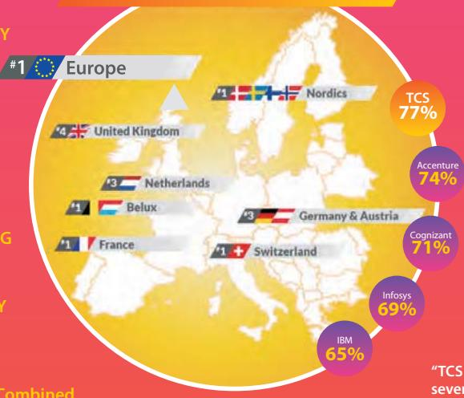

> **AI Description:**
> **Source:** `assets/_page_17_Figure_2.jpg`
> 
> **Generated:** 2026-05-30 09:23:00
> 
> ---
> 
> The image is an infographic combining text with a map of Europe. It highlights the top countries in Europe for a specific metric, likely related to technology services or consulting, as indicated by the presence of company names like TCS, Accenture, Cognizant, Infosys, and IBM. The map shows the Nordic countries, United Kingdom, Netherlands, Belgium, France, and Switzerland, with percentages next to each country representing the market share or ranking. The infographic uses a color scheme with a yellow and pink background, and the percentages are displayed in circles with the company names.


Combined annualValue of Contracts over €40 Billion


5000+ ITContracts

SatisfactionbyIT Domain 1.APPLICATION DEVELOPMENT MAINTENANCE AND TESTING

2.INFRASTRUCTURE SERVICES


"TCS is topping our ranking for the seventh consecutive year thanks to its emphasis on the strength and depth of itscustomer relationships twinned with a relentless focus on delivery"

JEFLOOS,HEAD OFRESEARCH, WHITELANERESEARCH

<span id="page-18-0"></span>
Recognized as a Global Top Employer by the Top Employers Institute. Also certified as the #1 Top Employer in Europe,MEA and APAC, andin 11 countries - Argentina,Australia, Belgium, Chile, Denmark, Germany, Hong Kong, Saudi Arabia, United Arab Emirates, the United Kingdom,and the United States.

Recognized as the fastest growing IT services brand of the decade and one of the fastest growing IT services brands of 2019, by Brand Finance.

Celebrated 10O years of TCS House,the Company's head office in the historic Fort precinct in Mumbai. Originally known as Ralli House, this Grade IIA heritage structure was acquired by TCS in 2O04 from Rallis,a Tata Group company,and painstakingly restored and remodeled,while retaining the original stone facade.

Walgreens Boots Alliance,a global leader in retail and wholesale pharmacy,expanded its strategic partnership with TCS with a 1O-year contract.In the new operating model for IT Run and Operational services,TCS will provide managed services using an approach that blends artificial intelligence,machine learning and advanced software engineering to enhance operational resilience and boost productivity.


<span id="page-19-0"></span>
■Petco,America's leading pet specialty retailer,selected TCS OptumeraM,to hyper-localize and optimize its store products and space strategies,with greater speed and precision in decision-making,and deliver an improved end-to-end customer experience.

Declared a special dividend of 40 per share,amounting to over 15,Ooo crore paid out to shareholders over and above the regular dividends.

Towards enhanced LGBTQ+ inclusion and building on the core value of ‘Respect for the Individual',TCS became the first Tata group company to include gender reassignment surgery under its employee health cover,and redefine the word ‘spouse' to include same-sex partners, regardless of marital status.

Launched the QuartzM DevKit to accelerate enterprise adoption of blockchain technology. The DevKit abstracts out the complexity of blockchain programming and provides enterprises with a low-code means to quickly and easily build blockchain-based applications on popular platforms.

Consolidated al operations for Strate,the South African central securities depository on to TCS BaNCS for Market Infrastructure.The implementation covers all markets and asset classes and marks a significant transformation in the South African securities market.

Expanded strategic partnership with Phoenix Group to digitally transform Standard Life's pensions and savings operations by moving 4.2 million policies to the TCS BFSI Digital Platform.

Recognized as the ‘Most Awarded Company of the Decade in India',‘Overall Most Outstanding Company in India' and the‘Most Outstanding Company in India in the IT Services Sector' in Asiamoney's 2019 Asia's Outstanding Companies poll of investors and analysts across the region.


■Launched TCS BaNCS Cloud for Asset Servicing,a platform that automates the servicing of all classes of assets across all markets,and is targeted at custodians,broker dealers, asset managers,and investment and private banks.

ignioM,TCS'award-winning cognitive automation software,celebrated its fourth anniversary by doubling its revenue and customer base,year-on-year.FY 2O2O saw Digitate's Al product line expand beyond the original ignio AlOps,to include ignio Al.WorkloadManagement, ignio Al.ERPOps for automating ERP support operations, ignio Al.Digital Workspace and ignio Cognitive Procurement.

Established a strategic partnership with General Motors for global vehicle design and development including vehicle styling,EVbattery, motor design and advanced virtual simulations to set new benchmarks in driving experience,safety and emissions.

Chosen by the Reserve Bank of India as its strategic partner to design and implement an Al-based centralized information and management system that will collect, review and

analyze data,enabling data-driven business decision-making for better regulation of financial markets and better tracking of the country's economic growth.

Powered Jurassic Fibre's new,ultrafast full-fiber optic broadband offering to towns and rural communities in the South West of England,with TCS HOBS.TCS will also implement an ERP solution for its finance,supply chain, talent management and field service operations.

Increased holding in TCS Japan Ltd,the Company's joint venture with Mitsubishi Corporation,from 51% to 66%, reiterating TCS'commitment to the Japanese market.This is the latest in a series of investments made by TCS in recent years to cater to the specific needs of Japanese corporations.


<span id="page-20-0"></span>
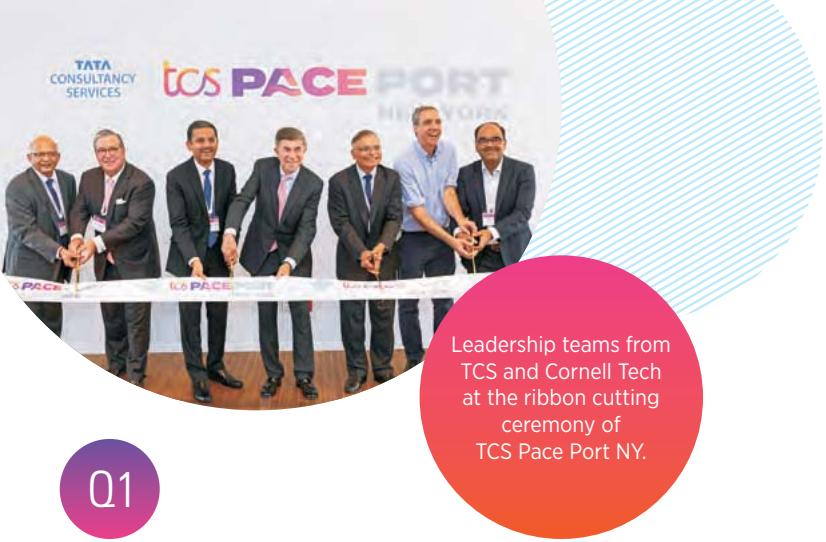

> **AI Description:**
> **Source:** `assets/_page_20_Figure_0.jpg`
> 
> **Generated:** 2026-05-30 09:20:19
> 
> ---
> 
> The image contains a photograph of a ribbon-cutting ceremony. It shows a group of individuals, presumably leadership teams from Tata Consultancy Services (TCS) and Cornell Tech, participating in the event. The individuals are dressed in formal attire, and they are positioned around a ribbon that has the TCS PACE PORT NY logo printed on it. The text overlay on the image provides context, stating that this is the ribbon-cutting ceremony for TCS Pace Port NY. The image also includes a logo for Tata Consultancy Services and a circular graphic with the text "Q1."


■Launched TCS Pace PortTM New York,a new co-innovation and advanced research center that unifies the best of TCS'global research,innovation,partner ecosystem and business transformation services- designed to help customers scale up their innovation efforts and accelerate their transformation journeys.

■Helped India Post transform to a multi-service digital hub, modernize mail delivery, enhance customer experience,and launch innovative services that drive new revenues. The new system connects over 15o,ooO post offices,and processes over 3 million postal transactions a day.Additionally,TCS implemented a POS solution across 8O,oo0 POS terminals,making it one of the largest such implementations in the world.

■Powered the world's first successful cross-border real-time securities setlement between two central securities depositories - Maroclear (Morocco) and Kuwait Clearing Company - using cash coins on the TCS BaNCS Network,powered by QuartzM Blockchain.This could revolutionize cross-border flows,reducing currency risks and enhancing liquidity.

Canada's food and pharmacy leader,Loblaw,successfully deployed ignio,TCS cognitive automation software,as part of its IT transformation program.ignio has helped reduce the mean time to resolve outages to 3-6 minutes,and automate over 2O% of incidents and alerts in the first ten months.The reduced outages and faster resolution have resulted in a superior online shopping experience for end customers.

Celebrated 15 years of partnership with Star Alliance,the global airline network, by embarking on new digital transformation initiatives.TCS'industry-first solutions have helped the Aliance drive digital innovation and provide a seamless experience to passengers.

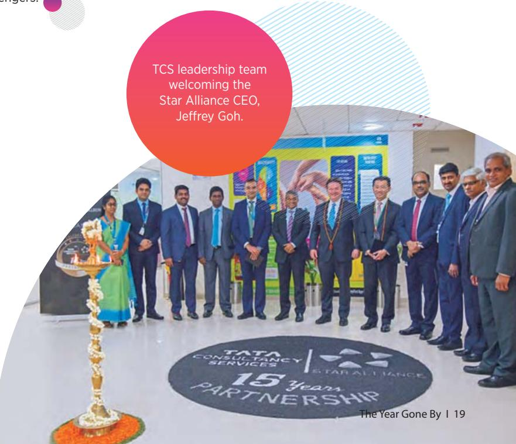

> **AI Description:**
> **Source:** `assets/_page_20_Figure_1.jpg`
> 
> **Generated:** 2026-05-30 09:20:57
> 
> ---
> 
> The image contains a photograph of a group of individuals in formal attire, standing in front of a backdrop with the Star Alliance logo and other branding elements. The individuals appear to be part of a Tata Consultancy Services (TCS) leadership team welcoming the Star Alliance CEO, Jeffrey Goh. The image also includes a circular logo on the floor commemorating a 15-year partnership between TCS and Star Alliance. The text in the image provides context for the event and the relationship between the two companies.


<span id="page-21-0"></span>

## Partnering with DAMEN to Reinforce its Reputation as a Maritime Innovation Pioneer

Damen, the Netherlandsheadquartered international shipyard group,has built a reputation for listening closely to its customers and innovating across its range of ships,yachts and other vessels. In the Business 4.O era, Damen wanted to take its product innovation to the next level.

As Damen's innovation partner on this journey,TCS used its Bringing Life to Things'loT framework to envision an integrated Connected Vessel Platform that uses loT,cloud,edge computing and advanced analytics to make Damen's ships smarter and more connected,with improved safety, sustainability and efficiency,and with which Damen can launch newer services and even new business models.The platform collects 7OO data points from the nearly 10,ooO sensors in each ship,giving Damen complete visibility into each vessel's fuel levels, fresh water, oil; engine performance - speed,rpm, fuel consumption and so on.

The new platform has enabled the launch of value-added services such as fleet management and predictive maintenance, helping customers reduce fuel consumption by 12%, improve safetyand enhance vessel utilization.It also enables co-innovation with maritime ecosystem partners like suppliers,insurers and port authorities, to curate a more holistic customer experience,and potentiallyoffer shipping as a service.

Partnering with TCS for its growth and transformation has helped Damen accelerate its transformation from being a shipbuilder toa maritime solutions provider, create new revenue streams,boost profitability and reinforce its position as an innovation pioneer in the maritime industry.

"Damen isat the forefront of digital innovation in the maritime industry,using new technologies for remote monitoring and eventually to build autonomous vessels. We selected TCS as our strategic partner because of how well their innovation philosophy is aligned with ours, and for their experience in successfully executing large, complex programs elsewhere. Their digital expertise,creative ideas and intellectual property have helped us scale and speed up our business transformation journey."

Arnout Damen CEO, Damen Shipyards

<span id="page-22-0"></span>
## Helping M&G Innovate and Reimagine Customer Engagement

Today's customers have higher expectations of the experience and the service they get from their savings and investment provider. However,complex,legacy IT landscapes, and fragmented customer data can constrain the ability to innovate and meet those expectations.

Taking that challenge head on, M&G plc entered into a 10-year strategic partnership with TCS to transform its heritage UK life and pensions business by building a simpler customer focused operating model,which is digitally enabled,allowing it to respond quicker and better to its customers'needs.

TCS'approach,working in partnership with M&G plc,entailed radically simplifying the IT landscape,reimagining customer engagement,redesigning operations for greater resilience and providing end-to-end policy administration services using the TCS BFSl Platform for Life and Pensions,powered by TCS BaNCSM.In just 15 months, TCS onboarded 1.4 million customersand their policies,delivered a new customer experience solution, CRMand complaint management solutions,and an online bond claim platform.

The unified customer data and analytics on the new platform have enabled a more holistic approach to enhancing the customer experience,focused on the end-to-end customer journey and not just individual transactions.The new digital bond claim service has reduced customers'wait time for cash withdrawal by almost 8O%. Digitization has reduced claim processing time by 75%.Allthis has resulted in some early positive impacts on the Net Promoter Score as well.


> **AI Description:**
> **Source:** `assets/_page_22_Figure_0.jpg`
> 
> **Generated:** 2026-05-30 09:11:26
> 
> ---
> 
> The image is a photograph of two individuals, likely a couple, engaged in a collaborative activity at a table. The man, wearing glasses and a black shirt, is holding a pen and appears to be writing or signing something on a document. The woman, with shoulder-length hair and a mustard yellow top, is smiling and looking at the document, possibly assisting or discussing the content. The image conveys a sense of teamwork and focus on a shared task.


"For more than170 years,M&G has delivered good outcomes for savings and investment customers through product innovation and high-standard service. Our strategic partnership with TCS is an essential element of our ongoing work to create a digitally enabled M&G so that we can maintain this great track record.The primary focus has been on our Heritage business to transform the customer experience for our 5 million Prudential policyholders in the UK.We have worked together to build a new digital MyPru platform,transformed our operation to be focused on the end-to-end customer journey and migrated our most complex administration system, SALAS,to the industry leading TCS BaNCS" platform. Leveraging the TCS innovation network and experience, we have achieved a lot together. We look forward to continuing to work and learn together, as we continue to meet the needs of customers and their advisers,and as we seek to exceed their expectations on service"

John Foley CEO,M&G plc

<span id="page-23-0"></span>
## Innovative. Resilient. Adaptable: A Panel Discussion

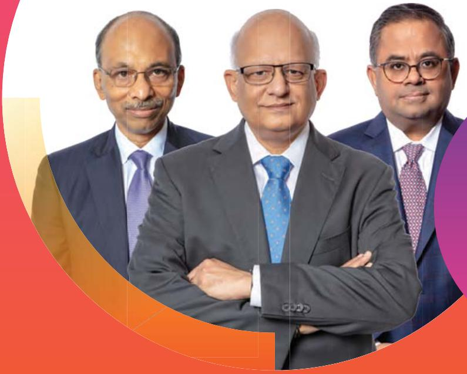

> **AI Description:**
> **Source:** `assets/_page_23_Figure_0.jpg`
> 
> **Generated:** 2026-05-30 09:10:09
> 
> ---
> 
> The image contains a photograph of three individuals dressed in business attire, standing against a plain background. The individuals are positioned side by side, with the person in the center having their arms crossed. The image has a circular design with a gradient background transitioning from white to orange and purple. There are no charts, graphs, or text annotations present in the image.


## Featuring

K Ananth Krishnan, Chief Technology Officer

NG Subramaniam, Chief Operating Officer

Krishnan Ramanujam, Global Head - Business & Technology Services

## WHAT IS THE CONNECTION BETWEEN INNOVATION, RESILIENCEANDADAPTABILITY?

KAK:TThe pandemic has resulted in a renewed focus on individual, societal and organizational resilience and adaptability.An organization that is innovative is also resilient and adaptable.All three elements stem from a customer-centric and forward-looking worldview,and all three require empowered people,an enabling culture, and supporting structures,processes and technologies.

Empowered employeesare key to innovation. Such individuals take ownership of their domains, and come up with new ideas to deliver better outcomes for customers,or improvise when faced with some unforeseen adverse event, to ensure continuity of service. When customers'needs or priorities change, innovative organizations adapt quickly by launching new business models or new services and products,and stay relevant in the changed market conditions.As you can see,all three are very closely connected in an enterprise and are critical to its longevity.

KR:In addition to an empowering culture,enterprises which invest in building a robust,responsive and extensible operations stack - consisting of the processes,systems and core infrastructure -will be better placed to not only respond to an economic shock,but also to recover faster and get back to their growth trajectory earlier.

<span id="page-24-0"></span>
Digital technologies-especially loud,lo, Al and Machine Learning- have opened tremendous opportunities to innovate and transform some or all the components of the enterprise's operations stack-the business processes,the supporting systems and underlying infrastructure. By applying our innovation energies in such core transformation opportunities,we are helping customers build a new future-proof digital core, that isagile, efficient,scalable, and resilient.

## THAT MAKES SENSE. BUT HOW DOES THIS CONNECTION SHOW UP IN THE WORK YOU DO FOR CUSTOMERS?

NGS: If you think about it,TCS has had a track record of pioneering delivery model and business model innovations over the last two decades.These innovations have helped our customers enhance their resilience,scale up their technology adoption and reduce their total cost of ownership over the years.

First, it was the industrialized model of software development that adopted manufacturing principles, process controls and automation to deliver predictable and consistently high-quality outcomes at very competitive prices.Then we pioneered the Global Network Delivery model in the last decade, giving our customers access to our globally distributed delivery footprint and reducing their geographic risk.

More recently, our Location Independent Agile model helped customers gain speed to market and reduce project risk byapplying Agile methods even in large transformation programs.Our latest innovation is the Secure Borderless Workspace which makes our delivery model locationagnostic at the level of the individual, while retaining the full rigor of our project oversight,quality and governance processes and security controls.This is the ultimate in distributed models,and infuses a tremendous amount of resilience and agility in the work we do for our customers.

KR:Abig part of our incremental revenue over the last three years has come from growth and transformation engagements which are rooted in innovation.We have spoken about the work we have done around business model innovation,product innovation,or even innovation around customer experiences,all of which help boost the customer's topline. However,such market-facing innovation doesn't work if back-end processes are slow and error-prone; or if the core systems and underlying infrastructure are outdated and not scalable; or if the data is fragmented.

Digital technologies -especially cloud, loT,Al and Machine Learning - have opened tremendous opportunities to innovate and transform some or all the components of the enterprise's operations stack - the business processes, the supporting systems and underlying infrastructure.

By applying our innovation energies in such core transformation opportunities,we are helping customers build a new future-proof digital core,that is agile,efficient, scalable,and resilient.

## CAN YOU PROVIDE EXAMPLES OF INNOVATION LEADING TO IMPROVED RESILIENCE?

NGS:The work we are doing for life insurance companies in the UKisa great example.Large insurers face the problem of fragile operations and patchy customer service due to the complexity of multiple legacy systems which are difficult to maintain and are prone to breakdowns.We have built a highly successfully and innovative business model in the UK wherein we administer the policies on the customer's behalf, using our multi-tenant, cloud-based platform which is our intellectual property.The operations are much faster and far more resilient on this robust,modern platform, and the customer experience is radically transformed. You can read more about this in the M&G story in this year's Annual Report.

Several large deals in FY2O2O were core transformation initiatives where we are using our Machine First Delivery Model to reimagine the customer's IT operating model using Al and Machine Learning very innovatively. At the core is our cognitive automation software,ignio, which can autonomously pre-empt or resolve system failures.This makes the technology stack self-healing,and gives the organization a resilient digital core.The benefits were especially visible in the retail vertical during the holiday season peak and again during the panic shopping in March, when our customers were able to handle spikes in volumes without their systems breaking down.

<span id="page-25-0"></span>
Another aspect of such operating model transformations is that they can free up resources for other market-facing innovations that provide competitive differentiation.For one customer in the US,we are carrying out an operating model transformation on the one hand,and concurrently,a business transformation on the other,the former effectively paying for the latter.

KR: Let me give you an example from the Life Sciences vertical.We have been providing pharmacovigilance services to an European pharma major for the last 12 years. Our team goes through unstructured documents describing adverse events associated with the company's various drugs,triages them and logs the data using standardized medical codes.

We asked ourselves,why can't machine intelligence be trained to do this? Our Life Sciences domain experts and our Analytics & Insights practice teamed up and built an innovative solution,TCS ADD SafetyM,that uses our Decision FabricT Al Engine to completely automate the case intake and processing of adverse events.It uses Al and machine learning to convert natural language data into structured data.This is not only faster and more accurate,but can also easily handle volume spikes, lending greater resilience and scalability to their pharmacovigilance operation.The solution is our intellectual property and we are now offering it to other life sciences companies as well.

## INTERESTING.BUTWON'TTHISCANNIBALIZETHE MANUAL PROCESSING WORK YOU WERE DOING?

KR:Yes, it will. But that is the nature of technological innovation. Newer technologies open up the possibility of accomplishing a certain task faster,better or cheaper. As a customer-centric organization, we will keep looking for newer,better ways to achieve a certain business outcome,and offering those innovations to our customers.

This alignment with the customer's business interests is what has helped us build long,enduring relationships founded on trust.That goodwill translates into incremental business that more than makes up for the deflation.In this case,we are replacing human effort with cutting edge IP which deepens the competitive moat as well.

And as it so happens,demand for our pharmacovigilance services was already growing robustly and willprobably accelerate next year due to the increased activity around drug development. So displaced teams will get absorbed very quickly by our newer engagements.

## GIVENITSIMPORTANCE,WHYDOCUSTOMERSENGAGE TCSFOR THEIR INNOVATION INITIATIVES?

KAK:Well, innovation is not an exact science. Of the ten things you try out,one or two may succeed.To stay ahead in the innovation game,enterprises need to increase the ‘yield'on the number of bets they make,thereby increasing the likelihood of landing ‘winners'. By partnering with TCS, customers can leverage our investments in Research and

This alignment with the customer's business interests is what has helped us build long, enduring relationships founded on trust. That goodwill translates into incremental business that more than makes up for the deflation. In this case, we are replacing human efort with cutting edge IP which deepens the competitive moat as well.

Innovation,our large portfolio of intellectual property, our Pace PortsT, our Co-innovation Network of start-ups and academic partners,our deep contextual knowledge of their business,and our Location Independent Agile model to scale up as well as speed up their innovation.

Customers in such diverse areas as retail, mining and energy have entered into innovation partnerships with us to set up dedicated agile innovation centers,where teams of TCS researchers and innovators work on finding technology solutions to their most critical business problems.The power of such partnerships gets amplified when it crosses industry boundaries and creates new opportunities.

<span id="page-26-0"></span>
Lastly, TCS' innovation initiatives in community-centric themes,inareas like education, health,elder care and energy management align well with similar agendas at our customers and the world at large.

## INNOVATION SPEND TENDS TO BE SMALL RELATIVETO RUN-THE-BUSINESS SPEND.WHY FOCUS SO MUCH ON IT?

NGS:Adaptability is going to be very important to our customers in the recovery phase,and innovation will be key to adapting to the new normal.All those elements that Ananth just described will be critical to our customers' ability to scale up their innovation and by extension, their adaptation.Also,it is not an either-or scenario.When we engage in innovation work for our customers,we are not vacating our traditional areas of strength which are rooted in their run-the-business spends.This is incremental business that expands our addressable market,and brings in higher quality revenues.

Second, those elements that Ananth listed,as well as our ability to stitch together different capabilities from across the organization into one seamless business-centric solution, are not easy to replicate.These capabilities are helping us differentiate ourselves from traditional outsourcers,and gain market share.

KR:To add to that,innovation initiatives tend to be fairly high profile in most organizations.By engaging in those initiatives, we are building strong relationships with a broader set of stakeholders in the enterprise - line of business heads,

functional heads,COOs, CEOs and the Board.These connects give us a competitive edge even in the more traditional opportunities.

Of course,such initiatives often translate into core transformation deals which are large in scale,scope and deal value,and with longer tenures.That improves our business visibility,and brings in higher quality revenues.It also embeds us deeper into the core of the customer's business, making us a strategic partner and sometimes the sole strategic partner,raising our brand visibility.

## WHAT DO YOU SEE ASTHEKEY SPENDING THEMES AND DRIVERS OF YOUR GROWTH IN A POST-PANDEMIC WORLD?

KAK: Innovation is a timeless business theme. It will not only continue to remain very relevant in the post-pandemic world, but might even see acceleration in some cases in the medium term.Even as we help customers improve their resilience in the immediate term,we are also having conversations on medium and longer term transformation plans.

NGS:There will be a short period of dislocation in some sectors due to the complete stalling of all economic activity, but once things settle down,you will see spending on these themes return.Different sectors will recoverat different rates,but technology will remain front and center of every organization's strategy to innovate,differentiate itself and grow.

KR: In the near term,enterprises are responding to the crisis by spending on workplace and collaboration tools, cybersecurity and cloud adoption.We expect to see accelerated rollouts of digital channels including cognitive chatbots. Organizations are also rapidly reconfiguring their supply chains with a\`just in case'orientation,for greater diversification and localization.

In the next phase,customers will want to build greater resilience in their operations,and we expect greater interest in our Machine First approach,and ignio.You can also expect heightened M&A activity in the next few months,and given ourexperience in process and IT integration,enabling timebound divestments and taking on commitments around transition services,we expect to benefit from that as well.

In the medium and longer term, there are structural forces acting in our favor.Technology is seen as a source of competitive differentiation in every industry today, and technology intensity- or spend on technology as a percentage of revenue- is rising.That expands the market opportunity for us.From our side,we have been steadily expanding our addressable market by continually launching new services,products and platforms,catering to the priorities of an expanding set of stakeholders in the enterprise. Between these two forces,we have immense confidence in our ability to sustain longer term growth and value creation for our stakeholders.

<span id="page-27-0"></span>
## Partnering RBC in Reimagining its Research Portal for Superior Customer Experience

RBC Capital Markets,a top-1O global investment bank, has an extensive equity research capability covering around 1,700 corporations across the world.Its research desk has been consistently ranked #1 in Canada over the years.

To expand its reach and retain its leadership, RBC wanted to redesign its client-facing research portal to provide a better customer experience.

As RBC's strategic digital partner,TCS designed and developed a new microservices-based,cloud-ready research portal that provides a more engaging,intuitive and consistent user experience across a multitude of devices preferred by new-generation fund managers.

Al-based algorithms power the intuitive search capability and provide personalized,context-driven research recommendations.The new portal supports multimedia formats including podcasts and videos. It also provides RBC's award-winning analysts with a best-in-class platform to publish their research and interact with clients online.

In-depth readership analytics have enabled identification of cross-selling and up-selling opportunities.The superior user interface has helped improve customer satisfaction. Integration with third party research aggregator sites has significantly expanded its reach.

The new portal has significantly improved the overall client journey of content and led to an increase in readership and client visits.


"We have beenmaintaining our technological leadership by investing significantly in our digital and innovation strategies,enabling RBC to deliver superior experiences and even more insights that create value for our clients.

Partnering with TCS helped us innovateat scale, leveraging leading-edge technology to transform the user experience as well as the reach of RBC Insights,and unlock new opportunities. They brought a lot of domain knowledge and were proactive in coming up with new ideas. By working Agile and deploying automation wherever possible, they significantly improved our speed to market. Their deep understanding of our business,passion for innovation and shared values have made them a keypart of our digital transformation journey."

Fardeen Khan   
Head-Strategic Initiatives -Research,   
RBC Capital Markets

<span id="page-28-0"></span>

## WITHSBWSANDWORKINGFROMHOME,WHATHAPPENS TOTHETRADITIONAL ONSITE-OFFSHOREMODEL?

ML: With our teams as well as our customers'teams working from home,in-person interactions are now replaced with virtual collaboration. SBWS makes physical location irrelevant.This virtualization blurs the traditional divide between onsite and offshore.Traveling to onsite locations, particularly for initial transitions and knowledge transfer, will reduce further.

At a societal level, this also means young people will eventually have the option of pursuing their careers in TCS without uprooting themselves from their home towns as long as they have good connectivity.Likewise, there will be greater opportunities for women to pursue fulfilling careers while managing familial responsibilities.

In the longer term,it is possible that project teams will be seen as part of a virtualized talent cloud and provisioned for in the same way that we provision for compute power or storage today.

## INTERESTING.BUTFORNOW,HOWISEMPLOYEEMORALE ANDPRODUCTIVITY?

ML: I feel the lockdowns,amidst the uncertainities and fears related to the pandemic, have actually brought us all a little closer. Daily team video calls,interaction over chats and email,and frequent updates from HR and senior management have helped mitigate any feeling of isolation.

<span id="page-29-0"></span>
Traveling toonsite locations,particularly for initial transitions and knowledge transfer, will reduce further. At a societal level, this also means young people will eventually have the option of pursuing their careers in TCS without uprooting themselves from their home towns as long as they have good connectivity. Likewise, there will be greater opportunities for women to pursue fulfilling careers while managing familial responsibilities.

Through the TCS Cares initiative,we are providing counseling services and running educational campaigns to help individuals cope with stress and anxiety.We are also creating self help networks of our associates with similar interests, so they get the social interaction that the physical workplace used to provide.

As for productivity, the time saved on the daily commute is translating into increased energy levels and better engagement.There are some areas where teams have shown higher through-put, but these are still very early days.

## WILLTRAVELRESTRICTIONSOVERTHENEXTFEW MONTHS AFFECTYOUR ABILITYTO CLOSEDEALS? WHAT ABOUT RAMP-UPS ON NEWDEALS?

VR:As for new deal closures,it is encouraging that we signed a large,multi-million dollar deal in end-March, entirely virtually,while both parties were under lockdown. Anyway,most of our incremental revenue comes from existing customers who know us well,and with whom we have ongoing conversations.Second, travel restrictions impact everyone and not just us.So our relative competitiveness is not affected.And lastly, the postpandemic world will see more and more activities that previously involved in-person interactions go virtual, including the sales process.Years from now,we will probably look back and wonder at how much time salespersons used to spend on the road.

ML:Ramp-ups on some of the large deals we signed in the fourth quarter are progressing smoothly,with knowledge transfer taking place virtually.In fact,in the example that Ramki mentioned as well as in some other cases, the entire process of transition and moving to steady state operations are also taking place virtually.There is anadded qualitative benefit of these virtual sessions.Now, the entire team can participate in these sessions, compared to the more exclusive \`train the trainer'approach we used in the past.This reduces the transmission losses and makes the process more efficient.

## HAVEVISARESTRICTIONSINTHEUSDISRUPTED YOUR BUSINESS?

ML:Our delivery model has evolved over the last few years. Our Location Independent Agile promotes systematic collaboration across distributed teams and reduces the need for co-location.This,coupled with greater use of managedservices contracting models have given us more flexibility around where our teams are based.

We have also accelerated our localization programs. In the US,we have hired over 2O,ooO employees in the last five years,making us one of the top job creators in IT services and consulting.Every year, we hire hundreds of fresh engineering graduates and train them on new technologies.In FY 202O,we hired over 2.5 times our usual fresher intake,and also made the training more accountcontextual,accelerating their ability to play productive, client-facing roles.For very short-term assignments, we use sub-contractors.

All this has brought down our use of work visas to a small fraction of what it used to be five years ago,de-risking our business significantly. Looking into the future,as l mentioned earlier,the virtualization of many activities with SBWS will reduce the need for travel and co-location even further.

<span id="page-30-0"></span>
## GIVEN THE LIKELY DEMAND COLLAPSE IN FY 2021, WHATLEVERSDO YOU HAVETO KEEP MARGINS STABLE?

VR: Cost management at TCS has been devolved to the individual business units,and from there to the account and project levels.At that granular level, there are multiple margin management avenues available to them,starting from selling higher value services and solutions,getting into managed services contracts,superior execution leveraging MFDMM, replacing subcontractors with employees and so on.

At a corporate level, we will scrutinize all expenses. We have frozen all new hiring,and we won't have our annual wage increase this year.There is some amount of relief from reduced spending on travel and facilities. Many big marketing events are likely to be canceled,bringing down the sponsorship expense.The Rupee depreciation,taking place after a fairly long gap,also provides some support.

## AND YET, YOU PLAN TO HONOR ALL THE JOB OFFERS YOU HAVE MADE?

ML: Yes.We will honor all the accepted job offers that we have already made.We have also assured our employees that we are not planning retrenchments.This commitment that we have for our people is what motivates them to give their best for TCS.

## ISTHERE ANYCHANGE IN YOUR CAPITAL ALLOCATION POLICY DUE TO THE DOWNTURN? WHAT ABOUT M&A?

VR:We have sufficient cash on our balance sheet for the proverbial rainy day,so our capital allocation policy continues to be one of returning most of our free cash flow to shareholders.This year, once again,we have paid out nearly 1o9% of our free cash flow in the form of dividends.

We are always open to the idea of picking up the right asset at the right price.Economic downturns are probably the best time to do it,when there are fewer buyers.You might recall that our largest acquisition till date was executed in December 2Oo8,at the peak of the Global Financial Crisis.

## WHYISTHERESUCHABIGGAPBETWEENTCS'ATTRITION RATE AND THAT OFPEERS'? DO YOU CALCULATE IT DIFFERENTLY?

ML:(Laughs) No,we use a standard formula that has remained unchanged in years.It is calculated by dividing the total number of departures in the prior twelve months by the closing headcount.

Just to be clear,we have always had the best retention rate in the industry. Our purpose-driven culture,progressive HR policies,and philosophy of investing in people and empowering them have made us an industry benchmark in talent retention,and an employer of choice across the world.

Our commitment to organic talent development is best summarized in the words of our Chairman: There are no

We value employees for their domain and customer-specific contextual knowledge, and invest in layering new technology skills on top of that, helping them stay relevant. We link learning to their career in explicit and transparent ways.We also give internal talent the first right of refusal on leadership positions in the company.

We have a program called Contextual Masters which celebrates experienced employees who use their contextual knowledge to create value for our customers.This gives junior employees role models to emulate,and encourages them to plan long careers in TCS.In contrast, in some other organizations,experienced individualsare seenas expensive and targeted for layoffs,affecting the morale.Ibelieve that is why the retention gap has widened in recent years.

legacypeople,only legacy technologies.We value employees for their domain and customer-specific contextual knowledge,and invest in layering new technology skills on top of that, helping them stay relevant.We link learning to their career in explicit and transparent ways.We also give internal talent the first right of refusal on leadership positions in the company.

<span id="page-31-0"></span>
## Enabling Woolworths'Teams to Deliver Superior In-Store Customer Experiences

Woolworths,Australia's largest supermarket group, views building a Customer Ist brand, team and culture as its foremost strategic priority. In this regard, they launched a store transformation program that aimed to empower store team members with data and automate many routine back-office tasks,freeing up time for customer engagement to improve the customer experience.

TCS,as the strategic partner in this program,worked in close collaboration with Woolworths to help build a fully integrated,device-agnostic,centralized platform to enable this vision of a connected store and empowered store team members.

The platform allows store team members to orchestrate selected operations through mobile RF devices by digitizing their day to day routines.It provides intelligence in the form of a 36O-degree view of the store inventory, real-time stock adjustments,efficient management of store deliveries and stock-takes,enhancing productivity end to end and ultimately providing a better customer experience.

Its intuitive user interface has allowed for quick,universal acceptance by the 9o,ooO+ store users,with minimal training.Using targeted implementation automation tools,the solution was successfully deployed across 3000+ stores across 7 different brands,within just 6 months.

In the next phase of the store transformation journey, TCS is working with Woolworths and its partners to pilot innovations such as robotics and computer vision to monitor safety and inventory, temperature monitoring through loT and a host of other technology led innovations.


> **AI Description:**
> **Source:** `assets/_page_31_Figure_0.jpg`
> 
> **Generated:** 2026-05-30 09:09:57
> 
> ---
> 
> The image is a photograph of a person shopping in a grocery store. The individual is wearing a plaid shirt and is reaching for tomatoes from a display. The background shows various vegetables and fruits, indicating a produce section. The person appears to be selecting produce for purchase.


"Our store transformation program is part of the various investments we have made in achieving the Group's strategy to enable consistently good customer and team experiences.

TCS has been a critical partner in this journey. They have demonstrated deep contextual knowledge of our business and come up with out of the box ideas to address some of our technology challenges and opportunities.They are key to ensuring that our systems run smoothly, and go above and beyond for our business. We have awarded TCS Partner of the Year based on their delivery and passion to provide extraordinary service and support."

John Hunt CI0, Woolworths Group

<span id="page-32-0"></span>
## Powering Vitality UK's Ambition to be an Insurance Brand that is Positively Different

Traditionally,selling health insurance does not offer too many opportunities for customer engagement.Post purchase, the interaction is usually limited to claims processing. And yet, one insurer has built an innovative,purpose-driven business model that is helping build deep relationships,support people in living heathier lives and become a beloved consumer brand.

Vitality, the wholly owned subsidiary of South African giant, Discovery, is a poster child of the immensely successful shared value business model.It engages with policyholders continually to incentivize preventive behaviors that promote wellness,and in the process,reduces costs and builds positive relationships between the business and its customers.

VitalityHealth actively promotes the adoption of healthy lifestyles by its members,incentivizing them to undertake regular activity through a generous rewards program that is redeemable across a curated partner ecosystem.

TCS has been its innovation partner in this transformation journey, helping build the enabling technology layer for this wellness-oriented insurance ecosystem.TCS consolidated and simplified its technology stack,modernized its policy administration system and integrated it with the Vitality rewards platform.A customer portal makes individuals aware of their risk factors and ways to improve their health, track their reward points and redeem them.The analytics layer provides a unified customer view across customer relationship,client onboarding,and policy servicing.

Vitality's innovative model has resulted in deeper member engagement,driving revenue and profit. New business revenue grew 15%,and operating profit grew 22% in 2019. Best of all, it isalso well on its way to realize its ambition to be an insurance brand that consumers will love.In five short years,Vitality isamong the top 5 market leaders in the UK and enjoysa 5O% prompted brand awareness.

"The Vitality Shared Value model is based on the concept of interventions that will inspire behavioral change among our members - benefiting the person,us as the insurer and also wider society.Technology is a critical strategic enabler in our model. Partnering with TCS significantly accelerated our transformation journey, helping us launch newer innovations faster,while deliveringaconsistent, integrated experience to our members."

Kris Tokarzewski CTIO,VitalityU


> **AI Description:**
> **Source:** `assets/_page_32_Figure_0.jpg`
> 
> **Generated:** 2026-05-30 09:20:38
> 
> ---
> 
> The image is a photograph of a person jogging outdoors. The individual is wearing a red t-shirt and gray athletic pants, with white wristbands on both wrists. The background appears to be a bridge or walkway with a railing, and the lighting suggests it is either early morning or late afternoon. The image is framed with circular design elements in shades of purple and pink, which do not contain any text or additional visual information.


<span id="page-33-0"></span>
## PM-JAY: Leveraging Technology to Provide Healthcare Coverage to India's Poorest

Crushing poverty can deprive the poor of access to quality healthcare.Ayushman Bharat was a bold and innovative scheme launched by the Government of India to achieve universal health coverage.Central to this is the Pradhan Mantri Jan Arogya Yojana (PM-JAY),the world's largest fully funded health insurance scheme covering 5Oo million of India's poorest.

With its track-record in successfully executing some of India's largest transformational programs,deep domain knowledge and experience in implementing similar schemes in three states,TCS was a natural partner to the National Health Authority(NHA) in implementing this visionary undertaking.

TCS designed a highly configurable, cloud-based solution architected for usability, scalability, high performance and security, supporting sophisticated analytics to detect fraud. The solution caters to all the ecosystem participants - the NHA,state bodies,hospitals,and TPAs,enabling multi-level online scrutiny of beneficiaries before pre-authorisation, transmission of electronic medical records,monitoring of treatment and outcomes,and claim verification,and ensures adherence to scheme SLAs.

TCS'successful implementation helped NHA achieve a glitchfree rollout of the scheme within six months.Since its launch, the solution has processed claims pertaining to 7.3 million hospital admissions,demonstrating how technology can transform social services,and make a world of difference to over 5 million beneficiaries till date.


> **AI Description:**
> **Source:** `assets/_page_33_Figure_0.jpg`
> 
> **Generated:** 2026-05-30 09:21:46
> 
> ---
> 
> The image is a photograph showing a medical consultation. A doctor, wearing a white coat and stethoscope, is examining a young child held by an adult. The child appears to be being checked for a medical condition. The background includes another adult, possibly a family member, observing the interaction. The image conveys a sense of care and attention in a medical setting.


"The system is intended to be used by more than 20,000 hospitals,from both public and private sector across the country, same was accomplished in a short timeframe with minimal issues.

It has been great experience for all the stake holders viz. NHA, SHAs, Hospitals, Insurance companies and TPAs working with Team TCS. It was very heartening to see the proactive involvement of the Team, coming up with solutions acceptable to all stake holders without diluting the objectives of the scheme."

Dr Indu Bhushan CEO, National Health Authority Government of India

<span id="page-34-0"></span>


GLOBAL TOP EMPLOYER Fifth consecutive year


> **AI Description:**
> **Source:** `assets/_page_34_Figure_2.jpg`
> 
> **Generated:** 2026-05-30 09:21:33
> 
> ---
> 
> The image contains a photograph of two individuals in a classroom or workshop setting. One person is seated at a table with a laptop and various objects, possibly toys or educational materials, spread out. The other person is standing and appears to be gesturing or explaining something. The background includes a whiteboard and a screen, suggesting an educational or training environment. The text "PACE PORT" is visible in the upper left corner of the image.

TCS Pace Port New York - Launched to Set the Pace of Business 4.0 Innovation

Ranked#1 in   
CUSTOMER SATISFACTION -   
Seventh consecutive   
year

Close Partnerships withLeading Technology Providers

## #1 Fastest Growing Brand of the Decade


> **AI Description:**
> **Source:** `assets/_page_34_Figure_5.jpg`
> 
> **Generated:** 2026-05-30 09:19:14
> 
> ---
> 
> The image is a photograph of a marathon finish line. A runner is crossing the finish line, raising their arms in celebration. The background shows spectators, event banners, and a clear sky. The banners include logos and text related to the event, such as "Tata Steel City Marathon" and "New Balance." The image captures the excitement and achievement of the runner as they complete the race.


Promoting Healthand Fitness through Global Marathon Sponsorships

<span id="page-35-0"></span>
## Notice


> **AI Description:**
> **Source:** `assets/_page_35_Figure_0.jpg`
> 
> **Generated:** 2026-05-30 09:20:25
> 
> ---
> 
> The image is a simple diagram featuring a laptop icon with two overlapping circles surrounding it. The laptop displays an envelope and a document, symbolizing email or document communication. The blue and white color scheme suggests a professional or corporate theme. The overlapping circles could represent a cycle or a process involving email or document exchange.


Notice is hereby given that the twenty-fifth Annual General Meeting of Tata Consultancy Services Limited willbe held on Thursday, June 11, 202O at 3:3O p.m. IST through Video Conferencing ("VC")/ Other Audio Visual Means ("OAVM") to transact the following business:

## 1.To receive, consider and adopt:

a.the Audited Financial Statements of the Company for the financial year ended March 31,2020, together with the Reports of the Board of Directors and the Auditors thereon; and

b.the Audited Consolidated Financial Statements of the Company for the financial year ended March 31,2O20, together with the Report of the Auditors thereon.

2.To confirm the payment of Interim Dividends (including a special dividend) on Equity Shares and to declare a Final Dividend on Equity Shares for the financial year 2019-20.

3.To appoint a Director in place of Aarthi Subramanian (DIN O7121802) who retires by rotation and,being eligible,offers herself for re-appointment.

## Notes:

1.In view of the continuing Covid-19 pandemic, the Ministry of Corporate Affairs ("MCA") has vide its circular dated May 5,2O2O read with circulars dated April 8,2020 and April 13,202O (collectively referred to as “MCA Circulars") permitted the holding of the

Annual General Meeting ("AGM") through VC/OAVM, without the physical presence of the Members at a common venue.In compliance with the provisions of the Companies Act,2O13("Act"), SEBl (Listing Obligations and Disclosure Requirements) Regulations, 2015("SEBl Listing Regulations") and MCA Circulars, the AGM of the Company is being held through VC/OAVM.

2.The relevant details,pursuant to Regulations 26(4)and 36(3)of the SEBl Listing Regulations and Secretarial Standard on General Meetings issued by the Institute of Company Secretaries of India,in respect of Director seeking re-appointment at this AGM is annexed.

3．Pursuant to the provisions of the Act,a Member entitled to attend and vote at the AGM is entitled to appoint a proxy to attend and vote on his/her behalf and the proxy need not be a Member of the Company. Since this AGM is being held pursuant to the MCA Circulars through VC/OAVM,physical attendance of Members has been dispensed with.Accordingly, the facility for appointmentof proxies by the Members will not be available for the AGM and hence the Proxy Form and Attendance Slip are not annexed to this Notice.

4.Institutional/Corporate Shareholders (i.e.other than individuals/HUF,NRl, etc.) are required to send a scanned copy (PDF/JPG Format) of its Board or governing body Resolution/Authorization etc., authorizing its representative to attend the AGM through VC/OAVM on its behalf and to vote through remote e-voting.The said Resolution/Authorization shall be sent to the Scrutinizer by email through its registered email address to tcs.scrutinizer@gmail.com with a copy marked to evoting@nsdl.co.in

<span id="page-36-0"></span>
5．The Company has fixed Thursday,June 4,2O2O as the ‘Record Date'for determining entitlement of members to final dividend for the financial year ended March 31, 2020, if approved at the AGM.

6．If the final dividend,as recommended by the Board of Directors, is approved at the AGM,payment of such dividend subject to deduction of tax at source will be made on Monday,June 15,202O as under:

i.To all Beneficial Owners in respect of shares held   
in dematerialized form as per the data as may   
be made available by the National Securities   
Depository Limited ("NSDL") and the Central   
Depository Services (India) Limited ("CDSL"),   
collectively“Depositories",as of the close of   
business hours on Thursday, June 4,2020.

ii.To al Members in respect of shares held in physical form after giving effect to valid transfer, transmission or transposition requests lodged with the Company as of the close of business hours on Thursday, June 4,2020.

7.As per Regulation 4O of SEBl Listing Regulations, as amended,securities of listed companies can be transferred only in dematerialized form with effect from,April1,2O19,except in case of request received for transmission or transposition of securities. In view of this and to eliminate all risks associated with physical shares and for ease of portfolio management, members holding shares in physical form are requested to consider converting their holdings to dematerialized form. Members can contact the Company or Company's Registrars and Transfer Agents,TSR DARASHAW Consultants Private Limited ("TCPL") for assistance in this regard.Members may also refer to Frequently Asked Questions("FAQs") on Company's website https://on.tcs.com/demat-faq.

8．To support the ‘Green Initiative', Members who have not yet registered their email addresses are requested to register the same with their DPs in case the shares are held by them in electronic form and with TCPL in case the shares are held by them in physical form.

9.Members are requested to intimate changes, if any, pertaining to their name,postal address,email address, telephone/mobile numbers,Permanent Account Number (PAN),mandates,nominations,power of attorney,bank details such as,name of the bank and branch details,bank account number, MlCR code, IFSC code,etc., to their DPs in case the shares are held by them in electronic form and to TCPL in case the shares are held by them in physical form.

10.As per the provisions of Section 72 of the Act, the facility for making nomination is available for the Members in respect of the shares held by them. Members who have not yet registered their nomination are requested to register the same by submitting Form No.SH-13.The said form can be downloaded from the Company's website https://on.tcs.com/form-sh-13. Members are requested to submit the said details to their DP in case the shares are held by them in electronic form and to TCPL in case the shares are held in physical form.

11.Members holding shares in physical form,in identical orderof names,in more than one folio are requested to send to the Company or TCPL,the details of such folios together with the share certificates for consolidating their holdings in one folio.A consolidated share certificate willbe issued to such Members after making requisite changes.

12.In case of joint holders,the Member whose name appears as the first holder in the order of names as per the Register of Members of the Company will be entitled to vote at the AGM.

13.Members seeking any information with regard to the accounts or any matter to be placed at the AGM,are requested to write to the Company on or before June 10,202O through email on investor.relations@tcs.com.The same willbe replied by the Company suitably.

14.Members are requested to note that,dividends if not encashed fora consecutive period of 7 years from the date of transfer to Unpaid Dividend Account of the Company,are liable to be transferred to the Investor

<span id="page-37-0"></span>
Education and Protection Fund ("IEPF").The shares in respect of such unclaimed dividends are also liable to be transferred to the demat account of the IEPF Authority.In view of this, Members are requested to claim their dividends from the Company,within the stipulated timeline.The Members,whose unclaimed dividends/shares have been transferred to IEPF, may claim the same by making an online application to the IEPF Authority in web Form No.IEPF-5 available on www.iepf.gov.in.For details,please refer to corporate governance report which is a part of this Annual Report and FAQ of investor page on Company's website http://on.tcs.com/IR-FAQ.

15.In compliance with the aforesaid MCA Circulars and SEBI Circular dated May 12,2O2O,Notice of the AGM along with the Annual Report 2O19-2O is being sent only through electronic mode to those Members whose email addressesare registered with the Company/ Depositories. Members may note that the Notice and Annual Report 2O19-2O will also be available on the Company's website www.tcs.com,websites of the Stock Exchanges i.e.BSE Limited and National Stock Exchange of India Limited at www.bseindia.com and www.nseindia.com respectively,and on the website of NSDL https://www.evoting.nsdl.com

16.Members attending the AGM through VC/OAVM shall be counted for the purpose of reckoning the quorum under Section 103 of the Act.

17.At the twenty-second AGM held on June 16,2017 the Members approved appointment of B S R& Co LLP, Chartered Accountants (Firm Registration No. 101248W/W-100022) as Statutory Auditors of the Company to hold office for a period of five years from the conclusion of that AGM till the conclusion of the twenty-seventh AGM,subject to ratification of their appointment by Members at every AGM,if so required under the Act.The requirement to place the matter relating to appointment of auditors for ratification by Members at every AGM has been done away by the Companies (Amendment) Act,2017 with effect from May 7,2O18.Accordingly, no resolution is being proposed for ratification of appointment of statutory auditors at the twenty-fifth AGM.

18.Pursuant to Finance Act 2O2O,dividend income will be taxable in the hands of shareholders w.e.f.April1,2020 and the Company is required to deduct tax at source from dividend paid to shareholders at the prescribed rates.For the prescribed rates for various categories, the shareholders are requested to refer to the Finance Act,2O2O and amendments thereof.The shareholders are requested to update their PAN with the Company/ TCPL (in case of shares held in physical mode) and depositories (in case of shares held in demat mode).

A Resident individual shareholder with PAN and who is not liable to pay income tax can submit a yearly declaration in Form No.15G/15H, to avail the benefit of non-deduction of tax at source by email to Csg-exemptforms@tsrdarashaw.com by 1:59 p.m. IST on June 4,2O20.Shareholders are requested to note that in case their PAN is not registered, the tax will be deducted at a higher rate of 20%.

Non-resident shareholders can avail beneficial rates under tax treaty between India and their country of residence,subject to providing necessary documents i.e.No Permanent Establishment and Beneficial Ownership Declaration,Tax Residency Certificate, Form 1OF,any other document which may be required to avail the tax treaty benefits by sending an email to Csg-exemptforms@tsrdarashaw.com.Theaforesaid declarations and documents need to be submitted by the shareholders by 11:59 p.m.IST on June 4,2020.

19.Since the AGM will be held through VC/OAVM, the Route Map is not annexed in this Notice.

20. Instructions for e-voting and joining the AGM are as follows:

## A. VOTING THROUGH ELECTRONIC MEANS

i.In compliance with the provisions of Section 108 of the Act, read with Rule 2O of the Companies (Management and Administration) Rules,2014, as amended from time to time,and Regulation 44 of the SEBl Listing Regulations,the Members are provided with the facility to cast their vote electronically, through the e-voting services provided by NSDL,on all the resolutions set forth in this Notice.The instructions for e-voting are given herein below.

<span id="page-38-0"></span>
ii.The remote e-voting period commences on Monday,June 8,202O (9:00 a.m.IST) and ends on Wednesday, June 10,2020 (5:00 p.m. IST). During this period, Members holding shares either in physical form or in dematerialized form,as on Thursday,June 4,202O i.e.cut-off date,may cast their vote electronically.The e-voting module shall be disabled by NSDL for voting thereafter.Those Members,who willbe present in the AGM through VC/ OAVM facility and have not cast their vote on the Resolutions through remote e-voting and are otherwise not barred from doing so, shall be eligible to vote through e-voting system during the AGM.

iii.The Board of Directors has appointed P N Parikh (Membership No.FCS 327) and failing him Jigyasa Ved (Membership No.FCS 6488) of Parikh & Associates,Practicing Company Secretaries as the Scrutinizer to scrutinize the voting during the AGM and remote e-voting process in a fair and transparent manner.

iv.The Members who have cast their vote by remote e-voting prior to the AGM may also attend/ participate in the AGM through VC/OAVM but shall not be entitled to cast their vote again.

v.The voting rights of Members shall be in proportion to their shares in the paid-up equity share capital of the Company as on the cut-off date.

vi.Any person,who acquires shares of the Company and becomes a Member of the Company after sending of the Notice and holding shares as of the cut-off date,may obtain the login ID and password by sending a request at evoting@nsdl.co.in. However, if he/she isalready registered with NSDL for remote e-voting then he/she can use his/her existing User ID and password for casting the vote.

vii.The details of the process and manner for remote e-voting are explained herein below: Step 1: Log-in to NSDL e-voting system at https://www.evoting.nsdl.com/ Step 2: Cast your vote electronically on NSDL e-voting system.

## Details on Step 1are mentioned below:

How to Log-in to NSDL e-voting website?

1. Visit the e-voting website of NSDL. Open web browser by typing the following URL: https://www.evoting.nsdl.com/ either on a personal computer or on a mobile.

2.Once the home page of e-voting system is launched,click on the icon “Login"which is available under“Shareholders"section.

3．A new screen will open.You will have to enter your User ID,your Password and a Verification Code as shown on the screen.Alternatively, if youare registered for NSDL eservices i.e. IDEAS,you can log-in at https://eservices.nsdl.com/ with your existing IDEAS login. Once you log-in to NSDL eservices after using your log-in credentials, click on e-voting and you can proceed to Step 2 i.e.cast your vote electronically.

<span id="page-39-0"></span>
## 4．Your User ID details are given below:


5.Your password details are given below:

a）If you are already registered for e-voting, then you can use your existing password to login and cast your vote.

b） If you are using NSDL e-voting system for the first time,you will need to retrieve the ‘initial password'which was communicated to you by NSDL.Once you retrieve your ‘initial password',you need to enter the ‘initial password'and the system will force you to change your password.

c）How to retrieve your‘initial password'?

i)If your email ID is registered in your demat account or with the company,your ‘initial password'is communicated to you on your email ID.Trace the email sent to you from NSDL in your mailbox from evoting@nsdl.com. Open the email and open the attachment i.e.a .pdf file. Open the .pdf file.The password to open the .pdf file is your 8 digit client ID for NSDL account, last 8 digits of client ID for CDSL account or folio number for shares held in physical form.The .pdf file contains your ‘User ID'and your ‘initial password'.

ii）In case you have not registered your email address with the Company/ Depository, please follow instructions mentioned below in this notice.

6．If you are unable to retrieve or have not received the ‘initial password' or have forgotten your password:

a） Click On “Forgot User Details/Password?” (If you are holding shares in your demat account with NSDL or CDSL) option available on www.evoting.nsdl.com.

b）“Physical User Reset Password?" (If you are holding shares in physical mode) option available on www.evoting.nsdl.com.

c）If you are still unable to get the password by aforesaid two options, you can send a request at evoting@nsdl.co.in mentioning your demat account number/folio number, your PAN,your name and your registered address.

d） Members can also use the one-time password (OTP) based login for casting the votes on the e-Voting system of NSDL.

7.After entering your password,click on Agree to“Terms and Conditions"by selecting on the check box.

<span id="page-40-0"></span>
8．Now,you willhave to click on“Login"button.

9.After you click on the“Login"button, Home page of e-voting will open.

## Details on Step 2 are mentioned below:

How to cast your vote electronically on NSDL e-voting system?

1．After successful login at Step l, you will be able to see the Home page of e-voting. Click on e-voting.Then, click on Active Voting Cycles.

2．After click on Active Voting Cycles,you will be able to see all the companies“EVEN"in which you are holding shares and whose voting cycle is in active status.

3.Select “EVEN"of the Company,which is 112923.

4.Now you are ready for e-voting as the Voting page opens

5.Cast your vote by selecting appropriate options i.e.assent or dissent,verify/modify the number of shares for which you wish to cast your vote and click on “Submit"and also "Confirm"when prompted.

6．Upon confirmation,the message “Vote cast successfully"will be displayed.

7.You can also take the printout of the votes cast by you by clicking on the print option on the confirmation page.

8.Once you confirm your vote on the resolution, you will not be allowed to modify your vote.

## General Guidelines for shareholders

1.Institutional /Corporate shareholders (i.e. other than individuals, HUF,NRl,etc.) are required to send a scanned copy (PDF/JPG Format) of the relevant Board Resolution/ Authority letter etc.,with attested specimen signature of the duly authorized signatory(ies) who are authorized to vote, to the Scrutinizer by email to tcs.scrutinizer@gmail.com witha copy marked to evoting@nsdl.co.in

2．It is strongly recommended not to share your password with any other person and take utmost care to keep your password confidential.Login to the e-voting website will be disabled upon five unsuccessful attempts to key in the correct password.In such an event, you will need to go through the “Forgot User Details/Password?"or"Physical User Reset Password?"option available on https://www.evoting.nsdl.com to reset the password.

3.In case of any queries relating to e-voting you may refer to the FAQs for Shareholders and e-voting user manual for Shareholders available at the download section of https://www.evoting.nsdl.com or call on toll free no.: 1800-222-990 or send a request at evoting@nsdl.co.in.

In case of any grievances connected with facility for e-voting,please contact Ms.Pallavi Mhatre, Manager, NSDL, 4th Floor,‘A'Wing,Trade World, Kamala Mills Compound, Senapati Bapat Marg, Lower Parel, Mumbai 400 013. Email: evoting@nsdl.co.in/pallavid@nsdl.co.in, Tel: 9122 2499 4545/1800-222-990

<span id="page-41-0"></span>
## Proces for registration ofemailidforobtaining Annual Report anduser id/password for e-votingand updation of bank account mandate for receipt of dividend:


## B. INSTRUCTIONS FOR MEMBERS FORATTENDING THE AGMTHROUGH VC/OAVM ARE AS UNDER:

1.Members willbe able to attend the AGM through VC/ OAVM or view the live webcast of AGM provided by NSDL at https://www.evoting.nsdl.com by using their remote e-voting login credentials and selecting the EVEN for Company's AGM.

Members who do not have the User ID and Password for e-voting or have forgotten the User ID and Password may retrieve the same by following the remote e-voting instructions mentioned in the Notice.Further Members can also use the OTP based login for logging into the e-voting system of NSDL.

2.Facility of joining the AGM through VC/OAVM shall open 3O minutes before the time scheduled for the AGM and willbe available for Members on first come first served basis.

3.Members who need assistance before or during the AGM,can contact NSDL on evoting@nsdl.co.in/ 1800-222-990 or contact Mr. Amit Vishal, Senior Manager- NSDL at amitv@nsdl.co.in/ 022-24994360/+919920264780 or Mr. Sagar Ghosalkar, Assistant Manager- NSDL at sagar.ghosalkar@nsdl.co.in/022-24994553/ +91 9326781467.

<span id="page-42-0"></span>
4．Members who would like to express their views or ask questions during the AGM may register themselvesasa speaker by sending their request from their registered email address mentioning their name, DP ID and Client ID/folio number, PAN, mobile numberat tcsagm.speakers@tcs.com from June 5,2020 (9:00 a.m.IST) to June 7,2020 (5:00 p.m. IST).Those Members who have registered themselvesasa speakerwill only be allowed to express their views/ask questions during the AGM.The Company reserves the right to restrict the number of speakers depending on the availability of time for the AGM.

## Other Instructions

1.The Scrutinizer shall, immediately after the conclusion of voting at the AGM,first count the votes cast during the AGM, thereafter unblock the votes cast through remote e-voting and make,not later than 48 hours of conclusion of the AGM,a consolidated Scrutinizer's Report of the total votes cast in favour or against,if any, to the Chairman or a person authorised by him in writing,who shall countersign the same.

2.The result declared along with the Scrutinizer's Report shall be placed on the Company's website www.tcs.com and on the website of NSDL https://www.evoting.nsdl.com immediately.The Company shall simultaneously forward the results to National Stock Exchange of India Limited and BSE Limited,where the shares of the Company are listed.

By Order of the Board of Directors

RAJENDRA MOHOLKAR Company Secretary Membership No.ACS 8644

Mumbai, May 15,2020

Registered Office:   
9th Floor, Nirmal Building,Nariman Point, Mumbai 400 021   
CIN:L22210MH1995PLC084781   
Tel: 91226778 9595   
Email: investor.relations@tcs.com Website: www.tcs.com

<span id="page-43-0"></span>
Details of Directors seeking re-appointment at the Annual General Meeting

rte above directors,please refer to the corporate governance report which is apart of this Annual Report.

<span id="page-44-0"></span>
## Directors' Report


To the Members,

## 1.Financial results

TheDirectors presenttheAnnual Report of Tata Consultancy Services Limited(the CompanyorTCS)along with the audited financialstatementsforthefinancialyear ended March 31,2O20.Theconsolidated performanceofthe Companyandits subsidiaries has been referred to wherever required.

( crore)


<span id="page-45-0"></span>
## 2. COVID-19

In the last month of FY 202O, the COVID-19 pandemic developed rapidly into a global crisis,forcing governments to enforce lock-downs of all economic activity.For the Company, the focus immediately shifted to ensuring the health and well-being of all employees,and on minimizing disruption to services for all our customers globally.From a highly centralized model consisting of work spaces set in large delivery campuses capable of accommodating thousands of employees,the switch to work from home for employeesall over extendingall the elements of the Company's Open Agile Delivery model concept into a next-generation Secure Borderless WorkspacesTM (SBWS) model was carried out seamlessly.As of March 31,202O,work from home was enabled to close to 90 percent of the employees to work remotely and securely. This response has reinforced customer confidence in TCS and many of them have expressed theirappreciation and gratitude for keeping their businesses running under most challenging conditions. The SBWS model ensures high quality and delivery certainty that the customers expect while addressing the issues around cyber security, project management practices and systems.Going forward, this location independent SBWS model could be a game changer due to its many advantages.

Although there are uncertainties due to the pandemic and reversal of the positive momentum gained in the last quarter of FY2o2O, the strong balance sheet position,best-in-class profitabilityand inherent resilience of the business model position the Company well to navigate the challenges ahead and gain market share.

## 3.Dividend

For FY 2O2O,based on the Company's performance, the Directors have declared interim dividends of 27 per equity share and a special dividend of 4O per equity share.The Directors have also recommended a final dividend of 6 per equity share, taking the total dividend to 73 per equity share.

The final dividend on equity shares,if approved by the Members,would involve a cash outflow of 2,251 crore.The total dividend on equity shares including dividend tax for FY 2020 would aggregate 31,895 crore, resulting in a dividend payout of 95.9 percent of the unconsolidated profits of the Company.

For FY 2O19, the Company paid a total dividend of 30 per equity share.Further, the Company bought back 76,190,476 equity shares at a price of 2,100 per equity share for an aggregate consideration of 16,000 crore and also allotted1,914,287,591 equity shares as fully paid-up bonus shares in the ratio of 1:1.The total cash outflow for FY2o19 including dividend, dividend tax and buy-back consideration amounted to 29,148 crore.

The Dividend Distribution Policy,in terms of Regulation 43A of the Securities and Exchange Board of India (Listing Obligations and Disclosure Requirements) Regulations,2O15("SEBl Listing Regulations") is disclosed in the Corporate Governance Report and is uploaded on the Company's website https://on.tcs.com/Dividend

## 4.Transfer to reserves

The closing balance of the retained earnings of the Company for FY 2O2O,after all appropriation and adjustments was 71,532 crore.

## 5. Company's performance

On a consolidated basis, the revenue for FY 2O2O was 156,949 crore,higher by 7.2 percent over the previous year's revenue of 146,463 crore.The profit after tax (PAT)attributable to shareholders and non-controlling interests for FY 2020 and FY 2019 was 32,447 crore and 31,562 crore respectively.The PAT attributable to shareholders for FY 2020 was 32,340 crore registeringa growth of 2.8 percent over the PAT of 31,472 crore for FY 2019.

Onan unconsolidated basis, the revenue for FY 2020 was 131,3O6 crore, higher by 6.6 percent over the previous year's revenue of 123,17O crore in FY 2019. The PAT attributable to shareholders for FY 2O2O was 33,260 crore registering a growth of 10.6 percent over the PAT of 30,065 crore forFY2019.

<span id="page-46-0"></span>
## 6. Human resource development

Attracting,enabling and retaining talent have been the cornerstone of the Human Resource function and the results underscore the important role that human capital plays in critical strategic activities such as growth.

A robust Talent Acquisition system enables the Company to balance unpredictable business demands with a predictable resource supply through organic and inorganic growth.

The Company had a net addition of 24,179 employees globally, taking its total employee count to 448,464. Fueled by inclusive hiring and heavy investment made to mentor and coach women at all levels,women currently account for 36.2 percent of the workforce, making the Company one of the largest employers of women in the world.

An evolved onboarding model helped the Company to effectively integrate associates acquired through a strong localization focus.The diverse workforce represents 144 nationalities across 46 countries.

The reimagined approach to learning and development has helped the Company train over 335,Ooo employees on digital technologies and over 417,Ooo employees on Agile methodologies.

The re-imagined focus on competency building of fresh recruits prior to joining through unique digital Initial Learning Program approach has enabled faster release of freshers to projects.Post-offer engagement activities have also witnessed increased focus.

Continual pursuit to connect with associates on a regular basis,communicate in an open and transparent manner, progressive HR policies and distinctive HR Business Partner model, guided by OneTCS culture,are yielding desired results.This is evident from the high retention ratesand improved engagement levels of the associates.Attrition in FY 2020 was 12.1 percent for IT Services.The Company's internal employee satisfaction survey PULSE showed the highest employee satisfaction and engagement scores in the last 12 years.

## 7.Quality initiatives

The Company continues to sustain its commitment to the highest levels of quality, superior service management, robust information security practices and mature business continuity management. In FY 2020, the Company successfully completed the surveillance audits for industry specific quality certifications viz., AS 9100 (Aerospace Industry), ISO 13485 (Medical Devices) and TL 9OoO (Telecom Industry).The Company has also successfully completed the annual ISO surveillance audit. The Company is now amongst the world's first organizations to be recommended for certification to ISO 22301:2019 standard.The Company also successfully completed SSAE18 and ISAE 3402 - SOC1& SOC 2 annual assessment for Banking, Financial Services and Insurance, Cognitive Business Operations, Life Sciences and Retail units covering 69 locations. The Company has been appraised at Maturity Level 5of the Capability Maturity Model Integration for Development (CMMl® V2.0 DEV).

The Company was recognized as a ‘Benchmark Leader', a first of its kind achievement in the Tata Group as part of the Tata Business Excellence Model assessment. Three Industry Solutions Unit achieved the ‘ndustry Leader'status while one of the units crossed over to the ‘Benchmark Leader' band.

TCS'integrated Quality Management System (iQMSTM) continues to enable outstanding value and experience to its customers.iQMSTM is continually enhanced for emerging service offerings, new delivery methodologies,industry best practices and latest technologies.iQMSTM has been updated with handbooks and guidelines for Agile methodology.

The Company has committed to become Enterprise Agile by 2020.To achieve this vision,the Company has created 417,ooO Agile ready workforce and 1000+ futuristic Agile Delivery Centres.TCS Location Independent AgileTM isa Company proprietary methodology consisting of processes,management structure and the technology that enables enterprise wide agile transformations without the location

<span id="page-47-0"></span>
constraint. The Company has also driven agility in TCS internal processes that enhance competitiveness.The Company has also been identified as a leader in Agile adoption,offerings and services by several industry analysts.

To reduce the delivery risks, the company has rolled out Guidelines for “Service Delivery under SBWS" and has been monitoring the 25,Ooo projects across the globe on a daily basis through the digitized dashboards.The customer-centricity, rigor in operations and focus on delivery excellence have resulted in consistent improvements in customer satisfaction levels in the periodic surveys conducted by the Company.This is validated by top rankings in thirdparty surveysas well.

## 8.Subsidiary companies

The Company has 5O subsidiaries as on March 31,2020. There are no associate or joint venture companies within the meaning of Section 2(6) of the Companies Act,2013("Act").There has been no material change in the nature of the business of the subsidiaries.

On June 26,2019,pursuant to exercise of put option by Mitsubishi Corporation,Tata Consultancy Services Asia Pacific Pte. Ltd. acquired additional 15 percent stake in its joint venture with Mitsubishi Corporation in Tata Consultancy Services Japan, Ltd.

TCS Financial Solutions Australia Holdings Pty Limited was deregistered with effect from January 29,2O20.Its holdings in TCS Financial Solutions Australia Pty Limited along with its other assetsand liabilities were transferred to its holding company, TCS FNS Pty Limited which is a wholly owned subsidiary of the Company.

On March 9,2020,Tata Consultancy Services Netherlands BV,a direct subsidiary of the Company acquired TCS Business Services GmbH in Dusseldorf, Germany to execute a certain special project.

Pursuant to the provisions of Section 129(3) of the Act, a statement containing the salient features of financial statements of the Company's subsidiaries in Form No. AOC-1 is attached to the financial statements of the Company.

Further, pursuant to the provisions of Section 136 of the Act,the financial statements of the Company, consolidated financial statements along with relevant documents and separate audited financial statements in respect of subsidiaries,are available on the website of the Company https://www.tcs.com/investor-relations.

## 9.Directors' responsibility statement

Pursuant to Section 134(5) of the Act, the Board of Directors,to the best of its knowledge and ability, confirm that:

i.in the preparation of the annual accounts, the applicable accounting standards have been followed and there are no material departures;

ii. they have selected such accounting policies and applied them consistently and made judgments and estimates that are reasonable and prudent so as to give a true and fair view of the state of affairs of the Company at the end of the financial year and of the profit of the Company for that period;

iii. they have taken proper and sufficient care for the maintenance of adequate accounting records in accordance with the provisions of the Act for safeguarding the assets of the Company and for preventing and detecting fraud and other irregularities;

iv.they have prepared the annual accounts on a going concern basis;

v.they have laid down internal financial controls to be followed by the Company and such internal financial controls are adequate and operating effectively;

vi.they have devised proper systems to ensure compliance with the provisions of all applicable laws and that such systems are adequate and operating effectively.

<span id="page-48-0"></span>
Based on the framework of internal financial controls and compliance systems established and maintained by the Company,the work performed by the internal, statutoryand secretarial auditors and external consultants,including the audit of internal financial controls over financial reporting by the statutory auditorsand the reviews performed by management and the relevant board committees,including the audit committee, the Board is of the opinion that the Company's internal financial controls were adequate and effective during FY 2020.

## 10. Directors and key managerial personnel

O P Bhatt was re-appointed as an Independent Director at the twenty-fourth Annual General Meeting (AGM) held on June 13,2O19 fora period of five years w.e.f.June 27,2019 up to June 26,2024.

During the year, Aman Mehta and Dr. Ron Sommer ceased to be the Directors with effect from June 26, 2019 upon completion of their term as Independent Directors.The Board places on record its appreciation for their invaluable contribution and guidance.

Aarthi Subramanian retires by rotation and being eligible,offers herself for re-appointment.A resolution seeking shareholders'approval for her re-appointment forms part of the Notice.

Pursuant to the provisions of Section 149 of the Act, the independent directors have submitted declarations that each of them meet the criteria of independence as provided in Section 149(6)of the Act along with Rules framed thereunder and Regulation 16(l)(b) of the SEBl Listing Regulations.There has been no change in the circumstances affecting their status as independent directors of the Company.

During the year under review,the non-executive directors of the Company had no pecuniary relationship or transactions with the Company, other than sitting fees,commission,if any and reimbursement of expenses incurred by them for the purpose of attending meetings of the Board / Committee of the Company.

Pursuant to the provisions of Section 2O3 of the Act, the Key Managerial Personnel of the Company as on March 31,2O2O are:Rajesh Gopinathan, Chief Executive Officer and Managing Director, N Ganapathy Subramaniam, Chief Operating Officer and Executive Director, Ramakrishnan V, Chief Financial Officerand Rajendra Moholkar, Company Secretary.The term of Ramakrishnan Vas the Chief Financial Officer was extended up to April 30,2021.

## 11. Number of meetings of the Board

Seven meetings of the Board were held during the year under review.For details of meetings of the Board, please refer to the Corporate Governance Report, which is a part of this report.

## 12.Board evaluation

The Board of Directors has carried out an annual evaluation of its own performance,board committees and individual directors pursuant to the provisions of the Act and SEBl Listing Regulations.

The performance of the Board was evaluated by the Board after seeking inputs from all the directors on the basis of criteria such as the board composition and structure,effectiveness of board processes,information and functioning,etc.

The performance of the committees was evaluated by the board after seeking inputs from the committee members on the basis of criteria such as the composition of committees,effectiveness of committee meetings, etc.

The above criteria are broadly based on the Guidance Note on Board Evaluation issued by the Securities and Exchange Board of India on January 5,2017.

In a separate meeting of independent directors, performance of non-independent directors,the Board as a whole and the Chairman of the Company was evaluated, taking into account the views of executive directors and non-executive directors.

<span id="page-49-0"></span>
The Board and the Nomination and Remuneration Committee reviewed the performance of individual directors on the basis of criteria such as the contribution of the individual director to the board and committee meetings like preparedness on the issues to be discussed, meaningful and constructive contribution and inputs in meetings,etc.

At the board meeting that followed the meeting of the independent directors and meeting of Nomination and Remuneration Committee,the performance of the Board, its Committees,and individual directors was also discussed.Performance evaluation of Independent Directors was done by the entire Board,excluding the independent director being evaluated.

## 13. Policy on directors' appointment and remuneration and other details

The Company's policy on appointment of directors is available on https://on.tcs.com/ApptDirectors.

The policy on remuneration and other matters provided in Section 178(3) of the Act has been disclosed in the Corporate Governance Report, which is a part of this report and is also available on https://on.tcs.com/remuneration-policy.

## 14. Internal financial control systems and their adequacy

The details in respect of internal financial control and their adequacy are included in the Management Discussion and Analysis,which is a part of this report.

## 15.Audit committee

The details pertaining to the composition of the Audit Committee are included in the Corporate Governance Report,which is a part of this report.

## 16.Auditors

At the twenty-second AGM held on June 16,2017 the Members approved appointment of B S R& Co. LLP, Chartered Accountants (Firm Registration No. 101248W/W-100022)as Statutory Auditors of the Company to hold office fora period of five years from the conclusion of that AGM till the conclusion of the twenty-seventh AGM,subject to ratification of their appointment by Membersat every AGM,if so required under the Act.The requirement to place the matter relating to appointment of auditors for ratification by Members at every AGM has been done away by the Companies (Amendment) Act,2O17 with effect from May 7,2O18.Accordingly,no resolution is being proposed for ratification of appointment of statutory auditors at the ensuing AGM and a note in respect of same has been included in the Notice for this AGM.

## 17. Auditor's report and Secretarial audit report

The statutoryauditor's report and the secretarial audit report do not contain any qualifications,reservations, oradverse remarks or disclaimer.Secretarial audit report is attached to this report.

## 18.Risk management

The Board of Directors of the Company has formed a Risk Management Committee to frame,implement and monitor the risk management plan for the Company. The Committee is responsible for monitoring and reviewing the risk management plan and ensuring its effectiveness.The Audit Committee has additional oversightin the area of financial risksand controls.The major risks identified by the businessesand functions are systematically addressed through mitigating actions on a continuing basis.The development and implementation of risk management policy has been covered in the Management Discussion and Analysis, which forms part of this report.

## 19.Vigil Mechanism

The Company has a Whistle Blower Policy and has established the necessary vigil mechanism for directors and employees in confirmation with Section 177(9) of the Act and Regulation 22 of Listing Regulations, to report concerns about unethical behavior.The details of the policy have been disclosed in the Corporate Governance Report,which is a part of this report and is alsoavailable on https://on.tcs.com/WhistleBP.

## 20. Particulars of loans, guarantees and investments

The particulars of loans, guarantees and investments as per Section 186 of the Act by the Company,have been disclosed in the financial statements.

<span id="page-50-0"></span>
## 21. Transactions with related parties

None of the transactions with related parties fall under the scope of Section 188(1) of the Act.The information on transactions with related parties pursuant to Section 134(3)(h) of the Act read with Rule 8(2) of the Companies (Accounts) Rules,2Ol4 are given in Annexure Iin Form No.AOC-2 and the same forms part of this report.

## 22. Corporate Social Responsibility

The brief outline of the Corporate Social Responsibility (CSR) Policy of the Company as adopted by the Board and the initiatives undertaken by the Company on CSR activities during the year under review are set out in Annexure Il of this report in the format prescribed in the Companies (Corporate Social Responsibility Policy) Rules,2Ol4.For other details regarding the CSR Committee,please refer to the Corporate Governance Report,which is a part of this report.The CSR policy is available on https://on.tcs.com/Global-CSR-Policy.

## 23.Extract of annual return

As per the requirements of Section 92(3) of the Act and Rules framed thereunder,the extract of the annual return for FY 2O2O is given in Annexure Ill in the prescribed Form No. MGT-9,which is a part of this report.The same is available on https://on.tcs.com/annual-return-19-20.

## 24.Particulars of employees

The information required under Section 197of the Act read with Rule 5of the Companies (Appointment and Remuneration of Managerial Personnel) Rules,2O14,are given below:

a.Theratioof the remuneration of each directorto the median remuneration of the employees of the Company and percentage increase in remuneration ofeach Director, Chief Executive Officer, Chief Financial Officer and Company Secretary in the financial year:


<span id="page-51-0"></span>
@ As a policy, N Chandrasekaran, Chairman, has abstained from receiving commission from the Company and hence not stated.

@@In line with the internal guidelines of the Company,no payment is made towards commission to the Non-Executive Directors of the Company,who are in full time employment with any other Tata company and hence not stated.

\* Ceased to be Directors w.e.f. June 26,2019 upon completion of their term as Independent Directors.

\*\* Re-appointed as a Independent Director for a second term w.e.f. June 27,2019.

Since the remuneration is only for part of the year, the ratio of their remuneration to median remuneration and percentage increase in remuneration is not comparable and hence, not stated.

Remuneration in FY 202O is not comparable with remuneration received in FY 2O19 and hence,not stated.

\# The remuneration for FY 2O2O is lower than FY 2019 in view of the economic conditions impacted by the COVID-19 pandemic.The Directors have decided to moderate the

remuneration for this year to express solidarity and conserve resources.

b.The percentage increase in the median remuneration of employees in the financial year:2 percent

c.The number of permanent employees on the rolls of Company: 448,464

d.Average percentile increase already made in the salaries of employees other than the managerial personnel in the last financial year and its comparison with the percentile increase in the managerial remunerationand justification thereof and point out if there are any exceptional circumstances for increase in the managerial remuneration:

Theaverage annual increase was 6 percent in India. However, during the course of the year, the total increase is approximately 7.7 percent,after accounting for promotions and other event based compensation revisions. Employees outside India received a wage increase varying from 2 percent to 6 percent.The increase in remuneration is in line with the market trends in the respective countries.

The managerial remuneration for the year decreased by 15 percent.The executive remuneration for FY 2O2O is lower than FY 2019 in view of the economic conditions impacted by the COVID-19 pandemic.The Directors have decided to moderate the executive remuneration for this year to express solidarityand conserve resources.

## e.Affirmation that the remuneration is as per the remuneration policy of the Company:

The Company affirms that the remuneration is as per the remuneration policy of the Company.

f. The statement containing names of top ten employees in terms of remuneration drawn and the particulars of employees as required under Section 197(12) of the Act read with Rule 5(2)and 5(3) of the Companies (Appointment and Remuneration of Managerial Personnel) Rules,2o14,is provided ina separate annexure forming part of this report.Further, the report and the accounts are being sent to the Members excluding the aforesaid annexure. In terms of Section 136 of the Act, the said annexure is open for inspection and Any Member interested in obtaining a copy of the same may write to the Company Secretary.

<span id="page-52-0"></span>
## 25. Integrated Report

The Company being one of the top companies in the country in terms of market capitalization, has voluntarily provided Integrated Report,which encompasses both financial and non-financial information to enable the Members to take well informed decisions and have a better understanding of the Company's long term perspective.

The Report also touches upon aspects such as organisation's strategy, governance framework, performance and prospects of value creation based on the six forms of capital viz.financial capital, manufactured capital,intellectual capital, human capital, social and relationship capital and natural capital.

## 26. Disclosure requirements

As per SEBl Listing Regulations,the Corporate Governance Report with the Auditors'Certificate thereon,and the integrated Management Discussion and Analysis including the Business Responsibility Report are attached,which forms part of this report.

The Company has devised proper systems to ensure compliance with the provisions of all applicable Secretarial Standards issued by the Institute of Company Secretaries of India and that such systems are adequate and operating effectively.

## 27. Deposits from public

The Company has not accepted any deposits from public and as such,no amount on account of principal or interest on deposits from public was outstanding as on the date of the balance sheet.

## 28. Conservation of energy, technology absorption, foreign exchange earnings and outgo

## Conservation of energy:

The eco-efficiency journeyatTCS revolves around infrastructure and operations.TCS strategy to build green and operate optimally has led to year-on-year reduction in specific energy footprint by 11.9 percent and specific carbon footprint by\~11.8 percent,on per FTE basis.

In FY2O,the Company added 2 MWp of rooftop solar across TCS campuses,taking the total to 7.6 MWp. Total renewable energy units generated from rooftop solar projects and sourced through power purchase agreements is cumulatively 59.5 million units in FY19-2O which is 10.9 percent of the total electricity consumption.

The shift to low carbon operations by switching over to energy efficient Light Emitting Diode (LED) technology has resulted in saving of 11 million units of electricity across TCS India operations.

The continued focus on Green IT and data center power management, has helped to reduce the Power Utilization Efficiency (PUE) of the 23 data centers to 1.66 from 1.67 in the last year.22 of the 23 Data Centers have achieved the target PUE of 1.65.Data center/ server room consolidation, higher rack utilization, UPS rationalization have been the key levers.The Company has also reduced the distributed IT power use by reducing the watts per seat from 2OO to 85 over the last 3 years.

## Technology absorption, adaption and innovation:

Research & Development (R&D): Specific areas in which R&D was carried out by the Company

TCS Research and Innovation is strongly aligned with the Company's vision of Growth and Transformation underpinned by Enterprise-wide Agile and the Alpowered Machine First Delivery Model.

TCS continues to expand its foundational research, in core computing areas and the intersections with other sciences. New areas such as media and advertising, meta materials, quantum computing and sensing have been added.TCS Research engages with its ecosystem in many areas including Al and 5G.TCS Researchers presented 2oO+ papers in premier conferences and produced books and book chapters through the year. The Company released its second book of essays

<span id="page-53-0"></span>
entitled ‘Reimagining Research'describing several of its key research projects.

Research and innovation teams worked with customers on several new ideas aligned with their business. Examples include: value addition through Al for a retailer's supply chain; robots to spot blast holes fora mining company; forklift damage detection using augmented reality fora forklift rental business; collusion and spoofing prevention methods for clearinghouses; foreign particle detection in steel manufacture; customer lifecycle value optimization with a digital twin for a communication service provider;multiscale modelling of digital skin for a pharma company.

The contribution to TCS'3P vision of patents, products and platforms continues.IgnioM,a cognitive automation solution,was significantly enhanced this year.TCS MasterCraftTM products have l1O+ active customers.New features added this year include TransformPlus for application translation and cloud migration,and DataPlus for personal data protection in India. JileM 4.O,a new version of the flexible,agile planning and delivery offering was launched.A healthy pipeline of assets moved through the New Products and Services Development governance framework.

TCS Pace PortTM delivers speedy,collaborative innovation to customers by providing access to COIN accelerators and academic research,in agile workspaces with innovation showcases.TCS Pace Port" New York,located in the Tata Innovation Center at Cornell Tech campus,was launched.It focuses onretail, travel, transportation,hospitalityand life sciences industries.TCS Pace Port Tokyo completed a year in November 2Ol9 and continues to grow in terms of customer visits and downstream innovation led engagements.

The Company leveraged both the academic research ecosystem and the emerging technology ecosystem for collaborative research as part of its Co-Innovation (TCS COINTM) Program.It has 5O+ projects in emerging technologies with global academic institutes.The emerging tech COIN program is embedding itself in customer projects.

The Company continued to foster the culture of innovation,with one crowdsourced innovation event a week.The TCS Innovista competition attracted 6,500+ entries across business units.

TCS R&l remained closely connected to customers through events in different geographies.The TCS Innovation Forum was held in Tokyo, New York City, Sao Paulo and London attracted 7OO+ customers, partners and technology experts. Innovation Days for a number of customers were held through the year.

TCS won several awards related to intellectual property creation.TCS Advanced Drug Development (ADD), TCS Optumera and the SMU-TCS iCity Lab's SHINESeniors project have won prestigious awards.

As of March 31,2O2O, the Company has applied for 5,216 patents cumulatively.The Company has been granted 1,341 patents.

## Future Plan of Action

TCS Research and Innovation will enable scaling of the Patents,Products and Platforms strategy across the organization and align with the Company's focus on growth and transformation. Engagement with all business units with its Co-lnnovation Network,and with society at large will continue.

<span id="page-54-0"></span>
## Expenditure on R&D

TCS innovation Labs are located in India and other parts of the world.These R&D centers,as certified by Department of Scientific & Industrial Research (DSIR) function from Pune, Chennai, Bengaluru, Delhi- NCR, Hyderabad, Kolkata and Mumbai.

Expenditure incurred in the R&D centers and innovation centers of TCS during FY 2020 and FY 2019 are given below:

( crore)


## Foreign exchange earnings and outgo

Export revenue constituted 93.4 percent of the total unconsolidated revenue in FY 2020 (93.3 percent in FY 2019).

( crore)


## 29.Acknowledgments

The Directors thank the Company's employees,customers,vendors,investors and academic partners for their continuous support.

The Directors also thank the Government of India, Governments of various states in India,Governments of various countries and concerned Government departments and agencies for their co-operation.

The Directors regret the loss of life due to COvID-19 pandemic and are deeply grateful and have immense respect for every person who risked their life and safety to fight this pandemic.

The Directors appreciate and value the contribution made by every member of the TCS family.

On behalf of the Board of Directors

Mumbai, April 16,2020

N Chandrasekaran Chairman

<span id="page-55-0"></span>
## Form No. A0C-2

(Pursuanttoclause(h)ofsubsection(3)ofSectio34oftheCompaniesAct3andRule8(2)oftheCompanies(Acounts)Rules,014)

Form for disclosure of particulars of contracts or arrangements entered into by the Company with related parties referred to in sub-section (1) of Section 188 of the Companies Act,2O13 including certain arm's length transactions under fourth proviso thereto:

1. Details of contracts or arrangements or transactions not at arm's length basis: Tata Consultancy Services Limited (the Company) has not entered into any contract/arrangement/transaction with its related parties,which is not in ordinary course of business or at arm's length during FY 2O2O.The Company has laid down policies and processes/ procedures so as to ensure compliance to the subject section in the Companies Act,2O13 (Act) and the corresponding Rules.In addition, the process goes through internal and external checking,followed by quarterly reporting to the Audit Committee.

(a)Name(s) of the related party and nature of relationship: Not Applicable

(b) Nature of contracts/arrangements/transactions: Not Applicable

(c）Duration of the contracts/arrangements/ transactions: Not Applicable

(d) Salient terms of the contracts or arrangements or transactions including the value, if any: Not Applicable

(e)Justification for entering into such contracts or arrangements or transactions: Not Applicable

(f）Date(s) of approval by the Board: Not Applicable

(g）Amount paid as advances,if any: Not Applicable

(h) Date on which the special resolution was passed in general meeting as required under first proviso to Section 188: Not Applicable

## 2.Details of material contracts or arrangement or transactions at arm's length basis:

(a)Name(s) of the related party and nature of relationship: Not Applicable

(b) Nature of contracts/arrangements/transactions: Not Applicable

(c）Duration of the contracts/arrangements/ transactions: Not Applicable

(d) Salient terms of the contracts or arrangements or transactions including the value, if any: Not Applicable

(e)Date(s) of approval by the Board,if any: Not Applicable

(f）Amount paid as advances,if any: None

Note:All related party transactionsare benchmarked for arm's length,approved by Audit Committee and reviewed by Statutory Auditors.The above disclosures on material transactions are based on threshold of 1O percent of consolidated turnover and considering wholly owned subsidiaries are exempt for the purpose of Section 188(1) of the Act.

On behalf of the Board of Directors

N Chandrasekaran

Mumbai, April 16,2020

Chairman

<span id="page-56-0"></span>
A brief outline of the Company's Corporate Social Responsibility (CSR) Policy, including overview of projects or programs proposed to be undertaken and a reference to the web-link to the CSR Policy and projects or programs:

The guiding principle of TCS'CSR programs is“Impact through Empowerment".Empowerment results in enabling people to lead a better life.The Company's focus areas are Education and Skill Development, Health and Wellness and Environmental Sustainability.In addition, the Company has been supporting the restoration of heritage sites as well as participating in relief operations during natural disasters.

The Company's participation focuses on operations where it can contribute meaningfully either through employee volunteering or by using core competency which develops solutions.In addition,for key engagements,it also partners with other Tata entities,NGOs,Government and clients.

The communities that the Company chooses are economically backward,and consist of marginalized groups (like women,children and aged) and differently abled.In addition,the Affirmative Action programs of the Company in India are directed towards SC/ST communities as defined by the Government of India.

## Annual Report on CSR Activities1

The projects undertaken are within the broad framework of Schedule Vll of the Companies Act,2O13.Details of the CSR policy and projects or programs undertaken by the Company are available on links given below:

https://on.tcs.com/Global-CSR-Policy

https://www.tcs.com/community-initiatives-and-impact

1.The composition of the CSR committee: The Company has a CSR committee of directors comprising N Chandrasekaran, Chairman of the Commitee, O P Bhatt and N Ganapathy Subramaniam.

2.Average net profit of the company for last three financial years for the purpose of computation of CSR: 30,003 crore.

3.Prescribed CSR Expenditure (two per cent of the amount as in item 2 above): 6OO crore.

4.Details of CSR spent during the financial year:

a．Total amount to be spent for the financial year: 600 crore

b．Amount unspent: Nil c.Manner in which the amount spent during the financial year: Annexed

5.In case the company has failed to spend the two per cent of the average net profit of the last three financial years or any part thereof, the company shall provide the reasons for not spending the amount in its Board report.

Not Applicable

6．A responsibility statement of the CSR committee that the implementation and monitoring of CSR policy, is in compliance with CSR objectives and policy of the Company.

We hereby declare that implementation and monitoring of the CSR policy are in compliance with CSR objectives and CSR policy of the Company.

## Rajesh Gopinathan

N Chandrasekaran

Chief Executive Officer and Managing Director

Chairman, Corporate Social Responsibility Committee

Mumbai, April 16,2020

<span id="page-57-0"></span>
( crore)


<span id="page-58-0"></span>
( crore)


te:isii crore has been incurred up to March 31, 2020.

<span id="page-59-0"></span>
# Form No. MGT-9

# Extract of Annual Return as on the financial year ended on March 31, 2020

[PursuanttoSection92(3)of theCompaniesAct,013andRule12(1)oftheCompanies (ManagementandAdministration)Rules,2014]

I. REGISTRATION AND OTHER DETAILS:

i.CIN: L22210MH1995PLC084781

ii.Registration Date: January 19,1995

iii. Name of the Company: Tata Consultancy Services Limited

iv.Category/Sub-Category of the Company: Company Limited by shares/Indian Non-Government Company

v.Address of the Registered office and contact details: 9th Floor, Nirmal Building, Nariman Point, Mumbai 400 021 Tel: 91 22 6778 9595 Email: investor.relations@tcs.com Website:www.tcs.com

vi.Whether listed company: Yes vii.  Name, Address and Contact details of Registrar and Transfer Agent,if any: TSR Darashaw Consultants Private Limited, 6,Haji Moosa Patrawala Industrial Estate, 20, Dr. E. Moses Road, Mahalaxmi, Mumbai 400 011 Tel: 91 22 6656 8484 Fax: 9122 6656 8494 Email: csg-unit@tsrdarashaw.com Website:www.tsrdarashaw.com

## II.PRINCIPAL BUSINESS ACTIVITIES OF THE COMPANY

All the business activities contributing 10% or more of the total turnover of the Company shallbe stated:


<span id="page-60-0"></span>
## III.  PARTICULARS OF HOLDING, SUBSIDIARY AND ASSOCIATE COMPANIES1


<span id="page-65-0"></span>
## IV. SHAREHOLDING PATTERN (Equity Share Capital Breakup as percentage of Total Equity)

## i）Category-wise Shareholding


<span id="page-68-0"></span>
ii）Shareholding of Promoters (including Promoter Group)

\*Forms part of the Promoter Group.

iii）  Change in Promoter's (including Promoter Group)Shareholding (please specify,if there is no change)


\*Forms part of the Promoter Group.

<span id="page-69-0"></span>
iv）Shareholding Pattern ofTopten shareholders(other than Directors,Promotersand holderof GDRsand ADRs):

\*e number (PAN) of the shareholder.

<span id="page-70-0"></span>
v）Shareholding of Directors and Key Managerial Personnel:


<span id="page-71-0"></span>
## V.INDEBTEDNESS

Indebtedness of the Company including interest outstanding/accrued but not due for payment

( crore)


\*Opening balance adjusted on account of transition to Ind AS 116 Leases.

Note:Depositsrepresentamountsreceivedfromleseeforthepremisesgivenonsub-leaseandfromvendorsforcontractstobeexecuted.

<span id="page-72-0"></span>
## VI.REMUNERATION OF DIRECTORS AND KEY MANAGERIAL PERSONNEL

## A.Remuneration to Managing Director, Whole-time Directors and/or Manager:

( lakh)


<span id="page-73-0"></span>
## B. Remuneration to other directors:

( lakh)


Ceased to be Directors w.e.f. June 26,2O019 upon completion of their term as Independent Director.
\*\* Re-appointed as Independent Director for a second term w.e.f. June 27, 2019.
@ AsapolicyNChandrasekaran,Chairman,hasabstainedfromreceiving commisionfromthe Companyand hencenotstated.
@@ Inliitttoi employment with any other Tata company and hence not stated.

<span id="page-74-0"></span>
## C.Remuneration to Key Managerial Personnel other than MD /Manager/WTD

( lakh)

Note: For more information,please refer the Corporate Governance Report.

## VII. PENALTIES/PUNISHMENT/COMPOUNDING OF OFFENCES:

There were no penalties,punishment or compounding of offences during the year ended March 31,2020.

<span id="page-75-0"></span>
# FORM No. MR-3 Secretarial Audit Report for the financial year ended March 31, 2020

[ursanttctftdseatr

To,   
The Members,   
Tata Consultancy Services Limited

We have conducted the secretarial audit of the compliance of applicable statutory provisions and the adherence to good corporate practices by Tata Consultancy Services Limited (hereinaftercalled “the Company").Secretarial Audit was conducted in a manner that provided us a reasonable basis for evaluating the corporate conducts/ statutory compliances and expressing our opinion thereon.

Based on our verification of the Company's books,papers, minute books,forms and returns filed and other records maintained by the Company, the information provided by the Company,its officers,agents and authorised representatives during the conduct of secretarial audit, the explanations and clarifications given to us and the representations made by the Management and considering the relaxations granted by the Ministryof Corporate Affairs and Securities and Exchange Board of India warranted due to the spread of the COVID-19 pandemic,we hereby report that in our opinion,the Company has during the audit

period covering the financial year ended on March 31,2020, generally complied with the statutory provisions listed hereunder and also that the Company has proper Board processes and compliance mechanism in place to the extent,in the manner and subject to the reporting made hereinafter:

We have examined the books,papers,minute books, forms and returns filed and other records made available to us and maintained by the Company for the financial year ended on March 31, 2O2O according to the applicable provisions of:

(i)The Companies Act,2O13 (the Act) and the rules made thereunder;

(ii)The Securities Contract (Regulation) Act,1956('SCRA") and the rules made thereunder;

(iii) The Depositories Act,1996 and the Regulations and Bye-laws framed thereunder;

(iv) Foreign Exchange Management Act,1999 and the rules and regulations made thereunder to the extent of

Foreign Direct Investment, Overseas Direct Investment and External Commercial Borrowings;

(v）The following Regulations and Guidelines prescribed under the Securities and Exchange Board of India Act, 1992 ('SEBI Act'):

(a)The Securities and Exchange Board of India (Substantial Acquisition of Shares and Takeovers) Regulations,2011;

(b)The Securities and Exchange Board of India (Prohibition of Insider Trading) Regulations,2015;

(c）The Securities and Exchange Board of India (lssue of Capital and Disclosure Requirements) Regulations,2018 and amendments from time to time;

(d)The Securities and Exchange Board of India (Share Based Employee Benefits) Regulations,2014; (Not applicable to the Company during the audit period)

<span id="page-76-0"></span>
(e)The Securities and Exchange Board of India (lssue and Listing of Debt Securities) Regulations,2008; (Not applicable to the Company during the audit period)

(f）The Securities and Exchange Board of India (Registrars to an Issue and Share Transfer Agents) Regulations,1993 regarding the Companies Act and dealing with client; (Not applicable to the Company during the audit period)

(g）The Securities and Exchange Board of India (Delisting of Equity Shares) Regulations,2009; (Not applicable to the Company during the audit period)and

(h）The Securities and Exchange Board of India (Buyback of Securities) Regulations,2O18; (Not applicable to the Company during the audit period)

(vi) Other laws applicable specifically to the Company namely:-

(a) Information Technology Act,2OoO and the rules made thereunder;

(b） Special Economic Zones Act,2oo5 and the rules made thereunder;

(c)Software Technology Parks of India rules and regulations

(d）The Indian Copyright Act,1957

(e）The Patents Act,1970

(f）The Trade Marks Act,1999

We have also examined compliance with the applicable clauses of the following:

(i）Secretarial Standards issued by The Institute of Company Secretaries of India with respect to board and general meetings.

(ii） The Listing Agreements entered into by the Company with National Stock Exchange of India Limited and BSE Limited read with the SEBI (Listing Obligations and Disclosure Requirements) Regulations,2015.

During the period under review, the Company has complied with the provisions of the Act, Rules,Regulations, Guidelines,standards etc.mentioned above.

We further report that:

The Board of Directors of the Company is duly constituted with proper balance of Executive Directors,Non-Executive Directors and Independent Directors.The changes in the composition of the Board of Directors that took place during the period under review were carried out in compliance with the provisions of the Act.

Adequate notice was given to all directors to schedule the Board Meetings,agenda and detailed notes on agenda were sent at least seven days in advance for meetings other than those held at shorter notice,and a system

exists for seeking and obtaining further information and clarifications on the agenda items before the meeting and for meaningful participation at the meeting.

As per the minutes,the decisions at the Board Meetings were taken unanimously.

We further report that there are adequate systems and processes in the Company commensurate with the size and operations of the Company to monitor and ensure compliance with applicable laws,rules,regulations and guidelines etc.

We further report that during the audit period the Company no events occurred which had bearing on the Company's affairs in pursuance of the above referred laws, rules,regulations,guidelines,standards etc.

For Parikh& Associates Company Secretaries

P N Parikh Partner FCS No: 327 CP No: 1228 Mumbai, April 16,2020 UDIN:F000327B000161246

This Report is to be read with our letter of even date which isannexedas Annexure Aand Formsan integral part of this report.

<span id="page-77-0"></span>
## "Annexure A'

To,   
The Members   
Tata Consultancy Services Limited

Our report of even date is to be read along with this letter.

1.Maintenance of secretarial record is the responsibility of the management of the Company. Our responsibility is to express an opinion on these secretarial records based on our audit.

2.We have followed the audit practices and process as were appropriate to obtain reasonable assurance about the correctness of the contents of the secretarial records.The verification was done on test basis to ensure that correct facts are reflected in secretarial records.We believe that the process and practices, we followed provide a reasonable basis for our opinion.

3.We have not verified the correctness and appropriateness of financial records and Books of Accounts of the Company.

4.Where ever required,we have obtained the Management Representation about the Compliance of laws,rules and regulations and happening of events etc.

5．The Compliance of the provisions of Corporate and otherapplicable laws,rules,regulations,standards is the responsibility of management.Our examination was limited to the verification of procedure on test basis.

6．The Secretarial Audit report is neither an assurance as to the future viability of the Company nor of the efficacy or effectiveness with which the management has conducted the affairs of the Company.

For Parikh& Associates Company Secretaries

Mumbai, April 16,2020

P N Parikh Partner FCS No: 327 CP No: 1228 UDIN: F000327B000161246

<span id="page-78-0"></span>
# Management Discussion and Analysis

## OVERVIEWOFTHE INDUSTRY

In CY2Ol9,the global market for software and services is estimated to have grown to \$1.5 trillion1.IT services is estimated to have grown by 3.5% YoY,characterized by a shift to digital technologies,and adoption of DevOps, and as-a-service models.Business Process Management grew by 4.5% over the prior year driven by a greater focus on robotic process automation as customers automate repetitive tasks and focus on strategic work.

TCS has historically grown much faster than the market. In the latest five-year period,while the market for IT-BPM services expanded bya CAGR of 2.4% (IT Services CAGR: 2.3%),TCS had a CAGR of 7.3% in USD terms. One reason for the outperformance is market share gains on account of superior capabilities,better execution, higher customer satisfaction and greater participation in our customers' growth and transformation spends.

## OUR BUSINESS

## An Overview²

TCS is an IT services, consulting and business solutions organization partnering many of the world's largest businesses in their transformational journeys for the last 50 years.It has a global presence,deep domain expertise in multiple industry verticals and a complete portfolio of offerings - grouped under consulting and service

integration,digital transformation services,cognitive business operations,and products and platforms - targeting every C-suite stakeholder.

The company leverages all these and its deep contextual knowledge of its customers'businesses to craft unique, high quality, high impact solutions designed to deliver differentiated business outcomes.These solutions are delivered using the latest technologies through a unique Location Independent Agile delivery model,embedding a Machine FirstM approach, recognized as a benchmark of excellence in software development.

Our geographic footprint covers North America, Latin America,the United Kingdom, Continental Europe,Asia-Pacific, India,and Middle-East and Africa³.

TCS considers industry verticals as its go-to-market business segments.The five key vertical clusters are: Banking, Financial Services& Insurance (BFSl), Retail and Consumer Business, Communications, Media and Technology (CMT), Manufacturing and Others.The last category includes Life Sciences and Healthcare, Energy, Resources and Utilities,Public Services and others.

<span id="page-79-0"></span>
## Integrated Business Model for Value Creation


<span id="page-80-0"></span>
## Value Creation Model4

Talent and creativity, that is represented by human capital, is at the core of TCS'value creation engine.

TCS continually enhances its human capital by acquiring the best talent available in each of the markets it operates in,providing a supportive and vibrant workplace to engage that talent, investing in upskilling individuals with the latest technology skills,and giving them career paths matching their aspirations.

A firm belief in organic talent development,and of investing in people, has helped TCS successfully navigate through multiple technology cycles over the last five decades,pivoting and adapting each time to build relevant new capabilities through reskilling of the workforce at scale and helping customers realize the benefits of emerging technologies.

The company's industry-aligned,customer-centric organization structure has resulted in each business unit acquiring tremendous domain depth,and the account teams within those units building up immense customerspecific contextual knowledge.This domain expertise, contextual knowledge,project management experience and technology expertise gained on the job represents a conversion of human capital into intellectual capital.

TCS applies some of its intellectual capital towards investments in research and innovation (R&l),exploring the creative use of newer technologies to solve business problems across different industry verticals.In addition to its own intellectual capital,TCS also partners with leading technology providers,start-ups and academic researchers to leverage their intellectual capital and build solutions.

The immediate tangible outcomes of TCS' R&l, produced by in-house teams or co-created with customers or partners, are patents,proofs of concepts,and pilot solutions.The latter two are showcased at various innovation centers and Pace PortsM,and trigger conversations with customers on innovation in their specific business contexts.These often culminate in them signing up TCS as their innovation partner.

Some of the innovative software solutions piloted by R&l, that are assessed to have a material market potential are productized,adding to TCS'large portfolio of products and platforms.These expand the organization's intellectual capital; create new revenue streams,adding to the financial capital; and enhance its brand positioning i.e.relationship capital.

## Customer Engagement

TCS uses its intellectual capital and human capital to build impactful, customized technology and business solutions that address the customer's business problems. Further, its ability to stitch together complex,holistic

solutions that address the needs of all stakeholders in the enterprise,along with the high levels of trust engendered in customer relationships, helps it win large transformation deals.These deals bring in high quality revenues,powering industry-leading organic growth and margins,boosting the company's financial capital.

These solutions create immense value for our customers by helping them embrace new business models,pursue new revenue streams,deliver superior customer experiences or build resilience and efficiency into their operations,and gain competitive differentiation.

The company's strong service orientation,willingness to invest in the relationship,commitment to deliver impactful outcomes and track record of execution excellence have resulted in consistently high customer satisfaction levels and long,enduring customer relationships.The resultant expansion in relationship capital translates into a very high level of repeat business that lends greater visibility and predictability to the business model.

TCS constantly invests in building newer capabilities and expanding its offerings.By cross-selling and up-selling these new offerings,customer engagements continually expand over the years,covering newerand newerareas of the enterprise's operations.This further broadens and deepens the contextual knowledge of customers'business and IT landscapes, further enhancing TCS'intellectual capital.

<span id="page-81-0"></span>
Over time,this combination of business knowledge, contextual knowledge,technology depth,and intellectual property has become a steadily deepening moat around the company's business model and sharpened its differentiated positioning.

## Value Sharing

Best in class profitability, reduced cost of capital due to a more predictable and resilient business,and high cash conversion on account of superior execution have resulted ina high return on equity.All this and a shareholderfriendly capital allocation policy have boosted the company's relationship capital with shareholders.

The investments in people, research and innovation,and intellectual property creation are all charged off and not capitalized.The company's capital expenditure to support its growth - manufacturing capital - towards building campuses,Agile workspaces,innovation centers,and Pace Ports is modest relative to its size.That and the focus on pursuing organic business growth opportunities maximizes the free cash flow available for distribution to shareholders.

TCS'physical operations consume social capital in the form of license to operate in each of the communities, and natural capital in terms of its environmental footprint. TCS enhances its social capital with local communities across the world by investing in areas such as education, skill development,employability, health and wellness,and the environment, mapped to UN Development Goals5.On the environmental front, TCS has a systematic program to reduce its carbon and resource consumption footprint - including the use of green IT,green buildings,intelligent energy management using its own loT-based solution and water and waste recycling.It has also been reducing business travel through greater use of video and audio conferencing and other collaboration tools.

TCS'business model and strategy have resulted in deep and enduring customer relationships,a vibrant and engaged workforce,a steady expansion of its addressable market,a strong reputation as a responsible corporate citizen and a proven track record in delivering longer term stakeholder value.All of this has significantly enhanced the company's brand value,which is a quantifiable measure of its social and relationship capital with stakeholders.

## Strategy for Sustainable Growth

Customer-centricity is at the heart of TCS'strategy, organization structure and investment decisions.TCS' customer-centric worldview helps spot trends early, embrace business opportunities by making the right investments and mitigating risks while discharging its social and environmental responsibilities.The company invests in broadening and deepening customer relationships by continually looking for new areas in their value chain where the company can add value, proactively investing

in building newer capabilities,reskilling its workforce and launching newer services,solutions,products and platforms.Over time,TCS'participation has also extended into the departmental budgets of other stakeholders within the customers'organizations - business heads, CMOs,CROs,COOs,CFOs and even CEOs.This has not onlyembedded TCS deeper into their businesses but has also resulted in a continual increase in services consumed, revenuesand share of wallet,as evidenced by the client metrics reported every quarter and every year.

At anaggregate level,this strategy has resulted in deep and enduring customer relationships,a vibrant and engaged workforce,a steady expansion of the addressable market,and a proven track record in delivering longer term stakeholder value.

## Enabling Investments

TCS pioneered the use of the word ‘digital'to describe the new family of technologies that emerged in the last few years.Quick to recognize their potential, the company made investments ahead of time in developing relevant capabilities-in terms of reskilling the workforce, research and innovation around the creative use of these technologies across different industries,building collaborative workspaces and innovation centers,IP in these newareas,and alliances and partnerships.Those early investments have given TCS a head start in participating in our customers' growth and transformation journeys.

<span id="page-82-0"></span>
In FY 2O2O,in addition to continued investments in the aforementioned areas,TCS doubled down on Japan,raising its equity holding in TCS Japan Ltd,its joint venture with Mitsubishi Corporation, from 51% to 66%.This follows the setting up of a TCSPace Port in Tokyo in FY2O19,and a Japan-centric delivery center in Pune in FY 2016.

The company set up its second TCS Pace Port at New York,at the Tata Innovation Center on the Cornell Tech campus.This co-innovation and advanced research center consists of a TCS COINM accelerator,an Agile workspace,an academic research lab and an innovation showcase,and will help engage customers through the discovery, definition, refinement and delivery phases of innovation.

## Thought Leadership

In 2017, TCS unveiled its Business 4.O thought leadership frameworkto guide customers in their growth and transformation journeys.The four defining behaviors of successful enterprises in the Business 4.O era are: drive mass personalization,leverage the ecosystem,embrace risk and create exponential value.They accomplish this by harnessing the abundance of resources - compute power, storage,talent,market reach -created by the convergence of intelligence,agility,automation and cloud.While this provides a way for customers to think through their digital transformation journeys at a business model level,TCS followed it up with an execution framework consisting of the Location Independent Agile model and the forwardthinking Machine First Delivery Model.

TCS'Location Independent Agile model allows large transformational programs to be delivered by globally distributed teams working collaboratively in an Agile mode,resulting in significant speed to market, reduced risk and enhanced customer experiences.The underlying project management methodology, governance structures, processes and controls,and security protocols have been extended to implement Secure Borderless WorkspacesM,a fully location-agnostic model that lends further resilience to the delivery model.

Concurrently, TCS has been helping customers transform their ITand business operations using the Machine First approach that embeds analytics,automation and Al deep within the enterprise to reimagine entire slices of operationsata time to make them lighter,smarter and more resilient.This operations transformation unlocks significant value, helping the enterprise fund growth and transformation initiatives that are critical for its competitive differentiation.

## Outcomes

TCS'thought leadership and investments have made it the preferred innovation and transformation partner to progressive enterprises across different industry verticals.

Customers bank on TCS'contextual knowledge and solutioning capabilities to leverage new technologies to change their business models, drive new revenue streams, strengthen customer relationships by offering superior experiences,or transform their operations.

This has increased demand for the entire gamut of services, solutions,products and platforms offered by TCS,resulting ina stronger order book,more robust revenue growth, and improved market share.These transformational engagements are raising TCS'profile within C-suites, embedding its teams more deeply within customers' businesses and resulting in greater predictability and resilience.

<span id="page-83-0"></span>
## TCS Strategy


<span id="page-84-0"></span>
## FY2020PERFORMANCEOVERVIEW: HUMAN CAPITAL&

## Talent Management

The ability to attract,motivate,develop and retain talent is critical to TCS'continued success.The company's HR strategy is focused on attracting the best talent globally, reskilling and transforming the workforce and providing a stimulating work environment which is flexible,nurtures social contract, fosters innovation,and builds a resultoriented, high performance culture.The progressive policies,continual investment in upgrading employees' skills and the philosophy of empowering individuals and helping them realize their potential have made TCS' HR processes and outcomes an industry benchmark.


> **AI Description:**
> **Source:** `assets/_page_84_Figure_0.jpg`
> 
> **Generated:** 2026-05-30 09:14:07
> 
> ---
> 
> The image is a simple diagram featuring a blue circular border with a white center. Inside the center, there is a globe with three human figures standing on it. The globe is outlined in blue, and the human figures are represented in a stylized manner. The image appears to symbolize global collaboration or teamwork.


Young, Global, Diverse Workforce


448,464 employees

36.2% women

144 nationalities

31 yearsaverageage


> **AI Description:**
> **Source:** `assets/_page_84_Figure_2.jpg`
> 
> **Generated:** 2026-05-30 09:14:56
> 
> ---
> 
> The image contains a simple diagram of a human head with a circular section cut out, revealing a gear-like icon inside. The gear icon is connected to the head by a dashed line, suggesting a relationship between the head and the gear. This visual could symbolize the idea of thought, mind, or mental processes being linked to a mechanical or technological concept.

Talent Management


> **AI Description:**
> **Source:** `assets/_page_84_Figure_3.jpg`
> 
> **Generated:** 2026-05-30 09:14:52
> 
> ---
> 
> The image contains a simple diagram with a blue circular border. Inside the circle, there is a stack of books with a figure standing on top of the books, surrounded by stars. The figure appears to be a person or a character, possibly symbolizing achievement or success. The stars around the figure suggest a sense of accomplishment or recognition. The overall design is minimalistic and likely represents a concept related to education, learning, or personal growth.


> **AI Description:**
> **Source:** `assets/_page_84_Figure_4.jpg`
> 
> **Generated:** 2026-05-30 09:13:01
> 
> ---
> 
> The image contains a circular diagram with a blue border. At the center is a simplified icon of a person with an arrow around them, indicating a cycle or rotation. The design suggests a concept related to human interaction or a process involving people. The blue color scheme and circular shape imply a focus on unity or wholeness.


Talent Development


4.7 million learning days

335K   
employees trained   
in digital

417K trained in Agile

679,805 certifications acquired

Talent Retention


> **AI Description:**
> **Source:** `assets/_page_84_Figure_6.jpg`
> 
> **Generated:** 2026-05-30 09:11:54
> 
> ---
> 
> Error analyzing image: model runner has unexpectedly stopped, this may be due to resource limitations or an internal error, check ollama server logs for details (status code: 500)


12.1% Attrition in IT services

<span id="page-85-0"></span>

### Full Page Description (Page 85)

**Source:** `assets/_page_85_Asset_0.jpg`

**Generated:** 2026-05-30 09:19:03

---

The image is a bar chart that provides a breakdown of the workforce by region (India, North America, United Kingdom, Europe, APAC, and Emerging Markets), age group (<30, 30, 40, 50, >50), and gender (Male, Female). The chart visually represents the percentage of the workforce in each category. Notable trends include a higher percentage of males in the workforce across all regions and age groups, with the exception of the >50 age group in India and the United Kingdom, where the percentage of females is higher. The chart also highlights that the percentage of the workforce decreases as age increases, with the exception of the >50 age group in India and the United Kingdom.

## TALENTMANAGEMENT

<span id="page-86-0"></span>
## Talent Acquisition10

t t e TCS was one of the largest job creators in IT services in several major markets.

This nationwide online test administered by TCS iONTM has democratized the opportunity to work for TCS.It has helped TCS tap into the larger national talent pool and significantly boosted the quality of entry-level talent.

■Participation by over 336,000 students.

■2,500 colleges represented

Academic Interface Program

TCS partners with academic institutions to enhance their curriculum and pedagogy. Activities include workshops, internships,sponsorship of contests, faculty development programs,research scholarships,curriculum review and launch of new programs.

■2,181 internships across 71 institutes in India and 352 institutes outside

■885 workshops; 73,146 students

■404 faculty development programs; 14,774 members of the faculty

■1,794 employees pursuing higher education under TCS Higher Education Program

Campus Commune


> **AI Description:**
> **Source:** `assets/_page_86_Figure_0.jpg`
> 
> **Generated:** 2026-05-30 09:15:52
> 
> ---
> 
> The image is a diagram featuring a central node connected to multiple smaller nodes, resembling a network or organizational structure. The central node is surrounded by smaller nodes, each with a person icon, suggesting a social network or team structure. The diagram visually represents a hierarchical or interconnected system, possibly indicating a team or network of individuals.


A unique student engagement portal for collaboration and peer networking, featuring webinars,educational videos and expert blogs

■ \~2.3 million engineering students

Gamified hiring


> **AI Description:**
> **Source:** `assets/_page_86_Figure_1.jpg`
> 
> **Generated:** 2026-05-30 09:16:53
> 
> ---
> 
> The image contains a simple diagram with a lightbulb at the center, connected to a controller symbol by lines. The lightbulb has a dollar sign inside it, and there are plus and minus signs above and below the controller. This suggests a concept related to financial or economic ideas, possibly in the context of gaming or entertainment, as the controller symbol is commonly associated with video games. The overall design is minimalistic and uses a blue and white color scheme.


Programming contests to spot top talent

■3,000+ job offers made to toppers of six contests - EnQuode, EngiNx, Codevita, HackQuest, Inframind, HumAln

■230,ooo+ registrations from 88 countries in CodeVita's 8th season

<span id="page-87-0"></span>
## Reimagining Fresher Onboarding

In FY 2020,TCS reimagined the fresher onboarding process.In a departure from the past,where campus recruits used to be onboarded in batches staggered across the entire year,TCS onboarded all campus recruits,adding up to over 3O,OoO trainees,in just the first two quarters of the year.

This feat of unprecedented scale was accomplished by front-loading the fresher training program even before they were onboarded, through TCS Xplore,a digital training program that leverages the TCS iON platform.This program provides video courses on technology topics,TCS processes and soft skills.Through live webinars,trainee candidates interact with TCS SMEs and have their questions answered.

Proctored assessments test the candidates'theoretical and practical knowledge. High performers are rewarded with monetary incentives and early joining dates,incentivizing better preparation and performance.Documents are verified digitally,and physical onboarding takes place at multiple locations across India. On joining TCS,a customized and differential training program is conducted based on each candidate's performance in the Xplore proctored assessment.Exit tests, conducted twice a week, help ensure that the trainees are competent and can be deployed on billable assignments.

## Competitive Compensation

TCS'model depends on its ability to attract and retain talent in the highly competitive, global market for software engineers with graduate or post-graduate degrees in engineering and with relevant technical skills.The company regularly benchmarks its compensation plans and benefits with the market to ensure competitiveness.

Compensation structures are driven by prevailing practices ineach country that TCS operates in. However,across the enterprise, remuneration is the same for men and women working full-time, in the same grade,in the same role, and at the same location'1.Where relevant, the company publishes the raw mean and median pay differences between genders (not normalized for part-timers or grade and role differences) on its own website as well as on public sites.There isalsoa skill-based allowance for employees possessing niche skills,designed to motivate employees to acquire marketable skills, thereby benefiting themselves as well as TCS.

The company offers a variety of benefits to full time employees including parental leave12. In FY 2O2O,a total of 8,331 employees availed of parental leave. Of these, 92 were men and 8,239 were women. Of the 4,693 employees whose parental leave ended during the year, 92 were men and 4,6o1 were women. Of these,89 men and 4,502 women employees rejoined work,amounting to a retention rate of 97%and 98% respectively.

At TCS,three months' notice is required from either side for termination13.In India, less than O.O3% of the workforce is unionized14.Although most of the organization's activities are performed by ful-time employees,TCS uses contractors,especially for short-term assignments or those requiring skills not internally available.

## Talent Diversity15

TCS is an equal opportunity employer,embracing diversity in race, nationality,religion,ancestry,marital status,gender, age,ethnic origin,physical ability,and sexual orientation. Compensation levels are merit based,determined by qualification,experience levels,special skills if any,and individual performance.

Through a variety of initiatives and campaigns, the company celebrates the diversity within the workforce and promotes inclusion.The company has a well-defined and progressive Diversity and Inclusion Policy with a focus on gender diversity (men,women,non-binary gender),persons with disability and neuro diversity, sexual orientation,diversity of the mind,and generational diversity.This includes parental leave and insurance cover for LGBTQ+ partners and gender re-assignment surgery, besides equal opportunity and fair practice.TCS'Center of Excellence for Accessibility works on IT solutions for differently abled individuals,aiding their integration into the workforce.

<span id="page-88-0"></span>

### Full Page Description (Page 88)

**Source:** `assets/_page_88_Asset_0.jpg`

**Generated:** 2026-05-30 09:10:18

---

The image is a bar chart comparing the number of junior, middle, and senior employees in two fiscal years, FY-2015 and FY-2020. The chart uses different shades of blue to represent each employee category. The data shows a significant increase in the number of junior employees from 37.8 in FY-2015 to 42.5 in FY-2020. The number of middle employees increased from 21.3 to 24.1, and the number of senior employees increased from 11.5 to 12.4. The chart highlights the growth in the junior employee category over the five-year period.


### Full Page Description (Page 88)

**Source:** `assets/_page_88_Asset_1.jpg`

**Generated:** 2026-05-30 09:10:31

---

The image is a horizontal bar chart with two categories, "Male" and "Female," represented by blue and light blue bars, respectively. The chart is divided into three groups: "Junior," "Middle," and "Senior." The numbers above each bar indicate the count for each gender in each group. The "Junior" group has the highest counts for both genders, with 79 males and 83 females. The "Senior" group has the lowest counts, with 33 males and 36 females. The "Middle" group shows 42 males and 40 females.

The company has multiple initiatives for helping women employees realize their potential,while strikinga good work-life balance.These include: discussion circles to help women through major life stages,re-orientation programs to reconnect employees after long leave, interactions with inspirational women leaders,and special leadership development programs to address the needs and aspirations of women (Presence, ImaginAll and iExcel), learning modules to equip mid-level managers to work with diverse teams,tie-ups with day care centers near the workplace,virtual support groups and parenting workshops.

These targeted initiatives have helped TCS make tremendous progress in fostering gender diversity. It is today one of the world's largest employers of women.A few key outcomes are detailed below:

Participation: There has been significant improvement in women's participation across different levels over the last five years:

Women in workforce (%)

Role Mobility: 63% of the participants in the iExcel program reported role movements thereafter.41% experienced upward progression while 14% had lateral movements.

Mentorship: Participants in these programs are also helping develop and advance others.228 iExcellers are active mentors,having mentored 1,825 associates till date,an average of 8 mentees per iExcel mentor.

Innovation: This is a high focus area, helping TCS gain a differentiated positioning in the market. Of the 2,571 unique inventors responsible for the 1,34l granted patents till date, 544 are women.

■ Quality of life:An internal poll showed that 76.3% women were satisfied with their work-life balance (versus 69.8% among men).

Talent Development 16 Average learning hours per associate "

TCS takes a purpose-based approach to learning and development that leverages horizontal collaboration and the abundance of internal talent in an ecosystem where the training is just-in-time, just-for-me and just-enough.

The company's self-sustaining model for building a competency in any new area is by first seeding a core pool of experts who go on to guide other individuals thereby creating a pipeline of expertise.Complementing this,the learning ecosystem uses a phy-gital (physical and digital) model to guide self-paced,gamified digital learning through learning platforms,bootcamps and hackathons, with a feedback loop of robust data analytics that shapes investment decisions.

<span id="page-89-0"></span>
Associates are encouraged to embrace continuous learning across experience levels through our inclusive learning pyramid with programs spanning technology, domain, process, function,culture and leadership.These programs are at different proficiency levels,enabling associates to learn,apply and grow in the organization.TCS'virtual-first learning model democratizes access to skills by enabling any content,anytime,anywhere,anyone,and on any device.

## CareerManagement

TCS has multiple initiatives to help employees grow in their careers:

iConnect is a highly collaborative tool designed to help employees reach out to senior mentors for guidance on career paths,and have face-to-face dialogues about their role and career.It provides flexibility for group mentoring as well as individual mentoring.

Inspire is the high potential program for mid-level employees.It helps identify high potentials as early as possible, invest in them continuously,enable accelerated growth,and transition them to leadership roles,and reward and recognize their efforts and success.

Talent Review is TCS'process to assess and review the leadership pool in the organization.It enables leaders to share their careeraspirations and preferences of mobility, followed byan assessment of their leadership attributes.The objective of the program is to create and sustain a healthy leadership pipeline.

Opportunities is the internal platform to publish niche and critical requirements to the leadership and high potential communities, thereby facilitating talent mobility.This embodies the company's philosophy of giving the first right of refusal for all leadership positions to internal candidates,thereby enabling better leadership development and building strong organizational loyalty.

## Talent Engagement

Some of the platforms and initiatives used by TCS to enhance and enrich employee engagement are:

■ Cara:Al-based HR assistant that answers employee questions on HR policies.

■ Milo: Chatbot to facilitate the mentoring process.

■ Knome,KnowMax,GEMs:Platforms for social collaboration within the organization,learning,sharing and for rewards and recognition.

■ Safety First: Initiative focused on employee safety and security.

Fit4life: Builds a fraternity of health and fitness conscious employees and creates a culture of fitness

Purpose4life: Forum for volunteering for community projects in the areas of education,health and environment.

Maitree: Community of TCSers and their families who plan activities that help create a bond among employees and promote work-life balance.

■ PULSE: Our annual employee engagement and satisfaction survey is the organization's formal listening forum.

TCS Cares: Program aimed at creating robust avenues to build an emotionally strong and mentally resilient workforce.

## Talent Retention

TCS'empowering culture,philosophy of investing in people,career growth opportunities,and progressive HR policies have resulted in consistently high retention levels and developed a strong employer brand.In recent years, the company's investments in organic talent development and initiatives like Contextual Masters have further reassured employees that the company values them for the contextual knowledge they possess,and is prepared to invest in equipping them with new-age technology skills that they do not have.This has made TCS the employer of choice,and its employee retention record an industry benchmark.In FY 2O2O,TCS'IT services attrition rate was 12.1%.

<span id="page-90-0"></span>
## Occupational Health and Safety1&

TCS has a well-defined Occupational Health and Safety policy and supporting processes to ensure the safety and well-being of its employees.Safety lead and lag indicators are measured across the organization and reported.The board-level Stakeholders'Relationship Committee reviews the company's health and safety performance ona regular basis. Over 96% of our workforce is represented in joint management-employee health and safety committees19 that monitor,advise and drive occupational, health and safety initiatives.

In FY2020,TCS migrated to the ISO 45001:2018 Occupational Health and Safety Management System standard and successfully completed external certification for 126 of its facilities worldwide.A key initiative was the implementation of real-time indoor air quality monitoring across 1oo+ facilities, leveraging loT. Medical support and emergency preparedness was further strengthened,with health centers across all locations including nurses,medical equipment,AEDs,on-site ACLS ambulances,and visiting doctors covering all operational shifts.

Workplace safety remains a key focus area.In addition to induction training,and mandatory annual refreshers,a variety of employee engagement activities were conducted round the year.The themes covered included road safety, ergonomics,fire safety, workplace safety,women's safety, self-harm,and street crime. Employee satisfaction index on health and safety has consistently increased over the years, reflecting the success of these engagement initiatives.

## FY202OPERFORMANCEOVERVIEW:INTELLECTUALCAPITAL

Sustained investments over the years have resulted in a significant scaling up of TCS'Research and Innovation (R&l) capability and assets,reaching deep into the individual business units.The company now has 4,OoO+ inventors and innovators across the enterprise.The Chief Technology Officer orchestrates investments across the organization, spread across three horizons:

Horizon 1 or derivative innovations: Consist of newer adjunct offerings around an established intellectual property.Mature IP based solutions from TCS R&l relating to Accessibility and Privacy,as well as igniom, MasterCraftTM and JileM saw new features and releases this year.

Horizon 2 or platform innovations: Examples in the Al area include enterprise digital twins,drones and machine vision,semantic systems and automation, which enable a number of platforms created with business units.

Horizon 3 or disruptive innovations: New areas for foundational research in domains such as media and advertising,metamaterials,quantum computing and

## sensing,and space technology.

TCS R&l is building a rich pipeline of IP based assets consisting of patents,products and platforms.To enable business alignment and to de-risk emerging technology use, the company rigorously deployed its New Products and Services Development framework.This has resulted ina further expansion of its IP portfolio across a range of technologies and industry domain processes.As of March 31,202O,the company has filed for 5,216 patents and has been granted 1,341 patents.TCS researchers presented 170+ papersat premier research conferences this year.

## Broad-basing Innovation

Every key business unit has its own innovation program, led by a unit-level CTO.These units leverage their deep domain expertise, customer-specific contextual knowledge and the research outcomes in emerging technologies from Corporate R&l as well as the TCS Co-Innovation Network to come up with innovative solutions for customers in their respective segments. Examples include:

■ TCS Digital Workplace Studio: This is a cognitive platform designed to accelerate digital workplace transformation.It hosts a complete suite of digital workplace components that enhances user experience with persona-based delivery, predictive healing, advanced analytics,cognitive IT support, chatbot assistance, knowledge as a service,and modern device management.

<span id="page-91-0"></span>
■ TCS Enterprise Digital Twin (TwinX):This uses Al (machine learning,deep learning and reinforcement learning)and TCS'proprietary Enterprise Simulation to delivera holistic reflection or a ‘digital twin'of the enterprise.

AlgoRetailm: Combining Al and machine learning techniques AlgoRetail creates a paradigm shift in how retailers do business,seamlessly integrating and orchestrating data across the retail value chain to unlock exponential value.

## Innovation Ecosystem

TCS'Co-Innovation (COiN)M ecosystem continues to expand.It now consists of over 1,9oO start-ups distributed across innovation hubs all around the world.The global Academic COiN program now has 55 active partnerships with various institutions and 43 active research projects. This year, the company entered into research partnership in Life Sciences and Materials with the Council of Scientific and Industrial Research, India.Additionally, it strengthened engagements with existing partners like the IISc, IITs, IITs and ISl in India, Cornell Tech and Carnegie Mellon University, USA and Universityof Tokyo, Japan.

## Customer Engagement

The TCS Innovation Forum 2O19 was held in Tokyo, London, New York and Sao Paulo and attracted over 700 participants. Customized Innovation Days were held for several anchor customers.Both these serve as channels for reaching out to customers and jointly exploring the art of the possible with new technologies.

Customers also leveraged the innovation ecosystem through TCS Pace PortsTM.Pace Ports offer access to COIN accelerators,academic research,design thinking and agile workspaces and innovation showcases,enabling faster innovation.TCS Pace Port New York,was launched this year in the Cornell Tech campus.

TCS runs ideathons and hackathons almost every week to build an innovation culture within the organization and offer employees opportunities to innovate within and outside their current assignments.These crowdsource innovative ideas from within TCS and have been very popular with customers.Several customers have run challenges and have been impressed by the number of novel solutions or ideas TCSers have come up with.

## Social Good

TCS'R&l also has been working on an accessibility suite of solutions to extend digital services to people with accessibility issues,making computing solutions inclusive.

The TCS Research Scholar Program has supported 321 scholars from 41 premier institutes till date;71 scholars are currently covered by the program.TCS' researchers mentor young social entrepreneurs solving socially relevant problems at the TCS Foundation's Digital Impact Square (DISQ), Nashik.This program has nurtured 36O innovators till date.

<span id="page-92-0"></span>
## TCS Suite of Products and Platforms

TCS BaNCS·23 new wins (7 for TCS BaNCS Cloud)and 24 go-lives in FY 2020


· Highlights:

\- Banking: Serves \~25% of the world population.

\- Capital Markets: Records 10 millon trades per day (peak),represents \$4O trillion worth of AUC across 100 countries

\- Insurance: Administers over 2O milion life,annuity and pension policies;135 million property and casualty policies

## TCS iON


■Digital Glass room: Virtual learning platform, made available to educational institutions across the country shut down by lockdown,free of cost.2,OoO institutions resumed their teaching sessions in a span of one week since launch

■Assessment: 2Oo million+ candidates assessed till date; 2.4 million candidates assessed in largest single shift in FY2020

■Learning:3 million+ learners on the platform,47,ooo courses available,18,ooo communities

■Process Management: 50O+ SMB clients,1 million+ users

## Ignio


■World leading cognitive automation software for enterprise IT and business operations

■54 new wins and 34 go-lives in FY 2020

■12 VARs and distributors and 13 tech and cloud partners in FY 2020

·Manages over 1.5 million technology resources autonomously

## TCS ADD

■Comprehensive suite for digital transformation of drug development and clinical trials


■9 new wins in FY 2020

■6 new offerings enabled by Al and predictive analytics launched in Site Feasibility, Safety Leveraging Decision Fabric, Clinical Analytics and Insights Platform, Regulatory Insights, Metadata Registry, Digital Documents

## TCS HOBS


■Plug and play SaaS based business platform to digitally transform business, network and revenue management domains of subscription based businesses.

■Serving 27+ clients,across Communications, Utilities, Manufacturing and Personal Care; Serving 21 million+ subscribers, handling 125,ooo+ devices and processing 1 billon+ events.

■5 new wins and 4 go-lives in FY 2020

## TCS TwinX


■Al powered system of actionable intelligence -powered by an enterprise digital twin (customer,product, process) to help business leaders simulate and optimise enterprise decisions,predict and proactively manage outcomes

■2 new wins and go-lives in FY 2020

## TCS Optumera

■Al and ML powered merchandise optimization platform that enables retailers to unlock exponential value by optimizing their space,mix and price in an integrated manner.


■4 new wins and 1go-live in FY 2020

## TCS OmniStore


■Unified store suite which leverages Al to help deliver personalized, interconnected journeys across various touch points for frictionless customer experience and predictive operations

■4 new wins and 2 go-lives in FY 2020

## Mastercraft


·Digital platform to optimally automate and manage IT processes

■FY 202O Highlights: 29 new wins,1 billion+ records cleansed,110 billion records masked, 500+ million lines of code (mloc) analyzed,25+ mloc generated

·Successfully delivered 6O+ modernization projects so far

## Jile


■SaaS-based, scalable Agile DevOps platform to accelerate software development and delivery and integrate DevOps tools

■8 new wins and go-lives in FY 2020

<span id="page-93-0"></span>

### Full Page Description (Page 93)

**Source:** `assets/_page_93_Asset_0.jpg`

**Generated:** 2026-05-30 09:21:07

---

The image is a bar chart showing the number of clients with a certain amount of money under management (Mn+ Clients) for fiscal years (FY) 2016 to 2020. The chart is divided into two categories: clients with $50 Mn+ Clients and clients with $100 Mn+ Clients. The bars are stacked, with the lower portion representing the $50 Mn+ Clients and the upper portion representing the $100 Mn+ Clients. The chart shows an overall increase in the number of clients in both categories over the five fiscal years, with a more significant increase in the number of clients with $100 Mn+ Clients.

## FY2020PERFORMANCEOVERVIEW: RELATIONSHIPCAPITAL

## Customers

Customer-centricity is at the core of TCS'business model, organization structure and investment decisions.The philosophy has been to delight them by accommodating their needs and delivering superior outcomes,and build strong,enduring relationships.Additionally, the company seeks to expand and deepen customer engagements by continually looking for newareas in the customer's business where the company can add value,proactively invest in building newer capabilities,and launch new services and solutions to participate in those opportunities.

Over time,this has resulted in an expanding participation in the departmental spends of a broad range of stakeholders across the enterprise,including business heads, CMOs, CROs, COOs,CFOs and even CEOs. It has also resulted in a continual expansion of customer relationships in terms of the services consumed, revenue and share of wallet,as evidenced by the client metrics that the company reports every quarterand every year.

## Suppliers20

TCS'Sustainable Supply Chain policy and Green Procurement policy outline its commitment to making its supply chain more responsible and sustainable. In FY2020,the company integrated sustainability,safety and environmental requirements in its online vendor management system across the various stages of vendor lifecycle- selection, reviewand renewal.

Supplier engagement includes defining product specifications on safety/environment,vendor compliance review,outlining mandatory policy and process requirements,desktop assessments,audits and performance review on these criteria.TCS' responsible sourcing program encourages its suppliers to go beyond 100% regulatory compliance,and strive for better sustainability performance.

## Investors

TCS is seen as a benchmark in transparency and disclosures,publicly communicating its longer-term strategy, qualitative aspects of the demand outlook,risks and opportunities.The company has a robust investor outreach program through which it engages with a broad range of investors domesticallyand overseas.These efforts towards removing information asymmetries and helping investorsarrive at a fair valuation of the company's stock have resulted in TCS topping various regional investor polls conducted by publications such as Institutional Investor, FinanceAsia and AsiaMoney.

The following table provides the number of investor and analyst interactions by category in FY 2020:


<span id="page-94-0"></span>

### Full Page Description (Page 94)

**Source:** `assets/_page_94_Asset_0.jpg`

**Generated:** 2026-05-30 09:10:39

---

The image is a bar chart showing the TCS Brand Valuation in billions of dollars from fiscal year 2010 to 2020. The chart displays a steady increase in brand valuation over the years, with a significant jump from 2018 to 2019. The brand valuation starts at $2.3 billion in FY 2010 and reaches $13.5 billion in FY 2020. The chart includes the fiscal years on the x-axis and the brand valuation in billions on the y-axis.

Quarterly,half-yearly,and annual resultsare intimated to the stock exchanges, published in leading Indian newspapers, emailed to analysts and investors who subscribe to the service,and posted on the website. Half-yearly results are mailed to shareholders,alongwith a message from the MD on the company's performance.

The quarterly earnings release is accompanied by a press conference,which is streamed live on www.tcs.com,and an earnings call that is webcast on the website.Material developments during the quarter that might impact revenue or earnings are intimated to the stock exchanges and through the website. Quarterly results,regulatory filings, transcripts of earnings call,Investor Relations presentations and schedules of analyst and investor interactions are availableat https://www.tcs.com/investor-relations

## Brand Value

TCS'reputation for customer-centricity,domain depth and execution excellence have made it the preferred growth and transformation partner to leading corporations across the world.It is also recognized as a top employer brand across the major markets it operates in,including North America, Europe, UK,India,Latin America and Australia,among others.

The company's long-standing research and innovation program has resulted in an industry-leading portfolio of patents,products and platforms.It has gained more visibility due to investments in innovation centers, design studios and

PacePorts.Partnerships with leading technology providers, promising start-ups and top academic institutions in India and across the world, have further boosted its credentials for research and innovation.

Its purpose-driven community outreach and corporate social responsibility initiatives across the world have earned it local recognition and goodwill.The company's high standing in the investor community is evidenced by the top ranking it has been consistently receiving in surveys across the region.

The cumulative effect of all the goodwill and recognition from these different stakeholders has helped put TCS among the Top 3 brands in IT Services by brand value.

In recent years,TCS has significantly built its presence and strengthened its brand across all major markets. It is a strategic partner to the World Economic Forum and European Business Summit,and hosts a range of annual industry forums for C-suite customers and partners.TCS also significantly invests in a comprehensive portfolio of brand sponsorship platforms,from the TCS New York City Marathon and TCS Amsterdam Marathon,to several other running events in the United Kingdom, Sweden,Japan, Singapore,Australia, India,and the Philippines.Together, these annual events engage more than 1o,ooo leading business executives.

According to Brand Finance,TCS'brand value grew 476% from 2010-2O20,the highest percentage growth in the

IT services industry; year-on-year brand value grew from \$12.8bn to \$13.5bn in FY 202O,making TCS the fastest growing among the top three IT services brands for the second year running.

<span id="page-95-0"></span>
# FY202O PERFORMANCE OVERVIEW:MANUFACTURED CAPITAL

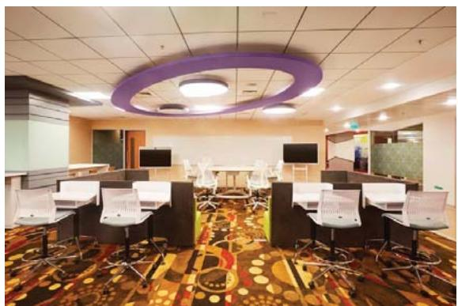

> **AI Description:**
> **Source:** `assets/_page_95_Figure_0.jpg`
> 
> **Generated:** 2026-05-30 09:17:11
> 
> ---
> 
> The image depicts an indoor office or meeting room setting. The room features a carpet with a colorful, patterned design in the center, surrounded by rows of desks with computer monitors and chairs. The ceiling has a circular, purple accent light fixture. In the background, there is a whiteboard and a few additional monitors or screens. The room appears to be set up for a collaborative or training environment.


> **AI Description:**
> **Source:** `assets/_page_95_Figure_1.jpg`
> 
> **Generated:** 2026-05-30 09:18:11
> 
> ---
> 
> The image is a photograph of an office space. It features a modern design with a mix of furniture, including desks, chairs, and a unique car-shaped bench. The walls have decorative elements, such as large gear-like shapes, adding a mechanical or industrial theme. The ceiling has a textured design, and the floor is a combination of wood and carpet. The space appears to be well-lit with a combination of natural and artificial light.


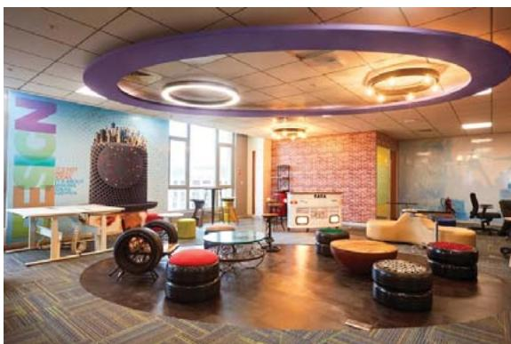

> **AI Description:**
> **Source:** `assets/_page_95_Figure_2.jpg`
> 
> **Generated:** 2026-05-30 09:18:28
> 
> ---
> 
> The image contains a photograph of a modern, creative workspace. The room features a large, circular purple light fixture on the ceiling, which is the most prominent visual element. Below the light fixture, there are several seating areas with unique, unconventional furniture, including circular and cylindrical seats. The walls are decorated with colorful artwork and text, adding to the vibrant and innovative atmosphere of the space. The room appears to be designed for collaboration and comfort, with a mix of functional and artistic elements.


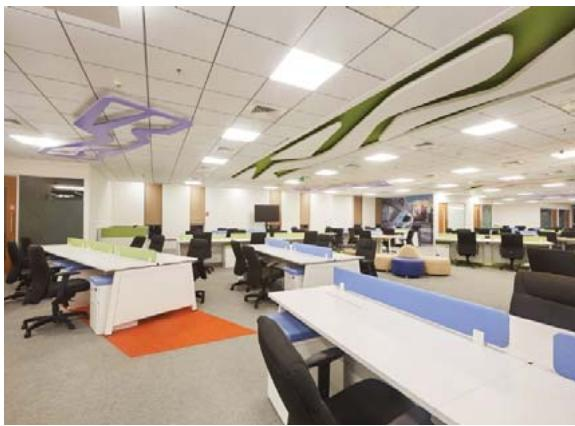

> **AI Description:**
> **Source:** `assets/_page_95_Figure_3.jpg`
> 
> **Generated:** 2026-05-30 09:18:20
> 
> ---
> 
> The image depicts an office environment with multiple desks arranged in rows, each equipped with chairs and personal workspaces. The desks are separated by low partitions, and the floor is carpeted with a mix of colors, including orange and gray. The ceiling features recessed lighting and decorative elements, including a green and purple abstract design. The overall layout suggests a modern office space designed for collaborative work.

Open Agile collaborative workspaces to support all stages of the innovation lifecycle

To support the large-scale adoption of the Location Independent Agile delivery model,TCS has invested in transforming its conventional delivery centers into Agile delivery centers.These are characterized by visual openness and are designed to enable greater collaboration among Agile teams.Variable-height workstations,multimedia conference tables,ondemand mobile video conferencing facilities and huddle spaces help create an open, vibrant,and collaborative workspace.

Usingadvanced planning,preparatorywork,order consolidation and by optimizing logistics for onpremises ADC creation,TCS has been able to complete the conversion over 2-3 weekends,without impacting ongoing work at those centers.The larger transformation program is being run using Agile principles.Till date,over 1,000 Agile delivery centers have been created till date, 250 of them in FY 2020.

To support the various stages of the innovation lifecycle, TCS has also created many Open Agile Collaborative Workspaces within its campuses,each featuring an ideation zone,an innovation zone,a design thinking zone,a prototype-demo area,and social collaboration zones.The technology resources,software,and necessary tools are available in a self-provisioning mode, fulfilling on-demand requirements in a highly secure manner,driving greater productivity.These workspaces also feature software defined networks,enabling greater mobility and flexibility.

<span id="page-96-0"></span>
## FY2O2O PERFORMANCEOVERVIEW:FINANCIAL CAPITAL21

Thediscussions inthissectionrelatetotheconsolidated,upee-denominatedfinancialresultspertaining totheyearthat ended March 31,2O20.The financialstatementsofTata Consultancy Services Limitedanditssubsidiaries (colectively referredtoas‘TCS'or'thecompany'are prepared inaccordance withtheIndianAccounting Standards (refered toas‘Ind AS") prescribedunder section 133of the Companies Act,2013,read with the Companies (Indian Accounting Standards) Rules,asamendedfromtime to time.Significantaccounting policies used in the preparationofthefinancialstatementsare disclosed in the notes to the consolidated financial statements.

The following table gives an overview of the consolidated financial results of the company:


crore

Average currency exchange rates during FY 2O2O for the three major currencies are given below:

## Analysis of revenue growth

Onareported basis,TCS'revenue grew 7.2%inFY2O20,comparedto19.0%in the prior year. Muchof the yearon year decelerationisonaccountof the lessercurrency benefit received inFY202O(7.6%currencybenefit inFY2O19 vs 0.1% benefit in FY2O2O).Additionaly,there was volatilityindemand in the financial services and retail verticals.


Movements in currency exchange rates through the year resulted in a positive impact of O.1% on the reported revenue.The constant currency revenue growth for the year, which is the reported revenue growth stripped of the currency impact,was 7.1%.

<span id="page-97-0"></span>

### Full Page Description (Page 97)

**Source:** `assets/_page_97_Asset_1.jpg`

**Generated:** 2026-05-30 09:13:36

---

The image is a pie chart titled "Revenue by Geography." It visually represents the distribution of revenue across different regions. The chart shows that the Americas account for 52.2% of the revenue, Europe for 30.6%, India for 5.7%, and others for 11.5%. The chart uses different shades of blue to differentiate between the regions, with the largest slice representing the Americas.


### Full Page Description (Page 97)

**Source:** `assets/_page_97_Asset_0.jpg`

**Generated:** 2026-05-30 09:12:51

---

The image is a pie chart titled "Revenue by Vertical." It presents the revenue distribution across different verticals, with the following percentages: Banking, Financial Services, and Insurance at 38.9%; Retail & Consumer Business at 16.7%; Communication, Media & Technology at 16.6%; Manufacturing at 10.5%; and Others at 17.3%. The chart visually represents the proportion of revenue each vertical contributes to the total revenue.

## Segmental Performance

The revenue break-up by Industry Vertical and Geography is provided below:

<span id="page-98-0"></span>
Segment revenues,year on year growth,a brief commentary and segment margins are provided below:


<span id="page-99-0"></span>
## Business Outlook

Global economic growth is projected to contract sharply from 3.3% in 2019 to -3%22 in 2020,much worse than during the 2Oo8-O9 financial crisis.Rolling lockdowns and social distancing restrictions on account of the pandemic are expected to significantly impact economic activity in all major markets,and cause demand compression. In the immediate aftermath,enterprises are expected to downscale current investments,defer planned initiatives,cut costs and conserve cash.While this could inject volatility into TCS' revenue growth,the company expects to gain market share from ensuing vendor consolidations.

Demand is expected to increase for services around digital channels,collaboration and workplace transformation, online learning and workforce analytics. Companies are also expected to invest more towards building operational resilience,leveraging analytics,intelligent automation, cloud and cyber security.This is expected to accelerate the adoption of TCS'Location Independent Agile and Machine First Delivery Model. Increased M&A activity in certain sectors are expected to result in integration and transitional service opportunities for TCS.

<span id="page-100-0"></span>
growth and transformation initiatives is also expected to start picking up from that point on.

## Enterprise Risk Management

i todf the functions and projects.

Listed below are some of the key risks,anticipated impact on the company and mitigation strategies.

<span id="page-101-0"></span>


<span id="page-108-0"></span>
## Internal Financial Control Systems and their Adequacy

TCS has aligned its current systems of internal financial control with the requirement of Companies Act 2O13,on the lines of the globallyaccepted risk-based framework issued by the Committee of Sponsoring Organizations (COSO) of the Treadway Commission.The Internal Control- Integrated Framework (the 2O13 framework) is intended to increase transparency and accountability in an organization's process of designing and implementing a system of internal control.The framework requiresa company to identify and analyze risks and manage appropriate responses.The company has successfully laid down the framework and ensured its effectiveness.

TCS'internal controls are commensurate with its size and the nature of its operations.These have been designed to provide reasonable assurance with regard to recording and providing reliable financial and operational information, complying with applicable statutes,safeguarding assets from unauthorized use,executing transactions with proper authorization and ensuring compliance with corporate policies.TCS has a well-defined delegation of power with authority limits for approving contracts as well as expenditure.Processes for formulatingand reviewing annual and long-term business plans have been laid down. TCS uses a state-of-the-art enterprise resource planning (ERP) system that connects all parts of the organization, to record data for accounting,consolidation and management information purposes.It has continued its efforts to align all its processes and controls with global best practices.

Our management assessed the effectiveness of the company's internal control over financial reporting (as defined in Clause 17 of SEBl Regulations 2O15)as of March 31,2020.

BSR& Co.LLP, the statutory auditors of TCS have audited the financial statements included in this annual report and have issued an attestation report on our internal control over financial reporting (as defined in section 143 of Companies Act 2013).

TCS has appointed Ernst & Young LLP to oversee and carry out internal audit of its activities.The audit is based on an internal audit plan,which is reviewed each year in consultation with the statutory auditors and approved by the audit committee.In line with international practice, the conduct of internal audit is oriented towards the review of internal controls and risks in the company's operations such as software delivery,accounting and finance,procurement, employee engagement, travel, insurance,IT processes, including most of the subsidiaries and foreign branches.

TCS also undergoes periodic audit by specialized third party consultants and professionals for business specific compliances such as quality management,service management, information security,etc.The audit committee reviews reports submitted by the management and audit reports submitted by internal auditors and statutoryauditors.Suggestions for improvementare considered and the audit committee follows up on corrective action.The audit committee also meets TCS'

statutory auditors to ascertain,interalia, their views on the adequacy of internal control systems and keeps the board of directors informed of its major observations periodically.

Based on its evaluation (as defined in section 177 of Companies Act 2O13 and Clause 18 of SEBl Regulations 2015),our audit committee has concluded that,as of March 31,202O,our internal financial controls were adequate and operating effectively.

<span id="page-109-0"></span>
Performance Trend 10 yrs

Note :The company transitioned into Ind AS from April 1,2015.
\*Excluding the impact of one-time employee reward.

<span id="page-110-0"></span>
## OVERVIEW OF FUNDS INVESTED

Funds invested excludeearmarkedbalances withbanksandequityshares measuredatfairvaluethroughothercomprehensive income.

(Amount in Crore)


Totalinestedndspis

<span id="page-111-0"></span>


<span id="page-113-0"></span>
## FY 202O PERFORMANCE OVERVIEW: SOCIAL CAPITAL

TCS'Corporate Social Responsibility (CSR)23 commitment stems from the 151-year-old legacy of the Tata Group and the founder's vision that: In a free enterprise,the community is not just another stakeholder in business,but is in fact the very purpose of its existence.

TCS'vision is to empower communities by connecting people to opportunities in the digital economy.The company has focused on education,skilling,employability and village entrepreneurship,to help individuals and communities bridge the opportunity gap.In addition, it supports the health,wellness,water,sanitation and hygiene needs of communities.

The company's approach is to support large scale, sustainable, multi-year programs that build inclusive,equitable and sustainable pathways for youth,women and marginalized groups and which can have a strategic impact on the community.In India, these programs are aligned with the Government of India's Affirmative Action Policy and the Tata Group's Affirmative Action Program.

In FY2O2O, the global community initiatives of TCS reached more than 840,oo0 beneficiaries.

TCS'purpose-driven worldview is shared by its employees who contribute their time and expertise for social and environmental causes in their local communities.In FY 2O2O, TCSers contributed more than 78o,ooo volunteering hours.

## Education

Digital technologies are transforming every industry around the world.In this new world of work,companies across almost all sectors have the responsibility to develop talent that engages in computational thinking and innovation excellence and is digitally fluent.

InNorthAmerica,IgniteMyFuturein School (IMFIS),isa pioneering effort to empower educators through a transdisciplinary approach that integrates computational thinking into core subjects like English,Math, Science,Art, and Social Studies. Computational Thinking is a higher-level process,whereby students can learn how to collect and analyze data,find patterns, decompose complex problems,abstract, build models and develop algorithms - the fundamental building blocks of innovation in an increasingly digital world.The program also offers year-round assistance through its Learning Leaders Network-a responsiveand involved nationwide network of teachers, Community Nights-an immersive and interactive event for students, teachers and families to experience the curriculumand Days of Discovery-an in-person professional development training for educators to meet with program experts and understand the curriculum.

Ignite My Future in School has engaged over 176,792 students in FY 2020.


> **AI Description:**
> **Source:** `assets/_page_113_Figure_0.jpg`
> 
> **Generated:** 2026-05-30 09:18:03
> 
> ---
> 
> The image contains a group of individuals gathered around a table, engaged in what appears to be a collaborative activity. One person, dressed in a blue jacket, is pointing at a document on the table, which contains several printed pages and what looks like photographs or images. The group consists of both uniformed personnel and civilians, suggesting a professional or educational setting. The environment appears to be an indoor space, possibly a classroom or office, with a bulletin board and other furniture visible in the background. The focus of the image is on the interaction and the document being discussed.

TCS volunteers work with Charlotte,NC middle school students, integrating computational thinkingand lIgnite My Future in School content

<span id="page-114-0"></span>

Pete Delgado isamiddle school teacher from the El Paso Independent School District in Texas. One of the tools that Pete has to empower these students is Ignite My Future in School, which offers lesson plans and study material that weave computational

thinking into core curriculum subjects like math, sciences, and social studies.

"IMFIS provides a type of learning that goes beyond the classroom,"says Pete."It empowers students to apply computational and problem-solving thinking to all aspects of their lives and that's especially valuable, because many of these students wouldn't have had access to this kind of learning before."

Inaddition tobeinga participating teacher,Pete isalso a Learning Leader within the IMFIS teacher network. "l've been able to collaborate with educators across the US, Canada and Mexico," Pete explains,“which means students leave my classroom as global citizens."

In India,TCS'‘Lab on Bike'is providinga similar experience to teachers in government schools and children from low-income,disadvantaged communities.The program introduces novel learning opportunities that fostera scientific mind-set.The Lab on Bike instructors travel to government schools with a set of science experiment kits with which they demonstrate experiments in physics, chemistry and biology.The program has been implemented in 12 schools around Bengaluru,benefiting 1,291 students and 10 schools in Ahmedabad impacting 1,140 students.

A key issue confronting India is the lack of literacy, especially among adults.TCS empowers entire communities,especially those marginalized, by implementing the Adult Literacy Program,which creates access to literacy,enhances earning potential and unlocks the entrepreneurial spirit.

The Adult Literacy Program was set up to help the Government of India improve adult literacy rates,using the Computer Based Functional Literacy (CBFL) solution. Using the CBFL model, non-literate adult learners can achieve functional literacy (reading,writing,arithmetic) within 50 hours,over a period of three months,which is about 1/6th the time demanded by conventional learning methods. Learners acquire a vocabulary of 5oO words,which when put into use,allow them to access essential government policies and form self-help groups and in some cases,even set up entrepreneurial ventures.

The CBFL software is available in nine Indian and three foreign languages.TCS fosters strategic partnerships with local governments, jail authorities,NGOs and other companies to enhance the reach.143,323 learners were made literate across 17 states of India and in Burkina Faso, Western Africa in FY 2020.

<span id="page-115-0"></span>


> **AI Description:**
> **Source:** `assets/_page_115_Figure_0.jpg`
> 
> **Generated:** 2026-05-30 09:16:39
> 
> ---
> 
> The image is a photograph of a woman sitting on the ground in front of a doorway. She is wearing a colorful sari with red, yellow, and green patterns. The woman is holding a bowl filled with oranges. There are a few other items visible on the ground, including a pair of sandals and what appears to be a small pot or container. The setting appears to be an outdoor area with a simple, rustic background.


Literacy remains an issue for millions of Indians,and women are impacted the most. In one example, 4O-year-old Nurabati Putel had to rely on her husband to support their three daughters because she lacked the basic literacy skills to earn an income herself.

This changed thanks to the Adult Literacy Program provided by TCS. After hearing about ALP, Nurabati enrolled in the program and attended regularly. ALP leverages the digital expertise of TCS to offer computer-based learning which quickly provided Nurabati with basic literacy skills.

She was instantly drawn to arithmetic and after completing the program, used her new-found skills to begin selling vegetables in her community. Her income grew to  30o/400 a day, which provided much needed financial security for her family.

Nurabati also credits ALP with wealth you cannot measure, namely, improved self-confidence,the respect of her friends and neighbors in the village,and the opportunity to become a role model and demonstrate how ALP can empower women just like her.

## Skilling

Working in partnership with schools,universities,industry and the non-profit sector, TCS'various skils programs have helped youth realize they can both work in and help create the digital future of our world.In FY 2O2O,TCS reached over 310,ooO xstudents through these STEM initiatives.

golT, which is TCS'flagship student engagement program is implemented across markets (North America, LATAM, Europe,APAC and Australia) and is tailored in each region to meet the specific needs of that community.

golT participants are introduced to computational thinking as a problem-solving framework,acquire the experience in critical evaluation while troubleshooting designs,improve their ability to cooperate and coordinate,and refine their communication skills through public presentations.

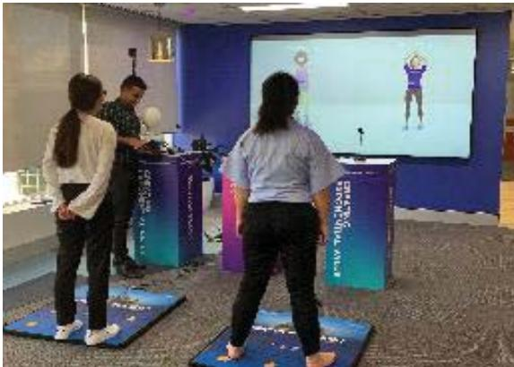

> **AI Description:**
> **Source:** `assets/_page_115_Figure_1.jpg`
> 
> **Generated:** 2026-05-30 09:16:48
> 
> ---
> 
> The image contains a photograph of a group of people participating in a virtual reality (VR) or augmented reality (AR) activity. The participants are standing on blue mats with a design that appears to be related to the activity they are engaged in. In the background, there is a large screen displaying a virtual figure performing an action, possibly a dance or exercise routine. The setting appears to be an indoor space, possibly a conference room or a demonstration area, with banners and a table visible. The participants are facing the screen, suggesting they are following along with the virtual figure's movements.

Students experience the use of technology through GolT Girlsat the Customer Experience Centre, Sydney,Australia

Students,across the globe,learn the steps to produce inventive technology-enabled solutions to real-life problems,then go a step ahead by benchmarking their solutions against those that exist in the market and finally presenting their solutions to experts within the field.

Mentorship forms a large part of the engagement, bringing in TCS associates and their expertise to the fore. Collaborating with TCS associates to develop these apps, helps students visualize a future career and understand the pathways available to them.TCS combines its core capabilities of research excellence in consulting,technology expertise,skill-based volunteering and philanthropic investments into the program design of golT.

<span id="page-116-0"></span>
In North America, the 3rd Annual golT Student Technology Competition was held in partnership with the Toronto District School Board and the 4th annual golT Regional Competition was hosted at the NYC Marathon pavilion.

TCS Norway conducted a four-week program for gth graders at Jordal school in Oslo to introduce them to the possibilities within IT and help them explore career paths in technology.

TCS Singapore partnered with ITE West College (an educational institution under the Institute of Technical Education) to raise STEM awareness and to contribute to

In the United Kingdom and Ireland, the TCS Digital Explorers program offers young people an insight into the world of work in digital industries.The program is run in seven cities across the UK and aims to tackle the digital skills gap by giving young people from diverse backgrounds an opportunity to experience work and gain a real understanding of tech careers.Digital Explorers is rooted in a robust evidence-based intervention designed to engage young people with employers who otherwise would not have such an opportunity.Such interventions are shown to increase learning potential as well as lower the chances of becoming NEET (Not in Education, Employment or Training) as young adults.In FY 202O more than 8,500 youth were directly engaged across 7 cities.

## golT Reaches 12,000+ Students across the World: Key Highlights

Singapore's transition into a Smart Nation. Go/T was the first program that was launched with ITE West College as a result.

TCS Australia's Go/T Girls program is a week-long work experience programaimed at female students in Years 10 and 11. The participants meet senior executives from TCS and from client organizations,who provide insight into the various STEM roles that exist across the business spectrum, with the hope of inspiring a new generation of innovators, problem solversand technology professionals. The aim is to provide insight into and challenge stereotypes of


> **AI Description:**
> **Source:** `assets/_page_116_Figure_0.jpg`
> 
> **Generated:** 2026-05-30 09:12:00
> 
> ---
> 
> The image shows three individuals in formal attire, likely participating in a competition or event. They are focused on a table with a board game or puzzle in front of them. The individuals appear to be engaged in a collaborative activity, possibly problem-solving or strategizing. The setting suggests an academic or professional environment, possibly a tournament or a team challenge.

Youngpeopleat Digital Explorers learning how to code with Ozobots

the technology industry, particularly gender occupational stereotypes.

GolT Challengewas heldat the University of New South Wales.This initiative is designed to encourage high school students to immerse themselves in the world of technology and inspire them to think creatively to apply technological understanding to support the community around them.This year,29 schoolsacross Australia registered for the program submitting over4O projects. At the finals, the GolT Challenge hada record of 11 teams showcasing technology solutions to community challenges.

<span id="page-117-0"></span>
LaunchPad provides foundational skills for technology jobs through a gamified learning of C++ and Python.This is provided to students in schools and universities through a free online course. Designed as a self-learning course, it focuses on improving the analytical and logical skills of students,and nurtures the concept of lifelong learning where students develop the essential skils of investing in their own learning journeys throughout their careers.

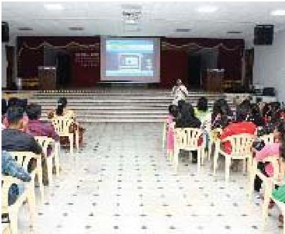

> **AI Description:**
> **Source:** `assets/_page_117_Figure_0.jpg`
> 
> **Generated:** 2026-05-30 09:14:03
> 
> ---
> 
> The image shows a large indoor hall with a stage at the front. There are rows of white plastic chairs arranged facing the stage. On the stage, there is a person standing in front of a large projection screen displaying an image of a laptop. The audience consists of people seated in the chairs, facing the stage. The hall has a tiled floor with a pattern of black and white squares. The walls are decorated with red and white drapery, and there are speakers mounted on the walls. The overall setting appears to be a presentation or lecture hall.

Insight orientation session conducted in Satyabama College for\~2,000 students

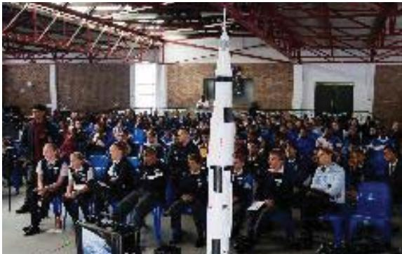

> **AI Description:**
> **Source:** `assets/_page_117_Figure_1.jpg`
> 
> **Generated:** 2026-05-30 09:14:16
> 
> ---
> 
> The image shows a large group of people seated in rows, likely in a conference or training setting. In the center of the room, there is a model of a rocket or spacecraft, which appears to be the focal point of the gathering. The attendees are dressed in uniforms, suggesting a formal or professional event, possibly related to space exploration or aeronautics. The setting appears to be an indoor facility with a high ceiling and industrial-style lighting.

Students learn next generation competencies through a hands-on, experiential program linked to the International Space Station

The program dovetails into TCS' InsighT intervention which includes advanced programming concepts.InsighT provides access to quality programming courses in schools and colleges, thereby raising the quality of professionals accessible to the IT Industry.This program is available online,is free of cost and covers advanced concepts in two months.

Drawing from the company's focus on providing experiential learning,in South Africa,hands-on technology and STEM learning pathways are created by connecting learners to the International Space Station (ISS).The ExoLab program allows students to conduct integrated STEMexperiments alongside identical live experiments which are conducted at the ISS'national laboratory.This

extraordinary exobiology experiment brings together classrooms and the ISS in a collaborative investigation of the effects of microgravity on living things.

With a focus on equity and inclusion,TCS has developed programs to enhance the capacity and utilize the potential of individuals with visual impairment.The Advanced Computer Training(ACTC) program,aided by technology and mentorship,provides training opportunities aimed at creating access to employment in highly skilled roles including those in the technology sector.ACTC offers courses that are in sync with industry requirements, subsequently providing trainees with employment opportunities.

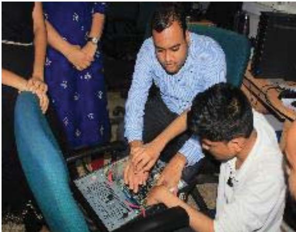

> **AI Description:**
> **Source:** `assets/_page_117_Figure_2.jpg`
> 
> **Generated:** 2026-05-30 09:15:04
> 
> ---
> 
> The image contains a photograph of three individuals engaged in an activity involving a computer setup. One person is seated at a desk, working on a computer, while another individual is kneeling beside them, seemingly assisting or observing. A third person is standing in the background, partially obscured. The setting appears to be an indoor environment, possibly a workspace or office. The image captures a collaborative moment, likely related to computer maintenance, troubleshooting, or a similar technical task.

Hardware Training provided forACTC candidates

<span id="page-118-0"></span>
## Village Entrepreneurship

Around 3oO million individuals in India belong to historically disadvantaged and marginalized communities. Lack of proper digital infrastructure,knowledge and resources in villages often prevent these communities from accessing the opportunities presented by the digital economy, making up the so-called digital divide. Implemented in 2O14 in 6 villages of Jhansi district and laterexpanded across several states,BridgelT was created in response to the need to address prevailing social inequities in India by empowering communities with digital knowledge and tools,enabling entrepreneurship and innovation.

Youth who undergo training through BridgelT are empowered to take up digital entrepreneurship in their village.They also deploy Computer Aided Learning in local government schools and support literacy among adults using the CBFL modules.Till date,this program has developed 236 entrepreneurs across 265 rural locations in 9 states.

## "If it wasn't for BridgelT, I would never have seen so much success in my life."

Ujjwal Mondal pursued multiple post graduate degrees, but few opportunities existed for him to use his education back home in West Bengal. He worked for local NGOs for nearly nine years,but never earned more than  3,000 a month.

That changed, when Ujjwal applied for the BridgelT program. He was equipped with laptops and software and was also trained to provide valuable digital services to his community.


> **AI Description:**
> **Source:** `assets/_page_118_Figure_0.jpg`
> 
> **Generated:** 2026-05-30 09:22:49
> 
> ---
> 
> The image contains a photograph of a person standing in what appears to be a workshop or repair shop. The individual is dressed in a suit and has their hands pressed together in a gesture often associated with greeting or respect in some cultures. The background is filled with various tools, electronic components, and equipment, suggesting a technical or mechanical workspace. The setting includes shelves with neatly organized items and a cluttered workbench with tools and parts, indicating a busy and functional environment.


Ujjwal now earns revenue through various sources such as online banking, hardware / software sales and services, data entry work of government departments,carrying out NGO audits with the help of Subject Matter Experts and various other activities through the two shops he has set up in his locality.

Gaining access to the digital economy has economically empowered Ujjwal and his income has increased manifold. He is looking forward to developing new lines of revenue in the coming weeks. He is also seen as a community leader, as he provides employment to others in his village.

Ujjwal now feels more confident and respected in his community,and his neighbors speak proudly of what hasn't changed about him - how he remains kind-hearted, gentle and always eager to help.

Digital Impact Square (DlsQ),isanopen social innovation center located inNashik,Maharashtra,which encourages innovation using digital technologies toaddressocialchallenges.These challengesare drawn from the voiceof citizens, domain experts,the localadministrationand government.The initiativefostersacultureofinnovation throughaseriesof sustainedinnovationcycles,providesanopportunitytobring researchand technology fromacademiaandbusiness tolife, and accelerate the journey of young innovators from being ideators to entrepreneurs.

<span id="page-119-0"></span>
## Employment and Employability

Lack of access to industry relevant skills often has a negative impact on the employment aspects of students from rural and underserved areas.Through employment focused interventions,TCS helps undergraduate students from rural, socially and economically marginalized communities develop the necessary skills needed for a job.

Engineering students are trained on three modules covering business communication,general aptitude,and technical skills for a duration of 18-24 months (192 hours).Nonengineering students receive 1oo hours of training on math, analytics,general knowledge, English,and computers.It introduces Business English,imparts corporate etiquette, improves soft skills,sharpensaptitude and strengthens core subjects pertinent to the industry.At the end of training, the youth are much better placed to gain employment.

In FY 202O,nearly 22,880 youth across India gained industry-relevant skills and 4,470 secured jobs in the services sector.


Sayali Deshmukh was encouraged to attend school and university by her parents, so she wouldn't face the same economic situation as them. She studied Electronics and

Telecommunication Engineeringat the Government College of Engineering and Research in Maharashtra but struggled to articulate her ideas when presenting to her class.

The solution came in the form of TCS' IT Employability Program. In her pre-final year at college,Sayali joined the program and learned valuable skills, like how to present her ideas in an interview or meeting.

Sayali then took part in the TCS National Qualifier Test prior to graduation and her hard work paid off. She was selected for a position with TCS upon graduation, wherein she spring-boarded right from college to the beginnings of a bright, new career in the IT industry.

"I had employment waiting for me before I graduated, and the interview skils sessions and role plays really helped me to improve my confidence and overcome my stage fright,"says Sayali, who also encourages other rural students to join the program.

urban centers.

Graduates from rural communitiesare often described as ‘the invisible talent pool' because lack of confidence and communication skills hinder their access to the growing number of jobs in cities and

The BPS Employability program is designed to bridge that gap,offering coaching and mentorship,and employment with TCS for suitable applicants.

Divya and Vidya both participated in this program. Twin sisters,they graduated with degrees from Mercy College, Palakkad,and while in school also enrolled in the program. Both took advantage of the coaching and mentorship,which transformed their confidence and communication skils. They met the criteria to work at TCS and have held positions there for more than a year.

“We moved to Bangalore - and while the journey wasn't easy, the learning was priceless," Vidya explains.

“That one chance TCS offered us,It changed our life," says Divya, who also credits their mother - a anganwadi childcare teacher - for pushing them to pursue education and embrace a new future filled with economic opportunity.

<span id="page-120-0"></span>
## Thought Leadership, Research and Insights

TCS believes that companies across almost all sectors have the responsibility to develop talent that engages in computational thinking and innovation excellence; embrace diversityand support inclusion and provide access to underserved populations.The company's thought leadership initiatives address the opportunity gap through research,insights,advocacy and policy.Through these consultation forums,TCS has mobilized the public-,privateand not for profit sector to address gender,ethnic and socioeconomic inequities,and has led discussions around pioneering solutions that will democratize learning and unlock opportunities.

Digital Empowers,a partnership between TCS and the U.S. Chamber of Commerce Foundation,explores the ways in which technologies such as blockchain,cloud, Internet of Things,robotics,artificial intelligence augmented reality/ virtual reality,data analytics,and human centered design can be leveraged to solve social issues including workforce development and education, food safety and distribution, microfinance,the opioid epidemic,community recycling, non-profit capacity building,refugee resettlement, natural and human-made disasters,criminal justice reform and healthcare and bring greater access and equity to individuals and communities.

The Future Leaders Summit,organized as part of the TCS APAC Summit and now in its fourth year, brings together delegates from customer organizations who are identified as high performers and are passionate about harnessing the power of digital technologies to create a fairer, more inclusive society.The theme this year was ‘Digital empowering a sustainable world',and explored how digital technologies can empower communities across the world - how drones are helping to save endangered animals and protect forests in Australia; how technology is supporting a culture of health and wellbeing in Indigenous Australia with children being encouraged to become the next generation of innovators through STEM education.

## Health

TCS'Digital Nerve Centre (DiNC) isa unique and innovative delivery model designed to connect, communicate, coordinate and deliver care by leveraging people, infrastructure and a robust digital platform.DiNC has opened new avenues of connection and real time communication at The Cancer Institute(Cl) -Chennai and Tata Medical Center(TMC)-Kolkata.These two premier cancer hospitals are also part of the National Cancer Grid.The North-East region via the State Cancer Institute, Guwahati (Assam),is also leveraging DiNC for enhanced reach and accessibility.

In FY 202O, DiNC services expanded with a Virtual Tumor Board for quick diagnosis and expedited treatment. Currently, this service is operational at the Cancer Institute and Assam State Cancer Institute.Additionally, new

services have been launched,such as occupational therapy notes in Cl-Chennai and pre-consultation services at TMC-Kolkata.

Meanwhile, the TCS team has been supporting the Tata Memorial Hospital, Mumbai, locally,with its online registration process and enquiries.This has significantly improved data quality with zero reported issues.

DiNC works at all level of healthcare-Tertiary, Secondary and Primary- leading to a well-connected and integrated healthcare system.At the Primary Care level, DiNC is currently operating in Kolar, Karnataka and in Kullu, Himachal Pradesh.These states have roped in DiNC to facilitate Primary Healthcare Transformation for the identified districts,wherein DiNC-enabled Primary Healthcare Transformation has been helping augment key Primary Care programs and efforts.

Accompanied by a strong awareness mechanism- the Known Citizen Drive, DiNC with its unique phygital approach of physical /human connect and cutting-edge digital technologies is slowly helping alleviate the issue of healthcare accessibility, care continuum and management for the rural/underprivileged.With DiNC,care seekers are able to access the right care, through the right healthcare center at the right time,which otherwise was a huge challenge for them.

<span id="page-121-0"></span>
TheTata Translational CancerResearch Centre(TTCRC) was set up in partnership with TMC in Kolkatta.TTCRC aims to create an interactive environment for clinicians, scientists and the industry to work together to deliver a better future for cancer patients in India.TCS has been providing operational solutions for TTCRC since its inception.Clinicians,scientists and industry are developing partnerships at TTCRC so patients not only benefit from modern affordable cancer therapy but also from the costeffective models of care.

## Employee Engagement

TCS'Employee Volunteer Program channels the unique skillset of our employees and their energies to address some of the most pressing issues facing Education, Health,and Planet,in countries where we live and work. The programs below summarize the key partners and achievements of this work in the last year.

In North America,associates are directly involved in supporting the mission of our national partners, the American and Canadian Red Crosses,the American Heart Association,and Heart & Stroke Foundation.Since 2011,

TCS has partnered with the American Heart Association in the United States and the Heart and Stroke Foundation in Canada,to fight heart disease and stroke.Annual initiatives such as Go Red for Women, Heart Walks, Big Bike events and Heart Month aid in fundraising and also increases awareness around cardiovascular research and public policy advocacy.

In the United Kingdom,The Wildlife Trust became TCS new corporate charity partner. In this two-year partnership, the focus is on employee mental health and wellbeing.The overall campaign theme in the partnership is ‘Disconnect to reconnect',which raises awareness of the importance of disconnecting from our everyday digital lives and use nature to improve both mental and physical health.

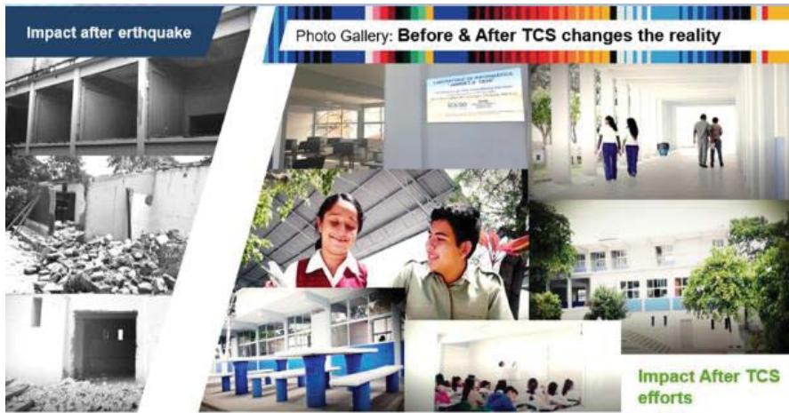

> **AI Description:**
> **Source:** `assets/_page_121_Figure_0.jpg`
> 
> **Generated:** 2026-05-30 09:15:48
> 
> ---
> 
> The image contains a collage of photographs and text. It compares the impact of an earthquake before and after TCS (Tata Consultancy Services) efforts. The top left photo shows the damage caused by the earthquake, with debris and structural damage visible. The top right photo shows a clean, well-maintained building interior with people walking, indicating a restored environment. The bottom left photo depicts a classroom with students, suggesting a return to normalcy. The bottom right photo shows a school building with trees and a clear sky, emphasizing the improved condition. The text at the top and bottom highlights the contrast between the pre- and post-earthquake states, emphasizing TCS's role in recovery.


Over 2,500 children returned to a new school due to the efforts and contributions of TCSers worldwide,who collaborated with ‘Strong Mexico‘campaign, developed to provide aid and support to the victims of the 2017 earthquake. TCS' interventions enabled the building of a new school for the children of Cintalapa in Chiapas, Mexico.

<span id="page-122-0"></span>
## Business Responsibility Report

Thissection isas per Regulation 34of the SEBl(Listing Obligationsand Disclosure Requirements) Regulations,2015.

## Section A: General information about the company

1. Corporate Identity Number (CIN) of the Company: L22210MH1995PLC084781

2. Name of the Company: Tata Consultancy Services Limited

3. Registeredaddress:9th Floor, Nirmal Building,Nariman Point,Mumbai-400 021, India

4. Website: www.tcs.com

5. E-mail id: corporate.sustainability@tcs.com

6. Financial Yearreported: April1,2O19 to March 31,2020

7. Sector(s) that the Company is engaged in (industrial activity code-wise): /TC CODE: 85249009 Product Description: Computer Software

8. List three key products/services that the Company manufactures/provides (as in balance sheet): Consulting and Service Integration,Digital Transformation Services and Cognitive Business Operations.

9. Total number of locations where business activity is undertaken by the Company:

(a) Number of International Locations (Provide details of major 5):72 delivery centers


(b）Number of National Locations: 115

10. Markets served by the Company-Local/State/National/International: North America,Latin America, United Kingdomand Ireland, Continental Europe,Asia Pacific,Middle Eastand Africa,and India.

## Section B: Financial details of the company

1. Paid up Capital (INR): 375 crore

2. Total Turnover (INR): 156,949 crore

3. Total profit after taxes (INR): 32,34O crore

4. Total Spending on Corporate Social Responsibility (CSR) as percentage of profit after tax (%):2.Ol%of average net profit forprevious threeyears in respectof standalone TCS (India Initiatives only)

5. List of activities in which expenditure in 4 above has been incurred:


Including overseas spend,the company's total spending on Corporate Social Responsibility is 755 Crore

<span id="page-123-0"></span>
## Section C: Other details

1. Does the Company have any Subsidiary Company/ Companies? Yes

2. Do the Subsidiary Company/ Companies participate in the BR Initiatives of the parent company? If yes, then indicate the number of such subsidiary company(s): Yes,36 subsidiaries participated

3. Do any other entity/entities (e.g.suppliers, distributors etc.) that the Company does business with, participate in the BR initiatives of the Company? If yes, then indicate the percentage of such entity/entities?[Less than 3O%, 3O-6O%, More than 60%] No.

## Section D: BR information

## 1. Details of Director/Directors responsible for BR

(a) Details of the Director/Directors responsible for implementation of the BR policy/policies

The Corporate Social Responsibility (CSR) Committee of the Board of Directors is responsible for implementation of BR policies.The members of the CSR Committee are as follows:


## (b）Details of the BR head

Name: Milind Lakkad

Designation: Executive Vice President and CHRO

Telephone number: 022 67789999

E-mail id: corporate.sustainability@tcs.com

## 2. Principle wise (as per NVGs) BR Policy/policies

The National Voluntary Guidelines on Social, Environmental and Economic Responsibilities of Business (NVGs) released by the Ministry of Corporate Affairs has adopted nine areas of Business Responsibility.These briefly are as follows:

P1 Business should conduct and govern themselves with Ethics,Transparency and Accountability

P2 Businesses should provide goods and services that are safe and contribute to sustainability throughout their life cycle

P3 Businesses should promote the welbeing of all employees

P4 Businesses should respect the interests of,and be responsive towards all stakeholders,especially those who are disadvantaged,vulnerable and marginalized

P5 Businesses should respect and promote human rights

P6 Business should respect,protect,and make efforts to restore the environment

P7 Businesses,when engaged in influencing public and regulatory policy, should do so in a responsible manner

P8 Businesses should support inclusive growth and equitable development

P9 Businesses should engage with and provide value to their customers and consumers in a responsible manner

<span id="page-124-0"></span>


\* TATA Code of Conduct (https://on.tcs.com/Tata-Code-Of-Conduct)

\*\* CSR Policy (https://on.tcs.com/Global-CSR-Policy)

\*\*\* Environment Policy (https://on.tcs.com/Environmental-Policy)

## 3. Governance related to BR

(a) Indicate the frequency with which the Board of Directors, Committee of the Board or CEO to assess the BR performance of the Company.Within 3 months,3-6 months, Annually, More than 1 year: Seven Board Meetings were held during the year.

(b) Does the Company publish a BR or a Sustainability Report? What is the hyperlink for viewing this report? How frequently it is published? Yes,the company publishes its Sustainability Report annually.In FY 2020, the Sustainability Report ispartof this Annual Report.The hyperlink is: https://on.tcs.com/Annual-Report-2020

<span id="page-125-0"></span>
## SECTIONE:PRINCIPLEWISEPERFORMANCE

## Principle 1

1. Does the policy relating to ethics, bribery and corruption cover only the company? No

Does it extend to the Group/Joint Ventures/Suppliers/Contractors/NGOs/ Others? Yes

2. How many stakeholder complaints have been received in the past financial year and what percentage was satisfactorily resolved by the management? If so, provide details thereof, in about 5O words or so:

In FY2020,149 concerns from various stakeholders were received in the ethics channels.Of these,136(91.3%) were satisfactorily resolvedas on March 31,2020,and the remaining concerns were work in progress to be resolved folowing due process.

## Principle 2

1. List up to 3 of your products or services whose design has incorporated social or environmental concerns,risks and/or opportunities:

Three instances of work done by TCS that results in social or environmental good are

a) Intelligent Speech to Text Solution: Verbose isan intelligent solution for the hearing impaired.It enables end-to-end speech to text conversion.It converts live lectures into real-time data thatcanbeviewed indifferent formats such as animated video,comic strips,notes etc.More than1,000 children are using the solution.It isalso part of many"Assistive Conference" kits,for hearing-impaired conferenceattendees,to engage with conference content at their own pace.

b) Research Scholarship Program:TCS'Research Scholarship Program continues to support PhD scholars in Computer Sciences in India.In FY2020,40 new scholars were included in the program and a stipend hike was announced.

TCS Researchers continue to mentor scholars who are a part of the program.   
The total number of scholars supported by the program is 322.

Digital Impact Square-The Digital ImpactSquare,based in Nasik,provides internships to young innovators to build solutions that solve social problems using Digital technologies and human-centric design principles.The FY2020 cohort had 6O innovators in 1O teams.Four DlSQ initiatives moved to the sustain phase (successful exit from DlSQ).Total 10 successful exits from DISQ so far. 6.2 crore was raised by DlSQ startups and more than one lakh lives were impacted this year.Three new designschools joined DlSQ thisyear.

2. For each such product, provide the following details in respect of resource used (Energy,Water,Raw material etc.) per unit of product (optional)

a) Reduction during sourcing/production/ distribution achieved since the previous year throughout the value chain?

Not applicable.

b) Reduction during usage by consumers (energy,water) has been achieved since the previous year:

Not applicable.

3. Does the company have procedures in place for sustainable sourcing (including transportation)?

(a) If yes, what percentage of your inputs was sourced sustainably? Also, provide details thereof,in about 5O words or so.

Our suppliers sign the Supplier Code of Conduct and the Tata Code of Conduct. Our policy on supply chain sustainability can be found here: https:/ on.tcs.com/Sustainable-Supply-Chain-Policy

4. Has the company taken any steps to procure goods and services from local & small producers, including communities surrounding their place of work? Yes

(a) If yes,what steps have been taken to improve their capacity and capability of local and small vendors?

<span id="page-126-0"></span>
While the criteria for selection of goodsand services is quality,reliabilityand price,TCS gives preference to smal organizations,particularly promoted by entrepreneurs from socially backward communities.

Under the BridgelTprogram,TCS has trained digital entrepreneurswho have established themselvesas key resources in the villages within which they operate.

TCSpromotes the exhibitionand sale of goodsproducedby sociallyand economically underprivileged men/women supported by Non-Governmental Organizations.TCS facilitated stalls fororganizations like Etasha Societyand Maher to sell various products that were made by destitute and mentally challenged men and women from the slums of National Capital Region, Haryana and Maharashtra.TCS provideda platform forselling productsmade bythe inmatesofTiharJail and enabled their saleinTata Power,Delhi aswell.

5. Does the company have a mechanism to recycle products and waste? If yes what is the percentage of recycling of products and waste (separately as 1O%). Also, provide details thereof,in about 5O words or so:

Yes.Formore details please refer to the FY2020 Performance Overview:Natural Capital which forms partof this Annual Report

## Principle 3

- 1. Please indicate the Total number of employees: 448,464 as on March 31,2020
- 2. Please indicate the Total number of employees hired on temporary/contractual/ casual basis: 17,273as on March 31,2020
- 3. Please indicate the Number of permanent women employees:162,22O as on March 31,2020

4. Please indicate the Number of permanent employees with disabilities: 66l as on March 31,2020

- 5. Do you have an employee association that is recognized by management? Yes

6. What percentage of your permanent employees are members of this recognized employee association? O.O3% (For India)

7. Please indicate the Number of complaints relating to child labour, forced labour, involuntary labour, sexual harassment in the last financial year and pending,as on the end of the financial year:

The company hasadopted a policy on prevention,prohibitionand redressal of sexual harassmentat workplace in line with the provisionsof the Sexual Harassment of Womenat Workplace (Prevention,Prohibition and Redressal) Act,2O13 (India) and the Rules thereunder.

During FY2020,the company has received 86 complaints on sexual harassment, out of which 77 complaints have been resolved with appropriate action taken and 9 complaints remain pending as on March 31,2020.Internal review is under progress for the pending complaints,following due process.

There have been no complaints in otherareas.

8. What percentage of your under mentioned employees were given safety& skill upgradation training in the last year?

(a)Permanent Employees -95%

(b)Permanent Women Employees - 94%

(c） Casual/Temporary/Contractual Employees -64%

(d)Employees with Disabilities - 95%

<span id="page-127-0"></span>
## Principle 4

1. Has the company mapped its internal and external stakeholders? Yes

2. Out of the above, has the company identified the disadvantaged, vulnerable & marginalized stakeholders: Yes

3. Are there any special initiatives taken by the company to engage with the disadvantaged, vulnerable and marginalized stakeholders? If so,provide details thereof, in about 5O words or so:

Yes.Please refer to the section on FY2O2O Performance Overview:Social Capital in thisAnnual Report fordetailsonourAdult Literacy Program,Bridge IT,BPS/IT Employabilityprograms,Advanced Computer Training Centre, etc.

## Principle 5

1. Does the policy of the company on human rights cover only the company or extend to the Group/Joint Ventures/Suppliers/Contractors/NGOs/Others?

The principles stated in our code and policies which include respect for human rights and dignity of allstakeholders,extend to the group,joint venture,suppliers and all those who work with us.

2. How many stakeholder complaints have been received in the past financial year and what percent was satisfactorily resolved by the management? No material complaint related to violationoffundamental human rights of individuals wasreceived during the financial year.

## Principle 6

- 1) Does the policy related to Principle 6 cover only the company or extends to the Group/Joint Ventures/Suppliers/Contractors/NGOs/others. The policy isapplicableto TCS,itssubsidiariesand vendors.

2) Does the company have strategies/initiatives to address global environmental issues such as climate change, global warming,etc? Y/N.If yes,please give hyperlink for webpage etc:

Yes.TCS' Environmental Policy isavailable on https://on.tcs.com/Environmental-Policy

3) Does the company identify and assess potential environmental risks? Yes.

4) Does the company have any project related to Clean Development Mechanism? If so,provide details thereof, inabout 5O words or so.Also,if Yes,whether any environmental compliance report is filed?

Not Applicable

5) Has the company undertaken any other initiatives on - clean technology, energy efficiency, renewable energy,etc. Y/N. If yes, please give hyperlink for web page etc..

Yes.Please refer to the section on FY2O2O Performance Overview:Natural Capital in this Annual Report.

6) Are the Emissions/Waste generated by the company within the permissible limits given by CPCB/SPCB for the financial year being reported? Yes.

7) Number of show cause/ legal notices received from CPCB/SPCB which are pending (i.e. not resolved to satisfaction) as on end of Financial Year. None

## Principle 7

- 1. Is your company a member of any trade and chamber or association? If Yes, Name only those major ones that your business deals with:

Yes. National Association of Software and Services Companies (NASSCOM),

Confederation of Indian Industries (Cl),Federationof India Chambers of Commerce and Industry (FICCl), US India Business Council (USIBC) US Chamber of Commerce and Confederation of British Industry (CBl)

<span id="page-128-0"></span>
2. Have you advocated/lobbied through above associations for the advancement or improvement of public good? Yes/ No; if yes specify the broad areas (drop box: Governance and Administration, Economic Reforms, Inclusive Development Policies, Energy security,Water, Food Security, Sustainable Business Principles, Others):

Yes.TCS participates in consultations on governance and administration,sustainable business principles,inclusive development policies (with a focus on skillbuilding and literacy),economic reformsand taxand other legislations.TCS uses the Tata Code of Conduct asa guide foritsactions in influencing publicand regulatory policy.

## Principle 8

1. Does the company have specified program/initiatives/ projects in pursuit of the policy related to Principle 8? If yes details thereof?

Yes.Please refer to the preceding section on FY2020 Performance Overview: Social Capital in this Annual Report.

2. Are the program/projects undertaken through in-house team/own foundation/ external NGO/government structures/any other organization? TCS uses all of these modes.

3. Have you done any impact assessment of your initiative? Yes.

4. What is your company's direct contribution to community development projects-Amount in INR and the details of the projects undertaken?755 crore, including overseas spend.Formore details,please refertoAnnexure Ilof Directors'Report in this Annual Report.

5. Have you taken steps to ensure that this community development initiative is successfully adopted by the community?Please explain in 5O words,or so. Yes.Initiatives conducted under CSRare tracked to determine the outcomes achieved and the benefits to the community.Internal tracking mechanisms,monthly reports and follow-up field visits,telephonicand email communicationsare regularly carried out.The company has engaged highly trained employees to driveand monitor the CSR activities.

## Principle 9

1. What percentage of customer complaints/consumer cases are pending as on the end of financial year.

8%of the complaints received are pending resolutionas on March 31,2020

2. Does the company display product information on the product label, over and above what is mandated as per local laws? Yes/No/N.A./Remarks (additional information):

3. Is there any case filed by any stakeholder against the company regarding unfair trade practices, irresponsible advertising and/or anticompetitive behavior during the last five years and pending as on end of financial year? If so,provide details thereof,in about 5O words or so:

4. Did your company carry out any consumer survey/ consumer satisfaction trends? Yes

<span id="page-129-0"></span>

### Full Page Description (Page 129)

**Source:** `assets/_page_129_Asset_1.jpg`

**Generated:** 2026-05-30 09:11:34

---

The image is a bar chart titled "Specific Scope 1 + Scope 2 Emissions (TCO2E/FTE/ANNUM)." It displays the emissions data over a period from 2007-08 to 2019-20. The x-axis represents the years, while the y-axis represents the emissions in TCO2E/FTE/ANNUM. The chart shows a general downward trend in emissions over the years, with the highest emissions in 2007-08 and the lowest in 2019-20.


### Full Page Description (Page 129)

**Source:** `assets/_page_129_Asset_0.jpg`

**Generated:** 2026-05-30 09:11:44

---

The image is a bar chart titled "Specific Electricity Consumption (KWH/FTE/MONTH)." It displays data for the years 2007-08 to 2019-20, showing the specific electricity consumption in kilowatt-hours per full-time equivalent employee per month. The x-axis represents the years, while the y-axis represents the electricity consumption in KWH/FTE/MONTH. The chart shows a general downward trend in electricity consumption over the years, with the highest consumption in 2007-08 at 319 KWH/FTE/MONTH and the lowest in 2019-20 at 128 KWH/FTE/MONTH.

## FY202OPERFORMANCEOVERVIEW: NATURAL CAPITAL

TCS views its responsibility for environmental stewardship seriously and has taken a‘beyond compliance'approach, setting a bold vision for environmental sustainability, articulated in the Environmental Policy.This translates into a strong focus on operational efficiency and concern for the environment across the organization and in the value chain.

The objective is to grow sustainably by successfully decoupling business growth and the impact on the environment from our operations,effectively doing more with less through better design,planning and operational efficiency.The company's environmental sustainability strategy is implemented through its policy,standardized processes,impact assessment,performance monitoring and strong partnerships with stakeholders,including employees.

TCS measures,manages and reports on energy,carbon, waterand waste - the most material environmental aspects of its operations.The three key focus areas of the company's environmental strategy are:

Carbon footprint reduction: Energy efficiency and use of renewable energy

Water management: Eficient use, recycling and rainwater harvesting

：Waste management: Reduction, Reuse and Recycling Beyond its own footprint, the company also drives supply chain sustainability through responsible sourcing,covered elsewhere in this report.

TCS is certified under the ISO 140O1:2015 Environmental Management System (EMS) standard,across 126 locations globally.The management system has integrated environmental risks and opportunities with TCS'business strategy.

## Managing the Carbon Footprint24

Long before it became an established science,TCS embraced the precautionary principle and recognized carbon footprint mitigationas a high priorityarea²5.With an operational footprint that consists largely of campuses of office blocks for the delivery organization,and sales offices,direct emissions from operations-also referred to as Scope 1emissions-are a very small part of the company's carbon footprint,amounting to just 6.5% of the overall carbon footprint.The rest is made up of indirect emissions,referred to as Scope 2 emissions,associated with purchased electricity26.

<span id="page-130-0"></span>
TCS has been able to reduce its specific energy consumption by over 6O% over baseline year FY 2O08,and bring down its greenhouse gas emissions (Scope 1+ Scope 2)27 from 3 tCO2E/FTE/Annum in FY 2008 to 1.15 tCO2e/ FTE/Annum in the current reporting year,a reduction of 61.6%.

Compared to the prior year,the specific energy consumption is down 11.9% and specific carbon footprint is down 11.8% YoY. Additionally,absolute (Scope 1 + Scope 2) emissions have reduced by 6% YoY28,for the fourth consecutive year. Having achieved the previous target of halving the specific carbon footprint by 2O2O (versus baseline year FY 2Oo8)ahead of schedule,the company is now working on setting new targets for the next decade.

## The Path to Energy Efficiency29

The reduction in specific energy consumption was achieved by adding more green buildings to the company's real estate portfolio,installing roof top solar power plants across campuses,optimizing IT system power usage,upgrading

legacy equipment with state-of-the-art technology,and improving operational efficiency through the inhouse-built, loT-based Remote Energy Management System.All these efforts have resulted in year-on-year energy reduction, despite the growth in employees,commissioning of new facilities and ramping up within existing facilities.

Over 57% of the total office space currently occupied by TCS in India is designed as per green building standards. In FY 2020,the company added 2 MWp of rooftop solar, taking the total on-site roof top solar capacity across its campuses to 7.6 MWp.This contributed 6.4 million units of electricity generated from in-house solar plants.About 53 million units of renewable energy were sourced in FY 2020 through power purchase agreements.Total renewable energy units generated from rooftop solar projects and sourced through power purchase agreements was \~1O.9% of the total electricity consumption.

The company has saved \~11 million units of electricity by switching over to energy-efficient LED lighting across 90% of its operations in India. Over the last 3 years,TCS has been able to reduce the distributed IT power demand from 20o watts to 85 watts per seat.Data center power management initiatives have helped reduce the power utilization efficiency (PUE) of its 23 data centers to 1.66 (versus 1.67 in the prior year).Of the 23 data centers,22 haveachieved the target PUE of 1.65.Data center/server room consolidation, higher rack utilization,and UPS rationalization have been the key levers.

## Other Emissions

Emissions of Ozone-depleting substances are primarily in the form of system losses or fugitive emissions during maintenance and repair of air conditioning systems.TCS is committed to using zero-ozone depleting potential (ODP) refrigerants in its operations.New facilities have HVAC systems based on zero-ODP refrigerants.All ODP refrigerant gases will be phased out and replaced with zero-ODP refrigerants,in line with country-specific timelines agreed to as per the Montreal Protocol and local regulations.

## Value Chain Emissions

All other indirect emissions are accounted by TCS as Scope 3 emissions.These are also known as value chain emissions because they are caused by sources not owned or controlled by TCS,but are relevant to its operations and within its value chain. By applying an expansive boundary and using standard Scope 3 emission factors,the company estimates that value chain emissions amounted to 1.57 tCO2e per FTE,in FY 2020.

The largest contributors,amounting to \~6O%,were business travel intrinsic to the consultancy business model,and daily workplace commutes of employees.TCS has been investing in superior communications and video conferencing infrastructure to promote greater collaboration across remote teams,and with lesser in-person attendance for meetings and business discussions.This has helped reduce the specific carbon footprint from business air travel by more than 67% over the baseline year and by 19% over FY 2019.This is expected to further dip in FY 2O21 given the reduced travel and commutes.

<span id="page-131-0"></span>
## Water Conservation30

TCS optimizes water consumption through conservation, sewage treatment and reuse,and rainwater harvesting. All new campuses have been designed for 5O% higher water efficiency, 1oo% treatment and recycling of sewage,and rainwater harvesting.Employee engagement also plays a big role in the company's water sustainability strategy. In FY2O2O,consistent water management measures, consolidation of offices and increased occupancy of green-field centers helped reduce specific freshwater consumption by over 9% compared to FY 2019.

Of the 3.9 million kL31 of fresh water consumed by TCS in FY 2020,56% came from municipal sources,28% from third party suppliers,14% from groundwater and 2% from rainwater harvest at our campuses.Consistent water efficiency measures have helped the company reduce freshwater consumption by over 27% over baseline year FY 2008.Total treated sewage recycled as a percentage of the total sewage generated was\~7O% in FY 202032.

The company continues to pursue groundwater replenishment initiatives through on-campus rainwater harvesting systems,and community water shed management projects.TCS continues to support initiatives on surface water body rejuvenation at Siruseri in Chennai, Kasalganga in Solapur and Malguzari ponds in Vidarbha.

## Waste Reduction and Reuse

As an IT services and consulting organization,TCS' facilities mostly generate electronic,electrical,and office consumables waste and municipal solid waste.Generation of potentially hazardous wastes such as lead-acid batteries and waste lube oil is in relatively smaller proportions.In FY 2020,despite the growth in business,the company wasable to achieve material reductions in the absolute quantities across all key wastes: paper wastes,cafeteria dry waste,and canteen biodegradable waste.

Per capita paper consumption reduced by\~16% over the prior year and \~89% over the baseline year FY 2O08.The success of this drive can be attributed to the awareness created among employees,and the enforcement of printing discipline through automated and manual means.TCS continues to achieve 1oo% recycling of its paper waste.

TCS'waste management practices seek to maximize segregation at source,as well as reuse and recycle as possible.All the hazardous and regulated waste is disposed of through government-authorized vendors as per the regulatory requirements. Engaging employees and raising their awareness to encourage responsible consumption is a key lever in the organization's strategy.

## TCS'waste management practices

Biodegradable waste is treated onsite for biogas recovery or manure generation through bio-digesters or composting. All TCS campuses,owned offices and leased offices that have the required space have been provided with on-site food waste management facilities.In FY 202o,72.6% of the total food waste generated across all TCS facilities was treated using onsite composting methods or bio-digester treatment.In locations lacking space for these systems, the waste is disposed of as fodder for livestock or sent to the municipal waste collection system.

Dry waste is categorized,segregated,and sent for recycling.Garden waste is composted onsite. Over 336 tons of compost were generated in FY 202O,reducing the need for chemical fertilizers and the resultant soil and groundwater pollution. Used printer cartridges and photocopier toner bottles are sent back to the manufacturers for proper disposal.

<span id="page-132-0"></span>
## Employee Engagement

TCS has a year-round calendar for engaging with employees to create environmental awareness and sensitizing them towards nature and conserving its resources. The company has run communication campaigns around World Bio-diversity Day, World Environment Week, World Ozone Day, Green Consumer Day,World Wildlife Week, Pollution Control Day, Energy Conservation Day, World Water Day and the Earth hour campaign.

The company's purpose-driven worldview inspires many employees to undertake volunteering in their local communities around environmental themes. A month-long campaign to encourage the elimination of single use plastic saw over 80,000 TCSers participate in 256 cleanliness drives and 130 awareness sessions in the community, across 90 cities in India. Elsewhere, employees at TCS Mexico participated in reforestation activities to save 'Guadalajara's lungs', planting saplings in designated areas to increase the green cover.

As part of the Tata Sustainability Month, the company ran a campaign to create awareness among employees on the UN Sustainable Development Goals, and inspire them to take small actions in their lives to contribute towards those goals. It saw participation by over 120,0o0 associates participate in such activities as plantation drives, cleanliness drives, cyclathon, walkathon, external sessions, clean (food) plate drive, community initiatives and several contests.


> **AI Description:**
> **Source:** `assets/_page_132_Figure_0.jpg`
> 
> **Generated:** 2026-05-30 09:13:29
> 
> ---
> 
> The image contains a photograph of four individuals raising their thumbs in a gesture of approval or celebration. The photo is framed within a circular graphic with a gradient of pink to orange. The individuals appear to be in a casual setting, possibly a workplace or social gathering, and their expressions suggest a positive and supportive atmosphere. The image conveys a sense of teamwork and agreement.


<span id="page-133-0"></span>
## Corporate Governance Report ?


> **AI Description:**
> **Source:** `assets/_page_133_Figure_0.jpg`
> 
> **Generated:** 2026-05-30 09:14:41
> 
> ---
> 
> The image contains a diagram with a light purple circle as the background. Inside the circle, there is a white document with text and a checkmark symbol, suggesting a checklist or form. To the right of the document, there is a magnifying glass icon, indicating a search or analysis function. The overall design suggests a process or workflow related to document review or inspection.


## I. Company'sPhilosophy on Corporate Governance

Effective corporate governance practices constitute the strong foundation on which successful commercial enterprises are built to last.The Company's philosophy on corporate governance oversees business strategies and ensures fiscal accountability,ethical corporate behaviour and fairness to all stakeholders comprising regulators,employees,customers,vendors,investors and the society at large.

Strong leadership and effective corporate governance practices have been the Company's hallmark inherited from the Tata culture and ethos.

The Company has a strong legacy of fair, transparent and ethical governance practices.

The Company has adopted a Code of Conduct for its employees including the Managing Director and the Executive Directors.In addition,the Company has adopted a Code of Conduct for its non-executive directors which includes Code of Conduct for Independent Directors which suitably incorporates the duties of Independent Directors as laid down in the Companies Act, 2O13 ("the Act").The Company's corporate governance philosophy has been further strengthened through the Tata Business Excellence Model, the TCS Code of Conduct for Prevention of Insider Trading and the Code of Corporate Disclosure Practices ("Insider Trading Code").The Company has in place an Information Security Policy that ensures proper utilisation of IT resources.

The Company is in compliance with the requirements stipulated under Regulation 17 to 27 read with Schedule Vand clauses (b) to (i) of sub-regulation (2) of Regulation 46 of Securities and Exchange Board of India (Listing Obligations and Disclosure Requirements) Regulations,2O15("SEBl Listing Regulations"),as applicable,with regard to corporate governance.

Details of TCS'board structure and the various committees that constitute the governance structurel of the organization are covered in detail in this report.

<span id="page-134-0"></span>
The various material aspects of corporate governance and TCS'approach to themare discussed in the table below:


<span id="page-135-0"></span>


## Il.Board of Directors

i.As on March 31,2O2O,the Company has nine Directors. Of the nine Directors, seven (i.e.77.8 percent) are Non-Executive Directors out of which five (i.e.55.6 percent) are Independent Directors.The profiles of Directors can be found on https://www. tcs.com/ir-corporate-governance.The composition of the Board is in conformity with Regulation 17 of the SEBl Listing Regulations read with Section 149 of the Act.

ii.None of the Directors on the Board holds directorships in more than ten public companies.None of the Independent Directors serves as an independent director on more than seven listed entities.Necessary disclosures regarding Committee positions in other public companies as on March 31, 202O have been made by the Directors.None of the Directors is related to each other except N Ganapathy Subramaniam and N Chandrasekaran.

ii. Independent Directors are non-executive directors as defined under Regulation 16(1)(b) of the SEBl Listing Regulations read with Section 149(6) of the Act along with rules framed thereunder. In terms of Regulation 25(8) of SEBl Listing Regulations,they have confirmed that they are not aware of any circumstance or situation which exists or may be reasonably anticipated that could impair or impact their ability to discharge their duties. Based on the declarations received from the Independent Directors,the Board of Directors has confirmed that they meet the criteria of independence as mentioned under Regulation 16(1)(b) of the SEBl Listing Regulations and that they are independent of the management.

iv.Seven board meetings were held during the year under review and the gap between two meetings did not exceed one hundred and twenty days.The said meetings were held on:

April 12,2019;June 13,2019;July 9,2019;October 10,2019;January 17,2020; February 13,2020 and March 10,2020.The necessary quorum was present for all the meetings.

v.The names and categories of the Directors on the Board, their attendance at board meetings held during the year under review and at the last Annual General Meeting ("AGM"),name of other listed entities in which the Director is a director and the number of Directorships and Committee Chairmanships/Memberships held by them in other public limited companies as on March 31,2O2O are given herein below. Other directorships do not include directorships of private limited companies, foreign companies and companies registered under Section 8 of the Act.Further, none of them is a member of more than ten committees or chairman of more than five committees across all the public companies in which he/she is a Director. For the purpose of determination of limit of the Board Committees, chairpersonship and membership of the Audit Committee and Stakeholders' Relationship Committee has been considered as per Regulation 26(1)(b) of SEBl Listing Regulations.

<span id="page-136-0"></span>

Ceased to be Directors w.e.f.June 26,2019 upon completion of their term as Independent Directors.
\*\*Re-appointed as Independent Director for a second term w.e.f. June 27,2019.

<span id="page-138-0"></span>
Video-conferencing facilities are also used to facilitate Directors travelling/residingabroad oratother locations to participate in the meetings.

vi.During FY 2O2O, information as mentioned in Part A of Schedule Il of the SEBl Listing Regulations, has been placed before the Board for its consideration.

vii. During FY 2O2O,one meeting of the Independent Directors was held on April 12,2019.The Independent Directors,inter-alia,reviewed the performance of Non-Independent Directors, Board as a whole and Chairman of the Company, taking into account the views of Executive Directors and Non-Executive Directors.

vii.The Board periodically reviews the compliance reports of all laws applicable to the Company.

ix.Details of equity shares of the Company held by the Directors as on March 31,2O2O are given below:


The Company has not issued any convertible instruments.

x.The Board has identified the following skils/expertise/competencies fundamentalfor the effective functioning of the Company which are currently available with the Board:


Theeligibilityof a person to be appointed asa Directorof the Companyis dependent on whether the person possesses the requisite skillsets identified by the Board as above and whetherthe person is aproven leader in runninga businessthat is relevant tothe Company's business orisaprovenacademician in the field relevant to the Company's business Being an ITservice provider,the Company's business runsacross different industry verticals, geographical markets and is global in nature.The Directors soappointed are drawn from diverse backgrounds and possess special skills with regard to the industries/fields from where they come.

<span id="page-139-0"></span>
## Ill. Committees of the Board

i. Wite (EZm Boardmmictiatiao


<span id="page-145-0"></span>
## ii.Stakeholders'Relationship Committee-other details

a.Name,designation and address of Compliance Officer: Rajendra Moholkar Company Secretary Tata Consultancy Services Limited 9th Floor, Nirmal Building, Nariman Point, Mumbai 400 021. Telephone: 9122 6778 9595

b．Details of investor complaints received and redressed during FY 202O are as follows:


## ii. Nomination and Remuneration Committee -other details

Performance Evaluation Criteria for Independent Directors:

The performance evaluation criteria for independent directors is determined by the Nomination and Remuneration Committee.An indicative list of factors on which evaluation was carried out includes participation and contribution bya director, commitment,effective deployment of knowledge and expertise, integrity and maintenance of confidentiality and independence of behavior and judgment.

## Remuneration Policy:

Remuneration policy of the Company is designed to create a high-performance culture.It enables the Company to attract, retain and motivate employees to achieve results.Our business model promotes customer centricity and requires employee mobility to address project needs. The remuneration policy supports such mobility through pay models that are compliant to local regulations.In each country where the Company operates,the remuneration structure is tailored to the regulations,practices and benchmarks prevalent in the IT industry.

The Company pays remuneration by way of salary,benefits,perquisites and allowances (fixed component) and commission (variable component) to its Managing Director and the Executive Directors.Annual increments are recommended by the Nomination and Remuneration Committee within the salary scale approved by the Board and Members and are effective April1,each year.

The Board of Directors,on the recommendation of the Nomination and Remuneration Committee, decides the commission payable to the Managing Director and the Executive Directors out of the profits for the financial year and within the ceilings prescribed under the Act,based on the Board evaluation process considering the criteria such as the performance of the Company as well as that of the Managing Director and each Executive Director.

The Company pays sitting fees of 30,000 per meeting to its Non-Executive Directors for attending meetings of the Board and meetings of committees of the Board.The Company also pays commission to the Non-Executive Directors within the ceiling of 1 percent of the net profits of the Companyas computed under the applicable provisions of the Act,with the approval of the members.The said commission is decided each year by the Board of Directors, on the recommendation of the Nomination and Remuneration Committee and distributed amongst the Non-Executive Directors based on the Board evaluation process,considering criteria such as theirattendance and contribution at the Board and Committee meetings,as well as the time spent on operational matters other than at meetings. The Company also reimburses the out-of-pocket expenses incurred by the Directors for attending the meetings.The Remuneration policy is available on https://on.tcs.com/remuneration-policy.

<span id="page-146-0"></span>
## iv.Details of the Remuneration for the year ended March 31, 2020:

## a.Non-Executive Directors:

( lakh)


@ As a policy, N Chandrasekaran, Chairman,has abstained from receiving commission from the Company.

\* Ceased to be Directors w.e.f. June 26,2O19 upon completion of their term as Independent Directors.

@@In line with the internal guidelines of the Company, no payment is made towards commission to the Non-Executive Directors of the Company, who are in full time employment with any other Tata company.

## b.Managing Director and Executive Director

( lakh)


The above figures do not include provisions for encashable leave,gratuity and premium paid for group health insurance,as separate actuarial valuation/premium paid are not available.

Services of the Managing Director and Executive Director may be terminated by either party, giving the other party six months'notice or the Company paying six months'salary in lieu thereof.There is no separate provision for payment of severance pay.

<span id="page-147-0"></span>
v.Number of committee meetings held and attendance records


<span id="page-148-0"></span>
\* Rajesh Gopinathan ceased to be a member of Corporate Social Responsibility Committee w.e.f. April 12, 2019.

\*\* Aman Mehta ceased to be Chairman of Audit Committee and Nomination and Remuneration Committee consequent to the completion of his term as Independent Director w.e.f. June 26,2019.

\*\*\* Dr Ron Sommer ceased to be Chairman of Stakeholders'Relationship Committee and member of Audit Committee and the Nomination and Remuneration Committee w.e.f.June 26, 2019 consequent to the completion of his term as Independent Director of the Company.

A O P Bhatt ceased to be a member of Risk Management Committee w.e.f. April 12,2019 and was appointed as Chairman of Nomination and Remuneration Committee w.e.f. June 27,2019.

N Ganapathy Subramaniam was appointed as a member of Risk Management Committee and Corporate Social Responsibility Committee and ceased to bea member of Stakeholder Relationship Committee w.e.f. April 12,2019.

^^^ Aarthi Subramanian was appointed as member of Nomination and Remuneration Committee and ceased to be a member of Corporate Social

Responsibility Committee and Risk Management Committee w.e.f. April 12,2019.

#Hanne Sorensen was appointed as a member of Audit Committee and Nomination and Remuneration Committee w.e.f. April 12,2019.

##Keki Mistry was appointed as a member of Audit Committee, Stakeholders'Relationship Committee and Risk Management Committee w.e.f. April 12, 2019 and Chairman of Audit Committee and Risk Management Committee w.e.f. June 27,2019 and April 12,2019 respectively.

<span id="page-149-0"></span>
###Don Callahan was appointed as a member of Audit Committee and of Risk Management Committee w.e.f. April 12,2019.

@ TCS Foundation,a Section 8 company incorporated in 2O15 with sole objective of carrying on Corporate Social Responsibility (CSR) activities of the Company, has held four meetings during the FY 2020.

## IV. General Body Meetings

i.General Meeting

a.Annual General Meeting ("AGM"):


b.Extraordinary General Meeting:

No extraordinary general meeting of the members was held during FY 2020.

c.Special resolution:

Special resolution for re-appointment of O P Bhatt as an Independent Director was passed at the AGM held in 2O19 and no special resolution was passed in the previous AGMs held in 2017 and 2018.

ii.Details of special resolution passed through postal ballot, the persons who conducted the postal ballot exercise,details of the voting pattern and procedure of postal ballot:

No postal ballot was conducted during the FY 2020.

iii. Details of special resolution proposed to be conducted through postal ballot:

None of the businesses proposed to be transacted at the ensuing AGM requires passing of a special resolution through postal ballot.

V.None of the Directors of the Company have been debarred or disqualified from being appointed or continuing as directors of companies by the Securities and Exchange Board of India or the Ministry of Corporate Affairs or any such statutory authority. A Certificate to this effect,duly signed by the Practicing Company Secretary isannexed to this Report.

VI.B S R& Co.LLP, Chartered Accountants (Firm Registration No.1O1248W/W -100022) have been appointed as the Statutory Auditors of the Company.The particulars of payment of Statutory Auditors'fees,on consolidated basis is given below:

( lakh)


<span id="page-150-0"></span>
Vll. Other Disclosure


<span id="page-153-0"></span>
## VIll. Means of Communication

The quarterly, half-yearly and annual financial results of the Company are published in leading newspapers in India which include The Indian Express, Financial Express, Loksatta, Business Standard,The Hindu Business Line, Hindustan Times and Sandesh. The results are also displayed on the Company's website www.tcs.com.Statutory notices are published in The Free Press Journal, Business Standard and Navshakti. The Company also issues press releases from time to time.Financial results,statutory notices,press releases and presentations made to the institutional investors/analysts after the declaration of the quarterly, half-yearly and annual resultsare submitted to the National Stock Exchange of India Limited (NSE) and BSE Limited (BSE) as well as uploaded on the Company's website. Frequently Asked Questions (FAQs) giving details about the Company and its shares is uploaded on the Company's website https://www.tcs.com/investor-relations.A Management Discussion and Analysis report is a part of this Annual Report.

## IX. General shareholder information

## i.Annual General Meeting for FY 2020

Date ： June 11, 2020

Time : 3.30 p.m.

Venue ：The Company is conducting meeting through VC/OAVM pursuant to the MCA Circular dated May 5,2O2O and as such there is no requirement to have a venue for the AGM.For details please refer to the Notice of this AGM.

As required under Regulation 36(3)of the SEBl Listing Regulations and Secretarial Standard 2,particulars of Directors seeking re-appointment at this AGM are given in the Annexure to the Notice of this AGM.

## ii.Financial Calendar

```
```csv
Year ending :March 31
AGM in ： June
Dividend :The final dividend,if approved,shallbe paid/credited on
Payment June 15,2020
```
```

iii. Date of Book Closure/Record Date :As mentioned in the Notice of this AGM

iv.Listing on Stock Exchanges National Stock Exchange of India Limited Exchange Plaza,C-1, Block G, Bandra Kurla Complex Bandra (East), Mumbai 400 051 BSE Limited P. J.Towers, Dalal Street, Mumbai 400 001

v.Stock Codes /Symbol

```
NSE TCS   
BSE · 532540
```

Listing Fees as applicable have been paid.

vi. Corporate Identity Number (CIN) of the Company: L2221OMH1995PLCO84781

<span id="page-154-0"></span>

### Full Page Description (Page 154)

**Source:** `assets/_page_154_Asset_0.jpg`

**Generated:** 2026-05-30 09:17:22

---

The image is a line graph showing the TCS Share Price and BSE Sensex Movement from April 2019 to March 2020. The graph uses two lines: a blue line representing the TCS Share Price and a black line representing the BSE Sensex. The base value for both indices is set to 100 on Monday, April 1, 2019. The graph illustrates a general downward trend for both the TCS Share Price and the BSE Sensex over the period, with a more pronounced decline in the latter part of the graph, particularly in March 2020.

## vii. Market Price Data:

High,Low (based on daily closing prices) and number of equity shares traded during each month in the FY 2O2O on NSE and BSE:


viii. Performance of the share price of the Company in comparison to the BSE Sensex:

## ix.Registrars and Transfer Agents

Name and AddreSS:TSR DARASHAW CONSULTANTS PRIVATE LIMITED (formerly known as TSR Darashaw Limited\*) 6, Haji Moosa Patrawala Industrial Estate, 20, Dr.E. Moses Road, Mahalaxmi, Mumbai 400 011.

Telephone

Fax

：022 6656 8484

：022 6656 8494

E-mail

：csg-unit@tsrdarashaw.com

Website

：www.tsrdarashaw.com

\*Pursuant to the de-merger,the Registry business of TSR Darashaw Limited stands transferred to a new entity TSR Darashaw Consultants Private Limited ("TCPL") with effect from May 28,2019.

<span id="page-155-0"></span>
## X.Places for acceptance of documents :

Documents will be accepted at the above address between 10.00 a.m.and 3.30 p.m.(Monday to Friday except bank holidays).

For the convenience of the shareholders, documents will also be accepted at the following branches /agencies of TCPL:

## a.Branches of TCPL:

Bengaluru   
503,Barton Centre,5th Floor   
84, Mahatma Gandhi Road   
Bengaluru 560 001   
Telephone: 080 2532 0321   
Fax: 080 2558 0019   
E-mail: tsrdlbang@tsrdarashaw.com   
Jamshedpur   
‘E'Road,Northern Town   
Bistupur   
Jamshedpur 831001   
Telephone: 0657 2426616   
Fax: 0657 2426937   
E-mail: tsrdljsr@tsrdarashaw.com   
Kolkata   
Tata Centre,1st Floor   
43, J. L. Nehru Road   
Kolkata 700 071   
Telephone: 033 2288 3087   
Fax: 033 2288 3062   
E-mail: tsrdlcal@tsrdarashaw.com   
New Delhi   
2/42,Ansari Road,st Floor   
Daryaganj, Sant Vihar   
New Delhi 110 002   
Telephone: 011 2327 1805   
Fax: 011 2327 1802   
E-mail: tsrdldel@tsrdarashaw.com

b．Agent of TCPL: Shah Consultancy Services Limited 3,Sumatinath Complex, 2nd Dhal, Pritam Nagar, Ellisbridge Ahmedabad 380 006 Telefax: 079 2657 6038 E-mail: shahconsultancy8154@gmail.com

## xi.Share Transfer System:

In terms of Regulation 4O(1) of SEBl Listing Regulations,as amended, securities can be transferred onlyin dematerialized form w.e.f. April1,2O19,except in case of request received for transmission or transposition of securities. Members holding shares in physical form are requested to consider converting their holdings to dematerialized form.Transfers of equity shares in electronic form are effected through the depositories with no involvement of the Company. The Directors and certain Company officials (including Chief Financial Officer and Company Secretary)are authorised by the Board severally to approve transfers,which are noted at subsequent Board Meetings.

<span id="page-156-0"></span>
## xii. Shareholding as on March 31, 2020:

## a.Distribution of equity shareholding as on March 31, 2020:


## b.Categories of equity shareholding as on March 31, 2020:


<span id="page-157-0"></span>
## c.Top ten equity shareholders of the Company as on March 31, 2020:


\* Shareholding is consolidated based on Permanent Account Number (PAN) of the shareholder.

## xii. Dematerialization of shares and liquidity:

The Company's shares are compulsorily traded in dematerialized form on NSE and BSE.Equity shares of the Company representing 99.97 percent of the Company's equity share capital are dematerialized as on March 31, 2O20.Under the Depository System,the International Securities ldentification Number (ISIN) allotted to the Company's shares is INE467B01029.

## xiv. Outstanding GDRs/ADRs/Warrants or any convertible instruments, conversion date and likely impact on equity:

The Company has not issued any GDRs/ADRs/Warrants or any convertible instruments in the past and hence,as on March 31, 2O2O,the Company does not have any outstanding GDRs/ADRs/Warrants or any convertible instruments.

## xv. Commodity price risk or foreign exchange risk and hedging activities:

The Company does not deal in commodities and hence the disclosure pursuant to SEBl Circular dated November 15,2Ol8 is not required to be given.For a detailed discussion on foreign exchange risk and hedging activities,please refer to Management Discussion and Analysis Report.

<span id="page-158-0"></span>
## xvi. Equity shares in the suspense account:

In accordance with the requirement of Regulation 34(3) and Part F of Schedule V to the SEBl Listing Regulations,details of equity shares in the suspense account are as follows:


The voting rights on the shares outstanding in the suspense account as on March 31, 2O2O shall remain frozen till the rightful owner of such shares claims the shares.

## xvii. Transfer of unclaimed /unpaid amounts to the Investor Education and Protection Fund:

Pursuant to Sections 124 and 125 of the Act read with the Investor Education and Protection Fund Authority (Accounting,Audit, Transfer and Refund) Rules,2016 ("IEPF Rules"),dividend,if not claimed fora period of 7 years from the date of transfer to Unpaid Dividend Account of the Company,are liable to be transferred to the Investor Education and Protection Fund ("IEPF").

Further,all the shares in respect of which dividend has remained unclaimed for seven consecutive years or more from the date of transfer to unpaid dividend account shall also be transferred to IEPF Authority.The said requirement does not apply to shares in respect of which there is a specific order of Court,Tribunal or Statutory Authority, restraining any transfer of the shares.

In the interest of the shareholders,the Company sends periodical reminders to the shareholders to claim their dividends in order to avoid transfer of dividends/ shares to IEPF Authority.Notices in this regard are also published in the newspapers and the details of unclaimed dividends and shareholders whose shares are liable to be transferred to the IEPF Authority,are uploaded on the Company's website(https://on.tcs.com/FAQ18).

In light of the aforesaid provisions,the Company has during the year under review, transferred to IEPF the unclaimed dividends,outstanding for7 years,of the Company,erstwhile TCS e-Serve Limited and CMC Limited (since amalgamated with the Company).Further, shares of the Company, in respect of which dividend has not been claimed for7 consecutive years or more from the date of transfer to unpaid dividend account, have also been transferred to the demat account of IEPF Authority.

<span id="page-159-0"></span>
The details of unclaimed dividends and shares transferred to IEPF during FY 2020 are as follows:


\*lncludes final dividend of erstwhile TCS e-Serve Limited and erstwhile CMC Limited.

The members who have a claim on above dividends and shares may claim the same from IEPF Authority by submitting an online application in web Form No.IEPF-5 available on the website www.iepf.gov.in and sending a physical copy of the same, duly signed to the Company,along with requisite documents enumerated in the Form No.IEPF-5.No claims shallie against the Company in respect of the dividend /shares so transferred.

The following tables give information relating to various outstanding dividends and the dates by which they can be claimed by the shareholders from the Company's Registrar and Transfer Agent:

a.For shareholders of Tata Consultancy Service Limited (TCS):


<span id="page-160-0"></span>
## c.For shareholders of erstwhile CMC Limited which has merged with the Company:


## xviii.Plant locations:

In view of the nature of the Company's business viz.Information Technology (IT) Services and IT Enabled Services,the Company operates from various offices in India and abroad.The Company has a manufacturing facility at 17-B, Tivim Industrial Estate,Karaswada, Mapusa- Bardez, Goa 4O3 526.

## b.For shareholders of erstwhile TCS e-Serve Limited which has merged with the Company:


## xix. Address for correspondence:

## Tata Consultancy Services Limited

9th Floor, Nirmal Building, Nariman Point, Mumbai 400 021

Telephone: 9122 6778 9595

Designated e-mail address for Investor Services: investor.relations@tcs.com

For queries on IEPF related matters: iepf.assist@tcs.com

Website: www.tcs.com

<span id="page-161-0"></span>
## DECLARATION REGARDING COMPLIANCE BY BOARD MEMBERS AND SENIOR MANAGEMENT PERSONNEL WITH THE COMPANY'S CODE OF CONDUCT

This is to confirm that the Company has adopted a Code of Conduct for its employees including the Managing Director and Executive Directors.In addition,the Company has adopted a Code of Conduct for its Non-Executive Directors and Independent Directors.These Codes are available on the Company's website.

l confirm that the Company has in respect of the year ended March 31,2020,received from the Senior Management Team of the Company and the Members of the Board a declaration of compliance with the Code of Conduct as applicable to them.

For the purpose of this declaration,Senior Management Team means the Chief Financial Officer, Global Head - HR, Global Business Unit Heads, Global Head - Legal and the Company Secretary as on March 31,2020.

Rajesh Gopinathan Chief Executive Officer and Managing Director

Mumbai,April 16,2020

## PRACTISING COMPANY SECRETARIES'CERTIFICATEON CORPORATE GOVERNANCE

## To the Members of Tata Consultancy Services Limited

We have examined the compliance of the conditions of Corporate Governance by Tata Consultancy Services Limited

('the Company') for the year ended on March 31,202O,as stipulated under Regulations 17 to 27,clauses(b) to (i) of sub- regulation (2) of Regulation 46 and para C, D and E of Schedule V of the Securities and Exchange Board of India (Listing Obligations and Disclosure Requirements) Regulations,2O15("SEBl Listing Regulations").

The compliance of the conditions of Corporate Governance is the responsibility of the management of the Company. Our examination was limited to the review of procedures and implementation thereof,as adopted by the Company for ensuring compliance with conditions of Corporate Governance.It is neither an audit nor an expression of opinion on the financial statements of the Company.

In our opinion and to the best of our information and according to the explanations given to us,and the representations made by the Directors and the

Management and considering the relaxations granted by the Ministry of Corporate Affairs and Securities and Exchange Board of India warranted due to the spread of the COVID-19 pandemic,we certify that the Company has complied with the conditions of Corporate Governance as stipulated in the SEBl Listing Regulations for the year ended on March 31,2020.

We further state that such compliance is neither an assurance as to the future viability of the Company nor of the efficiency or effectiveness with which the management has conducted the affairs of the Company.

For Parikh& Associates Company Secretaries

Mumbai, April 16,2020

P NParikh Partner FCS No: 327 CP No: 1228 UDIN: F000327B000161686

<span id="page-162-0"></span>
# CERTIFICATE OFNON-DISQUALIFICATION OFDIRECTORS

(pursuantoRegulatio34(3)andSheduleVParaCause(O)i)ofthBListingObligatiosandDcosureRequirementsRegulatio)

To,   
The Members   
Tata Consultancy Services Limited   
9th Floor, Nirmal Building,   
Nariman Point, Mumbai 400 021

We have examined the relevant registers,records,forms, returns and disclosures received from the Directors of Tata Consultancy Services Limited having CIN L22210MH1995PLc084781and having registered office at 9th Floor, Nirmal Building,Nariman Point,Mumbai 400 021 (hereinafter referred to as ‘the Company'),produced before me/us by the Company for the purpose of issuing this Certificate,in accordance with Regulation 34(3) read with Schedule V Para-C Sub clause 1O(i) of the Securities Exchange Board of India (Listing Obligations and Disclosure Requirements) Regulations,2015.

In our opinion and to the best of our information and according to the verifications (including Directors Identification Number (DIN) status at the portal www.mca.gov.in) as considered necessary and explanations furnished to us by the Company& its officers and considering the relaxations granted by the Ministry of Corporate Affairs and Securities and Exchange Board of India warranted due to the spread of the COVID-19 pandemic,We hereby certify that none of the Directors on the Board of the Company as stated below for the Financial

Year ending on March 31,2O2O have been debarred or disqualified from being appointed or continuing as Directors of companies by the Securities and Exchange Board of India, Ministry of Corporate Affairs,or any such other Statutory Authority.


\*the date of appointment is as per the MCA Portal.

Ensuring the eligibility of for the appointment/continuity of every Director on the Board is the responsibility of the management of the Company. Our responsibility is to express an opinion on these based on our verification.This certificate is neither an assurance as to the future viability of the Company nor of the efficiency or effectiveness with which the management has conducted the affairs of the Company.

Mumbai, April16,2020

For Parikh& Associates Company Secretaries

P NParikh Partner FCS No: 327 CP No: 1228 UDIN: F000327B000161686

<span id="page-163-0"></span>
## Awards and Accolades


> **AI Description:**
> **Source:** `assets/_page_163_Figure_0.jpg`
> 
> **Generated:** 2026-05-30 09:17:01
> 
> ---
> 
> The image contains a simple icon with a trophy and laurel wreath, set against a gradient background of blue and white. The trophy is white with a star on top, and the laurel wreath is also white, suggesting a theme of achievement or victory. The icon is likely used to represent a reward, accomplishment, or success in a context such as a game, competition, or achievement system.


## Leadership

Ranked #1 in Customer Satisfaction in the Whitelane Research 2019/2020 IT Sourcing Study, which surveyed more than 1,6oo CxOs of the top IT spending organizations in Europe.TCS has been voted to this top spot by customers for the seventh consecutive year.

Won CNBC-TV18's ‘lconic Company of the Decade' award.Rajesh Gopinathan,CEO& MD,TCS,received the ‘Outstanding Business Leader of the Year'award at the 15th edition of the India Business Leader Awards.

Ranked Overall Best Managed Company in Asia in the technology sector, in FinanceAsia's2020 Asia's Best Companies survey of investors across the region. TCS also won five awards in the India rankings,including #1 ranking in Best Environmental Stewardship and Most Committed to Social Causes.

Voted the Overall Most Outstanding Company in India by investors across the region in Asiamoney's 2019 Asia's Outstanding Companies poll. Additionally, TCS was recognized as the most awarded company of the decade in India,for topping Asiamoney's investor polls most number of times over the last 1O years.

Won the‘Best Risk Management Framework& Systems - Business Continuity' Award presented by ICICI Lombard and CNBC-TV18 for the robust business continuity framework and systems implemented across the organization.

Recognized as the fastest growing IT services brand of the decade,and one of the fastest growing IT services brands of 2O19,by Brand Finance,in its 2O2O Global 500 report released at the World Economic Forum in Davos, Switzerland.

Won the ITSMA 2019 Marketing Excellence Diamond Award in the ‘Building Reputation Through Brand and Differentiation'category.

Recognized asa Business Superbrand in the UK, fifth year in a row,for brand reputation,deep relationships with customers,thought leadership,and community Initiatives.

Honored with the 2020 Clo 100 Award,for the large scale Agile and DevOps automation transformation implemented internally to enhance its business agility.

TCS LATAM was named the Nearshore Trendsetter of the Year at the 2O19 Nexus Illuminate Awards.

## Intellectual Property

Won the Intellectual Asset Management's Asia IP Elite award in the category ‘lnternetand Software Team of the Year'at the Intellectual Property Business Congress Asia 2019 in Tokyo.

Recognized with the Best Patents Portfolio Award in the Large (Engineering) Enterprises category at the Confederation of Indian Industry (Cll) Industrial Intellectual Property Awards 2019.

<span id="page-164-0"></span>
Won the National Intellectual Property Award 2019 in the category ‘Top Public Limited Company/Private Limited Company for Patents & Commercialization in India'.

Awarded the World Intellectual Property Organization's (WIPO's) IP Enterprise Trophy.

Digitate won the Best Overall Al Company of the Year award from Al Breakthrough,competing with 2,500 companies and startups in the Al sector from all over the world.

Digitate and igniom won four silver Stevies? at the 2019 International Business Awards, in the categories: Software Company of the Year, Most Innovative Tech Company of the Year and Fastest Growing Software Company of the Year.ignioTM,won in the Software Defined Infrastructure product category.

TCS BaNCSTM Network Solution powered by QuartzM Blockchain was named the Best Blockchain Breakthrough of the Year at the 2O19 FTF News Technology Innovation Awards.

TCS'loT solutions Won two awards at ASSOCHAM's Emerging Digital Technologies Awards 2Ol9,in the ‘Most Innovative Use of Emerging Digital Technology - loT'category for its Remote Monitoring and Predictive Maintenance solution,and in the ‘Intelligent Enterprise Award for Most Innovative Application- Developed for Government’ category for using TCS DigiFleetTM to transform public transportation in India.

Recognized for its partnership and innovation with the Best Supplier Award-IT Operations and Projects for the year 2018 - 2019 by Infineon Technologies AG, a leader in semiconductor solutions.

TCS Advanced Drug Development (ADD) won an award in the category Excellence in Ancillary Pharma Services at the India Pharma Awards 2019.

TCS Optumera won the IT Innovation Award in the Large Enterprise category at the Express IT Awards 2019.

TCS' Intelligent Urban Exchange City Command Center software won the Channel Innovation Award in the category Big Data and Analytics Innovation at an event organized by Channel Partner Insight.

TCS'cognitive automation software,ignio'M,received the Artificial Intelligence Excellence Award in the Self-Awareness category, from the Business Intelligence Group.

Won the prestigious Red Dot: Best of the Best - Brands and Communications Design 2019 Award for its game,

Marathon City: Sprint to Win,an inclusive,3D simulation of the final stretch of the world-famous TCS New York City Marathon.

TCS New York City Marathon App named the ‘Best Sports Mobile Application'at the 2019 MobileWebAwards for excellence in mobile web development.

TCS' New York City Marathon App won Gold in the App of the Year category at the Best in Biz Awards 2019 International,as well as the MediaPost Appy Award in the 'Entertainment and Sports'category.

TCS won one Gold Stevie and two Silver Stevies for its innovative and highly popular Virgin Money London Marathon App,and related promotional campaigns in the community, at the 16th Annual International Business Awards.

## People

Named as One of the Fortune Best Big Companies to Work ForTM in 202O,for the strength of its management team,how the company embraces diversity as an asset, and the extent to which it helps to identify employee strengths and career growth opportunities.

Named in The Sunday Times list of Best Big Companies to Work For 2020 in the UK,for its outstanding

<span id="page-165-0"></span>
commitment to workplace engagement,employeefriendly workplace practices and continued investments in building up local talent in the UK.

Recognized as a Global Top Employer for the fifth consecutive year by the Top Employers Institute for exceptional progressive workplace policies, culture,continued investments in its workforce, advanced digital up-skilling and local hiring practices. In addition,TCS has been certified as the Number One Top Employer in Europe, MEA and APAC,and in 1l countries: Argentina,Australia, Belgium, Chile, Denmark,Germany, Hong Kong, Saudi Arabia, United Arab Emirates, the United Kingdom,and the United States.

Recognised in Diversitylnc's Top 5O Companies for Diversity in America for its Investments and Efforts in Diversity and Inclusion,Leadership Accountability, Talent Programs,and Workplace Practices

Won Community Business' 2019 D&l Pioneering Initiative Award for the Allies of Diversity Conclave.

Won the US Chamber of Commerce Foundation's 2019 Citizens Award in the category of Best Commitment to Education Program for the lgnite My Future in School (IMFIS) program.

Presented with Three Stevies® for Workforce Development and Community Initiatives in Canada - a Gold Stevie for Best CsR Strategy,a Silver Stevie for Best Learning and Development Strategy, and a Bronze Stevie for Achievement in Workforce Development and Learning.

The SMU-TCS iCity Lab's SHINESeniors project won Constellation Research's 2O19 SuperNova Award in the category Al& Augmented Humanity.

Named America's Most Community-Minded Information Technology Company for the second consecutive year,in the 2019 Civic 50 by Points of Light, the world's largest organization dedicated to volunteer service.

Won 4 Stevies at the 2Ol9 American Business Awards@- 1 Gold Stevie each for Corporate Social Responsibility Program of the Year and Fastest Growing Tech Company of the Year,1 Silver Stevie for Mobile Marketing Campaign of the Year,and1 Bronze Stevie for Human Resources Department of the Year

Won the Organization for International Investment's CSR Award in partnership with Discovery Education for the Ignite My Future in School (IMFIS) program.

## Partners

·Awarded the 2O19 New Partner of the Year by ivalua.

TCS' ECP Alpha Architecture implementation awarded the ‘Architecture Excellence Award'by Cisco.

Won the Salesforce Partner Innovation Award in the ‘Emerging Product' category.

Won the UiPath Automation Excellence Award in the category ‘Fastest and Most Efficient Scaling'.

Recognized by Adobe as the Customer Success Partner of the Year at Adobe's India Symposium 2019.

Recognized for Excellence in Digital Transformation in the 2Ol9 Pega Partner Awards,for developing and delivering digital process automation (DPA) solutions for clients within the financial services industry.

TCS Enterprise Cloud Platform won the Best Innovation Award in Australia at the 2O18 Equinix Partner Awards.

TCS Colombia won 2Ol9 Microsoft Partner of the Year for DevOps and Alliance Global Sl in Colombia.

TCS was recognized as Oracle's HCM Cloud Partner of the Year for The Netherlands.

<span id="page-166-0"></span>
Consolidated Financial Statements


> **AI Description:**
> **Source:** `assets/_page_166_Figure_0.jpg`
> 
> **Generated:** 2026-05-30 09:14:46
> 
> ---
> 
> The image contains a simple graphic with a circular design. At the center is a stylized icon of a document with a dollar sign and bar graph, suggesting financial data or budgeting. The document icon is surrounded by two curved blue lines, forming a partial circle around it. The design is clean and uses a limited color palette, primarily blue and white, which conveys a professional and modern aesthetic.


Independent Auditors' Report

To the Members of Tata Consultancy Services Limited

Report on the Audit of the Consolidated Financial Statements

## Opinion

We have audited the consolidated financial statements of Tata Consultancy Services Limited (hereinafter referred to as“the Holding Company")and its subsidiaries listed in Annexure I(Holding Company and its subsidiaries together referred to as“the Group"),which comprise the consolidated balance sheet as at 31 March 2O2O,and the consolidated statement of profit and loss (including other comprehensive income),consolidated statement of changes in equity and consolidated statement of cash flows for the year then ended,and notes to the consolidated financial statements,including a summary of significant accounting policies and other explanatory information (hereinafter referred to as“the consolidated financial statements").

In our opinion and to the best of our information and according to the explanations given to us, the aforesaid consolidated financial statements give the information required by the Companies Act, 2O13 ('the Act') in the manner so required and give a true and fair view in conformity with the accounting principles generally

accepted in India,of the consolidated state of affairs of the Group as at 31 March 2O2O,of its consolidated profit and other comprehensive income,consolidated changes in equity and consolidated cash flows for the year then ended.

## Basis for Opinion

We conducted our audit in accordance with the Standards on Auditing (SAs) specified under Section 143(10) of the Act.Our responsibilities under those SAs are further described in the Auditor's Responsibilities for the Audit of the Consolidated Financial Statements section of our report.We are independent of the Group in accordance with the Code of Ethics issued by the Institute of Chartered Accountants of India(lCAl'),and we have fulfilled our other ethical responsibilities in accordance with the provisions of the Act.We believe that the audit evidence we have obtained is sufficient and appropriate to provide a basis for our opinion.

## KeyAudit Matters

Keyaudit matters(‘KAM')are those matters that, in our professional judgment,were of most significance in our audit of the consolidated financial statements of the current period.These matters were addressed in the context of our audit of the consolidated financial statements as a whole,and in forming our opinion thereon, and we do not provide a separate opinion on these matters.

<span id="page-167-0"></span>


<span id="page-169-0"></span>
## Other Information

The Holding Company's management and Board of Directors are responsible for the other information.The other information comprises the information included in the Holding Company's Annual Report, but does not include the financial statements and our auditor's report thereon.

Our opinion on the consolidated financial statements does not cover the other information and we do not express any form of assurance conclusion thereon.

In connection with our audit of the consolidated financial statements,our responsibility is to read the other information and, in doing so,consider whether the other information is materially inconsistent with the consolidated financial statements or our knowledge obtained in the audit or otherwise appears to be materially misstated.If, based on the work we have performed,we conclude that there is a material misstatement of this other information, we are required to report that fact.We have nothing to report in this regard.

## Responsibilities of Management and Those Charged with Governance for the Consolidated Financial Statements

The Holding Company's management and Board of Directors are responsible for the preparation and presentation of these consolidated financial statements in terms of the requirements of the Act that give a true and fair view of the consolidated state of affairs,consolidated profit/loss and other comprehensive income,consolidated statement of changes in equity and consolidated cash flows of the Group in accordance with the accounting principles generally accepted in India,including the Indian Accounting Standards (Ind AS) specified under Section 133 of the Act.The respective management and Board of Directors of the entities included in the Group are responsible for maintenance of adequate accounting records in accordance with the provisions of the Act for safeguarding the assets of each entity and for preventing and detecting frauds and other irregularities; the selection and application of appropriate accounting policies; making judgments and estimates that are reasonable and prudent; and the design, implementation and maintenance of adequate internal financial controls that were operating effectively for ensuring the accuracy and completeness of the accounting records,relevant to the preparation and presentation of the consolidated financial statements that give a true and fair view and are free from material misstatement,whether due to fraud or error,which have been used for the purpose of preparation of the consolidated financial statements by the management and Board of Directors of the Holding Company,as aforesaid.

In preparing the consolidated financial statements, the respective management and Board of Directors of the entities included in the Group are responsible for assessing the ability of each entity to continue as a going concern, disclosing,as applicable,matters related to going concern and using the going concern basis of accounting unless the respective management and Board of Directors either intends to liquidate the entity or to cease operations,or has no realistic alternative but to do so.

The respective Board of Directors of the entities included in the Group are responsible for overseeing the financial reporting process of each entity.

## Auditor's Responsibilities for the Audit of the Consolidated Financial Statements

Our objectives are to obtain reasonable assurance about whether the consolidated financial statements as a whole are free from material misstatement,whether due to fraud orerror,and to issue an auditors'report that includes our opinion.Reasonable assurance isa high level of assurance,but is not a guarantee that an audit conducted inaccordance with SAs will always detect a material misstatement when it exists.Misstatements can arise from fraud or error and are considered material if,individually orin the aggregate, they could reasonably be expected to influence the economic decisions of users taken on the basis of these consolidated financial statements.

As part of an audit in accordance with SAs,we exercise professional judgment and maintain professional skepticism throughout the audit.We also:

ldentifyand assess the risks of material misstatement of the consolidated financial statements,whether due to fraud or error, design and perform audit procedures responsive to those risks,and obtain audit evidence that is sufficient and appropriate to providea basis for our opinion.

<span id="page-170-0"></span>
The risk of not detectinga material misstatement resulting from fraud is higher than for one resulting from error,as fraud may involve collusion,forgery, intentional omissions,misrepresentations,or the override of internal control.

Obtain an understanding of internal control relevant to the audit in order to design audit procedures that are appropriate in the circumstances.Under Section 143(3)(i) of the Act,we are also responsible for expressing our opinion on whether the entity has adequate internal financial controls system in place and the operating effectiveness of such controls.

Evaluate the appropriateness of accounting policies used and the reasonableness of accounting estimates and related disclosures made by management and Board of Directors of the Holding Company.

Conclude on the appropriateness of management's and Board of Director's of the Holding Company use of the going concern basis of accounting in preparation of consolidated financial statements and,based on the audit evidence obtained,whether amaterial uncertaintyexists relatedto events or conditions that may cast significant doubt on the appropriateness of this assumption.If we conclude that a material uncertainty exists,we are required to draw attention in our auditors'report to the related disclosures in the consolidated financial statements or, if such disclosures are inadequate,

to modify our opinion.Our conclusions are based on the audit evidence obtained up to the date of ourauditors'report.However, future events or conditions may cause the Group (Holding company and subsidiaries) to cease to continue as a going concern.

Evaluate the overall presentation,structure and content of the consolidated financial statements, including the disclosures,and whether the consolidated financial statements represent the underlying transactions and events in a manner that achieves fair presentation.

Obtain sufficient appropriate audit evidence regarding the financial information of such entities within the Group to express an opinion on the consolidated financial statements.We are responsible for the direction,supervision and performance of the audit of financial information of the entities included in the consolidated financial statements.We remain solely responsible for our audit opinion.

We believe that the audit evidence obtained by us is sufficient and appropriate to provide a basis for our audit opinion on the consolidated financial statements.

We communicate with those charged with governance of the Holding Company and such other entities included in the consolidated financial statements of which we are the independent auditors regarding,among other matters,the planned scope and timing of the audit and significant audit findings,including any significant deficiencies in internal control that we identify during our audit.

We also provide those charged with governance with a statement that we have complied with relevant ethical requirements regarding independence,and to communicate with them all relationships and other matters that may reasonably be thought to bear on our independence,and whereapplicable,related safeguards.

From the matters communicated with those charged with governance,we determine those matters that were of most significance in the audit of the consolidated financial statements of the current period and are therefore the key audit matters.We describe these matters in our auditors' report unless law or regulation precludes public disclosure about the matter or when,in extremely rare circumstances, we determine that a matter should not be communicated in our report because the adverse consequences of doing so would reasonably be expected to outweigh the public interest benefits of such communication.

## Report on Other Legal and Regulatory Requirements

A. As required by Section 143(3) of the Act,based on our audit,we report, to the extent applicable,that:

a) We have sought and obtained all the information and explanations which to the best of our knowledge and belief were necessary for the purposes of our audit of the aforesaid consolidated financial statements.

<span id="page-171-0"></span>
In our opinion,proper books of account as required by law relating to preparation of the aforesaid consolidated financial statements have been kept so far as it appears from our examination of those books.

The consolidated balance sheet, the consolidated statement of profit and loss (including other comprehensive income), the consolidated statement of changes in equity and the consolidated statement of cash flows dealt with by this Report are in agreement with the relevant books of account maintained for the purpose of preparation of the consolidated financial statements.

In our opinion,the aforesaid consolidated financial statements comply with the Ind AS specified under Section 133 of the Act.

On the basis of the written representations received from the directors of the Holding Company as on 31 March 2O2O taken on record by the Board of Directors of the Holding Company and on the basis of written representations received by the management from directors of its subsidiaries which are incorporated in India,as on 31 March 2020,none of the directors of the Group's companies incorporated in India is disqualified as on 31 March 202O from being appointed

as a director in terms of Section 164(2) of the Act.

f) With respect to the adequacy of the internal financial controls with reference to consolidated financial statements of the Holding Company and its subsidiary companies incorporated in India and the operating effectiveness of such controls, refer to our separate report in ‘Annexure A'.

B. With respect to the other matters to be included in the Auditors'Report in accordance with Rule 1 of the Companies(Audit and Auditors) Rules,2014, in our opinion and to the best of our information and according to the explanations given to us:

i. The consolidated financial statements disclose the impact of pending litigations as at 31 March 2O20 on the consolidated financial position of the Group.Refer Note 20 to the consolidated financial statements.

i. The Group did not have any material foreseeable losses on long-term contracts including derivative contracts during the year ended 31 March 2020.

ii. There has been no delay in transferring amounts to the Investor Education and Protection Fund by the Holding Company and its subsidiary companies incorporated in India during the year ended 31 March 2020.

iv. The disclosures in the consolidated financial statements regarding holdings as well as dealing in specified banks notes during the period from 8 November 2016 to 30 December 2O16 have not been made since they do not pertain to the financial year ended 31 March 2020.

With respect to the matter to be included in the Auditors'report under Section 197(16) of the Act:

In our opinion and according to the information and explanation given to us, the remuneration paid during the current year by the Holding Company and its subsidiaries which are incorporated in India to its directors is in accordance with the provisions of Section 197 of the Act.The remuneration paid to any director by the Holding Company and its subsidiaries which are incorporated in India,is not in excess of the limit laid down under Section 197 of the Act.The Ministry of Corporate Affairs has not prescribed other details under Section 197(16) of the Act which are required to be commented upon by us.

## For BSR&Co. LLP

Chartered Accountants

Firm's Registration No:101248W/W-100022

## Yezdi Nagporewalla

Mumbai Partner 16 April 2020 Membership No: 049265 UDIN: 20049265AAAAAL7719

<span id="page-172-0"></span>
## Annexure A to the Independent Auditors' Report on the consolidated financial statements of Tata Consultancy Services Limited

Report on the Internal Financial Controls with reference to the aforesaid consolidated financial statements under Clause (i) of Sub-section 3 of Section 143 of the Companies Act,2013 ("the Act")

(Referred to in paragraph A(f) under ‘Report on Other Legal and Regulatory Requirements'section of our report of even date).

## Opinion

In conjunction with our audit of the consolidated financial statements of Tata Consultancy Services Limited ("the Holding Company")as of 31 March 202O,we have audited the internal financial controls with reference to the consolidated financial statements of the Holding Company and such companies incorporated in India under the Companies Act, 2O13 which are its subsidiary companies,as of that date.

In our opinion,the Holding Company and such companies incorporated in India which are its subsidiary companies,have,adequate internal financial controls with reference to consolidated financial statements

and such internal financial controls were operating effectivelyasat 31 March 2O2O,based on the internal financial controls with reference to consolidated financial statements criteria established by such companies considering the essential components of such internal controls stated in the Guidance Note on Audit of Internal Financial Controls Over Financial Reporting issued by the Institute of Chartered Accountants of India (the "Guidance Note").

## Management's Responsibility for Internal Financial Controls

The respective company's management and the Board of Directors are responsible for establishing and maintaining internal financial controls with reference to consolidated financial statements based on the criteria established by the respective company considering the essential components of internal control stated in the Guidance Note. These responsibilities include the design, implementation and maintenance of adequate internal financial controls that were operating effectively for ensuring the orderly and efficient conduct of its business, including adherence to the respective company's policies,the safeguarding of its assets,the prevention and detection of frauds and errors,the accuracy and completeness of the accounting records,and the timely preparationof reliable financial information,as required under the Companies Act,2Ol3 (hereinafter referred to as “the Act").

## Auditor's Responsibility

Our responsibility is to express an opinion on the internal financial controls with reference to consolidated financial statements based on ouraudit.We conducted our audit in accordance with the Guidance Note and the Standards on Auditing,prescribed under section 143(10)of the Act,to the extent applicable to an audit of internal financial controls with reference to consolidated financial statements.Those Standards and the Guidance Note require that we comply with ethical requirements and plan and perform the audit to obtain reasonable assurance about whetheradequate internal financial controls with reference to consolidated financial statements were established and maintained and if such controls operated effectively in all material respects.

Ouraudit involves performing procedures to obtain audit evidence about the adequacy of the internal financial controls with reference to consolidated financial statements and their operating effectiveness. Ouraudit of internal financial controls with reference to consolidated financial statements included obtaining an understanding of internal financial controls with reference to consolidated financial statements,assessing the risk that a material weakness exists,and testing and evaluating the design and operating effectiveness of the internal controls based on the assessed risk.The procedures selected depend on the auditor's judgement, including the assessment of the risks of material misstatement of the consolidated financial statements, whether due to fraud or error.

<span id="page-173-0"></span>
We believe that the audit evidence we have obtained is sufficient and appropriate to provide a basis for our audit opinion on the internal financial controls with reference to consolidated financial statements.

## Meaning of Internal Financial Controls with reference to Consolidated Financial Statements

A company's internal financial controls with reference to consolidated financial statements is a process designed to provide reasonable assurance regarding the reliability of financial reportingand the preparation of consolidated financial statements for external purposes in accordance with generally accepted accounting

principles.A company's internal financial controls with reference to consolidated financial statements includes those policies and procedures that (1) pertain to the maintenance of records that,in reasonable detail,accuratelyand fairly reflect the transactions and dispositions of the assets of the company;(2) provide reasonable assurance that transactions are recorded as necessary to permit preparation of consolidated financial statements in accordance with generallyaccepted accounting principles,and that receipts and expenditures of the company are being made only in accordance with authorisations of management and directors of the company;and(3) provide reasonable assurance regarding prevention or timely detection of unauthorised acquisition,use,or disposition of the company'sassets that could have a material effect on the consolidated financial statements.

Inherent Limitationsof Internal Financial Controlswith reference to Consolidated Financial Statements

Because of the inherent limitations of internal financial controls with reference to consolidated financial

statements,including the possibility of collusion or impropermanagement override of controls,material misstatements due to error or fraud may occur and not be detected.Also,projections of any evaluation of the internal financial controls with reference to consolidated financial statements to future periods are subject to the risk that the internal financial controls with reference to consolidated financial statements may become inadequate because of changes in conditions,or that the degree of compliance with the policies or procedures maydeteriorate.

ForB SR& Co.LLP Chartered Accountants Firm's Registration No:101248W/W-100022

Mumbai 16 April 2020

Yezdi Nagporewalla Partner Membership No: 049265 UDIN:20049265AAAAAL7719

<span id="page-174-0"></span>
Annexure l: List of entities consolidated


<span id="page-175-0"></span>
33 TCS Financial Solutions Australia Pty Limited 44 Tata Consultancy Services Danmark ApS   
34 TCS Financial Solutions Beijing Co., Ltd. 45 Tata Consultancy Services De Espana S.A.   
35 TCS Financial Solutions Australia Holdings Pty Limited 46 Tata Consultancy Services Luxembourg S.A.   
36 MGDC S.C. 47 Tata Consultancy Services Osterreich GmbH   
37 Tata Consultancy Services Argentina S.A. 48 Tata Consultancy Services Saudi Arabia   
38 Tata Consultancy Services De Mexico S.A.,De C.V. 49 Tata Consultancy Services Switzerland Ltd.   
39 Tata Consultancy Services Do Brasil Ltda 50 Tata Sons & Consultancy Services Employees'Welfare Trust   
40 TCS Inversiones Chile Limitada 51 TCS e-Serve Limited - Employees'Welfare Trust   
41 Tata Consultancy Services France SA 52 TCS e-Serve International Limited- Employees'Welfare Benefit Trust   
42 TCS Uruguay S.A. 53 W12 Studios Limited   
43 TCS Solution Center S.A. 54 TCS Business Services GmbH

<span id="page-176-0"></span>
Consolidated Balance Sheet

(crore)


(crore)


<span id="page-177-0"></span>
( crore)


NOTES FORMING PART OFCONSOLIDATED FINANCIAL STATEMENTS


<span id="page-178-0"></span>
Consolidated Statement of Profit and Loss


NOTES FORMING PART OFCONSOLIDATED FINANCIAL STATEMENTS


<span id="page-179-0"></span>
## Consolidated Statement of Changes in Equity

## A. EQUITYSHARECAPITAL

( crore)


(crore)


\*Refer note 8(l).

## B. OTHER EQUITY

Balanceas atApril1,18   
Profit for the year   
Other comprehensive income/(losses)   
Total comprehensive income   
Dividend (including tax ondividend of 1,342 crore)   
Buy-back of equity sharesl   
Expenses for buy-back of equity sharesl   
Issue of bonus sharest   
Realised loss on equity shares carried at fair value through OCl   
Transfer to Special Economic Zone re-investment reserve   
Transfer from Special Economic Zone   
re-investment reserve   
Transfer to reserves   
Balance as at March 31,2019

(crore)


<span id="page-180-0"></span>
Balance asatApril1,019   
Transition impact of Ind AS 116,net of tax²   
RestatedbalanceasatApril1,2019   
Profit for the year   
Other comprehensive income/(losses)   
Total comprehensive income   
Dividend (including tax on dividend of 5,742 crore)   
Impact on purchase of non-controlling interests   
Transfer to Special Economic Zone re-investment reserve   
Transfer from Special Economic Zone   
re-investment reserve   
Transfer to reserves   
Balance as at March 31,2020

( crore)


'Refer note 8().

2Refer note 9.

ti

<span id="page-181-0"></span>
Consolidated Statement of Changes in Equity

## a. Capital reserve

The Group recognises profit and loss on purchase, sale, issue or cancellation of the Group's own equity instruments to capital reserve.

## b. Capital redemption reserve

As per Companies Act,2Ol3,capital redemption reserve is created when company purchases its own shares out of free reserves or securities premium. A sum equal to the nominal value of the shares so purchased is transferred to capital redemption reserve.The reserve is utilised in accordance with the provisions of section 69 of the Companies Act,2013.

## C. General reserve

The general reserve isa free reserve which is used from time to time to transfer profits from/to retained earnings forappropriation purposes.As the general reserve is created bya transfer from one component of equity to another and is not an item of other comprehensive income, items included in the general reserve will not be reclassified subsequently to statement of profit and loss.

## d. Special Economic Zone re-investment reserve

The Special Economic Zone (SEZ) re-investment reserve is created out of the profit of eligible SEZ units in terms of the provisions of section 10AA(1) (i) of the Income-tax Act,1961.The reserve will be utilised by the Group for acquiring new assets for the purpose of its business as per the terms of section 10AA(2) of Income-tax Act,1961.

## e. Statutoryreserve

Statutory reserves are created to adhere to requirements of applicable laws.

## f. Investment revaluation reserve

This reserve represents the cumulative gains and losses arising on the revaluation of equity and debt instruments on the balance sheet date measured at fair value through other comprehensive income.The reserves accumulated will be reclassified to retained earnings and profit and loss respectively, when such instruments are disposed.

## g. Cash flow hedging reserve

The cash flow hedging reserve represents the cumulative effective portion of gains or losses arising on changes in fair value of designated portion of hedging instruments entered into for cash flow hedges.Such gains or losses will be reclassified to statement of profit and loss in the period in which the underlying hedged transaction occurs.

## h. Foreigncurrency translation reserve

The exchange differences arising from the translation of financial statements of foreign operations with functional currency other than Indian Rupee is recognised in other comprehensive income and is presented within equity in the foreign currency translation reserve.

## NOTES FORMING PART OFCONSOLIDATED FINANCIALSTATEMENTS


<span id="page-182-0"></span>
Consolidated Statement of Cash Flows


\*Purchase of investments include 5O3 crore and 352 crore for the years ended March 31,2O2O and 2019, respectively,and proceeds from disposal/redemption of investments include 542 croreand 28l crore forthe years ended March 31,2O2O and 2O19,respectively,held by trusts and TCS Foundation held for specified purposes.

NOTES FORMING PART OFCONSOLIDATED FINANCIAL STATEMENTS


<span id="page-183-0"></span>
## 1) Corporate information

Tata Consultancy Services Limited ("the Company") and its subsidiaries (collectively together with the employee welfare trusts referred to as“the Group") provide IT services,consulting and business solutions and have been partnering with many of the world's largest businesses in their transformation journeys for the last fifty years.The Group offers a consultingled, cognitive powered, integrated portfolio of IT, business and engineering services and solutions.This is delivered through its unique Location-Independent Agiledelivery model recognised as a benchmark of excellence in software development.

The Company is a public limited company incorporated and domiciled in India.The address of its corporate office is TCS House, Raveline Street, Fort, Mumbai 400001.As at March 31,2020,Tata Sons Private Limited,the holding company owned 72.02% of the Company's equity share capital.

The Board of Directors approved the consolidated financial statements for the year ended March 31, 2020 and authorised for issue on April 16,2020.

## 2) Statement of compliance

These consolidated financial statements have been prepared in accordance with the Indian Accounting Standards (referred toas “Ind AS") prescribed under

section 133 of the Companies Act,2O13 read with the Companies (Indian Accounting Standards) Rules as amended from time to time.

## 3) Basis of preparation

These consolidated financial statements have been prepared on historical cost basis except for certain financial instruments and defined benefit plans which are measured at fair value oramortised cost at the end of each reporting period. Historical cost is generally based on the fair value of the consideratior given in exchange for goods and services.Fair value is the price that would be received to sell an asset or paid to transfera liabilityinan orderly transaction between market participants at the measurement date.All assets and liabilities have been classified as current and non-current as per the Group's normal operating cycle.Based on the nature of services rendered to customers and time elapsed between deployment of resources and the realisation in cash and cash equivalents of the consideration for such services rendered,the Group has considered an operating cycle of 12 months.

The statement of cash flows have been prepared under indirect method.

The functional currency of the Company and its Indian subsidiaries is the Indian Rupee (). The functional currency of foreign subsidiaries is the currency of the primary economic environment in which the entity operates.Foreign currency transactionsare recordedat exchange rates prevailing on the date of the transaction.Foreign currency denominated monetary assets and liabilities are retranslated at the exchange rate prevailing on the balance sheet date and exchange gains and losses arising on settlement and restatement are recognised in the consolidated statement of profit and loss.Non-monetary assets and liabilities that are measured in terms of historical cost in foreign currencies are not retranslated.

The significant accounting policies used in preparation of the consolidated financial statements have been discussed in the respective notes.

## Basis of consolidation

The Company consolidates all entities which are controlled by it.

The Company establishes control when; it has power over the entity,is exposed,or has rights,to variable returns from its involvement with the entity and has the ability to affect the entity's returns by using its power over relevant activities of the entity.

Entities controlled by the Company are consolidated from the date control commences until the date control ceases.

<span id="page-184-0"></span>
## Notes forming part of the Consolidated Financial Statements

The results of subsidiaries acquired,or sold,during the year are consolidated from the effective date of acquisition and up to the effective date of disposal, asappropriate.

All inter-company transactions,balances,income and expenses are eliminated in full on consolidation.

Changes in the Company's interests in subsidiaries that do not result in a loss of control are accounted foras equity transactions.The carrying amount of the Company's interests and the non-controlling interestsare adjusted to reflect the changes in their relative interests in the subsidiaries.Any difference between the amount by which the non-controlling interestsare adjusted and the fair value of the consideration paid or received is recognised directly in equity and attributed to shareholders of the Company.

Assets and liabilities of entities with functional currency other than the functional currency of the Company have been translated using exchange rates prevailing on the balance sheet date. Statement of profit and loss of such entities has been translated using weighted average exchange rates.Translation adjustments have been reported as foreign currency translation reserve in the statement of changes in equity.Whena foreign operation is disposed off in its entirety or partially such that control,significant influence or joint control is lost, the cumulative amount of exchange differences related to that foreign operation recognised in OCl is reclassified to statement of profit and loss as part of the gain or loss on disposal.

## 5) Use of estimates and judgements

The preparation of consolidated financial statements in conformity with the recognition and measurement principles of Ind AS requires the management to make estimates and assumptions that affect the reported balances of assets and liabilities,disclosures of contingent liabilities as at the date of the consolidated financial statements and the reported amounts of income and expenses for the periods presented.

Estimates and underlying assumptions are reviewed on an ongoing basis. Revisions to accounting estimates are recognised in the period in which the estimates are revised and future periods are affected.

The Group uses the following critical accounting estimates in preparation of its consolidated financial statements:

## a. Revenue recognition

The Group's contracts with customers could include promises to transfer

multiple products and services to a customer.The Group assesses the products/services promised in a contract and identifies distinct performance obligations in the contract.ldentification of distinct performance obligation involves judgement to determine the deliverables and the ability of the customer to benefit independently from such deliverables.

Judgement is also required to determine the transaction price for the contract and to ascribe the transaction price to each distinct performance obligation.The transaction price could be eithera fixed amount of customer consideration or variable consideration with elements such as volume discounts,service level credits,performance bonuses,price concessions and incentives.The transaction price is also adjusted for the effects of the time value of money if the contract includes a significant financing component. Any consideration payable to the customer is adjusted to the transaction price,

<span id="page-185-0"></span>
## Notes forming part of the Consolidated Financial Statements

unless it isa payment fora distinct product or service from the customer. The estimated amount of variable consideration is adjusted in the transaction price only to the extent that it is highly probable that a significant reversal in the amount of cumulative revenue recognised will not occur and is reassessed at the end of each reporting period.The Group allocates the elements of variable considerations to all the performance obligations of the contract unless there is observable evidence that they pertain to one or more distinct performance obligations.

The Group exercises judgement in determining whether the performance obligation is satisfied at a point in time or overa period of time.The Group considers indicators such as how customer consumes benefits as servicesare rendered orwho controls the asset as it is being created or existence of enforceable right to payment for performance to date and alternate use of such product or service,transfer of significant risks and rewards to the customer,acceptance of delivery by the customer, etc.

Revenue for fixed-price contracts is recognised using percentage-ofcompletion method.The Group uses judgement to estimate the future cost-to-completion of the contracts which is used to determine the degree of the completion of the performance obligation.

## b. Useful lives of property,plant and equipment

The Group reviews the useful life of property, plant and equipment at the end of each reporting period.This reassessment may result in change in depreciation expense in future periods.

## c. Impairment of goodwill

The Group estimates the value-in-use of the cash generating unit (CGU) based on the future cash flows after considering current economic conditions and trends,estimated future operating results and growth rate and anticipated future economic and regulatory conditions.The estimated cash flows are developed using internal forecasts.The discount rate used for the CGU's represent the weighted average cost of capital based on the historical market returns of comparable companies.

## d. Fair value measurement of financial instruments

When the fair value of financial assets and financial liabilities recorded in the balance sheet cannot be measured based on quoted prices in active markets, their fair value is measured using valuation techniques including the Discounted Cash Flow model. The inputs to these models are taken from observable markets where possible,but where this is not feasible,a degree of judgement is required in establishing fair values. Judgements include considerations of inputs such as liquidity risk,credit risk and volatility. Changes in assumptions about these factors could affect the reported fair value of financial instruments.

## e. Provision for income tax and deferred tax assets

The Group uses estimates and judgements based on the relevant rulings in the areas of allocation of revenue, costs,allowances and disallowances which is exercised while determining the provision for income tax. A deferred tax asset is recognised to the extent that it is probable that future taxable profit will be available against which the deductible temporary differences and tax losses can be utilised.Accordingly, the Group exercises its judgement to reassess the carrying amount of deferred tax assets at the end of each reporting period.

<span id="page-186-0"></span>
## f. Provisions and contingent liabilities

The Group estimates the provisions that have present obligations as a result of past events and it is probable that outflow of resources will be required to settle the obligations. These provisions are reviewed at the end of each reporting date and are adjusted to reflect the current best estimates.

The Group uses significant judgement to disclose contingent liabilities. Contingent liabilities are disclosed when there is a possible obligation arising from past events, the existence of which will be confirmed only by the occurrence or non-occurrence of one or more uncertain future events not wholly within the control of the Group or a present obligation that arises from past events where it is either not probable that an outflow of resources will be required to settle the obligation ora reliable estimate of the amount cannot be made.Contingent assets are neither recognised nor disclosed in the financial statements.

## g. Employee benefits

The accounting of employee benefit plans in the nature of defined benefit requires the Group to use assumptions.These assumptions have been explained under employee benefits note.

## h. Leases

The Group evaluates if an arrangement qualifies to be a lease as per the requirements of Ind AS I16.Identification of a lease requires significant judgment.The Group uses significant judgement in assessing the lease term (including anticipated renewals) and the applicable discount rate.

The Group determines the lease term as the non-cancellable period of a lease, together with both periods covered by an option to extend the lease if the Group is reasonably certain to exercise that option;and periods covered by an option to terminate the lease if the Group is reasonably certain not to exercise that option.In assessing whether the Group is reasonably certain to exercise an option to extend a lease,or not to exercise an option to terminatea lease,it considersall relevant facts and circumstances that create an economic

incentive for the Group to exercise the option to extend the lease,or not to exercise the option to terminate the lease.The Group revises the lease term if there is a change in the non-cancellable period of a lease.

The discount rate is generally based on the incremental borrowing rate specific to the lease being evaluated or fora portfolio of leases with similar characteristics.

## 6) Recent Indian Accounting Standards (Ind AS)

Ministry of Corporate Affairs("MCA")notifies new standard or amendments to the existing standards.There is no such notification which would have been applicable from April 1, 2020.

## 7) Business combinations

The Group accounts for its business combinations under acquisition method of accounting. Acquisition related costs are recognised in the consolidated statement of profit and loss as incurred.The acquiree's identifiable assets, liabilities and contingent liabilities that meet the condition for recognition are recognised at their fair values at the acquisition date.

Purchase consideration paid in excess of the fair value of net assets acquired is recognised

<span id="page-187-0"></span>
## Notes forming part of the Consolidated Financial Statements

as goodwill.Where the fair value of identifiable assets and liabilities exceed the cost of acquisition,after reassessing the fair values of the net assets and contingent liabilities, the excess is recognisedas capital reserve.

The interest of non-controlling shareholders is initially measured eitherat fair value orat the non-controlling interests'proportionate share of the acquiree's identifiable net assets.The choice of measurement basis is made on an acquisitionby-acquisition basis.Subsequent to acquisition, the carrying amount of non-controlling interests is the amount of those interests at initial recognition plus the non-controlling interests' share of subsequent changes in equity of subsidiaries.

Business combinations arising from transfers of interests in entities that are under common control are accounted at historical cost.The difference between any consideration given and the aggregate historical carrying amounts ofassets and liabilities of the acquired entity is recorded in shareholders'equity.

The Company acquired W12 Studios Limited,an award-winning digital design studio based in London on October 31,2018.The Company paid 66 crore (GBP 7 million) to acquire 10o% equity shares of W12 Studios Limited.

Purchase consideration paid for this acquisition has been allocated as follows:

( crore)


Revenues and net profit of the acquiree included in the consolidated financial statements and proforma revenue and net profit information as at the beginning of April1,2O18 have not been presented because the amounts are immaterial.

## Financial assets, financial liabilities and equity instruments

Financial assets and liabilities are recognised when the Group becomes a party to the contractual provisions of the instrument. Financial assets and liabilities are initially measured at fair value. Transaction costs that are directly attributable to the acquisition or issue of financial assets and financial liabilities (other than financial assets and financial liabilities at fair value through profit or loss)are added to or deducted from the fair value measured on initial recognition of financial asset or financial liability.

The Group derecognises a financial asset only when the contractual rights to the cash flows from the asset expire,or when it transfers the financial asset and substantiallyall the risks and rewards of ownership of the asset to another entity.The Group derecognises financial liabilities when,and only when,the Group's obligations are discharged, cancelled or have expired.

## Cash and cash equivalents

The Group considers all highly liquid financial instruments,which are readily convertible into known amounts of cash that are subject to an insignificant risk of change in value and having original maturities of three months or less from the date of purchase, to be cash equivalents.Cash and cash equivalents consist of balances with banks which are unrestricted for withdrawal and usage.

## Financial assets at amortised cost

Financial assets are subsequently measured at amortised cost if these financial assets are held

<span id="page-188-0"></span>
## Notes forming part of the Consolidated Financial Statements

within a business whose objective is to hold these assets in order to collect contractual cash flows and the contractual terms of the financial asset give rise on specified dates to cash flows that are solely payments of principal and interest on the principal amount outstanding.

## Financial assets at fair value through other comprehensive income

Financial assets are measured at fair value through other comprehensive income if these financial assets are held within a business whose objective is achieved by both collecting contractual cash flows on specified dates thatare solely payments of principal and interest on the principal amount outstanding and selling financial assets.

The Group has made an irrevocable election to present subsequent changes in the fair value of equity investments not held for trading in other comprehensive income.

## Financial assets at fair value through profit or loss

Financial assets are measured at fair value through profit or loss unless they are measured at amortised cost or at fair value through other comprehensive income on initial recognition.The transaction costs directly attributable to the acquisition of financial assets and liabilities at fair value through profit or loss are immediately recognised in statement of profit and loss.

## Financial liabilities

Financial liabilities are measured atamortised cost using the effective interest method.

## Equity instruments

An equity instrument is a contract that evidences residual interest in the assets of the company after deducting all of its liabilities.Equity instruments issued by the Group are recognised at the proceeds received net of direct issue cost.

## Derivative accounting

## Instruments in hedging relationship

The Group designates certain foreign exchange forward,currency options and futures contracts as hedge instruments in respect of foreign exchange risks.These hedges are accounted foras cash flow hedges.

The Group uses hedging instruments that are governed by the policies of the Company and its subsidiaries which are approved by their respective Board of Directors.The policies

provide written principles on the use of such financial derivatives consistent with the risk management strategy of the Company and its subsidiaries.

The hedge instruments are designated and documented as hedges at the inception of the contract.The Group determines the existence of an economic relationship between the hedging instrument and hedged item based on the currency,amount and timing of their respective cash flows.The effectiveness of hedge instruments to reduce the risk associated with the exposure being hedged is assessed and measured at inception and on an ongoing basis.If the hedged future cash flows are no longer expected to occur, then the amounts that have been accumulated in other equityare immediately reclassified in net foreign exchange gains in the statement of profit and loss.

The effective portion of change in the fair value of the designated hedging instrument is recognised in other comprehensive income and accumulated under the heading cash flow hedging reserve.

The Group separates the intrinsic value and time value of an option and designates as

<span id="page-189-0"></span>
## Notes forming part of the Consolidated Financial Statements

hedging instruments only the change in intrinsic value of the option.The change in fair value of the time value and intrinsic value of an option is recognised in other comprehensive income and accounted as a separate component of equity. Such amounts are reclassified into the statement of profit and loss when the related hedged items affect profit and loss.

Hedge accounting is discontinued when the hedging instrument expires or is sold, terminated or no longer qualifies for hedge accounting.Any gain or loss recognised in other comprehensive income and accumulated in equity till that time remains and is recognised in statement of profit and loss when the forecasted transaction ultimately affects the profit and loss. Any gain or loss is recognised immediately in the statement of profit and loss when the hedge becomes ineffective.

## Instruments not in hedging relationship

The Group enters into the contracts that are effective as hedges from an economic perspective but they do not qualify for hedge accounting.The change in the fair value of such instrument is recognised in the statement of profit and loss.

## Impairment of Financial assets (other than at fair value)

The Group assesses at each date of balance sheet whether a financial asset or a group of financial assets is impaired.Ind AS 109 requires expected credit losses to be measured through a loss allowance.The Group recognises lifetime expected losses forall contract assets and /or all trade receivables that do not constitute a financing transaction.In determining the allowances for doubtful trade receivables,the Group has used a practical expedient by computing the expected credit lossallowance for trade receivables based onaprovision matrix.The provision matrix takes into account historical credit loss experience and is adjusted for forward looking information.The expected credit loss allowance is based on the ageing of the receivables that are due and allowance rates used in the provision matrix.For all other financial assets,expected credit lossesare measured at an amount equal to the 12-month expected credit losses orat an amount equal to the life time expected credit losses if the credit risk on the financial asset has increased significantly since initial recognition.

<span id="page-190-0"></span>
## Notes forming part of the Consolidated Financial Statements


Investments- Non-current includes 174 crore and 181 crore as at March 31,2020 and 2019,respectively,pertaining to trusts held for specified purposes.

## Investments-current

( crore)


Investments - Current includes 95 crore and 121 crore as at March 31,2O2O and 2019,respectively, pertaining to trusts and TCS Foundation held for specified purposes.

Aggregate value of quoted and unquoted investments is as follows:

( crore)

Aggregate value of quoted investments Aggregate value of unquoted investments (net of impairment)

Aggregate market value of quoted investments

Aggregate value of impairment of investments


<span id="page-191-0"></span>
## Notes forming part of the Consolidated Financial Statements

Market value of quoted investments carried at amortised cost is as follows:


( crore)


The movement in fair value of investments carried/designated at fair value through OCl is as follows:

( crore)


<span id="page-192-0"></span>
## Notes forming part of the Consolidated Financial Statements

(b) Trade receivables Trade receivables (unsecured) consist of the following: Trade receivables - Non-current


Trade receivables -Current

(crore)


## (c) Cash and cash equivalents

Cash and cash equivalents consist of the following:


( crore)

Balances with banks in current accounts include 4 crore and 5 crore as at March 31, 2020 and 2O19,respectively,pertaining to trusts held for specified purposes.

## (d)Other balances with banks

Other balances with banks consist of the following:

( crore)


Earmarked balances with banks primarily relates to margin money for purchase of investments,margin money for derivative contracts and unclaimed dividends.

<span id="page-193-0"></span>
## Notes forming part of the Consolidated Financial Statements

(e) Loans receivables Loans receivables (unsecured) consist of the following: Loans receivables- Non-current

Loans receivables- Current


( crore)


Inter-corporate deposits placed with financial institutions yield fixed interest rate. Inter-corporate deposits includes 922 crore and 6oO crore asat March 31,2020 and 2019,respectively,pertaining to trusts and TCS Foundation held for specified purposes.

## (f) Other financial assets

Other financial assets consist of the following: Other financial assets -Non-current

( crore)

Security deposits   
Earmarked balances with banks   
Long-term bank deposits   
Others


Other financial assets -Current


Interest receivable includes 43 crore and 46 crore as at March 31,2O20 and 2019, respectively, pertaining to trusts and TCS Foundation.

<span id="page-194-0"></span>
## Notes forming part of the Consolidated Financial Statements

( crore)


Others include advance taxes paid of 226 crore and 226 crore as at March 31, 2020 and 2O19,respectively,by the seller of TCS e-Serve Limited (merged with the Company) which,on refund by the tax authorities,is payable to the seller.

Other financial liabilities-Current


In the previous year,‘Others' include a liability accrued towards exercise of put /call option for acquisition by

Tata Consultancy Services Asia Pacific Pte Ltd.of additional 15% stake in its joint venture with Mitsubishi Corporation in Tata Consultancy Services Japan, Ltd. On June 26,2O19,pursuant to exercise of put option by Mitsubishi Corporation, Tata Consultancy Services Asia Pacific Pte Ltd.acquired additional 15% stake for an amount of 227 crore (JPY 3,500 million).

## (h)Financial instruments by category

The carrying value of financial instruments by categories as at March 31,2O2O is as follows:

（ crore)


Loans receivables include inter-corporate deposits of 8,198 crore,with original maturity period within 36 months.

<span id="page-195-0"></span>
The carrying value of financial instruments by categories as at March 31,2O19 is as follows:


Loans receivables include inter-corporate deposits of 7,725 crore,with original maturity period within 5O months.

Carrying amounts of cash and cash equivalents,trade receivables,unbilled receivables,loans receivables and trade payables as at March 31,2O2O and 2019, approximate the fair value. Difference between carrying amounts and fair values of bank deposits,earmarked balances with banks,other financial assets and other financial liabilities subsequently measured at amortised cost is not significant in each of the years presented.Fair value measurement of lease liabilities is not required. Fair value of investments carried at amortised cost is 222 crore and 7O4 crore as at March 31,2020 and 2019,respectively.

## (i) Fair value hierarchy

The fair value hierarchy is based on inputs to valuation techniques that are used to measure fair value that are either observable or unobservable and consist of the following three levels:

Level1- Inputs are quoted prices (unadjusted) in active markets for identical assets or liabilities.

Level 2- Inputs are other than quoted prices included within Level 1 that are observable for the asset or liability,either directly(i.e.as prices) or indirectly (i.e.derived from prices).

Level 3- Inputsare not based on observable market data (unobservable inputs).Fair values are determined in whole or in part using a valuation model based on assumptions that are neither supported by prices from observable current market transactions in the same instrument nor are they based on available market data.

The cost of unquoted investments included in Level 3 of fair value hierarchy approximate their fair value because there is a wide range of possible fair value measurements and the cost represents estimate of fair value within that range. The following table summarises financial assets and liabilities measured at fair value on a recurring basis and financial assets that are not measured at fair value on a recurring basis (but fair value disclosures are required):

(crore)


<span id="page-196-0"></span>
## Notes forming part of the Consolidated Financial Statements


Reconciliation of Level 3 fair value measurement of financial assets is as follows:
( crore)

Balance at the beginning of the year Disposals during the year Impairment in value of investments Translation exchange difference Balance at the end of the year


Reconciliation of Level 3 fair value measurement of financial liabilties is as follows:

( crore)


## (j) Derivative financial instruments and hedging activity

The Group's revenue is denominated in various foreign currencies.Given the nature of the business,a large portion of the costs are denominated in Indian Rupee.This exposes the Group to currency fluctuations.

The Board of Directors have constituted a Risk Management Committee (RMC) to frame,implement and monitor the risk management plan of the Group which interalia covers risks arising out of exposure to foreign currency fluctuations. Under the guidance and framework provided by the RMC,the Group uses various derivative instruments such as foreign exchange forward,currency options and futures contracts in which the counter party is generally a bank.

<span id="page-197-0"></span>
The following are outstanding currency options contracts,which have been designated as cash flow hedges:


The movement in cash flow hedging reserve for derivatives designated as cash flow hedges isas follows:
( crore)

## Balance at the beginning of the year

(Gain)/loss transferred to profit and loss on occurrence of forecasted hedge transactions Deferred tax on (gain)/loss transferred to profit and loss on occurrence of forecasted hedge transactions

Change in the fair value of effective portion of cash flow hedges

Deferred tax on fair value of effective portion of cash flow hedges

Balance at the end of the year


The Group has entered into derivative instruments not in hedging relationship by way of foreign exchange forward,currency options and futures contracts.As at March 31,2O20 and 2O19,the notional amount of outstanding contracts aggregated to 40,298 crore and 34,939 crore,respectively and the respective fair value of these contracts have a net loss of 38O crore and net gain of 288 crore.

Exchange loss of 461 crore and exchange gain of 408 crore on foreign exchange forward,currency options and futures contracts that do not qualify for hedge accounting have been recognised in the consolidated statement of profit and loss for the years ended March 31, 2020 and 2019,respectively.

Net foreign exchange gains include loss of 64 crore and gain of o crore transferred from cash flow hedging reserve for the years ended March 31,2O20 and 2019,respectively.

Net loss on derivative instruments of 23 crore recognised in cash flow hedging reserve as at March 31,2O2O,is expected to be transferred to the statement of profit and loss by March 31, 2O21.The maximum period over which the exposure to cash flow variability has been hedged is through calendar year 2020.

Following table summarises approximate gain/(loss) on Group's other comprehensive income on account of appreciation/depreciation of the underlying foreign currencies:

10% Appreciation of the underlying foreign currencies

10% Depreciation of the underlying foreign currencies

( crore)


<span id="page-198-0"></span>
## Notes forming part of the Consolidated Financial Statements

## (k)Financial risk management

The Group is exposed primarily to fluctuations in foreign currency exchange rates, credit,liquidity and interest rate risks,which may adversely impact the fair value of its financial instruments.The Group has a risk management policy which covers risks associated with the financial assets and liabilities.The risk management policy is approved by the Board of Directors.The focus of the risk management committee is to assess the unpredictability of the financial environment and to mitigate potential adverse effects on the financial performance of the Group.

## Market risk

Market risk is the risk that the fair value or future cash flows of a financial instrument will fluctuate because of changes in market prices.Such changes in the values of financial instruments may result from changes in the foreign currency exchange rates, interest rates,credit,liquidity and other market changes.The Group's exposure to market risk is primarily on account of foreign currency exchange rate risk.

## Foreign currency exchange rate risk

The fluctuation in foreign currency exchange rates may have potential impact on the consolidated statement of profit and loss and other comprehensive income and equity,where any transaction references more than one currency orwhere assets/liabilities are denominated in a currency other than the functional currency of the respective entities.Considering the countries and economic environment in which the Group operates,its operations are subject to risks arising from fluctuations in exchange rates in those countries.

The Group,as per its risk management policy, uses derivative instruments primarily to hedge foreign exchange.Further,any movement in the functional currencies of the various operations of the Group against major foreign currencies may impact the Group's revenue in international business.

The Group evaluates the impact of foreign exchange rate fluctuations by assessing its exposure to exchange rate risks.It hedges a part of these risks by using derivative financial instruments in line with its risk management policies.

The foreign exchange rate sensitivity is calculated by aggregation of the net foreign exchange rate exposure and a simultaneous parallel foreign exchange rates shift of all the currencies by 1O% against the respective functional currencies of Tata Consultancy Services Limited and its subsidiaries.

The following analysis has been worked out based on the net exposures for each of the subsidiaries and Tata Consultancy Services Limited as of the date of balance sheet which could affect the statement of profit and loss and other comprehensive income and equity. Further the exposure as indicated below is mitigated by some of the derivative contracts entered into by the Group as disclosed in note 8(j).

The following table sets forth information relating to unhedged foreign currencyexposure asat March 31,2020:

( crore)

Net financial assets Net financial liabilities


10%appreciation /depreciation of the respective functional currency of Tata Consultancy Services Limited and its subsidiaries with respect to various foreign currencies would result in increase/decrease in the Group's profit before taxes byapproximately 39 crore for the year ended March 31,2020.

<span id="page-199-0"></span>
The following table sets forth information relating to unhedged foreign currency exposure as at March 31,2019:

Net financial assets Net financial liabilities

( crore)


10% appreciation /depreciation of the respective functional currency of Tata Consultancy Services Limited and its subsidiaries with respect to various foreign currencies would result in decrease/increase in the Group's profit before taxes by approximately 423 crore for the year ended March 31,2019.

## Impact of COvID-19 (Global pandemic)

The Group basis their assessment believes that the probability of the occurrence of their forecasted transactions is not impacted by COvID-19 pandemic.The Group has also considered the effect of changes,if any, in both counterparty credit risk and own credit risk while assessing hedge effectiveness and measuring hedge ineffectiveness.The Group continues to believe that there is no impact on effectiveness of its hedges.

## Interest rate risk

The Group's investments are primarily in fixed rate interest bearing investments. Hence,the Group is not significantly exposed to interest rate risk.

## Credit risk

Credit risk is the risk offinancial loss arising from counterparty failure to repay or service debt according to the contractual terms or obligations.Credit risk encompasses of both,the direct risk of default and the risk of deterioration of creditworthiness as well as concentration of risks. Credit risk is controlled by analysing credit limits and creditworthiness of customers on a continuous basis to whom the credit has been granted after obtaining necessary approvals for credit.

Financial instruments that are subject to concentrations of credit risk principally consist of trade receivables,unbilled receivables,loan receivables,investments, derivative financial instruments,cash and cash equivalents,bank deposits and other financial assets.Inter-corporate deposits of 8,198 crore are with a financial institution having a high credit-rating assigned by credit-rating agencies.Bank deposits include an amount of 1,135 crore held with two Indian banks having high credit rating which are individually in excess of 1O% or more of the Group's total bank deposits as at year ended March 31,2O2O.None of the other financial instruments of the Group result in material concentration of credit risk.

## Exposure to credit risk

The carrying amount of financial assets and contract assets represents the maximum credit exposure.The maximum exposure to credit risk was 88,291 crore and 89,172 crore asat March 31, 2020 and 2019,respectively, being the total of the carrying amount of balances with banks,bank deposits,investments,trade receivables,unbilled receivables,loan receivables,contract assets and other financial assets.

The Group's exposure to customers is diversified and no single customer contributes to more than 1O% of outstanding trade receivables,unbilled receivables and contract assets as at March 31,2o2O and 2019.

<span id="page-200-0"></span>
## Notes forming part of the Consolidated Financial Statements

## Geographic concentration of credit risk

Geographic concentration of trade receivables (gross and net of allowances), unbilled receivables and contract assets is as follows:

United States of America   
India   
United Kingdom


Geographical concentration of trade receivables,unbilled receivables and contract assets is allocated based on the location of the customers.

The allowance for lifetime expected credit loss on trade receivables for the years ended March 31,202O and 2019 was 133 crore and 187 crore respectively.The reconciliation of allowance for doubtful trade receivables is as follows:

(crore)


## Liquidity risk

Liquidity risk refers to the risk that the Group cannot meet its financial obligations.The objective of liquidity risk management is to maintain sufficient liquidity and ensure that funds are available for use as per requirements.The Group consistently generated suficient cash flows from operations to meet its financial obligations including lease liabilities as and when they fall due.

The tables below provide details regarding the contractual maturities of significant financial liabilities as of:

( crore)

## March 31, 2020

Non-derivative financial liabilities

Derivative financial liabilities


<span id="page-201-0"></span>


## Other risk - Impact of COVID-19

Financial assets carried at fair value asat March 31, 2O2O is 26,581 crore and financial assets are carried at amortised cost as at March 31,2O20 is 57,264 crore.A significant part of the financial assets are classified as Level 1 having fair value of 26,336 crore asat March 31,2O2O.The fair value of these assets is marked to an active market which factors the uncertainties arising out of COVID-19.The financial assets carried at fair value by the Group are mainly investments in liquid debt securities and accordingly,any material volatility is not expected.

Financial assets of 10,O15 croreasat March 31,2O20 carriedat amortised cost is in the form of cash and cash equivalents,bank deposits and earmarked balances with banks where the Group has assessed the counterparty credit risk.Trade receivables of 30,606 crore asat March 31,2020 forms a significant part of the financial assets carried at amortised cost which is valued considering provision for allowance using expected credit loss method. In addition to the historical pattern of credit loss,we have considered the likelihood of increased credit risk and consequential default considering emerging situations due to COVID-19.This assessment is not based on any mathematical model but an assessment considering the nature of verticals, impact immediately seen in the demand outlook of these verticals and the financial strength of the customers in respect of whom amounts are receivable.The Group has specifically evaluated the potential impact with respect to customers in Retail, Travel,Transportation and Hospitality, Manufacturing and Energy verticals which could have an immediate impact and the rest which could have an impact with a lag.The Group closely monitors its customers who are going through financial stress and assesses actions such as change in payment terms,discounting of receivables with institutions on no-recourse basis, recognition of revenue on collection basis etc., depending on severity of each case.The same assessment is done in respect of unbilled receivables and contract assets of 1o,545 crore as at March 31,2O2O while arriving at the level of provision that is required.Basis thisassessment, the allowance for doubtful trade receivables of 1,137 crore as at March 31,2O2O is considered adequate.

<span id="page-202-0"></span>
## Notes forming part of the Consolidated Financial Statements

## (1) Equity instruments

The authorised, issued, subscribed and fully paid-up share capital consist of the following:

( crore)


The Company's objective for capital management is to maximise shareholder value, safeguard business continuity and support the growth of the Company.The Company determines the capital requirement based on annual operating plans and long-term and other strategic investment plans.The funding requirements are met through equity and operating cash flows generated.The Company is not subject to any externally imposed capital requirements.

In the previous year, the Company allotted 191,42,87,591 equity shares as fully paid up bonus shares by capitalisation of profits transferred from retained earnings amounting to 86 crore and capital redemption reserve amounting to 1o6 crore.

The Company bought back 7,61,90,476 equity shares for an aggregate amount of 16,000 crore being 1.99%of the total paid up equity share capital at 2,l00 per equity share in the previous year.The equity shares bought back were extinguished on September 26,2018.

## 1. Reconciliation of number of shares

Equity shares   
Opening balance   
Issued during the year   
Shares extinguished on   
buy-back


Closing balance

## I1. Rights, preferences and restrictions attached to shares

The Company has one class of equity shares having a par value of 1 each. Each shareholder is eligible for one vote per share held and carry a right to dividend.The dividend proposed by the Board of Directors is subject to the approval of the shareholders in the ensuing Annual General Meeting,except in case of interim dividend.In the event of liquidation,the equity shareholders are eligible to receive the remaining assets of the Company after distribution of all preferential amounts,in proportion to their shareholding.

<span id="page-203-0"></span>
## Notes forming part of the Consolidated Financial Statements

## III.I Shares held by Holding company, its Subsidiaries and Associates


\*Equity shares having value less than O.5O crore.

## IV. Details of shares held by shareholders holding more than 5% of the aggregate shares in the Company


## V. Equity shares movement during 5 years preceding March 31, 2020

## Equity shares issued as bonus

The Company allotted 191,42,87,591 equity shares as fully paid up bonus shares by capitalisation of profits transferred from retained earnings amounting to 86 crore and capital redemption reserve amounting to 106 crore,pursuant to an ordinary resolution passed after taking the consent of shareholders through postal ballot.

## Equity shares extinguished on buy-back

The Company bought back 7,61,90,476 equity shares foran aggregate amount of 16,ooO crore being 1.99% of the total paid up equity share capital at 2,ioO per equity share.The equity shares bought back were extinguished on September 26,2018.

5,61,40,35O equity shares of 1 each were extinguished on buy-back by the Company pursuant to a Letter of Offer made to all eligible shareholders of the Company at 2,85O per equity share.The equity shares bought back were extinguished on June 7, 2017.

<span id="page-204-0"></span>
## Notes forming part of the Consolidated Financial Statements

Equity shares allotted as fully paid-up including equity shares fully paid pursuant to contract without payment being received in cash

1,16,99,962 equity shares issued to the shareholders of CMC Limited in terms of the scheme of amalgamation ('the Scheme') sanctioned by the High Court of Judicature at Bombay vide its Order dated August14,2O15 and the High Court of Judicature at Hyderabad vide its Order dated July 20,2015.

## 9) Leases

A contract is,or contains,a lease if the contract conveys the right to control the use of an identified asset for a period of time in exchange for consideration.

## Group as a lessee

The Group accounts for each lease component within the contract as a lease separately from non-lease components of the contract and allocates the consideration in the contract to each lease component on the basis of the relative stand-alone price of the lease component and the aggregate stand-alone price of the non-lease components.

The Group recognises right-of-use asset representing its right to use the underlying asset for the lease term at the lease commencement date.The cost of the rightof-use asset measured at inception shall comprise of the amount of the initial measurement of the lease liability adjusted for any lease payments made at or before the commencement date less any lease incentives received,plus any initial direct costs incurred and an estimate of costs to be incurred by the lessee in dismantling and removing the underlying asset or restoring the underlying asset or site on which it is located.The right-of-use assets is subsequently measured at cost less any accumulated depreciation,accumulated impairment losses,if any and adjusted for any remeasurement of the lease liability.The right-of-use assets is depreciated using the straight-line method from the commencement date over the shorter of lease term or useful life of right-of-use asset.The estimated useful lives of right-of-use assets

are determined on the same basis as those of property,plant and equipment. Rightof-use assets are tested for impairment whenever there is any indication that their carrying amounts may not be recoverable.Impairment loss,if any,is recognised in the statement of profit and loss.

The Group measures the lease liability at the present value of the lease payments that are not paid at the commencement date of the lease.The lease payments are discounted using the interest rate implicit in the lease,if that rate can be readily determined.If that rate cannot be readily determined,the Group uses incremental borrowing rate.For leases with reasonably similar characteristics,the Group,on a lease by lease basis,may adopt either the incremental borrowing rate specific to the lease or the incremental borrowing rate for the portfolio as a whole.The lease payments shall include fixed payments,variable lease payments, residual value guarantees,exercise price of a purchase option where the Group is reasonably certain to exercise that option and payments of penalties for terminating the lease,if the lease term reflects the lessee exercising an option to terminate the lease.The lease liability is subsequently remeasured by increasing the carrying amount to reflect interest on the lease liability, reducing the carrying amount to reflect the lease payments made and remeasuring the carrying amount to reflect any reassessment or lease modifications or to reflect revised in-substance fixed lease payments. The Group recognises the amount of the re-measurement of lease liability due to modification as an adjustment to the right-of-use asset and statement of profit and loss depending upon the nature of modification.Where the carrying amount of the right-of-use asset is reduced to zero and there is a further reduction in the measurement of the lease liability,the Group recognises any remaining amount of the re-measurement in statement of profit and loss.

The Group has elected not to apply the requirements of Ind AS 116 Leases to shortterm leases of all assets that have a lease term of 12 months or less and leases for which the underlying asset is of low value.The lease payments associated with these leases are recognised as an expense on a straight-line basis over the lease term.

<span id="page-205-0"></span>
## Group as a lessor

At the inception of the lease the Group classifies each of its leases as either an operating lease or a finance lease.The Group recognises lease payments received under operating leases as income on a straight-line basis over the lease term.In case of a finance lease,finance income is recognised over the lease term based on a pattern reflecting a constant periodic rate of return on the lessor's net investment in the lease.When the Group isan intermediate lessor it accounts for its interests in the head lease and the sub-lease separately. It assesses the lease classification of a sub-lease with reference to the right-of-use asset arising from the head lease, not with reference to the underlying asset.If a head lease is a short term lease to which the Group applies the exemption described above,then it classifies the sub-lease as an operating lease.

If an arrangement contains lease and non-lease components,the Group applies Ind AS 115 Revenue from contracts with customers to allocate the consideration in the contract.

## Transition to Ind AS 116

Ministry of Corporate Affairs("MCA") through Companies (Indian Accounting Standards) Amendment Rules, 2O19 and Companies (Indian Accounting Standards) Second Amendment Rules, has notified Ind AS 116 Leases which replaces the existing lease standard,Ind AS 17 Leases and other interpretations.Ind AS 116 sets out the principles for the recognition,measurement, presentation and disclosure of leases for both lessees and lessors.It introduces a single,on-balance sheet lease accounting model for lessees.

The Group has adopted Ind AS I16,effective annual reporting period beginning April1,2Ol9 and applied the standard to its leases,retrospectively,with the cumulative effect of initially applying the standard,recognised on the date of initial application (April1, 2O19).Accordingly, the Group has not restated comparative information,instead,the cumulative effect of initially applying this standard has been recognised as an adjustment to the opening balance of retained earnings as on April 1,2019.

Refer note 2(h) - Significant accounting policies - Leases in the Annual report of the Group for the year ended March 31,2O19,for the policy as per Ind AS 17.

## Group as a lessee

## Operating leases

For transition,the Group has elected not to apply the requirements of Ind AS 116 to leases which are expiring within 12 months from the date of transition by class of asset and leases for which the underlying asset is of low value on a lease-by-lease basis.The Group has also used the practical expedient provided by the standard when applying Ind AS 116 to leases previously classified as operating leases under Ind AS 17 and therefore, has not reassessed whethera contract, is or contains a lease,at the date of initial application,relied on its assessment of whether leases are onerous,applying Ind AS 37 immediately before the date of initial application as an alternative to performing an impairment review,excluded initial direct costs from measuring the right-of-use asset at the date of initial application and used hindsight when determining the lease term if the contract contains options to extend or terminate the lease.The Group has used a single discount rate to a portfolio of leases with similar characteristics.

On transition, the Group recognised a lease liability measured at the present value of the remaining lease payments.The right-of-use asset is recognised at its carrying amount as if the standard had been applied since the commencement of the lease, but discounted using the lessee's incremental borrowing rate as at April1, 2019. Accordingly,a right-of-use asset of 6,36O crore and lease liability of 6,831 crore has been recognised.The cumulative effect on transition in retained earnings net of taxes is 359 crore (including the deferred tax of 17O crore).The principal portion of the lease payments have been disclosed under cash flow from financing activities.The lease payments for operating leases as per Ind AS 17 - Leases,were earlier reported under cash flow from operating activities.The weighted average incremental

<span id="page-206-0"></span>
borrowing rate of 6.78% has been applied to lease liabilities recognised in the balance sheetat the date of initial application.

On application of Ind AS 116,the nature of expenses has changed from lease rent in previous periods to depreciation cost for the right-of-use asset,and finance cost for interest accrued on lease liability.

The difference between the future minimum lease rental commitments towards non-cancellable operating leases and finance leases reported as at March 31,2019 compared to the lease liability as accounted as at April1,2O19 is primarily due to inclusion of present value of the lease payments for the cancellable term of the leases,reduction due to discounting of the lease liabilities as per the requirement of Ind AS 116 and exclusion of the commitments for the leases to which the Group has chosen to apply the practical expedient as per the standard.

## Finance lease

The Group has leases that were classified as finance leases applying Ind AS 17.For such leases,the carrying amount of the right-of-use asset and the lease liability at the date of initial application of Ind AS 116 is the carrying amount of the lease asset and lease liability on the transition date as measured applying Ind AS 17.Accordingly, an amount of 31 crore has been reclassfied from property, plant and equipment to right-of-use assets.An amount of 18 crore has been reclassified from other current financial liabilities to lease liability-current and an amount of 44 crore has been reclassified from borrowings -non-current to lease liability - non-current.

## Group as a lessor

The Group is not required to make any adjustments on transition to Ind AS 116 for leases in which it acts as a lessor, except for a sub-lease.The Group accounted for its leases in accordance with Ind AS 116 from the date of initial application.The Group does not have any significant impact on account of sub-lease on the application of this standard.

The details of the right-of-use asset held by the Group is as follows:

( crore)


Depreciation on right-of-use asset is as follows:


( crore)
Interest on lease liabilities is 492 crore for the year ended on March 31,2020.

<span id="page-207-0"></span>
## Notes forming part of the Consolidated Financial Statements

The Group incurred 392 crore for the year ended March 31,2O2O towards expenses relating to short-term leases and leases of low-value assets.The total cash outflow for leases is 2,465 crore for the year ended March 31,202O,including cash outflow of short-term leases and leases of low-value assets.The Group has lease term extension options that are not reflected in the measurement of lease liabilities.The present value of future cash outflows for such extension periods as at March 31, 2020 is 457 crore.

Lease contracts entered by the Group majorly pertains for buildings taken on lease to conduct its business in the ordinary course.The Group does not have any lease restrictions and commitment towards variable rent as per the contract.

## Impact of COVID-19

The Group does not foresee any large-scale contraction in demand which could result in significant down-sizing of its employee base rendering the physical infrastructure redundant.The leases that the Group has entered with lessors towards properties used as delivery centers/sales offices are long term in nature and no changes in terms of those leases are expected due to the COVID-19.

## 10) Non-financial assetsand liabilities

## (a)Property, plant and equipment

Property, plant and equipment are stated at cost comprising of purchase price and any initial directly attributable cost of bringing the asset to its working condition for its intended use,less accumulated depreciation (other than freehold land)and impairment loss, if any.

Depreciation is provided for property, plant and equipment on a straight-line basis so as to expense the cost less residual value over their estimated useful lives based on a technical evaluation.The estimated useful lives and residual values are reviewed at the end of each reporting period, with the effect of any change in estimate accounted for on a prospective basis.

The estimated useful lives are as mentioned below:


Depreciation is not recorded on capital work-in-progress until construction and installation are complete and the asset is ready for its intended use.

Property, plant and equipment with finite life are evaluated for recoverability whenever there is any indication that their carrying amounts may not be recoverable.If any such indication exists,the recoverable amount (i.e.higher of the fair value less cost to selland the value-in-use) is determined on an individual asset basis unless the asset does not generate cash flows that are largely independent of those from other assets.In such cases, the recoverable amount is determined for the cash generating unit (CGU) to which the asset belongs.

If the recoverable amount of an asset (or CGU) is estimated to be less than its carrying amount, the carrying amount of the asset (or CGU) is reduced to its recoverable amount.An impairment loss is recognised in the statement of profit and loss.

<span id="page-208-0"></span>
Property, plant and equipment consist of the following:

Cost as at   
April 1, 2019   
Transition impact of Ind AS 116 (Refer note 9)   
Restated cost asat April1,2019   
Additions   
Disposals   
Translation exchange difference   
Cost as at March 31, 2020   
Accumulated depreciationasat April1,2019   
Transition impact of Ind AS 116 (Refer note 9)   
Restated accumulated depreciation as at   
April 1, 2019   
Depreciation for the year   
Disposals   
Translation exchange difference   
Accumulated depreciationasat March31, 2020   
Net carrying amount asat March 31,2020

( crore)


<span id="page-209-0"></span>
Cost as at April1,2018   
Additions   
Disposals   
Translation exchange difference   
Cost as at March 31, 2019   
Accumulated depreciation as at April1,2018   
Depreciation for the year   
Disposals   
Translation exchange difference   
Accumulated depreciation as at March 31,2019   
Net carrying amountasat March 31,2019

( crore)


<span id="page-210-0"></span>
Net carrying amount of property, plant and equipment under finance lease arrangements are as follows:


## (b)Goodwill

Goodwill represents the cost of acquired business as established at the date of acquisition of the business in excess of the acquirer's interest in the net fair value of the identifiable assets,liabilities and contingent liabilities less accumulated impairment losses,if any. Goodwillis tested for impairment annually or when events or circumstances indicate that the implied fair value of goodwill is less than its carrying amount.

CGUs to which goodwill has been allocated are tested for impairment annually, ormore frequently when there is indication for impairment.The financial projections basis which the future cash flows have been estimated consider the increase in economic uncertainties due to COvID-19,reassessment of the discount rates,revisiting the growth rates factored while arriving at terminal value and subjecting these variables to sensitivity analysis.If the recoverable amount of a CGU is less than its carrying amount, the impairment loss is allocated first to reduce the carrying amount of any goodwill allocated to the unit and then to the other assets of the unit on a pro-rata basis of the carrying amount of each asset in the unit.

Goodwill consist of the following:

Balance at the beginning of the year Additional amount recognised from business combination during the year Translation exchange difference Balance at the end of the year

( crore)

Goodwill of 636 crore and 594 crore asat March 31,2020 and 2019, respectively, has been allocated to the TCS business in France.The estimated value-in-use of this CGU is based on the future cash flows using a 1.50% annual growth rate for periods subsequent to the forecast period of 5 years and discount rate of 9.3O%.An analysis of the sensitivity of the computation to a change in key parameters (operating margin,discount rates and long term average growth rate),based on reasonable assumptions,did not identify any probable scenario in which the recoverable amount of the CGU would decrease below its carrying amount.


The remaining amount of goodwill of 1,O74 crore and 1,1o6 crore as at March 31,2O2O and 2O19,respectively, (relating to different CGUs individually immaterial) has been evaluated based on the cash flow forecasts of the related CGUs and the recoverable amounts of these CGUs exceeded their carrying amounts.

## (c）Other intangible assets

Intangible assets purchased including acquired in business combination,are measured at cost as at the date of acquisition,as applicable,less accumulated amortisation and accumulated impairment, if any.

<span id="page-211-0"></span>
## Notes forming part of the Consolidated Financial Statements

Intangible assets consist of rights under licensing agreement and software licences and customer-related intangibles.

Following table summarises the nature of intangibles and their estimated useful lives:


Intangible assets are amortised on a straight-line basis over the period of its economic useful life.

Intangible assets with finite lifeare evaluated for recoverability whenever there is any indication that their carrying amounts may not be recoverable. If any such indication exists,the recoverable amount (i.e. higher of the fair value less cost to sell and the value-in-use) is determined on an individual asset basis unless the asset does not generate cash flows that are largely independent of those from other assets.In such cases,the recoverable amount is determined for the cash generating unit (CGU) to which the asset belongs.

If the recoverable amount of an asset (or CGU) is estimated to be less than its carrying amount, the carrying amount of the asset (or CGU) is reduced to its recoverable amount.An impairment loss is recognised in the statement of profit and loss.

Intangible assets consist of the following:

( crore)

Additions

Translation exchange difference

Translation exchange difference

Accumulated amortisation as at March31,2020

Net carrying amount as at March 31,2020


<span id="page-212-0"></span>

The estimated amortisation for the years subsequent to March 31, 2O2O is as follows:


Other assets consist of the following: Otherassets-Non-current


\*Represents value less than O.5O crore.

<span id="page-213-0"></span>
## Notes forming part of the Consolidated Financial Statements

## Other assets - Current


Prepaid rent of 366 crore has been reclassified to right-of-use asset pursuant to transition to Ind AS 116.

Non-current - Others includes advance of 271 crore towards acquiring right-of-use of leasehold land in the current year.

Contract fulfillment costs of 51O crore and 665 crore for the years ended March 31,2O20 and 2O19,respectively, have been amortised in the statement of profit and loss. Refer note 12 for changes in contract assets.

## (e) Inventories

Inventories consists of a) Raw materials,sub-assemblies and components, b) Work-in-progress,c) Stores and spare parts and d) Finished goods. Inventories are carried at lower of cost and net realisable value.The cost of rawmaterials,sub-assemblies and components is determined on a weighted average basis.Cost of finished goods produced or purchased by the Group includes direct material and labour cost and a proportion of manufacturing overheads.

Inventories consist of the following:

( crore)

Rawmaterials,sub-assemblies and   
components   
Finished goods and work-in-progress\*   
Stores and spares


\*Represents value less than O.5O crore.

<span id="page-214-0"></span>
## Notes forming part of the Consolidated Financial Statements

## (f) Provisions


## (g) Other liabilities

Operating lease liabilities


（ crore)


Operating lease liability of 462 crore has been reclassified to retained earnings pursuant to transition to Ind AS 116.

## 11) Other equity

Other equity consist of the following:

(crore)


<span id="page-215-0"></span>

\*Refer note 8(l).

## 12) Revenue recognition

The Group earns revenue primarily from providing IT services, consulting and business solutions.The Group offers a consulting-led, cognitive powered,integrated portfolio of IT,business and engineering services and solutions.

Revenue is recognised upon transfer of control of promised products or services to customers in an amount that reflects the consideration which the Group expects to receive in exchange for those products or services.

<span id="page-216-0"></span>
## Notes forming part of the Consolidated Financial Statements


<span id="page-217-0"></span>
The Group disaggregates revenue from contracts with customers by nature of services,industry verticals and geography.

Revenue disaggregation by nature of services is as follows:


Revenue disaggregation by industry vertical and geography has been included in segment information (Refer note 19).

While disclosing the aggregate amount of transaction price yet to be recognised as revenue towards unsatisfied (or partially satisfied) performance obligations,along with the broad time band for the expected time to recognise those revenues, the Group has applied the practical expedient in Ind AS 115.Accordingly, the Group has not disclosed the aggregate transaction price allocated to unsatisfied (or partially satisfied) performance obligations which pertain to contracts where revenue recognised corresponds to the value transferred to customer typically involving time and material,outcome based and event based contracts.

Unsatisfied (or partially satisfied) performance obligations are subject to variability due to several factors such as terminations, changes in scope of contracts,periodic revalidations of the estimates,economic factors (changes in currency rates,tax laws etc).The aggregate value of transaction price allocated to unsatisfied (or partially satisfied) performance obligations is l12,266 crore out of which 49.55% is expected to be recognised as revenue in the next year and the balance thereafter. No consideration from contracts with customers is excluded from the amount mentioned above.

Changes in contract assets are as follows:

Balance at the beginning of the year Revenue recognised during the year Invoices raised during the year Translation exchange difference Balance at the end of the year


Changes in unearned and deferred revenue are as follows:

(crore)

(crore)

## Balance at the beginning of the year

Revenue recognised that was included in the unearned and deferred revenue balance at the beginning of the year

Increase due to invoicing during the year, excluding amounts recognised as revenue during the year

Translation exchange difference


<span id="page-218-0"></span>
Reconciliation of revenue recognised with the contracted price is as follows:


The reduction towards variable consideration comprises of volume discounts,service level credits, etc.

## Impact of COVID-19

While the Group believes strongly that it has a rich portfolio of services to partner with customers,the impact on future revenue streams could come from

the inability of our customers to continue their businesses due to financial resource constraints or their services no-longer being availed by their customers

prolonged lock-down situation resulting in its inability to deploy resources at different locations due to restrictions in mobility

customers not in a position to accept alternate delivery modes using Secured Borderless WorkSpaces

customers postponing their discretionary spend due to change in priorities

The Group has assessed that customers in Retail, Travel, Transportation and Hospitality, Energy and Manufacturing verticals are more prone to immediate impact due to disruption in supply chain and drop in demand while customers in Banking, Financial Services and Insurance would re-prioritise their discretionary spend in immediate future to conserve resources and assess the impact that they would have due to dependence of revenues from the impacted verticals. The Group has considered such impact to the extent known and available currently. However, the impact assessment of COVID-19 is a continuing process given the uncertainties associated with its nature and duration.

The Group has taken steps to assess the cost budgets required to complete its performance obligations in respect of fixed price contracts and incorporated the impact of likely delays/increased cost in meeting its obligations.Such impact could be in the form of provision for onerous contracts or re-setting of revenue recognition in fixed price contracts where revenue is recognised on percentage-of-completion basis.The Group has also assessed the impact of any delays and inability to meet contractual commitments and has taken actions such as engaging with the customers to agree on revised SLAs in light of current crisis,invoking of force-majeure clause etc.,to ensure that revenue recognition in such cases reflect realisable values.

## 13) Other income

Dividend income is recorded when the right to receive payment is established.   
Interest income is recognised using the effective interest method.

Other income consists of the following:

( crore)


<span id="page-219-0"></span>
## 14) Employee benefits

## Defined benefit plans

For defined benefit plans,the cost of providing benefits is determined using the Projected Unit Credit Method,with actuarial valuations being carried out at each balance sheet date.Remeasurement,comprising actuarial gains and losses,the effect of the changes to the asset ceiling and the return on plan assets (excluding interest), is reflected immediately in the balance sheet with a charge or credit recognised in other comprehensive income in the period in which they occur. Past service cost, both vested and unvested,is recognised as an expense at the earlier of (a) when the plan amendment or curtailment occurs;and (b) when the entity recognises related restructuring costs or termination benefits.

The retirement benefit obligations recognised in the balance sheet represents the present value of the defined benefit obligations reduced by the fair value of scheme assets.Any asset resulting from this calculation is limited to the present value of available refunds and reductions in future contributions to the scheme.

The Group provides benefits such as gratuity, pension and provident fund (Company managed fund) to its employees which are treated as defined benefit plans.

## Defined contribution plans

Contributions to defined contribution plans are recognised as expense when employees have rendered services entitling them to such benefits.

The Group provides benefits such as superannuation, provident fund (other than Company managed fund) and foreign defined contribution plans to its employees which are treated as defined contribution plans.

## Short-term employee benefits

All employee benefits payable wholly within twelve months of rendering the service are classified as short-term employee benefits. Benefits such as salaries, wages etc.and the expected cost of ex-gratia are recognised in the period in which the employee renders the related service.A liability is recognised for the amount expected to be paid when there is a present legal or constructive obligation to pay this amount as a result of past service provided by the employee and the obligation can be estimated reliably.

<span id="page-220-0"></span>
## Notes forming part of the Consolidated Financial Statements

## Compensated absences

Compensated absences which are expected to occur within twelve months after the end of the period in which the employee renders the related services are recognised as undiscounted liability at the balance sheet date. Compensated absences which are not expected to occur within twelve months after the end of the period in which the employee renders the related services are recognised as an actuarially determined liability at the present value of the defined benefit obligation at the balance sheet date.

Employee benefit expenses consist of the following:

( crore)

Salaries,incentives and allowances Contributions to provident and other funds Staff welfare expenses


Employee benefit obligations consist of the following:

Employee benefit obligations -Non-current

(crore)

Gratuity liability

Foreign defined benefit plans

Other employee benefit obligations


## Employee benefit obligations - Current

Compensated absences

( crore)

Other employee benefit obligations


Employee benefits plans consists of the following:

## Gratuity and pension

In accordance with Indian law,Tata Consultancy Services Limited and its subsidiaries in India operate a scheme of Gratuity which is a defined benefit plan.The gratuity plan provides for a lump sum payment to vested employees at retirement, death while in employment or on termination of employment of an amount equivalent to 15 to 3O days' salary payableforeach completed year of service.Vesting occurs upon completion of five continuous years of service. The Company manages the plan through a trust. Trustees administer contributions madeto thetrust.Certain overseas subsidiaries ofthe Company also provide for retirement benefit pension plans in accordance with the local laws.

<span id="page-221-0"></span>
Thefollowingtablesetsoutthedetailsofthedefinedbenefitretirementplansandtheamountsrecognisedinthefinancialstatements:

(crore)


<span id="page-222-0"></span>
(crore)


<span id="page-223-0"></span>
(crore)

(crore)


<span id="page-224-0"></span>
Net periodic gratuity/pension cost, included in employee cost consists of the following components:

(crore)


Remeasurement of the net defined benefit (asset)/liability:
( crore)

Actuarial (gains) and losses arising from changes in demographic assumptions

Actuarial (gains) and losses arising from changes in financial assumptions

Actuarial (gains) and losses arising from changes in experience adjustments

Remeasurement of the net defined benefit liability

Remeasurement - return on plan assets excluding amount included in interest income


<span id="page-225-0"></span>
( crore)


The assumptions used in accounting for the defined benefit plan are set out below:


The expected benefits are based on the same assumptions as are used to measure Group's defined benefit plan obligations as at March 31,2O2O.The Group is expected to contribute 445 crore to defined benefit plan obligations funds for the year ended March 31,2021 comprising domestic component of 425 crore and foreign component of 20 crore.

The significant actuarial assumptions for the determination of the defined benefit obligations are discount rate and expected salary increase.The sensitivity analysis below have been determined based on reasonably possible changes of the respective assumptions occurring at the end of the reporting period,while holding all other assumptions constant.

<span id="page-226-0"></span>
## Notes forming part of the Consolidated Financial Statements

If the discount rate increases /decreases by O.5O%,the defined benefit obligations would increase/(decrease)as follows:

( crore)

Increase of 0.50%

Decrease of 0.50%


If the expected salary growth increases/decreases by O.5O%,the defined benefit obligations would increase/(decrease)as follows:

( crore)

Increase of 0.50%

Decrease of 0.50%


The sensitivity analysis presented above may not be representative of the actual change in the defined benefit obligations as it is unlikely that the change in assumptions would occur in isolation of one another as some of the assumption may be correlated.

Furthermore,in presenting the above sensitivity analysis,the present value of the defined benefit obligations has been calculated using the Projected Unit Credit Method at the end of the reporting period,which is the same as that applied in calculating the defined benefit obligation liability recognised in the balance sheet.

Each year an Asset-Liability matching study is performed in which the consequences of the strategic investment policies are analysed in terms of risk and return profiles. Investment and contribution policies are integrated within this study.

The defined benefit obligations shall mature after year ended March 31,2020 as follows:

( crore)

Year ending March 31,


## Provident fund

In accordance with Indian law,all eligible employees of Tata Consultancy Services Limited in India are entitled to receive benefits under the provident fund plan in which both the employee and employer (at a determined rate) contribute monthly to a Trust set up by the Company to manage the investments and distribute the amounts entitled to employees.This plan is a defined benefit plan as the Company is obligated to provide its members a rate of return which should,at the minimum, meet the interest rate declared by Government administered provident fund.A part of the Company's contribution is transferred to Government administered pension fund.The contributions made by the Company and the shortfall of interest, if any, are recognised as an expense in profit and loss under employee benefit expenses. In accordance with an actuarial valuation of provident fund liabilities on the basis of guidance issued by Actuarial Society of India and based on the assumptions as mentioned below,there is no deficiency in the interest cost as the present value of the expected future earnings of the fund is greater than the expected amount to be credited to the individual members based on the expected guaranteed rate of interest of Government administered provident fund.

<span id="page-227-0"></span>
## Notes forming part of the Consolidated Financial Statements

All eligible employees of Indian subsidiaries of the Company are entitled to receive benefits under the provident fund plan in which both the employee and employer (at a determined rate) contribute monthly to the Government administered provident fund plan.A part of the company's contribution is transferred to Government administered pension fund.This plan is a defined contribution plan as the obligation of the employer is limited to the monthly contributions made to the fund.The contributions made to the fund are recognised as an expense in profit and loss under employee benefit expenses.

The details of fund and plan assets are given below:

( crore)

Fair value of plan assets   
Present value of defined benefit obligations   
Net excess /(shortfall)


The plan assets have been primarily invested in Government securities and corporate bonds.

The principal assumptions used in determining the present value obligations of interest guarantee under the deterministic approach are as follows:

Discount rate

Average remaining tenure of investment portfolio

Guaranteed rate of return


The Group contributed 1,1O6 crore and 917 crore for the years ended March 31, 2020 and 2Ol9, respectively, to the provident fund.

## Superannuation

All eligible employees on Indian payroll are entitled to benefits under Superannuation, a defined contribution plan.The Group makes monthly contributions until retirement or resignation of the employee.The Group recognises such contributions as an expense when incurred.The Group has no further obligation beyond its monthly contribution.

The Group contributed 356 crore and 324 crore for the years ended March 31,2020 and 2O19, respectively,to the Employees' Superannuation Fund.

## Foreign defined contribution plans

The Group contributed 1,26O crore and 1,16l crore for the years ended March 31, 2020 and 2O19, respectively, towards foreign defined contribution plans.

## 15) Cost recognition

Costs and expenses are recognised when incurred and have been classified according to their nature.

The costs of the Group are broadly categorised into employee benefit expenses, cost of equipment and software licences,depreciation and amortisation and other expenses. Other expenses mainly include fees to external consultants,facility expenses,travel expenses,communication expenses,bad debts and advances written off,allowance for doubtful trade receivables and advances (net) and other expenses. Other expenses is an aggregation of costs which are individually not material such as commission and brokerage,recruitment and training,entertainment,etc.

<span id="page-228-0"></span>
## Notes forming part of the Consolidated Financial Statements

## (a)Cost of equipment and software licences

Cost of equipment and software licences consist of the following:


\*Represents value less than O.5O crore.

## (b)Other expenses

Other expenses consist of the following:

Fees to external consultants   
Facility expenses   
Travel expenses   
Communication expenses   
Bad debts and advances written   
off,allowance for doubtful trade   
receivables and advances (net)   
Other expenses

( crore)


The Company made a contribution to an electoral trust of NIL and 22O crore for the years ended March 31,2O2O and 2O19, respectively,which is included in other expenses.

## (c) Research and development expenditure

Research and development expenditure including capital expenditure aggregating 3o6 crore and 3o8 crore was incurred in the years ended March 31, 2020 and 2019,respectively.

## 16) Finance costs

Finance costs consist of the following:

Interest on lease liabilities Interest on tax matters Other interest costs


## 17) Income taxes

Income tax expense comprises current tax expense and the net change in the deferred tax asset or liability during the year. Current and deferred taxes are recognised in statement of profit and loss,except when they relate to items that are recognised in other comprehensive income or directly in equity,in which case, the curent and deferred tax are also recognised in other comprehensive income or directly in equity, respectively.

## Current income taxes

The current income tax expense includes income taxes payable by the Company, its overseas branches and its subsidiaries in India and overseas.The current tax payable by the Company and its subsidiaries in India is Indian income tax payable on worldwide income after taking credit for tax relief available for export operations in Special Economic Zones (SEZs).

<span id="page-229-0"></span>
Current income tax payable by overseas branches of the Company is computed in accordance with the tax laws applicable in the jurisdiction in which the respective branch operates.The taxes paid are generally available for set off against the Indian income tax liability of the Company's worldwide income.

The current income tax expense for overseas subsidiaries has been computed based on the tax laws applicable to each subsidiary in the respective jurisdiction in which it operates.

Advance taxes and provisions for current income taxes are presented in the balance sheet after off-setting advance tax paid and income tax provision arising in the same tax jurisdiction and where the relevant tax paying unit intends to settle the asset and liability on a net basis.

## Deferred income taxes

Deferred income tax is recognised using the balance sheet approach.Deferred income tax assets and liabilities are recognised for deductible and taxable temporary differences arising between the tax base of assets and liabilities and their carrying amount,except when the deferred income tax arises from the initial recognition of goodwillor an asset or liability in a transaction that is not a business combination and affects neither accounting nor taxable profit or loss at the time of the transaction.

Deferred income tax assets are recognised to the extent that it is probable that taxable profit will be available against which the deductible temporary differences and the carry forward of unused tax credits and unused tax losses can be utilised.

The carrying amount of deferred income tax assets is reviewed at each reporting date and reduced to the extent that it is no longer probable that sufficient taxable profit will be available to allow all or part of the deferred income tax asset to be utilised.

Deferred income tax liabilities are recognised for all taxable temporary differences except in respect of taxable temporary differences associated with investments in subsidiaries where the timing of the reversal of the temporary difference can be controlled and it is probable that the temporary difference will not reverse in the foreseeable future.

Deferred tax assets and liabilities are measured using substantively enacted tax rates expected to apply to taxable income in the years in which the temporary differences are expected to be received or settled.

For operations carried out in SEZs,deferred tax assets or liabilities,if any, have been established for the tax consequences of those temporary differences between the carrying values of assets and liabilities and their respective tax bases that reverse after the tax holiday ends.

Deferred tax assets and liabilities are offset when they relate to income taxes levied by the same taxation authority and the relevant entity intends to setle its current tax assets and liabilities on a net basis.

Deferred tax assets include Minimum Alternate Tax (MAT) paid in accordance with the tax laws in India,to the extent it would be available for set off against future current income tax liability.Accordingly, MAT is recognised as deferred tax asset in the balance sheet when the asset can be measured reliablyand it is probable that the future economic benefit associated with the asset will be realised.

<span id="page-230-0"></span>
## Notes forming part of the Consolidated Financial Statements

The income tax expense consists of the following:


The reconciliation of estimated income tax expense at Indian statutory income tax rate to income tax expense reported in consolidated statement of profit and loss is as follows:


Tata Consultancy Services Limited benefits from the tax holiday available for units set up under the Special Economic Zone Act, 2OO5.These tax holidays are available for a period of fifteen years from the date of commencement of operations. Under the SEZ scheme,the unit which begins providing services on or after April1,2OO5 will be eligible for deductions of 1oo% of profits or gains derived from export of services for the first five years,5O%of such profits or gains fora further period of five years and 50% of such profits or gains for the balance period of five years subject to fulfilment of certain conditions.From April1,2Ol1, profits from units set up under SEZ scheme are subject to Minimum Alternate Tax (MAT).

<span id="page-231-0"></span>
## Notes forming part of the Consolidated Financial Statements

Significant components of net deferred tax assets and liabilities for the year ended March 31,2020 are as follows:


\*Opening balance of deferred tax on lease liabilities has been restated by 17O crore to give impact of transition to Ind AS 116 (Refer note 9).
Gross deferred tax assets and liabilities are as follows:
(crore)


<span id="page-232-0"></span>
## Notes forming part of the Consolidated Financial Statements

Significant components of net deferred tax assets and liabilities for the year ended March 31,2019 are as follows:


Gross deferred tax assets and liabilities are as follows:
(crore)


Under the Income-tax Act,196l, unabsorbed business losses expire 8 years after the year in which they originate.In respect of certain foreign subsidiaries,business losses can be carried forward indefinitely unless there is a substantial change in the ownership.

<span id="page-233-0"></span>
## Notes forming part of the Consolidated Financial Statements

Unrecognised deferred tax assets relate primarily to business losses and tax credit entitlements which do not qualify for recognition as per the applicable accounting standards.These unexpired business losses will expire based on the year of origination as follows:


Under the Income-tax Act,1961, Tata Consultancy Services Limited is liable to pay Minimum Alternate Tax in the tax holiday period.MAT paid can be carried forward fora period of 15 years and can be set off against the future tax liabilities.MAT is recognised as a deferred tax asset only when the asset can be measured reliably and it is probable that the future economic benefit associated with the asset will be realised.Accordingly,Tata Consultancy Services Limited has recognised a deferred tax asset of 1,074 crore.

Deferred tax liability on temporary differences of 8,932 crore asat March 31,2020, associated with investments in subsidiaries,has not been recognised,as it is the intention of Tata Consultancy Services Limited to reinvest the earnings of these subsidiaries for the foreseeable future.

## Direct tax contingencies

The Company and its subsidiaries have ongoing disputes with income tax authorities in India and in some of the jurisdictions where they operate.The disputes relate to tax treatment of certain expenses claimed as deductions, computation or eligibility of tax incentives or allowances,and characterisation of fees for services received.The Company and its subsidiaries have contingent liability of 1,512 crore and 1,504 crore as at March 31,202O and 2O19,respectively, in respect of tax demands which are being contested by the Company and its subsidiaries based on the management evaluation and advice of tax consultants.In respect of tax contingencies of 318 crore and 318 crore as at March 31,202O and 2019, respectively, not included above,the Company is entitled to an indemnification from the seller of TCS e-Serve Limited.

The Group periodically receives notices and inquiries from income tax authorities related to the Group's operations in the jurisdictions it operates in.The Group has evaluated these notices and inquiries and has concluded that any consequent income tax claims or demands by the income tax authorities will not succeed on ultimate resolution.

The number of years that are subject to tax assessments varies depending on tax jurisdiction.The major tax jurisdictions of Tata Consultancy Services Limited include India,United States of America and United Kingdom.In India,tax filings from fiscal 2Ol7 are generally subject to examination by the tax authorities.In United States of America,the federal statute of limitation applies to fiscals 2O16 and earlier and applicable state statutes of limitation vary by state.In United Kingdom, the statute of limitation generally applies to fiscal 2Ol7 and earlier.

<span id="page-234-0"></span>
## Notes forming part of the Consolidated Financial Statements

## 18) Earnings per share

Basic earnings per share is computed by dividing profit or loss attributable to equity shareholders of the Company by the weighted average number of equity shares outstanding during the period.The Company did not have any potentially dilutive securities in any of the years presented.


## 19) Segment information

Operating segments are defined as components of an enterprise for which discrete financialinformation is available that is evaluated regularly by thechief operating decision maker, in deciding how to allocate resources and assessing performance. The Group's chief operating decision maker is the Chief Executive Officer and Managing Director.

The Group has identified business segments ('industry vertical')as reportable segments.The business segments comprise: 1) Banking,Financial Services and Insurance,2) Manufacturing,3) Retail and Consumer Business,4) Communication, Media and Technology and 5) Others such as Energy, Resources and Utilities, Life Sciences and Healthcare,s-Governance and Products.

Revenue and expenses directly attributable to segments are reported under each reportable segment. Expenses which are not directly identifiable to each reporting segment have been allocated on the basis of associated revenue of the segment or manpower efforts.All other expenses which are not attributable or allocable to segments have been disclosed as unallocable expenses.

The assets and liabilities of the Group are used interchangeably amongst segments. Allocation of such assets and liabilities is not practicable and any forced allocation would not result in any meaningful segregation. Hence assets and liabilities have not been identified to any of the reportable segments.

Summarised segment information for the years ended March 31,2O2O and 2O19 is as follows:

( crore)


<span id="page-235-0"></span>
## Notes forming part of the Consolidated Financial Statements

crore)


Unallocable expenses for current year include impact of Ind AS 116 adoption.
Geographical revenue is allocated based on the location of the customers.
Information regarding geographical revenue is as follows:


Geographical non-current assets (property,plant and equipment, right-of-use assets, goodwill,other intangible assets,income tax assets and other non-current assets)are allocated based on the location of the assets.

Information regarding geographical non-current assets is as follows:

( crore)


(1)and (3)are substantially related to operations in the United States of America.

(2) includes revenue in the United Kingdom of 24,899 crore and 22,862 crore for the years ended March 31,2O2O and 2019,respectively.

<span id="page-236-0"></span>
## Notes forming part of the Consolidated Financial Statements

(4)includes non-current assets in the United Kingdom of 1,245 crore and 891 crore as at March 31,2020 and 2019,respectively.

## Information about major customers

No single customer represents 1O% or more of the Group's total revenue for the years ended March 31, 2020 and 2019,respectively.

## 20) Commitments and contingent liabilities

## Capital commitments

The Group has contractually committed (net of advances) 1,396 crore and 1,289 crore as at March 31,202O and 2O19,respectively, for purchase of property, plant and equipment.

## Contingencies

## Direct tax matters

Refer note 17.

## Indirect tax matters

The Company and its subsidiaries have ongoing disputes with Indian tax authorities mainly relating to treatment of characterisation and classification of certain items.The Company and its subsidiaries in India have demands amounting to 517 crore and 392 crore as at March 31,202O and 2019, respectively, from various indirect tax authorities which are being contested by the Company and its subsidiaries based on the management evaluation and advice of tax consultants.

## Other claims

Claims aggregating 2l1 crore and 185 crore as at March 31,202O and 2019, respectively,against the Group have not been acknowledged as debts.

In addition to above in October 2O14, Epic Systems Corporation (referred to as Epic) filed a legal claim against the Company in the Court of Western District Madison,Wisconsin for alleged infringement of Epic's proprietary information. In April 2O16,the Company received an unfavourable jury verdict awarding damages totalling 7,091 crore (US \$94O million) to Epic.In September 2017, the Company received a Court order reducing the damages from 7,O91 crore (US \$94O million) to 3,168 crore (US \$42O million) to Epic.Pursuant to US Court procedures,a Letter of Credit has been made available to Epic for 3,319 crore (US \$44O million) as financial security in order to stay execution of the judgment pending post-judgment proceedings and appeal. Pursuant to reaffirmation of the Court order in March 2Ol9,the Company has filed a notice of appeal in the superior Court to fully set aside the Order. Epic has also filed a cross appeal challenging the reduction by the trial judge of 754 crore (US \$1oO million) award and 1,509 crore (US \$20O million) in punitive damages.The Company has received legal advice to the effect that the order and the reduced damages awarded are not supported by evidence presented during the trial.

## Letter of comfort

The Company has given letter of comfort to bank for credit facilities availed by its subsidiary Tata America International Corporation.As per the terms of letter of comfort, the Company undertakes not to divest its ownership interest directly or indirectly in the subsidiary and provide such managerial, technical and financial assistance to ensure continued successful operations of the subsidiary.

The amounts assessed as contingent liability do not include interest that could be claimed by counter parties.

<span id="page-237-0"></span>
## Notes forming part of the Consolidated Financial Statements

21) Statementofnetassets,profit and lossandothercomprehensive income attibutable toowners and non-controling interests


<span id="page-238-0"></span>
Notes forming part of the Consolidated Financial Statements


<span id="page-239-0"></span>
Notes forming part of the Consolidated Financial Statements


<span id="page-240-0"></span>
Notes forming part of the Consolidated Financial Statements


<span id="page-241-0"></span>
## Notes forming part of the Consolidated Financial Statements

## 22) Related partytransactions

Tata Consultancy Services Limited's principal related parties consist of its holding company Tata Sons Private Limited and its subsidiaries,its own subsidiaries,affiliates and key managerial personnel.The Group's material related party transactions and outstanding balances are with related parties with whom the Group routinely enter into transactions in the ordinary course of business.Refer note 21 for list of subsidiaries of the Company.

Transactions and balances with its own subsidiaries are eliminated on consolidation. Transactions with related parties are as follows:

( crore)

Bad debts and advances written off,allowance for doubtful trade receivables and advances (net)


(（ crore)


<span id="page-242-0"></span>
Material related party transactions are as follows:

Material related party balances areas follows:

Jaguar Land Rover Limited

( crore)


( crore)


<span id="page-243-0"></span>
Balances receivable from related parties are as follows:

Trade receivables,   
unbilled receivables and contract assets   
Loans receivables,other financial assets and other assets

( crore)


( crore)

Trade receivables,   
unbilled receivables and contract assets   
Loans receivables, other financial assets and other assets


Balances payable to related parties are as follows:

( crore)


Commitments

(（ crore)

Trade payables,unearned and deferred revenue, other financial liabilities and other liabilities

Commitments


<span id="page-244-0"></span>
Transactions with key management personnel are as follows:

( crore)


The remuneration of directors and key executives is determined by the remuneration committee having regard to the performance of individuals and market trends.

The above figures do not include provisions for encashable leave, gratuity and premium paid for group health insurance,as separate actuarial valuation/premium paid are not available.

23) The sitting fees and commission paid to non-executive directors is 9 crore and 12 crore as at March 31,202O and 2019, respectively.

24) The proposed Social Security Code,2O19,when promulgated, would subsume labour laws including Employees' Provident Funds and Miscellaneous Provisions Act and amend the definition of wages on which the organisation and its employees are to contribute towards Provident Fund.The Group believes that there will be no significant impact on its contributions to Provident Fund due to the proposed amendments.Additionally, there is uncertainty and ambiguity in interpreting and giving effect to the guidelines of Hon.Supreme Court vide its ruling in February 2019, in relation to the scope of compensation on which the organisation and its employees are to contribute towards Provident Fund.The Group will evaluate its position and act,as clarity emerges.

## 25) Subsequent event

Dividends paid during the year ended March 31,2O2O include an amount of 18 per equity share towards final dividend for the year ended March 31,2O19 and an amount of 67 per equity share towards interim dividends (including special dividend) for the year ended March 31,2O2O. Dividends paid during the year ended March 31,2019 include an amount of 29 per equity share towards final dividend for the year ended March 31,2Ol8 and anamount of 12 per equity share towards interim dividends for the year ended March 31, 2019.

Dividends declared by the Company are based on profits available for distribution. On April 16,2O2O,the Board of Directors of the Company have proposed a final dividend of 6 per share in respect of the year ending March 31, 2O2O subject to the approval of shareholders at the Annual General Meeting.The proposal is subject to the approval of shareholders at the Annual General Meeting,and if approved,would result in a cash outflow of approximately 2,251 crore.


<span id="page-245-0"></span>
# Unconsolidated Financial Statements


> **AI Description:**
> **Source:** `assets/_page_245_Figure_0.jpg`
> 
> **Generated:** 2026-05-30 09:10:23
> 
> ---
> 
> The image contains a simple diagram with a light purple circle as the background. Within the circle, there are two overlapping shapes resembling a document or a spreadsheet with a dollar sign and bar graphs, suggesting financial data or budgeting. The shapes are outlined in blue, and there is a larger blue arc surrounding the central shapes, possibly indicating a cycle or process. The overall design is minimalistic and likely represents a concept related to financial management or budgeting.


## Independent Auditors' Report

To the Members of Tata Consultancy Services Limited

Report on the Audit of the Standalone Financial Statements

## Opinion

We have audited the standalone financial statements of Tata Consultancy Services Limited ("the Company"), which comprise the Standalone Balance Sheet as at 31 March 2O2O,and the Standalone Statement of Profit and Loss (including other comprehensive income), Standalone Statement of Changes in Equity and Standalone Statement of Cash Flows for the year then ended,and notes to the standalone financial statements, including a summary of the significant accounting policies and other explanatory information (hereinafter referred to as“the standalone financial statements").

In our opinion and to the best of our information and according to the explanations given to us, the aforesaid standalone financial statements give the information required by the Companies Act,2O13("the Act") in the manner so required and give a true and fair view in conformity with the accounting principles generally accepted in India,of the state of affairs of the Company as at 31 March 2O2O,and profit and other comprehensive income,changes in equity and its cash flows for the year ended on that date.

## Basis for Opinion

We conducted our audit in accordance with the Standards on Auditing (SAs) specified under Section 143(10)of the Act. Our responsibilities under those SAs are furtherdescribed in the Auditor's Responsibilities for the Audit of the Standalone Financial Statements section of our report.We are independent of the Company in accordance with the Code of Ethics issued by the Institute of Chartered Accountants of India together with the ethical requirements that are relevant to our audit of the standalone financial statements under the provisions of the Act and the Rules thereunder,and we have fulfilled our other ethical responsibilities in accordance with these requirements and the Code of Ethics.We believe that the audit evidence we have obtained is sufficient and appropriate to provide a basis for our opinion.

## Key Audit Matters

Keyaudit matters(‘KAM')are those matters that,in our professional judgment,were of most significance in our audit of the standalone financial statements of the current period.These matters were addressed in the context of our audit of the standalone financial statements as a whole,and in forming our opinion thereon,and we do not provide a separate opinion on these matters.

<span id="page-246-0"></span>


<span id="page-248-0"></span>
## Other Information

The Company's management and Board of Directors are responsible for the other information.The other information comprises the information included in the Company's annual report, but does not include the standalone financial statements and our auditors'report thereon.

Our opinion on the standalone financial statements does not cover the other information and we do not express any form of assurance conclusion thereon.

In connection with our audit of the standalone financial statements,our responsibility is to read the other information and,in doing so,consider whether the other information is materially inconsistent with the standalone financial statements or our knowledge obtained in the audit or otherwise appears to be materially misstated. If,based on the work we have performed,we conclude that there is a material misstatement of this other information,we are required to report that fact.We have nothing to report in this regard.

## Management's Responsibility for the Standalone Financial Statements

The Company's management and Board of Directors are responsible for the matters stated in Section 134(5) of the Act with respect to the preparation of these standalone financial statements that give a true and fair view of the state of affairs,profit/loss (including other comprehensive income),changes in equity and cash flows of the Company in accordance with the accounting principles generally accepted in India, including the Indian Accounting Standards (Ind AS) specified under Section 133 of the Act.This responsibility also includes maintenance of adequate accounting records in accordance with the provisions of the Act for safeguarding of the assets of the Companyand for preventing and detecting frauds and other irregularities; selection and application of appropriate accounting policies;making judgments and estimates that are reasonable and prudent;and design,implementation and maintenance of adequate internal financial controls that were operating effectively for ensuring the accuracy and completeness of the accounting records,relevant to the preparation and presentation of the standalone financial statements that give a true and fair view and are free from material misstatement,whether due to fraud or error.

In preparing the standalone financial statements, management and Board of Directors are responsible for assessing the Company's ability to continue as a going concern,disclosing,as applicable,matters related to going concern and using the going concern basis of accounting unless management either intends to liquidate the Company or to cease operations,or has no realistic alternative but to do so.

The Board of Directors is also responsible for overseeing the Company's financial reporting process.

## Auditor's Responsibilities for the Audit of the Standalone Financial Statements

Ourobjectives are to obtain reasonable assurance about whether the standalone financial statements as a whole are free from material misstatement,whether due to fraud or error,and to issue an auditor's report that includes our opinion.Reasonable assurance is a high level of assurance,but is not a guarantee that an audit conducted in accordance with SAs will always detect a material misstatement when it exists.Misstatements can arise from fraud or errorand are considered material if, individually or in the aggregate, they could reasonably be expected to influence the economic decisions of users taken on the basis of these standalone financial statements.

As part of an audit in accordance with SAs,we exercise professional judgment and maintain professional skepticism throughout the audit.We also:

ldentifyand assess the risks of material misstatement of the standalone financial statements,whether due to fraud or error,design and perform audit procedures responsive to those risks,and obtain audit evidence that is sufficient and appropriate to provide a basis for our opinion.The risk of not detecting a material misstatement resulting from fraud is higher than for one resulting from error,as fraud may involve collusion,forgery,intentional omissions, misrepresentations,or the override of internal control.

<span id="page-249-0"></span>
Obtain an understanding of internal control relevant to the audit in order to design audit procedures that are appropriate in the circumstances. Under Section 143(3)(i) of the Act, we are also responsible for expressing our opinion on whether the Company has adequate internal financial controls with reference to standalone financial statements in place and the operating effectiveness of such controls.

Evaluate the appropriateness of accounting policies used and the reasonableness of accounting estimates and related disclosures made by management.

Conclude on the appropriateness of management's use of the going concern basis of accounting and, based on the audit evidence obtained,whethera material uncertainty exists related to events or conditions that may cast significant doubt on the Company's ability to continue as a going concern.If we conclude that a material uncertainty exists,we are required to draw attention in our auditor's report to the related disclosures in the standalone financial statements or,if such disclosures are inadequate, to modify our opinion.Our conclusions are based on the audit evidence obtained up to the date of our auditor's report.However,future events or conditions may cause the Company to cease to continue as a going concern.

Evaluate the overall presentation,structure and content of the standalone financial statements, including the disclosures,and whether the standalone financial statements represent the underlying transactions and events in a manner thatachieves fair presentation.

We communicate with those charged with governance regarding,among other matters,the planned scope and timing of the audit and significant audit findings, including any significant deficiencies in internal control that we identify during our audit.

We also provide those charged with governance with a statement that we have complied with relevant ethical requirements regarding independence,and to communicate with them all relationships and other matters that may reasonably be thought to bear on our independence,and where applicable,related safeguards.

From the matters communicated with those charged with governance,we determine those matters that were of most significance in the audit of the standalone financial statements of the current period and are therefore the key audit matters.We describe these matters in our auditors'report unless law or regulation precludes public disclosure about the matter or when, inextremely rare circumstances,we determine that a matter should not be communicated in our report because the adverse consequences of doing so would reasonably be expected to outweigh the public interest benefits of such communication.

## Report on Other Legal and Regulatory Requirements

1. As required by the Companies (Auditors'Report) Order,2O16("the Order") issued by the Central Government of India in terms of Section 143(l1) of the Act,we give in the “Annexure A"a statement on the matters specified in paragraphs 3and 4 of the Order,to the extent applicable.

(A) As required by Section 143(3) of the Act, we report that:

(a) We have sought and obtained all the information and explanations which to the best of our knowledge and belief were necessary for the purposes of our audit.

(b) In our opinion,proper books of account as required by law have been kept by the Company so far as it appears from our examination of those books.

(c) The Standalone Balance Sheet, the Standalone Statement of Profit and Loss (including other comprehensive income), the Standalone Statement of Changes in Equity and the Standalone Statement of Cash Flows dealt with by this Report are in agreement with the books of account.

<span id="page-250-0"></span>
(d) In our opinion, the aforesaid standalone financial statements comply with the Ind AS specified under Section 133 of the Act.

(e) On the basis of the written representations received from the directors as on 31 March 2020 taken on record by the Board of Directors, none of the directors is disqualified as on 31 March 2020 from being appointed as a director in terms of Section 164(2) of the Act.

(f) With respect to the adequacy of the internal financial controls with reference to standalone financial statements of the Company and the operating effectiveness of such controls,refer to our separate Report in “Annexure B".

(B) With respect to the other matters to be included in the Auditors'Report in accordance with Rule 11 of the Companies (Audit and Auditors) Rules,2O14,in our opinion and to the best of our information and according to the explanations given to us:

i. The Company has disclosed the impact of pending litigations as at 31 March 2O2O on its financial position in its standalone financial statements - Refer Note 19 to the standalone financial statements;

ii. The Company did not have any longterm contracts including derivative contracts for which there were any material foreseeable losses;

iii. There has been no delay in transferring amounts,required to be transferred, to the Investor Education and Protection Fund by the Company; and

iv. The disclosures in the standalone financial statements regarding holdings as well as dealings in specified bank notes during the period from 8 November 2016 to 30 December 2O16 have not been made in these standalone financial statements since they do not pertain to the financial year ended 31 March 2020.

(C) With respect to the matter to be included in the Auditors'Report under Section 197(16) of the Act:

In our opinion and according to the information and explanations given to us, the remuneration paid by the Company to its directors during the current year is in accordance with the provisions of

Section 197 of the Act.The remuneration paid to any director is not in excess of the limit laid down under Section 197 of the Act.The Ministry of Corporate Affairs has not prescribed other details under Section 197(16) which are required to be commented upon by us.

ForBSR&Co.LLP Chartered Accountants Firm's Registration No: 101248W/W-100022

Mumbai Partner 16 April 2020 Membership No: 049265 UDIN:20049265AAAAAK1814

<span id="page-251-0"></span>
## Annexure A to the Independent Auditors' Report

With reference to the Annexure A referred to in the Independent Auditors'Report to the members of the Company on the standalone financial statements for the year ended 31 March 2O2O,we report the following:

(i) (a) The Company has maintained proper records showing full particulars,including quantitative details and situation of fixed assets.

(b) The Company has a regular programme of physical verification of its fixed assets,by which all fixed assets are verified ina phased manner over a period of three years.In our opinion,this periodicity of physical verification is reasonable having regard to the size of the Company and the nature of its assets. Pursuant to the programme,certain fixed assets were physically verified during the year and no material discrepancies were noticed on such verification.

According to the information and explanations given to us and on the basis of our examination of the records of the Company, the title deeds of immovable properties included in property,plant and equipment are held in the name of the Company.

In respect of immovable properties taken on lease and disclosed as right-of-use-assets in the standalone financial statements, the lease agreements are in the name of the Company.

The inventory has been physically verified by the management during the year. In our opinion, the frequency of such verification is reasonable. The Company has maintained proper records of inventory.The discrepancies noticed on verification between the physical stock and the book records were not material.

(ii) According to the information and explanations given to us,the Company has not granted any loans, secured or unsecured to companies,firms,limited liability partnerships or other parties covered in the register maintained under Section 189 of the Act. Accordingly, the provisions of clause 3(ii) (a),(b) and (c) of the Order are not applicable to the Company.

(iv) In our opinion and according to the information and explanations given to us,the Company has complied with the provisions of Section 185 and 186 of the Act,with respect to the loans given,investments made,guarantees and securities given. Accordingly, paragraph 3(iv) of the Order is not applicable to the Company.

The Company has not accepted any deposits from the public within the meaning of the directives issued by the Reserve Bank of India,provisions of Section 73 to 76 of the Act,any other relevant provisions of the Act and the relevant rules framed thereunder.

(vi) The Central Government has not prescribed the maintenance of cost records under Section 148 of the Act for any of the services rendered by the Company.

ii)） (a) According to the information and explanations given to us and on the basis of our examination of the records of the Company, amounts deducted/accrued in the books of account in respect of undisputed statutory dues including Provident fund, Employees' State Insurance, Income-tax, Goods and Services tax,duty of Customs,Cess and other material statutory dues have generally been regularly deposited during the year by the Company with the appropriate authorities.

According to the information and explanations given to us,no undisputed amounts payable in respect of Provident fund,Employees'State Insurance, Incometax, Goods and Services tax,duty of Customs,Cess and other material statutory dues were inarrears asat 31 March 2020, fora period of more than six months from the date they became payable.

Unconsolidated Financial Statements I250

<span id="page-252-0"></span>
(b） Acordingtotfidlaatsteeta ordutyofExciseorValueaddedtaxwhichhavenotbeendepositedbytheCompanyonacountofdisputes,exceptforthefollwing:


\*Indicates amount less than O.50 crore
\*\*These amounts are net of amount paid/ adjusted under protest 766 crore

<span id="page-253-0"></span>
(vii）In our opinion and according to the information and explanations given to us, the Company has not defaulted in the repayment of loans or borrowings to banks.The Company did not have any outstanding loans or borrowings from financial institutions or government and there are no dues to debenture holders during the year.

(ix) In our opinion and according to the information and explanations given to us, the Company did not raise any money by way of initial public offer or further public offer (including debt instruments) and term loans during the year. Accordingly, paragraph 3(ix) of the Order is not applicable to the Company.

(x) To the best of our knowledge and according to the information and explanations given to us, no material fraud by the Company or on the Company by its officers or employees has been noticed or reported during the course of our audit.

(xi) In our opinion and according to the information and explanations given to us and based on examination of the records of the Company,the Company has paid/provided managerial remuneration in accordance with the requisite approvals mandated by the provisions of Section 197 read with Schedule V to the Act.

(xii）According to the information and explanations given to us,in our opinion,the Company is not a Nidhi Company as prescribed under Section 4O6 of the Act.Accordingly,paragraph 3(xii) of the Order is not applicable to the Company.

(xii) According to the information and explanations given to us and based on our examination of the records of the Company,all transactions with the related parties are in compliance with Sections 177 and 188 of the Act,where applicable,and details of such transactions have been disclosed in the standalone financial statements as required by the applicable accounting standards.

(xiv）According to the information and explanations given to us and based on our examination of the records of the Company,the Company has not made any preferential allotment or private placement of shares or fully or partly convertible debentures during the year.Accordingly, paragraph 3(xiv) of the Order is not applicable to the Company.

(xv) According to the information and explanations given to us and based on our examination of the records of the Company, the Company has not entered into non-cash transactions with directors or persons connected with him.Accordingly, paragraph 3(xv) of the Order is not applicable to the Company.

(xvi） According to the information and explanations given to us,the Company is not required to be registered under Section 45-IA of the Reserve Bank of India Act, 1934.

ForBSR&Co.LLP Chartered Accountants Firm's Registration No:101248W/W-100022

## Yezdi Nagporewalla

Mumbai Partner 16 April 2020 Membership No: 049265 UDIN:20049265AAAAAK1814

<span id="page-254-0"></span>
Annexure B to the Independent Auditors' Report

Annexure B to the Independent Auditors' Report on the standalone financial statements of Tata Consultancy Services Limited

Report on the internal financial controls with reference to the aforesaid standalone financial statements under Clause (i) of Sub-section 3 of Section 143 of the Companies Act, 2013

(Referred to in paragraph1(A)(f) under ‘Report on Other Legal and Regulatory Requirements'section of our report of even date)

## Opinion

We have audited the internal financial controls with reference to standalone financial statements of Tata Consultancy Services Limited ("the Company")as of 31 March 2O2O in conjunction with our audit of the standalone financial statements of the Company for the year ended on that date.

In our opinion,the Company has,in all material respects, adequate internal financial controls with reference to standalone financial statements and such internal financial controls were operating effectivelyas at 31

March 2O2O,based on the internal financial controls with reference to standalone financial statements criteria established by the Company considering the essential components of internal control stated in the Guidance Note on Audit of Internal Financial Controls Over Financial Reporting issued by the Institute of Chartered Accountants of India (the “Guidance Note").

## Management's Responsibility for Internal Financial Controls

The Company's management and the Board of Directors are responsible for establishing and maintaining internal financial controls based on the internal financial controls with reference to standalone financial statements criteria established by the Company considering the essential components of internal control stated in the Guidance Note.These responsibilities include the design,implementation and maintenance of adequate internal financial controls that were operating effectively for ensuring the orderly and efficient conduct of its business,including adherence to the Company's policies,the safeguarding of its assets,the prevention and detection of frauds and errors,the accuracy and completeness of the accounting records,and the timely preparation of reliable financial information,as required under the Companies Act,2Ol3(hereinafter referred to as“the Act").

## Auditor's Responsibility

Our responsibility is to express an opinion on the Company's internal financial controls with reference to standalone financial statements based on our audit.We conducted our audit in accordance with the Guidance Note and the Standards on Auditing,prescribed under Section 143(1O) of the Act,to the extent applicable to an audit of internal financial controls with reference to standalone financial statements.Those Standards and the Guidance Note require that we comply with ethical requirements and plan and perform the audit to obtain reasonable assurance about whetheradequate internal financial controls with reference to standalone financial statements were established and maintained and whether such controls operated effectively in all material respects.

Ouraudit involves performing procedures to obtain audit evidence about the adequacy of the internal financial controls with reference to standalone financial statements and their operating effectiveness.Our audit of internal financial controls with reference to standalone financial statements included obtaining an understanding of such internal financial controls,assessing the risk that a material weakness exists,and testing and evaluating the design and operating effectiveness of internal control based on the assessed risk.The procedures selected

<span id="page-255-0"></span>
depend on the auditor's judgement,including the assessment of the risks of material misstatement of the standalone financial statements,whether due to fraud or error.

We believe that the audit evidence we have obtained is sufficient and appropriate to provide a basis for our audit opinion on the Company's internal financial controls with reference to standalone financial statements.

## Meaning of Internal Financial Controls with Reference to Standalone Financial Statements

A company's internal financial controls with reference to standalone financial statements is a process designed to provide reasonable assurance regarding the reliability of financial reporting and the preparation of standalone financial statements for external purposes in accordance with generally accepted accounting principles.A company's internal financial controls with reference to standalone financial statements include those policies and procedures that (l) pertain to the maintenance of records that,in reasonable detail,

accurately and fairly reflect the transactions and dispositions of the assets of the company;(2) provide reasonable assurance that transactions are recorded as necessary to permit preparation of standalone financial statements in accordance with generallyaccepted accounting principles,and that receipts and expenditures of the company are being made only in accordance with authorisations of management and directors of the company;and(3) provide reasonable assurance regarding prevention or timely detection of unauthorised acquisition,use,or disposition of the company's assets that could have a material effect on the standalone financial statements.

## Inherent Limitations of Internal Financial Controlswith Reference to Standalone Financial Statements

Because of the inherent limitations of internal financial controls with reference to standalone financial statements,including the possibility of collusion or improper management override of controls,material misstatements due to error or fraud may occur and not be detected.Also,projections of any evaluation of the internal financial controls with reference to standalone financial statements to future periods are subject to the risk that the internal financial controls with reference to standalone financial statements may become inadequate because of changes in conditions,or that the degree of compliance with the policies or procedures may deteriorate.

ForBSR&Co.LLP Chartered Accountants Firm's Registration No:101248W/W-100022

Mumbai 16 April 2020

## Yezdi Nagporewalla

Partner Membership No:049265 UDIN:20049265AAAAAK1814

<span id="page-256-0"></span>
( crore)


(crore)


<span id="page-257-0"></span>
NOTES FORMING PART OF THE STANDALONE FINANCIAL STATEMENTS


<span id="page-258-0"></span>
Standalone Statement of Profit and Loss


NOTESFORMINGPARTOFTHESTANDALONEFINANCIALSTATEMENTS


<span id="page-259-0"></span>
## Standalone Statement of Changes in Equity

## A. EQUITYSHARECAPITAL

( crore)


(crore)


\*Refer note 6(m).

## B. OTHER EQUITY

( crore)

Balance asat April1,2018   
Profit for the year   
Other comprehensive income/(losses)   
Total comprehensive income   
Dividend (including tax on dividend of 1,339 crore)   
Buy-back of equity sharest   
Expenses for buy-back of equity sharesl   
Issue of bonus sharesl   
Realised loss on equity shares carried at fair value through OCl   
Transfer to Special Economic Zone re-investment reserve   
Transfer from Special Economic Zone re-investment reserve   
Balance as at March 31,2019   
Balance as atApril1,2019   
Transition impact of Ind AS 116, net of tax²   
Restated balanceasat April1,2019   
Profit for the year   
Other comprehensive income/(losses)   
Total comprehensive income   
Dividend (including tax on dividend of 5,738 crore)   
Transfer to Special Economic Zone re-investment reserve   
Transfer from Special Economic Zone re-investment reserve   
Balanceas at March 31,2020 Refer note 6(m).   
2Refer note 7.   
3Represents values less than O.5O crore.


<span id="page-260-0"></span>
(crore)


<span id="page-261-0"></span>
## c. Special Economic Zone re-investment reserve

## a. Capital reserve

The Company recognises profit and loss on purchase, sale,issue or cancellation of the Company's own equity instruments to capital reserve.

## b. Capital redemption reserve

As per Companies Act,2O13,capital redemption reserve is created when company purchases its own shares out of free reserves or securities premium. A sum equal to the nominal value of the shares so purchased is transferred to capital redemption reserve.The reserve is utilised in accordance with the provisions of section 69 of the Companies Act, 2013.

The Special Economic Zone (SEZ) re-investment reserve is created outof the profit of eligible SEZ units in terms of the provisions of section 10AA(1) (ii) of the Income-tax Act, 1961.The reserve will be utilised by the Company for acquiring new assets for the purpose of its business as per the terms of section 10AA(2) of Income-tax Act,1961.

## d. Investment revaluation reserve

This reserve represents the cumulative gains and losses arising on the revaluation of equity and debt instruments on the balance sheet date measured at fair value through other comprehensive income.The reserves accumulated will be reclassified to retained earnings and profit and loss respectively,when such instruments are disposed.

## e. Cash flow hedging reserve

The cash flow hedging reserve represents the cumulative effective portion of gains or losses arising on changes in fair value of designated portion of hedging instruments entered into for cash flow hedges.Such gains or losses will be reclassified to statement of profit and loss in the period in which the underlying hedged transaction occurs.

NOTESFORMING PART OFTHESTANDALONE FINANCIAL STATEMENTS


<span id="page-262-0"></span>
Standalone Statement of Cash Flows


<span id="page-263-0"></span>
## 1) Corporate information

Tata Consultancy Services Limited (referred to as “TCS Limited"or “the Company") provides IT services,consulting and business solutions and has been partnering with many of the world's largest businesses in their transformation journeys for the last fifty years.The Company offers a consultingled, cognitive powered, integrated portfolio of IT, business and engineering services and solutions.This is delivered through its unique Location-Independent Agile delivery model recognised as a benchmark of excellence in software development.

The Company is a public limited company incorporated and domiciled in India.The address of its corporate office is TCS House,Raveline Street, Fort, Mumbai - 400001.As at March 31,2020, Tata Sons Private Limited,the holding company owned 72.02% of the Company's equity share capital.

The Board of Directors approved the standalone financial statements for the year ended March 31, 2020 and authorised for issue on April 16,2020.

## 2) Statement of compliance

These standalone financial statements have been prepared in accordance with the Indian Accounting Standards (referred toas“Ind AS")as prescribed under section 133 of the Companies Act,2O13 read with Companies (Indian Accounting Standards) Rules as amended from time to time.

## 3) Basis of preparation

These standalone financial statements have been prepared on historical cost basis,except for certain financial instruments and defined benefit plans which are measured at fair value oramortised cost at the end of each reporting period. Historical cost is generally based on the fair value of the consideration given in exchange for goods and services.Fair value is the price that would be received to sell an asset or paidto transfera liability inanorderlytransaction between market participants at the measurement date.All assetsand liabilities have been classified as current and non-current as per the Company's normal operating cycle.Based on the nature of services rendered to customers and time elapsed between deployment of resources and the realisation in cash and cash equivalents of the consideration for such services rendered, the Company has considered an operating cycle of 12 months.

The statement of cash flows have been prepared under indirect method.

These standalone financial statements have been prepared in Indian Rupee ()which is the functional currency of the Company. Foreign currency transactionsare recorded at exchange rates prevailing on the date of the transaction.Foreign currency denominated monetary assets and liabilities are retranslated at the exchange rate prevailing on the balance sheet date and exchange gains and losses arising on settlement and restatement are recognised in the statement of profit and loss.

Non-monetaryassets and liabilities thatare measured in terms of historical cost in foreign currencies are not retranslated.

The significant accounting policies used in preparation of the standalone financial statements have been discussed in the respective notes.

## 4) Use of estimates and judgements

The preparation of these standalone financial statements in conformity with the recognition and measurement principles of Ind AS requires the management of the Company to make estimates and assumptions that affect the reported balances of assets and liabilities,disclosures of contingent liabilities as at the date of the financial statements and the reported amounts of income and expense for the periods presented.

Estimates and underlying assumptions are reviewed on an ongoing basis. Revisions to accounting estimates are recognised in the period in which the estimatesare revised and future periodsare affected.

The Company uses the following critical accounting estimates in preparation of its financial statements:

## a. Revenue recognition

The Company's contracts with customers could include promises to transfer multiple products and services to a customer.The Company assesses the products/services

<span id="page-264-0"></span>
## Notes forming part of the Standalone Financial Statements

promised in a contract and identifies distinct performance obligations in the contract. ldentification of distinct performance obligation involves judgement to determine the deliverables and the ability of the customer to benefit independently from such deliverables.

Judgement is also required to determine the transaction price for the contract and to ascribe the transaction price to each distinct performance obligation.The transaction price could be eithera fixed amount of customer consideration or variable consideration with elements such as volume discounts,service level credits,performance bonuses,price concessions and incentives.The transaction price is also adjusted for the effects of the time value of money if the contract includes a significant financing component. Any consideration payable to the customer is adjusted to the transaction price,unless it is a payment for a distinct product or service from the customer.The estimated amount of variable consideration isadjusted in the transaction price only to the extent that it is highly probable that a significant reversal in the amount of cumulative revenue recognised will not occur and is reassessed at the end of each reporting period.The Company allocates the elements of variable considerations to all the performance obligations of the contract unless there is observable evidence that they pertain to one or more distinct performance obligations.

The Company exercises judgement in determining whether the performance obligation is satisfied at a point in time or overa period of time.The Company considers indicators such as how customer consumes benefits as services are rendered or who controls the asset as it is being created orexistence of enforceable right to payment for performance to date and alternate use of such product or service, transfer of significant risks and rewards to the customer,acceptance of delivery by the customer, etc.

Revenue for fixed-price contract is recognised using percentage-ofcompletion method.The Company uses judgement to estimate the future cost-to-completion of the contracts which is used to determine the degree of completion of the performance obligation.

## b. Useful lives of property,plant and equipment

The Company reviews the useful life of property, plant and equipment at the end of each reporting period.This reassessment may result in change in depreciation expense in future periods.

## c. Impairment of investments in subsidiaries

The Company reviews its carrying value of investments carried at cost (net of impairment,if any) annually,or more frequently when there is indication for impairment. If the recoverable amount is less than its carrying amount, the impairment loss is accounted for in the statement of profit and loss.

## d. Fair value measurement of financial instruments

When the fair value of financial assets and financial liabilities recorded in the balance sheet cannot be measured based on quoted prices inactive markets, their fair value is measured using valuation techniques including the Discounted Cash Flow model. The inputs to these models are taken from observable markets where possible,but where this is not feasible,a degree of judgement is required in establishing fair values. Judgements include considerations of inputs such as liquidity risk,credit risk and volatility.

<span id="page-265-0"></span>
Changes in assumptions about these factors could affect the reported fair value of financial instruments.

## e. Provision for income tax and deferred tax assets

The Company uses estimates and judgements based on the relevant rulings in the areas of allocation of revenue,costs,allowances and disallowances which is exercised while determining the provision for income tax.A deferred tax asset is recognised to the extent that it is probable that future taxable profit will be available against which the deductible temporary differences and tax losses can be utilised.Accordingly, the Company exercises its judgement to reassess the carrying amount of deferred tax assets at the end of each reporting period.

## f. Provisions and contingent liabilities

The Company estimates the provisions that have present obligations as a result of past events and it is probable that outflow of resources will be required to settle the obligations.These provisions are reviewed at the end of each reporting period and are adjusted to reflect the current best estimates.

The Company uses significant judgements to disclose contingent liabilities.Contingent liabilities are disclosed when there is a

possible obligation arising from past events, the existence of which will be confirmed only by the occurrence or non-occurrence of one or more uncertain future events not wholly within the control of the Company or a present obligation that arises from past events where it is either not probable that an outflow of resources will be required to settle the obligation ora reliable estimate of the amount cannot be made.Contingent assets are neither recognised nor disclosed in the financial statements.

## g. Employee benefits

The accounting of employee benefit plans in the nature of defined benefit requires the Company to use assumptions.These assumptions have been explained under employee benefits note.

## h. Leases

The Company evaluates if an arrangement qualifies to be a lease as per the requirements of Ind AS 116.ldentification of a lease requires significant judgment.The Company uses significant judgement in assessing the lease term (including anticipated renewals) and the applicable discount rate.

The Company determines the lease term as the non-cancellable period ofa lease, together with both periods covered by an option to

extend the lease if the Company is reasonably certain to exercise that option;and periods covered by an option to terminate the lease if the Company is reasonably certain not to exercise that option.In assessing whether the Company is reasonably certain to exercise an option to extend a lease,or not to exercise an option to terminate a lease,it considers all relevant facts and circumstances that create an economic incentive for the Company to exercise the option to extend the lease,or not to exercise the option to terminate the lease. The Company revises the lease term if there is a change in the non-cancellable period of a lease.

The discount rate is generally based on the incremental borrowing rate specific to the lease being evaluated or fora portfolio of leases with similar characteristics.

## 5) Recent Indian Accounting Standards (Ind AS)

Ministry of Corporate Affairs ("MCA") notifies new standard or amendments to the existing standards. There is no such notification which would have been applicable from April1, 2020.

## Financial assets, financial liabilities and equity instruments

Financial assets and liabilities are recognised when the Company becomes a party to the contractual provisions of the instrument. Financial assets

<span id="page-266-0"></span>
## Notes forming part of the Standalone Financial Statements

and liabilities are initially measured at fair value. Transaction costs that are directly attributable to the acquisition or issue of financial assets and financial liabilities (other than financial assets and financial liabilities at fair value through profit or loss)are added to or deducted from the fair value measured on initial recognition of financial asset or financial liability.

The Company derecognises a financial asset only when the contractual rights to the cash flows from the asset expire,or when it transfers the financial asset and substantially all the risks and rewards of ownership of the asset to another entity.The Company derecognises financial liabilities when, and only when,the Company's obligations are discharged, cancelled or have expired.

## Cash and cash equivalents

The Company considers all highly liquid financial instruments,which are readily convertible into known amounts of cash that are subject to an insignificant risk of change in value and having original maturities of three months or less from the date of purchase, to be cash equivalents.Cash and cash equivalents consist of balances with banks which are unrestricted for withdrawal and usage.

## Financial assets at amortised cost

Financial assets are subsequently measured at amortised cost if these financial assets are held within a business whose objective is to hold these assets to collect contractual cash flows and the contractual terms of the financial assets give rise on specified dates to cash flows that are solely payments of principal and interest on the principal amount outstanding.

## Financial assetsat fair value through other comprehensive income

Financial assets are measured at fair value through other comprehensive income if these financial assets are held within a business whose objective is achieved by both collecting contractual cash flows on specified dates that are solely payments of principal and interest on the principal amount outstanding and selling financial assets.

The Company has made an irrevocable election to present subsequent changes in the fair value of equity investments not held for trading in other comprehensive income.

## Financial assets at fair value through profit or loss

Financial assets are measured at fair value through profit or loss unless they are measured at amortised cost or at fair value through other comprehensive income on initial recognition.The transaction costs directly attributable to the acquisition of financial assets and liabilities at fair value through profit or lossare immediately recognised in statement of profit and loss.

## Investment in subsidiaries

Investment in subsidiaries are measured at cost less impairment loss, if any.

## Financial liabilities

Financial liabilities are measured at amortised cost using the effective interest method.

## Equity instruments

An equity instrument is a contract that evidences residual interest in the assets of the companyafter deducting all of its liabilities.Equity instruments issued by the Company are recognised at the proceeds received net of direct issue cost.

## Derivative accounting

## Instruments in hedging relationship

The Company designates certain foreign exchange forward,currency options and futures contracts as hedge instruments in respect of foreign exchange risks.These hedges are accounted for as cash flow hedges.

The Company uses hedging instruments that are governed by the policies of the Company which are approved by the Board of Directors. The policies provide written principles on the use of such financial derivatives consistent

<span id="page-267-0"></span>
with the risk management strategy of the Company.

The hedge instruments are designated and documented as hedges at the inception of the contract.The Company determines the existence of an economic relationship between the hedging instrument and hedged item based on the currency,amount and timing of their respective cash flows.The effectiveness of hedge instruments to reduce the risk associated with the exposure being hedged is assessed and measured at inception and on an ongoing basis.If the hedged future cash flows are no longer expected to occur, then the amounts that have been accumulated in other equityare immediately reclassified in net foreign exchange gains in the statement of profit and loss.

The effective portion of change in the fair value of the designated hedging instrument is recognised in the other comprehensive income and accumulated under the heading cash flow hedging reserve.

The Company separates the intrinsic value and time value of an option and designates as hedging instruments only the change in intrinsic value of the option.The change in fair value of the time value and intrinsic value of an option is recognised in the statement of other comprehensive income and accounted as a separate component of equity.Such amounts are reclassified into the statement of profit and loss when the related hedged items affect profit or loss.

Hedge accounting is discontinued when the hedging instrument expires or is sold, terminated or no longer qualifies for hedge accounting.Any gain or loss recognised in other comprehensive income and accumulated in equity till that time remains and is recognised in statement of profit and loss when the forecasted transaction ultimately affects the profit or loss.Any gain orloss is recognised immediately in statement of profit and loss when the hedge becomes ineffective.

## Instruments not in hedging relationship

The Company enters into contracts that are effective as hedges from an economic perspective,but they do not qualify for hedge accounting.The change in the fair value of such instrument is recognised in statement of profit and loss.

## Impairment of financial assets (other than at fair value)

The Company assesses at each date of balance sheet whether a financial asset ora group of financial assets is impaired.

Ind AS 1o9 requires expected credit losses to be measured through a loss allowance.The Company recognises lifetime expected losses forall contract assets and/orall trade receivables that do not constitute a financing transaction.In determining the allowances for doubtful trade receivables, the Company has used a practical expedient by computing the expected credit loss allowance for trade receivables based on a provision matrix.The provision matrix takes into account historical credit loss experience and is adjusted for forward looking information.The expected credit loss allowance is based on the ageing of the receivables that are due and allowance rates used in the provision matrix. Forall other financial assets,expected credit losses are measured at an amount equal to the 12-months expected credit losses or at an amount equal to the life time expected credit losses if the credit risk on the financial asset has increased significantly since initial recognition.

<span id="page-268-0"></span>
## Notes forming part of the Standalone Financial Statements

## (a) Investments


## Investments-Current

( crore)


Aggregate value of quoted and unquoted investments is as follows:

( crore)


Market value of quoted investments carried at amortised cost is as follows:

(crore)

Certificate of deposits


(（ crore)


<span id="page-269-0"></span>
(（ crore)

（ crore)


( crore)

\*Represents value less than O.5O crore.

<span id="page-270-0"></span>
The movement in fair value of investments carried/designated at fair value through OCl is as follows:


## (b)Trade receivables


(crore)

Trade receivables-Current

(crore)


Above balances of trade receivables include balances with related parties (Refer note 21).

<span id="page-271-0"></span>
## Notes forming part of the Standalone Financial Statements

## (c)Cash and cash equivalents

Cash and cash equivalents consist of the following:

( crore)

Balances with banks In current accounts In deposit accounts   
Cheques on hand\*   
Cash on hand\*   
Remittances in transit\*


\*Represents value less than O.5O crore.

## (d）Other balances with banks

Other balances with banks consist of the following:

(crore)

Earmarked balances with banks Short-term bank deposits


Earmarked balances with banks primarily relate to margin money for purchase of investments,margin money for derivative contracts and unclaimed dividends.

## (e)Loans receivables

(crore)

Loans receivables (unsecured) consist of the following: Loans receivables-Non-current

Considered good Loans and advances to employees


Loans receivables- Current

( crore)


Inter-corporate deposits placed with financial institutions yield fixed interest rate.

<span id="page-272-0"></span>
## Notes forming part of the Standalone Financial Statements

(f) Other financial assets Other financial assets consist of the following: Other financial assets-Non-current

Security deposits Others


## Other financial assets-Current

(crore)


## (g)Micro and small enterprises

Amount due to vendor Principal amount paid (includes unpaid) beyond the appointed date Interest due and payable for the year Interest accrued and remaining unpaid (includes interest disallowable of NIL crore (March 31,2019:1 crore))

( crore)


Dues to Micro and Small Enterprises have been determined to the extent such parties have been identified on the basis of information collected by the Management.

## (h）Other financial liabilities

Other financial liabilities consist of the following:

Other financial liabilities -Non-current

Capital creditors Others


Others include advance taxes paid of 226 crore and 226 crore as at March 31, 2020 and March 31,2O19,respectively,by the seller of TCS e-Serve Limited (merged with the Company) which,on refund by the tax authorities is payable to the seller.

<span id="page-273-0"></span>
## Other financial liabilities -Current


## (i) Financial instruments by category

The carrying value of financial instruments by categories as at March 31,2O2O isas follows:


Loans receivables include inter-corporate deposits of 7,O44 crore,with original maturity period within 12 months.

The carrying value of financial instruments by categoriesasat March 31,2O19 is as follows:


Loans receivables include inter-corporate deposits of 6,75O crore,with original maturity period within 24 months.

Carrying amounts of cash and cash equivalents,trade receivables,unbilled receivables,loans receivables and trade payables as at March 31,2O2O and March 31,2O19 approximate the fair value.Difference between carrying amounts and fair values of bank deposits,earmarked balances with banks,other financial assets and other financial liabilities subsequently measured at amortised cost is not significant in each of the periods presented.Fair value measurement of lease liabilities is not required.Fair value of investments carried at amortised cost is NIL and 491 crore as at March 31,202O and March 31,2O19,respectively.

<span id="page-274-0"></span>
## (j) Fair value hierarchy

The fair value hierarchy is based on inputs to valuation techniques that are used to measure fair value that are either observable or unobservable and consists of the following three levels:

Level 1- Inputs are quoted prices (unadjusted) in active markets for identical assets or liabilities.

Level 2- Inputs are other than quoted prices included within Level 1 that are observable for the asset or liability,either directly(i.e.as prices) or indirectly (i.e. derived from prices).

Level 3- Inputsare not based on observable market data (unobservable inputs).Fair values are determined in whole or in part using a valuation model based on assumptions that are neither supported by prices from observable current market transactions in the same instrument nor are they based on available market data.

The cost of unquoted investments included in Level 3 of fair value hierarchy approximate their fair value because there is a wide range of possible fair value measurements and the cost represents estimate of fair value within that range. The following table summarises financial assets and liabilities measured at fair value on a recurring basis and financial assets that are not measured at fair value on a recurring basis (but fair value disclosure are required):

( crore)

As at March31,2020   
Financial assets   
Mutual fund units   
Equity shares   
Government bonds and securities   
Corporate bonds   
Derivative financial assets   
Total   
Financial liabilities   
Derivative financial liabilities   
Total


( crore)


Reconciliation of Level 3 fair value measurement is as follows:
( crore)

Balance at the end of the year


<span id="page-275-0"></span>
## (k)Derivative financial instruments and hedging activity

The Company's revenue is denominated in various foreign currencies. Given the nature of the business,a large portion of the costs are denominated in Indian Rupee. This exposes the Company to currency fluctuations.

The Board of Directors have constituted a Risk Management Committee (RMC) to frame,implement and monitor the risk management plan of the Company which inter-alia covers risks arising out of exposure to foreign currency fluctuations.Under the guidance and framework provided by the RMC,the Company uses various derivative instruments such as foreign exchange forward,currency options and futures contracts in which the counter party is generally a bank.

The following are outstanding currency options contracts,which have been designated as cash flow hedges:


The movement in cash flow hedging reserve for derivatives designated as cash flow hedges isas follows:

## Balance atthe beginning of the year

(Gain)/loss transferred to profit and loss on occurrence of forecasted hedge transactions

Deferred tax on (gain)/loss transferred to profit and loss on occurrence of forecasted hedge transactions

Change in the fair value of effective portion of cash flow hedges

Deferred tax on fair value of effective portion of cash flow hedges


## Balanceat the endof the year

The Company has entered into derivative instruments not in hedging relationship by way of foreign exchange forward, currency options and futures contracts.As at March 31, 2O2O and 2O19,the notional amount of outstanding contracts aggregated to 40,109 crore and 34,593 crore, respectively and the respective fair value of these contracts have a net loss of 38O crore and net gain of 288 crore.

Exchange loss of 451 crore and exchange gain of 405 crore on foreign exchange forward,currency options and futures contracts that do not qualify for hedge accounting have been recognised in the standalone statement of profit and loss for the years ended March 31, 202O and 2019,respectively.

Net foreign exchange gains include loss of 64 crore and gain of 3O crore transferred from cash flow hedging reserve for the years ended March 31,2O2O and 2019, respectively.

Net loss on derivative instruments of 23 crore recognised in cash flow hedging reserve asat March 31,2O2O,is expected to be transferred to the statement of profit and loss by March 31,2O21.The maximum period over which the exposure to cash flow variability has been hedged is through calendar year 2020.

<span id="page-276-0"></span>
Following table summarises approximate gain/(loss) on the Company's other comprehensive income on account of appreciation /depreciation of the underlying foreign currencies.

10% Appreciation of the underlying foreign currencies

10% Depreciation of the underlying foreign currencies


## (1) Financial risk management

The Company is exposed primarily to fluctuations in foreign currency exchange rates, credit,liquidity and interest rate risks,which may adversely impact the fair value of its financial instruments.The Company has a risk management policy which covers risks associated with the financial assets and liabilities.The risk management policy is approved by the Board of Directors.The focus of the risk management committee is to assess the unpredictability of the financial environment and to mitigate potential adverse effects on the financial performance of the Company.

## Market risk

Market risk is the risk that the fair value or future cash flows of a financial instrument will fluctuate because of changes in market prices.Such changes in the values of financial instruments may result from changes in the foreign currency exchange rates, interest rates,credit,liquidity and other market changes.The Company's exposure to market risk is primarily on account of foreign currency exchange rate risk.

## Foreign currency exchange rate risk

The fluctuation in foreign currency exchange rates may have potential impact on the statement of profit and loss and other comprehensive income and equity,where any transaction references more than one currency or where assets/liabilities are denominated in a currency other than the functional currency of the Company.

Considering the countries and economic environment in which the Company operates,its operations are subject to risks arising from fluctuations in exchange rates in those countries.

The Company,as per its risk management policy, uses derivative instruments primarily to hedge foreign exchange.Further,any movement in the functional currency of the various operations of the Company against major foreign currencies may impact the Company's revenue in international business.

The Company evaluates the impact of foreign exchange rate fluctuations by assessing its exposure to exchange rate risks.It hedges a part of these risks by using derivative financial instruments in line with its risk management policies.

The foreign exchange rate sensitivity is calculated by aggregation of the net foreign exchange rate exposure and a simultaneous parallel foreign exchange rates shift of all the currencies by 1O% against the functional currency of the Company.

The following analysis has been worked out based on the net exposures of the Company as of the date of balance sheet which could affect the statements of profit and loss and other comprehensive income and equity. Further the exposure as indicated below is mitigated by some of the derivative contracts entered into by the Company as disclosed in note 6(k).

The following table sets forth information relating to unhedged foreign currency exposure as at March 31,2020:

( crore)

Net financial assets Net financial liabilities


10% appreciation /depreciation of the functional currency of the Company with respect to various foreign currencies would result in increase/decrease in the Company's profit before taxes by approximately 265 crore for the year ended March 31,2020.

<span id="page-277-0"></span>
The following table sets forth information relating to unhedged foreign currency exposure as at March 31, 2019:


10%appreciation /depreciation of the functional currency of the Company with respect to various foreign currencies would result in decrease/increase in the Company's profit before taxes by approximately 173 crore for the year ended March 31,2019.

## Impact of COVID-19 (Global pandemic)

The Company basis their assessment believes that the probability of the occurrence of their forecasted transactions is not impacted by COVID-19 pandemic.The Company has also considered the effect of changes, if any, in both counterparty credit risk and own credit risk while assessing hedge effectiveness and measuring hedge ineffectiveness. The Company continues to believe that there is no impact on effectiveness of its hedges.

## Interest rate risk

The Company's investments are primarily in fixed rate interest bearing investments. Hence, the Company is not significantly exposed to interest rate risk.

## Credit risk

Credit risk is the risk of financial loss arising from counterparty failure to repay orservice debt according to the contractual terms or obligations.Credit risk encompasses of both, the direct risk of default and the risk of deterioration of creditworthiness as well as concentration of risks.Credit risk is controlled by analysing credit limits and creditworthiness of customers on a continuous basis to whom the credit has been granted after obtaining necessary approvals for credit.

Financial instruments that are subject to concentrations of credit risk principally consist of trade receivables,unbilled receivables,loans receivables, investments,derivative financial instruments,cash and cash equivalents,bank deposits and other financial assets.Inter-corporate deposits of 7,O44 crore are with a financial institution having a high credit-rating assigned by creditrating agencies.Bank deposits include an amount of 787 crore held with one Indian bank having high credit rating which is individually in excess of 10% or more of the Company's total bank deposits as at March 31,2O2O.None of the other financial instruments of the Company result in material concentration of credit risk.

## Exposure to credit risk

The carrying amount of financial assets and contract assets represents the maximum credit exposure.The maximum exposure to credit risk was 71,975 crore and 75,278 crore as at March 31,2020 and 2019, respectively, being the total of the carrying amount of balances with banks,bank deposits,investments excluding equity and preference investments, trade receivables,unbilled receivables,loans receivables, contract assetsand other financial assets.

The Company's exposure to customers is diversified and no single customer contributes to more than 1O% of outstanding trade receivable, unbilled receivables and contract assets as at March 31,2O2O and March 31,2019.

## Geographic concentration of credit risk

Geographic concentration of trade receivables (gross and net of

<span id="page-278-0"></span>
allowances), unbilled receivables and contract assets is as follows:

United States of America   
India   
United Kingdom


Geographic concentration of trade receivables (gross and net of allowances),unbilled receivables and contract assets is allocated based on the location of the customers.

The allowance for lifetime expected credit loss on trade receivables for the years ended March 31,2020 and 2019 was 125 crore and 187 crore,respectively.The reconciliation of allowance for doubtful trade receivables isas follows:

(crore)

Balance at the beginning of the year Change during the year Bad debts written off Translation exchange difference Balance at the end of the year


## Liquidity risk

Liquidity risk refers to the risk that the Company cannot meet its financial obligations.The objective of liquidity risk management is to maintain sufficient liquidity and ensure that funds are available for use as per requirements. The Company consistently generated sufficient cash flows from operations to meet its financial obligations including lease liabilities as and when they fall due.

The tables below provide details regarding the contractual maturities of significant financial liabilities as at:

( crore)

March 31, 2020

Trade payables

Lease liabilities

Other financial liabilities


Derivative financial liabilities Total

(crore)

Non-derivative financial liabilities

Trade payables

Lease liabilities

Other financial liabilities


<span id="page-279-0"></span>
## Other risk - Impact of COVID-19

Financial instruments carried at fair value as at March 31,2O2O is 26,ll crore and financial instruments carried at amortised cost as at March 31,202O is 45,864 crore.A significant part of the financial assets are classified as Level1 having fair value of 25,686 crore as at March 31,2O2O.The fair value of these assets is marked to an active market which factors the uncertainties arising out of COVID-19.The financial assets carried at fair value by the Company are mainly investments in liquid debt securities and accordingly,any material volatility is not expected.

Financial assets of 4,824 crore asat March 31,2O20 carried at amortised cost is in the form of cash and cash equivalents,bank deposits and earmarked balances with banks where the Company has assessed the counterparty credit risk.Trade receivables of 28,734 crore asat March 31,2O2O forms a significant part of the financial assets carried at amortised cost,which is valued considering provision for allowance using expected credit loss method. In addition to the historical pattern of credit loss,we have considered the likelihood of increased credit risk and consequential default considering emerging situations due to COvID-19.This assessment is not based on any mathematical model but an assessment considering the nature of verticals, impact immediately seen in the demand outlook of these verticals and the financial strength of the customers in respect of whom amounts are receivable.The Company has specifically evaluated the potential impact with respect to customers in Retail, Travel,Transportation and Hospitality, Manufacturing and Energy verticals which could have an immediate impact and the rest which could have an impact with a lag.The Company closely monitors its customers who are going through financial stress and assesses actions such as change in payment terms,discounting of receivables with institutions on no-recourse basis, recognition of revenue on collection basis etc.depending on severity of each case.The same assessment is done in respect of unbilled receivables and contract assets of 8,573 crore as at March 31, 2O2O while arriving at the level of provision that is required. Basis this assessment, the allowance for doubtful trade receivables of 938 crore as at March 31,202O is considered adequate.

## (m)Equity instruments

The authorised, issued, subscribed and fully paid-up share capital consist of the following:

(crore)

## Authorised

460,05,0o,oo0 equity shares of 1 each (March 31,2019:460,05,00,000 equity shares of 1each)

105,02,5O,ooo preference shares of 1 each (March 31,2019:105,02,50,000 preference shares ofeach)

## Issued, Subscribed and Fully paid up

375,23,84,706 equity shares of 1 each (March 31,2019:375,23,84,706 equity shares of 1each)


The Company's objective for capital management is to maximise shareholder value, safeguard business continuity and support the growth of the Company.The Company determines the capital requirement based on annual operating plans and long-term and other strategic investment plans.The funding requirements are met through equity and operating cash flows generated.The Company is not subject to any externally imposed capital requirements.

<span id="page-280-0"></span>
## Notes forming part of the Standalone Financial Statements

In the previous year, the Company allotted 191,42,87,591 equity shares as fully paid up bonus shares by capitalisation of profits transferred from retained earnings amounting to 86 crore and capital redemption reserve amounting to 106 crore.

The Company bought back 7,61,90,476 equity shares for an aggregate amount of 16,000 crore being 1.99%of the total paid up equity share capital at 2,l00 per equity share in the previous year.The equity shares bought back were extinguished on September 26,2018.

## 1. Reconciliation of number of shares

Equity shares   
Opening balance   
Issued during the year   
Shares extinguished on   
buy-back

Closing balance


## I. Rights, preferences and restrictions attached to shares

The Company has one class of equity shares having a par value of 1 each. Each shareholder is eligible for one vote per share held and carry a right to dividend.The dividend proposed by the Board of Directors is subject to the approval of the shareholders in the ensuing Annual General Meeting,except in case of interim dividend.

In the event of liquidation,the equity shareholders are eligible to receive the remaining assets of the Company after distribution of all preferential amounts, in proportion to their shareholding.

## Shares held by Holding Company, its Subsidiaries and Associates

(crore)


\*Equity shares having value less than O.5O crore.

<span id="page-281-0"></span>
## IV. Details of shares held by shareholders holding more than 5% of the aggregate shares in the Company

## Equity shares

Tata Sons Private Limited,the holding company

% of shareholding


## V. Equity shares movement during the 5 years preceding March 31, 2020

## Equity shares issued as bonus

The Company allotted 191,42,87,591 equity shares as fully paid up bonus shares by capitalisation of profits transferred from retained earnings amounting to 86 crore and capital redemption reserve amounting to 106 crore,pursuant to an ordinary resolution passed after taking the consent of shareholders through postal ballot.

## Equity shares extinguished on buy-back

The Company bought back 7,61,90,476 equity shares for an aggregate amount of 16,000 crore being 1.99% of the total paid up equity share capital at 2,1OO per equity share.The equity shares bought back were extinguished on September 26,2018.

The Company bought back 5,61,4O,35O equity shares for an aggregate amount of 16,0o0 crore being 2.85% of the total paid up equity share capital at 2,85O per equity share.The equity shares bought back were extinguished on June 7, 2017.

## Equity shares allotted as fully-paid including equity shares fully paid pursuant to contract without payment being received in cash

1,16,99,962 equity shares issued to the shareholders of CMC Limited in terms of the scheme of amalgamation ('the Scheme') sanctioned by the High Court of Judicature at Bombay vide its Order dated August14,2O15 and the High Court of Judicature at Hyderabad vide its Order dated July 20,2015.

## 7) Leases

A contract is,or contains,a lease if the contract conveys the right to control the use of an identified asset for a period of time in exchange for consideration.

## Company as a lessee

The Company accounts for each lease component within the contract as a lease separately from non-lease components of the contract and allocates the consideration in the contract to each lease component on the basis of the relative stand-alone price of the lease component and the aggregate stand-alone price of the non-lease components.

The Company recognises right-of-use asset representing its right to use the underlying asset for the lease term at the lease commencement date.The cost of the right-of-use asset measured at inception shall comprise of the amount of the initial measurement of the lease liability adjusted for any lease payments made at or before the commencement date less any lease incentives received, plus any initial direct costs incurred and an estimate of costs to be incurred by the lessee in dismantling and removing the underlying asset or restoring the underlying asset or site on which it is located.The right-of-use assets is subsequently measured at cost less any accumulated depreciation,accumulated impairment losses,if any and adjusted for any remeasurement of the lease liability.The right-of-use assets is depreciated using the straight-line method from the commencement date over the shorter of lease term or useful life of right-of-use asset.The estimated useful lives of right-of-use assets are determined on the same basis as those of property, plant and equipment. Right-of-use assets are tested for impairment whenever there is any indication that their carrying amounts may not be recoverable.Impairment loss,if any,is recognised in the statement of profit and loss.

<span id="page-282-0"></span>
The Company measures the lease liability at the present value of the lease payments that are not paid at the commencement date of the lease.The lease payments are discounted using the interest rate implicit in the lease,if that rate can be readily determined.If that rate cannot be readily determined,the Company uses incremental borrowing rate.For leases with reasonably similar characteristics,the Company, on a lease by lease basis,may adopt either the incremental borrowing rate specific to the lease or the incremental borrowing rate for the portfolio as a whole.The lease payments shall include fixed payments,variable lease payments, residual value guarantees,exercise price of a purchase option where the Company is reasonably certain to exercise that option and payments of penalties for terminating the lease, if the lease term reflects the lessee exercising an option to terminate the lease.The lease liability is subsequently remeasured by increasing the carrying amount to reflect interest on the lease liability,reducing the carrying amount to reflect the lease payments made and remeasuring the carrying amount to reflect any reassessment or lease modifications or to reflect revised in-substance fixed lease payments.The company recognises the amount of the re-measurement of lease liability due to modification as an adjustment to the right-of-use asset and statement of profit and loss depending upon the nature of modification.Where the carrying amount of the right-of-use asset is reduced to zero and there is a further reduction in the measurement of the lease liability,the Company recognises any remaining amount of the re-measurement in statement of profitand loss.

The Company has elected not to apply the requirements of Ind AS 116 Leases to short-term leases of all assets that have a lease term of 12 months or less and leases for which the underlying asset is of low value.The lease payments associated with these leases are recognized as an expense on a straight-line basis over the lease term.

## Company as a lessor

At the inception of the lease the Company classifies each of its leases as either an operating lease or a finance lease.The Company recognises lease payments received under operating leases as income on a straight-line basis over the lease term.In case of a finance lease,finance income is recognised over the lease term based on a pattern reflecting a constant periodic rate of return on the lessor's net investment in the lease.When the Company is an intermediate lessor it accounts for its interests in the head lease and the sub-lease separately.It assesses the lease classification of a sub-lease with reference to the right-of-use asset arising from the head lease, not with reference to the underlying asset.If a head lease is a short term lease to which the Company applies the exemption described above,then it classifies the sub-lease asan operating lease.

If an arrangement contains lease and non-lease components,the Company applies Ind AS 115 Revenue from contracts with customers to allocate the consideration in the contract.

## Transition to Ind AS 116

Ministry of Corporate Affairs("MCA") through Companies (Indian Accounting Standards) Amendment Rules,2O19 and Companies (Indian Accounting Standards) Second Amendment Rules, has notified Ind AS 116 Leases which replaces the existing lease standard,Ind AS 17 Leases,and other interpretations.Ind AS 116 sets out the principles for the recognition,measurement, presentation and disclosure of leases for both lessees and lessors.It introduces a single,on-balance sheet lease accounting model for lessees.

The Company has adopted Ind AS 116,effective annual reporting period beginning April 1,2Ol9 and applied the standard to its leases,retrospectively,with the

<span id="page-283-0"></span>
cumulative effect of initially applying the standard,recognised on the date of initial application (April1, 2O19).Accordingly, the Company has not restated comparative information,instead, the cumulative effect of initially applying this standard has been recognised as an adjustment to the opening balance of retained earnings as on April 1,2019.

Refer note 2(f)- Significant accounting policies - Leases in the Annual report of the Company for the year ended March 31,2O19, for the policy as per Ind AS 17.

## Company as a lessee

## Operating leases

For transition,the Company has elected not to apply the requirements of Ind AS 116 to leases which are expiring within 12 months from the date of transition by class of asset and leases for which the underlying asset is of low value on a lease-by-lease basis.The Company has also used the practical expedient provided by the standard when applying Ind AS 116 to leases previously classified as operating leases under Ind AS 17 and therefore, has not reassessed whether a contract,is or contains a lease,at the date of initial application,relied on its assessment of whether leases are onerous,applying Ind AS 37 immediately before the date of initial application asan alternative to performing an impairment review,excluded initial direct costs from measuring the right-of-use asset at the date of initial application and used hindsight when determining the lease term if the contract contains options to extend or terminate the lease.The Company has used a single discount rate to a portfolio of leases with similar characteristics.

On transition, the Company recognised a lease liability measured at the present value of the remaining lease payments.The right-of-use asset is recognised at its carrying amount as if the standard had been applied since the commencement of the lease,but discounted using the lessee's incremental borrowing rate as at April1,2O19.Accordingly,a right-of-use asset of 4,786 crore and a corresponding lease liability of 5,179 crore has been recognized.The cumulative effect on transition in retained earnings net off taxes is 33O crore (including a deferred tax of 147 crore).The principal portion of the lease payments have been disclosed under cash flow from financing activities.The lease payments for operating leases as per Ind AS 17 Leases,were earlier reported under cash flow from operating activities. The weighted average incremental borrowing rate of 7.8O% has been applied to lease liabilities recognised in the balance sheet at the date of initial application.

On application of Ind AS 116,the nature of expenses has changed from lease rent in previous periods to depreciation cost for the right-of-use asset,and finance cost for interest accrued on lease liability.

The difference between the future minimum lease rental commitments towards non-cancellable operating leases and finance leases reported asat March 31,2019 compared to the lease liabilityas accounted as at April1,2O19 is primarily due to inclusion of present value of the lease payments for the cancellable term of the leases,reduction due to discounting of the lease liabilities as per the requirement of Ind AS 116 and exclusion of the commitments for the leases to which the Company has chosen to apply the practical expedient as per the standard.

## Finance lease

The Company has leases that were classfied as finance leases applying Ind AS 17.For such leases,the carrying amount of the right-of-use asset and the lease liability at the date of initial application of Ind AS 116 is the carrying amount of the lease asset and lease liability on the transition date as measured applying Ind AS 17.Accordingly, an amount of 25 crore has been reclassified from property,plant and equipment to right-of-use assets.An amount of 6 crore has been reclassified from other current financial liabilities to lease liability- current and an amount of 33 crore has been reclassified from borrowings-non-current to lease liability-non-current.

<span id="page-284-0"></span>
## Notes forming part of the Standalone Financial Statements

## Company as a lessor

The Company is not required to make any adjustments on transition to Ind AS 116 for leases in which itacts as a lessor, except for a sub-lease.The Company accounted for its leases in accordance with Ind AS 116 from the date of initial application.The Company does not have any significant impact on account of sub-lease on the application of this standard.

The details of the right-of-use asset held by the Company is as follows:

(crore)


Depreciation on right-of-use assets is as follows:

( crore)


Interest on lease liabilities is 416 crore for the year ended March 31,2020.

The Company incurred 19O crore for the year ended March 31,2O2O towards expenses relating to short-term leases and leases of low-value assets.The total cash outflow for leases is 1,793 crore for the year ended March 31,2O2O,including cash outflow for short term and low value leases.The Company has lease term extension options that are not reflected in the measurement of lease liabilities.The present value of future cash outflows for such extension periods as at March 31,2020 is 457 crore.

Lease contracts entered by the Company majorly pertains for buildings taken on lease to conduct its business in the ordinary course.The Company does not have any lease restrictions and commitment towards variable rent as per the contract.

## Impact of COVID-19

The Company does not foresee any large-scale contraction in demand which could result in significant down-sizing of its employee base rendering the physical infrastructure redundant.The leases that the Company has entered with lessors towards properties used as delivery centers/sales offices are long term in nature and no changes in terms of those leases are expected due to the COvID-19.

## 8) Non-financial assets and non-financial liabilities

## (a)Property, plant and equipment

Property, plant and equipment are stated at cost comprising of purchase price and any initial directly attributable cost of bringing the asset to its working condition for its intended use,less accumulated depreciation (other than freehold land) and impairment loss,if any.

Depreciation is provided for property, plant and equipment on a straight-line basis so as to expense the cost less residual value over their estimated useful lives based on a technical evaluation.The estimated useful lives and residual value are reviewed at the end of each reporting period,with the effect of any change in estimate accounted for on a prospective basis.

<span id="page-285-0"></span>
## Notes forming part of the Standalone Financial Statements

The estimated useful lives are as mentioned below:


Depreciation is not recorded on capital work-in-progress until construction and installation is complete and the asset is ready for its intended use.

Property, plant and equipment with finite life are evaluated for recoverability whenever there is any indication that their carrying amounts may not be recoverable.If any such indication exists,the recoverable amount (i.e.higher of the fair value less cost to sell and the value-in-use) is determined on an individual asset basis unless the asset does not generate cash flows that are largely independent of those from other assets.In such cases, the recoverable amount is determined for the Cash Generating Unit (CGU) to which the asset belongs.

If the recoverable amount of an asset (or CGU) is estimated to be less than its carrying amount,the carrying amount of the asset (or CGU) is reduced to its recoverable amount.An impairment loss is recognised in the statement of profit and loss.

<span id="page-286-0"></span>
Notes forming part of the Standalone Financial Statements

( crore)

Cost as atApril18

Cost as at March 31,2019


Net book value of leasehold improvements of 25 crore as at March 31,2O19 were under finance lease.

<span id="page-287-0"></span>
## (b)Intangible assets

Intangible assets purchased are measured at cost as of the date of acquisition, asapplicable,less accumulated amortisation and accumulated impairment, if any.

Intangible assets consist of rights under licensing agreement and software licences which are amortised over licence period which equates the economic useful life ranging between 2-5 years on a straight-line basis over the period of its economic useful life.

Intangible assets with finite life are evaluated for recoverability whenever there is any indication that their carrying amounts may not be recoverable.If any such indication exists,the recoverable amount (i.e. higher of the fair value less cost to sell and the value-in-use) is determined on an individual asset basis unless the asset does not generate cash flows that are largely independent of those from other assets.In such cases,the recoverable amount is determined for the Cash Generating Unit (CGU) to which the asset belongs.

If the recoverable amount of an asset (or CGU) is estimated to be less than its carrying amount, the carrying amount of the asset (or CGU) is reduced to its recoverable amount.An impairment loss is recognised in the statement of profit and loss.

Intangible assets consist of the following:

( crore)

Disposals/Derecognised

Disposals /Derecognised

Accumulated amortisation as at March 31, 2020

Net carrying amount as at March 31, 2020


( crore)


The estimated amortisation for the years subsequent to March 31, 2O2O is as follows:

(crore)


<span id="page-288-0"></span>
## Notes forming part of the Standalone Financial Statements

(c) Other assets Other assets consist of the following: Other assets -Non-current


\*Represents value less than O.50 crore.

Other assets -Current

(crore)


<span id="page-289-0"></span>
Prepaid rent of 366 crore has been reclassified to right-of-use asset pursuant to transition to Ind AS 116.

Non-current - Others includes advance of 271 crore towards acquiring right-of-use of leasehold land in the current year.

Contract fulfillment costs of 4O6 crore and 479 crore for the years ended March 31, 202O and 2O19,respectively, have been amortised in the statement of profit and loss. Refer note 1O for the changes in contract asset.

## (d）Inventories

Inventories consists of a) Raw materials,sub-assemblies and components, b) Work-in-progress,c) Stores and spare parts and d) Finished goods. Inventories are carried at lower of cost and net realisable value.The cost of rawmaterials,sub-assemblies and components is determined on a weighted average basis. Cost of finished goods produced or purchased by the Company includes direct material and labour cost and a proportion of manufacturing overheads.

Inventories consist of the following:

(crore)

Rawmaterials,sub-assemblies and   
components   
Finished goods and work-in-progress\*   
Stores and spares


\*Represents value less than O.5O crore.

## (e) Provisions

Provisions consist of the following:

## Provisions -Current

Provision for foreseeable loss Other provisions

( crore)


## (f) Other liabilities

Other liabilities consist of the following: Other liabilities-Non-current

Operating lease liabilities

( crore)


## Other liabilities-Current

(crore)


Operating lease liability of 395 crore has been reclassified to retained earnings pursuant to transition to Ind AS 116.

<span id="page-290-0"></span>
## Notes forming part of the Standalone Financial Statements

Other equity consist of the following:


(crore)


\*Refer note 6(m).
#Represents value less than O.50 crore.

<span id="page-291-0"></span>
## Notes forming part of the Standalone Financial Statements

## 10) Revenue recognition

The Company earns revenue primarily from providing IT services,consulting and business solutions.The Company offers a consulting-led,cognitive powered, integrated portfolio of IT,business and engineering services and solutions.

Revenue is recognised upon transfer of control of promised products or services to customers in an amount that reflects the consideration which the Company expects to receive in exchange for those products or services.

Revenue from time and material and job contracts is recognised on output basis measured by units delivered, efforts expended, number of transactions processed, etc.

Revenue related to fixed price maintenance and support services contracts where the Company is standing ready to provide services is recognised based on time elapsed mode and revenue is straight-lined over the period of performance.

In respect of other fixed-price contracts,revenue is recognised using percentage-of-completion method('POC method') of accounting with contract costs incurred determining the degree of completion of the performance obligation.The contract costs used in computing the revenues include cost of fulfilling warranty obligations.

Revenue from the sale of distinct internally developed software and manufactured systems and third party software is recognised upfront at the point in time when the system/software is delivered to the customer.In cases where implementation and/or customisation services rendered significantly modifies or customises the software, these services and software are accounted for as a single performance obligation and revenue is recognised over time on a POC method.

Revenue from the sale of distinct third party hardware is recognised at the point in time when control is transferred to the customer.

The solutions offered by the Company may include supply of third-party equipment or software.In such cases,revenue for supply of such third party products are recorded at gross or net basis depending on whether the Company is acting as the principal or as an agent of the customer.The Company recognises revenue in the gross amount of consideration when it is acting as a principal and at net amount of consideration when it is acting as an agent.

Revenue is measured based on the transaction price,which is the consideration, adjusted for volume discounts,service level credits,performance bonuses,price concessions and incentives,if any,as specified in the contract with the customer. Revenue also excludes taxes collected from customers.

Revenue from subsidiaries is recognised based on transaction price which is at arm's length.

Contract fulfilment costs are generally expensed as incurred except for certain software licence costs which meet the criteria for capitalisation. Such costs are amortised over the contractual period or useful life of licence whichever is less. The assessment of this criteria requires the application of judgement,in particular when considering if costs generate or enhance resources to be used to satisfy future performance obligations and whether costs are expected to be recovered.

Contract assets are recognised when there is excess of revenue earned over billings on contracts.Contract assets are classified as unbilled receivables (only act of invoicing is pending) when there is unconditional right to receive cash,and only passage of time is required,as per contractual terms.

Unearned and deferred revenue("contract liability") is recognised when there is billings in excess of revenues.

The billing schedules agreed with customers include periodic performance based payments and /or milestone based progress payments.Invoices are payable within contractually agreed credit period.

In accordance with Ind AS 37,the Company recognises an onerous contract provision when the unavoidable costs of meeting the obligations under a contract exceed the economic benefits to be received.

Contracts are subject to modification to account for changes in contract specification and requirements.The Company reviews modification to contract in conjunction with the original contract, basis which the transaction price could be allocated to a new

<span id="page-292-0"></span>
## Notes forming part of the Standalone Financial Statements

performance obligation,or transaction price of an existing obligation could undergo a change.In the event transaction price is revised for existing obligation,a cumulative adjustment is accounted for.

The Company disaggregates revenue from contracts with customers by nature of services,industry verticals and geography.

Revenue disaggregation by nature of services is as follows:


Revenue disaggregation by industry vertical is as follows:

(crore)


Revenue disaggregation by geography is as follows:


Geographical revenue is allocated based on the location of the customers.

## Information about major customers

No single customer represents 10% or more of the Company's total revenue during the year ended March 31,202O and March 31, 2019.

While disclosing the aggregate amount of transaction price yet to be recognised as revenue towards unsatisfied (or partially) satisfied performance obligations,along with the broad time band for the expected time to recognise those revenues, the Company has applied the practical expedient in Ind AS 115.Accordingly, the Company has not disclosed the aggregate transaction price allocated to unsatisfied (or partially satisfied) performance obligations which pertain to contracts where revenue recognised corresponds to the value transferred to customer typically involving time and material, outcome based and event based contracts.

Unsatisfied (or partially satisfied) performance obligations are subject to variability due to several factors such as terminations, changes in scope of contracts,periodic revalidations of the estimates,economic factors (changes in currency rates,tax laws etc).The aggregate value of transaction price allocated to unsatisfied (or partially satisfied) performance obligations is 94,910 crore out of which 48.31% is expected to be recognised as revenue in the next year and the balance thereafter. No consideration from contracts with customers is excluded from the amount mentioned above.

<span id="page-293-0"></span>
## Notes forming part of the Standalone Financial Statements

Changes in contract assets are as follows:


Changes in unearned and deferred revenue are as follows:

( crore)


Reconciliation of revenue recognised with the contracted price is as follows:


The reduction towards variable consideration comprises of volume discounts,service level credits,etc.

## Impact of COVID-19

While the Company believes strongly that it has a rich portfolio of services to partner with customers,the impact on future revenue streams could come from

the inability of our customers to continue their businesses due to financial resource constraints or their services no-longer being availed by their customers

prolonged lock-down situation resulting in its inability to deploy resources at different locations due to restrictions in mobility

customers not in a position to accept alternate delivery modes using Secured Borderless WorkSpaces

customers postponing their discretionary spend due to change in priorities The Company has assessed that customers in Retail, Travel,Transportation and Hospitality, Energy and Manufacturing verticals are more prone to immediate impact due to disruption in supply chain and drop in demand while customers in Banking, Financial Services and Insurance would re-prioritise their discretionary spend in immediate future to conserve resources and assess the impact that they would have due to dependence of revenues from the impacted verticals.The Company has considered such impact to the extent known and available currently. However, the impact assessment of COVID-19 is a continuing process given the uncertainties associated with its nature and duration.

<span id="page-294-0"></span>
## Notes forming part of the Standalone Financial Statements

The Company has taken steps to assess the cost budgets required to complete its performance obligations in respect of fixed price contracts and incorporated the impact of likely delays/increased cost in meeting its obligations.Such impact could be in the form of provision for onerous contracts or re-setting of revenue recognition in fixed price contracts where revenue is recognised on percentage-completionbasis.The Company has also assessed the impact of any delays and inability to meet contractual commitments and has taken actions such as engaging with the customers to agree on revised SLAs in light of current crisis,invoking of force-majeure clause etc., to ensure that revenue recognition in such cases reflect realisable values.

## 11) Other Income

Dividend income is recorded when the right to receive payment is established.   
Interest income is recognised using the effective interest method.

Other income consist of the following:


\*Represents value less than O.5O crore.

## 12) Employee benefits

## Defined benefit plans

For defined benefit plans,the cost of providing benefits is determined using the Projected Unit Credit Method,with actuarial valuations being carried out at each balance sheet date.Remeasurement, comprising actuarial gains and losses,the effect of the changes to the asset ceiling and the return on plan assets (excluding interest), is reflected immediately in the balance sheet with a charge or credit recognised in other comprehensive income in the period in which they occur. Past service cost, both vested and unvested,is recognised as an expense at the earlier of (a) when the plan amendment or curtailment occurs;and (b) when the entity recognises related restructuring costs or termination benefits.

<span id="page-295-0"></span>
## Notes forming part of the Standalone Financial Statements

The retirement benefit obligations recognised in the balance sheet represents the present value of the defined benefit obligations reduced by the fair value of scheme assets.Any asset resulting from this calculation is limited to the present value of available refunds and reductions in future contributions to the scheme.

The Company provides benefits such as gratuity,pension and provident fund (Company managed fund) to its employees,which are treated as defined benefit plans.

## Defined contribution plans

Contributions to defined contribution plans are recognised as expense when employees have rendered services entitling them to such benefits.

The Company provides benefits such as superannuation,provident fund (other than Company managed fund) and foreign defined contribution plans to its employees which are treated as defined contribution plans.

## Short-term employee benefits

All employee benefits payable wholly within twelve months of rendering the service are classified as short-term employee benefits. Benefits such as salaries, wages etc.and the expected cost of ex-gratia are recognised in the period in which the employee renders the related service.A liability is recognised for the amount expected to be paid when there is a present legal or constructive obligation to pay this amount as a result of past service provided by the employee and the obligation can be estimated reliably.

## Compensated absences

Compensated absences which are expected to occur within twelve months after the end of the period in which the employee renders the related services are recognised as undiscounted liability at the balance sheet date. Compensated absences which are not expected to occur within twelve months after the end of the period in which the employee renders the related services are recognised asan actuarially determined liability at the present value of the defined benefit obligation at the balance sheet date.

Employee benefit expenses consist of the following:

(crore)


Employee benefit obligations consist of the following:

Employee benefit obligations -Non-current

Gratuity liability Other employee benefit obligations

(crore)


Employee benefit obligations - Current

(crore)

Compensated absences Other employee benefit obligations


<span id="page-296-0"></span>
Employee benefit plans consist of the following:

## Gratuity and pension

In accordance with Indian law, the Company operates a scheme of gratuity which is a defined benefit plan.The gratuity plan provides for a lump sum payment to vested employees at retirement,death while in employment or on termination of employment of an amount equivalent to 15 to 3O days'salary payable for each completed year of service.Vesting occurs upon completion of five continuous years of service.The Company manages the plan through a trust.Trustees administer contributions made to the trust.

The following table sets out the details of the defined benefit retirement plans and the amounts recognised in the financial statements:

( crore)

## Change in benefit obligations

Benefit obligations, beginning of the year   
Plan assumed on insourcing of employees   
Service cost   
Interest cost   
Remeasurement of the net defined benefit   
liability   
Benefits paid   
Benefit obligations, end of the year


## Change in plan assets

Fair value of plan assets,beginning of the year   
Plan assumed on insourcing of employees   
Interest income   
Employers'contributions   
Benefits paid   
Remeasurement - return on plan assets   
excluding amount included in interest income   
Fair value of plan assets, end of the year

## Funded status

Deficit of plan assets over obligations Surplus of plan assets over obligations

( crore)


(crore)


<span id="page-297-0"></span>
## Notes forming part of the Standalone Financial Statements


Net periodic gratuity cost,included in employee cost consists of the following components:

(crore)


Remeasurement of the net defined benefit (asset) /liability:


The assumptions used in accounting for the defined benefit plan are set out below:


<span id="page-298-0"></span>
## Notes forming part of the Standalone Financial Statements

The expected benefits are based on the same assumptions as are used to measure the Company's defined benefit plan obligations as at March 31,2020.The Company is expected to contribute 424 crore to defined benefit plan obligations funds for the year ending March 31,2021.

The significant actuarial assumptions for the determination of the defined benefit obligationsare discount rate and expected salary increase.The sensitivity analysis below have been determined based on reasonably possible changes of the respective assumptions occurring at the end of the reporting period,while holding all other assumptions constant.

If the discount rate increases /decreases by O.5O%,the defined benefit obligations would increase/(decrease)as follows:

( crore)

Increase of 0.50%

Decrease of 0.50%


If the expected salary growth increases/decreases by O.5O%,the defined benefit obligations would increase/(decrease) as follows:

( crore)

Decrease of 0.50%


The sensitivity analysis presented above may not be representative of the actual change in the defined benefit obligations as it is unlikely that the change in assumptions would occur in isolation of one another as some of the assumption may be correlated.

Furthermore,in presenting the above sensitivity analysis,the present value of the defined benefit obligations has been calculated using the Projected Unit Credit Method at the end of the reporting period,which is the same as that applied in calculating the defined benefit obligation liability recognised in the balance sheet.

Each year an Asset-Liability matching study is performed in which the consequences of the strategic investment policies are analysed in terms of risk and return profiles. Investment and contribution policies are integrated within this study.

The defined benefit obligations shall mature after year ended March 31,202O as follows:

( crore)

## Year ending March 31,


## Provident fund

In accordance with Indian law,all eligible employees of the Company in India are entitled to receive benefits under the provident fund plan in which both the employee and employer (at a determined rate) contribute monthly to a Trust set up by the Company to manage the investments and distribute the amounts entitled to employees.This plan is a defined benefit plan as the Company is obligated to provide its members a rate of return which should,at the minimum,meet the interest rate declared by Government administered provident fund.A part of the Company's contribution is transferred to Government administered pension fund.

<span id="page-299-0"></span>
## Notes forming part of the Standalone Financial Statements

The contributions made by the Company and the shortfall of interest,if any,are recognised as an expense in statement of profit and loss under employee benefit expenses.In accordance with an actuarial valuation of provident fund liabilities on the basis of guidance issued by Actuarial Society of India and based on the assumptions as mentioned below,there is no deficiency in the interest cost as the present value of the expected future earnings of the fund is greater than the expected amount to be credited to the individual members based on the expected guaranteed rate of interest of Government administered provident fund.

The details of fund and plan assets are given below:

( crore)


The plan assets have been primarily invested in Government securities and corporate bonds.

The principal assumptions used in determining the present value obligation of interest guarantee under the deterministic approach are as follows:

Guaranteed rate of return


The Company contributed 1,O35 crore and 856 crore for the years ended March 31, 2020 and 2Ol9, respectively, to the provident fund.

## Superannuation

All eligible employees on Indian payroll are entitled to benefits under Superannuation,a defined contribution plan.The Company makes monthly contributions until retirement or resignation of the employee.The Company recognises such contributions as an expense when incurred.The Company has no further obligation beyond its monthly contribution.

The Company contributed 248 crore and 232 crore for the years ended March 31, 2020 and 2O19,respectively,to the Employees' Superannuation Fund.

## Foreign defined contribution plan

The Company contributed 549 crore and 475 crore for the years ended March 31, 2020 and 2O19, respectively, towards foreign defined contribution plans.

## 13) Cost recognition

Costs and expenses are recognised when incurred and have been classified according to their nature.

The costs of the Company are broadly categorised in employee benefit expenses, cost of equipment and software licences,depreciation and amortisation expense and other expenses. Other expenses mainly include fees to external consultants,facility expenses,travel expenses,communication expenses,bad debts and advances written off,allowance for doubtful trade receivable and advances (net) and other expenses. Other expenses is an aggregation of costs which are individually not material such as commission and brokerage,recruitment and training,entertainment,etc.

<span id="page-300-0"></span>
## Notes forming part of the Standalone Financial Statements

## (a)Cost of equipment and software licences

Cost of equipment and software licences consist of the following:

Rawmaterials,sub-assemblies and components consumed Equipment and software licences purchased

Finished goods and work-in-progress   
Opening stock\*   
Less: Closing stock


\*Represents value less than O.5O crore.

## (b)Other expenses

Other expenses consist of the following:


(crore)

Otherexpenses include 3,547 crore and 3,897 crore for the years ended March 31, 2020 and 2019,respectively, towards sales, marketing and advertisement expenses.

The Company made a contribution to an electoral trust of NIL and 22O crore for the years ended March 31,2O2O and 2O19, respectively,which is included in other expenses.

## (c) Research and development expenditure

Research and development expenditure including capital expenditure aggregating 3O2 crore and 3O5 crore was incurred in the years ended March 31,2020 and 2019,respectively.

## (d)Corporate Social Responsibility (CSR) expenditure

As per section 135 of the Companies Act,2O13,amount required to be spent by the Company during the year ended March 31,2O2O and 2019 is 600 crore and 542 crore,respectively,computed at 2% of its average net profit for the immediately preceding three financial years,on CSR.The Company incurred an amount of 6o2 crore and 434 crore during the years ended March 31,2O20 and 2O19, respectively,towards CSR expenditure for purposes other than construction/acquisition of any asset.

## 14) Finance costs

Finance costs consist of the following:

Interest on lease liabilities Interest on tax matters Other interest costs

( crore)


<span id="page-301-0"></span>
## Notes forming part of the Standalone Financial Statements

## 15) Income taxes

Income tax expense comprises current tax expense and the net change in the deferred tax asset or liability during the year.Current and deferred taxes are recognised in statement of profit and loss,except when they relate to items that are recognised in other comprehensive income or directly in equity,in which case, the current and deferred tax are also recognised in other comprehensive income or directly in equity, respectively.

## Current income taxes

The current income tax expense includes income taxes payable by the Company and its branches in India and overseas.The current tax payable by the Company in India is Indian income tax payable on worldwide income after taking credit for tax relief available for export operations in Special Economic Zones (SEZs).

Current income tax payable by overseas branches of the Company is computed in accordance with the tax laws applicable in the jurisdiction in which the respective branch operates.The taxes paid are generally available for set off against the Indian income tax liability of the Company's worldwide income.

Advance taxes and provisions for current income taxes are presented in the balance sheet after off-setting advance tax paid and income tax provision arising in the same tax jurisdiction and where the relevant tax paying unit intends to settle the asset and liability on a net basis.

## Deferred income taxes

Deferred income tax is recognised using the balance sheet approach.Deferred income tax assets and liabilities are recognised for deductible and taxable temporary differences arising between the tax base of assets and liabilities and their carrying amount,except when the deferred income tax arises from the initial recognition of an asset or liability in a transaction that is not a business combination and affects neither accounting nor taxable profit or loss at the time of the transaction.

Deferred income tax assets are recognised to the extent that it is probable that taxable profit will be available against which the deductible temporary differences and the carry forward of unused tax credits and unused tax losses can be utilised.

The carrying amount of deferred income tax assets is reviewed at each reporting date and reduced to the extent that it is no longer probable that suficient taxable profit will be available to allow allor part of the deferred income tax asset to be utilised.

Deferred tax assets and liabilities are measured using substantively enacted tax rates expected to apply to taxable income in the years in which the temporary differences are expected to be received or settled.

For operations carried out in SEZs,deferred tax assets or liabilities,if any,have been established for the tax consequences of those temporary differences between the carrying values of assets and liabilities and their respective tax bases that reverse after the tax holiday ends.

Deferred tax assets and liabilities are offset when they relate to income taxes levied by the same taxation authority and the relevant entity intends to setle its current tax assets and liabilities on a net basis.

Deferred tax assets include Minimum Alternate Tax (MAT) paid in accordance with the tax laws in India,to the extent it would be available for set off against future current income tax liability.Accordingly, MAT is recognised as deferred tax asset in the balance sheet when the asset can be measured reliablyand it is probable that the future economic benefit associated with the asset will be realised.

<span id="page-302-0"></span>
## Notes forming part of the Standalone Financial Statements

The income tax expense consists of the following:


The reconciliation of estimated income tax expense at statutory income tax rate to income tax expense reported in statement of profit and loss is as follows:

(crore)


The Company benefits from the tax holiday available for units set up under the Special Economic Zone Act,2Oo5.These tax holidays are available fora period of fifteen years from the date of commencement of operations.Under the SEZ scheme, the unit which begins providing services on or after April1,2OO5 willbe eligible for deductions of 1oo% of profits or gains derived from export of services for the first five years,5O% of such profit or gains fora further period of five years and 5O% of such profits or gains for the balance period of five years subject to fulfillment of certain conditions. From April1,2Oll profits from units set up under SEZ scheme are subject to Minimum Alternate Tax (MAT).

<span id="page-303-0"></span>
## Notes forming part of the Standalone Financial Statements

Significant components of net deferred tax assets and liabilities for the year ended March 31,2020 are as follows:


\*Opening balance of deferred tax on lease liabilities has been restated by 147 crore to give impact of transition to Ind AS 116 (Refer note 7).
Gross deferred taxassets and liabilities are as follows:
( crore)


<span id="page-304-0"></span>
## Notes forming part of the Standalone Financial Statements

Significant components of net deferred tax assets and liabilities for the year ended March 31,2019 are as follows:

(crore)


Gross deferred tax assets and liabilities are as follows:

( crore)


Under the Income-tax Act,196l, the Company is liable to pay Minimum Alternate Tax in the tax holiday period.MAT paid can be carried forward for a period of 15 years and can be set off against the future tax liabilities.MAT is recognised as a deferred tax asset only when the asset can be measured reliably and it is probable that the future economic benefit associated with the asset will be realised.Accordingly, the Company has recognised a deferred tax asset of 1,O49 crore.

<span id="page-305-0"></span>
## Notes forming part of the Standalone Financial Statements

## Direct tax contingencies

The Company has ongoing disputes with income tax authorities relating to tax treatment of certain items.The disputes relate to tax treatment of certain expenses claimed as deductions,computation or eligibility of tax incentives or allowances,and characterisation of fees for services received.

The Company has contingent liability in respect of demands from direct tax authorities in India and other jurisdictions,which are being contested by the Company on appeal amounting 1,453 crore and 1,5O1 crore as at March 31,2020 and March 31,2O19 respectively.In respect of tax contingencies of 318 crore and 318 crore as at March 31,2O2O and March 31,2O19,respectively,not included above, the Company is entitled to an indemnification from the seller of TCS e-Serve Limited.

The Company periodically receives notices and inquiries from income tax authorities related to the Company's operations in the jurisdictions it operates in.The Company has evaluated these notices and inquiries and has concluded that any consequent income tax claims or demands by the income tax authorities will not succeed on ultimate resolution.

The number of years that are subject to tax assessments varies depending on tax jurisdiction.The major tax jurisdictions of Tata Consultancy Services Limited include India,United States of America and United Kingdom.In India,tax filings from fiscal 2017 are generally subject to examination by the tax authorities.In United States of America,the federal statute of limitation applies to fiscals 2Ol6 and earlier and applicable state statutes of limitation vary by state.In United Kingdom,the statute of limitation generally applies to fiscal 2O17 and earlier.

## 16) Earningsper share

Basic earnings per share is computed by dividing profit or loss attributable to equity shareholders of the Company by the weighted average number of equity shares

outstanding during the year.The Company did not have any potentially dilutive securities in any of the years presented.

Profit for the year (crore) Weighted average number of equity shares Basic and diluted earnings per share () Face value per equity share ()


## 17) Auditors remuneration

(crore)

Services as statutory auditors (including quarterlyaudits)

Tax audit

Services for tax matters

Other services


Re-imbursement of out-of-pocket expenses

\*Represents value less than O.5O crore.

## 18) Segment information

The Company publishes the standalone financial statements of the Company along with the consolidated financial statements.In accordance with Ind AS 1O8, Operating Segments,the Company has disclosed the segment information in the consolidated financial statements.

<span id="page-306-0"></span>
## Notes forming part of the Standalone Financial Statements

## 19) Commitments and Contingencies

## Capital commitments

The Company has contractually committed (net of advances) 1,272 crore and 1,258 crore as at March 31,2020 and March 31,2019,respectively,for purchase of property, plant and equipment.

## Contingencies

## Direct tax matters

Refer note 15.

## Indirect tax matters

The Company has ongoing disputes with tax authorities mainly relating to treatment of characterisation and classification of certain items.The Company has demands amounting to 464 crore and 325 crore as at March 31,2020 and March 31,2O19,respectively from various indirect tax authorities which are being contested by the Company based on the management evaluation and on the advice of tax consultants.

## Other claims

Claims aggregating 133 crore and 96 crore as at March 31,202O and March 31, 2O19,respectively,against the Company have not been acknowledged as debts.

In addition to above in October 2O14, Epic Systems Corporation (referred to as Epic) filed a legal claim against the Company in the Court of Western District Madison,Wisconsin for alleged infringement of Epic's proprietary information. In April 2Ol6,the Company received an unfavourable jury verdict awarding damages totalling 7,O91 crore (US \$94O million) to Epic.In September 2017, the Company received a Court order reducing the damages from 7,O91 crore (US \$940 million) to 3,68 crore (US \$42O million) to Epic.Pursuant to US Court procedures,a Letter of Credit has been made available to Epic for

3,319 crore (US \$44O million) as financial security in order to stay execution of the judgment pending post-judgment proceedings and appeal.Pursuant to reaffirmation of the Court order in March 2Ol9,the Company has filed a notice of appeal in the superior Court to fully set aside the Order. Epic has also filed a cross appeal challenging the reduction by the trial judge of 754 crore (US \$10O million) award and 1,509 crore (US \$200 million) in punitive damages.The Company has received legal advice to the effect that the order and the reduced damages awarded are not supported by evidence presented during the trial.

## Bank guarantees and letter of comfort

The Company has given letter of comfort to banks for credit facilities availed by its subsidiaries.As per the terms of letter of comfort,the Company undertakes not to divest its ownership interest directly or indirectly in the subsidiary and provide such managerial, technical and financial assistance to ensure continued successful operations of the subsidiary.

The Company has provided guarantees to third parties on behalf of its subsidiaries.The Company does not expect any outflow of resources in respect of the above.

The amounts assessed as contingent liability do not include interest that could be claimed by counter parties.

20) The proposed Social Security Code, 2O19,when promulgated,would subsume labour laws including Employees' Provident Funds and Miscellaneous Provisions Act and amend the definition of wages on which the organisation and its employees are to contribute towards Provident Fund. The Company believes that there will be no significant impact on its contributions to Provident Fund due to the proposed amendments.Additionally, there is uncertainty and ambiguity in interpreting and giving effect to the guidelines of Hon. Supreme Court vide its ruling in February 2O19,in relation to the scope of compensation on which the organisation and its employees are to contribute towards Provident Fund.The Company will evaluate its position and act,as clarity emerges.

<span id="page-307-0"></span>
## Notes forming part of the Standalone Financial Statements

## 21) Related partytransactions

Tpa of busines. Refer note 21of consolidated financial statement forlist of subsidiaries of the Company.

Transactions with related parties are as follows:

( crore)


\*Represents value less than O.5O crore.

<span id="page-308-0"></span>
(crore)


Refer note 6(m).

<span id="page-309-0"></span>
Material related party transactions are as follows:

(crore)


Material related party balances areas follows:


( crore)

<span id="page-310-0"></span>
Balances receivable from related parties are as follows:

(crore)


( crore)


<span id="page-311-0"></span>
Balances payable to related parties are as follows:

Trade payables,unearned and deferred revenue, other financial liabilities and other liabilities Commitments and guarantees

( crore)

( crore)


Trade payables,unearned and deferred revenue, other financial liabilities and other liabilities Commitments and guarantees


<span id="page-312-0"></span>
## Notes forming part of the Standalone Financial Statements

Transactions with key management personnel are as follows:

Short-term benefits Dividend paid during the year

(crore)


The remuneration of directors and key executives is determined by the remuneration committee having regard to the performance of individuals and market trends.

The above figures do not include provisions for encashable leave,gratuity and premium paid for group health insurance,as separate actuarial valuation/premium paid are not available.

22) The sitting fees and commission paid to non-executive directors is 9 crore and 12 crore as at March 31,202O and 2019, respectively.

## 23) Subsequent event

Dividends paid during the year ended March 31, 2O2O include an amount of 18 per equity share towards final dividend for the year ended March 31,2Ol9 and an amount of 67 per equity share towards interim dividends (including special dividend) for the year ended March 31,2O2O.Dividends paid during the year ended March 31,2019 include an amount of 29 per equity share towards final dividend for the year ended March 31,2O18 and anamount of 12 per equity share towards interim dividends for the year ended March 31,2019.

Dividends declared by the Company are based on the profit available for distribution. On April 16,2O2O,the Board of Directors of the Company have proposed a final dividend of 6 per share in respect of the year ended March 31, 2O2O subject to the approval of shareholders at the Annual General Meeting.The proposal is subject to the approval of shareholders at the Annual General Meeting,and if approved,would result in a cash outflow of approximately 2,251 crore.

For B S R& Co.LLP Chartered Accountants Firm's registration no: 101248W/W-100022

Yezdi Nagporewalla Partner Membership No: 049265

V Ramakrishnan CFO

Rajendra Moholkar Company Secretary

Mumbai,April 16,2020

<span id="page-313-0"></span>
Stateenttfi Form AOC-1 relating to subsidiary companies


<span id="page-314-0"></span>
Stateenttfi Form AOC-1 relating to subsidiary companies


<span id="page-315-0"></span>
Stateenttfi Form AOC-1 relating to subsidiary companies


<span id="page-316-0"></span>
Statentstfi Form AOC-1 relating to subsidiary companies

Notes:

2.TCS Financial Solutions Australia Holdings Pty Limited liquidated w.e.f. January 29,2020.

3.TCS Business Services GmbH was acquired w.e.f.March 9,2020.

For and on behalf of the Board

Chairman

CEO and Managing Director

Keki M Mistry Director

V Ramakrishnan CFO

Company Secretary

Mumbai,April 16,2020

<span id="page-317-0"></span>
## Glossary


> **AI Description:**
> **Source:** `assets/_page_317_Figure_0.jpg`
> 
> **Generated:** 2026-05-30 09:09:19
> 
> ---
> 
> The image contains a diagram with a central magnifying glass icon labeled "A-Z" and a document with a checklist or form. The document appears to be part of a larger circular design, suggesting a process or flowchart. The overall design is simple and uses a limited color palette, primarily blue and white.


<span id="page-318-0"></span>


<span id="page-319-0"></span>


<span id="page-320-0"></span>


<span id="page-321-0"></span>


<span id="page-322-0"></span>


<span id="page-323-0"></span>


<span id="page-324-0"></span>


<span id="page-325-0"></span>


<span id="page-326-0"></span>


<span id="page-327-0"></span>


<span id="page-328-0"></span>
Disclaimer: This glossary is intended to help understand commonly used terms and phrases in this report.The explanations are not intended to be technical definitions.If explanations provided here are found to be different from what is described in the Company's periodic financial statements (not limited to Notes to Accounts),then the definition provided in the certified financial statements will prevail.

<span id="page-329-0"></span>
## About this Report1

Thiseport,forFY2O20(yearendingMarch312O20)isanIntegratedReportthatsubsumesthesustainabilityreporthatTCShas beenpublishing everyyear-thelasteditionbeing inFY2Ol9.IthasbeenpreparedinaccordancewiththeIntegrated Reporting framework and GRl Standards Core option.The basis and exclusions are as below:


Thedatameasurementtechniquesused,andthebasisofcalculationsandestimateshavebeenmentionedintherelevantareaof this report.TCSdoesnotbelievethereisanysubstantialdivergencefromtheGRlIndicatorProtocols.Thescope,boundaries,and methodologyfordata analysis in this document remain the sameasin the prior year.There has beenno restatement of informationorchangesinthematerialtopicsorboundariessince theprioryear.ThedataissourcedfromUltimatix,ourcore enterpriseplatform.Othersupportingdataisreviewedbyrelevantthird-partyassurersaspartof ISOandfinancialaudits.

Ernst&Young has assured thedata presented under GRI Standards disclosures as specified in their Asurance Statement.The scopeandbasis ofassurancehavebeendescribedin theirassuranceletter.TheBoard was notinvolvedinseeking thisassurance.

## Contact²

Corporate Headquarters:TCS House,Raveline Street,Fort,Mumbai4OoOol,Maharashtra,India.Website:www.tcs.com.

Please email any feedback/queries to: corporate.sustainability@tcs.com

<span id="page-330-0"></span>
## Stakeholder EngagementFramework

TCS engages with a broad spectrum of stakeholders - internal and external- to understand their concerns and priorities and uses these to guide policy formulation and decision making. Business considerations govern decisions about which stakeholders to engage with,in what manner, and with what periodicity.

The key stakeholders identified in consultation with our company's management are: customers,employees, shareholders,academic institutions, head-hunters, staffing firms,other suppliers,partners and collaborators, industry bodies such as NASSCOM and Cll, governments, NGOs,local communities and society at large4.Some other stakeholders that we closely engage with - such as industry analysts,equity analysts,and the news media - are not mentioned here because they are proxies for other named stakeholders-ie customers,shareholders,and societyat large,respectively.

The Company continually engages with all its stakeholders to ensure an ongoing dialog.Interactions might be structured (eg: surveys,account statements) or unstructured (town halls, Ix1 meetings). Based on mutual convenience and need, the engagement maybe scheduled as needed,or pre-scheduled on a periodic basis (fortnightly/monthly/quarterly/annual),or continuous (eg:website, social media)5.

## Identification of Material Topics

Stakeholder interactions result in the identification of a broad funnel of issues important to each of the constituencies.The Company's Sustainability Council uses customer satisfaction surveys,employee surveys,first-hand feedback from investors,and discussions with internal and external stakeholders,as well as its own judgment, to prioritize and arrive at a list of material topics with significant economic,environmental, or social impacts on TCS'business, reputation,and operations.These topics are listed below.

<span id="page-331-0"></span>

Material topics,aspects,and boundary of impact8

<span id="page-332-0"></span>
GRI Content Index


<span id="page-333-0"></span>


<span id="page-334-0"></span>


<span id="page-335-0"></span>


<span id="page-337-0"></span>
## INDEPENDENT ASSURANCE STATEMENT

## The Board of Directors and Management Tata Consultancy Services Limited Mumbai, India

Ernst & Young Associates LLP (EY) was engaged by Tata Consultancy Services Limited (the 'Company" or ‘TCS') to provide independent assurance on its annual Integrated Report (the ‘Report'） for the Financial Year 2019-20.

The development of the Report is based on the Global Reporting Initiative (GRl) Sustainability Reporting Standards ('GRI Standards"); its content and presentation is the sole responsibility of the management of the Company. EY's responsibility, as agreed with the management of the Company, is to provide independent assurance on the report content as described in the scope of assurance.Our responsibility in performing our assurance activities is to the management of the Company only and in accordance with the terms of reference agreed with the Company. We do not therefore accept or assume any responsibility for any other purpose or to any other person or organization. Any dependence that any such third party may place on the Report is entirely at its own risk. The assurance report should not be taken as a basis for interpreting the Company's overall performance, except for the aspects mentioned in the scope below.

## Scope of assurance

The scope of assurance covers the following aspects of the Report:

Data and information related to the Company's sustainability performance for the period 1st April 2019 to 31 March 2020;

The Company's internal protocols, processes, and controls related to the collection and collation of sustainability performance data;

Verification of data and related information through consultations at the Company's Head Office in Mumbai as well as desk reviews of the following locations:

○Olympus Centre, Mumbai

oSahyadri Park, Pune

○Siruseri, Chennai

Review of data ona sample basis,at the above-mentioned locations,pertaining to the following disclosures of the GRl Standards:

。 Environmental Topics: Energy (302-1,302-3, 302-4),Water (303-1,303-2, 303-3), Emissions (305-1 to 305-5), Effluents and Waste (306-1, 306-2),and paper consumption (non-GRI);

oSocial Topics: Information on employees (1O2-8), Occupational Health & Safety (403-1), Training and Education (404-1), Diversity and Equal Opportunity (405-1),Local Communities (413-1).

## Limitations of our review

## The assurance scope excludes:

·Operations of the Company other than those mentioned in the 'Scope of Assurance';

·Aspects of the Report and data/information other than those mentioned above;

：Data and information outside the defined reporting period i.e. 1st April 2O19 to 31st March 2020;

The Company's statements that describe expression of opinion, belief, aspiration, expectation, aim or future intention provided by the Company;

Review of the Company's compliance with regulations, acts, guidelines with respect to various regulatory agencies and other legal matters;

·Data and information on economic and financial performance of the Company;

Review of qualitative statements and case studies in various sections of the Report.

## Assurance criteria

The assurance engagement was planned and performed in accordance with the International Federation of Accountants’ International Standard for Assurance Engagements Other than Audits or Reviews of Historical Financial Information (ISAE 3OoO). Our evidence-gathering procedures were designed to obtaina ‘Limited’ level of assurance (as set out in ISAE 3ooo) as wellas conformance of sustainability performance disclosures as per GRl Standards.

## What we did to form our conclusions

In order to form our conclusion, we undertook the following key steps:

Interviews with select key personnel and the core team responsible for the preparation of the Report to understand the Company's sustainability vision, mechanism for management of sustainability issues and engagement with key stakeholders;

Interactions with the key personnel at the Company's Management to understand and review the current processes in place for capturing sustainability performance data;

Data assurance through desk reviews covering the Company's corporate ofice and other operational locations as mentioned in the ‘Scope of Assurance'above;

Review of relevant documents and systems for gathering, analyzing and aggregating sustainability performance data in the reporting period.

## Our Observations

The Company has demonstrated its commitment to sustainable development by reporting its performance on various material topics for FY 2O19-20. The Report has been developed as per the GRl Standards, and includes a description of the stakeholder engagement process, materiality analysis and the key material topics.

## Our Conclusion

On the basis of our review scope and methodology, nothing has come to our attention that causes us not to believe that the data has been presented fairly, in materialrespects, in keeping with the GRl Standards and the Company's reporting principles and criteria.

## Our assurance team and independence

Our assurance team, comprising of multidisciplinary professionals, has been drawn from our climate change and sustainability network and undertakes similar engagements with a number of significant Indian and international businesses. As an assurance provider, EY is required to comply with the independence requirements set out in International Federation of Accountants (IFAC) Code of Ethics1 for Professional Accountants. EY's independence policies and procedures ensure compliance with the Code.

for Ernst & Young Associates LLP


Chaitanya Kalia   
Partner   
Date: 30 May 2020 Mumbai

<span id="page-338-0"></span>
## TCS Safe Harbor Clause

Certain statements in this release concerning our future prospectsare forward-looking statements.Forwardlooking statements by their nature involve a number ofrisksand uncertainties that could cause actual results to difer materially from market expectations.These risks and uncertainties include,but are notlimited to,our ability to manage growth,intensecompetitionamong globalITservices companies,various factors which may affect our profitability,such as wage increases oranappreciating Rupee,ourability toatract and retain highly skilled professionals,time and cost overruns on fixed-price,fixed-time frame contracts,client concentration, restrictionson cross-border movementofskilled personnel,ourabilityto manage ourinternationaloperations, reduced demand for technology inour key focus areas,disruptions intelecommunication networks,our ability to successfuly completeandintegratepotentialacquisitions,liabilityfordamages onourservicecontracts,the success of the companies in which TCS has made strategic investments,withdrawal of governmental fiscal incentives,political instability，legal restrictions on raising capital or acquiring companies outside India, unauthorized use of our intellectual property,pandemics,natural disasters and general economic conditions affecting ourindustry.TCS may,fromtime to time,make additional writtenandoralforwardlooking statements, including our reports to shareholders.These forward-looking statements representonlythe Company's current intentions,beliefs or expectations,andany forward-looking statement speaksonlyas of thedateonwhichit was made.The Company assumes no obligation to revise orupdate any forward-looking statements.

IT Services

Consulting

Tata Consultancy Services Limited   
9th Floor, Nirmal Building, Nariman Point, Mumbai 4O0 021   
www.tcs.com