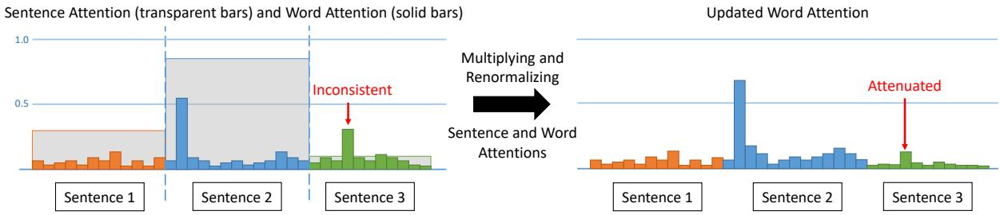
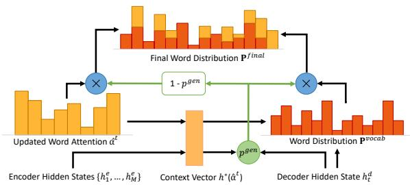

# A Unified Model for Extractive and Abstractive Summarization using Inconsistency Loss

Wan-Ting Hsu1, Chieh-Kai Lin1, Ming-Ying Lee1, Kerui Min2, Jing Tang2, Min Sun1 1 National Tsing Hua University, 2 Cheetah Mobile

{hsuwanting, axk51013, masonyl03}@gapp.nthu.edu.tw, {minkerui, tangjing}@cmcm.com, sunmin@ee.nthu.edu.tw

## Abstract

We propose a unified model combining the strength of extractive and abstractive summarization. On the one hand, a simple extractive model can obtain sentence-level attention with high ROUGE scores but less readable. On the other hand, a more complicated abstractive model can obtain word-level dynamic attention to generate a more readable paragraph. In our model, sentence-level attention is used to modulate the word-level attention such that words in less attended sentences are less likely to be generated. Moreover, a novel inconsistency loss function is introduced to penalize the inconsistency between two levels of attentions. By end-to-end training our model with the inconsistency loss and original losses of extractive and abstractive models, we achieve state-of-theart ROUGE scores while being the most informative and readable summarization on the CNN/Daily Mail dataset in a solid human evaluation.

## 1 Introduction

Text summarization is the task of automatically condensing a piece of text to a shorter version while maintaining the important points. The ability to condense text information can aid many applications such as creating news digests, presenting search results, and generating reports. There are mainly two types of approaches: extractive and abstractive. Extractive approaches assemble summaries directly from the source text typically selecting one whole sentence at a time. In contrast, abstractive approaches can generate novel words and phrases not copied from the source text.

Original Article: McDonald’s says...... The company says it expects the new ‘Artisan Grilled Chicken’ to be in its more than 14,300 U.S. stores by the end of next week, in products including a new sandwich, as well as existing sandwiches, wraps and salads. It says the biggest change is the removal of sodium phosphates, which it said was used to keep the chicken moist, in favor of vegetable starch. The new recipe also does not use maltodextrin, which Mc-Donald’s said is generally used as a sugar to increase browning or as a carrier for seasoning. Jessica Foust, director of culinary innovation at McDonald’s, said the changes were made because customers said they want ‘simple, clean ingredients’ they are familiar with...... And Panera Bread has said it plans to purge artificial colors, flavors and preservatives from its food by 2016......

Extractive Approach: The company says it expects the new ‘Artisan Grilled Chicken’ to be in its more than 14,300 U.S. stores by the end of next week, in products including a new sandwich, as well as existing sandwiches, wraps and salads. It says the biggest change is the removal of sodium phosphates, which it said was used to keep the chicken moist, in favor of vegetable starch. The new recipe also does not use maltodextrin, which Mc-Donald’s said is generally used as a sugar to increase browning or as a carrier for seasoning.

Abstractive Approach: McDonald’s says it expects the new ‘Artisan Grilled Chicken’ to be in its more than 14,300 U.S. stores by the end of next week. The company says the changes were made because customers said they want ‘simple, clean ingredients’ they are familiar with. McDonald’s said it plans to purge artificial colors, flavors and preservatives from its food by 2016.

Unified Approach: McDonald’s says it expects the new ‘Artisan Grilled Chicken’ to be in its more than 14,300 U.S. stores by the end of next week, in products including a new sandwich, as well as existing sandwiches, wraps and salads. It says the biggest change is the removal of sodium phosphates. The new recipe also does not use maltodextrin, which McDonald’s said is generally used as a sugar to increase browning or as a carrier for seasoning.

Figure 1: Comparison of extractive, abstractive, and our unified summaries on a news article. The extractive model picks most important but incoherent or not concise (see blue bold font) sentences. The abstractive summary is readable, concise but still loses or mistakes some facts (see red italics font). The final summary rewritten from fragments (see underline font) has the advantages from both extractive (importance) and abstractive advantage (coherence (see green bold font)).

Hence, abstractive summaries can be more coherent and concise than extractive summaries.

Extractive approaches are typically simpler. They output the probability of each sentence to be selected into the summary. Many earlier works on summarization (Cheng and Lapata, 2016; Nallapati et al., 2016a, 2017; Narayan et al., 2017; Yasunaga et al., 2017) focus on extractive summarization. Among them, Nallapati et al.

(2017) have achieved high ROUGE scores. On the other hand, abstractive approaches (Nallapati et al., 2016b; See et al., 2017; Paulus et al., 2017; Fan et al., 2017; Liu et al., 2017) typically involve sophisticated mechanism in order to paraphrase, generate unseen words in the source text, or even incorporate external knowledge. Neural networks (Nallapati et al., 2017; See et al., 2017) based on the attentional encoder-decoder model (Bahdanau et al., 2014) were able to generate abstractive summaries with high ROUGE scores but suffer from inaccurately reproducing factual details and an inability to deal with outof-vocabulary (OOV) words. Recently, See et al. (2017) propose a pointer-generator model which has the abilities to copy words from source text as well as generate unseen words. Despite recent progress in abstractive summarization, extractive approaches (Nallapati et al., 2017; Yasunaga et al., 2017) and lead-3 baseline (i.e., selecting the first 3 sentences) still achieve strong performance in ROUGE scores.

We propose to explicitly take advantage of the strength of state-of-the-art extractive and abstractive summarization and introduced the following unified model. Firstly, we treat the probability output of each sentence from the extractive model (Nallapati et al., 2017) as sentence-level attention. Then, we modulate the word-level dynamic attention from the abstractive model (See et al., 2017) with sentence-level attention such that words in less attended sentences are less likely to be generated. In this way, extractive summarization mostly benefits abstractive summarization by mitigating spurious word-level attention. Secondly, we introduce a novel inconsistency loss function to encourage the consistency between two levels of attentions. The loss function can be computed without additional human annotation and has shown to ensure our unified model to be mutually beneficial to both extractive and abstractive summarization. On CNN/Daily Mail dataset, our unified model achieves state-of-theart ROUGE scores and outperforms a strong extractive baseline (i.e., lead-3). Finally, to ensure the quality of our unified model, we conduct a solid human evaluation and confirm that our method significantly outperforms recent state-ofthe-art methods in informativity and readability.

To summarize, our contributions are twofold:

• We propose a unified model combining sentence-level and word-level attentions to take advantage of both extractive and abstractive summarization approaches.

• We propose a novel inconsistency loss function to ensure our unified model to be mutually beneficial to both extractive and abstractive summarization. The unified model with inconsistency loss achieves the best ROUGE scores on CNN/Daily Mail dataset and outperforms recent state-of-the-art methods in informativity and readability on human evaluation.

## 2 Related Work

Text summarization has been widely studied in recent years. We first introduce the related works of neural-network-based extractive and abstractive summarization. Finally, we introduce a few related works with hierarchical attention mechanism.

Extractive summarization. Kageb ˚ ack et al. ¨ (2014) and Yin and Pei (2015) use neural networks to map sentences into vectors and select sentences based on those vectors. Cheng and Lapata (2016), Nallapati et al. (2016a) and Nallapati et al. (2017) use recurrent neural networks to read the article and get the representations of the sentences and article to select sentences. Narayan et al. (2017) utilize side information (i.e., image captions and titles) to help the sentence classifier choose sentences. Yasunaga et al. (2017) combine recurrent neural networks with graph convolutional networks to compute the salience (or importance) of each sentence. While some extractive summarization methods obtain high ROUGE scores, they all suffer from low readability.

Abstractive summarization. Rush et al. (2015) first bring up the abstractive summarization task and use attention-based encoder to read the input text and generate the summary. Based on them, Miao and Blunsom (2016) use a variational auto-encoder and Nallapati et al. (2016b) use a more powerful sequence-to-sequence model. Besides, Nallapati et al. (2016b) create a new articlelevel summarization dataset called CNN/Daily Mail by adapting DeepMind question-answering dataset (Hermann et al., 2015). Ranzato et al. (2015) change the traditional training method to directly optimize evaluation metrics (e.g., BLEU and ROUGE). Gu et al. (2016), See et al. (2017) and Paulus et al. (2017) combine pointer networks (Vinyals et al., 2015) into their models to deal with out-of-vocabulary (OOV) words. Chen et al. (2016) and See et al. (2017) restrain their models from attending to the same word to decrease repeated phrases in the generated summary. Paulus et al. (2017) use policy gradient on summarization and state out the fact that high ROUGE scores might still lead to low human evaluation scores. Fan et al. (2017) apply convolutional sequenceto-sequence model and design several new tasks for summarization. Liu et al. (2017) achieve high readability score on human evaluation using generative adversarial networks.

Figure 2: Our unified model combines the word-level and sentence-level attentions. Inconsistency occurs when word attention is high but sentence attention is low (see red arrow).

> **AI Description:**
> **Source:** `assets/_page_2_Figure_0.jpg`
> 
> **Generated:** 2026-05-30 09:40:09
> 
> ---
> 
> The image is a chart that illustrates the concept of Sentence Attention and Word Attention in the context of natural language processing. It shows two sets of attention distributions: Sentence Attention (transparent bars) and Word Attention (solid bars) across three sentences. The chart highlights an inconsistency between the two types of attention, where the Word Attention for Sentence 3 is not aligned with the Sentence Attention. This inconsistency is marked with a red arrow labeled "Inconsistent." The chart also demonstrates the process of multiplying and renormalizing the Sentence and Word Attentions, resulting in an updated Word Attention that is more consistent, as indicated by the red arrow labeled "Attenuated." The chart uses a color-coded system to differentiate between Sentence and Word Attention, with Sentence Attention represented by transparent bars and Word Attention by solid bars.

Hierarchical attention. Attention mechanism was first proposed by Bahdanau et al. (2014). Yang et al. (2016) proposed a hierarchical attention mechanism for document classification. We adopt the method of combining sentence-level and word-level attention in Nallapati et al. (2016b). However, their sentence attention is dynamic, which means it will be different for each generated word. Whereas our sentence attention is fixed for all generated words. Inspired by the high performance of extractive summarization, we propose to use fixed sentence attention.

Our model combines state-of-the-art extractive model (Nallapati et al., 2017) and abstractive model (See et al., 2017) by combining sentencelevel attention from the former and word-level attention from the latter. Furthermore, we design an inconsistency loss to enhance the cooperation between the extractive and abstractive models.

## 3 Our Unified Model

We propose a unified model to combine the strength of both state-of-the-art extractor (Nallapati et al., 2017) and abstracter (See et al., 2017). Before going into details of our model, we first define the tasks of the extractor and abstracter.

Problem definition. The input of both extractor and abstracter is a sequence of words $\begin{array} { r l } { \mathbf { w } } & { { } = } \end{array}$ $[ w _ { 1 } , w _ { 2 } , . . . , w _ { m } , . . . ]$ , where m is the word index. The sequence of words also forms a sequence of sentences $\textbf { s } = ~ [ s _ { 1 } , s _ { 2 } , . . . , s _ { n } , . . . ]$ , where n is the sentence index. The $m ^ { t h }$ word is mapped into the $n ( m ) ^ { t h }$ sentence, where $n ( \cdot )$ is the mapping function. The output of the extractor is the sentencelevel attention $\beta = [ \beta _ { 1 } , \beta _ { 2 } , . . . , \beta _ { n } , . . . ]$ , where $\beta _ { n }$ is the probability of the $n ^ { t h }$ sentence been extracted into the summary. On the other hand, our attention-based abstractor computes word-level attention $\begin{array} { r c l } { { { \bf \alpha } } } & { { { \bf \alpha } } } & { { { \bf \alpha } } } \\ { { { \bf \alpha } } } & { { = } } & { { \left[ \alpha _ { 1 } ^ { t } , \alpha _ { 2 } ^ { t } , . . . , \alpha _ { m } ^ { \bar { t } } , . . . \right] } } \end{array}$ dynamically while generating the $t ^ { t h }$ word in the summary. The output of the abstracter is the summary text $\mathbf { y } = [ y ^ { 1 } , y ^ { 2 } , . . . , y ^ { t } , . . . ]$ , where $y ^ { t }$ is $t ^ { t h }$ word in the summary.

In the following, we introduce the mechanism to combine sentence-level and word-level attentions in Sec. 3.1. Next, we define the novel inconsistency loss that ensures extractor and abstracter to be mutually beneficial in Sec. 3.2. We also give the details of our extractor in Sec. 3.3 and our abstracter in Sec. 3.4. Finally, our training procedure is described in Sec. 3.5.

## 3.1 Combining Attentions

Pieces of evidence (e.g., Vaswani et al. (2017)) show that attention mechanism is very important for NLP tasks. Hence, we propose to explicitly combine the sentence-level $\beta _ { n }$ and word-level $\alpha _ { m } ^ { t }$ attentions by simple scalar multiplication and renormalization. The updated word attention $\hat { \alpha } _ { m } ^ { t }$ is

$$
\hat { \alpha } _ { m } ^ { t } = \frac { \alpha _ { m } ^ { t } \times \beta _ { n ( m ) } } { \sum _ { m } \alpha _ { m } ^ { t } \times \beta _ { n ( m ) } } .\tag{1}
$$

The multiplication ensures that only when both word-level $\alpha _ { m } ^ { t }$ and sentence-level $\beta _ { n }$ attentions are high, the updated word attention $\hat { \alpha } _ { m } ^ { t }$ can be high. Since the sentence-level attention $\beta _ { n }$ from the extractor already achieves high ROUGE scores, $\beta _ { n }$ intuitively modulates the word-level attention $\alpha _ { m } ^ { t }$ to mitigate spurious word-level attention such that words in less attended sentences are less likely to be generated (see Fig. 2). As highlighted in Sec. 3.4, the word-level attention $\hat { \alpha } _ { m } ^ { t }$ significantly affects the decoding process of the abstracter. Hence, an updated word-level attention is our key to improve abstractive summarization.

### Full Page Description (Page 3)

**Source:** `assets/_page_3_Asset_0.jpg`

**Generated:** 2026-05-30 09:39:57

---

The image is a diagram illustrating a neural network architecture, specifically a model that combines word-level and sentence-level recurrent neural networks (RNNs). It shows the flow of information through the network, with GRU (Gated Recurrent Unit) cells at both the word and sentence levels. The diagram includes attention weights at the sentence level, represented by circles with values (0.9, 0.2, 0.5), indicating the importance of each sentence in the overall model. The network processes sequences of words (w1 to w9) through the word-level RNNs, and these outputs are then aggregated and processed further by the sentence-level RNNs. The arrows and connections depict the flow of data and the interactions between different components of the model.

## 3.2 Inconsistency Loss

Instead of only leveraging the complementary nature between sentence-level and word-level attentions, we would like to encourage these two-levels of attentions to be mostly consistent to each other during training as an intrinsic learning target for free (i.e., without additional human annotation). Explicitly, we would like the sentence-level attention to be high when the word-level attention is high. Hence, we design the following inconsistency loss,

$$
L _ { i n c } = - \frac { 1 } { T } \sum _ { t = 1 } ^ { T } \log ( \frac { 1 } { | \mathcal { K } | } \sum _ { m \in \mathcal { K } } \alpha _ { m } ^ { t } \times \beta _ { n ( m ) } ) ,\tag{2}
$$

where K is the set of top K attended words and T is the number of words in the summary. This implicitly encourages the distribution of the wordlevel attentions to be sharp and sentence-level attention to be high. To avoid the degenerated solution for the distribution of word attention to be one-hot and sentence attention to be high, we include the original loss functions for training the extractor $( \ L _ { e x t }$ in Sec. 3.3) and abstracter $( L _ { a b s }$ and $L _ { c o v }$ in Sec. 3.4). Note that Eq. 1 is the only part that the extractor is interacting with the abstracter. Our proposed inconsistency loss facilitates our end-to-end trained unified model to be mutually beneficial to both the extractor and abstracter.

## 3.3 Extractor

Our extractor is inspired by Nallapati et al. (2017). The main difference is that our extractor does not need to obtain the final summary. It mainly needs to obtain a short list of important sentences with a high recall to further facilitate the abstractor. We first introduce the network architecture and the loss function. Finally, we define our ground truth important sentences to encourage high recall.

Architecture. The model consists of a hierarchical bidirectional GRU which extracts sentence representations and a classification layer for predicting the sentence-level attention $\beta _ { n }$ for each sentence (see Fig. 3).

Extractor loss. The following sigmoid cross entropy loss is used,

$$
L _ { e x t } = - \frac { 1 } { N } \sum _ { n = 1 } ^ { N } ( g _ { n } \log \beta _ { n } + ( 1 - g _ { n } ) \log ( 1 - \beta _ { n } ) ) ,\tag{3}
$$

where $g _ { n } \in \{ 0 , 1 \}$ is the ground-truth label for the $n ^ { t h }$ sentence and N is the number of sentences. When $g _ { n } = 1$ , it indicates that the $n ^ { t h }$ sentence should be attended to facilitate abstractive summarization.

Ground-truth label. The goal of our extractor is to extract sentences with high informativity, which means the extracted sentences should contain information that is needed to generate an abstractive summary as much as possible. To obtain the ground-truth labels $\mathbf { g } = \{ g _ { n } \} _ { n }$ , first, we measure the informativity of each sentence $s _ { n }$ in the article by computing the ROUGE-L recall score (Lin, 2004) between the sentence $s _ { n }$ and the reference abstractive summary $\hat { \mathbf { y } } = \{ \hat { y } ^ { t } \} _ { i }$ . Second, we sort the sentences by their informativity and select the sentence in the order of high to low informativity. We add one sentence at a time if the new sentence can increase the informativity of all the selected sentences. Finally, we obtain the ground-truth labels g and train our extractor by minimizing Eq. 3. Note that our method is different from Nallapati et al. (2017) who aim to extract a final summary for an article so they use ROUGE F-1 score to select ground-truth sentences; while we focus on high informativity, hence, we use ROUGE recall score to obtain as much information as possible with respect to the reference summary yˆ.

## 3.4 Abstracter

The second part of our model is an abstracter that reads the article; then, generate a summary word-by-word. We use the pointer-generator network proposed by See et al. (2017) and combine it with the extractor by combining sentence-level and word-level attentions (Sec. 3.1).

Figure 4: Decoding mechanism in the abstracter. In the decoder step t, our updated word attention $\hat { \alpha } ^ { t }$ is used to generate context vector $h ^ { \ast } ( \hat { \alpha } ^ { t } )$ Hence, it updates the final word distribution $\mathbf { P } ^ { f i n a l }$

> **AI Description:**
> **Source:** `assets/_page_4_Figure_0.jpg`
> 
> **Generated:** 2026-05-30 09:40:24
> 
> ---
> 
> The image is a diagram illustrating a process in natural language processing, specifically a model for generating text. It shows a flowchart with labeled components and arrows indicating the flow of information. The diagram includes:
> 
> 1. Encoder Hidden States: Represented as \( \{h_1^e, ..., h_M^e\} \), which are the hidden states from the encoder.
> 2. Word Attention: \( \alpha^t \), which is updated based on the encoder hidden states.
> 3. Word Distribution: \( \mathbf{p}^{vocab} \), representing the probability distribution over the vocabulary.
> 4. Context Vector: \( h^*(\alpha^t) \), which is derived from the updated word attention.
> 5. Decoder Hidden State: \( h_t^d \), which is the hidden state from the decoder.
> 6. Word Distribution: \( \mathbf{p}^{final} \), the final word distribution after processing.
> 7. \( p_{gen} \), which is a probability indicating the generation of a word.
> 
> The diagram uses arrows to show the flow of information from the encoder hidden states through the word attention mechanism, to the context vector, and finally to the decoder hidden state, leading to the final word distribution. The process is iterative, with the updated word attention being used to generate the next word in the sequence.

Pointer-generator network. The pointergenerator network (See et al., 2017) is a specially designed sequence-to-sequence attentional model that can generate the summary by copying words in the article or generating words from a fixed vocabulary at the same time. The model contains a bidirectional LSTM which serves as an encoder to encode the input words w and a unidirectional LSTM which serves as a decoder to generate the summary y. For details of the network architecture, please refer to See et al. (2017). In the following, we describe how the updated word attention $\hat { \alpha } ^ { t }$ affects the decoding process.

Notations. We first define some notations. $h _ { m } ^ { e }$ is the encoder hidden state for the $m ^ { t h }$ word. $h _ { t } ^ { d }$ is the decoder hidden state in step t. $h ^ { \ast } ( \hat { \alpha } ^ { t } ) =$ $\sum _ { m } ^ { M } \hat { \alpha } _ { m } ^ { t } \times h _ { m } ^ { e }$ is the context vector which is a function of the updated word attention $\hat { \alpha } ^ { t }$ $\mathbf { P } ^ { v o c a b } ( h ^ { * } ( \hat { \alpha } ^ { t } ) )$ is the probability distribution over the fixed vocabulary before applying the copying mechanism.

$$
\begin{array} { r l r } {  { \mathbf { P } ^ { v o c a b } ( h ^ { * } ( \hat { \pmb { \alpha } } ^ { t } ) ) } } & { \ c ( 4 ) } \\ & { = \mathrm { s o f t m a x } ( W _ { 2 } ( W _ { 1 } [ h _ { t } ^ { d } , h ^ { * } ( \hat { \pmb { \alpha } } ^ { t } ) ] + b _ { 1 } ) + b _ { 2 } ) , } \end{array}
$$

where $W _ { 1 } , \ W _ { 2 } , \ b _ { 1 }$ and $b _ { 2 }$ are learnable parameters. $\mathbf { P } ^ { v o c a b } = \{ P _ { w } ^ { v o c a b } \} _ { w }$ where $P _ { w } ^ { v o c a b } ( h ^ { * } ( \hat { \alpha } ^ { t } ) )$ is the probability of word w being decoded. $p ^ { g e n } ( h ^ { \ast } ( \hat { \alpha } ^ { t } ) ) ~ \in ~ [ 0 , 1 ]$ is the generating probability (see $\mathrm { E q } . 8$ in See et al. (2017)) and $1 \ : -$ $p ^ { g e n } ( h ^ { * } ( \hat { \alpha } ^ { t } ) )$ is the copying probability.

Final word distribution. $P _ { w } ^ { f i n a l } ( \hat { \alpha } ^ { t } )$ is the final probability of word w being decoded $( \mathrm { i } . \mathrm { e } . , \ y ^ { t } =$ w). It is related to the updated word attention $\hat { \alpha } ^ { t }$ as follows (see Fig. 4),

$$
\begin{array} { r c l } { P _ { w } ^ { f i n a l } ( \hat { \pmb { \alpha } } ^ { t } ) } & { = } & { p ^ { g e n } ( h ^ { \ast } ( \hat { \pmb { \alpha } } ^ { t } ) ) P _ { w } ^ { v o c a b } ( h ^ { \ast } ( \hat { \pmb { \alpha } } ^ { t } ) ) \left( 5 \right) } \\ & { + } & { ( 1 - p ^ { g e n } ( h ^ { \ast } ( \hat { \pmb { \alpha } } ^ { t } ) ) ) \displaystyle \sum _ { m : w _ { m } = w } \hat { \alpha } _ { m } ^ { t } . } \end{array}
$$

Note that ${ \bf P } ^ { f i n a l } = \{ P _ { w } ^ { f i n a l } \} _ { w }$ is the probability distribution over the fixed vocabulary and out-ofvocabulary (OOV) words. Hence, OOV words can be decoded. Most importantly, it is clear from Eq. 5 that $P _ { w } ^ { f i n a l } ( \hat { \alpha } ^ { t } )$ is a function of the updated word attention $\hat { \alpha } ^ { t }$ . Finally, we train the abstracter to minimize the negative log-likelihood:

$$
L _ { a b s } = - \frac { 1 } { T } \sum _ { t = 1 } ^ { T } \log P _ { \hat { y } ^ { t } } ^ { f i n a l } ( \hat { \pmb { \alpha } } ^ { t } ) ~ ,\tag{6}
$$

where $\hat { y } ^ { t }$ is the $t ^ { t h }$ token in the reference abstractive summary.

Coverage mechanism. We also apply coverage mechanism (See et al., 2017) to prevent the abstracter from repeatedly attending to the same place. In each decoder step t, we calculate the coverage vector $\begin{array} { r } { \mathbf { c } ^ { t } = \sum _ { t ^ { \prime } = 0 } ^ { t - 1 } \hat { \pmb { \alpha } } ^ { t ^ { \prime } } } \end{array}$ which indicates so far how much attention has been paid to every input word. The coverage vector $\mathbf { c } ^ { t }$ will be used to calculate word attention $\hat { \alpha } ^ { t }$ (see Eq.11 in See et al. (2017)). Moreover, coverage loss $L _ { c o v }$ is calculated to directly penalize the repetition in updated word attention $\hat { \alpha } ^ { t }$ ·

$$
L _ { c o v } = \frac { 1 } { T } \sum _ { t = 1 } ^ { T } \sum _ { m = 1 } ^ { M } \operatorname* { m i n } ( \hat { \alpha } _ { m } ^ { t } , \mathbf { c } _ { m } ^ { t } ) \ : .\tag{7}
$$

The objective function for training the abstracter with coverage mechanism is the weighted sum of negative log-likelihood and coverage loss.

## 3.5 Training Procedure

We first pre-train the extractor by minimizing $L _ { e x t }$ in Eq. 3 and the abstracter by minimizing $L _ { a b s }$ and $L _ { c o v }$ in Eq. 6 and Eq. 7, respectively. When pre-training, the abstracter takes ground-truth extracted sentences (i.e., sentences with $g _ { n } = 1 )$ as input. To combine the extractor and abstracter, we proposed two training settings : (1) two-stages training and (2) end-to-end training.

Two-stages training. In this setting, we view the sentence-level attention $\beta$ from the pre-trained extractor as hard attention. The extractor becomes a classifier to select sentences with high attention $( \mathrm { i } . \mathrm { e } . , \beta _ { n } >$ threshold). We simply combine the extractor and abstracter by feeding the extracted sentences to the abstracter. Note that we finetune the abstracter since the input text becomes extractive summary which is obtained from the extractor.

End-to-end training. For end-to-end training, the sentence-level attention $\beta$ is soft attention and will be combined with the word-level attention $\alpha ^ { t }$ as described in Sec. 3.1. We end-to-end train the extractor and abstracter by minimizing four loss functions: $L _ { e x t } , \ L _ { a b s } , \ L _ { c o v } ,$ as well as $L _ { i n c }$ in Eq. 2. The final loss is as below:

$$
L _ { e 2 e } = \lambda _ { 1 } L _ { e x t } + \lambda _ { 2 } L _ { a b s } + \lambda _ { 3 } L _ { c o v } + \lambda _ { 4 } L _ { i n c } ,\tag{8}
$$

where $\lambda _ { 1 } , \lambda _ { 2 } , \lambda _ { 3 } , \lambda _ { 4 }$ are hyper-parameters. In our experiment, we give $L _ { e x t }$ a bigger weight (e.g., $\lambda _ { 1 } = 5 )$ when end-to-end training with $L _ { i n c }$ since we found that $L _ { i n c }$ is relatively large such that the extractor tends to ignore $L _ { e x t }$

## 4 Experiments

We introduce the dataset and implementation details of our method evaluated in our experiments.

## 4.1 Dataset

We evaluate our models on the CNN/Daily Mail dataset (Hermann et al., 2015; Nallapati et al., 2016b; See et al., 2017) which contains news stories in CNN and Daily Mail websites. Each article in this dataset is paired with one humanwritten multi-sentence summary. This dataset has two versions: anonymized and non-anonymized. The former contains the news stories with all the named entities replaced by special tokens (e.g., @entity2); while the latter contains the raw text of each news story. We follow See et al. (2017) and obtain the non-anonymized version of this dataset which has 287,113 training pairs, 13,368 validation pairs and 11,490 test pairs.

## 4.2 Implementation Details

We train our extractor and abstracter with 128- dimension word embeddings and set the vocabulary size to 50k for both source and target text. We follow Nallapati et al. (2017) and See et al. (2017) and set the hidden dimension to 200 and 256 for the extractor and abstracter, respectively. We use Adagrad optimizer (Duchi et al., 2011) and apply early stopping based on the validation set. In the testing phase, we limit the length of the summary to 120.

Pre-training. We use learning rate 0.15 when pretraining the extractor and abstracter. For the extractor, we limit both the maximum number of sentences per article and the maximum number of tokens per sentence to 50 and train the model for 27k iterations with the batch size of 64. For the abstracter, it takes ground-truth extracted sentences (i.e., sentences with $g _ { n } = 1 )$ as input. We limit the length of the source text to 400 and the length of the summary to 100 and use the batch size of 16. We train the abstracter without coverage mechanism for 88k iterations and continue training for 1k iterations with coverage mechanism $( L _ { a b s } : L _ { c o v } = 1 : 1 )$

Two-stages training. The abstracter takes extracted sentences with $\beta _ { n } > 0 . 5$ , where $\beta$ is obtained from the pre-trained extractor, as input during two-stages training. We finetune the abstracter for 10k iterations.

End-to-end training. During end-to-end training, we will minimize four loss functions (Eq. 8) with $\lambda _ { 1 } = 5$ and $\lambda _ { 2 } = \lambda _ { 3 } = \lambda _ { 4 } = 1$ We set K to 3 for computing $L _ { i n c }$ . Due to the limitation of the memory, we reduce the batch size to 8 and thus use a smaller learning rate 0.01 for stability. The abstracter here reads the whole article. Hence, we increase the maximum length of source text to 600. We end-to-end train the model for 50k iterations.

## 5 Results

Our unified model not only generates an abstractive summary but also extracts the important sentences in an article. Our goal is that both of the two types of outputs can help people to read and understand an article faster. Hence, in this section, we evaluate the results of our extractor in Sec. 5.1 and unified model in Sec. 5.2. Furthermore, in Sec. 5.3, we perform human evaluation and show that our model can provide a better abstractive summary than other baselines.

## 5.1 Results of Extracted Sentences

To evaluate whether our extractor obtains enough information for the abstracter, we use full-length ROUGE recall scores1 between the extracted sentences and reference abstractive summary. High ROUGE recall scores can be obtained if the extracted sentences include more words or sequences overlapping with the reference abstractive summary. For each article, we select sentences with the sentence probabilities $\beta$ greater than 0.5. We show the results of the ground-truth sentence labels (Sec. 3.3) and our models on the test set of the CNN/Daily Mail dataset in Table 1. Note that the ground-truth extracted sentences can’t get ROUGE recall scores of 100 because reference summary is abstractive and may contain some words and sequences that are not in the article. Our extractor performs the best when end-toend trained with inconsistency loss.

Table 1: ROUGE recall scores of the extracted sentences. pre-trained indicates the extractor trained on the ground-truth labels. end2end indicates the extractor after end-to-end training with the abstracter. Note that ground-truth labels show the upper-bound performance since the reference summary to calculate ROUGE-recall is abstractive. All our ROUGE scores have a 95% confidence interval with at most ±0.33.

Table 2: ROUGE F-1 scores of the generated abstractive summaries on the CNN/Daily Mail test set. Our two-stages model outperforms pointer-generator model on ROUGE-1 and ROUGE-2. In addition, our model trained end-to-end with inconsistency loss exceeds the lead-3 baseline. All our ROUGE scores have a 95% confidence interval with at most ±0.24. ‘∗’ indicates the model is trained and evaluated on the anonymized dataset and thus is not strictly comparable with ours.

## 5.2 Results of Abstractive Summarization

We use full-length ROUGE-1, ROUGE-2 and ROUGE-L F-1 scores to evaluate the generated summaries. We compare our models (two-stage and end-to-end) with state-of-the-art abstractive summarization models (Nallapati et al., 2016b; Paulus et al., 2017; See et al., 2017; Liu et al., 2017) and a strong lead-3 baseline which directly uses the first three article sentences as the summary. Due to the writing style of news articles, the most important information is often written at the beginning of an article which makes lead-3 a strong baseline. The results of ROUGE F-1 scores are shown in Table 2. We prove that with help of the extractor, our unified model can outperform pointer-generator (the third row in Table 2)

even with two-stages training (the fifth row in Table 2). After end-to-end training without inconsistency loss, our method already achieves better ROUGE scores by cooperating with each other. Moreover, our model end-to-end trained with inconsistency loss achieves state-of-the-art ROUGE scores and exceeds lead-3 baseline.

In order to quantify the effect of inconsistency loss, we design a metric – inconsistency rate $R _ { i n c }$ – to measure the inconsistency for each generated summary. For each decoder step t, if the word with maximum attention belongs to a sentence with low attention $( \mathrm { i . e . , } \beta _ { n ( \mathrm { a r g m a x } ( \pmb { \alpha } ^ { t } ) ) } < \mathrm { m e a n } ( \beta ) )$ , we define this step as an inconsistent step $t _ { i n c } .$ The inconsistency rate $R _ { i n c }$ is then defined as the percentage of the inconsistent steps in the summary.

$$
R _ { i n c } = \frac { \mathrm { C o u n t } ( t _ { i n c } ) } { T } ,\tag{9}
$$

where T is the length of the summary. The average inconsistency rates on test set are shown in Table 4. Our inconsistency loss significantly decrease $R _ { i n c }$ from about 20% to 4%. An example of inconsistency improvement is shown in Fig. 5.

Table 3: Comparing human evaluation results with state-of-the-art methods.

Table 4: Inconsistency rate of our end-to-end trained model with and without inconsistency loss.

Figure 5: Visualizing the consistency between sentence and word attentions on the original article. We highlight word (bold font) and sentence (underline font) attentions. We compare our methods trained with and without inconsistency loss. Inconsistent fragments (see red bold font) occur when trained without the inconsistency loss.

## 5.3 Human Evaluation

We perform human evaluation on Amazon Mechanical Turk (MTurk)2 to evaluate the informativity, conciseness and readability of the summaries. We compare our best model (end2end with inconsistency loss) with pointer-generator (See et al., 2017), generative adversarial network (Liu et al., 2017) and deep reinforcement model (Paulus et al., 2017). For these three models, we use the test set outputs provided by the authors3.

We randomly pick 100 examples in the test set. All generated summaries are re-capitalized and de-tokenized. Since Paulus et al. (2017) trained their model on anonymized data, we also recover the anonymized entities and numbers of their outputs.

We show the article and 6 summaries (reference summary, 4 generated summaries and a random summary) to each human evaluator. The random summary is a reference summary randomly picked from other articles and is used as a trap. We show the instructions of three different aspects as: (1) Informativity: how well does the summary capture the important parts of the article? (2) Conciseness: is the summary clear enough to explain everything without being redundant? (3) Readability: how well-written (fluent and grammatical) the summary is? The user interface of our human evaluation is shown in the supplementary material.

We ask the human evaluator to evaluate each summary by scoring the three aspects with 1 to 5 score (higher the better). We reject all the evaluations that score the informativity of the random summary as 3, 4 and 5. By using this trap mechanism, we can ensure a much better quality of our human evaluation. For each example, we first ask 5 human evaluators to evaluate. However, for those articles that are too long, which are always skipped by the evaluators, it is hard to collect 5 reliable evaluations. Hence, we collect at least 3 evaluations for every example. For each summary, we average the scores over different human evaluators.

The results are shown in Table 3. The reference summaries get the best score on conciseness since the recent abstractive models tend to copy sentences from the input articles. However, our model learns well to select important information and form complete sentences so we even get slightly better scores on informativity and readability than the reference summaries. We show a typical example of our model comparing with other state-ofthe-art methods in Fig. 6. More examples (5 using CNN/Daily Mail news articles and 3 using nonnews articles as inputs) are provided in the supplementary material.

Figure 6: Typical Comparison. Our model attended at the most important information (blue bold font) matching well with the reference summary; while other state-of-the-art methods generate repeated or less important information (red italic font).

## 6 Conclusion

We propose a unified model combining the strength of extractive and abstractive summarization. Most importantly, a novel inconsistency loss function is introduced to penalize the inconsistency between two levels of attentions. The inconsistency loss enables extractive and abstractive summarization to be mutually beneficial. By end-to-end training of our model, we achieve the best ROUGE-recall and ROUGE while being the most informative and readable summarization on the CNN/Daily Mail dataset in a solid human evaluation.

## Acknowledgments

We thank the support from Cheetah Mobile, National Taiwan University, and MOST 107-2634-F-007-007, 106-3114-E-007-004, 107-2633-E-002- 001. We thank Yun-Zhu Song for assistance with useful survey and experiment on the task of abstractive summarization.

## References

- Dzmitry Bahdanau, Kyunghyun Cho, and Yoshua Bengio. 2014. Neural machine translation by jointly learning to align and translate. In Proceedings of the 2015 International Conference on Learning Representations.
- Qian Chen, Xiaodan Zhu, Zhenhua Ling, Si Wei, and Hui Jiang. 2016. Distraction-based neural networks for modeling documents. In Proceedings of the Twenty-Fifth International Joint Conference on Artificial Intelligence (IJCAI-16).
- Jianpeng Cheng and Mirella Lapata. 2016. Neural summarization by extracting sentences and words. In Proceedings of the 54th Annual Meeting of the Association for Computational Linguistics (Volume 1: Long Papers), volume 1, pages 484–494.
- John Duchi, Elad Hazan, and Yoram Singer. 2011. Adaptive subgradient methods for online learning and stochastic optimization. Journal of Machine Learning Research, 12(Jul):2121–2159.
- Angela Fan, David Grangier, and Michael Auli. 2017. Controllable abstractive summarization. arXiv preprint arXiv:1711.05217.
- Jiatao Gu, Zhengdong Lu, Hang Li, and Victor OK Li. 2016. Incorporating copying mechanism in sequence-to-sequence learning. In Proceedings of the 54th Annual Meeting of the Association for Computational Linguistics (Volume 1: Long Papers), volume 1, pages 1631–1640.

- Karl Moritz Hermann, Tomas Kocisky, Edward Grefenstette, Lasse Espeholt, Will Kay, Mustafa Suleyman, and Phil Blunsom. 2015. Teaching machines to read and comprehend. In Advances in Neural Information Processing Systems, pages 1693– 1701.
- Mikael Kageb ˚ ack, Olof Mogren, Nina Tahmasebi, and ¨ Devdatt Dubhashi. 2014. Extractive summarization using continuous vector space models. In Proceedings of the 2nd Workshop on Continuous Vector Space Models and their Compositionality (CVSC), pages 31–39.
- Chin-Yew Lin. 2004. Rouge: A package for automatic evaluation of summaries. Text Summarization Branches Out.
- Linqing Liu, Yao Lu, Min Yang, Qiang Qu, Jia Zhu, and Hongyan Li. 2017. Generative adversarial network for abstractive text summarization. In Proceddings of the 2018 Association for the Advancement of Artificial Intelligence.
- Yishu Miao and Phil Blunsom. 2016. Language as a latent variable: Discrete generative models for sentence compression. In Proceedings of the 2016 Conference on Empirical Methods in Natural Language Processing, pages 319–328.
- Ramesh Nallapati, Feifei Zhai, and Bowen Zhou. 2017. Summarunner: A recurrent neural network based sequence model for extractive summarization of documents. In Proceddings of the 2017 Association for the Advancement of Artificial Intelligence, pages 3075–3081.
- Ramesh Nallapati, Bowen Zhou, and Mingbo Ma. 2016a. Classify or select: Neural architectures for extractive document summarization. arXiv preprint arXiv:1611.04244.
- Ramesh Nallapati, Bowen Zhou, Cicero dos Santos, Caglar Gulcehre, and Bing Xiang. 2016b. Abstractive text summarization using sequence-tosequence rnns and beyond. In Proceedings of The 20th SIGNLL Conference on Computational Natural Language Learning, pages 280–290.
- Shashi Narayan, Nikos Papasarantopoulos, Mirella Lapata, and Shay B Cohen. 2017. Neural extractive summarization with side information. arXiv preprint arXiv:1704.04530.
- Romain Paulus, Caiming Xiong, and Richard Socher. 2017. A deep reinforced model for abstractive summarization. In Proceedings of the 2018 International Conference on Learning Representations.
- Marc’Aurelio Ranzato, Sumit Chopra, Michael Auli, and Wojciech Zaremba. 2015. Sequence level training with recurrent neural networks. arXiv preprint arXiv:1511.06732.
- Alexander M Rush, Sumit Chopra, and Jason Weston. 2015. A neural attention model for abstractive sentence summarization. In Proceedings of the 2015 Conference on Empirical Methods in Natural Language Processing, pages 379–389.
- Abigail See, Peter J Liu, and Christopher D Manning. 2017. Get to the point: Summarization with pointergenerator networks. In Proceedings of the 55th Annual Meeting of the Association for Computational Linguistics (Volume 1: Long Papers), volume 1, pages 1073–1083.
- Ashish Vaswani, Noam Shazeer, Niki Parmar, Jakob Uszkoreit, Llion Jones, Aidan N Gomez, Łukasz Kaiser, and Illia Polosukhin. 2017. Attention is all you need. In Advances in Neural Information Processing Systems, pages 6000–6010.
- Oriol Vinyals, Meire Fortunato, and Navdeep Jaitly. 2015. Pointer networks. In Advances in Neural Information Processing Systems, pages 2692–2700.
- Zichao Yang, Diyi Yang, Chris Dyer, Xiaodong He, Alex Smola, and Eduard Hovy. 2016. Hierarchical attention networks for document classification. In Proceedings of the 2016 Conference of the North American Chapter of the Association for Computational Linguistics: Human Language Technologies, pages 1480–1489.
- Michihiro Yasunaga, Rui Zhang, Kshitijh Meelu, Ayush Pareek, Krishnan Srinivasan, and Dragomir Radev. 2017. Graph-based neural multi-document summarization. In Proceedings of the 21st Conference on Computational Natural Language Learning (CoNLL 2017), pages 452–462.
- Wenpeng Yin and Yulong Pei. 2015. Optimizing sentence modeling and selection for document summarization. In Proceedings of the 24th International Joint Conference on Artificial Intelligence, pages 1383–1389. AAAI Press.