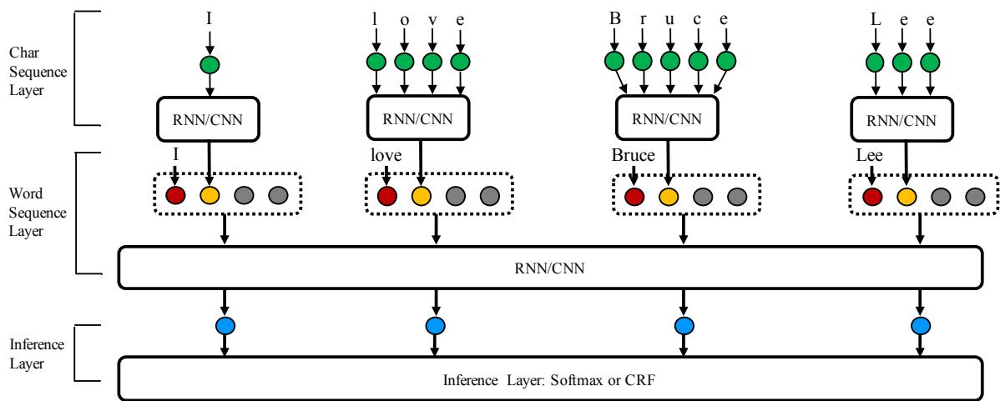

# NCRF++: An Open-source Neural Sequence Labeling Toolkit

Jie Yang and Yue Zhang Singapore University of Technology and Design jie yang@mymail.sutd.edu.sg yue zhang@sutd.edu.sg

## Abstract

This paper describes NCRF++, a toolkit for neural sequence labeling. NCRF++ is designed for quick implementation of different neural sequence labeling models with a CRF inference layer. It provides users with an inference for building the custom model structure through configuration file with flexible neural feature design and utilization. Built on PyTorch1, the core operations are calculated in batch, making the toolkit efficient with the acceleration of GPU. It also includes the implementations of most state-of-the-art neural sequence labeling models such as LSTM-CRF, facilitating reproducing and refinement on those methods.

## 1 Introduction

Sequence labeling is one of the most fundamental NLP models, which is used for many tasks such as named entity recognition (NER), chunking, word segmentation and part-of-speech (POS) tagging. It has been traditionally investigated using statistical approaches (Lafferty et al., 2001; Ratinov and Roth, 2009), where conditional random fields (CRF) (Lafferty et al., 2001) has been proven as an effective framework, by taking discrete features as the representation of input sequence (Sha and Pereira, 2003; Keerthi and Sundararajan, 2007).

With the advances of deep learning, neural sequence labeling models have achieved state-ofthe-art for many tasks (Ling et al., 2015; Ma and Hovy, 2016; Peters et al., 2017). Features are extracted automatically through network structures including long short-term memory (LSTM) (Hochreiter and Schmidhuber, 1997) and convolution neural network (CNN) (LeCun et al., 1989),

##NetworkConfiguration##   
use crf=True   
word seq feature=LSTM   
word seq layer=1   
char seq feature=CNN   
feature=[POS] emb dir=None emb size=10   
feature=[Cap] emb dir=%(cap emb dir)   
##Hyperparameters##

Figure 1: Configuration file segment

with distributed word representations. Similar to discrete models, a CRF layer is used in many state-of-the-art neural sequence labeling models for capturing label dependencies (Collobert et al., 2011; Lample et al., 2016; Peters et al., 2017).

There exist several open-source statistical CRF sequence labeling toolkits, such as $\mathrm { C R F } { + + } ^ { 2 }$ , CRF-Suite (Okazaki, 2007) and FlexCRFs (Phan et al., 2004), which provide users with flexible means of feature extraction, various training settings and decoding formats, facilitating quick implementation and extension on state-of-the-art models. On the other hand, there is limited choice for neural sequence labeling toolkits. Although many authors released their code along with their sequence labeling papers (Lample et al., 2016; Ma and Hovy, 2016; Liu et al., 2018), the implementations are mostly focused on specific model structures and specific tasks. Modifying or extending can need enormous coding.

In this paper, we present Neural CRF++ (NCRF++)3, a neural sequence labeling toolkit based on PyTorch, which is designed for solving general sequence labeling tasks with effective and efficient neural models. It can be regarded as the neural version of CRF++, with both take the CoNLL data format as input and can add handcrafted features to CRF framework conveniently. We take the layerwise implementation, which includes character sequence layer, word sequence layer and inference layer. NCRF++ is:

Figure 2: NCRF++ for sentence “I love Bruce Lee”. Green, red, yellow and blue circles represent character embeddings, word embeddings, character sequence representations and word sequence representations, respectively. The grey circles represent the embeddings of sparse features.

> **AI Description:**
> **Source:** `assets/_page_1_Figure_0.jpg`
> 
> **Generated:** 2026-05-30 10:10:41
> 
> ---
> 
> The image is a diagram illustrating a neural network architecture for character-level and word-level sequence modeling. It consists of three main layers: the Character Sequence Layer, the Word Sequence Layer, and the Inference Layer. The Character Sequence Layer processes individual characters using RNN/CNN models, while the Word Sequence Layer processes sequences of characters to form words. The Inference Layer, which can be either a Softmax or a Conditional Random Field (CRF), is used to make predictions based on the outputs from the previous layers. The diagram visually represents how the network processes the words "I", "love", "Bruce", and "Lee" at the character and word levels.

• Fully configurable: users can design their neural models only through a configuration file without any code work. Figure 1 shows a segment of the configuration file. It builds a LSTM-CRF framework with CNN to encode character sequence (the same structure as Ma and Hovy (2016)), plus POS and Cap features, within 10 lines. This demonstrates the convenience of designing neural models using NCRF++.

• Flexible with features: human-defined features have been proved useful in neural sequence labeling (Collobert et al., 2011; Chiu and Nichols, 2016). Similar to the statistical toolkits, NCRF++ supports user-defined features but using distributed representations through lookup tables, which can be initialized randomly or from external pretrained embeddings (embedding directory: emb dir in Figure 1). In addition, NCRF++ integrates several state-of-the-art automatic feature extractors, such as CNN and LSTM for character sequences, leading easy reproduction of many recent work (Lample et al., 2016; Chiu and Nichols, 2016; Ma and Hovy, 2016).

• Effective and efficient: we reimplement several state-of-the-art neural models (Lample et al., 2016; Ma and Hovy, 2016) using NCRF++. Experiments show models built in NCRF++ give comparable performance with reported results in the literature. Besides, NCRF++ is implemented using batch calculation, which can be accelerated using GPU. Our experiments demonstrate that NCRF++ as an effective and efficient toolkit.

• Function enriched: NCRF++ extends the Viterbi algorithm (Viterbi, 1967) to enable decoding n best sequence labels with their probabilities.

Taking NER, Chunking and POS tagging as typical examples, we investigate the performance of models built in NCRF++, the influence of humandefined and automatic features, the performance of nbest decoding and the running speed with the batch size. Detail results are shown in Section 3.

## 2 NCRF++ Architecture

The framework of NCRF++ is shown in Figure 2. NCRF++ is designed with three layers: a character sequence layer; a word sequence layer and inference layer. For each input word sequence, words are represented with word embeddings. The character sequence layer can be used to automatically extract word level features by encoding the character sequence within the word. Arbitrary handcrafted features such as capitalization [Cap], POS tag [POS], prefixes [Pre] and suffixes [Suf] are also supported by NCRF++. Word representations are the concatenation of word embeddings (red circles), character sequence encoding hidden vector (yellow circles) and handcrafted neural features (grey circles). Then the word sequence layer takes the word representations as input and extracts the sentence level features, which are fed into the inference layer to assign a label to each word. When building the network, users only need to edit the configuration file to configure the model structure, training settings and hyperparameters. We use layer-wised encapsulation in our implementation. Users can extend NCRF++ by defining their own structure in any layer and integrate it into NCRF++ easily.

## 2.1 Layer Units

## 2.1.1 Character Sequence Layer

The character sequence layer integrates several typical neural encoders for character sequence information, such as RNN and CNN. It is easy to select our existing encoder through the configuration file (by setting char seq feature in Figure 1). Characters are represented by character embeddings (green circles in Figure 2), which serve as the input of character sequence layer.

Character RNN and its variants Gated Recurrent Unit (GRU) and LSTM are supported by NCRF++. The character sequence layer uses bidirectional RNN to capture the left-to-right and right-to-left sequence information, and concatenates the final hidden states of two RNNs as the encoder of the input character sequence.

• Character CNN takes a sliding window to capture local features, and then uses a max-pooling for aggregated encoding of the character sequence.

## 2.1.2 Word Sequence Layer

Similar to the character sequence layer, NCRF++ supports both RNN and CNN as the word sequence feature extractor. The selection can be configurated through word seq feature in Figure 1. The input of the word sequence layer is a word representation, which may include word embeddings, character sequence representations and handcrafted neural features (the combination depends on the configuration file). The word sequence layer can be stacked, building a deeper feature extractor.

• Word RNN together with GRU and LSTM are available in NCRF++, which are popular structures in the recent literature (Huang et al., 2015; Lample et al., 2016; Ma and Hovy, 2016; Yang et al., 2017). Bidirectional RNNs are supported to capture the left and right contexted information of each word. The hidden vectors for both directions on each word are concatenated to represent the corresponding word.

• Word CNN utilizes the same sliding window as character CNN, while a nonlinear function (Glorot et al., 2011) is attached with the extracted features. Batch normalization (Ioffe and Szegedy, 2015) and dropout (Srivastava et al., 2014) are also supported to follow the features.

## 2.1.3 Inference Layer

The inference layer takes the extracted word sequence representations as features and assigns labels to the word sequence. NCRF++ supports both softmax and CRF as the output layer. A linear layer firstly maps the input sequence representations to label vocabulary size scores, which are used to either model the label probabilities of each word through simple softmax or calculate the label score of the whole sequence.

• Softmax maps the label scores into a probability space. Due to the support of parallel decoding, softmax is much more efficient than CRF and works well on some sequence labeling tasks (Ling et al., 2015). In the training process, various loss functions such as negative likelihood loss, cross entropy loss are supported.

• CRF captures label dependencies by adding transition scores between neighboring labels. NCRF++ supports CRF trained with the sentencelevel maximum log-likelihood loss. During the decoding process, the Viterbi algorithm is used to search the label sequence with the highest probability. In addition, NCRF++ extends the decoding algorithm with the support of nbest output.

## 2.2 User Interface

NCRF++ provides users with abundant network configuration interfaces, including the network structure, input and output directory setting, training settings and hyperparameters. By editing a configuration file, users can build most state-ofthe-art neural sequence labeling models. On the other hand, all the layers above are designed as “plug-in” modules, where user-defined layer can be integrated seamlessly.

## 2.2.1 Configuration

• Networks can be configurated in the three layers as described in Section 2.1. It controls the choice of neural structures in character and word levels with char seq feature and word seq feature, respectively. The inference layer is set by use crf. It also defines the usage of handcrafted features and their properties in feature.

• I/O is the input and output file directory configuration. It includes training dir, dev dir, test dir, raw dir, pretrained character or word embedding (char emb dim or word emb dim), and decode file directory (decode dir).

Table 1: Results on three benchmarks.

Training includes the loss function (loss function), optimizer (optimizer)4 shuffle training instances train shuffle and average batch loss ave batch loss.

• Hyperparameter includes most of the parameters in the networks and training such as learning rate (lr) and its decay (lr decay), hidden layer size of word and character (hidden dim and char hidden dim), nbest size (nbest), batch size (batch size), dropout (dropout), etc. Note that the embedding size of each handcrafted feature is configured in the networks configuration (feature=[POS] emb dir=None emb size=10 in Figure 1).

## 2.2.2 Extension

Users can write their own custom modules on all three layers, and user-defined layers can be integrated into the system easily. For example, if a user wants to define a custom character sequence layer with a specific neural structure, he/she only needs to implement the part between input character sequence indexes to sequence representations. All the other networks structures can be used and controlled through the configuration file. A README file is given on this.

## 3 Evaluation

## 3.1 Settings

To evaluate the performance of our toolkit, we conduct the experiments on several datasets. For NER task, CoNLL 2003 data (Tjong Kim Sang and De Meulder, 2003) with the standard split is used. For the chunking task, we perform experiments on CoNLL 2000 shared task (Tjong Kim Sang and Buchholz, 2000), data split is following Reimers and Gurevych (2017). For POS tagging, we use the same data and split with Ma and Hovy (2016). We test different combinations of character representations and word sequence representations on these three benchmarks. Hyperparameters are mostly following Ma and Hovy (2016) and almost keep the same in all these experiments5. Standard SGD with a decaying learning rate is used as the optimizer.

Table 2: Results using different features.

## 3.2 Results

Table 1 shows the results of six CRF-based models with different character sequence and word sequence representations on three benchmarks. State-of-the-art results are also listed. In this table, “Nochar” suggests a model without character sequence information. “CLSTM” and “CCNN” represent models using LSTM and CNN to encode character sequence, respectively. Similarly, “WL-STM” and “WCNN” indicate that the model uses LSTM and CNN to represent word sequence, respectively.

As shown in Table 1, “WCNN” based models consistently underperform the “WLSTM” based models, showing the advantages of LSTM on capturing global features. Character information can improve model performance significantly, while using LSTM or CNN give similar improvement. Most of state-of-the-art models utilize the framework of word LSTM-CRF with character LSTM or CNN features (correspond to “CLSTM+WLSTM+CRF” and “CCNN+WLSTM+CRF” of our models) (Lample et al., 2016; Ma and Hovy, 2016; Yang et al., 2017; Peters et al., 2017). Our implementations can achieve comparable results, with better NER and chunking performances and slightly lower POS tagging accuracy. Note that we use almost the same hyperparameters across all the experiments to achieve the results, which demonstrates the robustness of our implementation. The full experimental results and analysis are published in Yang et al. (2018).

### Full Page Description (Page 4)

**Source:** `assets/_page_4_Asset_0.jpg`

**Generated:** 2026-05-30 10:11:00

---

The image is a line graph with two distinct lines representing different metrics: Token Accuracy and Entity F1-value. The x-axis is labeled "N best," indicating the number of best hypotheses considered, ranging from 1 to 10. The y-axis is labeled "Oracle scores," which likely represents the performance scores for the metrics. The Token Accuracy line is represented by blue dots connected by a dashed line, and it shows a slight upward trend as the number of best hypotheses increases. The Entity F1-value line is represented by red triangles connected by a dashed line, and it shows a more pronounced upward trend, with a steeper increase as the number of best hypotheses increases. The graph suggests that both metrics improve as more hypotheses are considered, with Token Accuracy showing a more gradual improvement compared to Entity F1-value.

### Full Page Description (Page 4)

**Source:** `assets/_page_4_Asset_1.jpg`

**Generated:** 2026-05-30 10:10:49

---

The image is a bar chart comparing decoding speed and training speed across different batch sizes. The x-axis represents the batch size, ranging from 1 to 200, while the y-axis measures the speed in sentences per second (sent/s). The blue bars represent decoding speed, and the red bars represent training speed. As the batch size increases, both decoding and training speeds generally increase, with decoding speeds consistently higher than training speeds across all batch sizes.

## 3.3 Influence of Features

We also investigate the influence of different features on system performance. Table 2 shows the results on the NER task. POS tag and capital indicator are two common features on NER tasks (Collobert et al., 2011; Huang et al., 2015; Strubell et al., 2017). In our implementation, each POS tag or capital indicator feature is mapped as 10- dimension feature embeddings through randomly initialized feature lookup table 6. The feature embeddings are concatenated with the word embeddings as the representation of the corresponding word. Results show that both human features [POS] and [Cap] can contribute the NER system, this is consistent with previous observations (Collobert et al., 2011; Chiu and Nichols, 2016). By utilizing LSTM or CNN to encode character sequence automatically, the system can achieve better performance on NER task.

## 3.4 N best Decoding

We investigate nbest Viterbi decoding on NER dataset through the best model “CCNN+WLSTM+CRF”. Figure 3 shows the oracle entity F1-values and token accuracies with different nbest sizes. The oracle F1-value rises significantly with the increasement of nbest size, reaching 97.47% at n = 10 from the baseline of 91.35%. The token level accuracy increases from 98.00% to 99.39% in 10-best. Results show that the nbest outputs include the gold entities and labels in a large coverage, which greatly enlarges the performance of successor tasks.

## 3.5 Speed with Batch Size

As NCRF++ is implemented on batched calculation, it can be greatly accelerated through parallel computing through GPU. We test the system speeds on both training and decoding process on NER dataset using a Nvidia GTX 1080 GPU. As shown in Figure 4, both the training and the decoding speed can be significantly accelerated through a large batch size. The decoding speed reaches saturation at batch size 100, while the training speed keeps growing. The decoding speed and training speed of NCRF++ are over 2000 sentences/second and 1000 sentences/second, respectively, demonstrating the efficiency of our implementation.

## 4 Conclusion

We presented NCRF++, an open-source neural sequence labeling toolkit, which has a CRF architecture with configurable neural representation layers. Users can design custom neural models through the configuration file. NCRF++ supports flexible feature utilization, including handcrafted features and automatically extracted features. It can also generate nbest label sequences rather than the best one. We conduct a series of experiments and the results show models built on NCRF++ can achieve state-of-the-art results with an efficient running speed.

## References

- Jason Chiu and Eric Nichols. 2016. Named entity recognition with bidirectional LSTM-CNNs. Transactions of the Association for Computational Linguistics 4:357–370. https://transacl.org/ojs/index.php/tacl/article/view/792.
- Ronan Collobert, Jason Weston, Leon Bottou, Michael ´ Karlen, Koray Kavukcuoglu, and Pavel Kuksa. 2011. Natural language processing (almost) from scratch. Journal of Machine Learning Research 12(Aug):2493–2537.
- Xavier Glorot, Antoine Bordes, and Yoshua Bengio. 2011. Deep sparse rectifier neural networks. In International Conference on Artificial Intelligence and Statistics. pages 315–323.
- Sepp Hochreiter and Jurgen Schmidhuber. 1997. ¨ Long short-term memory. Neural computation 9(8):1735–1780.
- Zhiheng Huang, Wei Xu, and Kai Yu. 2015. Bidirectional LSTM-CRF models for sequence tagging. arXiv preprint arXiv:1508.01991 .
- Sergey Ioffe and Christian Szegedy. 2015. Batch normalization: Accelerating deep network training by reducing internal covariate shift. In International Conference on Machine Learning. pages 448–456.
- S Sathiya Keerthi and Sellamanickam Sundararajan. 2007. Crf versus svm-struct for sequence labeling. Yahoo Research Technical Report .
- John Lafferty, Andrew McCallum, and Fernando CN Pereira. 2001. Conditional random fields: Probabilistic models for segmenting and labeling sequence data. In International Conference on Machine Learning. volume 1, pages 282–289.
- Guillaume Lample, Miguel Ballesteros, Sandeep Subramanian, Kazuya Kawakami, and Chris Dyer. 2016. Neural architectures for named entity recognition. In NAACL-HLT. pages 260–270.
- Yann LeCun, Bernhard Boser, John S Denker, Donnie Henderson, Richard E Howard, Wayne Hubbard, and Lawrence D Jackel. 1989. Backpropagation applied to handwritten zip code recognition. Neural computation 1(4):541–551.
- Wang Ling, Chris Dyer, Alan W Black, Isabel Trancoso, Ramon Fermandez, Silvio Amir, Luis Marujo, and Tiago Luis. 2015. Finding function in form: Compositional character models for open vocabulary word representation. In EMNLP. pages 1520– 1530.
- Liyuan Liu, Jingbo Shang, Frank Xu, Xiang Ren, Huan Gui, Jian Peng, and Jiawei Han. 2018. Empower sequence labeling with task-aware neural language model. In AAAI.
- Xuezhe Ma and Eduard Hovy. 2016. End-to-end sequence labeling via Bi-directional LSTM-CNNs-CRF. In ACL. volume 1, pages 1064–1074.
- Naoaki Okazaki. 2007. Crfsuite: a fast implementation of conditional random fields (crfs) .
- Matthew Peters, Waleed Ammar, Chandra Bhagavatula, and Russell Power. 2017. Semi-supervised sequence tagging with bidirectional language models. In ACL. volume 1, pages 1756–1765.
- Xuan-Hieu Phan, Le-Minh Nguyen, and Cam-Tu Nguyen. 2004. Flexcrfs: Flexible conditional random fields.
- Lev Ratinov and Dan Roth. 2009. Design challenges and misconceptions in named entity recognition. In CoNLL. pages 147–155.
- Nils Reimers and Iryna Gurevych. 2017. Reporting score distributions makes a difference: Performance study of lstm-networks for sequence tagging. In EMNLP. pages 338–348.
- Fei Sha and Fernando Pereira. 2003. Shallow parsing with conditional random fields. In NAACL-HLT. pages 134–141.
- Nitish Srivastava, Geoffrey E Hinton, Alex Krizhevsky, Ilya Sutskever, and Ruslan Salakhutdinov. 2014. Dropout: a simple way to prevent neural networks from overfitting. Journal of Machine Learning Research 15(1):1929–1958.
- Emma Strubell, Patrick Verga, David Belanger, and Andrew McCallum. 2017. Fast and accurate entity recognition with iterated dilated convolutions. In EMNLP. pages 2670–2680.
- Erik F Tjong Kim Sang and Sabine Buchholz. 2000. Introduction to the conll-2000 shared task: Chunking. In Proceedings of the 2nd workshop on Learning language in logic and the 4th conference on Computational natural language learning-Volume 7. pages 127–132.
- Erik F Tjong Kim Sang and Fien De Meulder. 2003. Introduction to the conll-2003 shared task: Language-independent named entity recognition. In HLT-NAACL. pages 142–147.
- Andrew Viterbi. 1967. Error bounds for convolutional codes and an asymptotically optimum decoding algorithm. IEEE transactions on Information Theory 13(2):260–269.
- Jie Yang, Shuailong Liang, and Yue Zhang. 2018. Design challenges and misconceptions in neural sequence labeling. In COLING.
- Zhilin Yang, Ruslan Salakhutdinov, and William W Cohen. 2017. Transfer learning for sequence tagging with hierarchical recurrent networks. In International Conference on Learning Representations.