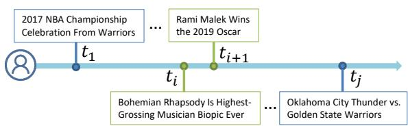
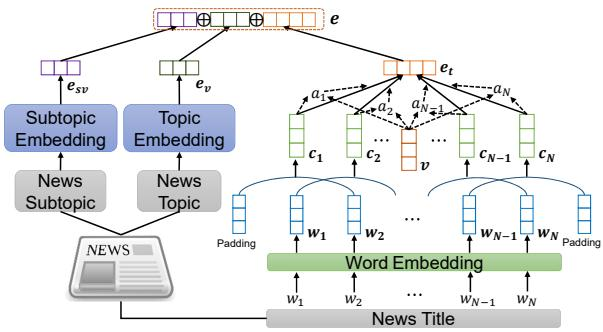
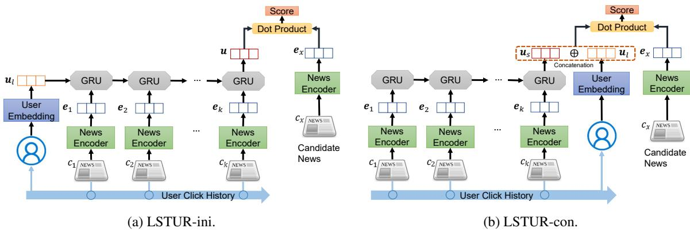

# Neural News Recommendation with Long- and Short-term User Representations

Mingxiao An1,\*, Fangzhao Wu2, Chuhan Wu3, Kun Zhang1, Zheng Liu2, Xing Xie2 1University of Science and Technology of China, Hefei 230026, China 2Microsoft Research Asia, Beijing 100080, China

3Department of Electronic Engineering, Tsinghua University, Beijing 100084, China {anmx,zhkun}@mail.ustc.edu.cn, wufangzhao@gmail.com wuch15@mails.tsinghua.edu.cn, {zhengliu,xingx}@microsoft.com

## Abstract

Personalized news recommendation is important to help users find their interested news and improve reading experience. A key problem in news recommendation is learning accurate user representations to capture their interests. Users usually have both long-term preferences and short-term interests. However, existing news recommendation methods usually learn single representations of users, which may be insufficient. In this paper, we propose a neural news recommendation approach which can learn both long- and short-term user representations. The core of our approach is a news encoder and a user encoder. In the news encoder, we learn representations of news from their titles and topic categories, and use attention network to select important words. In the user encoder, we propose to learn long-term user representations from the embeddings of their IDs. In addition, we propose to learn short-term user representations from their recently browsed news via GRU network. Besides, we propose two methods to combine long-term and short-term user representations. The first one is using the long-term user representation to initialize the hidden state of the GRU network in short-term user representation. The second one is concatenating both long- and short-term user representations as a unified user vector. Extensive experiments on a real-world dataset show our approach can effectively improve the performance of neural news recommendation.

## 1 Introduction

Online news platforms such as MSN News1 and Google News2 which aggregate news from various sources and distribute them to users have gained huge popularity and attracted hundreds of millions of users (Das et al., 2007; Wang et al., 2018). However, massive news are generated everyday, making it impossible for users to read through all news (Lian et al., 2018). Thus, personalized news recommendation is very important for online news platforms to help users find their interested contents and alleviate information overload (Lavie et al., 2010; Zheng et al., 2018).

Figure 1: An illustrative example of long-term and short-term interests in news reading.

> **AI Description:**
> **Source:** `assets/_page_0_Figure_0.jpg`
> 
> **Generated:** 2026-05-30 10:16:23
> 
> ---
> 
> The image is a timeline diagram with several labeled points and events. The timeline is marked with time intervals \( t_1, t_i, t_{i+1}, \) and \( t_j \). Key events are annotated at these points, including:
> 
> - "2017 NBA Championship Celebration From Warriors" at \( t_1 \)
> - "Rami Malek Wins the 2019 Oscar" at \( t_{i+1} \)
> - "Bohemian Rhapsody Is Highest-Grossing Musician Biopic Ever" at \( t_i \)
> - "Oklahoma City Thunder vs. Golden State Warriors" at \( t_j \)
> 
> The diagram uses a horizontal line to represent the timeline and circles to mark the specific points in time. The text provides historical and cultural milestones, suggesting the timeline is used to illustrate significant events over time.

Learning accurate user representations is critical for news recommendation (Okura et al., 2017). Existing news recommendation methods usually learn a single representation for each user (Okura et al., 2017; Lian et al., 2018; Wu et al., 2019). For example, Okura et al. (2017) proposed to learn representations of news using denoising autoencoder and learn representations of users from their browsed news using GRU network (Cho et al., 2014). However, it is very difficult for RNN networks such as GRU to capture the entire information of very long news browsing history. Wang et al. (2018) proposed to learn the representations of news using knowledge-aware convolutional neural network (CNN), and learn the representations of users from their browsed news based on the similarities between the candidate news and the browsed news. However, this method needs to store the entire browsing history of each user in the online news recommendation stage, which may bring huge challenge to the storage and may cause heavy latency.

Our work is motivated by the observation that the interests of online users in news are very diverse. Some user interests may last for a long time and are consistent for the same user (Li et al., 2014). For example, as shown in Fig. 1, if a user is a fan of “Golden State Warriors”, this user may tend to read many basketball news about this NBA team for several years. We call this kind of user preferences as long-term interest. In addition, many user interests may evolve with time and may be triggered by specific contexts or temporal demands. For example, in Fig. 1, the browsing of the news on movie “Bohemian Rhapsody” causes the user reading several related news such as “Rami Malek Wins the 2019 Oscar” since “Rami Malek” is an important actor in this movie, although this user may never read news about “Rami Malek” before. We call this kind of user interests as shortterm interest. Thus, both long-term and shortterm user interests are important for personalized news recommendation, and distinguishing longterm user interests from short-term ones may help learn more accurate user representations.

In this paper, we propose a neural news recommendation approach with both long- and shortterm user representations (LSTUR). Our approach contains two major components, i.e., a news encoder and a user encoder. The news encoder is used to learn representations of news articles from their titles and topic categories. We apply attention mechanism to the news encoder to learn informative news representations by selecting important words. The user encoder consists of two modules, i.e., a long-term user representation (LTUR) module and a short-term user representation (STUR) module. In STUR, we use a GRU network to learn short-term representations of users from their recently browsing news. In LTUR, we learn the long-term representations of users from the embeddings of their IDs. In addition, we propose two methods to combine the short-term and longterm user representations. The first one is using the long-term user representations to initialize the hidden state of GRU network in the STUR model. The second one is concatenating the long-tern and short-term user representations as a unified user vector. We conducted extensive experiments on a real-world dataset. The experimental results show our approach can effectively improve the performance of news recommendation and consistently outperform many baseline methods.

## 2 Related Works

Personalized news recommendation is an important task in natural language processing field and has wide applications (Zheng et al., 2018). It is critical for news recommendation methods to learn accurate news and user representations (Wang et al., 2018). Many conventional news recommendation methods rely on manual feature engineering to build news and user representations (Phelan et al., 2009; Liu et al., 2010; Li et al., 2010; Son et al., 2013; Li et al., 2014; Bansal et al., 2015; Lian et al., 2018). For example, Liu et al. (2010) proposed to use the topic categories and interests features predicted by a Bayesian model to represent news, and use the click distribution features of news categories to represent users. Li et al. (2014) used a Latent Dirichlet Allocation (LDA) (Blei et al., 2003) model to generate topic distribution features as the news representations. They represented a session by using the topic distribution of browsed news in this session, and the representations of users were built from their session representations weighted by the time. However, these methods heavily rely on manual feature engineering, which needs massive domain knowledge to craft. In addition, the contexts and orders of words in news are not incorporated, which are important for understanding the semantic meanings of news and learning representations of news and users.

In recent years, several deep learning methods were proposed for personalized news recommendation (Wang et al., 2018; Okura et al., 2017; Zheng et al., 2018). For example, Okura et al. (2017) proposed to learn representations of news from news bodies using denoising autoencoder, and learn representations of users from the representations of their browsed news using a GRU network. Wang et al. (2018) proposed to learn representations of news from their titles via a knowledge-aware CNN network, and learn representations of users from the representations of their browsed news articles weighted by their similarities with the candidate news. Wu et al. (2019) proposed to learn news and user representations with personalized word- and news-level attention networks, which exploits the embedding of user ID to generate the query vector for the attentions. However, these methods usually learn a single representation vector for each user, and cannot distinguish the long-term preferences and short-term interests of users in reading news. Thus, the user representations learned in these methods may be insufficient for news recommendation. Different from these methods, our approach can learn both long-term and short-term user representations in a unified framework to capture the diverse interests of users for personalized neural new commendation. Extensive experiments on the real-world dataset validate the effectiveness of our approach and the advantage over many baseline methods.

## 3 Our Approach

In this section, we present our neural news recommendation approach with long- and short-term user representations (LSTUR). Our approach contains two major components, i.e., a news encoder to learn representations of news and a user encoder to learn representations of users. Next, we introduce each component in detail.

## 3.1 News Encoder

The news encoder is used to learn representations of news from their titles, topic and subtopic categories. The architecture of the news encoder in our approach is illustrated in Fig. 2. There are two sub-modules in the news encoder, i.e., a title encoder and a topic encoder.

The title encoder is used to learn news representations from titles. There are three layers in the title encoder. The first layer is word embedding, which is used to convert a news title from a word sequence into a sequence of dense semantic vectors. Denote the word sequence in a news title t as $t = [ w _ { 1 } , w _ { 2 } , \dots , w _ { N } ]$ , where N is the length of this title. It is transformed into $[ { \pmb w } _ { 1 } , { \pmb w } _ { 2 } , \dots , { \pmb w } _ { N } ]$ via a word embedding matrix.

The second layer in title encoder is a convolutional neural network (CNN) (LeCun et al., 2015). Local contexts are very useful for understanding the semantic meaning of news titles. For example, in the news title “Next season of super bowl games”, the local contexts of “bowl” such as “super” and “games” are very important for inferring that it belongs to a sports event name. Thus, we apply a CNN network to learn contextual word representations by capturing the local context information. Denote the contextual representation of wi as $c _ { i } .$ , which is computed as follows:

$$
\pmb { c } _ { i } = \mathrm { R e L U } ( \pmb { C } \times \pmb { w } _ { [ i - M : i + M ] } + \pmb { b } ) ,\tag{1}
$$

where $\pmb { w } _ { [ i - M : i + M ] }$ is the concatenation of the embeddings of words between position $i - M$ and i + M. C and b are the parameters of the convolutional filters in CNN, and M is the window size.

Figure 2: The framework of the news encoder.

> **AI Description:**
> **Source:** `assets/_page_2_Figure_0.jpg`
> 
> **Generated:** 2026-05-30 10:17:35
> 
> ---
> 
> The image is a diagram illustrating a neural network architecture for news topic and subtopic prediction. It includes several key components:
> 
> 1. **Input Layers**: The diagram shows the input layers, which include "Subtopic Embedding," "Topic Embedding," and "Word Embedding." These are represented by boxes with arrows pointing to them, indicating the flow of data.
> 
> 2. **Word Embedding Layer**: This layer is shown at the bottom of the diagram, with a series of boxes labeled \( w_1, w_2, \ldots, w_N \), representing word embeddings for a news title.
> 
> 3. **Subtopic and Topic Embeddings**: These are fed into the network, with the subtopic embedding \( e_{sv} \) and topic embedding \( e_v \) being combined and then passed to the next layer.
> 
> 4. **Attention Mechanism**: The diagram includes an attention mechanism, represented by the orange box labeled \( e_t \) and the dashed lines connecting it to the word embeddings \( c_1, c_2, \ldots, c_N \). This mechanism is used to focus on specific parts of the input sequence.
> 
> 5. **Output Layer**: The final output \( a_1, a_2, \ldots, a_N \) represents the predicted subtopic and topic scores for each word in the news title.
> 
> The diagram effectively visualizes the flow of data through the neural network, highlighting the use of word embeddings, subtopic and topic embeddings, and an attention mechanism to predict news topics and subtopics.

The third layer is an attention network (Bahdanau et al., 2015). Different words in the same news title may have different informativeness for representing news. For instance, in the news title “The best NBA moments in $2 0 1 8 ^ { \circ }$ , the word “NBA” is very informative for representing this news since it is an important indication of sports news, while the word “2018” is less informative. Thus, we employ a word-level attention network to select important words in news titles to learn more informative news representations. The attention weight $\alpha _ { i }$ of the i-th word is formulated as follows:

$$
\begin{array} { l } { { a _ { i } = \operatorname { t a n h } ( { \pmb v } \times { \pmb c } _ { i } + v _ { b } ) , } } \\ { { \alpha _ { i } = \displaystyle \frac { \exp ( a _ { i } ) } { \sum _ { j = 1 } ^ { N } \exp ( a _ { j } ) } , } } \end{array}\tag{2}
$$

where v and $v _ { b }$ are the trainable parameters. The final representation of a news title t is the summation of its contextual word representations weighted by their attention weights as follows:

$$
e _ { t } = \sum _ { i = 1 } ^ { N } \alpha _ { i } \pmb { c } _ { i } .\tag{3}
$$

The topic encoder module is used to learn news representations from its topics and subtopics. On many online news platforms such as MSN news, news articles are usually labeled with a topic category (e.g., “Sports”) and a subtopic category (e.g., “Football NFL”) to help target user interests. The topic and subtopic categories of news are also informative for learning representations of news and users. They can reveal the general and detailed topics of the news, and reflect the preferences of users. For example, if a user browsed many news articles with the “Sports” topic category, then we can infer this user is probably interested in sports, and it may be effective to recommend candidate news in the “Sports” topic category to this user. To incorporate the topic and subtopic information into news representation, we propose to learn the representations of topics and subtopics from the embeddings of their IDs, as shown in Fig. 2. Denote $e _ { v }$ and $e _ { s v }$ as the representations of topic and subtopic. The final representation of a news article is the concatenation of the representations of its title, topic and subtopic, i.e., $\boldsymbol { e } = [ e _ { t } , e _ { v } , e _ { s v } ]$

Figure 3: The two frameworks of our LSTUR approach.

> **AI Description:**
> **Source:** `assets/_page_3_Figure_0.jpg`
> 
> **Generated:** 2026-05-30 10:17:50
> 
> ---
> 
> The image contains two diagrams labeled (a) LSTUR-ini and (b) LSTUR-con. Both diagrams illustrate the architecture of a neural network model used for news recommendation. The diagrams show the flow of user embeddings and news embeddings through GRU (Gated Recurrent Unit) layers. The user embeddings are concatenated with the news embeddings before being passed through the GRU layers. The final output is a score calculated using a dot product, which represents the relevance of the news to the user. The diagrams highlight the differences between the two models, with LSTUR-ini showing the initial user embedding and LSTUR-con showing the user embedding concatenated with the news embedding. The diagrams also include labels for user embeddings, news embeddings, GRU layers, and the final score calculation.

## 3.2 User Encoder

The user encoder is used to learn representations of users from the history of their browsed news. It contains two modules, i.e., a short-term user representation model (STUR) to capture user’s temporal interests, and a long-term user representation model (LTUR) to capture user’s consistent preferences. Next, we introduce them in detail.

## 3.2.1 Short-Term User Representation

Online users may have dynamic short-term interests in reading news articles, which may be influenced by specific contexts or temporal information demands. For example, if a user just reads a news article about “Mission: Impossible $6 \mathrm { ~ - ~ } \mathrm { F a l l o u t } ^ { \cdots }$ and she may want to know more about the actor “Tom Cruise” in this movie and click news articles related to “Tom Cruise”, although she is not his fan and may never read his news before. We propose to learn the short-term representations of users from their recent browsing history to capture their temporal interests, and use gated recurrent networks (GRU) (Cho et al., 2014) network to capture the sequential news reading patterns (Okura et al., 2017). Denote news browsing sequence from a user sorted by timestamp in ascending order as ${ \mathcal { C } } = \{ c _ { 1 } , c _ { 2 } , \ldots , c _ { k } \}$ , where k is the length of this sequence. We apply the news encoder to obtain the representations of these browsed articles, denoted as $\{ e _ { 1 } , e _ { 2 } , \ldots , e _ { k } \}$ . The short-term user representation is computed as follows:

$$
\begin{array} { r l } & { { \boldsymbol { r } } _ { t } = \sigma ( { \boldsymbol { W } } _ { r } [ h _ { t - 1 } , { \boldsymbol { e } } _ { t } ] ) , } \\ & { { \boldsymbol { z } } _ { t } = \sigma ( { \boldsymbol { W } } _ { z } [ h _ { t - 1 } , { \boldsymbol { e } } _ { t } ] ) , } \\ & { \tilde { { \boldsymbol { h } } } _ { t } = \operatorname { t a n h } ( { \boldsymbol { W } } _ { \tilde { h } } [ { \boldsymbol { r } } _ { t } \odot h _ { t - 1 } , { \boldsymbol { e } } _ { t } ] ) , } \\ & { { \boldsymbol { h } } _ { t } = { \boldsymbol { z } } _ { t } \odot { \boldsymbol { h } } _ { t } + ( { \bf { 1 } } - { \boldsymbol { z } } _ { t } ) \odot \tilde { { \boldsymbol { h } } } _ { t } , } \end{array}\tag{4}
$$

where $\sigma$ is the sigmoid function,  is the itemwise product, $W _ { r } , W _ { z }$ and $W _ { \tilde { h } }$ are the parameters of the GRU network. The short-term user representation is the last hidden state of the GRU network, i.e., $\mathbf { \boldsymbol { u } } _ { s } = \boldsymbol { h } _ { k }$

## 3.2.2 Long-Term User Representations

Besides the temporal interests, online users may also have long-term interests in reading news. For example, a basketball fan may tend to browse many sports news related to NBA in several years. Thus, we propose to learn long-term representations of users to capture their consistent preferences. In our approach the long-term user representations are learned from the embeddings of the user IDs, which are randomly initialized and finetuned during model training. Denote u as the ID of a user and $W _ { u }$ as the look-up table for long-term user representation, the long-term user representation of this user is $\mathbf { \delta } u _ { l } = W _ { u } [ u ]$

## 3.2.3 Long- and Short-Term User Representation

In this section, we introduce two methods to combine the long-term and short-term user presentations for unified user representation, which are shown in Fig. 3.

The first method is using the long-term user representation to initialize the hidden state of the GRU network in the short-term user representation model, as shown in Fig. 3a. We denote this method as LSTUR-ini. We use the last hidden state of the GRU network as the final user representation. The second method is concatenating the long-term user representation with the short-term user representation as the final user representation, as shown in Fig. 3b. We denote this method as LSTUR-con.

## 3.3 Model Training

For online news recommendation services where user and news representations can be computed in advance, the scoring function should be as simple as possible to reduce latency. Motivated by (Okura et al., 2017), we use the simple dot production to compute the news click probability score. Denote the representation of a user u as u and the representation of a candidate news article $e _ { x }$ as $e _ { x } .$ , the probability score $s ( u , c _ { x } )$ of this user clicking this news is computed as $\boldsymbol s ( u , c _ { x } ) = \boldsymbol u ^ { \top } \boldsymbol e _ { x }$

Motivated by (Huang et al., 2013) and (Zhai et al., 2016), we propose to use the negative sampling technique for model training. For each news browsed by a user (regarded as a positive sample), we randomly sample K news articles from the same impression which are not clicked by this user as negative samples. Our model will jointly predict the click probability scores of the positive news and the K negative news. In this way, the news click prediction problem is reformulated as a pseudo K + 1-way classification task. We minimize the summation of the negative log-likelihood of all positive samples during training, which can be formulated as follows:

$$
- \sum _ { i = 1 } ^ { P } \log \frac { \exp ( s ( u , c _ { i } ^ { p } ) ) } { \exp ( s ( u , c _ { i } ^ { p } ) ) + \sum _ { k = 1 } ^ { K } \exp ( s ( u , c _ { i , k } ^ { n } ) ) } ,\tag{5}
$$

where $P$ is the number of positive training samples, and $c _ { i , k } ^ { n }$ is the k-th negative sample in the same session with the i-th positive sample.

Since not all users can be incorporated in news recommendation model training (e.g., the new coming users), it is not appropriate to assume all users have long-term representations in our models in the prediction stage. In order to handle this problem, in the model training stage, we randomly mask the long-term representations of users with a certain probability $p .$ When we mask the longterm representations, all the dimensions are set to zero. Thus, the long-term user representation in our LSTUR approach can be reformulated as:

$$
{ \pmb u } _ { l } = M \cdot { \pmb W } _ { u } [ u ] , M \sim B ( 1 , 1 - p ) ,\tag{6}
$$

where B is Bernoulli distribution, and M is a random variable that subject to $B ( 1 , 1 - p )$ . We find in experiments that this trick for model training can improve the performance of our approach.

## 4 Experiments

## 4.1 Dataset and Experimental Settings

Since there is no off-the-shelf dataset for news recommendation, we built one by ourselves through collecting logs from MSN ${ \mathrm { N e w s } } ^ { 3 }$ in four weeks from December 23rd, 2018 to January 19th, 2019. We used the logs in the first three weeks for model training, and those in the last week for test. We also randomly sampled 10% of logs from the training set as the validation data. For each sample, we collected the browsing history in last 7 days to learn short-term user representations. The detailed dataset statistics are summarized in Table 1.

Table 1: Statistics of the dataset in our experiments.

In our experiments, we used the pretrained GloVe embedding5 (Pennington et al., 2014) as the initialization of word embeddings. The word embedding dimension is 200. The number of filters in CNN network is 300, and the window size of the filters in CNN network is set to 3. We applied dropout (Srivastava et al., 2014) to each layer in our approach to mitigate overfitting. The dropout rate is 0.2. The default value of long-term user representation masking probability p for model training is 0.5. We used Adam (Kingma and Ba, 2014) to optimize the model, and the learning rate was 0.01. The batch size is set to 400. The number of negative samples for each positive sample is 4. These hyper-parameters were all selected according to the results on validation set. We used impression-based ranking metrics to evaluate the performance, including area under the ROC curve (AUC), mean reciprocal rank (MRR), and normalized discounted cumulative gain (nDCG). We repeated each experiment for 10 times independently, and reported the average results with 0.95 confidence probability.

## 4.2 Performance Evaluation

We evaluate the performance of our approach by comparing it with several baseline methods, including:

• LibFM (Rendle, 2012), a state-of-the-art matrix factorization method which is widely used in recommendation. In our experiments, the user features are the concatenation of TF-IDF features extracted from the browsed news titles, and the normalized count features from the topics and subtopics of the browsed news. The features for news consists of TF-IDF features from its title, and one-hot vectors of its topic and subtopic. The input to LibFM is the concatenation of user features and features of candidate news.

• DeepFM (Guo et al., 2017), a widely used method that combines factorization machines and deep neural networks. We use the same features as LibFM.

• Wide & Deep (Cheng et al., 2016), another deep learning based recommendation method that combines a wide channel and a deep channel. Again, the same features with LibFM are used for both channels.

• DSSM (Huang et al., 2013), deep structured semantic model. The inputs are hashed words via character trigram, where all the browsed news titles are merged as query document.

• CNN (Kim, 2014), using CNN with max pooling to learn news representations from the titles of browsed news by keeping the most salient features.

• DKN (Wang et al., 2018), a deep news recommendation model which contains CNN and candidate-aware attention on the news browsing histories.

• GRU (Okura et al., 2017), learning news representations by a denoising autoencoder and user representations by a GRU network.

The results of comparing different methods are summarized in Table 2.

We have obtained observations from Table 2. First, the news recommendation methods (e.g. CNN, DKN and LSTUR) which use neural networks to learn news and user representations can significantly outperform the methods using manual feature engineering (e.g. LibFM, DeepFM, Wide & Deep, and DSSM). This is probably because handcrafted features are usually not optimal, and neural networks can capture both global and local semantic contexts in news, which are useful for learning more accurate news and user representations for news recommendation.

Second, our LSTUR approach outperforms all baseline methods compared here, including deep learning models such as CNN, GRU and DKN. Our LSTUR approach can capture both the long-term preferences and short-term interests to capture the complex and diverse user interests in news reading, while the baseline methods only learn a single representation for each user, which is insufficient. In addition, our LSTUR approach uses attention mechanism in the news encoder to select important words, which can help learn more informative news representations.

Third, our proposed two methods to learn longand short-term user representations, i.e., LSTURini and LSTUR-con, can achieve comparable performance and both outperform baseline methods, which validate the effectiveness of these methods. In addtion, the performance of LSTUR-con is more stable than LSTUR-ini, which indicates that using the concatenation of both short-term and long-term user representations is capable of retaining all the information. We also conducted experiments to explore the performance of combining both LSTUR-con and LSTUR-ini in the same model, but the performance improvement is very limited, implying that each of them can fully capture the long- and short-term user interests for news recommendation.

## 4.3 Effectiveness of Long- and Short-Term User Representation

In this section, we conducted several experiments to explore the effectiveness of our approach in learning both long-term and short-term user representations. We compare the performance of our LSTUR methods with the long-term user representation model LTUR and the short-term user representation model STUR. The results are summarized in Fig. 4.

### Full Page Description (Page 6)

**Source:** `assets/_page_6_Asset_0.jpg`

**Generated:** 2026-05-30 10:17:17

---

The image contains a bar chart with two sets of bars, each representing different metrics: AUC and nDCG@10. The chart compares the performance of four different models or methods: LTUR, STUR, LSTUR-con, and LSTUR-ini. The AUC metric is on the left y-axis, ranging from 0.600 to 0.640, while the nDCG@10 metric is on the right y-axis, ranging from 0.390 to 0.420. The LTUR model has the lowest AUC and nDCG@10 values, while the LSTUR-ini model has the highest values in both metrics. The LSTUR-con model falls in between the LTUR and LSTUR-ini models in terms of performance.

### Full Page Description (Page 6)

**Source:** `assets/_page_6_Asset_1.jpg`

**Generated:** 2026-05-30 10:17:07

---

The image contains a bar chart with two sets of bars, each representing different metrics: AUC and nDCG@10. The chart compares the performance of four models: Average, Attention, LSTM, and GRU. The y-axis on the left represents the AUC values, ranging from approximately 0.626 to 0.638, while the y-axis on the right represents the nDCG@10 values, ranging from approximately 0.406 to 0.418. The GRU model appears to have the highest AUC and nDCG@10 values among the four models, indicating better performance. The chart uses color coding to differentiate between the models, with the Average model in yellow, Attention in light green, LSTM in dark green, and GRU in dark teal.

Table 2: The performance of different methods on news recommendation.

From the results we find both LTUR and STUR are useful for news recommendation, and the STUR model can outperform the LTUR model. According to the statistics in Table 1, the longterm representations of many users in test data are unavailable, which leads to relative weak performance of LTUR on these users. In addition, combining STUR and LTUR using our two longand short-term user representation methods, i.e., LSTUR-ini and LSTUR-con, can effectively improve the performance. This result validates that incorporating both long-term and short-term user representations is useful to capture the diverse user interests more accurately and is beneficial for news recommendation.

## 4.4 Effectiveness of News Encoders in STUR

In our STUR model, GRU is used to learn shortterm user representations from the recent browsing news. We explore the effectiveness of GRU in encoding news by replacing it with several other encoders, including: 1) Average: using the average of all the news representations in recent browsing history; 2) Attention: the summation of news representations weighted by their attention weights; 3) LSTM (Hochreiter and Schmidhuber, 1997), replacing GRU with LSTM. The results are summarized in Fig. 5.

According to Fig. 5, the sequence-based encoders (e.g., GRU, LSTM) outperform the Average and Attention based encoders. This is probably because the sequence-based encoders can capture the sequential new reading patterns to learn short-term representations of users, which is difficult for Average and Attention based encoders. In addition, GRU achieves better performance than LSTM. This may be because GRU contains fewer parameters and has lower risk of overfitting . Thus, we select GRU as the news encoder in STUR.

## 4.5 Effectiveness of News Title Encoders

In this section, we conduct experiments to compare different news title encoders. In our approach, the news encoder is a combination of CNN network and an attention network (denoted as CNN+Att). We compare it with several variants, i.e., CNN, LSTM, and LSTM with attention (LSTM+Att), to validate the effectiveness of our approach. The results are summarized in Fig. 6.

### Full Page Description (Page 7)

**Source:** `assets/_page_7_Asset_1.jpg`

**Generated:** 2026-05-30 10:16:04

---

The image contains a bar chart comparing the performance of different models (LSTM, LSTM+Att, CNN, and CNN+Att) on two datasets, LSTUR-ini and LSTUR-con. The y-axis represents a metric, likely accuracy or some other performance measure, ranging from approximately 0.395 to 0.420. The x-axis represents the two datasets. The CNN+Att model performs best on both datasets, with the highest bar reaching close to 0.420. The LSTM+Att model also shows good performance, with the second-highest bar on both datasets. The LSTM and CNN models have slightly lower performance, with the LSTM model performing slightly better than the CNN model on LSTUR-ini but worse on LSTUR-con.

### Full Page Description (Page 7)

**Source:** `assets/_page_7_Asset_0.jpg`

**Generated:** 2026-05-30 10:15:53

---

The image is a bar chart comparing the performance of different models on two datasets, LSTUR-ini and LSTUR-con. The models evaluated are LSTM, LSTM+Att, CNN, and CNN+Att. The y-axis represents the performance metric, likely accuracy, ranging from 0.615 to 0.640. The x-axis lists the two datasets. The CNN+Att model consistently outperforms the others on both datasets, with the highest performance on LSTUR-con. The LSTM+Att model performs slightly better than LSTM on both datasets.

### Full Page Description (Page 7)

**Source:** `assets/_page_7_Asset_3.jpg`

**Generated:** 2026-05-30 10:16:13

---

The image is a bar chart comparing the performance of two models, LSTUR-ini and LSTUR-con, across four conditions: None, +Topic, +Subtopic, and +Both. The y-axis represents a metric, likely a score or accuracy, ranging from 0.406 to 0.420. The x-axis represents the two models. The legend indicates the conditions under which the models were evaluated. The +Both condition consistently shows the highest scores for both models, while the None condition shows the lowest scores. The +Subtopic condition generally performs better than the +Topic condition for both models.

### Full Page Description (Page 7)

**Source:** `assets/_page_7_Asset_2.jpg`

**Generated:** 2026-05-30 10:16:32

---

The image is a bar chart comparing the performance of two models, LSTUR-ini and LSTUR-con, under different conditions. The x-axis represents the two models, while the y-axis represents a metric, likely a score or measure of performance, ranging from approximately 0.626 to 0.640. The bars are color-coded to indicate different conditions: "None," "+Topic," "+Subtopic," and "+Both," which seem to represent the addition of topic and subtopic information to the models. The "+Both" condition consistently achieves the highest performance for both models, with LSTUR-ini showing a slightly higher score than LSTUR-con. The "+Topic" condition shows the lowest performance across both models.

According to Fig. 6, using attention mechanism in both encoders based on CNN and LSTM can achieve better performance. This is probably because the attention network can select important words, which can learn more informative news representations. In addition, encoders using CNN outperform those using LSTM. This may be because local contexts in news titles are more important for learning news representations.

## 4.5.1 Effectiveness of News Topic

In this section, we conduct experiments to validate the effectiveness of incorporating topic and subtopic of news in the news encoder. We compare the performance of our approach with its variants without topic and/or subtopics. The results are shown in Fig. 7.

According to Fig. 7, incorporating either topics or subtopics can effectively improve the performance of our approach. In addition, the news encoder with subtopics outperforms the news encoder with topics. This is probably because subtopics can provide more fine-grained topic information which is more helpful for news recommendation. Thus, the model with subtopics can achieve better news recommendation performance. Moreover, combining topics and subtopics can further improve the performance of our approach. These results validate the effectiveness of our approach in exploiting topic information for news recommendation.

## 4.5.2 Influence of Masking Probability

In this section, we explore the influence of the probability p in Eq. (6) for randomly masking long-term user representation in model training. We vary the value of p from 0.0 to 0.9 with a step of 0.1 for both LSTUR-ini and LSTUR-con. The results are summarized in Fig. 8.

According to Fig. 8, the results of LSTUR-ini and LSTUR-con have similar patterns. The performance of both methods improves when p increases from 0. When p is too small, the model will tend to overfit on the LTUR, since LTUR has many parameters. Thus, the performance is not optimal. However, when p is too large, the performance of both methods starts to decline. This may be be-

### Full Page Description (Page 8)

**Source:** `assets/_page_8_Asset_1.jpg`

**Generated:** 2026-05-30 10:16:45

---

The image contains a line graph with four distinct lines representing different metrics: AUC, MRR, nDCG@5, and nDCG@10. The x-axis is labeled "Mask probability p" and ranges from 0.0 to 0.9. The y-axis represents the metric values, with a range from approximately 30 to 64. The graph shows how these metrics change as the mask probability increases. The AUC line starts at a higher value and decreases slightly as the mask probability increases. The MRR line starts lower and increases slightly before decreasing. The nDCG@5 and nDCG@10 lines both start at lower values and increase as the mask probability increases, with nDCG@10 showing a slightly higher increase. The graph includes error bars indicating the variability or standard deviation of the data points.

### Full Page Description (Page 8)

**Source:** `assets/_page_8_Asset_0.jpg`

**Generated:** 2026-05-30 10:16:56

---

The image is a line graph with four separate lines representing different metrics: AUC (Area Under the Curve), MRR (Mean Reciprocal Rank), nDCG@5, and nDCG@10. The x-axis represents the mask probability \( p \), ranging from 0.0 to 0.9. The y-axis represents the metric values, with AUC and MRR showing higher values than nDCG@5 and nDCG@10. The graph includes error bars indicating the variability or standard deviation of the metrics. The legend at the top of the graph identifies each line color and its corresponding metric.

2019 CES Highlights : Innovations in Enviro-Sensing for Robocars California dries off after storm batter state for days 15 Recipes Inspired By Vintage Movies Texas State Rep . Dennis Bonnen Elected As House Speaker Should You Buy American Express Stock After Earnings ? How Meghan Markle Has Changed Prince Harry Considerably

Figure 9: Visualization of the word-level attentions.

cause the useful information in LTUR cannot be effectively incorporated. Thus, the performance is also not optimal. A moderate choice on p (e.g., 0.5) is most appropriate for both LSTUR-ini and LSTUR-con methods, which can properly balance the learning of LTUR and STUR.

## 5 Visualization of Attention Weights

In this section, we visually explore the effectiveness of the word-level attention network in the news encoder. The attention weights in several example news titles are shown in Fig. 9. From the results, we find our approach can effectively recognize important words to learn more informative news representations. For example, the words “Enviro-Sensing” and “Robocars” in the first news title are assigned high attention weights because these words are indications of news on technologies, while the words “2019” and “for” are assigned low attention weights by our approach since they are less informative. These results validate the effectiveness of the attention network in the news encoder.

## 6 Conclusion

In this paper, we propose a neural news recommendation approach which can learn both longand short-term user representations. The core of our model is a news encoder and a user encoder. In the news encoder, we learn representations of news from their titles and topic categories, and use an attention network to highlight important words for informative representation learning. In the user encoder, we propose to learn long-term representations of users from the embeddings of their IDs. In addition, we learn short-term representations of users from their recently browsed news via a GRU network. Besides, we propose two methods to fuse long- and short-term user representations, i.e., using long-term user representation to initialize the hidden state of the GRU network in short-term user representation, or concatenating both longand short-term user representations as a unified user vector. Extensive experiments on a real-world dataset collected from MSN news show our approach can effecitively improve the performance of news recommendation.

## Acknowledgement

The authors would like to thank Microsoft News for providing technical support and data in the experiments, and Jiun-Hung Chen (Microsoft News) and Ying Qiao (Microsoft News) for their support and discussions. We also want to thank Jianqiang Huang for his help in the experiments.

## References

- Dzmitry Bahdanau, Kyunghyun Cho, and Yoshua Bengio. 2015. Neural machine translation by jointly learning to align and translate. In ICLR.
- Trapit Bansal, Mrinal Das, and Chiranjib Bhattacharyya. 2015. Content driven user profiling for comment-worthy recommendations of news and blog articles. In RecSys, pages 195–202.
- David M Blei, Andrew Y Ng, and Michael I Jordan. 2003. Latent dirichlet allocation. Journal of Machine Learning Research, 3(Jan):993–1022.
- Heng-Tze Cheng, Mustafa Ispir, Rohan Anil, Zakaria Haque, Lichan Hong, Vihan Jain, Xiaobing Liu, Hemal Shah, Levent Koc, Jeremiah Harmsen, Tal Shaked, Tushar Chandra, Hrishi Aradhye, Glen Anderson, Greg Corrado, and Wei Chai. 2016. Wide & deep learning for recommender systems. In DLRS, pages 7–10.
- Kyunghyun Cho, Bart van Merrienboer, Caglar Gulcehre, Dzmitry Bahdanau, Fethi Bougares, Holger Schwenk, and Yoshua Bengio. 2014. Learning phrase representations using RNN encoder–decoder for statistical machine translation. In EMNLP, pages 1724–1734.
- Abhinandan S. Das, Mayur Datar, Ashutosh Garg, and Shyam Rajaram. 2007. Google news personalization: scalable online collaborative filtering. In WWW, pages 271–280.
- Huifeng Guo, Ruiming TANG, Yunming Ye, Zhenguo Li, and Xiuqiang He. 2017. DeepFM: A factorization-machine based neural network for CTR prediction. In IJCAI, pages 1725–1731.
- Sepp Hochreiter and Jurgen Schmidhuber. 1997. ¨ Long short-term memory. Neural Computation, 9(8):1735–1780.
- Po-Sen Huang, Xiaodong He, Jianfeng Gao, Li Deng, Alex Acero, and Larry Heck. 2013. Learning deep structured semantic models for web search using clickthrough data. In CIKM, pages 2333–2338.
- Yoon Kim. 2014. Convolutional neural networks for sentence classification. In EMNLP, pages 1746– 1751.
- Diederik P Kingma and Jimmy Ba. 2014. Adam: A method for stochastic optimization. arXiv preprint arXiv:1412.6980.
- Talia Lavie, Michal Sela, Ilit Oppenheim, Ohad Inbar, and Joachim Meyer. 2010. User attitudes towards news content personalization. International Journal of Human-Computer Studies, 68(8):483–495.
- Yann LeCun, Yoshua Bengio, and Geoffrey Hinton. 2015. Deep learning. Nature, 521(7553):436–444.
- Lei Li, Li Zheng, Fan Yang, and Tao Li. 2014. Modeling and broadening temporal user interest in personalized news recommendation. Expert Systems with Applications, 41(7):3168–3177.
- Lihong Li, Wei Chu, John Langford, and Robert E. Schapire. 2010. A contextual-bandit approach to personalized news article recommendation. In WWW, pages 661–670.
- Jianxun Lian, Fuzheng Zhang, Xing Xie, and Guangzhong Sun. 2018. Towards better representation learning for personalized news recommendation: a multi-channel deep fusion approach. In IJ-CAI, pages 3805–3811.
- Jiahui Liu, Peter Dolan, and Elin Rønby Pedersen. 2010. Personalized news recommendation based on click behavior. In IUI, pages 31–40.
- Shumpei Okura, Yukihiro Tagami, Shingo Ono, and Akira Tajima. 2017. Embedding-based news recommendation for millions of users. In KDD, pages 1933–1942.
- Jeffrey Pennington, Richard Socher, and Christopher Manning. 2014. Glove: Global vectors for word representation. In EMNLP, pages 1532–1543.
- Owen Phelan, Kevin McCarthy, and Barry Smyth. 2009. Using twitter to recommend real-time topical news. In RecSys, pages 385–388.
- Steffen Rendle. 2012. Factorization machines with libFM. ACM Transactions on Intelligent Systems and Technology, 3(3):1–22.
- Jeong-Woo Son, A-Yeong Kim, and Seong-Bae Park. 2013. A location-based news article recommendation with explicit localized semantic analysis. In SI-GIR, pages 293–302.
- Nitish Srivastava, Geoffrey E. Hinton, Alex Krizhevsky, Ilya Sutskever, and Ruslan Salakhutdinov. 2014. Dropout: a simple way to prevent neural networks from overfitting. Journal of Machine Learning Research, 15(1):1929–1958.
- Hongwei Wang, Fuzheng Zhang, Xing Xie, and Minyi Guo. 2018. DKN: Deep knowledge-aware network for news recommendation. In WWW, pages 1835– 1844.
- Chuhan Wu, Fangzhao Wu, Mingxiao An, Jianqiang Huang, Yongfeng Huang, and Xing Xie. 2019. NPA: Neural news recommendation with personalized attention. In KDD.
- Shuangfei Zhai, Keng hao Chang, Ruofei Zhang, and Zhongfei Mark Zhang. 2016. Deepintent: Learning attentions for online advertising with recurrent neural networks. In KDD, pages 1295–1304.
- Guanjie Zheng, Fuzheng Zhang, Zihan Zheng, Yang Xiang, Nicholas Jing Yuan, Xing Xie, and Zhenhui Li. 2018. DRN: A deep reinforcement learning framework for news recommendation. In WWW, pages 167–176.