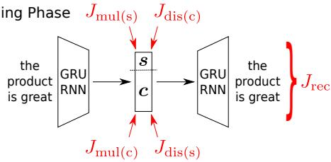
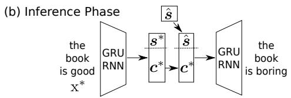
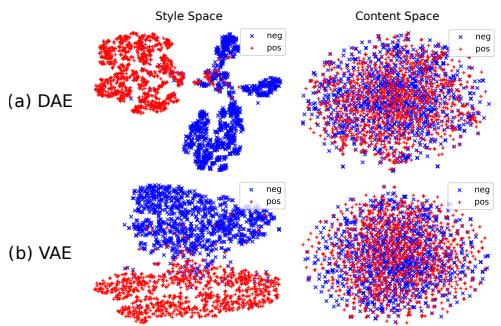

# Disentangled Representation Learning for Non-Parallel Text Style Transfer

Vineet John, Lili Mou, Hareesh Bahuleyan, Olga Vechtomova

University of Waterloo

{vineet.john,hpallika,ovechtom}@uwaterloo.ca doublepower.mou@gmail.com

## Abstract

This paper tackles the problem of disentangling the latent representations of style and content in language models. We propose a simple yet effective approach, which incorporates auxiliary multi-task and adversarial objectives, for style prediction and bag-of-words prediction, respectively. We show, both qualitatively and quantitatively, that the style and content are indeed disentangled in the latent space. This disentangled latent representation learning can be applied to style transfer on non-parallel corpora. We achieve high performance in terms of transfer accuracy, content preservation, and language fluency, in comparison to various previous approaches.1

## 1 Introduction

The neural network has been a successful learning machine during the past decade due to its highly expressive modeling capability, which is a consequence of multiple layers of non-linear transformations of input features. Such transformations, however, make intermediate features “latent,” in the sense that they do not have explicit meaning and are not interpretable. Therefore, neural networks are usually treated as black-box machinery.

Disentangling the latent space of neural networks has become an increasingly important research topic. In the image domain, for example, Chen et al. (2016) use adversarial and information maximization objectives to produce interpretable latent representations that can be tweaked to adjust writing style for handwritten digits, as well as lighting and orientation for face models. However, this problem is less explored in natural language processing.

In this paper, we address the problem of disentangling the latent space of neural networks for text generation. Our model is built on an autoencoder that encodes a sentence to the latent space (vector representation) by learning to reconstruct the sentence itself. We would like the latent space to be disentangled with respect to different features, namely, style and content in our task.

To accomplish this, we propose a simple yet effective approach that combines multi-task and adversarial objectives. We artificially divide the latent representation into two parts: the style space and content space, where we consider the sentiment of a sentence as its style. We design a systematic set of auxiliary losses, enforcing the separation of style and content latent spaces. In particular, the multi-task loss operates on a latent space to ensure that the space does contain the information we wish to encode. The adversarial loss, on the contrary, minimizes the predictability of information that should not be contained in a given latent space. In early work, researchers typically work with the style space (Shen et al., 2017; Fu et al., 2018), but simply ignore the content space, as it is hard to formalize what “content” actually refers to. Cycle consistency of back-translation defines content implicitly (Xu et al., 2018), but requires reinforcement learning over the discrete sentence space, which could be extremely difficult to train.

In our paper, we propose to approximate the content information by bag-of-words (BoW) features, where we focus on style-neutral, nonstopwords. Along with traditional style-oriented auxiliary losses, our BoW multi-task loss and BoW adversarial loss enable better disentanglement of the style and content spaces.

The learned disentangled latent space can be directly used for text style transfer, which aims to transform a given sentence to a new sentence with the same content but a different style. We follow the setting where the model is trained on a nonparallel but style-labeled corpus (Hu et al., 2017; Shen et al., 2017); thus, we call it non-parallel text style transfer. With our disentangled latent space, we simply use the autoencoder to encode the content vector of a sentence, but ignore its encoded style vector. We then infer from the training data an empirical embedding of the style that we would like to transfer to. The encoded content vector and the empirically-inferred style vector are concatenated and fed to the decoder. This grafting technique enables us to obtain a new sentence similar in content to the input sentence, but with a different style.

We conducted experiments on two benchmark datasets. Both qualitative and quantitative results show that the style and content spaces are indeed disentangled well. In the style-transfer evaluation, we achieve high performance in style-transfer accuracy, content preservation, as well as language fluency, compared with previous results. Ablation tests also show that all our auxiliary losses can be combined well, each playing its own role in disentangling the latent space.

## 2 Related Work

Disentangling neural networks’ latent space has been explored in computer vision in recent years, and researchers have successfully disentangled the features (such as rotation and color) of images (Chen et al., 2016; Higgins et al., 2017). In these approaches, the disentanglement is purely unsupervised, as no style labels are needed. Unfortunately, we have not observed disentangled features by applying these approaches in text representations, and thus we require style labels in our approach.

Style-transfer has also been explored in computer vision. For example, Gatys et al. (2016) show that the artistic style of an image can be captured well by certain statistics.

In NLP, the definition of “style” itself is vague, and as a convenient starting point, researchers often treat sentiment as a salient style attribute. Hu et al. (2017) propose to control the sentiment by using discriminators to reconstruct sentiment and content from generated sentences. However, there is no evidence that the latent space would be disentangled by simply reconstructing a sentence. Shen et al. (2017) use a pair of adversarial discriminators to align the recurrent hidden decoder states of original and style-transferred sentences, for a given style. Fu et al. (2018) propose two approaches: training style-specific embeddings and training separate style-specific decoders. Their style embeddings are similar to an earlier study by study by Ficler and Goldberg (2017). Their multidecoder approach is used by Nogueira dos Santos et al. (2018), and is extended to private-shared networks for styled generation (Zhang et al., 2018). Zhao et al. (2018) also extend the multi-decoder approach and use a Wasserstein-distance penalty to align content representations of sentences with different styles. Tsvetkov et al. (2018) use a machine-translation preprocessing step to strip author style from documents, and then use a multidecoder model to convert the result into a sentence with a specific style.

Recently, cycle consistency of back-translation is applied to ensure content preservation (Xu et al., 2018; Logeswaran et al., 2018). These methods require reinforcement learning and are usually difficult to train.

Li et al. (2018) propose a hybrid retrieval and generation method that transfers the style by retrieving and incrementally editing a sentence similar to the source sentence.

Rao and Tetreault (2018) treat the formality of writing as a style, and create a parallel corpus for style transfer with sequence-to-sequence models. This is beyond the scope of our paper, as we focus on non-parallel text style transfer.

Style transfer generation is also related to nonparallel machine translation, where researchers apply similar techniques of adversarial alignment, back translation, etc. (Lample et al., 2018a,b; Conneau et al., 2018).

Our paper differs from previous work in that we accomplish style transfer with a disentangled latent space, for which we propose a systematic set of auxiliary losses.

## 3 Approach

Figure 1 shows the overall framework of our approach. We will first present an autoencoder as our base model. Then we design the auxiliary losses for style and content disentanglement. Finally, we introduce our approach to style-transfer text generation.

> **AI Description:**
> **Source:** `assets/_page_2_Figure_0.jpg`
> 
> **Generated:** 2026-05-30 10:27:26
> 
> ---
> 
> The image is a diagram illustrating a neural network architecture, specifically a GRU-RNN (Gated Recurrent Unit-Long Short-Term Memory) network. It shows two GRU-RNN modules, each processing a different input, labeled as "the product is great." The diagram includes four loss functions: \( J_{mul(s)} \), \( J_{dis(c)} \), \( J_{mul(c)} \), and \( J_{dis(s)} \), which are associated with the outputs \( s \) and \( c \). The \( J_{rec} \) loss function is shown at the end, indicating the total reconstruction loss. The diagram visually represents the flow of information and the computation of loss functions within the network.

Figure 1: Overview of our approach.

> **AI Description:**
> **Source:** `assets/_page_2_Figure_1.jpg`
> 
> **Generated:** 2026-05-30 10:27:18
> 
> ---
> 
> The image is a diagram illustrating the inference phase of a GRU RNN (Gated Recurrent Unit Recurrent Neural Network) model. It shows the flow of information through the network during inference. The diagram includes a GRU RNN on the left side, which processes the input sequence "the book is good" represented as \(X^*\). The output of the GRU RNN is denoted as \(\hat{s}\). The diagram also shows the hidden state \(c^*\) and the output \(\hat{s}\) being fed into another GRU RNN on the right side, which processes the input sequence "the book is boring". This suggests a sequence-to-sequence model where the GRU RNNs are used to predict the next word in a sequence given the previous words.

## 3.1 Autoencoder

An autoencoder encodes an input to a latent vector space, from which it reconstructs the input itself.

Let $\mathbf { x } = ( x _ { 1 } , x _ { 2 } , \cdot \cdot \cdot x _ { n } )$ be an input sequence with n words. Our encoder uses a recurrent neural network (RNN) with gated recurrent units (GRUs, Cho et al., 2014); it reads x word-by-word, and performs a linear transformation of the final hidden state to obtain a hidden vector representation $h .$

Then, a decoder RNN generates a sentence word-by-word, which ideally should be x itself. Suppose at a time step t the decoder RNN predicts the word $x _ { t }$ with probability $p ( x _ { t } | h , x _ { 1 } \cdot \cdot \cdot x _ { t - 1 } )$ ， the autoencoder is trained with a sequenceaggregated cross-entropy loss, given by

$$
J _ { \mathrm { A E } } ( \pmb \theta _ { \mathrm { E } } , \pmb \theta _ { \mathrm { D } } ) = - \sum _ { t = 1 } ^ { n } \log p ( x _ { t } | \pmb h , x _ { 1 } \cdot \cdot \cdot x _ { t - 1 } )\tag{1}
$$

where $\theta _ { \mathrm { E } }$ and $\theta _ { \mathrm { D } }$ D are the parameters of the encoder and decoder, respectively. For brevity, we only present the loss for a single data point (i.e., a sentence) throughout the paper. Total loss sums over all data points, and is implemented with minibatches. Both the encoder and decoder are deterministic functions in the this model (Rumelhart et al., 1986), and thus, we call it a deterministic autoencoder (DAE).

Variational Autoencoder. Alternatively, we may use a variational autoencoder (VAE, Kingma and Welling, 2013), which imposes a probabilistic distribution on the latent vector. The decoder reconstructs data based on the sampled latent vector from its posterior, and the Kullback–Leibler (KL, 1951) divergence is penalized for regularization.

Formally, the VAE loss is

$$
\begin{array} { r l } & { J _ { \mathrm { A E } } ( \theta _ { \mathrm { E } } , \theta _ { \mathrm { D } } ) = - \mathbb { E } _ { q _ { E } ( { \pmb h } | \mathbf { x } ) } [ \log p ( \mathbf { x } | { \pmb h } ) ] } \\ & { ~ + ~ \lambda _ { \mathrm { k l } } \mathrm { K L } ( q _ { E } ( { \pmb h } | \mathbf { x } ) \| p ( { \pmb h } ) ) } \end{array}\tag{2}
$$

where $\lambda _ { \mathrm { k l } }$ is the hyperparameter balancing the reconstruction loss and the KL term. $p ( h )$ is the prior, typically the standard normal $\begin{array} { r l } { \mathcal { N } ( \mathbf { 0 } , \mathrm { I } ) . } & { { } q _ { E } ( { \pmb { h } } | \mathrm { x } ) } \end{array}$ is the posterior in the form N (µ, diag $\sigma ^ { 2 } )$ , where $\pmb { \mu }$ and $\sigma$ are predicted by the encoder.

Compared with DAE, the reconstruction of VAE is based on the samples of the posterior, which populates encoded representations into a neighbourhood close to its prior and thus smooths the latent space. Bowman et al. (2016) show that VAE enables more fluent sentence generation from a latent space than DAE.

The autoencoding loss serves as our primary training objective for sentence generation. For disentangled representation learning, we hope that h can be separated into two spaces s and $^ { c , }$ representing style and content, respectively, i.e., $\textbf { \em h } =$ [s; c], where [·; ·] denotes concatenation. This is accomplished by a systematic design of auxiliary losses described below, and shown in Figure 1a.

## 3.2 Style-Oriented Losses

We first design auxiliary losses that ensure the style information is contained in the style space s. This involves (1) a multi-task loss that ensures s is discriminative for the style, and (2) an adversarial loss that ensures c is not.

Multi-Task Loss for Style. In the dataset, each sentence is labeled with its style, particularly, binary sentiment of positive or negative, following most previous work (Hu et al., 2017; Shen et al., 2017; Fu et al., 2018; Zhao et al., 2018).

We build a two-way softmax classifier (equivalent to logistic regression) on the style space s to predict the style label, given by

$$
{ \pmb y } _ { s } = \mathrm { s o f t m a x } ( W _ { \mathrm { m u l ( s ) } } { \pmb s } + { \pmb b } _ { \mathrm { m u l ( s ) } } )\tag{3}
$$

where $\theta _ { \mathrm { { m u l ( s ) } } } ~ = ~ [ { \cal W } _ { \mathrm { { m u l ( s ) } } } ; { b _ { \mathrm { { m u l ( s ) } } } } ]$ are the parameters of the style classifier in the setting of multitask learning, and $\mathbf { \nabla } _ { \mathbf { \boldsymbol { y } } _ { s } }$ is the output of softmax layer.

The classifier is trained with cross-entropy loss against the ground-truth distribution $t _ { s } ( \cdot )$ by

$$
J _ { \mathrm { m u l ( s ) } } ( \pmb { \theta } _ { \mathrm { E } } ; \pmb { \theta } _ { \mathrm { m u l ( s ) } } ) = - \sum _ { l \in \mathrm { l a b e l s } } t _ { s } ( l ) \log y _ { s } ( l )\tag{4}
$$

In fact, we train the style classifier at the same time as the autoencoding loss. Thus, this could be viewed as multi-task learning, incentivizing the entire model to not only decode the sentence, but also predict its sentiment from the style vector s. We denote it by “mul(s).” The idea of multi-task training is not new and has been used in previous work for sentence representation learning (Jernite et al., 2017) and sentiment analysis (Balikas et al., 2017), among others.

Adversarial Loss for Style. The multi-task loss only ensures that the style space contains style information. However, the content space might also contain style information, which is undesirable for disentanglement.

We thus apply an adversarial loss to discourage the content space containing style information. We first train a separate classifier, called an adversary, that deliberately discriminates the style label based on the content vector c. Then, the encoder is trained to encode a content space from which its adversary cannot predict the style.

Concretely, the adversarial discriminator and its training objective have a similar form as Eqns. (3) and (4), but with different input and parameters, given by

$$
{ \pmb y } _ { s } = \mathrm { s o f t m a x } ( W _ { \mathrm { d i s ( s ) } } { \pmb c } + { \pmb b } _ { \mathrm { d i s ( s ) } } )\tag{5}
$$

$$
J _ { \mathrm { d i s ( s ) } } ( \pmb { \theta } _ { \mathrm { d i s ( s ) } } ) = - \sum _ { l \in \mathrm { l a b e l s } } t _ { c } ( l ) \log y _ { s } ( l )\tag{6}
$$

where $\theta _ { \mathrm { d i s ( s ) } } = [ W _ { \mathrm { d i s ( s ) } } ; b _ { \mathrm { d i s ( s ) } } ]$ are the parameters of the adversary.

It should be emphasized that, when we train the adversary, the gradient is not propagated back to the autoencoder, i.e., the vector c is treated as shallow features. Therefore, we view $\boldsymbol { J } _ { \mathrm { d i s ( s ) } }$ as a function of $\theta _ { \mathrm { d i s ( s ) } }$ only, whereas $J _ { \mathrm { { m u l } ( s ) } }$ is a function of both $\theta _ { \mathrm { E } }$ and $\theta _ { \mathrm { { m u l ( s ) } } }$

Having trained an adversary, we would like the autoencoder to be tuned in such an ad hoc fashion that c is not discriminative for style. In existing literature, there could be different approaches, for example, maximizing the adversary’s loss (Shen et al., 2017; Zhao et al., 2018) or penalizing the entropy of the adversary’s prediction (Fu et al., 2018). In our work, we adopt the latter, as it can be easily extended to multi-category classification, used in Subsection 3.3. Formally, the styleoriented adversarial objective is to maximize

$$
J _ { \mathrm { a d v ( s ) } } ( \pmb { \theta } _ { \mathrm { E } } ) = \mathcal { H } \big ( \pmb { y } _ { s } | \pmb { c } ; \pmb { \theta } _ { \mathrm { d i s ( s ) } } \big )\tag{7}
$$

where $\mathbf { \Delta } _ { \mathbf { \mathcal { Y } } _ { s } }$ is the predicted distribution over the style labels and $\begin{array} { r } { \mathcal { H } ( \pmb { p } ) = - \sum _ { i \in \mathrm { l a b e l s } } p _ { i } } \end{array}$ log pi is the entropy of the adversary. Here, $\boldsymbol { J } _ { \mathrm { { a d v ( s ) } } }$ is maximized with respect to the encoder $\theta _ { \mathrm { E } }$ and we fix $\theta _ { \mathrm { d i s ( s ) } }$ . The objective attains maximum value when $\pmb { y } _ { s }$ is uniform.

While adversarial loss has been explored in previous style-transfer studies (Shen et al., 2017; Fu et al., 2018), it has not been combined with the multi-task loss. As shown in our experiments, a simple combination of these two losses is promisingly effective, achieving better style transfer performance than a variety of previous methods.

## 3.3 Content-Oriented Losses

The above style-oriented losses only regularize style information, but they do not impose any constraint on how the content information should be encoded.

In practice, the style space is usually smaller than content space. But it is unrealistic to expect that the content would not flow into the style space simply because of its limited capacity. Therefore, we need to design content-oriented losses to regularize the content information. In most previous work, however, the treatment of content is missing (Hu et al., 2017; Fu et al., 2018).

Inspired by the above combination of multi-task and adversarial losses, we apply the same idea to the content space. However, it is usually hard to define what “content” actually refers to.

To this end, we propose to approximate the content information by bag-of-words (BoW) features. The BoW feature of a sentence is a vector, each element indicating the probability of a word’s occurrence. For a sentence x with N words, the word $w _ { * } \mathrm { ^ \cdot s }$ BoW probability is $\begin{array} { r } { t _ { c } ( w _ { * } ) = \frac { \sum _ { i = 1 } ^ { N } { \mathbb { I } \{ w _ { i } = w _ { * } \} } } { N } } \end{array}$ , where $\mathbb { I } \{ \cdot \}$ is an indicator function. Here, we only consider content words, excluding stopwords and sentiment words (Hu and Liu, 2004),2 since we focus on “content” information. It should be mentioned that the removal of stopwords and sentiment words is not essential, but results in better performance. We analyze the effect of using different vocabularies in Appendix B.

Multi-Task Loss for Content. Similar to the style-oriented loss, the multi-task loss for content, denoted as “mul(c),” ensures that the content space c contains content information, i.e., BoW features. We introduce a softmax classifier over the BoW vocabulary

$$
{ \pmb y } _ { c } = \mathrm { s o f t m a x } ( W _ { \mathrm { m u l ( c ) } } { \pmb c } + { \pmb b } _ { \mathrm { m u l ( c ) } } )\tag{8}
$$

where $\pmb { \theta } _ { \mathrm { m u l ( c ) } } { = } [ W _ { \mathrm { m u l ( c ) } } ; b _ { \mathrm { m u l ( c ) } } ]$ are the classifier’s parameters; ${ \bf { \nabla } } \mathbf { \mathit { y } } _ { c }$ is the predicted BoW distribution.

The training objective is a cross-entropy loss against the ground-truth distribution $t _ { c } ( \cdot )$

$$
J _ { \mathrm { m u l ( c ) } } ( \theta _ { \mathrm { E } } ; \theta _ { \mathrm { m u l ( c ) } } ) = - \sum _ { w \in \mathrm { v o c a b } } t _ { c } ( w ) \log y _ { c } ( w )\tag{9}
$$

where the optimization is performed with both encoder parameters $\theta _ { \mathrm { E } }$ and the multi-task classifier $\theta _ { \mathrm { m u l ( c ) } }$ . Notice that, although the target distribution is not one-hot for BoW, the cross-entropy loss in Eqn. (9) has the same form as (4).

It is also interesting that, at first glance, the multi-task loss for content appears to be redundant to the autoencoding loss, when in fact, it is not. The autoencoding loss only requires that the model could reconstruct the sentence based on the combined content and style spaces, but does not ensure their separation. The multi-task loss focuses on content words and is applied to the content space only.

Adversarial Loss for Content. To ensure that the style space does not contain content information, we design our final auxiliary loss, the BoW adversarial loss for content, denoted as “adv(c).”

We build a content adversary, a softmax classifier on the style space predicting BoW features

$$
\pmb { y } _ { c } = \mathrm { s o f t m a x } ( W _ { \mathrm { d i s ( c ) } } \top _ { \pmb { s } } + b _ { \mathrm { d i s ( c ) } } )\tag{10}
$$

$$
J _ { \mathrm { d i s ( c ) } } ( \pmb { \theta } _ { \mathrm { d i s ( c ) } } ) = - \sum _ { w \in \mathrm { v o c a b } } t _ { c } ( w ) \log y _ { c } ( w )\tag{11}
$$

where $\pmb \theta _ { \mathrm { d i s ( c ) } } = [ W _ { \mathrm { d i s ( c ) } } ; b _ { \mathrm { d i s ( c ) } } ]$ are the classifier’s parameters for BoW prediction.

The adversarial loss for the model is to maximize the entropy of the discriminator

$$
J _ { \mathrm { a d v ( c ) } } ( \pmb { \theta } _ { \mathrm { E } } ) = \mathcal { H } \big ( \pmb { y } _ { c } \vert \pmb { s } ; \pmb { \theta } _ { \mathrm { d i s ( c ) } } \big )\tag{12}
$$

Again, $\boldsymbol { J } _ { \mathrm { d i s ( c ) } }$ is trained with respect to the discriminator’s parameters $\theta _ { \mathrm { d i s ( c ) } }$ , whereas $\boldsymbol { J } _ { \mathrm { { a d v ( c ) } } }$ is trained with respect to $\theta _ { \mathrm { E } }$ , similar to the adversarial loss for style.

Our BoW-based, content-oriented losses are novel in the style-transfer literature. While they do not directly work with “style,” they regularize the content information, so that the style and content can be better disentangled.

1 foreach mini-batch do

$$
\theta _ { \mathrm { d i s ( s ) } } ;
$$

$$
\theta _ { \mathrm { d i s ( c ) } } ;
$$

5 end

Algorithm 1: Training process.

## 3.4 Training Process

The overall loss $J _ { \mathrm { o v r } }$ for our model comprises several terms: the autoencoder’s reconstruction objective, the multi-task and adversarial objectives, for style and content, respectively, given by

$$
\begin{array} { r l } & { J _ { \mathrm { o v r } } = J _ { \mathrm { A E } } ( \theta _ { \mathrm { E } } , \theta _ { \mathrm { D } } ) } \\ & { ~ + \lambda _ { \mathrm { m u l ( s ) } } J _ { \mathrm { m u l ( s ) } } ( \theta _ { \mathrm { E } } , \theta _ { \mathrm { m u l ( s ) } } ) - \lambda _ { \mathrm { a d v ( s ) } } J _ { \mathrm { a d v ( s ) } } ( \theta _ { \mathrm { E } } ) } \\ & { ~ + \lambda _ { \mathrm { m u l ( c ) } } J _ { \mathrm { m u l ( c ) } } ( \theta _ { \mathrm { E } } , \theta _ { \mathrm { m u l ( c ) } } ) - \lambda _ { \mathrm { a d v ( c ) } } J _ { \mathrm { a d v ( c ) } } ( \theta _ { \mathrm { E } } ) } \end{array}
$$

where λs are the hyperparameters that balance the autoencoding loss and these auxiliary losses.

To put it all together, the model training involves an alternation of optimizing the adversaries by $\boldsymbol { J } _ { \mathrm { d i s ( s ) } }$ and $\boldsymbol { J } _ { \mathrm { d i s ( c ) } }$ , and the model itself by $J _ { \mathrm { o v r } } ,$ shown in Algorithm 1.

## 3.5 Generating Style-Transferred Sentences

A direct application of our disentangled latent space is style-transfer sentence generation, i.e., we can synthesize a sentence with generally the same meaning but a different style in the inference stage.

Let $\mathrm { x } ^ { \ast }$ be an input sentence with $s ^ { * }$ and $c ^ { * }$ being the encoded style and content vectors, respectively. If we would like to transfer its content to a different style, we compute an empirical estimate of the target style’s vector sˆ of the training set, using

$$
\hat { \pmb { s } } = \frac { \sum _ { i \in \mathrm { t a r g e t ~ s t y l e } } \pmb { s } _ { i } } { \# \mathrm { t a r g e t ~ s t y l e ~ s a m p l e s } }\tag{14}
$$

The inferred target style sˆ is concatenated with the encoded content $c ^ { * }$ for decoding style-transferred sentences, as shown in Figure 1b.

## 4 Experiments

## 4.1 Datasets

We conducted experiments on two datasets, Yelp and Amazon reviews. Both comprise sentences labeled by binary sentiment (positive or negative). They are used to train latent space disentanglement as well as to evaluate sentiment transfer.

Yelp Service Reviews. We used the Yelp review dataset, following previous work (Shen et al.,

2017; Zhao et al., 2018).3 It contains 444101, 63483, and 126670 labeled reviews for train, validation, and test, respectively. We set the maximum length of a sentence to 15 words and the vocabulary size to ∼9200, following Shen et al. (2017).

Amazon Product Reviews. We further evaluate our model with an Amazon review dataset, following some other previous papers (Fu et al., 2018).4 It contains 555142, 2000, and 2000 labeled reviews for train, validation, and test, respectively. The maximum length of a sentence is set to 20 words and the vocabulary size is ∼58k, as in Fu et al. (2018).

## 4.2 Experimental Settings

Our RNN has a hidden state of 256 dimensions, linearly transformed to a style space of 8 dimensions and a content space of 128 dimensions. They were chosen empirically, and we found them robust to model performance. For the decoder, we fed the latent vector $\pmb { h } = [ s , \pmb { c } ]$ to the hidden state at each step.

We used the Adam optimizer (Kingma and Ba, 2014) for the autoencoder and the RMSProp optimizer (Tieleman and Hinton, 2012) for the discriminators, following stability tricks in adversarial training (Arjovsky et al., 2017). Each optimizer has an initial learning rate of 10−3. Our model is trained for 20 epochs, by which time it has converged. The word embedding layer was initialized by word2vec (Mikolov et al., 2013) trained on respective training sets. Both the autoencoder and the discriminators are trained once per minibatch with $\lambda _ { \mathrm { m u l ( s ) } } = 1 0 , \lambda _ { \mathrm { m u l ( c ) } } = 3 , \lambda _ { \mathrm { a d v ( s ) } } = 1$ and $\lambda _ { \mathrm { a d v ( c ) } } = 0 . 0 3$ . These hyperparameters were tuned by a log-scale grid search within two orders of magnitude around the default value 1; we chose the values yielding the best validation results.

For the VAE model, the KL penalty is weighted by $\lambda _ { \mathrm { k l ( s ) } }$ and $\lambda _ { \mathrm { k l ( c ) } }$ for style and content, respectively. We set both to 0.03, tuned by the same method of log-scale grid search. During training, we also used the sigmoid KL annealing schedule, following Bahuleyan et al. (2018).

## 4.3 Exp. I: Disentangling Latent Space

First, we analyze how the style (sentiment) and content of the latent space are disentangled. We train separate logistic regression sentiment classifiers on different latent spaces, and report their classification accuracy in Table 1.

Table 1: Classification accuracy on latent spaces.

Figure 2: t-SNE plots of the disentangled style and content spaces on Yelp (with all auxiliary losses).

> **AI Description:**
> **Source:** `assets/_page_5_Figure_0.jpg`
> 
> **Generated:** 2026-05-30 10:27:34
> 
> ---
> 
> The image contains two sets of scatter plots, one labeled "Style Space" and the other "Content Space," for two different models: DAE and VAE. The plots display data points in two-dimensional space, with red and blue markers representing "neg" and "pos" categories, respectively. The style space shows distinct clusters for the two categories, suggesting that the model can distinguish between different styles. The content space, however, shows a more mixed distribution, indicating that the model may not be as effective in separating content categories. The plots visually compare the performance of the DAE and VAE models in both spaces.

We see the 128-dimensional content vector c is not particularly discriminative for style. Its accuracy is slightly better than majority guess. However, the 8-dimensional style vector s, despite its low dimensionality, achieves substantially higher style classification accuracy. When combining content and style vectors, we observe no further improvement. These results verify the effectiveness of our disentangling approach, as the style space contains style information, whereas the content space does not.

We show t-SNE plots (van der Maaten and Hinton, 2008) for both DAE and VAE in Figure 2. As seen, sentences with different styles are noticeably separated in a clean manner in the style space (LHS), but are indistinguishable in the content space (RHS). It is also evident that the latent space learned by VAE is considerably smoother and more continuous than the one learned by DAE.

## 4.4 Exp. II: Non-Parallel Text Style Transfer

In this experiment, we apply the disentangled latent space to sentiment-transfer text generation.

Metrics. We evaluate competing models based on (1) style transfer accuracy, (2) content preservation, and (3) quality of generated language. The evaluation of sentence generation has proven to be difficult in contemporary literature, so we adopt a few automatic metrics and use human judgment as

well.

Style-Transfer Accuracy (STA): We follow most previous work (Hu et al., 2017; Shen et al., 2017; Fu et al., 2018) and train a separate convolutional neural network (CNN) to predict the sentiment of a sentence (Kim, 2014), which is then used to approximate the style transfer accuracy. In other words, we report the CNN classifier’s accuracy on the style-transferred sentences, considering the target style to be the ground-truth. While the style classifier itself may not be perfect, it achieves a reasonable sentiment accuracy on the validation sets (97% for Yelp; 82% for Amazon). Thus, it provides a quantitative way of evaluating the strength of style transfer.

Cosine Similarity (CS): We followed Fu et al. (2018) and computed the cosine measure between source and generated sentence embeddings, which are the concatenation of min, max, and mean of word embeddings (sentiment words removed). This provides a rough estimation of content preservation.

Word Overlap (WO): We find that cosine similarity, although correlated to human judgment, is not a sensitive measure. Instead, we propose a simple and effective measure that counts the unigram word overlap rate of the original sentence x and the style-transferred sentence y, computed by count(x∩y)count(x∪y) . Here, we exclude both stopwords and sentiment words.

Perplexity (PPL): We use a trigram Kneser– Ney (KN, Kneser and Ney, 1995) language model as a quantitative and automated metric to evaluate the fluency of a sentence. It estimates the empirical distribution of trigrams in a corpus, and computes the perplexity of a test sentence. We trained the language model on the respective datasets, and report PPL on the generated sentences. A smaller PPL indicates more fluent sentences.

Geometric Mean (GM): We use the geometric mean of STA, WO, and 1/PPL—reflecting transfer strength, content preservation, and fluency, respectively—to obtain an aggregated score considering all aspects. Notice that a smaller PPL is desired; thus, we use 1/PPL when computing GM. Also, cosine similarity (CS) is not included, because it is insensitive yet repetitive with word overlap (WO). Here, we adopt the geometric mean so that the scale of each metric does not influence the judgment.

Manual Evaluation: Despite the above automatic metrics, we also conduct human evaluations to further confirm the performance of our model. This was done on the Yelp dataset only, due to the amount of manual effort involved. We asked 6 human annotators to rate each sentence on a 1–5 Likert scale (Stent et al., 2005) in terms of transfer strength (TS), content preservation (CP), and language quality (LQ). This evaluation was conducted in a strictly blind fashion: samples obtained from all evaluated models were randomly shuffled, so that the annotator was unaware of which model generated a particular sentence. The inter-rater agreement—as measured by Krippendorff’s alpha (Klaus, 2004) for our Likert scale ratings—is 0.74, 0.68, and 0.72 for these three aspects, respectively. According to Klaus (2004), this is an acceptable inter-rater agreement. We also computed the geometric mean (GM) to obtain an aggregated score.

Overall performance. We compare our approach with previous state-of-the-art work in Table 2. For competing methods, we quote results from existing papers whenever possible. In some studies, the authors have released their styletransferred sentences, and we tested them with our metrics. A caveat is that this may involve a different data split, providing a rough (but unbiased) comparison. For others, we re-evaluated the model using publicly available code. We sought comparison with Hu et al. (2017), but unfortunately could not find publicly available code. Instead we sought performance comparisons of their model in subsequent work, and found that, according to the human evaluation in Shen et al. (2017), Hu et al. (2017) is comparable but slightly worse than Shen et al. (2017). The latter is compared with our model in terms of both automatic metrics and human evaluation.

We see in Table 2 a clear trade-off between style transfer and content preservation, as they are contradictory goals. Especially, a few models have a transfer accuracy lower than 50%. They are shown in gray, and not the focus of the comparison, because the system cannot achieve the goal of style transfer most of the time.

Our method achieves high style-transfer accuracy (STA) in both experiments. On the Yelp dataset, it outperforms previous methods by more than 7%, whereas on Amazon, VAE is 1% lower than Tsvetkov et al. (2018), ranking second.

Our approach achieves high content preservation as well. Among all the methods that can achieve more than 50% transfer accuracy, DAE has the highest word overlap (WO) on Yelp; VAE is also high, although slightly lower than Li et al. (2018). On Amazon, the phenomenon is similar. DAE is the best; VAE is 2% lower in WO (although 10% better in transfer accuracy), compared with Xu et al. (2018).

Table 2: Performance of text style transfer. STA: Style transfer accuracy. CS: Cosine similarity. WO: Word overlap rate. PPL: Perplexity. GM: Geometric mean. The larger↑ (or lower↓), the better. †Quoted from previous papers (with the same data split). ‡Involving custom data splits, providing a rough (but unbiased) comparison. Others are based on our replication, and we use published code whenever possible. We achieve 0.809 and 0.835 transfer accuracy on the Yelp dataset, close to the results in Shen et al. (2017) and Zhao et al. (2018), respectively, showing that our replication is fair. Gray numbers show that a method fails to transfer style most of the time.

Table 3: Manual evaluation on the Yelp dataset.

For language fluency, VAE yields the best PPL in both datasets. It is also noted that, the cycle reinforcement learning (Cycle-RL) approach does not generate fluent sentences (Xu et al., 2018). They have unusually high PPL scores, but after reading the samples provided by the authors (via personal email correspondence) we are assured that the sentences obtained by Cycle-RL are less fluent.

When we consider all the above aspects, our approach (either DAE or VAE) has the highest geometric meaning (GM), showing that we have achieved good balance on transfer strength, content preservation, as well as language fluency.

Table 3 presents the results of human evaluation on selected methods.5Again, we see that the style embedding model (Fu et al., 2018) is ineffective as it has a very low transfer strength, and that our method outperforms other baselines in all aspects. The results are consistent with Table 2. This also implies that the automatic metrics we used are reasonable, and could be extrapolated to different models; it also shows consistent evidence of the effectiveness of our approach.

Table 4: Ablation tests on Yelp. In all variants, we follow the same protocol of style transfer by substituting an empirical estimate of the target style vector.

Ablation Test. We conducted ablation tests on the Yelp dataset, and show results in Table 4. With $J _ { \mathrm { A E } }$ only, we cannot achieve reasonable style transfer accuracy by substituting an empirically estimated style vector of the target style. This is because the style and content spaces would not be disentangled spontaneously with the autoencoding loss alone. With either $J _ { \mathrm { m u l ( s ) } } \mathrm { o r } J _ { \mathrm { a d v ( s ) } }$ , the model achieves reasonable transfer accuracy and cosine similarity. Combining them together improves the transfer accuracy to 90%, outperforming previous methods by a margin of 5% (Table 2). This shows that the multi-task loss and the adversarial loss work in different ways. Our insight of combining the two auxiliary losses is a simple yet effective way of disentangling latent space.

On the other hand, $J _ { \mathrm { { m u l } ( s ) } }$ and $\boldsymbol { J } _ { \mathrm { { a d v ( s ) } } }$ only regularize the style information, leading to gradual drop of content preserving scores. Then, we use another insight of introducing content-oriented auxiliary losses, $J _ { \mathrm { { m u l } ( c ) } }$ and $\boldsymbol { J } _ { \mathrm { a d v ( c ) } }$ , based on BoW features, which regularize the content information in the same way as style. By incorporating all these auxiliary losses, we achieve high transfer accuracy, high content preservation, as well as high language fluency.

## 5 Conclusion and Future Work

In this paper, we propose an effective approach for disentangling style and content latent spaces. We systematically combine multi-task and adversarial objectives to separate content and style from each other, where we also propose to approximate content information with bag-of-words features of style-neutral, non-stopword vocabulary.

Both qualitative and quantitative experiments show that the latent space is indeed separated into style and content parts. The disentangled space can be directly applied to text style-transfer tasks. Our method achieves high style-transfer strength, high content-preservation scores, as well as high language fluency, compared with previous work.

Our approach can be naturally extended to noncategorical styles, because our style feature is encoded from the input sentence. Non-categorical styles cannot be easily handled by fixed style embeddings or style-specific decoders (Fu et al., 2018). Bao et al. (2019) have successfully shown that the syntax and semantics of a sentence can be disentangled from each other.

## Acknowledgments

We thank all reviewers for insightful comments. This work was supported in part by the NSERC grant RGPIN-261439-2013 and an Amazon Research Award. We would also like to acknowledge NVIDIA Corporation for the donated Titan Xp GPU.

## References

- Martin Arjovsky, Soumith Chintala, and Leon Bottou. 2017. Wasserstein generative adversarial networks. In ICML, pages 214–223.
- Hareesh Bahuleyan, Lili Mou, Olga Vechtomova, and Pascal Poupart. 2018. Variational attention for sequence-to-sequence models. In COLING, pages 1672–1682.
- Georgios Balikas, Simon Moura, and Massih-Reza Amini. 2017. Multitask learning for fine-grained twitter sentiment analysis. In SIGIR, pages 1005– 1008.
- Yu Bao, Hao Zhou, Shujian Huang, Lei Li, Lili Mou, Olga Vechtomova, XIN-YU DAI, and Jiajun CHEN. 2019. Generating sentences from disentangled syntactic and semantic spaces. In ACL.
- Samuel R. Bowman, Luke Vilnis, Oriol Vinyals, Andrew M. Dai, Rafal Jozefowicz, and Samy Bengio. 2016. Generating sentences from a continuous space. In CoNLL, pages 10–21.
- Xi Chen, Yan Duan, Rein Houthooft, John Schulman, Ilya Sutskever, and Pieter Abbeel. 2016. Infogan: Interpretable representation learning by information maximizing generative adversarial nets. In NIPS, pages 2172–2180.
- Kyunghyun Cho, Bart van Merrienboer, Caglar Gulcehre, Dzmitry Bahdanau, Fethi Bougares, Holger Schwenk, and Yoshua Bengio. 2014. Learning phrase representations using RNN encoder-decoder for statistical machine translation. In EMNLP, pages 1724–1734.
- Alexis Conneau, Guillaume Lample, Marc’Aurelio Ranzato, Ludovic Denoyer, and Herve J´ egou. 2018.´ Word translation without parallel data. In ICLR.
- Jessica Ficler and Yoav Goldberg. 2017. Controlling linguistic style aspects in neural language generation. In Proc. Workshop on Stylistic Variation, pages 94–104.
- Zhenxin Fu, Xiaoye Tan, Nanyun Peng, Dongyan Zhao, and Rui Yan. 2018. Style transfer in text: Exploration and evaluation. In AAAI, pages 663–670.
- Leon A. Gatys, Alexander S. Ecker, and Matthias Bethge. 2016. Image style transfer using convolutional neural networks. In CVPR, pages 2414–2423.
- Irina Higgins, Loic Matthey, Arka Pal, Christopher Burgess, Xavier Glorot, Matthew Botvinick, Shakir Mohamed, and Alexander Lerchner. 2017. Beta-VAE: Learning basic visual concepts with a constrained variational framework. In ICLR.
- Minqing Hu and Bing Liu. 2004. Mining and summarizing customer reviews. In KDD, pages 168–177.
- Zhiting Hu, Zichao Yang, Xiaodan Liang, Ruslan Salakhutdinov, and Eric P. Xing. 2017. Toward controlled generation of text. In ICML, pages 1587– 1596.
- Yacine Jernite, Samuel R. Bowman, and David Sontag. 2017. Discourse-based objectives for fast unsupervised sentence representation learning. arXiv, abs/1705.00557.
- Yoon Kim. 2014. Convolutional neural networks for sentence classification. In EMNLP, pages 1746– 1751.
- Diederik P. Kingma and Jimmy Ba. 2014. Adam: A method for stochastic optimization. arXiv prerpint arXiv:1412.6980.

- Diederik P. Kingma and Max Welling. 2013. Autoencoding variational Bayes. arXiv preprint arXiv:1312.6114.
- Krippendorff Klaus. 2004. Content Analysis: An Introduction to Its Methodology. Sage Publications.
- Reinhard Kneser and Hermann Ney. 1995. Improved backing-off for m-gram language modeling. In ICASSP, pages 181–184.
- Solomon Kullback and Richard A Leibler. 1951. On information and sufficiency. The Annals of Mathematical Statistics, 22(1):79–86.
- Guillaume Lample, Alexis Conneau, Ludovic Denoyer, and Marc’Aurelio Ranzato. 2018a. Unsupervised machine translation using monolingual corpora only. In ICLR.
- Guillaume Lample, Myle Ott, Alexis Conneau, Ludovic Denoyer, and Marc’Aurelio Ranzato. 2018b. Phrase-based & neural unsupervised machine translation. In EMNLP, pages 5039–5049.
- Juncen Li, Robin Jia, He He, and Percy Liang. 2018. Delete, retrieve, generate: A simple approach to sentiment and style transfer. In NAACL-HLT, pages 1865–1874.
- Lajanugen Logeswaran, Honglak Lee, and Samy Bengio. 2018. Content preserving text generation with attribute controls. In NIPS, pages 5108–5118.
- Laurens van der Maaten and Geoffrey Hinton. 2008. Visualizing data using t-SNE. JMLR, 9:2579–2605.
- Tomas Mikolov, Ilya Sutskever, Kai Chen, Gregory S. Corrado, and Jeffrey Dean. 2013. Distributed representations of words and phrases and their compositionality. In NIPS, pages 3111–3119.
- Sudha Rao and Joel R. Tetreault. 2018. Dear sir or madam, may I introduce the GYAFC dataset: Corpus, benchmarks and metrics for formality style transfer. In NAACL-HLT, pages 129–140.
- D. E. Rumelhart, G. E. Hinton, and R. J. Williams. 1986. Learning internal representations by error propagation. In Parallel Distributed Processing: Explorations in the Microstructure of Cognition, volume 1, pages 318–362.
- Cicero Nogueira dos Santos, Igor Melnyk, and Inkit Padhi. 2018. Fighting offensive language on social media with unsupervised text style transfer. In ACL (Short Papers), pages 189–194.
- Tianxiao Shen, Tao Lei, Regina Barzilay, and Tommi S. Jaakkola. 2017. Style transfer from non-parallel text by cross-alignment. In NIPS, pages 6833–6844.
- Amanda Stent, Matthew Marge, and Mohit Singhai. 2005. Evaluating evaluation methods for generation in the presence of variation. In CICLing, pages 341– 351.
- Tijmen Tieleman and Geoffrey Hinton. 2012. Lecture 6.5-rmsprop: Divide the gradient by a running average of its recent magnitude. COURSERA: Neural Networks for Machine Learning.
- Yulia Tsvetkov, Alan W. Black, Ruslan Salakhutdinov, and Shrimai Prabhumoye. 2018. Style transfer through back-translation. In ACL, pages 866–876.
- Jingjing Xu, Xu Sun, Qi Zeng, Xiaodong Zhang, Xuancheng Ren, Houfeng Wang, and Wenjie Li. 2018. Unpaired sentiment-to-sentiment translation: A cycled reinforcement learning approach. In ACL, pages 979–988.
- Ye Zhang, Nan Ding, and Radu Soricut. 2018. SHAPED: Shared-private encoder-decoder for text style adaptation. In NAACL-HLT, pages 1528–1538.
- Junbo Jake Zhao, Yoon Kim, Kelly Zhang, Alexander M. Rush, and Yann LeCun. 2018. Adversarially regularized autoencoders. In ICML, pages 5897– 5906.

## A Qualitative Examples

Table 5 provides several examples of our styletransfer model. Results show that we can successfully transfer the sentiment while preserving the content of a sentence.

## B Effect of the BoW Vocabulary

Table 6 demonstrates the effect of choosing different BoW vocabulary for the auxiliary content losses. As seen, we are able to achieve reasonable performance with any of these vocabularies, but using a vocabulary that excludes sentiment words and stopwords performs the best.

Table 5: Examples of style transferred sentence generation.

Table 6: Analysis of the BoW vocabulary.

