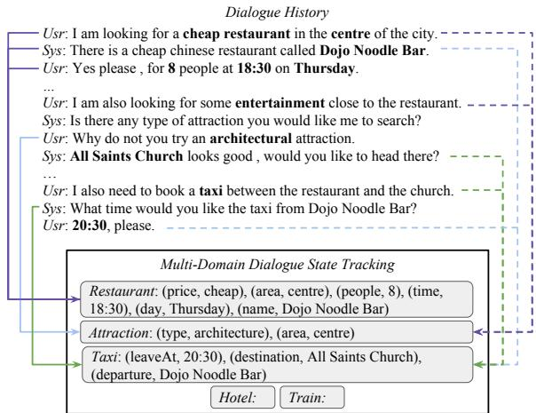
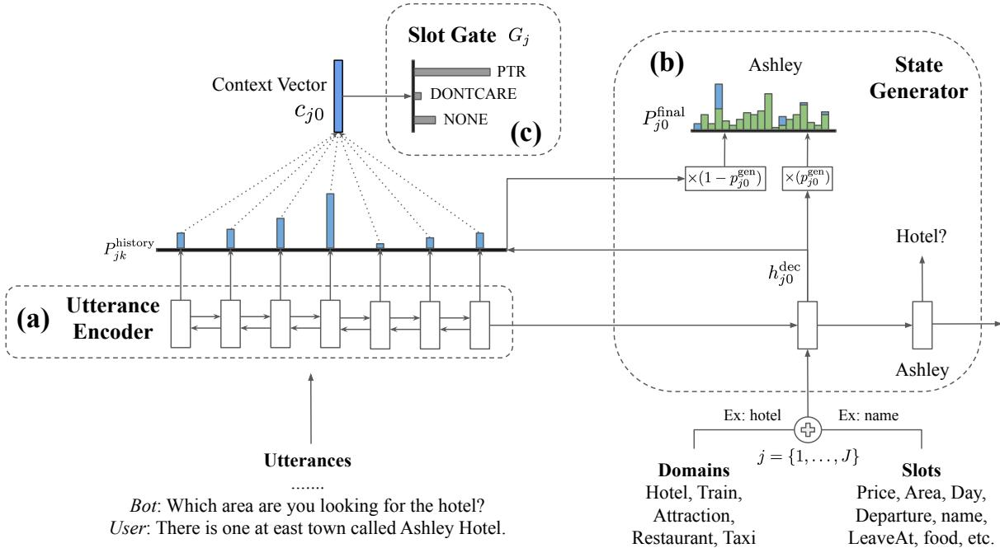

# Transferable Multi-Domain State Generator for Task-Oriented Dialogue Systems

Chien-Sheng Wu†∗, Andrea Madotto†, Ehsan Hosseini-Asl‡, Caiming Xiong‡, Richard Socher‡ and Pascale Fung†

†The Hong Kong University of Science and Technology

jason.wu@connect.ust.hk

## Abstract

Over-dependence on domain ontology and lack of knowledge sharing across domains are two practical and yet less studied problems of dialogue state tracking. Existing approaches generally fall short in tracking unknown slot values during inference and often have difficulties in adapting to new domains. In this paper, we propose a TRAnsferable Dialogue statE generator (TRADE) that generates dialogue states from utterances using a copy mechanism, facilitating knowledge transfer when predicting (domain, slot, value) triplets not encountered during training. Our model is composed of an utterance encoder, a slot gate, and a state generator, which are shared across domains. Empirical results demonstrate that TRADE achieves state-of-the-art joint goal accuracy of 48.62% for the five domains of MultiWOZ, a human-human dialogue dataset. In addition, we show its transferring ability by simulating zero-shot and few-shot dialogue state tracking for unseen domains. TRADE achieves 60.58% joint goal accuracy in one of the zero-shot domains, and is able to adapt to few-shot cases without forgetting already trained domains.

## 1 Introduction

Dialogue state tracking (DST) is a core component in task-oriented dialogue systems, such as restaurant reservation or ticket booking. The goal of DST is to extract user goals/intentions expressed during conversation and to encode them as a compact set of dialogue states, i.e., a set of slots and their corresponding values. For example, as shown in Fig. 1, (slot, value) pairs such as (price, cheap) and (area, centre) are extracted from the conversation. Accurate DST performance is crucial for appropriate dialogue management, where user intention determines the next system action and/or the content to query from the databases.

Figure 1: An example of multi-domain dialogue state tracking in a conversation. The solid arrows on the left are the single-turn mapping, and the dot arrows on the right are multi-turn mapping. The state tracker needs to track slot values mentioned by the user for all the slots in all the domains.

> **AI Description:**
> **Source:** `assets/_page_0_Figure_0.jpg`
> 
> **Generated:** 2026-05-30 10:34:00
> 
> ---
> 
> The image contains a dialogue history between a user and a system, discussing the booking of a restaurant, an attraction, and a taxi. The dialogue is structured with the user's input in blue and the system's response in green. Below the dialogue, there is a section labeled "Multi-Domain Dialogue State Tracking" that shows the current state of the dialogue in terms of the restaurant, attraction, and taxi booking. The states are represented as tuples with attributes such as price, area, time, and name. The image also includes a dashed box labeled "Dialogue History" at the top and a solid box labeled "Multi-Domain Dialogue State Tracking" at the bottom. The visual elements help to illustrate the flow of the dialogue and the state of the booking process.

Traditionally, state tracking approaches are based on the assumption that ontology is defined in advance, where all slots and their values are known. Having a predefined ontology can simplify DST into a classification problem and improve performance (Henderson et al., 2014b; Mrksiˇ c et al. ´ , 2017; Zhong et al., 2018). However, there are two major drawbacks to this approach: 1) A full ontology is hard to obtain in advance (Xu and Hu, 2018). In the industry, databases are usually exposed through an external API only, which is owned and maintained by others. It is not feasible to gain access to enumerate all the possible values for each slot. 2) Even if a full ontology exists, the number of possible slot values could be large and variable. For example, a restaurant name or a train departure time can contain a large number of possible values. Therefore, many of the previous works that are based on neural classification models may not be applicable in real scenario.

Budzianowski et al. (2018) recently introduced a multi-domain dialogue dataset (Multi-WOZ), which adds new challenges in DST due to its mixed-domain conversations. As shown in Fig. 1, a user can start a conversation by asking to reserve a restaurant, then requests information regarding an attraction nearby, and finally asks to book a taxi. In this case, the DST model has to determine the corresponding domain, slot and value at each turn of dialogue, which contains a large number of combinations in the ontology, i.e., 30 (domain, slot) pairs and over 4,500 possible slot values in total. Another challenge in the multidomain setting comes from the need to perform multi-turn mapping. Single-turn mapping refers to the scenario where the (domain, slot, value) triplet can be inferred from a single turn, while in multiturn mapping, it should be inferred from multiple turns which happen in different domains. For instance, the (area, centre) pair from the attraction domain in Fig. 1 can be predicted from the area information in the restaurant domain, which is mentioned in the preceding turns.

To tackle these challenges, we emphasize that DST models should share tracking knowledge across domains. There are many slots among different domains that share all or some of their values. For example, the area slot can exist in many domains, e.g., restaurant, attraction, and taxi. Moreover, the name slot in the restaurant domain can share the same value with the departure slot in the taxi domain. Additionally, to enable the DST model to track slots in unseen domains, transferring knowledge across multiple domains is imperative. We expect DST models can learn to track some slots in zero-shot domains by learning to track the same slots in other domains.

In this paper, we propose a transferable dialogue state generator (TRADE) for multi-domain taskoriented dialogue state tracking. The simplicity of our approach and the boost of the performance is the main advantage of TRADE. Contributions in this work are summarized as 1:

• To overcome the multi-turn mapping problem, TRADE leverages its context-enhanced slot gate and copy mechanism to properly track slot values mentioned anywhere in dialogue history.

• By sharing its parameters across domains, and without requiring a predefined ontology, TRADE can share knowledge between domains to track unseen slot values, achieving state-ofthe-art performance on multi-domain DST.

• TRADE enables zero-shot DST by leveraging the domains it has already seen during training. If a few training samples from unseen domains are available, TRADE can adapt to new few-shot domains without forgetting the previous domains.

## 2 TRADE Model

The proposed model in Fig. 2 comprises three components: an utterance encoder, a slot gate, and a state generator. Instead of predicting the probability of every predefined ontology term, our model directly generates slot values. Similar to Johnson et al. (2017) for multilingual neural machine translation, we share all the model parameters, and the state generator starts with a different start-of-sentence token for each (domain, slot) pair.

The utterance encoder encodes dialogue utterances into a sequence of fixed-length vectors. To determine whether any of the (domain, slot) pairs are mentioned, the context-enhanced slot gate is used with the state generator. The state generator decodes multiple output tokens for all (domain, slot) pairs independently to predict their corresponding values. The context-enhanced slot gate predicts whether each of the pairs is actually triggered by the dialogue via a three-way classifier.

Let us define $X \ = \ \{ ( U _ { 1 } , R _ { 1 } ) , \ldots , ( U _ { T } , R _ { T } ) \}$ as the set of user utterance and system response pairs in T turns of dialogue, and $B \ =$ $\{ B _ { 1 } , \ldots , B _ { T } \}$ as the dialogue states for each turn. Each $B _ { t }$ is a tuple (domain: $D _ { n } .$ slot:Sm, value:Y valuej ), where $D = \{ D _ { 1 } , . . . , D _ { N } \}$ are the N different domains, and ${ \cal S } = \{ S _ { 1 } , \ldots , S _ { M } \}$ are the M different slots. Assume that there are J possible (domain, slot) pairs, and $Y _ { j } ^ { \mathrm { v a l u e } }$ is the true word sequence for j-th (domain ,slot) pair.

## 2.1 Utterance Encoder

Note that the utterance encoder can be any existing encoding model. We use bi-directional gated recurrent units (GRU) (Chung et al., 2014) to encode the dialogue history. The input to the utterance encoder is denoted as history $\begin{array} { r l } { X _ { t } } & { { } = } \end{array}$ $[ U _ { t - l } , R _ { t - l } , \ldots , U _ { t } , R _ { t } ] \ \in \ \mathbb { R } ^ { | X _ { t } | \times d _ { e m b } }$ , which is the concatenation of all words in the dialogue history. l is the number of selected dialogue turns and $d _ { e m b }$ indicates the embedding size. The encoded dialogue history is represented as $H _ { t }$ = $[ h _ { 1 } ^ { \mathrm { e n c } } , \ldots , h _ { | X _ { t } | } ^ { \mathrm { e n c } } ] \ \in \ \mathbb { R } ^ { | \bar { X } _ { t } | \times d _ { h d d } }$ , where $d _ { h d d }$ is the hidden size. As mentioned in Section 1, due to the multi-turn mapping problem, the model should infer the states across a sequence of turns. Therefore, we use the recent dialogue history of length l as the utterance encoder input, rather than the current utterance only.

Figure 2: The architecture of the proposed TRADE model, which includes (a) an utterance encoder, (b) a state generator, and (c) a slot gate, all of which are shared among domains. The state generator will decode J times independently for all the possible (domain, slot) pairs. At the first decoding step, state generator will take the j-th (domain, slot) embeddings as input to generate its corresponding slot values and slot gate. The slot gate predicts whether the j-th (domain, slot) pair is triggered by the dialogue.

> **AI Description:**
> **Source:** `assets/_page_2_Figure_0.jpg`
> 
> **Generated:** 2026-05-30 10:34:43
> 
> ---
> 
> The image is a technical diagram illustrating a dialogue system architecture, specifically for a conversational agent. It includes:
> 
> 1. **Utterance Encoder**: This part of the diagram shows how utterances are encoded into a context vector \( c_{j0} \). The encoder processes a sequence of utterances and generates a representation that captures the user's input.
> 
> 2. **Slot Gate \( G_j \)**: This component decides which slots to focus on based on the context vector. It has three options: "PTR" (Pointer), "DONTCARE", and "NONE". The "PTR" option is highlighted, indicating it is the active slot gate.
> 
> 3. **State Generator**: This section generates the final state of the dialogue, which includes the user's name, domain (e.g., hotel, train, attraction), and slot values (e.g., price, area, day, departure, name, leave at, food, etc.). The state generator uses the context vector and the utterance encoder's output to predict the final dialogue state.
> 
> 4. **Transition Probabilities**: The diagram also includes transition probabilities \( P_{j0}^{\text{final}} \) and \( P_{j0}^{\text{gen}} \), which are used to compute the final state probabilities and the generated state probabilities, respectively.
> 
> The diagram is labeled with example utterances from a dialogue between a bot and a user, illustrating how the system processes and responds to user inputs.

## 2.2 State Generator

To generate slot values using text from the input source, a copy mechanism is required. There are three common ways to perform copying, i.e., index-based copy (Vinyals et al., 2015), hardgated copy (Gulcehre et al., 2016; Madotto et al., 2018; Wu et al., 2019) and soft-gated copy (See et al., 2017; McCann et al., 2018). The indexbased mechanism is not suitable for DST task because the exact word(s) of the true slot value are not always found in the utterance. The hard-gate copy mechanism usually needs additional supervision on the gating function. As such, we employ soft-gated pointer-generator copying to combine a distribution over the vocabulary and a distribution over the dialogue history into a single output distribution.

We use a GRU as the decoder of the state generator to predict the value for each (domain, slot) pair, as shown in Fig. 2. The state generator decodes J pairs independently. We simply supply the summed embedding of the domain and slot as the first input to the decoder. At decoding step k for the j-th (domain, slot) pair, the generator GRU takes a word embedding $w _ { j k }$ as its input and returns a hidden state $h _ { j k } ^ { \mathrm { d e c } }$ . The state generator first maps the hidden state $h _ { j k } ^ { \mathrm { d e c } }$ into the vocabulary space $P _ { j k } ^ { \mathrm { v o c a b } }$ using the trainable embedding $E \in \mathbb { R } ^ { | V | \times \bar { d } _ { h d d } }$ , where |V | is the vocabulary size. At the same time, the $h _ { j k } ^ { \mathrm { d e c } }$ is used to compute the history attention $P _ { j k } ^ { \mathrm { h i s t o r y } }$ over the encoded dialogue history $H _ { t }$

$$
\begin{array} { r l } & { ~ P _ { j k } ^ { \mathrm { v o c a b } } = \mathrm { S o f t m a x } ( E \cdot ( h _ { j k } ^ { \mathrm { d e c } } ) ^ { \top } ) \in \mathbb { R } ^ { | V | } , } \\ & { P _ { j k } ^ { \mathrm { h u s t o r y } } = \mathrm { S o f t m a x } ( H _ { t } \cdot ( h _ { j k } ^ { \mathrm { d e c } } ) ^ { \top } ) \in \mathbb { R } ^ { | X _ { t } | } . } \end{array}\tag{1}
$$

The final output distribution $P _ { j k } ^ { \mathrm { f i n a l } }$ is the weighted-

sum of two distributions,

$$
\begin{array} { r l } & { P _ { j k } ^ { \mathrm { f i n a l } } = p _ { j k } ^ { \mathrm { g e n } } \times P _ { j k } ^ { \mathrm { v o c a b } } } \\ & { ~ + \left( 1 - p _ { j k } ^ { \mathrm { g e n } } \right) \times P _ { j k } ^ { \mathrm { h i s t o r y } } \in \mathbb { R } ^ { | V | } . } \end{array}\tag{2}
$$

The scalar $p _ { j k } ^ { \mathrm { g e n } }$ is trainable to combine the two distributions, which is computed by

$$
\begin{array} { r l } & { p _ { j k } ^ { \mathrm { g e n } } = \mathrm { S i g m o i d } ( W _ { 1 } \cdot [ h _ { j k } ^ { \mathrm { d e c } } ; w _ { j k } ; c _ { j k } ] ) \in \mathbb { R } ^ { 1 } , } \\ & { \quad \quad \quad c _ { j k } = P _ { j k } ^ { \mathrm { h i s t o r y } } \cdot H _ { t } \in \mathbb { R } ^ { d _ { h d d } } } \end{array}\tag{3}
$$

where $W _ { 1 }$ is a trainable matrix and $c _ { j k }$ is the context vector. Note that due to Eq (2), our model is able to generate words even if they are not predefined in the vocabulary.

## 2.3 Slot Gate

Unlike single-domain DST problems, where only a few slots that need to be tracked, e.g., four slots in WOZ (Wen et al., 2017), and eight slots in DSTC2 (Henderson et al., 2014a), there are a large number of (domain, slot) pairs in multi-domain DST problems. Therefore, the ability to predict the domain and slot at current turn t becomes more challenging.

Our context-enhanced slot gate G is a simple three-way classifier that maps a context vector taken from the encoder hidden states $H _ { t }$ to a probability distribution over ptr, none, and dontcare classes. For each (domain, slot) pair, if the slot gate predicts none or dontcare, we ignore the values generated by the decoder and fill the pair as “not-mentioned” or “does not care”. Otherwise, we take the generated words from our state generator as its value. With a linear layer parameterized by $W _ { g } \in \mathbb { R } ^ { 3 \times d _ { h d d } }$ , the slot gate for the j-th (domain, slot) pair is defined as

$$
G _ { j } = \mathrm { S o f t m a x } ( W _ { g } \cdot ( c _ { j 0 } ) ^ { \top } ) \in \mathbb { R } ^ { 3 } ,\tag{4}
$$

where $c _ { j 0 }$ is the context vector computed in Eq (3) using the first decoder hidden state.

## 2.4 Optimization

During training, we optimize for both the slot gate and the state generator. For the former, the crossentropy loss $L _ { g }$ is computed between the predicted slot gate $G _ { j }$ and the true one-hot label $y _ { j } ^ { \mathrm { g a t e } }$ ，

$$
L _ { g } = \sum _ { j = 1 } ^ { J } - \log ( G _ { j } \cdot ( y _ { j } ^ { \mathrm { g a t e } } ) ^ { \top } ) .\tag{5}
$$

For the latter, another cross-entropy loss $L _ { v }$ between $P _ { j k } ^ { \mathrm { f i n a l } }$ and the true words $Y _ { j } ^ { \mathrm { l a b e l } }$ is used. We define $L _ { v }$ as

$$
\mathcal { L } _ { v } = \sum _ { j = 1 } ^ { J } \sum _ { k = 1 } ^ { | Y _ { j } | } - \log ( P _ { j k } ^ { \mathrm { f n a l } } \cdot ( y _ { j k } ^ { \mathrm { v a l u e } } ) ^ { \top } ) .\tag{6}
$$

$L _ { v }$ is the sum of losses from all the (domain, slot) pairs and their decoding time steps. We optimize the weighted-sum of these two loss functions using hyper-parameters α and $\beta ,$

$$
L = \alpha L _ { g } + \beta L _ { v } .\tag{7}
$$

## 3 Unseen Domain DST

In this section, we focus on the ability of TRADE to generalize to an unseen domain by considering zero-shot transferring and few-shot domain expanding. In the zero-shot setting, we assume we have no training data in the new domain, while in the few-shot case, we assume just 1% of the original training data in the unseen domain is available (around 20 to 30 dialogues). One of the motivations to perform unseen domain DST is because collecting a large-scale task-oriented dataset for a new domain is expensive and time-consuming (Budzianowski et al., 2018), and there are a large amount of domains in realistic scenarios.

## 3.1 Zero-shot DST

Ideally, based on the slots already learned, a DST model is able to directly track those slots that are present in a new domain. For example, if the model is able to track the departure slot in the train domain, then that ability may transfer to the taxi domain, which uses similar slots. Note that generative DST models take the dialogue context/history X, the domain D, and the slot S as input and then generate the corresponding values $Y ^ { \mathrm { v a l u e } }$ . Let $( X , D _ { \mathrm { s o u r c e } } , S _ { \mathrm { s o u r c e } } , Y _ { \mathrm { s o u r c e } } ^ { \mathrm { v a l u e } } )$ be the set of samples seen during the training phase and $( X , D _ { \mathrm { t a r g e t } } , S _ { \mathrm { t a r g e t } } , Y _ { \mathrm { t a r g e t } } ^ { \mathrm { v a l u e } } )$ the samples which the model was not trained to track. A zero-shot DST model should be able to generate the correct values of Y value target given the context X, domain $D _ { \mathrm { t a r g e t } }$ , and slot $\bar { S _ { \mathrm { t a r g e t } } }$ , without using any training samples. The same context X may appear in both source and target domains but the pairs $( D _ { \mathrm { t a r g e t } } , S _ { \mathrm { t a r g e t } } )$ are unseen. This setting is extremely challenging if no slot in $S _ { \mathrm { t a r g e t } }$ appears in $S _ { \mathrm { s o u r c e } } .$ , since the model has never been trained to track such a slot.

## 3.2 Expanding DST for Few-shot Domain

In this section, we assume that only a small number of samples from the new domain $( X , D _ { \mathrm { t a r g e t } } , S _ { \mathrm { t a r g e t } } , Y _ { \mathrm { t a r g e t } } ^ { \mathrm { v a l u e } } )$ are available, and the purpose is to evaluate the ability of our DST model to transfer its learned knowledge to the new domain without forgetting previously learned domains. There are two advantages to performing few-shot domain expansion: 1) being able to quickly adapt to new domains and obtain decent performance with only a small amount of training data; 2) not requiring retraining with all the data from previously learned domains, since the data may no longer be available and retraining is often very time-consuming.

Firstly, we consider a straightforward naive baseline, i.e., fine-tuning with no constraints. Then, we employ two specific continual learning techniques: elastic weight consolidation (EWC) (Kirkpatrick et al., 2017) and gradient episodic memory (GEM) (Lopez-Paz et al., 2017) to fine-tune our model. We define $\Theta _ { S }$ as the model’s parameters trained in the source domain, and Θ indicates the current optimized parameters according to the target domain data.

EWC uses the diagonal of the Fisher information matrix F as a regularizer for adapting to the target domain data. This matrix is approximated using samples from the source domain. The EWC loss is defined as

$$
L _ { e w c } ( \Theta ) = L ( \Theta ) + \sum _ { i } \frac { \lambda } { 2 } F _ { i } ( \Theta _ { i } - \Theta _ { S , i } ) ^ { 2 } ,\tag{8}
$$

where λ is a hyper-parameter. Different from EWC, GEM keeps a small number of samples K from the source domains, and, while the model learns the new target domain, a constraint is applied on the gradient to prevent the loss on the stored samples from increasing. The training process is defined as:

$$
\begin{array} { r l } & { \mathrm { M i n i m i z e } _ { \Theta } L ( \Theta ) } \\ & { \mathrm { S u b j e c t t o } L ( \Theta , K ) \le L ( \Theta _ { S } , K ) , } \end{array}\tag{9}
$$

where L(Θ, K) is the loss value of the K stored samples. Lopez-Paz et al. (2017) show how to solve the optimization problem in Eq (9) with quadratic programming if the loss of the stored samples increases.

Table 1: The dataset information of MultiWOZ. In total, there are 30 (domain, slot) pairs from the selected five domains. The numbers in the last three rows indicate the number of dialogues for train, validation and test sets.

## 4 Experiments

## 4.1 Dataset

Multi-domain Wizard-of-Oz (Budzianowski et al., 2018) (MultiWOZ) is the largest existing humanhuman conversational corpus spanning over seven domains, containing 8438 multi-turn dialogues, with each dialogue averaging 13.68 turns. Different from existing standard datasets like WOZ (Wen et al., 2017) and DSTC2 (Henderson et al., 2014a), which contain less than 10 slots and only a few hundred values, MultiWOZ has 30 (domain, slot) pairs and over 4,500 possible values. We use the DST labels from the original training, validation and testing dataset. Only five domains (restaurant, hotel, attraction, taxi, train) are used in our experiment because the other two domains (hospital, police) have very few dialogues (10% compared to others) and only appear in the training set. The slots in each domain and the corresponding data size are reported in Table 1.

## 4.2 Training Details

Multi-domain Joint Training The model is trained end-to-end using the Adam optimizer (Kingma and Ba, 2015) with a batch size of 32. The learning rate annealing is in the range of [0.001, 0.0001] with a dropout ratio of 0.2. Both α and $\beta$ in Eq (7) are set to one. All the embeddings are initialized by concatenating Glove embeddings (Pennington et al., 2014) and character embeddings (Hashimoto et al., 2016), where the dimension is 400 for each vocabulary word. A greedy search decoding strategy is used for our state generator since the generated slot values are usually short in length. In addition, to increase model generalization and simulate an outof-vocabulary setting, a word dropout is utilized with the utterance encoder by randomly masking a small amount of input tokens, similar to Bowman et al. (2016).

Domain Expanding For training, we follow the same procedure as in the joint training section, and we run a small grid search for all the methods using the validation set. For EWC, we set different values of λ for all the domains, and the optimal value is selected using the validation set. Finally, in GEM, we set the memory sizes K to 1% of the source domains.

## 4.3 Results

Two evaluation metrics, joint goal accuracy and slot accuracy, are used to evaluate the performance on multi-domain DST. The joint goal accuracy compares the predicted dialogue states to the ground truth $B _ { t }$ at each dialogue turn t, and the output is considered correct if and only if all the predicted values exactly match the ground truth values in $B _ { t }$ . The slot accuracy, on the other hand, individually compares each (domain, slot, value) triplet to its ground truth label.

Multi-domain Training We make a comparison with the following existing models: MDBT (Ramadan et al., 2018), GLAD (Zhong et al., 2018), GCE (Nouri and Hosseini-Asl, 2018), and SpanPtr (Xu and Hu, 2018), and we briefly describe these baselines models below:

• MDBT 2: Multiple bi-LSTMs are used to encode system and user utterances. The semantic similarity between utterances and every predefined ontology term is computed separately. Each ontology term is triggered if the predicted score is greater than a threshold.

• GLAD 3: This model uses self-attentive RNNs to learn a global tracker that shares parameters among slots and a local tracker that tracks each slot. The model takes previous system actions and the current user utterance as input, and computes semantic similarity with predefined ontology terms.

• GCE: This is the current state-of-the-art model on the single-domain WOZ dataset (Wen et al.,

Table 2: The multi-domain DST evaluation on MultiWOZ and its single restaurant domain. TRADE has the highest joint accuracy, which surpasses current state-of-the-art GCE model.

2017). It is a simplified and speed up version of GLAD without slot-specific RNNs.

• SpanPtr: Most related to our work, this is the first model that applies pointer networks (Vinyals et al., 2015) to the single-domain DST problem, which generates both start and end pointers to perform index-based copying.

To have a fair comparison, we modify the original implementation of the MDBT and GLAD models by: 1) adding name, destination, and departure slots for evaluation if they were discarded or replaced by placeholders; and 2) removing the hand-crafted rules of tracking the booking slots such as stay and people slots if there are any; and 3) creating a full ontology for their model to cover all (domain, slot, value) pairs that were not in the original ontology generated by the data provider.

As shown in Table 2, TRADE achieves the highest performance, 48.62% on joint goal accuracy and 96.92% on slot accuracy, on MultiWOZ. For comparison with the performance on singledomain, the results on the restaurant domain of MultiWOZ are reported as well. The performance difference between SpanPtr and our model mainly comes from the limitation of index-based copying. For examples, if the true label for the price range slot is cheap, the relevant user utterance describing the restaurant may actually be, for example, economical, inexpensive, or cheaply. Note that the MDBT, GLAD, and GCE models each need a predefined domain ontology to perform binary classification for each ontology term, which hinders their DST tracking performance, as mentioned in Section 1.

We visualize the cosine similarity matrix for all possible slot embeddings in Fig. 3. Most of the slot embeddings are not close to each other, which is expected because the model only depends on these features as start-of-sentence embeddings to distinguish different slots. Note that some slots are relatively close because either the values they track may share similar semantic meanings or the slots are correlated. For example, destination and departure track names of cities, while people and stay track numbers. On the other hand, price range and star in hotel domain are correlated because high-star hotels are usually expensive.

### Full Page Description (Page 6)

**Source:** `assets/_page_6_Asset_0.jpg`

**Generated:** 2026-05-30 10:34:15

---

The image is a heatmap visualization showing the correlation between various attributes related to restaurant reviews. The x-axis and y-axis represent different attributes such as 'parking', 'internet', 'food', 'name', 'type', 'area', 'pricerange', 'stars', 'stay', 'people', 'day', 'time', 'destination', 'departure', 'arriveby', and 'leaveat'. The color intensity in the heatmap indicates the strength of the correlation between each pair of attributes, with darker colors representing a stronger correlation. Notable features include the diagonal pattern where attributes are highly correlated with themselves, and the lighter areas indicating weaker correlations between different attributes.

Table 3: We run domain expansion experiments by excluding one domain and fine-tuning on that domain. The first row is the base model trained on the four domains. The second row is the results on the four domains after fine-tuning on 1% new domain data using three different strategies. One can find out that GEM outperforms Naive and EWC fine-tuning in terms of catastrophic forgetting on the four domains. Then, we evaluate the results on new domain for two cases: training from scratch and fine-tuning from the base model. Results show that fine-tuning from the base model usually achieves better results on the new domain compared to training from scratch.

Zero-shot We run zero-shot experiments by excluding one domain from the training set. As shown in Table 4, the taxi domain achieves the highest zero-shot performance, 60.58% on joint goal accuracy, which is close to the result achieved by training on all the taxi domain data (76.13%). Although performances on the other zero-shot domains are not especially promising, they still achieve around 50 to 65% slot accuracy without using any in-domain samples. The reason why the zero-shot performance on the taxi domain is high is because all four slots share similar values with the corresponding slots in the train domain.

Table 4: Zero-shot experiments on an unseen domain. In taxi domain, our model achieves 60.58% joint goal accuracy without training on any samples from taxi domain. Trained Single column is the results achieved by training on 100% single-domain data as a reference.

Domain Expanding In this setting, the TRADE model is pre-trained on four domains and a heldout domain is reserved for domain expansion to perform fine-tuning. After fine-tuning on the new domain, we evaluate the performance of TRADE on 1) the four pre-trained domains and 2) the new domain. We experiment with different fine-tuning strategies. The base model row in Table 3 indicates the results evaluated on the four domains using their in-domain training data, and the Training 1% New Domain row indicates the results achieved by training from scratch using 1% of the new domain data. In general, GEM outperforms naive and EWC fine-tuning in terms of overcoming catastrophic forgetting. We also find that pre-training followed by fine-tuning outperforms training from scratch on the single domain.

### Full Page Description (Page 7)

**Source:** `assets/_page_7_Asset_1.jpg`

**Generated:** 2026-05-30 10:33:49

---

The image contains a horizontal bar chart with various categories listed on the y-axis and numerical values on the x-axis. The categories include "parking," "stars," "name," "book people," "area," "pricerange," "type," "book day," "book stay," and "internet." The "area" category has the highest value, followed by "pricerange," and "book day." The other categories have lower values, with "name" and "stars" having the lowest. The chart visually represents the relative importance or frequency of each category.

### Full Page Description (Page 7)

**Source:** `assets/_page_7_Asset_0.jpg`

**Generated:** 2026-05-30 10:33:43

---

The image is a bar chart titled "Slot Error Rate." It displays the error rates for various slots related to restaurant, attraction, hotel, taxi, and train-related information. The x-axis represents the error rate, ranging from 0.00 to 0.08, while the y-axis lists the different slots. The bars are ordered from the highest error rate at the top to the lowest at the bottom. The highest error rate is for "restaurant-name," followed by "attraction-name," and "hotel-name." The lowest error rate is for "taxi-arriveby." The chart provides a clear visual representation of the error rates for each slot, allowing for easy comparison and identification of the most and least problematic slots.

### Full Page Description (Page 7)

**Source:** `assets/_page_7_Asset_2.jpg`

**Generated:** 2026-05-30 10:34:06

---

The image contains a horizontal bar chart with various categories on the y-axis and numerical values on the x-axis. The categories include "book time," "book people," "book day," "price range," "food," "name," and "area." The bars represent different values for each category, with "book day" having the highest value and "name" having the lowest. The chart appears to be comparing the values associated with each category.

Fine-tuning TRADE with GEM maintains higher performance on the original four domains. Take the hotel domain as an example, the performance on the four domains after fine-tuning with GEM only drops from 58.98% to 53.54% (-5.44%) on joint accuracy, whereas naive finetuning deteriorates the tracking ability, dropping joint goal accuracy to 36.08% (-22.9%).

Expanding TRADE from four domains to a new domain achieves better performance than training from scratch on the new domain. This observation underscores the advantages of transfer learning with the proposed TRADE model. For example, our TRADE model achieves 59.83% joint accuracy after fine-tuning using only 1% of Train domain data, outperforming the training Train domain from scratch, which achieves 44.24% using the same amount of new-domain data.

Finally, when considering hotel and attraction as new domain, fine-tuning with GEM outperforms the naive fine-tuning approach on the new domain. To elaborate, GEM obtains 34.73% joint accuracy on the attraction domain, but naive finetuning on that domain can only achieve 29.39%. This implies that in some cases learning to keep the tracking ability (learned parameters) of the learned domains helps to achieve better performance for the new domain.

## 5 Error Analysis

An error analysis of multi-domain training is shown in Fig. 4. Not surprisingly, name slots in the restaurant, attraction, and hotel domains have the highest error rates, 8.50%, 8.17%, and 7.86%, respectively. It is because this slot usually has a large number of possible values that is hard to recognize. On the other hand, number-related slots such as arrive by, people, and stay usually have the lowest error rates. We also find that the type slot of hotel domain has a high error rate, even if it is an easy task with only two possible values in the ontology. The reason is that labels of the (hotel, type) pair are sometimes missing in the dataset, which makes our prediction incorrect even if it is supposed to be predicted.

In Fig. 5, the zero-shot analysis of two selected domains, hotel and restaurant, which contain more slots to be tracked, are shown. To better understand the behavior of knowledge transferring, here we only consider labels that are not empty, i.e., we ignore data that is labeled as “none” because predicting “none” is relatively easier for the model. In both hotel and restaurant domains, knowledge about people, area, price range, and day slots are successfully transferred from the other four domains. For unseen slots that only appear in one domain, it is very hard for our model to track correctly. For example, parking, stars and internet slots are only appeared in hotel domain, and the food slot is unique to the restaurant domain.

## 6 Related Work

Dialogue State Tracking Traditional dialogue state tracking models combine semantics extracted by language understanding modules to estimate the current dialogue states (Williams and Young, 2007; Thomson and Young, 2010; Wang and Lemon, 2013; Williams, 2014), or to jointly learn speech understanding (Henderson et al., 2014b; Zilka and Jurcicek, 2015; Wen et al., 2017). One drawback is that they rely on hand-crafted features and complex domain-specific lexicons (besides the ontology), and are difficult to extend and scale to new domains.

Mrksiˇ c et al. ´ (2017) use distributional representation learning to leverage semantic information from word embeddings to and resolve lexical/morphological ambiguity. However, parameters are not shared across slots. On the other hand, Nouri and Hosseini-Asl (2018) utilizes global modules to share parameters between slots, and Zhong et al. (2018) uses slot-specific local modules to learn slot features, which has proved to successfully improve tracking of rare slot values. Lei et al. (2018) use a Seq2Seq model to generate belief spans and the delexicalized response at the same time. Ren et al. (2018) propose StateNet that generates a dialogue history representation and compares the distances between this representation and value vectors in the candidate set. Xu and Hu (2018) use the index-based pointer network for different slots, and show the ability to point to unknown values. However, many of them require a predefined domain ontology, and the models were only evaluated on single-domain setting (DSTC2).

For multi-domain DST, Rastogi et al. (2017) propose a multi-domain approach using two-layer bi-GRU. Although it does not need an ad-hoc state update mechanism, it relies on delexicalization to extract the features. Ramadan et al. (2018) propose a model to jointly track domain and the dialogue states using multiple bi-LSTM. They utilize semantic similarity between utterances and the ontology terms and allow the information to be shared across domains. For a more general overview, readers may refer to the neural dialogue review paper from Gao et al. (2018).

Zero/Few-Shot and Continual Learning Different components of dialogue systems have previously been used for zero-shot application, e.g., intention classifiers (Chen et al., 2016), slotfilling (Bapna et al., 2017), and dialogue policy (Gasiˇ c and Young ´ , 2014). For language generation, Johnson et al. (2017) propose single encoder-decoder models for zero-shot machine translation, and Zhao and Eskenazi (2018) propose cross-domain zero-shot dialogue generation using action matching. Moreover, few-shot learning in natural language applications has been applied in semantic parsing (Huang et al., 2018), machine translation (Gu et al., 2018), and text classification (Yu et al., 2018) with meta-learning approaches (Schmidhuber, 1987; Finn et al., 2017). These tasks usually have multiple tasks to perform fast adaptation, instead in our case the number of existing domains are limited. Lastly, several approaches have been proposed for continual learning in the machine learning community (Kirkpatrick et al., 2017; Lopez-Paz et al., 2017; Rusu et al., 2016; Fernando et al., 2017; Lee et al., 2017), especially in image recognition tasks (Aljundi et al., 2017; Rannen et al., 2017). The applications within NLP has been comparatively limited, e.g., Shu et al. (2016, 2017b) for opinion mining, Shu et al. (2017a) for document classification, and Lee (2017) for hybrid code networks (Williams et al., 2017).

## 7 Conclusion

We introduce a transferable dialogue state generator for multi-domain dialogue state tracking, which learns to track states without any predefined domain ontology. TRADE shares all of its parameters across multiple domains and achieves stateof-the-art joint goal accuracy and slot accuracy on the MultiWOZ dataset for five different domains. Moreover, domain sharing enables TRADE to perform zero-shot DST for unseen domains and to quickly adapt to few-shot domains without forgetting the learned ones. In future work, transferring knowledge from other resources can be applied to further improve zero-shot performance, and collecting a dataset with a large number of domains is able to facilitate the application and study of metalearning techniques within multi-domain DST.

## Acknowledgments

This work is partially funded by MRP/055/18 of the Innovation Technology Commission, of the Hong Kong University of Science and Technology (HKUST).

## References

- Rahaf Aljundi, Punarjay Chakravarty, and Tinne Tuytelaars. 2017. Expert gate: Lifelong learning with a network of experts. In Proceedings of the IEEE Conference on Computer Vision and Pattern Recognition, pages 3366–3375.
- Ankur Bapna, Gokhan Tur, Dilek Hakkani-Tur, and Larry Heck. 2017. Towards zero-shot frame semantic parsing for domain scaling. arXiv preprint arXiv:1707.02363.
- Samuel R. Bowman, Luke Vilnis, Oriol Vinyals, Andrew Dai, Rafal Jozefowicz, and Samy Bengio. 2016. Generating sentences from a continuous space. In Proceedings of The 20th SIGNLL Conference on Computational Natural Language Learning, pages 10–21. Association for Computational Linguistics.
- Paweł Budzianowski, Tsung-Hsien Wen, Bo-Hsiang Tseng, Inigo Casanueva, Stefan Ultes, Osman Ra- ˜ madan, and Milica Gasic. 2018. Multiwoz-a largescale multi-domain wizard-of-oz dataset for taskoriented dialogue modelling. In Proceedings of the 2018 Conference on Empirical Methods in Natural Language Processing, pages 5016–5026.
- Yun-Nung Chen, Dilek Hakkani-Tur, and Xiaodong ¨ He. 2016. Zero-shot learning of intent embeddings for expansion by convolutional deep structured semantic models. In 2016 IEEE International Conference on Acoustics, Speech and Signal Processing (ICASSP), pages 6045–6049. IEEE.
- Junyoung Chung, Caglar Gulcehre, KyungHyun Cho, and Yoshua Bengio. 2014. Empirical evaluation of gated recurrent neural networks on sequence modeling. arXiv preprint arXiv:1412.3555.
- Chrisantha Fernando, Dylan Banarse, Charles Blundell, Yori Zwols, David Ha, Andrei A Rusu, Alexander Pritzel, and Daan Wierstra. 2017. Pathnet: Evolution channels gradient descent in super neural networks. arXiv preprint arXiv:1701.08734.
- Chelsea Finn, Pieter Abbeel, and Sergey Levine. 2017. Model-agnostic meta-learning for fast adaptation of deep networks. In Proceedings of the 34th International Conference on Machine Learning-Volume 70, pages 1126–1135. JMLR. org.
- Jianfeng Gao, Michel Galley, and Lihong Li. 2018. Neural approaches to conversational ai. In The 41st International ACM SIGIR Conference on Research & Development in Information Retrieval, pages 1371–1374. ACM.
- Milica Gasiˇ c and Steve Young. 2014. Gaussian pro- ´ cesses for pomdp-based dialogue manager optimization. IEEE/ACM Transactions on Audio, Speech, and Language Processing, 22(1):28–40.
- Jiatao Gu, Yong Wang, Yun Chen, Victor O. K. Li, and Kyunghyun Cho. 2018. Meta-learning for lowresource neural machine translation. In Proceedings of the 2018 Conference on Empirical Methods in Natural Language Processing, pages 3622–3631. Association for Computational Linguistics.
- Caglar Gulcehre, Sungjin Ahn, Ramesh Nallapati, Bowen Zhou, and Yoshua Bengio. 2016. Pointing the unknown words. arXiv preprint arXiv:1603.08148.
- Kazuma Hashimoto, Caiming Xiong, Yoshimasa Tsuruoka, and Richard Socher. 2016. A joint many-task model: Growing a neural network for multiple nlp tasks. arXiv preprint arXiv:1611.01587.
- Matthew Henderson, Blaise Thomson, and Jason D Williams. 2014a. The second dialog state tracking challenge. In Proceedings of the 15th Annual Meeting of the Special Interest Group on Discourse and Dialogue (SIGDIAL), pages 263–272.
- Matthew Henderson, Blaise Thomson, and Steve Young. 2014b. Word-based dialog state tracking with recurrent neural networks. In Proceedings of the 15th Annual Meeting of the Special Interest Group on Discourse and Dialogue (SIGDIAL), pages 292–299.
- Po-Sen Huang, Chenglong Wang, Rishabh Singh, Wen-tau Yih, and Xiaodong He. 2018. Natural language to structured query generation via metalearning. In Proceedings of the 2018 Conference of the North American Chapter of the Association for Computational Linguistics: Human Language Technologies, Volume 2 (Short Papers), pages 732–738. Association for Computational Linguistics.
- Melvin Johnson, Mike Schuster, Quoc V. Le, Maxim Krikun, Yonghui Wu, Zhifeng Chen, Nikhil Thorat, Fernanda Viegas, Martin Wattenberg, Greg Corrado, ´ Macduff Hughes, and Jeffrey Dean. 2017. Google’s multilingual neural machine translation system: Enabling zero-shot translation. Transactions of the Association for Computational Linguistics, 5:339–351.
- Diederik P Kingma and Jimmy Ba. 2015. Adam: A method for stochastic optimization. International Conference on Learning Representations.
- James Kirkpatrick, Razvan Pascanu, Neil Rabinowitz, Joel Veness, Guillaume Desjardins, Andrei A Rusu, Kieran Milan, John Quan, Tiago Ramalho, Agnieszka Grabska-Barwinska, et al. 2017. Overcoming catastrophic forgetting in neural networks. Proceedings of the national academy of sciences, page 201611835.
- Sang-Woo Lee, Jin-Hwa Kim, Jaehyun Jun, Jung-Woo Ha, and Byoung-Tak Zhang. 2017. Overcoming catastrophic forgetting by incremental moment matching. In Advances in Neural Information Processing Systems, pages 4652–4662.

- Sungjin Lee. 2017. Toward continual learning for conversational agents. arXiv preprint arXiv:1712.09943.
- Wenqiang Lei, Xisen Jin, Min-Yen Kan, Zhaochun Ren, Xiangnan He, and Dawei Yin. 2018. Sequicity: Simplifying task-oriented dialogue systems with single sequence-to-sequence architectures. In Proceedings of the 56th Annual Meeting of the Association for Computational Linguistics (Volume 1: Long Papers), volume 1, pages 1437–1447.
- David Lopez-Paz et al. 2017. Gradient episodic memory for continual learning. In Advances in Neural Information Processing Systems, pages 6467–6476.
- Andrea Madotto, Chien-Sheng Wu, and Pascale Fung. 2018. Mem2seq: Effectively incorporating knowledge bases into end-to-end task-oriented dialog systems. In Proceedings of the 56th Annual Meeting of the Association for Computational Linguistics (Volume 1: Long Papers), volume 1, pages 1468–1478.
- Bryan McCann, Nitish Shirish Keskar, Caiming Xiong, and Richard Socher. 2018. The natural language decathlon: Multitask learning as question answering. arXiv preprint arXiv:1806.08730.
- Nikola Mrksiˇ c, Diarmuid ´ O S ´ eaghdha, Tsung-Hsien ´ Wen, Blaise Thomson, and Steve Young. 2017. Neural belief tracker: Data-driven dialogue state tracking. In Proceedings of the 55th Annual Meeting of the Association for Computational Linguistics (Volume 1: Long Papers), pages 1777–1788, Vancouver, Canada. Association for Computational Linguistics.
- Elnaz Nouri and Ehsan Hosseini-Asl. 2018. Toward scalable neural dialogue state tracking model. In Advances in neural information processing systems (NeurIPS), 2nd Conversational AI workshop. https://arxiv.org/abs/1812.00899.
- Jeffrey Pennington, Richard Socher, and Christopher Manning. 2014. Glove: Global vectors for word representation. In Proceedings of the 2014 conference on empirical methods in natural language processing (EMNLP), pages 1532–1543.
- Osman Ramadan, Paweł Budzianowski, and Milica Gasic. 2018. Large-scale multi-domain belief tracking with knowledge sharing. In Proceedings of the 56th Annual Meeting of the Association for Computational Linguistics (Volume 2: Short Papers), pages 432–437. Association for Computational Linguistics.
- Amal Rannen, Rahaf Aljundi, Matthew B Blaschko, and Tinne Tuytelaars. 2017. Encoder based lifelong learning. In Proceedings of the IEEE International Conference on Computer Vision, pages 1320–1328.
- Abhinav Rastogi, Dilek Hakkani-Tur, and Larry Heck. ¨ 2017. Scalable multi-domain dialogue state tracking. In 2017 IEEE Automatic Speech Recognition and Understanding Workshop (ASRU), pages 561– 568. IEEE.
- Liliang Ren, Kaige Xie, Lu Chen, and Kai Yu. 2018. Towards universal dialogue state tracking. In Proceedings of the 2018 Conference on Empirical Methods in Natural Language Processing, pages 2780– 2786.
- Andrei A Rusu, Neil C Rabinowitz, Guillaume Desjardins, Hubert Soyer, James Kirkpatrick, Koray Kavukcuoglu, Razvan Pascanu, and Raia Hadsell. 2016. Progressive neural networks. arXiv preprint arXiv:1606.04671.
- Jurgen Schmidhuber. 1987. Evolutionary principles in self-referential learning. on learning now to learn: The meta-meta-meta...-hook. Diploma thesis, Technische Universitat Munchen, Germany, 14 May.
- Abigail See, Peter J Liu, and Christopher D Manning. 2017. Get to the point: Summarization with pointergenerator networks. In Proceedings of the 55th Annual Meeting of the Association for Computational Linguistics (Volume 1: Long Papers), volume 1, pages 1073–1083.
- Lei Shu, Bing Liu, Hu Xu, and Annice Kim. 2016. Lifelong-rl: Lifelong relaxation labeling for separating entities and aspects in opinion targets. In Proceedings of the Conference on Empirical Methods in Natural Language Processing. Conference on Empirical Methods in Natural Language Processing, volume 2016, page 225. NIH Public Access.
- Lei Shu, Hu Xu, and Bing Liu. 2017a. Doc: Deep open classification of text documents. In Proceedings of the 2017 Conference on Empirical Methods in Natural Language Processing, pages 2911–2916. Association for Computational Linguistics.
- Lei Shu, Hu Xu, and Bing Liu. 2017b. Lifelong learning crf for supervised aspect extraction. In Proceedings of the 55th Annual Meeting of the Association for Computational Linguistics (Volume 2: Short Papers), pages 148–154. Association for Computational Linguistics.
- Blaise Thomson and Steve Young. 2010. Bayesian update of dialogue state: A pomdp framework for spoken dialogue systems. Computer Speech & Language, 24(4):562–588.
- Oriol Vinyals, Meire Fortunato, and Navdeep Jaitly. 2015. Pointer networks. In Advances in Neural Information Processing Systems, pages 2692–2700.
- Zhuoran Wang and Oliver Lemon. 2013. A simple and generic belief tracking mechanism for the dialog state tracking challenge: On the believability of observed information. In Proceedings of the SIG-DIAL 2013 Conference, pages 423–432.
- Tsung-Hsien Wen, David Vandyke, Nikola Mrksiˇ c,´ Milica Gasic, Lina M. Rojas Barahona, Pei-Hao Su, Stefan Ultes, and Steve Young. 2017. A networkbased end-to-end trainable task-oriented dialogue system. In Proceedings of the 15th Conference of

- the European Chapter of the Association for Computational Linguistics: Volume 1, Long Papers, pages 438–449. Association for Computational Linguistics.
- Jason D Williams. 2014. Web-style ranking and slu combination for dialog state tracking. In Proceedings of the 15th Annual Meeting of the Special Interest Group on Discourse and Dialogue (SIGDIAL), pages 282–291.
- Jason D Williams, Kavosh Asadi, and Geoffrey Zweig. 2017. Hybrid code networks: practical and efficient end-to-end dialog control with supervised and reinforcement learning. In Proceedings of the 55th Annual Meeting of the Association for Computational Linguistics (Volume 1: Long Papers), pages 665– 677. Association for Computational Linguistics.
- Jason D Williams and Steve Young. 2007. Partially observable markov decision processes for spoken dialog systems. Computer Speech & Language, 21(2):393–422.
- Chien-Sheng Wu, Richard Socher, and Caiming Xiong. 2019. Global-to-local memory pointer networks for task-oriented dialogue. In Proceedings of the 7th International Conference on Learning Representations.
- Puyang Xu and Qi Hu. 2018. An end-to-end approach for handling unknown slot values in dialogue state tracking. In Proceedings of the 56th Annual Meeting of the Association for Computational Linguistics (Volume 1: Long Papers), pages 1448–1457. Association for Computational Linguistics.
- Mo Yu, Xiaoxiao Guo, Jinfeng Yi, Shiyu Chang, Saloni Potdar, Yu Cheng, Gerald Tesauro, Haoyu Wang, and Bowen Zhou. 2018. Diverse few-shot text classification with multiple metrics. In Proceedings of the 2018 Conference of the North American Chapter of the Association for Computational Linguistics: Human Language Technologies, Volume 1 (Long Papers), pages 1206–1215. Association for Computational Linguistics.
- Tiancheng Zhao and Maxine Eskenazi. 2018. Zeroshot dialog generation with cross-domain latent actions. In Proceedings of the 19th Annual SIGdial Meeting on Discourse and Dialogue, pages 1–10.
- Victor Zhong, Caiming Xiong, and Richard Socher. 2018. Global-locally self-attentive encoder for dialogue state tracking. In Proceedings of the 56th Annual Meeting of the Association for Computational Linguistics (Volume 1: Long Papers), pages 1458– 1467. Association for Computational Linguistics.
- Lukas Zilka and Filip Jurcicek. 2015. Incremental lstm-based dialog state tracker. In 2015 Ieee Workshop on Automatic Speech Recognition and Understanding (Asru), pages 757–762. IEEE.