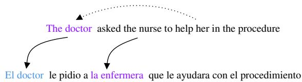

# Evaluating Gender Bias in Machine Translation

Gabriel Stanovsky1,2, Noah A. Smith1,2, and Luke Zettlemoyer1

1Paul G. Allen School of Computer Science & Engineering, University of Washington, Seattle, USA 2Allen Institute for Artificial Intelligence, Seattle, USA {gabis,nasmith,lsz}@cs.washington.edu

## Abstract

We present the first challenge set and evaluation protocol for the analysis of gender bias in machine translation (MT). Our approach uses two recent coreference resolution datasets composed of English sentences which cast participants into non-stereotypical gender roles (e.g., “The doctor asked the nurse to help her in the operation”). We devise an automatic gender bias evaluation method for eight target languages with grammatical gender, based on morphological analysis (e.g., the use of female inflection for the word “doctor”). Our analyses show that four popular industrial MT systems and two recent state-of-the-art academic MT models are significantly prone to gender-biased translation errors for all tested target languages. Our data and code are publicly available at https://github.com/ gabrielStanovsky/mt\_gender.

## 1 Introduction

Learned models exhibit social bias when their training data encode stereotypes not relevant for the task, but the correlations are picked up anyway. Notable examples include gender biases in visual SRL (cooking is stereotypically done by women, construction workers are stereotypically men; Zhao et al., 2017), lexical semantics (“man is to computer programmer as woman is to homemaker”; Bolukbasi et al., 2016), and natural language inference (associating women with gossiping and men with guitars; Rudinger et al., 2017).

In this work, we conduct the first large-scale multilingual evaluation of gender-bias in machine translation (MT), following recent small-scale qualitative studies which observed that online MT services, such as Google Translate or Microsoft Translator, also exhibit biases, e.g., translating nurses as females and programmers as males, regardless of context (Alvarez-Melis and Jaakkola,

Figure 1: An example of gender bias in machine translation from English (top) to Spanish (bottom). In the English source sentence, the nurse’s gender is unknown, while the coreference link with “her” identifies the “doctor” as a female. On the other hand, the Spanish target sentence uses morphological features for gender: “el doctor” (male), versus “la enfermera” (female). Aligning between source and target sentences reveals that a stereotypical assignment of gender roles changed the meaning of the translated sentence by changing the doctor’s gender.

> **AI Description:**
> **Source:** `assets/_page_0_Figure_0.jpg`
> 
> **Generated:** 2026-05-30 10:40:50
> 
> ---
> 
> The image contains a comparison between two sentences in English and Spanish. The English sentence is "The doctor asked the nurse to help her in the procedure," and the Spanish sentence is "El doctor le pidió a la enfermera que le ayudara con el procedimiento." The image includes arrows pointing from the English sentence to the Spanish translation, indicating a translation or translation comparison. The text is accompanied by a dotted line above the English sentence, which may represent a thought or speech bubble, but it does not convey any additional information beyond the text itself.

2017; Font and Costa-Jussa\`, 2019). Google Translate recently tried to mitigate these biases by allowing users to sometimes choose between gendered translations (Kuczmarski, 2018).

As shown in Figure 1, we use data introduced by two recent coreference gender-bias studies: the Winogender (Rudinger et al., 2018), and the Wino-Bias (Zhao et al., 2018) datasets. Following the Winograd schema (Levesque, 2011), each instance in these datasets is an English sentence which describes a scenario with human entities, who are identified by their role (e.g., “the doctor” and “the nurse” in Figure 1), and a pronoun (“her” in the example), which needs to be correctly resolved to one of the entities (“the doctor” in this case). Rudinger et al. (2018) and Zhao et al. (2018) found that while human agreement on the task was high (roughly 95%), coreference resolution models often ignore context and make socially biased predictions, e.g., associating the feminine pronoun “her” with the stereotypically female “nurse.”

We observe that for many target languages, a faithful translation requires a similar form of (at least implicit) gender identification. In addition, in the many languages which associate between biological and grammatical gender (e.g., most Romance, Germanic, Slavic, and Semitic languages; Craig, 1986; Mucchi-Faina, 2005; Corbett, 2007), the gender of an animate object can be identified via morphological markers. For instance, when translating our running example in Figure 1 to Spanish, a valid translation may be: “La doctora le pidio a la enfermera que le ayudara con el procedimiento,” which indicates that the doctor is a woman, by using a feminine suffix inflection (“doctora”) and the feminine definite gendered article (“la”). However, a biased translation system may ignore the given context and stereotypically translate the doctor as male, as shown at the bottom of the figure.

Following these observations, we design a challenge set approach for evaluating gender bias in MT using a concatenation of Winogender and WinoBias. We devise an automatic translation evaluation method for eight diverse target languages, without requiring additional gold translations, relying instead on automatic measures for alignment and morphological analysis (Section 2). We find that four widely used commercial MT systems and two recent state-of-the-art academic models are significantly gender-biased on all tested languages (Section 3). Our method and benchmarks are publicly available, and are easily extensible with more languages and MT models.

## 2 Challenge Set for Gender Bias in MT

We compose a challenge set for gender bias in MT (which we dub “WinoMT”) by concatenating the Winogender and WinoBias coreference test sets. Overall, WinoMT contains 3,888 instances, and is equally balanced between male and female genders, as well as between stereotypical and nonstereotypical gender-role assignments (e.g., a female doctor versus a female nurse). Additional dataset statistics are presented in Table 1.

We use WinoMT to estimate the gender-bias of an MT model, M, in target-language L by performing following steps (exemplified in Figure 1): (1) Translate all of the sentences in WinoMT into L using M , thus forming a bilingual corpus of English and the target language L.

(2) Align between the source and target translations, using fast align (Dyer et al., 2013), trained on the automatic translations from from step (1).

Table 1: The coreference test sets and resulting WinoMT corpus statistics (in number of instances).

We then map the English entity annotated in the coreference datasets to its translation (e.g., align between “the doctor” and “el doctor” in Figure 1). (3) Finally, we extract the target-side entity’s gender using simple heuristics over languagespecific morphological analysis, which we perform using off-the-shelf tools for each target language, as discussed in the following section.

This process extracts the translated genders, according to M , for all of the entities in WinoMT, which we can then evaluate against the gold annotations provided by the original English dataset.

This process can introduce noise into our evaluation in steps (2) and (3), via wrong alignments or erroneous morphological analysis. In Section 3, we will present a human evaluation showing these errors are infrequent.

## 3 Evaluation

In this section, we briefly describe the MT systems and the target languages we use, our main results, and their human validation.

## 3.1 Experimental Setup

MT systems We test six widely used MT models, representing the state of the art in both commercial and academic research: (1) Google Translate,1 (2) Microsoft Translator,2 (3) Amazon Translate,3 (4) SYSTRAN,4 (5) the model of Ott et al. (2018), which recently achieved the best performance on English-to-French translation on the WMT’14 test set, and (6) the model of Edunov et al. (2018), the WMT’18 winner on English-to-German translation. We query the online API for the first four commercial MT systems, while for the latter two academic models we use the pretrained models provided by the Fairseq toolkit.5

Table 2: Performance of commercial MT systems on the WinoMT corpus on all tested languages, categorized by their family: Spanish, French, Italian, Russian, Ukrainian, Hebrew, Arabic, and German. Acc indicates overall gender accuracy (% of instances the translation had the correct gender), $\Delta _ { G }$ denotes the difference in performance $( F _ { 1 }$ score) between masculine and feminine scores, and $\Delta _ { S }$ is the difference in performance $( F _ { 1 }$ score) between pro-stereotypical and anti-stereotypical gender role assignments (higher numbers in the two latter metrics indicate stronger biases). Numbers in bold indicate best accuracy for the language across MT systems (row), and underlined numbers indicate best accuracy for the MT system across languages (column). ∗Amazon Translate does not have a trained model for English to Ukrainian.

Table 3: Performance of recent state-of-the-art academic translation models from English to French and German. Metrics are the same as those in Table 2.

Target languages and morphological analysis We selected a set of eight languages with grammatical gender which exhibit a wide range of other linguistic properties (e.g., in terms of alphabet, word order, or grammar), while still allowing for highly accurate automatic morphological analysis. These languages belong to four different families: (1) Romance languages: Spanish, French, and Italian, all of which have gendered noun-determiner agreement and spaCy morphological analysis support (Honnibal and Montani, 2017). (2) Slavic languages (Cyrillic alphabet): Russian and Ukrainian, for which we use the morphological analyzer developed by Korobov (2015). (3) Semitic languages: Hebrew and Arabic, each with a unique alphabet. For Hebrew, we use the analyzer developed by Adler and Elhadad (2006), while gender inflection in Arabic can be easily identified via the ta marbuta character, which uniquely indicates feminine inflection. (4) Germanic languages: German, for which we use the morphological analyzer developed by Altinok (2018).

## 3.2 Results

Our main findings are presented in Tables 2 and 3. For each tested MT system and target language we compute three metrics with respect to their ability to convey the correct gender in the target language. Ultimately, our analyses indicate that all tested MT systems are indeed gender biased.

First, the overall system Accuracy is calculated by the percentage of instances in which the translation preserved the gender of the entity from the original English sentence. We find that most tested systems across eight tested languages perform quite poorly on this metric. The best performing model on each language often does not do much better than a random guess for the correct inflection. An exception to this rule is the translation accuracies on German, where three out of four systems acheive their best performance. This may be explained by German’s similarity to the English source language (Hawkins, 2015).

In Table 2, $\Delta _ { G }$ denotes the difference in performance $( F _ { 1 }$ score) between male and female translations. Interestingly, all systems, except Microsoft Translator on German, perform significantly better on male roles, which may stem from these being more frequent in the training set.

Perhaps most tellingly, $\Delta _ { S }$ measures the difference in performance $( F _ { 1 }$ score) between stereotypical and non-stereotypical gender role assignments, as defined by Zhao et al. (2018) who use statistics provided by the US Department of Labor.6 This metric shows that all tested systems have a significant and consistently better performance when presented with pro-stereotypical assignments (e.g., a female nurse), while their performance deteriorates when translating antistereotypical roles (e.g., a male receptionist). For instance, Figure 2 depicts Google Translate absolute accuracies on stereotypical and nonstereotypical gender roles across all tested languages. Other tested systems show similar trends.

### Full Page Description (Page 3)

**Source:** `assets/_page_3_Asset_0.jpg`

**Generated:** 2026-05-30 10:41:04

---

The image is a bar chart with two sets of bars for each country, representing accuracy percentages for "Stereotypical" and "Non-Stereotypical" categories. The countries listed are ES, FR, IT, RU, UK, HE, AR, and DE. The chart shows that in most countries, the "Stereotypical" category has a higher accuracy percentage than the "Non-Stereotypical" category. For example, in France (FR), the "Stereotypical" accuracy is 80%, while the "Non-Stereotypical" is 54%. The United Kingdom (UK) has a higher "Stereotypical" accuracy of 46% compared to 35% for "Non-Stereotypical". The chart visually highlights the differences in accuracy between the two categories across different countries.

Table 4: Performance of Google Translate on Spanish, Russian, and Ukranian gender prediction accuracy (% correct) on the original WinoMT corpus, versus a modified version of the dataset where we add sterotypical gender adjectives (see Section 3.3).

## 3.3 Fighting Bias with Bias

Finally, we tested whether we can affect the translations by automatically creating a version of WinoMT with the adjectives “handsome” and “pretty” prepended to male and female entities, respectively. For example, the sentence in Figure 1 will be converted to: “The pretty doctor asked the nurse to help her in the operation”. We are interested in evaluating whether this “corrects” the profession bias by mixing signals, e.g., while “doctor” biases towards a male translation, “pretty” tugs the translation towards a female inflection. Our results show that this improved performance in some languages, significantly reducing bias in Spanish, Russian, and Ukrainian (see Table 4). Admittedly, this is impractical as a general debiasing scheme, since it assumes oracle coreference resolution, yet it attests to the relation between coreference resolution and MT, and serves as a further indication of gender bias in MT.

## 3.4 Human Validation

We estimate the accuracy of our gender bias evaluation method by randomly sampling 100 instances of all translation systems and target languages, annotating each sample by two target-language native speakers (resulting in 9,600 human annotations). Each instance conformed to a format similar to that used by our automatic gender detection algorithm: human annotators were asked to mark the gender of an entity within a given targetlanguage sentence. (e.g., see “el doctor” as highlighted in the Spanish sentence in Figure 1). By annotating at the sentence-level, we can account for both types of possible errors, i.e., alignment and gender extraction.

We compare the sentence-level human annotations to the output of our automatic method, and find that the levels of agreement for all languages and systems were above 85%, with an average agreement on 87% of the annotations. In comparison, human inter-annotator agreement was 90%, due to noise introduced by several incoherent translations.

Our errors occur when language-specific idiosyncrasies introduce ambiguity to the morphological analysis. For example, gender for certain words in Hebrew cannot be distinguished without diacritics (e.g., the male and female versions of the word “baker” are spelled identically), and the contracted determiner in French and Italian (l’) is used for both masculine and feminine nouns. In addition, some languages have only male or female inflections for professions which were stereotypically associated with one of the genders, for example “sastre” (tailor) in Spanish or “soldat” (soldier) in French, which do not have female inflections. See Table 5 for detailed examples.

Table 5: Examples of Google Translate’s output for different sentences in the WinoMT corpus. Words in blue, red, and orange indicate male, female and neutral entities, respectively.

## 4 Discussion

Related work This work is most related to several recent efforts which evaluate MT through the use of challenge sets. Similarly to our use WinoMT, these works evaluate MT systems (either manually or automatically) on test sets which are specially created to exhibit certain linguistic phenomena, thus going beyond the traditional BLEU metric (Papineni et al., 2002). These include challenge sets for language-specific idiosyncrasies (Isabelle et al., 2017), discourse phenomena (Bawden et al., 2018), pronoun translation (Muller et al.¨ , 2018; Webster et al., 2018), or coreference and multiword expressions (Burchardt et al., 2017).

Limitations and future work While our work presents the first large-scale evaluation of gender bias in MT, it still suffers from certain limitations which could be addressed in follow up work. First, like some of the challenge sets discussed above, WinoMT is composed of synthetic English sourceside examples. On the one hand, this allows for a controlled experiment environment, while, on the other hand, this might introduce some artificial biases in our data and evaluation. Ideally, WinoMT could be augmented with natural “in the wild” instances, with many source languages, all annotated with ground truth entity gender. Second, similar to any medium size test set, it is clear that WinoMT serves only as a proxy estimation for the phenomenon of gender bias, and would probably be easy to overfit. A larger annotated corpus can perhaps provide a better signal for training. Finally, even though in Section 3.3 we show a very rudimentary debiasing scheme which relies on oracle coreference system, it is clear that this is not applicable in a real-world scenario. While recent research has shown that getting rid of such biases may prove to be very challenging (Elazar and Goldberg, 2018; Gonen and Goldberg, 2019), we hope that this work will serve as a first step for developing more gender-balanced MT models.

## 5 Conclusions

We presented the first large-scale multilingual quantitative evidence for gender bias in MT, showing that on eight diverse target languages, all four tested popular commercial systems and two recent state-of-the-art academic MT models are significantly prone to translate based on gender stereotypes rather than more meaningful context. Our data and code are publicly available at https://github.com/ gabrielStanovsky/mt\_gender.

## Acknowledgments

We would like to thank Mark Yatskar, Iz Beltagy, Tim Dettmers, Ronan Le Bras, Kyle Richardson, Ariel and Claudia Stanovsky, and Paola Virga for many insightful discussions about the role gender plays in the languages evaluated in this work, as well as the reviewers for their helpful comments.

## References

- Meni Adler and Michael Elhadad. 2006. An unsupervised morpheme-based HMM for Hebrew morphological disambiguation. In ACL.
- Duygu Altinok. 2018. DEMorphy, German language morphological analyzer. CoRR, abs/1803.00902.
- David Alvarez-Melis and Tommi S. Jaakkola. 2017. A causal framework for explaining the predictions of black-box sequence-to-sequence models. In EMNLP.
- Rachel Bawden, Rico Sennrich, Alexandra Birch, and Barry Haddow. 2018. Evaluating discourse phenomena in neural machine translation. In NAACL-HLT.
- Tolga Bolukbasi, Kai-Wei Chang, James Y. Zou, Venkatesh Saligrama, and Adam Tauman Kalai. 2016. Man is to computer programmer as woman is to homemaker? debiasing word embeddings. In NIPS.
- Aljoscha Burchardt, Vivien Macketanz, Jon Dehdari, Georg Heigold, Jan-Thorsten Peter, and Philip Williams. 2017. A linguistic evaluation of rule-based, phrase-based, and neural mt engines. The Prague Bulletin of Mathematical Linguistics, 108(1):159–170.
- Greville G Corbett. 2007. Gender and noun classes.
- Colette G Craig. 1986. Noun Classes and Categorization: Proceedings of a Symposium on Categorization and Noun Classification, volume 7. John Benjamins Publishing Company.
- Chris Dyer, Victor Chahuneau, and Noah A. Smith. 2013. A simple, fast, and effective reparameterization of ibm model 2. In HLT-NAACL.
- Sergey Edunov, Myle Ott, Michael Auli, and David Grangier. 2018. Understanding back-translation at scale. arXiv preprint arXiv:1808.09381.
- Yanai Elazar and Yoav Goldberg. 2018. Adversarial removal of demographic attributes from text data. In EMNLP.
- Joel Escude Font and Marta R. Costa-Juss´ a. 2019.\` Equalizing gender biases in neural machine translation with word embeddings techniques. CoRR, abs/1901.03116.
- Hila Gonen and Yoav Goldberg. 2019. Lipstick on a pig: Debiasing methods cover up systematic gender biases in word embeddings but do not remove them. HLT-NAACL.
- John A Hawkins. 2015. A Comparative Typology of English and German: Unifying the Contrasts. Routledge.
- Matthew Honnibal and Ines Montani. 2017. spaCy 2: Natural language understanding with Bloom embeddings, convolutional neural networks and incremental parsing. To appear.
- Pierre Isabelle, Colin Cherry, and George F. Foster. 2017. A challenge set approach to evaluating machine translation. In EMNLP.
- Mikhail Korobov. 2015. Morphological analyzer and generator for Russian and Ukrainian languages. In Mikhail Yu. Khachay, Natalia Konstantinova, Alexander Panchenko, Dmitry I. Ignatov, and Valeri G. Labunets, editors, Analysis of Images, Social Networks and Texts, volume 542 of Communications in Computer and Information Science, pages 320– 332. Springer International Publishing.
- James Kuczmarski. 2018. Reducing gender bias in google translate.
- Hector J. Levesque. 2011. The Winograd schema challenge. In AAAI Spring Symposium: Logical Formalizations of Commonsense Reasoning.
- Angelica Mucchi-Faina. 2005. Visible or influential? language reforms and gender (in) equality. Social Science Information, 44(1):189–215.
- Mathias Muller, Annette Rios, Elena Voita, and Rico ¨ Sennrich. 2018. A large-scale test set for the evaluation of context-aware pronoun translation in neural machine translation. CoRR, abs/1810.02268.
- Myle Ott, Sergey Edunov, David Grangier, and Michael Auli. 2018. Scaling neural machine translation. arXiv preprint arXiv:1806.00187.
- Kishore Papineni, Salim Roukos, Todd Ward, and Wei-Jing Zhu. 2002. Bleu: a method for automatic evaluation of machine translation. In ACL.
- Rachel Rudinger, Chandler May, and Benjamin Van Durme. 2017. Social bias in elicited natural language inferences. In EthNLP@EACL.
- Rachel Rudinger, Jason Naradowsky, Brian Leonard, and Benjamin Van Durme. 2018. Gender bias in coreference resolution. In NAACL-HLT.
- Kellie Webster, Marta Recasens, Vera Axelrod, and Jason Baldridge. 2018. Mind the gap: A balanced corpus of gendered ambiguous pronouns. Transactions of the Association for Computational Linguistics, 6:605–617.
- Jieyu Zhao, Tianlu Wang, Mark Yatskar, Vicente Ordonez, and Kai-Wei Chang. 2017. Men also like shopping: Reducing gender bias amplification using corpus-level constraints. In EMNLP.
- Jieyu Zhao, Tianlu Wang, Mark Yatskar, Vicente Ordonez, and Kai-Wei Chang. 2018. Gender bias in coreference resolution: Evaluation and debiasing methods. In NAACL-HLT.