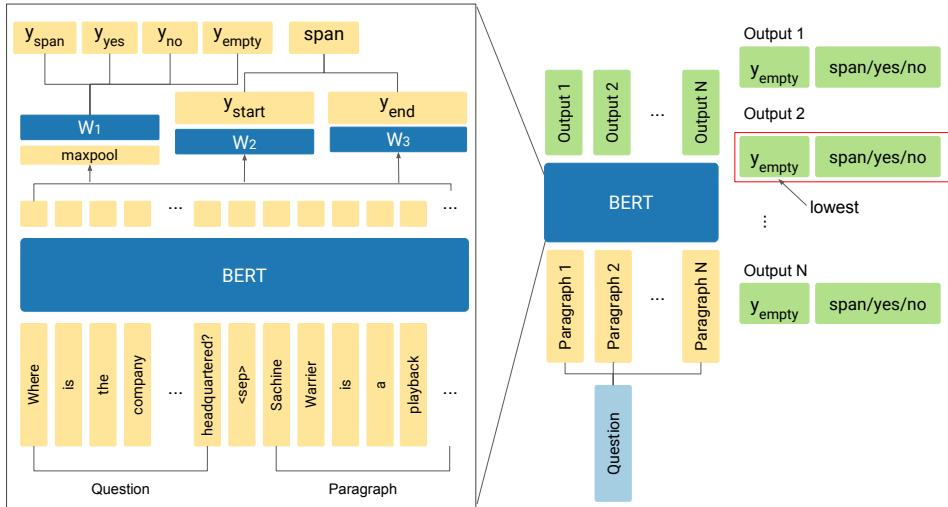

<span id="page-0-0"></span>
# Compositional Questions Do Not Necessitate Multi-hop Reasoning

Sewon Min∗ 1, Eric Wallace∗ 2, Sameer Singh3,

Matt Gardner2, Hannaneh Hajishirzi1,2, Luke Zettlemoyer1

1University of Washington

2Allen Institute for Artificial Intelligence

3University of California, Irvine

sewon@cs.washington.edu, ericw@allenai.org

## Abstract

Multi-hop reading comprehension (RC) questions are challenging because they require reading and reasoning over multiple paragraphs. We argue that it can be difficult to construct large multi-hop RC datasets. For example, even highly compositional questions can be answered with a single hop if they target specific entity types, or the facts needed to answer them are redundant. Our analysis is centered on HOTPOTQA, where we show that single-hop reasoning can solve much more of the dataset than previously thought. We introduce a single-hop BERT-based RC model that achieves 67 F1—comparable to state-of-theart multi-hop models. We also design an evaluation setting where humans are not shown all of the necessary paragraphs for the intended multi-hop reasoning but can still answer over 80% of questions. Together with detailed error analysis, these results suggest there should be an increasing focus on the role of evidence in multi-hop reasoning and possibly even a shift towards information retrieval style evaluations with large and diverse evidence collections.

## 1 Introduction

Multi-hop reading comprehension (RC) requires reading and aggregating information over multiple pieces of textual evidence (Welbl et al., 2017; Yang et al., 2018; Talmor and Berant, 2018). In this work, we argue that it can be difficult to construct large multi-hop RC datasets. This is because multi-hop reasoning is a characteristic of both the question and the provided evidence; even highly compositional questions can be answered with a single hop if they target specific entity types, or the facts needed to answer them are redundant. For example, the question in Figure 1 is compositional: a plausible solution is to find “What animal’s habitat was the Reserve Naturelle Lomako Yokokala ´

∗Equal Contribution.

Question: What is the former name of the animal whose habitat the Reserve Naturelle Lomako Yokokala was es-´ tablished to protect?

Paragraph 5: The Lomako Forest Reserve is found in Democratic Republic of the Congo. It was established in 1991 especially to protect the habitat of the Bonobo apes. Paragraph 1: The bonobo (“Pan paniscus”), formerly called the pygmy chimpanzee and less often, the dwarf or gracile chimpanzee, is an endangered great ape and one of the two species making up the genus “Pan”.

Figure 1: A HOTPOTQA example designed to require reasoning across two paragraphs. Eight spurious additional paragraphs (not shown) are provided to increase the task difficulty. However, since only one of the ten paragraphs is about an animal, one can immediately locate the answer in Paragraph 1 using one hop. The full example is provided in Appendix A.

established to protect?”, and then answer “What is the former name of that animal?”. However, when considering the evidence paragraphs, the question is solvable in a single hop by finding the only paragraph that describes an animal.

Our analysis is centered on HOTPOTQA (Yang et al., 2018), a dataset of mostly compositional questions. In its RC setting, each question is paired with two gold paragraphs, which should be needed to answer the question, and eight distractor paragraphs, which provide irrelevant evidence or incorrect answers. We show that single-hop reasoning can solve much more of this dataset than previously thought. First, we design a single-hop QA model based on BERT (Devlin et al., 2018), which, despite having no ability to reason across paragraphs, achieves performance competitive with the state of the art. Next, we present an evaluation demonstrating that humans can solve over 80% of questions when we withhold one of the gold paragraphs.

To better understand these results, we present a detailed analysis of why single-hop reasoning works so well. We show that questions include redundant facts which can be ignored when computing the answer, and that the fine-grained entity types present in the provided paragraphs in the RC setting often provide a strong signal for answering the question, e.g., there is only one animal in the given paragraphs in Figure 1, allowing one to immediately locate the answer using one hop.

<span id="page-1-0"></span>
This analysis shows that more carefully chosen distractor paragraphs would induce questions that require multi-hop reasoning. We thus explore an alternative method for collecting distractors based on adversarial paragraph selection. Although this appears to mitigate the problem, a single-hop model re-trained on these distractors can recover most of the original single-hop accuracy, indicating that these distractors are still insufficient. Another method is to consider very large distractor sets such as all of Wikipedia or the entire Web, as done in open-domain HOTPOTQA and ComplexWebQuestions (Talmor and Berant, 2018). However, this introduces additional computational challenges and/or the need for retrieval systems. Finding a small set of distractors that induce multihop reasoning remains an open challenge that is worthy of follow up work.

## 2 Related Work

Large-scale RC datasets (Hermann et al., 2015; Rajpurkar et al., 2016; Joshi et al., 2017) have enabled rapid advances in neural QA models (Seo et al., 2017; Xiong et al., 2018; Yu et al., 2018; Devlin et al., 2018). To foster research on reasoning across multiple pieces of text, multi-hop QA has been introduced (Kociskˇ y et al.\` , 2018; Talmor and Berant, 2018; Yang et al., 2018). These datasets contain compositional or “complex” questions. We demonstrate that these questions do not necessitate multi-hop reasoning.

Existing multi-hop QA datasets are constructed using knowledge bases, e.g., WIKIHOP (Welbl et al., 2017) and COMPLEXWEBQUESTIONS (Talmor and Berant, 2018), or using crowd workers, e.g., HOTPOTQA (Yang et al., 2018). WIKI-HOP questions are posed as triples of a relation and a head entity, and the task is to determine the tail entity of the relationship. COMPLEXWE-BQUESTIONS consists of open-domain compositional questions, which are constructed by increasing the complexity of SPARQL queries from WE-BQUESTIONS (Berant et al., 2013). We focus on HOTPOTQA, which consists of multi-hop questions written to require reasoning over two para-

Figure 2: Our model, single-paragraph BERT, reads and scores each paragraph independently. The answer from the paragraph with the lowest $y _ { \mathrm { { e m p t y } } }$ score is chosen as the final answer.

graphs from Wikipedia.

Parallel research from Chen and Durrett (2019) presents similar findings on HOTPOTQA. Our work differs because we conduct human analysis to understand why questions are solvable using singlehop reasoning. Moreover, we show that selecting distractor paragraphs is difficult using current retrieval methods.

## 3 Single-paragraph QA

This section shows the performance of a single-hop model on HOTPOTQA.

## 3.1 Model Description

Our model, single-paragraph BERT, scores and answers each paragraph independently (Figure 2). We then select the answer from the paragraph with the best score, similar to Clark and Gardner (2018).1

The model receives a question $Q = [ q _ { 1 } , . . , q _ { m } ]$ and a single paragraph $P ~ = ~ [ p _ { 1 } , . . . , p _ { n } ]$ as input. Following Devlin et al. (2018), $\begin{array} { r l } { S } & { { } = } \end{array}$ $[ q 1 , . . . , q _ { m } , [ \mathtt { S E P } ] , p 1 , . . . , p _ { n } ]$ , where [SEP] is a special token, is fed into BERT:

$$
S ^ { \prime } = \mathtt { B E R T } ( S ) \in \mathbb { R } ^ { h \times ( m + n + 1 ) } ,
$$

where h is the hidden dimension of BERT. Next, a classifier uses max-pooling and learned parameters $W _ { 1 } \in \mathbb { R } ^ { h \times 4 }$ to generate four scalars:

$$
[ y _ { \mathrm { s p a n } } ; y _ { \mathrm { y e s } } ; y _ { \mathrm { n o } } ; y _ { \mathrm { e m p t y } } ] = W _ { 1 } \mathrm { m a x p o o l } ( S ^ { \prime } ) ,
$$

where $y _ { \mathrm { s p a n } } , y _ { \mathrm { y e s } } , y _ { \mathrm { n o } }$ and $y _ { \mathrm { { e m p t y } } }$ indicate the answer is either a span, yes, no, or no answer. An extractive paragraph span, span, is obtained separately following Devlin et al. (2018). The final model outputs are a scalar value $y _ { \mathrm { { e m p t y } } }$ and a text of either span, yes or no, based on which of yspan, yyes, yno has the largest value.

<span id="page-2-0"></span>
Table 1: F1 scores on HOTPOTQA. \* indicates the result is on the validation set; the other results are on the hidden test set shown in the official leaderboard.


For a particular HOTPOTQA example, we run single-paragraph BERT on each paragraph in parallel and select the answer from the paragraph with the smallest yempty.

## 3.2 Model Results

HOTPOTQA has two settings: a distractor setting and an open-domain setting.

Distractor Setting The HOTPOTQA distractor setting pairs the two paragraphs the question was written for (gold paragraphs) with eight spurious paragraphs selected using TF-IDF similarity with the question (distractors). Our single-paragraph BERT model achieves 67.08 F1, comparable to the state-of-the-art (Table 1).2 This indicates the majority of HOTPOTQA questions are answerable in the distractor setting using a single-hop model.

Open-domain Setting The HOTPOTQA opendomain setting (Fullwiki) does not provide a set of paragraphs—all of Wikipedia is considered. We follow Chen et al. (2017) and retrieve paragraphs using bigram TF-IDF similarity with the question.

We use the single-paragraph BERT model trained in the distractor setting. We also fine-tune the model using incorrect paragraphs selected by the retrieval system. In particular, we retrieve 30 paragraphs and select the eight paragraphs with the lowest $y _ { \mathrm { { e m p t y } } }$ scores predicted by the trained model. Single-paragraph BERT achieves 38.06 F1 in the open-domain setting (Table 1). This shows that the open-domain setting is challenging for our single-hop model and is worthy of future study.

## 4 Compositional Questions Are Not Always Multi-hop

This section provides a human analysis of HOT-POTQA to understand what phenomena enable single-hop answer solutions. HOTPOTQA contains two question types, Bridge and Comparison, which we evaluate separately.

## 4.1 Categorizing Bridge Questions

Bridge questions consist of two paragraphs linked by an entity (Yang et al., 2018), e.g., Figure 1. We first investigate single-hop human performance on HOTPOTQA bridge questions using a human study consisting of NLP graduate students. Humans see the paragraph that contains the answer span and the eight distractor paragraphs, but do not see the other gold paragraph. As a baseline, we show a different set of people the same questions in their standard ten paragraph form.

On a sample of 200 bridge questions from the validation set, human accuracy shows marginal degradation when using only one hop: humans obtain 87.37 F1 using all ten paragraphs and 82.06 F1 when using only nine (where they only see a single gold paragraph). This indicates humans, just like models, are capable of solving bridge questions using only one hop.

Next, we manually categorize what enables single-hop answers for 100 bridge validation examples (taking into account the distractor paragraphs), and place questions into four categories (Table 2).

Multi-hop 27% of questions require multi-hop reasoning. The first example of Table 2 requires locating the university where “Ralph Hefferline” was a psychology professor, and multiple universities are provided as distractors. Therefore, the answer cannot be determined in one hop.3

Weak Distractors 35% of questions allow single-hop answers in the distractor setting, mostly by entity type matching. Consider the question in the second row of Table 2: in the ten provided paragraphs, only one actress has a government position. Thus, the question is answerable without considering the film “Kiss and Tell.” These examples may become multi-hop in the open-domain setting, e.g., there are numerous actresses with a government position on Wikipedia.

3It is possible that a single-hop model can do well by randomly guessing between two or three well-typed options, but we do not evaluate that strategy here.

<span id="page-3-0"></span>
Table 2: We categorize bridge questions while taking the paragraphs into account. We exclude 4% of questions that we found to have incorrect or ambiguous answer annotations. See Section 4.1 for details on question types.


Table 3: We automatically categorize comparison questions using rules (2% cannot be automatically categorized). Single-paragraph BERT achieves near chance accuracy on multi-hop questions but exploits single-hop ones.


To further investigate entity type matching, we reduce the question to the first five tokens starting from the wh-word, following Sugawara et al. (2018). Although most of these reduced questions appear void of critical information, the F1 score of single-paragraph BERT only degrades about 15 F1 from 67.08 to 52.13.

Redundant Evidence 26% of questions are compositional but are solvable using only part of the question. For instance, in the third example of Table 2 there is only a single founder of “Kaiser Ventures.” Thus, one can ignore the condition on “American industrialist” and “father of modern American shipbuilding.” This category differs from the weak distractors category because its questions are single-hop regardless of the distractors.

Non-compositional Single-hop 8% of questions are non-compositional and single-hop. In the last example of Table 2, one sentence contains all of the information needed to answer correctly.

## 4.2 Categorizing Comparison Questions

Comparison questions require quantitative or logical comparisons between two quantities or events. We create rules (Appendix C) to group comparison questions into three categories: questions which require multi-hop reasoning (multi-hop), may require multi-hop reasoning (context-dependent), and require single-hop reasoning (single-hop).

Many comparison questions are multi-hop or context-dependent multi-hop, and single-paragraph

Table 4: We train on HOTPOTQA using standard distractors (Original) or using adversarial distractors (Adversarial). The model is then tested on the original distractors, adversarial distractors, or adversarial distractors with filtering by entity type (+ Type).


BERT achieves near chance accuracy on these types of questions (Table 3).4 This shows that most comparison questions are not solvable by our single-hop model.

## 5 Can We Find Better Distractors?

In Section 4.1, we identify that 35% of bridge examples are solvable using single-hop reasoning due to weak distractor paragraphs. Here, we attempt to automatically correct these examples by choosing new distractor paragraphs which are likely to trick our single-paragraph model.

Adversarial Distractors We select the top-50 first paragraphs of Wikipedia pages using TF-IDF similarity with the question, following the original HOTPOTQA setup. Next, we use single-paragraph BERT to adversarially select the eight distractor paragraphs from these 50 candidates. In particular, we feed each paragraph to the model and select the paragraphs with the lowest $y _ { \mathrm { { e m p t y } } }$ score (i.e., the paragraphs that the model thinks contain the answer). These paragraphs are dissimilar to the original distractors—there is a 9.82% overlap.

<span id="page-4-0"></span>
We report the F1 score of single-paragraph BERT on these new distractors in Table 4: the accuracy declines from 67.08 F1 to 46.84 F1. However, when the same procedure is done on the training set and the model is re-trained, the accuracy increases to 60.10 F1 on the adversarial distractors.

Type Distractors We also experiment with filtering the initial list of 50 paragraph to ones whose entity type (e.g., person) matches that of the gold paragraphs. This can help to eliminate the entity type bias described in Section 4.1. As shown in Table 4, the original model’s accuracy degrades significantly (drops to 40.73 F1). However, similar to the previous setup, the model trained on the adversarially selected distractors can recover most of its original accuracy (increases to 58.42 F1).

These results show that single-paragraph BERT can struggle when the distribution of the distractors changes (e.g., using adversarial selection rather than only TF-IDF). Moreover, the model can somewhat recover its original accuracy when re-trained on distractors from the new distribution.

## 6 Conclusions

In summary, we demonstrate that question compositionality is not a sufficient condition for multi-hop reasoning. Instead, future datasets must carefully consider what evidence they provide in order to ensure multi-hop reasoning is required. There are at least two different ways to achieve this.

Open-domain Questions Our single-hop model struggles in the open-domain setting. We largely attribute this to the insufficiencies of standard TF-IDF retrieval for multi-hop questions. For example, we fail to retrieve the paragraph about “Bonobo apes” in Figure 1, because the question does not contain terms about “Bonobo apes.” Table 5 shows that the model achieves 39.12 F1 given 500 retrieved paragraphs, but achieves 53.12 F1 when additional two gold paragraphs are given, demonstrating the significant effect of failure to retrieve gold paragraphs. In this context, we suggest that future work can explore better retrieval methods for multi-hop questions.

Retrieving Strong Distractors Another way to ensure multi-hop reasoning is to select strong distractor paragraphs. For example, we found 35% of bridge questions are currently single-hop but may become multi-hop when combined with stronger distractors (Section 4.1). However, as we demonstrate in Section 5, selecting strong distractors for RC questions is non-trivial. We suspect this is also due to the insufficiencies of standard TF-IDF retrieval for multi-hop questions. In particular, Table 5 shows that single-paragraph BERT achieves 53.12 F1 even when using 500 distractors (rather than eight), indicating that 500 distractors are still insufficient. In this end, future multi-hop RC datasets can develop improved methods for distractor collection.

Table 5: The accuracy of single-paragraph BERT in different open-domain retrieval settings. TF-IDF often fails to retrieve the gold paragraphs even when using 500 candidates.


## Acknowledgements

This research was supported by ONR (N00014-18- 1-2826, N00014-17-S-B001), NSF (IIS-1616112, IIS-1252835, IIS-1562364), ARO (W911NF-16-1- 0121), an Allen Distinguished Investigator Award, Samsung GRO and gifts from Allen Institute for AI, Google, and Amazon.

The authors would like to thank Shi Feng, Nikhil Kandpal, Victor Zhong, the members of AllenNLP and UW NLP, and the anonymous reviewers for their valuable feedback.

## References

- Jonathan Berant, Andrew Chou, Roy Frostig, and Percy Liang. 2013. Semantic parsing on freebase from question-answer pairs. In EMNLP.
- Danqi Chen, Adam Fisch, Jason Weston, and Antoine Bordes. 2017. Reading wikipedia to answer opendomain questions. In ACL.
- Jifan Chen and Greg Durrett. 2019. Understanding dataset design choices for multi-hop reasoning. In NAACL.
- Christopher Clark and Matt Gardner. 2018. Simple and effective multi-paragraph reading comprehension. In ACL.

<span id="page-5-0"></span>
- Jacob Devlin, Ming-Wei Chang, Kenton Lee, and Kristina Toutanova. 2018. BERT: Pre-training of deep bidirectional transformers for language understanding. In NAACL.
- Karl Moritz Hermann, Tomas Kocisky, Edward Grefenstette, Lasse Espeholt, Will Kay, Mustafa Suleyman, and Phil Blunsom. 2015. Teaching machines to read and comprehend. In NIPS.
- Mandar Joshi, Eunsol Choi, Daniel S Weld, and Luke Zettlemoyer. 2017. TriviaQA: A large scale distantly supervised challenge dataset for reading comprehension. In ACL.
- Diederik P Kingma and Jimmy Ba. 2015. Adam: A method for stochastic optimization. In ICLR.
- Toma´s Ko ˇ cisk ˇ y, Jonathan Schwarz, Phil Blunsom, \` Chris Dyer, Karl Moritz Hermann, Gabor Melis, and ´ Edward Grefenstette. 2018. The NarrativeQA reading comprehension challenge. TACL.
- Adam Paszke, Sam Gross, Soumith Chintala, Gregory Chanan, Edward Yang, Zachary DeVito, Zeming Lin, Alban Desmaison, Luca Antiga, and Adam Lerer. 2017. Automatic differentiation in PyTorch. In NIPS Autodiff Workshop.
- Pranav Rajpurkar, Jian Zhang, Konstantin Lopyrev, and Percy Liang. 2016. SQuAD: 100,000+ questions for machine comprehension of text. In EMNLP.
- Minjoon Seo, Aniruddha Kembhavi, Ali Farhadi, and Hannaneh Hajishirzi. 2017. Bidirectional attention flow for machine comprehension. In ICLR.
- Saku Sugawara, Kentaro fInui, Satoshi Sekine, and Akiko Aizawa. 2018. What makes reading comprehension questions easier? In EMNLP.
- Alon Talmor and Jonathan Berant. 2018. The web as a knowledge-base for answering complex questions. In NAACL.
- Johannes Welbl, Pontus Stenetorp, and Sebastian Riedel. 2017. Constructing Datasets for Multi-hop Reading Comprehension Across Documents. In TACL.
- Caiming Xiong, Victor Zhong, and Richard Socher. 2018. DCN+: Mixed objective and deep residual coattention for question answering. In ICLR.
- Zhilin Yang, Peng Qi, Saizheng Zhang, Yoshua Bengio, William W Cohen, Ruslan Salakhutdinov, and Christopher D Manning. 2018. HotpotQA: A dataset for diverse, explainable multi-hop question answering. In EMNLP.
- Adams Wei Yu, David Dohan, Minh-Thang Luong, Rui Zhao, Kai Chen, Mohammad Norouzi, and Quoc V. Le. 2018. Qanet: Combining local convolution with global self-attention for reading comprehension. In ICLR.

<span id="page-6-0"></span>
## A Example Distractor Question

We present the full example from Figure 1 below.   
Paragraphs 1 and 5 are the two gold paragraphs.

Question What is the former name of the animal whose habitat the Reserve Naturelle Lomako´ Yokokala was established to protect?

Answer pygmy chimpanzee

(Gold Paragraph) Paragraph 1 The bonobo (or ; “Pan paniscus”), formerly called the pygmy chimpanzee and less often, the dwarf or gracile chimpanzee, is an endangered great ape and one of the two species making up the genus “Pan”; the other is “Pan troglodytes”, or the common chimpanzee. Although the name “chimpanzee” is sometimes used to refer to both species together, it is usually understood as referring to the common chimpanzee, whereas “Pan paniscus” is usually referred to as the bonobo.

Paragraph 2 The Carriere des Nerviens Re- ´ gional Nature Reserve (in French “Reserve na- ´ turelle regionale de la carri ´ ere des Nerviens”) is ´ a protected area in the Nord-Pas-de-Calais region of northern France. It was established on 25 May 2009 to protect a site containing rare plants and covers just over 3 ha. It is located in the municipalities of Bavay and Saint-Waast in the Nord department.

Paragraph 3 Cereste (Occitan: “Ceir ´ esta”) is ´ a commune in the Alpes-de-Haute-Provence department in southeastern France. It is known for its rich fossil beds in fine layers of “Calcaire de Campagne Calavon” limestone, which are now protected by the Parc naturel regional du Luberon and ´ the Reserve naturelle g ´ eologique du Luberon. ´

Paragraph 4 The Grand Cote National Wildlife Refuge (French: “Reserve Naturelle Faunique Na- ´ tionale du Grand- Cote”) was established in 1989 as part of the North American Waterfowl Management Plan. It is a 6000 acre reserve located in Avoyelles Parish, near Marksville, Louisiana, in the United States.

(Gold Paragraph) Paragraph 5 The Lomako Forest Reserve is found in Democratic Republic of the Congo. It was established in 1991 especially to protect the habitat of the Bonobo apes. This site covers 3,601.88 km2.

Paragraph 6 Guadeloupe National Park (French: “Parc national de la Guadeloupe”) is a national park in Guadeloupe, an overseas department of France located in the Leeward Islands of the eastern Caribbean region. The Grand Cul-de-Sac Marin Nature Reserve (French: “Reserve Naturelle du ´ Grand Cul-de-Sac Marin”) is a marine protected area adjacent to the park and administered in conjunction with it. Together, these protected areas comprise the Guadeloupe Archipelago (French: “l’Archipel de la Guadeloupe”) biosphere reserve.

Paragraph 7 La Desirade National Nature Re- ´ serve (French: “Reserve naturelle nationale de La´ Desirade”) is a reserve in D ´ esirade Island in Guade- ´ loupe. Established under the Ministerial Decree No. 2011-853 of 19 July 2011 for its special geological features it has an area of 62 ha. The reserve represents the geological heritage of the Caribbean tectonic plate, with a wide spectrum of rock formations, the outcrops of volcanic activity being remnants of the sea level oscillations. It is one of thirty three geosites of Guadeloupe.

Paragraph 8 La Tortue ou l’Ecalle or Ile Tortue is a small rocky islet off the northeastern coast of Saint Barthelemy in the Caribbean. Its highest ´ point is 35 m above sea level. Referencing tortoises, it forms part of the Reserve naturelle nationale de ´ Saint-Barthelemy with several of the other northern ´ islets of St Barts.

Paragraph 9 Nature Reserve of Saint Bartholomew (Reserve Naturelle de Saint-´ Barthelemy) is a nature reserve of Saint ´ Barthelemy (RNN 132), French West Indies, an ´ overseas collectivity of France.

Paragraph 10 Ile Fourchue, also known as Ile Fourche is an island between Saint-Barthelemy and ´ Saint Martin, belonging to the Collectivity of Saint Barthelemy. The island is privately owned. The ´ only inhabitants are some goats. The highest point is 103 meter above sea level. It is situated within Reserve naturelle nationale de Saint-Barth ´ elemy. ´

## B Full Model Details

Single-paragraph BERT is a pipeline which first retrieves a single paragraph using a classifier and then selects the associated answer. Formally, the model receives a question $Q = [ q _ { 1 } , . . , q _ { m } ]$ and a single paragraph $P = [ p _ { 1 } , . . . , p _ { n } ]$ as input. The question and paragraph are merged into a single sequence, $S = [ q _ { 1 } , . . . , q _ { m } , [ \mathrm { S E P } ] , p _ { 1 } , . . . , p _ { n } ]$ , where [SEP] is a special token indicating the boundary. The sequence is fed into BERT-BASE:

<span id="page-7-0"></span>
Figure 3: Single-paragraph BERT reads and scores each paragraph independently. The answer from the paragraph with the lowest $y ^ { \mathrm { e m p t y } }$ score is chosen as the final answer.


> **AI Description:**
> **Source:** `assets/_page_7_Figure_0.jpg`
> 
> **Generated:** 2026-05-30 10:53:46
> 
> ---
> 
> The image is a technical diagram illustrating a machine learning model architecture for a question-answering task. It features a flowchart with nodes and arrows representing the processing steps. The diagram includes:
> 
> 1. A question and paragraph input, which are tokenized and fed into a BERT model.
> 2. The BERT model processes the input and outputs multiple layers of information, including "y_empty," "span/yes/no," and "y_start/y_end" for each output.
> 3. The model's outputs are then aggregated and processed further, with the lowest output being highlighted in red.
> 4. The architecture includes a maxpool layer and weights (W1, W2, W3) for the span prediction task.
> 
> The diagram provides a clear visual representation of the model's structure and the flow of information through the various components, making it useful for understanding the model's design and functionality.


$$
S ^ { \prime } = \mathtt { B E R T } ( S ) \in \mathbb { R } ^ { h \times ( m + n + 1 ) } ,
$$

where h is the hidden dimension of BERT. Next, a classifier uses max-pooling and learned parameters $W _ { 1 } \in \mathbb { R } ^ { h \times 4 }$ to generate four scalars:

$$
[ y _ { \mathrm { s p a n } } ; y _ { \mathrm { y e s } } ; y _ { \mathrm { n o } } ; y _ { \mathrm { e m p t y } } ] = W _ { 1 } \mathrm { m a x p o o l } ( S ^ { \prime } ) ,
$$

where $y _ { \mathrm { s p a n } } , y _ { \mathrm { y e s } } , y _ { \mathrm { n o } }$ and $y _ { \mathrm { { e m p t y } } }$ indicate the answer is either a span, yes, no, or no answer.

A candidate answer span is then computed separately from the classifier. We define

$$
\begin{array} { r } { p _ { \mathrm { s t a r t } } = \mathrm { S o f t m a x } ( W _ { 2 } S ^ { \prime } ) } \\ { p _ { \mathrm { e n d } } = \mathrm { S o f t m a x } ( W _ { 3 } S ^ { \prime } ) , } \end{array}
$$

where $W _ { 2 } , W _ { 3 } \in \mathbb { R } ^ { h }$ are learned parameters. Then, $y _ { \mathrm { s t a r t } }$ and $y _ { \mathrm { e n d } }$ are obtained:

$$
y _ { \mathrm { s t a r t } } , y _ { \mathrm { e n d } } = \underset { i \leq j } { \arg \operatorname* { m a x } } p _ { \mathrm { s t a r t } } ^ { i } p _ { \mathrm { e n d } } ^ { j }
$$

where $p _ { \mathrm { s t a r t } } ^ { i }$ and $p _ { \mathrm { e n d } } ^ { j }$ indicate the i-th element of $p _ { \mathrm { s t a r t } }$ and j-th element of $p _ { \mathrm { e n d } }$ , respectively.

We now have four scalar values $y _ { \mathrm { s p a n } } , y _ { \mathrm { y e s } } , y _ { \mathrm { n o } } ,$ and $y _ { \mathrm { { e m p t y } } }$ and a span from the paragraph span = $[ S _ { y _ { \mathrm { s t a r t } } } , \ldots , S _ { y _ { \mathrm { e n d } } } ]$

For HOTPOTQA, the input is a question and N context paragraphs. We create a batch of size N, where each entry is a question and a single paragraph. Denote the ouput from i-th entry as $y _ { \mathrm { s p a n } } ^ { i } , y _ { \mathrm { y e s } } ^ { i } , y _ { \mathrm { n o } } ^ { i } , y _ { \mathrm { e m p t y } } ^ { i }$ and spani. The final answer is selected as:

$$
\begin{array} { r c l } { { j } } & { { = } } & { { \mathrm { a r g m i n } _ { i } ( y _ { \mathrm { e m p t y } } ^ { i } ) } } \\ { { y _ { \mathrm { m a x } } } } & { { = } } & { { \mathrm { m a x } ( y _ { \mathrm { s p a n } } ^ { j } , y _ { \mathrm { y e s } } ^ { j } , y _ { \mathrm { n o } } ^ { j } ) } } \\ { { } } & { { } } & { { } } \\ { { \mathrm { a n s w e r } } } & { { = } } & { { \left\{ \begin{array} { l l } { { \mathrm { s p a n } ^ { j } } } & { { \mathrm { i f } y _ { \mathrm { s p a n } } ^ { j } = y _ { \mathrm { m a x } } } } \\ { { \mathrm { Y e s } } } & { { \mathrm { i f } y _ { \mathrm { y e s } } ^ { j } = y _ { \mathrm { m a x } } } } \\ { { \mathrm { n o } } } & { { \mathrm { i f } y _ { \mathrm { n o } } ^ { j } = y _ { \mathrm { m a x } } } } \end{array} \right. } } \end{array}
$$

During training, $y _ { \mathrm { e m p t y } } ^ { i }$ is set to 0 for the paragraph which contains the answer span and 1 otherwise.

Implementation Details We use Py-Torch (Paszke et al., 2017) based on Hugging Face’s implementation.5 We use Adam (Kingma and Ba, 2015) with learning rate $5 \times 1 0 ^ { - 5 }$ . We lowercase the input and set the maximum sequence length |S| to 300. If a sequence is longer than 300, we split it into multiple sequences and treat them as different examples.

## C Categorizing Comparison Questions

This section describes how we categorize comparison questions. We first identify ten question operations that sufficiently cover comparison questions (Table 6). Next, for each question, we extract the two entities under comparison using the $\mathrm { S p a c y } ^ { 6 }$ NER tagger on the question and the two HOT-POTQA supporting facts. Using these extracted entities, we identity the suitable question operation following Algorithm 1.

<span id="page-8-0"></span>
```
Operation & Example   
Numerical Questions   
Operations: Is greater / Is smaller / Which is greater / Which is smaller   
Example (Which is smaller): Who was born first, Arthur Conan Doyle or Penelope Lively?   
Logical Questions   
Operations: And / Or / Which is true   
Example (And): Are Hot Rod and the Memory of Our People both magazines?   
String Questions   
Operations: Is equal / Not equal / Intersection   
Example (Is equal): Are Cardinal Health and Kansas City Southern located in the same state?
```

Table 6: The question operations used for categorizing comparison questions.
```
Algorithm 1 Algorithm for Identifying Question Operations   
1: procedure CATEGORIZE(question, entity1, entity2)   
2: coordination, preconjunct ← f(question, entity1, entity2)   
3: Determine if the question is either question or both question from coordination and preconjunct   
4: head entity ← fhead(question, entity1, entity2)   
5: if more, most, later, last, latest, longer, larger, younger, newer, taller, higher in question then   
6: if head entity exists then discrete operation ← Which is greater   
7: else discrete operation ← Is greater   
8: else if less, earlier, earliest, first, shorter, smaller, older, closer in question then   
9: if head entity exists then discrete operation ← Which is smaller   
10: else discrete operation ← Is smaller   
11: else if head entity exists then   
12: discrete operation ← Which is true   
13: else if question is not yes/no question and asks for the property in common then   
14: discrete operation ← Intersection   
15: else if question is yes/no question then   
16: Determine if question asks for logical comparison or string comparison   
17: if question asks for logical comparison then   
18: if either question then discrete operation ← Or   
19: else if both question then discrete operation ← And   
20: else if question asks for string comparison then   
21: if asks for same? then discrete operation ← Is equal   
22: else if asks for difference? then discrete operation ← Not equal   
23: return discrete operation
```

Based on the identified operation, questions are classified into multi-hop, context-dependent multi-hop, or single-hop. First, numerical questions are always multi-hop (e.g., first example of Table 6). Next, the operations And, Or, Is equal, and Not equal are context-dependent multi-hop. For instance, in the second example of Table 6, if “Hot Rod” is not a magazine, one can immediately answer No. Finally, the operations Which is true and Intersection are single-hop because they can be answered using one paragraph regardless of the context. For instance, in the third example of Table 6, if Henry Roth’s paragraph explains he is from England, one can answer Henry Roth, otherwise, the answer is Robert Erskine Childers.