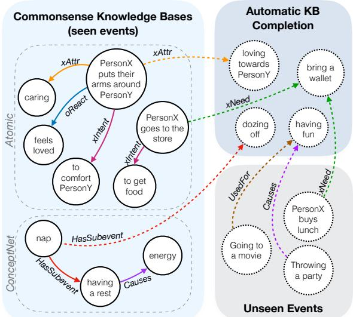
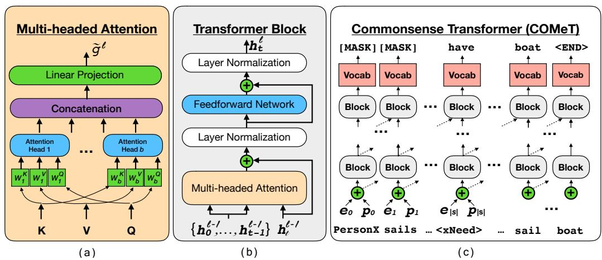

# COMET : Commonsense Transformers for Automatic Knowledge Graph Construction

Antoine Bosselut ♦♠ Hannah Rashkin ♦♠ Maarten Sap ♦♠ Chaitanya Malaviya ♦ Asli Celikyilmaz ♣ Yejin Choi ♦♠

♦Allen Institute for Artificial Intelligence, Seattle, WA, USA ♠Paul G. Allen School of Computer Science & Engineering, Seattle, WA, USA ♣Microsoft Research, Redmond, WA, USA

## Abstract

We present the first comprehensive study on automatic knowledge base construction for two prevalent commonsense knowledge graphs: ATOMIC (Sap et al., 2019) and ConceptNet (Speer et al., 2017). Contrary to many conventional KBs that store knowledge with canonical templates, commonsense KBs only store loosely structured open-text descriptions of knowledge. We posit that an important step toward automatic commonsense completion is the development of generative models of commonsense knowledge, and propose COMmonsEnse Transformers (COMET ) that learn to generate rich and diverse commonsense descriptions in natural language. Despite the challenges of commonsense modeling, our investigation reveals promising results when implicit knowledge from deep pre-trained language models is transferred to generate explicit knowledge in commonsense knowledge graphs. Empirical results demonstrate that COMET is able to generate novel knowledge that humans rate as high quality, with up to 77.5% (ATOMIC) and 91.7% (ConceptNet) precision at top 1, which approaches human performance for these resources. Our findings suggest that using generative commonsense models for automatic commonsense KB completion could soon be a plausible alternative to extractive methods.

## 1 Introduction

When reading text, humans make commonsense inferences that frame their understanding of the narrative being presented. For machines to achieve this capability, they must be able to acquire relevant and correct commonsense for an unbounded set of situations. In this work, we cast commonsense acquisition as knowledge base construction and investigate whether large-scale language models can effectively learn to generate the knowledge necessary to automatically construct a commonsense knowledge base (KB).

Figure 1: COMET learns from an existing knowledge base (solid lines) to be able to generate novel nodes and edges (dashed lines).

> **AI Description:**
> **Source:** `assets/_page_0_Figure_0.jpg`
> 
> **Generated:** 2026-05-30 11:25:00
> 
> ---
> 
> The image is a diagram illustrating the relationship between commonsense knowledge bases and automatic knowledge base (KB) completion. It features two main sections: "Commonsense Knowledge Bases (seen events)" and "Automatic KB Completion." The diagram uses circles to represent concepts and arrows to indicate relationships between these concepts. Key concepts include "PersonX puts their arms around PersonY," "PersonX goes to the store," "PersonX buys lunch," and "PersonX throws a party." The diagram also highlights relationships such as "HasSubevent," "xAttr," "xReact," "xIntent," "xNeed," and "Causes." The left section focuses on atomic and concept-level knowledge, while the right section deals with unseen events and automatic KB completion. The image effectively visualizes the connections and dependencies between different concepts and their relationships, providing a clear representation of how knowledge bases can be used to infer and complete information.

Automatic KB construction is a long-standing goal of artificial intelligence research due to the difficulty of achieving high concept coverage in high-precision curated KBs (Lenat, 1995; Miller, 1995). Previous work has developed models capable of reading and extracting semi-structured text (Suchanek et al., 2007; Hoffart et al., 2013; Auer et al., 2007; Bollacker et al., 2008) and unstructured text (Dong et al., 2014; Carlson et al., 2010; Nakashole et al., 2011, 2012; Niu, 2012) into relational schemas that can be queried for downstream applications. A common thread of these approaches, however, is the focus on encyclopedic knowledge, which lends itself to a well-defined space of entities and relations that can be modeled.

Commonsense knowledge, however, does not cleanly fit into a schema comparing two entities with a known relation, leading current approaches to model “entities" as natural language phrases and relations as any concept that can link them (Li et al., 2016; Sap et al., 2019). OpenIE approaches display this property of open text entities and relations (Etzioni et al., 2011; Fader et al., 2011; Mausam et al., 2012), but being extractive, they only capture knowledge that is explicitly mentioned in text, limiting their applicability for capturing commonsense knowledge, which is often implicit (Gordon and Van Durme, 2013).

Figure 2: Model diagram. (a) In the multi-headed attention module, the key, value, and query all pass through a head-specific projection before a scaled dot-product attention is computed between them. The outputs of the heads are concatenated and projected. (b) Inside the transformer block, the outputs of all the previous layer blocks from earlier time steps are input to the multi-headed attention with the preceding block for the current time step as the query. (c) Each token is an input to a first-layer block along with all preceding tokens. Dotted lines indicate outputs to all future blocks in the next layer and inputs from all preceding blocks in the previous layer.

> **AI Description:**
> **Source:** `assets/_page_1_Figure_0.jpg`
> 
> **Generated:** 2026-05-30 11:24:38
> 
> ---
> 
> The image contains a series of diagrams illustrating the architecture of a transformer-based model, specifically the Commonsense Transformer (COMeT). 
> 
> 1. The first diagram (a) illustrates the multi-headed attention mechanism, showing how queries (Q), keys (K), and values (V) are concatenated and then passed through a linear projection to generate the attention output.
> 
> 2. The second diagram (b) depicts a single transformer block, which includes multi-headed attention, layer normalization, and a feedforward network. This block is repeated multiple times in the model.
> 
> 3. The third diagram (c) shows the Commonsense Transformer architecture, which consists of multiple transformer blocks. The diagram includes tokens such as "[MASK]", "have", "boat", and "<END>", along with the input sequence "PersonX sails ... <xNeed> ... sail boat". The arrows indicate the flow of information through the model, showing how the tokens are processed and combined.
> 
> The image effectively visualizes the components and flow of information within a transformer-based model, providing a clear representation of how the model processes and generates text.

Meanwhile, recent progress in training deep contextualized language models (Peters et al., 2018; Radford et al., 2018; Devlin et al., 2018) provides an opportunity to explore beyond extractive methods as an avenue for commonsense KB construction. These large-scale language models display impressive performance when their underlying representations are tuned to solve end tasks, achieving state-of-the-art results on a variety of complex problems. In this work, we define the COMmonsEnse Transformer (COMET ), which constructs commonsense KBs by using existing tuples as a seed set of knowledge on which to train. Using this seed set, a pre-trained language model learns to adapt its learned representations to knowledge generation, and produces novel tuples that are high quality.

We summarize our contributions in this work as follows. First, we develop a generative approach to knowledge base construction. A model must learn to produce new nodes and identify edges between existing nodes by generating phrases that coherently complete an existing seed phrase and relation type1. Second, we develop a framework for using large-scale transformer language models to learn to produce commonsense knowledge tuples2. Finally, we perform an empirical study on the quality, novelty, and diversity of the commonsense knowledge produced by our approach for two domains, ATOMIC and ConceptNet, as well as an efficiency study on the number of seed tuples needed to learn an effective knowledge model. The results indicate that COMET is able to produce high quality tuples as human judges find that 77.5% of generated tuples for ATOMIC events and 91.7% of generated tuples for ConceptNet relations are correct.

## 2 Learning to Generate Commonsense

COMET is an adaptation framework for constructing commonsense knowledge bases from language models by training the language model on a seed set of knowledge tuples. These tuples provide COMET with the KB structure and relations that must be learned, and COMET learns to adapt the language model representations learned from pretraining to add novel nodes and edges to the seed knowledge graph.

## 2.1 Task

More specifically, the problem assumes COMET is given a training knowledge base of natural language tuples in $\{ s , r , o \}$ format, where s is the phrase subject of the tuple, r is the relation of the tuple, and o is the phrase object of the tuple. For example, a ConceptNet tuple relating to “taking a nap" would be: (s=“take a nap", r=Causes, o=“have energy"). The task is to generate o given s and r as inputs.

Notation We define $X ^ { s } = \{ x _ { 0 } ^ { s } , . . . , x _ { | s | } ^ { s } \}$ as the tokens that make up the subject of the relation, $X ^ { r } ~ = ~ \{ x _ { 0 } ^ { r } , . . . , x _ { | r | } ^ { r } \}$ as the tokens that make up the relation of the tuple, and $X ^ { o } = \{ x _ { 0 } ^ { o } , . . . , x _ { | o | } ^ { o } \}$ as the tokens that make up the object of the tuple. The embedding for any word x is denoted as e.

## 2.2 Transformer Language Model

While COMET is agnostic to the language model with which it is initialized, in this work, we use the transformer language model architecture introduced in Radford et al. (2018) (GPT), which uses multiple transformer blocks of multi-headed scaled dot product attention and fully connected layers to encode input text (Vaswani et al., 2017). Figure 2 depicts different components of the GPT architecture and we define each component in more depth below.

Transformer Block As shown in Figure 2(b), each transformer layer l contains an architecturally identical transformer block (though with unique trainable parameters) that applies the following transformations to the input to the block:

$$
\tilde { g } ^ { l } = \mathsf { M u m a n T I A T T N } \big ( h ^ { l - 1 } \big )
$$

$$
g ^ { l } = \mathrm { L A Y E R N O R M } ( \tilde { g } ^ { l } + h ^ { l - 1 } )\tag{1}
$$

(2)

$$
\tilde { h } ^ { l } = \mathrm { F F N } ( g ^ { l } )\tag{3}
$$

$$
h ^ { l } = \mathrm { L A Y E R N O R M } \big ( \tilde { h } ^ { l } + g ^ { l } \big )\tag{4}
$$

where MULTIATTN is a multi-headed selfattention mechanism (defined below), FFN is a two-layer feed-forward network, and LAYER-NORM represents a layer normalization (Ba et al., 2016) operation that is applied to the output of the self-attention and the feedforward network. Note that the inputs to the LAYERNORM operations contain a residual connection that sums the output of and input to the previous operation.

Multi-headed Attention The multi-headed attention module of each transformer block, shown in Figure 2(a), is identical to the one originally defined by Vaswani et al. (2017). The attention function receives three inputs, a query Q, key K, and value V . The attention is made of multiple heads that each compute a unique scaled dot product attention distribution over V using Q and K:

$$
\mathrm { A T T E N T I O N } ( Q , K , V ) = \mathrm { s o f t m a x } \bigg ( \frac { Q K ^ { T } } { \sqrt { d _ { k } } } \bigg ) V\tag{5}
$$

where $d _ { k }$ is the dimensionality of the input vectors representing the query, key and value. For each of the heads, $Q , K$ , and V are uniquely projected prior to the attention being computed:

$$
H _ { i } = \mathsf { A T T E N T I O N } ( Q W _ { i } ^ { Q } , K W _ { i } ^ { K } , V W _ { i } ^ { V } )\tag{6}
$$

where $H _ { i }$ is the output of a single attention head and $W _ { i } ^ { Q } , W _ { i } ^ { K }$ , and $\bar { W } _ { i } ^ { V }$ are head-specific projections for Q, K, and V , respectively. The outputs of the attention heads $H _ { i }$ are then concatenated:

$$
\mathbf { M U L T I H } ( \mathbf { Q } , \mathbf { K } , \mathbf { V } ) = [ H _ { 1 } ; . . . ; H _ { b } ] W ^ { O }\tag{7}
$$

where $W ^ { O }$ is an output projection of the concatenated outputs of the attention heads. As shown in Figure 2(c), we follow Radford et al. (2018) and use the output of the previous layer’s transformer block as the query input for the multi-headed attention of the next block. The keys and values are outputs of the previous layer’s block for all preceding time steps:

$$
\mathbf { M U L T I A T T N } \big ( h _ { t } ^ { l - 1 } \big ) = \mathbf { M U L T I H } \big ( h _ { t } ^ { l - 1 } , \mathbf { h } _ { t } ^ { l - 1 } , \mathbf { h } _ { t } ^ { l - 1 } \big )\tag{8}
$$

where $\mathbf { h } _ { t } ^ { l - 1 } \ = \ \{ h ^ { l - 1 } \} _ { < t }$ is the set of previous layer transformer block outputs for time steps preceding t.

Input Encoder As input to the model, we represent a knowledge tuple $\{ s , r , o \}$ as a concatenated sequence of the words of each item of the tuple:

$$
\mathbf { X } = \{ X ^ { s } , X ^ { r } , X ^ { o } \}\tag{9}
$$

Since the transformer (a self-attention model) has no concept of ordering of tokens, a position embedding $p _ { t }$ is initialized for each absolute position in the sequence (Vaswani et al., 2017). For any input word $x _ { t } \in \mathbf { X }$ , our encoding of the input is

ATOMIC Input Template and ConceptNet Relation-only Input Template

ConceptNet Relation to Language Input Template
go to mall [MASK] [MASK] has prerequisite [MASK] have money

Figure 3: Input token setup for training configurations. For the ATOMIC dataset, the tokens of the subject, $X ^ { s }$ (e.g., PersonX goes to the mall) are followed by masking tokens, which is followed by a single relation token $X ^ { r }$ (e.g., xIntent), and then the object tokens Xo (e.g., to buy clothes). The model receives the same input for ConceptNet, except that a second set of masking tokens separate $X ^ { r }$ and $X ^ { o }$ because $X ^ { r }$ can have a variable number of tokens for ConceptNet (§5.2)

the sum of its word embedding, et with a position embedding encoding its absolute position in the sequence X:

$$
h _ { t } ^ { 0 } = e _ { t } + p _ { t }\tag{10}
$$

where $p _ { t }$ is the position embedding for time step t, and $h ^ { 0 }$ is the input to the first transformer layer.

## 3 Training COMET

COMET is trained to learn to produce the phrase object o of a knowledge tuple given the tuple’s phrase subject s and relation r. More specifically, given the concatenation of the tokens of s and r: $[ X ^ { s } , X ^ { r } ]$ as input, the model must learn to generate the tokens of o: $X ^ { o }$ (See §2.1 for definitions of these variables).

Loss Function To achieve this goal, COMET is trained to maximize the conditional loglikelihood of predicting the phrase object tokens, Xo:

$$
\mathcal { L } = - \sum _ { t = | s | + | r | } ^ { | s | + | r | + | o | } \log P ( x _ { t } | \boldsymbol { x } _ { < t } )\tag{11}
$$

where |s|, |r|, and |o| are the number of tokens in the subject phrase, relation, and object phrase, respectively. Figure 3 outlines how the tokens in $s ,$ r, and o are organized for different training tasks.

Datasets COMET relies on a seed set of knowledge tuples from an existing KB to learn to produce commonsense knowledge. In this work, we use ATOMIC and ConceptNet as knowledge seed sets, but other commonsense knowledge resources could have been used as well as COMET is domain-agnostic.

Initialization Parameters are initialized to the final language model weights from Radford et al. (2018). Additional special tokens that are added to the vocabulary for fine tuning (e.g., relation embeddings such as oReact for ATOMIC and IsA for ConceptNet) are initialized by sampling from the standard normal distribution.

Hyperparameters Following Radford et al. (2018)’s design of the GPT model, we initialize COMET with 12 layers, 768-dimensional hidden states, and 12 attention heads. We use a dropout rate of 0.1 and use GeLU (Hendrycks and Gimpel, 2016) units as activation functions. During training, our batch size is 64. Other dataset-specific hyperparameters are provided in Appendix A.1.

## 4 ATOMIC Experiments

The ATOMIC dataset3, released by Sap et al. (2019), contains 877K tuples covering a variety of social commonsense knowledge around specific event prompts (e.g., “X goes to the store”). Specifically, ATOMIC distills its commonsense in nine dimensions, covering the event’s causes (e.g., “X needs to drive there”), its effects on the agent (e.g., “to get food”) and its effect on other direct (or implied) participants (e.g., “Others will be fed”). More details about ATOMIC can be found in Appendix D. For our experiments, ATOMIC events (e.g., “X goes to the store”) are phrase subjects, s, the dimension (e.g., xIntent) is the phrase relation, r, and the causes/effects (e.g., “to get food”) are phrase objects, o. We use the training splits from Sap et al. (2019), resulting in 710k training, 80k development, and 87k test tuples respectively.

## 4.1 Setup

Metrics Following Sap et al. (2019), we evaluate our method using BLEU-2 as an automatic evaluation metric. We also report the perplexity of the model on its gold generations. The remaining automatic metrics in Table 1 measure the proportion of generated tuples and generated objects which are not in the training set. We report the proportion of all generated tuples that are novel (% N/T sro) and that have a novel object (% N/T $o ) ^ { 4 }$ . To show that these novel objects are diverse (i.e., the same novel object is not the only one being generated), we also report the number of novel objects as a function of the set of unique objects produced for all test set events (% N/U o).

Table 1: Automatic evaluations of quality and novelty for generations of ATOMIC commonsense. No novelty scores are reported for the NearestNeighbor baseline because all retrieved sequences are in the training set.
Table 2: Human score of generations of ATOMIC commonsense. We present comparisons to the baselines from Sap et al. (2019). Underlined results are those where COMET is not significantly better at p < 0.05

Finally, we perform a human evaluation using workers from Amazon Mechanical Turk (AMT). Workers are asked to identify whether a model generation of ATOMIC commonsense adequately completes a plausible tuple of phrase subject, relation, and phrase object. Following the setup of Sap et al. (2019), we evaluate 100 randomly selected events from the test set. For each event and relation type, 10 candidates are generated using beam search and the full beam is evaluated by five different workers. Overall, n=5000 ratings are produced per relation (100 events × 5 workers × 10 candidates). The reported Avg in Table 2 is an average of these scores, yielding n=45000 total ratings for each model. We use Pitman’s test (Noreen, 1989) with 100k permutations to test for statistical significance. Because 50 different hypotheses are tested (9 relations + the total), the Holm-Bonferroni method (Holm, 1979) is used to correct significance thresholds. Example events from the development set and their generated phrase objects are available in Table 5.

Baselines We report the performance of our method against the models trained in Sap et al. (2019) that use LSTM sequence-to-sequence models (Sutskever et al., 2014) to encode the input subject and relation and produce an output object.

Ablations To evaluate how pre-training on a large corpus helps the model learn to produce knowledge, we train a version of COMET that is not initialized with pre-trained weights (COMET (- pretrain)). We also evaluate the data efficiency of our method by training models on different proportions of the training data. Finally, because the ultimate goal of our method is to be able to perform high-quality, diverse knowledge base construction, we explore how various decoding schemes affect the quality of candidate knowledge tuples. We present the effect of the following generation strategies: argmax greedy decoding, beam search with beam sizes, b=2, 5, 10, and top-k sampling with k = 5, 10. For each decoding method, we conduct the human evaluation on the number of final candidates produced by each method.

## 4.2 Results

Overall performance The BLEU-2 results in Table 1 indicate that COMET exceeds the performance of all baselines, achieving a 51% relative improvement over the top performing model of Sap et al. (2019). More interesting, however, is the result of the human evaluation, where COMET reported a statistically significant relative Avg performance increase of 18% over the top baseline,

Table 3: Human evaluation testing effect of different decoding schemes on candidate tuple quality. The number of ratings made per relation for each decoding method is provided in the first column.

Table 4: Effect of amount of training data on automatic evaluation of commonsense generations

Event2IN(VOLUN). This performance increase is consistent, as well, with an improvement being observed across every relation type. In addition to the quality improvements, Table 1 shows that COMET produces more novel tuple objects than the baselines, as well.

Learning knowledge from language Significant differences were also observed between the performance of the model whose weights were initialized with the pre-trained parameters from the GPT model of Radford et al. (2018) and a model with the same architecture that was trained from random initialization. This 14% relative improvement in overall human performance confirms that the language representations learned by the GPT model are transferable to generating natural language commonsense knowledge.

Effect of decoding algorithm In Table 3, we show the effect of different generation policies on knowledge quality. The most interesting result is that using greedy decoding to produce knowledge tuples only results in a 10% relative performance gap compared to a human evaluation of the ATOMIC test set, showing that the knowledge produced by the model approaches human performance. While producing more total candidates does lower overall performance, quality assessments still hover around 55%7 for a beam size of 10. This result suggests that COMET could be effective with human evaluators in the loop to confirm the correctness of generated tuples.

Table 5: Generations that were randomly selected from a subset of novel generations from the ATOMIC development set. A novel generation is a sro tuple not found in the training set. Manual evaluation of each tuple indicates whether the tuple is considered plausible by a human annotator.

Efficiency of learning from seed tuples Because not all domains will have large available commonsense KBs on which to train, we explore how varying the amount of training data available for learning affects the quality and novelty of the knowledge that is produced. Our results in Table 4 indicate that even with only 10% of the available training data, the model is still able to produce generations that are coherent, adequate, and novel. Using only 1% of the training data clearly diminishes the quality of the produced generations, with significantly lower observed results across both quality and novelty metrics. Interestingly, we note that training the model without pretrained weights performs comparably to training with 10% of the seed tuples, quantifying the impact of using pre-trained language representations.

## 5 ConceptNet Experiments

The ConceptNet dataset8, provided by Li et al. (2016), consists of tuples obtained from the Open Mind Common Sense (OMCS) entries in Concept-Net 5 (Speer et al., 2017). Tuples are in the standard sro form – (e.g., take a nap, Causes, have energy). The most confident 1200 tuples were used to create the test set, while the next 1200 tuples were used to create two development sets, which we combine in this work. The 100k version of the training set was used to train models, which contains 34 relation types.

## 5.1 Setup

Metrics We evaluate our models that generate ConceptNet relations using the following metrics. First, we report the perplexity of the gold relations in the test set (PPL). To evaluate the quality of generated knowledge, we also report the number of generated positive examples in the test set that are scored as correct by the pre-trained Bilinear AVG model developed by Li et al. (2016).9 For a given sro tuple, this model produces a probability for whether the tuple is correct. We threshold scores at 50% probability to identify positive predictions. On the completion task originally proposed in Li et al. (2016), this model achieved 92.5% accuracy on the test set, indicating that it is a strong proxy for automatically evaluating whether a generated tuple is correct. Finally, we report the same novelty metrics as for ATOMIC: N/T sro and N/T o.

Baselines As a baseline, we re-implement the BiLSTM model proposed by Saito et al. (2018) with minor modifications outlined in Appendix A.2. This model is trained to learn to encode knowledge in both directions: sr → o and or → s to help augment a knowledge base completion model. It is only evaluated on the sr → o tuple generation task, however. For posterity, we also include the result from a LSTM model that is only trained on the sr → o task (LSTM - s).

Table 6: ConceptNet generation Results

Ablations We include the following ablations of our full model. First, we evaluate how pretraining on a large-scale corpus (Radford et al., 2018) helps performance by training a comparison model from scratch, denoted COMET (- pretrain) in Table 6. Second, in our main model, we map relation names to natural language (e.g., IsA → “is a”; HasSubevent → “has subevent”) so the model can learn to represent these concepts with language, as opposed to learning a special embedding from scratch for each relation (Levy et al., 2017). As an ablation, we train a model without converting relation tokens to natural language (e.g., IsA 6→ “is a”), which we denote COMET - RELTOK.

## 5.2 Results

Quality Our results indicate that high-quality knowledge can be generated by the model: the low perplexity scores in Table 6 indicate high model confidence in its predictions, while the high classifier score (95.25%) indicates that the KB completion model of Li et al. (2016) scores the generated tuples as correct in most of the cases. While adversarial generations could be responsible for this high score, a human evaluation (following the same design as for ATOMIC) scores 91.7% of greedily decoded tuples as correct. Randomly selected examples provided in Table 7 also point to the quality of knowledge produced by the model.

Novelty In addition to being high quality, the generated tuples from COMET are also novel, with 59.25% of the tuples not being present in the training set, showing that the model is capable of generating new edges between nodes, and even creating new nodes – 3.75% of o nodes are novel – to extend the size of the knowledge graph. One shortcoming, however, is that novel generations are sometimes simplified forms of tuples from the training set. In Table 7, for example, the tuple “doctor CapableOf save life” is not present in the training set, but “doctor CapableOf save person life” is. Many tuples, however, are completely novel, such as “bird bone HasProperty fragile” and “driftwood AtLocation beach”, which have no related tuples in the training set.

### Full Page Description (Page 7)

**Source:** `assets/_page_7_Asset_0.jpg`

**Generated:** 2026-05-30 11:24:47

---

The image is a line graph with two plotted lines. The x-axis represents "Edit Distance," ranging from 0.0 to 1.0. The y-axis on the left side shows the percentage of tuples with an edit distance greater than or equal to X, ranging from 0% to 100%. The y-axis on the right side represents "Classifier Accuracy," ranging from 0.00 to 1.00. The graph includes a legend indicating that the blue line represents the percentage of novel tuples, and the green line represents the accuracy of the classifier. The blue line decreases as the edit distance increases, while the green line remains relatively stable around 100%.

To explore further, we investigate by how much novel tuples from the development set differ from training set phrase objects for the same s, r using minimum edit distance of phrase objects. We measure the edit distance of phrase object $o _ { d e v }$ in the tuple $\left( s , r , o _ { d e v } \right)$ to the $o _ { t r n }$ from the nearest training tuple $\left( s , r , o _ { t r n } \right)$ . Edit distance is measured using word tokens (excluding stop words) and normalized by the maximum number of words in $o _ { d e v }$ or $o _ { t r n } .$ . The maximum edit distance is one (i.e., entirely different word sequences) and the minimum edit distance is zero (i.e., the same sequence excluding stopwords). Figure 4 shows the percentage of novel development set tuples that have an edit distance from the closest training set tuple of at least the value on the x-axis. Over 75% of the novel tuples have objects that are a normalized edit distance of >= 0.5 from the training phrase objects, indicating that most of the novel phrase objects have significantly different word sequences from their closest analogues in the training set.

Learning knowledge from language Similarly to ATOMIC, we explore how pre-training COMET on a large language corpus affects its ability to generalize commonsense. This effect is apparent in Table 6, with a clear improvement on automatic and human evaluations by the pretrained COMET over the randomly initialized model. Qualitatively, we observe this effect in Table 7 with the generated example tuple “mango IsA fruit", which is not present in the training set. The only tuple containing the “mango" entity in the training set is “mango UsedFor salsa", which is not informative enough. As confirmation, we observe that the output from COMET (- pretrain) is “mango IsA spice”, which could be a reasonable inference given the information about “mango" in the seed set of knowledge.

Table 7: Randomly selected and novel generations from the ConceptNet development set. Novel generations are sro tuples not found in the training set. Manual evaluation of each tuple indicates whether the tuple is considered plausible by a human annotator

Representing relations with language While the automatic metrics point to insignificant differences when comparing models with symbol relations and those with natural language relations (Table 6), examples can provide qualitative insights into the benefits of representing relations as language. While the only non-ornithological reference to a “dove" in the ConceptNet training set is “dove CapableOf fly”, our model learns to generalize to produce the tuple “dove SymbolOf purity”. The model that uses symbol relation embeddings only manages to produce the relation “dove SymbolOf submarine”, which seems to relate “submarine" to a more nautical (and unrelated) word sense of “dove".

## 6 Related Work

Knowledge base construction Previous work has looked at constructing knowledge bases as relational schemas using expert knowledge (Lenat, 1995; Bodenreider, 2004; Miller, 1995), semistructured text extraction (Suchanek et al., 2007; Hoffart et al., 2013; Auer et al., 2007; Bollacker et al., 2008) and unstructured text extraction (Dong et al., 2014; Carlson et al., 2010; Nakashole et al., 2011, 2012; Niu, 2012). In our work, we focus on construction of commonsense knowledge bases which require the use of open-text events rather than a well-defined relational schema structure. Other work in information extraction can also be applied to knowledge base construction with open-text entities (Soderland et al., 2010; Etzioni et al., 2011; Fader et al., 2011; Mausam et al., 2012; Fan et al., 2010; Cui et al., 2018), but these methods typically extract explicitly stated text relations. Conversely, our approach generates new knowledge that is often unstated in text, as commonsense information typically is (Gordon and Van Durme, 2013).

Commonsense knowledge base completion Existing work on generation of novel commonsense knowledge has also used ConceptNet and ATOMIC as underlying KBs. Specifically, Li et al. (2016) proposed a set of neural network models for scoring tuples in ConceptNet. Our work differs from this approach as their models evaluate full tuples rather than learning to generate the phrases to make new nodes in the knowledge graph. Saito et al. (2018) builds upon this work by proposing a joint model for completion and generation of commonsense tuples. Their work, however, focuses on using tuple generation to augment their KB completion model, rather than to increase coverage in commonsense KB construction. Finally, Sap et al. (2019) use LSTM encoder-decoder models to generate commonsense knowledge about social situations. We use transformers and investigate the effect of using pre-trained language representations (Radford et al., 2018) to initialize them.

Transformers and pre-training Finally, our work builds on previous work on adapting pretrained language models for various sequence labeling, classification, and NLI end tasks (Radford et al., 2018; Peters et al., 2018; Devlin et al., 2018). Our research investigates how pre-trained language models can be used for large-scale commonsense KB construction by generating new graph nodes and edges between nodes.

## 7 Conclusion

We introduce COMmonsense Transformers (COMET) for automatic construction of commonsense knowledge bases. COMET is a framework for adapting the weights of language models to learn to produce novel and diverse commonsense knowledge tuples. Empirical results on two commonsense knowledge bases, ATOMIC and ConceptNet, show that COMET frequently produces novel commonsense knowledge that human evaluators deem to be correct. These positive results point to future work in extending the approach to a variety of other types of knowledge bases, as well as investigating whether COMET can learn to produce OpenIE-style knowledge tuples for arbitrary knowledge seeds.

## Acknowledgments

We thank Thomas Wolf, Ari Holtzman, Chandra Bhagavatula, Peter Clark, Rob Dalton, Ronan Le Bras, Rowan Zellers and Scott Yih for helpful discussions over the course of this project, as well as the anonymous reviewers for their insightful comments. This research was supported in part by NSF (IIS-1524371, IIS-1714566, NRI-1525251), DARPA under the CwC program through the ARO (W911NF-15-1-0543), and Samsung Research. This material is based, in part, upon work supported by the National Science Foundation Graduate Research Fellowship Program under Grant No. DGE-1256082.

## References

- Sören Auer, Christian Bizer, Georgi Kobilarov, Jens Lehmann, Richard Cyganiak, and Zachary G. Ives. 2007. Dbpedia: A nucleus for a web of open data. In ISWC/ASWC.
- Jimmy Ba, Ryan Kiros, and Geoffrey E. Hinton. 2016. Layer normalization. CoRR, abs/1607.06450.
- Olivier Bodenreider. 2004. The unified medical language system (umls): Integrating biomedical terminology. Nucleic acids research, 32:D267–70.
- Piotr Bojanowski, Edouard Grave, Armand Joulin, and Tomas Mikolov. 2017. Enriching word vectors with subword information. Transactions of the Association for Computational Linguistics, 5:135–146.

- Kurt Bollacker, Colin Evans, Praveen Paritosh, Tim Sturge, and Jamie Taylor. 2008. Freebase: A collaboratively created graph database for structuring human knowledge. In Proceedings of the 2008 ACM SIGMOD International Conference on Management of Data, SIGMOD ’08, pages 1247–1250, New York, NY, USA. ACM.
- Andrew Carlson, Justin Betteridge, Bryan Kisiel, Burr Settles, Estevam R. Hruschka, Jr., and Tom M. Mitchell. 2010. Toward an architecture for neverending language learning. In Proceedings of the Twenty-Fourth AAAI Conference on Artificial Intelligence, AAAI’10, pages 1306–1313. AAAI Press.
- Lei Cui, Furu Wei, and Ming Zhou. 2018. Neural open information extraction. In ACL.
- Jacob Devlin, Ming-Wei Chang, Kenton Lee, and Kristina Toutanova. 2018. Bert: Pre-training of deep bidirectional transformers for language understanding. arXiv preprint arXiv:1810.04805.
- Xin Dong, Evgeniy Gabrilovich, Geremy Heitz, Wilko Horn, Ni Lao, Kevin Murphy, Thomas Strohmann, Shaohua Sun, and Wei Zhang. 2014. Knowledge vault: A web-scale approach to probabilistic knowledge fusion. In Proceedings of the 20th ACM SIGKDD International Conference on Knowledge Discovery and Data Mining, KDD ’14, pages 601– 610, New York, NY, USA. ACM.
- Oren Etzioni, Anthony Fader, Janara Christensen, Stephen Soderland, and Mausam. 2011. Open information extraction: The second generation. In IJCAI.
- Anthony Fader, Stephen Soderland, and Oren Etzioni. 2011. Identifying relations for open information extraction. In Proceedings of the conference on empirical methods in natural language processing, pages 1535–1545. Association for Computational Linguistics.
- James Fan, David A. Ferrucci, David Gondek, and Aditya Kalyanpur. 2010. Prismatic: Inducing knowledge from a large scale lexicalized relation resource. In NAACL-HLT 2010.
- Jonathan Gordon and Benjamin Van Durme. 2013. Reporting bias and knowledge acquisition. In Proceedings of the 2013 workshop on Automated knowledge base construction, pages 25–30. ACM.
- Dan Hendrycks and Kevin Gimpel. 2016. Bridging nonlinearities and stochastic regularizers with gaussian error linear units. CoRR, abs/1606.08415.
- Sepp Hochreiter and Jürgen Schmidhuber. 1997. Long short-term memory. Neural Computation, 9(8).
- Johannes Hoffart, Fabian M. Suchanek, Klaus Berberich, and Gerhard Weikum. 2013. Yago2: A spatially and temporally enhanced knowledge base from wikipedia. Artificial Intelligence, 194:28 – 61. Artificial Intelligence, Wikipedia and Semi-Structured Resources.
- Sture Holm. 1979. A simple sequentially rejective multiple test procedure. Scandinavian Journal of Statistics, 6(2):65–70.
- Douglas B Lenat. 1995. Cyc: A large-scale investment in knowledge infrastructure. Communications of the ACM, 38(11):33–38.
- Omer Levy, Minjoon Seo, Eunsol Choi, and Luke S. Zettlemoyer. 2017. Zero-shot relation extraction via reading comprehension. In CoNLL.
- Xiang Li, Aynaz Taheri, Lifu Tu, and Kevin Gimpel. 2016. Commonsense knowledge base completion. In ACL, volume 1, pages 1445–1455.
- Mausam, Michael Schmitz, Stephen Soderland, Robert Bart, and Oren Etzioni. 2012. Open language learning for information extraction. In EMNLP-CoNLL.
- George A. Miller. 1995. Wordnet: A lexical database for english. Commun. ACM, 38(11):39–41.
- Ndapandula Nakashole, Martin Theobald, and Gerhard Weikum. 2011. Scalable knowledge harvesting with high precision and high recall. In Proceedings of the Fourth ACM International Conference on Web Search and Data Mining, WSDM ’11, pages 227– 236, New York, NY, USA. ACM.
- Ndapandula Nakashole, Gerhard Weikum, and Fabian Suchanek. 2012. Patty: A taxonomy of relational patterns with semantic types. In Proceedings of the 2012 Joint Conference on Empirical Methods in Natural Language Processing and Computational Natural Language Learning, pages 1135–1145. Association for Computational Linguistics.
- Feng Niu. 2012. Web-scale Knowledge-base Construction via Statistical Inference and Learning. Ph.D. thesis, Madison, WI, USA. AAI3524067.
- Eric W Noreen. 1989. Computer intensive methods for hypothesis testing: An introduction. Wiley, NY.
- Jeffrey Pennington, Richard Socher, and Christopher D. Manning. 2014. Glove: Global vectors for word representation. In EMNLP.
- Matthew E. Peters, Mark Neumann, Mohit Iyyer, Matthew Gardner, Christopher Clark, Kenton Lee, and Luke S. Zettlemoyer. 2018. Deep contextualized word representations. CoRR, abs/1802.05365.
- Alec Radford, Karthik Narasimhan, Tim Salimans, and Ilya Sutskever. 2018. Improving language understanding by generative pre-training. URL https://s3- us-west-2. amazonaws. com/openai-assets/researchcovers/languageunsupervised/language understanding paper. pdf.
- Itsumi Saito, Kyosuke Nishida, Hisako Asano, and Junji Tomita. 2018. Commonsense knowledge base completion and generation. In Proceedings of the 22nd Conference on Computational Natural Language Learning, pages 141–150.

- Maarten Sap, Ronan LeBras, Emily Allaway, Chandra Bhagavatula, Nicholas Lourie, Hannah Rashkin, Brendan Roof, Noah A Smith, and Yejin Choi. 2019. Atomic: An atlas of machine commonsense for ifthen reasoning. In AAAI.
- Stephen Soderland, Brendan Roof, Bo Qin, Shi Xu, Mausam, and Oren Etzioni. 2010. Adapting open information extraction to domain-specific relations. AI Magazine, 31:93–102.
- Robyn Speer, Joshua Chin, and Catherine Havasi. 2017. Conceptnet 5.5: An open multilingual graph of general knowledge. In Thirty-First AAAI Conference on Artificial Intelligence.
- Fabian M. Suchanek, Gjergji Kasneci, and Gerhard Weikum. 2007. Yago: A core of semantic knowledge. In Proceedings of the 16th International Conference on World Wide Web, WWW ’07, pages 697– 706, New York, NY, USA. ACM.
- Ilya Sutskever, Oriol Vinyals, and Quoc V Le. 2014. Sequence to sequence learning with neural networks. In Advances in Neural Information Processing Systems.
- Ashish Vaswani, Noam Shazeer, Niki Parmar, Jakob Uszkoreit, Llion Jones, Aidan N. Gomez, Lukasz Kaiser, and Illia Polosukhin. 2017. Attention is all you need. In NIPS.

## A Additional Training Details

## A.1 Training Hyperparameters

ATOMIC For ATOMIC, we use a maximum learning rate of 6.25e-5 with a warmup period of 100 minibatches. After, we decay the learning rate linearly until the end of training. We train for 50k minibatches and use early stopping. We clip gradients when their norm is greater than 1. The remainder of our hyperparameters are the same as in Radford et al. (2018). We use the public HuggingFace implementation of the GPT model as a base for our experiments available at: https://github.com/huggingface/ pytorch-openai-transformer-lm.

ConceptNet For ConceptNet, we use a maximum learning rate of 1e-5 and a warm-up period of 200 minibatches. The learning rate is decayed linearly until the end of training, which lasts for 100k minibatches. All other hyperparameters are the same as for training on the ATOMIC corpus.

## A.2 ConceptNet baseline

We train the ConceptNet baseline with a learning rate of 1e-4 for 100k minibatches. Early stopping is used with the validation loss. Similarly to Saito et al. (2018), we use 200-dimension hidden states and 200-dimensional word embeddings. We use a single-layer bidirectional LSTM (Hochreiter and Schmidhuber, 1997) to encode the first phrase and a single-layer unidirectional LSTM to decode the target phrase. Relation embeddings are concatenated with the word embeddings of the decoder before being input to the decoder LSTM. We set the dropout rate to 0.2 before the output projection layer and after the word embedding layers. We outline the following differences between our reimplementation of the model of Saito et al. (2018) and their original implementation and the reason for the change.

1. We use Glove (Pennington et al., 2014) embeddings rather than fastText embeddings (Bojanowski et al., 2017) to initialize word embeddings. Because the model indicated that 200-dimensional word embeddings were used, we could not use the pretrained embeddings provided by the fastText group1. In Saito et al. (2018), the authors described training their fastText embeddings on

Wikipedia. With no reference to the precise corpus used, we opted to use Glove embeddings to initialize the word embeddings of the encoder and decoder instead.

2. We use the Adam optimizer with learning rate of 0.0001, rather than SGD with a learning rate of 1.0 because after training both models, we found that the Adam-trained model performed better on development set perplexity. We also do not use weight decay, as this seemed to lower validation performance, as well.

3. We do not train the generation model jointly with the completion model. We only train an individual generator. The results of Saito et al. (2018) did not show a significant difference in generation performance between the two on the ConceptNet dataset.

4. We train a second baseline (LSTM - s) that does not learn to produce relations in both directions (i.e., sr → o and or → s). Instead if only learns parameters that can produce relations in the forward direction (sr → o)

5. We do not decay the learning rate because it was unclear from the original paper what the exact learning rate schedule was.

## B Additional Evaluation Details

## B.1 Human Evaluations

We used Amazon Mechanical Turk to get ratings of model output accuracy. We selected seed concepts and relations from the test set and generated completions using each model to create (s, r, o) tuples. For ATOMIC, we selected tuples by choosing all possible relations (9) for each of 100 randomly selected seed concepts (900 total (s, r) pairs) following the procedure from Sap et al. (2019). For ConceptNet, we used the full test set (1200 total (s, r) pairs).

For Beam-2/5/10 and top-5/10 sampling generations, we used the model to generate 2, 5, or 10 (respectively) possible completions (o) per (s, r) pair. Workers were shown the full set and asked to select all of the o that are valid completions for the $( s , r )$ pair. Each set of tuples was rated by 5 workers.

For greedy sampling generations, we used the model to generate one possible completion (o) per $( s , r )$ pair. Workers were shown the completed tuple $( s , r , o )$ and asked whether it is valid or not. Each tuple was rated by 5 workers.

We measure accuracy as the percentage of distinct worker responses where the $( s , r , o )$ tuple is marked as valid $( \mathrm { i . e . , } \ \frac { \# v a l i d } { 5 \cdot | ( s , r , o ) | } )$

## C Example Outputs

Additional examples can be seen in Figures 5, $^ { 6 , }$ and 7 that are produced using the demo at https://mosaickg.apps.allenai. org.

## D Additional Training Experiments

In addition to the more naive setups for knowledge graph completion, we explore various multitask and hierarchical learning setups on top of the taxonomy of commonsense relations given by Sap et al. (2019), which group together along various axes (e.g., related to agent/theme, related to causes/effects, etc.).

## D.1 Multi-relation Training

For the ATOMIC corpus, we experiment with multiple multi-task training setups, similar to Sap et al. (2019). First, we train an individual model for each relation type (oReact, oEffect, etc.), which we denote as COMET - 9LM in the Table 9. We also experiment with various informationsharing dataset configurations that organize different relations across common dimensions. We outline these dimensions and the makeup of each split in Table 9. For ConceptNet, all models are always trained on all relation types jointly. Results on automatic evaluation metrics are provided in Table 11. Because there did not seem to be significant differences between these performances and that of COMET - FULL, we did not run additional experiments on these ablations.

## D.2 Concept Hierarchy Training

Leveraging the prior knowledge that certain relation types in the ATOMIC knowledge graph are linked to each other, we explore providing these group identities as additional tokens in the relation. For example, when generating the completion of a xReact relation, the model would receive as input the following meta-tokens: <xReact>, <X>, <POST>, <Involuntary> – thereby providing common context with other relations that are part of the same groupings (e.g., generating a phrase for a xWant relation would receive the <X> and <POST> tokens as input, but not <Involuntary>). Depending on the relation for a particular training example (e.g., xReact), a set of meta-tokens are appended to the relation tokens, $X ^ { r }$ , that provide hierarchical relational information, allowing the model to share information across relation types. We provide a more in-depth description of the category hierarchy training combinations in Table 10. Results on human evaluation metrics are provided in Table 12. Because the model with the hierarchical meta-tokens performed worse than the regular COMET, we did not run additional experiments on this ablations.

Table 8: Definitions of the relations in ATOMIC. Events in ATOMIC center around the personal situations of a central figure, Person X, with potentially more participants.

Table 9: Multi-relation training setups. Following Sap et al. (2019), the xAttr relation is not included in the PRE/POST training configuration

Table 10: Category hierarchy meta-tokens, along with the description and the relations to which they are appended

Table 11: Automatic evaluations of quality and novelty for generations of ATOMIC commonsense that are trained with the training set split along different relation types. The training splits are outlined in Table 9.

Table 12: Human score of generations of ATOMIC commonsense for the regular COMET model and the COMET + category meta tokens

