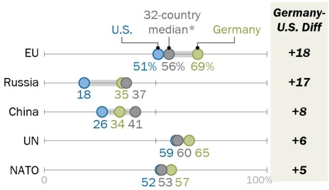

FOR RELEASE MARCH 9, 2020

# Americans and Germans Differ in Their Views of Each Other and the World

Differences especially stark on defense spending and security issues

BY Jacob Poushter and Mara Mordecai

FOR MEDIA OR OTHER INQUIRIES:

Jacob Poushter, Associate Director, Global Attitudes Research Stefan Cornibert, Communications Manager

202.419.4372

www.pewresearch.org

RECOMMENDED CITATION

Pew Research Center, March, 2020, “Americans and Germans Differ in Their Views of Each Other and the World”

## About Pew Research Center

Pew Research Center is a nonpartisan fact tank that informs the public about the issues, attitudes and trends shaping America and the world. It does not take policy positions. The Center conducts public opinion polling, demographic research, content analysis and other data-driven social science research. It studies U.S. politics and policy; journalism and media; internet, science and technology; religion and public life; Hispanic trends; global attitudes and trends; and U.S. social and demographic trends. All of the Center’s reports are available at www.pewresearch.org. Pew Research Center is a subsidiary of The Pew Charitable Trusts, its primary funder.

© Pew Research Center 2020

## How we did this

In 2017, Pew Research Center and Körber-Stiftung began collaborating on joint public opinion surveys to gauge the state of relations between the United States and Germany. The questions were developed together, and each organization fielded a survey within their own country starting that year and continuing in 2018 and 2019. Many of the questions have been repeated each year to allow both organizations to track attitudes over time. Topics include relations with other countries, defense spending and military deployments, and general foreign policy attitudes.

The results have been published in both countries, and the previous years’ reports from Pew Research Center are here and here.

The Körber-Stiftung findings are contained within the larger “Berlin Pulse” report and can be found here, here and here.

The 2019 findings come from a Pew Research Center survey conducted by SSRS in the U.S. from Sept. 17-22 among 1,004 respondents and a Körber-Stiftung survey conducted by Kantar in Germany from Sept. 9-28 among 1,000 respondents. This analysis also includes results from the 2019 Pew Research Center Global Attitudes survey in each country, conducted among 1,503 people in the U.S. from May 13-June 18 and 2,015 people in Germany from May 31-July 25.

Here are the questions used for this report, along with the responses, and its methodology.

### Full Page Description (Page 3)

**Source:** `assets/_page_3_Asset_0.jpg`

**Generated:** 2026-05-30 11:59:31

---

The image contains two line graphs, one for the U.S. and one for Germany, showing trends in public opinion regarding two categories: "Good" and "Bad." The U.S. graph shows an increase in the percentage of people viewing something as "Good" from 68% in 2017 to 75% in 2019, while the percentage of people viewing it as "Bad" decreases from 22% in 2017 to 17% in 2019. The Germany graph shows a fluctuation: the percentage of people viewing something as "Bad" increases from 56% in 2017 to 73% in 2018, then decreases to 64% in 2019. The percentage of people viewing it as "Good" decreases from 42% in 2017 to 24% in 2018, then increases to 34% in 2019.

# Americans and Germans Differ in Their Views of Each Other and the World

Differences especially stark on defense spending and security issues

Three years into a turbulent period of American-German relations, with Donald Trump at the helm of American foreign policy and Angela Merkel leading Germany, there continues to be a wide divergence in views of bilateral relations and security policy between the publics of both countries. Political divides on both sides of the Atlantic continue to shape attitudes about relations with other nations, perceptions about defense spending and Americans’ and Germans’ views of each other.

Americans and Germans diverge sharply in their views of bilateral relations

% who say relations today between the U.S. and Germany are …

## But there has been some

improvement in Germans’ overall evaluation of the relationship with the United States, and young people in both countries are more optimistic about the state of bilateral relations in 2019. Still, attitudes in the two nations remain far apart, especially on the use of military force, obligations under NATO and relations with other world powers such as Russia and China.

On the core question of relations between the U.S. and Germany, publics in each country sharply diverge in their evaluations. Americans, for the most part, are quite keen on the current state of relations, with three-quarters saying the relationship is in good shape. This represents a 7 percentage point increase in positive sentiment since 2017.

Among Germans, only 34% say the relationship is good, with a scant 2% saying the relationship is very good. However, this represents a more positive evaluation than in 2018, when only 24% of Germans said the relationship was going well. This corresponds to an increase in overall favorable views toward the U.S. found in Pew Research Center’s 2019 Global Attitudes survey, especially among people who place themselves on the ideological right in Germany, even as favorable opinions of the U.S. remain low.

### Full Page Description (Page 4)

**Source:** `assets/_page_4_Asset_0.jpg`

**Generated:** 2026-05-30 11:58:36

---

The image is a horizontal bar chart comparing the percentage of people in different age groups in the U.S. and Germany. The chart shows the percentage of the population in the age groups 18-29, 30-49, 50-64, and 65+ for both countries. The percentages for the U.S. are 71%, 72%, 73%, and 82% respectively, while for Germany they are 28%, 31%, 35%, and 40%. The chart also includes a legend indicating the difference in percentages between the youngest and oldest age groups in each country, which is +9 for both. The visual elements help to compare the distribution of age groups between the two countries and highlight the higher percentage of older adults in the U.S. compared to Germany.

Despite these divergences in opinion, young people in both countries have more positive views of the U.S.-German relationship. In the U.S., for example, 82% of people ages 18 to 29 say the relationship is good, compared with 73% of those ages 65 and older. Similarly, in Germany, four-inten young people say relations with the U.S. are good, compared with only 31% of those 65 and older.

## In both nations, young people have the most positive view of U.S.-Germany relationship

% who would describe relations today between the U.S. and Germany as good

These are among the major findings from a Pew Research Center survey of 1,004 adults conducted in the U.S. from Sept. 17-22, 2019, and a Körber-Stiftung survey of 1,000 adults conducted in Germany from Sept. 9-28, 2019. This analysis also includes results from Pew Research Center’s Spring 2019 Global Attitudes survey, conducted among 1,503 adults in the U.S. from May 13-June 18, 2019, and 2,015 adults in Germany from May 31-July 25, 2019.

### Full Page Description (Page 5)

**Source:** `assets/_page_5_Asset_1.jpg`

**Generated:** 2026-05-30 12:00:19

---

The image contains a bar chart comparing the percentage of people who agree and disagree with a statement in the United States and Germany. The chart is divided into two sections for each country: one for those who agree and one for those who disagree. The percentages are as follows: 78% of Americans agree and 21% disagree, while 47% of Germans agree and 52% disagree. The chart uses blue for "Disagree" and green for "Agree."

### Full Page Description (Page 5)

**Source:** `assets/_page_5_Asset_0.jpg`

**Generated:** 2026-05-30 12:00:12

---

The image is a bar chart comparing opinions on a certain topic between the U.S. and Germany. The chart is divided into two categories: "Should not" and "Should." The U.S. is represented by two bars, with 29% in the "Should not" category and 60% in the "Should" category. Germany is also represented by two bars, with 60% in the "Should not" category and 34% in the "Should" category. The chart uses blue and green colors to differentiate between the two categories.

## Sharp divides in German and American views of security issues, from use of force to defense budgeting

Differences on security issues predominate when looking at American and German public opinion. For example, Americans and Germans take opposing views on Article 5 obligations under NATO. When asked whether their country should or should not use military force to defend a NATO ally in the event of a potential Russian attack, six-in-ten Americans say their country should defend that ally, while an equal share of Germans say their country should not.

Meanwhile, 63% in Germany say that the U.S. would defend a NATO ally in the event of military conflict with Russia.

Americans are also more likely than Germans to say it is sometimes necessary to use military force. About eight-in-ten Americans believe it is sometimes necessary to use force to maintain order in the world, yet only about half of Germans agree.

In both nations, those on the ideological right are more likely than those on the left to feel that the use of force can be justified. While nine-inten American conservatives see military force as necessary, only 65% of liberals agree. In Germany, nearly six-in-ten adults on the right see military force as necessary, while about a third on the left agree.

## Americans and Germans take opposing views on whether their country should defend NATO allies against Russia

% who say that if Russia got into a serious military conflict with one of its neighboring countries that is a NATO ally, their country \_\_ use military force to defend that country

## PEW RESEARCH CENTER

## Americans far more likely than Germans to say military force is sometimes necessary

% who \_\_ that it is sometimes necessary to use military force to maintain order in the world

## PEW RESEARCH CENTER

When it comes to defense spending, differences between Americans and Germans also emerge. When asked whether the U.S.’s European allies should increase, decrease or maintain their defense spending, half of Americans say that spending levels should remain the same. This marks a notable shift in view from 2017, when 45% of Americans felt their allies in Europe should dedicate more resources to national defense.

Fewer Americans see a need for European allies to increase national defense spending, but Germans are divided between increasing or maintaining budgets Americans Germans

Should our European allies \_\_ spending on national defense? Should Germany \_\_ spending on national defense?

## PEW RESEARCH CENTER

Germans view their country’s defense spending differently. The public is divided on whether to increase or maintain current levels of spending on national defense, with about four-in-ten taking each view. Like in the U.S., views on this issue in Germany have changed since 2017. At that time, about half of Germans were content with their country’s defense spending, while about a third felt it should be increased.

In both countries, relatively few believe Europeans are spending too much on national defense, and that share has remained fairly stable since 2017.

### Full Page Description (Page 7)

**Source:** `assets/_page_7_Asset_0.jpg`

**Generated:** 2026-05-30 11:57:53

---

The image is a line graph showing the percentage of Republicans/Lean Republicans and Democrats/Lean Democrats from 2017 to 2019. The graph has two lines, one in red representing Republicans/Lean Republicans and one in blue representing Democrats/Lean Democrats. The red line starts at 62% in 2017, drops to 59% in 2018, and further decreases to 48% in 2019. The blue line starts at 34% in 2017, decreases to 27% in 2018, and remains at 28% in 2019. The graph highlights a general decline in the percentage of both Republican and Democratic voters over the three-year period.

In the U.S., Republicans and Republicanleaning independents are more likely than Democrats and Democratic-leaning independents to favor increased defense spending in Europe. However, the share among Republicans who think the U.S.’s European allies should increase their defense budgets has fallen by 14 percentage points between 2017 and 2019. There has also been a more modest decline in this view among Democrats.

In Germany, partisan gaps also emerge. Supporters of the CDU/CSU are on balance in favor of defense spending increases. However, supporters of the Greens express more skepticism, with only 28% saying they want to raise defense spending. Members of the SPD fall in the middle, with 41% saying Germany should increase defense spending.

## Republican support for increased defense spending from Europe has waned since 2017

% of \_\_ who say American allies in Europe should increase their spending on national defense 100%

## PEW RESEARCH CENTER

## Supporters of CDU/CSU more likely to favor increased defense spending

% who voted for \_\_ in the 2017 Bundestag elections who say Germany should increase its defense spending

## PEW RESEARCH CENTER

### Full Page Description (Page 8)

**Source:** `assets/_page_8_Asset_0.jpg`

**Generated:** 2026-05-30 11:58:56

---

The image is a horizontal bar chart comparing the importance of something (not specified in the image) in the United States and Germany. The chart is divided into four categories: "Not important at all," "Not too important," "Somewhat important," and "Very important." The percentages for each category are as follows:

- In the U.S., "Not important at all" is 5%, "Not too important" is 8%, "Somewhat important" is 29%, and "Very important" is 56%.
- In Germany, "Not important at all" is 15%, "Not too important" is 30%, "Somewhat important" is 37%, and "Very important" is 15%.

The chart visually represents the distribution of opinions on the importance of the unspecified topic between the two countries.

Americans support military bases in Germany, while Germans express doubts

Americans and Germans also take differing stances on the U.S. military presence in Germany. People in the U.S. see their country’s military bases in Germany as much more important to the security of their country than Germans do: 85% of Americans believe these bases are important to the U.S.’s security interests, and nearly six-in-ten see them as very important.

In the U.S., there is a partisan divide on this issue, though support for the American military presence in Germany is high among both Republicans and Democrats. Among Republicans and

## Americans and Germans differ over importance of U.S. military bases in Germany to national security

% who think U.S. military bases in Germany are \_\_ for their country’s national security

Republican-leaning independents, nine-in-ten see U.S. military bases in Germany as an important part of their country’s national defense. Among Democrats and Democratic-leaning independents, that share is about eight-in-ten.

Germans, by contrast, are not sold on the idea that American military bases are important to German security. While about half of Germans see U.S. military bases as important for their country’s national security, 45% disagree.

Younger Germans especially doubt the importance of American military bases in their country. Roughly six-in-ten of Germans ages 18 to 29 think U.S. military bases in Germany do not contribute to German national security, while 61% of those 65 and older believe the bases are important to Germany’s defense.

## Older Germans more likely to see U.S. military bases in their country as important

% who say U.S. military bases in Germany are \_\_ for Germany’s national security

Note: Don’t know responses not shown. Full question wording: “As you may know, the United States currently operates several military bases in Germany with approximately 35,000 active-duty American troops. How important do you think these military bases are for [U.S./German] national security? Very important, somewhat important, not too important, or not important at all?” Source: Körber-Stiftung survey conducted in Germany Sept. 9-28, 2019. Q6.

“Americans and Germans Differ in Their Views of Each Other and the World”

## PEW RESEARCH CENTER

### Full Page Description (Page 10)

**Source:** `assets/_page_10_Asset_0.jpg`

**Generated:** 2026-05-30 11:58:12

---

The image contains a horizontal bar chart comparing the percentage of Americans and Germans who have a favorable view of various countries. The chart is divided into two sections: one for Americans and one for Germans. Each bar represents a country and its corresponding percentage of favorable views. For example, 36% of Americans have a favorable view of the UK, while 60% of Germans have a favorable view of France. The chart also includes a note with an asterisk next to Austria, indicating a possible footnote or additional information.

## Americans, Germans differ on foreign policy partners and cooperation

There are stark differences between and within the U.S. and Germany when it comes to which foreign policy partner is considered most important.

Among Americans, 36% choose the United Kingdom as the most or second-most important foreign policy partner. Roughly two-in-ten say China (23%) and Canada (20%) are top partners, but Germany is chosen by only 13% as the most or second-most important partner, in between Israel at 15% and Mexico at 12%.

Germans more likely to see the U.S. as an important partner than Americans are to see Germany as one

% who say \_\_ is the most or second-most important partner for American/German foreign policy

## PEW RESEARCH CENTER

Among Germans, France is clearly seen as the top foreign policy partner, with six-in-ten saying this. A large share also say the U.S. is a vital partner (42%), and this represents a rise in such sentiments from 2018, when only 35% named America as a top foreign policy partner. China (15%), Russia (12%) and the UK (7%) round out the top five. (The survey was conducted before the UK left the European Union on Jan. 31, 2020.)

### Full Page Description (Page 11)

**Source:** `assets/_page_11_Asset_0.jpg`

**Generated:** 2026-05-30 11:59:15

---

The image contains a bar chart with two sets of data, one for "Republican/Lean Republican" and the other for "Democrat/Lean Democrat." The chart compares percentages for different countries: the UK, Israel, China, Canada, and Germany. For "Republican/Lean Republican," the UK has the highest percentage at 41%, followed by Israel at 26%, China at 20%, Canada at 16%, and Germany at 11%. For "Democrat/Lean Democrat," the UK has the highest percentage at 35%, followed by China at 25%, Canada at 23%, Mexico at 15%, and Germany at 14%. The chart uses red bars for Republican/Lean Republican and blue bars for Democrat/Lean Democrat, making it easy to compare the two groups across the countries.

In the U.S., political affiliation dictates who people think is the most important foreign policy partner. While both Republicans and Democrats agree that the UK is their most important partner, Republicans and Republican-leaning independents are keener on Israel as a partner (26%) than Democrats and Democratic-leaning independents (9%). Democrats also place more emphasis on Canada and Mexico for their top foreign policy affiliate. However, views of Germany are similar among partisans in the U.S., with both sides ranking Germany fifth on the list of most or second-most important foreign policy partners.

Democrats and Republicans are about as likely to name Germany as a top foreign policy partner, but Republicans are keener on Israel

% who say \_\_ is the most/second-most important partner for American foreign policy

For Germans of differing political stripes, the differences are less dramatic. Supporters of the CDU/CSU, as well as those who support the SPD and Greens, name France as the first or secondmost important partner, followed by the U.S.

When it comes to cooperation with other countries, there is again a divergence between American and German views. Nearly seven-in-ten Americans (69%) say that they want to cooperate more with Germany, compared with only half of Germans who say the same about the U.S. Nonetheless, the percentage of Germans who say they want to cooperate more with the U.S. has increased nine points since 2018. At that time, fully 47% wanted to cooperate less with America.

### Full Page Description (Page 12)

**Source:** `assets/_page_12_Asset_0.jpg`

**Generated:** 2026-05-30 12:00:35

---

The image contains a bar chart comparing the opinions of Americans and Germans on whether they would like to see more or less of certain countries. The chart is divided into two sections: one for Americans and one for Germans. Each section has bars representing percentages for "Less" and "More" opinions for various countries. The countries listed include the UK, France, Japan, Germany, China, and Russia. The percentages indicate the proportion of respondents who would like to see more or less of each country. For example, 76% of Americans would like to see more of the UK, while 52% of Americans would like to see less of Russia. The chart visually represents the contrast in opinions between Americans and Germans on these countries.

Americans want more cooperation with European allies, but Germans less likely to say the same about the U.S.

% who say the U.S./Germany should cooperate more or less with …

Note: “Same” and “Don’t know” volunteer responses not shown.   
Source: Pew Research Center survey conducted in the U.S. Sept. 17-22, 2019. Q2a-f. German results from Körber-Stiftung survey conducted Sept. 9-28, 2019.

“Americans and Germans Differ in Their Views of Each Other and the World”

## PEW RESEARCH CENTER

One area of convergence is the broad support in both the U.S. and Germany for more cooperation with France and Japan. And similar majorities in the U.S. and Germany want to cooperate more with China. However, a greater share of Americans want to cooperate more with the UK (76%) than of Germans who say the same (51%).

When looking at attitudes toward cooperation with Russia, Germans are almost twice as likely as Americans to want greater collaboration. Increased cooperation with Russia is a more common preference among Republicans in the U.S. (41%) than Democrats (32%), as well as among Germans living in former East Germany (75%) than in the former West (63%).

### Full Page Description (Page 13)

**Source:** `assets/_page_13_Asset_2.jpg`

**Generated:** 2026-05-30 11:58:44

---

The image is a table with data presented in a tabular format. It compares the volume of trade between Americans and Germans, categorized by their trading partners (Germany and China). The table shows the volume of trade in millions of dollars for both countries. For example, Americans trade 41 million dollars with Germany and 44 million dollars with China. Similarly, Germans trade 50 million dollars with the U.S. and 24 million dollars with China. The table uses color coding to distinguish between the two trading partners, with Germany in green and China in blue.

### Full Page Description (Page 13)

**Source:** `assets/_page_13_Asset_0.jpg`

**Generated:** 2026-05-30 11:58:22

---

The image is a horizontal bar chart comparing political leanings in the U.S. and Germany. The chart uses a scale from 0 to 100% to represent the percentage of respondents leaning towards Republican/Lean Rep or Democrat/Lean Dem in the U.S., and CDU/CSU, Greens, and SPD in Germany. The U.S. shows a higher leaning towards Republican/Lean Rep (63%) compared to Democrat/Lean Dem (75%). In Germany, the CDU/CSU is shown with a 57% leaning, while the Greens and SPD leanings are at 45% and 47%, respectively. The chart uses colored circles to represent each political leaning and includes percentages next to each circle for clarity.

Democrats in the U.S. are more likely to want greater cooperation with Germany than Republicans. And in Germany, supporters of CDU/CSU are more willing to want greater cooperation with the U.S. than those who support the Greens and the SPD. This jibes with data on the international image of the U.S., where those on the ideological right in Germany tend to be more favorable toward the U.S. overall.

When asked to choose between having a close relationship to Germany or Russia, Americans clearly favor Germany (61% to 26%). When Germans are asked to choose between Russia and the U.S., however, the gap is smaller (39% to 25%), and three-in-ten Germans volunteer both.

But as it relates to a rising China, attitudes diverge the other way. Germans are about twice as likely to say they prefer a close relationship to the U.S. over China (50% to 24%), while Americans are almost equally divided (41% prefer Germany, 44% say China).

## Closer ties with Russia and China?

## Supporters of different parties take alternate stances on U.S.-German cooperation

% among \_\_ who say their country should cooperate more with the U.S./Germany

## Germans prioritize the U.S. relationship over China, but more divided on Russia

% of \_\_ who say it is more important for their country to have a close relationship to …

## PEW RESEARCH CENTER

### Full Page Description (Page 14)

**Source:** `assets/_page_14_Asset_0.jpg`

**Generated:** 2026-05-30 11:59:41

---

The image is a scatter plot comparing data for two countries, China and Germany, across four age groups: 18-29, 30-49, 50-64, and 65+. Each country has two data points representing the percentage values for each age group. The x-axis represents the age groups, and the y-axis represents the percentage values. The plot shows that in the 18-29 age group, China has a higher percentage (58%) compared to Germany (32%). Conversely, in the 65+ age group, Germany has a higher percentage (53%) compared to China (31%). The data suggests a difference in the percentage values between the two countries across the different age groups.

In the U.S., younger Americans are much more likely than older Americans to want a close relationship with China over Germany. For example, 58% of Americans ages 18 to 29 say it is more important for their country to have a close relationship to China than say the same about Germany (32%). But among older Americans, more say the relationship with Germany is more important than the relationship with China.

There are also slight partisan differences in the U.S. on the choice of a close relationship with Russia or Germany. About two-thirds of Democrats (66%) say they prefer close ties with Germany, compared with 57% of Republicans. And 31% of Republicans prefer close relations with Russia compared with 21% among Democrats.

Among Germans, there is far more support for a close relationship with Russia in the former East than in the former West. Nearly four-inten East Germans say that they prefer close ties with Russia, compared with only 23% who say the same about the U.S. And West Germans are twice as likely to prefer a close relationship with the U.S. than with Russia.

## Younger Americans see relationship with China as more important than Germany

% ages \_\_ who say it is more important for their country to have a close relationship to …

## PEW RESEARCH CENTER

## Germans in the former East prioritize relations with Russia over U.S.

% in former \_\_ Germany who say it is more important for their country to have a close relationship to …

## PEW RESEARCH CENTER

### Full Page Description (Page 15)

**Source:** `assets/_page_15_Asset_0.jpg`

**Generated:** 2026-05-30 11:57:43

---

The image contains a bar chart with data comparing percentages for different regions: U.S., China, Japan, and EU. The chart includes two bars for each region, one labeled "U.S." and the other labeled "Germany." The percentages are as follows: U.S. at 50% and 24%, China at 32% and 53%, Japan at 7% and 6%, and EU at 6% and 14%. The chart uses different colors for each region to distinguish them.

When asked which country is the world’s leading economic power, Americans and Germans give starkly different answers. Half of Americans name the U.S., with about a third (32%) choosing China. However, roughly half of Germans name China (53%) as the leading economic power compared with 24% who name the U.S. Relatively few in both countries see Japan or the countries of the European Union as the leading economic power, although 14% in Germany name the EU, about twice as many as in the U.S.

Half of Americans see their country as the top economic power; Germans more likely to name China

% who say \_\_ is the world’s leading economic power

## PEW RESEARCH CENTER

Americans and Germans differin their views of international organizations and leaders

Americans and Germans also hold different opinions on countries and international organizations. On balance, Germans tend to view these nations and organizations more positively than Americans. This divide is starkest when it comes to views of the EU. While roughly seven-in-ten Germans favor the union, only about half of Americans agree. A similarly wide gap exists between German and American perceptions of Russia, though favorable opinions of Russia are less widespread in both countries than positive views of the UN and EU. There is greater consensus on the UN and NATO, though notably, Germans tend to think more highly of these organizations than Americans. About one-in-five Americans express no opinion of either the EU or NATO.

Americans and Germans differ in their views of Russia and the EU, but have more similar views of the UN and NATO

% who have a favorable opinion of …

> **AI Description:**
> **Source:** `assets/_page_16_Figure_0.jpg`
> 
> **Generated:** 2026-05-30 11:59:53
> 
> ---
> 
> The image is an infographic combining text with visual elements. It presents data comparing Germany and the United States on various international organizations and entities, including the EU, Russia, China, UN, and NATO. The visualization uses a horizontal bar chart with percentages to show the percentage of people in each country who believe in the effectiveness of these organizations. The chart includes a median value for 32 countries and highlights the difference between Germany and the United States for each entity. The percentages are represented by colored circles, with Germany's data in green and the United States' data in blue. The right side of the image shows the difference in percentages between Germany and the United States for each entity.

\* Median does not include Germany or the U.S. NATO median represents percentages from 14 NATO member countries. Note: All differences shown statistically significant. Source: Spring 2019 Global Attitudes Survey. Q8b-e,g. “Americans and Germans Differ in Their Views of Each Other and the World”

## PEW RESEARCH CENTER

### Full Page Description (Page 17)

**Source:** `assets/_page_17_Asset_0.jpg`

**Generated:** 2026-05-30 12:00:05

---

The image contains a comparative visualization of political ideology distribution among Americans and Germans. It uses a horizontal bar chart to represent the percentage of people identifying as conservative, moderate, or liberal for both countries across three categories: United Nations (UN), European Union (EU), and Russia. The chart includes a "Liberal-Conservative Diff" section for Americans, showing a difference of +42%, and a "Left-Right Diff" section for Germans, showing a difference of +10%. The percentages for each ideology are displayed on the bars, and the chart highlights the differences in political alignment between the two countries across the three categories.

In the U.S. and Germany, views on these countries and organizations vary based on ideology. Conservative Americans and Germans on the right of the ideological spectrum are more likely than American liberals and Germans on the left to view Russia favorably. On the other hand, liberals and those on the left are more likely to favor the UN and EU than conservatives and those on the right. For all countries and organizations where those on the right and left did not see eye-to-eye, the divide is notably wider between Americans than it is between Germans.

## Ideological differences in views of the UN, EU and Russia

% of Germans/Americans on the ideological \_\_ who have a favorable opinion of …

## PEW RESEARCH CENTER

Additionally, Germans living in former East Germany tend to view Russia more favorably and the EU less favorably than those living in the former West. Just over four-in-ten of those living in the former East say they have a favorable opinion of Russia (43%), compared with one-third of those in the former West. And 71% in the former West favor the EU, while 59% in the former East agree.

## Acknowledgments

This report is a collaborative effort based on the input and analysis of the following individuals.

Jacob Poushter, Associate Director, Global Attitudes Research

Mara Mordecai, Research Assistant

James Bell, Vice President, Global Strategy

Alexandra Castillo, Research Associate

Jeremiah Cha, Research Assistant

Aidan Connaughton, Research Assistant

Stefan S. Cornibert, Communications Manager

Claudia Deane, Vice President, Research

Kat Devlin, Research Associate

Moira Fagan, Research Analyst

Janell Fetterolf, Research Associate

Shannon Greenwood, Digital Producer

Christine Huang, Research Analyst

Michael Keegan, Senior Information Graphics Designer

David Kent, Copy Editor

Nicholas O. Kent, Research Assistant

Clark Letterman, Senior Researcher

J.J. Moncus, Research Assistant

Martha McRoy, Research Methodologist

Patrick Moynihan, Associate Director, International Research Methods

Stacy Pancratz, Research Methodologist

Audrey Powers, Senior Operations Associate

Shannon Schumacher, Research Associate

Laura Silver, Senior Researcher

Richard Wike, Director, Global Attitudes Research

## Methodology: U.S. survey

This analysis in this report is based on telephone interviews conducted September 17-22, 2019 among a national sample of 1,004 adults, 18 years of age or older, living in the United States (302 respondents were interviewed on a landline telephone, and 702 were interviewed on a cell phone, including 492 who had no landline telephone). The survey was conducted under the direction of SSRS. A combination of landline and cell phone random digit dial samples were used. Interviews were conducted in English (969) and Spanish (35). Respondents in the landline sample were selected by randomly asking for the youngest adult male or female who is now at home. Interviews in the cell sample were conducted with the person who answered the phone, if that person was an adult 18 years of age or older. For detailed information about our survey methodology, see http://www.pewresearch.org/methodology/u-s-survey-research/

The combined landline and cellphone sample are weighted to provide nationally representative estimates of the adult population 18 years of age and older. The weighting process takes into account the disproportionate probabilities of household and respondent selection due to the number of separate telephone landlines and cellphones answered by respondents and their households, as well as the probability associated with the random selection of an individual household member. Following application of the above weights, the sample is post-stratified and balanced by key demographics such as age, race, sex, region, and education. The sample is also weighted to reflect the distribution of phone usage in the general population, meaning the proportion of those who are cellphone only, landline only, and mixed users.

The following table shows the unweighted sample size and the error attributable to sampling that would be expected at the 95% level of confidence for different groups in the U.S. in the survey:

Sample sizes and sampling errors for subgroups are available upon request.

In addition to sampling error, one should bear in mind that question wording and practical difficulties in conducting surveys can introduce error or bias into the findings of opinion polls.

© Pew Research Center, 2020

## Methodology: Global Attitudes Survey

About Pew Research Center’s Spring 2019 Global Attitudes Survey

Results for the survey are based on telephone interviews conducted under the direction of Gallup and Abt Associates. The results are based on national samples, unless otherwise noted. More details about our international survey methodology and country-specific sample designs are available here.