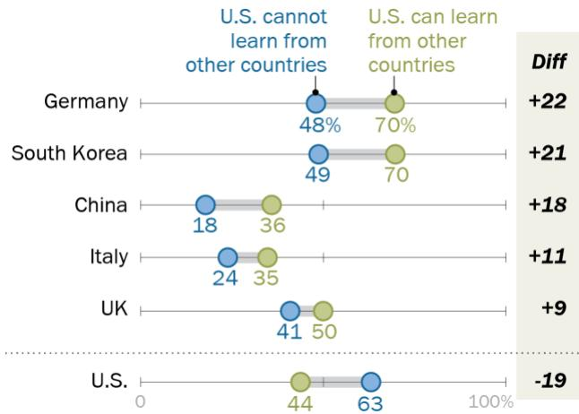
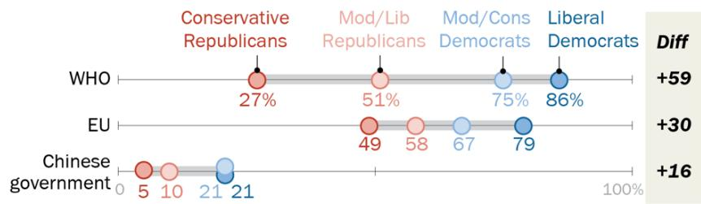

FOR RELEASE MAY 21, 2020

# Americans Give Higher Ratings to South Korea and Germany Than U.S.for Dealing With Coronavirus

Poor marks for China, partisan divides over WHO

FOR MEDIA OR OTHER INQUIRIES:

Richard Wike, Director, Global Attitudes Research Stefan Cornibert, Communications Manager

202.419.4372

www.pewresearch.org

RECOMMENDED CITATION

Pew Research Center, May, 2020, “Americans Give Higher Ratings to South Korea and Germany Than U.S. for Dealing With Coronavirus”

## About Pew Research Center

Pew Research Center is a nonpartisan fact tank that informs the public about the issues, attitudes and trends shaping America and the world. It does not take policy positions. The Center conducts public opinion polling, demographic research, content analysis and other data-driven social science research. It studies U.S. politics and policy; journalism and media; internet, science and technology; religion and public life; Hispanic trends; global attitudes and trends; and U.S. social and demographic trends. All of the Center’s reports are available at www.pewresearch.org. Pew Research Center is a subsidiary of The Pew Charitable Trusts, its primary funder.

© Pew Research Center 2020

## How we did this

Pew Research Center conducted this study to understand what Americans think about how nations around the world are responding to the coronavirus outbreak and what Americans think about international engagement. For this analysis, we surveyed 10,957 U.S. adults from April 29 to May 5, 2020. Everyone who took part is a member of Pew Research Center’s American Trends Panel (ATP), an online survey panel that is recruited through national, random sampling of residential addresses. This way nearly all U.S. adults have a chance of selection. The survey is weighted to be representative of the U.S. adult population by gender, race, ethnicity, partisan affiliation, education and other categories. Read more about the ATP’s methodology.

Here are the questions used for this report, along with responses, and the survey methodology.

# Americans Give Higher Ratings to South Korea and Germany Than U.S.for Dealing With Coronavirus

Poor marks for China, partisan divides over WHO

With stunning speed, the COVID-19 pandemic has swept across borders, claiming victims and shutting down economies in nations across the globe. The crisis has generated a variety of policy responses from governments, with varying degrees of success. When asked how well different countries have responded to the outbreak, Americans give high marks to South Korea and Germany. In contrast, most believe China – where the pandemic is believed to have originated – has done an only fair or poor job.

## Americans give China, Italy low ratings for coronavirus response

% who say each has done a/an \_\_ job of dealing with the coronavirus outbreak

Note: No answer responses not shown. The WHO is the World Health Organization. Source: Survey of U.S. adults conducted April 29-May 5, 2020. “Americans Give Higher Ratings to South Korea and Germany Than U.S. for Dealing With Coronavirus”

PEW RESEARCH CENTER

Most are also critical of Italy’s response, while the public is divided over how well the United Kingdom has dealt with COVID-19. Regarding their own country’s reaction, Americans are divided along partisan lines. Overall, 47% of adults say the United States has done a good or excellent job of handling the outbreak, but just 27% of Democrats and Democratic-leaning independents hold that view, compared with 71% of Republicans and Republican-leaning independents.

Americans largely agree the U.S. should look beyond its borders for ideas to combat the coronavirus. Nearly half (46%) say the U.S. can learn a great deal from other countries about ways to slow the spread of the virus, while another 38% say it can learn a fair amount. Few say there is not too much (13%) or nothing at all (3%) the U.S. can learn from other countries.

### Full Page Description (Page 5)

**Source:** `assets/_page_5_Asset_1.jpg`

**Generated:** 2026-05-30 12:15:26

---

The image contains a bar chart with the title "Think China will have ___ in world affairs after the outbreak." The chart presents data on the perceived future influence of China in world affairs, categorized into three groups: "Less influence," "About the same influence," and "More influence." The percentages for each category are as follows: "Less influence" at 50%, "About the same influence" at 31%, and "More influence" at 17%. The bars are color-coded for visual distinction: blue for "Less influence," beige for "About the same influence," and green for "More influence." The chart effectively conveys the public's perception of China's future influence in world affairs.

The leading international organization for dealing with global health issues, the World Health Organization (WHO), draws strongly partisan reactions. While 62% of Democrats believe the agency has done an excellent or good job of dealing with the pandemic, just 28% of Republicans agree. Eight-inten Democrats trust coronavirus information from the WHO; only 36% of Republicans do so.

Few trust coronavirus information from Chinese government, believe China has handled outbreak well % who …

There’s more agreement, however, when it comes to information from the Chinese government: 84% of Americans say they place not too much or

Note: No answer responses not shown.   
Source: Survey of U.S. adults conducted April 29-May 5, 2020.   
“Americans Give Higher Ratings to South Korea and Germany Than U.S. for Dealing With Coronavirus”   
PEW RESEARCH CENTER

no trust in information from Beijing regarding the coronavirus outbreak.

Many also believe the current crisis will have a long-term impact on China’s global stature: 50% say China will have less influence in world affairs after the pandemic. As a March Pew Research Center survey found, overall negative attitudes toward China have been on the rise – 66% of Americans expressed an unfavorable opinion of China, the most negative rating for the country since the Center began asking the question in 2005.

While unfavorable views of China have increased among both Democrats and Republicans over the past two years, there are nonetheless significant partisan differences in attitudes toward China, with Republicans expressing significantly more negative attitudes.

The new national survey by Pew Research Center, conducted April 29 to May 5, 2020, among 10,957 U.S. adults using the Center’s American Trends Panel, also highlights growing partisan divisions on broad questions about America’s role on the world stage.

### Full Page Description (Page 6)

**Source:** `assets/_page_6_Asset_0.jpg`

**Generated:** 2026-05-30 12:14:24

---

The image is a line graph with a horizontal axis representing years from 2013 to 2020 and a vertical axis representing percentages from 0% to 100%. The graph includes three lines, each representing a different category: "Rep/Lean Rep" in red, "Total" in green, and "Dem/Lean Dem" in blue. The lines show fluctuations in percentages over the years. Notable features include a decline in "Dem/Lean Dem" and "Total" percentages from 2013 to 2018, followed by an increase in "Rep/Lean Rep" and "Total" percentages in 2020. The percentages at the end of each line are labeled: "Rep/Lean Rep" at 62%, "Total" at 42%, and "Dem/Lean Dem" at 26%.

About six-in-ten Republicans (62%) now think the U.S. does too much in helping address global challenges, while just 26% of Democrats share this view. In Pew Research Center telephone surveys dating back to 2013, the partisan gap in these views was far more modest.

A related question about America’s role in international affairs also shows strong differences along both partisan and ideological lines. Six-in-ten Americans say the U.S. should focus on its own problems and let other countries deal with

Growing partisan divisions over U.S.’s role in solving world problems

% who say the U.S. does too much in helping solve world problems

their problems as best they can; only 39% think the U.S. should help other countries deal with their problems. However, fully 64% of liberal Democrats believe the U.S. should help other countries. This is significantly higher than the 44% registered among moderate and conservative Democrats, and nearly triple the shares of moderate and liberal Republicans and conservative Republicans who hold this view.

There are sharp partisan and ideological differences on other questions about foreign policy and international affairs included in the survey. While 81% of liberal Democrats think the U.S. has done an only fair or poor job of dealing with the coronavirus outbreak, just 22% of conservative Republicans say the same. Liberal Democrats stand apart for their bleak assessment of how the pandemic will affect America’s standing on the global stage: 56% believe the U.S. will have less influence in world affairs, 20 percentage points higher than the share of moderate and conservative Democrats who say this (just 15% of moderate and liberal Republicans and 8% of conservative Republicans say the U.S. will have less influence).

Meanwhile, conservative Republicans stand out for their especially negative evaluations of the WHO: Only 21% believe the Geneva-based organization has done an excellent or good job of dealing with the COVID-19 crisis, compared with 40% of moderate and liberal Republicans. Solid

### Full Page Description (Page 7)

**Source:** `assets/_page_7_Asset_0.jpg`

**Generated:** 2026-05-30 12:12:30

---

The image contains a series of bar charts with percentages, representing survey responses from different political affiliations (Conservative Republicans/Lean Republicans, Conservative Democrats/Lean Democrats, Liberal Republicans/Lean Republicans, and Liberal Democrats/Lean Democrats) regarding various statements about the U.S.'s handling of the coronavirus outbreak. The key information includes the percentage of respondents who agree with each statement, such as "The U.S. has done an only fair/poor job in dealing with the coronavirus outbreak," "The U.S. can learn a great deal from other countries about ways to slow the spread of the coronavirus," and "The WHO has done a good/excellent job in dealing with the coronavirus outbreak." The main trends show that Liberal Democrats/Lean Democrats have the highest agreement percentages across most statements, while Conservative Republicans/Lean Republicans have the lowest. The image also includes a total count for each statement, indicating the total number of respondents.

majorities of liberal Democrats (67%) and moderate and conservative Democrats (58%) give the WHO positive reviews.

Even though the belief that the U.S. can learn at least a fair amount from the rest of the world is widely shared across the political spectrum, those on the left are much more likely to think the country can learn a great deal from other nations: 67% of liberal Democrats hold this view, compared with only 25% of conservative Republicans.

In addition to partisanship, education is an important dividing line on many of the issues examined in the survey. People with higher levels of education are more likely to believe the U.S. should help other countries deal with their problems and to think the U.S. can learn from other countries about effective ways to combat coronavirus. Those with more

education are also more likely to trust information from the WHO and the European Union, and to believe the U.S. will emerge from the crisis with less influence in global affairs.

### Full Page Description (Page 8)

**Source:** `assets/_page_8_Asset_0.jpg`

**Generated:** 2026-05-30 12:13:43

---

The image contains a horizontal bar chart with data segmented into different categories. The chart displays the percentage of respondents who feel a certain way about a topic, categorized by race, education level, and political affiliation. The categories are represented by different shades of green, with the legend indicating "A great deal," "A fair amount," "Not too much," and "Nothing at all." The chart provides percentages for each category, such as "White" at 41% for "A great deal," "Black" at 56% for "A great deal," and "Hispanic" at 53% for "A great deal." Additionally, it shows percentages for education levels and political affiliations, with "Postgraduate" at 56% for "A great deal" and "Rep/Lean Rep" at 28% for "A great deal." The chart effectively communicates the distribution of responses across various demographic groups.

## How much can the U.S.learn from other countries about COVID-19?

As nations around the world grapple with how to respond to the COVID-19 outbreak, most Americans think the U.S. can learn from other countries about how to limit the spread of the coronavirus.

More than eight-in-ten Americans say the U.S. can learn either a great deal or a fair amount from other countries about ways to slow the spread of the coronavirus. By comparison, fewer than two-in-ten say the U.S. can learn not too much or nothing at all from other countries.

However, there are significant partisan differences over how much the U.S. can learn from the international response. While 60% of Democrats and Democratic-leaning independents say the U.S. can learn a great deal, just 28% of Republicans and Republican leaners share that view.

There also are differences in views on this question by race and ethnicity, as well as by level of educational attainment. Black and Hispanic people are more likely than white people

Most Americans think the U.S. can learn from other countries about how to slow coronavirus

% who say the U.S. can learn \_\_ from other countries around the world about ways to slow the spread of coronavirus

PEW RESEARCH CENTER

to say the U.S. can learn a great deal from other nations about ways to slow the spread of the coronavirus. And the belief that the U.S. can learn from other countries about COVID-19 is more widespread among Americans with higher levels of education than among those with lower education levels.

### Full Page Description (Page 9)

**Source:** `assets/_page_9_Asset_2.jpg`

**Generated:** 2026-05-30 12:15:06

---

The image is a line graph with three lines representing different categories: "Too little," "Right amount," and "Too much." The x-axis represents years from 2013 to 2020, while the y-axis represents percentages. The graph shows fluctuations in the percentages for each category over the years. For instance, in 2013, "Too little" was at 48%, "Right amount" was at 33%, and "Too much" was at 16%. By 2020, "Too little" decreased to 26%, "Right amount" increased to 46%, and "Too much" remained at 26%. The graph highlights a shift in public perception or response over the years, with a notable increase in the "Right amount" category.

### Full Page Description (Page 9)

**Source:** `assets/_page_9_Asset_0.jpg`

**Generated:** 2026-05-30 12:14:46

---

The image is a line graph with three lines representing different categories: "Too much," "Too little," and "Right amount." The x-axis represents years from 2013 to 2020, and the y-axis represents percentages. The graph shows that the percentage of people who feel there is "Too much" has decreased from 51% in 2013 to 28% in 2020. The percentage of people who feel there is "Too little" has increased from 17% in 2013 to 29% in 2020. The percentage of people who feel the amount is "Right amount" has remained relatively stable around 28% throughout the period.

### Full Page Description (Page 9)

**Source:** `assets/_page_9_Asset_1.jpg`

**Generated:** 2026-05-30 12:14:56

---

The image is a line graph with three lines representing different categories: "Too much," "Right amount," and "Too little." The x-axis represents years from 2013 to 2020, and the y-axis represents percentages. The data points for each category are labeled with specific percentages for each year. The "Too much" category shows a decreasing trend from 52% in 2013 to 62% in 2020. The "Right amount" category shows an increasing trend from 19% in 2013 to 29% in 2020. The "Too little" category shows a decreasing trend from 25% in 2013 to 8% in 2020.

## Views on U.S. global engagement

In the current survey, conducted online among members of Pew Research Center’s American Trends Panel, 42% of Americans say the U.S. does too much to help solve world problems, compared with smaller shares who say it does too little (28%) or the right amount (28%).

In a telephone survey conducted in May 2018, the public was roughly split in their views: 30% said the U.S. did too much, 33% said it did too little and 29% said it did about the right amount. (Note: The current survey is comparable to past telephone surveys, though asking questions online can elicit somewhat different response patterns, including lower shares expressing no response on web surveys.)

A majority of Republicans (62%) now think the U.S. does too much to help solve world problems, compared with just 8% who say it does too little and 29% who say it does the right amount. On the other hand, a plurality of Democrats (48%) say the U.S. does too little to help solve world problems, while 26% each say it does the right amount or too much.

In telephone surveys in previous years, the partisan divide in these views was far less pronounced than it is today.

Majority of Republicans now say U.S. does too much to solve world problems

% who say U.S. does \_\_ in helping solve world problems

## PEW RESEARCH CENTER

### Full Page Description (Page 10)

**Source:** `assets/_page_10_Asset_0.jpg`

**Generated:** 2026-05-30 12:13:12

---

The image contains a horizontal bar chart with data presented in percentages. The chart categorizes responses into different demographic groups and political affiliations. The key information includes:

- Age groups: 18-29, 30-49, 50-64, and 65+
- Educational levels: Postgraduate, College grad, Some college, HS or less
- Political affiliations: Rep/Lean Rep, Conserv, Mod/Lib, Dem/Lean Dem, Cons/Mod, Liberal

The main trends show that younger age groups and those with lower educational attainment are more likely to lean towards the Republican party or lean Republican. Conversely, older age groups and those with higher educational attainment are more likely to lean towards the Democratic party or lean Democratic. The overall trend across all categories is a higher percentage of respondents leaning towards the Republican party compared to the Democratic party.

On a related measure about America’s role in the world, 60% say the U.S. should deal with its own problems and let other countries deal with their own problems as best they can. A smaller share (39%) says the U.S. should help other countries deal with their problems. Overall views are similar to those measured in a telephone survey in October 2016.

About three-quarters of Republicans want the U.S. to deal with its own problems and let other countries manage as best they can. Among Republicans, similar shares of conservatives and those who identify as more moderate or liberal take this view.

By contrast, more than half of Democrats say the U.S. should help other countries deal with their problems; 46% say the U.S. should deal with its own problems and not help with the problems of other countries. There is a divide in views among Democrats by ideology: 64% of liberal Democrats say the U.S. should help other countries deal with their problems, compared with $44 \%$ of conservative and moderate Democrats.

Those with higher levels of education are more supportive of helping other nations deal with their problems. Six-in-ten postgraduates say

Americans say focus should be more on own problems, not helping other nations % who say the U.S. should …

Help other countries Deal with own deal with problems, let other their problems countries deal as best they can

the U.S. should help other countries deal with their problems. College graduates are evenly split on this question, while clear majorities of those with some college experience and those with no more than a high school diploma say the U.S. should deal with its own problems.

### Full Page Description (Page 11)

**Source:** `assets/_page_11_Asset_0.jpg`

**Generated:** 2026-05-30 12:14:00

---

The image is a bar chart that visually represents data on public opinion regarding the quality of life, categorized by demographic and political affiliation. The chart is divided into two main categories: "Only fair/poor" and "Good/excellent." The data is broken down by race, age, education level, and political affiliation. 

Key trends include:
- Younger adults (ages 18-29) are more likely to perceive their quality of life as only fair/poor compared to older adults.
- Individuals with a postgraduate degree are more likely to view their quality of life as only fair/poor compared to those with a high school education or less.
- Political affiliation significantly impacts perceptions of quality of life, with liberal-leaning individuals being the most likely to view their quality of life as only fair/poor and the least likely to view it as good/excellent.

# Americans divided along party lines over how well the U.S. has done dealing with the outbreak

By a slim margin, more Americans say the U.S. has done only a fair or a poor job (52%) in dealing with the coronavirus outbreak than say it has done an excellent or good job (47%).

Younger adults are considerably more likely to say the U.S. has handled the outbreak poorly than older ones. Around two-thirds of those under 30 (65%) say the U.S. has done a poor job, compared with 59% of those ages 30 to 49 and only around four-in-ten of those 50 and older.

More educated Americans are also more critical of how the U.S. has dealt with the disease. Around two-thirds of those with a postgraduate degree say the U.S. has done a poor job, as do around six-in-ten college graduates. In comparison, about four-in-ten of those with a high school degree or less (43%) say the same.

Black (63%) and Hispanic (57%) Americans also rate the U.S. response more negatively than white, non-Hispanic Americans (48%).

But opinions of how well the U.S. is doing in dealing with the coronavirus outbreak are most divided along party lines. Whereas around three-quarters of Democrats and Democraticleaning independents are critical of the U.S.’s response (73%), similar shares of Republicans and Republican-leaning independents praise the country’s handling of the outbreak (71%). Evaluations divide further along ideological lines, with liberal Democrats holding more negative views of the U.S.’s performance than

Evaluations of U.S. COVID-19 response heavily colored by partisanship

% who say the U.S. has done a/an \_\_ job in dealing with the coronavirus outbreak

## PEW RESEARCH CENTER

Note: No answer responses not shown. Whites and blacks include only those who are not Hispanic; Hispanics are of any race. Source: Survey of U.S. adults conducted April 29-May 5, 2020. “Americans Give Higher Ratings to South Korea and Germany Than U.S. for Dealing With Coronavirus”

### Full Page Description (Page 12)

**Source:** `assets/_page_12_Asset_0.jpg`

**Generated:** 2026-05-30 12:15:46

---

The image contains a bar chart with data visualizing the percentage of people who rate their health as "Only fair/poor" and "Good/excellent" across different demographic groups. The chart includes age groups (18-29, 30-49, 50-64, 65+), educational levels (Postgraduate, College grad, Some college, HS or less), political affiliations (Rep/Lean Rep, Conserv, Mod/Lib), and political leanings (Dem/Lean Dem, Cons/Mod, Liberal). The percentages are displayed in blue and green bars, with the blue representing "Only fair/poor" and the green representing "Good/excellent." Notable trends include a higher percentage of people in the 65+ age group rating their health as "Only fair/poor" compared to younger age groups, and a higher percentage of people identifying as Conservative or Republican reporting their health as "Only fair/poor."

moderate or conservative Democrats (81% vs. 66%, respectively) and conservative Republicans praising the country’s response more than moderate or liberal Republicans (77% vs. 61%).

## Majority of Americans are critical of China's handling of the virus

Nearly two-thirds of Americans say China has not done a good job dealing with the coronavirus outbreak, including 37% who say the country has done a poor job.

Around six-in-ten or more in every age group are critical of China’s performance. But older Americans – who tend to have less favorable attitudes toward China – give it the lowest marks; 69% of those ages 65 and older say the country has done a fair or poor job, compared with 59% of those under 30.

Education plays little role in how people feel about China’s handling of the virus. Rather, majorities of people in all educational groups say China has not handled the pandemic well.

There are significant partisan differences on this question. While half or more of people on both sides of the aisle say China has not done a good job dealing with the outbreak, Republicans are much more likely to hold this view than Democrats. Conservative Republicans are particularly likely to say China has not handled the crisis well: Eight-in-ten hold this view.

Broad disapproval of China’s response to COVID-19

% who say China has done a/an \_\_ job in dealing with the coronavirus outbreak

## PEW RESEARCH CENTER

### Full Page Description (Page 13)

**Source:** `assets/_page_13_Asset_0.jpg`

**Generated:** 2026-05-30 12:13:22

---

The image is a horizontal bar chart comparing the percentage of people who lean towards the Democratic Party (Dem/Lean Dem) and the Republican Party (Rep/Lean Rep) in various countries. The chart includes the United States, the United Kingdom, Italy, South Korea, Germany, and China. Each country has two bars representing the percentage of people who lean towards each political party. The chart also includes a column on the right side showing the difference between the Republican and Democratic leanings for each country. The United States shows a significant difference of +44%, while China shows a difference of -22%. The chart visually represents the political leanings of the population in these countries, highlighting the varying degrees of support for each party.

## Partisanship and international orientation are factors in how Americans think other countries have handled the outbreak

Whereas evaluations of both the United States’ and China’s handling of the coronavirus outbreak are quite partisan, this is less the case when it comes to the other four countries asked about in the survey. Democrats are somewhat more likely than Republicans to say Italy, South Korea and Germany have handled the outbreak well. But, in each of these instances, the difference is less than 10 percentage points. In the case of the UK, 54% of Republicans say the country has done an excellent or good job, compared with 45% of Democrats.

Americans who believe the U.S. can learn a great deal or a fair amount from other countries about ways to slow the spread of coronavirus

Wide partisan gap on how U.S. has dealt with coronavirus; smaller differences in views of other countries’ responses

% who say \_\_ has done a good/excellent job in dealing with the coronavirus outbreak

PEW RESEARCH CENTER

are especially likely to say other countries are handling the outbreak well. The differences are most pronounced when it comes to Germany and South Korea. For example, 70% of those who say the U.S. can learn from other countries say Germany is handling the coronavirus outbreak well, compared with 48% of those who think that the U.S. can learn little or nothing from other countries.

Republicans who believe the U.S. can learn from other nations are more likely than other Republicans to say other countries are dealing with the pandemic effectively. And the same pattern is found among Democrats.

When it comes to assessments of how well the U.S. is dealing with the outbreak, those who think the U.S. can learn from foreign countries tend to evaluate its current handling of the pandemic less positively. Fewer than half (44%) of those who think the U.S. can glean information from abroad say the country is doing an excellent or good job handling the outbreak, compared with 63% of those who say the U.S. can’t learn much from overseas.

## Those who say U.S. can learn from other countries are more likely to think other nations are handling outbreak well

% who say \_\_ is doing a good/excellent job dealing with the coronavirus outbreak

> **AI Description:**
> **Source:** `assets/_page_14_Figure_0.jpg`
> 
> **Generated:** 2026-05-30 12:12:56
> 
> ---
> 
> The image is a horizontal bar chart with a focus on the percentage of people in different countries who believe the U.S. can learn from other countries versus those who believe the U.S. cannot learn from other countries. The chart includes data for Germany, South Korea, China, Italy, the UK, and the U.S. Each country has two bars representing the two opposing views, with the percentage values displayed on the bars. The chart also includes a column on the right side labeled "Diff" which shows the difference in percentages between the two views for each country. The U.S. shows a negative difference of -19%, indicating a higher percentage of people who believe the U.S. cannot learn from other countries.

Note: All differences shown are statistically significant. Source: Survey of U.S. adults conducted April 29-May 5, 2020. “Americans Give Higher Ratings to South Korea and Germany Than U.S. for Dealing With Coronavirus”

## PEW RESEARCH CENTER

### Full Page Description (Page 15)

**Source:** `assets/_page_15_Asset_0.jpg`

**Generated:** 2026-05-30 12:12:07

---

The image is a bar chart presenting data on public opinion regarding the quality of healthcare in the United States. It categorizes respondents by age, education level, political affiliation, and ideology. The chart shows percentages of respondents who rate healthcare as "Only fair/poor" or "Good/excellent." For example, 51% of the total population rated healthcare as only fair/poor, while 46% rated it as good/excellent. Notable trends include a higher percentage of older adults (65+) rating healthcare as only fair/poor compared to younger adults. Political affiliation shows a significant difference, with 77% of conservatives rating healthcare as only fair/poor compared to 31% of liberals.

## Partisans divided in their assessments of the WHO

The World Health Organization (WHO) has been a key player in addressing the global spread of the coronavirus, which the organization characterized as a pandemic in early March. But the organization has been heavily criticized by

President Donald Trump in recent weeks. In mid-April, he halted U.S. funding of the organization – a move sharply criticized by top Democrats.

Americans’ views of how well the WHO has dealt with the coronavirus outbreak also fall along partisan lines. Whereas 62% of Democrats and Democratic-leaning independents say the organization has done at least a good job in handling the global pandemic, only 28% of Republicans and GOP leaners say the same. Conservative Republicans are less likely to applaud the organization’s handling of the virus than moderate or liberal Republicans.

Americans with a postgraduate education are somewhat more likely than those with less education to applaud the international organization’s handling of the outbreak, though the differences are muted. Younger Americans also approve of the WHO’s performance more than older Americans: 52% of adults under age 30 say it has done excellent or good job, compared with just 39% of those 65 and older.

Americans are divided on WHO’s coronavirus response

% who say the World Health Organization has done a/an \_\_ job in dealing with the coronavirus outbreak

## PEW RESEARCH CENTER

# Information about coronavirus from EU, WHO generally viewed as trustworthy, but most do not trust information from Chinese government

## As Americans receive

information about the coronavirus outbreak from various international sources, majorities say they trust data from the European Union and WHO, but most are wary of information coming from the Chinese government. Only 15% of U.S. adults say they trust information from Beijing at least a fair amount.

Trust in information from the EU and WHO, while relatively high overall, is even stronger among people with a college degree or higher. About threequarters of Americans with a postgraduate degree (78%) or college degree (72%) say they can believe information coming from the EU about the coronavirus outbreak.

Similarly, 70% of people with a postgraduate degree trust information from the WHO at least a fair amount, including roughly one-third who say they trust the WHO a great deal when it comes to information about the coronavirus. About

## Few Americans trust information about the coronavirus outbreak from the Chinese government

% who trust information from the \_\_ in regard to the coronavirus outbreak …

Note: No answer responses not shown. Source: Survey of U.S. adults conducted April 29-May 5, 2020. “Americans Give Higher Ratings to South Korea and Germany Than U.S. for Dealing With Coronavirus”

## PEW RESEARCH CENTER

## Trust in information from EU especially high among those with more education

% who trust information from the European Union in regard to the coronavirus outbreak …

Note: No answer responses not shown. Source: Survey of U.S. adults conducted April 29-May 5, 2020. “Americans Give Higher Ratings to South Korea and Germany Than U.S. for Dealing With Coronavirus”

## PEW RESEARCH CENTER

half of people with a high school degree say they trust information from this source.

Younger adults are also more likely to view information from the WHO as trustworthy; 68% of Americans ages 18 to 29 say they can trust information from the WHO at least a fair amount. Only about half of adults ages 65 and older (51%) share this view.

Differences by education and age, however, are relatively small compared with the substantial partisan division in these views. Conservative Republicans are much less likely than liberal Democrats to trust information coming from each international source.

This partisan divide is especially pronounced on views about the WHO; 86% of liberal Democrats say they trust information from the WHO at least a fair amount, compared with 27% of conservative Republicans. Similar, though somewhat smaller, divisions also exist in trust in information from the EU and the Chinese government.

## Younger adults and those with more education are more likely to trust information from the WHO

% who trust information from the World Health Organization in regard to the coronavirus outbreak …

Note: No answer responses not shown. Source: Survey of U.S. adults conducted April 29-May 5, 2020. “Americans Give Higher Ratings to South Korea and Germany Than U.S. for Dealing With Coronavirus”

## PEW RESEARCH CENTER

## Conservative Republicans less likely to trust information from WHO, EU, Chinese government

% who trust information from the in regard to the coronavirus outbreak a fair amount/great deal

> **AI Description:**
> **Source:** `assets/_page_17_Figure_0.jpg`
> 
> **Generated:** 2026-05-30 12:15:15
> 
> ---
> 
> The image is a horizontal bar chart with a categorical axis and a numerical axis. It compares the percentage of respondents from different political groups (Conservative Republicans, Mod/Lib Republicans, Mod/Cons Democrats, and Liberal Democrats) who support three entities: the WHO, the EU, and the Chinese government. The chart shows that the Liberal Democrats have the highest support for all three entities, with the Chinese government receiving the least support. The Conservative Republicans have the lowest support for the WHO and the EU. The chart includes percentages for each group and entity, and a "Diff" column indicating the difference in support percentages between the highest and lowest supporting groups.

Source: Survey of U.S. adults conducted April 29-May 5, 2020. “Americans Give Higher Ratings to South Korea and Germany Than U.S. for Dealing With Coronavirus”

## PEW RESEARCH CENTER

### Full Page Description (Page 18)

**Source:** `assets/_page_18_Asset_0.jpg`

**Generated:** 2026-05-30 12:14:10

---

The image contains a bar chart with three categories: "More," "About the same," and "Less." The chart compares percentages across three regions: the U.S., EU, and China. The percentages are as follows:

- U.S.: 29% for "More," 41% for "About the same," and 29% for "Less."
- EU: 19% for "More," 59% for "About the same," and 21% for "Less."
- China: 17% for "More," 31% for "About the same," and 50% for "Less."

The chart visually represents the distribution of responses for each region, showing that in all cases, the "About the same" category has the highest percentage.

### Full Page Description (Page 18)

**Source:** `assets/_page_18_Asset_1.jpg`

**Generated:** 2026-05-30 12:14:36

---

The image is a bar chart presenting survey data on how people perceive the amount of news they consume compared to previous years. The chart is divided into three categories: "More," "About the same," and "Less." The data is broken down by education level and political affiliation. 

Key trends include:
- A majority of respondents (41%) feel their news consumption is about the same as before.
- Those with a high school education or less are more likely to feel they consume more news (35%) compared to those with a postgraduate degree (17%).
- Political affiliation significantly influences responses, with "Liberal" respondents being more likely to feel they consume less news (56%) compared to "Conserv" respondents (8%).

The chart uses green, beige, and blue bars to represent the three categories, with percentages labeled above each bar.

## How will the pandemic affect the international standing of the U.S., China and the EU?

While half of Americans believe China will emerge from the current crisis with less influence in world affairs, far fewer say this about the U.S. or the European Union.

The American public is largely split on how they think U.S. influence will be affected by the pandemic. Roughly three-in-ten believe the U.S.’s international clout will be bolstered after the outbreak, while the same share thinks it will be weakened. About four-in-ten see the U.S. coming out of the outbreak with the same influence as before.

Clear partisan gaps emerge on this question. Republicans are about twice as likely as Democrats to believe the U.S.’s international influence will be strengthened as a result of the crisis. On the other hand, Democrats are about four times more likely than Republicans to expect American influence to weaken after the outbreak. There is also internal division among Democrats on this question, with liberal party supporters 20 percentage points more likely than conservatives and moderates within the party to foresee the decline of U.S. international influence.

Education is also tied to views about how the pandemic will shape America’s role in international affairs. In general, Americans who have completed higher levels of education are more likely to think the country’s global influence will recede. For example, 45% of

## Many think China’s global influence will decline after the coronavirus outbreak

% who say each will have \_\_ influence in world affairs after the coronavirus outbreak compared to before the outbreak

## PEW RESEARCH CENTER

## Democrats and those with more education especially likely to believe U.S. influence will decline

% who say the U.S. will have \_\_ influence in world affairs after the coronavirus outbreak compared to before the outbreak

### Full Page Description (Page 19)

**Source:** `assets/_page_19_Asset_0.jpg`

**Generated:** 2026-05-30 12:12:45

---

The image is a bar chart presenting survey data on how people perceive the amount of money spent on the military compared to the previous year. The chart is divided into three categories: "More," "About the same," and "Less," with percentages for each category. The data is broken down by demographic groups such as race, age, and political affiliation. Key trends include a majority (50%) perceiving a decrease in military spending, with significant variations by demographic group. For example, a higher percentage of non-white individuals (41%) and those aged 65+ (59%) perceive a decrease, compared to a lower percentage of those aged 18-29 (43%). Political affiliation also shows a strong correlation, with a higher percentage of Republicans and conservatives (70%) perceiving a decrease compared to Democrats and liberals.

those with postgraduate degrees think the U.S.’s global position will decline after the pandemic, compared with just 21% of those with a high school diploma or less.

When asked about China’s influence on the world stage, half of Americans believe it will decline after the coronavirus outbreak. Nearly one-in-five think Chinese influence will grow, and about a third think its global standing will be about the same.

There is a large partisan divide on this question: Roughly six-in-ten Republicans believe China’s international clout will diminish as a result of the coronavirus outbreak, while just 40% of Democrats say the same. Age divides emerge on this question as well. American adults ages 65 and older are 16 percentage points more likely than those under 30 to say China will have less global influence after the crisis.

These partisan and age divides are similar to other attitudes about China. Older Americans and Republicans are also especially likely to say they have a negative opinion of China.

Age, partisan divides in views of China’s global power after coronavirus outbreak

% who say China will have \_\_ influence in world affairs after the coronavirus outbreak compared to before the outbreak

## PEW RESEARCH CENTER

On views of the future international role of the European Union, a sizable majority of Americans believe the EU’s global standing will be unaffected by the crisis, while about a fifth believe it will increase or decrease, respectively.

There is a partisan divide on this question as well, with Republicans less likely than Democrats to think the EU will have more influence.

## Majorities among both parties think the EU’s international influence will be unaffected by the coronavirus outbreak

% who say the EU will have \_\_ influence in world affairs after the coronavirus outbreak compared to before the outbreak

Note: No answer responses not shown. Source: Survey of U.S. adults conducted April 29-May 5, 2020. “Americans Give Higher Ratings to South Korea and Germany Than U.S. for Dealing With Coronavirus”

## PEW RESEARCH CENTER

## Acknowledgments

This report is a collaborative effort based on the input and analysis of the following individuals.

Nida Asheer, Communications Associate

James Bell, Vice President, Global Strategy

Nick Bertoni, Panel Manager

Alexandra Castillo, Research Associate

Jeremiah Cha, Research Assistant

Aidan Connaughton, Research Assistant

Stefan S. Cornibert, Communications Manager

Claudia Deane, Vice President, Research

Kat Devlin, Research Associate

Carroll Doherty, Director, Political Research

Moira Fagan, Research Analyst

Josh Ferno, Assistant Panel Manager

Janell Fetterolf, Research Associate

Shannon Greenwood, Digital Producer

Christine Huang, Research Analyst

Michael Keegan, Senior Information Graphics Designer

David Kent, Copy Editor

Nicholas O. Kent, Research Assistant

Jocelyn Kiley, Associate Director, Political Research

Colin Lahiff, Communications Associate

Arnold Lau, Research Analyst

Gar Meng Leong, Communications Associate

Clark Letterman, Senior Researcher

Gracie Martinez, Administrative Coordinator

Martha McRoy, Research Methodologist

J.J. Moncus, Research Assistant

Mara Mordecai, Research Assistant

Patrick Moynihan, Associate Director, International Research Methods

Stacy Pancratz, Research Methodologist

Jacob Poushter, Associate Director, Global Attitudes Research

Shannon Schumacher, Research Associate

Laura Silver, Senior Researcher

Alec Tyson, Senior Researcher

Ted Van Green, Research Assistant

Richard Wike, Director, Global Attitudes Research

## Methodology

## The American Trends Panel survey methodology

The American Trends Panel (ATP), created by Pew Research Center, is a nationally representative panel of randomly selected U.S. adults. Panelists participate via self-administered web surveys. Panelists who do not have internet access at home are provided with a tablet and wireless internet connection. The panel is being managed by Ipsos.

Data in this report is drawn from the panel wave conducted April 29 to May 5, 2020. A total of 10,957 panelists responded out of 13,459 who were sampled, for a response rate of 81%. This does

not include 10 panelists who were removed from the data due to extremely high rates of refusal or straightlining. The cumulative response rate accounting for nonresponse to the recruitment surveys and attrition is 4.5%. The break-off rate among panelists who logged on to the survey and completed at least one item is 1.6%. The margin of sampling error for the full sample of 10,957 respondents is plus or minus 1.4 percentage points.

American Trends Panel recruitment surveys

Note: Approximately once per year, panelists who have not participated in multiple consecutive waves or who did not complete an annual profiling survey are removed from the panel. Panelists also become inactive if they ask to be removed from the panel. PEW RESEARCH CENTER

This study featured a stratified random sample from the ATP. The sampling strata were defined by the following variables: age, race, ethnicity, education, country of birth (among Hispanics), internet status, party affiliation, voter registration and volunteerism.

The ATP was created in 2014, with the first cohort of panelists invited to join the panel at the end of a large, national, landline and cellphone random-digit-dial survey that was conducted in both English and Spanish. Two additional recruitments were conducted using the same method in 2015 and 2017, respectively. Across these three surveys, a total of 19,718 adults were invited to join the ATP, of which 9,942 agreed to participate.

In August 2018, the ATP switched from telephone to address-based recruitment. Invitations were sent to a random, address-based sample (ABS) of households selected from the U.S. Postal Service’s Delivery Sequence File. In each household, the adult with the next birthday was asked to go online to complete a survey, at the end of which they were invited to join the panel. For a random half-sample of invitations, households without internet access were instructed to return a postcard. These households were contacted by telephone and sent a tablet if they agreed to participate. A total of 9,396 were invited to join the panel, and 8,778 agreed to join the panel and completed an initial profile survey. The same recruitment procedure was carried out on August 19, 2019, from which a total of 5,900 were invited to join the panel and 4,720 agreed to join the panel and completed an initial profile survey. Of the 23,440 individuals who have ever joined the ATP, 15,427 remained active panelists and continued to receive survey invitations at the time this survey was conducted.

The U.S. Postal Service’s Delivery Sequence File has been estimated to cover as much as 98% of the population, although some studies suggest that the coverage could be in the low 90% range.1 The American Trends Panel never uses breakout routers or chains that direct respondents to additional surveys.

## Weighting

The ATP data was weighted in a multistep process that begins with a base weight incorporating the respondents’ original selection probability. The next step in the weighting uses an iterative technique that aligns the sample to population benchmarks on the dimensions listed in the accompanying table.

Sampling errors and test of statistical significance take into account the effect of weighting. Interviews are conducted in both English and Spanish.

In addition to sampling error, one should bear in mind that question wording and practical difficulties in conducting surveys can introduce error or bias into the findings of opinion polls.

Note: Estimates from the ACS are based on non-institutionalized adults. Voter registration is calculated using procedures from Hur, Achen (2013) and rescaled to include the total U.S. adult population.

## PEW RESEARCH CENTER

The following table shows the unweighted sample sizes and the error attributable to sampling that would be expected at the 95% level of confidence for different groups in the survey:

Sample sizes and sampling errors for other subgroups are available upon request.

© Pew Research Center, 2020