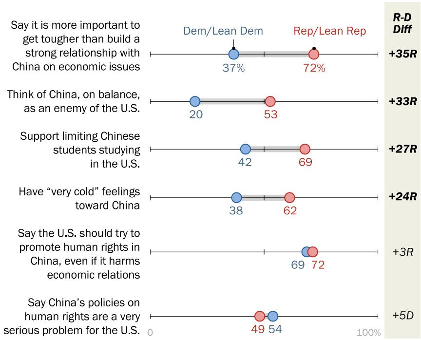
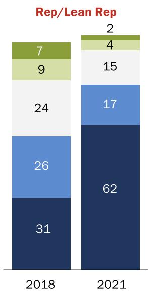
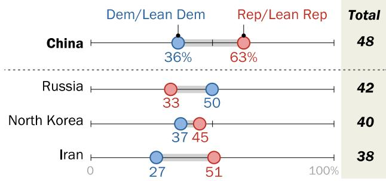
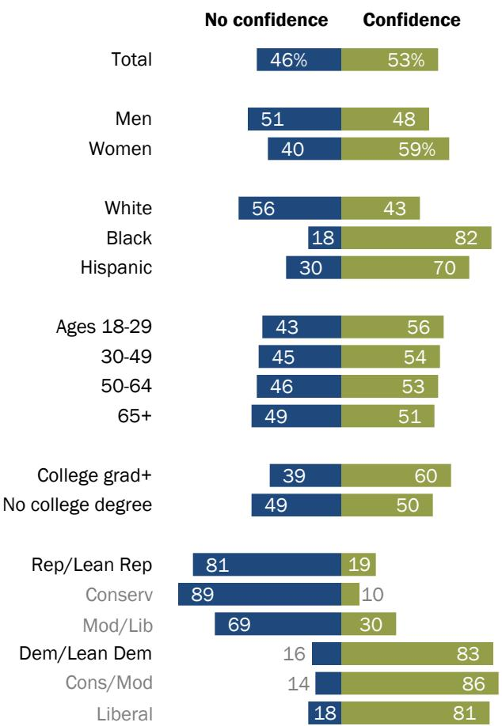

FOR RELEASE MARCH 4, 2021

# Most Americans Support Tough Stance Toward China on Human Rights, Economic Issues

Fewer have confidence in Biden to handle U.S.-China relationship than other foreign policy issues

BY Laura Silver, Kat Devlin and Christine Huang

FOR MEDIA OR OTHER INQUIRIES:

Laura Silver, Senior Researcher Stefan Cornibert, Communications Manager

202.419.4372

www.pewresearch.org

RECOMMENDED CITATION

Pew Research Center, March, 2021, “Most Americans Support Tough Stance Toward China on Human Rights, Economic Issues”

## About Pew Research Center

Pew Research Center is a nonpartisan fact tank that informs the public about the issues, attitudes and trends shaping America and the world. It does not take policy positions. The Center conducts public opinion polling, demographic research, content analysis and other data-driven social science research. It studies U.S. politics and policy; journalism and media; internet, science and technology; religion and public life; Hispanic trends; global attitudes and trends; and U.S. social and demographic trends. All of the Center’s reports are available at www.pewresearch.org. Pew Research Center is a subsidiary of The Pew Charitable Trusts, its primary funder.

© Pew Research Center 2021

## How we did this

Pew Research Center conducted this study to understand American views toward China. For this analysis, we surveyed 2,596 U.S. adults from Feb. 1 to 7, 2021. Everyone who took part in this survey is a member of the Center’s American Trends Panel (ATP), an online survey panel that is recruited through national, random sampling of residential addresses. This way nearly all U.S. adults have a chance of selection. The survey is weighted to be representative of the U.S. adult population by gender, race, ethnicity, partisan affiliation, education and other categories. Read more about the ATP’s methodology.

While Pew Research Center has been tracking attitudes toward China since 2005, prior to 2020, most of this work was done using nationally representative phone surveys. As a result, some longstanding trends may not appear in this report and others will indicate the shift in mode in the text and graphics, as appropriate. (For details on this shift and what it means for key measures of U.S. favorability toward China, see “What different survey modes and question types can tell us about Americans’ views of China.”)

We also draw on an open-ended question: “We’d like to learn a little bit about what you think about when you think about China. Please share the first things that come to mind when you think about China.” To analyze this question, we hand-coded 2,010 responses using a researcherdeveloped codebook. For more on this particular question, see “In their own words: What Americans think about China.”

Here are the questions used for the report, along with responses and survey methodology.

# Most Americans Support Tough Stance Toward China on Human Rights, Economic Issues

Fewer have confidence in Biden to handle U.S.-China relationship than other foreign policy issues

President Joe Biden has inherited a complicated U.S.- China relationship that includes a trade war, mutually imposed sanctions on highranking officials, tensions flaring over human rights issues, Hong Kong and Taiwan, and an American public with deeply negative feelings toward China.

Roughly nine-in-ten U.S. adults (89%) consider China a competitor or enemy, rather than a partner, according to a new Pew Research Center survey. Many also support taking a firmer approach to the bilateral relationship, whether by promoting human rights in China, getting tougher on China economically or limiting Chinese students studying abroad in the United States.

Majority supports a more assertive stance on bilateral relations with China across a range of issues % who say the U.S. should …

Prioritize strengthening economic relations with China, even if it means not addressing human rights issues

% who \_\_ limiting Chinese students studying in the U.S.

% who say it is more important to …

More broadly, 48% think limiting China’s power and influence should be a top foreign policy priority for the U.S., up from 32% in 2018.

Today, 67% of Americans have “cold” feelings toward China on a “feeling thermometer,” giving the country a rating of less than 50 on a 0 to 100 scale. This is up from just 46% who said the same in

### Full Page Description (Page 4)

**Source:** `assets/_page_4_Asset_0.jpg`

**Generated:** 2026-05-30 12:35:38

---

The image contains two line graphs. The first graph, titled "Say limiting China's power and influence is a top priority," shows the percentage of respondents who prioritize limiting China's power and influence, categorized by political affiliation (Republican/Lean Republican, Democratic/Lean Democratic, and Total). The second graph, titled "Feel 'cold' toward China," displays the percentage of respondents who feel cold toward China, also categorized by political affiliation and the total percentage. Both graphs show an upward trend over the years 2018 to 2021, with the Republican/Lean Republican group consistently having the highest percentages in both categories.

2018. The intensity of these negative feelings has also increased: The share who say they have “very cold” feelings toward China (0-24 on the same scale) has roughly doubled from 23% to 47%.

Americans have many specific concerns when it comes to China, and the sense that certain issues in the bilateral relationship – including cyberattacks, job losses to China, and China’s growing technological power – are major problems has grown over the past year alone. Half of Americans now say China’s policy on human rights is a very serious problem for the U.S. – up 7 percentage points since last year. And nine-in-ten Americans say China does not respect the personal freedoms of its people.

Sharp rise in share of Americans who view China negatively, driven mostly by Republicans % who …

Note: “Cold” refers to ratings of 0-49 on a feeling thermometer. Thermometer was asked as: “We'd like to get your feelings toward some different countries in the world on a ‘feeling thermometer.’ A rating of zero degrees means you feel as cold and negative as possible. A rating of 100 degrees means you feel as warm and positive as possible. You would rate the country at 50 degrees if you don’t feel particularly positive or negative toward the country. How do you feel toward China?”

## PEW RESEARCH CENTER

“Most Americans Support Tough Stance Toward China on Human Rights, Economic Issues”

### Full Page Description (Page 5)

**Source:** `assets/_page_5_Asset_0.jpg`

**Generated:** 2026-05-30 12:40:22

---

The image is a bar chart that visually represents various topics related to China, their frequency of mention, and their associated percentages. The chart categorizes topics into five main sections: Human Rights, Economy, Political System, Threats, and U.S.-China Relationship. Each category has subtopics with corresponding percentages indicating the frequency of mention. For example, "Human Rights" has a subtopic "Lack of freedoms" with a 9% frequency. The chart uses green bars to represent the frequency of each topic, with the length of the bar corresponding to the percentage value. The chart effectively communicates the relative importance of different aspects of China in the context of the mentioned topics.

Human rights concerns also are frequently cited when Americans are asked, in an open-ended format, about the first thing that comes to mind when they think of China. Onein-five mention human rights concerns, with 3% specifically focused on Uyghurs in Xinjiang. (For more on the open-ended responses, as well as how they were coded, see “In their own words: What Americans think about China. ” Quotations from this openended question appear throughout this report to provide context for the survey findings. They do not represent the opinion of all Americans on any given topic. They have been edited lightly for grammar and clarity.)

“The Chinese people as   
individuals are no   
different than other   
people, but their   
government is a   
totalitarian Communist   
regime bent on conquering   
its neighbors and land  
grabbing, as shown by   
their takeover of Hong   
Kong.”

–Man, 52

## When Americans think of China, human rights and the economy are top of mind

What’s the first thing you think about when you think about China? (%) [OPEN-END]

Note: Open-ended question. Responses that were given by fewer than 3% of respondents not shown. Refusals, don’t knows and “other” responses not shown. See topline for full details. Numbers may exceed 100% due to multiple responses (first five mentions included).

Source: Survey of U.S. adults conducted Feb. 1-7, 2021, Q39.

“Most Americans Support Tough Stance Toward China on Human Rights, Economic Issues”

## PEW RESEARCH CENTER

### Full Page Description (Page 6)

**Source:** `assets/_page_6_Asset_6.jpg`

**Generated:** 2026-05-30 12:38:39

---

The image is a simple line chart with a horizontal axis labeled "2020" and "2021". It shows a single data point with a value of 42 in 2020 and 43 in 2021. A horizontal line connects these two points, indicating a change from 2020 to 2021. Above the line, there is a label "+1", suggesting an increase of 1 unit from 2020 to 2021. The chart uses a green line to represent the data, and the numbers are clearly marked at the ends of the line.

### Full Page Description (Page 6)

**Source:** `assets/_page_6_Asset_2.jpg`

**Generated:** 2026-05-30 12:36:55

---

The image is a simple bar chart comparing data for the years 2020 and 2021. It shows a value of 47 in 2020 and 53 in 2021, with a difference of +6. The bars are shaded in gray with a green highlight on the 2021 bar, indicating a positive change. The chart uses a horizontal axis for the years and a vertical axis for the values. The text annotations clearly label the values and the change.

### Full Page Description (Page 6)

**Source:** `assets/_page_6_Asset_3.jpg`

**Generated:** 2026-05-30 12:37:03

---

The image is a simple line graph showing a comparison of data between the years 2020 and 2021. The graph includes three horizontal lines, each representing a different metric. The line in the middle, colored green, indicates a value of 46 in 2020 and 52 in 2021, showing a 6-point increase. The other two lines are gray and appear to represent baseline values or other metrics, but their specific values are not labeled. The graph uses a straightforward design with clear labels for the years and values, making it easy to understand the change over time.

### Full Page Description (Page 6)

**Source:** `assets/_page_6_Asset_7.jpg`

**Generated:** 2026-05-30 12:38:31

---

The image is a simple line graph with three horizontal lines representing data from 2020 to 2021. The lines are labeled with a number "28" at the end of the line for the year 2021, indicating a value of 28 for that year. The graph shows a consistent value of 28 for each year, with no change or trend observed between 2020 and 2021.

### Full Page Description (Page 6)

**Source:** `assets/_page_6_Asset_0.jpg`

**Generated:** 2026-05-30 12:37:42

---

The image contains a simple line graph with a horizontal axis labeled "2020" and "2021" and a vertical axis labeled "100%". The graph shows a change from 58 in 2020 to 65 in 2021, with a positive change of +7. The data is represented by a green line with a circle at the end, and there are two additional gray lines with circles, likely representing other data points or categories. The graph is labeled with "2020-2021 change: +7" at the top.

### Full Page Description (Page 6)

**Source:** `assets/_page_6_Asset_4.jpg`

**Generated:** 2026-05-30 12:38:09

---

The image is a simple bar chart comparing data from 2020 to 2021. It shows a value of 41 in 2020 and 47 in 2021, with a difference of +6. The chart uses a horizontal bar with a green highlight to indicate the value for 2021, and the bars are shaded to show the range of possible values. The chart is clean and uses a minimalistic design with no additional annotations or labels beyond the values and years.

### Full Page Description (Page 6)

**Source:** `assets/_page_6_Asset_5.jpg`

**Generated:** 2026-05-30 12:38:14

---

The image is a simple line chart comparing data from 2020 to 2021. It shows a steady increase from 26 in 2020 to 31 in 2021, with a label "+5" indicating the growth. The chart uses a green line to represent the data, and the numbers are clearly marked at the start and end points of the line.

### Full Page Description (Page 6)

**Source:** `assets/_page_6_Asset_1.jpg`

**Generated:** 2026-05-30 12:37:34

---

The image is a simple line graph comparing data from 2020 to 2021. It shows a positive trend, with the value increasing from 43 in 2020 to 50 in 2021. The graph includes a central line representing the 2021 value, flanked by two lighter lines indicating the range of possible values. The difference between the 2020 and 2021 values is marked as +7.

Many also mentioned China’s powerful economy, its dominance as a manufacturing center – sometimes at the expense of the environment or workers – and issues related to the U.S.-Chinese economic relationship. Overall,

“Leader in technology. Makes a lot of cheap products. A possible threat.”

Americans see current economic ties with China as fraught: Around two-thirds (64%) describe economic relations between the superpowers as somewhat or very bad.

–Man, 54

## Rising concerns about China on many issues

% who say \_\_ would be a very serious problem for the U.S.

Cyberattacks from China 100 %

## PEW RESEARCH CENTER

Americans are also critical of how China is dealing with some key issues. When it comes to dealing with global climate change, for example, a broad 79% majority thinks China is doing a bad job,

### Full Page Description (Page 7)

**Source:** `assets/_page_7_Asset_0.jpg`

**Generated:** 2026-05-30 12:33:47

---

The image contains a bar chart with a title and data presented in a clear, organized manner. The chart compares the percentage of U.S. adults who have confidence or no confidence in President Joe Biden's ability to perform various tasks. The tasks include improving relationships with allies, dealing effectively with terrorism, dealing with global climate change, making good decisions about international trade, making good decisions about the use of military force, and dealing effectively with China. The chart uses blue and green bars to represent "No confidence" and "Confidence," respectively, for each task. The data is sourced from a Pew Research Center survey conducted in February 2021.

including 45% who think it’s doing a very bad job. More Americans also think China is doing a bad job (54%) than a good one (43%) dealing with the coronavirus pandemic. Still, people are about as critical of America’s own handling of the pandemic (58% say it is doing a bad job).

As President Biden seeks to navigate this tumultuous relationship, few Americans put much stock in his Chinese counterpart, President Xi Jinping. Only 15% have confidence in Xi to do the right thing regarding world affairs, whereas 82% do not – including 43% who have no confidence in him at all.

While 60% of Americans have confidence in Biden to do the right thing regarding world affairs in general, when it comes to dealing effectively with China, only 53% say they have confidence in him. This is fewer than say they have confidence in him to handle

Americans have less faith in Biden to deal with China than to handle other foreign policy issues

any of the other foreign policy issues asked about on the survey. Partisans are also worlds apart on this issue: 83% of Democrats and Democratic-leaning independents have confidence in Biden to deal effectively with China, compared with only 19% of Republicans and Republican leaners.

Many other issues related to China are also quite divided across party lines. Republicans are significantly more likely to say the U.S. should get tougher on China on economic issues (instead of trying to strengthen economic relations), to describe China as an enemy of the U.S. – rather than as competitor or partner – and to have very cold feelings toward China. They are also more likely to support limiting the ability of Chinese students to study in the U.S.

Republicans are also more   
likely than Democrats to   
describe most issues in the   
bilateral relationship as very serious problems for the U.S., including the loss of U.S. jobs to China (by 24 percentage   
points) and the U.S. trade   
deficit with China (19 points). The gap between the parties on these issues has grown over the past year, too, with   
Republicans increasingly   
describing these issues as very serious but Democratic opinion changing little.

Only on human rights-related issues – both the perception that China’s human rights policies are a major problem and support for promoting human rights in China – do Democrats and Republicans largely agree. The sense that China’s human rights policies are an issue in the bilateral relationship also increased a similar amount among both

## Large partisan divides on many China-related issues – but not in concerns about human rights

% who …

> **AI Description:**
> **Source:** `assets/_page_8_Figure_0.jpg`
> 
> **Generated:** 2026-05-30 12:38:02
> 
> ---
> 
> The image is a chart presenting survey data comparing the views of Democrats and Republicans on various issues related to China. It includes six horizontal bars, each representing a different topic: getting tougher than building a strong relationship with China on economic issues, thinking of China as an enemy of the U.S., supporting limiting Chinese students studying in the U.S., having very cold feelings toward China, saying the U.S. should try to promote human rights in China even if it harms economic relations, and regarding China's policies on human rights as a very serious problem for the U.S. The chart uses a color-coded system with blue representing Democrats and lean Democrats, and red representing Republicans and lean Republicans. The rightmost column, labeled "R-D Diff," shows the difference in percentages between Republicans and Democrats for each topic, with positive values indicating a higher percentage among Republicans. The chart visually highlights the significant differences in opinions between the two political groups on these issues.

Note: Statistically significant differences shown in bold. “Very cold” refers to ratings of 0-24 on a feeling thermometer. Thermometer was asked as: “We’d like to get your feelings toward some different countries in the world on a ‘feeling thermometer.’ A rating of zero degrees means you feel as cold and negative as possible. A rating of 100 degrees means you feel as warm and positive as possible. You would rate the country at 50 degrees if you don’t feel particularly positive or negative toward the country. How do you feel toward China?”

Source: Survey of U.S. adults conducted Feb. 1-7, 2021. Thermchina, Q20, Q48, Q50, Q51c & Q55.

“Most Americans Support Tough Stance Toward China on Human Rights, Economic Issues” PEW RESEARCH CENTER

Republicans and Democrats over the past year.

These are among the findings of a new survey by Pew Research Center, conducted online Feb. 1-7 among 2,596 adults who are members of the nationally representative American Trends Panel.

### Full Page Description (Page 9)

**Source:** `assets/_page_9_Asset_0.jpg`

**Generated:** 2026-05-30 12:39:04

---

The image is a stacked bar chart with percentages representing temperature preferences over two years, 2018 and 2021. The categories are "Very warm," "Somewhat warm," "Neutral," "Somewhat cold," and "Very cold." The chart shows a shift in preferences over the years, with a decrease in "Very warm" and "Somewhat warm" categories and an increase in "Neutral," "Somewhat cold," and "Very cold" categories. The "Neutral" category remains stable.

### Full Page Description (Page 9)

**Source:** `assets/_page_9_Asset_1.jpg`

**Generated:** 2026-05-30 12:39:23

---

The image is a stacked bar chart comparing political leanings in 2018 and 2021. The chart is divided into two main categories: "Dem/Lean Dem" and "Other". The "Dem/Lean Dem" category is further divided into five subcategories, each represented by a different color. The "Other" category is divided into two subcategories. The chart shows an increase in the number of people leaning towards the Democratic party from 2018 to 2021, while the number of people in the "Other" category has decreased.

## Growing share of Americans express cold feelings toward China

A majority of Americans have negative feelings toward China, up substantially since 2018. Respondents indicated their feelings using a “feeling thermometer” where a rating of zero degrees means they feel as cold and negative as possible, a rating of 100 degrees means they feel as warm and positive as possible, and a rating of 50 degrees means they don’t feel particularly positively or negatively toward China. Based on this, 67% of Americans today feel “cold” toward China (a rating of 0 to 49). This is up 21 percentage points from the 46% who said the same in 2018.

## Negative views of China up substantially since 2018

% who rate China as \_\_ on a feeling thermometer from 0 (coldest rating) to 100 (warmest rating)

> **AI Description:**
> **Source:** `assets/_page_9_Figure_0.jpg`
> 
> **Generated:** 2026-05-30 12:37:27
> 
> ---
> 
> The image is a stacked bar chart with two bars, one for each year (2018 and 2021), and is labeled "Rep/Lean Rep." The chart uses different shades of blue and green to represent different categories within each year. The categories are not explicitly named, but the numbers within each section suggest they represent counts or percentages. The 2021 bar has higher values in each section compared to 2018, indicating an increase in the represented categories over time.

“Most Americans Support Tough Stance Toward China on Human Rights, Economic Issues”

## PEW RESEARCH CENTER

Nearly half (47%) of Americans feel “very cold” toward China – rating it below 25 on the same 100-point scale – which is around twice as many as said the same in 2018 (23%). Similarly, the share of Americans who give China the lowest possible rating of zero has nearly tripled, from 9% in 2018 to around a quarter (24%) in 2021.

### Full Page Description (Page 10)

**Source:** `assets/_page_10_Asset_0.jpg`

**Generated:** 2026-05-30 12:34:24

---

The image is a line graph showing the percentage of people who have a negative view of China over time, from 2005 to 2021. The graph includes three different scales: a four-point scale for "unfavorable" views, a four-point scale for "unfavorable" views via phone, and a "feeling thermometer" scale for "cold" views. The main trend shows an increase in negative views over the years, with the highest percentages in 2021 for all three scales. The graph highlights the percentage values at key points, such as 35% in 2005, 79% in 2020, and 76% in 2021. The data suggests a consistent and growing negative sentiment towards China among the surveyed population.

Only 7% of Americans have “warm” feelings (51-75) toward China and even fewer (4%) say they have “very warm” evaluations of the country (76-100). One-in-five Americans have neutral feelings toward the country, giving it a rating of exactly 50 on the thermometer.

While negative feelings toward China have increased among both Republicans and Democrats, the size of the partisan gap has also grown since 2018. Today, 62% of Republicans feel “very cold” (0- 24) toward China – up 31 points since 2018. In comparison, 38% of Democrats report “very cold” feelings, up 21 points over the same period.

## Understanding the over-time change in views of China

Since 2005, Pew Research Center has used telephone polling to measure Americans’ views of China as part of the Global Attitudes annual survey. Using the same four-point question each year, which asks people whether they have a “very favorable, somewhat favorable, somewhat unfavorable or very unfavorable view of China,” we have tracked the ups and downs in Americans’ views of the superpower, including the 26-point increase in negative views that has taken place since 2018.

Across modes and question types, Americans’ views of China have grown more negative in recent years

Note: “% unfavorable” refers to the sum of “very unfavorable” and “somewhat unfavorable” responses. “% cold” refers to ratings of 0-49 out of 100. Thermometer was asked as: “We'd like to get your feelings toward some different countries in the world on a ‘feeling thermometer.’ A rating of zero degrees means you feel as cold and negative as possible. A rating of 100 degrees means you feel as warm and positive as possible. You would rate the country at 50 degrees if you don’t feel particularly positive or negative toward the country. How do you feel toward China?”

Beginning this year, however, Pew Research

Center has shifted to conducting the U.S. portion of its annual Global Attitudes survey using the American Trends Panel (ATP), a nationally representative online panel of adults that is the Center’s principal source of data for U.S. public opinion research. To prepare for this transition, we fielded two surveys simultaneously in early 2020 – one on the phone and one on the ATP – asking the same question about Americans’ favorability of China. Results indicated there were substantial differences by survey mode: 66% of those surveyed by phone had an unfavorable view of China, compared with 79% of those surveyed online.

Because of these mode differences, we fielded two different survey questions on the ATP this year. The first is a “feeling thermometer,” which asks people to evaluate their opinion of China on a 0 to 100 scale, where a rating of 51 or higher is “warm,” 50 is neutral and below 50 is “cold.” This question, which is the predominant focus of this report, was previously asked on the ATP in 2018 and 2016. Looking at these three points in time, we can see that the sharp increase in negative views of China that we have been documenting via our phone surveys is also evident via these online surveys. On this measure, those who say they are “cold” (0-49) toward China has increased from 46% in 2018 to 67% in 2021, or 21 percentage points.

Second, we also asked our traditional four-point favorability question. Because of the mode differences previously identified, we decided that this number from the online survey was not directly comparable to the phone surveys previously conducted. But we want to “restart” this trend, beginning to measure it consistently on the ATP going forward, much as we have done so on the phone for the past 15 years. Results of this question indicate that a majority of Americans (76%) have an unfavorable view of China. This is consistent with the majority who say they are “cool” toward China on the feeling thermometer rating, though there are differences between the two measures due, in part, to the fact that the feeling thermometer has an explicit “neutral” category. (For more on how these two measures are similar and different, see “What different survey modes and question types can tell us about Americans’ views of China.”)

Thanks to these two questions, we can see that unfavorable views of China increased dramatically since 2018, regardless of mode (phone vs. online) or measure (feeling thermometer or four-point scale).

### Full Page Description (Page 12)

**Source:** `assets/_page_12_Asset_0.jpg`

**Generated:** 2026-05-30 12:40:40

---

The image is a bar chart presenting data on how different demographic groups perceive a certain topic as "Very Cold" or "Somewhat Cold." The chart is divided into several categories: total, by gender, race, age, education level, and political affiliation. Each category has two bars representing the percentage of respondents who perceive the topic as "Very Cold" (0-24) and "Somewhat Cold" (25-49). The total percentages for each category are also provided. Notable trends include higher percentages of "Very Cold" perceptions among older age groups, those with no college degree, and conservative political affiliations.

Conservative Republicans are even more likely to say they have “very cold” feelings toward China (72%) than moderate or liberal Republicans (48%). Among Democrats, conservatives and moderates (45%) are more likely than liberals (30%) to have very cold feelings toward China.

Men (51%) are more likely than women (43%) to have “very cold” feelings toward China. A majority of those 50 and older (55%) have “very cold” opinions of China, whereas only 40% of those under 50 report the same. Americans with lower levels of education are more likely to feel “very cold” toward China: 51% of those who have not completed college feel this way, compared with 39% of those with at least a bachelor’s degree.

While most Americans have unfavorable views toward China, results of an open-ended question about China indicate that opinions can be multifaceted. Even among those who say have “cold” feelings toward China, there are instances where people report good and bad things.

“I think about the human rights abuses, such as the indefensible treatment of the Uyghurs, as well as the infringements of personal freedoms suffered by all citizens. I think about the gender imbalances still present from the one-child laws of the past, which further harms their society. I [also] think about the centuries of rich culture and history that created incredible art and architecture, as well as incredible inventions that furthered humanity as a whole.”

–Woman, 35

## Most Americans see China negatively

% who rate China as \_\_ on a feeling thermometer from 0 (coldest rating) to 100 (warmest rating)

Note: White and Black adults include those who report being only one race and are not Hispanic. Hispanics are of any race. “Very cold” refers to a rating of 0-24 out of 100. “Somewhat cold” refers to a rating of 25-49. Thermometer was asked as: “We’d like to get your feelings toward some different countries in the world on a ‘feeling thermometer.’ A rating of zero degrees means you feel as cold and negative as possible. A rating of 100 degrees means you feel as warm and positive as possible. You would rate the country at 50 degrees if you don’t feel particularly positive or negative toward the country. How do you feel toward China?” Source: Survey of U.S. adults conducted Feb. 1-7, 2021. Thermchina. “Most Americans Support Tough Stance Toward China on Human Rights, Economic Issues”

PEW RESEARCH CENTER

### Full Page Description (Page 13)

**Source:** `assets/_page_13_Asset_0.jpg`

**Generated:** 2026-05-30 12:34:44

---

The image is a bar chart with three categories: Partner, Competitor, and Enemy. It presents data on the percentage of people who identify with each category across various demographic groups. The categories include total, men, women, race, age, education, and political affiliation. The chart shows that the Competitor category is the most common, with percentages ranging from 48% to 71% across different groups. The Partner category is the least common, with percentages ranging from 2% to 14%. The Enemy category falls in between, with percentages ranging from 12% to 64%. The chart effectively visualizes the distribution of these categories across different demographic segments.

## Republicans are much more likely to describe China as enemy of the U.S.

A majority of Americans describe China as a competitor (55%) rather than as an enemy (34%) or a partner (9%).

Partisans differ substantially in their evaluations of the U.S.- China relationship. Whereas 53% of Republicans and independents who lean toward the Republican Party describe China as an enemy, only 20% of Democrats and Democraticleaning independents say the same. Nearly two-thirds of conservative Republicans say China is an enemy (64%), while only 37% of moderate or liberal Republicans say the same.

While Democrats are more likely than Republicans to describe China as a partner, they are also more likely to describe it as a competitor, with nearly two-thirds of Democrats and Democratic leaners (65%) describing the relationship in this way.

Nearly two-thirds of conservative Republicans view China as an ‘enemy’ – far more than other groups

% who, on balance, think of China as a \_\_ of the U.S.

Black, White and Hispanic adults also differ in their evaluations of the U.S.-China relationship. White adults (42%) are significantly more likely than Hispanic (21%) or Black adults (12%) to

## “Powerful U.S. competitor on world stage and long-term frenemy …”

–Man, 51

describe China as an enemy. White Americans are also much less likely to describe China as a partner (6%) than are Black (19%) or Hispanic (15%) Americans.

### Full Page Description (Page 14)

**Source:** `assets/_page_14_Asset_0.jpg`

**Generated:** 2026-05-30 12:38:25

---

The image is a line graph showing trends over time for three categories: "Rep/Lean Rep," "Total," and "Dem/Lean Dem." The x-axis represents the years 2018 and 2021, while the y-axis represents percentages. The graph shows an upward trend for all three categories from 2018 to 2021. Specifically, "Rep/Lean Rep" increased from 39% to 63%, "Total" increased from 32% to 48%, and "Dem/Lean Dem" increased from 26% to 36%. The graph uses different colors to distinguish between the three categories, with "Rep/Lean Rep" in red, "Total" in brown, and "Dem/Lean Dem" in blue.

Older adults, too, are significantly more likely than younger ones to describe China as an enemy. Whereas around half (49%) of those ages 65 and older say that China is an enemy, only 20% of those under 30 say the same. Those who have not completed college are somewhat more likely than those who have a college degree to describe China as an enemy (36% vs. 30%, respectively).

## Americans increasingly prioritize limiting China’s power and influence

Nearly half of Americans (48%) think limiting the power and influence of China should be a top foreign policy priority for the country, and another 44% think that it should be given some priority. Only 7% think limiting China’s influence should not be a priority at all. The share of Americans who think limiting China’s power and influence should be a top priority is also up 16 percentage points since 2018.

Republicans are much more likely than Democrats to say limiting China’s power and influence is a top priority (63% vs. 36%, respectively). Conservative Republicans (68%) are even more likely than moderate or liberal Republicans to say this (54%). And, while support for limiting China’s influence has increased since 2018 among both Republicans and Democrats, the rise has been especially steep among Republicans.

Both parties grow more supportive of curtailing China’s influence

% who say limiting the power and influence of China should be given top priority as a long-range foreign policy goal   
100%

Limiting China’s power and influence is one of the top priorities cited by Americans among 20 foreign policy goals asked about in the survey. The only issues of the 20 tested that are named as a top priority by more Americans are protecting the jobs of American workers (75%), reducing the spread of infectious diseases (71%), taking measures to protect the U.S. from terrorist attacks (71%), preventing the spread of weapons of mass destruction (64%) and improving relationships with our allies (55%). And, when it comes to comparisons with other countries, more Americans see limiting China’s power and influence as a top priority than say the same of Russia (42%), North Korea (40%) or Iran (38%).

Still, there are major partisan differences with regard to the relative importance of limiting China’s power and influence. For Republicans, it is the fifth most important issue of the 20 tested, while for Democrats, it ranks 12th.

## Tackling China is a top-five priority for Republicans among policy goals polled

% who say, when thinking about long-range foreign policy goals for the U.S., \_\_ should be a top priority, among …

Rep/Lean Rep

Source: Survey of U.S. adults conducted Feb. 1-7, 2021. Q41a-t.
“Most Americans Support Tough Stance Toward China on Human Rights, Economic Issues”

## PEW RESEARCH CENTER

The 27-point gap between Republicans and Democrats when it comes to whether limiting China’s power and influence is a top priority is one of the largest partisan gaps across the 20 issues tested. The only more divisive issues are dealing with global climate change (Democrats 56 points more likely to name this), reducing illegal immigration into the U.S. (48 points higher among Republicans), and maintaining the U.S. military advantage over all other countries (Republicans 38 points more likely).

Older Americans are more likely to say limiting China’s power and influence should be a top priority: 58% of those ages 50 and older say this, compared with 39% of those under 50. Those with lower levels of education are also more likely to call limiting China a top priority: 50% of those who have not completed a

## Americans – especially Republicans – prioritize limiting China’s power and influence more than other countries

% who say, when thinking about long-range foreign policy goals, it should be a top priority to limit the power and influence of …

> **AI Description:**
> **Source:** `assets/_page_16_Figure_0.jpg`
> 
> **Generated:** 2026-05-30 12:39:15
> 
> ---
> 
> The image is a horizontal bar chart with a focus on political leanings towards China, Russia, North Korea, and Iran. It categorizes responses into two groups: "Dem/Lean Dem" (blue) and "Rep/Lean Rep" (red). The chart provides percentages for each country, indicating the proportion of respondents who lean towards the Democratic Party or the Republican Party. The total number of respondents for each country is also provided in the rightmost column. The chart visually represents the distribution of political leanings for each country, showing a higher percentage of Republican leaners for China and Iran, while North Korea and Russia show a more balanced distribution.

Source: Survey of U.S. adults conducted Feb. 1-7, 2021. Q41e, h, n & t.

“Most Americans Support Tough Stance Toward China on Human Rights, Economic Issues”

PEW RESEARCH CENTER

bachelor’s degree compared with 43% of those who have.

“I personally fear China’s powers more than any other country.”

–Woman, 80

## Partisans sharply divided over confidence in Biden to deal with China

Around half of Americans have confidence Biden will be able to deal effectively with China (53%). Still, this is the issue among six tested in which Americans have the least confidence in Biden. For example, 67% have confidence in him to improve relationships with allies, and around six-inten say they think he will be able to deal effectively with the threat of terrorism and global climate change, as well as to make good decisions about the use of military force and international trade.

## Americans have less faith in Biden to deal with China than on other foreign policy issues

% who are \_\_ confident that Joe Biden can do each of the following

Source: Survey of U.S. adults conducted Feb. 1-7, 2021. Q42a-f.

## PEW RESEARCH CENTER

“Most Americans Support Tough Stance Toward China on Human Rights, Economic Issues”

Women (59%) are more confident than men (48%) in Biden’s ability to deal effectively with China. Black (82%) and Hispanic adults (70%) also express more confidence than White adults (43%). Those with a college degree expect Biden will be able to deal effectively with China at a higher rate than those with less schooling (60% vs. 50%, respectively).

Partisan differences are particularly large. Whereas 83% of Democrats and leaners toward the Democratic Party have confidence in Biden on China, only 19% of Republicans and leaners say the same. Conservative Republicans have even less confidence (10%) than moderate or liberal Republicans (30%), though conservative and moderate Democrats (86%) are about as confident in Biden on dealing with China as liberal Democrats (81%).

Few Republicans have confidence in Biden to deal effectively with China

% who have \_\_ in President Joe Biden to deal effectively with China

> **AI Description:**
> **Source:** `assets/_page_18_Figure_0.jpg`
> 
> **Generated:** 2026-05-30 12:36:48
> 
> ---
> 
> The image is a bar chart presenting survey data on confidence levels. It compares "No confidence" and "Confidence" percentages across various demographic groups. Key information includes:
> 
> - Total population: 46% no confidence, 53% confidence
> - Gender: Men (51% no confidence, 48% confidence), Women (40% no confidence, 59% confidence)
> - Race: White (56% no confidence, 43% confidence), Black (18% no confidence, 82% confidence), Hispanic (30% no confidence, 70% confidence)
> - Age groups: 18-29 (43% no confidence, 56% confidence), 30-49 (45% no confidence, 54% confidence), 50-64 (46% no confidence, 53% confidence), 65+ (49% no confidence, 51% confidence)
> - Education: College grad+ (39% no confidence, 60% confidence), No college degree (49% no confidence, 50% confidence)
> - Political affiliation: Rep/Lean Rep (81% no confidence, 19% confidence), Conserv (89% no confidence, 10% confidence), Mod/Lib (69% no confidence, 30% confidence), Dem/Lean Dem (16% no confidence, 83% confidence), Cons/Mod (14% no confidence, 86% confidence), Liberal (18% no confidence, 81% confidence)
> 
> The chart highlights significant differences in confidence levels across different groups, with racial and political affiliations showing the most pronounced contrasts.

Note: Those who did not answer not shown. White and Black adults include those who report being only one race and are not Hispanic. Hispanics are of any race.
Source: Survey of U.S. adults conducted Feb. 1-7, 2021. Q42f. “Most Americans Support Tough Stance Toward China on Human Rights, Economic Issues”

## PEW RESEARCH CENTER

### Full Page Description (Page 19)

**Source:** `assets/_page_19_Asset_0.jpg`

**Generated:** 2026-05-30 12:34:02

---

The image is a bar chart with a table format. It presents data on the perceived seriousness of various issues related to China, such as cyberattacks, military power, trade deficits, job losses, human rights policies, technological power, and tensions between different regions of China. The chart categorizes responses into "Very serious" and "Somewhat serious" percentages, with totals for each issue. The data is presented in a horizontal bar format, with the percentage of respondents who view each issue as very serious or somewhat serious. The chart highlights the high concern over cyberattacks from China, followed by the loss of U.S. jobs to China and China's growing military power.

## Americans anxious about China’s technological and military power

Americans express substantial concern when asked about eight specific issues in the U.S.- China relationship. About three-quarters or more say that each issue is at least somewhat serious. Still, four problems stand out for being ones that half or more describe as very serious: cyberattacks from China, the loss of U.S. jobs to China, China’s growing military power and China’s policies on human rights.

Cyberattacks from China evoke the most concern: Roughly two-thirds consider digital attacks to be a very serious problem. This is a 7 percentage point increase from 2020.

The share who see the loss of U.S. jobs to China as a very serious problem has increased by 6 points since 2020, to 53%. A similar share sees China’s growing military power as a very serious problem (largely unchanged from the 49% who said the same last year).

China’s policies on human rights are seen as a very substantial problem for the U.S. by half of American adults, a 7-point increase since 2020. China’s treatment of Uyghurs in Xinjiang was recently labeled a “genocide” by former U.S.

Majority in the U.S. see cyberattacks from China as very serious problem

% who say the following are a \_\_ serious problem for the U.S.

PEW RESEARCH CENTER

Secretary of State Mike Pompeo. Results of previous telephone polls indicate that concerns about China’s human rights policies increased between 2018 and 2020 as well.

About four-in-ten Americans see the U.S. trade deficit with China – which decreased for the second year in a row – as a very serious problem, unchanged from 2020. Those with less than a college degree are more likely than those with a college degree or more education to see the trade deficit with China as a very serious problem. Similarly, those with lower levels of education are more likely to call the loss of U.S. jobs to China a very serious problem – but when it comes to other problems, people with different educational attainment levels largely agree.

Tensions between mainland China and Hong Kong or Taiwan are seen as less serious problems for most Americans. While about three-quarters say these two geopolitical issues are at least somewhat serious problems, only about three-in-ten say they are very serious. Still, the share who see Hong Kong’s tensions with mainland China as a very serious problem has increased by 5 percentage points since last year. (Last year’s survey did not ask about tensions between mainland China and Taiwan.)

“They are actively working to take over the U.S. economically rather than militarily. They are pulling our manufacturing abilities, copying advanced technologies, buying up largescale U.S. corporations and they own much of our debt. They are methodically taking over control of our economy.”

–Man, 82

Across age groups, older Americans express more concern about China-related issues. Americans ages 65 and older are at least 20 points more likely than those ages 18 to 29 to say most issues asked about in the survey are very serious problems.

Republicans and Republican-leaning independents tend to be more concerned about most of these eight bilateral issues than Democrats and Democratic leaners. And conservative Republicans are particularly likely to call most of these issues very serious problems for the U.S. For example, 73% of conservative Republicans see the loss of U.S. jobs to China as a very serious problem, while only 55% of moderate or liberal Republicans agree.

When it comes to China’s human rights policies and tensions between Taiwan and mainland China, however, partisans largely agree.

Compared with 2020, concern about various China-related issues generally increased more among Republicans than among Democrats. For instance, while the share of Republicans who say the loss of U.S. jobs to China poses a very serious problem increased by 14 percentage points, there was no significant change among Democrats. On issues where concern rose overall, increases tended to be especially steep among conservative Republicans.

### Full Page Description (Page 21)

**Source:** `assets/_page_21_Asset_3.jpg`

**Generated:** 2026-05-30 12:35:23

---

The image is a line graph with two data points representing the years 2020 and 2021. The graph shows two sets of data, one in red and the other in blue, with the red line indicating a significant increase from 44 to 57, marked as "+18R". The blue line remains constant at 39 for both years. The graph uses circles to mark the data points and a horizontal line to separate the years.

### Full Page Description (Page 21)

**Source:** `assets/_page_21_Asset_6.jpg`

**Generated:** 2026-05-30 12:36:04

---

The image is a line graph with two lines representing data from 2020 to 2021. The x-axis represents the years 2020 and 2021, while the y-axis is not labeled, but the lines are marked with numerical values. The blue line is labeled "+5D" and the red line is labeled "+4R". The blue line starts at 41 in 2020 and increases to 54 in 2021, while the red line starts at 27 in 2020 and increases to 31 in 2021. The graph shows an upward trend for both lines, indicating growth in the values represented by the lines over the two-year period.

### Full Page Description (Page 21)

**Source:** `assets/_page_21_Asset_2.jpg`

**Generated:** 2026-05-30 12:35:07

---

The image contains a line graph comparing data from 2020 to 2021. The graph shows two lines, one in red and one in blue, representing different categories. The red line starts at 45 in 2020 and increases to 54 in 2021, indicating a 19-point increase. The blue line starts at 40 in 2020 and decreases to 35 in 2021, showing a 5-point decrease. The graph includes a label "+19R" above the red line, suggesting the significance of the 19-point increase.

### Full Page Description (Page 21)

**Source:** `assets/_page_21_Asset_5.jpg`

**Generated:** 2026-05-30 12:36:20

---

The image is a line graph with two data series, each represented by a colored line. The x-axis represents the years 2020 and 2021, while the y-axis has values labeled as 26 and 34. The graph shows a slight increase in the values for both series from 2020 to 2021. The red line starts at 26 in 2020 and increases to 34 in 2021, while the blue line starts at 29 in 2020 and increases to 29 in 2021. The label "+5R" is placed at the top of the graph, possibly indicating a reference or trend line.

### Full Page Description (Page 21)

**Source:** `assets/_page_21_Asset_1.jpg`

**Generated:** 2026-05-30 12:34:52

---

The image is a line graph comparing data for two years, 2020 and 2021. The graph has two lines, one red and one blue, representing different categories. The red line shows an increase from 52 in 2020 to 63 in 2021, with a label "+19R" indicating a 19-point increase. The blue line shows a slight decrease from 43 in 2020 to 44 in 2021. The x-axis represents the years 2020 and 2021, while the y-axis likely represents a numerical value for each category.

### Full Page Description (Page 21)

**Source:** `assets/_page_21_Asset_0.jpg`

**Generated:** 2026-05-30 12:34:59

---

The image is a line graph with two lines representing the percentage of Republicans and Democrats who lean towards the Republican Party. The graph shows a significant difference between the two groups, with Republicans and Republican-leaning individuals at 66% and Democrats and Democratic-leaning individuals at 42%. The text at the top indicates a Republican-Democrat difference of +24R, suggesting a 24-point advantage for Republicans. The graph uses a red line for Republicans and a blue line for Democrats, with percentages marked at the ends of each line.

### Full Page Description (Page 21)

**Source:** `assets/_page_21_Asset_4.jpg`

**Generated:** 2026-05-30 12:36:12

---

The image is a line graph showing data for two years, 2020 and 2021. The x-axis represents the years, and the y-axis represents numerical values. There are two lines, one red and one blue, representing different data series. The red line starts at 62 in 2020 and increases to 73 in 2021, indicating a +13R change. The blue line starts at 55 in 2020 and increases to 60 in 2021. The graph suggests a positive trend for both data series over the two-year period.

Wider partisan gap than in 2020 in views of whether U.S. job loss, trade deficit and China’s military and technological power are very serious problems for the U.S.

% who say the following would be a very serious problem for the U.S. among …

The loss of U.S. jobs to China

Note: Statistically significant differences shown in bold. Tensions between mainland China and Taiwan was not asked in 2020.   
Source: Survey of U.S. adults conducted Feb. 1-7, 2021. Q51a-h.

## PEW RESEARCH CENTER

“Most Americans Support Tough Stance Toward China on Human Rights, Economic Issues”

### Full Page Description (Page 22)

**Source:** `assets/_page_22_Asset_0.jpg`

**Generated:** 2026-05-30 12:34:09

---

The image is a bar chart comparing perceptions of job performance in China and the U.S. The chart has two categories: "Bad job" and "Good job." The data is presented as percentages for each country. In China, 54% perceive the job as bad, while 43% perceive it as good. In the U.S., 58% perceive the job as bad, and 42% perceive it as good. The chart uses blue bars for "Bad job" and green bars for "Good job."

## China’s handling of coronavirus and climate

More than a year after the coronavirus became a widespread public health issue in the U.S., more than half of Americans say China has done a bad job dealing with the outbreak (54%). Around a quarter (28%) even think China’s pandemic response has been very bad.

Just 43% think China has done a good job dealing with the coronavirus outbreak, with only 12% saying China has done a very good job.

And, while more Americans say China has done a bad job than a good job dealing with the pandemic, they are just as critical of the U.S.’s handling of the pandemic, which 58% describe as bad.

## More than half of Americans say China and U.S. have handled COVID-19 poorly

% who say China/U.S. has done a \_\_ dealing with the coronavirus outbreak

Note: Those who did not answer not shown. Source: Survey of U.S. adults conducted Feb. 1-7, 2021. Q7b & c. “Most Americans Support Tough Stance Toward China on Human Rights, Economic Issues”

PEW RESEARCH CENTER

Republicans (71%) are much more likely than Democrats (39%) to see China as having done a bad job with the COVID-19 outbreak. Those with less than a college degree are more likely to say China has done a bad job compared with those have at least a bachelor’s. White Americans also give China worse ratings than do Black or Hispanic Americans.

“China is the origin country for COVID-19 but they managed to keep the virus from spreading further, way better than the U.S.”

–Woman, 30

### Full Page Description (Page 23)

**Source:** `assets/_page_23_Asset_0.jpg`

**Generated:** 2026-05-30 12:37:20

---

The image contains two bar charts. The first chart, titled "% who say the government of China ___ the personal freedoms of its people," shows two categories: "Does not respect" and "Respects." The "Does not respect" category has a bar at 90%, while the "Respects" category has a bar at 8%. The second chart, titled "% who say the U.S. should ...," presents two options: "Prioritize economic relations, even if it means not addressing human rights issues" and "Promote human rights, even if it harms economic relations." The "Prioritize economic relations" category has a bar at 26%, and the "Promote human rights" category has a bar at 70%. The charts use blue and green bars to represent the different categories and percentages.

One area where Americans think China could do much more is climate change. The world’s largest contributor of carbon emissions, China has pledged to become carbon neutral by 2060 while still espousing its right to develop. By a nearly four-to-one ratio, Americans think China has done a bad job handling climate change, with 45% saying China has done a very bad job. On the other hand, just 2% think China’s approach to global warming thus far has been very good. No more than a quarter rate China’s climate change approach positively regardless of age, education or political affiliation.

## On climate change, most Americans view China’s response negatively

% who say China has done a \_\_ job dealing with global climate change

Note: Those who did not answer not shown. Source: Survey of U.S. adults conducted Feb. 1-7, 2021. Q33d. “Most Americans Support Tough Stance Toward China on Human Rights, Economic Issues”

PEW RESEARCH CENTER

## Americans want to prioritize human rights in U.S.-China relations

Human Rights Watch called 2020 “the darkest period for human rights in China” since the 1989 Tiananmen Square protests. Amid crackdowns in Hong Kong, continued persecution of ethnic minorities such as the Muslim Uyghur population and detaining dissidents,

Americans, too, have taken notice. Fully 90% of adults in the U.S. say the Chinese government does not respect the personal freedoms of its people. This perspective is shared among large majorities of Americans across age, education and political groups.

Note: Those who did not answer not shown. Full question wording: “Which statement comes closer to your view, even if neither is exactly right? The U.S. should try to promote human rights in China, even if it harms economic relations with China OR The U.S. should prioritize strengthening economic relations with China, even if it means not addressing human rights issues.”

Source: Survey of U.S. adults conducted Feb. 1-7, 2021. Q6a & Q20.

## PEW RESEARCH CENTER

“Most Americans Support Tough Stance Toward China on Human Rights, Economic Issues”

And Americans want more focus on human rights – even at the expense of economic ties – in bilateral relations with China. When asked whether the U.S. should prioritize economic relations with China or promote human rights in China, 70% of Americans choose human rights, even if it potentially harms economic relations with China.

About seven-in-ten Democrats and Republicans say the U.S. should promote human rights in China, even if it harms economic relations between the two countries. Among Republicans, those who identify as conservative Republicans are more likely than their moderate or liberal counterparts to hold this opinion. Among Democrats, those who identify as liberal are the most likely to emphasize human rights over economic dealings in U.S.- China relations.

# Large shares of conservative Republicans, liberal Democrats prioritize human rights over economic ties with China

% who say the U.S. should …

Note: Those who did not answer not shown. Source: Survey of U.S. adults conducted Feb. 1-7, 2021. Q20. “Most Americans Support Tough Stance Toward China on Human Rights, Economic Issues”

## PEW RESEARCH CENTER

“When I think of China, the first thing that comes to mind is the oppressive measures it takes on those within its borders, especially the plight of Uyghur Muslims, but also the restrictions placed by the Communist government on free speech and dissent by its citizens. After that, America’s weakening role as a superpower in global competition against China comes to mind.”

–Man, 30

## Americans favor tougher stance on China economic policies, question efficacy of tariffs

## Targeted tariffs and increased intellectual

property scrutiny set the backdrop of the U.S.- China trade war and the bilateral economic relationship during the four years of the Trump administration. While President Biden has indicated he would change tack in bilateral economic dealings, he has also described China as America’s “most serious competitor” and has kept some Trump-era China policies in place, at least for now.

Americans, too, see a precarious economic relationship between the two nations: 64% believe current economic relations between the U.S. and China are bad. Among those who say

## Only about a third of Americans see U.S.-China economic ties positively

% who say current economic relations between the U.S. and China are …

PEW RESEARCH CENTER

economic relations are good, just 1% say they are very good. (Results of a similar question asked on the phone indicates that Americans increasingly saw bilateral economic ties to be in poor shape over the course of the trade war.)

“I work in tech and my company does a lot of business in China. The trade war and bans on sales to certain companies have hurt our business and seem arbitrary. I have been to China many times. I don’t agree with all of China’s policies but I also don’t agree with how the U.S. government has managed its relationship under Trump.”

–Woman, 49

### Full Page Description (Page 26)

**Source:** `assets/_page_26_Asset_0.jpg`

**Generated:** 2026-05-30 12:38:54

---

The image contains a bar chart with data comparing two approaches: "Get tougher" and "Build a strong relationship." The chart is divided into various demographic categories such as race, age, education level, and political affiliation. Each category has two bars representing the percentage of people who prefer each approach. The chart shows that "Get tougher" is preferred by a majority in most categories, with the exception of Black individuals and those aged 18-29, where "Build a strong relationship" is more favored. Additionally, there is a clear trend where older age groups and those with a college degree are more inclined towards "Get tougher," while younger age groups and those without a college degree are more inclined towards "Build a strong relationship."

When thinking about economic and trade policies with China, more Americans want the U.S. to get tougher with China rather than to focus on building a stronger relationship. This opinion is particularly prevalent among Republicans and Republican-leaning independents (72% of whom want the U.S. to get tougher on China), and especially among those who identify as conservative Republicans (81% of whom say the same). About six-in-ten Democrats and Democrat-leaning independents would rather focus on building stronger ties with China, a feeling that is largely consistent among liberal and more moderate or conservative Democrats.

Younger people – those ages 18 to 29 – are also more likely than their older counterparts to stress building a stronger relationship with China over getting tougher with Beijing.

“I think China has grown too big. That normally wouldn’t be a problem but some of the things they have done lately is concerning to me. I don’t like that we owe them so much money. I don’t trust them anymore.”

–Woman, 57

## More want to see U.S. get tougher with China on trade; views differ by party

% who say that, when it comes to our economic and trade policy toward China, it is more important to with China on economic issues

Note: Those who did not answer not shown. White and Black adults include those who report being only one race and are not Hispanic. Hispanics are of any race.   
Source: Survey of U.S. adults conducted Feb. 1-7, 2021. Q50. “Most Americans Support Tough Stance Toward China on Human Rights, Economic Issues”

## PEW RESEARCH CENTER

### Full Page Description (Page 27)

**Source:** `assets/_page_27_Asset_0.jpg`

**Generated:** 2026-05-30 12:33:29

---

The image contains a bar chart with two sets of data, one for "The U.S." and another for "You personally." The chart is divided into three categories: "Bad," "No real effect," and "Good," represented by blue, gray, and green bars, respectively. The percentages for "The U.S." are 44% for "Bad," 23% for "No real effect," and 30% for "Good." For "You personally," the percentages are 30% for "Bad," 56% for "No real effect," and 12% for "Good." The chart visually compares the perceptions of "The U.S." and personal experiences regarding the categories of "Bad," "No real effect," and "Good."

Part of the Trump administration’s trade policy with China involved imposing tariffs on steel, aluminum and assorted other goods from China in the name of national security and American manufacturing.

The U.S. public offers varied reviews of the tariff policies. When asked about the effects of increased tariffs on goods from foreign countries, including from China, more say they were ultimately bad for the U.S. (44%) than good (30%), while about a quarter of Americans think the tariffs had no discernable effect on the U.S. In terms of how the tariffs affected their own life personally, a majority say they had no real effect on them. Opinions on the tariffs’ personal effects differ little based on people’s own incomes or where they are located geographically in the country.

Majority of Americans say they have not been affected by U.S. tariffs on Chinese products and other foreign goods

% who say increased tariffs on imported goods from China were \_\_ for …

Note: Those who did not answer not shown. Full question wording: “As you may know, over the past few years the U.S. has imposed tariffs, or fees on imported goods from foreign countries, including China. Other countries have responded by increasing their own tariffs on American goods. Overall, do you think these increased tariffs were …”

Source: Survey of U.S. adults conducted Feb. 1-7, 2021. Q52-Q53. “Most Americans Support Tough Stance Toward China on Human Rights, Economic Issues”

## PEW RESEARCH CENTER

### Full Page Description (Page 28)

**Source:** `assets/_page_28_Asset_0.jpg`

**Generated:** 2026-05-30 12:35:17

---

The image is a horizontal bar chart with a legend indicating three categories: "Bad for U.S.," "No real effect," and "Good for U.S." The chart compares opinions across different political affiliations and ideological groups. The groups are categorized as Republican/Lean Republican, Conservative, Moderate/Liberal, Democratic/Lean Democratic, Conservative/Moderate, and Liberal. The percentages for each category are displayed for each group. For example, 25% of Republicans/Lean Republicans believe the topic is bad for the U.S., while 51% believe it is good. The chart visually represents the distribution of opinions within each group, highlighting the varying perspectives on the topic across different political and ideological spectrums.

Some partisan differences arise, especially when assessing how tariffs affect the country overall. About half of Republicans say increased tariffs on Chinese and other foreign products were good for the U.S. This sentiment is especially strong among conservative Republicans. Republicans who identify as moderate or liberal are divided, with nearly equal shares describing the tariffs as good and bad. Democrats, on the other hand, most often say the tariffs were bad for the U.S.

Those who think that the U.S. economy is in good shape are more likely to describe the tariffs as good for the country than those who say the American economy is not doing well – 49% vs. 20%, respectively.

Republicans see tariffs on Chinese and other foreign goods as having positive effect for U.S.; Democrats disagree

% who say increased tariffs on imported goods from China were …

Note: Those who did not answer not shown. Full question wording: “As you may know, over the past few years the U.S. has imposed tariffs, or fees on imported goods from foreign countries, including China. Other countries have responded by increasing their own tariffs on American goods. Overall, do you think these increased tariffs were …”

Source: Survey of U.S. adults conducted Feb. 1-7, 2021. Q52. “Most Americans Support Tough Stance Toward China on Human Rights, Economic Issues”

## PEW RESEARCH CENTER

### Full Page Description (Page 29)

**Source:** `assets/_page_29_Asset_0.jpg`

**Generated:** 2026-05-30 12:39:57

---

The image is a bar chart that presents data on the perception of something as "Bad" or "Good" across various demographic groups. The chart includes categories such as total population, race/ethnicity (White, Black, Hispanic), age groups (18-29, 30-49, 50-64, 65+), education level (College grad+, No college degree), and political affiliation (Rep/Lean Rep, Conserv, Mod/Lib, Dem/Lean Dem, Cons/Mod, Liberal). The percentages for "Bad" and "Good" are displayed for each category, with the "Good" responses shown in green and the "Bad" responses in blue. The chart highlights that the perception of something as "Good" is consistently higher than "Bad" across all categories, with the highest "Good" percentages in the "Ages 18-29" and "Liberal" political affiliation groups.

Americans generally welcome international pupils, but widespread support for limits on Chinese students

Although international student enrollment in the U.S. fell dramatically in 2020 because of COVID-19, during the 2019-202o school year, more than 1 million international students studied at U.S. colleges and universities, comprising 5.5% of all student enrollment in American tertiary education. And generally speaking, the U.S. public sees these students in a positive light: Eight-in-ten Americans say it is good for U.S. colleges and universities to accept international students, while just 19% think the opposite.

This sentiment is especially strong among certain subgroups in the U.S. population. Black and Hispanic Americans are more likely than White Americans to see international students as an asset. Likewise, younger people and those with a college degree say it is good for U.S. universities to accept international students. Partisanship also plays a role in views of international students. While at least twothirds of supporters of each party see visiting students in a positive light, 92% of Democrats and Democrat-leaning independents hold this perspective, versus just 67% of Republicans and Republican leaners.

Since 2009, the largest share of international students in the U.S. have come from China,

## Most in U.S. see international students as an asset

% who think it is \_\_ for U.S. colleges and universities to accept international students

PEW RESEARCH CENTER

according to the Institute of International Education. In 2019-2020, Chinese students comprised roughly a third of international students in American colleges and universities, and the number of Chinese students in U.S. academic institutions had nearly tripled over the previous decade.

### Full Page Description (Page 30)

**Source:** `assets/_page_30_Asset_0.jpg`

**Generated:** 2026-05-30 12:39:39

---

The image contains a bar chart with data visualizing support and opposition percentages across various demographic groups. The chart includes categories such as race (White, Black, Hispanic), age groups (18-29, 30-49, 50-64, 65+), education levels (College grad+, No college degree), and political affiliations (Rep/Lean Rep, Conserv, Mod/Lib, Dem/Lean Dem, Cons/Mod, Liberal). The key information presented includes the percentage of respondents who oppose or support a particular issue, with the total support percentage being 55% and the total opposition percentage being 43%. Notable trends include higher opposition among younger age groups and higher support among older age groups.

Yet, while the U.S. public generally welcomes international students, people are more divided when it comes specifically to Chinese students. A majority of Americans (55%) support limiting Chinese students studying in the U.S., including about one-in-five Americans who strongly support this idea. On the other hand, 43% oppose limitations on Chinese students, with 18% strongly opposed.

At least half of White, Black and Hispanic Americans would at least somewhat support limits on Chinese students in the U.S. Among those who have obtained a college degree, more oppose than support restricting the number of Chinese students at Americans institutions. A majority of those without a college degree are in favor.

Among Americans ages 50 and older, roughly seven-in-ten are in favor of limiting Chinese students. Those ages 30 to 49 are evenly split between support and opposition, while nearly two-thirds of Americans 18 to 29 oppose the idea. Republicans are also more likely than Democrats to favor limitations on the number of Chinese students attending U.S. college or universities.

% who say they \_\_ limiting Chinese students studying in the U.S.

Note: Those who did not answer not shown. White and Black adults include those who report being only one race and are not Hispanic. Hispanics are of any race.   
Source: Survey of U.S. adults conducted Feb. 1-7, 2021. Q55. “Most Americans Support Tough Stance Toward China on Human Rights, Economic Issues”

## PEW RESEARCH CENTER

“We rely TOO MUCH on goods from China. China is trying to dominate the whole world and we are supporting that with the stuff we buy from them. Too bad their scientists seem to be smarter than ours. And they are welcomed here as students. We have to stop kissing up to China.”

–Man, 79

### Full Page Description (Page 31)

**Source:** `assets/_page_31_Asset_0.jpg`

**Generated:** 2026-05-30 12:35:54

---

The image contains a horizontal bar chart with data segmented by demographic categories and political affiliations. The chart displays percentages of people who have "No confidence at all," "Not too much confidence," "Some confidence," and "A lot of confidence" in a specific topic or entity. The categories include total population, gender (male and female), race (White, Black, Hispanic), age groups (18-29, 30-49, 50-64, 65+), and political affiliations (Rep/Lean Rep, Conserv, Mod/Lib, Dem/Lean Dem, Cons/Mod, Liberal). The chart visually represents the distribution of confidence levels across these groups, highlighting differences between them.

## Confidence in Xi stays low

When asked how much they trust Chinese President Xi Jinping to do the right thing regarding world affairs, roughly eight-in-ten Americans (82%) say they have little or no confidence in the Chinese leader. The share who say they have no confidence at all in Xi has increased by 5 percentage points from 38% last spring to 43%. Previously, levels of distrust in the Chinese president increased sharply after the coronavirus outbreak began.

Negative ratings for Xi are high across demographic and partisan groups, though there are a few modest differences. Men are somewhat more likely than women to distrust Xi, with half of American men saying they have no confidence at all in Xi. Half of White adults likewise say have no confidence at all in Xi. In comparison, 31% of Hispanic adults and 29% of Black adults hold the same opinion.

Across age groups, older Americans are more likely to have no confidence in the Chinese president. While 53% of those 65 and older say they have no confidence at all in Xi, only 35% of those 18 to 29 say the same.

Among Republicans and Republican-leaning independents, a majority (57%) say they have no confidence at all in Xi. Conservative Republicans are nearly 20 points more likely than moderate or liberal Republicans to hold this view.

Few Americans trust Chinese President Xi to do the right thing in world affairs

% who have \_\_ in Chinese President Xi Jinping to do the right thing regarding world affairs

## PEW RESEARCH CENTER

Democrats and Democratic-leaning independents have slightly more confidence in Xi; only a third say they have no confidence at all in the Chinese president. And, while conservative or moderate

Democrats are the least likely to distrust Xi, a majority of them lack confidence in the Chinese president.

“China is a country to be feared. Their leadership cannot be trusted. We should be harder on China in every way.”

–Man, 76

## Acknowledgments

This report is a collaborative effort based on the input and analysis of the following individuals.

Laura Silver, Senior Researcher

Kat Devlin, Research Associate

Christine Huang, Research Analyst

Sara Atske, Associate Digital Producer

James Bell, Vice President, Global Strategy

Nick Bertoni, Senior Panel Manager

Alexandra Castillo, Research Methodologist

Aidan Connaughton, Research Assistant

Stefan S. Cornibert, Communications Manager

Claudia Deane, Vice President, Research

Carroll Doherty, Director, Political Research

Moira Fagan, Research Analyst

Janell Fetterolf, Research Associate

Shannon Greenwood, Digital Producer

Hannah Hartig, Research Associate

Michael Keegan, Senior Information Graphics Designer

David Kent, Senior Copy Editor

Nicholas O. Kent, Research Assistant

Jocelyn Kiley, Associate Director, Political Research

Arnold Lau, Research Analyst

Gar Meng Leong, Communications Associate

Andrew Mercer, Senior Research Methodologist

Clark Letterman, Senior Survey Manager

Gracie Martinez, Administrative Coordinator

Isaac Mei, Associate Social Media Strategist

Mara Mordecai, Research Assistant

Martha McRoy, Research Methodologist

J.J. Moncus, Research Assistant

Patrick Moynihan, Associate Director, International Research Methods

Julia O’Hanlon, Communications Associate

Stacy Pancratz, Research Methodologist

Jacob Poushter, Associate Director, Global Attitudes Research

Shannon Schumacher, Research Associate

Richard Wike, Director, Global Attitudes Research

## Methodology

## The American Trends Panel survey methodology

## Overview

The American Trends Panel (ATP), created by Pew Research Center, is a nationally representative panel of randomly selected U.S. adults. Panelists participate via self-administered web surveys. Panelists who do not have internet access at home are provided with a tablet and wireless internet connection. Interviews are conducted in both English and Spanish. The panel is being managed by Ipsos.

Data in this report is drawn from the panel wave conducted Feb. 1 to Feb. 7, 2021. A total of 2,596 panelists responded out of 2,943 who were sampled, for a response rate of 88%. This does not include one panelist who was removed from the data due to extremely high rates of refusal or straightlining. The cumulative response rate accounting for nonresponse to the recruitment surveys and attrition is 4%. The break-off rate among panelists who logged on to the survey and completed at least one item is 2%. The margin of sampling error for the full sample of 2,596 respondents is plus or minus 2.7 percentage points.

## Panel recruitment

The ATP was created in 2014, with the first cohort of panelists invited to join the panel at the end of a large, national, landline and cellphone random-digit-dial survey that was conducted in both

English and Spanish. Two additional recruitments were conducted using the same method in 2015 and 2017, respectively. Across these three surveys, a total of 19,718 adults were invited to join the ATP, of whom 9,942 (50%) agreed to participate.

In August 2018, the ATP switched from telephone to address-based recruitment. Invitations were sent to a random, address-based sample of households selected

American Trends Panel recruitment surveys

Note: Approximately once per year, panelists who have not participated in multiple consecutive waves or who did not complete an annual profiling survey are removed from the panel. Panelists also become inactive if they ask to be removed from the panel.

PEW RESEARCH CENTER

from the U.S. Postal Service’s Delivery Sequence File. Two additional recruitments were conducted using the same method in 2019 and 2020, respectively. Across these three addressbased recruitments, a total of 17,161 adults were invited to join the ATP, of whom 15,134 (88%) agreed to join the panel and completed an initial profile survey. In each household, the adult with the next birthday was asked to go online to complete a survey, at the end of which they were invited to join the panel. Of the 25,076 individuals who have ever joined the ATP, 13,553 remained active panelists and continued to receive survey invitations at the time this survey was conducted.

The U.S. Postal Service’s Delivery Sequence File has been estimated to cover as much as 98% of the population, although some studies suggest that the coverage could be in the low 90% range.1 The American Trends Panel never uses breakout routers or chains that direct respondents to additional surveys.

## Sample design

The overall target population for this survey was non-institutionalized persons ages 18 and older, living in the U.S., including Alaska and Hawaii.

This study featured a stratified random sample from the ATP. The sample was allocated according to the following strata, in order: tablet households, U.S.-born Hispanics, foreign-born Hispanics, high school education or less, foreign-born Asians, not registered to vote, people ages 18 to 34, uses internet weekly or less, non-Hispanic Black adults, nonvolunteers and all other categories not already falling into any of the above.

## Questionnaire development and testing

The questionnaire was developed by Pew Research Center in consultation with Ipsos. The web program was rigorously tested on both PC and mobile devices by the Ipsos project management team and Pew Research Center researchers. The Ipsos project management team also populated test data which was analyzed in SPSS to ensure the logic and randomizations were working as intended before launching the survey.

## Incentives

All respondents were offered a post-paid incentive for their participation. Respondents could choose to receive the post-paid incentive in the form of a check or a gift code to Amazon.com or could choose to decline the incentive. Incentive amounts ranged from \$5 to \$20 depending on whether the respondent belongs to a part of the population that is harder or easier to reach.

Differential incentive amounts were designed to increase panel survey participation among groups that traditionally have low survey response propensities.

## Data collection protocol

The data collection field period for this survey was Feb. 1 to Feb. 7, 2021. Postcard notifications were mailed to all ATP panelists with a known residential address on Feb. 1, 2021.

On Feb. 1 and Feb. 2, invitations were sent out in two separate launches: Soft Launch and Full Launch. Sixty panelists were included in the soft launch, which began with an initial invitation sent on Feb. 1, 2021. The ATP panelists chosen for the initial soft launch were known responders who had completed previous ATP surveys within one day of receiving their invitation. All remaining English- and Spanish-speaking panelists were included in the full launch and were sent an invitation on Feb. 2, 2021.

All panelists with an email address received an email invitation and up to two email reminders if they did not respond to the survey. All ATP panelists that consented to SMS messages received an SMS invitation and up to two SMS reminders.

Invitation and reminder dates

## Data quality checks

To ensure high-quality data, the Center’s researchers performed data quality checks to identify any respondents showing clear patterns of satisficing. This includes checking for very high rates of leaving questions blank, as well as always selecting the first or last answer presented. As a result of this checking, one ATP respondent was removed from the survey dataset prior to weighting and analysis.

## Weighting

The ATP data was weighted in a multistep process that accounts for multiple stages of sampling and nonresponse that occur at different points in the survey process. First, each panelist begins with a base weight that reflects their probability of selection for their initial recruitment survey (and the probability of being invited to participate in the panel in cases where only a subsample of

respondents were invited). The base weights for panelists recruited in different years are scaled to be proportionate to the effective sample size for all active panelists in their cohort. To correct for nonresponse to the initial recruitment surveys and gradual panel attrition, the base weights for all active panelists are calibrated to align with the population benchmarks identified in the accompanying table to create a full-panel weight.

For ATP waves in which only a subsample of panelists are invited to participate, a wavespecific base weight is created

Weighting dimensions

Note: Estimates from the ACS are based on non-institutionalized adults. The 2016 CPS was used for voter registration targets for this wave in order to obtain voter registration numbers from a presidential election year. Voter registration is calculated using procedures from Hur, Achen (2013) and rescaled to include the total U.S. adult population. The 2020 National Public Opinion Reference Survey featured 1,862 online completions and 2,247 mail survey completions.

PEW RESEARCH CENTER

by adjusting the full-panel weights for subsampled panelists to account for any differential probabilities of selection for the particular panel wave. For waves in which all active panelists are invited to participate, the wave-specific base weight is identical to the full-panel weight.

In the final weighting step, the wave-specific base weights for panelists who completed the survey are again calibrated to match the population benchmarks specified above. These weights are trimmed (typically at about the 1st and 99th percentiles) to reduce the loss in precision stemming from variance in the weights. Sampling errors and test of statistical significance take into account the effect of weighting.

The following table shows the unweighted sample sizes and the error attributable to sampling that would be expected at the 95% level of confidence for different groups in the survey.

Sample sizes and sampling errors for other subgroups are available upon request. In addition to sampling error, one should bear in mind that question wording and practical difficulties in conducting surveys can introduce error or bias into the findings of opinion polls.

Dispositions and response rates

© Pew Research Center, 2021