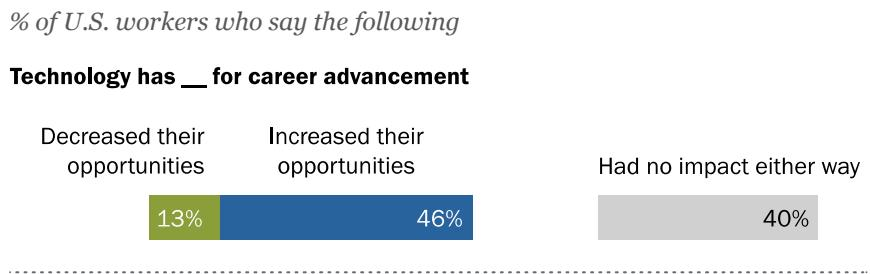
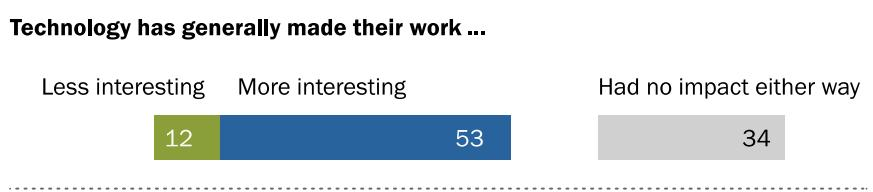
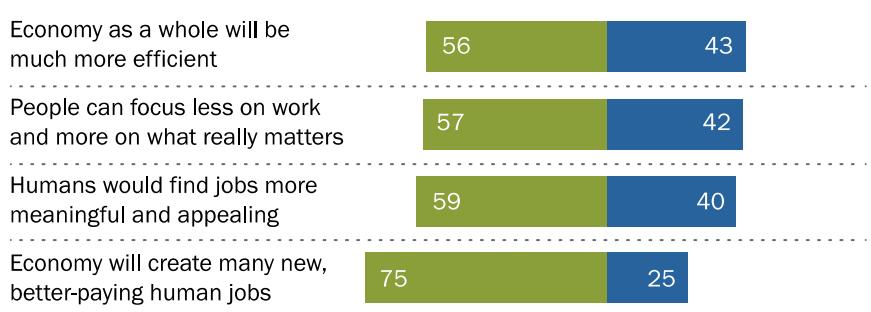
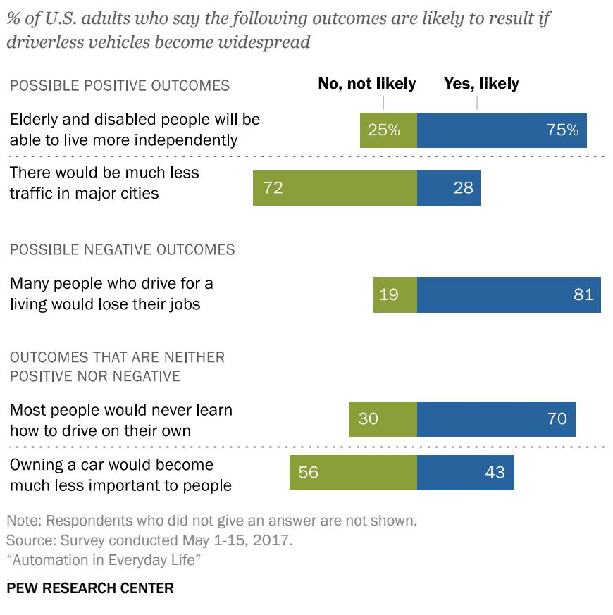
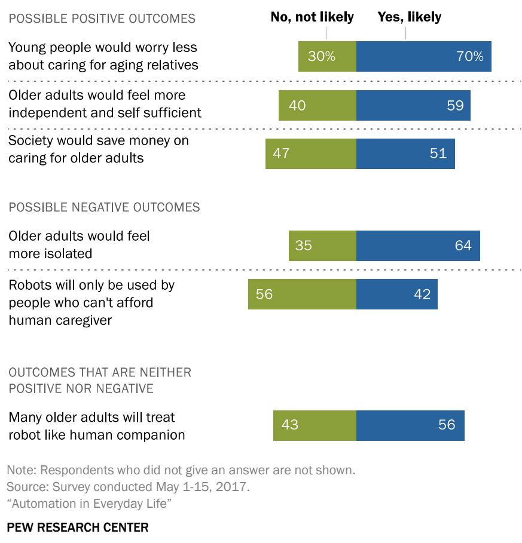

FOR RELEASE OCTOBER 4, 2017

# Automation in Everyday Life

Americans express more worry than enthusiasm about coming developments in automation-from driverless vehicles to a world in which machines perform many jobs currently done by humans

BY Aaron Smith and Monica Anderson

FOR MEDIA OR OTHER INQUIRIES:

Aaron Smith, Associate Director

Tom Caiazza, Communications Manager

202.419.4372

www.pewresearch.org

RECOMMENDED CITATION

Pew Research Center, October, 2017, “Automation in Everyday Life”

## About Pew Research Center

Pew Research Center is a nonpartisan fact tank that informs the public about the issues, attitudes and trends shaping America and the world. It does not take policy positions. The Center conducts public opinion polling, demographic research, content analysis and other data-driven social science research. It studies U.S. politics and policy; journalism and media; internet, science and technology; religion and public life; Hispanic trends; global attitudes and trends; and U.S. social and demographic trends. All of the Center’s reports are available at www.pewresearch.org. Pew Research Center is a subsidiary of The Pew Charitable Trusts, its primary funder.

© Pew Research Center 2017

## Automation in Everyday Life

Americans express more worry than enthusiasm about coming developments in automation -from driverless vehicles to a world in which machines perform many jobs currently done by humans

Advances in robotics and artificial intelligence have the potential to automate a wide range of human activities and to dramatically reshape the way that Americans live and work in the coming decades. A Pew Research Center survey of 4,135 U.S. adults conducted May 1-15, 2017, finds that many Americans anticipate significant impacts from various automation technologies in the course of their lifetimes – from the widespread adoption of autonomous vehicles to the replacement of entire job categories with robot workers. Although they expect certain positive outcomes from these developments, their attitudes more frequently reflect worry and concern over the implications of these technologies for society as a whole.

To gauge the opinions of everyday Americans on this complex and far-reaching topic, the survey presented respondents with four different scenarios relating to automation technologies. Collectively, these scenarios speak to many of the hopes and concerns embedded in the broader debate over automation and its impact on society. The scenarios included: the development of autonomous vehicles that can operate without the aid of a human driver; a future in which robots and computers can perform many of the jobs currently done by human workers; the possibility of fully autonomous robot caregivers for older adults; and the possibility that a computer program could evaluate and select job candidates with no human involvement. The following are among the major findings.

## How realistic are the scenarios presented in the survey?

Some of the scenarios presented in the survey are more futuristic than others:

Today companies can utilize computer algorithms in various aspects of the hiring process – from identifying candidates who might be overlooked in traditional face-to-face recruiting, to automatically eliminating applicants who lack certain characteristics.

Americans today cannot purchase a fully autonomous vehicle. But a number of companies are developing and testing these vehicles, and many modern cars offer semi-autonomous features such as adaptive cruise control or lane-assist technology.

A wide range of robotic devices are being developed to help meet the demands of an aging population. But it will likely be many years before fully autonomous robot caregivers as described in this survey are available for use.

More broadly, these developments speak to the possibility of a world in which robots and computer applications are capable of performing many of the tasks currently done by humans – with potentially profound implications for society as a whole.

### Full Page Description (Page 3)

**Source:** `assets/_page_3_Asset_0.jpg`

**Generated:** 2026-05-30 13:31:21

---

The image is a bar chart with four categories, each representing a different technological development: "Future where robots and computers can do many human jobs," "Development of algorithms that can evaluate and hire job candidates," "Development of driverless vehicles," and "Development of robot caregivers for older adults." The chart categorizes responses into four levels of sentiment: "Very," "Somewhat," "Enthusiastic," and "Worried." Each category has two bars, one for "Very" and one for "Somewhat," indicating the percentage of people who fall into each sentiment category for each technological development. For example, 72% of people are worried about the future where robots and computers can do many human jobs, while 33% are enthusiastic. The chart visually represents the distribution of sentiments across the four technological developments.

Americans express widespread concern – but also tempered optimism – about the impact of emerging automation technologies

Americans generally express more worry than enthusiasm when asked about these automation technologies. Most prominently, Americans are roughly twice as likely to express worry (72%) than enthusiasm (33%) about a future in which robots and computers are capable of doing many jobs that are currently done by humans. They are also around three times as likely to express worry (67%) than enthusiasm (22%) about algorithms that can make hiring decisions without any human involvement. By comparison, public views towards driverless vehicles and robot caregivers exhibit more balance between worry and enthusiasm.

## More worry than optimism about potential developments in automation

% of U.S. adults who say they are enthusiastic or worried about …

The public also expresses a number of concerns when asked about the likely outcomes they anticipate from these technological developments. For instance, 76% of Americans expect that economic inequality will become much worse if robots and computers are able to perform many of the jobs that are currently done by humans. A similar share (75%) anticipates that the economy will not create many new, better-paying jobs for humans if this scenario becomes a reality. And 64% expect that people will have a hard time finding things to do with their lives if forced to compete with advanced robots and computers for jobs.

In the case of driverless vehicles, 75% of the public anticipates that this development will help the elderly and disabled live more independent lives. But a slightly larger share (81%) expects that many people who drive for a living will suffer job losses as a result. And although a plurality (39%) expects that the number of people killed or injured in traffic accidents will decrease if driverless vehicles become widespread, another 30% thinks that autonomous vehicles will make the roads less safe for humans. Similarly, seven-in-ten Americans (70%) anticipate that robot caregivers would help alleviate the burden of caring for aging relatives – but nearly two-thirds (64%) expect that these technologies would increase feelings of isolation for the older adults in their care.

### Full Page Description (Page 4)

**Source:** `assets/_page_4_Asset_0.jpg`

**Generated:** 2026-05-30 13:28:25

---

The image contains a bar chart with three horizontal bars, each representing a different scenario and the percentage of people who would or would not engage in these activities. The scenarios are: "Ride in a driverless vehicle," "Use a robot caregiver," and "Apply for a job that used a computer program to select applicants." The bars are divided into two segments: one for those who would engage in the activity (blue) and one for those who would not (green). The percentages are provided for each segment. The chart visually compares the willingness of people to use driverless vehicles, robot caregivers, and computer programs for job selection.

## Majorities of Americans are reluctant to use emerging automation technologies themselves and express concerns about removing the human element from important decisions

A sizable share of the public expresses reservations about personally using each of the technological concepts examined in the survey. Nearly six-in-ten Americans say they would not

want to ride in a driverless vehicle or use a robot caregiver for themselves or a family member, while roughly three-quarters would not want to apply for a job that used a computer program to evaluate and select applicants.

Those who are hesitant to use these technologies frequently describe their concerns as stemming from a lack of trust in technological decision-making and an appreciation for the unique capabilities and expertise of humans. For instance, roughly seven-in-ten Americans who would not want to ride in a driverless vehicle mention a lack of trust, a fear of losing control and/or general safety concerns when asked why they would not want to use this technology.

Many Americans would be hesitant to use various automation technologies

% of U.S. adults who say they would or would not want to \_\_\_ if given the opportunity

PEW RESEARCH CENTER

Survey respondents’ comments about robot caregivers and hiring algorithms also frequently point to the importance of human contact and decision-making and their worries that even the most advanced machines could never replicate these attributes.

Broad public support for policies that limit the use of automation technologies or bring humans more fully into the process

Along with these concerns, the public generally responds favorably to policies that would limit the use of these technologies to specific situations or that would bring human beings more fully into their operations. In the event that robots and computers become capable of doing many human

### Full Page Description (Page 5)

**Source:** `assets/_page_5_Asset_0.jpg`

**Generated:** 2026-05-30 13:33:29

---

The image contains a pie chart with two segments. The chart represents the opinions of respondents regarding the justification of businesses replacing human workers with machines. The blue segment, labeled "58%," indicates that 58% of respondents believe there should be limits on the number of jobs businesses can replace with machines, even if they are better and cheaper than humans. The green segment, labeled "41%," shows that 41% of respondents think businesses are justified in replacing human workers if machines can do a better job at lower cost. There is also a small "No answer" category at 1%.

jobs, for example, 85% of Americans are in favor of limiting machines to performing primarily those jobs that are dangerous or unhealthy for humans. Were robots and computers to become widely competitive with human workers, majorities would also support providing all Americans with a guaranteed income that would allow people to meet their basic needs (60% in favor), as well as a national service program that would pay humans to perform jobs even if machines could do them faster or cheaper (58% in favor). In addition, a notably larger share of the public sides with the notion that there should be limits on the number of jobs businesses can replace with machines, as opposed to the idea that businesses are justified in

## Broad public support for policies that limit the reach and impact of workforce automation

% of U.S. adults who say they support or oppose the following policies in the event that robots and computers are capable of doing many human jobs

% of U.S. adults who say they agree with each statement in the event that robots and computers are capable of doing many human jobs

automating human jobs if they can receive better work at lower cost (by a 58% to 41% margin).

Democrats and Democratic-leaning independents are substantially more likely than Republicans and Republican-leaning independents to favor both a universal income (by a 77% to 38% margin) and a national service program (by a 66% to 46% margin) in the event that machines threaten to displace substantial numbers of human workers. But the vast majority of Americans – regardless of party affiliation – support limiting machines to performing dangerous and dirty jobs. And roughly comparable shares of Democrats (60%) and Republicans (54%) feel that there should generally be limits on the number of jobs businesses can replace with robots or computers.

### Full Page Description (Page 6)

**Source:** `assets/_page_6_Asset_0.jpg`

**Generated:** 2026-05-30 13:30:42

---

The image contains a bar chart with percentages representing the views and attitudes of U.S. adults regarding driverless vehicles. It is divided into two sections: "Positive views/attitudes" and "Negative views/attitudes." The chart compares the percentages of those who would not ride in a driverless vehicle (light green) with those who would (dark blue). The data includes expectations for driverless vehicles in helping the elderly and disabled, safety concerns, and attitudes towards their widespread use and safety. The chart highlights significant differences in positive and negative views, with the majority of respondents expressing positive attitudes towards driverless vehicles.

The desire for increased human control of these technologies is present in Americans’ attitudes toward other concepts in this survey as well. The vast majority of Americans (87%) would favor a requirement that all driverless vehicles have a human in the driver’s seat who can take control of the vehicle in the event of an emergency, with 53% favoring this policy strongly. Meanwhile,

Americans would feel better about the concept of a robot caregiver if there was a human operator who could remotely monitor its actions at all times. And 57% would feel better about the concept of a hiring algorithm if it was only used for the initial screening of job candidates prior to a traditional in-person interview.

## A key attitudinal divide around emerging automation technologies: Those who are excited to try these technologies themselves versus those who are more hesitant

For each of the concepts examined in the survey, Americans who themselves would be interested in using these technologies express substantially more positive attitudes towards them than those who would not. These enthusiasts also anticipate a wider range of positive societal impacts if these technologies become widespread.

Driverless vehicle enthusiasts differ dramatically in their views and attitudes toward this technology from those who are more hesitant

### Full Page Description (Page 7)

**Source:** `assets/_page_7_Asset_0.jpg`

**Generated:** 2026-05-30 13:26:01

---

The image contains a bar chart with percentages representing the likelihood of individuals considering certain jobs or professions as "very likely." The chart is divided into four categories: "Not at all," "Not very," "Somewhat," and "Very." Each category is represented by a different color, and the percentages are displayed above the corresponding bars. The chart includes data for "Fast food worker," "Insurance claims processor," "Software engineer," "Legal clerk," "Construction worker," "Teacher," "Own job or profession," and "Nurse." The "NET likely" column on the far right provides a net likelihood percentage for each profession. The chart visually compares the likelihood of considering these jobs or professions as very likely among different groups.

Driverless vehicles represent an especially vivid example of this trend. Americans who themselves would ride in a driverless vehicle express greater levels of enthusiasm and lower levels of worry about the ultimate impact of this technology compared with those who are more reticent, and they are more likely to say they would feel safe sharing the road with both autonomous cars and freight vehicles. This group is also more likely to think that autonomous vehicles will reduce traffic fatalities and help the elderly and disabled live more independent lives, and they are much less supportive of various rules or policies restricting their use.

Many Americans expect a number of professions to be dominated by machines within their lifetimes – but relatively few expect their own jobs or professions to be impacted

Beyond the examples noted above, Americans anticipate significant changes to the nature of jobs and work in the coming decades as a result of automation. Overall, roughly three-quarters of Americans (77%) think it’s realistic that robots and computers might one day be able to do many of the jobs currently done by humans, with 20% describing this prospect as extremely realistic. And substantial shares of Americans anticipate that automation will impact a number of specific career fields over the course of their lifetimes. Sizable majorities expect that jobs such as fast food workers and insurance claims processors will be

Americans view certain professions as being at greater risk of automation than others

% of U.S. adults who think it is likely that the following jobs will be replaced by robots or computers in their lifetimes

mostly performed by machines during that timeframe, while around half expect that the same will be true of jobs such as software engineers and legal clerks.

At the same time, few of today’s workers expect that their own jobs or professions are at risk of being automated. In total, just 30% of workers think it’s at least somewhat likely that their jobs will be mostly done by robots or computers during their lifetimes. Indeed, roughly four times as many workers describe this outcome as “not at all likely” (30%) as describe it as “very likely” (7%). Workers in certain industries (such as hospitality and service, or retail) are more likely to view their jobs as being at risk compared with those in others (such as education). But across a range of occupations, majorities of workers anticipate that their jobs or professions will not be impacted by automation to a significant degree.

### Full Page Description (Page 8)

**Source:** `assets/_page_8_Asset_0.jpg`

**Generated:** 2026-05-30 13:29:14

---

The image is a bar chart comparing the number of U.S. adults and adults in specific age groups who have used a particular service or product. The age groups are 18-24, 25-29, 30-49, 50-64, and 65+. The chart shows that the 18-24 age group has the highest number of users (11) for the service/product, followed by the 50-64 age group with 5 users. The U.S. adults as a whole have 5 users. The 65+ age group has the lowest number of users with 2. The chart uses blue bars for the total number of users and dark blue bars for the number of users in each age group.

## 6% of Americans report that they have already been impacted by automation in the form of lost jobs and/or wages

Much of this survey focuses on possible future impacts of automation, but a minority of Americans are already being impacted by these technologies in their own jobs and careers. Specifically, 2% of Americans report that they have ever personally lost a job because their employers replaced their positions with a machine or computer program. Another 5% report that they have ever had their pay or hours reduced for the same reason. Taken together, that works out to 6% of U.S. adults who report having been impacted by workforce automation in one (or both) of these ways. The youngest adults – those ages 18 to 24 – are among the groups most likely to have been personally impacted by workforce automation. This experience is also more common than average among Latinos, part-time workers and those with relatively low household incomes.

Young Americans especially likely to have been impacted by workforce automation

% of U.S. adults in each group who say they have ever personally because their employers replaced their positions (or some aspect of their jobs) with a machine, robot or computer program

Lost a job Had pay or hours reduced

PEW RESEARCH CENTER

Although they comprise a relatively small share of the population, these workers who have been impacted by automation express strongly negative views about the current – and future – impact of technology on their own careers. Fully 46% of these workers feel that technology has decreased their own opportunities for career advancement, while 34% feel that technology has generally made their work less interesting (each of these views is shared by just 11% of other workers). And nearly six-in-ten (57%) anticipate that their own jobs or professions will be mostly done by machines within their lifetimes – roughly twice the share among workers who have not been impacted by automation in this way (28%).

### Full Page Description (Page 9)

**Source:** `assets/_page_9_Asset_0.jpg`

**Generated:** 2026-05-30 13:32:17

---

The image contains a bar chart with three categories of education levels: College grad+, Some college, and HS grad or less. The chart compares two aspects: "Made their work more interesting" and "Increased their opportunities for advancement." The data shows that individuals with a college degree or higher are more likely to find their work more interesting and have more opportunities for advancement compared to those with a high school diploma or less. The percentages for "Made their work more interesting" are 64% for College grad+, 54% for Some college, and 38% for HS grad or less. For "Increased their opportunities for advancement," the percentages are 53% for College grad+, 51% for Some college, and 32% for HS grad or less.

Workers lacking a college education are much less likely to express positive attitudes towards the current generation of workforce technologies

More broadly, the survey also finds that the current generation of workforce technologies has had widely disparate impacts on today’s workers. For some – especially those with high levels of educational attainment – technology represents a largely positive force that makes their work more interesting and provides opportunities for career advancement. But those who have not attended college are much less likely to view today’s workforce technologies in such a positive light.

The survey asked about the impact that six common workforce technologies have had on today’s workers. These include word processing and spreadsheet software; smartphones; email and social media; software that manages people’s daily schedules; technologies that help customers serve themselves without the assistance of a human worker; and industrial robots. It finds that workers with college degrees are substantially more likely than those who have not attended college to say that each of these individual technologies has had a positive impact on their jobs or careers. Indeed,

Workers with higher levels of education more likely to say tech has increased opportunities, made their jobs more interesting

% of U.S. workers in each group who say that technology has generally …

College grad+ Some college HS grad or less

roughly one-quarter (24%) of workers with high school diplomas or less say that not a single one of these six technologies has had a positive impact on their jobs or careers; for college graduates that share is just 2%.

When it comes to the overall impact of technology on them in a professional context, just 38% of workers with high school diplomas or less indicate that technology in general has made their jobs more interesting. And a similarly modest share (32%) feels that technology has increased their opportunities for career advancement. In each instance, these figures are substantially lower than those reported by workers who have continued their formal education beyond high school.

### Full Page Description (Page 10)

**Source:** `assets/_page_10_Asset_0.jpg`

**Generated:** 2026-05-30 13:27:20

---

The image is a stacked bar chart with a gradient from dark blue to light blue, representing different time periods. The categories are labeled as "Less than 10 years," "10 to less than 50 years," "50 to less than 100 years," "100+ years," and "Never happen." The corresponding numbers for each category are 9, 56, 23, 5, and 8, respectively. The chart visually represents the frequency or distribution of events or occurrences across these time periods.

The public anticipates widespread advances in the development and adoption of automation technologies over the coming decades

Many Americans anticipate that various automation technologies will make significant inroads in terms of their development and adoption in the coming decades. Driverless vehicles are perhaps the most prominent example of this trend. Fully 94% of Americans have some awareness of the effort to develop driverless vehicles, and roughly two-thirds of the public anticipates that most vehicles on the road will be driverless within the next half-century – with 9% predicting that this will occur in the next 10 years.

Additionally, substantial shares of Americans think it’s likely that within 20 years doctors will rely on computer programs to diagnose and treat most diseases (79% think this will definitely or probably happen); that most retail interactions will be fully automated and involve little or no human interaction between customers and employees (65%); and that most deliveries in cities will be made by robots or drones instead of humans (65%).

Roughly two-thirds of Americans expect most cars to be driverless in next half century

% of U.S. adults who say it will take for most vehicles on the road to be driverless

## PEW RESEARCH CENTER

### Full Page Description (Page 11)

**Source:** `assets/_page_11_Asset_0.jpg`

**Generated:** 2026-05-30 13:29:36

---

The image is a horizontal bar chart that compares the impact of various technologies on individuals. The technologies listed are word processing or spreadsheet software, smartphones, email or social media, software to manage daily schedules or routines, customer self-serve technologies, and industrial robots. Each technology has three categories: "A negative impact," "A positive impact," and "No impact either way." The percentages for each category are visually represented by the length of the bars. For example, word processing or spreadsheet software has 5% with a negative impact, 70% with a positive impact, and 25% with no impact. The chart highlights the distribution of opinions on the impact of these technologies, showing a significant positive impact for most technologies except industrial robots.

## 1. Americans’ current experiences with automation and other workforce technologies

The bulk of this report is focused on the coming wave of workforce automation and other automation technologies. But a variety of technological innovations – from industrial robots in manufacturing to the office productivity tools that have transformed the nature of white collar office work – have already had a profound impact on the nature of work in the present day. When asked about the impact of these and other technologies on their own jobs and careers, today’s workers express decidedly mixed views. Many view these technologies in a positive light, but substantial shares view them as damaging (or at best neutral) to their own career prospects. Moreover, the survey finds that the benefits of these tools are most likely to accrue to workers with high levels of formal educational attainment. It also finds that workforce automation has already impacted a minority of today’s workers in the form of lost jobs or wages – and that many of these workers view technology as a broadly negative influence on the trajectory of their own careers.

## Workers express mixed opinions on how today’s technologies have impacted their own jobs and careers

Today’s workers express a diversity of views when asked about the impact that various technologies have had on their own jobs and careers. A substantial share of workers indicate that technologies such as word processing or spreadsheet software (70%), smartphones (67%), and email or social media (60%) have had a positive impact on their own careers. Meanwhile, 54% say they have been positively impacted by software that manages their daily schedules or routines, and 48% report a

Workers express mixed views about the impact of various workforce technologies

% of U.S. workers who say the following technologies have had \_\_\_ on their own careers or jobs

PEW RESEARCH CENTER

positive impact from technologies that help customers serve themselves on their own. Around onequarter (27%) feel that industrial robots have impacted them positively in one way or another in their jobs or careers.

At the same time, in each instance a minority of workers – ranging from 5% in the case of word processing and spreadsheet software, to 16% in the case of email or social media – indicate that these technologies have had a negative impact on their own jobs or careers. Larger shares feel that these technologies have not had much impact on them in either a positive or negative way. This sentiment is most prominent in the case of industrial robots: 58% of workers feel that these devices have not had much of an impact on them personally.

Workers generally express more positive than negative views when asked a more general set of questions about the impact of all the various technologies they might have used throughout the course of their careers. Roughly half of workers (53%) feel that technology in general has made their work more interesting, but 12% say it has made their work less interesting – and around one-third (34%) say it hasn’t had a major impact either way in this regard. Similarly, a plurality of workers (46%) feel that technology has increased their opportunities for career advancement – but 13% say it has decreased their opportunities for advancement, opportunities for advancement, and 40% say it has made no difference one way or another.

Workers express more positive than negative views on the overall impact of technology on their careers

> **AI Description:**
> **Source:** `assets/_page_12_Figure_0.jpg`
> 
> **Generated:** 2026-05-30 13:24:26
> 
> ---
> 
> The image is a bar chart presenting data on the impact of technology on career advancement for U.S. workers. The chart is divided into three categories: "Decreased their opportunities," "Increased their opportunities," and "Had no impact either way." The percentages for each category are as follows: 13% for "Decreased their opportunities," 46% for "Increased their opportunities," and 40% for "Had no impact either way." The chart visually represents the distribution of responses among U.S. workers regarding the role of technology in their career advancement.

> **AI Description:**
> **Source:** `assets/_page_12_Figure_1.jpg`
> 
> **Generated:** 2026-05-30 13:24:34
> 
> ---
> 
> The image contains a bar chart with the title "Technology has generally made their work...". The chart has three categories: "Less interesting," "More interesting," and "Had no impact either way." The percentages for each category are as follows: "Less interesting" is 12%, "More interesting" is 53%, and "Had no impact either way" is 34%. The chart uses green, blue, and gray bars to represent each category, with the percentages displayed above the bars.

Technology has generally made their work..

> **AI Description:**
> **Source:** `assets/_page_12_Figure_2.jpg`
> 
> **Generated:** 2026-05-30 13:25:20
> 
> ---
> 
> The image contains a bar chart with three categories: "Less demanding," "More demanding," and "Had no impact either way." The bars represent the number of responses for each category: "Less demanding" has 29 responses, "More demanding" has 39 responses, and "Had no impact either way" has 32 responses. The chart uses different colors to distinguish between the categories, with green for "Less demanding," blue for "More demanding," and gray for "Had no impact either way."

Note: Based on U.S. adults who are currently employed on a full- or part-time basis. Respondents who did not give an answer are not shown. Source: Survey conducted May 1-15, 2017. “Automation in Everyday Life”

PEW RESEARCH CENTER

Workers are more divided on whether technology has made their work more or less demanding: 39% say it has indeed made their jobs more demanding, only modestly larger than the shares who say it has made their work less demanding (29%) or that it has not had much impact either way on the relative demands of their jobs (32%).

### Full Page Description (Page 13)

**Source:** `assets/_page_13_Asset_0.jpg`

**Generated:** 2026-05-30 13:27:58

---

The image is a bar chart that compares the perceived positive and negative impacts of various technologies on different levels of education. The technologies include word processing or spreadsheet software, smartphones, email or social media, software that manages daily schedules, customer self-service technologies, and industrial robots. The chart categorizes responses by education level: "College grad+", "Some college", and "HS or less". Each technology has two bars representing the percentage of respondents who perceive a positive impact (blue) and a negative impact (green). The chart highlights that higher education levels generally associate more positive impacts with these technologies, while lower education levels tend to associate more negative impacts.

Workers with varying levels of educational attainment express pronounced differences in their views of workplace technology

For each of the six specific technologies measured in the survey, workers with at least a four-year college degree have markedly more positive views compared with those with high school diplomas or less. These differences are most pronounced in the case of office productivity tools such as word processing or spreadsheet software: There is a 45-percentage point difference in the share of workers with college degrees (90%) and with high school diplomas or less (45%) who feel these technologies have had a positive impact on them professionally. However, there are also differences of 20 percentage points or more between these groups for several other technologies, including email or social media (27 points), smartphones (22 points), and software that manages workers’ daily schedules and routines (21 points). In total, nearly onequarter (24%) of workers with high school diplomas or less say that none of these six technologies has had a positive impact on their jobs or careers; for college graduates that figure is just 2%.

By the same token, workers with high school diplomas or less are notably more downbeat about the impact these tools have had on their careers relative to college graduates. One-in-ten workers with high school diplomas or less say they have been negatively impacted by word

Workers with higher levels of education have more positive views of many workplace technologies

% of workers in each group who say that \_ have had a positive or negative impact on their jobs or careers

## PEW RESEARCH CENTER

Note: Based on U.S. adults who are currently employed on a full- or part-time basis. Respondents who said these technologies did not have an impact one way or another, as well as those who did not give an answer, are not shown.   
Source: Survey conducted May 1-15, 2017.   
“Automation in Everyday Life”

### Full Page Description (Page 14)

**Source:** `assets/_page_14_Asset_0.jpg`

**Generated:** 2026-05-30 13:31:32

---

The image contains a bar chart with three categories: "College grad+", "Some college", and "HS grad or less". The chart compares two aspects: "Made their work more interesting" and "Increased their opportunities for advancement". The percentages for each category are as follows:

- "Made their work more interesting":
  - College grad+: 64%
  - Some college: 54%
  - HS grad or less: 38%

- "Increased their opportunities for advancement":
  - College grad+: 53%
  - Some college: 51%
  - HS grad or less: 32%

The chart visually represents the higher percentages for college graduates in both aspects compared to those with less education.

processing or spreadsheet applications; 16% have been negatively impacted by scheduling software tools; and around one-in-five have negative views of the impact of customer self-service tools (18%) and industrial robots (19%) on their own careers.

Moreover, large shares of non-college educated workers indicate that these technologies have simply not impacted their careers in any meaningful sense – whether for good or bad. Fully 44% of workers with high school degrees or less say their professional lives have not been impacted one way or the other by word processing or spreadsheet software, for instance, while 35% say the same about email or social media.

Generally speaking, workers in the middle educational tier – that is, those who have graduated from high school but who lack fouryear college degrees – tend to have attitudes toward technology and work that are midway between these two groups. They express more positive views relative to those with no college experience at all, but less positive views relative to those with four-year degrees or more.

Workers’ views of the broader impact of technology on their careers exhibit similarly pronounced educational differences. Compared with workers with high school diplomas or less, college graduates are substantially more likely to say that technology has made their work more interesting (64% vs. 38%), and to say it has increased their opportunities for career advancement (53% vs. 32%). In terms of the demands of their jobs, college graduates are somewhat more likely to say that technology has made their work more demanding (45% vs. 36%), but also more likely to say it has made their work less demanding (31% vs. 20%).

Workers with higher levels of education more likely to say tech has increased opportunities, made their jobs more interesting

% of U.S. workers in each group who say that technology has generally …

## PEW RESEARCH CENTER

### Full Page Description (Page 15)

**Source:** `assets/_page_15_Asset_0.jpg`

**Generated:** 2026-05-30 13:24:56

---

The image is a bar chart that visually represents data on job loss and pay or hours reduction among U.S. adults and various demographic groups. The chart uses two colors: dark blue for "Lost a job" and light blue for "Had pay or hours reduced." It categorizes the data by age groups (18-24, 25-29, 30-49, 50-64, 65+), race/ethnicity (White, Black, Hispanic), income brackets (<$30,000, $30,000-$74,999, $75,000+), and employment status (Employed full time, Employed part time). The chart highlights that younger adults and Hispanic individuals were more likely to have had their pay or hours reduced, while older adults and those with higher incomes were less likely to have lost their jobs.

6% of Americans have ever lost a job, and/or had their pay or hours reduced, because their employer automated some or all of their job duties

The survey also finds that Americans are being impacted by technology in more tangible ways when it comes to their career prospects.

Specifically, 2% of Americans report that they have at some point personally lost a job because their employers replaced their positions with a machine or computer program, and another 5% have ever had their pay or hours reduced for the same reason. In total, 6% of Americans have been impacted by automation in one (or both) of these ways. More broadly, nearly one-in-five Americans (18%) indicate that they personally know someone who has lost a job, or had their pay or hours reduced, as a result of workforce automation.

The youngest adults – those ages 18 to 24 – are especially likely to report that they have been personally impacted by automation in one or both of these ways: Some 6% of 18- to 24-yearolds have lost a job entirely due to automation, while 11% have had their pay or hours reduced for that reason. In total, 13% of Americans in this age group have been impacted by automation in one or both of these ways.

In addition to young adults, several other demographic groups report being impacted by workforce automation technologies at somewhat higher than average levels:

Part-time workers – 5% of Americans who are currently employed part time say they have ever lost a job due to automation (compared with 2% of full-time workers),

Young adults especially likely to have been impacted by workforce automation

% of U.S. adults in each group who say they have ever because their employers replaced their positions (or some aspect of their jobs) with a machine, robot or computer program

## PEW RESEARCH CENTER

and 8% have ever had their pay or hours reduced for the same reason (compared with 4% of those employed full time).

 Hispanics – 9% of Hispanics have had their pay or hours reduced due to automation technology (compared with 3% of both whites and blacks).

Lower-income Americans – 4% of Americans with annual household incomes of less than \$30,000 per year have lost a job due to workforce automation, while 6% have lost pay or hours for this reason (these figures are 1% and 3%, respectively, for Americans in households earning \$75,000 or more per year).

## Workers who have been personally impacted by automation have notably pessimistic views towards the impact of workforce technology on their careers

Compared with the rest of the working public, workers who have been personally impacted by automation (that is, those who have lost a job and/or had their pay or hours reduced due to the use of robots of computer programs) are significantly more pessimistic about the impact of technology on their own careers. Most notably, 46% of these workers feel that technology has decreased their own opportunities for career advancement, while 34% feel that technology has generally made their work less interesting. These views are shared by just 11% of workers who have not been impacted by automation in this way. This “impacted by automation” group is also substantially more likely than other workers to say that technology has made their work more demanding, albeit by a somewhat smaller margin (54% vs. 38%).

Workers who have been impacted by automation are also much more likely than others to say that a wide range of specific technologies have had a negative impact on their jobs or careers. Around one-third say that they have been negatively impacted by industrial robots (36%), smartphones (34%), email or social media (34%), or technologies that help customers serve themselves (31%), while one-in-five cite a negative impact from software that manages their daily schedules or routines (21%) or from word processing or spreadsheet software (20%). In each instance, these shares are at least double those reported by workers who have not been personally impacted by workforce automation technologies in this way.

## 2. Americans’ attitudes toward a future in which robots and computers can do many human jobs

Discussions of the current generation of workforce automation technologies often focus on their impact on manufacturing employment and productivity. But the coming wave of advances in automation offers the potential for even greater disruption of traditional modes of work. Developments in sensors and robotics may potentially reduce the need for humans in a variety of physical applications – from taxi and truck drivers to retail store employees. Simultaneously, multipurpose artificial intelligence and machine learning technology may dramatically alter or make redundant a wide range of white collar jobs.

A number of researchers have attempted to quantify the extent to which these new advancements might impact the future of work. A 2013 study by researchers at Oxford University estimated that nearly half (47%) of total U.S. employment is at

## Scenario: A future in which machines are able to do many jobs currently performed by humans

Survey respondents were asked to read and respond to the following scenario: “New developments in robotics and computing are changing the nature of many jobs. Today, these technologies are mostly being used in certain settings to perform routine tasks that are repeated throughout the day. But in the future, robots and computers with advanced capabilities may be able to do most of the jobs that are currently done by humans today.”

some risk of “computerization,” while a recent report from the McKinsey Global Institute estimated that up to half of the activities people are currently paid to perform could be automated simply by adapting technologies that already have been proven to work. Meanwhile, a survey of experts in the field of artificial intelligence found that on average these experts anticipate a 50% probability that “high level machine intelligence” – that is, unaided machines that can accomplish any given task better and more cheaply than humans – will be developed within the next 45 years. On the other hand, others have argued that the risk these technologies pose to human employment is overblown and that they will not impact jobs in large numbers for many years, if ever.

The Pew Research Center survey seeks to add to this existing body of research by gauging Americans’ expectations and attitudes toward a world in which advanced robots and computer applications are competitive with human workers on a widespread scale. Specifically, respondents were asked to consider and answer questions about a scenario (highlighted in the accompanying sidebar) in which robots and computers have moved beyond performing repeated or routine tasks and are now capable of performing most of the jobs that are currently done by humans.

### Full Page Description (Page 18)

**Source:** `assets/_page_18_Asset_0.jpg`

**Generated:** 2026-05-30 13:30:12

---

The image contains a horizontal bar chart with three categories: "A lot," "A little," and "Nothing at all." The bars are color-coded: dark blue for "A lot," light blue for "A little," and yellow for "Nothing at all." The numbers 24, 61, and 14 are displayed above each respective bar, indicating the quantity or frequency associated with each category. The chart visually represents data distribution across these three options, with "A little" being the most common, followed by "A lot," and "Nothing at all" being the least common.

For the most part, Americans consider this scenario to be plausible; express more worry than enthusiasm about the prospect of machines performing many human jobs; and anticipate more negative than positive outcomes from this development. They strongly favor the notion that machines might be limited to jobs that are dangerous or unhealthy for humans, and they offer somewhat more measured support for other types of interventions to limit the impact of widespread automation, such as the enactment of a universal basic income or national service program for displaced workers. And although they view certain jobs as being more at risk than others, a significant majority of today’s workers express little concern that their own jobs or careers might be performed by machines in their lifetimes.

## Broad awareness, more worry than enthusiasm about a world in which machines can perform many jobs currently done by humans

A majority of Americans are broadly familiar with the notion that automation may impact a wide range of human employment, and most consider the concept to be generally realistic. Fully 85% of the public has heard or read about this concept before, with 24% indicating they have heard or read “a lot” about it. A roughly comparable share (77%) thinks this idea is at least somewhat realistic, and one-in-five indicate that the concept seems extremely realistic to them.

More Americans are worried than enthusiastic about the notion that machines might do many of the jobs currently done by humans. Just 33%

One-in-five Americans find concept of machines doing most human jobs in the future to be extremely realistic

% of U.S. adults who say they have heard, read or thought about the idea that robots and computers may be able to do many jobs currently done by humans

in total are enthusiastic about this concept, and only 6% describe themselves as being very enthusiastic about it. By contrast, 72% express some level of worry about this concept – with 25% describing themselves as very worried.

Those Americans who have heard the most about this concept find it to be much more realistic – and express substantially higher levels of enthusiasm – than do those with lower levels of awareness. Nearly half (48%) of Americans who have heard a lot about this concept find it extremely realistic that machines might one day do many of the jobs currently done by humans;

### Full Page Description (Page 19)

**Source:** `assets/_page_19_Asset_1.jpg`

**Generated:** 2026-05-30 13:25:47

---

The image contains a bar chart with three categories: "Heard a lot," "Heard a little," and "Heard nothing." The chart presents data on three statements: "Concept seems extremely realistic," "Very/somewhat enthusiastic about concept," and "Very/somewhat worried about concept." The percentages for each category are as follows: "Concept seems extremely realistic" has 48% heard a lot, 14% heard a little, and 4% heard nothing. "Very/somewhat enthusiastic about concept" has 47% heard a lot, 30% heard a little, and 18% heard nothing. "Very/somewhat worried about concept" has 76% heard a lot, 72% heard a little, and 69% heard nothing. The chart visually represents the distribution of responses across these categories.

### Full Page Description (Page 19)

**Source:** `assets/_page_19_Asset_0.jpg`

**Generated:** 2026-05-30 13:26:57

---

The image contains a horizontal bar chart with two categories: "Enthusiastic" and "Worried." Each category is divided into four segments representing different levels of response: "Very," "Somewhat," "Not too," and "Not at all." The segments are color-coded: dark blue for "Very," light blue for "Somewhat," light green for "Not too," and olive green for "Not at all." The numbers in each segment indicate the percentage of respondents who fell into each category. For example, under "Enthusiastic," 6% were "Very," 27% were "Somewhat," 47% were "Not too," and 20% were "Not at all." Similarly, under "Worried," 25% were "Very," 48% were "Somewhat," 23% were "Not too," and 4% were "Not at all."

that share falls to 14% among those who have heard a little about this concept and to just 4% among those who have not heard anything about it before. A similar share of these highawareness Americans (47%) express some level of enthusiasm about the notion that machines might one day do many of the jobs currently done by humans, a figure that is also substantially higher than among those with lower levels of familiarity with this concept.

But even as those with high levels of awareness are more enthusiastic about the idea of robots and computers someday doing many human jobs, they simultaneously express just as much worry as Americans with lower levels of awareness.

Roughly three-quarters of Americans who have heard a lot about this concept (76%) express some level of worry about a future in which machines do many jobs currently done by humans. That is comparable to the share among those who have heard a little about this concept (72% of whom are worried about it) as well as those who have not heard anything about it before (69%).

Around three-quarters of Americans expect increased inequality between rich and poor if machines can do many human jobs; just one-quarter think the economy would create many new, better-paying jobs for humans

When asked about a number of possible outcomes from a world in which machines can do many of the jobs currently done by humans, the public generally expects more negative than

More worry than enthusiasm about machines doing many human jobs

% of U.S. adults who say the possibility that robots and computers could do many of the jobs currently done by humans makes them feel …

Those most familiar with concept of machines taking many human jobs find concept more realistic and express more enthusiasm – but still express substantial concerns

% U.S. adults who have about the concept of robots and computers doing many human jobs who say the following

PEW RESEARCH CENTER

positive outcomes. Roughly three-quarters of Americans (76%) expect that widespread automation will lead to much greater levels of economic inequality than exist today, while nearly two-thirds (64%) expect that people will

Smaller shares of Americans anticipate a variety of positive outcomes from this scenario. Most prominently, just 25% of Americans expect that the economy will create many new, well-paying jobs for humans in the event that workforce automation capabilities become much more advanced than they are today; three-quarters (75%) think this is not likely to happen. Larger shares expect that this development would make the economy more efficient, let people focus on the most fulfilling aspects of their jobs, or allow them to focus less on work and more on what really matters to them

Public expects more negative than positive impacts from widespread automation of jobs

% of U.S. adults who say is likely to result if robots and computers are able to perform many of the jobs currently done by humans

> **AI Description:**
> **Source:** `assets/_page_20_Figure_1.jpg`
> 
> **Generated:** 2026-05-30 13:33:14
> 
> ---
> 
> The image contains a bar chart with four categories of statements about the future of the economy, along with corresponding percentages for two groups: a green group and a blue group. The categories and their respective percentages are as follows:
> 
> 1. "Economy as a whole will be much more efficient" with 56% for the green group and 43% for the blue group.
> 2. "People can focus less on work and more on what really matters" with 57% for the green group and 42% for the blue group.
> 3. "Humans would find jobs more meaningful and appealing" with 59% for the green group and 40% for the blue group.
> 4. "Economy will create many new, better-paying human jobs" with 75% for the green group and 25% for the blue group.
> 
> The chart visually represents the percentage of agreement or belief in each statement for the two groups, highlighting the higher agreement in the green group compared to the blue group for all statements.

Note: Respondents who did not give an answer are not shown. Source: Survey conducted May 1-15, 2017   
“Automation in Everyday Life”   
PEW RESEARCH CENTER

in life. But in each instance, a majority of the public views these outcomes as unlikely to come to fruition.

Public is strongly supportive of limiting robots and computers to “dangerous and dirty” jobs, responds favorably to policy solutions such as a universal basic income or national service program for displaced workers

When asked about four different policies that might blunt or minimize the impact of widespread automation on human workers, the public responds especially strongly to one in particular: the idea that robots and computers be mostly limited to doing jobs that are dangerous or unhealthy for humans. Fully 85% of Americans favor this type of policy, with nearly half (47%) saying they favor it strongly.

% of U.S. adults who say they would the following policies in the event that robots and computers are capable of doing many human jobs

Note: Respondents who did not give an answer are not shown. Source: Survey conducted May 1-15, 2017. “Automation in Everyday Life” PEW RESEARCH CENTER

Smaller shares of Americans – though in each instance still a majority – respond favorably to the other policies measured in the survey. These include giving people the option to pay extra to interact with a human worker instead of a machine when buying a product or service (62% of Americans are in favor of this); having the federal government provide all Americans with a guaranteed income that would allow them to meet their basic needs (60% in favor); and creating a government-run national service program that would pay people to perform tasks even if machines could do those jobs faster or cheaper (58% in favor).

Further, opposition to government job- and income-supporting programs is stronger than opposition to the idea that robots should mostly be limited to doing dangerous or unhealthy jobs. For instance, 18% of Americans are strongly opposed to a guaranteed minimum income in the

### Full Page Description (Page 22)

**Source:** `assets/_page_22_Asset_0.jpg`

**Generated:** 2026-05-30 13:27:11

---

The image contains a horizontal bar chart with two sets of bars for each category, representing different perspectives or data points. The categories are:

1. "Machines do dangerous or unhealthy jobs only"
2. "All citizens guaranteed a basic income"
3. "National service program for displaced workers"
4. "People can pay extra to interact with a human"

Each category has two bars, one in blue and one in red, indicating different data points or perspectives. The blue bars represent a higher percentage for each category, with the following percentages:

- Machines do dangerous or unhealthy jobs only: 85% (blue), 86% (red)
- All citizens guaranteed a basic income: 77% (blue), 38% (red)
- National service program for displaced workers: 66% (blue), 46% (red)
- People can pay extra to interact with a human: 63% (blue), 61% (red)

The chart visually compares the two perspectives for each category, highlighting the differences in percentages.

event that machines take substantial numbers of jobs from humans, six times the share (3%) that is strongly opposed to limiting machines to doing only dangerous or unhealthy jobs.

The most prominent differences in Americans’ views of these concepts relate to political affiliation. Democrats and Democratic-leaning independents are much more supportive than Republicans and Republican-leaning independents of both a universal basic income (77% of Democrats favor this idea, compared with just 38% of Republicans) as well as a national service program (66% vs. 46%) in the event that machines replace a large share of human jobs. On the other hand, there are no major partisan differences in support for limiting machines to dangerous and dirty jobs, or for giving people the option to pay extra to interact with a human rather than a robot in commercial transactions.

There is also some variation on this question based on educational attainment, especially in the case of a national service program that would pay displaced humans to perform jobs. Some 69% of Americans with high school diplomas or less – and

Democrats more supportive of guaranteed income, national service program in the event of widespread job losses due to automation

% U.S. adults in each group who say they would favor the following policies in the event that robots and computers are capable of doing many human jobs

Democrat/lean Dem Republican/lean Rep

PEW RESEARCH CENTER

58% of those who have attended but not graduated from college – support this type of policy. But that share falls to 45% among those with four-year college degrees. Workers with lower levels of education are also more likely to favor a universal basic income in the event that machines take many human jobs, although by a smaller margin: This policy is favored by 65% of Americans with high school diplomas or less and 62% of those with some college experience, compared with 52% of those with four-year degrees or more.

### Full Page Description (Page 23)

**Source:** `assets/_page_23_Asset_0.jpg`

**Generated:** 2026-05-30 13:29:56

---

The image contains two bar charts with data presented in a comparative format. The first chart compares opinions on the government's obligation to take care of displaced workers versus the obligation of individuals to care for their own well-being. The second chart compares opinions on whether there should be limits on the number of jobs businesses can replace with machines versus the justification for businesses to replace human workers if machines can do the job better and at lower cost. The data is segmented by education level and political affiliation (Republican/Lean Republican, Democrat/Lean Democrat). The key trends show that higher education levels and Democrats are more likely to support government responsibility and limits on machine replacements, while Republicans are more likely to support individual responsibility and business justification for machine replacements.

The public is evenly divided on whether government or individuals should be responsible for providing for displaced workers, but is more supportive of limits on how many human jobs businesses can replace with machines

When asked whether the government or individuals themselves are most responsible for taking care of people whose jobs are displaced by robots or computers, the public is evenly split. Exactly half feel that the government would have an obligation to care for those displaced workers, even if that required raising taxes substantially. Meanwhile, a nearly identical share (49%) feels that individuals would have an obligation to care for their own financial wellbeings, even if machines had already taken many of the jobs they might otherwise be qualified for.

Partisan divisions on government’s obligation to help workers displaced by machines; educational divisions on whether businesses should be limited in how many jobs they can automate

% of U.S. adults in each group who say they agree with the following statements in the event that robots and computers are capable of doing many human jobs

PEW RESEARCH CENTER

## Americans are somewhat less

divided on a question about whether or not there should be limits placed on how many jobs businesses can automate. Nearly six-in-ten Americans (58%) feel there should indeed be limits on how many jobs businesses can replace with machines, while 41% take the view that businesses are justified in replacing humans with machines if they can receive better work at lower cost.

Attitudes towards the government’s obligation to take care of workers who are displaced by automation vary strongly by partisan affiliation. Some 65% of Democrats and Democratic-leaning independents feel that the government would have an obligation to take care of workers who are displaced by automation, even if that means higher taxes for others. Meanwhile, a nearly identical share of Republicans and Republican-leaning independents (68%) feel that individuals should be responsible for their own financial well-beings even if jobs are automated on a wide scale.

But despite these pronounced differences toward this aspect of the workforce automation debate, partisan opinions are much more aligned on the question of whether or not businesses should be limited in the number of human jobs they can replace with machines. Just over half of Republicans (54%) feel that there should be limits to how many human jobs businesses can replace with machines, only slightly less than the 60% of Democrats who hold this view.

Educational differences follow the opposite pattern on this question. Americans with varying levels of educational attainment respond in broadly comparable ways on the question of whether the government has an obligation to take care of workers who have been displaced by widespread automation of jobs. But those with lower levels of educational attainment are far more supportive of limiting the number of jobs that businesses can replace with machines. Among those with high school diplomas or less, fully 70% say there should be limits on the number of human jobs that businesses can automate. That share falls to 41% among those with four-year college degrees.

## Public sees different jobs as having varying degrees of automation risk – but most view their own jobs or professions as relatively safe

Regardless of whether major or minor impacts are expected on human employment as a whole, most studies of workforce automation anticipate that certain types or categories of jobs will be more vulnerable to this trend than others. In an effort to examine the views and expectations of the public on this question, the survey presented respondents with seven different occupations and asked them to estimate how likely they think it is that each will be mostly replaced with robots or computers during their lifetimes. These jobs include a mixture of physical and mental or cognitive work, as well as a mixture of routine and non-routine tasks. The findings indicate that Americans view some occupations as being more insulated from automation than others – but that few of today’s workers consider their own jobs or professions to be vulnerable to this trend to any significant degree.

### Full Page Description (Page 25)

**Source:** `assets/_page_25_Asset_0.jpg`

**Generated:** 2026-05-30 13:32:41

---

The image is a bar chart with a horizontal orientation, presenting data on the likelihood of people being very likely to choose certain jobs or professions. The chart is divided into four categories: "Not at all," "Not very," "Somewhat," and "Very," with percentages for each category. The jobs or professions listed include "Fast food worker," "Insurance claims processor," "Software engineer," "Legal clerk," "Construction worker," "Teacher," "Own job or profession," and "Nurse." The chart also includes a "NET likely" column, which provides a summary of the overall likelihood for each profession. The data suggests that fast food workers and insurance claims processors are the most likely to be chosen, while nurses and teachers are the least likely. The chart uses a color gradient to differentiate between the categories, with darker shades representing higher percentages.

In terms of the specific jobs evaluated in the survey, a sizable majority of Americans think it likely that jobs such as fast food workers (77%) or insurance claims processors (65%) will be done by machines during their lifetimes. The public is more evenly split on whether or not software engineers and legal clerks will follow suit, while other jobs are viewed as more insulated from being replaced by machines. Nursing is the most prominent of these: Just 4% of Americans think it very likely that nurses will be replaced by robots or computers over the span of their lifetimes, while 34% think this outcome is not at all likely.

## Americans view certain professions as being at greater risk of automation than others

% of U.S. adults who say it is likely that the following jobs will be replaced by robots or computers in their lifetimes

In a previous Pew Research Center survey on workforce automation, workers have expressed a high level of confidence that their own jobs or professions will be performed by humans for the foreseeable future – and this survey finds continuing evidence of this long-standing trend. Just 30% of workers think it likely that their own jobs or professions will be replaced by robots or computers during their lifetimes, and only 7% describe this scenario as very likely. Put differently, Americans view their own jobs or professions” as the second-most safe job from the perspective of automation risk: only nursing is viewed as a safer option.

### Full Page Description (Page 26)

**Source:** `assets/_page_26_Asset_0.jpg`

**Generated:** 2026-05-30 13:32:05

---

The image is a bar chart with two sets of bars for each category, representing "Not likely" and "Likely" responses. The categories listed are Hospitality, service; Retail; Banking, finance, insurance, accounting or real estate; Govt, public admin, military; Info/technology; Manufacturing, construction; Health care; and Education. The percentages for "Not likely" range from 58% to 82%, and for "Likely" from 18% to 42%. The chart visually compares the likelihood of something in each sector, with Education showing the highest "Not likely" response and the lowest "Likely" response.

Majorities of workers across various industry sectors feel it is not likely that their jobs will be automated over the course of their own lifetimes, but workers in certain industries feel that their jobs are more at risk than in others. Specifically, roughly two-in-five workers who work in hospitality and service (42%), retail (41%), or banking, finance, insurance, accounting or real estate (41%) feel that their job is at least somewhat at risk of being automated in the future. Meanwhile, relatively few workers in the education sector consider their jobs to be at risk of automation: just 18% of these workers consider it likely that their jobs will be done by machines in their lifetimes.

By the same token, workers with high levels of educational attainment are more likely to feel that their jobs are safe from automation relative to workers with lower education levels. Just 22% of workers with at least four-year college degrees expect that their jobs will eventually be done by robots or computers, compared with 33% of those with some college experience and 36% of those with high school diplomas or less.

Workers in hospitality, retail, and banking/finance industries see jobs as most at risk of automation

% of U.S. workers in each industry sector who say it is that their own job or profession will be mostly done by robots or computers in their lifetime

PEW RESEARCH CENTER

### Full Page Description (Page 27)

**Source:** `assets/_page_27_Asset_1.jpg`

**Generated:** 2026-05-30 13:25:05

---

The image contains a horizontal bar chart with two sets of bars for each category. The categories are "Own jobs or professions," "Teachers," and "Nurses." The blue bars represent a higher value for each category, while the green bars represent a lower value. The values for each category are as follows: "Own jobs or professions" has 57 and 28, "Teachers" has 56 and 35, and "Nurses" has 37 and 19. The chart visually compares the two values for each category, showing a higher value for "Own jobs or professions" and "Teachers," and a lower value for "Nurses."

### Full Page Description (Page 27)

**Source:** `assets/_page_27_Asset_0.jpg`

**Generated:** 2026-05-30 13:24:18

---

The image contains a bar chart with four categories of responses related to a concept, likely universal basic income. The categories are:

1. "Have heard a lot about concept" with a value of 45.
2. "Strongly favor universal income if machines take most jobs" with a value of 45.
3. "View concept as extremely realistic" with a value of 33.
4. "Very enthusiastic about concept" with a value of 18.

The bars are color-coded, with the first two categories having a darker blue color and the last two having a lighter green color. The chart visually represents the distribution of responses across these categories, showing that the highest values are for the first two categories, indicating a strong awareness and favorability of the concept.

Americans who have been personally impacted by workforce automation have unique attitudes toward a future in which machines do many human jobs

The 6% of Americans who have already been impacted by automation in their own careers (and are discussed in more detail in Chapter 1 of this report) respond to this concept in ways that are notably different from the rest of the population. Compared with other Americans, this group is around twice as likely to have heard a lot about this concept and is also more likely to find it extremely realistic that machines might one day perform many human jobs. They see greater automation risk to jobs that other Americans consider to be relatively safe (such as teachers and nurses) and express greater support for a universal basic income in the event of widespread automation of jobs.

Americans who have been impacted by automation have differing views about a future in which machines do many human jobs

% of U.S. adults in each group who say the following about the concept that robots and computers might eventually be capable of doing many human jobs

Impacted by automation Not impacted

Note: “Impacted by automation” group represents the 6% of U.S. adults who report having lost a job and/or had their pay or hours reduced because their employers replaced their jobs duties with a machine, robot or computer program. Data for “own jobs or professions” is based on those who are currently employed. Respondents who did not give an answer are not shown.

Source: Survey conducted May 1-15, 2017.

“Automation in Everyday Life”

PEW RESEARCH CENTER

They are also one of the few groups who think it is more likely than not that their own jobs or professions will likely be done by computers or robots within their lifetimes: 57% of these workers think it’s very or somewhat likely that this will be the case, compared with 28% of employed adults who have not been personally impacted by automation in their own jobs.

### Full Page Description (Page 28)

**Source:** `assets/_page_28_Asset_0.jpg`

**Generated:** 2026-05-30 13:28:16

---

The image contains a bar chart with four horizontal bars for each of the four statements listed. Each bar is divided into four segments representing different responses: "Definitely will not," "Probably will not," "Probably will," and "Definitely will." The percentages for each response are displayed within the segments. The statements pertain to the future use of computer programs in diagnosing and treating diseases, the automation of stores, the use of robots or drones for deliveries, and the creation of products using 3D printers. The chart visually represents the distribution of responses for each statement, allowing for a comparison of public opinion on the likelihood of these future scenarios.

Yet even as they see greater risks to human employment, the views of this group are far from universally negative. They are around three times as likely as other Americans to describe themselves as very enthusiastic about this concept. And larger shares think it’s likely that the economy will become more efficient as a result of widespread automation of jobs (55% vs. 42%) or that many new, well-paying jobs for humans will result from this development (37% vs. 24%).

## The public views other types of automation as likely within the coming decades

Roughly eight-in-ten Americans (79%) think it’s likely that within 20 years doctors will use computer programs to diagnose and treat most diseases, with 21% expecting that this will definitely happen. Smaller majorities of Americans expect that most stores will be fully automated and involve little interaction between customers and employees, or that most deliveries in major cities will be made by robots or drones rather than humans (65% in each case). Conversely, fewer Americans (43%) anticipate that people will buy most

Americans see a wide range of advances coming to pass in the next 20 years

% of U.S. adults who say the following \_\_\_ happen in the next 20 years

PEW RESEARCH CENTER

common products simply by creating them at home using a 3D printer.

### Full Page Description (Page 29)

**Source:** `assets/_page_29_Asset_0.jpg`

**Generated:** 2026-05-30 13:33:20

---

The image contains a bar chart with three categories: "A lot," "A little," and "Nothing at all." The bars represent numerical values: "A lot" has a value of 35, "A little" has a value of 59, and "Nothing at all" has a value of 6. The chart uses different shades of blue to differentiate between the categories.

### Full Page Description (Page 29)

**Source:** `assets/_page_29_Asset_1.jpg`

**Generated:** 2026-05-30 13:33:47

---

The image contains a bar chart with three segments, each representing a different category: "Mostly negative," "Mix of both," and "Mostly positive." The segments are color-coded and labeled with numerical values. The "Mostly negative" category has a value of 12, the "Mix of both" category has a value of 66, and the "Mostly positive" category has a value of 22. The chart visually represents the distribution of responses or opinions falling into these three categories.

## 3. Americans’ attitudes toward driverless vehicles

Driverless vehicles are among the most visible and potentially disruptive examples of the coming wave of automation in daily life. To proponents of this technology, autonomous vehicles offer a wide range of potential benefits, such as reducing traffic accidents; allowing cities to be rebuilt on more human- and pedestrian-friendly scale; or helping the elderly and disabled live more independent lives. At the same time, their widespread adoption would pose an enormous economic challenge to the millions of Americans who currently make their livings driving people or goods from one place to another.

In light of these potential social and economic impacts, the survey included a series of questions about public attitudes toward driverless vehicles. It finds that the vast majority of Americans are at least somewhat familiar with the development of driverless vehicles and that a majority expect

them to become widespread within the next half-century. Even so, more than half of the public would not want to ride in a driverless vehicle today if given the opportunity. And many have significant concerns about turning life-or-death driving decisions over to machines, while expressing support for various policies restricting or limiting the use of this technology.

Most Americans are aware of the effort to develop driverless vehicles and express somewhat more worry than enthusiasm about their widespread adoption

The vast majority of Americans have at least some familiarity with the effort to develop autonomous vehicles: 94% say they have heard something about this issue, with 35% indicating they have heard “a lot” about it. Awareness of driverless vehicles is high across a range of

35% of Americans have heard a lot about the effort to develop driverless vehicles

% of U.S. adults who say they have seen or heard about the effort to develop driverless vehicles

demographic groups. Still, a larger share of men than women are following this issue closely (44% of men and 26% of women have heard a lot about it), and college graduates are more likely than those with high school diplomas or less to have heard a lot about it (43% vs. 25%).

### Full Page Description (Page 30)

**Source:** `assets/_page_30_Asset_0.jpg`

**Generated:** 2026-05-30 13:32:59

---

The image contains a bar chart with two sets of bars, each representing different categories: "Enthusiastic" and "Worried." The bars are color-coded to indicate the level of response: "Very" (dark blue), "Somewhat" (light blue), "Not too" (light green), and "Not at all" (dark green). The numbers above each bar represent the count of responses for each category. The chart visually compares the distribution of responses for "Enthusiastic" and "Worried" across the four categories.

Of those who are familiar with this issue, a majority (66%) says they have been exposed to a mix of positive and negative coverage about the impact of driverless vehicles. Around onein-five (22%) have heard mostly positive things, while around one-in-ten (12%) say they have heard mostly negative things. Americans who have been following this issue closely are relatively likely to have heard positive coverage: 34% of Americans who have heard a lot about driverless vehicles say that most of what they’ve seen or heard has been positive, but that share falls to 15% among those who have only heard a little bit about them.

## Public somewhat more worried than enthusiastic about driverless vehicles

% of U.S. adults who say the development of driverless vehicles makes them feel …

As is true of a number of the concepts examined in this survey, more Americans express worry than enthusiasm about the development of driverless vehicles: 40% are at least somewhat enthusiastic about this development, while 54% express some level of worry. Comparable shares of Americans describe themselves as being “very enthusiastic” (11%) and “very worried” (14%) about the development of driverless vehicles, but twice as many describe themselves as being “not at all” enthusiastic (22%) as opposed to not at all worried (11%).

Men are a bit more likely than women to say they are enthusiastic about the development of driverless vehicles (46% of men and 34% of women are at least somewhat enthusiastic). But women are notably more worried about this prospect: 63% of women express some level of worry, compared with 44% of men. College graduates are also more enthusiastic about driverless vehicles compared with Americans with lower levels of education, and those under the age of 50 are more enthusiastic than those ages 50 and older. But even so, only around half of college graduates (49%) and those ages 18-49 (47%) describe themselves as enthusiastic about the development of driverless vehicles.

### Full Page Description (Page 31)

**Source:** `assets/_page_31_Asset_0.jpg`

**Generated:** 2026-05-30 13:28:36

---

The image contains a bar chart with a vertical orientation. The chart is divided into five categories, each represented by a different color and labeled with a number indicating the count of occurrences. The categories are as follows:

1. "Less than 10 years" with a count of 9.
2. "10 to less than 50 years" with a count of 56.
3. "50 to less than 100 years" with a count of 23.
4. "100+ years" with a count of 5.
5. "Never happen" with a count of 8.

The chart visually represents the frequency distribution of events or occurrences across these time periods, with the "10 to less than 50 years" category having the highest count.

When asked for their own views on how long it will be before most vehicles on the road are autonomous, a majority of Americans (56%) anticipate that this will happen in the next 10 to 49 years. Roughly one-in-ten (9%) expect that most vehicles will be autonomous in fewer than 10 years, but a comparable share (8%) expects that this outcome will never happen.

Just over half of Americans would not want to ride in a driverless vehicle if given the opportunity; a lack of confidence/trust in robotic decision-making and general safety concerns lead their list of worries

A Pew Research Center survey conducted in 2014 found that Americans were relatively divided over whether or not they would want to ride in a driverless vehicle, and this survey finds continuing evidence of this ambivalence. Just over half (56%) of Americans say they would not want to ride in a driverless vehicle if given the opportunity, while 44% say they would do so if they had the chance.

Roughly two-thirds of Americans expect most cars to be driverless in next half century

% of U.S. adults who say it will take for most vehicles on the road to be driverless

## PEW RESEARCH CENTER

### Full Page Description (Page 32)

**Source:** `assets/_page_32_Asset_0.jpg`

**Generated:** 2026-05-30 13:25:30

---

The image contains a bar chart with data from a survey conducted in May 2017. The chart compares the percentage of respondents who agreed with the statement "Automation will make everyday life easier" across different demographic groups. The categories include U.S. adults, men, women, age groups (18-49 and 50+), education levels (college grad+, some college, high school or less), and urban, suburban, and rural locations. The percentages range from 33% to 56%, with college graduates and those in urban areas showing the highest agreement, and those with less education and in rural areas showing the lowest.

Interest in riding in an autonomous vehicle varies by a number of demographic factors. It is higher among men than among women; among those under the age of 50 than among those 50 and older; among those with four-year college degrees than among those with lower levels of education; and among urban residents than among those living in the suburbs or rural areas. It is also highly correlated with Americans’ overall familiarity and awareness of driverless vehicles more broadly. Among those who have heard a lot about the development of driverless vehicles, nearly six-in-ten (57%) would ride in one if given the opportunity. That share falls to 38% among those who have heard a little about this issue and to just 23% among the relatively small group of Americans who have not heard anything about driverless vehicles before.

Certain groups more interested in riding in a driverless vehicle

% of U.S. adults who say they would want to ride in a driverless car if given the opportunity

When asked to describe in their own words why they would not be interested in riding in an autonomous vehicle, respondents overwhelmingly bring up two major and often overlapping concepts. Some 42% of those who would not want to ride in an autonomous vehicle express a general lack of trust in the technology or an unwillingness to cede control to a machine in a potentially life-or-death situation, while another 30% specifically mention safety concerns of one type or another.

Many of these respondents express doubts that machines could ever handle the unpredictability inherent in driving; worry about ceding their agency to a process they do not fully understand; or simply view humans as uniquely well-prepared to handle unexpected situations on the road:

“I want to be in control and not have the machine choose what’s best for me.”

– 25-year-old woman

“I don’t even like being a passenger in a driverful car.”

– 43-year-old man

“What if the vehicle malfunctions? So we all just crash and die I guess?”

– 32-year-old woman “I believe that judgments rely on human sympathy and feeling, rather than on the calculations a machine would make. Do you swerve into oncoming traffic to avoid hitting an old guy in the crosswalk?” – 64-year-old woman

### Full Page Description (Page 33)

**Source:** `assets/_page_33_Asset_0.jpg`

**Generated:** 2026-05-30 13:31:06

---

The image contains a bar chart with two segments. The chart visually represents survey results regarding willingness to ride in a driverless vehicle. The blue segment, labeled "Yes, would want to ride in a driverless vehicle," represents 44% of the respondents. The green segment, labeled "No, would not want to ride in a driverless vehicle," represents 56% of the respondents. The chart effectively communicates the distribution of opinions on the use of driverless vehicles, with a majority (56%) expressing reluctance to ride in such vehicles.

“I test drove a Tesla. When I let go of the steering wheel and gave control to the ‘machine,’ I almost peed my pants!” – 55-year-old man

Slight majority of Americans would not want to ride in a driverless vehicle if given the chance; safety concerns, lack of trust lead their list of concerns

% of U.S. adults who say they would/would not want to ride in a driverless vehicle

Among those who say yes, % who give these as the main reasons

These concerns about safety and lack of control are by far the most prominent motivations offered by Americans who would not want to ride in a driverless vehicle. However, 9% say that they would not want to ride in one of these vehicles simply because they enjoy the physical act of driving. In addition, 3% say they might want to try them in

Note: Respondents who did not give an answer are not shown. Verbatim responses have been coded into categories; figures may add to more than 100% because multiple responses were allowed.   
Source: Survey conducted May 1-15, 2017.   
“Automation in Everyday Life”   
PEW RESEARCH CENTER

the future but simply think that the technology is not sufficiently developed yet, while 2% express specific concerns that these vehicles might be hacked.

Meanwhile, those Americans who would want to ride in a driverless vehicle if they had the chance bring up several different factors driving their motivations. The largest share – representing 37% of this group – expresses a love of technology and/or the desire to try an exciting and novel experience:

“Just for the sheer pleasure of feeling I’m in the future one step beyond The Jetsons.”

– 65-year-old man

“Because … why not!”

– 30-year-old woman

“Curiosity mainly, to see how it drives and interprets situations differently than a human.”

– 24-year-old woman

“Just for the experience … like my grandfather paying \$1 (a day’s pay) for his first horseless carriage ride in the early 1900’s.”

– 84-year-old man

Another 17% of this group would like to ride in a driverless car because they feel that these vehicles will be safer than those driven by humans. In contrast to the safety concerns of those who are more skeptical of autonomous vehicles, these respondents actively look forward to a world in which machines have taken over for cognitively limited – and frequently distracted or impaired – human beings:

“Because an autonomous vehicle, if properly programmed, has no ego. It does not feel road rage or impatience.”

– 62-year-old man

“Drunk drivers. I want my children safe and too many people in the USA get behind the wheel when over the limit, or too tired and distracted by phones.”

– 47-year-old woman

“I live in Florida, and traffic signs here seem to be a ‘suggestion’ to most drivers. Many drivers here are bullies on the road … it is horrible. Perhaps having vehicles that are made to obey the laws will eliminate this trend towards using your car/truck as a lethal weapon!”

– 65-year-old woman

### Full Page Description (Page 35)

**Source:** `assets/_page_35_Asset_0.jpg`

**Generated:** 2026-05-30 13:33:55

---

The image is a pie chart with three segments, each representing a different category and its corresponding percentage. The categories are "Increase" at 30%, "Decrease" at 39%, and "Stay about the same" at 31%. The chart visually represents the distribution of these categories, with the "Decrease" segment being the largest, followed by "Stay about the same," and then "Increase." The chart is designed to show the relative proportions of each category.

“I think it will be safer. We accommodate a large number of traffic deaths because they come in very small numbers. Very different from the way we see airline crashes with hundreds dead in a single incident. Automated driving will be safer and faster.” – 52-year-old man

“Take out the ‘human error’ factor and the frequency of accidents will plummet.” – 54-year-old man

Comparable shares of this group say they would like to ride in a driverless vehicle because they would be able to do things like sleep or be productive while in the car (15%), or because it would be generally less stressful than driving (13%). And a small number mention factors such as greater independence for people who have difficulty driving on their own (4%), greater convenience (4%) or the fact that autonomous vehicles would be especially   
appealing on long trips (2%).

Many Americans would personally feel unsafe sharing the road with an autonomous vehicle; they are divided on whether these vehicles would ultimately increase or decrease accidents but express strong support for various practical restrictions on their use

Americans have mixed opinions on whether driverless vehicles will reduce traffic deaths

Public attitudes are split in other ways when it comes to the perceived safety of driverless vehicles. For instance, a plurality (39%) anticipates that the number of people killed or injured in traffic accidents will decrease if driverless vehicles become widespread. But 30% of the public expects that traffic fatalities will actually increase if driverless vehicles become more common – and another 31% expect that they will neither increase nor decrease.

% of U.S. adults who say the number of people killed or injured in traffic accidents will if driverless vehicles become widespread

In addition, Americans also express concerns about their own personal safety if they were to share the road with autonomous vehicles – especially autonomous freight trucks. In total, 65% of Americans would feel unsafe sharing the road with an autonomous freight truck, with 32% indicating they would feel not at all safe. A larger share of the public would be comfortable sharing the road with a driverless passenger vehicle. But even so,

Note: Respondents who did not give an answer are not shown. Source: Survey conducted May 1-15, 2017. “Automation in Everyday Life”

PEW RESEARCH CENTER

### Full Page Description (Page 36)

**Source:** `assets/_page_36_Asset_1.jpg`

**Generated:** 2026-05-30 13:30:57

---

The image contains a bar chart with data visualizing public opinion on three different topics related to driverless vehicles. The chart uses four color-coded bars for each topic to represent different levels of agreement or opposition: "Strongly oppose," "Oppose," "Favor," and "Strongly favor." The topics are:

1. Requiring a person in the driver's seat who could take control if needed.
2. Requiring driverless vehicles to travel in dedicated lanes.
3. Restricting them from traveling near certain areas, such as schools.

The percentages for each category are displayed on the bars, showing the proportion of people who fall into each opinion category for each topic. The chart highlights that the majority of people favor requiring a person in the driver's seat and traveling in dedicated lanes, while there is a significant portion who oppose restricting driverless vehicles from certain areas.

### Full Page Description (Page 36)

**Source:** `assets/_page_36_Asset_0.jpg`

**Generated:** 2026-05-30 13:30:04

---

The image is a bar chart that displays the percentage of U.S. adults who would feel safe sharing the road with driverless passenger vehicles and driverless freight trucks. The chart categorizes the responses into four levels of safety: "Very," "Somewhat," "Not too," and "Not at all." The data is represented by colored bars, with blue for "Very," light blue for "Somewhat," light gray for "Not too," and green for "Not at all." The chart shows that a higher percentage of respondents feel safe sharing the road with driverless passenger vehicles compared to driverless freight trucks.

nearly one-in-five Americans (17%) would feel not at all safe in they found themselves in this situation.

Along with these general concerns, the public is strongly supportive of several rules and restrictions governing the use of driverless vehicles. Most prominently, 87% of Americans favor (with 53% favoring strongly) a requirement that all driverless vehicles have a human in the driver’s seat who can take control in an emergency situation. A similar proportion of Americans (83%) favor requiring driverless vehicles to travel in dedicated lanes, with 47% supporting this strongly. A slightly smaller share – although still a substantial majority at

69% – supports restricting autonomous vehicles from traveling near certain areas, such as schools. Although there are modest differences in support for these policies, each is favored by a majority of Americans across a wide

## Public anticipates a mix of positive and negative impacts if driverless vehicles become widespread

Americans expect certain outcomes to be more probable than others in the event that driverless vehicles become widespread. In terms of positive impacts, 75% of Americans anticipate that widespread use of autonomous vehicles will help elderly and disabled people live more independent lives than they do

Public strongly favors several policies restricting the use of autonomous vehicles

% of U.S. adults who say they support or oppose the following rules and regulations for driverless vehicles

today. However, just 28% of U.S. adults anticipate that driverless vehicles will lead to reduced levels of traffic in major cities.

In terms of negative outcomes, roughly eight-in-ten Americans (81%) expect that this development will cause many people who currently drive for a living to lose their jobs. This view is held by a substantial majority of Americans across a wide range of demographic and attitudinal characteristics – men and women, young and old, those with greater and lesser levels of educational attainment, and those with varying levels of awareness of this issue in general.

The public also offers somewhat conflicting expectations toward the nature of car ownership in a world of driverless vehicles.

## Public anticipates a mix of positive and negative impacts from driverless vehicles

> **AI Description:**
> **Source:** `assets/_page_37_Figure_0.jpg`
> 
> **Generated:** 2026-05-30 13:27:43
> 
> ---
> 
> The image is a bar chart from the Pew Research Center, presenting survey data on the likelihood of various outcomes resulting from the widespread adoption of driverless vehicles in the United States. The chart is divided into three sections: possible positive outcomes, possible negative outcomes, and outcomes that are neither positive nor negative. Each section contains two bars representing the percentage of respondents who believe the outcome is "Yes, likely" and "No, not likely." The data is based on a survey conducted from May 1-15, 2017, and includes responses to questions about the impact of driverless vehicles on elderly and disabled independence, traffic reduction, job loss for drivers, learning to drive, and the importance of car ownership. The chart visually represents the majority opinion on each topic, with the "Yes, likely" responses consistently higher than the "No, not likely" responses.

Seven-in-ten Americans expect that most people will never learn how to drive on their own if these vehicles become widespread. Simultaneously, fewer than half (43%) expect that owning a car will become less important to people than it is today.

### Full Page Description (Page 38)

**Source:** `assets/_page_38_Asset_0.jpg`

**Generated:** 2026-05-30 13:29:04

---

The image is an infographic combining text with visual elements. It presents data on the percentage of U.S. adults who hold positive and negative views about driverless vehicles. The visualization uses a horizontal bar chart to compare the attitudes of two groups: those who would not ride in a driverless vehicle and those who would. The chart includes various statements about driverless vehicles, such as their potential to help the elderly and disabled, reduce traffic injuries, and the safety concerns associated with them. The percentages for each statement are clearly labeled, and the chart effectively highlights the contrast between the two groups' attitudes.

Driverless vehicle enthusiasts have dramatically different views from those who are more hesitant to use one themselves

Across numerous questions in the survey on this subject, Americans who themselves would like to ride in a driverless vehicle stand out by substantial margins from those who would not want to do so. They express greater levels of enthusiasm and lower levels of worry about the ultimate impact of this technology, and they are more likely to say they would feel safe sharing the road with both autonomous cars and freight vehicles. They also anticipate a wider range of benefits from the development of autonomous vehicles – such as reduced traffic, fewer people injured or killed in traffic accidents, and increased independence for the elderly or disabled.

Simultaneously, they are less likely to strongly favor various rules or policies that restrict the everyday use of driverless vehicles compared with those who would not wish to ride in a driverless vehicle themselves.

Driverless vehicle enthusiasts differ dramatically in their views and attitudes toward this technology from those who are more hesitant

## PEW RESEARCH CENTER

## 4. Americans’ attitudes toward robot caregivers

The older adult population in the United States and in many other countries around the globe is expected to increase substantially in the coming decades. The Bureau of Labor Statistics estimates that more than 800,000 new home health and personal care aides will be needed between 2014 and 2024 alone, in large part to cope with the health demands of this aging population. Yet the

nature of these jobs – which often involve heavy

physical demands and risk of injury, while providing relatively low wages and benefits – makes them difficult to fill and has led to concerns about an ongoing shortage in paid caregivers.

For some, robots and various automation technologies that can care for older adults offer a potential solution to this shortage of human workers. The survey sought to examine Americans’ attitudes toward this type of automation using the concept (highlighted in the accompanying box) of a robot caregiver that can live with older adults and perform all of the functions of a human health worker. It finds that most Americans have heard little if anything about efforts to develop caregiver robots, but that a majority finds the concept realistic. As with many of the concepts measured in this survey, they express a mixture of worry and enthusiasm and anticipate a mix of positive as well as

## Scenario: Robot caregiver

Survey respondents were asked to read and respond to the following scenario:

“Today, many older adults move into assisted living facilities when they can no longer live independently. In the future, people could be provided with a robot caregiver that would allow them to continue living in their own home as they age. This robot would be available 24 hours a day to help with household chores, test vital signs and dispense medication, or call for assistance in an emergency. It would also have conversational skills and could serve as a companion for people who live alone.”

negative impacts. Most prominently, they expect that this type of technology would reduce the worry that young people feel about caring for aging relatives and help older adults be more independent, even as they express concerns that older adults would feel more isolated in the process.

### Full Page Description (Page 40)

**Source:** `assets/_page_40_Asset_0.jpg`

**Generated:** 2026-05-30 13:32:51

---

The image contains a bar chart with three categories: "A lot," "A little," and "Nothing at all." The chart uses different colors to represent each category: dark blue for "A lot," light blue for "A little," and green for "Nothing at all." The numbers 6, 29, and 65 are displayed above each respective color, indicating the quantity for each category. The chart visually represents a distribution of responses, with "Nothing at all" being the most common response, followed by "A little," and "A lot" being the least common.

Most Americans are unaware of efforts to develop robot caregivers for the elderly, and the public reaction is a mix of worry and enthusiasm

A majority of Americans are unfamiliar with efforts to develop robot caregivers for the elderly: 65% say they have heard nothing at all about this topic, and only 6% have heard a lot about it. Although fewer than half of Americans are aware of the effort to develop robot caregivers, a majority (59%) view them as a realistic prospect – with 10% describing this concept as extremely realistic.

The concept of robot caregivers elicits a nearly equal mix of worry and enthusiasm: 44% of Americans are at least somewhat enthusiastic about this development, while 47% express some level of worry. Older adults express somewhat lower levels of enthusiasm about this concept relative to other Americans: 38% of adults ages 50 and up say they are enthusiastic about the prospect of a robot caregiver, compared with 49% of 18- to 49-year-olds.

## Roughly two-thirds of public have heard nothing about the concept of robot caregivers but a majority find it realistic

% of U.S. adults who say they have heard, read or thought about a fully autonomous robot caregiver for older adults

Note: Respondents who did not give an answer are not shown. Source: Survey conducted May 1-15, 2017. “Automation in Everyday Life”

## PEW RESEARCH CENTER

## Americans express similar levels of worry and enthusiasm about robot caregivers

% of U.S. adults who say the development of robot caregivers makes them feel …

Note: Respondents who did not give an answer are not shown. Source: Survey conducted May 1-15, 2017. “Automation in Everyday Life”

## PEW RESEARCH CENTER

Roughly four-in-ten Americans would be interested in having a robot caregiver

Like the other concepts evaluated in this survey, a majority of Americans (59%) say they would not be interested in a robot caregiver for themselves or a family member if given the opportunity. Another 41% say they would be interested in a robot caregiver if they had the chance.

Interest in this concept varies by several demographic factors. It is higher among men than women; among whites and Hispanics than blacks; and among those who have attended or graduated from college than among those who have not.

Additionally, those who are generally more familiar with the concept of robot caregivers are more likely to express interest in using one. Among those who have heard a lot about this concept, seven-in-ten say they would be interested in having one for themselves or a family member. But that share falls to 48% among those who have heard only a little about this concept and to 35% among those who have heard nothing about it.

% of U.S. adults in each group who say they would be interested in a robot caregiver for themselves or a family member

## PEW RESEARCH CENTER

### Full Page Description (Page 42)

**Source:** `assets/_page_42_Asset_1.jpg`

**Generated:** 2026-05-30 13:25:14

---

The image contains a bar chart with textual data. The chart lists reasons why people might not use a particular service or technology, with percentages indicating the frequency of each reason. The categories include "No human touch or interaction" at 54%, "Chance of errors" at 12%, "Just don't like the idea" at 8%, "Caregiving is job for family" at 6%, "Cost" at 2%, "Frightening or confusing to older people" at 1%, and "Other" at 7%. The chart visually represents the distribution of these reasons, with the largest percentage being "No human touch or interaction."

Americans who would like to use this type of robot caregiver mention a number of different motivations. Around one-in-five (21%) feel that a robot caregiver would provide a better quality of care than is available today, especially in comparison to paid human caregivers:

“A robot would never   
fatigue, would never get   
emotional or angry. They   
have no ego, they would   
just care for the   
individual.”   
– 43-year-old woman   
“I used to work in nursing   
homes and assisted   
livings. Human   
caregivers are often   
underpaid and   
overworked. Humans   
have bias, and if they   
don't like a patient that   
affects their care.”   
– 28-year-old woman

“It would give dedicated, reliable care – whereas family members often have jobs and other obligations that keep them from being able to serve as around-the-clock

## 41% of Americans would be interested in a robot caregiver; reduced burden on family and improved quality of care lead their list of motivations

% of U.S. adults who say they would/would not be interested in a robot caregiver for themselves or a family member

Yes, would be interested in robot caregiver

No, would not interested in robot caregiver

Among those who say yes, %who give these as the main reasons

## PEW RESEARCH CENTER

Note: Respondents who did not give an answer are not shown. Verbatim responses have been coded into categories; figures may add to more than 100% because multiple responses were allowed.   
Source: Survey conducted May 1-15, 2017.   
“Automation in Everyday Life”

caregivers. It also takes away the uncertainty of a stranger coming in and you not knowing what kind of care your family member may get.”

– 38-year-old woman

“It wouldn't get tired, or bored, or forget, or just not care. Unless, of course, it's a highlevel AI, in which case it may care.”

– 53-year-old man

A similar share (21% of those open to the idea of robot caregivers) finds this concept appealing because it would reduce the often heavy burden that caregiving places on family members and loved ones:

“A large strain is put on both caregiver and [cared for] person in these types of relationships. Having help in any capacity would make life easier for both parties. I wouldn't say it would eliminate the need for human involvement, just that it would assist.”

– 31-year-old woman

“Caring for an Alzheimer's parent is a 24/7/365 job and not one second of the day is really yours. Even when sleeping you have to have one eye open and ready for anything.” – 53-year-old woman

“I have already cared for my mother-in-law. It was an impossible job to fulfill and feel good about. For myself I prefer a more independent method. I don't want to burden anyone else.”

– 62-year-old man

“It would provide me with some peace of mind to know that my family member is not completely alone and has a device that can assist them. I would rather be there … but if/when that isn't possible, it's nice to have options.”

– 27-year-old woman

“It's exhausting being a caregiver.”

– 69-year-old woman

“To alleviate the incredible pressure put on my mother and those like her who are taking care of elderly relatives and spouses.”

– 28-year-old man

Meanwhile, 15% of these respondents feel that this type of robot would help older adults be more independent and remain in their homes for a longer period of time:

“A caregiver of this type would have allowed my family to leave my mother in her home and not have her move into an assisted living facility. A robot would have provided the assistance she needed while allowing her to have privacy in her home.”

– 57-year-old woman

“Anything that promotes the independence of the elderly individual may be useful in a society where the extended family is increasingly distant or separate.”

– 46-year-old woman

“Could I get the one that does the chores? Could I get it now??? I'd like to stay in my home as long as I can.”

– 61-year-old woman

“Long term care is very expensive and most nursing homes are not where older people want to be. People like to stay in their own homes.”

– 68-year-old woman

Another 8% of these respondents like the fact that this type of robot caregiver would always be available in the event of an emergency, while 5% each feel it would offer a cost savings compared with traditional forms of caregiving, or that it would give older adults a feeling of safety or security.

Meanwhile, Americans who would not be interested in a robot caregiver overwhelmingly mention one concept over all others: namely, that trusting their loved ones to a machine would cause them to lose out on an element of human touch or compassion that can never be replicated by a robot. Roughly half (54%) of these respondents mention this concept in one form or another:

“Human contact is vital. A robot cannot provide the personal chemistry, empathy, and meaningful relationship that a human can, especially to someone in physical and emotional need.”

– 47-year-old woman

“There is something inherently good and beneficial for human-to-human interaction, rather than human to robot interaction. Empathy is a big component.”

– 33-year-old man

“We need to guard against increasing the lack of one-on-one interactions. As a retired person I am aware of the growing isolation with automated phone systems, checkout lanes, online shopping, as well as incessant robocalls causing us to avoid answering a ringing phone!!!”

– 71-year-old woman

“There is a difference between care, and caring!”

– 70-year-old man

Roughly one-in-ten respondents in this group (12%) are concerned about the chance that robots might make a mistake in caring for their loved ones, and another 6% argue that caregiving is a job for family and loved ones and should not be outsourced to a machine:

“It would depend on how reliable the robot is. The main problem with the elderly is that they get confused. If the robot malfunctions, an elderly person would not be able to manage that situation adequately.”

– 48-year-old woman

“Personally I want human interaction as opposed to some robot. They can fail or short circuit at any time and then where would I be? In trouble, that's for sure.”

– 44-year-old woman

“Societies and families should care for each other, not robots. To expect a robot to offer the same level of care and comfort that a friend or family member could doesn't seem realistic. Can a robot give hugs, reminisce about life events, and care for the emotional health of a person?”

– 29-year-old woman

“Family needs to be taken care of by family. It’s part of our responsibility.”

– 33-year-old woman

In terms of the broader impact of robot caregivers on society, Americans think they would alleviate concerns about caring for aging relatives – but there are also fears they would lead to more isolation for those in their care

Americans anticipate both positive and negative consequences from the effort to develop robot caregivers. On the positive side, seven-in-ten Americans think robot caregivers would allow younger people to feel less worried about taking care of aging relatives, while close to six-inten (59%) think this concept would make older adults feel more independent and selfsufficient.

## Seven-in-ten Americans think robot caregivers would help ease the worry of caring for aging relatives

> **AI Description:**
> **Source:** `assets/_page_46_Figure_0.jpg`
> 
> **Generated:** 2026-05-30 13:26:46
> 
> ---
> 
> The image contains a bar chart with data from a survey conducted by the Pew Research Center in May 2017. The chart presents the opinions of respondents regarding the likelihood of certain outcomes related to the use of robots for caregiving. The outcomes are categorized into possible positive outcomes, possible negative outcomes, and outcomes that are neither positive nor negative. The chart uses green and blue bars to represent the percentages of respondents who believe the outcomes are "No, not likely" and "Yes, likely," respectively. Key data points include: 70% of respondents believe young people would worry less about caring for aging relatives, and 64% believe older adults would feel more isolated. The survey also includes a note that respondents who did not give an answer are not shown.

At the same time, nearly two-

thirds (64%) of Americans think robot caregivers would cause the elderly to feel more isolated. And a sizable portion of the public believes these robots would come to signify class differences: 42% think it likely that robot caregivers would only be used by people who could not afford a human caregiver.

Many Americans also foresee older Americans developing deeper bonds with robot caregivers: 56% think it likely that many older adults would treat their robot caregivers like a human friend. Meanwhile, Americans are relatively evenly divided on whether these robots would lessen the costs associated with caring for the elderly.

### Full Page Description (Page 47)

**Source:** `assets/_page_47_Asset_0.jpg`

**Generated:** 2026-05-30 13:26:26

---

The image contains a horizontal bar chart with percentages representing the views of U.S. adults on various aspects of robot caregivers. The chart compares the percentage of adults who would not want to use a robot caregiver versus those who would want to use one. The categories include expectations about independence, worry about caring for aging relatives, realism of the concept, enthusiasm, treatment as a friend, cost savings, isolation, and worry about the concept. The percentages are displayed for each category, with the "Would not want to use a robot caregiver" on the left and "Would want to use a robot caregiver" on the right. The chart highlights that a majority of adults would want to use robot caregivers for various reasons, with the highest percentage being for the expectation that they would make older adults feel more independent.

Americans are more comfortable with the concept of a robot caregiver if a human is able to remotely monitor the situation

When asked if they would feel better about the concept of a robot caregiver if there was a human who monitored its actions at all times via a camera, 48% of Americans respond in the affirmative. One-in-five (20%) say this added feature would make them feel worse about this concept, and the remaining 32% say it would make no difference to them one way or the other.

This feature is relatively well-liked by older Americans: 55% of those ages 65 and older say this

type of video surveillance would make them feel better about the concept of robot caregivers, compared with 42% of those ages 18 to 29. And people who are interested in having their own robot caregivers are much more likely than those who don’t to say human monitoring would make them feel better about the concept (65% vs. 36%).

Views of robot caregiver   
enthusiasts differ   
substantially from those who   
are more hesitant to use one   
themselves

As was true of driverless vehicles, Americans who themselves would be interested in a robot caregiver have significantly more positive attitudes and expectations about this concept compared with those who would not want to do so. Most prominently, 83% of this group expresses broad enthusiasm about the

Americans interested in using robot caregivers differ dramatically in their views and attitudes from those who are not

development of robot caregivers for society as a whole – just 17% of those who would not be interested in this technology share that view.

## 5. Americans’ attitudes toward hiring algorithms

Robot caregivers are an example of a physical technology that replicates a tangible activity. But other examples of automation utilize large quantities of data and machine learning capabilities to automate elements of human thinking and decision-making, rather than physical tasks. The recommendation engines used by many e-commerce and streaming media platforms are a familiar

example of this phenomenon. But these tools are

increasingly being used by governments and

commercial entities to make decisions with potentially profound consequences for ordinary Americans – such as whether or not they are able to receive a loan or are granted parole from prison.

This survey examines Americans’ attitudes towards these technologies using the scenario (highlighted in the accompanying sidebar) of an algorithm that makes hiring decisions using standardized information about job applicants. Despite the ubiquity of algorithms and machine learning in many aspects of life today, relatively few Americans have heard of or considered this specific scenario before. They express far more worry than enthusiasm about machines making these types of decisions, and few would personally want to apply for a job that used this type of computer program to hire job candidates. And although some feel that this type of program would be less biased and

## Scenario: Hiring algorithm

Survey respondents were asked to read and respond to the following scenario: “Today, when companies are hiring they typically have someone read applicants’ resumes and conduct personal interviews to choose the right person for the job. In the future, computer programs may be able to provide a systematic review of each applicant without the need for human involvement. These programs would give each applicant a score based on the content of their resumes, applications or standardized tests for skills such as problem solving or personality type. Applicants would then be ranked and hired based on those scores.”

make better decisions than humans, a larger share expresses concern that many important qualities would be overlooked in the process.

### Full Page Description (Page 50)

**Source:** `assets/_page_50_Asset_2.jpg`

**Generated:** 2026-05-30 13:33:40

---

The image contains a bar chart with two horizontal bars, each divided into four segments representing different levels of response: "Very," "Somewhat," "Not too," and "Not at all." The chart compares two categories: "Enthusiastic" and "Worried." The segments are color-coded: dark blue for "Very," light blue for "Somewhat," yellow for "Not too," and green for "Not at all." The numbers in each segment indicate the percentage of respondents for each level of response. For example, under "Enthusiastic," 3% are "Very," 19% are "Somewhat," 49% are "Not too," and 28% are "Not at all." The chart visually represents the distribution of responses for both categories, allowing for a quick comparison of the levels of enthusiasm and worry among respondents.

### Full Page Description (Page 50)

**Source:** `assets/_page_50_Asset_1.jpg`

**Generated:** 2026-05-30 13:34:08

---

The image contains a bar chart with four horizontal bars, each representing a different category: "Extremely," "Somewhat," "Not very," and "Not at all." The bars are color-coded and labeled with numerical values: 12, 47, 28, and 13, respectively. The chart appears to be a simple bar chart used to display categorical data, with the categories and their corresponding values clearly labeled.

### Full Page Description (Page 50)

**Source:** `assets/_page_50_Asset_0.jpg`

**Generated:** 2026-05-30 13:34:02

---

The image is a bar chart with three horizontal bars representing different categories: "A lot," "A little," and "Nothing at all." The bars are color-coded: dark blue for "A lot," light blue for "A little," and green for "Nothing at all." The numbers above each bar indicate the quantity for each category: 9 for "A lot," 34 for "A little," and 57 for "Nothing at all." The chart visually represents a distribution of responses to a question, with "Nothing at all" being the most common response.

## Fewer than half of Americans are familiar with the concept of computer programs that can review job applications without any human involvement

The concept of using computer-generated algorithms to analyze job candidates is unfamiliar to a majority of Americans: 57% say they have heard nothing at all about this concept and just 9% have heard a lot about it. Some 59% of Americans find it at least somewhat realistic, although just 12% find it extremely so. Meanwhile, a sizable minority of Americans think this concept is either not very (28%) or not at all (13%) realistic. These two factors are highly correlated. Among the relatively small share of Americans who have heard a lot about this concept, 87% find it at least somewhat realistic – and 45% find it extremely realistic.

## Few Americans are enthusiastic about computer programs evaluating job applicants, and many express worry about this prospect

As is true of several of the concepts in this survey, Americans exhibit much more worry than enthusiasm about job candidates being vetted by computer programs. Just 3% of Americans are very enthusiastic about this prospect, and 28% are not at all enthusiastic. Meanwhile, 21% express high levels of worry, and just 7% are not worried at all. These concerns are widespread: Majorities of Americans across a range of demographic categories express some level of worry about the prospect of algorithms evaluating job cand

## Most Americans unfamiliar with companies’ efforts to use algorithms for hiring decisions

% of U.S. adults who have seen, heard or thought about computer programs that can provide a review of job applicants without human involvement

## PEW RESEARCH CENTER

More worry than enthusiasm about the prospect of computers making hiring decisions

% of U.S. adults who say the development of hiring algorithms makes them feel …

Most Americans would not want to apply for a job knowing that a computer program would be responsible for evaluating candidates

In addition to expressing much more worry than enthusiasm about this concept in general, a sizable majority of Americans (76%) say they would not want to apply for jobs that use a computer program to make hiring decisions. Just 22% would be interested in applying for employment knowing they would be evaluated by an algorithm.

A substantial majority of Americans across a range of demographic groups would not want to apply for a job that uses this type of program to hire applicants, but certain groups are somewhat more receptive than others. Most notably, 37% of 18- to 29-year-olds say they would be interested in applying for jobs that relied on a computer program to make hiring decisions, compared with 21% of those ages 30 to 49 and 16% of those ages 50 and older. In addition, men are modestly more receptive than women toward this type of program, as are those who have attended college compared with those who have not.

Younger adults more comfortable applying for a job where computers make hiring decisions

% of U.S. adults who say they would personally want to apply for jobs that use a computer program to make hiring decisions

PEW RESEARCH CENTER

Skeptics of this concept raise two primary objections when asked why they would not be interested in applying for jobs that use a computer algorithm to evaluate candidates. The largest share (41%) believes that technology simply cannot capture the true nature of an applicant and that this sort of program would overlook many important intangible qualities. Another 20% express a more general concern that the process would be too impersonal.

“A computer cannot measure the emotional intelligence or intangible assets that many humans have. Not every quality can be quantitatively measured by a computer when hiring someone; there is much more learned by faceto-face interactions.” – 22-year-old woman

## Top concerns about hiring algorithms: too impersonal, will overlook important attributes

% of U.S. adults who say they would/would not want to apply for jobs that use a computer program to make hiring decisions

Among those who say yes, % who give these as the main reasons

Among those who say no, % who give these as the main reasons

Note: Respondents who did not give an answer are not shown. Verbatim responses have been coded into categories; figures may add to more than 100% because multiple responses were allowed.   
Source: Survey conducted May 1-15, 2017.   
“Automation in Everyday Life”   
PEW RESEARCH CENTER

program, but I do believe that hiring people requires a fair amount of judgment and intuition that is not well automated. I feel that I have a lot of skills that would be hard to quantify and require that kind of in-depth thinking and judgement.”

– 66-year-old woman

“Are you kidding me? You have to talk to the applicant to see how they interact with HUMANS. This is ridiculous and scary to think that a computer would do all the steps in hiring new employees.”

– 55-year-old woman

“Because it’s idiotic. There are nuances to everything. Such a system denigrates the value of things a program cannot measure like work ethic, dedication, integrity, and commitment level.”

– 65-year-old woman

“By not having a peer to peer interview, you are missing out on the applicants’ personality. We are already training our children in schools to be good on tests and nothing else. We need human interaction.”

– 27-year-old woman

Smaller shares say their dislike of this concept stems from their beliefs that applicants might be able deceive or “game” the computer program (4%) or that computer programs would bring more bias into the hiring process (2%).

Conversely, 35% of those who are open to this concept feel that computer algorithms would actually be fairer and less biased than humans. This is the top reason offered by those who would be interested in applying for jobs that utilized this type of hiring process.

“As a female in a male dominated profession, I would think that this would eliminate some of the personal bias that gets involved in hiring decisions.”

– 60-year-old woman

“Because I often believe individuals are chosen for positions based on appearance and other biased factors, and not the things that truly matter such as what is shown in the resume. I would want to apply for a job using a computer program because I am an ethical person and everything on my resume is true, so if I will be judged based off my qualifications and that alone then I am in favor.”

– 34-year-old woman

“People are bad at interviewing and are easily fooled in ways that would not fool a computer algorithm.”

### Full Page Description (Page 54)

**Source:** `assets/_page_54_Asset_0.jpg`

**Generated:** 2026-05-30 13:29:24

---

The image contains a bar chart with three categories: "Worse," "Better," and "About the same." The chart compares responses to four statements: "Have diverse backgrounds," "Are well qualified," "Have non-traditional work experience," and "Fit well with company's culture." Each statement has three corresponding bars representing the percentage of respondents who felt the situation was worse, better, or about the same. Notable features include the highest percentage for "Fit well with company's culture" in the "Worse" category (60%) and the lowest in the "Better" category (12%).

– 31-year-old man

“This process, assuming the criteria were fairly developed, would avoid unfair discrimination and bias which impacts many hiring experiences. The successful applicant would be hired because they had the skills to do the job, not because they had a personality that clicked with the hiring authority.”

– 69-year-old woman

Others in this group say they would apply for this type of job because they expect they would perform well on the computer’s assessment or simply because they would do whatever it took to get the job (10% each). Smaller shares say they would want to apply for this type of job because they believe computers would do a better job than humans in evaluating candidates (4%) or because this type of computer-based hiring is already in existence (2%).

By and large, the public believes computer programs would do a worse job than humans at various aspects of the hiring process

When it comes to society as a whole, the public feels that algorithms would do a worse job than humans in several aspects of the hiring process. Majorities of Americans think computer programs would do a worse job than humans at hiring candidates who fit well with a company’s culture (60%) or at providing opportunities for candidates with non-traditional work experience (58%). Relatively small shares (12% and 13%, respectively) feel that

Many Americans think computers would do worse than humans in key aspects of the hiring process

% of U.S. adults who say they think hiring algorithms would do a \_\_\_ job than humans when it comes to hiring candidates who …

computers would outperform humans on these fronts, while around one-quarter think humans and computers would perform about the same.

Americans have a somewhat more positive view of algorithms when it comes to achieving staff diversity and choosing well-qualified applicants. About a quarter of the public thinks that these computer programs would do a better job than humans when it comes to hiring candidates from a diverse range of backgrounds (27%) or hiring people who have outstanding qualifications (25%). Even so, a plurality of Americans think computer programs would fare worse than humans at performing each of these tasks.

### Full Page Description (Page 55)

**Source:** `assets/_page_55_Asset_0.jpg`

**Generated:** 2026-05-30 13:32:25

---

The image contains a bar chart with two sets of data, each represented by different colors and categories. The chart compares two methods of evaluation: "Only conducted initial screenings, interviews conducted traditionally" and "Used publically available data like social media posts to evaluate." The categories are "Worse," "Better," and "No difference." The percentages for each category are provided for both methods. The chart visually represents the proportion of cases where the evaluation methods resulted in worse, better, or no difference outcomes.

Public would generally feel better about hiring algorithms if they were used only for initial vetting of candidates, would feel worse if these programs were to incorporate outside data into their decision-making process

As is the case with other emerging technologies, Americans’ comfort level with hiring algorithms is closely tied to the level of human agency

## Public more supportive of algorithmic hiring if traditional in-person interviews are also included

% of U.S adults who say they would feel about computer programs that evaluate job candidates if the program …

and overall involvement in the process. Some 57% of Americans say they would feel better about this concept if companies used these computer programs to conduct initial screenings of potential candidates but then selected from those candidates using traditional face-to-face interviews. Older Americans are especially supportive of this notion: 69% of those 65 and older would feel better about this concept if interviews were conducted traditionally and computers only did initial screenings.

On the other hand, the public responds much more negatively to the notion that these programs might use publically available data about candidates (such as the material they post on social media) to help inform their decisions. Half of Americans say this practice would make them feel worse about this concept, while just 19% say this would make them take a more positive view.

### Full Page Description (Page 56)

**Source:** `assets/_page_56_Asset_0.jpg`

**Generated:** 2026-05-30 13:31:55

---

The image is a horizontal bar chart with text annotations, presenting data on the attitudes of U.S. adults towards hiring algorithms. The chart compares percentages of adults who would or would not want to apply for jobs using hiring algorithms based on their views on the concept's realism, performance, enthusiasm, and worries. The chart includes five categories: "Find concept extremely/somewhat realistic," "Expect they would do better than humans at hiring well-qualified candidates," "Expect they would do better than humans at hiring candidates from diverse backgrounds," "Very/somewhat enthusiastic about concept," and "Very/somewhat worried about concept." Each category has two bars representing the percentage of adults who would or would not apply for jobs using hiring algorithms. The chart effectively visualizes the contrast between those who are enthusiastic or worried about hiring algorithms and those who are not.

Those who would like to apply for jobs that use a hiring algorithm have relatively positive views about the practice compared with those who would not

As is true of the other concepts discussed in this report, attitudes of those who would be interested in applying for jobs that used a hiring algorithm to vet candidates differ substantially from those who are not interested in this type of job. Even so, this group is relatively measured in its attitudes towards this technology: Only about half (49%) express enthusiasm about the development of these types of algorithms, and around one-in-three (35%) express some level of worry.

## PEW RESEARCH CENTER

## Acknowledgements

This report is a collaborative effort based on the input and analysis of the following individuals.   
Find related reports online at pewresearch.org/internet.

## Primary researchers

Aaron Smith, Associate Director, Research

Monica Anderson, Research Associate

## Research team

Lee Rainie, Director, Internet and Technology Research

Andrew Perrin, Research Analyst

Kenny Olmstead, Research Associate

Nick Bertoni, Panel Manager

Cary Funk, Director, Science Research

## Editorial and graphic design

Margaret Porteus, Information Graphics Designer

Shannon Greenwood, Copy editor

## Communications and web publishing

Tom Caiazza, Communications Manager

Shannon Greenwood, Associate Digital Producer

## Outside advisors

Several outside experts helped guide the research in this report. We received valuable advice from David Autor, Ford Professor of Economics, MIT; Stowe Boyd, founder of Another Voice and editor of Work Futures; Jed Kolko, chief economist at Indeed; and Frank Levy, Rose Professor Emeritus, MIT and research associate, Harvard Medical School. While the design and analysis of the project was guided by our consultations with these advisers, Pew Research Center is solely responsible for the design, interpretation and reporting of the data.

## Methodology

The American Trends Panel (ATP), created by Pew Research Center, is a nationally representative panel of randomly selected U.S. adults recruited from landline and cellphone random-digit-dial surveys. Panelists participate via monthly self-administered web surveys. Panelists who do not have internet access are provided with a tablet and wireless internet connection. The panel is being managed by Abt Associates.

Data in this report are drawn from the panel wave conducted May 1-May 15, 2017, among 4,135 respondents. The margin of sampling error for the full sample of 4,135 respondents is plus or minus 2.6 percentage points.

Members of the American Trends Panel were recruited from two large, national landline and cellphone random-digit-dial (RDD) surveys conducted in English and Spanish. At the end of each survey, respondents were invited to join the panel. The first group of panelists was recruited from the 2014 Political Polarization and Typology Survey, conducted Jan.23-March 16, 2014. Of the 10,013 adults interviewed, 9,809 were invited to take part in the panel and a total of 5,338 agreed to participate.1 The second group of panelists was recruited from the 2015 Survey on Government, conducted Aug. 27- Oct. 4, 2015. Of the 6,004 adults interviewed, all were invited to join the panel, and 2,976 agreed to participate.2

The ATP data were weighted in a multistep process that begins with a base weight incorporating the respondents’ original survey selection probability and the fact that in 2014 some panelists were subsampled for invitation to the panel. Next, an adjustment was made for the fact that the propensity to join the panel and remain an active panelist varied across different groups in the sample. The final step in the weighting uses an iterative technique that aligns the sample to population benchmarks on a number of dimensions. Gender, age, education, race, Hispanic origin and region parameters come from the U.S. Census Bureau's 2015 American Community Survey. The county-level population density parameter (deciles) comes from the 2010 U.S. Decennial Census. The telephone service benchmark is comes from the January-June 2016 National Health Interview Survey and is projected to 2017. The volunteerism benchmark comes from the 2015 Current Population Survey Volunteer Supplement. The party affiliation benchmark is the average of the three most recent Pew Research Center general public telephone surveys. The Internet

access benchmark comes from the 2015 Pew Survey on Government. Respondents who did not previously have internet access are treated as not having internet access for weighting purposes. Sampling errors and statistical tests of significance take into account the effect of weighting. Interviews are conducted in both English and Spanish, but the Hispanic sample in the American Trends Panel is predominantly native born and English speaking.

The following table shows the unweighted sample sizes and the error attributable to sampling that would be expected at the 95% level of confidence for different groups in the survey:

Sample sizes and sampling errors for other subgroups are available upon request.

In addition to sampling error, one should bear in mind that question wording and practical difficulties in conducting surveys can introduce error or bias into the findings of opinion polls.

The May 2017 wave had a response rate of 80% (4,135 responses among 5,147 individuals in the panel). Taking account of the combined, weighted response rate for the recruitment surveys

(10.0%) and attrition from panel members who were removed at their request or for inactivity, the cumulative response rate for the wave is 2.6 %.3

© Pew Research Center, 2017