
FOR RELEASE NOVEMBER 16, 2018

# Public Attitudes Toward Computer Algorithms

Americans express broad concerns over thefairness and effectiveness of computer programs making important decisions in people's lives

BY Aaron Smith

FOR MEDIA OR OTHER INQUIRIES:

Aaron Smith, Associate Director Haley Nolan, Communications Assistant

202.419.4372

www.pewresearch.org

RECOMMENDED CITATION

Pew Research Center, November, 2018, “Public Attitudes Toward Computer Algorithms”

## About Pew Research Center

Pew Research Center is a nonpartisan fact tank that informs the public about the issues, attitudes and trends shaping America and the world. It does not take policy positions. It conducts public opinion polling, demographic research, content analysis and other data-driven social science research. The Center studies U.S. politics and policy; journalism and media; internet, science and technology; religion and public life; Hispanic trends; global attitudes and trends; and U.S. social and demographic trends. All of the Center’s reports are available at www.pewresearch.org. Pew Research Center is a subsidiary of The Pew Charitable Trusts, its primary funder.

© Pew Research Center 2018

# Public Attitudes Toward Computer Algorithms

Americans express broad concerns over thefairness and effectiveness of computer programs making important decisions

Algorithms are all around us, utilizing massive stores of data and complex analytics to make decisions with often significant impacts on humans. They recommend books and movies for us to read and watch, surface news stories they think we might find relevant, estimate the likelihood that a tumor is cancerous and predict whether someone might be a criminal or a worthwhile credit risk. But despite the growing presence of algorithms in many aspects of daily life, a Pew Research Center survey of U.S. adults finds that the public is frequently skeptical of these tools when used in various real-life situations.

This skepticism spans several dimensions. At a broad level, 58% of Americans feel that computer programs will always reflect some level of human bias – although 40% think these programs can be designed in a way that is bias-free. And in various contexts, the public worries that these tools might violate privacy, fail to capture the nuance of complex situations, or simply put the people they are evaluating in an unfair situation. Public perceptions of algorithmic decision-making are also often highly contextual. The survey shows that otherwise similar technologies can be viewed with support or suspicion depending on the circumstances or on the tasks they are assigned to do.

To gauge the opinions of everyday Americans on this relatively complex and technical subject, the survey presented respondents with four different scenarios in which computers

## Real-world examples of the scenarios in this survey

All four of the concepts discussed in the survey are based on real-life applications of algorithmic decision-making and artificial intelligence (AI):

Numerous firms now offer nontraditional credit scores that build their ratings using thousands of data points about customers’ activities and behaviors, under the premise that “all data is credit data.”

States across the country use criminal risk assessments to estimate the likelihood that someone convicted of a crime will reoffend in the future.

Several multinational companies are currently using AI-based systems during job interviews to evaluate the honesty, emotional state and overall personality of applicants.

Computerized resume screening is a longstanding and common HR practice for eliminating candidates who do not meet the requirements for a job posting.

make decisions by collecting and analyzing large quantities of public and private data. Each of these scenarios were based on real-world examples of algorithmic decision-making (see accompanying sidebar) and included: a personal finance score used to offer consumers deals or discounts; a criminal risk assessment of people up for parole; an automated resume screening program for job applicants; and a computer-based analysis of job interviews. The survey also included questions about the content that users are exposed to on social media platforms as a way to gauge opinions of more consumer-facing algorithms.

The following are among the major findings.

## The public expresses broad concerns about the fairness and acceptability of using computers for decision-making in situations with important real-world consequences

By and large, the public views these examples of algorithmic decision-making as unfair to the

people the computer-based systems are evaluating. Most notably, only around one-third of Americans think that the video job interview and personal finance score algorithms would be fair to job applicants and consumers. When asked directly whether they think the use of these algorithms is acceptable, a majority of the public says that they are not acceptable. Twothirds of Americans (68%) find the personal finance score algorithm unacceptable, and 67% say the computer-aided video job analysis algorithm is unacceptable.

## Majorities of Americans find it unacceptable to use algorithms to make decisions with real-world consequences for humans

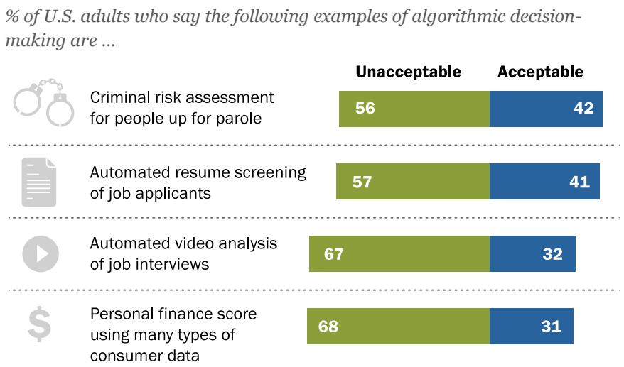

> **AI Description:**
> **Source:** `assets/_page_3_Figure_0.jpg`
> 
> **Generated:** 2026-05-30 13:42:55
> 
> ---
> 
> The image is a bar chart presenting data on the percentage of U.S. adults who find different examples of algorithmic decision-making either unacceptable or acceptable. The chart includes four examples: criminal risk assessment for parole, automated resume screening of job applicants, automated video analysis of job interviews, and a personal finance score using many types of consumer data. Each example is represented by two bars, one for "Unacceptable" and one for "Acceptable," with the percentages clearly labeled. The chart visually highlights the higher percentage of people who find these algorithms unacceptable compared to those who find them acceptable.

Note: Respondents who did not give an answer are not shown. Source: Survey of U.S. adults conducted May 29-June 11, 2018. “Public Attitudes Toward Computer Algorithms”

PEW RESEARCH CENTER

## There are several themes

driving concern among those who find these programs to be unacceptable. Some of the more prominent concerns mentioned in response to open-ended questions include the following:

▪ They violate privacy. This is the top concern of those who find the personal finance score unacceptable, mentioned by 26% of such respondents.

They are unfair. Those who worry about the personal finance score scenario, the job interview vignette and the automated screening of job applicants often cited concerns about the fairness of those processes in expressing their worries.

They remove the human element from important decisions. This is the top concern of those who find the automated resume screening concept unacceptable (36% mention this), and it is a prominent concern among those who are worried about the use of video job interview analysis (16%).

Humans are complex, and these systems are incapable of capturing nuance. This is a relatively consistent theme, mentioned across several of these concepts as something about which people worry when they consider these scenarios. This concern is especially prominent among those who find the use of criminal risk scores unacceptable. Roughly half of these respondents mention concerns related to the fact that all individuals are different, or that a system such as this leaves no room for personal growth or development.

## Attitudes toward algorithmic decision-making can depend heavily on context

Despite the consistencies in some of these responses, the survey also highlights the ways in which Americans’ attitudes toward algorithmic decision-making can depend heavily on the context of those decisions and the characteristics of the people who might be affected.

This context dependence is especially notable in the public’s contrasting attitudes toward the criminal risk score and personal finance score concepts. Similar shares of the population think these programs would be effective at doing the job they are supposed to do, with 54% thinking the personal finance score algorithm would do a good job at identifying people who would be good customers and 49% thinking the criminal risk score would be effective at identifying people who are deserving of parole. But a larger share of Americans think the criminal risk score would be fair to those it is analyzing. Half (50%) think this type of algorithm would be fair to people who are up for parole, but just 32% think the personal finance score concept would be fair to consumers.

When it comes to the algorithms that underpin the social media environment, users’ comfort level with sharing their personal information also depends heavily on how and why their data are being used. A 75% majority of social media users say they would be comfortable sharing their data with those sites if it were used to recommend events they might like to attend. But that share falls to just 37% if their data are being used to deliver messages from political campaigns.

In other instances, different types of users offer divergent views about the collection and use of their personal data. For instance, about two-thirds of social media users younger than 50 find it acceptable for social media platforms to use their personal data to recommend connecting with people they might want to know. But that view is shared by fewer than half of users ages 65 and older.

Across age groups, social media users are comfortable with their data being used to recommend events – but wary of that data being used for political messaging

% of social media users who say it is acceptable for social media sites to use data about them and their online activities to …

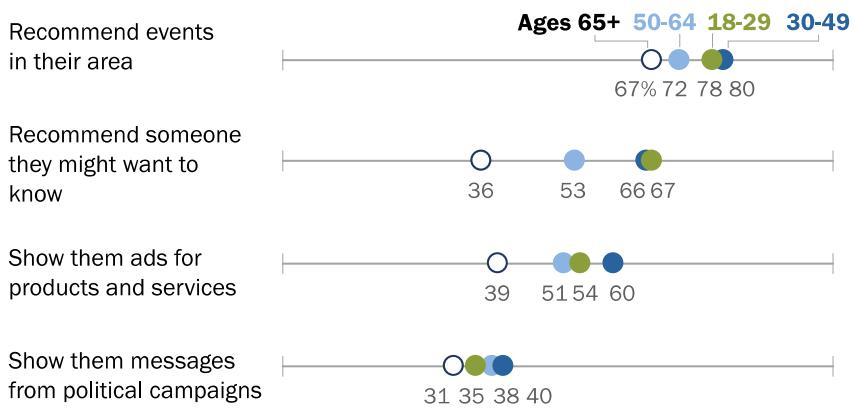

> **AI Description:**
> **Source:** `assets/_page_5_Figure_0.jpg`
> 
> **Generated:** 2026-05-30 13:42:37
> 
> ---
> 
> The image contains a horizontal bar chart with data points representing percentages for different age groups (18-29, 30-49, 50-64, and 65+) across four categories: "Recommend events in their area," "Recommend someone they might want to know," "Show them ads for products and services," and "Show them messages from political campaigns." The percentages for each category are displayed above the corresponding data points. The chart visually compares the willingness or likelihood of different age groups to engage in these activities, with the 65+ age group having the lowest percentages across all categories.

## Social media users are exposed to a mix of positive and negative content on these sites

Note: Includes those saying it is “very” or “somewhat” acceptable for social media sites to do this. Respondents who did not give an answer or gave other answers are not shown. Source: Survey of U.S. adults conducted May 29-June 11, 2018.   
“Public Attitudes Toward Computer Algorithms”   
PEW RESEARCH CENTER

Algorithms shape the modern social media landscape in

profound and ubiquitous ways. By determining the specific types of content that might be most appealing to any individual user based on his or her behaviors, they influence the media diets of millions of Americans. This has led to concerns that these sites are steering huge numbers of people toward content that is “engaging” simply because it makes them angry, inflames their emotions or otherwise serves as intellectual junk food.

On this front, the survey provides ample evidence that social media users are regularly exposed to potentially problematic or troubling content on these sites. Notably, 71% of social media users say they ever see content there that makes them angry – with 25% saying they see this sort of content frequently. By the same token, roughly six-in-ten users say they frequently encounter posts that are overly exaggerated (58%) or posts where people are making accusations or starting arguments without waiting until they have all the facts (59%).

But as is often true of users’ experiences on social media more broadly, these negative encounters are accompanied by more positive interactions. Although 25% of these users say they frequently encounter content that makes them feel angry, a comparable share (21%) says they frequently

encounter content that makes them feel connected to others. And an even larger share (44%) reports frequently seeing content that makes them amused.

Similarly, social media users tend to be exposed to a mix of positive and negative behaviors from other users on these sites. Around half of users (54%) say they see an equal mix of people being mean or bullying and people being kind and supportive. The remaining users are split between those who see more meanness (21%) and kindness (24%) on these sites. And a majority of users (63%) say they see an equal mix of people trying to be deceptive and people trying to point out inaccurate information – with the remainder being evenly split between those who see more people spreading inaccuracies (18%) and more people trying to correct that behavior (17%).

## Amusement, anger, connectedness top the emotions users frequently feel when using social media

% of social media users in each age group who say they frequently see content on social media that makes them feel …

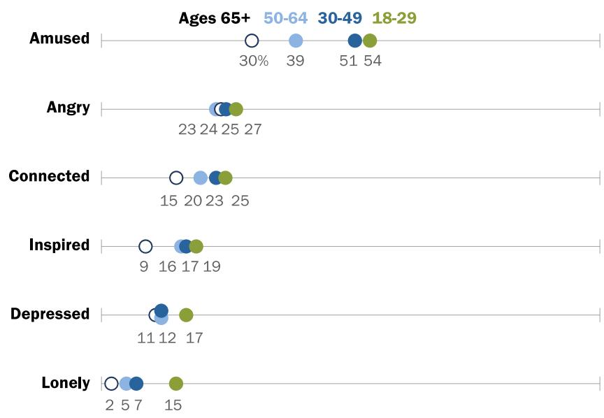

> **AI Description:**
> **Source:** `assets/_page_6_Figure_0.jpg`
> 
> **Generated:** 2026-05-30 13:40:13
> 
> ---
> 
> The image is a horizontal bar chart with data points representing percentages of different age groups (18-29, 30-49, 50-64, and 65+) for various emotional states: Amused, Angry, Connected, Inspired, Depressed, and Lonely. Each emotional state is represented by a horizontal bar with circles indicating the percentage for each age group. The percentages are displayed above the bars, and the age groups are color-coded for easy differentiation. The chart visually compares the emotional states across different age groups, highlighting trends and differences in emotional responses.

Note: Respondents who did not give an answer or gave other answers are not shown. Source: Survey of U.S. adults conducted May 29-June 11, 2018. “Public Attitudes Toward Computer Algorithms”

Other key findings from this survey of 4,594 U.S. adults conducted May 29-June 11, 2018, include:

Public attitudes toward algorithmic decision-making can vary by factors related to race and ethnicity. Just 25% of whites think the personal finance score concept would be fair to consumers, but that share rises to 45% among blacks. By the same token, 61% of blacks think the criminal risk score concept is not fair to people up for parole, but that share falls to 49% among whites.

Roughly three-quarters of the public (74%) thinks the content people post on social media is not reflective of how society more broadly feels about important issues – although 25% think that social media does paint an accurate portrait of society.

Younger adults are twice as likely to say they frequently see content on social media that makes them feel amused (54%) as they are content that makes them feel angry (27%). But users ages 65 and older encounter these two types of content with more comparable frequency. The survey finds that 30% of older users frequently see content on social media that makes them feel amused, while 24% frequently see content that makes them feel angry.

### Full Page Description (Page 8)

**Source:** `assets/_page_8_Asset_0.jpg`

**Generated:** 2026-05-30 13:41:22

---

The image contains a horizontal bar chart with two bars for each age group, representing a total and a separate category. The categories are labeled as "Total" and "50+." The chart shows the number of individuals in each age group for both categories. The age groups are divided into "18-29," "30-49," and "50+." The "Total" category has a higher number of individuals in the "50+" age group compared to the "18-29" and "30-49" age groups. The "50+" category has a higher number of individuals in the "50+" age group compared to the "Total" category.

## 1. Attitudes toward algorithmic decision-making

Today, many decisions that could be made by human beings – from interpreting medical images to recommending books or movies – can now be made by computer algorithms with advanced analytic capabilities and access to huge stores of data. The growing prevalence of these algorithms has led to widespread concerns about their impact on those who are affected by decisions they make. To proponents, these systems promise to increase accuracy and reduce human bias in important decisions. But others worry that many of these systems amount to “weapons of math destruction” that simply reinforce existing biases and disparities under the guise of algorithmic neutrality.

This survey finds that the public is more broadly inclined to share the latter, more skeptical view. Roughly six-in-ten Americans (58%) feel that computer programs will always reflect the biases of the people who designed them, while 40% feel it is possible for computer programs to make decisions that are free from human bias. Notably, younger Americans are more supportive of the notion that computer programs can be developed that are free from bias. Half of 18- to 29-year-olds and 43% of those ages 30 to 49 hold this view, but that share falls to 34% among those ages 50 and older.

This general concern about computer programs making important decisions is also reflected in public attitudes about the use of algorithms and big data in several real-life contexts.

Majority of Americans say computer programs will always reflect human bias; young adults are more split

% of U.S. adults who say that …

It is possible for computer programs to make decisions without human bias

Computer programs will always reflect bias of designers

PEW RESEARCH CENTER

To gain a deeper understanding of the public’s views of algorithms, the survey asked respondents about their opinions of four examples in which computers use various personal and public data to make decisions with real-world impact for humans. They include examples of decisions being made by both public and private entities. They also include a mix of personal situations with direct relevance to a large share of Americans (such as being evaluated for a job) and those that might be more distant from many people’s lived experiences (like being evaluated for parole). And all four are based on real-life examples of technologies that are currently in use in various fields.

The specific scenarios in the survey include the following:

▪ An automated personal finance score that collects and analyzes data from many different sources about people’s behaviors and personal characteristics (not just their financial behaviors) to help businesses decide whether to offer them loans, special offers or other services.

A criminal risk assessment that collects data about people who are up for parole, compares that data with that of others who have been convicted of crimes, and assigns a score that helps decide whether they should be released from prison.

A program that analyzes videos of job interviews, compares interviewees’ characteristics, behavior and answers to other successful employees, and gives them a score that can help businesses decide whether job candidates would be a good hire or not.

A computerized resume screening program that evaluates the contents of submitted resumes and only forwards those meeting a certain threshold score to a hiring manager for further review about reaching the next stage of the hiring process.

For each scenario, respondents were asked to indicate whether they think the program would be fair to the people being evaluated; if it would be effective at doing the job it is designed to do; and whether they think it is generally acceptable for companies or other entities to use these tools for the purposes outlined.

## Sizable shares of Americans view each of these scenarios as unfair to those being evaluated

Americans are largely skeptical about the fairness of these programs: None is viewed as fair by a clear majority of the public. Especially small shares think the “personal finance score” and “video job interview analysis” concepts would be fair to consumers or job applicants (32% and 33%, respectively). The automated criminal risk score concept is viewed as fair

## Broad public concern about the fairness of these examples of algorithmic decision-making

% of U.S. adults who think the following types of computer programs would be \_\_\_ to the people being evaluated

Note: Respondents who did not give an answer are not shown. Source: Survey of U.S. adults conducted May 29-June 11, 2018. “Public Attitudes Toward Computer Algorithms”

PEW RESEARCH CENTER

by the largest share of Americans. Even so, only around half the public finds this concept fair – and just one-in-ten think this type of program would be very fair to people in parole hearings.

Demographic differences are relatively modest on the question of whether these systems are fair, although there is some notable attitudinal variation related to race and ethnicity. Blacks and Hispanics are more likely than whites to find the consumer finance score concept fair to consumers. Just 25% of whites think this type of program would be fair to consumers, but that share rises to 45% among blacks and 47% among Hispanics. By contrast, blacks express much more concern about a parole scoring algorithm than do either whites or Hispanics. Roughly six-inten blacks (61%) think this type of program would not be fair to people up for parole, significantly higher than the share of either whites (49%) or Hispanics (38%) who say the same.

## The public is mostly divided on whether these programs would be effective or not

The public is relatively split on whether these programs would be effective at doing the job they are designed to do. Some 54% think the personal finance score program would be effective at identifying good customers, while around half think the parole rating (49%) and resume screening (47%) algorithms would be effective. Meanwhile, 39% think the video job interview concept would be a good way to identify successful hires.

For the most part, people’s views of the fairness and effectiveness of these programs go hand in hand. Similar shares of the public view these concepts as fair to those being judged, as say they would be effective at producing good decisions. But the personal finance score concept is a notable exception to this overall trend. Some

54% of Americans think automated finance scores would be effective – but just 32% think they would be fair

% of U.S. adults who say the following types of computer programs would be very/somewhat …

Note: Respondents who did not give an answer or gave other answers are not shown. Source: Survey of U.S. adults conducted May 29-June 11, 2018. “Public Attitudes Toward Computer Algorithms”

PEW RESEARCH CENTER

54% of Americans think this type of program would do a good job at helping businesses find new customers, but just 32% think it is fair for consumers to be judged in this way. That 22-percentagepoint difference is by far the largest among the four different scenarios.

Majorities of Americans think the use of these programs is unacceptable; concerns about data privacy, fairness and overall effectiveness highlight their list of worries

Majorities of the public think it is not acceptable for companies or other entities to use the concepts described in this survey. Most prominently, 68% of Americans think using the personal finance score concept is unacceptable, and 67% think it is unacceptable for companies to conduct computer-aided video analysis of interviews when hiring job candidates.

The survey asked respondents to describe in their own words why they feel these programs are acceptable or not, and certain themes emerged in these responses. Those who think these programs are acceptable often focus on the fact that they would be effective at doing the job they purport to do. Additionally, some argue in the case of private sector examples that the concepts simply represent the company’s prerogative or the free market at work.

Meanwhile, those who find the use of these programs to be unacceptable often worry that they will not do as good a job as advertised. They also express concerns about the fairness of these programs and in some cases worry about the privacy implications of the data being collected and shared. The public reaction to each of these concepts is discussed in more detail below.

## Automated personal finance score

Among the 31% of Americans who think it would be acceptable for companies to use this type of program, the largest share of respondents (31%) feel it would be effective at helping companies find good customers. Smaller shares say customers have no right to complain about this practice since they are willingly putting their data out in public with their online activities (12%), or that companies can do what they want and/or that this is simply the free market at work (6%).

Here are some samples of these responses:

▪ “I believe that companies should be able to use an updated, modern effort to judge someone’s fiscal responsibility in ways other than if they pay their bills on time.” Man, 28

“Finances and financial situations are so complex now. A person might have a bad credit score due to a rough patch but doesn't spend frivolously, pays bills, etc. This person might benefit from an overall look at their trends. Alternately, a person who sides on trends in the opposite direction but has limited credit/good credit might not be a great choice for a company as their trends may indicate that they will default later.” Woman, 32

▪ “[It’s] simple economics – if people want to put their info out there....well, sucks to be them.” Man, 29

“It sounds exactly like a credit card score, which, while not very fair, is considered acceptable.” Woman, 25

“Because it’s efficient and effective at bringing businesses information that they can use to connect their services and products (loans) to customers. This is a good thing. To streamline the process and make it cheaper and more targeted means less waste of resources in advertising such things.” Man, 33

The 68% of Americans who think it is unacceptable for companies to use this type of program cite three primary concerns. Around one-quarter (26%) argue that collecting this data violates people’s privacy. One-in-five say that someone’s online data does not accurately represent them

Concerns over automated personal finance scores focus on privacy, discrimination, failure to represent people accurately
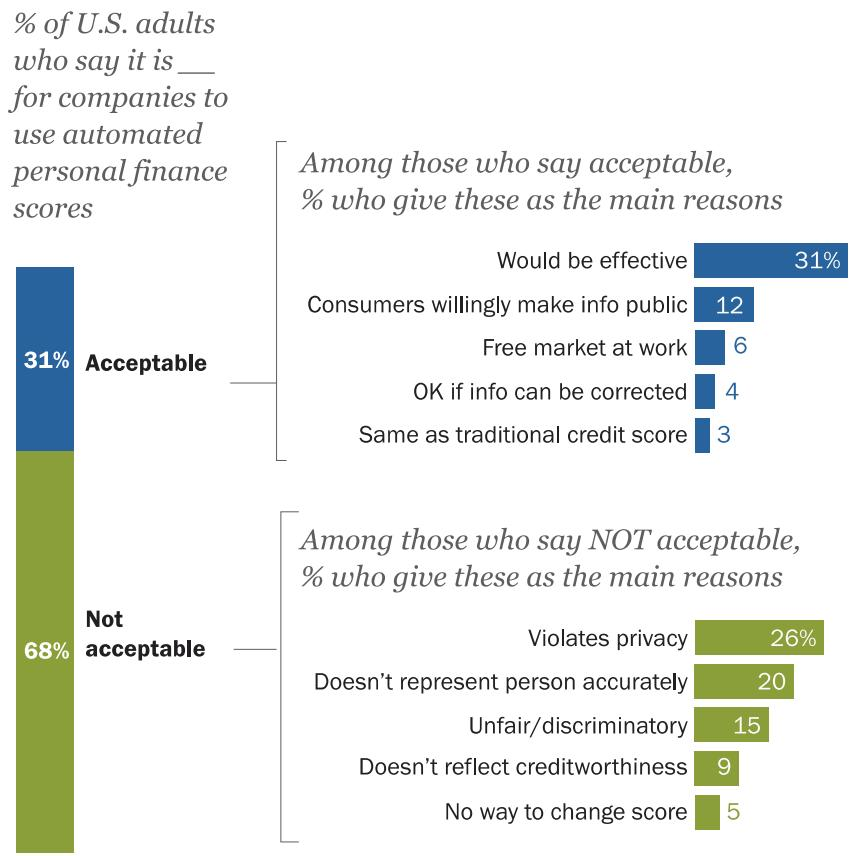

> **AI Description:**
> **Source:** `assets/_page_12_Figure_0.jpg`
> 
> **Generated:** 2026-05-30 13:39:46
> 
> ---
> 
> The image is an infographic combining text and a bar chart. It presents data on the percentage of U.S. adults who find it acceptable or not acceptable for companies to use automated personal finance scores. The chart is divided into two sections: one for those who find it acceptable and another for those who find it not acceptable. The acceptable section shows 31% of adults find it acceptable, with reasons such as "Would be effective" at 31%, "Consumers willingly make info public" at 12%, and others. The not acceptable section shows 68% of adults find it not acceptable, with reasons like "Violates privacy" at 26%, "Doesn't represent person accurately" at 20%, and others. The chart uses blue and green bars to represent the percentages and reasons for each category.

Note: Verbatim responses have been coded into categories. Results may add to more than 100% because multiple responses were allowed. Respondents who did not give an answer or gave other answers are not shown. Source: Survey of U.S. adults conducted May 29-June 11, 2018. “Public Attitudes Toward Computer Algorithms” PEW RESEARCH CENTER

as a person, while 9% make the related point that people’s online habits and behaviors have nothing to do with their overall creditworthiness. And 15% feel that it is potentially unfair or discriminatory to rely on this type of score.

Here are some samples of these responses:

“Opaque algorithms can introduce biases even without intending to. This is more of an issue with criminal sentencing algorithms, but it can still lead to redlining and biases against

minority communities. If they were improved to eliminate this I’d be more inclined to accept their use.” Man, 46

“It encroaches on someone’s ability to freely engage in activities online. It makes one want to hide what they are buying – whether it is a present for a friend or a book to read. Why should anyone have that kind of access to know my buying habits and take advantage of it in some way? That kind of monitoring just seems very archaic. I can understand why this would be done, from their point of view it helps to show what I as a customer would be interested in buying. But I feel that there should be a line of some kind, and this crosses that line.” Woman, 27

“I don’t think it is fair for companies to use my info without my permission, even if it would be a special offer that would interest me. It is like spying, not acceptable. It would also exclude people from receiving special offers that can’t or don’t use social media, including those from lower socioeconomic levels.” Woman, 63

“Algorithms are biased programs adhering to the views and beliefs of whomever is ordering and controlling the algorithm ... Someone has made a decision about the relevance of certain data and once embedded in a reviewing program becomes irrefutable gospel, whether it is a good indicator or not.” Man, 80

## Automated criminal risk score

The 42% of Americans who think the use of this type of program is acceptable mention a range of reasons for feeling this way, with no single factor standing out from the others. Some 16% of these respondents think this type of program is acceptable because it would be effective or because it’s helpful for the justice system to have more information when making these decisions. A similar share (13%) thinks this type of program would be acceptable if it is just one part of the decisionmaking process, while one-in-ten think it would be fairer and less biased than the current system.

In some cases, respondents use very different arguments to support the same outcome. For instance, 9% of these respondents think this type of program is acceptable because it offers prisoners a second chance at being a productive member of society. But 6% support it because they think it would help protect the public by keeping potentially dangerous individuals in jail who might otherwise go free.

## Some examples:

“Prison and law enforcement officials have been doing this for hundreds of years already. It is common sense. Now that it has been identified and called a program or a process [that] does not change anything.” Man, 71

“Because the other option is to rely entirely upon human decisions, which are themselves flawed and biased. Both human intelligence and data should be used.” Man, 56

“Right now, I think many of these decisions are made subjectively. If we can quantify risk by objective criteria that have shown validity in the real world, we should use it. Many black men are in prison, it is probable that with more objective criteria they would be eligible for parole. Similarly, other racial/ethnic groups may be getting an undeserved break because of subjective bias. We need to be as fair as possible to all

## Concerns over criminal risk scores focus on lack of individual focus, people’s ability to change

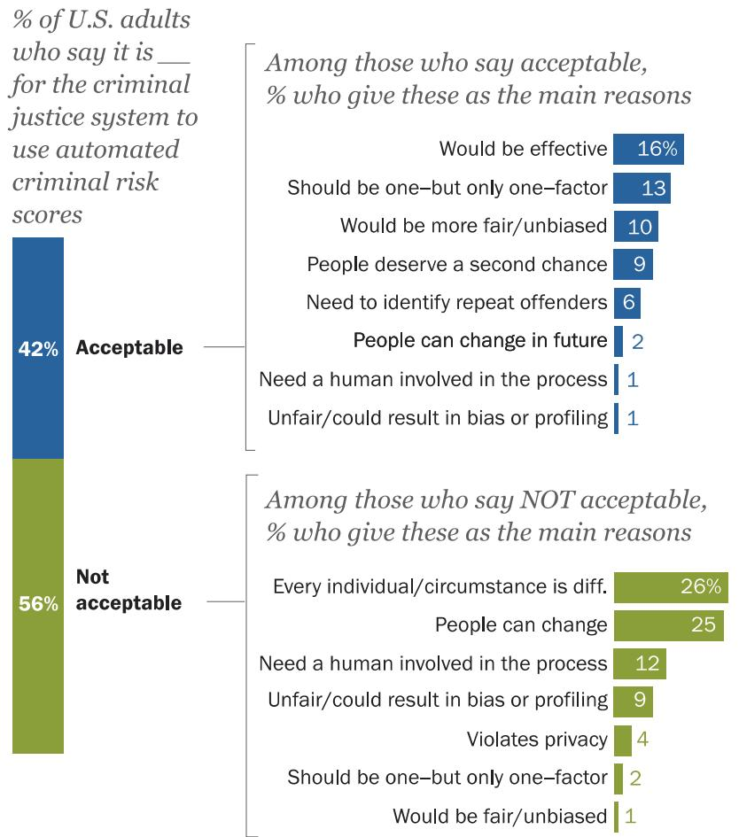

> **AI Description:**
> **Source:** `assets/_page_14_Figure_0.jpg`
> 
> **Generated:** 2026-05-30 13:40:47
> 
> ---
> 
> The image is an infographic combining text with visual elements. It presents data on the percentage of U.S. adults who find it acceptable or not acceptable for the criminal justice system to use automated criminal risk scores. The infographic is divided into two main sections: one for those who find it acceptable and another for those who find it not acceptable. Each section lists reasons given by respondents, with percentages indicating the proportion of those who cited each reason. The most common reasons given for finding it acceptable are that it would be effective (16%) and that it should be one factor (13%). For those who find it not acceptable, the most common reasons are that every individual/circumstance is different (26%) and that people can change (25%). The infographic uses blue and green bars to visually represent the percentages for each category.

Note: Verbatim responses have been coded into categories. Results may add to more than 100% because multiple responses were allowed. Respondents who did not give an answer or gave other answers are not shown.
Source: Survey of U.S. adults conducted May 29-June 11, 2018.
“Public Attitudes Toward Computer Algorithms”

individuals, and this may help.” Man, 81

▪ “While such a program would have its flaws, the current alternative of letting people decide is far more flawed.” Man, 42

“As long as they have OTHER useful info to make their decisions then it would be acceptable. They need to use whatever they have available that is truthful and informative to make such an important decision!” Woman, 63

The 56% of Americans who think this type of program is not acceptable tend to focus on the efficacy of judging people in this manner. Some 26% of these responses argue that every individual or circumstance is different and that a computer program would have a hard time capturing these nuances. A similar share (25%) argues that this type of system precludes the possibility of personal growth or worries that the program might not have the best information about someone when making its assessment. And around one-in-ten worry about the lack of human involvement in the process (12%) or express concern that this system might result in unfair bias or profiling (9%).

## Some examples:

“People should be looked at and judged as an individual, not based on some compilation of many others. We are all very different from one another even if we have the same interests or ideas or beliefs – we are an individual within the whole.” Woman, 71

▪ “Two reasons: People can change, and data analysis can be wrong.” Woman, 63

“Because it seems like you’re determining a person’s future based on another person’s choices.” Woman, 46

“Information about populations are not transferable to individuals. Take BMI [body mass index] for instance. This measure was designed to predict heart disease in large populations but has been incorrectly applied for individuals. So, a 6-foot-tall bodybuilder who weighs 240 lbs is classified as morbidly obese because the measure is inaccurate. Therefore, information about recidivism of populations cannot be used to judge individual offenders.” Woman, 54

▪ “Data collection is often flawed and difficult to correct. Algorithms do not reflect the soul. As a data scientist, I also know how often these are just wrong.” Man, 36

## Video analysis of job candidates

Two themes stand out in the responses of the 32% of Americans who think it is acceptable to use this tool when hiring job candidates. Some 17% of these respondents think companies should have the right to hire however they see fit, while 16% think it is acceptable because it’s just one data point among many in the interview process. Another 9% think this type of analysis would be more objective than a traditional person-to-person interview.

Some examples:

“All’s fair in commonly accepted business practices.” Man, 76

▪ “They are analyzing your traits. I don’t have a problem with that.” Woman, 38

“Again, in this fast-paced world, with our mobile society and labor market, a semi-scientific tool bag is essential to stay competitive.” Man, 71

“As long as the job candidate agrees to this format, I think it’s acceptable. Hiring someone entails a huge financial investment and this might be a useful tool.” Woman, 61

“I think it’s acceptable to use the product during the interview. However, to use it as the deciding factor is ludicrous. Interviews are tough and make   
candidates nervous,   
therefore I think that using this is acceptable but poor if used for final selection.” Man, 23

Respondents who think this type of process is unacceptable tend to focus on whether it would work as intended. Onein-five argue that this type of analysis simply won’t work or is flawed in some general way. A slightly smaller share (16%)

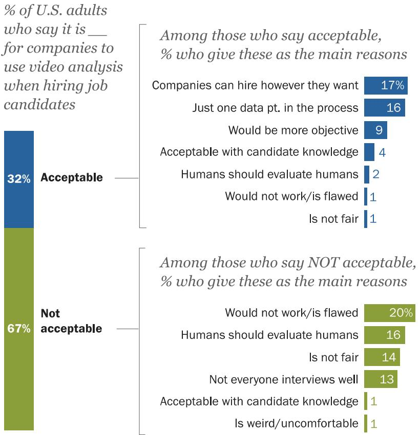

> **AI Description:**
> **Source:** `assets/_page_16_Figure_0.jpg`
> 
> **Generated:** 2026-05-30 13:42:26
> 
> ---
> 
> The image contains a bar chart and a stacked bar chart. The chart is divided into two sections: one for those who find it acceptable for companies to use video analysis in hiring, and another for those who find it not acceptable. The left side shows the percentage of U.S. adults who find it acceptable (32%) and not acceptable (67%) for companies to use video analysis in hiring. The right side breaks down the reasons given by those who find it acceptable and those who find it not acceptable. The reasons are presented as percentages, with the most common reasons for acceptance being "Companies can hire however they want" (17%) and "Just one data point in the process" (16%). For those who find it not acceptable, the most common reasons are "Would not work/is flawed" (20%) and "Humans should evaluate humans" (16%). The chart uses blue and green bars to represent the two categories and their respective percentages.

Note: Verbatim responses have been coded into categories. Results may add to more than 100% because multiple responses were allowed. Respondents who did not give an answer or gave other answers are not shown. Source: Survey of U.S. adults conducted May 29-June 11, 2018. “Public Attitudes Toward Computer Algorithms” PEW RESEARCH CENTER

makes the case that humans should interview other humans, while 14% feel that this process is just not fair to the people being evaluated. And 13% feel that not everyone interviews well and that this scoring system might overlook otherwise talented candidates.

Some examples:

▪ “I don’t think that characteristics obtained in this manner would be reliable. Great employees can come in all packages.” Woman, 68

“Individuals may have attributes and strengths that are not evident through this kind of analysis and they would be screened out based on the algorithm.” Woman, 57

“A person could be great in person but freeze during such an interview (on camera). Hire a person not a robot if you are wanting a person doing a job. Interviews as described should only be used for persons that live far away and can’t come in and then only to narrow down the candidates for the job, then the last interview should require them to have a person to person interview.” Woman, 61

“Some people do not interview well, and a computer cannot evaluate a person’s personality and how they relate to other people.” Man, 75

Automated resume screening

The 41% of Americans who think it is acceptable for companies to use this type of program give three major reasons for feeling this way. Around one-in-five (19%) find it acceptable because the company using the process would save a great deal of time and money. An identical share thinks it would be more accurate than screening resumes by hand, and 16% feel that companies can hire however they want to hire.

Some examples:

“Have you ever tried to sort through hundreds of applications? A program provides a non-partial means of evaluating applicants. It may not be perfect, but it is efficient.” Woman, 65

“While I wouldn’t do this   
for my company, I simply   
think it’s acceptable   
because private companies   
should be able to use   
whatever methods they   
want as long as they don’t   
illegally discriminate. I   
happen to think some   
potentially good   
candidates would be   
passed over using this   
method, but I wouldn’t say   
an organization shouldn’t   
be allowed to do it this   
way.” Man, 50

“If it eliminates resumes that don’t meet criteria, it allows the hiring process

Concerns over automated resume screening focus on fairness, lack of human involvement
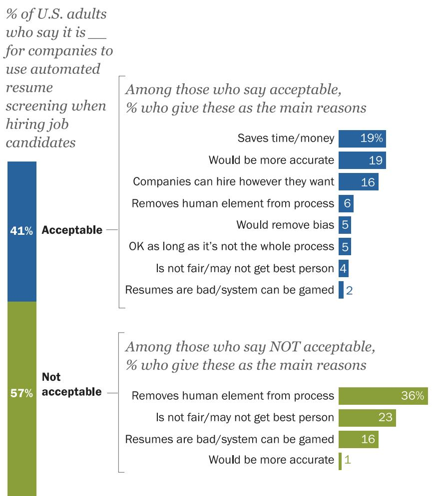

> **AI Description:**
> **Source:** `assets/_page_18_Figure_0.jpg`
> 
> **Generated:** 2026-05-30 13:41:47
> 
> ---
> 
> The image contains a bar chart and a list of reasons given by U.S. adults regarding the acceptability of automated resume screening for job candidates. The chart is divided into two sections: one for those who find it acceptable (41%) and another for those who find it not acceptable (57%). The acceptable section lists reasons such as "Saves time/money" and "Would be more accurate," while the not acceptable section lists reasons like "Removes human element from process" and "Is not fair/may not get best person." The chart visually represents the percentage of respondents who agree with each statement, with the acceptable section in blue and the not acceptable section in green.

Note: Verbatim responses have been coded into categories. Results may add to more than 100% because multiple responses were allowed. Respondents who did not give an answer or gave other answers are not shown. Source: Survey of U.S. adults conducted May 29-June 11, 2018. “Public Attitudes Toward Computer Algorithms”

## PEW RESEARCH CENTER

to be more efficient.” Woman, 43

Those who find the process unacceptable similarly focus on three major themes. Around one-third (36%) worry that this type of process takes the human element out of hiring. Roughly one-quarter (23%) feel that this system is not fair or would not always get the best person for the job. And 16% worry that resumes are simply not a good way to choose job candidates and that people could game the system by putting in keywords that appeal to the algorithm.

Here are some samples of these responses:

“Again, you are taking away the human component. What if a very qualified person couldn’t afford to have a professional resume writer do his/her resume? The computer would kick it out.” Woman, 72

“Companies will get only employees who use certain words, phrases, or whatever the parameters of the search are. They will miss good candidates and homogenize their workforce.” Woman, 48

“The likelihood that a program kicks a resume, and the human associated with it, for minor quirks in terminology grows. The best way to evaluate humans is with humans.” Man, 54

“It’s just like taking standardized school tests, such as the SAT, ACT, etc. There are teaching programs to help students learn how to take the exams and how to ‘practice’ with various examples. Therefore, the results are not really comparing the potential of all test takers, but rather gives a positive bias to those who spend the time and money learning how to take the test.” Man, 64

### Full Page Description (Page 20)

**Source:** `assets/_page_20_Asset_0.jpg`

**Generated:** 2026-05-30 13:42:43

---

The image is a pie chart with three segments. The largest segment, in dark blue, represents "Does not" with 74% of the total. The second segment, in light blue, represents "Does" with 25% of the total. The smallest segment, in gray, represents "No answer" with 1% of the total. The chart visually represents the distribution of responses to a question or survey.

## 2. Algorithms in action: The content people see on social media

The social media environment is another prominent example of algorithmic decision-making in Americans’ daily lives. Nearly all the content people see on social media is chosen not by human editors but rather by computer programs using massive quantities of data about each user to deliver content that he or she might find relevant or engaging. This has led to widespread concerns that these sites are promoting content that is attention-grabbing but ultimately harmful to users – such as misinformation, sensationalism or “hate clicks.”

To more broadly understand public attitudes toward algorithms in this context, the survey asked respondents a series of questions about the content they see on social media, the emotions that content arouses, and their overall comfort level with these sites using their data to serve them different types of information. And like the questions around the impact of algorithms discussed in the preceding chapter, this portion of the survey led with a broad question about whether the public thinks social media reflects overall public sentiment.

Most think social media does not accurately reflect society

% of U.S. adults who say the content on social media provide an accurate picture of how society feels about important issues

On this score, a majority of Americans (74%) think the content   
people post on social media does not provide an accurate picture   
of how society feels about important issues, while one-quarter say   
it does. Certain groups of Americans are more likely than others   
to think that social media paints an accurate picture of society   
writ large. Notably, blacks (37%) and Hispanics (35%) are more   
likely than whites (20%) to say this is the case. And the same is   
true of younger adults compared with their elders: 35% of 18- to   
29-year-olds think that social media paints an accurate portrait of   
society, but that share drops to 19% among those ages 65 and   
older. Still, despite these differences, a majority of Americans   
across a wide range of demographic groups feel that social media is not representative of public across a wide range of demographic groups feel that social media is opinion more broadly. opinion more broadly.

PEW RESEARCH CENTER

### Full Page Description (Page 21)

**Source:** `assets/_page_21_Asset_0.jpg`

**Generated:** 2026-05-30 13:41:13

---

The image contains a horizontal bar chart with data presented in percentages. The chart compares two categories: "Frequently" and "Sometimes," for various emotional states. The emotional states listed are Amused, Angry, Connected, Inspired, Depressed, and Lonely. The chart shows the percentage of people who experience each emotion frequently or sometimes, with a net percentage calculated for each emotional state. The net percentage is the sum of the percentages for "Frequently" and "Sometimes." The chart highlights that "Amused" has the highest net percentage (88), followed by "Angry" and "Connected" with net percentages of 71 each. "Lonely" has the lowest net percentage (31).

## Social media users frequently encounter content that sparks feelings of amusement but also see material that angers them

When asked about six different emotions that they might experience due to the content they see on social media, the largest share of users (88% in total) say they see content on these sites that makes them feel amused. Amusement is also the emotion that the largest share of users (44%) frequently experience on these sites.

## Social media users experience a mix of positive, negative emotions while using these platforms

% of social media users who say they \_\_ see content on social media that makes them feel …

## Social media also leads many

users to feel anger. A total of

71% of social media users report encountering content that makes them angry, and one-quarter see this type of content frequently. Similar shares say they encounter content that makes them feel connected (71%) or inspired (69%). Meanwhile, around half (49%) say they encounter content that makes them feel depressed, and 31% indicate that they at least sometimes see content that makes them feel lonely.

Identical shares of users across a range of age groups say they frequently encounter content on social media that makes them feel angry. But other emotions exhibit more variation based on age. Notably, younger adults are more likely than older adults to say they frequently encounter content on social media that makes them feel lonely. Some 15% of social media users ages 18 to 29 say this, compared with 7% of those ages 30 to 49 and just 4% of those 50 and older. Conversely, a relatively small share of older adults are frequently amused by content they see on social media. In fact, similar shares of social media users ages 65 and older say they frequently see content on these platforms that makes them feel amused (30%) and angry (24%).

A recent Pew Research Center analysis of congressional Facebook pages found that the “anger” emoticon is now the most common reaction to posts by members of Congress. And although this survey did not ask about the specific types of content that might make people angry, it does find a modest correlation between the frequency with which users see content that makes them angry and their overall political affiliation. Some 31% of conservative Republicans say they frequently feel angry due to things they see on social media (compared with 19% of moderate or liberal Republicans), as do 27% of liberal Democrats (compared with 19% of moderate or conservative Democrats).

## Larger share of young social media users say these platforms frequently make them feel amused – but also lonely and depressed

% of social media users in each age group who say they frequently see content on social media that makes them feel…

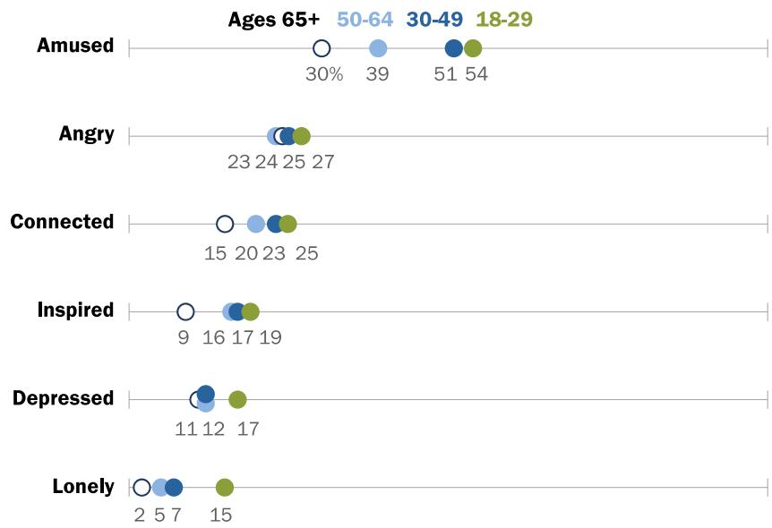

> **AI Description:**
> **Source:** `assets/_page_22_Figure_0.jpg`
> 
> **Generated:** 2026-05-30 13:41:02
> 
> ---
> 
> The image is a horizontal bar chart with a focus on emotional responses across different age groups. The chart is divided into six categories: Amused, Angry, Connected, Inspired, Depressed, and Lonely. Each category has a bar representing the percentage of people who experienced that emotion, with percentages and corresponding age groups (18-29, 30-49, 50-64, and 65+) indicated on the bars. The chart visually compares the emotional responses of different age groups, showing that younger age groups tend to experience more amusement and inspiration, while older age groups show higher percentages of depression and loneliness.

Note: Respondents who did not give an answer or gave other answers are not shown. Source: Survey of U.S. adults conducted May 29-June 11, 2018. “Public Attitudes Toward Computer Algorithms” PEW RESEARCH CENTER

## Social media users frequently encounter people being overly dramatic or starting arguments before waiting for all the facts to emerge

Along with asking about the emotions social media platforms inspire in users, the survey also included a series of questions about how often social media users encounter certain types of behaviors and content. These findings indicate that users see two types of content especially frequently: posts that are overly dramatic or exaggerated (58% of users say they see this type of content frequently) and people making accusations or starting arguments without waiting until they have all the facts (59% see this frequently).

A majority of social media users also say they at least sometimes encounter posts that appear to be about one thing but turn out to be about something else, as well as posts that teach them

### Full Page Description (Page 23)

**Source:** `assets/_page_23_Asset_0.jpg`

**Generated:** 2026-05-30 13:42:03

---

The image contains a bar chart with data presented in a tabular format. The chart compares the frequency of certain types of posts on a platform, categorized into "Frequently," "Sometimes," and a combined "NET" column. The categories include:

1. Posts that are overly dramatic or exaggerated
2. People making accusations or starting arguments without having all the facts
3. Posts that teach you something useful you hadn't known before
4. Posts that appear to be about one thing but turn out to be about something else

The chart shows that posts that are overly dramatic or exaggerated are frequently shared (58 times) and sometimes shared (31 times), resulting in a net frequency of 88. Similarly, posts involving accusations or arguments without all facts are frequently shared (59 times) and sometimes shared (28 times), with a net frequency of 87. Posts that teach something new are frequently shared (21 times) and sometimes shared (57 times), resulting in a net frequency of 79. Lastly, posts that appear to be about one thing but turn out to be about something else are frequently shared (33 times) and sometimes shared (45 times), with a net frequency of 78.

something useful they hadn’t known before. But in each instance, fewer than half say they see these sorts of posts frequently.

Beyond the emotions they feel   
while browsing social media,   
users are exposed to a mix of   
positive and negative behaviors   
from others. Around half (54%)   
of social media users say they   
typically see an equal mix of   
people being kind or supportive   
and people being mean or   
bullying. Around one-in-five   
(21%) say they more often see   
people being kind and   
supportive on these sites, while   
a comparable share (24%) says   
they more often see people being mean or bullying. they more often see people being

Majorities of social media users frequently see people engaging in drama and exaggeration, jumping into arguments without having all the facts

% of social media users who say they \_\_\_ see the following types of content on social media

PEW RESEARCH CENTER

Previous surveys by the Center have found that men are slightly more likely than women to encounter any sort of harassing or abusive behavior online. And in this instance, a slightly larger share of men (29%) than women (19%) say they more often see people being mean or bullying content on social media platforms than see kind behavior. Women, on the other hand, are slightly more likely than men to say that they more often see people being kind or supportive. But the largest shares of both men (52%) and women (56%) say that they typically see an equal mix of supportive and bullying behavior on social media.

## Men somewhat more likely than women to see people being bullying, deceptive on social media

% of social media users who say they more often see \_\_\_when using these sites

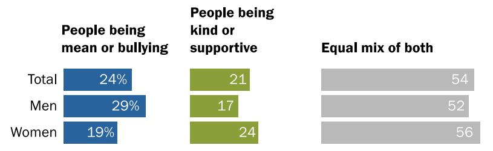

> **AI Description:**
> **Source:** `assets/_page_24_Figure_0.jpg`
> 
> **Generated:** 2026-05-30 13:40:24
> 
> ---
> 
> The image is a bar chart with three categories: "People being mean or bullying," "People being kind or supportive," and "Equal mix of both." The chart is divided into three sections: "Total," "Men," and "Women." The percentages for each category are as follows:
> 
> - Total: 24% mean/bullying, 21% kind/supportive, 54% equal mix
> - Men: 29% mean/bullying, 17% kind/supportive, 52% equal mix
> - Women: 19% mean/bullying, 24% kind/supportive, 56% equal mix
> 
> The chart visually represents the distribution of people's behaviors in these three categories across the total population and separately for men and women.

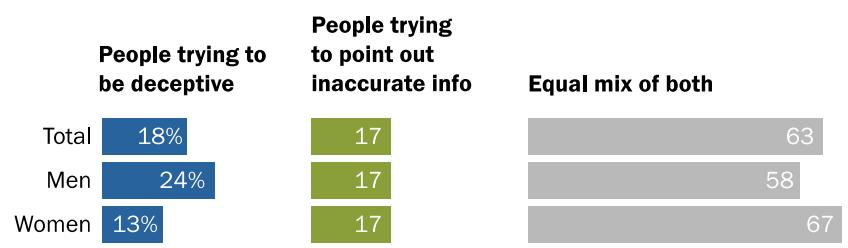

> **AI Description:**
> **Source:** `assets/_page_24_Figure_1.jpg`
> 
> **Generated:** 2026-05-30 13:39:59
> 
> ---
> 
> The image is a bar chart with three categories: "People trying to be deceptive," "People trying to point out inaccurate info," and "Equal mix of both." The chart is divided into two sections: one for "Total" and another for "Men" and "Women." The percentages for each category are as follows:
> 
> - Total: 18% for "People trying to be deceptive," 17% for "People trying to point out inaccurate info," and 63% for "Equal mix of both."
> - Men: 24% for "People trying to be deceptive," 17% for "People trying to point out inaccurate info," and 58% for "Equal mix of both."
> - Women: 13% for "People trying to be deceptive," 17% for "People trying to point out inaccurate info," and 67% for "Equal mix of both."
> 
> The chart visually represents the distribution of people's intentions regarding misinformation, with a significant portion of the total and both genders being in the "Equal mix of both" category.

Note: Respondents who did not give an answer are not shown. Source: Survey of U.S. adults conducted May 29-June 11, 2018. “Public Attitudes Toward Computer Algorithms”

## PEW RESEARCH CENTER

When asked about the efforts they see other users making to spread – or correct – misinformation, around two-thirds of users (63%) say they generally see an even mix of people trying to be deceptive and people trying to point out inaccurate information. Similar shares more often see one of these behaviors than others, with 18% of users saying they more often see people trying to be deceptive and 17% saying they more often see people trying to point out inaccurate information. Men are around twice as likely as women to say they more often seeing people being deceptive on social media (24% vs. 13%). But majorities of both men (58%) and women (67%) see an equal mix of deceptiveness and attempts to correct misinformation.

## Users’ comfort level with social media companies using their personal data depends on how their data are used

The vast quantities of data that social media companies possess about their users – including behaviors, likes, clicks and other information users provide about themselves – are ultimately what allows these platforms to deliver individually targeted content in an automated fashion. And this survey finds that users’ comfort level with this behavior is heavily context-dependent.

## Users are relatively comfortable with social platforms using their data for some purposes, but not others

They are relatively accepting of their data being used for certain types of messages, but much less comfortable when it is used for other purposes.

Three-quarters of social media users find it acceptable for those platforms to use data about them and their online behavior to recommend events in their area that they might be interested in, while a smaller majority (57%) thinks it is acceptable if their data are used to recommend other people they might want to be friends with.

On the other hand, users are somewhat less comfortable with these sites using their data to show advertisements for products or services. Around half (52%) think this behavior is acceptable, but a similar share (47%) finds it to be not acceptable – and the share that finds it not at all acceptable (21%) is roughly double the share who finds it very acceptable (11%). Meanwhile, a substantial majority of users think it is not acceptable for social media platforms to use their data to deliver messages from political campaigns – and 31% say this is not acceptable at all.

Relatively sizable majorities of users across a range of age groups think it is acceptable for social media sites to use their data to show them events happening in their area. And majorities of users across a range of age categories feel it is not acceptable for social platforms to use their data to serve them ads from political campaigns.

But outside of these specific similarities, older users are much less accepting of social media sites using their data for other reasons. This is most pronounced when it comes to using that data to recommend other people they might know. By a two-to-one margin (66% to 33%), social media users ages 18 to 49 think this is an acceptable use of their data. But by a similar 63% to 36% margin, users ages 65 and older say this is not acceptable. Similarly, nearly six-in-ten users ages 18 to 49 think it is acceptable for these sites to use their data to show them advertisements for products or

## Social media users from a range of age groups are wary of their data being used to deliver political messages

% of social media users who say it is acceptable for social media sites to use data about them and their online activities to …

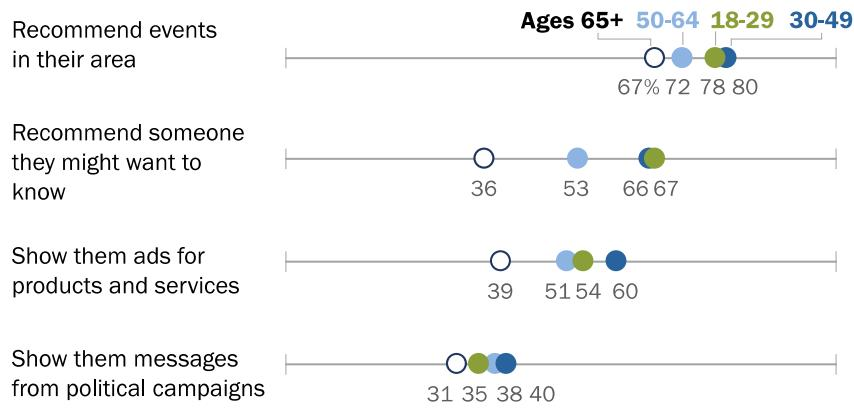

> **AI Description:**
> **Source:** `assets/_page_26_Figure_0.jpg`
> 
> **Generated:** 2026-05-30 13:43:06
> 
> ---
> 
> The image contains a horizontal bar chart with data points representing percentages for different age groups (65+, 50-64, 18-29, 30-49) across four categories: "Recommend events in their area," "Recommend someone they might want to know," "Show them ads for products and services," and "Show them messages from political campaigns." The percentages for each category are displayed above the corresponding bars, and the bars are color-coded to match the age groups. The chart visually compares the preferences or behaviors of different age groups in relation to these categories.

Note: Includes those saying it is “very” or “somewhat” acceptable for social media sites to do this. Respondents who did not give an answer or gave other answers are not shown. Source: Survey of U.S. adults conducted May 29-June 11, 2018. “Public Attitudes Toward Computer Algorithms” PEW RESEARCH CENTER

services, but that share falls to 39% among those 65 and older.

Beyond using their personal data in these specific ways, social media users express consistent and pronounced opposition to these platforms changing their sites in certain ways for some users but not others. Roughly eight-in-ten social media users think it is unacceptable for these platforms to do things like remind some users but not others to vote on election day (82%), or to show some users more of their friends’ happy posts and fewer of their sad posts (78%). And even the standard A/B testing that most platforms engage in on a continuous basis is viewed with much suspicion by users: 78% of users think it is unacceptable for social platforms to change the look and feel of their site for some users but not others.

Older users are overwhelmingly opposed to these interventions. But even among younger users, large shares find them problematic even in their most common forms. For instance, 71% of social media users ages 18 to 29 say it is unacceptable for these sites to change the look and feel for some users but not others.

## Acknowledgements

This report is a collaborative effort based on the input and analysis of the following individuals.   
Find related reports online at pewresearch.org/internet.

## Primary researchers

Aaron Smith, Associate Director, Research

## Research team

Lee Rainie, Director, Internet and Technology Research

Kenneth Olmstead, Research Associate

Jingjing Jiang, Research Analyst

Andrew Perrin, Research Analyst

Paul Hitlin, Senior Researcher

Meg Hefferon, Research Analyst

## Editorial and graphic design

Margaret Porteus, Information Graphics Designer

Travis Mitchell, Copy Editor

## Communications and web publishing

Haley Nolan, Communications Assistant

Sara Atske, Assistant Digital Producer

## The American Trends Panel Survey Methodology

The American Trends Panel (ATP), created by Pew Research Center, is a nationally representative panel of randomly selected U.S. adults recruited from landline and cellphone random-digit-dial (RDD) surveys. Panelists participate via monthly self-administered web surveys. Panelists who do not have internet access are provided with a tablet and wireless internet connection. The panel is being managed by GfK.

Data in this report are drawn from the panel wave conducted May 29-June 11, 2018, among 4,594 respondents. The margin of sampling error for the full sample of 4,594 respondents is plus or minus 2.4 percentage points.

Members of the American Trends Panel were recruited from several large, national landline and cellphone RDD surveys conducted in English and Spanish. At the end of each survey, respondents were invited to join the panel. The first group of panelists was recruited from the 2014 Political Polarization and Typology Survey, conducted Jan. 23 to March 16, 2014. Of the 10,013 adults interviewed, 9,809 were invited to take part in the panel and a total of 5,338 agreed to participate.1 The second group of panelists was recruited from the 2015 Pew Research Center Survey on Government, conducted Aug. 27 to Oct. 4, 2015. Of the 6,004 adults interviewed, all were invited to join the panel, and 2,976 agreed to participate.2 The third group of panelists was recruited from a survey conducted April 25 to June 4, 2017. Of the 5,012 adults interviewed in the survey or pretest, 3,905 were invited to take part in the panel and a total of 1,628 agreed to participate.3

The ATP data were weighted in a multistep process that begins with a base weight incorporating the respondents’ original survey selection probability and the fact that in 2014 some panelists were subsampled for invitation to the panel. Next, an adjustment was made for the fact that the propensity to join the panel and remain an active panelist varied across different groups in the sample. The final step in the weighting uses an iterative technique that aligns the sample to population benchmarks on a number of dimensions. Gender, age, education, race, Hispanic origin and region parameters come from the U.S. Census Bureau’s 2016 American Community Survey. The county-level population density parameter (deciles) comes from the 2010 U.S. decennial census. The telephone service benchmark comes from the July-December 2016 National Health

Interview Survey and is projected to 2017. The volunteerism benchmark comes from the 2015 Current Population Survey Volunteer Supplement. The party affiliation benchmark is the average of the three most recent Pew Research Center general public telephone surveys. The internet access benchmark comes from the 2017 ATP Panel Refresh Survey. Respondents who did not previously have internet access are treated as not having internet access for weighting purposes. Sampling errors and statistical tests of significance take into account the effect of weighting. Interviews are conducted in both English and Spanish, but the Hispanic sample in the ATP is predominantly native born and English speaking.

The following table shows the unweighted sample sizes and the error attributable to sampling that would be expected at the 95% level of confidence for different groups in the survey:

Sample sizes and sampling errors for other subgroups are available upon request.

In addition to sampling error, one should bear in mind that question wording and practical difficulties in conducting surveys can introduce error or bias into the findings of opinion polls.

The May 2018 wave had a response rate of 84 % (4,594 responses among 5,486 individuals in the panel). Taking account of the combined, weighted response rate for the recruitment surveys (10.0%) and attrition from panel members who were removed at their request or for inactivity, the cumulative response rate for the wave is 2.4%.4

© Pew Research Center, 2018