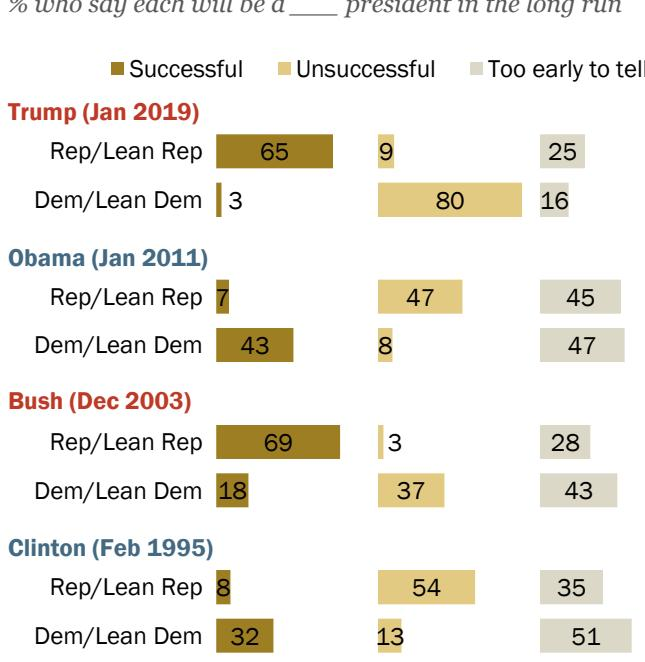

FOR RELEASE January 18, 2019

# Trump Begins Third Year With Low Job Approval and Doubts About His Honesty

Views of economy remain positive, divided by partisanship

FOR MEDIA OR OTHER INQUIRIES:

Carroll Doherty, Director of Political Research Jocelyn Kiley, Associate Director, Research Bridget Johnson, Communications Manager

202.419.4372

www.pewresearch.org

RECOMMENDED CITATION

Pew Research Center, January, 2019, “Trump Begins Third Year With Low Job Approval and Doubts About His Honesty”

## About Pew Research Center

Pew Research Center is a nonpartisan fact tank that informs the public about the issues, attitudes and trends shaping America and the world. It does not take policy positions. It conducts public opinion polling, demographic research, content analysis and other data-driven social science research. The Center studies U.S. politics and policy; journalism and media; internet, science and technology; religion and public life; Hispanic trends; global attitudes and trends; and U.S. social and demographic trends. All of the Center’s reports are available at www.pewresearch.org. Pew Research Center is a subsidiary of The Pew Charitable Trusts, its primary funder.

© Pew Research Center 2019

### Full Page Description (Page 2)

**Source:** `assets/_page_2_Asset_0.jpg`

**Generated:** 2026-05-30 13:45:52

---

The image is a line graph showing approval ratings for U.S. presidents over their first three years in office. The x-axis represents time, divided into three years, and the y-axis represents approval ratings. Each president is represented by a different colored line: Reagan in red, G.H.W. Bush in pink, Clinton in light blue, Obama in dark blue, Trump in dark red, and G.W. Bush in dark red. The graph includes data points for each president's first year in office, with notable peaks and troughs in approval ratings. The approval ratings for Trump are shown to be consistently lower compared to other presidents, with a significant drop in the first year of his presidency.

# Trump Begins Third Year With Low Job Approval and Doubts About His Honesty Views ofeconomy remain positive, divided by partisanship

At the second anniversary of his inauguration, public views of Donald Trump’s job performance, as well as his honesty and administration’s ethics, are decidedly negative. Yet opinions about the nation’s economy continue to be positive – and Trump’s handling of the economy remains a relative strength.

Trump begins his third year with a 37% job approval rating; 59% disapprove of his job performance. Of five previous presidents, only Ronald Reagan had as low a job approval mark at this point in his presidency. (Reagan’s disapproval – 54% – was lower than Trump’s.)

The new Pew Research Center survey, conducted Jan. 9-14 among 1,505 adults, finds that a growing share of Americans say they trust what Trump says less than what previous presidents said while they were in office. Nearly six-inten (58%) say they trust what Trump says less than previous presidents, up from 54% last June and 51% in

At start of Trump’s third year in office, his job approval lags most of his recent predecessors

Presidential job approval at beginning of third year in office (%)

February 2017, shortly after he took office.

The public also continues to fault the ethical standards of top administration officials. Just 39% rate their ethical standards as excellent or good, while 59% say they are not good or poor. While these opinions are little changed from last year, they are lower than evaluations of ethics of top officials for presidents dating back to Reagan.

### Full Page Description (Page 3)

**Source:** `assets/_page_3_Asset_0.jpg`

**Generated:** 2026-05-30 13:50:29

---

The image is a line graph showing trends over time for three categories: Total, Rep/Lean Rep, and Dem/Lean Dem. The x-axis represents years from 2000 to 2019, and the y-axis likely represents some form of count or percentage, though the exact scale is not specified. The graph shows fluctuations in these categories, with the Total line starting at 77 in 2000 and decreasing to around 51 by 2019. The Rep/Lean Rep line starts at 77 and fluctuates, ending at 75 in 2019. The Dem/Lean Dem line starts at 70 and decreases to around 32 by 2019. The graph includes a legend to differentiate between the three categories.

However, more Americans say Trump’s economic policies have made conditions better (40%) than worse (28%), while 29% say they have not had much of an effect. In January 2011, a comparable point in Barack Obama’s presidency, the public expressed mixed views of the impact of his economic policies, with about as many saying his policies made things worse (31%) as better (28%).

And Trump engenders more confidence for his ability to make good decisions on trade and the economy than in other areas, especially working with Congress. About half say they are very or somewhat confident in Trump’s somewhat confident in Trump's

ability to negotiate favorable trade deals (51%) and make good decisions about economic policy (49%).

By contrast, 40% have confidence in Trump on immigration policy and 35% are confident he can work effectively with Congress. (For more on views of Trump’s handling of the government shutdown, see “Most Border Wall Opponents, Supporters Say Shutdown Concessions Are Unacceptable.”)

Trump’s presidency has been characterized by a favorable economic climate and that

Increase in positive economic views during Trump’s presidency has been driven by Republicans

% who rate national economic conditions as excellent or good

remains the case today. Currently, 51% say economic conditions are either excellent or good – among the highest ratings in nearly two decades.

The surge in positive economic views has been driven by Republicans. Three-quarters of Republicans rate the economy as excellent or good, up from just 14% in December 2016, at the end of Obama’s presidency. By contrast, just 32% of Democrats offer positive ratings; Democrats are now less likely to rate the economy as either excellent or good than they were in December of 2016 (46%).

The public’s perceptions of the availability of jobs have undergone a similar transformation. For the first time in Pew Research Center surveys dating to 2001, a clear majority of Americans (60%) say there are plenty of jobs in their communities. And while these perceptions also are divided along partisan lines, majorities of Republicans (71%) and Democrats (53%) say there are plenty of jobs available locally.

Yet favorable opinions about the economy and jobs have not been accompanied by a rise in public satisfaction with national conditions. For longer than a decade, no more than about a third of Americans have expressed with the way things are going in the country. Today, that figure stands at just 26%, down from 33% in September, with the decline coming among members of both parties.

## Among the survey’s other major findings:

Low expectations for Trump’s legacy. About half (47%) think Trump will be an unsuccessful president in the long run, compared with fewer (29%) who think he will be a successful president; 23% say it’s too early to tell. Ratings for Trump are more negative, on balance, than for Obama and George W. Bush at comparable points in their administrations; in February 1995, more said Bill Clinton would be unsuccessful (34%) than successful (18%). Compared with his three most recent predecessors, far fewer say it is “too early to tell” whether Trump will be successful or unsuccessful.

## Most Democrats want party leaders to “stand up” to Trump. As was the case a year ago, a

majority of Democrats (70%) want their party’s leaders to “stand up” to Trump this year, even if it means less gets done in Washington; just 26% want them to try as best they can to work with Trump, even if it means disappointing some groups of Democratic supporters. A year ago, 63% of Democrats wanted their party’s leaders to stand up to the president. Among Republicans, the share saying Trump should stand up to Democrats has increased from 40% a year ago to 51% currently.

## Majority continues to say Trump has

responsibility to release tax returns. As in the past, a majority (64%) says Trump has a responsibility to publicly release his tax returns; just 32% say he does not have a responsibility to do this. Nearly all Democrats (91%) – and 32% of Republicans – say Trump should release his tax returns.

## Public confidence in Mueller investigation

steady. A majority (55%) remains confident that special counsel Robert Mueller is conducting a fair investigation into Russian involvement in the 2016 election. Confidence

## In both parties, increasing shares want leaders to ‘stand up’ to opposition

% of Republicans and Republican leaners who say Donald Trump should …

Work with Democrats to Stand up to Democrats   
get things done, even if on issues important to it disappoints Reps, even if less gets supporters done in Washington

% of Democrats and Democratic leaners who say Democratic leaders in Washington should …
Work with Trump to Stand up to Trump on get things done, even issues important to if it disappoints Dems, even if less gets supporters done in Washington

in Mueller has held steady over the course of the past year, and there remains more confidence in Mueller to conduct a fair investigation than in Trump to handle matters related to the inquiry appropriately.

### Full Page Description (Page 6)

**Source:** `assets/_page_6_Asset_0.jpg`

**Generated:** 2026-05-30 13:50:00

---

The image contains a bar chart with a legend indicating levels of confidence in Donald Trump's ability to perform various tasks. The chart is divided into four categories: "Not at all," "Not too," "Somewhat," and "Very." Each category is represented by a different color. The chart lists eight tasks that Trump is asked about, such as negotiating trade agreements, making economic policy decisions, and handling international crises. The percentages for each category are displayed for each task, showing the distribution of confidence levels among respondents. The main trend is that the majority of respondents express some level of confidence in Trump's ability to perform these tasks, with "Very" being the most common response for most tasks.

## 1. Views of Trump

The public’s confidence in Trump to handle a number of key issues remains mixed. Trump fares best on issues related to economic conditions, where about half of Americans say they are at least somewhat confident in his ability. By contrast, only about a third express confidence in his ability to work effectively with Congress.

Overall, 62% say they are not too or not at all confident in Trump’s ability to work effectively

with Congress; far fewer (35%) say they are very or somewhat confident in him to do this.

When it comes to making wise decisions about immigration policy, four-inten say they are at least somewhat confident in Trump (including 29% who say they are very confident). Nearly six-in-ten (58%) express little or no confidence in Trump on immigration policy, including 45% who say they are not at all confident in him on this issue.

Narrow majorities also say they have little or no confidence in Trump to use military force wisely, handle an international crisis or manage the executive branch effectively. About half (51%)

Public more confident in Trump on trade, economy than immigration and dealing with Congress

say they are not too or not at all confident that Trump can make good appointments to the federal courts, while 45% say they are at least somewhat confident in him in this area.

### Full Page Description (Page 7)

**Source:** `assets/_page_7_Asset_0.jpg`

**Generated:** 2026-05-30 13:46:34

---

The image contains a bar chart with data from a survey conducted by the Pew Research Center in January 2019. The chart compares the views of Republican-leaning and Democratic-leaning U.S. adults on various presidential performance metrics. The metrics include negotiating favorable trade agreements, making good decisions about economic policy, making good appointments to the federal courts, using military force wisely, handling an international crisis, managing the executive branch effectively, making wise decisions about immigration policy, and working effectively with Congress. The chart uses different colors to represent "Very" and "Somewhat" levels of agreement among each political group. The data shows that among Republican-leaning respondents, there is a higher proportion who view the president favorably on most metrics compared to Democratic-leaning respondents.

Trump garners the most confidence in his ability to negotiate favorable trade agreements with other countries (51% say they are at least somewhat confident) and to make good decisions about economic policy (49%). Still, close to half the public says they lack confidence in Trump to handle these two issue areas.

## Nearly nine-in-ten

Republicans and Republicanleaning independents (89%) are confident in Trump’s ability to negotiate favorable trade agreements with other countries, compared with just 19% of Democrats and Democratic leaners.

The pattern is similar on most other issues. For instance, 89% of Republicans – and only 17% of Democrats – are very or somewhat confident in Trump to make good decisions about economic policy.

Trump gets his lowest ratings from Republicans on his ability to work effectively with Congress: Seven-in-ten say they are at least somewhat confident in his ability to do this, but just 31% say they are very confident. Across all other

Republicans broadly confident in Trump on most issues, but rate him lower on working with Congress

% who say they are \_\_\_ confident in Trump’s ability to …

issues, at least 50% of Republicans say they are very confident in Trump.

### Full Page Description (Page 8)

**Source:** `assets/_page_8_Asset_0.jpg`

**Generated:** 2026-05-30 13:48:55

---

The image is a bar chart with a color-coded legend indicating responses to a question about a specific topic. The categories are grouped by political affiliation: Total, Rep/Lean Rep, Conserv, Mod/Lib, Dem/Lean Dem, Cons/Mod, and Liberal. Each group is further divided into four categories: Very, Somewhat, Not too, and Not at all. The percentages for each category are displayed within the bars. The chart shows a clear trend that "Very" and "Somewhat" responses are higher among Republican-leaning and Conservative groups, while "Not at all" responses are more prevalent among Liberal and Democratic-leaning groups.

## Broad concern over possible influence of Trump's business interests

Only about three-in-ten Americans (28%) are very confident that Trump keeps his own business interests separate from the decisions he makes as president, and another 13% say they are somewhat confident in this. A majority are either not too (16%) or not at all (41%) confident that Trump is keeping his own personal interests separate from his presidential decisions.

Most Republicans say they are very (55%) or somewhat (23%) confident that Trump keeps his business interests separate from his decision-making as president. Conservative Republicans are

much more likely to say they are very confident in this (66%) than are moderate and liberal Republicans (39%).

Democrats are deeply skeptical that Trump is avoiding potential conflicts of interest. Nearly seven-in-ten (69%) say that they are not at all confident that Trump keeps his business interests and his presidential decisions separate, while another 20% say they are not too confident in this. Liberal Democrats are particularly skeptical: Fully 83% say they are not at all confident in Trump to keep his business interests separate.

Fewer than half are confident Trump keeps business interests separate

% who say they are confident that Trump keeps his own business interests separate from the decisions he makes as president

## PEW RESEARCH CENTER

## Most say Trump should release tax returns

In surveys over the past two years, a majority of Americans have said that Trump has a responsibility to release his tax returns. Currently, 64% say he has this responsibility, slightly higher than the share who said this last year. About a third of the public (32%) says he does not have this responsibility.

Fully 91% of Democrats and Democratic leaners say that Trump has a responsibility to publicly release his tax returns, up from about eight-in-ten who said this in both January 2018 (80%) and January 2017 (79%).

## By contrast, most

Republicans continue to say that Trump does not have a responsibility to release his tax returns: Just 32% say he has this responsibility, while 64% say he does not.

Majority of Americans continue to say Trump has a responsibility to publicly release his tax returns

% who say Trump has a responsibility to publicly release his tax returns

## PEW RESEARCH CENTER

Source: Survey of U.S. adults conducted Jan. 9-14, 2019.

### Full Page Description (Page 10)

**Source:** `assets/_page_10_Asset_0.jpg`

**Generated:** 2026-05-30 13:47:34

---

The image is a bar chart with three categories: "More than," "About the same as," and "Less than." The chart is divided into two sections: "Total" and "Rep/Lean Rep" and "Dem/Lean Dem." The "Total" section shows that 26% are more than, 14% are about the same as, and 58% are less than. The "Rep/Lean Rep" section shows 58% are more than, 25% are about the same as, and 15% are less than. The "Dem/Lean Dem" section shows 2% are more than, 4% are about the same as, and 94% are less than. The chart uses different shades of yellow to represent each category.

## Trump's statements less trusted than those of previous presidents

A majority of the public (58%) says they trust what Trump says less than they trusted what previous presidents said while in office. Just 26% say they trust Trump more than previous presidents, while 14% say their level of trust in Trump’s rhetoric is about the same as for past presidents.

Distrust in Trump compared with other presidents has increased since April of 2017, when a somewhat smaller share (51%) said they trusted what Trump says less than previous presidents.

Almost all Democrats and Democratic leaners (94%) say they trust what Trump says less than they trusted what previous presidents said while in office.

Among Republicans and Republican leaners, most (58%) say they trust what Trump says more than previous presidents, while 25% say they trust what he says about the same as previous presidents; 15% say they trust his rhetoric less.

Most place less trust in Trump’s statements than in previous presidents’

% who say they trust what Donald Trump says than they trusted what previous presidents said

PEW RESEARCH CENTER

## Low marks for ethical standards of top administration officials

Views of the ethical standards of top Trump administration officials remain at record lows compared with previous administrations   
dating back to the 1980s.

Overall, 39% rate the ethical standards of top Trump administration officials as either excellent (7%) or good (32%). A much greater share describes them as either not good (20%) or poor (39%). These ratings are about the same as they were in May 2018.

Views of Trump administration officials are lower than those of officials in the previous five administrations, often measured at times of specific ethical controversies.

Partisans remain deeply divided on this question, with 76% of Republicans and Republican leaners saying that ethical standards of top administration officials are excellent or good (although only 16% say they are “excellent”), and 90% of Democrats and Democratic leaners saying that ethical standards of top Trump administration officials are not good or poor (with 67% saying they are “poor”).

Trump officials’ ethics viewed less positively than predecessors’

% who say ethical standards of top Trump administration officials are excellent/good

## PEW RESEARCH CENTER

### Full Page Description (Page 12)

**Source:** `assets/_page_12_Asset_0.jpg`

**Generated:** 2026-05-30 13:51:08

---

The image contains a bar chart with data comparing opinions on the effects of a policy in January 2019 and October 2017. The chart categorizes responses into three groups: "Better," "Not much effect," and "Worse." It breaks down the responses by political affiliation, showing percentages for Republicans/Lean Republicans and Democrats/Lean Democrats. The chart highlights a significant shift in opinions over the two time periods, with a higher percentage of Republicans/Lean Republicans viewing the policy as better in January 2019 compared to October 2017.

## Trump's impact on economy seen as positive, on balance

While the public is critical of Trump and his administration in multiple areas, they see Trump’s impact on the economy in a positive light. Overall, 40% think that Trump’s policies have made economic conditions better since taking office, compared with fewer (28%) who say they have made conditions worse; 29% say they have not had much of an effect.

Since October 2017, the share saying Trump’s economic policies have not had much of an effect has declined 20 points.

There have been comparable increases in the shares who say his policies have made things better (+11 points) and worse (+10 points).

Partisan views of Trump’s economic policies have become more polarized since the fall of 2017. Nearly eight-in-ten Republicans and Republican leaners (79%) say that his economic policies had improved conditions in the country (up from 63% in October 2017). Democrats and Democratic leaners, by contrast, have grown more negative in their views of Trump’s economic policies. Almost half (46%) of

More say Trump’s policies have made the economy better than worse

% who say Donald Trump’s economic policies have made economic conditions since taking office

Democrats now say his

policies have made the economy worse, up from 28% in October 2017.

### Full Page Description (Page 13)

**Source:** `assets/_page_13_Asset_0.jpg`

**Generated:** 2026-05-30 13:47:53

---

The image is a stacked bar chart showing the percentage of successful, unsuccessful, and too early to tell responses for each president from August 1993 to January 2019. The chart is divided into four sections, each representing a different president: Clinton, Bush, Obama, and Trump. The percentages for each category are displayed for specific time points, such as August 1993, January 1994, February 1995, January 2001, December 2003, January 2009, January 2010, January 2011, January 2017, January 2018, and January 2019. The chart visually represents the changing public perception of each president's performance over time.

## How will Trump's presidency be viewed in the long run?

When asked if they think Donald Trump will be a successful or unsuccessful president in the long run, 47% say he will be unsuccessful, while about three-in-ten (29%) say he will be successful; 23% say it is too early to tell whether Trump will be successful or unsuccessful. Since last year, the share saying Trump will be successful and the share saying he will be unsuccessful have both increased by 6 percentage points.

The share who say it is too early to tell if Trump will be successful is much lower than at comparable points for previous presidents. At the start of Barack Obama’s third year in office, nearly half of the public (47%) said it was too early to tell whether he would be successful; 38% said this about George W. Bush and 43% about Clinton at comparable points.

The nearly half of Americans (47%) who now say Trump will be unsuccessful is far higher than the share who said this about his three most recent predecessors at comparable points in their first term.

More think Trump will be an unsuccessful than successful president in the long run % who say each will be a \_\_\_ president in the long run

## PEW RESEARCH CENTER

About two-thirds of Republicans and Republican-leaning independents (65%) say Trump will be a successful president in the long run.

An even larger share of Democrats and Democratic leaners (80%) think that Trump will be an unsuccessful president.

Republicans are slightly more likely than Democrats to say it is too early to tell whether Trump will be successful (25% vs. 16%).

In January 2011, about half of Republicans (47%) said Obama would be unsuccessful, while nearly as many (45%) said it was too early to tell. Among Democrats, 43% said Obama would be successful and 47% said it was too early to tell.

Republicans’ views of Trump’s long-term outlook are similar to how they viewed Bush in his third year. In December 2003, 69% of Republicans thought Bush would be successful; just 28% said it was too early to tell. Democrats’ views of Bush were not as fully established: 37% thought he would be unsuccessful, while 43% said it was too early to tell.

Partisans more likely to offer view on Trump’s success than prior presidents

% who say each will be a \_\_\_ president in the long run

> **AI Description:**
> **Source:** `assets/_page_14_Figure_0.jpg`
> 
> **Generated:** 2026-05-30 13:47:03
> 
> ---
> 
> The image is a chart presenting data on public opinion regarding the likelihood of presidents being successful or unsuccessful in the long run, categorized by party affiliation. It includes four presidents: Trump (January 2019), Obama (January 2011), Bush (December 2003), and Clinton (February 1995). The chart uses three color-coded categories: Successful (brown), Unsuccessful (yellow), and Too Early to Tell (gray). Each category is represented as a percentage for both Republican/Lean Republican and Democratic/Lean Democrat respondents. The data shows varying levels of public perception of presidential success across different parties and time periods.

Note: Don’t know responses not shown. Source: Survey of U.S. adults conducted Jan. 9-14, 2019.

### Full Page Description (Page 15)

**Source:** `assets/_page_15_Asset_0.jpg`

**Generated:** 2026-05-30 13:45:38

---

The image is a bar chart with a horizontal orientation. It presents data on the frequency of responses to a question, categorized by political affiliation. The categories for the responses are "Not at all," "Not too," "Somewhat," and "Very." The chart is divided into three sections representing "Total," "Rep/Lean Rep," and "Dem/Lean Dem." Each section has four bars corresponding to the response categories, with varying lengths indicating the percentage of respondents in each category. The "Total" section shows a balanced distribution, while the "Dem/Lean Dem" section has a higher percentage in the "Very" category and a lower percentage in the "Not at all" category compared to the other sections.

### Full Page Description (Page 15)

**Source:** `assets/_page_15_Asset_1.jpg`

**Generated:** 2026-05-30 13:45:28

---

The image contains a bar chart with data presented in percentages. The chart is divided into three categories: "Total," "Rep/Lean Rep," and "Dem/Lean Dem." Each category is further divided into four subcategories: "Not at all," "Not too," "Somewhat," and "Very." The percentages for each subcategory are displayed in corresponding colored bars. The main trends show that the "Not at all" category has the highest percentage for "Dem/Lean Dem" at 70%, while the "Very" category has the highest percentage for "Rep/Lean Rep" at 42%. The "Somewhat" category shows a significant difference between "Rep/Lean Rep" and "Dem/Lean Dem," with "Rep/Lean Rep" at 33% and "Dem/Lean Dem" at 6%.

## Views of Mueller investigation

Overall, 55% of the public says they are very or somewhat confident that Robert Mueller is conducting a fair investigation into Russian involvement in the 2016 election. A smaller share (41%) says they are not too or not at all confident in Mueller.

There is less public confidence in Trump to appropriately handle matters related to the special counsel’s investigation. Just counsel's investigation. Just

37% are very or somewhat confident in Trump to handle matters related to the investigation appropriately, compared with 60% who say they are not too or not at all confident in Trump to do this.

Views of the Mueller investigation – and Trump’s handling of the matter – remain deeply partisan.

## About seven-in-ten

Democrats and Democratic leaners (72%) are at least somewhat confident in the fairness of Mueller’s investigation. Among Republicans and Republican leaners, a larger share says they are not too or not at all confident in Mueller (58%) than says they are very or

## More confidence in Mueller investigation than in Trump to handle inquiry appropriately

% who are confident that Robert Mueller is conducting a fair investigation into Russian involvement in the 2016 election

% who are confident that Donald Trump is handling matters related to the special counsel investigation appropriately

somewhat confident in him (39%).

When it comes to Trump’s handling of matters related to the investigation, fully 92% of Democrats express a lack of confidence in Trump, including 70% who say they are not at all confident in him. Three-quarters of Republicans say they are confident in Trump to handle the inquiry appropriately, including 42% who say they are very confident.

### Full Page Description (Page 16)

**Source:** `assets/_page_16_Asset_0.jpg`

**Generated:** 2026-05-30 13:48:46

---

The image is a stacked bar chart showing data over time, specifically from December 2017 to January 2019. The chart is divided into two categories: "Somewhat" and "Very," represented by light yellow and dark brown colors, respectively. The percentages for each category are displayed on the bars. The data shows that the "Very" category consistently has a higher percentage than the "Somewhat" category across all time points. The highest percentage for the "Very" category is 61%, occurring in March 2018, while the lowest is 24%, in January 2019. The "Somewhat" category ranges from 25% in December 2017 to 36% in March 2018.

Confidence in the Mueller investigation has not   
changed much over the   
course of the past year. In January and September of 2018, an identical 55% said they were at least somewhat confident that Mueller was conducting a fair   
investigation in to Russian involvement in the 2016   
election.

Public confidence in Mueller investigation has changed little over the course of the past year

% who are confident that Robert Mueller is conducting a fair investigation into Russian involvement in the 2016 election

PEW RESEARCH CENTER

PEW RESEARCH CENTER

### Full Page Description (Page 18)

**Source:** `assets/_page_18_Asset_0.jpg`

**Generated:** 2026-05-30 13:49:39

---

The image is a line graph with three distinct lines representing different categories: Total, Rep/Lean Rep, and Dem/Lean Dem. The x-axis represents years from 2000 to 2019, while the y-axis shows numerical values. The graph illustrates trends over time for each category, with the Total line fluctuating between 51 and 77, the Rep/Lean Rep line peaking at 77 and then decreasing to 32, and the Dem/Lean Dem line starting at 70 and also decreasing to 32. The graph highlights the changes in these categories over the years, with notable fluctuations and a general downward trend for all categories from 2000 to 2019.

### Full Page Description (Page 18)

**Source:** `assets/_page_18_Asset_1.jpg`

**Generated:** 2026-05-30 13:50:14

---

The image is a line graph showing trends over time for three categories: Total, Rep/Lean Rep, and Dem/Lean Dem. The x-axis represents years from 2000 to 2019, and the y-axis represents values ranging from 12 to 46. The graph includes three lines, each representing a different category, with the Total line in gray, the Rep/Lean Rep line in red, and the Dem/Lean Dem line in blue. The Rep/Lean Rep line shows a significant peak around 2017, while the Dem/Lean Dem line shows a steady decline. The Total line fluctuates between the other two lines.

## 2. Views of nation’s economy, personal finances, job availability

Overall, Americans’ views of the current state of the national economy are little changed since a year ago. About half of adults (51%) rate national economic conditions as excellent (11%) or good (39%), while 49% characterize economic conditions as only fair (35%) or poor (14%).

Positive views of economic conditions are buoyed by   
Republicans and   
Republican-leaning   
independents: 75% rate   
economic conditions as   
excellent or good. These   
ratings are little changed   
over the past year;   
Republican views of the   
economy have been much more positive since Trump’s election.

Republicans also remain more optimistic than Democrats in expectations for the economy a year from now: 46% expect economic conditions will be better a year from now, while just 12% of Democrats say this.

Republicans continue to show more positive outlook on economy; expectations for the future dip slightly

% who rate national economic conditions as excellent or good

However, GOP optimism has declined since September, when 57% of Republicans said they expected conditions would be better; still, just 6% of Republicans expect conditions will worsen (45% say they will stay about the same). Views among Democrats are little changed since

### Full Page Description (Page 19)

**Source:** `assets/_page_19_Asset_1.jpg`

**Generated:** 2026-05-30 13:46:06

---

The image is a line graph showing trends over time, specifically from 2004 to 2019. The graph includes three lines representing "Total," "Rep/Lean Rep," and "Dem/Lean Dem." The "Total" line is gray, the "Rep/Lean Rep" line is red, and the "Dem/Lean Dem" line is blue. The y-axis appears to represent a percentage, with values ranging from 60 to 80. The graph shows fluctuations in these percentages over the years, with the "Rep/Lean Rep" line generally trending higher than the "Dem/Lean Dem" line. Notable peaks and troughs are visible, indicating changes in the data over time.

### Full Page Description (Page 19)

**Source:** `assets/_page_19_Asset_0.jpg`

**Generated:** 2026-05-30 13:46:50

---

The image is a line graph showing the percentage of people who say their personal financial situation is in excellent or good shape from 2004 to 2019. The graph includes three lines representing the total population, Republican/Lean Republican voters, and Democratic/Lean Democratic voters. The data shows fluctuations over the years, with the Republican/Lean Republican line generally higher than the Democratic/Lean Democratic line and the total line. The highest percentage for the total population is 65% in 2004, while the lowest is 43% in 2009. The Republican/Lean Republican line peaks at 62% in 2019, and the Democratic/Lean Democratic line reaches 44% in 2019.

September: 12% expect economic conditions to improve in the next year, 41% say they will get worse, while 45% expect things to stay about the same.

Overall, there has been little recent change in Americans’ views of their personal financial situation. Today, about half (51%) say their personal financial situation is in excellent or good shape, while about as many say they are in only fair or poor shape (48%).

## As was the case in

September, there is a sizable partisan gap in these views. Republicans continue to be more likely than Democrats (62% vs. 44%) to rate their personal financial situation as excellent or good.

Republicans also remain more likely than Democrats (84% to 60%) to say they expect their finances to improve over the next year.

Majorities in both parties expect their personal finances to improve over the next year

## PEW RESEARCH CENTER

### Full Page Description (Page 20)

**Source:** `assets/_page_20_Asset_0.jpg`

**Generated:** 2026-05-30 13:50:53

---

The image is a line graph with two sets of data, each represented by a different color. The x-axis represents years from 2001 to 2019, and the y-axis represents numerical values. The graph shows two trends: one labeled "Jobs are difficult to find" and the other labeled "Plenty of jobs available." The trend for "Jobs are difficult to find" fluctuates significantly, peaking at 85 in 2010 and dropping to 10 in 2012. The trend for "Plenty of jobs available" shows a more gradual increase, starting at 42 in 2001 and reaching 60 in 2019. The graph highlights the contrast between the two job market conditions over the years.

## Majority now says ‘there are plenty ofjobs available'

Six-in-ten adults now say there are plenty of jobs available in their local community – the

highest share recorded since the question was first asked in 2001. Just a third say that jobs are difficult to find.

Positive views of the availability of jobs locally has risen since the question was last asked in October 2017, generally tracking with more positive views of the economy over this period. Then, half of adults said there were plenty of jobs available where they live, while 42% said jobs were difficult to find.

## Public’s view of local job availability most positive in decades

% saying in their community

PEW RESEARCH CENTER

### Full Page Description (Page 21)

**Source:** `assets/_page_21_Asset_1.jpg`

**Generated:** 2026-05-30 13:48:04

---

The image is a bar chart with a title "Jobs are difficult to find" and "Plenty of jobs available" on the x-axis, and categories "Total," "Rep/Lean Rep," and "Dem/Lean Dem" on the y-axis. The chart shows the percentage of people in each category who believe jobs are difficult to find or that there are plenty of jobs available. The percentages for the total population are 33% for jobs being difficult to find and 60% for plenty of jobs available, with 7% not knowing or refusing to answer. For Republicans/Lean Republicans, 23% find jobs difficult and 71% believe there are plenty of jobs, with 6% not knowing or refusing to answer. For Democrats/Lean Democrats, 39% find jobs difficult and 53% believe there are plenty of jobs, with 8% not knowing or refusing to answer.

### Full Page Description (Page 21)

**Source:** `assets/_page_21_Asset_0.jpg`

**Generated:** 2026-05-30 13:48:14

---

The image is a line graph showing the percentage of Americans who identify as Republican or lean Republican (in red) and Democrat or lean Democrat (in blue) from 2001 to 2019. The graph includes data points for each year, with notable dips and rises in percentages. The years 2009 and 2017 are marked with vertical lines, likely indicating transitions in presidential administrations. The graph shows a general upward trend for both parties, with the Republican party seeing a significant increase from 2013 to 2019. The data points are labeled with specific percentages, such as 57% for Republicans in 2005 and 71% for Republicans in 2019.

As is the case with other economic measures, there is a sizable partisan gap in views of job availability. Currently, 71% of Republicans say there are plenty of jobs available, compared with 53% of Democrats. In October 2017, 58% of Republicans and 47% of Democrats viewed jobs as widely available locally.

In both parties, views of local job opportunities are among the most positive as at any point in the last two decades.

Though a majority of adults say there are plenty of jobs available in their communities, a separate question finds that “good jobs” are seen as less widely available

About half (48%) say there are plenty of good jobs available in their communities, compared with 45% who say that good jobs are difficult to find. The trajectory of opinion on this question is also positive. In June 2016, just 31% said there were plenty of good jobs available.

## Perceptions of job availability rise in both parties, especially the GOP

% who say there are plenty of jobs available in the community where they live

### Full Page Description (Page 22)

**Source:** `assets/_page_22_Asset_0.jpg`

**Generated:** 2026-05-30 13:47:24

---

The image is a bar chart that presents data on how different demographic groups perceive their economic situation compared to others. The chart is divided into three categories: "Going up faster," "Staying about even," and "Falling behind." It includes data for total respondents, by race (White, Black, Hispanic), age groups (18-29, 30-49, 50-64, 65+), family income levels ($75K+, $30K-$75K, <$30K), and political affiliation (Rep/Lean Rep, Dem/Lean Dem). The percentages for each category are visually represented by the length of the bars, with darker shades indicating higher percentages. The chart highlights that younger age groups and those with higher family incomes are more likely to perceive their economic situation as improving compared to others, while those with lower family incomes and Black respondents are more likely to feel they are falling behind.

## Most Americans say incomes are at least keeping pace with cost ofliving

A majority of Americans (54%) say either that their family’s income is going up faster than the cost of living (11%) or staying about even (43%). About four-in-ten (44%) say their incomes are

falling behind the cost of living.

These evaluations are somewhat more positive than in recent years. In October 2017, 49% said their incomes were at least keeping pace with the cost of living.

There are substantial demographic differences in these evaluations. For instance, 58% of blacks say their family’s income is falling behind the cost of living – much higher than the percentages of whites (42%) or Hispanics (46%) who say this.

Overall, 69% of adults with family incomes below \$30,000 say they are falling behind the cost of living; that compares with just 26% of those with incomes of at least \$75,000.

## Demographic, partisan differences in views of whether family incomes are keeping up with cost of living

% who say their family’s income relative to the cost of living is …

## PEW RESEARCH CENTER

Notes: Whites and blacks include only those who are not Hispanic; Hispanics are of any race.   
Don’t know responses not shown.   
Source: Survey of U.S. adults conducted Jan. 9-14, 2019.

### Full Page Description (Page 23)

**Source:** `assets/_page_23_Asset_0.jpg`

**Generated:** 2026-05-30 13:49:24

---

The image is a bar chart with textual data. It compares opinions on Wall Street's impact on the American economy across different political affiliations. The chart shows percentages of respondents who believe Wall Street hurts the economy more than it helps (39%), helps more than it hurts (46%), and those who are unsure or undecided (15%). The data is broken down by total respondents and by political affiliation (Republican/Lean Republican and Democrat/Lean Democrat). The Republicans/Lean Republicans are more likely to believe Wall Street helps the economy more than it hurts (55%), while the Democrats/Lean Democrats are more divided, with 46% believing it hurts and 41% believing it helps.

## Views of Wall Street's impact on the economy

Nearly half of Americans (46%) say that Wall Street helps the U.S. economy more than it hurts, while 39% say Wall Street hurts the economy more than it helps. Views about Wall Street’s impact on the economy are little changed since 2014. In 2011 and 2012, more said that Wall Street hurt than helped the nation’s economy.

As in the past, these views are divided along partisan lines. More Republicans say that on balance, Wall Street helps the economy more than it hurts it (55% vs. 31%).

Democrats are more divided on Wall Street’s impact: About as many say Wall Street does more to hurt the economy (46%) as say it does more to help (41%).

Republicans more likely to say Wall Street helps U.S. economy; Democrats are more divided on impact % who say …

### Full Page Description (Page 24)

**Source:** `assets/_page_24_Asset_0.jpg`

**Generated:** 2026-05-30 13:49:07

---

The image is a line graph showing the percentage of satisfied and dissatisfied individuals over time, from 1990 to 2019. The graph has two lines: one for "Satisfied" and one for "Dissatisfied." The "Satisfied" line starts at 41% in 1990 and fluctuates between approximately 26% and 54% throughout the years. The "Dissatisfied" line starts at 54% in 1990 and fluctuates between approximately 26% and 70% throughout the years. The graph indicates a general downward trend in satisfaction and an upward trend in dissatisfaction over the years.

### Full Page Description (Page 24)

**Source:** `assets/_page_24_Asset_1.jpg`

**Generated:** 2026-05-30 13:48:30

---

The image is a line graph showing the percentage of Republicans and Democrats who lean towards the Republican Party over time. The x-axis represents years from 1990 to 2019, and the y-axis represents the percentage of voters. The graph is divided into segments corresponding to the presidencies of G.H.W. Bush, Clinton, G.W. Bush, Obama, and Trump. The red line represents the percentage of Republicans and lean Republicans, while the blue line represents the percentage of Democrats and lean Democrats. The graph shows fluctuations in these percentages over the years, with notable peaks and troughs during different presidential terms.

## Views of national conditions turn more negative

Seven-in-ten Americans now say they are dissatisfied with the way things are going in this

country, while only about (26%) say that they are satisfied.

Public dissatisfaction with the state of the nation is higher than at any point in the past year, and it has increased 9 percentage points since September (when 61% of adults said they were dissatisfied).

Today, as many Republicans and Republican leaners say they are dissatisfied with the way things are going in the country as say they are satisfied (47% each). This is a 12-percentage-point drop in satisfaction from September (when 59% of Republicans said they were satisfied and 35% were dissatisfied), and the lowest GOP satisfaction rating since late 2017.

Just 8% of Democrats now say they are satisfied with the state of the nation, while 90% express dissatisfaction. While satisfaction among Democrats has dropped

## Public satisfaction with the state of nation dips; GOP satisfaction lowest in a year

% who say they are \_\_\_ with the way things are going in this country today

modestly since September (from 14%), no more than 16% of Democrats have expressed satisfaction with the way things are going in the country at any point during Trump’s presidency.

## Acknowledgements

This report is a collaborative effort based on the input and analysis of the following individuals:

## Research team

Carroll Doherty, Director, Political Research

Jocelyn Kiley, Associate Director, Political Research

Alec Tyson, Senior Researcher

Bradley Jones, Research Associate

Baxter Oliphant, Research Associate

Hannah Hartig, Research Analyst

Amina Dunn, Research Assistant

John LaLoggia, Research Assistant

Haley Davie, Intern

Communications and editorial

Bridget Johnson, Communications Manager

Graphic design and web publishing

Alissa Scheller, Information Graphics

Designer

Sara Atske, Assistant Digital Producer

## Methodology

The analysis in this report is based on telephone interviews conducted January 9-14, 2019 among a national sample of 1,505 adults, 18 years of age or older, living in all 50 U.S. states and the District of Columbia (388 respondents were interviewed on a landline telephone, and 1,117 were interviewed on a cell phone, including 724 who had no landline telephone). The survey was conducted by interviewers under the direction of SSRS. A combination of landline and cell phone random digit dial samples were used; both samples were provided by Marketing Systems Group. Interviews were conducted in English and Spanish. Respondents in the landline sample were selected by randomly asking for the youngest adult male or female who is now at home. Interviews in the cell sample were conducted with the person who answered the phone, if that person was an adult 18 years of age or older. Within the cell phone RDD frame, two strata were defined: numbers flagged as a pre-paid phone and numbers not flagged as such. Numbers servicing a pre-paid phone were sampled at a somewhat higher rate than other numbers. The weighting procedure corrected for the different sampling rates. For detailed information about our survey methodology, see http://www.pewresearch.org/methodology/u-s-survey-research/.

The combined landline and cell phone sample is weighted using an iterative technique that matches gender, age, education, race, Hispanic origin and nativity and region to parameters from the 2016 Census Bureau's American Community Survey one-year estimates and population density to parameters from the Decennial Census. The sample also is weighted to match current patterns of telephone status (landline only, cell phone only, or both landline and cell phone), based on extrapolations from the 2016 National Health Interview Survey. The weighting procedure also accounts for the fact that respondents with both landline and cell phones have a greater probability of being included in the combined sample and adjusts for household size among respondents with a landline phone. To account for the oversample of pre-paid cell phone sample, an adjustment was made to the data before the sample was balanced to population parameters. The sample was adjusted so that the proportion of prepaid numbers in the entire sample matched the proportion of prepaid numbers in the base sample. The margins of error reported and statistical tests of significance are adjusted to account for the survey’s design effect, a measure of how much efficiency is lost from the weighting procedures.

The following table shows the unweighted sample sizes and the error attributable to sampling that would be expected at the 95% level of confidence for different groups in the survey:

Sample sizes and sampling errors for other subgroups are available upon request.

In addition to sampling error, one should bear in mind that question wording and practical difficulties in conducting surveys can introduce error or bias into the findings of opinion polls.

Pew Research Center undertakes all polling activity, including calls to mobile telephone numbers, in compliance with the Telephone Consumer Protection Act and other applicable laws.

Pew Research Center is a nonprofit, tax-exempt 501(c)(3) organization and a subsidiary of The Pew Charitable Trusts, its primary funder.

© Pew Research Center, 2019