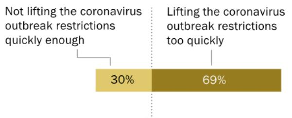
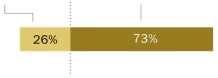

FOR RELEASE AUGUST 6, 2020

# Most Americans Say State Governments Have Lifted COVID-19 Restrictions Too Quickly

More attribute the rise in coronavirus cases to new infections, not just more testing

FOR MEDIA OR OTHER INQUIRIES:

Carroll Doherty, Director of Political Research

Nida Asheer, Communications Manager

Calvin Jordan, Communications Associate

202.419.4372

www.pewresearch.org

RECOMMENDED CITATION

Pew Research Center, August, 2020, “Most Americans Say State Governments Have Lifted COVID-19 Restrictions Too Quickly”

## About Pew Research Center

Pew Research Center is a nonpartisan fact tank that informs the public about the issues, attitudes and trends shaping the world. It does not take policy positions. The Center conducts public opinion polling, demographic research, content analysis and other data-driven social science research. It studies U.S. politics and policy; journalism and media; internet, science and technology; religion and public life; Hispanic trends; global attitudes and trends; and U.S. social and demographic trends. All of the Center’s reports are available at www.pewresearch.org. Pew Research Center is a subsidiary of The Pew Charitable Trusts, its primary funder.

© Pew Research Center 2020

## How we did this

Pew Research Center conducted this study to understand how Americans are continuing to respond to the coronavirus outbreak. For this analysis, we surveyed 11,001 U.S. adults in July and August 2020. Everyone who took part is a member of Pew Research Center’s American Trends Panel (ATP), an online survey panel that is recruited through national, random sampling of residential addresses. This way nearly all U.S. adults have a chance of selection. The survey is weighted to be representative of the U.S. adult population by gender, race, ethnicity, partisan affiliation, education and other categories. Read more about the ATP’s methodology. Here are the questions used for the report, along with responses, and its methodology.

### Full Page Description (Page 3)

**Source:** `assets/_page_3_Asset_0.jpg`

**Generated:** 2026-05-30 14:00:59

---

The image is a pie chart with three segments, each representing a different category of effectiveness. The categories are "About as effective," "More effective," and "Less effective." The percentages for each category are as follows: "About as effective" at 25%, "More effective" at 13%, and "Less effective" at 62%. The chart visually represents the distribution of effectiveness, with the largest portion being "Less effective."

# Most Americans Say State Governments Have Lifted COVID-19 Restrictions Too Quickly

More attribute the rise in coronavirus cases to new infections, not just more testing

As a growing number of states grapple with a rise in coronavirus cases, a sizable majority of U.S. adults (69%) say their greater concern is that state governments have been lifting restrictions on public activity too quickly. Fewer than half as many, just 30%, say their bigger concern is that states have been too slow to lift the restrictions.

These views are similar to attitudes in April and May, when the question asked whether the greater concern was whether state governments would lift coronavirus-related restrictions too quickly or not quickly enough. In May, 68% said their bigger concern was that state governments would ease restrictions too quickly.

With the U.S. economy reeling from the impact of the coronavirus, nearly three-quarters of Americans (73%) say the more effective way to help the economy recover is by significantly reducing the number of infections, so that more people feel comfortable going to stores, restaurants, schools and other workplaces. Only about a quarter (26%) say the more effective path to recovery is to reopen businesses and schools even if there hasn’t been a significant decline in infections. (For more, see “Republicans, Democrats differ over factors K-12 schools should consider in deciding whether to reopen”)

## Large share of Americans say COVID-19 restrictions have been lifted too quickly % who say …

Greater concern is that state governments have ben..

> **AI Description:**
> **Source:** `assets/_page_3_Figure_0.jpg`
> 
> **Generated:** 2026-05-30 14:01:51
> 
> ---
> 
> The image contains a bar chart with two segments. The chart compares two scenarios related to the coronavirus outbreak restrictions: "Not lifting the coronavirus outbreak restrictions quickly enough" and "Lifting the coronavirus outbreak restrictions too quickly." The segment labeled "Not lifting the coronavirus outbreak restrictions quickly enough" is colored yellow and represents 30% of the total. The segment labeled "Lifting the coronavirus outbreak restrictions too quickly" is colored brown and represents 69% of the total. The chart visually represents the percentage of people who believe each scenario is more concerning.

More effective way to help the U.S.economy recover is.

Opening up more stores, restaurants,schools and other workplaces,even if there hasn't been a significant reduction in coronavirus infections

> **AI Description:**
> **Source:** `assets/_page_3_Figure_1.jpg`
> 
> **Generated:** 2026-05-30 14:01:56
> 
> ---
> 
> The image contains a horizontal bar chart with two segments. The left segment is yellow and labeled "26%", while the right segment is brown and labeled "73%". The chart visually represents a comparison between two categories, with the brown segment occupying a larger portion of the bar, indicating a higher percentage. The chart is simple and uses contrasting colors to differentiate between the two values.

Compared with other wealthy countries, U.S.response to the coronavirus outbreak has been..

## PEW RESEARCH CENTER

### Full Page Description (Page 4)

**Source:** `assets/_page_4_Asset_0.jpg`

**Generated:** 2026-05-30 13:59:29

---

The image is a bar chart with a horizontal layout, presenting survey data on public perceptions of various entities related to health and politics. The chart categorizes responses into four levels: Poor, Only fair, Good, and Excellent, with percentages for each category. The entities evaluated include "Hospitals and medical centers in your area," "Public health officials such as those at the CDC," "Your local elected officials," "Your state elected officials," and "Donald Trump." The chart also includes a "NET" (Net) score for each entity, calculated as the difference between the percentage of "Good" and "Excellent" responses minus the percentage of "Poor" and "Only fair" responses. The data shows that hospitals and medical centers have the highest "NET" score of 88, followed by public health officials at 63, local elected officials at 60, and state elected officials at 56. Donald Trump has the lowest "NET" score of 37.

The new national survey by Pew Research Center, conducted July 27-Aug. 2 among 11,001 adults on the Center’s American Trends Panel, finds broadly negative assessments of the overall U.S. response to the coronavirus outbreak – and increasingly critical evaluations of how Donald Trump, state and local government officials and public health officials have dealt with the crisis.

About six-in-ten Americans (62%) say the U.S. response to the coronavirus outbreak has been less effective when compared with other wealthy countries, while just 13% say its response has been more effective. A quarter say the U.S. has been about as effective as other wealthy countries.

Republicans and Democrats have divergent opinions about nearly all aspects of the coronavirus outbreak, and this includes views of the U.S. response compared with other affluent nations. Still, while more Republicans than Democrats offer positive assessments of the U.S. response, just 22% of Republicans and Republican-leaning independents say the U.S. has been more effective than other wealthy countries; a larger share (34%) say it has been less effective, while 42% say it has been about as effective. Democrats and Democratic leaners overwhelmingly view the U.S. response to the coronavirus as less effective compared with other wealthy countries (87% say this).

Trump’s positive ratings for dealing with the coronavirus have fallen since the early weeks of the outbreak in March. Currently, 37% say he is doing an excellent or good job in responding to the coronavirus outbreak, while 63% say he is doing only a fair or poor job.

These views have changed only modestly since May, when 41% gave him positive ratings, but the share saying he is doing an excellent or good job with the coronavirus has declined 11 percentage

Majority of Americans are critical of Trump’s response to COVID-19; nearly half say he is doing ‘poor’ job

% who rate the job each of the following is doing responding to the coronavirus outbreak as …

points, from 48%, since late March. Nearly half of Americans (48%) currently rate Trump’s response to the outbreak as “poor,” up 16 points since March.

### Full Page Description (Page 5)

**Source:** `assets/_page_5_Asset_0.jpg`

**Generated:** 2026-05-30 14:01:41

---

The image contains a chart with two main sections, each divided into two segments representing different perspectives on the increase in testing and new infections. The chart is divided into three categories: Total, Rep/Lean Rep, and Dem/Lean Dem. Each segment is color-coded, with light brown representing "More people are being tested than in previous months" and dark brown representing "There are more new infections, not just more tests." The percentages for each category are provided, showing a higher percentage of people in the "Dem/Lean Dem" category believing there are more new infections compared to those in the "Rep/Lean Rep" category.

Positive views of the performance of public health officials also have declined significantly: 63% now say public health officials, such as those with the Centers for Disease Control and Prevention, are doing an excellent or good job in responding to the coronavirus outbreak, down from 79% in March.

This shift has come almost entirely among Republicans; only about half of Republicans (53%) give CDC officials and other public health officials positive ratings for their response to the outbreak, 31 points lower than in late March (84%). About seven-in-ten Democrats (72%) say public health officials have done an excellent or good job in responding to the coronavirus, little changed since March (74%).

Positive evaluations of how state (from 70% to 56%) and local government officials (from 69% to 60%) are responding to the coronavirus outbreak have also declined since March. However, the public continues to express overwhelmingly positive views of the response of local hospital and medical centers (88% rate them as excellent or good), which are unchanged over the past few months.

The survey finds that a majority of Americans (60%) say the primary reason that the number of confirmed coronavirus cases is increasing is because there are more new infections, not just more testing for the disease. About four-in-ten (39%) say cases are rising primarily because more people are being tested than in previous months.

Democrats overwhelmingly attribute the rise in coronavirus cases primarily to more infections, not just more testing (80% say this). A smaller majority of Republicans (62%) say the primary reason is because more people are being tested.

Majority says COVID-19 cases have risen primarily because of more new infections, not just more testing

% who say the primary reason there are increasing numbers of confirmed cases of coronavirus in the U.S. is that …

PEW RESEARCH CENTER

### Full Page Description (Page 6)

**Source:** `assets/_page_6_Asset_0.jpg`

**Generated:** 2026-05-30 14:00:46

---

The image is a chart that presents data on the perceived importance of federal and state/local governments by political affiliation. It is a segmented bar chart with two main sections: "The federal government" and "State and local governments." The chart is divided into three groups: "Total," "Rep/Lean Rep," and "Dem/Lean Dem." The percentages for each group are as follows:

- Total: 48% for the federal government and 51% for state and local governments.
- Rep/Lean Rep: 30% for the federal government and 68% for state and local governments.
- Dem/Lean Dem: 64% for the federal government and 35% for state and local governments.

The chart visually represents the higher importance attributed to state and local governments by Democrats and those who lean Democratic compared to Republicans and those who lean Republican.

While most Americans express concern that states have been too quick to lift COVID-19 restrictions, three-quarters say a major reason the coronavirus outbreak has continued is that too few people are abiding by guidelines about social distancing and mask-wearing. A smaller majority (58%) says that lifting restrictions too quickly in some places is a major reason for the continued outbreak.

About half of Americans (53%) say an inadequate response by the federal government is a major reason the outbreak has continued, while nearly as many (49%) cite a lack of timely testing. Smaller shares point to unclear instructions about how to prevent the spread of the coronavirus (40%) and that it is not possible to do much to control its spread (28%) as major reasons.

Democrats are more likely than Republicans to say most of these factors are major reasons the outbreak has continued. The widest partisan differences are on whether the federal government response is inadequate – 82% of Democrats view this as a major reason the outbreak has continued, compared with 21% of Republicans – and lifting COVID-19 restrictions too quickly (82% of Democrats, 31% of Republicans).

Republicans and Democrats also have very different attitudes on a fundamental issue related to the nation’s efforts to address the coronavirus the nation's efforts to address the coronavirus

outbreak: whether the federal government or state and local governments are primarily responsible for developing and executing policies to limit the spread of the disease.

The public overall is almost evenly divided: 51% say this responsibility rests mostly with states, while 48% say the federal government should be primarily responsible. Partisans express contrasting views: While 68% of Republicans say state and local governments should be primarily responsible for developing and implementing policies to limit the spread of the coronavirus, 64% of Democrats say the federal government bears most of the responsibility.

Public divided over which level of government is primarily responsible for policies to limit the spread of COVID-19

Which should be mainly responsible for developing and executing policies to limit the spread of the coronavirus? (%)

PEW RESEARCH CENTER

### Full Page Description (Page 7)

**Source:** `assets/_page_7_Asset_0.jpg`

**Generated:** 2026-05-30 13:58:10

---

The image is a bar chart with a legend indicating the categories "Major reason," "Minor reason," and "NOT a reason." The chart lists various factors related to the spread of a pandemic, such as "Not enough people social distancing and mask-wearing," "Restrictions have been lifted too quickly in some places," "Inadequate response from the federal government," "Not enough timely testing," "Unclear instructions about how to prevent the spread," and "It is not possible to do much to control the spread." Each factor is represented by a horizontal bar divided into three segments, corresponding to the three categories. The percentages for each category are provided for each factor. The chart visually represents the relative importance of each factor as perceived by respondents.

## 1. Public assessments of the U.S. coronavirus outbreak

Three-quarters of Americans say that “not enough people following social distancing and maskwearing guidelines” is a major reason the coronavirus outbreak has continued in the United States – the most commonly cited - the most commonly cited

major reason among the six asked about in the survey. Roughly six-in-ten (58%) also say a major reason for the continued spread is that “restrictions on businesses and individuals have been lifted too quickly in some places.”

About half of Americans (53%) say an inadequate federal government response is a major reason for the continuation of the outbreak, while nearly as many (49%) point to a lack of timely testing. Four-in-ten say a lack of clarity in instructions for how to prevent the spread is a major reason it has continued. Just 28% of Americans say a major reason is that it is “not

Most Americans cite insufficient social distancing as a major reason COVID-19 outbreak has continued

How much of a reason, if at all, is each for why the coronavirus outbreak in the U.S. has continued? (%)

possible to do much to control the spread.”

### Full Page Description (Page 8)

**Source:** `assets/_page_8_Asset_0.jpg`

**Generated:** 2026-05-30 14:00:19

---

The image is a horizontal bar chart with data presented in percentages for two groups: Republicans/Lean Republicans (Rep/Lean Rep) and Democrats/Lean Democrats (Dem/Lean Dem). The chart compares responses to six statements regarding the handling of the pandemic. The statements include: "Not enough people social distancing and mask-wearing," "Restrictions have been lifted too quickly in some places," "Inadequate response from the federal government," "Not enough timely testing," "Unclear instructions about how to prevent the spread," and "It is not possible to do much to control the spread." Each statement has a corresponding bar for each group, with the percentage values marked on the bars. The chart also includes a total column for each statement, indicating the combined percentage of both groups. The chart visually compares the responses of Republicans/Lean Republicans and Democrats/Lean Democrats to these statements, highlighting the differences in their perspectives on the pandemic's management.

About nine-in-ten Democrats and Democratic-leaning independents say insufficient adherence to socialdistancing and mask-wearing guidelines is a major reason for the continued coronavirus outbreak. This reason also tops the list among Republicans and GOP leaners of the six asked about in the survey, though a narrower majority (57%) considers this a major reason for the continued spread of the virus.

The partisan gap is widest on two other reasons: 82% of Democrats point to some places being too quick to ease restrictions as a major reason for the outbreak continuing, while just 31% of Republicans say this (about the same share of Republicans – 32% – say this is not at all a reason for the continuation of the outbreak). And while 82% of

## Majorities of both partisan coalitions say ‘not enough’ social distancing a major reason outbreak continues

% who say each is a major reason why the coronavirus outbreak in the U.S. has continued

Democrats say an inadequate federal response is why COVID-19 has continued in the U.S., just 21% of Republicans say this (with nearly half – 45% – saying this is not a reason).

Two-thirds of Democrats also say “not enough timely testing” is a major reason for the coronavirus outbreak continuing in the U.S., while fewer than half as many Republicans (30%) say the same.

Republicans are more likely than Democrats to say a major reason for the outbreak continuing is that it isn’t possible to do much to control the spread; still, just 35% of Republicans and 20% of Democrats say this.

In a separate survey conducted earlier this summer, Republicans were more likely than Democrats to say the Chinese government’s initial handling of the outbreak was to blame “a great deal” for the global spread of the coronavirus (73% vs. 38%), though wide majorities in both parties (90% of Republicans, 74% of Democrats) said this.

### Full Page Description (Page 9)

**Source:** `assets/_page_9_Asset_0.jpg`

**Generated:** 2026-05-30 14:01:31

---

The image is a bar chart that presents survey data on public perception regarding the increase in testing and new infections during the pandemic. The chart is divided into two main categories: "More people are being tested than in previous months" and "There are more new infections, not just more tests." The data is further segmented by political affiliation, with categories for Total, Republican/Lean Republican, Conservative, Moderate/Liberal, Democratic/Lean Democratic, Conservative/Mod, and Liberal.

Key observations from the chart include:
- A higher percentage of respondents believe there are more new infections than just more tests, with the highest belief among Liberals at 90%.
- The lowest belief in more new infections is among Conservatives at 30%.
- There is a noticeable difference in perception between Republicans and Democrats, with a higher percentage of Republicans believing more people are being tested than in previous months (62%) compared to Democrats (19%).

The chart effectively uses color coding to distinguish between the two main categories and provides a clear visual representation of the survey results across different political affiliations.

## Partisan divide over primary reason for rise in confirmed COVID-19 cases

By 60% to 39%, most Americans attribute the rise in confirmed coronavirus cases more to rising infections than to a rise in testing, with a wide partisan divide in these views.

A 62% majority of Republicans say that “the increase in confirmed coronavirus cases is primarily a result of more people being tested than in previous months,” with 36% taking the view that “while more people are being tested compared with earlier in the outbreak, the increase in confirmed coronavirus cases is primarily because of more new infections, not just more tests.” About two-thirds of conservative Republicans attribute the growth in confirmed cases mostly to increased testing, while views among moderate and liberal Republicans are more divided (53% say it is mostly because of increased testing, 45% mostly because of increased infections).

By contrast, Democrats overwhelmingly hold the view that increased case counts are mainly the result of increased infections – 80% say this. Although this is the clear majority view across the party, liberal Democrats are more likely than conservative and moderate Democrats to say this (90% vs. 73%).

Roughly two-thirds of conservative Republicans say more testing is primary reason for rise in coronavirus cases

% who say the primary reason there are increasing numbers of confirmed cases of coronavirus in the U.S. is that …

## PEW RESEARCH CENTER

### Full Page Description (Page 10)

**Source:** `assets/_page_10_Asset_0.jpg`

**Generated:** 2026-05-30 13:59:03

---

The image contains a bar chart with data presented in percentages. The chart compares two categories: "Not lifted quickly enough" and "Lifted too quickly," across various demographic groups and political affiliations. Key demographic groups include race (White, Black, Hispanic), age (Ages 18-29, 30-49, 50-64, 65+), education level (Postgrad, College grad, Some college, HS or less), and political affiliation (Rep/Lean Rep, Conserv, Mod/Lib, Dem/Lean Dem, Cons/Mod, Liberal). The percentages for each group are visually represented by the length of the bars, with the "Not lifted quickly enough" category on the left and the "Lifted too quickly" category on the right. Notable trends include higher percentages of those who feel the lifting was too quick among Black and Hispanic individuals, and lower percentages among those with higher education levels and those identifying as Liberal.

# Public more concerned COVID-19 restrictions on public activity are being eased too quickly rather than too slowly

With most states having eased restrictions since the early months of the outbreak, nearly seven-inten Americans (69%) say they are more concerned that state governments have been lifting

restrictions on public activity too quickly; 30% express more concerns that these restrictions have not been lifted quickly enough. This balance of opinion is similar to the public’s concerns in May, when many states were still under stay-at-home orders, about what states would do.

While majorities in most groups say they are concerned that states have been opening up too quickly, there are differences by race and ethnicity, educational status, and partisan affiliation.

About eight-in-ten Black adults (84%) and seven-in-ten Hispanic adults (72%) are more concerned states have been lifting restrictions too quickly. A narrower majority of white adults – still nearly two-thirds (65%) – also express this view.

Overall, adults with higher levels of education are more likely than those with less education to say they are concerned about state

Majority of Americans concerned states have been lifting restrictions on public activity too quickly

% who say their greater concern is that restrictions on public activity imposed by state governments in response to the virus have been …

## PEW RESEARCH CENTER

Notes: White and Black adults include those who report being one race and are not Hispanic. Hispanics are of any race. No answer not shown. Source: Survey of U.S. adults conducted July 27-Aug. 2, 2020

governments lifting restrictions too quickly. For example, 78% of adults with a postgraduate degree say they are concerned restrictions are being eased too quickly, compared with 64% adults with a high school diploma or less education.

Republicans are relatively divided on this question, though somewhat more say their greater concern is that restrictions have not been lifted quickly enough (53%) rather than that they have been lifted too quickly (45%). While six-in-ten conservative Republicans say their concern is that state restrictions are not being lifted quickly enough, a similar share of moderate and liberal Republicans (57%) express more concern that restrictions have been lifted too quickly.

Overwhelming shares of both liberal Democrats (93%) and conservative and moderate Democrats (88%) say they are more concerned that state restrictions on public activity have been lifted too quickly.

### Full Page Description (Page 12)

**Source:** `assets/_page_12_Asset_0.jpg`

**Generated:** 2026-05-30 14:02:09

---

The image contains a bar chart with data presented in a tabular format. The chart categorizes respondents into different political affiliations and their views on a particular topic, represented by two categories: "Agree" and "Disagree." The key information includes the total number of respondents and the percentage of each group that agrees or disagrees with the topic. The chart breaks down the data into four main categories: Total, Republican/Lean Republican, Conservative, and Moderate/Liberal, and further into Democratic/Lean Democratic, Conservative/Mod, and Liberal. The percentages for each group are visually represented by the length of the bars, with the "Agree" category shown in a darker shade.

## What is the most effective way to an economic recovery?

Nearly three-quarters of Americans think that the most effective way to fix the U.S. economy is by reducing coronavirus infections to a level where people feel comfortable returning to stores, schools, restaurants and other workplaces. About a quarter (26%) say the more effective path to economic recovery is by opening up more of these workplaces and businesses even if infections have not yet been reduced.

Democrats overwhelmingly say that the best way for the economy to recover is to reduce the number of coronavirus infections so that the public feels comfortable going to businesses (94% say this).

GOP views are divided: 50% say the more effective path to recovery is by opening up more businesses and workplaces even if infections haven’t been reduced, while about as many (49%) say reducing cases so people feel comfortable going to these places is the more effective path.

About two-thirds of moderate and liberal Republicans (65%) say that reducing coronavirus cases to the point where people are comfortable engaging in inperson work and other economic activity is the more effective path to U.S. economic

Most say path to economic recovery is through reduction in coronavirus infections

% who say the more effective way to help the U.S. economy recover is …

Opening up more stores, Significantly reducing schools and other worplaces, coronavirus infections to even if there hasn't been a level where more feel signficant reduction in comfortable going to stores, coronavirus infections schools and other workplaces

recovery. By contrast, six-in-ten conservative Republicans say opening up businesses and other workplaces, even if there hasn’t been a reduction in coronavirus infections, is the most effective way to economic recovery.

### Full Page Description (Page 13)

**Source:** `assets/_page_13_Asset_0.jpg`

**Generated:** 2026-05-30 13:59:15

---

The image is a bar chart with three horizontal bars representing different categories: "Total," "Rep/Lean Rep," and "Dem/Lean Dem." The chart is divided into three segments labeled "Less," "About as," and "More," with corresponding percentages for each category. The percentages for the "Total" category are 62% for "Less," 25% for "About as," and 13% for "More." For "Rep/Lean Rep," the percentages are 34% for "Less," 42% for "About as," and 22% for "More." For "Dem/Lean Dem," the percentages are 87% for "Less," 8% for "About as," and 4% for "More." The chart visually represents the distribution of responses across the three categories, highlighting the dominance of the "Less" category in the "Dem/Lean Dem" group.

## Public gives the country's handling of the pandemic negative marks

A majority of Americans say the nation’s response to the pandemic compares poorly to how other affluent countries have responded: 62% say the U.S. has been less effective than other wealthy

countries in responding to the coronavirus outbreak, a quarter say the U.S. response has been about as effective as these other nations and just 13% of Americans say the U.S. response has been more effective than that of other wealthy countries.

Democrats overwhelmingly say the U.S. has lagged behind other wealthy countries in its response, with 87% saying the nation’s response has been less effective.

Only about a third of Republicans (34%) say the U.S. response has been a less effective than that of other wealthy countries, with a plurality of Republicans saying that the nation’s response has been about as effective as these other

Americans say U.S. handling of COVID-19 has trailed other wealthy nations

% who say the U.S. response to the coronavirus outbreak, compared with other wealthy countries, has been \_\_ effective

countries. About a quarter of Republicans

(22%) say the U.S. response has been more effective than that of other wealthy nations.

CORRECTION (Aug. 6, 2020): In the chart “Americans say U.S. handling of COVID-19 has trailed other wealthy nations,” the “Rep/Lean Rep” column has been edited to correct the “% who say the U.S. response to the coronavirus outbreak, compared with other wealthy countries, has been more effective” to 22%. The following sentence was also updated to reflect this, “About a quarter of Republicans (22%) say the U.S. response has been more effective than that of other wealthy nations.” The changes did not affect the report’s substantive findings.

### Full Page Description (Page 14)

**Source:** `assets/_page_14_Asset_1.jpg`

**Generated:** 2026-05-30 14:01:16

---

The image contains a horizontal bar chart with two sets of data points, one for "Rep/Lean Rep" and the other for "Dem/Lean Dem". The chart displays percentages for each group, with the "Rep/Lean Rep" data points at 40 and 37, and the "Dem/Lean Dem" data points at 77, 84, 78, and 82. The chart uses red and blue colors to differentiate between the two groups. The horizontal axis ranges from 0 to 100, indicating the percentage scale. The chart visually compares the distribution of percentages between the two groups, showing a higher concentration of "Dem/Lean Dem" percentages compared to "Rep/Lean Rep".

### Full Page Description (Page 14)

**Source:** `assets/_page_14_Asset_0.jpg`

**Generated:** 2026-05-30 14:01:07

---

The image contains a bar chart with two sets of data points, representing Republican/Lean Republican (Rep/Lean Rep) and Democratic/Lean Democratic (Dem/Lean Dem) percentages for two different categories, labeled as "S" and "S". The chart uses red and blue bars to represent the percentages for each group. The percentages for "S" are 53% for Rep/Lean Rep and 94% for Dem/Lean Dem, while for "S" they are 51% for Rep/Lean Rep and 92% for Dem/Lean Dem. The chart visually compares the relative sizes of these percentages for each group across the two categories.

## Partisan divides on COVID-19 attitudes far greater than differences linked to local health impact

As has been the case throughout the coronavirus outbreak, partisan divides in opinions about the pandemic and policies to address it continue to be far wider than the differences in opinion between those who live in the places of the country where the health impacts have been higher and those who live in places that have seen less of an impact.

For instance, Republicans and Republican leaners living in places that have relatively low death rates and have not seen new deaths rise in recent months are 10 percentage points less likely than Republicans who live in other parts of the country to say that the most effective way forward for the nation’s economy is to reduce infection rates so that people feel comfortable going to stores,

restaurants, schools and other workplaces (42% compared with 52%). This geographic difference is far more modest than the differences between Republicans and Democrats in those same areas.

Similarly, when asked about whether the recent increases in reported cases of the coronavirus is mainly the result of growing infections or an increase in testing, Republicans living in these less hard-hit parts of the country are slightly less likely than those living in other areas to say that the increase in cases is due to more infections rather than just more testing (30% compared with 39%). But again, these small

Partisan differences swamp geographic differences on attitudes about the coronavirus outbreak

% who say …

Significantly reducing coronavirus infections to level where more feel comfortable going to stores,schools and other workplaces is the more effective way to help the U.S.economy recover

The primary reason confirmed coronavirus cases have increased is more new infections, not just more tests

Among those living in counties where deaths resulting from COVID-19 have been..

Higher, most within last 8 weeks

Higher, most 8+ weeks ago

Lower, most within last 8 weeks

Lower, most 8+ weeks ago

geographic differences are overshadowed by partisan differences – at least three-quarters of Democrats, regardless of the COVID-19 impact in their area – attribute the rise in confirmed cases more to rising infections.

### Full Page Description (Page 15)

**Source:** `assets/_page_15_Asset_0.jpg`

**Generated:** 2026-05-30 13:57:56

---

The image is a bar chart with data points representing survey responses from two groups: Democrats/Lean Democrats (blue) and Republicans/Lean Republicans (red). The chart compares the trust levels in various entities related to health and politics. The entities listed are:

1. Hospitals and medical centers in your area
2. Public health officials such as those at the CDC
3. Your local elected officials
4. Your state elected officials
5. Donald Trump

The chart shows that in general, both groups trust hospitals and medical centers the most, followed by local and state elected officials. Trust in public health officials is higher among Democrats, while trust in Donald Trump is significantly higher among Republicans.

## 2. Views of COVID-19 response by Trump, hospitals, CDC and other officials

Majorities of the public say hospitals in their area, public health officials and state and local government officials are doing an excellent or good job in responding to the coronavirus outbreak. However, positive assessments of the performance of public health officials and state and local government officials have declined since March.

In addition, Donald Trump gets lower ratings for his response to the outbreak than he did in March. Trump’s overall job approval also is lower than in March, though it is effectively unchanged since June.

A large majority of Americans (88%) – and similarly high shares of Republicans and Democrats alike – say hospitals and medical centers in their area are doing an excellent or good job in responding to the coronavirus outbreak.

There are much wider partisan differences in views of how public health officials, such as those with the CDC, are responding to the outbreak. Currently, 72% of Democrats and those who lean to the party say public health officials are doing well in

Positive views of hospitals’ response to COVID-19 cross party lines; wider differences on other officials, Trump

% who rate \_\_ as doing an excellent/good job responding to the coronavirus outbreak

responding to the coronavirus, compared with about half of Republicans and Republican leaners (53%).

Democrats also are more likely than Republicans to give positive ratings to their state and local government officials for how they have responded to the coronavirus outbreak.

### Full Page Description (Page 16)

**Source:** `assets/_page_16_Asset_3.jpg`

**Generated:** 2026-05-30 13:59:38

---

The image is a line graph with three lines representing data for Donald Trump over time, from March to August. The graph includes the following key information:

- The red line represents the number 83 in March, which decreases to 77 in May and further to 73 in August.
- The gray line starts at 48 in March, decreases to 41 in May, and then to 37 in August.
- The blue line begins at 18 in March, drops to 11 in May, and continues to decrease to 6 in August.

The graph shows a general downward trend for all three lines over the period from March to August.

### Full Page Description (Page 16)

**Source:** `assets/_page_16_Asset_2.jpg`

**Generated:** 2026-05-30 13:59:45

---

The image is a line graph titled "Your state elected officials." It displays data over time, from March to August, with four lines representing different categories or groups. The lines show a general downward trend, with values decreasing from 72 in March to 51 in August. The graph includes numerical values at key points, such as 72 in March, 64 in May, and 51 in August. The lines are color-coded, with distinct colors for each category, and the x-axis represents months, while the y-axis represents numerical values.

### Full Page Description (Page 16)

**Source:** `assets/_page_16_Asset_1.jpg`

**Generated:** 2026-05-30 14:00:00

---

The image contains a line graph with data points for the months of March through August. The graph shows two lines, one in red and one in blue, with corresponding values for each month. The red line starts at 73 in March and decreases to 58 in August, while the blue line starts at 69 and decreases to 60. The values for each month are labeled on the graph, and the x-axis represents the months from March to August. The graph appears to illustrate a trend of decreasing values over the six-month period.

### Full Page Description (Page 16)

**Source:** `assets/_page_16_Asset_0.jpg`

**Generated:** 2026-05-30 13:59:53

---

The image is a line graph showing the percentage of respondents who lean towards the Democratic Party (Dem/Lean Dem) and the Republican Party (Rep/Lean Rep) over time. The graph includes a total line representing the combined percentage of all respondents. The data is plotted from March to August. The Democratic Party's support shows a slight decline from 84% in March to 72% in August. The Republican Party's support shows a more significant decline from 79% in March to 53% in August. The total percentage of respondents who lean towards either party remains relatively stable around 72%.

Ratings of Trump’s response to the coronavirus are deeply divided by partisanship. Nearly threequarters of Republicans (73%) say Trump is doing an excellent (33%) or good job (41%) in responding to the outbreak. Just 6% of Democrats say he is doing an excellent or good job; more than nine in-ten Democrats (94%) say Trump is doing only a fair (11%) or poor job (82%).

Trump’s rating from the U.S. public overall for his response to the coronavirus has declined 11

percentage points since March, from 48% to 37%. The declines have been comparable among Republicans and Democrats.

The share of Democrats who rate Trump’s response as “poor” has risen steeply since then. In March, 56% of Democrats said Trump’s response to the coronavirus was poor; today, 82% do so.

The public also is less positive about how public health officials are responding to the coronavirus, with virtually all of the decline in positive assessments coming among Republicans.

The share of the public that says public health officials such as those at the CDC are doing an excellent or good job

## Sharp decline in share of Republicans who say public health officials are doing well in handling coronavirus

% who rate \_\_ as doing an excellent/good job responding to the coronavirus outbreak

Public health officials such as those at the CDC

Your local elected officials

has decreased 16 percentage points since March (from 79% to 63% today).

Since then, the share of Republicans who rate public health officials positively has fallen 31 points, from 84% to 53%. Democrats’ views are largely unchanged over that time period (74% in March, 72% today).

Positive assessments of how state government officials and local government officials are responding to the outbreak also have slipped since March, by 14 points and 9 points, respectively. The declines in approval of state and local officials have been steeper among Republicans than among Democrats.

By contrast, the public’s views of local hospitals and medical centers’ response to the outbreak are unchanged since May, when 88% said they were doing an excellent or good job (this question was not asked in March).

### Full Page Description (Page 18)

**Source:** `assets/_page_18_Asset_0.jpg`

**Generated:** 2026-05-30 14:00:34

---

The image is a line graph with two lines representing "Approve" and "Disapprove" over time. The x-axis represents time in years, and the y-axis represents the percentage of people who approve or disapprove. The "Approve" line shows a general upward trend, starting at 44% in the first year and ending at 45% in the last year. The "Disapprove" line shows a fluctuating downward trend, starting at 56% and ending at 59%. The graph highlights the changing public sentiment over the years, with approval increasing and disapproval decreasing.

### Full Page Description (Page 18)

**Source:** `assets/_page_18_Asset_1.jpg`

**Generated:** 2026-05-30 14:00:52

---

The image is a line graph with data points representing the percentage of respondents who identify as Republican or lean Republican. The x-axis is labeled "Rep/Lean Rep," and the y-axis represents the percentage values. The graph shows fluctuations in the percentage over time, with a general downward trend from 84% to 77%. Notable peaks include 85% and 84%, while the lowest point is 74%. The data points are connected by a red line, and the percentages are marked at each data point.

### Full Page Description (Page 18)

**Source:** `assets/_page_18_Asset_2.jpg`

**Generated:** 2026-05-30 14:00:26

---

The image is a line graph titled "Dem/Lean Dem." It displays data from 2017 to 2020, showing the number of individuals who identify as Democrats or lean Democratic. The graph indicates a fluctuating trend, with the highest number of 12 in 2020 and the lowest of 5 in 2021. The data points are marked with circles, and the line connecting them shows the general direction of change over the years.

## Trump approval lower than in March, virtually unchanged since June

Currently, 38% of Americans approve of Donald Trump’s performance as president, while 59% disapprove. Trump’s job rating is virtually unchanged since June (39% approved), though it is lower than in March (45%) or April (44%).

Views of Trump’s job performance continue to be deeply divided along partisan lines. Among Republicans and Republican leaners, 77% currently say they approve of Trump’s performance; only 5% of Democrats and Democratic leaners say the same.

## Trump’s job approval holds steady after declining in June

% who \_\_ of the way Trump is handling his job as president

% who approve of the way Trump is handling his job as president

PEW RESEARCH CENTER

### Full Page Description (Page 19)

**Source:** `assets/_page_19_Asset_0.jpg`

**Generated:** 2026-05-30 13:58:37

---

The image is a bar chart presenting approval and disapproval percentages for a topic across various demographic groups. The chart includes data for total respondents, gender, race/ethnicity, age groups, education levels, and political affiliations. Key trends include higher disapproval among younger age groups, lower approval among Hispanic and Asian respondents, and strong approval among conservative and liberal political affiliations. The chart also highlights a significant gap in approval between college-educated and non-college-educated whites.

In addition, there continue to be substantial differences across demographic and educational groups in views of Trump’s performance.

White non-Hispanic adults are roughly split in their views: 47% say that they approve of Trump’s handling of his job as president, while 50% say they disapprove.

Similar shares of Hispanic (68%) and Asian Americans (72%) say they disapprove of Trump’s performance, while an overwhelming majority of Black adults say the same (88%).

Younger Americans remain much more likely to say they disapprove of Trump’s job performance. Nearly threequarters (73%) of those ages 18 to 29 disapprove of how Trump is handling his job. Adults 65 and older are about as likely to say they approve (47%) as disapprove (48%) of Trump’s job as president.

As has long been the case, Trump draws much higher job approval ratings among white adults who have not completed (33%). (33%).

Race, age, education differences evident in Trump’s job approval

% who \_\_\_ of the way Trump is handling his job as president

PEW RESEARCH CENTER

adults who have not completed college (55% approve) than among those with a four-year degree

## Acknowledgments

This report is a collaborative effort based on the input and analysis of the following individuals:

## Research team

Carroll Doherty, Director, Political Research

Jocelyn Kiley, Associate Director, Political Research

Andrew Daniller, Research Associate

Bradley Jones, Research Associate

Hannah Hartig, Research Associate

Amina Dunn, Research Analyst

Hannah Gilberstadt, Research Assistant

Ted Van Green, Research Assistant

Vianney Gomez, Research Assistant

## Communications and editorial

Nida Asheer, Communications Manager

Calvin Jordan, Communications Associate

David Kent, Senior Copy Editor

## Graphic design and web publishing

Peter Bell, Design Director

Sara Atske, Associate Digital Producer

Carrie Blazina, Associate Digital Producer

## Methodology

Nick Bertoni, Senior Panel Manager

Arnold Lau, Research Analyst

Sono Shah, Computational Social Scientist

## Appendix: Categorization of COvID-19 county health impact

This report uses the number and timing of deaths attributed to COVID-19 in each respondent’s county as a measure of the scale of the health impact of the outbreak for each individual in the survey. These numbers are then adjusted for differences in county population (per 100,000 residents). Counties are categorized as having a higher or lower rate of COVID-19 deaths. In addition to the number of deaths in the county, counties were classified according to when the majority of deaths occurred (either in the past eight weeks or prior to the past eight weeks).

Counties are classified as “higher” if they had more than 25 deaths per 100,000 people as of July 26, 2020. “Lower” counties had 25 or fewer deaths per 100,000 people. Counties that have recorded fewer than five deaths overall since the beginning of the pandemic are classified as “Lower/prior to the past 8 weeks.”

Data for deaths attributed to COVID-19 by county are taken from the 2019 Novel Coronavirus COVID-19 (2019-nCoV) Data Repository maintained at John Hopkins University (downloaded on Aug. 3, 2020). These data are supplemented with data from the New York City Health Department (also downloaded on Aug. 3) to break out the individual boroughs within New York City, which are not reported separately in the Johns Hopkins data. Similarly, data from New York Times coronavirus reporting (also downloaded Aug. 3) is used to separate out Rhode Island counties that are not separately reported by Johns Hopkins.

## Categorization of COVID-19 death rate by county

Counties where COVID-19 has had a impact on county health (as of July 26)

Counties with 25 or fewer deaths per 100,000 residents

Most 8+ weeks ago Most within the last 8 weeks

Counties with more than 25 deaths per 100,000 residents

Most 8+ weeks ago Most within the last 8 weeks

Note: COVID-19 county health impact based on number of deaths per 100,000 people reported in each county as of July 26, 2020. Counties with fewer than five deaths total are included in the “25 or fewer deaths per 100,000/Most 8+ weeks ago” category. Source: John Hopkins University 2019 Novel Coronavirus COVID-19 (2019-nCoV) Data Repository.

PEW RESEARCH CENTER

## Methodology

## The American Trends Panel survey methodology

The American Trends Panel (ATP), created by Pew Research Center, is a nationally representative panel of randomly selected U.S. adults. Panelists participate via self-administered web surveys. Panelists who do not have internet access at home are provided with a tablet and wireless internet connection. Interviews are conducted in both English and Spanish. The panel is being managed by Ipsos.

Data in this report is drawn from the panel wave conducted July 27 to Aug. 2, 2020. A total of

11,001 panelists responded out of 14,407 who were sampled, for a response rate of 76%. This does not include 10 panelists who were removed from the data due to extremely high rates of refusal or straightlining. The cumulative response rate accounting for nonresponse to the recruitment surveys and attrition is 4.2%. The break-off rate among panelists who logged on to the survey and completed at least one item is 1.3%. The margin of sampling

## American Trends Panel recruitment surveys

Note: Approximately once per year, panelists who have not participated in multiple consecutive waves or who did not complete an annual profiling survey are removed from the panel. Panelists also become inactive if they ask to be removed from the panel. PEW RESEARCH CENTER

error for the full sample of 11,001 respondents is plus or minus 1.5 percentage points.

The ATP was created in 2014, with the first cohort of panelists invited to join the panel at the end of a large, national, landline and cellphone random-digit-dial survey that was conducted in both English and Spanish. Two additional recruitments were conducted using the same method in 2015 and 2017, respectively. Across these three surveys, a total of 19,718 adults were invited to join the ATP, of which 9,942 agreed to participate.

In August 2018, the ATP switched from telephone to address-based recruitment. Invitations were sent to a random, address-based sample (ABS) of households selected from the U.S. Postal Service’s Delivery Sequence File. In each household, the adult with the next birthday was asked to go online to complete a survey, at the end of which they were invited to join the panel. For a random half-sample of invitations, households without internet access were instructed to return a postcard. These households were contacted by telephone and sent a tablet if they agreed to participate. A total of 9,396 were invited to join the panel, and 8,778 agreed to join the panel and completed an initial profile survey. The same recruitment procedure was carried out on August 19, 2019, from which a total of 5,900 were invited to join the panel and 4,720 agreed to join the panel and completed an initial profile survey. Of the 23,440 individuals who have ever joined the ATP, 15,406 remained active panelists and continued to receive survey invitations at the time this survey was conducted.

The U.S. Postal Service’s Delivery Sequence File has been estimated to cover as much as 98% of the population, although some studies suggest that the coverage could be in the low 90% range.1 The American Trends Panel never uses breakout routers or chains that direct respondents to additional surveys.

## Weighting

The ATP data was weighted in a multistep process that begins with a base weight incorporating the respondents’ original selection probability. The next step in the weighting uses an iterative technique that aligns the sample to population benchmarks on the dimensions listed in the accompanying table.

Sampling errors and test of statistical significance take into account the effect of weighting.

In addition to sampling error, one should bear in mind that question wording and practical difficulties in conducting surveys can introduce error or bias into the findings of opinion polls.

## PEW RESEARCH CENTER

Note: Estimates from the ACS are based on non-institutionalized adults. Voter registration is calculated using procedures from Hur, Achen (2013) and rescaled to include the total US adult population.

The following table shows the unweighted sample sizes and the error attributable to sampling that would be expected at the 95% level of confidence for different groups in the survey:

Sample sizes and sampling errors for other subgroups are available upon request.

© Pew Research Center, 2020