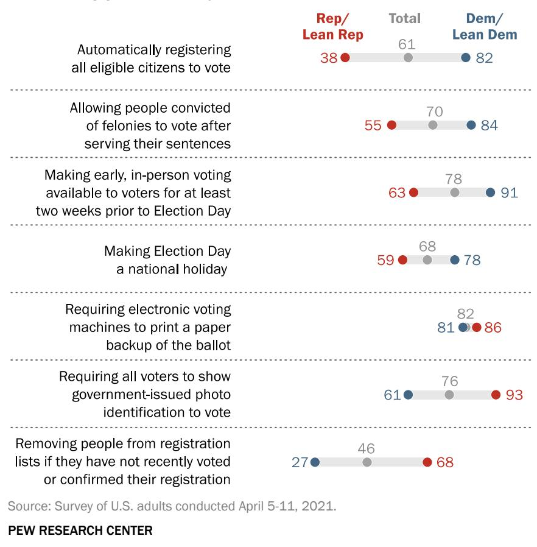
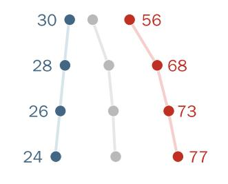
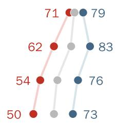

FOR RELEASE April 22 2021

# Republicans and Democrats Move Further Apart in Views of Voting Access

Declining shares of Republicans favor‘no excuse' absentee and early voting, automatically registering all eligible citizens to vote

FOR MEDIA OR OTHER INQUIRIES:

Carroll Doherty, Director of Political Research

Jocelyn Kiley, Associate Director, Research

Nida Asheer, Communications Manager

Calvin Jordan, Communications Associate

202.419.4372

www.pewresearch.org

RECOMMENDED CITATION

Pew Research Center, April, 2021, “Republicans and Democrats Mover Further Apart in Views of Voting Access”

## About Pew Research Center

Pew Research Center is a nonpartisan fact tank that informs the public about the issues, attitudes and trends shaping the world. It does not take policy positions. The Center conducts public opinion polling, demographic research, content analysis and other data-driven social science research. It studies U.S. politics and policy; journalism and media; internet, science and technology; religion and public life; Hispanic trends; global attitudes and trends; and U.S. social and demographic trends. All of the Center’s reports are available at www.pewresearch.org. Pew Research Center is a subsidiary of The Pew Charitable Trusts, its primary funder.

© Pew Research Center 2021

PEW RESEARCH CENTER

## How we did this

Pew Research Center conducted this study to better understand Americans’ views of election and voting policies in the United States, how national trends have changed over time, and how opinions vary by age, race and partisanship. For this analysis, we surveyed 5,109 U.S. adults in April 2021. Everyone who took part in this survey is a member of Pew Research Center’s American Trends Panel (ATP), an online survey panel that is recruited through national, random sampling of residential addresses. This way nearly all U.S. adults have a chance of selection. The survey is weighted to be representative of the U.S. adult population by gender, race, ethnicity, partisan affiliation, education and other categories. Read more about the ATP’s methodology.

Here are the questions used for the report, along with responses, and its methodology.

# Republicans and Democrats Move Further Apart in Views ofVoting Access

Declining shares of Republicans favor ‘no excuse' absentee and early voting, automatically registering all eligible citizens to vote

In the months since the 2020 election, partisan conflicts over election rules and procedures – both at the state and federal levels – have become increasingly contentious.

Among U.S. adults overall, sizable majorities favor several policies aimed at making it easier for citizens to register and vote, as well as a requirement that voters be required to show governmentissued photo identification before voting.

However, there are substantial – and, in some cases, growing – partisan divisions over many of these policies, largely because of changes in opinions among Republicans.

For example, since 2018 there has been a decline in the share of Republicans and Republican-leaning independents who support automatically registering all eligible citizens to vote (38% today vs. 49% in 2018).

## Majorities of Americans favor several policies to ease voting – and a requirement for voters to show photo ID

% who strongly or somewhat favor …

> **AI Description:**
> **Source:** `assets/_page_3_Figure_0.jpg`
> 
> **Generated:** 2026-05-30 14:18:49
> 
> ---
> 
> The image is a horizontal bar chart with data presented in percentages for three categories: Republican/Lean Republican (Rep/Lean Rep), Total, and Democrat/Lean Democrat (Dem/Lean Dem). The chart compares public opinion on various voting-related policies. The policies include automatically registering all eligible citizens to vote, allowing people convicted of felonies to vote after serving their sentences, making early in-person voting available for at least two weeks prior to Election Day, making Election Day a national holiday, requiring electronic voting machines to print a paper backup of the ballot, requiring all voters to show government-issued photo identification to vote, and removing people from registration lists if they have not recently voted or confirmed their registration. The chart shows that Democratic-leaning respondents are more supportive of these policies than Republican-leaning respondents.

In addition, the share of Republicans who say any voter should be allowed to vote early or absentee without a documented reason has fallen 19 percentage points (from 57% to 38%). Democrats and Democratic leaners are far more supportive of automatically registering all eligible citizens to vote (82%) and no-excuse early voting (84%); their views are virtually unchanged in recent years.

### Full Page Description (Page 4)

**Source:** `assets/_page_4_Asset_0.jpg`

**Generated:** 2026-05-30 14:16:44

---

The image contains a bar chart with data visualizations. It presents survey results from three time periods: October 2018, June 2020, and April 2021. The chart compares the opinions of the total population, Republican-leaning voters, and Democratic-leaning voters regarding two voting options: "Any voter should have the option to vote early or absentee without having to document a reason" and "A voter should only be allowed to vote early or absentee if they have a documented reason for not voting in person on Election Day." The chart shows percentages for each option across the three time periods for each group. Notable trends include a slight decline in support for early or absentee voting without a reason among the total population and a consistent high level of support among Democratic-leaning voters for both options.

The new national survey by Pew Research Center, conducted from April 5-11, 2021, among 5,109 adults who are members of the Center’s American Trends Panel, also finds wide partisan differences over removing inactive voters from voting registration lists. A 68% majority of Republicans favor removing people from voting registration lists if they have not recently voted or confirmed their registration, compared with just 27% of Democrats.

Still, several proposals draw majority support from both Republicans and Democrats, including requiring electronic voting machines to print paper ballots as backups and for making early, inperson voting available for at least two weeks prior to Election Day.

Yet, in general, Republicans are far less likely than Democrats to say everything possible should be done to make it easy to vote, according to a survey conducted last month (28% of Republicans vs. 85% Democrats).

When it comes to no-excuse early and absentee voting – a topic that has received widespread attention in recent weeks – Republicans are significantly more likely than Democrats to say that a voter should only be allowed to vote early or absentee if they have a documented reason for doing so (62% vs. 16%). In October 2018, on the eve of that fall’s midterm elections, fewer than half of Republicans (42%)

Since 2018, sharp decline in the share of Republicans favoring ‘no excuse’ early or absentee voting

Which statements comes closer to your own views – even if neither is exactly right? (%)

PEW RESEARCH CENTER

favored requiring voters to have a documented reason for voting early or absentee.

### Full Page Description (Page 5)

**Source:** `assets/_page_5_Asset_1.jpg`

**Generated:** 2026-05-30 14:17:59

---

The image is a line graph with three lines representing data over time. The x-axis represents the time period from October 2018 to April 2021, and the y-axis represents numerical values. The lines are color-coded: red, gray, and blue. The red line starts at 53 in October 2018 and ends at 68 in April 2021, showing a steady increase. The gray line starts at 37 and ends at 46, also showing a slight increase. The blue line starts at 24 and ends at 27, indicating a slight decrease. The graph includes data points at both the beginning and end of the time period for each line.

Republicans’ views of some other election proposals have also changed over this period. A much larger share of Republicans today say they favor removing people from registration lists if they have not recently voted or confirmed their registration than said this in October 2018 (68% today vs. 53% then). And a declining share of Republicans support automatically registering all eligible citizens to vote (38% today vs. 49% in 2018).

Over this period, Democrats’ views have remained much more stable: Fewer than threein-ten (27%) favor removing voters from registration lists if they have not recently voted or confirmed their registration, while a sizable majority (82%) continue to favor automatically registering all eligible citizens to vote.

There has been little change since 2018 in views of requiring all voters to show government-issued photo ID in order to vote. Republicans continue to overwhelmingly support this policy (93%

## Partisan gaps on automatic voter registration and removing inactive voters from rolls grow wider

% who strongly or somewhat favor … Total ● Rep/Lean Rep . Dem/Lean Dem

Requiring all voters to show governmentissued photo identification to vote

Removing people from registration lists if they have not recently voted or confirmed their registration

Automatically registeringall eligible citizens to vote

favor), while it draws support from a smaller majority of Democrats (61%).

# PEW RESEARCH CENTER

## Other findings from the survey

Voters who have recent experience with early or absentee voting more likely to favor no-excuse absentee voting policy. Those who say they voted early or absentee in 2020 are more likely than those who voted in person to favor no-excuse early and absentee voting for all voters. This is particularly the case among Republicans: Just 22% of Republicans who voted in person on Election Day favor this policy, compared with 52% of Republicans who voted early or absentee in the 2020 presidential election.

More approve than disapprove of independent redistricting; many are unsure about issue. More adults approve (49%) than disapprove (13%) of a Democratic proposal to require that commissions with equal numbers of Democrats and Republicans draw congressional district maps, rather than state legislatures; a sizable share of adults (38%) say they are not sure about his proposal. Democrats are more likely than Republicans to favor replacing state legislatures with independent commissions for drawing congressional maps.

## Broad public support for several election-related proposals

Sizable majorities of adults strongly or somewhat favor requiring electronic voting machines to print a paper backup of the ballot (82%), making early, in-person voting available to voters for at least two weeks prior to Election Day (78%), and requiring all voters to show government issued photo identification to vote (76%).

Roughly seven-in-ten Americans also favor allowing people convicted of felonies to vote after serving their sentences (70%) and making Election Day a national holiday (68%).

Though a majority of adults favor automatically registering all eligible citizens to vote (61%), support for this policy is slightly less pronounced compared with the other proposals asked about on the survey.

Americans largely support several election policies, including backup paper ballots, expanded early voting

Note: No answer responses not shown. Source: Survey of U.S. adults conducted April 5-11, 2021.

Removing people from registration lists if they have not recently voted or confirmed their registration is the only item that a majority of the public opposes: 52% say they strongly or somewhat oppose this proposal; a smaller share (46%) expresses support for it.

### Full Page Description (Page 8)

**Source:** `assets/_page_8_Asset_5.jpg`

**Generated:** 2026-05-30 14:16:27

---

The image contains a horizontal bar chart with three segments, each representing a different category. The categories are labeled as follows: the first segment is labeled "36" and "70", the second "20" and "55", and the third "49" and "84". The bars are color-coded: the first is yellow, the second is red, and the third is blue. The chart appears to be comparing two values for each category, with the left side of the bar representing the smaller value and the right side representing the larger value.

### Full Page Description (Page 8)

**Source:** `assets/_page_8_Asset_4.jpg`

**Generated:** 2026-05-30 14:16:20

---

The image contains a horizontal bar chart with three segments, each representing different values. The segments are color-coded: yellow for the first segment, red for the second, and blue for the third. The values for each segment are as follows: the yellow segment has a value of 42 and a total length of 68, the red segment has a value of 29 and a total length of 59, and the blue segment has a value of 53 and a total length of 78. The chart visually represents the proportion of each segment relative to its total length.

### Full Page Description (Page 8)

**Source:** `assets/_page_8_Asset_0.jpg`

**Generated:** 2026-05-30 14:17:05

---

The image is a bar chart with a focus on political affiliation and opinions regarding a specific topic. The chart is divided into three categories: Total, Rep/Lean Rep (Republican/Lean Republican), and Dem/Lean Dem (Democrat/Lean Democrat). Each category is further divided into three subcategories: Strongly, Somewhat, and NET (Net). The colors used are yellow for Strongly, orange for Somewhat, and red for NET. The data shows that the total population has a NET score of 76, with 53% strongly and 23% somewhat in favor. Among Republicans/Lean Republicans, the NET score is 93, with 81% strongly and 12% somewhat in favor. Among Democrats/Lean Democrats, the NET score is 61, with 30% strongly and 31% somewhat in favor. The chart visually represents the distribution of opinions across different political affiliations.

### Full Page Description (Page 8)

**Source:** `assets/_page_8_Asset_2.jpg`

**Generated:** 2026-05-30 14:16:51

---

The image contains a horizontal bar chart with three segments, each representing a different category. The categories are labeled as follows:

1. The first segment is labeled "36" and is colored yellow.
2. The second segment is labeled "14" and is colored red.
3. The third segment is labeled "55" and is colored blue.
4. The fourth segment is labeled "38" and is colored yellow.
5. The fifth segment is labeled "82" and is colored light blue.

The chart appears to be comparing different values across these categories, with the blue and yellow segments having the highest values.

While the public broadly supports six of the seven voting proposals asked about on the survey, there are sizable partisan divides on several policies – including the relative strength of support for many election issues.

Democrats more likely to strongly favor proposals aimed at making it easier to vote; Republicans more likely to strongly support requiring voters to show photo ID

% who favor …

Requiring all voters to show government-issued photo identification to vote

## PEW RESEARCH CENTER

For example, while majorities of Democrats and Republicans say they favor making early, inperson voting available to voters for at least two weeks prior to Election Day, Democrats are more than twice as likely as Republicans to strongly support this measure (65% vs. 26%, respectively).

There is a similar pattern in views when it comes to making Election Day a national holiday (53% of Democrats strongly support this policy compared with 29% of Republicans) and whether people convicted of felonies should be able to vote after serving their sentences (49% of Democrats strongly favor vs. 20% of Republicans).

By contrast, Republicans are considerably more likely than Democrats to strongly favor photo identification requirements for voting (81% strongly favor compared with 30% of Democrats), even as majorities in both partisan groups favor this policy.

### Full Page Description (Page 9)

**Source:** `assets/_page_9_Asset_3.jpg`

**Generated:** 2026-05-30 14:17:31

---

The image contains a line graph with three distinct lines, each representing different data series. The x-axis represents time, with two points labeled "Oct '18" and "Apr '21". The y-axis represents numerical values. The lines are color-coded: red, gray, and blue. The red line starts at 53 and increases to 68, the gray line starts at 37 and decreases to 46, and the blue line starts at 24 and increases to 27. The graph shows the trend of each data series over the two time periods.

### Full Page Description (Page 9)

**Source:** `assets/_page_9_Asset_4.jpg`

**Generated:** 2026-05-30 14:19:07

---

The image is a line graph with the title "Requiring all voters to show government-issued photo identification to vote." The graph displays data over two time periods: October 2018 and April 2021. Three lines represent different percentages: 91%, 76%, and 63%. The 91% line shows a slight increase from October 2018 to April 2021, while the 76% and 63% lines remain constant at their respective values. The graph uses red, gray, and blue lines to differentiate the data points.

### Full Page Description (Page 9)

**Source:** `assets/_page_9_Asset_1.jpg`

**Generated:** 2026-05-30 14:17:24

---

The image contains a line graph with three lines representing different data series. The x-axis represents time, with two points labeled "Oct '18" and "Apr '21". The y-axis represents numerical values. The lines are color-coded: blue, gray, and red. The blue line starts at 71 and ends at 78, the gray line starts at 65 and ends at 68, and the red line starts at 59 and ends at 59. The graph shows the progression of these values over the two time points.

### Full Page Description (Page 9)

**Source:** `assets/_page_9_Asset_5.jpg`

**Generated:** 2026-05-30 14:18:21

---

The image is a line graph showing data points for two different categories over time. The x-axis represents time, with labels for October 2018 and April 2021. The y-axis represents numerical values, ranging from 81 to 87. There are two lines, one in blue and one in red, each with corresponding data points. The blue line starts at 85 in October 2018 and decreases to 82 in April 2021. The red line starts at 87 in October 2018 and decreases to 86 in April 2021. Both lines show a downward trend over the time period.

Over the past few years, there have been some sizable shifts in views of voting policy among Republicans, including in views of automatic voter registration and removing people from registration lists if they have not recently voted or confirmed their registration.

In 2018, about half of Republicans (49%) said they would somewhat or strongly favor automatically registering all eligible citizens to vote. Today, a much smaller share of Republicans say they support this measure (38%). At the same time, the share of Democrats who support automatic voter registration has ticked up slightly – from 78% in 2018 to 82% today.

Republicans’ support for removing people from registration lists if they have not recently voted or confirmed their registration has also shifted considerably since 2018. Then, a small majority of Republicans said they favored this policy (53%). Today, this share is 15 percentage points higher (68%).

There has been comparably less movement on several of the other voting policies asked about on the survey, though Democrats are 7 percentage points more likely to favor making Election Day a national holiday compared with three years ago. Republicans are about as likely to favor this policy today as they were in 2018.

Compared with 2018, Republicans are less supportive of automatic voter registration, more supportive of removing inactive voters from registration lists

% who strongly or somewhat favor … Total ● Rep/Lean Rep Dem/Lean Dem

Automatically registeringall eligible citizens to vote

Making Election Day a national holiday

Allowing people convicted of felonies to vote after serving their sentences

### Full Page Description (Page 10)

**Source:** `assets/_page_10_Asset_1.jpg`

**Generated:** 2026-05-30 14:15:43

---

The image is a line graph with data points representing different age groups (18-34, 35-49, 50-64, 65+) and their corresponding values (63, 59, 53, 47) for a specific metric. The graph includes two lines, one red and one blue, with the red line showing a decreasing trend and the blue line showing an increasing trend. The values are annotated next to the data points, and the age groups are listed on the left side of the graph.

### Full Page Description (Page 10)

**Source:** `assets/_page_10_Asset_0.jpg`

**Generated:** 2026-05-30 14:15:56

---

The image is a chart that visually represents data related to age groups and corresponding values. It is a scatter plot with four age groups on the y-axis: 18-34, 35-49, 50-64, and 65+. The x-axis appears to represent different categories or values, though the specific labels are not provided. Each age group has two data points, one red and one gray, indicating different values for each group. The red points are labeled with numbers: 46, 41, 35, and 32, which likely represent some form of measurement or count for the 18-34, 35-49, 50-64, and 65+ age groups, respectively. The gray points are labeled with numbers: 83, 84, 80, and 81, which could represent a different set of values or a comparison metric. The chart uses a color-coding system to distinguish between the two sets of values for each age group.

## Age and race differences in views of voting policies

When it comes to voting policies, younger people are typically more likely than older people to favor increased ballot access, whether that is through automatic voter registration, disapproval of removing voters from registration lists if they have not recently voted, allowing ex-convicts to vote, or making Election Day a national holiday. This difference is primarily driven by age differences among Republicans and Republican-leaning independents.

About one-in-three Republicans ages 65 and older (32%) favor policies that would automatically register all eligible citizens to vote, as do 35% of Republicans ages 50 to 64, 41% of those 35 to 49 and 46% of Republicans younger than 35. There is almost no age difference among Democrats on this proposal.

Among Republicans, younger adults more likely than older people to favor policies to make it easier to vote

Similar age dynamics can be seen across a range of voting proposals. Younger Republicans are much more likely to support reenfranchising people convicted of felonies than are those 65 and older (63% of 18- to 34-year-old Republicans vs. 47% of those 65 and older). They also are substantially more likely to support making Election Day a national holiday (71% of young Republicans compared with 50% of those 65 and older).

Younger Republicans are significantly less likely to support removing voters from registration lists if they have not recently voted or confirmed their registration compared with older Republicans (56% of those

Automatically registering all eligible citizens to vote

> **AI Description:**
> **Source:** `assets/_page_10_Figure_0.jpg`
> 
> **Generated:** 2026-05-30 14:17:40
> 
> ---
> 
> The image contains a scatter plot with two sets of data points. The x-axis represents numerical values ranging from 24 to 30, while the y-axis represents numerical values ranging from 56 to 77. The data points are color-coded: blue for one set and red for the other. The blue data points are connected by a line, suggesting a trend or relationship between the x and y values. The red data points are scattered independently, indicating a different set of values or a lack of a direct relationship with the blue data points.

Allowing people convicted of felonies to vote after serving their sentences
Making Election Day a national holiday

> **AI Description:**
> **Source:** `assets/_page_10_Figure_1.jpg`
> 
> **Generated:** 2026-05-30 14:18:12
> 
> ---
> 
> The image contains a visual representation of a tree structure with numerical values associated with each node. The nodes are connected by lines, indicating relationships or hierarchical levels. The numbers are color-coded: red for the lowest level, gray for the middle level, and blue for the highest level. The numbers range from 50 to 83, with the highest number (83) at the top of the tree structure. The structure appears to represent a decision tree or a hierarchical data structure.

under 35 say this, compared with 77% of those 65 or older). Younger Democrats are somewhat more likely than older Democrats to support removing voters from lists if they have not recently voted compared (30% of 18- to 34-year-old Democrats support such policies compared with 24% of those 65 and older).

There also are substantial racial and ethnic differences in support for voting policies. In several cases, Black Americans are distinctive in their preferences for more expansive voting policies. Black adults are substantially more likely than those of other races and ethnicities to favor allowing people convicted of felonies to vote after serving their sentences: 85% of Black Americans favor this, compared with about seven-in-ten White, Hispanic and Asian Americans.

## Sizable differences in views of many voting policies by race and ethnicity

% who strongly or somewhat favor …

\*Asian adults were interviewed in English only.
Note: White, Black and Asian adults include only those who report being only one race and are not Hispanic. Hispanics are of any race. Source: Survey of U.S. adults conducted April 5-11, 2021.

### Full Page Description (Page 12)

**Source:** `assets/_page_12_Asset_1.jpg`

**Generated:** 2026-05-30 14:18:28

---

The image contains a horizontal bar chart with data points representing percentages for different racial and ethnic groups. The chart includes the following categories: White, Black, Hispanic, and Asian. Each category has a red dot indicating a lower percentage and a blue dot indicating a higher percentage. The percentages for White are 53 and 87, for Black are 86 and 86, for Hispanic are 66 and 75, and for Asian are 79 and 79. The chart visually compares the lower and higher percentages for each group, highlighting the range of values.

### Full Page Description (Page 12)

**Source:** `assets/_page_12_Asset_0.jpg`

**Generated:** 2026-05-30 14:18:59

---

The image contains a horizontal bar chart with data points representing percentages for different racial or ethnic groups. The chart includes four categories: White, Black, Hispanic, and Asian. Each category has a corresponding bar with a percentage value at the beginning and end of the bar. The percentages are as follows: White (54% to 96%), Black (65%), Hispanic (72% to 90%), and Asian (71%). The chart uses a color-coded system with red and blue dots indicating the start and end of the bars, respectively.

### Full Page Description (Page 12)

**Source:** `assets/_page_12_Asset_3.jpg`

**Generated:** 2026-05-30 14:18:06

---

The image contains a bar chart with data points representing percentages for different racial or ethnic groups. The chart includes the following categories: White, Black, Hispanic, and Asian*. The percentages are as follows: White at 35%, Black at 78%, Hispanic at 51%, and Asian* at 89%. The chart uses a color scheme where the White and Asian* categories are represented by red dots, and the Black and Hispanic categories are represented by blue dots. The horizontal bars extend from the red and blue dots to the right, indicating the full range of the percentage values.

### Full Page Description (Page 12)

**Source:** `assets/_page_12_Asset_2.jpg`

**Generated:** 2026-05-30 14:17:49

---

The image contains a horizontal bar chart with four categories: White, Black, Hispanic, and Asian*. Each category has two values represented by red and blue dots. The red dot indicates a lower value, and the blue dot indicates a higher value. The White category has a lower value of 57 and a higher value of 81. The Black category has a lower value of 75 and a higher value of 75. The Hispanic category has a lower value of 71 and a higher value of 71. The Asian* category has a lower value of 88 and a higher value of 88. The chart appears to be comparing the range of values for each demographic group.

Black adults also show among the lowest levels of support for some of the more restrictive policies, such as removing people from registration lists if they haven’t recently voted or confirmed their registration and requiring voters to show government-issued photo identification.

Overall, White adults are less likely to favor making Election Day a national holiday and automatically registering all eligible citizens to vote than are Black, Hispanic and Asian adults.

Among Democrats, however, White adults are as supportive, or in some cases, more supportive, than Black, Hispanic and Asian adults of policies aimed at making it easier to vote.

And while only a narrow majority of White Democrats (54%) favor requiring voters to show government-issued photo identification to vote, larger shares of Black (65%), Hispanic (72%) and Asian Democrats (71%) say the same.

Among Republicans, by contrast, White adults are less supportive than Hispanic adults of policies aimed at easing voting. For example, about half of Hispanic Republicans (51%) favor automatically registering all eligible citizens to vote, compared with 35% of White Republicans. (Note: There are too few Black and Asian Republicans in this survey to report separate estimates).

## In both parties, differences by race, ethnicity in views of voting policies

% who strongly or somewhat favor …

Rep/Lean Rep Dem/Lean Dem

## PEW RESEARCH CENTER

### Full Page Description (Page 13)

**Source:** `assets/_page_13_Asset_0.jpg`

**Generated:** 2026-05-30 14:16:14

---

The image is a bar chart with a two-column layout, presenting data across various demographic and political categories. The chart compares two values for each category, represented by the length of the bars. The categories include total population, race/ethnicity (White, Black, Hispanic, Asian), education level (College grad+, No college degree), and political affiliation (Rep/Lean Rep, Conserv, Mod/Lib, Dem/Lean Dem, Cons/Mod, Liberal). The percentages shown in the chart indicate the proportion of individuals in each category who hold a certain view or attribute. The chart highlights significant differences in percentages across different groups, with some categories showing a high proportion of individuals holding a particular view, while others show a lower proportion.

The 2020 election saw record-high levels of absentee and early voting. As a result of the coronavirus outbreak, many states dramatically expanded access to absentee and early voting for public health reasons. As was the case last summer in the run-up to the 2020 election, Americans generally say any voter should have the option to vote early or absentee. Slightly more than six-inten (63%) now say this, while 36% say that voters should only be allowed to vote early or absentee if they have a documented reason for not voting in person on Election Day.

About eight-in-ten Black Americans (81%) say all voters should be able to vote early or absentee, as do smaller majorities of Asian (67%), Hispanic (63%) and White adults (59%).

White Democrats are more supportive of allowing all voters to vote early or absentee than are Democrats of other races and ethnicities, while the reverse is true for White Republicans compared with Hispanic Republicans.

Among all adults, those with a college degree or more education are more likely to support no-excuse early and absentee voting than those with less education (74% vs. 57%).

Partisanship remains the most important factor in Americans’ attitudes about this question, with only 38% of Republicans in favor of allowing all voters to vote early or absentee

Black adults more likely than White, Hispanic and Asian adults to favor ‘no excuse’ early, absentee voting

Which statement comes closer to your own views – even if neither is exactly right? (%)

A voter should only be allowed to vote early or absentee if they have a documented reason for not voting in person on Election Day

Any voter should have the option to vote early or absentee

## PEW RESEARCH CENTER

### Full Page Description (Page 14)

**Source:** `assets/_page_14_Asset_0.jpg`

**Generated:** 2026-05-30 14:17:15

---

The image is a horizontal bar chart with three categories: "All 2020 voters," "Voted in person on Election Day," and "Voted in person before Election Day." Each category is further divided into two groups: "Rep/Lean Rep" and "Dem/Lean Dem." The chart displays the percentage of voters in each group who voted in person or absentee. For example, 35% of "Rep/Lean Rep" voters voted in person on Election Day, while 52% of "Rep/Lean Rep" voters voted absentee. The chart highlights the voting preferences of Republican and Democratic voters across different voting methods.

# PEW RESEARCH CENTER

without documented reasons for doing so, and an overwhelming majority of Democrats and Democratic leaners (84%) saying the same.

Among Republicans, moderates and liberals are about evenly divided, with 49% saying voters should be required to provide documented reasons for voting absentee or early and 51% saying this should not be necessary. Conservative Republicans are substantially more likely to say the former (70%) than the latter (30%). Ideological divides among Democrats are not nearly so pronounced on this issue.

Those who have recent experience voting early or absentee are more likely than those who voted in person in the 2020 election to favor no-excuse early and absentee voting for all voters. This is especially true among Republicans and Republican leaners.

There was a sizable disparity between how Republicans and Democrats voted in the presidential election: Shortly after the election, roughly a third (34%) of Republican and Republican-leaning voters said they voted absentee or by mail, compared with 58% of Democratic and Democratic leaners.

GOP voters who voted early or absentee in November are more likely than the larger shares of Republican voters who voted in person on Election Day or before the election to favor no-excuse absentee or early voting.

While about half of Republicans (52%) who voted absentee or by mail favor no-excuse absentee or early voting, only about of third of early, in-person GOP voters (35%) and just 22% e of those on voted in person on Election Day say S the same. Among Democrats, there are only P slight differences in these views between those who voted absentee and those who voted in person.

More support for ‘no excuse’ absentee or early voting among Republicans who voted absentee in 2020 election

% who say any voter should have the option to vote early or absentee without having to document a reason

## PEW RESEARCH CENTER

Note: Based on U.S. citizens who reported voting in the 2020 election in a previous survey. Source: Survey of U.S. adults conducted April 5-11, 2021.

### Full Page Description (Page 15)

**Source:** `assets/_page_15_Asset_0.jpg`

**Generated:** 2026-05-30 14:15:36

---

The image is a bar chart with three categories: "Disapprove," "Approve," and "Not sure." It presents data for three groups: "Total," "Rep/Lean Rep," and "Dem/Lean Dem." The chart shows the percentage of people in each group who fall into each of the three categories. For the "Total" group, 13% disapprove, 49% approve, and 38% are not sure. For "Rep/Lean Rep," 19% disapprove, 38% approve, and 42% are not sure. For "Dem/Lean Dem," 8% disapprove, 59% approve, and 32% are not sure. The chart uses different shades of yellow and beige to represent the three categories.

## Many uncertain about independent redistricting proposal

As states prepare for the once-a-decade task of redrawing congressional districts using new census data, nearly half of U.S. adults say they approve of a proposal by House Democrats that would require states to put together redistricting commissions composed of equal numbers of Democrats and Republicans to draw their congressional maps instead of having state legislatures come up with their own plans. Just 13% disapprove of this proposal, while 38% say they are unsure about it.

Republicans and Republican leaners are somewhat more likely to disapprove of these non-legislative commissions than are Democrats (19% and 8% respectively), but they are also more likely than Democrats to say they are not sure either way (42% vs. 32%).

About half of adults approve of proposal to end state legislatures’ control over congressional redistricting

% who of a proposal that would require all states to put together committees with equal numbers of Democrats and Republicans who would be responsible for determining the state’s congressional maps

## Acknowledgments

This report is a collaborative effort based on the input and analysis of the following individuals:

## Research team

Carroll Doherty, Director, Political Research

Jocelyn Kiley, Associate Director, Political Research

Baxter Oliphant, Senior Researcher

Andrew Daniller, Research Associate

Bradley Jones, Research Associate

Hannah Hartig, Research Associate

Amina Dunn, Research Analyst

Ted Van Green, Research Assistant

Vianney Gomez, Research Assistant

## Communications and editorial

Nida Asheer, Communications Manager Calvin Jordan, Communications Associate David Kent, Senior Copy Editor

## Graphic design and web publishing

Alissa Scheller, Information Graphics Designer

Reem Nadeem, Associate Digital Producer

## Methodology

Andrew Mercer, Senior Research

Methodologist

Nick Bertoni, Senior Panel Manager

Dorene Asare-Marfo, Research Methodologist

Arnold Lau, Research Analyst

## Methodology

## The American Trends Panel survey methodology

## Overview

The American Trends Panel (ATP), created by Pew Research Center, is a nationally representative panel of randomly selected U.S. adults. Panelists participate via self-administered web surveys. Panelists who do not have internet access at home are provided with a tablet and wireless internet connection. Interviews are conducted in both English and Spanish. The panel is being managed by Ipsos.

Data in this report is drawn from the panel wave conducted April 5 to April 11, 2021, and included oversamples of Asian, Black and Hispanic Americans. A total of 5,109 panelists responded out of 5,970 who were sampled, for a response rate of 86%. This does not include two panelists who were removed from the data due to extremely high rates of refusal or straightlining. The cumulative response rate accounting for nonresponse to the recruitment surveys and attrition is 4%. The break-off rate among panelists who logged on to the survey and completed at least one item is 2%. The margin of sampling error for the full sample of 5,109 respondents is plus or minus 2.1 percentage points.

## Panel recruitment

The ATP was created in 2014, with the first cohort of panelists invited to join the panel at the end of a large, national, landline and cellphone random-digit-dial survey that was conducted in both English and Spanish. Two additional recruitments were conducted using the same method in 2015 and 2017, respectively. Across these three surveys, a total of 19,718 adults were invited to

American Trends Panel recruitment surveys

Note: Approximately once per year, panelists who have not participated in multiple consecutive waves or who did not complete an annual profiling survey are removed from the panel. Panelists also become inactive if they ask to be removed from the panel.

join the ATP, of whom 9,942 (50%) agreed to participate.

In August 2018, the ATP switched from telephone to address-based recruitment. Invitations were sent to a random, address-based sample of households selected from the U.S. Postal Service’s Delivery Sequence File. Two additional recruitments were conducted using the same method in 2019 and 2020, respectively. Across these three address-based recruitments, a total of 17,161 adults were invited to join the ATP, of whom 15,134 (88%) agreed to join the panel and completed an initial profile survey. In each household, the adult with the next birthday was asked to go online to complete a survey, at the end of which they were invited to join the panel. Of the 25,076 individuals who have ever joined the ATP, 13,537 remained active panelists and continued to receive survey invitations at the time this survey was conducted.

The U.S. Postal Service’s Delivery Sequence File has been estimated to cover as much as 98% of the population, although some studies suggest that the coverage could be in the low 90% range.1 The American Trends Panel never uses breakout routers or chains that direct respondents to additional surveys.

## Sample design

The overall target population for this survey was non-institutionalized persons ages 18 and older, living in the U.S., including Alaska and Hawaii.

This study featured a stratified random sample from the ATP. The sample was allocated according to the following strata, in order: Asian Americans (including those who identify as Asian in combination with another race), Black Americans (including those who identify as Black in combination with another race), U.S.-born Hispanics, foreign-born Hispanics, tablet households, high school education or less, not registered to vote, people ages 18 to 34, uses internet weekly or less, nonvolunteers, and all other categories not already falling into any of the above.

The Asian, Black, U.S.-born and foreign-born Hispanic strata were oversampled relative to their share of the U.S. adult population. The remaining strata were sampled at rates designed to ensure that the share of respondents in each stratum is proportional to its share of the U.S. adult population to the greatest extent possible. Respondent weights are adjusted to account for differential probabilities of selection as described in the Weighting section below.

## Questionnaire development and testing

The questionnaire was developed by Pew Research Center in consultation with Ipsos. The web program was rigorously tested on both PC and mobile devices by the Ipsos project management team and Pew Research Center researchers. The Ipsos project management team also populated

test data which was analyzed in SPSS to ensure the logic and randomizations were working as intended before launching the survey.

## Incentives

All respondents were offered a post-paid incentive for their participation. Respondents could choose to receive the post-paid incentive in the form of a check or a gift code to Amazon.com or could choose to decline the incentive. Incentive amounts ranged from \$5 to \$20 depending on whether the respondent belongs to a part of the population that is harder or easier to reach. Differential incentive amounts were designed to increase panel survey participation among groups that traditionally have low survey response propensities.

## Data collection protocol

The data collection field period for this survey was April 5 to April 11, 2021. Postcard notifications were mailed to all ATP panelists with a known residential address on April 5, 2021.

On April 5 and April 6, invitations were sent out in two separate launches: Soft launch and Full launch. Sixty panelists were included in the soft launch, which began with an initial invitation sent on April 5, 2021. The ATP panelists chosen for the initial soft launch were known responders who had completed previous ATP surveys within one day of receiving their invitation. All remaining English- and Spanish-speaking panelists were included in the full launch and were sent an invitation on April 6, 2021.

All panelists with an email address received an email invitation and up to two email reminders if they did not respond to the survey. All ATP panelists that consented to SMS messages received an SMS invitation and up to two SMS reminders.

Invitation and reminder dates

## Data quality checks

To ensure high-quality data, the Center’s researchers performed data quality checks to identify any respondents showing clear patterns of satisficing. This includes checking for very high rates of leaving questions blank as well as always selecting the first or last answer presented. As a result of

this checking, two ATP respondents were removed from the survey dataset prior to weighting and analysis.

## Weighting

The ATP data was weighted in a multistep process that accounts for multiple stages of sampling and nonresponse that occur at different points in the survey process. First, each panelist begins with a base weight that reflects their probability of selection for their initial recruitment survey (and the probability of being invited to participate in the panel in cases where only a subsample of respondents were invited). The base weights for panelists recruited in different years are scaled to be proportionate to the effective sample size for all

## Weighting dimensions

Note: Estimates from the ACS are based on non-institutionalized adults. The 2016 CPS was used for voter registration targets for this wave in order to obtain voter registration numbers from a presidential election year. Voter registration is calculated using procedures from Hur, Achen (2013) and rescaled to include the total U.S. adult population. The 2020 National Public Opinion Reference Survey featured 1,862 online completions and 2,247 mail survey completions.

PEW RESEARCH CENTER

active panelists in their cohort.

To correct for nonresponse to the initial recruitment surveys and gradual panel attrition, the base weights for all active panelists are calibrated to align with the population benchmarks identified in the accompanying table to create a full-panel weight.

For ATP waves in which only a subsample of panelists are invited to participate, a wave-specific base weight is created by adjusting the full-panel weights for subsampled panelists to account for any differential probabilities of selection for the particular panel wave. For waves in which all active panelists are invited to participate, the wave-specific base weight is identical to the fullpanel weight.

In the final weighting step, the wave-specific base weights for panelists who completed the survey are again calibrated to match the population benchmarks specified above. These weights are trimmed (typically at about the 1st and 99th percentiles) to reduce the loss in precision stemming from variance in the weights. Sampling errors and test of statistical significance take into account the effect of weighting.

The following table shows the unweighted sample sizes and the error attributable to sampling that would be expected at the 95% level of confidence for different groups in the survey.

\*Asian adults were interviewed in English only. Notes: White, Black, and Asian adults include those who report being one race and are not Hispanic. Hispanics are of any race. This survey includes oversamples of Asian, Black and Hispanic respondents. Unweighted sample sizes do not account for the sample design or weighting and do not describe a group’s contribution to weighted estimates. See the Sample design and Weighting sections above for details.

PEW RESEARCH CENTER

Sample sizes and sampling errors for other subgroups are available upon request. In addition to sampling error, one should bear in mind that question wording and practical difficulties in conducting surveys can introduce error or bias into the findings of opinion polls.

## A note about the Asian sample

The survey includes a total sample size of 352 Asian adults. The sample only includes Englishspeaking Asian Americans and, therefore, may not be representative of the overall Asian population (72% of our weighted Asian sample was born in another country, compared with 77% of the Asian adult population in the U.S. overall). Despite this limitation, it is important to report the views of Asian Americans on the topics in this study. Because of the relatively small sample size and a reduction in precision due to weighting, we are not able to analyze Asian respondents by demographic categories such as gender, age, or education. For more, see “Polling methods are changing, but reporting the views of Asian Americans remains a challenge.”

Dispositions and response rates

© Pew Research Center, 2021