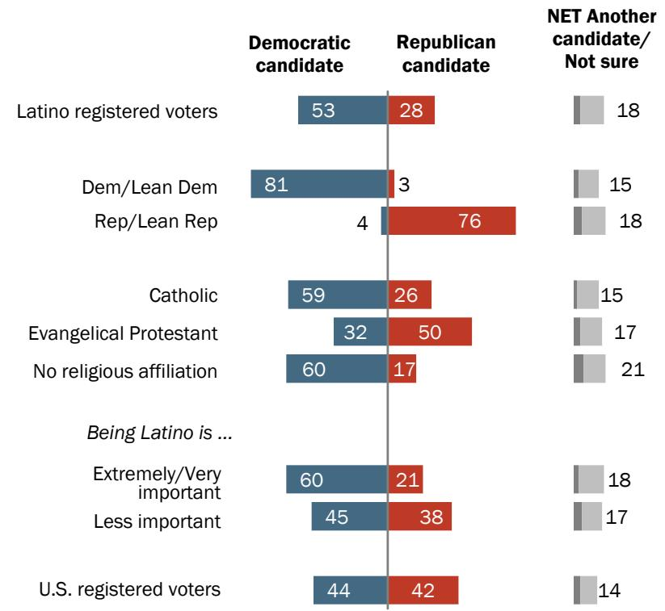
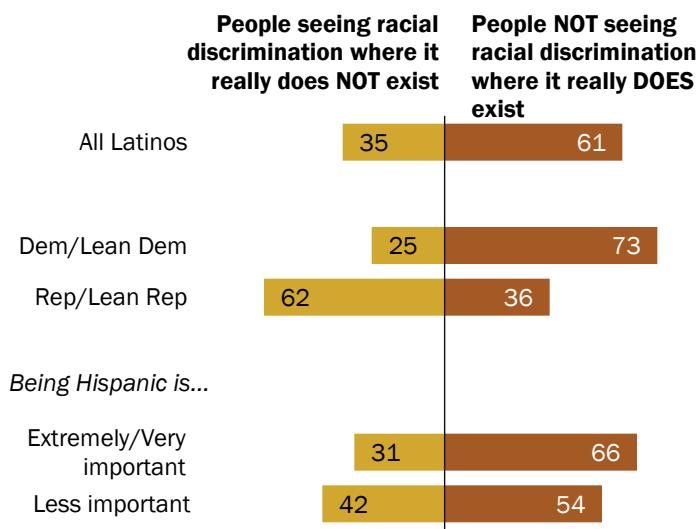
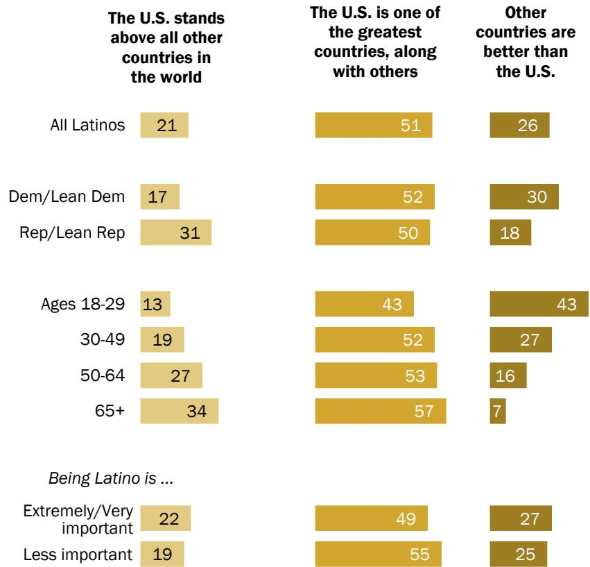
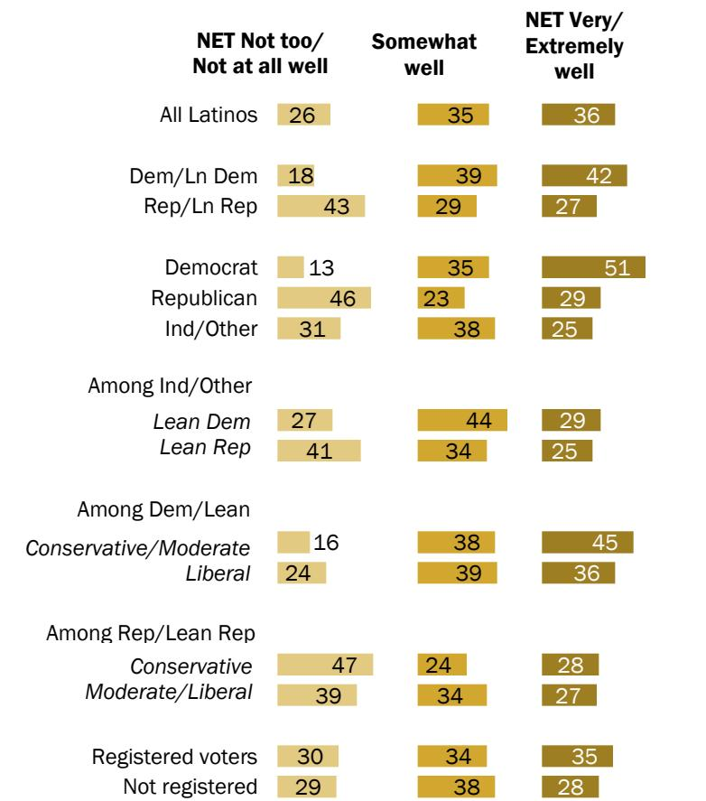
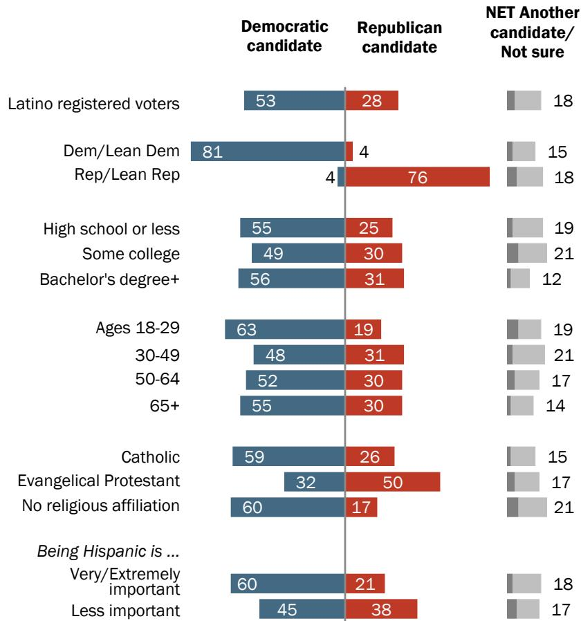
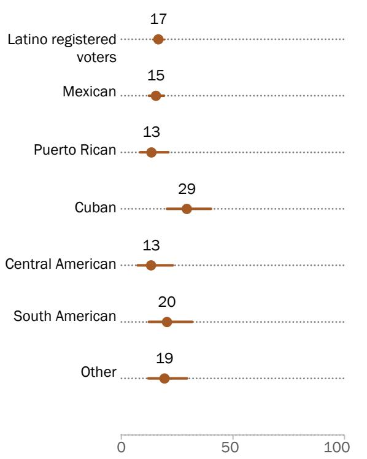
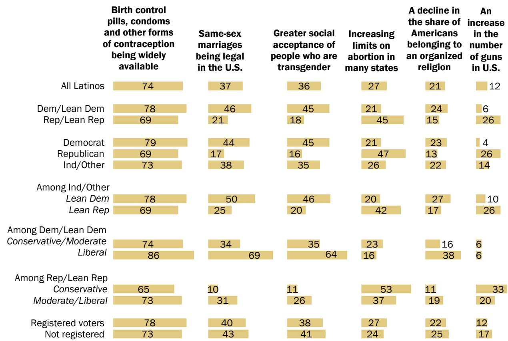
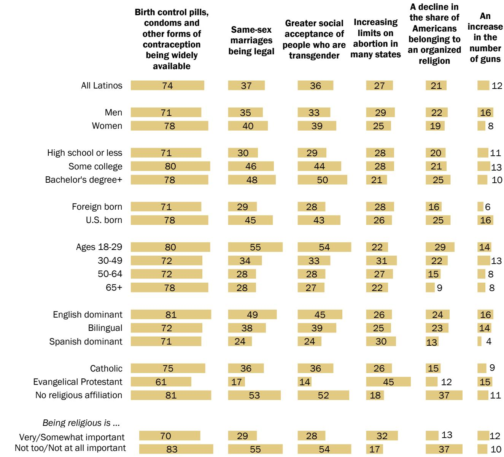

FOR RELEASE SEPTEMBER 29, 2022

# Most Latinos Say Democrats Care About Them and Work Hard for Their Vote, Far Fewer Say So of GOP

Abortion rises as an election issue for Latinos, with majority saying it should be legal in all or most cases

BY Jens Manuel Krogstad, Khadijah Edwards and Mark Hugo Lopez

FOR MEDIA OR OTHER INQUIRIES:

Mark Hugo Lopez, Director, Race and Ethnicity Research   
Jens Manuel Krogstad, Senior Writer/Editor, Race and Ethnicity Research   
Julia O’Hanlon, Communications Associate   
202.419.4372   
www.pewresearch.org

RECOMMENDED CITATION

Pew Research Center, September, 2022, “Most Latinos Say Democrats Care About Them and Work Hard for Their Vote, Far Fewer Say So of GOP”

About Pew Research Center

Pew Research Center is a nonpartisan, nonadvocacy fact tank that informs the public about the issues, attitudes and trends shaping the world. It does not take policy positions. The Center conducts public opinion polling, demographic research, computational social science research and other data-driven research. It studies politics and policy; news habits and media; the internet and technology; religion; race and ethnicity; international affairs; social, demographic and economic trends; science; research methodology and data science; and immigration and migration. Pew Research Center is a subsidiary of The Pew Charitable Trusts, its primary funder.

© Pew Research Center 2023

Table of Contents

About Pew Research Center ................................................................................................................... 0   
How we did this ......   
Terminology .............   
Overview ..... ... 6   
1. Hispanics’ views of the U.S. political parties ....... ..... 24   
2. Hispanics’ views on key issues facing the nation.... ..... 38   
3. Latinos and the 2022 midterm elections ......... ......... 52   
4. How U.S. Latinos view the country and their personal lives............. ........... 70   
5. Hispanics and their views on social issues ..... ..... 76   
Acknowledgments ..... ....... 98   
Methodology............ .......... 999   
Appendix: Supplemental Tables... ... 108

## How we did this

Pew Research Center conducted this study to understand the nuances of Hispanic political identity, Hispanics’ views about some of the political issues being discussed in the U.S. today, and their interest in the upcoming 2022 midterm elections.

For this analysis, we surveyed 7,647 U.S. adults, including 3,029 Hispanics, from Aug. 1-14, 2022. This includes 1,407 Hispanic adults on Pew Research Center’s American Trends Panel (ATP) and 1,622 Hispanic adults on Ipsos’ KnowledgePanel. Respondents on both panels are recruited through national, random sampling of residential addresses. Recruiting panelists by phone or mail ensures that nearly all U.S. adults have a chance of selection. This gives us confidence that any sample can represent the whole population, or in this case the whole U.S. Hispanic population. (See our “Methods 101” explainer on random sampling for more details.)

To further ensure the survey reflects a balanced cross-section of the nation’s Hispanic adults, the data is weighted to match the U.S. Hispanic adult population by age, gender, education, nativity, Hispanic origin group and other categories. Read more about the ATP’s methodology. Here are the questions used for our survey of Hispanic adults, along with responses, and its methodology.

## Terminology

The terms Hispanic and Latino are used interchangeably in this report.

The term U.S. born refers to people who are U.S. citizens at birth, including people born in the 50 U.S. states, the District of Columbia, Puerto Rico or other U.S. territories, as well as those born elsewhere to at least one parent who is a U.S. citizen.

The term foreign born refers to persons born outside of the United States to parents neither of whom was a U.S. citizen. The terms foreign born and immigrant are used interchangeably in this report.

Second generation refers to people born in the 50 states, the District of Columbia, Puerto Rico or other U.S. territories with at least one first-generation, or immigrant, parent.

Third or higher generation refers to people born in the 50 states, the District of Columbia, Puerto Rico or other U.S. territories with both parents born in the 50 states, the District of Columbia, Puerto Rico or other U.S. territories.

Language dominance is a composite measure based on self-described assessments of speaking and reading abilities. Spanish-dominant people are more proficient in Spanish than in English (i.e., they speak and read Spanish “very well” or “pretty well” but rate their English-speaking and reading ability lower). Bilingual refers to people who are proficient in both English and Spanish. English-dominant people are more proficient in English than in Spanish.

Respondents were asked a question about their voter registration status. In this report, respondents are considered a registered voter if they self-report being absolutely certain they are registered at their current address. Respondents are considered not registered to vote if they report not being registered or express uncertainty about their registration.

Democrat refers to respondents who identify politically with the Democratic Party. Republican refers to respondents who identify politically with the Republican Party. Ind/Other refers to respondents who identify politically as independent or something else.

Democrats and Democratic leaners refers to respondents who identify politically with the Democratic Party or who identify politically as independent or with some other party but lean toward the Democratic Party. Republicans and Republican leaners refers to respondents who identify politically with the Republican Party or who identify politically as independent or with some other party but lean toward the Republican Party.

The terms Republican party and GOP are used interchangeably in this report.

To create the upper-, middle- and lower-income tiers, respondents’ 2020 family incomes were adjusted for differences in purchasing power by geographic region and household size. Respondents were then placed into income tiers: “Middle income” is defined as two-thirds to double the median annual income for the entire survey sample. “Lower income” falls below that range, and “Upper income” lies above it. For more information about how the income tiers were created, read the methodology.

# Most Latinos Say Democrats Care About Them and Work Hard for Their Vote, Far Fewer Say So of GOP

Abortion rises as an election issue for Latinos, with majority saying it should be legal in all or most cases

Nearly two years after former President Donald Trump won more Latino votes than he did in 2016, a new Pew Research Center survey of Latino adults finds that most say the Democratic Party cares about Latinos and works hard to earn their vote. Significantly fewer say the same of the Republican Party. At the same time, fewer than half of Latinos say they see a major difference between the parties, despite living in a deeply polarized era amid growing partisan hostility.

### Full Page Description (Page 7)

**Source:** `assets/_page_7_Asset_1.jpg`

**Generated:** 2026-05-30 14:44:36

---

The image contains a bar chart with data comparing the Democratic Party and the Republican Party on how well they are perceived. The chart is divided into three categories: "Not too well/Not well at all," "Somewhat well," and "Very/Extremely well." The Democratic Party has a net score of 63, with 34% not too well/not well at all, 37% somewhat well, and 26% very/extremely well. The Republican Party has a net score of 34, with 63% not too well/not well at all, 21% somewhat well, and 14% very/extremely well. The chart uses different shades of blue and red to represent the two parties, with the Democratic Party in blue and the Republican Party in red.

### Full Page Description (Page 7)

**Source:** `assets/_page_7_Asset_0.jpg`

**Generated:** 2026-05-30 14:43:05

---

The image is a bar chart comparing the public's perception of the Democratic Party and the Republican Party. It categorizes responses into three levels: "Not too well/Not well at all," "Somewhat well," and "Very/Extremely well." The Democratic Party has a net score of 71, with 26% not too well/not well at all, 35% somewhat well, and 36% very/extremely well. The Republican Party has a net score of 45, with 52% not too well/not well at all, 26% somewhat well, and 19% very/extremely well. The chart uses different shades of blue and red to represent the Democratic and Republican Party responses, respectively.

### Full Page Description (Page 7)

**Source:** `assets/_page_7_Asset_2.jpg`

**Generated:** 2026-05-30 14:46:25

---

The image is a bar chart comparing public perceptions of the Democratic Party and the Republican Party regarding their performance. The chart categorizes responses into three groups: "Not too well/Not well at all," "Somewhat well," and "Very/Extremely well." The Democratic Party received a NET score of 60, with 35% not too well/not well at all, 44% somewhat well, and 16% very/extremely well. The Republican Party received a NET score of 34, with 60% not too well/not well at all, 27% somewhat well, and 7% very/extremely well. The chart uses blue and red bars to represent the Democratic and Republican Party, respectively, with percentages and NET scores clearly labeled.

When it comes to the Democratic Party, the survey finds majorities of Latino adults express positive views of it. Some 71% say the Democratic Party works hard for Latinos’ votes, 63% say it “really cares about Latinos,” and 60% say the Democratic Party represents the interests of people like themselves. By contrast, shares of Latinos say the same of the Republican Party on each statement, though a somewhat greater share (45%) say that the GOP “works hard to earn the votes of Latinos.”

While the majority of Latinos have positive views of the Democratic Party, not all do. For example, about a third (34%) say the statement “the Democratic Party really cares about Latinos” does not describe their views well, and a similar share says the same about the statement “the Democratic Party represents the interests of people like you.”

## Latinos see Democratic Party as doing more for Latinos than the Republican Party

% of Latinos who say the Democratic Party/Republican Party …

..."works hard to earn Latinos'votes"describes my views\_

Negative assessments extend to both parties. According to the survey, about one-in-five Latinos (22%) say neither of these statements describe their views well: “The Democratic Party really cares about Latinos” and “The Republican Party really cares about Latinos.”

### Full Page Description (Page 8)

**Source:** `assets/_page_8_Asset_1.jpg`

**Generated:** 2026-05-30 14:52:09

---

The image is a bar chart comparing the perception of well-being between Democrats/Lean Democrats and Republicans/Lean Republicans. The chart categorizes responses into four levels: "Not too well/Not well at all," "Somewhat well," "Very/Extremely well," and a net score. Key data points include: 78% of Democrats/Lean Democrats feeling "Not too well/Not well at all," while 31% of Republicans/Lean Republicans feel the same. Conversely, 35% of Republicans/Lean Republicans feel "Somewhat well," compared to 14% of Democrats/Lean Democrats. The net score for Democrats/Lean Democrats is 68, indicating a more negative perception of well-being compared to Republicans/Lean Republicans, whose net score is 21.

### Full Page Description (Page 8)

**Source:** `assets/_page_8_Asset_0.jpg`

**Generated:** 2026-05-30 14:52:51

---

The image is a bar chart presenting survey data on how well respondents feel about their political affiliation. The chart is divided into three categories: "Not too well/Not well at all," "Somewhat well," and "Very/Extremely well." The data is broken down by political affiliation, with "Dem/Lean Dem" and "Rep/Lean Rep" as the two groups. The "NET" column shows the net score for each group. The "Dem/Lean Dem" group has a net score of 78, with 22% not too well/not well at all, 44% somewhat well, and 34% very/extremely well. The "Rep/Lean Rep" group has a net score of 36, with 63% not too well/not well at all, 24% somewhat well, and 12% very/extremely well. The chart uses different shades of orange to represent the percentages for each category.

### Full Page Description (Page 8)

**Source:** `assets/_page_8_Asset_2.jpg`

**Generated:** 2026-05-30 14:50:42

---

The image is a bar chart with a horizontal layout, presenting survey data on how well respondents feel about their political affiliation. The chart is divided into two categories: "Dem/Lean Dem" and "Rep/Lean Rep," each with three subcategories: "Not too well/Not well at all," "Somewhat well," and "Very/Extremely well." The percentages for each subcategory are displayed in orange bars, with the total net percentage for each category at the end. The main trend shows that a higher percentage of Democrats/Lean Democrats feel "Very/Extremely well" about their affiliation compared to Republicans/Lean Republicans, who have a higher percentage in the "Not too well/Not well at all" category.

In addition, substantial minorities of Hispanic partisans say they have at least a somewhat favorable view of the opposing party on several measures, though sharp differences exist by party affiliation among Hispanics.

Roughly a third of Latino Republicans and GOP leaners (36%) say “the Democratic Party really cares about Latinos” describes their views at least somewhat well, while 21% of Latino Democrats and Democratic leaners say “the Republican Party really cares about Latinos” describes their views at least somewhat well.

Meanwhile, more than half of Hispanic Republicans and Republican leaners (56%) say “the Democratic Party works hard to earn Latinos’ votes” describes their views at least somewhat well, while about a third of Hispanic Democrats and Democratic leaners (35%) say “the Republican Party works hard to earn Latinos’ votes” describes their views at least somewhat well.

## Substantial shares of Latino partisans say opposing party really cares about Latinos, works hard to earn the votes of Latinos

% of Latinos by party affiliation who say …

"The Democratic Party really cares about Latinos" describes my views \_\_

Note: Share of respondents who didn’t offer an answer not shown. Figures may not add to 100% due to rounding.   
Source: National Survey of Latinos conducted Aug. 1-14, 2022.   
“Most Latinos Say Democrats Care About Them and Work Hard for Their Vote, Far Fewer Say So of GOP”

## PEW RESEARCH CENTER

### Full Page Description (Page 9)

**Source:** `assets/_page_9_Asset_0.jpg`

**Generated:** 2026-05-30 14:59:30

---

The image is a bar chart that presents data on the perception of differences between Hispanic and non-Hispanic populations, categorized by political affiliation. The chart is divided into three categories: "A great deal of difference," "A fair amount of difference," and "Hardly any difference at all." The data is broken down into three groups: "All Hispanics," "Dem/Lean Dem," and "Rep/Lean Rep." The percentages for each category are visually represented by the length of the bars. The main trend is that a majority of respondents in all groups perceive a significant difference between Hispanic and non-Hispanic populations, with the highest percentage in the "Dem/Lean Dem" group.

At the same time, about half of Hispanics do not see a great deal of difference between what the Democratic and Republican parties stand for, with 36% saying there is a fair amount of difference and 16% saying there is hardly any difference at all between the parties.

Meanwhile, 45% see a great deal of difference between the parties. About equal shares of Hispanic Democrats and Democratic leaners (47%) and Hispanic Republicans and Republican leaners (48%) say there is a great deal of difference between the parties.

## Fewer than half of Hispanics say there is a great deal of difference between the parties

% of Hispanics who say there is \_\_ in what the Democratic and Republican parties stand for

## PEW RESEARCH CENTER

These findings emerge from the 2022 National Survey of Latinos by Pew Research Center. The bilingual, nationally representative survey of 3,029 Latino adults was conducted online from Aug. 1-14, 2022. It explores Latinos’ views about U.S. political parties and key issues leading up to November’s midterm elections.

### Full Page Description (Page 10)

**Source:** `assets/_page_10_Asset_0.jpg`

**Generated:** 2026-05-30 14:46:52

---

The image is a line graph comparing the percentage of support for the Democratic Party and the Republican Party from 2019 to 2022. The Democratic Party's support percentage is consistently higher than the Republican Party's throughout the period. The Democratic Party's support peaked at 66% in 2021 and then slightly decreased to 64% in 2022. The Republican Party's support remained relatively stable, starting at 34% in 2019, dropping to 31% in 2021, and then slightly increasing to 33% in 2022.

## Latinos' party afiliation has remained steady since 2019

Latino registered voters identify with or lean toward the Democratic Party over the Republican Party by a nearly two-to-one margin (64% vs. 33% in this year’s survey), with Latino party identification shifting little over the past few years.

Even so, Latino registered voters’ future party affiliation remains uncertain. A 2021 Pew Research Center study of Americans’ political views found substantial shares of Latino voters fell into groups with soft ties to the political parties. For example, roughly one-in-ten Latino voters who identified as either a Democrat

PEW RESEARCH CENTER

or Republican held political views that more closely aligned with the opposing party than with their own party.

## 2022 midterm elections and Latino voters

Latino voters are the nation’s second-largest group of eligible voters (adult U.S. citizens) and are among its fastest-growing voter blocks. In 2022, nearly 35 million Latinos will be eligible to vote, accounting for 14% of the nation’s eligible voters. The views of Latino voters have received widespread news coverage leading up to the 2022 midterm elections.1

Overall, 77% of Latino registered voters are dissatisfied with the way things are going in the country and 54% disapprove of the way Joe Biden is handling his job as president. Meanwhile, just 30% have given “a lot of thought” to this year’s congressional elections, with Latino Republicans and Republican leaners more likely than Latino Democrats and Democratic leaners to say this (36% vs. 27%). Yet equal shares of Latino Democrats and Democratic-leaning registered voters (60%) and Latino Republicans and GOP-leaning registered voters (60%) say it really matters who wins control of Congress.

### Full Page Description (Page 12)

**Source:** `assets/_page_12_Asset_0.jpg`

**Generated:** 2026-05-30 15:05:27

---

The image is a line graph comparing public opinion on various issues in March and August. The x-axis represents the months, and the y-axis represents the percentage of public opinion. The graph shows changes in the percentage of public opinion for each issue over the two months. Notable issues include "The economy," which remains at 80% in both months, and "The coronavirus outbreak," which shows a significant drop from 42% in March to 39% in August. The graph highlights the shift in public focus from certain issues to others over the period.

## Abortion rises as an election issue for Latino registered voters

Among Latino registered voters in 2022, 80% say the economy is a very important issue when deciding who to vote for in the upcoming congressional midterm elections, a greater share than any other issue, and unchanged since March. Other top issues include health care (71%), violent crime and education (70% each) and gun policy (66%).

Meanwhile, abortion has risen the most in importance as a voting issue among Hispanics in recent months, a shift that comes after the Supreme Court’s decision to end the federal guarantee of a right to legal abortion in the United States. Nearly six-in-ten Hispanic voters (57%) say the issue is very important, up from 42% in March. This pattern is also seen among all U.S. registered voters, as abortion has risen in importance leading up to the 2022 midterm elections.

On other issues, slightly more than half of Hispanic voters say immigration, climate change

Among Latino voters, abortion rises in importance for 2022 midterms, while economy remains top issue

% of Latino registered voters who say each issue is very important in making their decision about who to vote for in the 2022 congressional elections

PEW RESEARCH CENTER

and Supreme Court appointments are very important issues for deciding their vote in the 2022 congressional midterm elections.

## 2022 midterm election preferences of Latinos

The August 2022 survey finds about half of Latino registered voters (53%) say they would vote for or are leaning toward the Democratic candidate for the U.S. House of Representatives in their congressional district, compared with 28% who say they would vote for the Republican candidate. About one-in-five (18%) say they would vote for another candidate or are not sure who they would vote for.2

A majority of Hispanic Catholics (59%) and those who are religiously unaffiliated (60%) – those who describe themselves as atheists, agnostics or “nothing in particular” – say they would vote for the Democratic candidate for the U.S. House in their congressional district. By contrast, more Hispanic evangelical Christians say they

## About half of Latino voters say they would vote Democratic in their district’s U.S. House race

% of registered voters who say they would vote for/lean toward the \_\_ for the U.S. House of Representatives in their district

> **AI Description:**
> **Source:** `assets/_page_13_Figure_0.jpg`
> 
> **Generated:** 2026-05-30 14:44:24
> 
> ---
> 
> The image is a bar chart that presents data on voter preferences among Latino registered voters, broken down by religious affiliation and importance of being Latino. The chart compares the percentages of voters who support a Democratic candidate, a Republican candidate, or another candidate/not sure. Key categories include "Latino registered voters," "Dem/Lean Dem," "Rep/Lean Rep," "Catholic," "Evangelical Protestant," "No religious affiliation," and "Being Latino is... Extremely/Very important" and "Less important." The chart also includes a comparison with U.S. registered voters. Notable trends include a higher percentage of Latino voters supporting Democratic candidates compared to Republican candidates, and a higher percentage of Latino voters identifying as Catholic or having no religious affiliation.

Note: Based on registered voters. Share of respondents who didn't offer an answer not shown. Figures may not add to 100% due to rounding. Source: National Survey Latinos conducted Aug. 1-14, 2022. “Most Latinos Say Democrats Care About Them and Work Hard for Their Vote, Far Fewer Say So of GOP”

would vote Republican than Democratic (50% vs. 32%).

The strength of Hispanic identity is also linked to how Hispanic registered voters would vote. Most Hispanics who say being Hispanic is extremely or very important to how they think of themselves (60%) would vote for the Democratic candidate in their local congressional district. Meanwhile,

those who say being Hispanic is less important to their identity are more evenly split between voting for the Democratic and Republican candidates in their district’s House race (45% vs. 38%).

## Latinos’ views of Biden

As the midterm elections approach, fewer than half of Latino registered voters (45%) say they approve of the way Biden is handling his job as president, while about half (54%) disapprove. U.S. registered voters overall have a more negative view of Biden (61% disapprove vs. 37% approve), according to the same August survey.3

Biden’s approval rating varies some across demographic subgroups of Hispanic registered voters. Hispanic Democrats hold largely positive views of Biden. Nearly twothirds of Hispanic Democrats and Democratic leaners (65%) approve of the president’s job performance, but a substantial

Note: Based on registered voters. Share of respondents who didn’t offer an answer not shown. Figures may not add to 100% due to rounding. Source: National Survey Latinos conducted Aug. 1-14, 2022. “Most Latinos Say Democrats Care About Them and Work Hard for Their Vote, Far Fewer Say So of GOP” PEW RESEARCH CENTER

minority (34%) disapprove. By contrast, nearly all Hispanic Republicans and Republican leaners (92%) disapprove of Biden.

Among Latino registered voters, only 29% of evangelical Christians approve of Biden’s job performance, while a greater share of Latino Catholics (53%) and those with no religious affiliation (44%) say the same.

A greater share of Hispanic voters who say being Hispanic is important to how they think of themselves approve of Biden’s job performance than do Hispanics who say being Hispanic is less important to their identity (52% vs. 37%).

### Full Page Description (Page 16)

**Source:** `assets/_page_16_Asset_0.jpg`

**Generated:** 2026-05-30 14:52:37

---

The image contains a bar chart with data visualizations. It presents survey results regarding opinions on whether Donald Trump should remain a national political figure and, if so, what his role should be in 2024. The chart categorizes respondents by their political affiliation, religious affiliation, and the importance they place on being Hispanic. The key data points include percentages of respondents who believe Trump should not remain a national political figure and those who support him running for president or supporting another candidate. The chart also includes a "NET" column that combines the two categories for each group.

## Latinos’ views of Trump’s future

A clear majority of Hispanic registered voters (73%) say they would not like to see Trump remain a national political figure, including nearly all Latino Democrats and Democratic leaners (94%). By contrast, 63% of Hispanic Republicans and GOP leaners say they would like to see Trump remain a national political figure, including about four-in-ten (41%) who say he should run for president in 2024.

Among Latino registered voters, evangelicals (43%) are more likely than Catholics (22%) and those with no religious affiliation (18%) to say Trump should remain a national political figure. And a quarter of Latino evangelical registered voters say Trump should run for president in 2024.

Two-thirds of Hispanic Republicans want Trump to remain a national political figure % of registered voters who say …

## PEW RESEARCH CENTER

## Latinos’ views on racial discrimination

Since George Floyd’s killing in May 2020, the nation has gone through a sharp and deep discussion about race and equality, police funding and racial discrimination. And while racial discrimination is experienced by many Latinos directly – sometimes from non-Latinos, sometimes from other Latinos – views about how Americans identify and see racial discrimination are somewhat varied.

According to the new Center survey, most Latinos say people not seeing racial discrimination where it really does exist is a significant problem. A majority (61%) say it is a bigger problem for the country than people

## Among Latinos, more Democrats than Republicans say people not seeing racial discrimination is big problem

> **AI Description:**
> **Source:** `assets/_page_17_Figure_0.jpg`
> 
> **Generated:** 2026-05-30 15:02:02
> 
> ---
> 
> The image is a bar chart with two sets of data presented for different groups: "People seeing racial discrimination where it really does NOT exist" and "People NOT seeing racial discrimination where it really DOES exist." The groups analyzed are "All Latinos," "Dem/Lean Dem," "Rep/Lean Rep," and "Being Hispanic is... Extremely/Very important" and "Less important." The chart shows percentages for each group, with the "People seeing racial discrimination where it really does NOT exist" represented by yellow bars and the "People NOT seeing racial discrimination where it really DOES exist" represented by brown bars. The data highlights the perception of racial discrimination among different demographic groups and the importance of being Hispanic in these perceptions.

seeing racial discrimination where it really does not exist.4

Nearly three-quarters of Latino Democrats and Democratic leaners (73%) say people not seeing racial discrimination where it really does exist is a bigger problem. By contrast, about six-in-ten Republicans and Republican leaners (62%) say it is a bigger problem that people see racial discrimination where it really does not exist.

Meanwhile, two-thirds of Hispanics who say being Hispanic is important to how they think of themselves (66%) say people not seeing racial discrimination where it really does exist is a significant problem, a greater share than among Hispanics who say being Hispanic is less important to how the think of themselves (54%).

### Full Page Description (Page 18)

**Source:** `assets/_page_18_Asset_0.jpg`

**Generated:** 2026-05-30 14:55:51

---

The image is a bar chart with two sets of data, each represented by a pair of bars. The chart compares opinions on two issues: "Protect the right of Americans to own guns" and "Control gun ownership." The data is segmented by political affiliation: All Hispanics, Dem/Lean Dem, Rep/Lean Rep, U.S. adults, and further broken down by political affiliation within U.S. adults. The bars are color-coded: brown for "Protect the right of Americans to own guns" and yellow for "Control gun ownership." The chart shows that there is a significant difference in opinions between Republicans/Lean Republicans and Democrats/Lean Democrats, with the latter group favoring gun control more strongly.

## Latinos’ views on abortion, gun policy and LGBTQ rights

The survey finds that Latinos are divided along party lines on key social issues in ways similar to the U.S. public, though the views of Latinos are sometimes less polarized on key issues.

The Supreme Court has made major decisions on cases in recent months that resulted in restricted access to legal abortions and expanded rights to carry guns in public, the latter coming after high-profile mass shootings in Texas and New York.

A majority of Hispanics (57%) say abortion should be legal in at least some cases, including 69% of Democrats and Democratic leaners who say the same. By contrast, 39% of Hispanic Republicans and GOP leaners say abortion should be legal in all or most cases.

Hispanics’ views on abortion differ from U.S. adults overall, particularly when comparing the views of Latinos and U.S. adults of the same party. Compared with Hispanics, a slightly greater share of U.S. adults (62%) say abortion should be legal in at least some cases. And a greater share of Democrats and Democratic leaners overall (84%) than

Greater shares of Hispanics say abortion should be legal in at least some cases, a smaller share than among U.S. adults overall

% who say ...

## More Hispanics than U.S. adults prioritize controlling gun ownership over protecting gun rights

% who say it is more important to...

PEW RESEARCH CENTER

Hispanic Democrats and Democratic leaners (69%) say abortion should generally be legal. Hispanic Republicans’ views on this issue are nearly identical to views among all Republicans and Republican leaners, 60% of whom say abortion should be illegal in all or most cases.

On gun policy, about seven-in-ten Hispanics (73%) say it is more important to control gun ownership; 26% say it’s more important to protect the right of Americans to own guns. Hispanic Democrats and Democratic leaners are about twice as likely as Hispanic Republicans and Republican leaners to prioritize controlling gun ownership over protecting the rights to own guns (85% vs. 45%).5

Compared with Hispanics, a smaller share of U.S. adults overall (52%) say it is more important to control gun ownership than to protect gun ownership rights. Hispanic Republicans and GOP leaners are considerably more likely than Republicans overall to say this (45% vs. 18%). Among Democrats and Democratic leaners, similar shares of Hispanics (85%) and U.S. adults overall (81%) say controlling gun ownership should be the priority.

### Full Page Description (Page 20)

**Source:** `assets/_page_20_Asset_0.jpg`

**Generated:** 2026-05-30 15:04:14

---

The image is a bar chart that compares the opinions of Hispanics on a scale of "Very/Somewhat bad," "Neither good nor bad," and "Very/Somewhat good." The chart is divided into three groups: "All Hispanics," "Dem/Lean Dem," and "Rep/Lean Rep." The percentages for each category are as follows:

- "All Hispanics": 26% for "Very/Somewhat bad," 35% for "Neither good nor bad," and 37% for "Very/Somewhat good."
- "Dem/Lean Dem": 20% for "Very/Somewhat bad," 33% for "Neither good nor bad," and 46% for "Very/Somewhat good."
- "Rep/Lean Rep": 41% for "Very/Somewhat bad," 37% for "Neither good nor bad," and 21% for "Very/Somewhat good."

The chart visually represents the distribution of opinions among these groups, showing that the "Dem/Lean Dem" group is more likely to have a positive opinion compared to the "Rep/Lean Rep" group.

### Full Page Description (Page 20)

**Source:** `assets/_page_20_Asset_1.jpg`

**Generated:** 2026-05-30 15:05:42

---

The image is a bar chart with three categories: "Very/Somewhat bad," "Neither good nor bad," and "Very/Somewhat good." The chart compares responses from "All Hispanics," "Dem/Lean Dem," and "Rep/Lean Rep" groups. The percentages for each category are as follows: "All Hispanics" has 25% in "Very/Somewhat bad," 36% in "Neither good nor bad," and 36% in "Very/Somewhat good." The "Dem/Lean Dem" group has 19% in "Very/Somewhat bad," 35% in "Neither good nor bad," and 45% in "Very/Somewhat good." The "Rep/Lean Rep" group has 44% in "Very/Somewhat bad," 36% in "Neither good nor bad," and 18% in "Very/Somewhat good." The chart visually represents the distribution of opinions across different political affiliations.

More than a third of Latinos (37%) say same-sex marriage being legal is good for society, while a similar share say it is neither good nor bad for society. Latino Democrats and Democratic leaners are more likely than Latino Republicans and Republican leaners to say same-sex marriage being legal is a good thing for society (46% vs. 21%). Hispanic Republicans are more likely than Hispanic Democrats to say it is a bad thing (41% vs. 20%).

Meanwhile, about a third of Latinos from both parties say same-sex marriage is neither a good nor bad thing.6

Latinos’ views of greater social acceptance of transgender people follows a similar pattern: 36% of Latinos say it is somewhat or very good for society, including 45% of

Fewer than half of Hispanics say same-sex marriage and acceptance of transgender people are good for society

% of all Hispanics who say same-sex marriage being legal in the U.S. is\_for society

% of all Hispanics who say greater social acceptance of people who are transgender is\_for society

PEW RESEARCH CENTER

Democrats and Democratic leaners and 18% of Republicans and GOP leaners. About a third of Latinos from both parties say it is neither a good nor bad thing.

### Full Page Description (Page 21)

**Source:** `assets/_page_21_Asset_0.jpg`

**Generated:** 2026-05-30 14:48:08

---

The image is a bar chart with data presented in a segmented bar format. It categorizes responses from Hispanic individuals into four sentiment categories: "Somewhat negative," "Very negative," "Somewhat positive," and "Very positive." The chart includes data for the overall Hispanic population, political affiliation (Dem/Lean Dem and Rep/Lean Rep), age groups (18-29, 30-49, 50-64, 65+), and the importance of being Hispanic (Extremely/Very important and Less important). The chart also compares these sentiments to those of U.S. adults. The main trends show that the "Somewhat negative" sentiment is the most prevalent across all categories, followed by "Somewhat positive." The "Very negative" sentiment is the least common. The "Very positive" sentiment is also relatively low across most categories.

## Hispanics’ views of socialism and capitalism

Some parts of the national Latino population have recent immigrant connections to countries that have socialist or communist governments (such as Cuba and Venezuela) or have had them (such as Chile and Nicaragua). In Chile and Nicaragua). In

metropolitan areas such as Miami, political candidates’ views on socialism often became a prominent campaign issue in 2020. For those with a positive view of socialism, the word can take on a broader meaning and include U.S. government programs or democratic socialist governments such Denmark or Finland.

According to the new Center survey, a larger share of Hispanics have a negative than positive impression of socialism (53% vs. 41%). By contrast, Hispanics have a more positive than negative view of capitalism (54% vs. 41%).

When it comes to socialism, Hispanic Democrats and Democratic leaners are split on how they view socialism (48% negative vs. 50% positive). Meanwhile, Hispanic Republicans and Republican

About half of Hispanics have a negative impression of socialism

leaners have a more negative impression of socialism, with nearly three-quarters (72%) viewing socialism negatively.

### Full Page Description (Page 22)

**Source:** `assets/_page_22_Asset_0.jpg`

**Generated:** 2026-05-30 14:46:13

---

The image is a bar chart that presents data on the percentage of people who have a certain impression of capitalism, categorized by political affiliation and overall U.S. adults. The chart uses different colors to represent "Somewhat negative," "Very negative," "Somewhat positive," and "Very positive" impressions. The data is broken down into three groups: "All Hispanics," "Dem/Lean Dem," and "Rep/Lean Rep," as well as a comparison with "U.S. adults." The chart also includes a net percentage for each category, which is the sum of the percentages for "Somewhat positive" and "Very positive" minus the sum of "Somewhat negative" and "Very negative." The main trend is that Republicans and Republican-leaning individuals have a more positive impression of capitalism compared to Democrats and Hispanic respondents.

Latinos ages 18 to 29 are more evenly divided in their views of socialism (46% positive vs. 50% negative), a pattern seen among all U.S. young people. While Latinos ages 30 to 49 are similarly divided, a majority of those ages 50 to 64 and those 65 or older say they see socialism negatively.

Hispanics who say being Hispanic is extremely or very important to how they think of themselves are evenly split in their views of socialism (47% positive and 48% negative). Hispanics who say being Hispanic is less important to how they think of themselves have a more negative view (62%).

By contrast, about two-thirds of Hispanic Republicans and Republican leaners (68%) have a positive view of capitalism, a greater share than among Hispanic Democrats and Democratic leaners (50%).

About half of Hispanics have a positive impression of capitalism

Hispanic adults and the U.S.

public overall generally have similar views of capitalism. Majorities of Hispanics (54%) and U.S.   
adults (57%) have a positive impression of capitalism.

## Latinos’ views of America’s standing in the world

The vast majority of Hispanics say the U.S. is either one of the best countries the world (51%) or that the U.S. stands above all other countries in the world (21%). About a quarter of Hispanics (26%) say there are other countries that are better than the U.S. Hispanics have mostly similar views to U.S. adults overall on how America compares to other nations.

## Latino Democrats and

Democratic leaners are more likely than Latino Republicans and GOP leaners to say there are other countries that are better than the U.S. (30% vs. 18%). Meanwhile, a larger share of Latino Republicans than Latino Democrats say the U.S. stands above all other countries in the world (31% vs. 17%). Despite these differences, about half of both Latino Republicans (50%) and Latino Democrats (52%) choose the middle ground, saying that the

## Most Latinos say the U.S. is one of the greatest countries in the world, along with some others

When asked the question, “Which of these statements best describes your opinion about the U.S.,” % of Latinos who say …

> **AI Description:**
> **Source:** `assets/_page_23_Figure_0.jpg`
> 
> **Generated:** 2026-05-30 14:42:26
> 
> ---
> 
> The image contains a bar chart with data on Latino opinions regarding the U.S.'s standing among other countries. The chart is divided into three categories: "The U.S. stands above all other countries in the world," "The U.S. is one of the greatest countries, along with others," and "Other countries are better than the U.S." The data is presented for "All Latinos," "Dem/Lean Dem," "Rep/Lean Rep," and age groups (18-29, 30-49, 50-64, 65+). Additionally, the chart includes responses based on the importance of being Latino, with categories "Extremely/Very important" and "Less important." The chart visually represents the percentage of respondents in each category, with the highest percentage for the middle category ("The U.S. is one of the greatest countries, along with others") across most groups.

U.S. is one of the greatest countries in the world along with some others.

About four-in-ten Hispanics ages 18 to 29 (43%) say other countries are better than the U.S., a greater share than among those ages 30 to 49 (27%), 50 to 64 (16%) and those ages 65 or older (7%). A similar pattern by age exists among all U.S. adults.

## 1. Hispanics’ views of the U.S. political parties

Hispanics generally have more positive attitudes toward the Democratic Party than the Republican Party, viewing the Democratic Party as more concerned about Hispanics and their interests. They also are more likely to say Democrats work hard to earn the votes of Hispanics than they are to say the same about Republicans. Even so, the positive feelings Latino partisans have for their own party are relatively lukewarm when compared with the strong negative feelings they have toward the opposing party.

### Full Page Description (Page 25)

**Source:** `assets/_page_25_Asset_0.jpg`

**Generated:** 2026-05-30 14:59:58

---

The image is a bar chart that compares the political affiliation of Latinos in the United States, categorized by party identification and registration status. The chart is divided into two main sections: one for the Democratic Party and one for the Republican Party. It provides percentages for different groups, such as "All Latinos," "Dem/Lean Dem," "Rep/Lean Rep," "Democrat," "Republican," "Ind/Other," and "Registered voters" and "Not registered." The chart also breaks down the "Ind/Other" group into "Lean Dem" and "Lean Rep," and the "Dem/Lean Dem" group into "Conservative/Moderate" and "Liberal." Similarly, the "Rep/Lean Rep" group is divided into "Conservative" and "Moderate/Liberal." The chart visually represents the political leanings of Latinos, showing a strong preference for the Democratic Party among Latino voters.

## Hispanics' views of how well the U.S.parties represent their interests

A majority of Latino adults (60%) say the Democratic Party represents the interests of people like them somewhat or very well, while about a third (34%) say the same about the Republican Party, according to the new Pew Research Center survey. By comparison, U.S. adults overall are more divided in their views of the political parties, with similar shares saying the Democratic Party (47%) and Republican Party (44%) represent their interests.

Views about the U.S. political parties among Latinos vary sharply by party affiliation, just as they do among the general public. Nearly nine-in-ten Latino Democrats (89%) say the Democratic Party represents the interests of people like them somewhat or very well, while 80% of Latino Republicans say the Democratic Party does not represent their interests well.

Views also diverge among Latinos who lean toward a party but do not identify as a

## Most Latinos say the Democratic Party represents the interests of people like them well, fewer say so of GOP

% who say the \_\_ represents the interests of people like them somewhat/very well

PEW RESEARCH CENTER

partisan, though the differences are smaller than among Latino partisans. For example, among independents and those who are not partisans, 67% of Democratic leaners say the Democratic

Party represents the interests of people like them at least somewhat well, while 68% of Republican leaners say the Democratic Party does not represent their interests.

Partisan views of how well the political parties represent Hispanics are also linked to political ideology. Among Republicans and GOP leaners, just 16% of conservatives say the Democratic Party represents the interests of people like them at least somewhat well while 33% of moderates and liberals say the same.

Relatively smaller shares of Hispanics say the Republican Party represents the interests of people like them at least somewhat well. About a third of Hispanic adults (34%) say this, compared with 44% of U.S. adults overall.

Just as with views of the Democratic Party, Hispanics’ views of the GOP are sharply divided by partisanship. A strong majority of Hispanic Republicans (86%) say the Republican Party represents the interests of people like them at least somewhat well, while only 15% of Hispanic Democrats say so. Independents have more mixed views of the Republican Party, just as they do about the Democratic Party. Among Hispanic independents and those who are not partisans, 66% of Republican leaners say the GOP represents the interests of people like them, while 23% of Democratic leaners say the same.

Among Hispanic Democrats and Democratic leaners, about a quarter of conservatives and moderates (22%) say the GOP represents the interests of people like them at least somewhat well, while only 12% of liberals say this. Among Hispanic Republicans and Republican leaners, a greater share of conservatives (81%) than moderates and liberals (71%) say the GOP represents the interests of people like them well.

### Full Page Description (Page 27)

**Source:** `assets/_page_27_Asset_0.jpg`

**Generated:** 2026-05-30 14:40:05

---

The image is a bar chart comparing the political affiliations of Latinos in the Democratic Party and the Republican Party across various demographic categories. The chart includes data on gender, education level, immigration status, age, language dominance, religious affiliation, and the importance of being Hispanic. Each category has two bars representing the Democratic Party (brown) and the Republican Party (gray). The chart highlights that Latino women are more likely to affiliate with the Democratic Party than men, and there are significant differences in party affiliation based on education level, immigration status, and religious affiliation.

Hispanics broadly have a more positive view of the Democratic Party than the GOP, with majorities saying the Democratic Party represents the interests of people like them well across gender, education, nativity, age and language groups. A smaller share of Hispanics overall (34%) say the Republican Party represents their interests at least somewhat well.

Views vary somewhat by religion. About half of Latino evangelical Protestants (52%) say the Republican Party represents the interests of people like them at least somewhat well – a greater share than among Latino Catholics (32%) or religiously unaffiliated Latinos (28%). Meanwhile, about two-thirds of Latino Catholics (67%) say the Democratic Party represents the interests of people like them well, a greater share than among Latinos with no religious affiliation (56%) and Latino evangelicals (53%).

## Across demographic groups, Latinos more likely to say Democratic Party represents their interests

% of Latinos who say the \_\_ represents the interests of people like them somewhat/very well

## PEW RESEARCH CENTER

### Full Page Description (Page 28)

**Source:** `assets/_page_28_Asset_0.jpg`

**Generated:** 2026-05-30 14:49:30

---

The image is a chart that compares the political affiliation of different Hispanic groups in the United States, specifically their support for the Democratic Party and the Republican Party. The chart is divided into two sections: one for the Democratic Party and one for the Republican Party. Each section includes data for "All Hispanics" and specific groups: Mexican, Puerto Rican, Cuban, Central American, South American, and Other. The percentages for each group's affiliation with the Democratic Party are shown in blue, and the percentages for the Republican Party are shown in red. The chart highlights that Mexican and South American Hispanics have the highest Democratic Party affiliation, while Cuban and Central American Hispanics have the highest Republican Party affiliation.

## Hispanic origin groups' views of the U.S. political parties

Hispanics have generally favorable views of the Democratic Party, regardless of their family’s origins. For example, significant shares of Mexicans (62%) and Puerto Ricans (58%) in the U.S. say that the Democratic Party represents the interests of people like them somewhat or very well. Meanwhile, a minority in each group (32% and 36%, respectively) say the Republican Party represents their interests well.

Cubans’ views of the Republican Party stand in contrast to other U.S. Latinos, reflecting the group’s long-held preference for the GOP. But Cubans also express relatively positive views of the Democratic Party. Cubans are about as likely to say that the Democratic Party represents the interests of people like them as they are to say the same about the Republican Party.

Cubans more likely than other Hispanic origin groups to say the Republican Party represents people like them well

% of Hispanics who say the \_\_ represents the interests of people like them somewhat/very well

## PEW RESEARCH CENTER

### Full Page Description (Page 29)

**Source:** `assets/_page_29_Asset_0.jpg`

**Generated:** 2026-05-30 15:02:23

---

The image contains a bar chart with data visualizations. It presents information on the level of well-being among different groups of Hispanic voters, categorized by political affiliation and registration status. The chart breaks down responses into three categories: "NET Not too/Not at all well," "Somewhat well," and "NET Very/Extremely well." The data is further segmented by party affiliation (Dem/Lean Dem, Rep/Lean Rep), registration status (Registered voters, Not registered), and ideological leanings within the Democratic and Republican camps. The chart uses varying shades of yellow to represent different percentages for each category.

Latinos more likely to say the Democratic Party,rather than the GOP, cares about Hispanics

Respondents in the Center’s survey were asked how well the statement “the Democratic Party really cares about Hispanics” described their views. Roughly a quarter (26%) say it describes their views very or extremely well. A larger share say it describes their views somewhat well (37%), and a similar share (34%) say the statement does not describe their views too well or at all.

Hispanic Democrats have generally positive views of the Democratic Party, though their enthusiasm is lukewarm – 46% say the statement “the Democratic Party really cares about Hispanics” describes their views somewhat well, and a similar share (41%) say it describes their views very or extremely well.

Hispanic Democrats are more likely than Democratic leaners to say the statement “the Democratic Party really cares about Hispanics” describes their views very or extremely

Hispanics have mixed views on whether the Democratic Party really cares about Hispanics

% of Hispanics who say the statement “the Democratic Party really cares about Hispanics” describes their views …

Note: Respondents are considered not registered to vote if they report not being registered or express uncertainty about their registration. Share of respondents who didn't offer an answer not shown. Figures may not add to 100% due to rounding.   
Source: National Survey of Latinos conducted Aug. 1-14, 2022.   
“Most Latinos Say Democrats Care About Them and Work Hard for Their Vote, Far Fewer Say So of GOP”

PEW RESEARCH CENTER

well (41% vs. 23%). Meanwhile, 70% of Hispanic Republicans and 56% of Republican leaners say the statement does not describe their views well.

Among Democrats and Democratic leaners, about a third of conservatives and moderates (34%) and liberals (33%) say the statement “the Democratic Party really cares about Hispanics” describes their views very or extremely well. Meanwhile, a larger share of conservative Republicans and Republican leaners (70%) say the statement does not describe their views well, compared with about half of Republican moderates and liberals (56%).

### Full Page Description (Page 31)

**Source:** `assets/_page_31_Asset_0.jpg`

**Generated:** 2026-05-30 14:50:12

---

The image contains a bar chart with data visualizing the opinions of different groups of people regarding their satisfaction with something, likely a political or social issue. The chart is divided into three categories: "NET Not too/Not at all well," "Somewhat well," and "NET Very/Extremely well." The data is presented for various groups, including "All Hispanics," "Dem/Ln Dem," "Rep/Ln Rep," "Democrat," "Republican," "Ind/Other," "Among Ind/Other," "Among Dem/Lean Dem," and "Among Rep/Lean Rep." The chart shows percentages for each group in the three satisfaction categories. Notable trends include higher dissatisfaction among Democrats and lower satisfaction among Republicans.

Meanwhile, Hispanics have more negative views of the Republican Party. Survey respondents were asked how well the statement “the Republican Party really cares about Hispanics” describes their views. A majority (63%) say the statement does not describe their views well, while 21% say somewhat well; only 14% say it describes their views very or extremely well.

Hispanics’ views of the GOP are sharply divided by party, just as they are for the Democratic Party. A substantial share of Republicans (41%) say the Republican Party really cares about Hispanics, compared with only 7% of Democrats; 12% of independents and those who do not identify as partisan say the same. Even so, Hispanic Republicans have a lukewarm view of their party and how much it cares about Hispanics: 31% say this statement represents their

## Most Hispanics say the Republican Party does not really care about Hispanics

% of Hispanics who say the statement “the Republican Party really cares about Hispanics” describes their views …

Note: Respondents are considered not registered to vote if they report not being registered or express uncertainty about their registration. Share of respondents who didn't offer an answer not shown. Figures may not add to 100% due to rounding.   
Source: National Survey of Latinos conducted Aug. 1-14, 2022.   
“Most Latinos Say Democrats Care About Them and Work Hard for Their Vote, Far Fewer Say So of GOP”

views about the Republican Party somewhat well and 26% say it doesn’t represent their views about the party at all.

Among Hispanic Democrats and Democratic leaners, a strong majority of conservatives and moderates (75%) and liberals (84%) alike say the statement “the Republican Party really cares about Hispanics” does not describe their views. Among Hispanic Republicans and Republican leaners, 41% of conservatives say the statement describes their views well, while 25% of moderates and liberal say the statement describes their views somewhat well.

## Views on how hard the U.S.political parties work to earn Latinos' votes

Latinos have mixed views on whether Democrats work hard to win Latinos’ votes. About seven-inten (71%) say the statement “Democrats work hard to win Latinos’ votes” describes their views

either very or extremely well (36%) or somewhat well (35%). This is a greater share than the 63% who say the statement “the Democratic Party really cares about Latinos” describes their views at least somewhat well.

About half of Latino Democrats (51%) say the Democratic Party works hard to earn Latinos’ votes, saying the statement describes their views well. By contrast, nearly half of Republicans (46%) hold the opposing view that the statement does not describe their views well. Among Hispanic independents and those who are not partisans, 29% of those who lean Democratic say Democrats work hard to win Latinos’ votes, while 41% who lean Republican say the statement does not describe their view well.

More than four-in-ten Latino Democrats and Democratic leaners who describe their

## Latinos have mixed views on whether Democrats work hard to win Latinos’ votes

% of Latinos who say the statement “Democrats work hard to win Latinos’ votes” describes their views …

> **AI Description:**
> **Source:** `assets/_page_33_Figure_0.jpg`
> 
> **Generated:** 2026-05-30 15:03:58
> 
> ---
> 
> The image contains a table with data visualized in a tabular format. It presents survey results on the perception of Latinos' well-being, categorized by political affiliation and voter registration status. The table includes percentages for three categories: "NET Not too/Not at all well," "Somewhat well," and "NET Very/Extremely well." The data is broken down by party affiliation (Dem/Ln Dem, Rep/Ln Rep), political leanings (Democrat, Republican, Ind/Other), and voter registration status (Registered voters, Not registered). The table highlights that a higher percentage of Democrats and Independents lean towards feeling well, while a higher percentage of Republicans and those not registered feel not too or not at all well.

Note: Respondents are considered not registered to vote if they report not being registered or express uncertainty about their registration. Share of respondents who didn't offer an answer not shown. Figures may not add to 100% due to rounding.   
Source: National Survey of Latinos conducted Aug. 1-14, 2022.   
“Most Latinos Say Democrats Care About Them and Work Hard for Their Vote, Far Fewer Say So of GOP”   
PEW RESEARCH CENTER

political views as conservative or moderate (45%) say the statement “Democrats work hard to earn Latinos’ votes” reflects their views very or extremely well, as do 36% of Latino Democrats and

### Full Page Description (Page 34)

**Source:** `assets/_page_34_Asset_0.jpg`

**Generated:** 2026-05-30 14:49:07

---

The image is a bar chart presenting survey data on how well Latinos perceive their political party's performance. The chart categorizes responses into three levels of perception: "Not too/Not at all well," "Somewhat well," and "Extremely/Very well." The data is broken down by political affiliation, including Democrats/Lean Democrats, Republicans/Lean Republicans, Independents/Other, and further subcategories within these groups. The percentages for each category and subcategory are displayed in yellow bars, with the percentage values clearly labeled above each bar. The chart highlights that a significant portion of Latino voters, particularly those who identify as Democrats or Independents, perceive their party's performance as "Not too/Not at all well."

Democratic leaners who say they are liberal. By contrast, about half of Latino Republicans and Republican leaners who say they are conservative (47%) say the statement “Democrats work hard to earn people’s votes” does not describe their views well.

Relatively few Latinos say Republicans try hard to earn their vote. About one-in-five Latinos (19%) say the statement “Republicans work hard to earn Latinos’ votes” describes their views very or extremely well. Among Latino Republicans, 40% say the statement describes their views well, compared with only 13% of Latino Democrats. Among independents and those who do not identify as partisans, 13% who lean Democratic say the statement describes their views well. Republican-leaning independents have distinct views from Republican

## About half of Latinos say Republicans do not work hard to earn Latinos’ votes

% of Latinos who say the statement “Republicans work hard to earn Latinos' votes” describes their views …

PEW RESEARCH CENTER

partisans on this measure. A smaller share of GOP leaners than Republican partisans say the statement describes their views well (28% vs. 40%).

A substantial share of Latino Republican and Republican-leaning conservatives (40%) say “Republicans work hard to earn Latinos’ votes” describes their views at least very well, while Latino Republican moderates and liberals are more divided in their views. Among Latino Democrats and Democratic leaners, majorities of liberals (70%) and conservatives and moderates (61%) say the statement does not describe their views well.

### Full Page Description (Page 35)

**Source:** `assets/_page_35_Asset_0.jpg`

**Generated:** 2026-05-30 15:03:15

---

The image contains a bar chart comparing the political affiliation of Latinos in the United States, categorized by various demographic and socioeconomic factors. The chart is divided into two sections: one for Democrats and one for Republicans. It includes data on gender, education level, generation status, age, language dominance, religious affiliation, and the importance of being Hispanic. The chart uses orange and gray bars to represent the percentage of Latinos affiliated with each political party. Notable trends include a higher percentage of Latino Democrats compared to Republicans across most categories, with the exception of some college education and third-generation or higher status.

Certain groups of Latinos are especially likely to say the statement “Democrats work hard to earn Latinos’ votes” describes their views very or extremely well. Among Latinos, similar shares of immigrants (44%), Spanish-dominant Latinos (48%), Catholics (42%) and evangelical Protestants (42%) say this. The shares of Latinos ages 50 to 64 (45%) and ages 65 or older (46%) who say the same are also similar.

Smaller shares of Latinos say the statement “Republicans work hard to earn Latinos’ votes” describes their views well, including about a quarter of immigrants (23%), Spanishdominant Latinos (24%), evangelicals (27%), those ages 50 to 64 (25%) and those ages 65 or older (23%).

Among Latinos, substantial shares of immigrants, Spanish speakers, Catholics and evangelicals say Democrats work hard to earn Latinos’ votes

% of Latinos who say the statement “\_\_ work hard to earn Latinos’ votes” describes their views very/extremely well

## PEW RESEARCH CENTER

### Full Page Description (Page 36)

**Source:** `assets/_page_36_Asset_0.jpg`

**Generated:** 2026-05-30 14:55:13

---

The image is a chart presenting data on the perceived differences between Hispanic and non-Hispanic Americans. It categorizes responses into three groups: "A great deal of difference," "A fair amount of difference," and "Hardly any difference at all." The data is broken down by political affiliation, registration status, and overall U.S. adults. Key trends include a higher percentage of Hispanics perceiving a "great deal of difference" compared to non-Hispanic Americans, and a higher percentage of registered voters perceiving "hardly any difference." The chart uses a color-coded bar system to represent the percentages for each category.

Fewer than half of Hispanics see a great deal of difference between the U.S. political parties

While partisan polarization is a dominant feature of U.S. politics today, fewer than half of Latinos (45%) say there is a great deal of difference between what the Democratic and Republican parties stand for. About half (52%) say there is either a fair amount of difference (36%) or hardly any difference at all (16%). A majority of U.S. adults (57%), by contrast, say there is a great deal of difference between the parties.

A significant share of Hispanic Democrats (54%) and Hispanic Republicans (57%) say there is a great deal of difference between what the parties stand for. Smaller shares of independent Hispanics who lean Democratic (35%) and lean Republican (39%) say there is a great deal of difference between the parties.

Among Latino Democrats and Democratic leaners who are liberal, 54% say there is a great deal of difference between the

About four-in-ten Hispanics see a great deal of difference between U.S. political parties

% who say there is \_\_ in what the Democratic and Republican parties stand for

PEW RESEARCH CENTER

parties while 43% who are moderate or conservative say this. Among Latino Republicans and Republican leaners, 58% who are conservative say there is a big difference between the parties, compared with only 38% of moderates and liberals.

### Full Page Description (Page 37)

**Source:** `assets/_page_37_Asset_0.jpg`

**Generated:** 2026-05-30 14:44:04

---

The image contains a bar chart with data presented in percentages across different categories of Hispanic individuals. The chart compares the perception of the difference between being Hispanic and other racial or ethnic groups, categorized by gender, education level, generation status, age, language dominance, religious affiliation, and the importance of being Hispanic. The main trends show that those with a higher education level and those who identify as U.S. born tend to perceive a greater difference between being Hispanic and other groups. Additionally, younger individuals and those who identify as Spanish dominant tend to perceive a greater difference compared to older individuals and those who are English dominant.

About half of Hispanics who have a college degree (53%), who are English dominant (52%) and are ages 65 or older (57%) say there is a great deal of difference between the Democratic and Republican parties.

Smaller shares of Hispanics who have a high school education or less (40%), are Spanish dominant (34%) and are ages 30 to 49 (38%) say there is a great deal of difference between the parties.

Small shares of Hispanics across all demographic groups say there is hardly any difference at all between the parties, though those with a high school education or less are more likely than those with at least a bachelor’s degree to say so (19% vs. 10%).

About half of Hispanics who are college educated, ages 65 or older, or English dominant say there is a great deal of difference between the parties

% of Hispanics who say there is \_\_ in what the Democratic and Republican parties stand for

Note: "Some college" includes those with an associate degree and those who attended college but did not obtain a degree. "Being Hispanic is less important" includes respondents who say being Hispanic is somewhat, a little, or not at all important to how they think about themselves. Share of respondents who didn't offer an answer not shown.   
Source: National Survey of Latinos conducted Aug. 1-14, 2022, and survey of U.S. adults conducted June 27-July 4, 2022.   
“Most Latinos Say Democrats Care About Them and Work Hard for Their Vote, Far Fewer Say So of GOP”

## PEW RESEARCH CENTER

## 2. Hispanics’ views on key issues facing the nation

On some key national issues, views among Hispanics are diverse and varied, and sometimes distinct from other Americans’ attitudes. For example, most Hispanics say abortion should be legal in all or most cases, but views vary across religious and age groups. And on guns, Hispanics favor controlling gun ownership at higher rates than the general public. These findings come after the Supreme Court recently made major decisions on cases that resulted in restricted access to legal abortions and expanded rights to carry guns in public. When it comes to immigration, a majority of Hispanics say it is a very important policy goal to create a path to legal status for immigrants who arrived illegally to the U.S. as children – a greater share than among the U.S. public overall.

### Full Page Description (Page 39)

**Source:** `assets/_page_39_Asset_0.jpg`

**Generated:** 2026-05-30 15:00:28

---

The image is a bar chart presenting data on the percentage of Hispanics' opinions regarding abortion legality. The chart categorizes respondents by political affiliation, voting district, and voter registration status. Key data points include the percentage of respondents who believe abortion should be illegal in most cases, illegal in all cases, legal in most cases, and legal in all cases. The chart highlights significant differences in opinions across political affiliations, with liberal Democrats and moderate/conservative Republicans showing the most polarized views. The chart also includes a comparison between those who live in districts won by Biden or Trump in 2020, and between registered and non-registered voters.

## Hispanics and their views on abortion

A majority of Hispanics (57%) say abortion should be legal in most or all cases, a slightly smaller share than among the U.S. public overall (62%). Four-in-ten Hispanics say abortion should be illegal in most or all cases.

Views on abortion diverge sharply by party, reflecting the diversity of attitudes among Hispanics. About two-thirds of Hispanic Democrats (68%) say abortion should be legal in most or all cases. By contrast, about six-in-ten Hispanic Republicans (62%) say abortion should be illegal in most or all cases. Hispanic independents and those who do not identify as partisans have more evenly divided views. However, opinions among Hispanic independents who lean toward a party closely resemble those of partisans: 69% of Democratic leaners say abortion should be legal in most or all cases, while 58% of Republican leaners say abortion should be illegal in most or all cases.

Most Hispanics say abortion should be legal in all or most cases, though views vary widely by party affiliation and ideology

## PEW RESEARCH CENTER

### Full Page Description (Page 40)

**Source:** `assets/_page_40_Asset_0.jpg`

**Generated:** 2026-05-30 15:01:48

---

The image is a chart presenting data on the perception of illegal and legal status of certain actions among different demographic groups of Latinos in the United States. The chart is divided into two main sections: "NET Illegal in most/all cases" and "NET Legal in most/all cases." Each section contains percentages for various categories such as gender, education level, immigration status, age, language dominance, religious affiliation, and the importance of being Hispanic. The chart uses different shades of orange and yellow to represent the percentage of people who perceive actions as illegal or legal in most or all cases. The data is presented in a tabular format, with the percentages for each category clearly labeled.

Among Latino Democrats and Democratic leaners, 84% of liberals say abortion should be legal in most or all cases while six-in-ten conservatives and moderates say the same. Meanwhile, among Latino Republicans and GOP leaners, 69% of conservatives say abortion should be illegal in most or all cases, compared with 53% of moderates and liberals.

Views on abortion are also sharply divided by religion. About two-thirds of Latino evangelical Protestants (69%) say abortion should be illegal in most or all cases, while most Latino Catholics (58%) and Latinos with no religious affiliation (73%) say abortion should be legal in most or all cases.

Large differences also exist by language groups. Most Latinos who are Spanish dominant (59%) say abortion should be illegal in most or all cases, while most English-dominant (70%) and bilingual (62%) Latinos say abortion should be legal in most or all cases.

Among Latinos, most evangelicals and those who are Spanish dominant say abortion should be illegal in most or all cases

% of Latinos who say abortion should be …

## PEW RESEARCH CENTER

Note: "Some college" includes those with an associate degree and those who attended college but did not obtain a degree. "Being Hispanic is less important" includes respondents who say being Hispanic is somewhat, a little, or not at all important to how they think about themselves. Share of respondents who didn’t offer an answer not shown. Figures may not add to 100% due to rounding.   
Source: National Survey of Latinos conducted Aug. 1-14, 2022, and survey of U.S. adults conducted June 27-July 4, 2022.   
“Most Latinos Say Democrats Care About Them and Work Hard for Their Vote, Far Fewer Say So of GOP”

### Full Page Description (Page 41)

**Source:** `assets/_page_41_Asset_0.jpg`

**Generated:** 2026-05-30 14:50:32

---

The image is a horizontal bar chart with two sets of bars for each group of Latinos, representing their views on whether certain actions are illegal in all/most cases. The chart includes categories such as "All Latinos," "Mexican," "Puerto Rican," "Cuban," "Central American," "South American," and "Other." The bars are color-coded: yellow for "Illegal in all/most cases" and brown for "Legal in all/most cases." The percentages for each category are displayed above the bars. The chart shows that for all groups, the majority view is that actions are legal in most cases, with the exception of "South American," where the majority view is that actions are illegal in most cases.

Young Latinos are particularly likely to say abortion should be legal in most or all cases. About seven-in-ten Latinos ages 18 to 29 (72%) say this, compared with about half of Latinos in older age groups.

Most Cubans, Puerto Ricans (62%) and Mexicans (56%) in the U.S. say abortion should be legal in most or all cases. More than three-quarters of South Americans (77%) in the U.S. also say this. By contrast, Central Americans (55%) are more likely than Mexicans (41%), Cubans, or South Americans (22%) to say abortion should be illegal in most or all cases. Central Americans are the only U.S. Latino subgroup listed here who are not more likely to say that abortion should be legal in most or all cases than to say it should be illegal.

Majorities of Cubans, Puerto Ricans and Mexicans in U.S. say abortion should be legal in all or most cases

% of Latinos who say abortion should be …

## PEW RESEARCH CENTER

### Full Page Description (Page 42)

**Source:** `assets/_page_42_Asset_0.jpg`

**Generated:** 2026-05-30 14:42:04

---

The image contains a bar chart with various categories of Latino voters and their political affiliations. The chart compares different groups, such as "All Latinos," "Dem/Lean Dem," "Rep/Lean Rep," and "Ind/Other," showing the percentage of each group that identifies as liberal or conservative. For example, 73% of all Latino voters identify as liberal, while 45% of Republican/Lean Republican voters identify as liberal. The chart also breaks down the "Ind/Other" group into those who lean Democratic (82%) and those who lean Republican (46%). Additionally, the chart includes data on voters who live in districts won by Biden or Trump in 2020, as well as registered and non-registered voters. The percentages for each category are clearly labeled on the bars.

## Latinos and their views on gun policy

More than seven-in-ten Latinos (73%) say it is more important to control gun ownership than to protect the right of Americans to own guns, greater than the 52% of U.S. adults overall who say the same.

The partisan gap on this issue among Latinos is especially wide: 87% of Latino Democrats say it is more important to control gun ownership, compared with only 44% of Latinos Republicans.

Among Latino Republicans and Latino independents who lean Republican, moderates and liberals are split on the issue, with 46% saying it is more important to protect the right of Americans to own guns and 53% saying it is more important to control gun ownership. Meanwhile, Latino Republicans and GOP leaners who are conservative say it is more important to protect gun rights (61%) than to control gun ownership (37%).

Most Latinos say it’s more important to control gun ownership than to protect the right to own guns

% who say it is more important to … Protect the right of Control gun Americans to own guns ownership

## PEW RESEARCH CENTER

### Full Page Description (Page 43)

**Source:** `assets/_page_43_Asset_0.jpg`

**Generated:** 2026-05-30 14:58:09

---

The image contains a bar chart with two sets of data, one for "Protect the right of Americans to own guns" and the other for "Control gun ownership." The chart breaks down the opinions of different groups within the Latino population, including gender, education level, generation, age, language dominance, religious affiliation, and the importance of being Hispanic. Each group is represented by a pair of bars, with the left bar indicating the percentage who support protecting gun ownership and the right bar indicating the percentage who support controlling gun ownership. The chart highlights that there is a general preference for controlling gun ownership across all groups, with the exception of those who consider being Hispanic to be extremely or very important, where there is a higher percentage supporting the right to own guns.

Among Hispanics, immigrants are more likely than those born in the U.S. to say it is more important to control gun ownership than protect the right of Americans to control guns (81% vs. 65%), though a majority of both groups say so.

Hispanics who are Spanish dominant are among the most likely to favor controlling gun ownership over protecting gun rights: 87% in the group take this view, compared with 70% of bilingual and 63% of English-dominant Hispanics.

Views on gun policy are notable for differences by gender. Hispanic women are more likely than Hispanic men to say it is more important to control gun ownership than to protect the rights of gun owners (78% vs. 67%). Still, large majorities of both groups support controls of gun ownership.

Three-in-four or more Latino immigrants, women and those who mostly use Spanish say it is more important to control gun ownership than to protect gun rights

% of Latinos who say it is more important to …

Note: “Some college" includes those with an associate degree and those who attended college but did not obtain a degree. "Being Hispanic is less important" includes respondents who say being Hispanic is somewhat, a little, or not at all important to how they think about themselves. Share of respondents who didn’t offer an answer not shown.   
Source: National Survey of Latinos conducted Aug. 1-14, 2022, and survey of U.S. adults conducted June 27-July 4, 2022.   
“Most Latinos Say Democrats Care About Them and Work Hard for Their Vote, Far Fewer Say So of GOP”

## PEW RESEARCH CENTER

About three-quarters of Hispanics (78%) who say that being Hispanic is extremely or very important to how they think about themselves say it is more important to control gun ownership, compared with 65% of those who say being Hispanic is less important to how they think about themselves.

### Full Page Description (Page 45)

**Source:** `assets/_page_45_Asset_0.jpg`

**Generated:** 2026-05-30 15:03:37

---

The image contains a bar chart with two sets of bars, each representing different Hispanic groups' opinions on two issues: "Protect the right of Americans to own guns" and "Control gun ownership." The chart is divided into two sections, with the left side showing the percentage of each group that supports protecting the right to own guns, and the right side showing the percentage that supports controlling gun ownership. The groups listed are All Hispanics, Mexican, Puerto Rican, Cuban, Central American, South American, and Other. The data shows a general trend that more Hispanics support controlling gun ownership than protecting the right to own guns, with percentages ranging from 19% to 80% for the former and 23% to 74% for the latter.

Every Latino origin subgroup is far more likely to say it is more important to control gun ownership than to say it is more important to protect the right of Americans to own guns.

Clear majorities of South Americans (80%), Central Americans (74%), Mexicans (73%) and Puerto Ricans (73%) in the U.S. say it is more important to control gun ownership than to protect the right of Americans to own guns.

Strong majorities of U.S. Hispanics across most origin groups say it is more important to control gun ownership than to protect gun rights

% of Hispanics who say it is more important to …

## PEW RESEARCH CENTER

Source: National Survey of Latinos conducted Aug. 1-14, 2022, and survey of U.S. adults conducted June 27-July 4, 2022.

“Most Latinos Say Democrats Care About Them and Work Hard for Their Vote, Far Fewer Say So of GOP”

### Full Page Description (Page 46)

**Source:** `assets/_page_46_Asset_0.jpg`

**Generated:** 2026-05-30 14:55:38

---

The image contains a horizontal bar chart with data visualizing opinions on immigration-related policies. The chart compares the views of Democrats/Lean Democrats (blue bars) and Republicans/Lean Republicans (red bars) on six immigration-related issues. The policies include allowing illegal child immigrants to stay in the U.S., establishing a legal path for illegal immigrants, making it easier for U.S. citizens or residents to sponsor family members, taking in refugees, increasing border security, and increasing deportations. The chart also shows the total percentage of respondents for each policy. The main trend is that Democrats/Lean Democrats generally support more lenient immigration policies, while Republicans/Lean Republicans tend to favor stricter measures.

## Views on immigration policy

Creating paths to legal status for immigrants – including those who arrived as children, a group some call “Dreamers” – are top immigration policy priorities for Latinos. A slim majority of Latinos (53%) say it is a very important goal to allow immigrants who came to the country illegally as children to remain in the U.S. and apply for legal status. About half of Latinos (48%) also say it is very important to establish a way for most immigrants who are currently in the country illegally to stay here legally.

Smaller shares of Latinos say it is very important to make it easier for U.S. citizens or legal residents to sponsor a family member to immigrate to the U.S. (40%), to take in refugees (38%) and to increase security along the U.S.-Mexico border (34%). Only 17% of Latinos say it is very important to increase deportations of immigrants currently in the country illegally.

Among Latinos, views on immigration policy vary sharply by political party.

A majority of Latinos say it is very important to allow “Dreamers” to apply for legal status, though views vary sharply by political party

% of Latinos who say \_\_ is a very important goal for U.S. immigration policy

## PEW RESEARCH CENTER

Latino Democrats and Democratic-leaning independents are far more likely than Latino

### Full Page Description (Page 47)

**Source:** `assets/_page_47_Asset_0.jpg`

**Generated:** 2026-05-30 14:43:41

---

The image contains a horizontal bar chart with two sets of bars, each representing different Latino groups' opinions on two policy options: "Establishing a way for most immigrants currently in U.S. illegally to stay here legally" and "Increasing security along the U.S.-Mexico border to reduce illegal crossings." The chart compares the percentages of each group's support for these policies. For example, 48% of all Latinos support the first policy, while 34% support the second. The chart also includes specific percentages for Mexican, Puerto Rican, Cuban, Central American, South American, and Other Latino subgroups. The bars are color-coded to distinguish between the two policy options, with the first policy's support on the left and the second policy's support on the right.

Republicans and Republican-leaning independents to say it is very important to allow “Dreamers” to remain in the U.S. legally (62% vs. 33%). Partisans are similarly divided on whether it’s very important to establish a way for most immigrants currently in the country illegally to stay legally (56% vs. 28%).

More than half of Latino Republicans and Republican-leaning independents (55%) say it is very important to increase security along the U.S.-Mexico border, compared with only 27% of Latino Democrats and Democrat-leaning independents.

The survey also finds, though, that few Hispanic Republicans and GOP leaners and Democrats and Democratic leaners say it is a very important immigration policy goal to increase deportations. Still, Hispanics who identify with or lean toward the Republican Party are nearly three times as likely to hold this view than Hispanics who identify with or lean toward the Democratic Party (32% vs. 11%).

Roughly half of Central Americans (56%) and Mexicans (50%) in the U.S. say establishing a way for most immigrants currently in the U.S. illegally to stay legally is a very important policy goal – a greater share than among Puerto Ricans (34%).

Cubans more likely than Mexicans, Central Americans in U.S. to say increasing U.S.-Mexico border security is a very important immigration policy goal

% of Latinos who say \_\_ is a very important goal for U.S. immigration policy

## PEW RESEARCH CENTER

Meanwhile, Cubans are more likely than Central Americans (32%) and Mexicans (30%) to say that increasing security at the U.S.-Mexico border is a very important immigration policy goal.

U.S. adults overall differ from Hispanics in their immigration policy priorities. The top immigration priority for U.S. adults is increasing border security, which 44% say is a very important goal. Their next-highest priority is allowing immigrants who came to the country illegally as children to stay legally (36%). Roughly one-in-four Americans overall say the remaining immigration policies asked about in the survey are very important goals: increasing deportations (29%); taking in refugees (28%); establishing a way for immigrants currently in the country illegally to stay legally (25%); and making it easier to sponsor a family member to immigrate to the U.S. (25%).

### Full Page Description (Page 49)

**Source:** `assets/_page_49_Asset_0.jpg`

**Generated:** 2026-05-30 15:00:47

---

The image is a bar chart with two sets of bars for each group, representing the percentage of Latinos who adopt American customs and way of life versus those who hold on to their home country's customs and way of life. The groups are divided by political affiliation, including Democrats, Republicans, Independents, and registered voters. The chart shows that a higher percentage of Latinos lean towards holding on to their home country's customs and way of life, with the highest percentage being among Independents and Others who lean Democratic. The chart also highlights that among registered voters, those who are not registered are slightly more likely to hold on to their home country's customs and way of life compared to those who are registered.

Most Latinos say immigrants should be able to hold on to the customs of their home country

When it comes to immigrants in the country today, Latinos are more likely to say immigrants should be able to hold on to the customs and way of life of their home country than to say immigrants should adopt Americans’ customs and way of life (59% vs. 37%).

About one-third of all Latinos and nearly half of Latino adults – were born outside the U.S., according to Pew Research Center tabulations of government data. Both shares have been falling in recent years.

Latino Democrats (64%), as well as independents and other non-partisan Latinos (60%), are more likely than Latino Republicans (40%) to say immigrants should be able to hold on to the way of life of their home country. Among independents, nearly seven-in-

Among Latinos, more Republicans than Democrats or independents say immigrants should adopt American customs

% of Latinos who say immigrants in our country today should …

ten Democratic leaners (69%) support immigrants holding on to their own way of life, compared with roughly half of Republican leaners (49%).

Among Latino Democrats and Democratic leaners, three-quarters of those who describe their political views as liberal (76%) say immigrants should be able to hold on to their own customs, compared with 61% of conservatives and moderates.

### Full Page Description (Page 50)

**Source:** `assets/_page_50_Asset_0.jpg`

**Generated:** 2026-05-30 15:04:43

---

The image contains a bar chart with two sets of bars for each category, comparing two aspects: "Adopt American customs and way of life" and "Be able to hold on to the customs and way of life of their home country." The categories include demographics such as gender, education level, generation, age, language dominance, religious affiliation, and the importance of being Hispanic. The chart shows percentages for each category, with higher percentages indicating a greater likelihood of holding onto their home country's customs and way of life. Notable trends include higher percentages for women and those with a higher education level, and lower percentages for older age groups and those with a stronger English language dominance.

Latino immigrants (40%) are about as likely as Latinos born in the U.S. (34%) to say immigrants should adopt American customs, though fewer than half in each group say so. Additionally, U.S.-born Latinos (63%) and secondgeneration Latinos (67%) are more likely than Latino immigrants (54%) to say immigrants should be allowed to maintain their unique customs.

Views also vary widely by age. Nearly three-quarters of Latinos ages 18 to 29 (74%) say immigrants in the U.S. should be able to hold on to the customs and way of life of their home country, a greater share than among Latinos ages 30 to 49 (58%), 50 to 64 (53%) and ages 65 or older (41%). Conversely, about half of Latinos ages 65 or older (55%) say immigrants in the U.S. should adopt American customs and their way of life.

Latinos with at least a bachelor’s degree (66%) are more likely than those with a high school education or less (55%) to say immigrants

## Most Latinos say immigrants should be able to hold on to the customs of their home country

% of Latinos who say immigrants in our country today should …

PEW RESEARCH CENTER

should be able to hold on to their unique customs. And while four-in-ten Latinos with a high

school education or less say immigrants should adopt American customs, roughly three-in-ten Latinos with some college experience (34%) or at least a bachelor’s degree (31%) say the same.

## 3. Latinos and the 2022 midterm elections

For Latino registered voters, the economy is the top issue affecting their vote ahead of this fall’s midterm election, followed by health care, education, violent crime and gun policy. About half of Latino voters say they plan to vote for the Democratic candidate in their district’s election for the U.S. House of Representatives; 28% say they plan to vote for the Republican candidate, and 18% are either not sure who they will vote for or plan to support another candidate. While Latinos voted at lower rates than other groups in 2018, about two-thirds of Latino voters (67%) say they have given at least some thought to the upcoming midterm elections. When it comes to the president’s job approval rating, Latino voters have mixed views of Joe Biden, with 45% approving of his job performance and 54% disapproving. Meanwhile, a clear majority of Latinos (73%) say they do not want former President Donald Trump to remain a national political figure.

### Full Page Description (Page 53)

**Source:** `assets/_page_53_Asset_0.jpg`

**Generated:** 2026-05-30 14:54:53

---

The image is a bar chart with a horizontal axis representing percentages and a vertical axis listing various political and social issues. It compares the views of Democrats/Lean Democrats (blue bars) and Republicans/Lean Republicans (red bars) on these issues. The chart includes data on topics such as the economy, health care, education, violent crime, gun policy, voting policies, abortion, energy policy, immigration, climate change, Supreme Court appointments, issues around race and ethnicity, the size and scope of the federal government, foreign policy, and the coronavirus outbreak. The percentages for each issue are clearly marked, and the chart provides a visual comparison of the two political groups' stances on these matters.

## Economy is top voting issue for Latino registered voters in 2022

Eight-in-ten Hispanic registered voters (80%) say the economy is very important in making their decision about who to vote for in the 2022 congressional elections. Health care (71%), education (70%), violent crime (70%) and gun policy (66%) are the next most cited issues. Meanwhile, half or more of Hispanic voters say abortion (57%) and immigration (54%) are very important to their vote in the midterm elections this year.

Abortion has risen in importance as a voting issue for Hispanics who are registered to vote since the spring: It rose from 42% in March to 57% in August. The increase is driven primarily by Hispanic Democrats and Democratic leaners registered to vote (42% in March and 63% in August). By comparison, the share of Hispanic Republicans and Republican leaners registered to vote who say abortion is a very important voting issue has remained relatively flat (43% in March vs. 48% in August).

Latino voters say the economy is top issue for 2022 midterms, especially among Republicans

% of Latino registered voters who say each issue is very important in making their decision about who to vote for in the 2022 congressional elections

## PEW RESEARCH CENTER

Note: Based on registered voters.   
Source: National Survey of Latinos conducted Aug. 1-14, 2022.   
“Most Latinos Say Democrats Care About Them and Work Hard for Their Vote, Far Fewer Say So of GOP”

Latino Democrats and Democratic-leaning registered voters are far more likely than Latino Republicans and Republican-leaning voters to say health care is very important to their vote (80% vs. 54%). Health care is a top issue for Democrats, along with the economy (75%). Latino Democrats also prioritize climate change more than Latino Republicans (67% vs. 28%).

Hispanic Republican and Republican-leaning registered voters are more likely than Hispanic Democratic and Democratic-leaning voters to say the economy is very important to their vote (90% vs. 75%). Violent crime (76%) is another top issue among Hispanic Republicans. Republicans are also more likely than Democrats to cite foreign policy (55% vs. 35%) and the size and scope of the federal government (57% vs. 36%) as top issues.

Partisans also differ in their views on issues that the U.S. Supreme Court has weighed in on this year. Hispanic Democratic and Democratic-leaning voters are more likely than Hispanic Republican and Republican-leaning voters to say gun policy (71% vs. 56%) and abortion (63% vs. 48%) are very important issues for their vote in the 2022 midterm elections.

Hispanic Democratic voters and Hispanic Republican voters have similar views on the importance of voting policies, with about six-in-ten in each group saying it is very important to their vote.

## 2022 midterm election preferences of Latinos

About half of Latino registered voters (53%) say they would vote for or lean toward the Democratic candidate in their district’s U.S. House race and 28% would vote Republican, with Latino partisans strongly preferring their own party’s candidate. Nearly one-in-five Latino voters (18%) say they are not sure who they would vote for or would back another candidate.

Some of the sharpest differences in candidate preference are by religion. Half of Latino evangelical Protestants say they would vote for the Republican candidate for U.S. House, while a majority of Latino Catholics (59%) and the religiously unaffiliated (60%) say they would vote for the Democratic candidate.

Young Latino registered voters are more likely than older Latino registered voters to say they would vote for the Democratic candidate in their House district. Among Latino voters, 63% of those ages 18 to

Half of Latino evangelicals who are registered to vote plan to vote for their Republican congressional candidate in 2022 midterms

% of Latino registered voters who say they would vote for/lean toward the \_\_ for the U.S. House of Representatives in their district

> **AI Description:**
> **Source:** `assets/_page_55_Figure_0.jpg`
> 
> **Generated:** 2026-05-30 14:41:11
> 
> ---
> 
> The image is a bar chart that compares the preferences of Latino registered voters for a Democratic candidate, a Republican candidate, and those who are undecided or plan to vote for another candidate or are not sure. The chart is divided into several categories such as political affiliation, education level, age, religious affiliation, and the importance of being Hispanic. Each category has three bars representing the percentage of voters who prefer the Democratic candidate, the Republican candidate, and those who are undecided or not sure. The chart provides a clear visual representation of how different demographic groups are leaning towards one candidate or another.

Note: Based on registered voters. "Some college" includes those with an associate degree and those who attended college but did not obtain a degree. "Being Hispanic is less important" includes respondents who say being Hispanic is somewhat, a little, or not at all important to how they think about themselves. Share of respondents who didn't offer an answer not shown. Figures may not add to 100% due to rounding. Source: National Survey Latinos conducted Aug. 1-14, 2022. “Most Latinos Say Democrats Care About Them and Work Hard for Their Vote, Far Fewer Say So of GOP”

PEW RESEARCH CENTER

29 say they would vote Democratic, a greater share than among

### Full Page Description (Page 56)

**Source:** `assets/_page_56_Asset_0.jpg`

**Generated:** 2026-05-30 14:58:58

---

The image is a horizontal bar chart comparing the support for a Democratic candidate and a Republican candidate among different groups of Latino registered voters. The chart includes categories such as Latino registered voters in total, Mexican, Puerto Rican, Cuban, Central American, South American, and Other. Each category has two bars representing the percentage of support for each candidate. The Democratic candidate receives higher support percentages in most categories, with the exception of Cuban voters, where the Republican candidate has a higher support percentage. The chart visually represents the distribution of support among different Latino groups, highlighting the Democratic candidate's lead in most segments.

those ages 30 to 49 (48%) and ages 50 to 64 (52%). Meanwhile, 55% of Latino voters ages 65 or older say they would vote for the Democratic candidate.

Six-in-ten Hispanics who say being Hispanic is very or extremely important to how they think of themselves say they would vote for the Democratic candidate in their House district. Meanwhile, those who say being Hispanic is less important to how they see themselves are more evenly split between voting for the Democratic and Republican candidates (45% vs. 38%).

Mexican registered voters are about twice as likely to say they would vote for the Democratic than the Republican congressional candidate in their House district in the

Most Mexican voters say they would vote Democratic while Cuban voters prefer Republican candidates in 2022 midterms

% of Latino registered voters who say they would vote for/lean toward the \_\_ for the U.S. House of Representatives in their district

Note: Based on registered voters. Lines surrounding data points represent the margin of error of each estimate.   
Source: National Survey of Latinos conducted Aug. 1-14, 2022.   
“Most Latinos Say Democrats Care About Them and Work Hard for Their Vote, Far Fewer Say So of GOP”   
PEW RESEARCH CENTER

upcoming midterm elections (58% vs. 24%). Puerto Rican voters have similar preferences, with 52% saying they’d vote Democratic versus 22% saying they would vote Republican.

### Full Page Description (Page 57)

**Source:** `assets/_page_57_Asset_0.jpg`

**Generated:** 2026-05-30 14:40:24

---

The image contains a bar chart with various categories of Latino registered voters, their political affiliations, and their voting preferences. The chart compares different groups such as Latino registered voters, Democrats/Lean Democrats, Republicans/Lean Republicans, and Independents/Other. It also breaks down these groups further by political leanings (Conservative/Moderate, Liberal, and Moderate/Liberal) and by the congressional district they live in, which was won by Biden or Trump in 2020. The chart uses yellow bars to represent percentages for each category, with the left side showing the percentage of Latino registered voters and the right side showing the percentage of U.S. registered voters.

## Latino voter engagement for 2022 midterms

As the midterm elections near, Latino Republican registered voters are more likely than other Latino registered voters to say they are thinking about the elections. Some 43% of Latino Republican registered voters say they have given a lot of thought to the upcoming congressional elections; only about a quarter of Latino Democratic (25%) and Latino independent (28%) registered voters say they have done the same.

Meanwhile, among Latino voters who are independent or don’t identify as partisan, 32% who lean Democratic and 26% who lean Republican have given a lot of thought to the midterms.

Among Latino registered voter Democrats and Latino independents who lean Democratic, more liberals (36%) than conservatives and moderates (21%) say they have given a lot of thought to the elections. Among Latino voters who identify with or lean toward the Republican Party,

Among registered Latinos, Republicans more likely than Democrats to have given a lot of thought to the midterm elections

% of registered voters who say …

They have given a lot of thought to the congressional elections coming up in November

It really matters which party wins control of Congress

PEW RESEARCH CENTER

more conservatives (45%) than moderates and liberals (24%) say they have thought a lot about the midterms.

### Full Page Description (Page 58)

**Source:** `assets/_page_58_Asset_0.jpg`

**Generated:** 2026-05-30 14:49:51

---

The image contains a bar chart with two sets of data, each set divided into two columns. The left column is labeled "Latinos registered voters," and the right column is labeled "All adults." The chart compares various demographic and attitudinal factors for Latinos and all adults, including education levels (high school or less, some college, bachelor's+), age groups (18-29, 30-49, 50-64, 65+), religious affiliations (Catholic, Evangelical Protestant, no religious affiliation), and the importance of being Latino (very/extremely important, less important). The bars represent percentages for each category, with the left column showing the percentage for Latinos and the right column showing the percentage for all adults.

Compared with how many have given thought to the midterms, greater shares of Latino registered voters (59%) say it really matters who wins control of congress. Among Latino voters, similar shares of Republicans (71%) and Democrats (61%) say it really matters who wins. Yet, among Latino independents and nonpartisans, a greater share of Democratic leaners than Republican leaners say it really matters who wins (55% vs. 42%).

Large shares of partisans at both ends of the ideological spectrum say it really matters who wins control of Congress. Among Latino Democrats and Democratic leaning voters, far more liberals (77%) than conservatives and moderates (49%) say it really matters who wins. Among Latino Republican and Republicanleaning voters, greater shares of conservatives (76%) than moderates and liberals (38%) say it really matters who wins.

Among registered Latino voters, older adults more likely than younger ones to say it really matters which party wins controls Congress

% of Latino registered voters who say …

They have given a lot of thought to November congressional elections

It really matters which party wins control of Congress

Note: Based on registered voters. "Some college" includes those with an associate degree and those who attended college but did not obtain a degree. "Being Hispanic is less important" includes respondents who say being Hispanic is somewhat, a little, or not at all important to how they think about themselves. Share of respondents who didn't offer an answer not shown.

“Most Latinos Say Democrats Care About Them and Work Hard for Their Vote, Far Fewer Say So of GOP”

PEW RESEARCH CENTER

Older Latino voters are more likely than younger Latino voters to say they have given a lot of thought to the upcoming midterm elections, and to say it really matters which party wins control of Congress.

A greater share of Latino voters ages 50 to 64 (34%) and ages 65 or older (41%) say they have given a lot of thought to the midterms than have Latino voters ages 30 to 49 (25%) and 18 to 29 (21%).

Meanwhile, clear majorities of Latino voters ages 65 or older (71%) and ages 50 to 64 (62%) say it really matters which party wins control of Congress, while smaller shares of Latino voters ages 30 to 49 (54%) and 18 to 29 (51%) say the same.

### Full Page Description (Page 60)

**Source:** `assets/_page_60_Asset_0.jpg`

**Generated:** 2026-05-30 14:47:18

---

The image is a chart that presents data on Latino registered voters' opinions regarding their party affiliation and voting behavior. It includes a breakdown of responses from different political affiliations, such as Democrats, Republicans, Independents, and those who lean towards either party. The chart categorizes responses into four levels of approval or disapproval: "Not so strongly disapprove," "Very strongly disapprove," "Not so strongly approve," and "Very strongly approve." The data is presented as percentages for each category, with a net approval or disapproval score calculated for each group. The chart also includes a comparison of Latino voters who live in districts won by Biden or Trump in 2020, and a general net approval score for U.S. registered voters.

## Latinos’ views of Biden

Most Latino registered voters (54%) say they disapprove of the job Joe Biden is doing as president while slightly less than half (45%) approve. By comparison, a slightly greater share (61%) of U.S. voters overall disapprove of Biden.

## Views of Biden’s job

performance break along party lines among Latino registered voters, just as with all U.S. voters. About three-quarters of Latino Democratic voters (72%) say they approve of Biden’s job performance. By contrast, nearly all Latino Republican voters (94%) disapprove of Biden.

Yet, among Latino voters who are independent or are not partisan, Democratic leaners have mixed views of Biden’s job performance (47% approve), while the views of Republican leaners are more aligned with Republican partisans (88% disapprove).

Latino registered voters have mixed views on Biden’s job performance

% of registered voters who \_\_ of the way Joe Biden is handling his job as president

## Opinions among Latino

Democrats and Democratic-leaning voters do not vary much by their ideological views: About twothirds of liberals (67%) and conservatives and moderates (64%) approve of Biden’s job performance. Among Latino Republicans and Republican-leaning voters, large shares of conservatives (96%) and moderates and liberals (87%) disapprove of Biden.

### Full Page Description (Page 61)

**Source:** `assets/_page_61_Asset_0.jpg`

**Generated:** 2026-05-30 14:54:03

---

The image contains a table with data visualized in a tabular format. It presents information about Latino registered voters, broken down by education level, age groups, religious affiliation, and the importance of being Hispanic. The table includes percentages for each category, with a "NET" column indicating the overall percentage for each group. The data is color-coded, with different shades representing different categories or subcategories. The main trends include higher percentages for those with some college education and those identifying as Evangelical Protestants, while the importance of being Hispanic is generally seen as very/extremely important.

Among Latino registered voters, about half of Catholics (53%) say they approve of Biden’s job performance, while 70% of evangelicals say they disapprove of Biden.

About half of Latino registered voters with a high school education or less (53%) approve of Biden, a greater share than among Latino voters with some college education or more. Similar shares of Latino voters born in the U.S. (45%) and Latino immigrant voters (47%) say they approve of Biden.

Meanwhile, about half of Hispanics who say being Hispanic is important to how they think of themselves (52%) say they approve of Biden, compared with 37% of those who say being Hispanic is less important.

## Among Latinos voters, more Catholics than evangelicals say they approve of Biden

Note: Based on registered voters. "Some college" includes those with an associate degree and those who attended college but did not obtain a degree. "Being Hispanic is less important" includes respondents who say being Hispanic is somewhat, a little, or not at all important to how they think about themselves. Share of respondents who didn't offer an answer not shown. Figures may not add to 100% due to rounding. NET totals include those who refused to say how strongly they approved or disapproved of Biden.   
Source: National Survey of Latinos conducted Aug. 1-14, 2022.   
“Most Latinos Say Democrats Care About Them and Work Hard for Their Vote, Far Fewer Say So of GOP”

## PEW RESEARCH CENTER

A majority of Cuban registered voters say they disapprove of the way Biden is handling his job as president. By comparison, Mexican voters (52%) and Puerto Rican voters (51%) are split on their disapproval.

Cubans registered to vote in U.S. are more likely to disapprove than approve of Biden’s job performance

% of Latino registered voters who \_\_ of the way Joe Biden is handling his job as president

Note: Based on registered voters. Lines surrounding data points represent the margin of error of each estimate. Share of respondents who didn't offer an answer not shown. Source: National Survey of Latinos conducted Aug. 1-14, 2022. “Most Latinos Say Democrats Care About Them and Work Hard for Their Vote, Far Fewer Say So of GOP”

PEW RESEARCH CENTER

### Full Page Description (Page 63)

**Source:** `assets/_page_63_Asset_0.jpg`

**Generated:** 2026-05-30 14:47:42

---

The image is a bar chart presenting data on political views among Latino registered voters, broken down by party affiliation, ideological leanings, and voting outcomes in congressional districts. The chart includes categories such as "Dem/Lean Dem," "Rep/Lean Rep," "Republican," "Ind/Other," and subcategories like "Lean Dem" and "Lean Rep." It also shows data for "Conservative/Moderate" and "Liberal" within the "Dem/Lean Dem" category, and "Conservative" and "Moderate/Liberal" within the "Rep/Lean Rep" category. The chart further breaks down views among Latino voters who live in districts won by Biden or Trump in 2020, as well as among U.S. registered voters. The chart uses a color-coded system to represent different views, with percentages indicating the proportion of respondents holding each view.

## Latinos’ views of Trump

About three-quarters of Latino registered voters (73%) say Donald Trump should not remain a national political figure, a slightly greater share than among U.S. adults overall (66%). This share rises to 94% among Latino Democratic voters.

Only a quarter of Latino registered voters (25%) want Trump to remain a national political figure, including 17% who want Trump to run for president in 2024. However, about two-thirds of Latino Republican registered voters (68%) want Trump to remain a national figure, including nearly half (47%) who say he should run for president in 2024.

Among Latino independent or politically unaffiliated voters who lean Democratic, 93% say Trump should not remain a national political figure, a similar share to overall Latino Democratic voters who say this. About half of Latino independent or politically unaffiliated voters who lean

## Strong majority of Latino registered voters say Trump should not remain a national political figure

% of Latino registered voters who say …

PEW RESEARCH CENTER

Republican (54%) want Trump to remain a national figure, including 33% who want him to run for president in 2024.

### Full Page Description (Page 64)

**Source:** `assets/_page_64_Asset_0.jpg`

**Generated:** 2026-05-30 14:58:41

---

The image is a bar chart with data presented in a horizontal format. It compares the likelihood of Latino registered voters and different religious affiliations to run for president themselves or support another presidential candidate who shares their views. The categories include "Latino registered voters," "Catholic," "Evangelical Protestant," and "No religious affiliation." Additionally, there are two subcategories under "Being Hispanic is...," labeled "Very/Extremely important" and "Less important." The chart uses orange bars to represent the percentage of respondents who would run for president themselves, brown bars for those who would support another candidate, and yellow bars for the net difference between these two options. The percentages are clearly labeled above each bar.

Views of Trump do not vary among Latino registered voters by education, nativity, age or gender, though a slightly greater share of Hispanic men than Hispanic women (20% vs. 14%) say they would like to see Trump run for president in 2024.

Evangelicals are among the Latinos most likely to say they want Trump to run for president again. About four-inten Latino evangelical registered voters (43%) say they want Trump to remain a national figure, including 25% who want him to run for president in 2024. Still, about half of Latino evangelical voters (55%) do not want Trump to remain a national political figure. By contrast, greater shares of Latino Catholic voters (76%) and Latino voters with no religious affiliation (79%) do not want Trump to remain a national political figure.

The vast majority of Hispanic voters who say being Hispanic is very or extremely important to how they think of themselves (79%) say they do not want Trump to remain a national

About four-in-ten Latino evangelical voters say they want Trump to remain a national figure; 25% want him to run for president in 2024

% of Latino registered voters who say …

Trump should not remain a national political figure

Trump should remain a national political figure, and in 2024 he should \_\_

figure. This share falls to 66% among Hispanic voters who say being Hispanic is less important to how they think of themselves.

Cuban registered voters are more likely than Latino registered voters overall (25%) to say Trump should remain a major national political figure. Relatively few Latino voters who are Mexican (23%) or Puerto Rican (21%) say they want Trump to remain a major national figure, with only 15% of Mexicans and 13% of Puerto Ricans saying they want Trump to run for president again.

## About a quarter of Cuban voters say Trump should run for president in 2024

% of Latino registered voters who say Trump should run for president himself

> **AI Description:**
> **Source:** `assets/_page_65_Figure_0.jpg`
> 
> **Generated:** 2026-05-30 14:46:39
> 
> ---
> 
> The image is a horizontal bar chart with textual annotations. It presents data on the percentage of Latino registered voters by ethnicity. The categories include Mexican, Puerto Rican, Cuban, Central American, South American, and Other. The percentages for each category are as follows: Mexican (15%), Puerto Rican (13%), Cuban (29%), Central American (13%), South American (20%), and Other (19%). The chart uses horizontal bars to represent each category's percentage, with the length of the bar corresponding to the percentage value.

Note: Based on registered voters. Lines surrounding data points represent the margin of error of each estimate. Source: National Survey of Latinos conducted Aug. 1-14, 2022. “Most Latinos Say Democrats Care About Them and Work Hard for Their Vote, Far Fewer Say So of GOP”

## PEW RESEARCH CENTER

### Full Page Description (Page 66)

**Source:** `assets/_page_66_Asset_0.jpg`

**Generated:** 2026-05-30 14:51:57

---

The image contains a series of bar charts and numerical data related to Latino registered voters' political affiliations and voting behaviors. The key information presented includes:

1. The percentage of Latino registered voters who identify as Democrats or Republicans and lean towards these parties.
2. The percentage of Latino voters who identify as Independents or other affiliations and lean towards Democrats or Republicans.
3. The percentage of Latino voters who lean towards conservative, moderate, or liberal positions within the Democratic and Republican parties.
4. The percentage of Latino voters who live in congressional districts won by either Joe Biden or Donald Trump in the 2020 election.

The main trends and patterns observed include a higher percentage of Latino voters leaning towards the Democratic Party compared to the Republican Party. Additionally, there is a higher percentage of Latino voters who lean towards liberal positions within the Democratic Party compared to conservative positions. The data also shows a higher percentage of Latino voters who live in districts won by Joe Biden compared to Donald Trump.

## Most Latinos say their vote can matter

Eight-in-ten Latino registered voters (80%) say voting by people like them can affect the country’s direction some (37%) or a lot (43%). Latino independents and those who do not identify with a party are less likely to say so (73%) than Democrats or Republicans, though most still feel their vote can make a difference.

Among Democrats and Democratic-leaning Latino voters, more liberals (87%) than conservatives and moderates (76%) say voting by people like them can make a difference, with about threequarters or more of each saying so. Among Republicans and Republican-leaning Latino voters, similarly large shares of conservatives (84%) and liberals and moderates (77%) say their vote can make a difference.

Most Latino voters say that voting by people like them can have at least some impact on the country’s direction

% of Latino registered voters who say voting by people like them can affect the direction the country takes in the future

Note: Based on registered voters. Share of respondents who said voting by people like them can affect the direction the country takes in the future not much or not at all, or who didn’t offer an answer not shown. Respondents are considered not registered to vote if they report not being registered or express uncertainty about their registration.   
Source: National Survey of Latinos conducted Aug. 1-14, 2022.   
“Most Latinos Say Democrats Care About Them and Work Hard for Their Vote, Far Fewer Say So of GOP”

## PEW RESEARCH CENTER

### Full Page Description (Page 67)

**Source:** `assets/_page_67_Asset_0.jpg`

**Generated:** 2026-05-30 15:01:07

---

The image contains a bar chart with data presented in percentages. The chart compares the responses of Latino registered voters across different categories, such as education level, age groups, religious affiliation, and the importance of being Hispanic. The categories are divided into two groups: "Some" and "A lot," with the total percentage for each category listed as "NET." The chart uses brown and beige bars to represent the "Some" and "A lot" responses, respectively. Notable trends include a higher percentage of "A lot" responses for those with a Bachelor's degree or higher and for those aged 65 and older. The chart also shows that the importance of being Hispanic is perceived as "Very/Extremely important" by 34% and "Less important" by 41%.

The share of Latino registered voters who say voting can make a difference is relatively large across education and religious groups, though some differences by age exist. The vast majority of Latino voters ages 50 to 64 (85%) and 65 or older (85%) say voting by people like them can affect the nation’s direction, a greater share than among Latino voters ages 30 to 49 (73%). Meanwhile, 81% of younger Latino voters ages 18 to 29 say their votes can make a difference.

Clear majority of Latino registered voters across demographic groups say the vote of people like them can have at least some impact on country’s direction

% of Latino registered voters who say voting by people like them can affect the direction the country takes in the future

Note: Based on registered voters. Share of respondents who said voting by people like them can affect the direction the country takes in the future not much or not at all, or who didn’t offer an answer not shown. Respondents are considered not registered to vote if they report not being registered or express uncertainty about their registration. "Some college" includes those with an associate degree and those who attended college but did not obtain a degree. "Being Hispanic is less important" includes respondents who say being Hispanic is somewhat, a little, or not at all important to how they think about themselves. Source: National Survey of Latinos conducted Aug. 1-14, 2022. “Most Latinos Say Democrats Care About Them and Work Hard for Their Vote, Far Fewer

Say So of GOP”

## PEW RESEARCH CENTER

### Full Page Description (Page 68)

**Source:** `assets/_page_68_Asset_0.jpg`

**Generated:** 2026-05-30 14:56:36

---

The image contains a bar chart with data visualizations. It presents survey results regarding the perception of candidates' views among different voter groups. The chart compares responses from Latino registered voters, those who identify as Democrats or Republican-leaning Democrats and Republicans, and those who lean towards the Democratic or Republican party. It also breaks down responses among Independents and Others, and among Democrats and Republicans who lean towards conservative, moderate, or liberal views. Additionally, it shows responses based on whether a voter lives in a congressional district won by Biden or Trump in 2020, and among U.S. registered voters. The chart highlights the percentage of respondents who believe there is at least one candidate who shares most of their views, and the percentage who feel none of the candidates represent their views well.

## Most Hispanic voters say there is a candidate who shares their views

According to the new survey, a majority of Hispanic registered voters (65%) say they usually feel like there is at least one political candidate who shares most of their views. Even so, this view is not universal, as partisans are more likely to say this than are independents. While about seven-in-ten Democrats (73%) and nearly eight-in-ten Republicans (77%) say there is at least one candidate who shares most of their views, only 46% of independent and nonpartisan Hispanic voters say the same.

Among Hispanic Republicans and Republican-leaning voters, 79% of conservatives say there is at least one candidate who shares most of their views. But Hispanic Republicans and Republican-leaning voters with moderate or liberal political views are as likely to say there is a candidate that shares their views (49%) as they are to say none of the candidates represent their views (49%).

## Most Hispanic registered voters say there is at least one candidate who shares most of their views

% of registered voters who say they usually feel like …

## PEW RESEARCH CENTER

## How issues influence candidate choice among Latino voters

Most Latino registered voters say they would probably or definitely not vote for a candidate who disagrees with them on the economy, immigration, gun policy or abortion, even if the candidate agrees with them on most other issues. About six-in-ten or more Latino voters say they hold this view about abortion (68%), gun policy (66%), immigration (61%) and the economy (61%).

Most Hispanic Republicans and Republican-leaning voters say they would probably not vote for a candidate who disagrees with them on the economy, gun policy,

Most Latino voters say they probably would not vote for a candidate who disagrees with them on the economy, immigration, gun policy or abortion

% of Latino registered voters who say they \_\_ vote for a candidate who DISAGREES with them about each issue, if they AGREE with them on most other issues

Note: Based on registered voters. Share of respondents who didn't offer an answer not shown. Figures may not add to 100% due to rounding. Source: National Survey of Latinos conducted Aug. 1-14, 2022. “Most Latinos Say Democrats Care About Them and Work Hard for Their Vote, Far Fewer Say So of GOP”

PEW RESEARCH CENTER

immigration or abortion – about 60% or more say so for each. Meanwhile, a clear majority of Hispanic Democrats and Democratic-leaning voters say they probably would not vote for a candidate who disagrees with them on abortion (72%) and gun policy (67%). Similar shares say the same of immigration (60%) and the economy (58%).

### Full Page Description (Page 70)

**Source:** `assets/_page_70_Asset_0.jpg`

**Generated:** 2026-05-30 14:41:24

---

The image is a line graph showing the trends of satisfaction and dissatisfaction over the years 2020 to 2022. The graph has two lines: one for "Dissatisfied" and one for "Satisfied." The "Dissatisfied" line shows a fluctuating trend, starting at 68 in 2020, peaking at 77 in 2021, and then decreasing to 70 in 2022. The "Satisfied" line shows a downward trend, starting at 32 in 2020, decreasing to 22 in 2021, and further decreasing to 28 in 2022. The graph highlights the inverse relationship between satisfaction and dissatisfaction, with higher dissatisfaction corresponding to lower satisfaction over the years.

## 4. How U.S. Latinos view the country and their personal lives

A majority of Latinos say their financial situation is in only fair or poor shape and that they are dissatisfied with the direction of the country. Even so, most are satisfied with how things are going in their own lives, according to the new survey.

## Latinos' views on nation's direction

Like other Americans, a strong majority of Latinos are dissatisfied with the direction of the country. Seven-in-ten Latinos (70%) say they are dissatisfied with how things are going in the country today, up from 49% in March 2021 and nearly as high as at the start of the coronavirus pandemic in March 2020, when 77% were dissatisfied.

More than two-thirds of Latinos say they are dissatisfied with the nation’s direction

% of Latinos who say they are \_\_ with the way things are going in the country today

## PEW RESEARCH CENTER

### Full Page Description (Page 71)

**Source:** `assets/_page_71_Asset_0.jpg`

**Generated:** 2026-05-30 14:58:28

---

The image contains a bar chart with various categories of Latinos and their corresponding percentages. The chart compares different demographic groups and their responses to a question about the importance of being Hispanic. Key categories include political affiliation, education level, immigration status, language dominance, religious affiliation, and income level. The percentages range from 57% to 84%, with notable trends such as higher percentages for those with a bachelor's degree or higher, U.S.-born Latinos, and those with no religious affiliation. The chart also includes a section at the bottom with the question "Being Hispanic is..." and responses indicating the importance of this identity.

A greater share of Latino Republicans and Republican leaners than Latino Democrats and Democratic leaners are dissatisfied with the nation’s direction (78% vs. 67%), though a clear majority in both groups express dissatisfaction.

About three-in-four Latinos who are upper income (78%) and middle income (75%) say they are dissatisfied with the way the way things are going in the country today, a greater share than among Latinos with lower incomes (64%).

U.S.-born Hispanics are more likely than Hispanic immigrants to say they are dissatisfied with the country’s current state (78% vs. 60%). Among Hispanics who are English dominant, 84% are dissatisfied with the nation’s direction, compared with 68% of bilingual Hispanics and 57% of Spanish-dominant Hispanics.

Nearly eight-in-ten of those with no religious affiliation (79%) say they are dissatisfied with the nation’s direction, a greater share than among evangelical Protestants (71%) and Catholics (61%).

More than three-quarters of Hispanics who say being Hispanic is less important to how they think of themselves (76%) say they are dissatisfied with the way things are going in the country today, a greater share than among Hispanics who say being Hispanic is very or extremely important (67%).

Notably, across all major demographic subgroups of the nation’s Latino population, majorities say they are dissatisfied with the country’s direction.

About a quarter of Latinos are satisfied with the state of the country today

% of Latinos who say they are dissatisfied with the way things are going in the country today

Note: "Some college" includes those with an associate degree and those who attended college but did not obtain a degree. "Being Hispanic is less important" includes respondents who say being Hispanic is somewhat, a little, or not at all important to how they think about themselves. Family income tiers are based on adjusted 2020 earnings.

Source: National Survey of Latinos conducted Aug. 1-14, 2022. “Most Latinos Say Democrats Care About Them and Work Hard for Their Vote, Far Fewer Say So of GOP”

## PEW RESEARCH CENTER

### Full Page Description (Page 72)

**Source:** `assets/_page_72_Asset_0.jpg`

**Generated:** 2026-05-30 15:01:23

---

The image is a horizontal bar chart with a title "All Latinos" at the top. It presents data on the percentage of Latinos in different categories, including Mexican, Puerto Rican, Cuban, Central American, South American, and Other. The percentages for each category are as follows: Mexican (67%), Puerto Rican (81%), Cuban (81%), Central American (67%), South American (70%), and Other (77%). The chart uses horizontal bars to represent the data, with the length of each bar corresponding to the percentage value. The x-axis ranges from 0 to 100, and the y-axis lists the different Latino groups.

About eight-in-ten Cubans and Puerto Ricans (81% each) in the U.S. say they are dissatisfied with the way things are going in the country today, a greater share than among Mexicans (67%) and Central Americans (67%).

Cubans and Puerto Ricans more likely to be dissatisfied with nation’s direction than other Hispanic origin groups

% of Latinos who say they are dissatisfied with the way things are going in the country today

## PEW RESEARCH CENTER

### Full Page Description (Page 73)

**Source:** `assets/_page_73_Asset_0.jpg`

**Generated:** 2026-05-30 14:51:28

---

The image is a bar chart presenting data on the perception of the net shape of Latinos, categorized by political affiliation, voting behavior, and registration status. The chart compares two categories: "NET Only fair/Poor shape" and "NET Good/Excellent shape." The data is broken down into various subgroups, including All Latinos, Democrats and Republicans, Independents and Others, and further subcategories based on political leanings and voting outcomes. The percentages for each subgroup indicate the proportion of respondents who perceive the net shape as either fair/poor or good/excellent. Notable trends include higher percentages of Independents and Others perceiving the net shape as fair/poor compared to Democrats and Republicans.

## Latinos' views of their personal finances

A majority of Latinos (58%) say their personal financial situation is in only fair or poor shape, with similar shares of Democrats and Democratic leaners (59%) and Republicans and Republican leaners (50%) saying so.

About half of Latino registered voters (51%) rate their personal financial situation as fair or poor, while 57% of Latinos who are not registered to vote say the same.

## A majority of Latinos say their personal financial situation is in only fair or poor shape

% of Latinos who say their personal financial situation is in …

## PEW RESEARCH CENTER

### Full Page Description (Page 74)

**Source:** `assets/_page_74_Asset_0.jpg`

**Generated:** 2026-05-30 14:56:57

---

The image is a horizontal bar chart presenting data on the perception of the National Emergency Telecommunications Service (NET) among Hispanic populations in the United States. The chart categorizes respondents by gender, education level, immigration status, age, language dominance, and income level. The bars are divided into two categories: "NET Only fair/Poor shape" and "NET Good/Excellent shape." The percentages for each category are displayed above the corresponding bars. The chart highlights that Hispanic women are more likely to perceive NET in a poor shape compared to men, and that those with a bachelor's degree or higher are more likely to view NET in a good/excellent shape. Additionally, there is a clear trend that lower-income individuals are more likely to view NET in a poor shape compared to those in middle or upper income brackets.

The gap in how Hispanics rate their personal financial situation is especially wide by income groups. Nearly threein-four Hispanics with lower incomes (74%) say their financial situation is in only fair or poor shape, a far greater share than among middleincome Hispanics (45%) and upper-income Hispanics (18%).

There are also notable differences in how Hispanics rate their financial situation by education. A majority of Hispanics with a high school degree or less (64%) say their personal financial situation is fair or poor, compared with 40% of those with a bachelor’s degree or higher.

Among language groups, a majority of Hispanics who are Spanish dominant (74%) say their personal financial situation is fair or poor, far greater than among Latinos who are bilingual (47%). Meanwhile, 56% of Latinos

Hispanics with lower incomes or who mainly speak Spanish are especially likely to say their financial situation is fair or poor

% of Hispanics who say their personal financial situation is in …

Note: "Some college" includes those with an associate degree and those who attend college but did not obtain a degree. Family income tiers are based on adjusted 2020 earnings. Share of respondents who didn't offer an answer not shown. Figures may not add to 100% due to rounding.   
Source: National Survey of Latinos conducted Aug. 1-14, 2022.   
“Most Latinos Say Democrats Care About Them and Work Hard for Their Vote, Far Fewer Say So of GOP”

who are English dominant rate their personal financial situation as fair or poor.

### Full Page Description (Page 75)

**Source:** `assets/_page_75_Asset_0.jpg`

**Generated:** 2026-05-30 14:43:20

---

The image contains a bar chart with data presented in a horizontal format. The chart compares various demographic groups of Latinos in the United States, including their political leanings, registration status, age groups, language dominance, and income levels. The data is represented by percentages, with the highest percentage being 82% for the upper-income group. The chart also includes a comparison to all U.S. adults, showing that the average percentage is 67%. The chart effectively highlights the diversity within the Latino population and how different factors influence their political and social characteristics.

## How Hispanics rate their personal lives

Even though the survey finds Latinos are dissatisfied with the nation’s direction and are likely to say their personal finances are in only fair or poor shape, a clear majority say things are going well on a personal level. About twothirds (68%) are satisfied with the way things are going in their life today, with similar shares of Latino Democrats and Republicans saying so (these shares include independents who lean toward either party). U.S. adults overall (67%) have a similarly positive view of the way things are going in their personal lives.

Meanwhile, 76% of Latinos older than 65 say they are satisfied with their life, a greater share than among those ages 18 to 29 (62%) and ages 30 to 49 (68%).

About eight-in-ten Hispanics who have an upper income (82%) say they are satisfied with the way things are going in their life, a greater share than among Latinos with middle incomes (69%) and lower incomes (65%).

Comparable shares of Latino registered voters and Latinos who are not registered to vote say they are satisfied with the way things are going in their life today (70% vs. 63%).

Most Latinos say they are satisfied with how their life is going today

% of saying they are satisfied with the way things are going IN THEIR LIFE today

## PEW RESEARCH CENTER

## 5. Hispanics and their views on social issues

Many Latinos have personally experienced discrimination because of their race or ethnicity, and majorities say it’s a big problem when people don’t see racial discrimination where it really does exist. Overall, Latinos widely acknowledge the role obstacles and advantages play in helping some people succeed and holding others back. At the same time, Latinos are still more likely to have positive impressions of capitalism than socialism.

## Latinos view widely available birth control as good for society

About three-in-four Latinos (74%) say widely available birth control pills are somewhat or very good for society. A greater share of Latinos say this about birth control access than about the five other social topics asked about in the survey. By contrast, smaller shares of Latinos view the following as good for society: Same-sex marriage being legal in the U.S. (37%); greater social acceptance of transgender people (36%); increasing limits on abortion in many states (27%); and a declining share of Americans belonging to an organized religion (21%). Only about one-in-ten Latinos (12%) say an increase in the number of guns in the U.S. is good for society.

Among Latinos, Democrats more likely than Republicans to see birth control access and same-sex marriage being legal as generally good for society

% of Latinos who say \_\_ is somewhat/very good for society

> **AI Description:**
> **Source:** `assets/_page_77_Figure_0.jpg`
> 
> **Generated:** 2026-05-30 14:45:56
> 
> ---
> 
> The image contains a bar chart with data presented in a tabular format. It compares the opinions of different groups of Latinos on various social and political issues, including birth control, same-sex marriage, transgender acceptance, abortion limits, religious affiliation, and gun ownership. The groups compared include All Latinos, Democrats and Republicans, Independents and others, and further subcategories within these groups. The chart uses yellow bars to represent percentages for each issue, with the percentages varying across different demographic and political groups.

Note: Respondents are considered not registered to vote if they report not being registered or express uncertainty about their registration. Share of respondents who didn't offer an answer not shown
Source: National Survey of Latinos conducted Aug. 1-14, 2022.
“Most Latinos Say Democrats Care About Them and Work Hard for Their Vote, Far Fewer Say So of GOP”

## PEW RESEARCH CENTER

A larger share of Latino Democrats than Latino Republicans say same-sex marriages being legal is good for society (44% vs. 17%). And Latino Democrats are more likely than Latino Republicans to say greater acceptance of transgender people is good for society (45% vs. 16%). By contrast, Latino Republicans are more than twice as likely as Latino Democrats to say the increasing limits on abortion in many states is good for society (47% vs. 21%).

Hispanic Democrats have starkly different views on issues depending on how they describe their political views. Among Hispanic Democrats and Democratic leaners, 69% of liberals say same-sex marriages being legal is good for society, compared with only 34% of conservatives and moderates. Hispanic Democrats and Democratic leaners hold similar views on acceptance of transgender people, with liberals (64%) being more likely than conservatives and moderates (35%) to say it is good for society.

About half of Latinos ages 18 to 29 say same-sex marriages being legal in the U.S. (55%) and greater acceptance of transgender people (54%) are good for society. By comparison, about a third of Latinos ages 30 to 49 say the same of same-sex marriage (34%) and acceptance of transgender people (33%). These shares drop to about one-in-four among Latinos ages 50 to 64 and among those ages 65 and older.

Among Latinos who are not religiously affiliated, about half say same-sex marriages being legal (53%) and greater acceptance of transgender people (52%) are good for society. Smaller shares of Latino evangelical Protestants say the same about same-sex marriages (17%) and the acceptance of transgender people (14%).

Younger Latinos more likely than older Latinos to see social changes as generally good for society

% of Latinos who say \_\_ is somewhat/very good for society

> **AI Description:**
> **Source:** `assets/_page_79_Figure_0.jpg`
> 
> **Generated:** 2026-05-30 14:53:47
> 
> ---
> 
> The image contains a table with data visualized in a tabular format. It presents survey responses from Latino individuals across various demographic categories regarding their views on social issues such as birth control, same-sex marriage, transgender acceptance, abortion limits, religious affiliation, and gun control. The table includes percentages for each demographic group, such as gender, education level, age, language dominance, religious affiliation, and the importance of being religious. Notable trends include higher support for birth control and same-sex marriage among women and those with a bachelor's degree or higher. The data also highlights that younger individuals are more supportive of same-sex marriage and greater social acceptance of transgender people.

Note: "Some college" includes those with an associate degree and those who attend college but did not obtain a degree. Share of respondents who didn't offer an answer not shown.
Source: National Survey of Latinos conducted Aug. 1-14, 2022.
“Most Latinos Say Democrats Care About Them and Work Hard for Their Vote, Far Fewer Say So of GOP”

## PEW RESEARCH CENTER

### Full Page Description (Page 80)

**Source:** `assets/_page_80_Asset_0.jpg`

**Generated:** 2026-05-30 14:54:26

---

The image is a bar chart presenting data on the frequency of certain activities among different groups of Latinos. The chart categorizes respondents into various political affiliations and voter registration statuses, showing the percentage of individuals who engage in the activity "From time to time" and "Regularly." The "NET" column represents the total percentage of respondents in each category. Key trends include a higher percentage of Democrats and Independents/Other who engage in the activity "From time to time" compared to Republicans and Registered voters. The chart also highlights that the "NET" percentage for Republicans is lower than for Democrats and Independents/Other, indicating a lower overall participation rate among Republicans.

## Roughly half of Latinos have personally experienced racial discrimination

Roughly half of Latinos (53%) say they have personally experienced discrimination or been treated unfairly because of their race or ethnicity, either on a regular basis or from time to time, according to the new survey.

Among Latinos, larger shares of both Democrats (55%) and independents and other nonpartisans (54%) report having experienced racial discrimination than Republicans (44%). However, among independents, similar shares of Democratic leaners (57%) and Republican leaners (56%) say they’ve experienced racial discrimination.

There are differences among Latino Republicans and Republican leaners, with a smaller share of conservatives (42%) than moderates and liberals (58%) saying they have experienced discrimination. Among Latino Democrats and Democratic leaners, similar shares of conservatives and moderates (56%) and liberals (57%) say they have experienced discrimination.

## Latino Democrats and independents are more likely than Republicans to experience racial discrimination

% of Latinos who say they have personally experienced discrimination or been treated unfairly because of their race or ethnicity …

## PEW RESEARCH CENTER

Note: Respondents are considered not registered to vote if they report not being registered or express uncertainty about their registration. Share of respondents who didn't offer an answer not shown.   
Source: National Survey of Latinos conducted Aug. 1-14, 2022.   
“Most Latinos Say Democrats Care About Them and Work Hard for Their Vote, Far Fewer Say So of GOP”

### Full Page Description (Page 81)

**Source:** `assets/_page_81_Asset_0.jpg`

**Generated:** 2026-05-30 14:45:25

---

The image is a bar chart presenting data on the frequency of certain activities among different demographic groups of Latinos. The chart categorizes respondents based on gender, education level, generation, age, language dominance, religious affiliation, and the importance of being Hispanic. Each bar represents the percentage of respondents who engage in an activity "From time to time," "Regularly," or the "NET" (total) percentage. Key trends include higher percentages of bilingual respondents engaging in activities regularly compared to English-dominant or Spanish-dominant respondents. The data also shows that younger respondents are more likely to engage in activities regularly compared to older respondents.

Similar shares of Latino men (52%) and women (54%) say they have personally experienced discrimination or been treated unfairly because of their race or ethnicity. Meanwhile, younger Latinos are more likely than older Latinos to say they have experienced discrimination. While nearly six-in-ten Latinos ages 18 to 29 (55%) and 30 to 49 (58%) say they have personally experienced racial discrimination, less than half of Latinos 65 or older (42%) say this.

Bilingual Latinos (60%) are more likely than those who are English dominant (48%) or Spanish dominant (50%) to report experiencing racial discrimination either regularly or from time to time.

Latinos who say being Latino is very or extremely important to their identity are more likely to say they have personally experienced racial discrimination (60%) than those for whom being Latino is less important (44%).

## Younger Latinos are more likely than older Latinos to report experiencing racial discrimination

% of Latinos who say they have personally experienced discrimination or been treated unfairly because of their race or ethnicity …

## PEW RESEARCH CENTER

Note: "Some college" includes those with an associate degree and those who attend college but did not obtain a degree. "Being Hispanic is less important" includes respondents who say being Hispanic is somewhat, a little, or not at all important to how they think about themselves. Share of respondents who didn't offer an answer not shown.   
Source: National Survey of Latinos conducted Aug. 1-14, 2022.   
“Most Latinos Say Democrats Care About Them and Work Hard for Their Vote, Far Fewer Say So of GOP”

### Full Page Description (Page 82)

**Source:** `assets/_page_82_Asset_0.jpg`

**Generated:** 2026-05-30 14:48:20

---

The image contains a horizontal bar chart with data points representing percentages for different Hispanic subgroups. The chart includes the following categories: All Hispanics, Mexican, Puerto Rican, Cuban, Central American, South American, and Other. Each category has a corresponding percentage value and a horizontal bar indicating the range of the percentage. The percentages for each subgroup are as follows: All Hispanics (53%), Mexican (53%), Puerto Rican (52%), Cuban (45%), Central American (57%), South American (56%), and Other (53%). The chart visually represents the distribution of these percentages across the different Hispanic subgroups.

Among most Hispanic origin groups, similar shares say they have experience discrimination. Roughly half of Central Americans (57%), South Americans (56%), Mexicans (53%) and Puerto Ricans (52%) in the U.S. say they have experienced discrimination because of their race or ethnicity.

Similar shares of U.S. Hispanics across origin groups say they have experienced discrimination

% of Hispanics who say they have experience discrimination

Note: Share of respondents who didn't offer an answer not shown. Lines surrounding data points represent the margin of error of each estimate.

Source: National Survey of Latinos conducted Aug. 1-14, 2022.

“Most Latinos Say Democrats Care About Them and Work Hard for Their Vote, Far Fewer Say So of GOP”

## PEW RESEARCH CENTER

### Full Page Description (Page 83)

**Source:** `assets/_page_83_Asset_0.jpg`

**Generated:** 2026-05-30 15:05:02

---

The image is a bar chart with two sets of bars, each representing different groups of people and their perceptions of racial discrimination. The chart compares two scenarios: "People seeing racial discrimination where it really does NOT exist" (yellow bars) and "People NOT seeing racial discrimination where it really DOES exist" (brown bars). The groups analyzed include All Latinos, Democrats and Republicans, Independents and others, and registered versus non-registered voters. The chart shows varying percentages for each group, with some groups having a higher percentage of people perceiving racial discrimination where it does not exist, while others have a higher percentage of people not seeing it where it does exist.

Most Latinos think people not seeing racial discrimination where it really does exist is a big problem for the nation

Roughly six-in-ten Latinos (61%) say people not seeing racial discrimination where it really does exist is a bigger problem for the nation today than people seeing racial discrimination where it really does not exist (35%).

Latino Democrats (75%) are more likely than Latino Republicans (36%) or Latino independents and nonpartisans (56%) to say people not seeing racial discrimination where it really does exist is a bigger problem for the country. This pattern holds even when accounting for political leaners. In fact, Democratic leaners (70%) are still more likely than those who lean toward the Republican Party to say this (36%).

Latino Democrats and independents more likely than Republicans to say people not seeing racial discrimination where it exists is a big problem

% of Latinos who say \_\_ is a bigger problem for the country today

Latino Republicans (61%) are more likely than Latino Democrats (23%) or

PEW RESEARCH CENTER

independents (43%) to say people seeing racial discrimination where it really does not exist is the bigger problem. And Republican leaners (63%) are more likely than Democratic leaners (27%) to say this as well.

### Full Page Description (Page 84)

**Source:** `assets/_page_84_Asset_0.jpg`

**Generated:** 2026-05-30 14:40:53

---

The image is a bar chart with two sets of bars for each category, representing the percentage of people who see racial discrimination where it does not exist (yellow bars) and those who do not see racial discrimination where it does exist (brown bars). The categories include demographic and attitudinal factors such as gender, education level, generation, age, language dominance, religious affiliation, and the importance of being Hispanic. The chart shows that there is a general trend where a higher percentage of people do not see racial discrimination where it exists compared to those who do. Notable features include the highest percentage of people not seeing racial discrimination among those with a bachelor's degree or higher and the lowest among those who see racial discrimination as very/extremely important.

Hispanic women (64%) are more likely than Hispanic men (58%) to say people not seeing racial discrimination where it really does exist is a bigger problem for the country today. By contrast, Hispanic men (40%) are more likely than Hispanic women (31%) to say people seeing racial discrimination where it really does not exist is a bigger problem. There are no significant differences by age: Majorities of Hispanics across age groups say people not seeing racial discrimination where it really does exist is the bigger problem.

## Majorities of Latinos say people not seeing racial discrimination is a big problem

% of Latinos who say \_\_ is a bigger problem for the country today

## PEW RESEARCH CENTER

Note: “Some college" includes those with an associate degree and those who attend college but did not obtain a degree. "Being Hispanic is less important" includes respondents who say being Hispanic is somewhat, a little, or not at all important to how they think about themselves. Share of respondents who didn't offer an answer not shown.   
Source: National Survey of Latinos conducted Aug. 1-14, 2022.   
“Most Latinos Say Democrats Care About Them and Work Hard for Their Vote, Far Fewer Say So of GOP”

Meanwhile, U.S. Hispanics across many origin groups are more likely to say people not seeing racial discrimination where it really does exist is a bigger problem than people seeing racial discrimination where it really does not exist.

Majorities of U.S. Hispanics across many origin groups say people not seeing racial discrimination is a big problem

% of Hispanics who say \_\_ is a bigger problem for the country today

## PEW RESEARCH CENTER

Note: Share of respondents who didn't offer an answer not shown. Lines surrounding data   
points represent the margin of error of each estimate   
Source: National Survey of Latinos conducted Aug. 1-14, 2022   
“Most Latinos Say Democrats Care About Them and Work Hard for Their Vote, Far Fewer   
Say So of GOP”

### Full Page Description (Page 86)

**Source:** `assets/_page_86_Asset_0.jpg`

**Generated:** 2026-05-30 14:59:19

---

The image is a bar chart that presents data on the perception of Latinos' work ethic and the obstacles they face in life, categorized by political affiliation and voter registration status. The chart compares "Not working as hard as most other people" and "Facing more obstacles in life than most other people" for different groups. Key trends include:

- A higher percentage of Democrats and those who lean Democratic believe Latinos are not working as hard as others.
- A higher percentage of Republicans and those who lean Republican believe Latinos face more obstacles in life.
- Among registered voters, those who are not registered are more likely to believe Latinos face more obstacles in life.
- The "All Latinos" category shows a higher percentage believing Latinos face more obstacles than those who are not working as hard as others.

## Latinos’ views on why people are poor or rich

Latinos widely acknowledge the role privilege and obstacles play in helping some people succeed and holding others back. When it comes to why an individual is poor, nearly threequarters (73%) say those individuals have faced more obstacles in life than most other people. About a quarter (23%) say it’s because those people have not worked as hard as most others.

Latino Democrats (80%) are more likely than Latino Republicans (55%) or Latino independents and nonpartisans (71%) to say people are poor generally because they face more obstacles. Among independents, Democratic leaners (75%) are more likely than Republican leaners (67%) to say this.

## Latino Democrats more likely than Republicans or independents to say poor people have faced more obstacles than others

% of Latinos who say a person being poor generally has more to do with …

PEW RESEARCH CENTER

## Meanwhile, Latino Republicans

(42%) are more likely than

Latino Democrats (17%) or independents (23%) to say individuals are poor because they have not worked as hard as other people.

Among Latino Republicans and Republican leaners, those who identify politically as conservative are fairly divided on this measure, with about half saying poor people haven’t worked as hard (45%) and 52% saying poor people have faced more obstacles. Other ideological groups are less divided with clear majorities of moderate and liberal Republicans and Republican leaners – as well as conservative, moderate and liberal Democrats and Democratic leaners – all saying poor people have faced more obstacles.

### Full Page Description (Page 88)

**Source:** `assets/_page_88_Asset_0.jpg`

**Generated:** 2026-05-30 14:42:54

---

The image is a bar chart that presents data on the perception of Latino individuals regarding their work effort and the obstacles they face in life compared to other people. The chart is divided into two categories: "Not working as hard as most other people" and "Facing more obstacles in life than most other people." The data is categorized by various demographic and attitudinal factors, including:

- Age groups (18-29, 30-49, 50-64, 65+)
- Language proficiency (English dominant, bilingual, Spanish dominant)
- Religious affiliation (Catholic, Evangelical Protestant, No religious affiliation)
- Importance of being Hispanic (Very/Extremely important, Less important)

The chart shows that the percentage of Latinos who feel they are not working as hard as others ranges from 18% to 26%, while the percentage who feel they face more obstacles in life ranges from 67% to 79%. Notably, the "No religious affiliation" category has the highest percentage for both categories, with 77% feeling they are not working as hard and 77% feeling they face more obstacles.

Roughly three-quarters of native-born Latinos (77%) say poor people have faced more obstacles than others. A smaller majority of foreignborn Latinos (68%) say this.

Young Latinos are more likely than older Latinos to cite obstacles as a reason for poverty. Nearly eight-in-ten Latinos ages 18 to 29 (79%) say people who are poor have faced more obstacles in life than others, compared with roughly seven-in-ten Latinos ages 30 to 49 (71%), 50 to 64 (69%), or 65 and older (70%) who say the same.

## Nearly three-quarters of Latinos say people are poor because they have faced more obstacles than others

% of Latinos who say a person being poor generally has more to do with …

## PEW RESEARCH CENTER

### Full Page Description (Page 89)

**Source:** `assets/_page_89_Asset_0.jpg`

**Generated:** 2026-05-30 14:57:18

---

The image is a bar chart with two sets of bars for each category, representing the percentage of respondents who believe they work harder than most other people and those who believe they have had more advantages in life than most other people. The categories include "All Latinos," "Dem/Lean Dem," "Rep/Lean Rep," "Democrat," "Republican," "Ind/Other," "Among Ind/Other Lean Dem," "Lean Rep," "Among Dem/Lean Dem Conservative/Moderate Liberal," "Among Rep/Lean Rep Conservative Moderate/Liberal," and "Registered voters Not registered." The chart shows varying percentages for each category, with the "All Latinos" group having the highest percentage for both beliefs, while the "Republican" and "Lean Republican" groups have the lowest percentages for both beliefs.

When it comes to why people have a lot of money, a majority of Latinos (67%) say rich people are rich generally because they have had more advantages in life than most others.

Latino Republicans are more divided than other political groups on this view, with roughly half (52%) saying people are rich because they have worked harder and 45% saying it is because they have experienced more advantages in life.

Clear majorities of Latino Democrats and independents say rich people have achieved economic success because they have more advantages than most other people (74% and 67%, respectively). Only 23% of Latino Democrats and 29% of Latino independents say people are rich generally because they h

Latino Democrats and independents more likely than Republicans to say rich people have experienced more advantages in life

% of Latinos who say a person being rich generally has more to do with …

PEW RESEARCH CENTER

are rich generally because they have worked harder than others.

Meanwhile, nearly eight-in-ten Latino Democrats and Democratic leaners who identify politically as liberal (78%) say rich people have experienced more advantages in life. This share drops to 70% among Latino Democrats and Democratic leaners who are conservative or moderate. Among Republicans and Republican leaners, six-in-ten moderates and liberals say this, as do 45% of conservatives.

### Full Page Description (Page 90)

**Source:** `assets/_page_90_Asset_0.jpg`

**Generated:** 2026-05-30 14:57:41

---

The image is a bar chart that compares two statements among different groups of Latinos: "Working harder than most other people" and "Having had more advantages in life than most other people." The chart categorizes the data by various demographic and cultural factors, including foreign-born status, U.S. born status, age groups (18-29, 30-49, 50-64, 65+), language dominance (English dominant, bilingual, Spanish dominant), religious affiliation (Catholic, Evangelical Protestant, No religious affiliation), and the importance of being Hispanic (Very/Extremely important, Less important). The percentages for each category are displayed on the bars, with the "Working harder" statement on the left and the "Having had more advantages" statement on the right. The chart highlights that the percentage of Latinos who believe they have had more advantages in life is consistently higher than those who believe they have worked harder than most other people across all categories.

Latino immigrants (60%) are less likely than those born in the U.S. (73%) to say those who are rich achieved success because they had more advantages in life.

Younger Latinos are more likely than older Latinos to cite advantages as a reason for wealth. Three-quarters of Latinos ages 18 to 29 say this, compared with about twothirds of Latinos ages 30 to 49 and roughly six-in-ten Latinos ages 50 to 64 (60%) and 65 and older (64%).

Latinos who are Spanish dominant (40%) are more likely to say people are rich because they have worked harder than others when compared with Latinos who are bilingual (28%) and English dominant (23%).

## Roughly two-thirds of Latinos say rich people succeed because they had more advantages in life than others

% of Latinos who say a person being rich generally has more to do with …

Note: "Being Hispanic is less important" includes respondents who say being Hispanic is somewhat, a little, or not at all important to how they think about themselves. Share of respondents who didn't offer an answer not shown.   
Source: National Survey of Latinos conducted Aug. 1-14, 2022.   
“Most Latinos Say Democrats Care About Them and Work Hard for Their Vote, Far Fewer Say So of GOP”

## PEW RESEARCH CENTER

### Full Page Description (Page 91)

**Source:** `assets/_page_91_Asset_0.jpg`

**Generated:** 2026-05-30 14:41:43

---

The image is a bar chart presenting survey data on the net sentiment towards something (labeled as "NET Somewhat/Very negative" and "NET Somewhat/Very positive") among different groups of Latinos and the general U.S. population. The chart compares responses from various political affiliations, including Democrats, Republicans, Independents, and registered voters. It also includes data for all U.S. adults. The key trends show that the "NET Somewhat/Very positive" sentiment is higher than the "NET Somewhat/Very negative" sentiment across all groups. For instance, among all Latinos, 54% have a positive sentiment compared to 41% with a negative sentiment. The highest positive sentiment is among Republican/Lean Republican voters, with 75% having a positive sentiment. The lowest positive sentiment is among Liberal voters, with only 38% having a positive sentiment.

## Latinos view capitalism more favorably than socialism

More than half of Latinos (54%) report having a positive impression of capitalism while roughly four-in-ten (41%) say they have a negative impression, according to the new Pew Research Center survey.

Latino Republicans (72%) are more likely than Latino Democrats (50%) or independents and other nonpartisans (51%) to have a positive impression of capitalism. Republican leaners (63%) are also more likely than Democratic leaners (50%) to say this. Still, at least half of all these groups have a positive impression of capitalism.

Among Hispanic Republicans and Republican leaners, threein-four conservatives have a positive impression of capitalism, while 61% of moderates or liberals say the

## Latino Republicans more likely than Democrats or independents to have positive impression of capitalism

% of Latinos who say they have a \_\_ impression of capitalism

PEW RESEARCH CENTER

same. Among Hispanic Democrats and Democratic leaners, conservatives and moderates (58%) are more likely than liberals (38%) to have a positive impression of capitalism.

And while nearly six-in-ten Latino registered voters (57%) report having a positive impression of capitalism, roughly four-in-ten (43%) of those who are not registered to vote say the same.

### Full Page Description (Page 92)

**Source:** `assets/_page_92_Asset_0.jpg`

**Generated:** 2026-05-30 14:51:07

---

The image is a bar chart presenting data on the net sentiment of Hispanics towards being Hispanic, categorized by various demographic and socio-economic factors. The chart compares the percentage of respondents who view being Hispanic as "somewhat/very negative" (yellow bars) versus "somewhat/very positive" (brown bars). Key demographic categories include gender, education level, generation status, age, language dominance, religious affiliation, and the importance of being Hispanic. Notable trends include higher positive sentiment among foreign-born Hispanics, older age groups, and those with a higher education level.

A majority of Hispanic men (62%) say they have a positive impression of capitalism while roughly a third (34%) report a negative impression. Hispanic women are split in their views between having positive and negative impressions of capitalism (47% each).

Latinos born outside of the U.S. (62%) are more likely to have a positive impression of capitalism than U.S.-born Latinos (47%), according to the survey.

Younger Latinos are more likely than their older counterparts to report a negative impression of capitalism. Some 55% of Latinos ages 18 to 29 say they have a negative impression of capitalism, compared with 41% of Latinos ages 30 to 49, 32% of Latinos ages 50 to 64, and 25% of Latinos 65 and older. By contrast, older Latinos are more likely than younger Latinos to report a positive impression of capitalism. Roughly seven-in-ten Latinos ages 65 and older (69%) say this, as do 60% of Latinos ages 50 to 64. A smaller share of Latinos ages 18 to 29 (41%) say t

## Hispanic men more likely than Hispanic women to have a positive impression of capitalism

% of Hispanics who say they have a \_\_ impression of capitalism

Note: "Some college" includes those with an associate degree and those who attend college but did not obtain a degree. "Being Hispanic is less important" includes respondents who say being Hispanic is somewhat, a little, or not at all important to how they think about themselves. Share of respondents who didn't offer an answer not shown.   
Source: National Survey of Latinos conducted Aug. 1-14, 2022.   
“Most Latinos Say Democrats Care About Them and Work Hard for Their Vote, Far Fewer Say So of GOP”

## PEW RESEARCH CENTER

Similar shares of Latinos (54%) and U.S. adults overall (57%) express positive impressions of capitalism. And nearly four-in-ten Latinos (41%) and U.S. adults overall (39%) report negative impressions of capitalism.

### Full Page Description (Page 94)

**Source:** `assets/_page_94_Asset_0.jpg`

**Generated:** 2026-05-30 14:44:59

---

The image is a chart that presents data on the net sentiment of Hispanics in the United States, categorized by ethnicity. It uses horizontal bar graphs to show the percentage of respondents who have a somewhat or very negative (left side) and somewhat or very positive (right side) view of their ethnicity. The chart includes categories such as All Hispanics, Mexican, Puerto Rican, Cuban, Central American, South American, and Other. The percentages for each category are clearly labeled above the bars. The chart highlights that the Cuban and South American groups have the highest positive sentiment, while the Cuban group also has the highest negative sentiment.

Views of capitalism vary by Hispanic origin group. Mexicans (50%) and Puerto Ricans (44%) in the U.S. are significantly less likely to have a positive view of capitalism than Cubans and South Americans.

Cubans and South Americans in the U.S. more likely than some other Hispanic origin groups to say they have a positive impression of capitalism

% of Hispanics who say they have a \_\_ impression of capitalism

## PEW RESEARCH CENTER

Note: Share of respondents who didn't offer an answer not shown. Lines surrounding data   
points represent the margin of error of each estimate   
Source: National Survey of Latinos conducted Aug. 1-14, 2022   
“Most Latinos Say Democrats Care About Them and Work Hard for Their Vote, Far Fewer   
Say So of GOP”

### Full Page Description (Page 95)

**Source:** `assets/_page_95_Asset_0.jpg`

**Generated:** 2026-05-30 14:56:11

---

The image is a bar chart that compares the net sentiment of Latinos towards the U.S. government, categorized by political affiliation and voter registration status. The chart shows the percentage of respondents who view the government as somewhat or very negative (yellow bars) versus somewhat or very positive (brown bars). Key trends include:

- A higher proportion of Democrats and those who lean Democratic view the government positively compared to those who view it negatively.
- Independents and those who lean Republican are more likely to view the government negatively.
- Among registered voters, those who lean Democratic are more positive than those who lean Republican.
- Overall, the U.S. adult population has a slightly more negative view of the government than the Latino population.

## Latinos are more negative toward socialism

Roughly half of Latinos (53%) say they have a negative impression of socialism while 41% report a positive view.

Latino Republicans (77%) are more likely than Latino   
Democrats (47%) or   
independents and nonpartisans (52%) to say they have a   
negative impression of   
socialism. Among   
independents, Republican   
leaners (66%) are more likely than Democratic leaners (49%) to report negative impressions of socialism.

Among Republicans and Republican leaners, those who identify politically as conservative (83%) are more likely than moderates or liberals (62%) to report a negative impression of socialism. Among Democrats and Democratic leaners, those who identify politically as

## Latino Republicans more likely than Democrats or independents to have negative impression of socialism

% of Latinos who say they have a \_\_ impression of socialism

PEW RESEARCH CENTER

conservative or moderate (51%) are more likely than those who identify as liberal (41%) to say this.

### Full Page Description (Page 96)

**Source:** `assets/_page_96_Asset_0.jpg`

**Generated:** 2026-05-30 15:02:53

---

The image is a bar chart that compares the net sentiment (somewhat/very negative vs. somewhat/very positive) of various demographic groups within the Latino population in the United States. The chart includes data on gender, education level, immigration status, generation within the U.S., age, language dominance, religious affiliation, and the importance of being Hispanic. Each demographic group is represented by two bars, one for the net negative sentiment and one for the net positive sentiment. The chart highlights that younger generations and those with a higher level of education tend to have more positive sentiments, while older generations and those with less education tend to have more negative sentiments. Additionally, the importance of being Hispanic is inversely related to sentiment, with those who view it as very/extremely important having a slightly more negative sentiment.

Hispanic men (58%) are more likely than Hispanic women (50%) to say they have a negative impression of socialism.

Roughly half of Latino immigrants (51%) say they have a negative impression of socialism. A similar share of U.S.-born Latinos (56%) say this.

Latinos are divided by age on their impression of socialism, with roughly half of Latinos ages 18 to 29 (46%) reporting a positive impression of socialism, according to the Center’s survey. By contrast, majorities of Latinos ages 50 to 64 (60%) and 65 and older (61%) say their impression of socialism is negative.

Similar shares of Latinos (41%) and U.S. adults overall (36%) report positive impressions of socialism. However, U.S. adults overall (60%) are more likely than Latinos (54%) to express having a negative impression.

## Older Latinos more likely than younger Latinos to have a negative impression of socialism

% of Latinos who say they have a \_\_ impression of socialism

## PEW RESEARCH CENTER

Note: "Some college" includes those with an associate degree and those who attend college but did not obtain a degree. "Being Hispanic is less important" includes respondents who say being Hispanic is somewhat, a little, or not at all important to how they think about   
themselves. Share of respondents who didn't offer an answer not shown.   
Source: National Survey of Latinos conducted Aug. 1-14, 2022.   
“Most Latinos Say Democrats Care About Them and Work Hard for Their Vote, Far Fewer Say So of GOP”

### Full Page Description (Page 97)

**Source:** `assets/_page_97_Asset_0.jpg`

**Generated:** 2026-05-30 14:48:48

---

The image contains a bar chart with two sets of bars, each representing the percentage of Hispanics who have a "Somewhat/Very negative" or "Somewhat/Very positive" view of something. The categories are broken down by Hispanic origin, including Mexican, Puerto Rican, Cuban, Central American, South American, and Other. The chart shows that the "Somewhat/Very negative" view is higher for all Hispanic groups, with the Cuban group having the highest percentage at 82%. Conversely, the "Somewhat/Very positive" view is highest for the Cuban group at 16%, and lowest for the Puerto Rican group at 32%. The overall percentages for the "Somewhat/Very negative" view are 53% for all Hispanics, 51% for Mexican, 64% for Puerto Rican, 82% for Cuban, 42% for Central American, 60% for South American, and 52% for Other.

The vast majority of Cubans (82%) say they have a very or somewhat negative impression of socialism, a greater share than among Puerto Ricans (64%), Mexicans (51%) and Central Americans (42%) in the U.S. By contrast, a greater share of Central Americans (47%) and Mexicans (43%) say they have a positive impression of socialism when compared with Cubans (16%).

% of Hispanics who say they have a \_\_ impression of socialism

## PEW RESEARCH CENTER

Note: Share of respondents who didn't offer an answer not shown. Lines surrounding data points represent the margin of error of each estimate   
Source: National Survey of Latinos conducted Aug. 1-14, 2022.   
“Most Latinos Say Democrats Care About Them and Work Hard for Their Vote, Far Fewer Say So of GOP”

## Acknowledgments

This report was written by Jens Manuel Krogstad, Senior Writer/Editor; Khadijah Edwards, Research Associate; and Mark Hugo Lopez, Director, Race and Ethnicity Research. The survey questionnaire was developed and drafted by Ana Gonzalez-Barrera, former Senior Researcher; Krogstad; Edwards; Luis Noe-Bustamante, Research Associate; and Lauren Mora, Research Assistant, from the Race and Ethnicity team; and the Center’s U.S. Politics team.

Editorial guidance for the report and the survey questionnaire was provided by Lopez; Neil Ruiz, Associate Director, Race and Ethnicity Research; Barrera; Carroll Doherty, Director, Politics Research; and Jocelyn Kiley, Associate Director, Politics Research.

Methodological guidance was provided by Courtney Kennedy, Vice President, Methods and Data and Innovation; Andrew Mercer, Senior Research Methodologist; Dorene Asare-Marfo, Panel Manager; Dana Mildred Popky, Associate Panel Manager; Nick Hatley, Research Analyst; and Arnold Lau, Research Methodologist. Guidance on the communications strategy and outreach was provided by Julia O’Hanlon, Communications Associate, Tanya Arditi, Communications Manager, and Mimi Cottingham, Communications Associate.

The report was number checked by Mohamad Moslimani, Research Assistant, and Mora. Shannon Greenwood, Digital Producer, produced the report. Rebecca Leppert, Editorial Assistant, copy edited the report. Charts were designed by Michael Keegan, Senior Information Graphics Designer; Carolyne Im, Research Assistant; Krogstad and Mora. Anusha Natarajan, former intern, provided support throughout the survey and report development.

Find related reports online at https://www.pewresearch.org/topic/race-ethnicity/racial-ethnicgroups/hispanics-latinos/.

## Methodology

## The American Trends Panel survey methodology

## Overview

The American Trends Panel (ATP), created by Pew Research Center, is a nationally representative panel of randomly selected U.S. adults. Panelists participate via self-administered web surveys. Panelists who do not have internet access at home are provided with a tablet and wireless internet connection. Interviews are conducted in both English and Spanish. The panel is being managed by Ipsos.

Data in this report is drawn from the panel wave conducted from Aug. 1-14, 2022, and included oversamples of Hispanic, Asian and Black adults, as well as 18- to 29-year-old Republicans and Republican-leaning independents in order to provide more precise estimates of the opinions and experiences of these smaller demographic subgroups. These oversampled groups are weighted back to reflect their correct proportions in the population. A total of 7,647 panelists responded out of 13,221 who were sampled, for a response rate of 65%. This included 6,025 respondents from the ATP and an oversample of 1,622 Hispanic respondents from Ipsos’ KnowledgePanel. The cumulative response rate accounting for nonresponse to the recruitment surveys and attrition is 3%. The break-off rate among panelists who logged on to the survey and completed at least one

item is 2%. The margin of sampling error for the full sample of 7,647 respondents is plus or minus 1.7 percentage points.

## Panel recruitment

The ATP was created in 2014, with the first cohort of panelists invited to join the panel at the end of a large, national, landline and cellphone random-digit-dial survey that was conducted in both English and Spanish. Two additional recruitments were conducted using the same method in 2015 and 2017,

American Trends Panel recruitment surveys

Note: Approximately once per year, panelists who have not participated in multiple consecutive waves or who did not complete an annual profiling survey are removed from the panel. Panelists also become inactive if they ask to be removed from the panel.

PEW RESEARCH CENTER

respectively. Across these three surveys, a total of 19,718 adults were invited to join the ATP, of whom 9,942 (50%) agreed to participate.

In August 2018, the ATP switched from telephone to address-based recruitment. Invitations were sent to a stratified, random sample of households selected from the U.S. Postal Service’s Delivery Sequence File. Sampled households receive mailings asking a randomly selected adult to complete a survey online. A question at the end of the survey asks if the respondent is willing to join the ATP. Starting in 2020 another stage was added to the recruitment. Households that do not respond to the online survey are sent a paper version of the questionnaire, \$5 and a postage-paid return envelope. A subset of the adults returning the paper version of the survey are invited to join the ATP. This subset of adults receive a follow-up mailing with a \$10 pre-incentive and invitation to join the ATP.

Across the four address-based recruitments, a total of 19,822 adults were invited to join the ATP, of whom 17,472 agreed to join the panel and completed an initial profile survey. In each household, the adult with the next birthday was asked to go online to complete a survey, at the end of which they were invited to join the panel. Of the 27,414 individuals who have ever joined the ATP, 11,651 remained active panelists and continued to receive survey invitations at the time this survey was conducted.

The U.S. Postal Service’s Delivery Sequence File has been estimated to cover as much as 98% of the population, although some studies suggest that the coverage could be in the low 90% range.7 The American Trends Panel never uses breakout routers or chains that direct respondents to additional surveys.

## Sample design

The overall target population for this survey was noninstitutionalized persons ages 18 and older living in the U.S., including Alaska and Hawaii. It featured a stratified random sample from the ATP in which Hispanic, Asian and Black adults, as well as 18- to 29-year-old Republicans and Republican-leaning independents were selected with certainty. The remaining panelists were sampled at rates designed to ensure that the share of respondents in each stratum is proportional to its share of the U.S. adult population to the greatest extent possible. Respondent weights are adjusted to account for differential probabilities of selection as described in the Weighting section below.

The ATP was supplemented with an oversample of self-identified Hispanic respondents from the KnowledgePanel who were of Mexican origin, Central American ancestry or who had no more than a high school education.

## Questionnaire development and testing

The questionnaire was developed by Pew Research Center in consultation with Ipsos. The web program was rigorously tested on both PC and mobile devices by the Ipsos project management team and Pew Research Center researchers. The Ipsos project management team also populated test data that was analyzed in SPSS to ensure the logic and randomizations were working as intended before launching the survey.

## Incentives

All respondents were offered a post-paid incentive for their participation. Respondents could choose to receive the post-paid incentive in the form of a check or a gift code to Amazon.com or could choose to decline the incentive. Incentive amounts ranged from \$5 to \$20 depending on whether the respondent belongs to a part of the population that is harder or easier to reach. Differential incentive amounts were designed to increase panel survey participation among groups that traditionally have low survey response propensities.

Ipsos operates an ongoing modest incentive program for KnowledgePanel to encourage participation and create member loyalty. The incentive program includes special raffles and sweepstakes with both cash rewards and other prizes to be won. Typically, panel members are assigned no more than one survey per week. On average, panel members complete two to three surveys per month with durations of 10 to 15 minutes per survey. An additional incentive is usually provided for longer surveys. For this survey, during the last few days of data collection, KnowledgePanel members were offered 10,000 points (equivalent to \$10) in addition to the regular incentive program in an attempt to boost the number of responses from panel members of Central American ancestry.

## Data collection protocol

The data collection field period for this survey was Aug. 1-14, 2022. Postcard notifications were mailed to all ATP panelists with a known residential address on Aug. 1, 2022.

Invitations were sent out in two separate launches: Soft Launch and Full Launch. Sixty ATP panelists and 909 KnowledgePanel (KP) panelists were included in the Soft Launch, which began with an initial invitation sent on Aug. 1, 2022. The ATP panelists chosen for the initial Soft Launch were known responders who had completed previous ATP surveys within one day of receiving

their invitation. All remaining English- and Spanish-speaking panelists were included in the Full Launch and were sent an invitation on Aug. 3, 2022.

All panelists with an email address received an email invitation and up to four email reminders if they did not respond to the survey. All ATP panelists that consented to SMS messages received an SMS invitation and up to four SMS reminders.

Invitation and reminder dates

## Data quality checks

To ensure high-quality data, the Center’s researchers performed data quality checks to identify any respondents showing clear patterns of satisficing. This includes checking for very high rates of leaving questions blank, as well as always selecting the first or last answer presented. As a result of this checking, 12 ATP and seven KP respondents were removed from the survey dataset prior to weighting and analysis.

## Weighting

The data was weighted in a multistep process that accounts for multiple stages of sampling and nonresponse that occur at different points in the survey process. First, each panelist began with a base weight that reflects their probability of selection for their initial recruitment survey. These weights were then adjusted to account for each panelist’s probability of being sampled to participate in this wave.

Next, respondents were placed into one of five sample groups: 1) Hispanic adults of Mexican origin; 2) Hispanic adults of Central American origin; 3) other Hispanic adults with no more than a high school education; 4) other Hispanic adults with more than a high school education; and 5) non-Hispanic adults. Separately within each group, the weights for ATP and KnowledgePanel respondents were scaled to be proportional to their effective sample size within that group. The ATP and KnowledgePanel respondents were then recombined and the weights were poststratified

so that the weighted proportion of adults in each of the five groups matched its estimated share of the U.S. adult population.

The weights were then calibrated to align with the population benchmarks identified in the accompanying table. These include a set of weighting parameters for the total U.S. adult population as well as an additional set of parameters specifically for Hispanic adults. Separately for each sample group, the weights were then trimmed at the 1st and 99th percentiles to reduce the loss in precision stemming from variance in the weights. Sampling errors and tests of statistical significance take into account the effect of weighting.

Some of the population benchmarks used for weighting come from surveys conducted prior to the coronavirus outbreak that began in February 2020. However, the weighting variables for most ATP members were measured in 2022. A small number of panelists for which 2022 measures were not available use profile variables measured

in 2021. For KnowledgePanel respondents, many of the weighting variables were measured on this wave.

This does not pose a problem for most of the variables used in the weighting, which are quite stable at both the population and individual levels. However, volunteerism may have changed over the intervening period in ways that made these more recent measurements incompatible with the available (pre-pandemic) benchmarks. To address this, volunteerism is weighted to an estimated benchmark that attempts to account for possible changes in behavior.

The weighting parameter is estimated using the volunteerism profile variable that was measured on the full American Trends Panel in 2021 but weighted using the profile variable that was measured in 2020. For all other weighting dimensions, the more recent panelist measurements were used. For American Trends panelists recruited in 2021, the 2020 volunteerism measure was imputed using data from existing panelists with similar characteristics. This ensures that any patterns of change that were observed in the existing panelists were also reflected in the new recruits when the weighting was performed.

The following table shows the unweighted sample sizes and the error attributable to sampling that would be expected at the 95% level of confidence for different groups in the survey.

Sample sizes and sampling errors for other subgroups are available upon request. In addition to sampling error, one should bear in mind that question wording and practical difficulties in conducting surveys can introduce error or bias into the findings of opinion polls.

Dispositions and response rates

## Adjusting income and defining income tiers

CORRECTION (Jan. 30, 2023): A previous version of this methodology misstated the percentages of Hispanic respondents in each adjusted income tier. These changes do not alter any findings in Pew Research Center reports and analyses that used this data.

Family income data reported in this study is adjusted for household size and cost-of-living differences by geography using a similar methodology to Pew Research Center’s previous work on the American middle class. The income tiers used in this analysis are also created following methodology previously used in the Center’s work on the middle class.

Prior to these adjustments, American Trends Panel members were assigned to the midpoint of the income range they selected during the survey to provide an exact income figure for adjustment.

The metropolitan area cost-of-living adjustment is based on price indexes published by the U.S. Bureau of Economic Analysis. These indexes, known as Regional Price Parities (RPP), compare the prices of goods and services across 384 metropolitan statistical areas as well as non-metro areas with the national average prices for the same goods and services. The most recent available data is from 2020.

The national estimates presented in the analysis encompass the U.S. adult population. Those who fall outside of the 381 metropolitan statistical areas in which current ATP panelists reside are assigned the RPP for their state’s non-metropolitan area.

Family incomes are then adjusted for the number of people in a household using the methodology from Pew Research Center’s previous work on the American middle class. That is done because a four-person household with an income of say, \$50,000, faces a tighter budget constraint than a two-person household with the same income.

“Middle-income” adults are in families with annual incomes that are two-thirds to double the median family income in the full ATP sample after incomes have been adjusted for household size and the local cost of living. The median family income for the panel is roughly \$65,800 for an average family of three. Using this median income, the middle-income range is about \$43,800 to \$131,500 annually for a three-person family. Lower-income families have incomes less than roughly \$43,800 and upper-income families have incomes greater than roughly \$131,500 (all figures expressed in 2021 dollars).

Of the 6,025 ATP panelists that completed the Wave 113 survey, there were 326 who had not yet completed the ATP’s 2022 annual profile survey that collects updated demographic data on all

ATP panelists. Because updated measures of family income and place of residence were not available for these respondents, they are assigned their income tier from the previous year (based on their 2020 family income, 2020 place of residence and 2019 regional price parity).

Based on these adjustments, 50% of Hispanic respondents in Wave 113 are lower income, 37% are middle income and 8% fall into the upper-income tier. An additional 5% either didn’t offer a response to the income question or the household size question.

Two examples of how a given area’s cost-of-living adjustment was calculated are as follows: the Florence-Muscle Shoals metropolitan area in Alabama is a relatively inexpensive area, with a price level that is 17.6% less than the national average. The San Francisco-Oakland-Berkeley metropolitan area in California is one of the most expensive areas, with a price level that is 17.4% higher than the national average. Income in the sample is adjusted to make up for this difference. As a result, a family with an income of \$41,200 in the Florence area is equivalent to a family with an income of \$58,700 in San Francisco.